```python
#Get dependencies
import csv
import pandas as pd
import numpy as np
import folium
from folium import plugins
from folium.plugins import HeatMap
import matplotlib.pyplot as plt
import seaborn as sns
from branca.colormap import linear
import matplotlib.patches as mpatches

%matplotlib inline


#Read dataset from csv into DataFrame
dataPath='data/FY16_College_Data.csv'
data = pd.read_csv(dataPath, low_memory=False)
df = pd.DataFrame(data)


```


```python
#Create DataFrame for Acceptance records
accept_df = df[['UNITID','INSTNM','CITY','STABBR', 'REGION', 'LATITUDE',
'LONGITUDE', 'ADM_RATE','SAT_AVG', 'ACTCMMID']]
print(len(accept_df))
accept_df.head()
```

    2109


<div>
<style>
    .dataframe thead tr:only-child th {
        text-align: right;
    }

    .dataframe thead th {
        text-align: left;
    }

    .dataframe tbody tr th {
        vertical-align: top;
    }
</style>
<table border="1" class="dataframe">
  <thead>
    <tr style="text-align: right;">
      <th></th>
      <th>UNITID</th>
      <th>INSTNM</th>
      <th>CITY</th>
      <th>STABBR</th>
      <th>REGION</th>
      <th>LATITUDE</th>
      <th>LONGITUDE</th>
      <th>ADM_RATE</th>
      <th>SAT_AVG</th>
      <th>ACTCMMID</th>
    </tr>
  </thead>
  <tbody>
    <tr>
      <th>0</th>
      <td>100654</td>
      <td>Alabama A &amp; M University</td>
      <td>Normal</td>
      <td>AL</td>
      <td>5</td>
      <td>34.783368</td>
      <td>-86.568502</td>
      <td>0.6538</td>
      <td>850.0</td>
      <td>18.0</td>
    </tr>
    <tr>
      <th>1</th>
      <td>100663</td>
      <td>University of Alabama at Birmingham</td>
      <td>Birmingham</td>
      <td>AL</td>
      <td>5</td>
      <td>33.502230</td>
      <td>-86.809170</td>
      <td>0.6043</td>
      <td>1147.0</td>
      <td>25.0</td>
    </tr>
    <tr>
      <th>2</th>
      <td>100690</td>
      <td>Amridge University</td>
      <td>Montgomery</td>
      <td>AL</td>
      <td>5</td>
      <td>32.362609</td>
      <td>-86.174010</td>
      <td>NaN</td>
      <td>NaN</td>
      <td>NaN</td>
    </tr>
    <tr>
      <th>3</th>
      <td>100706</td>
      <td>University of Alabama in Huntsville</td>
      <td>Huntsville</td>
      <td>AL</td>
      <td>5</td>
      <td>34.722818</td>
      <td>-86.638420</td>
      <td>0.8120</td>
      <td>1221.0</td>
      <td>27.0</td>
    </tr>
    <tr>
      <th>4</th>
      <td>100724</td>
      <td>Alabama State University</td>
      <td>Montgomery</td>
      <td>AL</td>
      <td>5</td>
      <td>32.364317</td>
      <td>-86.295677</td>
      <td>0.4639</td>
      <td>844.0</td>
      <td>18.0</td>
    </tr>
  </tbody>
</table>
</div>


Colleges acceptance rate less than 10 % by SAT or ACT score


```python
rate_accept_top10prc = accept_df[(accept_df['ADM_RATE'] > 0) & (accept_df['ADM_RATE'] < 0.1)]
rate_accept_top10prc = rate_accept_top10prc.dropna(subset=['SAT_AVG'])
print(len(rate_accept_top10prc))
rate_accept_top10prc
```

    9


<div>
<style>
    .dataframe thead tr:only-child th {
        text-align: right;
    }

    .dataframe thead th {
        text-align: left;
    }

    .dataframe tbody tr th {
        vertical-align: top;
    }
</style>
<table border="1" class="dataframe">
  <thead>
    <tr style="text-align: right;">
      <th></th>
      <th>UNITID</th>
      <th>INSTNM</th>
      <th>CITY</th>
      <th>STABBR</th>
      <th>REGION</th>
      <th>LATITUDE</th>
      <th>LONGITUDE</th>
      <th>ADM_RATE</th>
      <th>SAT_AVG</th>
      <th>ACTCMMID</th>
    </tr>
  </thead>
  <tbody>
    <tr>
      <th>74</th>
      <td>110404</td>
      <td>California Institute of Technology</td>
      <td>Pasadena</td>
      <td>CA</td>
      <td>8</td>
      <td>34.139275</td>
      <td>-118.125740</td>
      <td>0.0881</td>
      <td>1544.0</td>
      <td>35.0</td>
    </tr>
    <tr>
      <th>221</th>
      <td>130794</td>
      <td>Yale University</td>
      <td>New Haven</td>
      <td>CT</td>
      <td>1</td>
      <td>41.311158</td>
      <td>-72.926688</td>
      <td>0.0673</td>
      <td>1498.0</td>
      <td>33.0</td>
    </tr>
    <tr>
      <th>348</th>
      <td>144050</td>
      <td>University of Chicago</td>
      <td>Chicago</td>
      <td>IL</td>
      <td>3</td>
      <td>41.789170</td>
      <td>-87.601196</td>
      <td>0.0838</td>
      <td>1506.0</td>
      <td>34.0</td>
    </tr>
    <tr>
      <th>645</th>
      <td>166027</td>
      <td>Harvard University</td>
      <td>Cambridge</td>
      <td>MA</td>
      <td>1</td>
      <td>42.374429</td>
      <td>-71.118177</td>
      <td>0.0558</td>
      <td>1497.0</td>
      <td>34.0</td>
    </tr>
    <tr>
      <th>656</th>
      <td>166683</td>
      <td>Massachusetts Institute of Technology</td>
      <td>Cambridge</td>
      <td>MA</td>
      <td>1</td>
      <td>42.360095</td>
      <td>-71.092115</td>
      <td>0.0830</td>
      <td>1507.0</td>
      <td>34.0</td>
    </tr>
    <tr>
      <th>904</th>
      <td>186131</td>
      <td>Princeton University</td>
      <td>Princeton</td>
      <td>NJ</td>
      <td>2</td>
      <td>40.348530</td>
      <td>-74.663603</td>
      <td>0.0714</td>
      <td>1490.0</td>
      <td>34.0</td>
    </tr>
    <tr>
      <th>943</th>
      <td>190150</td>
      <td>Columbia University in the City of New York</td>
      <td>New York</td>
      <td>NY</td>
      <td>2</td>
      <td>40.808286</td>
      <td>-73.961885</td>
      <td>0.0661</td>
      <td>1473.0</td>
      <td>33.0</td>
    </tr>
    <tr>
      <th>1391</th>
      <td>217156</td>
      <td>Brown University</td>
      <td>Providence</td>
      <td>RI</td>
      <td>1</td>
      <td>41.827605</td>
      <td>-71.404467</td>
      <td>0.0949</td>
      <td>1457.0</td>
      <td>33.0</td>
    </tr>
    <tr>
      <th>1746</th>
      <td>243744</td>
      <td>Stanford University</td>
      <td>Stanford</td>
      <td>CA</td>
      <td>8</td>
      <td>37.426967</td>
      <td>-122.168826</td>
      <td>0.0504</td>
      <td>1479.0</td>
      <td>33.0</td>
    </tr>
  </tbody>
</table>
</div>


```python
#Plot
sn_plot_acceptance_sat_avg = sns.barplot(x="INSTNM", y="SAT_AVG", data=rate_accept_top10prc)
sn_plot_acceptance_sat_avg.set_xticklabels(sn_plot_acceptance_sat_avg.get_xticklabels(),rotation=30,ha='right')
sns.set(rc={'figure.figsize':(10,6)})
plt.title("Colleges acceptance rate less than 10%")
plt.savefig("TopTenByAccRateAndSAT.png")
plt.show()
```


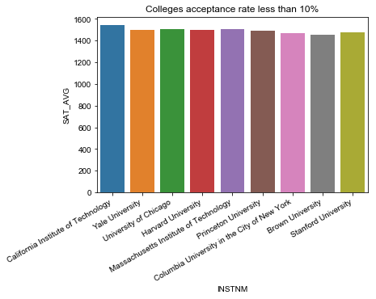


Colleges acceptance rate less than 25% by SAT or ACT score


```python
rate_accept_25prc = accept_df[(accept_df['ADM_RATE'] > 0) & (accept_df['ADM_RATE'] < 0.25)]
len(rate_accept_25prc)
```


    68


```python
#Plot

xticks = ['New England', 'Mid East','Great Lakes','Plains', 'Southeast','Southwest','Rocky Mountains','Far West','Outlying Areas']
sn_acceptance_rate_sat_25prc = sns.boxplot(x="REGION", y="ACTCMMID", data=rate_accept_25prc)
sn_acceptance_rate_sat_25prc.set_xticklabels(xticks,rotation=30)
sns.set(rc={'figure.figsize':(10, 8)})
plt.title("Colleges acceptance rate less than 25% by ACT score and region")
plt.savefig("AcceptanceRateLess25%ByRegion.png")
plt.show()
```


Colleges acceptance rate less than 50% by SAT or ACT score


```python
sn_rate_accept_50prc = accept_df[(accept_df['ADM_RATE'] > 0) & (accept_df['ADM_RATE'] < 0.5)]
len(sn_rate_accept_50prc)
```


    325


```python
sn_plot_acceptance_sat_avg = sns.boxplot(x="REGION", y="SAT_AVG", width=0.9, data=sn_rate_accept_50prc, color="blue")
sns.set(rc={'figure.figsize':(10,8)})
sn_plot_acceptance_sat_avg.set_xticklabels(xticks,rotation=30)
plt.title("Colleges acceptance rate less  than 50% by region")
plt.show()
```


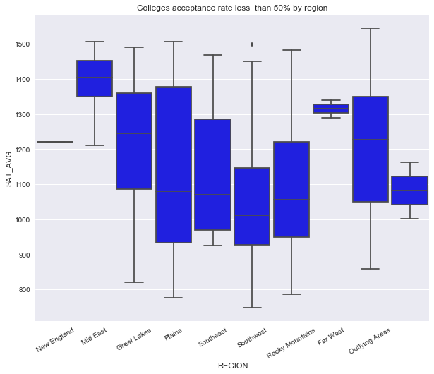


Colleges acceptance rate less than 50% by State


```python
sn_acceptance_rate_sat = sns.boxplot(x="STABBR", y="SAT_AVG", data=sn_rate_accept_50prc)
sns.set(rc={'figure.figsize':(23,9)})
plt.title("Colleges acceptance rate less  than 50% by state")
plt.savefig("AcceptanceRateLess50%ByStates.png")
plt.show()
```


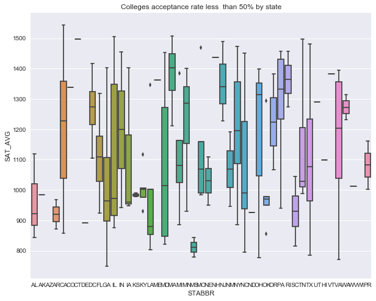


Graduation Data Analysis

Distribution of Institutions across the Nation


```python
#Plot distribution of Institutions across the Nation
list_data=df[['LATITUDE','LONGITUDE','C150_4_WHITE']]
list_data=list_data.dropna()
a=list_data.values.tolist()
m=folium.Map([41.8781, -87.6298], zoom_start=1)
HeatMap(a).add_to(m)
#m - - Map does not display correctly in markdown. Please view in the Plots folder

```


    <folium.plugins.heat_map.HeatMap at 0x1a149bc128>


```python
#Scatter plot Race Vs Acceptance

plt.scatter(df['C150_4_WHITE'], df['SAT_AVG'], s=df['C150_4_WHITE']*500, c='w', edgecolors='black', alpha=.5, label='White')
plt.scatter(df['C150_4_BLACK']+2, df['SAT_AVG'], s=df['C150_4_BLACK']*500, c='black', edgecolors='white', alpha=.5, label='Black')
plt.scatter(df['C150_4_ASIAN']+4, df['SAT_AVG'], s=df['C150_4_ASIAN']*500,  c='yellow', edgecolors='black', alpha=.5, label='Asian')
plt.scatter(df['C150_4_HISP']+6, df['SAT_AVG'], s=df['C150_4_HISP']*500, c='orange', edgecolors='black', alpha=.5, label='Hisponic')
plt.scatter(df['C150_4_2MOR']+8, df['SAT_AVG'], s=df['C150_4_2MOR']*500, c='green', edgecolors='black', alpha=.5, label='Other')

plt.legend(fontsize='small', loc="lower right",
           title="Races", 
            labelspacing=0.1,
           mode="Expanded")
plt.xlim(-1, 11)
plt.title('Race Vs Acceptance')
plt.savefig('./RaceVsAcceptance')
```


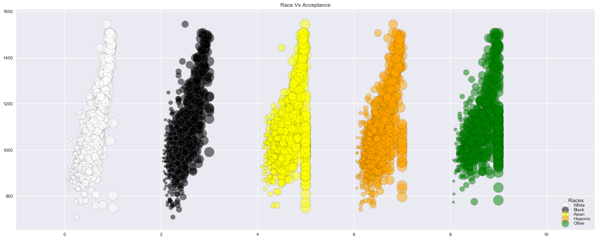


```python
#Scatter plot Race Vs Graduation

plt.scatter(df['C150_4_WHITE'], df['C150_4'], s=df['C150_4_WHITE']*500, c='w', edgecolors='black', alpha=.5, label='White')
plt.scatter(df['C150_4_BLACK']+2, df['C150_4'], s=df['C150_4_BLACK']*500, c='black', edgecolors='white', alpha=.5, label='Black')
plt.scatter(df['C150_4_ASIAN']+4, df['C150_4'], s=df['C150_4_ASIAN']*500,  c='yellow', edgecolors='black', alpha=.5, label='Asian')
plt.scatter(df['C150_4_HISP']+6, df['C150_4'], s=df['C150_4_HISP']*500, c='orange', edgecolors='black', alpha=.5, label='Hisponic')
plt.scatter(df['C150_4_2MOR']+8, df['C150_4'], s=df['C150_4_2MOR']*500, c='green', edgecolors='black', alpha=.5, label='Other')

plt.legend(fontsize='small', loc="lower right",
           title="Races", 
            labelspacing=0.1,
           mode="Expanded")
plt.xlim(-1, 11)
plt.title("Race Vs Graduation")
plt.savefig('./RaceVsGraduation')
```


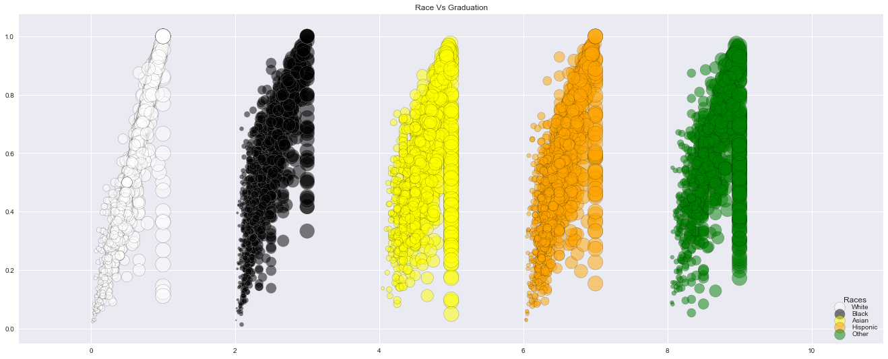


```python
#Scatter plot Acceptance Rate (SAT) Vs Graduation Rate

sns.set(color_codes=True)
sns.lmplot(x='C150_4', y='SAT_AVG', data=df,size=8, legend=True,
           legend_out=True,truncate=True, aspect=1.5,
           scatter_kws = {"color":"lightblue",
                          'alpha':0.5, "s":100,'linewidths':1
                          ,'edgecolor':'black', 'marker':'o'})
plt.xlabel('Graduation Rate')
plt.ylabel('Accepance')
plt.title('Acceptance Rate(SAT) Vs Graduation Rate')
plt.savefig('./AcceptVsGrad')
```


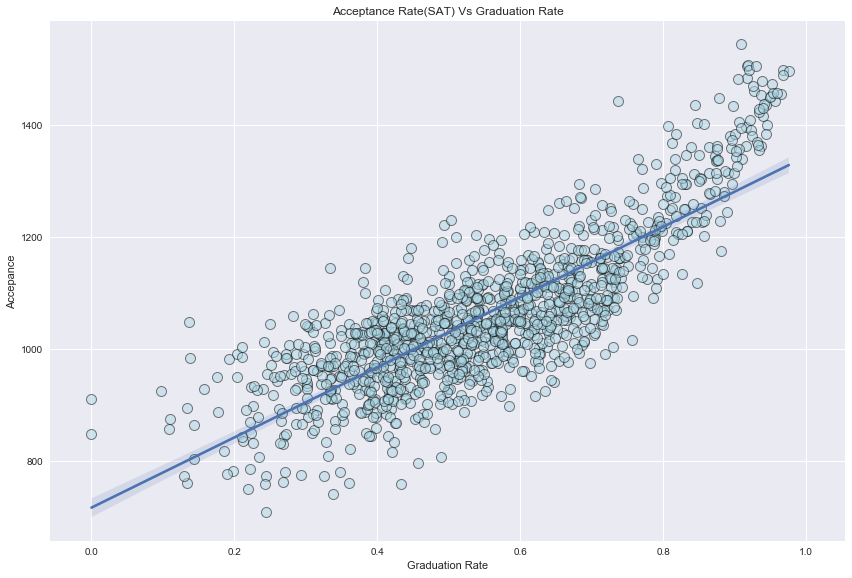


```python
#Scatter plot Acceptance Rate (SAT) Vs Graduation Rate Vs Cost

plt.scatter(df['C150_4'],df['SAT_AVG'], s=df['COSTT4_A']/200, c='skyblue', edgecolors='black', linewidths=1.5)
plt.grid()
plt.title("SAT vs Graduation vs Cost")
plt.xlabel("Graduation Rate")
plt.ylabel("SAT Score")
plt.savefig('./SATvsGradvsCost')
```


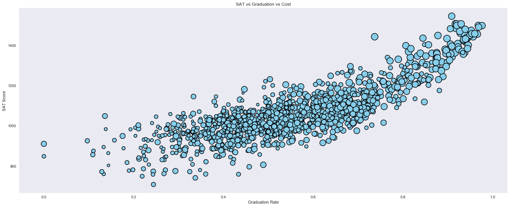


Cost Analysis


```python

#Remove any NULL values for cost
bachelors_df = df[np.isfinite(df['COSTT4_A'])]
bachelors_df.head()
```


<div>
<style>
    .dataframe thead tr:only-child th {
        text-align: right;
    }

    .dataframe thead th {
        text-align: left;
    }

    .dataframe tbody tr th {
        vertical-align: top;
    }
</style>
<table border="1" class="dataframe">
  <thead>
    <tr style="text-align: right;">
      <th></th>
      <th>Unnamed: 0</th>
      <th>UNITID</th>
      <th>INSTNM</th>
      <th>CITY</th>
      <th>STABBR</th>
      <th>REGION</th>
      <th>LATITUDE</th>
      <th>LONGITUDE</th>
      <th>PREDDEG</th>
      <th>COSTT4_A</th>
      <th>...</th>
      <th>C150_4_HISP</th>
      <th>C150_4_ASIAN</th>
      <th>C150_4_AIAN</th>
      <th>C150_4_NHPI</th>
      <th>C150_4_2MOR</th>
      <th>C150_4_NRA</th>
      <th>C150_4_UNKN</th>
      <th>ADM_RATE</th>
      <th>SAT_AVG</th>
      <th>ACTCMMID</th>
    </tr>
  </thead>
  <tbody>
    <tr>
      <th>0</th>
      <td>0</td>
      <td>100654</td>
      <td>Alabama A &amp; M University</td>
      <td>Normal</td>
      <td>AL</td>
      <td>5</td>
      <td>34.783368</td>
      <td>-86.568502</td>
      <td>3</td>
      <td>20809.0</td>
      <td>...</td>
      <td>0.0000</td>
      <td>0.0000</td>
      <td>0.3333</td>
      <td>NaN</td>
      <td>NaN</td>
      <td>NaN</td>
      <td>0.0000</td>
      <td>0.6538</td>
      <td>850.0</td>
      <td>18.0</td>
    </tr>
    <tr>
      <th>1</th>
      <td>1</td>
      <td>100663</td>
      <td>University of Alabama at Birmingham</td>
      <td>Birmingham</td>
      <td>AL</td>
      <td>5</td>
      <td>33.502230</td>
      <td>-86.809170</td>
      <td>3</td>
      <td>22232.0</td>
      <td>...</td>
      <td>0.5946</td>
      <td>0.7722</td>
      <td>0.5000</td>
      <td>1.0</td>
      <td>0.7222</td>
      <td>0.6875</td>
      <td>0.4146</td>
      <td>0.6043</td>
      <td>1147.0</td>
      <td>25.0</td>
    </tr>
    <tr>
      <th>2</th>
      <td>2</td>
      <td>100690</td>
      <td>Amridge University</td>
      <td>Montgomery</td>
      <td>AL</td>
      <td>5</td>
      <td>32.362609</td>
      <td>-86.174010</td>
      <td>3</td>
      <td>12133.0</td>
      <td>...</td>
      <td>0.0000</td>
      <td>NaN</td>
      <td>NaN</td>
      <td>NaN</td>
      <td>NaN</td>
      <td>NaN</td>
      <td>NaN</td>
      <td>NaN</td>
      <td>NaN</td>
      <td>NaN</td>
    </tr>
    <tr>
      <th>3</th>
      <td>3</td>
      <td>100706</td>
      <td>University of Alabama in Huntsville</td>
      <td>Huntsville</td>
      <td>AL</td>
      <td>5</td>
      <td>34.722818</td>
      <td>-86.638420</td>
      <td>3</td>
      <td>20999.0</td>
      <td>...</td>
      <td>0.2800</td>
      <td>0.5333</td>
      <td>0.3636</td>
      <td>1.0</td>
      <td>0.4375</td>
      <td>0.6471</td>
      <td>0.7500</td>
      <td>0.8120</td>
      <td>1221.0</td>
      <td>27.0</td>
    </tr>
    <tr>
      <th>4</th>
      <td>4</td>
      <td>100724</td>
      <td>Alabama State University</td>
      <td>Montgomery</td>
      <td>AL</td>
      <td>5</td>
      <td>32.364317</td>
      <td>-86.295677</td>
      <td>3</td>
      <td>18100.0</td>
      <td>...</td>
      <td>NaN</td>
      <td>1.0000</td>
      <td>1.0000</td>
      <td>0.0</td>
      <td>NaN</td>
      <td>0.0000</td>
      <td>0.2667</td>
      <td>0.4639</td>
      <td>844.0</td>
      <td>18.0</td>
    </tr>
  </tbody>
</table>
<p>5 rows × 27 columns</p>
</div>


```python
#Find the median latitude and logitude
middle_lat = bachelors_df['LATITUDE'].median()
middle_lon = bachelors_df['LONGITUDE'].median()

#Create a color scale for cost
colormap = linear.YlOrRd.scale(
    bachelors_df['COSTT4_A'].min(),
    bachelors_df['COSTT4_A'].max())

colormap
```


<svg height="50" width="500"><line x1="0" y1="0" x2="0" y2="20" style="stroke:#ffffb2;stroke-width:3;" /><line x1="1" y1="0" x2="1" y2="20" style="stroke:#ffffb1;stroke-width:3;" /><line x1="2" y1="0" x2="2" y2="20" style="stroke:#ffffb1;stroke-width:3;" /><line x1="3" y1="0" x2="3" y2="20" style="stroke:#fffeb0;stroke-width:3;" /><line x1="4" y1="0" x2="4" y2="20" style="stroke:#fffeaf;stroke-width:3;" /><line x1="5" y1="0" x2="5" y2="20" style="stroke:#fffdaf;stroke-width:3;" /><line x1="6" y1="0" x2="6" y2="20" style="stroke:#fffdae;stroke-width:3;" /><line x1="7" y1="0" x2="7" y2="20" style="stroke:#fffcad;stroke-width:3;" /><line x1="8" y1="0" x2="8" y2="20" style="stroke:#fffcac;stroke-width:3;" /><line x1="9" y1="0" x2="9" y2="20" style="stroke:#fffbac;stroke-width:3;" /><line x1="10" y1="0" x2="10" y2="20" style="stroke:#fffbab;stroke-width:3;" /><line x1="11" y1="0" x2="11" y2="20" style="stroke:#fffaaa;stroke-width:3;" /><line x1="12" y1="0" x2="12" y2="20" style="stroke:#fffaaa;stroke-width:3;" /><line x1="13" y1="0" x2="13" y2="20" style="stroke:#fffaa9;stroke-width:3;" /><line x1="14" y1="0" x2="14" y2="20" style="stroke:#fff9a8;stroke-width:3;" /><line x1="15" y1="0" x2="15" y2="20" style="stroke:#fff9a7;stroke-width:3;" /><line x1="16" y1="0" x2="16" y2="20" style="stroke:#fff8a7;stroke-width:3;" /><line x1="17" y1="0" x2="17" y2="20" style="stroke:#fff8a6;stroke-width:3;" /><line x1="18" y1="0" x2="18" y2="20" style="stroke:#fff7a5;stroke-width:3;" /><line x1="19" y1="0" x2="19" y2="20" style="stroke:#fff7a4;stroke-width:3;" /><line x1="20" y1="0" x2="20" y2="20" style="stroke:#fff6a4;stroke-width:3;" /><line x1="21" y1="0" x2="21" y2="20" style="stroke:#fff6a3;stroke-width:3;" /><line x1="22" y1="0" x2="22" y2="20" style="stroke:#fff5a2;stroke-width:3;" /><line x1="23" y1="0" x2="23" y2="20" style="stroke:#fff5a2;stroke-width:3;" /><line x1="24" y1="0" x2="24" y2="20" style="stroke:#fff4a1;stroke-width:3;" /><line x1="25" y1="0" x2="25" y2="20" style="stroke:#fff4a0;stroke-width:3;" /><line x1="26" y1="0" x2="26" y2="20" style="stroke:#fff49f;stroke-width:3;" /><line x1="27" y1="0" x2="27" y2="20" style="stroke:#fff39f;stroke-width:3;" /><line x1="28" y1="0" x2="28" y2="20" style="stroke:#fff39e;stroke-width:3;" /><line x1="29" y1="0" x2="29" y2="20" style="stroke:#fff29d;stroke-width:3;" /><line x1="30" y1="0" x2="30" y2="20" style="stroke:#fff29c;stroke-width:3;" /><line x1="31" y1="0" x2="31" y2="20" style="stroke:#fff19c;stroke-width:3;" /><line x1="32" y1="0" x2="32" y2="20" style="stroke:#fff19b;stroke-width:3;" /><line x1="33" y1="0" x2="33" y2="20" style="stroke:#fff09a;stroke-width:3;" /><line x1="34" y1="0" x2="34" y2="20" style="stroke:#fff09a;stroke-width:3;" /><line x1="35" y1="0" x2="35" y2="20" style="stroke:#ffef99;stroke-width:3;" /><line x1="36" y1="0" x2="36" y2="20" style="stroke:#ffef98;stroke-width:3;" /><line x1="37" y1="0" x2="37" y2="20" style="stroke:#ffef97;stroke-width:3;" /><line x1="38" y1="0" x2="38" y2="20" style="stroke:#ffee97;stroke-width:3;" /><line x1="39" y1="0" x2="39" y2="20" style="stroke:#ffee96;stroke-width:3;" /><line x1="40" y1="0" x2="40" y2="20" style="stroke:#ffed95;stroke-width:3;" /><line x1="41" y1="0" x2="41" y2="20" style="stroke:#ffed95;stroke-width:3;" /><line x1="42" y1="0" x2="42" y2="20" style="stroke:#ffec94;stroke-width:3;" /><line x1="43" y1="0" x2="43" y2="20" style="stroke:#ffec93;stroke-width:3;" /><line x1="44" y1="0" x2="44" y2="20" style="stroke:#ffeb92;stroke-width:3;" /><line x1="45" y1="0" x2="45" y2="20" style="stroke:#ffeb92;stroke-width:3;" /><line x1="46" y1="0" x2="46" y2="20" style="stroke:#ffea91;stroke-width:3;" /><line x1="47" y1="0" x2="47" y2="20" style="stroke:#ffea90;stroke-width:3;" /><line x1="48" y1="0" x2="48" y2="20" style="stroke:#ffe98f;stroke-width:3;" /><line x1="49" y1="0" x2="49" y2="20" style="stroke:#ffe98f;stroke-width:3;" /><line x1="50" y1="0" x2="50" y2="20" style="stroke:#ffe98e;stroke-width:3;" /><line x1="51" y1="0" x2="51" y2="20" style="stroke:#ffe88d;stroke-width:3;" /><line x1="52" y1="0" x2="52" y2="20" style="stroke:#ffe88d;stroke-width:3;" /><line x1="53" y1="0" x2="53" y2="20" style="stroke:#ffe78c;stroke-width:3;" /><line x1="54" y1="0" x2="54" y2="20" style="stroke:#ffe78b;stroke-width:3;" /><line x1="55" y1="0" x2="55" y2="20" style="stroke:#ffe68a;stroke-width:3;" /><line x1="56" y1="0" x2="56" y2="20" style="stroke:#ffe68a;stroke-width:3;" /><line x1="57" y1="0" x2="57" y2="20" style="stroke:#ffe589;stroke-width:3;" /><line x1="58" y1="0" x2="58" y2="20" style="stroke:#ffe588;stroke-width:3;" /><line x1="59" y1="0" x2="59" y2="20" style="stroke:#ffe487;stroke-width:3;" /><line x1="60" y1="0" x2="60" y2="20" style="stroke:#ffe487;stroke-width:3;" /><line x1="61" y1="0" x2="61" y2="20" style="stroke:#ffe486;stroke-width:3;" /><line x1="62" y1="0" x2="62" y2="20" style="stroke:#ffe385;stroke-width:3;" /><line x1="63" y1="0" x2="63" y2="20" style="stroke:#ffe385;stroke-width:3;" /><line x1="64" y1="0" x2="64" y2="20" style="stroke:#ffe284;stroke-width:3;" /><line x1="65" y1="0" x2="65" y2="20" style="stroke:#ffe283;stroke-width:3;" /><line x1="66" y1="0" x2="66" y2="20" style="stroke:#ffe182;stroke-width:3;" /><line x1="67" y1="0" x2="67" y2="20" style="stroke:#ffe182;stroke-width:3;" /><line x1="68" y1="0" x2="68" y2="20" style="stroke:#ffe081;stroke-width:3;" /><line x1="69" y1="0" x2="69" y2="20" style="stroke:#ffe080;stroke-width:3;" /><line x1="70" y1="0" x2="70" y2="20" style="stroke:#ffdf7f;stroke-width:3;" /><line x1="71" y1="0" x2="71" y2="20" style="stroke:#ffdf7f;stroke-width:3;" /><line x1="72" y1="0" x2="72" y2="20" style="stroke:#ffde7e;stroke-width:3;" /><line x1="73" y1="0" x2="73" y2="20" style="stroke:#ffde7d;stroke-width:3;" /><line x1="74" y1="0" x2="74" y2="20" style="stroke:#ffde7d;stroke-width:3;" /><line x1="75" y1="0" x2="75" y2="20" style="stroke:#ffdd7c;stroke-width:3;" /><line x1="76" y1="0" x2="76" y2="20" style="stroke:#ffdd7b;stroke-width:3;" /><line x1="77" y1="0" x2="77" y2="20" style="stroke:#ffdc7a;stroke-width:3;" /><line x1="78" y1="0" x2="78" y2="20" style="stroke:#ffdc7a;stroke-width:3;" /><line x1="79" y1="0" x2="79" y2="20" style="stroke:#ffdb79;stroke-width:3;" /><line x1="80" y1="0" x2="80" y2="20" style="stroke:#ffdb78;stroke-width:3;" /><line x1="81" y1="0" x2="81" y2="20" style="stroke:#ffda78;stroke-width:3;" /><line x1="82" y1="0" x2="82" y2="20" style="stroke:#ffda77;stroke-width:3;" /><line x1="83" y1="0" x2="83" y2="20" style="stroke:#fed976;stroke-width:3;" /><line x1="84" y1="0" x2="84" y2="20" style="stroke:#fed976;stroke-width:3;" /><line x1="85" y1="0" x2="85" y2="20" style="stroke:#fed875;stroke-width:3;" /><line x1="86" y1="0" x2="86" y2="20" style="stroke:#fed875;stroke-width:3;" /><line x1="87" y1="0" x2="87" y2="20" style="stroke:#fed874;stroke-width:3;" /><line x1="88" y1="0" x2="88" y2="20" style="stroke:#fed774;stroke-width:3;" /><line x1="89" y1="0" x2="89" y2="20" style="stroke:#fed773;stroke-width:3;" /><line x1="90" y1="0" x2="90" y2="20" style="stroke:#fed672;stroke-width:3;" /><line x1="91" y1="0" x2="91" y2="20" style="stroke:#fed672;stroke-width:3;" /><line x1="92" y1="0" x2="92" y2="20" style="stroke:#fed571;stroke-width:3;" /><line x1="93" y1="0" x2="93" y2="20" style="stroke:#fed571;stroke-width:3;" /><line x1="94" y1="0" x2="94" y2="20" style="stroke:#fed470;stroke-width:3;" /><line x1="95" y1="0" x2="95" y2="20" style="stroke:#fed470;stroke-width:3;" /><line x1="96" y1="0" x2="96" y2="20" style="stroke:#fed36f;stroke-width:3;" /><line x1="97" y1="0" x2="97" y2="20" style="stroke:#fed36f;stroke-width:3;" /><line x1="98" y1="0" x2="98" y2="20" style="stroke:#fed26e;stroke-width:3;" /><line x1="99" y1="0" x2="99" y2="20" style="stroke:#fed26e;stroke-width:3;" /><line x1="100" y1="0" x2="100" y2="20" style="stroke:#fed16d;stroke-width:3;" /><line x1="101" y1="0" x2="101" y2="20" style="stroke:#fed16d;stroke-width:3;" /><line x1="102" y1="0" x2="102" y2="20" style="stroke:#fed06c;stroke-width:3;" /><line x1="103" y1="0" x2="103" y2="20" style="stroke:#fed06c;stroke-width:3;" /><line x1="104" y1="0" x2="104" y2="20" style="stroke:#fed06b;stroke-width:3;" /><line x1="105" y1="0" x2="105" y2="20" style="stroke:#fecf6b;stroke-width:3;" /><line x1="106" y1="0" x2="106" y2="20" style="stroke:#fecf6a;stroke-width:3;" /><line x1="107" y1="0" x2="107" y2="20" style="stroke:#fece6a;stroke-width:3;" /><line x1="108" y1="0" x2="108" y2="20" style="stroke:#fece69;stroke-width:3;" /><line x1="109" y1="0" x2="109" y2="20" style="stroke:#fecd69;stroke-width:3;" /><line x1="110" y1="0" x2="110" y2="20" style="stroke:#fecd68;stroke-width:3;" /><line x1="111" y1="0" x2="111" y2="20" style="stroke:#fecc68;stroke-width:3;" /><line x1="112" y1="0" x2="112" y2="20" style="stroke:#fecc67;stroke-width:3;" /><line x1="113" y1="0" x2="113" y2="20" style="stroke:#fecb67;stroke-width:3;" /><line x1="114" y1="0" x2="114" y2="20" style="stroke:#fecb66;stroke-width:3;" /><line x1="115" y1="0" x2="115" y2="20" style="stroke:#feca66;stroke-width:3;" /><line x1="116" y1="0" x2="116" y2="20" style="stroke:#feca65;stroke-width:3;" /><line x1="117" y1="0" x2="117" y2="20" style="stroke:#fec965;stroke-width:3;" /><line x1="118" y1="0" x2="118" y2="20" style="stroke:#fec964;stroke-width:3;" /><line x1="119" y1="0" x2="119" y2="20" style="stroke:#fec864;stroke-width:3;" /><line x1="120" y1="0" x2="120" y2="20" style="stroke:#fec863;stroke-width:3;" /><line x1="121" y1="0" x2="121" y2="20" style="stroke:#fec863;stroke-width:3;" /><line x1="122" y1="0" x2="122" y2="20" style="stroke:#fec762;stroke-width:3;" /><line x1="123" y1="0" x2="123" y2="20" style="stroke:#fec762;stroke-width:3;" /><line x1="124" y1="0" x2="124" y2="20" style="stroke:#fec661;stroke-width:3;" /><line x1="125" y1="0" x2="125" y2="20" style="stroke:#fec661;stroke-width:3;" /><line x1="126" y1="0" x2="126" y2="20" style="stroke:#fec560;stroke-width:3;" /><line x1="127" y1="0" x2="127" y2="20" style="stroke:#fec560;stroke-width:3;" /><line x1="128" y1="0" x2="128" y2="20" style="stroke:#fec45f;stroke-width:3;" /><line x1="129" y1="0" x2="129" y2="20" style="stroke:#fec45f;stroke-width:3;" /><line x1="130" y1="0" x2="130" y2="20" style="stroke:#fec35e;stroke-width:3;" /><line x1="131" y1="0" x2="131" y2="20" style="stroke:#fec35e;stroke-width:3;" /><line x1="132" y1="0" x2="132" y2="20" style="stroke:#fec25d;stroke-width:3;" /><line x1="133" y1="0" x2="133" y2="20" style="stroke:#fec25d;stroke-width:3;" /><line x1="134" y1="0" x2="134" y2="20" style="stroke:#fec15c;stroke-width:3;" /><line x1="135" y1="0" x2="135" y2="20" style="stroke:#fec15c;stroke-width:3;" /><line x1="136" y1="0" x2="136" y2="20" style="stroke:#fec05b;stroke-width:3;" /><line x1="137" y1="0" x2="137" y2="20" style="stroke:#fec05b;stroke-width:3;" /><line x1="138" y1="0" x2="138" y2="20" style="stroke:#fec05a;stroke-width:3;" /><line x1="139" y1="0" x2="139" y2="20" style="stroke:#febf5a;stroke-width:3;" /><line x1="140" y1="0" x2="140" y2="20" style="stroke:#febf59;stroke-width:3;" /><line x1="141" y1="0" x2="141" y2="20" style="stroke:#febe59;stroke-width:3;" /><line x1="142" y1="0" x2="142" y2="20" style="stroke:#febe58;stroke-width:3;" /><line x1="143" y1="0" x2="143" y2="20" style="stroke:#febd58;stroke-width:3;" /><line x1="144" y1="0" x2="144" y2="20" style="stroke:#febd57;stroke-width:3;" /><line x1="145" y1="0" x2="145" y2="20" style="stroke:#febc57;stroke-width:3;" /><line x1="146" y1="0" x2="146" y2="20" style="stroke:#febc56;stroke-width:3;" /><line x1="147" y1="0" x2="147" y2="20" style="stroke:#febb56;stroke-width:3;" /><line x1="148" y1="0" x2="148" y2="20" style="stroke:#febb55;stroke-width:3;" /><line x1="149" y1="0" x2="149" y2="20" style="stroke:#feba55;stroke-width:3;" /><line x1="150" y1="0" x2="150" y2="20" style="stroke:#feba54;stroke-width:3;" /><line x1="151" y1="0" x2="151" y2="20" style="stroke:#feb954;stroke-width:3;" /><line x1="152" y1="0" x2="152" y2="20" style="stroke:#feb953;stroke-width:3;" /><line x1="153" y1="0" x2="153" y2="20" style="stroke:#feb853;stroke-width:3;" /><line x1="154" y1="0" x2="154" y2="20" style="stroke:#feb852;stroke-width:3;" /><line x1="155" y1="0" x2="155" y2="20" style="stroke:#feb852;stroke-width:3;" /><line x1="156" y1="0" x2="156" y2="20" style="stroke:#feb751;stroke-width:3;" /><line x1="157" y1="0" x2="157" y2="20" style="stroke:#feb751;stroke-width:3;" /><line x1="158" y1="0" x2="158" y2="20" style="stroke:#feb650;stroke-width:3;" /><line x1="159" y1="0" x2="159" y2="20" style="stroke:#feb650;stroke-width:3;" /><line x1="160" y1="0" x2="160" y2="20" style="stroke:#feb54f;stroke-width:3;" /><line x1="161" y1="0" x2="161" y2="20" style="stroke:#feb54f;stroke-width:3;" /><line x1="162" y1="0" x2="162" y2="20" style="stroke:#feb44e;stroke-width:3;" /><line x1="163" y1="0" x2="163" y2="20" style="stroke:#feb44d;stroke-width:3;" /><line x1="164" y1="0" x2="164" y2="20" style="stroke:#feb34d;stroke-width:3;" /><line x1="165" y1="0" x2="165" y2="20" style="stroke:#feb34c;stroke-width:3;" /><line x1="166" y1="0" x2="166" y2="20" style="stroke:#feb24c;stroke-width:3;" /><line x1="167" y1="0" x2="167" y2="20" style="stroke:#feb24c;stroke-width:3;" /><line x1="168" y1="0" x2="168" y2="20" style="stroke:#feb14b;stroke-width:3;" /><line x1="169" y1="0" x2="169" y2="20" style="stroke:#feb14b;stroke-width:3;" /><line x1="170" y1="0" x2="170" y2="20" style="stroke:#feb14b;stroke-width:3;" /><line x1="171" y1="0" x2="171" y2="20" style="stroke:#feb04b;stroke-width:3;" /><line x1="172" y1="0" x2="172" y2="20" style="stroke:#feb04b;stroke-width:3;" /><line x1="173" y1="0" x2="173" y2="20" style="stroke:#feaf4b;stroke-width:3;" /><line x1="174" y1="0" x2="174" y2="20" style="stroke:#feaf4a;stroke-width:3;" /><line x1="175" y1="0" x2="175" y2="20" style="stroke:#feae4a;stroke-width:3;" /><line x1="176" y1="0" x2="176" y2="20" style="stroke:#feae4a;stroke-width:3;" /><line x1="177" y1="0" x2="177" y2="20" style="stroke:#fead4a;stroke-width:3;" /><line x1="178" y1="0" x2="178" y2="20" style="stroke:#fead4a;stroke-width:3;" /><line x1="179" y1="0" x2="179" y2="20" style="stroke:#fead49;stroke-width:3;" /><line x1="180" y1="0" x2="180" y2="20" style="stroke:#feac49;stroke-width:3;" /><line x1="181" y1="0" x2="181" y2="20" style="stroke:#feac49;stroke-width:3;" /><line x1="182" y1="0" x2="182" y2="20" style="stroke:#feab49;stroke-width:3;" /><line x1="183" y1="0" x2="183" y2="20" style="stroke:#feab49;stroke-width:3;" /><line x1="184" y1="0" x2="184" y2="20" style="stroke:#feaa48;stroke-width:3;" /><line x1="185" y1="0" x2="185" y2="20" style="stroke:#feaa48;stroke-width:3;" /><line x1="186" y1="0" x2="186" y2="20" style="stroke:#fea948;stroke-width:3;" /><line x1="187" y1="0" x2="187" y2="20" style="stroke:#fea948;stroke-width:3;" /><line x1="188" y1="0" x2="188" y2="20" style="stroke:#fea948;stroke-width:3;" /><line x1="189" y1="0" x2="189" y2="20" style="stroke:#fea847;stroke-width:3;" /><line x1="190" y1="0" x2="190" y2="20" style="stroke:#fea847;stroke-width:3;" /><line x1="191" y1="0" x2="191" y2="20" style="stroke:#fea747;stroke-width:3;" /><line x1="192" y1="0" x2="192" y2="20" style="stroke:#fea747;stroke-width:3;" /><line x1="193" y1="0" x2="193" y2="20" style="stroke:#fea647;stroke-width:3;" /><line x1="194" y1="0" x2="194" y2="20" style="stroke:#fea646;stroke-width:3;" /><line x1="195" y1="0" x2="195" y2="20" style="stroke:#fea546;stroke-width:3;" /><line x1="196" y1="0" x2="196" y2="20" style="stroke:#fea546;stroke-width:3;" /><line x1="197" y1="0" x2="197" y2="20" style="stroke:#fea546;stroke-width:3;" /><line x1="198" y1="0" x2="198" y2="20" style="stroke:#fea446;stroke-width:3;" /><line x1="199" y1="0" x2="199" y2="20" style="stroke:#fea445;stroke-width:3;" /><line x1="200" y1="0" x2="200" y2="20" style="stroke:#fea345;stroke-width:3;" /><line x1="201" y1="0" x2="201" y2="20" style="stroke:#fea345;stroke-width:3;" /><line x1="202" y1="0" x2="202" y2="20" style="stroke:#fea245;stroke-width:3;" /><line x1="203" y1="0" x2="203" y2="20" style="stroke:#fea245;stroke-width:3;" /><line x1="204" y1="0" x2="204" y2="20" style="stroke:#fea145;stroke-width:3;" /><line x1="205" y1="0" x2="205" y2="20" style="stroke:#fea144;stroke-width:3;" /><line x1="206" y1="0" x2="206" y2="20" style="stroke:#fea044;stroke-width:3;" /><line x1="207" y1="0" x2="207" y2="20" style="stroke:#fea044;stroke-width:3;" /><line x1="208" y1="0" x2="208" y2="20" style="stroke:#fea044;stroke-width:3;" /><line x1="209" y1="0" x2="209" y2="20" style="stroke:#fe9f44;stroke-width:3;" /><line x1="210" y1="0" x2="210" y2="20" style="stroke:#fe9f43;stroke-width:3;" /><line x1="211" y1="0" x2="211" y2="20" style="stroke:#fe9e43;stroke-width:3;" /><line x1="212" y1="0" x2="212" y2="20" style="stroke:#fe9e43;stroke-width:3;" /><line x1="213" y1="0" x2="213" y2="20" style="stroke:#fe9d43;stroke-width:3;" /><line x1="214" y1="0" x2="214" y2="20" style="stroke:#fe9d43;stroke-width:3;" /><line x1="215" y1="0" x2="215" y2="20" style="stroke:#fe9c42;stroke-width:3;" /><line x1="216" y1="0" x2="216" y2="20" style="stroke:#fe9c42;stroke-width:3;" /><line x1="217" y1="0" x2="217" y2="20" style="stroke:#fe9c42;stroke-width:3;" /><line x1="218" y1="0" x2="218" y2="20" style="stroke:#fe9b42;stroke-width:3;" /><line x1="219" y1="0" x2="219" y2="20" style="stroke:#fe9b42;stroke-width:3;" /><line x1="220" y1="0" x2="220" y2="20" style="stroke:#fe9a41;stroke-width:3;" /><line x1="221" y1="0" x2="221" y2="20" style="stroke:#fe9a41;stroke-width:3;" /><line x1="222" y1="0" x2="222" y2="20" style="stroke:#fe9941;stroke-width:3;" /><line x1="223" y1="0" x2="223" y2="20" style="stroke:#fe9941;stroke-width:3;" /><line x1="224" y1="0" x2="224" y2="20" style="stroke:#fe9841;stroke-width:3;" /><line x1="225" y1="0" x2="225" y2="20" style="stroke:#fe9840;stroke-width:3;" /><line x1="226" y1="0" x2="226" y2="20" style="stroke:#fe9840;stroke-width:3;" /><line x1="227" y1="0" x2="227" y2="20" style="stroke:#fe9740;stroke-width:3;" /><line x1="228" y1="0" x2="228" y2="20" style="stroke:#fe9740;stroke-width:3;" /><line x1="229" y1="0" x2="229" y2="20" style="stroke:#fe9640;stroke-width:3;" /><line x1="230" y1="0" x2="230" y2="20" style="stroke:#fe9640;stroke-width:3;" /><line x1="231" y1="0" x2="231" y2="20" style="stroke:#fe953f;stroke-width:3;" /><line x1="232" y1="0" x2="232" y2="20" style="stroke:#fe953f;stroke-width:3;" /><line x1="233" y1="0" x2="233" y2="20" style="stroke:#fe943f;stroke-width:3;" /><line x1="234" y1="0" x2="234" y2="20" style="stroke:#fe943f;stroke-width:3;" /><line x1="235" y1="0" x2="235" y2="20" style="stroke:#fe943f;stroke-width:3;" /><line x1="236" y1="0" x2="236" y2="20" style="stroke:#fe933e;stroke-width:3;" /><line x1="237" y1="0" x2="237" y2="20" style="stroke:#fe933e;stroke-width:3;" /><line x1="238" y1="0" x2="238" y2="20" style="stroke:#fe923e;stroke-width:3;" /><line x1="239" y1="0" x2="239" y2="20" style="stroke:#fe923e;stroke-width:3;" /><line x1="240" y1="0" x2="240" y2="20" style="stroke:#fe913e;stroke-width:3;" /><line x1="241" y1="0" x2="241" y2="20" style="stroke:#fe913d;stroke-width:3;" /><line x1="242" y1="0" x2="242" y2="20" style="stroke:#fe903d;stroke-width:3;" /><line x1="243" y1="0" x2="243" y2="20" style="stroke:#fe903d;stroke-width:3;" /><line x1="244" y1="0" x2="244" y2="20" style="stroke:#fe903d;stroke-width:3;" /><line x1="245" y1="0" x2="245" y2="20" style="stroke:#fe8f3d;stroke-width:3;" /><line x1="246" y1="0" x2="246" y2="20" style="stroke:#fe8f3c;stroke-width:3;" /><line x1="247" y1="0" x2="247" y2="20" style="stroke:#fe8e3c;stroke-width:3;" /><line x1="248" y1="0" x2="248" y2="20" style="stroke:#fe8e3c;stroke-width:3;" /><line x1="249" y1="0" x2="249" y2="20" style="stroke:#fd8d3c;stroke-width:3;" /><line x1="250" y1="0" x2="250" y2="20" style="stroke:#fd8d3c;stroke-width:3;" /><line x1="251" y1="0" x2="251" y2="20" style="stroke:#fd8c3b;stroke-width:3;" /><line x1="252" y1="0" x2="252" y2="20" style="stroke:#fd8b3b;stroke-width:3;" /><line x1="253" y1="0" x2="253" y2="20" style="stroke:#fd8a3b;stroke-width:3;" /><line x1="254" y1="0" x2="254" y2="20" style="stroke:#fd8a3b;stroke-width:3;" /><line x1="255" y1="0" x2="255" y2="20" style="stroke:#fd893b;stroke-width:3;" /><line x1="256" y1="0" x2="256" y2="20" style="stroke:#fd883a;stroke-width:3;" /><line x1="257" y1="0" x2="257" y2="20" style="stroke:#fd873a;stroke-width:3;" /><line x1="258" y1="0" x2="258" y2="20" style="stroke:#fd873a;stroke-width:3;" /><line x1="259" y1="0" x2="259" y2="20" style="stroke:#fd863a;stroke-width:3;" /><line x1="260" y1="0" x2="260" y2="20" style="stroke:#fd8539;stroke-width:3;" /><line x1="261" y1="0" x2="261" y2="20" style="stroke:#fd8439;stroke-width:3;" /><line x1="262" y1="0" x2="262" y2="20" style="stroke:#fd8439;stroke-width:3;" /><line x1="263" y1="0" x2="263" y2="20" style="stroke:#fd8339;stroke-width:3;" /><line x1="264" y1="0" x2="264" y2="20" style="stroke:#fd8239;stroke-width:3;" /><line x1="265" y1="0" x2="265" y2="20" style="stroke:#fd8138;stroke-width:3;" /><line x1="266" y1="0" x2="266" y2="20" style="stroke:#fd8138;stroke-width:3;" /><line x1="267" y1="0" x2="267" y2="20" style="stroke:#fd8038;stroke-width:3;" /><line x1="268" y1="0" x2="268" y2="20" style="stroke:#fd7f38;stroke-width:3;" /><line x1="269" y1="0" x2="269" y2="20" style="stroke:#fd7e37;stroke-width:3;" /><line x1="270" y1="0" x2="270" y2="20" style="stroke:#fd7d37;stroke-width:3;" /><line x1="271" y1="0" x2="271" y2="20" style="stroke:#fd7d37;stroke-width:3;" /><line x1="272" y1="0" x2="272" y2="20" style="stroke:#fd7c37;stroke-width:3;" /><line x1="273" y1="0" x2="273" y2="20" style="stroke:#fd7b37;stroke-width:3;" /><line x1="274" y1="0" x2="274" y2="20" style="stroke:#fd7a36;stroke-width:3;" /><line x1="275" y1="0" x2="275" y2="20" style="stroke:#fd7a36;stroke-width:3;" /><line x1="276" y1="0" x2="276" y2="20" style="stroke:#fd7936;stroke-width:3;" /><line x1="277" y1="0" x2="277" y2="20" style="stroke:#fd7836;stroke-width:3;" /><line x1="278" y1="0" x2="278" y2="20" style="stroke:#fd7736;stroke-width:3;" /><line x1="279" y1="0" x2="279" y2="20" style="stroke:#fd7735;stroke-width:3;" /><line x1="280" y1="0" x2="280" y2="20" style="stroke:#fd7635;stroke-width:3;" /><line x1="281" y1="0" x2="281" y2="20" style="stroke:#fd7535;stroke-width:3;" /><line x1="282" y1="0" x2="282" y2="20" style="stroke:#fd7435;stroke-width:3;" /><line x1="283" y1="0" x2="283" y2="20" style="stroke:#fd7434;stroke-width:3;" /><line x1="284" y1="0" x2="284" y2="20" style="stroke:#fd7334;stroke-width:3;" /><line x1="285" y1="0" x2="285" y2="20" style="stroke:#fd7234;stroke-width:3;" /><line x1="286" y1="0" x2="286" y2="20" style="stroke:#fd7134;stroke-width:3;" /><line x1="287" y1="0" x2="287" y2="20" style="stroke:#fd7134;stroke-width:3;" /><line x1="288" y1="0" x2="288" y2="20" style="stroke:#fd7033;stroke-width:3;" /><line x1="289" y1="0" x2="289" y2="20" style="stroke:#fd6f33;stroke-width:3;" /><line x1="290" y1="0" x2="290" y2="20" style="stroke:#fd6e33;stroke-width:3;" /><line x1="291" y1="0" x2="291" y2="20" style="stroke:#fd6d33;stroke-width:3;" /><line x1="292" y1="0" x2="292" y2="20" style="stroke:#fd6d33;stroke-width:3;" /><line x1="293" y1="0" x2="293" y2="20" style="stroke:#fd6c32;stroke-width:3;" /><line x1="294" y1="0" x2="294" y2="20" style="stroke:#fd6b32;stroke-width:3;" /><line x1="295" y1="0" x2="295" y2="20" style="stroke:#fd6a32;stroke-width:3;" /><line x1="296" y1="0" x2="296" y2="20" style="stroke:#fd6a32;stroke-width:3;" /><line x1="297" y1="0" x2="297" y2="20" style="stroke:#fd6931;stroke-width:3;" /><line x1="298" y1="0" x2="298" y2="20" style="stroke:#fd6831;stroke-width:3;" /><line x1="299" y1="0" x2="299" y2="20" style="stroke:#fd6731;stroke-width:3;" /><line x1="300" y1="0" x2="300" y2="20" style="stroke:#fd6731;stroke-width:3;" /><line x1="301" y1="0" x2="301" y2="20" style="stroke:#fd6631;stroke-width:3;" /><line x1="302" y1="0" x2="302" y2="20" style="stroke:#fd6530;stroke-width:3;" /><line x1="303" y1="0" x2="303" y2="20" style="stroke:#fd6430;stroke-width:3;" /><line x1="304" y1="0" x2="304" y2="20" style="stroke:#fd6430;stroke-width:3;" /><line x1="305" y1="0" x2="305" y2="20" style="stroke:#fd6330;stroke-width:3;" /><line x1="306" y1="0" x2="306" y2="20" style="stroke:#fd622f;stroke-width:3;" /><line x1="307" y1="0" x2="307" y2="20" style="stroke:#fd612f;stroke-width:3;" /><line x1="308" y1="0" x2="308" y2="20" style="stroke:#fd612f;stroke-width:3;" /><line x1="309" y1="0" x2="309" y2="20" style="stroke:#fd602f;stroke-width:3;" /><line x1="310" y1="0" x2="310" y2="20" style="stroke:#fd5f2f;stroke-width:3;" /><line x1="311" y1="0" x2="311" y2="20" style="stroke:#fd5e2e;stroke-width:3;" /><line x1="312" y1="0" x2="312" y2="20" style="stroke:#fd5e2e;stroke-width:3;" /><line x1="313" y1="0" x2="313" y2="20" style="stroke:#fd5d2e;stroke-width:3;" /><line x1="314" y1="0" x2="314" y2="20" style="stroke:#fd5c2e;stroke-width:3;" /><line x1="315" y1="0" x2="315" y2="20" style="stroke:#fd5b2e;stroke-width:3;" /><line x1="316" y1="0" x2="316" y2="20" style="stroke:#fd5a2d;stroke-width:3;" /><line x1="317" y1="0" x2="317" y2="20" style="stroke:#fd5a2d;stroke-width:3;" /><line x1="318" y1="0" x2="318" y2="20" style="stroke:#fd592d;stroke-width:3;" /><line x1="319" y1="0" x2="319" y2="20" style="stroke:#fd582d;stroke-width:3;" /><line x1="320" y1="0" x2="320" y2="20" style="stroke:#fd572c;stroke-width:3;" /><line x1="321" y1="0" x2="321" y2="20" style="stroke:#fd572c;stroke-width:3;" /><line x1="322" y1="0" x2="322" y2="20" style="stroke:#fd562c;stroke-width:3;" /><line x1="323" y1="0" x2="323" y2="20" style="stroke:#fd552c;stroke-width:3;" /><line x1="324" y1="0" x2="324" y2="20" style="stroke:#fd542c;stroke-width:3;" /><line x1="325" y1="0" x2="325" y2="20" style="stroke:#fd542b;stroke-width:3;" /><line x1="326" y1="0" x2="326" y2="20" style="stroke:#fd532b;stroke-width:3;" /><line x1="327" y1="0" x2="327" y2="20" style="stroke:#fd522b;stroke-width:3;" /><line x1="328" y1="0" x2="328" y2="20" style="stroke:#fd512b;stroke-width:3;" /><line x1="329" y1="0" x2="329" y2="20" style="stroke:#fd512a;stroke-width:3;" /><line x1="330" y1="0" x2="330" y2="20" style="stroke:#fd502a;stroke-width:3;" /><line x1="331" y1="0" x2="331" y2="20" style="stroke:#fd4f2a;stroke-width:3;" /><line x1="332" y1="0" x2="332" y2="20" style="stroke:#fc4e2a;stroke-width:3;" /><line x1="333" y1="0" x2="333" y2="20" style="stroke:#fc4e2a;stroke-width:3;" /><line x1="334" y1="0" x2="334" y2="20" style="stroke:#fc4d29;stroke-width:3;" /><line x1="335" y1="0" x2="335" y2="20" style="stroke:#fc4c29;stroke-width:3;" /><line x1="336" y1="0" x2="336" y2="20" style="stroke:#fb4c29;stroke-width:3;" /><line x1="337" y1="0" x2="337" y2="20" style="stroke:#fb4b29;stroke-width:3;" /><line x1="338" y1="0" x2="338" y2="20" style="stroke:#fb4a29;stroke-width:3;" /><line x1="339" y1="0" x2="339" y2="20" style="stroke:#fb4a29;stroke-width:3;" /><line x1="340" y1="0" x2="340" y2="20" style="stroke:#fa4928;stroke-width:3;" /><line x1="341" y1="0" x2="341" y2="20" style="stroke:#fa4928;stroke-width:3;" /><line x1="342" y1="0" x2="342" y2="20" style="stroke:#fa4828;stroke-width:3;" /><line x1="343" y1="0" x2="343" y2="20" style="stroke:#f94728;stroke-width:3;" /><line x1="344" y1="0" x2="344" y2="20" style="stroke:#f94728;stroke-width:3;" /><line x1="345" y1="0" x2="345" y2="20" style="stroke:#f94628;stroke-width:3;" /><line x1="346" y1="0" x2="346" y2="20" style="stroke:#f84527;stroke-width:3;" /><line x1="347" y1="0" x2="347" y2="20" style="stroke:#f84527;stroke-width:3;" /><line x1="348" y1="0" x2="348" y2="20" style="stroke:#f84427;stroke-width:3;" /><line x1="349" y1="0" x2="349" y2="20" style="stroke:#f84427;stroke-width:3;" /><line x1="350" y1="0" x2="350" y2="20" style="stroke:#f74327;stroke-width:3;" /><line x1="351" y1="0" x2="351" y2="20" style="stroke:#f74227;stroke-width:3;" /><line x1="352" y1="0" x2="352" y2="20" style="stroke:#f74226;stroke-width:3;" /><line x1="353" y1="0" x2="353" y2="20" style="stroke:#f64126;stroke-width:3;" /><line x1="354" y1="0" x2="354" y2="20" style="stroke:#f64026;stroke-width:3;" /><line x1="355" y1="0" x2="355" y2="20" style="stroke:#f64026;stroke-width:3;" /><line x1="356" y1="0" x2="356" y2="20" style="stroke:#f53f26;stroke-width:3;" /><line x1="357" y1="0" x2="357" y2="20" style="stroke:#f53f26;stroke-width:3;" /><line x1="358" y1="0" x2="358" y2="20" style="stroke:#f53e25;stroke-width:3;" /><line x1="359" y1="0" x2="359" y2="20" style="stroke:#f53d25;stroke-width:3;" /><line x1="360" y1="0" x2="360" y2="20" style="stroke:#f43d25;stroke-width:3;" /><line x1="361" y1="0" x2="361" y2="20" style="stroke:#f43c25;stroke-width:3;" /><line x1="362" y1="0" x2="362" y2="20" style="stroke:#f43b25;stroke-width:3;" /><line x1="363" y1="0" x2="363" y2="20" style="stroke:#f33b25;stroke-width:3;" /><line x1="364" y1="0" x2="364" y2="20" style="stroke:#f33a24;stroke-width:3;" /><line x1="365" y1="0" x2="365" y2="20" style="stroke:#f33a24;stroke-width:3;" /><line x1="366" y1="0" x2="366" y2="20" style="stroke:#f23924;stroke-width:3;" /><line x1="367" y1="0" x2="367" y2="20" style="stroke:#f23824;stroke-width:3;" /><line x1="368" y1="0" x2="368" y2="20" style="stroke:#f23824;stroke-width:3;" /><line x1="369" y1="0" x2="369" y2="20" style="stroke:#f23724;stroke-width:3;" /><line x1="370" y1="0" x2="370" y2="20" style="stroke:#f13623;stroke-width:3;" /><line x1="371" y1="0" x2="371" y2="20" style="stroke:#f13623;stroke-width:3;" /><line x1="372" y1="0" x2="372" y2="20" style="stroke:#f13523;stroke-width:3;" /><line x1="373" y1="0" x2="373" y2="20" style="stroke:#f03423;stroke-width:3;" /><line x1="374" y1="0" x2="374" y2="20" style="stroke:#f03423;stroke-width:3;" /><line x1="375" y1="0" x2="375" y2="20" style="stroke:#f03323;stroke-width:3;" /><line x1="376" y1="0" x2="376" y2="20" style="stroke:#ef3322;stroke-width:3;" /><line x1="377" y1="0" x2="377" y2="20" style="stroke:#ef3222;stroke-width:3;" /><line x1="378" y1="0" x2="378" y2="20" style="stroke:#ef3122;stroke-width:3;" /><line x1="379" y1="0" x2="379" y2="20" style="stroke:#ef3122;stroke-width:3;" /><line x1="380" y1="0" x2="380" y2="20" style="stroke:#ee3022;stroke-width:3;" /><line x1="381" y1="0" x2="381" y2="20" style="stroke:#ee2f21;stroke-width:3;" /><line x1="382" y1="0" x2="382" y2="20" style="stroke:#ee2f21;stroke-width:3;" /><line x1="383" y1="0" x2="383" y2="20" style="stroke:#ed2e21;stroke-width:3;" /><line x1="384" y1="0" x2="384" y2="20" style="stroke:#ed2e21;stroke-width:3;" /><line x1="385" y1="0" x2="385" y2="20" style="stroke:#ed2d21;stroke-width:3;" /><line x1="386" y1="0" x2="386" y2="20" style="stroke:#ec2c21;stroke-width:3;" /><line x1="387" y1="0" x2="387" y2="20" style="stroke:#ec2c20;stroke-width:3;" /><line x1="388" y1="0" x2="388" y2="20" style="stroke:#ec2b20;stroke-width:3;" /><line x1="389" y1="0" x2="389" y2="20" style="stroke:#eb2a20;stroke-width:3;" /><line x1="390" y1="0" x2="390" y2="20" style="stroke:#eb2a20;stroke-width:3;" /><line x1="391" y1="0" x2="391" y2="20" style="stroke:#eb2920;stroke-width:3;" /><line x1="392" y1="0" x2="392" y2="20" style="stroke:#eb2920;stroke-width:3;" /><line x1="393" y1="0" x2="393" y2="20" style="stroke:#ea281f;stroke-width:3;" /><line x1="394" y1="0" x2="394" y2="20" style="stroke:#ea271f;stroke-width:3;" /><line x1="395" y1="0" x2="395" y2="20" style="stroke:#ea271f;stroke-width:3;" /><line x1="396" y1="0" x2="396" y2="20" style="stroke:#e9261f;stroke-width:3;" /><line x1="397" y1="0" x2="397" y2="20" style="stroke:#e9251f;stroke-width:3;" /><line x1="398" y1="0" x2="398" y2="20" style="stroke:#e9251f;stroke-width:3;" /><line x1="399" y1="0" x2="399" y2="20" style="stroke:#e8241e;stroke-width:3;" /><line x1="400" y1="0" x2="400" y2="20" style="stroke:#e8241e;stroke-width:3;" /><line x1="401" y1="0" x2="401" y2="20" style="stroke:#e8231e;stroke-width:3;" /><line x1="402" y1="0" x2="402" y2="20" style="stroke:#e8221e;stroke-width:3;" /><line x1="403" y1="0" x2="403" y2="20" style="stroke:#e7221e;stroke-width:3;" /><line x1="404" y1="0" x2="404" y2="20" style="stroke:#e7211e;stroke-width:3;" /><line x1="405" y1="0" x2="405" y2="20" style="stroke:#e7201d;stroke-width:3;" /><line x1="406" y1="0" x2="406" y2="20" style="stroke:#e6201d;stroke-width:3;" /><line x1="407" y1="0" x2="407" y2="20" style="stroke:#e61f1d;stroke-width:3;" /><line x1="408" y1="0" x2="408" y2="20" style="stroke:#e61f1d;stroke-width:3;" /><line x1="409" y1="0" x2="409" y2="20" style="stroke:#e51e1d;stroke-width:3;" /><line x1="410" y1="0" x2="410" y2="20" style="stroke:#e51d1d;stroke-width:3;" /><line x1="411" y1="0" x2="411" y2="20" style="stroke:#e51d1c;stroke-width:3;" /><line x1="412" y1="0" x2="412" y2="20" style="stroke:#e51c1c;stroke-width:3;" /><line x1="413" y1="0" x2="413" y2="20" style="stroke:#e41b1c;stroke-width:3;" /><line x1="414" y1="0" x2="414" y2="20" style="stroke:#e41b1c;stroke-width:3;" /><line x1="415" y1="0" x2="415" y2="20" style="stroke:#e41a1c;stroke-width:3;" /><line x1="416" y1="0" x2="416" y2="20" style="stroke:#e31a1c;stroke-width:3;" /><line x1="417" y1="0" x2="417" y2="20" style="stroke:#e3191c;stroke-width:3;" /><line x1="418" y1="0" x2="418" y2="20" style="stroke:#e2191c;stroke-width:3;" /><line x1="419" y1="0" x2="419" y2="20" style="stroke:#e1191c;stroke-width:3;" /><line x1="420" y1="0" x2="420" y2="20" style="stroke:#e1181c;stroke-width:3;" /><line x1="421" y1="0" x2="421" y2="20" style="stroke:#e0181c;stroke-width:3;" /><line x1="422" y1="0" x2="422" y2="20" style="stroke:#e0181c;stroke-width:3;" /><line x1="423" y1="0" x2="423" y2="20" style="stroke:#df171c;stroke-width:3;" /><line x1="424" y1="0" x2="424" y2="20" style="stroke:#de171d;stroke-width:3;" /><line x1="425" y1="0" x2="425" y2="20" style="stroke:#de171d;stroke-width:3;" /><line x1="426" y1="0" x2="426" y2="20" style="stroke:#dd161d;stroke-width:3;" /><line x1="427" y1="0" x2="427" y2="20" style="stroke:#dd161d;stroke-width:3;" /><line x1="428" y1="0" x2="428" y2="20" style="stroke:#dc161d;stroke-width:3;" /><line x1="429" y1="0" x2="429" y2="20" style="stroke:#db151d;stroke-width:3;" /><line x1="430" y1="0" x2="430" y2="20" style="stroke:#db151d;stroke-width:3;" /><line x1="431" y1="0" x2="431" y2="20" style="stroke:#da151d;stroke-width:3;" /><line x1="432" y1="0" x2="432" y2="20" style="stroke:#da151e;stroke-width:3;" /><line x1="433" y1="0" x2="433" y2="20" style="stroke:#d9141e;stroke-width:3;" /><line x1="434" y1="0" x2="434" y2="20" style="stroke:#d8141e;stroke-width:3;" /><line x1="435" y1="0" x2="435" y2="20" style="stroke:#d8141e;stroke-width:3;" /><line x1="436" y1="0" x2="436" y2="20" style="stroke:#d7131e;stroke-width:3;" /><line x1="437" y1="0" x2="437" y2="20" style="stroke:#d7131e;stroke-width:3;" /><line x1="438" y1="0" x2="438" y2="20" style="stroke:#d6131e;stroke-width:3;" /><line x1="439" y1="0" x2="439" y2="20" style="stroke:#d5121e;stroke-width:3;" /><line x1="440" y1="0" x2="440" y2="20" style="stroke:#d5121f;stroke-width:3;" /><line x1="441" y1="0" x2="441" y2="20" style="stroke:#d4121f;stroke-width:3;" /><line x1="442" y1="0" x2="442" y2="20" style="stroke:#d4111f;stroke-width:3;" /><line x1="443" y1="0" x2="443" y2="20" style="stroke:#d3111f;stroke-width:3;" /><line x1="444" y1="0" x2="444" y2="20" style="stroke:#d2111f;stroke-width:3;" /><line x1="445" y1="0" x2="445" y2="20" style="stroke:#d2101f;stroke-width:3;" /><line x1="446" y1="0" x2="446" y2="20" style="stroke:#d1101f;stroke-width:3;" /><line x1="447" y1="0" x2="447" y2="20" style="stroke:#d1101f;stroke-width:3;" /><line x1="448" y1="0" x2="448" y2="20" style="stroke:#d0101f;stroke-width:3;" /><line x1="449" y1="0" x2="449" y2="20" style="stroke:#cf0f20;stroke-width:3;" /><line x1="450" y1="0" x2="450" y2="20" style="stroke:#cf0f20;stroke-width:3;" /><line x1="451" y1="0" x2="451" y2="20" style="stroke:#ce0f20;stroke-width:3;" /><line x1="452" y1="0" x2="452" y2="20" style="stroke:#ce0e20;stroke-width:3;" /><line x1="453" y1="0" x2="453" y2="20" style="stroke:#cd0e20;stroke-width:3;" /><line x1="454" y1="0" x2="454" y2="20" style="stroke:#cc0e20;stroke-width:3;" /><line x1="455" y1="0" x2="455" y2="20" style="stroke:#cc0d20;stroke-width:3;" /><line x1="456" y1="0" x2="456" y2="20" style="stroke:#cb0d20;stroke-width:3;" /><line x1="457" y1="0" x2="457" y2="20" style="stroke:#cb0d21;stroke-width:3;" /><line x1="458" y1="0" x2="458" y2="20" style="stroke:#ca0c21;stroke-width:3;" /><line x1="459" y1="0" x2="459" y2="20" style="stroke:#c90c21;stroke-width:3;" /><line x1="460" y1="0" x2="460" y2="20" style="stroke:#c90c21;stroke-width:3;" /><line x1="461" y1="0" x2="461" y2="20" style="stroke:#c80b21;stroke-width:3;" /><line x1="462" y1="0" x2="462" y2="20" style="stroke:#c80b21;stroke-width:3;" /><line x1="463" y1="0" x2="463" y2="20" style="stroke:#c70b21;stroke-width:3;" /><line x1="464" y1="0" x2="464" y2="20" style="stroke:#c60a21;stroke-width:3;" /><line x1="465" y1="0" x2="465" y2="20" style="stroke:#c60a22;stroke-width:3;" /><line x1="466" y1="0" x2="466" y2="20" style="stroke:#c50a22;stroke-width:3;" /><line x1="467" y1="0" x2="467" y2="20" style="stroke:#c50a22;stroke-width:3;" /><line x1="468" y1="0" x2="468" y2="20" style="stroke:#c40922;stroke-width:3;" /><line x1="469" y1="0" x2="469" y2="20" style="stroke:#c30922;stroke-width:3;" /><line x1="470" y1="0" x2="470" y2="20" style="stroke:#c30922;stroke-width:3;" /><line x1="471" y1="0" x2="471" y2="20" style="stroke:#c20822;stroke-width:3;" /><line x1="472" y1="0" x2="472" y2="20" style="stroke:#c10822;stroke-width:3;" /><line x1="473" y1="0" x2="473" y2="20" style="stroke:#c10823;stroke-width:3;" /><line x1="474" y1="0" x2="474" y2="20" style="stroke:#c00723;stroke-width:3;" /><line x1="475" y1="0" x2="475" y2="20" style="stroke:#c00723;stroke-width:3;" /><line x1="476" y1="0" x2="476" y2="20" style="stroke:#bf0723;stroke-width:3;" /><line x1="477" y1="0" x2="477" y2="20" style="stroke:#be0623;stroke-width:3;" /><line x1="478" y1="0" x2="478" y2="20" style="stroke:#be0623;stroke-width:3;" /><line x1="479" y1="0" x2="479" y2="20" style="stroke:#bd0623;stroke-width:3;" /><line x1="480" y1="0" x2="480" y2="20" style="stroke:#bd0523;stroke-width:3;" /><line x1="481" y1="0" x2="481" y2="20" style="stroke:#bc0523;stroke-width:3;" /><line x1="482" y1="0" x2="482" y2="20" style="stroke:#bb0524;stroke-width:3;" /><line x1="483" y1="0" x2="483" y2="20" style="stroke:#bb0524;stroke-width:3;" /><line x1="484" y1="0" x2="484" y2="20" style="stroke:#ba0424;stroke-width:3;" /><line x1="485" y1="0" x2="485" y2="20" style="stroke:#ba0424;stroke-width:3;" /><line x1="486" y1="0" x2="486" y2="20" style="stroke:#b90424;stroke-width:3;" /><line x1="487" y1="0" x2="487" y2="20" style="stroke:#b80324;stroke-width:3;" /><line x1="488" y1="0" x2="488" y2="20" style="stroke:#b80324;stroke-width:3;" /><line x1="489" y1="0" x2="489" y2="20" style="stroke:#b70324;stroke-width:3;" /><line x1="490" y1="0" x2="490" y2="20" style="stroke:#b70225;stroke-width:3;" /><line x1="491" y1="0" x2="491" y2="20" style="stroke:#b60225;stroke-width:3;" /><line x1="492" y1="0" x2="492" y2="20" style="stroke:#b50225;stroke-width:3;" /><line x1="493" y1="0" x2="493" y2="20" style="stroke:#b50125;stroke-width:3;" /><line x1="494" y1="0" x2="494" y2="20" style="stroke:#b40125;stroke-width:3;" /><line x1="495" y1="0" x2="495" y2="20" style="stroke:#b40125;stroke-width:3;" /><line x1="496" y1="0" x2="496" y2="20" style="stroke:#b30025;stroke-width:3;" /><line x1="497" y1="0" x2="497" y2="20" style="stroke:#b20025;stroke-width:3;" /><line x1="498" y1="0" x2="498" y2="20" style="stroke:#b20026;stroke-width:3;" /><line x1="499" y1="0" x2="499" y2="20" style="stroke:#b10026;stroke-width:3;" /><text x="0" y="35">6748.0</text><text x="500" y="35" style="text-anchor:end;">67572.0</text></svg>


```python
#Plot instititions on map by cost 
cost_map = folium.Map(location=[middle_lat, middle_lon],
                          zoom_start=4)

# mark each institution as a point
for index, row in bachelors_df.iterrows():
    folium.CircleMarker([row['LATITUDE'], row['LONGITUDE']],
                        radius=2,
                        fill=True,
                        fill_color=colormap(row['COSTT4_A']),
                        color=colormap(row['COSTT4_A']),
                        fill_opacity=0.5
                        ).add_to(cost_map)


legend_html = '''<div style="position: fixed; 
     bottom: 200px; left: 850px; width: 500px; height: 100px; 
     border:0px solid grey; z-index:9999; font-size:12px;">
     &nbsp; Cost of Tuition <br/>
         </img>
      </div>
     '''

cost_map.get_root().html.add_child(folium.Element(legend_html))
    
cost_map.save('Colleges_Cost_Distribution.html')

#cost_map - Map does not display correctly in markdown. Please view in the Plots folder
```


```python


#Get list of State Names and Abbreviations
states_df = pd.read_csv('data/list-states-us.csv')
states_df.columns = ['id','name', 'State']
states_df.head()

```


<div>
<style>
    .dataframe thead tr:only-child th {
        text-align: right;
    }

    .dataframe thead th {
        text-align: left;
    }

    .dataframe tbody tr th {
        vertical-align: top;
    }
</style>
<table border="1" class="dataframe">
  <thead>
    <tr style="text-align: right;">
      <th></th>
      <th>id</th>
      <th>name</th>
      <th>State</th>
    </tr>
  </thead>
  <tbody>
    <tr>
      <th>0</th>
      <td>2</td>
      <td>Alaska</td>
      <td>AK</td>
    </tr>
    <tr>
      <th>1</th>
      <td>3</td>
      <td>Arizona</td>
      <td>AZ</td>
    </tr>
    <tr>
      <th>2</th>
      <td>4</td>
      <td>Arkansas</td>
      <td>AR</td>
    </tr>
    <tr>
      <th>3</th>
      <td>5</td>
      <td>California</td>
      <td>CA</td>
    </tr>
    <tr>
      <th>4</th>
      <td>6</td>
      <td>Colorado</td>
      <td>CO</td>
    </tr>
  </tbody>
</table>
</div>


```python
#Get cost data by State
cost_state_grouped = bachelors_df.groupby('STABBR')

#Get all unique states
states = bachelors_df['STABBR'].unique()

#Combine State Abbreviation, State Name and Average Cost into one DataFrame
cost_states_df = pd.DataFrame(states)
cost_states_df.columns = ['State']
cost_states_df['Average Cost'] = ''

#Loop through states and find average cost
for index, row in cost_states_df.iterrows():
    cost_df = cost_state_grouped.get_group(row['State'])
    average = np.mean(cost_df['COSTT4_A'])
    cost_states_df.at[index,'Average Cost'] = average
    
cost_states_df = pd.merge(cost_states_df, states_df, on='State', how='inner')
    
len(cost_states_df)
```


    49


```python
#Plot average costs by State
average_map = folium.Map(location=[43, -100],
                          zoom_start=4)

average_map.choropleth(
    geo_data=open('data/us-states.json').read(),
    data=cost_states_df,
    columns=['name', 'Average Cost'],
    key_on='feature.properties.name',
    fill_color='YlOrRd',
    legend_name='Average Cost of Tuition'
    )

average_map.save('Average_Cost_Distribution.html')

#average_map - Map does not display correctly in markdown. Please view in the Plots folder
```

Salary Data Analysis


```python
#Read CSV File Salary by School Name and convert to Dataframe
salary_by_inst = pd.read_csv('data/salaries-by-college-type.csv')
salary_by_inst.head()
```


<div>
<style>
    .dataframe thead tr:only-child th {
        text-align: right;
    }

    .dataframe thead th {
        text-align: left;
    }

    .dataframe tbody tr th {
        vertical-align: top;
    }
</style>
<table border="1" class="dataframe">
  <thead>
    <tr style="text-align: right;">
      <th></th>
      <th>School Name</th>
      <th>School Type</th>
      <th>Starting Median Salary</th>
      <th>Mid-Career Median Salary</th>
      <th>Mid-Career 10th Percentile Salary</th>
      <th>Mid-Career 25th Percentile Salary</th>
      <th>Mid-Career 75th Percentile Salary</th>
      <th>Mid-Career 90th Percentile Salary</th>
    </tr>
  </thead>
  <tbody>
    <tr>
      <th>0</th>
      <td>Massachusetts Institute of Technology (MIT)</td>
      <td>Engineering</td>
      <td>$72,200.00</td>
      <td>$126,000.00</td>
      <td>$76,800.00</td>
      <td>$99,200.00</td>
      <td>$168,000.00</td>
      <td>$220,000.00</td>
    </tr>
    <tr>
      <th>1</th>
      <td>California Institute of Technology (CIT)</td>
      <td>Engineering</td>
      <td>$75,500.00</td>
      <td>$123,000.00</td>
      <td>NaN</td>
      <td>$104,000.00</td>
      <td>$161,000.00</td>
      <td>NaN</td>
    </tr>
    <tr>
      <th>2</th>
      <td>Harvey Mudd College</td>
      <td>Engineering</td>
      <td>$71,800.00</td>
      <td>$122,000.00</td>
      <td>NaN</td>
      <td>$96,000.00</td>
      <td>$180,000.00</td>
      <td>NaN</td>
    </tr>
    <tr>
      <th>3</th>
      <td>Polytechnic University of New York, Brooklyn</td>
      <td>Engineering</td>
      <td>$62,400.00</td>
      <td>$114,000.00</td>
      <td>$66,800.00</td>
      <td>$94,300.00</td>
      <td>$143,000.00</td>
      <td>$190,000.00</td>
    </tr>
    <tr>
      <th>4</th>
      <td>Cooper Union</td>
      <td>Engineering</td>
      <td>$62,200.00</td>
      <td>$114,000.00</td>
      <td>NaN</td>
      <td>$80,200.00</td>
      <td>$142,000.00</td>
      <td>NaN</td>
    </tr>
  </tbody>
</table>
</div>


```python


#Convert String Values to Numeric
salary_list = ['Starting Median Salary', 'Mid-Career Median Salary', 'Mid-Career 10th Percentile Salary',
              'Mid-Career 25th Percentile Salary','Mid-Career 75th Percentile Salary','Mid-Career 90th Percentile Salary']
for x in salary_list:
    salary_by_inst[x] = salary_by_inst[x].str.replace("$","")
    salary_by_inst[x] = salary_by_inst[x].str.replace(",","")
    salary_by_inst[x] = pd.to_numeric(salary_by_inst[x])

salary_by_inst.head()

```


<div>
<style>
    .dataframe thead tr:only-child th {
        text-align: right;
    }

    .dataframe thead th {
        text-align: left;
    }

    .dataframe tbody tr th {
        vertical-align: top;
    }
</style>
<table border="1" class="dataframe">
  <thead>
    <tr style="text-align: right;">
      <th></th>
      <th>School Name</th>
      <th>School Type</th>
      <th>Starting Median Salary</th>
      <th>Mid-Career Median Salary</th>
      <th>Mid-Career 10th Percentile Salary</th>
      <th>Mid-Career 25th Percentile Salary</th>
      <th>Mid-Career 75th Percentile Salary</th>
      <th>Mid-Career 90th Percentile Salary</th>
    </tr>
  </thead>
  <tbody>
    <tr>
      <th>0</th>
      <td>Massachusetts Institute of Technology (MIT)</td>
      <td>Engineering</td>
      <td>72200.0</td>
      <td>126000.0</td>
      <td>76800.0</td>
      <td>99200.0</td>
      <td>168000.0</td>
      <td>220000.0</td>
    </tr>
    <tr>
      <th>1</th>
      <td>California Institute of Technology (CIT)</td>
      <td>Engineering</td>
      <td>75500.0</td>
      <td>123000.0</td>
      <td>NaN</td>
      <td>104000.0</td>
      <td>161000.0</td>
      <td>NaN</td>
    </tr>
    <tr>
      <th>2</th>
      <td>Harvey Mudd College</td>
      <td>Engineering</td>
      <td>71800.0</td>
      <td>122000.0</td>
      <td>NaN</td>
      <td>96000.0</td>
      <td>180000.0</td>
      <td>NaN</td>
    </tr>
    <tr>
      <th>3</th>
      <td>Polytechnic University of New York, Brooklyn</td>
      <td>Engineering</td>
      <td>62400.0</td>
      <td>114000.0</td>
      <td>66800.0</td>
      <td>94300.0</td>
      <td>143000.0</td>
      <td>190000.0</td>
    </tr>
    <tr>
      <th>4</th>
      <td>Cooper Union</td>
      <td>Engineering</td>
      <td>62200.0</td>
      <td>114000.0</td>
      <td>NaN</td>
      <td>80200.0</td>
      <td>142000.0</td>
      <td>NaN</td>
    </tr>
  </tbody>
</table>
</div>


```python
#BoxPlot Salary Vs College Type shows distribution of salary for different School Types 
#Data obtained for 270 Colleges

sn_plot_college_type = sns.boxplot(x="School Type", y="Starting Median Salary", width=0.9, data=salary_by_inst, color="gold")
sn_plot_college_type = sns.boxplot(x="School Type", y="Mid-Career Median Salary", width=0.9, data=salary_by_inst, color="green")
sn_plot_college_type = sns.boxplot(x="School Type", y="Mid-Career 90th Percentile Salary", width=0.9, data=salary_by_inst, color="purple")
sn_plot_collge = sns.swarmplot(x="School Type", y="Starting Median Salary", data=salary_by_inst, color="black", alpha=0.5)
sn_plot_collge = sns.swarmplot(x="School Type", y="Mid-Career Median Salary", data=salary_by_inst, color="blue", alpha=0.5)
sn_plot_collge = sns.swarmplot(x="School Type", y="Mid-Career 90th Percentile Salary", data=salary_by_inst, color="red", alpha=0.5)
sns.set(rc={'figure.figsize':(18,16)})

#Add Legend
legend_dict = { 'Starting Median Salary' : 'gold', 'Mid-Career Median Salary' : 'green', 'Mid-Career 90th Percentile Salary' : 'purple' }
patchList=[]
for key in legend_dict:
        data_key = mpatches.Patch(color=legend_dict[key], label=key)
        patchList.append(data_key)

plt.legend(handles=patchList)

# Incorporate the other graph properties

plt.title("Salary Vs College Types")
plt.ylabel("Salary Range")
plt.xlabel("College Type")
plt.grid(True)
plt.savefig('Salary_Range_vs_College.png')
plt.show()

```


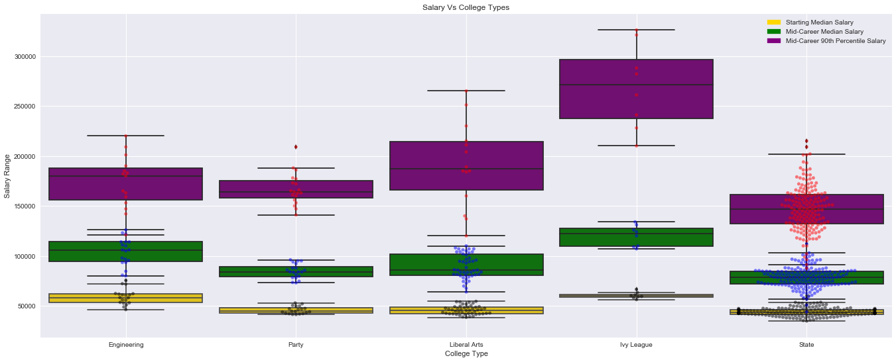


```python
#Create Dataframe for Salary by Region
salary_by_region = pd.read_csv('data/salaries-by-region.csv')
salary_by_region.head()

```


<div>
<style>
    .dataframe thead tr:only-child th {
        text-align: right;
    }

    .dataframe thead th {
        text-align: left;
    }

    .dataframe tbody tr th {
        vertical-align: top;
    }
</style>
<table border="1" class="dataframe">
  <thead>
    <tr style="text-align: right;">
      <th></th>
      <th>School Name</th>
      <th>Region</th>
      <th>Starting Median Salary</th>
      <th>Mid-Career Median Salary</th>
      <th>Mid-Career 10th Percentile Salary</th>
      <th>Mid-Career 25th Percentile Salary</th>
      <th>Mid-Career 75th Percentile Salary</th>
      <th>Mid-Career 90th Percentile Salary</th>
    </tr>
  </thead>
  <tbody>
    <tr>
      <th>0</th>
      <td>Stanford University</td>
      <td>California</td>
      <td>$70,400.00</td>
      <td>$129,000.00</td>
      <td>$68,400.00</td>
      <td>$93,100.00</td>
      <td>$184,000.00</td>
      <td>$257,000.00</td>
    </tr>
    <tr>
      <th>1</th>
      <td>California Institute of Technology (CIT)</td>
      <td>California</td>
      <td>$75,500.00</td>
      <td>$123,000.00</td>
      <td>NaN</td>
      <td>$104,000.00</td>
      <td>$161,000.00</td>
      <td>NaN</td>
    </tr>
    <tr>
      <th>2</th>
      <td>Harvey Mudd College</td>
      <td>California</td>
      <td>$71,800.00</td>
      <td>$122,000.00</td>
      <td>NaN</td>
      <td>$96,000.00</td>
      <td>$180,000.00</td>
      <td>NaN</td>
    </tr>
    <tr>
      <th>3</th>
      <td>University of California, Berkeley</td>
      <td>California</td>
      <td>$59,900.00</td>
      <td>$112,000.00</td>
      <td>$59,500.00</td>
      <td>$81,000.00</td>
      <td>$149,000.00</td>
      <td>$201,000.00</td>
    </tr>
    <tr>
      <th>4</th>
      <td>Occidental College</td>
      <td>California</td>
      <td>$51,900.00</td>
      <td>$105,000.00</td>
      <td>NaN</td>
      <td>$54,800.00</td>
      <td>$157,000.00</td>
      <td>NaN</td>
    </tr>
  </tbody>
</table>
</div>


```python
#Changing the string value to numeric

salary_list = ['Starting Median Salary', 'Mid-Career Median Salary', 'Mid-Career 10th Percentile Salary',
              'Mid-Career 25th Percentile Salary','Mid-Career 75th Percentile Salary','Mid-Career 90th Percentile Salary']
for x in salary_list:
    salary_by_region[x] = salary_by_region[x].str.replace("$","")
    salary_by_region[x] = salary_by_region[x].str.replace(",","")
    salary_by_region[x] = pd.to_numeric(salary_by_region[x])

salary_by_region.head()
```


<div>
<style>
    .dataframe thead tr:only-child th {
        text-align: right;
    }

    .dataframe thead th {
        text-align: left;
    }

    .dataframe tbody tr th {
        vertical-align: top;
    }
</style>
<table border="1" class="dataframe">
  <thead>
    <tr style="text-align: right;">
      <th></th>
      <th>School Name</th>
      <th>Region</th>
      <th>Starting Median Salary</th>
      <th>Mid-Career Median Salary</th>
      <th>Mid-Career 10th Percentile Salary</th>
      <th>Mid-Career 25th Percentile Salary</th>
      <th>Mid-Career 75th Percentile Salary</th>
      <th>Mid-Career 90th Percentile Salary</th>
    </tr>
  </thead>
  <tbody>
    <tr>
      <th>0</th>
      <td>Stanford University</td>
      <td>California</td>
      <td>70400.0</td>
      <td>129000.0</td>
      <td>68400.0</td>
      <td>93100.0</td>
      <td>184000.0</td>
      <td>257000.0</td>
    </tr>
    <tr>
      <th>1</th>
      <td>California Institute of Technology (CIT)</td>
      <td>California</td>
      <td>75500.0</td>
      <td>123000.0</td>
      <td>NaN</td>
      <td>104000.0</td>
      <td>161000.0</td>
      <td>NaN</td>
    </tr>
    <tr>
      <th>2</th>
      <td>Harvey Mudd College</td>
      <td>California</td>
      <td>71800.0</td>
      <td>122000.0</td>
      <td>NaN</td>
      <td>96000.0</td>
      <td>180000.0</td>
      <td>NaN</td>
    </tr>
    <tr>
      <th>3</th>
      <td>University of California, Berkeley</td>
      <td>California</td>
      <td>59900.0</td>
      <td>112000.0</td>
      <td>59500.0</td>
      <td>81000.0</td>
      <td>149000.0</td>
      <td>201000.0</td>
    </tr>
    <tr>
      <th>4</th>
      <td>Occidental College</td>
      <td>California</td>
      <td>51900.0</td>
      <td>105000.0</td>
      <td>NaN</td>
      <td>54800.0</td>
      <td>157000.0</td>
      <td>NaN</td>
    </tr>
  </tbody>
</table>
</div>


```python
#BoxPlot Salary Vs College Type shows distribution of salary for different School Types for 
#Data obtained for 270 Colleges

sn_plot_college_type = sns.boxplot(x="Region", y="Starting Median Salary", width=0.9, data=salary_by_region, color="gold")
sn_plot_college_type = sns.boxplot(x="Region", y="Mid-Career Median Salary", width=0.9, data=salary_by_region, color="green")
sn_plot_college_type = sns.boxplot(x="Region", y="Mid-Career 90th Percentile Salary", width=0.9, data=salary_by_region, color="purple")
sn_plot_collge = sns.swarmplot(x="Region", y="Starting Median Salary", data=salary_by_region, color="black", alpha=0.5)
sn_plot_collge = sns.swarmplot(x="Region", y="Mid-Career Median Salary", data=salary_by_region, color="blue", alpha=0.5)
sn_plot_collge = sns.swarmplot(x="Region", y="Mid-Career 90th Percentile Salary", data=salary_by_region, color="red", alpha=0.5)
sns.set(rc={'figure.figsize':(18,16)})

#Add Legend
legend_dict = { 'Starting Median Salary' : 'gold', 'Mid-Career Median Salary' : 'green', 'Mid-Career 90th Percentile Salary' : 'purple' }
patchList=[]
for key in legend_dict:
        data_key = mpatches.Patch(color=legend_dict[key], label=key)
        patchList.append(data_key)

plt.legend(handles=patchList)

# Incorporate the other graph properties

plt.title("Salary Vs Region")
plt.ylabel("Salary Range")
plt.xlabel("Region")
plt.grid(True)
plt.savefig('Salary_Range_vs_Region.png')
plt.show()
```


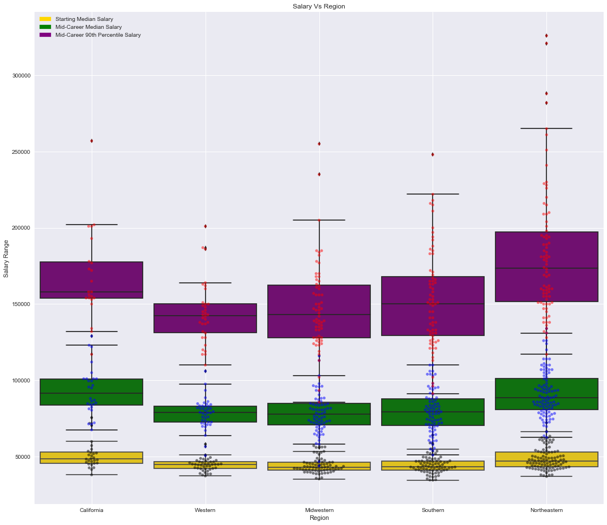


```python


#Create a Dataframe for Salary vs Major
major_salary = pd.read_csv('data/degrees-that-pay-back.csv')
major_salary.head()

```


<div>
<style>
    .dataframe thead tr:only-child th {
        text-align: right;
    }

    .dataframe thead th {
        text-align: left;
    }

    .dataframe tbody tr th {
        vertical-align: top;
    }
</style>
<table border="1" class="dataframe">
  <thead>
    <tr style="text-align: right;">
      <th></th>
      <th>Undergraduate Major</th>
      <th>Starting Median Salary</th>
      <th>Mid-Career Median Salary</th>
      <th>Percent change from Starting to Mid-Career Salary</th>
      <th>Mid-Career 10th Percentile Salary</th>
      <th>Mid-Career 25th Percentile Salary</th>
      <th>Mid-Career 75th Percentile Salary</th>
      <th>Mid-Career 90th Percentile Salary</th>
    </tr>
  </thead>
  <tbody>
    <tr>
      <th>0</th>
      <td>Accounting</td>
      <td>$46,000.00</td>
      <td>$77,100.00</td>
      <td>67.6</td>
      <td>$42,200.00</td>
      <td>$56,100.00</td>
      <td>$108,000.00</td>
      <td>$152,000.00</td>
    </tr>
    <tr>
      <th>1</th>
      <td>Aerospace Engineering</td>
      <td>$57,700.00</td>
      <td>$101,000.00</td>
      <td>75.0</td>
      <td>$64,300.00</td>
      <td>$82,100.00</td>
      <td>$127,000.00</td>
      <td>$161,000.00</td>
    </tr>
    <tr>
      <th>2</th>
      <td>Agriculture</td>
      <td>$42,600.00</td>
      <td>$71,900.00</td>
      <td>68.8</td>
      <td>$36,300.00</td>
      <td>$52,100.00</td>
      <td>$96,300.00</td>
      <td>$150,000.00</td>
    </tr>
    <tr>
      <th>3</th>
      <td>Anthropology</td>
      <td>$36,800.00</td>
      <td>$61,500.00</td>
      <td>67.1</td>
      <td>$33,800.00</td>
      <td>$45,500.00</td>
      <td>$89,300.00</td>
      <td>$138,000.00</td>
    </tr>
    <tr>
      <th>4</th>
      <td>Architecture</td>
      <td>$41,600.00</td>
      <td>$76,800.00</td>
      <td>84.6</td>
      <td>$50,600.00</td>
      <td>$62,200.00</td>
      <td>$97,000.00</td>
      <td>$136,000.00</td>
    </tr>
  </tbody>
</table>
</div>


```python
#Convert string values to numeric
major_salary['Starting Median Salary']=(major_salary['Starting Median Salary'].replace( '[\$,)]','', regex=True )
               .replace( '[(]','-',   regex=True ).astype(float))
major_salary['Mid-Career Median Salary']=(major_salary['Mid-Career Median Salary'].replace( '[\$,)]','', regex=True )
               .replace( '[(]','-',   regex=True ).astype(float))
major_salary['Mid-Career 90th Percentile Salary']=(major_salary['Mid-Career 90th Percentile Salary'].replace( '[\$,)]','', regex=True )
               .replace( '[(]','-',   regex=True ).astype(float))

major_salary.head()
```


<div>
<style>
    .dataframe thead tr:only-child th {
        text-align: right;
    }

    .dataframe thead th {
        text-align: left;
    }

    .dataframe tbody tr th {
        vertical-align: top;
    }
</style>
<table border="1" class="dataframe">
  <thead>
    <tr style="text-align: right;">
      <th></th>
      <th>Undergraduate Major</th>
      <th>Starting Median Salary</th>
      <th>Mid-Career Median Salary</th>
      <th>Percent change from Starting to Mid-Career Salary</th>
      <th>Mid-Career 10th Percentile Salary</th>
      <th>Mid-Career 25th Percentile Salary</th>
      <th>Mid-Career 75th Percentile Salary</th>
      <th>Mid-Career 90th Percentile Salary</th>
    </tr>
  </thead>
  <tbody>
    <tr>
      <th>0</th>
      <td>Accounting</td>
      <td>46000.0</td>
      <td>77100.0</td>
      <td>67.6</td>
      <td>$42,200.00</td>
      <td>$56,100.00</td>
      <td>$108,000.00</td>
      <td>152000.0</td>
    </tr>
    <tr>
      <th>1</th>
      <td>Aerospace Engineering</td>
      <td>57700.0</td>
      <td>101000.0</td>
      <td>75.0</td>
      <td>$64,300.00</td>
      <td>$82,100.00</td>
      <td>$127,000.00</td>
      <td>161000.0</td>
    </tr>
    <tr>
      <th>2</th>
      <td>Agriculture</td>
      <td>42600.0</td>
      <td>71900.0</td>
      <td>68.8</td>
      <td>$36,300.00</td>
      <td>$52,100.00</td>
      <td>$96,300.00</td>
      <td>150000.0</td>
    </tr>
    <tr>
      <th>3</th>
      <td>Anthropology</td>
      <td>36800.0</td>
      <td>61500.0</td>
      <td>67.1</td>
      <td>$33,800.00</td>
      <td>$45,500.00</td>
      <td>$89,300.00</td>
      <td>138000.0</td>
    </tr>
    <tr>
      <th>4</th>
      <td>Architecture</td>
      <td>41600.0</td>
      <td>76800.0</td>
      <td>84.6</td>
      <td>$50,600.00</td>
      <td>$62,200.00</td>
      <td>$97,000.00</td>
      <td>136000.0</td>
    </tr>
  </tbody>
</table>
</div>


```python


#Major vs Starting Median Salary Bar Plot
sns_major = sns.barplot(x="Undergraduate Major", data=major_salary, y="Starting Median Salary")
sns_major.set_xticklabels(sns_major.get_xticklabels(),rotation=90)
sns.set(rc={'figure.figsize':(20,18)})
plt.savefig('Starting_Median_Salary_vs_Major.png')
plt.show()

```


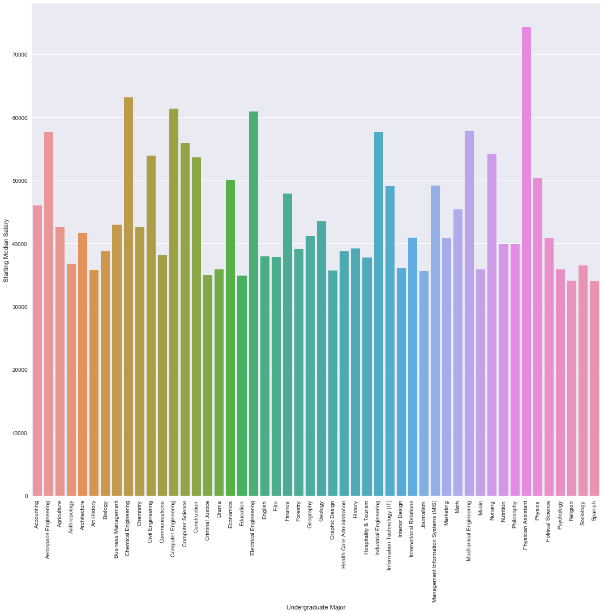


```python


#Major vs Mid-Career 90th Percentile Salary Bar Plot
sns_major = sns.barplot(x="Undergraduate Major", data=major_salary, y="Mid-Career Median Salary")
sns_major.set_xticklabels(sns_major.get_xticklabels(),rotation=90)
sns.set(rc={'figure.figsize':(20,18)})
plt.savefig('Mid-Career_Median_Salary_vs_Major.png')
plt.show()

```


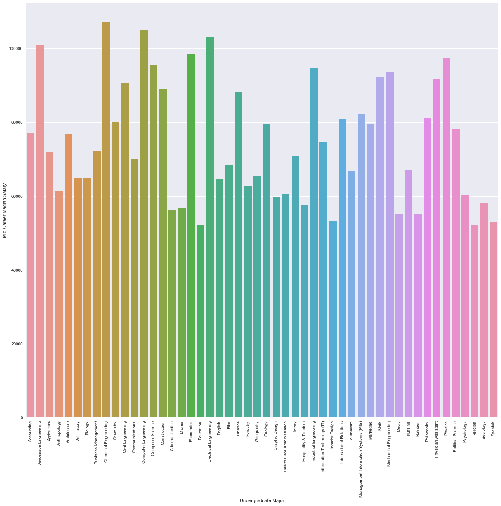


```python
#Major vs Mid-Career Median Salary Bar Plot
sns_major = sns.barplot(x="Undergraduate Major", data=major_salary, y="Mid-Career 90th Percentile Salary")
sns_major.set_xticklabels(sns_major.get_xticklabels(),rotation=90)
sns.set(rc={'figure.figsize':(20,18)})
plt.savefig('Mid-Career_90th_Percentile_Salary_vs_Major.png')
plt.show()
```


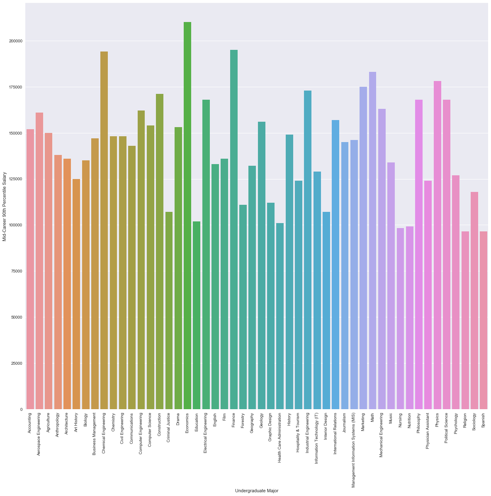


```python
#Merge Cost and Salary Dataframe

cost_df = pd.read_csv('data/FY16_College_Data.csv')
salary_df = pd.read_csv('data/salaries-by-college-type.csv')
salary_df['INSTNM'] = salary_df['School Name']
salary_df['INSTNM'] = salary_df['INSTNM'].str.replace(r"\s\(.*\)","")
salary_df['INSTNM'] = salary_df['INSTNM'].str.replace(",","")
cost_df['INSTNM'] = cost_df['INSTNM'].str.replace("-"," ")
salary_df['INSTNM'] = salary_df['INSTNM'].str.replace("-"," ")
cost_df['INSTNM'] = cost_df['INSTNM'].str.replace(",","")
salary_df['INSTNM'] = salary_df['INSTNM'].str.replace(" ","")
cost_df['INSTNM'] = cost_df['INSTNM'].str.replace(" ","")
salary_df['INSTNM'] = salary_df['INSTNM'].str.upper()
cost_df['INSTNM'] = cost_df['INSTNM'].str.upper()
merged_df = pd.merge(cost_df, salary_df, on='INSTNM', how='inner')
merged_df.to_csv('data/Salary_Cost.csv')
```


```python


#changing the string value to numeric

salary_list = ['Starting Median Salary', 'Mid-Career Median Salary', 'Mid-Career 10th Percentile Salary',
             'Mid-Career 25th Percentile Salary','Mid-Career 75th Percentile Salary','Mid-Career 90th Percentile Salary']
for x in salary_list:
   merged_df[x] = merged_df[x].str.replace("$","")
   merged_df[x] = merged_df[x].str.replace(",","")
   merged_df[x] = pd.to_numeric(merged_df[x])

merged_df.head()

```


<div>
<style>
    .dataframe thead tr:only-child th {
        text-align: right;
    }

    .dataframe thead th {
        text-align: left;
    }

    .dataframe tbody tr th {
        vertical-align: top;
    }
</style>
<table border="1" class="dataframe">
  <thead>
    <tr style="text-align: right;">
      <th></th>
      <th>Unnamed: 0</th>
      <th>UNITID</th>
      <th>INSTNM</th>
      <th>CITY</th>
      <th>STABBR</th>
      <th>REGION</th>
      <th>LATITUDE</th>
      <th>LONGITUDE</th>
      <th>PREDDEG</th>
      <th>COSTT4_A</th>
      <th>...</th>
      <th>SAT_AVG</th>
      <th>ACTCMMID</th>
      <th>School Name</th>
      <th>School Type</th>
      <th>Starting Median Salary</th>
      <th>Mid-Career Median Salary</th>
      <th>Mid-Career 10th Percentile Salary</th>
      <th>Mid-Career 25th Percentile Salary</th>
      <th>Mid-Career 75th Percentile Salary</th>
      <th>Mid-Career 90th Percentile Salary</th>
    </tr>
  </thead>
  <tbody>
    <tr>
      <th>0</th>
      <td>1</td>
      <td>100663</td>
      <td>UNIVERSITYOFALABAMAATBIRMINGHAM</td>
      <td>Birmingham</td>
      <td>AL</td>
      <td>5</td>
      <td>33.502230</td>
      <td>-86.809170</td>
      <td>3</td>
      <td>22232.0</td>
      <td>...</td>
      <td>1147.0</td>
      <td>25.0</td>
      <td>University of Alabama at Birmingham (UAB)</td>
      <td>State</td>
      <td>39200.0</td>
      <td>70100.0</td>
      <td>43000.0</td>
      <td>53400.0</td>
      <td>91400.0</td>
      <td>125000.0</td>
    </tr>
    <tr>
      <th>1</th>
      <td>9</td>
      <td>100858</td>
      <td>AUBURNUNIVERSITY</td>
      <td>Auburn</td>
      <td>AL</td>
      <td>5</td>
      <td>32.604685</td>
      <td>-85.482782</td>
      <td>3</td>
      <td>29164.0</td>
      <td>...</td>
      <td>1218.0</td>
      <td>27.0</td>
      <td>Auburn University</td>
      <td>State</td>
      <td>45400.0</td>
      <td>84700.0</td>
      <td>45400.0</td>
      <td>62700.0</td>
      <td>109000.0</td>
      <td>145000.0</td>
    </tr>
    <tr>
      <th>2</th>
      <td>60</td>
      <td>102553</td>
      <td>UNIVERSITYOFALASKAANCHORAGE</td>
      <td>Anchorage</td>
      <td>AK</td>
      <td>8</td>
      <td>61.189554</td>
      <td>-149.826135</td>
      <td>3</td>
      <td>14476.0</td>
      <td>...</td>
      <td>NaN</td>
      <td>NaN</td>
      <td>University of Alaska, Anchorage</td>
      <td>State</td>
      <td>45900.0</td>
      <td>72600.0</td>
      <td>39800.0</td>
      <td>56600.0</td>
      <td>99300.0</td>
      <td>137000.0</td>
    </tr>
    <tr>
      <th>3</th>
      <td>81</td>
      <td>104179</td>
      <td>UNIVERSITYOFARIZONA</td>
      <td>Tucson</td>
      <td>AZ</td>
      <td>6</td>
      <td>32.232071</td>
      <td>-110.950769</td>
      <td>3</td>
      <td>23996.0</td>
      <td>...</td>
      <td>NaN</td>
      <td>NaN</td>
      <td>University of Arizona</td>
      <td>State</td>
      <td>47500.0</td>
      <td>86100.0</td>
      <td>44800.0</td>
      <td>61700.0</td>
      <td>117000.0</td>
      <td>160000.0</td>
    </tr>
    <tr>
      <th>4</th>
      <td>134</td>
      <td>106397</td>
      <td>UNIVERSITYOFARKANSAS</td>
      <td>Fayetteville</td>
      <td>AR</td>
      <td>5</td>
      <td>36.061530</td>
      <td>-94.178214</td>
      <td>3</td>
      <td>21288.0</td>
      <td>...</td>
      <td>1154.0</td>
      <td>26.0</td>
      <td>University of Arkansas</td>
      <td>State</td>
      <td>44100.0</td>
      <td>82800.0</td>
      <td>43200.0</td>
      <td>60700.0</td>
      <td>113000.0</td>
      <td>160000.0</td>
    </tr>
  </tbody>
</table>
<p>5 rows × 35 columns</p>
</div>


```python
#Scatter Plot for ROI - Range of Salary vs Cost of Education.
#The Range of Salary is from Starting Median Average, Mid-Career Average and Mid-Career 90th Percentile
#The Merged dataframe shows salary and cost for 195 colleges

ROI = sns.FacetGrid(merged_df, size=18)
ROI.map(plt.scatter, 'COSTT4_A', 'Starting Median Salary', color="red",)
ROI.map(plt.scatter, 'COSTT4_A', 'Mid-Career Median Salary', color="green")
ROI.map(plt.scatter, 'COSTT4_A', 'Mid-Career 90th Percentile Salary', color="purple")

sns.set(rc={'figure.figsize':(18,16)})

#Add Legend
legend_dict = { 'Starting Median Salary' : 'red', 'Mid-Career Median Salary' : 'green', 'Mid-Career 90th Percentile Salary' : 'purple' }
patchList=[]
for key in legend_dict:
        data_key = mpatches.Patch(color=legend_dict[key], label=key)
        patchList.append(data_key)

plt.legend(handles=patchList)

# Incorporate the other graph properties
plt.title("Salary Range Vs Cost of Education")
plt.ylabel("Salary Range")
plt.xlabel("Cost of Education")
plt.grid(True)
plt.savefig('Salary_Range_vs_CostOfEducation.png')
plt.show()

```


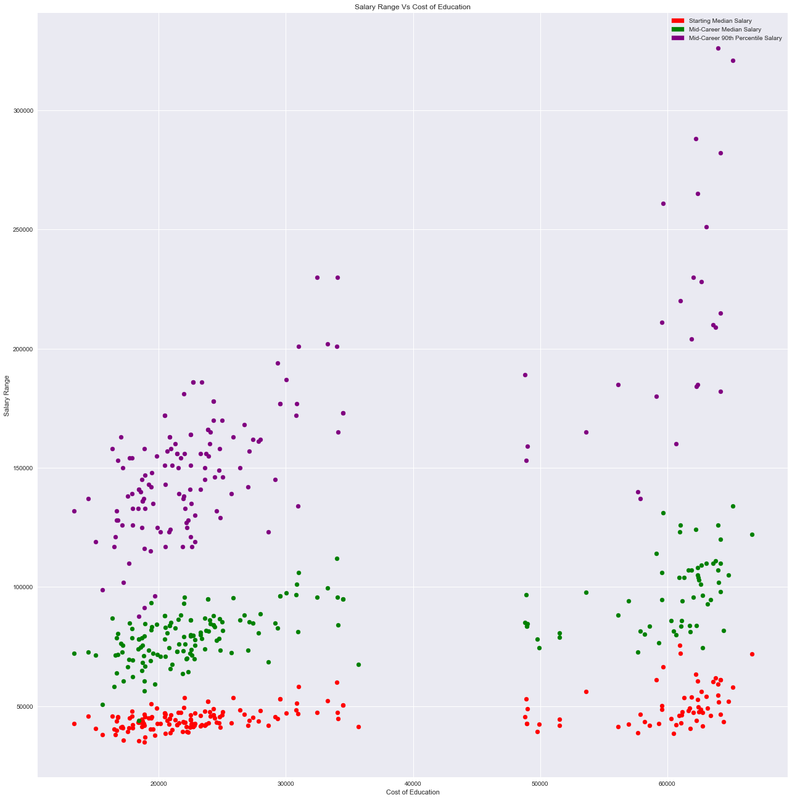

