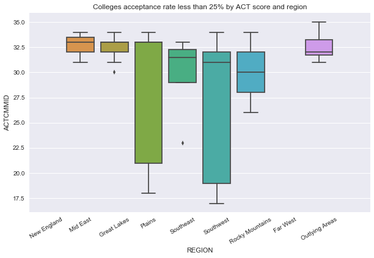

```python
#Get dependencies
import csv
import pandas as pd
import numpy as np
import folium
from folium import plugins
from folium.plugins import HeatMap
import matplotlib.pyplot as plt
import seaborn as sns
from branca.colormap import linear
import matplotlib.patches as mpatches

%matplotlib inline


#Read dataset from csv into DataFrame
dataPath='data/FY16_College_Data.csv'
data = pd.read_csv(dataPath, low_memory=False)
df = pd.DataFrame(data)


```


```python
#Create DataFrame for Acceptance records
accept_df = df[['UNITID','INSTNM','CITY','STABBR', 'REGION', 'LATITUDE',
'LONGITUDE', 'ADM_RATE','SAT_AVG', 'ACTCMMID']]
print(len(accept_df))
accept_df.head()
```

    2109


<div>
<style>
    .dataframe thead tr:only-child th {
        text-align: right;
    }

    .dataframe thead th {
        text-align: left;
    }

    .dataframe tbody tr th {
        vertical-align: top;
    }
</style>
<table border="1" class="dataframe">
  <thead>
    <tr style="text-align: right;">
      <th></th>
      <th>UNITID</th>
      <th>INSTNM</th>
      <th>CITY</th>
      <th>STABBR</th>
      <th>REGION</th>
      <th>LATITUDE</th>
      <th>LONGITUDE</th>
      <th>ADM_RATE</th>
      <th>SAT_AVG</th>
      <th>ACTCMMID</th>
    </tr>
  </thead>
  <tbody>
    <tr>
      <th>0</th>
      <td>100654</td>
      <td>Alabama A &amp; M University</td>
      <td>Normal</td>
      <td>AL</td>
      <td>5</td>
      <td>34.783368</td>
      <td>-86.568502</td>
      <td>0.6538</td>
      <td>850.0</td>
      <td>18.0</td>
    </tr>
    <tr>
      <th>1</th>
      <td>100663</td>
      <td>University of Alabama at Birmingham</td>
      <td>Birmingham</td>
      <td>AL</td>
      <td>5</td>
      <td>33.502230</td>
      <td>-86.809170</td>
      <td>0.6043</td>
      <td>1147.0</td>
      <td>25.0</td>
    </tr>
    <tr>
      <th>2</th>
      <td>100690</td>
      <td>Amridge University</td>
      <td>Montgomery</td>
      <td>AL</td>
      <td>5</td>
      <td>32.362609</td>
      <td>-86.174010</td>
      <td>NaN</td>
      <td>NaN</td>
      <td>NaN</td>
    </tr>
    <tr>
      <th>3</th>
      <td>100706</td>
      <td>University of Alabama in Huntsville</td>
      <td>Huntsville</td>
      <td>AL</td>
      <td>5</td>
      <td>34.722818</td>
      <td>-86.638420</td>
      <td>0.8120</td>
      <td>1221.0</td>
      <td>27.0</td>
    </tr>
    <tr>
      <th>4</th>
      <td>100724</td>
      <td>Alabama State University</td>
      <td>Montgomery</td>
      <td>AL</td>
      <td>5</td>
      <td>32.364317</td>
      <td>-86.295677</td>
      <td>0.4639</td>
      <td>844.0</td>
      <td>18.0</td>
    </tr>
  </tbody>
</table>
</div>


Colleges acceptance rate less than 10 % by SAT or ACT score


```python
rate_accept_top10prc = accept_df[(accept_df['ADM_RATE'] > 0) & (accept_df['ADM_RATE'] < 0.1)]
rate_accept_top10prc = rate_accept_top10prc.dropna(subset=['SAT_AVG'])
print(len(rate_accept_top10prc))
rate_accept_top10prc
```

    9


<div>
<style>
    .dataframe thead tr:only-child th {
        text-align: right;
    }

    .dataframe thead th {
        text-align: left;
    }

    .dataframe tbody tr th {
        vertical-align: top;
    }
</style>
<table border="1" class="dataframe">
  <thead>
    <tr style="text-align: right;">
      <th></th>
      <th>UNITID</th>
      <th>INSTNM</th>
      <th>CITY</th>
      <th>STABBR</th>
      <th>REGION</th>
      <th>LATITUDE</th>
      <th>LONGITUDE</th>
      <th>ADM_RATE</th>
      <th>SAT_AVG</th>
      <th>ACTCMMID</th>
    </tr>
  </thead>
  <tbody>
    <tr>
      <th>74</th>
      <td>110404</td>
      <td>California Institute of Technology</td>
      <td>Pasadena</td>
      <td>CA</td>
      <td>8</td>
      <td>34.139275</td>
      <td>-118.125740</td>
      <td>0.0881</td>
      <td>1544.0</td>
      <td>35.0</td>
    </tr>
    <tr>
      <th>221</th>
      <td>130794</td>
      <td>Yale University</td>
      <td>New Haven</td>
      <td>CT</td>
      <td>1</td>
      <td>41.311158</td>
      <td>-72.926688</td>
      <td>0.0673</td>
      <td>1498.0</td>
      <td>33.0</td>
    </tr>
    <tr>
      <th>348</th>
      <td>144050</td>
      <td>University of Chicago</td>
      <td>Chicago</td>
      <td>IL</td>
      <td>3</td>
      <td>41.789170</td>
      <td>-87.601196</td>
      <td>0.0838</td>
      <td>1506.0</td>
      <td>34.0</td>
    </tr>
    <tr>
      <th>645</th>
      <td>166027</td>
      <td>Harvard University</td>
      <td>Cambridge</td>
      <td>MA</td>
      <td>1</td>
      <td>42.374429</td>
      <td>-71.118177</td>
      <td>0.0558</td>
      <td>1497.0</td>
      <td>34.0</td>
    </tr>
    <tr>
      <th>656</th>
      <td>166683</td>
      <td>Massachusetts Institute of Technology</td>
      <td>Cambridge</td>
      <td>MA</td>
      <td>1</td>
      <td>42.360095</td>
      <td>-71.092115</td>
      <td>0.0830</td>
      <td>1507.0</td>
      <td>34.0</td>
    </tr>
    <tr>
      <th>904</th>
      <td>186131</td>
      <td>Princeton University</td>
      <td>Princeton</td>
      <td>NJ</td>
      <td>2</td>
      <td>40.348530</td>
      <td>-74.663603</td>
      <td>0.0714</td>
      <td>1490.0</td>
      <td>34.0</td>
    </tr>
    <tr>
      <th>943</th>
      <td>190150</td>
      <td>Columbia University in the City of New York</td>
      <td>New York</td>
      <td>NY</td>
      <td>2</td>
      <td>40.808286</td>
      <td>-73.961885</td>
      <td>0.0661</td>
      <td>1473.0</td>
      <td>33.0</td>
    </tr>
    <tr>
      <th>1391</th>
      <td>217156</td>
      <td>Brown University</td>
      <td>Providence</td>
      <td>RI</td>
      <td>1</td>
      <td>41.827605</td>
      <td>-71.404467</td>
      <td>0.0949</td>
      <td>1457.0</td>
      <td>33.0</td>
    </tr>
    <tr>
      <th>1746</th>
      <td>243744</td>
      <td>Stanford University</td>
      <td>Stanford</td>
      <td>CA</td>
      <td>8</td>
      <td>37.426967</td>
      <td>-122.168826</td>
      <td>0.0504</td>
      <td>1479.0</td>
      <td>33.0</td>
    </tr>
  </tbody>
</table>
</div>


```python
#Plot
sn_plot_acceptance_sat_avg = sns.barplot(x="INSTNM", y="SAT_AVG", data=rate_accept_top10prc)
sn_plot_acceptance_sat_avg.set_xticklabels(sn_plot_acceptance_sat_avg.get_xticklabels(),rotation=30,ha='right')
sns.set(rc={'figure.figsize':(10,6)})
plt.title("Colleges acceptance rate less than 10%")
plt.savefig("TopTenByAccRateAndSAT.png")
plt.show()
```


Colleges acceptance rate less than 25% by SAT or ACT score


```python
rate_accept_25prc = accept_df[(accept_df['ADM_RATE'] > 0) & (accept_df['ADM_RATE'] < 0.25)]
len(rate_accept_25prc)
```


    68


```python
#Plot

xticks = ['New England', 'Mid East','Great Lakes','Plains', 'Southeast','Southwest','Rocky Mountains','Far West','Outlying Areas']
sn_acceptance_rate_sat_25prc = sns.boxplot(x="REGION", y="ACTCMMID", data=rate_accept_25prc)
sn_acceptance_rate_sat_25prc.set_xticklabels(xticks,rotation=30)
sns.set(rc={'figure.figsize':(10, 8)})
plt.title("Colleges acceptance rate less than 25% by ACT score and region")
plt.savefig("AcceptanceRateLess25%ByRegion.png")
plt.show()
```





Colleges acceptance rate less than 50% by SAT or ACT score


```python
sn_rate_accept_50prc = accept_df[(accept_df['ADM_RATE'] > 0) & (accept_df['ADM_RATE'] < 0.5)]
len(sn_rate_accept_50prc)
```


    325


```python
sn_plot_acceptance_sat_avg = sns.boxplot(x="REGION", y="SAT_AVG", width=0.9, data=sn_rate_accept_50prc, color="blue")
sns.set(rc={'figure.figsize':(10,8)})
sn_plot_acceptance_sat_avg.set_xticklabels(xticks,rotation=30)
plt.title("Colleges acceptance rate less  than 50% by region")
plt.show()
```


Colleges acceptance rate less than 50% by State


```python
sn_acceptance_rate_sat = sns.boxplot(x="STABBR", y="SAT_AVG", data=sn_rate_accept_50prc)
sns.set(rc={'figure.figsize':(23,9)})
plt.title("Colleges acceptance rate less  than 50% by state")
plt.savefig("AcceptanceRateLess50%ByStates.png")
plt.show()
```


Graduation Data Analysis

Distribution of Institutions across the Nation


```python
#Plot distribution of Institutions across the Nation
list_data=df[['LATITUDE','LONGITUDE','C150_4_WHITE']]
list_data=list_data.dropna()
a=list_data.values.tolist()
m=folium.Map([41.8781, -87.6298], zoom_start=1)
HeatMap(a).add_to(m)
m

```


<div style="width:100%;"><div style="position:relative;width:100%;height:0;padding-bottom:60%;"><iframe src="data:text/html;charset=utf-8;base64,PCFET0NUWVBFIGh0bWw+CjxoZWFkPiAgICAKICAgIDxtZXRhIGh0dHAtZXF1aXY9ImNvbnRlbnQtdHlwZSIgY29udGVudD0idGV4dC9odG1sOyBjaGFyc2V0PVVURi04IiAvPgogICAgPHNjcmlwdD5MX1BSRUZFUl9DQU5WQVMgPSBmYWxzZTsgTF9OT19UT1VDSCA9IGZhbHNlOyBMX0RJU0FCTEVfM0QgPSBmYWxzZTs8L3NjcmlwdD4KICAgIDxzY3JpcHQgc3JjPSJodHRwczovL2Nkbi5qc2RlbGl2ci5uZXQvbnBtL2xlYWZsZXRAMS4yLjAvZGlzdC9sZWFmbGV0LmpzIj48L3NjcmlwdD4KICAgIDxzY3JpcHQgc3JjPSJodHRwczovL2FqYXguZ29vZ2xlYXBpcy5jb20vYWpheC9saWJzL2pxdWVyeS8xLjExLjEvanF1ZXJ5Lm1pbi5qcyI+PC9zY3JpcHQ+CiAgICA8c2NyaXB0IHNyYz0iaHR0cHM6Ly9tYXhjZG4uYm9vdHN0cmFwY2RuLmNvbS9ib290c3RyYXAvMy4yLjAvanMvYm9vdHN0cmFwLm1pbi5qcyI+PC9zY3JpcHQ+CiAgICA8c2NyaXB0IHNyYz0iaHR0cHM6Ly9jZG5qcy5jbG91ZGZsYXJlLmNvbS9hamF4L2xpYnMvTGVhZmxldC5hd2Vzb21lLW1hcmtlcnMvMi4wLjIvbGVhZmxldC5hd2Vzb21lLW1hcmtlcnMuanMiPjwvc2NyaXB0PgogICAgPGxpbmsgcmVsPSJzdHlsZXNoZWV0IiBocmVmPSJodHRwczovL2Nkbi5qc2RlbGl2ci5uZXQvbnBtL2xlYWZsZXRAMS4yLjAvZGlzdC9sZWFmbGV0LmNzcyIgLz4KICAgIDxsaW5rIHJlbD0ic3R5bGVzaGVldCIgaHJlZj0iaHR0cHM6Ly9tYXhjZG4uYm9vdHN0cmFwY2RuLmNvbS9ib290c3RyYXAvMy4yLjAvY3NzL2Jvb3RzdHJhcC5taW4uY3NzIiAvPgogICAgPGxpbmsgcmVsPSJzdHlsZXNoZWV0IiBocmVmPSJodHRwczovL21heGNkbi5ib290c3RyYXBjZG4uY29tL2Jvb3RzdHJhcC8zLjIuMC9jc3MvYm9vdHN0cmFwLXRoZW1lLm1pbi5jc3MiIC8+CiAgICA8bGluayByZWw9InN0eWxlc2hlZXQiIGhyZWY9Imh0dHBzOi8vbWF4Y2RuLmJvb3RzdHJhcGNkbi5jb20vZm9udC1hd2Vzb21lLzQuNi4zL2Nzcy9mb250LWF3ZXNvbWUubWluLmNzcyIgLz4KICAgIDxsaW5rIHJlbD0ic3R5bGVzaGVldCIgaHJlZj0iaHR0cHM6Ly9jZG5qcy5jbG91ZGZsYXJlLmNvbS9hamF4L2xpYnMvTGVhZmxldC5hd2Vzb21lLW1hcmtlcnMvMi4wLjIvbGVhZmxldC5hd2Vzb21lLW1hcmtlcnMuY3NzIiAvPgogICAgPGxpbmsgcmVsPSJzdHlsZXNoZWV0IiBocmVmPSJodHRwczovL3Jhd2dpdC5jb20vcHl0aG9uLXZpc3VhbGl6YXRpb24vZm9saXVtL21hc3Rlci9mb2xpdW0vdGVtcGxhdGVzL2xlYWZsZXQuYXdlc29tZS5yb3RhdGUuY3NzIiAvPgogICAgPHN0eWxlPmh0bWwsIGJvZHkge3dpZHRoOiAxMDAlO2hlaWdodDogMTAwJTttYXJnaW46IDA7cGFkZGluZzogMDt9PC9zdHlsZT4KICAgIDxzdHlsZT4jbWFwIHtwb3NpdGlvbjphYnNvbHV0ZTt0b3A6MDtib3R0b206MDtyaWdodDowO2xlZnQ6MDt9PC9zdHlsZT4KICAgIAogICAgICAgICAgICA8c3R5bGU+ICNtYXBfNjM5ZTA2YzE2NjdlNDhjZTg0ZWQ2MTFkYjU2Y2QzZDkgewogICAgICAgICAgICAgICAgcG9zaXRpb24gOiByZWxhdGl2ZTsKICAgICAgICAgICAgICAgIHdpZHRoIDogMTAwLjAlOwogICAgICAgICAgICAgICAgaGVpZ2h0OiAxMDAuMCU7CiAgICAgICAgICAgICAgICBsZWZ0OiAwLjAlOwogICAgICAgICAgICAgICAgdG9wOiAwLjAlOwogICAgICAgICAgICAgICAgfQogICAgICAgICAgICA8L3N0eWxlPgogICAgICAgIAogICAgPHNjcmlwdCBzcmM9Imh0dHBzOi8vbGVhZmxldC5naXRodWIuaW8vTGVhZmxldC5oZWF0L2Rpc3QvbGVhZmxldC1oZWF0LmpzIj48L3NjcmlwdD4KPC9oZWFkPgo8Ym9keT4gICAgCiAgICAKICAgICAgICAgICAgPGRpdiBjbGFzcz0iZm9saXVtLW1hcCIgaWQ9Im1hcF82MzllMDZjMTY2N2U0OGNlODRlZDYxMWRiNTZjZDNkOSIgPjwvZGl2PgogICAgICAgIAo8L2JvZHk+CjxzY3JpcHQ+ICAgIAogICAgCgogICAgICAgICAgICAKICAgICAgICAgICAgICAgIHZhciBib3VuZHMgPSBudWxsOwogICAgICAgICAgICAKCiAgICAgICAgICAgIHZhciBtYXBfNjM5ZTA2YzE2NjdlNDhjZTg0ZWQ2MTFkYjU2Y2QzZDkgPSBMLm1hcCgKICAgICAgICAgICAgICAgICAgICAgICAgICAgICAgICAgICdtYXBfNjM5ZTA2YzE2NjdlNDhjZTg0ZWQ2MTFkYjU2Y2QzZDknLAogICAgICAgICAgICAgICAgICAgICAgICAgICAgICAgICAge2NlbnRlcjogWzQxLjg3ODEsLTg3LjYyOThdLAogICAgICAgICAgICAgICAgICAgICAgICAgICAgICAgICAgem9vbTogMSwKICAgICAgICAgICAgICAgICAgICAgICAgICAgICAgICAgIG1heEJvdW5kczogYm91bmRzLAogICAgICAgICAgICAgICAgICAgICAgICAgICAgICAgICAgbGF5ZXJzOiBbXSwKICAgICAgICAgICAgICAgICAgICAgICAgICAgICAgICAgIHdvcmxkQ29weUp1bXA6IGZhbHNlLAogICAgICAgICAgICAgICAgICAgICAgICAgICAgICAgICAgY3JzOiBMLkNSUy5FUFNHMzg1NwogICAgICAgICAgICAgICAgICAgICAgICAgICAgICAgICB9KTsKICAgICAgICAgICAgCiAgICAgICAgCiAgICAKICAgICAgICAgICAgdmFyIHRpbGVfbGF5ZXJfOWI1ZGY0NjBiN2EyNGU4ZDkyZjg4YzE5YjlkOTRhNTYgPSBMLnRpbGVMYXllcigKICAgICAgICAgICAgICAgICdodHRwczovL3tzfS50aWxlLm9wZW5zdHJlZXRtYXAub3JnL3t6fS97eH0ve3l9LnBuZycsCiAgICAgICAgICAgICAgICB7CiAgImF0dHJpYnV0aW9uIjogbnVsbCwKICAiZGV0ZWN0UmV0aW5hIjogZmFsc2UsCiAgIm1heFpvb20iOiAxOCwKICAibWluWm9vbSI6IDEsCiAgIm5vV3JhcCI6IGZhbHNlLAogICJzdWJkb21haW5zIjogImFiYyIKfQogICAgICAgICAgICAgICAgKS5hZGRUbyhtYXBfNjM5ZTA2YzE2NjdlNDhjZTg0ZWQ2MTFkYjU2Y2QzZDkpOwogICAgICAgIAogICAgCiAgICAgICAgICAgIHZhciBoZWF0X21hcF83NDhlZTJjYjE5MmM0OTYxYmU5YThmMDM0Yjg1NzYxYyA9IEwuaGVhdExheWVyKAogICAgICAgICAgICAgICAgW1szNC43ODMzNjgsIC04Ni41Njg1MDIsIDAuMzc1XSwgWzMzLjUwMjIzLCAtODYuODA5MTcsIDAuNTUzNl0sIFszMi4zNjI2MDksIC04Ni4xNzQwMSwgMC42NjY3XSwgWzM0LjcyMjgxOCwgLTg2LjYzODQyLCAwLjUyMTRdLCBbMzIuMzY0MzE3LCAtODYuMjk1Njc3LCAwLjBdLCBbMzMuMjE0NCwgLTg3LjU0NTc2NiwgMC42ODk0XSwgWzMyLjM2OTkzOSwgLTg2LjE3NzM1MSwgMC4yMjc4XSwgWzMyLjYwNDY4NSwgLTg1LjQ4Mjc4MiwgMC43NDY0XSwgWzMzLjUxNTQ1MywgLTg2Ljg1MzYzNiwgMC42MjE3XSwgWzMyLjM0MjY4NDAwMDAwMDAxLCAtODYuMjE2NDg4LCAwLjE1MzhdLCBbMzIuMzg0MTgxLCAtODYuMjE2NDEsIDAuMjM1Nl0sIFszMi4zNTA5MzkwMDAwMDAwMDQsIC04Ni4yODUzMTMsIDAuNDA4M10sIFszNC44NTkwODkwMDAwMDAwMDQsIC04Ny42NjIwNjIsIDAuMF0sIFszMy44MjIxMjgsIC04NS43NjY2NDQsIDAuMzY1Ml0sIFszMi42MzA1MjYsIC04Ny4zMTYxMjcwMDAwMDAwMiwgMC40MDM1XSwgWzMyLjU5MjQ0LCAtODguMTg2MDc3LCAwLjM1OTddLCBbMzMuNDgxMzA2LCAtODYuOTA4NjA1MDAwMDAwMDIsIDAuMzMzM10sIFszMC43OTMyNDcsIC04OC4xMjg5MzQsIDAuNTIwMl0sIFszMy4xMDYyNSwgLTg2Ljg2NTA5OSwgMC40NzM1XSwgWzM0LjgwNjU4LCAtODcuNjgwOTk5LCAwLjQyODRdLCBbMzMuNDY0NTc4LCAtODYuNzkwOTMyLCAwLjc0NzhdLCBbMzAuNjk1MDgxLCAtODguMTgxODksIDAuMzgzMV0sIFszMC42OTQ3NTEsIC04OC4xMzgxOTksIDAuNTQ4NF0sIFszMy4zNzg5MzUsIC04Ni43NDkwNDUsIDAuNDExOF0sIFszMy4xOTkyMjgwMDAwMDAwMDUsIC04Ny41ODUyNDIwMDAwMDAwMiwgMC4xXSwgWzMzLjQzNDI1OCwgLTg2LjExMzY3NSwgMS4wXSwgWzMxLjgwMDEyODAwMDAwMDAwNCwgLTg1Ljk1MDE5MSwgMC40MDk5XSwgWzMyLjQzMTAyMSwgLTg1LjcxMDMxNTAwMDAwMDAyLCAwLjVdLCBbNjEuMTg5NTU0LCAtMTQ5LjgyNjEzNTAwMDAwMDA1LCAwLjI3NTJdLCBbNjQuODU2NDgzLCAtMTQ3LjgyMjk0Mjk5OTk5OTk1LCAwLjMzXSwgWzU4LjM4NDI3LCAtMTM0LjYzNjM0NiwgMC4zMDk1XSwgWzYxLjE5MTIzNSwgLTE0OS44MDQyNDIsIDAuNTg4Ml0sIFszMy40MjIyNDcsIC0xMTEuOTM0NjI5LCAwLjY2NTZdLCBbMzIuMjMyMDcxMDAwMDAwMDA1LCAtMTEwLjk1MDc2OSwgMC42MjA2XSwgWzMyLjI1MjM4NCwgLTExMC45MjczMjEsIDAuODU3MV0sIFszNC42MTU2NzgsIC0xMTIuNDUyMjg1LCAwLjU4NjRdLCBbMzMuNTEyMTcyLCAtMTEyLjEyOTkxNywgMC40Mzg2XSwgWzM1LjE4MDA5NSwgLTExMS42NTc2NTMsIDAuNTU2NV0sIFszNC41NDQ1LCAtMTEyLjQ3NjUwOSwgMC4zMjJdLCBbMzMuNTk1MTE3LCAtMTEyLjAyNjIxMSwgMC4zNTYyXSwgWzMzLjQwMzYyNSwgLTExMS45NjQxODIsIDAuMDUxN10sIFszNC43MjY2NDQsIC05Mi4zNDE4MzUsIDAuMzc2XSwgWzM1Ljc3ODkzNCwgLTkxLjYyODExNSwgMC4zNzAyXSwgWzM2LjA2MTUzLCAtOTQuMTc4MjE0LCAwLjYzODRdLCBbMzQuMjQyMTkyLCAtOTIuMDIxMjYzLCAwLjA3MTRdLCBbMzUuODQyNzc5LCAtOTAuNjgwNDc4LCAwLjQ4NDNdLCBbMzUuMjk1MjI3MDAwMDAwMDEsIC05My4xMzIzMywgMC40NTU1XSwgWzM1LjA3ODE5NjAwMDAwMDAwNSwgLTkyLjQ1OTMxLCAwLjQ5NTVdLCBbMzUuMDg0NTc0LCAtOTIuNDQ0MTAyLCAwLjMxNDNdLCBbMzUuMjQ5NjA0OTk5OTk5OTksIC05MS43MjkwMDgsIDAuNjY1XSwgWzM0LjEyNzc5MiwgLTkzLjA2MDMxMywgMC4zNzY3XSwgWzM1LjA5OTcyLCAtOTIuNDQyMDIxLCAwLjY4ODldLCBbMzYuMTkxMDc3LCAtOTQuNTU5MDg4LCAwLjYyOF0sIFszNC4xMjUwNDUsIC05My4wNTI0NDIsIDAuNjkzM10sIFszNS40Nzc3ODUsIC05My40Njc5MjQsIDAuNDE4Ml0sIFszNC43MzY2NiwgLTkyLjI4MjQyLCAxLjBdLCBbMzYuMTI2ODI1LCAtOTAuOTM5ODc2LCAwLjQyMTldLCBbMzMuMjkxMTk1LCAtOTMuMjM1MDg3LCAwLjM4NDRdLCBbMzUuMzg1MzQ1LCAtOTQuMzc0MDczLCAwLjI0MDNdLCBbMzcuNzg3NzQ4LCAtMTIyLjQwMDY4NiwgMC4zNjA4XSwgWzM0LjE3MDg0NCwgLTExOC4xODY5MDEsIDAuNjUyMl0sIFszNC4xMzA4NjUsIC0xMTcuODg3OTUsIDAuNzIwOV0sIFszMy44NDIyOTUsIC0xMTcuOTQxMzIzLCAxLjBdLCBbMzMuOTA0ODIzLCAtMTE4LjAxNzM0MiwgMC43MTk4XSwgWzM0LjMzODUxLCAtMTE5LjI5NTIzMSwgMC44MTI1XSwgWzMzLjkyODU2OSwgLTExNy40MjU4NywgMC42NV0sIFszNy43NjcyMywgLTEyMi4zOTk5NDEsIDAuNTY1OF0sIFszNC4xMzkyNzUsIC0xMTguMTI1NzQsIDAuODY5Nl0sIFszNC4yMjU1NTEsIC0xMTguODc5NDY3LCAwLjcxOTFdLCBbMzUuMjk4ODksIC0xMjAuNjU4NTYsIDAuNzc4MV0sIFszNS4zNTAwMDUsIC0xMTkuMTA0NzExLCAwLjQzNjddLCBbMzcuNTI1NzcsIC0xMjAuODUyNTExLCAwLjYxMjRdLCBbMzQuMTgyOTg3LCAtMTE3LjMyMjUwOCwgMC41Mzk1XSwgWzM0LjA1NDI3Mjk5OTk5OTk5NSwgLTExNy44MTkwMTksIDAuNjkxOV0sIFszOS43MjgwMDMsIC0xMjEuODQ2MzMzLCAwLjY2OTRdLCBbMzMuODY1MjQsIC0xMTguMjU5MzE2LCAwLjQ0MTJdLCBbMzYuODE0NDc3LCAtMTE5Ljc0ODI1OCwgMC42NzQ0XSwgWzMzLjg4MzYyNzAwMDAwMDAwNCwgLTExNy44ODUzNDksIDAuNjY0NF0sIFszNy42NTcwNywgLTEyMi4wNTgwNzMsIDAuNDU5OV0sIFszMy43ODI3NTIsIC0xMTguMTEyMywgMC43MzQzXSwgWzM0LjA2NjkyNywgLTExOC4xNjg5NjUsIDAuNDY5MV0sIFszNC4yMzY3MDk5OTk5OTk5OTUsIC0xMTguNTI2ODE3LCAwLjYwMzVdLCBbMzguNTU3NDUsIC0xMjEuNDIxOTQsIDAuNTEyMV0sIFszNy44NzE5NjksIC0xMjIuMjYwNDIzLCAwLjkxNDNdLCBbMzguNTM5ODk1LCAtMTIxLjc1MTk1OCwgMC44Njg0XSwgWzMzLjY0ODQzNCwgLTExNy44NDEyNDgsIDAuODQ2MV0sIFszNC4wNjg4OTIsIC0xMTguNDQzOTAxLCAwLjkxNzFdLCBbMzMuOTc1ODgsIC0xMTcuMzMxMDk4LCAwLjcxMThdLCBbMzIuODc2NTk4LCAtMTE3LjIzNzc5MywgMC44ODRdLCBbMzQuNDE2MjgxLCAtMTE5Ljg0NjQwNCwgMC44MzE4XSwgWzM2Ljk5NzI1OCwgLTEyMi4wNjc5OTMsIDAuNzc5NF0sIFszNC4zOTMzMzcsIC0xMTguNTY3MzAzLCAwLjQ5NDFdLCBbMzguMDY5MDYxLCAtMTIyLjIzMTU1MSwgMC41NjUyXSwgWzMzLjc5MzY3OCwgLTExNy44NTE0ODEsIDAuODIxM10sIFszMy42NTM1LCAtMTE3LjgxMDYzLCAwLjY4MDRdLCBbMzIuODQyODEsIC0xMTYuOTc4MTUxLCAwLjMxNThdLCBbMzQuMTAyMzIzLCAtMTE3LjcwNjU5MywgMC45MDUxXSwgWzM3LjQxMzY2NCwgLTEyMS45NDA1NTMsIDAuNDU0NV0sIFszMi44MjE5NjIsIC0xMTcuMTM2NDkzLCAwLjY1MzhdLCBbMzQuMTc5NTk2MDAwMDAwMDA0LCAtMTE4LjUzODM5NCwgMC40NzA2XSwgWzMyLjczMTAyMiwgLTExNy4xNDk4MDgsIDAuNzVdLCBbMzcuOTgwMDE0LCAtMTIyLjUxNDY1NCwgMC42NjMzXSwgWzM2LjcyNTI3OSwgLTExOS43MzE5NTMsIDAuNjcwOV0sIFszNC4xMDYxMzcsIC0xMTcuNzEwNTk0LCAwLjkzODVdLCBbMzcuODAyNjU0LCAtMTIyLjE4NzE3LCAwLjU1NTZdLCBbNDAuODc0MSwgLTEyNC4wODE0LCAwLjUxNjldLCBbMzguMDExMDUxLCAtMTIxLjMxNjQwMSwgMC4zNjM2XSwgWzM0LjEyODA5OSwgLTExOC40NzE3NjQsIDAuNzVdLCBbMzQuMDg5NDIxLCAtMTE3LjgzMDk5NywgMC4zMl0sIFszMi43NzgyNzgsIC0xMTcuMTU1Mzk1LCAwLjM5NjhdLCBbMzQuMTAwODYsIC0xMTcuNzcyNjM0LCAwLjY0MDZdLCBbMzMuNTYxNDQ4LCAtMTE3Ljc3MjU2NCwgMC42MDcxXSwgWzM3LjgwNDc4OCwgLTEyMi4yNjk3NDUsIDAuMzMzM10sIFszMi44MDMyNTkwMDAwMDAwMDQsIC0xMTYuOTAwNTMxLCAxLjBdLCBbMzMuOTA4ODM0MDAwMDAwMDEsIC0xMTcuNDk3MDcxLCAwLjUzMzNdLCBbMzQuMzgyMTQsIC0xMTguNTE3NDIyLCAwLjY4ODRdLCBbMzcuODAzOTU4LCAtMTIyLjQxNzE4NSwgMC4zNDI5XSwgWzMzLjk3MDYzMywgLTExOC40MTU2NTUsIDAuNzk2Ml0sIFszMy43MzQ2MywgLTExOC4zMzM0MDQsIDAuMzY5XSwgWzM3LjQ1MjkwNiwgLTEyMi4xODE0NDQsIDAuMjk0MV0sIFszNy43ODI2MzksIC0xMjIuMTg3ODksIDAuNjYxM10sIFszNC4wODIxMTIsIC0xMTguNDgwNDcxLCAwLjcwNTldLCBbMzIuOTA5NDY5LCAtMTE3LjI0NDI0MywgMC40XSwgWzMyLjcxMzMxLCAtMTE3LjE1MzMwNSwgMC4xNjY3XSwgWzM3LjUxNzUwMSwgLTEyMi4yODQ2MTgsIDAuNDIzMV0sIFszNC4xMjYyMjQsIC0xMTguMjEwNzgzLCAwLjg2NTldLCBbMzMuOTU2NjA3LCAtMTE4LjQxNjYxNSwgMC42MTExXSwgWzMzLjg3NjE2LCAtMTE3Ljg4NTczLCAwLjQ2NDNdLCBbMzguNTc0MDkwMDAwMDAwMDEsIC0xMjIuNDQ5NjM5LCAwLjQwODNdLCBbMzcuOTgwNjI0LCAtMTIxLjMwNzI5NiwgMC43MzAyXSwgWzM0LjA0MTkxMiwgLTExOC43MDc2NzcsIDAuODI4XSwgWzM0LjEwMzQwOCwgLTExNy43MDU5MzksIDAuODQ3OF0sIFszMi43NjM3Mjk5OTk5OTk5OTUsIC0xMTcuMDYzNDgzLCAwLjcwNTldLCBbMzIuNzEzMjk1LCAtMTE3LjI1MTIwNCwgMC43NjQxXSwgWzM0LjA5ODI5OCwgLTExNy43MTE5NDQsIDAuOTYzOV0sIFszNC4wNjM1NzEsIC0xMTcuMTYzODQ3LCAwLjcyXSwgWzM3Ljc4MTIzOCwgLTEyMi4yNjc1MjMsIDAuNV0sIFszMi43NzUyNSwgLTExNy4wNzEyMjgsIDAuNzI4Nl0sIFszMi43NzE0MiwgLTExNy4xODg3MjEsIDAuNzk4NF0sIFszNy44MDM1NzUsIC0xMjIuNDE3LCAwLjQzMzNdLCBbMzcuNzc1MzIyLCAtMTIyLjQyMDE0MywgMC42NjY3XSwgWzM3LjcyMTM0NSwgLTEyMi40Nzc5MDUsIDAuNTM4OV0sIFszNy43NzU1NjQsIC0xMjIuNDUwOTc3LCAwLjY4OTldLCBbMzguODE5NDk0LCAtMTIxLjI5Mjk2OCwgMC41NjA2XSwgWzM3LjMzNTIwMSwgLTEyMS44ODEyMTQsIDAuNjAyMV0sIFszNy4zNTI3MDYsIC0xMjEuOTM4MTg5LCAwLjg0OTVdLCBbMzQuMTAzNjU1LCAtMTE3LjcxMTMzNjAwMDAwMDAyLCAwLjg5NDddLCBbNDAuNTY0MjA4LCAtMTIyLjMxNTc0MiwgMC41NDU1XSwgWzQwLjYxMzMxLCAtMTIyLjMzMzA0OCwgMC40OTQ4XSwgWzM3LjgzOTk3LCAtMTIyLjEwNjc5NSwgMC43MjA1XSwgWzM4LjM0MTAyMywgLTEyMi42NzMyNjEsIDAuNjAyNF0sIFszMy42NjI2ODYsIC0xMTcuOTAwOTExLCAwLjYxMzldLCBbMzQuMDQzNjUsIC0xMTguMjMyNzAzLCAxLjBdLCBbMzQuMDIxMDU4MDAwMDAwMDA0LCAtMTE4LjI4Mzg1OCwgMC45MDg3XSwgWzM0LjQyOTAwOSwgLTExOS4wODcxNDEsIDAuODQ2Ml0sIFszOC42NDQ5OSwgLTEyMS4zNjIyMjEsIDAuMTY2N10sIFs0NC45ODEzNywgLTkzLjI2NTc0MSwgMC4wXSwgWzM0LjQ0OTI2NTAwMDAwMDAwNCwgLTExOS42NjE5MzIsIDAuODAxOF0sIFszMy45Nzc2MjUsIC0xMTguMDI4NDAyLCAwLjY1MTVdLCBbMzQuMjA5MjI2LCAtMTE4LjM0MDY5MiwgMC42NDI5XSwgWzM0LjA4NTQ5NCwgLTExOC4zNDY2ODgsIDAuMTg3NV0sIFszNy40NzcyMzgsIC0xMDUuODgwOTQzLCAwLjMxODddLCBbMzkuNzQ2MDMsIC0xMDQuOTk5MTgxLCAwLjQ0MDhdLCBbMzguODkyNzM1LCAtMTA0LjgwMDI5NiwgMC40NjldLCBbNDAuMDA0NDE1LCAtMTA1LjI2NzA2MSwgMC43MjYzXSwgWzM5LjcxMTcwMSwgLTEwNS4wOTQ4MzYwMDAwMDAwMiwgMC41NDExXSwgWzM4Ljg0NjU3LCAtMTA0LjgyNDIyLCAwLjg3MjJdLCBbMzkuNzM1NTg3LCAtMTA0Ljk4NTg0NywgMC4yODY5XSwgWzM5Ljc1MDc5LCAtMTA1LjIyNzE0OCwgMC43NzE1XSwgWzQwLjU3NDc1OSwgLTEwNS4wODA4MywgMC42Nzc5XSwgWzM4Ljg5NDI2NSwgLTEwNC44MzM5MjgsIDAuMzMzM10sIFszOS42OTU5NTQsIC0xMDQuOTY0NjI1LCAwLjc4NDFdLCBbMzcuMjc1NDI4MDAwMDAwMDEsIC0xMDcuODY3MDAzLCAwLjQ0MDhdLCBbMzkuMDc2MzU0LCAtMTA4LjU0MDI4MSwgMC4zNTc5XSwgWzM5Ljc0MjI0OCwgLTEwNS4wMDIzOTEsIDAuMjY3MV0sIFs0MC4wMTQ4MTYsIC0xMDUuMjY3MDczLCAwLjIyMjJdLCBbMzguODE0MTI0LCAtMTA0Ljc1MTEyNCwgMC4zMzMzXSwgWzQwLjQwMzE3OCwgLTEwNC43MDE3MjEsIDAuNDk1M10sIFszOS43ODk3NiwgLTEwNS4wMzEzODUsIDAuNzIyNF0sIFszOS43NDMzMiwgLTEwNS4wNjk5MTEsIDAuNDg0OF0sIFszOC4zMDkyMTksIC0xMDQuNTc5ODQ2LCAwLjM4NzddLCBbMzguNTQ3NDIxLCAtMTA2LjkxOTcxLCAwLjQ0NzFdLCBbNDEuMzMyNTE5LCAtNzIuOTIzODQ3OTk5OTk5OTgsIDAuNzY0N10sIFs0MS4xNjU1ODcsIC03My4xODkzNTIsIDAuNTMzM10sIFs0MS42OTAyNTgsIC03Mi43NzAwOTQsIDAuNTg3Ml0sIFs0MS4zNzk4MzMwMDAwMDAwMSwgLTcyLjEwNzMyMSwgMC44NDU3XSwgWzQxLjgwNjI2MSwgLTcyLjI0Nzk2OSwgMC44NDYxXSwgWzQxLjcyMTY3MywgLTcyLjIxODc1MywgMC41OTI0XSwgWzQxLjE2MDczMiwgLTczLjI1Nzc4MDAwMDAwMDAzLCAwLjgyOTZdLCBbNDEuNzk2NDg1LCAtNzIuNzE0OTY1LCAwLjY0NDVdLCBbNDEuNjA2ODIsIC03Mi42NDc4NTMsIDAuNzVdLCBbNDEuMzI4MDc1LCAtNzIuMDk1MzM3LCAwLjQ3OTVdLCBbNDEuMjkxMzE0LCAtNzIuOTYxNDcyLCAwLjYwMDhdLCBbNDEuMzQ3NzE0LCAtNzIuOTM1MDQ4LCAwLjc2MzJdLCBbNDEuNTM1MzM0MDAwMDAwMDEsIC03My4wODA1MjUsIDAuMzYzNl0sIFs0MS40MTk1MjcsIC03Mi44OTU1NDIsIDAuNzY3XSwgWzQxLjIyMTU0OCwgLTczLjI0NDYxLCAwLjY1MDVdLCBbNDEuNzgzMDI4LCAtNzIuNzMwNDg5LCAwLjU1MzZdLCBbNDEuMzMxODUyMDAwMDAwMDEsIC03Mi45NDg4MDYsIDAuNTQ1N10sIFs0MS43NDY3NDYsIC03Mi42ODg2ODQsIDAuODU5M10sIFs0MS41NTY3OCwgLTcyLjY1Njc1NSwgMC45NDQ3XSwgWzQxLjQwMDM2NSwgLTczLjQ0NDI2NCwgMC41MTc3XSwgWzQxLjMxMTE1OCwgLTcyLjkyNjY4OCwgMC45ODVdLCBbMzkuMTg3MTczLCAtNzUuNTQwNTMsIDAuNTI2M10sIFszOS42Nzk1NzQsIC03NS43NTI5MTcwMDAwMDAwMiwgMC44MDI1XSwgWzM5Ljc0MjQ2NCwgLTc1LjY5NDAxOCwgMC41MTE2XSwgWzM5LjE2MzI1LCAtNzUuNTI3Mzc3LCAwLjI1MTNdLCBbMzkuNjgyMjk5LCAtNzUuNTg2OTk4LCAwLjM1MTFdLCBbMzguOTM3ODAyMDAwMDAwMDEsIC03Ny4wOTAxMDYsIDAuODI0OV0sIFszOC45MzU3OTYsIC03Ni45OTg5NjEsIDAuNzEyMl0sIFszOC45NDM4MTksIC03Ny4wNjYyNDcsIDAuMjVdLCBbMzguOTA3MzcxMDAwMDAwMDEsIC03Ni45OTM2NzUsIDAuNTI0OF0sIFszOC44OTg2NSwgLTc3LjA0Nzg3MSwgMC44NDY5XSwgWzM4LjkwODgwOTAwMDAwMDAxLCAtNzcuMDczNDYzLCAwLjkzOTZdLCBbMzguOTA0ODUxLCAtNzcuMDM0MzQ5LCAwLjBdLCBbMzguOTI3Mzk4LCAtNzcuMDA0MjYxLCAwLjY2NjddLCBbMzAuOTU2NDAxLCAtODUuNTE5MDMzLCAwLjVdLCBbMjUuODc4ODY1LCAtODAuMTk2MTM2LCAwLjI4NDFdLCBbMjkuMjEwMTkzLCAtODEuMDMxNDI5LCAwLjVdLCBbMjYuMzgyNzc3LCAtODAuMTIzODUxLCAwLjQzMDddLCBbMjguMzAxODY5LCAtODEuMzYyNTEyLCAwLjYxNzZdLCBbMjguNjAxMDYsIC04MS4xOTg4MDUwMDAwMDAwMiwgMC43MTI1XSwgWzI2LjY5MTY1LCAtODAuMTk5NjksIDAuMjg1N10sIFsyNy43MTg5OTYsIC04Mi42ODU5OTIsIDAuNjY1OV0sIFszMC4zNDUxMywgLTgxLjY4NDgxNzAwMDAwMDAyLCAwLjMzMzNdLCBbMjkuMTg5MjQ0LCAtODEuMDQ5NSwgMC41NjA5XSwgWzMwLjQyODU1NCwgLTg0LjI4NTY0Mzk5OTk5OTk4LCAwLjMwNDNdLCBbMjYuMzcyNTM2LCAtODAuMTAyMjkzLCAwLjQ4MzFdLCBbMjkuODkzMzUsIC04MS4zMTUyNTYsIDAuNjE4OF0sIFsyOC41NzYxNDIsIC04MS4zNjc2ODcsIDAuMTkwNV0sIFsyOC4wNjQ1MDMsIC04MC42MjQ2MjgsIDAuNTc4OV0sIFsyNS43NTcxMTEsIC04MC4zNzc1OTEwMDAwMDAwMiwgMC41MTEyXSwgWzI1LjkxNzg1NCwgLTgwLjI3MDY3MTk5OTk5OTk4LCAwLjMzMzNdLCBbMjguMDMxNTA3LCAtODEuOTQ1NzkxLCAwLjU4MTRdLCBbMzAuNDQyMSwgLTg0LjI5NDgwMSwgMC43OTk3XSwgWzI5LjY0OTQyODAwMDAwMDAwNCwgLTgyLjMzOTk1OCwgMC44NzU4XSwgWzI4LjU5NjU0NjAwMDAwMDAwNCwgLTgxLjMwMTI4NiwgMC41MzgxXSwgWzI3LjA2NjQ3MywgLTgwLjEzMjQxMywgMC41OTA5XSwgWzI1Ljc5MDAwOCwgLTgwLjE4ODM5LCAwLjMwMV0sIFszMC4zNTAzNDksIC04MS42MDcwNiwgMC40MTM1XSwgWzMzLjY5Nzk4NDAwMDAwMDAwNSwgLTg0LjEyMzY0OCwgMS4wXSwgWzI1LjcyMDQwNiwgLTgwLjI3NjQ1LCAwLjgxMjJdLCBbMzAuMjcwOTE3LCAtODEuNTA3ODUzLCAwLjU1NThdLCBbMjYuMDc5MzM3LCAtODAuMjQyNDgsIDAuNDY0OV0sIFsyNi43MDQ2MjksIC04MC4wNDk3NTgsIDAuNDUxNl0sIFsyNy4zNTk2MywgLTgyLjU0ODU5OCwgMC42ODU3XSwgWzI4LjU5MTk5MiwgLTgxLjM0ODcxNjAwMDAwMDAyLCAwLjcwNzNdLCBbMjguMzM2Nzc2LCAtODIuMjU3Mjg3LCAwLjQ1ODJdLCBbMjcuMzUxMzk0LCAtODIuNDY1MzYzLCAwLjY2NjddLCBbMjUuNzQyNTc5LCAtODAuMzM3NDExLCAwLjMzMzNdLCBbMjguMDU2NjQ3LCAtODIuNDE1ODc2LCAwLjY2OV0sIFsyNS45MjA5MTUsIC04MC4yNTYyNjUsIDAuMjVdLCBbMjkuMDM2Mjk1MDAwMDAwMDA2LCAtODEuMzAxNjA0LCAwLjY3NDNdLCBbMjguMDMxODY0LCAtODEuOTE4OTk2OTk5OTk5OTgsIDAuNDM1MV0sIFsyNS43OTQ5LCAtODAuMTQxMzM0LCAwLjRdLCBbMjcuOTQ3MjI1LCAtODIuNDY1NTgyLCAwLjU2MTRdLCBbMzAuMzIzNzU1LCAtODEuNzA1NjU1MDAwMDAwMDIsIDAuMzk0N10sIFsyOC4xOTQyMjIsIC04Mi42NzcwNjUsIDAuMjg1N10sIFsyNy44MjU3NTEsIC04MS41OTk5NzIsIDAuNDUyNF0sIFsyNy44Mzg3OTgsIC04MS41MzIzMjUsIDAuMjc5NF0sIFszMC41NDI4NTUsIC04Ny4yMTgxMjUsIDAuNDkwNl0sIFszMy43Njk5OTYsIC04NC4yOTU2MywgMC42NTM4XSwgWzMxLjU3MTM5NTAwMDAwMDAwNiwgLTg0LjE0MzA1OTk5OTk5OTk4LCAwLjE2NjddLCBbMzEuOTc4MTA5MDAwMDAwMDAzLCAtODEuMTYwNDA5LCAwLjI5NzZdLCBbMzMuOTM3NDQ1MDAwMDAwMDA0LCAtODQuMzU0ODY3LCAwLjMxOTddLCBbMzIuODc5NzE1MDAwMDAwMDA0LCAtODUuMTg1MTMzOTk5OTk5OTgsIDAuNDI1OV0sIFszMy43NDg3NzE5OTk5OTk5OTUsIC04NC40MTI4MTgsIDAuMF0sIFszNC4yODkyNTQsIC04NS4xODkwNzcsIDAuNjM5Nl0sIFszMy43MzcwMjIsIC04NC4zNTgwODYsIDAuMF0sIFszNC4zMDMxMTcsIC04My44MjE1MTMsIDAuNTMxNl0sIFszMi4xODU3MTgsIC04Mi41ODYxMzYsIDAuMTY4MV0sIFszMy41OTQwNzksIC04NC4zMjgxNzQsIDAuMjcwNl0sIFszMi41MDE1NTYsIC04NC45NDA3OTU5OTk5OTk5OCwgMC4zMzU0XSwgWzM0Ljk2MzMyNywgLTg1LjM3NDk2LCAwLjYyM10sIFszNC43NzQ5NiwgLTg1LjAwMjg5MDAwMDAwMDAyLCAwLjE2MDFdLCBbMzQuMjgyNjE3LCAtODMuMTQ2ODI1LCAwLjQ3MTddLCBbMzMuNzk4ODM2LCAtODQuMzI1NzgxOTk5OTk5OTgsIDAuODkyXSwgWzMyLjUzODE2MywgLTgzLjg5NTU0OCwgMC4xNDI5XSwgWzMzLjc3MzczMiwgLTg0LjM5NjAxOSwgMC44NDQ3XSwgWzMyLjA1ODE5OCwgLTg0LjIxNzc1NTAwMDAwMDAzLCAwLjM2NThdLCBbMzMuMDgyNzg3LCAtODMuMjMxOTYyLCAwLjYxMjJdLCBbMzIuNDI3NzU2LCAtODEuNzgyMjAxLCAwLjUwNjZdLCBbMzMuNzUyNywgLTg0LjM4NjY3LCAwLjQ5NTldLCBbMzMuOTU2NDI4LCAtODMuMzc0MDQ5LCAwLjg1Nl0sIFszMy4wMzk3MTMsIC04NS4wNDEzOTQsIDAuNDg4Ml0sIFszMy45MzIxMDM5OTk5OTk5OTUsIC04NC41MTQxNTYsIDAuMTU3OV0sIFszMy44NDY2MjcwMDAwMDAwMDUsIC04NC4zNjI2MzUsIDAuMTY2N10sIFszMi44MzE3MDkwMDAwMDAwMDQsIC04My42NTAxMTQsIDAuNjI1N10sIFszMy43NDc5MywgLTg0LjQxNTE1NjAwMDAwMDAyLCAwLjVdLCBbMzMuODc1OTM5LCAtODQuMzM0NzU2LCAwLjU5MTNdLCBbMzMuNDY5MjU5LCAtODEuOTkxMTk5LCAxLjBdLCBbMzQuNTY2NjMsIC04My41NDMyMTYsIDAuNDQxNl0sIFszNC4zMTg4NzQsIC04NC41NTQ2NTY5OTk5OTk5OCwgMC4zNjMxXSwgWzMyLjA3Mjk2NiwgLTgxLjA5MzkwNSwgMC43MDQ1XSwgWzMyLjAyNDc4MSwgLTgxLjA2MzM3NywgMC40Mzc1XSwgWzM0LjI1ODE5MiwgLTg1LjE5NjIxMywgMC41MjE3XSwgWzMwLjgxMzk1NCwgLTgzLjk4MTQ3ODAwMDAwMDAyLCAwLjQ2NjddLCBbMzQuNTk1NTQsIC04My4zNTM0NjIsIDAuNDQyOV0sIFszNC41OTQ0MzcsIC04My43NDU5NzIsIDAuMzczOF0sIFszMC44NDkyMzYsIC04My4yODk5MjUsIDAuMzc2MV0sIFszMi44NzQ2NDgsIC04My43MTcxODYsIDAuNTE2MV0sIFszMy41NzQ0MjEsIC04NS4wOTkwMDcsIDAuMzYzOF0sIFszNC45MzMxNiwgLTgzLjg0Nzc2NSwgMC41MTY5XSwgWzIxLjI5MDI3NCwgLTE1Ny44MDc2NDIsIDAuNF0sIFsxOS43MDE4NTQsIC0xNTUuMDgxMzI5LCAwLjM2NTZdLCBbMjEuMjkyNjQ4LCAtMTU3LjgxNjYwNywgMC40MjM2XSwgWzIxLjMxMDI3MDAwMDAwMDAwNiwgLTE1Ny44NTk0MDEsIDAuMzk4OV0sIFsyMS4zNTQ4OTcsIC0xNTguMDYxODI1LCAwLjJdLCBbNDMuNjU3NDM3LCAtMTE2LjI5MDYwNywgMC41NzVdLCBbNDMuNjA0NDAzMDAwMDAwMDEsIC0xMTYuMjA1Nzg5LCAwLjM5N10sIFs0Mi44NjQxMDgsIC0xMTIuNDI5MDg0LCAwLjMxNzZdLCBbNDYuNzI2ODk0LCAtMTE3LjAyNDI5NiwgMC41OTIxXSwgWzQzLjY1MjY1MywgLTExNi42NzY4MzgsIDAuNzA4N10sIFs0Ni40MTAwMzQsIC0xMTcuMDI2MzcxLCAwLjMwNTddLCBbNDMuNTYzMTgxLCAtMTE2LjU2NDc5MiwgMC41MDQ5XSwgWzQzLjgxNTM4NCwgLTExMS43ODQ3MjgsIDAuNjE0NV0sIFs0MS44Nzc4MjQsIC04Ny42MjQzOTU5OTk5OTk5OCwgMC41ODU3XSwgWzQxLjg3OTY0NiwgLTg3LjYyMTQxMSwgMC42MTU3XSwgWzQxLjUwMDMyNiwgLTkwLjU1MjQwMiwgMC44MDQ3XSwgWzQxLjc1NDQ2NSwgLTg4LjM0OTQ2OSwgMC41ODY4XSwgWzM5LjI4ODI5OCwgLTg5Ljg3MjI0OCwgMC40NTMxXSwgWzQwLjY5NzYwNSwgLTg5LjYxNDYyLCAwLjc2OTVdLCBbNDEuNzE4ODEzLCAtODcuNjEwMzQ0LCAwLjA4MzNdLCBbNDEuNzg5MTcsIC04Ny42MDExOTYsIDAuOTE1N10sIFs0MS44NzM1ODksIC04Ny42MjQ1NTQsIDAuNDkxOV0sIFs0MS44OTg1NzQsIC04Ny44MTAwMDksIDAuNjI2MV0sIFs0MS45MjMzMzIsIC04Ny42NTQxMTYsIDAuNzU3MV0sIFs0MS44NzEzMDksIC04Ny42MjQ3OTMwMDAwMDAwMywgMC4xMTExXSwgWzM5LjQ4MzAxNywgLTg4LjE3NTUwNSwgMC42MDk3XSwgWzQxLjg5OTIxNTAwMDAwMDAxLCAtODcuOTQ2MDk2LCAwLjcwMTFdLCBbNDAuNzEzMDQyLCAtODkuMjY4OTUyLCAwLjUyXSwgWzM4Ljg5NDc1MSwgLTg5LjQwOTE3OCwgMC42MDM5XSwgWzQxLjg3NzIyNzAwMDAwMDAxLCAtODcuNjI0NjU5LCAwLjRdLCBbNDIuMDExMDU1LCAtODcuNzYxMTE5LCAwLjEzNl0sIFs0MS44NzI2NTEsIC04Ny42NTExNDUsIDAuNjMxOV0sIFs0MS43NzYzOTUsIC04OC4wOTU5NDc5OTk5OTk5OCwgMC41OTE3XSwgWzQwLjEwODg2NCwgLTg4LjIzMDMwODk5OTk5OTk4LCAwLjg3MjRdLCBbNDAuNDkxNTIyLCAtODguOTkwNjIyLCAwLjgzNTJdLCBbMzkuNzMwODI3MDAwMDAwMDEsIC05MC4yNDYyNTYsIDAuNzI3N10sIFs0MS44MzM4MDEsIC04Ny42MjgzNDYsIDAuNzcyNV0sIFs0MS44ODYwMDYsIC04Ny42MjM3NzIsIDAuMF0sIFs0MC41MDk3MjQsIC04OC45OTIzNCwgMC43NTUxXSwgWzQxLjg4MjA0NCwgLTg3LjYyNzYyNiwgMC4yNTcxXSwgWzQyLjA1ODk2LCAtODguMjg5NzA3OTk5OTk5OTgsIDAuNTg1Nl0sIFs0MS44OTg3NTYsIC04Ny42NDg5MzU5OTk5OTk5OCwgMC40MzA2XSwgWzQwLjk0MTgyOSwgLTkwLjM3MDMxNiwgMC43OTI3XSwgWzQyLjI1MDQ1NiwgLTg3LjgzMDc3NywgMC42ODU1XSwgWzQxLjYwNTQzMiwgLTg4LjA3OTAzMiwgMC43MzIxXSwgWzQwLjE0ODg5NywgLTg5LjM0NTgxOTk5OTk5OTk3LCAwLjYzMDhdLCBbNDEuOTk5MTYxLCAtODcuNjU3Mzk5LCAwLjc1NjddLCBbNDEuNDg1NTksIC05MC41NzA5MSwgMC43NV0sIFszOS43MzAyMjYsIC05MC4yMjE3NSwgMC40MjYyXSwgWzM4LjYwOTQzMSwgLTg5LjgxNDQ4NiwgMC41ODAxXSwgWzQwLjY5MTM5MSwgLTg5LjU5MjE3MywgMC4zXSwgWzM5Ljg0MjYwNCwgLTg4Ljk3NDU3MSwgMC42MzQyXSwgWzQwLjkxNDU5LCAtOTAuNjM3OTA5LCAwLjYyODRdLCBbNDEuODk3ODIyLCAtODcuNjMzNDU5LCAwLjcwNDNdLCBbNDEuNzc1MzA0LCAtODguMTQzNjQ5LCAwLjcxOTVdLCBbNDEuOTc1MSwgLTg3LjcwOTE0MiwgMC41NzE0XSwgWzQxLjkzMzc5MSwgLTg4Ljc2NjA2NSwgMC41OTc5XSwgWzQyLjA1ODM3NywgLTg3LjY3MzY1MywgMC45Mzc2XSwgWzQxLjk4MDU2NywgLTg3LjcyMDEzMDAwMDAwMDAzLCAwLjM0MDddLCBbNDEuMTU1NDg5LCAtODcuODczNjU0LCAwLjY0ODRdLCBbMzkuOTM5MjM1LCAtOTEuMzg3OTI4LCAwLjUzMzNdLCBbNDEuODg4NzIzLCAtODcuNjM3NjMyLCAwLjQ2ODhdLCBbNDEuODc2Mjc4MDAwMDAwMDA2LCAtODcuNjI3MDY4MDAwMDAwMDIsIDAuNTcxNF0sIFs0Mi4yNzA2MzksIC04OS4wMTk1MzYsIDAuNDIzN10sIFs0MS44NzYwNTUsIC04Ny42MjQ5NTIwMDAwMDAwMiwgMC40MjY0XSwgWzQxLjkwMjgzNDAwMDAwMDAxLCAtODcuODIxODcyLCAwLjY0NV0sIFs0MS41MzMzNDEsIC04OC4wOTYzNjgsIDAuNjY0N10sIFs0MS43MDc3NjMsIC04Ny43MTM1MDY5OTk5OTk5OCwgMC41Mzk0XSwgWzM5LjcyOTg2MiwgLTg5LjYxNDkxNywgMC41MDYzXSwgWzQxLjgzMjE3LCAtODcuNjI3MTMwMDAwMDAwMDIsIDAuNjQ3MV0sIFszNy43MTMyMzksIC04OS4yMTg3MjQsIDAuNTQ3M10sIFszOC43OTM5NDksIC04OS45OTc3NzkwMDAwMDAwMiwgMC41NDQyXSwgWzQxLjk3NTI4OSwgLTg3LjcxNjkxMiwgMC4wNjI1XSwgWzQxLjY2OTE4OSwgLTg3Ljc4NDE1NywgMC42ODMxXSwgWzQyLjE5NzkwOSwgLTg3Ljg4MjcyMiwgMC41NTU2XSwgWzQxLjgzNjgzMywgLTg3LjYyOTEzOCwgMC42NF0sIFs0MC40NjU2MjEsIC05MC42ODUyMzUsIDAuNTY5Ml0sIFs0MS44NzA5NDMsIC04OC4wOTY4MDk5OTk5OTk5OCwgMC44OTQxXSwgWzQwLjExMjE2NywgLTg1LjY2MjI5MjAwMDAwMDAyLCAwLjU1NjVdLCBbNDAuMTk4OTQyLCAtODUuNDA4ODYzLCAwLjYyMzRdLCBbNDEuNjc3NjcxLCAtODYuMTkxNjQyLCAwLjYzNV0sIFszOS44NDA2NjIsIC04Ni4xNzE3OTEsIDAuNzYzN10sIFs0MS42NzA5MjUsIC04Ny40OTI5ODcsIDAuMzY0OV0sIFszOS42Mzk1MywgLTg2Ljg2MzU1NiwgMC44MTM2XSwgWzM5LjgyMjI3OCwgLTg0LjkxMTQ2NCwgMC42NTUyXSwgWzM3Ljk2OTk1NSwgLTg3LjUzMTk2MywgMC42OTg2XSwgWzM5LjQ3ODI5OCwgLTg2LjA0NzE4MTk5OTk5OTk4LCAwLjYyMTNdLCBbNDEuNTY0MjU0LCAtODUuODI2NzY2LCAwLjY3MzVdLCBbNDEuMjI2NDczLCAtODUuODEzOTMxMDAwMDAwMDMsIDAuNjAxXSwgWzM4LjcxMjQ4OCwgLTg1LjQ2MTA4NiwgMC42NzYyXSwgWzQxLjY5OTk4MiwgLTg2LjI1MzY2OCwgMC4zMjIyXSwgWzQwLjg5OTA3LCAtODUuNDk5NjI0LCAwLjY5ODddLCBbNDEuMTE1NDE4LCAtODUuMTExNzQ3LCAwLjI2NzRdLCBbMzkuNzcyOTQ4LCAtODYuMTcyMjE3LCAwLjQ1NDddLCBbMzkuNzA5NjcxLCAtODYuMTM0NzQ2OTk5OTk5OTgsIDAuNjA0M10sIFs0MS4wNzgzMzgsIC04NS4xMTc5NSwgMC4zODM4XSwgWzM3Ljk2NjE4OCwgLTg3LjY3NjY2LCAwLjQyNzldLCBbMzkuNDY4NzMsIC04Ny40MDcwODUsIDAuNDU3NV0sIFs0MC40NTk5MTMsIC04Ni4xMzIwOTU5OTk5OTk5OCwgMC4zXSwgWzQxLjY2NTc0NiwgLTg2LjIyMjk1Nzk5OTk5OTk4LCAwLjI2MzZdLCBbMzkuMTY2MzgzLCAtODYuNTI2OTA0LCAwLjc4NF0sIFs0MS41NTY3MjMsIC04Ny4zMzg0NTY5OTk5OTk5OCwgMC4yNzkyXSwgWzM4LjM0Mjk5MiwgLTg1LjgxOTM3NiwgMC4yODc1XSwgWzM5Ljg2NzA5OSwgLTg0Ljg4NjE4Njk5OTk5OTk4LCAwLjMwMzRdLCBbNDEuMDExNjA5LCAtODUuNzU4NzYyLCAwLjUyNzRdLCBbMzkuODE1MzQsIC04Ni4yMDQ1OTksIDAuNjRdLCBbNDAuNTE4NDk1LCAtODUuNjYxOTkxLCAwLjYzNF0sIFszOS43OTg0NCwgLTg2LjEwNDc3MSwgMC4wXSwgWzQxLjcwMzA1OCwgLTg2LjIzODk1OSwgMC45NzJdLCBbMzguMzM5NjA2LCAtODcuMzUxNjExLCAwLjY2ODhdLCBbNDEuNTg0NzQyLCAtODcuNDczNzYsIDAuMzUxMDAwMDAwMDAwMDAwMDNdLCBbNDEuNTgzNzg4LCAtODYuODk1MjMsIDAuMjYyXSwgWzM5LjQ4MDk0NiwgLTg3LjMyMzU2OTk5OTk5OTk4LCAwLjgwMjFdLCBbNDEuMDg3NzcyLCAtODUuMTczNjk0LCAwLjU5MjddLCBbNDAuOTE3MTg2LCAtODcuMTU1MDI2LCAwLjU4MjldLCBbMzkuNTEwNTQzLCAtODcuNDYwMTI2LCAwLjUzMjVdLCBbNDEuNzA3Mjc0LCAtODYuMjU2OTQ3LCAwLjhdLCBbNDAuNDU4MzgyLCAtODUuNDk2OTA2MDAwMDAwMDIsIDAuNzk1OF0sIFs0MS42MzMzODksIC04NS4wMDU2OTYsIDAuNjE0XSwgWzQxLjQ2MzE3NiwgLTg3LjA0NTg1MzAwMDAwMDAyLCAwLjcxOTldLCBbNDAuMDM3Nzk5LCAtODYuOTA1ODA4OTk5OTk5OTgsIDAuNzEwMl0sIFs0Mi41MzE0MjcsIC05Mi4zMzgwMTgsIDEuMF0sIFs0MS41NjE5NTMsIC05My42NDU2OTQsIDAuNTY1Nl0sIFs0Mi41MjY5MTksIC05Ni40MjY5NiwgMC41MzcxXSwgWzQyLjY0MjUyOSwgLTk1LjIwODA1MywgMC41MzddLCBbNDEuNDAwMjM2LCAtOTIuOTE4NjY0LCAwLjY2ODNdLCBbNDIuNTA4NjE5LCAtOTAuNjkxNTEyLCAwLjYzMTFdLCBbNDEuOTg2MzgzLCAtOTEuNjU3NTM1LCAwLjY2NTVdLCBbNDEuOTI1OTgyLCAtOTEuNDI1NDM1LCAwLjY0OThdLCBbNDIuNDQxNTcyLCAtOTAuOTM0OTE3LCAxLjBdLCBbNDMuMDgzOTYsIC05Ni4xNjYzMTksIDAuNzMyNV0sIFs0MS42MDM4MSwgLTkzLjY1NDA2MiwgMC43NjIxXSwgWzQyLjQ5ODAyNywgLTkwLjY5MzU2OCwgMC40ODY2XSwgWzQxLjczNjMzOCwgLTkzLjYyNDIwOCwgMC42NjY3XSwgWzQwLjYxNTk2NiwgLTkzLjkyNDg5MywgMC41NzA0XSwgWzQxLjYyMDkwOTAwMDAwMDAxLCAtOTMuNjA1MDE2LCAwLjQ5MjAwMDAwMDAwMDAwMDFdLCBbNDEuNzQ3MDQ4LCAtOTIuNzIxMjQ2LCAwLjg4NjFdLCBbNDIuMDI2MzY4LCAtOTMuNjQ4MzUzLCAwLjczNDFdLCBbNDAuOTczNjg5LCAtOTEuNTUyNTg4LCAwLjIxNDNdLCBbNDEuNjYwNjk1LCAtOTEuNTM1Njk4LCAwLjcyODZdLCBbNDIuNTA0MTMxLCAtOTAuNjgwMjMyLCAwLjcxMTJdLCBbNDMuMzEzNTg0MDAwMDAwMDEsIC05MS44MDM5NzEsIDAuNzk2OF0sIFs0MS4wMTc3ODEsIC05MS45NjczMDYsIDAuMzg3MV0sIFs0Mi40NzMyNCwgLTk2LjM2MDczOCwgMC41NzM1XSwgWzQyLjAwMTkzMSwgLTkxLjY1MDk5MSwgMC42NTkxXSwgWzMyLjgyNzMsIC0xMTcuMTQxOTYxLCAwLjE3MjhdLCBbNDIuNTE0OTIzLCAtOTIuNDU5NzAzLCAwLjY5NzldLCBbNDIuOTk4OTU1LCAtOTYuMDU4MzgyLCAwLjY4NTZdLCBbNDEuNTQwMDgxLCAtOTAuNTgwOTgsIDAuNjQyN10sIFs0MS4zNjU1MDMsIC05My41NjM0NzEsIDAuNjg5NV0sIFs0Mi44NDAyOTMsIC05MS43OTk2NjMsIDAuNDkxOV0sIFs0My4yNjIyMDMsIC05My42NDAwMzQsIDAuMzY4OV0sIFs0Mi43Mjc2MjksIC05Mi40ODA5MzMsIDAuNzQ0OV0sIFs0MS4zMDg4NjgsIC05Mi42NDgzNDgsIDAuMzY1Nl0sIFszOC43NzcyNzgsIC05NS4xODgyMzEsIDAuNjEyOV0sIFszOS41NzI5NTMwMDAwMDAwMSwgLTk1LjExMTQyNCwgMC43MjE2XSwgWzM4LjU3ODYsIC05Ny42NzMxNzMsIDAuNTM5N10sIFszOC4wNzUyNSwgLTk3LjM0MjU3MiwgMC43MDczXSwgWzM4LjM1Nzk2NCwgLTk3LjY2NzM3MywgMC40ODYxXSwgWzM4LjQxNDEwNiwgLTk2LjE4MDE0LCAwLjQ0NTFdLCBbMzguODcyNDM2LCAtOTkuMzQwNDkzLCAwLjQ1NDNdLCBbMzcuNjIwNjkxLCAtOTkuMTA0MDI3LCAwLjQzNDhdLCBbMzcuNjc4NDk1LCAtOTcuMzY2NjY2LCAwLjQ3Ml0sIFszOC45NTg1NTEsIC05NS4yNDc2MTgsIDAuNjI2M10sIFszNy42NzIzMDYsIC05Ny4zNzg4MDMsIDAuNTQ0Nl0sIFszOS4xODg2MTYsIC05Ni41ODEwNzcsIDAuNjYwMV0sIFszOC44MTM5MjMsIC05Ny42MDk0NzYsIDAuMzY2M10sIFszOS4xODU3NjQsIC05Ni41NzkwMTgsIDAuNDU0NV0sIFszOC4zNzE0NjQsIC05Ny42NDQzLCAwLjY2NjddLCBbMzguODcyNjA4LCAtOTQuNzgyNTg2LCAwLjU3ODZdLCBbMzguNjAyODk5LCAtOTUuMjYzNzc2LCAwLjUyMDhdLCBbMzcuMzkxMywgLTk0LjcwNDc4MiwgMC40ODc3XSwgWzM5LjI3NzMwODAwMDAwMDAxLCAtOTQuOTA2OTM1LCAwLjQ1MTZdLCBbMzcuMjQ5MywgLTk2Ljk3ODMsIDAuNDhdLCBbMzguMjE5NzgzLCAtOTguMjA5OTY2LCAwLjQ0MDZdLCBbMzguMzQ4NjA2LCAtOTcuMjAwOTYsIDAuNDg1N10sIFszOS4wMzQ5NzcwMDAwMDAwMSwgLTk1LjcwMjMyNSwgMC4zNzg5XSwgWzM3LjcxNjQ4NCwgLTk3LjI5NjczMywgMC40NDhdLCBbMzcuMzM1MDg3LCAtODIuODc1MDY4LCAwLjI4MDVdLCBbMzcuODYyMDI5LCAtODQuNjYyNjA2MDAwMDAwMDMsIDAuNjM5Ml0sIFszOC4yMTkxMzgsIC04NS43MDQ5LCAwLjY3OTRdLCBbMzcuNTczMzM0LCAtODQuMjg5MzMyLCAwLjYxMjhdLCBbMzcuNzY4OTg5MDAwMDAwMDEsIC04Ny4xMTE1MzMsIDAuMjk2M10sIFszNy4zNDMzNDIsIC04NS4zNDg5NDMsIDAuNDAyXSwgWzM3LjY0NTEwMiwgLTg0Ljc3OTE3NSwgMC44OTQ3XSwgWzM2LjcyNTIzNiwgLTgzLjcyNzcwMjAwMDAwMDAyLCAwLjQ2MTVdLCBbMzYuNzM2NDg5LCAtODQuMTYyMzc1LCAwLjM5NDNdLCBbMzcuNzQwMzk2LCAtODQuMzAxMzU2MDAwMDAwMDEsIDAuNDE5NV0sIFszOC4yMDc5MzQsIC04NC41NTQ1ODMsIDAuNTc4OV0sIFszNy42MDQzMDgsIC04My40Mzc3MSwgMC4zMTU4XSwgWzM4LjIwMTA1NiwgLTg0Ljg1NTQ4OCwgMC4yMjY0XSwgWzM3Ljc0NDY2NywgLTg3LjEyMTk4NCwgMC40NDg3XSwgWzM4LjAzNTgxOCwgLTg0LjUwNTY1MzAwMDAwMDAyLCAwLjY1MTRdLCBbMzguMzM5MDAyLCAtODIuOTQ2ODgzLCAwLjQ1OTVdLCBbMzcuMTAxODUzMDAwMDAwMDEsIC04NS4yOTk5MDksIDAuMzI0XSwgWzM4LjIxNTc1MiwgLTg1Ljc1ODg0MywgMC41MzQ3XSwgWzM4LjE0NDQzMiwgLTg0LjY3OTMzNSwgMC41N10sIFszOC4xODg0NjIsIC04My40Mjk3NDIsIDAuNDExMl0sIFszNi42MTI0MSwgLTg4LjMyMzQ5MywgMC41MTY0XSwgWzM5LjAyOTIyMSwgLTg0LjQ2NTk1OSwgMC40MDk5XSwgWzM3LjQ3ODgzNSwgLTgyLjUyMDI2NTAwMDAwMDAyLCAwLjQxMjJdLCBbMzcuNzA4ODMzLCAtODUuMjYxMzcyLCAwLjM2NTFdLCBbMzguMjQxNSwgLTg1Ljc1ODg1MSwgMC41NTFdLCBbMzkuMDIyOTYzLCAtODQuNTY4OTIzLCAwLjUxNDRdLCBbMzguMDUzMjM2LCAtODQuNDkzODgzLCAwLjc0MDZdLCBbMzYuODY5MDY2LCAtODMuODg3OTgyLCAwLjM1MjFdLCBbMzYuOTg1NzE4LCAtODYuNDU1ODk4LCAwLjQ2NzldLCBbMzIuNDgzMDA0LCAtOTMuNzMxNTE4LCAwLjUzNjZdLCBbMjkuOTk2NDY4LCAtOTAuMDY1MzQ4LCAwLjBdLCBbMzIuNTIyNzAyLCAtOTIuNzE3MzY3LCAwLjY2NjddLCBbMzEuMTc4NjE2LCAtOTIuNDE0NDA5LCAwLjI1NTldLCBbMzAuNDE0OTgzMDAwMDAwMDA3LCAtOTEuMTc4OTIxLCAwLjY5NTldLCBbMzIuNDI4NzY4LCAtOTMuNzAzNzYyLCAwLjM4NzFdLCBbMzEuMzIyMjg2LCAtOTIuNDI1NTY3LCAwLjM4Ml0sIFszMi41MjU1MTgsIC05Mi42NDk2NCwgMC41NDg1XSwgWzI5LjkzNjE0MSwgLTkwLjEyMDQxNywgMC42NzddLCBbMzAuMTgwNzYyLCAtOTMuMjE1NjQ4LCAwLjQyNjFdLCBbMzAuMDI4NTM5LCAtOTAuMDY4NTA2LCAwLjM4MTVdLCBbMjkuNzkyNjg5MDAwMDAwMDA2LCAtOTAuODAyOTA2LCAwLjQ3MTZdLCBbMzIuNTI3OTU3LCAtOTIuMDczODU1LCAwLjQ0MjldLCBbMzEuNzUwNjc1LCAtOTMuMDk3NzE1LCAwLjM5NDRdLCBbMjkuOTEyNTM5LCAtODkuOTk3MDU1LCAwLjQ1XSwgWzMwLjQwMDE5LCAtOTEuMTEwNDcxLCAwLjM0NDhdLCBbMzAuNTI2Nzc4MDAwMDAwMDA0LCAtOTAuMTEzNjIxLCAwLjMzMzNdLCBbMzAuNTEzNTgsIC05MC40Njg1NTgsIDAuMzk4Ml0sIFszMC41MjQ1NTgwMDAwMDAwMDYsIC05MS4xOTAxMDUsIDAuMTExMV0sIFszMC4wMjY2OSwgLTkwLjA0NDM3OSwgMS4wXSwgWzMwLjIxNTI4MzAwMDAwMDAwMywgLTkyLjAxOTQxLCAwLjQ4NDZdLCBbMjkuOTM5Njk2LCAtOTAuMTIwNDA5LCAwLjg0MTFdLCBbMjkuOTY0MTYyLCAtOTAuMTA3MzA3LCAwLjY2NjddLCBbNDQuMzk5NTg0LCAtNjguMjI4ODQ5LCAwLjc2MDldLCBbNDQuMTA1Mjk5LCAtNzAuMjAzMzMzLCAwLjg5NjFdLCBbNDMuOTA2OTAyLCAtNjkuOTY1MjQxLCAwLjk2MjVdLCBbNDQuNTY0MjExLCAtNjkuNjYzMzcsIDAuOTQ4XSwgWzQ0LjMzNzc0NiwgLTY5Ljc5NjM5NiwgMC4xMzc2XSwgWzQ0LjY2OCwgLTcwLjE0NzQ2OSwgMC41ODA4XSwgWzQ3LjI1MDMwNiwgLTY4LjU4ODM2NCwgMC40MDU5XSwgWzQ0LjcwOTg5NSwgLTY3LjQ1NjUzMzk5OTk5OTk5LCAwLjMyNTNdLCBbNDQuODk1MTI5LCAtNjguNjczNTgsIDAuNTU5N10sIFs0NC4zODczLCAtNjguODAzMjE0LCAwLjU4NDZdLCBbNDYuNjcyMzc3LCAtNjguMDE2NTE2MDAwMDAwMDEsIDAuNDUyMV0sIFs0My40NTgxNzIsIC03MC4zODU4ODIsIDAuNjU5MV0sIFs0My42NTM2NzIsIC03MC4yNjE5NSwgMC42NTQ1XSwgWzQzLjgyNjUxLCAtNzAuNDgzNDg2LCAwLjUzMjNdLCBbNDMuNjYyNjM3LCAtNzAuMjc2MDAyLCAwLjM0NzRdLCBbNDQuNTI0MDQ2MDAwMDAwMDEsIC02OS42NjI5MjI5OTk5OTk5OSwgMC40ODE5XSwgWzQ0LjYwMzE2NSwgLTY5LjMzMjI3NjAwMDAwMDAxLCAwLjU0NzJdLCBbMzkuMzA1ODM0LCAtNzYuNjE2NTkxLCAwLjM2NTldLCBbMzkuMDE4MTg1LCAtNzYuNzU5NzIxLCAwLjVdLCBbMzkuMDQ3MDQ3LCAtNzYuODUxNDEzLCAwLjVdLCBbMzguOTg3MjA2LCAtNzcuMDAxMzEsIDAuNTYyNV0sIFszOS4zMTA3ODYsIC03Ni42NTg1NDcsIDAuMF0sIFszOS42NTE1MDksIC03OC45MzM4NzEsIDAuNTM0N10sIFszOS40MTAxNzUsIC03Ni41OTQ4NDMwMDAwMDAwMywgMC42Nzg0XSwgWzM5LjQyMTkwOCwgLTc3LjQxOTI4MiwgMC42NTI0XSwgWzM5LjMyODM4LCAtNzYuNjIwNzk5LCAwLjkzODhdLCBbMzkuMzQ2MDQ0LCAtNzYuNjIzNDE3LCAwLjgyMDddLCBbMzguOTg2Mjk5LCAtNzYuOTU0MTA0LCAwLjA4MzNdLCBbMzkuMjU2Njg2LCAtNzYuNzExNjA3LCAwLjYyOTldLCBbMzguOTg1Mzc5LCAtNzYuOTM5NDk0LCAwLjg3NjhdLCBbMzkuMzA4NzkyLCAtNzYuNjIxMDMzLCAwLjc0NjNdLCBbMzguMjExMTg4LCAtNzUuNjg3MjI3MDAwMDAwMDIsIDAuMzg4OV0sIFszOS4zNDQyMzUsIC03Ni41ODQyMzgsIDAuMTgxOF0sIFszOS42ODA2MzIsIC03Ny4zNTIyMTk5OTk5OTk5NywgMC43MjI0XSwgWzM5LjM4Nzc3MSwgLTc2Ljc1MTc5OSwgMC41MTExXSwgWzM5LjM1MTMwNywgLTc2LjYxOTcwMSwgMC41OTMyXSwgWzM4LjM0NTQ0NywgLTc1LjYwNTcwNSwgMC42OTA5XSwgWzM4LjE4ODYxNTAwMDAwMDAxLCAtNzYuNDI1NzA2LCAwLjc3MzRdLCBbMzguOTgxNTEzLCAtNzYuNDkxMzk2OTk5OTk5OTgsIDAuNzA5N10sIFszOS4zOTMwMDgsIC03Ni42MTIyNjgsIDAuNzE0N10sIFszOS40MjEyNjQsIC03Ni43MDEyNDcsIDAuNTcxMDAwMDAwMDAwMDAwMV0sIFszOS4yMTczMjksIC03Ni4wNjg3OCwgMC43NTY4XSwgWzM5LjU4NDg3OSwgLTc3LjAwMTY2MiwgMC43MzI1XSwgWzQyLjM1MzYxOSwgLTcxLjA1NjY3MSwgMC4xNDI5XSwgWzQyLjExMjcwODAwMDAwMDAxLCAtNzIuNTU4NTA2OTk5OTk5OTgsIDAuNDY0M10sIFs0Mi4zNzI0NTksIC03Mi41MTg0OTMsIDAuOTc2Ml0sIFs0Mi4zMzA1NSwgLTcxLjkxODk2MSwgMC4zNzU1XSwgWzQyLjI5NTQzNSwgLTcxLjgyODM4NywgMC43NDQxXSwgWzQyLjI5NjUyOSwgLTcxLjI2OTQ3OSwgMC44OTU0XSwgWzQyLjI1NDAzNywgLTcxLjExMDMsIDAuMzUyOV0sIFs0Mi4wNTUzNjQsIC03Mi41ODM5NzQsIDAuNTc4OV0sIFs0Mi4yNjkxOCwgLTcxLjgxMTg5NDk5OTk5OTk4LCAwLjI3Ml0sIFs0Mi4zODg3OTgsIC03MS4yMjAxNDgsIDAuOTEyOF0sIFs0Mi4zNDY4OTUsIC03MS4wODcwMywgMC41NTUxXSwgWzQyLjM0ODY3LCAtNzEuMDg1ODUxLCAwLjBdLCBbNDIuMzM3Njg4LCAtNzEuMTcxNDg4LCAwLjkzOTZdLCBbNDIuMzQ2OTMzLCAtNzEuMDkwNTAyLCAwLjhdLCBbNDIuMzQ5NTgxLCAtNzEuMDk5ODQsIDAuODY5Nl0sIFs0Mi4zNjQ5NDcsIC03MS4yNTQ3MTYsIDAuODgyMl0sIFs0MS45ODc3ODUsIC03MC45NjYwNTc5OTk5OTk5OCwgMC41OTM4XSwgWzQyLjM2OTE5MywgLTcxLjExMDg0LCAwLjRdLCBbNDIuMjUxMDY0LCAtNzEuODIzNTM3LCAwLjg0MDRdLCBbNDIuMjQwNjE2LCAtNzEuMTE0MDA3LCAwLjQ5NTVdLCBbNDIuMjcxMjE0LCAtNzEuMDExMjM4LCAwLjc4NDFdLCBbNDIuMzU1MzIsIC03MS4wNzQwMzcsIDAuODAzMl0sIFs0Mi4zNDExOTEsIC03MS4xMDMwMzgsIDAuNjY3N10sIFs0Mi41NTQxNzcsIC03MC44NDA3MjkwMDAwMDAwMiwgMC43MjQzXSwgWzQyLjM1NTI1MzAwMDAwMDAxLCAtNzEuMDc0MTI1LCAwLjQwODZdLCBbNDIuNTg5MzQ1LCAtNzEuNzg5MzU0LCAwLjUzOTZdLCBbNDIuMjk3Mjg5LCAtNzEuNDM3MTc1LCAwLjU2OThdLCBbNDIuNTg4MTczLCAtNzAuODE5MTMzLCAwLjcwMjldLCBbNDIuMzI0NzcyLCAtNzIuNTMyNDAxMDAwMDAwMDIsIDAuNzEyOV0sIFs0Mi4zNzQ0MjksIC03MS4xMTgxNzcsIDAuOTc5OF0sIFs0Mi4zMTcwMTgsIC03MS4xMjk0MTgsIDAuNDI4Nl0sIFs0Mi4yMzg5NDIsIC03MS44MDg2MjcsIDAuOTI1OF0sIFs0Mi4zNDI3MTIsIC03MS4yNDM3MzgwMDAwMDAwMiwgMC41Mjk5XSwgWzQyLjM3ODQyOSwgLTcxLjExNTYwMSwgMC41NjgzXSwgWzQyLjY1MzcyLCAtNzEuMzI1MDgxMDAwMDAwMDMsIDAuNTc0NF0sIFs0Mi4zODYxNjIsIC03Mi41MjYxNywgMC43Nzg5XSwgWzQyLjMxNDU0MSwgLTcxLjAzODY1MywgMC4zODQ2XSwgWzQyLjMzNzAzNiwgLTcxLjEwMDk2NCwgMC43MDU1XSwgWzQyLjMzNjkzLCAtNzEuMDk5NTM3LCAwLjc0NTldLCBbNDIuMzYwMDk1LCAtNzEuMDkyMTE1LCAwLjkzMzNdLCBbNDEuNzQwNTM4LCAtNzAuNjIzOTUzLCAwLjcxMDJdLCBbNDIuNjY4MzUyLCAtNzEuMTI0MjE2LCAwLjc0NjRdLCBbNDIuNTUwNDE2LCAtNzAuODc2NDE5LCAwLjUwNTJdLCBbNDIuMjU3NTg4LCAtNzIuNTczNjI1LCAwLjg1NzddLCBbNDIuMjkzMjA1LCAtNzEuMTk0NjU3OTk5OTk5OTgsIDAuNDQ2Ml0sIFs0Mi4zMzg5NTgsIC03MS4wOTY5NDEsIDAuMzgwM10sIFs0Mi4zNDA5OTgsIC03MS4wODYzMjEsIDAuNzgyNl0sIFs0Mi4zMzEwMzIsIC03MS4xNDIwODE5OTk5OTk5OSwgMC40MTYyXSwgWzQyLjA0MjQ2MiwgLTcxLjkyOTY0NCwgMC40Njg1XSwgWzQyLjY5MjQyNywgLTczLjEwMzUsIDAuNTEzMl0sIFs0Mi4zMzIwNzksIC03MS4xMTU2NTQsIDAuNDg5Nl0sIFs0Mi4zMzk5OTIsIC03MS4wODg3ODIsIDAuODU4XSwgWzQyLjE0MTc5LCAtNzIuNjAxNTQxLCAwLjcyNjRdLCBbNDIuMzE5NTY4LCAtNzEuMTU2OTczLCAwLjM4NDZdLCBbNDIuMzUxMTA1LCAtNzEuMzA5MTI2LCAwLjYzOTJdLCBbNDIuNTAyODc5LCAtNzAuODg5MzIxLCAwLjUxMzddLCBbNDIuMzM5MywgLTcxLjA5OTk2NywgMC43NzQ2XSwgWzQyLjMxNzkzMywgLTcyLjYzODA5NCwgMC44NTcxXSwgWzQyLjEwNTAzMywgLTcyLjU1NTY4OCwgMC43NTU4XSwgWzQxLjYyODg2MSwgLTcxLjAwNTUyOCwgMC40NzU3XSwgWzQyLjA2MTQ0OCwgLTcxLjA3ODEyMywgMC44ODIyXSwgWzQyLjM1OTEzNDAwMDAwMDAxLCAtNzEuMDYxOTIsIDAuNTY4XSwgWzQyLjQwNjk5NCwgLTcxLjEyMTY4OSwgMC45MzQxXSwgWzQyLjI5Mzc2NSwgLTcxLjMwNzk2NjAwMDAwMDAyLCAwLjkzMDFdLCBbNDIuMzM2NjMyLCAtNzEuMDk0OTgzLCAwLjY4NzddLCBbNDIuMTE1ODM3LCAtNzIuNTE4Nzg5LCAwLjYxMTFdLCBbNDIuMTMxNTg5LCAtNzIuNzk1NjczLCAwLjY0MjRdLCBbNDEuOTY2ODEzLCAtNzEuMTg0MTY3LCAwLjc5MzldLCBbNDIuMzQyNTAzLCAtNzEuMTA1ODIsIDAuNjk4NF0sIFs0Mi43MTE2NjksIC03My4yMDU4ODgsIDAuOTYwNl0sIFs0Mi4yNzUwNjcsIC03MS44MDg3OTIwMDAwMDAwMywgMC44NTAyXSwgWzQyLjI2NzUzNDAwMDAwMDAxLCAtNzEuODQ0MDE4OTk5OTk5OTcsIDAuNTI2M10sIFs0MS44OTg0NDksIC04NC4wNTk5NDcsIDAuNTU1XSwgWzQyLjI0NDYwMzAwMDAwMDAxLCAtODQuNzQ2MDg4LCAwLjY5ODZdLCBbNDMuMzc5MjM2LCAtODQuNjcwMDczLCAwLjY0Ml0sIFs0MS45NjI5MTQwMDAwMDAwMSwgLTg2LjM1Njg2NiwgMC41NDE0XSwgWzQyLjk2MDQ0OSwgLTg1LjYyNjE2NiwgMC41ODE3XSwgWzQyLjkyOTkxNiwgLTg1LjU4NzU0OCwgMC43NDIzXSwgWzQzLjU5MTEzNywgLTg0Ljc3NTI3NSwgMC42MDIzXSwgWzQyLjU4NjU3MywgLTgzLjg4MTUxNiwgMC40NDQ0XSwgWzQyLjI3NDcyMywgLTgzLjY4MjY3NiwgMC41MTM1XSwgWzQyLjM2MTgzOSwgLTgzLjA2MjM1MiwgMC41MTY3XSwgWzQyLjg0OTcxMywgLTg1LjUyOTY1NSwgMC40OTE4XSwgWzQyLjQxNzE2OCwgLTgzLjEzODM2OSwgMC43MDc3XSwgWzQyLjI0NTc1MSwgLTgzLjYyNDQ5OSwgMC40NTk5XSwgWzQzLjY4NzQ2NCwgLTg1LjQ4MzUwOSwgMC40Mzg4XSwgWzQzLjAxMzExMiwgLTgzLjcxNDM1NjAwMDAwMDAyLCAwLjU2MzRdLCBbNDIuOTE5NTQxLCAtODUuNjkyMDc3LCAwLjY1OTFdLCBbNDIuOTc5MDQ0LCAtODUuNTk1NjAyLCAwLjYxMzNdLCBbNDIuOTY1MjA4LCAtODUuODg3NTE5LCAwLjY3OTZdLCBbNDIuNzU0MjQ5LCAtODQuNjM4NzE0MDAwMDAwMDIsIDAuMjRdLCBbNDIuNzg4MDUyLCAtODYuMTA1Mzc2LCAwLjc2ODldLCBbNDIuMjkwMzgyLCAtODUuNjAxMzE3MDAwMDAwMDIsIDAuODQ1Nl0sIFs0Ni40OTE3MzYsIC04NC4zNjU1LCAwLjQwMjJdLCBbNDIuNDc0MDcyLCAtODMuMjUwMDMwMDAwMDAwMDIsIDAuNjE2Ml0sIFs0Mi4zODY0NjMsIC04My40MDczMDYsIDAuNjE4OF0sIFs0Mi40MTQ0MTUwMDAwMDAwMSwgLTgzLjE1NDEwODk5OTk5OTk4LCAwLjQyODZdLCBbNDIuNjY3NTIxLCAtODMuMTQ0OTU5LCAwLjM4Ml0sIFs0Mi4yNzYwNjEsIC04My43NDMxMjEsIDAuOTA3M10sIFs0Mi43MzIxMiwgLTg0LjQ3NjExMSwgMC44MDUxXSwgWzQ3LjExODMsIC04OC41NDY0MDMsIDAuNjQ4NF0sIFs0Mi4zMTcyODcsIC04My4yMzE0MTcwMDAwMDAwMiwgMC41NjM3XSwgWzQzLjAxODc3NywgLTgzLjY4ODQ3NCwgMC40MTE5XSwgWzQ2LjU1ODAzNywgLTg3LjQwMzg1Njk5OTk5OTk5LCAwLjUwNTZdLCBbNDMuNjI4OTk2LCAtODQuMjc2Mjc2LCAwLjYyMTFdLCBbNDIuNjc0NDkwMDAwMDAwMDEsIC04My4yMjA1MjMsIDAuNDczN10sIFs0Mi40NDA5MDgsIC04NC45MjI4NjQsIDAuNV0sIFs0My4wMjE5NSwgLTg1LjU5MjY1Njk5OTk5OTk3LCAwLjY1XSwgWzQyLjM3NTI0OCwgLTgzLjExMTY4MiwgMS4wXSwgWzQzLjU1MTg3LCAtODMuOTY0MzQsIDAuNDM5NV0sIFs0MS45MDU5NTIsIC04NC4wMTUxNDM5OTk5OTk5OCwgMC40NjldLCBbNDIuMjA2MjMzMDAwMDAwMDEsIC04NC41NTE5MTgsIDAuNTQwNV0sIFs0Ny4xMjcwOSwgLTg4LjU4OTM5MiwgMC40MDU3XSwgWzQyLjM1ODYxLCAtODMuMDcyODY0LCAwLjQ3NjJdLCBbNDIuMjgyNTg5LCAtODUuNjE1MTE5OTk5OTk5OTgsIDAuNTY2N10sIFs0NC45NjU2MzYsIC05My4yNDE0MTgsIDAuNjEwOV0sIFs0Ny40ODI1MDUsIC05NC44NzQ1MjksIDAuNDgwMl0sIFs0NC4xNjY0ODUsIC05My45OTA3NDQsIDAuNTcxNF0sIFs0NS4wNTcwOTEsIC05My4xNTkyOTUsIDAuNzYxNV0sIFs0NC40NjIzMDQsIC05My4xNTQ2NjIsIDAuOTU0NV0sIFs0Ni44NTk0MjMsIC05Ni43NjU1NjcsIDAuNzM5MV0sIFs0NC45NTAyLCAtOTMuMTU0OTcxLCAwLjU5MDldLCBbNDQuMzA0NiwgLTk0LjQ3MzQyMiwgMC43MzAzXSwgWzQ0LjMyNDk2OCwgLTkzLjk3MTkyOCwgMC44MTUyXSwgWzQ0Ljk2NTY5NiwgLTkzLjE2Mzk4MywgMC42ODY2XSwgWzQ0Ljk3NjAwMzAwMDAwMDAxLCAtOTMuMjc2MzIyLCAwLjM0MDddLCBbNDQuOTM2NzA5LCAtOTMuMTY5ODU1LCAwLjkwMDNdLCBbNDQuMTQ3MjUzMDAwMDAwMDA2LCAtOTMuOTk4NDk0LCAwLjUxMTldLCBbNDQuOTU3MDE3LCAtOTMuMDc0MTUzLCAwLjQ2ODhdLCBbNDQuOTc3ODg2LCAtOTMuMjM1MzUyLCAwLjc5NThdLCBbNDcuODAyMDIxLCAtOTYuNjA5ODYzLCAwLjVdLCBbNDQuOTU2OTg4LCAtOTMuMjc0Njk0LCAwLjY1ODVdLCBbNDMuOTk3MDY0LCAtOTIuNDc2Mjk3LCAwLjQ4MzldLCBbNDYuODE4ODk2LCAtOTIuMDg1MTc3LCAwLjYxXSwgWzQ1LjU4OTgyOSwgLTk1LjkwMTc1NiwgMC43MDQ4XSwgWzQ0Ljg2NTQzNiwgLTkzLjI5NzM2NiwgMC4yNDMyXSwgWzQ2Ljg2NjQ4MiwgLTk2Ljc2MzM3NiwgMC40MzU1XSwgWzQ0Ljk2OTM4OSwgLTkzLjI2MTQyOSwgMC40ODM1XSwgWzQ1LjAzMjk2OSwgLTkzLjE3MTU3OSwgMC42NzU3XSwgWzQ0Ljg1MDk3LCAtOTMuMzExMjE4LCAwLjI1XSwgWzQ3LjQyNTgzNiwgLTk0LjkwMTcwMSwgMC41XSwgWzQ1LjU1ODYwOSwgLTk0LjMxOTAyLCAwLjg2NjddLCBbNDUuNTUyNDE4LCAtOTQuMTUzLCAwLjQzNTNdLCBbNDUuNTgwNTM4LCAtOTQuMzkyNjgsIDAuNzg2N10sIFs0NC4wNDUzMjIsIC05MS42OTY2NTIsIDAuNjU4Nl0sIFs0NC40NjI4ODQsIC05My4xODM2MzMsIDAuODc4MV0sIFs0NC44ODUzNzIsIC05My43NDMwMTUsIDAuNTk0XSwgWzQ2LjgxNTQ0LCAtOTIuMTA1NzM4LCAwLjcxODVdLCBbNDQuOTQxNjYyLCAtOTMuMTg5NDIyLCAwLjc1NDFdLCBbNDQuOTI0NTQyLCAtOTMuMTgxOTI1LCAwLjY2NzldLCBbNDQuNDU1MDIzLCAtOTUuNzU5ODMsIDAuNDEzM10sIFs0NC4wNDU4NSwgLTkxLjY0NDgzOCwgMC41ODYzXSwgWzMxLjg3NzIxNiwgLTkxLjE0Mjg1NCwgMC4zMzMzXSwgWzMyLjMxODQxNSwgLTkwLjE2OTIyOCwgMC41NDQ3XSwgWzM0LjY3MjA5MDAwMDAwMDAwNCwgLTg5LjAyOTI0LCAwLjU1ODhdLCBbMzMuNzQ3NTg2LCAtOTAuNzM1NDQsIDAuNDQ5N10sIFszMi4yOTY3ODEsIC05MC4yMDY2MywgMC4yMTQzXSwgWzMyLjMyMzEsIC05MC4xNzgwODQsIDAuNjc3OTk5OTk5OTk5OTk5OV0sIFszNC4zNjIxNDQsIC04OS41MzkzNzcsIDAuNjM5N10sIFszMy40OTMzMDUsIC04OC40MTg2MDEsIDAuNTI0M10sIFszMy41MTQxNDIsIC05MC4zNDEyNzQsIDAuMjc3OF0sIFszMi4zMzQ1NjUwMDAwMDAwMDUsIC05MC4zMzA0NTIsIDAuNjY1N10sIFszMy40NTQ4MDkwMDAwMDAwMDQsIC04OC43ODg5NzksIDAuNjQ1N10sIFszNC43NzY4NjIsIC04OS40NDY5OTksIDAuMF0sIFszMS4zMjc0OTksIC04OS4zMzc5MSwgMC41NzcyXSwgWzMyLjQwMjcxOSwgLTkwLjE1OTQwNSwgMC4wXSwgWzMxLjMwNTI2NCwgLTg5LjI5MTgxNSwgMC42MTQ3XSwgWzM4LjkxMjE1OSwgLTk0LjU5MTM4NywgMC41Njk5XSwgWzM3LjIzOTczMSwgLTkzLjI4NTM4NSwgMC4zNDIxXSwgWzM3LjIyNTExNiwgLTkzLjI5MDIzMywgMS4wXSwgWzM4LjgzODE2OSwgLTk0LjU0NjIzOCwgMC42MTU0XSwgWzM5LjM5NTk2MywgLTkyLjQyNzI1OSwgMC4zOTY4XSwgWzM5LjE1MDUzNCwgLTkyLjY4NTI3NiwgMC41MjA0XSwgWzM4Ljc1NTg4MiwgLTkzLjczNzQ0NSwgMC41NDE0XSwgWzM4LjkzMjAxOSwgLTk0LjY3OTA3NiwgMC4wXSwgWzM4Ljk1Nzg5OSwgLTkyLjMyNjU0NCwgMC41MDQzXSwgWzQwLjI0MDQ0LCAtOTQuNjgyODMxLCAwLjNdLCBbNDAuMTMwMDY0LCAtOTEuNTI2NjgyLCAwLjU3MDFdLCBbMzcuMjE5NzU3LCAtOTMuMjg1NzczLCAwLjU1ODddLCBbMzcuMjIwOTU2LCAtOTMuMjYyNjE0LCAwLjU5NDhdLCBbMzguNjQyNjk3LCAtOTAuMzE1NzEyLCAwLjU1OTFdLCBbMzkuNzMwNzg1LCAtOTEuMzkxNDIzLCAwLjUyNDhdLCBbMzguNjMxNzQ0LCAtOTAuMjI0Mjg4LCAwLjAzNjVdLCBbMzkuMDQ2MzUzLCAtOTQuNTgzNTk0LCAwLjY2OTRdLCBbMzguNTg0NjA4LCAtOTAuMzI0MDI0LCAwLjY4MThdLCBbMzguNTY0NDA5MDAwMDAwMDEsIC05Mi4xNjg1MDksIDAuMzIwOF0sIFszOC43ODgyMDMsIC05MC41MDI4MjUsIDAuNTQ0OF0sIFszOC42NDU0NzQsIC05MC41MDUwOTYsIDAuNzg0Ml0sIFszOS4xODU2OTEsIC05NC41NzMxODUsIDAuMTM2NF0sIFszOC42NDIwMTcsIC05MC40NjI2MDYsIDAuNDI3Nl0sIFszNy4wOTU3MjIsIC05NC40NjA4OTMsIDAuMzI4OF0sIFszOS4xMDg2NTUsIC05My4xOTAyMzYsIDAuMzAzNl0sIFszOS43NTc1LCAtOTQuNzg1NjQzLCAwLjMyNzldLCBbMzguOTQxMDE1LCAtOTIuMzI2NDI5LCAwLjcxMDNdLCBbMzkuMDM1MzY2LCAtOTQuNTc4MDM5LCAwLjUxMTZdLCBbMzcuOTU1ODUzMDAwMDAwMDEsIC05MS43NzU5LCAwLjY3NTldLCBbMzguNzExMjk3LCAtOTAuMzA4ODg2LCAwLjQ2OTldLCBbNDAuMTg4MjM4LCAtOTIuNTgwNTMxLCAwLjc0MjVdLCBbNDAuMzUyNzA2LCAtOTQuODg0MzQxLCAwLjUwNjZdLCBbMzcuMTA1MjQyLCAtOTQuNTEwOTA2LCAwLjUwMzhdLCBbMzYuNjE2MDE5LCAtOTMuMjM4MTc0LCAwLjczMzFdLCBbMzkuMTg5NDc3LCAtOTQuNjc3MDg2LCAwLjQ0OTNdLCBbMzkuMDMwODQzLCAtOTQuNTcxMjQ5LCAwLjc2NzRdLCBbMzguNjM2NTE2LCAtOTAuMjMzNDMsIDAuNzQ1Nl0sIFszOC43NzU3NzEsIC05MC4yOTQ1NjksIDAuNDU0NV0sIFszNy42MDE2MDMsIC05My40MTA0NTEsIDAuNTMwMl0sIFszOC45NTA2MzEsIC05Mi4zMjI5OTcsIDAuNTg2XSwgWzM3LjMxNTc1LCAtODkuNTI5MTE5LCAwLjUwMjldLCBbMzcuMTk3OTgzLCAtOTMuMjc2ODIxLCAwLjU0MzddLCBbMzguNjQ4MTI1LCAtOTAuMzExNjM5LCAwLjk0MDldLCBbMzguNTg5MjY5LCAtOTAuMzQ1NjU0LCAwLjY3MTddLCBbMzguODQ3NzY0LCAtOTEuOTU0MzQ1LCAwLjY2MzZdLCBbMzkuMjQ3ODQ4LCAtOTQuNDEyMDcsIDAuNjE2M10sIFszOC44NTc4NjQsIC05MS45NDkyNzMsIDAuNTM2Ml0sIFs0Ni42MDIyMDIsIC0xMTIuMDQwNTMsIDAuNjMwMV0sIFs0NS43OTY4OTYsIC0xMDguNTIzMDA5LCAwLjI2NDldLCBbNDcuNDkwMjc5LCAtMTExLjI3MDE2NywgMC40MTE4XSwgWzQ2LjAxMjE2NCwgLTExMi41NTcsIDAuMzg0NF0sIFs0NS42NjY4MjksIC0xMTEuMDQ5OTE4LCAwLjUyM10sIFs0Ni44NjEwNzQsIC0xMTMuOTgyOTQsIDAuNDU1NF0sIFs0OC41NDEwNTQsIC0xMDkuNjg2NDU3LCAwLjMxNDZdLCBbNDUuNzk2NzY1LCAtMTA4LjU1Mzg5OSwgMC40MjQ5XSwgWzQ1LjIwODMwNiwgLTExMi42MzkyNjM5OTk5OTk5OCwgMC4zOTE4XSwgWzQxLjE1MDIyNSwgLTk1LjkxNzY0LCAwLjI1XSwgWzQxLjI1OTIwMSwgLTk1Ljk3NzE4OCwgMC43MTQzXSwgWzQwLjc5Njc2OCwgLTk2LjY1MTUzMiwgMC44MDc3XSwgWzQyLjgyMDY3MiwgLTEwMy4wMDI3OTMsIDAuNDY3OV0sIFs0MC45MTQ4NTMsIC05Ny4wODkwNTQsIDAuNjI1NV0sIFs0MS4yNjUzMjUsIC05NS45NDcwMjksIDAuODAwNV0sIFs0MC42MjMxMDcsIC05Ni45NDk2NTYsIDAuNjM2N10sIFs0MS4yNDQ3MjMsIC05NS45Mjc4OSwgMC40Njc3XSwgWzQwLjU5MDQ0OCwgLTk4LjM3MzY0MSwgMC42MDcxXSwgWzQwLjcwMDc4NywgLTk5LjA5ODIzNywgMC41OTU1XSwgWzQxLjI2NTk3MywgLTk2LjA0ODUxMSwgMC44NDIxXSwgWzQxLjQzNjc1LCAtOTYuNDg4MzU0LCAwLjU0NTVdLCBbNDEuMTIzMTQsIC05Ni4wOTQzNywgMC4zMDc3XSwgWzQxLjI1Nzc0NiwgLTk2LjAxMDc5NywgMC40ODFdLCBbNDAuODM4Nzg5LCAtOTYuNjQ4NDE0LCAwLjYzMTldLCBbNDAuODIyMjcyLCAtOTYuNzAyMTc3LCAwLjY3OTRdLCBbNDAuNDc0Njg5LCAtOTUuNzMyNzMxLCAwLjQwNTNdLCBbNDEuMjQwODc5LCAtOTYuMDIwMjA5LCAwLjVdLCBbNDAuNzc0Nzc4MDAwMDAwMDEsIC05Ni42NTEwOTUsIDAuNTkzXSwgWzQyLjI0MTYxMiwgLTk3LjAxNDI0MSwgMC41MjddLCBbNDAuODY3NDUzMDAwMDAwMDEsIC05Ny41NzkyODUsIDAuNDY1MV0sIFszNi4wMjU3NjgsIC0xMTUuMDg4MjY5LCAwLjMxNzFdLCBbMzYuMTA2OTk0LCAtMTE1LjE0MTE1MywgMC40MjkyXSwgWzM5LjU0NTA1MiwgLTExOS44MTg0MjQsIDAuNjA0NF0sIFszOS4yNDU4NiwgLTExOS45Mzk1MjMsIDAuNDRdLCBbNDMuNDExNjYzLCAtNzEuOTc1ODA1MDAwMDAwMDIsIDAuNTA3XSwgWzQyLjc3NjM2MiwgLTcxLjUxNDI5MzAwMDAwMDAyLCAwLjUwMzRdLCBbNDMuNzA0MDgsIC03Mi4yODk5NTEsIDAuOTU4M10sIFs0Mi43ODIzMDUsIC03Mi4wNTc4NzUsIDAuNTExNF0sIFs0My4xNzcwMDUsIC03MS44MjI5MjgsIDAuMzYxNF0sIFs0My4wMzk4OTIsIC03MS40NTM5MzgsIDAuNjAwNl0sIFs0My4xMzQyMzUsIC03MC45MzQ1MTIsIDAuODEwOTk5OTk5OTk5OTk5OV0sIFs0Mi45MjU5OTksIC03Mi4yODE0MzI5OTk5OTk5OCwgMC42MzMxXSwgWzQyLjk5MDMzMSwgLTcxLjQ2ODc2NDAwMDAwMDAyLCAwLjQxNDRdLCBbNDMuNzU3Mzg2LCAtNzEuNjkxMTY0LCAwLjU3NzJdLCBbNDIuNzM4MzQzLCAtNzEuNDU1NDY2LCAwLjQ2MDNdLCBbNDIuOTg1MDY2LCAtNzEuNTA4MTc3LCAwLjczODhdLCBbNDMuMTkyOTEsIC03MS41MjcyNDEsIDAuMTg1Ml0sIFs0Mi44MDc3MDEsIC03MS40ODM2NDAwMDAwMDAwMiwgMC44MzMzXSwgWzQwLjkwMjA4LCAtNzQuMTg4NzY1LCAwLjQwMTNdLCBbNDAuNzk0MjE4LCAtNzQuMTk1OTMsIDAuNDQ3NF0sIFs0MC44MzQyODUsIC03NC4yNzM2OTcsIDAuNjQ4Nl0sIFs0MC44NDg2OTMsIC03NC44MzI3NzUsIDAuNTkxNF0sIFs0MC43NTcwMjYsIC03NC40MjU4MjUsIDAuNzA4OV0sIFs0MC44OTYxNjIsIC03NC4wMzAwMjMsIDAuNjEyNF0sIFs0MC44NjcyNzIsIC03NC4wOTY0NTIsIDAuNTc3NV0sIFs0MC43NzczNjQsIC03NC40MzUzNTg5OTk5OTk5OCwgMC41NTg5OTk5OTk5OTk5OTk5XSwgWzQwLjA5ODcwNiwgLTc0LjIyNjIyLCAwLjYwNzFdLCBbMzkuNzA5NzY4LCAtNzUuMTE3OTc0LCAwLjcwNjRdLCBbNDAuNzA5OTM3LCAtNzQuMDg3MjY5OTk5OTk5OTgsIDAuMzc1XSwgWzQwLjY3OTQyOSwgLTc0LjIzNDY2OCwgMC41NDg2XSwgWzQwLjI4MDA2NiwgLTc0LjAwNjQ0NywgMC42OTQ0XSwgWzQwLjg1OTIzMywgLTc0LjE5OTQ1NSwgMC42OTEzXSwgWzQwLjc0MTk5NywgLTc0LjE3NzExMywgMC42NDg2XSwgWzQwLjM0ODUzLCAtNzQuNjYzNjAzMDAwMDAwMDIsIDAuOTczMl0sIFs0MC44MTEzODUsIC03NC41MDIxODE5OTk5OTk5OCwgMC4yNV0sIFs0MS4wMDc1MjMsIC03NC4xMTYzODQsIDAuNzQyMl0sIFs0MC4yODMxMjIsIC03NC43NDI4MjIsIDAuNjgxNF0sIFszOS45NDg2MjgsIC03NS4xMjUzMDMsIDAuNTk2Nl0sIFs0MC41MDM3OTYsIC03NC40NTA1MSwgMC44MTUzXSwgWzQwLjc0MTMwMywgLTc0LjE3NTI5NCwgMC42NTk2XSwgWzQwLjcyNzEwNSwgLTc0LjA3MTU0MSwgMC41NTIxXSwgWzQwLjc0Mjg1OSwgLTc0LjI0ODc1MzAwMDAwMDAyLCAwLjcyMjRdLCBbNDAuNzgxMDYxLCAtNzQuNDM2MDM5MDAwMDAwMDIsIDAuNjMyN10sIFs0MC43NDQ3NzYsIC03NC4wMjUzMzQsIDAuODI1M10sIFszOS40OTIwMzYsIC03NC41MzEwODcsIDAuNzU1NF0sIFs0MC4yMTcxNzEsIC03NC4yNTAzMzIsIDAuMl0sIFs0MC4yNjg3NDIsIC03NC43Nzc0MTIsIDAuODc0NF0sIFs0MC45NDYyNTYsIC03NC4xOTk0NjUsIDAuNTM3Ml0sIFszNC4xNzkwMTUsIC0xMDMuMzQ4MDQ2LCAwLjM4NjJdLCBbMzUuNTk4OTgyLCAtMTA1LjIyMjgyNCwgMC4wNzgxXSwgWzM0LjA2NjAzNSwgLTEwNi45MDc0OTEsIDAuNTU0MV0sIFszNS4wODM4NjgsIC0xMDYuNjIwMTU1LCAwLjUyODNdLCBbMzIuMjgyODc1LCAtMTA2Ljc0Nzg0MSwgMC40OV0sIFszMi43NzU0OTYwMDAwMDAwMDQsIC0xMDMuMTg2OTQ4LCAwLjBdLCBbMzIuNzc2OTYyLCAtMTA4LjI4NDc2OCwgMC4yMjY2XSwgWzQwLjcyMTQzOSwgLTczLjY1MzMyMDk5OTk5OTk4LCAwLjcyMV0sIFs0Mi42NTI1NTksIC03My43NzgxMzIsIDAuNjY2N10sIFs0Mi4yNTU4NjYsIC03Ny43ODg2MjUsIDAuNjU1XSwgWzQyLjAyMTgwMzAwMDAwMDAxLCAtNzMuOTA2MjQzLCAwLjc5MDhdLCBbNDAuODA5MTM3LCAtNzMuOTY0MDI3LCAwLjg5MzNdLCBbNDAuNzU0MDQzLCAtNzMuOTc5NTc3LCAwLjI5MjVdLCBbNDAuNjA1Mzk0LCAtNzMuOTkzMDM5LCAwLjExNzZdLCBbNDAuNjM1NTAzLCAtNzMuOTgxMDg4LCAwLjMzMzNdLCBbNDIuOTI1MzE5LCAtNzguODUxNzk0LCAwLjczMTddLCBbNDIuOTMxOTQ2LCAtNzUuODU0MDU0LCAwLjczNDVdLCBbNDAuNjI3ODUyLCAtNzMuOTcwODA3LCAwLjE2ODRdLCBbNDQuNjYzNzYxLCAtNzQuOTk5OTQ2OTk5OTk5OTgsIDAuNzM5NV0sIFs0Mi44MTg4LCAtNzUuNTM1LCAwLjkwODNdLCBbNDAuNzIzNTE2LCAtNzQuMDA3MDU2LCAwLjJdLCBbNDAuODA4Mjg2LCAtNzMuOTYxODg1LCAwLjk1OTNdLCBbNDAuOTQyNTMsIC03My44MjIxMiwgMC40MjIyXSwgWzQwLjcyOTM4LCAtNzMuOTkwNTE2LCAwLjg0MjFdLCBbNDIuNDQ3MTk5LCAtNzYuNDgzNDg5LCAwLjk1NzldLCBbNDAuNzQwMjM4LCAtNzMuOTgzNDE3LCAwLjY5MzddLCBbNDAuNjMxOTEyLCAtNzMuOTUzMTIsIDAuNTg1MV0sIFs0MC42MDM5NDksIC03NC4xNDg3MDEsIDAuMzA3XSwgWzQwLjgxOTc5NCwgLTczLjk1MDU1LCAwLjQ0ODldLCBbNDAuNzY4NjY5LCAtNzMuOTY0Nzk1LCAwLjU0MzhdLCBbNDAuNzcwOTE3LCAtNzMuOTg4ODc0LCAwLjM2MTldLCBbNDAuODczOTI4LCAtNzMuODk0NjI3LCAwLjQ3MjddLCBbNDAuNjY2MjU2LCAtNzMuOTU3MDc2LCAwLjBdLCBbNDAuNjk1NDgzLCAtNzMuOTg3ODU2MDAwMDAwMDIsIDAuMTk3OV0sIFs0MC43Mzc3NzEsIC03My44MTUzODcsIDAuNjE0Nl0sIFs0MC43MDI2NjEsIC03My43OTQ1ODYsIDAuMTQ3N10sIFs0Mi45MDIyNjMsIC03OC44OTAzNjg5OTk5OTk5OCwgMC40ODMyXSwgWzQyLjk2NTAyNCwgLTc4Ljc4OTAyNSwgMC41MTU2XSwgWzQwLjYwMDQ5LCAtNzMuNzQzOTAxLCAwLjM1MjldLCBbNDEuMDU0MTExLCAtNzMuOTUyMzQsIDAuNTgxN10sIFs0MC43NDYwNTEsIC03My4xNjQ4MTYsIDAuNDYxNV0sIFs0Mi4wOTI3MjQsIC03Ni44MTEzMzI5OTk5OTk5OCwgMC42MTQ0XSwgWzQwLjc5MzMyNzAwMDAwMDAxLCAtNzMuMzY5OTY4LCAwLjM1NzFdLCBbNDAuODYxMTgzLCAtNzMuODg5NTc4LCAwLjgzNDAwMDAwMDAwMDAwMDFdLCBbNDMuMDQ3ODA5LCAtNzUuNDA4ODUzMDAwMDAwMDIsIDAuOTI0NF0sIFs0Mi40NTQwMjMsIC03NS4wNzM2MDg5OTk5OTk5OCwgMC41ODVdLCBbNDIuNzU1MDUsIC03OC44MjAyOSwgMC42MDU0XSwgWzQyLjg1NzcyNSwgLTc2Ljk4NDUzMywgMC44MTk5XSwgWzQwLjcxNTk1OTAwMDAwMDAxLCAtNzMuNjAwNzgsIDAuNjU3NF0sIFs0Mi40MjY4NDEsIC03OC4xNTY4ODIsIDAuNzIyNF0sIFs0MC45MjcxMDcsIC03My43ODU2MzUsIDAuNjg1M10sIFs0Mi40MjI2NCwgLTc2LjQ5NTA1Njk5OTk5OTk3LCAwLjc4MDNdLCBbNDAuODExOTU5LCAtNzMuOTYwMjg3LCAwLjg2NDldLCBbNDAuNzczNzI1LCAtNzMuOTgyOTEzLCAwLjk0MTJdLCBbNDEuMjIyNjg2LCAtNzMuODEwNTU5LCAwLjYwNzFdLCBbNDIuNjE1NDEsIC03Ny4wOTA1MTgsIDAuNTY2N10sIFs0MC43NTk4MTcsIC03My45NzQ5MTA5OTk5OTk5OCwgMC41OTg4XSwgWzQzLjA0NzMxNiwgLTc2LjA4ODQ0OSwgMC42OTI5XSwgWzQwLjY5MDEzNCwgLTczLjk4MDg3MTk5OTk5OTk4LCAwLjQ4Nl0sIFs0MC44MjAwNDMsIC03My41OTMyNzkwMDAwMDAwMiwgMC41NzQzXSwgWzQwLjYyODAzNywgLTczLjk4ODQzNSwgMC41XSwgWzQwLjg4OTc1NiwgLTczLjkwMTg5MywgMC43NTQ2XSwgWzQwLjgxMjM0MSwgLTczLjk2MTY5MSwgMC44NDIxXSwgWzQxLjAzMTA1NCwgLTczLjcxODMxNiwgMC41Mzk2XSwgWzQxLjcyMTk1NSwgLTczLjkzNDM0MiwgMC44MTA5OTk5OTk5OTk5OTk5XSwgWzQwLjc2OTEwOCwgLTczLjk1OTY3NiwgMC40MTAzXSwgWzQyLjkyODk1LCAtNzguODU2NTY5LCAwLjQ4NTNdLCBbNDEuMDIxNDM2LCAtNzMuODc0NTcxLCAwLjU0MDNdLCBbNDAuNjM4MjUxLCAtNzMuOTY5NDk0LCAwLjM2MzZdLCBbNDAuNjM1MTY5LCAtNzMuOTc5MTY2LCAwLjI1XSwgWzQwLjcxMzgxMiwgLTczLjk5MTI3MSwgMC4yMzgxXSwgWzQwLjYwNTA0MywgLTczLjk2NjA0OSwgMC4wOTI2XSwgWzQwLjY4NTk3MDAwMDAwMDAxLCAtNzMuNjI2Mjc4LCAwLjczNjFdLCBbNDEuNTExMjEyLCAtNzQuMDEyOTA2LCAwLjU3OTZdLCBbNDAuOTEyODE0LCAtNzMuOTA3MDE4OTk5OTk5OTgsIDAuNTUyOTk5OTk5OTk5OTk5OV0sIFs0My4xMDI0MDYsIC03Ny41MTQ0MTcwMDAwMDAwMiwgMC43MzU4XSwgWzQwLjg5OTQyNywgLTczLjc4MTEwNCwgMC42XSwgWzQwLjczNTI3NSwgLTczLjk5NDYzNiwgMC42MjA5XSwgWzQwLjcyOTQ1MiwgLTczLjk5NzI2NCwgMC44MzA3XSwgWzQzLjEzODIyMiwgLTc5LjAzNzczNjk5OTk5OTk4LCAwLjY1NDVdLCBbNDAuODE0NDAyLCAtNzMuNjA4ODg1LCAwLjUxNTZdLCBbNDAuNzY4NjE1LCAtNzMuOTYyNDA0LCAwLjQyODZdLCBbNDEuMDg2NDI1LCAtNzMuOTMxMTA2LCAwLjY1MjJdLCBbNDEuMjY4NzI1LCAtNzMuODg5NzkzMDAwMDAwMDMsIDAuMjVdLCBbNDAuNzExMDE0LCAtNzQuMDA0NzE5LCAwLjU0MTddLCBbNDQuNDM1NjM4LCAtNzQuMjQ1MTQzLCAwLjQ0NjldLCBbNDIuMTAxMDkyLCAtNzUuOTYyNDIwOTk5OTk5OTgsIDAuNDA5MV0sIFs0MC42OTExNTQsIC03My45NjIxNDksIDAuNjUxMl0sIFs0MC42MTg0NjcsIC03My45NjM3MDIsIDAuNDU3MV0sIFs0MC42MzE5MiwgLTczLjk4NTQ0LCAwLjc5MDddLCBbNDAuNjI2NTA3LCAtNzMuOTc5ODUxLCAxLjBdLCBbNDEuMTE0MzExLCAtNzQuMDcyNzcxLCAwLjVdLCBbNDAuNzIzMjUsIC03My44MTc2OSwgMC40NzYyXSwgWzQyLjcyODk4MywgLTczLjY3ODc2OCwgMC44MjgzXSwgWzQzLjEyNjc0NywgLTc3Ljc5ODk2NCwgMC42NTM4XSwgWzQzLjA5MDMyNSwgLTc3LjY3NTIwOTk5OTk5OTk4LCAwLjcwMzRdLCBbNDMuMTI2NDM3LCAtNzcuNjMxMDQyMDAwMDAwMDIsIDAuODk1NF0sIFs0Mi43MjgyMiwgLTczLjY5MzcxMSwgMC42NDY3XSwgWzQyLjA3ODYzLCAtNzguNDc1ODYsIDAuNjcxNl0sIFs0MC42OTMwNzYsIC03My45OTE2NTMsIDAuNTU1Nl0sIFs0NC41ODk4NzksIC03NS4xNjEzNDMsIDAuODYzOF0sIFs0Mi42NjQ2NjQsIC03My43ODYxMSwgMC42MzUzXSwgWzQxLjA0MTEyNiwgLTczLjkzNDE4MTk5OTk5OTk4LCAwLjYxMDNdLCBbNDAuOTM0MTQ3LCAtNzMuODQzODA5OTk5OTk5OTgsIDAuNzk2M10sIFs0MC42MDUzMzYsIC03My43NDAzNjYwMDAwMDAwMiwgMC4zMzMzXSwgWzQyLjcxODU4NiwgLTczLjc1MTUzLCAwLjc1M10sIFs0My4wOTI2OTYsIC03My43ODUxMDgsIDAuODU0M10sIFs0MC42OTA0ODUsIC03My45NjgwMzcsIDAuNzE3OF0sIFs0My4xMTcwNjQsIC03Ny41MTY5NzksIDAuNzI0N10sIFs0MC43MjE5NzksIC03My43OTUzMDEsIDAuNjQ3XSwgWzQyLjY3MjU3LCAtNzQuNDk4MjQ2OTk5OTk5OTgsIDAuMzg0OF0sIFs0MC43NTQwOCwgLTczLjQyNjM3MSwgMC41NDc3XSwgWzQyLjY4NjkxNywgLTczLjgyNTAxNCwgMC42ODM5XSwgWzQyLjA4ODA0OSwgLTc1Ljk3MTE0MzAwMDAwMDAxLCAwLjgzOTddLCBbNDMuMDAxNDMzLCAtNzguNzkwMTAzLCAwLjczMzhdLCBbNDAuOTEzMTM4LCAtNzMuMTIzNTk1LCAwLjY0NzFdLCBbNDMuMDM0MzU1LCAtNzYuMTM5MjM2LCAwLjc0MTldLCBbNDMuMTM1MjgsIC03NS4yMjkyLCAwLjUwM10sIFs0My4yMDk4NjIsIC03Ny45NDk4MjM5OTk5OTk5OCwgMC42OTkyXSwgWzQyLjkzNDE5OSwgLTc4Ljg4MDY3LCAwLjQ5NTVdLCBbNDIuNTkwMTU4LCAtNzYuMTk3OTA5LCAwLjc0ODFdLCBbNDIuNDUwOTYxLCAtNzkuMzM2MTA5LCAwLjY2ODhdLCBbNDIuNzk2ODY0LCAtNzcuODIxOTk5LCAwLjg0MDddLCBbNDEuNzM3MjA1LCAtNzQuMDg4NzI3LCAwLjc1OTVdLCBbNDIuNDY2NTU1LCAtNzUuMDY0MTg1OTk5OTk5OTgsIDAuNzI4XSwgWzQzLjQ1MzA0NywgLTc2LjU0Mzg4NSwgMC42OTA5XSwgWzQ0LjY2Mjg2MiwgLTc0Ljk3Njg4OSwgMC41NTczXSwgWzQxLjA0NzA5MiwgLTczLjcwMDEyNywgMC41ODI1XSwgWzQwLjc4OTg0MiwgLTczLjU3MDk2NiwgMC4zNjk3XSwgWzQ0LjY5MTEwMzAwMDAwMDAxLCAtNzMuNDY3MzQyLCAwLjY2MDZdLCBbNDMuMDc4MzA0LCAtNzMuNzc5OTE1LCAwLjI4OTVdLCBbNDAuODA5MDQ4LCAtNzMuODAwMzM2LCAwLjU5NjNdLCBbNDMuMDQwMDA1LCAtNzYuMTM2NjMyOTk5OTk5OTcsIDAuODM5OV0sIFs0MC42MzU5NjMsIC03My45NzIyMzUsIDAuMjU3Nl0sIFs0My4xNDcwNjIsIC03Ny41NzQ5NDMsIDAuNl0sIFs0MC42MzU1MDkwMDAwMDAwMDYsIC03My45NzE5NzI5OTk5OTk5OCwgMC4xMTYzXSwgWzQwLjc1MzQ4LCAtNzMuOTg5NjkxMDAwMDAwMDIsIDAuNTE5N10sIFs0Mi44MTc1NzgwMDAwMDAwMSwgLTczLjkyODQ5OCwgMC44NzM0XSwgWzQwLjcwNTcsIC03My45NTkxNjEsIDAuNDc4OF0sIFs0MC44MTIxNTQsIC03My43NjI1MzQsIDAuN10sIFs0My4wOTUxODMsIC03NS4yNzI0MDcsIDAuNDYxNV0sIFs0MS42ODUxMDUsIC03My44OTQzNDUsIDAuOTA0N10sIFs0Mi45MTMwNDUsIC03OC43OTU2NjYsIDAuNDE4NF0sIFs0MC43Mzg3NDIsIC03My45ODIyNCwgMC42Nzc1XSwgWzQwLjYxNTAwMywgLTc0LjA5NTczLCAwLjY2ODVdLCBbNDAuODg0MzUyLCAtNzMuNjQ0ODM4MDAwMDAwMDIsIDAuNzMzM10sIFs0Mi43NDQzMTQsIC03Ni42OTY1MTIsIDAuNDU3NF0sIFs0MC42MjQ5MTgsIC03My45ODMzNzMsIDAuNDVdLCBbNDAuNjE2NDI3LCAtNzMuOTY5NjE0LCAwLjEzMTZdLCBbNDAuNjM2ODg5LCAtNzMuOTc5NzU2OTk5OTk5OTgsIDAuMTMwNF0sIFs0MS4yMjA4NSwgLTczLjcyODQyMjk5OTk5OTk4LCAwLjE5MTJdLCBbNDAuNzAzODU3LCAtNzMuODM0MywgMC41NV0sIFs0MC44NTA4LCAtNzMuOTI4NTQxMDAwMDAwMDIsIDAuODg1OTk5OTk5OTk5OTk5OV0sIFs0MS4xMTg0OTksIC03NC4wNjY0MzEwMDAwMDAwMiwgMC44Mzg3XSwgWzQxLjczMDkzOSwgLTc0LjYyMTExODAwMDAwMDAyLCAwLjI1XSwgWzM2LjIxNDg0NCwgLTgxLjY4MDIzNCwgMC43MTg1XSwgWzM1LjczNTQ2MywgLTc3LjkxMzgwNTAwMDAwMDAyLCAwLjUzNTRdLCBbMzUuMjYxMjc2LCAtODEuMDQxODQ3LCAwLjQ1MDJdLCBbMzYuMDY3NTMxLCAtNzkuNzc5OTgwMDAwMDAwMDIsIDAuNV0sIFszNS4yMzc2NTcsIC04Mi43Mjk3NjMsIDAuNDExMl0sIFszNS40MDkzMzMwMDAwMDAwMSwgLTc4LjczOTUwOCwgMC42MDI2XSwgWzM1LjY5MjQ0NSwgLTgwLjQ4NjU3NSwgMC40ODEzXSwgWzM2LjQzNjI1OCwgLTc3LjA5OTE0MSwgMC4zMzc3XSwgWzM1LjUwMDAwNiwgLTgwLjg0NTIzNiwgMC45NTA3XSwgWzM2LjAwMTU5LCAtNzguOTQyMjYsIDAuOTYyNl0sIFszNS42MDYzNDcsIC03Ny4zNjYxOTksIDAuNjI4OV0sIFszNi4yNzM1MzksIC03Ni4yMTAwNjMsIDAuMzcxNF0sIFszNi4xMDQxNDksIC03OS41MDU2MzE5OTk5OTk5OCwgMC44NDQxXSwgWzM1LjA3MjQ4NSwgLTc4Ljg5NDcwODk5OTk5OTk4LCAwLjM2MTFdLCBbMzUuMjQ3MzIsIC04MS42NjgxNDEsIDAuNTUzM10sIFszNi4wNzEwODIsIC03OS44MDAyMzIsIDAuNDI0MV0sIFszNi4wOTI1NjMsIC03OS44ODg4NDgsIDAuNjM5OV0sIFszNS4yNjg0NDUsIC03OC42MTMzNTUsIDAuNzVdLCBbMzUuOTcyNjc0LCAtNzkuOTk0NTQ1LCAwLjY4NjddLCBbMzUuOTk0MDkzLCAtNzkuOTk3MDY1LCAwLjI1XSwgWzM2LjE2Mjc3NywgLTgxLjg3MzkxOSwgMC4zOTc3XSwgWzM1LjczOTA0LCAtODEuMzI2MTYxLCAwLjUyMzVdLCBbMzUuNjcwNzQzLCAtODAuNDg0NDU5LCAwLjI1XSwgWzM1LjgyNTg1ODAwMDAwMDAxLCAtODIuNTUwODU5LCAwLjM2NjddLCBbMzUuNzk3MTk3LCAtNzguNjg5MTc1LCAwLjY0XSwgWzM1LjEzNzg1NCwgLTc4Ljg3NTAyNCwgMC4zNDE2XSwgWzM1LjY0NTg0NCwgLTgyLjI5NzUyMiwgMC42NTU3XSwgWzM1LjIwNjMxNCwgLTc4LjA3MTI2NSwgMC40ODQ4XSwgWzM2LjA3NjczNywgLTc5Ljc3MDE1MiwgMC4yMjIyXSwgWzM1LjYxNjYxOCwgLTgyLjU2NTI1OSwgMC42MTUxXSwgWzM1LjkxMjE2NSwgLTc5LjA1MDk2OSwgMC45MTZdLCBbMzUuMzA2ODM0LCAtODAuNzM1NzkwMDAwMDAwMDIsIDAuNTI2OV0sIFszNi4wNjc1MDMsIC03OS44MDk4NDQsIDAuNTM1MV0sIFszNS45NzQyMzcsIC03OC44OTg2MDIsIDAuMTg1Ml0sIFszNi4wNzQ4MiwgLTgwLjIzNjYyNSwgMC42NTM4XSwgWzM1Ljc4NTExMSwgLTc4LjY3NDUxNzAwMDAwMDAyLCAwLjc2NDhdLCBbMzYuMDE3NDQzLCAtNzcuNzc0MjMxLCAwLjQ2NDNdLCBbMzQuMjI1MjIzLCAtNzcuODc1NTI3LCAwLjcxMjVdLCBbMzUuNzg5MTA1LCAtNzguNjM2NzkzMDAwMDAwMDMsIDAuNDY3NV0sIFszNC42ODcyMzEsIC03OS4yMDE4OTUsIDAuMzU0Nl0sIFszNS40ODQ2OTYsIC04MC4yODMxNjgsIDAuNDUzNV0sIFszNi4wODg4MzksIC04MC4yNDkxMjEsIDAuMzkzOV0sIFszNS4xODg5Mjg5OTk5OTk5OSwgLTgwLjgzMjIyNywgMC41MzY3XSwgWzM2LjMwMzc2NTAwMDAwMDAxLCAtNzYuMjE3NDk2LCAwLjQxOTRdLCBbMzUuNzg1MDMyLCAtNzguNjIxODA2LCAwLjBdLCBbMzYuMDg3NTMxLCAtODAuMjQxMzU3LCAwLjYyNV0sIFszNS43NzExODEsIC03OC42Mzc2OTMsIDAuMjcyN10sIFszNC43NDYyODMsIC03OS40NzgzODUsIDAuMjQ3OF0sIFszNS45ODA5NywgLTc4LjUxMzg1NSwgMC4yNTQyXSwgWzM2LjEzNTMwMSwgLTgwLjI3OTAwNCwgMC44OTYxXSwgWzM1LjYxMTc2MiwgLTgyLjQ0MTA5NywgMC41MTM4XSwgWzM0Ljk3OTM4NCwgLTgwLjQ0NDQ2NTAwMDAwMDAyLCAwLjYwNDldLCBbMzYuMDg5MTk3LCAtODAuMjI0OTA1LCAwLjM4MV0sIFszNS4zMTExMDIwMDAwMDAwMSwgLTgzLjE4MjEwNDAwMDAwMDAyLCAwLjU4MDJdLCBbNDYuODgyNjc3LCAtMTAyLjgwMDUxMSwgMC4zNTA3XSwgWzQ2LjkxNTQwMiwgLTk4LjY5NzIwOSwgMC40NjYzXSwgWzQ2LjcyNDg5MywgLTEwMC43NTIzODYsIDAuNjIxNF0sIFs0Ny41MDQ2NzEsIC05Ny4zMjI1NDUsIDAuMjg1N10sIFs0OC4yNDY4NzcwMDAwMDAwMSwgLTEwMS4zMDA2MjQsIDAuNDI2OF0sIFs0Ny45MTk3NzQsIC05Ny4wNzM0NTEsIDAuNTU3M10sIFs0Ni44OTQ1MjMsIC05Ni44MDU2ODksIDAuNTQ3Nl0sIFs0Ni4wMDEwMzcsIC05OC41MTc5MDYsIDAuNV0sIFs0Ni45MTkxNDQsIC05OC4wMDE3NjIsIDAuNDI4Nl0sIFszOS4yODU4MzEsIC04NC40NTEyOTYsIDAuNzg1N10sIFs0MS4wNzc3NjgsIC04MS41MTAzMjgsIDAuNDY3N10sIFs0MC44NjcyMzYsIC04MC44NjAwOTEsIDAuMjIyMl0sIFszOS4xMDgzODIsIC04NC40OTc1NzMsIDAuNTQ1NV0sIFs0MC44NjA5ODcsIC04Mi4zMjA2MjEsIDAuNjI3Ml0sIFs0MS4zNzM5MzgsIC04MS44NDkxMTIsIDAuNzA2OV0sIFs0MC44OTY5OTgsIC04My44OTc2NzgsIDAuNTAyM10sIFs0MS4zNzcwMzYsIC04My42Mzc1MzEwMDAwMDAwMiwgMC42MDI5XSwgWzM5Ljk1NDg3NSwgLTgyLjkzNzg2NywgMC42NTk2XSwgWzQxLjUwMDgxMiwgLTgxLjYwNTc2OSwgMC44MDc3XSwgWzM5Ljc1MDMzOCwgLTgzLjgxMjA5Nzk5OTk5OTk4LCAwLjczODVdLCBbMzkuNzE2NDY1LCAtODMuODc2Nzk1LCAwLjI1XSwgWzM5LjExMjM5NiwgLTg0LjU1NDc1MjAwMDAwMDAyLCAwLjMwOTddLCBbMzkuMTMxMTU5LCAtODQuNTE0MjgsIDAuNjQ0M10sIFszOS42MTA4OTUsIC04Mi45MDU5ODYsIDAuMzI0MV0sIFs0MS41MDk4OCwgLTgxLjYwMjEyMSwgMC43MTc0XSwgWzQxLjUxMjQ0NCwgLTgxLjYwODg3OCwgMC45Ml0sIFs0MS41MDI5MTgsIC04MS42NzMwNTIsIDAuNDU2Ml0sIFszOS45NjU3NjcsIC04Mi45ODg1NDgsIDAuNjE4OF0sIFszOS43MzY4NiwgLTg0LjE3MzY2MiwgMC43OTk3XSwgWzQxLjMwMDMzNiwgLTg0LjM1NjU5NiwgMC40NTI5XSwgWzQwLjA3MjU4MiwgLTgyLjUyMDYyNSwgMC44MDI1XSwgWzQxLjA1NDQxLCAtODMuNjUyMDY3LCAwLjYzNTZdLCBbMzkuOTU4NDAyLCAtODIuOTkxODI1LCAwLjA5NjhdLCBbMzkuMTE1NDg0LCAtODQuNTA2MDM2LCAwLjQ5MjVdLCBbNDEuMTE0MzM3LCAtODMuMTY2NTgxMDAwMDAwMDIsIDAuNDQwOV0sIFs0MS4zMTIyOTQsIC04MS4xNDI4ODYsIDAuNjQxM10sIFs0MS40ODg5NzgsIC04MS41MzMxMDMsIDAuNzcwMV0sIFs0MS4xNDY4NTYsIC04MS4zNDIyNTMsIDAuNTc1XSwgWzQwLjM3NDQwOCwgLTgyLjM5Nzk3NywgMC44OTAxXSwgWzM5LjY5NDA3MiwgLTg0LjE5MTU4MywgMC40NjI3XSwgWzQxLjcxNzg0MSwgLTgxLjI1MTgxNywgMC41NzIxXSwgWzQxLjcwODY5NCwgLTgzLjcwNjY0OSwgMC4zMjQzXSwgWzQwLjgyNjUxNiwgLTgxLjM4MzUyNSwgMC42MDQyXSwgWzM5LjQxNzYzOCwgLTgxLjQ1MDAzOCwgMC42NTg2XSwgWzM5LjM3NzQ0OCwgLTg0LjU2MzIyMSwgMC4yOTY0XSwgWzM5LjUyMzc3NiwgLTg0LjM1NzI0LCAwLjI2NThdLCBbMzkuNTA5NjQyLCAtODQuNzMxODIxLCAwLjgxNDZdLCBbMzkuOTU3MDA4LCAtODMuMDIxMTUyLCAwLjcyNjNdLCBbNDAuOTA1MDkzLCAtODEuMTA4NjI0LCAwLjY1NzNdLCBbNDAuMzczODU5LCAtODIuNDc0NjY3MDAwMDAwMDMsIDAuNjAwN10sIFszOS4wOTQ1MTksIC04NC42NDAxNDMwMDAwMDAwMiwgMC40NzYyXSwgWzM5Ljk5NjYzNSwgLTgxLjczNzE5MjAwMDAwMDAyLCAwLjU0NDhdLCBbNDEuNTA2OTM4LCAtODEuNTE2MjEyLCAwLjQzNThdLCBbNDEuMjk0NzQsIC04Mi4yMjE3ODYsIDAuODgzNl0sIFszOS45OTI2NSwgLTgyLjk0MDQ5OSwgMC41MDI1XSwgWzQwLjc2NjE0NCwgLTgzLjgzMDcyOSwgMC43MDQ2XSwgWzQwLjU3OTQ0NCwgLTgzLjA4NTg4OSwgMC40NTk3XSwgWzM5Ljk5ODM4OSwgLTgzLjAwOTAwMSwgMC44MzVdLCBbMzkuMzI2Nzk5LCAtODIuMTAxMDY0MDAwMDAwMDIsIDAuNjc1Nl0sIFs0MC4yOTY5MTIsIC04My4wNjc5MTE5OTk5OTk5OCwgMC43MjY2XSwgWzQwLjEyNTM0LCAtODIuOTM2MjMxLCAwLjYzNjddLCBbNDAuMTE5OTY3LCAtODMuMDE4OTksIDAuNjY2N10sIFs0MS41OTM0MzMwMDAwMDAwMSwgLTgxLjQ4NDM5LCAwLjM3NV0sIFszOC43MzA5MDksIC04Mi45OTUzNTcsIDAuNDA5NF0sIFs0MC4zNzYwODYsIC04MC42MjMwOTQsIDAuNzk2MV0sIFs0MS4xMTkxOTMsIC04My4xODM1NSwgMC40MzcxXSwgWzQxLjY1Nzk1LCAtODMuNjE1MjI1LCAwLjUwOTZdLCBbMzguNDI2MTcsIC04Mi41ODU4NTQsIDAuNzVdLCBbMzkuMTI2ODU2LCAtODQuNTAwMTM5LCAwLjU3MTRdLCBbNDAuMDk5ODgxLCAtODMuNzYwMDM1LCAwLjUwNzZdLCBbNDEuNDk0OTcxLCAtODEuNDY2NzE2LCAwLjVdLCBbNDAuODczMjk1LCAtODEuMzY5MTA5OTk5OTk5OTgsIDAuNjQ1OV0sIFszOS40NDEwOTcsIC04My44MTcyNzA5OTk5OTk5OCwgMC41NDEzXSwgWzM5LjkzNzQ2MywgLTgzLjgxNDA4MiwgMC42NzU5XSwgWzQwLjgxMDQ2LCAtODEuOTM0Njc0LCAwLjgzMThdLCBbMzkuNzgwNjM0LCAtODQuMDY0ODgxLCAwLjQ0ODZdLCBbNDAuNTQ3NTI4LCAtODQuNTA5MzgzLCAwLjQyMzNdLCBbMzkuMTQ5MjkxLCAtODQuNDc3NjQ4LCAwLjc1NzZdLCBbNDEuMTA1NTgzLCAtODAuNjQ2NTE1MDAwMDAwMDIsIDAuMzY1Ml0sIFszNS43NzcwNywgLTk1LjMzNTMzNywgMC4wNzg5XSwgWzM2LjcxNzc1MiwgLTk1Ljk1NDEyNCwgMC41ODExXSwgWzM1LjUxMzI5NSwgLTk3LjYyOTUwNCwgMC41MjEzXSwgWzM1LjY1ODIzOSwgLTk3LjQ3MDk4NSwgMC40MTA0XSwgWzM0Ljc3MzgwNSwgLTk2LjY2NDE5NiwgMC4zNjI2XSwgWzM1LjMwMDc1NywgLTk3LjQ5MTEwNywgMC4zNzkzXSwgWzM1Ljk0Mzk1MywgLTk3LjI2MDI2MywgMC4wXSwgWzM1LjkyMDQ5OSwgLTk0Ljk2ODUyOCwgMC4yOTI4XSwgWzM2Ljc5NjMxMywgLTk4LjY2NzU5NiwgMC4yNDI5XSwgWzM1LjYwOTA0MTk5OTk5OTk5LCAtOTcuNDY4MzEyLCAwLjU1NzNdLCBbMzYuNTk0NTE4LCAtMTAxLjYzODQ4OCwgMC4yODldLCBbMzYuMTIzMDg1LCAtOTcuMDY5NzQzLCAwLjYzODhdLCBbMzUuMzU5OTQ5LCAtOTYuOTM0MzM0LCAwLjc0MTZdLCBbMzUuNDk1MjcxLCAtOTcuNTQxMjQyLCAwLjYxNTFdLCBbMzUuMjA4MTUyLCAtOTcuNDQ1NjkyLCAwLjY3MzVdLCBbMzYuMDUwNzA1LCAtOTUuOTU0MjE1LCAwLjYzNjRdLCBbMzYuMzE5NjA5LCAtOTUuNjM1NzM5LCAwLjI2OTddLCBbMzUuMzY3NDAxLCAtOTYuOTU0MTg2LCAwLjM1NzFdLCBbMzUuMDMxMzkyLCAtOTcuOTU2NDEsIDAuNDI5OF0sIFszNC4wMDUxMTQsIC05Ni4zNzYzNzIsIDAuMjg0NV0sIFszNS41MTM1OTYsIC05Ny42Mzk0MTEsIDAuNTJdLCBbMzUuNTM0NjA5LCAtOTguNzA3OTY0LCAwLjMwNTFdLCBbMzYuMTUxODg3LCAtOTUuOTQ1MTc1LCAwLjcwNzJdLCBbNDUuNTI0MTE2LCAtMTIyLjY4MjY0NCwgMC4zMDZdLCBbNDUuNTY4MjQyLCAtMTIyLjYzNzk0NCwgMC41MzcyXSwgWzQ1LjMyMDM5MiwgLTExOC4wOTM4NCwgMC4yNjU5XSwgWzQ0LjAzMzEyMywgLTEyMy4xNTM3MjQsIDAuMTY2N10sIFs0NS4zMDM5OSwgLTEyMi45NjgzOTQsIDAuNzIwNF0sIFs0NS40NTA1NDcsIC0xMjIuNjcyNDc4LCAwLjY4OF0sIFs0NS4yMDEzMzMsIC0xMjMuMjAwNDY0LCAwLjYzNjFdLCBbNDUuMzk4MTc0LCAtMTIyLjY0Nzc1NSwgMC41NzE0XSwgWzQ1LjA1Nzg3MSwgLTEyMi43NzU0MDUsIDAuOF0sIFs0NS41MTgyMTgsIC0xMjIuNjgyNTE4LCAwLjYwMzhdLCBbNDQuMDQ3NDgzLCAtMTIzLjA3OTc1NCwgMC41NTM4XSwgWzQyLjI1NzE1MjAwMDAwMDAxLCAtMTIxLjc4NTE3NywgMC40NzU2XSwgWzQ1LjUxMDU5OSwgLTEyMi43NjA5MTUsIDAuNjI1XSwgWzQ0LjU2Mjc0MDAwMDAwMDAxLCAtMTIzLjI3NDcyMSwgMC42NDM4XSwgWzQ0LjA0NDUxNSwgLTEyMy4wNzM5OCwgMC43MTQzXSwgWzQ1LjUyNjk1LCAtMTIyLjY3ODg1MSwgMC4yNV0sIFs0NS41MjEzOTQsIC0xMjMuMTA4Nzc3LCAwLjcxMzZdLCBbNDUuNTExMjI5LCAtMTIyLjY4MzU1MywgMC40MTI3XSwgWzQ1LjU3MTgwNywgLTEyMi43MjY4NTksIDAuNzcxNF0sIFs0NS40ODAzNzYsIC0xMjIuNjMwNjQsIDAuODQ0Nl0sIFs0Mi4xODY0NjcsIC0xMjIuNjk0MDM0LCAwLjM4MThdLCBbNDUuNTA2NzYsIC0xMjIuNTk0NDExLCAwLjU3MzhdLCBbNDQuODg0MDgsIC0xMjIuOTU4NDEzLCAwLjU4OTddLCBbNDQuOTM1NzQzLCAtMTIzLjAzMDcyNywgMC43OTA1XSwgWzQ0Ljg1MTg2NiwgLTEyMy4yMzg3ODUsIDAuNDQyOF0sIFs0MC4xMzEzNTgsIC03NS4wNjA5MywgMC42NzY1XSwgWzQwLjM2MDI0OCwgLTc1LjkxMDE1MiwgMC42NzAyXSwgWzQxLjY0ODA2OCwgLTgwLjE0NjkyMiwgMC43NTg2XSwgWzQwLjU0MDEzNywgLTc1LjM3NjU0OSwgMC43MTA4XSwgWzQwLjMxMDIsIC03NS45MzgxNjMsIDAuNTM3OV0sIFszOS45OTIzNDYwMDAwMDAwMSwgLTc2LjY2MzU2MSwgMC42NDI5XSwgWzM5Ljk1MTA5NiwgLTc1LjE2NzY2NCwgMC4zODM4XSwgWzQwLjQzNzUyMSwgLTc5Ljk5OTQ1MiwgMC4zNTQ0XSwgWzQxLjQ5NjIxOSwgLTc1LjY4MzU1MSwgMC42MDU1XSwgWzQwLjA5MTk0MSwgLTc1LjE2NTIwNSwgMC42MTMxXSwgWzQxLjAwNzk4OSwgLTc2LjQ0NjM4MywgMC42Njc5OTk5OTk5OTk5OTk5XSwgWzQwLjAyODU0MSwgLTc1LjMxNDk4OCwgMC44MTA4XSwgWzQwLjk1NDQ4OSwgLTc2Ljg4NjI3NSwgMC45MDA3XSwgWzQwLjA1NDU2NSwgLTc1LjM3MjE1LCAwLjU5MThdLCBbNDAuMDY2NDczLCAtNzkuODg0NDc3LCAwLjU1NV0sIFs0MC40Mzk4NTEsIC03OS45NjM5MjcsIDAuNTUxOV0sIFs0MC40NDQ2MTYsIC03OS45NDI5MTQsIDAuODk1N10sIFs0MC41ODY2OTUsIC03NS41MTk3OTksIDAuNjExNV0sIFs0MC4zMDQ5LCAtNzYuOTM0NDYxLCAwLjY1MjJdLCBbNDAuNDQ4NDMyLCAtNzkuOTI2MDgyOTk5OTk5OTgsIDAuNjAyNl0sIFs0MC4wODcwNDgsIC03NS4yMjg4NDcsIDAuNTQ4NF0sIFszOS45MzIyOTMsIC03NS41MjkzNzgwMDAwMDAwMiwgMC4wXSwgWzQxLjIwOTY3NiwgLTc5LjM3NDc3NSwgMC41MjY0XSwgWzM5Ljk0ODQ5MSwgLTc1LjE3MDEyNzAwMDAwMDAyLCAxLjBdLCBbNDAuMjk3NTcsIC03NS4xNTgyMDIsIDAuNl0sIFs0MC4yMDI3OTYsIC03Ny4xOTc4NTQsIDAuODQyMDAwMDAwMDAwMDAwMV0sIFszOS45NTQ4NTUsIC03NS4xODg3NDUsIDAuNzAwN10sIFs0MC40Mzc0OTYsIC03OS45OTMwNDU5OTk5OTk5OCwgMC43NDc3XSwgWzQwLjk5NjIyLCAtNzUuMTcyNjE0LCAwLjU4OTVdLCBbNDAuMDUyMzA2LCAtNzUuMzcwMjY4MDAwMDAwMDIsIDAuNjQ2M10sIFs0MS44Njk5NzgsIC04MC4xMjYzNjMsIDAuNDYyN10sIFs0MC4xNTAzNzIsIC03Ni41OTQxNzUsIDAuODAzN10sIFs0MC4wNDgwNDUsIC03Ni4zMTkwMzcsIDAuODc3OV0sIFs0Mi4xMjYxMTEsIC04MC4wODYyNTgsIDAuNjk5OF0sIFs0MC43NzM0NzQsIC04MC4zNTI1NDQ5OTk5OTk5OCwgMC42NTI1XSwgWzM5LjgzNjA5MSwgLTc3LjIzNDk4MTk5OTk5OTk3LCAwLjg0M10sIFs0MC4xOTc1NjYsIC03NS4yMzgwNTIsIDAuNjAyN10sIFs0MC4wMTMzNjgsIC03NS4zMDI1NjIsIDAuOTAwOV0sIFs0MC4wNjA0MTQsIC03NC45OTAzNjUsIDAuNjIzMV0sIFs0MC4wMjc5NjMsIC03NS41NzA2MzAwMDAwMDAwMiwgMC42OTQ4XSwgWzQwLjYxNTU4OSwgLTc5LjE1OTg2OSwgMC41ODE1XSwgWzQwLjQ5OTUxMSwgLTc4LjAxNTIwNCwgMC43NTg3XSwgWzQxLjU1ODk2OSwgLTc1Ljc3NzQ1NiwgMC40NDddLCBbNDEuMjQ4MTE4LCAtNzUuODc4NjAzLCAwLjY4ODJdLCBbNDAuNTEzNzA1LCAtNzUuNzg1NDI2LCAwLjU2MV0sIFs0MC41Njk3NzcsIC04MC4wMTE5NzcsIDAuNTM1N10sIFs0MC4wMzg1MDMwMDAwMDAwMSwgLTc1LjE1Mjk5NiwgMC42OTkwMDAwMDAwMDAwMDAxXSwgWzQwLjcwMDUxMiwgLTc1LjIwOTA1OCwgMC44OTA4XSwgWzQwLjA3NDM3NSwgLTc2LjI4Nzc4MTAwMDAwMDAyLCAwLjc4NjRdLCBbNDAuMzMxNzMzLCAtNzYuNTEzNzUzMDAwMDAwMDIsIDAuNzY3XSwgWzQwLjYwNzE1OCwgLTc1LjM3ODg4NywgMC44ODJdLCBbNDEuMTQyMDk3LCAtNzcuNDYzNTY1LCAwLjUzNDNdLCBbNDEuMjQ2MTI3LCAtNzcuMDAwMywgMC42NDY5XSwgWzQxLjgwNjk3NSwgLTc3LjA3NDE3OCwgMC40ODMxXSwgWzQxLjQzNDk3OCwgLTc1LjYzMzk5NiwgMC43MjMzXSwgWzQyLjEwMzk5MSwgLTgwLjA1NTU2ODAwMDAwMDAyLCAwLjY2MzhdLCBbNDAuMTU4NjcsIC03Ni45ODg0OTIwMDAwMDAwMiwgMC43ODJdLCBbMzkuOTk4MTMsIC03Ni4zNTUwOTEsIDAuNjcxNF0sIFs0MS4zNDQ3NjUsIC03NS45NzEwMTYsIDAuNzE5N10sIFszOS45NTcwNzgsIC03NS4xNzIxMDUsIDAuNzA2N10sIFs0MC42MzA4ODgsIC03NS4zODA5NzkwMDAwMDAwMiwgMC42OTY3XSwgWzQwLjU5NzM2MiwgLTc1LjUwODk1NCwgMC44NTQ0XSwgWzM5Ljg3NDk0NCwgLTc1LjQzNzkyOCwgMC41MzU3XSwgWzQyLjEyMDI3MSwgLTc5Ljk4NjM2MiwgMC43MDkwMDAwMDAwMDAwMDAxXSwgWzQwLjU1MzgyLCAtNzkuNzAzMjY4OTk5OTk5OTgsIDAuNTE3Nl0sIFs0MS4zMDY1MjksIC03Ni4wMTcyNDIwMDAwMDAwMiwgMC41NDE0XSwgWzQxLjQ0MDI1OCwgLTc1LjYyMDU4MywgMC40NTIxXSwgWzQwLjU1NzY1MSwgLTc1LjQwMTc5OCwgMC41MDY4XSwgWzQwLjU0MDY4MiwgLTc4LjQwOTExMiwgMC43MDUzXSwgWzQwLjY3ODI1NCwgLTgwLjI5NjIzNSwgMC40NjQ2XSwgWzQwLjM1Nzk4NywgLTc1Ljk3MjE0MTAwMDAwMDAyLCAwLjYzNjVdLCBbNDAuMjA1MjM0LCAtNzYuNzQxOTYxLCAwLjY1OTFdLCBbMzkuOTI4MzU1LCAtNzUuNDQ3ODI1LCAwLjQxMjJdLCBbMzkuOTQ2NDcxLCAtNzkuNjU1ODcwOTk5OTk5OTgsIDAuNDkwNV0sIFs0MC44MDA3MzIsIC03Ny44NjE2NDQsIDAuODgwM10sIFs0MC4zNDQ0NzQsIC03OS44MjcyNjIsIDAuNDMzM10sIFs0MC4xMTY5OTUsIC03NS4xMTA2NjEsIDAuNDc4OV0sIFs0MC42NDI1ODMsIC03Ni4xNjYzNzEsIDAuNDMwMl0sIFszOS45NTIzMjcsIC03Ni43MDI4MzUsIDAuNTMzOV0sIFszOS45NDU0ODMsIC03NS4xNjYzMzIsIDAuNl0sIFs0MC4wNDEwOCwgLTc2LjMwODM3OSwgMC4zOTM5XSwgWzM5Ljk1MTAwMiwgLTc1LjE5MzYxOCwgMC45NjA5XSwgWzQwLjAyMTcxNSwgLTc1LjE5MzY4Mzk5OTk5OTk4LCAwLjY4OTAwMDAwMDAwMDAwMDFdLCBbMzkuOTQ2MDE3LCAtNzUuMTY1ODg4LCAwLjY1MzZdLCBbNDAuMTY1ODA5LCAtNzQuOTA5NTA5LCAwLjYzNjRdLCBbMzkuOTQ2NTUyLCAtNzUuMjA4MjQxLCAwLjc1NDRdLCBbNDEuOTQ0MTczLCAtNzguNjczMDM5LCAwLjQ3NzNdLCBbNDAuMjkyODI0LCAtNzkuNTM1NzU2OTk5OTk5OTgsIDAuNTg2M10sIFs0MC4yNjg1ODMsIC03OC44MzI2MTEsIDAuNTYwN10sIFs0MC40NDQ1MDIsIC03OS45NTQ2OTIwMDAwMDAwMiwgMC44MjU5XSwgWzQwLjQzODUyNiwgLTgwLjAwMTQ2MiwgMC42MjU5XSwgWzQwLjUyMTA4OCwgLTgwLjIxMTc4NDk5OTk5OTk4LCAwLjYyMTZdLCBbNDAuMDM0NzcxLCAtNzUuMzI5ODk4LCAwLjQ5MDJdLCBbNDAuNTAyNzgyLCAtNzguNjM4NDY5LCAwLjczMzhdLCBbMzkuOTk0NDQyLCAtNzUuMjM4MzQzLCAwLjgwNTZdLCBbNDAuMjkyNTIsIC03OS40MDM3MDIsIDAuNzIxNl0sIFs0MS40MDcxNSwgLTc1LjY1ODAzMTAwMDAwMDAyLCAwLjgwMTZdLCBbNDAuMzA4NjIzLCAtNzkuNTU2MjI4LCAwLjY1MDRdLCBbNDAuMDU3NDA1LCAtNzcuNTIyOSwgMC41OTI3XSwgWzQxLjA2MDgxNCwgLTgwLjA1MTgxNDAwMDAwMDAyLCAwLjcwNDNdLCBbMzkuOTkxMzMsIC03NS4yNTU2NzUsIDAuNV0sIFs0MC43OTc3NDAwMDAwMDAwMSwgLTc2Ljg3NTIxLCAwLjczMTJdLCBbMzkuOTA0MDgxLCAtNzUuMzU2MDY2LCAwLjk0NTVdLCBbMzkuOTg5NDgzLCAtNzUuMjQ3OTg3LCAwLjM5NDddLCBbMzkuOTgwOTQzLCAtNzUuMTU4MjY3MDAwMDAwMDIsIDAuNzI3NF0sIFs0MS40MTMwOCwgLTgwLjM4MjEzNCwgMC40OTc0XSwgWzQwLjE5NDA1LCAtNzUuNDU1NjU0MDAwMDAwMDIsIDAuNzkzMV0sIFs0MC4xMTgzNDEsIC03NS41NDg2NCwgMC42MTk1XSwgWzQwLjAzOTM4OCwgLTc1LjM0NTQ1NywgMC45MTMzXSwgWzQwLjE3MTg5OCwgLTgwLjI0MDM4OCwgMC43Njk1XSwgWzM5Ljg5OTQxOSwgLTgwLjE4NzI3LCAwLjYzNzRdLCBbMzkuOTQ5MDg0LCAtNzUuNTk0NjMxLCAwLjczNzldLCBbNDEuMTE4NDU2LCAtODAuMzMxMzc2LCAwLjczNDddLCBbMzkuODYxNTgsIC03NS4zNTY3MTgsIDAuNjA3OV0sIFs0MS4yNDMyMDQsIC03NS44ODgzMzAwMDAwMDAwMiwgMC42MzYyXSwgWzM5Ljk0NzQ2MSwgLTc3LjY1ODA3NSwgMC40MDk2XSwgWzQxLjM5NDYyMywgLTc1LjY1NjY0MywgMC4xMl0sIFszOS45NDY3MDkwMDAwMDAwMSwgLTc2LjcyNzI2NiwgMC41OTE3XSwgWzQxLjgyNzYwNSwgLTcxLjQwNDQ2NzAwMDAwMDAzLCAwLjk3MTJdLCBbNDEuOTIwMTQ5LCAtNzEuNTM5MTQ3LCAwLjgxOTRdLCBbNDEuODIwNTU4LCAtNzEuNDEzMzIyLCAwLjYwMl0sIFs0MS44NDQwNjQsIC03MS40Mzc5MTk5OTk5OTk5OCwgMC44NjI5XSwgWzQxLjg0MjY2LCAtNzEuNDY2OTE1LCAwLjQ1MTZdLCBbNDEuNDg0NjkxLCAtNzEuNTI3MzU2MDAwMDAwMDMsIDAuNjU3OF0sIFs0MS44MjU5MzUsIC03MS40MDc2OTIsIDAuOTEwNF0sIFs0MS42NDczMTQsIC03MS4yNjE4MzYsIDAuNjUyNV0sIFs0MS40NzE0NDUsIC03MS4zMDExMjUsIDAuNzMwN10sIFs0Mi43NjUzNjYsIC03MS4wNzkzMzYsIDAuMjI1OF0sIFszNC4wMTAzNDgsIC04MS4wMjAwNDUsIDAuMF0sIFszNC41MTU1MDYsIC04Mi42NDAyMDUwMDAwMDAwMiwgMC41NDI1XSwgWzMyLjk4MTk4NiwgLTgwLjA2OTI4OCwgMC40MzI4XSwgWzM0LjAxMTI4NSwgLTgxLjAyMTQxMiwgMS4wXSwgWzM0Ljg3NDAyLCAtODIuMzYzMjksIDAuNjI1Nl0sIFszNC43MjgwNjgsIC04Mi43NjE1ODYsIDAuNTYzOV0sIFszMi43ODMxNDIsIC03OS45MzcyNTEsIDAuNjgzNF0sIFszMi43OTY5NzUsIC03OS45NjEzOTksIDAuNjgzM10sIFszNC42NzczMjksIC04Mi44MzQ0NjMsIDAuODI1OF0sIFszNC4zNzcwOSwgLTgwLjA2NzcxMywgMC40ODA5XSwgWzM0LjA4MTIzMzAwMDAwMDAwNSwgLTgxLjA2OTUwMiwgMC42MjM0XSwgWzM0LjA2MjkyMywgLTgxLjAwMTM2OSwgMC41MzQ1XSwgWzM0Ljk1NjIzMiwgLTgxLjkxODgyOSwgMC45NDU5XSwgWzM0LjMzMDY3NCwgLTgyLjM5MDc5Njk5OTk5OTk4LCAwLjYxMThdLCBbMzQuMTkyMjc3MDAwMDAwMDA0LCAtNzkuNjU1NTE1MDAwMDAwMDIsIDAuNDU5Ml0sIFszNC45MjA3ODQ5OTk5OTk5OTUsIC04Mi40NDE0NzMsIDAuODQzNV0sIFszNC4yMDExNDMsIC04Mi4xNjYzNTEsIDAuNDg4M10sIFszNS4wNTI5MTksIC04MS42NDgwMzMsIDAuMzk2Nl0sIFszNC4yODYyMDEsIC04MS42MDE5NjYsIDAuNDUyNV0sIFszNS4wNjk3NTgsIC04Mi4zNzAyNiwgMC41OTc0XSwgWzM0LjQ2NTY5NywgLTgxLjg3NDQwOCwgMC43MDc0XSwgWzMzLjU3MjkxNywgLTgxLjc2NzkwMSwgMC40Mjc0XSwgWzMyLjMwMzMwOCwgLTgwLjk3MzU5NDk5OTk5OTk3LCAwLjIzNjddLCBbMzMuOTk4OTczLCAtODEuMDI2OTcxLCAwLjcyNjVdLCBbMzMuNzk0NzIyLCAtNzkuMDEyNjM1LCAwLjQyMTNdLCBbMzMuNDk3NDM5LCAtODAuODUxMTg1LCAwLjc4NTddLCBbMzQuOTk2NDAzLCAtODEuOTcwNTgyOTk5OTk5OTgsIDAuNDI4M10sIFszMy4zMDc0NTUsIC04MS4xMzAxMDQsIDAuMF0sIFszNC45MzkwNjYsIC04MS4wMjg5MjgwMDAwMDAwMiwgMC41MzA3XSwgWzM0Ljk1NzkxNCwgLTgxLjkzNDU3MiwgMC44MDgyXSwgWzQzLjUyNTkzOSwgLTk2LjczODUwNywgMC43NTc0XSwgWzQ0LjQ5NTUzNiwgLTEwMy44NzAwMDksIDAuMzc4NF0sIFs0NC4wMTI3LCAtOTcuMTA5NjA5LCAwLjQwNDhdLCBbNDMuNjk1OTk1LCAtOTguMDMwNTY2LCAwLjQ4NTddLCBbNDIuODc0NDc1LCAtOTcuNDA5OTA0LCAwLjQ2ODhdLCBbNDQuMDMxMjMsIC0xMDMuMjUwMTExLCAwLjMxNThdLCBbNDUuNDUyNTU1LCAtOTguNDgzNywgMC40ODM1XSwgWzQ1LjQ4MjgzMywgLTk4LjQ5MDc3LCAwLjUwOTRdLCBbNDQuMDc1NDM5LCAtMTAzLjIwNTc1MywgMC41MzY1XSwgWzQ0LjMxOTQyLCAtOTYuNzgzNDE1LCAwLjU1OTZdLCBbNDMuNTMxNTc0LCAtOTYuNzM4MjI5LCAwLjU3ODldLCBbNDIuNzg0NTU4LCAtOTYuOTI0NjY0LCAwLjU0MTFdLCBbMzYuNTMzMzE5LCAtODcuMzU0MDgxMDAwMDAwMDIsIDAuMzc3Nl0sIFszNS4xMzg0MTUsIC05MC4wMjc1MDEsIDAuNTkwOV0sIFszNi4xMzM4NjYsIC04Ni43OTQ3MTUsIDAuNjkyMDAwMDAwMDAwMDAwMV0sIFszNi4xMzkyNzEsIC04OC41MTYxNjIsIDAuMzc5NV0sIFszNS40OTU3MjEsIC04NS4wMTY1OTU5OTk5OTk5OCwgMC41NjVdLCBbMzYuMTIyMjI0LCAtODMuNDkyMTgzLCAwLjQ5NjRdLCBbMzUuMTI3NDM3LCAtODkuOTgzMjQxLCAwLjU2MV0sIFszNi4yMDQyNDMsIC04Ni4yOTk2NiwgMC40NDM4XSwgWzM2LjEwNDY5MDAwMDAwMDAxLCAtODYuNzk5MzA0LCAwLjU3ODhdLCBbMzYuMzA0MDc3LCAtODIuMzY2NzM0LCAwLjQ1NDldLCBbMzYuMTM0NjMzLCAtODYuODI2MTU3OTk5OTk5OTgsIDAuNDU4M10sIFszNS40NDAwNzMsIC04OC42Mzk0MTgsIDAuNTk1XSwgWzM1LjkzNzE1MjAwMDAwMDAxLCAtODMuNzUwMzM2LCAwLjU4OTddLCBbMzYuNTg1ODk5LCAtODIuMTU2NTMyLCAwLjQ3NjVdLCBbMzUuOTYxNjMsIC04My45NzQ3ODMsIDAuMjI3M10sIFszNS4xNjYxNjYsIC04NC44NzAwMTgsIDAuNTIxN10sIFszNi41ODEyODQsIC04My42NTg4MTgwMDAwMDAwMiwgMC41Njc5XSwgWzM1LjIwMDY2MiwgLTg3LjAzNTA4NSwgMC4zMjk2XSwgWzM1Ljc1MTk2OSwgLTgzLjk2Mzg1MywgMC41NTc3XSwgWzM1LjE0NTg3NCwgLTg5Ljk5MzcwNywgMC41ODczXSwgWzM1LjExODg3NCwgLTg5LjkzODA2MiwgMC41MDhdLCBbMzUuODQ5MTM5LCAtODYuMzYyMDk0LCAwLjQ0NzVdLCBbMzUuOTIwOTcxLCAtODYuODY4MDUzLCAwLjVdLCBbMzUuMTU0NDI0LCAtODkuOTg5MTg3LCAwLjgzNV0sIFszNS4yMDQ0MywgLTg1LjkxNzc3MiwgMC44MTI3XSwgWzM1LjA0OTEzNiwgLTg1LjA1MDg3OCwgMC41OTc0XSwgWzM1LjQ0NDkzOSwgLTg0LjU5MjY0NywgMC40NjMzXSwgWzM1LjA0ODI0NywgLTg1LjI5OTgxMiwgMC40NTQ3XSwgWzM1Ljk1NTA5MywgLTgzLjkyOTY5NTk5OTk5OTk4LCAwLjcxNzZdLCBbMzYuMzQwMzM4LCAtODguODY0MjExLCAwLjQ2NDJdLCBbMzYuMTY4OTksIC04Ni44MjkzNywgMC41MjM4XSwgWzM2LjE3NDY1OTAwMDAwMDAxLCAtODUuNTAzOTU3LCAwLjUzNTJdLCBbMzYuMTQyMTE1LCAtODYuNzUzNTY2LCAwLjUzNjldLCBbMzYuMTcyNTU4LCAtODIuNzYxNzE2LCAwLjM4NDFdLCBbMzUuNjc2ODk2LCAtODguODU4NTI0LCAwLjY1MzldLCBbMzYuMTQ0NDMsIC04Ni44MDQ4NzUsIDAuOTQ0N10sIFszMi40NjkxNSwgLTk5LjcwOTU0LCAwLjY2MDNdLCBbMzEuNDQxNDUsIC0xMDAuNDY2NDk1LCAwLjM5NF0sIFszMi43Mzk1NDMsIC05Ny4xNTU2NjEsIDAuNV0sIFsyOS43MzA0MDksIC05NS40NDU3NzYsIDAuMzEzN10sIFszMy42NDYzMDcsIC05Ni41OTg3NzIsIDAuNzMwOF0sIFszMS45NzY5NTgwMDAwMDAwMDMsIC05NS4yNTIzODUsIDAuNV0sIFszMS41NDU5NTYsIC05Ny4xMTkzNTksIDAuNzU0XSwgWzMwLjQyMDk1MjAwMDAwMDAwMywgLTk3LjgzNjI0NywgMC41MjA1XSwgWzI3LjcxODYwMSwgLTk3LjMzMTkzMywgMC4zNzA0XSwgWzMyLjcxMDAxNywgLTk2Ljk0NzAwNiwgMC41OTU4XSwgWzMyLjkxMzY5OCwgLTk2Ljg4NzEyNCwgMC4yODU3XSwgWzMyLjg0NjIwMjAwMDAwMDAwNSwgLTk2LjkyMTU3MywgMC44MTU2XSwgWzMyLjU1NDU0NTAwMDAwMDAwNSwgLTk0LjM3NDMzNywgMC40OTc1XSwgWzMzLjI0MzgxNCwgLTk1LjkwNjkxMywgMC40NzI5XSwgWzMyLjg3MTAxNCwgLTk2Ljc2NzgzLCAwLjMwNzddLCBbMzIuNDc2Nzg2LCAtOTkuNzMzODE1LCAwLjU0NTJdLCBbMjkuNjk0NDE0LCAtOTUuNTE1OTc4LCAwLjQzMzZdLCBbMjkuNzYzODMxLCAtOTUuMzU5NTMsIDAuMTEyN10sIFsyOS43MTk5ODgsIC05NS4zNDQ4NTEsIDAuNTI0OF0sIFszMS43MTYzNDUsIC05OC45ODQ5NTYsIDAuNTYzNV0sIFszMC4yNjQ2NzIsIC05Ny43MjE2OTgsIDAuMzMzM10sIFsyOS40NjgwNTIsIC05OC40Njc3MDksIDAuNTY0MV0sIFszMi41ODgyNDksIC05NS4xNzc3MywgMC41XSwgWzMwLjA0NDI3NCwgLTk0LjA3MzM4OSwgMC4zNTQ5XSwgWzI3LjU3MzUwNCwgLTk5LjQzNTIyNSwgMC4xNjY3XSwgWzMyLjQ2NzY1OCwgLTk0LjcyNzI2LCAwLjZdLCBbMzMuNTc2MjczLCAtMTAxLjkzNDgxNiwgMC41MDg3XSwgWzMxLjA2Njc5OCwgLTk3LjQ2MzQ3OSwgMC40ODU1XSwgWzMyLjQyOTU1MTAwMDAwMDAwNCwgLTk5Ljc1MDI3NywgMC40MDk2XSwgWzMzLjg3NzE0MywgLTk4LjUxNzc0LCAwLjQ2NjFdLCBbMzMuMjEwOTU4MDAwMDAwMDA1LCAtOTcuMTUxMjExLCAwLjUyMTddLCBbMzIuNjA3MTIzLCAtOTYuOTY3MTAzLCAwLjQ4OThdLCBbMjkuNDI1NjExLCAtOTguNTQzOTUsIDAuMjg1N10sIFsyNi4zMDY2MjksIC05OC4xNzIxMTIsIDAuMzMzM10sIFsyNS44OTM1ODQsIC05Ny40ODY2NDQsIDAuMjU4MV0sIFszMC4wOTQ1OTEsIC05NS45OTIwNjYsIDAuNDI4Nl0sIFsyOS43MTY0ODUsIC05NS40MDM2MjUsIDAuOTAxNF0sIFszMC4yMjk4NDQsIC05Ny43NTc2MywgMC42MTc1XSwgWzI5LjczODExMywgLTk1LjM5NDE3OCwgMC42NzMxXSwgWzMwLjcyNDcsIC05NS41NTE5LCAwLjUxODNdLCBbMzAuMDMxMDgsIC05OS4xMzEwNzYsIDAuMzg0Ml0sIFsyOS40NTE3OTMsIC05OC41NjQzMDcsIDAuNjI2M10sIFszMi44NDUyNTQsIC05Ni43ODQ4NTUsIDAuNzkyM10sIFszMi40MDU0NzcwMDAwMDAwMDUsIC05Ni44NTMxNSwgMC40ODEzXSwgWzMwLjYzNTE5NCwgLTk3LjY2NDYzNywgMC43NTM1XSwgWzMxLjU4NTYyLCAtOTQuNTg1NDYsIDAuNDcyMl0sIFsyOS44ODkyMDIsIC05Ny45MzYzOTIsIDAuNTUwOF0sIFszMi4zOTcxMzYsIC05Ny4zMjg1MTEsIDAuNDI1NV0sIFszMC4zNjM0MTgsIC0xMDMuNjUwMDcsIDAuMjA1NF0sIFszMi4yMTU2NjUsIC05OC4yMjAwOCwgMC40NjAxXSwgWzI3LjUyNDg1MjAwMDAwMDAwNiwgLTk3Ljg4MjM0MiwgMC4zNjc5XSwgWzMwLjYxMzIyNiwgLTk2LjM0MDMyMiwgMC44MTM3XSwgWzMyLjcyODQzNywgLTk3LjExNTA4NywgMC40NzgyXSwgWzMwLjI4NjU5OCwgLTk3LjczOTI0LCAwLjgzMDddLCBbMzIuOTg5NDMyLCAtOTYuNzQ4MzcxLCAwLjY1MDJdLCBbMzEuNzcxNjk3LCAtMTA2LjUwMzU2LCAwLjQzNjZdLCBbMzIuMzE0NzI0LCAtOTUuMjQ5MDk2LCAwLjQxXSwgWzMyLjcwOTU2OCwgLTk3LjM2MTUzNywgMC43ODU3XSwgWzMyLjM3NDE4NSwgLTk1LjMxMjI1OSwgMC4yNV0sIFsyOS41NzMyNzQsIC05Ny45ODQ2MDEsIDAuNTQwNF0sIFszMS44ODk1MDkwMDAwMDAwMDQsIC0xMDIuMzI5NjM0LCAwLjM3NzhdLCBbMjkuNTgyNDE4LCAtOTguNjIxMzg2LCAwLjI3NzldLCBbMjkuNzIyNDY4LCAtOTUuMzYxOTYxLCAwLjBdLCBbMzMuNTgwMzA5LCAtMTAxLjg3NjkxNywgMC42Ml0sIFszMi43MzMzMTQsIC05Ny4yNzk2MzEsIDAuMzg4OV0sIFszMy4yMjcwMDIsIC05Ny4xMjkwODgsIDAuNDQ5Nl0sIFsyOS40NjI4NiwgLTk4LjQ4MjU3NywgMC44Mjg1XSwgWzM0LjE4NjY3MywgLTEwMS43Mjk1NjQsIDAuNF0sIFszNC45ODE5OTYsIC0xMDEuOTE1OCwgMC40MzkxXSwgWzMyLjUzNzY0NiwgLTk0LjM3NjgyMSwgMC4wXSwgWzQwLjI1MDg1MSwgLTExMS42NDkyODEsIDAuODA5OV0sIFsyMS42NDExNzIsIC0xNTcuOTI1MzU4MDAwMDAwMDUsIDAuNDQ4M10sIFszNy42NzQ2MTcsIC0xMTMuMDcwMTQ2LCAwLjUwNTNdLCBbNDEuNzQwNzQ4LCAtMTExLjgxMzkxLCAwLjUxMDZdLCBbNDAuMjc4NTEyLCAtMTExLjcxNzA1OCwgMC4zNTM2XSwgWzQwLjc2MjQ4NCwgLTExMS44NDYwNDQsIDAuNjQ0M10sIFs0MS4xOTIwMjEsIC0xMTEuOTQ4Mzg4LCAwLjM0NzVdLCBbNDAuNzMxNDk1LCAtMTExLjg1NTU1MywgMC42MzEzXSwgWzQyLjkyMDA0LCAtNzMuMjM3NDk4LCAwLjcwMzddLCBbNDMuNjA3OTgyLCAtNzMuMTgxNDg1OTk5OTk5OTgsIDAuNDkwOF0sIFs0NC40NzI5NSwgLTczLjIwNDM1NDAwMDAwMDAyLCAwLjU3NThdLCBbNDQuMjc5MTIsIC03Mi40MzcyNTIsIDAuMzMzM10sIFs0My41MTcxMzQwMDAwMDAwMSwgLTczLjI0MTEwNywgMC40Mjk1XSwgWzQ0LjY0MTczNiwgLTcyLjY3MTE1NCwgMC4zNDYzXSwgWzQ0LjUzNDMzLCAtNzIuMDI0NTYzLCAwLjM1OThdLCBbNDIuODM5NjAzLCAtNzIuNzM2NTUyLCAwLjYyNV0sIFs0NC4wMDkxMTcsIC03My4xNzYwNjgsIDAuOTU3MV0sIFs0NC4xMzk0MDIsIC03Mi42NjAxMjksIDAuNTc4OF0sIFs0NC40OTQyMTIsIC03My4xNjMxMzYsIDAuNzcyNl0sIFs0My41OTk3NzcsIC03My4wMDcwMzI5OTk5OTk5OCwgMC4yODk1XSwgWzQyLjg2NzAzMSwgLTczLjIxODY2LCAwLjMyMjJdLCBbNDQuNjUyMjUsIC03Mi4zODIzNzIsIDAuMzMzM10sIFs0NC40NzkyNjIsIC03My4xOTgxMjgsIDAuNzcxMl0sIFszNi41NzcyNzMsIC03OS40MTMyMTQsIDAuNDE3NF0sIFszNy4yNDU2ODEsIC04MS4yNDQ4NzksIDAuNDI2N10sIFszOC4zNzgzOTEsIC03OC45NjkwMTEsIDAuNTcxOF0sIFszNy4yNzE5OTcsIC03Ni43MDk0MTcsIDAuOTA3M10sIFszNi44MDA5MjksIC03Ni4xOTI4NDQsIDAuNTIyN10sIFszNy4wNTk5MTksIC03Ni40ODg0MDc5OTk5OTk5OCwgMC43MTIxXSwgWzM3LjI2NjA4LCAtNzkuOTM5OTMxLCAwLjZdLCBbMzYuNzcyNTQzLCAtODEuODMxNzM3LCAwLjU2NjhdLCBbMzguNDc4NjExLCAtNzguODc2MDc3LCAwLjY3MjZdLCBbMzYuOTI2NjQ4LCAtODAuMDIwODY0LCAwLjM1OTJdLCBbMzguODMwODgsIC03Ny4zMDc5NCwgMC42OTA0XSwgWzM3LjI0MjQ4MiwgLTc4LjQ2MTM3MSwgMC42NDcxXSwgWzM3LjAxOTksIC03Ni4zMzExMDgsIDAuNDQ0NF0sIFszNy4zNTQ2MjksIC03OS45NDIxOTYsIDAuNThdLCBbMzguNDM1MzMyLCAtNzguODcxNjYzLCAwLjgzNDNdLCBbMzcuMzUwMzQ1LCAtNzkuMTc5Njg4LCAwLjUzODRdLCBbMzcuMzAxMDczLCAtNzguMzk1Nzg5MDAwMDAwMDIsIDAuNjc2NF0sIFszNy4zOTc2NzgwMDAwMDAwMDYsIC03OS4xODQxNTMwMDAwMDAwMiwgMC41NzE3XSwgWzM4LjE1NTcyNCwgLTc5LjA2Nzc0MSwgMC40MjQ1XSwgWzM4LjMwMjIwNiwgLTc3LjQ3NDM5MjAwMDAwMDAyLCAwLjY5ODddLCBbMzguOTA1NTUyLCAtNzcuMTI4Nzk5LCAwLjU1MjhdLCBbMzYuODQ4MjYyLCAtNzYuMjYzOTMsIDAuNDA2M10sIFszNi44ODQ5MTksIC03Ni4zMDk2NTMsIDAuNTQxNF0sIFszNy4xMzY5MTQsIC04MC41NDk3MzEwMDAwMDAwMiwgMC42MDI5XSwgWzM3Ljc0OTY1NCwgLTc3LjQ3MjI1MzAwMDAwMDAyLCAwLjU5NzJdLCBbMzcuNDM3NDI5LCAtNzkuMTcwNzksIDAuNjcwMV0sIFszNy42NDY4NzYsIC03Ny40MzMxOTEwMDAwMDAwMiwgMC40XSwgWzM3LjU3NzYyNSwgLTc3LjUzODcwMiwgMC44ODcxXSwgWzM3LjI5Njg2LCAtODAuMDU2NDMzLCAwLjY3NV0sIFszOS4xNjYwNTgsIC03OC4xNTgzNzYsIDAuNjI1XSwgWzM3Ljc0MDY2OSwgLTc5LjM1MDI5NiwgMC4zMjM1XSwgWzM4Ljg5MDksIC03Ny4wODUxMDEsIDAuMTQyOV0sIFszNy41NTYzMTcsIC03OS4wNzk3MzUsIDAuNjYxN10sIFszNi45NzE0NjgsIC04Mi41NTg3MjgsIDAuNDEwOF0sIFszNy4yMjg1NzIsIC04MC40MjMyMjksIDAuODQzOF0sIFszNy41NDc2MzEsIC03Ny40NTM1OTcsIDAuNjEyNV0sIFszOC4wMzc3OTYsIC03OC41MDUxNTMsIDAuOTQ1OF0sIFszNy43OTA2NDQsIC03OS40MzU3MzcsIDAuNzQ3Ml0sIFszNy4yMzY0NTMsIC03Ny40MTk4ODYsIDAuMjE0M10sIFszNi44Njg0MTcsIC03Ni4xODYwNiwgMC41MzU1XSwgWzM3Ljc4NzgzMiwgLTc5LjQ0NTcyNCwgMC45MjA1XSwgWzQ3LjYxMjIyLCAtMTIyLjM0ODU3MywgMC4yNTg2XSwgWzQ3LjAwNDk1NywgLTEyMC41Mzc3MTYsIDAuNTMxXSwgWzQ3LjYxNzQzLCAtMTIyLjM0NDQ1MSwgMC42XSwgWzQ3LjYxNzg4MywgLTEyMi4zMzYxNCwgMC41NzQ4XSwgWzQ3LjQ5MTI5MywgLTExNy41ODkzNzEsIDAuNDk3OV0sIFs0Ny4wNzM4MiwgLTEyMi45Nzc0OTIsIDAuNTY4Nl0sIFs0Ny42NjgxNDQsIC0xMTcuNDAzMDYyLCAwLjg0MDhdLCBbNDYuMzc0NTcxLCAtMTIwLjM5NTI4NywgMC4wXSwgWzQ3Ljk4MDMyOCwgLTEyMi4yMDc2NjI5OTk5OTk5OCwgMC43MTQzXSwgWzQ3LjY1Nzc0MywgLTEyMi4xOTE1MDUsIDAuNDQ3OV0sIFs0Ny4xNDU0OTQsIC0xMjIuNDQ1MzcyLCAwLjcxNjNdLCBbNDcuMjYzNjUxLCAtMTIyLjQ3OTcxNCwgMC44MDk5XSwgWzQ3LjA0MzMxNiwgLTEyMi44MTY5NDgsIDAuNTE1Ml0sIFs0Ny42NDkzMzgsIC0xMjIuMzYyOTIzLCAwLjczOTddLCBbNDcuNjEwMTM4LCAtMTIyLjMxOTcsIDAuNzcwN10sIFs0Ni4wNDcsIC0xMTguMzg5NzcxLCAwLjU1MTldLCBbNDYuNzMwNDQ4LCAtMTE3LjE1ODE2OCwgMC42NTE4XSwgWzQ3LjY1NjIxMywgLTEyMi4zMTMxMTUsIDAuODUzOF0sIFs0OC43MzcyMzYsIC0xMjIuNDg0ODczLCAwLjczM10sIFs0Ni4wNzEzNSwgLTExOC4zMzAxNiwgMC44ODczXSwgWzQ3Ljc1MzY5OSwgLTExNy40MTgwNzgsIDAuNzgxMl0sIFszOS4xNTgwNjcsIC04MC4wNDc3MjgsIDAuNF0sIFszNy44NTMzMzksIC04MS4yMDExNSwgMC41NDM1XSwgWzQwLjIwNTY3LCAtODAuNTYwODk2LCAwLjQ4OTFdLCBbMzcuMjY2ODgsIC04MS4yMzU0MjgsIDAuMjM3Ml0sIFszOC4zMzI1NzcsIC04MS42MTg2NjcsIDAuNDg0M10sIFszNy40MjM4NTQsIC04MS4wMDU2OTM5OTk5OTk5OCwgMC4zOTA3XSwgWzM4LjkyODY5MywgLTc5Ljg0NjM5MSwgMC41MDMxXSwgWzM5LjQ4NTkyNSwgLTgwLjE2MTg0Mzk5OTk5OTk5LCAwLjMyMDJdLCBbMzguOTM1MzQxLCAtODAuODMzNTk3LCAwLjMxNjJdLCBbMzguNDIyNjEsIC04Mi40MzA2NSwgMC40NTE4XSwgWzM5LjMxMjM2LCAtODEuNTM5MiwgMC4zOTQ0XSwgWzM5LjQzNDMxOSwgLTc3LjgwNDg0Mzk5OTk5OTk3LCAwLjUxODVdLCBbMzguMzc5MDAyLCAtODEuNzY4MDE5OTk5OTk5OTgsIDAuMzE5XSwgWzQwLjE2MjQ3MywgLTgwLjYwNDA1NCwgMC40OTkxXSwgWzM4LjE3OTQyNywgLTgxLjMyNTE5OSwgMC4yMjQzXSwgWzM4Ljk5MDQ3NiwgLTgwLjIxNzA5Mzk5OTk5OTk3LCAwLjUzODVdLCBbMzkuNjM0NjgsIC03OS45NTM5MjYsIDAuNTg2NV0sIFs0MC4wNzA4NzMsIC04MC42OTA4MDQsIDAuNTQwOF0sIFs0Mi45ODM1MTgsIC04Ny45NjU0OTgsIDAuNDk1OV0sIFs0NC40NjgyNzcsIC04Ny45MjE3MjIsIDAuNjQwOTk5OTk5OTk5OTk5OV0sIFs0Mi41MDM2MywgLTg5LjAzMTQ3LCAwLjgxNDAwMDAwMDAwMDAwMDFdLCBbNDMuMTM5NzUyLCAtODcuOTA5MDQ0OTk5OTk5OTgsIDAuNDI1N10sIFs0My4wMDQ2NDcsIC04OC4yMjc5NjIsIDAuNjExOF0sIFs0Mi42MjI4OTMsIC04Ny44MjA3MDYsIDAuNjA4XSwgWzQzLjI1NDIxNywgLTg3LjkxNjYyOCwgMC42MjM0XSwgWzQzLjA1ODcyNzAwMDAwMDAxLCAtODkuNDIyMTIyLCAwLjYxODRdLCBbNDMuODQxODYzLCAtODcuODg0OTU2LCAwLjUxODJdLCBbNDQuMjYxMzIzLCAtODguMzk3ODIxOTk5OTk5OTgsIDAuNzc3OF0sIFs0My4xOTU3MDksIC04OC43MzUwNTUsIDAuNDUzNl0sIFs0My43Nzc0MTEsIC04OC40MjA2MzgsIDAuNTA2OF0sIFs0My4wMzkwMywgLTg3LjkyNzk2MSwgMC44MTNdLCBbNDMuMDMwOTE3LCAtODcuOTA3OTI1LCAwLjYyMzFdLCBbNDMuMDQ1MzY0LCAtODcuOTA3NjkxLCAwLjY2MDhdLCBbNDMuMDcyMzAzMDAwMDAwMDEsIC04OC4wMzA1OTQsIDAuNV0sIFs0Ni41Nzg5ODMsIC05MC44NzQ5OTEsIDAuNjI5M10sIFs0My44NDIzODMsIC04OC44NDI2LCAwLjc3NzhdLCBbNDQuNDQ0NjUxLCAtODguMDY3MzAxLCAwLjc0MzNdLCBbNDQuMDcxMDM4LCAtODcuNzQyOTYxLCAwLjQ3ODNdLCBbNDMuODAyMjkxLCAtOTEuMjQ0MDk1LCAwLjUyMjhdLCBbNDIuODM1NTYzLCAtODguNzQyMzY4LCAwLjYzNV0sIFs0NC43OTg0MzEsIC05MS41MDA0MzIsIDAuNjU1XSwgWzQ0LjUzMTEwMiwgLTg3LjkyMDQ5ODk5OTk5OTk4LCAwLjQ2ODhdLCBbNDMuODE1Mjk1LCAtOTEuMjMwMTQ5LCAwLjcwNTJdLCBbNDMuMDM2OTQzLCAtODguMDIyNzE4MDAwMDAwMDMsIDAuNjQ3N10sIFs0NC4wMjQ5ODUsIC04OC41NDkyODE5OTk5OTk5OCwgMC41MzY5XSwgWzQyLjY0NjA3NCwgLTg3Ljg1NTQwNywgMC4zNTU1XSwgWzQ0Ljg4ODYxLCAtOTEuOTI5NDYxLCAwLjU4NDJdLCBbNDYuNzE3NTQ4LCAtOTIuMDg5MDM5LCAwLjQxNDFdLCBbNDMuMDczODU4LCAtODkuNDA1MzU2MDAwMDAwMDMsIDAuODY2XSwgWzQzLjA3Njg0OCwgLTg3Ljg4MDQ4OCwgMC40MzcyXSwgWzQyLjczMzkzNiwgLTkwLjQ5MjcwOSwgMC41NjQ5XSwgWzQ0Ljg1MjY0NywgLTkyLjYyNTMxNiwgMC41ODczXSwgWzQ0LjUyOTU4MiwgLTg5LjU3MDkzNCwgMC42NTQxXSwgWzQxLjMxMTk0MywgLTEwNS41NzIwNCwgMC41NjhdLCBbMTMuNDMyNzI2LCAxNDQuODAyODM3LCAwLjI1XSwgWzE4LjIwNTMyOTAwMDAwMDAwNiwgLTY3LjExMjYzMTk5OTk5OTk5LCAwLjBdLCBbMTguMTQ3NzksIC02NS44Mzg5NjcwMDAwMDAwMSwgMC4wXSwgWzE4LjQwMzAyNywgLTY2LjA0NTg3NSwgMC4zMDc3XSwgWzE4LjM0NDE5MywgLTY0Ljk3Mjg2NiwgMC42NjY3XSwgWzM3LjQyNjk2NywgLTEyMi4xNjg4MjYsIDAuOTQwOV0sIFs0MC40MjgyMDYsIC04Ni45MTQ0MzUsIDAuNzUwNF0sIFszOS44MTY0OTMsIC03NS41NDg5MDgsIDAuNV0sIFszNS42NjY3ODksIC0xMDUuOTEyMjI2LCAwLjQwN10sIFs0MC42Mjc1LCAtNzMuOTczNDMxLCAwLjVdLCBbNDcuNjE2OTYsIC0xMjIuMzQyNjQ3LCAwLjY2NjddLCBbMzUuMzQ3Nzg0OTk5OTk5OTksIC05Ny41NzgyOTcsIDAuNDQyNl0sIFs0Mi40NzE5MjQsIC04My4yMDA3NTQsIDAuMDY2N10sIFszNC4wOTgwNDIsIC04MC45NjE4MzksIDAuMjIyMl0sIFszOS42NjA2NjQsIC0xMDQuODU0ODY0LCAxLjBdLCBbNDEuNTU1MDI0LCAtOTAuNTUwNjgyLCAwLjMzMzNdLCBbMjcuMzg0OTI1LCAtODIuNTU4NTgsIDAuNzIxOV0sIFsyNS43ODI0MDksIC04MC4xNDEwMjksIDAuMTY2N10sIFszMy4zNzc3MTIsIC0xMTEuOTc2MDg3LCAwLjI0NzVdLCBbMzMuMTI5MTE1MDAwMDAwMDEsIC0xMTcuMTU4MDEyOTk5OTk5OTgsIDAuNTQxXSwgWzQ0Ljk0OTY3ODAwMDAwMDAxLCAtOTMuMDk3NTU2LCAwLjM3MzddLCBbMjYuMjc3MjIyLCAtODEuNzQxMjQxLCAwLjM1MjNdLCBbMzMuOTIwMDYsIC04NC4zNTYwMDEsIDEuMF0sIFs0MC42Mjg4NTUsIC03My45OTI3NzQsIDAuNl0sIFs0Ny43MTA5NDMsIC0xMjIuNjA0MjAxLCAwLjkyODZdLCBbNDcuNzYwNzE4LCAtMTIyLjE5MTQ1NCwgMC42OTE3XSwgWzQ3LjI0NDk2NywgLTEyMi40Mzc0OTksIDAuNjQ0NF0sIFs0MC42NTM4MzUsIC0xMTEuOTA0NDc0LCAwLjIwNTldLCBbMTguNDA1MjI2MDAwMDAwMDA2LCAtNjYuMTA1NzIyLCAwLjBdLCBbMjguODEwNzk5LCAtODEuODc1NjE5LCAwLjg1XSwgWzM4LjkwMDU0LCAtNzcuMDMyNTMxLCAwLjVdLCBbNDAuNDk5ODIxLCAtNzQuMzk5NDk3LCAwLjE4MThdLCBbMjYuMzkxMjE4LCAtODAuMTA4MzMxLCAwLjMyMzldLCBbMzYuMTk0NjU5LCAtODYuODA1ODg4LCAwLjI1XSwgWzMzLjc5NTU1OTk5OTk5OTk5NSwgLTExNy44ODIzMzEsIDAuOTI4Nl0sIFszNC4xNDI0MSwgLTExNy45ODc5MzEsIDAuMzMzM10sIFszMy41NDk0MjUsIC0xMTcuNzM0ODkzLCAwLjc1XSwgWzQzLjQ5NjkzNywgLTk2Ljc3MzU2LCAwLjM5MzldLCBbMzUuMDg4ODE4LCAtMTA2LjU4OTM1MiwgMC42NjY3XSwgWzI3Ljg5NDM4MSwgLTgyLjc1NzQ1MywgMC4wXSwgWzQwLjYyMzYxMSwgLTczLjk4OTkwMSwgMC4wMjMzXSwgWzQwLjcwNDIwNSwgLTczLjk1NjUzNywgMC41XSwgWzM1LjE5NzA2NiwgLTEwNi41ODUxODksIDAuMjg1N10sIFszMy42MDk2LCAtMTEyLjE2MTI3MSwgMC43Ml0sIFs0NS4wNjI2OTksIC05My4zMTE4MzEsIDAuNF0sIFszNi42NTM3MjQsIC0xMjEuNzk5MjE2LCAwLjUzNTZdLCBbMzQuMDYxMjY1LCAtMTE4LjI5OTEyNiwgMC4yOTE3XSwgWzQ0Ljk3NjE4NiwgLTkzLjI2ODcxNCwgMC4wXSwgWzI1Ljg5NDMzNywgLTgwLjE2NDc5NywgMC41MjkxXSwgWzMyLjgzMTMsIC05Ny4xMDAxOTEsIDAuMzMzM10sIFsyMS4zMDg1MSwgLTE1Ny44NjMzMTUsIDAuMTUzOF0sIFs0MS4xMTU3NzYsIC03NC4wNjU5NDM5OTk5OTk5OSwgMC40XSwgWzMzLjMwNzExNCwgLTExMS42ODU0ODUsIDAuNjUxMl0sIFs0Mi4wNDY3MzksIC04OC4wNDIwODI5OTk5OTk5OCwgMC4wXSwgWzI5LjE4OTI3LCAtODEuMDQ5NTEsIDAuMjM0NF0sIFs0Mi4wNDU3NDksIC04OC4wNDM4NzEsIDAuNDM4NF0sIFszMy41NjcxMzkwMDAwMDAwMDUsIC0xMTIuMTA3NjE5LCAwLjUxODVdLCBbMzkuNjU5NjUsIC0xMDQuODM4NzIxLCAwLjJdLCBbMzguODI3MDg1LCAtNzYuOTE4NzkzOTk5OTk5OTgsIDEuMF0sIFs0Mi45OTI3NTIsIC03MS40NTg4MzgsIDAuNV0sIFs0MC44OTY2NjgsIC03My45MTEwOTYsIDAuMDUyNl0sIFs0Ny40Njg0LCAtMTIyLjI0NjQwNSwgMC4xNzY1XSwgWzQ1LjQyNDI4MSwgLTEyMi43NDUyMDYsIDAuMTgzNV0sIFszNC4wMTkyMTUsIC0xMTguNDUxODY5LCAwLjQyMzddLCBbNDAuNjg0NzgzLCAtMTExLjg2OTg1NywgMC4xNjA1XSwgWzI2LjQ2NDI2MiwgLTgxLjc3MzU3OCwgMC40MjcyXSwgWzQyLjQ3ODIwOSwgLTgzLjE4MzI4NiwgMC4wNTU2XSwgWzM5LjE4OTk5MSwgLTc2LjgxNTgwNCwgMC4xNjY3XSwgWzMzLjU2NjksIC0xMTIuMTA3NDU1LCAwLjI1XSwgWzMzLjc3OTExMywgLTExNy44OTc0NjgsIDAuMF0sIFszMy4yNzU5Mjk5OTk5OTk5OTUsIC0xMTEuODg1MjU1LCAwLjcxNDNdLCBbNDEuNTU0NzM2LCAtNzMuMDM4ODEsIDAuNTkwNV0sIFs0MS4zMTcyMzEsIC03Mi4wNjM5MzUsIDAuNDg3M10sIFs0MS4wNTU4NywgLTczLjU0Mjc0Njk5OTk5OTk4LCAwLjQ3MjVdLCBbNDAuNjU5NjI2LCAtMTExLjkwMjE0NSwgMC4yNDczXSwgWzMzLjkzNjEyODAwMDAwMDAwNCwgLTg0LjM1NTI0MywgMC41XSwgWzQ3LjYxMzkyNCwgLTEyMi4zNTE3MzQsIDAuMF0sIFs0MS40NjYsIC04MS40OTM2OTEsIDAuMjE2N10sIFszMi45MzkzNSwgLTk3LjEyMTc3MSwgMC41XSwgWzM4Ljg5NTg1OSwgLTc3LjA3MjYzMSwgMC4zMjM1XSwgWzQyLjIyNzE3LCAtNzEuMDMyNDcxLCAwLjBdLCBbNDMuMTUwMjUsIC04OC4wNDg0NDEsIDAuMTY5Nl0sIFs0My41OTI1ODIsIC0xMTYuNDA1Mzc2LCAwLjE2MzZdLCBbNDQuMTQ4MTI5LCAtMTAzLjA3ODY1NSwgMC4wXSwgWzM1LjIwMDM5MDAwMDAwMDAxLCAtMTA2LjY1MDY5MSwgMC4wXSwgWzQwLjczODM3LCAtNzQuMTY5MDcxLCAwLjRdLCBbMjguNDcwODkyLCAtODEuNDAyMjUzLCAwLjE5MzVdLCBbMzUuOTIzMTQwMDAwMDAwMDEsIC03OC44NDEwNDEsIDEuMF0sIFs0MS4xMjM5MDMwMDAwMDAwMSwgLTc0LjA4OTkzOSwgMC4wXSwgWzM1Ljk4NzI0OSwgLTExNC45Mzg5MjksIDAuMDkzXSwgWzM0LjE2Mjk0OSwgLTExOS4wNDM1NiwgMC41ODI2XSwgWzMzLjY5NzAxNCwgLTExNy45MTYzMDMsIDAuMzRdLCBbNDIuMjkyODQyLCAtNzEuMjY0MDQ2OTk5OTk5OTgsIDAuOTQxMl0sIFs0Mi4wNTYyMzcsIC04OC4wNDI1ODM5OTk5OTk5OCwgMC4wNDM1XSwgWzMyLjkyNjc0MiwgLTk2LjgyMzA0NiwgMC4wXSwgWzM4LjkyMjU4LCAtOTQuNzcxNDkxLCAwLjQ3MV0sIFszOC45NDEwNzYsIC05NC43MDM4OTYsIDAuMl0sIFs0Ny4yODAxNzcsIC0xMjIuNTE1OTQ1LCAxLjBdLCBbMzUuNDYxOTksIC05Ni45MDIyNCwgMC4wXSwgWzM0LjA3OTI5NSwgLTExOC4yOTI1MjcsIDEuMF0sIFszNS45NTYyMywgLTg2LjgyODMwMSwgMC42NjY3XSwgWzQ3LjY4OTM4LCAtMTIyLjE1MDE4MSwgMC41Ml0sIFszOS44OTkzMTUsIC04Ni4wNTk0NSwgMC4wNTg4XSwgWzM1LjA3NzUsIC04OS44OTk2MjEsIDAuNjY2N10sIFs0MC4xMzc5NCwgLTc0Ljk2NTU5MSwgMC4xNjY3XSwgWzM0LjU5ODkwMSwgLTExMi4yODYxNzcsIDAuMF0sIFszOC44OTM3MzUsIC0xMDQuODM0MjExLCAwLjI4MDRdLCBbNDAuNTk2ODI3MDAwMDAwMDEsIC03My43NTE1MDksIDAuMjIyMl0sIFszNS4yNDI5OTksIC04MC44MDI1MjcsIDAuMF0sIFszMi4yNTE1NDY5OTk5OTk5OTUsIC0xMTAuODg0ODEyLCAwLjMxNThdLCBbNDIuMDMzMTQsIC04OC4wMzI2MTEsIDAuMzc1NV0sIFs0Mi41NTA2MSwgLTgzLjExODU0OCwgMC4zNTcxXSwgWzI5LjcyODIyMSwgLTk1LjU0ODMwOSwgMS4wXSwgWzM3LjM2NjIzNywgLTEyMC40MjQ5NDQsIDAuNjQyMl0sIFs0MC43MjY3NjMsIC03NC4wMzMxMzEwMDAwMDAwMywgMC4zXSwgWzQ0Ljk3NTE2NCwgLTkzLjQwNDgyNywgMC4wOTUyXSwgWzM4LjIyMzk0MywgLTg1LjU2MzYxMiwgMC4xMzA0XSwgWzQwLjc2NjEzLCAtMTExLjg5MDU3MSwgMC42OTQ0XSwgWzI2LjMzNzExLCAtODEuNDQxMDgyLCAwLjUzMzNdLCBbMzYuMjE0MSwgLTk0LjIzNjY0MywgMC4xMTExXSwgWzQxLjMzNTA5OSwgLTc0LjE2MTQ1MiwgMC42NDldLCBbNDAuMjYxMzAzMDAwMDAwMDEsIC03Ni44ODA4LCAwLjA2NjddLCBbNDEuNTg2NjYsIC05My42MjQ1MzEsIDAuMzMzM10sIFszNi4wMjIzMjgsIC0xMTUuMDk2NjA1LCAwLjMzMzNdLCBbNDcuNDUwMjkxLCAtMTIyLjI1NTA2MiwgMC4yMjIyXSwgWzM3Ljg0NzYzMSwgLTEyMi4yOTU0LCAwLjQ2ODhdLCBbMzMuOTc5OTE1MDAwMDAwMDA1LCAtODQuMDAxMTM0OTk5OTk5OTgsIDAuMjAwNl0sIFszNy43MzQwODMsIC0xMjIuMTc3NzY1LCAwLjEzODldLCBbNDAuMjc0ODUzLCAtMTExLjczMTQsIDEuMF0sIFs0MC44MTU1NDEsIC05Ni42NTA3NTgsIDAuMF0sIFszMy45Mjc2NDAwMDAwMDAwMDQsIC04NC40ODIzMDEsIDEuMF0sIFszNC4wOTg4NDUwMDAwMDAwMDQsIC04MC45NTU4NTIwMDAwMDAwMiwgMC4yNF0sIFszOS42NTYxNSwgLTEwNC45MDE2ODEsIDAuMF0sIFs0MS4wOTY5NywgLTczLjQ0Mzk5MjAwMDAwMDAyLCAwLjBdLCBbMjcuNzYyNjE4LCAtODIuNjM1NjU3LCAwLjM4NjRdLCBbMzMuNDUzNDMsIC0xMTIuMDczMjMxLCAwLjY4ODZdLCBbMzYuMTU0NTc0LCAtODYuNjM1NDAzLCAwLjQ0NTNdLCBbMjcuOTkwMDQwMDAwMDAwMDA0LCAtODIuNTQ4MjIxLCAwLjMzMzNdLCBbMzkuMjg4MzgzLCAtNzcuODU5NzgxMDAwMDAwMDEsIDAuNDIxOF0sIFszNC43NTAzNjMsIC04Ni41OTQ4ODgsIDEuMF0sIFs0MC4wOTk3MDQsIC03NC4yMTEyNywgMC4wOF0sIFszNS4xNDQ1NSwgLTkwLjA0OTIzMSwgMC42MjVdLCBbMzQuMDQ1OTg0OTk5OTk5OTk1LCAtMTE4LjA4Mjk2NCwgMC4wXSwgWzI3Ljk4MjI2OSwgLTgyLjUwMDM1NywgMC4xMjVdLCBbMzYuNTc3MjU3LCAtNzkuNDEzMTk1LCAxLjBdLCBbNDAuNTM0MTc0LCAtMTExLjg5NTU0MywgMC4yODU3XSwgWzMyLjc4MTQyNCwgLTc5LjkyNjk3MSwgMC4yOTY3XSwgWzM4LjYyMjExLCAtMTIxLjUxOTA4MywgMC4zNDA5XSwgWzMzLjQzODczLCAtODYuNzE3NjYwOTk5OTk5OTgsIDAuMF0sIFszOC42NTUzNjIsIC0xMjEuNTIwODM1LCAwLjQ0NDRdLCBbMzMuNDE3MTcxOTk5OTk5OTk0LCAtODYuNjgzNDQ0OTk5OTk5OTgsIDAuMDgzM10sIFszNC4wNjY0MSwgLTExNy41NzgzODEsIDAuMF0sIFszNi4xNTQ2NjQsIC04Ni42MzQ2NzQsIDAuMF0sIFszMi43NzU1MTIsIC0xMTcuMTU4MDQ3LCAwLjBdLCBbMzAuMzMwOTY0LCAtODcuNjUyNTA1LCAwLjM4NzhdLCBbMzMuODA1MjQ0LCAtMTE4LjAzNDc1OSwgMC41XSwgWzI2LjM5NTU4LCAtODAuMTEwNzExLCAwLjQwNzRdLCBbNDAuMDk4NjkyLCAtNzQuMTgyMTQzMDAwMDAwMDIsIDAuMDMxM10sIFs0MC42MzQ3MjksIC03My45OTUyNjcsIDAuNDA4Ml0sIFszMC40Nzk1NTYsIC05Ny42NzYzNTgsIDAuMjI3M10sIFszNy4zNzMxNywgLTEyMS45OTkzOCwgMC4zMzMzXSwgWzM4Ljk3OTAwMzAwMDAwMDAxLCAtOTQuNzA5NjU1LCAwLjI4MjZdLCBbMzUuOTkyNzU0LCAtNzguOTA0NzA5LCAwLjIyNzNdLCBbNDAuNTM0MzQ0LCAtMTExLjg5NTUzNiwgMC4wXSwgWzM1Ljg2NTE4LCAtNzguODIyMzcwOTk5OTk5OTgsIDAuMF0sIFszOS45MzkwOSwgLTc1LjAxNjAxMDk5OTk5OTk4LCAwLjBdLCBbNDAuNjM5OTY3LCAtNzQuMTE3ODUxLCAwLjQ2ODRdLCBbNDEuOTQ5NzI3LCAtODguMDM4NTU4LCAwLjhdLCBbMzkuOTQwNDQ5LCAtODIuOTQwNDkzLCAwLjU4ODJdLCBbMzkuNzUzMDQxLCAtMTA0Ljk5NDYyNywgMC4yNV0sIFs0MC42MzgzNDEsIC03My45ODc4MzMsIDAuMzg5OF0sIFszNC4xNzMwOCwgLTExOC4xMTk5MTEwMDAwMDAwMiwgMC44MzMzXSwgWzM5LjAzNTIwNSwgLTc3LjQzMDAxLCAwLjI4NTddLCBbMzMuNTY2ODE3LCAtMTEyLjEwNzQ5NCwgMC4wODQzXSwgWzM4LjQ1MzU0LCAtODEuOTI3MDIsIDAuMzMzM10sIFs0NC45NzU4MTcsIC05My4yNzIyMzIsIDAuMF0sIFs0NC4wMjIzMzksIC05Mi40NjM0NzEsIDAuNTEyOF0sIFszMC4yNDM1MTcsIC04MS41ODY0MjEsIDAuMF0sIFszOS4wNzA0MywgLTk0LjU3MTA5MSwgMC41XSwgWzMzLjg3NDc4NSwgLTg0LjI3NTUwMSwgMC4xNjY3XSwgWzM0Ljg1NjU0LCAtODIuMzU3ODExLCAwLjI1XSwgWzM3LjY0Njc2LCAtNzcuNTk5MTUsIDAuMF0sIFszOC45MDQ3NywgLTc3LjAzNDAyMSwgMC4wXSwgWzQwLjA5NjM5LCAtNzQuMjE3MDgxMDAwMDAwMDIsIDAuMDY2N10sIFszMy4xMjA4NSwgLTExNy4wODI0MDEsIDAuNzc3OF0sIFszOC43MDIwNCwgLTkwLjQzNjA2MSwgMC4wXSwgWzMxLjk5OTU4LCAtODEuMTA1NDgxMDAwMDAwMDMsIDAuMDM4Ml0sIFszMi43OTM2OTAwMDAwMDAwMDUsIC05Ni43NzgwNzEsIDAuMzc1XSwgWzM0LjA2NDYzLCAtMTE4LjM3NTYyMSwgMS4wXSwgWzQwLjYzNjUyODAwMDAwMDAxLCAtNzQuMjY1NTI1LCAwLjRdLCBbNDEuMTM5NDA0LCAtNzQuMDI4NDgzLCAwLjU2ODJdLCBbNDAuODMyNjc3LCAtNzcuODQxNjU3LCAwLjMzMzNdLCBbNDUuNTAzNjIsIC0xMjIuNTYyMjUxLCAwLjVdLCBbMzUuMDY0Mzc3LCAtODkuOTEwNTI2LCAxLjBdLCBbNDEuMTI0OTQsIC03NC4wNjg1NTEsIDAuMDkwOV0sIFs0MC4wNjU0OTIsIC03NC4yMDE3ODEwMDAwMDAwMywgMC4zMzMzXSwgWzMzLjQ3MTQ1LCAtODEuOTg4MzYxLCAwLjM0ODVdLCBbMzIuODEwMzkwMDAwMDAwMDA1LCAtODMuNzMyMzYxLCAwLjIwNTNdLCBbNDAuNzQ3NiwgLTczLjk4MzEyNywgMC4yODEzXSwgWzMzLjU2NTcyLCAtMTEyLjEwNDk2MTAwMDAwMDAyLCAwLjMxODddLCBbMzQuMDYzMDIsIC0xMTcuODAzNjgxLCAwLjM4MThdLCBbMzkuOTE5MzQwMDAwMDAwMDEsIC0xMDUuMDA4OTAxLCAwLjIzNTNdLCBbMjUuOTg3OTQsIC04MC4zMzkyNDEsIDAuMjYxOV0sIFszMy43NzQ5NzEsIC04NC4yOTY4OTcsIDAuMTU4N10sIFs0MS45NDEyMiwgLTg3LjY5MTA1MSwgMC4yNjFdLCBbNDEuNDcyNDIsIC04Ny4zMjc1MTEsIDAuMDYyNV0sIFs0Mi40ODc0NTEsIC04My4yNDQ3ODgsIDAuMF0sIFs0NC44NjI4OSwgLTkzLjMzMTc5MSwgMC4zNTI5XSwgWzM4LjkyMjQ4LCAtOTQuNTgzOTAxLCAwLjMyOTddLCBbMzYuMDE5NjI3LCAtMTE1LjA5NjUxOCwgMC4xNDI5XSwgWzQwLjQ2NTcyMywgLTc0LjQ0Mzk0LCAwLjQwODVdLCBbMzUuMTM3NjYsIC04MC45MzE5NzA5OTk5OTk5OCwgMC4xNjY3XSwgWzM5Ljk0MDUsIC04Mi45NDA3MDEsIDAuMzk4MV0sIFszNS41MzcwMDMwMDAwMDAwMSwgLTk3LjU5MDA5LCAwLjBdLCBbNDUuNTExNzkwMDAwMDAwMDEsIC0xMjIuNzc3NjgxLCAwLjExMTFdLCBbNDAuMTM5ODgzMDAwMDAwMDEsIC03NS4xNzI1NSwgMC4zNDU3XSwgWzM2LjA4NTM4LCAtODYuNjk0NTIxLCAwLjBdLCBbMzIuOTMzNjA5OTk5OTk5OTk0LCAtOTcuMDExMjkxLCAwLjI0NTNdLCBbMzguODUyMzIsIC03Ny4wNTAyMTEsIDAuMjM4MV0sIFs0Ny4yOTQ2OCwgLTEyMi4yODgwOTEsIDAuMl0sIFs0My4wMzg2NywgLTg3LjkwNjI4MSwgMC40XSwgWzM0LjUzMDUyNywgLTgzLjk4NjU3NCwgMC4yNDRdLCBbMzMuNDAyMjUsIC0xMTEuOTY2MTgxLCAwLjI0MDhdLCBbMzQuNzQ5MDYsIC05Mi4zOTU5MDEsIDAuMTcwNl0sIFszMy42ODU1NTEwMDAwMDAwMDQsIC0xMTcuODg1NDY4LCAwLjE5MTZdLCBbMzkuNTUxNzcsIC0xMDQuODczNDYxLCAwLjE1NDZdLCBbMjguNDQ1MzYsIC04MS40MTk0NzEsIDAuMTkyOF0sIFszMy45ODAzOSwgLTg0LjM0MTg5MSwgMC4xODhdLCBbMzAuNDIyMjUsIC05MS4xNTAzMTEsIDAuMTU0OV0sIFs0Mi40ODI1MTQsIC04My4yNDA5OTgsIDAuMTM4Ml0sIFszOC43NTcwMzUsIC05MC40NjY3MjcsIDAuMTAxNF0sIFszNi4xMjEzMywgLTExNS4zMjI2NTEsIDAuMTg2MDAwMDAwMDAwMDAwMDVdLCBbMzUuMTUyNjYsIC04MC45NDkzNDEsIDAuMTcxNF0sIFszNS41Mzc3NCwgLTk3LjUxNTM3NCwgMC4xNjNdLCBbMzYuMTQ0NzgsIC04Ni42OTAyMTEsIDAuMTkxNl0sIFsyOS43ODM1MjAwMDAwMDAwMDYsIC05NS41ODUxOTEsIDAuMTMzOF0sIFszNy42NDI2NywgLTc3LjU2MzIwMSwgMC4wNDM1XSwgWzM5Ljk1MjEwNywgLTc1LjE2ODY2LCAwLjEyMjRdLCBbMzMuNjk2OTk2LCAtMTE3Ljg1MTY0OCwgMC4zXSwgWzQwLjYwNzY5NywgLTczLjk2OTcxNywgMC4zNjg0XSwgWzQwLjYxMzU5LCAtNzMuOTQ0MDQxLCAwLjVdLCBbNDAuNjI3NSwgLTczLjk3MzQzMSwgMC4zMl0sIFs0MS4xMDA2NywgLTc0LjA2MDgzMTAwMDAwMDAyLCAwLjAyMjddLCBbMzcuODcxMTQ0LCAtMTIyLjI2ODY5OCwgMC4wXSwgWzM0LjAzMjY2MiwgLTg0LjU4MDM5MywgMC40MjRdLCBbMzYuMjk5MzE4LCAtODIuMjk0NjQxLCAwLjYwOF0sIFs0NC44MjU2NTcsIC02OC43OTE3NTMsIDAuNDg0Nl1dLAogICAgICAgICAgICAgICAgewogICAgICAgICAgICAgICAgICAgIG1pbk9wYWNpdHk6IDAuNSwKICAgICAgICAgICAgICAgICAgICBtYXhab29tOiAxOCwKICAgICAgICAgICAgICAgICAgICBtYXg6IDEuMCwKICAgICAgICAgICAgICAgICAgICByYWRpdXM6IDI1LAogICAgICAgICAgICAgICAgICAgIGJsdXI6IDE1LAogICAgICAgICAgICAgICAgICAgIGdyYWRpZW50OiBudWxsCiAgICAgICAgICAgICAgICAgICAgfSkKICAgICAgICAgICAgICAgIC5hZGRUbyhtYXBfNjM5ZTA2YzE2NjdlNDhjZTg0ZWQ2MTFkYjU2Y2QzZDkpOwogICAgICAgIAo8L3NjcmlwdD4=" style="position:absolute;width:100%;height:100%;left:0;top:0;border:none !important;" allowfullscreen webkitallowfullscreen mozallowfullscreen></iframe></div></div>


```python
#Scatter plot Race Vs Acceptance

plt.scatter(df['C150_4_WHITE'], df['SAT_AVG'], s=df['C150_4_WHITE']*500, c='w', edgecolors='black', alpha=.5, label='White')
plt.scatter(df['C150_4_BLACK']+2, df['SAT_AVG'], s=df['C150_4_BLACK']*500, c='black', edgecolors='white', alpha=.5, label='Black')
plt.scatter(df['C150_4_ASIAN']+4, df['SAT_AVG'], s=df['C150_4_ASIAN']*500,  c='yellow', edgecolors='black', alpha=.5, label='Asian')
plt.scatter(df['C150_4_HISP']+6, df['SAT_AVG'], s=df['C150_4_HISP']*500, c='orange', edgecolors='black', alpha=.5, label='Hisponic')
plt.scatter(df['C150_4_2MOR']+8, df['SAT_AVG'], s=df['C150_4_2MOR']*500, c='green', edgecolors='black', alpha=.5, label='Other')

plt.legend(fontsize='small', loc="lower right",
           title="Races", 
            labelspacing=0.1,
           mode="Expanded")
plt.xlim(-1, 11)
plt.title('Race Vs Acceptance')
plt.savefig('./RaceVsAcceptance')
```


```python
#Scatter plot Race Vs Graduation

plt.scatter(df['C150_4_WHITE'], df['C150_4'], s=df['C150_4_WHITE']*500, c='w', edgecolors='black', alpha=.5, label='White')
plt.scatter(df['C150_4_BLACK']+2, df['C150_4'], s=df['C150_4_BLACK']*500, c='black', edgecolors='white', alpha=.5, label='Black')
plt.scatter(df['C150_4_ASIAN']+4, df['C150_4'], s=df['C150_4_ASIAN']*500,  c='yellow', edgecolors='black', alpha=.5, label='Asian')
plt.scatter(df['C150_4_HISP']+6, df['C150_4'], s=df['C150_4_HISP']*500, c='orange', edgecolors='black', alpha=.5, label='Hisponic')
plt.scatter(df['C150_4_2MOR']+8, df['C150_4'], s=df['C150_4_2MOR']*500, c='green', edgecolors='black', alpha=.5, label='Other')

plt.legend(fontsize='small', loc="lower right",
           title="Races", 
            labelspacing=0.1,
           mode="Expanded")
plt.xlim(-1, 11)
plt.title("Race Vs Graduation")
plt.savefig('./RaceVsGraduation')
```


```python
#Scatter plot Acceptance Rate (SAT) Vs Graduation Rate

sns.set(color_codes=True)
sns.lmplot(x='C150_4', y='SAT_AVG', data=df,size=8, legend=True,
           legend_out=True,truncate=True, aspect=1.5,
           scatter_kws = {"color":"lightblue",
                          'alpha':0.5, "s":100,'linewidths':1
                          ,'edgecolor':'black', 'marker':'o'})
plt.xlabel('Graduation Rate')
plt.ylabel('Accepance')
plt.title('Acceptance Rate(SAT) Vs Graduation Rate')
plt.savefig('./AcceptVsGrad')
```


```python
#Scatter plot Acceptance Rate (SAT) Vs Graduation Rate Vs Cost

plt.scatter(df['C150_4'],df['SAT_AVG'], s=df['COSTT4_A']/200, c='skyblue', edgecolors='black', linewidths=1.5)
plt.grid()
plt.title("SAT vs Graduation vs Cost")
plt.xlabel("Graduation Rate")
plt.ylabel("SAT Score")
plt.savefig('./SATvsGradvsCost')
```


Cost Analysis


```python

#Remove any NULL values for cost
bachelors_df = df[np.isfinite(df['COSTT4_A'])]
bachelors_df.head()
```


<div>
<style>
    .dataframe thead tr:only-child th {
        text-align: right;
    }

    .dataframe thead th {
        text-align: left;
    }

    .dataframe tbody tr th {
        vertical-align: top;
    }
</style>
<table border="1" class="dataframe">
  <thead>
    <tr style="text-align: right;">
      <th></th>
      <th>Unnamed: 0</th>
      <th>UNITID</th>
      <th>INSTNM</th>
      <th>CITY</th>
      <th>STABBR</th>
      <th>REGION</th>
      <th>LATITUDE</th>
      <th>LONGITUDE</th>
      <th>PREDDEG</th>
      <th>COSTT4_A</th>
      <th>...</th>
      <th>C150_4_HISP</th>
      <th>C150_4_ASIAN</th>
      <th>C150_4_AIAN</th>
      <th>C150_4_NHPI</th>
      <th>C150_4_2MOR</th>
      <th>C150_4_NRA</th>
      <th>C150_4_UNKN</th>
      <th>ADM_RATE</th>
      <th>SAT_AVG</th>
      <th>ACTCMMID</th>
    </tr>
  </thead>
  <tbody>
    <tr>
      <th>0</th>
      <td>0</td>
      <td>100654</td>
      <td>Alabama A &amp; M University</td>
      <td>Normal</td>
      <td>AL</td>
      <td>5</td>
      <td>34.783368</td>
      <td>-86.568502</td>
      <td>3</td>
      <td>20809.0</td>
      <td>...</td>
      <td>0.0000</td>
      <td>0.0000</td>
      <td>0.3333</td>
      <td>NaN</td>
      <td>NaN</td>
      <td>NaN</td>
      <td>0.0000</td>
      <td>0.6538</td>
      <td>850.0</td>
      <td>18.0</td>
    </tr>
    <tr>
      <th>1</th>
      <td>1</td>
      <td>100663</td>
      <td>University of Alabama at Birmingham</td>
      <td>Birmingham</td>
      <td>AL</td>
      <td>5</td>
      <td>33.502230</td>
      <td>-86.809170</td>
      <td>3</td>
      <td>22232.0</td>
      <td>...</td>
      <td>0.5946</td>
      <td>0.7722</td>
      <td>0.5000</td>
      <td>1.0</td>
      <td>0.7222</td>
      <td>0.6875</td>
      <td>0.4146</td>
      <td>0.6043</td>
      <td>1147.0</td>
      <td>25.0</td>
    </tr>
    <tr>
      <th>2</th>
      <td>2</td>
      <td>100690</td>
      <td>Amridge University</td>
      <td>Montgomery</td>
      <td>AL</td>
      <td>5</td>
      <td>32.362609</td>
      <td>-86.174010</td>
      <td>3</td>
      <td>12133.0</td>
      <td>...</td>
      <td>0.0000</td>
      <td>NaN</td>
      <td>NaN</td>
      <td>NaN</td>
      <td>NaN</td>
      <td>NaN</td>
      <td>NaN</td>
      <td>NaN</td>
      <td>NaN</td>
      <td>NaN</td>
    </tr>
    <tr>
      <th>3</th>
      <td>3</td>
      <td>100706</td>
      <td>University of Alabama in Huntsville</td>
      <td>Huntsville</td>
      <td>AL</td>
      <td>5</td>
      <td>34.722818</td>
      <td>-86.638420</td>
      <td>3</td>
      <td>20999.0</td>
      <td>...</td>
      <td>0.2800</td>
      <td>0.5333</td>
      <td>0.3636</td>
      <td>1.0</td>
      <td>0.4375</td>
      <td>0.6471</td>
      <td>0.7500</td>
      <td>0.8120</td>
      <td>1221.0</td>
      <td>27.0</td>
    </tr>
    <tr>
      <th>4</th>
      <td>4</td>
      <td>100724</td>
      <td>Alabama State University</td>
      <td>Montgomery</td>
      <td>AL</td>
      <td>5</td>
      <td>32.364317</td>
      <td>-86.295677</td>
      <td>3</td>
      <td>18100.0</td>
      <td>...</td>
      <td>NaN</td>
      <td>1.0000</td>
      <td>1.0000</td>
      <td>0.0</td>
      <td>NaN</td>
      <td>0.0000</td>
      <td>0.2667</td>
      <td>0.4639</td>
      <td>844.0</td>
      <td>18.0</td>
    </tr>
  </tbody>
</table>
<p>5 rows  27 columns</p>
</div>


```python
#Find the median latitude and logitude
middle_lat = bachelors_df['LATITUDE'].median()
middle_lon = bachelors_df['LONGITUDE'].median()

#Create a color scale for cost
colormap = linear.YlOrRd.scale(
    bachelors_df['COSTT4_A'].min(),
    bachelors_df['COSTT4_A'].max())

colormap
```


<svg height="50" width="500"><line x1="0" y1="0" x2="0" y2="20" style="stroke:#ffffb2;stroke-width:3;" /><line x1="1" y1="0" x2="1" y2="20" style="stroke:#ffffb1;stroke-width:3;" /><line x1="2" y1="0" x2="2" y2="20" style="stroke:#ffffb1;stroke-width:3;" /><line x1="3" y1="0" x2="3" y2="20" style="stroke:#fffeb0;stroke-width:3;" /><line x1="4" y1="0" x2="4" y2="20" style="stroke:#fffeaf;stroke-width:3;" /><line x1="5" y1="0" x2="5" y2="20" style="stroke:#fffdaf;stroke-width:3;" /><line x1="6" y1="0" x2="6" y2="20" style="stroke:#fffdae;stroke-width:3;" /><line x1="7" y1="0" x2="7" y2="20" style="stroke:#fffcad;stroke-width:3;" /><line x1="8" y1="0" x2="8" y2="20" style="stroke:#fffcac;stroke-width:3;" /><line x1="9" y1="0" x2="9" y2="20" style="stroke:#fffbac;stroke-width:3;" /><line x1="10" y1="0" x2="10" y2="20" style="stroke:#fffbab;stroke-width:3;" /><line x1="11" y1="0" x2="11" y2="20" style="stroke:#fffaaa;stroke-width:3;" /><line x1="12" y1="0" x2="12" y2="20" style="stroke:#fffaaa;stroke-width:3;" /><line x1="13" y1="0" x2="13" y2="20" style="stroke:#fffaa9;stroke-width:3;" /><line x1="14" y1="0" x2="14" y2="20" style="stroke:#fff9a8;stroke-width:3;" /><line x1="15" y1="0" x2="15" y2="20" style="stroke:#fff9a7;stroke-width:3;" /><line x1="16" y1="0" x2="16" y2="20" style="stroke:#fff8a7;stroke-width:3;" /><line x1="17" y1="0" x2="17" y2="20" style="stroke:#fff8a6;stroke-width:3;" /><line x1="18" y1="0" x2="18" y2="20" style="stroke:#fff7a5;stroke-width:3;" /><line x1="19" y1="0" x2="19" y2="20" style="stroke:#fff7a4;stroke-width:3;" /><line x1="20" y1="0" x2="20" y2="20" style="stroke:#fff6a4;stroke-width:3;" /><line x1="21" y1="0" x2="21" y2="20" style="stroke:#fff6a3;stroke-width:3;" /><line x1="22" y1="0" x2="22" y2="20" style="stroke:#fff5a2;stroke-width:3;" /><line x1="23" y1="0" x2="23" y2="20" style="stroke:#fff5a2;stroke-width:3;" /><line x1="24" y1="0" x2="24" y2="20" style="stroke:#fff4a1;stroke-width:3;" /><line x1="25" y1="0" x2="25" y2="20" style="stroke:#fff4a0;stroke-width:3;" /><line x1="26" y1="0" x2="26" y2="20" style="stroke:#fff49f;stroke-width:3;" /><line x1="27" y1="0" x2="27" y2="20" style="stroke:#fff39f;stroke-width:3;" /><line x1="28" y1="0" x2="28" y2="20" style="stroke:#fff39e;stroke-width:3;" /><line x1="29" y1="0" x2="29" y2="20" style="stroke:#fff29d;stroke-width:3;" /><line x1="30" y1="0" x2="30" y2="20" style="stroke:#fff29c;stroke-width:3;" /><line x1="31" y1="0" x2="31" y2="20" style="stroke:#fff19c;stroke-width:3;" /><line x1="32" y1="0" x2="32" y2="20" style="stroke:#fff19b;stroke-width:3;" /><line x1="33" y1="0" x2="33" y2="20" style="stroke:#fff09a;stroke-width:3;" /><line x1="34" y1="0" x2="34" y2="20" style="stroke:#fff09a;stroke-width:3;" /><line x1="35" y1="0" x2="35" y2="20" style="stroke:#ffef99;stroke-width:3;" /><line x1="36" y1="0" x2="36" y2="20" style="stroke:#ffef98;stroke-width:3;" /><line x1="37" y1="0" x2="37" y2="20" style="stroke:#ffef97;stroke-width:3;" /><line x1="38" y1="0" x2="38" y2="20" style="stroke:#ffee97;stroke-width:3;" /><line x1="39" y1="0" x2="39" y2="20" style="stroke:#ffee96;stroke-width:3;" /><line x1="40" y1="0" x2="40" y2="20" style="stroke:#ffed95;stroke-width:3;" /><line x1="41" y1="0" x2="41" y2="20" style="stroke:#ffed95;stroke-width:3;" /><line x1="42" y1="0" x2="42" y2="20" style="stroke:#ffec94;stroke-width:3;" /><line x1="43" y1="0" x2="43" y2="20" style="stroke:#ffec93;stroke-width:3;" /><line x1="44" y1="0" x2="44" y2="20" style="stroke:#ffeb92;stroke-width:3;" /><line x1="45" y1="0" x2="45" y2="20" style="stroke:#ffeb92;stroke-width:3;" /><line x1="46" y1="0" x2="46" y2="20" style="stroke:#ffea91;stroke-width:3;" /><line x1="47" y1="0" x2="47" y2="20" style="stroke:#ffea90;stroke-width:3;" /><line x1="48" y1="0" x2="48" y2="20" style="stroke:#ffe98f;stroke-width:3;" /><line x1="49" y1="0" x2="49" y2="20" style="stroke:#ffe98f;stroke-width:3;" /><line x1="50" y1="0" x2="50" y2="20" style="stroke:#ffe98e;stroke-width:3;" /><line x1="51" y1="0" x2="51" y2="20" style="stroke:#ffe88d;stroke-width:3;" /><line x1="52" y1="0" x2="52" y2="20" style="stroke:#ffe88d;stroke-width:3;" /><line x1="53" y1="0" x2="53" y2="20" style="stroke:#ffe78c;stroke-width:3;" /><line x1="54" y1="0" x2="54" y2="20" style="stroke:#ffe78b;stroke-width:3;" /><line x1="55" y1="0" x2="55" y2="20" style="stroke:#ffe68a;stroke-width:3;" /><line x1="56" y1="0" x2="56" y2="20" style="stroke:#ffe68a;stroke-width:3;" /><line x1="57" y1="0" x2="57" y2="20" style="stroke:#ffe589;stroke-width:3;" /><line x1="58" y1="0" x2="58" y2="20" style="stroke:#ffe588;stroke-width:3;" /><line x1="59" y1="0" x2="59" y2="20" style="stroke:#ffe487;stroke-width:3;" /><line x1="60" y1="0" x2="60" y2="20" style="stroke:#ffe487;stroke-width:3;" /><line x1="61" y1="0" x2="61" y2="20" style="stroke:#ffe486;stroke-width:3;" /><line x1="62" y1="0" x2="62" y2="20" style="stroke:#ffe385;stroke-width:3;" /><line x1="63" y1="0" x2="63" y2="20" style="stroke:#ffe385;stroke-width:3;" /><line x1="64" y1="0" x2="64" y2="20" style="stroke:#ffe284;stroke-width:3;" /><line x1="65" y1="0" x2="65" y2="20" style="stroke:#ffe283;stroke-width:3;" /><line x1="66" y1="0" x2="66" y2="20" style="stroke:#ffe182;stroke-width:3;" /><line x1="67" y1="0" x2="67" y2="20" style="stroke:#ffe182;stroke-width:3;" /><line x1="68" y1="0" x2="68" y2="20" style="stroke:#ffe081;stroke-width:3;" /><line x1="69" y1="0" x2="69" y2="20" style="stroke:#ffe080;stroke-width:3;" /><line x1="70" y1="0" x2="70" y2="20" style="stroke:#ffdf7f;stroke-width:3;" /><line x1="71" y1="0" x2="71" y2="20" style="stroke:#ffdf7f;stroke-width:3;" /><line x1="72" y1="0" x2="72" y2="20" style="stroke:#ffde7e;stroke-width:3;" /><line x1="73" y1="0" x2="73" y2="20" style="stroke:#ffde7d;stroke-width:3;" /><line x1="74" y1="0" x2="74" y2="20" style="stroke:#ffde7d;stroke-width:3;" /><line x1="75" y1="0" x2="75" y2="20" style="stroke:#ffdd7c;stroke-width:3;" /><line x1="76" y1="0" x2="76" y2="20" style="stroke:#ffdd7b;stroke-width:3;" /><line x1="77" y1="0" x2="77" y2="20" style="stroke:#ffdc7a;stroke-width:3;" /><line x1="78" y1="0" x2="78" y2="20" style="stroke:#ffdc7a;stroke-width:3;" /><line x1="79" y1="0" x2="79" y2="20" style="stroke:#ffdb79;stroke-width:3;" /><line x1="80" y1="0" x2="80" y2="20" style="stroke:#ffdb78;stroke-width:3;" /><line x1="81" y1="0" x2="81" y2="20" style="stroke:#ffda78;stroke-width:3;" /><line x1="82" y1="0" x2="82" y2="20" style="stroke:#ffda77;stroke-width:3;" /><line x1="83" y1="0" x2="83" y2="20" style="stroke:#fed976;stroke-width:3;" /><line x1="84" y1="0" x2="84" y2="20" style="stroke:#fed976;stroke-width:3;" /><line x1="85" y1="0" x2="85" y2="20" style="stroke:#fed875;stroke-width:3;" /><line x1="86" y1="0" x2="86" y2="20" style="stroke:#fed875;stroke-width:3;" /><line x1="87" y1="0" x2="87" y2="20" style="stroke:#fed874;stroke-width:3;" /><line x1="88" y1="0" x2="88" y2="20" style="stroke:#fed774;stroke-width:3;" /><line x1="89" y1="0" x2="89" y2="20" style="stroke:#fed773;stroke-width:3;" /><line x1="90" y1="0" x2="90" y2="20" style="stroke:#fed672;stroke-width:3;" /><line x1="91" y1="0" x2="91" y2="20" style="stroke:#fed672;stroke-width:3;" /><line x1="92" y1="0" x2="92" y2="20" style="stroke:#fed571;stroke-width:3;" /><line x1="93" y1="0" x2="93" y2="20" style="stroke:#fed571;stroke-width:3;" /><line x1="94" y1="0" x2="94" y2="20" style="stroke:#fed470;stroke-width:3;" /><line x1="95" y1="0" x2="95" y2="20" style="stroke:#fed470;stroke-width:3;" /><line x1="96" y1="0" x2="96" y2="20" style="stroke:#fed36f;stroke-width:3;" /><line x1="97" y1="0" x2="97" y2="20" style="stroke:#fed36f;stroke-width:3;" /><line x1="98" y1="0" x2="98" y2="20" style="stroke:#fed26e;stroke-width:3;" /><line x1="99" y1="0" x2="99" y2="20" style="stroke:#fed26e;stroke-width:3;" /><line x1="100" y1="0" x2="100" y2="20" style="stroke:#fed16d;stroke-width:3;" /><line x1="101" y1="0" x2="101" y2="20" style="stroke:#fed16d;stroke-width:3;" /><line x1="102" y1="0" x2="102" y2="20" style="stroke:#fed06c;stroke-width:3;" /><line x1="103" y1="0" x2="103" y2="20" style="stroke:#fed06c;stroke-width:3;" /><line x1="104" y1="0" x2="104" y2="20" style="stroke:#fed06b;stroke-width:3;" /><line x1="105" y1="0" x2="105" y2="20" style="stroke:#fecf6b;stroke-width:3;" /><line x1="106" y1="0" x2="106" y2="20" style="stroke:#fecf6a;stroke-width:3;" /><line x1="107" y1="0" x2="107" y2="20" style="stroke:#fece6a;stroke-width:3;" /><line x1="108" y1="0" x2="108" y2="20" style="stroke:#fece69;stroke-width:3;" /><line x1="109" y1="0" x2="109" y2="20" style="stroke:#fecd69;stroke-width:3;" /><line x1="110" y1="0" x2="110" y2="20" style="stroke:#fecd68;stroke-width:3;" /><line x1="111" y1="0" x2="111" y2="20" style="stroke:#fecc68;stroke-width:3;" /><line x1="112" y1="0" x2="112" y2="20" style="stroke:#fecc67;stroke-width:3;" /><line x1="113" y1="0" x2="113" y2="20" style="stroke:#fecb67;stroke-width:3;" /><line x1="114" y1="0" x2="114" y2="20" style="stroke:#fecb66;stroke-width:3;" /><line x1="115" y1="0" x2="115" y2="20" style="stroke:#feca66;stroke-width:3;" /><line x1="116" y1="0" x2="116" y2="20" style="stroke:#feca65;stroke-width:3;" /><line x1="117" y1="0" x2="117" y2="20" style="stroke:#fec965;stroke-width:3;" /><line x1="118" y1="0" x2="118" y2="20" style="stroke:#fec964;stroke-width:3;" /><line x1="119" y1="0" x2="119" y2="20" style="stroke:#fec864;stroke-width:3;" /><line x1="120" y1="0" x2="120" y2="20" style="stroke:#fec863;stroke-width:3;" /><line x1="121" y1="0" x2="121" y2="20" style="stroke:#fec863;stroke-width:3;" /><line x1="122" y1="0" x2="122" y2="20" style="stroke:#fec762;stroke-width:3;" /><line x1="123" y1="0" x2="123" y2="20" style="stroke:#fec762;stroke-width:3;" /><line x1="124" y1="0" x2="124" y2="20" style="stroke:#fec661;stroke-width:3;" /><line x1="125" y1="0" x2="125" y2="20" style="stroke:#fec661;stroke-width:3;" /><line x1="126" y1="0" x2="126" y2="20" style="stroke:#fec560;stroke-width:3;" /><line x1="127" y1="0" x2="127" y2="20" style="stroke:#fec560;stroke-width:3;" /><line x1="128" y1="0" x2="128" y2="20" style="stroke:#fec45f;stroke-width:3;" /><line x1="129" y1="0" x2="129" y2="20" style="stroke:#fec45f;stroke-width:3;" /><line x1="130" y1="0" x2="130" y2="20" style="stroke:#fec35e;stroke-width:3;" /><line x1="131" y1="0" x2="131" y2="20" style="stroke:#fec35e;stroke-width:3;" /><line x1="132" y1="0" x2="132" y2="20" style="stroke:#fec25d;stroke-width:3;" /><line x1="133" y1="0" x2="133" y2="20" style="stroke:#fec25d;stroke-width:3;" /><line x1="134" y1="0" x2="134" y2="20" style="stroke:#fec15c;stroke-width:3;" /><line x1="135" y1="0" x2="135" y2="20" style="stroke:#fec15c;stroke-width:3;" /><line x1="136" y1="0" x2="136" y2="20" style="stroke:#fec05b;stroke-width:3;" /><line x1="137" y1="0" x2="137" y2="20" style="stroke:#fec05b;stroke-width:3;" /><line x1="138" y1="0" x2="138" y2="20" style="stroke:#fec05a;stroke-width:3;" /><line x1="139" y1="0" x2="139" y2="20" style="stroke:#febf5a;stroke-width:3;" /><line x1="140" y1="0" x2="140" y2="20" style="stroke:#febf59;stroke-width:3;" /><line x1="141" y1="0" x2="141" y2="20" style="stroke:#febe59;stroke-width:3;" /><line x1="142" y1="0" x2="142" y2="20" style="stroke:#febe58;stroke-width:3;" /><line x1="143" y1="0" x2="143" y2="20" style="stroke:#febd58;stroke-width:3;" /><line x1="144" y1="0" x2="144" y2="20" style="stroke:#febd57;stroke-width:3;" /><line x1="145" y1="0" x2="145" y2="20" style="stroke:#febc57;stroke-width:3;" /><line x1="146" y1="0" x2="146" y2="20" style="stroke:#febc56;stroke-width:3;" /><line x1="147" y1="0" x2="147" y2="20" style="stroke:#febb56;stroke-width:3;" /><line x1="148" y1="0" x2="148" y2="20" style="stroke:#febb55;stroke-width:3;" /><line x1="149" y1="0" x2="149" y2="20" style="stroke:#feba55;stroke-width:3;" /><line x1="150" y1="0" x2="150" y2="20" style="stroke:#feba54;stroke-width:3;" /><line x1="151" y1="0" x2="151" y2="20" style="stroke:#feb954;stroke-width:3;" /><line x1="152" y1="0" x2="152" y2="20" style="stroke:#feb953;stroke-width:3;" /><line x1="153" y1="0" x2="153" y2="20" style="stroke:#feb853;stroke-width:3;" /><line x1="154" y1="0" x2="154" y2="20" style="stroke:#feb852;stroke-width:3;" /><line x1="155" y1="0" x2="155" y2="20" style="stroke:#feb852;stroke-width:3;" /><line x1="156" y1="0" x2="156" y2="20" style="stroke:#feb751;stroke-width:3;" /><line x1="157" y1="0" x2="157" y2="20" style="stroke:#feb751;stroke-width:3;" /><line x1="158" y1="0" x2="158" y2="20" style="stroke:#feb650;stroke-width:3;" /><line x1="159" y1="0" x2="159" y2="20" style="stroke:#feb650;stroke-width:3;" /><line x1="160" y1="0" x2="160" y2="20" style="stroke:#feb54f;stroke-width:3;" /><line x1="161" y1="0" x2="161" y2="20" style="stroke:#feb54f;stroke-width:3;" /><line x1="162" y1="0" x2="162" y2="20" style="stroke:#feb44e;stroke-width:3;" /><line x1="163" y1="0" x2="163" y2="20" style="stroke:#feb44d;stroke-width:3;" /><line x1="164" y1="0" x2="164" y2="20" style="stroke:#feb34d;stroke-width:3;" /><line x1="165" y1="0" x2="165" y2="20" style="stroke:#feb34c;stroke-width:3;" /><line x1="166" y1="0" x2="166" y2="20" style="stroke:#feb24c;stroke-width:3;" /><line x1="167" y1="0" x2="167" y2="20" style="stroke:#feb24c;stroke-width:3;" /><line x1="168" y1="0" x2="168" y2="20" style="stroke:#feb14b;stroke-width:3;" /><line x1="169" y1="0" x2="169" y2="20" style="stroke:#feb14b;stroke-width:3;" /><line x1="170" y1="0" x2="170" y2="20" style="stroke:#feb14b;stroke-width:3;" /><line x1="171" y1="0" x2="171" y2="20" style="stroke:#feb04b;stroke-width:3;" /><line x1="172" y1="0" x2="172" y2="20" style="stroke:#feb04b;stroke-width:3;" /><line x1="173" y1="0" x2="173" y2="20" style="stroke:#feaf4b;stroke-width:3;" /><line x1="174" y1="0" x2="174" y2="20" style="stroke:#feaf4a;stroke-width:3;" /><line x1="175" y1="0" x2="175" y2="20" style="stroke:#feae4a;stroke-width:3;" /><line x1="176" y1="0" x2="176" y2="20" style="stroke:#feae4a;stroke-width:3;" /><line x1="177" y1="0" x2="177" y2="20" style="stroke:#fead4a;stroke-width:3;" /><line x1="178" y1="0" x2="178" y2="20" style="stroke:#fead4a;stroke-width:3;" /><line x1="179" y1="0" x2="179" y2="20" style="stroke:#fead49;stroke-width:3;" /><line x1="180" y1="0" x2="180" y2="20" style="stroke:#feac49;stroke-width:3;" /><line x1="181" y1="0" x2="181" y2="20" style="stroke:#feac49;stroke-width:3;" /><line x1="182" y1="0" x2="182" y2="20" style="stroke:#feab49;stroke-width:3;" /><line x1="183" y1="0" x2="183" y2="20" style="stroke:#feab49;stroke-width:3;" /><line x1="184" y1="0" x2="184" y2="20" style="stroke:#feaa48;stroke-width:3;" /><line x1="185" y1="0" x2="185" y2="20" style="stroke:#feaa48;stroke-width:3;" /><line x1="186" y1="0" x2="186" y2="20" style="stroke:#fea948;stroke-width:3;" /><line x1="187" y1="0" x2="187" y2="20" style="stroke:#fea948;stroke-width:3;" /><line x1="188" y1="0" x2="188" y2="20" style="stroke:#fea948;stroke-width:3;" /><line x1="189" y1="0" x2="189" y2="20" style="stroke:#fea847;stroke-width:3;" /><line x1="190" y1="0" x2="190" y2="20" style="stroke:#fea847;stroke-width:3;" /><line x1="191" y1="0" x2="191" y2="20" style="stroke:#fea747;stroke-width:3;" /><line x1="192" y1="0" x2="192" y2="20" style="stroke:#fea747;stroke-width:3;" /><line x1="193" y1="0" x2="193" y2="20" style="stroke:#fea647;stroke-width:3;" /><line x1="194" y1="0" x2="194" y2="20" style="stroke:#fea646;stroke-width:3;" /><line x1="195" y1="0" x2="195" y2="20" style="stroke:#fea546;stroke-width:3;" /><line x1="196" y1="0" x2="196" y2="20" style="stroke:#fea546;stroke-width:3;" /><line x1="197" y1="0" x2="197" y2="20" style="stroke:#fea546;stroke-width:3;" /><line x1="198" y1="0" x2="198" y2="20" style="stroke:#fea446;stroke-width:3;" /><line x1="199" y1="0" x2="199" y2="20" style="stroke:#fea445;stroke-width:3;" /><line x1="200" y1="0" x2="200" y2="20" style="stroke:#fea345;stroke-width:3;" /><line x1="201" y1="0" x2="201" y2="20" style="stroke:#fea345;stroke-width:3;" /><line x1="202" y1="0" x2="202" y2="20" style="stroke:#fea245;stroke-width:3;" /><line x1="203" y1="0" x2="203" y2="20" style="stroke:#fea245;stroke-width:3;" /><line x1="204" y1="0" x2="204" y2="20" style="stroke:#fea145;stroke-width:3;" /><line x1="205" y1="0" x2="205" y2="20" style="stroke:#fea144;stroke-width:3;" /><line x1="206" y1="0" x2="206" y2="20" style="stroke:#fea044;stroke-width:3;" /><line x1="207" y1="0" x2="207" y2="20" style="stroke:#fea044;stroke-width:3;" /><line x1="208" y1="0" x2="208" y2="20" style="stroke:#fea044;stroke-width:3;" /><line x1="209" y1="0" x2="209" y2="20" style="stroke:#fe9f44;stroke-width:3;" /><line x1="210" y1="0" x2="210" y2="20" style="stroke:#fe9f43;stroke-width:3;" /><line x1="211" y1="0" x2="211" y2="20" style="stroke:#fe9e43;stroke-width:3;" /><line x1="212" y1="0" x2="212" y2="20" style="stroke:#fe9e43;stroke-width:3;" /><line x1="213" y1="0" x2="213" y2="20" style="stroke:#fe9d43;stroke-width:3;" /><line x1="214" y1="0" x2="214" y2="20" style="stroke:#fe9d43;stroke-width:3;" /><line x1="215" y1="0" x2="215" y2="20" style="stroke:#fe9c42;stroke-width:3;" /><line x1="216" y1="0" x2="216" y2="20" style="stroke:#fe9c42;stroke-width:3;" /><line x1="217" y1="0" x2="217" y2="20" style="stroke:#fe9c42;stroke-width:3;" /><line x1="218" y1="0" x2="218" y2="20" style="stroke:#fe9b42;stroke-width:3;" /><line x1="219" y1="0" x2="219" y2="20" style="stroke:#fe9b42;stroke-width:3;" /><line x1="220" y1="0" x2="220" y2="20" style="stroke:#fe9a41;stroke-width:3;" /><line x1="221" y1="0" x2="221" y2="20" style="stroke:#fe9a41;stroke-width:3;" /><line x1="222" y1="0" x2="222" y2="20" style="stroke:#fe9941;stroke-width:3;" /><line x1="223" y1="0" x2="223" y2="20" style="stroke:#fe9941;stroke-width:3;" /><line x1="224" y1="0" x2="224" y2="20" style="stroke:#fe9841;stroke-width:3;" /><line x1="225" y1="0" x2="225" y2="20" style="stroke:#fe9840;stroke-width:3;" /><line x1="226" y1="0" x2="226" y2="20" style="stroke:#fe9840;stroke-width:3;" /><line x1="227" y1="0" x2="227" y2="20" style="stroke:#fe9740;stroke-width:3;" /><line x1="228" y1="0" x2="228" y2="20" style="stroke:#fe9740;stroke-width:3;" /><line x1="229" y1="0" x2="229" y2="20" style="stroke:#fe9640;stroke-width:3;" /><line x1="230" y1="0" x2="230" y2="20" style="stroke:#fe9640;stroke-width:3;" /><line x1="231" y1="0" x2="231" y2="20" style="stroke:#fe953f;stroke-width:3;" /><line x1="232" y1="0" x2="232" y2="20" style="stroke:#fe953f;stroke-width:3;" /><line x1="233" y1="0" x2="233" y2="20" style="stroke:#fe943f;stroke-width:3;" /><line x1="234" y1="0" x2="234" y2="20" style="stroke:#fe943f;stroke-width:3;" /><line x1="235" y1="0" x2="235" y2="20" style="stroke:#fe943f;stroke-width:3;" /><line x1="236" y1="0" x2="236" y2="20" style="stroke:#fe933e;stroke-width:3;" /><line x1="237" y1="0" x2="237" y2="20" style="stroke:#fe933e;stroke-width:3;" /><line x1="238" y1="0" x2="238" y2="20" style="stroke:#fe923e;stroke-width:3;" /><line x1="239" y1="0" x2="239" y2="20" style="stroke:#fe923e;stroke-width:3;" /><line x1="240" y1="0" x2="240" y2="20" style="stroke:#fe913e;stroke-width:3;" /><line x1="241" y1="0" x2="241" y2="20" style="stroke:#fe913d;stroke-width:3;" /><line x1="242" y1="0" x2="242" y2="20" style="stroke:#fe903d;stroke-width:3;" /><line x1="243" y1="0" x2="243" y2="20" style="stroke:#fe903d;stroke-width:3;" /><line x1="244" y1="0" x2="244" y2="20" style="stroke:#fe903d;stroke-width:3;" /><line x1="245" y1="0" x2="245" y2="20" style="stroke:#fe8f3d;stroke-width:3;" /><line x1="246" y1="0" x2="246" y2="20" style="stroke:#fe8f3c;stroke-width:3;" /><line x1="247" y1="0" x2="247" y2="20" style="stroke:#fe8e3c;stroke-width:3;" /><line x1="248" y1="0" x2="248" y2="20" style="stroke:#fe8e3c;stroke-width:3;" /><line x1="249" y1="0" x2="249" y2="20" style="stroke:#fd8d3c;stroke-width:3;" /><line x1="250" y1="0" x2="250" y2="20" style="stroke:#fd8d3c;stroke-width:3;" /><line x1="251" y1="0" x2="251" y2="20" style="stroke:#fd8c3b;stroke-width:3;" /><line x1="252" y1="0" x2="252" y2="20" style="stroke:#fd8b3b;stroke-width:3;" /><line x1="253" y1="0" x2="253" y2="20" style="stroke:#fd8a3b;stroke-width:3;" /><line x1="254" y1="0" x2="254" y2="20" style="stroke:#fd8a3b;stroke-width:3;" /><line x1="255" y1="0" x2="255" y2="20" style="stroke:#fd893b;stroke-width:3;" /><line x1="256" y1="0" x2="256" y2="20" style="stroke:#fd883a;stroke-width:3;" /><line x1="257" y1="0" x2="257" y2="20" style="stroke:#fd873a;stroke-width:3;" /><line x1="258" y1="0" x2="258" y2="20" style="stroke:#fd873a;stroke-width:3;" /><line x1="259" y1="0" x2="259" y2="20" style="stroke:#fd863a;stroke-width:3;" /><line x1="260" y1="0" x2="260" y2="20" style="stroke:#fd8539;stroke-width:3;" /><line x1="261" y1="0" x2="261" y2="20" style="stroke:#fd8439;stroke-width:3;" /><line x1="262" y1="0" x2="262" y2="20" style="stroke:#fd8439;stroke-width:3;" /><line x1="263" y1="0" x2="263" y2="20" style="stroke:#fd8339;stroke-width:3;" /><line x1="264" y1="0" x2="264" y2="20" style="stroke:#fd8239;stroke-width:3;" /><line x1="265" y1="0" x2="265" y2="20" style="stroke:#fd8138;stroke-width:3;" /><line x1="266" y1="0" x2="266" y2="20" style="stroke:#fd8138;stroke-width:3;" /><line x1="267" y1="0" x2="267" y2="20" style="stroke:#fd8038;stroke-width:3;" /><line x1="268" y1="0" x2="268" y2="20" style="stroke:#fd7f38;stroke-width:3;" /><line x1="269" y1="0" x2="269" y2="20" style="stroke:#fd7e37;stroke-width:3;" /><line x1="270" y1="0" x2="270" y2="20" style="stroke:#fd7d37;stroke-width:3;" /><line x1="271" y1="0" x2="271" y2="20" style="stroke:#fd7d37;stroke-width:3;" /><line x1="272" y1="0" x2="272" y2="20" style="stroke:#fd7c37;stroke-width:3;" /><line x1="273" y1="0" x2="273" y2="20" style="stroke:#fd7b37;stroke-width:3;" /><line x1="274" y1="0" x2="274" y2="20" style="stroke:#fd7a36;stroke-width:3;" /><line x1="275" y1="0" x2="275" y2="20" style="stroke:#fd7a36;stroke-width:3;" /><line x1="276" y1="0" x2="276" y2="20" style="stroke:#fd7936;stroke-width:3;" /><line x1="277" y1="0" x2="277" y2="20" style="stroke:#fd7836;stroke-width:3;" /><line x1="278" y1="0" x2="278" y2="20" style="stroke:#fd7736;stroke-width:3;" /><line x1="279" y1="0" x2="279" y2="20" style="stroke:#fd7735;stroke-width:3;" /><line x1="280" y1="0" x2="280" y2="20" style="stroke:#fd7635;stroke-width:3;" /><line x1="281" y1="0" x2="281" y2="20" style="stroke:#fd7535;stroke-width:3;" /><line x1="282" y1="0" x2="282" y2="20" style="stroke:#fd7435;stroke-width:3;" /><line x1="283" y1="0" x2="283" y2="20" style="stroke:#fd7434;stroke-width:3;" /><line x1="284" y1="0" x2="284" y2="20" style="stroke:#fd7334;stroke-width:3;" /><line x1="285" y1="0" x2="285" y2="20" style="stroke:#fd7234;stroke-width:3;" /><line x1="286" y1="0" x2="286" y2="20" style="stroke:#fd7134;stroke-width:3;" /><line x1="287" y1="0" x2="287" y2="20" style="stroke:#fd7134;stroke-width:3;" /><line x1="288" y1="0" x2="288" y2="20" style="stroke:#fd7033;stroke-width:3;" /><line x1="289" y1="0" x2="289" y2="20" style="stroke:#fd6f33;stroke-width:3;" /><line x1="290" y1="0" x2="290" y2="20" style="stroke:#fd6e33;stroke-width:3;" /><line x1="291" y1="0" x2="291" y2="20" style="stroke:#fd6d33;stroke-width:3;" /><line x1="292" y1="0" x2="292" y2="20" style="stroke:#fd6d33;stroke-width:3;" /><line x1="293" y1="0" x2="293" y2="20" style="stroke:#fd6c32;stroke-width:3;" /><line x1="294" y1="0" x2="294" y2="20" style="stroke:#fd6b32;stroke-width:3;" /><line x1="295" y1="0" x2="295" y2="20" style="stroke:#fd6a32;stroke-width:3;" /><line x1="296" y1="0" x2="296" y2="20" style="stroke:#fd6a32;stroke-width:3;" /><line x1="297" y1="0" x2="297" y2="20" style="stroke:#fd6931;stroke-width:3;" /><line x1="298" y1="0" x2="298" y2="20" style="stroke:#fd6831;stroke-width:3;" /><line x1="299" y1="0" x2="299" y2="20" style="stroke:#fd6731;stroke-width:3;" /><line x1="300" y1="0" x2="300" y2="20" style="stroke:#fd6731;stroke-width:3;" /><line x1="301" y1="0" x2="301" y2="20" style="stroke:#fd6631;stroke-width:3;" /><line x1="302" y1="0" x2="302" y2="20" style="stroke:#fd6530;stroke-width:3;" /><line x1="303" y1="0" x2="303" y2="20" style="stroke:#fd6430;stroke-width:3;" /><line x1="304" y1="0" x2="304" y2="20" style="stroke:#fd6430;stroke-width:3;" /><line x1="305" y1="0" x2="305" y2="20" style="stroke:#fd6330;stroke-width:3;" /><line x1="306" y1="0" x2="306" y2="20" style="stroke:#fd622f;stroke-width:3;" /><line x1="307" y1="0" x2="307" y2="20" style="stroke:#fd612f;stroke-width:3;" /><line x1="308" y1="0" x2="308" y2="20" style="stroke:#fd612f;stroke-width:3;" /><line x1="309" y1="0" x2="309" y2="20" style="stroke:#fd602f;stroke-width:3;" /><line x1="310" y1="0" x2="310" y2="20" style="stroke:#fd5f2f;stroke-width:3;" /><line x1="311" y1="0" x2="311" y2="20" style="stroke:#fd5e2e;stroke-width:3;" /><line x1="312" y1="0" x2="312" y2="20" style="stroke:#fd5e2e;stroke-width:3;" /><line x1="313" y1="0" x2="313" y2="20" style="stroke:#fd5d2e;stroke-width:3;" /><line x1="314" y1="0" x2="314" y2="20" style="stroke:#fd5c2e;stroke-width:3;" /><line x1="315" y1="0" x2="315" y2="20" style="stroke:#fd5b2e;stroke-width:3;" /><line x1="316" y1="0" x2="316" y2="20" style="stroke:#fd5a2d;stroke-width:3;" /><line x1="317" y1="0" x2="317" y2="20" style="stroke:#fd5a2d;stroke-width:3;" /><line x1="318" y1="0" x2="318" y2="20" style="stroke:#fd592d;stroke-width:3;" /><line x1="319" y1="0" x2="319" y2="20" style="stroke:#fd582d;stroke-width:3;" /><line x1="320" y1="0" x2="320" y2="20" style="stroke:#fd572c;stroke-width:3;" /><line x1="321" y1="0" x2="321" y2="20" style="stroke:#fd572c;stroke-width:3;" /><line x1="322" y1="0" x2="322" y2="20" style="stroke:#fd562c;stroke-width:3;" /><line x1="323" y1="0" x2="323" y2="20" style="stroke:#fd552c;stroke-width:3;" /><line x1="324" y1="0" x2="324" y2="20" style="stroke:#fd542c;stroke-width:3;" /><line x1="325" y1="0" x2="325" y2="20" style="stroke:#fd542b;stroke-width:3;" /><line x1="326" y1="0" x2="326" y2="20" style="stroke:#fd532b;stroke-width:3;" /><line x1="327" y1="0" x2="327" y2="20" style="stroke:#fd522b;stroke-width:3;" /><line x1="328" y1="0" x2="328" y2="20" style="stroke:#fd512b;stroke-width:3;" /><line x1="329" y1="0" x2="329" y2="20" style="stroke:#fd512a;stroke-width:3;" /><line x1="330" y1="0" x2="330" y2="20" style="stroke:#fd502a;stroke-width:3;" /><line x1="331" y1="0" x2="331" y2="20" style="stroke:#fd4f2a;stroke-width:3;" /><line x1="332" y1="0" x2="332" y2="20" style="stroke:#fc4e2a;stroke-width:3;" /><line x1="333" y1="0" x2="333" y2="20" style="stroke:#fc4e2a;stroke-width:3;" /><line x1="334" y1="0" x2="334" y2="20" style="stroke:#fc4d29;stroke-width:3;" /><line x1="335" y1="0" x2="335" y2="20" style="stroke:#fc4c29;stroke-width:3;" /><line x1="336" y1="0" x2="336" y2="20" style="stroke:#fb4c29;stroke-width:3;" /><line x1="337" y1="0" x2="337" y2="20" style="stroke:#fb4b29;stroke-width:3;" /><line x1="338" y1="0" x2="338" y2="20" style="stroke:#fb4a29;stroke-width:3;" /><line x1="339" y1="0" x2="339" y2="20" style="stroke:#fb4a29;stroke-width:3;" /><line x1="340" y1="0" x2="340" y2="20" style="stroke:#fa4928;stroke-width:3;" /><line x1="341" y1="0" x2="341" y2="20" style="stroke:#fa4928;stroke-width:3;" /><line x1="342" y1="0" x2="342" y2="20" style="stroke:#fa4828;stroke-width:3;" /><line x1="343" y1="0" x2="343" y2="20" style="stroke:#f94728;stroke-width:3;" /><line x1="344" y1="0" x2="344" y2="20" style="stroke:#f94728;stroke-width:3;" /><line x1="345" y1="0" x2="345" y2="20" style="stroke:#f94628;stroke-width:3;" /><line x1="346" y1="0" x2="346" y2="20" style="stroke:#f84527;stroke-width:3;" /><line x1="347" y1="0" x2="347" y2="20" style="stroke:#f84527;stroke-width:3;" /><line x1="348" y1="0" x2="348" y2="20" style="stroke:#f84427;stroke-width:3;" /><line x1="349" y1="0" x2="349" y2="20" style="stroke:#f84427;stroke-width:3;" /><line x1="350" y1="0" x2="350" y2="20" style="stroke:#f74327;stroke-width:3;" /><line x1="351" y1="0" x2="351" y2="20" style="stroke:#f74227;stroke-width:3;" /><line x1="352" y1="0" x2="352" y2="20" style="stroke:#f74226;stroke-width:3;" /><line x1="353" y1="0" x2="353" y2="20" style="stroke:#f64126;stroke-width:3;" /><line x1="354" y1="0" x2="354" y2="20" style="stroke:#f64026;stroke-width:3;" /><line x1="355" y1="0" x2="355" y2="20" style="stroke:#f64026;stroke-width:3;" /><line x1="356" y1="0" x2="356" y2="20" style="stroke:#f53f26;stroke-width:3;" /><line x1="357" y1="0" x2="357" y2="20" style="stroke:#f53f26;stroke-width:3;" /><line x1="358" y1="0" x2="358" y2="20" style="stroke:#f53e25;stroke-width:3;" /><line x1="359" y1="0" x2="359" y2="20" style="stroke:#f53d25;stroke-width:3;" /><line x1="360" y1="0" x2="360" y2="20" style="stroke:#f43d25;stroke-width:3;" /><line x1="361" y1="0" x2="361" y2="20" style="stroke:#f43c25;stroke-width:3;" /><line x1="362" y1="0" x2="362" y2="20" style="stroke:#f43b25;stroke-width:3;" /><line x1="363" y1="0" x2="363" y2="20" style="stroke:#f33b25;stroke-width:3;" /><line x1="364" y1="0" x2="364" y2="20" style="stroke:#f33a24;stroke-width:3;" /><line x1="365" y1="0" x2="365" y2="20" style="stroke:#f33a24;stroke-width:3;" /><line x1="366" y1="0" x2="366" y2="20" style="stroke:#f23924;stroke-width:3;" /><line x1="367" y1="0" x2="367" y2="20" style="stroke:#f23824;stroke-width:3;" /><line x1="368" y1="0" x2="368" y2="20" style="stroke:#f23824;stroke-width:3;" /><line x1="369" y1="0" x2="369" y2="20" style="stroke:#f23724;stroke-width:3;" /><line x1="370" y1="0" x2="370" y2="20" style="stroke:#f13623;stroke-width:3;" /><line x1="371" y1="0" x2="371" y2="20" style="stroke:#f13623;stroke-width:3;" /><line x1="372" y1="0" x2="372" y2="20" style="stroke:#f13523;stroke-width:3;" /><line x1="373" y1="0" x2="373" y2="20" style="stroke:#f03423;stroke-width:3;" /><line x1="374" y1="0" x2="374" y2="20" style="stroke:#f03423;stroke-width:3;" /><line x1="375" y1="0" x2="375" y2="20" style="stroke:#f03323;stroke-width:3;" /><line x1="376" y1="0" x2="376" y2="20" style="stroke:#ef3322;stroke-width:3;" /><line x1="377" y1="0" x2="377" y2="20" style="stroke:#ef3222;stroke-width:3;" /><line x1="378" y1="0" x2="378" y2="20" style="stroke:#ef3122;stroke-width:3;" /><line x1="379" y1="0" x2="379" y2="20" style="stroke:#ef3122;stroke-width:3;" /><line x1="380" y1="0" x2="380" y2="20" style="stroke:#ee3022;stroke-width:3;" /><line x1="381" y1="0" x2="381" y2="20" style="stroke:#ee2f21;stroke-width:3;" /><line x1="382" y1="0" x2="382" y2="20" style="stroke:#ee2f21;stroke-width:3;" /><line x1="383" y1="0" x2="383" y2="20" style="stroke:#ed2e21;stroke-width:3;" /><line x1="384" y1="0" x2="384" y2="20" style="stroke:#ed2e21;stroke-width:3;" /><line x1="385" y1="0" x2="385" y2="20" style="stroke:#ed2d21;stroke-width:3;" /><line x1="386" y1="0" x2="386" y2="20" style="stroke:#ec2c21;stroke-width:3;" /><line x1="387" y1="0" x2="387" y2="20" style="stroke:#ec2c20;stroke-width:3;" /><line x1="388" y1="0" x2="388" y2="20" style="stroke:#ec2b20;stroke-width:3;" /><line x1="389" y1="0" x2="389" y2="20" style="stroke:#eb2a20;stroke-width:3;" /><line x1="390" y1="0" x2="390" y2="20" style="stroke:#eb2a20;stroke-width:3;" /><line x1="391" y1="0" x2="391" y2="20" style="stroke:#eb2920;stroke-width:3;" /><line x1="392" y1="0" x2="392" y2="20" style="stroke:#eb2920;stroke-width:3;" /><line x1="393" y1="0" x2="393" y2="20" style="stroke:#ea281f;stroke-width:3;" /><line x1="394" y1="0" x2="394" y2="20" style="stroke:#ea271f;stroke-width:3;" /><line x1="395" y1="0" x2="395" y2="20" style="stroke:#ea271f;stroke-width:3;" /><line x1="396" y1="0" x2="396" y2="20" style="stroke:#e9261f;stroke-width:3;" /><line x1="397" y1="0" x2="397" y2="20" style="stroke:#e9251f;stroke-width:3;" /><line x1="398" y1="0" x2="398" y2="20" style="stroke:#e9251f;stroke-width:3;" /><line x1="399" y1="0" x2="399" y2="20" style="stroke:#e8241e;stroke-width:3;" /><line x1="400" y1="0" x2="400" y2="20" style="stroke:#e8241e;stroke-width:3;" /><line x1="401" y1="0" x2="401" y2="20" style="stroke:#e8231e;stroke-width:3;" /><line x1="402" y1="0" x2="402" y2="20" style="stroke:#e8221e;stroke-width:3;" /><line x1="403" y1="0" x2="403" y2="20" style="stroke:#e7221e;stroke-width:3;" /><line x1="404" y1="0" x2="404" y2="20" style="stroke:#e7211e;stroke-width:3;" /><line x1="405" y1="0" x2="405" y2="20" style="stroke:#e7201d;stroke-width:3;" /><line x1="406" y1="0" x2="406" y2="20" style="stroke:#e6201d;stroke-width:3;" /><line x1="407" y1="0" x2="407" y2="20" style="stroke:#e61f1d;stroke-width:3;" /><line x1="408" y1="0" x2="408" y2="20" style="stroke:#e61f1d;stroke-width:3;" /><line x1="409" y1="0" x2="409" y2="20" style="stroke:#e51e1d;stroke-width:3;" /><line x1="410" y1="0" x2="410" y2="20" style="stroke:#e51d1d;stroke-width:3;" /><line x1="411" y1="0" x2="411" y2="20" style="stroke:#e51d1c;stroke-width:3;" /><line x1="412" y1="0" x2="412" y2="20" style="stroke:#e51c1c;stroke-width:3;" /><line x1="413" y1="0" x2="413" y2="20" style="stroke:#e41b1c;stroke-width:3;" /><line x1="414" y1="0" x2="414" y2="20" style="stroke:#e41b1c;stroke-width:3;" /><line x1="415" y1="0" x2="415" y2="20" style="stroke:#e41a1c;stroke-width:3;" /><line x1="416" y1="0" x2="416" y2="20" style="stroke:#e31a1c;stroke-width:3;" /><line x1="417" y1="0" x2="417" y2="20" style="stroke:#e3191c;stroke-width:3;" /><line x1="418" y1="0" x2="418" y2="20" style="stroke:#e2191c;stroke-width:3;" /><line x1="419" y1="0" x2="419" y2="20" style="stroke:#e1191c;stroke-width:3;" /><line x1="420" y1="0" x2="420" y2="20" style="stroke:#e1181c;stroke-width:3;" /><line x1="421" y1="0" x2="421" y2="20" style="stroke:#e0181c;stroke-width:3;" /><line x1="422" y1="0" x2="422" y2="20" style="stroke:#e0181c;stroke-width:3;" /><line x1="423" y1="0" x2="423" y2="20" style="stroke:#df171c;stroke-width:3;" /><line x1="424" y1="0" x2="424" y2="20" style="stroke:#de171d;stroke-width:3;" /><line x1="425" y1="0" x2="425" y2="20" style="stroke:#de171d;stroke-width:3;" /><line x1="426" y1="0" x2="426" y2="20" style="stroke:#dd161d;stroke-width:3;" /><line x1="427" y1="0" x2="427" y2="20" style="stroke:#dd161d;stroke-width:3;" /><line x1="428" y1="0" x2="428" y2="20" style="stroke:#dc161d;stroke-width:3;" /><line x1="429" y1="0" x2="429" y2="20" style="stroke:#db151d;stroke-width:3;" /><line x1="430" y1="0" x2="430" y2="20" style="stroke:#db151d;stroke-width:3;" /><line x1="431" y1="0" x2="431" y2="20" style="stroke:#da151d;stroke-width:3;" /><line x1="432" y1="0" x2="432" y2="20" style="stroke:#da151e;stroke-width:3;" /><line x1="433" y1="0" x2="433" y2="20" style="stroke:#d9141e;stroke-width:3;" /><line x1="434" y1="0" x2="434" y2="20" style="stroke:#d8141e;stroke-width:3;" /><line x1="435" y1="0" x2="435" y2="20" style="stroke:#d8141e;stroke-width:3;" /><line x1="436" y1="0" x2="436" y2="20" style="stroke:#d7131e;stroke-width:3;" /><line x1="437" y1="0" x2="437" y2="20" style="stroke:#d7131e;stroke-width:3;" /><line x1="438" y1="0" x2="438" y2="20" style="stroke:#d6131e;stroke-width:3;" /><line x1="439" y1="0" x2="439" y2="20" style="stroke:#d5121e;stroke-width:3;" /><line x1="440" y1="0" x2="440" y2="20" style="stroke:#d5121f;stroke-width:3;" /><line x1="441" y1="0" x2="441" y2="20" style="stroke:#d4121f;stroke-width:3;" /><line x1="442" y1="0" x2="442" y2="20" style="stroke:#d4111f;stroke-width:3;" /><line x1="443" y1="0" x2="443" y2="20" style="stroke:#d3111f;stroke-width:3;" /><line x1="444" y1="0" x2="444" y2="20" style="stroke:#d2111f;stroke-width:3;" /><line x1="445" y1="0" x2="445" y2="20" style="stroke:#d2101f;stroke-width:3;" /><line x1="446" y1="0" x2="446" y2="20" style="stroke:#d1101f;stroke-width:3;" /><line x1="447" y1="0" x2="447" y2="20" style="stroke:#d1101f;stroke-width:3;" /><line x1="448" y1="0" x2="448" y2="20" style="stroke:#d0101f;stroke-width:3;" /><line x1="449" y1="0" x2="449" y2="20" style="stroke:#cf0f20;stroke-width:3;" /><line x1="450" y1="0" x2="450" y2="20" style="stroke:#cf0f20;stroke-width:3;" /><line x1="451" y1="0" x2="451" y2="20" style="stroke:#ce0f20;stroke-width:3;" /><line x1="452" y1="0" x2="452" y2="20" style="stroke:#ce0e20;stroke-width:3;" /><line x1="453" y1="0" x2="453" y2="20" style="stroke:#cd0e20;stroke-width:3;" /><line x1="454" y1="0" x2="454" y2="20" style="stroke:#cc0e20;stroke-width:3;" /><line x1="455" y1="0" x2="455" y2="20" style="stroke:#cc0d20;stroke-width:3;" /><line x1="456" y1="0" x2="456" y2="20" style="stroke:#cb0d20;stroke-width:3;" /><line x1="457" y1="0" x2="457" y2="20" style="stroke:#cb0d21;stroke-width:3;" /><line x1="458" y1="0" x2="458" y2="20" style="stroke:#ca0c21;stroke-width:3;" /><line x1="459" y1="0" x2="459" y2="20" style="stroke:#c90c21;stroke-width:3;" /><line x1="460" y1="0" x2="460" y2="20" style="stroke:#c90c21;stroke-width:3;" /><line x1="461" y1="0" x2="461" y2="20" style="stroke:#c80b21;stroke-width:3;" /><line x1="462" y1="0" x2="462" y2="20" style="stroke:#c80b21;stroke-width:3;" /><line x1="463" y1="0" x2="463" y2="20" style="stroke:#c70b21;stroke-width:3;" /><line x1="464" y1="0" x2="464" y2="20" style="stroke:#c60a21;stroke-width:3;" /><line x1="465" y1="0" x2="465" y2="20" style="stroke:#c60a22;stroke-width:3;" /><line x1="466" y1="0" x2="466" y2="20" style="stroke:#c50a22;stroke-width:3;" /><line x1="467" y1="0" x2="467" y2="20" style="stroke:#c50a22;stroke-width:3;" /><line x1="468" y1="0" x2="468" y2="20" style="stroke:#c40922;stroke-width:3;" /><line x1="469" y1="0" x2="469" y2="20" style="stroke:#c30922;stroke-width:3;" /><line x1="470" y1="0" x2="470" y2="20" style="stroke:#c30922;stroke-width:3;" /><line x1="471" y1="0" x2="471" y2="20" style="stroke:#c20822;stroke-width:3;" /><line x1="472" y1="0" x2="472" y2="20" style="stroke:#c10822;stroke-width:3;" /><line x1="473" y1="0" x2="473" y2="20" style="stroke:#c10823;stroke-width:3;" /><line x1="474" y1="0" x2="474" y2="20" style="stroke:#c00723;stroke-width:3;" /><line x1="475" y1="0" x2="475" y2="20" style="stroke:#c00723;stroke-width:3;" /><line x1="476" y1="0" x2="476" y2="20" style="stroke:#bf0723;stroke-width:3;" /><line x1="477" y1="0" x2="477" y2="20" style="stroke:#be0623;stroke-width:3;" /><line x1="478" y1="0" x2="478" y2="20" style="stroke:#be0623;stroke-width:3;" /><line x1="479" y1="0" x2="479" y2="20" style="stroke:#bd0623;stroke-width:3;" /><line x1="480" y1="0" x2="480" y2="20" style="stroke:#bd0523;stroke-width:3;" /><line x1="481" y1="0" x2="481" y2="20" style="stroke:#bc0523;stroke-width:3;" /><line x1="482" y1="0" x2="482" y2="20" style="stroke:#bb0524;stroke-width:3;" /><line x1="483" y1="0" x2="483" y2="20" style="stroke:#bb0524;stroke-width:3;" /><line x1="484" y1="0" x2="484" y2="20" style="stroke:#ba0424;stroke-width:3;" /><line x1="485" y1="0" x2="485" y2="20" style="stroke:#ba0424;stroke-width:3;" /><line x1="486" y1="0" x2="486" y2="20" style="stroke:#b90424;stroke-width:3;" /><line x1="487" y1="0" x2="487" y2="20" style="stroke:#b80324;stroke-width:3;" /><line x1="488" y1="0" x2="488" y2="20" style="stroke:#b80324;stroke-width:3;" /><line x1="489" y1="0" x2="489" y2="20" style="stroke:#b70324;stroke-width:3;" /><line x1="490" y1="0" x2="490" y2="20" style="stroke:#b70225;stroke-width:3;" /><line x1="491" y1="0" x2="491" y2="20" style="stroke:#b60225;stroke-width:3;" /><line x1="492" y1="0" x2="492" y2="20" style="stroke:#b50225;stroke-width:3;" /><line x1="493" y1="0" x2="493" y2="20" style="stroke:#b50125;stroke-width:3;" /><line x1="494" y1="0" x2="494" y2="20" style="stroke:#b40125;stroke-width:3;" /><line x1="495" y1="0" x2="495" y2="20" style="stroke:#b40125;stroke-width:3;" /><line x1="496" y1="0" x2="496" y2="20" style="stroke:#b30025;stroke-width:3;" /><line x1="497" y1="0" x2="497" y2="20" style="stroke:#b20025;stroke-width:3;" /><line x1="498" y1="0" x2="498" y2="20" style="stroke:#b20026;stroke-width:3;" /><line x1="499" y1="0" x2="499" y2="20" style="stroke:#b10026;stroke-width:3;" /><text x="0" y="35">6748.0</text><text x="500" y="35" style="text-anchor:end;">67572.0</text></svg>


```python
#Plot instititions on map by cost 
cost_map = folium.Map(location=[middle_lat, middle_lon],
                          zoom_start=4)

# mark each institution as a point
for index, row in bachelors_df.iterrows():
    folium.CircleMarker([row['LATITUDE'], row['LONGITUDE']],
                        radius=2,
                        fill=True,
                        fill_color=colormap(row['COSTT4_A']),
                        color=colormap(row['COSTT4_A']),
                        fill_opacity=0.5
                        ).add_to(cost_map)


legend_html = '''<div style="position: fixed; 
     bottom: 200px; left: 850px; width: 500px; height: 100px; 
     border:0px solid grey; z-index:9999; font-size:12px;">
     &nbsp; Cost of Tuition <br/>
         </img>
      </div>
     '''

cost_map.get_root().html.add_child(folium.Element(legend_html))
    
cost_map.save('Colleges_Cost_Distribution.html')

cost_map
```


<div style="width:100%;"><div style="position:relative;width:100%;height:0;padding-bottom:60%;"><iframe src="data:text/html;charset=utf-8;base64,PCFET0NUWVBFIGh0bWw+CjxoZWFkPiAgICAKICAgIDxtZXRhIGh0dHAtZXF1aXY9ImNvbnRlbnQtdHlwZSIgY29udGVudD0idGV4dC9odG1sOyBjaGFyc2V0PVVURi04IiAvPgogICAgPHNjcmlwdD5MX1BSRUZFUl9DQU5WQVMgPSBmYWxzZTsgTF9OT19UT1VDSCA9IGZhbHNlOyBMX0RJU0FCTEVfM0QgPSBmYWxzZTs8L3NjcmlwdD4KICAgIDxzY3JpcHQgc3JjPSJodHRwczovL2Nkbi5qc2RlbGl2ci5uZXQvbnBtL2xlYWZsZXRAMS4yLjAvZGlzdC9sZWFmbGV0LmpzIj48L3NjcmlwdD4KICAgIDxzY3JpcHQgc3JjPSJodHRwczovL2FqYXguZ29vZ2xlYXBpcy5jb20vYWpheC9saWJzL2pxdWVyeS8xLjExLjEvanF1ZXJ5Lm1pbi5qcyI+PC9zY3JpcHQ+CiAgICA8c2NyaXB0IHNyYz0iaHR0cHM6Ly9tYXhjZG4uYm9vdHN0cmFwY2RuLmNvbS9ib290c3RyYXAvMy4yLjAvanMvYm9vdHN0cmFwLm1pbi5qcyI+PC9zY3JpcHQ+CiAgICA8c2NyaXB0IHNyYz0iaHR0cHM6Ly9jZG5qcy5jbG91ZGZsYXJlLmNvbS9hamF4L2xpYnMvTGVhZmxldC5hd2Vzb21lLW1hcmtlcnMvMi4wLjIvbGVhZmxldC5hd2Vzb21lLW1hcmtlcnMuanMiPjwvc2NyaXB0PgogICAgPGxpbmsgcmVsPSJzdHlsZXNoZWV0IiBocmVmPSJodHRwczovL2Nkbi5qc2RlbGl2ci5uZXQvbnBtL2xlYWZsZXRAMS4yLjAvZGlzdC9sZWFmbGV0LmNzcyIgLz4KICAgIDxsaW5rIHJlbD0ic3R5bGVzaGVldCIgaHJlZj0iaHR0cHM6Ly9tYXhjZG4uYm9vdHN0cmFwY2RuLmNvbS9ib290c3RyYXAvMy4yLjAvY3NzL2Jvb3RzdHJhcC5taW4uY3NzIiAvPgogICAgPGxpbmsgcmVsPSJzdHlsZXNoZWV0IiBocmVmPSJodHRwczovL21heGNkbi5ib290c3RyYXBjZG4uY29tL2Jvb3RzdHJhcC8zLjIuMC9jc3MvYm9vdHN0cmFwLXRoZW1lLm1pbi5jc3MiIC8+CiAgICA8bGluayByZWw9InN0eWxlc2hlZXQiIGhyZWY9Imh0dHBzOi8vbWF4Y2RuLmJvb3RzdHJhcGNkbi5jb20vZm9udC1hd2Vzb21lLzQuNi4zL2Nzcy9mb250LWF3ZXNvbWUubWluLmNzcyIgLz4KICAgIDxsaW5rIHJlbD0ic3R5bGVzaGVldCIgaHJlZj0iaHR0cHM6Ly9jZG5qcy5jbG91ZGZsYXJlLmNvbS9hamF4L2xpYnMvTGVhZmxldC5hd2Vzb21lLW1hcmtlcnMvMi4wLjIvbGVhZmxldC5hd2Vzb21lLW1hcmtlcnMuY3NzIiAvPgogICAgPGxpbmsgcmVsPSJzdHlsZXNoZWV0IiBocmVmPSJodHRwczovL3Jhd2dpdC5jb20vcHl0aG9uLXZpc3VhbGl6YXRpb24vZm9saXVtL21hc3Rlci9mb2xpdW0vdGVtcGxhdGVzL2xlYWZsZXQuYXdlc29tZS5yb3RhdGUuY3NzIiAvPgogICAgPHN0eWxlPmh0bWwsIGJvZHkge3dpZHRoOiAxMDAlO2hlaWdodDogMTAwJTttYXJnaW46IDA7cGFkZGluZzogMDt9PC9zdHlsZT4KICAgIDxzdHlsZT4jbWFwIHtwb3NpdGlvbjphYnNvbHV0ZTt0b3A6MDtib3R0b206MDtyaWdodDowO2xlZnQ6MDt9PC9zdHlsZT4KICAgIAogICAgICAgICAgICA8c3R5bGU+ICNtYXBfNDZkODcxODdiMGQyNDkxM2I3NTQyMWFkMTg1OWM2NTcgewogICAgICAgICAgICAgICAgcG9zaXRpb24gOiByZWxhdGl2ZTsKICAgICAgICAgICAgICAgIHdpZHRoIDogMTAwLjAlOwogICAgICAgICAgICAgICAgaGVpZ2h0OiAxMDAuMCU7CiAgICAgICAgICAgICAgICBsZWZ0OiAwLjAlOwogICAgICAgICAgICAgICAgdG9wOiAwLjAlOwogICAgICAgICAgICAgICAgfQogICAgICAgICAgICA8L3N0eWxlPgogICAgICAgIAo8L2hlYWQ+Cjxib2R5PiAgICAKICAgIDxkaXYgc3R5bGU9InBvc2l0aW9uOiBmaXhlZDsgCiAgICAgYm90dG9tOiAyMDBweDsgbGVmdDogODUwcHg7IHdpZHRoOiA1MDBweDsgaGVpZ2h0OiAxMDBweDsgCiAgICAgYm9yZGVyOjBweCBzb2xpZCBncmV5OyB6LWluZGV4Ojk5OTk7IGZvbnQtc2l6ZToxMnB4OyI+CiAgICAgJm5ic3A7IENvc3Qgb2YgVHVpdGlvbiA8YnIvPgogICAgICAgICA8aW1nIHNyYz0iaW1hZ2VzL0Nvc3RPZlR1aXRpb24ucG5nIj48L2ltZz4KICAgICAgPC9kaXY+CiAgICAgCiAgICAKICAgICAgICAgICAgPGRpdiBjbGFzcz0iZm9saXVtLW1hcCIgaWQ9Im1hcF80NmQ4NzE4N2IwZDI0OTEzYjc1NDIxYWQxODU5YzY1NyIgPjwvZGl2PgogICAgICAgIAo8L2JvZHk+CjxzY3JpcHQ+ICAgIAogICAgCgogICAgICAgICAgICAKICAgICAgICAgICAgICAgIHZhciBib3VuZHMgPSBudWxsOwogICAgICAgICAgICAKCiAgICAgICAgICAgIHZhciBtYXBfNDZkODcxODdiMGQyNDkxM2I3NTQyMWFkMTg1OWM2NTcgPSBMLm1hcCgKICAgICAgICAgICAgICAgICAgICAgICAgICAgICAgICAgICdtYXBfNDZkODcxODdiMGQyNDkxM2I3NTQyMWFkMTg1OWM2NTcnLAogICAgICAgICAgICAgICAgICAgICAgICAgICAgICAgICAge2NlbnRlcjogWzM5LjY2OTYxMiwtODQuNTA3NzA5NV0sCiAgICAgICAgICAgICAgICAgICAgICAgICAgICAgICAgICB6b29tOiA0LAogICAgICAgICAgICAgICAgICAgICAgICAgICAgICAgICAgbWF4Qm91bmRzOiBib3VuZHMsCiAgICAgICAgICAgICAgICAgICAgICAgICAgICAgICAgICBsYXllcnM6IFtdLAogICAgICAgICAgICAgICAgICAgICAgICAgICAgICAgICAgd29ybGRDb3B5SnVtcDogZmFsc2UsCiAgICAgICAgICAgICAgICAgICAgICAgICAgICAgICAgICBjcnM6IEwuQ1JTLkVQU0czODU3CiAgICAgICAgICAgICAgICAgICAgICAgICAgICAgICAgIH0pOwogICAgICAgICAgICAKICAgICAgICAKICAgIAogICAgICAgICAgICB2YXIgdGlsZV9sYXllcl9mZDA0YmI4ZTI5OWU0MTMxOGFiMTVlMmVmM2JlYTcxMyA9IEwudGlsZUxheWVyKAogICAgICAgICAgICAgICAgJ2h0dHBzOi8ve3N9LnRpbGUub3BlbnN0cmVldG1hcC5vcmcve3p9L3t4fS97eX0ucG5nJywKICAgICAgICAgICAgICAgIHsKICAiYXR0cmlidXRpb24iOiBudWxsLAogICJkZXRlY3RSZXRpbmEiOiBmYWxzZSwKICAibWF4Wm9vbSI6IDE4LAogICJtaW5ab29tIjogMSwKICAibm9XcmFwIjogZmFsc2UsCiAgInN1YmRvbWFpbnMiOiAiYWJjIgp9CiAgICAgICAgICAgICAgICApLmFkZFRvKG1hcF80NmQ4NzE4N2IwZDI0OTEzYjc1NDIxYWQxODU5YzY1Nyk7CiAgICAgICAgCiAgICAKICAgICAgICAgICAgdmFyIGNpcmNsZV9tYXJrZXJfNTU4MWE4ZWVkZDZiNDczZmJjZTQ0MWI0YjdhODg3YjkgPSBMLmNpcmNsZU1hcmtlcigKICAgICAgICAgICAgICAgIFszNC43ODMzNjgsLTg2LjU2ODUwMl0sCiAgICAgICAgICAgICAgICB7CiAgImJ1YmJsaW5nTW91c2VFdmVudHMiOiB0cnVlLAogICJjb2xvciI6ICIjZmVjYTY2IiwKICAiZGFzaEFycmF5IjogbnVsbCwKICAiZGFzaE9mZnNldCI6IG51bGwsCiAgImZpbGwiOiB0cnVlLAogICJmaWxsQ29sb3IiOiAiI2ZlY2E2NiIsCiAgImZpbGxPcGFjaXR5IjogMC41LAogICJmaWxsUnVsZSI6ICJldmVub2RkIiwKICAibGluZUNhcCI6ICJyb3VuZCIsCiAgImxpbmVKb2luIjogInJvdW5kIiwKICAib3BhY2l0eSI6IDEuMCwKICAicmFkaXVzIjogMiwKICAic3Ryb2tlIjogdHJ1ZSwKICAid2VpZ2h0IjogMwp9CiAgICAgICAgICAgICAgICApLmFkZFRvKG1hcF80NmQ4NzE4N2IwZDI0OTEzYjc1NDIxYWQxODU5YzY1Nyk7CiAgICAgICAgICAgIAogICAgCiAgICAgICAgICAgIHZhciBjaXJjbGVfbWFya2VyX2JlMzc2ZGJjMDgwNTRjZWQ5NmI0ZDcwNWY2MzZiZWEyID0gTC5jaXJjbGVNYXJrZXIoCiAgICAgICAgICAgICAgICBbMzMuNTAyMjMsLTg2LjgwOTE3XSwKICAgICAgICAgICAgICAgIHsKICAiYnViYmxpbmdNb3VzZUV2ZW50cyI6IHRydWUsCiAgImNvbG9yIjogIiNmZWM1NjAiLAogICJkYXNoQXJyYXkiOiBudWxsLAogICJkYXNoT2Zmc2V0IjogbnVsbCwKICAiZmlsbCI6IHRydWUsCiAgImZpbGxDb2xvciI6ICIjZmVjNTYwIiwKICAiZmlsbE9wYWNpdHkiOiAwLjUsCiAgImZpbGxSdWxlIjogImV2ZW5vZGQiLAogICJsaW5lQ2FwIjogInJvdW5kIiwKICAibGluZUpvaW4iOiAicm91bmQiLAogICJvcGFjaXR5IjogMS4wLAogICJyYWRpdXMiOiAyLAogICJzdHJva2UiOiB0cnVlLAogICJ3ZWlnaHQiOiAzCn0KICAgICAgICAgICAgICAgICkuYWRkVG8obWFwXzQ2ZDg3MTg3YjBkMjQ5MTNiNzU0MjFhZDE4NTljNjU3KTsKICAgICAgICAgICAgCiAgICAKICAgICAgICAgICAgdmFyIGNpcmNsZV9tYXJrZXJfNTRlNGZlNzVlZWI3NGJkZDk4NjdhOTNiODk0ZWU5ZGMgPSBMLmNpcmNsZU1hcmtlcigKICAgICAgICAgICAgICAgIFszMi4zNjI2MDksLTg2LjE3NDAxXSwKICAgICAgICAgICAgICAgIHsKICAiYnViYmxpbmdNb3VzZUV2ZW50cyI6IHRydWUsCiAgImNvbG9yIjogIiNmZmViOTIiLAogICJkYXNoQXJyYXkiOiBudWxsLAogICJkYXNoT2Zmc2V0IjogbnVsbCwKICAiZmlsbCI6IHRydWUsCiAgImZpbGxDb2xvciI6ICIjZmZlYjkyIiwKICAiZmlsbE9wYWNpdHkiOiAwLjUsCiAgImZpbGxSdWxlIjogImV2ZW5vZGQiLAogICJsaW5lQ2FwIjogInJvdW5kIiwKICAibGluZUpvaW4iOiAicm91bmQiLAogICJvcGFjaXR5IjogMS4wLAogICJyYWRpdXMiOiAyLAogICJzdHJva2UiOiB0cnVlLAogICJ3ZWlnaHQiOiAzCn0KICAgICAgICAgICAgICAgICkuYWRkVG8obWFwXzQ2ZDg3MTg3YjBkMjQ5MTNiNzU0MjFhZDE4NTljNjU3KTsKICAgICAgICAgICAgCiAgICAKICAgICAgICAgICAgdmFyIGNpcmNsZV9tYXJrZXJfZDUyNGU5YTZlNzA4NGE2Njg4OGE0YzdlMDYwMDU1ZDUgPSBMLmNpcmNsZU1hcmtlcigKICAgICAgICAgICAgICAgIFszNC43MjI4MTgsLTg2LjYzODQyXSwKICAgICAgICAgICAgICAgIHsKICAiYnViYmxpbmdNb3VzZUV2ZW50cyI6IHRydWUsCiAgImNvbG9yIjogIiNmZWM5NjUiLAogICJkYXNoQXJyYXkiOiBudWxsLAogICJkYXNoT2Zmc2V0IjogbnVsbCwKICAiZmlsbCI6IHRydWUsCiAgImZpbGxDb2xvciI6ICIjZmVjOTY1IiwKICAiZmlsbE9wYWNpdHkiOiAwLjUsCiAgImZpbGxSdWxlIjogImV2ZW5vZGQiLAogICJsaW5lQ2FwIjogInJvdW5kIiwKICAibGluZUpvaW4iOiAicm91bmQiLAogICJvcGFjaXR5IjogMS4wLAogICJyYWRpdXMiOiAyLAogICJzdHJva2UiOiB0cnVlLAogICJ3ZWlnaHQiOiAzCn0KICAgICAgICAgICAgICAgICkuYWRkVG8obWFwXzQ2ZDg3MTg3YjBkMjQ5MTNiNzU0MjFhZDE4NTljNjU3KTsKICAgICAgICAgICAgCiAgICAKICAgICAgICAgICAgdmFyIGNpcmNsZV9tYXJrZXJfMTIxNzc4MzgzZjY2NGQ0MDkxNDAxMWU1YzgyYjY0MDkgPSBMLmNpcmNsZU1hcmtlcigKICAgICAgICAgICAgICAgIFszMi4zNjQzMTcsLTg2LjI5NTY3N10sCiAgICAgICAgICAgICAgICB7CiAgImJ1YmJsaW5nTW91c2VFdmVudHMiOiB0cnVlLAogICJjb2xvciI6ICIjZmVkNTcxIiwKICAiZGFzaEFycmF5IjogbnVsbCwKICAiZGFzaE9mZnNldCI6IG51bGwsCiAgImZpbGwiOiB0cnVlLAogICJmaWxsQ29sb3IiOiAiI2ZlZDU3MSIsCiAgImZpbGxPcGFjaXR5IjogMC41LAogICJmaWxsUnVsZSI6ICJldmVub2RkIiwKICAibGluZUNhcCI6ICJyb3VuZCIsCiAgImxpbmVKb2luIjogInJvdW5kIiwKICAib3BhY2l0eSI6IDEuMCwKICAicmFkaXVzIjogMiwKICAic3Ryb2tlIjogdHJ1ZSwKICAid2VpZ2h0IjogMwp9CiAgICAgICAgICAgICAgICApLmFkZFRvKG1hcF80NmQ4NzE4N2IwZDI0OTEzYjc1NDIxYWQxODU5YzY1Nyk7CiAgICAgICAgICAgIAogICAgCiAgICAgICAgICAgIHZhciBjaXJjbGVfbWFya2VyX2QxNjA0YTE0MDQxYTRlZjc4ZjdmMjRlOThmYjMxZjQ4ID0gTC5jaXJjbGVNYXJrZXIoCiAgICAgICAgICAgICAgICBbMzMuMjE0NCwtODcuNTQ1NzY2XSwKICAgICAgICAgICAgICAgIHsKICAiYnViYmxpbmdNb3VzZUV2ZW50cyI6IHRydWUsCiAgImNvbG9yIjogIiNmZWIyNGMiLAogICJkYXNoQXJyYXkiOiBudWxsLAogICJkYXNoT2Zmc2V0IjogbnVsbCwKICAiZmlsbCI6IHRydWUsCiAgImZpbGxDb2xvciI6ICIjZmViMjRjIiwKICAiZmlsbE9wYWNpdHkiOiAwLjUsCiAgImZpbGxSdWxlIjogImV2ZW5vZGQiLAogICJsaW5lQ2FwIjogInJvdW5kIiwKICAibGluZUpvaW4iOiAicm91bmQiLAogICJvcGFjaXR5IjogMS4wLAogICJyYWRpdXMiOiAyLAogICJzdHJva2UiOiB0cnVlLAogICJ3ZWlnaHQiOiAzCn0KICAgICAgICAgICAgICAgICkuYWRkVG8obWFwXzQ2ZDg3MTg3YjBkMjQ5MTNiNzU0MjFhZDE4NTljNjU3KTsKICAgICAgICAgICAgCiAgICAKICAgICAgICAgICAgdmFyIGNpcmNsZV9tYXJrZXJfMDY3MjI2MDVkMDBlNGYxMzk4NzRhZDNhN2ExZDRmNjkgPSBMLmNpcmNsZU1hcmtlcigKICAgICAgICAgICAgICAgIFszMi4zNjk5MzksLTg2LjE3NzM1MV0sCiAgICAgICAgICAgICAgICB7CiAgImJ1YmJsaW5nTW91c2VFdmVudHMiOiB0cnVlLAogICJjb2xvciI6ICIjZmVkMjZmIiwKICAiZGFzaEFycmF5IjogbnVsbCwKICAiZGFzaE9mZnNldCI6IG51bGwsCiAgImZpbGwiOiB0cnVlLAogICJmaWxsQ29sb3IiOiAiI2ZlZDI2ZiIsCiAgImZpbGxPcGFjaXR5IjogMC41LAogICJmaWxsUnVsZSI6ICJldmVub2RkIiwKICAibGluZUNhcCI6ICJyb3VuZCIsCiAgImxpbmVKb2luIjogInJvdW5kIiwKICAib3BhY2l0eSI6IDEuMCwKICAicmFkaXVzIjogMiwKICAic3Ryb2tlIjogdHJ1ZSwKICAid2VpZ2h0IjogMwp9CiAgICAgICAgICAgICAgICApLmFkZFRvKG1hcF80NmQ4NzE4N2IwZDI0OTEzYjc1NDIxYWQxODU5YzY1Nyk7CiAgICAgICAgICAgIAogICAgCiAgICAgICAgICAgIHZhciBjaXJjbGVfbWFya2VyXzU3ZjExOWVkYjY1ODRhNTBhMWQxYWFmZjYyNmIzZmZmID0gTC5jaXJjbGVNYXJrZXIoCiAgICAgICAgICAgICAgICBbMzIuNjA0Njg1LC04NS40ODI3ODJdLAogICAgICAgICAgICAgICAgewogICJidWJibGluZ01vdXNlRXZlbnRzIjogdHJ1ZSwKICAiY29sb3IiOiAiI2ZlYWE0OCIsCiAgImRhc2hBcnJheSI6IG51bGwsCiAgImRhc2hPZmZzZXQiOiBudWxsLAogICJmaWxsIjogdHJ1ZSwKICAiZmlsbENvbG9yIjogIiNmZWFhNDgiLAogICJmaWxsT3BhY2l0eSI6IDAuNSwKICAiZmlsbFJ1bGUiOiAiZXZlbm9kZCIsCiAgImxpbmVDYXAiOiAicm91bmQiLAogICJsaW5lSm9pbiI6ICJyb3VuZCIsCiAgIm9wYWNpdHkiOiAxLjAsCiAgInJhZGl1cyI6IDIsCiAgInN0cm9rZSI6IHRydWUsCiAgIndlaWdodCI6IDMKfQogICAgICAgICAgICAgICAgKS5hZGRUbyhtYXBfNDZkODcxODdiMGQyNDkxM2I3NTQyMWFkMTg1OWM2NTcpOwogICAgICAgICAgICAKICAgIAogICAgICAgICAgICB2YXIgY2lyY2xlX21hcmtlcl9hMzNmMDQ2N2Q4NTU0NWE4OGRiNWQzZmY3MzE5OTg5NiA9IEwuY2lyY2xlTWFya2VyKAogICAgICAgICAgICAgICAgWzMzLjUxNTQ1MywtODYuODUzNjM2XSwKICAgICAgICAgICAgICAgIHsKICAiYnViYmxpbmdNb3VzZUV2ZW50cyI6IHRydWUsCiAgImNvbG9yIjogIiNmZDUxMmIiLAogICJkYXNoQXJyYXkiOiBudWxsLAogICJkYXNoT2Zmc2V0IjogbnVsbCwKICAiZmlsbCI6IHRydWUsCiAgImZpbGxDb2xvciI6ICIjZmQ1MTJiIiwKICAiZmlsbE9wYWNpdHkiOiAwLjUsCiAgImZpbGxSdWxlIjogImV2ZW5vZGQiLAogICJsaW5lQ2FwIjogInJvdW5kIiwKICAibGluZUpvaW4iOiAicm91bmQiLAogICJvcGFjaXR5IjogMS4wLAogICJyYWRpdXMiOiAyLAogICJzdHJva2UiOiB0cnVlLAogICJ3ZWlnaHQiOiAzCn0KICAgICAgICAgICAgICAgICkuYWRkVG8obWFwXzQ2ZDg3MTg3YjBkMjQ5MTNiNzU0MjFhZDE4NTljNjU3KTsKICAgICAgICAgICAgCiAgICAKICAgICAgICAgICAgdmFyIGNpcmNsZV9tYXJrZXJfMzNlN2I4Y2VlN2FmNDFlNzhjZDlhMjZlMjYwYjYwY2MgPSBMLmNpcmNsZU1hcmtlcigKICAgICAgICAgICAgICAgIFszMi4zNDI2ODQwMDAwMDAwMSwtODYuMjE2NDg4XSwKICAgICAgICAgICAgICAgIHsKICAiYnViYmxpbmdNb3VzZUV2ZW50cyI6IHRydWUsCiAgImNvbG9yIjogIiNmZWIwNGIiLAogICJkYXNoQXJyYXkiOiBudWxsLAogICJkYXNoT2Zmc2V0IjogbnVsbCwKICAiZmlsbCI6IHRydWUsCiAgImZpbGxDb2xvciI6ICIjZmViMDRiIiwKICAiZmlsbE9wYWNpdHkiOiAwLjUsCiAgImZpbGxSdWxlIjogImV2ZW5vZGQiLAogICJsaW5lQ2FwIjogInJvdW5kIiwKICAibGluZUpvaW4iOiAicm91bmQiLAogICJvcGFjaXR5IjogMS4wLAogICJyYWRpdXMiOiAyLAogICJzdHJva2UiOiB0cnVlLAogICJ3ZWlnaHQiOiAzCn0KICAgICAgICAgICAgICAgICkuYWRkVG8obWFwXzQ2ZDg3MTg3YjBkMjQ5MTNiNzU0MjFhZDE4NTljNjU3KTsKICAgICAgICAgICAgCiAgICAKICAgICAgICAgICAgdmFyIGNpcmNsZV9tYXJrZXJfYzFjM2U2ODMzMzljNGJkYjkyMmVmNTNkODhmZmNkOWMgPSBMLmNpcmNsZU1hcmtlcigKICAgICAgICAgICAgICAgIFszMi4zODQxODEsLTg2LjIxNjQxXSwKICAgICAgICAgICAgICAgIHsKICAiYnViYmxpbmdNb3VzZUV2ZW50cyI6IHRydWUsCiAgImNvbG9yIjogIiNmZWE1NDYiLAogICJkYXNoQXJyYXkiOiBudWxsLAogICJkYXNoT2Zmc2V0IjogbnVsbCwKICAiZmlsbCI6IHRydWUsCiAgImZpbGxDb2xvciI6ICIjZmVhNTQ2IiwKICAiZmlsbE9wYWNpdHkiOiAwLjUsCiAgImZpbGxSdWxlIjogImV2ZW5vZGQiLAogICJsaW5lQ2FwIjogInJvdW5kIiwKICAibGluZUpvaW4iOiAicm91bmQiLAogICJvcGFjaXR5IjogMS4wLAogICJyYWRpdXMiOiAyLAogICJzdHJva2UiOiB0cnVlLAogICJ3ZWlnaHQiOiAzCn0KICAgICAgICAgICAgICAgICkuYWRkVG8obWFwXzQ2ZDg3MTg3YjBkMjQ5MTNiNzU0MjFhZDE4NTljNjU3KTsKICAgICAgICAgICAgCiAgICAKICAgICAgICAgICAgdmFyIGNpcmNsZV9tYXJrZXJfM2YzMDliMjFlMzkxNGI0NWJlMjU4OGJjYzAxMmI2Y2EgPSBMLmNpcmNsZU1hcmtlcigKICAgICAgICAgICAgICAgIFszMi4zNTA5MzkwMDAwMDAwMDQsLTg2LjI4NTMxM10sCiAgICAgICAgICAgICAgICB7CiAgImJ1YmJsaW5nTW91c2VFdmVudHMiOiB0cnVlLAogICJjb2xvciI6ICIjZmU5YjQyIiwKICAiZGFzaEFycmF5IjogbnVsbCwKICAiZGFzaE9mZnNldCI6IG51bGwsCiAgImZpbGwiOiB0cnVlLAogICJmaWxsQ29sb3IiOiAiI2ZlOWI0MiIsCiAgImZpbGxPcGFjaXR5IjogMC41LAogICJmaWxsUnVsZSI6ICJldmVub2RkIiwKICAibGluZUNhcCI6ICJyb3VuZCIsCiAgImxpbmVKb2luIjogInJvdW5kIiwKICAib3BhY2l0eSI6IDEuMCwKICAicmFkaXVzIjogMiwKICAic3Ryb2tlIjogdHJ1ZSwKICAid2VpZ2h0IjogMwp9CiAgICAgICAgICAgICAgICApLmFkZFRvKG1hcF80NmQ4NzE4N2IwZDI0OTEzYjc1NDIxYWQxODU5YzY1Nyk7CiAgICAgICAgICAgIAogICAgCiAgICAgICAgICAgIHZhciBjaXJjbGVfbWFya2VyX2M3MzAxMjRhZTA0ZDQ4MDc4NzUyMzVkZGY2OTFiZWEyID0gTC5jaXJjbGVNYXJrZXIoCiAgICAgICAgICAgICAgICBbMzQuODU5MDg5MDAwMDAwMDA0LC04Ny42NjIwNjJdLAogICAgICAgICAgICAgICAgewogICJidWJibGluZ01vdXNlRXZlbnRzIjogdHJ1ZSwKICAiY29sb3IiOiAiI2ZlY2Y2YiIsCiAgImRhc2hBcnJheSI6IG51bGwsCiAgImRhc2hPZmZzZXQiOiBudWxsLAogICJmaWxsIjogdHJ1ZSwKICAiZmlsbENvbG9yIjogIiNmZWNmNmIiLAogICJmaWxsT3BhY2l0eSI6IDAuNSwKICAiZmlsbFJ1bGUiOiAiZXZlbm9kZCIsCiAgImxpbmVDYXAiOiAicm91bmQiLAogICJsaW5lSm9pbiI6ICJyb3VuZCIsCiAgIm9wYWNpdHkiOiAxLjAsCiAgInJhZGl1cyI6IDIsCiAgInN0cm9rZSI6IHRydWUsCiAgIndlaWdodCI6IDMKfQogICAgICAgICAgICAgICAgKS5hZGRUbyhtYXBfNDZkODcxODdiMGQyNDkxM2I3NTQyMWFkMTg1OWM2NTcpOwogICAgICAgICAgICAKICAgIAogICAgICAgICAgICB2YXIgY2lyY2xlX21hcmtlcl9jMDZjZmM5OWMyMmU0OTVkYmYyMmI4YzdiOTY5Njk3MiA9IEwuY2lyY2xlTWFya2VyKAogICAgICAgICAgICAgICAgWzMzLjgyMjEyOCwtODUuNzY2NjQ0XSwKICAgICAgICAgICAgICAgIHsKICAiYnViYmxpbmdNb3VzZUV2ZW50cyI6IHRydWUsCiAgImNvbG9yIjogIiNmZWNkNjkiLAogICJkYXNoQXJyYXkiOiBudWxsLAogICJkYXNoT2Zmc2V0IjogbnVsbCwKICAiZmlsbCI6IHRydWUsCiAgImZpbGxDb2xvciI6ICIjZmVjZDY5IiwKICAiZmlsbE9wYWNpdHkiOiAwLjUsCiAgImZpbGxSdWxlIjogImV2ZW5vZGQiLAogICJsaW5lQ2FwIjogInJvdW5kIiwKICAibGluZUpvaW4iOiAicm91bmQiLAogICJvcGFjaXR5IjogMS4wLAogICJyYWRpdXMiOiAyLAogICJzdHJva2UiOiB0cnVlLAogICJ3ZWlnaHQiOiAzCn0KICAgICAgICAgICAgICAgICkuYWRkVG8obWFwXzQ2ZDg3MTg3YjBkMjQ5MTNiNzU0MjFhZDE4NTljNjU3KTsKICAgICAgICAgICAgCiAgICAKICAgICAgICAgICAgdmFyIGNpcmNsZV9tYXJrZXJfMWZkMzA1NmMyMDZjNGFkYTg2NjdmYjU4NDdjN2Y2YjggPSBMLmNpcmNsZU1hcmtlcigKICAgICAgICAgICAgICAgIFszMi42MzA1MjYsLTg3LjMxNjEyNzAwMDAwMDAyXSwKICAgICAgICAgICAgICAgIHsKICAiYnViYmxpbmdNb3VzZUV2ZW50cyI6IHRydWUsCiAgImNvbG9yIjogIiNmZWE4NDciLAogICJkYXNoQXJyYXkiOiBudWxsLAogICJkYXNoT2Zmc2V0IjogbnVsbCwKICAiZmlsbCI6IHRydWUsCiAgImZpbGxDb2xvciI6ICIjZmVhODQ3IiwKICAiZmlsbE9wYWNpdHkiOiAwLjUsCiAgImZpbGxSdWxlIjogImV2ZW5vZGQiLAogICJsaW5lQ2FwIjogInJvdW5kIiwKICAibGluZUpvaW4iOiAicm91bmQiLAogICJvcGFjaXR5IjogMS4wLAogICJyYWRpdXMiOiAyLAogICJzdHJva2UiOiB0cnVlLAogICJ3ZWlnaHQiOiAzCn0KICAgICAgICAgICAgICAgICkuYWRkVG8obWFwXzQ2ZDg3MTg3YjBkMjQ5MTNiNzU0MjFhZDE4NTljNjU3KTsKICAgICAgICAgICAgCiAgICAKICAgICAgICAgICAgdmFyIGNpcmNsZV9tYXJrZXJfYzYwMzRmOWEzZmZmNDVkMjkyMzk1MmQ1MDhiN2FjZWUgPSBMLmNpcmNsZU1hcmtlcigKICAgICAgICAgICAgICAgIFszMi41OTI0NCwtODguMTg2MDc3XSwKICAgICAgICAgICAgICAgIHsKICAiYnViYmxpbmdNb3VzZUV2ZW50cyI6IHRydWUsCiAgImNvbG9yIjogIiNmZWQ2NzIiLAogICJkYXNoQXJyYXkiOiBudWxsLAogICJkYXNoT2Zmc2V0IjogbnVsbCwKICAiZmlsbCI6IHRydWUsCiAgImZpbGxDb2xvciI6ICIjZmVkNjcyIiwKICAiZmlsbE9wYWNpdHkiOiAwLjUsCiAgImZpbGxSdWxlIjogImV2ZW5vZGQiLAogICJsaW5lQ2FwIjogInJvdW5kIiwKICAibGluZUpvaW4iOiAicm91bmQiLAogICJvcGFjaXR5IjogMS4wLAogICJyYWRpdXMiOiAyLAogICJzdHJva2UiOiB0cnVlLAogICJ3ZWlnaHQiOiAzCn0KICAgICAgICAgICAgICAgICkuYWRkVG8obWFwXzQ2ZDg3MTg3YjBkMjQ5MTNiNzU0MjFhZDE4NTljNjU3KTsKICAgICAgICAgICAgCiAgICAKICAgICAgICAgICAgdmFyIGNpcmNsZV9tYXJrZXJfOTc5NzhlYTYyYWFkNGJiYWE0ZTY4YTRlZmUzNTk2NTYgPSBMLmNpcmNsZU1hcmtlcigKICAgICAgICAgICAgICAgIFszMy40ODEzMDYsLTg2LjkwODYwNTAwMDAwMDAyXSwKICAgICAgICAgICAgICAgIHsKICAiYnViYmxpbmdNb3VzZUV2ZW50cyI6IHRydWUsCiAgImNvbG9yIjogIiNmZWM1NjAiLAogICJkYXNoQXJyYXkiOiBudWxsLAogICJkYXNoT2Zmc2V0IjogbnVsbCwKICAiZmlsbCI6IHRydWUsCiAgImZpbGxDb2xvciI6ICIjZmVjNTYwIiwKICAiZmlsbE9wYWNpdHkiOiAwLjUsCiAgImZpbGxSdWxlIjogImV2ZW5vZGQiLAogICJsaW5lQ2FwIjogInJvdW5kIiwKICAibGluZUpvaW4iOiAicm91bmQiLAogICJvcGFjaXR5IjogMS4wLAogICJyYWRpdXMiOiAyLAogICJzdHJva2UiOiB0cnVlLAogICJ3ZWlnaHQiOiAzCn0KICAgICAgICAgICAgICAgICkuYWRkVG8obWFwXzQ2ZDg3MTg3YjBkMjQ5MTNiNzU0MjFhZDE4NTljNjU3KTsKICAgICAgICAgICAgCiAgICAKICAgICAgICAgICAgdmFyIGNpcmNsZV9tYXJrZXJfOTI2NjcxMzFhM2IwNDZjNmI2YjRiZDhjMjE0NjE4YzcgPSBMLmNpcmNsZU1hcmtlcigKICAgICAgICAgICAgICAgIFszMC43OTMyNDcsLTg4LjEyODkzNF0sCiAgICAgICAgICAgICAgICB7CiAgImJ1YmJsaW5nTW91c2VFdmVudHMiOiB0cnVlLAogICJjb2xvciI6ICIjZmU5ZjQzIiwKICAiZGFzaEFycmF5IjogbnVsbCwKICAiZGFzaE9mZnNldCI6IG51bGwsCiAgImZpbGwiOiB0cnVlLAogICJmaWxsQ29sb3IiOiAiI2ZlOWY0MyIsCiAgImZpbGxPcGFjaXR5IjogMC41LAogICJmaWxsUnVsZSI6ICJldmVub2RkIiwKICAibGluZUNhcCI6ICJyb3VuZCIsCiAgImxpbmVKb2luIjogInJvdW5kIiwKICAib3BhY2l0eSI6IDEuMCwKICAicmFkaXVzIjogMiwKICAic3Ryb2tlIjogdHJ1ZSwKICAid2VpZ2h0IjogMwp9CiAgICAgICAgICAgICAgICApLmFkZFRvKG1hcF80NmQ4NzE4N2IwZDI0OTEzYjc1NDIxYWQxODU5YzY1Nyk7CiAgICAgICAgICAgIAogICAgCiAgICAgICAgICAgIHZhciBjaXJjbGVfbWFya2VyX2FjOWQ0NDQ2YjVhYzRkZDdiNmI1MTFlMTYxYWIzNjhkID0gTC5jaXJjbGVNYXJrZXIoCiAgICAgICAgICAgICAgICBbMzMuMTA2MjUsLTg2Ljg2NTA5OV0sCiAgICAgICAgICAgICAgICB7CiAgImJ1YmJsaW5nTW91c2VFdmVudHMiOiB0cnVlLAogICJjb2xvciI6ICIjZmVjMjVkIiwKICAiZGFzaEFycmF5IjogbnVsbCwKICAiZGFzaE9mZnNldCI6IG51bGwsCiAgImZpbGwiOiB0cnVlLAogICJmaWxsQ29sb3IiOiAiI2ZlYzI1ZCIsCiAgImZpbGxPcGFjaXR5IjogMC41LAogICJmaWxsUnVsZSI6ICJldmVub2RkIiwKICAibGluZUNhcCI6ICJyb3VuZCIsCiAgImxpbmVKb2luIjogInJvdW5kIiwKICAib3BhY2l0eSI6IDEuMCwKICAicmFkaXVzIjogMiwKICAic3Ryb2tlIjogdHJ1ZSwKICAid2VpZ2h0IjogMwp9CiAgICAgICAgICAgICAgICApLmFkZFRvKG1hcF80NmQ4NzE4N2IwZDI0OTEzYjc1NDIxYWQxODU5YzY1Nyk7CiAgICAgICAgICAgIAogICAgCiAgICAgICAgICAgIHZhciBjaXJjbGVfbWFya2VyX2U1ZGFjNWNjNWE5NDQ0NWRiNDFkN2ZhMDRmYjg1MjQ4ID0gTC5jaXJjbGVNYXJrZXIoCiAgICAgICAgICAgICAgICBbMzQuODA2NTgsLTg3LjY4MDk5OV0sCiAgICAgICAgICAgICAgICB7CiAgImJ1YmJsaW5nTW91c2VFdmVudHMiOiB0cnVlLAogICJjb2xvciI6ICIjZmZkYzdhIiwKICAiZGFzaEFycmF5IjogbnVsbCwKICAiZGFzaE9mZnNldCI6IG51bGwsCiAgImZpbGwiOiB0cnVlLAogICJmaWxsQ29sb3IiOiAiI2ZmZGM3YSIsCiAgImZpbGxPcGFjaXR5IjogMC41LAogICJmaWxsUnVsZSI6ICJldmVub2RkIiwKICAibGluZUNhcCI6ICJyb3VuZCIsCiAgImxpbmVKb2luIjogInJvdW5kIiwKICAib3BhY2l0eSI6IDEuMCwKICAicmFkaXVzIjogMiwKICAic3Ryb2tlIjogdHJ1ZSwKICAid2VpZ2h0IjogMwp9CiAgICAgICAgICAgICAgICApLmFkZFRvKG1hcF80NmQ4NzE4N2IwZDI0OTEzYjc1NDIxYWQxODU5YzY1Nyk7CiAgICAgICAgICAgIAogICAgCiAgICAgICAgICAgIHZhciBjaXJjbGVfbWFya2VyXzUyYmFjMTkzOTBjYTQ3OTZhOGE5N2EwZWJlZTk1YWU4ID0gTC5jaXJjbGVNYXJrZXIoCiAgICAgICAgICAgICAgICBbMzQuNzU2NjI4MDAwMDAwMDA2LC04Ni42NjE2MjgwMDAwMDAwMl0sCiAgICAgICAgICAgICAgICB7CiAgImJ1YmJsaW5nTW91c2VFdmVudHMiOiB0cnVlLAogICJjb2xvciI6ICIjZmU5MzNlIiwKICAiZGFzaEFycmF5IjogbnVsbCwKICAiZGFzaE9mZnNldCI6IG51bGwsCiAgImZpbGwiOiB0cnVlLAogICJmaWxsQ29sb3IiOiAiI2ZlOTMzZSIsCiAgImZpbGxPcGFjaXR5IjogMC41LAogICJmaWxsUnVsZSI6ICJldmVub2RkIiwKICAibGluZUNhcCI6ICJyb3VuZCIsCiAgImxpbmVKb2luIjogInJvdW5kIiwKICAib3BhY2l0eSI6IDEuMCwKICAicmFkaXVzIjogMiwKICAic3Ryb2tlIjogdHJ1ZSwKICAid2VpZ2h0IjogMwp9CiAgICAgICAgICAgICAgICApLmFkZFRvKG1hcF80NmQ4NzE4N2IwZDI0OTEzYjc1NDIxYWQxODU5YzY1Nyk7CiAgICAgICAgICAgIAogICAgCiAgICAgICAgICAgIHZhciBjaXJjbGVfbWFya2VyX2M2M2UxNzY4ODE0NDRmMDE5MTdiOThlYzk1YTBmNWJiID0gTC5jaXJjbGVNYXJrZXIoCiAgICAgICAgICAgICAgICBbMzMuNDY0NTc4LC04Ni43OTA5MzJdLAogICAgICAgICAgICAgICAgewogICJidWJibGluZ01vdXNlRXZlbnRzIjogdHJ1ZSwKICAiY29sb3IiOiAiI2ZkNmQzMyIsCiAgImRhc2hBcnJheSI6IG51bGwsCiAgImRhc2hPZmZzZXQiOiBudWxsLAogICJmaWxsIjogdHJ1ZSwKICAiZmlsbENvbG9yIjogIiNmZDZkMzMiLAogICJmaWxsT3BhY2l0eSI6IDAuNSwKICAiZmlsbFJ1bGUiOiAiZXZlbm9kZCIsCiAgImxpbmVDYXAiOiAicm91bmQiLAogICJsaW5lSm9pbiI6ICJyb3VuZCIsCiAgIm9wYWNpdHkiOiAxLjAsCiAgInJhZGl1cyI6IDIsCiAgInN0cm9rZSI6IHRydWUsCiAgIndlaWdodCI6IDMKfQogICAgICAgICAgICAgICAgKS5hZGRUbyhtYXBfNDZkODcxODdiMGQyNDkxM2I3NTQyMWFkMTg1OWM2NTcpOwogICAgICAgICAgICAKICAgIAogICAgICAgICAgICB2YXIgY2lyY2xlX21hcmtlcl9jZThjZjA5N2ZhZmE0ZDRiOGJlZjU5NzBjZmM2Y2Q0NCA9IEwuY2lyY2xlTWFya2VyKAogICAgICAgICAgICAgICAgWzMyLjQyMDM1OCwtODcuMDMzODI2XSwKICAgICAgICAgICAgICAgIHsKICAiYnViYmxpbmdNb3VzZUV2ZW50cyI6IHRydWUsCiAgImNvbG9yIjogIiNmZmUwODEiLAogICJkYXNoQXJyYXkiOiBudWxsLAogICJkYXNoT2Zmc2V0IjogbnVsbCwKICAiZmlsbCI6IHRydWUsCiAgImZpbGxDb2xvciI6ICIjZmZlMDgxIiwKICAiZmlsbE9wYWNpdHkiOiAwLjUsCiAgImZpbGxSdWxlIjogImV2ZW5vZGQiLAogICJsaW5lQ2FwIjogInJvdW5kIiwKICAibGluZUpvaW4iOiAicm91bmQiLAogICJvcGFjaXR5IjogMS4wLAogICJyYWRpdXMiOiAyLAogICJzdHJva2UiOiB0cnVlLAogICJ3ZWlnaHQiOiAzCn0KICAgICAgICAgICAgICAgICkuYWRkVG8obWFwXzQ2ZDg3MTg3YjBkMjQ5MTNiNzU0MjFhZDE4NTljNjU3KTsKICAgICAgICAgICAgCiAgICAKICAgICAgICAgICAgdmFyIGNpcmNsZV9tYXJrZXJfMjk4M2Q4MTFkNmI2NGY0ODk4ODE5MGM5NmQ4MmM1ZGUgPSBMLmNpcmNsZU1hcmtlcigKICAgICAgICAgICAgICAgIFszMC42OTUwODEsLTg4LjE4MTg5XSwKICAgICAgICAgICAgICAgIHsKICAiYnViYmxpbmdNb3VzZUV2ZW50cyI6IHRydWUsCiAgImNvbG9yIjogIiNmZWNmNmEiLAogICJkYXNoQXJyYXkiOiBudWxsLAogICJkYXNoT2Zmc2V0IjogbnVsbCwKICAiZmlsbCI6IHRydWUsCiAgImZpbGxDb2xvciI6ICIjZmVjZjZhIiwKICAiZmlsbE9wYWNpdHkiOiAwLjUsCiAgImZpbGxSdWxlIjogImV2ZW5vZGQiLAogICJsaW5lQ2FwIjogInJvdW5kIiwKICAibGluZUpvaW4iOiAicm91bmQiLAogICJvcGFjaXR5IjogMS4wLAogICJyYWRpdXMiOiAyLAogICJzdHJva2UiOiB0cnVlLAogICJ3ZWlnaHQiOiAzCn0KICAgICAgICAgICAgICAgICkuYWRkVG8obWFwXzQ2ZDg3MTg3YjBkMjQ5MTNiNzU0MjFhZDE4NTljNjU3KTsKICAgICAgICAgICAgCiAgICAKICAgICAgICAgICAgdmFyIGNpcmNsZV9tYXJrZXJfOWQxNzNjNWM4NGY0NDQzN2JkODRkMjU0YTdmYjFhZTEgPSBMLmNpcmNsZU1hcmtlcigKICAgICAgICAgICAgICAgIFszMC42OTQ3NTEsLTg4LjEzODE5OV0sCiAgICAgICAgICAgICAgICB7CiAgImJ1YmJsaW5nTW91c2VFdmVudHMiOiB0cnVlLAogICJjb2xvciI6ICIjZmQ1OTJkIiwKICAiZGFzaEFycmF5IjogbnVsbCwKICAiZGFzaE9mZnNldCI6IG51bGwsCiAgImZpbGwiOiB0cnVlLAogICJmaWxsQ29sb3IiOiAiI2ZkNTkyZCIsCiAgImZpbGxPcGFjaXR5IjogMC41LAogICJmaWxsUnVsZSI6ICJldmVub2RkIiwKICAibGluZUNhcCI6ICJyb3VuZCIsCiAgImxpbmVKb2luIjogInJvdW5kIiwKICAib3BhY2l0eSI6IDEuMCwKICAicmFkaXVzIjogMiwKICAic3Ryb2tlIjogdHJ1ZSwKICAid2VpZ2h0IjogMwp9CiAgICAgICAgICAgICAgICApLmFkZFRvKG1hcF80NmQ4NzE4N2IwZDI0OTEzYjc1NDIxYWQxODU5YzY1Nyk7CiAgICAgICAgICAgIAogICAgCiAgICAgICAgICAgIHZhciBjaXJjbGVfbWFya2VyX2VjMjMyNzRkNWM1MTRlYWY4N2YyOGYwMzM1NmFlZjQxID0gTC5jaXJjbGVNYXJrZXIoCiAgICAgICAgICAgICAgICBbMzMuMzc4OTM1LC04Ni43NDkwNDVdLAogICAgICAgICAgICAgICAgewogICJidWJibGluZ01vdXNlRXZlbnRzIjogdHJ1ZSwKICAiY29sb3IiOiAiI2ZlZDE2ZCIsCiAgImRhc2hBcnJheSI6IG51bGwsCiAgImRhc2hPZmZzZXQiOiBudWxsLAogICJmaWxsIjogdHJ1ZSwKICAiZmlsbENvbG9yIjogIiNmZWQxNmQiLAogICJmaWxsT3BhY2l0eSI6IDAuNSwKICAiZmlsbFJ1bGUiOiAiZXZlbm9kZCIsCiAgImxpbmVDYXAiOiAicm91bmQiLAogICJsaW5lSm9pbiI6ICJyb3VuZCIsCiAgIm9wYWNpdHkiOiAxLjAsCiAgInJhZGl1cyI6IDIsCiAgInN0cm9rZSI6IHRydWUsCiAgIndlaWdodCI6IDMKfQogICAgICAgICAgICAgICAgKS5hZGRUbyhtYXBfNDZkODcxODdiMGQyNDkxM2I3NTQyMWFkMTg1OWM2NTcpOwogICAgICAgICAgICAKICAgIAogICAgICAgICAgICB2YXIgY2lyY2xlX21hcmtlcl9hZjIyZmM2ZTRmMGM0YTFlYTFkNmU5MDlhYTIxMTdkZCA9IEwuY2lyY2xlTWFya2VyKAogICAgICAgICAgICAgICAgWzMzLjE5OTIyODAwMDAwMDAwNSwtODcuNTg1MjQyMDAwMDAwMDJdLAogICAgICAgICAgICAgICAgewogICJidWJibGluZ01vdXNlRXZlbnRzIjogdHJ1ZSwKICAiY29sb3IiOiAiI2ZlYjQ0ZSIsCiAgImRhc2hBcnJheSI6IG51bGwsCiAgImRhc2hPZmZzZXQiOiBudWxsLAogICJmaWxsIjogdHJ1ZSwKICAiZmlsbENvbG9yIjogIiNmZWI0NGUiLAogICJmaWxsT3BhY2l0eSI6IDAuNSwKICAiZmlsbFJ1bGUiOiAiZXZlbm9kZCIsCiAgImxpbmVDYXAiOiAicm91bmQiLAogICJsaW5lSm9pbiI6ICJyb3VuZCIsCiAgIm9wYWNpdHkiOiAxLjAsCiAgInJhZGl1cyI6IDIsCiAgInN0cm9rZSI6IHRydWUsCiAgIndlaWdodCI6IDMKfQogICAgICAgICAgICAgICAgKS5hZGRUbyhtYXBfNDZkODcxODdiMGQyNDkxM2I3NTQyMWFkMTg1OWM2NTcpOwogICAgICAgICAgICAKICAgIAogICAgICAgICAgICB2YXIgY2lyY2xlX21hcmtlcl8wODliYmJkZTU3MDQ0NWFlODljODBkOGFhZDE5MTVmZCA9IEwuY2lyY2xlTWFya2VyKAogICAgICAgICAgICAgICAgWzMzLjQzNDI1OCwtODYuMTEzNjc1XSwKICAgICAgICAgICAgICAgIHsKICAiYnViYmxpbmdNb3VzZUV2ZW50cyI6IHRydWUsCiAgImNvbG9yIjogIiNmZWM4NjMiLAogICJkYXNoQXJyYXkiOiBudWxsLAogICJkYXNoT2Zmc2V0IjogbnVsbCwKICAiZmlsbCI6IHRydWUsCiAgImZpbGxDb2xvciI6ICIjZmVjODYzIiwKICAiZmlsbE9wYWNpdHkiOiAwLjUsCiAgImZpbGxSdWxlIjogImV2ZW5vZGQiLAogICJsaW5lQ2FwIjogInJvdW5kIiwKICAibGluZUpvaW4iOiAicm91bmQiLAogICJvcGFjaXR5IjogMS4wLAogICJyYWRpdXMiOiAyLAogICJzdHJva2UiOiB0cnVlLAogICJ3ZWlnaHQiOiAzCn0KICAgICAgICAgICAgICAgICkuYWRkVG8obWFwXzQ2ZDg3MTg3YjBkMjQ5MTNiNzU0MjFhZDE4NTljNjU3KTsKICAgICAgICAgICAgCiAgICAKICAgICAgICAgICAgdmFyIGNpcmNsZV9tYXJrZXJfYTY1OGRlNmY2ZTM1NDYyNDllMjdlOWI1MDljM2JkMWEgPSBMLmNpcmNsZU1hcmtlcigKICAgICAgICAgICAgICAgIFszMS44MDAxMjgwMDAwMDAwMDQsLTg1Ljk1MDE5MV0sCiAgICAgICAgICAgICAgICB7CiAgImJ1YmJsaW5nTW91c2VFdmVudHMiOiB0cnVlLAogICJjb2xvciI6ICIjZmVkNTcyIiwKICAiZGFzaEFycmF5IjogbnVsbCwKICAiZGFzaE9mZnNldCI6IG51bGwsCiAgImZpbGwiOiB0cnVlLAogICJmaWxsQ29sb3IiOiAiI2ZlZDU3MiIsCiAgImZpbGxPcGFjaXR5IjogMC41LAogICJmaWxsUnVsZSI6ICJldmVub2RkIiwKICAibGluZUNhcCI6ICJyb3VuZCIsCiAgImxpbmVKb2luIjogInJvdW5kIiwKICAib3BhY2l0eSI6IDEuMCwKICAicmFkaXVzIjogMiwKICAic3Ryb2tlIjogdHJ1ZSwKICAid2VpZ2h0IjogMwp9CiAgICAgICAgICAgICAgICApLmFkZFRvKG1hcF80NmQ4NzE4N2IwZDI0OTEzYjc1NDIxYWQxODU5YzY1Nyk7CiAgICAgICAgICAgIAogICAgCiAgICAgICAgICAgIHZhciBjaXJjbGVfbWFya2VyX2MxYzQ0ZGI1NTljNDQ0OGFiNDVjN2RkOGM0Zjc3NDg2ID0gTC5jaXJjbGVNYXJrZXIoCiAgICAgICAgICAgICAgICBbMzIuNDMxMDIxLC04NS43MTAzMTUwMDAwMDAwMl0sCiAgICAgICAgICAgICAgICB7CiAgImJ1YmJsaW5nTW91c2VFdmVudHMiOiB0cnVlLAogICJjb2xvciI6ICIjZmU5NzQwIiwKICAiZGFzaEFycmF5IjogbnVsbCwKICAiZGFzaE9mZnNldCI6IG51bGwsCiAgImZpbGwiOiB0cnVlLAogICJmaWxsQ29sb3IiOiAiI2ZlOTc0MCIsCiAgImZpbGxPcGFjaXR5IjogMC41LAogICJmaWxsUnVsZSI6ICJldmVub2RkIiwKICAibGluZUNhcCI6ICJyb3VuZCIsCiAgImxpbmVKb2luIjogInJvdW5kIiwKICAib3BhY2l0eSI6IDEuMCwKICAicmFkaXVzIjogMiwKICAic3Ryb2tlIjogdHJ1ZSwKICAid2VpZ2h0IjogMwp9CiAgICAgICAgICAgICAgICApLmFkZFRvKG1hcF80NmQ4NzE4N2IwZDI0OTEzYjc1NDIxYWQxODU5YzY1Nyk7CiAgICAgICAgICAgIAogICAgCiAgICAgICAgICAgIHZhciBjaXJjbGVfbWFya2VyX2I0MjQ0YTExNGU4YjRhZmZiMWE0MmMzYzYyNDcyZTE4ID0gTC5jaXJjbGVNYXJrZXIoCiAgICAgICAgICAgICAgICBbNjEuMTg5NTU0LC0xNDkuODI2MTM1MDAwMDAwMDVdLAogICAgICAgICAgICAgICAgewogICJidWJibGluZ01vdXNlRXZlbnRzIjogdHJ1ZSwKICAiY29sb3IiOiAiI2ZmZTI4NCIsCiAgImRhc2hBcnJheSI6IG51bGwsCiAgImRhc2hPZmZzZXQiOiBudWxsLAogICJmaWxsIjogdHJ1ZSwKICAiZmlsbENvbG9yIjogIiNmZmUyODQiLAogICJmaWxsT3BhY2l0eSI6IDAuNSwKICAiZmlsbFJ1bGUiOiAiZXZlbm9kZCIsCiAgImxpbmVDYXAiOiAicm91bmQiLAogICJsaW5lSm9pbiI6ICJyb3VuZCIsCiAgIm9wYWNpdHkiOiAxLjAsCiAgInJhZGl1cyI6IDIsCiAgInN0cm9rZSI6IHRydWUsCiAgIndlaWdodCI6IDMKfQogICAgICAgICAgICAgICAgKS5hZGRUbyhtYXBfNDZkODcxODdiMGQyNDkxM2I3NTQyMWFkMTg1OWM2NTcpOwogICAgICAgICAgICAKICAgIAogICAgICAgICAgICB2YXIgY2lyY2xlX21hcmtlcl8yMGQ5MDVjZTk5OGQ0MjYwOWJmMDlkMTg1Yzc5OWNkOCA9IEwuY2lyY2xlTWFya2VyKAogICAgICAgICAgICAgICAgWzY0Ljg1NjQ4MywtMTQ3LjgyMjk0Mjk5OTk5OTk1XSwKICAgICAgICAgICAgICAgIHsKICAiYnViYmxpbmdNb3VzZUV2ZW50cyI6IHRydWUsCiAgImNvbG9yIjogIiNmZmRkN2IiLAogICJkYXNoQXJyYXkiOiBudWxsLAogICJkYXNoT2Zmc2V0IjogbnVsbCwKICAiZmlsbCI6IHRydWUsCiAgImZpbGxDb2xvciI6ICIjZmZkZDdiIiwKICAiZmlsbE9wYWNpdHkiOiAwLjUsCiAgImZpbGxSdWxlIjogImV2ZW5vZGQiLAogICJsaW5lQ2FwIjogInJvdW5kIiwKICAibGluZUpvaW4iOiAicm91bmQiLAogICJvcGFjaXR5IjogMS4wLAogICJyYWRpdXMiOiAyLAogICJzdHJva2UiOiB0cnVlLAogICJ3ZWlnaHQiOiAzCn0KICAgICAgICAgICAgICAgICkuYWRkVG8obWFwXzQ2ZDg3MTg3YjBkMjQ5MTNiNzU0MjFhZDE4NTljNjU3KTsKICAgICAgICAgICAgCiAgICAKICAgICAgICAgICAgdmFyIGNpcmNsZV9tYXJrZXJfYjMzNzQwN2ExZjE3NDJhMjlhMTRiYzUxNmJmYWQ2NDcgPSBMLmNpcmNsZU1hcmtlcigKICAgICAgICAgICAgICAgIFs1OC4zODQyNywtMTM0LjYzNjM0Nl0sCiAgICAgICAgICAgICAgICB7CiAgImJ1YmJsaW5nTW91c2VFdmVudHMiOiB0cnVlLAogICJjb2xvciI6ICIjZmVkMzZmIiwKICAiZGFzaEFycmF5IjogbnVsbCwKICAiZGFzaE9mZnNldCI6IG51bGwsCiAgImZpbGwiOiB0cnVlLAogICJmaWxsQ29sb3IiOiAiI2ZlZDM2ZiIsCiAgImZpbGxPcGFjaXR5IjogMC41LAogICJmaWxsUnVsZSI6ICJldmVub2RkIiwKICAibGluZUNhcCI6ICJyb3VuZCIsCiAgImxpbmVKb2luIjogInJvdW5kIiwKICAib3BhY2l0eSI6IDEuMCwKICAicmFkaXVzIjogMiwKICAic3Ryb2tlIjogdHJ1ZSwKICAid2VpZ2h0IjogMwp9CiAgICAgICAgICAgICAgICApLmFkZFRvKG1hcF80NmQ4NzE4N2IwZDI0OTEzYjc1NDIxYWQxODU5YzY1Nyk7CiAgICAgICAgICAgIAogICAgCiAgICAgICAgICAgIHZhciBjaXJjbGVfbWFya2VyXzA4Y2M2Y2ZlZmM2MjRhNTJhZDY1NjFhZWU0YWU2ZDRhID0gTC5jaXJjbGVNYXJrZXIoCiAgICAgICAgICAgICAgICBbNjEuMTkxMjM1LC0xNDkuODA0MjQyXSwKICAgICAgICAgICAgICAgIHsKICAiYnViYmxpbmdNb3VzZUV2ZW50cyI6IHRydWUsCiAgImNvbG9yIjogIiNmZWEyNDUiLAogICJkYXNoQXJyYXkiOiBudWxsLAogICJkYXNoT2Zmc2V0IjogbnVsbCwKICAiZmlsbCI6IHRydWUsCiAgImZpbGxDb2xvciI6ICIjZmVhMjQ1IiwKICAiZmlsbE9wYWNpdHkiOiAwLjUsCiAgImZpbGxSdWxlIjogImV2ZW5vZGQiLAogICJsaW5lQ2FwIjogInJvdW5kIiwKICAibGluZUpvaW4iOiAicm91bmQiLAogICJvcGFjaXR5IjogMS4wLAogICJyYWRpdXMiOiAyLAogICJzdHJva2UiOiB0cnVlLAogICJ3ZWlnaHQiOiAzCn0KICAgICAgICAgICAgICAgICkuYWRkVG8obWFwXzQ2ZDg3MTg3YjBkMjQ5MTNiNzU0MjFhZDE4NTljNjU3KTsKICAgICAgICAgICAgCiAgICAKICAgICAgICAgICAgdmFyIGNpcmNsZV9tYXJrZXJfYzNhNzBhYzc1N2IwNGMwZmFlYmQ4NDc4M2JlM2Q2NzAgPSBMLmNpcmNsZU1hcmtlcigKICAgICAgICAgICAgICAgIFszMy40MjIyNDcsLTExMS45MzQ2MjldLAogICAgICAgICAgICAgICAgewogICJidWJibGluZ01vdXNlRXZlbnRzIjogdHJ1ZSwKICAiY29sb3IiOiAiI2ZlYzA1YiIsCiAgImRhc2hBcnJheSI6IG51bGwsCiAgImRhc2hPZmZzZXQiOiBudWxsLAogICJmaWxsIjogdHJ1ZSwKICAiZmlsbENvbG9yIjogIiNmZWMwNWIiLAogICJmaWxsT3BhY2l0eSI6IDAuNSwKICAiZmlsbFJ1bGUiOiAiZXZlbm9kZCIsCiAgImxpbmVDYXAiOiAicm91bmQiLAogICJsaW5lSm9pbiI6ICJyb3VuZCIsCiAgIm9wYWNpdHkiOiAxLjAsCiAgInJhZGl1cyI6IDIsCiAgInN0cm9rZSI6IHRydWUsCiAgIndlaWdodCI6IDMKfQogICAgICAgICAgICAgICAgKS5hZGRUbyhtYXBfNDZkODcxODdiMGQyNDkxM2I3NTQyMWFkMTg1OWM2NTcpOwogICAgICAgICAgICAKICAgIAogICAgICAgICAgICB2YXIgY2lyY2xlX21hcmtlcl9lMGUwNzE4ZWI2NDU0MDRhYWEzN2Q2YWEzM2U2MmFlMCA9IEwuY2lyY2xlTWFya2VyKAogICAgICAgICAgICAgICAgWzMyLjIzMjA3MTAwMDAwMDAwNSwtMTEwLjk1MDc2OV0sCiAgICAgICAgICAgICAgICB7CiAgImJ1YmJsaW5nTW91c2VFdmVudHMiOiB0cnVlLAogICJjb2xvciI6ICIjZmViZTU4IiwKICAiZGFzaEFycmF5IjogbnVsbCwKICAiZGFzaE9mZnNldCI6IG51bGwsCiAgImZpbGwiOiB0cnVlLAogICJmaWxsQ29sb3IiOiAiI2ZlYmU1OCIsCiAgImZpbGxPcGFjaXR5IjogMC41LAogICJmaWxsUnVsZSI6ICJldmVub2RkIiwKICAibGluZUNhcCI6ICJyb3VuZCIsCiAgImxpbmVKb2luIjogInJvdW5kIiwKICAib3BhY2l0eSI6IDEuMCwKICAicmFkaXVzIjogMiwKICAic3Ryb2tlIjogdHJ1ZSwKICAid2VpZ2h0IjogMwp9CiAgICAgICAgICAgICAgICApLmFkZFRvKG1hcF80NmQ4NzE4N2IwZDI0OTEzYjc1NDIxYWQxODU5YzY1Nyk7CiAgICAgICAgICAgIAogICAgCiAgICAgICAgICAgIHZhciBjaXJjbGVfbWFya2VyX2YyMzhlY2E2ODRjNDRkNGViMThlMWRiN2VmNDU3NzgwID0gTC5jaXJjbGVNYXJrZXIoCiAgICAgICAgICAgICAgICBbMzIuMjUyMzg0LC0xMTAuOTI3MzIxXSwKICAgICAgICAgICAgICAgIHsKICAiYnViYmxpbmdNb3VzZUV2ZW50cyI6IHRydWUsCiAgImNvbG9yIjogIiNmZDg1M2EiLAogICJkYXNoQXJyYXkiOiBudWxsLAogICJkYXNoT2Zmc2V0IjogbnVsbCwKICAiZmlsbCI6IHRydWUsCiAgImZpbGxDb2xvciI6ICIjZmQ4NTNhIiwKICAiZmlsbE9wYWNpdHkiOiAwLjUsCiAgImZpbGxSdWxlIjogImV2ZW5vZGQiLAogICJsaW5lQ2FwIjogInJvdW5kIiwKICAibGluZUpvaW4iOiAicm91bmQiLAogICJvcGFjaXR5IjogMS4wLAogICJyYWRpdXMiOiAyLAogICJzdHJva2UiOiB0cnVlLAogICJ3ZWlnaHQiOiAzCn0KICAgICAgICAgICAgICAgICkuYWRkVG8obWFwXzQ2ZDg3MTg3YjBkMjQ5MTNiNzU0MjFhZDE4NTljNjU3KTsKICAgICAgICAgICAgCiAgICAKICAgICAgICAgICAgdmFyIGNpcmNsZV9tYXJrZXJfMTVlOTc1NjFkMjdlNDI2NmI1N2U0NzdhODE2NDI1NzcgPSBMLmNpcmNsZU1hcmtlcigKICAgICAgICAgICAgICAgIFszNC42MTU2NzgsLTExMi40NTIyODVdLAogICAgICAgICAgICAgICAgewogICJidWJibGluZ01vdXNlRXZlbnRzIjogdHJ1ZSwKICAiY29sb3IiOiAiI2ZkNGYyYSIsCiAgImRhc2hBcnJheSI6IG51bGwsCiAgImRhc2hPZmZzZXQiOiBudWxsLAogICJmaWxsIjogdHJ1ZSwKICAiZmlsbENvbG9yIjogIiNmZDRmMmEiLAogICJmaWxsT3BhY2l0eSI6IDAuNSwKICAiZmlsbFJ1bGUiOiAiZXZlbm9kZCIsCiAgImxpbmVDYXAiOiAicm91bmQiLAogICJsaW5lSm9pbiI6ICJyb3VuZCIsCiAgIm9wYWNpdHkiOiAxLjAsCiAgInJhZGl1cyI6IDIsCiAgInN0cm9rZSI6IHRydWUsCiAgIndlaWdodCI6IDMKfQogICAgICAgICAgICAgICAgKS5hZGRUbyhtYXBfNDZkODcxODdiMGQyNDkxM2I3NTQyMWFkMTg1OWM2NTcpOwogICAgICAgICAgICAKICAgIAogICAgICAgICAgICB2YXIgY2lyY2xlX21hcmtlcl9hMWM1ODlhNGI0YjE0OTA1YWJiNDQ2YzM4MzcxNDY2OSA9IEwuY2lyY2xlTWFya2VyKAogICAgICAgICAgICAgICAgWzMzLjUxMjE3MiwtMTEyLjEyOTkxN10sCiAgICAgICAgICAgICAgICB7CiAgImJ1YmJsaW5nTW91c2VFdmVudHMiOiB0cnVlLAogICJjb2xvciI6ICIjZmVhMzQ1IiwKICAiZGFzaEFycmF5IjogbnVsbCwKICAiZGFzaE9mZnNldCI6IG51bGwsCiAgImZpbGwiOiB0cnVlLAogICJmaWxsQ29sb3IiOiAiI2ZlYTM0NSIsCiAgImZpbGxPcGFjaXR5IjogMC41LAogICJmaWxsUnVsZSI6ICJldmVub2RkIiwKICAibGluZUNhcCI6ICJyb3VuZCIsCiAgImxpbmVKb2luIjogInJvdW5kIiwKICAib3BhY2l0eSI6IDEuMCwKICAicmFkaXVzIjogMiwKICAic3Ryb2tlIjogdHJ1ZSwKICAid2VpZ2h0IjogMwp9CiAgICAgICAgICAgICAgICApLmFkZFRvKG1hcF80NmQ4NzE4N2IwZDI0OTEzYjc1NDIxYWQxODU5YzY1Nyk7CiAgICAgICAgICAgIAogICAgCiAgICAgICAgICAgIHZhciBjaXJjbGVfbWFya2VyXzBlNDhhYjU5Yzg2ZTQxNjZhNjA0ZWRiZGZmNmQ1ZGJlID0gTC5jaXJjbGVNYXJrZXIoCiAgICAgICAgICAgICAgICBbMzUuMTgwMDk1LC0xMTEuNjU3NjUzXSwKICAgICAgICAgICAgICAgIHsKICAiYnViYmxpbmdNb3VzZUV2ZW50cyI6IHRydWUsCiAgImNvbG9yIjogIiNmZWJiNTUiLAogICJkYXNoQXJyYXkiOiBudWxsLAogICJkYXNoT2Zmc2V0IjogbnVsbCwKICAiZmlsbCI6IHRydWUsCiAgImZpbGxDb2xvciI6ICIjZmViYjU1IiwKICAiZmlsbE9wYWNpdHkiOiAwLjUsCiAgImZpbGxSdWxlIjogImV2ZW5vZGQiLAogICJsaW5lQ2FwIjogInJvdW5kIiwKICAibGluZUpvaW4iOiAicm91bmQiLAogICJvcGFjaXR5IjogMS4wLAogICJyYWRpdXMiOiAyLAogICJzdHJva2UiOiB0cnVlLAogICJ3ZWlnaHQiOiAzCn0KICAgICAgICAgICAgICAgICkuYWRkVG8obWFwXzQ2ZDg3MTg3YjBkMjQ5MTNiNzU0MjFhZDE4NTljNjU3KTsKICAgICAgICAgICAgCiAgICAKICAgICAgICAgICAgdmFyIGNpcmNsZV9tYXJrZXJfNzM1NzQ0Y2FkMmFlNGY2YzkxYzlmZDgzYTVlNDk3MTUgPSBMLmNpcmNsZU1hcmtlcigKICAgICAgICAgICAgICAgIFszNC41NDQ1LC0xMTIuNDc2NTA5XSwKICAgICAgICAgICAgICAgIHsKICAiYnViYmxpbmdNb3VzZUV2ZW50cyI6IHRydWUsCiAgImNvbG9yIjogIiNmZDg0MzkiLAogICJkYXNoQXJyYXkiOiBudWxsLAogICJkYXNoT2Zmc2V0IjogbnVsbCwKICAiZmlsbCI6IHRydWUsCiAgImZpbGxDb2xvciI6ICIjZmQ4NDM5IiwKICAiZmlsbE9wYWNpdHkiOiAwLjUsCiAgImZpbGxSdWxlIjogImV2ZW5vZGQiLAogICJsaW5lQ2FwIjogInJvdW5kIiwKICAibGluZUpvaW4iOiAicm91bmQiLAogICJvcGFjaXR5IjogMS4wLAogICJyYWRpdXMiOiAyLAogICJzdHJva2UiOiB0cnVlLAogICJ3ZWlnaHQiOiAzCn0KICAgICAgICAgICAgICAgICkuYWRkVG8obWFwXzQ2ZDg3MTg3YjBkMjQ5MTNiNzU0MjFhZDE4NTljNjU3KTsKICAgICAgICAgICAgCiAgICAKICAgICAgICAgICAgdmFyIGNpcmNsZV9tYXJrZXJfODkxMzkwOTUwNTM2NDE3MDlhNWEyMmIwNWRlYTViMzggPSBMLmNpcmNsZU1hcmtlcigKICAgICAgICAgICAgICAgIFszMy41OTUxMTcsLTExMi4wMjYyMTFdLAogICAgICAgICAgICAgICAgewogICJidWJibGluZ01vdXNlRXZlbnRzIjogdHJ1ZSwKICAiY29sb3IiOiAiI2ZlOTYzZiIsCiAgImRhc2hBcnJheSI6IG51bGwsCiAgImRhc2hPZmZzZXQiOiBudWxsLAogICJmaWxsIjogdHJ1ZSwKICAiZmlsbENvbG9yIjogIiNmZTk2M2YiLAogICJmaWxsT3BhY2l0eSI6IDAuNSwKICAiZmlsbFJ1bGUiOiAiZXZlbm9kZCIsCiAgImxpbmVDYXAiOiAicm91bmQiLAogICJsaW5lSm9pbiI6ICJyb3VuZCIsCiAgIm9wYWNpdHkiOiAxLjAsCiAgInJhZGl1cyI6IDIsCiAgInN0cm9rZSI6IHRydWUsCiAgIndlaWdodCI6IDMKfQogICAgICAgICAgICAgICAgKS5hZGRUbyhtYXBfNDZkODcxODdiMGQyNDkxM2I3NTQyMWFkMTg1OWM2NTcpOwogICAgICAgICAgICAKICAgIAogICAgICAgICAgICB2YXIgY2lyY2xlX21hcmtlcl83Y2UxNDg5MTQ5MDI0NTE2OTdlYzdhNjhkZTMyMDNkOCA9IEwuY2lyY2xlTWFya2VyKAogICAgICAgICAgICAgICAgWzMzLjQwMzYyNSwtMTExLjk2NDE4Ml0sCiAgICAgICAgICAgICAgICB7CiAgImJ1YmJsaW5nTW91c2VFdmVudHMiOiB0cnVlLAogICJjb2xvciI6ICIjZmVkNjczIiwKICAiZGFzaEFycmF5IjogbnVsbCwKICAiZGFzaE9mZnNldCI6IG51bGwsCiAgImZpbGwiOiB0cnVlLAogICJmaWxsQ29sb3IiOiAiI2ZlZDY3MyIsCiAgImZpbGxPcGFjaXR5IjogMC41LAogICJmaWxsUnVsZSI6ICJldmVub2RkIiwKICAibGluZUNhcCI6ICJyb3VuZCIsCiAgImxpbmVKb2luIjogInJvdW5kIiwKICAib3BhY2l0eSI6IDEuMCwKICAicmFkaXVzIjogMiwKICAic3Ryb2tlIjogdHJ1ZSwKICAid2VpZ2h0IjogMwp9CiAgICAgICAgICAgICAgICApLmFkZFRvKG1hcF80NmQ4NzE4N2IwZDI0OTEzYjc1NDIxYWQxODU5YzY1Nyk7CiAgICAgICAgICAgIAogICAgCiAgICAgICAgICAgIHZhciBjaXJjbGVfbWFya2VyXzVjNWY5YTlkM2Q5YTQwODRiZDc3NjYwMDIzYWZlZjk3ID0gTC5jaXJjbGVNYXJrZXIoCiAgICAgICAgICAgICAgICBbMzQuNzI2NjQ0LC05Mi4zNDE4MzVdLAogICAgICAgICAgICAgICAgewogICJidWJibGluZ01vdXNlRXZlbnRzIjogdHJ1ZSwKICAiY29sb3IiOiAiI2ZlY2I2NiIsCiAgImRhc2hBcnJheSI6IG51bGwsCiAgImRhc2hPZmZzZXQiOiBudWxsLAogICJmaWxsIjogdHJ1ZSwKICAiZmlsbENvbG9yIjogIiNmZWNiNjYiLAogICJmaWxsT3BhY2l0eSI6IDAuNSwKICAiZmlsbFJ1bGUiOiAiZXZlbm9kZCIsCiAgImxpbmVDYXAiOiAicm91bmQiLAogICJsaW5lSm9pbiI6ICJyb3VuZCIsCiAgIm9wYWNpdHkiOiAxLjAsCiAgInJhZGl1cyI6IDIsCiAgInN0cm9rZSI6IHRydWUsCiAgIndlaWdodCI6IDMKfQogICAgICAgICAgICAgICAgKS5hZGRUbyhtYXBfNDZkODcxODdiMGQyNDkxM2I3NTQyMWFkMTg1OWM2NTcpOwogICAgICAgICAgICAKICAgIAogICAgICAgICAgICB2YXIgY2lyY2xlX21hcmtlcl84MzNjZWJiNGQ1MDI0NmE5OGMzMzk2MmZjMDAzODM4OCA9IEwuY2lyY2xlTWFya2VyKAogICAgICAgICAgICAgICAgWzM1Ljc3ODkzNCwtOTEuNjI4MTE1XSwKICAgICAgICAgICAgICAgIHsKICAiYnViYmxpbmdNb3VzZUV2ZW50cyI6IHRydWUsCiAgImNvbG9yIjogIiNmZTk3NDAiLAogICJkYXNoQXJyYXkiOiBudWxsLAogICJkYXNoT2Zmc2V0IjogbnVsbCwKICAiZmlsbCI6IHRydWUsCiAgImZpbGxDb2xvciI6ICIjZmU5NzQwIiwKICAiZmlsbE9wYWNpdHkiOiAwLjUsCiAgImZpbGxSdWxlIjogImV2ZW5vZGQiLAogICJsaW5lQ2FwIjogInJvdW5kIiwKICAibGluZUpvaW4iOiAicm91bmQiLAogICJvcGFjaXR5IjogMS4wLAogICJyYWRpdXMiOiAyLAogICJzdHJva2UiOiB0cnVlLAogICJ3ZWlnaHQiOiAzCn0KICAgICAgICAgICAgICAgICkuYWRkVG8obWFwXzQ2ZDg3MTg3YjBkMjQ5MTNiNzU0MjFhZDE4NTljNjU3KTsKICAgICAgICAgICAgCiAgICAKICAgICAgICAgICAgdmFyIGNpcmNsZV9tYXJrZXJfMDRjNTU3Zjc2MjZhNGI1OWFmMjEyZDc4Mzg0M2NhMmUgPSBMLmNpcmNsZU1hcmtlcigKICAgICAgICAgICAgICAgIFszNi4wNjE1MywtOTQuMTc4MjE0XSwKICAgICAgICAgICAgICAgIHsKICAiYnViYmxpbmdNb3VzZUV2ZW50cyI6IHRydWUsCiAgImNvbG9yIjogIiNmZWM4NjQiLAogICJkYXNoQXJyYXkiOiBudWxsLAogICJkYXNoT2Zmc2V0IjogbnVsbCwKICAiZmlsbCI6IHRydWUsCiAgImZpbGxDb2xvciI6ICIjZmVjODY0IiwKICAiZmlsbE9wYWNpdHkiOiAwLjUsCiAgImZpbGxSdWxlIjogImV2ZW5vZGQiLAogICJsaW5lQ2FwIjogInJvdW5kIiwKICAibGluZUpvaW4iOiAicm91bmQiLAogICJvcGFjaXR5IjogMS4wLAogICJyYWRpdXMiOiAyLAogICJzdHJva2UiOiB0cnVlLAogICJ3ZWlnaHQiOiAzCn0KICAgICAgICAgICAgICAgICkuYWRkVG8obWFwXzQ2ZDg3MTg3YjBkMjQ5MTNiNzU0MjFhZDE4NTljNjU3KTsKICAgICAgICAgICAgCiAgICAKICAgICAgICAgICAgdmFyIGNpcmNsZV9tYXJrZXJfZTdkOWFjNmMwNzZkNGQwNGI5NTcyMzMyOWEwNTMwZjkgPSBMLmNpcmNsZU1hcmtlcigKICAgICAgICAgICAgICAgIFszNC4yNDIxOTIsLTkyLjAyMTI2M10sCiAgICAgICAgICAgICAgICB7CiAgImJ1YmJsaW5nTW91c2VFdmVudHMiOiB0cnVlLAogICJjb2xvciI6ICIjZmZkZDdiIiwKICAiZGFzaEFycmF5IjogbnVsbCwKICAiZGFzaE9mZnNldCI6IG51bGwsCiAgImZpbGwiOiB0cnVlLAogICJmaWxsQ29sb3IiOiAiI2ZmZGQ3YiIsCiAgImZpbGxPcGFjaXR5IjogMC41LAogICJmaWxsUnVsZSI6ICJldmVub2RkIiwKICAibGluZUNhcCI6ICJyb3VuZCIsCiAgImxpbmVKb2luIjogInJvdW5kIiwKICAib3BhY2l0eSI6IDEuMCwKICAicmFkaXVzIjogMiwKICAic3Ryb2tlIjogdHJ1ZSwKICAid2VpZ2h0IjogMwp9CiAgICAgICAgICAgICAgICApLmFkZFRvKG1hcF80NmQ4NzE4N2IwZDI0OTEzYjc1NDIxYWQxODU5YzY1Nyk7CiAgICAgICAgICAgIAogICAgCiAgICAgICAgICAgIHZhciBjaXJjbGVfbWFya2VyX2RkYzQxMDc4MDljOTRjMjk5YzgwMzQ2ZThkYjBjNDRjID0gTC5jaXJjbGVNYXJrZXIoCiAgICAgICAgICAgICAgICBbMzUuODQyNzc5LC05MC42ODA0NzhdLAogICAgICAgICAgICAgICAgewogICJidWJibGluZ01vdXNlRXZlbnRzIjogdHJ1ZSwKICAiY29sb3IiOiAiI2ZlY2M2OCIsCiAgImRhc2hBcnJheSI6IG51bGwsCiAgImRhc2hPZmZzZXQiOiBudWxsLAogICJmaWxsIjogdHJ1ZSwKICAiZmlsbENvbG9yIjogIiNmZWNjNjgiLAogICJmaWxsT3BhY2l0eSI6IDAuNSwKICAiZmlsbFJ1bGUiOiAiZXZlbm9kZCIsCiAgImxpbmVDYXAiOiAicm91bmQiLAogICJsaW5lSm9pbiI6ICJyb3VuZCIsCiAgIm9wYWNpdHkiOiAxLjAsCiAgInJhZGl1cyI6IDIsCiAgInN0cm9rZSI6IHRydWUsCiAgIndlaWdodCI6IDMKfQogICAgICAgICAgICAgICAgKS5hZGRUbyhtYXBfNDZkODcxODdiMGQyNDkxM2I3NTQyMWFkMTg1OWM2NTcpOwogICAgICAgICAgICAKICAgIAogICAgICAgICAgICB2YXIgY2lyY2xlX21hcmtlcl80NTlmYWU1ZjE1NDM0Yjc2YmQ0YzVmYTMwM2EzMDI5NCA9IEwuY2lyY2xlTWFya2VyKAogICAgICAgICAgICAgICAgWzM1LjI5NTIyNzAwMDAwMDAxLC05My4xMzIzM10sCiAgICAgICAgICAgICAgICB7CiAgImJ1YmJsaW5nTW91c2VFdmVudHMiOiB0cnVlLAogICJjb2xvciI6ICIjZmVkODc0IiwKICAiZGFzaEFycmF5IjogbnVsbCwKICAiZGFzaE9mZnNldCI6IG51bGwsCiAgImZpbGwiOiB0cnVlLAogICJmaWxsQ29sb3IiOiAiI2ZlZDg3NCIsCiAgImZpbGxPcGFjaXR5IjogMC41LAogICJmaWxsUnVsZSI6ICJldmVub2RkIiwKICAibGluZUNhcCI6ICJyb3VuZCIsCiAgImxpbmVKb2luIjogInJvdW5kIiwKICAib3BhY2l0eSI6IDEuMCwKICAicmFkaXVzIjogMiwKICAic3Ryb2tlIjogdHJ1ZSwKICAid2VpZ2h0IjogMwp9CiAgICAgICAgICAgICAgICApLmFkZFRvKG1hcF80NmQ4NzE4N2IwZDI0OTEzYjc1NDIxYWQxODU5YzY1Nyk7CiAgICAgICAgICAgIAogICAgCiAgICAgICAgICAgIHZhciBjaXJjbGVfbWFya2VyXzg5NzIzYTRmODk3MzQ0OGJiZjAzMWRlNDMzYWVjZDRlID0gTC5jaXJjbGVNYXJrZXIoCiAgICAgICAgICAgICAgICBbMzUuMDc4MTk2MDAwMDAwMDA1LC05Mi40NTkzMV0sCiAgICAgICAgICAgICAgICB7CiAgImJ1YmJsaW5nTW91c2VFdmVudHMiOiB0cnVlLAogICJjb2xvciI6ICIjZmVjZjZhIiwKICAiZGFzaEFycmF5IjogbnVsbCwKICAiZGFzaE9mZnNldCI6IG51bGwsCiAgImZpbGwiOiB0cnVlLAogICJmaWxsQ29sb3IiOiAiI2ZlY2Y2YSIsCiAgImZpbGxPcGFjaXR5IjogMC41LAogICJmaWxsUnVsZSI6ICJldmVub2RkIiwKICAibGluZUNhcCI6ICJyb3VuZCIsCiAgImxpbmVKb2luIjogInJvdW5kIiwKICAib3BhY2l0eSI6IDEuMCwKICAicmFkaXVzIjogMiwKICAic3Ryb2tlIjogdHJ1ZSwKICAid2VpZ2h0IjogMwp9CiAgICAgICAgICAgICAgICApLmFkZFRvKG1hcF80NmQ4NzE4N2IwZDI0OTEzYjc1NDIxYWQxODU5YzY1Nyk7CiAgICAgICAgICAgIAogICAgCiAgICAgICAgICAgIHZhciBjaXJjbGVfbWFya2VyXzdjMTdjYjQ3NzhlZDQyMzZhMDNlMTI5ZWY2NTRiZDJkID0gTC5jaXJjbGVNYXJrZXIoCiAgICAgICAgICAgICAgICBbMzUuMDg0NTc0LC05Mi40NDQxMDJdLAogICAgICAgICAgICAgICAgewogICJidWJibGluZ01vdXNlRXZlbnRzIjogdHJ1ZSwKICAiY29sb3IiOiAiI2ZlYzE1YiIsCiAgImRhc2hBcnJheSI6IG51bGwsCiAgImRhc2hPZmZzZXQiOiBudWxsLAogICJmaWxsIjogdHJ1ZSwKICAiZmlsbENvbG9yIjogIiNmZWMxNWIiLAogICJmaWxsT3BhY2l0eSI6IDAuNSwKICAiZmlsbFJ1bGUiOiAiZXZlbm9kZCIsCiAgImxpbmVDYXAiOiAicm91bmQiLAogICJsaW5lSm9pbiI6ICJyb3VuZCIsCiAgIm9wYWNpdHkiOiAxLjAsCiAgInJhZGl1cyI6IDIsCiAgInN0cm9rZSI6IHRydWUsCiAgIndlaWdodCI6IDMKfQogICAgICAgICAgICAgICAgKS5hZGRUbyhtYXBfNDZkODcxODdiMGQyNDkxM2I3NTQyMWFkMTg1OWM2NTcpOwogICAgICAgICAgICAKICAgIAogICAgICAgICAgICB2YXIgY2lyY2xlX21hcmtlcl9lZDI5YmM2ZmQ2Y2M0YzQzOTQ0NTcyMzIxMjdlNDYwOCA9IEwuY2lyY2xlTWFya2VyKAogICAgICAgICAgICAgICAgWzM1LjI0OTYwNDk5OTk5OTk5LC05MS43MjkwMDhdLAogICAgICAgICAgICAgICAgewogICJidWJibGluZ01vdXNlRXZlbnRzIjogdHJ1ZSwKICAiY29sb3IiOiAiI2ZlYjI0YyIsCiAgImRhc2hBcnJheSI6IG51bGwsCiAgImRhc2hPZmZzZXQiOiBudWxsLAogICJmaWxsIjogdHJ1ZSwKICAiZmlsbENvbG9yIjogIiNmZWIyNGMiLAogICJmaWxsT3BhY2l0eSI6IDAuNSwKICAiZmlsbFJ1bGUiOiAiZXZlbm9kZCIsCiAgImxpbmVDYXAiOiAicm91bmQiLAogICJsaW5lSm9pbiI6ICJyb3VuZCIsCiAgIm9wYWNpdHkiOiAxLjAsCiAgInJhZGl1cyI6IDIsCiAgInN0cm9rZSI6IHRydWUsCiAgIndlaWdodCI6IDMKfQogICAgICAgICAgICAgICAgKS5hZGRUbyhtYXBfNDZkODcxODdiMGQyNDkxM2I3NTQyMWFkMTg1OWM2NTcpOwogICAgICAgICAgICAKICAgIAogICAgICAgICAgICB2YXIgY2lyY2xlX21hcmtlcl80MGMxODBjMmU0YTI0YmRkODk3NGJjYmIzMzFmOGZkZiA9IEwuY2lyY2xlTWFya2VyKAogICAgICAgICAgICAgICAgWzM0LjEyNzc5MiwtOTMuMDYwMzEzXSwKICAgICAgICAgICAgICAgIHsKICAiYnViYmxpbmdNb3VzZUV2ZW50cyI6IHRydWUsCiAgImNvbG9yIjogIiNmZWQxNmQiLAogICJkYXNoQXJyYXkiOiBudWxsLAogICJkYXNoT2Zmc2V0IjogbnVsbCwKICAiZmlsbCI6IHRydWUsCiAgImZpbGxDb2xvciI6ICIjZmVkMTZkIiwKICAiZmlsbE9wYWNpdHkiOiAwLjUsCiAgImZpbGxSdWxlIjogImV2ZW5vZGQiLAogICJsaW5lQ2FwIjogInJvdW5kIiwKICAibGluZUpvaW4iOiAicm91bmQiLAogICJvcGFjaXR5IjogMS4wLAogICJyYWRpdXMiOiAyLAogICJzdHJva2UiOiB0cnVlLAogICJ3ZWlnaHQiOiAzCn0KICAgICAgICAgICAgICAgICkuYWRkVG8obWFwXzQ2ZDg3MTg3YjBkMjQ5MTNiNzU0MjFhZDE4NTljNjU3KTsKICAgICAgICAgICAgCiAgICAKICAgICAgICAgICAgdmFyIGNpcmNsZV9tYXJrZXJfNzk0ZjJjNzM0ZDU3NDQ3NGJiOTUxNGI0Y2RmZjI0MGIgPSBMLmNpcmNsZU1hcmtlcigKICAgICAgICAgICAgICAgIFszNS4wOTk3MiwtOTIuNDQyMDIxXSwKICAgICAgICAgICAgICAgIHsKICAiYnViYmxpbmdNb3VzZUV2ZW50cyI6IHRydWUsCiAgImNvbG9yIjogIiNlYzJiMjAiLAogICJkYXNoQXJyYXkiOiBudWxsLAogICJkYXNoT2Zmc2V0IjogbnVsbCwKICAiZmlsbCI6IHRydWUsCiAgImZpbGxDb2xvciI6ICIjZWMyYjIwIiwKICAiZmlsbE9wYWNpdHkiOiAwLjUsCiAgImZpbGxSdWxlIjogImV2ZW5vZGQiLAogICJsaW5lQ2FwIjogInJvdW5kIiwKICAibGluZUpvaW4iOiAicm91bmQiLAogICJvcGFjaXR5IjogMS4wLAogICJyYWRpdXMiOiAyLAogICJzdHJva2UiOiB0cnVlLAogICJ3ZWlnaHQiOiAzCn0KICAgICAgICAgICAgICAgICkuYWRkVG8obWFwXzQ2ZDg3MTg3YjBkMjQ5MTNiNzU0MjFhZDE4NTljNjU3KTsKICAgICAgICAgICAgCiAgICAKICAgICAgICAgICAgdmFyIGNpcmNsZV9tYXJrZXJfNzIwMDVhZjljMjVhNDQ4OThmMzQzYTQ1M2U2YmFjOGQgPSBMLmNpcmNsZU1hcmtlcigKICAgICAgICAgICAgICAgIFszNi4xOTEwNzcsLTk0LjU1OTA4OF0sCiAgICAgICAgICAgICAgICB7CiAgImJ1YmJsaW5nTW91c2VFdmVudHMiOiB0cnVlLAogICJjb2xvciI6ICIjZmU5MjNlIiwKICAiZGFzaEFycmF5IjogbnVsbCwKICAiZGFzaE9mZnNldCI6IG51bGwsCiAgImZpbGwiOiB0cnVlLAogICJmaWxsQ29sb3IiOiAiI2ZlOTIzZSIsCiAgImZpbGxPcGFjaXR5IjogMC41LAogICJmaWxsUnVsZSI6ICJldmVub2RkIiwKICAibGluZUNhcCI6ICJyb3VuZCIsCiAgImxpbmVKb2luIjogInJvdW5kIiwKICAib3BhY2l0eSI6IDEuMCwKICAicmFkaXVzIjogMiwKICAic3Ryb2tlIjogdHJ1ZSwKICAid2VpZ2h0IjogMwp9CiAgICAgICAgICAgICAgICApLmFkZFRvKG1hcF80NmQ4NzE4N2IwZDI0OTEzYjc1NDIxYWQxODU5YzY1Nyk7CiAgICAgICAgICAgIAogICAgCiAgICAgICAgICAgIHZhciBjaXJjbGVfbWFya2VyXzliNTc3MTQ4Y2E4ZjRiNDBiZTk5NzNhOWY0NmI3ZWI2ID0gTC5jaXJjbGVNYXJrZXIoCiAgICAgICAgICAgICAgICBbMzQuMTI1MDQ1LC05My4wNTI0NDJdLAogICAgICAgICAgICAgICAgewogICJidWJibGluZ01vdXNlRXZlbnRzIjogdHJ1ZSwKICAiY29sb3IiOiAiI2ZlOWE0MSIsCiAgImRhc2hBcnJheSI6IG51bGwsCiAgImRhc2hPZmZzZXQiOiBudWxsLAogICJmaWxsIjogdHJ1ZSwKICAiZmlsbENvbG9yIjogIiNmZTlhNDEiLAogICJmaWxsT3BhY2l0eSI6IDAuNSwKICAiZmlsbFJ1bGUiOiAiZXZlbm9kZCIsCiAgImxpbmVDYXAiOiAicm91bmQiLAogICJsaW5lSm9pbiI6ICJyb3VuZCIsCiAgIm9wYWNpdHkiOiAxLjAsCiAgInJhZGl1cyI6IDIsCiAgInN0cm9rZSI6IHRydWUsCiAgIndlaWdodCI6IDMKfQogICAgICAgICAgICAgICAgKS5hZGRUbyhtYXBfNDZkODcxODdiMGQyNDkxM2I3NTQyMWFkMTg1OWM2NTcpOwogICAgICAgICAgICAKICAgIAogICAgICAgICAgICB2YXIgY2lyY2xlX21hcmtlcl82MzYwZDgyZjdjY2I0NjZlYmJiZWQ2N2Y2N2I3MjFmZSA9IEwuY2lyY2xlTWFya2VyKAogICAgICAgICAgICAgICAgWzM1LjQ3Nzc4NSwtOTMuNDY3OTI0XSwKICAgICAgICAgICAgICAgIHsKICAiYnViYmxpbmdNb3VzZUV2ZW50cyI6IHRydWUsCiAgImNvbG9yIjogIiNmZTkyM2UiLAogICJkYXNoQXJyYXkiOiBudWxsLAogICJkYXNoT2Zmc2V0IjogbnVsbCwKICAiZmlsbCI6IHRydWUsCiAgImZpbGxDb2xvciI6ICIjZmU5MjNlIiwKICAiZmlsbE9wYWNpdHkiOiAwLjUsCiAgImZpbGxSdWxlIjogImV2ZW5vZGQiLAogICJsaW5lQ2FwIjogInJvdW5kIiwKICAibGluZUpvaW4iOiAicm91bmQiLAogICJvcGFjaXR5IjogMS4wLAogICJyYWRpdXMiOiAyLAogICJzdHJva2UiOiB0cnVlLAogICJ3ZWlnaHQiOiAzCn0KICAgICAgICAgICAgICAgICkuYWRkVG8obWFwXzQ2ZDg3MTg3YjBkMjQ5MTNiNzU0MjFhZDE4NTljNjU3KTsKICAgICAgICAgICAgCiAgICAKICAgICAgICAgICAgdmFyIGNpcmNsZV9tYXJrZXJfZmQyNTY2YzQyZGEwNDMwNGI1NzE3N2E5MjRhMDVjNzMgPSBMLmNpcmNsZU1hcmtlcigKICAgICAgICAgICAgICAgIFszNC43MzY2NiwtOTIuMjgyNDJdLAogICAgICAgICAgICAgICAgewogICJidWJibGluZ01vdXNlRXZlbnRzIjogdHJ1ZSwKICAiY29sb3IiOiAiI2ZlYjU0ZiIsCiAgImRhc2hBcnJheSI6IG51bGwsCiAgImRhc2hPZmZzZXQiOiBudWxsLAogICJmaWxsIjogdHJ1ZSwKICAiZmlsbENvbG9yIjogIiNmZWI1NGYiLAogICJmaWxsT3BhY2l0eSI6IDAuNSwKICAiZmlsbFJ1bGUiOiAiZXZlbm9kZCIsCiAgImxpbmVDYXAiOiAicm91bmQiLAogICJsaW5lSm9pbiI6ICJyb3VuZCIsCiAgIm9wYWNpdHkiOiAxLjAsCiAgInJhZGl1cyI6IDIsCiAgInN0cm9rZSI6IHRydWUsCiAgIndlaWdodCI6IDMKfQogICAgICAgICAgICAgICAgKS5hZGRUbyhtYXBfNDZkODcxODdiMGQyNDkxM2I3NTQyMWFkMTg1OWM2NTcpOwogICAgICAgICAgICAKICAgIAogICAgICAgICAgICB2YXIgY2lyY2xlX21hcmtlcl83ZmNlM2Y1M2M2Mzc0MTllYjI2ZWUwOTQ1NmY4ZjNjNCA9IEwuY2lyY2xlTWFya2VyKAogICAgICAgICAgICAgICAgWzM2LjEyNjgyNSwtOTAuOTM5ODc2XSwKICAgICAgICAgICAgICAgIHsKICAiYnViYmxpbmdNb3VzZUV2ZW50cyI6IHRydWUsCiAgImNvbG9yIjogIiNmZWJiNTUiLAogICJkYXNoQXJyYXkiOiBudWxsLAogICJkYXNoT2Zmc2V0IjogbnVsbCwKICAiZmlsbCI6IHRydWUsCiAgImZpbGxDb2xvciI6ICIjZmViYjU1IiwKICAiZmlsbE9wYWNpdHkiOiAwLjUsCiAgImZpbGxSdWxlIjogImV2ZW5vZGQiLAogICJsaW5lQ2FwIjogInJvdW5kIiwKICAibGluZUpvaW4iOiAicm91bmQiLAogICJvcGFjaXR5IjogMS4wLAogICJyYWRpdXMiOiAyLAogICJzdHJva2UiOiB0cnVlLAogICJ3ZWlnaHQiOiAzCn0KICAgICAgICAgICAgICAgICkuYWRkVG8obWFwXzQ2ZDg3MTg3YjBkMjQ5MTNiNzU0MjFhZDE4NTljNjU3KTsKICAgICAgICAgICAgCiAgICAKICAgICAgICAgICAgdmFyIGNpcmNsZV9tYXJrZXJfOWVjYmQ5YzQyOGQ1NDEwOThjZjc5OTVjNDQ5YTU2OTEgPSBMLmNpcmNsZU1hcmtlcigKICAgICAgICAgICAgICAgIFszMy4yOTExOTUsLTkzLjIzNTA4N10sCiAgICAgICAgICAgICAgICB7CiAgImJ1YmJsaW5nTW91c2VFdmVudHMiOiB0cnVlLAogICJjb2xvciI6ICIjZmVjZDY5IiwKICAiZGFzaEFycmF5IjogbnVsbCwKICAiZGFzaE9mZnNldCI6IG51bGwsCiAgImZpbGwiOiB0cnVlLAogICJmaWxsQ29sb3IiOiAiI2ZlY2Q2OSIsCiAgImZpbGxPcGFjaXR5IjogMC41LAogICJmaWxsUnVsZSI6ICJldmVub2RkIiwKICAibGluZUNhcCI6ICJyb3VuZCIsCiAgImxpbmVKb2luIjogInJvdW5kIiwKICAib3BhY2l0eSI6IDEuMCwKICAicmFkaXVzIjogMiwKICAic3Ryb2tlIjogdHJ1ZSwKICAid2VpZ2h0IjogMwp9CiAgICAgICAgICAgICAgICApLmFkZFRvKG1hcF80NmQ4NzE4N2IwZDI0OTEzYjc1NDIxYWQxODU5YzY1Nyk7CiAgICAgICAgICAgIAogICAgCiAgICAgICAgICAgIHZhciBjaXJjbGVfbWFya2VyX2M4MGI0NDM4NjY0MDRkMWY5YmNlZjBhMjM3YTFiNzhiID0gTC5jaXJjbGVNYXJrZXIoCiAgICAgICAgICAgICAgICBbMzUuMzg1MzQ1LC05NC4zNzQwNzNdLAogICAgICAgICAgICAgICAgewogICJidWJibGluZ01vdXNlRXZlbnRzIjogdHJ1ZSwKICAiY29sb3IiOiAiI2ZmZTU4OCIsCiAgImRhc2hBcnJheSI6IG51bGwsCiAgImRhc2hPZmZzZXQiOiBudWxsLAogICJmaWxsIjogdHJ1ZSwKICAiZmlsbENvbG9yIjogIiNmZmU1ODgiLAogICJmaWxsT3BhY2l0eSI6IDAuNSwKICAiZmlsbFJ1bGUiOiAiZXZlbm9kZCIsCiAgImxpbmVDYXAiOiAicm91bmQiLAogICJsaW5lSm9pbiI6ICJyb3VuZCIsCiAgIm9wYWNpdHkiOiAxLjAsCiAgInJhZGl1cyI6IDIsCiAgInN0cm9rZSI6IHRydWUsCiAgIndlaWdodCI6IDMKfQogICAgICAgICAgICAgICAgKS5hZGRUbyhtYXBfNDZkODcxODdiMGQyNDkxM2I3NTQyMWFkMTg1OWM2NTcpOwogICAgICAgICAgICAKICAgIAogICAgICAgICAgICB2YXIgY2lyY2xlX21hcmtlcl8zNzdmZjZiNDU5Mjg0YTljYTYwZGUzMTM0M2RlODAyOCA9IEwuY2lyY2xlTWFya2VyKAogICAgICAgICAgICAgICAgWzM3Ljc4Nzc0OCwtMTIyLjQwMDY4Nl0sCiAgICAgICAgICAgICAgICB7CiAgImJ1YmJsaW5nTW91c2VFdmVudHMiOiB0cnVlLAogICJjb2xvciI6ICIjZmU4ZTNjIiwKICAiZGFzaEFycmF5IjogbnVsbCwKICAiZGFzaE9mZnNldCI6IG51bGwsCiAgImZpbGwiOiB0cnVlLAogICJmaWxsQ29sb3IiOiAiI2ZlOGUzYyIsCiAgImZpbGxPcGFjaXR5IjogMC41LAogICJmaWxsUnVsZSI6ICJldmVub2RkIiwKICAibGluZUNhcCI6ICJyb3VuZCIsCiAgImxpbmVKb2luIjogInJvdW5kIiwKICAib3BhY2l0eSI6IDEuMCwKICAicmFkaXVzIjogMiwKICAic3Ryb2tlIjogdHJ1ZSwKICAid2VpZ2h0IjogMwp9CiAgICAgICAgICAgICAgICApLmFkZFRvKG1hcF80NmQ4NzE4N2IwZDI0OTEzYjc1NDIxYWQxODU5YzY1Nyk7CiAgICAgICAgICAgIAogICAgCiAgICAgICAgICAgIHZhciBjaXJjbGVfbWFya2VyXzBmYzg5NGQ0NzEyNTRlYWU4Y2M2ZDQ2MGY4MDMwNTY1ID0gTC5jaXJjbGVNYXJrZXIoCiAgICAgICAgICAgICAgICBbMzQuMTcwODQ0LC0xMTguMTg2OTAxXSwKICAgICAgICAgICAgICAgIHsKICAiYnViYmxpbmdNb3VzZUV2ZW50cyI6IHRydWUsCiAgImNvbG9yIjogIiNkODE0MWUiLAogICJkYXNoQXJyYXkiOiBudWxsLAogICJkYXNoT2Zmc2V0IjogbnVsbCwKICAiZmlsbCI6IHRydWUsCiAgImZpbGxDb2xvciI6ICIjZDgxNDFlIiwKICAiZmlsbE9wYWNpdHkiOiAwLjUsCiAgImZpbGxSdWxlIjogImV2ZW5vZGQiLAogICJsaW5lQ2FwIjogInJvdW5kIiwKICAibGluZUpvaW4iOiAicm91bmQiLAogICJvcGFjaXR5IjogMS4wLAogICJyYWRpdXMiOiAyLAogICJzdHJva2UiOiB0cnVlLAogICJ3ZWlnaHQiOiAzCn0KICAgICAgICAgICAgICAgICkuYWRkVG8obWFwXzQ2ZDg3MTg3YjBkMjQ5MTNiNzU0MjFhZDE4NTljNjU3KTsKICAgICAgICAgICAgCiAgICAKICAgICAgICAgICAgdmFyIGNpcmNsZV9tYXJrZXJfYTYwNDA5OTBkOTljNDJhYjgwZDFiZTgyZjlhOTE3NGQgPSBMLmNpcmNsZU1hcmtlcigKICAgICAgICAgICAgICAgIFszNC4xMzA4NjUsLTExNy44ODc5NV0sCiAgICAgICAgICAgICAgICB7CiAgImJ1YmJsaW5nTW91c2VFdmVudHMiOiB0cnVlLAogICJjb2xvciI6ICIjZmQ1MzJiIiwKICAiZGFzaEFycmF5IjogbnVsbCwKICAiZGFzaE9mZnNldCI6IG51bGwsCiAgImZpbGwiOiB0cnVlLAogICJmaWxsQ29sb3IiOiAiI2ZkNTMyYiIsCiAgImZpbGxPcGFjaXR5IjogMC41LAogICJmaWxsUnVsZSI6ICJldmVub2RkIiwKICAibGluZUNhcCI6ICJyb3VuZCIsCiAgImxpbmVKb2luIjogInJvdW5kIiwKICAib3BhY2l0eSI6IDEuMCwKICAicmFkaXVzIjogMiwKICAic3Ryb2tlIjogdHJ1ZSwKICAid2VpZ2h0IjogMwp9CiAgICAgICAgICAgICAgICApLmFkZFRvKG1hcF80NmQ4NzE4N2IwZDI0OTEzYjc1NDIxYWQxODU5YzY1Nyk7CiAgICAgICAgICAgIAogICAgCiAgICAgICAgICAgIHZhciBjaXJjbGVfbWFya2VyX2RhZmU5YzUzY2IwZTRhZDZiYzg4MDdhNzM1MDY3YTUyID0gTC5jaXJjbGVNYXJrZXIoCiAgICAgICAgICAgICAgICBbMzMuODQyMjk1LC0xMTcuOTQxMzIzXSwKICAgICAgICAgICAgICAgIHsKICAiYnViYmxpbmdNb3VzZUV2ZW50cyI6IHRydWUsCiAgImNvbG9yIjogIiNmZWQxNmQiLAogICJkYXNoQXJyYXkiOiBudWxsLAogICJkYXNoT2Zmc2V0IjogbnVsbCwKICAiZmlsbCI6IHRydWUsCiAgImZpbGxDb2xvciI6ICIjZmVkMTZkIiwKICAiZmlsbE9wYWNpdHkiOiAwLjUsCiAgImZpbGxSdWxlIjogImV2ZW5vZGQiLAogICJsaW5lQ2FwIjogInJvdW5kIiwKICAibGluZUpvaW4iOiAicm91bmQiLAogICJvcGFjaXR5IjogMS4wLAogICJyYWRpdXMiOiAyLAogICJzdHJva2UiOiB0cnVlLAogICJ3ZWlnaHQiOiAzCn0KICAgICAgICAgICAgICAgICkuYWRkVG8obWFwXzQ2ZDg3MTg3YjBkMjQ5MTNiNzU0MjFhZDE4NTljNjU3KTsKICAgICAgICAgICAgCiAgICAKICAgICAgICAgICAgdmFyIGNpcmNsZV9tYXJrZXJfZjM4YWYxNDJmZGNhNGQyNzk1ZmM2OGZhOWJiOTkxMzggPSBMLmNpcmNsZU1hcmtlcigKICAgICAgICAgICAgICAgIFszMy45MDQ4MjMsLTExOC4wMTczNDJdLAogICAgICAgICAgICAgICAgewogICJidWJibGluZ01vdXNlRXZlbnRzIjogdHJ1ZSwKICAiY29sb3IiOiAiI2ZjNGQyOSIsCiAgImRhc2hBcnJheSI6IG51bGwsCiAgImRhc2hPZmZzZXQiOiBudWxsLAogICJmaWxsIjogdHJ1ZSwKICAiZmlsbENvbG9yIjogIiNmYzRkMjkiLAogICJmaWxsT3BhY2l0eSI6IDAuNSwKICAiZmlsbFJ1bGUiOiAiZXZlbm9kZCIsCiAgImxpbmVDYXAiOiAicm91bmQiLAogICJsaW5lSm9pbiI6ICJyb3VuZCIsCiAgIm9wYWNpdHkiOiAxLjAsCiAgInJhZGl1cyI6IDIsCiAgInN0cm9rZSI6IHRydWUsCiAgIndlaWdodCI6IDMKfQogICAgICAgICAgICAgICAgKS5hZGRUbyhtYXBfNDZkODcxODdiMGQyNDkxM2I3NTQyMWFkMTg1OWM2NTcpOwogICAgICAgICAgICAKICAgIAogICAgICAgICAgICB2YXIgY2lyY2xlX21hcmtlcl8xODIxZGUwMjdiZjA0MGI3ODlkMWQ2MGM0NTkxODUwNCA9IEwuY2lyY2xlTWFya2VyKAogICAgICAgICAgICAgICAgWzM0LjMzODUxLC0xMTkuMjk1MjMxXSwKICAgICAgICAgICAgICAgIHsKICAiYnViYmxpbmdNb3VzZUV2ZW50cyI6IHRydWUsCiAgImNvbG9yIjogIiNmZTlmNDQiLAogICJkYXNoQXJyYXkiOiBudWxsLAogICJkYXNoT2Zmc2V0IjogbnVsbCwKICAiZmlsbCI6IHRydWUsCiAgImZpbGxDb2xvciI6ICIjZmU5ZjQ0IiwKICAiZmlsbE9wYWNpdHkiOiAwLjUsCiAgImZpbGxSdWxlIjogImV2ZW5vZGQiLAogICJsaW5lQ2FwIjogInJvdW5kIiwKICAibGluZUpvaW4iOiAicm91bmQiLAogICJvcGFjaXR5IjogMS4wLAogICJyYWRpdXMiOiAyLAogICJzdHJva2UiOiB0cnVlLAogICJ3ZWlnaHQiOiAzCn0KICAgICAgICAgICAgICAgICkuYWRkVG8obWFwXzQ2ZDg3MTg3YjBkMjQ5MTNiNzU0MjFhZDE4NTljNjU3KTsKICAgICAgICAgICAgCiAgICAKICAgICAgICAgICAgdmFyIGNpcmNsZV9tYXJrZXJfZGRjNzA0MTliMTJhNDBlN2JlNmIwOTUzMGE3NzAyZmMgPSBMLmNpcmNsZU1hcmtlcigKICAgICAgICAgICAgICAgIFszMy45Mjg1NjksLTExNy40MjU4N10sCiAgICAgICAgICAgICAgICB7CiAgImJ1YmJsaW5nTW91c2VFdmVudHMiOiB0cnVlLAogICJjb2xvciI6ICIjZmQ3MDM0IiwKICAiZGFzaEFycmF5IjogbnVsbCwKICAiZGFzaE9mZnNldCI6IG51bGwsCiAgImZpbGwiOiB0cnVlLAogICJmaWxsQ29sb3IiOiAiI2ZkNzAzNCIsCiAgImZpbGxPcGFjaXR5IjogMC41LAogICJmaWxsUnVsZSI6ICJldmVub2RkIiwKICAibGluZUNhcCI6ICJyb3VuZCIsCiAgImxpbmVKb2luIjogInJvdW5kIiwKICAib3BhY2l0eSI6IDEuMCwKICAicmFkaXVzIjogMiwKICAic3Ryb2tlIjogdHJ1ZSwKICAid2VpZ2h0IjogMwp9CiAgICAgICAgICAgICAgICApLmFkZFRvKG1hcF80NmQ4NzE4N2IwZDI0OTEzYjc1NDIxYWQxODU5YzY1Nyk7CiAgICAgICAgICAgIAogICAgCiAgICAgICAgICAgIHZhciBjaXJjbGVfbWFya2VyXzQ4OWQxOGIzNTgxYjQzYzJiYWZkNzg5ZGNmMzYxNzUwID0gTC5jaXJjbGVNYXJrZXIoCiAgICAgICAgICAgICAgICBbMzcuNzY3MjMsLTEyMi4zOTk5NDFdLAogICAgICAgICAgICAgICAgewogICJidWJibGluZ01vdXNlRXZlbnRzIjogdHJ1ZSwKICAiY29sb3IiOiAiI2U1MWMxYyIsCiAgImRhc2hBcnJheSI6IG51bGwsCiAgImRhc2hPZmZzZXQiOiBudWxsLAogICJmaWxsIjogdHJ1ZSwKICAiZmlsbENvbG9yIjogIiNlNTFjMWMiLAogICJmaWxsT3BhY2l0eSI6IDAuNSwKICAiZmlsbFJ1bGUiOiAiZXZlbm9kZCIsCiAgImxpbmVDYXAiOiAicm91bmQiLAogICJsaW5lSm9pbiI6ICJyb3VuZCIsCiAgIm9wYWNpdHkiOiAxLjAsCiAgInJhZGl1cyI6IDIsCiAgInN0cm9rZSI6IHRydWUsCiAgIndlaWdodCI6IDMKfQogICAgICAgICAgICAgICAgKS5hZGRUbyhtYXBfNDZkODcxODdiMGQyNDkxM2I3NTQyMWFkMTg1OWM2NTcpOwogICAgICAgICAgICAKICAgIAogICAgICAgICAgICB2YXIgY2lyY2xlX21hcmtlcl80Yjg2ZjUwZDZkNDY0NmZmYjk0NjYxMzg2MzcwMDkyYyA9IEwuY2lyY2xlTWFya2VyKAogICAgICAgICAgICAgICAgWzM0LjEzOTI3NSwtMTE4LjEyNTc0XSwKICAgICAgICAgICAgICAgIHsKICAiYnViYmxpbmdNb3VzZUV2ZW50cyI6IHRydWUsCiAgImNvbG9yIjogIiNkMjEwMWYiLAogICJkYXNoQXJyYXkiOiBudWxsLAogICJkYXNoT2Zmc2V0IjogbnVsbCwKICAiZmlsbCI6IHRydWUsCiAgImZpbGxDb2xvciI6ICIjZDIxMDFmIiwKICAiZmlsbE9wYWNpdHkiOiAwLjUsCiAgImZpbGxSdWxlIjogImV2ZW5vZGQiLAogICJsaW5lQ2FwIjogInJvdW5kIiwKICAibGluZUpvaW4iOiAicm91bmQiLAogICJvcGFjaXR5IjogMS4wLAogICJyYWRpdXMiOiAyLAogICJzdHJva2UiOiB0cnVlLAogICJ3ZWlnaHQiOiAzCn0KICAgICAgICAgICAgICAgICkuYWRkVG8obWFwXzQ2ZDg3MTg3YjBkMjQ5MTNiNzU0MjFhZDE4NTljNjU3KTsKICAgICAgICAgICAgCiAgICAKICAgICAgICAgICAgdmFyIGNpcmNsZV9tYXJrZXJfMjMxMThlNDMyNTc0NDdhYTkzYjU1YTFiM2U2ODI2NzcgPSBMLmNpcmNsZU1hcmtlcigKICAgICAgICAgICAgICAgIFszNC4yMjU1NTEsLTExOC44Nzk0NjddLAogICAgICAgICAgICAgICAgewogICJidWJibGluZ01vdXNlRXZlbnRzIjogdHJ1ZSwKICAiY29sb3IiOiAiI2YwMzQyMyIsCiAgImRhc2hBcnJheSI6IG51bGwsCiAgImRhc2hPZmZzZXQiOiBudWxsLAogICJmaWxsIjogdHJ1ZSwKICAiZmlsbENvbG9yIjogIiNmMDM0MjMiLAogICJmaWxsT3BhY2l0eSI6IDAuNSwKICAiZmlsbFJ1bGUiOiAiZXZlbm9kZCIsCiAgImxpbmVDYXAiOiAicm91bmQiLAogICJsaW5lSm9pbiI6ICJyb3VuZCIsCiAgIm9wYWNpdHkiOiAxLjAsCiAgInJhZGl1cyI6IDIsCiAgInN0cm9rZSI6IHRydWUsCiAgIndlaWdodCI6IDMKfQogICAgICAgICAgICAgICAgKS5hZGRUbyhtYXBfNDZkODcxODdiMGQyNDkxM2I3NTQyMWFkMTg1OWM2NTcpOwogICAgICAgICAgICAKICAgIAogICAgICAgICAgICB2YXIgY2lyY2xlX21hcmtlcl85OWUxNWFjYzM5YWM0NmViOTY2OTljNDNlY2ZmZTJlNyA9IEwuY2lyY2xlTWFya2VyKAogICAgICAgICAgICAgICAgWzM1LjI5ODg5LC0xMjAuNjU4NTZdLAogICAgICAgICAgICAgICAgewogICJidWJibGluZ01vdXNlRXZlbnRzIjogdHJ1ZSwKICAiY29sb3IiOiAiI2ZlYmM1NiIsCiAgImRhc2hBcnJheSI6IG51bGwsCiAgImRhc2hPZmZzZXQiOiBudWxsLAogICJmaWxsIjogdHJ1ZSwKICAiZmlsbENvbG9yIjogIiNmZWJjNTYiLAogICJmaWxsT3BhY2l0eSI6IDAuNSwKICAiZmlsbFJ1bGUiOiAiZXZlbm9kZCIsCiAgImxpbmVDYXAiOiAicm91bmQiLAogICJsaW5lSm9pbiI6ICJyb3VuZCIsCiAgIm9wYWNpdHkiOiAxLjAsCiAgInJhZGl1cyI6IDIsCiAgInN0cm9rZSI6IHRydWUsCiAgIndlaWdodCI6IDMKfQogICAgICAgICAgICAgICAgKS5hZGRUbyhtYXBfNDZkODcxODdiMGQyNDkxM2I3NTQyMWFkMTg1OWM2NTcpOwogICAgICAgICAgICAKICAgIAogICAgICAgICAgICB2YXIgY2lyY2xlX21hcmtlcl8yZmJiOTQ4ZTZhNDM0MTc2YWI3MjE4NWYxYjU5M2FmNSA9IEwuY2lyY2xlTWFya2VyKAogICAgICAgICAgICAgICAgWzM1LjM1MDAwNSwtMTE5LjEwNDcxMV0sCiAgICAgICAgICAgICAgICB7CiAgImJ1YmJsaW5nTW91c2VFdmVudHMiOiB0cnVlLAogICJjb2xvciI6ICIjZmZkYzdhIiwKICAiZGFzaEFycmF5IjogbnVsbCwKICAiZGFzaE9mZnNldCI6IG51bGwsCiAgImZpbGwiOiB0cnVlLAogICJmaWxsQ29sb3IiOiAiI2ZmZGM3YSIsCiAgImZpbGxPcGFjaXR5IjogMC41LAogICJmaWxsUnVsZSI6ICJldmVub2RkIiwKICAibGluZUNhcCI6ICJyb3VuZCIsCiAgImxpbmVKb2luIjogInJvdW5kIiwKICAib3BhY2l0eSI6IDEuMCwKICAicmFkaXVzIjogMiwKICAic3Ryb2tlIjogdHJ1ZSwKICAid2VpZ2h0IjogMwp9CiAgICAgICAgICAgICAgICApLmFkZFRvKG1hcF80NmQ4NzE4N2IwZDI0OTEzYjc1NDIxYWQxODU5YzY1Nyk7CiAgICAgICAgICAgIAogICAgCiAgICAgICAgICAgIHZhciBjaXJjbGVfbWFya2VyX2M0NzJjYTJkZGQyODRlMjM4M2IwYTdmZmRlOGU5Mjg0ID0gTC5jaXJjbGVNYXJrZXIoCiAgICAgICAgICAgICAgICBbMzcuNTI1NzcsLTEyMC44NTI1MTFdLAogICAgICAgICAgICAgICAgewogICJidWJibGluZ01vdXNlRXZlbnRzIjogdHJ1ZSwKICAiY29sb3IiOiAiI2ZmZGE3OCIsCiAgImRhc2hBcnJheSI6IG51bGwsCiAgImRhc2hPZmZzZXQiOiBudWxsLAogICJmaWxsIjogdHJ1ZSwKICAiZmlsbENvbG9yIjogIiNmZmRhNzgiLAogICJmaWxsT3BhY2l0eSI6IDAuNSwKICAiZmlsbFJ1bGUiOiAiZXZlbm9kZCIsCiAgImxpbmVDYXAiOiAicm91bmQiLAogICJsaW5lSm9pbiI6ICJyb3VuZCIsCiAgIm9wYWNpdHkiOiAxLjAsCiAgInJhZGl1cyI6IDIsCiAgInN0cm9rZSI6IHRydWUsCiAgIndlaWdodCI6IDMKfQogICAgICAgICAgICAgICAgKS5hZGRUbyhtYXBfNDZkODcxODdiMGQyNDkxM2I3NTQyMWFkMTg1OWM2NTcpOwogICAgICAgICAgICAKICAgIAogICAgICAgICAgICB2YXIgY2lyY2xlX21hcmtlcl8xNDczMzNhMGQ1YmM0OWRmYTQxYzAwMGJhNGU5OWU5MyA9IEwuY2lyY2xlTWFya2VyKAogICAgICAgICAgICAgICAgWzM0LjE4Mjk4NywtMTE3LjMyMjUwOF0sCiAgICAgICAgICAgICAgICB7CiAgImJ1YmJsaW5nTW91c2VFdmVudHMiOiB0cnVlLAogICJjb2xvciI6ICIjZmZkYzdhIiwKICAiZGFzaEFycmF5IjogbnVsbCwKICAiZGFzaE9mZnNldCI6IG51bGwsCiAgImZpbGwiOiB0cnVlLAogICJmaWxsQ29sb3IiOiAiI2ZmZGM3YSIsCiAgImZpbGxPcGFjaXR5IjogMC41LAogICJmaWxsUnVsZSI6ICJldmVub2RkIiwKICAibGluZUNhcCI6ICJyb3VuZCIsCiAgImxpbmVKb2luIjogInJvdW5kIiwKICAib3BhY2l0eSI6IDEuMCwKICAicmFkaXVzIjogMiwKICAic3Ryb2tlIjogdHJ1ZSwKICAid2VpZ2h0IjogMwp9CiAgICAgICAgICAgICAgICApLmFkZFRvKG1hcF80NmQ4NzE4N2IwZDI0OTEzYjc1NDIxYWQxODU5YzY1Nyk7CiAgICAgICAgICAgIAogICAgCiAgICAgICAgICAgIHZhciBjaXJjbGVfbWFya2VyX2M3NmI4MTMwMjkwNjQ1MzU4MTlkZjg4YTIyNDA0YzdkID0gTC5jaXJjbGVNYXJrZXIoCiAgICAgICAgICAgICAgICBbMzQuMDU0MjcyOTk5OTk5OTk1LC0xMTcuODE5MDE5XSwKICAgICAgICAgICAgICAgIHsKICAiYnViYmxpbmdNb3VzZUV2ZW50cyI6IHRydWUsCiAgImNvbG9yIjogIiNmZWM3NjIiLAogICJkYXNoQXJyYXkiOiBudWxsLAogICJkYXNoT2Zmc2V0IjogbnVsbCwKICAiZmlsbCI6IHRydWUsCiAgImZpbGxDb2xvciI6ICIjZmVjNzYyIiwKICAiZmlsbE9wYWNpdHkiOiAwLjUsCiAgImZpbGxSdWxlIjogImV2ZW5vZGQiLAogICJsaW5lQ2FwIjogInJvdW5kIiwKICAibGluZUpvaW4iOiAicm91bmQiLAogICJvcGFjaXR5IjogMS4wLAogICJyYWRpdXMiOiAyLAogICJzdHJva2UiOiB0cnVlLAogICJ3ZWlnaHQiOiAzCn0KICAgICAgICAgICAgICAgICkuYWRkVG8obWFwXzQ2ZDg3MTg3YjBkMjQ5MTNiNzU0MjFhZDE4NTljNjU3KTsKICAgICAgICAgICAgCiAgICAKICAgICAgICAgICAgdmFyIGNpcmNsZV9tYXJrZXJfNmFhM2FiZTcwYjQ3NGQzOGE5Zjc4MDdkMDNmM2E4YWUgPSBMLmNpcmNsZU1hcmtlcigKICAgICAgICAgICAgICAgIFszOS43MjgwMDMsLTEyMS44NDYzMzNdLAogICAgICAgICAgICAgICAgewogICJidWJibGluZ01vdXNlRXZlbnRzIjogdHJ1ZSwKICAiY29sb3IiOiAiI2ZlYzc2MiIsCiAgImRhc2hBcnJheSI6IG51bGwsCiAgImRhc2hPZmZzZXQiOiBudWxsLAogICJmaWxsIjogdHJ1ZSwKICAiZmlsbENvbG9yIjogIiNmZWM3NjIiLAogICJmaWxsT3BhY2l0eSI6IDAuNSwKICAiZmlsbFJ1bGUiOiAiZXZlbm9kZCIsCiAgImxpbmVDYXAiOiAicm91bmQiLAogICJsaW5lSm9pbiI6ICJyb3VuZCIsCiAgIm9wYWNpdHkiOiAxLjAsCiAgInJhZGl1cyI6IDIsCiAgInN0cm9rZSI6IHRydWUsCiAgIndlaWdodCI6IDMKfQogICAgICAgICAgICAgICAgKS5hZGRUbyhtYXBfNDZkODcxODdiMGQyNDkxM2I3NTQyMWFkMTg1OWM2NTcpOwogICAgICAgICAgICAKICAgIAogICAgICAgICAgICB2YXIgY2lyY2xlX21hcmtlcl8xZDgzYTVmYjIyNjc0NWU2YjA3ZTQzZTU5OTFlN2I0NiA9IEwuY2lyY2xlTWFya2VyKAogICAgICAgICAgICAgICAgWzMzLjg2NTI0LC0xMTguMjU5MzE2XSwKICAgICAgICAgICAgICAgIHsKICAiYnViYmxpbmdNb3VzZUV2ZW50cyI6IHRydWUsCiAgImNvbG9yIjogIiNmZmU3OGIiLAogICJkYXNoQXJyYXkiOiBudWxsLAogICJkYXNoT2Zmc2V0IjogbnVsbCwKICAiZmlsbCI6IHRydWUsCiAgImZpbGxDb2xvciI6ICIjZmZlNzhiIiwKICAiZmlsbE9wYWNpdHkiOiAwLjUsCiAgImZpbGxSdWxlIjogImV2ZW5vZGQiLAogICJsaW5lQ2FwIjogInJvdW5kIiwKICAibGluZUpvaW4iOiAicm91bmQiLAogICJvcGFjaXR5IjogMS4wLAogICJyYWRpdXMiOiAyLAogICJzdHJva2UiOiB0cnVlLAogICJ3ZWlnaHQiOiAzCn0KICAgICAgICAgICAgICAgICkuYWRkVG8obWFwXzQ2ZDg3MTg3YjBkMjQ5MTNiNzU0MjFhZDE4NTljNjU3KTsKICAgICAgICAgICAgCiAgICAKICAgICAgICAgICAgdmFyIGNpcmNsZV9tYXJrZXJfZDIxYWI2OTcwZjkyNDY1NDhjODljYjk3ODE2MTBjN2YgPSBMLmNpcmNsZU1hcmtlcigKICAgICAgICAgICAgICAgIFszNi44MTQ0NzcsLTExOS43NDgyNThdLAogICAgICAgICAgICAgICAgewogICJidWJibGluZ01vdXNlRXZlbnRzIjogdHJ1ZSwKICAiY29sb3IiOiAiI2ZmZGM3YSIsCiAgImRhc2hBcnJheSI6IG51bGwsCiAgImRhc2hPZmZzZXQiOiBudWxsLAogICJmaWxsIjogdHJ1ZSwKICAiZmlsbENvbG9yIjogIiNmZmRjN2EiLAogICJmaWxsT3BhY2l0eSI6IDAuNSwKICAiZmlsbFJ1bGUiOiAiZXZlbm9kZCIsCiAgImxpbmVDYXAiOiAicm91bmQiLAogICJsaW5lSm9pbiI6ICJyb3VuZCIsCiAgIm9wYWNpdHkiOiAxLjAsCiAgInJhZGl1cyI6IDIsCiAgInN0cm9rZSI6IHRydWUsCiAgIndlaWdodCI6IDMKfQogICAgICAgICAgICAgICAgKS5hZGRUbyhtYXBfNDZkODcxODdiMGQyNDkxM2I3NTQyMWFkMTg1OWM2NTcpOwogICAgICAgICAgICAKICAgIAogICAgICAgICAgICB2YXIgY2lyY2xlX21hcmtlcl9lMjk0OWQwOGEzZDk0ZGU4ODE2NTAzZmFiMDgyYWM2MCA9IEwuY2lyY2xlTWFya2VyKAogICAgICAgICAgICAgICAgWzMzLjg4MzYyNzAwMDAwMDAwNCwtMTE3Ljg4NTM0OV0sCiAgICAgICAgICAgICAgICB7CiAgImJ1YmJsaW5nTW91c2VFdmVudHMiOiB0cnVlLAogICJjb2xvciI6ICIjZmZkYjc5IiwKICAiZGFzaEFycmF5IjogbnVsbCwKICAiZGFzaE9mZnNldCI6IG51bGwsCiAgImZpbGwiOiB0cnVlLAogICJmaWxsQ29sb3IiOiAiI2ZmZGI3OSIsCiAgImZpbGxPcGFjaXR5IjogMC41LAogICJmaWxsUnVsZSI6ICJldmVub2RkIiwKICAibGluZUNhcCI6ICJyb3VuZCIsCiAgImxpbmVKb2luIjogInJvdW5kIiwKICAib3BhY2l0eSI6IDEuMCwKICAicmFkaXVzIjogMiwKICAic3Ryb2tlIjogdHJ1ZSwKICAid2VpZ2h0IjogMwp9CiAgICAgICAgICAgICAgICApLmFkZFRvKG1hcF80NmQ4NzE4N2IwZDI0OTEzYjc1NDIxYWQxODU5YzY1Nyk7CiAgICAgICAgICAgIAogICAgCiAgICAgICAgICAgIHZhciBjaXJjbGVfbWFya2VyXzcxYTk3MmY3ZTAxZjRmMzZiNDE3NjkwY2JmZDZmZTgyID0gTC5jaXJjbGVNYXJrZXIoCiAgICAgICAgICAgICAgICBbMzcuNjU3MDcsLTEyMi4wNTgwNzNdLAogICAgICAgICAgICAgICAgewogICJidWJibGluZ01vdXNlRXZlbnRzIjogdHJ1ZSwKICAiY29sb3IiOiAiI2ZlY2U2YSIsCiAgImRhc2hBcnJheSI6IG51bGwsCiAgImRhc2hPZmZzZXQiOiBudWxsLAogICJmaWxsIjogdHJ1ZSwKICAiZmlsbENvbG9yIjogIiNmZWNlNmEiLAogICJmaWxsT3BhY2l0eSI6IDAuNSwKICAiZmlsbFJ1bGUiOiAiZXZlbm9kZCIsCiAgImxpbmVDYXAiOiAicm91bmQiLAogICJsaW5lSm9pbiI6ICJyb3VuZCIsCiAgIm9wYWNpdHkiOiAxLjAsCiAgInJhZGl1cyI6IDIsCiAgInN0cm9rZSI6IHRydWUsCiAgIndlaWdodCI6IDMKfQogICAgICAgICAgICAgICAgKS5hZGRUbyhtYXBfNDZkODcxODdiMGQyNDkxM2I3NTQyMWFkMTg1OWM2NTcpOwogICAgICAgICAgICAKICAgIAogICAgICAgICAgICB2YXIgY2lyY2xlX21hcmtlcl9lMjY4NTEyZDk1OTU0NzRjOGI2MWVlMDczZTIxNDI0ZiA9IEwuY2lyY2xlTWFya2VyKAogICAgICAgICAgICAgICAgWzMzLjc4Mjc1MiwtMTE4LjExMjNdLAogICAgICAgICAgICAgICAgewogICJidWJibGluZ01vdXNlRXZlbnRzIjogdHJ1ZSwKICAiY29sb3IiOiAiI2ZlZDY3MiIsCiAgImRhc2hBcnJheSI6IG51bGwsCiAgImRhc2hPZmZzZXQiOiBudWxsLAogICJmaWxsIjogdHJ1ZSwKICAiZmlsbENvbG9yIjogIiNmZWQ2NzIiLAogICJmaWxsT3BhY2l0eSI6IDAuNSwKICAiZmlsbFJ1bGUiOiAiZXZlbm9kZCIsCiAgImxpbmVDYXAiOiAicm91bmQiLAogICJsaW5lSm9pbiI6ICJyb3VuZCIsCiAgIm9wYWNpdHkiOiAxLjAsCiAgInJhZGl1cyI6IDIsCiAgInN0cm9rZSI6IHRydWUsCiAgIndlaWdodCI6IDMKfQogICAgICAgICAgICAgICAgKS5hZGRUbyhtYXBfNDZkODcxODdiMGQyNDkxM2I3NTQyMWFkMTg1OWM2NTcpOwogICAgICAgICAgICAKICAgIAogICAgICAgICAgICB2YXIgY2lyY2xlX21hcmtlcl9mZDI3ZjliYTg4OTU0Zjc4YjUwMzhiN2FjZDcwNGFmNyA9IEwuY2lyY2xlTWFya2VyKAogICAgICAgICAgICAgICAgWzM0LjA2NjkyNywtMTE4LjE2ODk2NV0sCiAgICAgICAgICAgICAgICB7CiAgImJ1YmJsaW5nTW91c2VFdmVudHMiOiB0cnVlLAogICJjb2xvciI6ICIjZmZlNTg5IiwKICAiZGFzaEFycmF5IjogbnVsbCwKICAiZGFzaE9mZnNldCI6IG51bGwsCiAgImZpbGwiOiB0cnVlLAogICJmaWxsQ29sb3IiOiAiI2ZmZTU4OSIsCiAgImZpbGxPcGFjaXR5IjogMC41LAogICJmaWxsUnVsZSI6ICJldmVub2RkIiwKICAibGluZUNhcCI6ICJyb3VuZCIsCiAgImxpbmVKb2luIjogInJvdW5kIiwKICAib3BhY2l0eSI6IDEuMCwKICAicmFkaXVzIjogMiwKICAic3Ryb2tlIjogdHJ1ZSwKICAid2VpZ2h0IjogMwp9CiAgICAgICAgICAgICAgICApLmFkZFRvKG1hcF80NmQ4NzE4N2IwZDI0OTEzYjc1NDIxYWQxODU5YzY1Nyk7CiAgICAgICAgICAgIAogICAgCiAgICAgICAgICAgIHZhciBjaXJjbGVfbWFya2VyX2EzNjQxYzcyMDM0ZjRhY2ViNTczZGJkOWQyYTRkMzA2ID0gTC5jaXJjbGVNYXJrZXIoCiAgICAgICAgICAgICAgICBbMzQuMjM2NzA5OTk5OTk5OTk1LC0xMTguNTI2ODE3XSwKICAgICAgICAgICAgICAgIHsKICAiYnViYmxpbmdNb3VzZUV2ZW50cyI6IHRydWUsCiAgImNvbG9yIjogIiNmZmRhNzciLAogICJkYXNoQXJyYXkiOiBudWxsLAogICJkYXNoT2Zmc2V0IjogbnVsbCwKICAiZmlsbCI6IHRydWUsCiAgImZpbGxDb2xvciI6ICIjZmZkYTc3IiwKICAiZmlsbE9wYWNpdHkiOiAwLjUsCiAgImZpbGxSdWxlIjogImV2ZW5vZGQiLAogICJsaW5lQ2FwIjogInJvdW5kIiwKICAibGluZUpvaW4iOiAicm91bmQiLAogICJvcGFjaXR5IjogMS4wLAogICJyYWRpdXMiOiAyLAogICJzdHJva2UiOiB0cnVlLAogICJ3ZWlnaHQiOiAzCn0KICAgICAgICAgICAgICAgICkuYWRkVG8obWFwXzQ2ZDg3MTg3YjBkMjQ5MTNiNzU0MjFhZDE4NTljNjU3KTsKICAgICAgICAgICAgCiAgICAKICAgICAgICAgICAgdmFyIGNpcmNsZV9tYXJrZXJfMzUyNmExOWNlZjljNGE3ZWEwMjYxMmQwN2JlZTQ3MDYgPSBMLmNpcmNsZU1hcmtlcigKICAgICAgICAgICAgICAgIFszOC41NTc0NSwtMTIxLjQyMTk0XSwKICAgICAgICAgICAgICAgIHsKICAiYnViYmxpbmdNb3VzZUV2ZW50cyI6IHRydWUsCiAgImNvbG9yIjogIiNmZWQ1NzIiLAogICJkYXNoQXJyYXkiOiBudWxsLAogICJkYXNoT2Zmc2V0IjogbnVsbCwKICAiZmlsbCI6IHRydWUsCiAgImZpbGxDb2xvciI6ICIjZmVkNTcyIiwKICAiZmlsbE9wYWNpdHkiOiAwLjUsCiAgImZpbGxSdWxlIjogImV2ZW5vZGQiLAogICJsaW5lQ2FwIjogInJvdW5kIiwKICAibGluZUpvaW4iOiAicm91bmQiLAogICJvcGFjaXR5IjogMS4wLAogICJyYWRpdXMiOiAyLAogICJzdHJva2UiOiB0cnVlLAogICJ3ZWlnaHQiOiAzCn0KICAgICAgICAgICAgICAgICkuYWRkVG8obWFwXzQ2ZDg3MTg3YjBkMjQ5MTNiNzU0MjFhZDE4NTljNjU3KTsKICAgICAgICAgICAgCiAgICAKICAgICAgICAgICAgdmFyIGNpcmNsZV9tYXJrZXJfYWE4ZmJhOTlmMjdlNDE3N2JkMDI2YjEyMTZhNzdhYmQgPSBMLmNpcmNsZU1hcmtlcigKICAgICAgICAgICAgICAgIFszNy44NzE5NjksLTEyMi4yNjA0MjNdLAogICAgICAgICAgICAgICAgewogICJidWJibGluZ01vdXNlRXZlbnRzIjogdHJ1ZSwKICAiY29sb3IiOiAiI2ZlOTk0MSIsCiAgImRhc2hBcnJheSI6IG51bGwsCiAgImRhc2hPZmZzZXQiOiBudWxsLAogICJmaWxsIjogdHJ1ZSwKICAiZmlsbENvbG9yIjogIiNmZTk5NDEiLAogICJmaWxsT3BhY2l0eSI6IDAuNSwKICAiZmlsbFJ1bGUiOiAiZXZlbm9kZCIsCiAgImxpbmVDYXAiOiAicm91bmQiLAogICJsaW5lSm9pbiI6ICJyb3VuZCIsCiAgIm9wYWNpdHkiOiAxLjAsCiAgInJhZGl1cyI6IDIsCiAgInN0cm9rZSI6IHRydWUsCiAgIndlaWdodCI6IDMKfQogICAgICAgICAgICAgICAgKS5hZGRUbyhtYXBfNDZkODcxODdiMGQyNDkxM2I3NTQyMWFkMTg1OWM2NTcpOwogICAgICAgICAgICAKICAgIAogICAgICAgICAgICB2YXIgY2lyY2xlX21hcmtlcl81YzMxM2JhMTVjNTk0MGMwYTY1YjAxNzU0MmY2ZDVjYiA9IEwuY2lyY2xlTWFya2VyKAogICAgICAgICAgICAgICAgWzM4LjUzOTg5NSwtMTIxLjc1MTk1OF0sCiAgICAgICAgICAgICAgICB7CiAgImJ1YmJsaW5nTW91c2VFdmVudHMiOiB0cnVlLAogICJjb2xvciI6ICIjZmU5YjQyIiwKICAiZGFzaEFycmF5IjogbnVsbCwKICAiZGFzaE9mZnNldCI6IG51bGwsCiAgImZpbGwiOiB0cnVlLAogICJmaWxsQ29sb3IiOiAiI2ZlOWI0MiIsCiAgImZpbGxPcGFjaXR5IjogMC41LAogICJmaWxsUnVsZSI6ICJldmVub2RkIiwKICAibGluZUNhcCI6ICJyb3VuZCIsCiAgImxpbmVKb2luIjogInJvdW5kIiwKICAib3BhY2l0eSI6IDEuMCwKICAicmFkaXVzIjogMiwKICAic3Ryb2tlIjogdHJ1ZSwKICAid2VpZ2h0IjogMwp9CiAgICAgICAgICAgICAgICApLmFkZFRvKG1hcF80NmQ4NzE4N2IwZDI0OTEzYjc1NDIxYWQxODU5YzY1Nyk7CiAgICAgICAgICAgIAogICAgCiAgICAgICAgICAgIHZhciBjaXJjbGVfbWFya2VyXzI0NWIxOTE0YTViMzQ5NTliYmU4MWNiYWQxYmRlM2Y2ID0gTC5jaXJjbGVNYXJrZXIoCiAgICAgICAgICAgICAgICBbMzMuNjQ4NDM0LC0xMTcuODQxMjQ4XSwKICAgICAgICAgICAgICAgIHsKICAiYnViYmxpbmdNb3VzZUV2ZW50cyI6IHRydWUsCiAgImNvbG9yIjogIiNmZWE0NDYiLAogICJkYXNoQXJyYXkiOiBudWxsLAogICJkYXNoT2Zmc2V0IjogbnVsbCwKICAiZmlsbCI6IHRydWUsCiAgImZpbGxDb2xvciI6ICIjZmVhNDQ2IiwKICAiZmlsbE9wYWNpdHkiOiAwLjUsCiAgImZpbGxSdWxlIjogImV2ZW5vZGQiLAogICJsaW5lQ2FwIjogInJvdW5kIiwKICAibGluZUpvaW4iOiAicm91bmQiLAogICJvcGFjaXR5IjogMS4wLAogICJyYWRpdXMiOiAyLAogICJzdHJva2UiOiB0cnVlLAogICJ3ZWlnaHQiOiAzCn0KICAgICAgICAgICAgICAgICkuYWRkVG8obWFwXzQ2ZDg3MTg3YjBkMjQ5MTNiNzU0MjFhZDE4NTljNjU3KTsKICAgICAgICAgICAgCiAgICAKICAgICAgICAgICAgdmFyIGNpcmNsZV9tYXJrZXJfN2QwYjEyMzM4ZTQxNDQ1OTkyODVkZjA2ODNjNGQzYTkgPSBMLmNpcmNsZU1hcmtlcigKICAgICAgICAgICAgICAgIFszNC4wNjg4OTIsLTExOC40NDM5MDFdLAogICAgICAgICAgICAgICAgewogICJidWJibGluZ01vdXNlRXZlbnRzIjogdHJ1ZSwKICAiY29sb3IiOiAiI2ZlOWU0MyIsCiAgImRhc2hBcnJheSI6IG51bGwsCiAgImRhc2hPZmZzZXQiOiBudWxsLAogICJmaWxsIjogdHJ1ZSwKICAiZmlsbENvbG9yIjogIiNmZTllNDMiLAogICJmaWxsT3BhY2l0eSI6IDAuNSwKICAiZmlsbFJ1bGUiOiAiZXZlbm9kZCIsCiAgImxpbmVDYXAiOiAicm91bmQiLAogICJsaW5lSm9pbiI6ICJyb3VuZCIsCiAgIm9wYWNpdHkiOiAxLjAsCiAgInJhZGl1cyI6IDIsCiAgInN0cm9rZSI6IHRydWUsCiAgIndlaWdodCI6IDMKfQogICAgICAgICAgICAgICAgKS5hZGRUbyhtYXBfNDZkODcxODdiMGQyNDkxM2I3NTQyMWFkMTg1OWM2NTcpOwogICAgICAgICAgICAKICAgIAogICAgICAgICAgICB2YXIgY2lyY2xlX21hcmtlcl83Y2FlMGE2M2QxYmQ0NTdmOTFmYjM2YjIzMmRiYzc3ZCA9IEwuY2lyY2xlTWFya2VyKAogICAgICAgICAgICAgICAgWzMzLjk3NTg4LC0xMTcuMzMxMDk4XSwKICAgICAgICAgICAgICAgIHsKICAiYnViYmxpbmdNb3VzZUV2ZW50cyI6IHRydWUsCiAgImNvbG9yIjogIiNmZWE0NDYiLAogICJkYXNoQXJyYXkiOiBudWxsLAogICJkYXNoT2Zmc2V0IjogbnVsbCwKICAiZmlsbCI6IHRydWUsCiAgImZpbGxDb2xvciI6ICIjZmVhNDQ2IiwKICAiZmlsbE9wYWNpdHkiOiAwLjUsCiAgImZpbGxSdWxlIjogImV2ZW5vZGQiLAogICJsaW5lQ2FwIjogInJvdW5kIiwKICAibGluZUpvaW4iOiAicm91bmQiLAogICJvcGFjaXR5IjogMS4wLAogICJyYWRpdXMiOiAyLAogICJzdHJva2UiOiB0cnVlLAogICJ3ZWlnaHQiOiAzCn0KICAgICAgICAgICAgICAgICkuYWRkVG8obWFwXzQ2ZDg3MTg3YjBkMjQ5MTNiNzU0MjFhZDE4NTljNjU3KTsKICAgICAgICAgICAgCiAgICAKICAgICAgICAgICAgdmFyIGNpcmNsZV9tYXJrZXJfYTUzOWRkN2Y3MzcxNDcxNjk0YjAzZWU1ODA5YjEzNWQgPSBMLmNpcmNsZU1hcmtlcigKICAgICAgICAgICAgICAgIFszMi44NzY1OTgsLTExNy4yMzc3OTNdLAogICAgICAgICAgICAgICAgewogICJidWJibGluZ01vdXNlRXZlbnRzIjogdHJ1ZSwKICAiY29sb3IiOiAiI2ZlYTQ0NiIsCiAgImRhc2hBcnJheSI6IG51bGwsCiAgImRhc2hPZmZzZXQiOiBudWxsLAogICJmaWxsIjogdHJ1ZSwKICAiZmlsbENvbG9yIjogIiNmZWE0NDYiLAogICJmaWxsT3BhY2l0eSI6IDAuNSwKICAiZmlsbFJ1bGUiOiAiZXZlbm9kZCIsCiAgImxpbmVDYXAiOiAicm91bmQiLAogICJsaW5lSm9pbiI6ICJyb3VuZCIsCiAgIm9wYWNpdHkiOiAxLjAsCiAgInJhZGl1cyI6IDIsCiAgInN0cm9rZSI6IHRydWUsCiAgIndlaWdodCI6IDMKfQogICAgICAgICAgICAgICAgKS5hZGRUbyhtYXBfNDZkODcxODdiMGQyNDkxM2I3NTQyMWFkMTg1OWM2NTcpOwogICAgICAgICAgICAKICAgIAogICAgICAgICAgICB2YXIgY2lyY2xlX21hcmtlcl81YzM0ZWM4ZThkN2E0NWFlOGQ2OTUyMTU1MTZlY2NiZSA9IEwuY2lyY2xlTWFya2VyKAogICAgICAgICAgICAgICAgWzM0LjQxNjI4MSwtMTE5Ljg0NjQwNF0sCiAgICAgICAgICAgICAgICB7CiAgImJ1YmJsaW5nTW91c2VFdmVudHMiOiB0cnVlLAogICJjb2xvciI6ICIjZmU5NzQwIiwKICAiZGFzaEFycmF5IjogbnVsbCwKICAiZGFzaE9mZnNldCI6IG51bGwsCiAgImZpbGwiOiB0cnVlLAogICJmaWxsQ29sb3IiOiAiI2ZlOTc0MCIsCiAgImZpbGxPcGFjaXR5IjogMC41LAogICJmaWxsUnVsZSI6ICJldmVub2RkIiwKICAibGluZUNhcCI6ICJyb3VuZCIsCiAgImxpbmVKb2luIjogInJvdW5kIiwKICAib3BhY2l0eSI6IDEuMCwKICAicmFkaXVzIjogMiwKICAic3Ryb2tlIjogdHJ1ZSwKICAid2VpZ2h0IjogMwp9CiAgICAgICAgICAgICAgICApLmFkZFRvKG1hcF80NmQ4NzE4N2IwZDI0OTEzYjc1NDIxYWQxODU5YzY1Nyk7CiAgICAgICAgICAgIAogICAgCiAgICAgICAgICAgIHZhciBjaXJjbGVfbWFya2VyXzRmZTY2MzgxMDJmYzRkM2I5ZGM5ZDdjMzg0ODg4MjExID0gTC5jaXJjbGVNYXJrZXIoCiAgICAgICAgICAgICAgICBbMzYuOTk3MjU4LC0xMjIuMDY3OTkzXSwKICAgICAgICAgICAgICAgIHsKICAiYnViYmxpbmdNb3VzZUV2ZW50cyI6IHRydWUsCiAgImNvbG9yIjogIiNmZTk4NDEiLAogICJkYXNoQXJyYXkiOiBudWxsLAogICJkYXNoT2Zmc2V0IjogbnVsbCwKICAiZmlsbCI6IHRydWUsCiAgImZpbGxDb2xvciI6ICIjZmU5ODQxIiwKICAiZmlsbE9wYWNpdHkiOiAwLjUsCiAgImZpbGxSdWxlIjogImV2ZW5vZGQiLAogICJsaW5lQ2FwIjogInJvdW5kIiwKICAibGluZUpvaW4iOiAicm91bmQiLAogICJvcGFjaXR5IjogMS4wLAogICJyYWRpdXMiOiAyLAogICJzdHJva2UiOiB0cnVlLAogICJ3ZWlnaHQiOiAzCn0KICAgICAgICAgICAgICAgICkuYWRkVG8obWFwXzQ2ZDg3MTg3YjBkMjQ5MTNiNzU0MjFhZDE4NTljNjU3KTsKICAgICAgICAgICAgCiAgICAKICAgICAgICAgICAgdmFyIGNpcmNsZV9tYXJrZXJfMjFlNzUwZThhZmZkNDE3N2E2MTk5MmFkODIzM2IzNTYgPSBMLmNpcmNsZU1hcmtlcigKICAgICAgICAgICAgICAgIFszNC4zOTMzMzcsLTExOC41NjczMDNdLAogICAgICAgICAgICAgICAgewogICJidWJibGluZ01vdXNlRXZlbnRzIjogdHJ1ZSwKICAiY29sb3IiOiAiI2NiMGQyMSIsCiAgImRhc2hBcnJheSI6IG51bGwsCiAgImRhc2hPZmZzZXQiOiBudWxsLAogICJmaWxsIjogdHJ1ZSwKICAiZmlsbENvbG9yIjogIiNjYjBkMjEiLAogICJmaWxsT3BhY2l0eSI6IDAuNSwKICAiZmlsbFJ1bGUiOiAiZXZlbm9kZCIsCiAgImxpbmVDYXAiOiAicm91bmQiLAogICJsaW5lSm9pbiI6ICJyb3VuZCIsCiAgIm9wYWNpdHkiOiAxLjAsCiAgInJhZGl1cyI6IDIsCiAgInN0cm9rZSI6IHRydWUsCiAgIndlaWdodCI6IDMKfQogICAgICAgICAgICAgICAgKS5hZGRUbyhtYXBfNDZkODcxODdiMGQyNDkxM2I3NTQyMWFkMTg1OWM2NTcpOwogICAgICAgICAgICAKICAgIAogICAgICAgICAgICB2YXIgY2lyY2xlX21hcmtlcl9hNjNlNTcwNzQ5NmM0NTg2OGI4NTc1ZGQzZWQyMzZmMyA9IEwuY2lyY2xlTWFya2VyKAogICAgICAgICAgICAgICAgWzM4LjA2OTA2MSwtMTIyLjIzMTU1MV0sCiAgICAgICAgICAgICAgICB7CiAgImJ1YmJsaW5nTW91c2VFdmVudHMiOiB0cnVlLAogICJjb2xvciI6ICIjZmVjNjYxIiwKICAiZGFzaEFycmF5IjogbnVsbCwKICAiZGFzaE9mZnNldCI6IG51bGwsCiAgImZpbGwiOiB0cnVlLAogICJmaWxsQ29sb3IiOiAiI2ZlYzY2MSIsCiAgImZpbGxPcGFjaXR5IjogMC41LAogICJmaWxsUnVsZSI6ICJldmVub2RkIiwKICAibGluZUNhcCI6ICJyb3VuZCIsCiAgImxpbmVKb2luIjogInJvdW5kIiwKICAib3BhY2l0eSI6IDEuMCwKICAicmFkaXVzIjogMiwKICAic3Ryb2tlIjogdHJ1ZSwKICAid2VpZ2h0IjogMwp9CiAgICAgICAgICAgICAgICApLmFkZFRvKG1hcF80NmQ4NzE4N2IwZDI0OTEzYjc1NDIxYWQxODU5YzY1Nyk7CiAgICAgICAgICAgIAogICAgCiAgICAgICAgICAgIHZhciBjaXJjbGVfbWFya2VyX2NhMmEzM2QwNmE5NzQ1NzRhZWJlM2QyZDA3YTc0MGRmID0gTC5jaXJjbGVNYXJrZXIoCiAgICAgICAgICAgICAgICBbMzMuNzkzNjc4LC0xMTcuODUxNDgxXSwKICAgICAgICAgICAgICAgIHsKICAiYnViYmxpbmdNb3VzZUV2ZW50cyI6IHRydWUsCiAgImNvbG9yIjogIiNkMTEwMWYiLAogICJkYXNoQXJyYXkiOiBudWxsLAogICJkYXNoT2Zmc2V0IjogbnVsbCwKICAiZmlsbCI6IHRydWUsCiAgImZpbGxDb2xvciI6ICIjZDExMDFmIiwKICAiZmlsbE9wYWNpdHkiOiAwLjUsCiAgImZpbGxSdWxlIjogImV2ZW5vZGQiLAogICJsaW5lQ2FwIjogInJvdW5kIiwKICAibGluZUpvaW4iOiAicm91bmQiLAogICJvcGFjaXR5IjogMS4wLAogICJyYWRpdXMiOiAyLAogICJzdHJva2UiOiB0cnVlLAogICJ3ZWlnaHQiOiAzCn0KICAgICAgICAgICAgICAgICkuYWRkVG8obWFwXzQ2ZDg3MTg3YjBkMjQ5MTNiNzU0MjFhZDE4NTljNjU3KTsKICAgICAgICAgICAgCiAgICAKICAgICAgICAgICAgdmFyIGNpcmNsZV9tYXJrZXJfMDdkMzIxMWM3YjQ0NDdiMmExYmQ0NjIzYjQzNDc2MjkgPSBMLmNpcmNsZU1hcmtlcigKICAgICAgICAgICAgICAgIFszMy42NTM1LC0xMTcuODEwNjNdLAogICAgICAgICAgICAgICAgewogICJidWJibGluZ01vdXNlRXZlbnRzIjogdHJ1ZSwKICAiY29sb3IiOiAiI2ZkNjEyZiIsCiAgImRhc2hBcnJheSI6IG51bGwsCiAgImRhc2hPZmZzZXQiOiBudWxsLAogICJmaWxsIjogdHJ1ZSwKICAiZmlsbENvbG9yIjogIiNmZDYxMmYiLAogICJmaWxsT3BhY2l0eSI6IDAuNSwKICAiZmlsbFJ1bGUiOiAiZXZlbm9kZCIsCiAgImxpbmVDYXAiOiAicm91bmQiLAogICJsaW5lSm9pbiI6ICJyb3VuZCIsCiAgIm9wYWNpdHkiOiAxLjAsCiAgInJhZGl1cyI6IDIsCiAgInN0cm9rZSI6IHRydWUsCiAgIndlaWdodCI6IDMKfQogICAgICAgICAgICAgICAgKS5hZGRUbyhtYXBfNDZkODcxODdiMGQyNDkxM2I3NTQyMWFkMTg1OWM2NTcpOwogICAgICAgICAgICAKICAgIAogICAgICAgICAgICB2YXIgY2lyY2xlX21hcmtlcl8xZjE5OGYxMjliNjE0YzE4YTQ1ZmZiMWYwYjVjZGVhZCA9IEwuY2lyY2xlTWFya2VyKAogICAgICAgICAgICAgICAgWzMyLjg0MjgxLC0xMTYuOTc4MTUxXSwKICAgICAgICAgICAgICAgIHsKICAiYnViYmxpbmdNb3VzZUV2ZW50cyI6IHRydWUsCiAgImNvbG9yIjogIiNmZDcxMzQiLAogICJkYXNoQXJyYXkiOiBudWxsLAogICJkYXNoT2Zmc2V0IjogbnVsbCwKICAiZmlsbCI6IHRydWUsCiAgImZpbGxDb2xvciI6ICIjZmQ3MTM0IiwKICAiZmlsbE9wYWNpdHkiOiAwLjUsCiAgImZpbGxSdWxlIjogImV2ZW5vZGQiLAogICJsaW5lQ2FwIjogInJvdW5kIiwKICAibGluZUpvaW4iOiAicm91bmQiLAogICJvcGFjaXR5IjogMS4wLAogICJyYWRpdXMiOiAyLAogICJzdHJva2UiOiB0cnVlLAogICJ3ZWlnaHQiOiAzCn0KICAgICAgICAgICAgICAgICkuYWRkVG8obWFwXzQ2ZDg3MTg3YjBkMjQ5MTNiNzU0MjFhZDE4NTljNjU3KTsKICAgICAgICAgICAgCiAgICAKICAgICAgICAgICAgdmFyIGNpcmNsZV9tYXJrZXJfMmM3OWY3NmY5YTU0NDgyM2JlZjZhZWFiY2VlNDA0ZjcgPSBMLmNpcmNsZU1hcmtlcigKICAgICAgICAgICAgICAgIFszNC4xMDIzMjMsLTExNy43MDY1OTNdLAogICAgICAgICAgICAgICAgewogICJidWJibGluZ01vdXNlRXZlbnRzIjogdHJ1ZSwKICAiY29sb3IiOiAiI2MyMDgyMiIsCiAgImRhc2hBcnJheSI6IG51bGwsCiAgImRhc2hPZmZzZXQiOiBudWxsLAogICJmaWxsIjogdHJ1ZSwKICAiZmlsbENvbG9yIjogIiNjMjA4MjIiLAogICJmaWxsT3BhY2l0eSI6IDAuNSwKICAiZmlsbFJ1bGUiOiAiZXZlbm9kZCIsCiAgImxpbmVDYXAiOiAicm91bmQiLAogICJsaW5lSm9pbiI6ICJyb3VuZCIsCiAgIm9wYWNpdHkiOiAxLjAsCiAgInJhZGl1cyI6IDIsCiAgInN0cm9rZSI6IHRydWUsCiAgIndlaWdodCI6IDMKfQogICAgICAgICAgICAgICAgKS5hZGRUbyhtYXBfNDZkODcxODdiMGQyNDkxM2I3NTQyMWFkMTg1OWM2NTcpOwogICAgICAgICAgICAKICAgIAogICAgICAgICAgICB2YXIgY2lyY2xlX21hcmtlcl9kMGJmZjZjYzk3ZWU0ODRmYTQwOGYyNDY4NzJhNjMyYyA9IEwuY2lyY2xlTWFya2VyKAogICAgICAgICAgICAgICAgWzM3LjQxMzY2NCwtMTIxLjk0MDU1M10sCiAgICAgICAgICAgICAgICB7CiAgImJ1YmJsaW5nTW91c2VFdmVudHMiOiB0cnVlLAogICJjb2xvciI6ICIjZmVhYzQ5IiwKICAiZGFzaEFycmF5IjogbnVsbCwKICAiZGFzaE9mZnNldCI6IG51bGwsCiAgImZpbGwiOiB0cnVlLAogICJmaWxsQ29sb3IiOiAiI2ZlYWM0OSIsCiAgImZpbGxPcGFjaXR5IjogMC41LAogICJmaWxsUnVsZSI6ICJldmVub2RkIiwKICAibGluZUNhcCI6ICJyb3VuZCIsCiAgImxpbmVKb2luIjogInJvdW5kIiwKICAib3BhY2l0eSI6IDEuMCwKICAicmFkaXVzIjogMiwKICAic3Ryb2tlIjogdHJ1ZSwKICAid2VpZ2h0IjogMwp9CiAgICAgICAgICAgICAgICApLmFkZFRvKG1hcF80NmQ4NzE4N2IwZDI0OTEzYjc1NDIxYWQxODU5YzY1Nyk7CiAgICAgICAgICAgIAogICAgCiAgICAgICAgICAgIHZhciBjaXJjbGVfbWFya2VyX2JkMDQ1OWI1ZDBlYzQ5YWY4ZDc0OGUwOGRhNWJkNDQyID0gTC5jaXJjbGVNYXJrZXIoCiAgICAgICAgICAgICAgICBbMzIuODIxOTYyLC0xMTcuMTM2NDkzXSwKICAgICAgICAgICAgICAgIHsKICAiYnViYmxpbmdNb3VzZUV2ZW50cyI6IHRydWUsCiAgImNvbG9yIjogIiNmZWEwNDQiLAogICJkYXNoQXJyYXkiOiBudWxsLAogICJkYXNoT2Zmc2V0IjogbnVsbCwKICAiZmlsbCI6IHRydWUsCiAgImZpbGxDb2xvciI6ICIjZmVhMDQ0IiwKICAiZmlsbE9wYWNpdHkiOiAwLjUsCiAgImZpbGxSdWxlIjogImV2ZW5vZGQiLAogICJsaW5lQ2FwIjogInJvdW5kIiwKICAibGluZUpvaW4iOiAicm91bmQiLAogICJvcGFjaXR5IjogMS4wLAogICJyYWRpdXMiOiAyLAogICJzdHJva2UiOiB0cnVlLAogICJ3ZWlnaHQiOiAzCn0KICAgICAgICAgICAgICAgICkuYWRkVG8obWFwXzQ2ZDg3MTg3YjBkMjQ5MTNiNzU0MjFhZDE4NTljNjU3KTsKICAgICAgICAgICAgCiAgICAKICAgICAgICAgICAgdmFyIGNpcmNsZV9tYXJrZXJfYzIyMjQ1ZDc2ZGU0NDIxYTk2NzYzYjk3M2YzOGJjMDcgPSBMLmNpcmNsZU1hcmtlcigKICAgICAgICAgICAgICAgIFszNC4xNzk1OTYwMDAwMDAwMDQsLTExOC41MzgzOTRdLAogICAgICAgICAgICAgICAgewogICJidWJibGluZ01vdXNlRXZlbnRzIjogdHJ1ZSwKICAiY29sb3IiOiAiI2ZlOWU0MyIsCiAgImRhc2hBcnJheSI6IG51bGwsCiAgImRhc2hPZmZzZXQiOiBudWxsLAogICJmaWxsIjogdHJ1ZSwKICAiZmlsbENvbG9yIjogIiNmZTllNDMiLAogICJmaWxsT3BhY2l0eSI6IDAuNSwKICAiZmlsbFJ1bGUiOiAiZXZlbm9kZCIsCiAgImxpbmVDYXAiOiAicm91bmQiLAogICJsaW5lSm9pbiI6ICJyb3VuZCIsCiAgIm9wYWNpdHkiOiAxLjAsCiAgInJhZGl1cyI6IDIsCiAgInN0cm9rZSI6IHRydWUsCiAgIndlaWdodCI6IDMKfQogICAgICAgICAgICAgICAgKS5hZGRUbyhtYXBfNDZkODcxODdiMGQyNDkxM2I3NTQyMWFkMTg1OWM2NTcpOwogICAgICAgICAgICAKICAgIAogICAgICAgICAgICB2YXIgY2lyY2xlX21hcmtlcl8xOWYzNTdlNzNkMDM0YjVhOGQxYTU4ZDdlMDg1MTMyNSA9IEwuY2lyY2xlTWFya2VyKAogICAgICAgICAgICAgICAgWzMyLjczMTAyMiwtMTE3LjE0OTgwOF0sCiAgICAgICAgICAgICAgICB7CiAgImJ1YmJsaW5nTW91c2VFdmVudHMiOiB0cnVlLAogICJjb2xvciI6ICIjZmVhNDQ2IiwKICAiZGFzaEFycmF5IjogbnVsbCwKICAiZGFzaE9mZnNldCI6IG51bGwsCiAgImZpbGwiOiB0cnVlLAogICJmaWxsQ29sb3IiOiAiI2ZlYTQ0NiIsCiAgImZpbGxPcGFjaXR5IjogMC41LAogICJmaWxsUnVsZSI6ICJldmVub2RkIiwKICAibGluZUNhcCI6ICJyb3VuZCIsCiAgImxpbmVKb2luIjogInJvdW5kIiwKICAib3BhY2l0eSI6IDEuMCwKICAicmFkaXVzIjogMiwKICAic3Ryb2tlIjogdHJ1ZSwKICAid2VpZ2h0IjogMwp9CiAgICAgICAgICAgICAgICApLmFkZFRvKG1hcF80NmQ4NzE4N2IwZDI0OTEzYjc1NDIxYWQxODU5YzY1Nyk7CiAgICAgICAgICAgIAogICAgCiAgICAgICAgICAgIHZhciBjaXJjbGVfbWFya2VyXzdjYzU2MWI3YjU2ZjRmMGM5MGM3NzVlYmFmZmQwYTU1ID0gTC5jaXJjbGVNYXJrZXIoCiAgICAgICAgICAgICAgICBbMzcuOTgwMDE0LC0xMjIuNTE0NjU0XSwKICAgICAgICAgICAgICAgIHsKICAiYnViYmxpbmdNb3VzZUV2ZW50cyI6IHRydWUsCiAgImNvbG9yIjogIiNkZTE3MWQiLAogICJkYXNoQXJyYXkiOiBudWxsLAogICJkYXNoT2Zmc2V0IjogbnVsbCwKICAiZmlsbCI6IHRydWUsCiAgImZpbGxDb2xvciI6ICIjZGUxNzFkIiwKICAiZmlsbE9wYWNpdHkiOiAwLjUsCiAgImZpbGxSdWxlIjogImV2ZW5vZGQiLAogICJsaW5lQ2FwIjogInJvdW5kIiwKICAibGluZUpvaW4iOiAicm91bmQiLAogICJvcGFjaXR5IjogMS4wLAogICJyYWRpdXMiOiAyLAogICJzdHJva2UiOiB0cnVlLAogICJ3ZWlnaHQiOiAzCn0KICAgICAgICAgICAgICAgICkuYWRkVG8obWFwXzQ2ZDg3MTg3YjBkMjQ5MTNiNzU0MjFhZDE4NTljNjU3KTsKICAgICAgICAgICAgCiAgICAKICAgICAgICAgICAgdmFyIGNpcmNsZV9tYXJrZXJfMzFiZGQzZTA2YTAzNGUzOWE3NDcxYmYxZGIwYzJjZjEgPSBMLmNpcmNsZU1hcmtlcigKICAgICAgICAgICAgICAgIFszNi43MjUyNzksLTExOS43MzE5NTNdLAogICAgICAgICAgICAgICAgewogICJidWJibGluZ01vdXNlRXZlbnRzIjogdHJ1ZSwKICAiY29sb3IiOiAiI2ZlOTIzZSIsCiAgImRhc2hBcnJheSI6IG51bGwsCiAgImRhc2hPZmZzZXQiOiBudWxsLAogICJmaWxsIjogdHJ1ZSwKICAiZmlsbENvbG9yIjogIiNmZTkyM2UiLAogICJmaWxsT3BhY2l0eSI6IDAuNSwKICAiZmlsbFJ1bGUiOiAiZXZlbm9kZCIsCiAgImxpbmVDYXAiOiAicm91bmQiLAogICJsaW5lSm9pbiI6ICJyb3VuZCIsCiAgIm9wYWNpdHkiOiAxLjAsCiAgInJhZGl1cyI6IDIsCiAgInN0cm9rZSI6IHRydWUsCiAgIndlaWdodCI6IDMKfQogICAgICAgICAgICAgICAgKS5hZGRUbyhtYXBfNDZkODcxODdiMGQyNDkxM2I3NTQyMWFkMTg1OWM2NTcpOwogICAgICAgICAgICAKICAgIAogICAgICAgICAgICB2YXIgY2lyY2xlX21hcmtlcl80OTU4YTFkYmIxYjM0MzBjOWQzZDA0NWY5NTlmMzc3MCA9IEwuY2lyY2xlTWFya2VyKAogICAgICAgICAgICAgICAgWzM0LjEwNjEzNywtMTE3LjcxMDU5NF0sCiAgICAgICAgICAgICAgICB7CiAgImJ1YmJsaW5nTW91c2VFdmVudHMiOiB0cnVlLAogICJjb2xvciI6ICIjYjYwMjI1IiwKICAiZGFzaEFycmF5IjogbnVsbCwKICAiZGFzaE9mZnNldCI6IG51bGwsCiAgImZpbGwiOiB0cnVlLAogICJmaWxsQ29sb3IiOiAiI2I2MDIyNSIsCiAgImZpbGxPcGFjaXR5IjogMC41LAogICJmaWxsUnVsZSI6ICJldmVub2RkIiwKICAibGluZUNhcCI6ICJyb3VuZCIsCiAgImxpbmVKb2luIjogInJvdW5kIiwKICAib3BhY2l0eSI6IDEuMCwKICAicmFkaXVzIjogMiwKICAic3Ryb2tlIjogdHJ1ZSwKICAid2VpZ2h0IjogMwp9CiAgICAgICAgICAgICAgICApLmFkZFRvKG1hcF80NmQ4NzE4N2IwZDI0OTEzYjc1NDIxYWQxODU5YzY1Nyk7CiAgICAgICAgICAgIAogICAgCiAgICAgICAgICAgIHZhciBjaXJjbGVfbWFya2VyX2ViMDM2NzAwNzMzYzRkZjBhZGNhYjVhMGRhNDUzYjllID0gTC5jaXJjbGVNYXJrZXIoCiAgICAgICAgICAgICAgICBbMzcuODAyNjU0LC0xMjIuMTg3MTddLAogICAgICAgICAgICAgICAgewogICJidWJibGluZ01vdXNlRXZlbnRzIjogdHJ1ZSwKICAiY29sb3IiOiAiI2Y1M2UyNSIsCiAgImRhc2hBcnJheSI6IG51bGwsCiAgImRhc2hPZmZzZXQiOiBudWxsLAogICJmaWxsIjogdHJ1ZSwKICAiZmlsbENvbG9yIjogIiNmNTNlMjUiLAogICJmaWxsT3BhY2l0eSI6IDAuNSwKICAiZmlsbFJ1bGUiOiAiZXZlbm9kZCIsCiAgImxpbmVDYXAiOiAicm91bmQiLAogICJsaW5lSm9pbiI6ICJyb3VuZCIsCiAgIm9wYWNpdHkiOiAxLjAsCiAgInJhZGl1cyI6IDIsCiAgInN0cm9rZSI6IHRydWUsCiAgIndlaWdodCI6IDMKfQogICAgICAgICAgICAgICAgKS5hZGRUbyhtYXBfNDZkODcxODdiMGQyNDkxM2I3NTQyMWFkMTg1OWM2NTcpOwogICAgICAgICAgICAKICAgIAogICAgICAgICAgICB2YXIgY2lyY2xlX21hcmtlcl85ZWY4MDAyMmI3NmI0YzE3Yjk3MTdlYzRkZWNiOGEyNCA9IEwuY2lyY2xlTWFya2VyKAogICAgICAgICAgICAgICAgWzQwLjg3NDEsLTEyNC4wODE0XSwKICAgICAgICAgICAgICAgIHsKICAiYnViYmxpbmdNb3VzZUV2ZW50cyI6IHRydWUsCiAgImNvbG9yIjogIiNmZWMzNWUiLAogICJkYXNoQXJyYXkiOiBudWxsLAogICJkYXNoT2Zmc2V0IjogbnVsbCwKICAiZmlsbCI6IHRydWUsCiAgImZpbGxDb2xvciI6ICIjZmVjMzVlIiwKICAiZmlsbE9wYWNpdHkiOiAwLjUsCiAgImZpbGxSdWxlIjogImV2ZW5vZGQiLAogICJsaW5lQ2FwIjogInJvdW5kIiwKICAibGluZUpvaW4iOiAicm91bmQiLAogICJvcGFjaXR5IjogMS4wLAogICJyYWRpdXMiOiAyLAogICJzdHJva2UiOiB0cnVlLAogICJ3ZWlnaHQiOiAzCn0KICAgICAgICAgICAgICAgICkuYWRkVG8obWFwXzQ2ZDg3MTg3YjBkMjQ5MTNiNzU0MjFhZDE4NTljNjU3KTsKICAgICAgICAgICAgCiAgICAKICAgICAgICAgICAgdmFyIGNpcmNsZV9tYXJrZXJfNzY3NTQ1NGNjMzE2NDgyYzhmZGNlZGFlMmFlMTE1OGIgPSBMLmNpcmNsZU1hcmtlcigKICAgICAgICAgICAgICAgIFszOC4wMTEwNTEsLTEyMS4zMTY0MDFdLAogICAgICAgICAgICAgICAgewogICJidWJibGluZ01vdXNlRXZlbnRzIjogdHJ1ZSwKICAiY29sb3IiOiAiI2ZlYzg2MyIsCiAgImRhc2hBcnJheSI6IG51bGwsCiAgImRhc2hPZmZzZXQiOiBudWxsLAogICJmaWxsIjogdHJ1ZSwKICAiZmlsbENvbG9yIjogIiNmZWM4NjMiLAogICJmaWxsT3BhY2l0eSI6IDAuNSwKICAiZmlsbFJ1bGUiOiAiZXZlbm9kZCIsCiAgImxpbmVDYXAiOiAicm91bmQiLAogICJsaW5lSm9pbiI6ICJyb3VuZCIsCiAgIm9wYWNpdHkiOiAxLjAsCiAgInJhZGl1cyI6IDIsCiAgInN0cm9rZSI6IHRydWUsCiAgIndlaWdodCI6IDMKfQogICAgICAgICAgICAgICAgKS5hZGRUbyhtYXBfNDZkODcxODdiMGQyNDkxM2I3NTQyMWFkMTg1OWM2NTcpOwogICAgICAgICAgICAKICAgIAogICAgICAgICAgICB2YXIgY2lyY2xlX21hcmtlcl83NDM1YjZiOTY0MGU0YjUzYmZhOGRiMTEwNzIzYzJhZCA9IEwuY2lyY2xlTWFya2VyKAogICAgICAgICAgICAgICAgWzM0LjEyODA5OSwtMTE4LjQ3MTc2NF0sCiAgICAgICAgICAgICAgICB7CiAgImJ1YmJsaW5nTW91c2VFdmVudHMiOiB0cnVlLAogICJjb2xvciI6ICIjZmQ0ZjJhIiwKICAiZGFzaEFycmF5IjogbnVsbCwKICAiZGFzaE9mZnNldCI6IG51bGwsCiAgImZpbGwiOiB0cnVlLAogICJmaWxsQ29sb3IiOiAiI2ZkNGYyYSIsCiAgImZpbGxPcGFjaXR5IjogMC41LAogICJmaWxsUnVsZSI6ICJldmVub2RkIiwKICAibGluZUNhcCI6ICJyb3VuZCIsCiAgImxpbmVKb2luIjogInJvdW5kIiwKICAib3BhY2l0eSI6IDEuMCwKICAicmFkaXVzIjogMiwKICAic3Ryb2tlIjogdHJ1ZSwKICAid2VpZ2h0IjogMwp9CiAgICAgICAgICAgICAgICApLmFkZFRvKG1hcF80NmQ4NzE4N2IwZDI0OTEzYjc1NDIxYWQxODU5YzY1Nyk7CiAgICAgICAgICAgIAogICAgCiAgICAgICAgICAgIHZhciBjaXJjbGVfbWFya2VyXzAxZGQyM2M1ZjViYzRhOTk5Yzg5ODg5NjM3OTMzMDZmID0gTC5jaXJjbGVNYXJrZXIoCiAgICAgICAgICAgICAgICBbMzQuMDg5NDIxLC0xMTcuODMwOTk3XSwKICAgICAgICAgICAgICAgIHsKICAiYnViYmxpbmdNb3VzZUV2ZW50cyI6IHRydWUsCiAgImNvbG9yIjogIiNmZWJjNTciLAogICJkYXNoQXJyYXkiOiBudWxsLAogICJkYXNoT2Zmc2V0IjogbnVsbCwKICAiZmlsbCI6IHRydWUsCiAgImZpbGxDb2xvciI6ICIjZmViYzU3IiwKICAiZmlsbE9wYWNpdHkiOiAwLjUsCiAgImZpbGxSdWxlIjogImV2ZW5vZGQiLAogICJsaW5lQ2FwIjogInJvdW5kIiwKICAibGluZUpvaW4iOiAicm91bmQiLAogICJvcGFjaXR5IjogMS4wLAogICJyYWRpdXMiOiAyLAogICJzdHJva2UiOiB0cnVlLAogICJ3ZWlnaHQiOiAzCn0KICAgICAgICAgICAgICAgICkuYWRkVG8obWFwXzQ2ZDg3MTg3YjBkMjQ5MTNiNzU0MjFhZDE4NTljNjU3KTsKICAgICAgICAgICAgCiAgICAKICAgICAgICAgICAgdmFyIGNpcmNsZV9tYXJrZXJfMzE1MTc2YWYyMzE3NDc0OGE2YjNmZjZjYWJjM2VlMTggPSBMLmNpcmNsZU1hcmtlcigKICAgICAgICAgICAgICAgIFszMi43NzgyNzgsLTExNy4xNTUzOTVdLAogICAgICAgICAgICAgICAgewogICJidWJibGluZ01vdXNlRXZlbnRzIjogdHJ1ZSwKICAiY29sb3IiOiAiI2ZlOWI0MiIsCiAgImRhc2hBcnJheSI6IG51bGwsCiAgImRhc2hPZmZzZXQiOiBudWxsLAogICJmaWxsIjogdHJ1ZSwKICAiZmlsbENvbG9yIjogIiNmZTliNDIiLAogICJmaWxsT3BhY2l0eSI6IDAuNSwKICAiZmlsbFJ1bGUiOiAiZXZlbm9kZCIsCiAgImxpbmVDYXAiOiAicm91bmQiLAogICJsaW5lSm9pbiI6ICJyb3VuZCIsCiAgIm9wYWNpdHkiOiAxLjAsCiAgInJhZGl1cyI6IDIsCiAgInN0cm9rZSI6IHRydWUsCiAgIndlaWdodCI6IDMKfQogICAgICAgICAgICAgICAgKS5hZGRUbyhtYXBfNDZkODcxODdiMGQyNDkxM2I3NTQyMWFkMTg1OWM2NTcpOwogICAgICAgICAgICAKICAgIAogICAgICAgICAgICB2YXIgY2lyY2xlX21hcmtlcl80NGQ3NjQwNjBkYWE0MjFjYjhlODVkY2FhMWM2YzRlYyA9IEwuY2lyY2xlTWFya2VyKAogICAgICAgICAgICAgICAgWzM0LjEwMDg2LC0xMTcuNzcyNjM0XSwKICAgICAgICAgICAgICAgIHsKICAiYnViYmxpbmdNb3VzZUV2ZW50cyI6IHRydWUsCiAgImNvbG9yIjogIiNmOTQ2MjgiLAogICJkYXNoQXJyYXkiOiBudWxsLAogICJkYXNoT2Zmc2V0IjogbnVsbCwKICAiZmlsbCI6IHRydWUsCiAgImZpbGxDb2xvciI6ICIjZjk0NjI4IiwKICAiZmlsbE9wYWNpdHkiOiAwLjUsCiAgImZpbGxSdWxlIjogImV2ZW5vZGQiLAogICJsaW5lQ2FwIjogInJvdW5kIiwKICAibGluZUpvaW4iOiAicm91bmQiLAogICJvcGFjaXR5IjogMS4wLAogICJyYWRpdXMiOiAyLAogICJzdHJva2UiOiB0cnVlLAogICJ3ZWlnaHQiOiAzCn0KICAgICAgICAgICAgICAgICkuYWRkVG8obWFwXzQ2ZDg3MTg3YjBkMjQ5MTNiNzU0MjFhZDE4NTljNjU3KTsKICAgICAgICAgICAgCiAgICAKICAgICAgICAgICAgdmFyIGNpcmNsZV9tYXJrZXJfYTE2M2QxNTMwZThkNDQ1OTlmNjQ4NWZlYzIxMzY2YTkgPSBMLmNpcmNsZU1hcmtlcigKICAgICAgICAgICAgICAgIFszMy41NjE0NDgsLTExNy43NzI1NjRdLAogICAgICAgICAgICAgICAgewogICJidWJibGluZ01vdXNlRXZlbnRzIjogdHJ1ZSwKICAiY29sb3IiOiAiI2ZkNjQzMCIsCiAgImRhc2hBcnJheSI6IG51bGwsCiAgImRhc2hPZmZzZXQiOiBudWxsLAogICJmaWxsIjogdHJ1ZSwKICAiZmlsbENvbG9yIjogIiNmZDY0MzAiLAogICJmaWxsT3BhY2l0eSI6IDAuNSwKICAiZmlsbFJ1bGUiOiAiZXZlbm9kZCIsCiAgImxpbmVDYXAiOiAicm91bmQiLAogICJsaW5lSm9pbiI6ICJyb3VuZCIsCiAgIm9wYWNpdHkiOiAxLjAsCiAgInJhZGl1cyI6IDIsCiAgInN0cm9rZSI6IHRydWUsCiAgIndlaWdodCI6IDMKfQogICAgICAgICAgICAgICAgKS5hZGRUbyhtYXBfNDZkODcxODdiMGQyNDkxM2I3NTQyMWFkMTg1OWM2NTcpOwogICAgICAgICAgICAKICAgIAogICAgICAgICAgICB2YXIgY2lyY2xlX21hcmtlcl8xYzZhMGVjNmE5MmY0ZmUxYTU4MmU3ZWMzYWIyODlkNCA9IEwuY2lyY2xlTWFya2VyKAogICAgICAgICAgICAgICAgWzMyLjgwMzI1OTAwMDAwMDAwNCwtMTE2LjkwMDUzMV0sCiAgICAgICAgICAgICAgICB7CiAgImJ1YmJsaW5nTW91c2VFdmVudHMiOiB0cnVlLAogICJjb2xvciI6ICIjZmQ4OTNiIiwKICAiZGFzaEFycmF5IjogbnVsbCwKICAiZGFzaE9mZnNldCI6IG51bGwsCiAgImZpbGwiOiB0cnVlLAogICJmaWxsQ29sb3IiOiAiI2ZkODkzYiIsCiAgImZpbGxPcGFjaXR5IjogMC41LAogICJmaWxsUnVsZSI6ICJldmVub2RkIiwKICAibGluZUNhcCI6ICJyb3VuZCIsCiAgImxpbmVKb2luIjogInJvdW5kIiwKICAib3BhY2l0eSI6IDEuMCwKICAicmFkaXVzIjogMiwKICAic3Ryb2tlIjogdHJ1ZSwKICAid2VpZ2h0IjogMwp9CiAgICAgICAgICAgICAgICApLmFkZFRvKG1hcF80NmQ4NzE4N2IwZDI0OTEzYjc1NDIxYWQxODU5YzY1Nyk7CiAgICAgICAgICAgIAogICAgCiAgICAgICAgICAgIHZhciBjaXJjbGVfbWFya2VyXzI5YTUxNTA5ZWYzMjQ0ZjRhZTQ1YjVlZWIwYjJiN2UxID0gTC5jaXJjbGVNYXJrZXIoCiAgICAgICAgICAgICAgICBbMzMuOTA4ODM0MDAwMDAwMDEsLTExNy40OTcwNzFdLAogICAgICAgICAgICAgICAgewogICJidWJibGluZ01vdXNlRXZlbnRzIjogdHJ1ZSwKICAiY29sb3IiOiAiI2ZkNzAzNCIsCiAgImRhc2hBcnJheSI6IG51bGwsCiAgImRhc2hPZmZzZXQiOiBudWxsLAogICJmaWxsIjogdHJ1ZSwKICAiZmlsbENvbG9yIjogIiNmZDcwMzQiLAogICJmaWxsT3BhY2l0eSI6IDAuNSwKICAiZmlsbFJ1bGUiOiAiZXZlbm9kZCIsCiAgImxpbmVDYXAiOiAicm91bmQiLAogICJsaW5lSm9pbiI6ICJyb3VuZCIsCiAgIm9wYWNpdHkiOiAxLjAsCiAgInJhZGl1cyI6IDIsCiAgInN0cm9rZSI6IHRydWUsCiAgIndlaWdodCI6IDMKfQogICAgICAgICAgICAgICAgKS5hZGRUbyhtYXBfNDZkODcxODdiMGQyNDkxM2I3NTQyMWFkMTg1OWM2NTcpOwogICAgICAgICAgICAKICAgIAogICAgICAgICAgICB2YXIgY2lyY2xlX21hcmtlcl8yMDg5ZjE5YWRjOGE0OTI0YmVjODU1MWIwNTU2YTkzZCA9IEwuY2lyY2xlTWFya2VyKAogICAgICAgICAgICAgICAgWzM0LjM4MjE0LC0xMTguNTE3NDIyXSwKICAgICAgICAgICAgICAgIHsKICAiYnViYmxpbmdNb3VzZUV2ZW50cyI6IHRydWUsCiAgImNvbG9yIjogIiNmZDY3MzEiLAogICJkYXNoQXJyYXkiOiBudWxsLAogICJkYXNoT2Zmc2V0IjogbnVsbCwKICAiZmlsbCI6IHRydWUsCiAgImZpbGxDb2xvciI6ICIjZmQ2NzMxIiwKICAiZmlsbE9wYWNpdHkiOiAwLjUsCiAgImZpbGxSdWxlIjogImV2ZW5vZGQiLAogICJsaW5lQ2FwIjogInJvdW5kIiwKICAibGluZUpvaW4iOiAicm91bmQiLAogICJvcGFjaXR5IjogMS4wLAogICJyYWRpdXMiOiAyLAogICJzdHJva2UiOiB0cnVlLAogICJ3ZWlnaHQiOiAzCn0KICAgICAgICAgICAgICAgICkuYWRkVG8obWFwXzQ2ZDg3MTg3YjBkMjQ5MTNiNzU0MjFhZDE4NTljNjU3KTsKICAgICAgICAgICAgCiAgICAKICAgICAgICAgICAgdmFyIGNpcmNsZV9tYXJrZXJfNzhlZGE5ZjE2ZTlmNDdiNmI3NGUxNzFlZmM1MDllNTkgPSBMLmNpcmNsZU1hcmtlcigKICAgICAgICAgICAgICAgIFszNy44MDM5NTgsLTEyMi40MTcxODVdLAogICAgICAgICAgICAgICAgewogICJidWJibGluZ01vdXNlRXZlbnRzIjogdHJ1ZSwKICAiY29sb3IiOiAiI2ZlOWQ0MyIsCiAgImRhc2hBcnJheSI6IG51bGwsCiAgImRhc2hPZmZzZXQiOiBudWxsLAogICJmaWxsIjogdHJ1ZSwKICAiZmlsbENvbG9yIjogIiNmZTlkNDMiLAogICJmaWxsT3BhY2l0eSI6IDAuNSwKICAiZmlsbFJ1bGUiOiAiZXZlbm9kZCIsCiAgImxpbmVDYXAiOiAicm91bmQiLAogICJsaW5lSm9pbiI6ICJyb3VuZCIsCiAgIm9wYWNpdHkiOiAxLjAsCiAgInJhZGl1cyI6IDIsCiAgInN0cm9rZSI6IHRydWUsCiAgIndlaWdodCI6IDMKfQogICAgICAgICAgICAgICAgKS5hZGRUbyhtYXBfNDZkODcxODdiMGQyNDkxM2I3NTQyMWFkMTg1OWM2NTcpOwogICAgICAgICAgICAKICAgIAogICAgICAgICAgICB2YXIgY2lyY2xlX21hcmtlcl80YjA5MTdjN2E1YzM0NDU4OWI2YWI0YTVhZjg0ZjNiMyA9IEwuY2lyY2xlTWFya2VyKAogICAgICAgICAgICAgICAgWzMzLjk3MDYzMywtMTE4LjQxNTY1NV0sCiAgICAgICAgICAgICAgICB7CiAgImJ1YmJsaW5nTW91c2VFdmVudHMiOiB0cnVlLAogICJjb2xvciI6ICIjZGUxNzFkIiwKICAiZGFzaEFycmF5IjogbnVsbCwKICAiZGFzaE9mZnNldCI6IG51bGwsCiAgImZpbGwiOiB0cnVlLAogICJmaWxsQ29sb3IiOiAiI2RlMTcxZCIsCiAgImZpbGxPcGFjaXR5IjogMC41LAogICJmaWxsUnVsZSI6ICJldmVub2RkIiwKICAibGluZUNhcCI6ICJyb3VuZCIsCiAgImxpbmVKb2luIjogInJvdW5kIiwKICAib3BhY2l0eSI6IDEuMCwKICAicmFkaXVzIjogMiwKICAic3Ryb2tlIjogdHJ1ZSwKICAid2VpZ2h0IjogMwp9CiAgICAgICAgICAgICAgICApLmFkZFRvKG1hcF80NmQ4NzE4N2IwZDI0OTEzYjc1NDIxYWQxODU5YzY1Nyk7CiAgICAgICAgICAgIAogICAgCiAgICAgICAgICAgIHZhciBjaXJjbGVfbWFya2VyXzNiNWNlNDE1ZGEzYjQwMGVhOTk1ZjU5YzFlODg3Y2M5ID0gTC5jaXJjbGVNYXJrZXIoCiAgICAgICAgICAgICAgICBbMzMuNzM0NjMsLTExOC4zMzM0MDRdLAogICAgICAgICAgICAgICAgewogICJidWJibGluZ01vdXNlRXZlbnRzIjogdHJ1ZSwKICAiY29sb3IiOiAiI2ZjNGUyYSIsCiAgImRhc2hBcnJheSI6IG51bGwsCiAgImRhc2hPZmZzZXQiOiBudWxsLAogICJmaWxsIjogdHJ1ZSwKICAiZmlsbENvbG9yIjogIiNmYzRlMmEiLAogICJmaWxsT3BhY2l0eSI6IDAuNSwKICAiZmlsbFJ1bGUiOiAiZXZlbm9kZCIsCiAgImxpbmVDYXAiOiAicm91bmQiLAogICJsaW5lSm9pbiI6ICJyb3VuZCIsCiAgIm9wYWNpdHkiOiAxLjAsCiAgInJhZGl1cyI6IDIsCiAgInN0cm9rZSI6IHRydWUsCiAgIndlaWdodCI6IDMKfQogICAgICAgICAgICAgICAgKS5hZGRUbyhtYXBfNDZkODcxODdiMGQyNDkxM2I3NTQyMWFkMTg1OWM2NTcpOwogICAgICAgICAgICAKICAgIAogICAgICAgICAgICB2YXIgY2lyY2xlX21hcmtlcl8zOGZmYmEwZTdlYzA0MmI0YWNkYzViZjNhNGZhMDY1MSA9IEwuY2lyY2xlTWFya2VyKAogICAgICAgICAgICAgICAgWzM3LjQ1MjkwNiwtMTIyLjE4MTQ0NF0sCiAgICAgICAgICAgICAgICB7CiAgImJ1YmJsaW5nTW91c2VFdmVudHMiOiB0cnVlLAogICJjb2xvciI6ICIjZWMyYzIxIiwKICAiZGFzaEFycmF5IjogbnVsbCwKICAiZGFzaE9mZnNldCI6IG51bGwsCiAgImZpbGwiOiB0cnVlLAogICJmaWxsQ29sb3IiOiAiI2VjMmMyMSIsCiAgImZpbGxPcGFjaXR5IjogMC41LAogICJmaWxsUnVsZSI6ICJldmVub2RkIiwKICAibGluZUNhcCI6ICJyb3VuZCIsCiAgImxpbmVKb2luIjogInJvdW5kIiwKICAib3BhY2l0eSI6IDEuMCwKICAicmFkaXVzIjogMiwKICAic3Ryb2tlIjogdHJ1ZSwKICAid2VpZ2h0IjogMwp9CiAgICAgICAgICAgICAgICApLmFkZFRvKG1hcF80NmQ4NzE4N2IwZDI0OTEzYjc1NDIxYWQxODU5YzY1Nyk7CiAgICAgICAgICAgIAogICAgCiAgICAgICAgICAgIHZhciBjaXJjbGVfbWFya2VyXzM5MTJmZTA3NWExMjRlYWQ5ZjcyM2JlNzAxZWU3YTliID0gTC5jaXJjbGVNYXJrZXIoCiAgICAgICAgICAgICAgICBbMzcuNzgyNjM5LC0xMjIuMTg3ODldLAogICAgICAgICAgICAgICAgewogICJidWJibGluZ01vdXNlRXZlbnRzIjogdHJ1ZSwKICAiY29sb3IiOiAiI2RkMTYxZCIsCiAgImRhc2hBcnJheSI6IG51bGwsCiAgImRhc2hPZmZzZXQiOiBudWxsLAogICJmaWxsIjogdHJ1ZSwKICAiZmlsbENvbG9yIjogIiNkZDE2MWQiLAogICJmaWxsT3BhY2l0eSI6IDAuNSwKICAiZmlsbFJ1bGUiOiAiZXZlbm9kZCIsCiAgImxpbmVDYXAiOiAicm91bmQiLAogICJsaW5lSm9pbiI6ICJyb3VuZCIsCiAgIm9wYWNpdHkiOiAxLjAsCiAgInJhZGl1cyI6IDIsCiAgInN0cm9rZSI6IHRydWUsCiAgIndlaWdodCI6IDMKfQogICAgICAgICAgICAgICAgKS5hZGRUbyhtYXBfNDZkODcxODdiMGQyNDkxM2I3NTQyMWFkMTg1OWM2NTcpOwogICAgICAgICAgICAKICAgIAogICAgICAgICAgICB2YXIgY2lyY2xlX21hcmtlcl82MTdlNDA2MjhhZDI0YWE5ODkxOTdhZmVlYWQ5YTEyMCA9IEwuY2lyY2xlTWFya2VyKAogICAgICAgICAgICAgICAgWzM0LjA4MjExMiwtMTE4LjQ4MDQ3MV0sCiAgICAgICAgICAgICAgICB7CiAgImJ1YmJsaW5nTW91c2VFdmVudHMiOiB0cnVlLAogICJjb2xvciI6ICIjZjUzZTI2IiwKICAiZGFzaEFycmF5IjogbnVsbCwKICAiZGFzaE9mZnNldCI6IG51bGwsCiAgImZpbGwiOiB0cnVlLAogICJmaWxsQ29sb3IiOiAiI2Y1M2UyNiIsCiAgImZpbGxPcGFjaXR5IjogMC41LAogICJmaWxsUnVsZSI6ICJldmVub2RkIiwKICAibGluZUNhcCI6ICJyb3VuZCIsCiAgImxpbmVKb2luIjogInJvdW5kIiwKICAib3BhY2l0eSI6IDEuMCwKICAicmFkaXVzIjogMiwKICAic3Ryb2tlIjogdHJ1ZSwKICAid2VpZ2h0IjogMwp9CiAgICAgICAgICAgICAgICApLmFkZFRvKG1hcF80NmQ4NzE4N2IwZDI0OTEzYjc1NDIxYWQxODU5YzY1Nyk7CiAgICAgICAgICAgIAogICAgCiAgICAgICAgICAgIHZhciBjaXJjbGVfbWFya2VyXzFlNmZjZjZiNGU0OTQ3OTRiMzI0ZGZjNDEzZmM2MDdhID0gTC5jaXJjbGVNYXJrZXIoCiAgICAgICAgICAgICAgICBbMzIuOTA5NDY5LC0xMTcuMjQ0MjQzXSwKICAgICAgICAgICAgICAgIHsKICAiYnViYmxpbmdNb3VzZUV2ZW50cyI6IHRydWUsCiAgImNvbG9yIjogIiNmZWIzNGQiLAogICJkYXNoQXJyYXkiOiBudWxsLAogICJkYXNoT2Zmc2V0IjogbnVsbCwKICAiZmlsbCI6IHRydWUsCiAgImZpbGxDb2xvciI6ICIjZmViMzRkIiwKICAiZmlsbE9wYWNpdHkiOiAwLjUsCiAgImZpbGxSdWxlIjogImV2ZW5vZGQiLAogICJsaW5lQ2FwIjogInJvdW5kIiwKICAibGluZUpvaW4iOiAicm91bmQiLAogICJvcGFjaXR5IjogMS4wLAogICJyYWRpdXMiOiAyLAogICJzdHJva2UiOiB0cnVlLAogICJ3ZWlnaHQiOiAzCn0KICAgICAgICAgICAgICAgICkuYWRkVG8obWFwXzQ2ZDg3MTg3YjBkMjQ5MTNiNzU0MjFhZDE4NTljNjU3KTsKICAgICAgICAgICAgCiAgICAKICAgICAgICAgICAgdmFyIGNpcmNsZV9tYXJrZXJfODZmOTcxYzZhM2Y0NDk1MWJlMDM1ODc1NzU2NGEzNzAgPSBMLmNpcmNsZU1hcmtlcigKICAgICAgICAgICAgICAgIFszMi43MTMzMSwtMTE3LjE1MzMwNV0sCiAgICAgICAgICAgICAgICB7CiAgImJ1YmJsaW5nTW91c2VFdmVudHMiOiB0cnVlLAogICJjb2xvciI6ICIjZmQ4MzM5IiwKICAiZGFzaEFycmF5IjogbnVsbCwKICAiZGFzaE9mZnNldCI6IG51bGwsCiAgImZpbGwiOiB0cnVlLAogICJmaWxsQ29sb3IiOiAiI2ZkODMzOSIsCiAgImZpbGxPcGFjaXR5IjogMC41LAogICJmaWxsUnVsZSI6ICJldmVub2RkIiwKICAibGluZUNhcCI6ICJyb3VuZCIsCiAgImxpbmVKb2luIjogInJvdW5kIiwKICAib3BhY2l0eSI6IDEuMCwKICAicmFkaXVzIjogMiwKICAic3Ryb2tlIjogdHJ1ZSwKICAid2VpZ2h0IjogMwp9CiAgICAgICAgICAgICAgICApLmFkZFRvKG1hcF80NmQ4NzE4N2IwZDI0OTEzYjc1NDIxYWQxODU5YzY1Nyk7CiAgICAgICAgICAgIAogICAgCiAgICAgICAgICAgIHZhciBjaXJjbGVfbWFya2VyX2MxZmZjZTI1ZmE5NDRkMTRiOGI5OTA5ODkwN2Y2MTRjID0gTC5jaXJjbGVNYXJrZXIoCiAgICAgICAgICAgICAgICBbMzcuNTE3NTAxLC0xMjIuMjg0NjE4XSwKICAgICAgICAgICAgICAgIHsKICAiYnViYmxpbmdNb3VzZUV2ZW50cyI6IHRydWUsCiAgImNvbG9yIjogIiNmODQzMjciLAogICJkYXNoQXJyYXkiOiBudWxsLAogICJkYXNoT2Zmc2V0IjogbnVsbCwKICAiZmlsbCI6IHRydWUsCiAgImZpbGxDb2xvciI6ICIjZjg0MzI3IiwKICAiZmlsbE9wYWNpdHkiOiAwLjUsCiAgImZpbGxSdWxlIjogImV2ZW5vZGQiLAogICJsaW5lQ2FwIjogInJvdW5kIiwKICAibGluZUpvaW4iOiAicm91bmQiLAogICJvcGFjaXR5IjogMS4wLAogICJyYWRpdXMiOiAyLAogICJzdHJva2UiOiB0cnVlLAogICJ3ZWlnaHQiOiAzCn0KICAgICAgICAgICAgICAgICkuYWRkVG8obWFwXzQ2ZDg3MTg3YjBkMjQ5MTNiNzU0MjFhZDE4NTljNjU3KTsKICAgICAgICAgICAgCiAgICAKICAgICAgICAgICAgdmFyIGNpcmNsZV9tYXJrZXJfNWRjNDBjOWIwMzA2NDU4ZmExMDliYmVmOGQ3Nzg4MDIgPSBMLmNpcmNsZU1hcmtlcigKICAgICAgICAgICAgICAgIFszNC4xMjYyMjQsLTExOC4yMTA3ODNdLAogICAgICAgICAgICAgICAgewogICJidWJibGluZ01vdXNlRXZlbnRzIjogdHJ1ZSwKICAiY29sb3IiOiAiI2JmMDcyMyIsCiAgImRhc2hBcnJheSI6IG51bGwsCiAgImRhc2hPZmZzZXQiOiBudWxsLAogICJmaWxsIjogdHJ1ZSwKICAiZmlsbENvbG9yIjogIiNiZjA3MjMiLAogICJmaWxsT3BhY2l0eSI6IDAuNSwKICAiZmlsbFJ1bGUiOiAiZXZlbm9kZCIsCiAgImxpbmVDYXAiOiAicm91bmQiLAogICJsaW5lSm9pbiI6ICJyb3VuZCIsCiAgIm9wYWNpdHkiOiAxLjAsCiAgInJhZGl1cyI6IDIsCiAgInN0cm9rZSI6IHRydWUsCiAgIndlaWdodCI6IDMKfQogICAgICAgICAgICAgICAgKS5hZGRUbyhtYXBfNDZkODcxODdiMGQyNDkxM2I3NTQyMWFkMTg1OWM2NTcpOwogICAgICAgICAgICAKICAgIAogICAgICAgICAgICB2YXIgY2lyY2xlX21hcmtlcl9jMjgxZDQ1Mjc5MWU0MDkxODQ5NThmY2YxY2JlMDkzNiA9IEwuY2lyY2xlTWFya2VyKAogICAgICAgICAgICAgICAgWzMzLjk1NjYwNywtMTE4LjQxNjYxNV0sCiAgICAgICAgICAgICAgICB7CiAgImJ1YmJsaW5nTW91c2VFdmVudHMiOiB0cnVlLAogICJjb2xvciI6ICIjZWIyYTIwIiwKICAiZGFzaEFycmF5IjogbnVsbCwKICAiZGFzaE9mZnNldCI6IG51bGwsCiAgImZpbGwiOiB0cnVlLAogICJmaWxsQ29sb3IiOiAiI2ViMmEyMCIsCiAgImZpbGxPcGFjaXR5IjogMC41LAogICJmaWxsUnVsZSI6ICJldmVub2RkIiwKICAibGluZUNhcCI6ICJyb3VuZCIsCiAgImxpbmVKb2luIjogInJvdW5kIiwKICAib3BhY2l0eSI6IDEuMCwKICAicmFkaXVzIjogMiwKICAic3Ryb2tlIjogdHJ1ZSwKICAid2VpZ2h0IjogMwp9CiAgICAgICAgICAgICAgICApLmFkZFRvKG1hcF80NmQ4NzE4N2IwZDI0OTEzYjc1NDIxYWQxODU5YzY1Nyk7CiAgICAgICAgICAgIAogICAgCiAgICAgICAgICAgIHZhciBjaXJjbGVfbWFya2VyXzFkZDlhZjE0NGVlZjRjOWM4ODA5ZjkxZmQxNTZjODUyID0gTC5jaXJjbGVNYXJrZXIoCiAgICAgICAgICAgICAgICBbMzMuODc2MTYsLTExNy44ODU3M10sCiAgICAgICAgICAgICAgICB7CiAgImJ1YmJsaW5nTW91c2VFdmVudHMiOiB0cnVlLAogICJjb2xvciI6ICIjZmQ4NTM5IiwKICAiZGFzaEFycmF5IjogbnVsbCwKICAiZGFzaE9mZnNldCI6IG51bGwsCiAgImZpbGwiOiB0cnVlLAogICJmaWxsQ29sb3IiOiAiI2ZkODUzOSIsCiAgImZpbGxPcGFjaXR5IjogMC41LAogICJmaWxsUnVsZSI6ICJldmVub2RkIiwKICAibGluZUNhcCI6ICJyb3VuZCIsCiAgImxpbmVKb2luIjogInJvdW5kIiwKICAib3BhY2l0eSI6IDEuMCwKICAicmFkaXVzIjogMiwKICAic3Ryb2tlIjogdHJ1ZSwKICAid2VpZ2h0IjogMwp9CiAgICAgICAgICAgICAgICApLmFkZFRvKG1hcF80NmQ4NzE4N2IwZDI0OTEzYjc1NDIxYWQxODU5YzY1Nyk7CiAgICAgICAgICAgIAogICAgCiAgICAgICAgICAgIHZhciBjaXJjbGVfbWFya2VyXzEyZDM4ZDhiNTdiMTRlNDBhNzYxMTBiZGIxY2JmNDQwID0gTC5jaXJjbGVNYXJrZXIoCiAgICAgICAgICAgICAgICBbMzguNTc0MDkwMDAwMDAwMDEsLTEyMi40NDk2MzldLAogICAgICAgICAgICAgICAgewogICJidWJibGluZ01vdXNlRXZlbnRzIjogdHJ1ZSwKICAiY29sb3IiOiAiI2ZkNzgzNiIsCiAgImRhc2hBcnJheSI6IG51bGwsCiAgImRhc2hPZmZzZXQiOiBudWxsLAogICJmaWxsIjogdHJ1ZSwKICAiZmlsbENvbG9yIjogIiNmZDc4MzYiLAogICJmaWxsT3BhY2l0eSI6IDAuNSwKICAiZmlsbFJ1bGUiOiAiZXZlbm9kZCIsCiAgImxpbmVDYXAiOiAicm91bmQiLAogICJsaW5lSm9pbiI6ICJyb3VuZCIsCiAgIm9wYWNpdHkiOiAxLjAsCiAgInJhZGl1cyI6IDIsCiAgInN0cm9rZSI6IHRydWUsCiAgIndlaWdodCI6IDMKfQogICAgICAgICAgICAgICAgKS5hZGRUbyhtYXBfNDZkODcxODdiMGQyNDkxM2I3NTQyMWFkMTg1OWM2NTcpOwogICAgICAgICAgICAKICAgIAogICAgICAgICAgICB2YXIgY2lyY2xlX21hcmtlcl9mMmIxN2U0YjRhNTQ0MzRiYTk3MTYwMjU2Zjc3M2M3OSA9IEwuY2lyY2xlTWFya2VyKAogICAgICAgICAgICAgICAgWzM3Ljk4MDYyNCwtMTIxLjMwNzI5Nl0sCiAgICAgICAgICAgICAgICB7CiAgImJ1YmJsaW5nTW91c2VFdmVudHMiOiB0cnVlLAogICJjb2xvciI6ICIjZTgyNDFlIiwKICAiZGFzaEFycmF5IjogbnVsbCwKICAiZGFzaE9mZnNldCI6IG51bGwsCiAgImZpbGwiOiB0cnVlLAogICJmaWxsQ29sb3IiOiAiI2U4MjQxZSIsCiAgImZpbGxPcGFjaXR5IjogMC41LAogICJmaWxsUnVsZSI6ICJldmVub2RkIiwKICAibGluZUNhcCI6ICJyb3VuZCIsCiAgImxpbmVKb2luIjogInJvdW5kIiwKICAib3BhY2l0eSI6IDEuMCwKICAicmFkaXVzIjogMiwKICAic3Ryb2tlIjogdHJ1ZSwKICAid2VpZ2h0IjogMwp9CiAgICAgICAgICAgICAgICApLmFkZFRvKG1hcF80NmQ4NzE4N2IwZDI0OTEzYjc1NDIxYWQxODU5YzY1Nyk7CiAgICAgICAgICAgIAogICAgCiAgICAgICAgICAgIHZhciBjaXJjbGVfbWFya2VyXzBkNmIwNGQzZDY1YTQ5OTFiNGEzODg5MThlNGUyODkxID0gTC5jaXJjbGVNYXJrZXIoCiAgICAgICAgICAgICAgICBbMzQuMDQxOTEyLC0xMTguNzA3Njc3XSwKICAgICAgICAgICAgICAgIHsKICAiYnViYmxpbmdNb3VzZUV2ZW50cyI6IHRydWUsCiAgImNvbG9yIjogIiNjNTBhMjIiLAogICJkYXNoQXJyYXkiOiBudWxsLAogICJkYXNoT2Zmc2V0IjogbnVsbCwKICAiZmlsbCI6IHRydWUsCiAgImZpbGxDb2xvciI6ICIjYzUwYTIyIiwKICAiZmlsbE9wYWNpdHkiOiAwLjUsCiAgImZpbGxSdWxlIjogImV2ZW5vZGQiLAogICJsaW5lQ2FwIjogInJvdW5kIiwKICAibGluZUpvaW4iOiAicm91bmQiLAogICJvcGFjaXR5IjogMS4wLAogICJyYWRpdXMiOiAyLAogICJzdHJva2UiOiB0cnVlLAogICJ3ZWlnaHQiOiAzCn0KICAgICAgICAgICAgICAgICkuYWRkVG8obWFwXzQ2ZDg3MTg3YjBkMjQ5MTNiNzU0MjFhZDE4NTljNjU3KTsKICAgICAgICAgICAgCiAgICAKICAgICAgICAgICAgdmFyIGNpcmNsZV9tYXJrZXJfNmM4M2U2MzRiNTFhNDFiNDk5NTRjNzc0OWRhNWY0NTcgPSBMLmNpcmNsZU1hcmtlcigKICAgICAgICAgICAgICAgIFszNC4xMDM0MDgsLTExNy43MDU5MzldLAogICAgICAgICAgICAgICAgewogICJidWJibGluZ01vdXNlRXZlbnRzIjogdHJ1ZSwKICAiY29sb3IiOiAiI2M0MDkyMiIsCiAgImRhc2hBcnJheSI6IG51bGwsCiAgImRhc2hPZmZzZXQiOiBudWxsLAogICJmaWxsIjogdHJ1ZSwKICAiZmlsbENvbG9yIjogIiNjNDA5MjIiLAogICJmaWxsT3BhY2l0eSI6IDAuNSwKICAiZmlsbFJ1bGUiOiAiZXZlbm9kZCIsCiAgImxpbmVDYXAiOiAicm91bmQiLAogICJsaW5lSm9pbiI6ICJyb3VuZCIsCiAgIm9wYWNpdHkiOiAxLjAsCiAgInJhZGl1cyI6IDIsCiAgInN0cm9rZSI6IHRydWUsCiAgIndlaWdodCI6IDMKfQogICAgICAgICAgICAgICAgKS5hZGRUbyhtYXBfNDZkODcxODdiMGQyNDkxM2I3NTQyMWFkMTg1OWM2NTcpOwogICAgICAgICAgICAKICAgIAogICAgICAgICAgICB2YXIgY2lyY2xlX21hcmtlcl8wNDY4NGI5MzNjOTc0YmYyOGU2M2IwOGNhNTBlNTBmZCA9IEwuY2lyY2xlTWFya2VyKAogICAgICAgICAgICAgICAgWzMyLjc2MzcyOTk5OTk5OTk5NSwtMTE3LjA2MzQ4M10sCiAgICAgICAgICAgICAgICB7CiAgImJ1YmJsaW5nTW91c2VFdmVudHMiOiB0cnVlLAogICJjb2xvciI6ICIjZmQ3YTM2IiwKICAiZGFzaEFycmF5IjogbnVsbCwKICAiZGFzaE9mZnNldCI6IG51bGwsCiAgImZpbGwiOiB0cnVlLAogICJmaWxsQ29sb3IiOiAiI2ZkN2EzNiIsCiAgImZpbGxPcGFjaXR5IjogMC41LAogICJmaWxsUnVsZSI6ICJldmVub2RkIiwKICAibGluZUNhcCI6ICJyb3VuZCIsCiAgImxpbmVKb2luIjogInJvdW5kIiwKICAib3BhY2l0eSI6IDEuMCwKICAicmFkaXVzIjogMiwKICAic3Ryb2tlIjogdHJ1ZSwKICAid2VpZ2h0IjogMwp9CiAgICAgICAgICAgICAgICApLmFkZFRvKG1hcF80NmQ4NzE4N2IwZDI0OTEzYjc1NDIxYWQxODU5YzY1Nyk7CiAgICAgICAgICAgIAogICAgCiAgICAgICAgICAgIHZhciBjaXJjbGVfbWFya2VyXzIxY2M1MzdkODYyYTQ5MWRiNjJjNGQ5YWFjYWZmNzY3ID0gTC5jaXJjbGVNYXJrZXIoCiAgICAgICAgICAgICAgICBbMzIuNzEzMjk1LC0xMTcuMjUxMjA0XSwKICAgICAgICAgICAgICAgIHsKICAiYnViYmxpbmdNb3VzZUV2ZW50cyI6IHRydWUsCiAgImNvbG9yIjogIiNmZDU5MmQiLAogICJkYXNoQXJyYXkiOiBudWxsLAogICJkYXNoT2Zmc2V0IjogbnVsbCwKICAiZmlsbCI6IHRydWUsCiAgImZpbGxDb2xvciI6ICIjZmQ1OTJkIiwKICAiZmlsbE9wYWNpdHkiOiAwLjUsCiAgImZpbGxSdWxlIjogImV2ZW5vZGQiLAogICJsaW5lQ2FwIjogInJvdW5kIiwKICAibGluZUpvaW4iOiAicm91bmQiLAogICJvcGFjaXR5IjogMS4wLAogICJyYWRpdXMiOiAyLAogICJzdHJva2UiOiB0cnVlLAogICJ3ZWlnaHQiOiAzCn0KICAgICAgICAgICAgICAgICkuYWRkVG8obWFwXzQ2ZDg3MTg3YjBkMjQ5MTNiNzU0MjFhZDE4NTljNjU3KTsKICAgICAgICAgICAgCiAgICAKICAgICAgICAgICAgdmFyIGNpcmNsZV9tYXJrZXJfYzU0Nzg2NGQwNjliNDJmOThmMjdiNDdkYmJmMTM2MzggPSBMLmNpcmNsZU1hcmtlcigKICAgICAgICAgICAgICAgIFszNC4wOTgyOTgsLTExNy43MTE5NDRdLAogICAgICAgICAgICAgICAgewogICJidWJibGluZ01vdXNlRXZlbnRzIjogdHJ1ZSwKICAiY29sb3IiOiAiI2NhMGMyMSIsCiAgImRhc2hBcnJheSI6IG51bGwsCiAgImRhc2hPZmZzZXQiOiBudWxsLAogICJmaWxsIjogdHJ1ZSwKICAiZmlsbENvbG9yIjogIiNjYTBjMjEiLAogICJmaWxsT3BhY2l0eSI6IDAuNSwKICAiZmlsbFJ1bGUiOiAiZXZlbm9kZCIsCiAgImxpbmVDYXAiOiAicm91bmQiLAogICJsaW5lSm9pbiI6ICJyb3VuZCIsCiAgIm9wYWNpdHkiOiAxLjAsCiAgInJhZGl1cyI6IDIsCiAgInN0cm9rZSI6IHRydWUsCiAgIndlaWdodCI6IDMKfQogICAgICAgICAgICAgICAgKS5hZGRUbyhtYXBfNDZkODcxODdiMGQyNDkxM2I3NTQyMWFkMTg1OWM2NTcpOwogICAgICAgICAgICAKICAgIAogICAgICAgICAgICB2YXIgY2lyY2xlX21hcmtlcl9mNmRjMjY4NDA5MmQ0NTRhODRlZTczMWFjOGQ1ZWM5MiA9IEwuY2lyY2xlTWFya2VyKAogICAgICAgICAgICAgICAgWzM0LjA2MzU3MSwtMTE3LjE2Mzg0N10sCiAgICAgICAgICAgICAgICB7CiAgImJ1YmJsaW5nTW91c2VFdmVudHMiOiB0cnVlLAogICJjb2xvciI6ICIjZGExNDFlIiwKICAiZGFzaEFycmF5IjogbnVsbCwKICAiZGFzaE9mZnNldCI6IG51bGwsCiAgImZpbGwiOiB0cnVlLAogICJmaWxsQ29sb3IiOiAiI2RhMTQxZSIsCiAgImZpbGxPcGFjaXR5IjogMC41LAogICJmaWxsUnVsZSI6ICJldmVub2RkIiwKICAibGluZUNhcCI6ICJyb3VuZCIsCiAgImxpbmVKb2luIjogInJvdW5kIiwKICAib3BhY2l0eSI6IDEuMCwKICAicmFkaXVzIjogMiwKICAic3Ryb2tlIjogdHJ1ZSwKICAid2VpZ2h0IjogMwp9CiAgICAgICAgICAgICAgICApLmFkZFRvKG1hcF80NmQ4NzE4N2IwZDI0OTEzYjc1NDIxYWQxODU5YzY1Nyk7CiAgICAgICAgICAgIAogICAgCiAgICAgICAgICAgIHZhciBjaXJjbGVfbWFya2VyX2FkMDM2MDljNzQ1MTRiOTFiMDgwZjY1NjU2ZjU4MzQ3ID0gTC5jaXJjbGVNYXJrZXIoCiAgICAgICAgICAgICAgICBbMzcuNzgxMjM4LC0xMjIuMjY3NTIzXSwKICAgICAgICAgICAgICAgIHsKICAiYnViYmxpbmdNb3VzZUV2ZW50cyI6IHRydWUsCiAgImNvbG9yIjogIiNmZWFkNGEiLAogICJkYXNoQXJyYXkiOiBudWxsLAogICJkYXNoT2Zmc2V0IjogbnVsbCwKICAiZmlsbCI6IHRydWUsCiAgImZpbGxDb2xvciI6ICIjZmVhZDRhIiwKICAiZmlsbE9wYWNpdHkiOiAwLjUsCiAgImZpbGxSdWxlIjogImV2ZW5vZGQiLAogICJsaW5lQ2FwIjogInJvdW5kIiwKICAibGluZUpvaW4iOiAicm91bmQiLAogICJvcGFjaXR5IjogMS4wLAogICJyYWRpdXMiOiAyLAogICJzdHJva2UiOiB0cnVlLAogICJ3ZWlnaHQiOiAzCn0KICAgICAgICAgICAgICAgICkuYWRkVG8obWFwXzQ2ZDg3MTg3YjBkMjQ5MTNiNzU0MjFhZDE4NTljNjU3KTsKICAgICAgICAgICAgCiAgICAKICAgICAgICAgICAgdmFyIGNpcmNsZV9tYXJrZXJfYjk4YmZkZmZkZDM2NDcwYzlmNjViODM0MTY1ZDk0NjUgPSBMLmNpcmNsZU1hcmtlcigKICAgICAgICAgICAgICAgIFszMi43NzUyNSwtMTE3LjA3MTIyOF0sCiAgICAgICAgICAgICAgICB7CiAgImJ1YmJsaW5nTW91c2VFdmVudHMiOiB0cnVlLAogICJjb2xvciI6ICIjZmVjYTY1IiwKICAiZGFzaEFycmF5IjogbnVsbCwKICAiZGFzaE9mZnNldCI6IG51bGwsCiAgImZpbGwiOiB0cnVlLAogICJmaWxsQ29sb3IiOiAiI2ZlY2E2NSIsCiAgImZpbGxPcGFjaXR5IjogMC41LAogICJmaWxsUnVsZSI6ICJldmVub2RkIiwKICAibGluZUNhcCI6ICJyb3VuZCIsCiAgImxpbmVKb2luIjogInJvdW5kIiwKICAib3BhY2l0eSI6IDEuMCwKICAicmFkaXVzIjogMiwKICAic3Ryb2tlIjogdHJ1ZSwKICAid2VpZ2h0IjogMwp9CiAgICAgICAgICAgICAgICApLmFkZFRvKG1hcF80NmQ4NzE4N2IwZDI0OTEzYjc1NDIxYWQxODU5YzY1Nyk7CiAgICAgICAgICAgIAogICAgCiAgICAgICAgICAgIHZhciBjaXJjbGVfbWFya2VyXzhkNzA1MDg1ZTlmYjRhMDg4YWEyMTNkZmE1MjIxZmY0ID0gTC5jaXJjbGVNYXJrZXIoCiAgICAgICAgICAgICAgICBbMzIuNzcxNDIsLTExNy4xODg3MjFdLAogICAgICAgICAgICAgICAgewogICJidWJibGluZ01vdXNlRXZlbnRzIjogdHJ1ZSwKICAiY29sb3IiOiAiI2RhMTUxZCIsCiAgImRhc2hBcnJheSI6IG51bGwsCiAgImRhc2hPZmZzZXQiOiBudWxsLAogICJmaWxsIjogdHJ1ZSwKICAiZmlsbENvbG9yIjogIiNkYTE1MWQiLAogICJmaWxsT3BhY2l0eSI6IDAuNSwKICAiZmlsbFJ1bGUiOiAiZXZlbm9kZCIsCiAgImxpbmVDYXAiOiAicm91bmQiLAogICJsaW5lSm9pbiI6ICJyb3VuZCIsCiAgIm9wYWNpdHkiOiAxLjAsCiAgInJhZGl1cyI6IDIsCiAgInN0cm9rZSI6IHRydWUsCiAgIndlaWdodCI6IDMKfQogICAgICAgICAgICAgICAgKS5hZGRUbyhtYXBfNDZkODcxODdiMGQyNDkxM2I3NTQyMWFkMTg1OWM2NTcpOwogICAgICAgICAgICAKICAgIAogICAgICAgICAgICB2YXIgY2lyY2xlX21hcmtlcl85NTQ4ZTc1ZDY3MmE0MDQ2YjZiNzRiMzk4ZDRjYTBjZCA9IEwuY2lyY2xlTWFya2VyKAogICAgICAgICAgICAgICAgWzM3LjgwMzU3NSwtMTIyLjQxN10sCiAgICAgICAgICAgICAgICB7CiAgImJ1YmJsaW5nTW91c2VFdmVudHMiOiB0cnVlLAogICJjb2xvciI6ICIjY2QwZTIwIiwKICAiZGFzaEFycmF5IjogbnVsbCwKICAiZGFzaE9mZnNldCI6IG51bGwsCiAgImZpbGwiOiB0cnVlLAogICJmaWxsQ29sb3IiOiAiI2NkMGUyMCIsCiAgImZpbGxPcGFjaXR5IjogMC41LAogICJmaWxsUnVsZSI6ICJldmVub2RkIiwKICAibGluZUNhcCI6ICJyb3VuZCIsCiAgImxpbmVKb2luIjogInJvdW5kIiwKICAib3BhY2l0eSI6IDEuMCwKICAicmFkaXVzIjogMiwKICAic3Ryb2tlIjogdHJ1ZSwKICAid2VpZ2h0IjogMwp9CiAgICAgICAgICAgICAgICApLmFkZFRvKG1hcF80NmQ4NzE4N2IwZDI0OTEzYjc1NDIxYWQxODU5YzY1Nyk7CiAgICAgICAgICAgIAogICAgCiAgICAgICAgICAgIHZhciBjaXJjbGVfbWFya2VyXzkwNDdjNjFkYzJmNDQzZjk4MTg2NjYxMWMwMDExZmZiID0gTC5jaXJjbGVNYXJrZXIoCiAgICAgICAgICAgICAgICBbMzcuNzc1MzIyLC0xMjIuNDIwMTQzXSwKICAgICAgICAgICAgICAgIHsKICAiYnViYmxpbmdNb3VzZUV2ZW50cyI6IHRydWUsCiAgImNvbG9yIjogIiNlNTFkMWQiLAogICJkYXNoQXJyYXkiOiBudWxsLAogICJkYXNoT2Zmc2V0IjogbnVsbCwKICAiZmlsbCI6IHRydWUsCiAgImZpbGxDb2xvciI6ICIjZTUxZDFkIiwKICAiZmlsbE9wYWNpdHkiOiAwLjUsCiAgImZpbGxSdWxlIjogImV2ZW5vZGQiLAogICJsaW5lQ2FwIjogInJvdW5kIiwKICAibGluZUpvaW4iOiAicm91bmQiLAogICJvcGFjaXR5IjogMS4wLAogICJyYWRpdXMiOiAyLAogICJzdHJva2UiOiB0cnVlLAogICJ3ZWlnaHQiOiAzCn0KICAgICAgICAgICAgICAgICkuYWRkVG8obWFwXzQ2ZDg3MTg3YjBkMjQ5MTNiNzU0MjFhZDE4NTljNjU3KTsKICAgICAgICAgICAgCiAgICAKICAgICAgICAgICAgdmFyIGNpcmNsZV9tYXJrZXJfZTY1NmNmNjY2MWI1NGIwNzg5MTVhMDJkMGIxOTc2ZjYgPSBMLmNpcmNsZU1hcmtlcigKICAgICAgICAgICAgICAgIFszNy43MjEzNDUsLTEyMi40Nzc5MDVdLAogICAgICAgICAgICAgICAgewogICJidWJibGluZ01vdXNlRXZlbnRzIjogdHJ1ZSwKICAiY29sb3IiOiAiI2ZlYzc2MyIsCiAgImRhc2hBcnJheSI6IG51bGwsCiAgImRhc2hPZmZzZXQiOiBudWxsLAogICJmaWxsIjogdHJ1ZSwKICAiZmlsbENvbG9yIjogIiNmZWM3NjMiLAogICJmaWxsT3BhY2l0eSI6IDAuNSwKICAiZmlsbFJ1bGUiOiAiZXZlbm9kZCIsCiAgImxpbmVDYXAiOiAicm91bmQiLAogICJsaW5lSm9pbiI6ICJyb3VuZCIsCiAgIm9wYWNpdHkiOiAxLjAsCiAgInJhZGl1cyI6IDIsCiAgInN0cm9rZSI6IHRydWUsCiAgIndlaWdodCI6IDMKfQogICAgICAgICAgICAgICAgKS5hZGRUbyhtYXBfNDZkODcxODdiMGQyNDkxM2I3NTQyMWFkMTg1OWM2NTcpOwogICAgICAgICAgICAKICAgIAogICAgICAgICAgICB2YXIgY2lyY2xlX21hcmtlcl84NzI1Y2VjYjgzZWQ0MzE3YTgyNmI2N2QwMzBjZGY3ZCA9IEwuY2lyY2xlTWFya2VyKAogICAgICAgICAgICAgICAgWzM3Ljc3NTU2NCwtMTIyLjQ1MDk3N10sCiAgICAgICAgICAgICAgICB7CiAgImJ1YmJsaW5nTW91c2VFdmVudHMiOiB0cnVlLAogICJjb2xvciI6ICIjZDkxNDFlIiwKICAiZGFzaEFycmF5IjogbnVsbCwKICAiZGFzaE9mZnNldCI6IG51bGwsCiAgImZpbGwiOiB0cnVlLAogICJmaWxsQ29sb3IiOiAiI2Q5MTQxZSIsCiAgImZpbGxPcGFjaXR5IjogMC41LAogICJmaWxsUnVsZSI6ICJldmVub2RkIiwKICAibGluZUNhcCI6ICJyb3VuZCIsCiAgImxpbmVKb2luIjogInJvdW5kIiwKICAib3BhY2l0eSI6IDEuMCwKICAicmFkaXVzIjogMiwKICAic3Ryb2tlIjogdHJ1ZSwKICAid2VpZ2h0IjogMwp9CiAgICAgICAgICAgICAgICApLmFkZFRvKG1hcF80NmQ4NzE4N2IwZDI0OTEzYjc1NDIxYWQxODU5YzY1Nyk7CiAgICAgICAgICAgIAogICAgCiAgICAgICAgICAgIHZhciBjaXJjbGVfbWFya2VyXzNiMzkwZmFhODVmNzQzMDg4NjBjMDdmNTcxOWFmOGZjID0gTC5jaXJjbGVNYXJrZXIoCiAgICAgICAgICAgICAgICBbMzguODE5NDk0LC0xMjEuMjkyOTY4XSwKICAgICAgICAgICAgICAgIHsKICAiYnViYmxpbmdNb3VzZUV2ZW50cyI6IHRydWUsCiAgImNvbG9yIjogIiNmZDg1MzkiLAogICJkYXNoQXJyYXkiOiBudWxsLAogICJkYXNoT2Zmc2V0IjogbnVsbCwKICAiZmlsbCI6IHRydWUsCiAgImZpbGxDb2xvciI6ICIjZmQ4NTM5IiwKICAiZmlsbE9wYWNpdHkiOiAwLjUsCiAgImZpbGxSdWxlIjogImV2ZW5vZGQiLAogICJsaW5lQ2FwIjogInJvdW5kIiwKICAibGluZUpvaW4iOiAicm91bmQiLAogICJvcGFjaXR5IjogMS4wLAogICJyYWRpdXMiOiAyLAogICJzdHJva2UiOiB0cnVlLAogICJ3ZWlnaHQiOiAzCn0KICAgICAgICAgICAgICAgICkuYWRkVG8obWFwXzQ2ZDg3MTg3YjBkMjQ5MTNiNzU0MjFhZDE4NTljNjU3KTsKICAgICAgICAgICAgCiAgICAKICAgICAgICAgICAgdmFyIGNpcmNsZV9tYXJrZXJfNTI5ZmYyZTAwYThmNDVjMTlhYjBlOTE1NTRiNjRmOTAgPSBMLmNpcmNsZU1hcmtlcigKICAgICAgICAgICAgICAgIFszNy4zMzUyMDEsLTEyMS44ODEyMTRdLAogICAgICAgICAgICAgICAgewogICJidWJibGluZ01vdXNlRXZlbnRzIjogdHJ1ZSwKICAiY29sb3IiOiAiI2ZlYzU2MCIsCiAgImRhc2hBcnJheSI6IG51bGwsCiAgImRhc2hPZmZzZXQiOiBudWxsLAogICJmaWxsIjogdHJ1ZSwKICAiZmlsbENvbG9yIjogIiNmZWM1NjAiLAogICJmaWxsT3BhY2l0eSI6IDAuNSwKICAiZmlsbFJ1bGUiOiAiZXZlbm9kZCIsCiAgImxpbmVDYXAiOiAicm91bmQiLAogICJsaW5lSm9pbiI6ICJyb3VuZCIsCiAgIm9wYWNpdHkiOiAxLjAsCiAgInJhZGl1cyI6IDIsCiAgInN0cm9rZSI6IHRydWUsCiAgIndlaWdodCI6IDMKfQogICAgICAgICAgICAgICAgKS5hZGRUbyhtYXBfNDZkODcxODdiMGQyNDkxM2I3NTQyMWFkMTg1OWM2NTcpOwogICAgICAgICAgICAKICAgIAogICAgICAgICAgICB2YXIgY2lyY2xlX21hcmtlcl9iNTM0ZDc3MzU5ZWI0YjJlODgyNTRmODBkYTNjNDQ5MyA9IEwuY2lyY2xlTWFya2VyKAogICAgICAgICAgICAgICAgWzM3LjM1MjcwNiwtMTIxLjkzODE4OV0sCiAgICAgICAgICAgICAgICB7CiAgImJ1YmJsaW5nTW91c2VFdmVudHMiOiB0cnVlLAogICJjb2xvciI6ICIjZDExMDFmIiwKICAiZGFzaEFycmF5IjogbnVsbCwKICAiZGFzaE9mZnNldCI6IG51bGwsCiAgImZpbGwiOiB0cnVlLAogICJmaWxsQ29sb3IiOiAiI2QxMTAxZiIsCiAgImZpbGxPcGFjaXR5IjogMC41LAogICJmaWxsUnVsZSI6ICJldmVub2RkIiwKICAibGluZUNhcCI6ICJyb3VuZCIsCiAgImxpbmVKb2luIjogInJvdW5kIiwKICAib3BhY2l0eSI6IDEuMCwKICAicmFkaXVzIjogMiwKICAic3Ryb2tlIjogdHJ1ZSwKICAid2VpZ2h0IjogMwp9CiAgICAgICAgICAgICAgICApLmFkZFRvKG1hcF80NmQ4NzE4N2IwZDI0OTEzYjc1NDIxYWQxODU5YzY1Nyk7CiAgICAgICAgICAgIAogICAgCiAgICAgICAgICAgIHZhciBjaXJjbGVfbWFya2VyXzA2ZjFjMDJiODNkYzQxZjBiN2U4MjM5ZTMwODZjZjgyID0gTC5jaXJjbGVNYXJrZXIoCiAgICAgICAgICAgICAgICBbMzQuMTAzNjU1LC0xMTcuNzExMzM2MDAwMDAwMDJdLAogICAgICAgICAgICAgICAgewogICJidWJibGluZ01vdXNlRXZlbnRzIjogdHJ1ZSwKICAiY29sb3IiOiAiI2M0MDkyMiIsCiAgImRhc2hBcnJheSI6IG51bGwsCiAgImRhc2hPZmZzZXQiOiBudWxsLAogICJmaWxsIjogdHJ1ZSwKICAiZmlsbENvbG9yIjogIiNjNDA5MjIiLAogICJmaWxsT3BhY2l0eSI6IDAuNSwKICAiZmlsbFJ1bGUiOiAiZXZlbm9kZCIsCiAgImxpbmVDYXAiOiAicm91bmQiLAogICJsaW5lSm9pbiI6ICJyb3VuZCIsCiAgIm9wYWNpdHkiOiAxLjAsCiAgInJhZGl1cyI6IDIsCiAgInN0cm9rZSI6IHRydWUsCiAgIndlaWdodCI6IDMKfQogICAgICAgICAgICAgICAgKS5hZGRUbyhtYXBfNDZkODcxODdiMGQyNDkxM2I3NTQyMWFkMTg1OWM2NTcpOwogICAgICAgICAgICAKICAgIAogICAgICAgICAgICB2YXIgY2lyY2xlX21hcmtlcl9iZGVmOGU0NzlmY2M0MjhjOTMzMDkxNTAxNTI5MGE5NSA9IEwuY2lyY2xlTWFya2VyKAogICAgICAgICAgICAgICAgWzQwLjU2NDIwOCwtMTIyLjMxNTc0Ml0sCiAgICAgICAgICAgICAgICB7CiAgImJ1YmJsaW5nTW91c2VFdmVudHMiOiB0cnVlLAogICJjb2xvciI6ICIjZmVjMzVlIiwKICAiZGFzaEFycmF5IjogbnVsbCwKICAiZGFzaE9mZnNldCI6IG51bGwsCiAgImZpbGwiOiB0cnVlLAogICJmaWxsQ29sb3IiOiAiI2ZlYzM1ZSIsCiAgImZpbGxPcGFjaXR5IjogMC41LAogICJmaWxsUnVsZSI6ICJldmVub2RkIiwKICAibGluZUNhcCI6ICJyb3VuZCIsCiAgImxpbmVKb2luIjogInJvdW5kIiwKICAib3BhY2l0eSI6IDEuMCwKICAicmFkaXVzIjogMiwKICAic3Ryb2tlIjogdHJ1ZSwKICAid2VpZ2h0IjogMwp9CiAgICAgICAgICAgICAgICApLmFkZFRvKG1hcF80NmQ4NzE4N2IwZDI0OTEzYjc1NDIxYWQxODU5YzY1Nyk7CiAgICAgICAgICAgIAogICAgCiAgICAgICAgICAgIHZhciBjaXJjbGVfbWFya2VyXzdlMzg1ZjBjNzNiMTRmYTU4NmIwODllNDZjMGFjMmVhID0gTC5jaXJjbGVNYXJrZXIoCiAgICAgICAgICAgICAgICBbNDAuNjEzMzEsLTEyMi4zMzMwNDhdLAogICAgICAgICAgICAgICAgewogICJidWJibGluZ01vdXNlRXZlbnRzIjogdHJ1ZSwKICAiY29sb3IiOiAiI2ZlOTAzZCIsCiAgImRhc2hBcnJheSI6IG51bGwsCiAgImRhc2hPZmZzZXQiOiBudWxsLAogICJmaWxsIjogdHJ1ZSwKICAiZmlsbENvbG9yIjogIiNmZTkwM2QiLAogICJmaWxsT3BhY2l0eSI6IDAuNSwKICAiZmlsbFJ1bGUiOiAiZXZlbm9kZCIsCiAgImxpbmVDYXAiOiAicm91bmQiLAogICJsaW5lSm9pbiI6ICJyb3VuZCIsCiAgIm9wYWNpdHkiOiAxLjAsCiAgInJhZGl1cyI6IDIsCiAgInN0cm9rZSI6IHRydWUsCiAgIndlaWdodCI6IDMKfQogICAgICAgICAgICAgICAgKS5hZGRUbyhtYXBfNDZkODcxODdiMGQyNDkxM2I3NTQyMWFkMTg1OWM2NTcpOwogICAgICAgICAgICAKICAgIAogICAgICAgICAgICB2YXIgY2lyY2xlX21hcmtlcl8wMjc0NzJhNzc3MTQ0OWVjOTE5YzU3MTI5YTYyMjZhNyA9IEwuY2lyY2xlTWFya2VyKAogICAgICAgICAgICAgICAgWzM3LjgzOTk3LC0xMjIuMTA2Nzk1XSwKICAgICAgICAgICAgICAgIHsKICAiYnViYmxpbmdNb3VzZUV2ZW50cyI6IHRydWUsCiAgImNvbG9yIjogIiNkYjE1MWQiLAogICJkYXNoQXJyYXkiOiBudWxsLAogICJkYXNoT2Zmc2V0IjogbnVsbCwKICAiZmlsbCI6IHRydWUsCiAgImZpbGxDb2xvciI6ICIjZGIxNTFkIiwKICAiZmlsbE9wYWNpdHkiOiAwLjUsCiAgImZpbGxSdWxlIjogImV2ZW5vZGQiLAogICJsaW5lQ2FwIjogInJvdW5kIiwKICAibGluZUpvaW4iOiAicm91bmQiLAogICJvcGFjaXR5IjogMS4wLAogICJyYWRpdXMiOiAyLAogICJzdHJva2UiOiB0cnVlLAogICJ3ZWlnaHQiOiAzCn0KICAgICAgICAgICAgICAgICkuYWRkVG8obWFwXzQ2ZDg3MTg3YjBkMjQ5MTNiNzU0MjFhZDE4NTljNjU3KTsKICAgICAgICAgICAgCiAgICAKICAgICAgICAgICAgdmFyIGNpcmNsZV9tYXJrZXJfODg1NmI5MTVmZjY3NDc0Nzg2ZGQ3Mzc0YmRkYTIyYmYgPSBMLmNpcmNsZU1hcmtlcigKICAgICAgICAgICAgICAgIFszOC4zNDEwMjMsLTEyMi42NzMyNjFdLAogICAgICAgICAgICAgICAgewogICJidWJibGluZ01vdXNlRXZlbnRzIjogdHJ1ZSwKICAiY29sb3IiOiAiI2ZlYzI1ZCIsCiAgImRhc2hBcnJheSI6IG51bGwsCiAgImRhc2hPZmZzZXQiOiBudWxsLAogICJmaWxsIjogdHJ1ZSwKICAiZmlsbENvbG9yIjogIiNmZWMyNWQiLAogICJmaWxsT3BhY2l0eSI6IDAuNSwKICAiZmlsbFJ1bGUiOiAiZXZlbm9kZCIsCiAgImxpbmVDYXAiOiAicm91bmQiLAogICJsaW5lSm9pbiI6ICJyb3VuZCIsCiAgIm9wYWNpdHkiOiAxLjAsCiAgInJhZGl1cyI6IDIsCiAgInN0cm9rZSI6IHRydWUsCiAgIndlaWdodCI6IDMKfQogICAgICAgICAgICAgICAgKS5hZGRUbyhtYXBfNDZkODcxODdiMGQyNDkxM2I3NTQyMWFkMTg1OWM2NTcpOwogICAgICAgICAgICAKICAgIAogICAgICAgICAgICB2YXIgY2lyY2xlX21hcmtlcl82MDdjMWYxM2E4Njg0ZjExODk5NmQ5ZWE3Zjc2ZDU1ZCA9IEwuY2lyY2xlTWFya2VyKAogICAgICAgICAgICAgICAgWzMzLjY2MjY4NiwtMTE3LjkwMDkxMV0sCiAgICAgICAgICAgICAgICB7CiAgImJ1YmJsaW5nTW91c2VFdmVudHMiOiB0cnVlLAogICJjb2xvciI6ICIjZmQ2YTMyIiwKICAiZGFzaEFycmF5IjogbnVsbCwKICAiZGFzaE9mZnNldCI6IG51bGwsCiAgImZpbGwiOiB0cnVlLAogICJmaWxsQ29sb3IiOiAiI2ZkNmEzMiIsCiAgImZpbGxPcGFjaXR5IjogMC41LAogICJmaWxsUnVsZSI6ICJldmVub2RkIiwKICAibGluZUNhcCI6ICJyb3VuZCIsCiAgImxpbmVKb2luIjogInJvdW5kIiwKICAib3BhY2l0eSI6IDEuMCwKICAicmFkaXVzIjogMiwKICAic3Ryb2tlIjogdHJ1ZSwKICAid2VpZ2h0IjogMwp9CiAgICAgICAgICAgICAgICApLmFkZFRvKG1hcF80NmQ4NzE4N2IwZDI0OTEzYjc1NDIxYWQxODU5YzY1Nyk7CiAgICAgICAgICAgIAogICAgCiAgICAgICAgICAgIHZhciBjaXJjbGVfbWFya2VyX2FlZGFjOTMyZmY4ZjQ4NzM4MjEwZDBmOGNmZmIxZmZkID0gTC5jaXJjbGVNYXJrZXIoCiAgICAgICAgICAgICAgICBbMzQuMDQzNjUsLTExOC4yMzI3MDNdLAogICAgICAgICAgICAgICAgewogICJidWJibGluZ01vdXNlRXZlbnRzIjogdHJ1ZSwKICAiY29sb3IiOiAiI2JiMDQyNCIsCiAgImRhc2hBcnJheSI6IG51bGwsCiAgImRhc2hPZmZzZXQiOiBudWxsLAogICJmaWxsIjogdHJ1ZSwKICAiZmlsbENvbG9yIjogIiNiYjA0MjQiLAogICJmaWxsT3BhY2l0eSI6IDAuNSwKICAiZmlsbFJ1bGUiOiAiZXZlbm9kZCIsCiAgImxpbmVDYXAiOiAicm91bmQiLAogICJsaW5lSm9pbiI6ICJyb3VuZCIsCiAgIm9wYWNpdHkiOiAxLjAsCiAgInJhZGl1cyI6IDIsCiAgInN0cm9rZSI6IHRydWUsCiAgIndlaWdodCI6IDMKfQogICAgICAgICAgICAgICAgKS5hZGRUbyhtYXBfNDZkODcxODdiMGQyNDkxM2I3NTQyMWFkMTg1OWM2NTcpOwogICAgICAgICAgICAKICAgIAogICAgICAgICAgICB2YXIgY2lyY2xlX21hcmtlcl8zNjViODdiYjFhMTg0M2VmYjdjMTVlZjE0MjRjZjU2NiA9IEwuY2lyY2xlTWFya2VyKAogICAgICAgICAgICAgICAgWzM0LjAyMTA1ODAwMDAwMDAwNCwtMTE4LjI4Mzg1OF0sCiAgICAgICAgICAgICAgICB7CiAgImJ1YmJsaW5nTW91c2VFdmVudHMiOiB0cnVlLAogICJjb2xvciI6ICIjYzAwNzIzIiwKICAiZGFzaEFycmF5IjogbnVsbCwKICAiZGFzaE9mZnNldCI6IG51bGwsCiAgImZpbGwiOiB0cnVlLAogICJmaWxsQ29sb3IiOiAiI2MwMDcyMyIsCiAgImZpbGxPcGFjaXR5IjogMC41LAogICJmaWxsUnVsZSI6ICJldmVub2RkIiwKICAibGluZUNhcCI6ICJyb3VuZCIsCiAgImxpbmVKb2luIjogInJvdW5kIiwKICAib3BhY2l0eSI6IDEuMCwKICAicmFkaXVzIjogMiwKICAic3Ryb2tlIjogdHJ1ZSwKICAid2VpZ2h0IjogMwp9CiAgICAgICAgICAgICAgICApLmFkZFRvKG1hcF80NmQ4NzE4N2IwZDI0OTEzYjc1NDIxYWQxODU5YzY1Nyk7CiAgICAgICAgICAgIAogICAgCiAgICAgICAgICAgIHZhciBjaXJjbGVfbWFya2VyXzg1NjM5ZWQzMTFmMzRiYTdhYmY0OTBlNTk1OGUyMzY5ID0gTC5jaXJjbGVNYXJrZXIoCiAgICAgICAgICAgICAgICBbMzQuNDI5MDA5LC0xMTkuMDg3MTQxXSwKICAgICAgICAgICAgICAgIHsKICAiYnViYmxpbmdNb3VzZUV2ZW50cyI6IHRydWUsCiAgImNvbG9yIjogIiNmZTkyM2UiLAogICJkYXNoQXJyYXkiOiBudWxsLAogICJkYXNoT2Zmc2V0IjogbnVsbCwKICAiZmlsbCI6IHRydWUsCiAgImZpbGxDb2xvciI6ICIjZmU5MjNlIiwKICAiZmlsbE9wYWNpdHkiOiAwLjUsCiAgImZpbGxSdWxlIjogImV2ZW5vZGQiLAogICJsaW5lQ2FwIjogInJvdW5kIiwKICAibGluZUpvaW4iOiAicm91bmQiLAogICJvcGFjaXR5IjogMS4wLAogICJyYWRpdXMiOiAyLAogICJzdHJva2UiOiB0cnVlLAogICJ3ZWlnaHQiOiAzCn0KICAgICAgICAgICAgICAgICkuYWRkVG8obWFwXzQ2ZDg3MTg3YjBkMjQ5MTNiNzU0MjFhZDE4NTljNjU3KTsKICAgICAgICAgICAgCiAgICAKICAgICAgICAgICAgdmFyIGNpcmNsZV9tYXJrZXJfZmFmYTE3NzEzNWYwNDg0Yjg1NmQxMmVjYzVlMGI2NWYgPSBMLmNpcmNsZU1hcmtlcigKICAgICAgICAgICAgICAgIFszOC42NDQ5OSwtMTIxLjM2MjIyMV0sCiAgICAgICAgICAgICAgICB7CiAgImJ1YmJsaW5nTW91c2VFdmVudHMiOiB0cnVlLAogICJjb2xvciI6ICIjZmViYTU0IiwKICAiZGFzaEFycmF5IjogbnVsbCwKICAiZGFzaE9mZnNldCI6IG51bGwsCiAgImZpbGwiOiB0cnVlLAogICJmaWxsQ29sb3IiOiAiI2ZlYmE1NCIsCiAgImZpbGxPcGFjaXR5IjogMC41LAogICJmaWxsUnVsZSI6ICJldmVub2RkIiwKICAibGluZUNhcCI6ICJyb3VuZCIsCiAgImxpbmVKb2luIjogInJvdW5kIiwKICAib3BhY2l0eSI6IDEuMCwKICAicmFkaXVzIjogMiwKICAic3Ryb2tlIjogdHJ1ZSwKICAid2VpZ2h0IjogMwp9CiAgICAgICAgICAgICAgICApLmFkZFRvKG1hcF80NmQ4NzE4N2IwZDI0OTEzYjc1NDIxYWQxODU5YzY1Nyk7CiAgICAgICAgICAgIAogICAgCiAgICAgICAgICAgIHZhciBjaXJjbGVfbWFya2VyX2IwNmYxNmJhNTc4NDQzODE4OGMzN2U1NmQ5ZTljNzExID0gTC5jaXJjbGVNYXJrZXIoCiAgICAgICAgICAgICAgICBbNDQuOTgxMzcsLTkzLjI2NTc0MV0sCiAgICAgICAgICAgICAgICB7CiAgImJ1YmJsaW5nTW91c2VFdmVudHMiOiB0cnVlLAogICJjb2xvciI6ICIjZmVhMjQ1IiwKICAiZGFzaEFycmF5IjogbnVsbCwKICAiZGFzaE9mZnNldCI6IG51bGwsCiAgImZpbGwiOiB0cnVlLAogICJmaWxsQ29sb3IiOiAiI2ZlYTI0NSIsCiAgImZpbGxPcGFjaXR5IjogMC41LAogICJmaWxsUnVsZSI6ICJldmVub2RkIiwKICAibGluZUNhcCI6ICJyb3VuZCIsCiAgImxpbmVKb2luIjogInJvdW5kIiwKICAib3BhY2l0eSI6IDEuMCwKICAicmFkaXVzIjogMiwKICAic3Ryb2tlIjogdHJ1ZSwKICAid2VpZ2h0IjogMwp9CiAgICAgICAgICAgICAgICApLmFkZFRvKG1hcF80NmQ4NzE4N2IwZDI0OTEzYjc1NDIxYWQxODU5YzY1Nyk7CiAgICAgICAgICAgIAogICAgCiAgICAgICAgICAgIHZhciBjaXJjbGVfbWFya2VyXzdlODhkNGEyNDNjYTQ4NjlhODg1MGZmNzkyNWU4ZjQxID0gTC5jaXJjbGVNYXJrZXIoCiAgICAgICAgICAgICAgICBbMzQuNDQ5MjY1MDAwMDAwMDA0LC0xMTkuNjYxOTMyXSwKICAgICAgICAgICAgICAgIHsKICAiYnViYmxpbmdNb3VzZUV2ZW50cyI6IHRydWUsCiAgImNvbG9yIjogIiNlODIzMWUiLAogICJkYXNoQXJyYXkiOiBudWxsLAogICJkYXNoT2Zmc2V0IjogbnVsbCwKICAiZmlsbCI6IHRydWUsCiAgImZpbGxDb2xvciI6ICIjZTgyMzFlIiwKICAiZmlsbE9wYWNpdHkiOiAwLjUsCiAgImZpbGxSdWxlIjogImV2ZW5vZGQiLAogICJsaW5lQ2FwIjogInJvdW5kIiwKICAibGluZUpvaW4iOiAicm91bmQiLAogICJvcGFjaXR5IjogMS4wLAogICJyYWRpdXMiOiAyLAogICJzdHJva2UiOiB0cnVlLAogICJ3ZWlnaHQiOiAzCn0KICAgICAgICAgICAgICAgICkuYWRkVG8obWFwXzQ2ZDg3MTg3YjBkMjQ5MTNiNzU0MjFhZDE4NTljNjU3KTsKICAgICAgICAgICAgCiAgICAKICAgICAgICAgICAgdmFyIGNpcmNsZV9tYXJrZXJfNGQwMDEyN2VkYTdjNDA5MzhmNTQ5MTRhZGI3OWFjMzYgPSBMLmNpcmNsZU1hcmtlcigKICAgICAgICAgICAgICAgIFszMy45Nzc2MjUsLTExOC4wMjg0MDJdLAogICAgICAgICAgICAgICAgewogICJidWJibGluZ01vdXNlRXZlbnRzIjogdHJ1ZSwKICAiY29sb3IiOiAiI2VmMzMyMiIsCiAgImRhc2hBcnJheSI6IG51bGwsCiAgImRhc2hPZmZzZXQiOiBudWxsLAogICJmaWxsIjogdHJ1ZSwKICAiZmlsbENvbG9yIjogIiNlZjMzMjIiLAogICJmaWxsT3BhY2l0eSI6IDAuNSwKICAiZmlsbFJ1bGUiOiAiZXZlbm9kZCIsCiAgImxpbmVDYXAiOiAicm91bmQiLAogICJsaW5lSm9pbiI6ICJyb3VuZCIsCiAgIm9wYWNpdHkiOiAxLjAsCiAgInJhZGl1cyI6IDIsCiAgInN0cm9rZSI6IHRydWUsCiAgIndlaWdodCI6IDMKfQogICAgICAgICAgICAgICAgKS5hZGRUbyhtYXBfNDZkODcxODdiMGQyNDkxM2I3NTQyMWFkMTg1OWM2NTcpOwogICAgICAgICAgICAKICAgIAogICAgICAgICAgICB2YXIgY2lyY2xlX21hcmtlcl80MzRkYmZhMTRhNWQ0MTA1ODc5YTdhNDg5ZGI0NzBkZCA9IEwuY2lyY2xlTWFya2VyKAogICAgICAgICAgICAgICAgWzM0LjIwOTIyNiwtMTE4LjM0MDY5Ml0sCiAgICAgICAgICAgICAgICB7CiAgImJ1YmJsaW5nTW91c2VFdmVudHMiOiB0cnVlLAogICJjb2xvciI6ICIjZmQ1MjJiIiwKICAiZGFzaEFycmF5IjogbnVsbCwKICAiZGFzaE9mZnNldCI6IG51bGwsCiAgImZpbGwiOiB0cnVlLAogICJmaWxsQ29sb3IiOiAiI2ZkNTIyYiIsCiAgImZpbGxPcGFjaXR5IjogMC41LAogICJmaWxsUnVsZSI6ICJldmVub2RkIiwKICAibGluZUNhcCI6ICJyb3VuZCIsCiAgImxpbmVKb2luIjogInJvdW5kIiwKICAib3BhY2l0eSI6IDEuMCwKICAicmFkaXVzIjogMiwKICAic3Ryb2tlIjogdHJ1ZSwKICAid2VpZ2h0IjogMwp9CiAgICAgICAgICAgICAgICApLmFkZFRvKG1hcF80NmQ4NzE4N2IwZDI0OTEzYjc1NDIxYWQxODU5YzY1Nyk7CiAgICAgICAgICAgIAogICAgCiAgICAgICAgICAgIHZhciBjaXJjbGVfbWFya2VyXzI3M2ZhZDA1Mzc0YzRiOTBhNmJjN2U4N2ZlZDQ1ZjNkID0gTC5jaXJjbGVNYXJrZXIoCiAgICAgICAgICAgICAgICBbMzQuMDg1NDk0LC0xMTguMzQ2Njg4XSwKICAgICAgICAgICAgICAgIHsKICAiYnViYmxpbmdNb3VzZUV2ZW50cyI6IHRydWUsCiAgImNvbG9yIjogIiNmZWJiNTUiLAogICJkYXNoQXJyYXkiOiBudWxsLAogICJkYXNoT2Zmc2V0IjogbnVsbCwKICAiZmlsbCI6IHRydWUsCiAgImZpbGxDb2xvciI6ICIjZmViYjU1IiwKICAiZmlsbE9wYWNpdHkiOiAwLjUsCiAgImZpbGxSdWxlIjogImV2ZW5vZGQiLAogICJsaW5lQ2FwIjogInJvdW5kIiwKICAibGluZUpvaW4iOiAicm91bmQiLAogICJvcGFjaXR5IjogMS4wLAogICJyYWRpdXMiOiAyLAogICJzdHJva2UiOiB0cnVlLAogICJ3ZWlnaHQiOiAzCn0KICAgICAgICAgICAgICAgICkuYWRkVG8obWFwXzQ2ZDg3MTg3YjBkMjQ5MTNiNzU0MjFhZDE4NTljNjU3KTsKICAgICAgICAgICAgCiAgICAKICAgICAgICAgICAgdmFyIGNpcmNsZV9tYXJrZXJfM2JiZTI5MDgxYWZmNGVkYzg5YzBmZmZiMDc5OWJlMjYgPSBMLmNpcmNsZU1hcmtlcigKICAgICAgICAgICAgICAgIFszNy40NzcyMzgsLTEwNS44ODA5NDNdLAogICAgICAgICAgICAgICAgewogICJidWJibGluZ01vdXNlRXZlbnRzIjogdHJ1ZSwKICAiY29sb3IiOiAiI2ZlY2Q2OCIsCiAgImRhc2hBcnJheSI6IG51bGwsCiAgImRhc2hPZmZzZXQiOiBudWxsLAogICJmaWxsIjogdHJ1ZSwKICAiZmlsbENvbG9yIjogIiNmZWNkNjgiLAogICJmaWxsT3BhY2l0eSI6IDAuNSwKICAiZmlsbFJ1bGUiOiAiZXZlbm9kZCIsCiAgImxpbmVDYXAiOiAicm91bmQiLAogICJsaW5lSm9pbiI6ICJyb3VuZCIsCiAgIm9wYWNpdHkiOiAxLjAsCiAgInJhZGl1cyI6IDIsCiAgInN0cm9rZSI6IHRydWUsCiAgIndlaWdodCI6IDMKfQogICAgICAgICAgICAgICAgKS5hZGRUbyhtYXBfNDZkODcxODdiMGQyNDkxM2I3NTQyMWFkMTg1OWM2NTcpOwogICAgICAgICAgICAKICAgIAogICAgICAgICAgICB2YXIgY2lyY2xlX21hcmtlcl80NWFjZTgyMjUwYWI0MGEyODJjNmUwNTRlYjI1MWNhMiA9IEwuY2lyY2xlTWFya2VyKAogICAgICAgICAgICAgICAgWzM5Ljc0NjAzLC0xMDQuOTk5MTgxXSwKICAgICAgICAgICAgICAgIHsKICAiYnViYmxpbmdNb3VzZUV2ZW50cyI6IHRydWUsCiAgImNvbG9yIjogIiNmZWQwNmMiLAogICJkYXNoQXJyYXkiOiBudWxsLAogICJkYXNoT2Zmc2V0IjogbnVsbCwKICAiZmlsbCI6IHRydWUsCiAgImZpbGxDb2xvciI6ICIjZmVkMDZjIiwKICAiZmlsbE9wYWNpdHkiOiAwLjUsCiAgImZpbGxSdWxlIjogImV2ZW5vZGQiLAogICJsaW5lQ2FwIjogInJvdW5kIiwKICAibGluZUpvaW4iOiAicm91bmQiLAogICJvcGFjaXR5IjogMS4wLAogICJyYWRpdXMiOiAyLAogICJzdHJva2UiOiB0cnVlLAogICJ3ZWlnaHQiOiAzCn0KICAgICAgICAgICAgICAgICkuYWRkVG8obWFwXzQ2ZDg3MTg3YjBkMjQ5MTNiNzU0MjFhZDE4NTljNjU3KTsKICAgICAgICAgICAgCiAgICAKICAgICAgICAgICAgdmFyIGNpcmNsZV9tYXJrZXJfZDFkNDEwM2Y3NjRlNDY2ODk1NmZhZWI2NjM5YmMyMTkgPSBMLmNpcmNsZU1hcmtlcigKICAgICAgICAgICAgICAgIFszOC44OTI3MzUsLTEwNC44MDAyOTZdLAogICAgICAgICAgICAgICAgewogICJidWJibGluZ01vdXNlRXZlbnRzIjogdHJ1ZSwKICAiY29sb3IiOiAiI2ZlZDI2ZSIsCiAgImRhc2hBcnJheSI6IG51bGwsCiAgImRhc2hPZmZzZXQiOiBudWxsLAogICJmaWxsIjogdHJ1ZSwKICAiZmlsbENvbG9yIjogIiNmZWQyNmUiLAogICJmaWxsT3BhY2l0eSI6IDAuNSwKICAiZmlsbFJ1bGUiOiAiZXZlbm9kZCIsCiAgImxpbmVDYXAiOiAicm91bmQiLAogICJsaW5lSm9pbiI6ICJyb3VuZCIsCiAgIm9wYWNpdHkiOiAxLjAsCiAgInJhZGl1cyI6IDIsCiAgInN0cm9rZSI6IHRydWUsCiAgIndlaWdodCI6IDMKfQogICAgICAgICAgICAgICAgKS5hZGRUbyhtYXBfNDZkODcxODdiMGQyNDkxM2I3NTQyMWFkMTg1OWM2NTcpOwogICAgICAgICAgICAKICAgIAogICAgICAgICAgICB2YXIgY2lyY2xlX21hcmtlcl84N2RjMzExNTYyZWI0OWI0ODg0ODc5NjAyOTZhYTkyOSA9IEwuY2lyY2xlTWFya2VyKAogICAgICAgICAgICAgICAgWzQwLjAwNDQxNSwtMTA1LjI2NzA2MV0sCiAgICAgICAgICAgICAgICB7CiAgImJ1YmJsaW5nTW91c2VFdmVudHMiOiB0cnVlLAogICJjb2xvciI6ICIjZmVhNzQ3IiwKICAiZGFzaEFycmF5IjogbnVsbCwKICAiZGFzaE9mZnNldCI6IG51bGwsCiAgImZpbGwiOiB0cnVlLAogICJmaWxsQ29sb3IiOiAiI2ZlYTc0NyIsCiAgImZpbGxPcGFjaXR5IjogMC41LAogICJmaWxsUnVsZSI6ICJldmVub2RkIiwKICAibGluZUNhcCI6ICJyb3VuZCIsCiAgImxpbmVKb2luIjogInJvdW5kIiwKICAib3BhY2l0eSI6IDEuMCwKICAicmFkaXVzIjogMiwKICAic3Ryb2tlIjogdHJ1ZSwKICAid2VpZ2h0IjogMwp9CiAgICAgICAgICAgICAgICApLmFkZFRvKG1hcF80NmQ4NzE4N2IwZDI0OTEzYjc1NDIxYWQxODU5YzY1Nyk7CiAgICAgICAgICAgIAogICAgCiAgICAgICAgICAgIHZhciBjaXJjbGVfbWFya2VyX2VhNjZmYzJiNGJhYTRkNzM4OGQxMWNjODEzZDJkOWE4ID0gTC5jaXJjbGVNYXJrZXIoCiAgICAgICAgICAgICAgICBbMzkuNzExNzAxLC0xMDUuMDk0ODM2MDAwMDAwMDJdLAogICAgICAgICAgICAgICAgewogICJidWJibGluZ01vdXNlRXZlbnRzIjogdHJ1ZSwKICAiY29sb3IiOiAiI2ZkNzczNiIsCiAgImRhc2hBcnJheSI6IG51bGwsCiAgImRhc2hPZmZzZXQiOiBudWxsLAogICJmaWxsIjogdHJ1ZSwKICAiZmlsbENvbG9yIjogIiNmZDc3MzYiLAogICJmaWxsT3BhY2l0eSI6IDAuNSwKICAiZmlsbFJ1bGUiOiAiZXZlbm9kZCIsCiAgImxpbmVDYXAiOiAicm91bmQiLAogICJsaW5lSm9pbiI6ICJyb3VuZCIsCiAgIm9wYWNpdHkiOiAxLjAsCiAgInJhZGl1cyI6IDIsCiAgInN0cm9rZSI6IHRydWUsCiAgIndlaWdodCI6IDMKfQogICAgICAgICAgICAgICAgKS5hZGRUbyhtYXBfNDZkODcxODdiMGQyNDkxM2I3NTQyMWFkMTg1OWM2NTcpOwogICAgICAgICAgICAKICAgIAogICAgICAgICAgICB2YXIgY2lyY2xlX21hcmtlcl9hMjM0ZDRkZDRkMzk0MGFhYTMxYjRjMTUzNTNkM2U1NCA9IEwuY2lyY2xlTWFya2VyKAogICAgICAgICAgICAgICAgWzM4Ljg0NjU3LC0xMDQuODI0MjJdLAogICAgICAgICAgICAgICAgewogICJidWJibGluZ01vdXNlRXZlbnRzIjogdHJ1ZSwKICAiY29sb3IiOiAiI2Q0MTIxZiIsCiAgImRhc2hBcnJheSI6IG51bGwsCiAgImRhc2hPZmZzZXQiOiBudWxsLAogICJmaWxsIjogdHJ1ZSwKICAiZmlsbENvbG9yIjogIiNkNDEyMWYiLAogICJmaWxsT3BhY2l0eSI6IDAuNSwKICAiZmlsbFJ1bGUiOiAiZXZlbm9kZCIsCiAgImxpbmVDYXAiOiAicm91bmQiLAogICJsaW5lSm9pbiI6ICJyb3VuZCIsCiAgIm9wYWNpdHkiOiAxLjAsCiAgInJhZGl1cyI6IDIsCiAgInN0cm9rZSI6IHRydWUsCiAgIndlaWdodCI6IDMKfQogICAgICAgICAgICAgICAgKS5hZGRUbyhtYXBfNDZkODcxODdiMGQyNDkxM2I3NTQyMWFkMTg1OWM2NTcpOwogICAgICAgICAgICAKICAgIAogICAgICAgICAgICB2YXIgY2lyY2xlX21hcmtlcl80YjhkZThhODdhZTI0ZGI0YTM0N2YyZGY2ZmQxNmFiYSA9IEwuY2lyY2xlTWFya2VyKAogICAgICAgICAgICAgICAgWzM5LjczNTU4NywtMTA0Ljk4NTg0N10sCiAgICAgICAgICAgICAgICB7CiAgImJ1YmJsaW5nTW91c2VFdmVudHMiOiB0cnVlLAogICJjb2xvciI6ICIjZmVhNDQ2IiwKICAiZGFzaEFycmF5IjogbnVsbCwKICAiZGFzaE9mZnNldCI6IG51bGwsCiAgImZpbGwiOiB0cnVlLAogICJmaWxsQ29sb3IiOiAiI2ZlYTQ0NiIsCiAgImZpbGxPcGFjaXR5IjogMC41LAogICJmaWxsUnVsZSI6ICJldmVub2RkIiwKICAibGluZUNhcCI6ICJyb3VuZCIsCiAgImxpbmVKb2luIjogInJvdW5kIiwKICAib3BhY2l0eSI6IDEuMCwKICAicmFkaXVzIjogMiwKICAic3Ryb2tlIjogdHJ1ZSwKICAid2VpZ2h0IjogMwp9CiAgICAgICAgICAgICAgICApLmFkZFRvKG1hcF80NmQ4NzE4N2IwZDI0OTEzYjc1NDIxYWQxODU5YzY1Nyk7CiAgICAgICAgICAgIAogICAgCiAgICAgICAgICAgIHZhciBjaXJjbGVfbWFya2VyX2QwOWNhOWU2NzViMzQzYWFhZjUwZGZmNTExMmE3MTU0ID0gTC5jaXJjbGVNYXJrZXIoCiAgICAgICAgICAgICAgICBbMzkuNzUwNzksLTEwNS4yMjcxNDhdLAogICAgICAgICAgICAgICAgewogICJidWJibGluZ01vdXNlRXZlbnRzIjogdHJ1ZSwKICAiY29sb3IiOiAiI2ZlYTQ0NiIsCiAgImRhc2hBcnJheSI6IG51bGwsCiAgImRhc2hPZmZzZXQiOiBudWxsLAogICJmaWxsIjogdHJ1ZSwKICAiZmlsbENvbG9yIjogIiNmZWE0NDYiLAogICJmaWxsT3BhY2l0eSI6IDAuNSwKICAiZmlsbFJ1bGUiOiAiZXZlbm9kZCIsCiAgImxpbmVDYXAiOiAicm91bmQiLAogICJsaW5lSm9pbiI6ICJyb3VuZCIsCiAgIm9wYWNpdHkiOiAxLjAsCiAgInJhZGl1cyI6IDIsCiAgInN0cm9rZSI6IHRydWUsCiAgIndlaWdodCI6IDMKfQogICAgICAgICAgICAgICAgKS5hZGRUbyhtYXBfNDZkODcxODdiMGQyNDkxM2I3NTQyMWFkMTg1OWM2NTcpOwogICAgICAgICAgICAKICAgIAogICAgICAgICAgICB2YXIgY2lyY2xlX21hcmtlcl9lYTYzNDRlMGY2NWY0N2IyOGQzODcxMGZiM2NiYmE5MSA9IEwuY2lyY2xlTWFya2VyKAogICAgICAgICAgICAgICAgWzQwLjU3NDc1OSwtMTA1LjA4MDgzXSwKICAgICAgICAgICAgICAgIHsKICAiYnViYmxpbmdNb3VzZUV2ZW50cyI6IHRydWUsCiAgImNvbG9yIjogIiNmZWMxNWMiLAogICJkYXNoQXJyYXkiOiBudWxsLAogICJkYXNoT2Zmc2V0IjogbnVsbCwKICAiZmlsbCI6IHRydWUsCiAgImZpbGxDb2xvciI6ICIjZmVjMTVjIiwKICAiZmlsbE9wYWNpdHkiOiAwLjUsCiAgImZpbGxSdWxlIjogImV2ZW5vZGQiLAogICJsaW5lQ2FwIjogInJvdW5kIiwKICAibGluZUpvaW4iOiAicm91bmQiLAogICJvcGFjaXR5IjogMS4wLAogICJyYWRpdXMiOiAyLAogICJzdHJva2UiOiB0cnVlLAogICJ3ZWlnaHQiOiAzCn0KICAgICAgICAgICAgICAgICkuYWRkVG8obWFwXzQ2ZDg3MTg3YjBkMjQ5MTNiNzU0MjFhZDE4NTljNjU3KTsKICAgICAgICAgICAgCiAgICAKICAgICAgICAgICAgdmFyIGNpcmNsZV9tYXJrZXJfN2NlNGQ1MWQ0ODJiNGUyNmE3NDEwZmY4MGMyNDk2NjQgPSBMLmNpcmNsZU1hcmtlcigKICAgICAgICAgICAgICAgIFszOC44OTQyNjUsLTEwNC44MzM5MjhdLAogICAgICAgICAgICAgICAgewogICJidWJibGluZ01vdXNlRXZlbnRzIjogdHJ1ZSwKICAiY29sb3IiOiAiI2ZlYmI1NSIsCiAgImRhc2hBcnJheSI6IG51bGwsCiAgImRhc2hPZmZzZXQiOiBudWxsLAogICJmaWxsIjogdHJ1ZSwKICAiZmlsbENvbG9yIjogIiNmZWJiNTUiLAogICJmaWxsT3BhY2l0eSI6IDAuNSwKICAiZmlsbFJ1bGUiOiAiZXZlbm9kZCIsCiAgImxpbmVDYXAiOiAicm91bmQiLAogICJsaW5lSm9pbiI6ICJyb3VuZCIsCiAgIm9wYWNpdHkiOiAxLjAsCiAgInJhZGl1cyI6IDIsCiAgInN0cm9rZSI6IHRydWUsCiAgIndlaWdodCI6IDMKfQogICAgICAgICAgICAgICAgKS5hZGRUbyhtYXBfNDZkODcxODdiMGQyNDkxM2I3NTQyMWFkMTg1OWM2NTcpOwogICAgICAgICAgICAKICAgIAogICAgICAgICAgICB2YXIgY2lyY2xlX21hcmtlcl9jOGRmMmZmOTEzM2U0MmQ5OTg4MWVhYmUyNzllMTAxOCA9IEwuY2lyY2xlTWFya2VyKAogICAgICAgICAgICAgICAgWzM5LjY5NTk1NCwtMTA0Ljk2NDYyNV0sCiAgICAgICAgICAgICAgICB7CiAgImJ1YmJsaW5nTW91c2VFdmVudHMiOiB0cnVlLAogICJjb2xvciI6ICIjZTQxYzFjIiwKICAiZGFzaEFycmF5IjogbnVsbCwKICAiZGFzaE9mZnNldCI6IG51bGwsCiAgImZpbGwiOiB0cnVlLAogICJmaWxsQ29sb3IiOiAiI2U0MWMxYyIsCiAgImZpbGxPcGFjaXR5IjogMC41LAogICJmaWxsUnVsZSI6ICJldmVub2RkIiwKICAibGluZUNhcCI6ICJyb3VuZCIsCiAgImxpbmVKb2luIjogInJvdW5kIiwKICAib3BhY2l0eSI6IDEuMCwKICAicmFkaXVzIjogMiwKICAic3Ryb2tlIjogdHJ1ZSwKICAid2VpZ2h0IjogMwp9CiAgICAgICAgICAgICAgICApLmFkZFRvKG1hcF80NmQ4NzE4N2IwZDI0OTEzYjc1NDIxYWQxODU5YzY1Nyk7CiAgICAgICAgICAgIAogICAgCiAgICAgICAgICAgIHZhciBjaXJjbGVfbWFya2VyX2Y5ZGRkMTZjMmViNDRjYjE4MDc1YzNkNzJkMmIzZDhiID0gTC5jaXJjbGVNYXJrZXIoCiAgICAgICAgICAgICAgICBbMzcuMjc1NDI4MDAwMDAwMDEsLTEwNy44NjcwMDNdLAogICAgICAgICAgICAgICAgewogICJidWJibGluZ01vdXNlRXZlbnRzIjogdHJ1ZSwKICAiY29sb3IiOiAiI2ZlYzM1ZCIsCiAgImRhc2hBcnJheSI6IG51bGwsCiAgImRhc2hPZmZzZXQiOiBudWxsLAogICJmaWxsIjogdHJ1ZSwKICAiZmlsbENvbG9yIjogIiNmZWMzNWQiLAogICJmaWxsT3BhY2l0eSI6IDAuNSwKICAiZmlsbFJ1bGUiOiAiZXZlbm9kZCIsCiAgImxpbmVDYXAiOiAicm91bmQiLAogICJsaW5lSm9pbiI6ICJyb3VuZCIsCiAgIm9wYWNpdHkiOiAxLjAsCiAgInJhZGl1cyI6IDIsCiAgInN0cm9rZSI6IHRydWUsCiAgIndlaWdodCI6IDMKfQogICAgICAgICAgICAgICAgKS5hZGRUbyhtYXBfNDZkODcxODdiMGQyNDkxM2I3NTQyMWFkMTg1OWM2NTcpOwogICAgICAgICAgICAKICAgIAogICAgICAgICAgICB2YXIgY2lyY2xlX21hcmtlcl8yNzUzYWY5NzUyOGY0OTE0YmRmOGVjZGYyNzY2ZDA0YiA9IEwuY2lyY2xlTWFya2VyKAogICAgICAgICAgICAgICAgWzM5LjA3NjM1NCwtMTA4LjU0MDI4MV0sCiAgICAgICAgICAgICAgICB7CiAgImJ1YmJsaW5nTW91c2VFdmVudHMiOiB0cnVlLAogICJjb2xvciI6ICIjZmVkMjZlIiwKICAiZGFzaEFycmF5IjogbnVsbCwKICAiZGFzaE9mZnNldCI6IG51bGwsCiAgImZpbGwiOiB0cnVlLAogICJmaWxsQ29sb3IiOiAiI2ZlZDI2ZSIsCiAgImZpbGxPcGFjaXR5IjogMC41LAogICJmaWxsUnVsZSI6ICJldmVub2RkIiwKICAibGluZUNhcCI6ICJyb3VuZCIsCiAgImxpbmVKb2luIjogInJvdW5kIiwKICAib3BhY2l0eSI6IDEuMCwKICAicmFkaXVzIjogMiwKICAic3Ryb2tlIjogdHJ1ZSwKICAid2VpZ2h0IjogMwp9CiAgICAgICAgICAgICAgICApLmFkZFRvKG1hcF80NmQ4NzE4N2IwZDI0OTEzYjc1NDIxYWQxODU5YzY1Nyk7CiAgICAgICAgICAgIAogICAgCiAgICAgICAgICAgIHZhciBjaXJjbGVfbWFya2VyX2E0ZjJjNGNlMDhhNjQ5YWY4MThhZDk1ZjJkYjQ0MjBkID0gTC5jaXJjbGVNYXJrZXIoCiAgICAgICAgICAgICAgICBbMzkuNzQyMjQ4LC0xMDUuMDAyMzkxXSwKICAgICAgICAgICAgICAgIHsKICAiYnViYmxpbmdNb3VzZUV2ZW50cyI6IHRydWUsCiAgImNvbG9yIjogIiNmZmU1ODgiLAogICJkYXNoQXJyYXkiOiBudWxsLAogICJkYXNoT2Zmc2V0IjogbnVsbCwKICAiZmlsbCI6IHRydWUsCiAgImZpbGxDb2xvciI6ICIjZmZlNTg4IiwKICAiZmlsbE9wYWNpdHkiOiAwLjUsCiAgImZpbGxSdWxlIjogImV2ZW5vZGQiLAogICJsaW5lQ2FwIjogInJvdW5kIiwKICAibGluZUpvaW4iOiAicm91bmQiLAogICJvcGFjaXR5IjogMS4wLAogICJyYWRpdXMiOiAyLAogICJzdHJva2UiOiB0cnVlLAogICJ3ZWlnaHQiOiAzCn0KICAgICAgICAgICAgICAgICkuYWRkVG8obWFwXzQ2ZDg3MTg3YjBkMjQ5MTNiNzU0MjFhZDE4NTljNjU3KTsKICAgICAgICAgICAgCiAgICAKICAgICAgICAgICAgdmFyIGNpcmNsZV9tYXJrZXJfNDYxNmJjYzI5ZmZlNDY4MDg3NTM3ZDU4MWQwYTkyZDMgPSBMLmNpcmNsZU1hcmtlcigKICAgICAgICAgICAgICAgIFs0MC4wMTQ4MTYsLTEwNS4yNjcwNzNdLAogICAgICAgICAgICAgICAgewogICJidWJibGluZ01vdXNlRXZlbnRzIjogdHJ1ZSwKICAiY29sb3IiOiAiI2ZkNTkyZCIsCiAgImRhc2hBcnJheSI6IG51bGwsCiAgImRhc2hPZmZzZXQiOiBudWxsLAogICJmaWxsIjogdHJ1ZSwKICAiZmlsbENvbG9yIjogIiNmZDU5MmQiLAogICJmaWxsT3BhY2l0eSI6IDAuNSwKICAiZmlsbFJ1bGUiOiAiZXZlbm9kZCIsCiAgImxpbmVDYXAiOiAicm91bmQiLAogICJsaW5lSm9pbiI6ICJyb3VuZCIsCiAgIm9wYWNpdHkiOiAxLjAsCiAgInJhZGl1cyI6IDIsCiAgInN0cm9rZSI6IHRydWUsCiAgIndlaWdodCI6IDMKfQogICAgICAgICAgICAgICAgKS5hZGRUbyhtYXBfNDZkODcxODdiMGQyNDkxM2I3NTQyMWFkMTg1OWM2NTcpOwogICAgICAgICAgICAKICAgIAogICAgICAgICAgICB2YXIgY2lyY2xlX21hcmtlcl9hMjZmZDJlNTFhZTE0ZjI4OTgzM2Y4OGQ3NmM4N2ZiZSA9IEwuY2lyY2xlTWFya2VyKAogICAgICAgICAgICAgICAgWzM4LjgxNDEyNCwtMTA0Ljc1MTEyNF0sCiAgICAgICAgICAgICAgICB7CiAgImJ1YmJsaW5nTW91c2VFdmVudHMiOiB0cnVlLAogICJjb2xvciI6ICIjZmVkMzZmIiwKICAiZGFzaEFycmF5IjogbnVsbCwKICAiZGFzaE9mZnNldCI6IG51bGwsCiAgImZpbGwiOiB0cnVlLAogICJmaWxsQ29sb3IiOiAiI2ZlZDM2ZiIsCiAgImZpbGxPcGFjaXR5IjogMC41LAogICJmaWxsUnVsZSI6ICJldmVub2RkIiwKICAibGluZUNhcCI6ICJyb3VuZCIsCiAgImxpbmVKb2luIjogInJvdW5kIiwKICAib3BhY2l0eSI6IDEuMCwKICAicmFkaXVzIjogMiwKICAic3Ryb2tlIjogdHJ1ZSwKICAid2VpZ2h0IjogMwp9CiAgICAgICAgICAgICAgICApLmFkZFRvKG1hcF80NmQ4NzE4N2IwZDI0OTEzYjc1NDIxYWQxODU5YzY1Nyk7CiAgICAgICAgICAgIAogICAgCiAgICAgICAgICAgIHZhciBjaXJjbGVfbWFya2VyX2NmZDMxNDUyMjc2NzRiNDlhY2Y2MGUwMDk5NGI4YzVmID0gTC5jaXJjbGVNYXJrZXIoCiAgICAgICAgICAgICAgICBbNDAuNDAzMTc4LC0xMDQuNzAxNzIxXSwKICAgICAgICAgICAgICAgIHsKICAiYnViYmxpbmdNb3VzZUV2ZW50cyI6IHRydWUsCiAgImNvbG9yIjogIiNmZWM5NjQiLAogICJkYXNoQXJyYXkiOiBudWxsLAogICJkYXNoT2Zmc2V0IjogbnVsbCwKICAiZmlsbCI6IHRydWUsCiAgImZpbGxDb2xvciI6ICIjZmVjOTY0IiwKICAiZmlsbE9wYWNpdHkiOiAwLjUsCiAgImZpbGxSdWxlIjogImV2ZW5vZGQiLAogICJsaW5lQ2FwIjogInJvdW5kIiwKICAibGluZUpvaW4iOiAicm91bmQiLAogICJvcGFjaXR5IjogMS4wLAogICJyYWRpdXMiOiAyLAogICJzdHJva2UiOiB0cnVlLAogICJ3ZWlnaHQiOiAzCn0KICAgICAgICAgICAgICAgICkuYWRkVG8obWFwXzQ2ZDg3MTg3YjBkMjQ5MTNiNzU0MjFhZDE4NTljNjU3KTsKICAgICAgICAgICAgCiAgICAKICAgICAgICAgICAgdmFyIGNpcmNsZV9tYXJrZXJfYTViOTM1NWEzMjZhNGM4NTliODdhNTJhMjQ0ODYyNGQgPSBMLmNpcmNsZU1hcmtlcigKICAgICAgICAgICAgICAgIFszOS43ODk3NiwtMTA1LjAzMTM4NV0sCiAgICAgICAgICAgICAgICB7CiAgImJ1YmJsaW5nTW91c2VFdmVudHMiOiB0cnVlLAogICJjb2xvciI6ICIjZmQ1ZDJlIiwKICAiZGFzaEFycmF5IjogbnVsbCwKICAiZGFzaE9mZnNldCI6IG51bGwsCiAgImZpbGwiOiB0cnVlLAogICJmaWxsQ29sb3IiOiAiI2ZkNWQyZSIsCiAgImZpbGxPcGFjaXR5IjogMC41LAogICJmaWxsUnVsZSI6ICJldmVub2RkIiwKICAibGluZUNhcCI6ICJyb3VuZCIsCiAgImxpbmVKb2luIjogInJvdW5kIiwKICAib3BhY2l0eSI6IDEuMCwKICAicmFkaXVzIjogMiwKICAic3Ryb2tlIjogdHJ1ZSwKICAid2VpZ2h0IjogMwp9CiAgICAgICAgICAgICAgICApLmFkZFRvKG1hcF80NmQ4NzE4N2IwZDI0OTEzYjc1NDIxYWQxODU5YzY1Nyk7CiAgICAgICAgICAgIAogICAgCiAgICAgICAgICAgIHZhciBjaXJjbGVfbWFya2VyX2RhODdiZjdjY2Q0ZjQ1MDk4ODM5YTQ0ZWU4OWE3ZGQxID0gTC5jaXJjbGVNYXJrZXIoCiAgICAgICAgICAgICAgICBbMzkuNzQzMzIsLTEwNS4wNjk5MTFdLAogICAgICAgICAgICAgICAgewogICJidWJibGluZ01vdXNlRXZlbnRzIjogdHJ1ZSwKICAiY29sb3IiOiAiI2ZlYTY0NiIsCiAgImRhc2hBcnJheSI6IG51bGwsCiAgImRhc2hPZmZzZXQiOiBudWxsLAogICJmaWxsIjogdHJ1ZSwKICAiZmlsbENvbG9yIjogIiNmZWE2NDYiLAogICJmaWxsT3BhY2l0eSI6IDAuNSwKICAiZmlsbFJ1bGUiOiAiZXZlbm9kZCIsCiAgImxpbmVDYXAiOiAicm91bmQiLAogICJsaW5lSm9pbiI6ICJyb3VuZCIsCiAgIm9wYWNpdHkiOiAxLjAsCiAgInJhZGl1cyI6IDIsCiAgInN0cm9rZSI6IHRydWUsCiAgIndlaWdodCI6IDMKfQogICAgICAgICAgICAgICAgKS5hZGRUbyhtYXBfNDZkODcxODdiMGQyNDkxM2I3NTQyMWFkMTg1OWM2NTcpOwogICAgICAgICAgICAKICAgIAogICAgICAgICAgICB2YXIgY2lyY2xlX21hcmtlcl83MDYyNDg1NTU0MmU0M2I3OTllMjEwNmQ2MTEzMjk5ZiA9IEwuY2lyY2xlTWFya2VyKAogICAgICAgICAgICAgICAgWzM4LjMwOTIxOSwtMTA0LjU3OTg0Nl0sCiAgICAgICAgICAgICAgICB7CiAgImJ1YmJsaW5nTW91c2VFdmVudHMiOiB0cnVlLAogICJjb2xvciI6ICIjZmVkMzZmIiwKICAiZGFzaEFycmF5IjogbnVsbCwKICAiZGFzaE9mZnNldCI6IG51bGwsCiAgImZpbGwiOiB0cnVlLAogICJmaWxsQ29sb3IiOiAiI2ZlZDM2ZiIsCiAgImZpbGxPcGFjaXR5IjogMC41LAogICJmaWxsUnVsZSI6ICJldmVub2RkIiwKICAibGluZUNhcCI6ICJyb3VuZCIsCiAgImxpbmVKb2luIjogInJvdW5kIiwKICAib3BhY2l0eSI6IDEuMCwKICAicmFkaXVzIjogMiwKICAic3Ryb2tlIjogdHJ1ZSwKICAid2VpZ2h0IjogMwp9CiAgICAgICAgICAgICAgICApLmFkZFRvKG1hcF80NmQ4NzE4N2IwZDI0OTEzYjc1NDIxYWQxODU5YzY1Nyk7CiAgICAgICAgICAgIAogICAgCiAgICAgICAgICAgIHZhciBjaXJjbGVfbWFya2VyX2I5ZmZlZmQzOTQ2NzQ1MTNiZmNlNDhkYzJhMGU3NjZiID0gTC5jaXJjbGVNYXJrZXIoCiAgICAgICAgICAgICAgICBbMzguNTQ3NDIxLC0xMDYuOTE5NzFdLAogICAgICAgICAgICAgICAgewogICJidWJibGluZ01vdXNlRXZlbnRzIjogdHJ1ZSwKICAiY29sb3IiOiAiI2ZlY2I2NiIsCiAgImRhc2hBcnJheSI6IG51bGwsCiAgImRhc2hPZmZzZXQiOiBudWxsLAogICJmaWxsIjogdHJ1ZSwKICAiZmlsbENvbG9yIjogIiNmZWNiNjYiLAogICJmaWxsT3BhY2l0eSI6IDAuNSwKICAiZmlsbFJ1bGUiOiAiZXZlbm9kZCIsCiAgImxpbmVDYXAiOiAicm91bmQiLAogICJsaW5lSm9pbiI6ICJyb3VuZCIsCiAgIm9wYWNpdHkiOiAxLjAsCiAgInJhZGl1cyI6IDIsCiAgInN0cm9rZSI6IHRydWUsCiAgIndlaWdodCI6IDMKfQogICAgICAgICAgICAgICAgKS5hZGRUbyhtYXBfNDZkODcxODdiMGQyNDkxM2I3NTQyMWFkMTg1OWM2NTcpOwogICAgICAgICAgICAKICAgIAogICAgICAgICAgICB2YXIgY2lyY2xlX21hcmtlcl9mYmNkOTA3M2QwMzI0Y2FhOWI1NDY2ZmRjMTBiOTdmZSA9IEwuY2lyY2xlTWFya2VyKAogICAgICAgICAgICAgICAgWzQxLjMzMjUxOSwtNzIuOTIzODQ3OTk5OTk5OThdLAogICAgICAgICAgICAgICAgewogICJidWJibGluZ01vdXNlRXZlbnRzIjogdHJ1ZSwKICAiY29sb3IiOiAiI2ZkNWYyZSIsCiAgImRhc2hBcnJheSI6IG51bGwsCiAgImRhc2hPZmZzZXQiOiBudWxsLAogICJmaWxsIjogdHJ1ZSwKICAiZmlsbENvbG9yIjogIiNmZDVmMmUiLAogICJmaWxsT3BhY2l0eSI6IDAuNSwKICAiZmlsbFJ1bGUiOiAiZXZlbm9kZCIsCiAgImxpbmVDYXAiOiAicm91bmQiLAogICJsaW5lSm9pbiI6ICJyb3VuZCIsCiAgIm9wYWNpdHkiOiAxLjAsCiAgInJhZGl1cyI6IDIsCiAgInN0cm9rZSI6IHRydWUsCiAgIndlaWdodCI6IDMKfQogICAgICAgICAgICAgICAgKS5hZGRUbyhtYXBfNDZkODcxODdiMGQyNDkxM2I3NTQyMWFkMTg1OWM2NTcpOwogICAgICAgICAgICAKICAgIAogICAgICAgICAgICB2YXIgY2lyY2xlX21hcmtlcl9mY2VjZThiNGYxOTc0OWYyOTYxZmU3NDFhY2JhYzVlNSA9IEwuY2lyY2xlTWFya2VyKAogICAgICAgICAgICAgICAgWzQxLjE2NTU4NywtNzMuMTg5MzUyXSwKICAgICAgICAgICAgICAgIHsKICAiYnViYmxpbmdNb3VzZUV2ZW50cyI6IHRydWUsCiAgImNvbG9yIjogIiNmOTQ3MjgiLAogICJkYXNoQXJyYXkiOiBudWxsLAogICJkYXNoT2Zmc2V0IjogbnVsbCwKICAiZmlsbCI6IHRydWUsCiAgImZpbGxDb2xvciI6ICIjZjk0NzI4IiwKICAiZmlsbE9wYWNpdHkiOiAwLjUsCiAgImZpbGxSdWxlIjogImV2ZW5vZGQiLAogICJsaW5lQ2FwIjogInJvdW5kIiwKICAibGluZUpvaW4iOiAicm91bmQiLAogICJvcGFjaXR5IjogMS4wLAogICJyYWRpdXMiOiAyLAogICJzdHJva2UiOiB0cnVlLAogICJ3ZWlnaHQiOiAzCn0KICAgICAgICAgICAgICAgICkuYWRkVG8obWFwXzQ2ZDg3MTg3YjBkMjQ5MTNiNzU0MjFhZDE4NTljNjU3KTsKICAgICAgICAgICAgCiAgICAKICAgICAgICAgICAgdmFyIGNpcmNsZV9tYXJrZXJfMzU2ZmY0NmJmNDg0NGM2OGJhYmUyZGYzNWE5NDExMzIgPSBMLmNpcmNsZU1hcmtlcigKICAgICAgICAgICAgICAgIFs0MS42OTAyNTgsLTcyLjc3MDA5NF0sCiAgICAgICAgICAgICAgICB7CiAgImJ1YmJsaW5nTW91c2VFdmVudHMiOiB0cnVlLAogICJjb2xvciI6ICIjZmVjNTYwIiwKICAiZGFzaEFycmF5IjogbnVsbCwKICAiZGFzaE9mZnNldCI6IG51bGwsCiAgImZpbGwiOiB0cnVlLAogICJmaWxsQ29sb3IiOiAiI2ZlYzU2MCIsCiAgImZpbGxPcGFjaXR5IjogMC41LAogICJmaWxsUnVsZSI6ICJldmVub2RkIiwKICAibGluZUNhcCI6ICJyb3VuZCIsCiAgImxpbmVKb2luIjogInJvdW5kIiwKICAib3BhY2l0eSI6IDEuMCwKICAicmFkaXVzIjogMiwKICAic3Ryb2tlIjogdHJ1ZSwKICAid2VpZ2h0IjogMwp9CiAgICAgICAgICAgICAgICApLmFkZFRvKG1hcF80NmQ4NzE4N2IwZDI0OTEzYjc1NDIxYWQxODU5YzY1Nyk7CiAgICAgICAgICAgIAogICAgCiAgICAgICAgICAgIHZhciBjaXJjbGVfbWFya2VyX2Y5MmNmZTYxYjNjYjQ4ZDliN2FlNWQzYjdhYWZiMWY5ID0gTC5jaXJjbGVNYXJrZXIoCiAgICAgICAgICAgICAgICBbNDEuMzc5ODMzMDAwMDAwMDEsLTcyLjEwNzMyMV0sCiAgICAgICAgICAgICAgICB7CiAgImJ1YmJsaW5nTW91c2VFdmVudHMiOiB0cnVlLAogICJjb2xvciI6ICIjYzgwYzIxIiwKICAiZGFzaEFycmF5IjogbnVsbCwKICAiZGFzaE9mZnNldCI6IG51bGwsCiAgImZpbGwiOiB0cnVlLAogICJmaWxsQ29sb3IiOiAiI2M4MGMyMSIsCiAgImZpbGxPcGFjaXR5IjogMC41LAogICJmaWxsUnVsZSI6ICJldmVub2RkIiwKICAibGluZUNhcCI6ICJyb3VuZCIsCiAgImxpbmVKb2luIjogInJvdW5kIiwKICAib3BhY2l0eSI6IDEuMCwKICAicmFkaXVzIjogMiwKICAic3Ryb2tlIjogdHJ1ZSwKICAid2VpZ2h0IjogMwp9CiAgICAgICAgICAgICAgICApLmFkZFRvKG1hcF80NmQ4NzE4N2IwZDI0OTEzYjc1NDIxYWQxODU5YzY1Nyk7CiAgICAgICAgICAgIAogICAgCiAgICAgICAgICAgIHZhciBjaXJjbGVfbWFya2VyXzBkODIxMGIyZGM2MTRiNTI4MTBkOGIwOGYzZWI3YTJhID0gTC5jaXJjbGVNYXJrZXIoCiAgICAgICAgICAgICAgICBbNDEuODA2MjYxLC03Mi4yNDc5NjldLAogICAgICAgICAgICAgICAgewogICJidWJibGluZ01vdXNlRXZlbnRzIjogdHJ1ZSwKICAiY29sb3IiOiAiI2ZlYWY0YSIsCiAgImRhc2hBcnJheSI6IG51bGwsCiAgImRhc2hPZmZzZXQiOiBudWxsLAogICJmaWxsIjogdHJ1ZSwKICAiZmlsbENvbG9yIjogIiNmZWFmNGEiLAogICJmaWxsT3BhY2l0eSI6IDAuNSwKICAiZmlsbFJ1bGUiOiAiZXZlbm9kZCIsCiAgImxpbmVDYXAiOiAicm91bmQiLAogICJsaW5lSm9pbiI6ICJyb3VuZCIsCiAgIm9wYWNpdHkiOiAxLjAsCiAgInJhZGl1cyI6IDIsCiAgInN0cm9rZSI6IHRydWUsCiAgIndlaWdodCI6IDMKfQogICAgICAgICAgICAgICAgKS5hZGRUbyhtYXBfNDZkODcxODdiMGQyNDkxM2I3NTQyMWFkMTg1OWM2NTcpOwogICAgICAgICAgICAKICAgIAogICAgICAgICAgICB2YXIgY2lyY2xlX21hcmtlcl83NDczZjQzZTE4MjM0ZWVkYmZkMTE1MGY3ODdmNjk3MyA9IEwuY2lyY2xlTWFya2VyKAogICAgICAgICAgICAgICAgWzQxLjcyMTY3MywtNzIuMjE4NzUzXSwKICAgICAgICAgICAgICAgIHsKICAiYnViYmxpbmdNb3VzZUV2ZW50cyI6IHRydWUsCiAgImNvbG9yIjogIiNmZWMxNWMiLAogICJkYXNoQXJyYXkiOiBudWxsLAogICJkYXNoT2Zmc2V0IjogbnVsbCwKICAiZmlsbCI6IHRydWUsCiAgImZpbGxDb2xvciI6ICIjZmVjMTVjIiwKICAiZmlsbE9wYWNpdHkiOiAwLjUsCiAgImZpbGxSdWxlIjogImV2ZW5vZGQiLAogICJsaW5lQ2FwIjogInJvdW5kIiwKICAibGluZUpvaW4iOiAicm91bmQiLAogICJvcGFjaXR5IjogMS4wLAogICJyYWRpdXMiOiAyLAogICJzdHJva2UiOiB0cnVlLAogICJ3ZWlnaHQiOiAzCn0KICAgICAgICAgICAgICAgICkuYWRkVG8obWFwXzQ2ZDg3MTg3YjBkMjQ5MTNiNzU0MjFhZDE4NTljNjU3KTsKICAgICAgICAgICAgCiAgICAKICAgICAgICAgICAgdmFyIGNpcmNsZV9tYXJrZXJfNjhkMDk2MzA1MDg5NDU2ZDk0NTM5OTc0MWZiM2Y5ZTAgPSBMLmNpcmNsZU1hcmtlcigKICAgICAgICAgICAgICAgIFs0MS4xNjA3MzIsLTczLjI1Nzc4MDAwMDAwMDAzXSwKICAgICAgICAgICAgICAgIHsKICAiYnViYmxpbmdNb3VzZUV2ZW50cyI6IHRydWUsCiAgImNvbG9yIjogIiNkYzE2MWQiLAogICJkYXNoQXJyYXkiOiBudWxsLAogICJkYXNoT2Zmc2V0IjogbnVsbCwKICAiZmlsbCI6IHRydWUsCiAgImZpbGxDb2xvciI6ICIjZGMxNjFkIiwKICAiZmlsbE9wYWNpdHkiOiAwLjUsCiAgImZpbGxSdWxlIjogImV2ZW5vZGQiLAogICJsaW5lQ2FwIjogInJvdW5kIiwKICAibGluZUpvaW4iOiAicm91bmQiLAogICJvcGFjaXR5IjogMS4wLAogICJyYWRpdXMiOiAyLAogICJzdHJva2UiOiB0cnVlLAogICJ3ZWlnaHQiOiAzCn0KICAgICAgICAgICAgICAgICkuYWRkVG8obWFwXzQ2ZDg3MTg3YjBkMjQ5MTNiNzU0MjFhZDE4NTljNjU3KTsKICAgICAgICAgICAgCiAgICAKICAgICAgICAgICAgdmFyIGNpcmNsZV9tYXJrZXJfNmJhZGYwNjU4MWVlNDMxYmJkNjJhYjhlZTk2NmRhNjEgPSBMLmNpcmNsZU1hcmtlcigKICAgICAgICAgICAgICAgIFs0MS43OTY0ODUsLTcyLjcxNDk2NV0sCiAgICAgICAgICAgICAgICB7CiAgImJ1YmJsaW5nTW91c2VFdmVudHMiOiB0cnVlLAogICJjb2xvciI6ICIjZjUzZTI1IiwKICAiZGFzaEFycmF5IjogbnVsbCwKICAiZGFzaE9mZnNldCI6IG51bGwsCiAgImZpbGwiOiB0cnVlLAogICJmaWxsQ29sb3IiOiAiI2Y1M2UyNSIsCiAgImZpbGxPcGFjaXR5IjogMC41LAogICJmaWxsUnVsZSI6ICJldmVub2RkIiwKICAibGluZUNhcCI6ICJyb3VuZCIsCiAgImxpbmVKb2luIjogInJvdW5kIiwKICAib3BhY2l0eSI6IDEuMCwKICAicmFkaXVzIjogMiwKICAic3Ryb2tlIjogdHJ1ZSwKICAid2VpZ2h0IjogMwp9CiAgICAgICAgICAgICAgICApLmFkZFRvKG1hcF80NmQ4NzE4N2IwZDI0OTEzYjc1NDIxYWQxODU5YzY1Nyk7CiAgICAgICAgICAgIAogICAgCiAgICAgICAgICAgIHZhciBjaXJjbGVfbWFya2VyX2Q4ZjM3Njc1ZmNiYTRiNzg5YTcyZjc0Y2I5OTFlYzAzID0gTC5jaXJjbGVNYXJrZXIoCiAgICAgICAgICAgICAgICBbNDEuMzI4MDc1LC03Mi4wOTUzMzddLAogICAgICAgICAgICAgICAgewogICJidWJibGluZ01vdXNlRXZlbnRzIjogdHJ1ZSwKICAiY29sb3IiOiAiI2ZkNTkyZCIsCiAgImRhc2hBcnJheSI6IG51bGwsCiAgImRhc2hPZmZzZXQiOiBudWxsLAogICJmaWxsIjogdHJ1ZSwKICAiZmlsbENvbG9yIjogIiNmZDU5MmQiLAogICJmaWxsT3BhY2l0eSI6IDAuNSwKICAiZmlsbFJ1bGUiOiAiZXZlbm9kZCIsCiAgImxpbmVDYXAiOiAicm91bmQiLAogICJsaW5lSm9pbiI6ICJyb3VuZCIsCiAgIm9wYWNpdHkiOiAxLjAsCiAgInJhZGl1cyI6IDIsCiAgInN0cm9rZSI6IHRydWUsCiAgIndlaWdodCI6IDMKfQogICAgICAgICAgICAgICAgKS5hZGRUbyhtYXBfNDZkODcxODdiMGQyNDkxM2I3NTQyMWFkMTg1OWM2NTcpOwogICAgICAgICAgICAKICAgIAogICAgICAgICAgICB2YXIgY2lyY2xlX21hcmtlcl80NTllZDc4YzYzY2U0ZGUzYmE3MjVjYTkxOTVhZjRjMSA9IEwuY2lyY2xlTWFya2VyKAogICAgICAgICAgICAgICAgWzQxLjI5MTMxNCwtNzIuOTYxNDcyXSwKICAgICAgICAgICAgICAgIHsKICAiYnViYmxpbmdNb3VzZUV2ZW50cyI6IHRydWUsCiAgImNvbG9yIjogIiNmNDNkMjUiLAogICJkYXNoQXJyYXkiOiBudWxsLAogICJkYXNoT2Zmc2V0IjogbnVsbCwKICAiZmlsbCI6IHRydWUsCiAgImZpbGxDb2xvciI6ICIjZjQzZDI1IiwKICAiZmlsbE9wYWNpdHkiOiAwLjUsCiAgImZpbGxSdWxlIjogImV2ZW5vZGQiLAogICJsaW5lQ2FwIjogInJvdW5kIiwKICAibGluZUpvaW4iOiAicm91bmQiLAogICJvcGFjaXR5IjogMS4wLAogICJyYWRpdXMiOiAyLAogICJzdHJva2UiOiB0cnVlLAogICJ3ZWlnaHQiOiAzCn0KICAgICAgICAgICAgICAgICkuYWRkVG8obWFwXzQ2ZDg3MTg3YjBkMjQ5MTNiNzU0MjFhZDE4NTljNjU3KTsKICAgICAgICAgICAgCiAgICAKICAgICAgICAgICAgdmFyIGNpcmNsZV9tYXJrZXJfNGJiN2FhMzJlMTllNDg3ZDhhNDAzMjY1MDViN2JiNTYgPSBMLmNpcmNsZU1hcmtlcigKICAgICAgICAgICAgICAgIFs0MS4zNDc3MTQsLTcyLjkzNTA0OF0sCiAgICAgICAgICAgICAgICB7CiAgImJ1YmJsaW5nTW91c2VFdmVudHMiOiB0cnVlLAogICJjb2xvciI6ICIjZmVjYjY3IiwKICAiZGFzaEFycmF5IjogbnVsbCwKICAiZGFzaE9mZnNldCI6IG51bGwsCiAgImZpbGwiOiB0cnVlLAogICJmaWxsQ29sb3IiOiAiI2ZlY2I2NyIsCiAgImZpbGxPcGFjaXR5IjogMC41LAogICJmaWxsUnVsZSI6ICJldmVub2RkIiwKICAibGluZUNhcCI6ICJyb3VuZCIsCiAgImxpbmVKb2luIjogInJvdW5kIiwKICAib3BhY2l0eSI6IDEuMCwKICAicmFkaXVzIjogMiwKICAic3Ryb2tlIjogdHJ1ZSwKICAid2VpZ2h0IjogMwp9CiAgICAgICAgICAgICAgICApLmFkZFRvKG1hcF80NmQ4NzE4N2IwZDI0OTEzYjc1NDIxYWQxODU5YzY1Nyk7CiAgICAgICAgICAgIAogICAgCiAgICAgICAgICAgIHZhciBjaXJjbGVfbWFya2VyX2FhZjkxYjFjZDcyYTRhODBhOWMwZTM5NWRjOGNkNDZmID0gTC5jaXJjbGVNYXJrZXIoCiAgICAgICAgICAgICAgICBbNDEuNTM1MzM0MDAwMDAwMDEsLTczLjA4MDUyNV0sCiAgICAgICAgICAgICAgICB7CiAgImJ1YmJsaW5nTW91c2VFdmVudHMiOiB0cnVlLAogICJjb2xvciI6ICIjZmQ3NjM1IiwKICAiZGFzaEFycmF5IjogbnVsbCwKICAiZGFzaE9mZnNldCI6IG51bGwsCiAgImZpbGwiOiB0cnVlLAogICJmaWxsQ29sb3IiOiAiI2ZkNzYzNSIsCiAgImZpbGxPcGFjaXR5IjogMC41LAogICJmaWxsUnVsZSI6ICJldmVub2RkIiwKICAibGluZUNhcCI6ICJyb3VuZCIsCiAgImxpbmVKb2luIjogInJvdW5kIiwKICAib3BhY2l0eSI6IDEuMCwKICAicmFkaXVzIjogMiwKICAic3Ryb2tlIjogdHJ1ZSwKICAid2VpZ2h0IjogMwp9CiAgICAgICAgICAgICAgICApLmFkZFRvKG1hcF80NmQ4NzE4N2IwZDI0OTEzYjc1NDIxYWQxODU5YzY1Nyk7CiAgICAgICAgICAgIAogICAgCiAgICAgICAgICAgIHZhciBjaXJjbGVfbWFya2VyXzc1NjE5MmEzZjc4ODQwNDdhYzFiNTAzOGY2NjU1MGFmID0gTC5jaXJjbGVNYXJrZXIoCiAgICAgICAgICAgICAgICBbNDEuNDE5NTI3LC03Mi44OTU1NDJdLAogICAgICAgICAgICAgICAgewogICJidWJibGluZ01vdXNlRXZlbnRzIjogdHJ1ZSwKICAiY29sb3IiOiAiI2U1MWQxZCIsCiAgImRhc2hBcnJheSI6IG51bGwsCiAgImRhc2hPZmZzZXQiOiBudWxsLAogICJmaWxsIjogdHJ1ZSwKICAiZmlsbENvbG9yIjogIiNlNTFkMWQiLAogICJmaWxsT3BhY2l0eSI6IDAuNSwKICAiZmlsbFJ1bGUiOiAiZXZlbm9kZCIsCiAgImxpbmVDYXAiOiAicm91bmQiLAogICJsaW5lSm9pbiI6ICJyb3VuZCIsCiAgIm9wYWNpdHkiOiAxLjAsCiAgInJhZGl1cyI6IDIsCiAgInN0cm9rZSI6IHRydWUsCiAgIndlaWdodCI6IDMKfQogICAgICAgICAgICAgICAgKS5hZGRUbyhtYXBfNDZkODcxODdiMGQyNDkxM2I3NTQyMWFkMTg1OWM2NTcpOwogICAgICAgICAgICAKICAgIAogICAgICAgICAgICB2YXIgY2lyY2xlX21hcmtlcl9iMDJhNGI0YTZmYmQ0ZTllOTZmNmQ3NmExZTc4Y2EzYSA9IEwuY2lyY2xlTWFya2VyKAogICAgICAgICAgICAgICAgWzQxLjIyMTU0OCwtNzMuMjQ0NjFdLAogICAgICAgICAgICAgICAgewogICJidWJibGluZ01vdXNlRXZlbnRzIjogdHJ1ZSwKICAiY29sb3IiOiAiI2VlMmYyMSIsCiAgImRhc2hBcnJheSI6IG51bGwsCiAgImRhc2hPZmZzZXQiOiBudWxsLAogICJmaWxsIjogdHJ1ZSwKICAiZmlsbENvbG9yIjogIiNlZTJmMjEiLAogICJmaWxsT3BhY2l0eSI6IDAuNSwKICAiZmlsbFJ1bGUiOiAiZXZlbm9kZCIsCiAgImxpbmVDYXAiOiAicm91bmQiLAogICJsaW5lSm9pbiI6ICJyb3VuZCIsCiAgIm9wYWNpdHkiOiAxLjAsCiAgInJhZGl1cyI6IDIsCiAgInN0cm9rZSI6IHRydWUsCiAgIndlaWdodCI6IDMKfQogICAgICAgICAgICAgICAgKS5hZGRUbyhtYXBfNDZkODcxODdiMGQyNDkxM2I3NTQyMWFkMTg1OWM2NTcpOwogICAgICAgICAgICAKICAgIAogICAgICAgICAgICB2YXIgY2lyY2xlX21hcmtlcl83YmE2MGJhY2I3YmQ0Zjk1ODJmNTQyMmRkMzMxOTM4OSA9IEwuY2lyY2xlTWFya2VyKAogICAgICAgICAgICAgICAgWzQxLjc4MzAyOCwtNzIuNzMwNDg5XSwKICAgICAgICAgICAgICAgIHsKICAiYnViYmxpbmdNb3VzZUV2ZW50cyI6IHRydWUsCiAgImNvbG9yIjogIiNmZDU1MmMiLAogICJkYXNoQXJyYXkiOiBudWxsLAogICJkYXNoT2Zmc2V0IjogbnVsbCwKICAiZmlsbCI6IHRydWUsCiAgImZpbGxDb2xvciI6ICIjZmQ1NTJjIiwKICAiZmlsbE9wYWNpdHkiOiAwLjUsCiAgImZpbGxSdWxlIjogImV2ZW5vZGQiLAogICJsaW5lQ2FwIjogInJvdW5kIiwKICAibGluZUpvaW4iOiAicm91bmQiLAogICJvcGFjaXR5IjogMS4wLAogICJyYWRpdXMiOiAyLAogICJzdHJva2UiOiB0cnVlLAogICJ3ZWlnaHQiOiAzCn0KICAgICAgICAgICAgICAgICkuYWRkVG8obWFwXzQ2ZDg3MTg3YjBkMjQ5MTNiNzU0MjFhZDE4NTljNjU3KTsKICAgICAgICAgICAgCiAgICAKICAgICAgICAgICAgdmFyIGNpcmNsZV9tYXJrZXJfMjBiOWQxMjk1MGMwNGE0Mjg4NWE5MzczNDY1MTI4NjEgPSBMLmNpcmNsZU1hcmtlcigKICAgICAgICAgICAgICAgIFs0MS4zMzE4NTIwMDAwMDAwMSwtNzIuOTQ4ODA2XSwKICAgICAgICAgICAgICAgIHsKICAiYnViYmxpbmdNb3VzZUV2ZW50cyI6IHRydWUsCiAgImNvbG9yIjogIiNmZWNkNjkiLAogICJkYXNoQXJyYXkiOiBudWxsLAogICJkYXNoT2Zmc2V0IjogbnVsbCwKICAiZmlsbCI6IHRydWUsCiAgImZpbGxDb2xvciI6ICIjZmVjZDY5IiwKICAiZmlsbE9wYWNpdHkiOiAwLjUsCiAgImZpbGxSdWxlIjogImV2ZW5vZGQiLAogICJsaW5lQ2FwIjogInJvdW5kIiwKICAibGluZUpvaW4iOiAicm91bmQiLAogICJvcGFjaXR5IjogMS4wLAogICJyYWRpdXMiOiAyLAogICJzdHJva2UiOiB0cnVlLAogICJ3ZWlnaHQiOiAzCn0KICAgICAgICAgICAgICAgICkuYWRkVG8obWFwXzQ2ZDg3MTg3YjBkMjQ5MTNiNzU0MjFhZDE4NTljNjU3KTsKICAgICAgICAgICAgCiAgICAKICAgICAgICAgICAgdmFyIGNpcmNsZV9tYXJrZXJfYmY0MjlhYzMxMzhmNGJlZjgyODc4MTYzNTc1NjIwZDEgPSBMLmNpcmNsZU1hcmtlcigKICAgICAgICAgICAgICAgIFs0MS43NDY3NDYsLTcyLjY4ODY4NF0sCiAgICAgICAgICAgICAgICB7CiAgImJ1YmJsaW5nTW91c2VFdmVudHMiOiB0cnVlLAogICJjb2xvciI6ICIjYzIwODIyIiwKICAiZGFzaEFycmF5IjogbnVsbCwKICAiZGFzaE9mZnNldCI6IG51bGwsCiAgImZpbGwiOiB0cnVlLAogICJmaWxsQ29sb3IiOiAiI2MyMDgyMiIsCiAgImZpbGxPcGFjaXR5IjogMC41LAogICJmaWxsUnVsZSI6ICJldmVub2RkIiwKICAibGluZUNhcCI6ICJyb3VuZCIsCiAgImxpbmVKb2luIjogInJvdW5kIiwKICAib3BhY2l0eSI6IDEuMCwKICAicmFkaXVzIjogMiwKICAic3Ryb2tlIjogdHJ1ZSwKICAid2VpZ2h0IjogMwp9CiAgICAgICAgICAgICAgICApLmFkZFRvKG1hcF80NmQ4NzE4N2IwZDI0OTEzYjc1NDIxYWQxODU5YzY1Nyk7CiAgICAgICAgICAgIAogICAgCiAgICAgICAgICAgIHZhciBjaXJjbGVfbWFya2VyXzc3NDI3MGIxMzIxOTQ4NzRhMmZmNDcxNzczY2I4ZmVjID0gTC5jaXJjbGVNYXJrZXIoCiAgICAgICAgICAgICAgICBbNDEuNTU2NzgsLTcyLjY1Njc1NV0sCiAgICAgICAgICAgICAgICB7CiAgImJ1YmJsaW5nTW91c2VFdmVudHMiOiB0cnVlLAogICJjb2xvciI6ICIjYzIwODIyIiwKICAiZGFzaEFycmF5IjogbnVsbCwKICAiZGFzaE9mZnNldCI6IG51bGwsCiAgImZpbGwiOiB0cnVlLAogICJmaWxsQ29sb3IiOiAiI2MyMDgyMiIsCiAgImZpbGxPcGFjaXR5IjogMC41LAogICJmaWxsUnVsZSI6ICJldmVub2RkIiwKICAibGluZUNhcCI6ICJyb3VuZCIsCiAgImxpbmVKb2luIjogInJvdW5kIiwKICAib3BhY2l0eSI6IDEuMCwKICAicmFkaXVzIjogMiwKICAic3Ryb2tlIjogdHJ1ZSwKICAid2VpZ2h0IjogMwp9CiAgICAgICAgICAgICAgICApLmFkZFRvKG1hcF80NmQ4NzE4N2IwZDI0OTEzYjc1NDIxYWQxODU5YzY1Nyk7CiAgICAgICAgICAgIAogICAgCiAgICAgICAgICAgIHZhciBjaXJjbGVfbWFya2VyXzBmNjUxNWQxMjllZTQyYmVhYjY4OTNkNWM4NTU2Y2RkID0gTC5jaXJjbGVNYXJrZXIoCiAgICAgICAgICAgICAgICBbNDEuNDAwMzY1LC03My40NDQyNjRdLAogICAgICAgICAgICAgICAgewogICJidWJibGluZ01vdXNlRXZlbnRzIjogdHJ1ZSwKICAiY29sb3IiOiAiI2ZlYzM1ZSIsCiAgImRhc2hBcnJheSI6IG51bGwsCiAgImRhc2hPZmZzZXQiOiBudWxsLAogICJmaWxsIjogdHJ1ZSwKICAiZmlsbENvbG9yIjogIiNmZWMzNWUiLAogICJmaWxsT3BhY2l0eSI6IDAuNSwKICAiZmlsbFJ1bGUiOiAiZXZlbm9kZCIsCiAgImxpbmVDYXAiOiAicm91bmQiLAogICJsaW5lSm9pbiI6ICJyb3VuZCIsCiAgIm9wYWNpdHkiOiAxLjAsCiAgInJhZGl1cyI6IDIsCiAgInN0cm9rZSI6IHRydWUsCiAgIndlaWdodCI6IDMKfQogICAgICAgICAgICAgICAgKS5hZGRUbyhtYXBfNDZkODcxODdiMGQyNDkxM2I3NTQyMWFkMTg1OWM2NTcpOwogICAgICAgICAgICAKICAgIAogICAgICAgICAgICB2YXIgY2lyY2xlX21hcmtlcl81YWQ4MGNjODAzYjk0M2JjYjg5MGRhODdlZjBjODNmNiA9IEwuY2lyY2xlTWFya2VyKAogICAgICAgICAgICAgICAgWzQxLjMxMTE1OCwtNzIuOTI2Njg4XSwKICAgICAgICAgICAgICAgIHsKICAiYnViYmxpbmdNb3VzZUV2ZW50cyI6IHRydWUsCiAgImNvbG9yIjogIiNjMzA5MjIiLAogICJkYXNoQXJyYXkiOiBudWxsLAogICJkYXNoT2Zmc2V0IjogbnVsbCwKICAiZmlsbCI6IHRydWUsCiAgImZpbGxDb2xvciI6ICIjYzMwOTIyIiwKICAiZmlsbE9wYWNpdHkiOiAwLjUsCiAgImZpbGxSdWxlIjogImV2ZW5vZGQiLAogICJsaW5lQ2FwIjogInJvdW5kIiwKICAibGluZUpvaW4iOiAicm91bmQiLAogICJvcGFjaXR5IjogMS4wLAogICJyYWRpdXMiOiAyLAogICJzdHJva2UiOiB0cnVlLAogICJ3ZWlnaHQiOiAzCn0KICAgICAgICAgICAgICAgICkuYWRkVG8obWFwXzQ2ZDg3MTg3YjBkMjQ5MTNiNzU0MjFhZDE4NTljNjU3KTsKICAgICAgICAgICAgCiAgICAKICAgICAgICAgICAgdmFyIGNpcmNsZV9tYXJrZXJfNTllZmE2MjczMmMzNGViMWI5M2E0YzBmNGYxYTYxZDYgPSBMLmNpcmNsZU1hcmtlcigKICAgICAgICAgICAgICAgIFszOS4xODcxNzMsLTc1LjU0MDUzXSwKICAgICAgICAgICAgICAgIHsKICAiYnViYmxpbmdNb3VzZUV2ZW50cyI6IHRydWUsCiAgImNvbG9yIjogIiNmZWM5NjQiLAogICJkYXNoQXJyYXkiOiBudWxsLAogICJkYXNoT2Zmc2V0IjogbnVsbCwKICAiZmlsbCI6IHRydWUsCiAgImZpbGxDb2xvciI6ICIjZmVjOTY0IiwKICAiZmlsbE9wYWNpdHkiOiAwLjUsCiAgImZpbGxSdWxlIjogImV2ZW5vZGQiLAogICJsaW5lQ2FwIjogInJvdW5kIiwKICAibGluZUpvaW4iOiAicm91bmQiLAogICJvcGFjaXR5IjogMS4wLAogICJyYWRpdXMiOiAyLAogICJzdHJva2UiOiB0cnVlLAogICJ3ZWlnaHQiOiAzCn0KICAgICAgICAgICAgICAgICkuYWRkVG8obWFwXzQ2ZDg3MTg3YjBkMjQ5MTNiNzU0MjFhZDE4NTljNjU3KTsKICAgICAgICAgICAgCiAgICAKICAgICAgICAgICAgdmFyIGNpcmNsZV9tYXJrZXJfZThjMWRjMDZmMTVmNDMwMzhlMjkxMmYzZjRlZjgzMWIgPSBMLmNpcmNsZU1hcmtlcigKICAgICAgICAgICAgICAgIFszOS42Nzk1NzQsLTc1Ljc1MjkxNzAwMDAwMDAyXSwKICAgICAgICAgICAgICAgIHsKICAiYnViYmxpbmdNb3VzZUV2ZW50cyI6IHRydWUsCiAgImNvbG9yIjogIiNmZWJlNTgiLAogICJkYXNoQXJyYXkiOiBudWxsLAogICJkYXNoT2Zmc2V0IjogbnVsbCwKICAiZmlsbCI6IHRydWUsCiAgImZpbGxDb2xvciI6ICIjZmViZTU4IiwKICAiZmlsbE9wYWNpdHkiOiAwLjUsCiAgImZpbGxSdWxlIjogImV2ZW5vZGQiLAogICJsaW5lQ2FwIjogInJvdW5kIiwKICAibGluZUpvaW4iOiAicm91bmQiLAogICJvcGFjaXR5IjogMS4wLAogICJyYWRpdXMiOiAyLAogICJzdHJva2UiOiB0cnVlLAogICJ3ZWlnaHQiOiAzCn0KICAgICAgICAgICAgICAgICkuYWRkVG8obWFwXzQ2ZDg3MTg3YjBkMjQ5MTNiNzU0MjFhZDE4NTljNjU3KTsKICAgICAgICAgICAgCiAgICAKICAgICAgICAgICAgdmFyIGNpcmNsZV9tYXJrZXJfOWEzZWE2ZTllMjZiNGEyYTgwN2M3ODIwYTU1NjVlNDcgPSBMLmNpcmNsZU1hcmtlcigKICAgICAgICAgICAgICAgIFszOS43NDI0NjQsLTc1LjY5NDAxOF0sCiAgICAgICAgICAgICAgICB7CiAgImJ1YmJsaW5nTW91c2VFdmVudHMiOiB0cnVlLAogICJjb2xvciI6ICIjZmU5OTQxIiwKICAiZGFzaEFycmF5IjogbnVsbCwKICAiZGFzaE9mZnNldCI6IG51bGwsCiAgImZpbGwiOiB0cnVlLAogICJmaWxsQ29sb3IiOiAiI2ZlOTk0MSIsCiAgImZpbGxPcGFjaXR5IjogMC41LAogICJmaWxsUnVsZSI6ICJldmVub2RkIiwKICAibGluZUNhcCI6ICJyb3VuZCIsCiAgImxpbmVKb2luIjogInJvdW5kIiwKICAib3BhY2l0eSI6IDEuMCwKICAicmFkaXVzIjogMiwKICAic3Ryb2tlIjogdHJ1ZSwKICAid2VpZ2h0IjogMwp9CiAgICAgICAgICAgICAgICApLmFkZFRvKG1hcF80NmQ4NzE4N2IwZDI0OTEzYjc1NDIxYWQxODU5YzY1Nyk7CiAgICAgICAgICAgIAogICAgCiAgICAgICAgICAgIHZhciBjaXJjbGVfbWFya2VyXzYyMzU5NGQ1YTM1OTRhNmM5N2IzMGFlODZiNmY0NGQ0ID0gTC5jaXJjbGVNYXJrZXIoCiAgICAgICAgICAgICAgICBbMzkuMTYzMjUsLTc1LjUyNzM3N10sCiAgICAgICAgICAgICAgICB7CiAgImJ1YmJsaW5nTW91c2VFdmVudHMiOiB0cnVlLAogICJjb2xvciI6ICIjZmQ4NjNhIiwKICAiZGFzaEFycmF5IjogbnVsbCwKICAiZGFzaE9mZnNldCI6IG51bGwsCiAgImZpbGwiOiB0cnVlLAogICJmaWxsQ29sb3IiOiAiI2ZkODYzYSIsCiAgImZpbGxPcGFjaXR5IjogMC41LAogICJmaWxsUnVsZSI6ICJldmVub2RkIiwKICAibGluZUNhcCI6ICJyb3VuZCIsCiAgImxpbmVKb2luIjogInJvdW5kIiwKICAib3BhY2l0eSI6IDEuMCwKICAicmFkaXVzIjogMiwKICAic3Ryb2tlIjogdHJ1ZSwKICAid2VpZ2h0IjogMwp9CiAgICAgICAgICAgICAgICApLmFkZFRvKG1hcF80NmQ4NzE4N2IwZDI0OTEzYjc1NDIxYWQxODU5YzY1Nyk7CiAgICAgICAgICAgIAogICAgCiAgICAgICAgICAgIHZhciBjaXJjbGVfbWFya2VyXzg1NGYxYTEyMjlmMDRiN2Y5Y2Q3ZjY2MmQ2YzU5MDk3ID0gTC5jaXJjbGVNYXJrZXIoCiAgICAgICAgICAgICAgICBbMzkuNjgyMjk5LC03NS41ODY5OThdLAogICAgICAgICAgICAgICAgewogICJidWJibGluZ01vdXNlRXZlbnRzIjogdHJ1ZSwKICAiY29sb3IiOiAiI2ZlZDc3MyIsCiAgImRhc2hBcnJheSI6IG51bGwsCiAgImRhc2hPZmZzZXQiOiBudWxsLAogICJmaWxsIjogdHJ1ZSwKICAiZmlsbENvbG9yIjogIiNmZWQ3NzMiLAogICJmaWxsT3BhY2l0eSI6IDAuNSwKICAiZmlsbFJ1bGUiOiAiZXZlbm9kZCIsCiAgImxpbmVDYXAiOiAicm91bmQiLAogICJsaW5lSm9pbiI6ICJyb3VuZCIsCiAgIm9wYWNpdHkiOiAxLjAsCiAgInJhZGl1cyI6IDIsCiAgInN0cm9rZSI6IHRydWUsCiAgIndlaWdodCI6IDMKfQogICAgICAgICAgICAgICAgKS5hZGRUbyhtYXBfNDZkODcxODdiMGQyNDkxM2I3NTQyMWFkMTg1OWM2NTcpOwogICAgICAgICAgICAKICAgIAogICAgICAgICAgICB2YXIgY2lyY2xlX21hcmtlcl80Yjg0YmMwOTNhMzA0NDRlYmRjYmMwYzYxZDMyNTI4ZiA9IEwuY2lyY2xlTWFya2VyKAogICAgICAgICAgICAgICAgWzM4LjkzNzgwMjAwMDAwMDAxLC03Ny4wOTAxMDZdLAogICAgICAgICAgICAgICAgewogICJidWJibGluZ01vdXNlRXZlbnRzIjogdHJ1ZSwKICAiY29sb3IiOiAiI2RjMTYxZCIsCiAgImRhc2hBcnJheSI6IG51bGwsCiAgImRhc2hPZmZzZXQiOiBudWxsLAogICJmaWxsIjogdHJ1ZSwKICAiZmlsbENvbG9yIjogIiNkYzE2MWQiLAogICJmaWxsT3BhY2l0eSI6IDAuNSwKICAiZmlsbFJ1bGUiOiAiZXZlbm9kZCIsCiAgImxpbmVDYXAiOiAicm91bmQiLAogICJsaW5lSm9pbiI6ICJyb3VuZCIsCiAgIm9wYWNpdHkiOiAxLjAsCiAgInJhZGl1cyI6IDIsCiAgInN0cm9rZSI6IHRydWUsCiAgIndlaWdodCI6IDMKfQogICAgICAgICAgICAgICAgKS5hZGRUbyhtYXBfNDZkODcxODdiMGQyNDkxM2I3NTQyMWFkMTg1OWM2NTcpOwogICAgICAgICAgICAKICAgIAogICAgICAgICAgICB2YXIgY2lyY2xlX21hcmtlcl9hM2FkNWQzOTY1NTM0NjZmYTNjMzIzYWI2NjJiOTA0YiA9IEwuY2lyY2xlTWFya2VyKAogICAgICAgICAgICAgICAgWzM4LjkzNTc5NiwtNzYuOTk4OTYxXSwKICAgICAgICAgICAgICAgIHsKICAiYnViYmxpbmdNb3VzZUV2ZW50cyI6IHRydWUsCiAgImNvbG9yIjogIiNlNzIxMWQiLAogICJkYXNoQXJyYXkiOiBudWxsLAogICJkYXNoT2Zmc2V0IjogbnVsbCwKICAiZmlsbCI6IHRydWUsCiAgImZpbGxDb2xvciI6ICIjZTcyMTFkIiwKICAiZmlsbE9wYWNpdHkiOiAwLjUsCiAgImZpbGxSdWxlIjogImV2ZW5vZGQiLAogICJsaW5lQ2FwIjogInJvdW5kIiwKICAibGluZUpvaW4iOiAicm91bmQiLAogICJvcGFjaXR5IjogMS4wLAogICJyYWRpdXMiOiAyLAogICJzdHJva2UiOiB0cnVlLAogICJ3ZWlnaHQiOiAzCn0KICAgICAgICAgICAgICAgICkuYWRkVG8obWFwXzQ2ZDg3MTg3YjBkMjQ5MTNiNzU0MjFhZDE4NTljNjU3KTsKICAgICAgICAgICAgCiAgICAKICAgICAgICAgICAgdmFyIGNpcmNsZV9tYXJrZXJfYzFlNjdjNTllZWFkNDMyMDhhMWY0NGIyZGUzZmJlZmQgPSBMLmNpcmNsZU1hcmtlcigKICAgICAgICAgICAgICAgIFszOC45NDM4MTksLTc3LjA2NjI0N10sCiAgICAgICAgICAgICAgICB7CiAgImJ1YmJsaW5nTW91c2VFdmVudHMiOiB0cnVlLAogICJjb2xvciI6ICIjZmVjMjVkIiwKICAiZGFzaEFycmF5IjogbnVsbCwKICAiZGFzaE9mZnNldCI6IG51bGwsCiAgImZpbGwiOiB0cnVlLAogICJmaWxsQ29sb3IiOiAiI2ZlYzI1ZCIsCiAgImZpbGxPcGFjaXR5IjogMC41LAogICJmaWxsUnVsZSI6ICJldmVub2RkIiwKICAibGluZUNhcCI6ICJyb3VuZCIsCiAgImxpbmVKb2luIjogInJvdW5kIiwKICAib3BhY2l0eSI6IDEuMCwKICAicmFkaXVzIjogMiwKICAic3Ryb2tlIjogdHJ1ZSwKICAid2VpZ2h0IjogMwp9CiAgICAgICAgICAgICAgICApLmFkZFRvKG1hcF80NmQ4NzE4N2IwZDI0OTEzYjc1NDIxYWQxODU5YzY1Nyk7CiAgICAgICAgICAgIAogICAgCiAgICAgICAgICAgIHZhciBjaXJjbGVfbWFya2VyXzQ0ZjM1NTVlYTgwYjRhMTViMjUxZTczNTZhMjdiYjgyID0gTC5jaXJjbGVNYXJrZXIoCiAgICAgICAgICAgICAgICBbMzguOTA3MzcxMDAwMDAwMDEsLTc2Ljk5MzY3NV0sCiAgICAgICAgICAgICAgICB7CiAgImJ1YmJsaW5nTW91c2VFdmVudHMiOiB0cnVlLAogICJjb2xvciI6ICIjZmU5ODQwIiwKICAiZGFzaEFycmF5IjogbnVsbCwKICAiZGFzaE9mZnNldCI6IG51bGwsCiAgImZpbGwiOiB0cnVlLAogICJmaWxsQ29sb3IiOiAiI2ZlOTg0MCIsCiAgImZpbGxPcGFjaXR5IjogMC41LAogICJmaWxsUnVsZSI6ICJldmVub2RkIiwKICAibGluZUNhcCI6ICJyb3VuZCIsCiAgImxpbmVKb2luIjogInJvdW5kIiwKICAib3BhY2l0eSI6IDEuMCwKICAicmFkaXVzIjogMiwKICAic3Ryb2tlIjogdHJ1ZSwKICAid2VpZ2h0IjogMwp9CiAgICAgICAgICAgICAgICApLmFkZFRvKG1hcF80NmQ4NzE4N2IwZDI0OTEzYjc1NDIxYWQxODU5YzY1Nyk7CiAgICAgICAgICAgIAogICAgCiAgICAgICAgICAgIHZhciBjaXJjbGVfbWFya2VyXzQwMTRjNDAzYTU3YTQzMDM4ODY2ZTU2ZTA4YWZmOTFkID0gTC5jaXJjbGVNYXJrZXIoCiAgICAgICAgICAgICAgICBbMzguODk4NjUsLTc3LjA0Nzg3MV0sCiAgICAgICAgICAgICAgICB7CiAgImJ1YmJsaW5nTW91c2VFdmVudHMiOiB0cnVlLAogICJjb2xvciI6ICIjYzcwYjIxIiwKICAiZGFzaEFycmF5IjogbnVsbCwKICAiZGFzaE9mZnNldCI6IG51bGwsCiAgImZpbGwiOiB0cnVlLAogICJmaWxsQ29sb3IiOiAiI2M3MGIyMSIsCiAgImZpbGxPcGFjaXR5IjogMC41LAogICJmaWxsUnVsZSI6ICJldmVub2RkIiwKICAibGluZUNhcCI6ICJyb3VuZCIsCiAgImxpbmVKb2luIjogInJvdW5kIiwKICAib3BhY2l0eSI6IDEuMCwKICAicmFkaXVzIjogMiwKICAic3Ryb2tlIjogdHJ1ZSwKICAid2VpZ2h0IjogMwp9CiAgICAgICAgICAgICAgICApLmFkZFRvKG1hcF80NmQ4NzE4N2IwZDI0OTEzYjc1NDIxYWQxODU5YzY1Nyk7CiAgICAgICAgICAgIAogICAgCiAgICAgICAgICAgIHZhciBjaXJjbGVfbWFya2VyX2YzNDQ5YjQwMjljZDQ5YzZiMmY3OWRhZTJjMjRmZjFmID0gTC5jaXJjbGVNYXJrZXIoCiAgICAgICAgICAgICAgICBbMzguOTA4ODA5MDAwMDAwMDEsLTc3LjA3MzQ2M10sCiAgICAgICAgICAgICAgICB7CiAgImJ1YmJsaW5nTW91c2VFdmVudHMiOiB0cnVlLAogICJjb2xvciI6ICIjYzAwNzIzIiwKICAiZGFzaEFycmF5IjogbnVsbCwKICAiZGFzaE9mZnNldCI6IG51bGwsCiAgImZpbGwiOiB0cnVlLAogICJmaWxsQ29sb3IiOiAiI2MwMDcyMyIsCiAgImZpbGxPcGFjaXR5IjogMC41LAogICJmaWxsUnVsZSI6ICJldmVub2RkIiwKICAibGluZUNhcCI6ICJyb3VuZCIsCiAgImxpbmVKb2luIjogInJvdW5kIiwKICAib3BhY2l0eSI6IDEuMCwKICAicmFkaXVzIjogMiwKICAic3Ryb2tlIjogdHJ1ZSwKICAid2VpZ2h0IjogMwp9CiAgICAgICAgICAgICAgICApLmFkZFRvKG1hcF80NmQ4NzE4N2IwZDI0OTEzYjc1NDIxYWQxODU5YzY1Nyk7CiAgICAgICAgICAgIAogICAgCiAgICAgICAgICAgIHZhciBjaXJjbGVfbWFya2VyXzg3OWRiZGRmMTk1NzQxN2Y5OGRkMWI0NmQ1YTJlOTk4ID0gTC5jaXJjbGVNYXJrZXIoCiAgICAgICAgICAgICAgICBbMzguOTIwNzM5MDAwMDAwMDEsLTc3LjAxOTQ3OF0sCiAgICAgICAgICAgICAgICB7CiAgImJ1YmJsaW5nTW91c2VFdmVudHMiOiB0cnVlLAogICJjb2xvciI6ICIjZmQ2ODMxIiwKICAiZGFzaEFycmF5IjogbnVsbCwKICAiZGFzaE9mZnNldCI6IG51bGwsCiAgImZpbGwiOiB0cnVlLAogICJmaWxsQ29sb3IiOiAiI2ZkNjgzMSIsCiAgImZpbGxPcGFjaXR5IjogMC41LAogICJmaWxsUnVsZSI6ICJldmVub2RkIiwKICAibGluZUNhcCI6ICJyb3VuZCIsCiAgImxpbmVKb2luIjogInJvdW5kIiwKICAib3BhY2l0eSI6IDEuMCwKICAicmFkaXVzIjogMiwKICAic3Ryb2tlIjogdHJ1ZSwKICAid2VpZ2h0IjogMwp9CiAgICAgICAgICAgICAgICApLmFkZFRvKG1hcF80NmQ4NzE4N2IwZDI0OTEzYjc1NDIxYWQxODU5YzY1Nyk7CiAgICAgICAgICAgIAogICAgCiAgICAgICAgICAgIHZhciBjaXJjbGVfbWFya2VyXzE1NTM3N2RjYTgzYTQ1N2ViYTA2OTMxNDZjNGE4ZDlhID0gTC5jaXJjbGVNYXJrZXIoCiAgICAgICAgICAgICAgICBbMzguOTA0ODUxLC03Ny4wMzQzNDldLAogICAgICAgICAgICAgICAgewogICJidWJibGluZ01vdXNlRXZlbnRzIjogdHJ1ZSwKICAiY29sb3IiOiAiI2ZlYTk0OCIsCiAgImRhc2hBcnJheSI6IG51bGwsCiAgImRhc2hPZmZzZXQiOiBudWxsLAogICJmaWxsIjogdHJ1ZSwKICAiZmlsbENvbG9yIjogIiNmZWE5NDgiLAogICJmaWxsT3BhY2l0eSI6IDAuNSwKICAiZmlsbFJ1bGUiOiAiZXZlbm9kZCIsCiAgImxpbmVDYXAiOiAicm91bmQiLAogICJsaW5lSm9pbiI6ICJyb3VuZCIsCiAgIm9wYWNpdHkiOiAxLjAsCiAgInJhZGl1cyI6IDIsCiAgInN0cm9rZSI6IHRydWUsCiAgIndlaWdodCI6IDMKfQogICAgICAgICAgICAgICAgKS5hZGRUbyhtYXBfNDZkODcxODdiMGQyNDkxM2I3NTQyMWFkMTg1OWM2NTcpOwogICAgICAgICAgICAKICAgIAogICAgICAgICAgICB2YXIgY2lyY2xlX21hcmtlcl80MTFkMzM0MWJiOGQ0YjIxYjE4MjIyZWU4MmNkZTIyYyA9IEwuY2lyY2xlTWFya2VyKAogICAgICAgICAgICAgICAgWzM4LjkyNzM5OCwtNzcuMDA0MjYxXSwKICAgICAgICAgICAgICAgIHsKICAiYnViYmxpbmdNb3VzZUV2ZW50cyI6IHRydWUsCiAgImNvbG9yIjogIiNmZWEwNDQiLAogICJkYXNoQXJyYXkiOiBudWxsLAogICJkYXNoT2Zmc2V0IjogbnVsbCwKICAiZmlsbCI6IHRydWUsCiAgImZpbGxDb2xvciI6ICIjZmVhMDQ0IiwKICAiZmlsbE9wYWNpdHkiOiAwLjUsCiAgImZpbGxSdWxlIjogImV2ZW5vZGQiLAogICJsaW5lQ2FwIjogInJvdW5kIiwKICAibGluZUpvaW4iOiAicm91bmQiLAogICJvcGFjaXR5IjogMS4wLAogICJyYWRpdXMiOiAyLAogICJzdHJva2UiOiB0cnVlLAogICJ3ZWlnaHQiOiAzCn0KICAgICAgICAgICAgICAgICkuYWRkVG8obWFwXzQ2ZDg3MTg3YjBkMjQ5MTNiNzU0MjFhZDE4NTljNjU3KTsKICAgICAgICAgICAgCiAgICAKICAgICAgICAgICAgdmFyIGNpcmNsZV9tYXJrZXJfYmEzZTkxMzQxODY4NDM0MzkxY2ZiZjdlYzEzZjI5OWEgPSBMLmNpcmNsZU1hcmtlcigKICAgICAgICAgICAgICAgIFszMC45NTY0MDEsLTg1LjUxOTAzM10sCiAgICAgICAgICAgICAgICB7CiAgImJ1YmJsaW5nTW91c2VFdmVudHMiOiB0cnVlLAogICJjb2xvciI6ICIjZmZkYTc3IiwKICAiZGFzaEFycmF5IjogbnVsbCwKICAiZGFzaE9mZnNldCI6IG51bGwsCiAgImZpbGwiOiB0cnVlLAogICJmaWxsQ29sb3IiOiAiI2ZmZGE3NyIsCiAgImZpbGxPcGFjaXR5IjogMC41LAogICJmaWxsUnVsZSI6ICJldmVub2RkIiwKICAibGluZUNhcCI6ICJyb3VuZCIsCiAgImxpbmVKb2luIjogInJvdW5kIiwKICAib3BhY2l0eSI6IDEuMCwKICAicmFkaXVzIjogMiwKICAic3Ryb2tlIjogdHJ1ZSwKICAid2VpZ2h0IjogMwp9CiAgICAgICAgICAgICAgICApLmFkZFRvKG1hcF80NmQ4NzE4N2IwZDI0OTEzYjc1NDIxYWQxODU5YzY1Nyk7CiAgICAgICAgICAgIAogICAgCiAgICAgICAgICAgIHZhciBjaXJjbGVfbWFya2VyX2ZkNDA2NjQzNzdjYTRhYTZhZjYwMjYxYTJhZjdlYmRkID0gTC5jaXJjbGVNYXJrZXIoCiAgICAgICAgICAgICAgICBbMjUuODc4ODY1LC04MC4xOTYxMzZdLAogICAgICAgICAgICAgICAgewogICJidWJibGluZ01vdXNlRXZlbnRzIjogdHJ1ZSwKICAiY29sb3IiOiAiI2ZkNjAyZiIsCiAgImRhc2hBcnJheSI6IG51bGwsCiAgImRhc2hPZmZzZXQiOiBudWxsLAogICJmaWxsIjogdHJ1ZSwKICAiZmlsbENvbG9yIjogIiNmZDYwMmYiLAogICJmaWxsT3BhY2l0eSI6IDAuNSwKICAiZmlsbFJ1bGUiOiAiZXZlbm9kZCIsCiAgImxpbmVDYXAiOiAicm91bmQiLAogICJsaW5lSm9pbiI6ICJyb3VuZCIsCiAgIm9wYWNpdHkiOiAxLjAsCiAgInJhZGl1cyI6IDIsCiAgInN0cm9rZSI6IHRydWUsCiAgIndlaWdodCI6IDMKfQogICAgICAgICAgICAgICAgKS5hZGRUbyhtYXBfNDZkODcxODdiMGQyNDkxM2I3NTQyMWFkMTg1OWM2NTcpOwogICAgICAgICAgICAKICAgIAogICAgICAgICAgICB2YXIgY2lyY2xlX21hcmtlcl83YzAyYzRiMWYzMGM0OGI5OWM2MDE0MmU4MjMwZGE3OSA9IEwuY2lyY2xlTWFya2VyKAogICAgICAgICAgICAgICAgWzI5LjIxMDE5MywtODEuMDMxNDI5XSwKICAgICAgICAgICAgICAgIHsKICAiYnViYmxpbmdNb3VzZUV2ZW50cyI6IHRydWUsCiAgImNvbG9yIjogIiNmZWIyNGMiLAogICJkYXNoQXJyYXkiOiBudWxsLAogICJkYXNoT2Zmc2V0IjogbnVsbCwKICAiZmlsbCI6IHRydWUsCiAgImZpbGxDb2xvciI6ICIjZmViMjRjIiwKICAiZmlsbE9wYWNpdHkiOiAwLjUsCiAgImZpbGxSdWxlIjogImV2ZW5vZGQiLAogICJsaW5lQ2FwIjogInJvdW5kIiwKICAibGluZUpvaW4iOiAicm91bmQiLAogICJvcGFjaXR5IjogMS4wLAogICJyYWRpdXMiOiAyLAogICJzdHJva2UiOiB0cnVlLAogICJ3ZWlnaHQiOiAzCn0KICAgICAgICAgICAgICAgICkuYWRkVG8obWFwXzQ2ZDg3MTg3YjBkMjQ5MTNiNzU0MjFhZDE4NTljNjU3KTsKICAgICAgICAgICAgCiAgICAKICAgICAgICAgICAgdmFyIGNpcmNsZV9tYXJrZXJfYjI0NDdmNWE0OWYwNDY2NmIwY2Y5YTFhNjJmNjMxZjkgPSBMLmNpcmNsZU1hcmtlcigKICAgICAgICAgICAgICAgIFsyNi4zODI3NzcsLTgwLjEyMzg1MV0sCiAgICAgICAgICAgICAgICB7CiAgImJ1YmJsaW5nTW91c2VFdmVudHMiOiB0cnVlLAogICJjb2xvciI6ICIjZjY0MDI2IiwKICAiZGFzaEFycmF5IjogbnVsbCwKICAiZGFzaE9mZnNldCI6IG51bGwsCiAgImZpbGwiOiB0cnVlLAogICJmaWxsQ29sb3IiOiAiI2Y2NDAyNiIsCiAgImZpbGxPcGFjaXR5IjogMC41LAogICJmaWxsUnVsZSI6ICJldmVub2RkIiwKICAibGluZUNhcCI6ICJyb3VuZCIsCiAgImxpbmVKb2luIjogInJvdW5kIiwKICAib3BhY2l0eSI6IDEuMCwKICAicmFkaXVzIjogMiwKICAic3Ryb2tlIjogdHJ1ZSwKICAid2VpZ2h0IjogMwp9CiAgICAgICAgICAgICAgICApLmFkZFRvKG1hcF80NmQ4NzE4N2IwZDI0OTEzYjc1NDIxYWQxODU5YzY1Nyk7CiAgICAgICAgICAgIAogICAgCiAgICAgICAgICAgIHZhciBjaXJjbGVfbWFya2VyXzIzOTljZjRiOTFlYjQ2MjU4NTc5ZjU2OTI5Mjk5ZWNhID0gTC5jaXJjbGVNYXJrZXIoCiAgICAgICAgICAgICAgICBbMjUuNzk1MTYyLC04MC4zNTUwMDJdLAogICAgICAgICAgICAgICAgewogICJidWJibGluZ01vdXNlRXZlbnRzIjogdHJ1ZSwKICAiY29sb3IiOiAiI2ZlYWQ0YSIsCiAgImRhc2hBcnJheSI6IG51bGwsCiAgImRhc2hPZmZzZXQiOiBudWxsLAogICJmaWxsIjogdHJ1ZSwKICAiZmlsbENvbG9yIjogIiNmZWFkNGEiLAogICJmaWxsT3BhY2l0eSI6IDAuNSwKICAiZmlsbFJ1bGUiOiAiZXZlbm9kZCIsCiAgImxpbmVDYXAiOiAicm91bmQiLAogICJsaW5lSm9pbiI6ICJyb3VuZCIsCiAgIm9wYWNpdHkiOiAxLjAsCiAgInJhZGl1cyI6IDIsCiAgInN0cm9rZSI6IHRydWUsCiAgIndlaWdodCI6IDMKfQogICAgICAgICAgICAgICAgKS5hZGRUbyhtYXBfNDZkODcxODdiMGQyNDkxM2I3NTQyMWFkMTg1OWM2NTcpOwogICAgICAgICAgICAKICAgIAogICAgICAgICAgICB2YXIgY2lyY2xlX21hcmtlcl9lNmE4NGFiZjg2ZTA0ODExOTNhMTUyNzU1ZTgxNjA4NCA9IEwuY2lyY2xlTWFya2VyKAogICAgICAgICAgICAgICAgWzI4LjMwMTg2OSwtODEuMzYyNTEyXSwKICAgICAgICAgICAgICAgIHsKICAiYnViYmxpbmdNb3VzZUV2ZW50cyI6IHRydWUsCiAgImNvbG9yIjogIiNmZWM0NWYiLAogICJkYXNoQXJyYXkiOiBudWxsLAogICJkYXNoT2Zmc2V0IjogbnVsbCwKICAiZmlsbCI6IHRydWUsCiAgImZpbGxDb2xvciI6ICIjZmVjNDVmIiwKICAiZmlsbE9wYWNpdHkiOiAwLjUsCiAgImZpbGxSdWxlIjogImV2ZW5vZGQiLAogICJsaW5lQ2FwIjogInJvdW5kIiwKICAibGluZUpvaW4iOiAicm91bmQiLAogICJvcGFjaXR5IjogMS4wLAogICJyYWRpdXMiOiAyLAogICJzdHJva2UiOiB0cnVlLAogICJ3ZWlnaHQiOiAzCn0KICAgICAgICAgICAgICAgICkuYWRkVG8obWFwXzQ2ZDg3MTg3YjBkMjQ5MTNiNzU0MjFhZDE4NTljNjU3KTsKICAgICAgICAgICAgCiAgICAKICAgICAgICAgICAgdmFyIGNpcmNsZV9tYXJrZXJfYjU2YjA2NzU5YmQxNDMyNzk2YjFmYzY3MDFlMzg5MDMgPSBMLmNpcmNsZU1hcmtlcigKICAgICAgICAgICAgICAgIFsyOC42MDEwNiwtODEuMTk4ODA1MDAwMDAwMDJdLAogICAgICAgICAgICAgICAgewogICJidWJibGluZ01vdXNlRXZlbnRzIjogdHJ1ZSwKICAiY29sb3IiOiAiI2ZlY2U2OSIsCiAgImRhc2hBcnJheSI6IG51bGwsCiAgImRhc2hPZmZzZXQiOiBudWxsLAogICJmaWxsIjogdHJ1ZSwKICAiZmlsbENvbG9yIjogIiNmZWNlNjkiLAogICJmaWxsT3BhY2l0eSI6IDAuNSwKICAiZmlsbFJ1bGUiOiAiZXZlbm9kZCIsCiAgImxpbmVDYXAiOiAicm91bmQiLAogICJsaW5lSm9pbiI6ICJyb3VuZCIsCiAgIm9wYWNpdHkiOiAxLjAsCiAgInJhZGl1cyI6IDIsCiAgInN0cm9rZSI6IHRydWUsCiAgIndlaWdodCI6IDMKfQogICAgICAgICAgICAgICAgKS5hZGRUbyhtYXBfNDZkODcxODdiMGQyNDkxM2I3NTQyMWFkMTg1OWM2NTcpOwogICAgICAgICAgICAKICAgIAogICAgICAgICAgICB2YXIgY2lyY2xlX21hcmtlcl80NTVlYmEzYzBjN2U0NmQwYmU5NTkyNjUwNWE2MTMyZSA9IEwuY2lyY2xlTWFya2VyKAogICAgICAgICAgICAgICAgWzI2LjY5MTY1LC04MC4xOTk2OV0sCiAgICAgICAgICAgICAgICB7CiAgImJ1YmJsaW5nTW91c2VFdmVudHMiOiB0cnVlLAogICJjb2xvciI6ICIjZmVhZTRhIiwKICAiZGFzaEFycmF5IjogbnVsbCwKICAiZGFzaE9mZnNldCI6IG51bGwsCiAgImZpbGwiOiB0cnVlLAogICJmaWxsQ29sb3IiOiAiI2ZlYWU0YSIsCiAgImZpbGxPcGFjaXR5IjogMC41LAogICJmaWxsUnVsZSI6ICJldmVub2RkIiwKICAibGluZUNhcCI6ICJyb3VuZCIsCiAgImxpbmVKb2luIjogInJvdW5kIiwKICAib3BhY2l0eSI6IDEuMCwKICAicmFkaXVzIjogMiwKICAic3Ryb2tlIjogdHJ1ZSwKICAid2VpZ2h0IjogMwp9CiAgICAgICAgICAgICAgICApLmFkZFRvKG1hcF80NmQ4NzE4N2IwZDI0OTEzYjc1NDIxYWQxODU5YzY1Nyk7CiAgICAgICAgICAgIAogICAgCiAgICAgICAgICAgIHZhciBjaXJjbGVfbWFya2VyX2VhNTllNjg3ZWRiMTQxMmI5YmNkY2U5ZDQwNzdjYmFlID0gTC5jaXJjbGVNYXJrZXIoCiAgICAgICAgICAgICAgICBbMjcuNzE4OTk2LC04Mi42ODU5OTJdLAogICAgICAgICAgICAgICAgewogICJidWJibGluZ01vdXNlRXZlbnRzIjogdHJ1ZSwKICAiY29sb3IiOiAiI2VkMmUyMSIsCiAgImRhc2hBcnJheSI6IG51bGwsCiAgImRhc2hPZmZzZXQiOiBudWxsLAogICJmaWxsIjogdHJ1ZSwKICAiZmlsbENvbG9yIjogIiNlZDJlMjEiLAogICJmaWxsT3BhY2l0eSI6IDAuNSwKICAiZmlsbFJ1bGUiOiAiZXZlbm9kZCIsCiAgImxpbmVDYXAiOiAicm91bmQiLAogICJsaW5lSm9pbiI6ICJyb3VuZCIsCiAgIm9wYWNpdHkiOiAxLjAsCiAgInJhZGl1cyI6IDIsCiAgInN0cm9rZSI6IHRydWUsCiAgIndlaWdodCI6IDMKfQogICAgICAgICAgICAgICAgKS5hZGRUbyhtYXBfNDZkODcxODdiMGQyNDkxM2I3NTQyMWFkMTg1OWM2NTcpOwogICAgICAgICAgICAKICAgIAogICAgICAgICAgICB2YXIgY2lyY2xlX21hcmtlcl81ZTI3Mjk4ODFjOTU0MGY5YjJiNzFlMDRhZTRiZDgwNiA9IEwuY2lyY2xlTWFya2VyKAogICAgICAgICAgICAgICAgWzMwLjM0NTEzLC04MS42ODQ4MTcwMDAwMDAwMl0sCiAgICAgICAgICAgICAgICB7CiAgImJ1YmJsaW5nTW91c2VFdmVudHMiOiB0cnVlLAogICJjb2xvciI6ICIjZmViZjU5IiwKICAiZGFzaEFycmF5IjogbnVsbCwKICAiZGFzaE9mZnNldCI6IG51bGwsCiAgImZpbGwiOiB0cnVlLAogICJmaWxsQ29sb3IiOiAiI2ZlYmY1OSIsCiAgImZpbGxPcGFjaXR5IjogMC41LAogICJmaWxsUnVsZSI6ICJldmVub2RkIiwKICAibGluZUNhcCI6ICJyb3VuZCIsCiAgImxpbmVKb2luIjogInJvdW5kIiwKICAib3BhY2l0eSI6IDEuMCwKICAicmFkaXVzIjogMiwKICAic3Ryb2tlIjogdHJ1ZSwKICAid2VpZ2h0IjogMwp9CiAgICAgICAgICAgICAgICApLmFkZFRvKG1hcF80NmQ4NzE4N2IwZDI0OTEzYjc1NDIxYWQxODU5YzY1Nyk7CiAgICAgICAgICAgIAogICAgCiAgICAgICAgICAgIHZhciBjaXJjbGVfbWFya2VyX2VhMzMwYjM1NDIxOTQxMTU4ODRiMjJkZDYwMDE2ZmEzID0gTC5jaXJjbGVNYXJrZXIoCiAgICAgICAgICAgICAgICBbMjkuMTg5MjQ0LC04MS4wNDk1XSwKICAgICAgICAgICAgICAgIHsKICAiYnViYmxpbmdNb3VzZUV2ZW50cyI6IHRydWUsCiAgImNvbG9yIjogIiNmYzRjMjkiLAogICJkYXNoQXJyYXkiOiBudWxsLAogICJkYXNoT2Zmc2V0IjogbnVsbCwKICAiZmlsbCI6IHRydWUsCiAgImZpbGxDb2xvciI6ICIjZmM0YzI5IiwKICAiZmlsbE9wYWNpdHkiOiAwLjUsCiAgImZpbGxSdWxlIjogImV2ZW5vZGQiLAogICJsaW5lQ2FwIjogInJvdW5kIiwKICAibGluZUpvaW4iOiAicm91bmQiLAogICJvcGFjaXR5IjogMS4wLAogICJyYWRpdXMiOiAyLAogICJzdHJva2UiOiB0cnVlLAogICJ3ZWlnaHQiOiAzCn0KICAgICAgICAgICAgICAgICkuYWRkVG8obWFwXzQ2ZDg3MTg3YjBkMjQ5MTNiNzU0MjFhZDE4NTljNjU3KTsKICAgICAgICAgICAgCiAgICAKICAgICAgICAgICAgdmFyIGNpcmNsZV9tYXJrZXJfYzZiOWYwOGRlYjE3NGI3Mjk4MWJmNzNmMjMwMzBlMjQgPSBMLmNpcmNsZU1hcmtlcigKICAgICAgICAgICAgICAgIFszMC40Mjg1NTQsLTg0LjI4NTY0Mzk5OTk5OTk4XSwKICAgICAgICAgICAgICAgIHsKICAiYnViYmxpbmdNb3VzZUV2ZW50cyI6IHRydWUsCiAgImNvbG9yIjogIiNmZWQwNmIiLAogICJkYXNoQXJyYXkiOiBudWxsLAogICJkYXNoT2Zmc2V0IjogbnVsbCwKICAiZmlsbCI6IHRydWUsCiAgImZpbGxDb2xvciI6ICIjZmVkMDZiIiwKICAiZmlsbE9wYWNpdHkiOiAwLjUsCiAgImZpbGxSdWxlIjogImV2ZW5vZGQiLAogICJsaW5lQ2FwIjogInJvdW5kIiwKICAibGluZUpvaW4iOiAicm91bmQiLAogICJvcGFjaXR5IjogMS4wLAogICJyYWRpdXMiOiAyLAogICJzdHJva2UiOiB0cnVlLAogICJ3ZWlnaHQiOiAzCn0KICAgICAgICAgICAgICAgICkuYWRkVG8obWFwXzQ2ZDg3MTg3YjBkMjQ5MTNiNzU0MjFhZDE4NTljNjU3KTsKICAgICAgICAgICAgCiAgICAKICAgICAgICAgICAgdmFyIGNpcmNsZV9tYXJrZXJfNTU4OGM4ODQyYTFjNGQ5MGFlYTkxODBmYzczZDYxMTcgPSBMLmNpcmNsZU1hcmtlcigKICAgICAgICAgICAgICAgIFsyNi4zNzI1MzYsLTgwLjEwMjI5M10sCiAgICAgICAgICAgICAgICB7CiAgImJ1YmJsaW5nTW91c2VFdmVudHMiOiB0cnVlLAogICJjb2xvciI6ICIjZmVkMjZlIiwKICAiZGFzaEFycmF5IjogbnVsbCwKICAiZGFzaE9mZnNldCI6IG51bGwsCiAgImZpbGwiOiB0cnVlLAogICJmaWxsQ29sb3IiOiAiI2ZlZDI2ZSIsCiAgImZpbGxPcGFjaXR5IjogMC41LAogICJmaWxsUnVsZSI6ICJldmVub2RkIiwKICAibGluZUNhcCI6ICJyb3VuZCIsCiAgImxpbmVKb2luIjogInJvdW5kIiwKICAib3BhY2l0eSI6IDEuMCwKICAicmFkaXVzIjogMiwKICAic3Ryb2tlIjogdHJ1ZSwKICAid2VpZ2h0IjogMwp9CiAgICAgICAgICAgICAgICApLmFkZFRvKG1hcF80NmQ4NzE4N2IwZDI0OTEzYjc1NDIxYWQxODU5YzY1Nyk7CiAgICAgICAgICAgIAogICAgCiAgICAgICAgICAgIHZhciBjaXJjbGVfbWFya2VyX2RiNjExZTNkY2Y4OTQ5YTRiM2MyYzI5ODdhMWE0MTI3ID0gTC5jaXJjbGVNYXJrZXIoCiAgICAgICAgICAgICAgICBbMjkuODkzMzUsLTgxLjMxNTI1Nl0sCiAgICAgICAgICAgICAgICB7CiAgImJ1YmJsaW5nTW91c2VFdmVudHMiOiB0cnVlLAogICJjb2xvciI6ICIjZmVhYTQ4IiwKICAiZGFzaEFycmF5IjogbnVsbCwKICAiZGFzaE9mZnNldCI6IG51bGwsCiAgImZpbGwiOiB0cnVlLAogICJmaWxsQ29sb3IiOiAiI2ZlYWE0OCIsCiAgImZpbGxPcGFjaXR5IjogMC41LAogICJmaWxsUnVsZSI6ICJldmVub2RkIiwKICAibGluZUNhcCI6ICJyb3VuZCIsCiAgImxpbmVKb2luIjogInJvdW5kIiwKICAib3BhY2l0eSI6IDEuMCwKICAicmFkaXVzIjogMiwKICAic3Ryb2tlIjogdHJ1ZSwKICAid2VpZ2h0IjogMwp9CiAgICAgICAgICAgICAgICApLmFkZFRvKG1hcF80NmQ4NzE4N2IwZDI0OTEzYjc1NDIxYWQxODU5YzY1Nyk7CiAgICAgICAgICAgIAogICAgCiAgICAgICAgICAgIHZhciBjaXJjbGVfbWFya2VyXzJjZWZkNTE0NThiNTQ2NDRiNWUzNzg1ZDFiOWM1M2YxID0gTC5jaXJjbGVNYXJrZXIoCiAgICAgICAgICAgICAgICBbMjguNTc2MTQyLC04MS4zNjc2ODddLAogICAgICAgICAgICAgICAgewogICJidWJibGluZ01vdXNlRXZlbnRzIjogdHJ1ZSwKICAiY29sb3IiOiAiI2ZlYzY2MSIsCiAgImRhc2hBcnJheSI6IG51bGwsCiAgImRhc2hPZmZzZXQiOiBudWxsLAogICJmaWxsIjogdHJ1ZSwKICAiZmlsbENvbG9yIjogIiNmZWM2NjEiLAogICJmaWxsT3BhY2l0eSI6IDAuNSwKICAiZmlsbFJ1bGUiOiAiZXZlbm9kZCIsCiAgImxpbmVDYXAiOiAicm91bmQiLAogICJsaW5lSm9pbiI6ICJyb3VuZCIsCiAgIm9wYWNpdHkiOiAxLjAsCiAgInJhZGl1cyI6IDIsCiAgInN0cm9rZSI6IHRydWUsCiAgIndlaWdodCI6IDMKfQogICAgICAgICAgICAgICAgKS5hZGRUbyhtYXBfNDZkODcxODdiMGQyNDkxM2I3NTQyMWFkMTg1OWM2NTcpOwogICAgICAgICAgICAKICAgIAogICAgICAgICAgICB2YXIgY2lyY2xlX21hcmtlcl8wMTBhMThlZmRiNmQ0ZDBiODJmZGQ0NTAxNzE4OTA5NSA9IEwuY2lyY2xlTWFya2VyKAogICAgICAgICAgICAgICAgWzI4LjA2NDUwMywtODAuNjI0NjI4XSwKICAgICAgICAgICAgICAgIHsKICAiYnViYmxpbmdNb3VzZUV2ZW50cyI6IHRydWUsCiAgImNvbG9yIjogIiNlYzJjMjAiLAogICJkYXNoQXJyYXkiOiBudWxsLAogICJkYXNoT2Zmc2V0IjogbnVsbCwKICAiZmlsbCI6IHRydWUsCiAgImZpbGxDb2xvciI6ICIjZWMyYzIwIiwKICAiZmlsbE9wYWNpdHkiOiAwLjUsCiAgImZpbGxSdWxlIjogImV2ZW5vZGQiLAogICJsaW5lQ2FwIjogInJvdW5kIiwKICAibGluZUpvaW4iOiAicm91bmQiLAogICJvcGFjaXR5IjogMS4wLAogICJyYWRpdXMiOiAyLAogICJzdHJva2UiOiB0cnVlLAogICJ3ZWlnaHQiOiAzCn0KICAgICAgICAgICAgICAgICkuYWRkVG8obWFwXzQ2ZDg3MTg3YjBkMjQ5MTNiNzU0MjFhZDE4NTljNjU3KTsKICAgICAgICAgICAgCiAgICAKICAgICAgICAgICAgdmFyIGNpcmNsZV9tYXJrZXJfNjRiNzE1MDI3YWFlNDI4MDhlMTJkN2NhN2Q5OWJiNzkgPSBMLmNpcmNsZU1hcmtlcigKICAgICAgICAgICAgICAgIFsyNS43NTcxMTEsLTgwLjM3NzU5MTAwMDAwMDAyXSwKICAgICAgICAgICAgICAgIHsKICAiYnViYmxpbmdNb3VzZUV2ZW50cyI6IHRydWUsCiAgImNvbG9yIjogIiNmZWQyNmUiLAogICJkYXNoQXJyYXkiOiBudWxsLAogICJkYXNoT2Zmc2V0IjogbnVsbCwKICAiZmlsbCI6IHRydWUsCiAgImZpbGxDb2xvciI6ICIjZmVkMjZlIiwKICAiZmlsbE9wYWNpdHkiOiAwLjUsCiAgImZpbGxSdWxlIjogImV2ZW5vZGQiLAogICJsaW5lQ2FwIjogInJvdW5kIiwKICAibGluZUpvaW4iOiAicm91bmQiLAogICJvcGFjaXR5IjogMS4wLAogICJyYWRpdXMiOiAyLAogICJzdHJva2UiOiB0cnVlLAogICJ3ZWlnaHQiOiAzCn0KICAgICAgICAgICAgICAgICkuYWRkVG8obWFwXzQ2ZDg3MTg3YjBkMjQ5MTNiNzU0MjFhZDE4NTljNjU3KTsKICAgICAgICAgICAgCiAgICAKICAgICAgICAgICAgdmFyIGNpcmNsZV9tYXJrZXJfN2ZlOThlZDllZDAwNDMyN2JmODY1MTQ1MDRhYWM4Y2UgPSBMLmNpcmNsZU1hcmtlcigKICAgICAgICAgICAgICAgIFsyNS45MTc4NTQsLTgwLjI3MDY3MTk5OTk5OTk4XSwKICAgICAgICAgICAgICAgIHsKICAiYnViYmxpbmdNb3VzZUV2ZW50cyI6IHRydWUsCiAgImNvbG9yIjogIiNmZWJhNTUiLAogICJkYXNoQXJyYXkiOiBudWxsLAogICJkYXNoT2Zmc2V0IjogbnVsbCwKICAiZmlsbCI6IHRydWUsCiAgImZpbGxDb2xvciI6ICIjZmViYTU1IiwKICAiZmlsbE9wYWNpdHkiOiAwLjUsCiAgImZpbGxSdWxlIjogImV2ZW5vZGQiLAogICJsaW5lQ2FwIjogInJvdW5kIiwKICAibGluZUpvaW4iOiAicm91bmQiLAogICJvcGFjaXR5IjogMS4wLAogICJyYWRpdXMiOiAyLAogICJzdHJva2UiOiB0cnVlLAogICJ3ZWlnaHQiOiAzCn0KICAgICAgICAgICAgICAgICkuYWRkVG8obWFwXzQ2ZDg3MTg3YjBkMjQ5MTNiNzU0MjFhZDE4NTljNjU3KTsKICAgICAgICAgICAgCiAgICAKICAgICAgICAgICAgdmFyIGNpcmNsZV9tYXJrZXJfMDJjYTQ3YTE4ZjUyNGQ3MGJmMjJiNTE1YTQxMDQ2MTAgPSBMLmNpcmNsZU1hcmtlcigKICAgICAgICAgICAgICAgIFsyOC4wMzE1MDcsLTgxLjk0NTc5MV0sCiAgICAgICAgICAgICAgICB7CiAgImJ1YmJsaW5nTW91c2VFdmVudHMiOiB0cnVlLAogICJjb2xvciI6ICIjZmQ2YTMyIiwKICAiZGFzaEFycmF5IjogbnVsbCwKICAiZGFzaE9mZnNldCI6IG51bGwsCiAgImZpbGwiOiB0cnVlLAogICJmaWxsQ29sb3IiOiAiI2ZkNmEzMiIsCiAgImZpbGxPcGFjaXR5IjogMC41LAogICJmaWxsUnVsZSI6ICJldmVub2RkIiwKICAibGluZUNhcCI6ICJyb3VuZCIsCiAgImxpbmVKb2luIjogInJvdW5kIiwKICAib3BhY2l0eSI6IDEuMCwKICAicmFkaXVzIjogMiwKICAic3Ryb2tlIjogdHJ1ZSwKICAid2VpZ2h0IjogMwp9CiAgICAgICAgICAgICAgICApLmFkZFRvKG1hcF80NmQ4NzE4N2IwZDI0OTEzYjc1NDIxYWQxODU5YzY1Nyk7CiAgICAgICAgICAgIAogICAgCiAgICAgICAgICAgIHZhciBjaXJjbGVfbWFya2VyXzQzOWMxMDgwYmIxMTRiZGE5ODA5YjM1MzE5MjEyMjk3ID0gTC5jaXJjbGVNYXJrZXIoCiAgICAgICAgICAgICAgICBbMzAuNDQyMSwtODQuMjk0ODAxXSwKICAgICAgICAgICAgICAgIHsKICAiYnViYmxpbmdNb3VzZUV2ZW50cyI6IHRydWUsCiAgImNvbG9yIjogIiNmZWM4NjMiLAogICJkYXNoQXJyYXkiOiBudWxsLAogICJkYXNoT2Zmc2V0IjogbnVsbCwKICAiZmlsbCI6IHRydWUsCiAgImZpbGxDb2xvciI6ICIjZmVjODYzIiwKICAiZmlsbE9wYWNpdHkiOiAwLjUsCiAgImZpbGxSdWxlIjogImV2ZW5vZGQiLAogICJsaW5lQ2FwIjogInJvdW5kIiwKICAibGluZUpvaW4iOiAicm91bmQiLAogICJvcGFjaXR5IjogMS4wLAogICJyYWRpdXMiOiAyLAogICJzdHJva2UiOiB0cnVlLAogICJ3ZWlnaHQiOiAzCn0KICAgICAgICAgICAgICAgICkuYWRkVG8obWFwXzQ2ZDg3MTg3YjBkMjQ5MTNiNzU0MjFhZDE4NTljNjU3KTsKICAgICAgICAgICAgCiAgICAKICAgICAgICAgICAgdmFyIGNpcmNsZV9tYXJrZXJfNzE3MzFjM2Q4OGRkNDIxMDk3ZTA3ZWM0ZGMxNjY0NjIgPSBMLmNpcmNsZU1hcmtlcigKICAgICAgICAgICAgICAgIFsyOS42NDk0MjgwMDAwMDAwMDQsLTgyLjMzOTk1OF0sCiAgICAgICAgICAgICAgICB7CiAgImJ1YmJsaW5nTW91c2VFdmVudHMiOiB0cnVlLAogICJjb2xvciI6ICIjZmVjYzY3IiwKICAiZGFzaEFycmF5IjogbnVsbCwKICAiZGFzaE9mZnNldCI6IG51bGwsCiAgImZpbGwiOiB0cnVlLAogICJmaWxsQ29sb3IiOiAiI2ZlY2M2NyIsCiAgImZpbGxPcGFjaXR5IjogMC41LAogICJmaWxsUnVsZSI6ICJldmVub2RkIiwKICAibGluZUNhcCI6ICJyb3VuZCIsCiAgImxpbmVKb2luIjogInJvdW5kIiwKICAib3BhY2l0eSI6IDEuMCwKICAicmFkaXVzIjogMiwKICAic3Ryb2tlIjogdHJ1ZSwKICAid2VpZ2h0IjogMwp9CiAgICAgICAgICAgICAgICApLmFkZFRvKG1hcF80NmQ4NzE4N2IwZDI0OTEzYjc1NDIxYWQxODU5YzY1Nyk7CiAgICAgICAgICAgIAogICAgCiAgICAgICAgICAgIHZhciBjaXJjbGVfbWFya2VyXzc4OGMwZTY1NTc4YTQ4NWVhYWNiMWU2MDQ2Zjg3ZTY0ID0gTC5jaXJjbGVNYXJrZXIoCiAgICAgICAgICAgICAgICBbMjguNTk2NTQ2MDAwMDAwMDA0LC04MS4zMDEyODZdLAogICAgICAgICAgICAgICAgewogICJidWJibGluZ01vdXNlRXZlbnRzIjogdHJ1ZSwKICAiY29sb3IiOiAiI2ZkODMzOSIsCiAgImRhc2hBcnJheSI6IG51bGwsCiAgImRhc2hPZmZzZXQiOiBudWxsLAogICJmaWxsIjogdHJ1ZSwKICAiZmlsbENvbG9yIjogIiNmZDgzMzkiLAogICJmaWxsT3BhY2l0eSI6IDAuNSwKICAiZmlsbFJ1bGUiOiAiZXZlbm9kZCIsCiAgImxpbmVDYXAiOiAicm91bmQiLAogICJsaW5lSm9pbiI6ICJyb3VuZCIsCiAgIm9wYWNpdHkiOiAxLjAsCiAgInJhZGl1cyI6IDIsCiAgInN0cm9rZSI6IHRydWUsCiAgIndlaWdodCI6IDMKfQogICAgICAgICAgICAgICAgKS5hZGRUbyhtYXBfNDZkODcxODdiMGQyNDkxM2I3NTQyMWFkMTg1OWM2NTcpOwogICAgICAgICAgICAKICAgIAogICAgICAgICAgICB2YXIgY2lyY2xlX21hcmtlcl82YjFkZDVjOGRiOTY0ZjFlODljYjlkMjNkMmRiOWVmMyA9IEwuY2lyY2xlTWFya2VyKAogICAgICAgICAgICAgICAgWzI3LjA2NjQ3MywtODAuMTMyNDEzXSwKICAgICAgICAgICAgICAgIHsKICAiYnViYmxpbmdNb3VzZUV2ZW50cyI6IHRydWUsCiAgImNvbG9yIjogIiNmZmU5OGUiLAogICJkYXNoQXJyYXkiOiBudWxsLAogICJkYXNoT2Zmc2V0IjogbnVsbCwKICAiZmlsbCI6IHRydWUsCiAgImZpbGxDb2xvciI6ICIjZmZlOThlIiwKICAiZmlsbE9wYWNpdHkiOiAwLjUsCiAgImZpbGxSdWxlIjogImV2ZW5vZGQiLAogICJsaW5lQ2FwIjogInJvdW5kIiwKICAibGluZUpvaW4iOiAicm91bmQiLAogICJvcGFjaXR5IjogMS4wLAogICJyYWRpdXMiOiAyLAogICJzdHJva2UiOiB0cnVlLAogICJ3ZWlnaHQiOiAzCn0KICAgICAgICAgICAgICAgICkuYWRkVG8obWFwXzQ2ZDg3MTg3YjBkMjQ5MTNiNzU0MjFhZDE4NTljNjU3KTsKICAgICAgICAgICAgCiAgICAKICAgICAgICAgICAgdmFyIGNpcmNsZV9tYXJrZXJfMjIzZDhkMGJkZDJhNGI1Mjg3MjZjYzE0OGEyYzEyMWQgPSBMLmNpcmNsZU1hcmtlcigKICAgICAgICAgICAgICAgIFsyNS43OTAwMDgsLTgwLjE4ODM5XSwKICAgICAgICAgICAgICAgIHsKICAiYnViYmxpbmdNb3VzZUV2ZW50cyI6IHRydWUsCiAgImNvbG9yIjogIiNmZWFhNDgiLAogICJkYXNoQXJyYXkiOiBudWxsLAogICJkYXNoT2Zmc2V0IjogbnVsbCwKICAiZmlsbCI6IHRydWUsCiAgImZpbGxDb2xvciI6ICIjZmVhYTQ4IiwKICAiZmlsbE9wYWNpdHkiOiAwLjUsCiAgImZpbGxSdWxlIjogImV2ZW5vZGQiLAogICJsaW5lQ2FwIjogInJvdW5kIiwKICAibGluZUpvaW4iOiAicm91bmQiLAogICJvcGFjaXR5IjogMS4wLAogICJyYWRpdXMiOiAyLAogICJzdHJva2UiOiB0cnVlLAogICJ3ZWlnaHQiOiAzCn0KICAgICAgICAgICAgICAgICkuYWRkVG8obWFwXzQ2ZDg3MTg3YjBkMjQ5MTNiNzU0MjFhZDE4NTljNjU3KTsKICAgICAgICAgICAgCiAgICAKICAgICAgICAgICAgdmFyIGNpcmNsZV9tYXJrZXJfNTMxYTA2ZWY2YzJmNDBhYzgzZTc4YjI0MTQ2ZTA5NWYgPSBMLmNpcmNsZU1hcmtlcigKICAgICAgICAgICAgICAgIFszMC4zNTAzNDksLTgxLjYwNzA2XSwKICAgICAgICAgICAgICAgIHsKICAiYnViYmxpbmdNb3VzZUV2ZW50cyI6IHRydWUsCiAgImNvbG9yIjogIiNmYjRhMjkiLAogICJkYXNoQXJyYXkiOiBudWxsLAogICJkYXNoT2Zmc2V0IjogbnVsbCwKICAiZmlsbCI6IHRydWUsCiAgImZpbGxDb2xvciI6ICIjZmI0YTI5IiwKICAiZmlsbE9wYWNpdHkiOiAwLjUsCiAgImZpbGxSdWxlIjogImV2ZW5vZGQiLAogICJsaW5lQ2FwIjogInJvdW5kIiwKICAibGluZUpvaW4iOiAicm91bmQiLAogICJvcGFjaXR5IjogMS4wLAogICJyYWRpdXMiOiAyLAogICJzdHJva2UiOiB0cnVlLAogICJ3ZWlnaHQiOiAzCn0KICAgICAgICAgICAgICAgICkuYWRkVG8obWFwXzQ2ZDg3MTg3YjBkMjQ5MTNiNzU0MjFhZDE4NTljNjU3KTsKICAgICAgICAgICAgCiAgICAKICAgICAgICAgICAgdmFyIGNpcmNsZV9tYXJrZXJfYmMxYTY2NjJjYjI5NDgxOWI4MjJjNzNhMTQyNmZmMWUgPSBMLmNpcmNsZU1hcmtlcigKICAgICAgICAgICAgICAgIFszMy42OTc5ODQwMDAwMDAwMDUsLTg0LjEyMzY0OF0sCiAgICAgICAgICAgICAgICB7CiAgImJ1YmJsaW5nTW91c2VFdmVudHMiOiB0cnVlLAogICJjb2xvciI6ICIjZmZmMDlhIiwKICAiZGFzaEFycmF5IjogbnVsbCwKICAiZGFzaE9mZnNldCI6IG51bGwsCiAgImZpbGwiOiB0cnVlLAogICJmaWxsQ29sb3IiOiAiI2ZmZjA5YSIsCiAgImZpbGxPcGFjaXR5IjogMC41LAogICJmaWxsUnVsZSI6ICJldmVub2RkIiwKICAibGluZUNhcCI6ICJyb3VuZCIsCiAgImxpbmVKb2luIjogInJvdW5kIiwKICAib3BhY2l0eSI6IDEuMCwKICAicmFkaXVzIjogMiwKICAic3Ryb2tlIjogdHJ1ZSwKICAid2VpZ2h0IjogMwp9CiAgICAgICAgICAgICAgICApLmFkZFRvKG1hcF80NmQ4NzE4N2IwZDI0OTEzYjc1NDIxYWQxODU5YzY1Nyk7CiAgICAgICAgICAgIAogICAgCiAgICAgICAgICAgIHZhciBjaXJjbGVfbWFya2VyX2ZjNTkzZGZhM2ZhMTQxODFiZDMzMDRhMjE1ZGFlYmUwID0gTC5jaXJjbGVNYXJrZXIoCiAgICAgICAgICAgICAgICBbMjUuNzIwNDA2LC04MC4yNzY0NV0sCiAgICAgICAgICAgICAgICB7CiAgImJ1YmJsaW5nTW91c2VFdmVudHMiOiB0cnVlLAogICJjb2xvciI6ICIjY2UwZjIwIiwKICAiZGFzaEFycmF5IjogbnVsbCwKICAiZGFzaE9mZnNldCI6IG51bGwsCiAgImZpbGwiOiB0cnVlLAogICJmaWxsQ29sb3IiOiAiI2NlMGYyMCIsCiAgImZpbGxPcGFjaXR5IjogMC41LAogICJmaWxsUnVsZSI6ICJldmVub2RkIiwKICAibGluZUNhcCI6ICJyb3VuZCIsCiAgImxpbmVKb2luIjogInJvdW5kIiwKICAib3BhY2l0eSI6IDEuMCwKICAicmFkaXVzIjogMiwKICAic3Ryb2tlIjogdHJ1ZSwKICAid2VpZ2h0IjogMwp9CiAgICAgICAgICAgICAgICApLmFkZFRvKG1hcF80NmQ4NzE4N2IwZDI0OTEzYjc1NDIxYWQxODU5YzY1Nyk7CiAgICAgICAgICAgIAogICAgCiAgICAgICAgICAgIHZhciBjaXJjbGVfbWFya2VyXzNhMGI1NjA0NDMxZDQ5OTVhNzMyMjU3MWY1YTI0Mjg4ID0gTC5jaXJjbGVNYXJrZXIoCiAgICAgICAgICAgICAgICBbMzAuMjcwOTE3LC04MS41MDc4NTNdLAogICAgICAgICAgICAgICAgewogICJidWJibGluZ01vdXNlRXZlbnRzIjogdHJ1ZSwKICAiY29sb3IiOiAiI2ZlY2I2NiIsCiAgImRhc2hBcnJheSI6IG51bGwsCiAgImRhc2hPZmZzZXQiOiBudWxsLAogICJmaWxsIjogdHJ1ZSwKICAiZmlsbENvbG9yIjogIiNmZWNiNjYiLAogICJmaWxsT3BhY2l0eSI6IDAuNSwKICAiZmlsbFJ1bGUiOiAiZXZlbm9kZCIsCiAgImxpbmVDYXAiOiAicm91bmQiLAogICJsaW5lSm9pbiI6ICJyb3VuZCIsCiAgIm9wYWNpdHkiOiAxLjAsCiAgInJhZGl1cyI6IDIsCiAgInN0cm9rZSI6IHRydWUsCiAgIndlaWdodCI6IDMKfQogICAgICAgICAgICAgICAgKS5hZGRUbyhtYXBfNDZkODcxODdiMGQyNDkxM2I3NTQyMWFkMTg1OWM2NTcpOwogICAgICAgICAgICAKICAgIAogICAgICAgICAgICB2YXIgY2lyY2xlX21hcmtlcl9iMWYzYzM0MGIwY2Q0MjA0YWU0N2E3ZDIyMzYyZTcwYiA9IEwuY2lyY2xlTWFya2VyKAogICAgICAgICAgICAgICAgWzI2LjA3OTMzNywtODAuMjQyNDhdLAogICAgICAgICAgICAgICAgewogICJidWJibGluZ01vdXNlRXZlbnRzIjogdHJ1ZSwKICAiY29sb3IiOiAiI2ZkNmYzMyIsCiAgImRhc2hBcnJheSI6IG51bGwsCiAgImRhc2hPZmZzZXQiOiBudWxsLAogICJmaWxsIjogdHJ1ZSwKICAiZmlsbENvbG9yIjogIiNmZDZmMzMiLAogICJmaWxsT3BhY2l0eSI6IDAuNSwKICAiZmlsbFJ1bGUiOiAiZXZlbm9kZCIsCiAgImxpbmVDYXAiOiAicm91bmQiLAogICJsaW5lSm9pbiI6ICJyb3VuZCIsCiAgIm9wYWNpdHkiOiAxLjAsCiAgInJhZGl1cyI6IDIsCiAgInN0cm9rZSI6IHRydWUsCiAgIndlaWdodCI6IDMKfQogICAgICAgICAgICAgICAgKS5hZGRUbyhtYXBfNDZkODcxODdiMGQyNDkxM2I3NTQyMWFkMTg1OWM2NTcpOwogICAgICAgICAgICAKICAgIAogICAgICAgICAgICB2YXIgY2lyY2xlX21hcmtlcl9jN2VmZTViNWY2YmQ0MDEzYjQ5NjJhNjU5NzE0OGM4NyA9IEwuY2lyY2xlTWFya2VyKAogICAgICAgICAgICAgICAgWzI2LjcwNDYyOSwtODAuMDQ5NzU4XSwKICAgICAgICAgICAgICAgIHsKICAiYnViYmxpbmdNb3VzZUV2ZW50cyI6IHRydWUsCiAgImNvbG9yIjogIiNmZDdlMzciLAogICJkYXNoQXJyYXkiOiBudWxsLAogICJkYXNoT2Zmc2V0IjogbnVsbCwKICAiZmlsbCI6IHRydWUsCiAgImZpbGxDb2xvciI6ICIjZmQ3ZTM3IiwKICAiZmlsbE9wYWNpdHkiOiAwLjUsCiAgImZpbGxSdWxlIjogImV2ZW5vZGQiLAogICJsaW5lQ2FwIjogInJvdW5kIiwKICAibGluZUpvaW4iOiAicm91bmQiLAogICJvcGFjaXR5IjogMS4wLAogICJyYWRpdXMiOiAyLAogICJzdHJva2UiOiB0cnVlLAogICJ3ZWlnaHQiOiAzCn0KICAgICAgICAgICAgICAgICkuYWRkVG8obWFwXzQ2ZDg3MTg3YjBkMjQ5MTNiNzU0MjFhZDE4NTljNjU3KTsKICAgICAgICAgICAgCiAgICAKICAgICAgICAgICAgdmFyIGNpcmNsZV9tYXJrZXJfODg4MDUxMTM4OTY2NDlmYjgyMWU2MjBmNTRkMGJkMzkgPSBMLmNpcmNsZU1hcmtlcigKICAgICAgICAgICAgICAgIFsyNy4zNTk2MywtODIuNTQ4NTk4XSwKICAgICAgICAgICAgICAgIHsKICAiYnViYmxpbmdNb3VzZUV2ZW50cyI6IHRydWUsCiAgImNvbG9yIjogIiNlNTFlMWQiLAogICJkYXNoQXJyYXkiOiBudWxsLAogICJkYXNoT2Zmc2V0IjogbnVsbCwKICAiZmlsbCI6IHRydWUsCiAgImZpbGxDb2xvciI6ICIjZTUxZTFkIiwKICAiZmlsbE9wYWNpdHkiOiAwLjUsCiAgImZpbGxSdWxlIjogImV2ZW5vZGQiLAogICJsaW5lQ2FwIjogInJvdW5kIiwKICAibGluZUpvaW4iOiAicm91bmQiLAogICJvcGFjaXR5IjogMS4wLAogICJyYWRpdXMiOiAyLAogICJzdHJva2UiOiB0cnVlLAogICJ3ZWlnaHQiOiAzCn0KICAgICAgICAgICAgICAgICkuYWRkVG8obWFwXzQ2ZDg3MTg3YjBkMjQ5MTNiNzU0MjFhZDE4NTljNjU3KTsKICAgICAgICAgICAgCiAgICAKICAgICAgICAgICAgdmFyIGNpcmNsZV9tYXJrZXJfMTUyMjA4ZWQ1NThkNGQ3ZmIwZDE2ZDg1ZDY3MmIzYmUgPSBMLmNpcmNsZU1hcmtlcigKICAgICAgICAgICAgICAgIFsyOC41OTE5OTIsLTgxLjM0ODcxNjAwMDAwMDAyXSwKICAgICAgICAgICAgICAgIHsKICAiYnViYmxpbmdNb3VzZUV2ZW50cyI6IHRydWUsCiAgImNvbG9yIjogIiNkODE0MWUiLAogICJkYXNoQXJyYXkiOiBudWxsLAogICJkYXNoT2Zmc2V0IjogbnVsbCwKICAiZmlsbCI6IHRydWUsCiAgImZpbGxDb2xvciI6ICIjZDgxNDFlIiwKICAiZmlsbE9wYWNpdHkiOiAwLjUsCiAgImZpbGxSdWxlIjogImV2ZW5vZGQiLAogICJsaW5lQ2FwIjogInJvdW5kIiwKICAibGluZUpvaW4iOiAicm91bmQiLAogICJvcGFjaXR5IjogMS4wLAogICJyYWRpdXMiOiAyLAogICJzdHJva2UiOiB0cnVlLAogICJ3ZWlnaHQiOiAzCn0KICAgICAgICAgICAgICAgICkuYWRkVG8obWFwXzQ2ZDg3MTg3YjBkMjQ5MTNiNzU0MjFhZDE4NTljNjU3KTsKICAgICAgICAgICAgCiAgICAKICAgICAgICAgICAgdmFyIGNpcmNsZV9tYXJrZXJfYWQ1NWVhNzk3MzczNGVlZDgwMzBhZjNlZGU4ZTIwOTUgPSBMLmNpcmNsZU1hcmtlcigKICAgICAgICAgICAgICAgIFsyOC4zMzY3NzYsLTgyLjI1NzI4N10sCiAgICAgICAgICAgICAgICB7CiAgImJ1YmJsaW5nTW91c2VFdmVudHMiOiB0cnVlLAogICJjb2xvciI6ICIjZmU5NjQwIiwKICAiZGFzaEFycmF5IjogbnVsbCwKICAiZGFzaE9mZnNldCI6IG51bGwsCiAgImZpbGwiOiB0cnVlLAogICJmaWxsQ29sb3IiOiAiI2ZlOTY0MCIsCiAgImZpbGxPcGFjaXR5IjogMC41LAogICJmaWxsUnVsZSI6ICJldmVub2RkIiwKICAibGluZUNhcCI6ICJyb3VuZCIsCiAgImxpbmVKb2luIjogInJvdW5kIiwKICAib3BhY2l0eSI6IDEuMCwKICAicmFkaXVzIjogMiwKICAic3Ryb2tlIjogdHJ1ZSwKICAid2VpZ2h0IjogMwp9CiAgICAgICAgICAgICAgICApLmFkZFRvKG1hcF80NmQ4NzE4N2IwZDI0OTEzYjc1NDIxYWQxODU5YzY1Nyk7CiAgICAgICAgICAgIAogICAgCiAgICAgICAgICAgIHZhciBjaXJjbGVfbWFya2VyX2RmMDA0YzZlM2RmNDQzYjBiMzIxNTUxOTYwZmUzMGRjID0gTC5jaXJjbGVNYXJrZXIoCiAgICAgICAgICAgICAgICBbMjUuNzQyNTc5LC04MC4zMzc0MTFdLAogICAgICAgICAgICAgICAgewogICJidWJibGluZ01vdXNlRXZlbnRzIjogdHJ1ZSwKICAiY29sb3IiOiAiI2ZkOGMzYiIsCiAgImRhc2hBcnJheSI6IG51bGwsCiAgImRhc2hPZmZzZXQiOiBudWxsLAogICJmaWxsIjogdHJ1ZSwKICAiZmlsbENvbG9yIjogIiNmZDhjM2IiLAogICJmaWxsT3BhY2l0eSI6IDAuNSwKICAiZmlsbFJ1bGUiOiAiZXZlbm9kZCIsCiAgImxpbmVDYXAiOiAicm91bmQiLAogICJsaW5lSm9pbiI6ICJyb3VuZCIsCiAgIm9wYWNpdHkiOiAxLjAsCiAgInJhZGl1cyI6IDIsCiAgInN0cm9rZSI6IHRydWUsCiAgIndlaWdodCI6IDMKfQogICAgICAgICAgICAgICAgKS5hZGRUbyhtYXBfNDZkODcxODdiMGQyNDkxM2I3NTQyMWFkMTg1OWM2NTcpOwogICAgICAgICAgICAKICAgIAogICAgICAgICAgICB2YXIgY2lyY2xlX21hcmtlcl8xOGE4OTMzOTkxNzI0ZjIwOTlmNjY3OTczZWRmYjU0OCA9IEwuY2lyY2xlTWFya2VyKAogICAgICAgICAgICAgICAgWzI4LjA1NjY0NywtODIuNDE1ODc2XSwKICAgICAgICAgICAgICAgIHsKICAiYnViYmxpbmdNb3VzZUV2ZW50cyI6IHRydWUsCiAgImNvbG9yIjogIiNmZWNmNmIiLAogICJkYXNoQXJyYXkiOiBudWxsLAogICJkYXNoT2Zmc2V0IjogbnVsbCwKICAiZmlsbCI6IHRydWUsCiAgImZpbGxDb2xvciI6ICIjZmVjZjZiIiwKICAiZmlsbE9wYWNpdHkiOiAwLjUsCiAgImZpbGxSdWxlIjogImV2ZW5vZGQiLAogICJsaW5lQ2FwIjogInJvdW5kIiwKICAibGluZUpvaW4iOiAicm91bmQiLAogICJvcGFjaXR5IjogMS4wLAogICJyYWRpdXMiOiAyLAogICJzdHJva2UiOiB0cnVlLAogICJ3ZWlnaHQiOiAzCn0KICAgICAgICAgICAgICAgICkuYWRkVG8obWFwXzQ2ZDg3MTg3YjBkMjQ5MTNiNzU0MjFhZDE4NTljNjU3KTsKICAgICAgICAgICAgCiAgICAKICAgICAgICAgICAgdmFyIGNpcmNsZV9tYXJrZXJfNzI0N2VhMDFjNzNhNDE4NmE0MjYzOWNhNDY2OWJlMzAgPSBMLmNpcmNsZU1hcmtlcigKICAgICAgICAgICAgICAgIFsyNS45MjA5MTUsLTgwLjI1NjI2NV0sCiAgICAgICAgICAgICAgICB7CiAgImJ1YmJsaW5nTW91c2VFdmVudHMiOiB0cnVlLAogICJjb2xvciI6ICIjZmU5MDNkIiwKICAiZGFzaEFycmF5IjogbnVsbCwKICAiZGFzaE9mZnNldCI6IG51bGwsCiAgImZpbGwiOiB0cnVlLAogICJmaWxsQ29sb3IiOiAiI2ZlOTAzZCIsCiAgImZpbGxPcGFjaXR5IjogMC41LAogICJmaWxsUnVsZSI6ICJldmVub2RkIiwKICAibGluZUNhcCI6ICJyb3VuZCIsCiAgImxpbmVKb2luIjogInJvdW5kIiwKICAib3BhY2l0eSI6IDEuMCwKICAicmFkaXVzIjogMiwKICAic3Ryb2tlIjogdHJ1ZSwKICAid2VpZ2h0IjogMwp9CiAgICAgICAgICAgICAgICApLmFkZFRvKG1hcF80NmQ4NzE4N2IwZDI0OTEzYjc1NDIxYWQxODU5YzY1Nyk7CiAgICAgICAgICAgIAogICAgCiAgICAgICAgICAgIHZhciBjaXJjbGVfbWFya2VyXzJkYjQ4NjRmNWY2MjRhMGU4NWU1NTFjOTJjNTFlM2FjID0gTC5jaXJjbGVNYXJrZXIoCiAgICAgICAgICAgICAgICBbMjkuMDM2Mjk1MDAwMDAwMDA2LC04MS4zMDE2MDRdLAogICAgICAgICAgICAgICAgewogICJidWJibGluZ01vdXNlRXZlbnRzIjogdHJ1ZSwKICAiY29sb3IiOiAiI2ViMjkyMCIsCiAgImRhc2hBcnJheSI6IG51bGwsCiAgImRhc2hPZmZzZXQiOiBudWxsLAogICJmaWxsIjogdHJ1ZSwKICAiZmlsbENvbG9yIjogIiNlYjI5MjAiLAogICJmaWxsT3BhY2l0eSI6IDAuNSwKICAiZmlsbFJ1bGUiOiAiZXZlbm9kZCIsCiAgImxpbmVDYXAiOiAicm91bmQiLAogICJsaW5lSm9pbiI6ICJyb3VuZCIsCiAgIm9wYWNpdHkiOiAxLjAsCiAgInJhZGl1cyI6IDIsCiAgInN0cm9rZSI6IHRydWUsCiAgIndlaWdodCI6IDMKfQogICAgICAgICAgICAgICAgKS5hZGRUbyhtYXBfNDZkODcxODdiMGQyNDkxM2I3NTQyMWFkMTg1OWM2NTcpOwogICAgICAgICAgICAKICAgIAogICAgICAgICAgICB2YXIgY2lyY2xlX21hcmtlcl84ZDBlMWMwNmNmNWQ0MGI0YTQyNDQ2MGM1ZWE2Njk5NSA9IEwuY2lyY2xlTWFya2VyKAogICAgICAgICAgICAgICAgWzI4LjAzMTg2NCwtODEuOTE4OTk2OTk5OTk5OThdLAogICAgICAgICAgICAgICAgewogICJidWJibGluZ01vdXNlRXZlbnRzIjogdHJ1ZSwKICAiY29sb3IiOiAiI2ZlOTg0MSIsCiAgImRhc2hBcnJheSI6IG51bGwsCiAgImRhc2hPZmZzZXQiOiBudWxsLAogICJmaWxsIjogdHJ1ZSwKICAiZmlsbENvbG9yIjogIiNmZTk4NDEiLAogICJmaWxsT3BhY2l0eSI6IDAuNSwKICAiZmlsbFJ1bGUiOiAiZXZlbm9kZCIsCiAgImxpbmVDYXAiOiAicm91bmQiLAogICJsaW5lSm9pbiI6ICJyb3VuZCIsCiAgIm9wYWNpdHkiOiAxLjAsCiAgInJhZGl1cyI6IDIsCiAgInN0cm9rZSI6IHRydWUsCiAgIndlaWdodCI6IDMKfQogICAgICAgICAgICAgICAgKS5hZGRUbyhtYXBfNDZkODcxODdiMGQyNDkxM2I3NTQyMWFkMTg1OWM2NTcpOwogICAgICAgICAgICAKICAgIAogICAgICAgICAgICB2YXIgY2lyY2xlX21hcmtlcl8wNWJkNTA3MDI0ZGQ0Njk0YmI3Nzc0YmIxYmNlZGQ4MSA9IEwuY2lyY2xlTWFya2VyKAogICAgICAgICAgICAgICAgWzI1Ljc5NDksLTgwLjE0MTMzNF0sCiAgICAgICAgICAgICAgICB7CiAgImJ1YmJsaW5nTW91c2VFdmVudHMiOiB0cnVlLAogICJjb2xvciI6ICIjZmViZTU5IiwKICAiZGFzaEFycmF5IjogbnVsbCwKICAiZGFzaE9mZnNldCI6IG51bGwsCiAgImZpbGwiOiB0cnVlLAogICJmaWxsQ29sb3IiOiAiI2ZlYmU1OSIsCiAgImZpbGxPcGFjaXR5IjogMC41LAogICJmaWxsUnVsZSI6ICJldmVub2RkIiwKICAibGluZUNhcCI6ICJyb3VuZCIsCiAgImxpbmVKb2luIjogInJvdW5kIiwKICAib3BhY2l0eSI6IDEuMCwKICAicmFkaXVzIjogMiwKICAic3Ryb2tlIjogdHJ1ZSwKICAid2VpZ2h0IjogMwp9CiAgICAgICAgICAgICAgICApLmFkZFRvKG1hcF80NmQ4NzE4N2IwZDI0OTEzYjc1NDIxYWQxODU5YzY1Nyk7CiAgICAgICAgICAgIAogICAgCiAgICAgICAgICAgIHZhciBjaXJjbGVfbWFya2VyX2U5MjUzN2MxYzI2NTQ5NzNiNTRhZTVmNjBmZmMyODQ5ID0gTC5jaXJjbGVNYXJrZXIoCiAgICAgICAgICAgICAgICBbMjcuOTQ3MjI1LC04Mi40NjU1ODJdLAogICAgICAgICAgICAgICAgewogICJidWJibGluZ01vdXNlRXZlbnRzIjogdHJ1ZSwKICAiY29sb3IiOiAiI2ZkN2QzNyIsCiAgImRhc2hBcnJheSI6IG51bGwsCiAgImRhc2hPZmZzZXQiOiBudWxsLAogICJmaWxsIjogdHJ1ZSwKICAiZmlsbENvbG9yIjogIiNmZDdkMzciLAogICJmaWxsT3BhY2l0eSI6IDAuNSwKICAiZmlsbFJ1bGUiOiAiZXZlbm9kZCIsCiAgImxpbmVDYXAiOiAicm91bmQiLAogICJsaW5lSm9pbiI6ICJyb3VuZCIsCiAgIm9wYWNpdHkiOiAxLjAsCiAgInJhZGl1cyI6IDIsCiAgInN0cm9rZSI6IHRydWUsCiAgIndlaWdodCI6IDMKfQogICAgICAgICAgICAgICAgKS5hZGRUbyhtYXBfNDZkODcxODdiMGQyNDkxM2I3NTQyMWFkMTg1OWM2NTcpOwogICAgICAgICAgICAKICAgIAogICAgICAgICAgICB2YXIgY2lyY2xlX21hcmtlcl9mMTc4YWNiZmU0OGE0MDQ4ODkxMzI2NjJiZjUwNDhjNSA9IEwuY2lyY2xlTWFya2VyKAogICAgICAgICAgICAgICAgWzMwLjMyMzc1NSwtODEuNzA1NjU1MDAwMDAwMDJdLAogICAgICAgICAgICAgICAgewogICJidWJibGluZ01vdXNlRXZlbnRzIjogdHJ1ZSwKICAiY29sb3IiOiAiI2ZlZDU3MSIsCiAgImRhc2hBcnJheSI6IG51bGwsCiAgImRhc2hPZmZzZXQiOiBudWxsLAogICJmaWxsIjogdHJ1ZSwKICAiZmlsbENvbG9yIjogIiNmZWQ1NzEiLAogICJmaWxsT3BhY2l0eSI6IDAuNSwKICAiZmlsbFJ1bGUiOiAiZXZlbm9kZCIsCiAgImxpbmVDYXAiOiAicm91bmQiLAogICJsaW5lSm9pbiI6ICJyb3VuZCIsCiAgIm9wYWNpdHkiOiAxLjAsCiAgInJhZGl1cyI6IDIsCiAgInN0cm9rZSI6IHRydWUsCiAgIndlaWdodCI6IDMKfQogICAgICAgICAgICAgICAgKS5hZGRUbyhtYXBfNDZkODcxODdiMGQyNDkxM2I3NTQyMWFkMTg1OWM2NTcpOwogICAgICAgICAgICAKICAgIAogICAgICAgICAgICB2YXIgY2lyY2xlX21hcmtlcl85NDhhMzZhZTRhZWU0ZWVkOTg3OTk1ODk2MzNlYWYxZCA9IEwuY2lyY2xlTWFya2VyKAogICAgICAgICAgICAgICAgWzI4LjE5NDIyMiwtODIuNjc3MDY1XSwKICAgICAgICAgICAgICAgIHsKICAiYnViYmxpbmdNb3VzZUV2ZW50cyI6IHRydWUsCiAgImNvbG9yIjogIiNmZWI1NGYiLAogICJkYXNoQXJyYXkiOiBudWxsLAogICJkYXNoT2Zmc2V0IjogbnVsbCwKICAiZmlsbCI6IHRydWUsCiAgImZpbGxDb2xvciI6ICIjZmViNTRmIiwKICAiZmlsbE9wYWNpdHkiOiAwLjUsCiAgImZpbGxSdWxlIjogImV2ZW5vZGQiLAogICJsaW5lQ2FwIjogInJvdW5kIiwKICAibGluZUpvaW4iOiAicm91bmQiLAogICJvcGFjaXR5IjogMS4wLAogICJyYWRpdXMiOiAyLAogICJzdHJva2UiOiB0cnVlLAogICJ3ZWlnaHQiOiAzCn0KICAgICAgICAgICAgICAgICkuYWRkVG8obWFwXzQ2ZDg3MTg3YjBkMjQ5MTNiNzU0MjFhZDE4NTljNjU3KTsKICAgICAgICAgICAgCiAgICAKICAgICAgICAgICAgdmFyIGNpcmNsZV9tYXJrZXJfNzVmMzhhZGVmMzE1NGI1MWI4ZmE1MzU2MjI3YTI4YWYgPSBMLmNpcmNsZU1hcmtlcigKICAgICAgICAgICAgICAgIFsyNy44MjU3NTEsLTgxLjU5OTk3Ml0sCiAgICAgICAgICAgICAgICB7CiAgImJ1YmJsaW5nTW91c2VFdmVudHMiOiB0cnVlLAogICJjb2xvciI6ICIjZmVhNjQ2IiwKICAiZGFzaEFycmF5IjogbnVsbCwKICAiZGFzaE9mZnNldCI6IG51bGwsCiAgImZpbGwiOiB0cnVlLAogICJmaWxsQ29sb3IiOiAiI2ZlYTY0NiIsCiAgImZpbGxPcGFjaXR5IjogMC41LAogICJmaWxsUnVsZSI6ICJldmVub2RkIiwKICAibGluZUNhcCI6ICJyb3VuZCIsCiAgImxpbmVKb2luIjogInJvdW5kIiwKICAib3BhY2l0eSI6IDEuMCwKICAicmFkaXVzIjogMiwKICAic3Ryb2tlIjogdHJ1ZSwKICAid2VpZ2h0IjogMwp9CiAgICAgICAgICAgICAgICApLmFkZFRvKG1hcF80NmQ4NzE4N2IwZDI0OTEzYjc1NDIxYWQxODU5YzY1Nyk7CiAgICAgICAgICAgIAogICAgCiAgICAgICAgICAgIHZhciBjaXJjbGVfbWFya2VyXzBlOTViOTUzMGVkOTQyZjNiNDZmMjNhODhmN2VmYTIxID0gTC5jaXJjbGVNYXJrZXIoCiAgICAgICAgICAgICAgICBbMjcuODM4Nzk4LC04MS41MzIzMjVdLAogICAgICAgICAgICAgICAgewogICJidWJibGluZ01vdXNlRXZlbnRzIjogdHJ1ZSwKICAiY29sb3IiOiAiI2ZkODkzYiIsCiAgImRhc2hBcnJheSI6IG51bGwsCiAgImRhc2hPZmZzZXQiOiBudWxsLAogICJmaWxsIjogdHJ1ZSwKICAiZmlsbENvbG9yIjogIiNmZDg5M2IiLAogICJmaWxsT3BhY2l0eSI6IDAuNSwKICAiZmlsbFJ1bGUiOiAiZXZlbm9kZCIsCiAgImxpbmVDYXAiOiAicm91bmQiLAogICJsaW5lSm9pbiI6ICJyb3VuZCIsCiAgIm9wYWNpdHkiOiAxLjAsCiAgInJhZGl1cyI6IDIsCiAgInN0cm9rZSI6IHRydWUsCiAgIndlaWdodCI6IDMKfQogICAgICAgICAgICAgICAgKS5hZGRUbyhtYXBfNDZkODcxODdiMGQyNDkxM2I3NTQyMWFkMTg1OWM2NTcpOwogICAgICAgICAgICAKICAgIAogICAgICAgICAgICB2YXIgY2lyY2xlX21hcmtlcl9kNzQzYzg3YWNkNzE0Zjg1ODA5NDEzNGE5ZDE0OTcyMiA9IEwuY2lyY2xlTWFya2VyKAogICAgICAgICAgICAgICAgWzMwLjU0Mjg1NSwtODcuMjE4MTI1XSwKICAgICAgICAgICAgICAgIHsKICAiYnViYmxpbmdNb3VzZUV2ZW50cyI6IHRydWUsCiAgImNvbG9yIjogIiNmZWQ2NzIiLAogICJkYXNoQXJyYXkiOiBudWxsLAogICJkYXNoT2Zmc2V0IjogbnVsbCwKICAiZmlsbCI6IHRydWUsCiAgImZpbGxDb2xvciI6ICIjZmVkNjcyIiwKICAiZmlsbE9wYWNpdHkiOiAwLjUsCiAgImZpbGxSdWxlIjogImV2ZW5vZGQiLAogICJsaW5lQ2FwIjogInJvdW5kIiwKICAibGluZUpvaW4iOiAicm91bmQiLAogICJvcGFjaXR5IjogMS4wLAogICJyYWRpdXMiOiAyLAogICJzdHJva2UiOiB0cnVlLAogICJ3ZWlnaHQiOiAzCn0KICAgICAgICAgICAgICAgICkuYWRkVG8obWFwXzQ2ZDg3MTg3YjBkMjQ5MTNiNzU0MjFhZDE4NTljNjU3KTsKICAgICAgICAgICAgCiAgICAKICAgICAgICAgICAgdmFyIGNpcmNsZV9tYXJrZXJfYmVjYmQwNzBjNWU4NDI2ZmE3ZDhlYWUzMDAxZTVhNTUgPSBMLmNpcmNsZU1hcmtlcigKICAgICAgICAgICAgICAgIFszMy43Njk5OTYsLTg0LjI5NTYzXSwKICAgICAgICAgICAgICAgIHsKICAiYnViYmxpbmdNb3VzZUV2ZW50cyI6IHRydWUsCiAgImNvbG9yIjogIiNmYTRhMjkiLAogICJkYXNoQXJyYXkiOiBudWxsLAogICJkYXNoT2Zmc2V0IjogbnVsbCwKICAiZmlsbCI6IHRydWUsCiAgImZpbGxDb2xvciI6ICIjZmE0YTI5IiwKICAiZmlsbE9wYWNpdHkiOiAwLjUsCiAgImZpbGxSdWxlIjogImV2ZW5vZGQiLAogICJsaW5lQ2FwIjogInJvdW5kIiwKICAibGluZUpvaW4iOiAicm91bmQiLAogICJvcGFjaXR5IjogMS4wLAogICJyYWRpdXMiOiAyLAogICJzdHJva2UiOiB0cnVlLAogICJ3ZWlnaHQiOiAzCn0KICAgICAgICAgICAgICAgICkuYWRkVG8obWFwXzQ2ZDg3MTg3YjBkMjQ5MTNiNzU0MjFhZDE4NTljNjU3KTsKICAgICAgICAgICAgCiAgICAKICAgICAgICAgICAgdmFyIGNpcmNsZV9tYXJrZXJfMDI1MzdhMzg4MTM3NGJjNzgxM2JjZTMxMjQxNzNiNTYgPSBMLmNpcmNsZU1hcmtlcigKICAgICAgICAgICAgICAgIFszMS41NzEzOTUwMDAwMDAwMDYsLTg0LjE0MzA1OTk5OTk5OTk4XSwKICAgICAgICAgICAgICAgIHsKICAiYnViYmxpbmdNb3VzZUV2ZW50cyI6IHRydWUsCiAgImNvbG9yIjogIiNmZWQyNmUiLAogICJkYXNoQXJyYXkiOiBudWxsLAogICJkYXNoT2Zmc2V0IjogbnVsbCwKICAiZmlsbCI6IHRydWUsCiAgImZpbGxDb2xvciI6ICIjZmVkMjZlIiwKICAiZmlsbE9wYWNpdHkiOiAwLjUsCiAgImZpbGxSdWxlIjogImV2ZW5vZGQiLAogICJsaW5lQ2FwIjogInJvdW5kIiwKICAibGluZUpvaW4iOiAicm91bmQiLAogICJvcGFjaXR5IjogMS4wLAogICJyYWRpdXMiOiAyLAogICJzdHJva2UiOiB0cnVlLAogICJ3ZWlnaHQiOiAzCn0KICAgICAgICAgICAgICAgICkuYWRkVG8obWFwXzQ2ZDg3MTg3YjBkMjQ5MTNiNzU0MjFhZDE4NTljNjU3KTsKICAgICAgICAgICAgCiAgICAKICAgICAgICAgICAgdmFyIGNpcmNsZV9tYXJrZXJfMTE5NmYxMmNkYmE4NDViMjkzYTZjZjQzNDdlYWJlNTcgPSBMLmNpcmNsZU1hcmtlcigKICAgICAgICAgICAgICAgIFszMS45NzgxMDkwMDAwMDAwMDMsLTgxLjE2MDQwOV0sCiAgICAgICAgICAgICAgICB7CiAgImJ1YmJsaW5nTW91c2VFdmVudHMiOiB0cnVlLAogICJjb2xvciI6ICIjZmViYjU1IiwKICAiZGFzaEFycmF5IjogbnVsbCwKICAiZGFzaE9mZnNldCI6IG51bGwsCiAgImZpbGwiOiB0cnVlLAogICJmaWxsQ29sb3IiOiAiI2ZlYmI1NSIsCiAgImZpbGxPcGFjaXR5IjogMC41LAogICJmaWxsUnVsZSI6ICJldmVub2RkIiwKICAibGluZUNhcCI6ICJyb3VuZCIsCiAgImxpbmVKb2luIjogInJvdW5kIiwKICAib3BhY2l0eSI6IDEuMCwKICAicmFkaXVzIjogMiwKICAic3Ryb2tlIjogdHJ1ZSwKICAid2VpZ2h0IjogMwp9CiAgICAgICAgICAgICAgICApLmFkZFRvKG1hcF80NmQ4NzE4N2IwZDI0OTEzYjc1NDIxYWQxODU5YzY1Nyk7CiAgICAgICAgICAgIAogICAgCiAgICAgICAgICAgIHZhciBjaXJjbGVfbWFya2VyXzk2YzViMzIxNDMwNzQxNzliNzA1MGVmOTg1NDgyNDI0ID0gTC5jaXJjbGVNYXJrZXIoCiAgICAgICAgICAgICAgICBbMzMuOTM3NDQ1MDAwMDAwMDA0LC04NC4zNTQ4NjddLAogICAgICAgICAgICAgICAgewogICJidWJibGluZ01vdXNlRXZlbnRzIjogdHJ1ZSwKICAiY29sb3IiOiAiI2ZlYTM0NSIsCiAgImRhc2hBcnJheSI6IG51bGwsCiAgImRhc2hPZmZzZXQiOiBudWxsLAogICJmaWxsIjogdHJ1ZSwKICAiZmlsbENvbG9yIjogIiNmZWEzNDUiLAogICJmaWxsT3BhY2l0eSI6IDAuNSwKICAiZmlsbFJ1bGUiOiAiZXZlbm9kZCIsCiAgImxpbmVDYXAiOiAicm91bmQiLAogICJsaW5lSm9pbiI6ICJyb3VuZCIsCiAgIm9wYWNpdHkiOiAxLjAsCiAgInJhZGl1cyI6IDIsCiAgInN0cm9rZSI6IHRydWUsCiAgIndlaWdodCI6IDMKfQogICAgICAgICAgICAgICAgKS5hZGRUbyhtYXBfNDZkODcxODdiMGQyNDkxM2I3NTQyMWFkMTg1OWM2NTcpOwogICAgICAgICAgICAKICAgIAogICAgICAgICAgICB2YXIgY2lyY2xlX21hcmtlcl80NmM4NTAyYmU3MjU0MTVlOTZlZjRjMWI0MGRhOTY5YiA9IEwuY2lyY2xlTWFya2VyKAogICAgICAgICAgICAgICAgWzMyLjg3OTcxNTAwMDAwMDAwNCwtODUuMTg1MTMzOTk5OTk5OThdLAogICAgICAgICAgICAgICAgewogICJidWJibGluZ01vdXNlRXZlbnRzIjogdHJ1ZSwKICAiY29sb3IiOiAiI2ZlYWY0YSIsCiAgImRhc2hBcnJheSI6IG51bGwsCiAgImRhc2hPZmZzZXQiOiBudWxsLAogICJmaWxsIjogdHJ1ZSwKICAiZmlsbENvbG9yIjogIiNmZWFmNGEiLAogICJmaWxsT3BhY2l0eSI6IDAuNSwKICAiZmlsbFJ1bGUiOiAiZXZlbm9kZCIsCiAgImxpbmVDYXAiOiAicm91bmQiLAogICJsaW5lSm9pbiI6ICJyb3VuZCIsCiAgIm9wYWNpdHkiOiAxLjAsCiAgInJhZGl1cyI6IDIsCiAgInN0cm9rZSI6IHRydWUsCiAgIndlaWdodCI6IDMKfQogICAgICAgICAgICAgICAgKS5hZGRUbyhtYXBfNDZkODcxODdiMGQyNDkxM2I3NTQyMWFkMTg1OWM2NTcpOwogICAgICAgICAgICAKICAgIAogICAgICAgICAgICB2YXIgY2lyY2xlX21hcmtlcl8zNjJjNjZlZjFjYmY0Y2Q3YjIzODg3YzIzYTNkMjBmYiA9IEwuY2lyY2xlTWFya2VyKAogICAgICAgICAgICAgICAgWzMzLjc0ODc3MTk5OTk5OTk5NSwtODQuNDEyODE4XSwKICAgICAgICAgICAgICAgIHsKICAiYnViYmxpbmdNb3VzZUV2ZW50cyI6IHRydWUsCiAgImNvbG9yIjogIiNmZThkM2MiLAogICJkYXNoQXJyYXkiOiBudWxsLAogICJkYXNoT2Zmc2V0IjogbnVsbCwKICAiZmlsbCI6IHRydWUsCiAgImZpbGxDb2xvciI6ICIjZmU4ZDNjIiwKICAiZmlsbE9wYWNpdHkiOiAwLjUsCiAgImZpbGxSdWxlIjogImV2ZW5vZGQiLAogICJsaW5lQ2FwIjogInJvdW5kIiwKICAibGluZUpvaW4iOiAicm91bmQiLAogICJvcGFjaXR5IjogMS4wLAogICJyYWRpdXMiOiAyLAogICJzdHJva2UiOiB0cnVlLAogICJ3ZWlnaHQiOiAzCn0KICAgICAgICAgICAgICAgICkuYWRkVG8obWFwXzQ2ZDg3MTg3YjBkMjQ5MTNiNzU0MjFhZDE4NTljNjU3KTsKICAgICAgICAgICAgCiAgICAKICAgICAgICAgICAgdmFyIGNpcmNsZV9tYXJrZXJfOWJjMGUzYjk1OTQ1NDRkZWJlYjkwNzNhNWYyNWExODQgPSBMLmNpcmNsZU1hcmtlcigKICAgICAgICAgICAgICAgIFszNC4yODkyNTQsLTg1LjE4OTA3N10sCiAgICAgICAgICAgICAgICB7CiAgImJ1YmJsaW5nTW91c2VFdmVudHMiOiB0cnVlLAogICJjb2xvciI6ICIjZmQ2MzMwIiwKICAiZGFzaEFycmF5IjogbnVsbCwKICAiZGFzaE9mZnNldCI6IG51bGwsCiAgImZpbGwiOiB0cnVlLAogICJmaWxsQ29sb3IiOiAiI2ZkNjMzMCIsCiAgImZpbGxPcGFjaXR5IjogMC41LAogICJmaWxsUnVsZSI6ICJldmVub2RkIiwKICAibGluZUNhcCI6ICJyb3VuZCIsCiAgImxpbmVKb2luIjogInJvdW5kIiwKICAib3BhY2l0eSI6IDEuMCwKICAicmFkaXVzIjogMiwKICAic3Ryb2tlIjogdHJ1ZSwKICAid2VpZ2h0IjogMwp9CiAgICAgICAgICAgICAgICApLmFkZFRvKG1hcF80NmQ4NzE4N2IwZDI0OTEzYjc1NDIxYWQxODU5YzY1Nyk7CiAgICAgICAgICAgIAogICAgCiAgICAgICAgICAgIHZhciBjaXJjbGVfbWFya2VyXzdmYjBkOTM0MTc4MDRlNWY4ZWQwMWI0NGFlMGQ1YjEwID0gTC5jaXJjbGVNYXJrZXIoCiAgICAgICAgICAgICAgICBbMzMuNzM3MDIyLC04NC4zNTgwODZdLAogICAgICAgICAgICAgICAgewogICJidWJibGluZ01vdXNlRXZlbnRzIjogdHJ1ZSwKICAiY29sb3IiOiAiI2ZlZDU3MSIsCiAgImRhc2hBcnJheSI6IG51bGwsCiAgImRhc2hPZmZzZXQiOiBudWxsLAogICJmaWxsIjogdHJ1ZSwKICAiZmlsbENvbG9yIjogIiNmZWQ1NzEiLAogICJmaWxsT3BhY2l0eSI6IDAuNSwKICAiZmlsbFJ1bGUiOiAiZXZlbm9kZCIsCiAgImxpbmVDYXAiOiAicm91bmQiLAogICJsaW5lSm9pbiI6ICJyb3VuZCIsCiAgIm9wYWNpdHkiOiAxLjAsCiAgInJhZGl1cyI6IDIsCiAgInN0cm9rZSI6IHRydWUsCiAgIndlaWdodCI6IDMKfQogICAgICAgICAgICAgICAgKS5hZGRUbyhtYXBfNDZkODcxODdiMGQyNDkxM2I3NTQyMWFkMTg1OWM2NTcpOwogICAgICAgICAgICAKICAgIAogICAgICAgICAgICB2YXIgY2lyY2xlX21hcmtlcl80N2E5YzQ2NzkwZjc0Y2I5YTM5NGMwYjAyY2UzMzQxOSA9IEwuY2lyY2xlTWFya2VyKAogICAgICAgICAgICAgICAgWzM0LjMwMzExNywtODMuODIxNTEzXSwKICAgICAgICAgICAgICAgIHsKICAiYnViYmxpbmdNb3VzZUV2ZW50cyI6IHRydWUsCiAgImNvbG9yIjogIiNmZDg5M2IiLAogICJkYXNoQXJyYXkiOiBudWxsLAogICJkYXNoT2Zmc2V0IjogbnVsbCwKICAiZmlsbCI6IHRydWUsCiAgImZpbGxDb2xvciI6ICIjZmQ4OTNiIiwKICAiZmlsbE9wYWNpdHkiOiAwLjUsCiAgImZpbGxSdWxlIjogImV2ZW5vZGQiLAogICJsaW5lQ2FwIjogInJvdW5kIiwKICAibGluZUpvaW4iOiAicm91bmQiLAogICJvcGFjaXR5IjogMS4wLAogICJyYWRpdXMiOiAyLAogICJzdHJva2UiOiB0cnVlLAogICJ3ZWlnaHQiOiAzCn0KICAgICAgICAgICAgICAgICkuYWRkVG8obWFwXzQ2ZDg3MTg3YjBkMjQ5MTNiNzU0MjFhZDE4NTljNjU3KTsKICAgICAgICAgICAgCiAgICAKICAgICAgICAgICAgdmFyIGNpcmNsZV9tYXJrZXJfZjU3YzU5N2E1MjU1NDUyZWEyOTdhODhiZWJmMThiODYgPSBMLmNpcmNsZU1hcmtlcigKICAgICAgICAgICAgICAgIFszMi4xODU3MTgsLTgyLjU4NjEzNl0sCiAgICAgICAgICAgICAgICB7CiAgImJ1YmJsaW5nTW91c2VFdmVudHMiOiB0cnVlLAogICJjb2xvciI6ICIjZmViMTRiIiwKICAiZGFzaEFycmF5IjogbnVsbCwKICAiZGFzaE9mZnNldCI6IG51bGwsCiAgImZpbGwiOiB0cnVlLAogICJmaWxsQ29sb3IiOiAiI2ZlYjE0YiIsCiAgImZpbGxPcGFjaXR5IjogMC41LAogICJmaWxsUnVsZSI6ICJldmVub2RkIiwKICAibGluZUNhcCI6ICJyb3VuZCIsCiAgImxpbmVKb2luIjogInJvdW5kIiwKICAib3BhY2l0eSI6IDEuMCwKICAicmFkaXVzIjogMiwKICAic3Ryb2tlIjogdHJ1ZSwKICAid2VpZ2h0IjogMwp9CiAgICAgICAgICAgICAgICApLmFkZFRvKG1hcF80NmQ4NzE4N2IwZDI0OTEzYjc1NDIxYWQxODU5YzY1Nyk7CiAgICAgICAgICAgIAogICAgCiAgICAgICAgICAgIHZhciBjaXJjbGVfbWFya2VyXzczNzZiMTFlYzFlNTRiZThiNDk2ODA5N2RhNjcwNDBiID0gTC5jaXJjbGVNYXJrZXIoCiAgICAgICAgICAgICAgICBbMzMuNzIzNiwtODQuNTE1MDkxXSwKICAgICAgICAgICAgICAgIHsKICAiYnViYmxpbmdNb3VzZUV2ZW50cyI6IHRydWUsCiAgImNvbG9yIjogIiNmZWNiNjciLAogICJkYXNoQXJyYXkiOiBudWxsLAogICJkYXNoT2Zmc2V0IjogbnVsbCwKICAiZmlsbCI6IHRydWUsCiAgImZpbGxDb2xvciI6ICIjZmVjYjY3IiwKICAiZmlsbE9wYWNpdHkiOiAwLjUsCiAgImZpbGxSdWxlIjogImV2ZW5vZGQiLAogICJsaW5lQ2FwIjogInJvdW5kIiwKICAibGluZUpvaW4iOiAicm91bmQiLAogICJvcGFjaXR5IjogMS4wLAogICJyYWRpdXMiOiAyLAogICJzdHJva2UiOiB0cnVlLAogICJ3ZWlnaHQiOiAzCn0KICAgICAgICAgICAgICAgICkuYWRkVG8obWFwXzQ2ZDg3MTg3YjBkMjQ5MTNiNzU0MjFhZDE4NTljNjU3KTsKICAgICAgICAgICAgCiAgICAKICAgICAgICAgICAgdmFyIGNpcmNsZV9tYXJrZXJfMTAxMDIxNDViYzdiNDdlYThhMDQ1NGE1NTQ2OTk2MzkgPSBMLmNpcmNsZU1hcmtlcigKICAgICAgICAgICAgICAgIFszMy41OTQwNzksLTg0LjMyODE3NF0sCiAgICAgICAgICAgICAgICB7CiAgImJ1YmJsaW5nTW91c2VFdmVudHMiOiB0cnVlLAogICJjb2xvciI6ICIjZmVkODc1IiwKICAiZGFzaEFycmF5IjogbnVsbCwKICAiZGFzaE9mZnNldCI6IG51bGwsCiAgImZpbGwiOiB0cnVlLAogICJmaWxsQ29sb3IiOiAiI2ZlZDg3NSIsCiAgImZpbGxPcGFjaXR5IjogMC41LAogICJmaWxsUnVsZSI6ICJldmVub2RkIiwKICAibGluZUNhcCI6ICJyb3VuZCIsCiAgImxpbmVKb2luIjogInJvdW5kIiwKICAib3BhY2l0eSI6IDEuMCwKICAicmFkaXVzIjogMiwKICAic3Ryb2tlIjogdHJ1ZSwKICAid2VpZ2h0IjogMwp9CiAgICAgICAgICAgICAgICApLmFkZFRvKG1hcF80NmQ4NzE4N2IwZDI0OTEzYjc1NDIxYWQxODU5YzY1Nyk7CiAgICAgICAgICAgIAogICAgCiAgICAgICAgICAgIHZhciBjaXJjbGVfbWFya2VyXzM3OGI1N2E2ZmI2YzRlZDNiODAxMzdhZTQ3ZmQ5Yjg4ID0gTC5jaXJjbGVNYXJrZXIoCiAgICAgICAgICAgICAgICBbMzIuNTAxNTU2LC04NC45NDA3OTU5OTk5OTk5OF0sCiAgICAgICAgICAgICAgICB7CiAgImJ1YmJsaW5nTW91c2VFdmVudHMiOiB0cnVlLAogICJjb2xvciI6ICIjZmVkNzczIiwKICAiZGFzaEFycmF5IjogbnVsbCwKICAiZGFzaE9mZnNldCI6IG51bGwsCiAgImZpbGwiOiB0cnVlLAogICJmaWxsQ29sb3IiOiAiI2ZlZDc3MyIsCiAgImZpbGxPcGFjaXR5IjogMC41LAogICJmaWxsUnVsZSI6ICJldmVub2RkIiwKICAibGluZUNhcCI6ICJyb3VuZCIsCiAgImxpbmVKb2luIjogInJvdW5kIiwKICAib3BhY2l0eSI6IDEuMCwKICAicmFkaXVzIjogMiwKICAic3Ryb2tlIjogdHJ1ZSwKICAid2VpZ2h0IjogMwp9CiAgICAgICAgICAgICAgICApLmFkZFRvKG1hcF80NmQ4NzE4N2IwZDI0OTEzYjc1NDIxYWQxODU5YzY1Nyk7CiAgICAgICAgICAgIAogICAgCiAgICAgICAgICAgIHZhciBjaXJjbGVfbWFya2VyXzA4YzVkOGI1YTM1MzQyZmY5YzFiOTY2YTU3ZmQ4NDUxID0gTC5jaXJjbGVNYXJrZXIoCiAgICAgICAgICAgICAgICBbMzQuOTYzMzI3LC04NS4zNzQ5Nl0sCiAgICAgICAgICAgICAgICB7CiAgImJ1YmJsaW5nTW91c2VFdmVudHMiOiB0cnVlLAogICJjb2xvciI6ICIjZmQ3MzM0IiwKICAiZGFzaEFycmF5IjogbnVsbCwKICAiZGFzaE9mZnNldCI6IG51bGwsCiAgImZpbGwiOiB0cnVlLAogICJmaWxsQ29sb3IiOiAiI2ZkNzMzNCIsCiAgImZpbGxPcGFjaXR5IjogMC41LAogICJmaWxsUnVsZSI6ICJldmVub2RkIiwKICAibGluZUNhcCI6ICJyb3VuZCIsCiAgImxpbmVKb2luIjogInJvdW5kIiwKICAib3BhY2l0eSI6IDEuMCwKICAicmFkaXVzIjogMiwKICAic3Ryb2tlIjogdHJ1ZSwKICAid2VpZ2h0IjogMwp9CiAgICAgICAgICAgICAgICApLmFkZFRvKG1hcF80NmQ4NzE4N2IwZDI0OTEzYjc1NDIxYWQxODU5YzY1Nyk7CiAgICAgICAgICAgIAogICAgCiAgICAgICAgICAgIHZhciBjaXJjbGVfbWFya2VyXzYzZjE3Nzg5YzhiOTRlNjhhNWIyMGQzMTE0ZjM1MDRhID0gTC5jaXJjbGVNYXJrZXIoCiAgICAgICAgICAgICAgICBbMzQuNzc0OTYsLTg1LjAwMjg5MDAwMDAwMDAyXSwKICAgICAgICAgICAgICAgIHsKICAiYnViYmxpbmdNb3VzZUV2ZW50cyI6IHRydWUsCiAgImNvbG9yIjogIiNmZmVlOTciLAogICJkYXNoQXJyYXkiOiBudWxsLAogICJkYXNoT2Zmc2V0IjogbnVsbCwKICAiZmlsbCI6IHRydWUsCiAgImZpbGxDb2xvciI6ICIjZmZlZTk3IiwKICAiZmlsbE9wYWNpdHkiOiAwLjUsCiAgImZpbGxSdWxlIjogImV2ZW5vZGQiLAogICJsaW5lQ2FwIjogInJvdW5kIiwKICAibGluZUpvaW4iOiAicm91bmQiLAogICJvcGFjaXR5IjogMS4wLAogICJyYWRpdXMiOiAyLAogICJzdHJva2UiOiB0cnVlLAogICJ3ZWlnaHQiOiAzCn0KICAgICAgICAgICAgICAgICkuYWRkVG8obWFwXzQ2ZDg3MTg3YjBkMjQ5MTNiNzU0MjFhZDE4NTljNjU3KTsKICAgICAgICAgICAgCiAgICAKICAgICAgICAgICAgdmFyIGNpcmNsZV9tYXJrZXJfNmI2MzMyNmYxY2JlNGVmNjkxY2M2Y2UzMjdjNGQyZDQgPSBMLmNpcmNsZU1hcmtlcigKICAgICAgICAgICAgICAgIFszNC4yODI2MTcsLTgzLjE0NjgyNV0sCiAgICAgICAgICAgICAgICB7CiAgImJ1YmJsaW5nTW91c2VFdmVudHMiOiB0cnVlLAogICJjb2xvciI6ICIjZmViNDRlIiwKICAiZGFzaEFycmF5IjogbnVsbCwKICAiZGFzaE9mZnNldCI6IG51bGwsCiAgImZpbGwiOiB0cnVlLAogICJmaWxsQ29sb3IiOiAiI2ZlYjQ0ZSIsCiAgImZpbGxPcGFjaXR5IjogMC41LAogICJmaWxsUnVsZSI6ICJldmVub2RkIiwKICAibGluZUNhcCI6ICJyb3VuZCIsCiAgImxpbmVKb2luIjogInJvdW5kIiwKICAib3BhY2l0eSI6IDEuMCwKICAicmFkaXVzIjogMiwKICAic3Ryb2tlIjogdHJ1ZSwKICAid2VpZ2h0IjogMwp9CiAgICAgICAgICAgICAgICApLmFkZFRvKG1hcF80NmQ4NzE4N2IwZDI0OTEzYjc1NDIxYWQxODU5YzY1Nyk7CiAgICAgICAgICAgIAogICAgCiAgICAgICAgICAgIHZhciBjaXJjbGVfbWFya2VyXzNhZDk3OGFhYTc3MjQwZWNhNzA0MjRlNDE1MGY4MDIyID0gTC5jaXJjbGVNYXJrZXIoCiAgICAgICAgICAgICAgICBbMzMuNzk4ODM2LC04NC4zMjU3ODE5OTk5OTk5OF0sCiAgICAgICAgICAgICAgICB7CiAgImJ1YmJsaW5nTW91c2VFdmVudHMiOiB0cnVlLAogICJjb2xvciI6ICIjZDAxMDFmIiwKICAiZGFzaEFycmF5IjogbnVsbCwKICAiZGFzaE9mZnNldCI6IG51bGwsCiAgImZpbGwiOiB0cnVlLAogICJmaWxsQ29sb3IiOiAiI2QwMTAxZiIsCiAgImZpbGxPcGFjaXR5IjogMC41LAogICJmaWxsUnVsZSI6ICJldmVub2RkIiwKICAibGluZUNhcCI6ICJyb3VuZCIsCiAgImxpbmVKb2luIjogInJvdW5kIiwKICAib3BhY2l0eSI6IDEuMCwKICAicmFkaXVzIjogMiwKICAic3Ryb2tlIjogdHJ1ZSwKICAid2VpZ2h0IjogMwp9CiAgICAgICAgICAgICAgICApLmFkZFRvKG1hcF80NmQ4NzE4N2IwZDI0OTEzYjc1NDIxYWQxODU5YzY1Nyk7CiAgICAgICAgICAgIAogICAgCiAgICAgICAgICAgIHZhciBjaXJjbGVfbWFya2VyX2ZkOTBjNmNiMDIxYTQ3NzZhNzBhYTdjYjdhZjU0ODA5ID0gTC5jaXJjbGVNYXJrZXIoCiAgICAgICAgICAgICAgICBbMzIuNTM4MTYzLC04My44OTU1NDhdLAogICAgICAgICAgICAgICAgewogICJidWJibGluZ01vdXNlRXZlbnRzIjogdHJ1ZSwKICAiY29sb3IiOiAiI2ZlYzg2MyIsCiAgImRhc2hBcnJheSI6IG51bGwsCiAgImRhc2hPZmZzZXQiOiBudWxsLAogICJmaWxsIjogdHJ1ZSwKICAiZmlsbENvbG9yIjogIiNmZWM4NjMiLAogICJmaWxsT3BhY2l0eSI6IDAuNSwKICAiZmlsbFJ1bGUiOiAiZXZlbm9kZCIsCiAgImxpbmVDYXAiOiAicm91bmQiLAogICJsaW5lSm9pbiI6ICJyb3VuZCIsCiAgIm9wYWNpdHkiOiAxLjAsCiAgInJhZGl1cyI6IDIsCiAgInN0cm9rZSI6IHRydWUsCiAgIndlaWdodCI6IDMKfQogICAgICAgICAgICAgICAgKS5hZGRUbyhtYXBfNDZkODcxODdiMGQyNDkxM2I3NTQyMWFkMTg1OWM2NTcpOwogICAgICAgICAgICAKICAgIAogICAgICAgICAgICB2YXIgY2lyY2xlX21hcmtlcl8yY2Y3MGQyNWI2ZWU0YzZiYjA0ZjNhOTE2NDVmM2NlMiA9IEwuY2lyY2xlTWFya2VyKAogICAgICAgICAgICAgICAgWzMzLjc3MzczMiwtODQuMzk2MDE5XSwKICAgICAgICAgICAgICAgIHsKICAiYnViYmxpbmdNb3VzZUV2ZW50cyI6IHRydWUsCiAgImNvbG9yIjogIiNmZWJiNTYiLAogICJkYXNoQXJyYXkiOiBudWxsLAogICJkYXNoT2Zmc2V0IjogbnVsbCwKICAiZmlsbCI6IHRydWUsCiAgImZpbGxDb2xvciI6ICIjZmViYjU2IiwKICAiZmlsbE9wYWNpdHkiOiAwLjUsCiAgImZpbGxSdWxlIjogImV2ZW5vZGQiLAogICJsaW5lQ2FwIjogInJvdW5kIiwKICAibGluZUpvaW4iOiAicm91bmQiLAogICJvcGFjaXR5IjogMS4wLAogICJyYWRpdXMiOiAyLAogICJzdHJva2UiOiB0cnVlLAogICJ3ZWlnaHQiOiAzCn0KICAgICAgICAgICAgICAgICkuYWRkVG8obWFwXzQ2ZDg3MTg3YjBkMjQ5MTNiNzU0MjFhZDE4NTljNjU3KTsKICAgICAgICAgICAgCiAgICAKICAgICAgICAgICAgdmFyIGNpcmNsZV9tYXJrZXJfY2U0YTRjMWE0N2EwNDU0ZjkxOTUxODE5ZWFhZjI5OWUgPSBMLmNpcmNsZU1hcmtlcigKICAgICAgICAgICAgICAgIFszMi4wNTgxOTgsLTg0LjIxNzc1NTAwMDAwMDAzXSwKICAgICAgICAgICAgICAgIHsKICAiYnViYmxpbmdNb3VzZUV2ZW50cyI6IHRydWUsCiAgImNvbG9yIjogIiNmZWQxNmQiLAogICJkYXNoQXJyYXkiOiBudWxsLAogICJkYXNoT2Zmc2V0IjogbnVsbCwKICAiZmlsbCI6IHRydWUsCiAgImZpbGxDb2xvciI6ICIjZmVkMTZkIiwKICAiZmlsbE9wYWNpdHkiOiAwLjUsCiAgImZpbGxSdWxlIjogImV2ZW5vZGQiLAogICJsaW5lQ2FwIjogInJvdW5kIiwKICAibGluZUpvaW4iOiAicm91bmQiLAogICJvcGFjaXR5IjogMS4wLAogICJyYWRpdXMiOiAyLAogICJzdHJva2UiOiB0cnVlLAogICJ3ZWlnaHQiOiAzCn0KICAgICAgICAgICAgICAgICkuYWRkVG8obWFwXzQ2ZDg3MTg3YjBkMjQ5MTNiNzU0MjFhZDE4NTljNjU3KTsKICAgICAgICAgICAgCiAgICAKICAgICAgICAgICAgdmFyIGNpcmNsZV9tYXJrZXJfMjZiZDc0YzZiM2JmNGI1MmI5ZjA3MDhkNTAzYTBiNTAgPSBMLmNpcmNsZU1hcmtlcigKICAgICAgICAgICAgICAgIFszMy4wODI3ODcsLTgzLjIzMTk2Ml0sCiAgICAgICAgICAgICAgICB7CiAgImJ1YmJsaW5nTW91c2VFdmVudHMiOiB0cnVlLAogICJjb2xvciI6ICIjZmViYzU2IiwKICAiZGFzaEFycmF5IjogbnVsbCwKICAiZGFzaE9mZnNldCI6IG51bGwsCiAgImZpbGwiOiB0cnVlLAogICJmaWxsQ29sb3IiOiAiI2ZlYmM1NiIsCiAgImZpbGxPcGFjaXR5IjogMC41LAogICJmaWxsUnVsZSI6ICJldmVub2RkIiwKICAibGluZUNhcCI6ICJyb3VuZCIsCiAgImxpbmVKb2luIjogInJvdW5kIiwKICAib3BhY2l0eSI6IDEuMCwKICAicmFkaXVzIjogMiwKICAic3Ryb2tlIjogdHJ1ZSwKICAid2VpZ2h0IjogMwp9CiAgICAgICAgICAgICAgICApLmFkZFRvKG1hcF80NmQ4NzE4N2IwZDI0OTEzYjc1NDIxYWQxODU5YzY1Nyk7CiAgICAgICAgICAgIAogICAgCiAgICAgICAgICAgIHZhciBjaXJjbGVfbWFya2VyXzQyYzgwNGQ2MjgyNjQ0N2E5ZWFlYWU0NjE2OWYzYWFjID0gTC5jaXJjbGVNYXJrZXIoCiAgICAgICAgICAgICAgICBbMzIuNDI3NzU2LC04MS43ODIyMDFdLAogICAgICAgICAgICAgICAgewogICJidWJibGluZ01vdXNlRXZlbnRzIjogdHJ1ZSwKICAiY29sb3IiOiAiI2ZlYzQ1ZiIsCiAgImRhc2hBcnJheSI6IG51bGwsCiAgImRhc2hPZmZzZXQiOiBudWxsLAogICJmaWxsIjogdHJ1ZSwKICAiZmlsbENvbG9yIjogIiNmZWM0NWYiLAogICJmaWxsT3BhY2l0eSI6IDAuNSwKICAiZmlsbFJ1bGUiOiAiZXZlbm9kZCIsCiAgImxpbmVDYXAiOiAicm91bmQiLAogICJsaW5lSm9pbiI6ICJyb3VuZCIsCiAgIm9wYWNpdHkiOiAxLjAsCiAgInJhZGl1cyI6IDIsCiAgInN0cm9rZSI6IHRydWUsCiAgIndlaWdodCI6IDMKfQogICAgICAgICAgICAgICAgKS5hZGRUbyhtYXBfNDZkODcxODdiMGQyNDkxM2I3NTQyMWFkMTg1OWM2NTcpOwogICAgICAgICAgICAKICAgIAogICAgICAgICAgICB2YXIgY2lyY2xlX21hcmtlcl8zZmYzYWQ3YTdhZTg0YTczOWU2ZjEyMzY5Y2RlOTlmZiA9IEwuY2lyY2xlTWFya2VyKAogICAgICAgICAgICAgICAgWzMzLjc1MjcsLTg0LjM4NjY3XSwKICAgICAgICAgICAgICAgIHsKICAiYnViYmxpbmdNb3VzZUV2ZW50cyI6IHRydWUsCiAgImNvbG9yIjogIiNmZWJmNWEiLAogICJkYXNoQXJyYXkiOiBudWxsLAogICJkYXNoT2Zmc2V0IjogbnVsbCwKICAiZmlsbCI6IHRydWUsCiAgImZpbGxDb2xvciI6ICIjZmViZjVhIiwKICAiZmlsbE9wYWNpdHkiOiAwLjUsCiAgImZpbGxSdWxlIjogImV2ZW5vZGQiLAogICJsaW5lQ2FwIjogInJvdW5kIiwKICAibGluZUpvaW4iOiAicm91bmQiLAogICJvcGFjaXR5IjogMS4wLAogICJyYWRpdXMiOiAyLAogICJzdHJva2UiOiB0cnVlLAogICJ3ZWlnaHQiOiAzCn0KICAgICAgICAgICAgICAgICkuYWRkVG8obWFwXzQ2ZDg3MTg3YjBkMjQ5MTNiNzU0MjFhZDE4NTljNjU3KTsKICAgICAgICAgICAgCiAgICAKICAgICAgICAgICAgdmFyIGNpcmNsZV9tYXJrZXJfYzkyYjFjMDMzODE1NGVlNjllZjU1N2ZhNmNkNjgyMjggPSBMLmNpcmNsZU1hcmtlcigKICAgICAgICAgICAgICAgIFszMy45NTY0MjgsLTgzLjM3NDA0OV0sCiAgICAgICAgICAgICAgICB7CiAgImJ1YmJsaW5nTW91c2VFdmVudHMiOiB0cnVlLAogICJjb2xvciI6ICIjZmVjNDVlIiwKICAiZGFzaEFycmF5IjogbnVsbCwKICAiZGFzaE9mZnNldCI6IG51bGwsCiAgImZpbGwiOiB0cnVlLAogICJmaWxsQ29sb3IiOiAiI2ZlYzQ1ZSIsCiAgImZpbGxPcGFjaXR5IjogMC41LAogICJmaWxsUnVsZSI6ICJldmVub2RkIiwKICAibGluZUNhcCI6ICJyb3VuZCIsCiAgImxpbmVKb2luIjogInJvdW5kIiwKICAib3BhY2l0eSI6IDEuMCwKICAicmFkaXVzIjogMiwKICAic3Ryb2tlIjogdHJ1ZSwKICAid2VpZ2h0IjogMwp9CiAgICAgICAgICAgICAgICApLmFkZFRvKG1hcF80NmQ4NzE4N2IwZDI0OTEzYjc1NDIxYWQxODU5YzY1Nyk7CiAgICAgICAgICAgIAogICAgCiAgICAgICAgICAgIHZhciBjaXJjbGVfbWFya2VyX2EzMmJkMDNiZTI4YjQ4Y2Q5NDhmODIzMTQ2ODgwNjk3ID0gTC5jaXJjbGVNYXJrZXIoCiAgICAgICAgICAgICAgICBbMzMuMDM5NzEzLC04NS4wNDEzOTRdLAogICAgICAgICAgICAgICAgewogICJidWJibGluZ01vdXNlRXZlbnRzIjogdHJ1ZSwKICAiY29sb3IiOiAiI2ZkN2EzNiIsCiAgImRhc2hBcnJheSI6IG51bGwsCiAgImRhc2hPZmZzZXQiOiBudWxsLAogICJmaWxsIjogdHJ1ZSwKICAiZmlsbENvbG9yIjogIiNmZDdhMzYiLAogICJmaWxsT3BhY2l0eSI6IDAuNSwKICAiZmlsbFJ1bGUiOiAiZXZlbm9kZCIsCiAgImxpbmVDYXAiOiAicm91bmQiLAogICJsaW5lSm9pbiI6ICJyb3VuZCIsCiAgIm9wYWNpdHkiOiAxLjAsCiAgInJhZGl1cyI6IDIsCiAgInN0cm9rZSI6IHRydWUsCiAgIndlaWdodCI6IDMKfQogICAgICAgICAgICAgICAgKS5hZGRUbyhtYXBfNDZkODcxODdiMGQyNDkxM2I3NTQyMWFkMTg1OWM2NTcpOwogICAgICAgICAgICAKICAgIAogICAgICAgICAgICB2YXIgY2lyY2xlX21hcmtlcl9jOWZkZTE5ZjkyYWE0ZmFhYTUxM2Y0NGJkZjE5ZjZmNSA9IEwuY2lyY2xlTWFya2VyKAogICAgICAgICAgICAgICAgWzMzLjkzMjEwMzk5OTk5OTk5NSwtODQuNTE0MTU2XSwKICAgICAgICAgICAgICAgIHsKICAiYnViYmxpbmdNb3VzZUV2ZW50cyI6IHRydWUsCiAgImNvbG9yIjogIiNmZWFhNDgiLAogICJkYXNoQXJyYXkiOiBudWxsLAogICJkYXNoT2Zmc2V0IjogbnVsbCwKICAiZmlsbCI6IHRydWUsCiAgImZpbGxDb2xvciI6ICIjZmVhYTQ4IiwKICAiZmlsbE9wYWNpdHkiOiAwLjUsCiAgImZpbGxSdWxlIjogImV2ZW5vZGQiLAogICJsaW5lQ2FwIjogInJvdW5kIiwKICAibGluZUpvaW4iOiAicm91bmQiLAogICJvcGFjaXR5IjogMS4wLAogICJyYWRpdXMiOiAyLAogICJzdHJva2UiOiB0cnVlLAogICJ3ZWlnaHQiOiAzCn0KICAgICAgICAgICAgICAgICkuYWRkVG8obWFwXzQ2ZDg3MTg3YjBkMjQ5MTNiNzU0MjFhZDE4NTljNjU3KTsKICAgICAgICAgICAgCiAgICAKICAgICAgICAgICAgdmFyIGNpcmNsZV9tYXJrZXJfZjU0OTI5NWI2YmJkNDA3YmFhN2YwNWFjYzgyNzFhOWMgPSBMLmNpcmNsZU1hcmtlcigKICAgICAgICAgICAgICAgIFszMy44NDY2MjcwMDAwMDAwMDUsLTg0LjM2MjYzNV0sCiAgICAgICAgICAgICAgICB7CiAgImJ1YmJsaW5nTW91c2VFdmVudHMiOiB0cnVlLAogICJjb2xvciI6ICIjZmViMjRjIiwKICAiZGFzaEFycmF5IjogbnVsbCwKICAiZGFzaE9mZnNldCI6IG51bGwsCiAgImZpbGwiOiB0cnVlLAogICJmaWxsQ29sb3IiOiAiI2ZlYjI0YyIsCiAgImZpbGxPcGFjaXR5IjogMC41LAogICJmaWxsUnVsZSI6ICJldmVub2RkIiwKICAibGluZUNhcCI6ICJyb3VuZCIsCiAgImxpbmVKb2luIjogInJvdW5kIiwKICAib3BhY2l0eSI6IDEuMCwKICAicmFkaXVzIjogMiwKICAic3Ryb2tlIjogdHJ1ZSwKICAid2VpZ2h0IjogMwp9CiAgICAgICAgICAgICAgICApLmFkZFRvKG1hcF80NmQ4NzE4N2IwZDI0OTEzYjc1NDIxYWQxODU5YzY1Nyk7CiAgICAgICAgICAgIAogICAgCiAgICAgICAgICAgIHZhciBjaXJjbGVfbWFya2VyX2Q4MTE0ZDE3MGIzMzQ3YmQ4MmFkNTIyYmYzNmFjZjc0ID0gTC5jaXJjbGVNYXJrZXIoCiAgICAgICAgICAgICAgICBbMzIuODMxNzA5MDAwMDAwMDA0LC04My42NTAxMTRdLAogICAgICAgICAgICAgICAgewogICJidWJibGluZ01vdXNlRXZlbnRzIjogdHJ1ZSwKICAiY29sb3IiOiAiI2ZiNGEyOSIsCiAgImRhc2hBcnJheSI6IG51bGwsCiAgImRhc2hPZmZzZXQiOiBudWxsLAogICJmaWxsIjogdHJ1ZSwKICAiZmlsbENvbG9yIjogIiNmYjRhMjkiLAogICJmaWxsT3BhY2l0eSI6IDAuNSwKICAiZmlsbFJ1bGUiOiAiZXZlbm9kZCIsCiAgImxpbmVDYXAiOiAicm91bmQiLAogICJsaW5lSm9pbiI6ICJyb3VuZCIsCiAgIm9wYWNpdHkiOiAxLjAsCiAgInJhZGl1cyI6IDIsCiAgInN0cm9rZSI6IHRydWUsCiAgIndlaWdodCI6IDMKfQogICAgICAgICAgICAgICAgKS5hZGRUbyhtYXBfNDZkODcxODdiMGQyNDkxM2I3NTQyMWFkMTg1OWM2NTcpOwogICAgICAgICAgICAKICAgIAogICAgICAgICAgICB2YXIgY2lyY2xlX21hcmtlcl80MjAxODE2Y2ZkNTQ0YWY3YTQ3OTQzYmZlMzU0MGNmYSA9IEwuY2lyY2xlTWFya2VyKAogICAgICAgICAgICAgICAgWzMzLjc0NzkzLC04NC40MTUxNTYwMDAwMDAwMl0sCiAgICAgICAgICAgICAgICB7CiAgImJ1YmJsaW5nTW91c2VFdmVudHMiOiB0cnVlLAogICJjb2xvciI6ICIjZmM0ZTJhIiwKICAiZGFzaEFycmF5IjogbnVsbCwKICAiZGFzaE9mZnNldCI6IG51bGwsCiAgImZpbGwiOiB0cnVlLAogICJmaWxsQ29sb3IiOiAiI2ZjNGUyYSIsCiAgImZpbGxPcGFjaXR5IjogMC41LAogICJmaWxsUnVsZSI6ICJldmVub2RkIiwKICAibGluZUNhcCI6ICJyb3VuZCIsCiAgImxpbmVKb2luIjogInJvdW5kIiwKICAib3BhY2l0eSI6IDEuMCwKICAicmFkaXVzIjogMiwKICAic3Ryb2tlIjogdHJ1ZSwKICAid2VpZ2h0IjogMwp9CiAgICAgICAgICAgICAgICApLmFkZFRvKG1hcF80NmQ4NzE4N2IwZDI0OTEzYjc1NDIxYWQxODU5YzY1Nyk7CiAgICAgICAgICAgIAogICAgCiAgICAgICAgICAgIHZhciBjaXJjbGVfbWFya2VyX2RkYmU5MjBiYTE5ODQxYzc5MzIyZmQ0MjEzNzBiNjFiID0gTC5jaXJjbGVNYXJrZXIoCiAgICAgICAgICAgICAgICBbMzMuODc1OTM5LC04NC4zMzQ3NTZdLAogICAgICAgICAgICAgICAgewogICJidWJibGluZ01vdXNlRXZlbnRzIjogdHJ1ZSwKICAiY29sb3IiOiAiI2ZkNTMyYiIsCiAgImRhc2hBcnJheSI6IG51bGwsCiAgImRhc2hPZmZzZXQiOiBudWxsLAogICJmaWxsIjogdHJ1ZSwKICAiZmlsbENvbG9yIjogIiNmZDUzMmIiLAogICJmaWxsT3BhY2l0eSI6IDAuNSwKICAiZmlsbFJ1bGUiOiAiZXZlbm9kZCIsCiAgImxpbmVDYXAiOiAicm91bmQiLAogICJsaW5lSm9pbiI6ICJyb3VuZCIsCiAgIm9wYWNpdHkiOiAxLjAsCiAgInJhZGl1cyI6IDIsCiAgInN0cm9rZSI6IHRydWUsCiAgIndlaWdodCI6IDMKfQogICAgICAgICAgICAgICAgKS5hZGRUbyhtYXBfNDZkODcxODdiMGQyNDkxM2I3NTQyMWFkMTg1OWM2NTcpOwogICAgICAgICAgICAKICAgIAogICAgICAgICAgICB2YXIgY2lyY2xlX21hcmtlcl81YzVhOWEwOTk1NjI0OTNmOGE4MzEwMWFjNDc4Nzk0MyA9IEwuY2lyY2xlTWFya2VyKAogICAgICAgICAgICAgICAgWzMzLjQ2OTI1OSwtODEuOTkxMTk5XSwKICAgICAgICAgICAgICAgIHsKICAiYnViYmxpbmdNb3VzZUV2ZW50cyI6IHRydWUsCiAgImNvbG9yIjogIiNmZWJmNWEiLAogICJkYXNoQXJyYXkiOiBudWxsLAogICJkYXNoT2Zmc2V0IjogbnVsbCwKICAiZmlsbCI6IHRydWUsCiAgImZpbGxDb2xvciI6ICIjZmViZjVhIiwKICAiZmlsbE9wYWNpdHkiOiAwLjUsCiAgImZpbGxSdWxlIjogImV2ZW5vZGQiLAogICJsaW5lQ2FwIjogInJvdW5kIiwKICAibGluZUpvaW4iOiAicm91bmQiLAogICJvcGFjaXR5IjogMS4wLAogICJyYWRpdXMiOiAyLAogICJzdHJva2UiOiB0cnVlLAogICJ3ZWlnaHQiOiAzCn0KICAgICAgICAgICAgICAgICkuYWRkVG8obWFwXzQ2ZDg3MTg3YjBkMjQ5MTNiNzU0MjFhZDE4NTljNjU3KTsKICAgICAgICAgICAgCiAgICAKICAgICAgICAgICAgdmFyIGNpcmNsZV9tYXJrZXJfOTI5NWY4YzFlYTYwNDJhZWFjM2Y4OTlkODRhNmMzNDYgPSBMLmNpcmNsZU1hcmtlcigKICAgICAgICAgICAgICAgIFszNC41NjY2MywtODMuNTQzMjE2XSwKICAgICAgICAgICAgICAgIHsKICAiYnViYmxpbmdNb3VzZUV2ZW50cyI6IHRydWUsCiAgImNvbG9yIjogIiNmZTlkNDIiLAogICJkYXNoQXJyYXkiOiBudWxsLAogICJkYXNoT2Zmc2V0IjogbnVsbCwKICAiZmlsbCI6IHRydWUsCiAgImZpbGxDb2xvciI6ICIjZmU5ZDQyIiwKICAiZmlsbE9wYWNpdHkiOiAwLjUsCiAgImZpbGxSdWxlIjogImV2ZW5vZGQiLAogICJsaW5lQ2FwIjogInJvdW5kIiwKICAibGluZUpvaW4iOiAicm91bmQiLAogICJvcGFjaXR5IjogMS4wLAogICJyYWRpdXMiOiAyLAogICJzdHJva2UiOiB0cnVlLAogICJ3ZWlnaHQiOiAzCn0KICAgICAgICAgICAgICAgICkuYWRkVG8obWFwXzQ2ZDg3MTg3YjBkMjQ5MTNiNzU0MjFhZDE4NTljNjU3KTsKICAgICAgICAgICAgCiAgICAKICAgICAgICAgICAgdmFyIGNpcmNsZV9tYXJrZXJfMGRiMmY4YzJmZWU5NGZhNWIzOGZkOWYwNWZiZTI5ODMgPSBMLmNpcmNsZU1hcmtlcigKICAgICAgICAgICAgICAgIFszNC4zMTg4NzQsLTg0LjU1NDY1Njk5OTk5OTk4XSwKICAgICAgICAgICAgICAgIHsKICAiYnViYmxpbmdNb3VzZUV2ZW50cyI6IHRydWUsCiAgImNvbG9yIjogIiNmZTllNDMiLAogICJkYXNoQXJyYXkiOiBudWxsLAogICJkYXNoT2Zmc2V0IjogbnVsbCwKICAiZmlsbCI6IHRydWUsCiAgImZpbGxDb2xvciI6ICIjZmU5ZTQzIiwKICAiZmlsbE9wYWNpdHkiOiAwLjUsCiAgImZpbGxSdWxlIjogImV2ZW5vZGQiLAogICJsaW5lQ2FwIjogInJvdW5kIiwKICAibGluZUpvaW4iOiAicm91bmQiLAogICJvcGFjaXR5IjogMS4wLAogICJyYWRpdXMiOiAyLAogICJzdHJva2UiOiB0cnVlLAogICJ3ZWlnaHQiOiAzCn0KICAgICAgICAgICAgICAgICkuYWRkVG8obWFwXzQ2ZDg3MTg3YjBkMjQ5MTNiNzU0MjFhZDE4NTljNjU3KTsKICAgICAgICAgICAgCiAgICAKICAgICAgICAgICAgdmFyIGNpcmNsZV9tYXJrZXJfMzQ5MzZkMzA4Y2NmNDRmYzljNjM2NmNmMGRhOGRkZDcgPSBMLmNpcmNsZU1hcmtlcigKICAgICAgICAgICAgICAgIFszMi4wNzI5NjYsLTgxLjA5MzkwNV0sCiAgICAgICAgICAgICAgICB7CiAgImJ1YmJsaW5nTW91c2VFdmVudHMiOiB0cnVlLAogICJjb2xvciI6ICIjZjEzNjIzIiwKICAiZGFzaEFycmF5IjogbnVsbCwKICAiZGFzaE9mZnNldCI6IG51bGwsCiAgImZpbGwiOiB0cnVlLAogICJmaWxsQ29sb3IiOiAiI2YxMzYyMyIsCiAgImZpbGxPcGFjaXR5IjogMC41LAogICJmaWxsUnVsZSI6ICJldmVub2RkIiwKICAibGluZUNhcCI6ICJyb3VuZCIsCiAgImxpbmVKb2luIjogInJvdW5kIiwKICAib3BhY2l0eSI6IDEuMCwKICAicmFkaXVzIjogMiwKICAic3Ryb2tlIjogdHJ1ZSwKICAid2VpZ2h0IjogMwp9CiAgICAgICAgICAgICAgICApLmFkZFRvKG1hcF80NmQ4NzE4N2IwZDI0OTEzYjc1NDIxYWQxODU5YzY1Nyk7CiAgICAgICAgICAgIAogICAgCiAgICAgICAgICAgIHZhciBjaXJjbGVfbWFya2VyX2NmMzUyMzZhZGRjNDQ5NzNiOWUxNTJmNzYzNDg3MjU5ID0gTC5jaXJjbGVNYXJrZXIoCiAgICAgICAgICAgICAgICBbMzIuMDI0NzgxLC04MS4wNjMzNzddLAogICAgICAgICAgICAgICAgewogICJidWJibGluZ01vdXNlRXZlbnRzIjogdHJ1ZSwKICAiY29sb3IiOiAiI2ZmZGE3NyIsCiAgImRhc2hBcnJheSI6IG51bGwsCiAgImRhc2hPZmZzZXQiOiBudWxsLAogICJmaWxsIjogdHJ1ZSwKICAiZmlsbENvbG9yIjogIiNmZmRhNzciLAogICJmaWxsT3BhY2l0eSI6IDAuNSwKICAiZmlsbFJ1bGUiOiAiZXZlbm9kZCIsCiAgImxpbmVDYXAiOiAicm91bmQiLAogICJsaW5lSm9pbiI6ICJyb3VuZCIsCiAgIm9wYWNpdHkiOiAxLjAsCiAgInJhZGl1cyI6IDIsCiAgInN0cm9rZSI6IHRydWUsCiAgIndlaWdodCI6IDMKfQogICAgICAgICAgICAgICAgKS5hZGRUbyhtYXBfNDZkODcxODdiMGQyNDkxM2I3NTQyMWFkMTg1OWM2NTcpOwogICAgICAgICAgICAKICAgIAogICAgICAgICAgICB2YXIgY2lyY2xlX21hcmtlcl8yYjQxM2NlNDk4NTk0YzZkOWI3ZWFlYzgzOGFiMDljMyA9IEwuY2lyY2xlTWFya2VyKAogICAgICAgICAgICAgICAgWzM0LjI1ODE5MiwtODUuMTk2MjEzXSwKICAgICAgICAgICAgICAgIHsKICAiYnViYmxpbmdNb3VzZUV2ZW50cyI6IHRydWUsCiAgImNvbG9yIjogIiNmZTlmNDMiLAogICJkYXNoQXJyYXkiOiBudWxsLAogICJkYXNoT2Zmc2V0IjogbnVsbCwKICAiZmlsbCI6IHRydWUsCiAgImZpbGxDb2xvciI6ICIjZmU5ZjQzIiwKICAiZmlsbE9wYWNpdHkiOiAwLjUsCiAgImZpbGxSdWxlIjogImV2ZW5vZGQiLAogICJsaW5lQ2FwIjogInJvdW5kIiwKICAibGluZUpvaW4iOiAicm91bmQiLAogICJvcGFjaXR5IjogMS4wLAogICJyYWRpdXMiOiAyLAogICJzdHJva2UiOiB0cnVlLAogICJ3ZWlnaHQiOiAzCn0KICAgICAgICAgICAgICAgICkuYWRkVG8obWFwXzQ2ZDg3MTg3YjBkMjQ5MTNiNzU0MjFhZDE4NTljNjU3KTsKICAgICAgICAgICAgCiAgICAKICAgICAgICAgICAgdmFyIGNpcmNsZV9tYXJrZXJfODBiOGRmNDNmYmJhNDM4NWIzMjk1ZDEwZDgyMDI4ZjIgPSBMLmNpcmNsZU1hcmtlcigKICAgICAgICAgICAgICAgIFszMy43NDUxOSwtODQuNDEwMTE4MDAwMDAwMDNdLAogICAgICAgICAgICAgICAgewogICJidWJibGluZ01vdXNlRXZlbnRzIjogdHJ1ZSwKICAiY29sb3IiOiAiI2ZkNjQzMCIsCiAgImRhc2hBcnJheSI6IG51bGwsCiAgImRhc2hPZmZzZXQiOiBudWxsLAogICJmaWxsIjogdHJ1ZSwKICAiZmlsbENvbG9yIjogIiNmZDY0MzAiLAogICJmaWxsT3BhY2l0eSI6IDAuNSwKICAiZmlsbFJ1bGUiOiAiZXZlbm9kZCIsCiAgImxpbmVDYXAiOiAicm91bmQiLAogICJsaW5lSm9pbiI6ICJyb3VuZCIsCiAgIm9wYWNpdHkiOiAxLjAsCiAgInJhZGl1cyI6IDIsCiAgInN0cm9rZSI6IHRydWUsCiAgIndlaWdodCI6IDMKfQogICAgICAgICAgICAgICAgKS5hZGRUbyhtYXBfNDZkODcxODdiMGQyNDkxM2I3NTQyMWFkMTg1OWM2NTcpOwogICAgICAgICAgICAKICAgIAogICAgICAgICAgICB2YXIgY2lyY2xlX21hcmtlcl8zNTkyOWMzYzg1ZTA0ZmFmOWEyZDFhYTkxYzJhZDRlNCA9IEwuY2lyY2xlTWFya2VyKAogICAgICAgICAgICAgICAgWzMwLjgxMzk1NCwtODMuOTgxNDc4MDAwMDAwMDJdLAogICAgICAgICAgICAgICAgewogICJidWJibGluZ01vdXNlRXZlbnRzIjogdHJ1ZSwKICAiY29sb3IiOiAiI2ZlYjg1MiIsCiAgImRhc2hBcnJheSI6IG51bGwsCiAgImRhc2hPZmZzZXQiOiBudWxsLAogICJmaWxsIjogdHJ1ZSwKICAiZmlsbENvbG9yIjogIiNmZWI4NTIiLAogICJmaWxsT3BhY2l0eSI6IDAuNSwKICAiZmlsbFJ1bGUiOiAiZXZlbm9kZCIsCiAgImxpbmVDYXAiOiAicm91bmQiLAogICJsaW5lSm9pbiI6ICJyb3VuZCIsCiAgIm9wYWNpdHkiOiAxLjAsCiAgInJhZGl1cyI6IDIsCiAgInN0cm9rZSI6IHRydWUsCiAgIndlaWdodCI6IDMKfQogICAgICAgICAgICAgICAgKS5hZGRUbyhtYXBfNDZkODcxODdiMGQyNDkxM2I3NTQyMWFkMTg1OWM2NTcpOwogICAgICAgICAgICAKICAgIAogICAgICAgICAgICB2YXIgY2lyY2xlX21hcmtlcl9kMjYyMjZlODk0NGM0NmRjOGE4Nzg1YzQ3ZjRiMWQzZiA9IEwuY2lyY2xlTWFya2VyKAogICAgICAgICAgICAgICAgWzM0LjU5NTU0LC04My4zNTM0NjJdLAogICAgICAgICAgICAgICAgewogICJidWJibGluZ01vdXNlRXZlbnRzIjogdHJ1ZSwKICAiY29sb3IiOiAiI2ZlOWY0MyIsCiAgImRhc2hBcnJheSI6IG51bGwsCiAgImRhc2hPZmZzZXQiOiBudWxsLAogICJmaWxsIjogdHJ1ZSwKICAiZmlsbENvbG9yIjogIiNmZTlmNDMiLAogICJmaWxsT3BhY2l0eSI6IDAuNSwKICAiZmlsbFJ1bGUiOiAiZXZlbm9kZCIsCiAgImxpbmVDYXAiOiAicm91bmQiLAogICJsaW5lSm9pbiI6ICJyb3VuZCIsCiAgIm9wYWNpdHkiOiAxLjAsCiAgInJhZGl1cyI6IDIsCiAgInN0cm9rZSI6IHRydWUsCiAgIndlaWdodCI6IDMKfQogICAgICAgICAgICAgICAgKS5hZGRUbyhtYXBfNDZkODcxODdiMGQyNDkxM2I3NTQyMWFkMTg1OWM2NTcpOwogICAgICAgICAgICAKICAgIAogICAgICAgICAgICB2YXIgY2lyY2xlX21hcmtlcl9lODViMzU3NGNlM2Y0YTZkYmRmYTc3ZDcyMjJiNjU2NCA9IEwuY2lyY2xlTWFya2VyKAogICAgICAgICAgICAgICAgWzM0LjU5NDQzNywtODMuNzQ1OTcyXSwKICAgICAgICAgICAgICAgIHsKICAiYnViYmxpbmdNb3VzZUV2ZW50cyI6IHRydWUsCiAgImNvbG9yIjogIiNmZWFjNDkiLAogICJkYXNoQXJyYXkiOiBudWxsLAogICJkYXNoT2Zmc2V0IjogbnVsbCwKICAiZmlsbCI6IHRydWUsCiAgImZpbGxDb2xvciI6ICIjZmVhYzQ5IiwKICAiZmlsbE9wYWNpdHkiOiAwLjUsCiAgImZpbGxSdWxlIjogImV2ZW5vZGQiLAogICJsaW5lQ2FwIjogInJvdW5kIiwKICAibGluZUpvaW4iOiAicm91bmQiLAogICJvcGFjaXR5IjogMS4wLAogICJyYWRpdXMiOiAyLAogICJzdHJva2UiOiB0cnVlLAogICJ3ZWlnaHQiOiAzCn0KICAgICAgICAgICAgICAgICkuYWRkVG8obWFwXzQ2ZDg3MTg3YjBkMjQ5MTNiNzU0MjFhZDE4NTljNjU3KTsKICAgICAgICAgICAgCiAgICAKICAgICAgICAgICAgdmFyIGNpcmNsZV9tYXJrZXJfYzYzZGUzNzYwNjQxNGU4NTk0ODYyYjIwOWFmNGY4MjcgPSBMLmNpcmNsZU1hcmtlcigKICAgICAgICAgICAgICAgIFszMC44NDkyMzYsLTgzLjI4OTkyNV0sCiAgICAgICAgICAgICAgICB7CiAgImJ1YmJsaW5nTW91c2VFdmVudHMiOiB0cnVlLAogICJjb2xvciI6ICIjZmVjZTZhIiwKICAiZGFzaEFycmF5IjogbnVsbCwKICAiZGFzaE9mZnNldCI6IG51bGwsCiAgImZpbGwiOiB0cnVlLAogICJmaWxsQ29sb3IiOiAiI2ZlY2U2YSIsCiAgImZpbGxPcGFjaXR5IjogMC41LAogICJmaWxsUnVsZSI6ICJldmVub2RkIiwKICAibGluZUNhcCI6ICJyb3VuZCIsCiAgImxpbmVKb2luIjogInJvdW5kIiwKICAib3BhY2l0eSI6IDEuMCwKICAicmFkaXVzIjogMiwKICAic3Ryb2tlIjogdHJ1ZSwKICAid2VpZ2h0IjogMwp9CiAgICAgICAgICAgICAgICApLmFkZFRvKG1hcF80NmQ4NzE4N2IwZDI0OTEzYjc1NDIxYWQxODU5YzY1Nyk7CiAgICAgICAgICAgIAogICAgCiAgICAgICAgICAgIHZhciBjaXJjbGVfbWFya2VyXzllMjM2NTk0Y2Q4MTRiYzRhMWNiOWZiNmMxMGRkMTY5ID0gTC5jaXJjbGVNYXJrZXIoCiAgICAgICAgICAgICAgICBbMzIuODc0NjQ4LC04My43MTcxODZdLAogICAgICAgICAgICAgICAgewogICJidWJibGluZ01vdXNlRXZlbnRzIjogdHJ1ZSwKICAiY29sb3IiOiAiI2ZlYTM0NSIsCiAgImRhc2hBcnJheSI6IG51bGwsCiAgImRhc2hPZmZzZXQiOiBudWxsLAogICJmaWxsIjogdHJ1ZSwKICAiZmlsbENvbG9yIjogIiNmZWEzNDUiLAogICJmaWxsT3BhY2l0eSI6IDAuNSwKICAiZmlsbFJ1bGUiOiAiZXZlbm9kZCIsCiAgImxpbmVDYXAiOiAicm91bmQiLAogICJsaW5lSm9pbiI6ICJyb3VuZCIsCiAgIm9wYWNpdHkiOiAxLjAsCiAgInJhZGl1cyI6IDIsCiAgInN0cm9rZSI6IHRydWUsCiAgIndlaWdodCI6IDMKfQogICAgICAgICAgICAgICAgKS5hZGRUbyhtYXBfNDZkODcxODdiMGQyNDkxM2I3NTQyMWFkMTg1OWM2NTcpOwogICAgICAgICAgICAKICAgIAogICAgICAgICAgICB2YXIgY2lyY2xlX21hcmtlcl8wM2YzZGY5MTFmZWI0NjI4YWI1NGVkOTY0MDA2OWMyNCA9IEwuY2lyY2xlTWFya2VyKAogICAgICAgICAgICAgICAgWzMzLjU3NDQyMSwtODUuMDk5MDA3XSwKICAgICAgICAgICAgICAgIHsKICAiYnViYmxpbmdNb3VzZUV2ZW50cyI6IHRydWUsCiAgImNvbG9yIjogIiNmZWM5NjQiLAogICJkYXNoQXJyYXkiOiBudWxsLAogICJkYXNoT2Zmc2V0IjogbnVsbCwKICAiZmlsbCI6IHRydWUsCiAgImZpbGxDb2xvciI6ICIjZmVjOTY0IiwKICAiZmlsbE9wYWNpdHkiOiAwLjUsCiAgImZpbGxSdWxlIjogImV2ZW5vZGQiLAogICJsaW5lQ2FwIjogInJvdW5kIiwKICAibGluZUpvaW4iOiAicm91bmQiLAogICJvcGFjaXR5IjogMS4wLAogICJyYWRpdXMiOiAyLAogICJzdHJva2UiOiB0cnVlLAogICJ3ZWlnaHQiOiAzCn0KICAgICAgICAgICAgICAgICkuYWRkVG8obWFwXzQ2ZDg3MTg3YjBkMjQ5MTNiNzU0MjFhZDE4NTljNjU3KTsKICAgICAgICAgICAgCiAgICAKICAgICAgICAgICAgdmFyIGNpcmNsZV9tYXJrZXJfMzU3YmM5M2RiODhhNDRhNWFhZTUxMzEyYWJmMzFkN2IgPSBMLmNpcmNsZU1hcmtlcigKICAgICAgICAgICAgICAgIFszNC45MzMxNiwtODMuODQ3NzY1XSwKICAgICAgICAgICAgICAgIHsKICAiYnViYmxpbmdNb3VzZUV2ZW50cyI6IHRydWUsCiAgImNvbG9yIjogIiNmZDg2M2EiLAogICJkYXNoQXJyYXkiOiBudWxsLAogICJkYXNoT2Zmc2V0IjogbnVsbCwKICAiZmlsbCI6IHRydWUsCiAgImZpbGxDb2xvciI6ICIjZmQ4NjNhIiwKICAiZmlsbE9wYWNpdHkiOiAwLjUsCiAgImZpbGxSdWxlIjogImV2ZW5vZGQiLAogICJsaW5lQ2FwIjogInJvdW5kIiwKICAibGluZUpvaW4iOiAicm91bmQiLAogICJvcGFjaXR5IjogMS4wLAogICJyYWRpdXMiOiAyLAogICJzdHJva2UiOiB0cnVlLAogICJ3ZWlnaHQiOiAzCn0KICAgICAgICAgICAgICAgICkuYWRkVG8obWFwXzQ2ZDg3MTg3YjBkMjQ5MTNiNzU0MjFhZDE4NTljNjU3KTsKICAgICAgICAgICAgCiAgICAKICAgICAgICAgICAgdmFyIGNpcmNsZV9tYXJrZXJfMzQ0ZTY5ZGNjODg5NDA5MTk3OTE1ZjhiYWM1NmVhMTggPSBMLmNpcmNsZU1hcmtlcigKICAgICAgICAgICAgICAgIFsyMS4yOTAyNzQsLTE1Ny44MDc2NDJdLAogICAgICAgICAgICAgICAgewogICJidWJibGluZ01vdXNlRXZlbnRzIjogdHJ1ZSwKICAiY29sb3IiOiAiI2ZlOWI0MiIsCiAgImRhc2hBcnJheSI6IG51bGwsCiAgImRhc2hPZmZzZXQiOiBudWxsLAogICJmaWxsIjogdHJ1ZSwKICAiZmlsbENvbG9yIjogIiNmZTliNDIiLAogICJmaWxsT3BhY2l0eSI6IDAuNSwKICAiZmlsbFJ1bGUiOiAiZXZlbm9kZCIsCiAgImxpbmVDYXAiOiAicm91bmQiLAogICJsaW5lSm9pbiI6ICJyb3VuZCIsCiAgIm9wYWNpdHkiOiAxLjAsCiAgInJhZGl1cyI6IDIsCiAgInN0cm9rZSI6IHRydWUsCiAgIndlaWdodCI6IDMKfQogICAgICAgICAgICAgICAgKS5hZGRUbyhtYXBfNDZkODcxODdiMGQyNDkxM2I3NTQyMWFkMTg1OWM2NTcpOwogICAgICAgICAgICAKICAgIAogICAgICAgICAgICB2YXIgY2lyY2xlX21hcmtlcl81NmUwMzliZWFmMDU0MmI1YjIwZDM1YTBkYjc1NDFlNCA9IEwuY2lyY2xlTWFya2VyKAogICAgICAgICAgICAgICAgWzE5LjcwMTg1NCwtMTU1LjA4MTMyOV0sCiAgICAgICAgICAgICAgICB7CiAgImJ1YmJsaW5nTW91c2VFdmVudHMiOiB0cnVlLAogICJjb2xvciI6ICIjZmVkODc0IiwKICAiZGFzaEFycmF5IjogbnVsbCwKICAiZGFzaE9mZnNldCI6IG51bGwsCiAgImZpbGwiOiB0cnVlLAogICJmaWxsQ29sb3IiOiAiI2ZlZDg3NCIsCiAgImZpbGxPcGFjaXR5IjogMC41LAogICJmaWxsUnVsZSI6ICJldmVub2RkIiwKICAibGluZUNhcCI6ICJyb3VuZCIsCiAgImxpbmVKb2luIjogInJvdW5kIiwKICAib3BhY2l0eSI6IDEuMCwKICAicmFkaXVzIjogMiwKICAic3Ryb2tlIjogdHJ1ZSwKICAid2VpZ2h0IjogMwp9CiAgICAgICAgICAgICAgICApLmFkZFRvKG1hcF80NmQ4NzE4N2IwZDI0OTEzYjc1NDIxYWQxODU5YzY1Nyk7CiAgICAgICAgICAgIAogICAgCiAgICAgICAgICAgIHZhciBjaXJjbGVfbWFya2VyXzNkNjg4MjcxZjRlNzQyN2M4ODk0NjYzOWU3ZWQwYWI2ID0gTC5jaXJjbGVNYXJrZXIoCiAgICAgICAgICAgICAgICBbMjEuMjkyNjQ4LC0xNTcuODE2NjA3XSwKICAgICAgICAgICAgICAgIHsKICAiYnViYmxpbmdNb3VzZUV2ZW50cyI6IHRydWUsCiAgImNvbG9yIjogIiNmZWM5NjQiLAogICJkYXNoQXJyYXkiOiBudWxsLAogICJkYXNoT2Zmc2V0IjogbnVsbCwKICAiZmlsbCI6IHRydWUsCiAgImZpbGxDb2xvciI6ICIjZmVjOTY0IiwKICAiZmlsbE9wYWNpdHkiOiAwLjUsCiAgImZpbGxSdWxlIjogImV2ZW5vZGQiLAogICJsaW5lQ2FwIjogInJvdW5kIiwKICAibGluZUpvaW4iOiAicm91bmQiLAogICJvcGFjaXR5IjogMS4wLAogICJyYWRpdXMiOiAyLAogICJzdHJva2UiOiB0cnVlLAogICJ3ZWlnaHQiOiAzCn0KICAgICAgICAgICAgICAgICkuYWRkVG8obWFwXzQ2ZDg3MTg3YjBkMjQ5MTNiNzU0MjFhZDE4NTljNjU3KTsKICAgICAgICAgICAgCiAgICAKICAgICAgICAgICAgdmFyIGNpcmNsZV9tYXJrZXJfYTk1MzBiYTFhOTdlNGFiMTg1OGI0ZTIxYjk5OGRiM2EgPSBMLmNpcmNsZU1hcmtlcigKICAgICAgICAgICAgICAgIFsyMS4zMTAyNzAwMDAwMDAwMDYsLTE1Ny44NTk0MDFdLAogICAgICAgICAgICAgICAgewogICJidWJibGluZ01vdXNlRXZlbnRzIjogdHJ1ZSwKICAiY29sb3IiOiAiI2ZlOTQzZiIsCiAgImRhc2hBcnJheSI6IG51bGwsCiAgImRhc2hPZmZzZXQiOiBudWxsLAogICJmaWxsIjogdHJ1ZSwKICAiZmlsbENvbG9yIjogIiNmZTk0M2YiLAogICJmaWxsT3BhY2l0eSI6IDAuNSwKICAiZmlsbFJ1bGUiOiAiZXZlbm9kZCIsCiAgImxpbmVDYXAiOiAicm91bmQiLAogICJsaW5lSm9pbiI6ICJyb3VuZCIsCiAgIm9wYWNpdHkiOiAxLjAsCiAgInJhZGl1cyI6IDIsCiAgInN0cm9rZSI6IHRydWUsCiAgIndlaWdodCI6IDMKfQogICAgICAgICAgICAgICAgKS5hZGRUbyhtYXBfNDZkODcxODdiMGQyNDkxM2I3NTQyMWFkMTg1OWM2NTcpOwogICAgICAgICAgICAKICAgIAogICAgICAgICAgICB2YXIgY2lyY2xlX21hcmtlcl81MjdjMjY2MGRjOTU0OGVlOTdlZjg4ZGQwZTg3NjRjMiA9IEwuY2lyY2xlTWFya2VyKAogICAgICAgICAgICAgICAgWzIxLjM1NDg5NywtMTU4LjA2MTgyNV0sCiAgICAgICAgICAgICAgICB7CiAgImJ1YmJsaW5nTW91c2VFdmVudHMiOiB0cnVlLAogICJjb2xvciI6ICIjZmZlOThmIiwKICAiZGFzaEFycmF5IjogbnVsbCwKICAiZGFzaE9mZnNldCI6IG51bGwsCiAgImZpbGwiOiB0cnVlLAogICJmaWxsQ29sb3IiOiAiI2ZmZTk4ZiIsCiAgImZpbGxPcGFjaXR5IjogMC41LAogICJmaWxsUnVsZSI6ICJldmVub2RkIiwKICAibGluZUNhcCI6ICJyb3VuZCIsCiAgImxpbmVKb2luIjogInJvdW5kIiwKICAib3BhY2l0eSI6IDEuMCwKICAicmFkaXVzIjogMiwKICAic3Ryb2tlIjogdHJ1ZSwKICAid2VpZ2h0IjogMwp9CiAgICAgICAgICAgICAgICApLmFkZFRvKG1hcF80NmQ4NzE4N2IwZDI0OTEzYjc1NDIxYWQxODU5YzY1Nyk7CiAgICAgICAgICAgIAogICAgCiAgICAgICAgICAgIHZhciBjaXJjbGVfbWFya2VyX2M4MDQ1MGY2MGU5OTQxMzdhMTBlZjA2MzgxNDc0ODRkID0gTC5jaXJjbGVNYXJrZXIoCiAgICAgICAgICAgICAgICBbNDMuNjU3NDM3LC0xMTYuMjkwNjA3XSwKICAgICAgICAgICAgICAgIHsKICAiYnViYmxpbmdNb3VzZUV2ZW50cyI6IHRydWUsCiAgImNvbG9yIjogIiNmZWI1NGYiLAogICJkYXNoQXJyYXkiOiBudWxsLAogICJkYXNoT2Zmc2V0IjogbnVsbCwKICAiZmlsbCI6IHRydWUsCiAgImZpbGxDb2xvciI6ICIjZmViNTRmIiwKICAiZmlsbE9wYWNpdHkiOiAwLjUsCiAgImZpbGxSdWxlIjogImV2ZW5vZGQiLAogICJsaW5lQ2FwIjogInJvdW5kIiwKICAibGluZUpvaW4iOiAicm91bmQiLAogICJvcGFjaXR5IjogMS4wLAogICJyYWRpdXMiOiAyLAogICJzdHJva2UiOiB0cnVlLAogICJ3ZWlnaHQiOiAzCn0KICAgICAgICAgICAgICAgICkuYWRkVG8obWFwXzQ2ZDg3MTg3YjBkMjQ5MTNiNzU0MjFhZDE4NTljNjU3KTsKICAgICAgICAgICAgCiAgICAKICAgICAgICAgICAgdmFyIGNpcmNsZV9tYXJrZXJfNWRjYTlkMGE3NjAzNGFiODkzODlmNGYzYzc0MTkwMmEgPSBMLmNpcmNsZU1hcmtlcigKICAgICAgICAgICAgICAgIFs0My42MDQ0MDMwMDAwMDAwMSwtMTE2LjIwNTc4OV0sCiAgICAgICAgICAgICAgICB7CiAgImJ1YmJsaW5nTW91c2VFdmVudHMiOiB0cnVlLAogICJjb2xvciI6ICIjZmVkNjczIiwKICAiZGFzaEFycmF5IjogbnVsbCwKICAiZGFzaE9mZnNldCI6IG51bGwsCiAgImZpbGwiOiB0cnVlLAogICJmaWxsQ29sb3IiOiAiI2ZlZDY3MyIsCiAgImZpbGxPcGFjaXR5IjogMC41LAogICJmaWxsUnVsZSI6ICJldmVub2RkIiwKICAibGluZUNhcCI6ICJyb3VuZCIsCiAgImxpbmVKb2luIjogInJvdW5kIiwKICAib3BhY2l0eSI6IDEuMCwKICAicmFkaXVzIjogMiwKICAic3Ryb2tlIjogdHJ1ZSwKICAid2VpZ2h0IjogMwp9CiAgICAgICAgICAgICAgICApLmFkZFRvKG1hcF80NmQ4NzE4N2IwZDI0OTEzYjc1NDIxYWQxODU5YzY1Nyk7CiAgICAgICAgICAgIAogICAgCiAgICAgICAgICAgIHZhciBjaXJjbGVfbWFya2VyX2ZiOGIxYTU2OGE2YjRkNjdhODVkODVmNDM5M2ZjY2VmID0gTC5jaXJjbGVNYXJrZXIoCiAgICAgICAgICAgICAgICBbNDIuODY0MTA4LC0xMTIuNDI5MDg0XSwKICAgICAgICAgICAgICAgIHsKICAiYnViYmxpbmdNb3VzZUV2ZW50cyI6IHRydWUsCiAgImNvbG9yIjogIiNmZWQwNmMiLAogICJkYXNoQXJyYXkiOiBudWxsLAogICJkYXNoT2Zmc2V0IjogbnVsbCwKICAiZmlsbCI6IHRydWUsCiAgImZpbGxDb2xvciI6ICIjZmVkMDZjIiwKICAiZmlsbE9wYWNpdHkiOiAwLjUsCiAgImZpbGxSdWxlIjogImV2ZW5vZGQiLAogICJsaW5lQ2FwIjogInJvdW5kIiwKICAibGluZUpvaW4iOiAicm91bmQiLAogICJvcGFjaXR5IjogMS4wLAogICJyYWRpdXMiOiAyLAogICJzdHJva2UiOiB0cnVlLAogICJ3ZWlnaHQiOiAzCn0KICAgICAgICAgICAgICAgICkuYWRkVG8obWFwXzQ2ZDg3MTg3YjBkMjQ5MTNiNzU0MjFhZDE4NTljNjU3KTsKICAgICAgICAgICAgCiAgICAKICAgICAgICAgICAgdmFyIGNpcmNsZV9tYXJrZXJfZWE1MjA4ZDlhMTQyNGUzMTkxYjhhMDI1MTZhMjYyMjMgPSBMLmNpcmNsZU1hcmtlcigKICAgICAgICAgICAgICAgIFs0Ni43MjY4OTQsLTExNy4wMjQyOTZdLAogICAgICAgICAgICAgICAgewogICJidWJibGluZ01vdXNlRXZlbnRzIjogdHJ1ZSwKICAiY29sb3IiOiAiI2ZlZDA2YiIsCiAgImRhc2hBcnJheSI6IG51bGwsCiAgImRhc2hPZmZzZXQiOiBudWxsLAogICJmaWxsIjogdHJ1ZSwKICAiZmlsbENvbG9yIjogIiNmZWQwNmIiLAogICJmaWxsT3BhY2l0eSI6IDAuNSwKICAiZmlsbFJ1bGUiOiAiZXZlbm9kZCIsCiAgImxpbmVDYXAiOiAicm91bmQiLAogICJsaW5lSm9pbiI6ICJyb3VuZCIsCiAgIm9wYWNpdHkiOiAxLjAsCiAgInJhZGl1cyI6IDIsCiAgInN0cm9rZSI6IHRydWUsCiAgIndlaWdodCI6IDMKfQogICAgICAgICAgICAgICAgKS5hZGRUbyhtYXBfNDZkODcxODdiMGQyNDkxM2I3NTQyMWFkMTg1OWM2NTcpOwogICAgICAgICAgICAKICAgIAogICAgICAgICAgICB2YXIgY2lyY2xlX21hcmtlcl80ZTFiMmJhMThjNDM0ZjNkOTQwYjUyNDZkNmFiMmMzNSA9IEwuY2lyY2xlTWFya2VyKAogICAgICAgICAgICAgICAgWzQzLjY1MjY1MywtMTE2LjY3NjgzOF0sCiAgICAgICAgICAgICAgICB7CiAgImJ1YmJsaW5nTW91c2VFdmVudHMiOiB0cnVlLAogICJjb2xvciI6ICIjZmU4ZjNkIiwKICAiZGFzaEFycmF5IjogbnVsbCwKICAiZGFzaE9mZnNldCI6IG51bGwsCiAgImZpbGwiOiB0cnVlLAogICJmaWxsQ29sb3IiOiAiI2ZlOGYzZCIsCiAgImZpbGxPcGFjaXR5IjogMC41LAogICJmaWxsUnVsZSI6ICJldmVub2RkIiwKICAibGluZUNhcCI6ICJyb3VuZCIsCiAgImxpbmVKb2luIjogInJvdW5kIiwKICAib3BhY2l0eSI6IDEuMCwKICAicmFkaXVzIjogMiwKICAic3Ryb2tlIjogdHJ1ZSwKICAid2VpZ2h0IjogMwp9CiAgICAgICAgICAgICAgICApLmFkZFRvKG1hcF80NmQ4NzE4N2IwZDI0OTEzYjc1NDIxYWQxODU5YzY1Nyk7CiAgICAgICAgICAgIAogICAgCiAgICAgICAgICAgIHZhciBjaXJjbGVfbWFya2VyX2E5MTcwYjNiZTYwZjQyYjNhMTBjOTRhMjYyYTMyOGRjID0gTC5jaXJjbGVNYXJrZXIoCiAgICAgICAgICAgICAgICBbNDYuNDEwMDM0LC0xMTcuMDI2MzcxXSwKICAgICAgICAgICAgICAgIHsKICAiYnViYmxpbmdNb3VzZUV2ZW50cyI6IHRydWUsCiAgImNvbG9yIjogIiNmZWNmNmIiLAogICJkYXNoQXJyYXkiOiBudWxsLAogICJkYXNoT2Zmc2V0IjogbnVsbCwKICAiZmlsbCI6IHRydWUsCiAgImZpbGxDb2xvciI6ICIjZmVjZjZiIiwKICAiZmlsbE9wYWNpdHkiOiAwLjUsCiAgImZpbGxSdWxlIjogImV2ZW5vZGQiLAogICJsaW5lQ2FwIjogInJvdW5kIiwKICAibGluZUpvaW4iOiAicm91bmQiLAogICJvcGFjaXR5IjogMS4wLAogICJyYWRpdXMiOiAyLAogICJzdHJva2UiOiB0cnVlLAogICJ3ZWlnaHQiOiAzCn0KICAgICAgICAgICAgICAgICkuYWRkVG8obWFwXzQ2ZDg3MTg3YjBkMjQ5MTNiNzU0MjFhZDE4NTljNjU3KTsKICAgICAgICAgICAgCiAgICAKICAgICAgICAgICAgdmFyIGNpcmNsZV9tYXJrZXJfOTJlNDkwODljMTA5NDZmNmFmYjU5YzU5YWUzZDQzZGUgPSBMLmNpcmNsZU1hcmtlcigKICAgICAgICAgICAgICAgIFs0My41NjMxODEsLTExNi41NjQ3OTJdLAogICAgICAgICAgICAgICAgewogICJidWJibGluZ01vdXNlRXZlbnRzIjogdHJ1ZSwKICAiY29sb3IiOiAiI2ZlOGYzZCIsCiAgImRhc2hBcnJheSI6IG51bGwsCiAgImRhc2hPZmZzZXQiOiBudWxsLAogICJmaWxsIjogdHJ1ZSwKICAiZmlsbENvbG9yIjogIiNmZThmM2QiLAogICJmaWxsT3BhY2l0eSI6IDAuNSwKICAiZmlsbFJ1bGUiOiAiZXZlbm9kZCIsCiAgImxpbmVDYXAiOiAicm91bmQiLAogICJsaW5lSm9pbiI6ICJyb3VuZCIsCiAgIm9wYWNpdHkiOiAxLjAsCiAgInJhZGl1cyI6IDIsCiAgInN0cm9rZSI6IHRydWUsCiAgIndlaWdodCI6IDMKfQogICAgICAgICAgICAgICAgKS5hZGRUbyhtYXBfNDZkODcxODdiMGQyNDkxM2I3NTQyMWFkMTg1OWM2NTcpOwogICAgICAgICAgICAKICAgIAogICAgICAgICAgICB2YXIgY2lyY2xlX21hcmtlcl83M2U4Nzk4MTgxNTg0OTQ1YjgzNDE1NTA2NmIyMGFkZiA9IEwuY2lyY2xlTWFya2VyKAogICAgICAgICAgICAgICAgWzQzLjgxNTM4NCwtMTExLjc4NDcyOF0sCiAgICAgICAgICAgICAgICB7CiAgImJ1YmJsaW5nTW91c2VFdmVudHMiOiB0cnVlLAogICJjb2xvciI6ICIjZmZlZDk1IiwKICAiZGFzaEFycmF5IjogbnVsbCwKICAiZGFzaE9mZnNldCI6IG51bGwsCiAgImZpbGwiOiB0cnVlLAogICJmaWxsQ29sb3IiOiAiI2ZmZWQ5NSIsCiAgImZpbGxPcGFjaXR5IjogMC41LAogICJmaWxsUnVsZSI6ICJldmVub2RkIiwKICAibGluZUNhcCI6ICJyb3VuZCIsCiAgImxpbmVKb2luIjogInJvdW5kIiwKICAib3BhY2l0eSI6IDEuMCwKICAicmFkaXVzIjogMiwKICAic3Ryb2tlIjogdHJ1ZSwKICAid2VpZ2h0IjogMwp9CiAgICAgICAgICAgICAgICApLmFkZFRvKG1hcF80NmQ4NzE4N2IwZDI0OTEzYjc1NDIxYWQxODU5YzY1Nyk7CiAgICAgICAgICAgIAogICAgCiAgICAgICAgICAgIHZhciBjaXJjbGVfbWFya2VyX2NlMmRiN2UwMmU5ZTQ4Yjc5YTAwZDkzMzdiYzU0MTcxID0gTC5jaXJjbGVNYXJrZXIoCiAgICAgICAgICAgICAgICBbNDEuODc3ODI0LC04Ny42MjQzOTU5OTk5OTk5OF0sCiAgICAgICAgICAgICAgICB7CiAgImJ1YmJsaW5nTW91c2VFdmVudHMiOiB0cnVlLAogICJjb2xvciI6ICIjZmU5NTNmIiwKICAiZGFzaEFycmF5IjogbnVsbCwKICAiZGFzaE9mZnNldCI6IG51bGwsCiAgImZpbGwiOiB0cnVlLAogICJmaWxsQ29sb3IiOiAiI2ZlOTUzZiIsCiAgImZpbGxPcGFjaXR5IjogMC41LAogICJmaWxsUnVsZSI6ICJldmVub2RkIiwKICAibGluZUNhcCI6ICJyb3VuZCIsCiAgImxpbmVKb2luIjogInJvdW5kIiwKICAib3BhY2l0eSI6IDEuMCwKICAicmFkaXVzIjogMiwKICAic3Ryb2tlIjogdHJ1ZSwKICAid2VpZ2h0IjogMwp9CiAgICAgICAgICAgICAgICApLmFkZFRvKG1hcF80NmQ4NzE4N2IwZDI0OTEzYjc1NDIxYWQxODU5YzY1Nyk7CiAgICAgICAgICAgIAogICAgCiAgICAgICAgICAgIHZhciBjaXJjbGVfbWFya2VyX2M0YTNhMmFmNzJhZTQwYjQ5ZTI3ZjhhYjhjY2FmZmM1ID0gTC5jaXJjbGVNYXJrZXIoCiAgICAgICAgICAgICAgICBbNDEuODc5NjQ2LC04Ny42MjE0MTFdLAogICAgICAgICAgICAgICAgewogICJidWJibGluZ01vdXNlRXZlbnRzIjogdHJ1ZSwKICAiY29sb3IiOiAiI2UyMTkxYyIsCiAgImRhc2hBcnJheSI6IG51bGwsCiAgImRhc2hPZmZzZXQiOiBudWxsLAogICJmaWxsIjogdHJ1ZSwKICAiZmlsbENvbG9yIjogIiNlMjE5MWMiLAogICJmaWxsT3BhY2l0eSI6IDAuNSwKICAiZmlsbFJ1bGUiOiAiZXZlbm9kZCIsCiAgImxpbmVDYXAiOiAicm91bmQiLAogICJsaW5lSm9pbiI6ICJyb3VuZCIsCiAgIm9wYWNpdHkiOiAxLjAsCiAgInJhZGl1cyI6IDIsCiAgInN0cm9rZSI6IHRydWUsCiAgIndlaWdodCI6IDMKfQogICAgICAgICAgICAgICAgKS5hZGRUbyhtYXBfNDZkODcxODdiMGQyNDkxM2I3NTQyMWFkMTg1OWM2NTcpOwogICAgICAgICAgICAKICAgIAogICAgICAgICAgICB2YXIgY2lyY2xlX21hcmtlcl8yYmY1OWVjNDI3YTc0OTA2OTQxMGZiYTE1ODJjMzQ0MSA9IEwuY2lyY2xlTWFya2VyKAogICAgICAgICAgICAgICAgWzQxLjUwMDMyNiwtOTAuNTUyNDAyXSwKICAgICAgICAgICAgICAgIHsKICAiYnViYmxpbmdNb3VzZUV2ZW50cyI6IHRydWUsCiAgImNvbG9yIjogIiNmOTQ3MjgiLAogICJkYXNoQXJyYXkiOiBudWxsLAogICJkYXNoT2Zmc2V0IjogbnVsbCwKICAiZmlsbCI6IHRydWUsCiAgImZpbGxDb2xvciI6ICIjZjk0NzI4IiwKICAiZmlsbE9wYWNpdHkiOiAwLjUsCiAgImZpbGxSdWxlIjogImV2ZW5vZGQiLAogICJsaW5lQ2FwIjogInJvdW5kIiwKICAibGluZUpvaW4iOiAicm91bmQiLAogICJvcGFjaXR5IjogMS4wLAogICJyYWRpdXMiOiAyLAogICJzdHJva2UiOiB0cnVlLAogICJ3ZWlnaHQiOiAzCn0KICAgICAgICAgICAgICAgICkuYWRkVG8obWFwXzQ2ZDg3MTg3YjBkMjQ5MTNiNzU0MjFhZDE4NTljNjU3KTsKICAgICAgICAgICAgCiAgICAKICAgICAgICAgICAgdmFyIGNpcmNsZV9tYXJrZXJfYzEzN2I0MWQyYWEzNDFlMDgzYWI4NzEzMjg2ZmI1ZTIgPSBMLmNpcmNsZU1hcmtlcigKICAgICAgICAgICAgICAgIFs0MS43NTQ0NjUsLTg4LjM0OTQ2OV0sCiAgICAgICAgICAgICAgICB7CiAgImJ1YmJsaW5nTW91c2VFdmVudHMiOiB0cnVlLAogICJjb2xvciI6ICIjZmU5ZTQzIiwKICAiZGFzaEFycmF5IjogbnVsbCwKICAiZGFzaE9mZnNldCI6IG51bGwsCiAgImZpbGwiOiB0cnVlLAogICJmaWxsQ29sb3IiOiAiI2ZlOWU0MyIsCiAgImZpbGxPcGFjaXR5IjogMC41LAogICJmaWxsUnVsZSI6ICJldmVub2RkIiwKICAibGluZUNhcCI6ICJyb3VuZCIsCiAgImxpbmVKb2luIjogInJvdW5kIiwKICAib3BhY2l0eSI6IDEuMCwKICAicmFkaXVzIjogMiwKICAic3Ryb2tlIjogdHJ1ZSwKICAid2VpZ2h0IjogMwp9CiAgICAgICAgICAgICAgICApLmFkZFRvKG1hcF80NmQ4NzE4N2IwZDI0OTEzYjc1NDIxYWQxODU5YzY1Nyk7CiAgICAgICAgICAgIAogICAgCiAgICAgICAgICAgIHZhciBjaXJjbGVfbWFya2VyXzJmZTBiZTZmNmZkNzRiODU5MjdjMWNmMmNiM2U5Y2I2ID0gTC5jaXJjbGVNYXJrZXIoCiAgICAgICAgICAgICAgICBbMzkuMjg4Mjk4LC04OS44NzIyNDhdLAogICAgICAgICAgICAgICAgewogICJidWJibGluZ01vdXNlRXZlbnRzIjogdHJ1ZSwKICAiY29sb3IiOiAiI2ZlYjE0YiIsCiAgImRhc2hBcnJheSI6IG51bGwsCiAgImRhc2hPZmZzZXQiOiBudWxsLAogICJmaWxsIjogdHJ1ZSwKICAiZmlsbENvbG9yIjogIiNmZWIxNGIiLAogICJmaWxsT3BhY2l0eSI6IDAuNSwKICAiZmlsbFJ1bGUiOiAiZXZlbm9kZCIsCiAgImxpbmVDYXAiOiAicm91bmQiLAogICJsaW5lSm9pbiI6ICJyb3VuZCIsCiAgIm9wYWNpdHkiOiAxLjAsCiAgInJhZGl1cyI6IDIsCiAgInN0cm9rZSI6IHRydWUsCiAgIndlaWdodCI6IDMKfQogICAgICAgICAgICAgICAgKS5hZGRUbyhtYXBfNDZkODcxODdiMGQyNDkxM2I3NTQyMWFkMTg1OWM2NTcpOwogICAgICAgICAgICAKICAgIAogICAgICAgICAgICB2YXIgY2lyY2xlX21hcmtlcl80NTk5ODZiYTNmOWM0MTg5YjVjMjg1OTliYTM4Njg0ZSA9IEwuY2lyY2xlTWFya2VyKAogICAgICAgICAgICAgICAgWzQwLjY5NzYwNSwtODkuNjE0NjJdLAogICAgICAgICAgICAgICAgewogICJidWJibGluZ01vdXNlRXZlbnRzIjogdHJ1ZSwKICAiY29sb3IiOiAiI2ZkNjUzMCIsCiAgImRhc2hBcnJheSI6IG51bGwsCiAgImRhc2hPZmZzZXQiOiBudWxsLAogICJmaWxsIjogdHJ1ZSwKICAiZmlsbENvbG9yIjogIiNmZDY1MzAiLAogICJmaWxsT3BhY2l0eSI6IDAuNSwKICAiZmlsbFJ1bGUiOiAiZXZlbm9kZCIsCiAgImxpbmVDYXAiOiAicm91bmQiLAogICJsaW5lSm9pbiI6ICJyb3VuZCIsCiAgIm9wYWNpdHkiOiAxLjAsCiAgInJhZGl1cyI6IDIsCiAgInN0cm9rZSI6IHRydWUsCiAgIndlaWdodCI6IDMKfQogICAgICAgICAgICAgICAgKS5hZGRUbyhtYXBfNDZkODcxODdiMGQyNDkxM2I3NTQyMWFkMTg1OWM2NTcpOwogICAgICAgICAgICAKICAgIAogICAgICAgICAgICB2YXIgY2lyY2xlX21hcmtlcl80YTA1MmRhMTg5Zjc0MDJhOTM3NWNkODA0YjI2ZDM5NSA9IEwuY2lyY2xlTWFya2VyKAogICAgICAgICAgICAgICAgWzQxLjcxODgxMywtODcuNjEwMzQ0XSwKICAgICAgICAgICAgICAgIHsKICAiYnViYmxpbmdNb3VzZUV2ZW50cyI6IHRydWUsCiAgImNvbG9yIjogIiNmZWNjNjgiLAogICJkYXNoQXJyYXkiOiBudWxsLAogICJkYXNoT2Zmc2V0IjogbnVsbCwKICAiZmlsbCI6IHRydWUsCiAgImZpbGxDb2xvciI6ICIjZmVjYzY4IiwKICAiZmlsbE9wYWNpdHkiOiAwLjUsCiAgImZpbGxSdWxlIjogImV2ZW5vZGQiLAogICJsaW5lQ2FwIjogInJvdW5kIiwKICAibGluZUpvaW4iOiAicm91bmQiLAogICJvcGFjaXR5IjogMS4wLAogICJyYWRpdXMiOiAyLAogICJzdHJva2UiOiB0cnVlLAogICJ3ZWlnaHQiOiAzCn0KICAgICAgICAgICAgICAgICkuYWRkVG8obWFwXzQ2ZDg3MTg3YjBkMjQ5MTNiNzU0MjFhZDE4NTljNjU3KTsKICAgICAgICAgICAgCiAgICAKICAgICAgICAgICAgdmFyIGNpcmNsZV9tYXJrZXJfODNiMzNkOTY2MDlmNDQ4NDk4YjQxOTU1OWExZDc5N2EgPSBMLmNpcmNsZU1hcmtlcigKICAgICAgICAgICAgICAgIFs0MS43ODkxNywtODcuNjAxMTk2XSwKICAgICAgICAgICAgICAgIHsKICAiYnViYmxpbmdNb3VzZUV2ZW50cyI6IHRydWUsCiAgImNvbG9yIjogIiNiMTAwMjYiLAogICJkYXNoQXJyYXkiOiBudWxsLAogICJkYXNoT2Zmc2V0IjogbnVsbCwKICAiZmlsbCI6IHRydWUsCiAgImZpbGxDb2xvciI6ICIjYjEwMDI2IiwKICAiZmlsbE9wYWNpdHkiOiAwLjUsCiAgImZpbGxSdWxlIjogImV2ZW5vZGQiLAogICJsaW5lQ2FwIjogInJvdW5kIiwKICAibGluZUpvaW4iOiAicm91bmQiLAogICJvcGFjaXR5IjogMS4wLAogICJyYWRpdXMiOiAyLAogICJzdHJva2UiOiB0cnVlLAogICJ3ZWlnaHQiOiAzCn0KICAgICAgICAgICAgICAgICkuYWRkVG8obWFwXzQ2ZDg3MTg3YjBkMjQ5MTNiNzU0MjFhZDE4NTljNjU3KTsKICAgICAgICAgICAgCiAgICAKICAgICAgICAgICAgdmFyIGNpcmNsZV9tYXJrZXJfY2VkZTI3MDFkNTg2NGFhMjg1YjZkOTIxOWQ2MDU3OWUgPSBMLmNpcmNsZU1hcmtlcigKICAgICAgICAgICAgICAgIFs0MS44NzM1ODksLTg3LjYyNDU1NF0sCiAgICAgICAgICAgICAgICB7CiAgImJ1YmJsaW5nTW91c2VFdmVudHMiOiB0cnVlLAogICJjb2xvciI6ICIjZmQ3YjM3IiwKICAiZGFzaEFycmF5IjogbnVsbCwKICAiZGFzaE9mZnNldCI6IG51bGwsCiAgImZpbGwiOiB0cnVlLAogICJmaWxsQ29sb3IiOiAiI2ZkN2IzNyIsCiAgImZpbGxPcGFjaXR5IjogMC41LAogICJmaWxsUnVsZSI6ICJldmVub2RkIiwKICAibGluZUNhcCI6ICJyb3VuZCIsCiAgImxpbmVKb2luIjogInJvdW5kIiwKICAib3BhY2l0eSI6IDEuMCwKICAicmFkaXVzIjogMiwKICAic3Ryb2tlIjogdHJ1ZSwKICAid2VpZ2h0IjogMwp9CiAgICAgICAgICAgICAgICApLmFkZFRvKG1hcF80NmQ4NzE4N2IwZDI0OTEzYjc1NDIxYWQxODU5YzY1Nyk7CiAgICAgICAgICAgIAogICAgCiAgICAgICAgICAgIHZhciBjaXJjbGVfbWFya2VyXzU3ZGUwZDQ5YWE1NDQ4MzRhM2EyYzA3ZjIwNGM5MGQ2ID0gTC5jaXJjbGVNYXJrZXIoCiAgICAgICAgICAgICAgICBbNDEuODk4NTc0LC04Ny44MTAwMDldLAogICAgICAgICAgICAgICAgewogICJidWJibGluZ01vdXNlRXZlbnRzIjogdHJ1ZSwKICAiY29sb3IiOiAiI2ZkODgzYSIsCiAgImRhc2hBcnJheSI6IG51bGwsCiAgImRhc2hPZmZzZXQiOiBudWxsLAogICJmaWxsIjogdHJ1ZSwKICAiZmlsbENvbG9yIjogIiNmZDg4M2EiLAogICJmaWxsT3BhY2l0eSI6IDAuNSwKICAiZmlsbFJ1bGUiOiAiZXZlbm9kZCIsCiAgImxpbmVDYXAiOiAicm91bmQiLAogICJsaW5lSm9pbiI6ICJyb3VuZCIsCiAgIm9wYWNpdHkiOiAxLjAsCiAgInJhZGl1cyI6IDIsCiAgInN0cm9rZSI6IHRydWUsCiAgIndlaWdodCI6IDMKfQogICAgICAgICAgICAgICAgKS5hZGRUbyhtYXBfNDZkODcxODdiMGQyNDkxM2I3NTQyMWFkMTg1OWM2NTcpOwogICAgICAgICAgICAKICAgIAogICAgICAgICAgICB2YXIgY2lyY2xlX21hcmtlcl9mZTI5NmNkNDNlYjk0YWYzYjYwNmVhNTZiM2NmNjc3MyA9IEwuY2lyY2xlTWFya2VyKAogICAgICAgICAgICAgICAgWzQxLjkyMzMzMiwtODcuNjU0MTE2XSwKICAgICAgICAgICAgICAgIHsKICAiYnViYmxpbmdNb3VzZUV2ZW50cyI6IHRydWUsCiAgImNvbG9yIjogIiNmNzQzMjciLAogICJkYXNoQXJyYXkiOiBudWxsLAogICJkYXNoT2Zmc2V0IjogbnVsbCwKICAiZmlsbCI6IHRydWUsCiAgImZpbGxDb2xvciI6ICIjZjc0MzI3IiwKICAiZmlsbE9wYWNpdHkiOiAwLjUsCiAgImZpbGxSdWxlIjogImV2ZW5vZGQiLAogICJsaW5lQ2FwIjogInJvdW5kIiwKICAibGluZUpvaW4iOiAicm91bmQiLAogICJvcGFjaXR5IjogMS4wLAogICJyYWRpdXMiOiAyLAogICJzdHJva2UiOiB0cnVlLAogICJ3ZWlnaHQiOiAzCn0KICAgICAgICAgICAgICAgICkuYWRkVG8obWFwXzQ2ZDg3MTg3YjBkMjQ5MTNiNzU0MjFhZDE4NTljNjU3KTsKICAgICAgICAgICAgCiAgICAKICAgICAgICAgICAgdmFyIGNpcmNsZV9tYXJrZXJfNjBmYTJmYmE1YzU3NDNlZDg5MjQ2ODM1MjBhZmI0OGUgPSBMLmNpcmNsZU1hcmtlcigKICAgICAgICAgICAgICAgIFs0MS44NzEzMDksLTg3LjYyNDc5MzAwMDAwMDAzXSwKICAgICAgICAgICAgICAgIHsKICAiYnViYmxpbmdNb3VzZUV2ZW50cyI6IHRydWUsCiAgImNvbG9yIjogIiNmZTlhNDEiLAogICJkYXNoQXJyYXkiOiBudWxsLAogICJkYXNoT2Zmc2V0IjogbnVsbCwKICAiZmlsbCI6IHRydWUsCiAgImZpbGxDb2xvciI6ICIjZmU5YTQxIiwKICAiZmlsbE9wYWNpdHkiOiAwLjUsCiAgImZpbGxSdWxlIjogImV2ZW5vZGQiLAogICJsaW5lQ2FwIjogInJvdW5kIiwKICAibGluZUpvaW4iOiAicm91bmQiLAogICJvcGFjaXR5IjogMS4wLAogICJyYWRpdXMiOiAyLAogICJzdHJva2UiOiB0cnVlLAogICJ3ZWlnaHQiOiAzCn0KICAgICAgICAgICAgICAgICkuYWRkVG8obWFwXzQ2ZDg3MTg3YjBkMjQ5MTNiNzU0MjFhZDE4NTljNjU3KTsKICAgICAgICAgICAgCiAgICAKICAgICAgICAgICAgdmFyIGNpcmNsZV9tYXJrZXJfMmFkNTM0MGU0ZWM3NDM3MjgwZTYwODY0YjViNGMyNGMgPSBMLmNpcmNsZU1hcmtlcigKICAgICAgICAgICAgICAgIFszOS40ODMwMTcsLTg4LjE3NTUwNV0sCiAgICAgICAgICAgICAgICB7CiAgImJ1YmJsaW5nTW91c2VFdmVudHMiOiB0cnVlLAogICJjb2xvciI6ICIjZmViZjVhIiwKICAiZGFzaEFycmF5IjogbnVsbCwKICAiZGFzaE9mZnNldCI6IG51bGwsCiAgImZpbGwiOiB0cnVlLAogICJmaWxsQ29sb3IiOiAiI2ZlYmY1YSIsCiAgImZpbGxPcGFjaXR5IjogMC41LAogICJmaWxsUnVsZSI6ICJldmVub2RkIiwKICAibGluZUNhcCI6ICJyb3VuZCIsCiAgImxpbmVKb2luIjogInJvdW5kIiwKICAib3BhY2l0eSI6IDEuMCwKICAicmFkaXVzIjogMiwKICAic3Ryb2tlIjogdHJ1ZSwKICAid2VpZ2h0IjogMwp9CiAgICAgICAgICAgICAgICApLmFkZFRvKG1hcF80NmQ4NzE4N2IwZDI0OTEzYjc1NDIxYWQxODU5YzY1Nyk7CiAgICAgICAgICAgIAogICAgCiAgICAgICAgICAgIHZhciBjaXJjbGVfbWFya2VyXzNmNTE0NWQ2NzJmNzQ4YWE4ODU1NDc4MWU1NWJjMWRmID0gTC5jaXJjbGVNYXJrZXIoCiAgICAgICAgICAgICAgICBbNDEuODk5MjE1MDAwMDAwMDEsLTg3Ljk0NjA5Nl0sCiAgICAgICAgICAgICAgICB7CiAgImJ1YmJsaW5nTW91c2VFdmVudHMiOiB0cnVlLAogICJjb2xvciI6ICIjZmQ1ZjJmIiwKICAiZGFzaEFycmF5IjogbnVsbCwKICAiZGFzaE9mZnNldCI6IG51bGwsCiAgImZpbGwiOiB0cnVlLAogICJmaWxsQ29sb3IiOiAiI2ZkNWYyZiIsCiAgImZpbGxPcGFjaXR5IjogMC41LAogICJmaWxsUnVsZSI6ICJldmVub2RkIiwKICAibGluZUNhcCI6ICJyb3VuZCIsCiAgImxpbmVKb2luIjogInJvdW5kIiwKICAib3BhY2l0eSI6IDEuMCwKICAicmFkaXVzIjogMiwKICAic3Ryb2tlIjogdHJ1ZSwKICAid2VpZ2h0IjogMwp9CiAgICAgICAgICAgICAgICApLmFkZFRvKG1hcF80NmQ4NzE4N2IwZDI0OTEzYjc1NDIxYWQxODU5YzY1Nyk7CiAgICAgICAgICAgIAogICAgCiAgICAgICAgICAgIHZhciBjaXJjbGVfbWFya2VyXzIwYzc1YjA3ZTE3MjRiZTE5YzlhNmFmYzg0MzU2NzMwID0gTC5jaXJjbGVNYXJrZXIoCiAgICAgICAgICAgICAgICBbNDAuNzEzMDQyLC04OS4yNjg5NTJdLAogICAgICAgICAgICAgICAgewogICJidWJibGluZ01vdXNlRXZlbnRzIjogdHJ1ZSwKICAiY29sb3IiOiAiI2ZlYTk0OCIsCiAgImRhc2hBcnJheSI6IG51bGwsCiAgImRhc2hPZmZzZXQiOiBudWxsLAogICJmaWxsIjogdHJ1ZSwKICAiZmlsbENvbG9yIjogIiNmZWE5NDgiLAogICJmaWxsT3BhY2l0eSI6IDAuNSwKICAiZmlsbFJ1bGUiOiAiZXZlbm9kZCIsCiAgImxpbmVDYXAiOiAicm91bmQiLAogICJsaW5lSm9pbiI6ICJyb3VuZCIsCiAgIm9wYWNpdHkiOiAxLjAsCiAgInJhZGl1cyI6IDIsCiAgInN0cm9rZSI6IHRydWUsCiAgIndlaWdodCI6IDMKfQogICAgICAgICAgICAgICAgKS5hZGRUbyhtYXBfNDZkODcxODdiMGQyNDkxM2I3NTQyMWFkMTg1OWM2NTcpOwogICAgICAgICAgICAKICAgIAogICAgICAgICAgICB2YXIgY2lyY2xlX21hcmtlcl8zMTM3NGMzYjI3YmE0NDIzODg4YzYwZDc2Y2Q4NWUyMSA9IEwuY2lyY2xlTWFya2VyKAogICAgICAgICAgICAgICAgWzQxLjQ0ODYwMzAwMDAwMDAxLC04Ny43MTcwMTJdLAogICAgICAgICAgICAgICAgewogICJidWJibGluZ01vdXNlRXZlbnRzIjogdHJ1ZSwKICAiY29sb3IiOiAiI2ZlYzM1ZSIsCiAgImRhc2hBcnJheSI6IG51bGwsCiAgImRhc2hPZmZzZXQiOiBudWxsLAogICJmaWxsIjogdHJ1ZSwKICAiZmlsbENvbG9yIjogIiNmZWMzNWUiLAogICJmaWxsT3BhY2l0eSI6IDAuNSwKICAiZmlsbFJ1bGUiOiAiZXZlbm9kZCIsCiAgImxpbmVDYXAiOiAicm91bmQiLAogICJsaW5lSm9pbiI6ICJyb3VuZCIsCiAgIm9wYWNpdHkiOiAxLjAsCiAgInJhZGl1cyI6IDIsCiAgInN0cm9rZSI6IHRydWUsCiAgIndlaWdodCI6IDMKfQogICAgICAgICAgICAgICAgKS5hZGRUbyhtYXBfNDZkODcxODdiMGQyNDkxM2I3NTQyMWFkMTg1OWM2NTcpOwogICAgICAgICAgICAKICAgIAogICAgICAgICAgICB2YXIgY2lyY2xlX21hcmtlcl9mMWE1MmQxNjYwMmM0NDVlOTc1ZDhjODYzNzQ1NDNjMCA9IEwuY2lyY2xlTWFya2VyKAogICAgICAgICAgICAgICAgWzM4Ljg5NDc1MSwtODkuNDA5MTc4XSwKICAgICAgICAgICAgICAgIHsKICAiYnViYmxpbmdNb3VzZUV2ZW50cyI6IHRydWUsCiAgImNvbG9yIjogIiNmZTkzM2UiLAogICJkYXNoQXJyYXkiOiBudWxsLAogICJkYXNoT2Zmc2V0IjogbnVsbCwKICAiZmlsbCI6IHRydWUsCiAgImZpbGxDb2xvciI6ICIjZmU5MzNlIiwKICAiZmlsbE9wYWNpdHkiOiAwLjUsCiAgImZpbGxSdWxlIjogImV2ZW5vZGQiLAogICJsaW5lQ2FwIjogInJvdW5kIiwKICAibGluZUpvaW4iOiAicm91bmQiLAogICJvcGFjaXR5IjogMS4wLAogICJyYWRpdXMiOiAyLAogICJzdHJva2UiOiB0cnVlLAogICJ3ZWlnaHQiOiAzCn0KICAgICAgICAgICAgICAgICkuYWRkVG8obWFwXzQ2ZDg3MTg3YjBkMjQ5MTNiNzU0MjFhZDE4NTljNjU3KTsKICAgICAgICAgICAgCiAgICAKICAgICAgICAgICAgdmFyIGNpcmNsZV9tYXJrZXJfZWJmYjYxZmMxYjNkNDEwNTkyZTdhYmYyYTA1MWNkOWYgPSBMLmNpcmNsZU1hcmtlcigKICAgICAgICAgICAgICAgIFs0Mi4wMTEwNTUsLTg3Ljc2MTExOV0sCiAgICAgICAgICAgICAgICB7CiAgImJ1YmJsaW5nTW91c2VFdmVudHMiOiB0cnVlLAogICJjb2xvciI6ICIjZmU4ZjNkIiwKICAiZGFzaEFycmF5IjogbnVsbCwKICAiZGFzaE9mZnNldCI6IG51bGwsCiAgImZpbGwiOiB0cnVlLAogICJmaWxsQ29sb3IiOiAiI2ZlOGYzZCIsCiAgImZpbGxPcGFjaXR5IjogMC41LAogICJmaWxsUnVsZSI6ICJldmVub2RkIiwKICAibGluZUNhcCI6ICJyb3VuZCIsCiAgImxpbmVKb2luIjogInJvdW5kIiwKICAib3BhY2l0eSI6IDEuMCwKICAicmFkaXVzIjogMiwKICAic3Ryb2tlIjogdHJ1ZSwKICAid2VpZ2h0IjogMwp9CiAgICAgICAgICAgICAgICApLmFkZFRvKG1hcF80NmQ4NzE4N2IwZDI0OTEzYjc1NDIxYWQxODU5YzY1Nyk7CiAgICAgICAgICAgIAogICAgCiAgICAgICAgICAgIHZhciBjaXJjbGVfbWFya2VyX2IxNTI5ZDdmMjc2NzQ0Yzk4MmIzYjI2ZjA1OGYzOTE5ID0gTC5jaXJjbGVNYXJrZXIoCiAgICAgICAgICAgICAgICBbNDEuODcyNjUxLC04Ny42NTExNDVdLAogICAgICAgICAgICAgICAgewogICJidWJibGluZ01vdXNlRXZlbnRzIjogdHJ1ZSwKICAiY29sb3IiOiAiI2ZlYmE1NCIsCiAgImRhc2hBcnJheSI6IG51bGwsCiAgImRhc2hPZmZzZXQiOiBudWxsLAogICJmaWxsIjogdHJ1ZSwKICAiZmlsbENvbG9yIjogIiNmZWJhNTQiLAogICJmaWxsT3BhY2l0eSI6IDAuNSwKICAiZmlsbFJ1bGUiOiAiZXZlbm9kZCIsCiAgImxpbmVDYXAiOiAicm91bmQiLAogICJsaW5lSm9pbiI6ICJyb3VuZCIsCiAgIm9wYWNpdHkiOiAxLjAsCiAgInJhZGl1cyI6IDIsCiAgInN0cm9rZSI6IHRydWUsCiAgIndlaWdodCI6IDMKfQogICAgICAgICAgICAgICAgKS5hZGRUbyhtYXBfNDZkODcxODdiMGQyNDkxM2I3NTQyMWFkMTg1OWM2NTcpOwogICAgICAgICAgICAKICAgIAogICAgICAgICAgICB2YXIgY2lyY2xlX21hcmtlcl9mMDg0MmZiN2E3OTY0ODQ5OWYzMDE4MzAyZDFjNzgxOSA9IEwuY2lyY2xlTWFya2VyKAogICAgICAgICAgICAgICAgWzQxLjc3NjM5NSwtODguMDk1OTQ3OTk5OTk5OThdLAogICAgICAgICAgICAgICAgewogICJidWJibGluZ01vdXNlRXZlbnRzIjogdHJ1ZSwKICAiY29sb3IiOiAiI2ZlOGYzZCIsCiAgImRhc2hBcnJheSI6IG51bGwsCiAgImRhc2hPZmZzZXQiOiBudWxsLAogICJmaWxsIjogdHJ1ZSwKICAiZmlsbENvbG9yIjogIiNmZThmM2QiLAogICJmaWxsT3BhY2l0eSI6IDAuNSwKICAiZmlsbFJ1bGUiOiAiZXZlbm9kZCIsCiAgImxpbmVDYXAiOiAicm91bmQiLAogICJsaW5lSm9pbiI6ICJyb3VuZCIsCiAgIm9wYWNpdHkiOiAxLjAsCiAgInJhZGl1cyI6IDIsCiAgInN0cm9rZSI6IHRydWUsCiAgIndlaWdodCI6IDMKfQogICAgICAgICAgICAgICAgKS5hZGRUbyhtYXBfNDZkODcxODdiMGQyNDkxM2I3NTQyMWFkMTg1OWM2NTcpOwogICAgICAgICAgICAKICAgIAogICAgICAgICAgICB2YXIgY2lyY2xlX21hcmtlcl9mMzBiZGQ1MzA5ZWI0MjJiYmNlNzM4Y2RhNzhiZTQwNCA9IEwuY2lyY2xlTWFya2VyKAogICAgICAgICAgICAgICAgWzQwLjEwODg2NCwtODguMjMwMzA4OTk5OTk5OThdLAogICAgICAgICAgICAgICAgewogICJidWJibGluZ01vdXNlRXZlbnRzIjogdHJ1ZSwKICAiY29sb3IiOiAiI2ZlYTk0OCIsCiAgImRhc2hBcnJheSI6IG51bGwsCiAgImRhc2hPZmZzZXQiOiBudWxsLAogICJmaWxsIjogdHJ1ZSwKICAiZmlsbENvbG9yIjogIiNmZWE5NDgiLAogICJmaWxsT3BhY2l0eSI6IDAuNSwKICAiZmlsbFJ1bGUiOiAiZXZlbm9kZCIsCiAgImxpbmVDYXAiOiAicm91bmQiLAogICJsaW5lSm9pbiI6ICJyb3VuZCIsCiAgIm9wYWNpdHkiOiAxLjAsCiAgInJhZGl1cyI6IDIsCiAgInN0cm9rZSI6IHRydWUsCiAgIndlaWdodCI6IDMKfQogICAgICAgICAgICAgICAgKS5hZGRUbyhtYXBfNDZkODcxODdiMGQyNDkxM2I3NTQyMWFkMTg1OWM2NTcpOwogICAgICAgICAgICAKICAgIAogICAgICAgICAgICB2YXIgY2lyY2xlX21hcmtlcl9jNmUyZGE2MDEyMjU0NTVhYmVlMDg2M2Y1MDVjZmQ4ZCA9IEwuY2lyY2xlTWFya2VyKAogICAgICAgICAgICAgICAgWzQwLjQ5MTUyMiwtODguOTkwNjIyXSwKICAgICAgICAgICAgICAgIHsKICAiYnViYmxpbmdNb3VzZUV2ZW50cyI6IHRydWUsCiAgImNvbG9yIjogIiNlZjMzMjIiLAogICJkYXNoQXJyYXkiOiBudWxsLAogICJkYXNoT2Zmc2V0IjogbnVsbCwKICAiZmlsbCI6IHRydWUsCiAgImZpbGxDb2xvciI6ICIjZWYzMzIyIiwKICAiZmlsbE9wYWNpdHkiOiAwLjUsCiAgImZpbGxSdWxlIjogImV2ZW5vZGQiLAogICJsaW5lQ2FwIjogInJvdW5kIiwKICAibGluZUpvaW4iOiAicm91bmQiLAogICJvcGFjaXR5IjogMS4wLAogICJyYWRpdXMiOiAyLAogICJzdHJva2UiOiB0cnVlLAogICJ3ZWlnaHQiOiAzCn0KICAgICAgICAgICAgICAgICkuYWRkVG8obWFwXzQ2ZDg3MTg3YjBkMjQ5MTNiNzU0MjFhZDE4NTljNjU3KTsKICAgICAgICAgICAgCiAgICAKICAgICAgICAgICAgdmFyIGNpcmNsZV9tYXJrZXJfZTA3YzczN2RlZDkxNGEyOThiYzJiOTM2NTg5YmM4ODAgPSBMLmNpcmNsZU1hcmtlcigKICAgICAgICAgICAgICAgIFszOS43MzA4MjcwMDAwMDAwMSwtOTAuMjQ2MjU2XSwKICAgICAgICAgICAgICAgIHsKICAiYnViYmxpbmdNb3VzZUV2ZW50cyI6IHRydWUsCiAgImNvbG9yIjogIiNmZDc5MzYiLAogICJkYXNoQXJyYXkiOiBudWxsLAogICJkYXNoT2Zmc2V0IjogbnVsbCwKICAiZmlsbCI6IHRydWUsCiAgImZpbGxDb2xvciI6ICIjZmQ3OTM2IiwKICAiZmlsbE9wYWNpdHkiOiAwLjUsCiAgImZpbGxSdWxlIjogImV2ZW5vZGQiLAogICJsaW5lQ2FwIjogInJvdW5kIiwKICAibGluZUpvaW4iOiAicm91bmQiLAogICJvcGFjaXR5IjogMS4wLAogICJyYWRpdXMiOiAyLAogICJzdHJva2UiOiB0cnVlLAogICJ3ZWlnaHQiOiAzCn0KICAgICAgICAgICAgICAgICkuYWRkVG8obWFwXzQ2ZDg3MTg3YjBkMjQ5MTNiNzU0MjFhZDE4NTljNjU3KTsKICAgICAgICAgICAgCiAgICAKICAgICAgICAgICAgdmFyIGNpcmNsZV9tYXJrZXJfMzE3NTFmMWY0NTcyNGJkYjlkNWY0OTc3YzVkZmMwNmMgPSBMLmNpcmNsZU1hcmtlcigKICAgICAgICAgICAgICAgIFs0MS44MzM4MDEsLTg3LjYyODM0Nl0sCiAgICAgICAgICAgICAgICB7CiAgImJ1YmJsaW5nTW91c2VFdmVudHMiOiB0cnVlLAogICJjb2xvciI6ICIjZWQyZDIxIiwKICAiZGFzaEFycmF5IjogbnVsbCwKICAiZGFzaE9mZnNldCI6IG51bGwsCiAgImZpbGwiOiB0cnVlLAogICJmaWxsQ29sb3IiOiAiI2VkMmQyMSIsCiAgImZpbGxPcGFjaXR5IjogMC41LAogICJmaWxsUnVsZSI6ICJldmVub2RkIiwKICAibGluZUNhcCI6ICJyb3VuZCIsCiAgImxpbmVKb2luIjogInJvdW5kIiwKICAib3BhY2l0eSI6IDEuMCwKICAicmFkaXVzIjogMiwKICAic3Ryb2tlIjogdHJ1ZSwKICAid2VpZ2h0IjogMwp9CiAgICAgICAgICAgICAgICApLmFkZFRvKG1hcF80NmQ4NzE4N2IwZDI0OTEzYjc1NDIxYWQxODU5YzY1Nyk7CiAgICAgICAgICAgIAogICAgCiAgICAgICAgICAgIHZhciBjaXJjbGVfbWFya2VyXzJlZDgyNzMzODI4MTQ1Y2U4ODA1NjExOGM0MTUxODYxID0gTC5jaXJjbGVNYXJrZXIoCiAgICAgICAgICAgICAgICBbNDEuODg2MDA2LC04Ny42MjM3NzJdLAogICAgICAgICAgICAgICAgewogICJidWJibGluZ01vdXNlRXZlbnRzIjogdHJ1ZSwKICAiY29sb3IiOiAiI2ZlYmM1NyIsCiAgImRhc2hBcnJheSI6IG51bGwsCiAgImRhc2hPZmZzZXQiOiBudWxsLAogICJmaWxsIjogdHJ1ZSwKICAiZmlsbENvbG9yIjogIiNmZWJjNTciLAogICJmaWxsT3BhY2l0eSI6IDAuNSwKICAiZmlsbFJ1bGUiOiAiZXZlbm9kZCIsCiAgImxpbmVDYXAiOiAicm91bmQiLAogICJsaW5lSm9pbiI6ICJyb3VuZCIsCiAgIm9wYWNpdHkiOiAxLjAsCiAgInJhZGl1cyI6IDIsCiAgInN0cm9rZSI6IHRydWUsCiAgIndlaWdodCI6IDMKfQogICAgICAgICAgICAgICAgKS5hZGRUbyhtYXBfNDZkODcxODdiMGQyNDkxM2I3NTQyMWFkMTg1OWM2NTcpOwogICAgICAgICAgICAKICAgIAogICAgICAgICAgICB2YXIgY2lyY2xlX21hcmtlcl8yNzEzOTU2NjE1OGQ0ZGVkYjY3MmI0YTcwMTE2ZDhmOSA9IEwuY2lyY2xlTWFya2VyKAogICAgICAgICAgICAgICAgWzQwLjUwOTcyNCwtODguOTkyMzRdLAogICAgICAgICAgICAgICAgewogICJidWJibGluZ01vdXNlRXZlbnRzIjogdHJ1ZSwKICAiY29sb3IiOiAiI2ZlYjI0YyIsCiAgImRhc2hBcnJheSI6IG51bGwsCiAgImRhc2hPZmZzZXQiOiBudWxsLAogICJmaWxsIjogdHJ1ZSwKICAiZmlsbENvbG9yIjogIiNmZWIyNGMiLAogICJmaWxsT3BhY2l0eSI6IDAuNSwKICAiZmlsbFJ1bGUiOiAiZXZlbm9kZCIsCiAgImxpbmVDYXAiOiAicm91bmQiLAogICJsaW5lSm9pbiI6ICJyb3VuZCIsCiAgIm9wYWNpdHkiOiAxLjAsCiAgInJhZGl1cyI6IDIsCiAgInN0cm9rZSI6IHRydWUsCiAgIndlaWdodCI6IDMKfQogICAgICAgICAgICAgICAgKS5hZGRUbyhtYXBfNDZkODcxODdiMGQyNDkxM2I3NTQyMWFkMTg1OWM2NTcpOwogICAgICAgICAgICAKICAgIAogICAgICAgICAgICB2YXIgY2lyY2xlX21hcmtlcl8yOWNjNGQ0NzBjMDk0Nzk2ODdiYzIzMTYzNGMzY2IyOSA9IEwuY2lyY2xlTWFya2VyKAogICAgICAgICAgICAgICAgWzQyLjA1ODk2LC04OC4yODk3MDc5OTk5OTk5OF0sCiAgICAgICAgICAgICAgICB7CiAgImJ1YmJsaW5nTW91c2VFdmVudHMiOiB0cnVlLAogICJjb2xvciI6ICIjZmQ4MTM4IiwKICAiZGFzaEFycmF5IjogbnVsbCwKICAiZGFzaE9mZnNldCI6IG51bGwsCiAgImZpbGwiOiB0cnVlLAogICJmaWxsQ29sb3IiOiAiI2ZkODEzOCIsCiAgImZpbGxPcGFjaXR5IjogMC41LAogICJmaWxsUnVsZSI6ICJldmVub2RkIiwKICAibGluZUNhcCI6ICJyb3VuZCIsCiAgImxpbmVKb2luIjogInJvdW5kIiwKICAib3BhY2l0eSI6IDEuMCwKICAicmFkaXVzIjogMiwKICAic3Ryb2tlIjogdHJ1ZSwKICAid2VpZ2h0IjogMwp9CiAgICAgICAgICAgICAgICApLmFkZFRvKG1hcF80NmQ4NzE4N2IwZDI0OTEzYjc1NDIxYWQxODU5YzY1Nyk7CiAgICAgICAgICAgIAogICAgCiAgICAgICAgICAgIHZhciBjaXJjbGVfbWFya2VyXzdmYjRjMzA5NTUxZTQ5MTA5Njg3NjZiMDY1YjU5MzA5ID0gTC5jaXJjbGVNYXJrZXIoCiAgICAgICAgICAgICAgICBbNDEuODk4NzU2LC04Ny42NDg5MzU5OTk5OTk5OF0sCiAgICAgICAgICAgICAgICB7CiAgImJ1YmJsaW5nTW91c2VFdmVudHMiOiB0cnVlLAogICJjb2xvciI6ICIjZmU5NTNmIiwKICAiZGFzaEFycmF5IjogbnVsbCwKICAiZGFzaE9mZnNldCI6IG51bGwsCiAgImZpbGwiOiB0cnVlLAogICJmaWxsQ29sb3IiOiAiI2ZlOTUzZiIsCiAgImZpbGxPcGFjaXR5IjogMC41LAogICJmaWxsUnVsZSI6ICJldmVub2RkIiwKICAibGluZUNhcCI6ICJyb3VuZCIsCiAgImxpbmVKb2luIjogInJvdW5kIiwKICAib3BhY2l0eSI6IDEuMCwKICAicmFkaXVzIjogMiwKICAic3Ryb2tlIjogdHJ1ZSwKICAid2VpZ2h0IjogMwp9CiAgICAgICAgICAgICAgICApLmFkZFRvKG1hcF80NmQ4NzE4N2IwZDI0OTEzYjc1NDIxYWQxODU5YzY1Nyk7CiAgICAgICAgICAgIAogICAgCiAgICAgICAgICAgIHZhciBjaXJjbGVfbWFya2VyXzlmNzMyYWQyNWZhNzRkYzJhNTY3ZjM0NTIyOTNlNjhhID0gTC5jaXJjbGVNYXJrZXIoCiAgICAgICAgICAgICAgICBbNDAuOTQxODI5LC05MC4zNzAzMTZdLAogICAgICAgICAgICAgICAgewogICJidWJibGluZ01vdXNlRXZlbnRzIjogdHJ1ZSwKICAiY29sb3IiOiAiI2YzM2IyNSIsCiAgImRhc2hBcnJheSI6IG51bGwsCiAgImRhc2hPZmZzZXQiOiBudWxsLAogICJmaWxsIjogdHJ1ZSwKICAiZmlsbENvbG9yIjogIiNmMzNiMjUiLAogICJmaWxsT3BhY2l0eSI6IDAuNSwKICAiZmlsbFJ1bGUiOiAiZXZlbm9kZCIsCiAgImxpbmVDYXAiOiAicm91bmQiLAogICJsaW5lSm9pbiI6ICJyb3VuZCIsCiAgIm9wYWNpdHkiOiAxLjAsCiAgInJhZGl1cyI6IDIsCiAgInN0cm9rZSI6IHRydWUsCiAgIndlaWdodCI6IDMKfQogICAgICAgICAgICAgICAgKS5hZGRUbyhtYXBfNDZkODcxODdiMGQyNDkxM2I3NTQyMWFkMTg1OWM2NTcpOwogICAgICAgICAgICAKICAgIAogICAgICAgICAgICB2YXIgY2lyY2xlX21hcmtlcl9kMmE3NmZlZWU1OTg0NDAzOWE3N2UyOGRjMzEyYzY3YyA9IEwuY2lyY2xlTWFya2VyKAogICAgICAgICAgICAgICAgWzQyLjI1MDQ1NiwtODcuODMwNzc3XSwKICAgICAgICAgICAgICAgIHsKICAiYnViYmxpbmdNb3VzZUV2ZW50cyI6IHRydWUsCiAgImNvbG9yIjogIiNlZTMwMjIiLAogICJkYXNoQXJyYXkiOiBudWxsLAogICJkYXNoT2Zmc2V0IjogbnVsbCwKICAiZmlsbCI6IHRydWUsCiAgImZpbGxDb2xvciI6ICIjZWUzMDIyIiwKICAiZmlsbE9wYWNpdHkiOiAwLjUsCiAgImZpbGxSdWxlIjogImV2ZW5vZGQiLAogICJsaW5lQ2FwIjogInJvdW5kIiwKICAibGluZUpvaW4iOiAicm91bmQiLAogICJvcGFjaXR5IjogMS4wLAogICJyYWRpdXMiOiAyLAogICJzdHJva2UiOiB0cnVlLAogICJ3ZWlnaHQiOiAzCn0KICAgICAgICAgICAgICAgICkuYWRkVG8obWFwXzQ2ZDg3MTg3YjBkMjQ5MTNiNzU0MjFhZDE4NTljNjU3KTsKICAgICAgICAgICAgCiAgICAKICAgICAgICAgICAgdmFyIGNpcmNsZV9tYXJrZXJfNGNhZGFkODQ1MzM3NDdlMmE0NzdlNjY1ZGMxMDc0NDAgPSBMLmNpcmNsZU1hcmtlcigKICAgICAgICAgICAgICAgIFs0MS42MDU0MzIsLTg4LjA3OTAzMl0sCiAgICAgICAgICAgICAgICB7CiAgImJ1YmJsaW5nTW91c2VFdmVudHMiOiB0cnVlLAogICJjb2xvciI6ICIjZmU4ZTNjIiwKICAiZGFzaEFycmF5IjogbnVsbCwKICAiZGFzaE9mZnNldCI6IG51bGwsCiAgImZpbGwiOiB0cnVlLAogICJmaWxsQ29sb3IiOiAiI2ZlOGUzYyIsCiAgImZpbGxPcGFjaXR5IjogMC41LAogICJmaWxsUnVsZSI6ICJldmVub2RkIiwKICAibGluZUNhcCI6ICJyb3VuZCIsCiAgImxpbmVKb2luIjogInJvdW5kIiwKICAib3BhY2l0eSI6IDEuMCwKICAicmFkaXVzIjogMiwKICAic3Ryb2tlIjogdHJ1ZSwKICAid2VpZ2h0IjogMwp9CiAgICAgICAgICAgICAgICApLmFkZFRvKG1hcF80NmQ4NzE4N2IwZDI0OTEzYjc1NDIxYWQxODU5YzY1Nyk7CiAgICAgICAgICAgIAogICAgCiAgICAgICAgICAgIHZhciBjaXJjbGVfbWFya2VyXzVjNGMwNWE5ZTcxZjQ5NDJhMGRmMDZiM2IyMDdhMWI3ID0gTC5jaXJjbGVNYXJrZXIoCiAgICAgICAgICAgICAgICBbNDAuMTQ4ODk3LC04OS4zNDU4MTk5OTk5OTk5N10sCiAgICAgICAgICAgICAgICB7CiAgImJ1YmJsaW5nTW91c2VFdmVudHMiOiB0cnVlLAogICJjb2xvciI6ICIjZmVhZDRhIiwKICAiZGFzaEFycmF5IjogbnVsbCwKICAiZGFzaE9mZnNldCI6IG51bGwsCiAgImZpbGwiOiB0cnVlLAogICJmaWxsQ29sb3IiOiAiI2ZlYWQ0YSIsCiAgImZpbGxPcGFjaXR5IjogMC41LAogICJmaWxsUnVsZSI6ICJldmVub2RkIiwKICAibGluZUNhcCI6ICJyb3VuZCIsCiAgImxpbmVKb2luIjogInJvdW5kIiwKICAib3BhY2l0eSI6IDEuMCwKICAicmFkaXVzIjogMiwKICAic3Ryb2tlIjogdHJ1ZSwKICAid2VpZ2h0IjogMwp9CiAgICAgICAgICAgICAgICApLmFkZFRvKG1hcF80NmQ4NzE4N2IwZDI0OTEzYjc1NDIxYWQxODU5YzY1Nyk7CiAgICAgICAgICAgIAogICAgCiAgICAgICAgICAgIHZhciBjaXJjbGVfbWFya2VyXzMwMzQ1MTM5OGZmODQxNTM4MDg2MmYxMGFhMGVjNWY5ID0gTC5jaXJjbGVNYXJrZXIoCiAgICAgICAgICAgICAgICBbNDEuOTk5MTYxLC04Ny42NTczOTldLAogICAgICAgICAgICAgICAgewogICJidWJibGluZ01vdXNlRXZlbnRzIjogdHJ1ZSwKICAiY29sb3IiOiAiI2YzM2IyNSIsCiAgImRhc2hBcnJheSI6IG51bGwsCiAgImRhc2hPZmZzZXQiOiBudWxsLAogICJmaWxsIjogdHJ1ZSwKICAiZmlsbENvbG9yIjogIiNmMzNiMjUiLAogICJmaWxsT3BhY2l0eSI6IDAuNSwKICAiZmlsbFJ1bGUiOiAiZXZlbm9kZCIsCiAgImxpbmVDYXAiOiAicm91bmQiLAogICJsaW5lSm9pbiI6ICJyb3VuZCIsCiAgIm9wYWNpdHkiOiAxLjAsCiAgInJhZGl1cyI6IDIsCiAgInN0cm9rZSI6IHRydWUsCiAgIndlaWdodCI6IDMKfQogICAgICAgICAgICAgICAgKS5hZGRUbyhtYXBfNDZkODcxODdiMGQyNDkxM2I3NTQyMWFkMTg1OWM2NTcpOwogICAgICAgICAgICAKICAgIAogICAgICAgICAgICB2YXIgY2lyY2xlX21hcmtlcl83ODYxYTdkZTJkMTg0MWExYTI2NjJkYTRiZjMzYTdjNCA9IEwuY2lyY2xlTWFya2VyKAogICAgICAgICAgICAgICAgWzQxLjQ4NTU5LC05MC41NzA5MV0sCiAgICAgICAgICAgICAgICB7CiAgImJ1YmJsaW5nTW91c2VFdmVudHMiOiB0cnVlLAogICJjb2xvciI6ICIjZmU5NTNmIiwKICAiZGFzaEFycmF5IjogbnVsbCwKICAiZGFzaE9mZnNldCI6IG51bGwsCiAgImZpbGwiOiB0cnVlLAogICJmaWxsQ29sb3IiOiAiI2ZlOTUzZiIsCiAgImZpbGxPcGFjaXR5IjogMC41LAogICJmaWxsUnVsZSI6ICJldmVub2RkIiwKICAibGluZUNhcCI6ICJyb3VuZCIsCiAgImxpbmVKb2luIjogInJvdW5kIiwKICAib3BhY2l0eSI6IDEuMCwKICAicmFkaXVzIjogMiwKICAic3Ryb2tlIjogdHJ1ZSwKICAid2VpZ2h0IjogMwp9CiAgICAgICAgICAgICAgICApLmFkZFRvKG1hcF80NmQ4NzE4N2IwZDI0OTEzYjc1NDIxYWQxODU5YzY1Nyk7CiAgICAgICAgICAgIAogICAgCiAgICAgICAgICAgIHZhciBjaXJjbGVfbWFya2VyXzRiZmU1YmQxNDlmMzRlMjI5ZWE1YjZiNzFmZGU0YTFjID0gTC5jaXJjbGVNYXJrZXIoCiAgICAgICAgICAgICAgICBbMzkuNzMwMjI2LC05MC4yMjE3NV0sCiAgICAgICAgICAgICAgICB7CiAgImJ1YmJsaW5nTW91c2VFdmVudHMiOiB0cnVlLAogICJjb2xvciI6ICIjZmU5ZDQzIiwKICAiZGFzaEFycmF5IjogbnVsbCwKICAiZGFzaE9mZnNldCI6IG51bGwsCiAgImZpbGwiOiB0cnVlLAogICJmaWxsQ29sb3IiOiAiI2ZlOWQ0MyIsCiAgImZpbGxPcGFjaXR5IjogMC41LAogICJmaWxsUnVsZSI6ICJldmVub2RkIiwKICAibGluZUNhcCI6ICJyb3VuZCIsCiAgImxpbmVKb2luIjogInJvdW5kIiwKICAib3BhY2l0eSI6IDEuMCwKICAicmFkaXVzIjogMiwKICAic3Ryb2tlIjogdHJ1ZSwKICAid2VpZ2h0IjogMwp9CiAgICAgICAgICAgICAgICApLmFkZFRvKG1hcF80NmQ4NzE4N2IwZDI0OTEzYjc1NDIxYWQxODU5YzY1Nyk7CiAgICAgICAgICAgIAogICAgCiAgICAgICAgICAgIHZhciBjaXJjbGVfbWFya2VyX2U0ZDJmZGRhNzQ3YzQ5NWQ5MzdiOWQ4ZWY4MjhiODc2ID0gTC5jaXJjbGVNYXJrZXIoCiAgICAgICAgICAgICAgICBbMzguNjA5NDMxLC04OS44MTQ0ODZdLAogICAgICAgICAgICAgICAgewogICJidWJibGluZ01vdXNlRXZlbnRzIjogdHJ1ZSwKICAiY29sb3IiOiAiI2ZkODMzOSIsCiAgImRhc2hBcnJheSI6IG51bGwsCiAgImRhc2hPZmZzZXQiOiBudWxsLAogICJmaWxsIjogdHJ1ZSwKICAiZmlsbENvbG9yIjogIiNmZDgzMzkiLAogICJmaWxsT3BhY2l0eSI6IDAuNSwKICAiZmlsbFJ1bGUiOiAiZXZlbm9kZCIsCiAgImxpbmVDYXAiOiAicm91bmQiLAogICJsaW5lSm9pbiI6ICJyb3VuZCIsCiAgIm9wYWNpdHkiOiAxLjAsCiAgInJhZGl1cyI6IDIsCiAgInN0cm9rZSI6IHRydWUsCiAgIndlaWdodCI6IDMKfQogICAgICAgICAgICAgICAgKS5hZGRUbyhtYXBfNDZkODcxODdiMGQyNDkxM2I3NTQyMWFkMTg1OWM2NTcpOwogICAgICAgICAgICAKICAgIAogICAgICAgICAgICB2YXIgY2lyY2xlX21hcmtlcl9iMTYwYjU3MTVmOTQ0OGE4YTA5ZDJhZDJjOTI5ZThmMiA9IEwuY2lyY2xlTWFya2VyKAogICAgICAgICAgICAgICAgWzQwLjcwMDE3LC04OS41OTEyNzddLAogICAgICAgICAgICAgICAgewogICJidWJibGluZ01vdXNlRXZlbnRzIjogdHJ1ZSwKICAiY29sb3IiOiAiI2ZlYTM0NSIsCiAgImRhc2hBcnJheSI6IG51bGwsCiAgImRhc2hPZmZzZXQiOiBudWxsLAogICJmaWxsIjogdHJ1ZSwKICAiZmlsbENvbG9yIjogIiNmZWEzNDUiLAogICJmaWxsT3BhY2l0eSI6IDAuNSwKICAiZmlsbFJ1bGUiOiAiZXZlbm9kZCIsCiAgImxpbmVDYXAiOiAicm91bmQiLAogICJsaW5lSm9pbiI6ICJyb3VuZCIsCiAgIm9wYWNpdHkiOiAxLjAsCiAgInJhZGl1cyI6IDIsCiAgInN0cm9rZSI6IHRydWUsCiAgIndlaWdodCI6IDMKfQogICAgICAgICAgICAgICAgKS5hZGRUbyhtYXBfNDZkODcxODdiMGQyNDkxM2I3NTQyMWFkMTg1OWM2NTcpOwogICAgICAgICAgICAKICAgIAogICAgICAgICAgICB2YXIgY2lyY2xlX21hcmtlcl8yMzJkYWVmZmEzYWQ0MWRjOTRjOTlkNTA3MDljZjgwMSA9IEwuY2lyY2xlTWFya2VyKAogICAgICAgICAgICAgICAgWzQwLjY5MTM5MSwtODkuNTkyMTczXSwKICAgICAgICAgICAgICAgIHsKICAiYnViYmxpbmdNb3VzZUV2ZW50cyI6IHRydWUsCiAgImNvbG9yIjogIiNmZWFkNDkiLAogICJkYXNoQXJyYXkiOiBudWxsLAogICJkYXNoT2Zmc2V0IjogbnVsbCwKICAiZmlsbCI6IHRydWUsCiAgImZpbGxDb2xvciI6ICIjZmVhZDQ5IiwKICAiZmlsbE9wYWNpdHkiOiAwLjUsCiAgImZpbGxSdWxlIjogImV2ZW5vZGQiLAogICJsaW5lQ2FwIjogInJvdW5kIiwKICAibGluZUpvaW4iOiAicm91bmQiLAogICJvcGFjaXR5IjogMS4wLAogICJyYWRpdXMiOiAyLAogICJzdHJva2UiOiB0cnVlLAogICJ3ZWlnaHQiOiAzCn0KICAgICAgICAgICAgICAgICkuYWRkVG8obWFwXzQ2ZDg3MTg3YjBkMjQ5MTNiNzU0MjFhZDE4NTljNjU3KTsKICAgICAgICAgICAgCiAgICAKICAgICAgICAgICAgdmFyIGNpcmNsZV9tYXJrZXJfYTc3MzRjYjNhNWQwNDkxYWFjNjVkNWFhOTNiY2I3ZWMgPSBMLmNpcmNsZU1hcmtlcigKICAgICAgICAgICAgICAgIFszOS44NDI2MDQsLTg4Ljk3NDU3MV0sCiAgICAgICAgICAgICAgICB7CiAgImJ1YmJsaW5nTW91c2VFdmVudHMiOiB0cnVlLAogICJjb2xvciI6ICIjZmQ3NzM1IiwKICAiZGFzaEFycmF5IjogbnVsbCwKICAiZGFzaE9mZnNldCI6IG51bGwsCiAgImZpbGwiOiB0cnVlLAogICJmaWxsQ29sb3IiOiAiI2ZkNzczNSIsCiAgImZpbGxPcGFjaXR5IjogMC41LAogICJmaWxsUnVsZSI6ICJldmVub2RkIiwKICAibGluZUNhcCI6ICJyb3VuZCIsCiAgImxpbmVKb2luIjogInJvdW5kIiwKICAib3BhY2l0eSI6IDEuMCwKICAicmFkaXVzIjogMiwKICAic3Ryb2tlIjogdHJ1ZSwKICAid2VpZ2h0IjogMwp9CiAgICAgICAgICAgICAgICApLmFkZFRvKG1hcF80NmQ4NzE4N2IwZDI0OTEzYjc1NDIxYWQxODU5YzY1Nyk7CiAgICAgICAgICAgIAogICAgCiAgICAgICAgICAgIHZhciBjaXJjbGVfbWFya2VyX2ExYzgyYmFmMzNiZDQ4ZDA5NjM4NjYxZDg5MmIxNmQ4ID0gTC5jaXJjbGVNYXJrZXIoCiAgICAgICAgICAgICAgICBbNDAuOTE0NTksLTkwLjYzNzkwOV0sCiAgICAgICAgICAgICAgICB7CiAgImJ1YmJsaW5nTW91c2VFdmVudHMiOiB0cnVlLAogICJjb2xvciI6ICIjZmQ2NDMwIiwKICAiZGFzaEFycmF5IjogbnVsbCwKICAiZGFzaE9mZnNldCI6IG51bGwsCiAgImZpbGwiOiB0cnVlLAogICJmaWxsQ29sb3IiOiAiI2ZkNjQzMCIsCiAgImZpbGxPcGFjaXR5IjogMC41LAogICJmaWxsUnVsZSI6ICJldmVub2RkIiwKICAibGluZUNhcCI6ICJyb3VuZCIsCiAgImxpbmVKb2luIjogInJvdW5kIiwKICAib3BhY2l0eSI6IDEuMCwKICAicmFkaXVzIjogMiwKICAic3Ryb2tlIjogdHJ1ZSwKICAid2VpZ2h0IjogMwp9CiAgICAgICAgICAgICAgICApLmFkZFRvKG1hcF80NmQ4NzE4N2IwZDI0OTEzYjc1NDIxYWQxODU5YzY1Nyk7CiAgICAgICAgICAgIAogICAgCiAgICAgICAgICAgIHZhciBjaXJjbGVfbWFya2VyXzg5OWM3ZDQ3MDdlYzQzZDdiMDc5N2JmMmY0Mzk5MGViID0gTC5jaXJjbGVNYXJrZXIoCiAgICAgICAgICAgICAgICBbNDEuODk3ODIyLC04Ny42MzM0NTldLAogICAgICAgICAgICAgICAgewogICJidWJibGluZ01vdXNlRXZlbnRzIjogdHJ1ZSwKICAiY29sb3IiOiAiI2ZlYjU0ZiIsCiAgImRhc2hBcnJheSI6IG51bGwsCiAgImRhc2hPZmZzZXQiOiBudWxsLAogICJmaWxsIjogdHJ1ZSwKICAiZmlsbENvbG9yIjogIiNmZWI1NGYiLAogICJmaWxsT3BhY2l0eSI6IDAuNSwKICAiZmlsbFJ1bGUiOiAiZXZlbm9kZCIsCiAgImxpbmVDYXAiOiAicm91bmQiLAogICJsaW5lSm9pbiI6ICJyb3VuZCIsCiAgIm9wYWNpdHkiOiAxLjAsCiAgInJhZGl1cyI6IDIsCiAgInN0cm9rZSI6IHRydWUsCiAgIndlaWdodCI6IDMKfQogICAgICAgICAgICAgICAgKS5hZGRUbyhtYXBfNDZkODcxODdiMGQyNDkxM2I3NTQyMWFkMTg1OWM2NTcpOwogICAgICAgICAgICAKICAgIAogICAgICAgICAgICB2YXIgY2lyY2xlX21hcmtlcl9hN2VkYzYxNmVhODg0ZGUzYmMxMmNmZDYwNTY2YmM0ZiA9IEwuY2lyY2xlTWFya2VyKAogICAgICAgICAgICAgICAgWzQxLjg3OTgyNiwtODcuNjI0ODA1MDAwMDAwMDJdLAogICAgICAgICAgICAgICAgewogICJidWJibGluZ01vdXNlRXZlbnRzIjogdHJ1ZSwKICAiY29sb3IiOiAiI2ZlYzY2MSIsCiAgImRhc2hBcnJheSI6IG51bGwsCiAgImRhc2hPZmZzZXQiOiBudWxsLAogICJmaWxsIjogdHJ1ZSwKICAiZmlsbENvbG9yIjogIiNmZWM2NjEiLAogICJmaWxsT3BhY2l0eSI6IDAuNSwKICAiZmlsbFJ1bGUiOiAiZXZlbm9kZCIsCiAgImxpbmVDYXAiOiAicm91bmQiLAogICJsaW5lSm9pbiI6ICJyb3VuZCIsCiAgIm9wYWNpdHkiOiAxLjAsCiAgInJhZGl1cyI6IDIsCiAgInN0cm9rZSI6IHRydWUsCiAgIndlaWdodCI6IDMKfQogICAgICAgICAgICAgICAgKS5hZGRUbyhtYXBfNDZkODcxODdiMGQyNDkxM2I3NTQyMWFkMTg1OWM2NTcpOwogICAgICAgICAgICAKICAgIAogICAgICAgICAgICB2YXIgY2lyY2xlX21hcmtlcl8zMzkzMzVkMTE4ODU0OGYzYjY5ZmYyODUwMjU1NTNhOCA9IEwuY2lyY2xlTWFya2VyKAogICAgICAgICAgICAgICAgWzQxLjc3NTMwNCwtODguMTQzNjQ5XSwKICAgICAgICAgICAgICAgIHsKICAiYnViYmxpbmdNb3VzZUV2ZW50cyI6IHRydWUsCiAgImNvbG9yIjogIiNmZDVhMmQiLAogICJkYXNoQXJyYXkiOiBudWxsLAogICJkYXNoT2Zmc2V0IjogbnVsbCwKICAiZmlsbCI6IHRydWUsCiAgImZpbGxDb2xvciI6ICIjZmQ1YTJkIiwKICAiZmlsbE9wYWNpdHkiOiAwLjUsCiAgImZpbGxSdWxlIjogImV2ZW5vZGQiLAogICJsaW5lQ2FwIjogInJvdW5kIiwKICAibGluZUpvaW4iOiAicm91bmQiLAogICJvcGFjaXR5IjogMS4wLAogICJyYWRpdXMiOiAyLAogICJzdHJva2UiOiB0cnVlLAogICJ3ZWlnaHQiOiAzCn0KICAgICAgICAgICAgICAgICkuYWRkVG8obWFwXzQ2ZDg3MTg3YjBkMjQ5MTNiNzU0MjFhZDE4NTljNjU3KTsKICAgICAgICAgICAgCiAgICAKICAgICAgICAgICAgdmFyIGNpcmNsZV9tYXJrZXJfZmQ2MThmOThiZTMyNGIwZDllZGY2ZThiMGY3MGVhODUgPSBMLmNpcmNsZU1hcmtlcigKICAgICAgICAgICAgICAgIFs0MS45NzUxLC04Ny43MDkxNDJdLAogICAgICAgICAgICAgICAgewogICJidWJibGluZ01vdXNlRXZlbnRzIjogdHJ1ZSwKICAiY29sb3IiOiAiI2ZlOWQ0MyIsCiAgImRhc2hBcnJheSI6IG51bGwsCiAgImRhc2hPZmZzZXQiOiBudWxsLAogICJmaWxsIjogdHJ1ZSwKICAiZmlsbENvbG9yIjogIiNmZTlkNDMiLAogICJmaWxsT3BhY2l0eSI6IDAuNSwKICAiZmlsbFJ1bGUiOiAiZXZlbm9kZCIsCiAgImxpbmVDYXAiOiAicm91bmQiLAogICJsaW5lSm9pbiI6ICJyb3VuZCIsCiAgIm9wYWNpdHkiOiAxLjAsCiAgInJhZGl1cyI6IDIsCiAgInN0cm9rZSI6IHRydWUsCiAgIndlaWdodCI6IDMKfQogICAgICAgICAgICAgICAgKS5hZGRUbyhtYXBfNDZkODcxODdiMGQyNDkxM2I3NTQyMWFkMTg1OWM2NTcpOwogICAgICAgICAgICAKICAgIAogICAgICAgICAgICB2YXIgY2lyY2xlX21hcmtlcl83MGE0YTU1YTY2OTk0OWMwOGM1N2ViZGU4NTE0NjdjZSA9IEwuY2lyY2xlTWFya2VyKAogICAgICAgICAgICAgICAgWzQxLjkzMzc5MSwtODguNzY2MDY1XSwKICAgICAgICAgICAgICAgIHsKICAiYnViYmxpbmdNb3VzZUV2ZW50cyI6IHRydWUsCiAgImNvbG9yIjogIiNmZWFmNGIiLAogICJkYXNoQXJyYXkiOiBudWxsLAogICJkYXNoT2Zmc2V0IjogbnVsbCwKICAiZmlsbCI6IHRydWUsCiAgImZpbGxDb2xvciI6ICIjZmVhZjRiIiwKICAiZmlsbE9wYWNpdHkiOiAwLjUsCiAgImZpbGxSdWxlIjogImV2ZW5vZGQiLAogICJsaW5lQ2FwIjogInJvdW5kIiwKICAibGluZUpvaW4iOiAicm91bmQiLAogICJvcGFjaXR5IjogMS4wLAogICJyYWRpdXMiOiAyLAogICJzdHJva2UiOiB0cnVlLAogICJ3ZWlnaHQiOiAzCn0KICAgICAgICAgICAgICAgICkuYWRkVG8obWFwXzQ2ZDg3MTg3YjBkMjQ5MTNiNzU0MjFhZDE4NTljNjU3KTsKICAgICAgICAgICAgCiAgICAKICAgICAgICAgICAgdmFyIGNpcmNsZV9tYXJrZXJfNDNmNmY1NThhNjQyNDAzZjk2MWZmNTcyNWE1YjMwYzEgPSBMLmNpcmNsZU1hcmtlcigKICAgICAgICAgICAgICAgIFs0Mi4wNTgzNzcsLTg3LjY3MzY1M10sCiAgICAgICAgICAgICAgICB7CiAgImJ1YmJsaW5nTW91c2VFdmVudHMiOiB0cnVlLAogICJjb2xvciI6ICIjYmMwNTI0IiwKICAiZGFzaEFycmF5IjogbnVsbCwKICAiZGFzaE9mZnNldCI6IG51bGwsCiAgImZpbGwiOiB0cnVlLAogICJmaWxsQ29sb3IiOiAiI2JjMDUyNCIsCiAgImZpbGxPcGFjaXR5IjogMC41LAogICJmaWxsUnVsZSI6ICJldmVub2RkIiwKICAibGluZUNhcCI6ICJyb3VuZCIsCiAgImxpbmVKb2luIjogInJvdW5kIiwKICAib3BhY2l0eSI6IDEuMCwKICAicmFkaXVzIjogMiwKICAic3Ryb2tlIjogdHJ1ZSwKICAid2VpZ2h0IjogMwp9CiAgICAgICAgICAgICAgICApLmFkZFRvKG1hcF80NmQ4NzE4N2IwZDI0OTEzYjc1NDIxYWQxODU5YzY1Nyk7CiAgICAgICAgICAgIAogICAgCiAgICAgICAgICAgIHZhciBjaXJjbGVfbWFya2VyX2Y5M2IxNzU0MjA1YTQ5Y2I4ZGIwMzk5MWE4OWNlYTlkID0gTC5jaXJjbGVNYXJrZXIoCiAgICAgICAgICAgICAgICBbNDEuOTgwNTY3LC04Ny43MjAxMzAwMDAwMDAwM10sCiAgICAgICAgICAgICAgICB7CiAgImJ1YmJsaW5nTW91c2VFdmVudHMiOiB0cnVlLAogICJjb2xvciI6ICIjZmVjNDVmIiwKICAiZGFzaEFycmF5IjogbnVsbCwKICAiZGFzaE9mZnNldCI6IG51bGwsCiAgImZpbGwiOiB0cnVlLAogICJmaWxsQ29sb3IiOiAiI2ZlYzQ1ZiIsCiAgImZpbGxPcGFjaXR5IjogMC41LAogICJmaWxsUnVsZSI6ICJldmVub2RkIiwKICAibGluZUNhcCI6ICJyb3VuZCIsCiAgImxpbmVKb2luIjogInJvdW5kIiwKICAib3BhY2l0eSI6IDEuMCwKICAicmFkaXVzIjogMiwKICAic3Ryb2tlIjogdHJ1ZSwKICAid2VpZ2h0IjogMwp9CiAgICAgICAgICAgICAgICApLmFkZFRvKG1hcF80NmQ4NzE4N2IwZDI0OTEzYjc1NDIxYWQxODU5YzY1Nyk7CiAgICAgICAgICAgIAogICAgCiAgICAgICAgICAgIHZhciBjaXJjbGVfbWFya2VyXzcyNGM5MjJmODUxYTRlODZiNThjMzcwMjNjM2NjMzQ4ID0gTC5jaXJjbGVNYXJrZXIoCiAgICAgICAgICAgICAgICBbNDEuMTU1NDg5LC04Ny44NzM2NTRdLAogICAgICAgICAgICAgICAgewogICJidWJibGluZ01vdXNlRXZlbnRzIjogdHJ1ZSwKICAiY29sb3IiOiAiI2ZkNmIzMiIsCiAgImRhc2hBcnJheSI6IG51bGwsCiAgImRhc2hPZmZzZXQiOiBudWxsLAogICJmaWxsIjogdHJ1ZSwKICAiZmlsbENvbG9yIjogIiNmZDZiMzIiLAogICJmaWxsT3BhY2l0eSI6IDAuNSwKICAiZmlsbFJ1bGUiOiAiZXZlbm9kZCIsCiAgImxpbmVDYXAiOiAicm91bmQiLAogICJsaW5lSm9pbiI6ICJyb3VuZCIsCiAgIm9wYWNpdHkiOiAxLjAsCiAgInJhZGl1cyI6IDIsCiAgInN0cm9rZSI6IHRydWUsCiAgIndlaWdodCI6IDMKfQogICAgICAgICAgICAgICAgKS5hZGRUbyhtYXBfNDZkODcxODdiMGQyNDkxM2I3NTQyMWFkMTg1OWM2NTcpOwogICAgICAgICAgICAKICAgIAogICAgICAgICAgICB2YXIgY2lyY2xlX21hcmtlcl8zZDUzYzVjYmIwMTQ0ZTgxOTYyMjdiMmZiMDhkM2Y5MSA9IEwuY2lyY2xlTWFya2VyKAogICAgICAgICAgICAgICAgWzM5LjkzOTIzNSwtOTEuMzg3OTI4XSwKICAgICAgICAgICAgICAgIHsKICAiYnViYmxpbmdNb3VzZUV2ZW50cyI6IHRydWUsCiAgImNvbG9yIjogIiNmZDg0MzkiLAogICJkYXNoQXJyYXkiOiBudWxsLAogICJkYXNoT2Zmc2V0IjogbnVsbCwKICAiZmlsbCI6IHRydWUsCiAgImZpbGxDb2xvciI6ICIjZmQ4NDM5IiwKICAiZmlsbE9wYWNpdHkiOiAwLjUsCiAgImZpbGxSdWxlIjogImV2ZW5vZGQiLAogICJsaW5lQ2FwIjogInJvdW5kIiwKICAibGluZUpvaW4iOiAicm91bmQiLAogICJvcGFjaXR5IjogMS4wLAogICJyYWRpdXMiOiAyLAogICJzdHJva2UiOiB0cnVlLAogICJ3ZWlnaHQiOiAzCn0KICAgICAgICAgICAgICAgICkuYWRkVG8obWFwXzQ2ZDg3MTg3YjBkMjQ5MTNiNzU0MjFhZDE4NTljNjU3KTsKICAgICAgICAgICAgCiAgICAKICAgICAgICAgICAgdmFyIGNpcmNsZV9tYXJrZXJfNGQyZWFmZjNmNWE4NDg4YmIwMmUzNDZiYzBhYTVlNDYgPSBMLmNpcmNsZU1hcmtlcigKICAgICAgICAgICAgICAgIFs0MS44ODg3MjMsLTg3LjYzNzYzMl0sCiAgICAgICAgICAgICAgICB7CiAgImJ1YmJsaW5nTW91c2VFdmVudHMiOiB0cnVlLAogICJjb2xvciI6ICIjZmVhNjQ3IiwKICAiZGFzaEFycmF5IjogbnVsbCwKICAiZGFzaE9mZnNldCI6IG51bGwsCiAgImZpbGwiOiB0cnVlLAogICJmaWxsQ29sb3IiOiAiI2ZlYTY0NyIsCiAgImZpbGxPcGFjaXR5IjogMC41LAogICJmaWxsUnVsZSI6ICJldmVub2RkIiwKICAibGluZUNhcCI6ICJyb3VuZCIsCiAgImxpbmVKb2luIjogInJvdW5kIiwKICAib3BhY2l0eSI6IDEuMCwKICAicmFkaXVzIjogMiwKICAic3Ryb2tlIjogdHJ1ZSwKICAid2VpZ2h0IjogMwp9CiAgICAgICAgICAgICAgICApLmFkZFRvKG1hcF80NmQ4NzE4N2IwZDI0OTEzYjc1NDIxYWQxODU5YzY1Nyk7CiAgICAgICAgICAgIAogICAgCiAgICAgICAgICAgIHZhciBjaXJjbGVfbWFya2VyX2FmMzI5M2U4NzcyNjRkMWRiZmE5YzcwMDZhZTg4YzdlID0gTC5jaXJjbGVNYXJrZXIoCiAgICAgICAgICAgICAgICBbNDEuODc2Mjc4MDAwMDAwMDA2LC04Ny42MjcwNjgwMDAwMDAwMl0sCiAgICAgICAgICAgICAgICB7CiAgImJ1YmJsaW5nTW91c2VFdmVudHMiOiB0cnVlLAogICJjb2xvciI6ICIjZmU5ZDQzIiwKICAiZGFzaEFycmF5IjogbnVsbCwKICAiZGFzaE9mZnNldCI6IG51bGwsCiAgImZpbGwiOiB0cnVlLAogICJmaWxsQ29sb3IiOiAiI2ZlOWQ0MyIsCiAgImZpbGxPcGFjaXR5IjogMC41LAogICJmaWxsUnVsZSI6ICJldmVub2RkIiwKICAibGluZUNhcCI6ICJyb3VuZCIsCiAgImxpbmVKb2luIjogInJvdW5kIiwKICAib3BhY2l0eSI6IDEuMCwKICAicmFkaXVzIjogMiwKICAic3Ryb2tlIjogdHJ1ZSwKICAid2VpZ2h0IjogMwp9CiAgICAgICAgICAgICAgICApLmFkZFRvKG1hcF80NmQ4NzE4N2IwZDI0OTEzYjc1NDIxYWQxODU5YzY1Nyk7CiAgICAgICAgICAgIAogICAgCiAgICAgICAgICAgIHZhciBjaXJjbGVfbWFya2VyXzc5NzAyYTEwOTJhNTRlNThiZTQzYzE4NDA0NGYwYzM1ID0gTC5jaXJjbGVNYXJrZXIoCiAgICAgICAgICAgICAgICBbNDIuMjcwNjM5LC04OS4wMTk1MzZdLAogICAgICAgICAgICAgICAgewogICJidWJibGluZ01vdXNlRXZlbnRzIjogdHJ1ZSwKICAiY29sb3IiOiAiI2ZkODgzYSIsCiAgImRhc2hBcnJheSI6IG51bGwsCiAgImRhc2hPZmZzZXQiOiBudWxsLAogICJmaWxsIjogdHJ1ZSwKICAiZmlsbENvbG9yIjogIiNmZDg4M2EiLAogICJmaWxsT3BhY2l0eSI6IDAuNSwKICAiZmlsbFJ1bGUiOiAiZXZlbm9kZCIsCiAgImxpbmVDYXAiOiAicm91bmQiLAogICJsaW5lSm9pbiI6ICJyb3VuZCIsCiAgIm9wYWNpdHkiOiAxLjAsCiAgInJhZGl1cyI6IDIsCiAgInN0cm9rZSI6IHRydWUsCiAgIndlaWdodCI6IDMKfQogICAgICAgICAgICAgICAgKS5hZGRUbyhtYXBfNDZkODcxODdiMGQyNDkxM2I3NTQyMWFkMTg1OWM2NTcpOwogICAgICAgICAgICAKICAgIAogICAgICAgICAgICB2YXIgY2lyY2xlX21hcmtlcl9hZGY3ZjI3YjAwZWE0MGM4YTRjNzYzMzk4NDc4MjkzNyA9IEwuY2lyY2xlTWFya2VyKAogICAgICAgICAgICAgICAgWzQxLjg3NjA1NSwtODcuNjI0OTUyMDAwMDAwMDJdLAogICAgICAgICAgICAgICAgewogICJidWJibGluZ01vdXNlRXZlbnRzIjogdHJ1ZSwKICAiY29sb3IiOiAiI2ZkNzczNSIsCiAgImRhc2hBcnJheSI6IG51bGwsCiAgImRhc2hPZmZzZXQiOiBudWxsLAogICJmaWxsIjogdHJ1ZSwKICAiZmlsbENvbG9yIjogIiNmZDc3MzUiLAogICJmaWxsT3BhY2l0eSI6IDAuNSwKICAiZmlsbFJ1bGUiOiAiZXZlbm9kZCIsCiAgImxpbmVDYXAiOiAicm91bmQiLAogICJsaW5lSm9pbiI6ICJyb3VuZCIsCiAgIm9wYWNpdHkiOiAxLjAsCiAgInJhZGl1cyI6IDIsCiAgInN0cm9rZSI6IHRydWUsCiAgIndlaWdodCI6IDMKfQogICAgICAgICAgICAgICAgKS5hZGRUbyhtYXBfNDZkODcxODdiMGQyNDkxM2I3NTQyMWFkMTg1OWM2NTcpOwogICAgICAgICAgICAKICAgIAogICAgICAgICAgICB2YXIgY2lyY2xlX21hcmtlcl9lZTE3MmE5MGUxYTU0YzA4ODY2Nzk1ZjczNTZkYTFkYiA9IEwuY2lyY2xlTWFya2VyKAogICAgICAgICAgICAgICAgWzQxLjkwMjgzNDAwMDAwMDAxLC04Ny44MjE4NzJdLAogICAgICAgICAgICAgICAgewogICJidWJibGluZ01vdXNlRXZlbnRzIjogdHJ1ZSwKICAiY29sb3IiOiAiI2ZkODUzYSIsCiAgImRhc2hBcnJheSI6IG51bGwsCiAgImRhc2hPZmZzZXQiOiBudWxsLAogICJmaWxsIjogdHJ1ZSwKICAiZmlsbENvbG9yIjogIiNmZDg1M2EiLAogICJmaWxsT3BhY2l0eSI6IDAuNSwKICAiZmlsbFJ1bGUiOiAiZXZlbm9kZCIsCiAgImxpbmVDYXAiOiAicm91bmQiLAogICJsaW5lSm9pbiI6ICJyb3VuZCIsCiAgIm9wYWNpdHkiOiAxLjAsCiAgInJhZGl1cyI6IDIsCiAgInN0cm9rZSI6IHRydWUsCiAgIndlaWdodCI6IDMKfQogICAgICAgICAgICAgICAgKS5hZGRUbyhtYXBfNDZkODcxODdiMGQyNDkxM2I3NTQyMWFkMTg1OWM2NTcpOwogICAgICAgICAgICAKICAgIAogICAgICAgICAgICB2YXIgY2lyY2xlX21hcmtlcl9lMmUwNDRjZTExNWE0Nzc0YjZiMGJhMTI2OGNiZDM3NiA9IEwuY2lyY2xlTWFya2VyKAogICAgICAgICAgICAgICAgWzQxLjUzMzM0MSwtODguMDk2MzY4XSwKICAgICAgICAgICAgICAgIHsKICAiYnViYmxpbmdNb3VzZUV2ZW50cyI6IHRydWUsCiAgImNvbG9yIjogIiNmZDg5M2IiLAogICJkYXNoQXJyYXkiOiBudWxsLAogICJkYXNoT2Zmc2V0IjogbnVsbCwKICAiZmlsbCI6IHRydWUsCiAgImZpbGxDb2xvciI6ICIjZmQ4OTNiIiwKICAiZmlsbE9wYWNpdHkiOiAwLjUsCiAgImZpbGxSdWxlIjogImV2ZW5vZGQiLAogICJsaW5lQ2FwIjogInJvdW5kIiwKICAibGluZUpvaW4iOiAicm91bmQiLAogICJvcGFjaXR5IjogMS4wLAogICJyYWRpdXMiOiAyLAogICJzdHJva2UiOiB0cnVlLAogICJ3ZWlnaHQiOiAzCn0KICAgICAgICAgICAgICAgICkuYWRkVG8obWFwXzQ2ZDg3MTg3YjBkMjQ5MTNiNzU0MjFhZDE4NTljNjU3KTsKICAgICAgICAgICAgCiAgICAKICAgICAgICAgICAgdmFyIGNpcmNsZV9tYXJrZXJfMDE5NDFkZGNiMDk5NGJlZmFkOWUxOGQ2NjlkZTE0ZjIgPSBMLmNpcmNsZU1hcmtlcigKICAgICAgICAgICAgICAgIFs0MS43MDc3NjMsLTg3LjcxMzUwNjk5OTk5OTk4XSwKICAgICAgICAgICAgICAgIHsKICAiYnViYmxpbmdNb3VzZUV2ZW50cyI6IHRydWUsCiAgImNvbG9yIjogIiNmZDg5M2EiLAogICJkYXNoQXJyYXkiOiBudWxsLAogICJkYXNoT2Zmc2V0IjogbnVsbCwKICAiZmlsbCI6IHRydWUsCiAgImZpbGxDb2xvciI6ICIjZmQ4OTNhIiwKICAiZmlsbE9wYWNpdHkiOiAwLjUsCiAgImZpbGxSdWxlIjogImV2ZW5vZGQiLAogICJsaW5lQ2FwIjogInJvdW5kIiwKICAibGluZUpvaW4iOiAicm91bmQiLAogICJvcGFjaXR5IjogMS4wLAogICJyYWRpdXMiOiAyLAogICJzdHJva2UiOiB0cnVlLAogICJ3ZWlnaHQiOiAzCn0KICAgICAgICAgICAgICAgICkuYWRkVG8obWFwXzQ2ZDg3MTg3YjBkMjQ5MTNiNzU0MjFhZDE4NTljNjU3KTsKICAgICAgICAgICAgCiAgICAKICAgICAgICAgICAgdmFyIGNpcmNsZV9tYXJrZXJfY2Y1N2UyZmZlYzc3NGViOThmMWI1YWM4MGI1Y2M5MzMgPSBMLmNpcmNsZU1hcmtlcigKICAgICAgICAgICAgICAgIFszOS43Mjk4NjIsLTg5LjYxNDkxN10sCiAgICAgICAgICAgICAgICB7CiAgImJ1YmJsaW5nTW91c2VFdmVudHMiOiB0cnVlLAogICJjb2xvciI6ICIjZmViZDU3IiwKICAiZGFzaEFycmF5IjogbnVsbCwKICAiZGFzaE9mZnNldCI6IG51bGwsCiAgImZpbGwiOiB0cnVlLAogICJmaWxsQ29sb3IiOiAiI2ZlYmQ1NyIsCiAgImZpbGxPcGFjaXR5IjogMC41LAogICJmaWxsUnVsZSI6ICJldmVub2RkIiwKICAibGluZUNhcCI6ICJyb3VuZCIsCiAgImxpbmVKb2luIjogInJvdW5kIiwKICAib3BhY2l0eSI6IDEuMCwKICAicmFkaXVzIjogMiwKICAic3Ryb2tlIjogdHJ1ZSwKICAid2VpZ2h0IjogMwp9CiAgICAgICAgICAgICAgICApLmFkZFRvKG1hcF80NmQ4NzE4N2IwZDI0OTEzYjc1NDIxYWQxODU5YzY1Nyk7CiAgICAgICAgICAgIAogICAgCiAgICAgICAgICAgIHZhciBjaXJjbGVfbWFya2VyXzBkZmU1NDIxYTc1NzRiZGI4MWY5NWQzMTRlZTBmZWE0ID0gTC5jaXJjbGVNYXJrZXIoCiAgICAgICAgICAgICAgICBbNDEuODMyMTcsLTg3LjYyNzEzMDAwMDAwMDAyXSwKICAgICAgICAgICAgICAgIHsKICAiYnViYmxpbmdNb3VzZUV2ZW50cyI6IHRydWUsCiAgImNvbG9yIjogIiNmZDc3MzUiLAogICJkYXNoQXJyYXkiOiBudWxsLAogICJkYXNoT2Zmc2V0IjogbnVsbCwKICAiZmlsbCI6IHRydWUsCiAgImZpbGxDb2xvciI6ICIjZmQ3NzM1IiwKICAiZmlsbE9wYWNpdHkiOiAwLjUsCiAgImZpbGxSdWxlIjogImV2ZW5vZGQiLAogICJsaW5lQ2FwIjogInJvdW5kIiwKICAibGluZUpvaW4iOiAicm91bmQiLAogICJvcGFjaXR5IjogMS4wLAogICJyYWRpdXMiOiAyLAogICJzdHJva2UiOiB0cnVlLAogICJ3ZWlnaHQiOiAzCn0KICAgICAgICAgICAgICAgICkuYWRkVG8obWFwXzQ2ZDg3MTg3YjBkMjQ5MTNiNzU0MjFhZDE4NTljNjU3KTsKICAgICAgICAgICAgCiAgICAKICAgICAgICAgICAgdmFyIGNpcmNsZV9tYXJrZXJfOGY5YjUyMTc3MGEyNDVmYjlmOTdlZjkxZWQ2NDUxZTEgPSBMLmNpcmNsZU1hcmtlcigKICAgICAgICAgICAgICAgIFszNy43MTMyMzksLTg5LjIxODcyNF0sCiAgICAgICAgICAgICAgICB7CiAgImJ1YmJsaW5nTW91c2VFdmVudHMiOiB0cnVlLAogICJjb2xvciI6ICIjZmViNzUxIiwKICAiZGFzaEFycmF5IjogbnVsbCwKICAiZGFzaE9mZnNldCI6IG51bGwsCiAgImZpbGwiOiB0cnVlLAogICJmaWxsQ29sb3IiOiAiI2ZlYjc1MSIsCiAgImZpbGxPcGFjaXR5IjogMC41LAogICJmaWxsUnVsZSI6ICJldmVub2RkIiwKICAibGluZUNhcCI6ICJyb3VuZCIsCiAgImxpbmVKb2luIjogInJvdW5kIiwKICAib3BhY2l0eSI6IDEuMCwKICAicmFkaXVzIjogMiwKICAic3Ryb2tlIjogdHJ1ZSwKICAid2VpZ2h0IjogMwp9CiAgICAgICAgICAgICAgICApLmFkZFRvKG1hcF80NmQ4NzE4N2IwZDI0OTEzYjc1NDIxYWQxODU5YzY1Nyk7CiAgICAgICAgICAgIAogICAgCiAgICAgICAgICAgIHZhciBjaXJjbGVfbWFya2VyXzE1OGExMzlmNDljMzRjOGNiYTNmN2IwYjYyODQ4MjI4ID0gTC5jaXJjbGVNYXJrZXIoCiAgICAgICAgICAgICAgICBbMzguNzkzOTQ5LC04OS45OTc3NzkwMDAwMDAwMl0sCiAgICAgICAgICAgICAgICB7CiAgImJ1YmJsaW5nTW91c2VFdmVudHMiOiB0cnVlLAogICJjb2xvciI6ICIjZmVjNTYwIiwKICAiZGFzaEFycmF5IjogbnVsbCwKICAiZGFzaE9mZnNldCI6IG51bGwsCiAgImZpbGwiOiB0cnVlLAogICJmaWxsQ29sb3IiOiAiI2ZlYzU2MCIsCiAgImZpbGxPcGFjaXR5IjogMC41LAogICJmaWxsUnVsZSI6ICJldmVub2RkIiwKICAibGluZUNhcCI6ICJyb3VuZCIsCiAgImxpbmVKb2luIjogInJvdW5kIiwKICAib3BhY2l0eSI6IDEuMCwKICAicmFkaXVzIjogMiwKICAic3Ryb2tlIjogdHJ1ZSwKICAid2VpZ2h0IjogMwp9CiAgICAgICAgICAgICAgICApLmFkZFRvKG1hcF80NmQ4NzE4N2IwZDI0OTEzYjc1NDIxYWQxODU5YzY1Nyk7CiAgICAgICAgICAgIAogICAgCiAgICAgICAgICAgIHZhciBjaXJjbGVfbWFya2VyXzdmMDE4YmRkN2NkYTQwMDZiMmZlYjYwMzFmYjA0ZmUwID0gTC5jaXJjbGVNYXJrZXIoCiAgICAgICAgICAgICAgICBbNDEuOTc1Mjg5LC04Ny43MTY5MTJdLAogICAgICAgICAgICAgICAgewogICJidWJibGluZ01vdXNlRXZlbnRzIjogdHJ1ZSwKICAiY29sb3IiOiAiI2ZmZGQ3YiIsCiAgImRhc2hBcnJheSI6IG51bGwsCiAgImRhc2hPZmZzZXQiOiBudWxsLAogICJmaWxsIjogdHJ1ZSwKICAiZmlsbENvbG9yIjogIiNmZmRkN2IiLAogICJmaWxsT3BhY2l0eSI6IDAuNSwKICAiZmlsbFJ1bGUiOiAiZXZlbm9kZCIsCiAgImxpbmVDYXAiOiAicm91bmQiLAogICJsaW5lSm9pbiI6ICJyb3VuZCIsCiAgIm9wYWNpdHkiOiAxLjAsCiAgInJhZGl1cyI6IDIsCiAgInN0cm9rZSI6IHRydWUsCiAgIndlaWdodCI6IDMKfQogICAgICAgICAgICAgICAgKS5hZGRUbyhtYXBfNDZkODcxODdiMGQyNDkxM2I3NTQyMWFkMTg1OWM2NTcpOwogICAgICAgICAgICAKICAgIAogICAgICAgICAgICB2YXIgY2lyY2xlX21hcmtlcl80NWVhOWJiMjU5Yzc0M2NiOTQ1NjYyZjE4ZjEyM2U5NCA9IEwuY2lyY2xlTWFya2VyKAogICAgICAgICAgICAgICAgWzQxLjY2OTE4OSwtODcuNzg0MTU3XSwKICAgICAgICAgICAgICAgIHsKICAiYnViYmxpbmdNb3VzZUV2ZW50cyI6IHRydWUsCiAgImNvbG9yIjogIiNmZDhiM2IiLAogICJkYXNoQXJyYXkiOiBudWxsLAogICJkYXNoT2Zmc2V0IjogbnVsbCwKICAiZmlsbCI6IHRydWUsCiAgImZpbGxDb2xvciI6ICIjZmQ4YjNiIiwKICAiZmlsbE9wYWNpdHkiOiAwLjUsCiAgImZpbGxSdWxlIjogImV2ZW5vZGQiLAogICJsaW5lQ2FwIjogInJvdW5kIiwKICAibGluZUpvaW4iOiAicm91bmQiLAogICJvcGFjaXR5IjogMS4wLAogICJyYWRpdXMiOiAyLAogICJzdHJva2UiOiB0cnVlLAogICJ3ZWlnaHQiOiAzCn0KICAgICAgICAgICAgICAgICkuYWRkVG8obWFwXzQ2ZDg3MTg3YjBkMjQ5MTNiNzU0MjFhZDE4NTljNjU3KTsKICAgICAgICAgICAgCiAgICAKICAgICAgICAgICAgdmFyIGNpcmNsZV9tYXJrZXJfYzYyOTIxMDQ0NTkwNDVhMzllMDVkMGFiYjVhNTNjNTYgPSBMLmNpcmNsZU1hcmtlcigKICAgICAgICAgICAgICAgIFs0Mi4xOTc5MDksLTg3Ljg4MjcyMl0sCiAgICAgICAgICAgICAgICB7CiAgImJ1YmJsaW5nTW91c2VFdmVudHMiOiB0cnVlLAogICJjb2xvciI6ICIjZmQ3ZTM4IiwKICAiZGFzaEFycmF5IjogbnVsbCwKICAiZGFzaE9mZnNldCI6IG51bGwsCiAgImZpbGwiOiB0cnVlLAogICJmaWxsQ29sb3IiOiAiI2ZkN2UzOCIsCiAgImZpbGxPcGFjaXR5IjogMC41LAogICJmaWxsUnVsZSI6ICJldmVub2RkIiwKICAibGluZUNhcCI6ICJyb3VuZCIsCiAgImxpbmVKb2luIjogInJvdW5kIiwKICAib3BhY2l0eSI6IDEuMCwKICAicmFkaXVzIjogMiwKICAic3Ryb2tlIjogdHJ1ZSwKICAid2VpZ2h0IjogMwp9CiAgICAgICAgICAgICAgICApLmFkZFRvKG1hcF80NmQ4NzE4N2IwZDI0OTEzYjc1NDIxYWQxODU5YzY1Nyk7CiAgICAgICAgICAgIAogICAgCiAgICAgICAgICAgIHZhciBjaXJjbGVfbWFya2VyXzY3YWVlMzEzMWQzMjQ0YTU4NDQ4OGIxMTY2NmQ4NTVlID0gTC5jaXJjbGVNYXJrZXIoCiAgICAgICAgICAgICAgICBbNDEuODM2ODMzLC04Ny42MjkxMzhdLAogICAgICAgICAgICAgICAgewogICJidWJibGluZ01vdXNlRXZlbnRzIjogdHJ1ZSwKICAiY29sb3IiOiAiI2ZkODMzOSIsCiAgImRhc2hBcnJheSI6IG51bGwsCiAgImRhc2hPZmZzZXQiOiBudWxsLAogICJmaWxsIjogdHJ1ZSwKICAiZmlsbENvbG9yIjogIiNmZDgzMzkiLAogICJmaWxsT3BhY2l0eSI6IDAuNSwKICAiZmlsbFJ1bGUiOiAiZXZlbm9kZCIsCiAgImxpbmVDYXAiOiAicm91bmQiLAogICJsaW5lSm9pbiI6ICJyb3VuZCIsCiAgIm9wYWNpdHkiOiAxLjAsCiAgInJhZGl1cyI6IDIsCiAgInN0cm9rZSI6IHRydWUsCiAgIndlaWdodCI6IDMKfQogICAgICAgICAgICAgICAgKS5hZGRUbyhtYXBfNDZkODcxODdiMGQyNDkxM2I3NTQyMWFkMTg1OWM2NTcpOwogICAgICAgICAgICAKICAgIAogICAgICAgICAgICB2YXIgY2lyY2xlX21hcmtlcl82ZjBlN2JmNjhmOWU0MzczYWYzYWQxMDQ0ZDgzZjQxMyA9IEwuY2lyY2xlTWFya2VyKAogICAgICAgICAgICAgICAgWzQwLjQ2NTYyMSwtOTAuNjg1MjM1XSwKICAgICAgICAgICAgICAgIHsKICAiYnViYmxpbmdNb3VzZUV2ZW50cyI6IHRydWUsCiAgImNvbG9yIjogIiNmZWI5NTMiLAogICJkYXNoQXJyYXkiOiBudWxsLAogICJkYXNoT2Zmc2V0IjogbnVsbCwKICAiZmlsbCI6IHRydWUsCiAgImZpbGxDb2xvciI6ICIjZmViOTUzIiwKICAiZmlsbE9wYWNpdHkiOiAwLjUsCiAgImZpbGxSdWxlIjogImV2ZW5vZGQiLAogICJsaW5lQ2FwIjogInJvdW5kIiwKICAibGluZUpvaW4iOiAicm91bmQiLAogICJvcGFjaXR5IjogMS4wLAogICJyYWRpdXMiOiAyLAogICJzdHJva2UiOiB0cnVlLAogICJ3ZWlnaHQiOiAzCn0KICAgICAgICAgICAgICAgICkuYWRkVG8obWFwXzQ2ZDg3MTg3YjBkMjQ5MTNiNzU0MjFhZDE4NTljNjU3KTsKICAgICAgICAgICAgCiAgICAKICAgICAgICAgICAgdmFyIGNpcmNsZV9tYXJrZXJfMWRkOWFkNGNlMmU1NDkzNzlmOTA5NzBlNzM5OGYwODQgPSBMLmNpcmNsZU1hcmtlcigKICAgICAgICAgICAgICAgIFs0MS44NzA5NDMsLTg4LjA5NjgwOTk5OTk5OTk4XSwKICAgICAgICAgICAgICAgIHsKICAiYnViYmxpbmdNb3VzZUV2ZW50cyI6IHRydWUsCiAgImNvbG9yIjogIiNmZDY0MzAiLAogICJkYXNoQXJyYXkiOiBudWxsLAogICJkYXNoT2Zmc2V0IjogbnVsbCwKICAiZmlsbCI6IHRydWUsCiAgImZpbGxDb2xvciI6ICIjZmQ2NDMwIiwKICAiZmlsbE9wYWNpdHkiOiAwLjUsCiAgImZpbGxSdWxlIjogImV2ZW5vZGQiLAogICJsaW5lQ2FwIjogInJvdW5kIiwKICAibGluZUpvaW4iOiAicm91bmQiLAogICJvcGFjaXR5IjogMS4wLAogICJyYWRpdXMiOiAyLAogICJzdHJva2UiOiB0cnVlLAogICJ3ZWlnaHQiOiAzCn0KICAgICAgICAgICAgICAgICkuYWRkVG8obWFwXzQ2ZDg3MTg3YjBkMjQ5MTNiNzU0MjFhZDE4NTljNjU3KTsKICAgICAgICAgICAgCiAgICAKICAgICAgICAgICAgdmFyIGNpcmNsZV9tYXJrZXJfMjFmOGI5ZGVhMDBjNGJiMGJlMjJkMTA4Yzc4ODQ5MTggPSBMLmNpcmNsZU1hcmtlcigKICAgICAgICAgICAgICAgIFs0MC4xMTIxNjcsLTg1LjY2MjI5MjAwMDAwMDAyXSwKICAgICAgICAgICAgICAgIHsKICAiYnViYmxpbmdNb3VzZUV2ZW50cyI6IHRydWUsCiAgImNvbG9yIjogIiNmZDgxMzgiLAogICJkYXNoQXJyYXkiOiBudWxsLAogICJkYXNoT2Zmc2V0IjogbnVsbCwKICAiZmlsbCI6IHRydWUsCiAgImZpbGxDb2xvciI6ICIjZmQ4MTM4IiwKICAiZmlsbE9wYWNpdHkiOiAwLjUsCiAgImZpbGxSdWxlIjogImV2ZW5vZGQiLAogICJsaW5lQ2FwIjogInJvdW5kIiwKICAibGluZUpvaW4iOiAicm91bmQiLAogICJvcGFjaXR5IjogMS4wLAogICJyYWRpdXMiOiAyLAogICJzdHJva2UiOiB0cnVlLAogICJ3ZWlnaHQiOiAzCn0KICAgICAgICAgICAgICAgICkuYWRkVG8obWFwXzQ2ZDg3MTg3YjBkMjQ5MTNiNzU0MjFhZDE4NTljNjU3KTsKICAgICAgICAgICAgCiAgICAKICAgICAgICAgICAgdmFyIGNpcmNsZV9tYXJrZXJfZmEwYWMyYmY4NzkzNGFlMjk3NjJmOWMwY2Q4NzhmYTkgPSBMLmNpcmNsZU1hcmtlcigKICAgICAgICAgICAgICAgIFs0MC4xOTg5NDIsLTg1LjQwODg2M10sCiAgICAgICAgICAgICAgICB7CiAgImJ1YmJsaW5nTW91c2VFdmVudHMiOiB0cnVlLAogICJjb2xvciI6ICIjZmVjNDVmIiwKICAiZGFzaEFycmF5IjogbnVsbCwKICAiZGFzaE9mZnNldCI6IG51bGwsCiAgImZpbGwiOiB0cnVlLAogICJmaWxsQ29sb3IiOiAiI2ZlYzQ1ZiIsCiAgImZpbGxPcGFjaXR5IjogMC41LAogICJmaWxsUnVsZSI6ICJldmVub2RkIiwKICAibGluZUNhcCI6ICJyb3VuZCIsCiAgImxpbmVKb2luIjogInJvdW5kIiwKICAib3BhY2l0eSI6IDEuMCwKICAicmFkaXVzIjogMiwKICAic3Ryb2tlIjogdHJ1ZSwKICAid2VpZ2h0IjogMwp9CiAgICAgICAgICAgICAgICApLmFkZFRvKG1hcF80NmQ4NzE4N2IwZDI0OTEzYjc1NDIxYWQxODU5YzY1Nyk7CiAgICAgICAgICAgIAogICAgCiAgICAgICAgICAgIHZhciBjaXJjbGVfbWFya2VyX2IyOTNlNDhmOGQyMDQxNjM4Y2M1ZTRhNTFhNGMyN2FjID0gTC5jaXJjbGVNYXJrZXIoCiAgICAgICAgICAgICAgICBbNDEuNjc3NjcxLC04Ni4xOTE2NDJdLAogICAgICAgICAgICAgICAgewogICJidWJibGluZ01vdXNlRXZlbnRzIjogdHJ1ZSwKICAiY29sb3IiOiAiI2ZlOTMzZSIsCiAgImRhc2hBcnJheSI6IG51bGwsCiAgImRhc2hPZmZzZXQiOiBudWxsLAogICJmaWxsIjogdHJ1ZSwKICAiZmlsbENvbG9yIjogIiNmZTkzM2UiLAogICJmaWxsT3BhY2l0eSI6IDAuNSwKICAiZmlsbFJ1bGUiOiAiZXZlbm9kZCIsCiAgImxpbmVDYXAiOiAicm91bmQiLAogICJsaW5lSm9pbiI6ICJyb3VuZCIsCiAgIm9wYWNpdHkiOiAxLjAsCiAgInJhZGl1cyI6IDIsCiAgInN0cm9rZSI6IHRydWUsCiAgIndlaWdodCI6IDMKfQogICAgICAgICAgICAgICAgKS5hZGRUbyhtYXBfNDZkODcxODdiMGQyNDkxM2I3NTQyMWFkMTg1OWM2NTcpOwogICAgICAgICAgICAKICAgIAogICAgICAgICAgICB2YXIgY2lyY2xlX21hcmtlcl83ZmY2NjU5YTRjY2U0N2YyYTllYWZjYjJhNzUwZmQyZCA9IEwuY2lyY2xlTWFya2VyKAogICAgICAgICAgICAgICAgWzM5Ljg0MDY2MiwtODYuMTcxNzkxXSwKICAgICAgICAgICAgICAgIHsKICAiYnViYmxpbmdNb3VzZUV2ZW50cyI6IHRydWUsCiAgImNvbG9yIjogIiNmNDNkMjUiLAogICJkYXNoQXJyYXkiOiBudWxsLAogICJkYXNoT2Zmc2V0IjogbnVsbCwKICAiZmlsbCI6IHRydWUsCiAgImZpbGxDb2xvciI6ICIjZjQzZDI1IiwKICAiZmlsbE9wYWNpdHkiOiAwLjUsCiAgImZpbGxSdWxlIjogImV2ZW5vZGQiLAogICJsaW5lQ2FwIjogInJvdW5kIiwKICAibGluZUpvaW4iOiAicm91bmQiLAogICJvcGFjaXR5IjogMS4wLAogICJyYWRpdXMiOiAyLAogICJzdHJva2UiOiB0cnVlLAogICJ3ZWlnaHQiOiAzCn0KICAgICAgICAgICAgICAgICkuYWRkVG8obWFwXzQ2ZDg3MTg3YjBkMjQ5MTNiNzU0MjFhZDE4NTljNjU3KTsKICAgICAgICAgICAgCiAgICAKICAgICAgICAgICAgdmFyIGNpcmNsZV9tYXJrZXJfNmNmOTM2NzI4ODE1NDIxMmE1YzU2OGNjNTJiODYyOTkgPSBMLmNpcmNsZU1hcmtlcigKICAgICAgICAgICAgICAgIFs0MS42NzA5MjUsLTg3LjQ5Mjk4N10sCiAgICAgICAgICAgICAgICB7CiAgImJ1YmJsaW5nTW91c2VFdmVudHMiOiB0cnVlLAogICJjb2xvciI6ICIjZmVjODY0IiwKICAiZGFzaEFycmF5IjogbnVsbCwKICAiZGFzaE9mZnNldCI6IG51bGwsCiAgImZpbGwiOiB0cnVlLAogICJmaWxsQ29sb3IiOiAiI2ZlYzg2NCIsCiAgImZpbGxPcGFjaXR5IjogMC41LAogICJmaWxsUnVsZSI6ICJldmVub2RkIiwKICAibGluZUNhcCI6ICJyb3VuZCIsCiAgImxpbmVKb2luIjogInJvdW5kIiwKICAib3BhY2l0eSI6IDEuMCwKICAicmFkaXVzIjogMiwKICAic3Ryb2tlIjogdHJ1ZSwKICAid2VpZ2h0IjogMwp9CiAgICAgICAgICAgICAgICApLmFkZFRvKG1hcF80NmQ4NzE4N2IwZDI0OTEzYjc1NDIxYWQxODU5YzY1Nyk7CiAgICAgICAgICAgIAogICAgCiAgICAgICAgICAgIHZhciBjaXJjbGVfbWFya2VyX2ViMzU2OTRjOTlhYTQ1M2NiMzYxOTgxNTVkZWU2ODQ1ID0gTC5jaXJjbGVNYXJrZXIoCiAgICAgICAgICAgICAgICBbMzkuNjM5NTMsLTg2Ljg2MzU1Nl0sCiAgICAgICAgICAgICAgICB7CiAgImJ1YmJsaW5nTW91c2VFdmVudHMiOiB0cnVlLAogICJjb2xvciI6ICIjZTcyMDFkIiwKICAiZGFzaEFycmF5IjogbnVsbCwKICAiZGFzaE9mZnNldCI6IG51bGwsCiAgImZpbGwiOiB0cnVlLAogICJmaWxsQ29sb3IiOiAiI2U3MjAxZCIsCiAgImZpbGxPcGFjaXR5IjogMC41LAogICJmaWxsUnVsZSI6ICJldmVub2RkIiwKICAibGluZUNhcCI6ICJyb3VuZCIsCiAgImxpbmVKb2luIjogInJvdW5kIiwKICAib3BhY2l0eSI6IDEuMCwKICAicmFkaXVzIjogMiwKICAic3Ryb2tlIjogdHJ1ZSwKICAid2VpZ2h0IjogMwp9CiAgICAgICAgICAgICAgICApLmFkZFRvKG1hcF80NmQ4NzE4N2IwZDI0OTEzYjc1NDIxYWQxODU5YzY1Nyk7CiAgICAgICAgICAgIAogICAgCiAgICAgICAgICAgIHZhciBjaXJjbGVfbWFya2VyX2QyOWYwYWY0MDE2MDQ2MTc4Y2YxMzk3Y2NmNmNkMzlmID0gTC5jaXJjbGVNYXJrZXIoCiAgICAgICAgICAgICAgICBbMzkuODIyMjc4LC04NC45MTE0NjRdLAogICAgICAgICAgICAgICAgewogICJidWJibGluZ01vdXNlRXZlbnRzIjogdHJ1ZSwKICAiY29sb3IiOiAiI2ViMjkyMCIsCiAgImRhc2hBcnJheSI6IG51bGwsCiAgImRhc2hPZmZzZXQiOiBudWxsLAogICJmaWxsIjogdHJ1ZSwKICAiZmlsbENvbG9yIjogIiNlYjI5MjAiLAogICJmaWxsT3BhY2l0eSI6IDAuNSwKICAiZmlsbFJ1bGUiOiAiZXZlbm9kZCIsCiAgImxpbmVDYXAiOiAicm91bmQiLAogICJsaW5lSm9pbiI6ICJyb3VuZCIsCiAgIm9wYWNpdHkiOiAxLjAsCiAgInJhZGl1cyI6IDIsCiAgInN0cm9rZSI6IHRydWUsCiAgIndlaWdodCI6IDMKfQogICAgICAgICAgICAgICAgKS5hZGRUbyhtYXBfNDZkODcxODdiMGQyNDkxM2I3NTQyMWFkMTg1OWM2NTcpOwogICAgICAgICAgICAKICAgIAogICAgICAgICAgICB2YXIgY2lyY2xlX21hcmtlcl82M2RiOWU2YWE1ZGI0MjZiYTU1YTA3ZDJmZGJiOTU0MCA9IEwuY2lyY2xlTWFya2VyKAogICAgICAgICAgICAgICAgWzM3Ljk2OTk1NSwtODcuNTMxOTYzXSwKICAgICAgICAgICAgICAgIHsKICAiYnViYmxpbmdNb3VzZUV2ZW50cyI6IHRydWUsCiAgImNvbG9yIjogIiNmZDYwMmYiLAogICJkYXNoQXJyYXkiOiBudWxsLAogICJkYXNoT2Zmc2V0IjogbnVsbCwKICAiZmlsbCI6IHRydWUsCiAgImZpbGxDb2xvciI6ICIjZmQ2MDJmIiwKICAiZmlsbE9wYWNpdHkiOiAwLjUsCiAgImZpbGxSdWxlIjogImV2ZW5vZGQiLAogICJsaW5lQ2FwIjogInJvdW5kIiwKICAibGluZUpvaW4iOiAicm91bmQiLAogICJvcGFjaXR5IjogMS4wLAogICJyYWRpdXMiOiAyLAogICJzdHJva2UiOiB0cnVlLAogICJ3ZWlnaHQiOiAzCn0KICAgICAgICAgICAgICAgICkuYWRkVG8obWFwXzQ2ZDg3MTg3YjBkMjQ5MTNiNzU0MjFhZDE4NTljNjU3KTsKICAgICAgICAgICAgCiAgICAKICAgICAgICAgICAgdmFyIGNpcmNsZV9tYXJrZXJfYWY3ZGQ3YTRiOTAzNGY1OGIyNmZjYzdlYjNhMDJlMWQgPSBMLmNpcmNsZU1hcmtlcigKICAgICAgICAgICAgICAgIFszOS40NzgyOTgsLTg2LjA0NzE4MTk5OTk5OTk4XSwKICAgICAgICAgICAgICAgIHsKICAiYnViYmxpbmdNb3VzZUV2ZW50cyI6IHRydWUsCiAgImNvbG9yIjogIiNmZDdhMzYiLAogICJkYXNoQXJyYXkiOiBudWxsLAogICJkYXNoT2Zmc2V0IjogbnVsbCwKICAiZmlsbCI6IHRydWUsCiAgImZpbGxDb2xvciI6ICIjZmQ3YTM2IiwKICAiZmlsbE9wYWNpdHkiOiAwLjUsCiAgImZpbGxSdWxlIjogImV2ZW5vZGQiLAogICJsaW5lQ2FwIjogInJvdW5kIiwKICAibGluZUpvaW4iOiAicm91bmQiLAogICJvcGFjaXR5IjogMS4wLAogICJyYWRpdXMiOiAyLAogICJzdHJva2UiOiB0cnVlLAogICJ3ZWlnaHQiOiAzCn0KICAgICAgICAgICAgICAgICkuYWRkVG8obWFwXzQ2ZDg3MTg3YjBkMjQ5MTNiNzU0MjFhZDE4NTljNjU3KTsKICAgICAgICAgICAgCiAgICAKICAgICAgICAgICAgdmFyIGNpcmNsZV9tYXJrZXJfZjM1ODM4OTQ2ZDAxNDhjMGI2MjNiZmNjZTMyZjI3YjMgPSBMLmNpcmNsZU1hcmtlcigKICAgICAgICAgICAgICAgIFs0MS41NjQyNTQsLTg1LjgyNjc2Nl0sCiAgICAgICAgICAgICAgICB7CiAgImJ1YmJsaW5nTW91c2VFdmVudHMiOiB0cnVlLAogICJjb2xvciI6ICIjZmQ3YTM2IiwKICAiZGFzaEFycmF5IjogbnVsbCwKICAiZGFzaE9mZnNldCI6IG51bGwsCiAgImZpbGwiOiB0cnVlLAogICJmaWxsQ29sb3IiOiAiI2ZkN2EzNiIsCiAgImZpbGxPcGFjaXR5IjogMC41LAogICJmaWxsUnVsZSI6ICJldmVub2RkIiwKICAibGluZUNhcCI6ICJyb3VuZCIsCiAgImxpbmVKb2luIjogInJvdW5kIiwKICAib3BhY2l0eSI6IDEuMCwKICAicmFkaXVzIjogMiwKICAic3Ryb2tlIjogdHJ1ZSwKICAid2VpZ2h0IjogMwp9CiAgICAgICAgICAgICAgICApLmFkZFRvKG1hcF80NmQ4NzE4N2IwZDI0OTEzYjc1NDIxYWQxODU5YzY1Nyk7CiAgICAgICAgICAgIAogICAgCiAgICAgICAgICAgIHZhciBjaXJjbGVfbWFya2VyX2NiZDRlMDEzNDFjMTRmODZiZDBmNGU4OTM3NzUyMTVkID0gTC5jaXJjbGVNYXJrZXIoCiAgICAgICAgICAgICAgICBbNDEuMjI2NDczLC04NS44MTM5MzEwMDAwMDAwM10sCiAgICAgICAgICAgICAgICB7CiAgImJ1YmJsaW5nTW91c2VFdmVudHMiOiB0cnVlLAogICJjb2xvciI6ICIjZmU5ODQxIiwKICAiZGFzaEFycmF5IjogbnVsbCwKICAiZGFzaE9mZnNldCI6IG51bGwsCiAgImZpbGwiOiB0cnVlLAogICJmaWxsQ29sb3IiOiAiI2ZlOTg0MSIsCiAgImZpbGxPcGFjaXR5IjogMC41LAogICJmaWxsUnVsZSI6ICJldmVub2RkIiwKICAibGluZUNhcCI6ICJyb3VuZCIsCiAgImxpbmVKb2luIjogInJvdW5kIiwKICAib3BhY2l0eSI6IDEuMCwKICAicmFkaXVzIjogMiwKICAic3Ryb2tlIjogdHJ1ZSwKICAid2VpZ2h0IjogMwp9CiAgICAgICAgICAgICAgICApLmFkZFRvKG1hcF80NmQ4NzE4N2IwZDI0OTEzYjc1NDIxYWQxODU5YzY1Nyk7CiAgICAgICAgICAgIAogICAgCiAgICAgICAgICAgIHZhciBjaXJjbGVfbWFya2VyXzU0YjgyYmMzMjBkYzQzN2I5N2E0MGMxODAwZjg3MDM4ID0gTC5jaXJjbGVNYXJrZXIoCiAgICAgICAgICAgICAgICBbMzguNzEyNDg4LC04NS40NjEwODZdLAogICAgICAgICAgICAgICAgewogICJidWJibGluZ01vdXNlRXZlbnRzIjogdHJ1ZSwKICAiY29sb3IiOiAiI2ZkNWEyZCIsCiAgImRhc2hBcnJheSI6IG51bGwsCiAgImRhc2hPZmZzZXQiOiBudWxsLAogICJmaWxsIjogdHJ1ZSwKICAiZmlsbENvbG9yIjogIiNmZDVhMmQiLAogICJmaWxsT3BhY2l0eSI6IDAuNSwKICAiZmlsbFJ1bGUiOiAiZXZlbm9kZCIsCiAgImxpbmVDYXAiOiAicm91bmQiLAogICJsaW5lSm9pbiI6ICJyb3VuZCIsCiAgIm9wYWNpdHkiOiAxLjAsCiAgInJhZGl1cyI6IDIsCiAgInN0cm9rZSI6IHRydWUsCiAgIndlaWdodCI6IDMKfQogICAgICAgICAgICAgICAgKS5hZGRUbyhtYXBfNDZkODcxODdiMGQyNDkxM2I3NTQyMWFkMTg1OWM2NTcpOwogICAgICAgICAgICAKICAgIAogICAgICAgICAgICB2YXIgY2lyY2xlX21hcmtlcl83YWQ0NmY0NmU3NDg0YWEyODU1M2NhNGU3OTkyZDdkYyA9IEwuY2lyY2xlTWFya2VyKAogICAgICAgICAgICAgICAgWzQxLjY5OTk4MiwtODYuMjUzNjY4XSwKICAgICAgICAgICAgICAgIHsKICAiYnViYmxpbmdNb3VzZUV2ZW50cyI6IHRydWUsCiAgImNvbG9yIjogIiNmZDg2M2EiLAogICJkYXNoQXJyYXkiOiBudWxsLAogICJkYXNoT2Zmc2V0IjogbnVsbCwKICAiZmlsbCI6IHRydWUsCiAgImZpbGxDb2xvciI6ICIjZmQ4NjNhIiwKICAiZmlsbE9wYWNpdHkiOiAwLjUsCiAgImZpbGxSdWxlIjogImV2ZW5vZGQiLAogICJsaW5lQ2FwIjogInJvdW5kIiwKICAibGluZUpvaW4iOiAicm91bmQiLAogICJvcGFjaXR5IjogMS4wLAogICJyYWRpdXMiOiAyLAogICJzdHJva2UiOiB0cnVlLAogICJ3ZWlnaHQiOiAzCn0KICAgICAgICAgICAgICAgICkuYWRkVG8obWFwXzQ2ZDg3MTg3YjBkMjQ5MTNiNzU0MjFhZDE4NTljNjU3KTsKICAgICAgICAgICAgCiAgICAKICAgICAgICAgICAgdmFyIGNpcmNsZV9tYXJrZXJfODQzZTU1M2ZhNzlhNGJlNmJhOTlmNGY0YTdjNzRkMzAgPSBMLmNpcmNsZU1hcmtlcigKICAgICAgICAgICAgICAgIFs0MC44OTkwNywtODUuNDk5NjI0XSwKICAgICAgICAgICAgICAgIHsKICAiYnViYmxpbmdNb3VzZUV2ZW50cyI6IHRydWUsCiAgImNvbG9yIjogIiNmZTkxM2UiLAogICJkYXNoQXJyYXkiOiBudWxsLAogICJkYXNoT2Zmc2V0IjogbnVsbCwKICAiZmlsbCI6IHRydWUsCiAgImZpbGxDb2xvciI6ICIjZmU5MTNlIiwKICAiZmlsbE9wYWNpdHkiOiAwLjUsCiAgImZpbGxSdWxlIjogImV2ZW5vZGQiLAogICJsaW5lQ2FwIjogInJvdW5kIiwKICAibGluZUpvaW4iOiAicm91bmQiLAogICJvcGFjaXR5IjogMS4wLAogICJyYWRpdXMiOiAyLAogICJzdHJva2UiOiB0cnVlLAogICJ3ZWlnaHQiOiAzCn0KICAgICAgICAgICAgICAgICkuYWRkVG8obWFwXzQ2ZDg3MTg3YjBkMjQ5MTNiNzU0MjFhZDE4NTljNjU3KTsKICAgICAgICAgICAgCiAgICAKICAgICAgICAgICAgdmFyIGNpcmNsZV9tYXJrZXJfMzM5MjJkMzJjNzY1NGY3ZTg5ZmQ4NWJjMzc0MjE2MTMgPSBMLmNpcmNsZU1hcmtlcigKICAgICAgICAgICAgICAgIFs0MS4xMTU0MTgsLTg1LjExMTc0N10sCiAgICAgICAgICAgICAgICB7CiAgImJ1YmJsaW5nTW91c2VFdmVudHMiOiB0cnVlLAogICJjb2xvciI6ICIjZmVkODc1IiwKICAiZGFzaEFycmF5IjogbnVsbCwKICAiZGFzaE9mZnNldCI6IG51bGwsCiAgImZpbGwiOiB0cnVlLAogICJmaWxsQ29sb3IiOiAiI2ZlZDg3NSIsCiAgImZpbGxPcGFjaXR5IjogMC41LAogICJmaWxsUnVsZSI6ICJldmVub2RkIiwKICAibGluZUNhcCI6ICJyb3VuZCIsCiAgImxpbmVKb2luIjogInJvdW5kIiwKICAib3BhY2l0eSI6IDEuMCwKICAicmFkaXVzIjogMiwKICAic3Ryb2tlIjogdHJ1ZSwKICAid2VpZ2h0IjogMwp9CiAgICAgICAgICAgICAgICApLmFkZFRvKG1hcF80NmQ4NzE4N2IwZDI0OTEzYjc1NDIxYWQxODU5YzY1Nyk7CiAgICAgICAgICAgIAogICAgCiAgICAgICAgICAgIHZhciBjaXJjbGVfbWFya2VyX2I4YTM0Nzk3MmVlYzQxMGI4NDE1NzMzNGQyNGQ0ZDEzID0gTC5jaXJjbGVNYXJrZXIoCiAgICAgICAgICAgICAgICBbMzkuNzcyOTQ4LC04Ni4xNzIyMTddLAogICAgICAgICAgICAgICAgewogICJidWJibGluZ01vdXNlRXZlbnRzIjogdHJ1ZSwKICAiY29sb3IiOiAiI2ZlY2M2OCIsCiAgImRhc2hBcnJheSI6IG51bGwsCiAgImRhc2hPZmZzZXQiOiBudWxsLAogICJmaWxsIjogdHJ1ZSwKICAiZmlsbENvbG9yIjogIiNmZWNjNjgiLAogICJmaWxsT3BhY2l0eSI6IDAuNSwKICAiZmlsbFJ1bGUiOiAiZXZlbm9kZCIsCiAgImxpbmVDYXAiOiAicm91bmQiLAogICJsaW5lSm9pbiI6ICJyb3VuZCIsCiAgIm9wYWNpdHkiOiAxLjAsCiAgInJhZGl1cyI6IDIsCiAgInN0cm9rZSI6IHRydWUsCiAgIndlaWdodCI6IDMKfQogICAgICAgICAgICAgICAgKS5hZGRUbyhtYXBfNDZkODcxODdiMGQyNDkxM2I3NTQyMWFkMTg1OWM2NTcpOwogICAgICAgICAgICAKICAgIAogICAgICAgICAgICB2YXIgY2lyY2xlX21hcmtlcl8xMDJkYTYwOTc2ZTQ0MDhhOTM0YWQxYzdjYmZiODU4ZCA9IEwuY2lyY2xlTWFya2VyKAogICAgICAgICAgICAgICAgWzM5LjcwOTY3MSwtODYuMTM0NzQ2OTk5OTk5OThdLAogICAgICAgICAgICAgICAgewogICJidWJibGluZ01vdXNlRXZlbnRzIjogdHJ1ZSwKICAiY29sb3IiOiAiI2ZkODgzYSIsCiAgImRhc2hBcnJheSI6IG51bGwsCiAgImRhc2hPZmZzZXQiOiBudWxsLAogICJmaWxsIjogdHJ1ZSwKICAiZmlsbENvbG9yIjogIiNmZDg4M2EiLAogICJmaWxsT3BhY2l0eSI6IDAuNSwKICAiZmlsbFJ1bGUiOiAiZXZlbm9kZCIsCiAgImxpbmVDYXAiOiAicm91bmQiLAogICJsaW5lSm9pbiI6ICJyb3VuZCIsCiAgIm9wYWNpdHkiOiAxLjAsCiAgInJhZGl1cyI6IDIsCiAgInN0cm9rZSI6IHRydWUsCiAgIndlaWdodCI6IDMKfQogICAgICAgICAgICAgICAgKS5hZGRUbyhtYXBfNDZkODcxODdiMGQyNDkxM2I3NTQyMWFkMTg1OWM2NTcpOwogICAgICAgICAgICAKICAgIAogICAgICAgICAgICB2YXIgY2lyY2xlX21hcmtlcl9iYjVmNjI4NWU2ZjM0NmE3OTIwN2ViOGQwOTQyYmY2NyA9IEwuY2lyY2xlTWFya2VyKAogICAgICAgICAgICAgICAgWzQxLjA3ODMzOCwtODUuMTE3OTVdLAogICAgICAgICAgICAgICAgewogICJidWJibGluZ01vdXNlRXZlbnRzIjogdHJ1ZSwKICAiY29sb3IiOiAiI2ZlOTEzZCIsCiAgImRhc2hBcnJheSI6IG51bGwsCiAgImRhc2hPZmZzZXQiOiBudWxsLAogICJmaWxsIjogdHJ1ZSwKICAiZmlsbENvbG9yIjogIiNmZTkxM2QiLAogICJmaWxsT3BhY2l0eSI6IDAuNSwKICAiZmlsbFJ1bGUiOiAiZXZlbm9kZCIsCiAgImxpbmVDYXAiOiAicm91bmQiLAogICJsaW5lSm9pbiI6ICJyb3VuZCIsCiAgIm9wYWNpdHkiOiAxLjAsCiAgInJhZGl1cyI6IDIsCiAgInN0cm9rZSI6IHRydWUsCiAgIndlaWdodCI6IDMKfQogICAgICAgICAgICAgICAgKS5hZGRUbyhtYXBfNDZkODcxODdiMGQyNDkxM2I3NTQyMWFkMTg1OWM2NTcpOwogICAgICAgICAgICAKICAgIAogICAgICAgICAgICB2YXIgY2lyY2xlX21hcmtlcl9iY2QyMjFiMzRkZDI0ZTZkOGU4YjljZmVjNDlhMWRkMSA9IEwuY2lyY2xlTWFya2VyKAogICAgICAgICAgICAgICAgWzM3Ljk2NjE4OCwtODcuNjc2NjZdLAogICAgICAgICAgICAgICAgewogICJidWJibGluZ01vdXNlRXZlbnRzIjogdHJ1ZSwKICAiY29sb3IiOiAiI2ZlZDk3NiIsCiAgImRhc2hBcnJheSI6IG51bGwsCiAgImRhc2hPZmZzZXQiOiBudWxsLAogICJmaWxsIjogdHJ1ZSwKICAiZmlsbENvbG9yIjogIiNmZWQ5NzYiLAogICJmaWxsT3BhY2l0eSI6IDAuNSwKICAiZmlsbFJ1bGUiOiAiZXZlbm9kZCIsCiAgImxpbmVDYXAiOiAicm91bmQiLAogICJsaW5lSm9pbiI6ICJyb3VuZCIsCiAgIm9wYWNpdHkiOiAxLjAsCiAgInJhZGl1cyI6IDIsCiAgInN0cm9rZSI6IHRydWUsCiAgIndlaWdodCI6IDMKfQogICAgICAgICAgICAgICAgKS5hZGRUbyhtYXBfNDZkODcxODdiMGQyNDkxM2I3NTQyMWFkMTg1OWM2NTcpOwogICAgICAgICAgICAKICAgIAogICAgICAgICAgICB2YXIgY2lyY2xlX21hcmtlcl9mMzYyN2Q0ODE1ZTc0OTcxODc0NGM1Nzc5NTkxYWVlYyA9IEwuY2lyY2xlTWFya2VyKAogICAgICAgICAgICAgICAgWzM5LjQ2ODczLC04Ny40MDcwODVdLAogICAgICAgICAgICAgICAgewogICJidWJibGluZ01vdXNlRXZlbnRzIjogdHJ1ZSwKICAiY29sb3IiOiAiI2ZlY2Q2OSIsCiAgImRhc2hBcnJheSI6IG51bGwsCiAgImRhc2hPZmZzZXQiOiBudWxsLAogICJmaWxsIjogdHJ1ZSwKICAiZmlsbENvbG9yIjogIiNmZWNkNjkiLAogICJmaWxsT3BhY2l0eSI6IDAuNSwKICAiZmlsbFJ1bGUiOiAiZXZlbm9kZCIsCiAgImxpbmVDYXAiOiAicm91bmQiLAogICJsaW5lSm9pbiI6ICJyb3VuZCIsCiAgIm9wYWNpdHkiOiAxLjAsCiAgInJhZGl1cyI6IDIsCiAgInN0cm9rZSI6IHRydWUsCiAgIndlaWdodCI6IDMKfQogICAgICAgICAgICAgICAgKS5hZGRUbyhtYXBfNDZkODcxODdiMGQyNDkxM2I3NTQyMWFkMTg1OWM2NTcpOwogICAgICAgICAgICAKICAgIAogICAgICAgICAgICB2YXIgY2lyY2xlX21hcmtlcl8zZDMxYzEwMzYyM2Q0Y2U0YmU0OTkzNjQ4MDQ5ZDg5YSA9IEwuY2lyY2xlTWFya2VyKAogICAgICAgICAgICAgICAgWzQwLjQ1OTkxMywtODYuMTMyMDk1OTk5OTk5OThdLAogICAgICAgICAgICAgICAgewogICJidWJibGluZ01vdXNlRXZlbnRzIjogdHJ1ZSwKICAiY29sb3IiOiAiI2ZmZGM3YSIsCiAgImRhc2hBcnJheSI6IG51bGwsCiAgImRhc2hPZmZzZXQiOiBudWxsLAogICJmaWxsIjogdHJ1ZSwKICAiZmlsbENvbG9yIjogIiNmZmRjN2EiLAogICJmaWxsT3BhY2l0eSI6IDAuNSwKICAiZmlsbFJ1bGUiOiAiZXZlbm9kZCIsCiAgImxpbmVDYXAiOiAicm91bmQiLAogICJsaW5lSm9pbiI6ICJyb3VuZCIsCiAgIm9wYWNpdHkiOiAxLjAsCiAgInJhZGl1cyI6IDIsCiAgInN0cm9rZSI6IHRydWUsCiAgIndlaWdodCI6IDMKfQogICAgICAgICAgICAgICAgKS5hZGRUbyhtYXBfNDZkODcxODdiMGQyNDkxM2I3NTQyMWFkMTg1OWM2NTcpOwogICAgICAgICAgICAKICAgIAogICAgICAgICAgICB2YXIgY2lyY2xlX21hcmtlcl8zNDg2NGY3NzNlNjc0YjA2YjljZGMxNzFjNmY0ZmNhMCA9IEwuY2lyY2xlTWFya2VyKAogICAgICAgICAgICAgICAgWzQxLjY2NTc0NiwtODYuMjIyOTU3OTk5OTk5OThdLAogICAgICAgICAgICAgICAgewogICJidWJibGluZ01vdXNlRXZlbnRzIjogdHJ1ZSwKICAiY29sb3IiOiAiI2ZmZGI3OCIsCiAgImRhc2hBcnJheSI6IG51bGwsCiAgImRhc2hPZmZzZXQiOiBudWxsLAogICJmaWxsIjogdHJ1ZSwKICAiZmlsbENvbG9yIjogIiNmZmRiNzgiLAogICJmaWxsT3BhY2l0eSI6IDAuNSwKICAiZmlsbFJ1bGUiOiAiZXZlbm9kZCIsCiAgImxpbmVDYXAiOiAicm91bmQiLAogICJsaW5lSm9pbiI6ICJyb3VuZCIsCiAgIm9wYWNpdHkiOiAxLjAsCiAgInJhZGl1cyI6IDIsCiAgInN0cm9rZSI6IHRydWUsCiAgIndlaWdodCI6IDMKfQogICAgICAgICAgICAgICAgKS5hZGRUbyhtYXBfNDZkODcxODdiMGQyNDkxM2I3NTQyMWFkMTg1OWM2NTcpOwogICAgICAgICAgICAKICAgIAogICAgICAgICAgICB2YXIgY2lyY2xlX21hcmtlcl9mNjVmY2RmZDg0ZDg0YzM0ODNmODZhODQ4NDgyMDc4OSA9IEwuY2lyY2xlTWFya2VyKAogICAgICAgICAgICAgICAgWzM5LjE2NjM4MywtODYuNTI2OTA0XSwKICAgICAgICAgICAgICAgIHsKICAiYnViYmxpbmdNb3VzZUV2ZW50cyI6IHRydWUsCiAgImNvbG9yIjogIiNmZWJkNTciLAogICJkYXNoQXJyYXkiOiBudWxsLAogICJkYXNoT2Zmc2V0IjogbnVsbCwKICAiZmlsbCI6IHRydWUsCiAgImZpbGxDb2xvciI6ICIjZmViZDU3IiwKICAiZmlsbE9wYWNpdHkiOiAwLjUsCiAgImZpbGxSdWxlIjogImV2ZW5vZGQiLAogICJsaW5lQ2FwIjogInJvdW5kIiwKICAibGluZUpvaW4iOiAicm91bmQiLAogICJvcGFjaXR5IjogMS4wLAogICJyYWRpdXMiOiAyLAogICJzdHJva2UiOiB0cnVlLAogICJ3ZWlnaHQiOiAzCn0KICAgICAgICAgICAgICAgICkuYWRkVG8obWFwXzQ2ZDg3MTg3YjBkMjQ5MTNiNzU0MjFhZDE4NTljNjU3KTsKICAgICAgICAgICAgCiAgICAKICAgICAgICAgICAgdmFyIGNpcmNsZV9tYXJrZXJfMzgwMGM0M2QwYjFkNDg1ZDkxNWNkNjc1YzM0NzhmMTIgPSBMLmNpcmNsZU1hcmtlcigKICAgICAgICAgICAgICAgIFs0MS41NTY3MjMsLTg3LjMzODQ1Njk5OTk5OTk4XSwKICAgICAgICAgICAgICAgIHsKICAiYnViYmxpbmdNb3VzZUV2ZW50cyI6IHRydWUsCiAgImNvbG9yIjogIiNmZmU0ODYiLAogICJkYXNoQXJyYXkiOiBudWxsLAogICJkYXNoT2Zmc2V0IjogbnVsbCwKICAiZmlsbCI6IHRydWUsCiAgImZpbGxDb2xvciI6ICIjZmZlNDg2IiwKICAiZmlsbE9wYWNpdHkiOiAwLjUsCiAgImZpbGxSdWxlIjogImV2ZW5vZGQiLAogICJsaW5lQ2FwIjogInJvdW5kIiwKICAibGluZUpvaW4iOiAicm91bmQiLAogICJvcGFjaXR5IjogMS4wLAogICJyYWRpdXMiOiAyLAogICJzdHJva2UiOiB0cnVlLAogICJ3ZWlnaHQiOiAzCn0KICAgICAgICAgICAgICAgICkuYWRkVG8obWFwXzQ2ZDg3MTg3YjBkMjQ5MTNiNzU0MjFhZDE4NTljNjU3KTsKICAgICAgICAgICAgCiAgICAKICAgICAgICAgICAgdmFyIGNpcmNsZV9tYXJrZXJfMzMwZmI5ZjM1YWQ3NGM0MDgwYWYzZTM1ZDFlZjg5NDUgPSBMLmNpcmNsZU1hcmtlcigKICAgICAgICAgICAgICAgIFszOC4zNDI5OTIsLTg1LjgxOTM3Nl0sCiAgICAgICAgICAgICAgICB7CiAgImJ1YmJsaW5nTW91c2VFdmVudHMiOiB0cnVlLAogICJjb2xvciI6ICIjZmZkYTc3IiwKICAiZGFzaEFycmF5IjogbnVsbCwKICAiZGFzaE9mZnNldCI6IG51bGwsCiAgImZpbGwiOiB0cnVlLAogICJmaWxsQ29sb3IiOiAiI2ZmZGE3NyIsCiAgImZpbGxPcGFjaXR5IjogMC41LAogICJmaWxsUnVsZSI6ICJldmVub2RkIiwKICAibGluZUNhcCI6ICJyb3VuZCIsCiAgImxpbmVKb2luIjogInJvdW5kIiwKICAib3BhY2l0eSI6IDEuMCwKICAicmFkaXVzIjogMiwKICAic3Ryb2tlIjogdHJ1ZSwKICAid2VpZ2h0IjogMwp9CiAgICAgICAgICAgICAgICApLmFkZFRvKG1hcF80NmQ4NzE4N2IwZDI0OTEzYjc1NDIxYWQxODU5YzY1Nyk7CiAgICAgICAgICAgIAogICAgCiAgICAgICAgICAgIHZhciBjaXJjbGVfbWFya2VyX2VkNTNiODU5NTgyZjRlNmQ4ZmVhMTU1ZGZkYTZiYzAwID0gTC5jaXJjbGVNYXJrZXIoCiAgICAgICAgICAgICAgICBbMzkuODY3MDk5LC04NC44ODYxODY5OTk5OTk5OF0sCiAgICAgICAgICAgICAgICB7CiAgImJ1YmJsaW5nTW91c2VFdmVudHMiOiB0cnVlLAogICJjb2xvciI6ICIjZmZkZDdjIiwKICAiZGFzaEFycmF5IjogbnVsbCwKICAiZGFzaE9mZnNldCI6IG51bGwsCiAgImZpbGwiOiB0cnVlLAogICJmaWxsQ29sb3IiOiAiI2ZmZGQ3YyIsCiAgImZpbGxPcGFjaXR5IjogMC41LAogICJmaWxsUnVsZSI6ICJldmVub2RkIiwKICAibGluZUNhcCI6ICJyb3VuZCIsCiAgImxpbmVKb2luIjogInJvdW5kIiwKICAib3BhY2l0eSI6IDEuMCwKICAicmFkaXVzIjogMiwKICAic3Ryb2tlIjogdHJ1ZSwKICAid2VpZ2h0IjogMwp9CiAgICAgICAgICAgICAgICApLmFkZFRvKG1hcF80NmQ4NzE4N2IwZDI0OTEzYjc1NDIxYWQxODU5YzY1Nyk7CiAgICAgICAgICAgIAogICAgCiAgICAgICAgICAgIHZhciBjaXJjbGVfbWFya2VyXzA5Y2MwOGZiNjA1ZjQ4MTI5NWI4YzJiYzhjYmIxNDgwID0gTC5jaXJjbGVNYXJrZXIoCiAgICAgICAgICAgICAgICBbNDEuMDExNjA5LC04NS43NTg3NjJdLAogICAgICAgICAgICAgICAgewogICJidWJibGluZ01vdXNlRXZlbnRzIjogdHJ1ZSwKICAiY29sb3IiOiAiI2ZkN2EzNiIsCiAgImRhc2hBcnJheSI6IG51bGwsCiAgImRhc2hPZmZzZXQiOiBudWxsLAogICJmaWxsIjogdHJ1ZSwKICAiZmlsbENvbG9yIjogIiNmZDdhMzYiLAogICJmaWxsT3BhY2l0eSI6IDAuNSwKICAiZmlsbFJ1bGUiOiAiZXZlbm9kZCIsCiAgImxpbmVDYXAiOiAicm91bmQiLAogICJsaW5lSm9pbiI6ICJyb3VuZCIsCiAgIm9wYWNpdHkiOiAxLjAsCiAgInJhZGl1cyI6IDIsCiAgInN0cm9rZSI6IHRydWUsCiAgIndlaWdodCI6IDMKfQogICAgICAgICAgICAgICAgKS5hZGRUbyhtYXBfNDZkODcxODdiMGQyNDkxM2I3NTQyMWFkMTg1OWM2NTcpOwogICAgICAgICAgICAKICAgIAogICAgICAgICAgICB2YXIgY2lyY2xlX21hcmtlcl9iNDViZDU0ODI3ZWI0OTE0OTVmNWQzZGMxMjE2OTBkMSA9IEwuY2lyY2xlTWFya2VyKAogICAgICAgICAgICAgICAgWzM5LjgxNTM0LC04Ni4yMDQ1OTldLAogICAgICAgICAgICAgICAgewogICJidWJibGluZ01vdXNlRXZlbnRzIjogdHJ1ZSwKICAiY29sb3IiOiAiI2ZkNzAzMyIsCiAgImRhc2hBcnJheSI6IG51bGwsCiAgImRhc2hPZmZzZXQiOiBudWxsLAogICJmaWxsIjogdHJ1ZSwKICAiZmlsbENvbG9yIjogIiNmZDcwMzMiLAogICJmaWxsT3BhY2l0eSI6IDAuNSwKICAiZmlsbFJ1bGUiOiAiZXZlbm9kZCIsCiAgImxpbmVDYXAiOiAicm91bmQiLAogICJsaW5lSm9pbiI6ICJyb3VuZCIsCiAgIm9wYWNpdHkiOiAxLjAsCiAgInJhZGl1cyI6IDIsCiAgInN0cm9rZSI6IHRydWUsCiAgIndlaWdodCI6IDMKfQogICAgICAgICAgICAgICAgKS5hZGRUbyhtYXBfNDZkODcxODdiMGQyNDkxM2I3NTQyMWFkMTg1OWM2NTcpOwogICAgICAgICAgICAKICAgIAogICAgICAgICAgICB2YXIgY2lyY2xlX21hcmtlcl8zZjA2MTQxNDlhYzY0NzdjYmJmMjE2YzUzZWIwNDdjYyA9IEwuY2lyY2xlTWFya2VyKAogICAgICAgICAgICAgICAgWzQwLjUxODQ5NSwtODUuNjYxOTkxXSwKICAgICAgICAgICAgICAgIHsKICAiYnViYmxpbmdNb3VzZUV2ZW50cyI6IHRydWUsCiAgImNvbG9yIjogIiNmZTk1M2YiLAogICJkYXNoQXJyYXkiOiBudWxsLAogICJkYXNoT2Zmc2V0IjogbnVsbCwKICAiZmlsbCI6IHRydWUsCiAgImZpbGxDb2xvciI6ICIjZmU5NTNmIiwKICAiZmlsbE9wYWNpdHkiOiAwLjUsCiAgImZpbGxSdWxlIjogImV2ZW5vZGQiLAogICJsaW5lQ2FwIjogInJvdW5kIiwKICAibGluZUpvaW4iOiAicm91bmQiLAogICJvcGFjaXR5IjogMS4wLAogICJyYWRpdXMiOiAyLAogICJzdHJva2UiOiB0cnVlLAogICJ3ZWlnaHQiOiAzCn0KICAgICAgICAgICAgICAgICkuYWRkVG8obWFwXzQ2ZDg3MTg3YjBkMjQ5MTNiNzU0MjFhZDE4NTljNjU3KTsKICAgICAgICAgICAgCiAgICAKICAgICAgICAgICAgdmFyIGNpcmNsZV9tYXJrZXJfNDE0M2FjOWNhNzUyNDg1NjliNmVhNGM4Njc4OGE3M2MgPSBMLmNpcmNsZU1hcmtlcigKICAgICAgICAgICAgICAgIFszOS43OTg0NCwtODYuMTA0NzcxXSwKICAgICAgICAgICAgICAgIHsKICAiYnViYmxpbmdNb3VzZUV2ZW50cyI6IHRydWUsCiAgImNvbG9yIjogIiNmZWJmNTkiLAogICJkYXNoQXJyYXkiOiBudWxsLAogICJkYXNoT2Zmc2V0IjogbnVsbCwKICAiZmlsbCI6IHRydWUsCiAgImZpbGxDb2xvciI6ICIjZmViZjU5IiwKICAiZmlsbE9wYWNpdHkiOiAwLjUsCiAgImZpbGxSdWxlIjogImV2ZW5vZGQiLAogICJsaW5lQ2FwIjogInJvdW5kIiwKICAibGluZUpvaW4iOiAicm91bmQiLAogICJvcGFjaXR5IjogMS4wLAogICJyYWRpdXMiOiAyLAogICJzdHJva2UiOiB0cnVlLAogICJ3ZWlnaHQiOiAzCn0KICAgICAgICAgICAgICAgICkuYWRkVG8obWFwXzQ2ZDg3MTg3YjBkMjQ5MTNiNzU0MjFhZDE4NTljNjU3KTsKICAgICAgICAgICAgCiAgICAKICAgICAgICAgICAgdmFyIGNpcmNsZV9tYXJrZXJfNzM4NWRjOWNkYjNlNGI5ODg3OGYzYmQyZGYyYTZlZDMgPSBMLmNpcmNsZU1hcmtlcigKICAgICAgICAgICAgICAgIFs0MS43MDMwNTgsLTg2LjIzODk1OV0sCiAgICAgICAgICAgICAgICB7CiAgImJ1YmJsaW5nTW91c2VFdmVudHMiOiB0cnVlLAogICJjb2xvciI6ICIjY2IwZDIxIiwKICAiZGFzaEFycmF5IjogbnVsbCwKICAiZGFzaE9mZnNldCI6IG51bGwsCiAgImZpbGwiOiB0cnVlLAogICJmaWxsQ29sb3IiOiAiI2NiMGQyMSIsCiAgImZpbGxPcGFjaXR5IjogMC41LAogICJmaWxsUnVsZSI6ICJldmVub2RkIiwKICAibGluZUNhcCI6ICJyb3VuZCIsCiAgImxpbmVKb2luIjogInJvdW5kIiwKICAib3BhY2l0eSI6IDEuMCwKICAicmFkaXVzIjogMiwKICAic3Ryb2tlIjogdHJ1ZSwKICAid2VpZ2h0IjogMwp9CiAgICAgICAgICAgICAgICApLmFkZFRvKG1hcF80NmQ4NzE4N2IwZDI0OTEzYjc1NDIxYWQxODU5YzY1Nyk7CiAgICAgICAgICAgIAogICAgCiAgICAgICAgICAgIHZhciBjaXJjbGVfbWFya2VyX2EyYTgzZmY1NWI0OTQwZjViYTJjOWMzMmNmYzk5N2UyID0gTC5jaXJjbGVNYXJrZXIoCiAgICAgICAgICAgICAgICBbMzguMzM5NjA2LC04Ny4zNTE2MTFdLAogICAgICAgICAgICAgICAgewogICJidWJibGluZ01vdXNlRXZlbnRzIjogdHJ1ZSwKICAiY29sb3IiOiAiI2ZlOTAzZCIsCiAgImRhc2hBcnJheSI6IG51bGwsCiAgImRhc2hPZmZzZXQiOiBudWxsLAogICJmaWxsIjogdHJ1ZSwKICAiZmlsbENvbG9yIjogIiNmZTkwM2QiLAogICJmaWxsT3BhY2l0eSI6IDAuNSwKICAiZmlsbFJ1bGUiOiAiZXZlbm9kZCIsCiAgImxpbmVDYXAiOiAicm91bmQiLAogICJsaW5lSm9pbiI6ICJyb3VuZCIsCiAgIm9wYWNpdHkiOiAxLjAsCiAgInJhZGl1cyI6IDIsCiAgInN0cm9rZSI6IHRydWUsCiAgIndlaWdodCI6IDMKfQogICAgICAgICAgICAgICAgKS5hZGRUbyhtYXBfNDZkODcxODdiMGQyNDkxM2I3NTQyMWFkMTg1OWM2NTcpOwogICAgICAgICAgICAKICAgIAogICAgICAgICAgICB2YXIgY2lyY2xlX21hcmtlcl9mMWFlMjQwMGVlMmY0ZTY5YTRkNjYyN2FkMmE1YWY5ZSA9IEwuY2lyY2xlTWFya2VyKAogICAgICAgICAgICAgICAgWzQxLjU4NDc0MiwtODcuNDczNzZdLAogICAgICAgICAgICAgICAgewogICJidWJibGluZ01vdXNlRXZlbnRzIjogdHJ1ZSwKICAiY29sb3IiOiAiI2ZlZDk3NSIsCiAgImRhc2hBcnJheSI6IG51bGwsCiAgImRhc2hPZmZzZXQiOiBudWxsLAogICJmaWxsIjogdHJ1ZSwKICAiZmlsbENvbG9yIjogIiNmZWQ5NzUiLAogICJmaWxsT3BhY2l0eSI6IDAuNSwKICAiZmlsbFJ1bGUiOiAiZXZlbm9kZCIsCiAgImxpbmVDYXAiOiAicm91bmQiLAogICJsaW5lSm9pbiI6ICJyb3VuZCIsCiAgIm9wYWNpdHkiOiAxLjAsCiAgInJhZGl1cyI6IDIsCiAgInN0cm9rZSI6IHRydWUsCiAgIndlaWdodCI6IDMKfQogICAgICAgICAgICAgICAgKS5hZGRUbyhtYXBfNDZkODcxODdiMGQyNDkxM2I3NTQyMWFkMTg1OWM2NTcpOwogICAgICAgICAgICAKICAgIAogICAgICAgICAgICB2YXIgY2lyY2xlX21hcmtlcl8wYzlhYjgxZGMxZWM0NzRjYjhjYWFhNzk3OTE2MGY1NSA9IEwuY2lyY2xlTWFya2VyKAogICAgICAgICAgICAgICAgWzQxLjU4Mzc4OCwtODYuODk1MjNdLAogICAgICAgICAgICAgICAgewogICJidWJibGluZ01vdXNlRXZlbnRzIjogdHJ1ZSwKICAiY29sb3IiOiAiI2ZmZTM4NSIsCiAgImRhc2hBcnJheSI6IG51bGwsCiAgImRhc2hPZmZzZXQiOiBudWxsLAogICJmaWxsIjogdHJ1ZSwKICAiZmlsbENvbG9yIjogIiNmZmUzODUiLAogICJmaWxsT3BhY2l0eSI6IDAuNSwKICAiZmlsbFJ1bGUiOiAiZXZlbm9kZCIsCiAgImxpbmVDYXAiOiAicm91bmQiLAogICJsaW5lSm9pbiI6ICJyb3VuZCIsCiAgIm9wYWNpdHkiOiAxLjAsCiAgInJhZGl1cyI6IDIsCiAgInN0cm9rZSI6IHRydWUsCiAgIndlaWdodCI6IDMKfQogICAgICAgICAgICAgICAgKS5hZGRUbyhtYXBfNDZkODcxODdiMGQyNDkxM2I3NTQyMWFkMTg1OWM2NTcpOwogICAgICAgICAgICAKICAgIAogICAgICAgICAgICB2YXIgY2lyY2xlX21hcmtlcl8yMGUyM2ZjMjZlY2I0OTVmYWJhZjM3ZjBiMmQxN2M3NSA9IEwuY2lyY2xlTWFya2VyKAogICAgICAgICAgICAgICAgWzM5LjQ4MDk0NiwtODcuMzIzNTY5OTk5OTk5OThdLAogICAgICAgICAgICAgICAgewogICJidWJibGluZ01vdXNlRXZlbnRzIjogdHJ1ZSwKICAiY29sb3IiOiAiI2RkMTYxZCIsCiAgImRhc2hBcnJheSI6IG51bGwsCiAgImRhc2hPZmZzZXQiOiBudWxsLAogICJmaWxsIjogdHJ1ZSwKICAiZmlsbENvbG9yIjogIiNkZDE2MWQiLAogICJmaWxsT3BhY2l0eSI6IDAuNSwKICAiZmlsbFJ1bGUiOiAiZXZlbm9kZCIsCiAgImxpbmVDYXAiOiAicm91bmQiLAogICJsaW5lSm9pbiI6ICJyb3VuZCIsCiAgIm9wYWNpdHkiOiAxLjAsCiAgInJhZGl1cyI6IDIsCiAgInN0cm9rZSI6IHRydWUsCiAgIndlaWdodCI6IDMKfQogICAgICAgICAgICAgICAgKS5hZGRUbyhtYXBfNDZkODcxODdiMGQyNDkxM2I3NTQyMWFkMTg1OWM2NTcpOwogICAgICAgICAgICAKICAgIAogICAgICAgICAgICB2YXIgY2lyY2xlX21hcmtlcl85NWFmZjE4YmNiZDA0MDhiOWM5YzZjMzE2NzI5NTE2MCA9IEwuY2lyY2xlTWFya2VyKAogICAgICAgICAgICAgICAgWzQxLjA4Nzc3MiwtODUuMTczNjk0XSwKICAgICAgICAgICAgICAgIHsKICAiYnViYmxpbmdNb3VzZUV2ZW50cyI6IHRydWUsCiAgImNvbG9yIjogIiNmZTk5NDEiLAogICJkYXNoQXJyYXkiOiBudWxsLAogICJkYXNoT2Zmc2V0IjogbnVsbCwKICAiZmlsbCI6IHRydWUsCiAgImZpbGxDb2xvciI6ICIjZmU5OTQxIiwKICAiZmlsbE9wYWNpdHkiOiAwLjUsCiAgImZpbGxSdWxlIjogImV2ZW5vZGQiLAogICJsaW5lQ2FwIjogInJvdW5kIiwKICAibGluZUpvaW4iOiAicm91bmQiLAogICJvcGFjaXR5IjogMS4wLAogICJyYWRpdXMiOiAyLAogICJzdHJva2UiOiB0cnVlLAogICJ3ZWlnaHQiOiAzCn0KICAgICAgICAgICAgICAgICkuYWRkVG8obWFwXzQ2ZDg3MTg3YjBkMjQ5MTNiNzU0MjFhZDE4NTljNjU3KTsKICAgICAgICAgICAgCiAgICAKICAgICAgICAgICAgdmFyIGNpcmNsZV9tYXJrZXJfNmMwYTRkNmMwMWU3NDIzMGI2YmVjMDlhMDdlMDEwMzcgPSBMLmNpcmNsZU1hcmtlcigKICAgICAgICAgICAgICAgIFs0MC45MTcxODYsLTg3LjE1NTAyNl0sCiAgICAgICAgICAgICAgICB7CiAgImJ1YmJsaW5nTW91c2VFdmVudHMiOiB0cnVlLAogICJjb2xvciI6ICIjZmQ4NjNhIiwKICAiZGFzaEFycmF5IjogbnVsbCwKICAiZGFzaE9mZnNldCI6IG51bGwsCiAgImZpbGwiOiB0cnVlLAogICJmaWxsQ29sb3IiOiAiI2ZkODYzYSIsCiAgImZpbGxPcGFjaXR5IjogMC41LAogICJmaWxsUnVsZSI6ICJldmVub2RkIiwKICAibGluZUNhcCI6ICJyb3VuZCIsCiAgImxpbmVKb2luIjogInJvdW5kIiwKICAib3BhY2l0eSI6IDEuMCwKICAicmFkaXVzIjogMiwKICAic3Ryb2tlIjogdHJ1ZSwKICAid2VpZ2h0IjogMwp9CiAgICAgICAgICAgICAgICApLmFkZFRvKG1hcF80NmQ4NzE4N2IwZDI0OTEzYjc1NDIxYWQxODU5YzY1Nyk7CiAgICAgICAgICAgIAogICAgCiAgICAgICAgICAgIHZhciBjaXJjbGVfbWFya2VyX2M4MDllNjkxYjU4NTQ2Yzk4N2RmYjAxYWNmOTcxMDk3ID0gTC5jaXJjbGVNYXJrZXIoCiAgICAgICAgICAgICAgICBbMzkuNTEwNTQzLC04Ny40NjAxMjZdLAogICAgICAgICAgICAgICAgewogICJidWJibGluZ01vdXNlRXZlbnRzIjogdHJ1ZSwKICAiY29sb3IiOiAiI2ZkNzYzNSIsCiAgImRhc2hBcnJheSI6IG51bGwsCiAgImRhc2hPZmZzZXQiOiBudWxsLAogICJmaWxsIjogdHJ1ZSwKICAiZmlsbENvbG9yIjogIiNmZDc2MzUiLAogICJmaWxsT3BhY2l0eSI6IDAuNSwKICAiZmlsbFJ1bGUiOiAiZXZlbm9kZCIsCiAgImxpbmVDYXAiOiAicm91bmQiLAogICJsaW5lSm9pbiI6ICJyb3VuZCIsCiAgIm9wYWNpdHkiOiAxLjAsCiAgInJhZGl1cyI6IDIsCiAgInN0cm9rZSI6IHRydWUsCiAgIndlaWdodCI6IDMKfQogICAgICAgICAgICAgICAgKS5hZGRUbyhtYXBfNDZkODcxODdiMGQyNDkxM2I3NTQyMWFkMTg1OWM2NTcpOwogICAgICAgICAgICAKICAgIAogICAgICAgICAgICB2YXIgY2lyY2xlX21hcmtlcl80YTA0Y2EwYzBiNmQ0MTRmOTA5YjFhNTk2MGQzZjgxZCA9IEwuY2lyY2xlTWFya2VyKAogICAgICAgICAgICAgICAgWzQxLjcwNzI3NCwtODYuMjU2OTQ3XSwKICAgICAgICAgICAgICAgIHsKICAiYnViYmxpbmdNb3VzZUV2ZW50cyI6IHRydWUsCiAgImNvbG9yIjogIiNmODQ1MjciLAogICJkYXNoQXJyYXkiOiBudWxsLAogICJkYXNoT2Zmc2V0IjogbnVsbCwKICAiZmlsbCI6IHRydWUsCiAgImZpbGxDb2xvciI6ICIjZjg0NTI3IiwKICAiZmlsbE9wYWNpdHkiOiAwLjUsCiAgImZpbGxSdWxlIjogImV2ZW5vZGQiLAogICJsaW5lQ2FwIjogInJvdW5kIiwKICAibGluZUpvaW4iOiAicm91bmQiLAogICJvcGFjaXR5IjogMS4wLAogICJyYWRpdXMiOiAyLAogICJzdHJva2UiOiB0cnVlLAogICJ3ZWlnaHQiOiAzCn0KICAgICAgICAgICAgICAgICkuYWRkVG8obWFwXzQ2ZDg3MTg3YjBkMjQ5MTNiNzU0MjFhZDE4NTljNjU3KTsKICAgICAgICAgICAgCiAgICAKICAgICAgICAgICAgdmFyIGNpcmNsZV9tYXJrZXJfNzZhZDhlZDUyMDc4NDlhM2FhYmZhODYxNzE1NDRiODQgPSBMLmNpcmNsZU1hcmtlcigKICAgICAgICAgICAgICAgIFs0MC40NTgzODIsLTg1LjQ5NjkwNjAwMDAwMDAyXSwKICAgICAgICAgICAgICAgIHsKICAiYnViYmxpbmdNb3VzZUV2ZW50cyI6IHRydWUsCiAgImNvbG9yIjogIiNmZDc1MzUiLAogICJkYXNoQXJyYXkiOiBudWxsLAogICJkYXNoT2Zmc2V0IjogbnVsbCwKICAiZmlsbCI6IHRydWUsCiAgImZpbGxDb2xvciI6ICIjZmQ3NTM1IiwKICAiZmlsbE9wYWNpdHkiOiAwLjUsCiAgImZpbGxSdWxlIjogImV2ZW5vZGQiLAogICJsaW5lQ2FwIjogInJvdW5kIiwKICAibGluZUpvaW4iOiAicm91bmQiLAogICJvcGFjaXR5IjogMS4wLAogICJyYWRpdXMiOiAyLAogICJzdHJva2UiOiB0cnVlLAogICJ3ZWlnaHQiOiAzCn0KICAgICAgICAgICAgICAgICkuYWRkVG8obWFwXzQ2ZDg3MTg3YjBkMjQ5MTNiNzU0MjFhZDE4NTljNjU3KTsKICAgICAgICAgICAgCiAgICAKICAgICAgICAgICAgdmFyIGNpcmNsZV9tYXJrZXJfNmU3ZmU1ZTU4ZDRmNDY3NGJjMzY2MDUxM2RjOGUxNmMgPSBMLmNpcmNsZU1hcmtlcigKICAgICAgICAgICAgICAgIFs0MS42MzMzODksLTg1LjAwNTY5Nl0sCiAgICAgICAgICAgICAgICB7CiAgImJ1YmJsaW5nTW91c2VFdmVudHMiOiB0cnVlLAogICJjb2xvciI6ICIjZmQ1NDJiIiwKICAiZGFzaEFycmF5IjogbnVsbCwKICAiZGFzaE9mZnNldCI6IG51bGwsCiAgImZpbGwiOiB0cnVlLAogICJmaWxsQ29sb3IiOiAiI2ZkNTQyYiIsCiAgImZpbGxPcGFjaXR5IjogMC41LAogICJmaWxsUnVsZSI6ICJldmVub2RkIiwKICAibGluZUNhcCI6ICJyb3VuZCIsCiAgImxpbmVKb2luIjogInJvdW5kIiwKICAib3BhY2l0eSI6IDEuMCwKICAicmFkaXVzIjogMiwKICAic3Ryb2tlIjogdHJ1ZSwKICAid2VpZ2h0IjogMwp9CiAgICAgICAgICAgICAgICApLmFkZFRvKG1hcF80NmQ4NzE4N2IwZDI0OTEzYjc1NDIxYWQxODU5YzY1Nyk7CiAgICAgICAgICAgIAogICAgCiAgICAgICAgICAgIHZhciBjaXJjbGVfbWFya2VyX2FjZjZjNzI2NGMwYTQ1OGM5ZDYxZjk3NjExNGE5YTc0ID0gTC5jaXJjbGVNYXJrZXIoCiAgICAgICAgICAgICAgICBbNDEuNDYzMTc2LC04Ny4wNDU4NTMwMDAwMDAwMl0sCiAgICAgICAgICAgICAgICB7CiAgImJ1YmJsaW5nTW91c2VFdmVudHMiOiB0cnVlLAogICJjb2xvciI6ICIjZmQ1NjJjIiwKICAiZGFzaEFycmF5IjogbnVsbCwKICAiZGFzaE9mZnNldCI6IG51bGwsCiAgImZpbGwiOiB0cnVlLAogICJmaWxsQ29sb3IiOiAiI2ZkNTYyYyIsCiAgImZpbGxPcGFjaXR5IjogMC41LAogICJmaWxsUnVsZSI6ICJldmVub2RkIiwKICAibGluZUNhcCI6ICJyb3VuZCIsCiAgImxpbmVKb2luIjogInJvdW5kIiwKICAib3BhY2l0eSI6IDEuMCwKICAicmFkaXVzIjogMiwKICAic3Ryb2tlIjogdHJ1ZSwKICAid2VpZ2h0IjogMwp9CiAgICAgICAgICAgICAgICApLmFkZFRvKG1hcF80NmQ4NzE4N2IwZDI0OTEzYjc1NDIxYWQxODU5YzY1Nyk7CiAgICAgICAgICAgIAogICAgCiAgICAgICAgICAgIHZhciBjaXJjbGVfbWFya2VyX2FlNWYxNDk4NWEwZTRlNzY4MGZlMmU1YTFhY2Y4N2M3ID0gTC5jaXJjbGVNYXJrZXIoCiAgICAgICAgICAgICAgICBbNDAuMDM3Nzk5LC04Ni45MDU4MDg5OTk5OTk5OF0sCiAgICAgICAgICAgICAgICB7CiAgImJ1YmJsaW5nTW91c2VFdmVudHMiOiB0cnVlLAogICJjb2xvciI6ICIjZjg0NTI3IiwKICAiZGFzaEFycmF5IjogbnVsbCwKICAiZGFzaE9mZnNldCI6IG51bGwsCiAgImZpbGwiOiB0cnVlLAogICJmaWxsQ29sb3IiOiAiI2Y4NDUyNyIsCiAgImZpbGxPcGFjaXR5IjogMC41LAogICJmaWxsUnVsZSI6ICJldmVub2RkIiwKICAibGluZUNhcCI6ICJyb3VuZCIsCiAgImxpbmVKb2luIjogInJvdW5kIiwKICAib3BhY2l0eSI6IDEuMCwKICAicmFkaXVzIjogMiwKICAic3Ryb2tlIjogdHJ1ZSwKICAid2VpZ2h0IjogMwp9CiAgICAgICAgICAgICAgICApLmFkZFRvKG1hcF80NmQ4NzE4N2IwZDI0OTEzYjc1NDIxYWQxODU5YzY1Nyk7CiAgICAgICAgICAgIAogICAgCiAgICAgICAgICAgIHZhciBjaXJjbGVfbWFya2VyXzdkNjE5M2Q4NjZjYTQxMjFhY2QzZjI5NjllMDQwNjJiID0gTC5jaXJjbGVNYXJrZXIoCiAgICAgICAgICAgICAgICBbNDEuNTYxOTUzLC05My42NDU2OTRdLAogICAgICAgICAgICAgICAgewogICJidWJibGluZ01vdXNlRXZlbnRzIjogdHJ1ZSwKICAiY29sb3IiOiAiI2ZlYzA1YiIsCiAgImRhc2hBcnJheSI6IG51bGwsCiAgImRhc2hPZmZzZXQiOiBudWxsLAogICJmaWxsIjogdHJ1ZSwKICAiZmlsbENvbG9yIjogIiNmZWMwNWIiLAogICJmaWxsT3BhY2l0eSI6IDAuNSwKICAiZmlsbFJ1bGUiOiAiZXZlbm9kZCIsCiAgImxpbmVDYXAiOiAicm91bmQiLAogICJsaW5lSm9pbiI6ICJyb3VuZCIsCiAgIm9wYWNpdHkiOiAxLjAsCiAgInJhZGl1cyI6IDIsCiAgInN0cm9rZSI6IHRydWUsCiAgIndlaWdodCI6IDMKfQogICAgICAgICAgICAgICAgKS5hZGRUbyhtYXBfNDZkODcxODdiMGQyNDkxM2I3NTQyMWFkMTg1OWM2NTcpOwogICAgICAgICAgICAKICAgIAogICAgICAgICAgICB2YXIgY2lyY2xlX21hcmtlcl9lOWFhNzgxNDE1NzU0NGI5YjczM2I1YzcyNTk5NmIwZCA9IEwuY2lyY2xlTWFya2VyKAogICAgICAgICAgICAgICAgWzQyLjUyNjkxOSwtOTYuNDI2OTZdLAogICAgICAgICAgICAgICAgewogICJidWJibGluZ01vdXNlRXZlbnRzIjogdHJ1ZSwKICAiY29sb3IiOiAiI2ZkODMzOSIsCiAgImRhc2hBcnJheSI6IG51bGwsCiAgImRhc2hPZmZzZXQiOiBudWxsLAogICJmaWxsIjogdHJ1ZSwKICAiZmlsbENvbG9yIjogIiNmZDgzMzkiLAogICJmaWxsT3BhY2l0eSI6IDAuNSwKICAiZmlsbFJ1bGUiOiAiZXZlbm9kZCIsCiAgImxpbmVDYXAiOiAicm91bmQiLAogICJsaW5lSm9pbiI6ICJyb3VuZCIsCiAgIm9wYWNpdHkiOiAxLjAsCiAgInJhZGl1cyI6IDIsCiAgInN0cm9rZSI6IHRydWUsCiAgIndlaWdodCI6IDMKfQogICAgICAgICAgICAgICAgKS5hZGRUbyhtYXBfNDZkODcxODdiMGQyNDkxM2I3NTQyMWFkMTg1OWM2NTcpOwogICAgICAgICAgICAKICAgIAogICAgICAgICAgICB2YXIgY2lyY2xlX21hcmtlcl80MjJiZTIyZDlmZTc0YzQ0YTkyMjNkODcxMThiNmZiNCA9IEwuY2lyY2xlTWFya2VyKAogICAgICAgICAgICAgICAgWzQyLjY0MjUyOSwtOTUuMjA4MDUzXSwKICAgICAgICAgICAgICAgIHsKICAiYnViYmxpbmdNb3VzZUV2ZW50cyI6IHRydWUsCiAgImNvbG9yIjogIiNmZDZmMzMiLAogICJkYXNoQXJyYXkiOiBudWxsLAogICJkYXNoT2Zmc2V0IjogbnVsbCwKICAiZmlsbCI6IHRydWUsCiAgImZpbGxDb2xvciI6ICIjZmQ2ZjMzIiwKICAiZmlsbE9wYWNpdHkiOiAwLjUsCiAgImZpbGxSdWxlIjogImV2ZW5vZGQiLAogICJsaW5lQ2FwIjogInJvdW5kIiwKICAibGluZUpvaW4iOiAicm91bmQiLAogICJvcGFjaXR5IjogMS4wLAogICJyYWRpdXMiOiAyLAogICJzdHJva2UiOiB0cnVlLAogICJ3ZWlnaHQiOiAzCn0KICAgICAgICAgICAgICAgICkuYWRkVG8obWFwXzQ2ZDg3MTg3YjBkMjQ5MTNiNzU0MjFhZDE4NTljNjU3KTsKICAgICAgICAgICAgCiAgICAKICAgICAgICAgICAgdmFyIGNpcmNsZV9tYXJrZXJfODQ5NDcyNDIyMDg1NDE1YWFhZDcxOWVjNDM2N2QyNmQgPSBMLmNpcmNsZU1hcmtlcigKICAgICAgICAgICAgICAgIFs0MS40MDAyMzYsLTkyLjkxODY2NF0sCiAgICAgICAgICAgICAgICB7CiAgImJ1YmJsaW5nTW91c2VFdmVudHMiOiB0cnVlLAogICJjb2xvciI6ICIjZmQ1MjJiIiwKICAiZGFzaEFycmF5IjogbnVsbCwKICAiZGFzaE9mZnNldCI6IG51bGwsCiAgImZpbGwiOiB0cnVlLAogICJmaWxsQ29sb3IiOiAiI2ZkNTIyYiIsCiAgImZpbGxPcGFjaXR5IjogMC41LAogICJmaWxsUnVsZSI6ICJldmVub2RkIiwKICAibGluZUNhcCI6ICJyb3VuZCIsCiAgImxpbmVKb2luIjogInJvdW5kIiwKICAib3BhY2l0eSI6IDEuMCwKICAicmFkaXVzIjogMiwKICAic3Ryb2tlIjogdHJ1ZSwKICAid2VpZ2h0IjogMwp9CiAgICAgICAgICAgICAgICApLmFkZFRvKG1hcF80NmQ4NzE4N2IwZDI0OTEzYjc1NDIxYWQxODU5YzY1Nyk7CiAgICAgICAgICAgIAogICAgCiAgICAgICAgICAgIHZhciBjaXJjbGVfbWFya2VyX2U4NzA3MmZmODBiZTQ4ODk5OWJjYjk3NGM0NTA1YTAzID0gTC5jaXJjbGVNYXJrZXIoCiAgICAgICAgICAgICAgICBbNDIuNTA4NjE5LC05MC42OTE1MTJdLAogICAgICAgICAgICAgICAgewogICJidWJibGluZ01vdXNlRXZlbnRzIjogdHJ1ZSwKICAiY29sb3IiOiAiI2ZkNzQzNCIsCiAgImRhc2hBcnJheSI6IG51bGwsCiAgImRhc2hPZmZzZXQiOiBudWxsLAogICJmaWxsIjogdHJ1ZSwKICAiZmlsbENvbG9yIjogIiNmZDc0MzQiLAogICJmaWxsT3BhY2l0eSI6IDAuNSwKICAiZmlsbFJ1bGUiOiAiZXZlbm9kZCIsCiAgImxpbmVDYXAiOiAicm91bmQiLAogICJsaW5lSm9pbiI6ICJyb3VuZCIsCiAgIm9wYWNpdHkiOiAxLjAsCiAgInJhZGl1cyI6IDIsCiAgInN0cm9rZSI6IHRydWUsCiAgIndlaWdodCI6IDMKfQogICAgICAgICAgICAgICAgKS5hZGRUbyhtYXBfNDZkODcxODdiMGQyNDkxM2I3NTQyMWFkMTg1OWM2NTcpOwogICAgICAgICAgICAKICAgIAogICAgICAgICAgICB2YXIgY2lyY2xlX21hcmtlcl9kN2JmNGYwZTMyODA0NjQyOTBjYzk2M2VkM2EzYjI3NyA9IEwuY2lyY2xlTWFya2VyKAogICAgICAgICAgICAgICAgWzQxLjk4NjM4MywtOTEuNjU3NTM1XSwKICAgICAgICAgICAgICAgIHsKICAiYnViYmxpbmdNb3VzZUV2ZW50cyI6IHRydWUsCiAgImNvbG9yIjogIiNmODQ1MjciLAogICJkYXNoQXJyYXkiOiBudWxsLAogICJkYXNoT2Zmc2V0IjogbnVsbCwKICAiZmlsbCI6IHRydWUsCiAgImZpbGxDb2xvciI6ICIjZjg0NTI3IiwKICAiZmlsbE9wYWNpdHkiOiAwLjUsCiAgImZpbGxSdWxlIjogImV2ZW5vZGQiLAogICJsaW5lQ2FwIjogInJvdW5kIiwKICAibGluZUpvaW4iOiAicm91bmQiLAogICJvcGFjaXR5IjogMS4wLAogICJyYWRpdXMiOiAyLAogICJzdHJva2UiOiB0cnVlLAogICJ3ZWlnaHQiOiAzCn0KICAgICAgICAgICAgICAgICkuYWRkVG8obWFwXzQ2ZDg3MTg3YjBkMjQ5MTNiNzU0MjFhZDE4NTljNjU3KTsKICAgICAgICAgICAgCiAgICAKICAgICAgICAgICAgdmFyIGNpcmNsZV9tYXJrZXJfM2UzODZlMGUwNTU3NDQzMWIzMTFhNzIyZGI3ZmIwNGYgPSBMLmNpcmNsZU1hcmtlcigKICAgICAgICAgICAgICAgIFs0MS45MjU5ODIsLTkxLjQyNTQzNV0sCiAgICAgICAgICAgICAgICB7CiAgImJ1YmJsaW5nTW91c2VFdmVudHMiOiB0cnVlLAogICJjb2xvciI6ICIjZjQzYzI1IiwKICAiZGFzaEFycmF5IjogbnVsbCwKICAiZGFzaE9mZnNldCI6IG51bGwsCiAgImZpbGwiOiB0cnVlLAogICJmaWxsQ29sb3IiOiAiI2Y0M2MyNSIsCiAgImZpbGxPcGFjaXR5IjogMC41LAogICJmaWxsUnVsZSI6ICJldmVub2RkIiwKICAibGluZUNhcCI6ICJyb3VuZCIsCiAgImxpbmVKb2luIjogInJvdW5kIiwKICAib3BhY2l0eSI6IDEuMCwKICAicmFkaXVzIjogMiwKICAic3Ryb2tlIjogdHJ1ZSwKICAid2VpZ2h0IjogMwp9CiAgICAgICAgICAgICAgICApLmFkZFRvKG1hcF80NmQ4NzE4N2IwZDI0OTEzYjc1NDIxYWQxODU5YzY1Nyk7CiAgICAgICAgICAgIAogICAgCiAgICAgICAgICAgIHZhciBjaXJjbGVfbWFya2VyXzc4NWY2ZDA1M2RhYzQ1MmI4ZjczNTVjMTk3ZGU0ZDdlID0gTC5jaXJjbGVNYXJrZXIoCiAgICAgICAgICAgICAgICBbNDIuNDQxNTcyLC05MC45MzQ5MTddLAogICAgICAgICAgICAgICAgewogICJidWJibGluZ01vdXNlRXZlbnRzIjogdHJ1ZSwKICAiY29sb3IiOiAiI2ZlZDM2ZiIsCiAgImRhc2hBcnJheSI6IG51bGwsCiAgImRhc2hPZmZzZXQiOiBudWxsLAogICJmaWxsIjogdHJ1ZSwKICAiZmlsbENvbG9yIjogIiNmZWQzNmYiLAogICJmaWxsT3BhY2l0eSI6IDAuNSwKICAiZmlsbFJ1bGUiOiAiZXZlbm9kZCIsCiAgImxpbmVDYXAiOiAicm91bmQiLAogICJsaW5lSm9pbiI6ICJyb3VuZCIsCiAgIm9wYWNpdHkiOiAxLjAsCiAgInJhZGl1cyI6IDIsCiAgInN0cm9rZSI6IHRydWUsCiAgIndlaWdodCI6IDMKfQogICAgICAgICAgICAgICAgKS5hZGRUbyhtYXBfNDZkODcxODdiMGQyNDkxM2I3NTQyMWFkMTg1OWM2NTcpOwogICAgICAgICAgICAKICAgIAogICAgICAgICAgICB2YXIgY2lyY2xlX21hcmtlcl9mODg2NmM3NGUwZjg0NDFkODA1MjYxNGE0NjFjZWI3YyA9IEwuY2lyY2xlTWFya2VyKAogICAgICAgICAgICAgICAgWzQzLjA4Mzk2LC05Ni4xNjYzMTldLAogICAgICAgICAgICAgICAgewogICJidWJibGluZ01vdXNlRXZlbnRzIjogdHJ1ZSwKICAiY29sb3IiOiAiI2ZkN2MzNyIsCiAgImRhc2hBcnJheSI6IG51bGwsCiAgImRhc2hPZmZzZXQiOiBudWxsLAogICJmaWxsIjogdHJ1ZSwKICAiZmlsbENvbG9yIjogIiNmZDdjMzciLAogICJmaWxsT3BhY2l0eSI6IDAuNSwKICAiZmlsbFJ1bGUiOiAiZXZlbm9kZCIsCiAgImxpbmVDYXAiOiAicm91bmQiLAogICJsaW5lSm9pbiI6ICJyb3VuZCIsCiAgIm9wYWNpdHkiOiAxLjAsCiAgInJhZGl1cyI6IDIsCiAgInN0cm9rZSI6IHRydWUsCiAgIndlaWdodCI6IDMKfQogICAgICAgICAgICAgICAgKS5hZGRUbyhtYXBfNDZkODcxODdiMGQyNDkxM2I3NTQyMWFkMTg1OWM2NTcpOwogICAgICAgICAgICAKICAgIAogICAgICAgICAgICB2YXIgY2lyY2xlX21hcmtlcl9mOTczNTUyYjMwMzY0M2EzYTc0MGI1ZDk1MDQ3OGU5OSA9IEwuY2lyY2xlTWFya2VyKAogICAgICAgICAgICAgICAgWzQxLjYwMzgxLC05My42NTQwNjJdLAogICAgICAgICAgICAgICAgewogICJidWJibGluZ01vdXNlRXZlbnRzIjogdHJ1ZSwKICAiY29sb3IiOiAiI2ZkNTUyYyIsCiAgImRhc2hBcnJheSI6IG51bGwsCiAgImRhc2hPZmZzZXQiOiBudWxsLAogICJmaWxsIjogdHJ1ZSwKICAiZmlsbENvbG9yIjogIiNmZDU1MmMiLAogICJmaWxsT3BhY2l0eSI6IDAuNSwKICAiZmlsbFJ1bGUiOiAiZXZlbm9kZCIsCiAgImxpbmVDYXAiOiAicm91bmQiLAogICJsaW5lSm9pbiI6ICJyb3VuZCIsCiAgIm9wYWNpdHkiOiAxLjAsCiAgInJhZGl1cyI6IDIsCiAgInN0cm9rZSI6IHRydWUsCiAgIndlaWdodCI6IDMKfQogICAgICAgICAgICAgICAgKS5hZGRUbyhtYXBfNDZkODcxODdiMGQyNDkxM2I3NTQyMWFkMTg1OWM2NTcpOwogICAgICAgICAgICAKICAgIAogICAgICAgICAgICB2YXIgY2lyY2xlX21hcmtlcl8xYmQ2OTQzMDQ1NTM0ODhjODU4MzJjMzM5OGUxZDQ2NiA9IEwuY2lyY2xlTWFya2VyKAogICAgICAgICAgICAgICAgWzQyLjQ5ODAyNywtOTAuNjkzNTY4XSwKICAgICAgICAgICAgICAgIHsKICAiYnViYmxpbmdNb3VzZUV2ZW50cyI6IHRydWUsCiAgImNvbG9yIjogIiNmZDhjM2IiLAogICJkYXNoQXJyYXkiOiBudWxsLAogICJkYXNoT2Zmc2V0IjogbnVsbCwKICAiZmlsbCI6IHRydWUsCiAgImZpbGxDb2xvciI6ICIjZmQ4YzNiIiwKICAiZmlsbE9wYWNpdHkiOiAwLjUsCiAgImZpbGxSdWxlIjogImV2ZW5vZGQiLAogICJsaW5lQ2FwIjogInJvdW5kIiwKICAibGluZUpvaW4iOiAicm91bmQiLAogICJvcGFjaXR5IjogMS4wLAogICJyYWRpdXMiOiAyLAogICJzdHJva2UiOiB0cnVlLAogICJ3ZWlnaHQiOiAzCn0KICAgICAgICAgICAgICAgICkuYWRkVG8obWFwXzQ2ZDg3MTg3YjBkMjQ5MTNiNzU0MjFhZDE4NTljNjU3KTsKICAgICAgICAgICAgCiAgICAKICAgICAgICAgICAgdmFyIGNpcmNsZV9tYXJrZXJfOWY4NDkzY2QxYThjNGU2MWIwZDhjM2IwOTA0ZDdiNjEgPSBMLmNpcmNsZU1hcmtlcigKICAgICAgICAgICAgICAgIFs0MS43MzYzMzgsLTkzLjYyNDIwOF0sCiAgICAgICAgICAgICAgICB7CiAgImJ1YmJsaW5nTW91c2VFdmVudHMiOiB0cnVlLAogICJjb2xvciI6ICIjZmViMzRkIiwKICAiZGFzaEFycmF5IjogbnVsbCwKICAiZGFzaE9mZnNldCI6IG51bGwsCiAgImZpbGwiOiB0cnVlLAogICJmaWxsQ29sb3IiOiAiI2ZlYjM0ZCIsCiAgImZpbGxPcGFjaXR5IjogMC41LAogICJmaWxsUnVsZSI6ICJldmVub2RkIiwKICAibGluZUNhcCI6ICJyb3VuZCIsCiAgImxpbmVKb2luIjogInJvdW5kIiwKICAib3BhY2l0eSI6IDEuMCwKICAicmFkaXVzIjogMiwKICAic3Ryb2tlIjogdHJ1ZSwKICAid2VpZ2h0IjogMwp9CiAgICAgICAgICAgICAgICApLmFkZFRvKG1hcF80NmQ4NzE4N2IwZDI0OTEzYjc1NDIxYWQxODU5YzY1Nyk7CiAgICAgICAgICAgIAogICAgCiAgICAgICAgICAgIHZhciBjaXJjbGVfbWFya2VyXzUxNGYxYmU3ZDFmYTRmMTI4N2U1ZWQxZTk5NTc3NjBmID0gTC5jaXJjbGVNYXJrZXIoCiAgICAgICAgICAgICAgICBbNDAuNjE1OTY2LC05My45MjQ4OTNdLAogICAgICAgICAgICAgICAgewogICJidWJibGluZ01vdXNlRXZlbnRzIjogdHJ1ZSwKICAiY29sb3IiOiAiI2ZkOGMzYiIsCiAgImRhc2hBcnJheSI6IG51bGwsCiAgImRhc2hPZmZzZXQiOiBudWxsLAogICJmaWxsIjogdHJ1ZSwKICAiZmlsbENvbG9yIjogIiNmZDhjM2IiLAogICJmaWxsT3BhY2l0eSI6IDAuNSwKICAiZmlsbFJ1bGUiOiAiZXZlbm9kZCIsCiAgImxpbmVDYXAiOiAicm91bmQiLAogICJsaW5lSm9pbiI6ICJyb3VuZCIsCiAgIm9wYWNpdHkiOiAxLjAsCiAgInJhZGl1cyI6IDIsCiAgInN0cm9rZSI6IHRydWUsCiAgIndlaWdodCI6IDMKfQogICAgICAgICAgICAgICAgKS5hZGRUbyhtYXBfNDZkODcxODdiMGQyNDkxM2I3NTQyMWFkMTg1OWM2NTcpOwogICAgICAgICAgICAKICAgIAogICAgICAgICAgICB2YXIgY2lyY2xlX21hcmtlcl9lMTM5MjFkMGQxZDQ0YzQ4YWJiOGNmMGQ1YTNhNmRmMCA9IEwuY2lyY2xlTWFya2VyKAogICAgICAgICAgICAgICAgWzQxLjYyMDkwOTAwMDAwMDAxLC05My42MDUwMTZdLAogICAgICAgICAgICAgICAgewogICJidWJibGluZ01vdXNlRXZlbnRzIjogdHJ1ZSwKICAiY29sb3IiOiAiI2ZlOWE0MSIsCiAgImRhc2hBcnJheSI6IG51bGwsCiAgImRhc2hPZmZzZXQiOiBudWxsLAogICJmaWxsIjogdHJ1ZSwKICAiZmlsbENvbG9yIjogIiNmZTlhNDEiLAogICJmaWxsT3BhY2l0eSI6IDAuNSwKICAiZmlsbFJ1bGUiOiAiZXZlbm9kZCIsCiAgImxpbmVDYXAiOiAicm91bmQiLAogICJsaW5lSm9pbiI6ICJyb3VuZCIsCiAgIm9wYWNpdHkiOiAxLjAsCiAgInJhZGl1cyI6IDIsCiAgInN0cm9rZSI6IHRydWUsCiAgIndlaWdodCI6IDMKfQogICAgICAgICAgICAgICAgKS5hZGRUbyhtYXBfNDZkODcxODdiMGQyNDkxM2I3NTQyMWFkMTg1OWM2NTcpOwogICAgICAgICAgICAKICAgIAogICAgICAgICAgICB2YXIgY2lyY2xlX21hcmtlcl9hNWI2ZWI5NWYzOWE0OTVkODYxNzVkODkwYzZhMDY2MyA9IEwuY2lyY2xlTWFya2VyKAogICAgICAgICAgICAgICAgWzQxLjc0NzA0OCwtOTIuNzIxMjQ2XSwKICAgICAgICAgICAgICAgIHsKICAiYnViYmxpbmdNb3VzZUV2ZW50cyI6IHRydWUsCiAgImNvbG9yIjogIiNkYTE1MWQiLAogICJkYXNoQXJyYXkiOiBudWxsLAogICJkYXNoT2Zmc2V0IjogbnVsbCwKICAiZmlsbCI6IHRydWUsCiAgImZpbGxDb2xvciI6ICIjZGExNTFkIiwKICAiZmlsbE9wYWNpdHkiOiAwLjUsCiAgImZpbGxSdWxlIjogImV2ZW5vZGQiLAogICJsaW5lQ2FwIjogInJvdW5kIiwKICAibGluZUpvaW4iOiAicm91bmQiLAogICJvcGFjaXR5IjogMS4wLAogICJyYWRpdXMiOiAyLAogICJzdHJva2UiOiB0cnVlLAogICJ3ZWlnaHQiOiAzCn0KICAgICAgICAgICAgICAgICkuYWRkVG8obWFwXzQ2ZDg3MTg3YjBkMjQ5MTNiNzU0MjFhZDE4NTljNjU3KTsKICAgICAgICAgICAgCiAgICAKICAgICAgICAgICAgdmFyIGNpcmNsZV9tYXJrZXJfM2JkMjgxMDc4MDc0NGE5M2I1MGNlZmFhYTdhOGVjMzcgPSBMLmNpcmNsZU1hcmtlcigKICAgICAgICAgICAgICAgIFs0Mi4wMjYzNjgsLTkzLjY0ODM1M10sCiAgICAgICAgICAgICAgICB7CiAgImJ1YmJsaW5nTW91c2VFdmVudHMiOiB0cnVlLAogICJjb2xvciI6ICIjZmVkMTZkIiwKICAiZGFzaEFycmF5IjogbnVsbCwKICAiZGFzaE9mZnNldCI6IG51bGwsCiAgImZpbGwiOiB0cnVlLAogICJmaWxsQ29sb3IiOiAiI2ZlZDE2ZCIsCiAgImZpbGxPcGFjaXR5IjogMC41LAogICJmaWxsUnVsZSI6ICJldmVub2RkIiwKICAibGluZUNhcCI6ICJyb3VuZCIsCiAgImxpbmVKb2luIjogInJvdW5kIiwKICAib3BhY2l0eSI6IDEuMCwKICAicmFkaXVzIjogMiwKICAic3Ryb2tlIjogdHJ1ZSwKICAid2VpZ2h0IjogMwp9CiAgICAgICAgICAgICAgICApLmFkZFRvKG1hcF80NmQ4NzE4N2IwZDI0OTEzYjc1NDIxYWQxODU5YzY1Nyk7CiAgICAgICAgICAgIAogICAgCiAgICAgICAgICAgIHZhciBjaXJjbGVfbWFya2VyXzMzZTg5NGIyMjRlZTRkZWNiYWY3ZDMwOGI3ZDU3YzIxID0gTC5jaXJjbGVNYXJrZXIoCiAgICAgICAgICAgICAgICBbNDAuOTczNjg5LC05MS41NTI1ODhdLAogICAgICAgICAgICAgICAgewogICJidWJibGluZ01vdXNlRXZlbnRzIjogdHJ1ZSwKICAiY29sb3IiOiAiI2ZkODQzOSIsCiAgImRhc2hBcnJheSI6IG51bGwsCiAgImRhc2hPZmZzZXQiOiBudWxsLAogICJmaWxsIjogdHJ1ZSwKICAiZmlsbENvbG9yIjogIiNmZDg0MzkiLAogICJmaWxsT3BhY2l0eSI6IDAuNSwKICAiZmlsbFJ1bGUiOiAiZXZlbm9kZCIsCiAgImxpbmVDYXAiOiAicm91bmQiLAogICJsaW5lSm9pbiI6ICJyb3VuZCIsCiAgIm9wYWNpdHkiOiAxLjAsCiAgInJhZGl1cyI6IDIsCiAgInN0cm9rZSI6IHRydWUsCiAgIndlaWdodCI6IDMKfQogICAgICAgICAgICAgICAgKS5hZGRUbyhtYXBfNDZkODcxODdiMGQyNDkxM2I3NTQyMWFkMTg1OWM2NTcpOwogICAgICAgICAgICAKICAgIAogICAgICAgICAgICB2YXIgY2lyY2xlX21hcmtlcl8yN2VmNWRhODg3YjE0NDM4YmU4NmRiOGYyN2YxN2YzYSA9IEwuY2lyY2xlTWFya2VyKAogICAgICAgICAgICAgICAgWzQxLjY2MDY5NSwtOTEuNTM1Njk4XSwKICAgICAgICAgICAgICAgIHsKICAiYnViYmxpbmdNb3VzZUV2ZW50cyI6IHRydWUsCiAgImNvbG9yIjogIiNmZWNhNjUiLAogICJkYXNoQXJyYXkiOiBudWxsLAogICJkYXNoT2Zmc2V0IjogbnVsbCwKICAiZmlsbCI6IHRydWUsCiAgImZpbGxDb2xvciI6ICIjZmVjYTY1IiwKICAiZmlsbE9wYWNpdHkiOiAwLjUsCiAgImZpbGxSdWxlIjogImV2ZW5vZGQiLAogICJsaW5lQ2FwIjogInJvdW5kIiwKICAibGluZUpvaW4iOiAicm91bmQiLAogICJvcGFjaXR5IjogMS4wLAogICJyYWRpdXMiOiAyLAogICJzdHJva2UiOiB0cnVlLAogICJ3ZWlnaHQiOiAzCn0KICAgICAgICAgICAgICAgICkuYWRkVG8obWFwXzQ2ZDg3MTg3YjBkMjQ5MTNiNzU0MjFhZDE4NTljNjU3KTsKICAgICAgICAgICAgCiAgICAKICAgICAgICAgICAgdmFyIGNpcmNsZV9tYXJrZXJfZjAxNmM1ZjRmNGVmNDU2ZGJhMWZiMmYwOWRhMTE2MTEgPSBMLmNpcmNsZU1hcmtlcigKICAgICAgICAgICAgICAgIFs0Mi41MDQxMzEsLTkwLjY4MDIzMl0sCiAgICAgICAgICAgICAgICB7CiAgImJ1YmJsaW5nTW91c2VFdmVudHMiOiB0cnVlLAogICJjb2xvciI6ICIjZmQ3YjM3IiwKICAiZGFzaEFycmF5IjogbnVsbCwKICAiZGFzaE9mZnNldCI6IG51bGwsCiAgImZpbGwiOiB0cnVlLAogICJmaWxsQ29sb3IiOiAiI2ZkN2IzNyIsCiAgImZpbGxPcGFjaXR5IjogMC41LAogICJmaWxsUnVsZSI6ICJldmVub2RkIiwKICAibGluZUNhcCI6ICJyb3VuZCIsCiAgImxpbmVKb2luIjogInJvdW5kIiwKICAib3BhY2l0eSI6IDEuMCwKICAicmFkaXVzIjogMiwKICAic3Ryb2tlIjogdHJ1ZSwKICAid2VpZ2h0IjogMwp9CiAgICAgICAgICAgICAgICApLmFkZFRvKG1hcF80NmQ4NzE4N2IwZDI0OTEzYjc1NDIxYWQxODU5YzY1Nyk7CiAgICAgICAgICAgIAogICAgCiAgICAgICAgICAgIHZhciBjaXJjbGVfbWFya2VyX2JlYzA0Yjc5Y2YxYjRjYWNiMjgwYzVjNGVjN2M4MjExID0gTC5jaXJjbGVNYXJrZXIoCiAgICAgICAgICAgICAgICBbNDMuMzEzNTg0MDAwMDAwMDEsLTkxLjgwMzk3MV0sCiAgICAgICAgICAgICAgICB7CiAgImJ1YmJsaW5nTW91c2VFdmVudHMiOiB0cnVlLAogICJjb2xvciI6ICIjZjY0MTI2IiwKICAiZGFzaEFycmF5IjogbnVsbCwKICAiZGFzaE9mZnNldCI6IG51bGwsCiAgImZpbGwiOiB0cnVlLAogICJmaWxsQ29sb3IiOiAiI2Y2NDEyNiIsCiAgImZpbGxPcGFjaXR5IjogMC41LAogICJmaWxsUnVsZSI6ICJldmVub2RkIiwKICAibGluZUNhcCI6ICJyb3VuZCIsCiAgImxpbmVKb2luIjogInJvdW5kIiwKICAib3BhY2l0eSI6IDEuMCwKICAicmFkaXVzIjogMiwKICAic3Ryb2tlIjogdHJ1ZSwKICAid2VpZ2h0IjogMwp9CiAgICAgICAgICAgICAgICApLmFkZFRvKG1hcF80NmQ4NzE4N2IwZDI0OTEzYjc1NDIxYWQxODU5YzY1Nyk7CiAgICAgICAgICAgIAogICAgCiAgICAgICAgICAgIHZhciBjaXJjbGVfbWFya2VyX2U3Nzc1MGMwMDY1ZjRhYmFiOWY0M2RjZGMzYjU2YTRiID0gTC5jaXJjbGVNYXJrZXIoCiAgICAgICAgICAgICAgICBbNDEuMDE3NzgxLC05MS45NjczMDZdLAogICAgICAgICAgICAgICAgewogICJidWJibGluZ01vdXNlRXZlbnRzIjogdHJ1ZSwKICAiY29sb3IiOiAiI2ZkODQzOSIsCiAgImRhc2hBcnJheSI6IG51bGwsCiAgImRhc2hPZmZzZXQiOiBudWxsLAogICJmaWxsIjogdHJ1ZSwKICAiZmlsbENvbG9yIjogIiNmZDg0MzkiLAogICJmaWxsT3BhY2l0eSI6IDAuNSwKICAiZmlsbFJ1bGUiOiAiZXZlbm9kZCIsCiAgImxpbmVDYXAiOiAicm91bmQiLAogICJsaW5lSm9pbiI6ICJyb3VuZCIsCiAgIm9wYWNpdHkiOiAxLjAsCiAgInJhZGl1cyI6IDIsCiAgInN0cm9rZSI6IHRydWUsCiAgIndlaWdodCI6IDMKfQogICAgICAgICAgICAgICAgKS5hZGRUbyhtYXBfNDZkODcxODdiMGQyNDkxM2I3NTQyMWFkMTg1OWM2NTcpOwogICAgICAgICAgICAKICAgIAogICAgICAgICAgICB2YXIgY2lyY2xlX21hcmtlcl8xZThhZmRkNzJjNTg0ZmUzOWUzMjUyYTJlODJmNmEyZiA9IEwuY2lyY2xlTWFya2VyKAogICAgICAgICAgICAgICAgWzQyLjQ3MzI0LC05Ni4zNjA3MzhdLAogICAgICAgICAgICAgICAgewogICJidWJibGluZ01vdXNlRXZlbnRzIjogdHJ1ZSwKICAiY29sb3IiOiAiI2ZkN2YzOCIsCiAgImRhc2hBcnJheSI6IG51bGwsCiAgImRhc2hPZmZzZXQiOiBudWxsLAogICJmaWxsIjogdHJ1ZSwKICAiZmlsbENvbG9yIjogIiNmZDdmMzgiLAogICJmaWxsT3BhY2l0eSI6IDAuNSwKICAiZmlsbFJ1bGUiOiAiZXZlbm9kZCIsCiAgImxpbmVDYXAiOiAicm91bmQiLAogICJsaW5lSm9pbiI6ICJyb3VuZCIsCiAgIm9wYWNpdHkiOiAxLjAsCiAgInJhZGl1cyI6IDIsCiAgInN0cm9rZSI6IHRydWUsCiAgIndlaWdodCI6IDMKfQogICAgICAgICAgICAgICAgKS5hZGRUbyhtYXBfNDZkODcxODdiMGQyNDkxM2I3NTQyMWFkMTg1OWM2NTcpOwogICAgICAgICAgICAKICAgIAogICAgICAgICAgICB2YXIgY2lyY2xlX21hcmtlcl8yYzQ0ZmM1YjM2ZWE0NzhhYjZkNTRiYmIzODc2ZTY4MSA9IEwuY2lyY2xlTWFya2VyKAogICAgICAgICAgICAgICAgWzQyLjAwMTkzMSwtOTEuNjUwOTkxXSwKICAgICAgICAgICAgICAgIHsKICAiYnViYmxpbmdNb3VzZUV2ZW50cyI6IHRydWUsCiAgImNvbG9yIjogIiNmZDgwMzgiLAogICJkYXNoQXJyYXkiOiBudWxsLAogICJkYXNoT2Zmc2V0IjogbnVsbCwKICAiZmlsbCI6IHRydWUsCiAgImZpbGxDb2xvciI6ICIjZmQ4MDM4IiwKICAiZmlsbE9wYWNpdHkiOiAwLjUsCiAgImZpbGxSdWxlIjogImV2ZW5vZGQiLAogICJsaW5lQ2FwIjogInJvdW5kIiwKICAibGluZUpvaW4iOiAicm91bmQiLAogICJvcGFjaXR5IjogMS4wLAogICJyYWRpdXMiOiAyLAogICJzdHJva2UiOiB0cnVlLAogICJ3ZWlnaHQiOiAzCn0KICAgICAgICAgICAgICAgICkuYWRkVG8obWFwXzQ2ZDg3MTg3YjBkMjQ5MTNiNzU0MjFhZDE4NTljNjU3KTsKICAgICAgICAgICAgCiAgICAKICAgICAgICAgICAgdmFyIGNpcmNsZV9tYXJrZXJfNzU5NzA3Y2UxM2Q4NDQzYmI2OGIyNTk0ZWRhMzdkZGMgPSBMLmNpcmNsZU1hcmtlcigKICAgICAgICAgICAgICAgIFszMi44MjczLC0xMTcuMTQxOTYxXSwKICAgICAgICAgICAgICAgIHsKICAiYnViYmxpbmdNb3VzZUV2ZW50cyI6IHRydWUsCiAgImNvbG9yIjogIiNmZWMwNWIiLAogICJkYXNoQXJyYXkiOiBudWxsLAogICJkYXNoT2Zmc2V0IjogbnVsbCwKICAiZmlsbCI6IHRydWUsCiAgImZpbGxDb2xvciI6ICIjZmVjMDViIiwKICAiZmlsbE9wYWNpdHkiOiAwLjUsCiAgImZpbGxSdWxlIjogImV2ZW5vZGQiLAogICJsaW5lQ2FwIjogInJvdW5kIiwKICAibGluZUpvaW4iOiAicm91bmQiLAogICJvcGFjaXR5IjogMS4wLAogICJyYWRpdXMiOiAyLAogICJzdHJva2UiOiB0cnVlLAogICJ3ZWlnaHQiOiAzCn0KICAgICAgICAgICAgICAgICkuYWRkVG8obWFwXzQ2ZDg3MTg3YjBkMjQ5MTNiNzU0MjFhZDE4NTljNjU3KTsKICAgICAgICAgICAgCiAgICAKICAgICAgICAgICAgdmFyIGNpcmNsZV9tYXJrZXJfYzkwYTQxNDU5YzcyNGZmZGE2OWMwZTVkMjViYmE0NGMgPSBMLmNpcmNsZU1hcmtlcigKICAgICAgICAgICAgICAgIFs0Mi41MTQ5MjMsLTkyLjQ1OTcwM10sCiAgICAgICAgICAgICAgICB7CiAgImJ1YmJsaW5nTW91c2VFdmVudHMiOiB0cnVlLAogICJjb2xvciI6ICIjZmVjZTY5IiwKICAiZGFzaEFycmF5IjogbnVsbCwKICAiZGFzaE9mZnNldCI6IG51bGwsCiAgImZpbGwiOiB0cnVlLAogICJmaWxsQ29sb3IiOiAiI2ZlY2U2OSIsCiAgImZpbGxPcGFjaXR5IjogMC41LAogICJmaWxsUnVsZSI6ICJldmVub2RkIiwKICAibGluZUNhcCI6ICJyb3VuZCIsCiAgImxpbmVKb2luIjogInJvdW5kIiwKICAib3BhY2l0eSI6IDEuMCwKICAicmFkaXVzIjogMiwKICAic3Ryb2tlIjogdHJ1ZSwKICAid2VpZ2h0IjogMwp9CiAgICAgICAgICAgICAgICApLmFkZFRvKG1hcF80NmQ4NzE4N2IwZDI0OTEzYjc1NDIxYWQxODU5YzY1Nyk7CiAgICAgICAgICAgIAogICAgCiAgICAgICAgICAgIHZhciBjaXJjbGVfbWFya2VyXzBiM2VjZTMzMjBiYzQ0ZjliMzUzNmY3ZTY3NWI5NmEzID0gTC5jaXJjbGVNYXJrZXIoCiAgICAgICAgICAgICAgICBbNDIuOTk4OTU1LC05Ni4wNTgzODJdLAogICAgICAgICAgICAgICAgewogICJidWJibGluZ01vdXNlRXZlbnRzIjogdHJ1ZSwKICAiY29sb3IiOiAiI2ZkNzgzNiIsCiAgImRhc2hBcnJheSI6IG51bGwsCiAgImRhc2hPZmZzZXQiOiBudWxsLAogICJmaWxsIjogdHJ1ZSwKICAiZmlsbENvbG9yIjogIiNmZDc4MzYiLAogICJmaWxsT3BhY2l0eSI6IDAuNSwKICAiZmlsbFJ1bGUiOiAiZXZlbm9kZCIsCiAgImxpbmVDYXAiOiAicm91bmQiLAogICJsaW5lSm9pbiI6ICJyb3VuZCIsCiAgIm9wYWNpdHkiOiAxLjAsCiAgInJhZGl1cyI6IDIsCiAgInN0cm9rZSI6IHRydWUsCiAgIndlaWdodCI6IDMKfQogICAgICAgICAgICAgICAgKS5hZGRUbyhtYXBfNDZkODcxODdiMGQyNDkxM2I3NTQyMWFkMTg1OWM2NTcpOwogICAgICAgICAgICAKICAgIAogICAgICAgICAgICB2YXIgY2lyY2xlX21hcmtlcl9jYWZmMWRkZjYwY2Y0MGRiOWY1MTM0MTUyZDk4OTdkZSA9IEwuY2lyY2xlTWFya2VyKAogICAgICAgICAgICAgICAgWzQxLjUyOTAyMSwtOTAuNTc0NjA3XSwKICAgICAgICAgICAgICAgIHsKICAiYnViYmxpbmdNb3VzZUV2ZW50cyI6IHRydWUsCiAgImNvbG9yIjogIiNmZWI0NGUiLAogICJkYXNoQXJyYXkiOiBudWxsLAogICJkYXNoT2Zmc2V0IjogbnVsbCwKICAiZmlsbCI6IHRydWUsCiAgImZpbGxDb2xvciI6ICIjZmViNDRlIiwKICAiZmlsbE9wYWNpdHkiOiAwLjUsCiAgImZpbGxSdWxlIjogImV2ZW5vZGQiLAogICJsaW5lQ2FwIjogInJvdW5kIiwKICAibGluZUpvaW4iOiAicm91bmQiLAogICJvcGFjaXR5IjogMS4wLAogICJyYWRpdXMiOiAyLAogICJzdHJva2UiOiB0cnVlLAogICJ3ZWlnaHQiOiAzCn0KICAgICAgICAgICAgICAgICkuYWRkVG8obWFwXzQ2ZDg3MTg3YjBkMjQ5MTNiNzU0MjFhZDE4NTljNjU3KTsKICAgICAgICAgICAgCiAgICAKICAgICAgICAgICAgdmFyIGNpcmNsZV9tYXJrZXJfMjVjNDAyMmJjZGQ0NGFhNWJlNGY3ZWNmYWFkYzBmZWQgPSBMLmNpcmNsZU1hcmtlcigKICAgICAgICAgICAgICAgIFs0MS41NDAwODEsLTkwLjU4MDk4XSwKICAgICAgICAgICAgICAgIHsKICAiYnViYmxpbmdNb3VzZUV2ZW50cyI6IHRydWUsCiAgImNvbG9yIjogIiNmZDc2MzUiLAogICJkYXNoQXJyYXkiOiBudWxsLAogICJkYXNoT2Zmc2V0IjogbnVsbCwKICAiZmlsbCI6IHRydWUsCiAgImZpbGxDb2xvciI6ICIjZmQ3NjM1IiwKICAiZmlsbE9wYWNpdHkiOiAwLjUsCiAgImZpbGxSdWxlIjogImV2ZW5vZGQiLAogICJsaW5lQ2FwIjogInJvdW5kIiwKICAibGluZUpvaW4iOiAicm91bmQiLAogICJvcGFjaXR5IjogMS4wLAogICJyYWRpdXMiOiAyLAogICJzdHJva2UiOiB0cnVlLAogICJ3ZWlnaHQiOiAzCn0KICAgICAgICAgICAgICAgICkuYWRkVG8obWFwXzQ2ZDg3MTg3YjBkMjQ5MTNiNzU0MjFhZDE4NTljNjU3KTsKICAgICAgICAgICAgCiAgICAKICAgICAgICAgICAgdmFyIGNpcmNsZV9tYXJrZXJfNGVmODYyOWZjZmEwNDkyNWEwZDdmODA0OTdlZWU1ZmEgPSBMLmNpcmNsZU1hcmtlcigKICAgICAgICAgICAgICAgIFs0MS4zNjU1MDMsLTkzLjU2MzQ3MV0sCiAgICAgICAgICAgICAgICB7CiAgImJ1YmJsaW5nTW91c2VFdmVudHMiOiB0cnVlLAogICJjb2xvciI6ICIjZmQ1ZDJlIiwKICAiZGFzaEFycmF5IjogbnVsbCwKICAiZGFzaE9mZnNldCI6IG51bGwsCiAgImZpbGwiOiB0cnVlLAogICJmaWxsQ29sb3IiOiAiI2ZkNWQyZSIsCiAgImZpbGxPcGFjaXR5IjogMC41LAogICJmaWxsUnVsZSI6ICJldmVub2RkIiwKICAibGluZUNhcCI6ICJyb3VuZCIsCiAgImxpbmVKb2luIjogInJvdW5kIiwKICAib3BhY2l0eSI6IDEuMCwKICAicmFkaXVzIjogMiwKICAic3Ryb2tlIjogdHJ1ZSwKICAid2VpZ2h0IjogMwp9CiAgICAgICAgICAgICAgICApLmFkZFRvKG1hcF80NmQ4NzE4N2IwZDI0OTEzYjc1NDIxYWQxODU5YzY1Nyk7CiAgICAgICAgICAgIAogICAgCiAgICAgICAgICAgIHZhciBjaXJjbGVfbWFya2VyX2VkOGJhMDY3MzVlYzQ5MGE5MDJjMDVhOGY3ZmM5OGI2ID0gTC5jaXJjbGVNYXJrZXIoCiAgICAgICAgICAgICAgICBbNDIuODQwMjkzLC05MS43OTk2NjNdLAogICAgICAgICAgICAgICAgewogICJidWJibGluZ01vdXNlRXZlbnRzIjogdHJ1ZSwKICAiY29sb3IiOiAiI2ZkODkzYiIsCiAgImRhc2hBcnJheSI6IG51bGwsCiAgImRhc2hPZmZzZXQiOiBudWxsLAogICJmaWxsIjogdHJ1ZSwKICAiZmlsbENvbG9yIjogIiNmZDg5M2IiLAogICJmaWxsT3BhY2l0eSI6IDAuNSwKICAiZmlsbFJ1bGUiOiAiZXZlbm9kZCIsCiAgImxpbmVDYXAiOiAicm91bmQiLAogICJsaW5lSm9pbiI6ICJyb3VuZCIsCiAgIm9wYWNpdHkiOiAxLjAsCiAgInJhZGl1cyI6IDIsCiAgInN0cm9rZSI6IHRydWUsCiAgIndlaWdodCI6IDMKfQogICAgICAgICAgICAgICAgKS5hZGRUbyhtYXBfNDZkODcxODdiMGQyNDkxM2I3NTQyMWFkMTg1OWM2NTcpOwogICAgICAgICAgICAKICAgIAogICAgICAgICAgICB2YXIgY2lyY2xlX21hcmtlcl8xZWY5YmEwYmRkNmY0OThmOTUxOTNlMTRhNDg1OTg3ZSA9IEwuY2lyY2xlTWFya2VyKAogICAgICAgICAgICAgICAgWzQzLjI2MjIwMywtOTMuNjQwMDM0XSwKICAgICAgICAgICAgICAgIHsKICAiYnViYmxpbmdNb3VzZUV2ZW50cyI6IHRydWUsCiAgImNvbG9yIjogIiNmZWEyNDUiLAogICJkYXNoQXJyYXkiOiBudWxsLAogICJkYXNoT2Zmc2V0IjogbnVsbCwKICAiZmlsbCI6IHRydWUsCiAgImZpbGxDb2xvciI6ICIjZmVhMjQ1IiwKICAiZmlsbE9wYWNpdHkiOiAwLjUsCiAgImZpbGxSdWxlIjogImV2ZW5vZGQiLAogICJsaW5lQ2FwIjogInJvdW5kIiwKICAibGluZUpvaW4iOiAicm91bmQiLAogICJvcGFjaXR5IjogMS4wLAogICJyYWRpdXMiOiAyLAogICJzdHJva2UiOiB0cnVlLAogICJ3ZWlnaHQiOiAzCn0KICAgICAgICAgICAgICAgICkuYWRkVG8obWFwXzQ2ZDg3MTg3YjBkMjQ5MTNiNzU0MjFhZDE4NTljNjU3KTsKICAgICAgICAgICAgCiAgICAKICAgICAgICAgICAgdmFyIGNpcmNsZV9tYXJrZXJfNjY2YjdhYjIzZjMyNGFmNjhmNTZkZmVlYTY2NjVjZjYgPSBMLmNpcmNsZU1hcmtlcigKICAgICAgICAgICAgICAgIFs0Mi43Mjc2MjksLTkyLjQ4MDkzM10sCiAgICAgICAgICAgICAgICB7CiAgImJ1YmJsaW5nTW91c2VFdmVudHMiOiB0cnVlLAogICJjb2xvciI6ICIjZmM0ZDJhIiwKICAiZGFzaEFycmF5IjogbnVsbCwKICAiZGFzaE9mZnNldCI6IG51bGwsCiAgImZpbGwiOiB0cnVlLAogICJmaWxsQ29sb3IiOiAiI2ZjNGQyYSIsCiAgImZpbGxPcGFjaXR5IjogMC41LAogICJmaWxsUnVsZSI6ICJldmVub2RkIiwKICAibGluZUNhcCI6ICJyb3VuZCIsCiAgImxpbmVKb2luIjogInJvdW5kIiwKICAib3BhY2l0eSI6IDEuMCwKICAicmFkaXVzIjogMiwKICAic3Ryb2tlIjogdHJ1ZSwKICAid2VpZ2h0IjogMwp9CiAgICAgICAgICAgICAgICApLmFkZFRvKG1hcF80NmQ4NzE4N2IwZDI0OTEzYjc1NDIxYWQxODU5YzY1Nyk7CiAgICAgICAgICAgIAogICAgCiAgICAgICAgICAgIHZhciBjaXJjbGVfbWFya2VyXzE1MmJmYzFiZTY5NzQ0MzI4ZGRjMmQwNWUwOWIzOWJhID0gTC5jaXJjbGVNYXJrZXIoCiAgICAgICAgICAgICAgICBbNDEuMzA4ODY4LC05Mi42NDgzNDhdLAogICAgICAgICAgICAgICAgewogICJidWJibGluZ01vdXNlRXZlbnRzIjogdHJ1ZSwKICAiY29sb3IiOiAiI2ZlOTc0MCIsCiAgImRhc2hBcnJheSI6IG51bGwsCiAgImRhc2hPZmZzZXQiOiBudWxsLAogICJmaWxsIjogdHJ1ZSwKICAiZmlsbENvbG9yIjogIiNmZTk3NDAiLAogICJmaWxsT3BhY2l0eSI6IDAuNSwKICAiZmlsbFJ1bGUiOiAiZXZlbm9kZCIsCiAgImxpbmVDYXAiOiAicm91bmQiLAogICJsaW5lSm9pbiI6ICJyb3VuZCIsCiAgIm9wYWNpdHkiOiAxLjAsCiAgInJhZGl1cyI6IDIsCiAgInN0cm9rZSI6IHRydWUsCiAgIndlaWdodCI6IDMKfQogICAgICAgICAgICAgICAgKS5hZGRUbyhtYXBfNDZkODcxODdiMGQyNDkxM2I3NTQyMWFkMTg1OWM2NTcpOwogICAgICAgICAgICAKICAgIAogICAgICAgICAgICB2YXIgY2lyY2xlX21hcmtlcl9kODdlMjE2MTdkZWE0ZGI4YTQwYjQxNDRiYjQ4NDY4MSA9IEwuY2lyY2xlTWFya2VyKAogICAgICAgICAgICAgICAgWzM4Ljc3NzI3OCwtOTUuMTg4MjMxXSwKICAgICAgICAgICAgICAgIHsKICAiYnViYmxpbmdNb3VzZUV2ZW50cyI6IHRydWUsCiAgImNvbG9yIjogIiNmZDdhMzYiLAogICJkYXNoQXJyYXkiOiBudWxsLAogICJkYXNoT2Zmc2V0IjogbnVsbCwKICAiZmlsbCI6IHRydWUsCiAgImZpbGxDb2xvciI6ICIjZmQ3YTM2IiwKICAiZmlsbE9wYWNpdHkiOiAwLjUsCiAgImZpbGxSdWxlIjogImV2ZW5vZGQiLAogICJsaW5lQ2FwIjogInJvdW5kIiwKICAibGluZUpvaW4iOiAicm91bmQiLAogICJvcGFjaXR5IjogMS4wLAogICJyYWRpdXMiOiAyLAogICJzdHJva2UiOiB0cnVlLAogICJ3ZWlnaHQiOiAzCn0KICAgICAgICAgICAgICAgICkuYWRkVG8obWFwXzQ2ZDg3MTg3YjBkMjQ5MTNiNzU0MjFhZDE4NTljNjU3KTsKICAgICAgICAgICAgCiAgICAKICAgICAgICAgICAgdmFyIGNpcmNsZV9tYXJrZXJfMjQ1NTEzMmYyZTY5NGRkMDkyNDI0YmYyOWI0YjNjYTggPSBMLmNpcmNsZU1hcmtlcigKICAgICAgICAgICAgICAgIFszOS41NzI5NTMwMDAwMDAwMSwtOTUuMTExNDI0XSwKICAgICAgICAgICAgICAgIHsKICAiYnViYmxpbmdNb3VzZUV2ZW50cyI6IHRydWUsCiAgImNvbG9yIjogIiNmZDgxMzgiLAogICJkYXNoQXJyYXkiOiBudWxsLAogICJkYXNoT2Zmc2V0IjogbnVsbCwKICAiZmlsbCI6IHRydWUsCiAgImZpbGxDb2xvciI6ICIjZmQ4MTM4IiwKICAiZmlsbE9wYWNpdHkiOiAwLjUsCiAgImZpbGxSdWxlIjogImV2ZW5vZGQiLAogICJsaW5lQ2FwIjogInJvdW5kIiwKICAibGluZUpvaW4iOiAicm91bmQiLAogICJvcGFjaXR5IjogMS4wLAogICJyYWRpdXMiOiAyLAogICJzdHJva2UiOiB0cnVlLAogICJ3ZWlnaHQiOiAzCn0KICAgICAgICAgICAgICAgICkuYWRkVG8obWFwXzQ2ZDg3MTg3YjBkMjQ5MTNiNzU0MjFhZDE4NTljNjU3KTsKICAgICAgICAgICAgCiAgICAKICAgICAgICAgICAgdmFyIGNpcmNsZV9tYXJrZXJfYmY1MzU5ZTcwMDY2NDFkZWI5OGZiZDMyOTZjZmU2OTQgPSBMLmNpcmNsZU1hcmtlcigKICAgICAgICAgICAgICAgIFszOC41Nzg2LC05Ny42NzMxNzNdLAogICAgICAgICAgICAgICAgewogICJidWJibGluZ01vdXNlRXZlbnRzIjogdHJ1ZSwKICAiY29sb3IiOiAiI2ZlOGYzZCIsCiAgImRhc2hBcnJheSI6IG51bGwsCiAgImRhc2hPZmZzZXQiOiBudWxsLAogICJmaWxsIjogdHJ1ZSwKICAiZmlsbENvbG9yIjogIiNmZThmM2QiLAogICJmaWxsT3BhY2l0eSI6IDAuNSwKICAiZmlsbFJ1bGUiOiAiZXZlbm9kZCIsCiAgImxpbmVDYXAiOiAicm91bmQiLAogICJsaW5lSm9pbiI6ICJyb3VuZCIsCiAgIm9wYWNpdHkiOiAxLjAsCiAgInJhZGl1cyI6IDIsCiAgInN0cm9rZSI6IHRydWUsCiAgIndlaWdodCI6IDMKfQogICAgICAgICAgICAgICAgKS5hZGRUbyhtYXBfNDZkODcxODdiMGQyNDkxM2I3NTQyMWFkMTg1OWM2NTcpOwogICAgICAgICAgICAKICAgIAogICAgICAgICAgICB2YXIgY2lyY2xlX21hcmtlcl9hZWJlMjlmODczNzY0MjJiOTZkYjg2NmFhMzQyMjBkNyA9IEwuY2lyY2xlTWFya2VyKAogICAgICAgICAgICAgICAgWzM4LjA3NTI1LC05Ny4zNDI1NzJdLAogICAgICAgICAgICAgICAgewogICJidWJibGluZ01vdXNlRXZlbnRzIjogdHJ1ZSwKICAiY29sb3IiOiAiI2ZlOTEzZCIsCiAgImRhc2hBcnJheSI6IG51bGwsCiAgImRhc2hPZmZzZXQiOiBudWxsLAogICJmaWxsIjogdHJ1ZSwKICAiZmlsbENvbG9yIjogIiNmZTkxM2QiLAogICJmaWxsT3BhY2l0eSI6IDAuNSwKICAiZmlsbFJ1bGUiOiAiZXZlbm9kZCIsCiAgImxpbmVDYXAiOiAicm91bmQiLAogICJsaW5lSm9pbiI6ICJyb3VuZCIsCiAgIm9wYWNpdHkiOiAxLjAsCiAgInJhZGl1cyI6IDIsCiAgInN0cm9rZSI6IHRydWUsCiAgIndlaWdodCI6IDMKfQogICAgICAgICAgICAgICAgKS5hZGRUbyhtYXBfNDZkODcxODdiMGQyNDkxM2I3NTQyMWFkMTg1OWM2NTcpOwogICAgICAgICAgICAKICAgIAogICAgICAgICAgICB2YXIgY2lyY2xlX21hcmtlcl83YjM1ZjM1ZjFmMmY0Y2IyYTFlNWFjNGYxMjQwZWMwYSA9IEwuY2lyY2xlTWFya2VyKAogICAgICAgICAgICAgICAgWzM4LjM1Nzk2NCwtOTcuNjY3MzczXSwKICAgICAgICAgICAgICAgIHsKICAiYnViYmxpbmdNb3VzZUV2ZW50cyI6IHRydWUsCiAgImNvbG9yIjogIiNmZWIzNGMiLAogICJkYXNoQXJyYXkiOiBudWxsLAogICJkYXNoT2Zmc2V0IjogbnVsbCwKICAiZmlsbCI6IHRydWUsCiAgImZpbGxDb2xvciI6ICIjZmViMzRjIiwKICAiZmlsbE9wYWNpdHkiOiAwLjUsCiAgImZpbGxSdWxlIjogImV2ZW5vZGQiLAogICJsaW5lQ2FwIjogInJvdW5kIiwKICAibGluZUpvaW4iOiAicm91bmQiLAogICJvcGFjaXR5IjogMS4wLAogICJyYWRpdXMiOiAyLAogICJzdHJva2UiOiB0cnVlLAogICJ3ZWlnaHQiOiAzCn0KICAgICAgICAgICAgICAgICkuYWRkVG8obWFwXzQ2ZDg3MTg3YjBkMjQ5MTNiNzU0MjFhZDE4NTljNjU3KTsKICAgICAgICAgICAgCiAgICAKICAgICAgICAgICAgdmFyIGNpcmNsZV9tYXJrZXJfY2NmODZiMzU0YmE0NDdjYmE4OWRjYjFiNThhYWExZmMgPSBMLmNpcmNsZU1hcmtlcigKICAgICAgICAgICAgICAgIFszOC40MTQxMDYsLTk2LjE4MDE0XSwKICAgICAgICAgICAgICAgIHsKICAiYnViYmxpbmdNb3VzZUV2ZW50cyI6IHRydWUsCiAgImNvbG9yIjogIiNmZmRhNzciLAogICJkYXNoQXJyYXkiOiBudWxsLAogICJkYXNoT2Zmc2V0IjogbnVsbCwKICAiZmlsbCI6IHRydWUsCiAgImZpbGxDb2xvciI6ICIjZmZkYTc3IiwKICAiZmlsbE9wYWNpdHkiOiAwLjUsCiAgImZpbGxSdWxlIjogImV2ZW5vZGQiLAogICJsaW5lQ2FwIjogInJvdW5kIiwKICAibGluZUpvaW4iOiAicm91bmQiLAogICJvcGFjaXR5IjogMS4wLAogICJyYWRpdXMiOiAyLAogICJzdHJva2UiOiB0cnVlLAogICJ3ZWlnaHQiOiAzCn0KICAgICAgICAgICAgICAgICkuYWRkVG8obWFwXzQ2ZDg3MTg3YjBkMjQ5MTNiNzU0MjFhZDE4NTljNjU3KTsKICAgICAgICAgICAgCiAgICAKICAgICAgICAgICAgdmFyIGNpcmNsZV9tYXJrZXJfYjgxNTA3MDRiMmY5NGExYTk3YzUyMjIxMzIwMmZkMzggPSBMLmNpcmNsZU1hcmtlcigKICAgICAgICAgICAgICAgIFszOC44NzI0MzYsLTk5LjM0MDQ5M10sCiAgICAgICAgICAgICAgICB7CiAgImJ1YmJsaW5nTW91c2VFdmVudHMiOiB0cnVlLAogICJjb2xvciI6ICIjZmZkZDdjIiwKICAiZGFzaEFycmF5IjogbnVsbCwKICAiZGFzaE9mZnNldCI6IG51bGwsCiAgImZpbGwiOiB0cnVlLAogICJmaWxsQ29sb3IiOiAiI2ZmZGQ3YyIsCiAgImZpbGxPcGFjaXR5IjogMC41LAogICJmaWxsUnVsZSI6ICJldmVub2RkIiwKICAibGluZUNhcCI6ICJyb3VuZCIsCiAgImxpbmVKb2luIjogInJvdW5kIiwKICAib3BhY2l0eSI6IDEuMCwKICAicmFkaXVzIjogMiwKICAic3Ryb2tlIjogdHJ1ZSwKICAid2VpZ2h0IjogMwp9CiAgICAgICAgICAgICAgICApLmFkZFRvKG1hcF80NmQ4NzE4N2IwZDI0OTEzYjc1NDIxYWQxODU5YzY1Nyk7CiAgICAgICAgICAgIAogICAgCiAgICAgICAgICAgIHZhciBjaXJjbGVfbWFya2VyX2ZlMGQ2NTQwNDQyMzRmZGJiZDU5M2JlYTg0ZmYwZTZiID0gTC5jaXJjbGVNYXJrZXIoCiAgICAgICAgICAgICAgICBbMzcuNjIwNjkxLC05OS4xMDQwMjddLAogICAgICAgICAgICAgICAgewogICJidWJibGluZ01vdXNlRXZlbnRzIjogdHJ1ZSwKICAiY29sb3IiOiAiI2ZlYWY0YSIsCiAgImRhc2hBcnJheSI6IG51bGwsCiAgImRhc2hPZmZzZXQiOiBudWxsLAogICJmaWxsIjogdHJ1ZSwKICAiZmlsbENvbG9yIjogIiNmZWFmNGEiLAogICJmaWxsT3BhY2l0eSI6IDAuNSwKICAiZmlsbFJ1bGUiOiAiZXZlbm9kZCIsCiAgImxpbmVDYXAiOiAicm91bmQiLAogICJsaW5lSm9pbiI6ICJyb3VuZCIsCiAgIm9wYWNpdHkiOiAxLjAsCiAgInJhZGl1cyI6IDIsCiAgInN0cm9rZSI6IHRydWUsCiAgIndlaWdodCI6IDMKfQogICAgICAgICAgICAgICAgKS5hZGRUbyhtYXBfNDZkODcxODdiMGQyNDkxM2I3NTQyMWFkMTg1OWM2NTcpOwogICAgICAgICAgICAKICAgIAogICAgICAgICAgICB2YXIgY2lyY2xlX21hcmtlcl81ZGQ4ZjYzZGNiODk0NTEyODY2ZWRhNDc5MmE2MzM4ZSA9IEwuY2lyY2xlTWFya2VyKAogICAgICAgICAgICAgICAgWzM3LjY3ODQ5NSwtOTcuMzY2NjY2XSwKICAgICAgICAgICAgICAgIHsKICAiYnViYmxpbmdNb3VzZUV2ZW50cyI6IHRydWUsCiAgImNvbG9yIjogIiNmZTllNDMiLAogICJkYXNoQXJyYXkiOiBudWxsLAogICJkYXNoT2Zmc2V0IjogbnVsbCwKICAiZmlsbCI6IHRydWUsCiAgImZpbGxDb2xvciI6ICIjZmU5ZTQzIiwKICAiZmlsbE9wYWNpdHkiOiAwLjUsCiAgImZpbGxSdWxlIjogImV2ZW5vZGQiLAogICJsaW5lQ2FwIjogInJvdW5kIiwKICAibGluZUpvaW4iOiAicm91bmQiLAogICJvcGFjaXR5IjogMS4wLAogICJyYWRpdXMiOiAyLAogICJzdHJva2UiOiB0cnVlLAogICJ3ZWlnaHQiOiAzCn0KICAgICAgICAgICAgICAgICkuYWRkVG8obWFwXzQ2ZDg3MTg3YjBkMjQ5MTNiNzU0MjFhZDE4NTljNjU3KTsKICAgICAgICAgICAgCiAgICAKICAgICAgICAgICAgdmFyIGNpcmNsZV9tYXJrZXJfMmM3OTc1YjM3NTQxNGM1NmFjMDU1MzIxMzhlZmNlOTIgPSBMLmNpcmNsZU1hcmtlcigKICAgICAgICAgICAgICAgIFszOC45NTg1NTEsLTk1LjI0NzYxOF0sCiAgICAgICAgICAgICAgICB7CiAgImJ1YmJsaW5nTW91c2VFdmVudHMiOiB0cnVlLAogICJjb2xvciI6ICIjZmViZjU5IiwKICAiZGFzaEFycmF5IjogbnVsbCwKICAiZGFzaE9mZnNldCI6IG51bGwsCiAgImZpbGwiOiB0cnVlLAogICJmaWxsQ29sb3IiOiAiI2ZlYmY1OSIsCiAgImZpbGxPcGFjaXR5IjogMC41LAogICJmaWxsUnVsZSI6ICJldmVub2RkIiwKICAibGluZUNhcCI6ICJyb3VuZCIsCiAgImxpbmVKb2luIjogInJvdW5kIiwKICAib3BhY2l0eSI6IDEuMCwKICAicmFkaXVzIjogMiwKICAic3Ryb2tlIjogdHJ1ZSwKICAid2VpZ2h0IjogMwp9CiAgICAgICAgICAgICAgICApLmFkZFRvKG1hcF80NmQ4NzE4N2IwZDI0OTEzYjc1NDIxYWQxODU5YzY1Nyk7CiAgICAgICAgICAgIAogICAgCiAgICAgICAgICAgIHZhciBjaXJjbGVfbWFya2VyXzc0ZDNlN2I2YzA4YjQ5ODdiYTY4MGYyODg4OTljMzc4ID0gTC5jaXJjbGVNYXJrZXIoCiAgICAgICAgICAgICAgICBbMzcuNjcyMzA2LC05Ny4zNzg4MDNdLAogICAgICAgICAgICAgICAgewogICJidWJibGluZ01vdXNlRXZlbnRzIjogdHJ1ZSwKICAiY29sb3IiOiAiI2ZlOWU0MyIsCiAgImRhc2hBcnJheSI6IG51bGwsCiAgImRhc2hPZmZzZXQiOiBudWxsLAogICJmaWxsIjogdHJ1ZSwKICAiZmlsbENvbG9yIjogIiNmZTllNDMiLAogICJmaWxsT3BhY2l0eSI6IDAuNSwKICAiZmlsbFJ1bGUiOiAiZXZlbm9kZCIsCiAgImxpbmVDYXAiOiAicm91bmQiLAogICJsaW5lSm9pbiI6ICJyb3VuZCIsCiAgIm9wYWNpdHkiOiAxLjAsCiAgInJhZGl1cyI6IDIsCiAgInN0cm9rZSI6IHRydWUsCiAgIndlaWdodCI6IDMKfQogICAgICAgICAgICAgICAgKS5hZGRUbyhtYXBfNDZkODcxODdiMGQyNDkxM2I3NTQyMWFkMTg1OWM2NTcpOwogICAgICAgICAgICAKICAgIAogICAgICAgICAgICB2YXIgY2lyY2xlX21hcmtlcl80ODc1MDIyNTBkZGE0MzcyOTI4MmE5NTMwMWJjY2Q5YyA9IEwuY2lyY2xlTWFya2VyKAogICAgICAgICAgICAgICAgWzM5LjE4ODYxNiwtOTYuNTgxMDc3XSwKICAgICAgICAgICAgICAgIHsKICAiYnViYmxpbmdNb3VzZUV2ZW50cyI6IHRydWUsCiAgImNvbG9yIjogIiNmZWM2NjEiLAogICJkYXNoQXJyYXkiOiBudWxsLAogICJkYXNoT2Zmc2V0IjogbnVsbCwKICAiZmlsbCI6IHRydWUsCiAgImZpbGxDb2xvciI6ICIjZmVjNjYxIiwKICAiZmlsbE9wYWNpdHkiOiAwLjUsCiAgImZpbGxSdWxlIjogImV2ZW5vZGQiLAogICJsaW5lQ2FwIjogInJvdW5kIiwKICAibGluZUpvaW4iOiAicm91bmQiLAogICJvcGFjaXR5IjogMS4wLAogICJyYWRpdXMiOiAyLAogICJzdHJva2UiOiB0cnVlLAogICJ3ZWlnaHQiOiAzCn0KICAgICAgICAgICAgICAgICkuYWRkVG8obWFwXzQ2ZDg3MTg3YjBkMjQ5MTNiNzU0MjFhZDE4NTljNjU3KTsKICAgICAgICAgICAgCiAgICAKICAgICAgICAgICAgdmFyIGNpcmNsZV9tYXJrZXJfYjUwYWI1MGQyYmUyNDViMmE0NjUzZDE5NjE4ZGVmNmYgPSBMLmNpcmNsZU1hcmtlcigKICAgICAgICAgICAgICAgIFszOC44MTM5MjMsLTk3LjYwOTQ3Nl0sCiAgICAgICAgICAgICAgICB7CiAgImJ1YmJsaW5nTW91c2VFdmVudHMiOiB0cnVlLAogICJjb2xvciI6ICIjZmQ4YjNiIiwKICAiZGFzaEFycmF5IjogbnVsbCwKICAiZGFzaE9mZnNldCI6IG51bGwsCiAgImZpbGwiOiB0cnVlLAogICJmaWxsQ29sb3IiOiAiI2ZkOGIzYiIsCiAgImZpbGxPcGFjaXR5IjogMC41LAogICJmaWxsUnVsZSI6ICJldmVub2RkIiwKICAibGluZUNhcCI6ICJyb3VuZCIsCiAgImxpbmVKb2luIjogInJvdW5kIiwKICAib3BhY2l0eSI6IDEuMCwKICAicmFkaXVzIjogMiwKICAic3Ryb2tlIjogdHJ1ZSwKICAid2VpZ2h0IjogMwp9CiAgICAgICAgICAgICAgICApLmFkZFRvKG1hcF80NmQ4NzE4N2IwZDI0OTEzYjc1NDIxYWQxODU5YzY1Nyk7CiAgICAgICAgICAgIAogICAgCiAgICAgICAgICAgIHZhciBjaXJjbGVfbWFya2VyXzZjODczMGIwZTI4ZjQzZWViMzlmMDkzMDE4ZDk1Njk1ID0gTC5jaXJjbGVNYXJrZXIoCiAgICAgICAgICAgICAgICBbMzkuMTg1NzY0LC05Ni41NzkwMThdLAogICAgICAgICAgICAgICAgewogICJidWJibGluZ01vdXNlRXZlbnRzIjogdHJ1ZSwKICAiY29sb3IiOiAiI2ZlYjU0ZSIsCiAgImRhc2hBcnJheSI6IG51bGwsCiAgImRhc2hPZmZzZXQiOiBudWxsLAogICJmaWxsIjogdHJ1ZSwKICAiZmlsbENvbG9yIjogIiNmZWI1NGUiLAogICJmaWxsT3BhY2l0eSI6IDAuNSwKICAiZmlsbFJ1bGUiOiAiZXZlbm9kZCIsCiAgImxpbmVDYXAiOiAicm91bmQiLAogICJsaW5lSm9pbiI6ICJyb3VuZCIsCiAgIm9wYWNpdHkiOiAxLjAsCiAgInJhZGl1cyI6IDIsCiAgInN0cm9rZSI6IHRydWUsCiAgIndlaWdodCI6IDMKfQogICAgICAgICAgICAgICAgKS5hZGRUbyhtYXBfNDZkODcxODdiMGQyNDkxM2I3NTQyMWFkMTg1OWM2NTcpOwogICAgICAgICAgICAKICAgIAogICAgICAgICAgICB2YXIgY2lyY2xlX21hcmtlcl83ODViNzU1MTA0YTQ0NGU5ODNkOGE0MzM2NTVlMDAwNCA9IEwuY2lyY2xlTWFya2VyKAogICAgICAgICAgICAgICAgWzM4LjM3MTQ2NCwtOTcuNjQ0M10sCiAgICAgICAgICAgICAgICB7CiAgImJ1YmJsaW5nTW91c2VFdmVudHMiOiB0cnVlLAogICJjb2xvciI6ICIjZmU4ZTNjIiwKICAiZGFzaEFycmF5IjogbnVsbCwKICAiZGFzaE9mZnNldCI6IG51bGwsCiAgImZpbGwiOiB0cnVlLAogICJmaWxsQ29sb3IiOiAiI2ZlOGUzYyIsCiAgImZpbGxPcGFjaXR5IjogMC41LAogICJmaWxsUnVsZSI6ICJldmVub2RkIiwKICAibGluZUNhcCI6ICJyb3VuZCIsCiAgImxpbmVKb2luIjogInJvdW5kIiwKICAib3BhY2l0eSI6IDEuMCwKICAicmFkaXVzIjogMiwKICAic3Ryb2tlIjogdHJ1ZSwKICAid2VpZ2h0IjogMwp9CiAgICAgICAgICAgICAgICApLmFkZFRvKG1hcF80NmQ4NzE4N2IwZDI0OTEzYjc1NDIxYWQxODU5YzY1Nyk7CiAgICAgICAgICAgIAogICAgCiAgICAgICAgICAgIHZhciBjaXJjbGVfbWFya2VyX2EzN2I4NTk1MGIwZDRhMGJiNTY2OGViZDljNmI5NmVjID0gTC5jaXJjbGVNYXJrZXIoCiAgICAgICAgICAgICAgICBbMzguODcyNjA4LC05NC43ODI1ODZdLAogICAgICAgICAgICAgICAgewogICJidWJibGluZ01vdXNlRXZlbnRzIjogdHJ1ZSwKICAiY29sb3IiOiAiI2ZlOTQzZiIsCiAgImRhc2hBcnJheSI6IG51bGwsCiAgImRhc2hPZmZzZXQiOiBudWxsLAogICJmaWxsIjogdHJ1ZSwKICAiZmlsbENvbG9yIjogIiNmZTk0M2YiLAogICJmaWxsT3BhY2l0eSI6IDAuNSwKICAiZmlsbFJ1bGUiOiAiZXZlbm9kZCIsCiAgImxpbmVDYXAiOiAicm91bmQiLAogICJsaW5lSm9pbiI6ICJyb3VuZCIsCiAgIm9wYWNpdHkiOiAxLjAsCiAgInJhZGl1cyI6IDIsCiAgInN0cm9rZSI6IHRydWUsCiAgIndlaWdodCI6IDMKfQogICAgICAgICAgICAgICAgKS5hZGRUbyhtYXBfNDZkODcxODdiMGQyNDkxM2I3NTQyMWFkMTg1OWM2NTcpOwogICAgICAgICAgICAKICAgIAogICAgICAgICAgICB2YXIgY2lyY2xlX21hcmtlcl85YWRhOGZiNTAwMDg0NGYwYjFiNzZlMDlkMzM3Njc2OCA9IEwuY2lyY2xlTWFya2VyKAogICAgICAgICAgICAgICAgWzM4LjYwMjg5OSwtOTUuMjYzNzc2XSwKICAgICAgICAgICAgICAgIHsKICAiYnViYmxpbmdNb3VzZUV2ZW50cyI6IHRydWUsCiAgImNvbG9yIjogIiNmZDg2M2EiLAogICJkYXNoQXJyYXkiOiBudWxsLAogICJkYXNoT2Zmc2V0IjogbnVsbCwKICAiZmlsbCI6IHRydWUsCiAgImZpbGxDb2xvciI6ICIjZmQ4NjNhIiwKICAiZmlsbE9wYWNpdHkiOiAwLjUsCiAgImZpbGxSdWxlIjogImV2ZW5vZGQiLAogICJsaW5lQ2FwIjogInJvdW5kIiwKICAibGluZUpvaW4iOiAicm91bmQiLAogICJvcGFjaXR5IjogMS4wLAogICJyYWRpdXMiOiAyLAogICJzdHJva2UiOiB0cnVlLAogICJ3ZWlnaHQiOiAzCn0KICAgICAgICAgICAgICAgICkuYWRkVG8obWFwXzQ2ZDg3MTg3YjBkMjQ5MTNiNzU0MjFhZDE4NTljNjU3KTsKICAgICAgICAgICAgCiAgICAKICAgICAgICAgICAgdmFyIGNpcmNsZV9tYXJrZXJfMzhlZWFhMzFmNDg1NDg2M2IwMzYyMmY3Nzc5MDI4YjQgPSBMLmNpcmNsZU1hcmtlcigKICAgICAgICAgICAgICAgIFszNy4zOTEzLC05NC43MDQ3ODJdLAogICAgICAgICAgICAgICAgewogICJidWJibGluZ01vdXNlRXZlbnRzIjogdHJ1ZSwKICAiY29sb3IiOiAiI2ZmZGI3OCIsCiAgImRhc2hBcnJheSI6IG51bGwsCiAgImRhc2hPZmZzZXQiOiBudWxsLAogICJmaWxsIjogdHJ1ZSwKICAiZmlsbENvbG9yIjogIiNmZmRiNzgiLAogICJmaWxsT3BhY2l0eSI6IDAuNSwKICAiZmlsbFJ1bGUiOiAiZXZlbm9kZCIsCiAgImxpbmVDYXAiOiAicm91bmQiLAogICJsaW5lSm9pbiI6ICJyb3VuZCIsCiAgIm9wYWNpdHkiOiAxLjAsCiAgInJhZGl1cyI6IDIsCiAgInN0cm9rZSI6IHRydWUsCiAgIndlaWdodCI6IDMKfQogICAgICAgICAgICAgICAgKS5hZGRUbyhtYXBfNDZkODcxODdiMGQyNDkxM2I3NTQyMWFkMTg1OWM2NTcpOwogICAgICAgICAgICAKICAgIAogICAgICAgICAgICB2YXIgY2lyY2xlX21hcmtlcl84MzVjYTI4YWE0ZjQ0Zjc5YWY4MWRiZGI4ODI2NmExMSA9IEwuY2lyY2xlTWFya2VyKAogICAgICAgICAgICAgICAgWzM5LjI3NzMwODAwMDAwMDAxLC05NC45MDY5MzVdLAogICAgICAgICAgICAgICAgewogICJidWJibGluZ01vdXNlRXZlbnRzIjogdHJ1ZSwKICAiY29sb3IiOiAiI2ZlOTQzZiIsCiAgImRhc2hBcnJheSI6IG51bGwsCiAgImRhc2hPZmZzZXQiOiBudWxsLAogICJmaWxsIjogdHJ1ZSwKICAiZmlsbENvbG9yIjogIiNmZTk0M2YiLAogICJmaWxsT3BhY2l0eSI6IDAuNSwKICAiZmlsbFJ1bGUiOiAiZXZlbm9kZCIsCiAgImxpbmVDYXAiOiAicm91bmQiLAogICJsaW5lSm9pbiI6ICJyb3VuZCIsCiAgIm9wYWNpdHkiOiAxLjAsCiAgInJhZGl1cyI6IDIsCiAgInN0cm9rZSI6IHRydWUsCiAgIndlaWdodCI6IDMKfQogICAgICAgICAgICAgICAgKS5hZGRUbyhtYXBfNDZkODcxODdiMGQyNDkxM2I3NTQyMWFkMTg1OWM2NTcpOwogICAgICAgICAgICAKICAgIAogICAgICAgICAgICB2YXIgY2lyY2xlX21hcmtlcl82Y2I4MGJiNWVmNjM0NGU0YmUxZDgwNDg4ODIzYWQ0ZSA9IEwuY2lyY2xlTWFya2VyKAogICAgICAgICAgICAgICAgWzM3LjI0OTMsLTk2Ljk3ODNdLAogICAgICAgICAgICAgICAgewogICJidWJibGluZ01vdXNlRXZlbnRzIjogdHJ1ZSwKICAiY29sb3IiOiAiI2ZkODkzYSIsCiAgImRhc2hBcnJheSI6IG51bGwsCiAgImRhc2hPZmZzZXQiOiBudWxsLAogICJmaWxsIjogdHJ1ZSwKICAiZmlsbENvbG9yIjogIiNmZDg5M2EiLAogICJmaWxsT3BhY2l0eSI6IDAuNSwKICAiZmlsbFJ1bGUiOiAiZXZlbm9kZCIsCiAgImxpbmVDYXAiOiAicm91bmQiLAogICJsaW5lSm9pbiI6ICJyb3VuZCIsCiAgIm9wYWNpdHkiOiAxLjAsCiAgInJhZGl1cyI6IDIsCiAgInN0cm9rZSI6IHRydWUsCiAgIndlaWdodCI6IDMKfQogICAgICAgICAgICAgICAgKS5hZGRUbyhtYXBfNDZkODcxODdiMGQyNDkxM2I3NTQyMWFkMTg1OWM2NTcpOwogICAgICAgICAgICAKICAgIAogICAgICAgICAgICB2YXIgY2lyY2xlX21hcmtlcl9hMTEwNmIxMzdmMGI0ZWRiOTI5NmNhZWE1NTk3ZjA4ZiA9IEwuY2lyY2xlTWFya2VyKAogICAgICAgICAgICAgICAgWzM4LjIxOTc4MywtOTguMjA5OTY2XSwKICAgICAgICAgICAgICAgIHsKICAiYnViYmxpbmdNb3VzZUV2ZW50cyI6IHRydWUsCiAgImNvbG9yIjogIiNmZTlmNDMiLAogICJkYXNoQXJyYXkiOiBudWxsLAogICJkYXNoT2Zmc2V0IjogbnVsbCwKICAiZmlsbCI6IHRydWUsCiAgImZpbGxDb2xvciI6ICIjZmU5ZjQzIiwKICAiZmlsbE9wYWNpdHkiOiAwLjUsCiAgImZpbGxSdWxlIjogImV2ZW5vZGQiLAogICJsaW5lQ2FwIjogInJvdW5kIiwKICAibGluZUpvaW4iOiAicm91bmQiLAogICJvcGFjaXR5IjogMS4wLAogICJyYWRpdXMiOiAyLAogICJzdHJva2UiOiB0cnVlLAogICJ3ZWlnaHQiOiAzCn0KICAgICAgICAgICAgICAgICkuYWRkVG8obWFwXzQ2ZDg3MTg3YjBkMjQ5MTNiNzU0MjFhZDE4NTljNjU3KTsKICAgICAgICAgICAgCiAgICAKICAgICAgICAgICAgdmFyIGNpcmNsZV9tYXJrZXJfZGQxNzEwYzA0NDYyNGM5Mjk3N2FiZTdlMGE5NzRmN2IgPSBMLmNpcmNsZU1hcmtlcigKICAgICAgICAgICAgICAgIFszOC4zNDg2MDYsLTk3LjIwMDk2XSwKICAgICAgICAgICAgICAgIHsKICAiYnViYmxpbmdNb3VzZUV2ZW50cyI6IHRydWUsCiAgImNvbG9yIjogIiNmZDg3M2EiLAogICJkYXNoQXJyYXkiOiBudWxsLAogICJkYXNoT2Zmc2V0IjogbnVsbCwKICAiZmlsbCI6IHRydWUsCiAgImZpbGxDb2xvciI6ICIjZmQ4NzNhIiwKICAiZmlsbE9wYWNpdHkiOiAwLjUsCiAgImZpbGxSdWxlIjogImV2ZW5vZGQiLAogICJsaW5lQ2FwIjogInJvdW5kIiwKICAibGluZUpvaW4iOiAicm91bmQiLAogICJvcGFjaXR5IjogMS4wLAogICJyYWRpdXMiOiAyLAogICJzdHJva2UiOiB0cnVlLAogICJ3ZWlnaHQiOiAzCn0KICAgICAgICAgICAgICAgICkuYWRkVG8obWFwXzQ2ZDg3MTg3YjBkMjQ5MTNiNzU0MjFhZDE4NTljNjU3KTsKICAgICAgICAgICAgCiAgICAKICAgICAgICAgICAgdmFyIGNpcmNsZV9tYXJrZXJfNTZmMGZhODEwOThlNGMzNWE4MmU4OTNkMTAwMDY4NzcgPSBMLmNpcmNsZU1hcmtlcigKICAgICAgICAgICAgICAgIFszOS4wMzQ5NzcwMDAwMDAwMSwtOTUuNzAyMzI1XSwKICAgICAgICAgICAgICAgIHsKICAiYnViYmxpbmdNb3VzZUV2ZW50cyI6IHRydWUsCiAgImNvbG9yIjogIiNmZmRhNzgiLAogICJkYXNoQXJyYXkiOiBudWxsLAogICJkYXNoT2Zmc2V0IjogbnVsbCwKICAiZmlsbCI6IHRydWUsCiAgImZpbGxDb2xvciI6ICIjZmZkYTc4IiwKICAiZmlsbE9wYWNpdHkiOiAwLjUsCiAgImZpbGxSdWxlIjogImV2ZW5vZGQiLAogICJsaW5lQ2FwIjogInJvdW5kIiwKICAibGluZUpvaW4iOiAicm91bmQiLAogICJvcGFjaXR5IjogMS4wLAogICJyYWRpdXMiOiAyLAogICJzdHJva2UiOiB0cnVlLAogICJ3ZWlnaHQiOiAzCn0KICAgICAgICAgICAgICAgICkuYWRkVG8obWFwXzQ2ZDg3MTg3YjBkMjQ5MTNiNzU0MjFhZDE4NTljNjU3KTsKICAgICAgICAgICAgCiAgICAKICAgICAgICAgICAgdmFyIGNpcmNsZV9tYXJrZXJfZDMwNWUxMDI1ZWFjNDIyZWJkYjdlYzJlNzlmZmIxZWMgPSBMLmNpcmNsZU1hcmtlcigKICAgICAgICAgICAgICAgIFszNy43MTY0ODQsLTk3LjI5NjczM10sCiAgICAgICAgICAgICAgICB7CiAgImJ1YmJsaW5nTW91c2VFdmVudHMiOiB0cnVlLAogICJjb2xvciI6ICIjZmVkODc1IiwKICAiZGFzaEFycmF5IjogbnVsbCwKICAiZGFzaE9mZnNldCI6IG51bGwsCiAgImZpbGwiOiB0cnVlLAogICJmaWxsQ29sb3IiOiAiI2ZlZDg3NSIsCiAgImZpbGxPcGFjaXR5IjogMC41LAogICJmaWxsUnVsZSI6ICJldmVub2RkIiwKICAibGluZUNhcCI6ICJyb3VuZCIsCiAgImxpbmVKb2luIjogInJvdW5kIiwKICAib3BhY2l0eSI6IDEuMCwKICAicmFkaXVzIjogMiwKICAic3Ryb2tlIjogdHJ1ZSwKICAid2VpZ2h0IjogMwp9CiAgICAgICAgICAgICAgICApLmFkZFRvKG1hcF80NmQ4NzE4N2IwZDI0OTEzYjc1NDIxYWQxODU5YzY1Nyk7CiAgICAgICAgICAgIAogICAgCiAgICAgICAgICAgIHZhciBjaXJjbGVfbWFya2VyX2M4NzdlYWE4NWI4ZjRkM2VhYzNkZWI4NmYwNjkyYzMxID0gTC5jaXJjbGVNYXJrZXIoCiAgICAgICAgICAgICAgICBbMzcuMzM1MDg3LC04Mi44NzUwNjhdLAogICAgICAgICAgICAgICAgewogICJidWJibGluZ01vdXNlRXZlbnRzIjogdHJ1ZSwKICAiY29sb3IiOiAiI2ZlYzQ1ZiIsCiAgImRhc2hBcnJheSI6IG51bGwsCiAgImRhc2hPZmZzZXQiOiBudWxsLAogICJmaWxsIjogdHJ1ZSwKICAiZmlsbENvbG9yIjogIiNmZWM0NWYiLAogICJmaWxsT3BhY2l0eSI6IDAuNSwKICAiZmlsbFJ1bGUiOiAiZXZlbm9kZCIsCiAgImxpbmVDYXAiOiAicm91bmQiLAogICJsaW5lSm9pbiI6ICJyb3VuZCIsCiAgIm9wYWNpdHkiOiAxLjAsCiAgInJhZGl1cyI6IDIsCiAgInN0cm9rZSI6IHRydWUsCiAgIndlaWdodCI6IDMKfQogICAgICAgICAgICAgICAgKS5hZGRUbyhtYXBfNDZkODcxODdiMGQyNDkxM2I3NTQyMWFkMTg1OWM2NTcpOwogICAgICAgICAgICAKICAgIAogICAgICAgICAgICB2YXIgY2lyY2xlX21hcmtlcl9mOThhMWMzNDgxMTE0OGEzOWVjNDkzOGYwNzY1NzNkMCA9IEwuY2lyY2xlTWFya2VyKAogICAgICAgICAgICAgICAgWzM3Ljg2MjAyOSwtODQuNjYyNjA2MDAwMDAwMDNdLAogICAgICAgICAgICAgICAgewogICJidWJibGluZ01vdXNlRXZlbnRzIjogdHJ1ZSwKICAiY29sb3IiOiAiI2ZlOTEzZSIsCiAgImRhc2hBcnJheSI6IG51bGwsCiAgImRhc2hPZmZzZXQiOiBudWxsLAogICJmaWxsIjogdHJ1ZSwKICAiZmlsbENvbG9yIjogIiNmZTkxM2UiLAogICJmaWxsT3BhY2l0eSI6IDAuNSwKICAiZmlsbFJ1bGUiOiAiZXZlbm9kZCIsCiAgImxpbmVDYXAiOiAicm91bmQiLAogICJsaW5lSm9pbiI6ICJyb3VuZCIsCiAgIm9wYWNpdHkiOiAxLjAsCiAgInJhZGl1cyI6IDIsCiAgInN0cm9rZSI6IHRydWUsCiAgIndlaWdodCI6IDMKfQogICAgICAgICAgICAgICAgKS5hZGRUbyhtYXBfNDZkODcxODdiMGQyNDkxM2I3NTQyMWFkMTg1OWM2NTcpOwogICAgICAgICAgICAKICAgIAogICAgICAgICAgICB2YXIgY2lyY2xlX21hcmtlcl9lNzc5ZDZmNWE5YTY0Zjk0YmE2MGEzMmQzY2FmNTgxOSA9IEwuY2lyY2xlTWFya2VyKAogICAgICAgICAgICAgICAgWzM4LjIxOTEzOCwtODUuNzA0OV0sCiAgICAgICAgICAgICAgICB7CiAgImJ1YmJsaW5nTW91c2VFdmVudHMiOiB0cnVlLAogICJjb2xvciI6ICIjZjc0MjI3IiwKICAiZGFzaEFycmF5IjogbnVsbCwKICAiZGFzaE9mZnNldCI6IG51bGwsCiAgImZpbGwiOiB0cnVlLAogICJmaWxsQ29sb3IiOiAiI2Y3NDIyNyIsCiAgImZpbGxPcGFjaXR5IjogMC41LAogICJmaWxsUnVsZSI6ICJldmVub2RkIiwKICAibGluZUNhcCI6ICJyb3VuZCIsCiAgImxpbmVKb2luIjogInJvdW5kIiwKICAib3BhY2l0eSI6IDEuMCwKICAicmFkaXVzIjogMiwKICAic3Ryb2tlIjogdHJ1ZSwKICAid2VpZ2h0IjogMwp9CiAgICAgICAgICAgICAgICApLmFkZFRvKG1hcF80NmQ4NzE4N2IwZDI0OTEzYjc1NDIxYWQxODU5YzY1Nyk7CiAgICAgICAgICAgIAogICAgCiAgICAgICAgICAgIHZhciBjaXJjbGVfbWFya2VyXzIwM2YzN2M4YTAwODQ4MWU5MDI5MDNiNTE5NGFmZDZjID0gTC5jaXJjbGVNYXJrZXIoCiAgICAgICAgICAgICAgICBbMzcuNTczMzM0LC04NC4yODkzMzJdLAogICAgICAgICAgICAgICAgewogICJidWJibGluZ01vdXNlRXZlbnRzIjogdHJ1ZSwKICAiY29sb3IiOiAiI2ZlOTg0MCIsCiAgImRhc2hBcnJheSI6IG51bGwsCiAgImRhc2hPZmZzZXQiOiBudWxsLAogICJmaWxsIjogdHJ1ZSwKICAiZmlsbENvbG9yIjogIiNmZTk4NDAiLAogICJmaWxsT3BhY2l0eSI6IDAuNSwKICAiZmlsbFJ1bGUiOiAiZXZlbm9kZCIsCiAgImxpbmVDYXAiOiAicm91bmQiLAogICJsaW5lSm9pbiI6ICJyb3VuZCIsCiAgIm9wYWNpdHkiOiAxLjAsCiAgInJhZGl1cyI6IDIsCiAgInN0cm9rZSI6IHRydWUsCiAgIndlaWdodCI6IDMKfQogICAgICAgICAgICAgICAgKS5hZGRUbyhtYXBfNDZkODcxODdiMGQyNDkxM2I3NTQyMWFkMTg1OWM2NTcpOwogICAgICAgICAgICAKICAgIAogICAgICAgICAgICB2YXIgY2lyY2xlX21hcmtlcl80MzNjMDNhOWNjNmY0ZTYyOTYxODQ3M2NlNzliOTk5OSA9IEwuY2lyY2xlTWFya2VyKAogICAgICAgICAgICAgICAgWzM3Ljc2ODk4OTAwMDAwMDAxLC04Ny4xMTE1MzNdLAogICAgICAgICAgICAgICAgewogICJidWJibGluZ01vdXNlRXZlbnRzIjogdHJ1ZSwKICAiY29sb3IiOiAiI2ZlYWQ0OSIsCiAgImRhc2hBcnJheSI6IG51bGwsCiAgImRhc2hPZmZzZXQiOiBudWxsLAogICJmaWxsIjogdHJ1ZSwKICAiZmlsbENvbG9yIjogIiNmZWFkNDkiLAogICJmaWxsT3BhY2l0eSI6IDAuNSwKICAiZmlsbFJ1bGUiOiAiZXZlbm9kZCIsCiAgImxpbmVDYXAiOiAicm91bmQiLAogICJsaW5lSm9pbiI6ICJyb3VuZCIsCiAgIm9wYWNpdHkiOiAxLjAsCiAgInJhZGl1cyI6IDIsCiAgInN0cm9rZSI6IHRydWUsCiAgIndlaWdodCI6IDMKfQogICAgICAgICAgICAgICAgKS5hZGRUbyhtYXBfNDZkODcxODdiMGQyNDkxM2I3NTQyMWFkMTg1OWM2NTcpOwogICAgICAgICAgICAKICAgIAogICAgICAgICAgICB2YXIgY2lyY2xlX21hcmtlcl9iYTdiZjA0OGMzNjU0OGFlYmJmNjkwMzQ3M2UxMGU1MiA9IEwuY2lyY2xlTWFya2VyKAogICAgICAgICAgICAgICAgWzM3LjM0MzM0MiwtODUuMzQ4OTQzXSwKICAgICAgICAgICAgICAgIHsKICAiYnViYmxpbmdNb3VzZUV2ZW50cyI6IHRydWUsCiAgImNvbG9yIjogIiNmZTlhNDEiLAogICJkYXNoQXJyYXkiOiBudWxsLAogICJkYXNoT2Zmc2V0IjogbnVsbCwKICAiZmlsbCI6IHRydWUsCiAgImZpbGxDb2xvciI6ICIjZmU5YTQxIiwKICAiZmlsbE9wYWNpdHkiOiAwLjUsCiAgImZpbGxSdWxlIjogImV2ZW5vZGQiLAogICJsaW5lQ2FwIjogInJvdW5kIiwKICAibGluZUpvaW4iOiAicm91bmQiLAogICJvcGFjaXR5IjogMS4wLAogICJyYWRpdXMiOiAyLAogICJzdHJva2UiOiB0cnVlLAogICJ3ZWlnaHQiOiAzCn0KICAgICAgICAgICAgICAgICkuYWRkVG8obWFwXzQ2ZDg3MTg3YjBkMjQ5MTNiNzU0MjFhZDE4NTljNjU3KTsKICAgICAgICAgICAgCiAgICAKICAgICAgICAgICAgdmFyIGNpcmNsZV9tYXJrZXJfOTI1OGFkYWY2MTFkNDY0YWJjZGJhMWNiNDU2YzliNTQgPSBMLmNpcmNsZU1hcmtlcigKICAgICAgICAgICAgICAgIFszNy42NDUxMDIsLTg0Ljc3OTE3NV0sCiAgICAgICAgICAgICAgICB7CiAgImJ1YmJsaW5nTW91c2VFdmVudHMiOiB0cnVlLAogICJjb2xvciI6ICIjZjg0NDI3IiwKICAiZGFzaEFycmF5IjogbnVsbCwKICAiZGFzaE9mZnNldCI6IG51bGwsCiAgImZpbGwiOiB0cnVlLAogICJmaWxsQ29sb3IiOiAiI2Y4NDQyNyIsCiAgImZpbGxPcGFjaXR5IjogMC41LAogICJmaWxsUnVsZSI6ICJldmVub2RkIiwKICAibGluZUNhcCI6ICJyb3VuZCIsCiAgImxpbmVKb2luIjogInJvdW5kIiwKICAib3BhY2l0eSI6IDEuMCwKICAicmFkaXVzIjogMiwKICAic3Ryb2tlIjogdHJ1ZSwKICAid2VpZ2h0IjogMwp9CiAgICAgICAgICAgICAgICApLmFkZFRvKG1hcF80NmQ4NzE4N2IwZDI0OTEzYjc1NDIxYWQxODU5YzY1Nyk7CiAgICAgICAgICAgIAogICAgCiAgICAgICAgICAgIHZhciBjaXJjbGVfbWFya2VyXzI4ZTZiNjAwMmU2MjQ3ZjA5OWU1N2QwMjUxMTlhMGMzID0gTC5jaXJjbGVNYXJrZXIoCiAgICAgICAgICAgICAgICBbMzYuNzI1MjM2LC04My43Mjc3MDIwMDAwMDAwMl0sCiAgICAgICAgICAgICAgICB7CiAgImJ1YmJsaW5nTW91c2VFdmVudHMiOiB0cnVlLAogICJjb2xvciI6ICIjZmZlMzg0IiwKICAiZGFzaEFycmF5IjogbnVsbCwKICAiZGFzaE9mZnNldCI6IG51bGwsCiAgImZpbGwiOiB0cnVlLAogICJmaWxsQ29sb3IiOiAiI2ZmZTM4NCIsCiAgImZpbGxPcGFjaXR5IjogMC41LAogICJmaWxsUnVsZSI6ICJldmVub2RkIiwKICAibGluZUNhcCI6ICJyb3VuZCIsCiAgImxpbmVKb2luIjogInJvdW5kIiwKICAib3BhY2l0eSI6IDEuMCwKICAicmFkaXVzIjogMiwKICAic3Ryb2tlIjogdHJ1ZSwKICAid2VpZ2h0IjogMwp9CiAgICAgICAgICAgICAgICApLmFkZFRvKG1hcF80NmQ4NzE4N2IwZDI0OTEzYjc1NDIxYWQxODU5YzY1Nyk7CiAgICAgICAgICAgIAogICAgCiAgICAgICAgICAgIHZhciBjaXJjbGVfbWFya2VyX2FhYjk0OTUxYzk1MTRlNWFiYzA3OTBlYTViMDkxMjY5ID0gTC5jaXJjbGVNYXJrZXIoCiAgICAgICAgICAgICAgICBbMzYuNzM2NDg5LC04NC4xNjIzNzVdLAogICAgICAgICAgICAgICAgewogICJidWJibGluZ01vdXNlRXZlbnRzIjogdHJ1ZSwKICAiY29sb3IiOiAiI2ZlOWI0MiIsCiAgImRhc2hBcnJheSI6IG51bGwsCiAgImRhc2hPZmZzZXQiOiBudWxsLAogICJmaWxsIjogdHJ1ZSwKICAiZmlsbENvbG9yIjogIiNmZTliNDIiLAogICJmaWxsT3BhY2l0eSI6IDAuNSwKICAiZmlsbFJ1bGUiOiAiZXZlbm9kZCIsCiAgImxpbmVDYXAiOiAicm91bmQiLAogICJsaW5lSm9pbiI6ICJyb3VuZCIsCiAgIm9wYWNpdHkiOiAxLjAsCiAgInJhZGl1cyI6IDIsCiAgInN0cm9rZSI6IHRydWUsCiAgIndlaWdodCI6IDMKfQogICAgICAgICAgICAgICAgKS5hZGRUbyhtYXBfNDZkODcxODdiMGQyNDkxM2I3NTQyMWFkMTg1OWM2NTcpOwogICAgICAgICAgICAKICAgIAogICAgICAgICAgICB2YXIgY2lyY2xlX21hcmtlcl83NWU4OTVlNzliYTc0YTEwOWM5NzcyYjVlM2YyMjkzMyA9IEwuY2lyY2xlTWFya2VyKAogICAgICAgICAgICAgICAgWzM3Ljc0MDM5NiwtODQuMzAxMzU2MDAwMDAwMDFdLAogICAgICAgICAgICAgICAgewogICJidWJibGluZ01vdXNlRXZlbnRzIjogdHJ1ZSwKICAiY29sb3IiOiAiI2ZlZDE2ZCIsCiAgImRhc2hBcnJheSI6IG51bGwsCiAgImRhc2hPZmZzZXQiOiBudWxsLAogICJmaWxsIjogdHJ1ZSwKICAiZmlsbENvbG9yIjogIiNmZWQxNmQiLAogICJmaWxsT3BhY2l0eSI6IDAuNSwKICAiZmlsbFJ1bGUiOiAiZXZlbm9kZCIsCiAgImxpbmVDYXAiOiAicm91bmQiLAogICJsaW5lSm9pbiI6ICJyb3VuZCIsCiAgIm9wYWNpdHkiOiAxLjAsCiAgInJhZGl1cyI6IDIsCiAgInN0cm9rZSI6IHRydWUsCiAgIndlaWdodCI6IDMKfQogICAgICAgICAgICAgICAgKS5hZGRUbyhtYXBfNDZkODcxODdiMGQyNDkxM2I3NTQyMWFkMTg1OWM2NTcpOwogICAgICAgICAgICAKICAgIAogICAgICAgICAgICB2YXIgY2lyY2xlX21hcmtlcl80YWU4NzU0MDhiZjY0MThiOTc1Y2EwNzUyYWI3ZWZiMiA9IEwuY2lyY2xlTWFya2VyKAogICAgICAgICAgICAgICAgWzM4LjIwNzkzNCwtODQuNTU0NTgzXSwKICAgICAgICAgICAgICAgIHsKICAiYnViYmxpbmdNb3VzZUV2ZW50cyI6IHRydWUsCiAgImNvbG9yIjogIiNmZDVlMmUiLAogICJkYXNoQXJyYXkiOiBudWxsLAogICJkYXNoT2Zmc2V0IjogbnVsbCwKICAiZmlsbCI6IHRydWUsCiAgImZpbGxDb2xvciI6ICIjZmQ1ZTJlIiwKICAiZmlsbE9wYWNpdHkiOiAwLjUsCiAgImZpbGxSdWxlIjogImV2ZW5vZGQiLAogICJsaW5lQ2FwIjogInJvdW5kIiwKICAibGluZUpvaW4iOiAicm91bmQiLAogICJvcGFjaXR5IjogMS4wLAogICJyYWRpdXMiOiAyLAogICJzdHJva2UiOiB0cnVlLAogICJ3ZWlnaHQiOiAzCn0KICAgICAgICAgICAgICAgICkuYWRkVG8obWFwXzQ2ZDg3MTg3YjBkMjQ5MTNiNzU0MjFhZDE4NTljNjU3KTsKICAgICAgICAgICAgCiAgICAKICAgICAgICAgICAgdmFyIGNpcmNsZV9tYXJrZXJfMmQ2MzQ5MzI3NzRmNGE2M2EwMGNlNWE0MTFhMjFlY2EgPSBMLmNpcmNsZU1hcmtlcigKICAgICAgICAgICAgICAgIFszNy42MDQzMDgsLTgzLjQzNzcxXSwKICAgICAgICAgICAgICAgIHsKICAiYnViYmxpbmdNb3VzZUV2ZW50cyI6IHRydWUsCiAgImNvbG9yIjogIiNmZmRhNzciLAogICJkYXNoQXJyYXkiOiBudWxsLAogICJkYXNoT2Zmc2V0IjogbnVsbCwKICAiZmlsbCI6IHRydWUsCiAgImZpbGxDb2xvciI6ICIjZmZkYTc3IiwKICAiZmlsbE9wYWNpdHkiOiAwLjUsCiAgImZpbGxSdWxlIjogImV2ZW5vZGQiLAogICJsaW5lQ2FwIjogInJvdW5kIiwKICAibGluZUpvaW4iOiAicm91bmQiLAogICJvcGFjaXR5IjogMS4wLAogICJyYWRpdXMiOiAyLAogICJzdHJva2UiOiB0cnVlLAogICJ3ZWlnaHQiOiAzCn0KICAgICAgICAgICAgICAgICkuYWRkVG8obWFwXzQ2ZDg3MTg3YjBkMjQ5MTNiNzU0MjFhZDE4NTljNjU3KTsKICAgICAgICAgICAgCiAgICAKICAgICAgICAgICAgdmFyIGNpcmNsZV9tYXJrZXJfOGZmODFlN2EwYzNjNDQ3ZWIwN2Y3OTg0MTY5MTkzNWMgPSBMLmNpcmNsZU1hcmtlcigKICAgICAgICAgICAgICAgIFszOC4yMDEwNTYsLTg0Ljg1NTQ4OF0sCiAgICAgICAgICAgICAgICB7CiAgImJ1YmJsaW5nTW91c2VFdmVudHMiOiB0cnVlLAogICJjb2xvciI6ICIjZmVkNTcxIiwKICAiZGFzaEFycmF5IjogbnVsbCwKICAiZGFzaE9mZnNldCI6IG51bGwsCiAgImZpbGwiOiB0cnVlLAogICJmaWxsQ29sb3IiOiAiI2ZlZDU3MSIsCiAgImZpbGxPcGFjaXR5IjogMC41LAogICJmaWxsUnVsZSI6ICJldmVub2RkIiwKICAibGluZUNhcCI6ICJyb3VuZCIsCiAgImxpbmVKb2luIjogInJvdW5kIiwKICAib3BhY2l0eSI6IDEuMCwKICAicmFkaXVzIjogMiwKICAic3Ryb2tlIjogdHJ1ZSwKICAid2VpZ2h0IjogMwp9CiAgICAgICAgICAgICAgICApLmFkZFRvKG1hcF80NmQ4NzE4N2IwZDI0OTEzYjc1NDIxYWQxODU5YzY1Nyk7CiAgICAgICAgICAgIAogICAgCiAgICAgICAgICAgIHZhciBjaXJjbGVfbWFya2VyXzczZmFiZWYxNTc0MTQyMmRiZmNmYTExZGI3OWQwNDcwID0gTC5jaXJjbGVNYXJrZXIoCiAgICAgICAgICAgICAgICBbMzcuNzQ0NjY3LC04Ny4xMjE5ODRdLAogICAgICAgICAgICAgICAgewogICJidWJibGluZ01vdXNlRXZlbnRzIjogdHJ1ZSwKICAiY29sb3IiOiAiI2ZlOWE0MSIsCiAgImRhc2hBcnJheSI6IG51bGwsCiAgImRhc2hPZmZzZXQiOiBudWxsLAogICJmaWxsIjogdHJ1ZSwKICAiZmlsbENvbG9yIjogIiNmZTlhNDEiLAogICJmaWxsT3BhY2l0eSI6IDAuNSwKICAiZmlsbFJ1bGUiOiAiZXZlbm9kZCIsCiAgImxpbmVDYXAiOiAicm91bmQiLAogICJsaW5lSm9pbiI6ICJyb3VuZCIsCiAgIm9wYWNpdHkiOiAxLjAsCiAgInJhZGl1cyI6IDIsCiAgInN0cm9rZSI6IHRydWUsCiAgIndlaWdodCI6IDMKfQogICAgICAgICAgICAgICAgKS5hZGRUbyhtYXBfNDZkODcxODdiMGQyNDkxM2I3NTQyMWFkMTg1OWM2NTcpOwogICAgICAgICAgICAKICAgIAogICAgICAgICAgICB2YXIgY2lyY2xlX21hcmtlcl9hN2Y5ZGUxYmEwYzc0NzRlYWI4YmEyMTJjZTk4MWRhZCA9IEwuY2lyY2xlTWFya2VyKAogICAgICAgICAgICAgICAgWzM4LjAzNTgxOCwtODQuNTA1NjUzMDAwMDAwMDJdLAogICAgICAgICAgICAgICAgewogICJidWJibGluZ01vdXNlRXZlbnRzIjogdHJ1ZSwKICAiY29sb3IiOiAiI2ZlYmI1NSIsCiAgImRhc2hBcnJheSI6IG51bGwsCiAgImRhc2hPZmZzZXQiOiBudWxsLAogICJmaWxsIjogdHJ1ZSwKICAiZmlsbENvbG9yIjogIiNmZWJiNTUiLAogICJmaWxsT3BhY2l0eSI6IDAuNSwKICAiZmlsbFJ1bGUiOiAiZXZlbm9kZCIsCiAgImxpbmVDYXAiOiAicm91bmQiLAogICJsaW5lSm9pbiI6ICJyb3VuZCIsCiAgIm9wYWNpdHkiOiAxLjAsCiAgInJhZGl1cyI6IDIsCiAgInN0cm9rZSI6IHRydWUsCiAgIndlaWdodCI6IDMKfQogICAgICAgICAgICAgICAgKS5hZGRUbyhtYXBfNDZkODcxODdiMGQyNDkxM2I3NTQyMWFkMTg1OWM2NTcpOwogICAgICAgICAgICAKICAgIAogICAgICAgICAgICB2YXIgY2lyY2xlX21hcmtlcl8zMmVjOWJkNzcxMjg0ZjI4Yjc1MjY3MjU1MDM2Zjg3MyA9IEwuY2lyY2xlTWFya2VyKAogICAgICAgICAgICAgICAgWzM4LjMzOTAwMiwtODIuOTQ2ODgzXSwKICAgICAgICAgICAgICAgIHsKICAiYnViYmxpbmdNb3VzZUV2ZW50cyI6IHRydWUsCiAgImNvbG9yIjogIiNmZWE4NDgiLAogICJkYXNoQXJyYXkiOiBudWxsLAogICJkYXNoT2Zmc2V0IjogbnVsbCwKICAiZmlsbCI6IHRydWUsCiAgImZpbGxDb2xvciI6ICIjZmVhODQ4IiwKICAiZmlsbE9wYWNpdHkiOiAwLjUsCiAgImZpbGxSdWxlIjogImV2ZW5vZGQiLAogICJsaW5lQ2FwIjogInJvdW5kIiwKICAibGluZUpvaW4iOiAicm91bmQiLAogICJvcGFjaXR5IjogMS4wLAogICJyYWRpdXMiOiAyLAogICJzdHJva2UiOiB0cnVlLAogICJ3ZWlnaHQiOiAzCn0KICAgICAgICAgICAgICAgICkuYWRkVG8obWFwXzQ2ZDg3MTg3YjBkMjQ5MTNiNzU0MjFhZDE4NTljNjU3KTsKICAgICAgICAgICAgCiAgICAKICAgICAgICAgICAgdmFyIGNpcmNsZV9tYXJrZXJfY2RhNDdiYjQ2MmQ1NGEzNDljY2JjZmI2MTMzY2VmYzYgPSBMLmNpcmNsZU1hcmtlcigKICAgICAgICAgICAgICAgIFszNy4xMDE4NTMwMDAwMDAwMSwtODUuMjk5OTA5XSwKICAgICAgICAgICAgICAgIHsKICAiYnViYmxpbmdNb3VzZUV2ZW50cyI6IHRydWUsCiAgImNvbG9yIjogIiNmZTk1M2YiLAogICJkYXNoQXJyYXkiOiBudWxsLAogICJkYXNoT2Zmc2V0IjogbnVsbCwKICAiZmlsbCI6IHRydWUsCiAgImZpbGxDb2xvciI6ICIjZmU5NTNmIiwKICAiZmlsbE9wYWNpdHkiOiAwLjUsCiAgImZpbGxSdWxlIjogImV2ZW5vZGQiLAogICJsaW5lQ2FwIjogInJvdW5kIiwKICAibGluZUpvaW4iOiAicm91bmQiLAogICJvcGFjaXR5IjogMS4wLAogICJyYWRpdXMiOiAyLAogICJzdHJva2UiOiB0cnVlLAogICJ3ZWlnaHQiOiAzCn0KICAgICAgICAgICAgICAgICkuYWRkVG8obWFwXzQ2ZDg3MTg3YjBkMjQ5MTNiNzU0MjFhZDE4NTljNjU3KTsKICAgICAgICAgICAgCiAgICAKICAgICAgICAgICAgdmFyIGNpcmNsZV9tYXJrZXJfMTliNWU4MDc0YzA3NGQ5YzllNjIzZjcyYjc4YjBjYzAgPSBMLmNpcmNsZU1hcmtlcigKICAgICAgICAgICAgICAgIFszOC4yMTU3NTIsLTg1Ljc1ODg0M10sCiAgICAgICAgICAgICAgICB7CiAgImJ1YmJsaW5nTW91c2VFdmVudHMiOiB0cnVlLAogICJjb2xvciI6ICIjZmViZTU5IiwKICAiZGFzaEFycmF5IjogbnVsbCwKICAiZGFzaE9mZnNldCI6IG51bGwsCiAgImZpbGwiOiB0cnVlLAogICJmaWxsQ29sb3IiOiAiI2ZlYmU1OSIsCiAgImZpbGxPcGFjaXR5IjogMC41LAogICJmaWxsUnVsZSI6ICJldmVub2RkIiwKICAibGluZUNhcCI6ICJyb3VuZCIsCiAgImxpbmVKb2luIjogInJvdW5kIiwKICAib3BhY2l0eSI6IDEuMCwKICAicmFkaXVzIjogMiwKICAic3Ryb2tlIjogdHJ1ZSwKICAid2VpZ2h0IjogMwp9CiAgICAgICAgICAgICAgICApLmFkZFRvKG1hcF80NmQ4NzE4N2IwZDI0OTEzYjc1NDIxYWQxODU5YzY1Nyk7CiAgICAgICAgICAgIAogICAgCiAgICAgICAgICAgIHZhciBjaXJjbGVfbWFya2VyXzk0YjZlMWZhYzFiZDRiNTM5ZjE3NjIxNDcwMmUzZWQ5ID0gTC5jaXJjbGVNYXJrZXIoCiAgICAgICAgICAgICAgICBbMzguMTQ0NDMyLC04NC42NzkzMzVdLAogICAgICAgICAgICAgICAgewogICJidWJibGluZ01vdXNlRXZlbnRzIjogdHJ1ZSwKICAiY29sb3IiOiAiI2ZlOTIzZSIsCiAgImRhc2hBcnJheSI6IG51bGwsCiAgImRhc2hPZmZzZXQiOiBudWxsLAogICJmaWxsIjogdHJ1ZSwKICAiZmlsbENvbG9yIjogIiNmZTkyM2UiLAogICJmaWxsT3BhY2l0eSI6IDAuNSwKICAiZmlsbFJ1bGUiOiAiZXZlbm9kZCIsCiAgImxpbmVDYXAiOiAicm91bmQiLAogICJsaW5lSm9pbiI6ICJyb3VuZCIsCiAgIm9wYWNpdHkiOiAxLjAsCiAgInJhZGl1cyI6IDIsCiAgInN0cm9rZSI6IHRydWUsCiAgIndlaWdodCI6IDMKfQogICAgICAgICAgICAgICAgKS5hZGRUbyhtYXBfNDZkODcxODdiMGQyNDkxM2I3NTQyMWFkMTg1OWM2NTcpOwogICAgICAgICAgICAKICAgIAogICAgICAgICAgICB2YXIgY2lyY2xlX21hcmtlcl81NmNkZWFjNGIyN2M0N2Q5OTNiNTBhZWU4ODc1NjJlZCA9IEwuY2lyY2xlTWFya2VyKAogICAgICAgICAgICAgICAgWzM4LjE4ODQ2MiwtODMuNDI5NzQyXSwKICAgICAgICAgICAgICAgIHsKICAiYnViYmxpbmdNb3VzZUV2ZW50cyI6IHRydWUsCiAgImNvbG9yIjogIiNmZWQyNmUiLAogICJkYXNoQXJyYXkiOiBudWxsLAogICJkYXNoT2Zmc2V0IjogbnVsbCwKICAiZmlsbCI6IHRydWUsCiAgImZpbGxDb2xvciI6ICIjZmVkMjZlIiwKICAiZmlsbE9wYWNpdHkiOiAwLjUsCiAgImZpbGxSdWxlIjogImV2ZW5vZGQiLAogICJsaW5lQ2FwIjogInJvdW5kIiwKICAibGluZUpvaW4iOiAicm91bmQiLAogICJvcGFjaXR5IjogMS4wLAogICJyYWRpdXMiOiAyLAogICJzdHJva2UiOiB0cnVlLAogICJ3ZWlnaHQiOiAzCn0KICAgICAgICAgICAgICAgICkuYWRkVG8obWFwXzQ2ZDg3MTg3YjBkMjQ5MTNiNzU0MjFhZDE4NTljNjU3KTsKICAgICAgICAgICAgCiAgICAKICAgICAgICAgICAgdmFyIGNpcmNsZV9tYXJrZXJfMjlmOGY4ZWZiMGViNGI4MWE3MmJhNzJiZDI3ZjAyYTQgPSBMLmNpcmNsZU1hcmtlcigKICAgICAgICAgICAgICAgIFszNi42MTI0MSwtODguMzIzNDkzXSwKICAgICAgICAgICAgICAgIHsKICAiYnViYmxpbmdNb3VzZUV2ZW50cyI6IHRydWUsCiAgImNvbG9yIjogIiNmZWQ4NzQiLAogICJkYXNoQXJyYXkiOiBudWxsLAogICJkYXNoT2Zmc2V0IjogbnVsbCwKICAiZmlsbCI6IHRydWUsCiAgImZpbGxDb2xvciI6ICIjZmVkODc0IiwKICAiZmlsbE9wYWNpdHkiOiAwLjUsCiAgImZpbGxSdWxlIjogImV2ZW5vZGQiLAogICJsaW5lQ2FwIjogInJvdW5kIiwKICAibGluZUpvaW4iOiAicm91bmQiLAogICJvcGFjaXR5IjogMS4wLAogICJyYWRpdXMiOiAyLAogICJzdHJva2UiOiB0cnVlLAogICJ3ZWlnaHQiOiAzCn0KICAgICAgICAgICAgICAgICkuYWRkVG8obWFwXzQ2ZDg3MTg3YjBkMjQ5MTNiNzU0MjFhZDE4NTljNjU3KTsKICAgICAgICAgICAgCiAgICAKICAgICAgICAgICAgdmFyIGNpcmNsZV9tYXJrZXJfMDcxMDk4NDE4ODhmNGY5YmFiNzg1Nzk3ZTMxM2E2NzQgPSBMLmNpcmNsZU1hcmtlcigKICAgICAgICAgICAgICAgIFszOS4wMjkyMjEsLTg0LjQ2NTk1OV0sCiAgICAgICAgICAgICAgICB7CiAgImJ1YmJsaW5nTW91c2VFdmVudHMiOiB0cnVlLAogICJjb2xvciI6ICIjZmZkYzdhIiwKICAiZGFzaEFycmF5IjogbnVsbCwKICAiZGFzaE9mZnNldCI6IG51bGwsCiAgImZpbGwiOiB0cnVlLAogICJmaWxsQ29sb3IiOiAiI2ZmZGM3YSIsCiAgImZpbGxPcGFjaXR5IjogMC41LAogICJmaWxsUnVsZSI6ICJldmVub2RkIiwKICAibGluZUNhcCI6ICJyb3VuZCIsCiAgImxpbmVKb2luIjogInJvdW5kIiwKICAib3BhY2l0eSI6IDEuMCwKICAicmFkaXVzIjogMiwKICAic3Ryb2tlIjogdHJ1ZSwKICAid2VpZ2h0IjogMwp9CiAgICAgICAgICAgICAgICApLmFkZFRvKG1hcF80NmQ4NzE4N2IwZDI0OTEzYjc1NDIxYWQxODU5YzY1Nyk7CiAgICAgICAgICAgIAogICAgCiAgICAgICAgICAgIHZhciBjaXJjbGVfbWFya2VyXzViMWYzNzE3NTU0ZjRjY2RhZGY4ZmU4OTNhYzkyY2MxID0gTC5jaXJjbGVNYXJrZXIoCiAgICAgICAgICAgICAgICBbMzcuNDc4ODM1LC04Mi41MjAyNjUwMDAwMDAwMl0sCiAgICAgICAgICAgICAgICB7CiAgImJ1YmJsaW5nTW91c2VFdmVudHMiOiB0cnVlLAogICJjb2xvciI6ICIjZmU5YTQxIiwKICAiZGFzaEFycmF5IjogbnVsbCwKICAiZGFzaE9mZnNldCI6IG51bGwsCiAgImZpbGwiOiB0cnVlLAogICJmaWxsQ29sb3IiOiAiI2ZlOWE0MSIsCiAgImZpbGxPcGFjaXR5IjogMC41LAogICJmaWxsUnVsZSI6ICJldmVub2RkIiwKICAibGluZUNhcCI6ICJyb3VuZCIsCiAgImxpbmVKb2luIjogInJvdW5kIiwKICAib3BhY2l0eSI6IDEuMCwKICAicmFkaXVzIjogMiwKICAic3Ryb2tlIjogdHJ1ZSwKICAid2VpZ2h0IjogMwp9CiAgICAgICAgICAgICAgICApLmFkZFRvKG1hcF80NmQ4NzE4N2IwZDI0OTEzYjc1NDIxYWQxODU5YzY1Nyk7CiAgICAgICAgICAgIAogICAgCiAgICAgICAgICAgIHZhciBjaXJjbGVfbWFya2VyX2NlM2ZjZGZkMjhiYzQ0YmM5ZGNhZTE1ODY3OWUyYWM1ID0gTC5jaXJjbGVNYXJrZXIoCiAgICAgICAgICAgICAgICBbMzcuNzA4ODMzLC04NS4yNjEzNzJdLAogICAgICAgICAgICAgICAgewogICJidWJibGluZ01vdXNlRXZlbnRzIjogdHJ1ZSwKICAiY29sb3IiOiAiI2ZlOTIzZSIsCiAgImRhc2hBcnJheSI6IG51bGwsCiAgImRhc2hPZmZzZXQiOiBudWxsLAogICJmaWxsIjogdHJ1ZSwKICAiZmlsbENvbG9yIjogIiNmZTkyM2UiLAogICJmaWxsT3BhY2l0eSI6IDAuNSwKICAiZmlsbFJ1bGUiOiAiZXZlbm9kZCIsCiAgImxpbmVDYXAiOiAicm91bmQiLAogICJsaW5lSm9pbiI6ICJyb3VuZCIsCiAgIm9wYWNpdHkiOiAxLjAsCiAgInJhZGl1cyI6IDIsCiAgInN0cm9rZSI6IHRydWUsCiAgIndlaWdodCI6IDMKfQogICAgICAgICAgICAgICAgKS5hZGRUbyhtYXBfNDZkODcxODdiMGQyNDkxM2I3NTQyMWFkMTg1OWM2NTcpOwogICAgICAgICAgICAKICAgIAogICAgICAgICAgICB2YXIgY2lyY2xlX21hcmtlcl9mMTdmMzI5ZTIyMTY0MzYzYWQ0YTBjZGM1YmUyZmZiNyA9IEwuY2lyY2xlTWFya2VyKAogICAgICAgICAgICAgICAgWzM4LjI0MTUsLTg1Ljc1ODg1MV0sCiAgICAgICAgICAgICAgICB7CiAgImJ1YmJsaW5nTW91c2VFdmVudHMiOiB0cnVlLAogICJjb2xvciI6ICIjZmU5ZjQ0IiwKICAiZGFzaEFycmF5IjogbnVsbCwKICAiZGFzaE9mZnNldCI6IG51bGwsCiAgImZpbGwiOiB0cnVlLAogICJmaWxsQ29sb3IiOiAiI2ZlOWY0NCIsCiAgImZpbGxPcGFjaXR5IjogMC41LAogICJmaWxsUnVsZSI6ICJldmVub2RkIiwKICAibGluZUNhcCI6ICJyb3VuZCIsCiAgImxpbmVKb2luIjogInJvdW5kIiwKICAib3BhY2l0eSI6IDEuMCwKICAicmFkaXVzIjogMiwKICAic3Ryb2tlIjogdHJ1ZSwKICAid2VpZ2h0IjogMwp9CiAgICAgICAgICAgICAgICApLmFkZFRvKG1hcF80NmQ4NzE4N2IwZDI0OTEzYjc1NDIxYWQxODU5YzY1Nyk7CiAgICAgICAgICAgIAogICAgCiAgICAgICAgICAgIHZhciBjaXJjbGVfbWFya2VyXzdhMzA1Y2I0MWZlMjQ5MzFhYzE4MjBjOGU3OTcwMjFkID0gTC5jaXJjbGVNYXJrZXIoCiAgICAgICAgICAgICAgICBbMzkuMDIyOTYzLC04NC41Njg5MjNdLAogICAgICAgICAgICAgICAgewogICJidWJibGluZ01vdXNlRXZlbnRzIjogdHJ1ZSwKICAiY29sb3IiOiAiI2ZkODkzYiIsCiAgImRhc2hBcnJheSI6IG51bGwsCiAgImRhc2hPZmZzZXQiOiBudWxsLAogICJmaWxsIjogdHJ1ZSwKICAiZmlsbENvbG9yIjogIiNmZDg5M2IiLAogICJmaWxsT3BhY2l0eSI6IDAuNSwKICAiZmlsbFJ1bGUiOiAiZXZlbm9kZCIsCiAgImxpbmVDYXAiOiAicm91bmQiLAogICJsaW5lSm9pbiI6ICJyb3VuZCIsCiAgIm9wYWNpdHkiOiAxLjAsCiAgInJhZGl1cyI6IDIsCiAgInN0cm9rZSI6IHRydWUsCiAgIndlaWdodCI6IDMKfQogICAgICAgICAgICAgICAgKS5hZGRUbyhtYXBfNDZkODcxODdiMGQyNDkxM2I3NTQyMWFkMTg1OWM2NTcpOwogICAgICAgICAgICAKICAgIAogICAgICAgICAgICB2YXIgY2lyY2xlX21hcmtlcl9iNjc1M2ExNTQ4YTI0ZDMxYTNiYjUxZmQwNjIzN2U2OCA9IEwuY2lyY2xlTWFya2VyKAogICAgICAgICAgICAgICAgWzM4LjA1MzIzNiwtODQuNDkzODgzXSwKICAgICAgICAgICAgICAgIHsKICAiYnViYmxpbmdNb3VzZUV2ZW50cyI6IHRydWUsCiAgImNvbG9yIjogIiNmZDU5MmQiLAogICJkYXNoQXJyYXkiOiBudWxsLAogICJkYXNoT2Zmc2V0IjogbnVsbCwKICAiZmlsbCI6IHRydWUsCiAgImZpbGxDb2xvciI6ICIjZmQ1OTJkIiwKICAiZmlsbE9wYWNpdHkiOiAwLjUsCiAgImZpbGxSdWxlIjogImV2ZW5vZGQiLAogICJsaW5lQ2FwIjogInJvdW5kIiwKICAibGluZUpvaW4iOiAicm91bmQiLAogICJvcGFjaXR5IjogMS4wLAogICJyYWRpdXMiOiAyLAogICJzdHJva2UiOiB0cnVlLAogICJ3ZWlnaHQiOiAzCn0KICAgICAgICAgICAgICAgICkuYWRkVG8obWFwXzQ2ZDg3MTg3YjBkMjQ5MTNiNzU0MjFhZDE4NTljNjU3KTsKICAgICAgICAgICAgCiAgICAKICAgICAgICAgICAgdmFyIGNpcmNsZV9tYXJrZXJfODgzNDE4YThmOTJlNGViOTkzYTcyOGY5MjEyMDU2MzkgPSBMLmNpcmNsZU1hcmtlcigKICAgICAgICAgICAgICAgIFszNi44NjkwNjYsLTgzLjg4Nzk4Ml0sCiAgICAgICAgICAgICAgICB7CiAgImJ1YmJsaW5nTW91c2VFdmVudHMiOiB0cnVlLAogICJjb2xvciI6ICIjZmU5ODQxIiwKICAiZGFzaEFycmF5IjogbnVsbCwKICAiZGFzaE9mZnNldCI6IG51bGwsCiAgImZpbGwiOiB0cnVlLAogICJmaWxsQ29sb3IiOiAiI2ZlOTg0MSIsCiAgImZpbGxPcGFjaXR5IjogMC41LAogICJmaWxsUnVsZSI6ICJldmVub2RkIiwKICAibGluZUNhcCI6ICJyb3VuZCIsCiAgImxpbmVKb2luIjogInJvdW5kIiwKICAib3BhY2l0eSI6IDEuMCwKICAicmFkaXVzIjogMiwKICAic3Ryb2tlIjogdHJ1ZSwKICAid2VpZ2h0IjogMwp9CiAgICAgICAgICAgICAgICApLmFkZFRvKG1hcF80NmQ4NzE4N2IwZDI0OTEzYjc1NDIxYWQxODU5YzY1Nyk7CiAgICAgICAgICAgIAogICAgCiAgICAgICAgICAgIHZhciBjaXJjbGVfbWFya2VyXzVmNGZmZDJmZmQzOTQ4NjNiNzY4MjlmZTkwYWFiODNlID0gTC5jaXJjbGVNYXJrZXIoCiAgICAgICAgICAgICAgICBbMzYuOTg1NzE4LC04Ni40NTU4OThdLAogICAgICAgICAgICAgICAgewogICJidWJibGluZ01vdXNlRXZlbnRzIjogdHJ1ZSwKICAiY29sb3IiOiAiI2ZlZDY3MyIsCiAgImRhc2hBcnJheSI6IG51bGwsCiAgImRhc2hPZmZzZXQiOiBudWxsLAogICJmaWxsIjogdHJ1ZSwKICAiZmlsbENvbG9yIjogIiNmZWQ2NzMiLAogICJmaWxsT3BhY2l0eSI6IDAuNSwKICAiZmlsbFJ1bGUiOiAiZXZlbm9kZCIsCiAgImxpbmVDYXAiOiAicm91bmQiLAogICJsaW5lSm9pbiI6ICJyb3VuZCIsCiAgIm9wYWNpdHkiOiAxLjAsCiAgInJhZGl1cyI6IDIsCiAgInN0cm9rZSI6IHRydWUsCiAgIndlaWdodCI6IDMKfQogICAgICAgICAgICAgICAgKS5hZGRUbyhtYXBfNDZkODcxODdiMGQyNDkxM2I3NTQyMWFkMTg1OWM2NTcpOwogICAgICAgICAgICAKICAgIAogICAgICAgICAgICB2YXIgY2lyY2xlX21hcmtlcl8yODhhNjRlYmNlZDM0YjZmODkzMWM2NWE4MjYyN2M0OSA9IEwuY2lyY2xlTWFya2VyKAogICAgICAgICAgICAgICAgWzMyLjQ4MzAwNCwtOTMuNzMxNTE4XSwKICAgICAgICAgICAgICAgIHsKICAiYnViYmxpbmdNb3VzZUV2ZW50cyI6IHRydWUsCiAgImNvbG9yIjogIiNmNjQxMjYiLAogICJkYXNoQXJyYXkiOiBudWxsLAogICJkYXNoT2Zmc2V0IjogbnVsbCwKICAiZmlsbCI6IHRydWUsCiAgImZpbGxDb2xvciI6ICIjZjY0MTI2IiwKICAiZmlsbE9wYWNpdHkiOiAwLjUsCiAgImZpbGxSdWxlIjogImV2ZW5vZGQiLAogICJsaW5lQ2FwIjogInJvdW5kIiwKICAibGluZUpvaW4iOiAicm91bmQiLAogICJvcGFjaXR5IjogMS4wLAogICJyYWRpdXMiOiAyLAogICJzdHJva2UiOiB0cnVlLAogICJ3ZWlnaHQiOiAzCn0KICAgICAgICAgICAgICAgICkuYWRkVG8obWFwXzQ2ZDg3MTg3YjBkMjQ5MTNiNzU0MjFhZDE4NTljNjU3KTsKICAgICAgICAgICAgCiAgICAKICAgICAgICAgICAgdmFyIGNpcmNsZV9tYXJrZXJfZDViZjQzNGU0ZDIyNGRhOGJjM2YxMzJlMjY4OTA3YzMgPSBMLmNpcmNsZU1hcmtlcigKICAgICAgICAgICAgICAgIFsyOS45OTY0NjgsLTkwLjA2NTM0OF0sCiAgICAgICAgICAgICAgICB7CiAgImJ1YmJsaW5nTW91c2VFdmVudHMiOiB0cnVlLAogICJjb2xvciI6ICIjZmVhYjQ5IiwKICAiZGFzaEFycmF5IjogbnVsbCwKICAiZGFzaE9mZnNldCI6IG51bGwsCiAgImZpbGwiOiB0cnVlLAogICJmaWxsQ29sb3IiOiAiI2ZlYWI0OSIsCiAgImZpbGxPcGFjaXR5IjogMC41LAogICJmaWxsUnVsZSI6ICJldmVub2RkIiwKICAibGluZUNhcCI6ICJyb3VuZCIsCiAgImxpbmVKb2luIjogInJvdW5kIiwKICAib3BhY2l0eSI6IDEuMCwKICAicmFkaXVzIjogMiwKICAic3Ryb2tlIjogdHJ1ZSwKICAid2VpZ2h0IjogMwp9CiAgICAgICAgICAgICAgICApLmFkZFRvKG1hcF80NmQ4NzE4N2IwZDI0OTEzYjc1NDIxYWQxODU5YzY1Nyk7CiAgICAgICAgICAgIAogICAgCiAgICAgICAgICAgIHZhciBjaXJjbGVfbWFya2VyX2FkNzNhYWNhMTcxYTQ1MzY4MzA3NjkzNDI5NzFlZTBhID0gTC5jaXJjbGVNYXJrZXIoCiAgICAgICAgICAgICAgICBbMzIuNTIyNzAyLC05Mi43MTczNjddLAogICAgICAgICAgICAgICAgewogICJidWJibGluZ01vdXNlRXZlbnRzIjogdHJ1ZSwKICAiY29sb3IiOiAiI2ZlYzA1YiIsCiAgImRhc2hBcnJheSI6IG51bGwsCiAgImRhc2hPZmZzZXQiOiBudWxsLAogICJmaWxsIjogdHJ1ZSwKICAiZmlsbENvbG9yIjogIiNmZWMwNWIiLAogICJmaWxsT3BhY2l0eSI6IDAuNSwKICAiZmlsbFJ1bGUiOiAiZXZlbm9kZCIsCiAgImxpbmVDYXAiOiAicm91bmQiLAogICJsaW5lSm9pbiI6ICJyb3VuZCIsCiAgIm9wYWNpdHkiOiAxLjAsCiAgInJhZGl1cyI6IDIsCiAgInN0cm9rZSI6IHRydWUsCiAgIndlaWdodCI6IDMKfQogICAgICAgICAgICAgICAgKS5hZGRUbyhtYXBfNDZkODcxODdiMGQyNDkxM2I3NTQyMWFkMTg1OWM2NTcpOwogICAgICAgICAgICAKICAgIAogICAgICAgICAgICB2YXIgY2lyY2xlX21hcmtlcl83MDI4MWEwODQ3ZWI0YTI4YTZjZjU3NWJlN2M2NGU4YSA9IEwuY2lyY2xlTWFya2VyKAogICAgICAgICAgICAgICAgWzMxLjE3ODYxNiwtOTIuNDE0NDA5XSwKICAgICAgICAgICAgICAgIHsKICAiYnViYmxpbmdNb3VzZUV2ZW50cyI6IHRydWUsCiAgImNvbG9yIjogIiNmZmU2OGEiLAogICJkYXNoQXJyYXkiOiBudWxsLAogICJkYXNoT2Zmc2V0IjogbnVsbCwKICAiZmlsbCI6IHRydWUsCiAgImZpbGxDb2xvciI6ICIjZmZlNjhhIiwKICAiZmlsbE9wYWNpdHkiOiAwLjUsCiAgImZpbGxSdWxlIjogImV2ZW5vZGQiLAogICJsaW5lQ2FwIjogInJvdW5kIiwKICAibGluZUpvaW4iOiAicm91bmQiLAogICJvcGFjaXR5IjogMS4wLAogICJyYWRpdXMiOiAyLAogICJzdHJva2UiOiB0cnVlLAogICJ3ZWlnaHQiOiAzCn0KICAgICAgICAgICAgICAgICkuYWRkVG8obWFwXzQ2ZDg3MTg3YjBkMjQ5MTNiNzU0MjFhZDE4NTljNjU3KTsKICAgICAgICAgICAgCiAgICAKICAgICAgICAgICAgdmFyIGNpcmNsZV9tYXJrZXJfMGFkMzA2NmRhOWFlNDc0ZWFkYjU3NDFmZmZjMmE5MGUgPSBMLmNpcmNsZU1hcmtlcigKICAgICAgICAgICAgICAgIFszMC40MTQ5ODMwMDAwMDAwMDcsLTkxLjE3ODkyMV0sCiAgICAgICAgICAgICAgICB7CiAgImJ1YmJsaW5nTW91c2VFdmVudHMiOiB0cnVlLAogICJjb2xvciI6ICIjZmVjMzVkIiwKICAiZGFzaEFycmF5IjogbnVsbCwKICAiZGFzaE9mZnNldCI6IG51bGwsCiAgImZpbGwiOiB0cnVlLAogICJmaWxsQ29sb3IiOiAiI2ZlYzM1ZCIsCiAgImZpbGxPcGFjaXR5IjogMC41LAogICJmaWxsUnVsZSI6ICJldmVub2RkIiwKICAibGluZUNhcCI6ICJyb3VuZCIsCiAgImxpbmVKb2luIjogInJvdW5kIiwKICAib3BhY2l0eSI6IDEuMCwKICAicmFkaXVzIjogMiwKICAic3Ryb2tlIjogdHJ1ZSwKICAid2VpZ2h0IjogMwp9CiAgICAgICAgICAgICAgICApLmFkZFRvKG1hcF80NmQ4NzE4N2IwZDI0OTEzYjc1NDIxYWQxODU5YzY1Nyk7CiAgICAgICAgICAgIAogICAgCiAgICAgICAgICAgIHZhciBjaXJjbGVfbWFya2VyX2M2Zjc5NTc5NTNjNjRhYjQ5YmIyMWQ0MTBjNmQ0NzUxID0gTC5jaXJjbGVNYXJrZXIoCiAgICAgICAgICAgICAgICBbMzIuNDI4NzY4LC05My43MDM3NjJdLAogICAgICAgICAgICAgICAgewogICJidWJibGluZ01vdXNlRXZlbnRzIjogdHJ1ZSwKICAiY29sb3IiOiAiI2ZmZGM3YiIsCiAgImRhc2hBcnJheSI6IG51bGwsCiAgImRhc2hPZmZzZXQiOiBudWxsLAogICJmaWxsIjogdHJ1ZSwKICAiZmlsbENvbG9yIjogIiNmZmRjN2IiLAogICJmaWxsT3BhY2l0eSI6IDAuNSwKICAiZmlsbFJ1bGUiOiAiZXZlbm9kZCIsCiAgImxpbmVDYXAiOiAicm91bmQiLAogICJsaW5lSm9pbiI6ICJyb3VuZCIsCiAgIm9wYWNpdHkiOiAxLjAsCiAgInJhZGl1cyI6IDIsCiAgInN0cm9rZSI6IHRydWUsCiAgIndlaWdodCI6IDMKfQogICAgICAgICAgICAgICAgKS5hZGRUbyhtYXBfNDZkODcxODdiMGQyNDkxM2I3NTQyMWFkMTg1OWM2NTcpOwogICAgICAgICAgICAKICAgIAogICAgICAgICAgICB2YXIgY2lyY2xlX21hcmtlcl9mNGU0ZDY0MTdiZjk0ZjRmYWZmNWIwZWVmNzIxZjRlZCA9IEwuY2lyY2xlTWFya2VyKAogICAgICAgICAgICAgICAgWzMxLjMyMjI4NiwtOTIuNDI1NTY3XSwKICAgICAgICAgICAgICAgIHsKICAiYnViYmxpbmdNb3VzZUV2ZW50cyI6IHRydWUsCiAgImNvbG9yIjogIiNmZWMwNWIiLAogICJkYXNoQXJyYXkiOiBudWxsLAogICJkYXNoT2Zmc2V0IjogbnVsbCwKICAiZmlsbCI6IHRydWUsCiAgImZpbGxDb2xvciI6ICIjZmVjMDViIiwKICAiZmlsbE9wYWNpdHkiOiAwLjUsCiAgImZpbGxSdWxlIjogImV2ZW5vZGQiLAogICJsaW5lQ2FwIjogInJvdW5kIiwKICAibGluZUpvaW4iOiAicm91bmQiLAogICJvcGFjaXR5IjogMS4wLAogICJyYWRpdXMiOiAyLAogICJzdHJva2UiOiB0cnVlLAogICJ3ZWlnaHQiOiAzCn0KICAgICAgICAgICAgICAgICkuYWRkVG8obWFwXzQ2ZDg3MTg3YjBkMjQ5MTNiNzU0MjFhZDE4NTljNjU3KTsKICAgICAgICAgICAgCiAgICAKICAgICAgICAgICAgdmFyIGNpcmNsZV9tYXJrZXJfYzcxZjc5NDAxNDhhNGE5MDlmNDZlOGQ0MGZlMzAyNzAgPSBMLmNpcmNsZU1hcmtlcigKICAgICAgICAgICAgICAgIFszMi41MjU1MTgsLTkyLjY0OTY0XSwKICAgICAgICAgICAgICAgIHsKICAiYnViYmxpbmdNb3VzZUV2ZW50cyI6IHRydWUsCiAgImNvbG9yIjogIiNmZWQ1NzEiLAogICJkYXNoQXJyYXkiOiBudWxsLAogICJkYXNoT2Zmc2V0IjogbnVsbCwKICAiZmlsbCI6IHRydWUsCiAgImZpbGxDb2xvciI6ICIjZmVkNTcxIiwKICAiZmlsbE9wYWNpdHkiOiAwLjUsCiAgImZpbGxSdWxlIjogImV2ZW5vZGQiLAogICJsaW5lQ2FwIjogInJvdW5kIiwKICAibGluZUpvaW4iOiAicm91bmQiLAogICJvcGFjaXR5IjogMS4wLAogICJyYWRpdXMiOiAyLAogICJzdHJva2UiOiB0cnVlLAogICJ3ZWlnaHQiOiAzCn0KICAgICAgICAgICAgICAgICkuYWRkVG8obWFwXzQ2ZDg3MTg3YjBkMjQ5MTNiNzU0MjFhZDE4NTljNjU3KTsKICAgICAgICAgICAgCiAgICAKICAgICAgICAgICAgdmFyIGNpcmNsZV9tYXJrZXJfYjc0NjkxMzA0NGVkNGIzYWFkMDFmYmIxOTlmZGI1YzYgPSBMLmNpcmNsZU1hcmtlcigKICAgICAgICAgICAgICAgIFsyOS45MzYxNDEsLTkwLjEyMDQxN10sCiAgICAgICAgICAgICAgICB7CiAgImJ1YmJsaW5nTW91c2VFdmVudHMiOiB0cnVlLAogICJjb2xvciI6ICIjZjY0MTI2IiwKICAiZGFzaEFycmF5IjogbnVsbCwKICAiZGFzaE9mZnNldCI6IG51bGwsCiAgImZpbGwiOiB0cnVlLAogICJmaWxsQ29sb3IiOiAiI2Y2NDEyNiIsCiAgImZpbGxPcGFjaXR5IjogMC41LAogICJmaWxsUnVsZSI6ICJldmVub2RkIiwKICAibGluZUNhcCI6ICJyb3VuZCIsCiAgImxpbmVKb2luIjogInJvdW5kIiwKICAib3BhY2l0eSI6IDEuMCwKICAicmFkaXVzIjogMiwKICAic3Ryb2tlIjogdHJ1ZSwKICAid2VpZ2h0IjogMwp9CiAgICAgICAgICAgICAgICApLmFkZFRvKG1hcF80NmQ4NzE4N2IwZDI0OTEzYjc1NDIxYWQxODU5YzY1Nyk7CiAgICAgICAgICAgIAogICAgCiAgICAgICAgICAgIHZhciBjaXJjbGVfbWFya2VyXzJmZWVlNGQ4NWYzYTRkMTU4ZmYwMTM1MGE5ODI0NTZkID0gTC5jaXJjbGVNYXJrZXIoCiAgICAgICAgICAgICAgICBbMzAuMTgwNzYyLC05My4yMTU2NDhdLAogICAgICAgICAgICAgICAgewogICJidWJibGluZ01vdXNlRXZlbnRzIjogdHJ1ZSwKICAiY29sb3IiOiAiI2ZmZGI3OCIsCiAgImRhc2hBcnJheSI6IG51bGwsCiAgImRhc2hPZmZzZXQiOiBudWxsLAogICJmaWxsIjogdHJ1ZSwKICAiZmlsbENvbG9yIjogIiNmZmRiNzgiLAogICJmaWxsT3BhY2l0eSI6IDAuNSwKICAiZmlsbFJ1bGUiOiAiZXZlbm9kZCIsCiAgImxpbmVDYXAiOiAicm91bmQiLAogICJsaW5lSm9pbiI6ICJyb3VuZCIsCiAgIm9wYWNpdHkiOiAxLjAsCiAgInJhZGl1cyI6IDIsCiAgInN0cm9rZSI6IHRydWUsCiAgIndlaWdodCI6IDMKfQogICAgICAgICAgICAgICAgKS5hZGRUbyhtYXBfNDZkODcxODdiMGQyNDkxM2I3NTQyMWFkMTg1OWM2NTcpOwogICAgICAgICAgICAKICAgIAogICAgICAgICAgICB2YXIgY2lyY2xlX21hcmtlcl8xMWRjYThmMGFkYTk0YWVkODY1NmJkM2UwNjE2NGIyNyA9IEwuY2lyY2xlTWFya2VyKAogICAgICAgICAgICAgICAgWzMwLjAyODUzOSwtOTAuMDY4NTA2XSwKICAgICAgICAgICAgICAgIHsKICAiYnViYmxpbmdNb3VzZUV2ZW50cyI6IHRydWUsCiAgImNvbG9yIjogIiNmZWQ3NzMiLAogICJkYXNoQXJyYXkiOiBudWxsLAogICJkYXNoT2Zmc2V0IjogbnVsbCwKICAiZmlsbCI6IHRydWUsCiAgImZpbGxDb2xvciI6ICIjZmVkNzczIiwKICAiZmlsbE9wYWNpdHkiOiAwLjUsCiAgImZpbGxSdWxlIjogImV2ZW5vZGQiLAogICJsaW5lQ2FwIjogInJvdW5kIiwKICAibGluZUpvaW4iOiAicm91bmQiLAogICJvcGFjaXR5IjogMS4wLAogICJyYWRpdXMiOiAyLAogICJzdHJva2UiOiB0cnVlLAogICJ3ZWlnaHQiOiAzCn0KICAgICAgICAgICAgICAgICkuYWRkVG8obWFwXzQ2ZDg3MTg3YjBkMjQ5MTNiNzU0MjFhZDE4NTljNjU3KTsKICAgICAgICAgICAgCiAgICAKICAgICAgICAgICAgdmFyIGNpcmNsZV9tYXJrZXJfNDg1ODNhMTJkNjY5NGNmZWJiYzAyMTk0NzQ3ZDdlODUgPSBMLmNpcmNsZU1hcmtlcigKICAgICAgICAgICAgICAgIFsyOS43OTI2ODkwMDAwMDAwMDYsLTkwLjgwMjkwNl0sCiAgICAgICAgICAgICAgICB7CiAgImJ1YmJsaW5nTW91c2VFdmVudHMiOiB0cnVlLAogICJjb2xvciI6ICIjZmVkNTcyIiwKICAiZGFzaEFycmF5IjogbnVsbCwKICAiZGFzaE9mZnNldCI6IG51bGwsCiAgImZpbGwiOiB0cnVlLAogICJmaWxsQ29sb3IiOiAiI2ZlZDU3MiIsCiAgImZpbGxPcGFjaXR5IjogMC41LAogICJmaWxsUnVsZSI6ICJldmVub2RkIiwKICAibGluZUNhcCI6ICJyb3VuZCIsCiAgImxpbmVKb2luIjogInJvdW5kIiwKICAib3BhY2l0eSI6IDEuMCwKICAicmFkaXVzIjogMiwKICAic3Ryb2tlIjogdHJ1ZSwKICAid2VpZ2h0IjogMwp9CiAgICAgICAgICAgICAgICApLmFkZFRvKG1hcF80NmQ4NzE4N2IwZDI0OTEzYjc1NDIxYWQxODU5YzY1Nyk7CiAgICAgICAgICAgIAogICAgCiAgICAgICAgICAgIHZhciBjaXJjbGVfbWFya2VyX2JhYjhjYzIzZWE1MjRiMGM4OTA3YjkwMTU3YTcyZWQyID0gTC5jaXJjbGVNYXJrZXIoCiAgICAgICAgICAgICAgICBbMzIuNTI3OTU3LC05Mi4wNzM4NTVdLAogICAgICAgICAgICAgICAgewogICJidWJibGluZ01vdXNlRXZlbnRzIjogdHJ1ZSwKICAiY29sb3IiOiAiI2ZlZDk3NiIsCiAgImRhc2hBcnJheSI6IG51bGwsCiAgImRhc2hPZmZzZXQiOiBudWxsLAogICJmaWxsIjogdHJ1ZSwKICAiZmlsbENvbG9yIjogIiNmZWQ5NzYiLAogICJmaWxsT3BhY2l0eSI6IDAuNSwKICAiZmlsbFJ1bGUiOiAiZXZlbm9kZCIsCiAgImxpbmVDYXAiOiAicm91bmQiLAogICJsaW5lSm9pbiI6ICJyb3VuZCIsCiAgIm9wYWNpdHkiOiAxLjAsCiAgInJhZGl1cyI6IDIsCiAgInN0cm9rZSI6IHRydWUsCiAgIndlaWdodCI6IDMKfQogICAgICAgICAgICAgICAgKS5hZGRUbyhtYXBfNDZkODcxODdiMGQyNDkxM2I3NTQyMWFkMTg1OWM2NTcpOwogICAgICAgICAgICAKICAgIAogICAgICAgICAgICB2YXIgY2lyY2xlX21hcmtlcl8zNzE3MDgyNjc5ZDY0NjZiYmIyMThjMzg3MjRjOGE0NCA9IEwuY2lyY2xlTWFya2VyKAogICAgICAgICAgICAgICAgWzMxLjc1MDY3NSwtOTMuMDk3NzE1XSwKICAgICAgICAgICAgICAgIHsKICAiYnViYmxpbmdNb3VzZUV2ZW50cyI6IHRydWUsCiAgImNvbG9yIjogIiNmZWQyNmUiLAogICJkYXNoQXJyYXkiOiBudWxsLAogICJkYXNoT2Zmc2V0IjogbnVsbCwKICAiZmlsbCI6IHRydWUsCiAgImZpbGxDb2xvciI6ICIjZmVkMjZlIiwKICAiZmlsbE9wYWNpdHkiOiAwLjUsCiAgImZpbGxSdWxlIjogImV2ZW5vZGQiLAogICJsaW5lQ2FwIjogInJvdW5kIiwKICAibGluZUpvaW4iOiAicm91bmQiLAogICJvcGFjaXR5IjogMS4wLAogICJyYWRpdXMiOiAyLAogICJzdHJva2UiOiB0cnVlLAogICJ3ZWlnaHQiOiAzCn0KICAgICAgICAgICAgICAgICkuYWRkVG8obWFwXzQ2ZDg3MTg3YjBkMjQ5MTNiNzU0MjFhZDE4NTljNjU3KTsKICAgICAgICAgICAgCiAgICAKICAgICAgICAgICAgdmFyIGNpcmNsZV9tYXJrZXJfM2NjYTA2YTkxMzdlNDJmZWI4YWM0NjM2ZmYzMzI5MTcgPSBMLmNpcmNsZU1hcmtlcigKICAgICAgICAgICAgICAgIFsyOS45MTI1MzksLTg5Ljk5NzA1NV0sCiAgICAgICAgICAgICAgICB7CiAgImJ1YmJsaW5nTW91c2VFdmVudHMiOiB0cnVlLAogICJjb2xvciI6ICIjZmZkYTc3IiwKICAiZGFzaEFycmF5IjogbnVsbCwKICAiZGFzaE9mZnNldCI6IG51bGwsCiAgImZpbGwiOiB0cnVlLAogICJmaWxsQ29sb3IiOiAiI2ZmZGE3NyIsCiAgImZpbGxPcGFjaXR5IjogMC41LAogICJmaWxsUnVsZSI6ICJldmVub2RkIiwKICAibGluZUNhcCI6ICJyb3VuZCIsCiAgImxpbmVKb2luIjogInJvdW5kIiwKICAib3BhY2l0eSI6IDEuMCwKICAicmFkaXVzIjogMiwKICAic3Ryb2tlIjogdHJ1ZSwKICAid2VpZ2h0IjogMwp9CiAgICAgICAgICAgICAgICApLmFkZFRvKG1hcF80NmQ4NzE4N2IwZDI0OTEzYjc1NDIxYWQxODU5YzY1Nyk7CiAgICAgICAgICAgIAogICAgCiAgICAgICAgICAgIHZhciBjaXJjbGVfbWFya2VyX2I0ZmUwMThhOTZmMzQwOWU4Mzc4MzY0ZDRjZjY3MzAzID0gTC5jaXJjbGVNYXJrZXIoCiAgICAgICAgICAgICAgICBbMzAuNDAwMTksLTkxLjExMDQ3MV0sCiAgICAgICAgICAgICAgICB7CiAgImJ1YmJsaW5nTW91c2VFdmVudHMiOiB0cnVlLAogICJjb2xvciI6ICIjZmVjOTY1IiwKICAiZGFzaEFycmF5IjogbnVsbCwKICAiZGFzaE9mZnNldCI6IG51bGwsCiAgImZpbGwiOiB0cnVlLAogICJmaWxsQ29sb3IiOiAiI2ZlYzk2NSIsCiAgImZpbGxPcGFjaXR5IjogMC41LAogICJmaWxsUnVsZSI6ICJldmVub2RkIiwKICAibGluZUNhcCI6ICJyb3VuZCIsCiAgImxpbmVKb2luIjogInJvdW5kIiwKICAib3BhY2l0eSI6IDEuMCwKICAicmFkaXVzIjogMiwKICAic3Ryb2tlIjogdHJ1ZSwKICAid2VpZ2h0IjogMwp9CiAgICAgICAgICAgICAgICApLmFkZFRvKG1hcF80NmQ4NzE4N2IwZDI0OTEzYjc1NDIxYWQxODU5YzY1Nyk7CiAgICAgICAgICAgIAogICAgCiAgICAgICAgICAgIHZhciBjaXJjbGVfbWFya2VyXzdlYjNhYWE1YTZmNjQ4ZGRiMmQwMGQ2OTBlNThlZTg5ID0gTC5jaXJjbGVNYXJrZXIoCiAgICAgICAgICAgICAgICBbMzAuNTI2Nzc4MDAwMDAwMDA0LC05MC4xMTM2MjFdLAogICAgICAgICAgICAgICAgewogICJidWJibGluZ01vdXNlRXZlbnRzIjogdHJ1ZSwKICAiY29sb3IiOiAiI2ZlOWM0MiIsCiAgImRhc2hBcnJheSI6IG51bGwsCiAgImRhc2hPZmZzZXQiOiBudWxsLAogICJmaWxsIjogdHJ1ZSwKICAiZmlsbENvbG9yIjogIiNmZTljNDIiLAogICJmaWxsT3BhY2l0eSI6IDAuNSwKICAiZmlsbFJ1bGUiOiAiZXZlbm9kZCIsCiAgImxpbmVDYXAiOiAicm91bmQiLAogICJsaW5lSm9pbiI6ICJyb3VuZCIsCiAgIm9wYWNpdHkiOiAxLjAsCiAgInJhZGl1cyI6IDIsCiAgInN0cm9rZSI6IHRydWUsCiAgIndlaWdodCI6IDMKfQogICAgICAgICAgICAgICAgKS5hZGRUbyhtYXBfNDZkODcxODdiMGQyNDkxM2I3NTQyMWFkMTg1OWM2NTcpOwogICAgICAgICAgICAKICAgIAogICAgICAgICAgICB2YXIgY2lyY2xlX21hcmtlcl9mYTAyNjZkOTQ2OTU0N2FlOTFjNTY2YTc2MzRlMDlkOSA9IEwuY2lyY2xlTWFya2VyKAogICAgICAgICAgICAgICAgWzMwLjUxMzU4LC05MC40Njg1NThdLAogICAgICAgICAgICAgICAgewogICJidWJibGluZ01vdXNlRXZlbnRzIjogdHJ1ZSwKICAiY29sb3IiOiAiI2ZmZGE3NyIsCiAgImRhc2hBcnJheSI6IG51bGwsCiAgImRhc2hPZmZzZXQiOiBudWxsLAogICJmaWxsIjogdHJ1ZSwKICAiZmlsbENvbG9yIjogIiNmZmRhNzciLAogICJmaWxsT3BhY2l0eSI6IDAuNSwKICAiZmlsbFJ1bGUiOiAiZXZlbm9kZCIsCiAgImxpbmVDYXAiOiAicm91bmQiLAogICJsaW5lSm9pbiI6ICJyb3VuZCIsCiAgIm9wYWNpdHkiOiAxLjAsCiAgInJhZGl1cyI6IDIsCiAgInN0cm9rZSI6IHRydWUsCiAgIndlaWdodCI6IDMKfQogICAgICAgICAgICAgICAgKS5hZGRUbyhtYXBfNDZkODcxODdiMGQyNDkxM2I3NTQyMWFkMTg1OWM2NTcpOwogICAgICAgICAgICAKICAgIAogICAgICAgICAgICB2YXIgY2lyY2xlX21hcmtlcl84OWMwMTY5OTBjODY0MmFjODQyNjZmMGRiY2FhYmQzZiA9IEwuY2lyY2xlTWFya2VyKAogICAgICAgICAgICAgICAgWzMwLjUyNDU1ODAwMDAwMDAwNiwtOTEuMTkwMTA1XSwKICAgICAgICAgICAgICAgIHsKICAiYnViYmxpbmdNb3VzZUV2ZW50cyI6IHRydWUsCiAgImNvbG9yIjogIiNmZWQyNmUiLAogICJkYXNoQXJyYXkiOiBudWxsLAogICJkYXNoT2Zmc2V0IjogbnVsbCwKICAiZmlsbCI6IHRydWUsCiAgImZpbGxDb2xvciI6ICIjZmVkMjZlIiwKICAiZmlsbE9wYWNpdHkiOiAwLjUsCiAgImZpbGxSdWxlIjogImV2ZW5vZGQiLAogICJsaW5lQ2FwIjogInJvdW5kIiwKICAibGluZUpvaW4iOiAicm91bmQiLAogICJvcGFjaXR5IjogMS4wLAogICJyYWRpdXMiOiAyLAogICJzdHJva2UiOiB0cnVlLAogICJ3ZWlnaHQiOiAzCn0KICAgICAgICAgICAgICAgICkuYWRkVG8obWFwXzQ2ZDg3MTg3YjBkMjQ5MTNiNzU0MjFhZDE4NTljNjU3KTsKICAgICAgICAgICAgCiAgICAKICAgICAgICAgICAgdmFyIGNpcmNsZV9tYXJrZXJfNWYyOTlhOGUyM2RkNGJmMjg0ZmFjNjEwNzc5NmExYTQgPSBMLmNpcmNsZU1hcmtlcigKICAgICAgICAgICAgICAgIFszMC4wMjY2OSwtOTAuMDQ0Mzc5XSwKICAgICAgICAgICAgICAgIHsKICAiYnViYmxpbmdNb3VzZUV2ZW50cyI6IHRydWUsCiAgImNvbG9yIjogIiNmZmYwOWEiLAogICJkYXNoQXJyYXkiOiBudWxsLAogICJkYXNoT2Zmc2V0IjogbnVsbCwKICAiZmlsbCI6IHRydWUsCiAgImZpbGxDb2xvciI6ICIjZmZmMDlhIiwKICAiZmlsbE9wYWNpdHkiOiAwLjUsCiAgImZpbGxSdWxlIjogImV2ZW5vZGQiLAogICJsaW5lQ2FwIjogInJvdW5kIiwKICAibGluZUpvaW4iOiAicm91bmQiLAogICJvcGFjaXR5IjogMS4wLAogICJyYWRpdXMiOiAyLAogICJzdHJva2UiOiB0cnVlLAogICJ3ZWlnaHQiOiAzCn0KICAgICAgICAgICAgICAgICkuYWRkVG8obWFwXzQ2ZDg3MTg3YjBkMjQ5MTNiNzU0MjFhZDE4NTljNjU3KTsKICAgICAgICAgICAgCiAgICAKICAgICAgICAgICAgdmFyIGNpcmNsZV9tYXJrZXJfMTk0OTQ0MGRkMzc4NDYxMjhiMDYzYWNkYWU0MDI0NTYgPSBMLmNpcmNsZU1hcmtlcigKICAgICAgICAgICAgICAgIFszMC4yMTUyODMwMDAwMDAwMDMsLTkyLjAxOTQxXSwKICAgICAgICAgICAgICAgIHsKICAiYnViYmxpbmdNb3VzZUV2ZW50cyI6IHRydWUsCiAgImNvbG9yIjogIiNmZWQ5NzUiLAogICJkYXNoQXJyYXkiOiBudWxsLAogICJkYXNoT2Zmc2V0IjogbnVsbCwKICAiZmlsbCI6IHRydWUsCiAgImZpbGxDb2xvciI6ICIjZmVkOTc1IiwKICAiZmlsbE9wYWNpdHkiOiAwLjUsCiAgImZpbGxSdWxlIjogImV2ZW5vZGQiLAogICJsaW5lQ2FwIjogInJvdW5kIiwKICAibGluZUpvaW4iOiAicm91bmQiLAogICJvcGFjaXR5IjogMS4wLAogICJyYWRpdXMiOiAyLAogICJzdHJva2UiOiB0cnVlLAogICJ3ZWlnaHQiOiAzCn0KICAgICAgICAgICAgICAgICkuYWRkVG8obWFwXzQ2ZDg3MTg3YjBkMjQ5MTNiNzU0MjFhZDE4NTljNjU3KTsKICAgICAgICAgICAgCiAgICAKICAgICAgICAgICAgdmFyIGNpcmNsZV9tYXJrZXJfYTFlZjliM2QxYWE4NDQyN2JhNmVkZTNhYTE5ZmJiNjkgPSBMLmNpcmNsZU1hcmtlcigKICAgICAgICAgICAgICAgIFsyOS45Mzk2OTYsLTkwLjEyMDQwOV0sCiAgICAgICAgICAgICAgICB7CiAgImJ1YmJsaW5nTW91c2VFdmVudHMiOiB0cnVlLAogICJjb2xvciI6ICIjYzkwYzIxIiwKICAiZGFzaEFycmF5IjogbnVsbCwKICAiZGFzaE9mZnNldCI6IG51bGwsCiAgImZpbGwiOiB0cnVlLAogICJmaWxsQ29sb3IiOiAiI2M5MGMyMSIsCiAgImZpbGxPcGFjaXR5IjogMC41LAogICJmaWxsUnVsZSI6ICJldmVub2RkIiwKICAibGluZUNhcCI6ICJyb3VuZCIsCiAgImxpbmVKb2luIjogInJvdW5kIiwKICAib3BhY2l0eSI6IDEuMCwKICAicmFkaXVzIjogMiwKICAic3Ryb2tlIjogdHJ1ZSwKICAid2VpZ2h0IjogMwp9CiAgICAgICAgICAgICAgICApLmFkZFRvKG1hcF80NmQ4NzE4N2IwZDI0OTEzYjc1NDIxYWQxODU5YzY1Nyk7CiAgICAgICAgICAgIAogICAgCiAgICAgICAgICAgIHZhciBjaXJjbGVfbWFya2VyXzhiZWVmYjg2NGNjOTQ0MzBiODE3NmRhMjhhNDk2NjNhID0gTC5jaXJjbGVNYXJrZXIoCiAgICAgICAgICAgICAgICBbMjkuOTY0MTYyLC05MC4xMDczMDddLAogICAgICAgICAgICAgICAgewogICJidWJibGluZ01vdXNlRXZlbnRzIjogdHJ1ZSwKICAiY29sb3IiOiAiI2ZlYTI0NSIsCiAgImRhc2hBcnJheSI6IG51bGwsCiAgImRhc2hPZmZzZXQiOiBudWxsLAogICJmaWxsIjogdHJ1ZSwKICAiZmlsbENvbG9yIjogIiNmZWEyNDUiLAogICJmaWxsT3BhY2l0eSI6IDAuNSwKICAiZmlsbFJ1bGUiOiAiZXZlbm9kZCIsCiAgImxpbmVDYXAiOiAicm91bmQiLAogICJsaW5lSm9pbiI6ICJyb3VuZCIsCiAgIm9wYWNpdHkiOiAxLjAsCiAgInJhZGl1cyI6IDIsCiAgInN0cm9rZSI6IHRydWUsCiAgIndlaWdodCI6IDMKfQogICAgICAgICAgICAgICAgKS5hZGRUbyhtYXBfNDZkODcxODdiMGQyNDkxM2I3NTQyMWFkMTg1OWM2NTcpOwogICAgICAgICAgICAKICAgIAogICAgICAgICAgICB2YXIgY2lyY2xlX21hcmtlcl8wMmE0YjU1MjMyYmI0ZjJmYmI2NTQ0YzQ4Y2JjNWUxOSA9IEwuY2lyY2xlTWFya2VyKAogICAgICAgICAgICAgICAgWzQ0LjM5OTU4NCwtNjguMjI4ODQ5XSwKICAgICAgICAgICAgICAgIHsKICAiYnViYmxpbmdNb3VzZUV2ZW50cyI6IHRydWUsCiAgImNvbG9yIjogIiNmMjM4MjQiLAogICJkYXNoQXJyYXkiOiBudWxsLAogICJkYXNoT2Zmc2V0IjogbnVsbCwKICAiZmlsbCI6IHRydWUsCiAgImZpbGxDb2xvciI6ICIjZjIzODI0IiwKICAiZmlsbE9wYWNpdHkiOiAwLjUsCiAgImZpbGxSdWxlIjogImV2ZW5vZGQiLAogICJsaW5lQ2FwIjogInJvdW5kIiwKICAibGluZUpvaW4iOiAicm91bmQiLAogICJvcGFjaXR5IjogMS4wLAogICJyYWRpdXMiOiAyLAogICJzdHJva2UiOiB0cnVlLAogICJ3ZWlnaHQiOiAzCn0KICAgICAgICAgICAgICAgICkuYWRkVG8obWFwXzQ2ZDg3MTg3YjBkMjQ5MTNiNzU0MjFhZDE4NTljNjU3KTsKICAgICAgICAgICAgCiAgICAKICAgICAgICAgICAgdmFyIGNpcmNsZV9tYXJrZXJfMzI0MTcwYmVkMTI5NGZmZjk4NzI5ODljYmEyMzdiNTkgPSBMLmNpcmNsZU1hcmtlcigKICAgICAgICAgICAgICAgIFs0NC4xMDUyOTksLTcwLjIwMzMzM10sCiAgICAgICAgICAgICAgICB7CiAgImJ1YmJsaW5nTW91c2VFdmVudHMiOiB0cnVlLAogICJjb2xvciI6ICIjYzkwYzIxIiwKICAiZGFzaEFycmF5IjogbnVsbCwKICAiZGFzaE9mZnNldCI6IG51bGwsCiAgImZpbGwiOiB0cnVlLAogICJmaWxsQ29sb3IiOiAiI2M5MGMyMSIsCiAgImZpbGxPcGFjaXR5IjogMC41LAogICJmaWxsUnVsZSI6ICJldmVub2RkIiwKICAibGluZUNhcCI6ICJyb3VuZCIsCiAgImxpbmVKb2luIjogInJvdW5kIiwKICAib3BhY2l0eSI6IDEuMCwKICAicmFkaXVzIjogMiwKICAic3Ryb2tlIjogdHJ1ZSwKICAid2VpZ2h0IjogMwp9CiAgICAgICAgICAgICAgICApLmFkZFRvKG1hcF80NmQ4NzE4N2IwZDI0OTEzYjc1NDIxYWQxODU5YzY1Nyk7CiAgICAgICAgICAgIAogICAgCiAgICAgICAgICAgIHZhciBjaXJjbGVfbWFya2VyXzg2OTM0MzU0MmNlYjQ2Mzg4YzFhNGZjMmE1OWZmMmU1ID0gTC5jaXJjbGVNYXJrZXIoCiAgICAgICAgICAgICAgICBbNDMuOTA2OTAyLC02OS45NjUyNDFdLAogICAgICAgICAgICAgICAgewogICJidWJibGluZ01vdXNlRXZlbnRzIjogdHJ1ZSwKICAiY29sb3IiOiAiI2NmMGYyMCIsCiAgImRhc2hBcnJheSI6IG51bGwsCiAgImRhc2hPZmZzZXQiOiBudWxsLAogICJmaWxsIjogdHJ1ZSwKICAiZmlsbENvbG9yIjogIiNjZjBmMjAiLAogICJmaWxsT3BhY2l0eSI6IDAuNSwKICAiZmlsbFJ1bGUiOiAiZXZlbm9kZCIsCiAgImxpbmVDYXAiOiAicm91bmQiLAogICJsaW5lSm9pbiI6ICJyb3VuZCIsCiAgIm9wYWNpdHkiOiAxLjAsCiAgInJhZGl1cyI6IDIsCiAgInN0cm9rZSI6IHRydWUsCiAgIndlaWdodCI6IDMKfQogICAgICAgICAgICAgICAgKS5hZGRUbyhtYXBfNDZkODcxODdiMGQyNDkxM2I3NTQyMWFkMTg1OWM2NTcpOwogICAgICAgICAgICAKICAgIAogICAgICAgICAgICB2YXIgY2lyY2xlX21hcmtlcl8xOTU4YjdhMGY0Y2I0N2JmYTk0NDA4MmY4ZjAzMjg2NyA9IEwuY2lyY2xlTWFya2VyKAogICAgICAgICAgICAgICAgWzQ0LjU2NDIxMSwtNjkuNjYzMzddLAogICAgICAgICAgICAgICAgewogICJidWJibGluZ01vdXNlRXZlbnRzIjogdHJ1ZSwKICAiY29sb3IiOiAiI2QxMTAxZiIsCiAgImRhc2hBcnJheSI6IG51bGwsCiAgImRhc2hPZmZzZXQiOiBudWxsLAogICJmaWxsIjogdHJ1ZSwKICAiZmlsbENvbG9yIjogIiNkMTEwMWYiLAogICJmaWxsT3BhY2l0eSI6IDAuNSwKICAiZmlsbFJ1bGUiOiAiZXZlbm9kZCIsCiAgImxpbmVDYXAiOiAicm91bmQiLAogICJsaW5lSm9pbiI6ICJyb3VuZCIsCiAgIm9wYWNpdHkiOiAxLjAsCiAgInJhZGl1cyI6IDIsCiAgInN0cm9rZSI6IHRydWUsCiAgIndlaWdodCI6IDMKfQogICAgICAgICAgICAgICAgKS5hZGRUbyhtYXBfNDZkODcxODdiMGQyNDkxM2I3NTQyMWFkMTg1OWM2NTcpOwogICAgICAgICAgICAKICAgIAogICAgICAgICAgICB2YXIgY2lyY2xlX21hcmtlcl82N2ZkMmJkODdhM2M0NzI2OGUyM2VjYjc0ZjM0MWJiYiA9IEwuY2lyY2xlTWFya2VyKAogICAgICAgICAgICAgICAgWzQ0LjMzNzc0NiwtNjkuNzk2Mzk2XSwKICAgICAgICAgICAgICAgIHsKICAiYnViYmxpbmdNb3VzZUV2ZW50cyI6IHRydWUsCiAgImNvbG9yIjogIiNmZmUzODUiLAogICJkYXNoQXJyYXkiOiBudWxsLAogICJkYXNoT2Zmc2V0IjogbnVsbCwKICAiZmlsbCI6IHRydWUsCiAgImZpbGxDb2xvciI6ICIjZmZlMzg1IiwKICAiZmlsbE9wYWNpdHkiOiAwLjUsCiAgImZpbGxSdWxlIjogImV2ZW5vZGQiLAogICJsaW5lQ2FwIjogInJvdW5kIiwKICAibGluZUpvaW4iOiAicm91bmQiLAogICJvcGFjaXR5IjogMS4wLAogICJyYWRpdXMiOiAyLAogICJzdHJva2UiOiB0cnVlLAogICJ3ZWlnaHQiOiAzCn0KICAgICAgICAgICAgICAgICkuYWRkVG8obWFwXzQ2ZDg3MTg3YjBkMjQ5MTNiNzU0MjFhZDE4NTljNjU3KTsKICAgICAgICAgICAgCiAgICAKICAgICAgICAgICAgdmFyIGNpcmNsZV9tYXJrZXJfYWRjMWNmMDExNDYxNDE3MGJhZjk3OWE0NTZkNTg4OTcgPSBMLmNpcmNsZU1hcmtlcigKICAgICAgICAgICAgICAgIFs0NC42NjgsLTcwLjE0NzQ2OV0sCiAgICAgICAgICAgICAgICB7CiAgImJ1YmJsaW5nTW91c2VFdmVudHMiOiB0cnVlLAogICJjb2xvciI6ICIjZmVjODYzIiwKICAiZGFzaEFycmF5IjogbnVsbCwKICAiZGFzaE9mZnNldCI6IG51bGwsCiAgImZpbGwiOiB0cnVlLAogICJmaWxsQ29sb3IiOiAiI2ZlYzg2MyIsCiAgImZpbGxPcGFjaXR5IjogMC41LAogICJmaWxsUnVsZSI6ICJldmVub2RkIiwKICAibGluZUNhcCI6ICJyb3VuZCIsCiAgImxpbmVKb2luIjogInJvdW5kIiwKICAib3BhY2l0eSI6IDEuMCwKICAicmFkaXVzIjogMiwKICAic3Ryb2tlIjogdHJ1ZSwKICAid2VpZ2h0IjogMwp9CiAgICAgICAgICAgICAgICApLmFkZFRvKG1hcF80NmQ4NzE4N2IwZDI0OTEzYjc1NDIxYWQxODU5YzY1Nyk7CiAgICAgICAgICAgIAogICAgCiAgICAgICAgICAgIHZhciBjaXJjbGVfbWFya2VyXzc4YTU0OTY2YTc4OTQ3YjI4NzY2NGNiYzI4MDc1Y2E2ID0gTC5jaXJjbGVNYXJrZXIoCiAgICAgICAgICAgICAgICBbNDcuMjUwMzA2LC02OC41ODgzNjRdLAogICAgICAgICAgICAgICAgewogICJidWJibGluZ01vdXNlRXZlbnRzIjogdHJ1ZSwKICAiY29sb3IiOiAiI2ZlZDU3MiIsCiAgImRhc2hBcnJheSI6IG51bGwsCiAgImRhc2hPZmZzZXQiOiBudWxsLAogICJmaWxsIjogdHJ1ZSwKICAiZmlsbENvbG9yIjogIiNmZWQ1NzIiLAogICJmaWxsT3BhY2l0eSI6IDAuNSwKICAiZmlsbFJ1bGUiOiAiZXZlbm9kZCIsCiAgImxpbmVDYXAiOiAicm91bmQiLAogICJsaW5lSm9pbiI6ICJyb3VuZCIsCiAgIm9wYWNpdHkiOiAxLjAsCiAgInJhZGl1cyI6IDIsCiAgInN0cm9rZSI6IHRydWUsCiAgIndlaWdodCI6IDMKfQogICAgICAgICAgICAgICAgKS5hZGRUbyhtYXBfNDZkODcxODdiMGQyNDkxM2I3NTQyMWFkMTg1OWM2NTcpOwogICAgICAgICAgICAKICAgIAogICAgICAgICAgICB2YXIgY2lyY2xlX21hcmtlcl8zNjJjNTQwOTMwMDM0NTg3ODAwOWE0NzM3NTM0ZjMwNCA9IEwuY2lyY2xlTWFya2VyKAogICAgICAgICAgICAgICAgWzQ0LjcwOTg5NSwtNjcuNDU2NTMzOTk5OTk5OTldLAogICAgICAgICAgICAgICAgewogICJidWJibGluZ01vdXNlRXZlbnRzIjogdHJ1ZSwKICAiY29sb3IiOiAiI2ZlZDU3MiIsCiAgImRhc2hBcnJheSI6IG51bGwsCiAgImRhc2hPZmZzZXQiOiBudWxsLAogICJmaWxsIjogdHJ1ZSwKICAiZmlsbENvbG9yIjogIiNmZWQ1NzIiLAogICJmaWxsT3BhY2l0eSI6IDAuNSwKICAiZmlsbFJ1bGUiOiAiZXZlbm9kZCIsCiAgImxpbmVDYXAiOiAicm91bmQiLAogICJsaW5lSm9pbiI6ICJyb3VuZCIsCiAgIm9wYWNpdHkiOiAxLjAsCiAgInJhZGl1cyI6IDIsCiAgInN0cm9rZSI6IHRydWUsCiAgIndlaWdodCI6IDMKfQogICAgICAgICAgICAgICAgKS5hZGRUbyhtYXBfNDZkODcxODdiMGQyNDkxM2I3NTQyMWFkMTg1OWM2NTcpOwogICAgICAgICAgICAKICAgIAogICAgICAgICAgICB2YXIgY2lyY2xlX21hcmtlcl9jZDA1YzM5ZmM3MDQ0ZTA2OWIyOWU0ZjFmY2YzZTVhYiA9IEwuY2lyY2xlTWFya2VyKAogICAgICAgICAgICAgICAgWzQ0Ljg5NTEyOSwtNjguNjczNThdLAogICAgICAgICAgICAgICAgewogICJidWJibGluZ01vdXNlRXZlbnRzIjogdHJ1ZSwKICAiY29sb3IiOiAiI2ZlYzQ1ZiIsCiAgImRhc2hBcnJheSI6IG51bGwsCiAgImRhc2hPZmZzZXQiOiBudWxsLAogICJmaWxsIjogdHJ1ZSwKICAiZmlsbENvbG9yIjogIiNmZWM0NWYiLAogICJmaWxsT3BhY2l0eSI6IDAuNSwKICAiZmlsbFJ1bGUiOiAiZXZlbm9kZCIsCiAgImxpbmVDYXAiOiAicm91bmQiLAogICJsaW5lSm9pbiI6ICJyb3VuZCIsCiAgIm9wYWNpdHkiOiAxLjAsCiAgInJhZGl1cyI6IDIsCiAgInN0cm9rZSI6IHRydWUsCiAgIndlaWdodCI6IDMKfQogICAgICAgICAgICAgICAgKS5hZGRUbyhtYXBfNDZkODcxODdiMGQyNDkxM2I3NTQyMWFkMTg1OWM2NTcpOwogICAgICAgICAgICAKICAgIAogICAgICAgICAgICB2YXIgY2lyY2xlX21hcmtlcl9iNmRjM2FhNDY3NDI0YTEwYTYxNWU1YjkwNDc5ZGY1OCA9IEwuY2lyY2xlTWFya2VyKAogICAgICAgICAgICAgICAgWzQ0LjM4NzMsLTY4LjgwMzIxNF0sCiAgICAgICAgICAgICAgICB7CiAgImJ1YmJsaW5nTW91c2VFdmVudHMiOiB0cnVlLAogICJjb2xvciI6ICIjZmViNjUwIiwKICAiZGFzaEFycmF5IjogbnVsbCwKICAiZGFzaE9mZnNldCI6IG51bGwsCiAgImZpbGwiOiB0cnVlLAogICJmaWxsQ29sb3IiOiAiI2ZlYjY1MCIsCiAgImZpbGxPcGFjaXR5IjogMC41LAogICJmaWxsUnVsZSI6ICJldmVub2RkIiwKICAibGluZUNhcCI6ICJyb3VuZCIsCiAgImxpbmVKb2luIjogInJvdW5kIiwKICAib3BhY2l0eSI6IDEuMCwKICAicmFkaXVzIjogMiwKICAic3Ryb2tlIjogdHJ1ZSwKICAid2VpZ2h0IjogMwp9CiAgICAgICAgICAgICAgICApLmFkZFRvKG1hcF80NmQ4NzE4N2IwZDI0OTEzYjc1NDIxYWQxODU5YzY1Nyk7CiAgICAgICAgICAgIAogICAgCiAgICAgICAgICAgIHZhciBjaXJjbGVfbWFya2VyXzJiNTEyZmYwYjMzYjRlZGZiMzMxODRmOWMyMmZmMjc2ID0gTC5jaXJjbGVNYXJrZXIoCiAgICAgICAgICAgICAgICBbNDYuNjcyMzc3LC02OC4wMTY1MTYwMDAwMDAwMV0sCiAgICAgICAgICAgICAgICB7CiAgImJ1YmJsaW5nTW91c2VFdmVudHMiOiB0cnVlLAogICJjb2xvciI6ICIjZmZkYzdhIiwKICAiZGFzaEFycmF5IjogbnVsbCwKICAiZGFzaE9mZnNldCI6IG51bGwsCiAgImZpbGwiOiB0cnVlLAogICJmaWxsQ29sb3IiOiAiI2ZmZGM3YSIsCiAgImZpbGxPcGFjaXR5IjogMC41LAogICJmaWxsUnVsZSI6ICJldmVub2RkIiwKICAibGluZUNhcCI6ICJyb3VuZCIsCiAgImxpbmVKb2luIjogInJvdW5kIiwKICAib3BhY2l0eSI6IDEuMCwKICAicmFkaXVzIjogMiwKICAic3Ryb2tlIjogdHJ1ZSwKICAid2VpZ2h0IjogMwp9CiAgICAgICAgICAgICAgICApLmFkZFRvKG1hcF80NmQ4NzE4N2IwZDI0OTEzYjc1NDIxYWQxODU5YzY1Nyk7CiAgICAgICAgICAgIAogICAgCiAgICAgICAgICAgIHZhciBjaXJjbGVfbWFya2VyXzFjZDJlMWM0ZGY0ODRmYmM5ZTM1NGI4YmRiMjY4NjAxID0gTC5jaXJjbGVNYXJrZXIoCiAgICAgICAgICAgICAgICBbNDMuNDU4MTcyLC03MC4zODU4ODJdLAogICAgICAgICAgICAgICAgewogICJidWJibGluZ01vdXNlRXZlbnRzIjogdHJ1ZSwKICAiY29sb3IiOiAiI2Y2M2YyNiIsCiAgImRhc2hBcnJheSI6IG51bGwsCiAgImRhc2hPZmZzZXQiOiBudWxsLAogICJmaWxsIjogdHJ1ZSwKICAiZmlsbENvbG9yIjogIiNmNjNmMjYiLAogICJmaWxsT3BhY2l0eSI6IDAuNSwKICAiZmlsbFJ1bGUiOiAiZXZlbm9kZCIsCiAgImxpbmVDYXAiOiAicm91bmQiLAogICJsaW5lSm9pbiI6ICJyb3VuZCIsCiAgIm9wYWNpdHkiOiAxLjAsCiAgInJhZGl1cyI6IDIsCiAgInN0cm9rZSI6IHRydWUsCiAgIndlaWdodCI6IDMKfQogICAgICAgICAgICAgICAgKS5hZGRUbyhtYXBfNDZkODcxODdiMGQyNDkxM2I3NTQyMWFkMTg1OWM2NTcpOwogICAgICAgICAgICAKICAgIAogICAgICAgICAgICB2YXIgY2lyY2xlX21hcmtlcl9iNWU2MWQxZDhmYjQ0OTU0OTlkNjJjZWQ3NzQ4ZDliNiA9IEwuY2lyY2xlTWFya2VyKAogICAgICAgICAgICAgICAgWzQzLjY1MzY3MiwtNzAuMjYxOTVdLAogICAgICAgICAgICAgICAgewogICJidWJibGluZ01vdXNlRXZlbnRzIjogdHJ1ZSwKICAiY29sb3IiOiAiI2ZkNTcyYyIsCiAgImRhc2hBcnJheSI6IG51bGwsCiAgImRhc2hPZmZzZXQiOiBudWxsLAogICJmaWxsIjogdHJ1ZSwKICAiZmlsbENvbG9yIjogIiNmZDU3MmMiLAogICJmaWxsT3BhY2l0eSI6IDAuNSwKICAiZmlsbFJ1bGUiOiAiZXZlbm9kZCIsCiAgImxpbmVDYXAiOiAicm91bmQiLAogICJsaW5lSm9pbiI6ICJyb3VuZCIsCiAgIm9wYWNpdHkiOiAxLjAsCiAgInJhZGl1cyI6IDIsCiAgInN0cm9rZSI6IHRydWUsCiAgIndlaWdodCI6IDMKfQogICAgICAgICAgICAgICAgKS5hZGRUbyhtYXBfNDZkODcxODdiMGQyNDkxM2I3NTQyMWFkMTg1OWM2NTcpOwogICAgICAgICAgICAKICAgIAogICAgICAgICAgICB2YXIgY2lyY2xlX21hcmtlcl9kOTQyYjhlMTkxZWY0ZjYzYTA2ZWE1NTM3YmQ3YzJmMyA9IEwuY2lyY2xlTWFya2VyKAogICAgICAgICAgICAgICAgWzQzLjgyNjUxLC03MC40ODM0ODZdLAogICAgICAgICAgICAgICAgewogICJidWJibGluZ01vdXNlRXZlbnRzIjogdHJ1ZSwKICAiY29sb3IiOiAiI2ZkNWEyZCIsCiAgImRhc2hBcnJheSI6IG51bGwsCiAgImRhc2hPZmZzZXQiOiBudWxsLAogICJmaWxsIjogdHJ1ZSwKICAiZmlsbENvbG9yIjogIiNmZDVhMmQiLAogICJmaWxsT3BhY2l0eSI6IDAuNSwKICAiZmlsbFJ1bGUiOiAiZXZlbm9kZCIsCiAgImxpbmVDYXAiOiAicm91bmQiLAogICJsaW5lSm9pbiI6ICJyb3VuZCIsCiAgIm9wYWNpdHkiOiAxLjAsCiAgInJhZGl1cyI6IDIsCiAgInN0cm9rZSI6IHRydWUsCiAgIndlaWdodCI6IDMKfQogICAgICAgICAgICAgICAgKS5hZGRUbyhtYXBfNDZkODcxODdiMGQyNDkxM2I3NTQyMWFkMTg1OWM2NTcpOwogICAgICAgICAgICAKICAgIAogICAgICAgICAgICB2YXIgY2lyY2xlX21hcmtlcl9mNzNhYjIwODlmN2Q0OWNjYTE3ODQxODIyNzM2N2E5OCA9IEwuY2lyY2xlTWFya2VyKAogICAgICAgICAgICAgICAgWzQzLjY2MjYzNywtNzAuMjc2MDAyXSwKICAgICAgICAgICAgICAgIHsKICAiYnViYmxpbmdNb3VzZUV2ZW50cyI6IHRydWUsCiAgImNvbG9yIjogIiNmZWM2NjEiLAogICJkYXNoQXJyYXkiOiBudWxsLAogICJkYXNoT2Zmc2V0IjogbnVsbCwKICAiZmlsbCI6IHRydWUsCiAgImZpbGxDb2xvciI6ICIjZmVjNjYxIiwKICAiZmlsbE9wYWNpdHkiOiAwLjUsCiAgImZpbGxSdWxlIjogImV2ZW5vZGQiLAogICJsaW5lQ2FwIjogInJvdW5kIiwKICAibGluZUpvaW4iOiAicm91bmQiLAogICJvcGFjaXR5IjogMS4wLAogICJyYWRpdXMiOiAyLAogICJzdHJva2UiOiB0cnVlLAogICJ3ZWlnaHQiOiAzCn0KICAgICAgICAgICAgICAgICkuYWRkVG8obWFwXzQ2ZDg3MTg3YjBkMjQ5MTNiNzU0MjFhZDE4NTljNjU3KTsKICAgICAgICAgICAgCiAgICAKICAgICAgICAgICAgdmFyIGNpcmNsZV9tYXJrZXJfNDBiMzhhM2RjMzRmNGZlNWEyNTFmYWViMWJkYTQ4NDcgPSBMLmNpcmNsZU1hcmtlcigKICAgICAgICAgICAgICAgIFs0NC41MjQwNDYwMDAwMDAwMSwtNjkuNjYyOTIyOTk5OTk5OTldLAogICAgICAgICAgICAgICAgewogICJidWJibGluZ01vdXNlRXZlbnRzIjogdHJ1ZSwKICAiY29sb3IiOiAiI2ZlOTQzZiIsCiAgImRhc2hBcnJheSI6IG51bGwsCiAgImRhc2hPZmZzZXQiOiBudWxsLAogICJmaWxsIjogdHJ1ZSwKICAiZmlsbENvbG9yIjogIiNmZTk0M2YiLAogICJmaWxsT3BhY2l0eSI6IDAuNSwKICAiZmlsbFJ1bGUiOiAiZXZlbm9kZCIsCiAgImxpbmVDYXAiOiAicm91bmQiLAogICJsaW5lSm9pbiI6ICJyb3VuZCIsCiAgIm9wYWNpdHkiOiAxLjAsCiAgInJhZGl1cyI6IDIsCiAgInN0cm9rZSI6IHRydWUsCiAgIndlaWdodCI6IDMKfQogICAgICAgICAgICAgICAgKS5hZGRUbyhtYXBfNDZkODcxODdiMGQyNDkxM2I3NTQyMWFkMTg1OWM2NTcpOwogICAgICAgICAgICAKICAgIAogICAgICAgICAgICB2YXIgY2lyY2xlX21hcmtlcl9lNzRkMDUzMzIzMzE0ODE1YjE4NGFjNWE5ZTkyODBlNSA9IEwuY2lyY2xlTWFya2VyKAogICAgICAgICAgICAgICAgWzQ0LjYwMzE2NSwtNjkuMzMyMjc2MDAwMDAwMDFdLAogICAgICAgICAgICAgICAgewogICJidWJibGluZ01vdXNlRXZlbnRzIjogdHJ1ZSwKICAiY29sb3IiOiAiI2ZlOGYzZCIsCiAgImRhc2hBcnJheSI6IG51bGwsCiAgImRhc2hPZmZzZXQiOiBudWxsLAogICJmaWxsIjogdHJ1ZSwKICAiZmlsbENvbG9yIjogIiNmZThmM2QiLAogICJmaWxsT3BhY2l0eSI6IDAuNSwKICAiZmlsbFJ1bGUiOiAiZXZlbm9kZCIsCiAgImxpbmVDYXAiOiAicm91bmQiLAogICJsaW5lSm9pbiI6ICJyb3VuZCIsCiAgIm9wYWNpdHkiOiAxLjAsCiAgInJhZGl1cyI6IDIsCiAgInN0cm9rZSI6IHRydWUsCiAgIndlaWdodCI6IDMKfQogICAgICAgICAgICAgICAgKS5hZGRUbyhtYXBfNDZkODcxODdiMGQyNDkxM2I3NTQyMWFkMTg1OWM2NTcpOwogICAgICAgICAgICAKICAgIAogICAgICAgICAgICB2YXIgY2lyY2xlX21hcmtlcl80OWZjNzc0YmRiMDY0MDFlODZiZTJmOTRiMTg4ODZjNyA9IEwuY2lyY2xlTWFya2VyKAogICAgICAgICAgICAgICAgWzM5LjMwNTgzNCwtNzYuNjE2NTkxXSwKICAgICAgICAgICAgICAgIHsKICAiYnViYmxpbmdNb3VzZUV2ZW50cyI6IHRydWUsCiAgImNvbG9yIjogIiNmZWM5NjQiLAogICJkYXNoQXJyYXkiOiBudWxsLAogICJkYXNoT2Zmc2V0IjogbnVsbCwKICAiZmlsbCI6IHRydWUsCiAgImZpbGxDb2xvciI6ICIjZmVjOTY0IiwKICAiZmlsbE9wYWNpdHkiOiAwLjUsCiAgImZpbGxSdWxlIjogImV2ZW5vZGQiLAogICJsaW5lQ2FwIjogInJvdW5kIiwKICAibGluZUpvaW4iOiAicm91bmQiLAogICJvcGFjaXR5IjogMS4wLAogICJyYWRpdXMiOiAyLAogICJzdHJva2UiOiB0cnVlLAogICJ3ZWlnaHQiOiAzCn0KICAgICAgICAgICAgICAgICkuYWRkVG8obWFwXzQ2ZDg3MTg3YjBkMjQ5MTNiNzU0MjFhZDE4NTljNjU3KTsKICAgICAgICAgICAgCiAgICAKICAgICAgICAgICAgdmFyIGNpcmNsZV9tYXJrZXJfNDI3YjRkYjM1ZjA0NDE3NDk1ZTc3ODNiOWRkMDA2ZDkgPSBMLmNpcmNsZU1hcmtlcigKICAgICAgICAgICAgICAgIFszOS4wMTgxODUsLTc2Ljc1OTcyMV0sCiAgICAgICAgICAgICAgICB7CiAgImJ1YmJsaW5nTW91c2VFdmVudHMiOiB0cnVlLAogICJjb2xvciI6ICIjZmVjZTZhIiwKICAiZGFzaEFycmF5IjogbnVsbCwKICAiZGFzaE9mZnNldCI6IG51bGwsCiAgImZpbGwiOiB0cnVlLAogICJmaWxsQ29sb3IiOiAiI2ZlY2U2YSIsCiAgImZpbGxPcGFjaXR5IjogMC41LAogICJmaWxsUnVsZSI6ICJldmVub2RkIiwKICAibGluZUNhcCI6ICJyb3VuZCIsCiAgImxpbmVKb2luIjogInJvdW5kIiwKICAib3BhY2l0eSI6IDEuMCwKICAicmFkaXVzIjogMiwKICAic3Ryb2tlIjogdHJ1ZSwKICAid2VpZ2h0IjogMwp9CiAgICAgICAgICAgICAgICApLmFkZFRvKG1hcF80NmQ4NzE4N2IwZDI0OTEzYjc1NDIxYWQxODU5YzY1Nyk7CiAgICAgICAgICAgIAogICAgCiAgICAgICAgICAgIHZhciBjaXJjbGVfbWFya2VyXzIzODQ3YzE0MGM0NjQ2ZmE5OTY0MTM3MTFhNWU0ODU0ID0gTC5jaXJjbGVNYXJrZXIoCiAgICAgICAgICAgICAgICBbMzkuMDQ3MDQ3LC03Ni44NTE0MTNdLAogICAgICAgICAgICAgICAgewogICJidWJibGluZ01vdXNlRXZlbnRzIjogdHJ1ZSwKICAiY29sb3IiOiAiI2ZlOWQ0MyIsCiAgImRhc2hBcnJheSI6IG51bGwsCiAgImRhc2hPZmZzZXQiOiBudWxsLAogICJmaWxsIjogdHJ1ZSwKICAiZmlsbENvbG9yIjogIiNmZTlkNDMiLAogICJmaWxsT3BhY2l0eSI6IDAuNSwKICAiZmlsbFJ1bGUiOiAiZXZlbm9kZCIsCiAgImxpbmVDYXAiOiAicm91bmQiLAogICJsaW5lSm9pbiI6ICJyb3VuZCIsCiAgIm9wYWNpdHkiOiAxLjAsCiAgInJhZGl1cyI6IDIsCiAgInN0cm9rZSI6IHRydWUsCiAgIndlaWdodCI6IDMKfQogICAgICAgICAgICAgICAgKS5hZGRUbyhtYXBfNDZkODcxODdiMGQyNDkxM2I3NTQyMWFkMTg1OWM2NTcpOwogICAgICAgICAgICAKICAgIAogICAgICAgICAgICB2YXIgY2lyY2xlX21hcmtlcl9hZjNmMzY0MGE4OWI0NGI2OGYyY2Y1NGRlZjhiZDhlNyA9IEwuY2lyY2xlTWFya2VyKAogICAgICAgICAgICAgICAgWzM4Ljk4NzIwNiwtNzcuMDAxMzFdLAogICAgICAgICAgICAgICAgewogICJidWJibGluZ01vdXNlRXZlbnRzIjogdHJ1ZSwKICAiY29sb3IiOiAiI2ZlYWI0OSIsCiAgImRhc2hBcnJheSI6IG51bGwsCiAgImRhc2hPZmZzZXQiOiBudWxsLAogICJmaWxsIjogdHJ1ZSwKICAiZmlsbENvbG9yIjogIiNmZWFiNDkiLAogICJmaWxsT3BhY2l0eSI6IDAuNSwKICAiZmlsbFJ1bGUiOiAiZXZlbm9kZCIsCiAgImxpbmVDYXAiOiAicm91bmQiLAogICJsaW5lSm9pbiI6ICJyb3VuZCIsCiAgIm9wYWNpdHkiOiAxLjAsCiAgInJhZGl1cyI6IDIsCiAgInN0cm9rZSI6IHRydWUsCiAgIndlaWdodCI6IDMKfQogICAgICAgICAgICAgICAgKS5hZGRUbyhtYXBfNDZkODcxODdiMGQyNDkxM2I3NTQyMWFkMTg1OWM2NTcpOwogICAgICAgICAgICAKICAgIAogICAgICAgICAgICB2YXIgY2lyY2xlX21hcmtlcl81MGFkMDFiM2M5NzQ0MzM0YmNkZTk4MDIzNzllYTdjOCA9IEwuY2lyY2xlTWFya2VyKAogICAgICAgICAgICAgICAgWzM5LjMxMDc4NiwtNzYuNjU4NTQ3XSwKICAgICAgICAgICAgICAgIHsKICAiYnViYmxpbmdNb3VzZUV2ZW50cyI6IHRydWUsCiAgImNvbG9yIjogIiNmZmRjN2EiLAogICJkYXNoQXJyYXkiOiBudWxsLAogICJkYXNoT2Zmc2V0IjogbnVsbCwKICAiZmlsbCI6IHRydWUsCiAgImZpbGxDb2xvciI6ICIjZmZkYzdhIiwKICAiZmlsbE9wYWNpdHkiOiAwLjUsCiAgImZpbGxSdWxlIjogImV2ZW5vZGQiLAogICJsaW5lQ2FwIjogInJvdW5kIiwKICAibGluZUpvaW4iOiAicm91bmQiLAogICJvcGFjaXR5IjogMS4wLAogICJyYWRpdXMiOiAyLAogICJzdHJva2UiOiB0cnVlLAogICJ3ZWlnaHQiOiAzCn0KICAgICAgICAgICAgICAgICkuYWRkVG8obWFwXzQ2ZDg3MTg3YjBkMjQ5MTNiNzU0MjFhZDE4NTljNjU3KTsKICAgICAgICAgICAgCiAgICAKICAgICAgICAgICAgdmFyIGNpcmNsZV9tYXJrZXJfZGRmNmI0Y2JkZTZlNGU5MmI5Mzc3ZTYzY2JhMDRkNDMgPSBMLmNpcmNsZU1hcmtlcigKICAgICAgICAgICAgICAgIFszOS42NTE1MDksLTc4LjkzMzg3MV0sCiAgICAgICAgICAgICAgICB7CiAgImJ1YmJsaW5nTW91c2VFdmVudHMiOiB0cnVlLAogICJjb2xvciI6ICIjZmVjZjZhIiwKICAiZGFzaEFycmF5IjogbnVsbCwKICAiZGFzaE9mZnNldCI6IG51bGwsCiAgImZpbGwiOiB0cnVlLAogICJmaWxsQ29sb3IiOiAiI2ZlY2Y2YSIsCiAgImZpbGxPcGFjaXR5IjogMC41LAogICJmaWxsUnVsZSI6ICJldmVub2RkIiwKICAibGluZUNhcCI6ICJyb3VuZCIsCiAgImxpbmVKb2luIjogInJvdW5kIiwKICAib3BhY2l0eSI6IDEuMCwKICAicmFkaXVzIjogMiwKICAic3Ryb2tlIjogdHJ1ZSwKICAid2VpZ2h0IjogMwp9CiAgICAgICAgICAgICAgICApLmFkZFRvKG1hcF80NmQ4NzE4N2IwZDI0OTEzYjc1NDIxYWQxODU5YzY1Nyk7CiAgICAgICAgICAgIAogICAgCiAgICAgICAgICAgIHZhciBjaXJjbGVfbWFya2VyXzA4OGYwYmMzNmQ1MDQxMTI5ODNiYmJjYmY0ZTI4MjYyID0gTC5jaXJjbGVNYXJrZXIoCiAgICAgICAgICAgICAgICBbMzkuNDEwMTc1LC03Ni41OTQ4NDMwMDAwMDAwM10sCiAgICAgICAgICAgICAgICB7CiAgImJ1YmJsaW5nTW91c2VFdmVudHMiOiB0cnVlLAogICJjb2xvciI6ICIjZTkyNTFmIiwKICAiZGFzaEFycmF5IjogbnVsbCwKICAiZGFzaE9mZnNldCI6IG51bGwsCiAgImZpbGwiOiB0cnVlLAogICJmaWxsQ29sb3IiOiAiI2U5MjUxZiIsCiAgImZpbGxPcGFjaXR5IjogMC41LAogICJmaWxsUnVsZSI6ICJldmVub2RkIiwKICAibGluZUNhcCI6ICJyb3VuZCIsCiAgImxpbmVKb2luIjogInJvdW5kIiwKICAib3BhY2l0eSI6IDEuMCwKICAicmFkaXVzIjogMiwKICAic3Ryb2tlIjogdHJ1ZSwKICAid2VpZ2h0IjogMwp9CiAgICAgICAgICAgICAgICApLmFkZFRvKG1hcF80NmQ4NzE4N2IwZDI0OTEzYjc1NDIxYWQxODU5YzY1Nyk7CiAgICAgICAgICAgIAogICAgCiAgICAgICAgICAgIHZhciBjaXJjbGVfbWFya2VyXzg4Y2QyNGVmMWU0YzRhZjA5MjU2ZWU5NDZkZDg0ODRiID0gTC5jaXJjbGVNYXJrZXIoCiAgICAgICAgICAgICAgICBbMzkuNDIxOTA4LC03Ny40MTkyODJdLAogICAgICAgICAgICAgICAgewogICJidWJibGluZ01vdXNlRXZlbnRzIjogdHJ1ZSwKICAiY29sb3IiOiAiI2ZiNGMyOSIsCiAgImRhc2hBcnJheSI6IG51bGwsCiAgImRhc2hPZmZzZXQiOiBudWxsLAogICJmaWxsIjogdHJ1ZSwKICAiZmlsbENvbG9yIjogIiNmYjRjMjkiLAogICJmaWxsT3BhY2l0eSI6IDAuNSwKICAiZmlsbFJ1bGUiOiAiZXZlbm9kZCIsCiAgImxpbmVDYXAiOiAicm91bmQiLAogICJsaW5lSm9pbiI6ICJyb3VuZCIsCiAgIm9wYWNpdHkiOiAxLjAsCiAgInJhZGl1cyI6IDIsCiAgInN0cm9rZSI6IHRydWUsCiAgIndlaWdodCI6IDMKfQogICAgICAgICAgICAgICAgKS5hZGRUbyhtYXBfNDZkODcxODdiMGQyNDkxM2I3NTQyMWFkMTg1OWM2NTcpOwogICAgICAgICAgICAKICAgIAogICAgICAgICAgICB2YXIgY2lyY2xlX21hcmtlcl9hN2M0Yzk3YmE1NDA0NjRhODZkMDI2MWRmM2MwODkzZiA9IEwuY2lyY2xlTWFya2VyKAogICAgICAgICAgICAgICAgWzM5LjMyODM4LC03Ni42MjA3OTldLAogICAgICAgICAgICAgICAgewogICJidWJibGluZ01vdXNlRXZlbnRzIjogdHJ1ZSwKICAiY29sb3IiOiAiI2M1MGEyMiIsCiAgImRhc2hBcnJheSI6IG51bGwsCiAgImRhc2hPZmZzZXQiOiBudWxsLAogICJmaWxsIjogdHJ1ZSwKICAiZmlsbENvbG9yIjogIiNjNTBhMjIiLAogICJmaWxsT3BhY2l0eSI6IDAuNSwKICAiZmlsbFJ1bGUiOiAiZXZlbm9kZCIsCiAgImxpbmVDYXAiOiAicm91bmQiLAogICJsaW5lSm9pbiI6ICJyb3VuZCIsCiAgIm9wYWNpdHkiOiAxLjAsCiAgInJhZGl1cyI6IDIsCiAgInN0cm9rZSI6IHRydWUsCiAgIndlaWdodCI6IDMKfQogICAgICAgICAgICAgICAgKS5hZGRUbyhtYXBfNDZkODcxODdiMGQyNDkxM2I3NTQyMWFkMTg1OWM2NTcpOwogICAgICAgICAgICAKICAgIAogICAgICAgICAgICB2YXIgY2lyY2xlX21hcmtlcl9kYTYzMjA5NDg3NDI0YzllOTNkYjZkYzVmODBmM2ViMiA9IEwuY2lyY2xlTWFya2VyKAogICAgICAgICAgICAgICAgWzM5LjM0NjA0NCwtNzYuNjIzNDE3XSwKICAgICAgICAgICAgICAgIHsKICAiYnViYmxpbmdNb3VzZUV2ZW50cyI6IHRydWUsCiAgImNvbG9yIjogIiNkODE0MWUiLAogICJkYXNoQXJyYXkiOiBudWxsLAogICJkYXNoT2Zmc2V0IjogbnVsbCwKICAiZmlsbCI6IHRydWUsCiAgImZpbGxDb2xvciI6ICIjZDgxNDFlIiwKICAiZmlsbE9wYWNpdHkiOiAwLjUsCiAgImZpbGxSdWxlIjogImV2ZW5vZGQiLAogICJsaW5lQ2FwIjogInJvdW5kIiwKICAibGluZUpvaW4iOiAicm91bmQiLAogICJvcGFjaXR5IjogMS4wLAogICJyYWRpdXMiOiAyLAogICJzdHJva2UiOiB0cnVlLAogICJ3ZWlnaHQiOiAzCn0KICAgICAgICAgICAgICAgICkuYWRkVG8obWFwXzQ2ZDg3MTg3YjBkMjQ5MTNiNzU0MjFhZDE4NTljNjU3KTsKICAgICAgICAgICAgCiAgICAKICAgICAgICAgICAgdmFyIGNpcmNsZV9tYXJrZXJfOTEyYzIyYzhjNGI5NDM1NjlmYmM0OTUzNmE1MDE5OGMgPSBMLmNpcmNsZU1hcmtlcigKICAgICAgICAgICAgICAgIFszOC45ODYyOTksLTc2Ljk1NDEwNF0sCiAgICAgICAgICAgICAgICB7CiAgImJ1YmJsaW5nTW91c2VFdmVudHMiOiB0cnVlLAogICJjb2xvciI6ICIjZmZkZTdlIiwKICAiZGFzaEFycmF5IjogbnVsbCwKICAiZGFzaE9mZnNldCI6IG51bGwsCiAgImZpbGwiOiB0cnVlLAogICJmaWxsQ29sb3IiOiAiI2ZmZGU3ZSIsCiAgImZpbGxPcGFjaXR5IjogMC41LAogICJmaWxsUnVsZSI6ICJldmVub2RkIiwKICAibGluZUNhcCI6ICJyb3VuZCIsCiAgImxpbmVKb2luIjogInJvdW5kIiwKICAib3BhY2l0eSI6IDEuMCwKICAicmFkaXVzIjogMiwKICAic3Ryb2tlIjogdHJ1ZSwKICAid2VpZ2h0IjogMwp9CiAgICAgICAgICAgICAgICApLmFkZFRvKG1hcF80NmQ4NzE4N2IwZDI0OTEzYjc1NDIxYWQxODU5YzY1Nyk7CiAgICAgICAgICAgIAogICAgCiAgICAgICAgICAgIHZhciBjaXJjbGVfbWFya2VyXzkzOGE5MmExNzVhNDQzNjViZjNmNWFkMWI5MTI4MzFkID0gTC5jaXJjbGVNYXJrZXIoCiAgICAgICAgICAgICAgICBbMzkuMjU2Njg2LC03Ni43MTE2MDddLAogICAgICAgICAgICAgICAgewogICJidWJibGluZ01vdXNlRXZlbnRzIjogdHJ1ZSwKICAiY29sb3IiOiAiI2ZlYzI1ZCIsCiAgImRhc2hBcnJheSI6IG51bGwsCiAgImRhc2hPZmZzZXQiOiBudWxsLAogICJmaWxsIjogdHJ1ZSwKICAiZmlsbENvbG9yIjogIiNmZWMyNWQiLAogICJmaWxsT3BhY2l0eSI6IDAuNSwKICAiZmlsbFJ1bGUiOiAiZXZlbm9kZCIsCiAgImxpbmVDYXAiOiAicm91bmQiLAogICJsaW5lSm9pbiI6ICJyb3VuZCIsCiAgIm9wYWNpdHkiOiAxLjAsCiAgInJhZGl1cyI6IDIsCiAgInN0cm9rZSI6IHRydWUsCiAgIndlaWdodCI6IDMKfQogICAgICAgICAgICAgICAgKS5hZGRUbyhtYXBfNDZkODcxODdiMGQyNDkxM2I3NTQyMWFkMTg1OWM2NTcpOwogICAgICAgICAgICAKICAgIAogICAgICAgICAgICB2YXIgY2lyY2xlX21hcmtlcl80M2IwYjU3OTM4NjA0N2I4YTYzNWM1ODVhNzhkZjdjYyA9IEwuY2lyY2xlTWFya2VyKAogICAgICAgICAgICAgICAgWzM4Ljk4NTM3OSwtNzYuOTM5NDk0XSwKICAgICAgICAgICAgICAgIHsKICAiYnViYmxpbmdNb3VzZUV2ZW50cyI6IHRydWUsCiAgImNvbG9yIjogIiNmZWJlNTkiLAogICJkYXNoQXJyYXkiOiBudWxsLAogICJkYXNoT2Zmc2V0IjogbnVsbCwKICAiZmlsbCI6IHRydWUsCiAgImZpbGxDb2xvciI6ICIjZmViZTU5IiwKICAiZmlsbE9wYWNpdHkiOiAwLjUsCiAgImZpbGxSdWxlIjogImV2ZW5vZGQiLAogICJsaW5lQ2FwIjogInJvdW5kIiwKICAibGluZUpvaW4iOiAicm91bmQiLAogICJvcGFjaXR5IjogMS4wLAogICJyYWRpdXMiOiAyLAogICJzdHJva2UiOiB0cnVlLAogICJ3ZWlnaHQiOiAzCn0KICAgICAgICAgICAgICAgICkuYWRkVG8obWFwXzQ2ZDg3MTg3YjBkMjQ5MTNiNzU0MjFhZDE4NTljNjU3KTsKICAgICAgICAgICAgCiAgICAKICAgICAgICAgICAgdmFyIGNpcmNsZV9tYXJrZXJfMjNjM2FjYzlhNGFlNDY0M2IwNWIzYjlkMDhiNzlhNjUgPSBMLmNpcmNsZU1hcmtlcigKICAgICAgICAgICAgICAgIFszOS4zMDg3OTIsLTc2LjYyMTAzM10sCiAgICAgICAgICAgICAgICB7CiAgImJ1YmJsaW5nTW91c2VFdmVudHMiOiB0cnVlLAogICJjb2xvciI6ICIjZTYxZTFkIiwKICAiZGFzaEFycmF5IjogbnVsbCwKICAiZGFzaE9mZnNldCI6IG51bGwsCiAgImZpbGwiOiB0cnVlLAogICJmaWxsQ29sb3IiOiAiI2U2MWUxZCIsCiAgImZpbGxPcGFjaXR5IjogMC41LAogICJmaWxsUnVsZSI6ICJldmVub2RkIiwKICAibGluZUNhcCI6ICJyb3VuZCIsCiAgImxpbmVKb2luIjogInJvdW5kIiwKICAib3BhY2l0eSI6IDEuMCwKICAicmFkaXVzIjogMiwKICAic3Ryb2tlIjogdHJ1ZSwKICAid2VpZ2h0IjogMwp9CiAgICAgICAgICAgICAgICApLmFkZFRvKG1hcF80NmQ4NzE4N2IwZDI0OTEzYjc1NDIxYWQxODU5YzY1Nyk7CiAgICAgICAgICAgIAogICAgCiAgICAgICAgICAgIHZhciBjaXJjbGVfbWFya2VyX2ViNWNjZjc3ZGEwOTRiODc5OWI5OGZhNGFhOGFiY2M5ID0gTC5jaXJjbGVNYXJrZXIoCiAgICAgICAgICAgICAgICBbMzguMjExMTg4LC03NS42ODcyMjcwMDAwMDAwMl0sCiAgICAgICAgICAgICAgICB7CiAgImJ1YmJsaW5nTW91c2VFdmVudHMiOiB0cnVlLAogICJjb2xvciI6ICIjZmVjNTYwIiwKICAiZGFzaEFycmF5IjogbnVsbCwKICAiZGFzaE9mZnNldCI6IG51bGwsCiAgImZpbGwiOiB0cnVlLAogICJmaWxsQ29sb3IiOiAiI2ZlYzU2MCIsCiAgImZpbGxPcGFjaXR5IjogMC41LAogICJmaWxsUnVsZSI6ICJldmVub2RkIiwKICAibGluZUNhcCI6ICJyb3VuZCIsCiAgImxpbmVKb2luIjogInJvdW5kIiwKICAib3BhY2l0eSI6IDEuMCwKICAicmFkaXVzIjogMiwKICAic3Ryb2tlIjogdHJ1ZSwKICAid2VpZ2h0IjogMwp9CiAgICAgICAgICAgICAgICApLmFkZFRvKG1hcF80NmQ4NzE4N2IwZDI0OTEzYjc1NDIxYWQxODU5YzY1Nyk7CiAgICAgICAgICAgIAogICAgCiAgICAgICAgICAgIHZhciBjaXJjbGVfbWFya2VyXzU4NGQzNDFmMDdmNTQ1NDZiZmMzYjMwYzU3NzVjNTRkID0gTC5jaXJjbGVNYXJrZXIoCiAgICAgICAgICAgICAgICBbMzkuMzQ0MjM1LC03Ni41ODQyMzhdLAogICAgICAgICAgICAgICAgewogICJidWJibGluZ01vdXNlRXZlbnRzIjogdHJ1ZSwKICAiY29sb3IiOiAiI2ZlYzQ1ZiIsCiAgImRhc2hBcnJheSI6IG51bGwsCiAgImRhc2hPZmZzZXQiOiBudWxsLAogICJmaWxsIjogdHJ1ZSwKICAiZmlsbENvbG9yIjogIiNmZWM0NWYiLAogICJmaWxsT3BhY2l0eSI6IDAuNSwKICAiZmlsbFJ1bGUiOiAiZXZlbm9kZCIsCiAgImxpbmVDYXAiOiAicm91bmQiLAogICJsaW5lSm9pbiI6ICJyb3VuZCIsCiAgIm9wYWNpdHkiOiAxLjAsCiAgInJhZGl1cyI6IDIsCiAgInN0cm9rZSI6IHRydWUsCiAgIndlaWdodCI6IDMKfQogICAgICAgICAgICAgICAgKS5hZGRUbyhtYXBfNDZkODcxODdiMGQyNDkxM2I3NTQyMWFkMTg1OWM2NTcpOwogICAgICAgICAgICAKICAgIAogICAgICAgICAgICB2YXIgY2lyY2xlX21hcmtlcl85OGI2NmI1OWY1ZjY0YzU3OTdlMTJhNDljY2MzYzJiMSA9IEwuY2lyY2xlTWFya2VyKAogICAgICAgICAgICAgICAgWzM5LjY4MDYzMiwtNzcuMzUyMjE5OTk5OTk5OTddLAogICAgICAgICAgICAgICAgewogICJidWJibGluZ01vdXNlRXZlbnRzIjogdHJ1ZSwKICAiY29sb3IiOiAiI2Y2M2YyNiIsCiAgImRhc2hBcnJheSI6IG51bGwsCiAgImRhc2hPZmZzZXQiOiBudWxsLAogICJmaWxsIjogdHJ1ZSwKICAiZmlsbENvbG9yIjogIiNmNjNmMjYiLAogICJmaWxsT3BhY2l0eSI6IDAuNSwKICAiZmlsbFJ1bGUiOiAiZXZlbm9kZCIsCiAgImxpbmVDYXAiOiAicm91bmQiLAogICJsaW5lSm9pbiI6ICJyb3VuZCIsCiAgIm9wYWNpdHkiOiAxLjAsCiAgInJhZGl1cyI6IDIsCiAgInN0cm9rZSI6IHRydWUsCiAgIndlaWdodCI6IDMKfQogICAgICAgICAgICAgICAgKS5hZGRUbyhtYXBfNDZkODcxODdiMGQyNDkxM2I3NTQyMWFkMTg1OWM2NTcpOwogICAgICAgICAgICAKICAgIAogICAgICAgICAgICB2YXIgY2lyY2xlX21hcmtlcl9jYTBhZGFkMGM4ZDg0NGFkYjFhY2I1OTllNzY5YzZlOSA9IEwuY2lyY2xlTWFya2VyKAogICAgICAgICAgICAgICAgWzM5LjM4Nzc3MSwtNzYuNzUxNzk5XSwKICAgICAgICAgICAgICAgIHsKICAiYnViYmxpbmdNb3VzZUV2ZW50cyI6IHRydWUsCiAgImNvbG9yIjogIiNmZWM5NjQiLAogICJkYXNoQXJyYXkiOiBudWxsLAogICJkYXNoT2Zmc2V0IjogbnVsbCwKICAiZmlsbCI6IHRydWUsCiAgImZpbGxDb2xvciI6ICIjZmVjOTY0IiwKICAiZmlsbE9wYWNpdHkiOiAwLjUsCiAgImZpbGxSdWxlIjogImV2ZW5vZGQiLAogICJsaW5lQ2FwIjogInJvdW5kIiwKICAibGluZUpvaW4iOiAicm91bmQiLAogICJvcGFjaXR5IjogMS4wLAogICJyYWRpdXMiOiAyLAogICJzdHJva2UiOiB0cnVlLAogICJ3ZWlnaHQiOiAzCn0KICAgICAgICAgICAgICAgICkuYWRkVG8obWFwXzQ2ZDg3MTg3YjBkMjQ5MTNiNzU0MjFhZDE4NTljNjU3KTsKICAgICAgICAgICAgCiAgICAKICAgICAgICAgICAgdmFyIGNpcmNsZV9tYXJrZXJfY2NiYTY3NGIzODEwNDVhNDk2MzdkNjY0NjVlZDNjYmMgPSBMLmNpcmNsZU1hcmtlcigKICAgICAgICAgICAgICAgIFszOS4zNTEzMDcsLTc2LjYxOTcwMV0sCiAgICAgICAgICAgICAgICB7CiAgImJ1YmJsaW5nTW91c2VFdmVudHMiOiB0cnVlLAogICJjb2xvciI6ICIjZmQ2NjMwIiwKICAiZGFzaEFycmF5IjogbnVsbCwKICAiZGFzaE9mZnNldCI6IG51bGwsCiAgImZpbGwiOiB0cnVlLAogICJmaWxsQ29sb3IiOiAiI2ZkNjYzMCIsCiAgImZpbGxPcGFjaXR5IjogMC41LAogICJmaWxsUnVsZSI6ICJldmVub2RkIiwKICAibGluZUNhcCI6ICJyb3VuZCIsCiAgImxpbmVKb2luIjogInJvdW5kIiwKICAib3BhY2l0eSI6IDEuMCwKICAicmFkaXVzIjogMiwKICAic3Ryb2tlIjogdHJ1ZSwKICAid2VpZ2h0IjogMwp9CiAgICAgICAgICAgICAgICApLmFkZFRvKG1hcF80NmQ4NzE4N2IwZDI0OTEzYjc1NDIxYWQxODU5YzY1Nyk7CiAgICAgICAgICAgIAogICAgCiAgICAgICAgICAgIHZhciBjaXJjbGVfbWFya2VyX2JmYzgzNGI1YzdiNDQ5Mzc5YTI1MDRjYTAzM2U4YmNjID0gTC5jaXJjbGVNYXJrZXIoCiAgICAgICAgICAgICAgICBbMzguMzQ1NDQ3LC03NS42MDU3MDVdLAogICAgICAgICAgICAgICAgewogICJidWJibGluZ01vdXNlRXZlbnRzIjogdHJ1ZSwKICAiY29sb3IiOiAiI2ZlYzM1ZSIsCiAgImRhc2hBcnJheSI6IG51bGwsCiAgImRhc2hPZmZzZXQiOiBudWxsLAogICJmaWxsIjogdHJ1ZSwKICAiZmlsbENvbG9yIjogIiNmZWMzNWUiLAogICJmaWxsT3BhY2l0eSI6IDAuNSwKICAiZmlsbFJ1bGUiOiAiZXZlbm9kZCIsCiAgImxpbmVDYXAiOiAicm91bmQiLAogICJsaW5lSm9pbiI6ICJyb3VuZCIsCiAgIm9wYWNpdHkiOiAxLjAsCiAgInJhZGl1cyI6IDIsCiAgInN0cm9rZSI6IHRydWUsCiAgIndlaWdodCI6IDMKfQogICAgICAgICAgICAgICAgKS5hZGRUbyhtYXBfNDZkODcxODdiMGQyNDkxM2I3NTQyMWFkMTg1OWM2NTcpOwogICAgICAgICAgICAKICAgIAogICAgICAgICAgICB2YXIgY2lyY2xlX21hcmtlcl8zYTQ1ZDUyNTZjZTY0MmZmYWM4NDFjY2JkMGQ2MzcyNyA9IEwuY2lyY2xlTWFya2VyKAogICAgICAgICAgICAgICAgWzM4LjE4ODYxNTAwMDAwMDAxLC03Ni40MjU3MDZdLAogICAgICAgICAgICAgICAgewogICJidWJibGluZ01vdXNlRXZlbnRzIjogdHJ1ZSwKICAiY29sb3IiOiAiI2ZlYWU0YSIsCiAgImRhc2hBcnJheSI6IG51bGwsCiAgImRhc2hPZmZzZXQiOiBudWxsLAogICJmaWxsIjogdHJ1ZSwKICAiZmlsbENvbG9yIjogIiNmZWFlNGEiLAogICJmaWxsT3BhY2l0eSI6IDAuNSwKICAiZmlsbFJ1bGUiOiAiZXZlbm9kZCIsCiAgImxpbmVDYXAiOiAicm91bmQiLAogICJsaW5lSm9pbiI6ICJyb3VuZCIsCiAgIm9wYWNpdHkiOiAxLjAsCiAgInJhZGl1cyI6IDIsCiAgInN0cm9rZSI6IHRydWUsCiAgIndlaWdodCI6IDMKfQogICAgICAgICAgICAgICAgKS5hZGRUbyhtYXBfNDZkODcxODdiMGQyNDkxM2I3NTQyMWFkMTg1OWM2NTcpOwogICAgICAgICAgICAKICAgIAogICAgICAgICAgICB2YXIgY2lyY2xlX21hcmtlcl8wNzRhYjdiYjI3ZTQ0NTAxYjZlZGZkOGY1NDIxYmQwZSA9IEwuY2lyY2xlTWFya2VyKAogICAgICAgICAgICAgICAgWzM4Ljk4MTUxMywtNzYuNDkxMzk2OTk5OTk5OThdLAogICAgICAgICAgICAgICAgewogICJidWJibGluZ01vdXNlRXZlbnRzIjogdHJ1ZSwKICAiY29sb3IiOiAiI2Q2MTIxZSIsCiAgImRhc2hBcnJheSI6IG51bGwsCiAgImRhc2hPZmZzZXQiOiBudWxsLAogICJmaWxsIjogdHJ1ZSwKICAiZmlsbENvbG9yIjogIiNkNjEyMWUiLAogICJmaWxsT3BhY2l0eSI6IDAuNSwKICAiZmlsbFJ1bGUiOiAiZXZlbm9kZCIsCiAgImxpbmVDYXAiOiAicm91bmQiLAogICJsaW5lSm9pbiI6ICJyb3VuZCIsCiAgIm9wYWNpdHkiOiAxLjAsCiAgInJhZGl1cyI6IDIsCiAgInN0cm9rZSI6IHRydWUsCiAgIndlaWdodCI6IDMKfQogICAgICAgICAgICAgICAgKS5hZGRUbyhtYXBfNDZkODcxODdiMGQyNDkxM2I3NTQyMWFkMTg1OWM2NTcpOwogICAgICAgICAgICAKICAgIAogICAgICAgICAgICB2YXIgY2lyY2xlX21hcmtlcl8zYzYwOTMwZDJjYWE0MTRkYTBiNjM5MTdjNDhmZjg2YyA9IEwuY2lyY2xlTWFya2VyKAogICAgICAgICAgICAgICAgWzM5LjM5MzAwOCwtNzYuNjEyMjY4XSwKICAgICAgICAgICAgICAgIHsKICAiYnViYmxpbmdNb3VzZUV2ZW50cyI6IHRydWUsCiAgImNvbG9yIjogIiNmZWM0NWYiLAogICJkYXNoQXJyYXkiOiBudWxsLAogICJkYXNoT2Zmc2V0IjogbnVsbCwKICAiZmlsbCI6IHRydWUsCiAgImZpbGxDb2xvciI6ICIjZmVjNDVmIiwKICAiZmlsbE9wYWNpdHkiOiAwLjUsCiAgImZpbGxSdWxlIjogImV2ZW5vZGQiLAogICJsaW5lQ2FwIjogInJvdW5kIiwKICAibGluZUpvaW4iOiAicm91bmQiLAogICJvcGFjaXR5IjogMS4wLAogICJyYWRpdXMiOiAyLAogICJzdHJva2UiOiB0cnVlLAogICJ3ZWlnaHQiOiAzCn0KICAgICAgICAgICAgICAgICkuYWRkVG8obWFwXzQ2ZDg3MTg3YjBkMjQ5MTNiNzU0MjFhZDE4NTljNjU3KTsKICAgICAgICAgICAgCiAgICAKICAgICAgICAgICAgdmFyIGNpcmNsZV9tYXJrZXJfMmU5YTQ1ZDgzZDE2NGJmNDk3NWU5YjA1MDhhOTVlYjMgPSBMLmNpcmNsZU1hcmtlcigKICAgICAgICAgICAgICAgIFszOS40MjEyNjQsLTc2LjcwMTI0N10sCiAgICAgICAgICAgICAgICB7CiAgImJ1YmJsaW5nTW91c2VFdmVudHMiOiB0cnVlLAogICJjb2xvciI6ICIjZmQ2NTMwIiwKICAiZGFzaEFycmF5IjogbnVsbCwKICAiZGFzaE9mZnNldCI6IG51bGwsCiAgImZpbGwiOiB0cnVlLAogICJmaWxsQ29sb3IiOiAiI2ZkNjUzMCIsCiAgImZpbGxPcGFjaXR5IjogMC41LAogICJmaWxsUnVsZSI6ICJldmVub2RkIiwKICAibGluZUNhcCI6ICJyb3VuZCIsCiAgImxpbmVKb2luIjogInJvdW5kIiwKICAib3BhY2l0eSI6IDEuMCwKICAicmFkaXVzIjogMiwKICAic3Ryb2tlIjogdHJ1ZSwKICAid2VpZ2h0IjogMwp9CiAgICAgICAgICAgICAgICApLmFkZFRvKG1hcF80NmQ4NzE4N2IwZDI0OTEzYjc1NDIxYWQxODU5YzY1Nyk7CiAgICAgICAgICAgIAogICAgCiAgICAgICAgICAgIHZhciBjaXJjbGVfbWFya2VyXzgyYzU1M2FhNTNhNTQ4NzJhYWFjNWE2OWI0OGFmNjA0ID0gTC5jaXJjbGVNYXJrZXIoCiAgICAgICAgICAgICAgICBbMzkuMjE3MzI5LC03Ni4wNjg3OF0sCiAgICAgICAgICAgICAgICB7CiAgImJ1YmJsaW5nTW91c2VFdmVudHMiOiB0cnVlLAogICJjb2xvciI6ICIjZTcyMTFlIiwKICAiZGFzaEFycmF5IjogbnVsbCwKICAiZGFzaE9mZnNldCI6IG51bGwsCiAgImZpbGwiOiB0cnVlLAogICJmaWxsQ29sb3IiOiAiI2U3MjExZSIsCiAgImZpbGxPcGFjaXR5IjogMC41LAogICJmaWxsUnVsZSI6ICJldmVub2RkIiwKICAibGluZUNhcCI6ICJyb3VuZCIsCiAgImxpbmVKb2luIjogInJvdW5kIiwKICAib3BhY2l0eSI6IDEuMCwKICAicmFkaXVzIjogMiwKICAic3Ryb2tlIjogdHJ1ZSwKICAid2VpZ2h0IjogMwp9CiAgICAgICAgICAgICAgICApLmFkZFRvKG1hcF80NmQ4NzE4N2IwZDI0OTEzYjc1NDIxYWQxODU5YzY1Nyk7CiAgICAgICAgICAgIAogICAgCiAgICAgICAgICAgIHZhciBjaXJjbGVfbWFya2VyXzA4NDJiYWM4ZTJjNzQwMTk4NDczZjQwMzU5NDYzZGNlID0gTC5jaXJjbGVNYXJrZXIoCiAgICAgICAgICAgICAgICBbMzkuNTg0ODc5LC03Ny4wMDE2NjJdLAogICAgICAgICAgICAgICAgewogICJidWJibGluZ01vdXNlRXZlbnRzIjogdHJ1ZSwKICAiY29sb3IiOiAiI2Y3NDEyNiIsCiAgImRhc2hBcnJheSI6IG51bGwsCiAgImRhc2hPZmZzZXQiOiBudWxsLAogICJmaWxsIjogdHJ1ZSwKICAiZmlsbENvbG9yIjogIiNmNzQxMjYiLAogICJmaWxsT3BhY2l0eSI6IDAuNSwKICAiZmlsbFJ1bGUiOiAiZXZlbm9kZCIsCiAgImxpbmVDYXAiOiAicm91bmQiLAogICJsaW5lSm9pbiI6ICJyb3VuZCIsCiAgIm9wYWNpdHkiOiAxLjAsCiAgInJhZGl1cyI6IDIsCiAgInN0cm9rZSI6IHRydWUsCiAgIndlaWdodCI6IDMKfQogICAgICAgICAgICAgICAgKS5hZGRUbyhtYXBfNDZkODcxODdiMGQyNDkxM2I3NTQyMWFkMTg1OWM2NTcpOwogICAgICAgICAgICAKICAgIAogICAgICAgICAgICB2YXIgY2lyY2xlX21hcmtlcl83NTBjMDI3YjNlMjg0ZGU0OGY4MzYyOTViMDA3ZTBhNSA9IEwuY2lyY2xlTWFya2VyKAogICAgICAgICAgICAgICAgWzQyLjM1MzYxOSwtNzEuMDU2NjcxXSwKICAgICAgICAgICAgICAgIHsKICAiYnViYmxpbmdNb3VzZUV2ZW50cyI6IHRydWUsCiAgImNvbG9yIjogIiNmZWM1NjAiLAogICJkYXNoQXJyYXkiOiBudWxsLAogICJkYXNoT2Zmc2V0IjogbnVsbCwKICAiZmlsbCI6IHRydWUsCiAgImZpbGxDb2xvciI6ICIjZmVjNTYwIiwKICAiZmlsbE9wYWNpdHkiOiAwLjUsCiAgImZpbGxSdWxlIjogImV2ZW5vZGQiLAogICJsaW5lQ2FwIjogInJvdW5kIiwKICAibGluZUpvaW4iOiAicm91bmQiLAogICJvcGFjaXR5IjogMS4wLAogICJyYWRpdXMiOiAyLAogICJzdHJva2UiOiB0cnVlLAogICJ3ZWlnaHQiOiAzCn0KICAgICAgICAgICAgICAgICkuYWRkVG8obWFwXzQ2ZDg3MTg3YjBkMjQ5MTNiNzU0MjFhZDE4NTljNjU3KTsKICAgICAgICAgICAgCiAgICAKICAgICAgICAgICAgdmFyIGNpcmNsZV9tYXJrZXJfNTljZDc2NjRjYmQxNGIxMGFhYjc4OWQyZDIxMjY5MGIgPSBMLmNpcmNsZU1hcmtlcigKICAgICAgICAgICAgICAgIFs0Mi4xMTI3MDgwMDAwMDAwMSwtNzIuNTU4NTA2OTk5OTk5OThdLAogICAgICAgICAgICAgICAgewogICJidWJibGluZ01vdXNlRXZlbnRzIjogdHJ1ZSwKICAiY29sb3IiOiAiI2ZkNjMzMCIsCiAgImRhc2hBcnJheSI6IG51bGwsCiAgImRhc2hPZmZzZXQiOiBudWxsLAogICJmaWxsIjogdHJ1ZSwKICAiZmlsbENvbG9yIjogIiNmZDYzMzAiLAogICJmaWxsT3BhY2l0eSI6IDAuNSwKICAiZmlsbFJ1bGUiOiAiZXZlbm9kZCIsCiAgImxpbmVDYXAiOiAicm91bmQiLAogICJsaW5lSm9pbiI6ICJyb3VuZCIsCiAgIm9wYWNpdHkiOiAxLjAsCiAgInJhZGl1cyI6IDIsCiAgInN0cm9rZSI6IHRydWUsCiAgIndlaWdodCI6IDMKfQogICAgICAgICAgICAgICAgKS5hZGRUbyhtYXBfNDZkODcxODdiMGQyNDkxM2I3NTQyMWFkMTg1OWM2NTcpOwogICAgICAgICAgICAKICAgIAogICAgICAgICAgICB2YXIgY2lyY2xlX21hcmtlcl8zZTFiNDFkZjE1ZGQ0MGVkYjE5ZDQ5ZjUzOWE3MDg1ZSA9IEwuY2lyY2xlTWFya2VyKAogICAgICAgICAgICAgICAgWzQyLjM3MjQ1OSwtNzIuNTE4NDkzXSwKICAgICAgICAgICAgICAgIHsKICAiYnViYmxpbmdNb3VzZUV2ZW50cyI6IHRydWUsCiAgImNvbG9yIjogIiNjMzA5MjIiLAogICJkYXNoQXJyYXkiOiBudWxsLAogICJkYXNoT2Zmc2V0IjogbnVsbCwKICAiZmlsbCI6IHRydWUsCiAgImZpbGxDb2xvciI6ICIjYzMwOTIyIiwKICAiZmlsbE9wYWNpdHkiOiAwLjUsCiAgImZpbGxSdWxlIjogImV2ZW5vZGQiLAogICJsaW5lQ2FwIjogInJvdW5kIiwKICAibGluZUpvaW4iOiAicm91bmQiLAogICJvcGFjaXR5IjogMS4wLAogICJyYWRpdXMiOiAyLAogICJzdHJva2UiOiB0cnVlLAogICJ3ZWlnaHQiOiAzCn0KICAgICAgICAgICAgICAgICkuYWRkVG8obWFwXzQ2ZDg3MTg3YjBkMjQ5MTNiNzU0MjFhZDE4NTljNjU3KTsKICAgICAgICAgICAgCiAgICAKICAgICAgICAgICAgdmFyIGNpcmNsZV9tYXJrZXJfNzYwNmE5MTEyMTQwNGVlY2FkMWRkYThjZjFmOGY5OTIgPSBMLmNpcmNsZU1hcmtlcigKICAgICAgICAgICAgICAgIFs0Mi4zMzA1NSwtNzEuOTE4OTYxXSwKICAgICAgICAgICAgICAgIHsKICAiYnViYmxpbmdNb3VzZUV2ZW50cyI6IHRydWUsCiAgImNvbG9yIjogIiNmODQ0MjciLAogICJkYXNoQXJyYXkiOiBudWxsLAogICJkYXNoT2Zmc2V0IjogbnVsbCwKICAiZmlsbCI6IHRydWUsCiAgImZpbGxDb2xvciI6ICIjZjg0NDI3IiwKICAiZmlsbE9wYWNpdHkiOiAwLjUsCiAgImZpbGxSdWxlIjogImV2ZW5vZGQiLAogICJsaW5lQ2FwIjogInJvdW5kIiwKICAibGluZUpvaW4iOiAicm91bmQiLAogICJvcGFjaXR5IjogMS4wLAogICJyYWRpdXMiOiAyLAogICJzdHJva2UiOiB0cnVlLAogICJ3ZWlnaHQiOiAzCn0KICAgICAgICAgICAgICAgICkuYWRkVG8obWFwXzQ2ZDg3MTg3YjBkMjQ5MTNiNzU0MjFhZDE4NTljNjU3KTsKICAgICAgICAgICAgCiAgICAKICAgICAgICAgICAgdmFyIGNpcmNsZV9tYXJrZXJfNzAyNmUzMGY5ZmQ3NDBhOTgyMzRlODA4ZDhhYjMyMmIgPSBMLmNpcmNsZU1hcmtlcigKICAgICAgICAgICAgICAgIFs0Mi4yOTU0MzUsLTcxLjgyODM4N10sCiAgICAgICAgICAgICAgICB7CiAgImJ1YmJsaW5nTW91c2VFdmVudHMiOiB0cnVlLAogICJjb2xvciI6ICIjZjg0NTI3IiwKICAiZGFzaEFycmF5IjogbnVsbCwKICAiZGFzaE9mZnNldCI6IG51bGwsCiAgImZpbGwiOiB0cnVlLAogICJmaWxsQ29sb3IiOiAiI2Y4NDUyNyIsCiAgImZpbGxPcGFjaXR5IjogMC41LAogICJmaWxsUnVsZSI6ICJldmVub2RkIiwKICAibGluZUNhcCI6ICJyb3VuZCIsCiAgImxpbmVKb2luIjogInJvdW5kIiwKICAib3BhY2l0eSI6IDEuMCwKICAicmFkaXVzIjogMiwKICAic3Ryb2tlIjogdHJ1ZSwKICAid2VpZ2h0IjogMwp9CiAgICAgICAgICAgICAgICApLmFkZFRvKG1hcF80NmQ4NzE4N2IwZDI0OTEzYjc1NDIxYWQxODU5YzY1Nyk7CiAgICAgICAgICAgIAogICAgCiAgICAgICAgICAgIHZhciBjaXJjbGVfbWFya2VyXzI5ODlmNDdhOTFiNzQ3YjdhYmZlNzExMGE1MWNlZWE1ID0gTC5jaXJjbGVNYXJrZXIoCiAgICAgICAgICAgICAgICBbNDIuMjk2NTI5LC03MS4yNjk0NzldLAogICAgICAgICAgICAgICAgewogICJidWJibGluZ01vdXNlRXZlbnRzIjogdHJ1ZSwKICAiY29sb3IiOiAiI2NiMGQyMSIsCiAgImRhc2hBcnJheSI6IG51bGwsCiAgImRhc2hPZmZzZXQiOiBudWxsLAogICJmaWxsIjogdHJ1ZSwKICAiZmlsbENvbG9yIjogIiNjYjBkMjEiLAogICJmaWxsT3BhY2l0eSI6IDAuNSwKICAiZmlsbFJ1bGUiOiAiZXZlbm9kZCIsCiAgImxpbmVDYXAiOiAicm91bmQiLAogICJsaW5lSm9pbiI6ICJyb3VuZCIsCiAgIm9wYWNpdHkiOiAxLjAsCiAgInJhZGl1cyI6IDIsCiAgInN0cm9rZSI6IHRydWUsCiAgIndlaWdodCI6IDMKfQogICAgICAgICAgICAgICAgKS5hZGRUbyhtYXBfNDZkODcxODdiMGQyNDkxM2I3NTQyMWFkMTg1OWM2NTcpOwogICAgICAgICAgICAKICAgIAogICAgICAgICAgICB2YXIgY2lyY2xlX21hcmtlcl8yYjdjZWY1NGJhMWU0NTFkYjJmNmJlOTBlNmMwMjVhOCA9IEwuY2lyY2xlTWFya2VyKAogICAgICAgICAgICAgICAgWzQyLjI1NDAzNywtNzEuMTEwM10sCiAgICAgICAgICAgICAgICB7CiAgImJ1YmJsaW5nTW91c2VFdmVudHMiOiB0cnVlLAogICJjb2xvciI6ICIjZmVhYTQ4IiwKICAiZGFzaEFycmF5IjogbnVsbCwKICAiZGFzaE9mZnNldCI6IG51bGwsCiAgImZpbGwiOiB0cnVlLAogICJmaWxsQ29sb3IiOiAiI2ZlYWE0OCIsCiAgImZpbGxPcGFjaXR5IjogMC41LAogICJmaWxsUnVsZSI6ICJldmVub2RkIiwKICAibGluZUNhcCI6ICJyb3VuZCIsCiAgImxpbmVKb2luIjogInJvdW5kIiwKICAib3BhY2l0eSI6IDEuMCwKICAicmFkaXVzIjogMiwKICAic3Ryb2tlIjogdHJ1ZSwKICAid2VpZ2h0IjogMwp9CiAgICAgICAgICAgICAgICApLmFkZFRvKG1hcF80NmQ4NzE4N2IwZDI0OTEzYjc1NDIxYWQxODU5YzY1Nyk7CiAgICAgICAgICAgIAogICAgCiAgICAgICAgICAgIHZhciBjaXJjbGVfbWFya2VyX2U1NTg4Y2Y3N2UxNzRmYmY4YWI1ZDE3OTg4NTUyZmEwID0gTC5jaXJjbGVNYXJrZXIoCiAgICAgICAgICAgICAgICBbNDIuMDU1MzY0LC03Mi41ODM5NzRdLAogICAgICAgICAgICAgICAgewogICJidWJibGluZ01vdXNlRXZlbnRzIjogdHJ1ZSwKICAiY29sb3IiOiAiI2ZkNjczMSIsCiAgImRhc2hBcnJheSI6IG51bGwsCiAgImRhc2hPZmZzZXQiOiBudWxsLAogICJmaWxsIjogdHJ1ZSwKICAiZmlsbENvbG9yIjogIiNmZDY3MzEiLAogICJmaWxsT3BhY2l0eSI6IDAuNSwKICAiZmlsbFJ1bGUiOiAiZXZlbm9kZCIsCiAgImxpbmVDYXAiOiAicm91bmQiLAogICJsaW5lSm9pbiI6ICJyb3VuZCIsCiAgIm9wYWNpdHkiOiAxLjAsCiAgInJhZGl1cyI6IDIsCiAgInN0cm9rZSI6IHRydWUsCiAgIndlaWdodCI6IDMKfQogICAgICAgICAgICAgICAgKS5hZGRUbyhtYXBfNDZkODcxODdiMGQyNDkxM2I3NTQyMWFkMTg1OWM2NTcpOwogICAgICAgICAgICAKICAgIAogICAgICAgICAgICB2YXIgY2lyY2xlX21hcmtlcl83YmM4OWVkOGVkMzU0YjA3YThjYmQwZTZhYTM2Njg3YyA9IEwuY2lyY2xlTWFya2VyKAogICAgICAgICAgICAgICAgWzQyLjI2OTE4LC03MS44MTE4OTQ5OTk5OTk5OF0sCiAgICAgICAgICAgICAgICB7CiAgImJ1YmJsaW5nTW91c2VFdmVudHMiOiB0cnVlLAogICJjb2xvciI6ICIjZmM0ZTJhIiwKICAiZGFzaEFycmF5IjogbnVsbCwKICAiZGFzaE9mZnNldCI6IG51bGwsCiAgImZpbGwiOiB0cnVlLAogICJmaWxsQ29sb3IiOiAiI2ZjNGUyYSIsCiAgImZpbGxPcGFjaXR5IjogMC41LAogICJmaWxsUnVsZSI6ICJldmVub2RkIiwKICAibGluZUNhcCI6ICJyb3VuZCIsCiAgImxpbmVKb2luIjogInJvdW5kIiwKICAib3BhY2l0eSI6IDEuMCwKICAicmFkaXVzIjogMiwKICAic3Ryb2tlIjogdHJ1ZSwKICAid2VpZ2h0IjogMwp9CiAgICAgICAgICAgICAgICApLmFkZFRvKG1hcF80NmQ4NzE4N2IwZDI0OTEzYjc1NDIxYWQxODU5YzY1Nyk7CiAgICAgICAgICAgIAogICAgCiAgICAgICAgICAgIHZhciBjaXJjbGVfbWFya2VyX2MyOGY2Yjc5OGVmZjRjNDY5ZjhhMWRlZDQ2MDljOGE2ID0gTC5jaXJjbGVNYXJrZXIoCiAgICAgICAgICAgICAgICBbNDIuMzg4Nzk4LC03MS4yMjAxNDhdLAogICAgICAgICAgICAgICAgewogICJidWJibGluZ01vdXNlRXZlbnRzIjogdHJ1ZSwKICAiY29sb3IiOiAiI2RkMTYxZCIsCiAgImRhc2hBcnJheSI6IG51bGwsCiAgImRhc2hPZmZzZXQiOiBudWxsLAogICJmaWxsIjogdHJ1ZSwKICAiZmlsbENvbG9yIjogIiNkZDE2MWQiLAogICJmaWxsT3BhY2l0eSI6IDAuNSwKICAiZmlsbFJ1bGUiOiAiZXZlbm9kZCIsCiAgImxpbmVDYXAiOiAicm91bmQiLAogICJsaW5lSm9pbiI6ICJyb3VuZCIsCiAgIm9wYWNpdHkiOiAxLjAsCiAgInJhZGl1cyI6IDIsCiAgInN0cm9rZSI6IHRydWUsCiAgIndlaWdodCI6IDMKfQogICAgICAgICAgICAgICAgKS5hZGRUbyhtYXBfNDZkODcxODdiMGQyNDkxM2I3NTQyMWFkMTg1OWM2NTcpOwogICAgICAgICAgICAKICAgIAogICAgICAgICAgICB2YXIgY2lyY2xlX21hcmtlcl9kOWE3YTVhNWU4ZjQ0NDY1YjQ0ZDNmMWIxZjVkMmI4MSA9IEwuY2lyY2xlTWFya2VyKAogICAgICAgICAgICAgICAgWzQyLjM0Njg5NSwtNzEuMDg3MDNdLAogICAgICAgICAgICAgICAgewogICJidWJibGluZ01vdXNlRXZlbnRzIjogdHJ1ZSwKICAiY29sb3IiOiAiI2Q4MTQxZSIsCiAgImRhc2hBcnJheSI6IG51bGwsCiAgImRhc2hPZmZzZXQiOiBudWxsLAogICJmaWxsIjogdHJ1ZSwKICAiZmlsbENvbG9yIjogIiNkODE0MWUiLAogICJmaWxsT3BhY2l0eSI6IDAuNSwKICAiZmlsbFJ1bGUiOiAiZXZlbm9kZCIsCiAgImxpbmVDYXAiOiAicm91bmQiLAogICJsaW5lSm9pbiI6ICJyb3VuZCIsCiAgIm9wYWNpdHkiOiAxLjAsCiAgInJhZGl1cyI6IDIsCiAgInN0cm9rZSI6IHRydWUsCiAgIndlaWdodCI6IDMKfQogICAgICAgICAgICAgICAgKS5hZGRUbyhtYXBfNDZkODcxODdiMGQyNDkxM2I3NTQyMWFkMTg1OWM2NTcpOwogICAgICAgICAgICAKICAgIAogICAgICAgICAgICB2YXIgY2lyY2xlX21hcmtlcl9jZjRkY2FlNWI1MTE0MDYzOWNlZjM3OTgzMzBmMDI4YiA9IEwuY2lyY2xlTWFya2VyKAogICAgICAgICAgICAgICAgWzQyLjM0ODY3LC03MS4wODU4NTFdLAogICAgICAgICAgICAgICAgewogICJidWJibGluZ01vdXNlRXZlbnRzIjogdHJ1ZSwKICAiY29sb3IiOiAiI2ZkOGQzYyIsCiAgImRhc2hBcnJheSI6IG51bGwsCiAgImRhc2hPZmZzZXQiOiBudWxsLAogICJmaWxsIjogdHJ1ZSwKICAiZmlsbENvbG9yIjogIiNmZDhkM2MiLAogICJmaWxsT3BhY2l0eSI6IDAuNSwKICAiZmlsbFJ1bGUiOiAiZXZlbm9kZCIsCiAgImxpbmVDYXAiOiAicm91bmQiLAogICJsaW5lSm9pbiI6ICJyb3VuZCIsCiAgIm9wYWNpdHkiOiAxLjAsCiAgInJhZGl1cyI6IDIsCiAgInN0cm9rZSI6IHRydWUsCiAgIndlaWdodCI6IDMKfQogICAgICAgICAgICAgICAgKS5hZGRUbyhtYXBfNDZkODcxODdiMGQyNDkxM2I3NTQyMWFkMTg1OWM2NTcpOwogICAgICAgICAgICAKICAgIAogICAgICAgICAgICB2YXIgY2lyY2xlX21hcmtlcl82NjIzZDk1MmNkODE0YmFmODA2ZmI4NmY3NzA5MjRmYiA9IEwuY2lyY2xlTWFya2VyKAogICAgICAgICAgICAgICAgWzQyLjMzNzY4OCwtNzEuMTcxNDg4XSwKICAgICAgICAgICAgICAgIHsKICAiYnViYmxpbmdNb3VzZUV2ZW50cyI6IHRydWUsCiAgImNvbG9yIjogIiNjODBiMjEiLAogICJkYXNoQXJyYXkiOiBudWxsLAogICJkYXNoT2Zmc2V0IjogbnVsbCwKICAiZmlsbCI6IHRydWUsCiAgImZpbGxDb2xvciI6ICIjYzgwYjIxIiwKICAiZmlsbE9wYWNpdHkiOiAwLjUsCiAgImZpbGxSdWxlIjogImV2ZW5vZGQiLAogICJsaW5lQ2FwIjogInJvdW5kIiwKICAibGluZUpvaW4iOiAicm91bmQiLAogICJvcGFjaXR5IjogMS4wLAogICJyYWRpdXMiOiAyLAogICJzdHJva2UiOiB0cnVlLAogICJ3ZWlnaHQiOiAzCn0KICAgICAgICAgICAgICAgICkuYWRkVG8obWFwXzQ2ZDg3MTg3YjBkMjQ5MTNiNzU0MjFhZDE4NTljNjU3KTsKICAgICAgICAgICAgCiAgICAKICAgICAgICAgICAgdmFyIGNpcmNsZV9tYXJrZXJfNWY4NTMyNTE4Y2RlNDFmYmFmZjVhNWUwYzMyN2RjNDcgPSBMLmNpcmNsZU1hcmtlcigKICAgICAgICAgICAgICAgIFs0Mi4zNDY5MzMsLTcxLjA5MDUwMl0sCiAgICAgICAgICAgICAgICB7CiAgImJ1YmJsaW5nTW91c2VFdmVudHMiOiB0cnVlLAogICJjb2xvciI6ICIjY2IwZDIxIiwKICAiZGFzaEFycmF5IjogbnVsbCwKICAiZGFzaE9mZnNldCI6IG51bGwsCiAgImZpbGwiOiB0cnVlLAogICJmaWxsQ29sb3IiOiAiI2NiMGQyMSIsCiAgImZpbGxPcGFjaXR5IjogMC41LAogICJmaWxsUnVsZSI6ICJldmVub2RkIiwKICAibGluZUNhcCI6ICJyb3VuZCIsCiAgImxpbmVKb2luIjogInJvdW5kIiwKICAib3BhY2l0eSI6IDEuMCwKICAicmFkaXVzIjogMiwKICAic3Ryb2tlIjogdHJ1ZSwKICAid2VpZ2h0IjogMwp9CiAgICAgICAgICAgICAgICApLmFkZFRvKG1hcF80NmQ4NzE4N2IwZDI0OTEzYjc1NDIxYWQxODU5YzY1Nyk7CiAgICAgICAgICAgIAogICAgCiAgICAgICAgICAgIHZhciBjaXJjbGVfbWFya2VyXzZmMTNkM2JhZTZmODQ4MTVhODk5ZmM2ZjE3ZmM4YTVhID0gTC5jaXJjbGVNYXJrZXIoCiAgICAgICAgICAgICAgICBbNDIuMzQ5NTgxLC03MS4wOTk4NF0sCiAgICAgICAgICAgICAgICB7CiAgImJ1YmJsaW5nTW91c2VFdmVudHMiOiB0cnVlLAogICJjb2xvciI6ICIjYzUwYTIyIiwKICAiZGFzaEFycmF5IjogbnVsbCwKICAiZGFzaE9mZnNldCI6IG51bGwsCiAgImZpbGwiOiB0cnVlLAogICJmaWxsQ29sb3IiOiAiI2M1MGEyMiIsCiAgImZpbGxPcGFjaXR5IjogMC41LAogICJmaWxsUnVsZSI6ICJldmVub2RkIiwKICAibGluZUNhcCI6ICJyb3VuZCIsCiAgImxpbmVKb2luIjogInJvdW5kIiwKICAib3BhY2l0eSI6IDEuMCwKICAicmFkaXVzIjogMiwKICAic3Ryb2tlIjogdHJ1ZSwKICAid2VpZ2h0IjogMwp9CiAgICAgICAgICAgICAgICApLmFkZFRvKG1hcF80NmQ4NzE4N2IwZDI0OTEzYjc1NDIxYWQxODU5YzY1Nyk7CiAgICAgICAgICAgIAogICAgCiAgICAgICAgICAgIHZhciBjaXJjbGVfbWFya2VyXzQ3ZjdjZTA3OTY3YjRkMmFiZmRkMjRkYWJmZjczMDk0ID0gTC5jaXJjbGVNYXJrZXIoCiAgICAgICAgICAgICAgICBbNDIuMzY0OTQ3LC03MS4yNTQ3MTZdLAogICAgICAgICAgICAgICAgewogICJidWJibGluZ01vdXNlRXZlbnRzIjogdHJ1ZSwKICAiY29sb3IiOiAiI2M3MGIyMSIsCiAgImRhc2hBcnJheSI6IG51bGwsCiAgImRhc2hPZmZzZXQiOiBudWxsLAogICJmaWxsIjogdHJ1ZSwKICAiZmlsbENvbG9yIjogIiNjNzBiMjEiLAogICJmaWxsT3BhY2l0eSI6IDAuNSwKICAiZmlsbFJ1bGUiOiAiZXZlbm9kZCIsCiAgImxpbmVDYXAiOiAicm91bmQiLAogICJsaW5lSm9pbiI6ICJyb3VuZCIsCiAgIm9wYWNpdHkiOiAxLjAsCiAgInJhZGl1cyI6IDIsCiAgInN0cm9rZSI6IHRydWUsCiAgIndlaWdodCI6IDMKfQogICAgICAgICAgICAgICAgKS5hZGRUbyhtYXBfNDZkODcxODdiMGQyNDkxM2I3NTQyMWFkMTg1OWM2NTcpOwogICAgICAgICAgICAKICAgIAogICAgICAgICAgICB2YXIgY2lyY2xlX21hcmtlcl81NzA5MDIwMWMwMTU0YmM3YTFiYzc5ZWYxZjA0OTI4NSA9IEwuY2lyY2xlTWFya2VyKAogICAgICAgICAgICAgICAgWzQxLjk4Nzc4NSwtNzAuOTY2MDU3OTk5OTk5OThdLAogICAgICAgICAgICAgICAgewogICJidWJibGluZ01vdXNlRXZlbnRzIjogdHJ1ZSwKICAiY29sb3IiOiAiI2ZlY2E2NSIsCiAgImRhc2hBcnJheSI6IG51bGwsCiAgImRhc2hPZmZzZXQiOiBudWxsLAogICJmaWxsIjogdHJ1ZSwKICAiZmlsbENvbG9yIjogIiNmZWNhNjUiLAogICJmaWxsT3BhY2l0eSI6IDAuNSwKICAiZmlsbFJ1bGUiOiAiZXZlbm9kZCIsCiAgImxpbmVDYXAiOiAicm91bmQiLAogICJsaW5lSm9pbiI6ICJyb3VuZCIsCiAgIm9wYWNpdHkiOiAxLjAsCiAgInJhZGl1cyI6IDIsCiAgInN0cm9rZSI6IHRydWUsCiAgIndlaWdodCI6IDMKfQogICAgICAgICAgICAgICAgKS5hZGRUbyhtYXBfNDZkODcxODdiMGQyNDkxM2I3NTQyMWFkMTg1OWM2NTcpOwogICAgICAgICAgICAKICAgIAogICAgICAgICAgICB2YXIgY2lyY2xlX21hcmtlcl9lNjUxNTg3YTI4YWU0YzcxYWQ5OTE2Mzk4MjE5MmI0OSA9IEwuY2lyY2xlTWFya2VyKAogICAgICAgICAgICAgICAgWzQyLjM2OTE5MywtNzEuMTEwODRdLAogICAgICAgICAgICAgICAgewogICJidWJibGluZ01vdXNlRXZlbnRzIjogdHJ1ZSwKICAiY29sb3IiOiAiI2ZlYjQ0ZSIsCiAgImRhc2hBcnJheSI6IG51bGwsCiAgImRhc2hPZmZzZXQiOiBudWxsLAogICJmaWxsIjogdHJ1ZSwKICAiZmlsbENvbG9yIjogIiNmZWI0NGUiLAogICJmaWxsT3BhY2l0eSI6IDAuNSwKICAiZmlsbFJ1bGUiOiAiZXZlbm9kZCIsCiAgImxpbmVDYXAiOiAicm91bmQiLAogICJsaW5lSm9pbiI6ICJyb3VuZCIsCiAgIm9wYWNpdHkiOiAxLjAsCiAgInJhZGl1cyI6IDIsCiAgInN0cm9rZSI6IHRydWUsCiAgIndlaWdodCI6IDMKfQogICAgICAgICAgICAgICAgKS5hZGRUbyhtYXBfNDZkODcxODdiMGQyNDkxM2I3NTQyMWFkMTg1OWM2NTcpOwogICAgICAgICAgICAKICAgIAogICAgICAgICAgICB2YXIgY2lyY2xlX21hcmtlcl80NDU4YTY5YjY4ZjY0YmM0YTc2ZWZhMzk3Y2UyMzlmMSA9IEwuY2lyY2xlTWFya2VyKAogICAgICAgICAgICAgICAgWzQyLjI1MTA2NCwtNzEuODIzNTM3XSwKICAgICAgICAgICAgICAgIHsKICAiYnViYmxpbmdNb3VzZUV2ZW50cyI6IHRydWUsCiAgImNvbG9yIjogIiNmNjQwMjYiLAogICJkYXNoQXJyYXkiOiBudWxsLAogICJkYXNoT2Zmc2V0IjogbnVsbCwKICAiZmlsbCI6IHRydWUsCiAgImZpbGxDb2xvciI6ICIjZjY0MDI2IiwKICAiZmlsbE9wYWNpdHkiOiAwLjUsCiAgImZpbGxSdWxlIjogImV2ZW5vZGQiLAogICJsaW5lQ2FwIjogInJvdW5kIiwKICAibGluZUpvaW4iOiAicm91bmQiLAogICJvcGFjaXR5IjogMS4wLAogICJyYWRpdXMiOiAyLAogICJzdHJva2UiOiB0cnVlLAogICJ3ZWlnaHQiOiAzCn0KICAgICAgICAgICAgICAgICkuYWRkVG8obWFwXzQ2ZDg3MTg3YjBkMjQ5MTNiNzU0MjFhZDE4NTljNjU3KTsKICAgICAgICAgICAgCiAgICAKICAgICAgICAgICAgdmFyIGNpcmNsZV9tYXJrZXJfZWFmMGY1YzQ0ZDc1NGQ4ODgxNmQzNDY4YWQwY2Q2NjggPSBMLmNpcmNsZU1hcmtlcigKICAgICAgICAgICAgICAgIFs0Mi4yNDA2MTYsLTcxLjExNDAwN10sCiAgICAgICAgICAgICAgICB7CiAgImJ1YmJsaW5nTW91c2VFdmVudHMiOiB0cnVlLAogICJjb2xvciI6ICIjZjQzYjI1IiwKICAiZGFzaEFycmF5IjogbnVsbCwKICAiZGFzaE9mZnNldCI6IG51bGwsCiAgImZpbGwiOiB0cnVlLAogICJmaWxsQ29sb3IiOiAiI2Y0M2IyNSIsCiAgImZpbGxPcGFjaXR5IjogMC41LAogICJmaWxsUnVsZSI6ICJldmVub2RkIiwKICAibGluZUNhcCI6ICJyb3VuZCIsCiAgImxpbmVKb2luIjogInJvdW5kIiwKICAib3BhY2l0eSI6IDEuMCwKICAicmFkaXVzIjogMiwKICAic3Ryb2tlIjogdHJ1ZSwKICAid2VpZ2h0IjogMwp9CiAgICAgICAgICAgICAgICApLmFkZFRvKG1hcF80NmQ4NzE4N2IwZDI0OTEzYjc1NDIxYWQxODU5YzY1Nyk7CiAgICAgICAgICAgIAogICAgCiAgICAgICAgICAgIHZhciBjaXJjbGVfbWFya2VyX2Y4YTI4NWI0MzM1ZjQyYjhiZGQzYTA2MzFmODE1NDdlID0gTC5jaXJjbGVNYXJrZXIoCiAgICAgICAgICAgICAgICBbNDIuMjcxMjE0LC03MS4wMTEyMzhdLAogICAgICAgICAgICAgICAgewogICJidWJibGluZ01vdXNlRXZlbnRzIjogdHJ1ZSwKICAiY29sb3IiOiAiI2ZkNzgzNiIsCiAgImRhc2hBcnJheSI6IG51bGwsCiAgImRhc2hPZmZzZXQiOiBudWxsLAogICJmaWxsIjogdHJ1ZSwKICAiZmlsbENvbG9yIjogIiNmZDc4MzYiLAogICJmaWxsT3BhY2l0eSI6IDAuNSwKICAiZmlsbFJ1bGUiOiAiZXZlbm9kZCIsCiAgImxpbmVDYXAiOiAicm91bmQiLAogICJsaW5lSm9pbiI6ICJyb3VuZCIsCiAgIm9wYWNpdHkiOiAxLjAsCiAgInJhZGl1cyI6IDIsCiAgInN0cm9rZSI6IHRydWUsCiAgIndlaWdodCI6IDMKfQogICAgICAgICAgICAgICAgKS5hZGRUbyhtYXBfNDZkODcxODdiMGQyNDkxM2I3NTQyMWFkMTg1OWM2NTcpOwogICAgICAgICAgICAKICAgIAogICAgICAgICAgICB2YXIgY2lyY2xlX21hcmtlcl80NTQxMzBmYzE4NzY0MjZjODUxOTA1NDkzMDRlNWIxNiA9IEwuY2lyY2xlTWFya2VyKAogICAgICAgICAgICAgICAgWzQyLjM1NTMyLC03MS4wNzQwMzddLAogICAgICAgICAgICAgICAgewogICJidWJibGluZ01vdXNlRXZlbnRzIjogdHJ1ZSwKICAiY29sb3IiOiAiI2U3MjIxZSIsCiAgImRhc2hBcnJheSI6IG51bGwsCiAgImRhc2hPZmZzZXQiOiBudWxsLAogICJmaWxsIjogdHJ1ZSwKICAiZmlsbENvbG9yIjogIiNlNzIyMWUiLAogICJmaWxsT3BhY2l0eSI6IDAuNSwKICAiZmlsbFJ1bGUiOiAiZXZlbm9kZCIsCiAgImxpbmVDYXAiOiAicm91bmQiLAogICJsaW5lSm9pbiI6ICJyb3VuZCIsCiAgIm9wYWNpdHkiOiAxLjAsCiAgInJhZGl1cyI6IDIsCiAgInN0cm9rZSI6IHRydWUsCiAgIndlaWdodCI6IDMKfQogICAgICAgICAgICAgICAgKS5hZGRUbyhtYXBfNDZkODcxODdiMGQyNDkxM2I3NTQyMWFkMTg1OWM2NTcpOwogICAgICAgICAgICAKICAgIAogICAgICAgICAgICB2YXIgY2lyY2xlX21hcmtlcl8yMWRlYjgyOWQyZTQ0NTFjYTE2MjE4MzMxNjJiNTJmOCA9IEwuY2lyY2xlTWFya2VyKAogICAgICAgICAgICAgICAgWzQyLjM0MTE5MSwtNzEuMTAzMDM4XSwKICAgICAgICAgICAgICAgIHsKICAiYnViYmxpbmdNb3VzZUV2ZW50cyI6IHRydWUsCiAgImNvbG9yIjogIiNmMTM1MjMiLAogICJkYXNoQXJyYXkiOiBudWxsLAogICJkYXNoT2Zmc2V0IjogbnVsbCwKICAiZmlsbCI6IHRydWUsCiAgImZpbGxDb2xvciI6ICIjZjEzNTIzIiwKICAiZmlsbE9wYWNpdHkiOiAwLjUsCiAgImZpbGxSdWxlIjogImV2ZW5vZGQiLAogICJsaW5lQ2FwIjogInJvdW5kIiwKICAibGluZUpvaW4iOiAicm91bmQiLAogICJvcGFjaXR5IjogMS4wLAogICJyYWRpdXMiOiAyLAogICJzdHJva2UiOiB0cnVlLAogICJ3ZWlnaHQiOiAzCn0KICAgICAgICAgICAgICAgICkuYWRkVG8obWFwXzQ2ZDg3MTg3YjBkMjQ5MTNiNzU0MjFhZDE4NTljNjU3KTsKICAgICAgICAgICAgCiAgICAKICAgICAgICAgICAgdmFyIGNpcmNsZV9tYXJrZXJfZWQ1Y2IyZjkwNWQ0NGUwZDk2ZDZkZTJkMmNjYmQxYTggPSBMLmNpcmNsZU1hcmtlcigKICAgICAgICAgICAgICAgIFs0Mi41NTQxNzcsLTcwLjg0MDcyOTAwMDAwMDAyXSwKICAgICAgICAgICAgICAgIHsKICAiYnViYmxpbmdNb3VzZUV2ZW50cyI6IHRydWUsCiAgImNvbG9yIjogIiNmZDU2MmMiLAogICJkYXNoQXJyYXkiOiBudWxsLAogICJkYXNoT2Zmc2V0IjogbnVsbCwKICAiZmlsbCI6IHRydWUsCiAgImZpbGxDb2xvciI6ICIjZmQ1NjJjIiwKICAiZmlsbE9wYWNpdHkiOiAwLjUsCiAgImZpbGxSdWxlIjogImV2ZW5vZGQiLAogICJsaW5lQ2FwIjogInJvdW5kIiwKICAibGluZUpvaW4iOiAicm91bmQiLAogICJvcGFjaXR5IjogMS4wLAogICJyYWRpdXMiOiAyLAogICJzdHJva2UiOiB0cnVlLAogICJ3ZWlnaHQiOiAzCn0KICAgICAgICAgICAgICAgICkuYWRkVG8obWFwXzQ2ZDg3MTg3YjBkMjQ5MTNiNzU0MjFhZDE4NTljNjU3KTsKICAgICAgICAgICAgCiAgICAKICAgICAgICAgICAgdmFyIGNpcmNsZV9tYXJrZXJfMjVkMjJkNWU2Y2IyNGI4NGJkM2ZmYjQ5YzJhN2U2ZjQgPSBMLmNpcmNsZU1hcmtlcigKICAgICAgICAgICAgICAgIFs0Mi4zNTUyNTMwMDAwMDAwMSwtNzEuMDc0MTI1XSwKICAgICAgICAgICAgICAgIHsKICAiYnViYmxpbmdNb3VzZUV2ZW50cyI6IHRydWUsCiAgImNvbG9yIjogIiNmZDZmMzMiLAogICJkYXNoQXJyYXkiOiBudWxsLAogICJkYXNoT2Zmc2V0IjogbnVsbCwKICAiZmlsbCI6IHRydWUsCiAgImZpbGxDb2xvciI6ICIjZmQ2ZjMzIiwKICAiZmlsbE9wYWNpdHkiOiAwLjUsCiAgImZpbGxSdWxlIjogImV2ZW5vZGQiLAogICJsaW5lQ2FwIjogInJvdW5kIiwKICAibGluZUpvaW4iOiAicm91bmQiLAogICJvcGFjaXR5IjogMS4wLAogICJyYWRpdXMiOiAyLAogICJzdHJva2UiOiB0cnVlLAogICJ3ZWlnaHQiOiAzCn0KICAgICAgICAgICAgICAgICkuYWRkVG8obWFwXzQ2ZDg3MTg3YjBkMjQ5MTNiNzU0MjFhZDE4NTljNjU3KTsKICAgICAgICAgICAgCiAgICAKICAgICAgICAgICAgdmFyIGNpcmNsZV9tYXJrZXJfYjdkNGRmNmJjNTc2NDA1ZTk3NzczMzRmOWQxOWU4NjQgPSBMLmNpcmNsZU1hcmtlcigKICAgICAgICAgICAgICAgIFs0Mi41ODkzNDUsLTcxLjc4OTM1NF0sCiAgICAgICAgICAgICAgICB7CiAgImJ1YmJsaW5nTW91c2VFdmVudHMiOiB0cnVlLAogICJjb2xvciI6ICIjZmVkMjZlIiwKICAiZGFzaEFycmF5IjogbnVsbCwKICAiZGFzaE9mZnNldCI6IG51bGwsCiAgImZpbGwiOiB0cnVlLAogICJmaWxsQ29sb3IiOiAiI2ZlZDI2ZSIsCiAgImZpbGxPcGFjaXR5IjogMC41LAogICJmaWxsUnVsZSI6ICJldmVub2RkIiwKICAibGluZUNhcCI6ICJyb3VuZCIsCiAgImxpbmVKb2luIjogInJvdW5kIiwKICAib3BhY2l0eSI6IDEuMCwKICAicmFkaXVzIjogMiwKICAic3Ryb2tlIjogdHJ1ZSwKICAid2VpZ2h0IjogMwp9CiAgICAgICAgICAgICAgICApLmFkZFRvKG1hcF80NmQ4NzE4N2IwZDI0OTEzYjc1NDIxYWQxODU5YzY1Nyk7CiAgICAgICAgICAgIAogICAgCiAgICAgICAgICAgIHZhciBjaXJjbGVfbWFya2VyXzIzMjg0Yjk5MGU4ZTQ4NzhhMDkyMDViMGZkMzQ2NWZlID0gTC5jaXJjbGVNYXJrZXIoCiAgICAgICAgICAgICAgICBbNDIuMjk3Mjg5LC03MS40MzcxNzVdLAogICAgICAgICAgICAgICAgewogICJidWJibGluZ01vdXNlRXZlbnRzIjogdHJ1ZSwKICAiY29sb3IiOiAiI2ZlYzQ1ZiIsCiAgImRhc2hBcnJheSI6IG51bGwsCiAgImRhc2hPZmZzZXQiOiBudWxsLAogICJmaWxsIjogdHJ1ZSwKICAiZmlsbENvbG9yIjogIiNmZWM0NWYiLAogICJmaWxsT3BhY2l0eSI6IDAuNSwKICAiZmlsbFJ1bGUiOiAiZXZlbm9kZCIsCiAgImxpbmVDYXAiOiAicm91bmQiLAogICJsaW5lSm9pbiI6ICJyb3VuZCIsCiAgIm9wYWNpdHkiOiAxLjAsCiAgInJhZGl1cyI6IDIsCiAgInN0cm9rZSI6IHRydWUsCiAgIndlaWdodCI6IDMKfQogICAgICAgICAgICAgICAgKS5hZGRUbyhtYXBfNDZkODcxODdiMGQyNDkxM2I3NTQyMWFkMTg1OWM2NTcpOwogICAgICAgICAgICAKICAgIAogICAgICAgICAgICB2YXIgY2lyY2xlX21hcmtlcl8yNDE0MmE4NTY4ZmQ0MGEwYTlhNGM2NDRjZGM4YTUzNyA9IEwuY2lyY2xlTWFya2VyKAogICAgICAgICAgICAgICAgWzQyLjU4ODE3MywtNzAuODE5MTMzXSwKICAgICAgICAgICAgICAgIHsKICAiYnViYmxpbmdNb3VzZUV2ZW50cyI6IHRydWUsCiAgImNvbG9yIjogIiNmZDUzMmIiLAogICJkYXNoQXJyYXkiOiBudWxsLAogICJkYXNoT2Zmc2V0IjogbnVsbCwKICAiZmlsbCI6IHRydWUsCiAgImZpbGxDb2xvciI6ICIjZmQ1MzJiIiwKICAiZmlsbE9wYWNpdHkiOiAwLjUsCiAgImZpbGxSdWxlIjogImV2ZW5vZGQiLAogICJsaW5lQ2FwIjogInJvdW5kIiwKICAibGluZUpvaW4iOiAicm91bmQiLAogICJvcGFjaXR5IjogMS4wLAogICJyYWRpdXMiOiAyLAogICJzdHJva2UiOiB0cnVlLAogICJ3ZWlnaHQiOiAzCn0KICAgICAgICAgICAgICAgICkuYWRkVG8obWFwXzQ2ZDg3MTg3YjBkMjQ5MTNiNzU0MjFhZDE4NTljNjU3KTsKICAgICAgICAgICAgCiAgICAKICAgICAgICAgICAgdmFyIGNpcmNsZV9tYXJrZXJfNjFlYWRiYWRmM2IyNGFmMWJiYjRjMmE4Y2ZjOWY0YWYgPSBMLmNpcmNsZU1hcmtlcigKICAgICAgICAgICAgICAgIFs0Mi4zMjQ3NzIsLTcyLjUzMjQwMTAwMDAwMDAyXSwKICAgICAgICAgICAgICAgIHsKICAiYnViYmxpbmdNb3VzZUV2ZW50cyI6IHRydWUsCiAgImNvbG9yIjogIiNjZDBlMjAiLAogICJkYXNoQXJyYXkiOiBudWxsLAogICJkYXNoT2Zmc2V0IjogbnVsbCwKICAiZmlsbCI6IHRydWUsCiAgImZpbGxDb2xvciI6ICIjY2QwZTIwIiwKICAiZmlsbE9wYWNpdHkiOiAwLjUsCiAgImZpbGxSdWxlIjogImV2ZW5vZGQiLAogICJsaW5lQ2FwIjogInJvdW5kIiwKICAibGluZUpvaW4iOiAicm91bmQiLAogICJvcGFjaXR5IjogMS4wLAogICJyYWRpdXMiOiAyLAogICJzdHJva2UiOiB0cnVlLAogICJ3ZWlnaHQiOiAzCn0KICAgICAgICAgICAgICAgICkuYWRkVG8obWFwXzQ2ZDg3MTg3YjBkMjQ5MTNiNzU0MjFhZDE4NTljNjU3KTsKICAgICAgICAgICAgCiAgICAKICAgICAgICAgICAgdmFyIGNpcmNsZV9tYXJrZXJfMzUwYzY1ZDc5NDAwNGIyNjliNjk4M2EyMTljMmMyZTMgPSBMLmNpcmNsZU1hcmtlcigKICAgICAgICAgICAgICAgIFs0Mi4zNzQ0MjksLTcxLjExODE3N10sCiAgICAgICAgICAgICAgICB7CiAgImJ1YmJsaW5nTW91c2VFdmVudHMiOiB0cnVlLAogICJjb2xvciI6ICIjY2MwZDIwIiwKICAiZGFzaEFycmF5IjogbnVsbCwKICAiZGFzaE9mZnNldCI6IG51bGwsCiAgImZpbGwiOiB0cnVlLAogICJmaWxsQ29sb3IiOiAiI2NjMGQyMCIsCiAgImZpbGxPcGFjaXR5IjogMC41LAogICJmaWxsUnVsZSI6ICJldmVub2RkIiwKICAibGluZUNhcCI6ICJyb3VuZCIsCiAgImxpbmVKb2luIjogInJvdW5kIiwKICAib3BhY2l0eSI6IDEuMCwKICAicmFkaXVzIjogMiwKICAic3Ryb2tlIjogdHJ1ZSwKICAid2VpZ2h0IjogMwp9CiAgICAgICAgICAgICAgICApLmFkZFRvKG1hcF80NmQ4NzE4N2IwZDI0OTEzYjc1NDIxYWQxODU5YzY1Nyk7CiAgICAgICAgICAgIAogICAgCiAgICAgICAgICAgIHZhciBjaXJjbGVfbWFya2VyX2ZlNGY5NjdlYWZiMzQ2ZDlhZjRhMTE5NDg1ODJiZTNmID0gTC5jaXJjbGVNYXJrZXIoCiAgICAgICAgICAgICAgICBbNDIuMzE3MDE4LC03MS4xMjk0MThdLAogICAgICAgICAgICAgICAgewogICJidWJibGluZ01vdXNlRXZlbnRzIjogdHJ1ZSwKICAiY29sb3IiOiAiI2ZkNmMzMiIsCiAgImRhc2hBcnJheSI6IG51bGwsCiAgImRhc2hPZmZzZXQiOiBudWxsLAogICJmaWxsIjogdHJ1ZSwKICAiZmlsbENvbG9yIjogIiNmZDZjMzIiLAogICJmaWxsT3BhY2l0eSI6IDAuNSwKICAiZmlsbFJ1bGUiOiAiZXZlbm9kZCIsCiAgImxpbmVDYXAiOiAicm91bmQiLAogICJsaW5lSm9pbiI6ICJyb3VuZCIsCiAgIm9wYWNpdHkiOiAxLjAsCiAgInJhZGl1cyI6IDIsCiAgInN0cm9rZSI6IHRydWUsCiAgIndlaWdodCI6IDMKfQogICAgICAgICAgICAgICAgKS5hZGRUbyhtYXBfNDZkODcxODdiMGQyNDkxM2I3NTQyMWFkMTg1OWM2NTcpOwogICAgICAgICAgICAKICAgIAogICAgICAgICAgICB2YXIgY2lyY2xlX21hcmtlcl84MzQ4OWNkYmQ2MTg0ZGUwODQ4ZWIxMGUyZTM2YjJkYiA9IEwuY2lyY2xlTWFya2VyKAogICAgICAgICAgICAgICAgWzQyLjIzODk0MiwtNzEuODA4NjI3XSwKICAgICAgICAgICAgICAgIHsKICAiYnViYmxpbmdNb3VzZUV2ZW50cyI6IHRydWUsCiAgImNvbG9yIjogIiNkOTE0MWUiLAogICJkYXNoQXJyYXkiOiBudWxsLAogICJkYXNoT2Zmc2V0IjogbnVsbCwKICAiZmlsbCI6IHRydWUsCiAgImZpbGxDb2xvciI6ICIjZDkxNDFlIiwKICAiZmlsbE9wYWNpdHkiOiAwLjUsCiAgImZpbGxSdWxlIjogImV2ZW5vZGQiLAogICJsaW5lQ2FwIjogInJvdW5kIiwKICAibGluZUpvaW4iOiAicm91bmQiLAogICJvcGFjaXR5IjogMS4wLAogICJyYWRpdXMiOiAyLAogICJzdHJva2UiOiB0cnVlLAogICJ3ZWlnaHQiOiAzCn0KICAgICAgICAgICAgICAgICkuYWRkVG8obWFwXzQ2ZDg3MTg3YjBkMjQ5MTNiNzU0MjFhZDE4NTljNjU3KTsKICAgICAgICAgICAgCiAgICAKICAgICAgICAgICAgdmFyIGNpcmNsZV9tYXJrZXJfZDFjMGU1ODAzZWVmNGU2OTkwNTYyODMxMTg0YmIzMzMgPSBMLmNpcmNsZU1hcmtlcigKICAgICAgICAgICAgICAgIFs0Mi4zNDI3MTIsLTcxLjI0MzczODAwMDAwMDAyXSwKICAgICAgICAgICAgICAgIHsKICAiYnViYmxpbmdNb3VzZUV2ZW50cyI6IHRydWUsCiAgImNvbG9yIjogIiNmZDU0MmIiLAogICJkYXNoQXJyYXkiOiBudWxsLAogICJkYXNoT2Zmc2V0IjogbnVsbCwKICAiZmlsbCI6IHRydWUsCiAgImZpbGxDb2xvciI6ICIjZmQ1NDJiIiwKICAiZmlsbE9wYWNpdHkiOiAwLjUsCiAgImZpbGxSdWxlIjogImV2ZW5vZGQiLAogICJsaW5lQ2FwIjogInJvdW5kIiwKICAibGluZUpvaW4iOiAicm91bmQiLAogICJvcGFjaXR5IjogMS4wLAogICJyYWRpdXMiOiAyLAogICJzdHJva2UiOiB0cnVlLAogICJ3ZWlnaHQiOiAzCn0KICAgICAgICAgICAgICAgICkuYWRkVG8obWFwXzQ2ZDg3MTg3YjBkMjQ5MTNiNzU0MjFhZDE4NTljNjU3KTsKICAgICAgICAgICAgCiAgICAKICAgICAgICAgICAgdmFyIGNpcmNsZV9tYXJrZXJfM2M5ZjZiZDFlZjMyNGQxNGFjYTZhYjQ1NjA1MTNlZmMgPSBMLmNpcmNsZU1hcmtlcigKICAgICAgICAgICAgICAgIFs0Mi4zNzg0MjksLTcxLjExNTYwMV0sCiAgICAgICAgICAgICAgICB7CiAgImJ1YmJsaW5nTW91c2VFdmVudHMiOiB0cnVlLAogICJjb2xvciI6ICIjZmQ3NzM2IiwKICAiZGFzaEFycmF5IjogbnVsbCwKICAiZGFzaE9mZnNldCI6IG51bGwsCiAgImZpbGwiOiB0cnVlLAogICJmaWxsQ29sb3IiOiAiI2ZkNzczNiIsCiAgImZpbGxPcGFjaXR5IjogMC41LAogICJmaWxsUnVsZSI6ICJldmVub2RkIiwKICAibGluZUNhcCI6ICJyb3VuZCIsCiAgImxpbmVKb2luIjogInJvdW5kIiwKICAib3BhY2l0eSI6IDEuMCwKICAicmFkaXVzIjogMiwKICAic3Ryb2tlIjogdHJ1ZSwKICAid2VpZ2h0IjogMwp9CiAgICAgICAgICAgICAgICApLmFkZFRvKG1hcF80NmQ4NzE4N2IwZDI0OTEzYjc1NDIxYWQxODU5YzY1Nyk7CiAgICAgICAgICAgIAogICAgCiAgICAgICAgICAgIHZhciBjaXJjbGVfbWFya2VyXzU2ZmNlZGNmOGJhYTRkYmNhOGY0OWI2OTI4OTkxMmY2ID0gTC5jaXJjbGVNYXJrZXIoCiAgICAgICAgICAgICAgICBbNDIuNjUzNzIsLTcxLjMyNTA4MTAwMDAwMDAzXSwKICAgICAgICAgICAgICAgIHsKICAiYnViYmxpbmdNb3VzZUV2ZW50cyI6IHRydWUsCiAgImNvbG9yIjogIiNmZWJiNTUiLAogICJkYXNoQXJyYXkiOiBudWxsLAogICJkYXNoT2Zmc2V0IjogbnVsbCwKICAiZmlsbCI6IHRydWUsCiAgImZpbGxDb2xvciI6ICIjZmViYjU1IiwKICAiZmlsbE9wYWNpdHkiOiAwLjUsCiAgImZpbGxSdWxlIjogImV2ZW5vZGQiLAogICJsaW5lQ2FwIjogInJvdW5kIiwKICAibGluZUpvaW4iOiAicm91bmQiLAogICJvcGFjaXR5IjogMS4wLAogICJyYWRpdXMiOiAyLAogICJzdHJva2UiOiB0cnVlLAogICJ3ZWlnaHQiOiAzCn0KICAgICAgICAgICAgICAgICkuYWRkVG8obWFwXzQ2ZDg3MTg3YjBkMjQ5MTNiNzU0MjFhZDE4NTljNjU3KTsKICAgICAgICAgICAgCiAgICAKICAgICAgICAgICAgdmFyIGNpcmNsZV9tYXJrZXJfMzk0NTA1Yjc3YWFiNGIzMGIzODRhMTZhOTMwYjU2NGYgPSBMLmNpcmNsZU1hcmtlcigKICAgICAgICAgICAgICAgIFs0Mi4zODYxNjIsLTcyLjUyNjE3XSwKICAgICAgICAgICAgICAgIHsKICAiYnViYmxpbmdNb3VzZUV2ZW50cyI6IHRydWUsCiAgImNvbG9yIjogIiNmZWIzNGQiLAogICJkYXNoQXJyYXkiOiBudWxsLAogICJkYXNoT2Zmc2V0IjogbnVsbCwKICAiZmlsbCI6IHRydWUsCiAgImZpbGxDb2xvciI6ICIjZmViMzRkIiwKICAiZmlsbE9wYWNpdHkiOiAwLjUsCiAgImZpbGxSdWxlIjogImV2ZW5vZGQiLAogICJsaW5lQ2FwIjogInJvdW5kIiwKICAibGluZUpvaW4iOiAicm91bmQiLAogICJvcGFjaXR5IjogMS4wLAogICJyYWRpdXMiOiAyLAogICJzdHJva2UiOiB0cnVlLAogICJ3ZWlnaHQiOiAzCn0KICAgICAgICAgICAgICAgICkuYWRkVG8obWFwXzQ2ZDg3MTg3YjBkMjQ5MTNiNzU0MjFhZDE4NTljNjU3KTsKICAgICAgICAgICAgCiAgICAKICAgICAgICAgICAgdmFyIGNpcmNsZV9tYXJrZXJfMjg4MTUwZGI2NTQ3NGY5NDgwNDExOGQ4Y2EyOWY4ZWQgPSBMLmNpcmNsZU1hcmtlcigKICAgICAgICAgICAgICAgIFs0Mi4zMTQ1NDEsLTcxLjAzODY1M10sCiAgICAgICAgICAgICAgICB7CiAgImJ1YmJsaW5nTW91c2VFdmVudHMiOiB0cnVlLAogICJjb2xvciI6ICIjZmVjYjY3IiwKICAiZGFzaEFycmF5IjogbnVsbCwKICAiZGFzaE9mZnNldCI6IG51bGwsCiAgImZpbGwiOiB0cnVlLAogICJmaWxsQ29sb3IiOiAiI2ZlY2I2NyIsCiAgImZpbGxPcGFjaXR5IjogMC41LAogICJmaWxsUnVsZSI6ICJldmVub2RkIiwKICAibGluZUNhcCI6ICJyb3VuZCIsCiAgImxpbmVKb2luIjogInJvdW5kIiwKICAib3BhY2l0eSI6IDEuMCwKICAicmFkaXVzIjogMiwKICAic3Ryb2tlIjogdHJ1ZSwKICAid2VpZ2h0IjogMwp9CiAgICAgICAgICAgICAgICApLmFkZFRvKG1hcF80NmQ4NzE4N2IwZDI0OTEzYjc1NDIxYWQxODU5YzY1Nyk7CiAgICAgICAgICAgIAogICAgCiAgICAgICAgICAgIHZhciBjaXJjbGVfbWFya2VyXzExMGY4NGQ4YzQ4NTQ2YzU5OGJlMWU0MjA0OWM3MWMzID0gTC5jaXJjbGVNYXJrZXIoCiAgICAgICAgICAgICAgICBbNDIuMzM3MDM2LC03MS4xMDA5NjRdLAogICAgICAgICAgICAgICAgewogICJidWJibGluZ01vdXNlRXZlbnRzIjogdHJ1ZSwKICAiY29sb3IiOiAiI2ZjNGUyYSIsCiAgImRhc2hBcnJheSI6IG51bGwsCiAgImRhc2hPZmZzZXQiOiBudWxsLAogICJmaWxsIjogdHJ1ZSwKICAiZmlsbENvbG9yIjogIiNmYzRlMmEiLAogICJmaWxsT3BhY2l0eSI6IDAuNSwKICAiZmlsbFJ1bGUiOiAiZXZlbm9kZCIsCiAgImxpbmVDYXAiOiAicm91bmQiLAogICJsaW5lSm9pbiI6ICJyb3VuZCIsCiAgIm9wYWNpdHkiOiAxLjAsCiAgInJhZGl1cyI6IDIsCiAgInN0cm9rZSI6IHRydWUsCiAgIndlaWdodCI6IDMKfQogICAgICAgICAgICAgICAgKS5hZGRUbyhtYXBfNDZkODcxODdiMGQyNDkxM2I3NTQyMWFkMTg1OWM2NTcpOwogICAgICAgICAgICAKICAgIAogICAgICAgICAgICB2YXIgY2lyY2xlX21hcmtlcl80MzkwY2E3YmI1ZTE0ODcxYTQzMWVhMzc2OTIzOWUzNiA9IEwuY2lyY2xlTWFya2VyKAogICAgICAgICAgICAgICAgWzQyLjMzNjkzLC03MS4wOTk1MzddLAogICAgICAgICAgICAgICAgewogICJidWJibGluZ01vdXNlRXZlbnRzIjogdHJ1ZSwKICAiY29sb3IiOiAiI2ZlYjU0ZiIsCiAgImRhc2hBcnJheSI6IG51bGwsCiAgImRhc2hPZmZzZXQiOiBudWxsLAogICJmaWxsIjogdHJ1ZSwKICAiZmlsbENvbG9yIjogIiNmZWI1NGYiLAogICJmaWxsT3BhY2l0eSI6IDAuNSwKICAiZmlsbFJ1bGUiOiAiZXZlbm9kZCIsCiAgImxpbmVDYXAiOiAicm91bmQiLAogICJsaW5lSm9pbiI6ICJyb3VuZCIsCiAgIm9wYWNpdHkiOiAxLjAsCiAgInJhZGl1cyI6IDIsCiAgInN0cm9rZSI6IHRydWUsCiAgIndlaWdodCI6IDMKfQogICAgICAgICAgICAgICAgKS5hZGRUbyhtYXBfNDZkODcxODdiMGQyNDkxM2I3NTQyMWFkMTg1OWM2NTcpOwogICAgICAgICAgICAKICAgIAogICAgICAgICAgICB2YXIgY2lyY2xlX21hcmtlcl9jZjA5YmRkMWUxNWQ0MDExYmE0OWZhMGIxOTUwNzliMSA9IEwuY2lyY2xlTWFya2VyKAogICAgICAgICAgICAgICAgWzQyLjM2MDA5NSwtNzEuMDkyMTE1XSwKICAgICAgICAgICAgICAgIHsKICAiYnViYmxpbmdNb3VzZUV2ZW50cyI6IHRydWUsCiAgImNvbG9yIjogIiNkMjEwMWYiLAogICJkYXNoQXJyYXkiOiBudWxsLAogICJkYXNoT2Zmc2V0IjogbnVsbCwKICAiZmlsbCI6IHRydWUsCiAgImZpbGxDb2xvciI6ICIjZDIxMDFmIiwKICAiZmlsbE9wYWNpdHkiOiAwLjUsCiAgImZpbGxSdWxlIjogImV2ZW5vZGQiLAogICJsaW5lQ2FwIjogInJvdW5kIiwKICAibGluZUpvaW4iOiAicm91bmQiLAogICJvcGFjaXR5IjogMS4wLAogICJyYWRpdXMiOiAyLAogICJzdHJva2UiOiB0cnVlLAogICJ3ZWlnaHQiOiAzCn0KICAgICAgICAgICAgICAgICkuYWRkVG8obWFwXzQ2ZDg3MTg3YjBkMjQ5MTNiNzU0MjFhZDE4NTljNjU3KTsKICAgICAgICAgICAgCiAgICAKICAgICAgICAgICAgdmFyIGNpcmNsZV9tYXJrZXJfMjM0YWZjN2ViMGE1NGNjYjgzM2QyZWRjNDViYjRjNjcgPSBMLmNpcmNsZU1hcmtlcigKICAgICAgICAgICAgICAgIFs0MS43NDA1MzgsLTcwLjYyMzk1M10sCiAgICAgICAgICAgICAgICB7CiAgImJ1YmJsaW5nTW91c2VFdmVudHMiOiB0cnVlLAogICJjb2xvciI6ICIjZmVjMDVhIiwKICAiZGFzaEFycmF5IjogbnVsbCwKICAiZGFzaE9mZnNldCI6IG51bGwsCiAgImZpbGwiOiB0cnVlLAogICJmaWxsQ29sb3IiOiAiI2ZlYzA1YSIsCiAgImZpbGxPcGFjaXR5IjogMC41LAogICJmaWxsUnVsZSI6ICJldmVub2RkIiwKICAibGluZUNhcCI6ICJyb3VuZCIsCiAgImxpbmVKb2luIjogInJvdW5kIiwKICAib3BhY2l0eSI6IDEuMCwKICAicmFkaXVzIjogMiwKICAic3Ryb2tlIjogdHJ1ZSwKICAid2VpZ2h0IjogMwp9CiAgICAgICAgICAgICAgICApLmFkZFRvKG1hcF80NmQ4NzE4N2IwZDI0OTEzYjc1NDIxYWQxODU5YzY1Nyk7CiAgICAgICAgICAgIAogICAgCiAgICAgICAgICAgIHZhciBjaXJjbGVfbWFya2VyXzllMmViMWIzNWUyOTQwOTliZDdmODNlOGY4ODgxOGNkID0gTC5jaXJjbGVNYXJrZXIoCiAgICAgICAgICAgICAgICBbNDIuNjY4MzUyLC03MS4xMjQyMTZdLAogICAgICAgICAgICAgICAgewogICJidWJibGluZ01vdXNlRXZlbnRzIjogdHJ1ZSwKICAiY29sb3IiOiAiI2Y3NDMyNyIsCiAgImRhc2hBcnJheSI6IG51bGwsCiAgImRhc2hPZmZzZXQiOiBudWxsLAogICJmaWxsIjogdHJ1ZSwKICAiZmlsbENvbG9yIjogIiNmNzQzMjciLAogICJmaWxsT3BhY2l0eSI6IDAuNSwKICAiZmlsbFJ1bGUiOiAiZXZlbm9kZCIsCiAgImxpbmVDYXAiOiAicm91bmQiLAogICJsaW5lSm9pbiI6ICJyb3VuZCIsCiAgIm9wYWNpdHkiOiAxLjAsCiAgInJhZGl1cyI6IDIsCiAgInN0cm9rZSI6IHRydWUsCiAgIndlaWdodCI6IDMKfQogICAgICAgICAgICAgICAgKS5hZGRUbyhtYXBfNDZkODcxODdiMGQyNDkxM2I3NTQyMWFkMTg1OWM2NTcpOwogICAgICAgICAgICAKICAgIAogICAgICAgICAgICB2YXIgY2lyY2xlX21hcmtlcl9kZDM2NDQ0NDlmZTU0NGQyYmMxMTVlYzFkMjJlYjg0MiA9IEwuY2lyY2xlTWFya2VyKAogICAgICAgICAgICAgICAgWzQyLjU1MDQxNiwtNzAuODc2NDE5XSwKICAgICAgICAgICAgICAgIHsKICAiYnViYmxpbmdNb3VzZUV2ZW50cyI6IHRydWUsCiAgImNvbG9yIjogIiNmZDc3MzUiLAogICJkYXNoQXJyYXkiOiBudWxsLAogICJkYXNoT2Zmc2V0IjogbnVsbCwKICAiZmlsbCI6IHRydWUsCiAgImZpbGxDb2xvciI6ICIjZmQ3NzM1IiwKICAiZmlsbE9wYWNpdHkiOiAwLjUsCiAgImZpbGxSdWxlIjogImV2ZW5vZGQiLAogICJsaW5lQ2FwIjogInJvdW5kIiwKICAibGluZUpvaW4iOiAicm91bmQiLAogICJvcGFjaXR5IjogMS4wLAogICJyYWRpdXMiOiAyLAogICJzdHJva2UiOiB0cnVlLAogICJ3ZWlnaHQiOiAzCn0KICAgICAgICAgICAgICAgICkuYWRkVG8obWFwXzQ2ZDg3MTg3YjBkMjQ5MTNiNzU0MjFhZDE4NTljNjU3KTsKICAgICAgICAgICAgCiAgICAKICAgICAgICAgICAgdmFyIGNpcmNsZV9tYXJrZXJfYmQxNGM5OTIyZTE3NDE2ZDkxMWQyMzcxMTRlNzBlOTYgPSBMLmNpcmNsZU1hcmtlcigKICAgICAgICAgICAgICAgIFs0Mi4yNTc1ODgsLTcyLjU3MzYyNV0sCiAgICAgICAgICAgICAgICB7CiAgImJ1YmJsaW5nTW91c2VFdmVudHMiOiB0cnVlLAogICJjb2xvciI6ICIjZTUxYzFjIiwKICAiZGFzaEFycmF5IjogbnVsbCwKICAiZGFzaE9mZnNldCI6IG51bGwsCiAgImZpbGwiOiB0cnVlLAogICJmaWxsQ29sb3IiOiAiI2U1MWMxYyIsCiAgImZpbGxPcGFjaXR5IjogMC41LAogICJmaWxsUnVsZSI6ICJldmVub2RkIiwKICAibGluZUNhcCI6ICJyb3VuZCIsCiAgImxpbmVKb2luIjogInJvdW5kIiwKICAib3BhY2l0eSI6IDEuMCwKICAicmFkaXVzIjogMiwKICAic3Ryb2tlIjogdHJ1ZSwKICAid2VpZ2h0IjogMwp9CiAgICAgICAgICAgICAgICApLmFkZFRvKG1hcF80NmQ4NzE4N2IwZDI0OTEzYjc1NDIxYWQxODU5YzY1Nyk7CiAgICAgICAgICAgIAogICAgCiAgICAgICAgICAgIHZhciBjaXJjbGVfbWFya2VyX2NkY2MyODE2ZGY4ODQwZDA5MThlN2Q4NzQ3ZGJjMTQzID0gTC5jaXJjbGVNYXJrZXIoCiAgICAgICAgICAgICAgICBbNDIuMjkzMjA1LC03MS4xOTQ2NTc5OTk5OTk5OF0sCiAgICAgICAgICAgICAgICB7CiAgImJ1YmJsaW5nTW91c2VFdmVudHMiOiB0cnVlLAogICJjb2xvciI6ICIjZmQ1ZDJlIiwKICAiZGFzaEFycmF5IjogbnVsbCwKICAiZGFzaE9mZnNldCI6IG51bGwsCiAgImZpbGwiOiB0cnVlLAogICJmaWxsQ29sb3IiOiAiI2ZkNWQyZSIsCiAgImZpbGxPcGFjaXR5IjogMC41LAogICJmaWxsUnVsZSI6ICJldmVub2RkIiwKICAibGluZUNhcCI6ICJyb3VuZCIsCiAgImxpbmVKb2luIjogInJvdW5kIiwKICAib3BhY2l0eSI6IDEuMCwKICAicmFkaXVzIjogMiwKICAic3Ryb2tlIjogdHJ1ZSwKICAid2VpZ2h0IjogMwp9CiAgICAgICAgICAgICAgICApLmFkZFRvKG1hcF80NmQ4NzE4N2IwZDI0OTEzYjc1NDIxYWQxODU5YzY1Nyk7CiAgICAgICAgICAgIAogICAgCiAgICAgICAgICAgIHZhciBjaXJjbGVfbWFya2VyX2Q2YjM1YmUyMzIzMDRhZjZiZTE3MTFmMmNmMDA2M2ZhID0gTC5jaXJjbGVNYXJrZXIoCiAgICAgICAgICAgICAgICBbNDIuMzM4OTU4LC03MS4wOTY5NDFdLAogICAgICAgICAgICAgICAgewogICJidWJibGluZ01vdXNlRXZlbnRzIjogdHJ1ZSwKICAiY29sb3IiOiAiI2UzMTkxYyIsCiAgImRhc2hBcnJheSI6IG51bGwsCiAgImRhc2hPZmZzZXQiOiBudWxsLAogICJmaWxsIjogdHJ1ZSwKICAiZmlsbENvbG9yIjogIiNlMzE5MWMiLAogICJmaWxsT3BhY2l0eSI6IDAuNSwKICAiZmlsbFJ1bGUiOiAiZXZlbm9kZCIsCiAgImxpbmVDYXAiOiAicm91bmQiLAogICJsaW5lSm9pbiI6ICJyb3VuZCIsCiAgIm9wYWNpdHkiOiAxLjAsCiAgInJhZGl1cyI6IDIsCiAgInN0cm9rZSI6IHRydWUsCiAgIndlaWdodCI6IDMKfQogICAgICAgICAgICAgICAgKS5hZGRUbyhtYXBfNDZkODcxODdiMGQyNDkxM2I3NTQyMWFkMTg1OWM2NTcpOwogICAgICAgICAgICAKICAgIAogICAgICAgICAgICB2YXIgY2lyY2xlX21hcmtlcl82NzFmZTRmMTM3YWQ0ZDJlYmJlMmYyMGQ4N2RiZjViZiA9IEwuY2lyY2xlTWFya2VyKAogICAgICAgICAgICAgICAgWzQyLjM0MDk5OCwtNzEuMDg2MzIxXSwKICAgICAgICAgICAgICAgIHsKICAiYnViYmxpbmdNb3VzZUV2ZW50cyI6IHRydWUsCiAgImNvbG9yIjogIiNlMzE5MWMiLAogICJkYXNoQXJyYXkiOiBudWxsLAogICJkYXNoT2Zmc2V0IjogbnVsbCwKICAiZmlsbCI6IHRydWUsCiAgImZpbGxDb2xvciI6ICIjZTMxOTFjIiwKICAiZmlsbE9wYWNpdHkiOiAwLjUsCiAgImZpbGxSdWxlIjogImV2ZW5vZGQiLAogICJsaW5lQ2FwIjogInJvdW5kIiwKICAibGluZUpvaW4iOiAicm91bmQiLAogICJvcGFjaXR5IjogMS4wLAogICJyYWRpdXMiOiAyLAogICJzdHJva2UiOiB0cnVlLAogICJ3ZWlnaHQiOiAzCn0KICAgICAgICAgICAgICAgICkuYWRkVG8obWFwXzQ2ZDg3MTg3YjBkMjQ5MTNiNzU0MjFhZDE4NTljNjU3KTsKICAgICAgICAgICAgCiAgICAKICAgICAgICAgICAgdmFyIGNpcmNsZV9tYXJrZXJfOTcyOWMzMDljOTQzNDZlYjk3NDBkMTAxZGU1MzEyZjYgPSBMLmNpcmNsZU1hcmtlcigKICAgICAgICAgICAgICAgIFs0Mi4zMzEwMzIsLTcxLjE0MjA4MTk5OTk5OTk5XSwKICAgICAgICAgICAgICAgIHsKICAiYnViYmxpbmdNb3VzZUV2ZW50cyI6IHRydWUsCiAgImNvbG9yIjogIiNmZDcxMzQiLAogICJkYXNoQXJyYXkiOiBudWxsLAogICJkYXNoT2Zmc2V0IjogbnVsbCwKICAiZmlsbCI6IHRydWUsCiAgImZpbGxDb2xvciI6ICIjZmQ3MTM0IiwKICAiZmlsbE9wYWNpdHkiOiAwLjUsCiAgImZpbGxSdWxlIjogImV2ZW5vZGQiLAogICJsaW5lQ2FwIjogInJvdW5kIiwKICAibGluZUpvaW4iOiAicm91bmQiLAogICJvcGFjaXR5IjogMS4wLAogICJyYWRpdXMiOiAyLAogICJzdHJva2UiOiB0cnVlLAogICJ3ZWlnaHQiOiAzCn0KICAgICAgICAgICAgICAgICkuYWRkVG8obWFwXzQ2ZDg3MTg3YjBkMjQ5MTNiNzU0MjFhZDE4NTljNjU3KTsKICAgICAgICAgICAgCiAgICAKICAgICAgICAgICAgdmFyIGNpcmNsZV9tYXJrZXJfNzQxOWYwMWM3YzI0NGVmNWJlZmJkNTM0MjE5MTgyZDkgPSBMLmNpcmNsZU1hcmtlcigKICAgICAgICAgICAgICAgIFs0Mi4wNDI0NjIsLTcxLjkyOTY0NF0sCiAgICAgICAgICAgICAgICB7CiAgImJ1YmJsaW5nTW91c2VFdmVudHMiOiB0cnVlLAogICJjb2xvciI6ICIjZmQ1MDJhIiwKICAiZGFzaEFycmF5IjogbnVsbCwKICAiZGFzaE9mZnNldCI6IG51bGwsCiAgImZpbGwiOiB0cnVlLAogICJmaWxsQ29sb3IiOiAiI2ZkNTAyYSIsCiAgImZpbGxPcGFjaXR5IjogMC41LAogICJmaWxsUnVsZSI6ICJldmVub2RkIiwKICAibGluZUNhcCI6ICJyb3VuZCIsCiAgImxpbmVKb2luIjogInJvdW5kIiwKICAib3BhY2l0eSI6IDEuMCwKICAicmFkaXVzIjogMiwKICAic3Ryb2tlIjogdHJ1ZSwKICAid2VpZ2h0IjogMwp9CiAgICAgICAgICAgICAgICApLmFkZFRvKG1hcF80NmQ4NzE4N2IwZDI0OTEzYjc1NDIxYWQxODU5YzY1Nyk7CiAgICAgICAgICAgIAogICAgCiAgICAgICAgICAgIHZhciBjaXJjbGVfbWFya2VyX2IxNjA0ZWM2OWMwZjQ0NTJhOGE1OWJiYWJiYTMxMWUzID0gTC5jaXJjbGVNYXJrZXIoCiAgICAgICAgICAgICAgICBbNDIuNjkyNDI3LC03My4xMDM1XSwKICAgICAgICAgICAgICAgIHsKICAiYnViYmxpbmdNb3VzZUV2ZW50cyI6IHRydWUsCiAgImNvbG9yIjogIiNmZWM5NjUiLAogICJkYXNoQXJyYXkiOiBudWxsLAogICJkYXNoT2Zmc2V0IjogbnVsbCwKICAiZmlsbCI6IHRydWUsCiAgImZpbGxDb2xvciI6ICIjZmVjOTY1IiwKICAiZmlsbE9wYWNpdHkiOiAwLjUsCiAgImZpbGxSdWxlIjogImV2ZW5vZGQiLAogICJsaW5lQ2FwIjogInJvdW5kIiwKICAibGluZUpvaW4iOiAicm91bmQiLAogICJvcGFjaXR5IjogMS4wLAogICJyYWRpdXMiOiAyLAogICJzdHJva2UiOiB0cnVlLAogICJ3ZWlnaHQiOiAzCn0KICAgICAgICAgICAgICAgICkuYWRkVG8obWFwXzQ2ZDg3MTg3YjBkMjQ5MTNiNzU0MjFhZDE4NTljNjU3KTsKICAgICAgICAgICAgCiAgICAKICAgICAgICAgICAgdmFyIGNpcmNsZV9tYXJrZXJfYjliZTQzYzUxNDg5NDBlYzhiZDVjYTFmNDU3YjNjNzEgPSBMLmNpcmNsZU1hcmtlcigKICAgICAgICAgICAgICAgIFs0Mi4zMzIwNzksLTcxLjExNTY1NF0sCiAgICAgICAgICAgICAgICB7CiAgImJ1YmJsaW5nTW91c2VFdmVudHMiOiB0cnVlLAogICJjb2xvciI6ICIjZmVhMzQ1IiwKICAiZGFzaEFycmF5IjogbnVsbCwKICAiZGFzaE9mZnNldCI6IG51bGwsCiAgImZpbGwiOiB0cnVlLAogICJmaWxsQ29sb3IiOiAiI2ZlYTM0NSIsCiAgImZpbGxPcGFjaXR5IjogMC41LAogICJmaWxsUnVsZSI6ICJldmVub2RkIiwKICAibGluZUNhcCI6ICJyb3VuZCIsCiAgImxpbmVKb2luIjogInJvdW5kIiwKICAib3BhY2l0eSI6IDEuMCwKICAicmFkaXVzIjogMiwKICAic3Ryb2tlIjogdHJ1ZSwKICAid2VpZ2h0IjogMwp9CiAgICAgICAgICAgICAgICApLmFkZFRvKG1hcF80NmQ4NzE4N2IwZDI0OTEzYjc1NDIxYWQxODU5YzY1Nyk7CiAgICAgICAgICAgIAogICAgCiAgICAgICAgICAgIHZhciBjaXJjbGVfbWFya2VyX2UwNDAzOGVhZDVhMDQ4OGViZDA5NTQ4Y2QwNGI1NDlkID0gTC5jaXJjbGVNYXJrZXIoCiAgICAgICAgICAgICAgICBbNDIuMzM5OTkyLC03MS4wODg3ODJdLAogICAgICAgICAgICAgICAgewogICJidWJibGluZ01vdXNlRXZlbnRzIjogdHJ1ZSwKICAiY29sb3IiOiAiI2Q2MTMxZSIsCiAgImRhc2hBcnJheSI6IG51bGwsCiAgImRhc2hPZmZzZXQiOiBudWxsLAogICJmaWxsIjogdHJ1ZSwKICAiZmlsbENvbG9yIjogIiNkNjEzMWUiLAogICJmaWxsT3BhY2l0eSI6IDAuNSwKICAiZmlsbFJ1bGUiOiAiZXZlbm9kZCIsCiAgImxpbmVDYXAiOiAicm91bmQiLAogICJsaW5lSm9pbiI6ICJyb3VuZCIsCiAgIm9wYWNpdHkiOiAxLjAsCiAgInJhZGl1cyI6IDIsCiAgInN0cm9rZSI6IHRydWUsCiAgIndlaWdodCI6IDMKfQogICAgICAgICAgICAgICAgKS5hZGRUbyhtYXBfNDZkODcxODdiMGQyNDkxM2I3NTQyMWFkMTg1OWM2NTcpOwogICAgICAgICAgICAKICAgIAogICAgICAgICAgICB2YXIgY2lyY2xlX21hcmtlcl83OGJlZWIzNDg1OGY0MjNkOWQ5MmVjZGE4ZjRkNDU2YyA9IEwuY2lyY2xlTWFya2VyKAogICAgICAgICAgICAgICAgWzQyLjE0MTc5LC03Mi42MDE1NDFdLAogICAgICAgICAgICAgICAgewogICJidWJibGluZ01vdXNlRXZlbnRzIjogdHJ1ZSwKICAiY29sb3IiOiAiI2ZkNmEzMiIsCiAgImRhc2hBcnJheSI6IG51bGwsCiAgImRhc2hPZmZzZXQiOiBudWxsLAogICJmaWxsIjogdHJ1ZSwKICAiZmlsbENvbG9yIjogIiNmZDZhMzIiLAogICJmaWxsT3BhY2l0eSI6IDAuNSwKICAiZmlsbFJ1bGUiOiAiZXZlbm9kZCIsCiAgImxpbmVDYXAiOiAicm91bmQiLAogICJsaW5lSm9pbiI6ICJyb3VuZCIsCiAgIm9wYWNpdHkiOiAxLjAsCiAgInJhZGl1cyI6IDIsCiAgInN0cm9rZSI6IHRydWUsCiAgIndlaWdodCI6IDMKfQogICAgICAgICAgICAgICAgKS5hZGRUbyhtYXBfNDZkODcxODdiMGQyNDkxM2I3NTQyMWFkMTg1OWM2NTcpOwogICAgICAgICAgICAKICAgIAogICAgICAgICAgICB2YXIgY2lyY2xlX21hcmtlcl8zNGJmODFiYTFhOGU0OThjYjhiODA2MDI0Zjc1ZmViNSA9IEwuY2lyY2xlTWFya2VyKAogICAgICAgICAgICAgICAgWzQyLjMxOTU2OCwtNzEuMTU2OTczXSwKICAgICAgICAgICAgICAgIHsKICAiYnViYmxpbmdNb3VzZUV2ZW50cyI6IHRydWUsCiAgImNvbG9yIjogIiNmZDdiMzciLAogICJkYXNoQXJyYXkiOiBudWxsLAogICJkYXNoT2Zmc2V0IjogbnVsbCwKICAiZmlsbCI6IHRydWUsCiAgImZpbGxDb2xvciI6ICIjZmQ3YjM3IiwKICAiZmlsbE9wYWNpdHkiOiAwLjUsCiAgImZpbGxSdWxlIjogImV2ZW5vZGQiLAogICJsaW5lQ2FwIjogInJvdW5kIiwKICAibGluZUpvaW4iOiAicm91bmQiLAogICJvcGFjaXR5IjogMS4wLAogICJyYWRpdXMiOiAyLAogICJzdHJva2UiOiB0cnVlLAogICJ3ZWlnaHQiOiAzCn0KICAgICAgICAgICAgICAgICkuYWRkVG8obWFwXzQ2ZDg3MTg3YjBkMjQ5MTNiNzU0MjFhZDE4NTljNjU3KTsKICAgICAgICAgICAgCiAgICAKICAgICAgICAgICAgdmFyIGNpcmNsZV9tYXJrZXJfYzIwMDEwMDIwOWU1NGNhZmJkMjYzNTRhMTNkYzViOTAgPSBMLmNpcmNsZU1hcmtlcigKICAgICAgICAgICAgICAgIFs0Mi4zNTExMDUsLTcxLjMwOTEyNl0sCiAgICAgICAgICAgICAgICB7CiAgImJ1YmJsaW5nTW91c2VFdmVudHMiOiB0cnVlLAogICJjb2xvciI6ICIjZjMzYjI0IiwKICAiZGFzaEFycmF5IjogbnVsbCwKICAiZGFzaE9mZnNldCI6IG51bGwsCiAgImZpbGwiOiB0cnVlLAogICJmaWxsQ29sb3IiOiAiI2YzM2IyNCIsCiAgImZpbGxPcGFjaXR5IjogMC41LAogICJmaWxsUnVsZSI6ICJldmVub2RkIiwKICAibGluZUNhcCI6ICJyb3VuZCIsCiAgImxpbmVKb2luIjogInJvdW5kIiwKICAib3BhY2l0eSI6IDEuMCwKICAicmFkaXVzIjogMiwKICAic3Ryb2tlIjogdHJ1ZSwKICAid2VpZ2h0IjogMwp9CiAgICAgICAgICAgICAgICApLmFkZFRvKG1hcF80NmQ4NzE4N2IwZDI0OTEzYjc1NDIxYWQxODU5YzY1Nyk7CiAgICAgICAgICAgIAogICAgCiAgICAgICAgICAgIHZhciBjaXJjbGVfbWFya2VyX2NhODYxNTQwOWFkMTQzMjI5MDFkNTk2N2I2NzdjYTBmID0gTC5jaXJjbGVNYXJrZXIoCiAgICAgICAgICAgICAgICBbNDIuNTAyODc5LC03MC44ODkzMjFdLAogICAgICAgICAgICAgICAgewogICJidWJibGluZ01vdXNlRXZlbnRzIjogdHJ1ZSwKICAiY29sb3IiOiAiI2ZlYzY2MiIsCiAgImRhc2hBcnJheSI6IG51bGwsCiAgImRhc2hPZmZzZXQiOiBudWxsLAogICJmaWxsIjogdHJ1ZSwKICAiZmlsbENvbG9yIjogIiNmZWM2NjIiLAogICJmaWxsT3BhY2l0eSI6IDAuNSwKICAiZmlsbFJ1bGUiOiAiZXZlbm9kZCIsCiAgImxpbmVDYXAiOiAicm91bmQiLAogICJsaW5lSm9pbiI6ICJyb3VuZCIsCiAgIm9wYWNpdHkiOiAxLjAsCiAgInJhZGl1cyI6IDIsCiAgInN0cm9rZSI6IHRydWUsCiAgIndlaWdodCI6IDMKfQogICAgICAgICAgICAgICAgKS5hZGRUbyhtYXBfNDZkODcxODdiMGQyNDkxM2I3NTQyMWFkMTg1OWM2NTcpOwogICAgICAgICAgICAKICAgIAogICAgICAgICAgICB2YXIgY2lyY2xlX21hcmtlcl84ODU0MGJkZmJhZTM0NGJlOWY4MzQ2OTg2YTMwYzY4MyA9IEwuY2lyY2xlTWFya2VyKAogICAgICAgICAgICAgICAgWzQyLjMzOTMsLTcxLjA5OTk2N10sCiAgICAgICAgICAgICAgICB7CiAgImJ1YmJsaW5nTW91c2VFdmVudHMiOiB0cnVlLAogICJjb2xvciI6ICIjZWQyZTIxIiwKICAiZGFzaEFycmF5IjogbnVsbCwKICAiZGFzaE9mZnNldCI6IG51bGwsCiAgImZpbGwiOiB0cnVlLAogICJmaWxsQ29sb3IiOiAiI2VkMmUyMSIsCiAgImZpbGxPcGFjaXR5IjogMC41LAogICJmaWxsUnVsZSI6ICJldmVub2RkIiwKICAibGluZUNhcCI6ICJyb3VuZCIsCiAgImxpbmVKb2luIjogInJvdW5kIiwKICAib3BhY2l0eSI6IDEuMCwKICAicmFkaXVzIjogMiwKICAic3Ryb2tlIjogdHJ1ZSwKICAid2VpZ2h0IjogMwp9CiAgICAgICAgICAgICAgICApLmFkZFRvKG1hcF80NmQ4NzE4N2IwZDI0OTEzYjc1NDIxYWQxODU5YzY1Nyk7CiAgICAgICAgICAgIAogICAgCiAgICAgICAgICAgIHZhciBjaXJjbGVfbWFya2VyX2RhYTVhZjlmZmI5YzQ5ODFiM2ViZGE1ZDI1ZGNmZTgwID0gTC5jaXJjbGVNYXJrZXIoCiAgICAgICAgICAgICAgICBbNDIuMzE3OTMzLC03Mi42MzgwOTRdLAogICAgICAgICAgICAgICAgewogICJidWJibGluZ01vdXNlRXZlbnRzIjogdHJ1ZSwKICAiY29sb3IiOiAiI2NiMGQyMCIsCiAgImRhc2hBcnJheSI6IG51bGwsCiAgImRhc2hPZmZzZXQiOiBudWxsLAogICJmaWxsIjogdHJ1ZSwKICAiZmlsbENvbG9yIjogIiNjYjBkMjAiLAogICJmaWxsT3BhY2l0eSI6IDAuNSwKICAiZmlsbFJ1bGUiOiAiZXZlbm9kZCIsCiAgImxpbmVDYXAiOiAicm91bmQiLAogICJsaW5lSm9pbiI6ICJyb3VuZCIsCiAgIm9wYWNpdHkiOiAxLjAsCiAgInJhZGl1cyI6IDIsCiAgInN0cm9rZSI6IHRydWUsCiAgIndlaWdodCI6IDMKfQogICAgICAgICAgICAgICAgKS5hZGRUbyhtYXBfNDZkODcxODdiMGQyNDkxM2I3NTQyMWFkMTg1OWM2NTcpOwogICAgICAgICAgICAKICAgIAogICAgICAgICAgICB2YXIgY2lyY2xlX21hcmtlcl85MzBkMGMwOTgxMGE0M2EwOWM0NWUxYjhlNGE2OTQyZSA9IEwuY2lyY2xlTWFya2VyKAogICAgICAgICAgICAgICAgWzQyLjEwNTAzMywtNzIuNTU1Njg4XSwKICAgICAgICAgICAgICAgIHsKICAiYnViYmxpbmdNb3VzZUV2ZW50cyI6IHRydWUsCiAgImNvbG9yIjogIiNmYzRlMmEiLAogICJkYXNoQXJyYXkiOiBudWxsLAogICJkYXNoT2Zmc2V0IjogbnVsbCwKICAiZmlsbCI6IHRydWUsCiAgImZpbGxDb2xvciI6ICIjZmM0ZTJhIiwKICAiZmlsbE9wYWNpdHkiOiAwLjUsCiAgImZpbGxSdWxlIjogImV2ZW5vZGQiLAogICJsaW5lQ2FwIjogInJvdW5kIiwKICAibGluZUpvaW4iOiAicm91bmQiLAogICJvcGFjaXR5IjogMS4wLAogICJyYWRpdXMiOiAyLAogICJzdHJva2UiOiB0cnVlLAogICJ3ZWlnaHQiOiAzCn0KICAgICAgICAgICAgICAgICkuYWRkVG8obWFwXzQ2ZDg3MTg3YjBkMjQ5MTNiNzU0MjFhZDE4NTljNjU3KTsKICAgICAgICAgICAgCiAgICAKICAgICAgICAgICAgdmFyIGNpcmNsZV9tYXJrZXJfNDhjYmM0ZmMxOTEyNDc2YmFmODY0MzkwOTM1ZWQxYzAgPSBMLmNpcmNsZU1hcmtlcigKICAgICAgICAgICAgICAgIFs0MS42Mjg4NjEsLTcxLjAwNTUyOF0sCiAgICAgICAgICAgICAgICB7CiAgImJ1YmJsaW5nTW91c2VFdmVudHMiOiB0cnVlLAogICJjb2xvciI6ICIjZmViYzU2IiwKICAiZGFzaEFycmF5IjogbnVsbCwKICAiZGFzaE9mZnNldCI6IG51bGwsCiAgImZpbGwiOiB0cnVlLAogICJmaWxsQ29sb3IiOiAiI2ZlYmM1NiIsCiAgImZpbGxPcGFjaXR5IjogMC41LAogICJmaWxsUnVsZSI6ICJldmVub2RkIiwKICAibGluZUNhcCI6ICJyb3VuZCIsCiAgImxpbmVKb2luIjogInJvdW5kIiwKICAib3BhY2l0eSI6IDEuMCwKICAicmFkaXVzIjogMiwKICAic3Ryb2tlIjogdHJ1ZSwKICAid2VpZ2h0IjogMwp9CiAgICAgICAgICAgICAgICApLmFkZFRvKG1hcF80NmQ4NzE4N2IwZDI0OTEzYjc1NDIxYWQxODU5YzY1Nyk7CiAgICAgICAgICAgIAogICAgCiAgICAgICAgICAgIHZhciBjaXJjbGVfbWFya2VyXzcyZTAyMDcxY2UyZDRlNzBhMTUwMWVlMzFkYmE5NzZjID0gTC5jaXJjbGVNYXJrZXIoCiAgICAgICAgICAgICAgICBbNDIuMDYxNDQ4LC03MS4wNzgxMjNdLAogICAgICAgICAgICAgICAgewogICJidWJibGluZ01vdXNlRXZlbnRzIjogdHJ1ZSwKICAiY29sb3IiOiAiI2VkMmQyMSIsCiAgImRhc2hBcnJheSI6IG51bGwsCiAgImRhc2hPZmZzZXQiOiBudWxsLAogICJmaWxsIjogdHJ1ZSwKICAiZmlsbENvbG9yIjogIiNlZDJkMjEiLAogICJmaWxsT3BhY2l0eSI6IDAuNSwKICAiZmlsbFJ1bGUiOiAiZXZlbm9kZCIsCiAgImxpbmVDYXAiOiAicm91bmQiLAogICJsaW5lSm9pbiI6ICJyb3VuZCIsCiAgIm9wYWNpdHkiOiAxLjAsCiAgInJhZGl1cyI6IDIsCiAgInN0cm9rZSI6IHRydWUsCiAgIndlaWdodCI6IDMKfQogICAgICAgICAgICAgICAgKS5hZGRUbyhtYXBfNDZkODcxODdiMGQyNDkxM2I3NTQyMWFkMTg1OWM2NTcpOwogICAgICAgICAgICAKICAgIAogICAgICAgICAgICB2YXIgY2lyY2xlX21hcmtlcl8xMTQ3MzRlOGZmNGY0ZDk3ODIzNzhhZDVmY2U3OGE2NiA9IEwuY2lyY2xlTWFya2VyKAogICAgICAgICAgICAgICAgWzQyLjM1OTEzNDAwMDAwMDAxLC03MS4wNjE5Ml0sCiAgICAgICAgICAgICAgICB7CiAgImJ1YmJsaW5nTW91c2VFdmVudHMiOiB0cnVlLAogICJjb2xvciI6ICIjZmI0YzI5IiwKICAiZGFzaEFycmF5IjogbnVsbCwKICAiZGFzaE9mZnNldCI6IG51bGwsCiAgImZpbGwiOiB0cnVlLAogICJmaWxsQ29sb3IiOiAiI2ZiNGMyOSIsCiAgImZpbGxPcGFjaXR5IjogMC41LAogICJmaWxsUnVsZSI6ICJldmVub2RkIiwKICAibGluZUNhcCI6ICJyb3VuZCIsCiAgImxpbmVKb2luIjogInJvdW5kIiwKICAib3BhY2l0eSI6IDEuMCwKICAicmFkaXVzIjogMiwKICAic3Ryb2tlIjogdHJ1ZSwKICAid2VpZ2h0IjogMwp9CiAgICAgICAgICAgICAgICApLmFkZFRvKG1hcF80NmQ4NzE4N2IwZDI0OTEzYjc1NDIxYWQxODU5YzY1Nyk7CiAgICAgICAgICAgIAogICAgCiAgICAgICAgICAgIHZhciBjaXJjbGVfbWFya2VyXzJmNmUxMzNiOWM4ODQ0NjViN2I1NTNhMTgxNjc5Y2RkID0gTC5jaXJjbGVNYXJrZXIoCiAgICAgICAgICAgICAgICBbNDIuNDA2OTk0LC03MS4xMjE2ODldLAogICAgICAgICAgICAgICAgewogICJidWJibGluZ01vdXNlRXZlbnRzIjogdHJ1ZSwKICAiY29sb3IiOiAiI2M2MGEyMSIsCiAgImRhc2hBcnJheSI6IG51bGwsCiAgImRhc2hPZmZzZXQiOiBudWxsLAogICJmaWxsIjogdHJ1ZSwKICAiZmlsbENvbG9yIjogIiNjNjBhMjEiLAogICJmaWxsT3BhY2l0eSI6IDAuNSwKICAiZmlsbFJ1bGUiOiAiZXZlbm9kZCIsCiAgImxpbmVDYXAiOiAicm91bmQiLAogICJsaW5lSm9pbiI6ICJyb3VuZCIsCiAgIm9wYWNpdHkiOiAxLjAsCiAgInJhZGl1cyI6IDIsCiAgInN0cm9rZSI6IHRydWUsCiAgIndlaWdodCI6IDMKfQogICAgICAgICAgICAgICAgKS5hZGRUbyhtYXBfNDZkODcxODdiMGQyNDkxM2I3NTQyMWFkMTg1OWM2NTcpOwogICAgICAgICAgICAKICAgIAogICAgICAgICAgICB2YXIgY2lyY2xlX21hcmtlcl9mZjQyNTU5NjU2MDU0ZGFkYjJkZDM4MmI0ODg0YWZhZCA9IEwuY2lyY2xlTWFya2VyKAogICAgICAgICAgICAgICAgWzQyLjI5Mzc2NSwtNzEuMzA3OTY2MDAwMDAwMDJdLAogICAgICAgICAgICAgICAgewogICJidWJibGluZ01vdXNlRXZlbnRzIjogdHJ1ZSwKICAiY29sb3IiOiAiI2QxMTAxZiIsCiAgImRhc2hBcnJheSI6IG51bGwsCiAgImRhc2hPZmZzZXQiOiBudWxsLAogICJmaWxsIjogdHJ1ZSwKICAiZmlsbENvbG9yIjogIiNkMTEwMWYiLAogICJmaWxsT3BhY2l0eSI6IDAuNSwKICAiZmlsbFJ1bGUiOiAiZXZlbm9kZCIsCiAgImxpbmVDYXAiOiAicm91bmQiLAogICJsaW5lSm9pbiI6ICJyb3VuZCIsCiAgIm9wYWNpdHkiOiAxLjAsCiAgInJhZGl1cyI6IDIsCiAgInN0cm9rZSI6IHRydWUsCiAgIndlaWdodCI6IDMKfQogICAgICAgICAgICAgICAgKS5hZGRUbyhtYXBfNDZkODcxODdiMGQyNDkxM2I3NTQyMWFkMTg1OWM2NTcpOwogICAgICAgICAgICAKICAgIAogICAgICAgICAgICB2YXIgY2lyY2xlX21hcmtlcl85NDNlZWQ2YjAxOGE0MWJhYmE1MjYxZDc0YTljYTc4NyA9IEwuY2lyY2xlTWFya2VyKAogICAgICAgICAgICAgICAgWzQyLjMzNjYzMiwtNzEuMDk0OTgzXSwKICAgICAgICAgICAgICAgIHsKICAiYnViYmxpbmdNb3VzZUV2ZW50cyI6IHRydWUsCiAgImNvbG9yIjogIiNmOTQ2MjciLAogICJkYXNoQXJyYXkiOiBudWxsLAogICJkYXNoT2Zmc2V0IjogbnVsbCwKICAiZmlsbCI6IHRydWUsCiAgImZpbGxDb2xvciI6ICIjZjk0NjI3IiwKICAiZmlsbE9wYWNpdHkiOiAwLjUsCiAgImZpbGxSdWxlIjogImV2ZW5vZGQiLAogICJsaW5lQ2FwIjogInJvdW5kIiwKICAibGluZUpvaW4iOiAicm91bmQiLAogICJvcGFjaXR5IjogMS4wLAogICJyYWRpdXMiOiAyLAogICJzdHJva2UiOiB0cnVlLAogICJ3ZWlnaHQiOiAzCn0KICAgICAgICAgICAgICAgICkuYWRkVG8obWFwXzQ2ZDg3MTg3YjBkMjQ5MTNiNzU0MjFhZDE4NTljNjU3KTsKICAgICAgICAgICAgCiAgICAKICAgICAgICAgICAgdmFyIGNpcmNsZV9tYXJrZXJfMGU1NTVkNjI3OGMyNGY2MzkwNTg2OGNmM2M4MThjODggPSBMLmNpcmNsZU1hcmtlcigKICAgICAgICAgICAgICAgIFs0Mi4xMTU4MzcsLTcyLjUxODc4OV0sCiAgICAgICAgICAgICAgICB7CiAgImJ1YmJsaW5nTW91c2VFdmVudHMiOiB0cnVlLAogICJjb2xvciI6ICIjZmI0YjI5IiwKICAiZGFzaEFycmF5IjogbnVsbCwKICAiZGFzaE9mZnNldCI6IG51bGwsCiAgImZpbGwiOiB0cnVlLAogICJmaWxsQ29sb3IiOiAiI2ZiNGIyOSIsCiAgImZpbGxPcGFjaXR5IjogMC41LAogICJmaWxsUnVsZSI6ICJldmVub2RkIiwKICAibGluZUNhcCI6ICJyb3VuZCIsCiAgImxpbmVKb2luIjogInJvdW5kIiwKICAib3BhY2l0eSI6IDEuMCwKICAicmFkaXVzIjogMiwKICAic3Ryb2tlIjogdHJ1ZSwKICAid2VpZ2h0IjogMwp9CiAgICAgICAgICAgICAgICApLmFkZFRvKG1hcF80NmQ4NzE4N2IwZDI0OTEzYjc1NDIxYWQxODU5YzY1Nyk7CiAgICAgICAgICAgIAogICAgCiAgICAgICAgICAgIHZhciBjaXJjbGVfbWFya2VyXzc4YzQzMTViYjU0OTQ0NzZhZjMxMWRhYjIyNTE1YmE2ID0gTC5jaXJjbGVNYXJrZXIoCiAgICAgICAgICAgICAgICBbNDIuMTMxNTg5LC03Mi43OTU2NzNdLAogICAgICAgICAgICAgICAgewogICJidWJibGluZ01vdXNlRXZlbnRzIjogdHJ1ZSwKICAiY29sb3IiOiAiI2ZlY2E2NiIsCiAgImRhc2hBcnJheSI6IG51bGwsCiAgImRhc2hPZmZzZXQiOiBudWxsLAogICJmaWxsIjogdHJ1ZSwKICAiZmlsbENvbG9yIjogIiNmZWNhNjYiLAogICJmaWxsT3BhY2l0eSI6IDAuNSwKICAiZmlsbFJ1bGUiOiAiZXZlbm9kZCIsCiAgImxpbmVDYXAiOiAicm91bmQiLAogICJsaW5lSm9pbiI6ICJyb3VuZCIsCiAgIm9wYWNpdHkiOiAxLjAsCiAgInJhZGl1cyI6IDIsCiAgInN0cm9rZSI6IHRydWUsCiAgIndlaWdodCI6IDMKfQogICAgICAgICAgICAgICAgKS5hZGRUbyhtYXBfNDZkODcxODdiMGQyNDkxM2I3NTQyMWFkMTg1OWM2NTcpOwogICAgICAgICAgICAKICAgIAogICAgICAgICAgICB2YXIgY2lyY2xlX21hcmtlcl8yYjZhZTZhM2Y0OGE0YTI4OTIxMjI0ZTIwNWZkNWY0OCA9IEwuY2lyY2xlTWFya2VyKAogICAgICAgICAgICAgICAgWzQxLjk2NjgxMywtNzEuMTg0MTY3XSwKICAgICAgICAgICAgICAgIHsKICAiYnViYmxpbmdNb3VzZUV2ZW50cyI6IHRydWUsCiAgImNvbG9yIjogIiNkNjEzMWUiLAogICJkYXNoQXJyYXkiOiBudWxsLAogICJkYXNoT2Zmc2V0IjogbnVsbCwKICAiZmlsbCI6IHRydWUsCiAgImZpbGxDb2xvciI6ICIjZDYxMzFlIiwKICAiZmlsbE9wYWNpdHkiOiAwLjUsCiAgImZpbGxSdWxlIjogImV2ZW5vZGQiLAogICJsaW5lQ2FwIjogInJvdW5kIiwKICAibGluZUpvaW4iOiAicm91bmQiLAogICJvcGFjaXR5IjogMS4wLAogICJyYWRpdXMiOiAyLAogICJzdHJva2UiOiB0cnVlLAogICJ3ZWlnaHQiOiAzCn0KICAgICAgICAgICAgICAgICkuYWRkVG8obWFwXzQ2ZDg3MTg3YjBkMjQ5MTNiNzU0MjFhZDE4NTljNjU3KTsKICAgICAgICAgICAgCiAgICAKICAgICAgICAgICAgdmFyIGNpcmNsZV9tYXJrZXJfYmYyNzM4MTY0ZTVmNDQ1Nzk0M2MxMWE1ZmRhZDU4ZjEgPSBMLmNpcmNsZU1hcmtlcigKICAgICAgICAgICAgICAgIFs0Mi4zNDI1MDMsLTcxLjEwNTgyXSwKICAgICAgICAgICAgICAgIHsKICAiYnViYmxpbmdNb3VzZUV2ZW50cyI6IHRydWUsCiAgImNvbG9yIjogIiNmYjRhMjkiLAogICJkYXNoQXJyYXkiOiBudWxsLAogICJkYXNoT2Zmc2V0IjogbnVsbCwKICAiZmlsbCI6IHRydWUsCiAgImZpbGxDb2xvciI6ICIjZmI0YTI5IiwKICAiZmlsbE9wYWNpdHkiOiAwLjUsCiAgImZpbGxSdWxlIjogImV2ZW5vZGQiLAogICJsaW5lQ2FwIjogInJvdW5kIiwKICAibGluZUpvaW4iOiAicm91bmQiLAogICJvcGFjaXR5IjogMS4wLAogICJyYWRpdXMiOiAyLAogICJzdHJva2UiOiB0cnVlLAogICJ3ZWlnaHQiOiAzCn0KICAgICAgICAgICAgICAgICkuYWRkVG8obWFwXzQ2ZDg3MTg3YjBkMjQ5MTNiNzU0MjFhZDE4NTljNjU3KTsKICAgICAgICAgICAgCiAgICAKICAgICAgICAgICAgdmFyIGNpcmNsZV9tYXJrZXJfNzgwOGIwZDJmMTYxNDQzOWEwYTFiNDgxOWJiZTFlZmYgPSBMLmNpcmNsZU1hcmtlcigKICAgICAgICAgICAgICAgIFs0Mi43MTE2NjksLTczLjIwNTg4OF0sCiAgICAgICAgICAgICAgICB7CiAgImJ1YmJsaW5nTW91c2VFdmVudHMiOiB0cnVlLAogICJjb2xvciI6ICIjYzMwOTIyIiwKICAiZGFzaEFycmF5IjogbnVsbCwKICAiZGFzaE9mZnNldCI6IG51bGwsCiAgImZpbGwiOiB0cnVlLAogICJmaWxsQ29sb3IiOiAiI2MzMDkyMiIsCiAgImZpbGxPcGFjaXR5IjogMC41LAogICJmaWxsUnVsZSI6ICJldmVub2RkIiwKICAibGluZUNhcCI6ICJyb3VuZCIsCiAgImxpbmVKb2luIjogInJvdW5kIiwKICAib3BhY2l0eSI6IDEuMCwKICAicmFkaXVzIjogMiwKICAic3Ryb2tlIjogdHJ1ZSwKICAid2VpZ2h0IjogMwp9CiAgICAgICAgICAgICAgICApLmFkZFRvKG1hcF80NmQ4NzE4N2IwZDI0OTEzYjc1NDIxYWQxODU5YzY1Nyk7CiAgICAgICAgICAgIAogICAgCiAgICAgICAgICAgIHZhciBjaXJjbGVfbWFya2VyXzJjZDdhMWFiMjIyOTRkMmE5ZmNhNzA0NGNkNWE0ZTNmID0gTC5jaXJjbGVNYXJrZXIoCiAgICAgICAgICAgICAgICBbNDIuMjc1MDY3LC03MS44MDg3OTIwMDAwMDAwM10sCiAgICAgICAgICAgICAgICB7CiAgImJ1YmJsaW5nTW91c2VFdmVudHMiOiB0cnVlLAogICJjb2xvciI6ICIjZGIxNTFkIiwKICAiZGFzaEFycmF5IjogbnVsbCwKICAiZGFzaE9mZnNldCI6IG51bGwsCiAgImZpbGwiOiB0cnVlLAogICJmaWxsQ29sb3IiOiAiI2RiMTUxZCIsCiAgImZpbGxPcGFjaXR5IjogMC41LAogICJmaWxsUnVsZSI6ICJldmVub2RkIiwKICAibGluZUNhcCI6ICJyb3VuZCIsCiAgImxpbmVKb2luIjogInJvdW5kIiwKICAib3BhY2l0eSI6IDEuMCwKICAicmFkaXVzIjogMiwKICAic3Ryb2tlIjogdHJ1ZSwKICAid2VpZ2h0IjogMwp9CiAgICAgICAgICAgICAgICApLmFkZFRvKG1hcF80NmQ4NzE4N2IwZDI0OTEzYjc1NDIxYWQxODU5YzY1Nyk7CiAgICAgICAgICAgIAogICAgCiAgICAgICAgICAgIHZhciBjaXJjbGVfbWFya2VyX2U4OTExMDE3YmQ0MjQxOGFhM2NkNjllYjY0ZjljMDBhID0gTC5jaXJjbGVNYXJrZXIoCiAgICAgICAgICAgICAgICBbNDIuMjY3NTM0MDAwMDAwMDEsLTcxLjg0NDAxODk5OTk5OTk3XSwKICAgICAgICAgICAgICAgIHsKICAiYnViYmxpbmdNb3VzZUV2ZW50cyI6IHRydWUsCiAgImNvbG9yIjogIiNmZWNmNmIiLAogICJkYXNoQXJyYXkiOiBudWxsLAogICJkYXNoT2Zmc2V0IjogbnVsbCwKICAiZmlsbCI6IHRydWUsCiAgImZpbGxDb2xvciI6ICIjZmVjZjZiIiwKICAiZmlsbE9wYWNpdHkiOiAwLjUsCiAgImZpbGxSdWxlIjogImV2ZW5vZGQiLAogICJsaW5lQ2FwIjogInJvdW5kIiwKICAibGluZUpvaW4iOiAicm91bmQiLAogICJvcGFjaXR5IjogMS4wLAogICJyYWRpdXMiOiAyLAogICJzdHJva2UiOiB0cnVlLAogICJ3ZWlnaHQiOiAzCn0KICAgICAgICAgICAgICAgICkuYWRkVG8obWFwXzQ2ZDg3MTg3YjBkMjQ5MTNiNzU0MjFhZDE4NTljNjU3KTsKICAgICAgICAgICAgCiAgICAKICAgICAgICAgICAgdmFyIGNpcmNsZV9tYXJrZXJfZTVkYzczZTEzOTM2NDRjM2I4NjAwYmY4NzNhZGQ1ZDQgPSBMLmNpcmNsZU1hcmtlcigKICAgICAgICAgICAgICAgIFs0MS44OTg0NDksLTg0LjA1OTk0N10sCiAgICAgICAgICAgICAgICB7CiAgImJ1YmJsaW5nTW91c2VFdmVudHMiOiB0cnVlLAogICJjb2xvciI6ICIjZmQ1ZTJlIiwKICAiZGFzaEFycmF5IjogbnVsbCwKICAiZGFzaE9mZnNldCI6IG51bGwsCiAgImZpbGwiOiB0cnVlLAogICJmaWxsQ29sb3IiOiAiI2ZkNWUyZSIsCiAgImZpbGxPcGFjaXR5IjogMC41LAogICJmaWxsUnVsZSI6ICJldmVub2RkIiwKICAibGluZUNhcCI6ICJyb3VuZCIsCiAgImxpbmVKb2luIjogInJvdW5kIiwKICAib3BhY2l0eSI6IDEuMCwKICAicmFkaXVzIjogMiwKICAic3Ryb2tlIjogdHJ1ZSwKICAid2VpZ2h0IjogMwp9CiAgICAgICAgICAgICAgICApLmFkZFRvKG1hcF80NmQ4NzE4N2IwZDI0OTEzYjc1NDIxYWQxODU5YzY1Nyk7CiAgICAgICAgICAgIAogICAgCiAgICAgICAgICAgIHZhciBjaXJjbGVfbWFya2VyX2UwNGI5ZTU5MmI0ZDQxMzY4ZmRiYjY3NjYyNWYyNWRkID0gTC5jaXJjbGVNYXJrZXIoCiAgICAgICAgICAgICAgICBbNDIuMjQ0NjAzMDAwMDAwMDEsLTg0Ljc0NjA4OF0sCiAgICAgICAgICAgICAgICB7CiAgImJ1YmJsaW5nTW91c2VFdmVudHMiOiB0cnVlLAogICJjb2xvciI6ICIjZjc0MzI3IiwKICAiZGFzaEFycmF5IjogbnVsbCwKICAiZGFzaE9mZnNldCI6IG51bGwsCiAgImZpbGwiOiB0cnVlLAogICJmaWxsQ29sb3IiOiAiI2Y3NDMyNyIsCiAgImZpbGxPcGFjaXR5IjogMC41LAogICJmaWxsUnVsZSI6ICJldmVub2RkIiwKICAibGluZUNhcCI6ICJyb3VuZCIsCiAgImxpbmVKb2luIjogInJvdW5kIiwKICAib3BhY2l0eSI6IDEuMCwKICAicmFkaXVzIjogMiwKICAic3Ryb2tlIjogdHJ1ZSwKICAid2VpZ2h0IjogMwp9CiAgICAgICAgICAgICAgICApLmFkZFRvKG1hcF80NmQ4NzE4N2IwZDI0OTEzYjc1NDIxYWQxODU5YzY1Nyk7CiAgICAgICAgICAgIAogICAgCiAgICAgICAgICAgIHZhciBjaXJjbGVfbWFya2VyX2RjYjg1YzUwNDIzMzQ0NTRiZmU0Y2YzNjU3OTllM2ExID0gTC5jaXJjbGVNYXJrZXIoCiAgICAgICAgICAgICAgICBbNDMuMzc5MjM2LC04NC42NzAwNzNdLAogICAgICAgICAgICAgICAgewogICJidWJibGluZ01vdXNlRXZlbnRzIjogdHJ1ZSwKICAiY29sb3IiOiAiI2ZkNTIyYiIsCiAgImRhc2hBcnJheSI6IG51bGwsCiAgImRhc2hPZmZzZXQiOiBudWxsLAogICJmaWxsIjogdHJ1ZSwKICAiZmlsbENvbG9yIjogIiNmZDUyMmIiLAogICJmaWxsT3BhY2l0eSI6IDAuNSwKICAiZmlsbFJ1bGUiOiAiZXZlbm9kZCIsCiAgImxpbmVDYXAiOiAicm91bmQiLAogICJsaW5lSm9pbiI6ICJyb3VuZCIsCiAgIm9wYWNpdHkiOiAxLjAsCiAgInJhZGl1cyI6IDIsCiAgInN0cm9rZSI6IHRydWUsCiAgIndlaWdodCI6IDMKfQogICAgICAgICAgICAgICAgKS5hZGRUbyhtYXBfNDZkODcxODdiMGQyNDkxM2I3NTQyMWFkMTg1OWM2NTcpOwogICAgICAgICAgICAKICAgIAogICAgICAgICAgICB2YXIgY2lyY2xlX21hcmtlcl9iNWE4ZTI0YzYzNWM0ZTBhYjcwMDMyOWZhMTNkMDRkMSA9IEwuY2lyY2xlTWFya2VyKAogICAgICAgICAgICAgICAgWzQxLjk2MjkxNDAwMDAwMDAxLC04Ni4zNTY4NjZdLAogICAgICAgICAgICAgICAgewogICJidWJibGluZ01vdXNlRXZlbnRzIjogdHJ1ZSwKICAiY29sb3IiOiAiI2ZlOTEzZCIsCiAgImRhc2hBcnJheSI6IG51bGwsCiAgImRhc2hPZmZzZXQiOiBudWxsLAogICJmaWxsIjogdHJ1ZSwKICAiZmlsbENvbG9yIjogIiNmZTkxM2QiLAogICJmaWxsT3BhY2l0eSI6IDAuNSwKICAiZmlsbFJ1bGUiOiAiZXZlbm9kZCIsCiAgImxpbmVDYXAiOiAicm91bmQiLAogICJsaW5lSm9pbiI6ICJyb3VuZCIsCiAgIm9wYWNpdHkiOiAxLjAsCiAgInJhZGl1cyI6IDIsCiAgInN0cm9rZSI6IHRydWUsCiAgIndlaWdodCI6IDMKfQogICAgICAgICAgICAgICAgKS5hZGRUbyhtYXBfNDZkODcxODdiMGQyNDkxM2I3NTQyMWFkMTg1OWM2NTcpOwogICAgICAgICAgICAKICAgIAogICAgICAgICAgICB2YXIgY2lyY2xlX21hcmtlcl9hOWY5YjBkNTNkMmI0NjMzYjAwMDEzMmE2NjJkOWYyYiA9IEwuY2lyY2xlTWFya2VyKAogICAgICAgICAgICAgICAgWzQyLjk2MDQ0OSwtODUuNjI2MTY2XSwKICAgICAgICAgICAgICAgIHsKICAiYnViYmxpbmdNb3VzZUV2ZW50cyI6IHRydWUsCiAgImNvbG9yIjogIiNmZDhiM2IiLAogICJkYXNoQXJyYXkiOiBudWxsLAogICJkYXNoT2Zmc2V0IjogbnVsbCwKICAiZmlsbCI6IHRydWUsCiAgImZpbGxDb2xvciI6ICIjZmQ4YjNiIiwKICAiZmlsbE9wYWNpdHkiOiAwLjUsCiAgImZpbGxSdWxlIjogImV2ZW5vZGQiLAogICJsaW5lQ2FwIjogInJvdW5kIiwKICAibGluZUpvaW4iOiAicm91bmQiLAogICJvcGFjaXR5IjogMS4wLAogICJyYWRpdXMiOiAyLAogICJzdHJva2UiOiB0cnVlLAogICJ3ZWlnaHQiOiAzCn0KICAgICAgICAgICAgICAgICkuYWRkVG8obWFwXzQ2ZDg3MTg3YjBkMjQ5MTNiNzU0MjFhZDE4NTljNjU3KTsKICAgICAgICAgICAgCiAgICAKICAgICAgICAgICAgdmFyIGNpcmNsZV9tYXJrZXJfMzY5ZTczZjAzYTIwNDBhMDhmOGJkNzNiMDAyNmU4ZjUgPSBMLmNpcmNsZU1hcmtlcigKICAgICAgICAgICAgICAgIFs0Mi45Mjk5MTYsLTg1LjU4NzU0OF0sCiAgICAgICAgICAgICAgICB7CiAgImJ1YmJsaW5nTW91c2VFdmVudHMiOiB0cnVlLAogICJjb2xvciI6ICIjZmQ2ZTMzIiwKICAiZGFzaEFycmF5IjogbnVsbCwKICAiZGFzaE9mZnNldCI6IG51bGwsCiAgImZpbGwiOiB0cnVlLAogICJmaWxsQ29sb3IiOiAiI2ZkNmUzMyIsCiAgImZpbGxPcGFjaXR5IjogMC41LAogICJmaWxsUnVsZSI6ICJldmVub2RkIiwKICAibGluZUNhcCI6ICJyb3VuZCIsCiAgImxpbmVKb2luIjogInJvdW5kIiwKICAib3BhY2l0eSI6IDEuMCwKICAicmFkaXVzIjogMiwKICAic3Ryb2tlIjogdHJ1ZSwKICAid2VpZ2h0IjogMwp9CiAgICAgICAgICAgICAgICApLmFkZFRvKG1hcF80NmQ4NzE4N2IwZDI0OTEzYjc1NDIxYWQxODU5YzY1Nyk7CiAgICAgICAgICAgIAogICAgCiAgICAgICAgICAgIHZhciBjaXJjbGVfbWFya2VyX2NlYjkzOTc3ZTQ5ZDQ4MTFhZTkxNDI0NzI3ODY2NjNiID0gTC5jaXJjbGVNYXJrZXIoCiAgICAgICAgICAgICAgICBbNDMuNTkxMTM3LC04NC43NzUyNzVdLAogICAgICAgICAgICAgICAgewogICJidWJibGluZ01vdXNlRXZlbnRzIjogdHJ1ZSwKICAiY29sb3IiOiAiI2ZlYzQ1ZiIsCiAgImRhc2hBcnJheSI6IG51bGwsCiAgImRhc2hPZmZzZXQiOiBudWxsLAogICJmaWxsIjogdHJ1ZSwKICAiZmlsbENvbG9yIjogIiNmZWM0NWYiLAogICJmaWxsT3BhY2l0eSI6IDAuNSwKICAiZmlsbFJ1bGUiOiAiZXZlbm9kZCIsCiAgImxpbmVDYXAiOiAicm91bmQiLAogICJsaW5lSm9pbiI6ICJyb3VuZCIsCiAgIm9wYWNpdHkiOiAxLjAsCiAgInJhZGl1cyI6IDIsCiAgInN0cm9rZSI6IHRydWUsCiAgIndlaWdodCI6IDMKfQogICAgICAgICAgICAgICAgKS5hZGRUbyhtYXBfNDZkODcxODdiMGQyNDkxM2I3NTQyMWFkMTg1OWM2NTcpOwogICAgICAgICAgICAKICAgIAogICAgICAgICAgICB2YXIgY2lyY2xlX21hcmtlcl8zNGMxMmU3MWE4MDU0OTk2YTBhNGJiN2E3ZDU0ZDM5YyA9IEwuY2lyY2xlTWFya2VyKAogICAgICAgICAgICAgICAgWzQyLjU4NjU3MywtODMuODgxNTE2XSwKICAgICAgICAgICAgICAgIHsKICAiYnViYmxpbmdNb3VzZUV2ZW50cyI6IHRydWUsCiAgImNvbG9yIjogIiNmZWNmNmEiLAogICJkYXNoQXJyYXkiOiBudWxsLAogICJkYXNoT2Zmc2V0IjogbnVsbCwKICAiZmlsbCI6IHRydWUsCiAgImZpbGxDb2xvciI6ICIjZmVjZjZhIiwKICAiZmlsbE9wYWNpdHkiOiAwLjUsCiAgImZpbGxSdWxlIjogImV2ZW5vZGQiLAogICJsaW5lQ2FwIjogInJvdW5kIiwKICAibGluZUpvaW4iOiAicm91bmQiLAogICJvcGFjaXR5IjogMS4wLAogICJyYWRpdXMiOiAyLAogICJzdHJva2UiOiB0cnVlLAogICJ3ZWlnaHQiOiAzCn0KICAgICAgICAgICAgICAgICkuYWRkVG8obWFwXzQ2ZDg3MTg3YjBkMjQ5MTNiNzU0MjFhZDE4NTljNjU3KTsKICAgICAgICAgICAgCiAgICAKICAgICAgICAgICAgdmFyIGNpcmNsZV9tYXJrZXJfMzcyZDkyM2M5MGNhNGEyMGE3M2ZlZjlmOTNkMzM1ZGQgPSBMLmNpcmNsZU1hcmtlcigKICAgICAgICAgICAgICAgIFs0Mi4yNzQ3MjMsLTgzLjY4MjY3Nl0sCiAgICAgICAgICAgICAgICB7CiAgImJ1YmJsaW5nTW91c2VFdmVudHMiOiB0cnVlLAogICJjb2xvciI6ICIjZmQ4YzNiIiwKICAiZGFzaEFycmF5IjogbnVsbCwKICAiZGFzaE9mZnNldCI6IG51bGwsCiAgImZpbGwiOiB0cnVlLAogICJmaWxsQ29sb3IiOiAiI2ZkOGMzYiIsCiAgImZpbGxPcGFjaXR5IjogMC41LAogICJmaWxsUnVsZSI6ICJldmVub2RkIiwKICAibGluZUNhcCI6ICJyb3VuZCIsCiAgImxpbmVKb2luIjogInJvdW5kIiwKICAib3BhY2l0eSI6IDEuMCwKICAicmFkaXVzIjogMiwKICAic3Ryb2tlIjogdHJ1ZSwKICAid2VpZ2h0IjogMwp9CiAgICAgICAgICAgICAgICApLmFkZFRvKG1hcF80NmQ4NzE4N2IwZDI0OTEzYjc1NDIxYWQxODU5YzY1Nyk7CiAgICAgICAgICAgIAogICAgCiAgICAgICAgICAgIHZhciBjaXJjbGVfbWFya2VyXzViMmE4MjczNzhkODRiZGFiNDliNmQxZjRhZjcyOWZmID0gTC5jaXJjbGVNYXJrZXIoCiAgICAgICAgICAgICAgICBbNDIuMzYxODM5LC04My4wNjIzNTJdLAogICAgICAgICAgICAgICAgewogICJidWJibGluZ01vdXNlRXZlbnRzIjogdHJ1ZSwKICAiY29sb3IiOiAiI2Y3NDMyNyIsCiAgImRhc2hBcnJheSI6IG51bGwsCiAgImRhc2hPZmZzZXQiOiBudWxsLAogICJmaWxsIjogdHJ1ZSwKICAiZmlsbENvbG9yIjogIiNmNzQzMjciLAogICJmaWxsT3BhY2l0eSI6IDAuNSwKICAiZmlsbFJ1bGUiOiAiZXZlbm9kZCIsCiAgImxpbmVDYXAiOiAicm91bmQiLAogICJsaW5lSm9pbiI6ICJyb3VuZCIsCiAgIm9wYWNpdHkiOiAxLjAsCiAgInJhZGl1cyI6IDIsCiAgInN0cm9rZSI6IHRydWUsCiAgIndlaWdodCI6IDMKfQogICAgICAgICAgICAgICAgKS5hZGRUbyhtYXBfNDZkODcxODdiMGQyNDkxM2I3NTQyMWFkMTg1OWM2NTcpOwogICAgICAgICAgICAKICAgIAogICAgICAgICAgICB2YXIgY2lyY2xlX21hcmtlcl80NWRjNmRkYmQwNjE0YjY0OGM1NTFhOGJiNzM1NDMzZCA9IEwuY2lyY2xlTWFya2VyKAogICAgICAgICAgICAgICAgWzQyLjg0OTcxMywtODUuNTI5NjU1XSwKICAgICAgICAgICAgICAgIHsKICAiYnViYmxpbmdNb3VzZUV2ZW50cyI6IHRydWUsCiAgImNvbG9yIjogIiNmZWI2NTAiLAogICJkYXNoQXJyYXkiOiBudWxsLAogICJkYXNoT2Zmc2V0IjogbnVsbCwKICAiZmlsbCI6IHRydWUsCiAgImZpbGxDb2xvciI6ICIjZmViNjUwIiwKICAiZmlsbE9wYWNpdHkiOiAwLjUsCiAgImZpbGxSdWxlIjogImV2ZW5vZGQiLAogICJsaW5lQ2FwIjogInJvdW5kIiwKICAibGluZUpvaW4iOiAicm91bmQiLAogICJvcGFjaXR5IjogMS4wLAogICJyYWRpdXMiOiAyLAogICJzdHJva2UiOiB0cnVlLAogICJ3ZWlnaHQiOiAzCn0KICAgICAgICAgICAgICAgICkuYWRkVG8obWFwXzQ2ZDg3MTg3YjBkMjQ5MTNiNzU0MjFhZDE4NTljNjU3KTsKICAgICAgICAgICAgCiAgICAKICAgICAgICAgICAgdmFyIGNpcmNsZV9tYXJrZXJfYmY2NDhkZmZjYzMwNDJkOThlYmNkZjA5NmUyOGIzYTEgPSBMLmNpcmNsZU1hcmtlcigKICAgICAgICAgICAgICAgIFs0Mi40MTcxNjgsLTgzLjEzODM2OV0sCiAgICAgICAgICAgICAgICB7CiAgImJ1YmJsaW5nTW91c2VFdmVudHMiOiB0cnVlLAogICJjb2xvciI6ICIjZjc0MjI2IiwKICAiZGFzaEFycmF5IjogbnVsbCwKICAiZGFzaE9mZnNldCI6IG51bGwsCiAgImZpbGwiOiB0cnVlLAogICJmaWxsQ29sb3IiOiAiI2Y3NDIyNiIsCiAgImZpbGxPcGFjaXR5IjogMC41LAogICJmaWxsUnVsZSI6ICJldmVub2RkIiwKICAibGluZUNhcCI6ICJyb3VuZCIsCiAgImxpbmVKb2luIjogInJvdW5kIiwKICAib3BhY2l0eSI6IDEuMCwKICAicmFkaXVzIjogMiwKICAic3Ryb2tlIjogdHJ1ZSwKICAid2VpZ2h0IjogMwp9CiAgICAgICAgICAgICAgICApLmFkZFRvKG1hcF80NmQ4NzE4N2IwZDI0OTEzYjc1NDIxYWQxODU5YzY1Nyk7CiAgICAgICAgICAgIAogICAgCiAgICAgICAgICAgIHZhciBjaXJjbGVfbWFya2VyXzc2NmFlNGNlMWNmMTQwYTE5YjVkMmZkNzdlOTdlYTczID0gTC5jaXJjbGVNYXJrZXIoCiAgICAgICAgICAgICAgICBbNDIuMjQ1NzUxLC04My42MjQ0OTldLAogICAgICAgICAgICAgICAgewogICJidWJibGluZ01vdXNlRXZlbnRzIjogdHJ1ZSwKICAiY29sb3IiOiAiI2ZlY2Y2YiIsCiAgImRhc2hBcnJheSI6IG51bGwsCiAgImRhc2hPZmZzZXQiOiBudWxsLAogICJmaWxsIjogdHJ1ZSwKICAiZmlsbENvbG9yIjogIiNmZWNmNmIiLAogICJmaWxsT3BhY2l0eSI6IDAuNSwKICAiZmlsbFJ1bGUiOiAiZXZlbm9kZCIsCiAgImxpbmVDYXAiOiAicm91bmQiLAogICJsaW5lSm9pbiI6ICJyb3VuZCIsCiAgIm9wYWNpdHkiOiAxLjAsCiAgInJhZGl1cyI6IDIsCiAgInN0cm9rZSI6IHRydWUsCiAgIndlaWdodCI6IDMKfQogICAgICAgICAgICAgICAgKS5hZGRUbyhtYXBfNDZkODcxODdiMGQyNDkxM2I3NTQyMWFkMTg1OWM2NTcpOwogICAgICAgICAgICAKICAgIAogICAgICAgICAgICB2YXIgY2lyY2xlX21hcmtlcl9mMmRkZDNhMzExOGE0NmIzYTkxMjFiNGM0ZDQxZTExMiA9IEwuY2lyY2xlTWFya2VyKAogICAgICAgICAgICAgICAgWzQzLjY4NzQ2NCwtODUuNDgzNTA5XSwKICAgICAgICAgICAgICAgIHsKICAiYnViYmxpbmdNb3VzZUV2ZW50cyI6IHRydWUsCiAgImNvbG9yIjogIiNmZWM3NjIiLAogICJkYXNoQXJyYXkiOiBudWxsLAogICJkYXNoT2Zmc2V0IjogbnVsbCwKICAiZmlsbCI6IHRydWUsCiAgImZpbGxDb2xvciI6ICIjZmVjNzYyIiwKICAiZmlsbE9wYWNpdHkiOiAwLjUsCiAgImZpbGxSdWxlIjogImV2ZW5vZGQiLAogICJsaW5lQ2FwIjogInJvdW5kIiwKICAibGluZUpvaW4iOiAicm91bmQiLAogICJvcGFjaXR5IjogMS4wLAogICJyYWRpdXMiOiAyLAogICJzdHJva2UiOiB0cnVlLAogICJ3ZWlnaHQiOiAzCn0KICAgICAgICAgICAgICAgICkuYWRkVG8obWFwXzQ2ZDg3MTg3YjBkMjQ5MTNiNzU0MjFhZDE4NTljNjU3KTsKICAgICAgICAgICAgCiAgICAKICAgICAgICAgICAgdmFyIGNpcmNsZV9tYXJrZXJfYzgyM2Q3ODU4NmI1NDllODhlMDlmYThjZjJiNDUwMzkgPSBMLmNpcmNsZU1hcmtlcigKICAgICAgICAgICAgICAgIFs0My4wMTMxMTIsLTgzLjcxNDM1NjAwMDAwMDAyXSwKICAgICAgICAgICAgICAgIHsKICAiYnViYmxpbmdNb3VzZUV2ZW50cyI6IHRydWUsCiAgImNvbG9yIjogIiNlZjMxMjIiLAogICJkYXNoQXJyYXkiOiBudWxsLAogICJkYXNoT2Zmc2V0IjogbnVsbCwKICAiZmlsbCI6IHRydWUsCiAgImZpbGxDb2xvciI6ICIjZWYzMTIyIiwKICAiZmlsbE9wYWNpdHkiOiAwLjUsCiAgImZpbGxSdWxlIjogImV2ZW5vZGQiLAogICJsaW5lQ2FwIjogInJvdW5kIiwKICAibGluZUpvaW4iOiAicm91bmQiLAogICJvcGFjaXR5IjogMS4wLAogICJyYWRpdXMiOiAyLAogICJzdHJva2UiOiB0cnVlLAogICJ3ZWlnaHQiOiAzCn0KICAgICAgICAgICAgICAgICkuYWRkVG8obWFwXzQ2ZDg3MTg3YjBkMjQ5MTNiNzU0MjFhZDE4NTljNjU3KTsKICAgICAgICAgICAgCiAgICAKICAgICAgICAgICAgdmFyIGNpcmNsZV9tYXJrZXJfZWYwMzM2ZmEzNWU1NDE2YWE0NjFiNzg2YjNmYjA4NzIgPSBMLmNpcmNsZU1hcmtlcigKICAgICAgICAgICAgICAgIFs0Mi45MTk1NDEsLTg1LjY5MjA3N10sCiAgICAgICAgICAgICAgICB7CiAgImJ1YmJsaW5nTW91c2VFdmVudHMiOiB0cnVlLAogICJjb2xvciI6ICIjZmVjYTY2IiwKICAiZGFzaEFycmF5IjogbnVsbCwKICAiZGFzaE9mZnNldCI6IG51bGwsCiAgImZpbGwiOiB0cnVlLAogICJmaWxsQ29sb3IiOiAiI2ZlY2E2NiIsCiAgImZpbGxPcGFjaXR5IjogMC41LAogICJmaWxsUnVsZSI6ICJldmVub2RkIiwKICAibGluZUNhcCI6ICJyb3VuZCIsCiAgImxpbmVKb2luIjogInJvdW5kIiwKICAib3BhY2l0eSI6IDEuMCwKICAicmFkaXVzIjogMiwKICAic3Ryb2tlIjogdHJ1ZSwKICAid2VpZ2h0IjogMwp9CiAgICAgICAgICAgICAgICApLmFkZFRvKG1hcF80NmQ4NzE4N2IwZDI0OTEzYjc1NDIxYWQxODU5YzY1Nyk7CiAgICAgICAgICAgIAogICAgCiAgICAgICAgICAgIHZhciBjaXJjbGVfbWFya2VyXzU2NjEwOTRlOTM0NzRmOTBhZTY0OTZmZGY1NWQ3ZTQ0ID0gTC5jaXJjbGVNYXJrZXIoCiAgICAgICAgICAgICAgICBbNDIuOTc5MDQ0LC04NS41OTU2MDJdLAogICAgICAgICAgICAgICAgewogICJidWJibGluZ01vdXNlRXZlbnRzIjogdHJ1ZSwKICAiY29sb3IiOiAiI2ZlOTEzZSIsCiAgImRhc2hBcnJheSI6IG51bGwsCiAgImRhc2hPZmZzZXQiOiBudWxsLAogICJmaWxsIjogdHJ1ZSwKICAiZmlsbENvbG9yIjogIiNmZTkxM2UiLAogICJmaWxsT3BhY2l0eSI6IDAuNSwKICAiZmlsbFJ1bGUiOiAiZXZlbm9kZCIsCiAgImxpbmVDYXAiOiAicm91bmQiLAogICJsaW5lSm9pbiI6ICJyb3VuZCIsCiAgIm9wYWNpdHkiOiAxLjAsCiAgInJhZGl1cyI6IDIsCiAgInN0cm9rZSI6IHRydWUsCiAgIndlaWdodCI6IDMKfQogICAgICAgICAgICAgICAgKS5hZGRUbyhtYXBfNDZkODcxODdiMGQyNDkxM2I3NTQyMWFkMTg1OWM2NTcpOwogICAgICAgICAgICAKICAgIAogICAgICAgICAgICB2YXIgY2lyY2xlX21hcmtlcl9hZGY5YmI2ZmNlNjA0YmEwOTFiN2M2MWQyOTY3YTI3ZCA9IEwuY2lyY2xlTWFya2VyKAogICAgICAgICAgICAgICAgWzQyLjk2NTIwOCwtODUuODg3NTE5XSwKICAgICAgICAgICAgICAgIHsKICAiYnViYmxpbmdNb3VzZUV2ZW50cyI6IHRydWUsCiAgImNvbG9yIjogIiNmZWM3NjMiLAogICJkYXNoQXJyYXkiOiBudWxsLAogICJkYXNoT2Zmc2V0IjogbnVsbCwKICAiZmlsbCI6IHRydWUsCiAgImZpbGxDb2xvciI6ICIjZmVjNzYzIiwKICAiZmlsbE9wYWNpdHkiOiAwLjUsCiAgImZpbGxSdWxlIjogImV2ZW5vZGQiLAogICJsaW5lQ2FwIjogInJvdW5kIiwKICAibGluZUpvaW4iOiAicm91bmQiLAogICJvcGFjaXR5IjogMS4wLAogICJyYWRpdXMiOiAyLAogICJzdHJva2UiOiB0cnVlLAogICJ3ZWlnaHQiOiAzCn0KICAgICAgICAgICAgICAgICkuYWRkVG8obWFwXzQ2ZDg3MTg3YjBkMjQ5MTNiNzU0MjFhZDE4NTljNjU3KTsKICAgICAgICAgICAgCiAgICAKICAgICAgICAgICAgdmFyIGNpcmNsZV9tYXJrZXJfODc1YmM5NDJiYjBiNDAwZmE3MjI0MjRkZGRiN2RhMGYgPSBMLmNpcmNsZU1hcmtlcigKICAgICAgICAgICAgICAgIFs0Mi43NTQyNDksLTg0LjYzODcxNDAwMDAwMDAyXSwKICAgICAgICAgICAgICAgIHsKICAiYnViYmxpbmdNb3VzZUV2ZW50cyI6IHRydWUsCiAgImNvbG9yIjogIiNmZWJhNTUiLAogICJkYXNoQXJyYXkiOiBudWxsLAogICJkYXNoT2Zmc2V0IjogbnVsbCwKICAiZmlsbCI6IHRydWUsCiAgImZpbGxDb2xvciI6ICIjZmViYTU1IiwKICAiZmlsbE9wYWNpdHkiOiAwLjUsCiAgImZpbGxSdWxlIjogImV2ZW5vZGQiLAogICJsaW5lQ2FwIjogInJvdW5kIiwKICAibGluZUpvaW4iOiAicm91bmQiLAogICJvcGFjaXR5IjogMS4wLAogICJyYWRpdXMiOiAyLAogICJzdHJva2UiOiB0cnVlLAogICJ3ZWlnaHQiOiAzCn0KICAgICAgICAgICAgICAgICkuYWRkVG8obWFwXzQ2ZDg3MTg3YjBkMjQ5MTNiNzU0MjFhZDE4NTljNjU3KTsKICAgICAgICAgICAgCiAgICAKICAgICAgICAgICAgdmFyIGNpcmNsZV9tYXJrZXJfZmJkMGU2MWY5MmJmNGQ2ZmJhOGE5NTJmOTg1OGI0MWIgPSBMLmNpcmNsZU1hcmtlcigKICAgICAgICAgICAgICAgIFs0Mi43ODgwNTIsLTg2LjEwNTM3Nl0sCiAgICAgICAgICAgICAgICB7CiAgImJ1YmJsaW5nTW91c2VFdmVudHMiOiB0cnVlLAogICJjb2xvciI6ICIjZmQ3NTM1IiwKICAiZGFzaEFycmF5IjogbnVsbCwKICAiZGFzaE9mZnNldCI6IG51bGwsCiAgImZpbGwiOiB0cnVlLAogICJmaWxsQ29sb3IiOiAiI2ZkNzUzNSIsCiAgImZpbGxPcGFjaXR5IjogMC41LAogICJmaWxsUnVsZSI6ICJldmVub2RkIiwKICAibGluZUNhcCI6ICJyb3VuZCIsCiAgImxpbmVKb2luIjogInJvdW5kIiwKICAib3BhY2l0eSI6IDEuMCwKICAicmFkaXVzIjogMiwKICAic3Ryb2tlIjogdHJ1ZSwKICAid2VpZ2h0IjogMwp9CiAgICAgICAgICAgICAgICApLmFkZFRvKG1hcF80NmQ4NzE4N2IwZDI0OTEzYjc1NDIxYWQxODU5YzY1Nyk7CiAgICAgICAgICAgIAogICAgCiAgICAgICAgICAgIHZhciBjaXJjbGVfbWFya2VyX2EyMjYzZmMwYjhjYjQ4ZDlhMjY2N2U1NTZhNGZkMmI0ID0gTC5jaXJjbGVNYXJrZXIoCiAgICAgICAgICAgICAgICBbNDIuMjkwMzgyLC04NS42MDEzMTcwMDAwMDAwMl0sCiAgICAgICAgICAgICAgICB7CiAgImJ1YmJsaW5nTW91c2VFdmVudHMiOiB0cnVlLAogICJjb2xvciI6ICIjZWYzMjIyIiwKICAiZGFzaEFycmF5IjogbnVsbCwKICAiZGFzaE9mZnNldCI6IG51bGwsCiAgImZpbGwiOiB0cnVlLAogICJmaWxsQ29sb3IiOiAiI2VmMzIyMiIsCiAgImZpbGxPcGFjaXR5IjogMC41LAogICJmaWxsUnVsZSI6ICJldmVub2RkIiwKICAibGluZUNhcCI6ICJyb3VuZCIsCiAgImxpbmVKb2luIjogInJvdW5kIiwKICAib3BhY2l0eSI6IDEuMCwKICAicmFkaXVzIjogMiwKICAic3Ryb2tlIjogdHJ1ZSwKICAid2VpZ2h0IjogMwp9CiAgICAgICAgICAgICAgICApLmFkZFRvKG1hcF80NmQ4NzE4N2IwZDI0OTEzYjc1NDIxYWQxODU5YzY1Nyk7CiAgICAgICAgICAgIAogICAgCiAgICAgICAgICAgIHZhciBjaXJjbGVfbWFya2VyX2FhODA4NzA2NjM3MDRkZDVhNTUwOGM5YjEwMGZmYmViID0gTC5jaXJjbGVNYXJrZXIoCiAgICAgICAgICAgICAgICBbNDYuNDkxNzM2LC04NC4zNjU1XSwKICAgICAgICAgICAgICAgIHsKICAiYnViYmxpbmdNb3VzZUV2ZW50cyI6IHRydWUsCiAgImNvbG9yIjogIiNmZWNlNjkiLAogICJkYXNoQXJyYXkiOiBudWxsLAogICJkYXNoT2Zmc2V0IjogbnVsbCwKICAiZmlsbCI6IHRydWUsCiAgImZpbGxDb2xvciI6ICIjZmVjZTY5IiwKICAiZmlsbE9wYWNpdHkiOiAwLjUsCiAgImZpbGxSdWxlIjogImV2ZW5vZGQiLAogICJsaW5lQ2FwIjogInJvdW5kIiwKICAibGluZUpvaW4iOiAicm91bmQiLAogICJvcGFjaXR5IjogMS4wLAogICJyYWRpdXMiOiAyLAogICJzdHJva2UiOiB0cnVlLAogICJ3ZWlnaHQiOiAzCn0KICAgICAgICAgICAgICAgICkuYWRkVG8obWFwXzQ2ZDg3MTg3YjBkMjQ5MTNiNzU0MjFhZDE4NTljNjU3KTsKICAgICAgICAgICAgCiAgICAKICAgICAgICAgICAgdmFyIGNpcmNsZV9tYXJrZXJfN2IxMWEyMjY5OTU1NDkzMDlhOGRkMzQ4MzkwMGY1YzMgPSBMLmNpcmNsZU1hcmtlcigKICAgICAgICAgICAgICAgIFs0Mi40NzQwNzIsLTgzLjI1MDAzMDAwMDAwMDAyXSwKICAgICAgICAgICAgICAgIHsKICAiYnViYmxpbmdNb3VzZUV2ZW50cyI6IHRydWUsCiAgImNvbG9yIjogIiNmZDZhMzIiLAogICJkYXNoQXJyYXkiOiBudWxsLAogICJkYXNoT2Zmc2V0IjogbnVsbCwKICAiZmlsbCI6IHRydWUsCiAgImZpbGxDb2xvciI6ICIjZmQ2YTMyIiwKICAiZmlsbE9wYWNpdHkiOiAwLjUsCiAgImZpbGxSdWxlIjogImV2ZW5vZGQiLAogICJsaW5lQ2FwIjogInJvdW5kIiwKICAibGluZUpvaW4iOiAicm91bmQiLAogICJvcGFjaXR5IjogMS4wLAogICJyYWRpdXMiOiAyLAogICJzdHJva2UiOiB0cnVlLAogICJ3ZWlnaHQiOiAzCn0KICAgICAgICAgICAgICAgICkuYWRkVG8obWFwXzQ2ZDg3MTg3YjBkMjQ5MTNiNzU0MjFhZDE4NTljNjU3KTsKICAgICAgICAgICAgCiAgICAKICAgICAgICAgICAgdmFyIGNpcmNsZV9tYXJrZXJfNzk5MTk4YmFmZGY5NGE0Mjk1MzYzNmNiNjk3NGFjZDcgPSBMLmNpcmNsZU1hcmtlcigKICAgICAgICAgICAgICAgIFs0Mi4zODY0NjMsLTgzLjQwNzMwNl0sCiAgICAgICAgICAgICAgICB7CiAgImJ1YmJsaW5nTW91c2VFdmVudHMiOiB0cnVlLAogICJjb2xvciI6ICIjZmViNzUxIiwKICAiZGFzaEFycmF5IjogbnVsbCwKICAiZGFzaE9mZnNldCI6IG51bGwsCiAgImZpbGwiOiB0cnVlLAogICJmaWxsQ29sb3IiOiAiI2ZlYjc1MSIsCiAgImZpbGxPcGFjaXR5IjogMC41LAogICJmaWxsUnVsZSI6ICJldmVub2RkIiwKICAibGluZUNhcCI6ICJyb3VuZCIsCiAgImxpbmVKb2luIjogInJvdW5kIiwKICAib3BhY2l0eSI6IDEuMCwKICAicmFkaXVzIjogMiwKICAic3Ryb2tlIjogdHJ1ZSwKICAid2VpZ2h0IjogMwp9CiAgICAgICAgICAgICAgICApLmFkZFRvKG1hcF80NmQ4NzE4N2IwZDI0OTEzYjc1NDIxYWQxODU5YzY1Nyk7CiAgICAgICAgICAgIAogICAgCiAgICAgICAgICAgIHZhciBjaXJjbGVfbWFya2VyXzgzNTcxNzczM2JkMTQxNjQ5YzE4NGU2OWM1ZTgyYzk3ID0gTC5jaXJjbGVNYXJrZXIoCiAgICAgICAgICAgICAgICBbNDIuNDE0NDE1MDAwMDAwMDEsLTgzLjE1NDEwODk5OTk5OTk4XSwKICAgICAgICAgICAgICAgIHsKICAiYnViYmxpbmdNb3VzZUV2ZW50cyI6IHRydWUsCiAgImNvbG9yIjogIiNmZWFkNGEiLAogICJkYXNoQXJyYXkiOiBudWxsLAogICJkYXNoT2Zmc2V0IjogbnVsbCwKICAiZmlsbCI6IHRydWUsCiAgImZpbGxDb2xvciI6ICIjZmVhZDRhIiwKICAiZmlsbE9wYWNpdHkiOiAwLjUsCiAgImZpbGxSdWxlIjogImV2ZW5vZGQiLAogICJsaW5lQ2FwIjogInJvdW5kIiwKICAibGluZUpvaW4iOiAicm91bmQiLAogICJvcGFjaXR5IjogMS4wLAogICJyYWRpdXMiOiAyLAogICJzdHJva2UiOiB0cnVlLAogICJ3ZWlnaHQiOiAzCn0KICAgICAgICAgICAgICAgICkuYWRkVG8obWFwXzQ2ZDg3MTg3YjBkMjQ5MTNiNzU0MjFhZDE4NTljNjU3KTsKICAgICAgICAgICAgCiAgICAKICAgICAgICAgICAgdmFyIGNpcmNsZV9tYXJrZXJfMmY3YWM0OGIxZGFlNGU3YWI1Y2UzZTljYzRiYzNiNDUgPSBMLmNpcmNsZU1hcmtlcigKICAgICAgICAgICAgICAgIFs0Mi42Njc1MjEsLTgzLjE0NDk1OV0sCiAgICAgICAgICAgICAgICB7CiAgImJ1YmJsaW5nTW91c2VFdmVudHMiOiB0cnVlLAogICJjb2xvciI6ICIjZmViMDRiIiwKICAiZGFzaEFycmF5IjogbnVsbCwKICAiZGFzaE9mZnNldCI6IG51bGwsCiAgImZpbGwiOiB0cnVlLAogICJmaWxsQ29sb3IiOiAiI2ZlYjA0YiIsCiAgImZpbGxPcGFjaXR5IjogMC41LAogICJmaWxsUnVsZSI6ICJldmVub2RkIiwKICAibGluZUNhcCI6ICJyb3VuZCIsCiAgImxpbmVKb2luIjogInJvdW5kIiwKICAib3BhY2l0eSI6IDEuMCwKICAicmFkaXVzIjogMiwKICAic3Ryb2tlIjogdHJ1ZSwKICAid2VpZ2h0IjogMwp9CiAgICAgICAgICAgICAgICApLmFkZFRvKG1hcF80NmQ4NzE4N2IwZDI0OTEzYjc1NDIxYWQxODU5YzY1Nyk7CiAgICAgICAgICAgIAogICAgCiAgICAgICAgICAgIHZhciBjaXJjbGVfbWFya2VyX2VjOTMzZDM5Yzk0YzRmZWRiM2FmOWYxOTIwYzE0MWFhID0gTC5jaXJjbGVNYXJrZXIoCiAgICAgICAgICAgICAgICBbNDIuMjc2MDYxLC04My43NDMxMjFdLAogICAgICAgICAgICAgICAgewogICJidWJibGluZ01vdXNlRXZlbnRzIjogdHJ1ZSwKICAiY29sb3IiOiAiI2ZlYjM0ZCIsCiAgImRhc2hBcnJheSI6IG51bGwsCiAgImRhc2hPZmZzZXQiOiBudWxsLAogICJmaWxsIjogdHJ1ZSwKICAiZmlsbENvbG9yIjogIiNmZWIzNGQiLAogICJmaWxsT3BhY2l0eSI6IDAuNSwKICAiZmlsbFJ1bGUiOiAiZXZlbm9kZCIsCiAgImxpbmVDYXAiOiAicm91bmQiLAogICJsaW5lSm9pbiI6ICJyb3VuZCIsCiAgIm9wYWNpdHkiOiAxLjAsCiAgInJhZGl1cyI6IDIsCiAgInN0cm9rZSI6IHRydWUsCiAgIndlaWdodCI6IDMKfQogICAgICAgICAgICAgICAgKS5hZGRUbyhtYXBfNDZkODcxODdiMGQyNDkxM2I3NTQyMWFkMTg1OWM2NTcpOwogICAgICAgICAgICAKICAgIAogICAgICAgICAgICB2YXIgY2lyY2xlX21hcmtlcl80YmNhYWJlOTE3ZGQ0ZjI2YmU2ZWE3MzM3YjZmYzM0MSA9IEwuY2lyY2xlTWFya2VyKAogICAgICAgICAgICAgICAgWzQyLjczMjEyLC04NC40NzYxMTFdLAogICAgICAgICAgICAgICAgewogICJidWJibGluZ01vdXNlRXZlbnRzIjogdHJ1ZSwKICAiY29sb3IiOiAiI2ZlYmE1NCIsCiAgImRhc2hBcnJheSI6IG51bGwsCiAgImRhc2hPZmZzZXQiOiBudWxsLAogICJmaWxsIjogdHJ1ZSwKICAiZmlsbENvbG9yIjogIiNmZWJhNTQiLAogICJmaWxsT3BhY2l0eSI6IDAuNSwKICAiZmlsbFJ1bGUiOiAiZXZlbm9kZCIsCiAgImxpbmVDYXAiOiAicm91bmQiLAogICJsaW5lSm9pbiI6ICJyb3VuZCIsCiAgIm9wYWNpdHkiOiAxLjAsCiAgInJhZGl1cyI6IDIsCiAgInN0cm9rZSI6IHRydWUsCiAgIndlaWdodCI6IDMKfQogICAgICAgICAgICAgICAgKS5hZGRUbyhtYXBfNDZkODcxODdiMGQyNDkxM2I3NTQyMWFkMTg1OWM2NTcpOwogICAgICAgICAgICAKICAgIAogICAgICAgICAgICB2YXIgY2lyY2xlX21hcmtlcl9lOTA2NzBjNTE0Yjc0YTg2YjRlM2MxMzVhZDUwOWEzZiA9IEwuY2lyY2xlTWFya2VyKAogICAgICAgICAgICAgICAgWzQ3LjExODMsLTg4LjU0NjQwM10sCiAgICAgICAgICAgICAgICB7CiAgImJ1YmJsaW5nTW91c2VFdmVudHMiOiB0cnVlLAogICJjb2xvciI6ICIjZmViNTRmIiwKICAiZGFzaEFycmF5IjogbnVsbCwKICAiZGFzaE9mZnNldCI6IG51bGwsCiAgImZpbGwiOiB0cnVlLAogICJmaWxsQ29sb3IiOiAiI2ZlYjU0ZiIsCiAgImZpbGxPcGFjaXR5IjogMC41LAogICJmaWxsUnVsZSI6ICJldmVub2RkIiwKICAibGluZUNhcCI6ICJyb3VuZCIsCiAgImxpbmVKb2luIjogInJvdW5kIiwKICAib3BhY2l0eSI6IDEuMCwKICAicmFkaXVzIjogMiwKICAic3Ryb2tlIjogdHJ1ZSwKICAid2VpZ2h0IjogMwp9CiAgICAgICAgICAgICAgICApLmFkZFRvKG1hcF80NmQ4NzE4N2IwZDI0OTEzYjc1NDIxYWQxODU5YzY1Nyk7CiAgICAgICAgICAgIAogICAgCiAgICAgICAgICAgIHZhciBjaXJjbGVfbWFya2VyX2NhYTQ3YTkzNjc3NDQ3MmJiNzM1ZmNkMzEzYzIxYzhiID0gTC5jaXJjbGVNYXJrZXIoCiAgICAgICAgICAgICAgICBbNDIuMzE3Mjg3LC04My4yMzE0MTcwMDAwMDAwMl0sCiAgICAgICAgICAgICAgICB7CiAgImJ1YmJsaW5nTW91c2VFdmVudHMiOiB0cnVlLAogICJjb2xvciI6ICIjZmVkMzZmIiwKICAiZGFzaEFycmF5IjogbnVsbCwKICAiZGFzaE9mZnNldCI6IG51bGwsCiAgImZpbGwiOiB0cnVlLAogICJmaWxsQ29sb3IiOiAiI2ZlZDM2ZiIsCiAgImZpbGxPcGFjaXR5IjogMC41LAogICJmaWxsUnVsZSI6ICJldmVub2RkIiwKICAibGluZUNhcCI6ICJyb3VuZCIsCiAgImxpbmVKb2luIjogInJvdW5kIiwKICAib3BhY2l0eSI6IDEuMCwKICAicmFkaXVzIjogMiwKICAic3Ryb2tlIjogdHJ1ZSwKICAid2VpZ2h0IjogMwp9CiAgICAgICAgICAgICAgICApLmFkZFRvKG1hcF80NmQ4NzE4N2IwZDI0OTEzYjc1NDIxYWQxODU5YzY1Nyk7CiAgICAgICAgICAgIAogICAgCiAgICAgICAgICAgIHZhciBjaXJjbGVfbWFya2VyX2RjNjFjOTQzMGE1MDRlMjRhM2RkZmJiMWUwZTc4NWFiID0gTC5jaXJjbGVNYXJrZXIoCiAgICAgICAgICAgICAgICBbNDMuMDE4Nzc3LC04My42ODg0NzRdLAogICAgICAgICAgICAgICAgewogICJidWJibGluZ01vdXNlRXZlbnRzIjogdHJ1ZSwKICAiY29sb3IiOiAiI2ZlY2U2OSIsCiAgImRhc2hBcnJheSI6IG51bGwsCiAgImRhc2hPZmZzZXQiOiBudWxsLAogICJmaWxsIjogdHJ1ZSwKICAiZmlsbENvbG9yIjogIiNmZWNlNjkiLAogICJmaWxsT3BhY2l0eSI6IDAuNSwKICAiZmlsbFJ1bGUiOiAiZXZlbm9kZCIsCiAgImxpbmVDYXAiOiAicm91bmQiLAogICJsaW5lSm9pbiI6ICJyb3VuZCIsCiAgIm9wYWNpdHkiOiAxLjAsCiAgInJhZGl1cyI6IDIsCiAgInN0cm9rZSI6IHRydWUsCiAgIndlaWdodCI6IDMKfQogICAgICAgICAgICAgICAgKS5hZGRUbyhtYXBfNDZkODcxODdiMGQyNDkxM2I3NTQyMWFkMTg1OWM2NTcpOwogICAgICAgICAgICAKICAgIAogICAgICAgICAgICB2YXIgY2lyY2xlX21hcmtlcl8wNTg2YWM5ZDA5YzE0ZTVhYTYyZjdlYTkzZTlmNmI5OSA9IEwuY2lyY2xlTWFya2VyKAogICAgICAgICAgICAgICAgWzQ2LjU1ODAzNywtODcuNDAzODU2OTk5OTk5OTldLAogICAgICAgICAgICAgICAgewogICJidWJibGluZ01vdXNlRXZlbnRzIjogdHJ1ZSwKICAiY29sb3IiOiAiI2ZlY2Y2YiIsCiAgImRhc2hBcnJheSI6IG51bGwsCiAgImRhc2hPZmZzZXQiOiBudWxsLAogICJmaWxsIjogdHJ1ZSwKICAiZmlsbENvbG9yIjogIiNmZWNmNmIiLAogICJmaWxsT3BhY2l0eSI6IDAuNSwKICAiZmlsbFJ1bGUiOiAiZXZlbm9kZCIsCiAgImxpbmVDYXAiOiAicm91bmQiLAogICJsaW5lSm9pbiI6ICJyb3VuZCIsCiAgIm9wYWNpdHkiOiAxLjAsCiAgInJhZGl1cyI6IDIsCiAgInN0cm9rZSI6IHRydWUsCiAgIndlaWdodCI6IDMKfQogICAgICAgICAgICAgICAgKS5hZGRUbyhtYXBfNDZkODcxODdiMGQyNDkxM2I3NTQyMWFkMTg1OWM2NTcpOwogICAgICAgICAgICAKICAgIAogICAgICAgICAgICB2YXIgY2lyY2xlX21hcmtlcl80ZTU2Njk2NzUwNzE0ZjUyOGU4OTliMzE5NDcyNmVkOSA9IEwuY2lyY2xlTWFya2VyKAogICAgICAgICAgICAgICAgWzQzLjYyODk5NiwtODQuMjc2Mjc2XSwKICAgICAgICAgICAgICAgIHsKICAiYnViYmxpbmdNb3VzZUV2ZW50cyI6IHRydWUsCiAgImNvbG9yIjogIiNmZTkxM2QiLAogICJkYXNoQXJyYXkiOiBudWxsLAogICJkYXNoT2Zmc2V0IjogbnVsbCwKICAiZmlsbCI6IHRydWUsCiAgImZpbGxDb2xvciI6ICIjZmU5MTNkIiwKICAiZmlsbE9wYWNpdHkiOiAwLjUsCiAgImZpbGxSdWxlIjogImV2ZW5vZGQiLAogICJsaW5lQ2FwIjogInJvdW5kIiwKICAibGluZUpvaW4iOiAicm91bmQiLAogICJvcGFjaXR5IjogMS4wLAogICJyYWRpdXMiOiAyLAogICJzdHJva2UiOiB0cnVlLAogICJ3ZWlnaHQiOiAzCn0KICAgICAgICAgICAgICAgICkuYWRkVG8obWFwXzQ2ZDg3MTg3YjBkMjQ5MTNiNzU0MjFhZDE4NTljNjU3KTsKICAgICAgICAgICAgCiAgICAKICAgICAgICAgICAgdmFyIGNpcmNsZV9tYXJrZXJfNWNjYTE4MzFjNjQyNDM1OGE5ZmUzMGExM2FhOTc1ZjMgPSBMLmNpcmNsZU1hcmtlcigKICAgICAgICAgICAgICAgIFs0Mi42NzQ0OTAwMDAwMDAwMSwtODMuMjIwNTIzXSwKICAgICAgICAgICAgICAgIHsKICAiYnViYmxpbmdNb3VzZUV2ZW50cyI6IHRydWUsCiAgImNvbG9yIjogIiNmZWNmNmIiLAogICJkYXNoQXJyYXkiOiBudWxsLAogICJkYXNoT2Zmc2V0IjogbnVsbCwKICAiZmlsbCI6IHRydWUsCiAgImZpbGxDb2xvciI6ICIjZmVjZjZiIiwKICAiZmlsbE9wYWNpdHkiOiAwLjUsCiAgImZpbGxSdWxlIjogImV2ZW5vZGQiLAogICJsaW5lQ2FwIjogInJvdW5kIiwKICAibGluZUpvaW4iOiAicm91bmQiLAogICJvcGFjaXR5IjogMS4wLAogICJyYWRpdXMiOiAyLAogICJzdHJva2UiOiB0cnVlLAogICJ3ZWlnaHQiOiAzCn0KICAgICAgICAgICAgICAgICkuYWRkVG8obWFwXzQ2ZDg3MTg3YjBkMjQ5MTNiNzU0MjFhZDE4NTljNjU3KTsKICAgICAgICAgICAgCiAgICAKICAgICAgICAgICAgdmFyIGNpcmNsZV9tYXJrZXJfMTEzMWQ5ZThiZTcxNDA2YWJhNjgyYWU3NzFmOWY3ZTkgPSBMLmNpcmNsZU1hcmtlcigKICAgICAgICAgICAgICAgIFs0Mi40NDA5MDgsLTg0LjkyMjg2NF0sCiAgICAgICAgICAgICAgICB7CiAgImJ1YmJsaW5nTW91c2VFdmVudHMiOiB0cnVlLAogICJjb2xvciI6ICIjZmU5NzQwIiwKICAiZGFzaEFycmF5IjogbnVsbCwKICAiZGFzaE9mZnNldCI6IG51bGwsCiAgImZpbGwiOiB0cnVlLAogICJmaWxsQ29sb3IiOiAiI2ZlOTc0MCIsCiAgImZpbGxPcGFjaXR5IjogMC41LAogICJmaWxsUnVsZSI6ICJldmVub2RkIiwKICAibGluZUNhcCI6ICJyb3VuZCIsCiAgImxpbmVKb2luIjogInJvdW5kIiwKICAib3BhY2l0eSI6IDEuMCwKICAicmFkaXVzIjogMiwKICAic3Ryb2tlIjogdHJ1ZSwKICAid2VpZ2h0IjogMwp9CiAgICAgICAgICAgICAgICApLmFkZFRvKG1hcF80NmQ4NzE4N2IwZDI0OTEzYjc1NDIxYWQxODU5YzY1Nyk7CiAgICAgICAgICAgIAogICAgCiAgICAgICAgICAgIHZhciBjaXJjbGVfbWFya2VyX2ZiOGE5ZTQwNDJkZjQ2YTVhZTlkYjRjMTE1NDNjNWUzID0gTC5jaXJjbGVNYXJrZXIoCiAgICAgICAgICAgICAgICBbNDMuMDIxOTUsLTg1LjU5MjY1Njk5OTk5OTk3XSwKICAgICAgICAgICAgICAgIHsKICAiYnViYmxpbmdNb3VzZUV2ZW50cyI6IHRydWUsCiAgImNvbG9yIjogIiNmZWFmNGEiLAogICJkYXNoQXJyYXkiOiBudWxsLAogICJkYXNoT2Zmc2V0IjogbnVsbCwKICAiZmlsbCI6IHRydWUsCiAgImZpbGxDb2xvciI6ICIjZmVhZjRhIiwKICAiZmlsbE9wYWNpdHkiOiAwLjUsCiAgImZpbGxSdWxlIjogImV2ZW5vZGQiLAogICJsaW5lQ2FwIjogInJvdW5kIiwKICAibGluZUpvaW4iOiAicm91bmQiLAogICJvcGFjaXR5IjogMS4wLAogICJyYWRpdXMiOiAyLAogICJzdHJva2UiOiB0cnVlLAogICJ3ZWlnaHQiOiAzCn0KICAgICAgICAgICAgICAgICkuYWRkVG8obWFwXzQ2ZDg3MTg3YjBkMjQ5MTNiNzU0MjFhZDE4NTljNjU3KTsKICAgICAgICAgICAgCiAgICAKICAgICAgICAgICAgdmFyIGNpcmNsZV9tYXJrZXJfNmE0NTI0MmEyOGZlNDJmNWE0MWJiMjUwZjgyZTNkNjMgPSBMLmNpcmNsZU1hcmtlcigKICAgICAgICAgICAgICAgIFs0Mi4zNzUyNDgsLTgzLjExMTY4Ml0sCiAgICAgICAgICAgICAgICB7CiAgImJ1YmJsaW5nTW91c2VFdmVudHMiOiB0cnVlLAogICJjb2xvciI6ICIjZmU5ZTQzIiwKICAiZGFzaEFycmF5IjogbnVsbCwKICAiZGFzaE9mZnNldCI6IG51bGwsCiAgImZpbGwiOiB0cnVlLAogICJmaWxsQ29sb3IiOiAiI2ZlOWU0MyIsCiAgImZpbGxPcGFjaXR5IjogMC41LAogICJmaWxsUnVsZSI6ICJldmVub2RkIiwKICAibGluZUNhcCI6ICJyb3VuZCIsCiAgImxpbmVKb2luIjogInJvdW5kIiwKICAib3BhY2l0eSI6IDEuMCwKICAicmFkaXVzIjogMiwKICAic3Ryb2tlIjogdHJ1ZSwKICAid2VpZ2h0IjogMwp9CiAgICAgICAgICAgICAgICApLmFkZFRvKG1hcF80NmQ4NzE4N2IwZDI0OTEzYjc1NDIxYWQxODU5YzY1Nyk7CiAgICAgICAgICAgIAogICAgCiAgICAgICAgICAgIHZhciBjaXJjbGVfbWFya2VyX2Y1ZmM0OGU1YWY5ODRjZmY5MDE5ZGMwMzZlY2FiNGQ2ID0gTC5jaXJjbGVNYXJrZXIoCiAgICAgICAgICAgICAgICBbNDMuNTUxODcsLTgzLjk2NDM0XSwKICAgICAgICAgICAgICAgIHsKICAiYnViYmxpbmdNb3VzZUV2ZW50cyI6IHRydWUsCiAgImNvbG9yIjogIiNmZWQxNmQiLAogICJkYXNoQXJyYXkiOiBudWxsLAogICJkYXNoT2Zmc2V0IjogbnVsbCwKICAiZmlsbCI6IHRydWUsCiAgImZpbGxDb2xvciI6ICIjZmVkMTZkIiwKICAiZmlsbE9wYWNpdHkiOiAwLjUsCiAgImZpbGxSdWxlIjogImV2ZW5vZGQiLAogICJsaW5lQ2FwIjogInJvdW5kIiwKICAibGluZUpvaW4iOiAicm91bmQiLAogICJvcGFjaXR5IjogMS4wLAogICJyYWRpdXMiOiAyLAogICJzdHJva2UiOiB0cnVlLAogICJ3ZWlnaHQiOiAzCn0KICAgICAgICAgICAgICAgICkuYWRkVG8obWFwXzQ2ZDg3MTg3YjBkMjQ5MTNiNzU0MjFhZDE4NTljNjU3KTsKICAgICAgICAgICAgCiAgICAKICAgICAgICAgICAgdmFyIGNpcmNsZV9tYXJrZXJfN2IxNTU4ZmU3YzNlNDhlYTk5ZDhhYjkyOGVmZWFlNDQgPSBMLmNpcmNsZU1hcmtlcigKICAgICAgICAgICAgICAgIFs0MS45MDU5NTIsLTg0LjAxNTE0Mzk5OTk5OTk4XSwKICAgICAgICAgICAgICAgIHsKICAiYnViYmxpbmdNb3VzZUV2ZW50cyI6IHRydWUsCiAgImNvbG9yIjogIiNmZTlhNDEiLAogICJkYXNoQXJyYXkiOiBudWxsLAogICJkYXNoT2Zmc2V0IjogbnVsbCwKICAiZmlsbCI6IHRydWUsCiAgImZpbGxDb2xvciI6ICIjZmU5YTQxIiwKICAiZmlsbE9wYWNpdHkiOiAwLjUsCiAgImZpbGxSdWxlIjogImV2ZW5vZGQiLAogICJsaW5lQ2FwIjogInJvdW5kIiwKICAibGluZUpvaW4iOiAicm91bmQiLAogICJvcGFjaXR5IjogMS4wLAogICJyYWRpdXMiOiAyLAogICJzdHJva2UiOiB0cnVlLAogICJ3ZWlnaHQiOiAzCn0KICAgICAgICAgICAgICAgICkuYWRkVG8obWFwXzQ2ZDg3MTg3YjBkMjQ5MTNiNzU0MjFhZDE4NTljNjU3KTsKICAgICAgICAgICAgCiAgICAKICAgICAgICAgICAgdmFyIGNpcmNsZV9tYXJrZXJfODU4ZDZlMTg2YjZlNDdkNWJlZWJjZTlhMTY4NzJlNzAgPSBMLmNpcmNsZU1hcmtlcigKICAgICAgICAgICAgICAgIFs0Mi4yMDYyMzMwMDAwMDAwMSwtODQuNTUxOTE4XSwKICAgICAgICAgICAgICAgIHsKICAiYnViYmxpbmdNb3VzZUV2ZW50cyI6IHRydWUsCiAgImNvbG9yIjogIiNmZTk0M2YiLAogICJkYXNoQXJyYXkiOiBudWxsLAogICJkYXNoT2Zmc2V0IjogbnVsbCwKICAiZmlsbCI6IHRydWUsCiAgImZpbGxDb2xvciI6ICIjZmU5NDNmIiwKICAiZmlsbE9wYWNpdHkiOiAwLjUsCiAgImZpbGxSdWxlIjogImV2ZW5vZGQiLAogICJsaW5lQ2FwIjogInJvdW5kIiwKICAibGluZUpvaW4iOiAicm91bmQiLAogICJvcGFjaXR5IjogMS4wLAogICJyYWRpdXMiOiAyLAogICJzdHJva2UiOiB0cnVlLAogICJ3ZWlnaHQiOiAzCn0KICAgICAgICAgICAgICAgICkuYWRkVG8obWFwXzQ2ZDg3MTg3YjBkMjQ5MTNiNzU0MjFhZDE4NTljNjU3KTsKICAgICAgICAgICAgCiAgICAKICAgICAgICAgICAgdmFyIGNpcmNsZV9tYXJrZXJfZWFkMjFhOGEwYjdkNGI0NjhjYWUzYTVkYjY4YmMxYjUgPSBMLmNpcmNsZU1hcmtlcigKICAgICAgICAgICAgICAgIFs0Ny4xMjcwOSwtODguNTg5MzkyXSwKICAgICAgICAgICAgICAgIHsKICAiYnViYmxpbmdNb3VzZUV2ZW50cyI6IHRydWUsCiAgImNvbG9yIjogIiNmZWEyNDUiLAogICJkYXNoQXJyYXkiOiBudWxsLAogICJkYXNoT2Zmc2V0IjogbnVsbCwKICAiZmlsbCI6IHRydWUsCiAgImZpbGxDb2xvciI6ICIjZmVhMjQ1IiwKICAiZmlsbE9wYWNpdHkiOiAwLjUsCiAgImZpbGxSdWxlIjogImV2ZW5vZGQiLAogICJsaW5lQ2FwIjogInJvdW5kIiwKICAibGluZUpvaW4iOiAicm91bmQiLAogICJvcGFjaXR5IjogMS4wLAogICJyYWRpdXMiOiAyLAogICJzdHJva2UiOiB0cnVlLAogICJ3ZWlnaHQiOiAzCn0KICAgICAgICAgICAgICAgICkuYWRkVG8obWFwXzQ2ZDg3MTg3YjBkMjQ5MTNiNzU0MjFhZDE4NTljNjU3KTsKICAgICAgICAgICAgCiAgICAKICAgICAgICAgICAgdmFyIGNpcmNsZV9tYXJrZXJfZDA3OGUwMDBhYmRlNDE0ODkyYjcwMTIzNzJiODQxY2EgPSBMLmNpcmNsZU1hcmtlcigKICAgICAgICAgICAgICAgIFs0Mi4zNTg2MSwtODMuMDcyODY0XSwKICAgICAgICAgICAgICAgIHsKICAiYnViYmxpbmdNb3VzZUV2ZW50cyI6IHRydWUsCiAgImNvbG9yIjogIiNmZWM3NjIiLAogICJkYXNoQXJyYXkiOiBudWxsLAogICJkYXNoT2Zmc2V0IjogbnVsbCwKICAiZmlsbCI6IHRydWUsCiAgImZpbGxDb2xvciI6ICIjZmVjNzYyIiwKICAiZmlsbE9wYWNpdHkiOiAwLjUsCiAgImZpbGxSdWxlIjogImV2ZW5vZGQiLAogICJsaW5lQ2FwIjogInJvdW5kIiwKICAibGluZUpvaW4iOiAicm91bmQiLAogICJvcGFjaXR5IjogMS4wLAogICJyYWRpdXMiOiAyLAogICJzdHJva2UiOiB0cnVlLAogICJ3ZWlnaHQiOiAzCn0KICAgICAgICAgICAgICAgICkuYWRkVG8obWFwXzQ2ZDg3MTg3YjBkMjQ5MTNiNzU0MjFhZDE4NTljNjU3KTsKICAgICAgICAgICAgCiAgICAKICAgICAgICAgICAgdmFyIGNpcmNsZV9tYXJrZXJfNzUyYWE0NTU5MDZmNGM1NTg0MGY0YTg0MDJiZThhYzUgPSBMLmNpcmNsZU1hcmtlcigKICAgICAgICAgICAgICAgIFs0Mi4yODI1ODksLTg1LjYxNTExOTk5OTk5OTk4XSwKICAgICAgICAgICAgICAgIHsKICAiYnViYmxpbmdNb3VzZUV2ZW50cyI6IHRydWUsCiAgImNvbG9yIjogIiNmZWMzNWUiLAogICJkYXNoQXJyYXkiOiBudWxsLAogICJkYXNoT2Zmc2V0IjogbnVsbCwKICAiZmlsbCI6IHRydWUsCiAgImZpbGxDb2xvciI6ICIjZmVjMzVlIiwKICAiZmlsbE9wYWNpdHkiOiAwLjUsCiAgImZpbGxSdWxlIjogImV2ZW5vZGQiLAogICJsaW5lQ2FwIjogInJvdW5kIiwKICAibGluZUpvaW4iOiAicm91bmQiLAogICJvcGFjaXR5IjogMS4wLAogICJyYWRpdXMiOiAyLAogICJzdHJva2UiOiB0cnVlLAogICJ3ZWlnaHQiOiAzCn0KICAgICAgICAgICAgICAgICkuYWRkVG8obWFwXzQ2ZDg3MTg3YjBkMjQ5MTNiNzU0MjFhZDE4NTljNjU3KTsKICAgICAgICAgICAgCiAgICAKICAgICAgICAgICAgdmFyIGNpcmNsZV9tYXJrZXJfOGQ4MmU5NDJiNTE3NDk3YzgwNzVhZTZiNGNhNGI3NTUgPSBMLmNpcmNsZU1hcmtlcigKICAgICAgICAgICAgICAgIFs0NC45NjU2MzYsLTkzLjI0MTQxOF0sCiAgICAgICAgICAgICAgICB7CiAgImJ1YmJsaW5nTW91c2VFdmVudHMiOiB0cnVlLAogICJjb2xvciI6ICIjZmQ1MjJiIiwKICAiZGFzaEFycmF5IjogbnVsbCwKICAiZGFzaE9mZnNldCI6IG51bGwsCiAgImZpbGwiOiB0cnVlLAogICJmaWxsQ29sb3IiOiAiI2ZkNTIyYiIsCiAgImZpbGxPcGFjaXR5IjogMC41LAogICJmaWxsUnVsZSI6ICJldmVub2RkIiwKICAibGluZUNhcCI6ICJyb3VuZCIsCiAgImxpbmVKb2luIjogInJvdW5kIiwKICAib3BhY2l0eSI6IDEuMCwKICAicmFkaXVzIjogMiwKICAic3Ryb2tlIjogdHJ1ZSwKICAid2VpZ2h0IjogMwp9CiAgICAgICAgICAgICAgICApLmFkZFRvKG1hcF80NmQ4NzE4N2IwZDI0OTEzYjc1NDIxYWQxODU5YzY1Nyk7CiAgICAgICAgICAgIAogICAgCiAgICAgICAgICAgIHZhciBjaXJjbGVfbWFya2VyX2UzYmZjYzlkZDJhZTRiNTk4ZTcxZGY1ZDQxNzBmNWIwID0gTC5jaXJjbGVNYXJrZXIoCiAgICAgICAgICAgICAgICBbNDcuNDgyNTA1LC05NC44NzQ1MjldLAogICAgICAgICAgICAgICAgewogICJidWJibGluZ01vdXNlRXZlbnRzIjogdHJ1ZSwKICAiY29sb3IiOiAiI2ZlZDE2ZCIsCiAgImRhc2hBcnJheSI6IG51bGwsCiAgImRhc2hPZmZzZXQiOiBudWxsLAogICJmaWxsIjogdHJ1ZSwKICAiZmlsbENvbG9yIjogIiNmZWQxNmQiLAogICJmaWxsT3BhY2l0eSI6IDAuNSwKICAiZmlsbFJ1bGUiOiAiZXZlbm9kZCIsCiAgImxpbmVDYXAiOiAicm91bmQiLAogICJsaW5lSm9pbiI6ICJyb3VuZCIsCiAgIm9wYWNpdHkiOiAxLjAsCiAgInJhZGl1cyI6IDIsCiAgInN0cm9rZSI6IHRydWUsCiAgIndlaWdodCI6IDMKfQogICAgICAgICAgICAgICAgKS5hZGRUbyhtYXBfNDZkODcxODdiMGQyNDkxM2I3NTQyMWFkMTg1OWM2NTcpOwogICAgICAgICAgICAKICAgIAogICAgICAgICAgICB2YXIgY2lyY2xlX21hcmtlcl84MDAyNjBhMTM3MTY0YTM1YmQ3ZGE5Yjc1Zjg5NWM5NyA9IEwuY2lyY2xlTWFya2VyKAogICAgICAgICAgICAgICAgWzQ0LjE2NjQ4NSwtOTMuOTkwNzQ0XSwKICAgICAgICAgICAgICAgIHsKICAiYnViYmxpbmdNb3VzZUV2ZW50cyI6IHRydWUsCiAgImNvbG9yIjogIiNmZTk5NDEiLAogICJkYXNoQXJyYXkiOiBudWxsLAogICJkYXNoT2Zmc2V0IjogbnVsbCwKICAiZmlsbCI6IHRydWUsCiAgImZpbGxDb2xvciI6ICIjZmU5OTQxIiwKICAiZmlsbE9wYWNpdHkiOiAwLjUsCiAgImZpbGxSdWxlIjogImV2ZW5vZGQiLAogICJsaW5lQ2FwIjogInJvdW5kIiwKICAibGluZUpvaW4iOiAicm91bmQiLAogICJvcGFjaXR5IjogMS4wLAogICJyYWRpdXMiOiAyLAogICJzdHJva2UiOiB0cnVlLAogICJ3ZWlnaHQiOiAzCn0KICAgICAgICAgICAgICAgICkuYWRkVG8obWFwXzQ2ZDg3MTg3YjBkMjQ5MTNiNzU0MjFhZDE4NTljNjU3KTsKICAgICAgICAgICAgCiAgICAKICAgICAgICAgICAgdmFyIGNpcmNsZV9tYXJrZXJfZDJlNWM5NDY4NWJjNDFhZmIwZTUwNDNmZTU1NWM5NTkgPSBMLmNpcmNsZU1hcmtlcigKICAgICAgICAgICAgICAgIFs0NS4wNTcwOTEsLTkzLjE1OTI5NV0sCiAgICAgICAgICAgICAgICB7CiAgImJ1YmJsaW5nTW91c2VFdmVudHMiOiB0cnVlLAogICJjb2xvciI6ICIjZmQ1OTJkIiwKICAiZGFzaEFycmF5IjogbnVsbCwKICAiZGFzaE9mZnNldCI6IG51bGwsCiAgImZpbGwiOiB0cnVlLAogICJmaWxsQ29sb3IiOiAiI2ZkNTkyZCIsCiAgImZpbGxPcGFjaXR5IjogMC41LAogICJmaWxsUnVsZSI6ICJldmVub2RkIiwKICAibGluZUNhcCI6ICJyb3VuZCIsCiAgImxpbmVKb2luIjogInJvdW5kIiwKICAib3BhY2l0eSI6IDEuMCwKICAicmFkaXVzIjogMiwKICAic3Ryb2tlIjogdHJ1ZSwKICAid2VpZ2h0IjogMwp9CiAgICAgICAgICAgICAgICApLmFkZFRvKG1hcF80NmQ4NzE4N2IwZDI0OTEzYjc1NDIxYWQxODU5YzY1Nyk7CiAgICAgICAgICAgIAogICAgCiAgICAgICAgICAgIHZhciBjaXJjbGVfbWFya2VyXzMyMmRhZDQyODE1NDRjYWNhYTVjMDVkNDQ4ZDZhMWU0ID0gTC5jaXJjbGVNYXJrZXIoCiAgICAgICAgICAgICAgICBbNDQuNDYyMzA0LC05My4xNTQ2NjJdLAogICAgICAgICAgICAgICAgewogICJidWJibGluZ01vdXNlRXZlbnRzIjogdHJ1ZSwKICAiY29sb3IiOiAiI2NhMGQyMSIsCiAgImRhc2hBcnJheSI6IG51bGwsCiAgImRhc2hPZmZzZXQiOiBudWxsLAogICJmaWxsIjogdHJ1ZSwKICAiZmlsbENvbG9yIjogIiNjYTBkMjEiLAogICJmaWxsT3BhY2l0eSI6IDAuNSwKICAiZmlsbFJ1bGUiOiAiZXZlbm9kZCIsCiAgImxpbmVDYXAiOiAicm91bmQiLAogICJsaW5lSm9pbiI6ICJyb3VuZCIsCiAgIm9wYWNpdHkiOiAxLjAsCiAgInJhZGl1cyI6IDIsCiAgInN0cm9rZSI6IHRydWUsCiAgIndlaWdodCI6IDMKfQogICAgICAgICAgICAgICAgKS5hZGRUbyhtYXBfNDZkODcxODdiMGQyNDkxM2I3NTQyMWFkMTg1OWM2NTcpOwogICAgICAgICAgICAKICAgIAogICAgICAgICAgICB2YXIgY2lyY2xlX21hcmtlcl8zYWJlYTE4M2E3ZjA0OGU4OTNhZDUxMGZlYTU5ODJlZCA9IEwuY2lyY2xlTWFya2VyKAogICAgICAgICAgICAgICAgWzQ2Ljg1OTQyMywtOTYuNzY1NTY3XSwKICAgICAgICAgICAgICAgIHsKICAiYnViYmxpbmdNb3VzZUV2ZW50cyI6IHRydWUsCiAgImNvbG9yIjogIiNmZDYwMmYiLAogICJkYXNoQXJyYXkiOiBudWxsLAogICJkYXNoT2Zmc2V0IjogbnVsbCwKICAiZmlsbCI6IHRydWUsCiAgImZpbGxDb2xvciI6ICIjZmQ2MDJmIiwKICAiZmlsbE9wYWNpdHkiOiAwLjUsCiAgImZpbGxSdWxlIjogImV2ZW5vZGQiLAogICJsaW5lQ2FwIjogInJvdW5kIiwKICAibGluZUpvaW4iOiAicm91bmQiLAogICJvcGFjaXR5IjogMS4wLAogICJyYWRpdXMiOiAyLAogICJzdHJva2UiOiB0cnVlLAogICJ3ZWlnaHQiOiAzCn0KICAgICAgICAgICAgICAgICkuYWRkVG8obWFwXzQ2ZDg3MTg3YjBkMjQ5MTNiNzU0MjFhZDE4NTljNjU3KTsKICAgICAgICAgICAgCiAgICAKICAgICAgICAgICAgdmFyIGNpcmNsZV9tYXJrZXJfMTY5NTE0ZTY3YjEyNDdiZThiODRmNzk5MTRmZDZiZDAgPSBMLmNpcmNsZU1hcmtlcigKICAgICAgICAgICAgICAgIFs0NC45NTAyLC05My4xNTQ5NzFdLAogICAgICAgICAgICAgICAgewogICJidWJibGluZ01vdXNlRXZlbnRzIjogdHJ1ZSwKICAiY29sb3IiOiAiI2ZlYTY0NiIsCiAgImRhc2hBcnJheSI6IG51bGwsCiAgImRhc2hPZmZzZXQiOiBudWxsLAogICJmaWxsIjogdHJ1ZSwKICAiZmlsbENvbG9yIjogIiNmZWE2NDYiLAogICJmaWxsT3BhY2l0eSI6IDAuNSwKICAiZmlsbFJ1bGUiOiAiZXZlbm9kZCIsCiAgImxpbmVDYXAiOiAicm91bmQiLAogICJsaW5lSm9pbiI6ICJyb3VuZCIsCiAgIm9wYWNpdHkiOiAxLjAsCiAgInJhZGl1cyI6IDIsCiAgInN0cm9rZSI6IHRydWUsCiAgIndlaWdodCI6IDMKfQogICAgICAgICAgICAgICAgKS5hZGRUbyhtYXBfNDZkODcxODdiMGQyNDkxM2I3NTQyMWFkMTg1OWM2NTcpOwogICAgICAgICAgICAKICAgIAogICAgICAgICAgICB2YXIgY2lyY2xlX21hcmtlcl8xODdmOWQ3YjUxMTE0OGE4OWJkOTE4N2ZlZWJlMzM1ZCA9IEwuY2lyY2xlTWFya2VyKAogICAgICAgICAgICAgICAgWzQ0LjMwNDYsLTk0LjQ3MzQyMl0sCiAgICAgICAgICAgICAgICB7CiAgImJ1YmJsaW5nTW91c2VFdmVudHMiOiB0cnVlLAogICJjb2xvciI6ICIjZmVjMTVjIiwKICAiZGFzaEFycmF5IjogbnVsbCwKICAiZGFzaE9mZnNldCI6IG51bGwsCiAgImZpbGwiOiB0cnVlLAogICJmaWxsQ29sb3IiOiAiI2ZlYzE1YyIsCiAgImZpbGxPcGFjaXR5IjogMC41LAogICJmaWxsUnVsZSI6ICJldmVub2RkIiwKICAibGluZUNhcCI6ICJyb3VuZCIsCiAgImxpbmVKb2luIjogInJvdW5kIiwKICAib3BhY2l0eSI6IDEuMCwKICAicmFkaXVzIjogMiwKICAic3Ryb2tlIjogdHJ1ZSwKICAid2VpZ2h0IjogMwp9CiAgICAgICAgICAgICAgICApLmFkZFRvKG1hcF80NmQ4NzE4N2IwZDI0OTEzYjc1NDIxYWQxODU5YzY1Nyk7CiAgICAgICAgICAgIAogICAgCiAgICAgICAgICAgIHZhciBjaXJjbGVfbWFya2VyX2E2ZDA4Y2JlZDc1MTRmNzU4MDBjNjRlNjMzMGQ0ZWZmID0gTC5jaXJjbGVNYXJrZXIoCiAgICAgICAgICAgICAgICBbNDQuMzI0OTY4LC05My45NzE5MjhdLAogICAgICAgICAgICAgICAgewogICJidWJibGluZ01vdXNlRXZlbnRzIjogdHJ1ZSwKICAiY29sb3IiOiAiI2YyMzgyNCIsCiAgImRhc2hBcnJheSI6IG51bGwsCiAgImRhc2hPZmZzZXQiOiBudWxsLAogICJmaWxsIjogdHJ1ZSwKICAiZmlsbENvbG9yIjogIiNmMjM4MjQiLAogICJmaWxsT3BhY2l0eSI6IDAuNSwKICAiZmlsbFJ1bGUiOiAiZXZlbm9kZCIsCiAgImxpbmVDYXAiOiAicm91bmQiLAogICJsaW5lSm9pbiI6ICJyb3VuZCIsCiAgIm9wYWNpdHkiOiAxLjAsCiAgInJhZGl1cyI6IDIsCiAgInN0cm9rZSI6IHRydWUsCiAgIndlaWdodCI6IDMKfQogICAgICAgICAgICAgICAgKS5hZGRUbyhtYXBfNDZkODcxODdiMGQyNDkxM2I3NTQyMWFkMTg1OWM2NTcpOwogICAgICAgICAgICAKICAgIAogICAgICAgICAgICB2YXIgY2lyY2xlX21hcmtlcl80ZjE3ZmE4ZWI3NjM0M2I5YWEwYzc5YmI5MjhkZDJiZSA9IEwuY2lyY2xlTWFya2VyKAogICAgICAgICAgICAgICAgWzQ0Ljk2NTY5NiwtOTMuMTYzOTgzXSwKICAgICAgICAgICAgICAgIHsKICAiYnViYmxpbmdNb3VzZUV2ZW50cyI6IHRydWUsCiAgImNvbG9yIjogIiNmZDUyMmIiLAogICJkYXNoQXJyYXkiOiBudWxsLAogICJkYXNoT2Zmc2V0IjogbnVsbCwKICAiZmlsbCI6IHRydWUsCiAgImZpbGxDb2xvciI6ICIjZmQ1MjJiIiwKICAiZmlsbE9wYWNpdHkiOiAwLjUsCiAgImZpbGxSdWxlIjogImV2ZW5vZGQiLAogICJsaW5lQ2FwIjogInJvdW5kIiwKICAibGluZUpvaW4iOiAicm91bmQiLAogICJvcGFjaXR5IjogMS4wLAogICJyYWRpdXMiOiAyLAogICJzdHJva2UiOiB0cnVlLAogICJ3ZWlnaHQiOiAzCn0KICAgICAgICAgICAgICAgICkuYWRkVG8obWFwXzQ2ZDg3MTg3YjBkMjQ5MTNiNzU0MjFhZDE4NTljNjU3KTsKICAgICAgICAgICAgCiAgICAKICAgICAgICAgICAgdmFyIGNpcmNsZV9tYXJrZXJfMTJlMzU0YWI5OGJhNGUyMjg0YTUxNzJiOTFlZjVhNDMgPSBMLmNpcmNsZU1hcmtlcigKICAgICAgICAgICAgICAgIFs0NC45NzYwMDMwMDAwMDAwMSwtOTMuMjc2MzIyXSwKICAgICAgICAgICAgICAgIHsKICAiYnViYmxpbmdNb3VzZUV2ZW50cyI6IHRydWUsCiAgImNvbG9yIjogIiNmZWE0NDYiLAogICJkYXNoQXJyYXkiOiBudWxsLAogICJkYXNoT2Zmc2V0IjogbnVsbCwKICAiZmlsbCI6IHRydWUsCiAgImZpbGxDb2xvciI6ICIjZmVhNDQ2IiwKICAiZmlsbE9wYWNpdHkiOiAwLjUsCiAgImZpbGxSdWxlIjogImV2ZW5vZGQiLAogICJsaW5lQ2FwIjogInJvdW5kIiwKICAibGluZUpvaW4iOiAicm91bmQiLAogICJvcGFjaXR5IjogMS4wLAogICJyYWRpdXMiOiAyLAogICJzdHJva2UiOiB0cnVlLAogICJ3ZWlnaHQiOiAzCn0KICAgICAgICAgICAgICAgICkuYWRkVG8obWFwXzQ2ZDg3MTg3YjBkMjQ5MTNiNzU0MjFhZDE4NTljNjU3KTsKICAgICAgICAgICAgCiAgICAKICAgICAgICAgICAgdmFyIGNpcmNsZV9tYXJrZXJfZjIwOTBkN2JjMmY3NGQ5YWEzMjkwMDA1MGRjZjk5NTkgPSBMLmNpcmNsZU1hcmtlcigKICAgICAgICAgICAgICAgIFs0NC45MzY3MDksLTkzLjE2OTg1NV0sCiAgICAgICAgICAgICAgICB7CiAgImJ1YmJsaW5nTW91c2VFdmVudHMiOiB0cnVlLAogICJjb2xvciI6ICIjZDgxNDFlIiwKICAiZGFzaEFycmF5IjogbnVsbCwKICAiZGFzaE9mZnNldCI6IG51bGwsCiAgImZpbGwiOiB0cnVlLAogICJmaWxsQ29sb3IiOiAiI2Q4MTQxZSIsCiAgImZpbGxPcGFjaXR5IjogMC41LAogICJmaWxsUnVsZSI6ICJldmVub2RkIiwKICAibGluZUNhcCI6ICJyb3VuZCIsCiAgImxpbmVKb2luIjogInJvdW5kIiwKICAib3BhY2l0eSI6IDEuMCwKICAicmFkaXVzIjogMiwKICAic3Ryb2tlIjogdHJ1ZSwKICAid2VpZ2h0IjogMwp9CiAgICAgICAgICAgICAgICApLmFkZFRvKG1hcF80NmQ4NzE4N2IwZDI0OTEzYjc1NDIxYWQxODU5YzY1Nyk7CiAgICAgICAgICAgIAogICAgCiAgICAgICAgICAgIHZhciBjaXJjbGVfbWFya2VyXzJiMzI5YmQ5M2Y2NDRjNmY4Yjc1ZjFkZTkzMzJiZTUyID0gTC5jaXJjbGVNYXJrZXIoCiAgICAgICAgICAgICAgICBbNDQuMTQ3MjUzMDAwMDAwMDA2LC05My45OTg0OTRdLAogICAgICAgICAgICAgICAgewogICJidWJibGluZ01vdXNlRXZlbnRzIjogdHJ1ZSwKICAiY29sb3IiOiAiI2ZlZDM2ZiIsCiAgImRhc2hBcnJheSI6IG51bGwsCiAgImRhc2hPZmZzZXQiOiBudWxsLAogICJmaWxsIjogdHJ1ZSwKICAiZmlsbENvbG9yIjogIiNmZWQzNmYiLAogICJmaWxsT3BhY2l0eSI6IDAuNSwKICAiZmlsbFJ1bGUiOiAiZXZlbm9kZCIsCiAgImxpbmVDYXAiOiAicm91bmQiLAogICJsaW5lSm9pbiI6ICJyb3VuZCIsCiAgIm9wYWNpdHkiOiAxLjAsCiAgInJhZGl1cyI6IDIsCiAgInN0cm9rZSI6IHRydWUsCiAgIndlaWdodCI6IDMKfQogICAgICAgICAgICAgICAgKS5hZGRUbyhtYXBfNDZkODcxODdiMGQyNDkxM2I3NTQyMWFkMTg1OWM2NTcpOwogICAgICAgICAgICAKICAgIAogICAgICAgICAgICB2YXIgY2lyY2xlX21hcmtlcl9kZmM1NThkYWVkZmQ0NGExODRhY2VmZGU2YjRkODY4NiA9IEwuY2lyY2xlTWFya2VyKAogICAgICAgICAgICAgICAgWzQ0Ljk1NzAxNywtOTMuMDc0MTUzXSwKICAgICAgICAgICAgICAgIHsKICAiYnViYmxpbmdNb3VzZUV2ZW50cyI6IHRydWUsCiAgImNvbG9yIjogIiNmZWNiNjciLAogICJkYXNoQXJyYXkiOiBudWxsLAogICJkYXNoT2Zmc2V0IjogbnVsbCwKICAiZmlsbCI6IHRydWUsCiAgImZpbGxDb2xvciI6ICIjZmVjYjY3IiwKICAiZmlsbE9wYWNpdHkiOiAwLjUsCiAgImZpbGxSdWxlIjogImV2ZW5vZGQiLAogICJsaW5lQ2FwIjogInJvdW5kIiwKICAibGluZUpvaW4iOiAicm91bmQiLAogICJvcGFjaXR5IjogMS4wLAogICJyYWRpdXMiOiAyLAogICJzdHJva2UiOiB0cnVlLAogICJ3ZWlnaHQiOiAzCn0KICAgICAgICAgICAgICAgICkuYWRkVG8obWFwXzQ2ZDg3MTg3YjBkMjQ5MTNiNzU0MjFhZDE4NTljNjU3KTsKICAgICAgICAgICAgCiAgICAKICAgICAgICAgICAgdmFyIGNpcmNsZV9tYXJrZXJfMDA4MjBlNjNkYzE1NGM5MTg5NmQzOTQyYWYyN2Q0ODAgPSBMLmNpcmNsZU1hcmtlcigKICAgICAgICAgICAgICAgIFs0NC45Nzc4ODYsLTkzLjIzNTM1Ml0sCiAgICAgICAgICAgICAgICB7CiAgImJ1YmJsaW5nTW91c2VFdmVudHMiOiB0cnVlLAogICJjb2xvciI6ICIjZmViYjU1IiwKICAiZGFzaEFycmF5IjogbnVsbCwKICAiZGFzaE9mZnNldCI6IG51bGwsCiAgImZpbGwiOiB0cnVlLAogICJmaWxsQ29sb3IiOiAiI2ZlYmI1NSIsCiAgImZpbGxPcGFjaXR5IjogMC41LAogICJmaWxsUnVsZSI6ICJldmVub2RkIiwKICAibGluZUNhcCI6ICJyb3VuZCIsCiAgImxpbmVKb2luIjogInJvdW5kIiwKICAib3BhY2l0eSI6IDEuMCwKICAicmFkaXVzIjogMiwKICAic3Ryb2tlIjogdHJ1ZSwKICAid2VpZ2h0IjogMwp9CiAgICAgICAgICAgICAgICApLmFkZFRvKG1hcF80NmQ4NzE4N2IwZDI0OTEzYjc1NDIxYWQxODU5YzY1Nyk7CiAgICAgICAgICAgIAogICAgCiAgICAgICAgICAgIHZhciBjaXJjbGVfbWFya2VyXzFmZjM2MDFlN2E5ZDRiNmI5MjAwNmEzYzM0NTM1N2M1ID0gTC5jaXJjbGVNYXJrZXIoCiAgICAgICAgICAgICAgICBbNDcuODAyMDIxLC05Ni42MDk4NjNdLAogICAgICAgICAgICAgICAgewogICJidWJibGluZ01vdXNlRXZlbnRzIjogdHJ1ZSwKICAiY29sb3IiOiAiI2ZlYzQ1ZiIsCiAgImRhc2hBcnJheSI6IG51bGwsCiAgImRhc2hPZmZzZXQiOiBudWxsLAogICJmaWxsIjogdHJ1ZSwKICAiZmlsbENvbG9yIjogIiNmZWM0NWYiLAogICJmaWxsT3BhY2l0eSI6IDAuNSwKICAiZmlsbFJ1bGUiOiAiZXZlbm9kZCIsCiAgImxpbmVDYXAiOiAicm91bmQiLAogICJsaW5lSm9pbiI6ICJyb3VuZCIsCiAgIm9wYWNpdHkiOiAxLjAsCiAgInJhZGl1cyI6IDIsCiAgInN0cm9rZSI6IHRydWUsCiAgIndlaWdodCI6IDMKfQogICAgICAgICAgICAgICAgKS5hZGRUbyhtYXBfNDZkODcxODdiMGQyNDkxM2I3NTQyMWFkMTg1OWM2NTcpOwogICAgICAgICAgICAKICAgIAogICAgICAgICAgICB2YXIgY2lyY2xlX21hcmtlcl9lMjk3Y2I5YTU5NTc0NGUzODlkZmM0MTliZWUyOTA5ZiA9IEwuY2lyY2xlTWFya2VyKAogICAgICAgICAgICAgICAgWzQ0Ljk1Njk4OCwtOTMuMjc0Njk0XSwKICAgICAgICAgICAgICAgIHsKICAiYnViYmxpbmdNb3VzZUV2ZW50cyI6IHRydWUsCiAgImNvbG9yIjogIiNmZDVkMmUiLAogICJkYXNoQXJyYXkiOiBudWxsLAogICJkYXNoT2Zmc2V0IjogbnVsbCwKICAiZmlsbCI6IHRydWUsCiAgImZpbGxDb2xvciI6ICIjZmQ1ZDJlIiwKICAiZmlsbE9wYWNpdHkiOiAwLjUsCiAgImZpbGxSdWxlIjogImV2ZW5vZGQiLAogICJsaW5lQ2FwIjogInJvdW5kIiwKICAibGluZUpvaW4iOiAicm91bmQiLAogICJvcGFjaXR5IjogMS4wLAogICJyYWRpdXMiOiAyLAogICJzdHJva2UiOiB0cnVlLAogICJ3ZWlnaHQiOiAzCn0KICAgICAgICAgICAgICAgICkuYWRkVG8obWFwXzQ2ZDg3MTg3YjBkMjQ5MTNiNzU0MjFhZDE4NTljNjU3KTsKICAgICAgICAgICAgCiAgICAKICAgICAgICAgICAgdmFyIGNpcmNsZV9tYXJrZXJfMWIzNjU3OGVlZmRiNDI1ZThhOGRjNTI4ZTQ4YjNlYmMgPSBMLmNpcmNsZU1hcmtlcigKICAgICAgICAgICAgICAgIFs0My45OTcwNjQsLTkyLjQ3NjI5N10sCiAgICAgICAgICAgICAgICB7CiAgImJ1YmJsaW5nTW91c2VFdmVudHMiOiB0cnVlLAogICJjb2xvciI6ICIjZmViMzRkIiwKICAiZGFzaEFycmF5IjogbnVsbCwKICAiZGFzaE9mZnNldCI6IG51bGwsCiAgImZpbGwiOiB0cnVlLAogICJmaWxsQ29sb3IiOiAiI2ZlYjM0ZCIsCiAgImZpbGxPcGFjaXR5IjogMC41LAogICJmaWxsUnVsZSI6ICJldmVub2RkIiwKICAibGluZUNhcCI6ICJyb3VuZCIsCiAgImxpbmVKb2luIjogInJvdW5kIiwKICAib3BhY2l0eSI6IDEuMCwKICAicmFkaXVzIjogMiwKICAic3Ryb2tlIjogdHJ1ZSwKICAid2VpZ2h0IjogMwp9CiAgICAgICAgICAgICAgICApLmFkZFRvKG1hcF80NmQ4NzE4N2IwZDI0OTEzYjc1NDIxYWQxODU5YzY1Nyk7CiAgICAgICAgICAgIAogICAgCiAgICAgICAgICAgIHZhciBjaXJjbGVfbWFya2VyXzAwNDE2NjQ0NTU4ZDQ5NDE4YTdlYjJjNDViZDU5Y2IyID0gTC5jaXJjbGVNYXJrZXIoCiAgICAgICAgICAgICAgICBbNDYuODE4ODk2LC05Mi4wODUxNzddLAogICAgICAgICAgICAgICAgewogICJidWJibGluZ01vdXNlRXZlbnRzIjogdHJ1ZSwKICAiY29sb3IiOiAiI2ZlYzE1YyIsCiAgImRhc2hBcnJheSI6IG51bGwsCiAgImRhc2hPZmZzZXQiOiBudWxsLAogICJmaWxsIjogdHJ1ZSwKICAiZmlsbENvbG9yIjogIiNmZWMxNWMiLAogICJmaWxsT3BhY2l0eSI6IDAuNSwKICAiZmlsbFJ1bGUiOiAiZXZlbm9kZCIsCiAgImxpbmVDYXAiOiAicm91bmQiLAogICJsaW5lSm9pbiI6ICJyb3VuZCIsCiAgIm9wYWNpdHkiOiAxLjAsCiAgInJhZGl1cyI6IDIsCiAgInN0cm9rZSI6IHRydWUsCiAgIndlaWdodCI6IDMKfQogICAgICAgICAgICAgICAgKS5hZGRUbyhtYXBfNDZkODcxODdiMGQyNDkxM2I3NTQyMWFkMTg1OWM2NTcpOwogICAgICAgICAgICAKICAgIAogICAgICAgICAgICB2YXIgY2lyY2xlX21hcmtlcl9hZjMxYmFlNTkzOWI0ZTJkOTEwMTVmOTNmODY1ZWRiOSA9IEwuY2lyY2xlTWFya2VyKAogICAgICAgICAgICAgICAgWzQ1LjU4OTgyOSwtOTUuOTAxNzU2XSwKICAgICAgICAgICAgICAgIHsKICAiYnViYmxpbmdNb3VzZUV2ZW50cyI6IHRydWUsCiAgImNvbG9yIjogIiNmZWMxNWMiLAogICJkYXNoQXJyYXkiOiBudWxsLAogICJkYXNoT2Zmc2V0IjogbnVsbCwKICAiZmlsbCI6IHRydWUsCiAgImZpbGxDb2xvciI6ICIjZmVjMTVjIiwKICAiZmlsbE9wYWNpdHkiOiAwLjUsCiAgImZpbGxSdWxlIjogImV2ZW5vZGQiLAogICJsaW5lQ2FwIjogInJvdW5kIiwKICAibGluZUpvaW4iOiAicm91bmQiLAogICJvcGFjaXR5IjogMS4wLAogICJyYWRpdXMiOiAyLAogICJzdHJva2UiOiB0cnVlLAogICJ3ZWlnaHQiOiAzCn0KICAgICAgICAgICAgICAgICkuYWRkVG8obWFwXzQ2ZDg3MTg3YjBkMjQ5MTNiNzU0MjFhZDE4NTljNjU3KTsKICAgICAgICAgICAgCiAgICAKICAgICAgICAgICAgdmFyIGNpcmNsZV9tYXJrZXJfYzJmM2IzNDRmNmNmNGRiMGE2YmYwYjYxYTljZTVlMjYgPSBMLmNpcmNsZU1hcmtlcigKICAgICAgICAgICAgICAgIFs0NC44NjU0MzYsLTkzLjI5NzM2Nl0sCiAgICAgICAgICAgICAgICB7CiAgImJ1YmJsaW5nTW91c2VFdmVudHMiOiB0cnVlLAogICJjb2xvciI6ICIjZmViNzUxIiwKICAiZGFzaEFycmF5IjogbnVsbCwKICAiZGFzaE9mZnNldCI6IG51bGwsCiAgImZpbGwiOiB0cnVlLAogICJmaWxsQ29sb3IiOiAiI2ZlYjc1MSIsCiAgImZpbGxPcGFjaXR5IjogMC41LAogICJmaWxsUnVsZSI6ICJldmVub2RkIiwKICAibGluZUNhcCI6ICJyb3VuZCIsCiAgImxpbmVKb2luIjogInJvdW5kIiwKICAib3BhY2l0eSI6IDEuMCwKICAicmFkaXVzIjogMiwKICAic3Ryb2tlIjogdHJ1ZSwKICAid2VpZ2h0IjogMwp9CiAgICAgICAgICAgICAgICApLmFkZFRvKG1hcF80NmQ4NzE4N2IwZDI0OTEzYjc1NDIxYWQxODU5YzY1Nyk7CiAgICAgICAgICAgIAogICAgCiAgICAgICAgICAgIHZhciBjaXJjbGVfbWFya2VyXzM0Mzk5NDc4ZDczZDRhODQ4NWUxMTgzY2I5NTliZjk5ID0gTC5jaXJjbGVNYXJrZXIoCiAgICAgICAgICAgICAgICBbNDYuODY2NDgyLC05Ni43NjMzNzZdLAogICAgICAgICAgICAgICAgewogICJidWJibGluZ01vdXNlRXZlbnRzIjogdHJ1ZSwKICAiY29sb3IiOiAiI2ZlZDE2ZCIsCiAgImRhc2hBcnJheSI6IG51bGwsCiAgImRhc2hPZmZzZXQiOiBudWxsLAogICJmaWxsIjogdHJ1ZSwKICAiZmlsbENvbG9yIjogIiNmZWQxNmQiLAogICJmaWxsT3BhY2l0eSI6IDAuNSwKICAiZmlsbFJ1bGUiOiAiZXZlbm9kZCIsCiAgImxpbmVDYXAiOiAicm91bmQiLAogICJsaW5lSm9pbiI6ICJyb3VuZCIsCiAgIm9wYWNpdHkiOiAxLjAsCiAgInJhZGl1cyI6IDIsCiAgInN0cm9rZSI6IHRydWUsCiAgIndlaWdodCI6IDMKfQogICAgICAgICAgICAgICAgKS5hZGRUbyhtYXBfNDZkODcxODdiMGQyNDkxM2I3NTQyMWFkMTg1OWM2NTcpOwogICAgICAgICAgICAKICAgIAogICAgICAgICAgICB2YXIgY2lyY2xlX21hcmtlcl9jMTZiMjIxNTkxZDY0NGRlOTgyOWEzZWFlYWI4ZGQwOSA9IEwuY2lyY2xlTWFya2VyKAogICAgICAgICAgICAgICAgWzQ0Ljk2OTM4OSwtOTMuMjYxNDI5XSwKICAgICAgICAgICAgICAgIHsKICAiYnViYmxpbmdNb3VzZUV2ZW50cyI6IHRydWUsCiAgImNvbG9yIjogIiNmZWEzNDUiLAogICJkYXNoQXJyYXkiOiBudWxsLAogICJkYXNoT2Zmc2V0IjogbnVsbCwKICAiZmlsbCI6IHRydWUsCiAgImZpbGxDb2xvciI6ICIjZmVhMzQ1IiwKICAiZmlsbE9wYWNpdHkiOiAwLjUsCiAgImZpbGxSdWxlIjogImV2ZW5vZGQiLAogICJsaW5lQ2FwIjogInJvdW5kIiwKICAibGluZUpvaW4iOiAicm91bmQiLAogICJvcGFjaXR5IjogMS4wLAogICJyYWRpdXMiOiAyLAogICJzdHJva2UiOiB0cnVlLAogICJ3ZWlnaHQiOiAzCn0KICAgICAgICAgICAgICAgICkuYWRkVG8obWFwXzQ2ZDg3MTg3YjBkMjQ5MTNiNzU0MjFhZDE4NTljNjU3KTsKICAgICAgICAgICAgCiAgICAKICAgICAgICAgICAgdmFyIGNpcmNsZV9tYXJrZXJfMzk2OWJhMTM5N2ZmNDNlMGIxNjkyY2I1MDUxMjQ5OGUgPSBMLmNpcmNsZU1hcmtlcigKICAgICAgICAgICAgICAgIFs0NS4wMzI5NjksLTkzLjE3MTU3OV0sCiAgICAgICAgICAgICAgICB7CiAgImJ1YmJsaW5nTW91c2VFdmVudHMiOiB0cnVlLAogICJjb2xvciI6ICIjZmQ3YjM3IiwKICAiZGFzaEFycmF5IjogbnVsbCwKICAiZGFzaE9mZnNldCI6IG51bGwsCiAgImZpbGwiOiB0cnVlLAogICJmaWxsQ29sb3IiOiAiI2ZkN2IzNyIsCiAgImZpbGxPcGFjaXR5IjogMC41LAogICJmaWxsUnVsZSI6ICJldmVub2RkIiwKICAibGluZUNhcCI6ICJyb3VuZCIsCiAgImxpbmVKb2luIjogInJvdW5kIiwKICAib3BhY2l0eSI6IDEuMCwKICAicmFkaXVzIjogMiwKICAic3Ryb2tlIjogdHJ1ZSwKICAid2VpZ2h0IjogMwp9CiAgICAgICAgICAgICAgICApLmFkZFRvKG1hcF80NmQ4NzE4N2IwZDI0OTEzYjc1NDIxYWQxODU5YzY1Nyk7CiAgICAgICAgICAgIAogICAgCiAgICAgICAgICAgIHZhciBjaXJjbGVfbWFya2VyXzQ1ZWM1NGQ0ZmU1NjRkNjRhZWFmZDY0N2Y0M2QxOWYyID0gTC5jaXJjbGVNYXJrZXIoCiAgICAgICAgICAgICAgICBbNDQuODUwOTcsLTkzLjMxMTIxOF0sCiAgICAgICAgICAgICAgICB7CiAgImJ1YmJsaW5nTW91c2VFdmVudHMiOiB0cnVlLAogICJjb2xvciI6ICIjZmViYTU0IiwKICAiZGFzaEFycmF5IjogbnVsbCwKICAiZGFzaE9mZnNldCI6IG51bGwsCiAgImZpbGwiOiB0cnVlLAogICJmaWxsQ29sb3IiOiAiI2ZlYmE1NCIsCiAgImZpbGxPcGFjaXR5IjogMC41LAogICJmaWxsUnVsZSI6ICJldmVub2RkIiwKICAibGluZUNhcCI6ICJyb3VuZCIsCiAgImxpbmVKb2luIjogInJvdW5kIiwKICAib3BhY2l0eSI6IDEuMCwKICAicmFkaXVzIjogMiwKICAic3Ryb2tlIjogdHJ1ZSwKICAid2VpZ2h0IjogMwp9CiAgICAgICAgICAgICAgICApLmFkZFRvKG1hcF80NmQ4NzE4N2IwZDI0OTEzYjc1NDIxYWQxODU5YzY1Nyk7CiAgICAgICAgICAgIAogICAgCiAgICAgICAgICAgIHZhciBjaXJjbGVfbWFya2VyX2U0MGYxOTQyYzgwNjRhZDRhMWZkYjliMTQxOTg0Yjc0ID0gTC5jaXJjbGVNYXJrZXIoCiAgICAgICAgICAgICAgICBbNDcuNDI1ODM2LC05NC45MDE3MDFdLAogICAgICAgICAgICAgICAgewogICJidWJibGluZ01vdXNlRXZlbnRzIjogdHJ1ZSwKICAiY29sb3IiOiAiI2ZlYjI0YyIsCiAgImRhc2hBcnJheSI6IG51bGwsCiAgImRhc2hPZmZzZXQiOiBudWxsLAogICJmaWxsIjogdHJ1ZSwKICAiZmlsbENvbG9yIjogIiNmZWIyNGMiLAogICJmaWxsT3BhY2l0eSI6IDAuNSwKICAiZmlsbFJ1bGUiOiAiZXZlbm9kZCIsCiAgImxpbmVDYXAiOiAicm91bmQiLAogICJsaW5lSm9pbiI6ICJyb3VuZCIsCiAgIm9wYWNpdHkiOiAxLjAsCiAgInJhZGl1cyI6IDIsCiAgInN0cm9rZSI6IHRydWUsCiAgIndlaWdodCI6IDMKfQogICAgICAgICAgICAgICAgKS5hZGRUbyhtYXBfNDZkODcxODdiMGQyNDkxM2I3NTQyMWFkMTg1OWM2NTcpOwogICAgICAgICAgICAKICAgIAogICAgICAgICAgICB2YXIgY2lyY2xlX21hcmtlcl9hNGIwZjNhOGUwM2M0OGQ2ODUyNzI3ZTJlYjBhZmRhMCA9IEwuY2lyY2xlTWFya2VyKAogICAgICAgICAgICAgICAgWzQ1LjU1ODYwOSwtOTQuMzE5MDJdLAogICAgICAgICAgICAgICAgewogICJidWJibGluZ01vdXNlRXZlbnRzIjogdHJ1ZSwKICAiY29sb3IiOiAiI2YyMzcyNCIsCiAgImRhc2hBcnJheSI6IG51bGwsCiAgImRhc2hPZmZzZXQiOiBudWxsLAogICJmaWxsIjogdHJ1ZSwKICAiZmlsbENvbG9yIjogIiNmMjM3MjQiLAogICJmaWxsT3BhY2l0eSI6IDAuNSwKICAiZmlsbFJ1bGUiOiAiZXZlbm9kZCIsCiAgImxpbmVDYXAiOiAicm91bmQiLAogICJsaW5lSm9pbiI6ICJyb3VuZCIsCiAgIm9wYWNpdHkiOiAxLjAsCiAgInJhZGl1cyI6IDIsCiAgInN0cm9rZSI6IHRydWUsCiAgIndlaWdodCI6IDMKfQogICAgICAgICAgICAgICAgKS5hZGRUbyhtYXBfNDZkODcxODdiMGQyNDkxM2I3NTQyMWFkMTg1OWM2NTcpOwogICAgICAgICAgICAKICAgIAogICAgICAgICAgICB2YXIgY2lyY2xlX21hcmtlcl9iMzg2YThjMTAxMjk0NDMyOGMzZGQ2YTBkMjY1YTM4MiA9IEwuY2lyY2xlTWFya2VyKAogICAgICAgICAgICAgICAgWzQ1LjU1MjQxOCwtOTQuMTUzXSwKICAgICAgICAgICAgICAgIHsKICAiYnViYmxpbmdNb3VzZUV2ZW50cyI6IHRydWUsCiAgImNvbG9yIjogIiNmZWQ1NzEiLAogICJkYXNoQXJyYXkiOiBudWxsLAogICJkYXNoT2Zmc2V0IjogbnVsbCwKICAiZmlsbCI6IHRydWUsCiAgImZpbGxDb2xvciI6ICIjZmVkNTcxIiwKICAiZmlsbE9wYWNpdHkiOiAwLjUsCiAgImZpbGxSdWxlIjogImV2ZW5vZGQiLAogICJsaW5lQ2FwIjogInJvdW5kIiwKICAibGluZUpvaW4iOiAicm91bmQiLAogICJvcGFjaXR5IjogMS4wLAogICJyYWRpdXMiOiAyLAogICJzdHJva2UiOiB0cnVlLAogICJ3ZWlnaHQiOiAzCn0KICAgICAgICAgICAgICAgICkuYWRkVG8obWFwXzQ2ZDg3MTg3YjBkMjQ5MTNiNzU0MjFhZDE4NTljNjU3KTsKICAgICAgICAgICAgCiAgICAKICAgICAgICAgICAgdmFyIGNpcmNsZV9tYXJrZXJfZWRhZTM3MzU3Nzc0NDIwZjhlZDMyYmZkNjAzYWJjMWMgPSBMLmNpcmNsZU1hcmtlcigKICAgICAgICAgICAgICAgIFs0NS41ODA1MzgsLTk0LjM5MjY4XSwKICAgICAgICAgICAgICAgIHsKICAiYnViYmxpbmdNb3VzZUV2ZW50cyI6IHRydWUsCiAgImNvbG9yIjogIiNmNTNlMjYiLAogICJkYXNoQXJyYXkiOiBudWxsLAogICJkYXNoT2Zmc2V0IjogbnVsbCwKICAiZmlsbCI6IHRydWUsCiAgImZpbGxDb2xvciI6ICIjZjUzZTI2IiwKICAiZmlsbE9wYWNpdHkiOiAwLjUsCiAgImZpbGxSdWxlIjogImV2ZW5vZGQiLAogICJsaW5lQ2FwIjogInJvdW5kIiwKICAibGluZUpvaW4iOiAicm91bmQiLAogICJvcGFjaXR5IjogMS4wLAogICJyYWRpdXMiOiAyLAogICJzdHJva2UiOiB0cnVlLAogICJ3ZWlnaHQiOiAzCn0KICAgICAgICAgICAgICAgICkuYWRkVG8obWFwXzQ2ZDg3MTg3YjBkMjQ5MTNiNzU0MjFhZDE4NTljNjU3KTsKICAgICAgICAgICAgCiAgICAKICAgICAgICAgICAgdmFyIGNpcmNsZV9tYXJrZXJfN2JhOWJhM2MwZTAxNDFkZmE1ODFjMTE4YmJiNmI4NTEgPSBMLmNpcmNsZU1hcmtlcigKICAgICAgICAgICAgICAgIFs0NC4wNDUzMjIsLTkxLjY5NjY1Ml0sCiAgICAgICAgICAgICAgICB7CiAgImJ1YmJsaW5nTW91c2VFdmVudHMiOiB0cnVlLAogICJjb2xvciI6ICIjZmQ3NTM1IiwKICAiZGFzaEFycmF5IjogbnVsbCwKICAiZGFzaE9mZnNldCI6IG51bGwsCiAgImZpbGwiOiB0cnVlLAogICJmaWxsQ29sb3IiOiAiI2ZkNzUzNSIsCiAgImZpbGxPcGFjaXR5IjogMC41LAogICJmaWxsUnVsZSI6ICJldmVub2RkIiwKICAibGluZUNhcCI6ICJyb3VuZCIsCiAgImxpbmVKb2luIjogInJvdW5kIiwKICAib3BhY2l0eSI6IDEuMCwKICAicmFkaXVzIjogMiwKICAic3Ryb2tlIjogdHJ1ZSwKICAid2VpZ2h0IjogMwp9CiAgICAgICAgICAgICAgICApLmFkZFRvKG1hcF80NmQ4NzE4N2IwZDI0OTEzYjc1NDIxYWQxODU5YzY1Nyk7CiAgICAgICAgICAgIAogICAgCiAgICAgICAgICAgIHZhciBjaXJjbGVfbWFya2VyXzc3ZWY1NmIzNDg5ZjRmNWE5ZWQxZTQ2N2JiZDhiZDdlID0gTC5jaXJjbGVNYXJrZXIoCiAgICAgICAgICAgICAgICBbNDQuNDYyODg0LC05My4xODM2MzNdLAogICAgICAgICAgICAgICAgewogICJidWJibGluZ01vdXNlRXZlbnRzIjogdHJ1ZSwKICAiY29sb3IiOiAiI2VlMzAyMiIsCiAgImRhc2hBcnJheSI6IG51bGwsCiAgImRhc2hPZmZzZXQiOiBudWxsLAogICJmaWxsIjogdHJ1ZSwKICAiZmlsbENvbG9yIjogIiNlZTMwMjIiLAogICJmaWxsT3BhY2l0eSI6IDAuNSwKICAiZmlsbFJ1bGUiOiAiZXZlbm9kZCIsCiAgImxpbmVDYXAiOiAicm91bmQiLAogICJsaW5lSm9pbiI6ICJyb3VuZCIsCiAgIm9wYWNpdHkiOiAxLjAsCiAgInJhZGl1cyI6IDIsCiAgInN0cm9rZSI6IHRydWUsCiAgIndlaWdodCI6IDMKfQogICAgICAgICAgICAgICAgKS5hZGRUbyhtYXBfNDZkODcxODdiMGQyNDkxM2I3NTQyMWFkMTg1OWM2NTcpOwogICAgICAgICAgICAKICAgIAogICAgICAgICAgICB2YXIgY2lyY2xlX21hcmtlcl9mMTYzZGE4YzdiZDY0ZTk1YTc2MDZhZDQwNzg0NWYzYyA9IEwuY2lyY2xlTWFya2VyKAogICAgICAgICAgICAgICAgWzQ0Ljg4NTM3MiwtOTMuNzQzMDE1XSwKICAgICAgICAgICAgICAgIHsKICAiYnViYmxpbmdNb3VzZUV2ZW50cyI6IHRydWUsCiAgImNvbG9yIjogIiNmZTkwM2QiLAogICJkYXNoQXJyYXkiOiBudWxsLAogICJkYXNoT2Zmc2V0IjogbnVsbCwKICAiZmlsbCI6IHRydWUsCiAgImZpbGxDb2xvciI6ICIjZmU5MDNkIiwKICAiZmlsbE9wYWNpdHkiOiAwLjUsCiAgImZpbGxSdWxlIjogImV2ZW5vZGQiLAogICJsaW5lQ2FwIjogInJvdW5kIiwKICAibGluZUpvaW4iOiAicm91bmQiLAogICJvcGFjaXR5IjogMS4wLAogICJyYWRpdXMiOiAyLAogICJzdHJva2UiOiB0cnVlLAogICJ3ZWlnaHQiOiAzCn0KICAgICAgICAgICAgICAgICkuYWRkVG8obWFwXzQ2ZDg3MTg3YjBkMjQ5MTNiNzU0MjFhZDE4NTljNjU3KTsKICAgICAgICAgICAgCiAgICAKICAgICAgICAgICAgdmFyIGNpcmNsZV9tYXJrZXJfM2RkODU4NWUxN2VmNDg3ZGFiZjEyNmRlOTY0NTg5NjYgPSBMLmNpcmNsZU1hcmtlcigKICAgICAgICAgICAgICAgIFs0Ni44MTU0NCwtOTIuMTA1NzM4XSwKICAgICAgICAgICAgICAgIHsKICAiYnViYmxpbmdNb3VzZUV2ZW50cyI6IHRydWUsCiAgImNvbG9yIjogIiNmZDYzMzAiLAogICJkYXNoQXJyYXkiOiBudWxsLAogICJkYXNoT2Zmc2V0IjogbnVsbCwKICAiZmlsbCI6IHRydWUsCiAgImZpbGxDb2xvciI6ICIjZmQ2MzMwIiwKICAiZmlsbE9wYWNpdHkiOiAwLjUsCiAgImZpbGxSdWxlIjogImV2ZW5vZGQiLAogICJsaW5lQ2FwIjogInJvdW5kIiwKICAibGluZUpvaW4iOiAicm91bmQiLAogICJvcGFjaXR5IjogMS4wLAogICJyYWRpdXMiOiAyLAogICJzdHJva2UiOiB0cnVlLAogICJ3ZWlnaHQiOiAzCn0KICAgICAgICAgICAgICAgICkuYWRkVG8obWFwXzQ2ZDg3MTg3YjBkMjQ5MTNiNzU0MjFhZDE4NTljNjU3KTsKICAgICAgICAgICAgCiAgICAKICAgICAgICAgICAgdmFyIGNpcmNsZV9tYXJrZXJfZmM0MWQ4OTYxMmUyNDVlNTgzY2YzYmNjZjVlM2E5YzYgPSBMLmNpcmNsZU1hcmtlcigKICAgICAgICAgICAgICAgIFs0NC45NDE2NjIsLTkzLjE4OTQyMl0sCiAgICAgICAgICAgICAgICB7CiAgImJ1YmJsaW5nTW91c2VFdmVudHMiOiB0cnVlLAogICJjb2xvciI6ICIjZjg0NTI3IiwKICAiZGFzaEFycmF5IjogbnVsbCwKICAiZGFzaE9mZnNldCI6IG51bGwsCiAgImZpbGwiOiB0cnVlLAogICJmaWxsQ29sb3IiOiAiI2Y4NDUyNyIsCiAgImZpbGxPcGFjaXR5IjogMC41LAogICJmaWxsUnVsZSI6ICJldmVub2RkIiwKICAibGluZUNhcCI6ICJyb3VuZCIsCiAgImxpbmVKb2luIjogInJvdW5kIiwKICAib3BhY2l0eSI6IDEuMCwKICAicmFkaXVzIjogMiwKICAic3Ryb2tlIjogdHJ1ZSwKICAid2VpZ2h0IjogMwp9CiAgICAgICAgICAgICAgICApLmFkZFRvKG1hcF80NmQ4NzE4N2IwZDI0OTEzYjc1NDIxYWQxODU5YzY1Nyk7CiAgICAgICAgICAgIAogICAgCiAgICAgICAgICAgIHZhciBjaXJjbGVfbWFya2VyXzg0ZDdiOWM5YTY2ZTRhMTBiNjExYzdlMmUxMjFiYzEwID0gTC5jaXJjbGVNYXJrZXIoCiAgICAgICAgICAgICAgICBbNDQuOTI0NTQyLC05My4xODE5MjVdLAogICAgICAgICAgICAgICAgewogICJidWJibGluZ01vdXNlRXZlbnRzIjogdHJ1ZSwKICAiY29sb3IiOiAiI2ZjNGUyYSIsCiAgImRhc2hBcnJheSI6IG51bGwsCiAgImRhc2hPZmZzZXQiOiBudWxsLAogICJmaWxsIjogdHJ1ZSwKICAiZmlsbENvbG9yIjogIiNmYzRlMmEiLAogICJmaWxsT3BhY2l0eSI6IDAuNSwKICAiZmlsbFJ1bGUiOiAiZXZlbm9kZCIsCiAgImxpbmVDYXAiOiAicm91bmQiLAogICJsaW5lSm9pbiI6ICJyb3VuZCIsCiAgIm9wYWNpdHkiOiAxLjAsCiAgInJhZGl1cyI6IDIsCiAgInN0cm9rZSI6IHRydWUsCiAgIndlaWdodCI6IDMKfQogICAgICAgICAgICAgICAgKS5hZGRUbyhtYXBfNDZkODcxODdiMGQyNDkxM2I3NTQyMWFkMTg1OWM2NTcpOwogICAgICAgICAgICAKICAgIAogICAgICAgICAgICB2YXIgY2lyY2xlX21hcmtlcl8xZmRjNjVmNTI1YmI0OGQ4YWE1Y2UyOTk5NjgwMTg3NyA9IEwuY2lyY2xlTWFya2VyKAogICAgICAgICAgICAgICAgWzQ0LjQ1NTAyMywtOTUuNzU5ODNdLAogICAgICAgICAgICAgICAgewogICJidWJibGluZ01vdXNlRXZlbnRzIjogdHJ1ZSwKICAiY29sb3IiOiAiI2ZlY2Y2YiIsCiAgImRhc2hBcnJheSI6IG51bGwsCiAgImRhc2hPZmZzZXQiOiBudWxsLAogICJmaWxsIjogdHJ1ZSwKICAiZmlsbENvbG9yIjogIiNmZWNmNmIiLAogICJmaWxsT3BhY2l0eSI6IDAuNSwKICAiZmlsbFJ1bGUiOiAiZXZlbm9kZCIsCiAgImxpbmVDYXAiOiAicm91bmQiLAogICJsaW5lSm9pbiI6ICJyb3VuZCIsCiAgIm9wYWNpdHkiOiAxLjAsCiAgInJhZGl1cyI6IDIsCiAgInN0cm9rZSI6IHRydWUsCiAgIndlaWdodCI6IDMKfQogICAgICAgICAgICAgICAgKS5hZGRUbyhtYXBfNDZkODcxODdiMGQyNDkxM2I3NTQyMWFkMTg1OWM2NTcpOwogICAgICAgICAgICAKICAgIAogICAgICAgICAgICB2YXIgY2lyY2xlX21hcmtlcl82MGY2MGY4YjU3NGQ0NTMxYjI4ZTZkOTg2NGRhN2UwNCA9IEwuY2lyY2xlTWFya2VyKAogICAgICAgICAgICAgICAgWzQ0LjA0NTg1LC05MS42NDQ4MzhdLAogICAgICAgICAgICAgICAgewogICJidWJibGluZ01vdXNlRXZlbnRzIjogdHJ1ZSwKICAiY29sb3IiOiAiI2ZlY2I2NiIsCiAgImRhc2hBcnJheSI6IG51bGwsCiAgImRhc2hPZmZzZXQiOiBudWxsLAogICJmaWxsIjogdHJ1ZSwKICAiZmlsbENvbG9yIjogIiNmZWNiNjYiLAogICJmaWxsT3BhY2l0eSI6IDAuNSwKICAiZmlsbFJ1bGUiOiAiZXZlbm9kZCIsCiAgImxpbmVDYXAiOiAicm91bmQiLAogICJsaW5lSm9pbiI6ICJyb3VuZCIsCiAgIm9wYWNpdHkiOiAxLjAsCiAgInJhZGl1cyI6IDIsCiAgInN0cm9rZSI6IHRydWUsCiAgIndlaWdodCI6IDMKfQogICAgICAgICAgICAgICAgKS5hZGRUbyhtYXBfNDZkODcxODdiMGQyNDkxM2I3NTQyMWFkMTg1OWM2NTcpOwogICAgICAgICAgICAKICAgIAogICAgICAgICAgICB2YXIgY2lyY2xlX21hcmtlcl9mMzcxZjFhNDNkZjA0YzYxYmQ3Mjg5YzBkZWU4MTY0ZiA9IEwuY2lyY2xlTWFya2VyKAogICAgICAgICAgICAgICAgWzMxLjg3NzIxNiwtOTEuMTQyODU0XSwKICAgICAgICAgICAgICAgIHsKICAiYnViYmxpbmdNb3VzZUV2ZW50cyI6IHRydWUsCiAgImNvbG9yIjogIiNmZWM4NjMiLAogICJkYXNoQXJyYXkiOiBudWxsLAogICJkYXNoT2Zmc2V0IjogbnVsbCwKICAiZmlsbCI6IHRydWUsCiAgImZpbGxDb2xvciI6ICIjZmVjODYzIiwKICAiZmlsbE9wYWNpdHkiOiAwLjUsCiAgImZpbGxSdWxlIjogImV2ZW5vZGQiLAogICJsaW5lQ2FwIjogInJvdW5kIiwKICAibGluZUpvaW4iOiAicm91bmQiLAogICJvcGFjaXR5IjogMS4wLAogICJyYWRpdXMiOiAyLAogICJzdHJva2UiOiB0cnVlLAogICJ3ZWlnaHQiOiAzCn0KICAgICAgICAgICAgICAgICkuYWRkVG8obWFwXzQ2ZDg3MTg3YjBkMjQ5MTNiNzU0MjFhZDE4NTljNjU3KTsKICAgICAgICAgICAgCiAgICAKICAgICAgICAgICAgdmFyIGNpcmNsZV9tYXJrZXJfNzJmOGI4YmQyN2VmNDEwMDgzMjQ1ZmZlOWJjOWEzMjEgPSBMLmNpcmNsZU1hcmtlcigKICAgICAgICAgICAgICAgIFszMi4zMTg0MTUsLTkwLjE2OTIyOF0sCiAgICAgICAgICAgICAgICB7CiAgImJ1YmJsaW5nTW91c2VFdmVudHMiOiB0cnVlLAogICJjb2xvciI6ICIjZmVhNTQ2IiwKICAiZGFzaEFycmF5IjogbnVsbCwKICAiZGFzaE9mZnNldCI6IG51bGwsCiAgImZpbGwiOiB0cnVlLAogICJmaWxsQ29sb3IiOiAiI2ZlYTU0NiIsCiAgImZpbGxPcGFjaXR5IjogMC41LAogICJmaWxsUnVsZSI6ICJldmVub2RkIiwKICAibGluZUNhcCI6ICJyb3VuZCIsCiAgImxpbmVKb2luIjogInJvdW5kIiwKICAib3BhY2l0eSI6IDEuMCwKICAicmFkaXVzIjogMiwKICAic3Ryb2tlIjogdHJ1ZSwKICAid2VpZ2h0IjogMwp9CiAgICAgICAgICAgICAgICApLmFkZFRvKG1hcF80NmQ4NzE4N2IwZDI0OTEzYjc1NDIxYWQxODU5YzY1Nyk7CiAgICAgICAgICAgIAogICAgCiAgICAgICAgICAgIHZhciBjaXJjbGVfbWFya2VyXzg2ZjQ0NTY0NDViZjQ1N2ZhNWZmMDI0OWFhMjgzNDMyID0gTC5jaXJjbGVNYXJrZXIoCiAgICAgICAgICAgICAgICBbMzQuNjcyMDkwMDAwMDAwMDA0LC04OS4wMjkyNF0sCiAgICAgICAgICAgICAgICB7CiAgImJ1YmJsaW5nTW91c2VFdmVudHMiOiB0cnVlLAogICJjb2xvciI6ICIjZmVjZTZhIiwKICAiZGFzaEFycmF5IjogbnVsbCwKICAiZGFzaE9mZnNldCI6IG51bGwsCiAgImZpbGwiOiB0cnVlLAogICJmaWxsQ29sb3IiOiAiI2ZlY2U2YSIsCiAgImZpbGxPcGFjaXR5IjogMC41LAogICJmaWxsUnVsZSI6ICJldmVub2RkIiwKICAibGluZUNhcCI6ICJyb3VuZCIsCiAgImxpbmVKb2luIjogInJvdW5kIiwKICAib3BhY2l0eSI6IDEuMCwKICAicmFkaXVzIjogMiwKICAic3Ryb2tlIjogdHJ1ZSwKICAid2VpZ2h0IjogMwp9CiAgICAgICAgICAgICAgICApLmFkZFRvKG1hcF80NmQ4NzE4N2IwZDI0OTEzYjc1NDIxYWQxODU5YzY1Nyk7CiAgICAgICAgICAgIAogICAgCiAgICAgICAgICAgIHZhciBjaXJjbGVfbWFya2VyXzEyZDkzM2I2YWZiZTQ0NzQ4NDlmN2IzY2QxYzI0MDE1ID0gTC5jaXJjbGVNYXJrZXIoCiAgICAgICAgICAgICAgICBbMzMuNzQ3NTg2LC05MC43MzU0NF0sCiAgICAgICAgICAgICAgICB7CiAgImJ1YmJsaW5nTW91c2VFdmVudHMiOiB0cnVlLAogICJjb2xvciI6ICIjZmVkNDcwIiwKICAiZGFzaEFycmF5IjogbnVsbCwKICAiZGFzaE9mZnNldCI6IG51bGwsCiAgImZpbGwiOiB0cnVlLAogICJmaWxsQ29sb3IiOiAiI2ZlZDQ3MCIsCiAgImZpbGxPcGFjaXR5IjogMC41LAogICJmaWxsUnVsZSI6ICJldmVub2RkIiwKICAibGluZUNhcCI6ICJyb3VuZCIsCiAgImxpbmVKb2luIjogInJvdW5kIiwKICAib3BhY2l0eSI6IDEuMCwKICAicmFkaXVzIjogMiwKICAic3Ryb2tlIjogdHJ1ZSwKICAid2VpZ2h0IjogMwp9CiAgICAgICAgICAgICAgICApLmFkZFRvKG1hcF80NmQ4NzE4N2IwZDI0OTEzYjc1NDIxYWQxODU5YzY1Nyk7CiAgICAgICAgICAgIAogICAgCiAgICAgICAgICAgIHZhciBjaXJjbGVfbWFya2VyXzFiNDEzYjU3ZTAxYjQ3ZTY4NjJjM2I2NWU5MDhlOWE2ID0gTC5jaXJjbGVNYXJrZXIoCiAgICAgICAgICAgICAgICBbMzIuMjk2NzgxLC05MC4yMDY2M10sCiAgICAgICAgICAgICAgICB7CiAgImJ1YmJsaW5nTW91c2VFdmVudHMiOiB0cnVlLAogICJjb2xvciI6ICIjZmVjYzY3IiwKICAiZGFzaEFycmF5IjogbnVsbCwKICAiZGFzaE9mZnNldCI6IG51bGwsCiAgImZpbGwiOiB0cnVlLAogICJmaWxsQ29sb3IiOiAiI2ZlY2M2NyIsCiAgImZpbGxPcGFjaXR5IjogMC41LAogICJmaWxsUnVsZSI6ICJldmVub2RkIiwKICAibGluZUNhcCI6ICJyb3VuZCIsCiAgImxpbmVKb2luIjogInJvdW5kIiwKICAib3BhY2l0eSI6IDEuMCwKICAicmFkaXVzIjogMiwKICAic3Ryb2tlIjogdHJ1ZSwKICAid2VpZ2h0IjogMwp9CiAgICAgICAgICAgICAgICApLmFkZFRvKG1hcF80NmQ4NzE4N2IwZDI0OTEzYjc1NDIxYWQxODU5YzY1Nyk7CiAgICAgICAgICAgIAogICAgCiAgICAgICAgICAgIHZhciBjaXJjbGVfbWFya2VyXzMyZTNhMWI5ZTYyZjQxNzNhNzI4Y2Q4MTYwZmUzODRiID0gTC5jaXJjbGVNYXJrZXIoCiAgICAgICAgICAgICAgICBbMzIuMzIzMSwtOTAuMTc4MDg0XSwKICAgICAgICAgICAgICAgIHsKICAiYnViYmxpbmdNb3VzZUV2ZW50cyI6IHRydWUsCiAgImNvbG9yIjogIiNmOTQ3MjgiLAogICJkYXNoQXJyYXkiOiBudWxsLAogICJkYXNoT2Zmc2V0IjogbnVsbCwKICAiZmlsbCI6IHRydWUsCiAgImZpbGxDb2xvciI6ICIjZjk0NzI4IiwKICAiZmlsbE9wYWNpdHkiOiAwLjUsCiAgImZpbGxSdWxlIjogImV2ZW5vZGQiLAogICJsaW5lQ2FwIjogInJvdW5kIiwKICAibGluZUpvaW4iOiAicm91bmQiLAogICJvcGFjaXR5IjogMS4wLAogICJyYWRpdXMiOiAyLAogICJzdHJva2UiOiB0cnVlLAogICJ3ZWlnaHQiOiAzCn0KICAgICAgICAgICAgICAgICkuYWRkVG8obWFwXzQ2ZDg3MTg3YjBkMjQ5MTNiNzU0MjFhZDE4NTljNjU3KTsKICAgICAgICAgICAgCiAgICAKICAgICAgICAgICAgdmFyIGNpcmNsZV9tYXJrZXJfMGMzZDUzZjhkZjAyNDJmZTllOGJiMzQwZmMyYjdlM2MgPSBMLmNpcmNsZU1hcmtlcigKICAgICAgICAgICAgICAgIFszNC4zNjIxNDQsLTg5LjUzOTM3N10sCiAgICAgICAgICAgICAgICB7CiAgImJ1YmJsaW5nTW91c2VFdmVudHMiOiB0cnVlLAogICJjb2xvciI6ICIjZmVjMzVlIiwKICAiZGFzaEFycmF5IjogbnVsbCwKICAiZGFzaE9mZnNldCI6IG51bGwsCiAgImZpbGwiOiB0cnVlLAogICJmaWxsQ29sb3IiOiAiI2ZlYzM1ZSIsCiAgImZpbGxPcGFjaXR5IjogMC41LAogICJmaWxsUnVsZSI6ICJldmVub2RkIiwKICAibGluZUNhcCI6ICJyb3VuZCIsCiAgImxpbmVKb2luIjogInJvdW5kIiwKICAib3BhY2l0eSI6IDEuMCwKICAicmFkaXVzIjogMiwKICAic3Ryb2tlIjogdHJ1ZSwKICAid2VpZ2h0IjogMwp9CiAgICAgICAgICAgICAgICApLmFkZFRvKG1hcF80NmQ4NzE4N2IwZDI0OTEzYjc1NDIxYWQxODU5YzY1Nyk7CiAgICAgICAgICAgIAogICAgCiAgICAgICAgICAgIHZhciBjaXJjbGVfbWFya2VyXzM4YTNjYmI1NDc5ZTRjOGRhNGJkNDUzYjE0M2IzZGM0ID0gTC5jaXJjbGVNYXJrZXIoCiAgICAgICAgICAgICAgICBbMzMuNDkzMzA1LC04OC40MTg2MDFdLAogICAgICAgICAgICAgICAgewogICJidWJibGluZ01vdXNlRXZlbnRzIjogdHJ1ZSwKICAiY29sb3IiOiAiI2ZlZDg3NSIsCiAgImRhc2hBcnJheSI6IG51bGwsCiAgImRhc2hPZmZzZXQiOiBudWxsLAogICJmaWxsIjogdHJ1ZSwKICAiZmlsbENvbG9yIjogIiNmZWQ4NzUiLAogICJmaWxsT3BhY2l0eSI6IDAuNSwKICAiZmlsbFJ1bGUiOiAiZXZlbm9kZCIsCiAgImxpbmVDYXAiOiAicm91bmQiLAogICJsaW5lSm9pbiI6ICJyb3VuZCIsCiAgIm9wYWNpdHkiOiAxLjAsCiAgInJhZGl1cyI6IDIsCiAgInN0cm9rZSI6IHRydWUsCiAgIndlaWdodCI6IDMKfQogICAgICAgICAgICAgICAgKS5hZGRUbyhtYXBfNDZkODcxODdiMGQyNDkxM2I3NTQyMWFkMTg1OWM2NTcpOwogICAgICAgICAgICAKICAgIAogICAgICAgICAgICB2YXIgY2lyY2xlX21hcmtlcl85Yjc0ZTBkYTU1ODk0MGYzYTRlYWFiYjkzMDQ3NGYxNSA9IEwuY2lyY2xlTWFya2VyKAogICAgICAgICAgICAgICAgWzMzLjUxNDE0MiwtOTAuMzQxMjc0XSwKICAgICAgICAgICAgICAgIHsKICAiYnViYmxpbmdNb3VzZUV2ZW50cyI6IHRydWUsCiAgImNvbG9yIjogIiNmZWQyNmUiLAogICJkYXNoQXJyYXkiOiBudWxsLAogICJkYXNoT2Zmc2V0IjogbnVsbCwKICAiZmlsbCI6IHRydWUsCiAgImZpbGxDb2xvciI6ICIjZmVkMjZlIiwKICAiZmlsbE9wYWNpdHkiOiAwLjUsCiAgImZpbGxSdWxlIjogImV2ZW5vZGQiLAogICJsaW5lQ2FwIjogInJvdW5kIiwKICAibGluZUpvaW4iOiAicm91bmQiLAogICJvcGFjaXR5IjogMS4wLAogICJyYWRpdXMiOiAyLAogICJzdHJva2UiOiB0cnVlLAogICJ3ZWlnaHQiOiAzCn0KICAgICAgICAgICAgICAgICkuYWRkVG8obWFwXzQ2ZDg3MTg3YjBkMjQ5MTNiNzU0MjFhZDE4NTljNjU3KTsKICAgICAgICAgICAgCiAgICAKICAgICAgICAgICAgdmFyIGNpcmNsZV9tYXJrZXJfOWU3N2U0Y2JhYzM0NDBjMjk5MDM5NTk5OGZlODE2YzQgPSBMLmNpcmNsZU1hcmtlcigKICAgICAgICAgICAgICAgIFszMi4zMzQ1NjUwMDAwMDAwMDUsLTkwLjMzMDQ1Ml0sCiAgICAgICAgICAgICAgICB7CiAgImJ1YmJsaW5nTW91c2VFdmVudHMiOiB0cnVlLAogICJjb2xvciI6ICIjZmVhZDRhIiwKICAiZGFzaEFycmF5IjogbnVsbCwKICAiZGFzaE9mZnNldCI6IG51bGwsCiAgImZpbGwiOiB0cnVlLAogICJmaWxsQ29sb3IiOiAiI2ZlYWQ0YSIsCiAgImZpbGxPcGFjaXR5IjogMC41LAogICJmaWxsUnVsZSI6ICJldmVub2RkIiwKICAibGluZUNhcCI6ICJyb3VuZCIsCiAgImxpbmVKb2luIjogInJvdW5kIiwKICAib3BhY2l0eSI6IDEuMCwKICAicmFkaXVzIjogMiwKICAic3Ryb2tlIjogdHJ1ZSwKICAid2VpZ2h0IjogMwp9CiAgICAgICAgICAgICAgICApLmFkZFRvKG1hcF80NmQ4NzE4N2IwZDI0OTEzYjc1NDIxYWQxODU5YzY1Nyk7CiAgICAgICAgICAgIAogICAgCiAgICAgICAgICAgIHZhciBjaXJjbGVfbWFya2VyX2Y0MjRmMDE0NWU5MTQ0OTY5MWZlNmM2ZGRjMWNkMzIwID0gTC5jaXJjbGVNYXJrZXIoCiAgICAgICAgICAgICAgICBbMzMuNDU0ODA5MDAwMDAwMDA0LC04OC43ODg5NzldLAogICAgICAgICAgICAgICAgewogICJidWJibGluZ01vdXNlRXZlbnRzIjogdHJ1ZSwKICAiY29sb3IiOiAiI2ZlYzQ1ZiIsCiAgImRhc2hBcnJheSI6IG51bGwsCiAgImRhc2hPZmZzZXQiOiBudWxsLAogICJmaWxsIjogdHJ1ZSwKICAiZmlsbENvbG9yIjogIiNmZWM0NWYiLAogICJmaWxsT3BhY2l0eSI6IDAuNSwKICAiZmlsbFJ1bGUiOiAiZXZlbm9kZCIsCiAgImxpbmVDYXAiOiAicm91bmQiLAogICJsaW5lSm9pbiI6ICJyb3VuZCIsCiAgIm9wYWNpdHkiOiAxLjAsCiAgInJhZGl1cyI6IDIsCiAgInN0cm9rZSI6IHRydWUsCiAgIndlaWdodCI6IDMKfQogICAgICAgICAgICAgICAgKS5hZGRUbyhtYXBfNDZkODcxODdiMGQyNDkxM2I3NTQyMWFkMTg1OWM2NTcpOwogICAgICAgICAgICAKICAgIAogICAgICAgICAgICB2YXIgY2lyY2xlX21hcmtlcl9mMTI2NDJmN2QxMGM0M2EzYjg0NWFmNGZmZDk3ZWUzOCA9IEwuY2lyY2xlTWFya2VyKAogICAgICAgICAgICAgICAgWzM0Ljc3Njg2MiwtODkuNDQ2OTk5XSwKICAgICAgICAgICAgICAgIHsKICAiYnViYmxpbmdNb3VzZUV2ZW50cyI6IHRydWUsCiAgImNvbG9yIjogIiNmZmRlN2QiLAogICJkYXNoQXJyYXkiOiBudWxsLAogICJkYXNoT2Zmc2V0IjogbnVsbCwKICAiZmlsbCI6IHRydWUsCiAgImZpbGxDb2xvciI6ICIjZmZkZTdkIiwKICAiZmlsbE9wYWNpdHkiOiAwLjUsCiAgImZpbGxSdWxlIjogImV2ZW5vZGQiLAogICJsaW5lQ2FwIjogInJvdW5kIiwKICAibGluZUpvaW4iOiAicm91bmQiLAogICJvcGFjaXR5IjogMS4wLAogICJyYWRpdXMiOiAyLAogICJzdHJva2UiOiB0cnVlLAogICJ3ZWlnaHQiOiAzCn0KICAgICAgICAgICAgICAgICkuYWRkVG8obWFwXzQ2ZDg3MTg3YjBkMjQ5MTNiNzU0MjFhZDE4NTljNjU3KTsKICAgICAgICAgICAgCiAgICAKICAgICAgICAgICAgdmFyIGNpcmNsZV9tYXJrZXJfZGJkMWI3OTEyZDlkNGZmMThlZmEzOWUxODJjNWY0OWEgPSBMLmNpcmNsZU1hcmtlcigKICAgICAgICAgICAgICAgIFszMS4zMjc0OTksLTg5LjMzNzkxXSwKICAgICAgICAgICAgICAgIHsKICAiYnViYmxpbmdNb3VzZUV2ZW50cyI6IHRydWUsCiAgImNvbG9yIjogIiNmZWNjNjgiLAogICJkYXNoQXJyYXkiOiBudWxsLAogICJkYXNoT2Zmc2V0IjogbnVsbCwKICAiZmlsbCI6IHRydWUsCiAgImZpbGxDb2xvciI6ICIjZmVjYzY4IiwKICAiZmlsbE9wYWNpdHkiOiAwLjUsCiAgImZpbGxSdWxlIjogImV2ZW5vZGQiLAogICJsaW5lQ2FwIjogInJvdW5kIiwKICAibGluZUpvaW4iOiAicm91bmQiLAogICJvcGFjaXR5IjogMS4wLAogICJyYWRpdXMiOiAyLAogICJzdHJva2UiOiB0cnVlLAogICJ3ZWlnaHQiOiAzCn0KICAgICAgICAgICAgICAgICkuYWRkVG8obWFwXzQ2ZDg3MTg3YjBkMjQ5MTNiNzU0MjFhZDE4NTljNjU3KTsKICAgICAgICAgICAgCiAgICAKICAgICAgICAgICAgdmFyIGNpcmNsZV9tYXJrZXJfNWZkNzNmNDIwZmE4NDg4ZTk5NWY1MTg1YzlhNjQ1MTggPSBMLmNpcmNsZU1hcmtlcigKICAgICAgICAgICAgICAgIFszMi40MDI3MTksLTkwLjE1OTQwNV0sCiAgICAgICAgICAgICAgICB7CiAgImJ1YmJsaW5nTW91c2VFdmVudHMiOiB0cnVlLAogICJjb2xvciI6ICIjZmVjYjY3IiwKICAiZGFzaEFycmF5IjogbnVsbCwKICAiZGFzaE9mZnNldCI6IG51bGwsCiAgImZpbGwiOiB0cnVlLAogICJmaWxsQ29sb3IiOiAiI2ZlY2I2NyIsCiAgImZpbGxPcGFjaXR5IjogMC41LAogICJmaWxsUnVsZSI6ICJldmVub2RkIiwKICAibGluZUNhcCI6ICJyb3VuZCIsCiAgImxpbmVKb2luIjogInJvdW5kIiwKICAib3BhY2l0eSI6IDEuMCwKICAicmFkaXVzIjogMiwKICAic3Ryb2tlIjogdHJ1ZSwKICAid2VpZ2h0IjogMwp9CiAgICAgICAgICAgICAgICApLmFkZFRvKG1hcF80NmQ4NzE4N2IwZDI0OTEzYjc1NDIxYWQxODU5YzY1Nyk7CiAgICAgICAgICAgIAogICAgCiAgICAgICAgICAgIHZhciBjaXJjbGVfbWFya2VyXzNkYmViMGJkN2FjYTQ1NjY5NWU1NmRlNmZkNzc3NTRlID0gTC5jaXJjbGVNYXJrZXIoCiAgICAgICAgICAgICAgICBbMzEuMzA1MjY0LC04OS4yOTE4MTVdLAogICAgICAgICAgICAgICAgewogICJidWJibGluZ01vdXNlRXZlbnRzIjogdHJ1ZSwKICAiY29sb3IiOiAiI2ZlYmE1NCIsCiAgImRhc2hBcnJheSI6IG51bGwsCiAgImRhc2hPZmZzZXQiOiBudWxsLAogICJmaWxsIjogdHJ1ZSwKICAiZmlsbENvbG9yIjogIiNmZWJhNTQiLAogICJmaWxsT3BhY2l0eSI6IDAuNSwKICAiZmlsbFJ1bGUiOiAiZXZlbm9kZCIsCiAgImxpbmVDYXAiOiAicm91bmQiLAogICJsaW5lSm9pbiI6ICJyb3VuZCIsCiAgIm9wYWNpdHkiOiAxLjAsCiAgInJhZGl1cyI6IDIsCiAgInN0cm9rZSI6IHRydWUsCiAgIndlaWdodCI6IDMKfQogICAgICAgICAgICAgICAgKS5hZGRUbyhtYXBfNDZkODcxODdiMGQyNDkxM2I3NTQyMWFkMTg1OWM2NTcpOwogICAgICAgICAgICAKICAgIAogICAgICAgICAgICB2YXIgY2lyY2xlX21hcmtlcl8xZjkyZDUzMGRhNmM0MmM4YmQzNGEzYjFjNzYxOTYyOSA9IEwuY2lyY2xlTWFya2VyKAogICAgICAgICAgICAgICAgWzM4LjkxMjE1OSwtOTQuNTkxMzg3XSwKICAgICAgICAgICAgICAgIHsKICAiYnViYmxpbmdNb3VzZUV2ZW50cyI6IHRydWUsCiAgImNvbG9yIjogIiNmZTkwM2QiLAogICJkYXNoQXJyYXkiOiBudWxsLAogICJkYXNoT2Zmc2V0IjogbnVsbCwKICAiZmlsbCI6IHRydWUsCiAgImZpbGxDb2xvciI6ICIjZmU5MDNkIiwKICAiZmlsbE9wYWNpdHkiOiAwLjUsCiAgImZpbGxSdWxlIjogImV2ZW5vZGQiLAogICJsaW5lQ2FwIjogInJvdW5kIiwKICAibGluZUpvaW4iOiAicm91bmQiLAogICJvcGFjaXR5IjogMS4wLAogICJyYWRpdXMiOiAyLAogICJzdHJva2UiOiB0cnVlLAogICJ3ZWlnaHQiOiAzCn0KICAgICAgICAgICAgICAgICkuYWRkVG8obWFwXzQ2ZDg3MTg3YjBkMjQ5MTNiNzU0MjFhZDE4NTljNjU3KTsKICAgICAgICAgICAgCiAgICAKICAgICAgICAgICAgdmFyIGNpcmNsZV9tYXJrZXJfMzQ0YjgzOThiNzc4NGE4M2E2NGZmODgxNWU3Y2NiNzcgPSBMLmNpcmNsZU1hcmtlcigKICAgICAgICAgICAgICAgIFszNy4yMzk3MzEsLTkzLjI4NTM4NV0sCiAgICAgICAgICAgICAgICB7CiAgImJ1YmJsaW5nTW91c2VFdmVudHMiOiB0cnVlLAogICJjb2xvciI6ICIjZmVkMjZlIiwKICAiZGFzaEFycmF5IjogbnVsbCwKICAiZGFzaE9mZnNldCI6IG51bGwsCiAgImZpbGwiOiB0cnVlLAogICJmaWxsQ29sb3IiOiAiI2ZlZDI2ZSIsCiAgImZpbGxPcGFjaXR5IjogMC41LAogICJmaWxsUnVsZSI6ICJldmVub2RkIiwKICAibGluZUNhcCI6ICJyb3VuZCIsCiAgImxpbmVKb2luIjogInJvdW5kIiwKICAib3BhY2l0eSI6IDEuMCwKICAicmFkaXVzIjogMiwKICAic3Ryb2tlIjogdHJ1ZSwKICAid2VpZ2h0IjogMwp9CiAgICAgICAgICAgICAgICApLmFkZFRvKG1hcF80NmQ4NzE4N2IwZDI0OTEzYjc1NDIxYWQxODU5YzY1Nyk7CiAgICAgICAgICAgIAogICAgCiAgICAgICAgICAgIHZhciBjaXJjbGVfbWFya2VyXzFmZTllM2I4MTRlNDQ2YjFhYjhlZTA1MDIzYTRmMjZiID0gTC5jaXJjbGVNYXJrZXIoCiAgICAgICAgICAgICAgICBbMzcuMjI1MTE2LC05My4yOTAyMzNdLAogICAgICAgICAgICAgICAgewogICJidWJibGluZ01vdXNlRXZlbnRzIjogdHJ1ZSwKICAiY29sb3IiOiAiI2ZlYjg1MiIsCiAgImRhc2hBcnJheSI6IG51bGwsCiAgImRhc2hPZmZzZXQiOiBudWxsLAogICJmaWxsIjogdHJ1ZSwKICAiZmlsbENvbG9yIjogIiNmZWI4NTIiLAogICJmaWxsT3BhY2l0eSI6IDAuNSwKICAiZmlsbFJ1bGUiOiAiZXZlbm9kZCIsCiAgImxpbmVDYXAiOiAicm91bmQiLAogICJsaW5lSm9pbiI6ICJyb3VuZCIsCiAgIm9wYWNpdHkiOiAxLjAsCiAgInJhZGl1cyI6IDIsCiAgInN0cm9rZSI6IHRydWUsCiAgIndlaWdodCI6IDMKfQogICAgICAgICAgICAgICAgKS5hZGRUbyhtYXBfNDZkODcxODdiMGQyNDkxM2I3NTQyMWFkMTg1OWM2NTcpOwogICAgICAgICAgICAKICAgIAogICAgICAgICAgICB2YXIgY2lyY2xlX21hcmtlcl84MzQwNWM1MDUzOTA0NzE5YWM1YmY2YjAyYzc5OTJkNSA9IEwuY2lyY2xlTWFya2VyKAogICAgICAgICAgICAgICAgWzM4LjgzODE2OSwtOTQuNTQ2MjM4XSwKICAgICAgICAgICAgICAgIHsKICAiYnViYmxpbmdNb3VzZUV2ZW50cyI6IHRydWUsCiAgImNvbG9yIjogIiNmZWQ0NzEiLAogICJkYXNoQXJyYXkiOiBudWxsLAogICJkYXNoT2Zmc2V0IjogbnVsbCwKICAiZmlsbCI6IHRydWUsCiAgImZpbGxDb2xvciI6ICIjZmVkNDcxIiwKICAiZmlsbE9wYWNpdHkiOiAwLjUsCiAgImZpbGxSdWxlIjogImV2ZW5vZGQiLAogICJsaW5lQ2FwIjogInJvdW5kIiwKICAibGluZUpvaW4iOiAicm91bmQiLAogICJvcGFjaXR5IjogMS4wLAogICJyYWRpdXMiOiAyLAogICJzdHJva2UiOiB0cnVlLAogICJ3ZWlnaHQiOiAzCn0KICAgICAgICAgICAgICAgICkuYWRkVG8obWFwXzQ2ZDg3MTg3YjBkMjQ5MTNiNzU0MjFhZDE4NTljNjU3KTsKICAgICAgICAgICAgCiAgICAKICAgICAgICAgICAgdmFyIGNpcmNsZV9tYXJrZXJfMDMyNDZlM2RmYTJlNGFkNDkwZWY0OTg3YjZmZWIyOGUgPSBMLmNpcmNsZU1hcmtlcigKICAgICAgICAgICAgICAgIFszOS4zOTU5NjMsLTkyLjQyNzI1OV0sCiAgICAgICAgICAgICAgICB7CiAgImJ1YmJsaW5nTW91c2VFdmVudHMiOiB0cnVlLAogICJjb2xvciI6ICIjZmVjMTVjIiwKICAiZGFzaEFycmF5IjogbnVsbCwKICAiZGFzaE9mZnNldCI6IG51bGwsCiAgImZpbGwiOiB0cnVlLAogICJmaWxsQ29sb3IiOiAiI2ZlYzE1YyIsCiAgImZpbGxPcGFjaXR5IjogMC41LAogICJmaWxsUnVsZSI6ICJldmVub2RkIiwKICAibGluZUNhcCI6ICJyb3VuZCIsCiAgImxpbmVKb2luIjogInJvdW5kIiwKICAib3BhY2l0eSI6IDEuMCwKICAicmFkaXVzIjogMiwKICAic3Ryb2tlIjogdHJ1ZSwKICAid2VpZ2h0IjogMwp9CiAgICAgICAgICAgICAgICApLmFkZFRvKG1hcF80NmQ4NzE4N2IwZDI0OTEzYjc1NDIxYWQxODU5YzY1Nyk7CiAgICAgICAgICAgIAogICAgCiAgICAgICAgICAgIHZhciBjaXJjbGVfbWFya2VyX2U4NGZmMmMxY2Q1NjQ2YWZhZDFlZDg5MDQ2N2EyZjc2ID0gTC5jaXJjbGVNYXJrZXIoCiAgICAgICAgICAgICAgICBbMzkuMTUwNTM0LC05Mi42ODUyNzZdLAogICAgICAgICAgICAgICAgewogICJidWJibGluZ01vdXNlRXZlbnRzIjogdHJ1ZSwKICAiY29sb3IiOiAiI2ZlOWE0MSIsCiAgImRhc2hBcnJheSI6IG51bGwsCiAgImRhc2hPZmZzZXQiOiBudWxsLAogICJmaWxsIjogdHJ1ZSwKICAiZmlsbENvbG9yIjogIiNmZTlhNDEiLAogICJmaWxsT3BhY2l0eSI6IDAuNSwKICAiZmlsbFJ1bGUiOiAiZXZlbm9kZCIsCiAgImxpbmVDYXAiOiAicm91bmQiLAogICJsaW5lSm9pbiI6ICJyb3VuZCIsCiAgIm9wYWNpdHkiOiAxLjAsCiAgInJhZGl1cyI6IDIsCiAgInN0cm9rZSI6IHRydWUsCiAgIndlaWdodCI6IDMKfQogICAgICAgICAgICAgICAgKS5hZGRUbyhtYXBfNDZkODcxODdiMGQyNDkxM2I3NTQyMWFkMTg1OWM2NTcpOwogICAgICAgICAgICAKICAgIAogICAgICAgICAgICB2YXIgY2lyY2xlX21hcmtlcl8wNzRkYTgyNjU1YmM0ZTg4YTVkMDdiZjc1NmY2NTAzMCA9IEwuY2lyY2xlTWFya2VyKAogICAgICAgICAgICAgICAgWzM4Ljc1NTg4MiwtOTMuNzM3NDQ1XSwKICAgICAgICAgICAgICAgIHsKICAiYnViYmxpbmdNb3VzZUV2ZW50cyI6IHRydWUsCiAgImNvbG9yIjogIiNmZWQzNmYiLAogICJkYXNoQXJyYXkiOiBudWxsLAogICJkYXNoT2Zmc2V0IjogbnVsbCwKICAiZmlsbCI6IHRydWUsCiAgImZpbGxDb2xvciI6ICIjZmVkMzZmIiwKICAiZmlsbE9wYWNpdHkiOiAwLjUsCiAgImZpbGxSdWxlIjogImV2ZW5vZGQiLAogICJsaW5lQ2FwIjogInJvdW5kIiwKICAibGluZUpvaW4iOiAicm91bmQiLAogICJvcGFjaXR5IjogMS4wLAogICJyYWRpdXMiOiAyLAogICJzdHJva2UiOiB0cnVlLAogICJ3ZWlnaHQiOiAzCn0KICAgICAgICAgICAgICAgICkuYWRkVG8obWFwXzQ2ZDg3MTg3YjBkMjQ5MTNiNzU0MjFhZDE4NTljNjU3KTsKICAgICAgICAgICAgCiAgICAKICAgICAgICAgICAgdmFyIGNpcmNsZV9tYXJrZXJfZTU4ZTVkMjc1ZGMyNDk0OGE0ZWM0ZWViNTBhYjhhNGUgPSBMLmNpcmNsZU1hcmtlcigKICAgICAgICAgICAgICAgIFszOC45MzIwMTksLTk0LjY3OTA3Nl0sCiAgICAgICAgICAgICAgICB7CiAgImJ1YmJsaW5nTW91c2VFdmVudHMiOiB0cnVlLAogICJjb2xvciI6ICIjZmQ3NjM1IiwKICAiZGFzaEFycmF5IjogbnVsbCwKICAiZGFzaE9mZnNldCI6IG51bGwsCiAgImZpbGwiOiB0cnVlLAogICJmaWxsQ29sb3IiOiAiI2ZkNzYzNSIsCiAgImZpbGxPcGFjaXR5IjogMC41LAogICJmaWxsUnVsZSI6ICJldmVub2RkIiwKICAibGluZUNhcCI6ICJyb3VuZCIsCiAgImxpbmVKb2luIjogInJvdW5kIiwKICAib3BhY2l0eSI6IDEuMCwKICAicmFkaXVzIjogMiwKICAic3Ryb2tlIjogdHJ1ZSwKICAid2VpZ2h0IjogMwp9CiAgICAgICAgICAgICAgICApLmFkZFRvKG1hcF80NmQ4NzE4N2IwZDI0OTEzYjc1NDIxYWQxODU5YzY1Nyk7CiAgICAgICAgICAgIAogICAgCiAgICAgICAgICAgIHZhciBjaXJjbGVfbWFya2VyX2MxYzYzZTczNDVlNzQ1ODM4ODIyOGM5YTUwYzYyMWZkID0gTC5jaXJjbGVNYXJrZXIoCiAgICAgICAgICAgICAgICBbMzguOTU3ODk5LC05Mi4zMjY1NDRdLAogICAgICAgICAgICAgICAgewogICJidWJibGluZ01vdXNlRXZlbnRzIjogdHJ1ZSwKICAiY29sb3IiOiAiI2ZmZGI3OCIsCiAgImRhc2hBcnJheSI6IG51bGwsCiAgImRhc2hPZmZzZXQiOiBudWxsLAogICJmaWxsIjogdHJ1ZSwKICAiZmlsbENvbG9yIjogIiNmZmRiNzgiLAogICJmaWxsT3BhY2l0eSI6IDAuNSwKICAiZmlsbFJ1bGUiOiAiZXZlbm9kZCIsCiAgImxpbmVDYXAiOiAicm91bmQiLAogICJsaW5lSm9pbiI6ICJyb3VuZCIsCiAgIm9wYWNpdHkiOiAxLjAsCiAgInJhZGl1cyI6IDIsCiAgInN0cm9rZSI6IHRydWUsCiAgIndlaWdodCI6IDMKfQogICAgICAgICAgICAgICAgKS5hZGRUbyhtYXBfNDZkODcxODdiMGQyNDkxM2I3NTQyMWFkMTg1OWM2NTcpOwogICAgICAgICAgICAKICAgIAogICAgICAgICAgICB2YXIgY2lyY2xlX21hcmtlcl8xYjZjMzRkZTc5ZjU0ODI2OGIxNDI5YmNiMWYxZmJlOCA9IEwuY2lyY2xlTWFya2VyKAogICAgICAgICAgICAgICAgWzQwLjI0MDQ0LC05NC42ODI4MzFdLAogICAgICAgICAgICAgICAgewogICJidWJibGluZ01vdXNlRXZlbnRzIjogdHJ1ZSwKICAiY29sb3IiOiAiI2ZlOWE0MSIsCiAgImRhc2hBcnJheSI6IG51bGwsCiAgImRhc2hPZmZzZXQiOiBudWxsLAogICJmaWxsIjogdHJ1ZSwKICAiZmlsbENvbG9yIjogIiNmZTlhNDEiLAogICJmaWxsT3BhY2l0eSI6IDAuNSwKICAiZmlsbFJ1bGUiOiAiZXZlbm9kZCIsCiAgImxpbmVDYXAiOiAicm91bmQiLAogICJsaW5lSm9pbiI6ICJyb3VuZCIsCiAgIm9wYWNpdHkiOiAxLjAsCiAgInJhZGl1cyI6IDIsCiAgInN0cm9rZSI6IHRydWUsCiAgIndlaWdodCI6IDMKfQogICAgICAgICAgICAgICAgKS5hZGRUbyhtYXBfNDZkODcxODdiMGQyNDkxM2I3NTQyMWFkMTg1OWM2NTcpOwogICAgICAgICAgICAKICAgIAogICAgICAgICAgICB2YXIgY2lyY2xlX21hcmtlcl9jYzdmYTA3YzBiYzA0YmY5OTM1ZDM3NWU5MzdhZjc1YiA9IEwuY2lyY2xlTWFya2VyKAogICAgICAgICAgICAgICAgWzQwLjEzMDA2NCwtOTEuNTI2NjgyXSwKICAgICAgICAgICAgICAgIHsKICAiYnViYmxpbmdNb3VzZUV2ZW50cyI6IHRydWUsCiAgImNvbG9yIjogIiNmZTkyM2UiLAogICJkYXNoQXJyYXkiOiBudWxsLAogICJkYXNoT2Zmc2V0IjogbnVsbCwKICAiZmlsbCI6IHRydWUsCiAgImZpbGxDb2xvciI6ICIjZmU5MjNlIiwKICAiZmlsbE9wYWNpdHkiOiAwLjUsCiAgImZpbGxSdWxlIjogImV2ZW5vZGQiLAogICJsaW5lQ2FwIjogInJvdW5kIiwKICAibGluZUpvaW4iOiAicm91bmQiLAogICJvcGFjaXR5IjogMS4wLAogICJyYWRpdXMiOiAyLAogICJzdHJva2UiOiB0cnVlLAogICJ3ZWlnaHQiOiAzCn0KICAgICAgICAgICAgICAgICkuYWRkVG8obWFwXzQ2ZDg3MTg3YjBkMjQ5MTNiNzU0MjFhZDE4NTljNjU3KTsKICAgICAgICAgICAgCiAgICAKICAgICAgICAgICAgdmFyIGNpcmNsZV9tYXJrZXJfNzA0NTdkYTlkYWEwNGQzZjkxNmNiY2E2NTI1NWY1MzEgPSBMLmNpcmNsZU1hcmtlcigKICAgICAgICAgICAgICAgIFszNy4yMTk3NTcsLTkzLjI4NTc3M10sCiAgICAgICAgICAgICAgICB7CiAgImJ1YmJsaW5nTW91c2VFdmVudHMiOiB0cnVlLAogICJjb2xvciI6ICIjZmU5YzQyIiwKICAiZGFzaEFycmF5IjogbnVsbCwKICAiZGFzaE9mZnNldCI6IG51bGwsCiAgImZpbGwiOiB0cnVlLAogICJmaWxsQ29sb3IiOiAiI2ZlOWM0MiIsCiAgImZpbGxPcGFjaXR5IjogMC41LAogICJmaWxsUnVsZSI6ICJldmVub2RkIiwKICAibGluZUNhcCI6ICJyb3VuZCIsCiAgImxpbmVKb2luIjogInJvdW5kIiwKICAib3BhY2l0eSI6IDEuMCwKICAicmFkaXVzIjogMiwKICAic3Ryb2tlIjogdHJ1ZSwKICAid2VpZ2h0IjogMwp9CiAgICAgICAgICAgICAgICApLmFkZFRvKG1hcF80NmQ4NzE4N2IwZDI0OTEzYjc1NDIxYWQxODU5YzY1Nyk7CiAgICAgICAgICAgIAogICAgCiAgICAgICAgICAgIHZhciBjaXJjbGVfbWFya2VyXzNiMTRkZjg1ZThmMzQ0ZWU4MTcwNTljMDYwMjY1NjM1ID0gTC5jaXJjbGVNYXJrZXIoCiAgICAgICAgICAgICAgICBbMzcuMjIwOTU2LC05My4yNjI2MTRdLAogICAgICAgICAgICAgICAgewogICJidWJibGluZ01vdXNlRXZlbnRzIjogdHJ1ZSwKICAiY29sb3IiOiAiI2ZlOWQ0MyIsCiAgImRhc2hBcnJheSI6IG51bGwsCiAgImRhc2hPZmZzZXQiOiBudWxsLAogICJmaWxsIjogdHJ1ZSwKICAiZmlsbENvbG9yIjogIiNmZTlkNDMiLAogICJmaWxsT3BhY2l0eSI6IDAuNSwKICAiZmlsbFJ1bGUiOiAiZXZlbm9kZCIsCiAgImxpbmVDYXAiOiAicm91bmQiLAogICJsaW5lSm9pbiI6ICJyb3VuZCIsCiAgIm9wYWNpdHkiOiAxLjAsCiAgInJhZGl1cyI6IDIsCiAgInN0cm9rZSI6IHRydWUsCiAgIndlaWdodCI6IDMKfQogICAgICAgICAgICAgICAgKS5hZGRUbyhtYXBfNDZkODcxODdiMGQyNDkxM2I3NTQyMWFkMTg1OWM2NTcpOwogICAgICAgICAgICAKICAgIAogICAgICAgICAgICB2YXIgY2lyY2xlX21hcmtlcl9kYTA1NzdhYzEwMzE0MzQyYTI5ZGRkM2VkZjA4MmNmMyA9IEwuY2lyY2xlTWFya2VyKAogICAgICAgICAgICAgICAgWzM4LjY0MjY5NywtOTAuMzE1NzEyXSwKICAgICAgICAgICAgICAgIHsKICAiYnViYmxpbmdNb3VzZUV2ZW50cyI6IHRydWUsCiAgImNvbG9yIjogIiNmZTliNDIiLAogICJkYXNoQXJyYXkiOiBudWxsLAogICJkYXNoT2Zmc2V0IjogbnVsbCwKICAiZmlsbCI6IHRydWUsCiAgImZpbGxDb2xvciI6ICIjZmU5YjQyIiwKICAiZmlsbE9wYWNpdHkiOiAwLjUsCiAgImZpbGxSdWxlIjogImV2ZW5vZGQiLAogICJsaW5lQ2FwIjogInJvdW5kIiwKICAibGluZUpvaW4iOiAicm91bmQiLAogICJvcGFjaXR5IjogMS4wLAogICJyYWRpdXMiOiAyLAogICJzdHJva2UiOiB0cnVlLAogICJ3ZWlnaHQiOiAzCn0KICAgICAgICAgICAgICAgICkuYWRkVG8obWFwXzQ2ZDg3MTg3YjBkMjQ5MTNiNzU0MjFhZDE4NTljNjU3KTsKICAgICAgICAgICAgCiAgICAKICAgICAgICAgICAgdmFyIGNpcmNsZV9tYXJrZXJfYjEzYzIwZDI4N2Q5NDAxMmJhNDAyODIwYmU5ZjllZjAgPSBMLmNpcmNsZU1hcmtlcigKICAgICAgICAgICAgICAgIFszOS43MzA3ODUsLTkxLjM5MTQyM10sCiAgICAgICAgICAgICAgICB7CiAgImJ1YmJsaW5nTW91c2VFdmVudHMiOiB0cnVlLAogICJjb2xvciI6ICIjZmVhNjQ3IiwKICAiZGFzaEFycmF5IjogbnVsbCwKICAiZGFzaE9mZnNldCI6IG51bGwsCiAgImZpbGwiOiB0cnVlLAogICJmaWxsQ29sb3IiOiAiI2ZlYTY0NyIsCiAgImZpbGxPcGFjaXR5IjogMC41LAogICJmaWxsUnVsZSI6ICJldmVub2RkIiwKICAibGluZUNhcCI6ICJyb3VuZCIsCiAgImxpbmVKb2luIjogInJvdW5kIiwKICAib3BhY2l0eSI6IDEuMCwKICAicmFkaXVzIjogMiwKICAic3Ryb2tlIjogdHJ1ZSwKICAid2VpZ2h0IjogMwp9CiAgICAgICAgICAgICAgICApLmFkZFRvKG1hcF80NmQ4NzE4N2IwZDI0OTEzYjc1NDIxYWQxODU5YzY1Nyk7CiAgICAgICAgICAgIAogICAgCiAgICAgICAgICAgIHZhciBjaXJjbGVfbWFya2VyXzA2M2YwZGRkZTVlODQ3NDA5MzFhMjJjNWY3NGMwMWQ5ID0gTC5jaXJjbGVNYXJrZXIoCiAgICAgICAgICAgICAgICBbMzguNjMxNzQ0LC05MC4yMjQyODhdLAogICAgICAgICAgICAgICAgewogICJidWJibGluZ01vdXNlRXZlbnRzIjogdHJ1ZSwKICAiY29sb3IiOiAiI2ZmZTM4NSIsCiAgImRhc2hBcnJheSI6IG51bGwsCiAgImRhc2hPZmZzZXQiOiBudWxsLAogICJmaWxsIjogdHJ1ZSwKICAiZmlsbENvbG9yIjogIiNmZmUzODUiLAogICJmaWxsT3BhY2l0eSI6IDAuNSwKICAiZmlsbFJ1bGUiOiAiZXZlbm9kZCIsCiAgImxpbmVDYXAiOiAicm91bmQiLAogICJsaW5lSm9pbiI6ICJyb3VuZCIsCiAgIm9wYWNpdHkiOiAxLjAsCiAgInJhZGl1cyI6IDIsCiAgInN0cm9rZSI6IHRydWUsCiAgIndlaWdodCI6IDMKfQogICAgICAgICAgICAgICAgKS5hZGRUbyhtYXBfNDZkODcxODdiMGQyNDkxM2I3NTQyMWFkMTg1OWM2NTcpOwogICAgICAgICAgICAKICAgIAogICAgICAgICAgICB2YXIgY2lyY2xlX21hcmtlcl84ZDk2ZTIxODQ3ZDI0MTc0ODg0YWZkOTkyM2NkMjU5NCA9IEwuY2lyY2xlTWFya2VyKAogICAgICAgICAgICAgICAgWzM5LjA0NjM1MywtOTQuNTgzNTk0XSwKICAgICAgICAgICAgICAgIHsKICAiYnViYmxpbmdNb3VzZUV2ZW50cyI6IHRydWUsCiAgImNvbG9yIjogIiNmNTNlMjUiLAogICJkYXNoQXJyYXkiOiBudWxsLAogICJkYXNoT2Zmc2V0IjogbnVsbCwKICAiZmlsbCI6IHRydWUsCiAgImZpbGxDb2xvciI6ICIjZjUzZTI1IiwKICAiZmlsbE9wYWNpdHkiOiAwLjUsCiAgImZpbGxSdWxlIjogImV2ZW5vZGQiLAogICJsaW5lQ2FwIjogInJvdW5kIiwKICAibGluZUpvaW4iOiAicm91bmQiLAogICJvcGFjaXR5IjogMS4wLAogICJyYWRpdXMiOiAyLAogICJzdHJva2UiOiB0cnVlLAogICJ3ZWlnaHQiOiAzCn0KICAgICAgICAgICAgICAgICkuYWRkVG8obWFwXzQ2ZDg3MTg3YjBkMjQ5MTNiNzU0MjFhZDE4NTljNjU3KTsKICAgICAgICAgICAgCiAgICAKICAgICAgICAgICAgdmFyIGNpcmNsZV9tYXJrZXJfYjNmZTg5ODg4ZmQ0NDU4NGE2MGFjYjBmODVmOTc1ODQgPSBMLmNpcmNsZU1hcmtlcigKICAgICAgICAgICAgICAgIFszOC41ODQ2MDgsLTkwLjMyNDAyNF0sCiAgICAgICAgICAgICAgICB7CiAgImJ1YmJsaW5nTW91c2VFdmVudHMiOiB0cnVlLAogICJjb2xvciI6ICIjZmU5YTQxIiwKICAiZGFzaEFycmF5IjogbnVsbCwKICAiZGFzaE9mZnNldCI6IG51bGwsCiAgImZpbGwiOiB0cnVlLAogICJmaWxsQ29sb3IiOiAiI2ZlOWE0MSIsCiAgImZpbGxPcGFjaXR5IjogMC41LAogICJmaWxsUnVsZSI6ICJldmVub2RkIiwKICAibGluZUNhcCI6ICJyb3VuZCIsCiAgImxpbmVKb2luIjogInJvdW5kIiwKICAib3BhY2l0eSI6IDEuMCwKICAicmFkaXVzIjogMiwKICAic3Ryb2tlIjogdHJ1ZSwKICAid2VpZ2h0IjogMwp9CiAgICAgICAgICAgICAgICApLmFkZFRvKG1hcF80NmQ4NzE4N2IwZDI0OTEzYjc1NDIxYWQxODU5YzY1Nyk7CiAgICAgICAgICAgIAogICAgCiAgICAgICAgICAgIHZhciBjaXJjbGVfbWFya2VyXzBhMDllMGMwN2E1ZjRlNGZiNTU1NjdmZjZlY2MyNzk0ID0gTC5jaXJjbGVNYXJrZXIoCiAgICAgICAgICAgICAgICBbMzguNTY0NDA5MDAwMDAwMDEsLTkyLjE2ODUwOV0sCiAgICAgICAgICAgICAgICB7CiAgImJ1YmJsaW5nTW91c2VFdmVudHMiOiB0cnVlLAogICJjb2xvciI6ICIjZmZkZTdkIiwKICAiZGFzaEFycmF5IjogbnVsbCwKICAiZGFzaE9mZnNldCI6IG51bGwsCiAgImZpbGwiOiB0cnVlLAogICJmaWxsQ29sb3IiOiAiI2ZmZGU3ZCIsCiAgImZpbGxPcGFjaXR5IjogMC41LAogICJmaWxsUnVsZSI6ICJldmVub2RkIiwKICAibGluZUNhcCI6ICJyb3VuZCIsCiAgImxpbmVKb2luIjogInJvdW5kIiwKICAib3BhY2l0eSI6IDEuMCwKICAicmFkaXVzIjogMiwKICAic3Ryb2tlIjogdHJ1ZSwKICAid2VpZ2h0IjogMwp9CiAgICAgICAgICAgICAgICApLmFkZFRvKG1hcF80NmQ4NzE4N2IwZDI0OTEzYjc1NDIxYWQxODU5YzY1Nyk7CiAgICAgICAgICAgIAogICAgCiAgICAgICAgICAgIHZhciBjaXJjbGVfbWFya2VyXzlmM2RjYWFjMjYyZTQ3ZTFiNmMyNTI1ZTJiYmQ5NjRiID0gTC5jaXJjbGVNYXJrZXIoCiAgICAgICAgICAgICAgICBbMzguNzg4MjAzLC05MC41MDI4MjVdLAogICAgICAgICAgICAgICAgewogICJidWJibGluZ01vdXNlRXZlbnRzIjogdHJ1ZSwKICAiY29sb3IiOiAiI2ZlYTI0NSIsCiAgImRhc2hBcnJheSI6IG51bGwsCiAgImRhc2hPZmZzZXQiOiBudWxsLAogICJmaWxsIjogdHJ1ZSwKICAiZmlsbENvbG9yIjogIiNmZWEyNDUiLAogICJmaWxsT3BhY2l0eSI6IDAuNSwKICAiZmlsbFJ1bGUiOiAiZXZlbm9kZCIsCiAgImxpbmVDYXAiOiAicm91bmQiLAogICJsaW5lSm9pbiI6ICJyb3VuZCIsCiAgIm9wYWNpdHkiOiAxLjAsCiAgInJhZGl1cyI6IDIsCiAgInN0cm9rZSI6IHRydWUsCiAgIndlaWdodCI6IDMKfQogICAgICAgICAgICAgICAgKS5hZGRUbyhtYXBfNDZkODcxODdiMGQyNDkxM2I3NTQyMWFkMTg1OWM2NTcpOwogICAgICAgICAgICAKICAgIAogICAgICAgICAgICB2YXIgY2lyY2xlX21hcmtlcl8zYmM1MGQwZDI2N2E0ZWM4ODIyMGM3MGQ2ZTY2YWVlOCA9IEwuY2lyY2xlTWFya2VyKAogICAgICAgICAgICAgICAgWzM4LjY0NTQ3NCwtOTAuNTA1MDk2XSwKICAgICAgICAgICAgICAgIHsKICAiYnViYmxpbmdNb3VzZUV2ZW50cyI6IHRydWUsCiAgImNvbG9yIjogIiNmZDZlMzMiLAogICJkYXNoQXJyYXkiOiBudWxsLAogICJkYXNoT2Zmc2V0IjogbnVsbCwKICAiZmlsbCI6IHRydWUsCiAgImZpbGxDb2xvciI6ICIjZmQ2ZTMzIiwKICAiZmlsbE9wYWNpdHkiOiAwLjUsCiAgImZpbGxSdWxlIjogImV2ZW5vZGQiLAogICJsaW5lQ2FwIjogInJvdW5kIiwKICAibGluZUpvaW4iOiAicm91bmQiLAogICJvcGFjaXR5IjogMS4wLAogICJyYWRpdXMiOiAyLAogICJzdHJva2UiOiB0cnVlLAogICJ3ZWlnaHQiOiAzCn0KICAgICAgICAgICAgICAgICkuYWRkVG8obWFwXzQ2ZDg3MTg3YjBkMjQ5MTNiNzU0MjFhZDE4NTljNjU3KTsKICAgICAgICAgICAgCiAgICAKICAgICAgICAgICAgdmFyIGNpcmNsZV9tYXJrZXJfZWQ5NTdlMGFjYWM5NGU4MmEyYzM4YzNmYTcyNjQzM2EgPSBMLmNpcmNsZU1hcmtlcigKICAgICAgICAgICAgICAgIFszOS4xODU2OTEsLTk0LjU3MzE4NV0sCiAgICAgICAgICAgICAgICB7CiAgImJ1YmJsaW5nTW91c2VFdmVudHMiOiB0cnVlLAogICJjb2xvciI6ICIjZmZlNTg5IiwKICAiZGFzaEFycmF5IjogbnVsbCwKICAiZGFzaE9mZnNldCI6IG51bGwsCiAgImZpbGwiOiB0cnVlLAogICJmaWxsQ29sb3IiOiAiI2ZmZTU4OSIsCiAgImZpbGxPcGFjaXR5IjogMC41LAogICJmaWxsUnVsZSI6ICJldmVub2RkIiwKICAibGluZUNhcCI6ICJyb3VuZCIsCiAgImxpbmVKb2luIjogInJvdW5kIiwKICAib3BhY2l0eSI6IDEuMCwKICAicmFkaXVzIjogMiwKICAic3Ryb2tlIjogdHJ1ZSwKICAid2VpZ2h0IjogMwp9CiAgICAgICAgICAgICAgICApLmFkZFRvKG1hcF80NmQ4NzE4N2IwZDI0OTEzYjc1NDIxYWQxODU5YzY1Nyk7CiAgICAgICAgICAgIAogICAgCiAgICAgICAgICAgIHZhciBjaXJjbGVfbWFya2VyX2QwMTNhMTI2NDUxMzQ1OTBhZmVmMTFjNmI5MjgwZGJhID0gTC5jaXJjbGVNYXJrZXIoCiAgICAgICAgICAgICAgICBbMzguNjQyMDE3LC05MC40NjI2MDZdLAogICAgICAgICAgICAgICAgewogICJidWJibGluZ01vdXNlRXZlbnRzIjogdHJ1ZSwKICAiY29sb3IiOiAiI2ZlOWI0MiIsCiAgImRhc2hBcnJheSI6IG51bGwsCiAgImRhc2hPZmZzZXQiOiBudWxsLAogICJmaWxsIjogdHJ1ZSwKICAiZmlsbENvbG9yIjogIiNmZTliNDIiLAogICJmaWxsT3BhY2l0eSI6IDAuNSwKICAiZmlsbFJ1bGUiOiAiZXZlbm9kZCIsCiAgImxpbmVDYXAiOiAicm91bmQiLAogICJsaW5lSm9pbiI6ICJyb3VuZCIsCiAgIm9wYWNpdHkiOiAxLjAsCiAgInJhZGl1cyI6IDIsCiAgInN0cm9rZSI6IHRydWUsCiAgIndlaWdodCI6IDMKfQogICAgICAgICAgICAgICAgKS5hZGRUbyhtYXBfNDZkODcxODdiMGQyNDkxM2I3NTQyMWFkMTg1OWM2NTcpOwogICAgICAgICAgICAKICAgIAogICAgICAgICAgICB2YXIgY2lyY2xlX21hcmtlcl80NmVkZDRmNzQ4MmE0NjMwYTQ5MGYxZDM1MGExZjQ5MyA9IEwuY2lyY2xlTWFya2VyKAogICAgICAgICAgICAgICAgWzM3LjA5NTcyMiwtOTQuNDYwODkzXSwKICAgICAgICAgICAgICAgIHsKICAiYnViYmxpbmdNb3VzZUV2ZW50cyI6IHRydWUsCiAgImNvbG9yIjogIiNmZmUzODUiLAogICJkYXNoQXJyYXkiOiBudWxsLAogICJkYXNoT2Zmc2V0IjogbnVsbCwKICAiZmlsbCI6IHRydWUsCiAgImZpbGxDb2xvciI6ICIjZmZlMzg1IiwKICAiZmlsbE9wYWNpdHkiOiAwLjUsCiAgImZpbGxSdWxlIjogImV2ZW5vZGQiLAogICJsaW5lQ2FwIjogInJvdW5kIiwKICAibGluZUpvaW4iOiAicm91bmQiLAogICJvcGFjaXR5IjogMS4wLAogICJyYWRpdXMiOiAyLAogICJzdHJva2UiOiB0cnVlLAogICJ3ZWlnaHQiOiAzCn0KICAgICAgICAgICAgICAgICkuYWRkVG8obWFwXzQ2ZDg3MTg3YjBkMjQ5MTNiNzU0MjFhZDE4NTljNjU3KTsKICAgICAgICAgICAgCiAgICAKICAgICAgICAgICAgdmFyIGNpcmNsZV9tYXJrZXJfNWMzNzhjNDdhMWYyNDU1Yzk0ZDZlMDRjODdmNjhkZGYgPSBMLmNpcmNsZU1hcmtlcigKICAgICAgICAgICAgICAgIFszOS4xMDg2NTUsLTkzLjE5MDIzNl0sCiAgICAgICAgICAgICAgICB7CiAgImJ1YmJsaW5nTW91c2VFdmVudHMiOiB0cnVlLAogICJjb2xvciI6ICIjZmVhMTQ0IiwKICAiZGFzaEFycmF5IjogbnVsbCwKICAiZGFzaE9mZnNldCI6IG51bGwsCiAgImZpbGwiOiB0cnVlLAogICJmaWxsQ29sb3IiOiAiI2ZlYTE0NCIsCiAgImZpbGxPcGFjaXR5IjogMC41LAogICJmaWxsUnVsZSI6ICJldmVub2RkIiwKICAibGluZUNhcCI6ICJyb3VuZCIsCiAgImxpbmVKb2luIjogInJvdW5kIiwKICAib3BhY2l0eSI6IDEuMCwKICAicmFkaXVzIjogMiwKICAic3Ryb2tlIjogdHJ1ZSwKICAid2VpZ2h0IjogMwp9CiAgICAgICAgICAgICAgICApLmFkZFRvKG1hcF80NmQ4NzE4N2IwZDI0OTEzYjc1NDIxYWQxODU5YzY1Nyk7CiAgICAgICAgICAgIAogICAgCiAgICAgICAgICAgIHZhciBjaXJjbGVfbWFya2VyXzNjYTRkYTE1YmIwMTRkMjk4MTc2ZDY5MTdiZGRhNDUyID0gTC5jaXJjbGVNYXJrZXIoCiAgICAgICAgICAgICAgICBbMzkuNzU3NSwtOTQuNzg1NjQzXSwKICAgICAgICAgICAgICAgIHsKICAiYnViYmxpbmdNb3VzZUV2ZW50cyI6IHRydWUsCiAgImNvbG9yIjogIiNmZmRhNzgiLAogICJkYXNoQXJyYXkiOiBudWxsLAogICJkYXNoT2Zmc2V0IjogbnVsbCwKICAiZmlsbCI6IHRydWUsCiAgImZpbGxDb2xvciI6ICIjZmZkYTc4IiwKICAiZmlsbE9wYWNpdHkiOiAwLjUsCiAgImZpbGxSdWxlIjogImV2ZW5vZGQiLAogICJsaW5lQ2FwIjogInJvdW5kIiwKICAibGluZUpvaW4iOiAicm91bmQiLAogICJvcGFjaXR5IjogMS4wLAogICJyYWRpdXMiOiAyLAogICJzdHJva2UiOiB0cnVlLAogICJ3ZWlnaHQiOiAzCn0KICAgICAgICAgICAgICAgICkuYWRkVG8obWFwXzQ2ZDg3MTg3YjBkMjQ5MTNiNzU0MjFhZDE4NTljNjU3KTsKICAgICAgICAgICAgCiAgICAKICAgICAgICAgICAgdmFyIGNpcmNsZV9tYXJrZXJfOWY4ODc4ZTcxMTkwNDc4Y2E3NmMyMzI2NjQ5MDliYzEgPSBMLmNpcmNsZU1hcmtlcigKICAgICAgICAgICAgICAgIFszOC45NDEwMTUsLTkyLjMyNjQyOV0sCiAgICAgICAgICAgICAgICB7CiAgImJ1YmJsaW5nTW91c2VFdmVudHMiOiB0cnVlLAogICJjb2xvciI6ICIjZmVjMTViIiwKICAiZGFzaEFycmF5IjogbnVsbCwKICAiZGFzaE9mZnNldCI6IG51bGwsCiAgImZpbGwiOiB0cnVlLAogICJmaWxsQ29sb3IiOiAiI2ZlYzE1YiIsCiAgImZpbGxPcGFjaXR5IjogMC41LAogICJmaWxsUnVsZSI6ICJldmVub2RkIiwKICAibGluZUNhcCI6ICJyb3VuZCIsCiAgImxpbmVKb2luIjogInJvdW5kIiwKICAib3BhY2l0eSI6IDEuMCwKICAicmFkaXVzIjogMiwKICAic3Ryb2tlIjogdHJ1ZSwKICAid2VpZ2h0IjogMwp9CiAgICAgICAgICAgICAgICApLmFkZFRvKG1hcF80NmQ4NzE4N2IwZDI0OTEzYjc1NDIxYWQxODU5YzY1Nyk7CiAgICAgICAgICAgIAogICAgCiAgICAgICAgICAgIHZhciBjaXJjbGVfbWFya2VyXzhkNTcyYTRjZGE5ZTQ3MDI4NzY4YWIxOGZjM2NjYzBlID0gTC5jaXJjbGVNYXJrZXIoCiAgICAgICAgICAgICAgICBbMzkuMDM1MzY2LC05NC41NzgwMzldLAogICAgICAgICAgICAgICAgewogICJidWJibGluZ01vdXNlRXZlbnRzIjogdHJ1ZSwKICAiY29sb3IiOiAiI2ZlY2E2NSIsCiAgImRhc2hBcnJheSI6IG51bGwsCiAgImRhc2hPZmZzZXQiOiBudWxsLAogICJmaWxsIjogdHJ1ZSwKICAiZmlsbENvbG9yIjogIiNmZWNhNjUiLAogICJmaWxsT3BhY2l0eSI6IDAuNSwKICAiZmlsbFJ1bGUiOiAiZXZlbm9kZCIsCiAgImxpbmVDYXAiOiAicm91bmQiLAogICJsaW5lSm9pbiI6ICJyb3VuZCIsCiAgIm9wYWNpdHkiOiAxLjAsCiAgInJhZGl1cyI6IDIsCiAgInN0cm9rZSI6IHRydWUsCiAgIndlaWdodCI6IDMKfQogICAgICAgICAgICAgICAgKS5hZGRUbyhtYXBfNDZkODcxODdiMGQyNDkxM2I3NTQyMWFkMTg1OWM2NTcpOwogICAgICAgICAgICAKICAgIAogICAgICAgICAgICB2YXIgY2lyY2xlX21hcmtlcl8xZGMzZjIzYjZmY2M0ZDQwOWNmNzQ4YWRiYjdmNWY1MCA9IEwuY2lyY2xlTWFya2VyKAogICAgICAgICAgICAgICAgWzM3Ljk1NTg1MzAwMDAwMDAxLC05MS43NzU5XSwKICAgICAgICAgICAgICAgIHsKICAiYnViYmxpbmdNb3VzZUV2ZW50cyI6IHRydWUsCiAgImNvbG9yIjogIiNmZWM2NjIiLAogICJkYXNoQXJyYXkiOiBudWxsLAogICJkYXNoT2Zmc2V0IjogbnVsbCwKICAiZmlsbCI6IHRydWUsCiAgImZpbGxDb2xvciI6ICIjZmVjNjYyIiwKICAiZmlsbE9wYWNpdHkiOiAwLjUsCiAgImZpbGxSdWxlIjogImV2ZW5vZGQiLAogICJsaW5lQ2FwIjogInJvdW5kIiwKICAibGluZUpvaW4iOiAicm91bmQiLAogICJvcGFjaXR5IjogMS4wLAogICJyYWRpdXMiOiAyLAogICJzdHJva2UiOiB0cnVlLAogICJ3ZWlnaHQiOiAzCn0KICAgICAgICAgICAgICAgICkuYWRkVG8obWFwXzQ2ZDg3MTg3YjBkMjQ5MTNiNzU0MjFhZDE4NTljNjU3KTsKICAgICAgICAgICAgCiAgICAKICAgICAgICAgICAgdmFyIGNpcmNsZV9tYXJrZXJfOTc0ZTgzNjE3Y2NjNDM4NzlmNDFjYzdiZWI2ZmM4ZjggPSBMLmNpcmNsZU1hcmtlcigKICAgICAgICAgICAgICAgIFszOC43MTEyOTcsLTkwLjMwODg4Nl0sCiAgICAgICAgICAgICAgICB7CiAgImJ1YmJsaW5nTW91c2VFdmVudHMiOiB0cnVlLAogICJjb2xvciI6ICIjZmVjOTY0IiwKICAiZGFzaEFycmF5IjogbnVsbCwKICAiZGFzaE9mZnNldCI6IG51bGwsCiAgImZpbGwiOiB0cnVlLAogICJmaWxsQ29sb3IiOiAiI2ZlYzk2NCIsCiAgImZpbGxPcGFjaXR5IjogMC41LAogICJmaWxsUnVsZSI6ICJldmVub2RkIiwKICAibGluZUNhcCI6ICJyb3VuZCIsCiAgImxpbmVKb2luIjogInJvdW5kIiwKICAib3BhY2l0eSI6IDEuMCwKICAicmFkaXVzIjogMiwKICAic3Ryb2tlIjogdHJ1ZSwKICAid2VpZ2h0IjogMwp9CiAgICAgICAgICAgICAgICApLmFkZFRvKG1hcF80NmQ4NzE4N2IwZDI0OTEzYjc1NDIxYWQxODU5YzY1Nyk7CiAgICAgICAgICAgIAogICAgCiAgICAgICAgICAgIHZhciBjaXJjbGVfbWFya2VyX2UyYjQ1MjRmYTQ2ZTRkNDU5ZDJiMjEyMWJiM2M5YjExID0gTC5jaXJjbGVNYXJrZXIoCiAgICAgICAgICAgICAgICBbNDAuMTg4MjM4LC05Mi41ODA1MzFdLAogICAgICAgICAgICAgICAgewogICJidWJibGluZ01vdXNlRXZlbnRzIjogdHJ1ZSwKICAiY29sb3IiOiAiI2ZlY2Q2OCIsCiAgImRhc2hBcnJheSI6IG51bGwsCiAgImRhc2hPZmZzZXQiOiBudWxsLAogICJmaWxsIjogdHJ1ZSwKICAiZmlsbENvbG9yIjogIiNmZWNkNjgiLAogICJmaWxsT3BhY2l0eSI6IDAuNSwKICAiZmlsbFJ1bGUiOiAiZXZlbm9kZCIsCiAgImxpbmVDYXAiOiAicm91bmQiLAogICJsaW5lSm9pbiI6ICJyb3VuZCIsCiAgIm9wYWNpdHkiOiAxLjAsCiAgInJhZGl1cyI6IDIsCiAgInN0cm9rZSI6IHRydWUsCiAgIndlaWdodCI6IDMKfQogICAgICAgICAgICAgICAgKS5hZGRUbyhtYXBfNDZkODcxODdiMGQyNDkxM2I3NTQyMWFkMTg1OWM2NTcpOwogICAgICAgICAgICAKICAgIAogICAgICAgICAgICB2YXIgY2lyY2xlX21hcmtlcl8wOTkwOTQwMWQzMDM0MDkyYmJkNmI2ZGExM2RjODZkOCA9IEwuY2lyY2xlTWFya2VyKAogICAgICAgICAgICAgICAgWzQwLjM1MjcwNiwtOTQuODg0MzQxXSwKICAgICAgICAgICAgICAgIHsKICAiYnViYmxpbmdNb3VzZUV2ZW50cyI6IHRydWUsCiAgImNvbG9yIjogIiNmZWQ2NzIiLAogICJkYXNoQXJyYXkiOiBudWxsLAogICJkYXNoT2Zmc2V0IjogbnVsbCwKICAiZmlsbCI6IHRydWUsCiAgImZpbGxDb2xvciI6ICIjZmVkNjcyIiwKICAiZmlsbE9wYWNpdHkiOiAwLjUsCiAgImZpbGxSdWxlIjogImV2ZW5vZGQiLAogICJsaW5lQ2FwIjogInJvdW5kIiwKICAibGluZUpvaW4iOiAicm91bmQiLAogICJvcGFjaXR5IjogMS4wLAogICJyYWRpdXMiOiAyLAogICJzdHJva2UiOiB0cnVlLAogICJ3ZWlnaHQiOiAzCn0KICAgICAgICAgICAgICAgICkuYWRkVG8obWFwXzQ2ZDg3MTg3YjBkMjQ5MTNiNzU0MjFhZDE4NTljNjU3KTsKICAgICAgICAgICAgCiAgICAKICAgICAgICAgICAgdmFyIGNpcmNsZV9tYXJrZXJfMGVjMDBjM2UwMDhkNDg1NmFlZDc5ZGQzOGEyYzhjYjMgPSBMLmNpcmNsZU1hcmtlcigKICAgICAgICAgICAgICAgIFszNy4xMDUyNDIsLTk0LjUxMDkwNl0sCiAgICAgICAgICAgICAgICB7CiAgImJ1YmJsaW5nTW91c2VFdmVudHMiOiB0cnVlLAogICJjb2xvciI6ICIjZmVjZjZiIiwKICAiZGFzaEFycmF5IjogbnVsbCwKICAiZGFzaE9mZnNldCI6IG51bGwsCiAgImZpbGwiOiB0cnVlLAogICJmaWxsQ29sb3IiOiAiI2ZlY2Y2YiIsCiAgImZpbGxPcGFjaXR5IjogMC41LAogICJmaWxsUnVsZSI6ICJldmVub2RkIiwKICAibGluZUNhcCI6ICJyb3VuZCIsCiAgImxpbmVKb2luIjogInJvdW5kIiwKICAib3BhY2l0eSI6IDEuMCwKICAicmFkaXVzIjogMiwKICAic3Ryb2tlIjogdHJ1ZSwKICAid2VpZ2h0IjogMwp9CiAgICAgICAgICAgICAgICApLmFkZFRvKG1hcF80NmQ4NzE4N2IwZDI0OTEzYjc1NDIxYWQxODU5YzY1Nyk7CiAgICAgICAgICAgIAogICAgCiAgICAgICAgICAgIHZhciBjaXJjbGVfbWFya2VyXzBhNTI2NTcyM2IyYzQ5NmE5ZDI2YjcyMjA5ODBhODM2ID0gTC5jaXJjbGVNYXJrZXIoCiAgICAgICAgICAgICAgICBbMzYuNjE2MDE5LC05My4yMzgxNzRdLAogICAgICAgICAgICAgICAgewogICJidWJibGluZ01vdXNlRXZlbnRzIjogdHJ1ZSwKICAiY29sb3IiOiAiI2ZlYWY0YiIsCiAgImRhc2hBcnJheSI6IG51bGwsCiAgImRhc2hPZmZzZXQiOiBudWxsLAogICJmaWxsIjogdHJ1ZSwKICAiZmlsbENvbG9yIjogIiNmZWFmNGIiLAogICJmaWxsT3BhY2l0eSI6IDAuNSwKICAiZmlsbFJ1bGUiOiAiZXZlbm9kZCIsCiAgImxpbmVDYXAiOiAicm91bmQiLAogICJsaW5lSm9pbiI6ICJyb3VuZCIsCiAgIm9wYWNpdHkiOiAxLjAsCiAgInJhZGl1cyI6IDIsCiAgInN0cm9rZSI6IHRydWUsCiAgIndlaWdodCI6IDMKfQogICAgICAgICAgICAgICAgKS5hZGRUbyhtYXBfNDZkODcxODdiMGQyNDkxM2I3NTQyMWFkMTg1OWM2NTcpOwogICAgICAgICAgICAKICAgIAogICAgICAgICAgICB2YXIgY2lyY2xlX21hcmtlcl9hNTBiZTUzNGQ5MTI0NGU0OTFkYzY5ZjdlMjVkODhmNCA9IEwuY2lyY2xlTWFya2VyKAogICAgICAgICAgICAgICAgWzM5LjE4OTQ3NywtOTQuNjc3MDg2XSwKICAgICAgICAgICAgICAgIHsKICAiYnViYmxpbmdNb3VzZUV2ZW50cyI6IHRydWUsCiAgImNvbG9yIjogIiNmZWMyNWQiLAogICJkYXNoQXJyYXkiOiBudWxsLAogICJkYXNoT2Zmc2V0IjogbnVsbCwKICAiZmlsbCI6IHRydWUsCiAgImZpbGxDb2xvciI6ICIjZmVjMjVkIiwKICAiZmlsbE9wYWNpdHkiOiAwLjUsCiAgImZpbGxSdWxlIjogImV2ZW5vZGQiLAogICJsaW5lQ2FwIjogInJvdW5kIiwKICAibGluZUpvaW4iOiAicm91bmQiLAogICJvcGFjaXR5IjogMS4wLAogICJyYWRpdXMiOiAyLAogICJzdHJva2UiOiB0cnVlLAogICJ3ZWlnaHQiOiAzCn0KICAgICAgICAgICAgICAgICkuYWRkVG8obWFwXzQ2ZDg3MTg3YjBkMjQ5MTNiNzU0MjFhZDE4NTljNjU3KTsKICAgICAgICAgICAgCiAgICAKICAgICAgICAgICAgdmFyIGNpcmNsZV9tYXJrZXJfYjNjNTUyYmMzNDc4NDNkYjlkMzIwZjhmOGIzZmMzYzEgPSBMLmNpcmNsZU1hcmtlcigKICAgICAgICAgICAgICAgIFszOS4wMzA4NDMsLTk0LjU3MTI0OV0sCiAgICAgICAgICAgICAgICB7CiAgImJ1YmJsaW5nTW91c2VFdmVudHMiOiB0cnVlLAogICJjb2xvciI6ICIjZmQ1MjJiIiwKICAiZGFzaEFycmF5IjogbnVsbCwKICAiZGFzaE9mZnNldCI6IG51bGwsCiAgImZpbGwiOiB0cnVlLAogICJmaWxsQ29sb3IiOiAiI2ZkNTIyYiIsCiAgImZpbGxPcGFjaXR5IjogMC41LAogICJmaWxsUnVsZSI6ICJldmVub2RkIiwKICAibGluZUNhcCI6ICJyb3VuZCIsCiAgImxpbmVKb2luIjogInJvdW5kIiwKICAib3BhY2l0eSI6IDEuMCwKICAicmFkaXVzIjogMiwKICAic3Ryb2tlIjogdHJ1ZSwKICAid2VpZ2h0IjogMwp9CiAgICAgICAgICAgICAgICApLmFkZFRvKG1hcF80NmQ4NzE4N2IwZDI0OTEzYjc1NDIxYWQxODU5YzY1Nyk7CiAgICAgICAgICAgIAogICAgCiAgICAgICAgICAgIHZhciBjaXJjbGVfbWFya2VyX2Y3Yjc4MGFjYjFmYzQ4NTBhYmQ5Y2E0MjkxMjRjYmU0ID0gTC5jaXJjbGVNYXJrZXIoCiAgICAgICAgICAgICAgICBbMzguNjM2NTE2LC05MC4yMzM0M10sCiAgICAgICAgICAgICAgICB7CiAgImJ1YmJsaW5nTW91c2VFdmVudHMiOiB0cnVlLAogICJjb2xvciI6ICIjZWMyYzIwIiwKICAiZGFzaEFycmF5IjogbnVsbCwKICAiZGFzaE9mZnNldCI6IG51bGwsCiAgImZpbGwiOiB0cnVlLAogICJmaWxsQ29sb3IiOiAiI2VjMmMyMCIsCiAgImZpbGxPcGFjaXR5IjogMC41LAogICJmaWxsUnVsZSI6ICJldmVub2RkIiwKICAibGluZUNhcCI6ICJyb3VuZCIsCiAgImxpbmVKb2luIjogInJvdW5kIiwKICAib3BhY2l0eSI6IDEuMCwKICAicmFkaXVzIjogMiwKICAic3Ryb2tlIjogdHJ1ZSwKICAid2VpZ2h0IjogMwp9CiAgICAgICAgICAgICAgICApLmFkZFRvKG1hcF80NmQ4NzE4N2IwZDI0OTEzYjc1NDIxYWQxODU5YzY1Nyk7CiAgICAgICAgICAgIAogICAgCiAgICAgICAgICAgIHZhciBjaXJjbGVfbWFya2VyX2I2YTdhOGE1YTUzZjQ1YzRhOWUyNDU0YmI2OTMwMTAyID0gTC5jaXJjbGVNYXJrZXIoCiAgICAgICAgICAgICAgICBbMzguNzc1NzcxLC05MC4yOTQ1NjldLAogICAgICAgICAgICAgICAgewogICJidWJibGluZ01vdXNlRXZlbnRzIjogdHJ1ZSwKICAiY29sb3IiOiAiI2ZlZDU3MiIsCiAgImRhc2hBcnJheSI6IG51bGwsCiAgImRhc2hPZmZzZXQiOiBudWxsLAogICJmaWxsIjogdHJ1ZSwKICAiZmlsbENvbG9yIjogIiNmZWQ1NzIiLAogICJmaWxsT3BhY2l0eSI6IDAuNSwKICAiZmlsbFJ1bGUiOiAiZXZlbm9kZCIsCiAgImxpbmVDYXAiOiAicm91bmQiLAogICJsaW5lSm9pbiI6ICJyb3VuZCIsCiAgIm9wYWNpdHkiOiAxLjAsCiAgInJhZGl1cyI6IDIsCiAgInN0cm9rZSI6IHRydWUsCiAgIndlaWdodCI6IDMKfQogICAgICAgICAgICAgICAgKS5hZGRUbyhtYXBfNDZkODcxODdiMGQyNDkxM2I3NTQyMWFkMTg1OWM2NTcpOwogICAgICAgICAgICAKICAgIAogICAgICAgICAgICB2YXIgY2lyY2xlX21hcmtlcl85ZWE4NTRhZDIxYmU0MGUwODdjZTRkMWM4YzkzMDllZiA9IEwuY2lyY2xlTWFya2VyKAogICAgICAgICAgICAgICAgWzM3LjYwMTYwMywtOTMuNDEwNDUxXSwKICAgICAgICAgICAgICAgIHsKICAiYnViYmxpbmdNb3VzZUV2ZW50cyI6IHRydWUsCiAgImNvbG9yIjogIiNmZWE0NDYiLAogICJkYXNoQXJyYXkiOiBudWxsLAogICJkYXNoT2Zmc2V0IjogbnVsbCwKICAiZmlsbCI6IHRydWUsCiAgImZpbGxDb2xvciI6ICIjZmVhNDQ2IiwKICAiZmlsbE9wYWNpdHkiOiAwLjUsCiAgImZpbGxSdWxlIjogImV2ZW5vZGQiLAogICJsaW5lQ2FwIjogInJvdW5kIiwKICAibGluZUpvaW4iOiAicm91bmQiLAogICJvcGFjaXR5IjogMS4wLAogICJyYWRpdXMiOiAyLAogICJzdHJva2UiOiB0cnVlLAogICJ3ZWlnaHQiOiAzCn0KICAgICAgICAgICAgICAgICkuYWRkVG8obWFwXzQ2ZDg3MTg3YjBkMjQ5MTNiNzU0MjFhZDE4NTljNjU3KTsKICAgICAgICAgICAgCiAgICAKICAgICAgICAgICAgdmFyIGNpcmNsZV9tYXJrZXJfZGIxNjZmY2M0M2E2NDEwYzkwMTc1NTI4ZjNiYTQwYjQgPSBMLmNpcmNsZU1hcmtlcigKICAgICAgICAgICAgICAgIFszOC45NTA2MzEsLTkyLjMyMjk5N10sCiAgICAgICAgICAgICAgICB7CiAgImJ1YmJsaW5nTW91c2VFdmVudHMiOiB0cnVlLAogICJjb2xvciI6ICIjZmQ2ZTMzIiwKICAiZGFzaEFycmF5IjogbnVsbCwKICAiZGFzaE9mZnNldCI6IG51bGwsCiAgImZpbGwiOiB0cnVlLAogICJmaWxsQ29sb3IiOiAiI2ZkNmUzMyIsCiAgImZpbGxPcGFjaXR5IjogMC41LAogICJmaWxsUnVsZSI6ICJldmVub2RkIiwKICAibGluZUNhcCI6ICJyb3VuZCIsCiAgImxpbmVKb2luIjogInJvdW5kIiwKICAib3BhY2l0eSI6IDEuMCwKICAicmFkaXVzIjogMiwKICAic3Ryb2tlIjogdHJ1ZSwKICAid2VpZ2h0IjogMwp9CiAgICAgICAgICAgICAgICApLmFkZFRvKG1hcF80NmQ4NzE4N2IwZDI0OTEzYjc1NDIxYWQxODU5YzY1Nyk7CiAgICAgICAgICAgIAogICAgCiAgICAgICAgICAgIHZhciBjaXJjbGVfbWFya2VyX2Y5Mjg4M2EwZTA4YjRkMGFhMGRjZGQ0M2U4NTI4Njg4ID0gTC5jaXJjbGVNYXJrZXIoCiAgICAgICAgICAgICAgICBbMzcuMzE1NzUsLTg5LjUyOTExOV0sCiAgICAgICAgICAgICAgICB7CiAgImJ1YmJsaW5nTW91c2VFdmVudHMiOiB0cnVlLAogICJjb2xvciI6ICIjZmVkNTcyIiwKICAiZGFzaEFycmF5IjogbnVsbCwKICAiZGFzaE9mZnNldCI6IG51bGwsCiAgImZpbGwiOiB0cnVlLAogICJmaWxsQ29sb3IiOiAiI2ZlZDU3MiIsCiAgImZpbGxPcGFjaXR5IjogMC41LAogICJmaWxsUnVsZSI6ICJldmVub2RkIiwKICAibGluZUNhcCI6ICJyb3VuZCIsCiAgImxpbmVKb2luIjogInJvdW5kIiwKICAib3BhY2l0eSI6IDEuMCwKICAicmFkaXVzIjogMiwKICAic3Ryb2tlIjogdHJ1ZSwKICAid2VpZ2h0IjogMwp9CiAgICAgICAgICAgICAgICApLmFkZFRvKG1hcF80NmQ4NzE4N2IwZDI0OTEzYjc1NDIxYWQxODU5YzY1Nyk7CiAgICAgICAgICAgIAogICAgCiAgICAgICAgICAgIHZhciBjaXJjbGVfbWFya2VyXzUyOTQ0YzU2Y2I4MjQ5MzI5N2U1NTEwNWViZjE4MGQ5ID0gTC5jaXJjbGVNYXJrZXIoCiAgICAgICAgICAgICAgICBbMzcuMTk3OTgzLC05My4yNzY4MjFdLAogICAgICAgICAgICAgICAgewogICJidWJibGluZ01vdXNlRXZlbnRzIjogdHJ1ZSwKICAiY29sb3IiOiAiI2ZlY2U2YSIsCiAgImRhc2hBcnJheSI6IG51bGwsCiAgImRhc2hPZmZzZXQiOiBudWxsLAogICJmaWxsIjogdHJ1ZSwKICAiZmlsbENvbG9yIjogIiNmZWNlNmEiLAogICJmaWxsT3BhY2l0eSI6IDAuNSwKICAiZmlsbFJ1bGUiOiAiZXZlbm9kZCIsCiAgImxpbmVDYXAiOiAicm91bmQiLAogICJsaW5lSm9pbiI6ICJyb3VuZCIsCiAgIm9wYWNpdHkiOiAxLjAsCiAgInJhZGl1cyI6IDIsCiAgInN0cm9rZSI6IHRydWUsCiAgIndlaWdodCI6IDMKfQogICAgICAgICAgICAgICAgKS5hZGRUbyhtYXBfNDZkODcxODdiMGQyNDkxM2I3NTQyMWFkMTg1OWM2NTcpOwogICAgICAgICAgICAKICAgIAogICAgICAgICAgICB2YXIgY2lyY2xlX21hcmtlcl9mMjViOWU1ZTYyMDA0ZjE2ODA2NDAxYTQ0NWQ1NzY5NCA9IEwuY2lyY2xlTWFya2VyKAogICAgICAgICAgICAgICAgWzM4LjY0ODEyNSwtOTAuMzExNjM5XSwKICAgICAgICAgICAgICAgIHsKICAiYnViYmxpbmdNb3VzZUV2ZW50cyI6IHRydWUsCiAgImNvbG9yIjogIiNiYTA0MjQiLAogICJkYXNoQXJyYXkiOiBudWxsLAogICJkYXNoT2Zmc2V0IjogbnVsbCwKICAiZmlsbCI6IHRydWUsCiAgImZpbGxDb2xvciI6ICIjYmEwNDI0IiwKICAiZmlsbE9wYWNpdHkiOiAwLjUsCiAgImZpbGxSdWxlIjogImV2ZW5vZGQiLAogICJsaW5lQ2FwIjogInJvdW5kIiwKICAibGluZUpvaW4iOiAicm91bmQiLAogICJvcGFjaXR5IjogMS4wLAogICJyYWRpdXMiOiAyLAogICJzdHJva2UiOiB0cnVlLAogICJ3ZWlnaHQiOiAzCn0KICAgICAgICAgICAgICAgICkuYWRkVG8obWFwXzQ2ZDg3MTg3YjBkMjQ5MTNiNzU0MjFhZDE4NTljNjU3KTsKICAgICAgICAgICAgCiAgICAKICAgICAgICAgICAgdmFyIGNpcmNsZV9tYXJrZXJfNmZjNjg3NWRkNzhmNGEyOThlMzgzZGRjNjAwNDkzOWYgPSBMLmNpcmNsZU1hcmtlcigKICAgICAgICAgICAgICAgIFszOC41ODkyNjksLTkwLjM0NTY1NF0sCiAgICAgICAgICAgICAgICB7CiAgImJ1YmJsaW5nTW91c2VFdmVudHMiOiB0cnVlLAogICJjb2xvciI6ICIjZmQ3YjM2IiwKICAiZGFzaEFycmF5IjogbnVsbCwKICAiZGFzaE9mZnNldCI6IG51bGwsCiAgImZpbGwiOiB0cnVlLAogICJmaWxsQ29sb3IiOiAiI2ZkN2IzNiIsCiAgImZpbGxPcGFjaXR5IjogMC41LAogICJmaWxsUnVsZSI6ICJldmVub2RkIiwKICAibGluZUNhcCI6ICJyb3VuZCIsCiAgImxpbmVKb2luIjogInJvdW5kIiwKICAib3BhY2l0eSI6IDEuMCwKICAicmFkaXVzIjogMiwKICAic3Ryb2tlIjogdHJ1ZSwKICAid2VpZ2h0IjogMwp9CiAgICAgICAgICAgICAgICApLmFkZFRvKG1hcF80NmQ4NzE4N2IwZDI0OTEzYjc1NDIxYWQxODU5YzY1Nyk7CiAgICAgICAgICAgIAogICAgCiAgICAgICAgICAgIHZhciBjaXJjbGVfbWFya2VyX2Q2YjA4ZDc2OTUxMjQyZWNhMTJjZTE1ZWQ3ZmU1NTQwID0gTC5jaXJjbGVNYXJrZXIoCiAgICAgICAgICAgICAgICBbMzguODQ3NzY0LC05MS45NTQzNDVdLAogICAgICAgICAgICAgICAgewogICJidWJibGluZ01vdXNlRXZlbnRzIjogdHJ1ZSwKICAiY29sb3IiOiAiI2ZlOTEzZSIsCiAgImRhc2hBcnJheSI6IG51bGwsCiAgImRhc2hPZmZzZXQiOiBudWxsLAogICJmaWxsIjogdHJ1ZSwKICAiZmlsbENvbG9yIjogIiNmZTkxM2UiLAogICJmaWxsT3BhY2l0eSI6IDAuNSwKICAiZmlsbFJ1bGUiOiAiZXZlbm9kZCIsCiAgImxpbmVDYXAiOiAicm91bmQiLAogICJsaW5lSm9pbiI6ICJyb3VuZCIsCiAgIm9wYWNpdHkiOiAxLjAsCiAgInJhZGl1cyI6IDIsCiAgInN0cm9rZSI6IHRydWUsCiAgIndlaWdodCI6IDMKfQogICAgICAgICAgICAgICAgKS5hZGRUbyhtYXBfNDZkODcxODdiMGQyNDkxM2I3NTQyMWFkMTg1OWM2NTcpOwogICAgICAgICAgICAKICAgIAogICAgICAgICAgICB2YXIgY2lyY2xlX21hcmtlcl80MGZmZGM3MmRhZjI0Mzc4OTY5OTRiNmIzOTcyMWQzMSA9IEwuY2lyY2xlTWFya2VyKAogICAgICAgICAgICAgICAgWzM5LjI0Nzg0OCwtOTQuNDEyMDddLAogICAgICAgICAgICAgICAgewogICJidWJibGluZ01vdXNlRXZlbnRzIjogdHJ1ZSwKICAiY29sb3IiOiAiI2ZkNWUyZSIsCiAgImRhc2hBcnJheSI6IG51bGwsCiAgImRhc2hPZmZzZXQiOiBudWxsLAogICJmaWxsIjogdHJ1ZSwKICAiZmlsbENvbG9yIjogIiNmZDVlMmUiLAogICJmaWxsT3BhY2l0eSI6IDAuNSwKICAiZmlsbFJ1bGUiOiAiZXZlbm9kZCIsCiAgImxpbmVDYXAiOiAicm91bmQiLAogICJsaW5lSm9pbiI6ICJyb3VuZCIsCiAgIm9wYWNpdHkiOiAxLjAsCiAgInJhZGl1cyI6IDIsCiAgInN0cm9rZSI6IHRydWUsCiAgIndlaWdodCI6IDMKfQogICAgICAgICAgICAgICAgKS5hZGRUbyhtYXBfNDZkODcxODdiMGQyNDkxM2I3NTQyMWFkMTg1OWM2NTcpOwogICAgICAgICAgICAKICAgIAogICAgICAgICAgICB2YXIgY2lyY2xlX21hcmtlcl9lZjlmYTBjMTlmOWE0ZWI2ODAzM2I5ZDRmNjNjNjA2ZSA9IEwuY2lyY2xlTWFya2VyKAogICAgICAgICAgICAgICAgWzM4Ljg1Nzg2NCwtOTEuOTQ5MjczXSwKICAgICAgICAgICAgICAgIHsKICAiYnViYmxpbmdNb3VzZUV2ZW50cyI6IHRydWUsCiAgImNvbG9yIjogIiNmZTkzM2UiLAogICJkYXNoQXJyYXkiOiBudWxsLAogICJkYXNoT2Zmc2V0IjogbnVsbCwKICAiZmlsbCI6IHRydWUsCiAgImZpbGxDb2xvciI6ICIjZmU5MzNlIiwKICAiZmlsbE9wYWNpdHkiOiAwLjUsCiAgImZpbGxSdWxlIjogImV2ZW5vZGQiLAogICJsaW5lQ2FwIjogInJvdW5kIiwKICAibGluZUpvaW4iOiAicm91bmQiLAogICJvcGFjaXR5IjogMS4wLAogICJyYWRpdXMiOiAyLAogICJzdHJva2UiOiB0cnVlLAogICJ3ZWlnaHQiOiAzCn0KICAgICAgICAgICAgICAgICkuYWRkVG8obWFwXzQ2ZDg3MTg3YjBkMjQ5MTNiNzU0MjFhZDE4NTljNjU3KTsKICAgICAgICAgICAgCiAgICAKICAgICAgICAgICAgdmFyIGNpcmNsZV9tYXJrZXJfODgzMDNhODNkMjEwNDI1M2FiYmNhYmU3OGIwNjNiNzkgPSBMLmNpcmNsZU1hcmtlcigKICAgICAgICAgICAgICAgIFs0Ni42MDIyMDIsLTExMi4wNDA1M10sCiAgICAgICAgICAgICAgICB7CiAgImJ1YmJsaW5nTW91c2VFdmVudHMiOiB0cnVlLAogICJjb2xvciI6ICIjZmQ2YzMyIiwKICAiZGFzaEFycmF5IjogbnVsbCwKICAiZGFzaE9mZnNldCI6IG51bGwsCiAgImZpbGwiOiB0cnVlLAogICJmaWxsQ29sb3IiOiAiI2ZkNmMzMiIsCiAgImZpbGxPcGFjaXR5IjogMC41LAogICJmaWxsUnVsZSI6ICJldmVub2RkIiwKICAibGluZUNhcCI6ICJyb3VuZCIsCiAgImxpbmVKb2luIjogInJvdW5kIiwKICAib3BhY2l0eSI6IDEuMCwKICAicmFkaXVzIjogMiwKICAic3Ryb2tlIjogdHJ1ZSwKICAid2VpZ2h0IjogMwp9CiAgICAgICAgICAgICAgICApLmFkZFRvKG1hcF80NmQ4NzE4N2IwZDI0OTEzYjc1NDIxYWQxODU5YzY1Nyk7CiAgICAgICAgICAgIAogICAgCiAgICAgICAgICAgIHZhciBjaXJjbGVfbWFya2VyX2Q5MDMwNjNiNTA4NjQzMzRhNjE2YmY1NWZiOTVkM2EwID0gTC5jaXJjbGVNYXJrZXIoCiAgICAgICAgICAgICAgICBbNDUuNzk2ODk2LC0xMDguNTIzMDA5XSwKICAgICAgICAgICAgICAgIHsKICAiYnViYmxpbmdNb3VzZUV2ZW50cyI6IHRydWUsCiAgImNvbG9yIjogIiNmZmRlN2UiLAogICJkYXNoQXJyYXkiOiBudWxsLAogICJkYXNoT2Zmc2V0IjogbnVsbCwKICAiZmlsbCI6IHRydWUsCiAgImZpbGxDb2xvciI6ICIjZmZkZTdlIiwKICAiZmlsbE9wYWNpdHkiOiAwLjUsCiAgImZpbGxSdWxlIjogImV2ZW5vZGQiLAogICJsaW5lQ2FwIjogInJvdW5kIiwKICAibGluZUpvaW4iOiAicm91bmQiLAogICJvcGFjaXR5IjogMS4wLAogICJyYWRpdXMiOiAyLAogICJzdHJva2UiOiB0cnVlLAogICJ3ZWlnaHQiOiAzCn0KICAgICAgICAgICAgICAgICkuYWRkVG8obWFwXzQ2ZDg3MTg3YjBkMjQ5MTNiNzU0MjFhZDE4NTljNjU3KTsKICAgICAgICAgICAgCiAgICAKICAgICAgICAgICAgdmFyIGNpcmNsZV9tYXJrZXJfYWMzZWFjN2YyM2UwNDE1MDgwOTUxNjdhMGY4NTI0OTggPSBMLmNpcmNsZU1hcmtlcigKICAgICAgICAgICAgICAgIFs0Ny40OTAyNzksLTExMS4yNzAxNjddLAogICAgICAgICAgICAgICAgewogICJidWJibGluZ01vdXNlRXZlbnRzIjogdHJ1ZSwKICAiY29sb3IiOiAiI2ZlOWE0MSIsCiAgImRhc2hBcnJheSI6IG51bGwsCiAgImRhc2hPZmZzZXQiOiBudWxsLAogICJmaWxsIjogdHJ1ZSwKICAiZmlsbENvbG9yIjogIiNmZTlhNDEiLAogICJmaWxsT3BhY2l0eSI6IDAuNSwKICAiZmlsbFJ1bGUiOiAiZXZlbm9kZCIsCiAgImxpbmVDYXAiOiAicm91bmQiLAogICJsaW5lSm9pbiI6ICJyb3VuZCIsCiAgIm9wYWNpdHkiOiAxLjAsCiAgInJhZGl1cyI6IDIsCiAgInN0cm9rZSI6IHRydWUsCiAgIndlaWdodCI6IDMKfQogICAgICAgICAgICAgICAgKS5hZGRUbyhtYXBfNDZkODcxODdiMGQyNDkxM2I3NTQyMWFkMTg1OWM2NTcpOwogICAgICAgICAgICAKICAgIAogICAgICAgICAgICB2YXIgY2lyY2xlX21hcmtlcl84OTAwYTVmMGU3ODE0ZjdhOTgzMDU4YzYzNDExYmFhNiA9IEwuY2lyY2xlTWFya2VyKAogICAgICAgICAgICAgICAgWzQ2LjAxMjE2NCwtMTEyLjU1N10sCiAgICAgICAgICAgICAgICB7CiAgImJ1YmJsaW5nTW91c2VFdmVudHMiOiB0cnVlLAogICJjb2xvciI6ICIjZmVkNzczIiwKICAiZGFzaEFycmF5IjogbnVsbCwKICAiZGFzaE9mZnNldCI6IG51bGwsCiAgImZpbGwiOiB0cnVlLAogICJmaWxsQ29sb3IiOiAiI2ZlZDc3MyIsCiAgImZpbGxPcGFjaXR5IjogMC41LAogICJmaWxsUnVsZSI6ICJldmVub2RkIiwKICAibGluZUNhcCI6ICJyb3VuZCIsCiAgImxpbmVKb2luIjogInJvdW5kIiwKICAib3BhY2l0eSI6IDEuMCwKICAicmFkaXVzIjogMiwKICAic3Ryb2tlIjogdHJ1ZSwKICAid2VpZ2h0IjogMwp9CiAgICAgICAgICAgICAgICApLmFkZFRvKG1hcF80NmQ4NzE4N2IwZDI0OTEzYjc1NDIxYWQxODU5YzY1Nyk7CiAgICAgICAgICAgIAogICAgCiAgICAgICAgICAgIHZhciBjaXJjbGVfbWFya2VyX2E5MmRhMTkxNTQxYjQxNGZhMGU4NThmODMxNjhhOTg5ID0gTC5jaXJjbGVNYXJrZXIoCiAgICAgICAgICAgICAgICBbNDUuNjY2ODI5LC0xMTEuMDQ5OTE4XSwKICAgICAgICAgICAgICAgIHsKICAiYnViYmxpbmdNb3VzZUV2ZW50cyI6IHRydWUsCiAgImNvbG9yIjogIiNmZWQxNmQiLAogICJkYXNoQXJyYXkiOiBudWxsLAogICJkYXNoT2Zmc2V0IjogbnVsbCwKICAiZmlsbCI6IHRydWUsCiAgImZpbGxDb2xvciI6ICIjZmVkMTZkIiwKICAiZmlsbE9wYWNpdHkiOiAwLjUsCiAgImZpbGxSdWxlIjogImV2ZW5vZGQiLAogICJsaW5lQ2FwIjogInJvdW5kIiwKICAibGluZUpvaW4iOiAicm91bmQiLAogICJvcGFjaXR5IjogMS4wLAogICJyYWRpdXMiOiAyLAogICJzdHJva2UiOiB0cnVlLAogICJ3ZWlnaHQiOiAzCn0KICAgICAgICAgICAgICAgICkuYWRkVG8obWFwXzQ2ZDg3MTg3YjBkMjQ5MTNiNzU0MjFhZDE4NTljNjU3KTsKICAgICAgICAgICAgCiAgICAKICAgICAgICAgICAgdmFyIGNpcmNsZV9tYXJrZXJfNDE5ODg0YTRjMzhlNGFhZTkwZmQwNWU1MjZiNWJkOGQgPSBMLmNpcmNsZU1hcmtlcigKICAgICAgICAgICAgICAgIFs0Ni44NjEwNzQsLTExMy45ODI5NF0sCiAgICAgICAgICAgICAgICB7CiAgImJ1YmJsaW5nTW91c2VFdmVudHMiOiB0cnVlLAogICJjb2xvciI6ICIjZmZkYTc2IiwKICAiZGFzaEFycmF5IjogbnVsbCwKICAiZGFzaE9mZnNldCI6IG51bGwsCiAgImZpbGwiOiB0cnVlLAogICJmaWxsQ29sb3IiOiAiI2ZmZGE3NiIsCiAgImZpbGxPcGFjaXR5IjogMC41LAogICJmaWxsUnVsZSI6ICJldmVub2RkIiwKICAibGluZUNhcCI6ICJyb3VuZCIsCiAgImxpbmVKb2luIjogInJvdW5kIiwKICAib3BhY2l0eSI6IDEuMCwKICAicmFkaXVzIjogMiwKICAic3Ryb2tlIjogdHJ1ZSwKICAid2VpZ2h0IjogMwp9CiAgICAgICAgICAgICAgICApLmFkZFRvKG1hcF80NmQ4NzE4N2IwZDI0OTEzYjc1NDIxYWQxODU5YzY1Nyk7CiAgICAgICAgICAgIAogICAgCiAgICAgICAgICAgIHZhciBjaXJjbGVfbWFya2VyX2U1ZTBkOTZhZDRhYzQ2NjM5MTgxNmM3MTEyZWNhYTFlID0gTC5jaXJjbGVNYXJrZXIoCiAgICAgICAgICAgICAgICBbNDguNTQxMDU0LC0xMDkuNjg2NDU3XSwKICAgICAgICAgICAgICAgIHsKICAiYnViYmxpbmdNb3VzZUV2ZW50cyI6IHRydWUsCiAgImNvbG9yIjogIiNmZmRmN2UiLAogICJkYXNoQXJyYXkiOiBudWxsLAogICJkYXNoT2Zmc2V0IjogbnVsbCwKICAiZmlsbCI6IHRydWUsCiAgImZpbGxDb2xvciI6ICIjZmZkZjdlIiwKICAiZmlsbE9wYWNpdHkiOiAwLjUsCiAgImZpbGxSdWxlIjogImV2ZW5vZGQiLAogICJsaW5lQ2FwIjogInJvdW5kIiwKICAibGluZUpvaW4iOiAicm91bmQiLAogICJvcGFjaXR5IjogMS4wLAogICJyYWRpdXMiOiAyLAogICJzdHJva2UiOiB0cnVlLAogICJ3ZWlnaHQiOiAzCn0KICAgICAgICAgICAgICAgICkuYWRkVG8obWFwXzQ2ZDg3MTg3YjBkMjQ5MTNiNzU0MjFhZDE4NTljNjU3KTsKICAgICAgICAgICAgCiAgICAKICAgICAgICAgICAgdmFyIGNpcmNsZV9tYXJrZXJfNzI2Y2VlYmU4MWRlNDE2NmE2ODc0ZWM2MmM5MDllY2UgPSBMLmNpcmNsZU1hcmtlcigKICAgICAgICAgICAgICAgIFs0NS43OTY3NjUsLTEwOC41NTM4OTldLAogICAgICAgICAgICAgICAgewogICJidWJibGluZ01vdXNlRXZlbnRzIjogdHJ1ZSwKICAiY29sb3IiOiAiI2ZlOTQzZiIsCiAgImRhc2hBcnJheSI6IG51bGwsCiAgImRhc2hPZmZzZXQiOiBudWxsLAogICJmaWxsIjogdHJ1ZSwKICAiZmlsbENvbG9yIjogIiNmZTk0M2YiLAogICJmaWxsT3BhY2l0eSI6IDAuNSwKICAiZmlsbFJ1bGUiOiAiZXZlbm9kZCIsCiAgImxpbmVDYXAiOiAicm91bmQiLAogICJsaW5lSm9pbiI6ICJyb3VuZCIsCiAgIm9wYWNpdHkiOiAxLjAsCiAgInJhZGl1cyI6IDIsCiAgInN0cm9rZSI6IHRydWUsCiAgIndlaWdodCI6IDMKfQogICAgICAgICAgICAgICAgKS5hZGRUbyhtYXBfNDZkODcxODdiMGQyNDkxM2I3NTQyMWFkMTg1OWM2NTcpOwogICAgICAgICAgICAKICAgIAogICAgICAgICAgICB2YXIgY2lyY2xlX21hcmtlcl8yZGQ2NGFkNjEzZTE0ZDY5YjhhMzlkMTljOTk3ZGU0ZSA9IEwuY2lyY2xlTWFya2VyKAogICAgICAgICAgICAgICAgWzQ1LjIwODMwNiwtMTEyLjYzOTI2Mzk5OTk5OTk4XSwKICAgICAgICAgICAgICAgIHsKICAiYnViYmxpbmdNb3VzZUV2ZW50cyI6IHRydWUsCiAgImNvbG9yIjogIiNmZmUwODAiLAogICJkYXNoQXJyYXkiOiBudWxsLAogICJkYXNoT2Zmc2V0IjogbnVsbCwKICAiZmlsbCI6IHRydWUsCiAgImZpbGxDb2xvciI6ICIjZmZlMDgwIiwKICAiZmlsbE9wYWNpdHkiOiAwLjUsCiAgImZpbGxSdWxlIjogImV2ZW5vZGQiLAogICJsaW5lQ2FwIjogInJvdW5kIiwKICAibGluZUpvaW4iOiAicm91bmQiLAogICJvcGFjaXR5IjogMS4wLAogICJyYWRpdXMiOiAyLAogICJzdHJva2UiOiB0cnVlLAogICJ3ZWlnaHQiOiAzCn0KICAgICAgICAgICAgICAgICkuYWRkVG8obWFwXzQ2ZDg3MTg3YjBkMjQ5MTNiNzU0MjFhZDE4NTljNjU3KTsKICAgICAgICAgICAgCiAgICAKICAgICAgICAgICAgdmFyIGNpcmNsZV9tYXJrZXJfM2RjYmFkNDYzODNkNDIzZGExMGIxMGIxOGYxYWMyYTMgPSBMLmNpcmNsZU1hcmtlcigKICAgICAgICAgICAgICAgIFs0MS4xNTAyMjUsLTk1LjkxNzY0XSwKICAgICAgICAgICAgICAgIHsKICAiYnViYmxpbmdNb3VzZUV2ZW50cyI6IHRydWUsCiAgImNvbG9yIjogIiNmZmUyODMiLAogICJkYXNoQXJyYXkiOiBudWxsLAogICJkYXNoT2Zmc2V0IjogbnVsbCwKICAiZmlsbCI6IHRydWUsCiAgImZpbGxDb2xvciI6ICIjZmZlMjgzIiwKICAiZmlsbE9wYWNpdHkiOiAwLjUsCiAgImZpbGxSdWxlIjogImV2ZW5vZGQiLAogICJsaW5lQ2FwIjogInJvdW5kIiwKICAibGluZUpvaW4iOiAicm91bmQiLAogICJvcGFjaXR5IjogMS4wLAogICJyYWRpdXMiOiAyLAogICJzdHJva2UiOiB0cnVlLAogICJ3ZWlnaHQiOiAzCn0KICAgICAgICAgICAgICAgICkuYWRkVG8obWFwXzQ2ZDg3MTg3YjBkMjQ5MTNiNzU0MjFhZDE4NTljNjU3KTsKICAgICAgICAgICAgCiAgICAKICAgICAgICAgICAgdmFyIGNpcmNsZV9tYXJrZXJfZjViYzk3OTczYmQyNGIwODhkYzNiNGJhNzFiZGM0MzAgPSBMLmNpcmNsZU1hcmtlcigKICAgICAgICAgICAgICAgIFs0MS4yNTkyMDEsLTk1Ljk3NzE4OF0sCiAgICAgICAgICAgICAgICB7CiAgImJ1YmJsaW5nTW91c2VFdmVudHMiOiB0cnVlLAogICJjb2xvciI6ICIjZmViZTU5IiwKICAiZGFzaEFycmF5IjogbnVsbCwKICAiZGFzaE9mZnNldCI6IG51bGwsCiAgImZpbGwiOiB0cnVlLAogICJmaWxsQ29sb3IiOiAiI2ZlYmU1OSIsCiAgImZpbGxPcGFjaXR5IjogMC41LAogICJmaWxsUnVsZSI6ICJldmVub2RkIiwKICAibGluZUNhcCI6ICJyb3VuZCIsCiAgImxpbmVKb2luIjogInJvdW5kIiwKICAib3BhY2l0eSI6IDEuMCwKICAicmFkaXVzIjogMiwKICAic3Ryb2tlIjogdHJ1ZSwKICAid2VpZ2h0IjogMwp9CiAgICAgICAgICAgICAgICApLmFkZFRvKG1hcF80NmQ4NzE4N2IwZDI0OTEzYjc1NDIxYWQxODU5YzY1Nyk7CiAgICAgICAgICAgIAogICAgCiAgICAgICAgICAgIHZhciBjaXJjbGVfbWFya2VyXzYyZjNhYjhiOGUxODRiOGE4ZjAzODUyNzk3MDIxMTAyID0gTC5jaXJjbGVNYXJrZXIoCiAgICAgICAgICAgICAgICBbNDAuNzk2NzY4LC05Ni42NTE1MzJdLAogICAgICAgICAgICAgICAgewogICJidWJibGluZ01vdXNlRXZlbnRzIjogdHJ1ZSwKICAiY29sb3IiOiAiI2ZlYmI1NSIsCiAgImRhc2hBcnJheSI6IG51bGwsCiAgImRhc2hPZmZzZXQiOiBudWxsLAogICJmaWxsIjogdHJ1ZSwKICAiZmlsbENvbG9yIjogIiNmZWJiNTUiLAogICJmaWxsT3BhY2l0eSI6IDAuNSwKICAiZmlsbFJ1bGUiOiAiZXZlbm9kZCIsCiAgImxpbmVDYXAiOiAicm91bmQiLAogICJsaW5lSm9pbiI6ICJyb3VuZCIsCiAgIm9wYWNpdHkiOiAxLjAsCiAgInJhZGl1cyI6IDIsCiAgInN0cm9rZSI6IHRydWUsCiAgIndlaWdodCI6IDMKfQogICAgICAgICAgICAgICAgKS5hZGRUbyhtYXBfNDZkODcxODdiMGQyNDkxM2I3NTQyMWFkMTg1OWM2NTcpOwogICAgICAgICAgICAKICAgIAogICAgICAgICAgICB2YXIgY2lyY2xlX21hcmtlcl81MDk5MzcxM2NiMjM0OTAzOWE1NTIzZmJlZGZmNjU4NSA9IEwuY2lyY2xlTWFya2VyKAogICAgICAgICAgICAgICAgWzQyLjgyMDY3MiwtMTAzLjAwMjc5M10sCiAgICAgICAgICAgICAgICB7CiAgImJ1YmJsaW5nTW91c2VFdmVudHMiOiB0cnVlLAogICJjb2xvciI6ICIjZmZkYzdhIiwKICAiZGFzaEFycmF5IjogbnVsbCwKICAiZGFzaE9mZnNldCI6IG51bGwsCiAgImZpbGwiOiB0cnVlLAogICJmaWxsQ29sb3IiOiAiI2ZmZGM3YSIsCiAgImZpbGxPcGFjaXR5IjogMC41LAogICJmaWxsUnVsZSI6ICJldmVub2RkIiwKICAibGluZUNhcCI6ICJyb3VuZCIsCiAgImxpbmVKb2luIjogInJvdW5kIiwKICAib3BhY2l0eSI6IDEuMCwKICAicmFkaXVzIjogMiwKICAic3Ryb2tlIjogdHJ1ZSwKICAid2VpZ2h0IjogMwp9CiAgICAgICAgICAgICAgICApLmFkZFRvKG1hcF80NmQ4NzE4N2IwZDI0OTEzYjc1NDIxYWQxODU5YzY1Nyk7CiAgICAgICAgICAgIAogICAgCiAgICAgICAgICAgIHZhciBjaXJjbGVfbWFya2VyXzI5ZGNmM2RkNjc4YzQ5MjdiMWFmMTBmODQxYzQxN2EwID0gTC5jaXJjbGVNYXJrZXIoCiAgICAgICAgICAgICAgICBbNDAuOTE0ODUzLC05Ny4wODkwNTRdLAogICAgICAgICAgICAgICAgewogICJidWJibGluZ01vdXNlRXZlbnRzIjogdHJ1ZSwKICAiY29sb3IiOiAiI2ZlOGYzZCIsCiAgImRhc2hBcnJheSI6IG51bGwsCiAgImRhc2hPZmZzZXQiOiBudWxsLAogICJmaWxsIjogdHJ1ZSwKICAiZmlsbENvbG9yIjogIiNmZThmM2QiLAogICJmaWxsT3BhY2l0eSI6IDAuNSwKICAiZmlsbFJ1bGUiOiAiZXZlbm9kZCIsCiAgImxpbmVDYXAiOiAicm91bmQiLAogICJsaW5lSm9pbiI6ICJyb3VuZCIsCiAgIm9wYWNpdHkiOiAxLjAsCiAgInJhZGl1cyI6IDIsCiAgInN0cm9rZSI6IHRydWUsCiAgIndlaWdodCI6IDMKfQogICAgICAgICAgICAgICAgKS5hZGRUbyhtYXBfNDZkODcxODdiMGQyNDkxM2I3NTQyMWFkMTg1OWM2NTcpOwogICAgICAgICAgICAKICAgIAogICAgICAgICAgICB2YXIgY2lyY2xlX21hcmtlcl85NmRiZGQxNjc4ODY0MWEyODc3NDNjNDM3MDQ0MmUzNiA9IEwuY2lyY2xlTWFya2VyKAogICAgICAgICAgICAgICAgWzQxLjI2NTMyNSwtOTUuOTQ3MDI5XSwKICAgICAgICAgICAgICAgIHsKICAiYnViYmxpbmdNb3VzZUV2ZW50cyI6IHRydWUsCiAgImNvbG9yIjogIiNmOTQ2MjgiLAogICJkYXNoQXJyYXkiOiBudWxsLAogICJkYXNoT2Zmc2V0IjogbnVsbCwKICAiZmlsbCI6IHRydWUsCiAgImZpbGxDb2xvciI6ICIjZjk0NjI4IiwKICAiZmlsbE9wYWNpdHkiOiAwLjUsCiAgImZpbGxSdWxlIjogImV2ZW5vZGQiLAogICJsaW5lQ2FwIjogInJvdW5kIiwKICAibGluZUpvaW4iOiAicm91bmQiLAogICJvcGFjaXR5IjogMS4wLAogICJyYWRpdXMiOiAyLAogICJzdHJva2UiOiB0cnVlLAogICJ3ZWlnaHQiOiAzCn0KICAgICAgICAgICAgICAgICkuYWRkVG8obWFwXzQ2ZDg3MTg3YjBkMjQ5MTNiNzU0MjFhZDE4NTljNjU3KTsKICAgICAgICAgICAgCiAgICAKICAgICAgICAgICAgdmFyIGNpcmNsZV9tYXJrZXJfYzI2NTE1ZGQxZTAzNDNjODhjMjFhOWE2NWUyNDdhZWIgPSBMLmNpcmNsZU1hcmtlcigKICAgICAgICAgICAgICAgIFs0MC42MjMxMDcsLTk2Ljk0OTY1Nl0sCiAgICAgICAgICAgICAgICB7CiAgImJ1YmJsaW5nTW91c2VFdmVudHMiOiB0cnVlLAogICJjb2xvciI6ICIjZmQ3OTM2IiwKICAiZGFzaEFycmF5IjogbnVsbCwKICAiZGFzaE9mZnNldCI6IG51bGwsCiAgImZpbGwiOiB0cnVlLAogICJmaWxsQ29sb3IiOiAiI2ZkNzkzNiIsCiAgImZpbGxPcGFjaXR5IjogMC41LAogICJmaWxsUnVsZSI6ICJldmVub2RkIiwKICAibGluZUNhcCI6ICJyb3VuZCIsCiAgImxpbmVKb2luIjogInJvdW5kIiwKICAib3BhY2l0eSI6IDEuMCwKICAicmFkaXVzIjogMiwKICAic3Ryb2tlIjogdHJ1ZSwKICAid2VpZ2h0IjogMwp9CiAgICAgICAgICAgICAgICApLmFkZFRvKG1hcF80NmQ4NzE4N2IwZDI0OTEzYjc1NDIxYWQxODU5YzY1Nyk7CiAgICAgICAgICAgIAogICAgCiAgICAgICAgICAgIHZhciBjaXJjbGVfbWFya2VyXzgxNWExMWUxMjBmMTQwN2Y5Y2UwMWI2ODkyODc4MGMzID0gTC5jaXJjbGVNYXJrZXIoCiAgICAgICAgICAgICAgICBbNDEuMjQ0NzIzLC05NS45Mjc4OV0sCiAgICAgICAgICAgICAgICB7CiAgImJ1YmJsaW5nTW91c2VFdmVudHMiOiB0cnVlLAogICJjb2xvciI6ICIjZmVhNzQ3IiwKICAiZGFzaEFycmF5IjogbnVsbCwKICAiZGFzaE9mZnNldCI6IG51bGwsCiAgImZpbGwiOiB0cnVlLAogICJmaWxsQ29sb3IiOiAiI2ZlYTc0NyIsCiAgImZpbGxPcGFjaXR5IjogMC41LAogICJmaWxsUnVsZSI6ICJldmVub2RkIiwKICAibGluZUNhcCI6ICJyb3VuZCIsCiAgImxpbmVKb2luIjogInJvdW5kIiwKICAib3BhY2l0eSI6IDEuMCwKICAicmFkaXVzIjogMiwKICAic3Ryb2tlIjogdHJ1ZSwKICAid2VpZ2h0IjogMwp9CiAgICAgICAgICAgICAgICApLmFkZFRvKG1hcF80NmQ4NzE4N2IwZDI0OTEzYjc1NDIxYWQxODU5YzY1Nyk7CiAgICAgICAgICAgIAogICAgCiAgICAgICAgICAgIHZhciBjaXJjbGVfbWFya2VyXzQwZGEzNmNjMmU4NzQ0MzdhNzExYjdlMjk3NGQ3MjcxID0gTC5jaXJjbGVNYXJrZXIoCiAgICAgICAgICAgICAgICBbNDAuNTkwNDQ4LC05OC4zNzM2NDFdLAogICAgICAgICAgICAgICAgewogICJidWJibGluZ01vdXNlRXZlbnRzIjogdHJ1ZSwKICAiY29sb3IiOiAiI2ZkODgzYSIsCiAgImRhc2hBcnJheSI6IG51bGwsCiAgImRhc2hPZmZzZXQiOiBudWxsLAogICJmaWxsIjogdHJ1ZSwKICAiZmlsbENvbG9yIjogIiNmZDg4M2EiLAogICJmaWxsT3BhY2l0eSI6IDAuNSwKICAiZmlsbFJ1bGUiOiAiZXZlbm9kZCIsCiAgImxpbmVDYXAiOiAicm91bmQiLAogICJsaW5lSm9pbiI6ICJyb3VuZCIsCiAgIm9wYWNpdHkiOiAxLjAsCiAgInJhZGl1cyI6IDIsCiAgInN0cm9rZSI6IHRydWUsCiAgIndlaWdodCI6IDMKfQogICAgICAgICAgICAgICAgKS5hZGRUbyhtYXBfNDZkODcxODdiMGQyNDkxM2I3NTQyMWFkMTg1OWM2NTcpOwogICAgICAgICAgICAKICAgIAogICAgICAgICAgICB2YXIgY2lyY2xlX21hcmtlcl8wYmM3MGE0ZTZlYTk0ZjFhYTM2M2I0NGFlMjg5MTVmMyA9IEwuY2lyY2xlTWFya2VyKAogICAgICAgICAgICAgICAgWzQwLjcwMDc4NywtOTkuMDk4MjM3XSwKICAgICAgICAgICAgICAgIHsKICAiYnViYmxpbmdNb3VzZUV2ZW50cyI6IHRydWUsCiAgImNvbG9yIjogIiNmZWNjNjgiLAogICJkYXNoQXJyYXkiOiBudWxsLAogICJkYXNoT2Zmc2V0IjogbnVsbCwKICAiZmlsbCI6IHRydWUsCiAgImZpbGxDb2xvciI6ICIjZmVjYzY4IiwKICAiZmlsbE9wYWNpdHkiOiAwLjUsCiAgImZpbGxSdWxlIjogImV2ZW5vZGQiLAogICJsaW5lQ2FwIjogInJvdW5kIiwKICAibGluZUpvaW4iOiAicm91bmQiLAogICJvcGFjaXR5IjogMS4wLAogICJyYWRpdXMiOiAyLAogICJzdHJva2UiOiB0cnVlLAogICJ3ZWlnaHQiOiAzCn0KICAgICAgICAgICAgICAgICkuYWRkVG8obWFwXzQ2ZDg3MTg3YjBkMjQ5MTNiNzU0MjFhZDE4NTljNjU3KTsKICAgICAgICAgICAgCiAgICAKICAgICAgICAgICAgdmFyIGNpcmNsZV9tYXJrZXJfMDcxMTc2MWYyMmIyNGQ3MmFiYmIwNWM5YjIwMTgxM2MgPSBMLmNpcmNsZU1hcmtlcigKICAgICAgICAgICAgICAgIFs0MS4yNjU5NzMsLTk2LjA0ODUxMV0sCiAgICAgICAgICAgICAgICB7CiAgImJ1YmJsaW5nTW91c2VFdmVudHMiOiB0cnVlLAogICJjb2xvciI6ICIjZmViYTU0IiwKICAiZGFzaEFycmF5IjogbnVsbCwKICAiZGFzaE9mZnNldCI6IG51bGwsCiAgImZpbGwiOiB0cnVlLAogICJmaWxsQ29sb3IiOiAiI2ZlYmE1NCIsCiAgImZpbGxPcGFjaXR5IjogMC41LAogICJmaWxsUnVsZSI6ICJldmVub2RkIiwKICAibGluZUNhcCI6ICJyb3VuZCIsCiAgImxpbmVKb2luIjogInJvdW5kIiwKICAib3BhY2l0eSI6IDEuMCwKICAicmFkaXVzIjogMiwKICAic3Ryb2tlIjogdHJ1ZSwKICAid2VpZ2h0IjogMwp9CiAgICAgICAgICAgICAgICApLmFkZFRvKG1hcF80NmQ4NzE4N2IwZDI0OTEzYjc1NDIxYWQxODU5YzY1Nyk7CiAgICAgICAgICAgIAogICAgCiAgICAgICAgICAgIHZhciBjaXJjbGVfbWFya2VyXzk0NzNkZGVhNTc2NDRmOGFiNTE3OTFiNzliYjgxOWQ5ID0gTC5jaXJjbGVNYXJrZXIoCiAgICAgICAgICAgICAgICBbNDEuNDM2NzUsLTk2LjQ4ODM1NF0sCiAgICAgICAgICAgICAgICB7CiAgImJ1YmJsaW5nTW91c2VFdmVudHMiOiB0cnVlLAogICJjb2xvciI6ICIjZmQ4MjM5IiwKICAiZGFzaEFycmF5IjogbnVsbCwKICAiZGFzaE9mZnNldCI6IG51bGwsCiAgImZpbGwiOiB0cnVlLAogICJmaWxsQ29sb3IiOiAiI2ZkODIzOSIsCiAgImZpbGxPcGFjaXR5IjogMC41LAogICJmaWxsUnVsZSI6ICJldmVub2RkIiwKICAibGluZUNhcCI6ICJyb3VuZCIsCiAgImxpbmVKb2luIjogInJvdW5kIiwKICAib3BhY2l0eSI6IDEuMCwKICAicmFkaXVzIjogMiwKICAic3Ryb2tlIjogdHJ1ZSwKICAid2VpZ2h0IjogMwp9CiAgICAgICAgICAgICAgICApLmFkZFRvKG1hcF80NmQ4NzE4N2IwZDI0OTEzYjc1NDIxYWQxODU5YzY1Nyk7CiAgICAgICAgICAgIAogICAgCiAgICAgICAgICAgIHZhciBjaXJjbGVfbWFya2VyX2RhNjQxMTY4OWE0MzQyYTViNDYyMGJhZTYwMjQzNGQ1ID0gTC5jaXJjbGVNYXJrZXIoCiAgICAgICAgICAgICAgICBbNDEuMTIzMTQsLTk2LjA5NDM3XSwKICAgICAgICAgICAgICAgIHsKICAiYnViYmxpbmdNb3VzZUV2ZW50cyI6IHRydWUsCiAgImNvbG9yIjogIiNmZWI4NTIiLAogICJkYXNoQXJyYXkiOiBudWxsLAogICJkYXNoT2Zmc2V0IjogbnVsbCwKICAiZmlsbCI6IHRydWUsCiAgImZpbGxDb2xvciI6ICIjZmViODUyIiwKICAiZmlsbE9wYWNpdHkiOiAwLjUsCiAgImZpbGxSdWxlIjogImV2ZW5vZGQiLAogICJsaW5lQ2FwIjogInJvdW5kIiwKICAibGluZUpvaW4iOiAicm91bmQiLAogICJvcGFjaXR5IjogMS4wLAogICJyYWRpdXMiOiAyLAogICJzdHJva2UiOiB0cnVlLAogICJ3ZWlnaHQiOiAzCn0KICAgICAgICAgICAgICAgICkuYWRkVG8obWFwXzQ2ZDg3MTg3YjBkMjQ5MTNiNzU0MjFhZDE4NTljNjU3KTsKICAgICAgICAgICAgCiAgICAKICAgICAgICAgICAgdmFyIGNpcmNsZV9tYXJrZXJfZDk2YmE5YzQzYzE0NGMwN2IyYmJiZTNhMzhlNzdiZTUgPSBMLmNpcmNsZU1hcmtlcigKICAgICAgICAgICAgICAgIFs0MS4yNTc3NDYsLTk2LjAxMDc5N10sCiAgICAgICAgICAgICAgICB7CiAgImJ1YmJsaW5nTW91c2VFdmVudHMiOiB0cnVlLAogICJjb2xvciI6ICIjZmVkODc1IiwKICAiZGFzaEFycmF5IjogbnVsbCwKICAiZGFzaE9mZnNldCI6IG51bGwsCiAgImZpbGwiOiB0cnVlLAogICJmaWxsQ29sb3IiOiAiI2ZlZDg3NSIsCiAgImZpbGxPcGFjaXR5IjogMC41LAogICJmaWxsUnVsZSI6ICJldmVub2RkIiwKICAibGluZUNhcCI6ICJyb3VuZCIsCiAgImxpbmVKb2luIjogInJvdW5kIiwKICAib3BhY2l0eSI6IDEuMCwKICAicmFkaXVzIjogMiwKICAic3Ryb2tlIjogdHJ1ZSwKICAid2VpZ2h0IjogMwp9CiAgICAgICAgICAgICAgICApLmFkZFRvKG1hcF80NmQ4NzE4N2IwZDI0OTEzYjc1NDIxYWQxODU5YzY1Nyk7CiAgICAgICAgICAgIAogICAgCiAgICAgICAgICAgIHZhciBjaXJjbGVfbWFya2VyXzAyOTdhMGIwZmQ0MjQwMzhiOWJjNzQzZGY2NjRiMGMwID0gTC5jaXJjbGVNYXJrZXIoCiAgICAgICAgICAgICAgICBbNDAuODM4Nzg5LC05Ni42NDg0MTRdLAogICAgICAgICAgICAgICAgewogICJidWJibGluZ01vdXNlRXZlbnRzIjogdHJ1ZSwKICAiY29sb3IiOiAiI2ZkN2EzNiIsCiAgImRhc2hBcnJheSI6IG51bGwsCiAgImRhc2hPZmZzZXQiOiBudWxsLAogICJmaWxsIjogdHJ1ZSwKICAiZmlsbENvbG9yIjogIiNmZDdhMzYiLAogICJmaWxsT3BhY2l0eSI6IDAuNSwKICAiZmlsbFJ1bGUiOiAiZXZlbm9kZCIsCiAgImxpbmVDYXAiOiAicm91bmQiLAogICJsaW5lSm9pbiI6ICJyb3VuZCIsCiAgIm9wYWNpdHkiOiAxLjAsCiAgInJhZGl1cyI6IDIsCiAgInN0cm9rZSI6IHRydWUsCiAgIndlaWdodCI6IDMKfQogICAgICAgICAgICAgICAgKS5hZGRUbyhtYXBfNDZkODcxODdiMGQyNDkxM2I3NTQyMWFkMTg1OWM2NTcpOwogICAgICAgICAgICAKICAgIAogICAgICAgICAgICB2YXIgY2lyY2xlX21hcmtlcl80MGJjOWRhYTg1ZTA0YjkxODU5ZDkwNjkyZDNmYjQ5NiA9IEwuY2lyY2xlTWFya2VyKAogICAgICAgICAgICAgICAgWzQwLjgyMjI3MiwtOTYuNzAyMTc3XSwKICAgICAgICAgICAgICAgIHsKICAiYnViYmxpbmdNb3VzZUV2ZW50cyI6IHRydWUsCiAgImNvbG9yIjogIiNmZWM3NjIiLAogICJkYXNoQXJyYXkiOiBudWxsLAogICJkYXNoT2Zmc2V0IjogbnVsbCwKICAiZmlsbCI6IHRydWUsCiAgImZpbGxDb2xvciI6ICIjZmVjNzYyIiwKICAiZmlsbE9wYWNpdHkiOiAwLjUsCiAgImZpbGxSdWxlIjogImV2ZW5vZGQiLAogICJsaW5lQ2FwIjogInJvdW5kIiwKICAibGluZUpvaW4iOiAicm91bmQiLAogICJvcGFjaXR5IjogMS4wLAogICJyYWRpdXMiOiAyLAogICJzdHJva2UiOiB0cnVlLAogICJ3ZWlnaHQiOiAzCn0KICAgICAgICAgICAgICAgICkuYWRkVG8obWFwXzQ2ZDg3MTg3YjBkMjQ5MTNiNzU0MjFhZDE4NTljNjU3KTsKICAgICAgICAgICAgCiAgICAKICAgICAgICAgICAgdmFyIGNpcmNsZV9tYXJrZXJfN2Q1MmZhM2YyNmIxNDI1M2FlNGY5NGY0NzQ0NDY0NWUgPSBMLmNpcmNsZU1hcmtlcigKICAgICAgICAgICAgICAgIFs0MC40NzQ2ODksLTk1LjczMjczMV0sCiAgICAgICAgICAgICAgICB7CiAgImJ1YmJsaW5nTW91c2VFdmVudHMiOiB0cnVlLAogICJjb2xvciI6ICIjZmZkYTc2IiwKICAiZGFzaEFycmF5IjogbnVsbCwKICAiZGFzaE9mZnNldCI6IG51bGwsCiAgImZpbGwiOiB0cnVlLAogICJmaWxsQ29sb3IiOiAiI2ZmZGE3NiIsCiAgImZpbGxPcGFjaXR5IjogMC41LAogICJmaWxsUnVsZSI6ICJldmVub2RkIiwKICAibGluZUNhcCI6ICJyb3VuZCIsCiAgImxpbmVKb2luIjogInJvdW5kIiwKICAib3BhY2l0eSI6IDEuMCwKICAicmFkaXVzIjogMiwKICAic3Ryb2tlIjogdHJ1ZSwKICAid2VpZ2h0IjogMwp9CiAgICAgICAgICAgICAgICApLmFkZFRvKG1hcF80NmQ4NzE4N2IwZDI0OTEzYjc1NDIxYWQxODU5YzY1Nyk7CiAgICAgICAgICAgIAogICAgCiAgICAgICAgICAgIHZhciBjaXJjbGVfbWFya2VyXzk4MDBmYmI4YTE3ZTRmYzA4Y2QxZTcyM2ZlYTE2YzQ5ID0gTC5jaXJjbGVNYXJrZXIoCiAgICAgICAgICAgICAgICBbNDEuMjQwODc5LC05Ni4wMjAyMDldLAogICAgICAgICAgICAgICAgewogICJidWJibGluZ01vdXNlRXZlbnRzIjogdHJ1ZSwKICAiY29sb3IiOiAiI2ZlOGUzYyIsCiAgImRhc2hBcnJheSI6IG51bGwsCiAgImRhc2hPZmZzZXQiOiBudWxsLAogICJmaWxsIjogdHJ1ZSwKICAiZmlsbENvbG9yIjogIiNmZThlM2MiLAogICJmaWxsT3BhY2l0eSI6IDAuNSwKICAiZmlsbFJ1bGUiOiAiZXZlbm9kZCIsCiAgImxpbmVDYXAiOiAicm91bmQiLAogICJsaW5lSm9pbiI6ICJyb3VuZCIsCiAgIm9wYWNpdHkiOiAxLjAsCiAgInJhZGl1cyI6IDIsCiAgInN0cm9rZSI6IHRydWUsCiAgIndlaWdodCI6IDMKfQogICAgICAgICAgICAgICAgKS5hZGRUbyhtYXBfNDZkODcxODdiMGQyNDkxM2I3NTQyMWFkMTg1OWM2NTcpOwogICAgICAgICAgICAKICAgIAogICAgICAgICAgICB2YXIgY2lyY2xlX21hcmtlcl8wZGJjYjM3YzQ4NmU0NmUyOGU0M2I2YTMxOTJjZGRkYiA9IEwuY2lyY2xlTWFya2VyKAogICAgICAgICAgICAgICAgWzQwLjc3NDc3ODAwMDAwMDAxLC05Ni42NTEwOTVdLAogICAgICAgICAgICAgICAgewogICJidWJibGluZ01vdXNlRXZlbnRzIjogdHJ1ZSwKICAiY29sb3IiOiAiI2ZlOWU0MyIsCiAgImRhc2hBcnJheSI6IG51bGwsCiAgImRhc2hPZmZzZXQiOiBudWxsLAogICJmaWxsIjogdHJ1ZSwKICAiZmlsbENvbG9yIjogIiNmZTllNDMiLAogICJmaWxsT3BhY2l0eSI6IDAuNSwKICAiZmlsbFJ1bGUiOiAiZXZlbm9kZCIsCiAgImxpbmVDYXAiOiAicm91bmQiLAogICJsaW5lSm9pbiI6ICJyb3VuZCIsCiAgIm9wYWNpdHkiOiAxLjAsCiAgInJhZGl1cyI6IDIsCiAgInN0cm9rZSI6IHRydWUsCiAgIndlaWdodCI6IDMKfQogICAgICAgICAgICAgICAgKS5hZGRUbyhtYXBfNDZkODcxODdiMGQyNDkxM2I3NTQyMWFkMTg1OWM2NTcpOwogICAgICAgICAgICAKICAgIAogICAgICAgICAgICB2YXIgY2lyY2xlX21hcmtlcl9jOTIxOTlhNGFkNjU0MDQ3OTE5M2IwYTQ3MzIyN2I4YSA9IEwuY2lyY2xlTWFya2VyKAogICAgICAgICAgICAgICAgWzQyLjI0MTYxMiwtOTcuMDE0MjQxXSwKICAgICAgICAgICAgICAgIHsKICAiYnViYmxpbmdNb3VzZUV2ZW50cyI6IHRydWUsCiAgImNvbG9yIjogIiNmZmRkN2MiLAogICJkYXNoQXJyYXkiOiBudWxsLAogICJkYXNoT2Zmc2V0IjogbnVsbCwKICAiZmlsbCI6IHRydWUsCiAgImZpbGxDb2xvciI6ICIjZmZkZDdjIiwKICAiZmlsbE9wYWNpdHkiOiAwLjUsCiAgImZpbGxSdWxlIjogImV2ZW5vZGQiLAogICJsaW5lQ2FwIjogInJvdW5kIiwKICAibGluZUpvaW4iOiAicm91bmQiLAogICJvcGFjaXR5IjogMS4wLAogICJyYWRpdXMiOiAyLAogICJzdHJva2UiOiB0cnVlLAogICJ3ZWlnaHQiOiAzCn0KICAgICAgICAgICAgICAgICkuYWRkVG8obWFwXzQ2ZDg3MTg3YjBkMjQ5MTNiNzU0MjFhZDE4NTljNjU3KTsKICAgICAgICAgICAgCiAgICAKICAgICAgICAgICAgdmFyIGNpcmNsZV9tYXJrZXJfYmM0YmU5MTE4MDYzNGIzOGFjYTU3Y2IwNzBhMjcyZGMgPSBMLmNpcmNsZU1hcmtlcigKICAgICAgICAgICAgICAgIFs0MC44Njc0NTMwMDAwMDAwMSwtOTcuNTc5Mjg1XSwKICAgICAgICAgICAgICAgIHsKICAiYnViYmxpbmdNb3VzZUV2ZW50cyI6IHRydWUsCiAgImNvbG9yIjogIiNmZWI4NTIiLAogICJkYXNoQXJyYXkiOiBudWxsLAogICJkYXNoT2Zmc2V0IjogbnVsbCwKICAiZmlsbCI6IHRydWUsCiAgImZpbGxDb2xvciI6ICIjZmViODUyIiwKICAiZmlsbE9wYWNpdHkiOiAwLjUsCiAgImZpbGxSdWxlIjogImV2ZW5vZGQiLAogICJsaW5lQ2FwIjogInJvdW5kIiwKICAibGluZUpvaW4iOiAicm91bmQiLAogICJvcGFjaXR5IjogMS4wLAogICJyYWRpdXMiOiAyLAogICJzdHJva2UiOiB0cnVlLAogICJ3ZWlnaHQiOiAzCn0KICAgICAgICAgICAgICAgICkuYWRkVG8obWFwXzQ2ZDg3MTg3YjBkMjQ5MTNiNzU0MjFhZDE4NTljNjU3KTsKICAgICAgICAgICAgCiAgICAKICAgICAgICAgICAgdmFyIGNpcmNsZV9tYXJrZXJfNTRjZGZiNWUyNDZkNDc3ZWE2N2MzMWU4ZDMwZmNmNzcgPSBMLmNpcmNsZU1hcmtlcigKICAgICAgICAgICAgICAgIFszNi4wMjU3NjgsLTExNS4wODgyNjldLAogICAgICAgICAgICAgICAgewogICJidWJibGluZ01vdXNlRXZlbnRzIjogdHJ1ZSwKICAiY29sb3IiOiAiI2ZlYWI0OSIsCiAgImRhc2hBcnJheSI6IG51bGwsCiAgImRhc2hPZmZzZXQiOiBudWxsLAogICJmaWxsIjogdHJ1ZSwKICAiZmlsbENvbG9yIjogIiNmZWFiNDkiLAogICJmaWxsT3BhY2l0eSI6IDAuNSwKICAiZmlsbFJ1bGUiOiAiZXZlbm9kZCIsCiAgImxpbmVDYXAiOiAicm91bmQiLAogICJsaW5lSm9pbiI6ICJyb3VuZCIsCiAgIm9wYWNpdHkiOiAxLjAsCiAgInJhZGl1cyI6IDIsCiAgInN0cm9rZSI6IHRydWUsCiAgIndlaWdodCI6IDMKfQogICAgICAgICAgICAgICAgKS5hZGRUbyhtYXBfNDZkODcxODdiMGQyNDkxM2I3NTQyMWFkMTg1OWM2NTcpOwogICAgICAgICAgICAKICAgIAogICAgICAgICAgICB2YXIgY2lyY2xlX21hcmtlcl82ZTBiNGE0YWJhYjQ0MTFkYWZhYmIyMWY0NTI3ODE5OCA9IEwuY2lyY2xlTWFya2VyKAogICAgICAgICAgICAgICAgWzM2LjEwNjk5NCwtMTE1LjE0MTE1M10sCiAgICAgICAgICAgICAgICB7CiAgImJ1YmJsaW5nTW91c2VFdmVudHMiOiB0cnVlLAogICJjb2xvciI6ICIjZmZkYTc3IiwKICAiZGFzaEFycmF5IjogbnVsbCwKICAiZGFzaE9mZnNldCI6IG51bGwsCiAgImZpbGwiOiB0cnVlLAogICJmaWxsQ29sb3IiOiAiI2ZmZGE3NyIsCiAgImZpbGxPcGFjaXR5IjogMC41LAogICJmaWxsUnVsZSI6ICJldmVub2RkIiwKICAibGluZUNhcCI6ICJyb3VuZCIsCiAgImxpbmVKb2luIjogInJvdW5kIiwKICAib3BhY2l0eSI6IDEuMCwKICAicmFkaXVzIjogMiwKICAic3Ryb2tlIjogdHJ1ZSwKICAid2VpZ2h0IjogMwp9CiAgICAgICAgICAgICAgICApLmFkZFRvKG1hcF80NmQ4NzE4N2IwZDI0OTEzYjc1NDIxYWQxODU5YzY1Nyk7CiAgICAgICAgICAgIAogICAgCiAgICAgICAgICAgIHZhciBjaXJjbGVfbWFya2VyXzUwZDlhOWVjNzcyMjRhZjZhNjRkN2JhZTEyZWFlNmRhID0gTC5jaXJjbGVNYXJrZXIoCiAgICAgICAgICAgICAgICBbMzkuNTQ1MDUyLC0xMTkuODE4NDI0XSwKICAgICAgICAgICAgICAgIHsKICAiYnViYmxpbmdNb3VzZUV2ZW50cyI6IHRydWUsCiAgImNvbG9yIjogIiNmZWNiNjciLAogICJkYXNoQXJyYXkiOiBudWxsLAogICJkYXNoT2Zmc2V0IjogbnVsbCwKICAiZmlsbCI6IHRydWUsCiAgImZpbGxDb2xvciI6ICIjZmVjYjY3IiwKICAiZmlsbE9wYWNpdHkiOiAwLjUsCiAgImZpbGxSdWxlIjogImV2ZW5vZGQiLAogICJsaW5lQ2FwIjogInJvdW5kIiwKICAibGluZUpvaW4iOiAicm91bmQiLAogICJvcGFjaXR5IjogMS4wLAogICJyYWRpdXMiOiAyLAogICJzdHJva2UiOiB0cnVlLAogICJ3ZWlnaHQiOiAzCn0KICAgICAgICAgICAgICAgICkuYWRkVG8obWFwXzQ2ZDg3MTg3YjBkMjQ5MTNiNzU0MjFhZDE4NTljNjU3KTsKICAgICAgICAgICAgCiAgICAKICAgICAgICAgICAgdmFyIGNpcmNsZV9tYXJrZXJfMDNlZTUxNDE5YWE4NGJjMjg3OGNlZjFhM2NlNzVhNTAgPSBMLmNpcmNsZU1hcmtlcigKICAgICAgICAgICAgICAgIFszOS4yNDU4NiwtMTE5LjkzOTUyM10sCiAgICAgICAgICAgICAgICB7CiAgImJ1YmJsaW5nTW91c2VFdmVudHMiOiB0cnVlLAogICJjb2xvciI6ICIjZmI0YjI5IiwKICAiZGFzaEFycmF5IjogbnVsbCwKICAiZGFzaE9mZnNldCI6IG51bGwsCiAgImZpbGwiOiB0cnVlLAogICJmaWxsQ29sb3IiOiAiI2ZiNGIyOSIsCiAgImZpbGxPcGFjaXR5IjogMC41LAogICJmaWxsUnVsZSI6ICJldmVub2RkIiwKICAibGluZUNhcCI6ICJyb3VuZCIsCiAgImxpbmVKb2luIjogInJvdW5kIiwKICAib3BhY2l0eSI6IDEuMCwKICAicmFkaXVzIjogMiwKICAic3Ryb2tlIjogdHJ1ZSwKICAid2VpZ2h0IjogMwp9CiAgICAgICAgICAgICAgICApLmFkZFRvKG1hcF80NmQ4NzE4N2IwZDI0OTEzYjc1NDIxYWQxODU5YzY1Nyk7CiAgICAgICAgICAgIAogICAgCiAgICAgICAgICAgIHZhciBjaXJjbGVfbWFya2VyX2VkMGI5YWEyNTBhMTQ4YzA5OWQyYjFlOTZhODZhZDU0ID0gTC5jaXJjbGVNYXJrZXIoCiAgICAgICAgICAgICAgICBbNDMuNDExNjYzLC03MS45NzU4MDUwMDAwMDAwMl0sCiAgICAgICAgICAgICAgICB7CiAgImJ1YmJsaW5nTW91c2VFdmVudHMiOiB0cnVlLAogICJjb2xvciI6ICIjZWQyZTIxIiwKICAiZGFzaEFycmF5IjogbnVsbCwKICAiZGFzaE9mZnNldCI6IG51bGwsCiAgImZpbGwiOiB0cnVlLAogICJmaWxsQ29sb3IiOiAiI2VkMmUyMSIsCiAgImZpbGxPcGFjaXR5IjogMC41LAogICJmaWxsUnVsZSI6ICJldmVub2RkIiwKICAibGluZUNhcCI6ICJyb3VuZCIsCiAgImxpbmVKb2luIjogInJvdW5kIiwKICAib3BhY2l0eSI6IDEuMCwKICAicmFkaXVzIjogMiwKICAic3Ryb2tlIjogdHJ1ZSwKICAid2VpZ2h0IjogMwp9CiAgICAgICAgICAgICAgICApLmFkZFRvKG1hcF80NmQ4NzE4N2IwZDI0OTEzYjc1NDIxYWQxODU5YzY1Nyk7CiAgICAgICAgICAgIAogICAgCiAgICAgICAgICAgIHZhciBjaXJjbGVfbWFya2VyXzBkZjg4NjA4YzE5NzRkMmM5MzY2ZWVhM2ViOGZkZmU0ID0gTC5jaXJjbGVNYXJrZXIoCiAgICAgICAgICAgICAgICBbNDIuNzc2MzYyLC03MS41MTQyOTMwMDAwMDAwMl0sCiAgICAgICAgICAgICAgICB7CiAgImJ1YmJsaW5nTW91c2VFdmVudHMiOiB0cnVlLAogICJjb2xvciI6ICIjZmVhZjRhIiwKICAiZGFzaEFycmF5IjogbnVsbCwKICAiZGFzaE9mZnNldCI6IG51bGwsCiAgImZpbGwiOiB0cnVlLAogICJmaWxsQ29sb3IiOiAiI2ZlYWY0YSIsCiAgImZpbGxPcGFjaXR5IjogMC41LAogICJmaWxsUnVsZSI6ICJldmVub2RkIiwKICAibGluZUNhcCI6ICJyb3VuZCIsCiAgImxpbmVKb2luIjogInJvdW5kIiwKICAib3BhY2l0eSI6IDEuMCwKICAicmFkaXVzIjogMiwKICAic3Ryb2tlIjogdHJ1ZSwKICAid2VpZ2h0IjogMwp9CiAgICAgICAgICAgICAgICApLmFkZFRvKG1hcF80NmQ4NzE4N2IwZDI0OTEzYjc1NDIxYWQxODU5YzY1Nyk7CiAgICAgICAgICAgIAogICAgCiAgICAgICAgICAgIHZhciBjaXJjbGVfbWFya2VyXzY2MDZiMWY5ODljZTQ1YTZiYWM3NmQ1ZDRlM2NmYzdmID0gTC5jaXJjbGVNYXJrZXIoCiAgICAgICAgICAgICAgICBbNDMuNzA0MDgsLTcyLjI4OTk1MV0sCiAgICAgICAgICAgICAgICB7CiAgImJ1YmJsaW5nTW91c2VFdmVudHMiOiB0cnVlLAogICJjb2xvciI6ICIjYmQwNjIzIiwKICAiZGFzaEFycmF5IjogbnVsbCwKICAiZGFzaE9mZnNldCI6IG51bGwsCiAgImZpbGwiOiB0cnVlLAogICJmaWxsQ29sb3IiOiAiI2JkMDYyMyIsCiAgImZpbGxPcGFjaXR5IjogMC41LAogICJmaWxsUnVsZSI6ICJldmVub2RkIiwKICAibGluZUNhcCI6ICJyb3VuZCIsCiAgImxpbmVKb2luIjogInJvdW5kIiwKICAib3BhY2l0eSI6IDEuMCwKICAicmFkaXVzIjogMiwKICAic3Ryb2tlIjogdHJ1ZSwKICAid2VpZ2h0IjogMwp9CiAgICAgICAgICAgICAgICApLmFkZFRvKG1hcF80NmQ4NzE4N2IwZDI0OTEzYjc1NDIxYWQxODU5YzY1Nyk7CiAgICAgICAgICAgIAogICAgCiAgICAgICAgICAgIHZhciBjaXJjbGVfbWFya2VyXzBkMmU0YzNmYzk5MjRlYTBhOTkzNTRkMmMxM2M3MDliID0gTC5jaXJjbGVNYXJrZXIoCiAgICAgICAgICAgICAgICBbNDIuNzgyMzA1LC03Mi4wNTc4NzVdLAogICAgICAgICAgICAgICAgewogICJidWJibGluZ01vdXNlRXZlbnRzIjogdHJ1ZSwKICAiY29sb3IiOiAiI2ZkNGYyYSIsCiAgImRhc2hBcnJheSI6IG51bGwsCiAgImRhc2hPZmZzZXQiOiBudWxsLAogICJmaWxsIjogdHJ1ZSwKICAiZmlsbENvbG9yIjogIiNmZDRmMmEiLAogICJmaWxsT3BhY2l0eSI6IDAuNSwKICAiZmlsbFJ1bGUiOiAiZXZlbm9kZCIsCiAgImxpbmVDYXAiOiAicm91bmQiLAogICJsaW5lSm9pbiI6ICJyb3VuZCIsCiAgIm9wYWNpdHkiOiAxLjAsCiAgInJhZGl1cyI6IDIsCiAgInN0cm9rZSI6IHRydWUsCiAgIndlaWdodCI6IDMKfQogICAgICAgICAgICAgICAgKS5hZGRUbyhtYXBfNDZkODcxODdiMGQyNDkxM2I3NTQyMWFkMTg1OWM2NTcpOwogICAgICAgICAgICAKICAgIAogICAgICAgICAgICB2YXIgY2lyY2xlX21hcmtlcl9hZmI4YTY2MzlkM2M0ZmZkOTJiMDgwOWJhZTU0ZTA0ZSA9IEwuY2lyY2xlTWFya2VyKAogICAgICAgICAgICAgICAgWzQzLjE3NzAwNSwtNzEuODIyOTI4XSwKICAgICAgICAgICAgICAgIHsKICAiYnViYmxpbmdNb3VzZUV2ZW50cyI6IHRydWUsCiAgImNvbG9yIjogIiNmZDRmMmEiLAogICJkYXNoQXJyYXkiOiBudWxsLAogICJkYXNoT2Zmc2V0IjogbnVsbCwKICAiZmlsbCI6IHRydWUsCiAgImZpbGxDb2xvciI6ICIjZmQ0ZjJhIiwKICAiZmlsbE9wYWNpdHkiOiAwLjUsCiAgImZpbGxSdWxlIjogImV2ZW5vZGQiLAogICJsaW5lQ2FwIjogInJvdW5kIiwKICAibGluZUpvaW4iOiAicm91bmQiLAogICJvcGFjaXR5IjogMS4wLAogICJyYWRpdXMiOiAyLAogICJzdHJva2UiOiB0cnVlLAogICJ3ZWlnaHQiOiAzCn0KICAgICAgICAgICAgICAgICkuYWRkVG8obWFwXzQ2ZDg3MTg3YjBkMjQ5MTNiNzU0MjFhZDE4NTljNjU3KTsKICAgICAgICAgICAgCiAgICAKICAgICAgICAgICAgdmFyIGNpcmNsZV9tYXJrZXJfNGQwMmYwMjA0NWE5NDc3N2IwMmExMjFkYzg5Nzc5YTEgPSBMLmNpcmNsZU1hcmtlcigKICAgICAgICAgICAgICAgIFs0My4wMzk4OTIsLTcxLjQ1MzkzOF0sCiAgICAgICAgICAgICAgICB7CiAgImJ1YmJsaW5nTW91c2VFdmVudHMiOiB0cnVlLAogICJjb2xvciI6ICIjZmQ2OTMxIiwKICAiZGFzaEFycmF5IjogbnVsbCwKICAiZGFzaE9mZnNldCI6IG51bGwsCiAgImZpbGwiOiB0cnVlLAogICJmaWxsQ29sb3IiOiAiI2ZkNjkzMSIsCiAgImZpbGxPcGFjaXR5IjogMC41LAogICJmaWxsUnVsZSI6ICJldmVub2RkIiwKICAibGluZUNhcCI6ICJyb3VuZCIsCiAgImxpbmVKb2luIjogInJvdW5kIiwKICAib3BhY2l0eSI6IDEuMCwKICAicmFkaXVzIjogMiwKICAic3Ryb2tlIjogdHJ1ZSwKICAid2VpZ2h0IjogMwp9CiAgICAgICAgICAgICAgICApLmFkZFRvKG1hcF80NmQ4NzE4N2IwZDI0OTEzYjc1NDIxYWQxODU5YzY1Nyk7CiAgICAgICAgICAgIAogICAgCiAgICAgICAgICAgIHZhciBjaXJjbGVfbWFya2VyX2Q0OTAwNmNkMWVlYjRlODlhMDM4YWZiOTk2OTQxNDU1ID0gTC5jaXJjbGVNYXJrZXIoCiAgICAgICAgICAgICAgICBbNDMuMTM0MjM1LC03MC45MzQ1MTJdLAogICAgICAgICAgICAgICAgewogICJidWJibGluZ01vdXNlRXZlbnRzIjogdHJ1ZSwKICAiY29sb3IiOiAiI2ZlYTY0NyIsCiAgImRhc2hBcnJheSI6IG51bGwsCiAgImRhc2hPZmZzZXQiOiBudWxsLAogICJmaWxsIjogdHJ1ZSwKICAiZmlsbENvbG9yIjogIiNmZWE2NDciLAogICJmaWxsT3BhY2l0eSI6IDAuNSwKICAiZmlsbFJ1bGUiOiAiZXZlbm9kZCIsCiAgImxpbmVDYXAiOiAicm91bmQiLAogICJsaW5lSm9pbiI6ICJyb3VuZCIsCiAgIm9wYWNpdHkiOiAxLjAsCiAgInJhZGl1cyI6IDIsCiAgInN0cm9rZSI6IHRydWUsCiAgIndlaWdodCI6IDMKfQogICAgICAgICAgICAgICAgKS5hZGRUbyhtYXBfNDZkODcxODdiMGQyNDkxM2I3NTQyMWFkMTg1OWM2NTcpOwogICAgICAgICAgICAKICAgIAogICAgICAgICAgICB2YXIgY2lyY2xlX21hcmtlcl83MzBlOTQyMjY1OWY0OGY3OGIxYzhkZGEyN2VjYTU3NyA9IEwuY2lyY2xlTWFya2VyKAogICAgICAgICAgICAgICAgWzQyLjkyNTk5OSwtNzIuMjgxNDMyOTk5OTk5OThdLAogICAgICAgICAgICAgICAgewogICJidWJibGluZ01vdXNlRXZlbnRzIjogdHJ1ZSwKICAiY29sb3IiOiAiI2ZlYjg1MiIsCiAgImRhc2hBcnJheSI6IG51bGwsCiAgImRhc2hPZmZzZXQiOiBudWxsLAogICJmaWxsIjogdHJ1ZSwKICAiZmlsbENvbG9yIjogIiNmZWI4NTIiLAogICJmaWxsT3BhY2l0eSI6IDAuNSwKICAiZmlsbFJ1bGUiOiAiZXZlbm9kZCIsCiAgImxpbmVDYXAiOiAicm91bmQiLAogICJsaW5lSm9pbiI6ICJyb3VuZCIsCiAgIm9wYWNpdHkiOiAxLjAsCiAgInJhZGl1cyI6IDIsCiAgInN0cm9rZSI6IHRydWUsCiAgIndlaWdodCI6IDMKfQogICAgICAgICAgICAgICAgKS5hZGRUbyhtYXBfNDZkODcxODdiMGQyNDkxM2I3NTQyMWFkMTg1OWM2NTcpOwogICAgICAgICAgICAKICAgIAogICAgICAgICAgICB2YXIgY2lyY2xlX21hcmtlcl8wZjU4MTAyNTg0M2U0MDMwYWM4ZGE2YzMwOGY4MmEzMCA9IEwuY2lyY2xlTWFya2VyKAogICAgICAgICAgICAgICAgWzQyLjk5MDMzMSwtNzEuNDY4NzY0MDAwMDAwMDJdLAogICAgICAgICAgICAgICAgewogICJidWJibGluZ01vdXNlRXZlbnRzIjogdHJ1ZSwKICAiY29sb3IiOiAiI2ZlY2E2NSIsCiAgImRhc2hBcnJheSI6IG51bGwsCiAgImRhc2hPZmZzZXQiOiBudWxsLAogICJmaWxsIjogdHJ1ZSwKICAiZmlsbENvbG9yIjogIiNmZWNhNjUiLAogICJmaWxsT3BhY2l0eSI6IDAuNSwKICAiZmlsbFJ1bGUiOiAiZXZlbm9kZCIsCiAgImxpbmVDYXAiOiAicm91bmQiLAogICJsaW5lSm9pbiI6ICJyb3VuZCIsCiAgIm9wYWNpdHkiOiAxLjAsCiAgInJhZGl1cyI6IDIsCiAgInN0cm9rZSI6IHRydWUsCiAgIndlaWdodCI6IDMKfQogICAgICAgICAgICAgICAgKS5hZGRUbyhtYXBfNDZkODcxODdiMGQyNDkxM2I3NTQyMWFkMTg1OWM2NTcpOwogICAgICAgICAgICAKICAgIAogICAgICAgICAgICB2YXIgY2lyY2xlX21hcmtlcl9mYTM2MjgwYWJjMTU0MTFhOTZlNjE5NjIyZjBlMzk5NyA9IEwuY2lyY2xlTWFya2VyKAogICAgICAgICAgICAgICAgWzQzLjc1NzM4NiwtNzEuNjkxMTY0XSwKICAgICAgICAgICAgICAgIHsKICAiYnViYmxpbmdNb3VzZUV2ZW50cyI6IHRydWUsCiAgImNvbG9yIjogIiNmZWI2NTAiLAogICJkYXNoQXJyYXkiOiBudWxsLAogICJkYXNoT2Zmc2V0IjogbnVsbCwKICAiZmlsbCI6IHRydWUsCiAgImZpbGxDb2xvciI6ICIjZmViNjUwIiwKICAiZmlsbE9wYWNpdHkiOiAwLjUsCiAgImZpbGxSdWxlIjogImV2ZW5vZGQiLAogICJsaW5lQ2FwIjogInJvdW5kIiwKICAibGluZUpvaW4iOiAicm91bmQiLAogICJvcGFjaXR5IjogMS4wLAogICJyYWRpdXMiOiAyLAogICJzdHJva2UiOiB0cnVlLAogICJ3ZWlnaHQiOiAzCn0KICAgICAgICAgICAgICAgICkuYWRkVG8obWFwXzQ2ZDg3MTg3YjBkMjQ5MTNiNzU0MjFhZDE4NTljNjU3KTsKICAgICAgICAgICAgCiAgICAKICAgICAgICAgICAgdmFyIGNpcmNsZV9tYXJrZXJfNTBlOTIxNzY3MjZiNGRkNjhjNjgwODdjODYyMzdlYmUgPSBMLmNpcmNsZU1hcmtlcigKICAgICAgICAgICAgICAgIFs0Mi43MzgzNDMsLTcxLjQ1NTQ2Nl0sCiAgICAgICAgICAgICAgICB7CiAgImJ1YmJsaW5nTW91c2VFdmVudHMiOiB0cnVlLAogICJjb2xvciI6ICIjZmQ3NDM1IiwKICAiZGFzaEFycmF5IjogbnVsbCwKICAiZGFzaE9mZnNldCI6IG51bGwsCiAgImZpbGwiOiB0cnVlLAogICJmaWxsQ29sb3IiOiAiI2ZkNzQzNSIsCiAgImZpbGxPcGFjaXR5IjogMC41LAogICJmaWxsUnVsZSI6ICJldmVub2RkIiwKICAibGluZUNhcCI6ICJyb3VuZCIsCiAgImxpbmVKb2luIjogInJvdW5kIiwKICAib3BhY2l0eSI6IDEuMCwKICAicmFkaXVzIjogMiwKICAic3Ryb2tlIjogdHJ1ZSwKICAid2VpZ2h0IjogMwp9CiAgICAgICAgICAgICAgICApLmFkZFRvKG1hcF80NmQ4NzE4N2IwZDI0OTEzYjc1NDIxYWQxODU5YzY1Nyk7CiAgICAgICAgICAgIAogICAgCiAgICAgICAgICAgIHZhciBjaXJjbGVfbWFya2VyXzI4ODYwZGI2NTQ0YzRjNWU4YjYxN2Q1NjA4OWY5YWI4ID0gTC5jaXJjbGVNYXJrZXIoCiAgICAgICAgICAgICAgICBbNDIuOTg1MDY2LC03MS41MDgxNzddLAogICAgICAgICAgICAgICAgewogICJidWJibGluZ01vdXNlRXZlbnRzIjogdHJ1ZSwKICAiY29sb3IiOiAiI2YyMzkyNCIsCiAgImRhc2hBcnJheSI6IG51bGwsCiAgImRhc2hPZmZzZXQiOiBudWxsLAogICJmaWxsIjogdHJ1ZSwKICAiZmlsbENvbG9yIjogIiNmMjM5MjQiLAogICJmaWxsT3BhY2l0eSI6IDAuNSwKICAiZmlsbFJ1bGUiOiAiZXZlbm9kZCIsCiAgImxpbmVDYXAiOiAicm91bmQiLAogICJsaW5lSm9pbiI6ICJyb3VuZCIsCiAgIm9wYWNpdHkiOiAxLjAsCiAgInJhZGl1cyI6IDIsCiAgInN0cm9rZSI6IHRydWUsCiAgIndlaWdodCI6IDMKfQogICAgICAgICAgICAgICAgKS5hZGRUbyhtYXBfNDZkODcxODdiMGQyNDkxM2I3NTQyMWFkMTg1OWM2NTcpOwogICAgICAgICAgICAKICAgIAogICAgICAgICAgICB2YXIgY2lyY2xlX21hcmtlcl8yNDIwMWMyNWI5ZTA0NTY2YWFjNjU4NDY5ZDhmMDhhMCA9IEwuY2lyY2xlTWFya2VyKAogICAgICAgICAgICAgICAgWzQzLjE5MjkxLC03MS41MjcyNDFdLAogICAgICAgICAgICAgICAgewogICJidWJibGluZ01vdXNlRXZlbnRzIjogdHJ1ZSwKICAiY29sb3IiOiAiI2ZmZGE3NyIsCiAgImRhc2hBcnJheSI6IG51bGwsCiAgImRhc2hPZmZzZXQiOiBudWxsLAogICJmaWxsIjogdHJ1ZSwKICAiZmlsbENvbG9yIjogIiNmZmRhNzciLAogICJmaWxsT3BhY2l0eSI6IDAuNSwKICAiZmlsbFJ1bGUiOiAiZXZlbm9kZCIsCiAgImxpbmVDYXAiOiAicm91bmQiLAogICJsaW5lSm9pbiI6ICJyb3VuZCIsCiAgIm9wYWNpdHkiOiAxLjAsCiAgInJhZGl1cyI6IDIsCiAgInN0cm9rZSI6IHRydWUsCiAgIndlaWdodCI6IDMKfQogICAgICAgICAgICAgICAgKS5hZGRUbyhtYXBfNDZkODcxODdiMGQyNDkxM2I3NTQyMWFkMTg1OWM2NTcpOwogICAgICAgICAgICAKICAgIAogICAgICAgICAgICB2YXIgY2lyY2xlX21hcmtlcl8yOGYyYWVhMjY3ZDg0ZTQ1YTQ5NmRjMzcwOWRiOTUyOCA9IEwuY2lyY2xlTWFya2VyKAogICAgICAgICAgICAgICAgWzQyLjgwNzcwMSwtNzEuNDgzNjQwMDAwMDAwMDJdLAogICAgICAgICAgICAgICAgewogICJidWJibGluZ01vdXNlRXZlbnRzIjogdHJ1ZSwKICAiY29sb3IiOiAiI2ZlYTA0NCIsCiAgImRhc2hBcnJheSI6IG51bGwsCiAgImRhc2hPZmZzZXQiOiBudWxsLAogICJmaWxsIjogdHJ1ZSwKICAiZmlsbENvbG9yIjogIiNmZWEwNDQiLAogICJmaWxsT3BhY2l0eSI6IDAuNSwKICAiZmlsbFJ1bGUiOiAiZXZlbm9kZCIsCiAgImxpbmVDYXAiOiAicm91bmQiLAogICJsaW5lSm9pbiI6ICJyb3VuZCIsCiAgIm9wYWNpdHkiOiAxLjAsCiAgInJhZGl1cyI6IDIsCiAgInN0cm9rZSI6IHRydWUsCiAgIndlaWdodCI6IDMKfQogICAgICAgICAgICAgICAgKS5hZGRUbyhtYXBfNDZkODcxODdiMGQyNDkxM2I3NTQyMWFkMTg1OWM2NTcpOwogICAgICAgICAgICAKICAgIAogICAgICAgICAgICB2YXIgY2lyY2xlX21hcmtlcl81YWNhYTNkNGE1YmQ0MzRiYTk2YWFkMzk0NmNiYjAzOSA9IEwuY2lyY2xlTWFya2VyKAogICAgICAgICAgICAgICAgWzQwLjkwMjA4LC03NC4xODg3NjVdLAogICAgICAgICAgICAgICAgewogICJidWJibGluZ01vdXNlRXZlbnRzIjogdHJ1ZSwKICAiY29sb3IiOiAiI2ZkN2MzNyIsCiAgImRhc2hBcnJheSI6IG51bGwsCiAgImRhc2hPZmZzZXQiOiBudWxsLAogICJmaWxsIjogdHJ1ZSwKICAiZmlsbENvbG9yIjogIiNmZDdjMzciLAogICJmaWxsT3BhY2l0eSI6IDAuNSwKICAiZmlsbFJ1bGUiOiAiZXZlbm9kZCIsCiAgImxpbmVDYXAiOiAicm91bmQiLAogICJsaW5lSm9pbiI6ICJyb3VuZCIsCiAgIm9wYWNpdHkiOiAxLjAsCiAgInJhZGl1cyI6IDIsCiAgInN0cm9rZSI6IHRydWUsCiAgIndlaWdodCI6IDMKfQogICAgICAgICAgICAgICAgKS5hZGRUbyhtYXBfNDZkODcxODdiMGQyNDkxM2I3NTQyMWFkMTg1OWM2NTcpOwogICAgICAgICAgICAKICAgIAogICAgICAgICAgICB2YXIgY2lyY2xlX21hcmtlcl8wZmEzMDI1ZDZhM2E0ZWUxYWI0YWMwZTFkZmUyM2JmNyA9IEwuY2lyY2xlTWFya2VyKAogICAgICAgICAgICAgICAgWzQwLjc5NDIxOCwtNzQuMTk1OTNdLAogICAgICAgICAgICAgICAgewogICJidWJibGluZ01vdXNlRXZlbnRzIjogdHJ1ZSwKICAiY29sb3IiOiAiI2ZkNzczNSIsCiAgImRhc2hBcnJheSI6IG51bGwsCiAgImRhc2hPZmZzZXQiOiBudWxsLAogICJmaWxsIjogdHJ1ZSwKICAiZmlsbENvbG9yIjogIiNmZDc3MzUiLAogICJmaWxsT3BhY2l0eSI6IDAuNSwKICAiZmlsbFJ1bGUiOiAiZXZlbm9kZCIsCiAgImxpbmVDYXAiOiAicm91bmQiLAogICJsaW5lSm9pbiI6ICJyb3VuZCIsCiAgIm9wYWNpdHkiOiAxLjAsCiAgInJhZGl1cyI6IDIsCiAgInN0cm9rZSI6IHRydWUsCiAgIndlaWdodCI6IDMKfQogICAgICAgICAgICAgICAgKS5hZGRUbyhtYXBfNDZkODcxODdiMGQyNDkxM2I3NTQyMWFkMTg1OWM2NTcpOwogICAgICAgICAgICAKICAgIAogICAgICAgICAgICB2YXIgY2lyY2xlX21hcmtlcl9kNDlmYTRjMjZiODQ0MTk3YWU0MTI3NTQzMmU4NzY3ZCA9IEwuY2lyY2xlTWFya2VyKAogICAgICAgICAgICAgICAgWzQwLjgzNDI4NSwtNzQuMjczNjk3XSwKICAgICAgICAgICAgICAgIHsKICAiYnViYmxpbmdNb3VzZUV2ZW50cyI6IHRydWUsCiAgImNvbG9yIjogIiNmZDc2MzUiLAogICJkYXNoQXJyYXkiOiBudWxsLAogICJkYXNoT2Zmc2V0IjogbnVsbCwKICAiZmlsbCI6IHRydWUsCiAgImZpbGxDb2xvciI6ICIjZmQ3NjM1IiwKICAiZmlsbE9wYWNpdHkiOiAwLjUsCiAgImZpbGxSdWxlIjogImV2ZW5vZGQiLAogICJsaW5lQ2FwIjogInJvdW5kIiwKICAibGluZUpvaW4iOiAicm91bmQiLAogICJvcGFjaXR5IjogMS4wLAogICJyYWRpdXMiOiAyLAogICJzdHJva2UiOiB0cnVlLAogICJ3ZWlnaHQiOiAzCn0KICAgICAgICAgICAgICAgICkuYWRkVG8obWFwXzQ2ZDg3MTg3YjBkMjQ5MTNiNzU0MjFhZDE4NTljNjU3KTsKICAgICAgICAgICAgCiAgICAKICAgICAgICAgICAgdmFyIGNpcmNsZV9tYXJrZXJfYzk5YjJjN2Y0YmQyNDljZDliMTkwZjdiMmZiYzEwYzYgPSBMLmNpcmNsZU1hcmtlcigKICAgICAgICAgICAgICAgIFs0MC44NDg2OTMsLTc0LjgzMjc3NV0sCiAgICAgICAgICAgICAgICB7CiAgImJ1YmJsaW5nTW91c2VFdmVudHMiOiB0cnVlLAogICJjb2xvciI6ICIjZmQ2YzMyIiwKICAiZGFzaEFycmF5IjogbnVsbCwKICAiZGFzaE9mZnNldCI6IG51bGwsCiAgImZpbGwiOiB0cnVlLAogICJmaWxsQ29sb3IiOiAiI2ZkNmMzMiIsCiAgImZpbGxPcGFjaXR5IjogMC41LAogICJmaWxsUnVsZSI6ICJldmVub2RkIiwKICAibGluZUNhcCI6ICJyb3VuZCIsCiAgImxpbmVKb2luIjogInJvdW5kIiwKICAib3BhY2l0eSI6IDEuMCwKICAicmFkaXVzIjogMiwKICAic3Ryb2tlIjogdHJ1ZSwKICAid2VpZ2h0IjogMwp9CiAgICAgICAgICAgICAgICApLmFkZFRvKG1hcF80NmQ4NzE4N2IwZDI0OTEzYjc1NDIxYWQxODU5YzY1Nyk7CiAgICAgICAgICAgIAogICAgCiAgICAgICAgICAgIHZhciBjaXJjbGVfbWFya2VyX2UyYmMxOGMzMjgyMDRhMzA4ZmUxNGU2NjA5ZTA3M2FmID0gTC5jaXJjbGVNYXJrZXIoCiAgICAgICAgICAgICAgICBbNDAuNzU3MDI2LC03NC40MjU4MjVdLAogICAgICAgICAgICAgICAgewogICJidWJibGluZ01vdXNlRXZlbnRzIjogdHJ1ZSwKICAiY29sb3IiOiAiI2Q2MTMxZSIsCiAgImRhc2hBcnJheSI6IG51bGwsCiAgImRhc2hPZmZzZXQiOiBudWxsLAogICJmaWxsIjogdHJ1ZSwKICAiZmlsbENvbG9yIjogIiNkNjEzMWUiLAogICJmaWxsT3BhY2l0eSI6IDAuNSwKICAiZmlsbFJ1bGUiOiAiZXZlbm9kZCIsCiAgImxpbmVDYXAiOiAicm91bmQiLAogICJsaW5lSm9pbiI6ICJyb3VuZCIsCiAgIm9wYWNpdHkiOiAxLjAsCiAgInJhZGl1cyI6IDIsCiAgInN0cm9rZSI6IHRydWUsCiAgIndlaWdodCI6IDMKfQogICAgICAgICAgICAgICAgKS5hZGRUbyhtYXBfNDZkODcxODdiMGQyNDkxM2I3NTQyMWFkMTg1OWM2NTcpOwogICAgICAgICAgICAKICAgIAogICAgICAgICAgICB2YXIgY2lyY2xlX21hcmtlcl81YzQ4YWE3MzdlZmE0MmE4YjQyMWU3Mzg1YWZhOWM5NCA9IEwuY2lyY2xlTWFya2VyKAogICAgICAgICAgICAgICAgWzQwLjg5NjE2MiwtNzQuMDMwMDIzXSwKICAgICAgICAgICAgICAgIHsKICAiYnViYmxpbmdNb3VzZUV2ZW50cyI6IHRydWUsCiAgImNvbG9yIjogIiNmZDViMmUiLAogICJkYXNoQXJyYXkiOiBudWxsLAogICJkYXNoT2Zmc2V0IjogbnVsbCwKICAiZmlsbCI6IHRydWUsCiAgImZpbGxDb2xvciI6ICIjZmQ1YjJlIiwKICAiZmlsbE9wYWNpdHkiOiAwLjUsCiAgImZpbGxSdWxlIjogImV2ZW5vZGQiLAogICJsaW5lQ2FwIjogInJvdW5kIiwKICAibGluZUpvaW4iOiAicm91bmQiLAogICJvcGFjaXR5IjogMS4wLAogICJyYWRpdXMiOiAyLAogICJzdHJva2UiOiB0cnVlLAogICJ3ZWlnaHQiOiAzCn0KICAgICAgICAgICAgICAgICkuYWRkVG8obWFwXzQ2ZDg3MTg3YjBkMjQ5MTNiNzU0MjFhZDE4NTljNjU3KTsKICAgICAgICAgICAgCiAgICAKICAgICAgICAgICAgdmFyIGNpcmNsZV9tYXJrZXJfZTA2NWRmMDVkMTQ2NDljODk1ZjI1YTU1YzE2Njc0MWIgPSBMLmNpcmNsZU1hcmtlcigKICAgICAgICAgICAgICAgIFs0MC44NjcyNzIsLTc0LjA5NjQ1Ml0sCiAgICAgICAgICAgICAgICB7CiAgImJ1YmJsaW5nTW91c2VFdmVudHMiOiB0cnVlLAogICJjb2xvciI6ICIjZmQ2NzMxIiwKICAiZGFzaEFycmF5IjogbnVsbCwKICAiZGFzaE9mZnNldCI6IG51bGwsCiAgImZpbGwiOiB0cnVlLAogICJmaWxsQ29sb3IiOiAiI2ZkNjczMSIsCiAgImZpbGxPcGFjaXR5IjogMC41LAogICJmaWxsUnVsZSI6ICJldmVub2RkIiwKICAibGluZUNhcCI6ICJyb3VuZCIsCiAgImxpbmVKb2luIjogInJvdW5kIiwKICAib3BhY2l0eSI6IDEuMCwKICAicmFkaXVzIjogMiwKICAic3Ryb2tlIjogdHJ1ZSwKICAid2VpZ2h0IjogMwp9CiAgICAgICAgICAgICAgICApLmFkZFRvKG1hcF80NmQ4NzE4N2IwZDI0OTEzYjc1NDIxYWQxODU5YzY1Nyk7CiAgICAgICAgICAgIAogICAgCiAgICAgICAgICAgIHZhciBjaXJjbGVfbWFya2VyX2M3MTA5NGFiY2RlZTQzOTJhMDZlMWZhNmQwNTJiNTI3ID0gTC5jaXJjbGVNYXJrZXIoCiAgICAgICAgICAgICAgICBbNDAuNzc3MzY0LC03NC40MzUzNTg5OTk5OTk5OF0sCiAgICAgICAgICAgICAgICB7CiAgImJ1YmJsaW5nTW91c2VFdmVudHMiOiB0cnVlLAogICJjb2xvciI6ICIjZWYzMTIyIiwKICAiZGFzaEFycmF5IjogbnVsbCwKICAiZGFzaE9mZnNldCI6IG51bGwsCiAgImZpbGwiOiB0cnVlLAogICJmaWxsQ29sb3IiOiAiI2VmMzEyMiIsCiAgImZpbGxPcGFjaXR5IjogMC41LAogICJmaWxsUnVsZSI6ICJldmVub2RkIiwKICAibGluZUNhcCI6ICJyb3VuZCIsCiAgImxpbmVKb2luIjogInJvdW5kIiwKICAib3BhY2l0eSI6IDEuMCwKICAicmFkaXVzIjogMiwKICAic3Ryb2tlIjogdHJ1ZSwKICAid2VpZ2h0IjogMwp9CiAgICAgICAgICAgICAgICApLmFkZFRvKG1hcF80NmQ4NzE4N2IwZDI0OTEzYjc1NDIxYWQxODU5YzY1Nyk7CiAgICAgICAgICAgIAogICAgCiAgICAgICAgICAgIHZhciBjaXJjbGVfbWFya2VyX2E4ZTE5MjgwYTBlODRiMjA5NjhkNmM1MDAwOWMxMGRkID0gTC5jaXJjbGVNYXJrZXIoCiAgICAgICAgICAgICAgICBbNDAuMDk4NzA2LC03NC4yMjYyMl0sCiAgICAgICAgICAgICAgICB7CiAgImJ1YmJsaW5nTW91c2VFdmVudHMiOiB0cnVlLAogICJjb2xvciI6ICIjZmQ3NjM1IiwKICAiZGFzaEFycmF5IjogbnVsbCwKICAiZGFzaE9mZnNldCI6IG51bGwsCiAgImZpbGwiOiB0cnVlLAogICJmaWxsQ29sb3IiOiAiI2ZkNzYzNSIsCiAgImZpbGxPcGFjaXR5IjogMC41LAogICJmaWxsUnVsZSI6ICJldmVub2RkIiwKICAibGluZUNhcCI6ICJyb3VuZCIsCiAgImxpbmVKb2luIjogInJvdW5kIiwKICAib3BhY2l0eSI6IDEuMCwKICAicmFkaXVzIjogMiwKICAic3Ryb2tlIjogdHJ1ZSwKICAid2VpZ2h0IjogMwp9CiAgICAgICAgICAgICAgICApLmFkZFRvKG1hcF80NmQ4NzE4N2IwZDI0OTEzYjc1NDIxYWQxODU5YzY1Nyk7CiAgICAgICAgICAgIAogICAgCiAgICAgICAgICAgIHZhciBjaXJjbGVfbWFya2VyXzg3OGE1MjczNzc5ZDQxNGRiNGI0NmExNTI0M2RhYTFiID0gTC5jaXJjbGVNYXJrZXIoCiAgICAgICAgICAgICAgICBbMzkuNzA5NzY4LC03NS4xMTc5NzRdLAogICAgICAgICAgICAgICAgewogICJidWJibGluZ01vdXNlRXZlbnRzIjogdHJ1ZSwKICAiY29sb3IiOiAiI2ZlYjI0YyIsCiAgImRhc2hBcnJheSI6IG51bGwsCiAgImRhc2hPZmZzZXQiOiBudWxsLAogICJmaWxsIjogdHJ1ZSwKICAiZmlsbENvbG9yIjogIiNmZWIyNGMiLAogICJmaWxsT3BhY2l0eSI6IDAuNSwKICAiZmlsbFJ1bGUiOiAiZXZlbm9kZCIsCiAgImxpbmVDYXAiOiAicm91bmQiLAogICJsaW5lSm9pbiI6ICJyb3VuZCIsCiAgIm9wYWNpdHkiOiAxLjAsCiAgInJhZGl1cyI6IDIsCiAgInN0cm9rZSI6IHRydWUsCiAgIndlaWdodCI6IDMKfQogICAgICAgICAgICAgICAgKS5hZGRUbyhtYXBfNDZkODcxODdiMGQyNDkxM2I3NTQyMWFkMTg1OWM2NTcpOwogICAgICAgICAgICAKICAgIAogICAgICAgICAgICB2YXIgY2lyY2xlX21hcmtlcl9mNGUwMmRmNzQ2MmM0MTg4YjMyNTgzMzczMWFlMDM0YSA9IEwuY2lyY2xlTWFya2VyKAogICAgICAgICAgICAgICAgWzQwLjcwOTkzNywtNzQuMDg3MjY5OTk5OTk5OThdLAogICAgICAgICAgICAgICAgewogICJidWJibGluZ01vdXNlRXZlbnRzIjogdHJ1ZSwKICAiY29sb3IiOiAiI2ZlZDc3MyIsCiAgImRhc2hBcnJheSI6IG51bGwsCiAgImRhc2hPZmZzZXQiOiBudWxsLAogICJmaWxsIjogdHJ1ZSwKICAiZmlsbENvbG9yIjogIiNmZWQ3NzMiLAogICJmaWxsT3BhY2l0eSI6IDAuNSwKICAiZmlsbFJ1bGUiOiAiZXZlbm9kZCIsCiAgImxpbmVDYXAiOiAicm91bmQiLAogICJsaW5lSm9pbiI6ICJyb3VuZCIsCiAgIm9wYWNpdHkiOiAxLjAsCiAgInJhZGl1cyI6IDIsCiAgInN0cm9rZSI6IHRydWUsCiAgIndlaWdodCI6IDMKfQogICAgICAgICAgICAgICAgKS5hZGRUbyhtYXBfNDZkODcxODdiMGQyNDkxM2I3NTQyMWFkMTg1OWM2NTcpOwogICAgICAgICAgICAKICAgIAogICAgICAgICAgICB2YXIgY2lyY2xlX21hcmtlcl85OWU3ZTdjZTJlYWI0ODM2YWJiMWM4YTUyMDU2ZWY1YSA9IEwuY2lyY2xlTWFya2VyKAogICAgICAgICAgICAgICAgWzQwLjY3OTQyOSwtNzQuMjM0NjY4XSwKICAgICAgICAgICAgICAgIHsKICAiYnViYmxpbmdNb3VzZUV2ZW50cyI6IHRydWUsCiAgImNvbG9yIjogIiNmZWJkNTciLAogICJkYXNoQXJyYXkiOiBudWxsLAogICJkYXNoT2Zmc2V0IjogbnVsbCwKICAiZmlsbCI6IHRydWUsCiAgImZpbGxDb2xvciI6ICIjZmViZDU3IiwKICAiZmlsbE9wYWNpdHkiOiAwLjUsCiAgImZpbGxSdWxlIjogImV2ZW5vZGQiLAogICJsaW5lQ2FwIjogInJvdW5kIiwKICAibGluZUpvaW4iOiAicm91bmQiLAogICJvcGFjaXR5IjogMS4wLAogICJyYWRpdXMiOiAyLAogICJzdHJva2UiOiB0cnVlLAogICJ3ZWlnaHQiOiAzCn0KICAgICAgICAgICAgICAgICkuYWRkVG8obWFwXzQ2ZDg3MTg3YjBkMjQ5MTNiNzU0MjFhZDE4NTljNjU3KTsKICAgICAgICAgICAgCiAgICAKICAgICAgICAgICAgdmFyIGNpcmNsZV9tYXJrZXJfZGExNzFlOTY1ZmEyNGRmMDk0MmU0NDRiMWNjYzk1MTkgPSBMLmNpcmNsZU1hcmtlcigKICAgICAgICAgICAgICAgIFs0MC4yODAwNjYsLTc0LjAwNjQ0N10sCiAgICAgICAgICAgICAgICB7CiAgImJ1YmJsaW5nTW91c2VFdmVudHMiOiB0cnVlLAogICJjb2xvciI6ICIjZmQ1MzJiIiwKICAiZGFzaEFycmF5IjogbnVsbCwKICAiZGFzaE9mZnNldCI6IG51bGwsCiAgImZpbGwiOiB0cnVlLAogICJmaWxsQ29sb3IiOiAiI2ZkNTMyYiIsCiAgImZpbGxPcGFjaXR5IjogMC41LAogICJmaWxsUnVsZSI6ICJldmVub2RkIiwKICAibGluZUNhcCI6ICJyb3VuZCIsCiAgImxpbmVKb2luIjogInJvdW5kIiwKICAib3BhY2l0eSI6IDEuMCwKICAicmFkaXVzIjogMiwKICAic3Ryb2tlIjogdHJ1ZSwKICAid2VpZ2h0IjogMwp9CiAgICAgICAgICAgICAgICApLmFkZFRvKG1hcF80NmQ4NzE4N2IwZDI0OTEzYjc1NDIxYWQxODU5YzY1Nyk7CiAgICAgICAgICAgIAogICAgCiAgICAgICAgICAgIHZhciBjaXJjbGVfbWFya2VyXzk4NjUwNTljZmYwZjRjNTI4NGY2NTAzYWFmMWIxMmU2ID0gTC5jaXJjbGVNYXJrZXIoCiAgICAgICAgICAgICAgICBbNDAuODU5MjMzLC03NC4xOTk0NTVdLAogICAgICAgICAgICAgICAgewogICJidWJibGluZ01vdXNlRXZlbnRzIjogdHJ1ZSwKICAiY29sb3IiOiAiI2ZlYjk1MyIsCiAgImRhc2hBcnJheSI6IG51bGwsCiAgImRhc2hPZmZzZXQiOiBudWxsLAogICJmaWxsIjogdHJ1ZSwKICAiZmlsbENvbG9yIjogIiNmZWI5NTMiLAogICJmaWxsT3BhY2l0eSI6IDAuNSwKICAiZmlsbFJ1bGUiOiAiZXZlbm9kZCIsCiAgImxpbmVDYXAiOiAicm91bmQiLAogICJsaW5lSm9pbiI6ICJyb3VuZCIsCiAgIm9wYWNpdHkiOiAxLjAsCiAgInJhZGl1cyI6IDIsCiAgInN0cm9rZSI6IHRydWUsCiAgIndlaWdodCI6IDMKfQogICAgICAgICAgICAgICAgKS5hZGRUbyhtYXBfNDZkODcxODdiMGQyNDkxM2I3NTQyMWFkMTg1OWM2NTcpOwogICAgICAgICAgICAKICAgIAogICAgICAgICAgICB2YXIgY2lyY2xlX21hcmtlcl9mYTM2OTI5ZTY5MGI0NTI5OGMxODU5YmM1ZTExNTBmYSA9IEwuY2lyY2xlTWFya2VyKAogICAgICAgICAgICAgICAgWzQwLjc0MTk5NywtNzQuMTc3MTEzXSwKICAgICAgICAgICAgICAgIHsKICAiYnViYmxpbmdNb3VzZUV2ZW50cyI6IHRydWUsCiAgImNvbG9yIjogIiNmZWFlNGEiLAogICJkYXNoQXJyYXkiOiBudWxsLAogICJkYXNoT2Zmc2V0IjogbnVsbCwKICAiZmlsbCI6IHRydWUsCiAgImZpbGxDb2xvciI6ICIjZmVhZTRhIiwKICAiZmlsbE9wYWNpdHkiOiAwLjUsCiAgImZpbGxSdWxlIjogImV2ZW5vZGQiLAogICJsaW5lQ2FwIjogInJvdW5kIiwKICAibGluZUpvaW4iOiAicm91bmQiLAogICJvcGFjaXR5IjogMS4wLAogICJyYWRpdXMiOiAyLAogICJzdHJva2UiOiB0cnVlLAogICJ3ZWlnaHQiOiAzCn0KICAgICAgICAgICAgICAgICkuYWRkVG8obWFwXzQ2ZDg3MTg3YjBkMjQ5MTNiNzU0MjFhZDE4NTljNjU3KTsKICAgICAgICAgICAgCiAgICAKICAgICAgICAgICAgdmFyIGNpcmNsZV9tYXJrZXJfZmY4MjFmM2IzNjc3NGZkN2EyNDE4YmMwNjJkMTRkY2MgPSBMLmNpcmNsZU1hcmtlcigKICAgICAgICAgICAgICAgIFs0MC4zNDg1MywtNzQuNjYzNjAzMDAwMDAwMDJdLAogICAgICAgICAgICAgICAgewogICJidWJibGluZ01vdXNlRXZlbnRzIjogdHJ1ZSwKICAiY29sb3IiOiAiI2Q4MTQxZSIsCiAgImRhc2hBcnJheSI6IG51bGwsCiAgImRhc2hPZmZzZXQiOiBudWxsLAogICJmaWxsIjogdHJ1ZSwKICAiZmlsbENvbG9yIjogIiNkODE0MWUiLAogICJmaWxsT3BhY2l0eSI6IDAuNSwKICAiZmlsbFJ1bGUiOiAiZXZlbm9kZCIsCiAgImxpbmVDYXAiOiAicm91bmQiLAogICJsaW5lSm9pbiI6ICJyb3VuZCIsCiAgIm9wYWNpdHkiOiAxLjAsCiAgInJhZGl1cyI6IDIsCiAgInN0cm9rZSI6IHRydWUsCiAgIndlaWdodCI6IDMKfQogICAgICAgICAgICAgICAgKS5hZGRUbyhtYXBfNDZkODcxODdiMGQyNDkxM2I3NTQyMWFkMTg1OWM2NTcpOwogICAgICAgICAgICAKICAgIAogICAgICAgICAgICB2YXIgY2lyY2xlX21hcmtlcl8yOWJhNDVjMGUxYjM0N2E5YjNmMWI5NGI3YjFlZWZhZCA9IEwuY2lyY2xlTWFya2VyKAogICAgICAgICAgICAgICAgWzQwLjgxMTM4NSwtNzQuNTAyMTgxOTk5OTk5OThdLAogICAgICAgICAgICAgICAgewogICJidWJibGluZ01vdXNlRXZlbnRzIjogdHJ1ZSwKICAiY29sb3IiOiAiI2ZlYmY1YSIsCiAgImRhc2hBcnJheSI6IG51bGwsCiAgImRhc2hPZmZzZXQiOiBudWxsLAogICJmaWxsIjogdHJ1ZSwKICAiZmlsbENvbG9yIjogIiNmZWJmNWEiLAogICJmaWxsT3BhY2l0eSI6IDAuNSwKICAiZmlsbFJ1bGUiOiAiZXZlbm9kZCIsCiAgImxpbmVDYXAiOiAicm91bmQiLAogICJsaW5lSm9pbiI6ICJyb3VuZCIsCiAgIm9wYWNpdHkiOiAxLjAsCiAgInJhZGl1cyI6IDIsCiAgInN0cm9rZSI6IHRydWUsCiAgIndlaWdodCI6IDMKfQogICAgICAgICAgICAgICAgKS5hZGRUbyhtYXBfNDZkODcxODdiMGQyNDkxM2I3NTQyMWFkMTg1OWM2NTcpOwogICAgICAgICAgICAKICAgIAogICAgICAgICAgICB2YXIgY2lyY2xlX21hcmtlcl9hNTVjOTVlM2FiYjI0NWE1OTE5ODMwZTNmNWFhZjc2NCA9IEwuY2lyY2xlTWFya2VyKAogICAgICAgICAgICAgICAgWzQxLjAwNzUyMywtNzQuMTE2Mzg0XSwKICAgICAgICAgICAgICAgIHsKICAiYnViYmxpbmdNb3VzZUV2ZW50cyI6IHRydWUsCiAgImNvbG9yIjogIiNmZWE4NDciLAogICJkYXNoQXJyYXkiOiBudWxsLAogICJkYXNoT2Zmc2V0IjogbnVsbCwKICAiZmlsbCI6IHRydWUsCiAgImZpbGxDb2xvciI6ICIjZmVhODQ3IiwKICAiZmlsbE9wYWNpdHkiOiAwLjUsCiAgImZpbGxSdWxlIjogImV2ZW5vZGQiLAogICJsaW5lQ2FwIjogInJvdW5kIiwKICAibGluZUpvaW4iOiAicm91bmQiLAogICJvcGFjaXR5IjogMS4wLAogICJyYWRpdXMiOiAyLAogICJzdHJva2UiOiB0cnVlLAogICJ3ZWlnaHQiOiAzCn0KICAgICAgICAgICAgICAgICkuYWRkVG8obWFwXzQ2ZDg3MTg3YjBkMjQ5MTNiNzU0MjFhZDE4NTljNjU3KTsKICAgICAgICAgICAgCiAgICAKICAgICAgICAgICAgdmFyIGNpcmNsZV9tYXJrZXJfZjExOTNiZTc5NTU1NDk5MjhmMGUyZDVjNzM4YjNmNmIgPSBMLmNpcmNsZU1hcmtlcigKICAgICAgICAgICAgICAgIFs0MC4yODMxMjIsLTc0Ljc0MjgyMl0sCiAgICAgICAgICAgICAgICB7CiAgImJ1YmJsaW5nTW91c2VFdmVudHMiOiB0cnVlLAogICJjb2xvciI6ICIjZjAzNDIzIiwKICAiZGFzaEFycmF5IjogbnVsbCwKICAiZGFzaE9mZnNldCI6IG51bGwsCiAgImZpbGwiOiB0cnVlLAogICJmaWxsQ29sb3IiOiAiI2YwMzQyMyIsCiAgImZpbGxPcGFjaXR5IjogMC41LAogICJmaWxsUnVsZSI6ICJldmVub2RkIiwKICAibGluZUNhcCI6ICJyb3VuZCIsCiAgImxpbmVKb2luIjogInJvdW5kIiwKICAib3BhY2l0eSI6IDEuMCwKICAicmFkaXVzIjogMiwKICAic3Ryb2tlIjogdHJ1ZSwKICAid2VpZ2h0IjogMwp9CiAgICAgICAgICAgICAgICApLmFkZFRvKG1hcF80NmQ4NzE4N2IwZDI0OTEzYjc1NDIxYWQxODU5YzY1Nyk7CiAgICAgICAgICAgIAogICAgCiAgICAgICAgICAgIHZhciBjaXJjbGVfbWFya2VyXzIzNjQ3MTE2NzhjNDQ1NjI4YWE1Nzg2N2RhYzA2NTliID0gTC5jaXJjbGVNYXJrZXIoCiAgICAgICAgICAgICAgICBbMzkuOTQ4NjI4LC03NS4xMjUzMDNdLAogICAgICAgICAgICAgICAgewogICJidWJibGluZ01vdXNlRXZlbnRzIjogdHJ1ZSwKICAiY29sb3IiOiAiI2ZlYmQ1NyIsCiAgImRhc2hBcnJheSI6IG51bGwsCiAgImRhc2hPZmZzZXQiOiBudWxsLAogICJmaWxsIjogdHJ1ZSwKICAiZmlsbENvbG9yIjogIiNmZWJkNTciLAogICJmaWxsT3BhY2l0eSI6IDAuNSwKICAiZmlsbFJ1bGUiOiAiZXZlbm9kZCIsCiAgImxpbmVDYXAiOiAicm91bmQiLAogICJsaW5lSm9pbiI6ICJyb3VuZCIsCiAgIm9wYWNpdHkiOiAxLjAsCiAgInJhZGl1cyI6IDIsCiAgInN0cm9rZSI6IHRydWUsCiAgIndlaWdodCI6IDMKfQogICAgICAgICAgICAgICAgKS5hZGRUbyhtYXBfNDZkODcxODdiMGQyNDkxM2I3NTQyMWFkMTg1OWM2NTcpOwogICAgICAgICAgICAKICAgIAogICAgICAgICAgICB2YXIgY2lyY2xlX21hcmtlcl80YzRjNGYyNTllMTI0YzU2ODdhODk4NzY0ZjI1ZWFkMiA9IEwuY2lyY2xlTWFya2VyKAogICAgICAgICAgICAgICAgWzQwLjUwMzc5NiwtNzQuNDUwNTFdLAogICAgICAgICAgICAgICAgewogICJidWJibGluZ01vdXNlRXZlbnRzIjogdHJ1ZSwKICAiY29sb3IiOiAiI2ZlYWI0OSIsCiAgImRhc2hBcnJheSI6IG51bGwsCiAgImRhc2hPZmZzZXQiOiBudWxsLAogICJmaWxsIjogdHJ1ZSwKICAiZmlsbENvbG9yIjogIiNmZWFiNDkiLAogICJmaWxsT3BhY2l0eSI6IDAuNSwKICAiZmlsbFJ1bGUiOiAiZXZlbm9kZCIsCiAgImxpbmVDYXAiOiAicm91bmQiLAogICJsaW5lSm9pbiI6ICJyb3VuZCIsCiAgIm9wYWNpdHkiOiAxLjAsCiAgInJhZGl1cyI6IDIsCiAgInN0cm9rZSI6IHRydWUsCiAgIndlaWdodCI6IDMKfQogICAgICAgICAgICAgICAgKS5hZGRUbyhtYXBfNDZkODcxODdiMGQyNDkxM2I3NTQyMWFkMTg1OWM2NTcpOwogICAgICAgICAgICAKICAgIAogICAgICAgICAgICB2YXIgY2lyY2xlX21hcmtlcl9kMGFmZTYzMTY4MWU0MWJhODlmMzVlMGJlOTBhNDI5NiA9IEwuY2lyY2xlTWFya2VyKAogICAgICAgICAgICAgICAgWzQwLjc0MTMwMywtNzQuMTc1Mjk0XSwKICAgICAgICAgICAgICAgIHsKICAiYnViYmxpbmdNb3VzZUV2ZW50cyI6IHRydWUsCiAgImNvbG9yIjogIiNmZWJkNTciLAogICJkYXNoQXJyYXkiOiBudWxsLAogICJkYXNoT2Zmc2V0IjogbnVsbCwKICAiZmlsbCI6IHRydWUsCiAgImZpbGxDb2xvciI6ICIjZmViZDU3IiwKICAiZmlsbE9wYWNpdHkiOiAwLjUsCiAgImZpbGxSdWxlIjogImV2ZW5vZGQiLAogICJsaW5lQ2FwIjogInJvdW5kIiwKICAibGluZUpvaW4iOiAicm91bmQiLAogICJvcGFjaXR5IjogMS4wLAogICJyYWRpdXMiOiAyLAogICJzdHJva2UiOiB0cnVlLAogICJ3ZWlnaHQiOiAzCn0KICAgICAgICAgICAgICAgICkuYWRkVG8obWFwXzQ2ZDg3MTg3YjBkMjQ5MTNiNzU0MjFhZDE4NTljNjU3KTsKICAgICAgICAgICAgCiAgICAKICAgICAgICAgICAgdmFyIGNpcmNsZV9tYXJrZXJfYjMyODRiMTMyMDRlNGY1MWEzMjMyMTYzOWVlNmViMTQgPSBMLmNpcmNsZU1hcmtlcigKICAgICAgICAgICAgICAgIFs0MC43MjcxMDUsLTc0LjA3MTU0MV0sCiAgICAgICAgICAgICAgICB7CiAgImJ1YmJsaW5nTW91c2VFdmVudHMiOiB0cnVlLAogICJjb2xvciI6ICIjZmQ2YTMyIiwKICAiZGFzaEFycmF5IjogbnVsbCwKICAiZGFzaE9mZnNldCI6IG51bGwsCiAgImZpbGwiOiB0cnVlLAogICJmaWxsQ29sb3IiOiAiI2ZkNmEzMiIsCiAgImZpbGxPcGFjaXR5IjogMC41LAogICJmaWxsUnVsZSI6ICJldmVub2RkIiwKICAibGluZUNhcCI6ICJyb3VuZCIsCiAgImxpbmVKb2luIjogInJvdW5kIiwKICAib3BhY2l0eSI6IDEuMCwKICAicmFkaXVzIjogMiwKICAic3Ryb2tlIjogdHJ1ZSwKICAid2VpZ2h0IjogMwp9CiAgICAgICAgICAgICAgICApLmFkZFRvKG1hcF80NmQ4NzE4N2IwZDI0OTEzYjc1NDIxYWQxODU5YzY1Nyk7CiAgICAgICAgICAgIAogICAgCiAgICAgICAgICAgIHZhciBjaXJjbGVfbWFya2VyXzkyZTc4Mjg4ZmYxNDQzOWJiZDEyMDcwYTA2ZGEyMjlhID0gTC5jaXJjbGVNYXJrZXIoCiAgICAgICAgICAgICAgICBbNDAuNzQyODU5LC03NC4yNDg3NTMwMDAwMDAwMl0sCiAgICAgICAgICAgICAgICB7CiAgImJ1YmJsaW5nTW91c2VFdmVudHMiOiB0cnVlLAogICJjb2xvciI6ICIjZjY0MDI2IiwKICAiZGFzaEFycmF5IjogbnVsbCwKICAiZGFzaE9mZnNldCI6IG51bGwsCiAgImZpbGwiOiB0cnVlLAogICJmaWxsQ29sb3IiOiAiI2Y2NDAyNiIsCiAgImZpbGxPcGFjaXR5IjogMC41LAogICJmaWxsUnVsZSI6ICJldmVub2RkIiwKICAibGluZUNhcCI6ICJyb3VuZCIsCiAgImxpbmVKb2luIjogInJvdW5kIiwKICAib3BhY2l0eSI6IDEuMCwKICAicmFkaXVzIjogMiwKICAic3Ryb2tlIjogdHJ1ZSwKICAid2VpZ2h0IjogMwp9CiAgICAgICAgICAgICAgICApLmFkZFRvKG1hcF80NmQ4NzE4N2IwZDI0OTEzYjc1NDIxYWQxODU5YzY1Nyk7CiAgICAgICAgICAgIAogICAgCiAgICAgICAgICAgIHZhciBjaXJjbGVfbWFya2VyX2IwMmQxMzMyNjMwNDQ3NDVhOGQ4ODM1YWQ0MDA4YzY2ID0gTC5jaXJjbGVNYXJrZXIoCiAgICAgICAgICAgICAgICBbNDAuNzgxMDYxLC03NC40MzYwMzkwMDAwMDAwMl0sCiAgICAgICAgICAgICAgICB7CiAgImJ1YmJsaW5nTW91c2VFdmVudHMiOiB0cnVlLAogICJjb2xvciI6ICIjZmQ1MzJiIiwKICAiZGFzaEFycmF5IjogbnVsbCwKICAiZGFzaE9mZnNldCI6IG51bGwsCiAgImZpbGwiOiB0cnVlLAogICJmaWxsQ29sb3IiOiAiI2ZkNTMyYiIsCiAgImZpbGxPcGFjaXR5IjogMC41LAogICJmaWxsUnVsZSI6ICJldmVub2RkIiwKICAibGluZUNhcCI6ICJyb3VuZCIsCiAgImxpbmVKb2luIjogInJvdW5kIiwKICAib3BhY2l0eSI6IDEuMCwKICAicmFkaXVzIjogMiwKICAic3Ryb2tlIjogdHJ1ZSwKICAid2VpZ2h0IjogMwp9CiAgICAgICAgICAgICAgICApLmFkZFRvKG1hcF80NmQ4NzE4N2IwZDI0OTEzYjc1NDIxYWQxODU5YzY1Nyk7CiAgICAgICAgICAgIAogICAgCiAgICAgICAgICAgIHZhciBjaXJjbGVfbWFya2VyXzViYTEyNzliYzJkYTRjMzZhYzJjZTc1ZGRkYmEzNDZjID0gTC5jaXJjbGVNYXJrZXIoCiAgICAgICAgICAgICAgICBbNDAuNzQ0Nzc2LC03NC4wMjUzMzRdLAogICAgICAgICAgICAgICAgewogICJidWJibGluZ01vdXNlRXZlbnRzIjogdHJ1ZSwKICAiY29sb3IiOiAiI2NiMGQyMSIsCiAgImRhc2hBcnJheSI6IG51bGwsCiAgImRhc2hPZmZzZXQiOiBudWxsLAogICJmaWxsIjogdHJ1ZSwKICAiZmlsbENvbG9yIjogIiNjYjBkMjEiLAogICJmaWxsT3BhY2l0eSI6IDAuNSwKICAiZmlsbFJ1bGUiOiAiZXZlbm9kZCIsCiAgImxpbmVDYXAiOiAicm91bmQiLAogICJsaW5lSm9pbiI6ICJyb3VuZCIsCiAgIm9wYWNpdHkiOiAxLjAsCiAgInJhZGl1cyI6IDIsCiAgInN0cm9rZSI6IHRydWUsCiAgIndlaWdodCI6IDMKfQogICAgICAgICAgICAgICAgKS5hZGRUbyhtYXBfNDZkODcxODdiMGQyNDkxM2I3NTQyMWFkMTg1OWM2NTcpOwogICAgICAgICAgICAKICAgIAogICAgICAgICAgICB2YXIgY2lyY2xlX21hcmtlcl9lYjA1ODQ3ZjQ2MzQ0ZGFhODYxOTA3ZmE2YjA1ZGY2OSA9IEwuY2lyY2xlTWFya2VyKAogICAgICAgICAgICAgICAgWzM5LjQ5MjAzNiwtNzQuNTMxMDg3XSwKICAgICAgICAgICAgICAgIHsKICAiYnViYmxpbmdNb3VzZUV2ZW50cyI6IHRydWUsCiAgImNvbG9yIjogIiNmZWIzNGMiLAogICJkYXNoQXJyYXkiOiBudWxsLAogICJkYXNoT2Zmc2V0IjogbnVsbCwKICAiZmlsbCI6IHRydWUsCiAgImZpbGxDb2xvciI6ICIjZmViMzRjIiwKICAiZmlsbE9wYWNpdHkiOiAwLjUsCiAgImZpbGxSdWxlIjogImV2ZW5vZGQiLAogICJsaW5lQ2FwIjogInJvdW5kIiwKICAibGluZUpvaW4iOiAicm91bmQiLAogICJvcGFjaXR5IjogMS4wLAogICJyYWRpdXMiOiAyLAogICJzdHJva2UiOiB0cnVlLAogICJ3ZWlnaHQiOiAzCn0KICAgICAgICAgICAgICAgICkuYWRkVG8obWFwXzQ2ZDg3MTg3YjBkMjQ5MTNiNzU0MjFhZDE4NTljNjU3KTsKICAgICAgICAgICAgCiAgICAKICAgICAgICAgICAgdmFyIGNpcmNsZV9tYXJrZXJfOWY5ZjdmMTJiMjFiNGVjNmE4YjQzMzdjMGM3M2FkZDcgPSBMLmNpcmNsZU1hcmtlcigKICAgICAgICAgICAgICAgIFs0MC4yMTcxNzEsLTc0LjI1MDMzMl0sCiAgICAgICAgICAgICAgICB7CiAgImJ1YmJsaW5nTW91c2VFdmVudHMiOiB0cnVlLAogICJjb2xvciI6ICIjZmVkNDcwIiwKICAiZGFzaEFycmF5IjogbnVsbCwKICAiZGFzaE9mZnNldCI6IG51bGwsCiAgImZpbGwiOiB0cnVlLAogICJmaWxsQ29sb3IiOiAiI2ZlZDQ3MCIsCiAgImZpbGxPcGFjaXR5IjogMC41LAogICJmaWxsUnVsZSI6ICJldmVub2RkIiwKICAibGluZUNhcCI6ICJyb3VuZCIsCiAgImxpbmVKb2luIjogInJvdW5kIiwKICAib3BhY2l0eSI6IDEuMCwKICAicmFkaXVzIjogMiwKICAic3Ryb2tlIjogdHJ1ZSwKICAid2VpZ2h0IjogMwp9CiAgICAgICAgICAgICAgICApLmFkZFRvKG1hcF80NmQ4NzE4N2IwZDI0OTEzYjc1NDIxYWQxODU5YzY1Nyk7CiAgICAgICAgICAgIAogICAgCiAgICAgICAgICAgIHZhciBjaXJjbGVfbWFya2VyX2Y1N2Q5NGMxZTE0MTQyNTg4NDYwMGNlMzBjM2VhNTM4ID0gTC5jaXJjbGVNYXJrZXIoCiAgICAgICAgICAgICAgICBbNDAuMjY4NzQyLC03NC43Nzc0MTJdLAogICAgICAgICAgICAgICAgewogICJidWJibGluZ01vdXNlRXZlbnRzIjogdHJ1ZSwKICAiY29sb3IiOiAiI2ZlYTY0NyIsCiAgImRhc2hBcnJheSI6IG51bGwsCiAgImRhc2hPZmZzZXQiOiBudWxsLAogICJmaWxsIjogdHJ1ZSwKICAiZmlsbENvbG9yIjogIiNmZWE2NDciLAogICJmaWxsT3BhY2l0eSI6IDAuNSwKICAiZmlsbFJ1bGUiOiAiZXZlbm9kZCIsCiAgImxpbmVDYXAiOiAicm91bmQiLAogICJsaW5lSm9pbiI6ICJyb3VuZCIsCiAgIm9wYWNpdHkiOiAxLjAsCiAgInJhZGl1cyI6IDIsCiAgInN0cm9rZSI6IHRydWUsCiAgIndlaWdodCI6IDMKfQogICAgICAgICAgICAgICAgKS5hZGRUbyhtYXBfNDZkODcxODdiMGQyNDkxM2I3NTQyMWFkMTg1OWM2NTcpOwogICAgICAgICAgICAKICAgIAogICAgICAgICAgICB2YXIgY2lyY2xlX21hcmtlcl82N2M4ZTNhZDU1OGM0MmY1YWFmY2QxY2FkNjBiZmNkNyA9IEwuY2lyY2xlTWFya2VyKAogICAgICAgICAgICAgICAgWzQwLjk0NjI1NiwtNzQuMTk5NDY1XSwKICAgICAgICAgICAgICAgIHsKICAiYnViYmxpbmdNb3VzZUV2ZW50cyI6IHRydWUsCiAgImNvbG9yIjogIiNmZWMwNWEiLAogICJkYXNoQXJyYXkiOiBudWxsLAogICJkYXNoT2Zmc2V0IjogbnVsbCwKICAiZmlsbCI6IHRydWUsCiAgImZpbGxDb2xvciI6ICIjZmVjMDVhIiwKICAiZmlsbE9wYWNpdHkiOiAwLjUsCiAgImZpbGxSdWxlIjogImV2ZW5vZGQiLAogICJsaW5lQ2FwIjogInJvdW5kIiwKICAibGluZUpvaW4iOiAicm91bmQiLAogICJvcGFjaXR5IjogMS4wLAogICJyYWRpdXMiOiAyLAogICJzdHJva2UiOiB0cnVlLAogICJ3ZWlnaHQiOiAzCn0KICAgICAgICAgICAgICAgICkuYWRkVG8obWFwXzQ2ZDg3MTg3YjBkMjQ5MTNiNzU0MjFhZDE4NTljNjU3KTsKICAgICAgICAgICAgCiAgICAKICAgICAgICAgICAgdmFyIGNpcmNsZV9tYXJrZXJfOGViZjI1NWQ1YTBkNGI0MThkYWE2YWQzOTc0MzZhMzAgPSBMLmNpcmNsZU1hcmtlcigKICAgICAgICAgICAgICAgIFszNC4xNzkwMTUsLTEwMy4zNDgwNDZdLAogICAgICAgICAgICAgICAgewogICJidWJibGluZ01vdXNlRXZlbnRzIjogdHJ1ZSwKICAiY29sb3IiOiAiI2ZmZGQ3YiIsCiAgImRhc2hBcnJheSI6IG51bGwsCiAgImRhc2hPZmZzZXQiOiBudWxsLAogICJmaWxsIjogdHJ1ZSwKICAiZmlsbENvbG9yIjogIiNmZmRkN2IiLAogICJmaWxsT3BhY2l0eSI6IDAuNSwKICAiZmlsbFJ1bGUiOiAiZXZlbm9kZCIsCiAgImxpbmVDYXAiOiAicm91bmQiLAogICJsaW5lSm9pbiI6ICJyb3VuZCIsCiAgIm9wYWNpdHkiOiAxLjAsCiAgInJhZGl1cyI6IDIsCiAgInN0cm9rZSI6IHRydWUsCiAgIndlaWdodCI6IDMKfQogICAgICAgICAgICAgICAgKS5hZGRUbyhtYXBfNDZkODcxODdiMGQyNDkxM2I3NTQyMWFkMTg1OWM2NTcpOwogICAgICAgICAgICAKICAgIAogICAgICAgICAgICB2YXIgY2lyY2xlX21hcmtlcl80MmM5ZWZkMWU1YjA0MTNlYjZmMWNlYjYxYTcyM2UwNCA9IEwuY2lyY2xlTWFya2VyKAogICAgICAgICAgICAgICAgWzM1LjU4NjU2MywtMTA2LjAxMDAxNV0sCiAgICAgICAgICAgICAgICB7CiAgImJ1YmJsaW5nTW91c2VFdmVudHMiOiB0cnVlLAogICJjb2xvciI6ICIjZmVkMzZmIiwKICAiZGFzaEFycmF5IjogbnVsbCwKICAiZGFzaE9mZnNldCI6IG51bGwsCiAgImZpbGwiOiB0cnVlLAogICJmaWxsQ29sb3IiOiAiI2ZlZDM2ZiIsCiAgImZpbGxPcGFjaXR5IjogMC41LAogICJmaWxsUnVsZSI6ICJldmVub2RkIiwKICAibGluZUNhcCI6ICJyb3VuZCIsCiAgImxpbmVKb2luIjogInJvdW5kIiwKICAib3BhY2l0eSI6IDEuMCwKICAicmFkaXVzIjogMiwKICAic3Ryb2tlIjogdHJ1ZSwKICAid2VpZ2h0IjogMwp9CiAgICAgICAgICAgICAgICApLmFkZFRvKG1hcF80NmQ4NzE4N2IwZDI0OTEzYjc1NDIxYWQxODU5YzY1Nyk7CiAgICAgICAgICAgIAogICAgCiAgICAgICAgICAgIHZhciBjaXJjbGVfbWFya2VyXzViYzRiY2I3MjA4MDRiMWViN2JiOGQzMGY1YTMyY2Q0ID0gTC5jaXJjbGVNYXJrZXIoCiAgICAgICAgICAgICAgICBbMzUuNTk4OTgyLC0xMDUuMjIyODI0XSwKICAgICAgICAgICAgICAgIHsKICAiYnViYmxpbmdNb3VzZUV2ZW50cyI6IHRydWUsCiAgImNvbG9yIjogIiNmZmU1ODkiLAogICJkYXNoQXJyYXkiOiBudWxsLAogICJkYXNoT2Zmc2V0IjogbnVsbCwKICAiZmlsbCI6IHRydWUsCiAgImZpbGxDb2xvciI6ICIjZmZlNTg5IiwKICAiZmlsbE9wYWNpdHkiOiAwLjUsCiAgImZpbGxSdWxlIjogImV2ZW5vZGQiLAogICJsaW5lQ2FwIjogInJvdW5kIiwKICAibGluZUpvaW4iOiAicm91bmQiLAogICJvcGFjaXR5IjogMS4wLAogICJyYWRpdXMiOiAyLAogICJzdHJva2UiOiB0cnVlLAogICJ3ZWlnaHQiOiAzCn0KICAgICAgICAgICAgICAgICkuYWRkVG8obWFwXzQ2ZDg3MTg3YjBkMjQ5MTNiNzU0MjFhZDE4NTljNjU3KTsKICAgICAgICAgICAgCiAgICAKICAgICAgICAgICAgdmFyIGNpcmNsZV9tYXJrZXJfNjNhNTgxNWI2NzEzNDU0NjljYTQxMDdiOTM3Y2M0ZjggPSBMLmNpcmNsZU1hcmtlcigKICAgICAgICAgICAgICAgIFszNC4wNjYwMzUsLTEwNi45MDc0OTFdLAogICAgICAgICAgICAgICAgewogICJidWJibGluZ01vdXNlRXZlbnRzIjogdHJ1ZSwKICAiY29sb3IiOiAiI2ZlZDA2YiIsCiAgImRhc2hBcnJheSI6IG51bGwsCiAgImRhc2hPZmZzZXQiOiBudWxsLAogICJmaWxsIjogdHJ1ZSwKICAiZmlsbENvbG9yIjogIiNmZWQwNmIiLAogICJmaWxsT3BhY2l0eSI6IDAuNSwKICAiZmlsbFJ1bGUiOiAiZXZlbm9kZCIsCiAgImxpbmVDYXAiOiAicm91bmQiLAogICJsaW5lSm9pbiI6ICJyb3VuZCIsCiAgIm9wYWNpdHkiOiAxLjAsCiAgInJhZGl1cyI6IDIsCiAgInN0cm9rZSI6IHRydWUsCiAgIndlaWdodCI6IDMKfQogICAgICAgICAgICAgICAgKS5hZGRUbyhtYXBfNDZkODcxODdiMGQyNDkxM2I3NTQyMWFkMTg1OWM2NTcpOwogICAgICAgICAgICAKICAgIAogICAgICAgICAgICB2YXIgY2lyY2xlX21hcmtlcl81ZjZkNWM3NGMzN2E0YjUzYWNjMDVkMGM4YTdkZjY4MSA9IEwuY2lyY2xlTWFya2VyKAogICAgICAgICAgICAgICAgWzM1LjA4Mzg2OCwtMTA2LjYyMDE1NV0sCiAgICAgICAgICAgICAgICB7CiAgImJ1YmJsaW5nTW91c2VFdmVudHMiOiB0cnVlLAogICJjb2xvciI6ICIjZmVkOTc1IiwKICAiZGFzaEFycmF5IjogbnVsbCwKICAiZGFzaE9mZnNldCI6IG51bGwsCiAgImZpbGwiOiB0cnVlLAogICJmaWxsQ29sb3IiOiAiI2ZlZDk3NSIsCiAgImZpbGxPcGFjaXR5IjogMC41LAogICJmaWxsUnVsZSI6ICJldmVub2RkIiwKICAibGluZUNhcCI6ICJyb3VuZCIsCiAgImxpbmVKb2luIjogInJvdW5kIiwKICAib3BhY2l0eSI6IDEuMCwKICAicmFkaXVzIjogMiwKICAic3Ryb2tlIjogdHJ1ZSwKICAid2VpZ2h0IjogMwp9CiAgICAgICAgICAgICAgICApLmFkZFRvKG1hcF80NmQ4NzE4N2IwZDI0OTEzYjc1NDIxYWQxODU5YzY1Nyk7CiAgICAgICAgICAgIAogICAgCiAgICAgICAgICAgIHZhciBjaXJjbGVfbWFya2VyX2NmNmExYWRhZTI0ZjRhOTdhYTk0NThkYzE0NWQ4NmI0ID0gTC5jaXJjbGVNYXJrZXIoCiAgICAgICAgICAgICAgICBbMzIuMjgyODc1LC0xMDYuNzQ3ODQxXSwKICAgICAgICAgICAgICAgIHsKICAiYnViYmxpbmdNb3VzZUV2ZW50cyI6IHRydWUsCiAgImNvbG9yIjogIiNmZWQ3NzMiLAogICJkYXNoQXJyYXkiOiBudWxsLAogICJkYXNoT2Zmc2V0IjogbnVsbCwKICAiZmlsbCI6IHRydWUsCiAgImZpbGxDb2xvciI6ICIjZmVkNzczIiwKICAiZmlsbE9wYWNpdHkiOiAwLjUsCiAgImZpbGxSdWxlIjogImV2ZW5vZGQiLAogICJsaW5lQ2FwIjogInJvdW5kIiwKICAibGluZUpvaW4iOiAicm91bmQiLAogICJvcGFjaXR5IjogMS4wLAogICJyYWRpdXMiOiAyLAogICJzdHJva2UiOiB0cnVlLAogICJ3ZWlnaHQiOiAzCn0KICAgICAgICAgICAgICAgICkuYWRkVG8obWFwXzQ2ZDg3MTg3YjBkMjQ5MTNiNzU0MjFhZDE4NTljNjU3KTsKICAgICAgICAgICAgCiAgICAKICAgICAgICAgICAgdmFyIGNpcmNsZV9tYXJrZXJfNTcwMzBhNDVlMTA1NDYzOGFkZDkzMDI0OTQ0ODYzOWEgPSBMLmNpcmNsZU1hcmtlcigKICAgICAgICAgICAgICAgIFszNS42NTg2NjQsLTEwNS45NzY3OTZdLAogICAgICAgICAgICAgICAgewogICJidWJibGluZ01vdXNlRXZlbnRzIjogdHJ1ZSwKICAiY29sb3IiOiAiI2ZkNjUzMCIsCiAgImRhc2hBcnJheSI6IG51bGwsCiAgImRhc2hPZmZzZXQiOiBudWxsLAogICJmaWxsIjogdHJ1ZSwKICAiZmlsbENvbG9yIjogIiNmZDY1MzAiLAogICJmaWxsT3BhY2l0eSI6IDAuNSwKICAiZmlsbFJ1bGUiOiAiZXZlbm9kZCIsCiAgImxpbmVDYXAiOiAicm91bmQiLAogICJsaW5lSm9pbiI6ICJyb3VuZCIsCiAgIm9wYWNpdHkiOiAxLjAsCiAgInJhZGl1cyI6IDIsCiAgInN0cm9rZSI6IHRydWUsCiAgIndlaWdodCI6IDMKfQogICAgICAgICAgICAgICAgKS5hZGRUbyhtYXBfNDZkODcxODdiMGQyNDkxM2I3NTQyMWFkMTg1OWM2NTcpOwogICAgICAgICAgICAKICAgIAogICAgICAgICAgICB2YXIgY2lyY2xlX21hcmtlcl9mNGJkZGY5M2FkN2Q0NmU2YTZlNjA5MmM2MTVkYzZmMiA9IEwuY2lyY2xlTWFya2VyKAogICAgICAgICAgICAgICAgWzMyLjc3NTQ5NjAwMDAwMDAwNCwtMTAzLjE4Njk0OF0sCiAgICAgICAgICAgICAgICB7CiAgImJ1YmJsaW5nTW91c2VFdmVudHMiOiB0cnVlLAogICJjb2xvciI6ICIjZmVjMjVkIiwKICAiZGFzaEFycmF5IjogbnVsbCwKICAiZGFzaE9mZnNldCI6IG51bGwsCiAgImZpbGwiOiB0cnVlLAogICJmaWxsQ29sb3IiOiAiI2ZlYzI1ZCIsCiAgImZpbGxPcGFjaXR5IjogMC41LAogICJmaWxsUnVsZSI6ICJldmVub2RkIiwKICAibGluZUNhcCI6ICJyb3VuZCIsCiAgImxpbmVKb2luIjogInJvdW5kIiwKICAib3BhY2l0eSI6IDEuMCwKICAicmFkaXVzIjogMiwKICAic3Ryb2tlIjogdHJ1ZSwKICAid2VpZ2h0IjogMwp9CiAgICAgICAgICAgICAgICApLmFkZFRvKG1hcF80NmQ4NzE4N2IwZDI0OTEzYjc1NDIxYWQxODU5YzY1Nyk7CiAgICAgICAgICAgIAogICAgCiAgICAgICAgICAgIHZhciBjaXJjbGVfbWFya2VyX2JlNGE1NzlhY2YyNjQ3YmViMjllYTdlOGFmNzljOTEyID0gTC5jaXJjbGVNYXJrZXIoCiAgICAgICAgICAgICAgICBbMzIuNzc2OTYyLC0xMDguMjg0NzY4XSwKICAgICAgICAgICAgICAgIHsKICAiYnViYmxpbmdNb3VzZUV2ZW50cyI6IHRydWUsCiAgImNvbG9yIjogIiNmZmRhNzciLAogICJkYXNoQXJyYXkiOiBudWxsLAogICJkYXNoT2Zmc2V0IjogbnVsbCwKICAiZmlsbCI6IHRydWUsCiAgImZpbGxDb2xvciI6ICIjZmZkYTc3IiwKICAiZmlsbE9wYWNpdHkiOiAwLjUsCiAgImZpbGxSdWxlIjogImV2ZW5vZGQiLAogICJsaW5lQ2FwIjogInJvdW5kIiwKICAibGluZUpvaW4iOiAicm91bmQiLAogICJvcGFjaXR5IjogMS4wLAogICJyYWRpdXMiOiAyLAogICJzdHJva2UiOiB0cnVlLAogICJ3ZWlnaHQiOiAzCn0KICAgICAgICAgICAgICAgICkuYWRkVG8obWFwXzQ2ZDg3MTg3YjBkMjQ5MTNiNzU0MjFhZDE4NTljNjU3KTsKICAgICAgICAgICAgCiAgICAKICAgICAgICAgICAgdmFyIGNpcmNsZV9tYXJrZXJfMzVkNTlhOGY2OTA2NDMzMmJjMmI4YTQ4YjI3NzE5NTggPSBMLmNpcmNsZU1hcmtlcigKICAgICAgICAgICAgICAgIFs0MC43MjE0MzksLTczLjY1MzMyMDk5OTk5OTk4XSwKICAgICAgICAgICAgICAgIHsKICAiYnViYmxpbmdNb3VzZUV2ZW50cyI6IHRydWUsCiAgImNvbG9yIjogIiNmZDVjMmUiLAogICJkYXNoQXJyYXkiOiBudWxsLAogICJkYXNoT2Zmc2V0IjogbnVsbCwKICAiZmlsbCI6IHRydWUsCiAgImZpbGxDb2xvciI6ICIjZmQ1YzJlIiwKICAiZmlsbE9wYWNpdHkiOiAwLjUsCiAgImZpbGxSdWxlIjogImV2ZW5vZGQiLAogICJsaW5lQ2FwIjogInJvdW5kIiwKICAibGluZUpvaW4iOiAicm91bmQiLAogICJvcGFjaXR5IjogMS4wLAogICJyYWRpdXMiOiAyLAogICJzdHJva2UiOiB0cnVlLAogICJ3ZWlnaHQiOiAzCn0KICAgICAgICAgICAgICAgICkuYWRkVG8obWFwXzQ2ZDg3MTg3YjBkMjQ5MTNiNzU0MjFhZDE4NTljNjU3KTsKICAgICAgICAgICAgCiAgICAKICAgICAgICAgICAgdmFyIGNpcmNsZV9tYXJrZXJfMTU3NWUxZGUzNzI5NDgxNzg0YjA2NmU4NzY1ZTc0ZDMgPSBMLmNpcmNsZU1hcmtlcigKICAgICAgICAgICAgICAgIFs0Mi42NTI1NTksLTczLjc3ODEzMl0sCiAgICAgICAgICAgICAgICB7CiAgImJ1YmJsaW5nTW91c2VFdmVudHMiOiB0cnVlLAogICJjb2xvciI6ICIjZmQ2NDMwIiwKICAiZGFzaEFycmF5IjogbnVsbCwKICAiZGFzaE9mZnNldCI6IG51bGwsCiAgImZpbGwiOiB0cnVlLAogICJmaWxsQ29sb3IiOiAiI2ZkNjQzMCIsCiAgImZpbGxPcGFjaXR5IjogMC41LAogICJmaWxsUnVsZSI6ICJldmVub2RkIiwKICAibGluZUNhcCI6ICJyb3VuZCIsCiAgImxpbmVKb2luIjogInJvdW5kIiwKICAib3BhY2l0eSI6IDEuMCwKICAicmFkaXVzIjogMiwKICAic3Ryb2tlIjogdHJ1ZSwKICAid2VpZ2h0IjogMwp9CiAgICAgICAgICAgICAgICApLmFkZFRvKG1hcF80NmQ4NzE4N2IwZDI0OTEzYjc1NDIxYWQxODU5YzY1Nyk7CiAgICAgICAgICAgIAogICAgCiAgICAgICAgICAgIHZhciBjaXJjbGVfbWFya2VyXzk2MGVlOGFmNDFkMjQ5NjZhNTg2MzY0MGFiMWFkNjhmID0gTC5jaXJjbGVNYXJrZXIoCiAgICAgICAgICAgICAgICBbNDIuMjU1ODY2LC03Ny43ODg2MjVdLAogICAgICAgICAgICAgICAgewogICJidWJibGluZ01vdXNlRXZlbnRzIjogdHJ1ZSwKICAiY29sb3IiOiAiI2ZkNzczNSIsCiAgImRhc2hBcnJheSI6IG51bGwsCiAgImRhc2hPZmZzZXQiOiBudWxsLAogICJmaWxsIjogdHJ1ZSwKICAiZmlsbENvbG9yIjogIiNmZDc3MzUiLAogICJmaWxsT3BhY2l0eSI6IDAuNSwKICAiZmlsbFJ1bGUiOiAiZXZlbm9kZCIsCiAgImxpbmVDYXAiOiAicm91bmQiLAogICJsaW5lSm9pbiI6ICJyb3VuZCIsCiAgIm9wYWNpdHkiOiAxLjAsCiAgInJhZGl1cyI6IDIsCiAgInN0cm9rZSI6IHRydWUsCiAgIndlaWdodCI6IDMKfQogICAgICAgICAgICAgICAgKS5hZGRUbyhtYXBfNDZkODcxODdiMGQyNDkxM2I3NTQyMWFkMTg1OWM2NTcpOwogICAgICAgICAgICAKICAgIAogICAgICAgICAgICB2YXIgY2lyY2xlX21hcmtlcl81MThiMmIyZGI2NTk0YjY0OGIzNzU0OTFkYzc2ZGFlMSA9IEwuY2lyY2xlTWFya2VyKAogICAgICAgICAgICAgICAgWzQyLjAyMTgwMzAwMDAwMDAxLC03My45MDYyNDNdLAogICAgICAgICAgICAgICAgewogICJidWJibGluZ01vdXNlRXZlbnRzIjogdHJ1ZSwKICAiY29sb3IiOiAiI2MwMDcyMyIsCiAgImRhc2hBcnJheSI6IG51bGwsCiAgImRhc2hPZmZzZXQiOiBudWxsLAogICJmaWxsIjogdHJ1ZSwKICAiZmlsbENvbG9yIjogIiNjMDA3MjMiLAogICJmaWxsT3BhY2l0eSI6IDAuNSwKICAiZmlsbFJ1bGUiOiAiZXZlbm9kZCIsCiAgImxpbmVDYXAiOiAicm91bmQiLAogICJsaW5lSm9pbiI6ICJyb3VuZCIsCiAgIm9wYWNpdHkiOiAxLjAsCiAgInJhZGl1cyI6IDIsCiAgInN0cm9rZSI6IHRydWUsCiAgIndlaWdodCI6IDMKfQogICAgICAgICAgICAgICAgKS5hZGRUbyhtYXBfNDZkODcxODdiMGQyNDkxM2I3NTQyMWFkMTg1OWM2NTcpOwogICAgICAgICAgICAKICAgIAogICAgICAgICAgICB2YXIgY2lyY2xlX21hcmtlcl8yZTIwYWNhZmZhNTI0MDJiOWQ2ZmFmNzA1ZGFlOTUyZiA9IEwuY2lyY2xlTWFya2VyKAogICAgICAgICAgICAgICAgWzQwLjgwOTEzNywtNzMuOTY0MDI3XSwKICAgICAgICAgICAgICAgIHsKICAiYnViYmxpbmdNb3VzZUV2ZW50cyI6IHRydWUsCiAgImNvbG9yIjogIiNjNzBiMjEiLAogICJkYXNoQXJyYXkiOiBudWxsLAogICJkYXNoT2Zmc2V0IjogbnVsbCwKICAiZmlsbCI6IHRydWUsCiAgImZpbGxDb2xvciI6ICIjYzcwYjIxIiwKICAiZmlsbE9wYWNpdHkiOiAwLjUsCiAgImZpbGxSdWxlIjogImV2ZW5vZGQiLAogICJsaW5lQ2FwIjogInJvdW5kIiwKICAibGluZUpvaW4iOiAicm91bmQiLAogICJvcGFjaXR5IjogMS4wLAogICJyYWRpdXMiOiAyLAogICJzdHJva2UiOiB0cnVlLAogICJ3ZWlnaHQiOiAzCn0KICAgICAgICAgICAgICAgICkuYWRkVG8obWFwXzQ2ZDg3MTg3YjBkMjQ5MTNiNzU0MjFhZDE4NTljNjU3KTsKICAgICAgICAgICAgCiAgICAKICAgICAgICAgICAgdmFyIGNpcmNsZV9tYXJrZXJfOTZmZDM5OWYyYzVmNGQyOTgyODM5ODQ5MTA3Y2VlMmMgPSBMLmNpcmNsZU1hcmtlcigKICAgICAgICAgICAgICAgIFs0MC43NTQwNDMsLTczLjk3OTU3N10sCiAgICAgICAgICAgICAgICB7CiAgImJ1YmJsaW5nTW91c2VFdmVudHMiOiB0cnVlLAogICJjb2xvciI6ICIjZmQ3YjM3IiwKICAiZGFzaEFycmF5IjogbnVsbCwKICAiZGFzaE9mZnNldCI6IG51bGwsCiAgImZpbGwiOiB0cnVlLAogICJmaWxsQ29sb3IiOiAiI2ZkN2IzNyIsCiAgImZpbGxPcGFjaXR5IjogMC41LAogICJmaWxsUnVsZSI6ICJldmVub2RkIiwKICAibGluZUNhcCI6ICJyb3VuZCIsCiAgImxpbmVKb2luIjogInJvdW5kIiwKICAib3BhY2l0eSI6IDEuMCwKICAicmFkaXVzIjogMiwKICAic3Ryb2tlIjogdHJ1ZSwKICAid2VpZ2h0IjogMwp9CiAgICAgICAgICAgICAgICApLmFkZFRvKG1hcF80NmQ4NzE4N2IwZDI0OTEzYjc1NDIxYWQxODU5YzY1Nyk7CiAgICAgICAgICAgIAogICAgCiAgICAgICAgICAgIHZhciBjaXJjbGVfbWFya2VyX2MxZDliM2VkYzI2MjQzZTlhODEzNDIwMDhkZDI5YmQ4ID0gTC5jaXJjbGVNYXJrZXIoCiAgICAgICAgICAgICAgICBbNDAuNjA1Mzk0LC03My45OTMwMzldLAogICAgICAgICAgICAgICAgewogICJidWJibGluZ01vdXNlRXZlbnRzIjogdHJ1ZSwKICAiY29sb3IiOiAiI2ZlZDU3MSIsCiAgImRhc2hBcnJheSI6IG51bGwsCiAgImRhc2hPZmZzZXQiOiBudWxsLAogICJmaWxsIjogdHJ1ZSwKICAiZmlsbENvbG9yIjogIiNmZWQ1NzEiLAogICJmaWxsT3BhY2l0eSI6IDAuNSwKICAiZmlsbFJ1bGUiOiAiZXZlbm9kZCIsCiAgImxpbmVDYXAiOiAicm91bmQiLAogICJsaW5lSm9pbiI6ICJyb3VuZCIsCiAgIm9wYWNpdHkiOiAxLjAsCiAgInJhZGl1cyI6IDIsCiAgInN0cm9rZSI6IHRydWUsCiAgIndlaWdodCI6IDMKfQogICAgICAgICAgICAgICAgKS5hZGRUbyhtYXBfNDZkODcxODdiMGQyNDkxM2I3NTQyMWFkMTg1OWM2NTcpOwogICAgICAgICAgICAKICAgIAogICAgICAgICAgICB2YXIgY2lyY2xlX21hcmtlcl81YmIyZWQyYzVmYjQ0MGM0ODYyZjcwM2UzMWQ3ZmJhOCA9IEwuY2lyY2xlTWFya2VyKAogICAgICAgICAgICAgICAgWzQyLjkyNTMxOSwtNzguODUxNzk0XSwKICAgICAgICAgICAgICAgIHsKICAiYnViYmxpbmdNb3VzZUV2ZW50cyI6IHRydWUsCiAgImNvbG9yIjogIiNmZDUzMmIiLAogICJkYXNoQXJyYXkiOiBudWxsLAogICJkYXNoT2Zmc2V0IjogbnVsbCwKICAiZmlsbCI6IHRydWUsCiAgImZpbGxDb2xvciI6ICIjZmQ1MzJiIiwKICAiZmlsbE9wYWNpdHkiOiAwLjUsCiAgImZpbGxSdWxlIjogImV2ZW5vZGQiLAogICJsaW5lQ2FwIjogInJvdW5kIiwKICAibGluZUpvaW4iOiAicm91bmQiLAogICJvcGFjaXR5IjogMS4wLAogICJyYWRpdXMiOiAyLAogICJzdHJva2UiOiB0cnVlLAogICJ3ZWlnaHQiOiAzCn0KICAgICAgICAgICAgICAgICkuYWRkVG8obWFwXzQ2ZDg3MTg3YjBkMjQ5MTNiNzU0MjFhZDE4NTljNjU3KTsKICAgICAgICAgICAgCiAgICAKICAgICAgICAgICAgdmFyIGNpcmNsZV9tYXJrZXJfNGEyMWNkMjE3YWY5NDE1YzkzOWJkZmFlODUxYzQ4NTkgPSBMLmNpcmNsZU1hcmtlcigKICAgICAgICAgICAgICAgIFs0Mi45MzE5NDYsLTc1Ljg1NDA1NF0sCiAgICAgICAgICAgICAgICB7CiAgImJ1YmJsaW5nTW91c2VFdmVudHMiOiB0cnVlLAogICJjb2xvciI6ICIjZmQ1YzJlIiwKICAiZGFzaEFycmF5IjogbnVsbCwKICAiZGFzaE9mZnNldCI6IG51bGwsCiAgImZpbGwiOiB0cnVlLAogICJmaWxsQ29sb3IiOiAiI2ZkNWMyZSIsCiAgImZpbGxPcGFjaXR5IjogMC41LAogICJmaWxsUnVsZSI6ICJldmVub2RkIiwKICAibGluZUNhcCI6ICJyb3VuZCIsCiAgImxpbmVKb2luIjogInJvdW5kIiwKICAib3BhY2l0eSI6IDEuMCwKICAicmFkaXVzIjogMiwKICAic3Ryb2tlIjogdHJ1ZSwKICAid2VpZ2h0IjogMwp9CiAgICAgICAgICAgICAgICApLmFkZFRvKG1hcF80NmQ4NzE4N2IwZDI0OTEzYjc1NDIxYWQxODU5YzY1Nyk7CiAgICAgICAgICAgIAogICAgCiAgICAgICAgICAgIHZhciBjaXJjbGVfbWFya2VyX2IzYjQ5MTk4OWExMTRlYzNiYjM0ZWYyNjM3ZGVkZmNhID0gTC5jaXJjbGVNYXJrZXIoCiAgICAgICAgICAgICAgICBbNDAuNjI3ODUyLC03My45NzA4MDddLAogICAgICAgICAgICAgICAgewogICJidWJibGluZ01vdXNlRXZlbnRzIjogdHJ1ZSwKICAiY29sb3IiOiAiI2ZlYzA1YiIsCiAgImRhc2hBcnJheSI6IG51bGwsCiAgImRhc2hPZmZzZXQiOiBudWxsLAogICJmaWxsIjogdHJ1ZSwKICAiZmlsbENvbG9yIjogIiNmZWMwNWIiLAogICJmaWxsT3BhY2l0eSI6IDAuNSwKICAiZmlsbFJ1bGUiOiAiZXZlbm9kZCIsCiAgImxpbmVDYXAiOiAicm91bmQiLAogICJsaW5lSm9pbiI6ICJyb3VuZCIsCiAgIm9wYWNpdHkiOiAxLjAsCiAgInJhZGl1cyI6IDIsCiAgInN0cm9rZSI6IHRydWUsCiAgIndlaWdodCI6IDMKfQogICAgICAgICAgICAgICAgKS5hZGRUbyhtYXBfNDZkODcxODdiMGQyNDkxM2I3NTQyMWFkMTg1OWM2NTcpOwogICAgICAgICAgICAKICAgIAogICAgICAgICAgICB2YXIgY2lyY2xlX21hcmtlcl8zZWIyMzY1YTYyMzc0MTk5OTYxMTI4NWQ1ZGNjYjRlMCA9IEwuY2lyY2xlTWFya2VyKAogICAgICAgICAgICAgICAgWzQ0LjY2Mzc2MSwtNzQuOTk5OTQ2OTk5OTk5OThdLAogICAgICAgICAgICAgICAgewogICJidWJibGluZ01vdXNlRXZlbnRzIjogdHJ1ZSwKICAiY29sb3IiOiAiI2Q4MTQxZSIsCiAgImRhc2hBcnJheSI6IG51bGwsCiAgImRhc2hPZmZzZXQiOiBudWxsLAogICJmaWxsIjogdHJ1ZSwKICAiZmlsbENvbG9yIjogIiNkODE0MWUiLAogICJmaWxsT3BhY2l0eSI6IDAuNSwKICAiZmlsbFJ1bGUiOiAiZXZlbm9kZCIsCiAgImxpbmVDYXAiOiAicm91bmQiLAogICJsaW5lSm9pbiI6ICJyb3VuZCIsCiAgIm9wYWNpdHkiOiAxLjAsCiAgInJhZGl1cyI6IDIsCiAgInN0cm9rZSI6IHRydWUsCiAgIndlaWdodCI6IDMKfQogICAgICAgICAgICAgICAgKS5hZGRUbyhtYXBfNDZkODcxODdiMGQyNDkxM2I3NTQyMWFkMTg1OWM2NTcpOwogICAgICAgICAgICAKICAgIAogICAgICAgICAgICB2YXIgY2lyY2xlX21hcmtlcl9mMGE5YWE2YWVjMGU0NzlhYjgzODY3YmI1MTc5NGRiOSA9IEwuY2lyY2xlTWFya2VyKAogICAgICAgICAgICAgICAgWzQyLjgxODgsLTc1LjUzNV0sCiAgICAgICAgICAgICAgICB7CiAgImJ1YmJsaW5nTW91c2VFdmVudHMiOiB0cnVlLAogICJjb2xvciI6ICIjY2IwZDIxIiwKICAiZGFzaEFycmF5IjogbnVsbCwKICAiZGFzaE9mZnNldCI6IG51bGwsCiAgImZpbGwiOiB0cnVlLAogICJmaWxsQ29sb3IiOiAiI2NiMGQyMSIsCiAgImZpbGxPcGFjaXR5IjogMC41LAogICJmaWxsUnVsZSI6ICJldmVub2RkIiwKICAibGluZUNhcCI6ICJyb3VuZCIsCiAgImxpbmVKb2luIjogInJvdW5kIiwKICAib3BhY2l0eSI6IDEuMCwKICAicmFkaXVzIjogMiwKICAic3Ryb2tlIjogdHJ1ZSwKICAid2VpZ2h0IjogMwp9CiAgICAgICAgICAgICAgICApLmFkZFRvKG1hcF80NmQ4NzE4N2IwZDI0OTEzYjc1NDIxYWQxODU5YzY1Nyk7CiAgICAgICAgICAgIAogICAgCiAgICAgICAgICAgIHZhciBjaXJjbGVfbWFya2VyXzg2ZjA2MTBhNWY4MTQ0NzI5NDRjN2NiZmQ2ZWI4MmQ5ID0gTC5jaXJjbGVNYXJrZXIoCiAgICAgICAgICAgICAgICBbNDAuNzIzNTE2LC03NC4wMDcwNTZdLAogICAgICAgICAgICAgICAgewogICJidWJibGluZ01vdXNlRXZlbnRzIjogdHJ1ZSwKICAiY29sb3IiOiAiI2ZlYTc0NyIsCiAgImRhc2hBcnJheSI6IG51bGwsCiAgImRhc2hPZmZzZXQiOiBudWxsLAogICJmaWxsIjogdHJ1ZSwKICAiZmlsbENvbG9yIjogIiNmZWE3NDciLAogICJmaWxsT3BhY2l0eSI6IDAuNSwKICAiZmlsbFJ1bGUiOiAiZXZlbm9kZCIsCiAgImxpbmVDYXAiOiAicm91bmQiLAogICJsaW5lSm9pbiI6ICJyb3VuZCIsCiAgIm9wYWNpdHkiOiAxLjAsCiAgInJhZGl1cyI6IDIsCiAgInN0cm9rZSI6IHRydWUsCiAgIndlaWdodCI6IDMKfQogICAgICAgICAgICAgICAgKS5hZGRUbyhtYXBfNDZkODcxODdiMGQyNDkxM2I3NTQyMWFkMTg1OWM2NTcpOwogICAgICAgICAgICAKICAgIAogICAgICAgICAgICB2YXIgY2lyY2xlX21hcmtlcl8yYTA4MGM1ODM4NWY0MjRhOWQ0NmZiMGU3NzQ5MWFhZCA9IEwuY2lyY2xlTWFya2VyKAogICAgICAgICAgICAgICAgWzQwLjgwODI4NiwtNzMuOTYxODg1XSwKICAgICAgICAgICAgICAgIHsKICAiYnViYmxpbmdNb3VzZUV2ZW50cyI6IHRydWUsCiAgImNvbG9yIjogIiNiNjAyMjUiLAogICJkYXNoQXJyYXkiOiBudWxsLAogICJkYXNoT2Zmc2V0IjogbnVsbCwKICAiZmlsbCI6IHRydWUsCiAgImZpbGxDb2xvciI6ICIjYjYwMjI1IiwKICAiZmlsbE9wYWNpdHkiOiAwLjUsCiAgImZpbGxSdWxlIjogImV2ZW5vZGQiLAogICJsaW5lQ2FwIjogInJvdW5kIiwKICAibGluZUpvaW4iOiAicm91bmQiLAogICJvcGFjaXR5IjogMS4wLAogICJyYWRpdXMiOiAyLAogICJzdHJva2UiOiB0cnVlLAogICJ3ZWlnaHQiOiAzCn0KICAgICAgICAgICAgICAgICkuYWRkVG8obWFwXzQ2ZDg3MTg3YjBkMjQ5MTNiNzU0MjFhZDE4NTljNjU3KTsKICAgICAgICAgICAgCiAgICAKICAgICAgICAgICAgdmFyIGNpcmNsZV9tYXJrZXJfYjIxZTA1ODczYzI2NDNiMTg0YjM0MGFjMzQ3MTdiOTIgPSBMLmNpcmNsZU1hcmtlcigKICAgICAgICAgICAgICAgIFs0MC45NDI1MywtNzMuODIyMTJdLAogICAgICAgICAgICAgICAgewogICJidWJibGluZ01vdXNlRXZlbnRzIjogdHJ1ZSwKICAiY29sb3IiOiAiI2ZkODEzOCIsCiAgImRhc2hBcnJheSI6IG51bGwsCiAgImRhc2hPZmZzZXQiOiBudWxsLAogICJmaWxsIjogdHJ1ZSwKICAiZmlsbENvbG9yIjogIiNmZDgxMzgiLAogICJmaWxsT3BhY2l0eSI6IDAuNSwKICAiZmlsbFJ1bGUiOiAiZXZlbm9kZCIsCiAgImxpbmVDYXAiOiAicm91bmQiLAogICJsaW5lSm9pbiI6ICJyb3VuZCIsCiAgIm9wYWNpdHkiOiAxLjAsCiAgInJhZGl1cyI6IDIsCiAgInN0cm9rZSI6IHRydWUsCiAgIndlaWdodCI6IDMKfQogICAgICAgICAgICAgICAgKS5hZGRUbyhtYXBfNDZkODcxODdiMGQyNDkxM2I3NTQyMWFkMTg1OWM2NTcpOwogICAgICAgICAgICAKICAgIAogICAgICAgICAgICB2YXIgY2lyY2xlX21hcmtlcl9jY2U1MDExMzdjYzg0MTMwODdkNmQzMGY2MzIwNDcyZSA9IEwuY2lyY2xlTWFya2VyKAogICAgICAgICAgICAgICAgWzQwLjcyOTM4LC03My45OTA1MTZdLAogICAgICAgICAgICAgICAgewogICJidWJibGluZ01vdXNlRXZlbnRzIjogdHJ1ZSwKICAiY29sb3IiOiAiI2U2MWYxZCIsCiAgImRhc2hBcnJheSI6IG51bGwsCiAgImRhc2hPZmZzZXQiOiBudWxsLAogICJmaWxsIjogdHJ1ZSwKICAiZmlsbENvbG9yIjogIiNlNjFmMWQiLAogICJmaWxsT3BhY2l0eSI6IDAuNSwKICAiZmlsbFJ1bGUiOiAiZXZlbm9kZCIsCiAgImxpbmVDYXAiOiAicm91bmQiLAogICJsaW5lSm9pbiI6ICJyb3VuZCIsCiAgIm9wYWNpdHkiOiAxLjAsCiAgInJhZGl1cyI6IDIsCiAgInN0cm9rZSI6IHRydWUsCiAgIndlaWdodCI6IDMKfQogICAgICAgICAgICAgICAgKS5hZGRUbyhtYXBfNDZkODcxODdiMGQyNDkxM2I3NTQyMWFkMTg1OWM2NTcpOwogICAgICAgICAgICAKICAgIAogICAgICAgICAgICB2YXIgY2lyY2xlX21hcmtlcl9lNjQyZDk2ODFhMDc0MjNhYjY4ZDNlZDJmYzgyNzMwMSA9IEwuY2lyY2xlTWFya2VyKAogICAgICAgICAgICAgICAgWzQyLjQ0NzE5OSwtNzYuNDgzNDg5XSwKICAgICAgICAgICAgICAgIHsKICAiYnViYmxpbmdNb3VzZUV2ZW50cyI6IHRydWUsCiAgImNvbG9yIjogIiNjNTBhMjIiLAogICJkYXNoQXJyYXkiOiBudWxsLAogICJkYXNoT2Zmc2V0IjogbnVsbCwKICAiZmlsbCI6IHRydWUsCiAgImZpbGxDb2xvciI6ICIjYzUwYTIyIiwKICAiZmlsbE9wYWNpdHkiOiAwLjUsCiAgImZpbGxSdWxlIjogImV2ZW5vZGQiLAogICJsaW5lQ2FwIjogInJvdW5kIiwKICAibGluZUpvaW4iOiAicm91bmQiLAogICJvcGFjaXR5IjogMS4wLAogICJyYWRpdXMiOiAyLAogICJzdHJva2UiOiB0cnVlLAogICJ3ZWlnaHQiOiAzCn0KICAgICAgICAgICAgICAgICkuYWRkVG8obWFwXzQ2ZDg3MTg3YjBkMjQ5MTNiNzU0MjFhZDE4NTljNjU3KTsKICAgICAgICAgICAgCiAgICAKICAgICAgICAgICAgdmFyIGNpcmNsZV9tYXJrZXJfNzY2YmE1ZTA2Y2JhNGFlMzljOWMzNjQ3MmE1Y2MzZjAgPSBMLmNpcmNsZU1hcmtlcigKICAgICAgICAgICAgICAgIFs0MC43NDAyMzgsLTczLjk4MzQxN10sCiAgICAgICAgICAgICAgICB7CiAgImJ1YmJsaW5nTW91c2VFdmVudHMiOiB0cnVlLAogICJjb2xvciI6ICIjZmZkYjc4IiwKICAiZGFzaEFycmF5IjogbnVsbCwKICAiZGFzaE9mZnNldCI6IG51bGwsCiAgImZpbGwiOiB0cnVlLAogICJmaWxsQ29sb3IiOiAiI2ZmZGI3OCIsCiAgImZpbGxPcGFjaXR5IjogMC41LAogICJmaWxsUnVsZSI6ICJldmVub2RkIiwKICAibGluZUNhcCI6ICJyb3VuZCIsCiAgImxpbmVKb2luIjogInJvdW5kIiwKICAib3BhY2l0eSI6IDEuMCwKICAicmFkaXVzIjogMiwKICAic3Ryb2tlIjogdHJ1ZSwKICAid2VpZ2h0IjogMwp9CiAgICAgICAgICAgICAgICApLmFkZFRvKG1hcF80NmQ4NzE4N2IwZDI0OTEzYjc1NDIxYWQxODU5YzY1Nyk7CiAgICAgICAgICAgIAogICAgCiAgICAgICAgICAgIHZhciBjaXJjbGVfbWFya2VyXzU0OWIxOWZhZGU2NTQ3YjZhNjFlNTQzN2U1OWRlODllID0gTC5jaXJjbGVNYXJrZXIoCiAgICAgICAgICAgICAgICBbNDAuNjMxOTEyLC03My45NTMxMl0sCiAgICAgICAgICAgICAgICB7CiAgImJ1YmJsaW5nTW91c2VFdmVudHMiOiB0cnVlLAogICJjb2xvciI6ICIjZmZkYTc3IiwKICAiZGFzaEFycmF5IjogbnVsbCwKICAiZGFzaE9mZnNldCI6IG51bGwsCiAgImZpbGwiOiB0cnVlLAogICJmaWxsQ29sb3IiOiAiI2ZmZGE3NyIsCiAgImZpbGxPcGFjaXR5IjogMC41LAogICJmaWxsUnVsZSI6ICJldmVub2RkIiwKICAibGluZUNhcCI6ICJyb3VuZCIsCiAgImxpbmVKb2luIjogInJvdW5kIiwKICAib3BhY2l0eSI6IDEuMCwKICAicmFkaXVzIjogMiwKICAic3Ryb2tlIjogdHJ1ZSwKICAid2VpZ2h0IjogMwp9CiAgICAgICAgICAgICAgICApLmFkZFRvKG1hcF80NmQ4NzE4N2IwZDI0OTEzYjc1NDIxYWQxODU5YzY1Nyk7CiAgICAgICAgICAgIAogICAgCiAgICAgICAgICAgIHZhciBjaXJjbGVfbWFya2VyX2Q2ODNmOWI2OTk1NjQ4ODNiN2Q5NmVkODI5N2ZkZWNjID0gTC5jaXJjbGVNYXJrZXIoCiAgICAgICAgICAgICAgICBbNDAuNjAzOTQ5LC03NC4xNDg3MDFdLAogICAgICAgICAgICAgICAgewogICJidWJibGluZ01vdXNlRXZlbnRzIjogdHJ1ZSwKICAiY29sb3IiOiAiI2ZlZDU3MSIsCiAgImRhc2hBcnJheSI6IG51bGwsCiAgImRhc2hPZmZzZXQiOiBudWxsLAogICJmaWxsIjogdHJ1ZSwKICAiZmlsbENvbG9yIjogIiNmZWQ1NzEiLAogICJmaWxsT3BhY2l0eSI6IDAuNSwKICAiZmlsbFJ1bGUiOiAiZXZlbm9kZCIsCiAgImxpbmVDYXAiOiAicm91bmQiLAogICJsaW5lSm9pbiI6ICJyb3VuZCIsCiAgIm9wYWNpdHkiOiAxLjAsCiAgInJhZGl1cyI6IDIsCiAgInN0cm9rZSI6IHRydWUsCiAgIndlaWdodCI6IDMKfQogICAgICAgICAgICAgICAgKS5hZGRUbyhtYXBfNDZkODcxODdiMGQyNDkxM2I3NTQyMWFkMTg1OWM2NTcpOwogICAgICAgICAgICAKICAgIAogICAgICAgICAgICB2YXIgY2lyY2xlX21hcmtlcl9kYTk3MzRlYzM5Yjc0YmY2ODU0NTgzM2EwOTFmOTdhOSA9IEwuY2lyY2xlTWFya2VyKAogICAgICAgICAgICAgICAgWzQwLjgxOTc5NCwtNzMuOTUwNTVdLAogICAgICAgICAgICAgICAgewogICJidWJibGluZ01vdXNlRXZlbnRzIjogdHJ1ZSwKICAiY29sb3IiOiAiI2ZmZGY3ZSIsCiAgImRhc2hBcnJheSI6IG51bGwsCiAgImRhc2hPZmZzZXQiOiBudWxsLAogICJmaWxsIjogdHJ1ZSwKICAiZmlsbENvbG9yIjogIiNmZmRmN2UiLAogICJmaWxsT3BhY2l0eSI6IDAuNSwKICAiZmlsbFJ1bGUiOiAiZXZlbm9kZCIsCiAgImxpbmVDYXAiOiAicm91bmQiLAogICJsaW5lSm9pbiI6ICJyb3VuZCIsCiAgIm9wYWNpdHkiOiAxLjAsCiAgInJhZGl1cyI6IDIsCiAgInN0cm9rZSI6IHRydWUsCiAgIndlaWdodCI6IDMKfQogICAgICAgICAgICAgICAgKS5hZGRUbyhtYXBfNDZkODcxODdiMGQyNDkxM2I3NTQyMWFkMTg1OWM2NTcpOwogICAgICAgICAgICAKICAgIAogICAgICAgICAgICB2YXIgY2lyY2xlX21hcmtlcl83ZGI0NTc5MTZmYTk0NTRjYWU4YWZlNjYwMzJiMjI5MiA9IEwuY2lyY2xlTWFya2VyKAogICAgICAgICAgICAgICAgWzQwLjc2ODY2OSwtNzMuOTY0Nzk1XSwKICAgICAgICAgICAgICAgIHsKICAiYnViYmxpbmdNb3VzZUV2ZW50cyI6IHRydWUsCiAgImNvbG9yIjogIiNmZWQ3NzMiLAogICJkYXNoQXJyYXkiOiBudWxsLAogICJkYXNoT2Zmc2V0IjogbnVsbCwKICAiZmlsbCI6IHRydWUsCiAgImZpbGxDb2xvciI6ICIjZmVkNzczIiwKICAiZmlsbE9wYWNpdHkiOiAwLjUsCiAgImZpbGxSdWxlIjogImV2ZW5vZGQiLAogICJsaW5lQ2FwIjogInJvdW5kIiwKICAibGluZUpvaW4iOiAicm91bmQiLAogICJvcGFjaXR5IjogMS4wLAogICJyYWRpdXMiOiAyLAogICJzdHJva2UiOiB0cnVlLAogICJ3ZWlnaHQiOiAzCn0KICAgICAgICAgICAgICAgICkuYWRkVG8obWFwXzQ2ZDg3MTg3YjBkMjQ5MTNiNzU0MjFhZDE4NTljNjU3KTsKICAgICAgICAgICAgCiAgICAKICAgICAgICAgICAgdmFyIGNpcmNsZV9tYXJrZXJfNDczZjc4ZTVkYWRlNDA2Mzg4MzJmMmIzOGY3NzBhOTMgPSBMLmNpcmNsZU1hcmtlcigKICAgICAgICAgICAgICAgIFs0MC43NzA5MTcsLTczLjk4ODg3NF0sCiAgICAgICAgICAgICAgICB7CiAgImJ1YmJsaW5nTW91c2VFdmVudHMiOiB0cnVlLAogICJjb2xvciI6ICIjZmZlNDg2IiwKICAiZGFzaEFycmF5IjogbnVsbCwKICAiZGFzaE9mZnNldCI6IG51bGwsCiAgImZpbGwiOiB0cnVlLAogICJmaWxsQ29sb3IiOiAiI2ZmZTQ4NiIsCiAgImZpbGxPcGFjaXR5IjogMC41LAogICJmaWxsUnVsZSI6ICJldmVub2RkIiwKICAibGluZUNhcCI6ICJyb3VuZCIsCiAgImxpbmVKb2luIjogInJvdW5kIiwKICAib3BhY2l0eSI6IDEuMCwKICAicmFkaXVzIjogMiwKICAic3Ryb2tlIjogdHJ1ZSwKICAid2VpZ2h0IjogMwp9CiAgICAgICAgICAgICAgICApLmFkZFRvKG1hcF80NmQ4NzE4N2IwZDI0OTEzYjc1NDIxYWQxODU5YzY1Nyk7CiAgICAgICAgICAgIAogICAgCiAgICAgICAgICAgIHZhciBjaXJjbGVfbWFya2VyX2JlYzMzMzBmYzAwNjQ1MDY5N2RlNGMwY2VkMDRlYjA3ID0gTC5jaXJjbGVNYXJrZXIoCiAgICAgICAgICAgICAgICBbNDAuODczOTI4LC03My44OTQ2MjddLAogICAgICAgICAgICAgICAgewogICJidWJibGluZ01vdXNlRXZlbnRzIjogdHJ1ZSwKICAiY29sb3IiOiAiI2ZmZGI3OSIsCiAgImRhc2hBcnJheSI6IG51bGwsCiAgImRhc2hPZmZzZXQiOiBudWxsLAogICJmaWxsIjogdHJ1ZSwKICAiZmlsbENvbG9yIjogIiNmZmRiNzkiLAogICJmaWxsT3BhY2l0eSI6IDAuNSwKICAiZmlsbFJ1bGUiOiAiZXZlbm9kZCIsCiAgImxpbmVDYXAiOiAicm91bmQiLAogICJsaW5lSm9pbiI6ICJyb3VuZCIsCiAgIm9wYWNpdHkiOiAxLjAsCiAgInJhZGl1cyI6IDIsCiAgInN0cm9rZSI6IHRydWUsCiAgIndlaWdodCI6IDMKfQogICAgICAgICAgICAgICAgKS5hZGRUbyhtYXBfNDZkODcxODdiMGQyNDkxM2I3NTQyMWFkMTg1OWM2NTcpOwogICAgICAgICAgICAKICAgIAogICAgICAgICAgICB2YXIgY2lyY2xlX21hcmtlcl9jMDk3OGJjZjczZTQ0ZmZiYTAxYWYzNjU2MTYyNmFiYiA9IEwuY2lyY2xlTWFya2VyKAogICAgICAgICAgICAgICAgWzQwLjY2NjI1NiwtNzMuOTU3MDc2XSwKICAgICAgICAgICAgICAgIHsKICAiYnViYmxpbmdNb3VzZUV2ZW50cyI6IHRydWUsCiAgImNvbG9yIjogIiNmZWQ5NzYiLAogICJkYXNoQXJyYXkiOiBudWxsLAogICJkYXNoT2Zmc2V0IjogbnVsbCwKICAiZmlsbCI6IHRydWUsCiAgImZpbGxDb2xvciI6ICIjZmVkOTc2IiwKICAiZmlsbE9wYWNpdHkiOiAwLjUsCiAgImZpbGxSdWxlIjogImV2ZW5vZGQiLAogICJsaW5lQ2FwIjogInJvdW5kIiwKICAibGluZUpvaW4iOiAicm91bmQiLAogICJvcGFjaXR5IjogMS4wLAogICJyYWRpdXMiOiAyLAogICJzdHJva2UiOiB0cnVlLAogICJ3ZWlnaHQiOiAzCn0KICAgICAgICAgICAgICAgICkuYWRkVG8obWFwXzQ2ZDg3MTg3YjBkMjQ5MTNiNzU0MjFhZDE4NTljNjU3KTsKICAgICAgICAgICAgCiAgICAKICAgICAgICAgICAgdmFyIGNpcmNsZV9tYXJrZXJfZTdhNWMwOGM5NTYyNDM3MmI2ZjQwY2YyZDY4NGNlMDUgPSBMLmNpcmNsZU1hcmtlcigKICAgICAgICAgICAgICAgIFs0MC42OTU0ODMsLTczLjk4Nzg1NjAwMDAwMDAyXSwKICAgICAgICAgICAgICAgIHsKICAiYnViYmxpbmdNb3VzZUV2ZW50cyI6IHRydWUsCiAgImNvbG9yIjogIiNmZmUzODYiLAogICJkYXNoQXJyYXkiOiBudWxsLAogICJkYXNoT2Zmc2V0IjogbnVsbCwKICAiZmlsbCI6IHRydWUsCiAgImZpbGxDb2xvciI6ICIjZmZlMzg2IiwKICAiZmlsbE9wYWNpdHkiOiAwLjUsCiAgImZpbGxSdWxlIjogImV2ZW5vZGQiLAogICJsaW5lQ2FwIjogInJvdW5kIiwKICAibGluZUpvaW4iOiAicm91bmQiLAogICJvcGFjaXR5IjogMS4wLAogICJyYWRpdXMiOiAyLAogICJzdHJva2UiOiB0cnVlLAogICJ3ZWlnaHQiOiAzCn0KICAgICAgICAgICAgICAgICkuYWRkVG8obWFwXzQ2ZDg3MTg3YjBkMjQ5MTNiNzU0MjFhZDE4NTljNjU3KTsKICAgICAgICAgICAgCiAgICAKICAgICAgICAgICAgdmFyIGNpcmNsZV9tYXJrZXJfNWM3OTA1Y2ViMmJlNDlhNWFhZWMzOTMyMzVhZGY4YmYgPSBMLmNpcmNsZU1hcmtlcigKICAgICAgICAgICAgICAgIFs0MC43Mzc3NzEsLTczLjgxNTM4N10sCiAgICAgICAgICAgICAgICB7CiAgImJ1YmJsaW5nTW91c2VFdmVudHMiOiB0cnVlLAogICJjb2xvciI6ICIjZmVkOTc1IiwKICAiZGFzaEFycmF5IjogbnVsbCwKICAiZGFzaE9mZnNldCI6IG51bGwsCiAgImZpbGwiOiB0cnVlLAogICJmaWxsQ29sb3IiOiAiI2ZlZDk3NSIsCiAgImZpbGxPcGFjaXR5IjogMC41LAogICJmaWxsUnVsZSI6ICJldmVub2RkIiwKICAibGluZUNhcCI6ICJyb3VuZCIsCiAgImxpbmVKb2luIjogInJvdW5kIiwKICAib3BhY2l0eSI6IDEuMCwKICAicmFkaXVzIjogMiwKICAic3Ryb2tlIjogdHJ1ZSwKICAid2VpZ2h0IjogMwp9CiAgICAgICAgICAgICAgICApLmFkZFRvKG1hcF80NmQ4NzE4N2IwZDI0OTEzYjc1NDIxYWQxODU5YzY1Nyk7CiAgICAgICAgICAgIAogICAgCiAgICAgICAgICAgIHZhciBjaXJjbGVfbWFya2VyXzJlZDJlMDAxMGQwZDQzMTc5ZTk0OTQ1NzUyYWNlMjZlID0gTC5jaXJjbGVNYXJrZXIoCiAgICAgICAgICAgICAgICBbNDAuNzAyNjYxLC03My43OTQ1ODZdLAogICAgICAgICAgICAgICAgewogICJidWJibGluZ01vdXNlRXZlbnRzIjogdHJ1ZSwKICAiY29sb3IiOiAiI2ZmZGQ3YyIsCiAgImRhc2hBcnJheSI6IG51bGwsCiAgImRhc2hPZmZzZXQiOiBudWxsLAogICJmaWxsIjogdHJ1ZSwKICAiZmlsbENvbG9yIjogIiNmZmRkN2MiLAogICJmaWxsT3BhY2l0eSI6IDAuNSwKICAiZmlsbFJ1bGUiOiAiZXZlbm9kZCIsCiAgImxpbmVDYXAiOiAicm91bmQiLAogICJsaW5lSm9pbiI6ICJyb3VuZCIsCiAgIm9wYWNpdHkiOiAxLjAsCiAgInJhZGl1cyI6IDIsCiAgInN0cm9rZSI6IHRydWUsCiAgIndlaWdodCI6IDMKfQogICAgICAgICAgICAgICAgKS5hZGRUbyhtYXBfNDZkODcxODdiMGQyNDkxM2I3NTQyMWFkMTg1OWM2NTcpOwogICAgICAgICAgICAKICAgIAogICAgICAgICAgICB2YXIgY2lyY2xlX21hcmtlcl81MGJhY2ZiYjE4YTE0M2Q1YjViNDI5MjM5OTRlZmNiZCA9IEwuY2lyY2xlTWFya2VyKAogICAgICAgICAgICAgICAgWzQyLjkwMjI2MywtNzguODkwMzY4OTk5OTk5OThdLAogICAgICAgICAgICAgICAgewogICJidWJibGluZ01vdXNlRXZlbnRzIjogdHJ1ZSwKICAiY29sb3IiOiAiI2ZlOTg0MCIsCiAgImRhc2hBcnJheSI6IG51bGwsCiAgImRhc2hPZmZzZXQiOiBudWxsLAogICJmaWxsIjogdHJ1ZSwKICAiZmlsbENvbG9yIjogIiNmZTk4NDAiLAogICJmaWxsT3BhY2l0eSI6IDAuNSwKICAiZmlsbFJ1bGUiOiAiZXZlbm9kZCIsCiAgImxpbmVDYXAiOiAicm91bmQiLAogICJsaW5lSm9pbiI6ICJyb3VuZCIsCiAgIm9wYWNpdHkiOiAxLjAsCiAgInJhZGl1cyI6IDIsCiAgInN0cm9rZSI6IHRydWUsCiAgIndlaWdodCI6IDMKfQogICAgICAgICAgICAgICAgKS5hZGRUbyhtYXBfNDZkODcxODdiMGQyNDkxM2I3NTQyMWFkMTg1OWM2NTcpOwogICAgICAgICAgICAKICAgIAogICAgICAgICAgICB2YXIgY2lyY2xlX21hcmtlcl85ZDdlOTM2NzlmOGE0N2M4ODYxYzFmZTU0ZWMwMTMyNiA9IEwuY2lyY2xlTWFya2VyKAogICAgICAgICAgICAgICAgWzQyLjk2NTAyNCwtNzguNzg5MDI1XSwKICAgICAgICAgICAgICAgIHsKICAiYnViYmxpbmdNb3VzZUV2ZW50cyI6IHRydWUsCiAgImNvbG9yIjogIiNmZTk1M2YiLAogICJkYXNoQXJyYXkiOiBudWxsLAogICJkYXNoT2Zmc2V0IjogbnVsbCwKICAiZmlsbCI6IHRydWUsCiAgImZpbGxDb2xvciI6ICIjZmU5NTNmIiwKICAiZmlsbE9wYWNpdHkiOiAwLjUsCiAgImZpbGxSdWxlIjogImV2ZW5vZGQiLAogICJsaW5lQ2FwIjogInJvdW5kIiwKICAibGluZUpvaW4iOiAicm91bmQiLAogICJvcGFjaXR5IjogMS4wLAogICJyYWRpdXMiOiAyLAogICJzdHJva2UiOiB0cnVlLAogICJ3ZWlnaHQiOiAzCn0KICAgICAgICAgICAgICAgICkuYWRkVG8obWFwXzQ2ZDg3MTg3YjBkMjQ5MTNiNzU0MjFhZDE4NTljNjU3KTsKICAgICAgICAgICAgCiAgICAKICAgICAgICAgICAgdmFyIGNpcmNsZV9tYXJrZXJfNDE1YWQ2N2RhMzBhNGRkMmEzMjFkNjVlMWQzNGM5MmUgPSBMLmNpcmNsZU1hcmtlcigKICAgICAgICAgICAgICAgIFs0MC42MDA0OSwtNzMuNzQzOTAxXSwKICAgICAgICAgICAgICAgIHsKICAiYnViYmxpbmdNb3VzZUV2ZW50cyI6IHRydWUsCiAgImNvbG9yIjogIiNmZWQ4NzUiLAogICJkYXNoQXJyYXkiOiBudWxsLAogICJkYXNoT2Zmc2V0IjogbnVsbCwKICAiZmlsbCI6IHRydWUsCiAgImZpbGxDb2xvciI6ICIjZmVkODc1IiwKICAiZmlsbE9wYWNpdHkiOiAwLjUsCiAgImZpbGxSdWxlIjogImV2ZW5vZGQiLAogICJsaW5lQ2FwIjogInJvdW5kIiwKICAibGluZUpvaW4iOiAicm91bmQiLAogICJvcGFjaXR5IjogMS4wLAogICJyYWRpdXMiOiAyLAogICJzdHJva2UiOiB0cnVlLAogICJ3ZWlnaHQiOiAzCn0KICAgICAgICAgICAgICAgICkuYWRkVG8obWFwXzQ2ZDg3MTg3YjBkMjQ5MTNiNzU0MjFhZDE4NTljNjU3KTsKICAgICAgICAgICAgCiAgICAKICAgICAgICAgICAgdmFyIGNpcmNsZV9tYXJrZXJfYWY5NmYyOTFkMTZjNDJhNWJhMjE3NGViNmJjNzc0NGIgPSBMLmNpcmNsZU1hcmtlcigKICAgICAgICAgICAgICAgIFs0MS4wNTQxMTEsLTczLjk1MjM0XSwKICAgICAgICAgICAgICAgIHsKICAiYnViYmxpbmdNb3VzZUV2ZW50cyI6IHRydWUsCiAgImNvbG9yIjogIiNmZDg4M2EiLAogICJkYXNoQXJyYXkiOiBudWxsLAogICJkYXNoT2Zmc2V0IjogbnVsbCwKICAiZmlsbCI6IHRydWUsCiAgImZpbGxDb2xvciI6ICIjZmQ4ODNhIiwKICAiZmlsbE9wYWNpdHkiOiAwLjUsCiAgImZpbGxSdWxlIjogImV2ZW5vZGQiLAogICJsaW5lQ2FwIjogInJvdW5kIiwKICAibGluZUpvaW4iOiAicm91bmQiLAogICJvcGFjaXR5IjogMS4wLAogICJyYWRpdXMiOiAyLAogICJzdHJva2UiOiB0cnVlLAogICJ3ZWlnaHQiOiAzCn0KICAgICAgICAgICAgICAgICkuYWRkVG8obWFwXzQ2ZDg3MTg3YjBkMjQ5MTNiNzU0MjFhZDE4NTljNjU3KTsKICAgICAgICAgICAgCiAgICAKICAgICAgICAgICAgdmFyIGNpcmNsZV9tYXJrZXJfNGQ0MmMwMTY4NDlhNGM4NmExNjk2MmI4Y2ZhMzQ3NzggPSBMLmNpcmNsZU1hcmtlcigKICAgICAgICAgICAgICAgIFs0MC43NDYwNTEsLTczLjE2NDgxNl0sCiAgICAgICAgICAgICAgICB7CiAgImJ1YmJsaW5nTW91c2VFdmVudHMiOiB0cnVlLAogICJjb2xvciI6ICIjZmQ3MDM0IiwKICAiZGFzaEFycmF5IjogbnVsbCwKICAiZGFzaE9mZnNldCI6IG51bGwsCiAgImZpbGwiOiB0cnVlLAogICJmaWxsQ29sb3IiOiAiI2ZkNzAzNCIsCiAgImZpbGxPcGFjaXR5IjogMC41LAogICJmaWxsUnVsZSI6ICJldmVub2RkIiwKICAibGluZUNhcCI6ICJyb3VuZCIsCiAgImxpbmVKb2luIjogInJvdW5kIiwKICAib3BhY2l0eSI6IDEuMCwKICAicmFkaXVzIjogMiwKICAic3Ryb2tlIjogdHJ1ZSwKICAid2VpZ2h0IjogMwp9CiAgICAgICAgICAgICAgICApLmFkZFRvKG1hcF80NmQ4NzE4N2IwZDI0OTEzYjc1NDIxYWQxODU5YzY1Nyk7CiAgICAgICAgICAgIAogICAgCiAgICAgICAgICAgIHZhciBjaXJjbGVfbWFya2VyXzg5NmI3Y2YxYjJjNjQxZjVhMDlkYjM2MzM2ZjY5NTA3ID0gTC5jaXJjbGVNYXJrZXIoCiAgICAgICAgICAgICAgICBbNDIuMDkyNzI0LC03Ni44MTEzMzI5OTk5OTk5OF0sCiAgICAgICAgICAgICAgICB7CiAgImJ1YmJsaW5nTW91c2VFdmVudHMiOiB0cnVlLAogICJjb2xvciI6ICIjZjQzYzI1IiwKICAiZGFzaEFycmF5IjogbnVsbCwKICAiZGFzaE9mZnNldCI6IG51bGwsCiAgImZpbGwiOiB0cnVlLAogICJmaWxsQ29sb3IiOiAiI2Y0M2MyNSIsCiAgImZpbGxPcGFjaXR5IjogMC41LAogICJmaWxsUnVsZSI6ICJldmVub2RkIiwKICAibGluZUNhcCI6ICJyb3VuZCIsCiAgImxpbmVKb2luIjogInJvdW5kIiwKICAib3BhY2l0eSI6IDEuMCwKICAicmFkaXVzIjogMiwKICAic3Ryb2tlIjogdHJ1ZSwKICAid2VpZ2h0IjogMwp9CiAgICAgICAgICAgICAgICApLmFkZFRvKG1hcF80NmQ4NzE4N2IwZDI0OTEzYjc1NDIxYWQxODU5YzY1Nyk7CiAgICAgICAgICAgIAogICAgCiAgICAgICAgICAgIHZhciBjaXJjbGVfbWFya2VyX2Q4YTY3OTM2OTdkZjRiYjc4MDYwNTg4YjA1NmI0NzYwID0gTC5jaXJjbGVNYXJrZXIoCiAgICAgICAgICAgICAgICBbNDAuNzkzMzI3MDAwMDAwMDEsLTczLjM2OTk2OF0sCiAgICAgICAgICAgICAgICB7CiAgImJ1YmJsaW5nTW91c2VFdmVudHMiOiB0cnVlLAogICJjb2xvciI6ICIjZmU5ZTQzIiwKICAiZGFzaEFycmF5IjogbnVsbCwKICAiZGFzaE9mZnNldCI6IG51bGwsCiAgImZpbGwiOiB0cnVlLAogICJmaWxsQ29sb3IiOiAiI2ZlOWU0MyIsCiAgImZpbGxPcGFjaXR5IjogMC41LAogICJmaWxsUnVsZSI6ICJldmVub2RkIiwKICAibGluZUNhcCI6ICJyb3VuZCIsCiAgImxpbmVKb2luIjogInJvdW5kIiwKICAib3BhY2l0eSI6IDEuMCwKICAicmFkaXVzIjogMiwKICAic3Ryb2tlIjogdHJ1ZSwKICAid2VpZ2h0IjogMwp9CiAgICAgICAgICAgICAgICApLmFkZFRvKG1hcF80NmQ4NzE4N2IwZDI0OTEzYjc1NDIxYWQxODU5YzY1Nyk7CiAgICAgICAgICAgIAogICAgCiAgICAgICAgICAgIHZhciBjaXJjbGVfbWFya2VyXzM0OGIwZTYxNWUzOTRhYzdiNzZkZjIwMGNhMDdmNTlkID0gTC5jaXJjbGVNYXJrZXIoCiAgICAgICAgICAgICAgICBbNDAuODYxMTgzLC03My44ODk1NzhdLAogICAgICAgICAgICAgICAgewogICJidWJibGluZ01vdXNlRXZlbnRzIjogdHJ1ZSwKICAiY29sb3IiOiAiI2QyMTExZiIsCiAgImRhc2hBcnJheSI6IG51bGwsCiAgImRhc2hPZmZzZXQiOiBudWxsLAogICJmaWxsIjogdHJ1ZSwKICAiZmlsbENvbG9yIjogIiNkMjExMWYiLAogICJmaWxsT3BhY2l0eSI6IDAuNSwKICAiZmlsbFJ1bGUiOiAiZXZlbm9kZCIsCiAgImxpbmVDYXAiOiAicm91bmQiLAogICJsaW5lSm9pbiI6ICJyb3VuZCIsCiAgIm9wYWNpdHkiOiAxLjAsCiAgInJhZGl1cyI6IDIsCiAgInN0cm9rZSI6IHRydWUsCiAgIndlaWdodCI6IDMKfQogICAgICAgICAgICAgICAgKS5hZGRUbyhtYXBfNDZkODcxODdiMGQyNDkxM2I3NTQyMWFkMTg1OWM2NTcpOwogICAgICAgICAgICAKICAgIAogICAgICAgICAgICB2YXIgY2lyY2xlX21hcmtlcl81NmI1NDcwMjY1MGE0Njk0YTc0Y2FhYTJhM2FmMGRkZiA9IEwuY2lyY2xlTWFya2VyKAogICAgICAgICAgICAgICAgWzQzLjA0NzgwOSwtNzUuNDA4ODUzMDAwMDAwMDJdLAogICAgICAgICAgICAgICAgewogICJidWJibGluZ01vdXNlRXZlbnRzIjogdHJ1ZSwKICAiY29sb3IiOiAiI2NlMGUyMCIsCiAgImRhc2hBcnJheSI6IG51bGwsCiAgImRhc2hPZmZzZXQiOiBudWxsLAogICJmaWxsIjogdHJ1ZSwKICAiZmlsbENvbG9yIjogIiNjZTBlMjAiLAogICJmaWxsT3BhY2l0eSI6IDAuNSwKICAiZmlsbFJ1bGUiOiAiZXZlbm9kZCIsCiAgImxpbmVDYXAiOiAicm91bmQiLAogICJsaW5lSm9pbiI6ICJyb3VuZCIsCiAgIm9wYWNpdHkiOiAxLjAsCiAgInJhZGl1cyI6IDIsCiAgInN0cm9rZSI6IHRydWUsCiAgIndlaWdodCI6IDMKfQogICAgICAgICAgICAgICAgKS5hZGRUbyhtYXBfNDZkODcxODdiMGQyNDkxM2I3NTQyMWFkMTg1OWM2NTcpOwogICAgICAgICAgICAKICAgIAogICAgICAgICAgICB2YXIgY2lyY2xlX21hcmtlcl81NzcxZThmYmE3NjQ0YzZhYTQ5ZTJlNWI2ZWMwODlhZCA9IEwuY2lyY2xlTWFya2VyKAogICAgICAgICAgICAgICAgWzQyLjQ1NDAyMywtNzUuMDczNjA4OTk5OTk5OThdLAogICAgICAgICAgICAgICAgewogICJidWJibGluZ01vdXNlRXZlbnRzIjogdHJ1ZSwKICAiY29sb3IiOiAiI2YxMzYyMyIsCiAgImRhc2hBcnJheSI6IG51bGwsCiAgImRhc2hPZmZzZXQiOiBudWxsLAogICJmaWxsIjogdHJ1ZSwKICAiZmlsbENvbG9yIjogIiNmMTM2MjMiLAogICJmaWxsT3BhY2l0eSI6IDAuNSwKICAiZmlsbFJ1bGUiOiAiZXZlbm9kZCIsCiAgImxpbmVDYXAiOiAicm91bmQiLAogICJsaW5lSm9pbiI6ICJyb3VuZCIsCiAgIm9wYWNpdHkiOiAxLjAsCiAgInJhZGl1cyI6IDIsCiAgInN0cm9rZSI6IHRydWUsCiAgIndlaWdodCI6IDMKfQogICAgICAgICAgICAgICAgKS5hZGRUbyhtYXBfNDZkODcxODdiMGQyNDkxM2I3NTQyMWFkMTg1OWM2NTcpOwogICAgICAgICAgICAKICAgIAogICAgICAgICAgICB2YXIgY2lyY2xlX21hcmtlcl8xOWNhYWU2MGFjZmY0YzU2ODE4YjVjNWJiMTRkYTFiZiA9IEwuY2lyY2xlTWFya2VyKAogICAgICAgICAgICAgICAgWzQyLjc1NTA1LC03OC44MjAyOV0sCiAgICAgICAgICAgICAgICB7CiAgImJ1YmJsaW5nTW91c2VFdmVudHMiOiB0cnVlLAogICJjb2xvciI6ICIjZmViNzUxIiwKICAiZGFzaEFycmF5IjogbnVsbCwKICAiZGFzaE9mZnNldCI6IG51bGwsCiAgImZpbGwiOiB0cnVlLAogICJmaWxsQ29sb3IiOiAiI2ZlYjc1MSIsCiAgImZpbGxPcGFjaXR5IjogMC41LAogICJmaWxsUnVsZSI6ICJldmVub2RkIiwKICAibGluZUNhcCI6ICJyb3VuZCIsCiAgImxpbmVKb2luIjogInJvdW5kIiwKICAib3BhY2l0eSI6IDEuMCwKICAicmFkaXVzIjogMiwKICAic3Ryb2tlIjogdHJ1ZSwKICAid2VpZ2h0IjogMwp9CiAgICAgICAgICAgICAgICApLmFkZFRvKG1hcF80NmQ4NzE4N2IwZDI0OTEzYjc1NDIxYWQxODU5YzY1Nyk7CiAgICAgICAgICAgIAogICAgCiAgICAgICAgICAgIHZhciBjaXJjbGVfbWFya2VyXzU2ZjE2ZWJkYzJhZjQ1N2U4YzU4MjZkOTMwNjk0MjBiID0gTC5jaXJjbGVNYXJrZXIoCiAgICAgICAgICAgICAgICBbNDIuODU3NzI1LC03Ni45ODQ1MzNdLAogICAgICAgICAgICAgICAgewogICJidWJibGluZ01vdXNlRXZlbnRzIjogdHJ1ZSwKICAiY29sb3IiOiAiI2NkMGUyMCIsCiAgImRhc2hBcnJheSI6IG51bGwsCiAgImRhc2hPZmZzZXQiOiBudWxsLAogICJmaWxsIjogdHJ1ZSwKICAiZmlsbENvbG9yIjogIiNjZDBlMjAiLAogICJmaWxsT3BhY2l0eSI6IDAuNSwKICAiZmlsbFJ1bGUiOiAiZXZlbm9kZCIsCiAgImxpbmVDYXAiOiAicm91bmQiLAogICJsaW5lSm9pbiI6ICJyb3VuZCIsCiAgIm9wYWNpdHkiOiAxLjAsCiAgInJhZGl1cyI6IDIsCiAgInN0cm9rZSI6IHRydWUsCiAgIndlaWdodCI6IDMKfQogICAgICAgICAgICAgICAgKS5hZGRUbyhtYXBfNDZkODcxODdiMGQyNDkxM2I3NTQyMWFkMTg1OWM2NTcpOwogICAgICAgICAgICAKICAgIAogICAgICAgICAgICB2YXIgY2lyY2xlX21hcmtlcl9jYWEyNDMxMDdmZDE0OTA2OWE0MTE3ZjQwMjQ0ZmU0NCA9IEwuY2lyY2xlTWFya2VyKAogICAgICAgICAgICAgICAgWzQwLjcxNTk1OTAwMDAwMDAxLC03My42MDA3OF0sCiAgICAgICAgICAgICAgICB7CiAgImJ1YmJsaW5nTW91c2VFdmVudHMiOiB0cnVlLAogICJjb2xvciI6ICIjZWYzMTIyIiwKICAiZGFzaEFycmF5IjogbnVsbCwKICAiZGFzaE9mZnNldCI6IG51bGwsCiAgImZpbGwiOiB0cnVlLAogICJmaWxsQ29sb3IiOiAiI2VmMzEyMiIsCiAgImZpbGxPcGFjaXR5IjogMC41LAogICJmaWxsUnVsZSI6ICJldmVub2RkIiwKICAibGluZUNhcCI6ICJyb3VuZCIsCiAgImxpbmVKb2luIjogInJvdW5kIiwKICAib3BhY2l0eSI6IDEuMCwKICAicmFkaXVzIjogMiwKICAic3Ryb2tlIjogdHJ1ZSwKICAid2VpZ2h0IjogMwp9CiAgICAgICAgICAgICAgICApLmFkZFRvKG1hcF80NmQ4NzE4N2IwZDI0OTEzYjc1NDIxYWQxODU5YzY1Nyk7CiAgICAgICAgICAgIAogICAgCiAgICAgICAgICAgIHZhciBjaXJjbGVfbWFya2VyX2U3NGZiMjY3NzVkMTRjNjhhZDVjNTY0Nzk4OWY0YmYwID0gTC5jaXJjbGVNYXJrZXIoCiAgICAgICAgICAgICAgICBbNDIuNDI2ODQxLC03OC4xNTY4ODJdLAogICAgICAgICAgICAgICAgewogICJidWJibGluZ01vdXNlRXZlbnRzIjogdHJ1ZSwKICAiY29sb3IiOiAiI2ZkN2MzNyIsCiAgImRhc2hBcnJheSI6IG51bGwsCiAgImRhc2hPZmZzZXQiOiBudWxsLAogICJmaWxsIjogdHJ1ZSwKICAiZmlsbENvbG9yIjogIiNmZDdjMzciLAogICJmaWxsT3BhY2l0eSI6IDAuNSwKICAiZmlsbFJ1bGUiOiAiZXZlbm9kZCIsCiAgImxpbmVDYXAiOiAicm91bmQiLAogICJsaW5lSm9pbiI6ICJyb3VuZCIsCiAgIm9wYWNpdHkiOiAxLjAsCiAgInJhZGl1cyI6IDIsCiAgInN0cm9rZSI6IHRydWUsCiAgIndlaWdodCI6IDMKfQogICAgICAgICAgICAgICAgKS5hZGRUbyhtYXBfNDZkODcxODdiMGQyNDkxM2I3NTQyMWFkMTg1OWM2NTcpOwogICAgICAgICAgICAKICAgIAogICAgICAgICAgICB2YXIgY2lyY2xlX21hcmtlcl85OTRkYjliZGVmZmM0NjNlYmYwZmQyZDlkMjYxZTQ4MyA9IEwuY2lyY2xlTWFya2VyKAogICAgICAgICAgICAgICAgWzQwLjkyNzEwNywtNzMuNzg1NjM1XSwKICAgICAgICAgICAgICAgIHsKICAiYnViYmxpbmdNb3VzZUV2ZW50cyI6IHRydWUsCiAgImNvbG9yIjogIiNmYzRjMjkiLAogICJkYXNoQXJyYXkiOiBudWxsLAogICJkYXNoT2Zmc2V0IjogbnVsbCwKICAiZmlsbCI6IHRydWUsCiAgImZpbGxDb2xvciI6ICIjZmM0YzI5IiwKICAiZmlsbE9wYWNpdHkiOiAwLjUsCiAgImZpbGxSdWxlIjogImV2ZW5vZGQiLAogICJsaW5lQ2FwIjogInJvdW5kIiwKICAibGluZUpvaW4iOiAicm91bmQiLAogICJvcGFjaXR5IjogMS4wLAogICJyYWRpdXMiOiAyLAogICJzdHJva2UiOiB0cnVlLAogICJ3ZWlnaHQiOiAzCn0KICAgICAgICAgICAgICAgICkuYWRkVG8obWFwXzQ2ZDg3MTg3YjBkMjQ5MTNiNzU0MjFhZDE4NTljNjU3KTsKICAgICAgICAgICAgCiAgICAKICAgICAgICAgICAgdmFyIGNpcmNsZV9tYXJrZXJfZjI2MzBhZjYwYWZjNDY4NDg4ZGY3NTQzNGZiMTg2YzYgPSBMLmNpcmNsZU1hcmtlcigKICAgICAgICAgICAgICAgIFs0Mi40MjI2NCwtNzYuNDk1MDU2OTk5OTk5OTddLAogICAgICAgICAgICAgICAgewogICJidWJibGluZ01vdXNlRXZlbnRzIjogdHJ1ZSwKICAiY29sb3IiOiAiI2U0MWIxYyIsCiAgImRhc2hBcnJheSI6IG51bGwsCiAgImRhc2hPZmZzZXQiOiBudWxsLAogICJmaWxsIjogdHJ1ZSwKICAiZmlsbENvbG9yIjogIiNlNDFiMWMiLAogICJmaWxsT3BhY2l0eSI6IDAuNSwKICAiZmlsbFJ1bGUiOiAiZXZlbm9kZCIsCiAgImxpbmVDYXAiOiAicm91bmQiLAogICJsaW5lSm9pbiI6ICJyb3VuZCIsCiAgIm9wYWNpdHkiOiAxLjAsCiAgInJhZGl1cyI6IDIsCiAgInN0cm9rZSI6IHRydWUsCiAgIndlaWdodCI6IDMKfQogICAgICAgICAgICAgICAgKS5hZGRUbyhtYXBfNDZkODcxODdiMGQyNDkxM2I3NTQyMWFkMTg1OWM2NTcpOwogICAgICAgICAgICAKICAgIAogICAgICAgICAgICB2YXIgY2lyY2xlX21hcmtlcl9hOTc0ZGJmODE0ZDY0NTZmYjIwYzIzYzUzM2QxOGZjNyA9IEwuY2lyY2xlTWFya2VyKAogICAgICAgICAgICAgICAgWzQwLjgxMTk1OSwtNzMuOTYwMjg3XSwKICAgICAgICAgICAgICAgIHsKICAiYnViYmxpbmdNb3VzZUV2ZW50cyI6IHRydWUsCiAgImNvbG9yIjogIiNjYTBjMjEiLAogICJkYXNoQXJyYXkiOiBudWxsLAogICJkYXNoT2Zmc2V0IjogbnVsbCwKICAiZmlsbCI6IHRydWUsCiAgImZpbGxDb2xvciI6ICIjY2EwYzIxIiwKICAiZmlsbE9wYWNpdHkiOiAwLjUsCiAgImZpbGxSdWxlIjogImV2ZW5vZGQiLAogICJsaW5lQ2FwIjogInJvdW5kIiwKICAibGluZUpvaW4iOiAicm91bmQiLAogICJvcGFjaXR5IjogMS4wLAogICJyYWRpdXMiOiAyLAogICJzdHJva2UiOiB0cnVlLAogICJ3ZWlnaHQiOiAzCn0KICAgICAgICAgICAgICAgICkuYWRkVG8obWFwXzQ2ZDg3MTg3YjBkMjQ5MTNiNzU0MjFhZDE4NTljNjU3KTsKICAgICAgICAgICAgCiAgICAKICAgICAgICAgICAgdmFyIGNpcmNsZV9tYXJrZXJfNmYzNmI1OTYxMjNkNDQzMzg2ZTRlMjg5ZGE3OGE3ODkgPSBMLmNpcmNsZU1hcmtlcigKICAgICAgICAgICAgICAgIFs0MC43NzM3MjUsLTczLjk4MjkxM10sCiAgICAgICAgICAgICAgICB7CiAgImJ1YmJsaW5nTW91c2VFdmVudHMiOiB0cnVlLAogICJjb2xvciI6ICIjZTIxOTFjIiwKICAiZGFzaEFycmF5IjogbnVsbCwKICAiZGFzaE9mZnNldCI6IG51bGwsCiAgImZpbGwiOiB0cnVlLAogICJmaWxsQ29sb3IiOiAiI2UyMTkxYyIsCiAgImZpbGxPcGFjaXR5IjogMC41LAogICJmaWxsUnVsZSI6ICJldmVub2RkIiwKICAibGluZUNhcCI6ICJyb3VuZCIsCiAgImxpbmVKb2luIjogInJvdW5kIiwKICAib3BhY2l0eSI6IDEuMCwKICAicmFkaXVzIjogMiwKICAic3Ryb2tlIjogdHJ1ZSwKICAid2VpZ2h0IjogMwp9CiAgICAgICAgICAgICAgICApLmFkZFRvKG1hcF80NmQ4NzE4N2IwZDI0OTEzYjc1NDIxYWQxODU5YzY1Nyk7CiAgICAgICAgICAgIAogICAgCiAgICAgICAgICAgIHZhciBjaXJjbGVfbWFya2VyX2VkMzcxMmI4NjEwMzQ0MzZhOTc2NmQ0YTlhNzIzM2M5ID0gTC5jaXJjbGVNYXJrZXIoCiAgICAgICAgICAgICAgICBbNDEuMjIyNjg2LC03My44MTA1NTldLAogICAgICAgICAgICAgICAgewogICJidWJibGluZ01vdXNlRXZlbnRzIjogdHJ1ZSwKICAiY29sb3IiOiAiI2ZmZTU4OSIsCiAgImRhc2hBcnJheSI6IG51bGwsCiAgImRhc2hPZmZzZXQiOiBudWxsLAogICJmaWxsIjogdHJ1ZSwKICAiZmlsbENvbG9yIjogIiNmZmU1ODkiLAogICJmaWxsT3BhY2l0eSI6IDAuNSwKICAiZmlsbFJ1bGUiOiAiZXZlbm9kZCIsCiAgImxpbmVDYXAiOiAicm91bmQiLAogICJsaW5lSm9pbiI6ICJyb3VuZCIsCiAgIm9wYWNpdHkiOiAxLjAsCiAgInJhZGl1cyI6IDIsCiAgInN0cm9rZSI6IHRydWUsCiAgIndlaWdodCI6IDMKfQogICAgICAgICAgICAgICAgKS5hZGRUbyhtYXBfNDZkODcxODdiMGQyNDkxM2I3NTQyMWFkMTg1OWM2NTcpOwogICAgICAgICAgICAKICAgIAogICAgICAgICAgICB2YXIgY2lyY2xlX21hcmtlcl85MGMxNWUxODY2MGQ0OGY5OTM0YzVkNDFjYmJjNjc3ZCA9IEwuY2lyY2xlTWFya2VyKAogICAgICAgICAgICAgICAgWzQyLjYxNTQxLC03Ny4wOTA1MThdLAogICAgICAgICAgICAgICAgewogICJidWJibGluZ01vdXNlRXZlbnRzIjogdHJ1ZSwKICAiY29sb3IiOiAiI2ZkNjAyZiIsCiAgImRhc2hBcnJheSI6IG51bGwsCiAgImRhc2hPZmZzZXQiOiBudWxsLAogICJmaWxsIjogdHJ1ZSwKICAiZmlsbENvbG9yIjogIiNmZDYwMmYiLAogICJmaWxsT3BhY2l0eSI6IDAuNSwKICAiZmlsbFJ1bGUiOiAiZXZlbm9kZCIsCiAgImxpbmVDYXAiOiAicm91bmQiLAogICJsaW5lSm9pbiI6ICJyb3VuZCIsCiAgIm9wYWNpdHkiOiAxLjAsCiAgInJhZGl1cyI6IDIsCiAgInN0cm9rZSI6IHRydWUsCiAgIndlaWdodCI6IDMKfQogICAgICAgICAgICAgICAgKS5hZGRUbyhtYXBfNDZkODcxODdiMGQyNDkxM2I3NTQyMWFkMTg1OWM2NTcpOwogICAgICAgICAgICAKICAgIAogICAgICAgICAgICB2YXIgY2lyY2xlX21hcmtlcl84ZWQzZjI1MjRjNWE0YjBiYmYzMzFjZDljNTBiNDE0NCA9IEwuY2lyY2xlTWFya2VyKAogICAgICAgICAgICAgICAgWzQwLjc1OTgxNywtNzMuOTc0OTEwOTk5OTk5OThdLAogICAgICAgICAgICAgICAgewogICJidWJibGluZ01vdXNlRXZlbnRzIjogdHJ1ZSwKICAiY29sb3IiOiAiI2ZkNjkzMiIsCiAgImRhc2hBcnJheSI6IG51bGwsCiAgImRhc2hPZmZzZXQiOiBudWxsLAogICJmaWxsIjogdHJ1ZSwKICAiZmlsbENvbG9yIjogIiNmZDY5MzIiLAogICJmaWxsT3BhY2l0eSI6IDAuNSwKICAiZmlsbFJ1bGUiOiAiZXZlbm9kZCIsCiAgImxpbmVDYXAiOiAicm91bmQiLAogICJsaW5lSm9pbiI6ICJyb3VuZCIsCiAgIm9wYWNpdHkiOiAxLjAsCiAgInJhZGl1cyI6IDIsCiAgInN0cm9rZSI6IHRydWUsCiAgIndlaWdodCI6IDMKfQogICAgICAgICAgICAgICAgKS5hZGRUbyhtYXBfNDZkODcxODdiMGQyNDkxM2I3NTQyMWFkMTg1OWM2NTcpOwogICAgICAgICAgICAKICAgIAogICAgICAgICAgICB2YXIgY2lyY2xlX21hcmtlcl83ZWZjNDZkZGZjNTM0MGJlOGRiMjVlZDk5YTZjNmIxYyA9IEwuY2lyY2xlTWFya2VyKAogICAgICAgICAgICAgICAgWzQzLjA0NzMxNiwtNzYuMDg4NDQ5XSwKICAgICAgICAgICAgICAgIHsKICAiYnViYmxpbmdNb3VzZUV2ZW50cyI6IHRydWUsCiAgImNvbG9yIjogIiNmZDYwMmYiLAogICJkYXNoQXJyYXkiOiBudWxsLAogICJkYXNoT2Zmc2V0IjogbnVsbCwKICAiZmlsbCI6IHRydWUsCiAgImZpbGxDb2xvciI6ICIjZmQ2MDJmIiwKICAiZmlsbE9wYWNpdHkiOiAwLjUsCiAgImZpbGxSdWxlIjogImV2ZW5vZGQiLAogICJsaW5lQ2FwIjogInJvdW5kIiwKICAibGluZUpvaW4iOiAicm91bmQiLAogICJvcGFjaXR5IjogMS4wLAogICJyYWRpdXMiOiAyLAogICJzdHJva2UiOiB0cnVlLAogICJ3ZWlnaHQiOiAzCn0KICAgICAgICAgICAgICAgICkuYWRkVG8obWFwXzQ2ZDg3MTg3YjBkMjQ5MTNiNzU0MjFhZDE4NTljNjU3KTsKICAgICAgICAgICAgCiAgICAKICAgICAgICAgICAgdmFyIGNpcmNsZV9tYXJrZXJfOTY0YmY2YTcyYjQ2NDQ2MjlhNTkzOWIwZDJlMjhiZjAgPSBMLmNpcmNsZU1hcmtlcigKICAgICAgICAgICAgICAgIFs0MC42OTAxMzQsLTczLjk4MDg3MTk5OTk5OTk4XSwKICAgICAgICAgICAgICAgIHsKICAiYnViYmxpbmdNb3VzZUV2ZW50cyI6IHRydWUsCiAgImNvbG9yIjogIiNmZDVmMmYiLAogICJkYXNoQXJyYXkiOiBudWxsLAogICJkYXNoT2Zmc2V0IjogbnVsbCwKICAiZmlsbCI6IHRydWUsCiAgImZpbGxDb2xvciI6ICIjZmQ1ZjJmIiwKICAiZmlsbE9wYWNpdHkiOiAwLjUsCiAgImZpbGxSdWxlIjogImV2ZW5vZGQiLAogICJsaW5lQ2FwIjogInJvdW5kIiwKICAibGluZUpvaW4iOiAicm91bmQiLAogICJvcGFjaXR5IjogMS4wLAogICJyYWRpdXMiOiAyLAogICJzdHJva2UiOiB0cnVlLAogICJ3ZWlnaHQiOiAzCn0KICAgICAgICAgICAgICAgICkuYWRkVG8obWFwXzQ2ZDg3MTg3YjBkMjQ5MTNiNzU0MjFhZDE4NTljNjU3KTsKICAgICAgICAgICAgCiAgICAKICAgICAgICAgICAgdmFyIGNpcmNsZV9tYXJrZXJfNWRiM2MzZGJlMDNjNGM0N2I4MDA1YWE5NGJiZTU5YWEgPSBMLmNpcmNsZU1hcmtlcigKICAgICAgICAgICAgICAgIFs0MC44MjAwNDMsLTczLjU5MzI3OTAwMDAwMDAyXSwKICAgICAgICAgICAgICAgIHsKICAiYnViYmxpbmdNb3VzZUV2ZW50cyI6IHRydWUsCiAgImNvbG9yIjogIiNmYTQ5MjgiLAogICJkYXNoQXJyYXkiOiBudWxsLAogICJkYXNoT2Zmc2V0IjogbnVsbCwKICAiZmlsbCI6IHRydWUsCiAgImZpbGxDb2xvciI6ICIjZmE0OTI4IiwKICAiZmlsbE9wYWNpdHkiOiAwLjUsCiAgImZpbGxSdWxlIjogImV2ZW5vZGQiLAogICJsaW5lQ2FwIjogInJvdW5kIiwKICAibGluZUpvaW4iOiAicm91bmQiLAogICJvcGFjaXR5IjogMS4wLAogICJyYWRpdXMiOiAyLAogICJzdHJva2UiOiB0cnVlLAogICJ3ZWlnaHQiOiAzCn0KICAgICAgICAgICAgICAgICkuYWRkVG8obWFwXzQ2ZDg3MTg3YjBkMjQ5MTNiNzU0MjFhZDE4NTljNjU3KTsKICAgICAgICAgICAgCiAgICAKICAgICAgICAgICAgdmFyIGNpcmNsZV9tYXJrZXJfNjJjNmVjMGJlM2FkNGFiNmEwNjQ0ZDUwOWI0MWY0OTggPSBMLmNpcmNsZU1hcmtlcigKICAgICAgICAgICAgICAgIFs0MC42MjgwMzcsLTczLjk4ODQzNV0sCiAgICAgICAgICAgICAgICB7CiAgImJ1YmJsaW5nTW91c2VFdmVudHMiOiB0cnVlLAogICJjb2xvciI6ICIjZmVkODc0IiwKICAiZGFzaEFycmF5IjogbnVsbCwKICAiZGFzaE9mZnNldCI6IG51bGwsCiAgImZpbGwiOiB0cnVlLAogICJmaWxsQ29sb3IiOiAiI2ZlZDg3NCIsCiAgImZpbGxPcGFjaXR5IjogMC41LAogICJmaWxsUnVsZSI6ICJldmVub2RkIiwKICAibGluZUNhcCI6ICJyb3VuZCIsCiAgImxpbmVKb2luIjogInJvdW5kIiwKICAib3BhY2l0eSI6IDEuMCwKICAicmFkaXVzIjogMiwKICAic3Ryb2tlIjogdHJ1ZSwKICAid2VpZ2h0IjogMwp9CiAgICAgICAgICAgICAgICApLmFkZFRvKG1hcF80NmQ4NzE4N2IwZDI0OTEzYjc1NDIxYWQxODU5YzY1Nyk7CiAgICAgICAgICAgIAogICAgCiAgICAgICAgICAgIHZhciBjaXJjbGVfbWFya2VyXzllYjdhZmE3NGUzYzQ5NDE4NWNiMmM3MWM5NGZkNDAzID0gTC5jaXJjbGVNYXJrZXIoCiAgICAgICAgICAgICAgICBbNDAuODg5NzU2LC03My45MDE4OTNdLAogICAgICAgICAgICAgICAgewogICJidWJibGluZ01vdXNlRXZlbnRzIjogdHJ1ZSwKICAiY29sb3IiOiAiI2Y1M2QyNSIsCiAgImRhc2hBcnJheSI6IG51bGwsCiAgImRhc2hPZmZzZXQiOiBudWxsLAogICJmaWxsIjogdHJ1ZSwKICAiZmlsbENvbG9yIjogIiNmNTNkMjUiLAogICJmaWxsT3BhY2l0eSI6IDAuNSwKICAiZmlsbFJ1bGUiOiAiZXZlbm9kZCIsCiAgImxpbmVDYXAiOiAicm91bmQiLAogICJsaW5lSm9pbiI6ICJyb3VuZCIsCiAgIm9wYWNpdHkiOiAxLjAsCiAgInJhZGl1cyI6IDIsCiAgInN0cm9rZSI6IHRydWUsCiAgIndlaWdodCI6IDMKfQogICAgICAgICAgICAgICAgKS5hZGRUbyhtYXBfNDZkODcxODdiMGQyNDkxM2I3NTQyMWFkMTg1OWM2NTcpOwogICAgICAgICAgICAKICAgIAogICAgICAgICAgICB2YXIgY2lyY2xlX21hcmtlcl83ZWE3MDk0NmM5MmY0ZGE3YTAzOTM3ZjhhNmI0MTE2OSA9IEwuY2lyY2xlTWFya2VyKAogICAgICAgICAgICAgICAgWzQwLjgxMjM0MSwtNzMuOTYxNjkxXSwKICAgICAgICAgICAgICAgIHsKICAiYnViYmxpbmdNb3VzZUV2ZW50cyI6IHRydWUsCiAgImNvbG9yIjogIiNlNzIyMWUiLAogICJkYXNoQXJyYXkiOiBudWxsLAogICJkYXNoT2Zmc2V0IjogbnVsbCwKICAiZmlsbCI6IHRydWUsCiAgImZpbGxDb2xvciI6ICIjZTcyMjFlIiwKICAiZmlsbE9wYWNpdHkiOiAwLjUsCiAgImZpbGxSdWxlIjogImV2ZW5vZGQiLAogICJsaW5lQ2FwIjogInJvdW5kIiwKICAibGluZUpvaW4iOiAicm91bmQiLAogICJvcGFjaXR5IjogMS4wLAogICJyYWRpdXMiOiAyLAogICJzdHJva2UiOiB0cnVlLAogICJ3ZWlnaHQiOiAzCn0KICAgICAgICAgICAgICAgICkuYWRkVG8obWFwXzQ2ZDg3MTg3YjBkMjQ5MTNiNzU0MjFhZDE4NTljNjU3KTsKICAgICAgICAgICAgCiAgICAKICAgICAgICAgICAgdmFyIGNpcmNsZV9tYXJrZXJfZTgwNWQzZGQzODlmNDMwYmExMGNkZWU3MGE5YjM1ZGYgPSBMLmNpcmNsZU1hcmtlcigKICAgICAgICAgICAgICAgIFs0MS4wMzEwNTQsLTczLjcxODMxNl0sCiAgICAgICAgICAgICAgICB7CiAgImJ1YmJsaW5nTW91c2VFdmVudHMiOiB0cnVlLAogICJjb2xvciI6ICIjZjY0MTI2IiwKICAiZGFzaEFycmF5IjogbnVsbCwKICAiZGFzaE9mZnNldCI6IG51bGwsCiAgImZpbGwiOiB0cnVlLAogICJmaWxsQ29sb3IiOiAiI2Y2NDEyNiIsCiAgImZpbGxPcGFjaXR5IjogMC41LAogICJmaWxsUnVsZSI6ICJldmVub2RkIiwKICAibGluZUNhcCI6ICJyb3VuZCIsCiAgImxpbmVKb2luIjogInJvdW5kIiwKICAib3BhY2l0eSI6IDEuMCwKICAicmFkaXVzIjogMiwKICAic3Ryb2tlIjogdHJ1ZSwKICAid2VpZ2h0IjogMwp9CiAgICAgICAgICAgICAgICApLmFkZFRvKG1hcF80NmQ4NzE4N2IwZDI0OTEzYjc1NDIxYWQxODU5YzY1Nyk7CiAgICAgICAgICAgIAogICAgCiAgICAgICAgICAgIHZhciBjaXJjbGVfbWFya2VyXzEwY2FkM2FlMzY2MzRkZTBiOWFjNjdkZTdjZTgyYmNkID0gTC5jaXJjbGVNYXJrZXIoCiAgICAgICAgICAgICAgICBbNDEuNzIxOTU1LC03My45MzQzNDJdLAogICAgICAgICAgICAgICAgewogICJidWJibGluZ01vdXNlRXZlbnRzIjogdHJ1ZSwKICAiY29sb3IiOiAiI2Y4NDQyNyIsCiAgImRhc2hBcnJheSI6IG51bGwsCiAgImRhc2hPZmZzZXQiOiBudWxsLAogICJmaWxsIjogdHJ1ZSwKICAiZmlsbENvbG9yIjogIiNmODQ0MjciLAogICJmaWxsT3BhY2l0eSI6IDAuNSwKICAiZmlsbFJ1bGUiOiAiZXZlbm9kZCIsCiAgImxpbmVDYXAiOiAicm91bmQiLAogICJsaW5lSm9pbiI6ICJyb3VuZCIsCiAgIm9wYWNpdHkiOiAxLjAsCiAgInJhZGl1cyI6IDIsCiAgInN0cm9rZSI6IHRydWUsCiAgIndlaWdodCI6IDMKfQogICAgICAgICAgICAgICAgKS5hZGRUbyhtYXBfNDZkODcxODdiMGQyNDkxM2I3NTQyMWFkMTg1OWM2NTcpOwogICAgICAgICAgICAKICAgIAogICAgICAgICAgICB2YXIgY2lyY2xlX21hcmtlcl8yNzE5NmM2Mzk1OGU0YzdiYTEzMDMzMDM2MTZhY2Q2NiA9IEwuY2lyY2xlTWFya2VyKAogICAgICAgICAgICAgICAgWzQwLjc2OTEwOCwtNzMuOTU5Njc2XSwKICAgICAgICAgICAgICAgIHsKICAiYnViYmxpbmdNb3VzZUV2ZW50cyI6IHRydWUsCiAgImNvbG9yIjogIiNmOTQ2MjgiLAogICJkYXNoQXJyYXkiOiBudWxsLAogICJkYXNoT2Zmc2V0IjogbnVsbCwKICAiZmlsbCI6IHRydWUsCiAgImZpbGxDb2xvciI6ICIjZjk0NjI4IiwKICAiZmlsbE9wYWNpdHkiOiAwLjUsCiAgImZpbGxSdWxlIjogImV2ZW5vZGQiLAogICJsaW5lQ2FwIjogInJvdW5kIiwKICAibGluZUpvaW4iOiAicm91bmQiLAogICJvcGFjaXR5IjogMS4wLAogICJyYWRpdXMiOiAyLAogICJzdHJva2UiOiB0cnVlLAogICJ3ZWlnaHQiOiAzCn0KICAgICAgICAgICAgICAgICkuYWRkVG8obWFwXzQ2ZDg3MTg3YjBkMjQ5MTNiNzU0MjFhZDE4NTljNjU3KTsKICAgICAgICAgICAgCiAgICAKICAgICAgICAgICAgdmFyIGNpcmNsZV9tYXJrZXJfOGUwZjNmMWNjNTdhNDJlYjgzOTM5OTgwOTU5MGZmM2UgPSBMLmNpcmNsZU1hcmtlcigKICAgICAgICAgICAgICAgIFs0Mi45Mjg5NSwtNzguODU2NTY5XSwKICAgICAgICAgICAgICAgIHsKICAiYnViYmxpbmdNb3VzZUV2ZW50cyI6IHRydWUsCiAgImNvbG9yIjogIiNmZTlkNDMiLAogICJkYXNoQXJyYXkiOiBudWxsLAogICJkYXNoT2Zmc2V0IjogbnVsbCwKICAiZmlsbCI6IHRydWUsCiAgImZpbGxDb2xvciI6ICIjZmU5ZDQzIiwKICAiZmlsbE9wYWNpdHkiOiAwLjUsCiAgImZpbGxSdWxlIjogImV2ZW5vZGQiLAogICJsaW5lQ2FwIjogInJvdW5kIiwKICAibGluZUpvaW4iOiAicm91bmQiLAogICJvcGFjaXR5IjogMS4wLAogICJyYWRpdXMiOiAyLAogICJzdHJva2UiOiB0cnVlLAogICJ3ZWlnaHQiOiAzCn0KICAgICAgICAgICAgICAgICkuYWRkVG8obWFwXzQ2ZDg3MTg3YjBkMjQ5MTNiNzU0MjFhZDE4NTljNjU3KTsKICAgICAgICAgICAgCiAgICAKICAgICAgICAgICAgdmFyIGNpcmNsZV9tYXJrZXJfYTU2MTc1YjA2MjA2NDVmYmJmOTJlMzZmMDJlZmUzZjkgPSBMLmNpcmNsZU1hcmtlcigKICAgICAgICAgICAgICAgIFs0MS4wMjE0MzYsLTczLjg3NDU3MV0sCiAgICAgICAgICAgICAgICB7CiAgImJ1YmJsaW5nTW91c2VFdmVudHMiOiB0cnVlLAogICJjb2xvciI6ICIjZmViMDRiIiwKICAiZGFzaEFycmF5IjogbnVsbCwKICAiZGFzaE9mZnNldCI6IG51bGwsCiAgImZpbGwiOiB0cnVlLAogICJmaWxsQ29sb3IiOiAiI2ZlYjA0YiIsCiAgImZpbGxPcGFjaXR5IjogMC41LAogICJmaWxsUnVsZSI6ICJldmVub2RkIiwKICAibGluZUNhcCI6ICJyb3VuZCIsCiAgImxpbmVKb2luIjogInJvdW5kIiwKICAib3BhY2l0eSI6IDEuMCwKICAicmFkaXVzIjogMiwKICAic3Ryb2tlIjogdHJ1ZSwKICAid2VpZ2h0IjogMwp9CiAgICAgICAgICAgICAgICApLmFkZFRvKG1hcF80NmQ4NzE4N2IwZDI0OTEzYjc1NDIxYWQxODU5YzY1Nyk7CiAgICAgICAgICAgIAogICAgCiAgICAgICAgICAgIHZhciBjaXJjbGVfbWFya2VyXzhlYzJmZjdjODI0NzQ0YmFiNjQ0MzI0NDI2YmFmYjEzID0gTC5jaXJjbGVNYXJrZXIoCiAgICAgICAgICAgICAgICBbNDAuNjM4MjUxLC03My45Njk0OTRdLAogICAgICAgICAgICAgICAgewogICJidWJibGluZ01vdXNlRXZlbnRzIjogdHJ1ZSwKICAiY29sb3IiOiAiI2ZlZDQ3MCIsCiAgImRhc2hBcnJheSI6IG51bGwsCiAgImRhc2hPZmZzZXQiOiBudWxsLAogICJmaWxsIjogdHJ1ZSwKICAiZmlsbENvbG9yIjogIiNmZWQ0NzAiLAogICJmaWxsT3BhY2l0eSI6IDAuNSwKICAiZmlsbFJ1bGUiOiAiZXZlbm9kZCIsCiAgImxpbmVDYXAiOiAicm91bmQiLAogICJsaW5lSm9pbiI6ICJyb3VuZCIsCiAgIm9wYWNpdHkiOiAxLjAsCiAgInJhZGl1cyI6IDIsCiAgInN0cm9rZSI6IHRydWUsCiAgIndlaWdodCI6IDMKfQogICAgICAgICAgICAgICAgKS5hZGRUbyhtYXBfNDZkODcxODdiMGQyNDkxM2I3NTQyMWFkMTg1OWM2NTcpOwogICAgICAgICAgICAKICAgIAogICAgICAgICAgICB2YXIgY2lyY2xlX21hcmtlcl9jYzI3MWZiZDFmNzk0MDMzODE5MmQ1ODhiNzYzYzExYiA9IEwuY2lyY2xlTWFya2VyKAogICAgICAgICAgICAgICAgWzQwLjcxMzgxMiwtNzMuOTkxMjcxXSwKICAgICAgICAgICAgICAgIHsKICAiYnViYmxpbmdNb3VzZUV2ZW50cyI6IHRydWUsCiAgImNvbG9yIjogIiNmZmUxODMiLAogICJkYXNoQXJyYXkiOiBudWxsLAogICJkYXNoT2Zmc2V0IjogbnVsbCwKICAiZmlsbCI6IHRydWUsCiAgImZpbGxDb2xvciI6ICIjZmZlMTgzIiwKICAiZmlsbE9wYWNpdHkiOiAwLjUsCiAgImZpbGxSdWxlIjogImV2ZW5vZGQiLAogICJsaW5lQ2FwIjogInJvdW5kIiwKICAibGluZUpvaW4iOiAicm91bmQiLAogICJvcGFjaXR5IjogMS4wLAogICJyYWRpdXMiOiAyLAogICJzdHJva2UiOiB0cnVlLAogICJ3ZWlnaHQiOiAzCn0KICAgICAgICAgICAgICAgICkuYWRkVG8obWFwXzQ2ZDg3MTg3YjBkMjQ5MTNiNzU0MjFhZDE4NTljNjU3KTsKICAgICAgICAgICAgCiAgICAKICAgICAgICAgICAgdmFyIGNpcmNsZV9tYXJrZXJfNWQ4ODY1NWFjYTAyNDc1ZWJkMWUyNTVjY2JjZjQxMjUgPSBMLmNpcmNsZU1hcmtlcigKICAgICAgICAgICAgICAgIFs0MC42MDUwNDMsLTczLjk2NjA0OV0sCiAgICAgICAgICAgICAgICB7CiAgImJ1YmJsaW5nTW91c2VFdmVudHMiOiB0cnVlLAogICJjb2xvciI6ICIjZmZlMzg1IiwKICAiZGFzaEFycmF5IjogbnVsbCwKICAiZGFzaE9mZnNldCI6IG51bGwsCiAgImZpbGwiOiB0cnVlLAogICJmaWxsQ29sb3IiOiAiI2ZmZTM4NSIsCiAgImZpbGxPcGFjaXR5IjogMC41LAogICJmaWxsUnVsZSI6ICJldmVub2RkIiwKICAibGluZUNhcCI6ICJyb3VuZCIsCiAgImxpbmVKb2luIjogInJvdW5kIiwKICAib3BhY2l0eSI6IDEuMCwKICAicmFkaXVzIjogMiwKICAic3Ryb2tlIjogdHJ1ZSwKICAid2VpZ2h0IjogMwp9CiAgICAgICAgICAgICAgICApLmFkZFRvKG1hcF80NmQ4NzE4N2IwZDI0OTEzYjc1NDIxYWQxODU5YzY1Nyk7CiAgICAgICAgICAgIAogICAgCiAgICAgICAgICAgIHZhciBjaXJjbGVfbWFya2VyXzhhOGMxMGEyMTI2YzQyNTk4YmI0MjU5MjgyZWU5NmM5ID0gTC5jaXJjbGVNYXJrZXIoCiAgICAgICAgICAgICAgICBbNDAuNjg1OTcwMDAwMDAwMDEsLTczLjYyNjI3OF0sCiAgICAgICAgICAgICAgICB7CiAgImJ1YmJsaW5nTW91c2VFdmVudHMiOiB0cnVlLAogICJjb2xvciI6ICIjZmQ3NzM1IiwKICAiZGFzaEFycmF5IjogbnVsbCwKICAiZGFzaE9mZnNldCI6IG51bGwsCiAgImZpbGwiOiB0cnVlLAogICJmaWxsQ29sb3IiOiAiI2ZkNzczNSIsCiAgImZpbGxPcGFjaXR5IjogMC41LAogICJmaWxsUnVsZSI6ICJldmVub2RkIiwKICAibGluZUNhcCI6ICJyb3VuZCIsCiAgImxpbmVKb2luIjogInJvdW5kIiwKICAib3BhY2l0eSI6IDEuMCwKICAicmFkaXVzIjogMiwKICAic3Ryb2tlIjogdHJ1ZSwKICAid2VpZ2h0IjogMwp9CiAgICAgICAgICAgICAgICApLmFkZFRvKG1hcF80NmQ4NzE4N2IwZDI0OTEzYjc1NDIxYWQxODU5YzY1Nyk7CiAgICAgICAgICAgIAogICAgCiAgICAgICAgICAgIHZhciBjaXJjbGVfbWFya2VyXzRjMmNiM2E2NDA5ZjQxM2FhMDQ3NWFiYzM3YmZkYTc3ID0gTC5jaXJjbGVNYXJrZXIoCiAgICAgICAgICAgICAgICBbNDEuNTExMjEyLC03NC4wMTI5MDZdLAogICAgICAgICAgICAgICAgewogICJidWJibGluZ01vdXNlRXZlbnRzIjogdHJ1ZSwKICAiY29sb3IiOiAiI2ZkNzgzNiIsCiAgImRhc2hBcnJheSI6IG51bGwsCiAgImRhc2hPZmZzZXQiOiBudWxsLAogICJmaWxsIjogdHJ1ZSwKICAiZmlsbENvbG9yIjogIiNmZDc4MzYiLAogICJmaWxsT3BhY2l0eSI6IDAuNSwKICAiZmlsbFJ1bGUiOiAiZXZlbm9kZCIsCiAgImxpbmVDYXAiOiAicm91bmQiLAogICJsaW5lSm9pbiI6ICJyb3VuZCIsCiAgIm9wYWNpdHkiOiAxLjAsCiAgInJhZGl1cyI6IDIsCiAgInN0cm9rZSI6IHRydWUsCiAgIndlaWdodCI6IDMKfQogICAgICAgICAgICAgICAgKS5hZGRUbyhtYXBfNDZkODcxODdiMGQyNDkxM2I3NTQyMWFkMTg1OWM2NTcpOwogICAgICAgICAgICAKICAgIAogICAgICAgICAgICB2YXIgY2lyY2xlX21hcmtlcl82ZWY2YmNiZTE2Njk0YWZkYmE2NWU0MjZkNmM5ZjAxNiA9IEwuY2lyY2xlTWFya2VyKAogICAgICAgICAgICAgICAgWzQwLjkxMjgxNCwtNzMuOTA3MDE4OTk5OTk5OThdLAogICAgICAgICAgICAgICAgewogICJidWJibGluZ01vdXNlRXZlbnRzIjogdHJ1ZSwKICAiY29sb3IiOiAiI2ZkNzMzNCIsCiAgImRhc2hBcnJheSI6IG51bGwsCiAgImRhc2hPZmZzZXQiOiBudWxsLAogICJmaWxsIjogdHJ1ZSwKICAiZmlsbENvbG9yIjogIiNmZDczMzQiLAogICJmaWxsT3BhY2l0eSI6IDAuNSwKICAiZmlsbFJ1bGUiOiAiZXZlbm9kZCIsCiAgImxpbmVDYXAiOiAicm91bmQiLAogICJsaW5lSm9pbiI6ICJyb3VuZCIsCiAgIm9wYWNpdHkiOiAxLjAsCiAgInJhZGl1cyI6IDIsCiAgInN0cm9rZSI6IHRydWUsCiAgIndlaWdodCI6IDMKfQogICAgICAgICAgICAgICAgKS5hZGRUbyhtYXBfNDZkODcxODdiMGQyNDkxM2I3NTQyMWFkMTg1OWM2NTcpOwogICAgICAgICAgICAKICAgIAogICAgICAgICAgICB2YXIgY2lyY2xlX21hcmtlcl9jMjkyMDRiZWNlNTY0YmQyOGYxM2JkMDVlNjM0ODZlNiA9IEwuY2lyY2xlTWFya2VyKAogICAgICAgICAgICAgICAgWzQzLjEwMjQwNiwtNzcuNTE0NDE3MDAwMDAwMDJdLAogICAgICAgICAgICAgICAgewogICJidWJibGluZ01vdXNlRXZlbnRzIjogdHJ1ZSwKICAiY29sb3IiOiAiI2ZkNWUyZSIsCiAgImRhc2hBcnJheSI6IG51bGwsCiAgImRhc2hPZmZzZXQiOiBudWxsLAogICJmaWxsIjogdHJ1ZSwKICAiZmlsbENvbG9yIjogIiNmZDVlMmUiLAogICJmaWxsT3BhY2l0eSI6IDAuNSwKICAiZmlsbFJ1bGUiOiAiZXZlbm9kZCIsCiAgImxpbmVDYXAiOiAicm91bmQiLAogICJsaW5lSm9pbiI6ICJyb3VuZCIsCiAgIm9wYWNpdHkiOiAxLjAsCiAgInJhZGl1cyI6IDIsCiAgInN0cm9rZSI6IHRydWUsCiAgIndlaWdodCI6IDMKfQogICAgICAgICAgICAgICAgKS5hZGRUbyhtYXBfNDZkODcxODdiMGQyNDkxM2I3NTQyMWFkMTg1OWM2NTcpOwogICAgICAgICAgICAKICAgIAogICAgICAgICAgICB2YXIgY2lyY2xlX21hcmtlcl85NTY5NjNkNDg2MjI0YzNkYWU3NjJhODYxZDczZDIxMyA9IEwuY2lyY2xlTWFya2VyKAogICAgICAgICAgICAgICAgWzQwLjg5OTQyNywtNzMuNzgxMTA0XSwKICAgICAgICAgICAgICAgIHsKICAiYnViYmxpbmdNb3VzZUV2ZW50cyI6IHRydWUsCiAgImNvbG9yIjogIiNmZDRmMmEiLAogICJkYXNoQXJyYXkiOiBudWxsLAogICJkYXNoT2Zmc2V0IjogbnVsbCwKICAiZmlsbCI6IHRydWUsCiAgImZpbGxDb2xvciI6ICIjZmQ0ZjJhIiwKICAiZmlsbE9wYWNpdHkiOiAwLjUsCiAgImZpbGxSdWxlIjogImV2ZW5vZGQiLAogICJsaW5lQ2FwIjogInJvdW5kIiwKICAibGluZUpvaW4iOiAicm91bmQiLAogICJvcGFjaXR5IjogMS4wLAogICJyYWRpdXMiOiAyLAogICJzdHJva2UiOiB0cnVlLAogICJ3ZWlnaHQiOiAzCn0KICAgICAgICAgICAgICAgICkuYWRkVG8obWFwXzQ2ZDg3MTg3YjBkMjQ5MTNiNzU0MjFhZDE4NTljNjU3KTsKICAgICAgICAgICAgCiAgICAKICAgICAgICAgICAgdmFyIGNpcmNsZV9tYXJrZXJfZDU1NDdjYjI4NTgyNDRhODlhNjQ3MTkyY2ViNWUyZGYgPSBMLmNpcmNsZU1hcmtlcigKICAgICAgICAgICAgICAgIFs0MC43MzUyNzUsLTczLjk5NDYzNl0sCiAgICAgICAgICAgICAgICB7CiAgImJ1YmJsaW5nTW91c2VFdmVudHMiOiB0cnVlLAogICJjb2xvciI6ICIjZDYxMzFlIiwKICAiZGFzaEFycmF5IjogbnVsbCwKICAiZGFzaE9mZnNldCI6IG51bGwsCiAgImZpbGwiOiB0cnVlLAogICJmaWxsQ29sb3IiOiAiI2Q2MTMxZSIsCiAgImZpbGxPcGFjaXR5IjogMC41LAogICJmaWxsUnVsZSI6ICJldmVub2RkIiwKICAibGluZUNhcCI6ICJyb3VuZCIsCiAgImxpbmVKb2luIjogInJvdW5kIiwKICAib3BhY2l0eSI6IDEuMCwKICAicmFkaXVzIjogMiwKICAic3Ryb2tlIjogdHJ1ZSwKICAid2VpZ2h0IjogMwp9CiAgICAgICAgICAgICAgICApLmFkZFRvKG1hcF80NmQ4NzE4N2IwZDI0OTEzYjc1NDIxYWQxODU5YzY1Nyk7CiAgICAgICAgICAgIAogICAgCiAgICAgICAgICAgIHZhciBjaXJjbGVfbWFya2VyXzdiN2M3MDJjNGQxOTQwMTZiZjc5NmY0ZWQ2MTRlMjlmID0gTC5jaXJjbGVNYXJrZXIoCiAgICAgICAgICAgICAgICBbNDAuNzI5NDUyLC03My45OTcyNjRdLAogICAgICAgICAgICAgICAgewogICJidWJibGluZ01vdXNlRXZlbnRzIjogdHJ1ZSwKICAiY29sb3IiOiAiI2JjMDUyNCIsCiAgImRhc2hBcnJheSI6IG51bGwsCiAgImRhc2hPZmZzZXQiOiBudWxsLAogICJmaWxsIjogdHJ1ZSwKICAiZmlsbENvbG9yIjogIiNiYzA1MjQiLAogICJmaWxsT3BhY2l0eSI6IDAuNSwKICAiZmlsbFJ1bGUiOiAiZXZlbm9kZCIsCiAgImxpbmVDYXAiOiAicm91bmQiLAogICJsaW5lSm9pbiI6ICJyb3VuZCIsCiAgIm9wYWNpdHkiOiAxLjAsCiAgInJhZGl1cyI6IDIsCiAgInN0cm9rZSI6IHRydWUsCiAgIndlaWdodCI6IDMKfQogICAgICAgICAgICAgICAgKS5hZGRUbyhtYXBfNDZkODcxODdiMGQyNDkxM2I3NTQyMWFkMTg1OWM2NTcpOwogICAgICAgICAgICAKICAgIAogICAgICAgICAgICB2YXIgY2lyY2xlX21hcmtlcl8zNjZkMDcwZThkYzk0MjRkODNmNTBmNzc2MDNjMzljZSA9IEwuY2lyY2xlTWFya2VyKAogICAgICAgICAgICAgICAgWzQzLjEzODIyMiwtNzkuMDM3NzM2OTk5OTk5OThdLAogICAgICAgICAgICAgICAgewogICJidWJibGluZ01vdXNlRXZlbnRzIjogdHJ1ZSwKICAiY29sb3IiOiAiI2ZkNzIzNCIsCiAgImRhc2hBcnJheSI6IG51bGwsCiAgImRhc2hPZmZzZXQiOiBudWxsLAogICJmaWxsIjogdHJ1ZSwKICAiZmlsbENvbG9yIjogIiNmZDcyMzQiLAogICJmaWxsT3BhY2l0eSI6IDAuNSwKICAiZmlsbFJ1bGUiOiAiZXZlbm9kZCIsCiAgImxpbmVDYXAiOiAicm91bmQiLAogICJsaW5lSm9pbiI6ICJyb3VuZCIsCiAgIm9wYWNpdHkiOiAxLjAsCiAgInJhZGl1cyI6IDIsCiAgInN0cm9rZSI6IHRydWUsCiAgIndlaWdodCI6IDMKfQogICAgICAgICAgICAgICAgKS5hZGRUbyhtYXBfNDZkODcxODdiMGQyNDkxM2I3NTQyMWFkMTg1OWM2NTcpOwogICAgICAgICAgICAKICAgIAogICAgICAgICAgICB2YXIgY2lyY2xlX21hcmtlcl8wMTFjOWFmNjBjYmU0MDhkODUxMDc4YzI1NjJhMzQzMyA9IEwuY2lyY2xlTWFya2VyKAogICAgICAgICAgICAgICAgWzQwLjgxNDQwMiwtNzMuNjA4ODg1XSwKICAgICAgICAgICAgICAgIHsKICAiYnViYmxpbmdNb3VzZUV2ZW50cyI6IHRydWUsCiAgImNvbG9yIjogIiNmZDZiMzIiLAogICJkYXNoQXJyYXkiOiBudWxsLAogICJkYXNoT2Zmc2V0IjogbnVsbCwKICAiZmlsbCI6IHRydWUsCiAgImZpbGxDb2xvciI6ICIjZmQ2YjMyIiwKICAiZmlsbE9wYWNpdHkiOiAwLjUsCiAgImZpbGxSdWxlIjogImV2ZW5vZGQiLAogICJsaW5lQ2FwIjogInJvdW5kIiwKICAibGluZUpvaW4iOiAicm91bmQiLAogICJvcGFjaXR5IjogMS4wLAogICJyYWRpdXMiOiAyLAogICJzdHJva2UiOiB0cnVlLAogICJ3ZWlnaHQiOiAzCn0KICAgICAgICAgICAgICAgICkuYWRkVG8obWFwXzQ2ZDg3MTg3YjBkMjQ5MTNiNzU0MjFhZDE4NTljNjU3KTsKICAgICAgICAgICAgCiAgICAKICAgICAgICAgICAgdmFyIGNpcmNsZV9tYXJrZXJfMTJiNDMzMGUyODJiNGZlNzg0NjdjNjM5ZDY2NDFjMmYgPSBMLmNpcmNsZU1hcmtlcigKICAgICAgICAgICAgICAgIFs0MC43Njg2MTUsLTczLjk2MjQwNF0sCiAgICAgICAgICAgICAgICB7CiAgImJ1YmJsaW5nTW91c2VFdmVudHMiOiB0cnVlLAogICJjb2xvciI6ICIjZmQ2NjMxIiwKICAiZGFzaEFycmF5IjogbnVsbCwKICAiZGFzaE9mZnNldCI6IG51bGwsCiAgImZpbGwiOiB0cnVlLAogICJmaWxsQ29sb3IiOiAiI2ZkNjYzMSIsCiAgImZpbGxPcGFjaXR5IjogMC41LAogICJmaWxsUnVsZSI6ICJldmVub2RkIiwKICAibGluZUNhcCI6ICJyb3VuZCIsCiAgImxpbmVKb2luIjogInJvdW5kIiwKICAib3BhY2l0eSI6IDEuMCwKICAicmFkaXVzIjogMiwKICAic3Ryb2tlIjogdHJ1ZSwKICAid2VpZ2h0IjogMwp9CiAgICAgICAgICAgICAgICApLmFkZFRvKG1hcF80NmQ4NzE4N2IwZDI0OTEzYjc1NDIxYWQxODU5YzY1Nyk7CiAgICAgICAgICAgIAogICAgCiAgICAgICAgICAgIHZhciBjaXJjbGVfbWFya2VyX2UzZWY1Y2MwYjI4ODRkNWJiNzgxYTA0NzEyYzQwZDg3ID0gTC5jaXJjbGVNYXJrZXIoCiAgICAgICAgICAgICAgICBbNDEuMDg2NDI1LC03My45MzExMDZdLAogICAgICAgICAgICAgICAgewogICJidWJibGluZ01vdXNlRXZlbnRzIjogdHJ1ZSwKICAiY29sb3IiOiAiI2ZlOGUzYyIsCiAgImRhc2hBcnJheSI6IG51bGwsCiAgImRhc2hPZmZzZXQiOiBudWxsLAogICJmaWxsIjogdHJ1ZSwKICAiZmlsbENvbG9yIjogIiNmZThlM2MiLAogICJmaWxsT3BhY2l0eSI6IDAuNSwKICAiZmlsbFJ1bGUiOiAiZXZlbm9kZCIsCiAgImxpbmVDYXAiOiAicm91bmQiLAogICJsaW5lSm9pbiI6ICJyb3VuZCIsCiAgIm9wYWNpdHkiOiAxLjAsCiAgInJhZGl1cyI6IDIsCiAgInN0cm9rZSI6IHRydWUsCiAgIndlaWdodCI6IDMKfQogICAgICAgICAgICAgICAgKS5hZGRUbyhtYXBfNDZkODcxODdiMGQyNDkxM2I3NTQyMWFkMTg1OWM2NTcpOwogICAgICAgICAgICAKICAgIAogICAgICAgICAgICB2YXIgY2lyY2xlX21hcmtlcl9lYjEzZGQ2MmI0YmU0ZTM4OTIyMzFjOGZiMmY3MjYzMCA9IEwuY2lyY2xlTWFya2VyKAogICAgICAgICAgICAgICAgWzQxLjI2ODcyNSwtNzMuODg5NzkzMDAwMDAwMDNdLAogICAgICAgICAgICAgICAgewogICJidWJibGluZ01vdXNlRXZlbnRzIjogdHJ1ZSwKICAiY29sb3IiOiAiI2ZlZDE2ZCIsCiAgImRhc2hBcnJheSI6IG51bGwsCiAgImRhc2hPZmZzZXQiOiBudWxsLAogICJmaWxsIjogdHJ1ZSwKICAiZmlsbENvbG9yIjogIiNmZWQxNmQiLAogICJmaWxsT3BhY2l0eSI6IDAuNSwKICAiZmlsbFJ1bGUiOiAiZXZlbm9kZCIsCiAgImxpbmVDYXAiOiAicm91bmQiLAogICJsaW5lSm9pbiI6ICJyb3VuZCIsCiAgIm9wYWNpdHkiOiAxLjAsCiAgInJhZGl1cyI6IDIsCiAgInN0cm9rZSI6IHRydWUsCiAgIndlaWdodCI6IDMKfQogICAgICAgICAgICAgICAgKS5hZGRUbyhtYXBfNDZkODcxODdiMGQyNDkxM2I3NTQyMWFkMTg1OWM2NTcpOwogICAgICAgICAgICAKICAgIAogICAgICAgICAgICB2YXIgY2lyY2xlX21hcmtlcl8wZTYxOWU2YTU0OWQ0YzljOTM3NjAzMzM5NjRiZWVmOSA9IEwuY2lyY2xlTWFya2VyKAogICAgICAgICAgICAgICAgWzQwLjcxMTAxNCwtNzQuMDA0NzE5XSwKICAgICAgICAgICAgICAgIHsKICAiYnViYmxpbmdNb3VzZUV2ZW50cyI6IHRydWUsCiAgImNvbG9yIjogIiNlYTI3MWYiLAogICJkYXNoQXJyYXkiOiBudWxsLAogICJkYXNoT2Zmc2V0IjogbnVsbCwKICAiZmlsbCI6IHRydWUsCiAgImZpbGxDb2xvciI6ICIjZWEyNzFmIiwKICAiZmlsbE9wYWNpdHkiOiAwLjUsCiAgImZpbGxSdWxlIjogImV2ZW5vZGQiLAogICJsaW5lQ2FwIjogInJvdW5kIiwKICAibGluZUpvaW4iOiAicm91bmQiLAogICJvcGFjaXR5IjogMS4wLAogICJyYWRpdXMiOiAyLAogICJzdHJva2UiOiB0cnVlLAogICJ3ZWlnaHQiOiAzCn0KICAgICAgICAgICAgICAgICkuYWRkVG8obWFwXzQ2ZDg3MTg3YjBkMjQ5MTNiNzU0MjFhZDE4NTljNjU3KTsKICAgICAgICAgICAgCiAgICAKICAgICAgICAgICAgdmFyIGNpcmNsZV9tYXJrZXJfNDhkNzZmMmNiMWJjNDJkNzg5ZjA5Y2ZhNTYzY2U3NDYgPSBMLmNpcmNsZU1hcmtlcigKICAgICAgICAgICAgICAgIFs0NC40MzU2MzgsLTc0LjI0NTE0M10sCiAgICAgICAgICAgICAgICB7CiAgImJ1YmJsaW5nTW91c2VFdmVudHMiOiB0cnVlLAogICJjb2xvciI6ICIjZmQ3NDM1IiwKICAiZGFzaEFycmF5IjogbnVsbCwKICAiZGFzaE9mZnNldCI6IG51bGwsCiAgImZpbGwiOiB0cnVlLAogICJmaWxsQ29sb3IiOiAiI2ZkNzQzNSIsCiAgImZpbGxPcGFjaXR5IjogMC41LAogICJmaWxsUnVsZSI6ICJldmVub2RkIiwKICAibGluZUNhcCI6ICJyb3VuZCIsCiAgImxpbmVKb2luIjogInJvdW5kIiwKICAib3BhY2l0eSI6IDEuMCwKICAicmFkaXVzIjogMiwKICAic3Ryb2tlIjogdHJ1ZSwKICAid2VpZ2h0IjogMwp9CiAgICAgICAgICAgICAgICApLmFkZFRvKG1hcF80NmQ4NzE4N2IwZDI0OTEzYjc1NDIxYWQxODU5YzY1Nyk7CiAgICAgICAgICAgIAogICAgCiAgICAgICAgICAgIHZhciBjaXJjbGVfbWFya2VyXzI1NzBjMTc3Yjk4ZDRlMTliNGVjMDg5YWRlMjJiMzk5ID0gTC5jaXJjbGVNYXJrZXIoCiAgICAgICAgICAgICAgICBbNDIuMTAxMDkyLC03NS45NjI0MjA5OTk5OTk5OF0sCiAgICAgICAgICAgICAgICB7CiAgImJ1YmJsaW5nTW91c2VFdmVudHMiOiB0cnVlLAogICJjb2xvciI6ICIjZmVjYTY1IiwKICAiZGFzaEFycmF5IjogbnVsbCwKICAiZGFzaE9mZnNldCI6IG51bGwsCiAgImZpbGwiOiB0cnVlLAogICJmaWxsQ29sb3IiOiAiI2ZlY2E2NSIsCiAgImZpbGxPcGFjaXR5IjogMC41LAogICJmaWxsUnVsZSI6ICJldmVub2RkIiwKICAibGluZUNhcCI6ICJyb3VuZCIsCiAgImxpbmVKb2luIjogInJvdW5kIiwKICAib3BhY2l0eSI6IDEuMCwKICAicmFkaXVzIjogMiwKICAic3Ryb2tlIjogdHJ1ZSwKICAid2VpZ2h0IjogMwp9CiAgICAgICAgICAgICAgICApLmFkZFRvKG1hcF80NmQ4NzE4N2IwZDI0OTEzYjc1NDIxYWQxODU5YzY1Nyk7CiAgICAgICAgICAgIAogICAgCiAgICAgICAgICAgIHZhciBjaXJjbGVfbWFya2VyX2FhYTYzZTM5ZjY3MzRjNTA4N2Y1N2Q0ZjI0YWIzNzk2ID0gTC5jaXJjbGVNYXJrZXIoCiAgICAgICAgICAgICAgICBbNDAuNjkxMTU0LC03My45NjIxNDldLAogICAgICAgICAgICAgICAgewogICJidWJibGluZ01vdXNlRXZlbnRzIjogdHJ1ZSwKICAiY29sb3IiOiAiI2RiMTUxZCIsCiAgImRhc2hBcnJheSI6IG51bGwsCiAgImRhc2hPZmZzZXQiOiBudWxsLAogICJmaWxsIjogdHJ1ZSwKICAiZmlsbENvbG9yIjogIiNkYjE1MWQiLAogICJmaWxsT3BhY2l0eSI6IDAuNSwKICAiZmlsbFJ1bGUiOiAiZXZlbm9kZCIsCiAgImxpbmVDYXAiOiAicm91bmQiLAogICJsaW5lSm9pbiI6ICJyb3VuZCIsCiAgIm9wYWNpdHkiOiAxLjAsCiAgInJhZGl1cyI6IDIsCiAgInN0cm9rZSI6IHRydWUsCiAgIndlaWdodCI6IDMKfQogICAgICAgICAgICAgICAgKS5hZGRUbyhtYXBfNDZkODcxODdiMGQyNDkxM2I3NTQyMWFkMTg1OWM2NTcpOwogICAgICAgICAgICAKICAgIAogICAgICAgICAgICB2YXIgY2lyY2xlX21hcmtlcl85OWEwNjgzZGM4NDc0ZDBhYWQ0ZDg1ZDNjMDFlMTdjZSA9IEwuY2lyY2xlTWFya2VyKAogICAgICAgICAgICAgICAgWzQwLjYxODQ2NywtNzMuOTYzNzAyXSwKICAgICAgICAgICAgICAgIHsKICAiYnViYmxpbmdNb3VzZUV2ZW50cyI6IHRydWUsCiAgImNvbG9yIjogIiNmZWQyNmUiLAogICJkYXNoQXJyYXkiOiBudWxsLAogICJkYXNoT2Zmc2V0IjogbnVsbCwKICAiZmlsbCI6IHRydWUsCiAgImZpbGxDb2xvciI6ICIjZmVkMjZlIiwKICAiZmlsbE9wYWNpdHkiOiAwLjUsCiAgImZpbGxSdWxlIjogImV2ZW5vZGQiLAogICJsaW5lQ2FwIjogInJvdW5kIiwKICAibGluZUpvaW4iOiAicm91bmQiLAogICJvcGFjaXR5IjogMS4wLAogICJyYWRpdXMiOiAyLAogICJzdHJva2UiOiB0cnVlLAogICJ3ZWlnaHQiOiAzCn0KICAgICAgICAgICAgICAgICkuYWRkVG8obWFwXzQ2ZDg3MTg3YjBkMjQ5MTNiNzU0MjFhZDE4NTljNjU3KTsKICAgICAgICAgICAgCiAgICAKICAgICAgICAgICAgdmFyIGNpcmNsZV9tYXJrZXJfZDM5NDJiMGEyZDMzNGJjNjhkMDJhZGQ3ZDg0OWMzZmIgPSBMLmNpcmNsZU1hcmtlcigKICAgICAgICAgICAgICAgIFs0MC42MzE5MiwtNzMuOTg1NDRdLAogICAgICAgICAgICAgICAgewogICJidWJibGluZ01vdXNlRXZlbnRzIjogdHJ1ZSwKICAiY29sb3IiOiAiI2ZmZTM4NiIsCiAgImRhc2hBcnJheSI6IG51bGwsCiAgImRhc2hPZmZzZXQiOiBudWxsLAogICJmaWxsIjogdHJ1ZSwKICAiZmlsbENvbG9yIjogIiNmZmUzODYiLAogICJmaWxsT3BhY2l0eSI6IDAuNSwKICAiZmlsbFJ1bGUiOiAiZXZlbm9kZCIsCiAgImxpbmVDYXAiOiAicm91bmQiLAogICJsaW5lSm9pbiI6ICJyb3VuZCIsCiAgIm9wYWNpdHkiOiAxLjAsCiAgInJhZGl1cyI6IDIsCiAgInN0cm9rZSI6IHRydWUsCiAgIndlaWdodCI6IDMKfQogICAgICAgICAgICAgICAgKS5hZGRUbyhtYXBfNDZkODcxODdiMGQyNDkxM2I3NTQyMWFkMTg1OWM2NTcpOwogICAgICAgICAgICAKICAgIAogICAgICAgICAgICB2YXIgY2lyY2xlX21hcmtlcl9hNGU5MThiMDU0NDk0YzIzODE0MjZmNDg5MGMwMmNkOCA9IEwuY2lyY2xlTWFya2VyKAogICAgICAgICAgICAgICAgWzQwLjYyNjUwNywtNzMuOTc5ODUxXSwKICAgICAgICAgICAgICAgIHsKICAiYnViYmxpbmdNb3VzZUV2ZW50cyI6IHRydWUsCiAgImNvbG9yIjogIiNmZWNiNjciLAogICJkYXNoQXJyYXkiOiBudWxsLAogICJkYXNoT2Zmc2V0IjogbnVsbCwKICAiZmlsbCI6IHRydWUsCiAgImZpbGxDb2xvciI6ICIjZmVjYjY3IiwKICAiZmlsbE9wYWNpdHkiOiAwLjUsCiAgImZpbGxSdWxlIjogImV2ZW5vZGQiLAogICJsaW5lQ2FwIjogInJvdW5kIiwKICAibGluZUpvaW4iOiAicm91bmQiLAogICJvcGFjaXR5IjogMS4wLAogICJyYWRpdXMiOiAyLAogICJzdHJva2UiOiB0cnVlLAogICJ3ZWlnaHQiOiAzCn0KICAgICAgICAgICAgICAgICkuYWRkVG8obWFwXzQ2ZDg3MTg3YjBkMjQ5MTNiNzU0MjFhZDE4NTljNjU3KTsKICAgICAgICAgICAgCiAgICAKICAgICAgICAgICAgdmFyIGNpcmNsZV9tYXJrZXJfYWIyMWYzY2E1YWI2NDI2NTk1YTM5MGE1N2Y2OWViYTMgPSBMLmNpcmNsZU1hcmtlcigKICAgICAgICAgICAgICAgIFs0MS4xMTQzMTEsLTc0LjA3Mjc3MV0sCiAgICAgICAgICAgICAgICB7CiAgImJ1YmJsaW5nTW91c2VFdmVudHMiOiB0cnVlLAogICJjb2xvciI6ICIjZmVjYjY3IiwKICAiZGFzaEFycmF5IjogbnVsbCwKICAiZGFzaE9mZnNldCI6IG51bGwsCiAgImZpbGwiOiB0cnVlLAogICJmaWxsQ29sb3IiOiAiI2ZlY2I2NyIsCiAgImZpbGxPcGFjaXR5IjogMC41LAogICJmaWxsUnVsZSI6ICJldmVub2RkIiwKICAibGluZUNhcCI6ICJyb3VuZCIsCiAgImxpbmVKb2luIjogInJvdW5kIiwKICAib3BhY2l0eSI6IDEuMCwKICAicmFkaXVzIjogMiwKICAic3Ryb2tlIjogdHJ1ZSwKICAid2VpZ2h0IjogMwp9CiAgICAgICAgICAgICAgICApLmFkZFRvKG1hcF80NmQ4NzE4N2IwZDI0OTEzYjc1NDIxYWQxODU5YzY1Nyk7CiAgICAgICAgICAgIAogICAgCiAgICAgICAgICAgIHZhciBjaXJjbGVfbWFya2VyXzRmODQ4MjZkMTgxMjQ4YWJhMWMzZTlkYmYxZTE3ZmY5ID0gTC5jaXJjbGVNYXJrZXIoCiAgICAgICAgICAgICAgICBbNDAuNzIzMjUsLTczLjgxNzY5XSwKICAgICAgICAgICAgICAgIHsKICAiYnViYmxpbmdNb3VzZUV2ZW50cyI6IHRydWUsCiAgImNvbG9yIjogIiNmZWQ1NzEiLAogICJkYXNoQXJyYXkiOiBudWxsLAogICJkYXNoT2Zmc2V0IjogbnVsbCwKICAiZmlsbCI6IHRydWUsCiAgImZpbGxDb2xvciI6ICIjZmVkNTcxIiwKICAiZmlsbE9wYWNpdHkiOiAwLjUsCiAgImZpbGxSdWxlIjogImV2ZW5vZGQiLAogICJsaW5lQ2FwIjogInJvdW5kIiwKICAibGluZUpvaW4iOiAicm91bmQiLAogICJvcGFjaXR5IjogMS4wLAogICJyYWRpdXMiOiAyLAogICJzdHJva2UiOiB0cnVlLAogICJ3ZWlnaHQiOiAzCn0KICAgICAgICAgICAgICAgICkuYWRkVG8obWFwXzQ2ZDg3MTg3YjBkMjQ5MTNiNzU0MjFhZDE4NTljNjU3KTsKICAgICAgICAgICAgCiAgICAKICAgICAgICAgICAgdmFyIGNpcmNsZV9tYXJrZXJfZWNkYmMxNzM0MjNhNGFmYjhlOTE3MGU2OGEzMDM5ZDIgPSBMLmNpcmNsZU1hcmtlcigKICAgICAgICAgICAgICAgIFs0Mi43Mjg5ODMsLTczLjY3ODc2OF0sCiAgICAgICAgICAgICAgICB7CiAgImJ1YmJsaW5nTW91c2VFdmVudHMiOiB0cnVlLAogICJjb2xvciI6ICIjYzIwODIyIiwKICAiZGFzaEFycmF5IjogbnVsbCwKICAiZGFzaE9mZnNldCI6IG51bGwsCiAgImZpbGwiOiB0cnVlLAogICJmaWxsQ29sb3IiOiAiI2MyMDgyMiIsCiAgImZpbGxPcGFjaXR5IjogMC41LAogICJmaWxsUnVsZSI6ICJldmVub2RkIiwKICAibGluZUNhcCI6ICJyb3VuZCIsCiAgImxpbmVKb2luIjogInJvdW5kIiwKICAib3BhY2l0eSI6IDEuMCwKICAicmFkaXVzIjogMiwKICAic3Ryb2tlIjogdHJ1ZSwKICAid2VpZ2h0IjogMwp9CiAgICAgICAgICAgICAgICApLmFkZFRvKG1hcF80NmQ4NzE4N2IwZDI0OTEzYjc1NDIxYWQxODU5YzY1Nyk7CiAgICAgICAgICAgIAogICAgCiAgICAgICAgICAgIHZhciBjaXJjbGVfbWFya2VyXzBmM2EwNDUzZTM3YzQ4NjU5ZDYxYmVjYjQwM2M1OTNiID0gTC5jaXJjbGVNYXJrZXIoCiAgICAgICAgICAgICAgICBbNDMuMTI2NzQ3LC03Ny43OTg5NjRdLAogICAgICAgICAgICAgICAgewogICJidWJibGluZ01vdXNlRXZlbnRzIjogdHJ1ZSwKICAiY29sb3IiOiAiI2ZkNzMzNCIsCiAgImRhc2hBcnJheSI6IG51bGwsCiAgImRhc2hPZmZzZXQiOiBudWxsLAogICJmaWxsIjogdHJ1ZSwKICAiZmlsbENvbG9yIjogIiNmZDczMzQiLAogICJmaWxsT3BhY2l0eSI6IDAuNSwKICAiZmlsbFJ1bGUiOiAiZXZlbm9kZCIsCiAgImxpbmVDYXAiOiAicm91bmQiLAogICJsaW5lSm9pbiI6ICJyb3VuZCIsCiAgIm9wYWNpdHkiOiAxLjAsCiAgInJhZGl1cyI6IDIsCiAgInN0cm9rZSI6IHRydWUsCiAgIndlaWdodCI6IDMKfQogICAgICAgICAgICAgICAgKS5hZGRUbyhtYXBfNDZkODcxODdiMGQyNDkxM2I3NTQyMWFkMTg1OWM2NTcpOwogICAgICAgICAgICAKICAgIAogICAgICAgICAgICB2YXIgY2lyY2xlX21hcmtlcl9mMTdiNjJmOTc2ZDI0N2EyYTRmMTAwM2Y5MjljNTJmYiA9IEwuY2lyY2xlTWFya2VyKAogICAgICAgICAgICAgICAgWzQzLjA5MDMyNSwtNzcuNjc1MjA5OTk5OTk5OThdLAogICAgICAgICAgICAgICAgewogICJidWJibGluZ01vdXNlRXZlbnRzIjogdHJ1ZSwKICAiY29sb3IiOiAiI2Y4NDUyNyIsCiAgImRhc2hBcnJheSI6IG51bGwsCiAgImRhc2hPZmZzZXQiOiBudWxsLAogICJmaWxsIjogdHJ1ZSwKICAiZmlsbENvbG9yIjogIiNmODQ1MjciLAogICJmaWxsT3BhY2l0eSI6IDAuNSwKICAiZmlsbFJ1bGUiOiAiZXZlbm9kZCIsCiAgImxpbmVDYXAiOiAicm91bmQiLAogICJsaW5lSm9pbiI6ICJyb3VuZCIsCiAgIm9wYWNpdHkiOiAxLjAsCiAgInJhZGl1cyI6IDIsCiAgInN0cm9rZSI6IHRydWUsCiAgIndlaWdodCI6IDMKfQogICAgICAgICAgICAgICAgKS5hZGRUbyhtYXBfNDZkODcxODdiMGQyNDkxM2I3NTQyMWFkMTg1OWM2NTcpOwogICAgICAgICAgICAKICAgIAogICAgICAgICAgICB2YXIgY2lyY2xlX21hcmtlcl84ZTI5MjE5NmRlYWY0ZDg4ODI4ZjAwYmQ2OTYzZDk0OCA9IEwuY2lyY2xlTWFya2VyKAogICAgICAgICAgICAgICAgWzQzLjEyNjQzNywtNzcuNjMxMDQyMDAwMDAwMDJdLAogICAgICAgICAgICAgICAgewogICJidWJibGluZ01vdXNlRXZlbnRzIjogdHJ1ZSwKICAiY29sb3IiOiAiI2M3MGIyMSIsCiAgImRhc2hBcnJheSI6IG51bGwsCiAgImRhc2hPZmZzZXQiOiBudWxsLAogICJmaWxsIjogdHJ1ZSwKICAiZmlsbENvbG9yIjogIiNjNzBiMjEiLAogICJmaWxsT3BhY2l0eSI6IDAuNSwKICAiZmlsbFJ1bGUiOiAiZXZlbm9kZCIsCiAgImxpbmVDYXAiOiAicm91bmQiLAogICJsaW5lSm9pbiI6ICJyb3VuZCIsCiAgIm9wYWNpdHkiOiAxLjAsCiAgInJhZGl1cyI6IDIsCiAgInN0cm9rZSI6IHRydWUsCiAgIndlaWdodCI6IDMKfQogICAgICAgICAgICAgICAgKS5hZGRUbyhtYXBfNDZkODcxODdiMGQyNDkxM2I3NTQyMWFkMTg1OWM2NTcpOwogICAgICAgICAgICAKICAgIAogICAgICAgICAgICB2YXIgY2lyY2xlX21hcmtlcl84ZmY3YTY2NGJmMzk0MzRiODM5NDJkMGVhYjFhYTZmZCA9IEwuY2lyY2xlTWFya2VyKAogICAgICAgICAgICAgICAgWzQyLjcyODIyLC03My42OTM3MTFdLAogICAgICAgICAgICAgICAgewogICJidWJibGluZ01vdXNlRXZlbnRzIjogdHJ1ZSwKICAiY29sb3IiOiAiI2ZkNzUzNSIsCiAgImRhc2hBcnJheSI6IG51bGwsCiAgImRhc2hPZmZzZXQiOiBudWxsLAogICJmaWxsIjogdHJ1ZSwKICAiZmlsbENvbG9yIjogIiNmZDc1MzUiLAogICJmaWxsT3BhY2l0eSI6IDAuNSwKICAiZmlsbFJ1bGUiOiAiZXZlbm9kZCIsCiAgImxpbmVDYXAiOiAicm91bmQiLAogICJsaW5lSm9pbiI6ICJyb3VuZCIsCiAgIm9wYWNpdHkiOiAxLjAsCiAgInJhZGl1cyI6IDIsCiAgInN0cm9rZSI6IHRydWUsCiAgIndlaWdodCI6IDMKfQogICAgICAgICAgICAgICAgKS5hZGRUbyhtYXBfNDZkODcxODdiMGQyNDkxM2I3NTQyMWFkMTg1OWM2NTcpOwogICAgICAgICAgICAKICAgIAogICAgICAgICAgICB2YXIgY2lyY2xlX21hcmtlcl8yZTEyMzE5YzNkYWY0MDRmOGFiNmI3MzEwOGY2MTljYyA9IEwuY2lyY2xlTWFya2VyKAogICAgICAgICAgICAgICAgWzQyLjA3ODYzLC03OC40NzU4Nl0sCiAgICAgICAgICAgICAgICB7CiAgImJ1YmJsaW5nTW91c2VFdmVudHMiOiB0cnVlLAogICJjb2xvciI6ICIjZmQ2NjMxIiwKICAiZGFzaEFycmF5IjogbnVsbCwKICAiZGFzaE9mZnNldCI6IG51bGwsCiAgImZpbGwiOiB0cnVlLAogICJmaWxsQ29sb3IiOiAiI2ZkNjYzMSIsCiAgImZpbGxPcGFjaXR5IjogMC41LAogICJmaWxsUnVsZSI6ICJldmVub2RkIiwKICAibGluZUNhcCI6ICJyb3VuZCIsCiAgImxpbmVKb2luIjogInJvdW5kIiwKICAib3BhY2l0eSI6IDEuMCwKICAicmFkaXVzIjogMiwKICAic3Ryb2tlIjogdHJ1ZSwKICAid2VpZ2h0IjogMwp9CiAgICAgICAgICAgICAgICApLmFkZFRvKG1hcF80NmQ4NzE4N2IwZDI0OTEzYjc1NDIxYWQxODU5YzY1Nyk7CiAgICAgICAgICAgIAogICAgCiAgICAgICAgICAgIHZhciBjaXJjbGVfbWFya2VyXzE0YTAzNDI3OTQ1NTQ4MWE4NzY4MjAxMWYwOWY4MDZjID0gTC5jaXJjbGVNYXJrZXIoCiAgICAgICAgICAgICAgICBbNDAuNjkzMDc2LC03My45OTE2NTNdLAogICAgICAgICAgICAgICAgewogICJidWJibGluZ01vdXNlRXZlbnRzIjogdHJ1ZSwKICAiY29sb3IiOiAiI2ZlYWM0OSIsCiAgImRhc2hBcnJheSI6IG51bGwsCiAgImRhc2hPZmZzZXQiOiBudWxsLAogICJmaWxsIjogdHJ1ZSwKICAiZmlsbENvbG9yIjogIiNmZWFjNDkiLAogICJmaWxsT3BhY2l0eSI6IDAuNSwKICAiZmlsbFJ1bGUiOiAiZXZlbm9kZCIsCiAgImxpbmVDYXAiOiAicm91bmQiLAogICJsaW5lSm9pbiI6ICJyb3VuZCIsCiAgIm9wYWNpdHkiOiAxLjAsCiAgInJhZGl1cyI6IDIsCiAgInN0cm9rZSI6IHRydWUsCiAgIndlaWdodCI6IDMKfQogICAgICAgICAgICAgICAgKS5hZGRUbyhtYXBfNDZkODcxODdiMGQyNDkxM2I3NTQyMWFkMTg1OWM2NTcpOwogICAgICAgICAgICAKICAgIAogICAgICAgICAgICB2YXIgY2lyY2xlX21hcmtlcl9jODZhYzhlYzkxOGQ0ZmZmYTBiODAwNWVkY2Y5ZjQ3YyA9IEwuY2lyY2xlTWFya2VyKAogICAgICAgICAgICAgICAgWzQ0LjU4OTg3OSwtNzUuMTYxMzQzXSwKICAgICAgICAgICAgICAgIHsKICAiYnViYmxpbmdNb3VzZUV2ZW50cyI6IHRydWUsCiAgImNvbG9yIjogIiNjZjBmMjAiLAogICJkYXNoQXJyYXkiOiBudWxsLAogICJkYXNoT2Zmc2V0IjogbnVsbCwKICAiZmlsbCI6IHRydWUsCiAgImZpbGxDb2xvciI6ICIjY2YwZjIwIiwKICAiZmlsbE9wYWNpdHkiOiAwLjUsCiAgImZpbGxSdWxlIjogImV2ZW5vZGQiLAogICJsaW5lQ2FwIjogInJvdW5kIiwKICAibGluZUpvaW4iOiAicm91bmQiLAogICJvcGFjaXR5IjogMS4wLAogICJyYWRpdXMiOiAyLAogICJzdHJva2UiOiB0cnVlLAogICJ3ZWlnaHQiOiAzCn0KICAgICAgICAgICAgICAgICkuYWRkVG8obWFwXzQ2ZDg3MTg3YjBkMjQ5MTNiNzU0MjFhZDE4NTljNjU3KTsKICAgICAgICAgICAgCiAgICAKICAgICAgICAgICAgdmFyIGNpcmNsZV9tYXJrZXJfNjdlODU1N2ZhNTY5NGRkMWI2NWVmMWU0OTEzYjU1ZTYgPSBMLmNpcmNsZU1hcmtlcigKICAgICAgICAgICAgICAgIFs0Mi42NjQ2NjQsLTczLjc4NjExXSwKICAgICAgICAgICAgICAgIHsKICAiYnViYmxpbmdNb3VzZUV2ZW50cyI6IHRydWUsCiAgImNvbG9yIjogIiNmZDZiMzIiLAogICJkYXNoQXJyYXkiOiBudWxsLAogICJkYXNoT2Zmc2V0IjogbnVsbCwKICAiZmlsbCI6IHRydWUsCiAgImZpbGxDb2xvciI6ICIjZmQ2YjMyIiwKICAiZmlsbE9wYWNpdHkiOiAwLjUsCiAgImZpbGxSdWxlIjogImV2ZW5vZGQiLAogICJsaW5lQ2FwIjogInJvdW5kIiwKICAibGluZUpvaW4iOiAicm91bmQiLAogICJvcGFjaXR5IjogMS4wLAogICJyYWRpdXMiOiAyLAogICJzdHJva2UiOiB0cnVlLAogICJ3ZWlnaHQiOiAzCn0KICAgICAgICAgICAgICAgICkuYWRkVG8obWFwXzQ2ZDg3MTg3YjBkMjQ5MTNiNzU0MjFhZDE4NTljNjU3KTsKICAgICAgICAgICAgCiAgICAKICAgICAgICAgICAgdmFyIGNpcmNsZV9tYXJrZXJfZGUzOGM0NzI3NDg0NGUzMGFlNDgxYjhkMmU5Y2ZlZWIgPSBMLmNpcmNsZU1hcmtlcigKICAgICAgICAgICAgICAgIFs0MS4wNDExMjYsLTczLjkzNDE4MTk5OTk5OTk4XSwKICAgICAgICAgICAgICAgIHsKICAiYnViYmxpbmdNb3VzZUV2ZW50cyI6IHRydWUsCiAgImNvbG9yIjogIiNmZDgxMzgiLAogICJkYXNoQXJyYXkiOiBudWxsLAogICJkYXNoT2Zmc2V0IjogbnVsbCwKICAiZmlsbCI6IHRydWUsCiAgImZpbGxDb2xvciI6ICIjZmQ4MTM4IiwKICAiZmlsbE9wYWNpdHkiOiAwLjUsCiAgImZpbGxSdWxlIjogImV2ZW5vZGQiLAogICJsaW5lQ2FwIjogInJvdW5kIiwKICAibGluZUpvaW4iOiAicm91bmQiLAogICJvcGFjaXR5IjogMS4wLAogICJyYWRpdXMiOiAyLAogICJzdHJva2UiOiB0cnVlLAogICJ3ZWlnaHQiOiAzCn0KICAgICAgICAgICAgICAgICkuYWRkVG8obWFwXzQ2ZDg3MTg3YjBkMjQ5MTNiNzU0MjFhZDE4NTljNjU3KTsKICAgICAgICAgICAgCiAgICAKICAgICAgICAgICAgdmFyIGNpcmNsZV9tYXJrZXJfNDIyZTNlNzlhYzliNDQ5NmFkMTJlNmRiZTQyOWUxY2UgPSBMLmNpcmNsZU1hcmtlcigKICAgICAgICAgICAgICAgIFs0MC45MzQxNDcsLTczLjg0MzgwOTk5OTk5OTk4XSwKICAgICAgICAgICAgICAgIHsKICAiYnViYmxpbmdNb3VzZUV2ZW50cyI6IHRydWUsCiAgImNvbG9yIjogIiNiNzAzMjQiLAogICJkYXNoQXJyYXkiOiBudWxsLAogICJkYXNoT2Zmc2V0IjogbnVsbCwKICAiZmlsbCI6IHRydWUsCiAgImZpbGxDb2xvciI6ICIjYjcwMzI0IiwKICAiZmlsbE9wYWNpdHkiOiAwLjUsCiAgImZpbGxSdWxlIjogImV2ZW5vZGQiLAogICJsaW5lQ2FwIjogInJvdW5kIiwKICAibGluZUpvaW4iOiAicm91bmQiLAogICJvcGFjaXR5IjogMS4wLAogICJyYWRpdXMiOiAyLAogICJzdHJva2UiOiB0cnVlLAogICJ3ZWlnaHQiOiAzCn0KICAgICAgICAgICAgICAgICkuYWRkVG8obWFwXzQ2ZDg3MTg3YjBkMjQ5MTNiNzU0MjFhZDE4NTljNjU3KTsKICAgICAgICAgICAgCiAgICAKICAgICAgICAgICAgdmFyIGNpcmNsZV9tYXJrZXJfYTZhNWUxMzdjYWU5NGM2M2FlMGU3ZGExNjlmOGQ1NWQgPSBMLmNpcmNsZU1hcmtlcigKICAgICAgICAgICAgICAgIFs0MC42MDUzMzYsLTczLjc0MDM2NjAwMDAwMDAyXSwKICAgICAgICAgICAgICAgIHsKICAiYnViYmxpbmdNb3VzZUV2ZW50cyI6IHRydWUsCiAgImNvbG9yIjogIiNmZWQ0NzAiLAogICJkYXNoQXJyYXkiOiBudWxsLAogICJkYXNoT2Zmc2V0IjogbnVsbCwKICAiZmlsbCI6IHRydWUsCiAgImZpbGxDb2xvciI6ICIjZmVkNDcwIiwKICAiZmlsbE9wYWNpdHkiOiAwLjUsCiAgImZpbGxSdWxlIjogImV2ZW5vZGQiLAogICJsaW5lQ2FwIjogInJvdW5kIiwKICAibGluZUpvaW4iOiAicm91bmQiLAogICJvcGFjaXR5IjogMS4wLAogICJyYWRpdXMiOiAyLAogICJzdHJva2UiOiB0cnVlLAogICJ3ZWlnaHQiOiAzCn0KICAgICAgICAgICAgICAgICkuYWRkVG8obWFwXzQ2ZDg3MTg3YjBkMjQ5MTNiNzU0MjFhZDE4NTljNjU3KTsKICAgICAgICAgICAgCiAgICAKICAgICAgICAgICAgdmFyIGNpcmNsZV9tYXJrZXJfNGVjZTc0MmY3OTRhNDhhOTkxMTcwMGM1MDg5OGM5NTYgPSBMLmNpcmNsZU1hcmtlcigKICAgICAgICAgICAgICAgIFs0Mi43MTg1ODYsLTczLjc1MTUzXSwKICAgICAgICAgICAgICAgIHsKICAiYnViYmxpbmdNb3VzZUV2ZW50cyI6IHRydWUsCiAgImNvbG9yIjogIiNmOTQ2MjgiLAogICJkYXNoQXJyYXkiOiBudWxsLAogICJkYXNoT2Zmc2V0IjogbnVsbCwKICAiZmlsbCI6IHRydWUsCiAgImZpbGxDb2xvciI6ICIjZjk0NjI4IiwKICAiZmlsbE9wYWNpdHkiOiAwLjUsCiAgImZpbGxSdWxlIjogImV2ZW5vZGQiLAogICJsaW5lQ2FwIjogInJvdW5kIiwKICAibGluZUpvaW4iOiAicm91bmQiLAogICJvcGFjaXR5IjogMS4wLAogICJyYWRpdXMiOiAyLAogICJzdHJva2UiOiB0cnVlLAogICJ3ZWlnaHQiOiAzCn0KICAgICAgICAgICAgICAgICkuYWRkVG8obWFwXzQ2ZDg3MTg3YjBkMjQ5MTNiNzU0MjFhZDE4NTljNjU3KTsKICAgICAgICAgICAgCiAgICAKICAgICAgICAgICAgdmFyIGNpcmNsZV9tYXJrZXJfYWI2MzZmNjE1ZjJhNGI5N2EyMjliMTVhM2JjZGVhNGIgPSBMLmNpcmNsZU1hcmtlcigKICAgICAgICAgICAgICAgIFs0My4wOTI2OTYsLTczLjc4NTEwOF0sCiAgICAgICAgICAgICAgICB7CiAgImJ1YmJsaW5nTW91c2VFdmVudHMiOiB0cnVlLAogICJjb2xvciI6ICIjYzkwYzIxIiwKICAiZGFzaEFycmF5IjogbnVsbCwKICAiZGFzaE9mZnNldCI6IG51bGwsCiAgImZpbGwiOiB0cnVlLAogICJmaWxsQ29sb3IiOiAiI2M5MGMyMSIsCiAgImZpbGxPcGFjaXR5IjogMC41LAogICJmaWxsUnVsZSI6ICJldmVub2RkIiwKICAibGluZUNhcCI6ICJyb3VuZCIsCiAgImxpbmVKb2luIjogInJvdW5kIiwKICAib3BhY2l0eSI6IDEuMCwKICAicmFkaXVzIjogMiwKICAic3Ryb2tlIjogdHJ1ZSwKICAid2VpZ2h0IjogMwp9CiAgICAgICAgICAgICAgICApLmFkZFRvKG1hcF80NmQ4NzE4N2IwZDI0OTEzYjc1NDIxYWQxODU5YzY1Nyk7CiAgICAgICAgICAgIAogICAgCiAgICAgICAgICAgIHZhciBjaXJjbGVfbWFya2VyXzU4MGJkMDg1YzllMDQwYWI5MGI3Mjk0NDExM2IzY2JhID0gTC5jaXJjbGVNYXJrZXIoCiAgICAgICAgICAgICAgICBbNDAuNjkwNDg1LC03My45NjgwMzddLAogICAgICAgICAgICAgICAgewogICJidWJibGluZ01vdXNlRXZlbnRzIjogdHJ1ZSwKICAiY29sb3IiOiAiI2ZlYWM0OSIsCiAgImRhc2hBcnJheSI6IG51bGwsCiAgImRhc2hPZmZzZXQiOiBudWxsLAogICJmaWxsIjogdHJ1ZSwKICAiZmlsbENvbG9yIjogIiNmZWFjNDkiLAogICJmaWxsT3BhY2l0eSI6IDAuNSwKICAiZmlsbFJ1bGUiOiAiZXZlbm9kZCIsCiAgImxpbmVDYXAiOiAicm91bmQiLAogICJsaW5lSm9pbiI6ICJyb3VuZCIsCiAgIm9wYWNpdHkiOiAxLjAsCiAgInJhZGl1cyI6IDIsCiAgInN0cm9rZSI6IHRydWUsCiAgIndlaWdodCI6IDMKfQogICAgICAgICAgICAgICAgKS5hZGRUbyhtYXBfNDZkODcxODdiMGQyNDkxM2I3NTQyMWFkMTg1OWM2NTcpOwogICAgICAgICAgICAKICAgIAogICAgICAgICAgICB2YXIgY2lyY2xlX21hcmtlcl84MzlhZWU0ZDNmZWM0ODVmYTY0ZTFhZmM0MzE0NjA3MSA9IEwuY2lyY2xlTWFya2VyKAogICAgICAgICAgICAgICAgWzQzLjExNzA2NCwtNzcuNTE2OTc5XSwKICAgICAgICAgICAgICAgIHsKICAiYnViYmxpbmdNb3VzZUV2ZW50cyI6IHRydWUsCiAgImNvbG9yIjogIiNmZDZlMzMiLAogICJkYXNoQXJyYXkiOiBudWxsLAogICJkYXNoT2Zmc2V0IjogbnVsbCwKICAiZmlsbCI6IHRydWUsCiAgImZpbGxDb2xvciI6ICIjZmQ2ZTMzIiwKICAiZmlsbE9wYWNpdHkiOiAwLjUsCiAgImZpbGxSdWxlIjogImV2ZW5vZGQiLAogICJsaW5lQ2FwIjogInJvdW5kIiwKICAibGluZUpvaW4iOiAicm91bmQiLAogICJvcGFjaXR5IjogMS4wLAogICJyYWRpdXMiOiAyLAogICJzdHJva2UiOiB0cnVlLAogICJ3ZWlnaHQiOiAzCn0KICAgICAgICAgICAgICAgICkuYWRkVG8obWFwXzQ2ZDg3MTg3YjBkMjQ5MTNiNzU0MjFhZDE4NTljNjU3KTsKICAgICAgICAgICAgCiAgICAKICAgICAgICAgICAgdmFyIGNpcmNsZV9tYXJrZXJfODYyY2YyZjZiMTAzNDUzMTgwYTRjOGI5NzRmMDQzODUgPSBMLmNpcmNsZU1hcmtlcigKICAgICAgICAgICAgICAgIFs0MC43MjE5NzksLTczLjc5NTMwMV0sCiAgICAgICAgICAgICAgICB7CiAgImJ1YmJsaW5nTW91c2VFdmVudHMiOiB0cnVlLAogICJjb2xvciI6ICIjZjIzODI0IiwKICAiZGFzaEFycmF5IjogbnVsbCwKICAiZGFzaE9mZnNldCI6IG51bGwsCiAgImZpbGwiOiB0cnVlLAogICJmaWxsQ29sb3IiOiAiI2YyMzgyNCIsCiAgImZpbGxPcGFjaXR5IjogMC41LAogICJmaWxsUnVsZSI6ICJldmVub2RkIiwKICAibGluZUNhcCI6ICJyb3VuZCIsCiAgImxpbmVKb2luIjogInJvdW5kIiwKICAib3BhY2l0eSI6IDEuMCwKICAicmFkaXVzIjogMiwKICAic3Ryb2tlIjogdHJ1ZSwKICAid2VpZ2h0IjogMwp9CiAgICAgICAgICAgICAgICApLmFkZFRvKG1hcF80NmQ4NzE4N2IwZDI0OTEzYjc1NDIxYWQxODU5YzY1Nyk7CiAgICAgICAgICAgIAogICAgCiAgICAgICAgICAgIHZhciBjaXJjbGVfbWFya2VyXzI0OTdhZWU4YWU4ZTQ4ZDU4MjEwZDAwNGVmYjA1NjgxID0gTC5jaXJjbGVNYXJrZXIoCiAgICAgICAgICAgICAgICBbNDIuNjcyNTcsLTc0LjQ5ODI0Njk5OTk5OTk4XSwKICAgICAgICAgICAgICAgIHsKICAiYnViYmxpbmdNb3VzZUV2ZW50cyI6IHRydWUsCiAgImNvbG9yIjogIiNmZWM1NjEiLAogICJkYXNoQXJyYXkiOiBudWxsLAogICJkYXNoT2Zmc2V0IjogbnVsbCwKICAiZmlsbCI6IHRydWUsCiAgImZpbGxDb2xvciI6ICIjZmVjNTYxIiwKICAiZmlsbE9wYWNpdHkiOiAwLjUsCiAgImZpbGxSdWxlIjogImV2ZW5vZGQiLAogICJsaW5lQ2FwIjogInJvdW5kIiwKICAibGluZUpvaW4iOiAicm91bmQiLAogICJvcGFjaXR5IjogMS4wLAogICJyYWRpdXMiOiAyLAogICJzdHJva2UiOiB0cnVlLAogICJ3ZWlnaHQiOiAzCn0KICAgICAgICAgICAgICAgICkuYWRkVG8obWFwXzQ2ZDg3MTg3YjBkMjQ5MTNiNzU0MjFhZDE4NTljNjU3KTsKICAgICAgICAgICAgCiAgICAKICAgICAgICAgICAgdmFyIGNpcmNsZV9tYXJrZXJfOTE0ZThkMTE2ZTI4NDM5NTk1NGU4MmJkZjAzMjY2YTAgPSBMLmNpcmNsZU1hcmtlcigKICAgICAgICAgICAgICAgIFs0MC43NTQwOCwtNzMuNDI2MzcxXSwKICAgICAgICAgICAgICAgIHsKICAiYnViYmxpbmdNb3VzZUV2ZW50cyI6IHRydWUsCiAgImNvbG9yIjogIiNmZmUyODMiLAogICJkYXNoQXJyYXkiOiBudWxsLAogICJkYXNoT2Zmc2V0IjogbnVsbCwKICAiZmlsbCI6IHRydWUsCiAgImZpbGxDb2xvciI6ICIjZmZlMjgzIiwKICAiZmlsbE9wYWNpdHkiOiAwLjUsCiAgImZpbGxSdWxlIjogImV2ZW5vZGQiLAogICJsaW5lQ2FwIjogInJvdW5kIiwKICAibGluZUpvaW4iOiAicm91bmQiLAogICJvcGFjaXR5IjogMS4wLAogICJyYWRpdXMiOiAyLAogICJzdHJva2UiOiB0cnVlLAogICJ3ZWlnaHQiOiAzCn0KICAgICAgICAgICAgICAgICkuYWRkVG8obWFwXzQ2ZDg3MTg3YjBkMjQ5MTNiNzU0MjFhZDE4NTljNjU3KTsKICAgICAgICAgICAgCiAgICAKICAgICAgICAgICAgdmFyIGNpcmNsZV9tYXJrZXJfOTNlZWU0NTRlYmU1NDBiMmExMTA5YTcyYmU4MzMwZTEgPSBMLmNpcmNsZU1hcmtlcigKICAgICAgICAgICAgICAgIFs0Mi42ODY5MTcsLTczLjgyNTAxNF0sCiAgICAgICAgICAgICAgICB7CiAgImJ1YmJsaW5nTW91c2VFdmVudHMiOiB0cnVlLAogICJjb2xvciI6ICIjZmVjMzVlIiwKICAiZGFzaEFycmF5IjogbnVsbCwKICAiZGFzaE9mZnNldCI6IG51bGwsCiAgImZpbGwiOiB0cnVlLAogICJmaWxsQ29sb3IiOiAiI2ZlYzM1ZSIsCiAgImZpbGxPcGFjaXR5IjogMC41LAogICJmaWxsUnVsZSI6ICJldmVub2RkIiwKICAibGluZUNhcCI6ICJyb3VuZCIsCiAgImxpbmVKb2luIjogInJvdW5kIiwKICAib3BhY2l0eSI6IDEuMCwKICAicmFkaXVzIjogMiwKICAic3Ryb2tlIjogdHJ1ZSwKICAid2VpZ2h0IjogMwp9CiAgICAgICAgICAgICAgICApLmFkZFRvKG1hcF80NmQ4NzE4N2IwZDI0OTEzYjc1NDIxYWQxODU5YzY1Nyk7CiAgICAgICAgICAgIAogICAgCiAgICAgICAgICAgIHZhciBjaXJjbGVfbWFya2VyXzMzYTY5YjBkODgyNDRjY2ViZDcyYjVlZGI0YjI0OWEwID0gTC5jaXJjbGVNYXJrZXIoCiAgICAgICAgICAgICAgICBbNDIuMDg4MDQ5LC03NS45NzExNDMwMDAwMDAwMV0sCiAgICAgICAgICAgICAgICB7CiAgImJ1YmJsaW5nTW91c2VFdmVudHMiOiB0cnVlLAogICJjb2xvciI6ICIjZmVjMDViIiwKICAiZGFzaEFycmF5IjogbnVsbCwKICAiZGFzaE9mZnNldCI6IG51bGwsCiAgImZpbGwiOiB0cnVlLAogICJmaWxsQ29sb3IiOiAiI2ZlYzA1YiIsCiAgImZpbGxPcGFjaXR5IjogMC41LAogICJmaWxsUnVsZSI6ICJldmVub2RkIiwKICAibGluZUNhcCI6ICJyb3VuZCIsCiAgImxpbmVKb2luIjogInJvdW5kIiwKICAib3BhY2l0eSI6IDEuMCwKICAicmFkaXVzIjogMiwKICAic3Ryb2tlIjogdHJ1ZSwKICAid2VpZ2h0IjogMwp9CiAgICAgICAgICAgICAgICApLmFkZFRvKG1hcF80NmQ4NzE4N2IwZDI0OTEzYjc1NDIxYWQxODU5YzY1Nyk7CiAgICAgICAgICAgIAogICAgCiAgICAgICAgICAgIHZhciBjaXJjbGVfbWFya2VyXzkyNzhiN2Y4MTgzNzQ0MDRiYTY4NmY2ODVlNTI3ZTAzID0gTC5jaXJjbGVNYXJrZXIoCiAgICAgICAgICAgICAgICBbNDMuMDAxNDMzLC03OC43OTAxMDNdLAogICAgICAgICAgICAgICAgewogICJidWJibGluZ01vdXNlRXZlbnRzIjogdHJ1ZSwKICAiY29sb3IiOiAiI2ZlYzE1YiIsCiAgImRhc2hBcnJheSI6IG51bGwsCiAgImRhc2hPZmZzZXQiOiBudWxsLAogICJmaWxsIjogdHJ1ZSwKICAiZmlsbENvbG9yIjogIiNmZWMxNWIiLAogICJmaWxsT3BhY2l0eSI6IDAuNSwKICAiZmlsbFJ1bGUiOiAiZXZlbm9kZCIsCiAgImxpbmVDYXAiOiAicm91bmQiLAogICJsaW5lSm9pbiI6ICJyb3VuZCIsCiAgIm9wYWNpdHkiOiAxLjAsCiAgInJhZGl1cyI6IDIsCiAgInN0cm9rZSI6IHRydWUsCiAgIndlaWdodCI6IDMKfQogICAgICAgICAgICAgICAgKS5hZGRUbyhtYXBfNDZkODcxODdiMGQyNDkxM2I3NTQyMWFkMTg1OWM2NTcpOwogICAgICAgICAgICAKICAgIAogICAgICAgICAgICB2YXIgY2lyY2xlX21hcmtlcl9iNzU1MTUzNjFjYjI0YjYzYmMzYzNjNGViNjM3NTQ0ZSA9IEwuY2lyY2xlTWFya2VyKAogICAgICAgICAgICAgICAgWzQwLjkxMzEzOCwtNzMuMTIzNTk1XSwKICAgICAgICAgICAgICAgIHsKICAiYnViYmxpbmdNb3VzZUV2ZW50cyI6IHRydWUsCiAgImNvbG9yIjogIiNmZWM2NjEiLAogICJkYXNoQXJyYXkiOiBudWxsLAogICJkYXNoT2Zmc2V0IjogbnVsbCwKICAiZmlsbCI6IHRydWUsCiAgImZpbGxDb2xvciI6ICIjZmVjNjYxIiwKICAiZmlsbE9wYWNpdHkiOiAwLjUsCiAgImZpbGxSdWxlIjogImV2ZW5vZGQiLAogICJsaW5lQ2FwIjogInJvdW5kIiwKICAibGluZUpvaW4iOiAicm91bmQiLAogICJvcGFjaXR5IjogMS4wLAogICJyYWRpdXMiOiAyLAogICJzdHJva2UiOiB0cnVlLAogICJ3ZWlnaHQiOiAzCn0KICAgICAgICAgICAgICAgICkuYWRkVG8obWFwXzQ2ZDg3MTg3YjBkMjQ5MTNiNzU0MjFhZDE4NTljNjU3KTsKICAgICAgICAgICAgCiAgICAKICAgICAgICAgICAgdmFyIGNpcmNsZV9tYXJrZXJfMmQ4MmIwZjY5N2Y3NDNjMzlkOTI0ZTE3MDAzOWY1YzcgPSBMLmNpcmNsZU1hcmtlcigKICAgICAgICAgICAgICAgIFs0My4wMzQzNTUsLTc2LjEzOTIzNl0sCiAgICAgICAgICAgICAgICB7CiAgImJ1YmJsaW5nTW91c2VFdmVudHMiOiB0cnVlLAogICJjb2xvciI6ICIjZmViYzU3IiwKICAiZGFzaEFycmF5IjogbnVsbCwKICAiZGFzaE9mZnNldCI6IG51bGwsCiAgImZpbGwiOiB0cnVlLAogICJmaWxsQ29sb3IiOiAiI2ZlYmM1NyIsCiAgImZpbGxPcGFjaXR5IjogMC41LAogICJmaWxsUnVsZSI6ICJldmVub2RkIiwKICAibGluZUNhcCI6ICJyb3VuZCIsCiAgImxpbmVKb2luIjogInJvdW5kIiwKICAib3BhY2l0eSI6IDEuMCwKICAicmFkaXVzIjogMiwKICAic3Ryb2tlIjogdHJ1ZSwKICAid2VpZ2h0IjogMwp9CiAgICAgICAgICAgICAgICApLmFkZFRvKG1hcF80NmQ4NzE4N2IwZDI0OTEzYjc1NDIxYWQxODU5YzY1Nyk7CiAgICAgICAgICAgIAogICAgCiAgICAgICAgICAgIHZhciBjaXJjbGVfbWFya2VyXzEyMzExMmNmZGIwZTQ3YjdiZTc5OWU3ZDhkZWY0M2Q5ID0gTC5jaXJjbGVNYXJrZXIoCiAgICAgICAgICAgICAgICBbNDMuMTM1MjgsLTc1LjIyOTJdLAogICAgICAgICAgICAgICAgewogICJidWJibGluZ01vdXNlRXZlbnRzIjogdHJ1ZSwKICAiY29sb3IiOiAiI2ZlYzg2MyIsCiAgImRhc2hBcnJheSI6IG51bGwsCiAgImRhc2hPZmZzZXQiOiBudWxsLAogICJmaWxsIjogdHJ1ZSwKICAiZmlsbENvbG9yIjogIiNmZWM4NjMiLAogICJmaWxsT3BhY2l0eSI6IDAuNSwKICAiZmlsbFJ1bGUiOiAiZXZlbm9kZCIsCiAgImxpbmVDYXAiOiAicm91bmQiLAogICJsaW5lSm9pbiI6ICJyb3VuZCIsCiAgIm9wYWNpdHkiOiAxLjAsCiAgInJhZGl1cyI6IDIsCiAgInN0cm9rZSI6IHRydWUsCiAgIndlaWdodCI6IDMKfQogICAgICAgICAgICAgICAgKS5hZGRUbyhtYXBfNDZkODcxODdiMGQyNDkxM2I3NTQyMWFkMTg1OWM2NTcpOwogICAgICAgICAgICAKICAgIAogICAgICAgICAgICB2YXIgY2lyY2xlX21hcmtlcl9mMDlkZmEyNTQ1Nzk0NWIyODAyNTk2NTA0ZTU1MjA2NCA9IEwuY2lyY2xlTWFya2VyKAogICAgICAgICAgICAgICAgWzQzLjIwOTg2MiwtNzcuOTQ5ODIzOTk5OTk5OThdLAogICAgICAgICAgICAgICAgewogICJidWJibGluZ01vdXNlRXZlbnRzIjogdHJ1ZSwKICAiY29sb3IiOiAiI2ZlY2E2NSIsCiAgImRhc2hBcnJheSI6IG51bGwsCiAgImRhc2hPZmZzZXQiOiBudWxsLAogICJmaWxsIjogdHJ1ZSwKICAiZmlsbENvbG9yIjogIiNmZWNhNjUiLAogICJmaWxsT3BhY2l0eSI6IDAuNSwKICAiZmlsbFJ1bGUiOiAiZXZlbm9kZCIsCiAgImxpbmVDYXAiOiAicm91bmQiLAogICJsaW5lSm9pbiI6ICJyb3VuZCIsCiAgIm9wYWNpdHkiOiAxLjAsCiAgInJhZGl1cyI6IDIsCiAgInN0cm9rZSI6IHRydWUsCiAgIndlaWdodCI6IDMKfQogICAgICAgICAgICAgICAgKS5hZGRUbyhtYXBfNDZkODcxODdiMGQyNDkxM2I3NTQyMWFkMTg1OWM2NTcpOwogICAgICAgICAgICAKICAgIAogICAgICAgICAgICB2YXIgY2lyY2xlX21hcmtlcl84ZjBmY2Y5OTZmNjg0NGJiOTExZjk4MmVjODJhZTBjNyA9IEwuY2lyY2xlTWFya2VyKAogICAgICAgICAgICAgICAgWzQyLjkzNDE5OSwtNzguODgwNjddLAogICAgICAgICAgICAgICAgewogICJidWJibGluZ01vdXNlRXZlbnRzIjogdHJ1ZSwKICAiY29sb3IiOiAiI2ZlZDI2ZSIsCiAgImRhc2hBcnJheSI6IG51bGwsCiAgImRhc2hPZmZzZXQiOiBudWxsLAogICJmaWxsIjogdHJ1ZSwKICAiZmlsbENvbG9yIjogIiNmZWQyNmUiLAogICJmaWxsT3BhY2l0eSI6IDAuNSwKICAiZmlsbFJ1bGUiOiAiZXZlbm9kZCIsCiAgImxpbmVDYXAiOiAicm91bmQiLAogICJsaW5lSm9pbiI6ICJyb3VuZCIsCiAgIm9wYWNpdHkiOiAxLjAsCiAgInJhZGl1cyI6IDIsCiAgInN0cm9rZSI6IHRydWUsCiAgIndlaWdodCI6IDMKfQogICAgICAgICAgICAgICAgKS5hZGRUbyhtYXBfNDZkODcxODdiMGQyNDkxM2I3NTQyMWFkMTg1OWM2NTcpOwogICAgICAgICAgICAKICAgIAogICAgICAgICAgICB2YXIgY2lyY2xlX21hcmtlcl82NzExMzczMmYzNjg0OTYxYmUwNDFkMDRiYjcwZmZhYyA9IEwuY2lyY2xlTWFya2VyKAogICAgICAgICAgICAgICAgWzQyLjU5MDE1OCwtNzYuMTk3OTA5XSwKICAgICAgICAgICAgICAgIHsKICAiYnViYmxpbmdNb3VzZUV2ZW50cyI6IHRydWUsCiAgImNvbG9yIjogIiNmZWMxNWIiLAogICJkYXNoQXJyYXkiOiBudWxsLAogICJkYXNoT2Zmc2V0IjogbnVsbCwKICAiZmlsbCI6IHRydWUsCiAgImZpbGxDb2xvciI6ICIjZmVjMTViIiwKICAiZmlsbE9wYWNpdHkiOiAwLjUsCiAgImZpbGxSdWxlIjogImV2ZW5vZGQiLAogICJsaW5lQ2FwIjogInJvdW5kIiwKICAibGluZUpvaW4iOiAicm91bmQiLAogICJvcGFjaXR5IjogMS4wLAogICJyYWRpdXMiOiAyLAogICJzdHJva2UiOiB0cnVlLAogICJ3ZWlnaHQiOiAzCn0KICAgICAgICAgICAgICAgICkuYWRkVG8obWFwXzQ2ZDg3MTg3YjBkMjQ5MTNiNzU0MjFhZDE4NTljNjU3KTsKICAgICAgICAgICAgCiAgICAKICAgICAgICAgICAgdmFyIGNpcmNsZV9tYXJrZXJfNDIxNTg4MmZmYTU5NDEwOGFlZGMzNjczOTkyZjRlNmIgPSBMLmNpcmNsZU1hcmtlcigKICAgICAgICAgICAgICAgIFs0Mi40NTA5NjEsLTc5LjMzNjEwOV0sCiAgICAgICAgICAgICAgICB7CiAgImJ1YmJsaW5nTW91c2VFdmVudHMiOiB0cnVlLAogICJjb2xvciI6ICIjZmVjNTYwIiwKICAiZGFzaEFycmF5IjogbnVsbCwKICAiZGFzaE9mZnNldCI6IG51bGwsCiAgImZpbGwiOiB0cnVlLAogICJmaWxsQ29sb3IiOiAiI2ZlYzU2MCIsCiAgImZpbGxPcGFjaXR5IjogMC41LAogICJmaWxsUnVsZSI6ICJldmVub2RkIiwKICAibGluZUNhcCI6ICJyb3VuZCIsCiAgImxpbmVKb2luIjogInJvdW5kIiwKICAib3BhY2l0eSI6IDEuMCwKICAicmFkaXVzIjogMiwKICAic3Ryb2tlIjogdHJ1ZSwKICAid2VpZ2h0IjogMwp9CiAgICAgICAgICAgICAgICApLmFkZFRvKG1hcF80NmQ4NzE4N2IwZDI0OTEzYjc1NDIxYWQxODU5YzY1Nyk7CiAgICAgICAgICAgIAogICAgCiAgICAgICAgICAgIHZhciBjaXJjbGVfbWFya2VyXzAxNjc5YTU3NzI3NjQ4MWM5OWQ1YThmMDJlOWZiMzJjID0gTC5jaXJjbGVNYXJrZXIoCiAgICAgICAgICAgICAgICBbNDIuNzk2ODY0LC03Ny44MjE5OTldLAogICAgICAgICAgICAgICAgewogICJidWJibGluZ01vdXNlRXZlbnRzIjogdHJ1ZSwKICAiY29sb3IiOiAiI2ZlYzM1ZSIsCiAgImRhc2hBcnJheSI6IG51bGwsCiAgImRhc2hPZmZzZXQiOiBudWxsLAogICJmaWxsIjogdHJ1ZSwKICAiZmlsbENvbG9yIjogIiNmZWMzNWUiLAogICJmaWxsT3BhY2l0eSI6IDAuNSwKICAiZmlsbFJ1bGUiOiAiZXZlbm9kZCIsCiAgImxpbmVDYXAiOiAicm91bmQiLAogICJsaW5lSm9pbiI6ICJyb3VuZCIsCiAgIm9wYWNpdHkiOiAxLjAsCiAgInJhZGl1cyI6IDIsCiAgInN0cm9rZSI6IHRydWUsCiAgIndlaWdodCI6IDMKfQogICAgICAgICAgICAgICAgKS5hZGRUbyhtYXBfNDZkODcxODdiMGQyNDkxM2I3NTQyMWFkMTg1OWM2NTcpOwogICAgICAgICAgICAKICAgIAogICAgICAgICAgICB2YXIgY2lyY2xlX21hcmtlcl9iODBkNmM1N2Y5ZjE0ODg0ODFiYjIxMjU2YjQzMDBmZiA9IEwuY2lyY2xlTWFya2VyKAogICAgICAgICAgICAgICAgWzQxLjczNzIwNSwtNzQuMDg4NzI3XSwKICAgICAgICAgICAgICAgIHsKICAiYnViYmxpbmdNb3VzZUV2ZW50cyI6IHRydWUsCiAgImNvbG9yIjogIiNmZWM3NjIiLAogICJkYXNoQXJyYXkiOiBudWxsLAogICJkYXNoT2Zmc2V0IjogbnVsbCwKICAiZmlsbCI6IHRydWUsCiAgImZpbGxDb2xvciI6ICIjZmVjNzYyIiwKICAiZmlsbE9wYWNpdHkiOiAwLjUsCiAgImZpbGxSdWxlIjogImV2ZW5vZGQiLAogICJsaW5lQ2FwIjogInJvdW5kIiwKICAibGluZUpvaW4iOiAicm91bmQiLAogICJvcGFjaXR5IjogMS4wLAogICJyYWRpdXMiOiAyLAogICJzdHJva2UiOiB0cnVlLAogICJ3ZWlnaHQiOiAzCn0KICAgICAgICAgICAgICAgICkuYWRkVG8obWFwXzQ2ZDg3MTg3YjBkMjQ5MTNiNzU0MjFhZDE4NTljNjU3KTsKICAgICAgICAgICAgCiAgICAKICAgICAgICAgICAgdmFyIGNpcmNsZV9tYXJrZXJfZGNkZGViZDVjMzlmNDA4Y2FhNzg3YTk2OGFjNjJhM2MgPSBMLmNpcmNsZU1hcmtlcigKICAgICAgICAgICAgICAgIFs0Mi40NjY1NTUsLTc1LjA2NDE4NTk5OTk5OTk4XSwKICAgICAgICAgICAgICAgIHsKICAiYnViYmxpbmdNb3VzZUV2ZW50cyI6IHRydWUsCiAgImNvbG9yIjogIiNmZWM0NWYiLAogICJkYXNoQXJyYXkiOiBudWxsLAogICJkYXNoT2Zmc2V0IjogbnVsbCwKICAiZmlsbCI6IHRydWUsCiAgImZpbGxDb2xvciI6ICIjZmVjNDVmIiwKICAiZmlsbE9wYWNpdHkiOiAwLjUsCiAgImZpbGxSdWxlIjogImV2ZW5vZGQiLAogICJsaW5lQ2FwIjogInJvdW5kIiwKICAibGluZUpvaW4iOiAicm91bmQiLAogICJvcGFjaXR5IjogMS4wLAogICJyYWRpdXMiOiAyLAogICJzdHJva2UiOiB0cnVlLAogICJ3ZWlnaHQiOiAzCn0KICAgICAgICAgICAgICAgICkuYWRkVG8obWFwXzQ2ZDg3MTg3YjBkMjQ5MTNiNzU0MjFhZDE4NTljNjU3KTsKICAgICAgICAgICAgCiAgICAKICAgICAgICAgICAgdmFyIGNpcmNsZV9tYXJrZXJfYjUxMzg3YmNmNTJkNGNiY2E0NDcxNjczNDZiYTk2MjIgPSBMLmNpcmNsZU1hcmtlcigKICAgICAgICAgICAgICAgIFs0My40NTMwNDcsLTc2LjU0Mzg4NV0sCiAgICAgICAgICAgICAgICB7CiAgImJ1YmJsaW5nTW91c2VFdmVudHMiOiB0cnVlLAogICJjb2xvciI6ICIjZmVjNTYwIiwKICAiZGFzaEFycmF5IjogbnVsbCwKICAiZGFzaE9mZnNldCI6IG51bGwsCiAgImZpbGwiOiB0cnVlLAogICJmaWxsQ29sb3IiOiAiI2ZlYzU2MCIsCiAgImZpbGxPcGFjaXR5IjogMC41LAogICJmaWxsUnVsZSI6ICJldmVub2RkIiwKICAibGluZUNhcCI6ICJyb3VuZCIsCiAgImxpbmVKb2luIjogInJvdW5kIiwKICAib3BhY2l0eSI6IDEuMCwKICAicmFkaXVzIjogMiwKICAic3Ryb2tlIjogdHJ1ZSwKICAid2VpZ2h0IjogMwp9CiAgICAgICAgICAgICAgICApLmFkZFRvKG1hcF80NmQ4NzE4N2IwZDI0OTEzYjc1NDIxYWQxODU5YzY1Nyk7CiAgICAgICAgICAgIAogICAgCiAgICAgICAgICAgIHZhciBjaXJjbGVfbWFya2VyX2MxMjQwMzdjNjVkYzQ1M2I5OGQzYTMzZjE2ZWZkMDNkID0gTC5jaXJjbGVNYXJrZXIoCiAgICAgICAgICAgICAgICBbNDQuNjYyODYyLC03NC45NzY4ODldLAogICAgICAgICAgICAgICAgewogICJidWJibGluZ01vdXNlRXZlbnRzIjogdHJ1ZSwKICAiY29sb3IiOiAiI2ZlYzg2NCIsCiAgImRhc2hBcnJheSI6IG51bGwsCiAgImRhc2hPZmZzZXQiOiBudWxsLAogICJmaWxsIjogdHJ1ZSwKICAiZmlsbENvbG9yIjogIiNmZWM4NjQiLAogICJmaWxsT3BhY2l0eSI6IDAuNSwKICAiZmlsbFJ1bGUiOiAiZXZlbm9kZCIsCiAgImxpbmVDYXAiOiAicm91bmQiLAogICJsaW5lSm9pbiI6ICJyb3VuZCIsCiAgIm9wYWNpdHkiOiAxLjAsCiAgInJhZGl1cyI6IDIsCiAgInN0cm9rZSI6IHRydWUsCiAgIndlaWdodCI6IDMKfQogICAgICAgICAgICAgICAgKS5hZGRUbyhtYXBfNDZkODcxODdiMGQyNDkxM2I3NTQyMWFkMTg1OWM2NTcpOwogICAgICAgICAgICAKICAgIAogICAgICAgICAgICB2YXIgY2lyY2xlX21hcmtlcl9mYzg1NzM4NTc4OGU0MmY4OTgwYTc5ZWRkYjJjOTQ5ZCA9IEwuY2lyY2xlTWFya2VyKAogICAgICAgICAgICAgICAgWzQxLjA0NzA5MiwtNzMuNzAwMTI3XSwKICAgICAgICAgICAgICAgIHsKICAiYnViYmxpbmdNb3VzZUV2ZW50cyI6IHRydWUsCiAgImNvbG9yIjogIiNmZWJjNTYiLAogICJkYXNoQXJyYXkiOiBudWxsLAogICJkYXNoT2Zmc2V0IjogbnVsbCwKICAiZmlsbCI6IHRydWUsCiAgImZpbGxDb2xvciI6ICIjZmViYzU2IiwKICAiZmlsbE9wYWNpdHkiOiAwLjUsCiAgImZpbGxSdWxlIjogImV2ZW5vZGQiLAogICJsaW5lQ2FwIjogInJvdW5kIiwKICAibGluZUpvaW4iOiAicm91bmQiLAogICJvcGFjaXR5IjogMS4wLAogICJyYWRpdXMiOiAyLAogICJzdHJva2UiOiB0cnVlLAogICJ3ZWlnaHQiOiAzCn0KICAgICAgICAgICAgICAgICkuYWRkVG8obWFwXzQ2ZDg3MTg3YjBkMjQ5MTNiNzU0MjFhZDE4NTljNjU3KTsKICAgICAgICAgICAgCiAgICAKICAgICAgICAgICAgdmFyIGNpcmNsZV9tYXJrZXJfNDU4OWFiMGNhMzIyNDMzZmE3YjRlNzM3YTJiOTRmYzggPSBMLmNpcmNsZU1hcmtlcigKICAgICAgICAgICAgICAgIFs0MC43ODk4NDIsLTczLjU3MDk2Nl0sCiAgICAgICAgICAgICAgICB7CiAgImJ1YmJsaW5nTW91c2VFdmVudHMiOiB0cnVlLAogICJjb2xvciI6ICIjZmVkMzZmIiwKICAiZGFzaEFycmF5IjogbnVsbCwKICAiZGFzaE9mZnNldCI6IG51bGwsCiAgImZpbGwiOiB0cnVlLAogICJmaWxsQ29sb3IiOiAiI2ZlZDM2ZiIsCiAgImZpbGxPcGFjaXR5IjogMC41LAogICJmaWxsUnVsZSI6ICJldmVub2RkIiwKICAibGluZUNhcCI6ICJyb3VuZCIsCiAgImxpbmVKb2luIjogInJvdW5kIiwKICAib3BhY2l0eSI6IDEuMCwKICAicmFkaXVzIjogMiwKICAic3Ryb2tlIjogdHJ1ZSwKICAid2VpZ2h0IjogMwp9CiAgICAgICAgICAgICAgICApLmFkZFRvKG1hcF80NmQ4NzE4N2IwZDI0OTEzYjc1NDIxYWQxODU5YzY1Nyk7CiAgICAgICAgICAgIAogICAgCiAgICAgICAgICAgIHZhciBjaXJjbGVfbWFya2VyX2VkMDljYmE2NTk2NjQyMzM4YTQyYmI2N2M4MjEyN2JhID0gTC5jaXJjbGVNYXJrZXIoCiAgICAgICAgICAgICAgICBbNDQuNjkxMTAzMDAwMDAwMDEsLTczLjQ2NzM0Ml0sCiAgICAgICAgICAgICAgICB7CiAgImJ1YmJsaW5nTW91c2VFdmVudHMiOiB0cnVlLAogICJjb2xvciI6ICIjZmVjODYzIiwKICAiZGFzaEFycmF5IjogbnVsbCwKICAiZGFzaE9mZnNldCI6IG51bGwsCiAgImZpbGwiOiB0cnVlLAogICJmaWxsQ29sb3IiOiAiI2ZlYzg2MyIsCiAgImZpbGxPcGFjaXR5IjogMC41LAogICJmaWxsUnVsZSI6ICJldmVub2RkIiwKICAibGluZUNhcCI6ICJyb3VuZCIsCiAgImxpbmVKb2luIjogInJvdW5kIiwKICAib3BhY2l0eSI6IDEuMCwKICAicmFkaXVzIjogMiwKICAic3Ryb2tlIjogdHJ1ZSwKICAid2VpZ2h0IjogMwp9CiAgICAgICAgICAgICAgICApLmFkZFRvKG1hcF80NmQ4NzE4N2IwZDI0OTEzYjc1NDIxYWQxODU5YzY1Nyk7CiAgICAgICAgICAgIAogICAgCiAgICAgICAgICAgIHZhciBjaXJjbGVfbWFya2VyXzJiMGY5MDgwODA3NTRmYjRhMTEzMjUxN2IyYzVmNTgyID0gTC5jaXJjbGVNYXJrZXIoCiAgICAgICAgICAgICAgICBbNDMuMDc4MzA0LC03My43Nzk5MTVdLAogICAgICAgICAgICAgICAgewogICJidWJibGluZ01vdXNlRXZlbnRzIjogdHJ1ZSwKICAiY29sb3IiOiAiI2ZlY2E2NSIsCiAgImRhc2hBcnJheSI6IG51bGwsCiAgImRhc2hPZmZzZXQiOiBudWxsLAogICJmaWxsIjogdHJ1ZSwKICAiZmlsbENvbG9yIjogIiNmZWNhNjUiLAogICJmaWxsT3BhY2l0eSI6IDAuNSwKICAiZmlsbFJ1bGUiOiAiZXZlbm9kZCIsCiAgImxpbmVDYXAiOiAicm91bmQiLAogICJsaW5lSm9pbiI6ICJyb3VuZCIsCiAgIm9wYWNpdHkiOiAxLjAsCiAgInJhZGl1cyI6IDIsCiAgInN0cm9rZSI6IHRydWUsCiAgIndlaWdodCI6IDMKfQogICAgICAgICAgICAgICAgKS5hZGRUbyhtYXBfNDZkODcxODdiMGQyNDkxM2I3NTQyMWFkMTg1OWM2NTcpOwogICAgICAgICAgICAKICAgIAogICAgICAgICAgICB2YXIgY2lyY2xlX21hcmtlcl8zNDQyYWNmYWY1Mzk0N2Q5Yjg0ODAyNTQxY2UzNmE3NyA9IEwuY2lyY2xlTWFya2VyKAogICAgICAgICAgICAgICAgWzQwLjgwOTA0OCwtNzMuODAwMzM2XSwKICAgICAgICAgICAgICAgIHsKICAiYnViYmxpbmdNb3VzZUV2ZW50cyI6IHRydWUsCiAgImNvbG9yIjogIiNmZWMzNWUiLAogICJkYXNoQXJyYXkiOiBudWxsLAogICJkYXNoT2Zmc2V0IjogbnVsbCwKICAiZmlsbCI6IHRydWUsCiAgImZpbGxDb2xvciI6ICIjZmVjMzVlIiwKICAiZmlsbE9wYWNpdHkiOiAwLjUsCiAgImZpbGxSdWxlIjogImV2ZW5vZGQiLAogICJsaW5lQ2FwIjogInJvdW5kIiwKICAibGluZUpvaW4iOiAicm91bmQiLAogICJvcGFjaXR5IjogMS4wLAogICJyYWRpdXMiOiAyLAogICJzdHJva2UiOiB0cnVlLAogICJ3ZWlnaHQiOiAzCn0KICAgICAgICAgICAgICAgICkuYWRkVG8obWFwXzQ2ZDg3MTg3YjBkMjQ5MTNiNzU0MjFhZDE4NTljNjU3KTsKICAgICAgICAgICAgCiAgICAKICAgICAgICAgICAgdmFyIGNpcmNsZV9tYXJrZXJfMmNkYTQzOTQzYmQ5NGUyNGFhYmQxZjQ5YjY2YWQzODMgPSBMLmNpcmNsZU1hcmtlcigKICAgICAgICAgICAgICAgIFs0My4wNDAwMDUsLTc2LjEzNjYzMjk5OTk5OTk3XSwKICAgICAgICAgICAgICAgIHsKICAiYnViYmxpbmdNb3VzZUV2ZW50cyI6IHRydWUsCiAgImNvbG9yIjogIiNkYjE1MWQiLAogICJkYXNoQXJyYXkiOiBudWxsLAogICJkYXNoT2Zmc2V0IjogbnVsbCwKICAiZmlsbCI6IHRydWUsCiAgImZpbGxDb2xvciI6ICIjZGIxNTFkIiwKICAiZmlsbE9wYWNpdHkiOiAwLjUsCiAgImZpbGxSdWxlIjogImV2ZW5vZGQiLAogICJsaW5lQ2FwIjogInJvdW5kIiwKICAibGluZUpvaW4iOiAicm91bmQiLAogICJvcGFjaXR5IjogMS4wLAogICJyYWRpdXMiOiAyLAogICJzdHJva2UiOiB0cnVlLAogICJ3ZWlnaHQiOiAzCn0KICAgICAgICAgICAgICAgICkuYWRkVG8obWFwXzQ2ZDg3MTg3YjBkMjQ5MTNiNzU0MjFhZDE4NTljNjU3KTsKICAgICAgICAgICAgCiAgICAKICAgICAgICAgICAgdmFyIGNpcmNsZV9tYXJrZXJfNmFhNDU5ZjQ5ZmE1NDcwMWFjODBkNjk5ZmFkYWQ1MjAgPSBMLmNpcmNsZU1hcmtlcigKICAgICAgICAgICAgICAgIFs0MC42MzU5NjMsLTczLjk3MjIzNV0sCiAgICAgICAgICAgICAgICB7CiAgImJ1YmJsaW5nTW91c2VFdmVudHMiOiB0cnVlLAogICJjb2xvciI6ICIjZmVjZDY4IiwKICAiZGFzaEFycmF5IjogbnVsbCwKICAiZGFzaE9mZnNldCI6IG51bGwsCiAgImZpbGwiOiB0cnVlLAogICJmaWxsQ29sb3IiOiAiI2ZlY2Q2OCIsCiAgImZpbGxPcGFjaXR5IjogMC41LAogICJmaWxsUnVsZSI6ICJldmVub2RkIiwKICAibGluZUNhcCI6ICJyb3VuZCIsCiAgImxpbmVKb2luIjogInJvdW5kIiwKICAib3BhY2l0eSI6IDEuMCwKICAicmFkaXVzIjogMiwKICAic3Ryb2tlIjogdHJ1ZSwKICAid2VpZ2h0IjogMwp9CiAgICAgICAgICAgICAgICApLmFkZFRvKG1hcF80NmQ4NzE4N2IwZDI0OTEzYjc1NDIxYWQxODU5YzY1Nyk7CiAgICAgICAgICAgIAogICAgCiAgICAgICAgICAgIHZhciBjaXJjbGVfbWFya2VyXzQ3ZmI2MzA2NGQ1YTQ2ODA4YTZhNmFlYzgxYzdhMTczID0gTC5jaXJjbGVNYXJrZXIoCiAgICAgICAgICAgICAgICBbNDMuMTQ3MDYyLC03Ny41NzQ5NDNdLAogICAgICAgICAgICAgICAgewogICJidWJibGluZ01vdXNlRXZlbnRzIjogdHJ1ZSwKICAiY29sb3IiOiAiI2ZmZTg4ZCIsCiAgImRhc2hBcnJheSI6IG51bGwsCiAgImRhc2hPZmZzZXQiOiBudWxsLAogICJmaWxsIjogdHJ1ZSwKICAiZmlsbENvbG9yIjogIiNmZmU4OGQiLAogICJmaWxsT3BhY2l0eSI6IDAuNSwKICAiZmlsbFJ1bGUiOiAiZXZlbm9kZCIsCiAgImxpbmVDYXAiOiAicm91bmQiLAogICJsaW5lSm9pbiI6ICJyb3VuZCIsCiAgIm9wYWNpdHkiOiAxLjAsCiAgInJhZGl1cyI6IDIsCiAgInN0cm9rZSI6IHRydWUsCiAgIndlaWdodCI6IDMKfQogICAgICAgICAgICAgICAgKS5hZGRUbyhtYXBfNDZkODcxODdiMGQyNDkxM2I3NTQyMWFkMTg1OWM2NTcpOwogICAgICAgICAgICAKICAgIAogICAgICAgICAgICB2YXIgY2lyY2xlX21hcmtlcl9iNTMzMDE2ZDljYzY0NTc1YTA3ZDk5NzZlMzdiYjM2ZSA9IEwuY2lyY2xlTWFya2VyKAogICAgICAgICAgICAgICAgWzQwLjYzNTUwOTAwMDAwMDAwNiwtNzMuOTcxOTcyOTk5OTk5OThdLAogICAgICAgICAgICAgICAgewogICJidWJibGluZ01vdXNlRXZlbnRzIjogdHJ1ZSwKICAiY29sb3IiOiAiI2ZmZGE3NyIsCiAgImRhc2hBcnJheSI6IG51bGwsCiAgImRhc2hPZmZzZXQiOiBudWxsLAogICJmaWxsIjogdHJ1ZSwKICAiZmlsbENvbG9yIjogIiNmZmRhNzciLAogICJmaWxsT3BhY2l0eSI6IDAuNSwKICAiZmlsbFJ1bGUiOiAiZXZlbm9kZCIsCiAgImxpbmVDYXAiOiAicm91bmQiLAogICJsaW5lSm9pbiI6ICJyb3VuZCIsCiAgIm9wYWNpdHkiOiAxLjAsCiAgInJhZGl1cyI6IDIsCiAgInN0cm9rZSI6IHRydWUsCiAgIndlaWdodCI6IDMKfQogICAgICAgICAgICAgICAgKS5hZGRUbyhtYXBfNDZkODcxODdiMGQyNDkxM2I3NTQyMWFkMTg1OWM2NTcpOwogICAgICAgICAgICAKICAgIAogICAgICAgICAgICB2YXIgY2lyY2xlX21hcmtlcl83YzEzMjBjODJkMTI0OTRlYTg1OTAzNDg5Yjk2NzMwMyA9IEwuY2lyY2xlTWFya2VyKAogICAgICAgICAgICAgICAgWzQwLjc1MzQ4LC03My45ODk2OTEwMDAwMDAwMl0sCiAgICAgICAgICAgICAgICB7CiAgImJ1YmJsaW5nTW91c2VFdmVudHMiOiB0cnVlLAogICJjb2xvciI6ICIjZmViZDU4IiwKICAiZGFzaEFycmF5IjogbnVsbCwKICAiZGFzaE9mZnNldCI6IG51bGwsCiAgImZpbGwiOiB0cnVlLAogICJmaWxsQ29sb3IiOiAiI2ZlYmQ1OCIsCiAgImZpbGxPcGFjaXR5IjogMC41LAogICJmaWxsUnVsZSI6ICJldmVub2RkIiwKICAibGluZUNhcCI6ICJyb3VuZCIsCiAgImxpbmVKb2luIjogInJvdW5kIiwKICAib3BhY2l0eSI6IDEuMCwKICAicmFkaXVzIjogMiwKICAic3Ryb2tlIjogdHJ1ZSwKICAid2VpZ2h0IjogMwp9CiAgICAgICAgICAgICAgICApLmFkZFRvKG1hcF80NmQ4NzE4N2IwZDI0OTEzYjc1NDIxYWQxODU5YzY1Nyk7CiAgICAgICAgICAgIAogICAgCiAgICAgICAgICAgIHZhciBjaXJjbGVfbWFya2VyX2Y3MWMyODI0YmNhZDQ5ZGZiN2UyZDU5MTg3MDEyNTRkID0gTC5jaXJjbGVNYXJrZXIoCiAgICAgICAgICAgICAgICBbNDIuODE3NTc4MDAwMDAwMDEsLTczLjkyODQ5OF0sCiAgICAgICAgICAgICAgICB7CiAgImJ1YmJsaW5nTW91c2VFdmVudHMiOiB0cnVlLAogICJjb2xvciI6ICIjY2QwZTIwIiwKICAiZGFzaEFycmF5IjogbnVsbCwKICAiZGFzaE9mZnNldCI6IG51bGwsCiAgImZpbGwiOiB0cnVlLAogICJmaWxsQ29sb3IiOiAiI2NkMGUyMCIsCiAgImZpbGxPcGFjaXR5IjogMC41LAogICJmaWxsUnVsZSI6ICJldmVub2RkIiwKICAibGluZUNhcCI6ICJyb3VuZCIsCiAgImxpbmVKb2luIjogInJvdW5kIiwKICAib3BhY2l0eSI6IDEuMCwKICAicmFkaXVzIjogMiwKICAic3Ryb2tlIjogdHJ1ZSwKICAid2VpZ2h0IjogMwp9CiAgICAgICAgICAgICAgICApLmFkZFRvKG1hcF80NmQ4NzE4N2IwZDI0OTEzYjc1NDIxYWQxODU5YzY1Nyk7CiAgICAgICAgICAgIAogICAgCiAgICAgICAgICAgIHZhciBjaXJjbGVfbWFya2VyXzU1NzhmMzc3NmEwNjQ3NDQ5YjRhM2M1ZDYzZmJkYTQ2ID0gTC5jaXJjbGVNYXJrZXIoCiAgICAgICAgICAgICAgICBbNDAuNzA1NywtNzMuOTU5MTYxXSwKICAgICAgICAgICAgICAgIHsKICAiYnViYmxpbmdNb3VzZUV2ZW50cyI6IHRydWUsCiAgImNvbG9yIjogIiNmZWQzNmYiLAogICJkYXNoQXJyYXkiOiBudWxsLAogICJkYXNoT2Zmc2V0IjogbnVsbCwKICAiZmlsbCI6IHRydWUsCiAgImZpbGxDb2xvciI6ICIjZmVkMzZmIiwKICAiZmlsbE9wYWNpdHkiOiAwLjUsCiAgImZpbGxSdWxlIjogImV2ZW5vZGQiLAogICJsaW5lQ2FwIjogInJvdW5kIiwKICAibGluZUpvaW4iOiAicm91bmQiLAogICJvcGFjaXR5IjogMS4wLAogICJyYWRpdXMiOiAyLAogICJzdHJva2UiOiB0cnVlLAogICJ3ZWlnaHQiOiAzCn0KICAgICAgICAgICAgICAgICkuYWRkVG8obWFwXzQ2ZDg3MTg3YjBkMjQ5MTNiNzU0MjFhZDE4NTljNjU3KTsKICAgICAgICAgICAgCiAgICAKICAgICAgICAgICAgdmFyIGNpcmNsZV9tYXJrZXJfNmVmZjVmMjhkNDE2NDY1M2EzOWE2MDk2YzMzNTJkZTAgPSBMLmNpcmNsZU1hcmtlcigKICAgICAgICAgICAgICAgIFs0MC44MTIxNTQsLTczLjc2MjUzNF0sCiAgICAgICAgICAgICAgICB7CiAgImJ1YmJsaW5nTW91c2VFdmVudHMiOiB0cnVlLAogICJjb2xvciI6ICIjZmZmN2E0IiwKICAiZGFzaEFycmF5IjogbnVsbCwKICAiZGFzaE9mZnNldCI6IG51bGwsCiAgImZpbGwiOiB0cnVlLAogICJmaWxsQ29sb3IiOiAiI2ZmZjdhNCIsCiAgImZpbGxPcGFjaXR5IjogMC41LAogICJmaWxsUnVsZSI6ICJldmVub2RkIiwKICAibGluZUNhcCI6ICJyb3VuZCIsCiAgImxpbmVKb2luIjogInJvdW5kIiwKICAib3BhY2l0eSI6IDEuMCwKICAicmFkaXVzIjogMiwKICAic3Ryb2tlIjogdHJ1ZSwKICAid2VpZ2h0IjogMwp9CiAgICAgICAgICAgICAgICApLmFkZFRvKG1hcF80NmQ4NzE4N2IwZDI0OTEzYjc1NDIxYWQxODU5YzY1Nyk7CiAgICAgICAgICAgIAogICAgCiAgICAgICAgICAgIHZhciBjaXJjbGVfbWFya2VyXzE0YWMyYTY3OWQ0ODQ5ZDhhMzQwY2VhYjRlNDE4OTdiID0gTC5jaXJjbGVNYXJrZXIoCiAgICAgICAgICAgICAgICBbNDMuMDk1MTgzLC03NS4yNzI0MDddLAogICAgICAgICAgICAgICAgewogICJidWJibGluZ01vdXNlRXZlbnRzIjogdHJ1ZSwKICAiY29sb3IiOiAiI2ZkNTIyYiIsCiAgImRhc2hBcnJheSI6IG51bGwsCiAgImRhc2hPZmZzZXQiOiBudWxsLAogICJmaWxsIjogdHJ1ZSwKICAiZmlsbENvbG9yIjogIiNmZDUyMmIiLAogICJmaWxsT3BhY2l0eSI6IDAuNSwKICAiZmlsbFJ1bGUiOiAiZXZlbm9kZCIsCiAgImxpbmVDYXAiOiAicm91bmQiLAogICJsaW5lSm9pbiI6ICJyb3VuZCIsCiAgIm9wYWNpdHkiOiAxLjAsCiAgInJhZGl1cyI6IDIsCiAgInN0cm9rZSI6IHRydWUsCiAgIndlaWdodCI6IDMKfQogICAgICAgICAgICAgICAgKS5hZGRUbyhtYXBfNDZkODcxODdiMGQyNDkxM2I3NTQyMWFkMTg1OWM2NTcpOwogICAgICAgICAgICAKICAgIAogICAgICAgICAgICB2YXIgY2lyY2xlX21hcmtlcl8yODE5NjUxZTVjYzY0ZDU4OWUyNzhmMDMyM2QwODc4NCA9IEwuY2lyY2xlTWFya2VyKAogICAgICAgICAgICAgICAgWzQxLjY4NTEwNSwtNzMuODk0MzQ1XSwKICAgICAgICAgICAgICAgIHsKICAiYnViYmxpbmdNb3VzZUV2ZW50cyI6IHRydWUsCiAgImNvbG9yIjogIiNjNjBhMjIiLAogICJkYXNoQXJyYXkiOiBudWxsLAogICJkYXNoT2Zmc2V0IjogbnVsbCwKICAiZmlsbCI6IHRydWUsCiAgImZpbGxDb2xvciI6ICIjYzYwYTIyIiwKICAiZmlsbE9wYWNpdHkiOiAwLjUsCiAgImZpbGxSdWxlIjogImV2ZW5vZGQiLAogICJsaW5lQ2FwIjogInJvdW5kIiwKICAibGluZUpvaW4iOiAicm91bmQiLAogICJvcGFjaXR5IjogMS4wLAogICJyYWRpdXMiOiAyLAogICJzdHJva2UiOiB0cnVlLAogICJ3ZWlnaHQiOiAzCn0KICAgICAgICAgICAgICAgICkuYWRkVG8obWFwXzQ2ZDg3MTg3YjBkMjQ5MTNiNzU0MjFhZDE4NTljNjU3KTsKICAgICAgICAgICAgCiAgICAKICAgICAgICAgICAgdmFyIGNpcmNsZV9tYXJrZXJfNWUwYTk0YjY4YzMxNGMyY2I1MWU2MmU2MThlYjdiODEgPSBMLmNpcmNsZU1hcmtlcigKICAgICAgICAgICAgICAgIFs0Mi45MTMwNDUsLTc4Ljc5NTY2Nl0sCiAgICAgICAgICAgICAgICB7CiAgImJ1YmJsaW5nTW91c2VFdmVudHMiOiB0cnVlLAogICJjb2xvciI6ICIjZmViZDU3IiwKICAiZGFzaEFycmF5IjogbnVsbCwKICAiZGFzaE9mZnNldCI6IG51bGwsCiAgImZpbGwiOiB0cnVlLAogICJmaWxsQ29sb3IiOiAiI2ZlYmQ1NyIsCiAgImZpbGxPcGFjaXR5IjogMC41LAogICJmaWxsUnVsZSI6ICJldmVub2RkIiwKICAibGluZUNhcCI6ICJyb3VuZCIsCiAgImxpbmVKb2luIjogInJvdW5kIiwKICAib3BhY2l0eSI6IDEuMCwKICAicmFkaXVzIjogMiwKICAic3Ryb2tlIjogdHJ1ZSwKICAid2VpZ2h0IjogMwp9CiAgICAgICAgICAgICAgICApLmFkZFRvKG1hcF80NmQ4NzE4N2IwZDI0OTEzYjc1NDIxYWQxODU5YzY1Nyk7CiAgICAgICAgICAgIAogICAgCiAgICAgICAgICAgIHZhciBjaXJjbGVfbWFya2VyXzE4MDUxMWVlNDBhYTQxNGViZGM5ZTVlM2M1MTIzNzgzID0gTC5jaXJjbGVNYXJrZXIoCiAgICAgICAgICAgICAgICBbNDAuNzM4NzQyLC03My45ODIyNF0sCiAgICAgICAgICAgICAgICB7CiAgImJ1YmJsaW5nTW91c2VFdmVudHMiOiB0cnVlLAogICJjb2xvciI6ICIjZjAzMzIzIiwKICAiZGFzaEFycmF5IjogbnVsbCwKICAiZGFzaE9mZnNldCI6IG51bGwsCiAgImZpbGwiOiB0cnVlLAogICJmaWxsQ29sb3IiOiAiI2YwMzMyMyIsCiAgImZpbGxPcGFjaXR5IjogMC41LAogICJmaWxsUnVsZSI6ICJldmVub2RkIiwKICAibGluZUNhcCI6ICJyb3VuZCIsCiAgImxpbmVKb2luIjogInJvdW5kIiwKICAib3BhY2l0eSI6IDEuMCwKICAicmFkaXVzIjogMiwKICAic3Ryb2tlIjogdHJ1ZSwKICAid2VpZ2h0IjogMwp9CiAgICAgICAgICAgICAgICApLmFkZFRvKG1hcF80NmQ4NzE4N2IwZDI0OTEzYjc1NDIxYWQxODU5YzY1Nyk7CiAgICAgICAgICAgIAogICAgCiAgICAgICAgICAgIHZhciBjaXJjbGVfbWFya2VyXzg0NjZhYWUyZmRmMDRjZWNhMDExM2E4MzU0MDMxMWRlID0gTC5jaXJjbGVNYXJrZXIoCiAgICAgICAgICAgICAgICBbNDAuNjE1MDAzLC03NC4wOTU3M10sCiAgICAgICAgICAgICAgICB7CiAgImJ1YmJsaW5nTW91c2VFdmVudHMiOiB0cnVlLAogICJjb2xvciI6ICIjZWYzMjIyIiwKICAiZGFzaEFycmF5IjogbnVsbCwKICAiZGFzaE9mZnNldCI6IG51bGwsCiAgImZpbGwiOiB0cnVlLAogICJmaWxsQ29sb3IiOiAiI2VmMzIyMiIsCiAgImZpbGxPcGFjaXR5IjogMC41LAogICJmaWxsUnVsZSI6ICJldmVub2RkIiwKICAibGluZUNhcCI6ICJyb3VuZCIsCiAgImxpbmVKb2luIjogInJvdW5kIiwKICAib3BhY2l0eSI6IDEuMCwKICAicmFkaXVzIjogMiwKICAic3Ryb2tlIjogdHJ1ZSwKICAid2VpZ2h0IjogMwp9CiAgICAgICAgICAgICAgICApLmFkZFRvKG1hcF80NmQ4NzE4N2IwZDI0OTEzYjc1NDIxYWQxODU5YzY1Nyk7CiAgICAgICAgICAgIAogICAgCiAgICAgICAgICAgIHZhciBjaXJjbGVfbWFya2VyXzBiZmM4MjczZWNiNDQwYzlhODgwNjdkMGJhZjBmZjlkID0gTC5jaXJjbGVNYXJrZXIoCiAgICAgICAgICAgICAgICBbNDAuODg0MzUyLC03My42NDQ4MzgwMDAwMDAwMl0sCiAgICAgICAgICAgICAgICB7CiAgImJ1YmJsaW5nTW91c2VFdmVudHMiOiB0cnVlLAogICJjb2xvciI6ICIjYzgwYzIxIiwKICAiZGFzaEFycmF5IjogbnVsbCwKICAiZGFzaE9mZnNldCI6IG51bGwsCiAgImZpbGwiOiB0cnVlLAogICJmaWxsQ29sb3IiOiAiI2M4MGMyMSIsCiAgImZpbGxPcGFjaXR5IjogMC41LAogICJmaWxsUnVsZSI6ICJldmVub2RkIiwKICAibGluZUNhcCI6ICJyb3VuZCIsCiAgImxpbmVKb2luIjogInJvdW5kIiwKICAib3BhY2l0eSI6IDEuMCwKICAicmFkaXVzIjogMiwKICAic3Ryb2tlIjogdHJ1ZSwKICAid2VpZ2h0IjogMwp9CiAgICAgICAgICAgICAgICApLmFkZFRvKG1hcF80NmQ4NzE4N2IwZDI0OTEzYjc1NDIxYWQxODU5YzY1Nyk7CiAgICAgICAgICAgIAogICAgCiAgICAgICAgICAgIHZhciBjaXJjbGVfbWFya2VyXzE0NGQ1NmFlYTI0ZjQyNmQ4YTVmMWNjOTJmNDNiZmRiID0gTC5jaXJjbGVNYXJrZXIoCiAgICAgICAgICAgICAgICBbNDIuNzQ0MzE0LC03Ni42OTY1MTJdLAogICAgICAgICAgICAgICAgewogICJidWJibGluZ01vdXNlRXZlbnRzIjogdHJ1ZSwKICAiY29sb3IiOiAiI2YzM2IyNCIsCiAgImRhc2hBcnJheSI6IG51bGwsCiAgImRhc2hPZmZzZXQiOiBudWxsLAogICJmaWxsIjogdHJ1ZSwKICAiZmlsbENvbG9yIjogIiNmMzNiMjQiLAogICJmaWxsT3BhY2l0eSI6IDAuNSwKICAiZmlsbFJ1bGUiOiAiZXZlbm9kZCIsCiAgImxpbmVDYXAiOiAicm91bmQiLAogICJsaW5lSm9pbiI6ICJyb3VuZCIsCiAgIm9wYWNpdHkiOiAxLjAsCiAgInJhZGl1cyI6IDIsCiAgInN0cm9rZSI6IHRydWUsCiAgIndlaWdodCI6IDMKfQogICAgICAgICAgICAgICAgKS5hZGRUbyhtYXBfNDZkODcxODdiMGQyNDkxM2I3NTQyMWFkMTg1OWM2NTcpOwogICAgICAgICAgICAKICAgIAogICAgICAgICAgICB2YXIgY2lyY2xlX21hcmtlcl82MmM1NzcyM2E2ZDA0ZjU0YjU0MmVlNTMyZDJkMmU3MSA9IEwuY2lyY2xlTWFya2VyKAogICAgICAgICAgICAgICAgWzQwLjYyNDkxOCwtNzMuOTgzMzczXSwKICAgICAgICAgICAgICAgIHsKICAiYnViYmxpbmdNb3VzZUV2ZW50cyI6IHRydWUsCiAgImNvbG9yIjogIiNmZmUzODYiLAogICJkYXNoQXJyYXkiOiBudWxsLAogICJkYXNoT2Zmc2V0IjogbnVsbCwKICAiZmlsbCI6IHRydWUsCiAgImZpbGxDb2xvciI6ICIjZmZlMzg2IiwKICAiZmlsbE9wYWNpdHkiOiAwLjUsCiAgImZpbGxSdWxlIjogImV2ZW5vZGQiLAogICJsaW5lQ2FwIjogInJvdW5kIiwKICAibGluZUpvaW4iOiAicm91bmQiLAogICJvcGFjaXR5IjogMS4wLAogICJyYWRpdXMiOiAyLAogICJzdHJva2UiOiB0cnVlLAogICJ3ZWlnaHQiOiAzCn0KICAgICAgICAgICAgICAgICkuYWRkVG8obWFwXzQ2ZDg3MTg3YjBkMjQ5MTNiNzU0MjFhZDE4NTljNjU3KTsKICAgICAgICAgICAgCiAgICAKICAgICAgICAgICAgdmFyIGNpcmNsZV9tYXJrZXJfNTcwNmYxZDE2ZWE3NDkxZjk2YWQ3MGRkYzY0Nzg5N2YgPSBMLmNpcmNsZU1hcmtlcigKICAgICAgICAgICAgICAgIFs0MC42MzY4ODksLTczLjk3OTc1Njk5OTk5OTk4XSwKICAgICAgICAgICAgICAgIHsKICAiYnViYmxpbmdNb3VzZUV2ZW50cyI6IHRydWUsCiAgImNvbG9yIjogIiNmZWQ2NzIiLAogICJkYXNoQXJyYXkiOiBudWxsLAogICJkYXNoT2Zmc2V0IjogbnVsbCwKICAiZmlsbCI6IHRydWUsCiAgImZpbGxDb2xvciI6ICIjZmVkNjcyIiwKICAiZmlsbE9wYWNpdHkiOiAwLjUsCiAgImZpbGxSdWxlIjogImV2ZW5vZGQiLAogICJsaW5lQ2FwIjogInJvdW5kIiwKICAibGluZUpvaW4iOiAicm91bmQiLAogICJvcGFjaXR5IjogMS4wLAogICJyYWRpdXMiOiAyLAogICJzdHJva2UiOiB0cnVlLAogICJ3ZWlnaHQiOiAzCn0KICAgICAgICAgICAgICAgICkuYWRkVG8obWFwXzQ2ZDg3MTg3YjBkMjQ5MTNiNzU0MjFhZDE4NTljNjU3KTsKICAgICAgICAgICAgCiAgICAKICAgICAgICAgICAgdmFyIGNpcmNsZV9tYXJrZXJfZWViMTcxYzQyMDUyNDQ2Yzk2NTBhNTRiY2U2ZGIwNGIgPSBMLmNpcmNsZU1hcmtlcigKICAgICAgICAgICAgICAgIFs0MS4yMjA4NSwtNzMuNzI4NDIyOTk5OTk5OThdLAogICAgICAgICAgICAgICAgewogICJidWJibGluZ01vdXNlRXZlbnRzIjogdHJ1ZSwKICAiY29sb3IiOiAiI2ZmZGU3ZCIsCiAgImRhc2hBcnJheSI6IG51bGwsCiAgImRhc2hPZmZzZXQiOiBudWxsLAogICJmaWxsIjogdHJ1ZSwKICAiZmlsbENvbG9yIjogIiNmZmRlN2QiLAogICJmaWxsT3BhY2l0eSI6IDAuNSwKICAiZmlsbFJ1bGUiOiAiZXZlbm9kZCIsCiAgImxpbmVDYXAiOiAicm91bmQiLAogICJsaW5lSm9pbiI6ICJyb3VuZCIsCiAgIm9wYWNpdHkiOiAxLjAsCiAgInJhZGl1cyI6IDIsCiAgInN0cm9rZSI6IHRydWUsCiAgIndlaWdodCI6IDMKfQogICAgICAgICAgICAgICAgKS5hZGRUbyhtYXBfNDZkODcxODdiMGQyNDkxM2I3NTQyMWFkMTg1OWM2NTcpOwogICAgICAgICAgICAKICAgIAogICAgICAgICAgICB2YXIgY2lyY2xlX21hcmtlcl81YzRmMWNhYTJiYmQ0ZGEyOTg2YzU0MDA1MDhmYzMwZiA9IEwuY2lyY2xlTWFya2VyKAogICAgICAgICAgICAgICAgWzQwLjcwMzg1NywtNzMuODM0M10sCiAgICAgICAgICAgICAgICB7CiAgImJ1YmJsaW5nTW91c2VFdmVudHMiOiB0cnVlLAogICJjb2xvciI6ICIjZmVkNzczIiwKICAiZGFzaEFycmF5IjogbnVsbCwKICAiZGFzaE9mZnNldCI6IG51bGwsCiAgImZpbGwiOiB0cnVlLAogICJmaWxsQ29sb3IiOiAiI2ZlZDc3MyIsCiAgImZpbGxPcGFjaXR5IjogMC41LAogICJmaWxsUnVsZSI6ICJldmVub2RkIiwKICAibGluZUNhcCI6ICJyb3VuZCIsCiAgImxpbmVKb2luIjogInJvdW5kIiwKICAib3BhY2l0eSI6IDEuMCwKICAicmFkaXVzIjogMiwKICAic3Ryb2tlIjogdHJ1ZSwKICAid2VpZ2h0IjogMwp9CiAgICAgICAgICAgICAgICApLmFkZFRvKG1hcF80NmQ4NzE4N2IwZDI0OTEzYjc1NDIxYWQxODU5YzY1Nyk7CiAgICAgICAgICAgIAogICAgCiAgICAgICAgICAgIHZhciBjaXJjbGVfbWFya2VyXzJkZDBiMzE1Yzg0MjQyNzU4ODhhNjQ1YjQ2YmQ3ZGE3ID0gTC5jaXJjbGVNYXJrZXIoCiAgICAgICAgICAgICAgICBbNDAuODUwOCwtNzMuOTI4NTQxMDAwMDAwMDJdLAogICAgICAgICAgICAgICAgewogICJidWJibGluZ01vdXNlRXZlbnRzIjogdHJ1ZSwKICAiY29sb3IiOiAiI2U2MWUxZCIsCiAgImRhc2hBcnJheSI6IG51bGwsCiAgImRhc2hPZmZzZXQiOiBudWxsLAogICJmaWxsIjogdHJ1ZSwKICAiZmlsbENvbG9yIjogIiNlNjFlMWQiLAogICJmaWxsT3BhY2l0eSI6IDAuNSwKICAiZmlsbFJ1bGUiOiAiZXZlbm9kZCIsCiAgImxpbmVDYXAiOiAicm91bmQiLAogICJsaW5lSm9pbiI6ICJyb3VuZCIsCiAgIm9wYWNpdHkiOiAxLjAsCiAgInJhZGl1cyI6IDIsCiAgInN0cm9rZSI6IHRydWUsCiAgIndlaWdodCI6IDMKfQogICAgICAgICAgICAgICAgKS5hZGRUbyhtYXBfNDZkODcxODdiMGQyNDkxM2I3NTQyMWFkMTg1OWM2NTcpOwogICAgICAgICAgICAKICAgIAogICAgICAgICAgICB2YXIgY2lyY2xlX21hcmtlcl81MTZlOTk5NThlMmE0ZDA5ODc1OGFhNTE4NzkzMGY1MSA9IEwuY2lyY2xlTWFya2VyKAogICAgICAgICAgICAgICAgWzQxLjExODQ5OSwtNzQuMDY2NDMxMDAwMDAwMDJdLAogICAgICAgICAgICAgICAgewogICJidWJibGluZ01vdXNlRXZlbnRzIjogdHJ1ZSwKICAiY29sb3IiOiAiI2ZlZDg3NCIsCiAgImRhc2hBcnJheSI6IG51bGwsCiAgImRhc2hPZmZzZXQiOiBudWxsLAogICJmaWxsIjogdHJ1ZSwKICAiZmlsbENvbG9yIjogIiNmZWQ4NzQiLAogICJmaWxsT3BhY2l0eSI6IDAuNSwKICAiZmlsbFJ1bGUiOiAiZXZlbm9kZCIsCiAgImxpbmVDYXAiOiAicm91bmQiLAogICJsaW5lSm9pbiI6ICJyb3VuZCIsCiAgIm9wYWNpdHkiOiAxLjAsCiAgInJhZGl1cyI6IDIsCiAgInN0cm9rZSI6IHRydWUsCiAgIndlaWdodCI6IDMKfQogICAgICAgICAgICAgICAgKS5hZGRUbyhtYXBfNDZkODcxODdiMGQyNDkxM2I3NTQyMWFkMTg1OWM2NTcpOwogICAgICAgICAgICAKICAgIAogICAgICAgICAgICB2YXIgY2lyY2xlX21hcmtlcl8yMWIxNDdkNmQwM2E0M2FmYWVlNmZkNTRkY2RlNGFlOCA9IEwuY2lyY2xlTWFya2VyKAogICAgICAgICAgICAgICAgWzQxLjczMDkzOSwtNzQuNjIxMTE4MDAwMDAwMDJdLAogICAgICAgICAgICAgICAgewogICJidWJibGluZ01vdXNlRXZlbnRzIjogdHJ1ZSwKICAiY29sb3IiOiAiI2ZlZDE2ZCIsCiAgImRhc2hBcnJheSI6IG51bGwsCiAgImRhc2hPZmZzZXQiOiBudWxsLAogICJmaWxsIjogdHJ1ZSwKICAiZmlsbENvbG9yIjogIiNmZWQxNmQiLAogICJmaWxsT3BhY2l0eSI6IDAuNSwKICAiZmlsbFJ1bGUiOiAiZXZlbm9kZCIsCiAgImxpbmVDYXAiOiAicm91bmQiLAogICJsaW5lSm9pbiI6ICJyb3VuZCIsCiAgIm9wYWNpdHkiOiAxLjAsCiAgInJhZGl1cyI6IDIsCiAgInN0cm9rZSI6IHRydWUsCiAgIndlaWdodCI6IDMKfQogICAgICAgICAgICAgICAgKS5hZGRUbyhtYXBfNDZkODcxODdiMGQyNDkxM2I3NTQyMWFkMTg1OWM2NTcpOwogICAgICAgICAgICAKICAgIAogICAgICAgICAgICB2YXIgY2lyY2xlX21hcmtlcl8zYmRlZjA5YjcwYjQ0ODc4YjI0YWM2ODQ2NGRiM2MyZiA9IEwuY2lyY2xlTWFya2VyKAogICAgICAgICAgICAgICAgWzM2LjIxNDg0NCwtODEuNjgwMjM0XSwKICAgICAgICAgICAgICAgIHsKICAiYnViYmxpbmdNb3VzZUV2ZW50cyI6IHRydWUsCiAgImNvbG9yIjogIiNmZWQwNmMiLAogICJkYXNoQXJyYXkiOiBudWxsLAogICJkYXNoT2Zmc2V0IjogbnVsbCwKICAiZmlsbCI6IHRydWUsCiAgImZpbGxDb2xvciI6ICIjZmVkMDZjIiwKICAiZmlsbE9wYWNpdHkiOiAwLjUsCiAgImZpbGxSdWxlIjogImV2ZW5vZGQiLAogICJsaW5lQ2FwIjogInJvdW5kIiwKICAibGluZUpvaW4iOiAicm91bmQiLAogICJvcGFjaXR5IjogMS4wLAogICJyYWRpdXMiOiAyLAogICJzdHJva2UiOiB0cnVlLAogICJ3ZWlnaHQiOiAzCn0KICAgICAgICAgICAgICAgICkuYWRkVG8obWFwXzQ2ZDg3MTg3YjBkMjQ5MTNiNzU0MjFhZDE4NTljNjU3KTsKICAgICAgICAgICAgCiAgICAKICAgICAgICAgICAgdmFyIGNpcmNsZV9tYXJrZXJfNWRkMGUxMzRkM2E3NGViYjhlMDZkOTNhMmYzM2JiYTAgPSBMLmNpcmNsZU1hcmtlcigKICAgICAgICAgICAgICAgIFszNS43MzU0NjMsLTc3LjkxMzgwNTAwMDAwMDAyXSwKICAgICAgICAgICAgICAgIHsKICAiYnViYmxpbmdNb3VzZUV2ZW50cyI6IHRydWUsCiAgImNvbG9yIjogIiNmZDdkMzciLAogICJkYXNoQXJyYXkiOiBudWxsLAogICJkYXNoT2Zmc2V0IjogbnVsbCwKICAiZmlsbCI6IHRydWUsCiAgImZpbGxDb2xvciI6ICIjZmQ3ZDM3IiwKICAiZmlsbE9wYWNpdHkiOiAwLjUsCiAgImZpbGxSdWxlIjogImV2ZW5vZGQiLAogICJsaW5lQ2FwIjogInJvdW5kIiwKICAibGluZUpvaW4iOiAicm91bmQiLAogICJvcGFjaXR5IjogMS4wLAogICJyYWRpdXMiOiAyLAogICJzdHJva2UiOiB0cnVlLAogICJ3ZWlnaHQiOiAzCn0KICAgICAgICAgICAgICAgICkuYWRkVG8obWFwXzQ2ZDg3MTg3YjBkMjQ5MTNiNzU0MjFhZDE4NTljNjU3KTsKICAgICAgICAgICAgCiAgICAKICAgICAgICAgICAgdmFyIGNpcmNsZV9tYXJrZXJfOTgyYWUxYjA1OWNkNDg4ZWExMWUzYTFjNGRjODkwYzUgPSBMLmNpcmNsZU1hcmtlcigKICAgICAgICAgICAgICAgIFszNS4yNjEyNzYsLTgxLjA0MTg0N10sCiAgICAgICAgICAgICAgICB7CiAgImJ1YmJsaW5nTW91c2VFdmVudHMiOiB0cnVlLAogICJjb2xvciI6ICIjZmVhMTQ1IiwKICAiZGFzaEFycmF5IjogbnVsbCwKICAiZGFzaE9mZnNldCI6IG51bGwsCiAgImZpbGwiOiB0cnVlLAogICJmaWxsQ29sb3IiOiAiI2ZlYTE0NSIsCiAgImZpbGxPcGFjaXR5IjogMC41LAogICJmaWxsUnVsZSI6ICJldmVub2RkIiwKICAibGluZUNhcCI6ICJyb3VuZCIsCiAgImxpbmVKb2luIjogInJvdW5kIiwKICAib3BhY2l0eSI6IDEuMCwKICAicmFkaXVzIjogMiwKICAic3Ryb2tlIjogdHJ1ZSwKICAid2VpZ2h0IjogMwp9CiAgICAgICAgICAgICAgICApLmFkZFRvKG1hcF80NmQ4NzE4N2IwZDI0OTEzYjc1NDIxYWQxODU5YzY1Nyk7CiAgICAgICAgICAgIAogICAgCiAgICAgICAgICAgIHZhciBjaXJjbGVfbWFya2VyX2JkM2JhMzYzOTljMzQzZmZhNjE1YWZlMzk4ZmFlYjkyID0gTC5jaXJjbGVNYXJrZXIoCiAgICAgICAgICAgICAgICBbMzYuMDY3NTMxLC03OS43Nzk5ODAwMDAwMDAwMl0sCiAgICAgICAgICAgICAgICB7CiAgImJ1YmJsaW5nTW91c2VFdmVudHMiOiB0cnVlLAogICJjb2xvciI6ICIjZmVhNzQ3IiwKICAiZGFzaEFycmF5IjogbnVsbCwKICAiZGFzaE9mZnNldCI6IG51bGwsCiAgImZpbGwiOiB0cnVlLAogICJmaWxsQ29sb3IiOiAiI2ZlYTc0NyIsCiAgImZpbGxPcGFjaXR5IjogMC41LAogICJmaWxsUnVsZSI6ICJldmVub2RkIiwKICAibGluZUNhcCI6ICJyb3VuZCIsCiAgImxpbmVKb2luIjogInJvdW5kIiwKICAib3BhY2l0eSI6IDEuMCwKICAicmFkaXVzIjogMiwKICAic3Ryb2tlIjogdHJ1ZSwKICAid2VpZ2h0IjogMwp9CiAgICAgICAgICAgICAgICApLmFkZFRvKG1hcF80NmQ4NzE4N2IwZDI0OTEzYjc1NDIxYWQxODU5YzY1Nyk7CiAgICAgICAgICAgIAogICAgCiAgICAgICAgICAgIHZhciBjaXJjbGVfbWFya2VyX2FiMDY5ZGU0M2I0ODQ3ZmZhYjU1YWI1NjJiNTJkNmFmID0gTC5jaXJjbGVNYXJrZXIoCiAgICAgICAgICAgICAgICBbMzUuMjM3NjU3LC04Mi43Mjk3NjNdLAogICAgICAgICAgICAgICAgewogICJidWJibGluZ01vdXNlRXZlbnRzIjogdHJ1ZSwKICAiY29sb3IiOiAiI2ZkOGMzYyIsCiAgImRhc2hBcnJheSI6IG51bGwsCiAgImRhc2hPZmZzZXQiOiBudWxsLAogICJmaWxsIjogdHJ1ZSwKICAiZmlsbENvbG9yIjogIiNmZDhjM2MiLAogICJmaWxsT3BhY2l0eSI6IDAuNSwKICAiZmlsbFJ1bGUiOiAiZXZlbm9kZCIsCiAgImxpbmVDYXAiOiAicm91bmQiLAogICJsaW5lSm9pbiI6ICJyb3VuZCIsCiAgIm9wYWNpdHkiOiAxLjAsCiAgInJhZGl1cyI6IDIsCiAgInN0cm9rZSI6IHRydWUsCiAgIndlaWdodCI6IDMKfQogICAgICAgICAgICAgICAgKS5hZGRUbyhtYXBfNDZkODcxODdiMGQyNDkxM2I3NTQyMWFkMTg1OWM2NTcpOwogICAgICAgICAgICAKICAgIAogICAgICAgICAgICB2YXIgY2lyY2xlX21hcmtlcl8xZWM3ZjIyM2ZlMzI0YTYyODY0YTdmODg3ZmFkY2UwYSA9IEwuY2lyY2xlTWFya2VyKAogICAgICAgICAgICAgICAgWzM1LjQwOTMzMzAwMDAwMDAxLC03OC43Mzk1MDhdLAogICAgICAgICAgICAgICAgewogICJidWJibGluZ01vdXNlRXZlbnRzIjogdHJ1ZSwKICAiY29sb3IiOiAiI2ZkNTkyZCIsCiAgImRhc2hBcnJheSI6IG51bGwsCiAgImRhc2hPZmZzZXQiOiBudWxsLAogICJmaWxsIjogdHJ1ZSwKICAiZmlsbENvbG9yIjogIiNmZDU5MmQiLAogICJmaWxsT3BhY2l0eSI6IDAuNSwKICAiZmlsbFJ1bGUiOiAiZXZlbm9kZCIsCiAgImxpbmVDYXAiOiAicm91bmQiLAogICJsaW5lSm9pbiI6ICJyb3VuZCIsCiAgIm9wYWNpdHkiOiAxLjAsCiAgInJhZGl1cyI6IDIsCiAgInN0cm9rZSI6IHRydWUsCiAgIndlaWdodCI6IDMKfQogICAgICAgICAgICAgICAgKS5hZGRUbyhtYXBfNDZkODcxODdiMGQyNDkxM2I3NTQyMWFkMTg1OWM2NTcpOwogICAgICAgICAgICAKICAgIAogICAgICAgICAgICB2YXIgY2lyY2xlX21hcmtlcl85ZDYzNGE2ZjIzNmU0YmE3OTJjNDcyNTQ3N2MyYmM5OSA9IEwuY2lyY2xlTWFya2VyKAogICAgICAgICAgICAgICAgWzM1LjY5MjQ0NSwtODAuNDg2NTc1XSwKICAgICAgICAgICAgICAgIHsKICAiYnViYmxpbmdNb3VzZUV2ZW50cyI6IHRydWUsCiAgImNvbG9yIjogIiNmZDc4MzYiLAogICJkYXNoQXJyYXkiOiBudWxsLAogICJkYXNoT2Zmc2V0IjogbnVsbCwKICAiZmlsbCI6IHRydWUsCiAgImZpbGxDb2xvciI6ICIjZmQ3ODM2IiwKICAiZmlsbE9wYWNpdHkiOiAwLjUsCiAgImZpbGxSdWxlIjogImV2ZW5vZGQiLAogICJsaW5lQ2FwIjogInJvdW5kIiwKICAibGluZUpvaW4iOiAicm91bmQiLAogICJvcGFjaXR5IjogMS4wLAogICJyYWRpdXMiOiAyLAogICJzdHJva2UiOiB0cnVlLAogICJ3ZWlnaHQiOiAzCn0KICAgICAgICAgICAgICAgICkuYWRkVG8obWFwXzQ2ZDg3MTg3YjBkMjQ5MTNiNzU0MjFhZDE4NTljNjU3KTsKICAgICAgICAgICAgCiAgICAKICAgICAgICAgICAgdmFyIGNpcmNsZV9tYXJrZXJfOWJlNDBkMjk5NmZkNGQ3YjllNGM5MTkyOTFhMmMyMjQgPSBMLmNpcmNsZU1hcmtlcigKICAgICAgICAgICAgICAgIFszNi40MzYyNTgsLTc3LjA5OTE0MV0sCiAgICAgICAgICAgICAgICB7CiAgImJ1YmJsaW5nTW91c2VFdmVudHMiOiB0cnVlLAogICJjb2xvciI6ICIjZmU5YTQxIiwKICAiZGFzaEFycmF5IjogbnVsbCwKICAiZGFzaE9mZnNldCI6IG51bGwsCiAgImZpbGwiOiB0cnVlLAogICJmaWxsQ29sb3IiOiAiI2ZlOWE0MSIsCiAgImZpbGxPcGFjaXR5IjogMC41LAogICJmaWxsUnVsZSI6ICJldmVub2RkIiwKICAibGluZUNhcCI6ICJyb3VuZCIsCiAgImxpbmVKb2luIjogInJvdW5kIiwKICAib3BhY2l0eSI6IDEuMCwKICAicmFkaXVzIjogMiwKICAic3Ryb2tlIjogdHJ1ZSwKICAid2VpZ2h0IjogMwp9CiAgICAgICAgICAgICAgICApLmFkZFRvKG1hcF80NmQ4NzE4N2IwZDI0OTEzYjc1NDIxYWQxODU5YzY1Nyk7CiAgICAgICAgICAgIAogICAgCiAgICAgICAgICAgIHZhciBjaXJjbGVfbWFya2VyXzg0ODI2YjhiMmRlMTRmMjdiNjMzODNkODYwODEwZTVhID0gTC5jaXJjbGVNYXJrZXIoCiAgICAgICAgICAgICAgICBbMzUuNTAwMDA2LC04MC44NDUyMzZdLAogICAgICAgICAgICAgICAgewogICJidWJibGluZ01vdXNlRXZlbnRzIjogdHJ1ZSwKICAiY29sb3IiOiAiI2QyMTExZiIsCiAgImRhc2hBcnJheSI6IG51bGwsCiAgImRhc2hPZmZzZXQiOiBudWxsLAogICJmaWxsIjogdHJ1ZSwKICAiZmlsbENvbG9yIjogIiNkMjExMWYiLAogICJmaWxsT3BhY2l0eSI6IDAuNSwKICAiZmlsbFJ1bGUiOiAiZXZlbm9kZCIsCiAgImxpbmVDYXAiOiAicm91bmQiLAogICJsaW5lSm9pbiI6ICJyb3VuZCIsCiAgIm9wYWNpdHkiOiAxLjAsCiAgInJhZGl1cyI6IDIsCiAgInN0cm9rZSI6IHRydWUsCiAgIndlaWdodCI6IDMKfQogICAgICAgICAgICAgICAgKS5hZGRUbyhtYXBfNDZkODcxODdiMGQyNDkxM2I3NTQyMWFkMTg1OWM2NTcpOwogICAgICAgICAgICAKICAgIAogICAgICAgICAgICB2YXIgY2lyY2xlX21hcmtlcl8wNjdjZmVmODBkMDE0OTBiYTE2NmZkOTUzMDllNDg5MSA9IEwuY2lyY2xlTWFya2VyKAogICAgICAgICAgICAgICAgWzM2LjAwMTU5LC03OC45NDIyNl0sCiAgICAgICAgICAgICAgICB7CiAgImJ1YmJsaW5nTW91c2VFdmVudHMiOiB0cnVlLAogICJjb2xvciI6ICIjYzMwOTIyIiwKICAiZGFzaEFycmF5IjogbnVsbCwKICAiZGFzaE9mZnNldCI6IG51bGwsCiAgImZpbGwiOiB0cnVlLAogICJmaWxsQ29sb3IiOiAiI2MzMDkyMiIsCiAgImZpbGxPcGFjaXR5IjogMC41LAogICJmaWxsUnVsZSI6ICJldmVub2RkIiwKICAibGluZUNhcCI6ICJyb3VuZCIsCiAgImxpbmVKb2luIjogInJvdW5kIiwKICAib3BhY2l0eSI6IDEuMCwKICAicmFkaXVzIjogMiwKICAic3Ryb2tlIjogdHJ1ZSwKICAid2VpZ2h0IjogMwp9CiAgICAgICAgICAgICAgICApLmFkZFRvKG1hcF80NmQ4NzE4N2IwZDI0OTEzYjc1NDIxYWQxODU5YzY1Nyk7CiAgICAgICAgICAgIAogICAgCiAgICAgICAgICAgIHZhciBjaXJjbGVfbWFya2VyXzM0YTUyOGY5YmFkNjQzMzU4MGI3Nzc5MDQyNDZhMmUwID0gTC5jaXJjbGVNYXJrZXIoCiAgICAgICAgICAgICAgICBbMzUuNjA2MzQ3LC03Ny4zNjYxOTldLAogICAgICAgICAgICAgICAgewogICJidWJibGluZ01vdXNlRXZlbnRzIjogdHJ1ZSwKICAiY29sb3IiOiAiI2ZlYzk2NSIsCiAgImRhc2hBcnJheSI6IG51bGwsCiAgImRhc2hPZmZzZXQiOiBudWxsLAogICJmaWxsIjogdHJ1ZSwKICAiZmlsbENvbG9yIjogIiNmZWM5NjUiLAogICJmaWxsT3BhY2l0eSI6IDAuNSwKICAiZmlsbFJ1bGUiOiAiZXZlbm9kZCIsCiAgImxpbmVDYXAiOiAicm91bmQiLAogICJsaW5lSm9pbiI6ICJyb3VuZCIsCiAgIm9wYWNpdHkiOiAxLjAsCiAgInJhZGl1cyI6IDIsCiAgInN0cm9rZSI6IHRydWUsCiAgIndlaWdodCI6IDMKfQogICAgICAgICAgICAgICAgKS5hZGRUbyhtYXBfNDZkODcxODdiMGQyNDkxM2I3NTQyMWFkMTg1OWM2NTcpOwogICAgICAgICAgICAKICAgIAogICAgICAgICAgICB2YXIgY2lyY2xlX21hcmtlcl80ZjdiY2U4NDg4MGE0ZWQ3YWFhZjY2MDcxYjFkMDcyNSA9IEwuY2lyY2xlTWFya2VyKAogICAgICAgICAgICAgICAgWzM2LjI3MzUzOSwtNzYuMjEwMDYzXSwKICAgICAgICAgICAgICAgIHsKICAiYnViYmxpbmdNb3VzZUV2ZW50cyI6IHRydWUsCiAgImNvbG9yIjogIiNmZmU4OGQiLAogICJkYXNoQXJyYXkiOiBudWxsLAogICJkYXNoT2Zmc2V0IjogbnVsbCwKICAiZmlsbCI6IHRydWUsCiAgImZpbGxDb2xvciI6ICIjZmZlODhkIiwKICAiZmlsbE9wYWNpdHkiOiAwLjUsCiAgImZpbGxSdWxlIjogImV2ZW5vZGQiLAogICJsaW5lQ2FwIjogInJvdW5kIiwKICAibGluZUpvaW4iOiAicm91bmQiLAogICJvcGFjaXR5IjogMS4wLAogICJyYWRpdXMiOiAyLAogICJzdHJva2UiOiB0cnVlLAogICJ3ZWlnaHQiOiAzCn0KICAgICAgICAgICAgICAgICkuYWRkVG8obWFwXzQ2ZDg3MTg3YjBkMjQ5MTNiNzU0MjFhZDE4NTljNjU3KTsKICAgICAgICAgICAgCiAgICAKICAgICAgICAgICAgdmFyIGNpcmNsZV9tYXJrZXJfMmUwZjVmMWY5ZmIwNDJjZGI5ZmI1ZjI4Nzc2NWViNDMgPSBMLmNpcmNsZU1hcmtlcigKICAgICAgICAgICAgICAgIFszNi4xMDQxNDksLTc5LjUwNTYzMTk5OTk5OTk4XSwKICAgICAgICAgICAgICAgIHsKICAiYnViYmxpbmdNb3VzZUV2ZW50cyI6IHRydWUsCiAgImNvbG9yIjogIiNmZDViMmQiLAogICJkYXNoQXJyYXkiOiBudWxsLAogICJkYXNoT2Zmc2V0IjogbnVsbCwKICAiZmlsbCI6IHRydWUsCiAgImZpbGxDb2xvciI6ICIjZmQ1YjJkIiwKICAiZmlsbE9wYWNpdHkiOiAwLjUsCiAgImZpbGxSdWxlIjogImV2ZW5vZGQiLAogICJsaW5lQ2FwIjogInJvdW5kIiwKICAibGluZUpvaW4iOiAicm91bmQiLAogICJvcGFjaXR5IjogMS4wLAogICJyYWRpdXMiOiAyLAogICJzdHJva2UiOiB0cnVlLAogICJ3ZWlnaHQiOiAzCn0KICAgICAgICAgICAgICAgICkuYWRkVG8obWFwXzQ2ZDg3MTg3YjBkMjQ5MTNiNzU0MjFhZDE4NTljNjU3KTsKICAgICAgICAgICAgCiAgICAKICAgICAgICAgICAgdmFyIGNpcmNsZV9tYXJrZXJfY2YxMzMyNDg4ZWRjNDMwODlkMTdmYTFiMzU3NDJkODQgPSBMLmNpcmNsZU1hcmtlcigKICAgICAgICAgICAgICAgIFszNS4wNzI0ODUsLTc4Ljg5NDcwODk5OTk5OTk4XSwKICAgICAgICAgICAgICAgIHsKICAiYnViYmxpbmdNb3VzZUV2ZW50cyI6IHRydWUsCiAgImNvbG9yIjogIiNmZmU3OGMiLAogICJkYXNoQXJyYXkiOiBudWxsLAogICJkYXNoT2Zmc2V0IjogbnVsbCwKICAiZmlsbCI6IHRydWUsCiAgImZpbGxDb2xvciI6ICIjZmZlNzhjIiwKICAiZmlsbE9wYWNpdHkiOiAwLjUsCiAgImZpbGxSdWxlIjogImV2ZW5vZGQiLAogICJsaW5lQ2FwIjogInJvdW5kIiwKICAibGluZUpvaW4iOiAicm91bmQiLAogICJvcGFjaXR5IjogMS4wLAogICJyYWRpdXMiOiAyLAogICJzdHJva2UiOiB0cnVlLAogICJ3ZWlnaHQiOiAzCn0KICAgICAgICAgICAgICAgICkuYWRkVG8obWFwXzQ2ZDg3MTg3YjBkMjQ5MTNiNzU0MjFhZDE4NTljNjU3KTsKICAgICAgICAgICAgCiAgICAKICAgICAgICAgICAgdmFyIGNpcmNsZV9tYXJrZXJfZWY5ZTc2NGZmN2E2NGQ0ZmJlZDEwNTQ2Njk2ODQ2NWQgPSBMLmNpcmNsZU1hcmtlcigKICAgICAgICAgICAgICAgIFszNS4yNDczMiwtODEuNjY4MTQxXSwKICAgICAgICAgICAgICAgIHsKICAiYnViYmxpbmdNb3VzZUV2ZW50cyI6IHRydWUsCiAgImNvbG9yIjogIiNmZDdmMzgiLAogICJkYXNoQXJyYXkiOiBudWxsLAogICJkYXNoT2Zmc2V0IjogbnVsbCwKICAiZmlsbCI6IHRydWUsCiAgImZpbGxDb2xvciI6ICIjZmQ3ZjM4IiwKICAiZmlsbE9wYWNpdHkiOiAwLjUsCiAgImZpbGxSdWxlIjogImV2ZW5vZGQiLAogICJsaW5lQ2FwIjogInJvdW5kIiwKICAibGluZUpvaW4iOiAicm91bmQiLAogICJvcGFjaXR5IjogMS4wLAogICJyYWRpdXMiOiAyLAogICJzdHJva2UiOiB0cnVlLAogICJ3ZWlnaHQiOiAzCn0KICAgICAgICAgICAgICAgICkuYWRkVG8obWFwXzQ2ZDg3MTg3YjBkMjQ5MTNiNzU0MjFhZDE4NTljNjU3KTsKICAgICAgICAgICAgCiAgICAKICAgICAgICAgICAgdmFyIGNpcmNsZV9tYXJrZXJfNWJkOWFjOTMwNjY5NDE3YWFjOTc1Mzc5YTcxOGJiMTMgPSBMLmNpcmNsZU1hcmtlcigKICAgICAgICAgICAgICAgIFszNi4wNzEwODIsLTc5LjgwMDIzMl0sCiAgICAgICAgICAgICAgICB7CiAgImJ1YmJsaW5nTW91c2VFdmVudHMiOiB0cnVlLAogICJjb2xvciI6ICIjZmQ4MjM5IiwKICAiZGFzaEFycmF5IjogbnVsbCwKICAiZGFzaE9mZnNldCI6IG51bGwsCiAgImZpbGwiOiB0cnVlLAogICJmaWxsQ29sb3IiOiAiI2ZkODIzOSIsCiAgImZpbGxPcGFjaXR5IjogMC41LAogICJmaWxsUnVsZSI6ICJldmVub2RkIiwKICAibGluZUNhcCI6ICJyb3VuZCIsCiAgImxpbmVKb2luIjogInJvdW5kIiwKICAib3BhY2l0eSI6IDEuMCwKICAicmFkaXVzIjogMiwKICAic3Ryb2tlIjogdHJ1ZSwKICAid2VpZ2h0IjogMwp9CiAgICAgICAgICAgICAgICApLmFkZFRvKG1hcF80NmQ4NzE4N2IwZDI0OTEzYjc1NDIxYWQxODU5YzY1Nyk7CiAgICAgICAgICAgIAogICAgCiAgICAgICAgICAgIHZhciBjaXJjbGVfbWFya2VyXzA5NTBiNjcwYmE4ODQwNDlhNzExNTA1YTg2MjI4Y2RkID0gTC5jaXJjbGVNYXJrZXIoCiAgICAgICAgICAgICAgICBbMzYuMDkyNTYzLC03OS44ODg4NDhdLAogICAgICAgICAgICAgICAgewogICJidWJibGluZ01vdXNlRXZlbnRzIjogdHJ1ZSwKICAiY29sb3IiOiAiI2ZkNGYyYSIsCiAgImRhc2hBcnJheSI6IG51bGwsCiAgImRhc2hPZmZzZXQiOiBudWxsLAogICJmaWxsIjogdHJ1ZSwKICAiZmlsbENvbG9yIjogIiNmZDRmMmEiLAogICJmaWxsT3BhY2l0eSI6IDAuNSwKICAiZmlsbFJ1bGUiOiAiZXZlbm9kZCIsCiAgImxpbmVDYXAiOiAicm91bmQiLAogICJsaW5lSm9pbiI6ICJyb3VuZCIsCiAgIm9wYWNpdHkiOiAxLjAsCiAgInJhZGl1cyI6IDIsCiAgInN0cm9rZSI6IHRydWUsCiAgIndlaWdodCI6IDMKfQogICAgICAgICAgICAgICAgKS5hZGRUbyhtYXBfNDZkODcxODdiMGQyNDkxM2I3NTQyMWFkMTg1OWM2NTcpOwogICAgICAgICAgICAKICAgIAogICAgICAgICAgICB2YXIgY2lyY2xlX21hcmtlcl81OGMwMjU4MzAzNDA0Mjk1OGRlNGRkZDcxNmQ5MGYxOSA9IEwuY2lyY2xlTWFya2VyKAogICAgICAgICAgICAgICAgWzM1LjI2ODQ0NSwtNzguNjEzMzU1XSwKICAgICAgICAgICAgICAgIHsKICAiYnViYmxpbmdNb3VzZUV2ZW50cyI6IHRydWUsCiAgImNvbG9yIjogIiNmZmRlN2QiLAogICJkYXNoQXJyYXkiOiBudWxsLAogICJkYXNoT2Zmc2V0IjogbnVsbCwKICAiZmlsbCI6IHRydWUsCiAgImZpbGxDb2xvciI6ICIjZmZkZTdkIiwKICAiZmlsbE9wYWNpdHkiOiAwLjUsCiAgImZpbGxSdWxlIjogImV2ZW5vZGQiLAogICJsaW5lQ2FwIjogInJvdW5kIiwKICAibGluZUpvaW4iOiAicm91bmQiLAogICJvcGFjaXR5IjogMS4wLAogICJyYWRpdXMiOiAyLAogICJzdHJva2UiOiB0cnVlLAogICJ3ZWlnaHQiOiAzCn0KICAgICAgICAgICAgICAgICkuYWRkVG8obWFwXzQ2ZDg3MTg3YjBkMjQ5MTNiNzU0MjFhZDE4NTljNjU3KTsKICAgICAgICAgICAgCiAgICAKICAgICAgICAgICAgdmFyIGNpcmNsZV9tYXJrZXJfOTE4NTg4MjRhZGY0NDZiZmE0YzZhODAzN2ZmNzk2OTMgPSBMLmNpcmNsZU1hcmtlcigKICAgICAgICAgICAgICAgIFszNS45NzI2NzQsLTc5Ljk5NDU0NV0sCiAgICAgICAgICAgICAgICB7CiAgImJ1YmJsaW5nTW91c2VFdmVudHMiOiB0cnVlLAogICJjb2xvciI6ICIjZmQ1MTJiIiwKICAiZGFzaEFycmF5IjogbnVsbCwKICAiZGFzaE9mZnNldCI6IG51bGwsCiAgImZpbGwiOiB0cnVlLAogICJmaWxsQ29sb3IiOiAiI2ZkNTEyYiIsCiAgImZpbGxPcGFjaXR5IjogMC41LAogICJmaWxsUnVsZSI6ICJldmVub2RkIiwKICAibGluZUNhcCI6ICJyb3VuZCIsCiAgImxpbmVKb2luIjogInJvdW5kIiwKICAib3BhY2l0eSI6IDEuMCwKICAicmFkaXVzIjogMiwKICAic3Ryb2tlIjogdHJ1ZSwKICAid2VpZ2h0IjogMwp9CiAgICAgICAgICAgICAgICApLmFkZFRvKG1hcF80NmQ4NzE4N2IwZDI0OTEzYjc1NDIxYWQxODU5YzY1Nyk7CiAgICAgICAgICAgIAogICAgCiAgICAgICAgICAgIHZhciBjaXJjbGVfbWFya2VyXzhmOTM3ZTE1OGE1MDQzMjE4YjZhMWE4NWY5OTJmZTU3ID0gTC5jaXJjbGVNYXJrZXIoCiAgICAgICAgICAgICAgICBbMzUuOTk0MDkzLC03OS45OTcwNjVdLAogICAgICAgICAgICAgICAgewogICJidWJibGluZ01vdXNlRXZlbnRzIjogdHJ1ZSwKICAiY29sb3IiOiAiI2ZlY2Y2YiIsCiAgImRhc2hBcnJheSI6IG51bGwsCiAgImRhc2hPZmZzZXQiOiBudWxsLAogICJmaWxsIjogdHJ1ZSwKICAiZmlsbENvbG9yIjogIiNmZWNmNmIiLAogICJmaWxsT3BhY2l0eSI6IDAuNSwKICAiZmlsbFJ1bGUiOiAiZXZlbm9kZCIsCiAgImxpbmVDYXAiOiAicm91bmQiLAogICJsaW5lSm9pbiI6ICJyb3VuZCIsCiAgIm9wYWNpdHkiOiAxLjAsCiAgInJhZGl1cyI6IDIsCiAgInN0cm9rZSI6IHRydWUsCiAgIndlaWdodCI6IDMKfQogICAgICAgICAgICAgICAgKS5hZGRUbyhtYXBfNDZkODcxODdiMGQyNDkxM2I3NTQyMWFkMTg1OWM2NTcpOwogICAgICAgICAgICAKICAgIAogICAgICAgICAgICB2YXIgY2lyY2xlX21hcmtlcl83ZmIyZTc0MGRhMDU0ZWNlYmM5OTA0MzZhMWI1ZTgxMCA9IEwuY2lyY2xlTWFya2VyKAogICAgICAgICAgICAgICAgWzM1LjI0MzM4NDAwMDAwMDAwNiwtODAuODU0ODQyXSwKICAgICAgICAgICAgICAgIHsKICAiYnViYmxpbmdNb3VzZUV2ZW50cyI6IHRydWUsCiAgImNvbG9yIjogIiNmZWEwNDQiLAogICJkYXNoQXJyYXkiOiBudWxsLAogICJkYXNoT2Zmc2V0IjogbnVsbCwKICAiZmlsbCI6IHRydWUsCiAgImZpbGxDb2xvciI6ICIjZmVhMDQ0IiwKICAiZmlsbE9wYWNpdHkiOiAwLjUsCiAgImZpbGxSdWxlIjogImV2ZW5vZGQiLAogICJsaW5lQ2FwIjogInJvdW5kIiwKICAibGluZUpvaW4iOiAicm91bmQiLAogICJvcGFjaXR5IjogMS4wLAogICJyYWRpdXMiOiAyLAogICJzdHJva2UiOiB0cnVlLAogICJ3ZWlnaHQiOiAzCn0KICAgICAgICAgICAgICAgICkuYWRkVG8obWFwXzQ2ZDg3MTg3YjBkMjQ5MTNiNzU0MjFhZDE4NTljNjU3KTsKICAgICAgICAgICAgCiAgICAKICAgICAgICAgICAgdmFyIGNpcmNsZV9tYXJrZXJfMTFmZDYzMjE5YTBiNGU1ZGIyZmI5MGZjZDdkYzBkMWUgPSBMLmNpcmNsZU1hcmtlcigKICAgICAgICAgICAgICAgIFszNi4xNjI3NzcsLTgxLjg3MzkxOV0sCiAgICAgICAgICAgICAgICB7CiAgImJ1YmJsaW5nTW91c2VFdmVudHMiOiB0cnVlLAogICJjb2xvciI6ICIjZmQ3ZDM3IiwKICAiZGFzaEFycmF5IjogbnVsbCwKICAiZGFzaE9mZnNldCI6IG51bGwsCiAgImZpbGwiOiB0cnVlLAogICJmaWxsQ29sb3IiOiAiI2ZkN2QzNyIsCiAgImZpbGxPcGFjaXR5IjogMC41LAogICJmaWxsUnVsZSI6ICJldmVub2RkIiwKICAibGluZUNhcCI6ICJyb3VuZCIsCiAgImxpbmVKb2luIjogInJvdW5kIiwKICAib3BhY2l0eSI6IDEuMCwKICAicmFkaXVzIjogMiwKICAic3Ryb2tlIjogdHJ1ZSwKICAid2VpZ2h0IjogMwp9CiAgICAgICAgICAgICAgICApLmFkZFRvKG1hcF80NmQ4NzE4N2IwZDI0OTEzYjc1NDIxYWQxODU5YzY1Nyk7CiAgICAgICAgICAgIAogICAgCiAgICAgICAgICAgIHZhciBjaXJjbGVfbWFya2VyXzMzNGFhMjBiMDI3MzRjNjlhY2RlMzA3MWUwNDMwMTE2ID0gTC5jaXJjbGVNYXJrZXIoCiAgICAgICAgICAgICAgICBbMzUuNzM5MDQsLTgxLjMyNjE2MV0sCiAgICAgICAgICAgICAgICB7CiAgImJ1YmJsaW5nTW91c2VFdmVudHMiOiB0cnVlLAogICJjb2xvciI6ICIjZmQ2NDMwIiwKICAiZGFzaEFycmF5IjogbnVsbCwKICAiZGFzaE9mZnNldCI6IG51bGwsCiAgImZpbGwiOiB0cnVlLAogICJmaWxsQ29sb3IiOiAiI2ZkNjQzMCIsCiAgImZpbGxPcGFjaXR5IjogMC41LAogICJmaWxsUnVsZSI6ICJldmVub2RkIiwKICAibGluZUNhcCI6ICJyb3VuZCIsCiAgImxpbmVKb2luIjogInJvdW5kIiwKICAib3BhY2l0eSI6IDEuMCwKICAicmFkaXVzIjogMiwKICAic3Ryb2tlIjogdHJ1ZSwKICAid2VpZ2h0IjogMwp9CiAgICAgICAgICAgICAgICApLmFkZFRvKG1hcF80NmQ4NzE4N2IwZDI0OTEzYjc1NDIxYWQxODU5YzY1Nyk7CiAgICAgICAgICAgIAogICAgCiAgICAgICAgICAgIHZhciBjaXJjbGVfbWFya2VyX2NlMGU4YWIzMGViZDQyMzZhNDkyMTc3ZWQ1NTc0NjM2ID0gTC5jaXJjbGVNYXJrZXIoCiAgICAgICAgICAgICAgICBbMzUuNjcwNzQzLC04MC40ODQ0NTldLAogICAgICAgICAgICAgICAgewogICJidWJibGluZ01vdXNlRXZlbnRzIjogdHJ1ZSwKICAiY29sb3IiOiAiI2ZlYjM0ZCIsCiAgImRhc2hBcnJheSI6IG51bGwsCiAgImRhc2hPZmZzZXQiOiBudWxsLAogICJmaWxsIjogdHJ1ZSwKICAiZmlsbENvbG9yIjogIiNmZWIzNGQiLAogICJmaWxsT3BhY2l0eSI6IDAuNSwKICAiZmlsbFJ1bGUiOiAiZXZlbm9kZCIsCiAgImxpbmVDYXAiOiAicm91bmQiLAogICJsaW5lSm9pbiI6ICJyb3VuZCIsCiAgIm9wYWNpdHkiOiAxLjAsCiAgInJhZGl1cyI6IDIsCiAgInN0cm9rZSI6IHRydWUsCiAgIndlaWdodCI6IDMKfQogICAgICAgICAgICAgICAgKS5hZGRUbyhtYXBfNDZkODcxODdiMGQyNDkxM2I3NTQyMWFkMTg1OWM2NTcpOwogICAgICAgICAgICAKICAgIAogICAgICAgICAgICB2YXIgY2lyY2xlX21hcmtlcl84ZDdhMjE0MGQ0ZDg0NGZjODMyYTI4MWQ1ZmJlZmYwOCA9IEwuY2lyY2xlTWFya2VyKAogICAgICAgICAgICAgICAgWzM1LjgyNTg1ODAwMDAwMDAxLC04Mi41NTA4NTldLAogICAgICAgICAgICAgICAgewogICJidWJibGluZ01vdXNlRXZlbnRzIjogdHJ1ZSwKICAiY29sb3IiOiAiI2ZkN2YzOCIsCiAgImRhc2hBcnJheSI6IG51bGwsCiAgImRhc2hPZmZzZXQiOiBudWxsLAogICJmaWxsIjogdHJ1ZSwKICAiZmlsbENvbG9yIjogIiNmZDdmMzgiLAogICJmaWxsT3BhY2l0eSI6IDAuNSwKICAiZmlsbFJ1bGUiOiAiZXZlbm9kZCIsCiAgImxpbmVDYXAiOiAicm91bmQiLAogICJsaW5lSm9pbiI6ICJyb3VuZCIsCiAgIm9wYWNpdHkiOiAxLjAsCiAgInJhZGl1cyI6IDIsCiAgInN0cm9rZSI6IHRydWUsCiAgIndlaWdodCI6IDMKfQogICAgICAgICAgICAgICAgKS5hZGRUbyhtYXBfNDZkODcxODdiMGQyNDkxM2I3NTQyMWFkMTg1OWM2NTcpOwogICAgICAgICAgICAKICAgIAogICAgICAgICAgICB2YXIgY2lyY2xlX21hcmtlcl9lNmYxNThhZmExMzI0YjRkYTE4NTFiMDc1MjBjNTE5MCA9IEwuY2lyY2xlTWFya2VyKAogICAgICAgICAgICAgICAgWzM1Ljc5NzE5NywtNzguNjg5MTc1XSwKICAgICAgICAgICAgICAgIHsKICAiYnViYmxpbmdNb3VzZUV2ZW50cyI6IHRydWUsCiAgImNvbG9yIjogIiNmZDY5MzEiLAogICJkYXNoQXJyYXkiOiBudWxsLAogICJkYXNoT2Zmc2V0IjogbnVsbCwKICAiZmlsbCI6IHRydWUsCiAgImZpbGxDb2xvciI6ICIjZmQ2OTMxIiwKICAiZmlsbE9wYWNpdHkiOiAwLjUsCiAgImZpbGxSdWxlIjogImV2ZW5vZGQiLAogICJsaW5lQ2FwIjogInJvdW5kIiwKICAibGluZUpvaW4iOiAicm91bmQiLAogICJvcGFjaXR5IjogMS4wLAogICJyYWRpdXMiOiAyLAogICJzdHJva2UiOiB0cnVlLAogICJ3ZWlnaHQiOiAzCn0KICAgICAgICAgICAgICAgICkuYWRkVG8obWFwXzQ2ZDg3MTg3YjBkMjQ5MTNiNzU0MjFhZDE4NTljNjU3KTsKICAgICAgICAgICAgCiAgICAKICAgICAgICAgICAgdmFyIGNpcmNsZV9tYXJrZXJfMzVlNzFjZDA0ZDI5NDVhMDhkMzAzMTI4MWI4OGViM2EgPSBMLmNpcmNsZU1hcmtlcigKICAgICAgICAgICAgICAgIFszNS4xMzc4NTQsLTc4Ljg3NTAyNF0sCiAgICAgICAgICAgICAgICB7CiAgImJ1YmJsaW5nTW91c2VFdmVudHMiOiB0cnVlLAogICJjb2xvciI6ICIjZmE0ODI4IiwKICAiZGFzaEFycmF5IjogbnVsbCwKICAiZGFzaE9mZnNldCI6IG51bGwsCiAgImZpbGwiOiB0cnVlLAogICJmaWxsQ29sb3IiOiAiI2ZhNDgyOCIsCiAgImZpbGxPcGFjaXR5IjogMC41LAogICJmaWxsUnVsZSI6ICJldmVub2RkIiwKICAibGluZUNhcCI6ICJyb3VuZCIsCiAgImxpbmVKb2luIjogInJvdW5kIiwKICAib3BhY2l0eSI6IDEuMCwKICAicmFkaXVzIjogMiwKICAic3Ryb2tlIjogdHJ1ZSwKICAid2VpZ2h0IjogMwp9CiAgICAgICAgICAgICAgICApLmFkZFRvKG1hcF80NmQ4NzE4N2IwZDI0OTEzYjc1NDIxYWQxODU5YzY1Nyk7CiAgICAgICAgICAgIAogICAgCiAgICAgICAgICAgIHZhciBjaXJjbGVfbWFya2VyXzg2NGI3OWI2NjI0NzRjYzFiNDdiZmFiZDg3OGFkZjg0ID0gTC5jaXJjbGVNYXJrZXIoCiAgICAgICAgICAgICAgICBbMzUuNjQ1ODQ0LC04Mi4yOTc1MjJdLAogICAgICAgICAgICAgICAgewogICJidWJibGluZ01vdXNlRXZlbnRzIjogdHJ1ZSwKICAiY29sb3IiOiAiI2ZlOTUzZiIsCiAgImRhc2hBcnJheSI6IG51bGwsCiAgImRhc2hPZmZzZXQiOiBudWxsLAogICJmaWxsIjogdHJ1ZSwKICAiZmlsbENvbG9yIjogIiNmZTk1M2YiLAogICJmaWxsT3BhY2l0eSI6IDAuNSwKICAiZmlsbFJ1bGUiOiAiZXZlbm9kZCIsCiAgImxpbmVDYXAiOiAicm91bmQiLAogICJsaW5lSm9pbiI6ICJyb3VuZCIsCiAgIm9wYWNpdHkiOiAxLjAsCiAgInJhZGl1cyI6IDIsCiAgInN0cm9rZSI6IHRydWUsCiAgIndlaWdodCI6IDMKfQogICAgICAgICAgICAgICAgKS5hZGRUbyhtYXBfNDZkODcxODdiMGQyNDkxM2I3NTQyMWFkMTg1OWM2NTcpOwogICAgICAgICAgICAKICAgIAogICAgICAgICAgICB2YXIgY2lyY2xlX21hcmtlcl8yMTQxYTNkMzY4Njg0N2U0OTE4OGY2NGI2YWM3ZmQwYyA9IEwuY2lyY2xlTWFya2VyKAogICAgICAgICAgICAgICAgWzM1LjIwNjMxNCwtNzguMDcxMjY1XSwKICAgICAgICAgICAgICAgIHsKICAiYnViYmxpbmdNb3VzZUV2ZW50cyI6IHRydWUsCiAgImNvbG9yIjogIiNmZWIyNGMiLAogICJkYXNoQXJyYXkiOiBudWxsLAogICJkYXNoT2Zmc2V0IjogbnVsbCwKICAiZmlsbCI6IHRydWUsCiAgImZpbGxDb2xvciI6ICIjZmViMjRjIiwKICAiZmlsbE9wYWNpdHkiOiAwLjUsCiAgImZpbGxSdWxlIjogImV2ZW5vZGQiLAogICJsaW5lQ2FwIjogInJvdW5kIiwKICAibGluZUpvaW4iOiAicm91bmQiLAogICJvcGFjaXR5IjogMS4wLAogICJyYWRpdXMiOiAyLAogICJzdHJva2UiOiB0cnVlLAogICJ3ZWlnaHQiOiAzCn0KICAgICAgICAgICAgICAgICkuYWRkVG8obWFwXzQ2ZDg3MTg3YjBkMjQ5MTNiNzU0MjFhZDE4NTljNjU3KTsKICAgICAgICAgICAgCiAgICAKICAgICAgICAgICAgdmFyIGNpcmNsZV9tYXJrZXJfNTg5OTg2NzFiZjcwNDg3Y2I0N2QzZTc1MTg3NTZlMmYgPSBMLmNpcmNsZU1hcmtlcigKICAgICAgICAgICAgICAgIFszNi4wNzY3MzcsLTc5Ljc3MDE1Ml0sCiAgICAgICAgICAgICAgICB7CiAgImJ1YmJsaW5nTW91c2VFdmVudHMiOiB0cnVlLAogICJjb2xvciI6ICIjZmZkYjc4IiwKICAiZGFzaEFycmF5IjogbnVsbCwKICAiZGFzaE9mZnNldCI6IG51bGwsCiAgImZpbGwiOiB0cnVlLAogICJmaWxsQ29sb3IiOiAiI2ZmZGI3OCIsCiAgImZpbGxPcGFjaXR5IjogMC41LAogICJmaWxsUnVsZSI6ICJldmVub2RkIiwKICAibGluZUNhcCI6ICJyb3VuZCIsCiAgImxpbmVKb2luIjogInJvdW5kIiwKICAib3BhY2l0eSI6IDEuMCwKICAicmFkaXVzIjogMiwKICAic3Ryb2tlIjogdHJ1ZSwKICAid2VpZ2h0IjogMwp9CiAgICAgICAgICAgICAgICApLmFkZFRvKG1hcF80NmQ4NzE4N2IwZDI0OTEzYjc1NDIxYWQxODU5YzY1Nyk7CiAgICAgICAgICAgIAogICAgCiAgICAgICAgICAgIHZhciBjaXJjbGVfbWFya2VyXzllMTA0OTBiYTk1YzRhMjA5YTg0ZTg0YzQyMDQ0MzQwID0gTC5jaXJjbGVNYXJrZXIoCiAgICAgICAgICAgICAgICBbMzUuNjE2NjE4LC04Mi41NjUyNTldLAogICAgICAgICAgICAgICAgewogICJidWJibGluZ01vdXNlRXZlbnRzIjogdHJ1ZSwKICAiY29sb3IiOiAiI2ZlY2U2YSIsCiAgImRhc2hBcnJheSI6IG51bGwsCiAgImRhc2hPZmZzZXQiOiBudWxsLAogICJmaWxsIjogdHJ1ZSwKICAiZmlsbENvbG9yIjogIiNmZWNlNmEiLAogICJmaWxsT3BhY2l0eSI6IDAuNSwKICAiZmlsbFJ1bGUiOiAiZXZlbm9kZCIsCiAgImxpbmVDYXAiOiAicm91bmQiLAogICJsaW5lSm9pbiI6ICJyb3VuZCIsCiAgIm9wYWNpdHkiOiAxLjAsCiAgInJhZGl1cyI6IDIsCiAgInN0cm9rZSI6IHRydWUsCiAgIndlaWdodCI6IDMKfQogICAgICAgICAgICAgICAgKS5hZGRUbyhtYXBfNDZkODcxODdiMGQyNDkxM2I3NTQyMWFkMTg1OWM2NTcpOwogICAgICAgICAgICAKICAgIAogICAgICAgICAgICB2YXIgY2lyY2xlX21hcmtlcl82OTM4ODAyMjRiZGU0Yzg2Yjg0Mzk1Njg3ZWRhMGU0NCA9IEwuY2lyY2xlTWFya2VyKAogICAgICAgICAgICAgICAgWzM1LjkxMjE2NSwtNzkuMDUwOTY5XSwKICAgICAgICAgICAgICAgIHsKICAiYnViYmxpbmdNb3VzZUV2ZW50cyI6IHRydWUsCiAgImNvbG9yIjogIiNmZWJlNTkiLAogICJkYXNoQXJyYXkiOiBudWxsLAogICJkYXNoT2Zmc2V0IjogbnVsbCwKICAiZmlsbCI6IHRydWUsCiAgImZpbGxDb2xvciI6ICIjZmViZTU5IiwKICAiZmlsbE9wYWNpdHkiOiAwLjUsCiAgImZpbGxSdWxlIjogImV2ZW5vZGQiLAogICJsaW5lQ2FwIjogInJvdW5kIiwKICAibGluZUpvaW4iOiAicm91bmQiLAogICJvcGFjaXR5IjogMS4wLAogICJyYWRpdXMiOiAyLAogICJzdHJva2UiOiB0cnVlLAogICJ3ZWlnaHQiOiAzCn0KICAgICAgICAgICAgICAgICkuYWRkVG8obWFwXzQ2ZDg3MTg3YjBkMjQ5MTNiNzU0MjFhZDE4NTljNjU3KTsKICAgICAgICAgICAgCiAgICAKICAgICAgICAgICAgdmFyIGNpcmNsZV9tYXJrZXJfNjY0YjdkZjYwYmUxNDliNWE4ZjFiNmJjODRiZmE5YTUgPSBMLmNpcmNsZU1hcmtlcigKICAgICAgICAgICAgICAgIFszNS4zMDY4MzQsLTgwLjczNTc5MDAwMDAwMDAyXSwKICAgICAgICAgICAgICAgIHsKICAiYnViYmxpbmdNb3VzZUV2ZW50cyI6IHRydWUsCiAgImNvbG9yIjogIiNmZWQ0NzAiLAogICJkYXNoQXJyYXkiOiBudWxsLAogICJkYXNoT2Zmc2V0IjogbnVsbCwKICAiZmlsbCI6IHRydWUsCiAgImZpbGxDb2xvciI6ICIjZmVkNDcwIiwKICAiZmlsbE9wYWNpdHkiOiAwLjUsCiAgImZpbGxSdWxlIjogImV2ZW5vZGQiLAogICJsaW5lQ2FwIjogInJvdW5kIiwKICAibGluZUpvaW4iOiAicm91bmQiLAogICJvcGFjaXR5IjogMS4wLAogICJyYWRpdXMiOiAyLAogICJzdHJva2UiOiB0cnVlLAogICJ3ZWlnaHQiOiAzCn0KICAgICAgICAgICAgICAgICkuYWRkVG8obWFwXzQ2ZDg3MTg3YjBkMjQ5MTNiNzU0MjFhZDE4NTljNjU3KTsKICAgICAgICAgICAgCiAgICAKICAgICAgICAgICAgdmFyIGNpcmNsZV9tYXJrZXJfOGExZjQ2NjM2ZDFhNGNiZGFkOWRlNTUyYjA5NDY2NzYgPSBMLmNpcmNsZU1hcmtlcigKICAgICAgICAgICAgICAgIFszNi4wNjc1MDMsLTc5LjgwOTg0NF0sCiAgICAgICAgICAgICAgICB7CiAgImJ1YmJsaW5nTW91c2VFdmVudHMiOiB0cnVlLAogICJjb2xvciI6ICIjZmVkNDcwIiwKICAiZGFzaEFycmF5IjogbnVsbCwKICAiZGFzaE9mZnNldCI6IG51bGwsCiAgImZpbGwiOiB0cnVlLAogICJmaWxsQ29sb3IiOiAiI2ZlZDQ3MCIsCiAgImZpbGxPcGFjaXR5IjogMC41LAogICJmaWxsUnVsZSI6ICJldmVub2RkIiwKICAibGluZUNhcCI6ICJyb3VuZCIsCiAgImxpbmVKb2luIjogInJvdW5kIiwKICAib3BhY2l0eSI6IDEuMCwKICAicmFkaXVzIjogMiwKICAic3Ryb2tlIjogdHJ1ZSwKICAid2VpZ2h0IjogMwp9CiAgICAgICAgICAgICAgICApLmFkZFRvKG1hcF80NmQ4NzE4N2IwZDI0OTEzYjc1NDIxYWQxODU5YzY1Nyk7CiAgICAgICAgICAgIAogICAgCiAgICAgICAgICAgIHZhciBjaXJjbGVfbWFya2VyX2U0NjM1MjgyZDM4NDQxYTc5ZWM3OWVhM2ViYmRlYTUyID0gTC5jaXJjbGVNYXJrZXIoCiAgICAgICAgICAgICAgICBbMzUuOTc0MjM3LC03OC44OTg2MDJdLAogICAgICAgICAgICAgICAgewogICJidWJibGluZ01vdXNlRXZlbnRzIjogdHJ1ZSwKICAiY29sb3IiOiAiI2ZlZDM2ZiIsCiAgImRhc2hBcnJheSI6IG51bGwsCiAgImRhc2hPZmZzZXQiOiBudWxsLAogICJmaWxsIjogdHJ1ZSwKICAiZmlsbENvbG9yIjogIiNmZWQzNmYiLAogICJmaWxsT3BhY2l0eSI6IDAuNSwKICAiZmlsbFJ1bGUiOiAiZXZlbm9kZCIsCiAgImxpbmVDYXAiOiAicm91bmQiLAogICJsaW5lSm9pbiI6ICJyb3VuZCIsCiAgIm9wYWNpdHkiOiAxLjAsCiAgInJhZGl1cyI6IDIsCiAgInN0cm9rZSI6IHRydWUsCiAgIndlaWdodCI6IDMKfQogICAgICAgICAgICAgICAgKS5hZGRUbyhtYXBfNDZkODcxODdiMGQyNDkxM2I3NTQyMWFkMTg1OWM2NTcpOwogICAgICAgICAgICAKICAgIAogICAgICAgICAgICB2YXIgY2lyY2xlX21hcmtlcl80MTBmNjFiZThiODU0MmVhYjliMDZhZWY0ZDJkZmEwZCA9IEwuY2lyY2xlTWFya2VyKAogICAgICAgICAgICAgICAgWzM2LjA3NDgyLC04MC4yMzY2MjVdLAogICAgICAgICAgICAgICAgewogICJidWJibGluZ01vdXNlRXZlbnRzIjogdHJ1ZSwKICAiY29sb3IiOiAiI2ZlYzU2MCIsCiAgImRhc2hBcnJheSI6IG51bGwsCiAgImRhc2hPZmZzZXQiOiBudWxsLAogICJmaWxsIjogdHJ1ZSwKICAiZmlsbENvbG9yIjogIiNmZWM1NjAiLAogICJmaWxsT3BhY2l0eSI6IDAuNSwKICAiZmlsbFJ1bGUiOiAiZXZlbm9kZCIsCiAgImxpbmVDYXAiOiAicm91bmQiLAogICJsaW5lSm9pbiI6ICJyb3VuZCIsCiAgIm9wYWNpdHkiOiAxLjAsCiAgInJhZGl1cyI6IDIsCiAgInN0cm9rZSI6IHRydWUsCiAgIndlaWdodCI6IDMKfQogICAgICAgICAgICAgICAgKS5hZGRUbyhtYXBfNDZkODcxODdiMGQyNDkxM2I3NTQyMWFkMTg1OWM2NTcpOwogICAgICAgICAgICAKICAgIAogICAgICAgICAgICB2YXIgY2lyY2xlX21hcmtlcl8zYzdjMmQ2MjFlNmY0YzcyYmY5MjY0ZDQxYWRjZmQxNCA9IEwuY2lyY2xlTWFya2VyKAogICAgICAgICAgICAgICAgWzM1Ljc4NTExMSwtNzguNjc0NTE3MDAwMDAwMDJdLAogICAgICAgICAgICAgICAgewogICJidWJibGluZ01vdXNlRXZlbnRzIjogdHJ1ZSwKICAiY29sb3IiOiAiI2ZlYzM1ZCIsCiAgImRhc2hBcnJheSI6IG51bGwsCiAgImRhc2hPZmZzZXQiOiBudWxsLAogICJmaWxsIjogdHJ1ZSwKICAiZmlsbENvbG9yIjogIiNmZWMzNWQiLAogICJmaWxsT3BhY2l0eSI6IDAuNSwKICAiZmlsbFJ1bGUiOiAiZXZlbm9kZCIsCiAgImxpbmVDYXAiOiAicm91bmQiLAogICJsaW5lSm9pbiI6ICJyb3VuZCIsCiAgIm9wYWNpdHkiOiAxLjAsCiAgInJhZGl1cyI6IDIsCiAgInN0cm9rZSI6IHRydWUsCiAgIndlaWdodCI6IDMKfQogICAgICAgICAgICAgICAgKS5hZGRUbyhtYXBfNDZkODcxODdiMGQyNDkxM2I3NTQyMWFkMTg1OWM2NTcpOwogICAgICAgICAgICAKICAgIAogICAgICAgICAgICB2YXIgY2lyY2xlX21hcmtlcl8wOGQwOGM1MDAzOWM0OTllYWRlZjdhNWE2ZDZjZTliNCA9IEwuY2lyY2xlTWFya2VyKAogICAgICAgICAgICAgICAgWzM2LjAxNzQ0MywtNzcuNzc0MjMxXSwKICAgICAgICAgICAgICAgIHsKICAiYnViYmxpbmdNb3VzZUV2ZW50cyI6IHRydWUsCiAgImNvbG9yIjogIiNmZDg2M2EiLAogICJkYXNoQXJyYXkiOiBudWxsLAogICJkYXNoT2Zmc2V0IjogbnVsbCwKICAiZmlsbCI6IHRydWUsCiAgImZpbGxDb2xvciI6ICIjZmQ4NjNhIiwKICAiZmlsbE9wYWNpdHkiOiAwLjUsCiAgImZpbGxSdWxlIjogImV2ZW5vZGQiLAogICJsaW5lQ2FwIjogInJvdW5kIiwKICAibGluZUpvaW4iOiAicm91bmQiLAogICJvcGFjaXR5IjogMS4wLAogICJyYWRpdXMiOiAyLAogICJzdHJva2UiOiB0cnVlLAogICJ3ZWlnaHQiOiAzCn0KICAgICAgICAgICAgICAgICkuYWRkVG8obWFwXzQ2ZDg3MTg3YjBkMjQ5MTNiNzU0MjFhZDE4NTljNjU3KTsKICAgICAgICAgICAgCiAgICAKICAgICAgICAgICAgdmFyIGNpcmNsZV9tYXJrZXJfMmJmN2FjM2Y2NDhkNDk0ZjlmNmFjYTAwMzM2MjI4Y2EgPSBMLmNpcmNsZU1hcmtlcigKICAgICAgICAgICAgICAgIFszNC4yMjUyMjMsLTc3Ljg3NTUyN10sCiAgICAgICAgICAgICAgICB7CiAgImJ1YmJsaW5nTW91c2VFdmVudHMiOiB0cnVlLAogICJjb2xvciI6ICIjZmVjOTY1IiwKICAiZGFzaEFycmF5IjogbnVsbCwKICAiZGFzaE9mZnNldCI6IG51bGwsCiAgImZpbGwiOiB0cnVlLAogICJmaWxsQ29sb3IiOiAiI2ZlYzk2NSIsCiAgImZpbGxPcGFjaXR5IjogMC41LAogICJmaWxsUnVsZSI6ICJldmVub2RkIiwKICAibGluZUNhcCI6ICJyb3VuZCIsCiAgImxpbmVKb2luIjogInJvdW5kIiwKICAib3BhY2l0eSI6IDEuMCwKICAicmFkaXVzIjogMiwKICAic3Ryb2tlIjogdHJ1ZSwKICAid2VpZ2h0IjogMwp9CiAgICAgICAgICAgICAgICApLmFkZFRvKG1hcF80NmQ4NzE4N2IwZDI0OTEzYjc1NDIxYWQxODU5YzY1Nyk7CiAgICAgICAgICAgIAogICAgCiAgICAgICAgICAgIHZhciBjaXJjbGVfbWFya2VyXzU2ZWQyYzhlNjg1ZjQ4MGQ4ZmZmNjk5ZjhkMjRlZjc1ID0gTC5jaXJjbGVNYXJrZXIoCiAgICAgICAgICAgICAgICBbMzUuNzg5MTA1LC03OC42MzY3OTMwMDAwMDAwM10sCiAgICAgICAgICAgICAgICB7CiAgImJ1YmJsaW5nTW91c2VFdmVudHMiOiB0cnVlLAogICJjb2xvciI6ICIjZmQ3ZDM3IiwKICAiZGFzaEFycmF5IjogbnVsbCwKICAiZGFzaE9mZnNldCI6IG51bGwsCiAgImZpbGwiOiB0cnVlLAogICJmaWxsQ29sb3IiOiAiI2ZkN2QzNyIsCiAgImZpbGxPcGFjaXR5IjogMC41LAogICJmaWxsUnVsZSI6ICJldmVub2RkIiwKICAibGluZUNhcCI6ICJyb3VuZCIsCiAgImxpbmVKb2luIjogInJvdW5kIiwKICAib3BhY2l0eSI6IDEuMCwKICAicmFkaXVzIjogMiwKICAic3Ryb2tlIjogdHJ1ZSwKICAid2VpZ2h0IjogMwp9CiAgICAgICAgICAgICAgICApLmFkZFRvKG1hcF80NmQ4NzE4N2IwZDI0OTEzYjc1NDIxYWQxODU5YzY1Nyk7CiAgICAgICAgICAgIAogICAgCiAgICAgICAgICAgIHZhciBjaXJjbGVfbWFya2VyXzQ2Y2U5ZjAxN2U3ZTQ5YTc4Y2FjY2QyMTYyYzBhODNlID0gTC5jaXJjbGVNYXJrZXIoCiAgICAgICAgICAgICAgICBbMzQuNjg3MjMxLC03OS4yMDE4OTVdLAogICAgICAgICAgICAgICAgewogICJidWJibGluZ01vdXNlRXZlbnRzIjogdHJ1ZSwKICAiY29sb3IiOiAiI2ZlZDc3NCIsCiAgImRhc2hBcnJheSI6IG51bGwsCiAgImRhc2hPZmZzZXQiOiBudWxsLAogICJmaWxsIjogdHJ1ZSwKICAiZmlsbENvbG9yIjogIiNmZWQ3NzQiLAogICJmaWxsT3BhY2l0eSI6IDAuNSwKICAiZmlsbFJ1bGUiOiAiZXZlbm9kZCIsCiAgImxpbmVDYXAiOiAicm91bmQiLAogICJsaW5lSm9pbiI6ICJyb3VuZCIsCiAgIm9wYWNpdHkiOiAxLjAsCiAgInJhZGl1cyI6IDIsCiAgInN0cm9rZSI6IHRydWUsCiAgIndlaWdodCI6IDMKfQogICAgICAgICAgICAgICAgKS5hZGRUbyhtYXBfNDZkODcxODdiMGQyNDkxM2I3NTQyMWFkMTg1OWM2NTcpOwogICAgICAgICAgICAKICAgIAogICAgICAgICAgICB2YXIgY2lyY2xlX21hcmtlcl8yMjc3YzA2ZDljNGY0OTNiOTcwZmUyYTBlNTRhNjIyZSA9IEwuY2lyY2xlTWFya2VyKAogICAgICAgICAgICAgICAgWzM1LjQ4NDY5NiwtODAuMjgzMTY4XSwKICAgICAgICAgICAgICAgIHsKICAiYnViYmxpbmdNb3VzZUV2ZW50cyI6IHRydWUsCiAgImNvbG9yIjogIiNmZDhhM2IiLAogICJkYXNoQXJyYXkiOiBudWxsLAogICJkYXNoT2Zmc2V0IjogbnVsbCwKICAiZmlsbCI6IHRydWUsCiAgImZpbGxDb2xvciI6ICIjZmQ4YTNiIiwKICAiZmlsbE9wYWNpdHkiOiAwLjUsCiAgImZpbGxSdWxlIjogImV2ZW5vZGQiLAogICJsaW5lQ2FwIjogInJvdW5kIiwKICAibGluZUpvaW4iOiAicm91bmQiLAogICJvcGFjaXR5IjogMS4wLAogICJyYWRpdXMiOiAyLAogICJzdHJva2UiOiB0cnVlLAogICJ3ZWlnaHQiOiAzCn0KICAgICAgICAgICAgICAgICkuYWRkVG8obWFwXzQ2ZDg3MTg3YjBkMjQ5MTNiNzU0MjFhZDE4NTljNjU3KTsKICAgICAgICAgICAgCiAgICAKICAgICAgICAgICAgdmFyIGNpcmNsZV9tYXJrZXJfYzFlNjg4NmM1MjgwNGJiMjlhYzY1MGNiM2MxYTkyYWEgPSBMLmNpcmNsZU1hcmtlcigKICAgICAgICAgICAgICAgIFszNi4wODg4MzksLTgwLjI0OTEyMV0sCiAgICAgICAgICAgICAgICB7CiAgImJ1YmJsaW5nTW91c2VFdmVudHMiOiB0cnVlLAogICJjb2xvciI6ICIjZmVjNjYxIiwKICAiZGFzaEFycmF5IjogbnVsbCwKICAiZGFzaE9mZnNldCI6IG51bGwsCiAgImZpbGwiOiB0cnVlLAogICJmaWxsQ29sb3IiOiAiI2ZlYzY2MSIsCiAgImZpbGxPcGFjaXR5IjogMC41LAogICJmaWxsUnVsZSI6ICJldmVub2RkIiwKICAibGluZUNhcCI6ICJyb3VuZCIsCiAgImxpbmVKb2luIjogInJvdW5kIiwKICAib3BhY2l0eSI6IDEuMCwKICAicmFkaXVzIjogMiwKICAic3Ryb2tlIjogdHJ1ZSwKICAid2VpZ2h0IjogMwp9CiAgICAgICAgICAgICAgICApLmFkZFRvKG1hcF80NmQ4NzE4N2IwZDI0OTEzYjc1NDIxYWQxODU5YzY1Nyk7CiAgICAgICAgICAgIAogICAgCiAgICAgICAgICAgIHZhciBjaXJjbGVfbWFya2VyXzgzZThiNjM1Y2QzODQ4NDNiMTUyNjZhZjRhZTMyMGU5ID0gTC5jaXJjbGVNYXJrZXIoCiAgICAgICAgICAgICAgICBbMzUuMTg4OTI4OTk5OTk5OTksLTgwLjgzMjIyN10sCiAgICAgICAgICAgICAgICB7CiAgImJ1YmJsaW5nTW91c2VFdmVudHMiOiB0cnVlLAogICJjb2xvciI6ICIjZmQ1NDJiIiwKICAiZGFzaEFycmF5IjogbnVsbCwKICAiZGFzaE9mZnNldCI6IG51bGwsCiAgImZpbGwiOiB0cnVlLAogICJmaWxsQ29sb3IiOiAiI2ZkNTQyYiIsCiAgImZpbGxPcGFjaXR5IjogMC41LAogICJmaWxsUnVsZSI6ICJldmVub2RkIiwKICAibGluZUNhcCI6ICJyb3VuZCIsCiAgImxpbmVKb2luIjogInJvdW5kIiwKICAib3BhY2l0eSI6IDEuMCwKICAicmFkaXVzIjogMiwKICAic3Ryb2tlIjogdHJ1ZSwKICAid2VpZ2h0IjogMwp9CiAgICAgICAgICAgICAgICApLmFkZFRvKG1hcF80NmQ4NzE4N2IwZDI0OTEzYjc1NDIxYWQxODU5YzY1Nyk7CiAgICAgICAgICAgIAogICAgCiAgICAgICAgICAgIHZhciBjaXJjbGVfbWFya2VyXzczMzg0OGU2OGQ0MzRkMjI4OWUyOGRlZDc4NTc1ZTkzID0gTC5jaXJjbGVNYXJrZXIoCiAgICAgICAgICAgICAgICBbMzYuMzAzNzY1MDAwMDAwMDEsLTc2LjIxNzQ5Nl0sCiAgICAgICAgICAgICAgICB7CiAgImJ1YmJsaW5nTW91c2VFdmVudHMiOiB0cnVlLAogICJjb2xvciI6ICIjZmViNzUxIiwKICAiZGFzaEFycmF5IjogbnVsbCwKICAiZGFzaE9mZnNldCI6IG51bGwsCiAgImZpbGwiOiB0cnVlLAogICJmaWxsQ29sb3IiOiAiI2ZlYjc1MSIsCiAgImZpbGxPcGFjaXR5IjogMC41LAogICJmaWxsUnVsZSI6ICJldmVub2RkIiwKICAibGluZUNhcCI6ICJyb3VuZCIsCiAgImxpbmVKb2luIjogInJvdW5kIiwKICAib3BhY2l0eSI6IDEuMCwKICAicmFkaXVzIjogMiwKICAic3Ryb2tlIjogdHJ1ZSwKICAid2VpZ2h0IjogMwp9CiAgICAgICAgICAgICAgICApLmFkZFRvKG1hcF80NmQ4NzE4N2IwZDI0OTEzYjc1NDIxYWQxODU5YzY1Nyk7CiAgICAgICAgICAgIAogICAgCiAgICAgICAgICAgIHZhciBjaXJjbGVfbWFya2VyX2U0Mjk2Y2VlOGFhODQ3YTM5YWQ3NTQwM2VhZmRhMjBkID0gTC5jaXJjbGVNYXJrZXIoCiAgICAgICAgICAgICAgICBbMzUuNzg1MDMyLC03OC42MjE4MDZdLAogICAgICAgICAgICAgICAgewogICJidWJibGluZ01vdXNlRXZlbnRzIjogdHJ1ZSwKICAiY29sb3IiOiAiI2ZlYTA0NCIsCiAgImRhc2hBcnJheSI6IG51bGwsCiAgImRhc2hPZmZzZXQiOiBudWxsLAogICJmaWxsIjogdHJ1ZSwKICAiZmlsbENvbG9yIjogIiNmZWEwNDQiLAogICJmaWxsT3BhY2l0eSI6IDAuNSwKICAiZmlsbFJ1bGUiOiAiZXZlbm9kZCIsCiAgImxpbmVDYXAiOiAicm91bmQiLAogICJsaW5lSm9pbiI6ICJyb3VuZCIsCiAgIm9wYWNpdHkiOiAxLjAsCiAgInJhZGl1cyI6IDIsCiAgInN0cm9rZSI6IHRydWUsCiAgIndlaWdodCI6IDMKfQogICAgICAgICAgICAgICAgKS5hZGRUbyhtYXBfNDZkODcxODdiMGQyNDkxM2I3NTQyMWFkMTg1OWM2NTcpOwogICAgICAgICAgICAKICAgIAogICAgICAgICAgICB2YXIgY2lyY2xlX21hcmtlcl9hOGRhYjYyOGM1YWY0NDQ4YmJhOWViZmYxZjhlZmQ5ZiA9IEwuY2lyY2xlTWFya2VyKAogICAgICAgICAgICAgICAgWzM2LjA4NzUzMSwtODAuMjQxMzU3XSwKICAgICAgICAgICAgICAgIHsKICAiYnViYmxpbmdNb3VzZUV2ZW50cyI6IHRydWUsCiAgImNvbG9yIjogIiNmZDczMzQiLAogICJkYXNoQXJyYXkiOiBudWxsLAogICJkYXNoT2Zmc2V0IjogbnVsbCwKICAiZmlsbCI6IHRydWUsCiAgImZpbGxDb2xvciI6ICIjZmQ3MzM0IiwKICAiZmlsbE9wYWNpdHkiOiAwLjUsCiAgImZpbGxSdWxlIjogImV2ZW5vZGQiLAogICJsaW5lQ2FwIjogInJvdW5kIiwKICAibGluZUpvaW4iOiAicm91bmQiLAogICJvcGFjaXR5IjogMS4wLAogICJyYWRpdXMiOiAyLAogICJzdHJva2UiOiB0cnVlLAogICJ3ZWlnaHQiOiAzCn0KICAgICAgICAgICAgICAgICkuYWRkVG8obWFwXzQ2ZDg3MTg3YjBkMjQ5MTNiNzU0MjFhZDE4NTljNjU3KTsKICAgICAgICAgICAgCiAgICAKICAgICAgICAgICAgdmFyIGNpcmNsZV9tYXJrZXJfOGMzZmViMGFkZGQ4NDgzOWI0ZTBiY2JmMDdlZjIzZWYgPSBMLmNpcmNsZU1hcmtlcigKICAgICAgICAgICAgICAgIFszNS43NzExODEsLTc4LjYzNzY5M10sCiAgICAgICAgICAgICAgICB7CiAgImJ1YmJsaW5nTW91c2VFdmVudHMiOiB0cnVlLAogICJjb2xvciI6ICIjZmVhYTQ4IiwKICAiZGFzaEFycmF5IjogbnVsbCwKICAiZGFzaE9mZnNldCI6IG51bGwsCiAgImZpbGwiOiB0cnVlLAogICJmaWxsQ29sb3IiOiAiI2ZlYWE0OCIsCiAgImZpbGxPcGFjaXR5IjogMC41LAogICJmaWxsUnVsZSI6ICJldmVub2RkIiwKICAibGluZUNhcCI6ICJyb3VuZCIsCiAgImxpbmVKb2luIjogInJvdW5kIiwKICAib3BhY2l0eSI6IDEuMCwKICAicmFkaXVzIjogMiwKICAic3Ryb2tlIjogdHJ1ZSwKICAid2VpZ2h0IjogMwp9CiAgICAgICAgICAgICAgICApLmFkZFRvKG1hcF80NmQ4NzE4N2IwZDI0OTEzYjc1NDIxYWQxODU5YzY1Nyk7CiAgICAgICAgICAgIAogICAgCiAgICAgICAgICAgIHZhciBjaXJjbGVfbWFya2VyXzQxMWM5NDMwNGE1NDQ5YjViYTQ4OWNlNDg2ZTJhZDMzID0gTC5jaXJjbGVNYXJrZXIoCiAgICAgICAgICAgICAgICBbMzQuNzQ2MjgzLC03OS40NzgzODVdLAogICAgICAgICAgICAgICAgewogICJidWJibGluZ01vdXNlRXZlbnRzIjogdHJ1ZSwKICAiY29sb3IiOiAiI2ZkNzczNSIsCiAgImRhc2hBcnJheSI6IG51bGwsCiAgImRhc2hPZmZzZXQiOiBudWxsLAogICJmaWxsIjogdHJ1ZSwKICAiZmlsbENvbG9yIjogIiNmZDc3MzUiLAogICJmaWxsT3BhY2l0eSI6IDAuNSwKICAiZmlsbFJ1bGUiOiAiZXZlbm9kZCIsCiAgImxpbmVDYXAiOiAicm91bmQiLAogICJsaW5lSm9pbiI6ICJyb3VuZCIsCiAgIm9wYWNpdHkiOiAxLjAsCiAgInJhZGl1cyI6IDIsCiAgInN0cm9rZSI6IHRydWUsCiAgIndlaWdodCI6IDMKfQogICAgICAgICAgICAgICAgKS5hZGRUbyhtYXBfNDZkODcxODdiMGQyNDkxM2I3NTQyMWFkMTg1OWM2NTcpOwogICAgICAgICAgICAKICAgIAogICAgICAgICAgICB2YXIgY2lyY2xlX21hcmtlcl9kNTY3ZjZiZTEzMTc0MTA2YmQ4MWM1ZjczZGNlNTcyZSA9IEwuY2lyY2xlTWFya2VyKAogICAgICAgICAgICAgICAgWzM2LjEzNTMwMSwtODAuMjc5MDA0XSwKICAgICAgICAgICAgICAgIHsKICAiYnViYmxpbmdNb3VzZUV2ZW50cyI6IHRydWUsCiAgImNvbG9yIjogIiNjYTBkMjEiLAogICJkYXNoQXJyYXkiOiBudWxsLAogICJkYXNoT2Zmc2V0IjogbnVsbCwKICAiZmlsbCI6IHRydWUsCiAgImZpbGxDb2xvciI6ICIjY2EwZDIxIiwKICAiZmlsbE9wYWNpdHkiOiAwLjUsCiAgImZpbGxSdWxlIjogImV2ZW5vZGQiLAogICJsaW5lQ2FwIjogInJvdW5kIiwKICAibGluZUpvaW4iOiAicm91bmQiLAogICJvcGFjaXR5IjogMS4wLAogICJyYWRpdXMiOiAyLAogICJzdHJva2UiOiB0cnVlLAogICJ3ZWlnaHQiOiAzCn0KICAgICAgICAgICAgICAgICkuYWRkVG8obWFwXzQ2ZDg3MTg3YjBkMjQ5MTNiNzU0MjFhZDE4NTljNjU3KTsKICAgICAgICAgICAgCiAgICAKICAgICAgICAgICAgdmFyIGNpcmNsZV9tYXJrZXJfNTk5ZWYzOWVjYmFjNGFlMmEzOGI2YzUxYWRmNGFmODIgPSBMLmNpcmNsZU1hcmtlcigKICAgICAgICAgICAgICAgIFszNS42MTE3NjIsLTgyLjQ0MTA5N10sCiAgICAgICAgICAgICAgICB7CiAgImJ1YmJsaW5nTW91c2VFdmVudHMiOiB0cnVlLAogICJjb2xvciI6ICIjZmQ1ZTJlIiwKICAiZGFzaEFycmF5IjogbnVsbCwKICAiZGFzaE9mZnNldCI6IG51bGwsCiAgImZpbGwiOiB0cnVlLAogICJmaWxsQ29sb3IiOiAiI2ZkNWUyZSIsCiAgImZpbGxPcGFjaXR5IjogMC41LAogICJmaWxsUnVsZSI6ICJldmVub2RkIiwKICAibGluZUNhcCI6ICJyb3VuZCIsCiAgImxpbmVKb2luIjogInJvdW5kIiwKICAib3BhY2l0eSI6IDEuMCwKICAicmFkaXVzIjogMiwKICAic3Ryb2tlIjogdHJ1ZSwKICAid2VpZ2h0IjogMwp9CiAgICAgICAgICAgICAgICApLmFkZFRvKG1hcF80NmQ4NzE4N2IwZDI0OTEzYjc1NDIxYWQxODU5YzY1Nyk7CiAgICAgICAgICAgIAogICAgCiAgICAgICAgICAgIHZhciBjaXJjbGVfbWFya2VyXzYxOGM2NmY2ZDE4YjQ0OTU4YzM0MzYxY2YzZmQzYmE0ID0gTC5jaXJjbGVNYXJrZXIoCiAgICAgICAgICAgICAgICBbMzQuOTc5Mzg0LC04MC40NDQ0NjUwMDAwMDAwMl0sCiAgICAgICAgICAgICAgICB7CiAgImJ1YmJsaW5nTW91c2VFdmVudHMiOiB0cnVlLAogICJjb2xvciI6ICIjZmQ4MTM4IiwKICAiZGFzaEFycmF5IjogbnVsbCwKICAiZGFzaE9mZnNldCI6IG51bGwsCiAgImZpbGwiOiB0cnVlLAogICJmaWxsQ29sb3IiOiAiI2ZkODEzOCIsCiAgImZpbGxPcGFjaXR5IjogMC41LAogICJmaWxsUnVsZSI6ICJldmVub2RkIiwKICAibGluZUNhcCI6ICJyb3VuZCIsCiAgImxpbmVKb2luIjogInJvdW5kIiwKICAib3BhY2l0eSI6IDEuMCwKICAicmFkaXVzIjogMiwKICAic3Ryb2tlIjogdHJ1ZSwKICAid2VpZ2h0IjogMwp9CiAgICAgICAgICAgICAgICApLmFkZFRvKG1hcF80NmQ4NzE4N2IwZDI0OTEzYjc1NDIxYWQxODU5YzY1Nyk7CiAgICAgICAgICAgIAogICAgCiAgICAgICAgICAgIHZhciBjaXJjbGVfbWFya2VyXzI5MTMwNDA1MzllZDQwYzZiMzUzNzVjNzZmNzBiNjAyID0gTC5jaXJjbGVNYXJrZXIoCiAgICAgICAgICAgICAgICBbMzYuMDg5MTk3LC04MC4yMjQ5MDVdLAogICAgICAgICAgICAgICAgewogICJidWJibGluZ01vdXNlRXZlbnRzIjogdHJ1ZSwKICAiY29sb3IiOiAiI2ZlZDc3NCIsCiAgImRhc2hBcnJheSI6IG51bGwsCiAgImRhc2hPZmZzZXQiOiBudWxsLAogICJmaWxsIjogdHJ1ZSwKICAiZmlsbENvbG9yIjogIiNmZWQ3NzQiLAogICJmaWxsT3BhY2l0eSI6IDAuNSwKICAiZmlsbFJ1bGUiOiAiZXZlbm9kZCIsCiAgImxpbmVDYXAiOiAicm91bmQiLAogICJsaW5lSm9pbiI6ICJyb3VuZCIsCiAgIm9wYWNpdHkiOiAxLjAsCiAgInJhZGl1cyI6IDIsCiAgInN0cm9rZSI6IHRydWUsCiAgIndlaWdodCI6IDMKfQogICAgICAgICAgICAgICAgKS5hZGRUbyhtYXBfNDZkODcxODdiMGQyNDkxM2I3NTQyMWFkMTg1OWM2NTcpOwogICAgICAgICAgICAKICAgIAogICAgICAgICAgICB2YXIgY2lyY2xlX21hcmtlcl83OTI5ZmFjZTA3ZDQ0MzIxODJhMmJjNjdlNGQwYTFhMyA9IEwuY2lyY2xlTWFya2VyKAogICAgICAgICAgICAgICAgWzM1LjMxMTEwMjAwMDAwMDAxLC04My4xODIxMDQwMDAwMDAwMl0sCiAgICAgICAgICAgICAgICB7CiAgImJ1YmJsaW5nTW91c2VFdmVudHMiOiB0cnVlLAogICJjb2xvciI6ICIjZmVkMTZkIiwKICAiZGFzaEFycmF5IjogbnVsbCwKICAiZGFzaE9mZnNldCI6IG51bGwsCiAgImZpbGwiOiB0cnVlLAogICJmaWxsQ29sb3IiOiAiI2ZlZDE2ZCIsCiAgImZpbGxPcGFjaXR5IjogMC41LAogICJmaWxsUnVsZSI6ICJldmVub2RkIiwKICAibGluZUNhcCI6ICJyb3VuZCIsCiAgImxpbmVKb2luIjogInJvdW5kIiwKICAib3BhY2l0eSI6IDEuMCwKICAicmFkaXVzIjogMiwKICAic3Ryb2tlIjogdHJ1ZSwKICAid2VpZ2h0IjogMwp9CiAgICAgICAgICAgICAgICApLmFkZFRvKG1hcF80NmQ4NzE4N2IwZDI0OTEzYjc1NDIxYWQxODU5YzY1Nyk7CiAgICAgICAgICAgIAogICAgCiAgICAgICAgICAgIHZhciBjaXJjbGVfbWFya2VyXzVmYjlmMjU5ZWUzZDQ4NGM4NjI4ZGNjYTc3MmMzYmIzID0gTC5jaXJjbGVNYXJrZXIoCiAgICAgICAgICAgICAgICBbNDYuODgyNjc3LC0xMDIuODAwNTExXSwKICAgICAgICAgICAgICAgIHsKICAiYnViYmxpbmdNb3VzZUV2ZW50cyI6IHRydWUsCiAgImNvbG9yIjogIiNmZmRlN2QiLAogICJkYXNoQXJyYXkiOiBudWxsLAogICJkYXNoT2Zmc2V0IjogbnVsbCwKICAiZmlsbCI6IHRydWUsCiAgImZpbGxDb2xvciI6ICIjZmZkZTdkIiwKICAiZmlsbE9wYWNpdHkiOiAwLjUsCiAgImZpbGxSdWxlIjogImV2ZW5vZGQiLAogICJsaW5lQ2FwIjogInJvdW5kIiwKICAibGluZUpvaW4iOiAicm91bmQiLAogICJvcGFjaXR5IjogMS4wLAogICJyYWRpdXMiOiAyLAogICJzdHJva2UiOiB0cnVlLAogICJ3ZWlnaHQiOiAzCn0KICAgICAgICAgICAgICAgICkuYWRkVG8obWFwXzQ2ZDg3MTg3YjBkMjQ5MTNiNzU0MjFhZDE4NTljNjU3KTsKICAgICAgICAgICAgCiAgICAKICAgICAgICAgICAgdmFyIGNpcmNsZV9tYXJrZXJfNmJiODgyM2EwZjI0NDhlZGFhMmIxNTUzNzQ5M2ViNjMgPSBMLmNpcmNsZU1hcmtlcigKICAgICAgICAgICAgICAgIFs0Ni45MTU0MDIsLTk4LjY5NzIwOV0sCiAgICAgICAgICAgICAgICB7CiAgImJ1YmJsaW5nTW91c2VFdmVudHMiOiB0cnVlLAogICJjb2xvciI6ICIjZmVhODQ3IiwKICAiZGFzaEFycmF5IjogbnVsbCwKICAiZGFzaE9mZnNldCI6IG51bGwsCiAgImZpbGwiOiB0cnVlLAogICJmaWxsQ29sb3IiOiAiI2ZlYTg0NyIsCiAgImZpbGxPcGFjaXR5IjogMC41LAogICJmaWxsUnVsZSI6ICJldmVub2RkIiwKICAibGluZUNhcCI6ICJyb3VuZCIsCiAgImxpbmVKb2luIjogInJvdW5kIiwKICAib3BhY2l0eSI6IDEuMCwKICAicmFkaXVzIjogMiwKICAic3Ryb2tlIjogdHJ1ZSwKICAid2VpZ2h0IjogMwp9CiAgICAgICAgICAgICAgICApLmFkZFRvKG1hcF80NmQ4NzE4N2IwZDI0OTEzYjc1NDIxYWQxODU5YzY1Nyk7CiAgICAgICAgICAgIAogICAgCiAgICAgICAgICAgIHZhciBjaXJjbGVfbWFya2VyXzZiNjUzOWUzMzA0YzQ4ZmQ5YzU4MTkxZWViYmUwNGE1ID0gTC5jaXJjbGVNYXJrZXIoCiAgICAgICAgICAgICAgICBbNDYuNzI0ODkzLC0xMDAuNzUyMzg2XSwKICAgICAgICAgICAgICAgIHsKICAiYnViYmxpbmdNb3VzZUV2ZW50cyI6IHRydWUsCiAgImNvbG9yIjogIiNmZWJiNTUiLAogICJkYXNoQXJyYXkiOiBudWxsLAogICJkYXNoT2Zmc2V0IjogbnVsbCwKICAiZmlsbCI6IHRydWUsCiAgImZpbGxDb2xvciI6ICIjZmViYjU1IiwKICAiZmlsbE9wYWNpdHkiOiAwLjUsCiAgImZpbGxSdWxlIjogImV2ZW5vZGQiLAogICJsaW5lQ2FwIjogInJvdW5kIiwKICAibGluZUpvaW4iOiAicm91bmQiLAogICJvcGFjaXR5IjogMS4wLAogICJyYWRpdXMiOiAyLAogICJzdHJva2UiOiB0cnVlLAogICJ3ZWlnaHQiOiAzCn0KICAgICAgICAgICAgICAgICkuYWRkVG8obWFwXzQ2ZDg3MTg3YjBkMjQ5MTNiNzU0MjFhZDE4NTljNjU3KTsKICAgICAgICAgICAgCiAgICAKICAgICAgICAgICAgdmFyIGNpcmNsZV9tYXJrZXJfMmRhZjQwMmYzZjZjNGRhMDkwOWQxNGYwNmMxODc2M2MgPSBMLmNpcmNsZU1hcmtlcigKICAgICAgICAgICAgICAgIFs0Ny41MDQ2NzEsLTk3LjMyMjU0NV0sCiAgICAgICAgICAgICAgICB7CiAgImJ1YmJsaW5nTW91c2VFdmVudHMiOiB0cnVlLAogICJjb2xvciI6ICIjZmZkYTc3IiwKICAiZGFzaEFycmF5IjogbnVsbCwKICAiZGFzaE9mZnNldCI6IG51bGwsCiAgImZpbGwiOiB0cnVlLAogICJmaWxsQ29sb3IiOiAiI2ZmZGE3NyIsCiAgImZpbGxPcGFjaXR5IjogMC41LAogICJmaWxsUnVsZSI6ICJldmVub2RkIiwKICAibGluZUNhcCI6ICJyb3VuZCIsCiAgImxpbmVKb2luIjogInJvdW5kIiwKICAib3BhY2l0eSI6IDEuMCwKICAicmFkaXVzIjogMiwKICAic3Ryb2tlIjogdHJ1ZSwKICAid2VpZ2h0IjogMwp9CiAgICAgICAgICAgICAgICApLmFkZFRvKG1hcF80NmQ4NzE4N2IwZDI0OTEzYjc1NDIxYWQxODU5YzY1Nyk7CiAgICAgICAgICAgIAogICAgCiAgICAgICAgICAgIHZhciBjaXJjbGVfbWFya2VyXzdjNzAxNjY1YmFhYjQyZjliNWFkYzliYWQzNDM3ZTdhID0gTC5jaXJjbGVNYXJrZXIoCiAgICAgICAgICAgICAgICBbNDguMjQ2ODc3MDAwMDAwMDEsLTEwMS4zMDA2MjRdLAogICAgICAgICAgICAgICAgewogICJidWJibGluZ01vdXNlRXZlbnRzIjogdHJ1ZSwKICAiY29sb3IiOiAiI2ZmZTA4MCIsCiAgImRhc2hBcnJheSI6IG51bGwsCiAgImRhc2hPZmZzZXQiOiBudWxsLAogICJmaWxsIjogdHJ1ZSwKICAiZmlsbENvbG9yIjogIiNmZmUwODAiLAogICJmaWxsT3BhY2l0eSI6IDAuNSwKICAiZmlsbFJ1bGUiOiAiZXZlbm9kZCIsCiAgImxpbmVDYXAiOiAicm91bmQiLAogICJsaW5lSm9pbiI6ICJyb3VuZCIsCiAgIm9wYWNpdHkiOiAxLjAsCiAgInJhZGl1cyI6IDIsCiAgInN0cm9rZSI6IHRydWUsCiAgIndlaWdodCI6IDMKfQogICAgICAgICAgICAgICAgKS5hZGRUbyhtYXBfNDZkODcxODdiMGQyNDkxM2I3NTQyMWFkMTg1OWM2NTcpOwogICAgICAgICAgICAKICAgIAogICAgICAgICAgICB2YXIgY2lyY2xlX21hcmtlcl9iOGQ4ODBmNDU2OWY0YzY0YWRiYTBiMmFlZjRhZjQ5YyA9IEwuY2lyY2xlTWFya2VyKAogICAgICAgICAgICAgICAgWzQ3LjkxOTc3NCwtOTcuMDczNDUxXSwKICAgICAgICAgICAgICAgIHsKICAiYnViYmxpbmdNb3VzZUV2ZW50cyI6IHRydWUsCiAgImNvbG9yIjogIiNmZWNiNjYiLAogICJkYXNoQXJyYXkiOiBudWxsLAogICJkYXNoT2Zmc2V0IjogbnVsbCwKICAiZmlsbCI6IHRydWUsCiAgImZpbGxDb2xvciI6ICIjZmVjYjY2IiwKICAiZmlsbE9wYWNpdHkiOiAwLjUsCiAgImZpbGxSdWxlIjogImV2ZW5vZGQiLAogICJsaW5lQ2FwIjogInJvdW5kIiwKICAibGluZUpvaW4iOiAicm91bmQiLAogICJvcGFjaXR5IjogMS4wLAogICJyYWRpdXMiOiAyLAogICJzdHJva2UiOiB0cnVlLAogICJ3ZWlnaHQiOiAzCn0KICAgICAgICAgICAgICAgICkuYWRkVG8obWFwXzQ2ZDg3MTg3YjBkMjQ5MTNiNzU0MjFhZDE4NTljNjU3KTsKICAgICAgICAgICAgCiAgICAKICAgICAgICAgICAgdmFyIGNpcmNsZV9tYXJrZXJfM2FkMDRhOWU5YWQ0NDdjNDhmY2RlZDhkMzRjN2Y3YzYgPSBMLmNpcmNsZU1hcmtlcigKICAgICAgICAgICAgICAgIFs0Ni44OTQ1MjMsLTk2LjgwNTY4OV0sCiAgICAgICAgICAgICAgICB7CiAgImJ1YmJsaW5nTW91c2VFdmVudHMiOiB0cnVlLAogICJjb2xvciI6ICIjZmVkMDZjIiwKICAiZGFzaEFycmF5IjogbnVsbCwKICAiZGFzaE9mZnNldCI6IG51bGwsCiAgImZpbGwiOiB0cnVlLAogICJmaWxsQ29sb3IiOiAiI2ZlZDA2YyIsCiAgImZpbGxPcGFjaXR5IjogMC41LAogICJmaWxsUnVsZSI6ICJldmVub2RkIiwKICAibGluZUNhcCI6ICJyb3VuZCIsCiAgImxpbmVKb2luIjogInJvdW5kIiwKICAib3BhY2l0eSI6IDEuMCwKICAicmFkaXVzIjogMiwKICAic3Ryb2tlIjogdHJ1ZSwKICAid2VpZ2h0IjogMwp9CiAgICAgICAgICAgICAgICApLmFkZFRvKG1hcF80NmQ4NzE4N2IwZDI0OTEzYjc1NDIxYWQxODU5YzY1Nyk7CiAgICAgICAgICAgIAogICAgCiAgICAgICAgICAgIHZhciBjaXJjbGVfbWFya2VyXzk2NDNhNzdmNWI0OTQ0NGU5YjM2ODI0ZDgzZmFlMDYxID0gTC5jaXJjbGVNYXJrZXIoCiAgICAgICAgICAgICAgICBbNDYuMDAxMDM3LC05OC41MTc5MDZdLAogICAgICAgICAgICAgICAgewogICJidWJibGluZ01vdXNlRXZlbnRzIjogdHJ1ZSwKICAiY29sb3IiOiAiI2ZlYjk1NCIsCiAgImRhc2hBcnJheSI6IG51bGwsCiAgImRhc2hPZmZzZXQiOiBudWxsLAogICJmaWxsIjogdHJ1ZSwKICAiZmlsbENvbG9yIjogIiNmZWI5NTQiLAogICJmaWxsT3BhY2l0eSI6IDAuNSwKICAiZmlsbFJ1bGUiOiAiZXZlbm9kZCIsCiAgImxpbmVDYXAiOiAicm91bmQiLAogICJsaW5lSm9pbiI6ICJyb3VuZCIsCiAgIm9wYWNpdHkiOiAxLjAsCiAgInJhZGl1cyI6IDIsCiAgInN0cm9rZSI6IHRydWUsCiAgIndlaWdodCI6IDMKfQogICAgICAgICAgICAgICAgKS5hZGRUbyhtYXBfNDZkODcxODdiMGQyNDkxM2I3NTQyMWFkMTg1OWM2NTcpOwogICAgICAgICAgICAKICAgIAogICAgICAgICAgICB2YXIgY2lyY2xlX21hcmtlcl9jMjNhZGI3MzU3YTE0M2YyYWQzYWEyZTI0YzI0NGQyMyA9IEwuY2lyY2xlTWFya2VyKAogICAgICAgICAgICAgICAgWzQ2LjkxOTE0NCwtOTguMDAxNzYyXSwKICAgICAgICAgICAgICAgIHsKICAiYnViYmxpbmdNb3VzZUV2ZW50cyI6IHRydWUsCiAgImNvbG9yIjogIiNmZWQ5NzYiLAogICJkYXNoQXJyYXkiOiBudWxsLAogICJkYXNoT2Zmc2V0IjogbnVsbCwKICAiZmlsbCI6IHRydWUsCiAgImZpbGxDb2xvciI6ICIjZmVkOTc2IiwKICAiZmlsbE9wYWNpdHkiOiAwLjUsCiAgImZpbGxSdWxlIjogImV2ZW5vZGQiLAogICJsaW5lQ2FwIjogInJvdW5kIiwKICAibGluZUpvaW4iOiAicm91bmQiLAogICJvcGFjaXR5IjogMS4wLAogICJyYWRpdXMiOiAyLAogICJzdHJva2UiOiB0cnVlLAogICJ3ZWlnaHQiOiAzCn0KICAgICAgICAgICAgICAgICkuYWRkVG8obWFwXzQ2ZDg3MTg3YjBkMjQ5MTNiNzU0MjFhZDE4NTljNjU3KTsKICAgICAgICAgICAgCiAgICAKICAgICAgICAgICAgdmFyIGNpcmNsZV9tYXJrZXJfYzMyNmU1MGI1NDhhNGVkYjhlM2UzNTJhMDQ0ODE3ZWUgPSBMLmNpcmNsZU1hcmtlcigKICAgICAgICAgICAgICAgIFszOS4yODU4MzEsLTg0LjQ1MTI5Nl0sCiAgICAgICAgICAgICAgICB7CiAgImJ1YmJsaW5nTW91c2VFdmVudHMiOiB0cnVlLAogICJjb2xvciI6ICIjZmVhNDQ2IiwKICAiZGFzaEFycmF5IjogbnVsbCwKICAiZGFzaE9mZnNldCI6IG51bGwsCiAgImZpbGwiOiB0cnVlLAogICJmaWxsQ29sb3IiOiAiI2ZlYTQ0NiIsCiAgImZpbGxPcGFjaXR5IjogMC41LAogICJmaWxsUnVsZSI6ICJldmVub2RkIiwKICAibGluZUNhcCI6ICJyb3VuZCIsCiAgImxpbmVKb2luIjogInJvdW5kIiwKICAib3BhY2l0eSI6IDEuMCwKICAicmFkaXVzIjogMiwKICAic3Ryb2tlIjogdHJ1ZSwKICAid2VpZ2h0IjogMwp9CiAgICAgICAgICAgICAgICApLmFkZFRvKG1hcF80NmQ4NzE4N2IwZDI0OTEzYjc1NDIxYWQxODU5YzY1Nyk7CiAgICAgICAgICAgIAogICAgCiAgICAgICAgICAgIHZhciBjaXJjbGVfbWFya2VyXzRkMGIzNmFjZmY4MjQ2YjliODI1MjU0YWNjMjM3ZjE5ID0gTC5jaXJjbGVNYXJrZXIoCiAgICAgICAgICAgICAgICBbNDEuMDc3NzY4LC04MS41MTAzMjhdLAogICAgICAgICAgICAgICAgewogICJidWJibGluZ01vdXNlRXZlbnRzIjogdHJ1ZSwKICAiY29sb3IiOiAiI2ZlYzQ1ZiIsCiAgImRhc2hBcnJheSI6IG51bGwsCiAgImRhc2hPZmZzZXQiOiBudWxsLAogICJmaWxsIjogdHJ1ZSwKICAiZmlsbENvbG9yIjogIiNmZWM0NWYiLAogICJmaWxsT3BhY2l0eSI6IDAuNSwKICAiZmlsbFJ1bGUiOiAiZXZlbm9kZCIsCiAgImxpbmVDYXAiOiAicm91bmQiLAogICJsaW5lSm9pbiI6ICJyb3VuZCIsCiAgIm9wYWNpdHkiOiAxLjAsCiAgInJhZGl1cyI6IDIsCiAgInN0cm9rZSI6IHRydWUsCiAgIndlaWdodCI6IDMKfQogICAgICAgICAgICAgICAgKS5hZGRUbyhtYXBfNDZkODcxODdiMGQyNDkxM2I3NTQyMWFkMTg1OWM2NTcpOwogICAgICAgICAgICAKICAgIAogICAgICAgICAgICB2YXIgY2lyY2xlX21hcmtlcl8yYzBiNDQ5NGI1M2Y0NzAzYjk5NmE1YTNlNzkwMmFjOSA9IEwuY2lyY2xlTWFya2VyKAogICAgICAgICAgICAgICAgWzQwLjg2NzIzNiwtODAuODYwMDkxXSwKICAgICAgICAgICAgICAgIHsKICAiYnViYmxpbmdNb3VzZUV2ZW50cyI6IHRydWUsCiAgImNvbG9yIjogIiNmZmVjOTQiLAogICJkYXNoQXJyYXkiOiBudWxsLAogICJkYXNoT2Zmc2V0IjogbnVsbCwKICAiZmlsbCI6IHRydWUsCiAgImZpbGxDb2xvciI6ICIjZmZlYzk0IiwKICAiZmlsbE9wYWNpdHkiOiAwLjUsCiAgImZpbGxSdWxlIjogImV2ZW5vZGQiLAogICJsaW5lQ2FwIjogInJvdW5kIiwKICAibGluZUpvaW4iOiAicm91bmQiLAogICJvcGFjaXR5IjogMS4wLAogICJyYWRpdXMiOiAyLAogICJzdHJva2UiOiB0cnVlLAogICJ3ZWlnaHQiOiAzCn0KICAgICAgICAgICAgICAgICkuYWRkVG8obWFwXzQ2ZDg3MTg3YjBkMjQ5MTNiNzU0MjFhZDE4NTljNjU3KTsKICAgICAgICAgICAgCiAgICAKICAgICAgICAgICAgdmFyIGNpcmNsZV9tYXJrZXJfMDUzYzMwY2M4ZjY2NDA4Y2JkMDVlOGJmZGExMTlhNDQgPSBMLmNpcmNsZU1hcmtlcigKICAgICAgICAgICAgICAgIFszOS4xMDgzODIsLTg0LjQ5NzU3M10sCiAgICAgICAgICAgICAgICB7CiAgImJ1YmJsaW5nTW91c2VFdmVudHMiOiB0cnVlLAogICJjb2xvciI6ICIjZmU5MTNkIiwKICAiZGFzaEFycmF5IjogbnVsbCwKICAiZGFzaE9mZnNldCI6IG51bGwsCiAgImZpbGwiOiB0cnVlLAogICJmaWxsQ29sb3IiOiAiI2ZlOTEzZCIsCiAgImZpbGxPcGFjaXR5IjogMC41LAogICJmaWxsUnVsZSI6ICJldmVub2RkIiwKICAibGluZUNhcCI6ICJyb3VuZCIsCiAgImxpbmVKb2luIjogInJvdW5kIiwKICAib3BhY2l0eSI6IDEuMCwKICAicmFkaXVzIjogMiwKICAic3Ryb2tlIjogdHJ1ZSwKICAid2VpZ2h0IjogMwp9CiAgICAgICAgICAgICAgICApLmFkZFRvKG1hcF80NmQ4NzE4N2IwZDI0OTEzYjc1NDIxYWQxODU5YzY1Nyk7CiAgICAgICAgICAgIAogICAgCiAgICAgICAgICAgIHZhciBjaXJjbGVfbWFya2VyXzI1OGEzNDNlMDZkNTQxMWJhOTdjYzhmZTU2YmI0YTRmID0gTC5jaXJjbGVNYXJrZXIoCiAgICAgICAgICAgICAgICBbNDAuODYwOTg3LC04Mi4zMjA2MjFdLAogICAgICAgICAgICAgICAgewogICJidWJibGluZ01vdXNlRXZlbnRzIjogdHJ1ZSwKICAiY29sb3IiOiAiI2ZlYTI0NSIsCiAgImRhc2hBcnJheSI6IG51bGwsCiAgImRhc2hPZmZzZXQiOiBudWxsLAogICJmaWxsIjogdHJ1ZSwKICAiZmlsbENvbG9yIjogIiNmZWEyNDUiLAogICJmaWxsT3BhY2l0eSI6IDAuNSwKICAiZmlsbFJ1bGUiOiAiZXZlbm9kZCIsCiAgImxpbmVDYXAiOiAicm91bmQiLAogICJsaW5lSm9pbiI6ICJyb3VuZCIsCiAgIm9wYWNpdHkiOiAxLjAsCiAgInJhZGl1cyI6IDIsCiAgInN0cm9rZSI6IHRydWUsCiAgIndlaWdodCI6IDMKfQogICAgICAgICAgICAgICAgKS5hZGRUbyhtYXBfNDZkODcxODdiMGQyNDkxM2I3NTQyMWFkMTg1OWM2NTcpOwogICAgICAgICAgICAKICAgIAogICAgICAgICAgICB2YXIgY2lyY2xlX21hcmtlcl84YzM0ZjExY2U3ZWY0MzYwYjM0NmNjMTVhODVjMzgxNiA9IEwuY2lyY2xlTWFya2VyKAogICAgICAgICAgICAgICAgWzQxLjM3MzkzOCwtODEuODQ5MTEyXSwKICAgICAgICAgICAgICAgIHsKICAiYnViYmxpbmdNb3VzZUV2ZW50cyI6IHRydWUsCiAgImNvbG9yIjogIiNmZDc3MzUiLAogICJkYXNoQXJyYXkiOiBudWxsLAogICJkYXNoT2Zmc2V0IjogbnVsbCwKICAiZmlsbCI6IHRydWUsCiAgImZpbGxDb2xvciI6ICIjZmQ3NzM1IiwKICAiZmlsbE9wYWNpdHkiOiAwLjUsCiAgImZpbGxSdWxlIjogImV2ZW5vZGQiLAogICJsaW5lQ2FwIjogInJvdW5kIiwKICAibGluZUpvaW4iOiAicm91bmQiLAogICJvcGFjaXR5IjogMS4wLAogICJyYWRpdXMiOiAyLAogICJzdHJva2UiOiB0cnVlLAogICJ3ZWlnaHQiOiAzCn0KICAgICAgICAgICAgICAgICkuYWRkVG8obWFwXzQ2ZDg3MTg3YjBkMjQ5MTNiNzU0MjFhZDE4NTljNjU3KTsKICAgICAgICAgICAgCiAgICAKICAgICAgICAgICAgdmFyIGNpcmNsZV9tYXJrZXJfODk5OWQ1Njk5OGY0NDdhMGEwNDA3ODUwMjQ2NWE3MmUgPSBMLmNpcmNsZU1hcmtlcigKICAgICAgICAgICAgICAgIFs0MC44OTY5OTgsLTgzLjg5NzY3OF0sCiAgICAgICAgICAgICAgICB7CiAgImJ1YmJsaW5nTW91c2VFdmVudHMiOiB0cnVlLAogICJjb2xvciI6ICIjZmQ2ZDMzIiwKICAiZGFzaEFycmF5IjogbnVsbCwKICAiZGFzaE9mZnNldCI6IG51bGwsCiAgImZpbGwiOiB0cnVlLAogICJmaWxsQ29sb3IiOiAiI2ZkNmQzMyIsCiAgImZpbGxPcGFjaXR5IjogMC41LAogICJmaWxsUnVsZSI6ICJldmVub2RkIiwKICAibGluZUNhcCI6ICJyb3VuZCIsCiAgImxpbmVKb2luIjogInJvdW5kIiwKICAib3BhY2l0eSI6IDEuMCwKICAicmFkaXVzIjogMiwKICAic3Ryb2tlIjogdHJ1ZSwKICAid2VpZ2h0IjogMwp9CiAgICAgICAgICAgICAgICApLmFkZFRvKG1hcF80NmQ4NzE4N2IwZDI0OTEzYjc1NDIxYWQxODU5YzY1Nyk7CiAgICAgICAgICAgIAogICAgCiAgICAgICAgICAgIHZhciBjaXJjbGVfbWFya2VyX2MxZjQ1M2EwMTE5MjRjNDZhYmNkOGIyNGFjYjExMzM5ID0gTC5jaXJjbGVNYXJrZXIoCiAgICAgICAgICAgICAgICBbNDEuMzc3MDM2LC04My42Mzc1MzEwMDAwMDAwMl0sCiAgICAgICAgICAgICAgICB7CiAgImJ1YmJsaW5nTW91c2VFdmVudHMiOiB0cnVlLAogICJjb2xvciI6ICIjZmViZjVhIiwKICAiZGFzaEFycmF5IjogbnVsbCwKICAiZGFzaE9mZnNldCI6IG51bGwsCiAgImZpbGwiOiB0cnVlLAogICJmaWxsQ29sb3IiOiAiI2ZlYmY1YSIsCiAgImZpbGxPcGFjaXR5IjogMC41LAogICJmaWxsUnVsZSI6ICJldmVub2RkIiwKICAibGluZUNhcCI6ICJyb3VuZCIsCiAgImxpbmVKb2luIjogInJvdW5kIiwKICAib3BhY2l0eSI6IDEuMCwKICAicmFkaXVzIjogMiwKICAic3Ryb2tlIjogdHJ1ZSwKICAid2VpZ2h0IjogMwp9CiAgICAgICAgICAgICAgICApLmFkZFRvKG1hcF80NmQ4NzE4N2IwZDI0OTEzYjc1NDIxYWQxODU5YzY1Nyk7CiAgICAgICAgICAgIAogICAgCiAgICAgICAgICAgIHZhciBjaXJjbGVfbWFya2VyX2Q2YTRmODM3MjExNzRiYmRhZWNlMWQ1Zjk1MDkxYTA2ID0gTC5jaXJjbGVNYXJrZXIoCiAgICAgICAgICAgICAgICBbMzkuOTU0ODc1LC04Mi45Mzc4NjddLAogICAgICAgICAgICAgICAgewogICJidWJibGluZ01vdXNlRXZlbnRzIjogdHJ1ZSwKICAiY29sb3IiOiAiI2ZkNjIyZiIsCiAgImRhc2hBcnJheSI6IG51bGwsCiAgImRhc2hPZmZzZXQiOiBudWxsLAogICJmaWxsIjogdHJ1ZSwKICAiZmlsbENvbG9yIjogIiNmZDYyMmYiLAogICJmaWxsT3BhY2l0eSI6IDAuNSwKICAiZmlsbFJ1bGUiOiAiZXZlbm9kZCIsCiAgImxpbmVDYXAiOiAicm91bmQiLAogICJsaW5lSm9pbiI6ICJyb3VuZCIsCiAgIm9wYWNpdHkiOiAxLjAsCiAgInJhZGl1cyI6IDIsCiAgInN0cm9rZSI6IHRydWUsCiAgIndlaWdodCI6IDMKfQogICAgICAgICAgICAgICAgKS5hZGRUbyhtYXBfNDZkODcxODdiMGQyNDkxM2I3NTQyMWFkMTg1OWM2NTcpOwogICAgICAgICAgICAKICAgIAogICAgICAgICAgICB2YXIgY2lyY2xlX21hcmtlcl9hY2MxMmNiNzM1M2Q0NDJlYTMxN2FmZDAwOTEzZjZlZSA9IEwuY2lyY2xlTWFya2VyKAogICAgICAgICAgICAgICAgWzQxLjUwMDgxMiwtODEuNjA1NzY5XSwKICAgICAgICAgICAgICAgIHsKICAiYnViYmxpbmdNb3VzZUV2ZW50cyI6IHRydWUsCiAgImNvbG9yIjogIiNkOTE0MWUiLAogICJkYXNoQXJyYXkiOiBudWxsLAogICJkYXNoT2Zmc2V0IjogbnVsbCwKICAiZmlsbCI6IHRydWUsCiAgImZpbGxDb2xvciI6ICIjZDkxNDFlIiwKICAiZmlsbE9wYWNpdHkiOiAwLjUsCiAgImZpbGxSdWxlIjogImV2ZW5vZGQiLAogICJsaW5lQ2FwIjogInJvdW5kIiwKICAibGluZUpvaW4iOiAicm91bmQiLAogICJvcGFjaXR5IjogMS4wLAogICJyYWRpdXMiOiAyLAogICJzdHJva2UiOiB0cnVlLAogICJ3ZWlnaHQiOiAzCn0KICAgICAgICAgICAgICAgICkuYWRkVG8obWFwXzQ2ZDg3MTg3YjBkMjQ5MTNiNzU0MjFhZDE4NTljNjU3KTsKICAgICAgICAgICAgCiAgICAKICAgICAgICAgICAgdmFyIGNpcmNsZV9tYXJrZXJfZTlhZGY1ZjRlYmIyNDI4NGFjOTIxM2Y5ZTFkY2ZkY2UgPSBMLmNpcmNsZU1hcmtlcigKICAgICAgICAgICAgICAgIFszOS43NTAzMzgsLTgzLjgxMjA5Nzk5OTk5OTk4XSwKICAgICAgICAgICAgICAgIHsKICAiYnViYmxpbmdNb3VzZUV2ZW50cyI6IHRydWUsCiAgImNvbG9yIjogIiNmZTk0M2YiLAogICJkYXNoQXJyYXkiOiBudWxsLAogICJkYXNoT2Zmc2V0IjogbnVsbCwKICAiZmlsbCI6IHRydWUsCiAgImZpbGxDb2xvciI6ICIjZmU5NDNmIiwKICAiZmlsbE9wYWNpdHkiOiAwLjUsCiAgImZpbGxSdWxlIjogImV2ZW5vZGQiLAogICJsaW5lQ2FwIjogInJvdW5kIiwKICAibGluZUpvaW4iOiAicm91bmQiLAogICJvcGFjaXR5IjogMS4wLAogICJyYWRpdXMiOiAyLAogICJzdHJva2UiOiB0cnVlLAogICJ3ZWlnaHQiOiAzCn0KICAgICAgICAgICAgICAgICkuYWRkVG8obWFwXzQ2ZDg3MTg3YjBkMjQ5MTNiNzU0MjFhZDE4NTljNjU3KTsKICAgICAgICAgICAgCiAgICAKICAgICAgICAgICAgdmFyIGNpcmNsZV9tYXJrZXJfMDliYmUwOTc2YmNiNDg1MmFlN2MyOWJhNzNmNzQ3NWUgPSBMLmNpcmNsZU1hcmtlcigKICAgICAgICAgICAgICAgIFszOS43MTY0NjUsLTgzLjg3Njc5NV0sCiAgICAgICAgICAgICAgICB7CiAgImJ1YmJsaW5nTW91c2VFdmVudHMiOiB0cnVlLAogICJjb2xvciI6ICIjZmVkNTcyIiwKICAiZGFzaEFycmF5IjogbnVsbCwKICAiZGFzaE9mZnNldCI6IG51bGwsCiAgImZpbGwiOiB0cnVlLAogICJmaWxsQ29sb3IiOiAiI2ZlZDU3MiIsCiAgImZpbGxPcGFjaXR5IjogMC41LAogICJmaWxsUnVsZSI6ICJldmVub2RkIiwKICAibGluZUNhcCI6ICJyb3VuZCIsCiAgImxpbmVKb2luIjogInJvdW5kIiwKICAib3BhY2l0eSI6IDEuMCwKICAicmFkaXVzIjogMiwKICAic3Ryb2tlIjogdHJ1ZSwKICAid2VpZ2h0IjogMwp9CiAgICAgICAgICAgICAgICApLmFkZFRvKG1hcF80NmQ4NzE4N2IwZDI0OTEzYjc1NDIxYWQxODU5YzY1Nyk7CiAgICAgICAgICAgIAogICAgCiAgICAgICAgICAgIHZhciBjaXJjbGVfbWFya2VyX2RkMjcwMjU2NzNlOTRhYmJhYTMzZDUwMDdiNTUwZDZlID0gTC5jaXJjbGVNYXJrZXIoCiAgICAgICAgICAgICAgICBbMzkuMTEyMzk2LC04NC41NTQ3NTIwMDAwMDAwMl0sCiAgICAgICAgICAgICAgICB7CiAgImJ1YmJsaW5nTW91c2VFdmVudHMiOiB0cnVlLAogICJjb2xvciI6ICIjZmViMDRiIiwKICAiZGFzaEFycmF5IjogbnVsbCwKICAiZGFzaE9mZnNldCI6IG51bGwsCiAgImZpbGwiOiB0cnVlLAogICJmaWxsQ29sb3IiOiAiI2ZlYjA0YiIsCiAgImZpbGxPcGFjaXR5IjogMC41LAogICJmaWxsUnVsZSI6ICJldmVub2RkIiwKICAibGluZUNhcCI6ICJyb3VuZCIsCiAgImxpbmVKb2luIjogInJvdW5kIiwKICAib3BhY2l0eSI6IDEuMCwKICAicmFkaXVzIjogMiwKICAic3Ryb2tlIjogdHJ1ZSwKICAid2VpZ2h0IjogMwp9CiAgICAgICAgICAgICAgICApLmFkZFRvKG1hcF80NmQ4NzE4N2IwZDI0OTEzYjc1NDIxYWQxODU5YzY1Nyk7CiAgICAgICAgICAgIAogICAgCiAgICAgICAgICAgIHZhciBjaXJjbGVfbWFya2VyXzAyNzJhOTljNzQ5MDQwNjViNTBhODY4MDFkN2QzMDMxID0gTC5jaXJjbGVNYXJrZXIoCiAgICAgICAgICAgICAgICBbMzkuMTMxMTU5LC04NC41MTQyOF0sCiAgICAgICAgICAgICAgICB7CiAgImJ1YmJsaW5nTW91c2VFdmVudHMiOiB0cnVlLAogICJjb2xvciI6ICIjZmViNTRmIiwKICAiZGFzaEFycmF5IjogbnVsbCwKICAiZGFzaE9mZnNldCI6IG51bGwsCiAgImZpbGwiOiB0cnVlLAogICJmaWxsQ29sb3IiOiAiI2ZlYjU0ZiIsCiAgImZpbGxPcGFjaXR5IjogMC41LAogICJmaWxsUnVsZSI6ICJldmVub2RkIiwKICAibGluZUNhcCI6ICJyb3VuZCIsCiAgImxpbmVKb2luIjogInJvdW5kIiwKICAib3BhY2l0eSI6IDEuMCwKICAicmFkaXVzIjogMiwKICAic3Ryb2tlIjogdHJ1ZSwKICAid2VpZ2h0IjogMwp9CiAgICAgICAgICAgICAgICApLmFkZFRvKG1hcF80NmQ4NzE4N2IwZDI0OTEzYjc1NDIxYWQxODU5YzY1Nyk7CiAgICAgICAgICAgIAogICAgCiAgICAgICAgICAgIHZhciBjaXJjbGVfbWFya2VyXzM3ZjE4YjM1OWU3ZTQxNmY5NmU0YWQxOTJkODc4MmQzID0gTC5jaXJjbGVNYXJrZXIoCiAgICAgICAgICAgICAgICBbMzkuNjEwODk1LC04Mi45MDU5ODZdLAogICAgICAgICAgICAgICAgewogICJidWJibGluZ01vdXNlRXZlbnRzIjogdHJ1ZSwKICAiY29sb3IiOiAiI2ZlYzU2MCIsCiAgImRhc2hBcnJheSI6IG51bGwsCiAgImRhc2hPZmZzZXQiOiBudWxsLAogICJmaWxsIjogdHJ1ZSwKICAiZmlsbENvbG9yIjogIiNmZWM1NjAiLAogICJmaWxsT3BhY2l0eSI6IDAuNSwKICAiZmlsbFJ1bGUiOiAiZXZlbm9kZCIsCiAgImxpbmVDYXAiOiAicm91bmQiLAogICJsaW5lSm9pbiI6ICJyb3VuZCIsCiAgIm9wYWNpdHkiOiAxLjAsCiAgInJhZGl1cyI6IDIsCiAgInN0cm9rZSI6IHRydWUsCiAgIndlaWdodCI6IDMKfQogICAgICAgICAgICAgICAgKS5hZGRUbyhtYXBfNDZkODcxODdiMGQyNDkxM2I3NTQyMWFkMTg1OWM2NTcpOwogICAgICAgICAgICAKICAgIAogICAgICAgICAgICB2YXIgY2lyY2xlX21hcmtlcl8yN2VkNzNmNzkyYzI0NzBhOTc4ZWZlZmJhYWQ5NGIzZiA9IEwuY2lyY2xlTWFya2VyKAogICAgICAgICAgICAgICAgWzQxLjUwOTg4LC04MS42MDIxMjFdLAogICAgICAgICAgICAgICAgewogICJidWJibGluZ01vdXNlRXZlbnRzIjogdHJ1ZSwKICAiY29sb3IiOiAiI2VkMmUyMSIsCiAgImRhc2hBcnJheSI6IG51bGwsCiAgImRhc2hPZmZzZXQiOiBudWxsLAogICJmaWxsIjogdHJ1ZSwKICAiZmlsbENvbG9yIjogIiNlZDJlMjEiLAogICJmaWxsT3BhY2l0eSI6IDAuNSwKICAiZmlsbFJ1bGUiOiAiZXZlbm9kZCIsCiAgImxpbmVDYXAiOiAicm91bmQiLAogICJsaW5lSm9pbiI6ICJyb3VuZCIsCiAgIm9wYWNpdHkiOiAxLjAsCiAgInJhZGl1cyI6IDIsCiAgInN0cm9rZSI6IHRydWUsCiAgIndlaWdodCI6IDMKfQogICAgICAgICAgICAgICAgKS5hZGRUbyhtYXBfNDZkODcxODdiMGQyNDkxM2I3NTQyMWFkMTg1OWM2NTcpOwogICAgICAgICAgICAKICAgIAogICAgICAgICAgICB2YXIgY2lyY2xlX21hcmtlcl8wNDdlZWM5MTdjYzI0NTU5ODliNDk2ZGY2YTg1N2ZiNCA9IEwuY2lyY2xlTWFya2VyKAogICAgICAgICAgICAgICAgWzQxLjUxMjQ0NCwtODEuNjA4ODc4XSwKICAgICAgICAgICAgICAgIHsKICAiYnViYmxpbmdNb3VzZUV2ZW50cyI6IHRydWUsCiAgImNvbG9yIjogIiNjOTBjMjEiLAogICJkYXNoQXJyYXkiOiBudWxsLAogICJkYXNoT2Zmc2V0IjogbnVsbCwKICAiZmlsbCI6IHRydWUsCiAgImZpbGxDb2xvciI6ICIjYzkwYzIxIiwKICAiZmlsbE9wYWNpdHkiOiAwLjUsCiAgImZpbGxSdWxlIjogImV2ZW5vZGQiLAogICJsaW5lQ2FwIjogInJvdW5kIiwKICAibGluZUpvaW4iOiAicm91bmQiLAogICJvcGFjaXR5IjogMS4wLAogICJyYWRpdXMiOiAyLAogICJzdHJva2UiOiB0cnVlLAogICJ3ZWlnaHQiOiAzCn0KICAgICAgICAgICAgICAgICkuYWRkVG8obWFwXzQ2ZDg3MTg3YjBkMjQ5MTNiNzU0MjFhZDE4NTljNjU3KTsKICAgICAgICAgICAgCiAgICAKICAgICAgICAgICAgdmFyIGNpcmNsZV9tYXJrZXJfZGY3OTgyZjUzZWFjNDI4ODhhMTQxNDc3MDIwM2Y3NjAgPSBMLmNpcmNsZU1hcmtlcigKICAgICAgICAgICAgICAgIFs0MS41MDI5MTgsLTgxLjY3MzA1Ml0sCiAgICAgICAgICAgICAgICB7CiAgImJ1YmJsaW5nTW91c2VFdmVudHMiOiB0cnVlLAogICJjb2xvciI6ICIjZmVjNjYxIiwKICAiZGFzaEFycmF5IjogbnVsbCwKICAiZGFzaE9mZnNldCI6IG51bGwsCiAgImZpbGwiOiB0cnVlLAogICJmaWxsQ29sb3IiOiAiI2ZlYzY2MSIsCiAgImZpbGxPcGFjaXR5IjogMC41LAogICJmaWxsUnVsZSI6ICJldmVub2RkIiwKICAibGluZUNhcCI6ICJyb3VuZCIsCiAgImxpbmVKb2luIjogInJvdW5kIiwKICAib3BhY2l0eSI6IDEuMCwKICAicmFkaXVzIjogMiwKICAic3Ryb2tlIjogdHJ1ZSwKICAid2VpZ2h0IjogMwp9CiAgICAgICAgICAgICAgICApLmFkZFRvKG1hcF80NmQ4NzE4N2IwZDI0OTEzYjc1NDIxYWQxODU5YzY1Nyk7CiAgICAgICAgICAgIAogICAgCiAgICAgICAgICAgIHZhciBjaXJjbGVfbWFya2VyXzg1MTEyZTI3YWE1ZTQ1OGZhZDI3ZDA1OGY0MGFjNjE2ID0gTC5jaXJjbGVNYXJrZXIoCiAgICAgICAgICAgICAgICBbMzkuOTY1NzY3LC04Mi45ODg1NDhdLAogICAgICAgICAgICAgICAgewogICJidWJibGluZ01vdXNlRXZlbnRzIjogdHJ1ZSwKICAiY29sb3IiOiAiI2ZkNzQzNCIsCiAgImRhc2hBcnJheSI6IG51bGwsCiAgImRhc2hPZmZzZXQiOiBudWxsLAogICJmaWxsIjogdHJ1ZSwKICAiZmlsbENvbG9yIjogIiNmZDc0MzQiLAogICJmaWxsT3BhY2l0eSI6IDAuNSwKICAiZmlsbFJ1bGUiOiAiZXZlbm9kZCIsCiAgImxpbmVDYXAiOiAicm91bmQiLAogICJsaW5lSm9pbiI6ICJyb3VuZCIsCiAgIm9wYWNpdHkiOiAxLjAsCiAgInJhZGl1cyI6IDIsCiAgInN0cm9rZSI6IHRydWUsCiAgIndlaWdodCI6IDMKfQogICAgICAgICAgICAgICAgKS5hZGRUbyhtYXBfNDZkODcxODdiMGQyNDkxM2I3NTQyMWFkMTg1OWM2NTcpOwogICAgICAgICAgICAKICAgIAogICAgICAgICAgICB2YXIgY2lyY2xlX21hcmtlcl84OTY1Yzg2YTIwZGE0YzQ5YjY1Y2RjOTI5ODNhMjEzZCA9IEwuY2lyY2xlTWFya2VyKAogICAgICAgICAgICAgICAgWzM5LjczNjg2LC04NC4xNzM2NjJdLAogICAgICAgICAgICAgICAgewogICJidWJibGluZ01vdXNlRXZlbnRzIjogdHJ1ZSwKICAiY29sb3IiOiAiI2YzMzkyNCIsCiAgImRhc2hBcnJheSI6IG51bGwsCiAgImRhc2hPZmZzZXQiOiBudWxsLAogICJmaWxsIjogdHJ1ZSwKICAiZmlsbENvbG9yIjogIiNmMzM5MjQiLAogICJmaWxsT3BhY2l0eSI6IDAuNSwKICAiZmlsbFJ1bGUiOiAiZXZlbm9kZCIsCiAgImxpbmVDYXAiOiAicm91bmQiLAogICJsaW5lSm9pbiI6ICJyb3VuZCIsCiAgIm9wYWNpdHkiOiAxLjAsCiAgInJhZGl1cyI6IDIsCiAgInN0cm9rZSI6IHRydWUsCiAgIndlaWdodCI6IDMKfQogICAgICAgICAgICAgICAgKS5hZGRUbyhtYXBfNDZkODcxODdiMGQyNDkxM2I3NTQyMWFkMTg1OWM2NTcpOwogICAgICAgICAgICAKICAgIAogICAgICAgICAgICB2YXIgY2lyY2xlX21hcmtlcl84MGU3MTg4ZjIxOWI0ZjlhYmNiYjc3ZGVmMTZlNWFjNSA9IEwuY2lyY2xlTWFya2VyKAogICAgICAgICAgICAgICAgWzQxLjMwMDMzNiwtODQuMzU2NTk2XSwKICAgICAgICAgICAgICAgIHsKICAiYnViYmxpbmdNb3VzZUV2ZW50cyI6IHRydWUsCiAgImNvbG9yIjogIiNmZDZkMzMiLAogICJkYXNoQXJyYXkiOiBudWxsLAogICJkYXNoT2Zmc2V0IjogbnVsbCwKICAiZmlsbCI6IHRydWUsCiAgImZpbGxDb2xvciI6ICIjZmQ2ZDMzIiwKICAiZmlsbE9wYWNpdHkiOiAwLjUsCiAgImZpbGxSdWxlIjogImV2ZW5vZGQiLAogICJsaW5lQ2FwIjogInJvdW5kIiwKICAibGluZUpvaW4iOiAicm91bmQiLAogICJvcGFjaXR5IjogMS4wLAogICJyYWRpdXMiOiAyLAogICJzdHJva2UiOiB0cnVlLAogICJ3ZWlnaHQiOiAzCn0KICAgICAgICAgICAgICAgICkuYWRkVG8obWFwXzQ2ZDg3MTg3YjBkMjQ5MTNiNzU0MjFhZDE4NTljNjU3KTsKICAgICAgICAgICAgCiAgICAKICAgICAgICAgICAgdmFyIGNpcmNsZV9tYXJrZXJfYTZiNTA4MTVhNTAwNDAzN2FmZmZiNjNhMzU4NDc1ODUgPSBMLmNpcmNsZU1hcmtlcigKICAgICAgICAgICAgICAgIFs0MC4wNzI1ODIsLTgyLjUyMDYyNV0sCiAgICAgICAgICAgICAgICB7CiAgImJ1YmJsaW5nTW91c2VFdmVudHMiOiB0cnVlLAogICJjb2xvciI6ICIjZGUxNzFkIiwKICAiZGFzaEFycmF5IjogbnVsbCwKICAiZGFzaE9mZnNldCI6IG51bGwsCiAgImZpbGwiOiB0cnVlLAogICJmaWxsQ29sb3IiOiAiI2RlMTcxZCIsCiAgImZpbGxPcGFjaXR5IjogMC41LAogICJmaWxsUnVsZSI6ICJldmVub2RkIiwKICAibGluZUNhcCI6ICJyb3VuZCIsCiAgImxpbmVKb2luIjogInJvdW5kIiwKICAib3BhY2l0eSI6IDEuMCwKICAicmFkaXVzIjogMiwKICAic3Ryb2tlIjogdHJ1ZSwKICAid2VpZ2h0IjogMwp9CiAgICAgICAgICAgICAgICApLmFkZFRvKG1hcF80NmQ4NzE4N2IwZDI0OTEzYjc1NDIxYWQxODU5YzY1Nyk7CiAgICAgICAgICAgIAogICAgCiAgICAgICAgICAgIHZhciBjaXJjbGVfbWFya2VyXzI0NDM1MjU3NDIzOTQ3MjI5OTBkYjcwYmE1MGI2Yjg1ID0gTC5jaXJjbGVNYXJrZXIoCiAgICAgICAgICAgICAgICBbNDEuMDU0NDEsLTgzLjY1MjA2N10sCiAgICAgICAgICAgICAgICB7CiAgImJ1YmJsaW5nTW91c2VFdmVudHMiOiB0cnVlLAogICJjb2xvciI6ICIjZmQ3MzM0IiwKICAiZGFzaEFycmF5IjogbnVsbCwKICAiZGFzaE9mZnNldCI6IG51bGwsCiAgImZpbGwiOiB0cnVlLAogICJmaWxsQ29sb3IiOiAiI2ZkNzMzNCIsCiAgImZpbGxPcGFjaXR5IjogMC41LAogICJmaWxsUnVsZSI6ICJldmVub2RkIiwKICAibGluZUNhcCI6ICJyb3VuZCIsCiAgImxpbmVKb2luIjogInJvdW5kIiwKICAib3BhY2l0eSI6IDEuMCwKICAicmFkaXVzIjogMiwKICAic3Ryb2tlIjogdHJ1ZSwKICAid2VpZ2h0IjogMwp9CiAgICAgICAgICAgICAgICApLmFkZFRvKG1hcF80NmQ4NzE4N2IwZDI0OTEzYjc1NDIxYWQxODU5YzY1Nyk7CiAgICAgICAgICAgIAogICAgCiAgICAgICAgICAgIHZhciBjaXJjbGVfbWFya2VyXzI2N2EzNTA4NTFkOTQxOWZhZGQzMmVmNDFkODVkZDU3ID0gTC5jaXJjbGVNYXJrZXIoCiAgICAgICAgICAgICAgICBbMzkuOTU4NDAyLC04Mi45OTE4MjVdLAogICAgICAgICAgICAgICAgewogICJidWJibGluZ01vdXNlRXZlbnRzIjogdHJ1ZSwKICAiY29sb3IiOiAiI2ZlYTQ0NiIsCiAgImRhc2hBcnJheSI6IG51bGwsCiAgImRhc2hPZmZzZXQiOiBudWxsLAogICJmaWxsIjogdHJ1ZSwKICAiZmlsbENvbG9yIjogIiNmZWE0NDYiLAogICJmaWxsT3BhY2l0eSI6IDAuNSwKICAiZmlsbFJ1bGUiOiAiZXZlbm9kZCIsCiAgImxpbmVDYXAiOiAicm91bmQiLAogICJsaW5lSm9pbiI6ICJyb3VuZCIsCiAgIm9wYWNpdHkiOiAxLjAsCiAgInJhZGl1cyI6IDIsCiAgInN0cm9rZSI6IHRydWUsCiAgIndlaWdodCI6IDMKfQogICAgICAgICAgICAgICAgKS5hZGRUbyhtYXBfNDZkODcxODdiMGQyNDkxM2I3NTQyMWFkMTg1OWM2NTcpOwogICAgICAgICAgICAKICAgIAogICAgICAgICAgICB2YXIgY2lyY2xlX21hcmtlcl9kMzZkNzViYzA1MWY0OTU5OTIyMjk5ZjU4YTY4OTM3MiA9IEwuY2lyY2xlTWFya2VyKAogICAgICAgICAgICAgICAgWzM5LjExNTQ4NCwtODQuNTA2MDM2XSwKICAgICAgICAgICAgICAgIHsKICAiYnViYmxpbmdNb3VzZUV2ZW50cyI6IHRydWUsCiAgImNvbG9yIjogIiNmZmUwODAiLAogICJkYXNoQXJyYXkiOiBudWxsLAogICJkYXNoT2Zmc2V0IjogbnVsbCwKICAiZmlsbCI6IHRydWUsCiAgImZpbGxDb2xvciI6ICIjZmZlMDgwIiwKICAiZmlsbE9wYWNpdHkiOiAwLjUsCiAgImZpbGxSdWxlIjogImV2ZW5vZGQiLAogICJsaW5lQ2FwIjogInJvdW5kIiwKICAibGluZUpvaW4iOiAicm91bmQiLAogICJvcGFjaXR5IjogMS4wLAogICJyYWRpdXMiOiAyLAogICJzdHJva2UiOiB0cnVlLAogICJ3ZWlnaHQiOiAzCn0KICAgICAgICAgICAgICAgICkuYWRkVG8obWFwXzQ2ZDg3MTg3YjBkMjQ5MTNiNzU0MjFhZDE4NTljNjU3KTsKICAgICAgICAgICAgCiAgICAKICAgICAgICAgICAgdmFyIGNpcmNsZV9tYXJrZXJfNzJlOWYwNTFmOWIxNDI2MWE5NGMwNjUzMmEwMDEyMDYgPSBMLmNpcmNsZU1hcmtlcigKICAgICAgICAgICAgICAgIFs0MS4xMTQzMzcsLTgzLjE2NjU4MTAwMDAwMDAyXSwKICAgICAgICAgICAgICAgIHsKICAiYnViYmxpbmdNb3VzZUV2ZW50cyI6IHRydWUsCiAgImNvbG9yIjogIiNmZDgyMzkiLAogICJkYXNoQXJyYXkiOiBudWxsLAogICJkYXNoT2Zmc2V0IjogbnVsbCwKICAiZmlsbCI6IHRydWUsCiAgImZpbGxDb2xvciI6ICIjZmQ4MjM5IiwKICAiZmlsbE9wYWNpdHkiOiAwLjUsCiAgImZpbGxSdWxlIjogImV2ZW5vZGQiLAogICJsaW5lQ2FwIjogInJvdW5kIiwKICAibGluZUpvaW4iOiAicm91bmQiLAogICJvcGFjaXR5IjogMS4wLAogICJyYWRpdXMiOiAyLAogICJzdHJva2UiOiB0cnVlLAogICJ3ZWlnaHQiOiAzCn0KICAgICAgICAgICAgICAgICkuYWRkVG8obWFwXzQ2ZDg3MTg3YjBkMjQ5MTNiNzU0MjFhZDE4NTljNjU3KTsKICAgICAgICAgICAgCiAgICAKICAgICAgICAgICAgdmFyIGNpcmNsZV9tYXJrZXJfZjhkMWM1OGRlMWVmNDhiOTg0ZGUwMWZkZWJkMjhiMGUgPSBMLmNpcmNsZU1hcmtlcigKICAgICAgICAgICAgICAgIFs0MS4zMTIyOTQsLTgxLjE0Mjg4Nl0sCiAgICAgICAgICAgICAgICB7CiAgImJ1YmJsaW5nTW91c2VFdmVudHMiOiB0cnVlLAogICJjb2xvciI6ICIjZmQ2YTMyIiwKICAiZGFzaEFycmF5IjogbnVsbCwKICAiZGFzaE9mZnNldCI6IG51bGwsCiAgImZpbGwiOiB0cnVlLAogICJmaWxsQ29sb3IiOiAiI2ZkNmEzMiIsCiAgImZpbGxPcGFjaXR5IjogMC41LAogICJmaWxsUnVsZSI6ICJldmVub2RkIiwKICAibGluZUNhcCI6ICJyb3VuZCIsCiAgImxpbmVKb2luIjogInJvdW5kIiwKICAib3BhY2l0eSI6IDEuMCwKICAicmFkaXVzIjogMiwKICAic3Ryb2tlIjogdHJ1ZSwKICAid2VpZ2h0IjogMwp9CiAgICAgICAgICAgICAgICApLmFkZFRvKG1hcF80NmQ4NzE4N2IwZDI0OTEzYjc1NDIxYWQxODU5YzY1Nyk7CiAgICAgICAgICAgIAogICAgCiAgICAgICAgICAgIHZhciBjaXJjbGVfbWFya2VyXzEwOTg3ZTEzZmZiNTQ1ZDk5NTg5ZDNhNDQ4OWE5NWYzID0gTC5jaXJjbGVNYXJrZXIoCiAgICAgICAgICAgICAgICBbNDEuNDg4OTc4LC04MS41MzMxMDNdLAogICAgICAgICAgICAgICAgewogICJidWJibGluZ01vdXNlRXZlbnRzIjogdHJ1ZSwKICAiY29sb3IiOiAiI2Y5NDYyOCIsCiAgImRhc2hBcnJheSI6IG51bGwsCiAgImRhc2hPZmZzZXQiOiBudWxsLAogICJmaWxsIjogdHJ1ZSwKICAiZmlsbENvbG9yIjogIiNmOTQ2MjgiLAogICJmaWxsT3BhY2l0eSI6IDAuNSwKICAiZmlsbFJ1bGUiOiAiZXZlbm9kZCIsCiAgImxpbmVDYXAiOiAicm91bmQiLAogICJsaW5lSm9pbiI6ICJyb3VuZCIsCiAgIm9wYWNpdHkiOiAxLjAsCiAgInJhZGl1cyI6IDIsCiAgInN0cm9rZSI6IHRydWUsCiAgIndlaWdodCI6IDMKfQogICAgICAgICAgICAgICAgKS5hZGRUbyhtYXBfNDZkODcxODdiMGQyNDkxM2I3NTQyMWFkMTg1OWM2NTcpOwogICAgICAgICAgICAKICAgIAogICAgICAgICAgICB2YXIgY2lyY2xlX21hcmtlcl84OGIzYzQyNzYxNzc0MDk1YTAzZDBjMDIzYmI3YjFjMSA9IEwuY2lyY2xlTWFya2VyKAogICAgICAgICAgICAgICAgWzQxLjE0Njg1NiwtODEuMzQyMjUzXSwKICAgICAgICAgICAgICAgIHsKICAiYnViYmxpbmdNb3VzZUV2ZW50cyI6IHRydWUsCiAgImNvbG9yIjogIiNmZWJjNTYiLAogICJkYXNoQXJyYXkiOiBudWxsLAogICJkYXNoT2Zmc2V0IjogbnVsbCwKICAiZmlsbCI6IHRydWUsCiAgImZpbGxDb2xvciI6ICIjZmViYzU2IiwKICAiZmlsbE9wYWNpdHkiOiAwLjUsCiAgImZpbGxSdWxlIjogImV2ZW5vZGQiLAogICJsaW5lQ2FwIjogInJvdW5kIiwKICAibGluZUpvaW4iOiAicm91bmQiLAogICJvcGFjaXR5IjogMS4wLAogICJyYWRpdXMiOiAyLAogICJzdHJva2UiOiB0cnVlLAogICJ3ZWlnaHQiOiAzCn0KICAgICAgICAgICAgICAgICkuYWRkVG8obWFwXzQ2ZDg3MTg3YjBkMjQ5MTNiNzU0MjFhZDE4NTljNjU3KTsKICAgICAgICAgICAgCiAgICAKICAgICAgICAgICAgdmFyIGNpcmNsZV9tYXJrZXJfNzAxMjBmZjAwNGFmNGEwNTlhY2U5ZDZkY2RkYWY1NGIgPSBMLmNpcmNsZU1hcmtlcigKICAgICAgICAgICAgICAgIFs0MC4zNzQ0MDgsLTgyLjM5Nzk3N10sCiAgICAgICAgICAgICAgICB7CiAgImJ1YmJsaW5nTW91c2VFdmVudHMiOiB0cnVlLAogICJjb2xvciI6ICIjY2MwZDIwIiwKICAiZGFzaEFycmF5IjogbnVsbCwKICAiZGFzaE9mZnNldCI6IG51bGwsCiAgImZpbGwiOiB0cnVlLAogICJmaWxsQ29sb3IiOiAiI2NjMGQyMCIsCiAgImZpbGxPcGFjaXR5IjogMC41LAogICJmaWxsUnVsZSI6ICJldmVub2RkIiwKICAibGluZUNhcCI6ICJyb3VuZCIsCiAgImxpbmVKb2luIjogInJvdW5kIiwKICAib3BhY2l0eSI6IDEuMCwKICAicmFkaXVzIjogMiwKICAic3Ryb2tlIjogdHJ1ZSwKICAid2VpZ2h0IjogMwp9CiAgICAgICAgICAgICAgICApLmFkZFRvKG1hcF80NmQ4NzE4N2IwZDI0OTEzYjc1NDIxYWQxODU5YzY1Nyk7CiAgICAgICAgICAgIAogICAgCiAgICAgICAgICAgIHZhciBjaXJjbGVfbWFya2VyX2M3YzAyNzFkOGE5NTRlODA4ZGFhN2FiMWFlOTY4YWEzID0gTC5jaXJjbGVNYXJrZXIoCiAgICAgICAgICAgICAgICBbMzkuNjk0MDcyLC04NC4xOTE1ODNdLAogICAgICAgICAgICAgICAgewogICJidWJibGluZ01vdXNlRXZlbnRzIjogdHJ1ZSwKICAiY29sb3IiOiAiI2ZlYzc2MiIsCiAgImRhc2hBcnJheSI6IG51bGwsCiAgImRhc2hPZmZzZXQiOiBudWxsLAogICJmaWxsIjogdHJ1ZSwKICAiZmlsbENvbG9yIjogIiNmZWM3NjIiLAogICJmaWxsT3BhY2l0eSI6IDAuNSwKICAiZmlsbFJ1bGUiOiAiZXZlbm9kZCIsCiAgImxpbmVDYXAiOiAicm91bmQiLAogICJsaW5lSm9pbiI6ICJyb3VuZCIsCiAgIm9wYWNpdHkiOiAxLjAsCiAgInJhZGl1cyI6IDIsCiAgInN0cm9rZSI6IHRydWUsCiAgIndlaWdodCI6IDMKfQogICAgICAgICAgICAgICAgKS5hZGRUbyhtYXBfNDZkODcxODdiMGQyNDkxM2I3NTQyMWFkMTg1OWM2NTcpOwogICAgICAgICAgICAKICAgIAogICAgICAgICAgICB2YXIgY2lyY2xlX21hcmtlcl9iYmU5NTYyNmE5ZjM0MGQ4YTY1NjVjNGZjMWQzYzg2YiA9IEwuY2lyY2xlTWFya2VyKAogICAgICAgICAgICAgICAgWzQxLjcxNzg0MSwtODEuMjUxODE3XSwKICAgICAgICAgICAgICAgIHsKICAiYnViYmxpbmdNb3VzZUV2ZW50cyI6IHRydWUsCiAgImNvbG9yIjogIiNmZDc2MzUiLAogICJkYXNoQXJyYXkiOiBudWxsLAogICJkYXNoT2Zmc2V0IjogbnVsbCwKICAiZmlsbCI6IHRydWUsCiAgImZpbGxDb2xvciI6ICIjZmQ3NjM1IiwKICAiZmlsbE9wYWNpdHkiOiAwLjUsCiAgImZpbGxSdWxlIjogImV2ZW5vZGQiLAogICJsaW5lQ2FwIjogInJvdW5kIiwKICAibGluZUpvaW4iOiAicm91bmQiLAogICJvcGFjaXR5IjogMS4wLAogICJyYWRpdXMiOiAyLAogICJzdHJva2UiOiB0cnVlLAogICJ3ZWlnaHQiOiAzCn0KICAgICAgICAgICAgICAgICkuYWRkVG8obWFwXzQ2ZDg3MTg3YjBkMjQ5MTNiNzU0MjFhZDE4NTljNjU3KTsKICAgICAgICAgICAgCiAgICAKICAgICAgICAgICAgdmFyIGNpcmNsZV9tYXJrZXJfYTRlYWI4YmI3YzcwNDRkMDliYmRiNTA0MzNmMGQ0NDYgPSBMLmNpcmNsZU1hcmtlcigKICAgICAgICAgICAgICAgIFs0MS43MDg2OTQsLTgzLjcwNjY0OV0sCiAgICAgICAgICAgICAgICB7CiAgImJ1YmJsaW5nTW91c2VFdmVudHMiOiB0cnVlLAogICJjb2xvciI6ICIjZmVhNzQ3IiwKICAiZGFzaEFycmF5IjogbnVsbCwKICAiZGFzaE9mZnNldCI6IG51bGwsCiAgImZpbGwiOiB0cnVlLAogICJmaWxsQ29sb3IiOiAiI2ZlYTc0NyIsCiAgImZpbGxPcGFjaXR5IjogMC41LAogICJmaWxsUnVsZSI6ICJldmVub2RkIiwKICAibGluZUNhcCI6ICJyb3VuZCIsCiAgImxpbmVKb2luIjogInJvdW5kIiwKICAib3BhY2l0eSI6IDEuMCwKICAicmFkaXVzIjogMiwKICAic3Ryb2tlIjogdHJ1ZSwKICAid2VpZ2h0IjogMwp9CiAgICAgICAgICAgICAgICApLmFkZFRvKG1hcF80NmQ4NzE4N2IwZDI0OTEzYjc1NDIxYWQxODU5YzY1Nyk7CiAgICAgICAgICAgIAogICAgCiAgICAgICAgICAgIHZhciBjaXJjbGVfbWFya2VyX2E5NTBjMWUzODM4MDQwODJiODZkMDE3M2RhZDk1YzAzID0gTC5jaXJjbGVNYXJrZXIoCiAgICAgICAgICAgICAgICBbNDAuODI2NTE2LC04MS4zODM1MjVdLAogICAgICAgICAgICAgICAgewogICJidWJibGluZ01vdXNlRXZlbnRzIjogdHJ1ZSwKICAiY29sb3IiOiAiI2ZkOGEzYiIsCiAgImRhc2hBcnJheSI6IG51bGwsCiAgImRhc2hPZmZzZXQiOiBudWxsLAogICJmaWxsIjogdHJ1ZSwKICAiZmlsbENvbG9yIjogIiNmZDhhM2IiLAogICJmaWxsT3BhY2l0eSI6IDAuNSwKICAiZmlsbFJ1bGUiOiAiZXZlbm9kZCIsCiAgImxpbmVDYXAiOiAicm91bmQiLAogICJsaW5lSm9pbiI6ICJyb3VuZCIsCiAgIm9wYWNpdHkiOiAxLjAsCiAgInJhZGl1cyI6IDIsCiAgInN0cm9rZSI6IHRydWUsCiAgIndlaWdodCI6IDMKfQogICAgICAgICAgICAgICAgKS5hZGRUbyhtYXBfNDZkODcxODdiMGQyNDkxM2I3NTQyMWFkMTg1OWM2NTcpOwogICAgICAgICAgICAKICAgIAogICAgICAgICAgICB2YXIgY2lyY2xlX21hcmtlcl9lMTgzMWM3MmFiNWE0ZjVlYTg3OTBmNWRhZjYwY2YzZCA9IEwuY2lyY2xlTWFya2VyKAogICAgICAgICAgICAgICAgWzM5LjQxNzYzOCwtODEuNDUwMDM4XSwKICAgICAgICAgICAgICAgIHsKICAiYnViYmxpbmdNb3VzZUV2ZW50cyI6IHRydWUsCiAgImNvbG9yIjogIiNmZDVjMmUiLAogICJkYXNoQXJyYXkiOiBudWxsLAogICJkYXNoT2Zmc2V0IjogbnVsbCwKICAiZmlsbCI6IHRydWUsCiAgImZpbGxDb2xvciI6ICIjZmQ1YzJlIiwKICAiZmlsbE9wYWNpdHkiOiAwLjUsCiAgImZpbGxSdWxlIjogImV2ZW5vZGQiLAogICJsaW5lQ2FwIjogInJvdW5kIiwKICAibGluZUpvaW4iOiAicm91bmQiLAogICJvcGFjaXR5IjogMS4wLAogICJyYWRpdXMiOiAyLAogICJzdHJva2UiOiB0cnVlLAogICJ3ZWlnaHQiOiAzCn0KICAgICAgICAgICAgICAgICkuYWRkVG8obWFwXzQ2ZDg3MTg3YjBkMjQ5MTNiNzU0MjFhZDE4NTljNjU3KTsKICAgICAgICAgICAgCiAgICAKICAgICAgICAgICAgdmFyIGNpcmNsZV9tYXJrZXJfMDhlYzBhNjMyNDc1NDhkN2IxYTU1M2Y0NDlhZDQ1NTkgPSBMLmNpcmNsZU1hcmtlcigKICAgICAgICAgICAgICAgIFszOS4zNzc0NDgsLTg0LjU2MzIyMV0sCiAgICAgICAgICAgICAgICB7CiAgImJ1YmJsaW5nTW91c2VFdmVudHMiOiB0cnVlLAogICJjb2xvciI6ICIjZmZlNDg3IiwKICAiZGFzaEFycmF5IjogbnVsbCwKICAiZGFzaE9mZnNldCI6IG51bGwsCiAgImZpbGwiOiB0cnVlLAogICJmaWxsQ29sb3IiOiAiI2ZmZTQ4NyIsCiAgImZpbGxPcGFjaXR5IjogMC41LAogICJmaWxsUnVsZSI6ICJldmVub2RkIiwKICAibGluZUNhcCI6ICJyb3VuZCIsCiAgImxpbmVKb2luIjogInJvdW5kIiwKICAib3BhY2l0eSI6IDEuMCwKICAicmFkaXVzIjogMiwKICAic3Ryb2tlIjogdHJ1ZSwKICAid2VpZ2h0IjogMwp9CiAgICAgICAgICAgICAgICApLmFkZFRvKG1hcF80NmQ4NzE4N2IwZDI0OTEzYjc1NDIxYWQxODU5YzY1Nyk7CiAgICAgICAgICAgIAogICAgCiAgICAgICAgICAgIHZhciBjaXJjbGVfbWFya2VyXzVlNWM0ZjY4M2ZkODRmMTlhMzExNTI1YTUwZDI5ZDRmID0gTC5jaXJjbGVNYXJrZXIoCiAgICAgICAgICAgICAgICBbMzkuNTIzNzc2LC04NC4zNTcyNF0sCiAgICAgICAgICAgICAgICB7CiAgImJ1YmJsaW5nTW91c2VFdmVudHMiOiB0cnVlLAogICJjb2xvciI6ICIjZmZlMTgyIiwKICAiZGFzaEFycmF5IjogbnVsbCwKICAiZGFzaE9mZnNldCI6IG51bGwsCiAgImZpbGwiOiB0cnVlLAogICJmaWxsQ29sb3IiOiAiI2ZmZTE4MiIsCiAgImZpbGxPcGFjaXR5IjogMC41LAogICJmaWxsUnVsZSI6ICJldmVub2RkIiwKICAibGluZUNhcCI6ICJyb3VuZCIsCiAgImxpbmVKb2luIjogInJvdW5kIiwKICAib3BhY2l0eSI6IDEuMCwKICAicmFkaXVzIjogMiwKICAic3Ryb2tlIjogdHJ1ZSwKICAid2VpZ2h0IjogMwp9CiAgICAgICAgICAgICAgICApLmFkZFRvKG1hcF80NmQ4NzE4N2IwZDI0OTEzYjc1NDIxYWQxODU5YzY1Nyk7CiAgICAgICAgICAgIAogICAgCiAgICAgICAgICAgIHZhciBjaXJjbGVfbWFya2VyXzk2NzkwMTg0N2ZkMDRmNDRhZTExYWM1OGRlZTdkZWMwID0gTC5jaXJjbGVNYXJrZXIoCiAgICAgICAgICAgICAgICBbMzkuNTA5NjQyLC04NC43MzE4MjFdLAogICAgICAgICAgICAgICAgewogICJidWJibGluZ01vdXNlRXZlbnRzIjogdHJ1ZSwKICAiY29sb3IiOiAiI2ZlYTk0OCIsCiAgImRhc2hBcnJheSI6IG51bGwsCiAgImRhc2hPZmZzZXQiOiBudWxsLAogICJmaWxsIjogdHJ1ZSwKICAiZmlsbENvbG9yIjogIiNmZWE5NDgiLAogICJmaWxsT3BhY2l0eSI6IDAuNSwKICAiZmlsbFJ1bGUiOiAiZXZlbm9kZCIsCiAgImxpbmVDYXAiOiAicm91bmQiLAogICJsaW5lSm9pbiI6ICJyb3VuZCIsCiAgIm9wYWNpdHkiOiAxLjAsCiAgInJhZGl1cyI6IDIsCiAgInN0cm9rZSI6IHRydWUsCiAgIndlaWdodCI6IDMKfQogICAgICAgICAgICAgICAgKS5hZGRUbyhtYXBfNDZkODcxODdiMGQyNDkxM2I3NTQyMWFkMTg1OWM2NTcpOwogICAgICAgICAgICAKICAgIAogICAgICAgICAgICB2YXIgY2lyY2xlX21hcmtlcl80OTA0ODQzZTVlYTA0YmE1OWQzYmZjOGU1OTk1NWQ1NyA9IEwuY2lyY2xlTWFya2VyKAogICAgICAgICAgICAgICAgWzM5Ljk1NzAwOCwtODMuMDIxMTUyXSwKICAgICAgICAgICAgICAgIHsKICAiYnViYmxpbmdNb3VzZUV2ZW50cyI6IHRydWUsCiAgImNvbG9yIjogIiNmZWNmNmIiLAogICJkYXNoQXJyYXkiOiBudWxsLAogICJkYXNoT2Zmc2V0IjogbnVsbCwKICAiZmlsbCI6IHRydWUsCiAgImZpbGxDb2xvciI6ICIjZmVjZjZiIiwKICAiZmlsbE9wYWNpdHkiOiAwLjUsCiAgImZpbGxSdWxlIjogImV2ZW5vZGQiLAogICJsaW5lQ2FwIjogInJvdW5kIiwKICAibGluZUpvaW4iOiAicm91bmQiLAogICJvcGFjaXR5IjogMS4wLAogICJyYWRpdXMiOiAyLAogICJzdHJva2UiOiB0cnVlLAogICJ3ZWlnaHQiOiAzCn0KICAgICAgICAgICAgICAgICkuYWRkVG8obWFwXzQ2ZDg3MTg3YjBkMjQ5MTNiNzU0MjFhZDE4NTljNjU3KTsKICAgICAgICAgICAgCiAgICAKICAgICAgICAgICAgdmFyIGNpcmNsZV9tYXJrZXJfYTRhOTZkZjVhMTFhNDNlMzhiNTYwYzEwYzgxNzk3MjQgPSBMLmNpcmNsZU1hcmtlcigKICAgICAgICAgICAgICAgIFs0MC45MDUwOTMsLTgxLjEwODYyNF0sCiAgICAgICAgICAgICAgICB7CiAgImJ1YmJsaW5nTW91c2VFdmVudHMiOiB0cnVlLAogICJjb2xvciI6ICIjZmQ4MDM4IiwKICAiZGFzaEFycmF5IjogbnVsbCwKICAiZGFzaE9mZnNldCI6IG51bGwsCiAgImZpbGwiOiB0cnVlLAogICJmaWxsQ29sb3IiOiAiI2ZkODAzOCIsCiAgImZpbGxPcGFjaXR5IjogMC41LAogICJmaWxsUnVsZSI6ICJldmVub2RkIiwKICAibGluZUNhcCI6ICJyb3VuZCIsCiAgImxpbmVKb2luIjogInJvdW5kIiwKICAib3BhY2l0eSI6IDEuMCwKICAicmFkaXVzIjogMiwKICAic3Ryb2tlIjogdHJ1ZSwKICAid2VpZ2h0IjogMwp9CiAgICAgICAgICAgICAgICApLmFkZFRvKG1hcF80NmQ4NzE4N2IwZDI0OTEzYjc1NDIxYWQxODU5YzY1Nyk7CiAgICAgICAgICAgIAogICAgCiAgICAgICAgICAgIHZhciBjaXJjbGVfbWFya2VyX2RhMmE4OGViNDc1ZTQ4MWZiNTg4OGU3NmQ1NzExNDVjID0gTC5jaXJjbGVNYXJrZXIoCiAgICAgICAgICAgICAgICBbNDAuMzczODU5LC04Mi40NzQ2NjcwMDAwMDAwM10sCiAgICAgICAgICAgICAgICB7CiAgImJ1YmJsaW5nTW91c2VFdmVudHMiOiB0cnVlLAogICJjb2xvciI6ICIjZmU5MTNlIiwKICAiZGFzaEFycmF5IjogbnVsbCwKICAiZGFzaE9mZnNldCI6IG51bGwsCiAgImZpbGwiOiB0cnVlLAogICJmaWxsQ29sb3IiOiAiI2ZlOTEzZSIsCiAgImZpbGxPcGFjaXR5IjogMC41LAogICJmaWxsUnVsZSI6ICJldmVub2RkIiwKICAibGluZUNhcCI6ICJyb3VuZCIsCiAgImxpbmVKb2luIjogInJvdW5kIiwKICAib3BhY2l0eSI6IDEuMCwKICAicmFkaXVzIjogMiwKICAic3Ryb2tlIjogdHJ1ZSwKICAid2VpZ2h0IjogMwp9CiAgICAgICAgICAgICAgICApLmFkZFRvKG1hcF80NmQ4NzE4N2IwZDI0OTEzYjc1NDIxYWQxODU5YzY1Nyk7CiAgICAgICAgICAgIAogICAgCiAgICAgICAgICAgIHZhciBjaXJjbGVfbWFya2VyXzE4ZjU4ZjQ0ZmJmZTRjNGJhMzBjYWU3MWIzZTdhZGUxID0gTC5jaXJjbGVNYXJrZXIoCiAgICAgICAgICAgICAgICBbMzkuMDk0NTE5LC04NC42NDAxNDMwMDAwMDAwMl0sCiAgICAgICAgICAgICAgICB7CiAgImJ1YmJsaW5nTW91c2VFdmVudHMiOiB0cnVlLAogICJjb2xvciI6ICIjZmU5YTQxIiwKICAiZGFzaEFycmF5IjogbnVsbCwKICAiZGFzaE9mZnNldCI6IG51bGwsCiAgImZpbGwiOiB0cnVlLAogICJmaWxsQ29sb3IiOiAiI2ZlOWE0MSIsCiAgImZpbGxPcGFjaXR5IjogMC41LAogICJmaWxsUnVsZSI6ICJldmVub2RkIiwKICAibGluZUNhcCI6ICJyb3VuZCIsCiAgImxpbmVKb2luIjogInJvdW5kIiwKICAib3BhY2l0eSI6IDEuMCwKICAicmFkaXVzIjogMiwKICAic3Ryb2tlIjogdHJ1ZSwKICAid2VpZ2h0IjogMwp9CiAgICAgICAgICAgICAgICApLmFkZFRvKG1hcF80NmQ4NzE4N2IwZDI0OTEzYjc1NDIxYWQxODU5YzY1Nyk7CiAgICAgICAgICAgIAogICAgCiAgICAgICAgICAgIHZhciBjaXJjbGVfbWFya2VyXzM4YWEyOWFjOGY1ZTQ5MTJiYzc3Yzk1NTI1NTcyYjE1ID0gTC5jaXJjbGVNYXJrZXIoCiAgICAgICAgICAgICAgICBbMzkuOTk2NjM1LC04MS43MzcxOTIwMDAwMDAwMl0sCiAgICAgICAgICAgICAgICB7CiAgImJ1YmJsaW5nTW91c2VFdmVudHMiOiB0cnVlLAogICJjb2xvciI6ICIjZmU5MDNkIiwKICAiZGFzaEFycmF5IjogbnVsbCwKICAiZGFzaE9mZnNldCI6IG51bGwsCiAgImZpbGwiOiB0cnVlLAogICJmaWxsQ29sb3IiOiAiI2ZlOTAzZCIsCiAgImZpbGxPcGFjaXR5IjogMC41LAogICJmaWxsUnVsZSI6ICJldmVub2RkIiwKICAibGluZUNhcCI6ICJyb3VuZCIsCiAgImxpbmVKb2luIjogInJvdW5kIiwKICAib3BhY2l0eSI6IDEuMCwKICAicmFkaXVzIjogMiwKICAic3Ryb2tlIjogdHJ1ZSwKICAid2VpZ2h0IjogMwp9CiAgICAgICAgICAgICAgICApLmFkZFRvKG1hcF80NmQ4NzE4N2IwZDI0OTEzYjc1NDIxYWQxODU5YzY1Nyk7CiAgICAgICAgICAgIAogICAgCiAgICAgICAgICAgIHZhciBjaXJjbGVfbWFya2VyX2M3NjIyZmFhYWIwZDQzM2M5MDFkNjllMzE4MzQ0YWY1ID0gTC5jaXJjbGVNYXJrZXIoCiAgICAgICAgICAgICAgICBbNDEuNTA2OTM4LC04MS41MTYyMTJdLAogICAgICAgICAgICAgICAgewogICJidWJibGluZ01vdXNlRXZlbnRzIjogdHJ1ZSwKICAiY29sb3IiOiAiI2ZkODczYSIsCiAgImRhc2hBcnJheSI6IG51bGwsCiAgImRhc2hPZmZzZXQiOiBudWxsLAogICJmaWxsIjogdHJ1ZSwKICAiZmlsbENvbG9yIjogIiNmZDg3M2EiLAogICJmaWxsT3BhY2l0eSI6IDAuNSwKICAiZmlsbFJ1bGUiOiAiZXZlbm9kZCIsCiAgImxpbmVDYXAiOiAicm91bmQiLAogICJsaW5lSm9pbiI6ICJyb3VuZCIsCiAgIm9wYWNpdHkiOiAxLjAsCiAgInJhZGl1cyI6IDIsCiAgInN0cm9rZSI6IHRydWUsCiAgIndlaWdodCI6IDMKfQogICAgICAgICAgICAgICAgKS5hZGRUbyhtYXBfNDZkODcxODdiMGQyNDkxM2I3NTQyMWFkMTg1OWM2NTcpOwogICAgICAgICAgICAKICAgIAogICAgICAgICAgICB2YXIgY2lyY2xlX21hcmtlcl9jOTQ2OGMzMTgyODc0ODhhOWZhZWZlNGQxMjgxODk3NSA9IEwuY2lyY2xlTWFya2VyKAogICAgICAgICAgICAgICAgWzQxLjI5NDc0LC04Mi4yMjE3ODZdLAogICAgICAgICAgICAgICAgewogICJidWJibGluZ01vdXNlRXZlbnRzIjogdHJ1ZSwKICAiY29sb3IiOiAiI2MxMDgyMyIsCiAgImRhc2hBcnJheSI6IG51bGwsCiAgImRhc2hPZmZzZXQiOiBudWxsLAogICJmaWxsIjogdHJ1ZSwKICAiZmlsbENvbG9yIjogIiNjMTA4MjMiLAogICJmaWxsT3BhY2l0eSI6IDAuNSwKICAiZmlsbFJ1bGUiOiAiZXZlbm9kZCIsCiAgImxpbmVDYXAiOiAicm91bmQiLAogICJsaW5lSm9pbiI6ICJyb3VuZCIsCiAgIm9wYWNpdHkiOiAxLjAsCiAgInJhZGl1cyI6IDIsCiAgInN0cm9rZSI6IHRydWUsCiAgIndlaWdodCI6IDMKfQogICAgICAgICAgICAgICAgKS5hZGRUbyhtYXBfNDZkODcxODdiMGQyNDkxM2I3NTQyMWFkMTg1OWM2NTcpOwogICAgICAgICAgICAKICAgIAogICAgICAgICAgICB2YXIgY2lyY2xlX21hcmtlcl81ZDA0ZGY1M2ViNTQ0MDkxYTdmN2NlNmQ3MjYxZjYzNCA9IEwuY2lyY2xlTWFya2VyKAogICAgICAgICAgICAgICAgWzM5Ljk5MjY1LC04Mi45NDA0OTldLAogICAgICAgICAgICAgICAgewogICJidWJibGluZ01vdXNlRXZlbnRzIjogdHJ1ZSwKICAiY29sb3IiOiAiI2ZkNmEzMiIsCiAgImRhc2hBcnJheSI6IG51bGwsCiAgImRhc2hPZmZzZXQiOiBudWxsLAogICJmaWxsIjogdHJ1ZSwKICAiZmlsbENvbG9yIjogIiNmZDZhMzIiLAogICJmaWxsT3BhY2l0eSI6IDAuNSwKICAiZmlsbFJ1bGUiOiAiZXZlbm9kZCIsCiAgImxpbmVDYXAiOiAicm91bmQiLAogICJsaW5lSm9pbiI6ICJyb3VuZCIsCiAgIm9wYWNpdHkiOiAxLjAsCiAgInJhZGl1cyI6IDIsCiAgInN0cm9rZSI6IHRydWUsCiAgIndlaWdodCI6IDMKfQogICAgICAgICAgICAgICAgKS5hZGRUbyhtYXBfNDZkODcxODdiMGQyNDkxM2I3NTQyMWFkMTg1OWM2NTcpOwogICAgICAgICAgICAKICAgIAogICAgICAgICAgICB2YXIgY2lyY2xlX21hcmtlcl8wZjFjNzQzMzFjNTY0M2Q1YTg1YmViMGY4YTUyYjU5ZiA9IEwuY2lyY2xlTWFya2VyKAogICAgICAgICAgICAgICAgWzQwLjc2NjE0NCwtODMuODMwNzI5XSwKICAgICAgICAgICAgICAgIHsKICAiYnViYmxpbmdNb3VzZUV2ZW50cyI6IHRydWUsCiAgImNvbG9yIjogIiNmZDZiMzIiLAogICJkYXNoQXJyYXkiOiBudWxsLAogICJkYXNoT2Zmc2V0IjogbnVsbCwKICAiZmlsbCI6IHRydWUsCiAgImZpbGxDb2xvciI6ICIjZmQ2YjMyIiwKICAiZmlsbE9wYWNpdHkiOiAwLjUsCiAgImZpbGxSdWxlIjogImV2ZW5vZGQiLAogICJsaW5lQ2FwIjogInJvdW5kIiwKICAibGluZUpvaW4iOiAicm91bmQiLAogICJvcGFjaXR5IjogMS4wLAogICJyYWRpdXMiOiAyLAogICJzdHJva2UiOiB0cnVlLAogICJ3ZWlnaHQiOiAzCn0KICAgICAgICAgICAgICAgICkuYWRkVG8obWFwXzQ2ZDg3MTg3YjBkMjQ5MTNiNzU0MjFhZDE4NTljNjU3KTsKICAgICAgICAgICAgCiAgICAKICAgICAgICAgICAgdmFyIGNpcmNsZV9tYXJrZXJfNDg1OGM5YzljMmIyNDQzMTk1OWY1ZWFlMjAwODA0MmYgPSBMLmNpcmNsZU1hcmtlcigKICAgICAgICAgICAgICAgIFs0MC41Nzk0NDQsLTgzLjA4NTg4OV0sCiAgICAgICAgICAgICAgICB7CiAgImJ1YmJsaW5nTW91c2VFdmVudHMiOiB0cnVlLAogICJjb2xvciI6ICIjZmZlMDgxIiwKICAiZGFzaEFycmF5IjogbnVsbCwKICAiZGFzaE9mZnNldCI6IG51bGwsCiAgImZpbGwiOiB0cnVlLAogICJmaWxsQ29sb3IiOiAiI2ZmZTA4MSIsCiAgImZpbGxPcGFjaXR5IjogMC41LAogICJmaWxsUnVsZSI6ICJldmVub2RkIiwKICAibGluZUNhcCI6ICJyb3VuZCIsCiAgImxpbmVKb2luIjogInJvdW5kIiwKICAib3BhY2l0eSI6IDEuMCwKICAicmFkaXVzIjogMiwKICAic3Ryb2tlIjogdHJ1ZSwKICAid2VpZ2h0IjogMwp9CiAgICAgICAgICAgICAgICApLmFkZFRvKG1hcF80NmQ4NzE4N2IwZDI0OTEzYjc1NDIxYWQxODU5YzY1Nyk7CiAgICAgICAgICAgIAogICAgCiAgICAgICAgICAgIHZhciBjaXJjbGVfbWFya2VyXzUzZmYwYzM0MGZkNTRkYmI5NmZhYjRlMGU2YjhmMTIzID0gTC5jaXJjbGVNYXJrZXIoCiAgICAgICAgICAgICAgICBbMzkuOTk4Mzg5LC04My4wMDkwMDFdLAogICAgICAgICAgICAgICAgewogICJidWJibGluZ01vdXNlRXZlbnRzIjogdHJ1ZSwKICAiY29sb3IiOiAiI2ZlYjk1MyIsCiAgImRhc2hBcnJheSI6IG51bGwsCiAgImRhc2hPZmZzZXQiOiBudWxsLAogICJmaWxsIjogdHJ1ZSwKICAiZmlsbENvbG9yIjogIiNmZWI5NTMiLAogICJmaWxsT3BhY2l0eSI6IDAuNSwKICAiZmlsbFJ1bGUiOiAiZXZlbm9kZCIsCiAgImxpbmVDYXAiOiAicm91bmQiLAogICJsaW5lSm9pbiI6ICJyb3VuZCIsCiAgIm9wYWNpdHkiOiAxLjAsCiAgInJhZGl1cyI6IDIsCiAgInN0cm9rZSI6IHRydWUsCiAgIndlaWdodCI6IDMKfQogICAgICAgICAgICAgICAgKS5hZGRUbyhtYXBfNDZkODcxODdiMGQyNDkxM2I3NTQyMWFkMTg1OWM2NTcpOwogICAgICAgICAgICAKICAgIAogICAgICAgICAgICB2YXIgY2lyY2xlX21hcmtlcl81ZDhlNzQyYzljNTE0ZjgyODhmZWUyYzNiYzI1NDRjZSA9IEwuY2lyY2xlTWFya2VyKAogICAgICAgICAgICAgICAgWzM5LjMyNjc5OSwtODIuMTAxMDY0MDAwMDAwMDJdLAogICAgICAgICAgICAgICAgewogICJidWJibGluZ01vdXNlRXZlbnRzIjogdHJ1ZSwKICAiY29sb3IiOiAiI2ZlYjg1MiIsCiAgImRhc2hBcnJheSI6IG51bGwsCiAgImRhc2hPZmZzZXQiOiBudWxsLAogICJmaWxsIjogdHJ1ZSwKICAiZmlsbENvbG9yIjogIiNmZWI4NTIiLAogICJmaWxsT3BhY2l0eSI6IDAuNSwKICAiZmlsbFJ1bGUiOiAiZXZlbm9kZCIsCiAgImxpbmVDYXAiOiAicm91bmQiLAogICJsaW5lSm9pbiI6ICJyb3VuZCIsCiAgIm9wYWNpdHkiOiAxLjAsCiAgInJhZGl1cyI6IDIsCiAgInN0cm9rZSI6IHRydWUsCiAgIndlaWdodCI6IDMKfQogICAgICAgICAgICAgICAgKS5hZGRUbyhtYXBfNDZkODcxODdiMGQyNDkxM2I3NTQyMWFkMTg1OWM2NTcpOwogICAgICAgICAgICAKICAgIAogICAgICAgICAgICB2YXIgY2lyY2xlX21hcmtlcl84NzljNjJmNjI3ZTY0NjIxYmJhNzBjNTA4NzBhMDYyOSA9IEwuY2lyY2xlTWFya2VyKAogICAgICAgICAgICAgICAgWzQwLjI5NjkxMiwtODMuMDY3OTExOTk5OTk5OThdLAogICAgICAgICAgICAgICAgewogICJidWJibGluZ01vdXNlRXZlbnRzIjogdHJ1ZSwKICAiY29sb3IiOiAiI2UzMWExYyIsCiAgImRhc2hBcnJheSI6IG51bGwsCiAgImRhc2hPZmZzZXQiOiBudWxsLAogICJmaWxsIjogdHJ1ZSwKICAiZmlsbENvbG9yIjogIiNlMzFhMWMiLAogICJmaWxsT3BhY2l0eSI6IDAuNSwKICAiZmlsbFJ1bGUiOiAiZXZlbm9kZCIsCiAgImxpbmVDYXAiOiAicm91bmQiLAogICJsaW5lSm9pbiI6ICJyb3VuZCIsCiAgIm9wYWNpdHkiOiAxLjAsCiAgInJhZGl1cyI6IDIsCiAgInN0cm9rZSI6IHRydWUsCiAgIndlaWdodCI6IDMKfQogICAgICAgICAgICAgICAgKS5hZGRUbyhtYXBfNDZkODcxODdiMGQyNDkxM2I3NTQyMWFkMTg1OWM2NTcpOwogICAgICAgICAgICAKICAgIAogICAgICAgICAgICB2YXIgY2lyY2xlX21hcmtlcl9kMDhlYTgxZjU4MmU0ZTQ2YjExZjc1Y2ViYWU4NzUzOCA9IEwuY2lyY2xlTWFya2VyKAogICAgICAgICAgICAgICAgWzQwLjEyNTM0LC04Mi45MzYyMzFdLAogICAgICAgICAgICAgICAgewogICJidWJibGluZ01vdXNlRXZlbnRzIjogdHJ1ZSwKICAiY29sb3IiOiAiI2ZkNjMzMCIsCiAgImRhc2hBcnJheSI6IG51bGwsCiAgImRhc2hPZmZzZXQiOiBudWxsLAogICJmaWxsIjogdHJ1ZSwKICAiZmlsbENvbG9yIjogIiNmZDYzMzAiLAogICJmaWxsT3BhY2l0eSI6IDAuNSwKICAiZmlsbFJ1bGUiOiAiZXZlbm9kZCIsCiAgImxpbmVDYXAiOiAicm91bmQiLAogICJsaW5lSm9pbiI6ICJyb3VuZCIsCiAgIm9wYWNpdHkiOiAxLjAsCiAgInJhZGl1cyI6IDIsCiAgInN0cm9rZSI6IHRydWUsCiAgIndlaWdodCI6IDMKfQogICAgICAgICAgICAgICAgKS5hZGRUbyhtYXBfNDZkODcxODdiMGQyNDkxM2I3NTQyMWFkMTg1OWM2NTcpOwogICAgICAgICAgICAKICAgIAogICAgICAgICAgICB2YXIgY2lyY2xlX21hcmtlcl9iODNkMGU1NDBhZTE0NmM0Yjg1MjBlY2FhZTgzYjhjNCA9IEwuY2lyY2xlTWFya2VyKAogICAgICAgICAgICAgICAgWzQwLjExOTk2NywtODMuMDE4OTldLAogICAgICAgICAgICAgICAgewogICJidWJibGluZ01vdXNlRXZlbnRzIjogdHJ1ZSwKICAiY29sb3IiOiAiI2ZkOGEzYiIsCiAgImRhc2hBcnJheSI6IG51bGwsCiAgImRhc2hPZmZzZXQiOiBudWxsLAogICJmaWxsIjogdHJ1ZSwKICAiZmlsbENvbG9yIjogIiNmZDhhM2IiLAogICJmaWxsT3BhY2l0eSI6IDAuNSwKICAiZmlsbFJ1bGUiOiAiZXZlbm9kZCIsCiAgImxpbmVDYXAiOiAicm91bmQiLAogICJsaW5lSm9pbiI6ICJyb3VuZCIsCiAgIm9wYWNpdHkiOiAxLjAsCiAgInJhZGl1cyI6IDIsCiAgInN0cm9rZSI6IHRydWUsCiAgIndlaWdodCI6IDMKfQogICAgICAgICAgICAgICAgKS5hZGRUbyhtYXBfNDZkODcxODdiMGQyNDkxM2I3NTQyMWFkMTg1OWM2NTcpOwogICAgICAgICAgICAKICAgIAogICAgICAgICAgICB2YXIgY2lyY2xlX21hcmtlcl81YzE5ZDFhOWRjNmY0NDY1ODRiMTk1NmZkNGYzYzBjYiA9IEwuY2lyY2xlTWFya2VyKAogICAgICAgICAgICAgICAgWzQxLjU5MzQzMzAwMDAwMDAxLC04MS40ODQzOV0sCiAgICAgICAgICAgICAgICB7CiAgImJ1YmJsaW5nTW91c2VFdmVudHMiOiB0cnVlLAogICJjb2xvciI6ICIjZmVkMjZlIiwKICAiZGFzaEFycmF5IjogbnVsbCwKICAiZGFzaE9mZnNldCI6IG51bGwsCiAgImZpbGwiOiB0cnVlLAogICJmaWxsQ29sb3IiOiAiI2ZlZDI2ZSIsCiAgImZpbGxPcGFjaXR5IjogMC41LAogICJmaWxsUnVsZSI6ICJldmVub2RkIiwKICAibGluZUNhcCI6ICJyb3VuZCIsCiAgImxpbmVKb2luIjogInJvdW5kIiwKICAib3BhY2l0eSI6IDEuMCwKICAicmFkaXVzIjogMiwKICAic3Ryb2tlIjogdHJ1ZSwKICAid2VpZ2h0IjogMwp9CiAgICAgICAgICAgICAgICApLmFkZFRvKG1hcF80NmQ4NzE4N2IwZDI0OTEzYjc1NDIxYWQxODU5YzY1Nyk7CiAgICAgICAgICAgIAogICAgCiAgICAgICAgICAgIHZhciBjaXJjbGVfbWFya2VyX2I4ODNlNGVlMjA5OTQzYTFiM2M3NjdhYjFlMDdkZThiID0gTC5jaXJjbGVNYXJrZXIoCiAgICAgICAgICAgICAgICBbMzguNzMwOTA5LC04Mi45OTUzNTddLAogICAgICAgICAgICAgICAgewogICJidWJibGluZ01vdXNlRXZlbnRzIjogdHJ1ZSwKICAiY29sb3IiOiAiI2ZlZDE2ZCIsCiAgImRhc2hBcnJheSI6IG51bGwsCiAgImRhc2hPZmZzZXQiOiBudWxsLAogICJmaWxsIjogdHJ1ZSwKICAiZmlsbENvbG9yIjogIiNmZWQxNmQiLAogICJmaWxsT3BhY2l0eSI6IDAuNSwKICAiZmlsbFJ1bGUiOiAiZXZlbm9kZCIsCiAgImxpbmVDYXAiOiAicm91bmQiLAogICJsaW5lSm9pbiI6ICJyb3VuZCIsCiAgIm9wYWNpdHkiOiAxLjAsCiAgInJhZGl1cyI6IDIsCiAgInN0cm9rZSI6IHRydWUsCiAgIndlaWdodCI6IDMKfQogICAgICAgICAgICAgICAgKS5hZGRUbyhtYXBfNDZkODcxODdiMGQyNDkxM2I3NTQyMWFkMTg1OWM2NTcpOwogICAgICAgICAgICAKICAgIAogICAgICAgICAgICB2YXIgY2lyY2xlX21hcmtlcl9kODRjNzA5ODQ1YTE0YzNlYTAxNWQzNjZkNzY0ZTJhZCA9IEwuY2lyY2xlTWFya2VyKAogICAgICAgICAgICAgICAgWzQwLjM3NjA4NiwtODAuNjIzMDk0XSwKICAgICAgICAgICAgICAgIHsKICAiYnViYmxpbmdNb3VzZUV2ZW50cyI6IHRydWUsCiAgImNvbG9yIjogIiNmZTk1M2YiLAogICJkYXNoQXJyYXkiOiBudWxsLAogICJkYXNoT2Zmc2V0IjogbnVsbCwKICAiZmlsbCI6IHRydWUsCiAgImZpbGxDb2xvciI6ICIjZmU5NTNmIiwKICAiZmlsbE9wYWNpdHkiOiAwLjUsCiAgImZpbGxSdWxlIjogImV2ZW5vZGQiLAogICJsaW5lQ2FwIjogInJvdW5kIiwKICAibGluZUpvaW4iOiAicm91bmQiLAogICJvcGFjaXR5IjogMS4wLAogICJyYWRpdXMiOiAyLAogICJzdHJva2UiOiB0cnVlLAogICJ3ZWlnaHQiOiAzCn0KICAgICAgICAgICAgICAgICkuYWRkVG8obWFwXzQ2ZDg3MTg3YjBkMjQ5MTNiNzU0MjFhZDE4NTljNjU3KTsKICAgICAgICAgICAgCiAgICAKICAgICAgICAgICAgdmFyIGNpcmNsZV9tYXJrZXJfODM5ODgxZGMwZjE0NDQ3M2FiYjcwZjQ5N2I0ZWIxMTkgPSBMLmNpcmNsZU1hcmtlcigKICAgICAgICAgICAgICAgIFs0MS4xMTkxOTMsLTgzLjE4MzU1XSwKICAgICAgICAgICAgICAgIHsKICAiYnViYmxpbmdNb3VzZUV2ZW50cyI6IHRydWUsCiAgImNvbG9yIjogIiNmZTliNDIiLAogICJkYXNoQXJyYXkiOiBudWxsLAogICJkYXNoT2Zmc2V0IjogbnVsbCwKICAiZmlsbCI6IHRydWUsCiAgImZpbGxDb2xvciI6ICIjZmU5YjQyIiwKICAiZmlsbE9wYWNpdHkiOiAwLjUsCiAgImZpbGxSdWxlIjogImV2ZW5vZGQiLAogICJsaW5lQ2FwIjogInJvdW5kIiwKICAibGluZUpvaW4iOiAicm91bmQiLAogICJvcGFjaXR5IjogMS4wLAogICJyYWRpdXMiOiAyLAogICJzdHJva2UiOiB0cnVlLAogICJ3ZWlnaHQiOiAzCn0KICAgICAgICAgICAgICAgICkuYWRkVG8obWFwXzQ2ZDg3MTg3YjBkMjQ5MTNiNzU0MjFhZDE4NTljNjU3KTsKICAgICAgICAgICAgCiAgICAKICAgICAgICAgICAgdmFyIGNpcmNsZV9tYXJrZXJfMmQyODhmYmQ1ZThmNDRkNmJlMzU4MWJiYWY0NjhkZGIgPSBMLmNpcmNsZU1hcmtlcigKICAgICAgICAgICAgICAgIFs0MS42NTc5NSwtODMuNjE1MjI1XSwKICAgICAgICAgICAgICAgIHsKICAiYnViYmxpbmdNb3VzZUV2ZW50cyI6IHRydWUsCiAgImNvbG9yIjogIiNmZWM1NjAiLAogICJkYXNoQXJyYXkiOiBudWxsLAogICJkYXNoT2Zmc2V0IjogbnVsbCwKICAiZmlsbCI6IHRydWUsCiAgImZpbGxDb2xvciI6ICIjZmVjNTYwIiwKICAiZmlsbE9wYWNpdHkiOiAwLjUsCiAgImZpbGxSdWxlIjogImV2ZW5vZGQiLAogICJsaW5lQ2FwIjogInJvdW5kIiwKICAibGluZUpvaW4iOiAicm91bmQiLAogICJvcGFjaXR5IjogMS4wLAogICJyYWRpdXMiOiAyLAogICJzdHJva2UiOiB0cnVlLAogICJ3ZWlnaHQiOiAzCn0KICAgICAgICAgICAgICAgICkuYWRkVG8obWFwXzQ2ZDg3MTg3YjBkMjQ5MTNiNzU0MjFhZDE4NTljNjU3KTsKICAgICAgICAgICAgCiAgICAKICAgICAgICAgICAgdmFyIGNpcmNsZV9tYXJrZXJfYTFkOWEyOGQ1Y2M2NDc2YWFlODlhNWQwODRkZTdlODEgPSBMLmNpcmNsZU1hcmtlcigKICAgICAgICAgICAgICAgIFs0MC4wOTk4ODEsLTgzLjc2MDAzNV0sCiAgICAgICAgICAgICAgICB7CiAgImJ1YmJsaW5nTW91c2VFdmVudHMiOiB0cnVlLAogICJjb2xvciI6ICIjZmU5ZTQzIiwKICAiZGFzaEFycmF5IjogbnVsbCwKICAiZGFzaE9mZnNldCI6IG51bGwsCiAgImZpbGwiOiB0cnVlLAogICJmaWxsQ29sb3IiOiAiI2ZlOWU0MyIsCiAgImZpbGxPcGFjaXR5IjogMC41LAogICJmaWxsUnVsZSI6ICJldmVub2RkIiwKICAibGluZUNhcCI6ICJyb3VuZCIsCiAgImxpbmVKb2luIjogInJvdW5kIiwKICAib3BhY2l0eSI6IDEuMCwKICAicmFkaXVzIjogMiwKICAic3Ryb2tlIjogdHJ1ZSwKICAid2VpZ2h0IjogMwp9CiAgICAgICAgICAgICAgICApLmFkZFRvKG1hcF80NmQ4NzE4N2IwZDI0OTEzYjc1NDIxYWQxODU5YzY1Nyk7CiAgICAgICAgICAgIAogICAgCiAgICAgICAgICAgIHZhciBjaXJjbGVfbWFya2VyX2VmNDZjODUzZDBhYzRjYjliNGJlMzkzNjcxNDg2MzVmID0gTC5jaXJjbGVNYXJrZXIoCiAgICAgICAgICAgICAgICBbNDEuNDk0OTcxLC04MS40NjY3MTZdLAogICAgICAgICAgICAgICAgewogICJidWJibGluZ01vdXNlRXZlbnRzIjogdHJ1ZSwKICAiY29sb3IiOiAiI2ZkOGQzYyIsCiAgImRhc2hBcnJheSI6IG51bGwsCiAgImRhc2hPZmZzZXQiOiBudWxsLAogICJmaWxsIjogdHJ1ZSwKICAiZmlsbENvbG9yIjogIiNmZDhkM2MiLAogICJmaWxsT3BhY2l0eSI6IDAuNSwKICAiZmlsbFJ1bGUiOiAiZXZlbm9kZCIsCiAgImxpbmVDYXAiOiAicm91bmQiLAogICJsaW5lSm9pbiI6ICJyb3VuZCIsCiAgIm9wYWNpdHkiOiAxLjAsCiAgInJhZGl1cyI6IDIsCiAgInN0cm9rZSI6IHRydWUsCiAgIndlaWdodCI6IDMKfQogICAgICAgICAgICAgICAgKS5hZGRUbyhtYXBfNDZkODcxODdiMGQyNDkxM2I3NTQyMWFkMTg1OWM2NTcpOwogICAgICAgICAgICAKICAgIAogICAgICAgICAgICB2YXIgY2lyY2xlX21hcmtlcl80MWI4MmM1OTc2OWY0MTBlOTUzZTgyNWEzZDVmMGMwNCA9IEwuY2lyY2xlTWFya2VyKAogICAgICAgICAgICAgICAgWzQwLjg3MzI5NSwtODEuMzY5MTA5OTk5OTk5OThdLAogICAgICAgICAgICAgICAgewogICJidWJibGluZ01vdXNlRXZlbnRzIjogdHJ1ZSwKICAiY29sb3IiOiAiI2ZkOGMzYyIsCiAgImRhc2hBcnJheSI6IG51bGwsCiAgImRhc2hPZmZzZXQiOiBudWxsLAogICJmaWxsIjogdHJ1ZSwKICAiZmlsbENvbG9yIjogIiNmZDhjM2MiLAogICJmaWxsT3BhY2l0eSI6IDAuNSwKICAiZmlsbFJ1bGUiOiAiZXZlbm9kZCIsCiAgImxpbmVDYXAiOiAicm91bmQiLAogICJsaW5lSm9pbiI6ICJyb3VuZCIsCiAgIm9wYWNpdHkiOiAxLjAsCiAgInJhZGl1cyI6IDIsCiAgInN0cm9rZSI6IHRydWUsCiAgIndlaWdodCI6IDMKfQogICAgICAgICAgICAgICAgKS5hZGRUbyhtYXBfNDZkODcxODdiMGQyNDkxM2I3NTQyMWFkMTg1OWM2NTcpOwogICAgICAgICAgICAKICAgIAogICAgICAgICAgICB2YXIgY2lyY2xlX21hcmtlcl9kNzFmZDIxMDkzYmY0YWI5ODEyYzNkYTNkMTk2N2IwNCA9IEwuY2lyY2xlTWFya2VyKAogICAgICAgICAgICAgICAgWzM5LjcwNzk5MywtODMuODc5MzU4XSwKICAgICAgICAgICAgICAgIHsKICAiYnViYmxpbmdNb3VzZUV2ZW50cyI6IHRydWUsCiAgImNvbG9yIjogIiNmZWIxNGIiLAogICJkYXNoQXJyYXkiOiBudWxsLAogICJkYXNoT2Zmc2V0IjogbnVsbCwKICAiZmlsbCI6IHRydWUsCiAgImZpbGxDb2xvciI6ICIjZmViMTRiIiwKICAiZmlsbE9wYWNpdHkiOiAwLjUsCiAgImZpbGxSdWxlIjogImV2ZW5vZGQiLAogICJsaW5lQ2FwIjogInJvdW5kIiwKICAibGluZUpvaW4iOiAicm91bmQiLAogICJvcGFjaXR5IjogMS4wLAogICJyYWRpdXMiOiAyLAogICJzdHJva2UiOiB0cnVlLAogICJ3ZWlnaHQiOiAzCn0KICAgICAgICAgICAgICAgICkuYWRkVG8obWFwXzQ2ZDg3MTg3YjBkMjQ5MTNiNzU0MjFhZDE4NTljNjU3KTsKICAgICAgICAgICAgCiAgICAKICAgICAgICAgICAgdmFyIGNpcmNsZV9tYXJrZXJfZjE0OGEyZDhmNzhlNGVmNWIwOGRhOGJkNGM3MzI0MDkgPSBMLmNpcmNsZU1hcmtlcigKICAgICAgICAgICAgICAgIFszOS40NDEwOTcsLTgzLjgxNzI3MDk5OTk5OTk4XSwKICAgICAgICAgICAgICAgIHsKICAiYnViYmxpbmdNb3VzZUV2ZW50cyI6IHRydWUsCiAgImNvbG9yIjogIiNmZDc0MzUiLAogICJkYXNoQXJyYXkiOiBudWxsLAogICJkYXNoT2Zmc2V0IjogbnVsbCwKICAiZmlsbCI6IHRydWUsCiAgImZpbGxDb2xvciI6ICIjZmQ3NDM1IiwKICAiZmlsbE9wYWNpdHkiOiAwLjUsCiAgImZpbGxSdWxlIjogImV2ZW5vZGQiLAogICJsaW5lQ2FwIjogInJvdW5kIiwKICAibGluZUpvaW4iOiAicm91bmQiLAogICJvcGFjaXR5IjogMS4wLAogICJyYWRpdXMiOiAyLAogICJzdHJva2UiOiB0cnVlLAogICJ3ZWlnaHQiOiAzCn0KICAgICAgICAgICAgICAgICkuYWRkVG8obWFwXzQ2ZDg3MTg3YjBkMjQ5MTNiNzU0MjFhZDE4NTljNjU3KTsKICAgICAgICAgICAgCiAgICAKICAgICAgICAgICAgdmFyIGNpcmNsZV9tYXJrZXJfZGFmODAzN2I5NWExNDNkZmIxY2JlYmI1ZDhlNmU1MzggPSBMLmNpcmNsZU1hcmtlcigKICAgICAgICAgICAgICAgIFszOS45Mzc0NjMsLTgzLjgxNDA4Ml0sCiAgICAgICAgICAgICAgICB7CiAgImJ1YmJsaW5nTW91c2VFdmVudHMiOiB0cnVlLAogICJjb2xvciI6ICIjZjY0MTI2IiwKICAiZGFzaEFycmF5IjogbnVsbCwKICAiZGFzaE9mZnNldCI6IG51bGwsCiAgImZpbGwiOiB0cnVlLAogICJmaWxsQ29sb3IiOiAiI2Y2NDEyNiIsCiAgImZpbGxPcGFjaXR5IjogMC41LAogICJmaWxsUnVsZSI6ICJldmVub2RkIiwKICAibGluZUNhcCI6ICJyb3VuZCIsCiAgImxpbmVKb2luIjogInJvdW5kIiwKICAib3BhY2l0eSI6IDEuMCwKICAicmFkaXVzIjogMiwKICAic3Ryb2tlIjogdHJ1ZSwKICAid2VpZ2h0IjogMwp9CiAgICAgICAgICAgICAgICApLmFkZFRvKG1hcF80NmQ4NzE4N2IwZDI0OTEzYjc1NDIxYWQxODU5YzY1Nyk7CiAgICAgICAgICAgIAogICAgCiAgICAgICAgICAgIHZhciBjaXJjbGVfbWFya2VyXzRmYzk0MzdhMmJlYTQ4YTBhODUxMGEwMjZlYmU3YWM5ID0gTC5jaXJjbGVNYXJrZXIoCiAgICAgICAgICAgICAgICBbNDAuODEwNDYsLTgxLjkzNDY3NF0sCiAgICAgICAgICAgICAgICB7CiAgImJ1YmJsaW5nTW91c2VFdmVudHMiOiB0cnVlLAogICJjb2xvciI6ICIjZTgyNDFlIiwKICAiZGFzaEFycmF5IjogbnVsbCwKICAiZGFzaE9mZnNldCI6IG51bGwsCiAgImZpbGwiOiB0cnVlLAogICJmaWxsQ29sb3IiOiAiI2U4MjQxZSIsCiAgImZpbGxPcGFjaXR5IjogMC41LAogICJmaWxsUnVsZSI6ICJldmVub2RkIiwKICAibGluZUNhcCI6ICJyb3VuZCIsCiAgImxpbmVKb2luIjogInJvdW5kIiwKICAib3BhY2l0eSI6IDEuMCwKICAicmFkaXVzIjogMiwKICAic3Ryb2tlIjogdHJ1ZSwKICAid2VpZ2h0IjogMwp9CiAgICAgICAgICAgICAgICApLmFkZFRvKG1hcF80NmQ4NzE4N2IwZDI0OTEzYjc1NDIxYWQxODU5YzY1Nyk7CiAgICAgICAgICAgIAogICAgCiAgICAgICAgICAgIHZhciBjaXJjbGVfbWFya2VyX2NlOTM3MDdkZDZhMzRmMjhiOTE1MDJkZmY4NzZmN2IwID0gTC5jaXJjbGVNYXJrZXIoCiAgICAgICAgICAgICAgICBbMzkuNzgwNjM0LC04NC4wNjQ4ODFdLAogICAgICAgICAgICAgICAgewogICJidWJibGluZ01vdXNlRXZlbnRzIjogdHJ1ZSwKICAiY29sb3IiOiAiI2ZlY2Y2YiIsCiAgImRhc2hBcnJheSI6IG51bGwsCiAgImRhc2hPZmZzZXQiOiBudWxsLAogICJmaWxsIjogdHJ1ZSwKICAiZmlsbENvbG9yIjogIiNmZWNmNmIiLAogICJmaWxsT3BhY2l0eSI6IDAuNSwKICAiZmlsbFJ1bGUiOiAiZXZlbm9kZCIsCiAgImxpbmVDYXAiOiAicm91bmQiLAogICJsaW5lSm9pbiI6ICJyb3VuZCIsCiAgIm9wYWNpdHkiOiAxLjAsCiAgInJhZGl1cyI6IDIsCiAgInN0cm9rZSI6IHRydWUsCiAgIndlaWdodCI6IDMKfQogICAgICAgICAgICAgICAgKS5hZGRUbyhtYXBfNDZkODcxODdiMGQyNDkxM2I3NTQyMWFkMTg1OWM2NTcpOwogICAgICAgICAgICAKICAgIAogICAgICAgICAgICB2YXIgY2lyY2xlX21hcmtlcl9hNGE3NDFjYWJlMDI0NzM0OGNiZTc5NjljN2VkOTU2ZiA9IEwuY2lyY2xlTWFya2VyKAogICAgICAgICAgICAgICAgWzQwLjU0NzUyOCwtODQuNTA5MzgzXSwKICAgICAgICAgICAgICAgIHsKICAiYnViYmxpbmdNb3VzZUV2ZW50cyI6IHRydWUsCiAgImNvbG9yIjogIiNmZmViOTEiLAogICJkYXNoQXJyYXkiOiBudWxsLAogICJkYXNoT2Zmc2V0IjogbnVsbCwKICAiZmlsbCI6IHRydWUsCiAgImZpbGxDb2xvciI6ICIjZmZlYjkxIiwKICAiZmlsbE9wYWNpdHkiOiAwLjUsCiAgImZpbGxSdWxlIjogImV2ZW5vZGQiLAogICJsaW5lQ2FwIjogInJvdW5kIiwKICAibGluZUpvaW4iOiAicm91bmQiLAogICJvcGFjaXR5IjogMS4wLAogICJyYWRpdXMiOiAyLAogICJzdHJva2UiOiB0cnVlLAogICJ3ZWlnaHQiOiAzCn0KICAgICAgICAgICAgICAgICkuYWRkVG8obWFwXzQ2ZDg3MTg3YjBkMjQ5MTNiNzU0MjFhZDE4NTljNjU3KTsKICAgICAgICAgICAgCiAgICAKICAgICAgICAgICAgdmFyIGNpcmNsZV9tYXJrZXJfNjAzODIxZmU0OGQ4NGFkNmExM2Q0N2MwMjM1NjdiZWMgPSBMLmNpcmNsZU1hcmtlcigKICAgICAgICAgICAgICAgIFszOS4xNDkyOTEsLTg0LjQ3NzY0OF0sCiAgICAgICAgICAgICAgICB7CiAgImJ1YmJsaW5nTW91c2VFdmVudHMiOiB0cnVlLAogICJjb2xvciI6ICIjZmI0YTI5IiwKICAiZGFzaEFycmF5IjogbnVsbCwKICAiZGFzaE9mZnNldCI6IG51bGwsCiAgImZpbGwiOiB0cnVlLAogICJmaWxsQ29sb3IiOiAiI2ZiNGEyOSIsCiAgImZpbGxPcGFjaXR5IjogMC41LAogICJmaWxsUnVsZSI6ICJldmVub2RkIiwKICAibGluZUNhcCI6ICJyb3VuZCIsCiAgImxpbmVKb2luIjogInJvdW5kIiwKICAib3BhY2l0eSI6IDEuMCwKICAicmFkaXVzIjogMiwKICAic3Ryb2tlIjogdHJ1ZSwKICAid2VpZ2h0IjogMwp9CiAgICAgICAgICAgICAgICApLmFkZFRvKG1hcF80NmQ4NzE4N2IwZDI0OTEzYjc1NDIxYWQxODU5YzY1Nyk7CiAgICAgICAgICAgIAogICAgCiAgICAgICAgICAgIHZhciBjaXJjbGVfbWFya2VyXzg4ZjhkMzZmZDk5MDRkZGM5NjhjMzRjZmVjZGQ2ZjY5ID0gTC5jaXJjbGVNYXJrZXIoCiAgICAgICAgICAgICAgICBbNDEuMTA1NTgzLC04MC42NDY1MTUwMDAwMDAwMl0sCiAgICAgICAgICAgICAgICB7CiAgImJ1YmJsaW5nTW91c2VFdmVudHMiOiB0cnVlLAogICJjb2xvciI6ICIjZmVkOTc1IiwKICAiZGFzaEFycmF5IjogbnVsbCwKICAiZGFzaE9mZnNldCI6IG51bGwsCiAgImZpbGwiOiB0cnVlLAogICJmaWxsQ29sb3IiOiAiI2ZlZDk3NSIsCiAgImZpbGxPcGFjaXR5IjogMC41LAogICJmaWxsUnVsZSI6ICJldmVub2RkIiwKICAibGluZUNhcCI6ICJyb3VuZCIsCiAgImxpbmVKb2luIjogInJvdW5kIiwKICAib3BhY2l0eSI6IDEuMCwKICAicmFkaXVzIjogMiwKICAic3Ryb2tlIjogdHJ1ZSwKICAid2VpZ2h0IjogMwp9CiAgICAgICAgICAgICAgICApLmFkZFRvKG1hcF80NmQ4NzE4N2IwZDI0OTEzYjc1NDIxYWQxODU5YzY1Nyk7CiAgICAgICAgICAgIAogICAgCiAgICAgICAgICAgIHZhciBjaXJjbGVfbWFya2VyX2EzY2ExYzcwYjg5MjQwMzhhMmRhNGU0YzMzZjM2ODE4ID0gTC5jaXJjbGVNYXJrZXIoCiAgICAgICAgICAgICAgICBbMzUuNzc3MDcsLTk1LjMzNTMzN10sCiAgICAgICAgICAgICAgICB7CiAgImJ1YmJsaW5nTW91c2VFdmVudHMiOiB0cnVlLAogICJjb2xvciI6ICIjZmVhZTRhIiwKICAiZGFzaEFycmF5IjogbnVsbCwKICAiZGFzaE9mZnNldCI6IG51bGwsCiAgImZpbGwiOiB0cnVlLAogICJmaWxsQ29sb3IiOiAiI2ZlYWU0YSIsCiAgImZpbGxPcGFjaXR5IjogMC41LAogICJmaWxsUnVsZSI6ICJldmVub2RkIiwKICAibGluZUNhcCI6ICJyb3VuZCIsCiAgImxpbmVKb2luIjogInJvdW5kIiwKICAib3BhY2l0eSI6IDEuMCwKICAicmFkaXVzIjogMiwKICAic3Ryb2tlIjogdHJ1ZSwKICAid2VpZ2h0IjogMwp9CiAgICAgICAgICAgICAgICApLmFkZFRvKG1hcF80NmQ4NzE4N2IwZDI0OTEzYjc1NDIxYWQxODU5YzY1Nyk7CiAgICAgICAgICAgIAogICAgCiAgICAgICAgICAgIHZhciBjaXJjbGVfbWFya2VyXzIyYjM0YTAyN2NiOTQwYWI5MGY2Y2FjYjU4ZDcyNjdiID0gTC5jaXJjbGVNYXJrZXIoCiAgICAgICAgICAgICAgICBbMzYuNzE3NzUyLC05NS45NTQxMjRdLAogICAgICAgICAgICAgICAgewogICJidWJibGluZ01vdXNlRXZlbnRzIjogdHJ1ZSwKICAiY29sb3IiOiAiI2ZlOTc0MCIsCiAgImRhc2hBcnJheSI6IG51bGwsCiAgImRhc2hPZmZzZXQiOiBudWxsLAogICJmaWxsIjogdHJ1ZSwKICAiZmlsbENvbG9yIjogIiNmZTk3NDAiLAogICJmaWxsT3BhY2l0eSI6IDAuNSwKICAiZmlsbFJ1bGUiOiAiZXZlbm9kZCIsCiAgImxpbmVDYXAiOiAicm91bmQiLAogICJsaW5lSm9pbiI6ICJyb3VuZCIsCiAgIm9wYWNpdHkiOiAxLjAsCiAgInJhZGl1cyI6IDIsCiAgInN0cm9rZSI6IHRydWUsCiAgIndlaWdodCI6IDMKfQogICAgICAgICAgICAgICAgKS5hZGRUbyhtYXBfNDZkODcxODdiMGQyNDkxM2I3NTQyMWFkMTg1OWM2NTcpOwogICAgICAgICAgICAKICAgIAogICAgICAgICAgICB2YXIgY2lyY2xlX21hcmtlcl9iNTBlYjgxZmZiNDU0M2M5YTE3ZTI5ZTQ0MGJjYjI2MyA9IEwuY2lyY2xlTWFya2VyKAogICAgICAgICAgICAgICAgWzM1LjUxMzI5NSwtOTcuNjI5NTA0XSwKICAgICAgICAgICAgICAgIHsKICAiYnViYmxpbmdNb3VzZUV2ZW50cyI6IHRydWUsCiAgImNvbG9yIjogIiNmZWEwNDQiLAogICJkYXNoQXJyYXkiOiBudWxsLAogICJkYXNoT2Zmc2V0IjogbnVsbCwKICAiZmlsbCI6IHRydWUsCiAgImZpbGxDb2xvciI6ICIjZmVhMDQ0IiwKICAiZmlsbE9wYWNpdHkiOiAwLjUsCiAgImZpbGxSdWxlIjogImV2ZW5vZGQiLAogICJsaW5lQ2FwIjogInJvdW5kIiwKICAibGluZUpvaW4iOiAicm91bmQiLAogICJvcGFjaXR5IjogMS4wLAogICJyYWRpdXMiOiAyLAogICJzdHJva2UiOiB0cnVlLAogICJ3ZWlnaHQiOiAzCn0KICAgICAgICAgICAgICAgICkuYWRkVG8obWFwXzQ2ZDg3MTg3YjBkMjQ5MTNiNzU0MjFhZDE4NTljNjU3KTsKICAgICAgICAgICAgCiAgICAKICAgICAgICAgICAgdmFyIGNpcmNsZV9tYXJrZXJfYmM4MjRmYWRjNzliNGJmOGEyYzZiYWM4ZmIzNjM2MDAgPSBMLmNpcmNsZU1hcmtlcigKICAgICAgICAgICAgICAgIFszNS42NTgyMzksLTk3LjQ3MDk4NV0sCiAgICAgICAgICAgICAgICB7CiAgImJ1YmJsaW5nTW91c2VFdmVudHMiOiB0cnVlLAogICJjb2xvciI6ICIjZmVkNjczIiwKICAiZGFzaEFycmF5IjogbnVsbCwKICAiZGFzaE9mZnNldCI6IG51bGwsCiAgImZpbGwiOiB0cnVlLAogICJmaWxsQ29sb3IiOiAiI2ZlZDY3MyIsCiAgImZpbGxPcGFjaXR5IjogMC41LAogICJmaWxsUnVsZSI6ICJldmVub2RkIiwKICAibGluZUNhcCI6ICJyb3VuZCIsCiAgImxpbmVKb2luIjogInJvdW5kIiwKICAib3BhY2l0eSI6IDEuMCwKICAicmFkaXVzIjogMiwKICAic3Ryb2tlIjogdHJ1ZSwKICAid2VpZ2h0IjogMwp9CiAgICAgICAgICAgICAgICApLmFkZFRvKG1hcF80NmQ4NzE4N2IwZDI0OTEzYjc1NDIxYWQxODU5YzY1Nyk7CiAgICAgICAgICAgIAogICAgCiAgICAgICAgICAgIHZhciBjaXJjbGVfbWFya2VyXzMzOTFmYzAxYzNlNDQwZTJiYmE5YmU4ZDkwNTgxM2YyID0gTC5jaXJjbGVNYXJrZXIoCiAgICAgICAgICAgICAgICBbMzQuNzczODA1LC05Ni42NjQxOTZdLAogICAgICAgICAgICAgICAgewogICJidWJibGluZ01vdXNlRXZlbnRzIjogdHJ1ZSwKICAiY29sb3IiOiAiI2ZmZTc4YiIsCiAgImRhc2hBcnJheSI6IG51bGwsCiAgImRhc2hPZmZzZXQiOiBudWxsLAogICJmaWxsIjogdHJ1ZSwKICAiZmlsbENvbG9yIjogIiNmZmU3OGIiLAogICJmaWxsT3BhY2l0eSI6IDAuNSwKICAiZmlsbFJ1bGUiOiAiZXZlbm9kZCIsCiAgImxpbmVDYXAiOiAicm91bmQiLAogICJsaW5lSm9pbiI6ICJyb3VuZCIsCiAgIm9wYWNpdHkiOiAxLjAsCiAgInJhZGl1cyI6IDIsCiAgInN0cm9rZSI6IHRydWUsCiAgIndlaWdodCI6IDMKfQogICAgICAgICAgICAgICAgKS5hZGRUbyhtYXBfNDZkODcxODdiMGQyNDkxM2I3NTQyMWFkMTg1OWM2NTcpOwogICAgICAgICAgICAKICAgIAogICAgICAgICAgICB2YXIgY2lyY2xlX21hcmtlcl9iMDM0OWU1MDNhOGU0ZDY3OWJmODA2NWQ4MmJiMjY4YSA9IEwuY2lyY2xlTWFya2VyKAogICAgICAgICAgICAgICAgWzM1LjMwMDc1NywtOTcuNDkxMTA3XSwKICAgICAgICAgICAgICAgIHsKICAiYnViYmxpbmdNb3VzZUV2ZW50cyI6IHRydWUsCiAgImNvbG9yIjogIiNmZWM3NjIiLAogICJkYXNoQXJyYXkiOiBudWxsLAogICJkYXNoT2Zmc2V0IjogbnVsbCwKICAiZmlsbCI6IHRydWUsCiAgImZpbGxDb2xvciI6ICIjZmVjNzYyIiwKICAiZmlsbE9wYWNpdHkiOiAwLjUsCiAgImZpbGxSdWxlIjogImV2ZW5vZGQiLAogICJsaW5lQ2FwIjogInJvdW5kIiwKICAibGluZUpvaW4iOiAicm91bmQiLAogICJvcGFjaXR5IjogMS4wLAogICJyYWRpdXMiOiAyLAogICJzdHJva2UiOiB0cnVlLAogICJ3ZWlnaHQiOiAzCn0KICAgICAgICAgICAgICAgICkuYWRkVG8obWFwXzQ2ZDg3MTg3YjBkMjQ5MTNiNzU0MjFhZDE4NTljNjU3KTsKICAgICAgICAgICAgCiAgICAKICAgICAgICAgICAgdmFyIGNpcmNsZV9tYXJrZXJfYjg4Y2VkZTgwNDYxNDRlZTg3YzdiMTFmNzI1MDM2NGIgPSBMLmNpcmNsZU1hcmtlcigKICAgICAgICAgICAgICAgIFszNS45NDM5NTMsLTk3LjI2MDI2M10sCiAgICAgICAgICAgICAgICB7CiAgImJ1YmJsaW5nTW91c2VFdmVudHMiOiB0cnVlLAogICJjb2xvciI6ICIjZmVkNjcyIiwKICAiZGFzaEFycmF5IjogbnVsbCwKICAiZGFzaE9mZnNldCI6IG51bGwsCiAgImZpbGwiOiB0cnVlLAogICJmaWxsQ29sb3IiOiAiI2ZlZDY3MiIsCiAgImZpbGxPcGFjaXR5IjogMC41LAogICJmaWxsUnVsZSI6ICJldmVub2RkIiwKICAibGluZUNhcCI6ICJyb3VuZCIsCiAgImxpbmVKb2luIjogInJvdW5kIiwKICAib3BhY2l0eSI6IDEuMCwKICAicmFkaXVzIjogMiwKICAic3Ryb2tlIjogdHJ1ZSwKICAid2VpZ2h0IjogMwp9CiAgICAgICAgICAgICAgICApLmFkZFRvKG1hcF80NmQ4NzE4N2IwZDI0OTEzYjc1NDIxYWQxODU5YzY1Nyk7CiAgICAgICAgICAgIAogICAgCiAgICAgICAgICAgIHZhciBjaXJjbGVfbWFya2VyX2ZhODk4MjUzNjVmMDRhMDRiNmE0ZTVkYzhjNTY2M2UxID0gTC5jaXJjbGVNYXJrZXIoCiAgICAgICAgICAgICAgICBbMzUuOTIwNDk5LC05NC45Njg1MjhdLAogICAgICAgICAgICAgICAgewogICJidWJibGluZ01vdXNlRXZlbnRzIjogdHJ1ZSwKICAiY29sb3IiOiAiI2ZmZTA4MCIsCiAgImRhc2hBcnJheSI6IG51bGwsCiAgImRhc2hPZmZzZXQiOiBudWxsLAogICJmaWxsIjogdHJ1ZSwKICAiZmlsbENvbG9yIjogIiNmZmUwODAiLAogICJmaWxsT3BhY2l0eSI6IDAuNSwKICAiZmlsbFJ1bGUiOiAiZXZlbm9kZCIsCiAgImxpbmVDYXAiOiAicm91bmQiLAogICJsaW5lSm9pbiI6ICJyb3VuZCIsCiAgIm9wYWNpdHkiOiAxLjAsCiAgInJhZGl1cyI6IDIsCiAgInN0cm9rZSI6IHRydWUsCiAgIndlaWdodCI6IDMKfQogICAgICAgICAgICAgICAgKS5hZGRUbyhtYXBfNDZkODcxODdiMGQyNDkxM2I3NTQyMWFkMTg1OWM2NTcpOwogICAgICAgICAgICAKICAgIAogICAgICAgICAgICB2YXIgY2lyY2xlX21hcmtlcl83MTM0ZDM3NDliMDQ0NDlkYjk2ZDRmZjZkODA4ZmYyMyA9IEwuY2lyY2xlTWFya2VyKAogICAgICAgICAgICAgICAgWzM2Ljc5NjMxMywtOTguNjY3NTk2XSwKICAgICAgICAgICAgICAgIHsKICAiYnViYmxpbmdNb3VzZUV2ZW50cyI6IHRydWUsCiAgImNvbG9yIjogIiNmZmU2OGEiLAogICJkYXNoQXJyYXkiOiBudWxsLAogICJkYXNoT2Zmc2V0IjogbnVsbCwKICAiZmlsbCI6IHRydWUsCiAgImZpbGxDb2xvciI6ICIjZmZlNjhhIiwKICAiZmlsbE9wYWNpdHkiOiAwLjUsCiAgImZpbGxSdWxlIjogImV2ZW5vZGQiLAogICJsaW5lQ2FwIjogInJvdW5kIiwKICAibGluZUpvaW4iOiAicm91bmQiLAogICJvcGFjaXR5IjogMS4wLAogICJyYWRpdXMiOiAyLAogICJzdHJva2UiOiB0cnVlLAogICJ3ZWlnaHQiOiAzCn0KICAgICAgICAgICAgICAgICkuYWRkVG8obWFwXzQ2ZDg3MTg3YjBkMjQ5MTNiNzU0MjFhZDE4NTljNjU3KTsKICAgICAgICAgICAgCiAgICAKICAgICAgICAgICAgdmFyIGNpcmNsZV9tYXJrZXJfMDQ3ZTUzODhiMzlkNDFkZTllZjE4ZGE4NDU2NmE5ZTEgPSBMLmNpcmNsZU1hcmtlcigKICAgICAgICAgICAgICAgIFszNS42MDkwNDE5OTk5OTk5OSwtOTcuNDY4MzEyXSwKICAgICAgICAgICAgICAgIHsKICAiYnViYmxpbmdNb3VzZUV2ZW50cyI6IHRydWUsCiAgImNvbG9yIjogIiNmZWE1NDYiLAogICJkYXNoQXJyYXkiOiBudWxsLAogICJkYXNoT2Zmc2V0IjogbnVsbCwKICAiZmlsbCI6IHRydWUsCiAgImZpbGxDb2xvciI6ICIjZmVhNTQ2IiwKICAiZmlsbE9wYWNpdHkiOiAwLjUsCiAgImZpbGxSdWxlIjogImV2ZW5vZGQiLAogICJsaW5lQ2FwIjogInJvdW5kIiwKICAibGluZUpvaW4iOiAicm91bmQiLAogICJvcGFjaXR5IjogMS4wLAogICJyYWRpdXMiOiAyLAogICJzdHJva2UiOiB0cnVlLAogICJ3ZWlnaHQiOiAzCn0KICAgICAgICAgICAgICAgICkuYWRkVG8obWFwXzQ2ZDg3MTg3YjBkMjQ5MTNiNzU0MjFhZDE4NTljNjU3KTsKICAgICAgICAgICAgCiAgICAKICAgICAgICAgICAgdmFyIGNpcmNsZV9tYXJrZXJfOWIxOTkwNDYxNDI1NGMyNDgzMzljZWY4NTkwNTNmNGIgPSBMLmNpcmNsZU1hcmtlcigKICAgICAgICAgICAgICAgIFszNi41OTQ1MTgsLTEwMS42Mzg0ODhdLAogICAgICAgICAgICAgICAgewogICJidWJibGluZ01vdXNlRXZlbnRzIjogdHJ1ZSwKICAiY29sb3IiOiAiI2ZmZGM3YiIsCiAgImRhc2hBcnJheSI6IG51bGwsCiAgImRhc2hPZmZzZXQiOiBudWxsLAogICJmaWxsIjogdHJ1ZSwKICAiZmlsbENvbG9yIjogIiNmZmRjN2IiLAogICJmaWxsT3BhY2l0eSI6IDAuNSwKICAiZmlsbFJ1bGUiOiAiZXZlbm9kZCIsCiAgImxpbmVDYXAiOiAicm91bmQiLAogICJsaW5lSm9pbiI6ICJyb3VuZCIsCiAgIm9wYWNpdHkiOiAxLjAsCiAgInJhZGl1cyI6IDIsCiAgInN0cm9rZSI6IHRydWUsCiAgIndlaWdodCI6IDMKfQogICAgICAgICAgICAgICAgKS5hZGRUbyhtYXBfNDZkODcxODdiMGQyNDkxM2I3NTQyMWFkMTg1OWM2NTcpOwogICAgICAgICAgICAKICAgIAogICAgICAgICAgICB2YXIgY2lyY2xlX21hcmtlcl81MjkwZTAwNzY5Yjc0ODI1OTU1OGJhNmViM2NhYTE5MyA9IEwuY2lyY2xlTWFya2VyKAogICAgICAgICAgICAgICAgWzM2LjEyMzA4NSwtOTcuMDY5NzQzXSwKICAgICAgICAgICAgICAgIHsKICAiYnViYmxpbmdNb3VzZUV2ZW50cyI6IHRydWUsCiAgImNvbG9yIjogIiNmZWM4NjMiLAogICJkYXNoQXJyYXkiOiBudWxsLAogICJkYXNoT2Zmc2V0IjogbnVsbCwKICAiZmlsbCI6IHRydWUsCiAgImZpbGxDb2xvciI6ICIjZmVjODYzIiwKICAiZmlsbE9wYWNpdHkiOiAwLjUsCiAgImZpbGxSdWxlIjogImV2ZW5vZGQiLAogICJsaW5lQ2FwIjogInJvdW5kIiwKICAibGluZUpvaW4iOiAicm91bmQiLAogICJvcGFjaXR5IjogMS4wLAogICJyYWRpdXMiOiAyLAogICJzdHJva2UiOiB0cnVlLAogICJ3ZWlnaHQiOiAzCn0KICAgICAgICAgICAgICAgICkuYWRkVG8obWFwXzQ2ZDg3MTg3YjBkMjQ5MTNiNzU0MjFhZDE4NTljNjU3KTsKICAgICAgICAgICAgCiAgICAKICAgICAgICAgICAgdmFyIGNpcmNsZV9tYXJrZXJfNGU1OTQ2ODdhY2ExNDRmNThlYjI0NDA2MTViYzkyYmIgPSBMLmNpcmNsZU1hcmtlcigKICAgICAgICAgICAgICAgIFszNS4zNTk5NDksLTk2LjkzNDMzNF0sCiAgICAgICAgICAgICAgICB7CiAgImJ1YmJsaW5nTW91c2VFdmVudHMiOiB0cnVlLAogICJjb2xvciI6ICIjZmU5NzQwIiwKICAiZGFzaEFycmF5IjogbnVsbCwKICAiZGFzaE9mZnNldCI6IG51bGwsCiAgImZpbGwiOiB0cnVlLAogICJmaWxsQ29sb3IiOiAiI2ZlOTc0MCIsCiAgImZpbGxPcGFjaXR5IjogMC41LAogICJmaWxsUnVsZSI6ICJldmVub2RkIiwKICAibGluZUNhcCI6ICJyb3VuZCIsCiAgImxpbmVKb2luIjogInJvdW5kIiwKICAib3BhY2l0eSI6IDEuMCwKICAicmFkaXVzIjogMiwKICAic3Ryb2tlIjogdHJ1ZSwKICAid2VpZ2h0IjogMwp9CiAgICAgICAgICAgICAgICApLmFkZFRvKG1hcF80NmQ4NzE4N2IwZDI0OTEzYjc1NDIxYWQxODU5YzY1Nyk7CiAgICAgICAgICAgIAogICAgCiAgICAgICAgICAgIHZhciBjaXJjbGVfbWFya2VyXzQ0NDkwYTFlZmZhNDQxOGNiMDcwYWEzOThhMmJmMjU0ID0gTC5jaXJjbGVNYXJrZXIoCiAgICAgICAgICAgICAgICBbMzUuNDk1MjcxLC05Ny41NDEyNDJdLAogICAgICAgICAgICAgICAgewogICJidWJibGluZ01vdXNlRXZlbnRzIjogdHJ1ZSwKICAiY29sb3IiOiAiI2ZkNWIyZCIsCiAgImRhc2hBcnJheSI6IG51bGwsCiAgImRhc2hPZmZzZXQiOiBudWxsLAogICJmaWxsIjogdHJ1ZSwKICAiZmlsbENvbG9yIjogIiNmZDViMmQiLAogICJmaWxsT3BhY2l0eSI6IDAuNSwKICAiZmlsbFJ1bGUiOiAiZXZlbm9kZCIsCiAgImxpbmVDYXAiOiAicm91bmQiLAogICJsaW5lSm9pbiI6ICJyb3VuZCIsCiAgIm9wYWNpdHkiOiAxLjAsCiAgInJhZGl1cyI6IDIsCiAgInN0cm9rZSI6IHRydWUsCiAgIndlaWdodCI6IDMKfQogICAgICAgICAgICAgICAgKS5hZGRUbyhtYXBfNDZkODcxODdiMGQyNDkxM2I3NTQyMWFkMTg1OWM2NTcpOwogICAgICAgICAgICAKICAgIAogICAgICAgICAgICB2YXIgY2lyY2xlX21hcmtlcl82YTUwOTBiYWJhNGQ0ZmMwYmY4ODdhNzdmZWYzYTUzZCA9IEwuY2lyY2xlTWFya2VyKAogICAgICAgICAgICAgICAgWzM1LjIwODE1MiwtOTcuNDQ1NjkyXSwKICAgICAgICAgICAgICAgIHsKICAiYnViYmxpbmdNb3VzZUV2ZW50cyI6IHRydWUsCiAgImNvbG9yIjogIiNmZWJlNTkiLAogICJkYXNoQXJyYXkiOiBudWxsLAogICJkYXNoT2Zmc2V0IjogbnVsbCwKICAiZmlsbCI6IHRydWUsCiAgImZpbGxDb2xvciI6ICIjZmViZTU5IiwKICAiZmlsbE9wYWNpdHkiOiAwLjUsCiAgImZpbGxSdWxlIjogImV2ZW5vZGQiLAogICJsaW5lQ2FwIjogInJvdW5kIiwKICAibGluZUpvaW4iOiAicm91bmQiLAogICJvcGFjaXR5IjogMS4wLAogICJyYWRpdXMiOiAyLAogICJzdHJva2UiOiB0cnVlLAogICJ3ZWlnaHQiOiAzCn0KICAgICAgICAgICAgICAgICkuYWRkVG8obWFwXzQ2ZDg3MTg3YjBkMjQ5MTNiNzU0MjFhZDE4NTljNjU3KTsKICAgICAgICAgICAgCiAgICAKICAgICAgICAgICAgdmFyIGNpcmNsZV9tYXJrZXJfMzcxOGNmYWNkNmQwNGU1NWJlYWY0YzBmMTNiNmRmNGMgPSBMLmNpcmNsZU1hcmtlcigKICAgICAgICAgICAgICAgIFszNi4wNTA3MDUsLTk1Ljk1NDIxNV0sCiAgICAgICAgICAgICAgICB7CiAgImJ1YmJsaW5nTW91c2VFdmVudHMiOiB0cnVlLAogICJjb2xvciI6ICIjZmQ4NjNhIiwKICAiZGFzaEFycmF5IjogbnVsbCwKICAiZGFzaE9mZnNldCI6IG51bGwsCiAgImZpbGwiOiB0cnVlLAogICJmaWxsQ29sb3IiOiAiI2ZkODYzYSIsCiAgImZpbGxPcGFjaXR5IjogMC41LAogICJmaWxsUnVsZSI6ICJldmVub2RkIiwKICAibGluZUNhcCI6ICJyb3VuZCIsCiAgImxpbmVKb2luIjogInJvdW5kIiwKICAib3BhY2l0eSI6IDEuMCwKICAicmFkaXVzIjogMiwKICAic3Ryb2tlIjogdHJ1ZSwKICAid2VpZ2h0IjogMwp9CiAgICAgICAgICAgICAgICApLmFkZFRvKG1hcF80NmQ4NzE4N2IwZDI0OTEzYjc1NDIxYWQxODU5YzY1Nyk7CiAgICAgICAgICAgIAogICAgCiAgICAgICAgICAgIHZhciBjaXJjbGVfbWFya2VyXzdjYmI0ZDUxOGVhMjRkOTc5NTkyNTg2NDY3MzI0YTMxID0gTC5jaXJjbGVNYXJrZXIoCiAgICAgICAgICAgICAgICBbMzYuMzE5NjA5LC05NS42MzU3MzldLAogICAgICAgICAgICAgICAgewogICJidWJibGluZ01vdXNlRXZlbnRzIjogdHJ1ZSwKICAiY29sb3IiOiAiI2ZlZDQ3MCIsCiAgImRhc2hBcnJheSI6IG51bGwsCiAgImRhc2hPZmZzZXQiOiBudWxsLAogICJmaWxsIjogdHJ1ZSwKICAiZmlsbENvbG9yIjogIiNmZWQ0NzAiLAogICJmaWxsT3BhY2l0eSI6IDAuNSwKICAiZmlsbFJ1bGUiOiAiZXZlbm9kZCIsCiAgImxpbmVDYXAiOiAicm91bmQiLAogICJsaW5lSm9pbiI6ICJyb3VuZCIsCiAgIm9wYWNpdHkiOiAxLjAsCiAgInJhZGl1cyI6IDIsCiAgInN0cm9rZSI6IHRydWUsCiAgIndlaWdodCI6IDMKfQogICAgICAgICAgICAgICAgKS5hZGRUbyhtYXBfNDZkODcxODdiMGQyNDkxM2I3NTQyMWFkMTg1OWM2NTcpOwogICAgICAgICAgICAKICAgIAogICAgICAgICAgICB2YXIgY2lyY2xlX21hcmtlcl83ZTYzYTVkNmExNjM0YzkwYTY3OTcwOTc5ZDU0NjIxZSA9IEwuY2lyY2xlTWFya2VyKAogICAgICAgICAgICAgICAgWzM1LjM2NzQwMSwtOTYuOTU0MTg2XSwKICAgICAgICAgICAgICAgIHsKICAiYnViYmxpbmdNb3VzZUV2ZW50cyI6IHRydWUsCiAgImNvbG9yIjogIiNmZWEwNDQiLAogICJkYXNoQXJyYXkiOiBudWxsLAogICJkYXNoT2Zmc2V0IjogbnVsbCwKICAiZmlsbCI6IHRydWUsCiAgImZpbGxDb2xvciI6ICIjZmVhMDQ0IiwKICAiZmlsbE9wYWNpdHkiOiAwLjUsCiAgImZpbGxSdWxlIjogImV2ZW5vZGQiLAogICJsaW5lQ2FwIjogInJvdW5kIiwKICAibGluZUpvaW4iOiAicm91bmQiLAogICJvcGFjaXR5IjogMS4wLAogICJyYWRpdXMiOiAyLAogICJzdHJva2UiOiB0cnVlLAogICJ3ZWlnaHQiOiAzCn0KICAgICAgICAgICAgICAgICkuYWRkVG8obWFwXzQ2ZDg3MTg3YjBkMjQ5MTNiNzU0MjFhZDE4NTljNjU3KTsKICAgICAgICAgICAgCiAgICAKICAgICAgICAgICAgdmFyIGNpcmNsZV9tYXJrZXJfZjAwMmYyYzIxN2JkNDFkYmI3YmQxM2MwYTM2MWUwNTkgPSBMLmNpcmNsZU1hcmtlcigKICAgICAgICAgICAgICAgIFszNS4wMzEzOTIsLTk3Ljk1NjQxXSwKICAgICAgICAgICAgICAgIHsKICAiYnViYmxpbmdNb3VzZUV2ZW50cyI6IHRydWUsCiAgImNvbG9yIjogIiNmZmRjN2EiLAogICJkYXNoQXJyYXkiOiBudWxsLAogICJkYXNoT2Zmc2V0IjogbnVsbCwKICAiZmlsbCI6IHRydWUsCiAgImZpbGxDb2xvciI6ICIjZmZkYzdhIiwKICAiZmlsbE9wYWNpdHkiOiAwLjUsCiAgImZpbGxSdWxlIjogImV2ZW5vZGQiLAogICJsaW5lQ2FwIjogInJvdW5kIiwKICAibGluZUpvaW4iOiAicm91bmQiLAogICJvcGFjaXR5IjogMS4wLAogICJyYWRpdXMiOiAyLAogICJzdHJva2UiOiB0cnVlLAogICJ3ZWlnaHQiOiAzCn0KICAgICAgICAgICAgICAgICkuYWRkVG8obWFwXzQ2ZDg3MTg3YjBkMjQ5MTNiNzU0MjFhZDE4NTljNjU3KTsKICAgICAgICAgICAgCiAgICAKICAgICAgICAgICAgdmFyIGNpcmNsZV9tYXJrZXJfNzI3MmMyN2YxMzVhNDZlM2E5MjRmNGJlNGU1OGMyODEgPSBMLmNpcmNsZU1hcmtlcigKICAgICAgICAgICAgICAgIFszNC4wMDUxMTQsLTk2LjM3NjM3Ml0sCiAgICAgICAgICAgICAgICB7CiAgImJ1YmJsaW5nTW91c2VFdmVudHMiOiB0cnVlLAogICJjb2xvciI6ICIjZmZlMjgzIiwKICAiZGFzaEFycmF5IjogbnVsbCwKICAiZGFzaE9mZnNldCI6IG51bGwsCiAgImZpbGwiOiB0cnVlLAogICJmaWxsQ29sb3IiOiAiI2ZmZTI4MyIsCiAgImZpbGxPcGFjaXR5IjogMC41LAogICJmaWxsUnVsZSI6ICJldmVub2RkIiwKICAibGluZUNhcCI6ICJyb3VuZCIsCiAgImxpbmVKb2luIjogInJvdW5kIiwKICAib3BhY2l0eSI6IDEuMCwKICAicmFkaXVzIjogMiwKICAic3Ryb2tlIjogdHJ1ZSwKICAid2VpZ2h0IjogMwp9CiAgICAgICAgICAgICAgICApLmFkZFRvKG1hcF80NmQ4NzE4N2IwZDI0OTEzYjc1NDIxYWQxODU5YzY1Nyk7CiAgICAgICAgICAgIAogICAgCiAgICAgICAgICAgIHZhciBjaXJjbGVfbWFya2VyXzQ4NjQwY2IyMWY0MjQ5ZmM5NmNlMjFiMWM2Y2JlNzVhID0gTC5jaXJjbGVNYXJrZXIoCiAgICAgICAgICAgICAgICBbMzUuNTEzNTk2LC05Ny42Mzk0MTFdLAogICAgICAgICAgICAgICAgewogICJidWJibGluZ01vdXNlRXZlbnRzIjogdHJ1ZSwKICAiY29sb3IiOiAiI2ZlY2I2NyIsCiAgImRhc2hBcnJheSI6IG51bGwsCiAgImRhc2hPZmZzZXQiOiBudWxsLAogICJmaWxsIjogdHJ1ZSwKICAiZmlsbENvbG9yIjogIiNmZWNiNjciLAogICJmaWxsT3BhY2l0eSI6IDAuNSwKICAiZmlsbFJ1bGUiOiAiZXZlbm9kZCIsCiAgImxpbmVDYXAiOiAicm91bmQiLAogICJsaW5lSm9pbiI6ICJyb3VuZCIsCiAgIm9wYWNpdHkiOiAxLjAsCiAgInJhZGl1cyI6IDIsCiAgInN0cm9rZSI6IHRydWUsCiAgIndlaWdodCI6IDMKfQogICAgICAgICAgICAgICAgKS5hZGRUbyhtYXBfNDZkODcxODdiMGQyNDkxM2I3NTQyMWFkMTg1OWM2NTcpOwogICAgICAgICAgICAKICAgIAogICAgICAgICAgICB2YXIgY2lyY2xlX21hcmtlcl9mY2Y5Y2JkNDU4OGQ0ZTM3OWU3ZWQ5ZGUzZGU4YzBkZiA9IEwuY2lyY2xlTWFya2VyKAogICAgICAgICAgICAgICAgWzM1LjUzNDYwOSwtOTguNzA3OTY0XSwKICAgICAgICAgICAgICAgIHsKICAiYnViYmxpbmdNb3VzZUV2ZW50cyI6IHRydWUsCiAgImNvbG9yIjogIiNmZWQ2NzIiLAogICJkYXNoQXJyYXkiOiBudWxsLAogICJkYXNoT2Zmc2V0IjogbnVsbCwKICAiZmlsbCI6IHRydWUsCiAgImZpbGxDb2xvciI6ICIjZmVkNjcyIiwKICAiZmlsbE9wYWNpdHkiOiAwLjUsCiAgImZpbGxSdWxlIjogImV2ZW5vZGQiLAogICJsaW5lQ2FwIjogInJvdW5kIiwKICAibGluZUpvaW4iOiAicm91bmQiLAogICJvcGFjaXR5IjogMS4wLAogICJyYWRpdXMiOiAyLAogICJzdHJva2UiOiB0cnVlLAogICJ3ZWlnaHQiOiAzCn0KICAgICAgICAgICAgICAgICkuYWRkVG8obWFwXzQ2ZDg3MTg3YjBkMjQ5MTNiNzU0MjFhZDE4NTljNjU3KTsKICAgICAgICAgICAgCiAgICAKICAgICAgICAgICAgdmFyIGNpcmNsZV9tYXJrZXJfYmJmOTlhNjY3Njg5NDM0OWEyNmJiODkxZmZiNjAyZWMgPSBMLmNpcmNsZU1hcmtlcigKICAgICAgICAgICAgICAgIFszNi4xNTE4ODcsLTk1Ljk0NTE3NV0sCiAgICAgICAgICAgICAgICB7CiAgImJ1YmJsaW5nTW91c2VFdmVudHMiOiB0cnVlLAogICJjb2xvciI6ICIjZjYzZjI2IiwKICAiZGFzaEFycmF5IjogbnVsbCwKICAiZGFzaE9mZnNldCI6IG51bGwsCiAgImZpbGwiOiB0cnVlLAogICJmaWxsQ29sb3IiOiAiI2Y2M2YyNiIsCiAgImZpbGxPcGFjaXR5IjogMC41LAogICJmaWxsUnVsZSI6ICJldmVub2RkIiwKICAibGluZUNhcCI6ICJyb3VuZCIsCiAgImxpbmVKb2luIjogInJvdW5kIiwKICAib3BhY2l0eSI6IDEuMCwKICAicmFkaXVzIjogMiwKICAic3Ryb2tlIjogdHJ1ZSwKICAid2VpZ2h0IjogMwp9CiAgICAgICAgICAgICAgICApLmFkZFRvKG1hcF80NmQ4NzE4N2IwZDI0OTEzYjc1NDIxYWQxODU5YzY1Nyk7CiAgICAgICAgICAgIAogICAgCiAgICAgICAgICAgIHZhciBjaXJjbGVfbWFya2VyXzg5M2Y5MWUxNWQyNjRlYjc5ZjQyZDFlNTU3OWJiZTRkID0gTC5jaXJjbGVNYXJrZXIoCiAgICAgICAgICAgICAgICBbNDUuNTI0MTE2LC0xMjIuNjgyNjQ0XSwKICAgICAgICAgICAgICAgIHsKICAiYnViYmxpbmdNb3VzZUV2ZW50cyI6IHRydWUsCiAgImNvbG9yIjogIiNmZWE2NDYiLAogICJkYXNoQXJyYXkiOiBudWxsLAogICJkYXNoT2Zmc2V0IjogbnVsbCwKICAiZmlsbCI6IHRydWUsCiAgImZpbGxDb2xvciI6ICIjZmVhNjQ2IiwKICAiZmlsbE9wYWNpdHkiOiAwLjUsCiAgImZpbGxSdWxlIjogImV2ZW5vZGQiLAogICJsaW5lQ2FwIjogInJvdW5kIiwKICAibGluZUpvaW4iOiAicm91bmQiLAogICJvcGFjaXR5IjogMS4wLAogICJyYWRpdXMiOiAyLAogICJzdHJva2UiOiB0cnVlLAogICJ3ZWlnaHQiOiAzCn0KICAgICAgICAgICAgICAgICkuYWRkVG8obWFwXzQ2ZDg3MTg3YjBkMjQ5MTNiNzU0MjFhZDE4NTljNjU3KTsKICAgICAgICAgICAgCiAgICAKICAgICAgICAgICAgdmFyIGNpcmNsZV9tYXJrZXJfNjNiYTZlNTdiZmQ2NGZhNTk3YTkxMjk3YTRhZWFiNTIgPSBMLmNpcmNsZU1hcmtlcigKICAgICAgICAgICAgICAgIFs0NS41NjgyNDIsLTEyMi42Mzc5NDRdLAogICAgICAgICAgICAgICAgewogICJidWJibGluZ01vdXNlRXZlbnRzIjogdHJ1ZSwKICAiY29sb3IiOiAiI2ZkOGMzYyIsCiAgImRhc2hBcnJheSI6IG51bGwsCiAgImRhc2hPZmZzZXQiOiBudWxsLAogICJmaWxsIjogdHJ1ZSwKICAiZmlsbENvbG9yIjogIiNmZDhjM2MiLAogICJmaWxsT3BhY2l0eSI6IDAuNSwKICAiZmlsbFJ1bGUiOiAiZXZlbm9kZCIsCiAgImxpbmVDYXAiOiAicm91bmQiLAogICJsaW5lSm9pbiI6ICJyb3VuZCIsCiAgIm9wYWNpdHkiOiAxLjAsCiAgInJhZGl1cyI6IDIsCiAgInN0cm9rZSI6IHRydWUsCiAgIndlaWdodCI6IDMKfQogICAgICAgICAgICAgICAgKS5hZGRUbyhtYXBfNDZkODcxODdiMGQyNDkxM2I3NTQyMWFkMTg1OWM2NTcpOwogICAgICAgICAgICAKICAgIAogICAgICAgICAgICB2YXIgY2lyY2xlX21hcmtlcl8xMDhmZjFiOGNkNmY0MmMwYmE4OGRlMWU4OWQxYzM4NCA9IEwuY2lyY2xlTWFya2VyKAogICAgICAgICAgICAgICAgWzQ1LjMyMDM5MiwtMTE4LjA5Mzg0XSwKICAgICAgICAgICAgICAgIHsKICAiYnViYmxpbmdNb3VzZUV2ZW50cyI6IHRydWUsCiAgImNvbG9yIjogIiNmZWNiNjYiLAogICJkYXNoQXJyYXkiOiBudWxsLAogICJkYXNoT2Zmc2V0IjogbnVsbCwKICAiZmlsbCI6IHRydWUsCiAgImZpbGxDb2xvciI6ICIjZmVjYjY2IiwKICAiZmlsbE9wYWNpdHkiOiAwLjUsCiAgImZpbGxSdWxlIjogImV2ZW5vZGQiLAogICJsaW5lQ2FwIjogInJvdW5kIiwKICAibGluZUpvaW4iOiAicm91bmQiLAogICJvcGFjaXR5IjogMS4wLAogICJyYWRpdXMiOiAyLAogICJzdHJva2UiOiB0cnVlLAogICJ3ZWlnaHQiOiAzCn0KICAgICAgICAgICAgICAgICkuYWRkVG8obWFwXzQ2ZDg3MTg3YjBkMjQ5MTNiNzU0MjFhZDE4NTljNjU3KTsKICAgICAgICAgICAgCiAgICAKICAgICAgICAgICAgdmFyIGNpcmNsZV9tYXJrZXJfMjZiMjk1ZmNiOTEyNGNhMzk0ZjY0MjVhY2U5ODFiMWUgPSBMLmNpcmNsZU1hcmtlcigKICAgICAgICAgICAgICAgIFs0NC4wMzMxMjMsLTEyMy4xNTM3MjRdLAogICAgICAgICAgICAgICAgewogICJidWJibGluZ01vdXNlRXZlbnRzIjogdHJ1ZSwKICAiY29sb3IiOiAiI2ZlYjI0YyIsCiAgImRhc2hBcnJheSI6IG51bGwsCiAgImRhc2hPZmZzZXQiOiBudWxsLAogICJmaWxsIjogdHJ1ZSwKICAiZmlsbENvbG9yIjogIiNmZWIyNGMiLAogICJmaWxsT3BhY2l0eSI6IDAuNSwKICAiZmlsbFJ1bGUiOiAiZXZlbm9kZCIsCiAgImxpbmVDYXAiOiAicm91bmQiLAogICJsaW5lSm9pbiI6ICJyb3VuZCIsCiAgIm9wYWNpdHkiOiAxLjAsCiAgInJhZGl1cyI6IDIsCiAgInN0cm9rZSI6IHRydWUsCiAgIndlaWdodCI6IDMKfQogICAgICAgICAgICAgICAgKS5hZGRUbyhtYXBfNDZkODcxODdiMGQyNDkxM2I3NTQyMWFkMTg1OWM2NTcpOwogICAgICAgICAgICAKICAgIAogICAgICAgICAgICB2YXIgY2lyY2xlX21hcmtlcl80NDFjNThlNTQxNjI0MGNhYTY5MjgyYTYyYWU0OGYxYSA9IEwuY2lyY2xlTWFya2VyKAogICAgICAgICAgICAgICAgWzQ1LjMwMzk5LC0xMjIuOTY4Mzk0XSwKICAgICAgICAgICAgICAgIHsKICAiYnViYmxpbmdNb3VzZUV2ZW50cyI6IHRydWUsCiAgImNvbG9yIjogIiNmZDYzMzAiLAogICJkYXNoQXJyYXkiOiBudWxsLAogICJkYXNoT2Zmc2V0IjogbnVsbCwKICAiZmlsbCI6IHRydWUsCiAgImZpbGxDb2xvciI6ICIjZmQ2MzMwIiwKICAiZmlsbE9wYWNpdHkiOiAwLjUsCiAgImZpbGxSdWxlIjogImV2ZW5vZGQiLAogICJsaW5lQ2FwIjogInJvdW5kIiwKICAibGluZUpvaW4iOiAicm91bmQiLAogICJvcGFjaXR5IjogMS4wLAogICJyYWRpdXMiOiAyLAogICJzdHJva2UiOiB0cnVlLAogICJ3ZWlnaHQiOiAzCn0KICAgICAgICAgICAgICAgICkuYWRkVG8obWFwXzQ2ZDg3MTg3YjBkMjQ5MTNiNzU0MjFhZDE4NTljNjU3KTsKICAgICAgICAgICAgCiAgICAKICAgICAgICAgICAgdmFyIGNpcmNsZV9tYXJrZXJfMWIxYWJhZmQxZWY4NGM1MWFiMGJjZTJiZmFmYmRjYmQgPSBMLmNpcmNsZU1hcmtlcigKICAgICAgICAgICAgICAgIFs0NS40NTA1NDcsLTEyMi42NzI0NzhdLAogICAgICAgICAgICAgICAgewogICJidWJibGluZ01vdXNlRXZlbnRzIjogdHJ1ZSwKICAiY29sb3IiOiAiI2UyMTkxYyIsCiAgImRhc2hBcnJheSI6IG51bGwsCiAgImRhc2hPZmZzZXQiOiBudWxsLAogICJmaWxsIjogdHJ1ZSwKICAiZmlsbENvbG9yIjogIiNlMjE5MWMiLAogICJmaWxsT3BhY2l0eSI6IDAuNSwKICAiZmlsbFJ1bGUiOiAiZXZlbm9kZCIsCiAgImxpbmVDYXAiOiAicm91bmQiLAogICJsaW5lSm9pbiI6ICJyb3VuZCIsCiAgIm9wYWNpdHkiOiAxLjAsCiAgInJhZGl1cyI6IDIsCiAgInN0cm9rZSI6IHRydWUsCiAgIndlaWdodCI6IDMKfQogICAgICAgICAgICAgICAgKS5hZGRUbyhtYXBfNDZkODcxODdiMGQyNDkxM2I3NTQyMWFkMTg1OWM2NTcpOwogICAgICAgICAgICAKICAgIAogICAgICAgICAgICB2YXIgY2lyY2xlX21hcmtlcl9lYTFiNzgwYjViMDI0YjU5OTk1MmFkOWNhYWE5NTdhYyA9IEwuY2lyY2xlTWFya2VyKAogICAgICAgICAgICAgICAgWzQ1LjIwMTMzMywtMTIzLjIwMDQ2NF0sCiAgICAgICAgICAgICAgICB7CiAgImJ1YmJsaW5nTW91c2VFdmVudHMiOiB0cnVlLAogICJjb2xvciI6ICIjZjc0MjI3IiwKICAiZGFzaEFycmF5IjogbnVsbCwKICAiZGFzaE9mZnNldCI6IG51bGwsCiAgImZpbGwiOiB0cnVlLAogICJmaWxsQ29sb3IiOiAiI2Y3NDIyNyIsCiAgImZpbGxPcGFjaXR5IjogMC41LAogICJmaWxsUnVsZSI6ICJldmVub2RkIiwKICAibGluZUNhcCI6ICJyb3VuZCIsCiAgImxpbmVKb2luIjogInJvdW5kIiwKICAib3BhY2l0eSI6IDEuMCwKICAicmFkaXVzIjogMiwKICAic3Ryb2tlIjogdHJ1ZSwKICAid2VpZ2h0IjogMwp9CiAgICAgICAgICAgICAgICApLmFkZFRvKG1hcF80NmQ4NzE4N2IwZDI0OTEzYjc1NDIxYWQxODU5YzY1Nyk7CiAgICAgICAgICAgIAogICAgCiAgICAgICAgICAgIHZhciBjaXJjbGVfbWFya2VyXzZmZGZmYTY4YzYyZTQwMWJiNjcyZDhkMTQ0MGU4MjZiID0gTC5jaXJjbGVNYXJrZXIoCiAgICAgICAgICAgICAgICBbNDUuNTE4MjE4LC0xMjIuNjgyNTE4XSwKICAgICAgICAgICAgICAgIHsKICAiYnViYmxpbmdNb3VzZUV2ZW50cyI6IHRydWUsCiAgImNvbG9yIjogIiNmZTk5NDEiLAogICJkYXNoQXJyYXkiOiBudWxsLAogICJkYXNoT2Zmc2V0IjogbnVsbCwKICAiZmlsbCI6IHRydWUsCiAgImZpbGxDb2xvciI6ICIjZmU5OTQxIiwKICAiZmlsbE9wYWNpdHkiOiAwLjUsCiAgImZpbGxSdWxlIjogImV2ZW5vZGQiLAogICJsaW5lQ2FwIjogInJvdW5kIiwKICAibGluZUpvaW4iOiAicm91bmQiLAogICJvcGFjaXR5IjogMS4wLAogICJyYWRpdXMiOiAyLAogICJzdHJva2UiOiB0cnVlLAogICJ3ZWlnaHQiOiAzCn0KICAgICAgICAgICAgICAgICkuYWRkVG8obWFwXzQ2ZDg3MTg3YjBkMjQ5MTNiNzU0MjFhZDE4NTljNjU3KTsKICAgICAgICAgICAgCiAgICAKICAgICAgICAgICAgdmFyIGNpcmNsZV9tYXJrZXJfZDgzMWU1NTRiYjFhNGM0Njg5MDJkMmFiNWJkYzk5NDEgPSBMLmNpcmNsZU1hcmtlcigKICAgICAgICAgICAgICAgIFs0NC4wNDc0ODMsLTEyMy4wNzk3NTRdLAogICAgICAgICAgICAgICAgewogICJidWJibGluZ01vdXNlRXZlbnRzIjogdHJ1ZSwKICAiY29sb3IiOiAiI2ZlOGYzYyIsCiAgImRhc2hBcnJheSI6IG51bGwsCiAgImRhc2hPZmZzZXQiOiBudWxsLAogICJmaWxsIjogdHJ1ZSwKICAiZmlsbENvbG9yIjogIiNmZThmM2MiLAogICJmaWxsT3BhY2l0eSI6IDAuNSwKICAiZmlsbFJ1bGUiOiAiZXZlbm9kZCIsCiAgImxpbmVDYXAiOiAicm91bmQiLAogICJsaW5lSm9pbiI6ICJyb3VuZCIsCiAgIm9wYWNpdHkiOiAxLjAsCiAgInJhZGl1cyI6IDIsCiAgInN0cm9rZSI6IHRydWUsCiAgIndlaWdodCI6IDMKfQogICAgICAgICAgICAgICAgKS5hZGRUbyhtYXBfNDZkODcxODdiMGQyNDkxM2I3NTQyMWFkMTg1OWM2NTcpOwogICAgICAgICAgICAKICAgIAogICAgICAgICAgICB2YXIgY2lyY2xlX21hcmtlcl8wNGE2NGI5MDRiMGI0OGZmYTY5ZTE0NTY1OWI5MWUxNiA9IEwuY2lyY2xlTWFya2VyKAogICAgICAgICAgICAgICAgWzQyLjI1NzE1MjAwMDAwMDAxLC0xMjEuNzg1MTc3XSwKICAgICAgICAgICAgICAgIHsKICAiYnViYmxpbmdNb3VzZUV2ZW50cyI6IHRydWUsCiAgImNvbG9yIjogIiNmZWM4NjMiLAogICJkYXNoQXJyYXkiOiBudWxsLAogICJkYXNoT2Zmc2V0IjogbnVsbCwKICAiZmlsbCI6IHRydWUsCiAgImZpbGxDb2xvciI6ICIjZmVjODYzIiwKICAiZmlsbE9wYWNpdHkiOiAwLjUsCiAgImZpbGxSdWxlIjogImV2ZW5vZGQiLAogICJsaW5lQ2FwIjogInJvdW5kIiwKICAibGluZUpvaW4iOiAicm91bmQiLAogICJvcGFjaXR5IjogMS4wLAogICJyYWRpdXMiOiAyLAogICJzdHJva2UiOiB0cnVlLAogICJ3ZWlnaHQiOiAzCn0KICAgICAgICAgICAgICAgICkuYWRkVG8obWFwXzQ2ZDg3MTg3YjBkMjQ5MTNiNzU0MjFhZDE4NTljNjU3KTsKICAgICAgICAgICAgCiAgICAKICAgICAgICAgICAgdmFyIGNpcmNsZV9tYXJrZXJfOWVjOTRlMjM0M2U5NGU3YWEyZTE5N2RhN2ZhMmMxYWQgPSBMLmNpcmNsZU1hcmtlcigKICAgICAgICAgICAgICAgIFs0NS41MTA1OTksLTEyMi43NjA5MTVdLAogICAgICAgICAgICAgICAgewogICJidWJibGluZ01vdXNlRXZlbnRzIjogdHJ1ZSwKICAiY29sb3IiOiAiI2ZkODAzOCIsCiAgImRhc2hBcnJheSI6IG51bGwsCiAgImRhc2hPZmZzZXQiOiBudWxsLAogICJmaWxsIjogdHJ1ZSwKICAiZmlsbENvbG9yIjogIiNmZDgwMzgiLAogICJmaWxsT3BhY2l0eSI6IDAuNSwKICAiZmlsbFJ1bGUiOiAiZXZlbm9kZCIsCiAgImxpbmVDYXAiOiAicm91bmQiLAogICJsaW5lSm9pbiI6ICJyb3VuZCIsCiAgIm9wYWNpdHkiOiAxLjAsCiAgInJhZGl1cyI6IDIsCiAgInN0cm9rZSI6IHRydWUsCiAgIndlaWdodCI6IDMKfQogICAgICAgICAgICAgICAgKS5hZGRUbyhtYXBfNDZkODcxODdiMGQyNDkxM2I3NTQyMWFkMTg1OWM2NTcpOwogICAgICAgICAgICAKICAgIAogICAgICAgICAgICB2YXIgY2lyY2xlX21hcmtlcl81MjNjNTdiYTVmNWI0N2JhYjA2M2QzNDQxMzYxZDMyMSA9IEwuY2lyY2xlTWFya2VyKAogICAgICAgICAgICAgICAgWzQ0LjU2Mjc0MDAwMDAwMDAxLC0xMjMuMjc0NzIxXSwKICAgICAgICAgICAgICAgIHsKICAiYnViYmxpbmdNb3VzZUV2ZW50cyI6IHRydWUsCiAgImNvbG9yIjogIiNmZWJjNTciLAogICJkYXNoQXJyYXkiOiBudWxsLAogICJkYXNoT2Zmc2V0IjogbnVsbCwKICAiZmlsbCI6IHRydWUsCiAgImZpbGxDb2xvciI6ICIjZmViYzU3IiwKICAiZmlsbE9wYWNpdHkiOiAwLjUsCiAgImZpbGxSdWxlIjogImV2ZW5vZGQiLAogICJsaW5lQ2FwIjogInJvdW5kIiwKICAibGluZUpvaW4iOiAicm91bmQiLAogICJvcGFjaXR5IjogMS4wLAogICJyYWRpdXMiOiAyLAogICJzdHJva2UiOiB0cnVlLAogICJ3ZWlnaHQiOiAzCn0KICAgICAgICAgICAgICAgICkuYWRkVG8obWFwXzQ2ZDg3MTg3YjBkMjQ5MTNiNzU0MjFhZDE4NTljNjU3KTsKICAgICAgICAgICAgCiAgICAKICAgICAgICAgICAgdmFyIGNpcmNsZV9tYXJrZXJfMjc2NDc3YzQ4NWEzNGZiMTg4ZTk2NGMwZTEyZGZhMDQgPSBMLmNpcmNsZU1hcmtlcigKICAgICAgICAgICAgICAgIFs0NC4wNDQ1MTUsLTEyMy4wNzM5OF0sCiAgICAgICAgICAgICAgICB7CiAgImJ1YmJsaW5nTW91c2VFdmVudHMiOiB0cnVlLAogICJjb2xvciI6ICIjZmVjMDViIiwKICAiZGFzaEFycmF5IjogbnVsbCwKICAiZGFzaE9mZnNldCI6IG51bGwsCiAgImZpbGwiOiB0cnVlLAogICJmaWxsQ29sb3IiOiAiI2ZlYzA1YiIsCiAgImZpbGxPcGFjaXR5IjogMC41LAogICJmaWxsUnVsZSI6ICJldmVub2RkIiwKICAibGluZUNhcCI6ICJyb3VuZCIsCiAgImxpbmVKb2luIjogInJvdW5kIiwKICAib3BhY2l0eSI6IDEuMCwKICAicmFkaXVzIjogMiwKICAic3Ryb2tlIjogdHJ1ZSwKICAid2VpZ2h0IjogMwp9CiAgICAgICAgICAgICAgICApLmFkZFRvKG1hcF80NmQ4NzE4N2IwZDI0OTEzYjc1NDIxYWQxODU5YzY1Nyk7CiAgICAgICAgICAgIAogICAgCiAgICAgICAgICAgIHZhciBjaXJjbGVfbWFya2VyXzU4YWZhODc2ZGJkNjRlMjNiYmM2NmVlMzY5NGFmNTlmID0gTC5jaXJjbGVNYXJrZXIoCiAgICAgICAgICAgICAgICBbNDUuNTI2OTUsLTEyMi42Nzg4NTFdLAogICAgICAgICAgICAgICAgewogICJidWJibGluZ01vdXNlRXZlbnRzIjogdHJ1ZSwKICAiY29sb3IiOiAiI2ZiNGIyOSIsCiAgImRhc2hBcnJheSI6IG51bGwsCiAgImRhc2hPZmZzZXQiOiBudWxsLAogICJmaWxsIjogdHJ1ZSwKICAiZmlsbENvbG9yIjogIiNmYjRiMjkiLAogICJmaWxsT3BhY2l0eSI6IDAuNSwKICAiZmlsbFJ1bGUiOiAiZXZlbm9kZCIsCiAgImxpbmVDYXAiOiAicm91bmQiLAogICJsaW5lSm9pbiI6ICJyb3VuZCIsCiAgIm9wYWNpdHkiOiAxLjAsCiAgInJhZGl1cyI6IDIsCiAgInN0cm9rZSI6IHRydWUsCiAgIndlaWdodCI6IDMKfQogICAgICAgICAgICAgICAgKS5hZGRUbyhtYXBfNDZkODcxODdiMGQyNDkxM2I3NTQyMWFkMTg1OWM2NTcpOwogICAgICAgICAgICAKICAgIAogICAgICAgICAgICB2YXIgY2lyY2xlX21hcmtlcl81ZjVmMDBlOWFiMzY0MWY1YTNiNDQyMDkzNmY1YWU4NSA9IEwuY2lyY2xlTWFya2VyKAogICAgICAgICAgICAgICAgWzQ1LjUyMTM5NCwtMTIzLjEwODc3N10sCiAgICAgICAgICAgICAgICB7CiAgImJ1YmJsaW5nTW91c2VFdmVudHMiOiB0cnVlLAogICJjb2xvciI6ICIjZjAzNDIzIiwKICAiZGFzaEFycmF5IjogbnVsbCwKICAiZGFzaE9mZnNldCI6IG51bGwsCiAgImZpbGwiOiB0cnVlLAogICJmaWxsQ29sb3IiOiAiI2YwMzQyMyIsCiAgImZpbGxPcGFjaXR5IjogMC41LAogICJmaWxsUnVsZSI6ICJldmVub2RkIiwKICAibGluZUNhcCI6ICJyb3VuZCIsCiAgImxpbmVKb2luIjogInJvdW5kIiwKICAib3BhY2l0eSI6IDEuMCwKICAicmFkaXVzIjogMiwKICAic3Ryb2tlIjogdHJ1ZSwKICAid2VpZ2h0IjogMwp9CiAgICAgICAgICAgICAgICApLmFkZFRvKG1hcF80NmQ4NzE4N2IwZDI0OTEzYjc1NDIxYWQxODU5YzY1Nyk7CiAgICAgICAgICAgIAogICAgCiAgICAgICAgICAgIHZhciBjaXJjbGVfbWFya2VyXzQyYzhlOThmMDMyNDQ2ZDY4YTViNGYyN2U1MzIwN2I0ID0gTC5jaXJjbGVNYXJrZXIoCiAgICAgICAgICAgICAgICBbNDUuNTExMjI5LC0xMjIuNjgzNTUzXSwKICAgICAgICAgICAgICAgIHsKICAiYnViYmxpbmdNb3VzZUV2ZW50cyI6IHRydWUsCiAgImNvbG9yIjogIiNmZWNkNjgiLAogICJkYXNoQXJyYXkiOiBudWxsLAogICJkYXNoT2Zmc2V0IjogbnVsbCwKICAiZmlsbCI6IHRydWUsCiAgImZpbGxDb2xvciI6ICIjZmVjZDY4IiwKICAiZmlsbE9wYWNpdHkiOiAwLjUsCiAgImZpbGxSdWxlIjogImV2ZW5vZGQiLAogICJsaW5lQ2FwIjogInJvdW5kIiwKICAibGluZUpvaW4iOiAicm91bmQiLAogICJvcGFjaXR5IjogMS4wLAogICJyYWRpdXMiOiAyLAogICJzdHJva2UiOiB0cnVlLAogICJ3ZWlnaHQiOiAzCn0KICAgICAgICAgICAgICAgICkuYWRkVG8obWFwXzQ2ZDg3MTg3YjBkMjQ5MTNiNzU0MjFhZDE4NTljNjU3KTsKICAgICAgICAgICAgCiAgICAKICAgICAgICAgICAgdmFyIGNpcmNsZV9tYXJrZXJfNzZkNDU5MDc0NTQ0NDhkMDgxNzRjM2QxYmMxODhkOGMgPSBMLmNpcmNsZU1hcmtlcigKICAgICAgICAgICAgICAgIFs0NS41NzE4MDcsLTEyMi43MjY4NTldLAogICAgICAgICAgICAgICAgewogICJidWJibGluZ01vdXNlRXZlbnRzIjogdHJ1ZSwKICAiY29sb3IiOiAiI2VjMmIyMCIsCiAgImRhc2hBcnJheSI6IG51bGwsCiAgImRhc2hPZmZzZXQiOiBudWxsLAogICJmaWxsIjogdHJ1ZSwKICAiZmlsbENvbG9yIjogIiNlYzJiMjAiLAogICJmaWxsT3BhY2l0eSI6IDAuNSwKICAiZmlsbFJ1bGUiOiAiZXZlbm9kZCIsCiAgImxpbmVDYXAiOiAicm91bmQiLAogICJsaW5lSm9pbiI6ICJyb3VuZCIsCiAgIm9wYWNpdHkiOiAxLjAsCiAgInJhZGl1cyI6IDIsCiAgInN0cm9rZSI6IHRydWUsCiAgIndlaWdodCI6IDMKfQogICAgICAgICAgICAgICAgKS5hZGRUbyhtYXBfNDZkODcxODdiMGQyNDkxM2I3NTQyMWFkMTg1OWM2NTcpOwogICAgICAgICAgICAKICAgIAogICAgICAgICAgICB2YXIgY2lyY2xlX21hcmtlcl9mMjdlZmZhZDUyODk0ZGY0YmFlNWY2YTlkZmE3MGFiOSA9IEwuY2lyY2xlTWFya2VyKAogICAgICAgICAgICAgICAgWzQ1LjQ4MDM3NiwtMTIyLjYzMDY0XSwKICAgICAgICAgICAgICAgIHsKICAiYnViYmxpbmdNb3VzZUV2ZW50cyI6IHRydWUsCiAgImNvbG9yIjogIiNjZTBlMjAiLAogICJkYXNoQXJyYXkiOiBudWxsLAogICJkYXNoT2Zmc2V0IjogbnVsbCwKICAiZmlsbCI6IHRydWUsCiAgImZpbGxDb2xvciI6ICIjY2UwZTIwIiwKICAiZmlsbE9wYWNpdHkiOiAwLjUsCiAgImZpbGxSdWxlIjogImV2ZW5vZGQiLAogICJsaW5lQ2FwIjogInJvdW5kIiwKICAibGluZUpvaW4iOiAicm91bmQiLAogICJvcGFjaXR5IjogMS4wLAogICJyYWRpdXMiOiAyLAogICJzdHJva2UiOiB0cnVlLAogICJ3ZWlnaHQiOiAzCn0KICAgICAgICAgICAgICAgICkuYWRkVG8obWFwXzQ2ZDg3MTg3YjBkMjQ5MTNiNzU0MjFhZDE4NTljNjU3KTsKICAgICAgICAgICAgCiAgICAKICAgICAgICAgICAgdmFyIGNpcmNsZV9tYXJrZXJfMjU4OTliOGQ0ZTNlNDEwMWE4NGUwNTg0MTA2M2I5YzEgPSBMLmNpcmNsZU1hcmtlcigKICAgICAgICAgICAgICAgIFs0Mi4xODY0NjcsLTEyMi42OTQwMzRdLAogICAgICAgICAgICAgICAgewogICJidWJibGluZ01vdXNlRXZlbnRzIjogdHJ1ZSwKICAiY29sb3IiOiAiI2ZlY2E2NSIsCiAgImRhc2hBcnJheSI6IG51bGwsCiAgImRhc2hPZmZzZXQiOiBudWxsLAogICJmaWxsIjogdHJ1ZSwKICAiZmlsbENvbG9yIjogIiNmZWNhNjUiLAogICJmaWxsT3BhY2l0eSI6IDAuNSwKICAiZmlsbFJ1bGUiOiAiZXZlbm9kZCIsCiAgImxpbmVDYXAiOiAicm91bmQiLAogICJsaW5lSm9pbiI6ICJyb3VuZCIsCiAgIm9wYWNpdHkiOiAxLjAsCiAgInJhZGl1cyI6IDIsCiAgInN0cm9rZSI6IHRydWUsCiAgIndlaWdodCI6IDMKfQogICAgICAgICAgICAgICAgKS5hZGRUbyhtYXBfNDZkODcxODdiMGQyNDkxM2I3NTQyMWFkMTg1OWM2NTcpOwogICAgICAgICAgICAKICAgIAogICAgICAgICAgICB2YXIgY2lyY2xlX21hcmtlcl9hZDc5MDIxMWMxNWM0NDlkYWZhNTcyZjdkODJjNGJjNSA9IEwuY2lyY2xlTWFya2VyKAogICAgICAgICAgICAgICAgWzQ1LjUwNjc2LC0xMjIuNTk0NDExXSwKICAgICAgICAgICAgICAgIHsKICAiYnViYmxpbmdNb3VzZUV2ZW50cyI6IHRydWUsCiAgImNvbG9yIjogIiNmZTljNDIiLAogICJkYXNoQXJyYXkiOiBudWxsLAogICJkYXNoT2Zmc2V0IjogbnVsbCwKICAiZmlsbCI6IHRydWUsCiAgImZpbGxDb2xvciI6ICIjZmU5YzQyIiwKICAiZmlsbE9wYWNpdHkiOiAwLjUsCiAgImZpbGxSdWxlIjogImV2ZW5vZGQiLAogICJsaW5lQ2FwIjogInJvdW5kIiwKICAibGluZUpvaW4iOiAicm91bmQiLAogICJvcGFjaXR5IjogMS4wLAogICJyYWRpdXMiOiAyLAogICJzdHJva2UiOiB0cnVlLAogICJ3ZWlnaHQiOiAzCn0KICAgICAgICAgICAgICAgICkuYWRkVG8obWFwXzQ2ZDg3MTg3YjBkMjQ5MTNiNzU0MjFhZDE4NTljNjU3KTsKICAgICAgICAgICAgCiAgICAKICAgICAgICAgICAgdmFyIGNpcmNsZV9tYXJrZXJfOTI2MDBkOTk5OTBmNGE2OWI0NGI1ODBjOTc0YzIwZGMgPSBMLmNpcmNsZU1hcmtlcigKICAgICAgICAgICAgICAgIFs0NC44ODQwOCwtMTIyLjk1ODQxM10sCiAgICAgICAgICAgICAgICB7CiAgImJ1YmJsaW5nTW91c2VFdmVudHMiOiB0cnVlLAogICJjb2xvciI6ICIjZmQ3ODM2IiwKICAiZGFzaEFycmF5IjogbnVsbCwKICAiZGFzaE9mZnNldCI6IG51bGwsCiAgImZpbGwiOiB0cnVlLAogICJmaWxsQ29sb3IiOiAiI2ZkNzgzNiIsCiAgImZpbGxPcGFjaXR5IjogMC41LAogICJmaWxsUnVsZSI6ICJldmVub2RkIiwKICAibGluZUNhcCI6ICJyb3VuZCIsCiAgImxpbmVKb2luIjogInJvdW5kIiwKICAib3BhY2l0eSI6IDEuMCwKICAicmFkaXVzIjogMiwKICAic3Ryb2tlIjogdHJ1ZSwKICAid2VpZ2h0IjogMwp9CiAgICAgICAgICAgICAgICApLmFkZFRvKG1hcF80NmQ4NzE4N2IwZDI0OTEzYjc1NDIxYWQxODU5YzY1Nyk7CiAgICAgICAgICAgIAogICAgCiAgICAgICAgICAgIHZhciBjaXJjbGVfbWFya2VyX2Q0NDQyZWM5ZDc3YjRjZWVhOGY4OWQ1ZTk5YTYwMTdlID0gTC5jaXJjbGVNYXJrZXIoCiAgICAgICAgICAgICAgICBbNDQuOTM1NzQzLC0xMjMuMDMwNzI3XSwKICAgICAgICAgICAgICAgIHsKICAiYnViYmxpbmdNb3VzZUV2ZW50cyI6IHRydWUsCiAgImNvbG9yIjogIiNlNTFkMWMiLAogICJkYXNoQXJyYXkiOiBudWxsLAogICJkYXNoT2Zmc2V0IjogbnVsbCwKICAiZmlsbCI6IHRydWUsCiAgImZpbGxDb2xvciI6ICIjZTUxZDFjIiwKICAiZmlsbE9wYWNpdHkiOiAwLjUsCiAgImZpbGxSdWxlIjogImV2ZW5vZGQiLAogICJsaW5lQ2FwIjogInJvdW5kIiwKICAibGluZUpvaW4iOiAicm91bmQiLAogICJvcGFjaXR5IjogMS4wLAogICJyYWRpdXMiOiAyLAogICJzdHJva2UiOiB0cnVlLAogICJ3ZWlnaHQiOiAzCn0KICAgICAgICAgICAgICAgICkuYWRkVG8obWFwXzQ2ZDg3MTg3YjBkMjQ5MTNiNzU0MjFhZDE4NTljNjU3KTsKICAgICAgICAgICAgCiAgICAKICAgICAgICAgICAgdmFyIGNpcmNsZV9tYXJrZXJfYzczNjgyYmJmYTczNDRlZGIzMzM1MzMxNWZiZGQ1MWQgPSBMLmNpcmNsZU1hcmtlcigKICAgICAgICAgICAgICAgIFs0NC44NTE4NjYsLTEyMy4yMzg3ODVdLAogICAgICAgICAgICAgICAgewogICJidWJibGluZ01vdXNlRXZlbnRzIjogdHJ1ZSwKICAiY29sb3IiOiAiI2ZlYzU2MCIsCiAgImRhc2hBcnJheSI6IG51bGwsCiAgImRhc2hPZmZzZXQiOiBudWxsLAogICJmaWxsIjogdHJ1ZSwKICAiZmlsbENvbG9yIjogIiNmZWM1NjAiLAogICJmaWxsT3BhY2l0eSI6IDAuNSwKICAiZmlsbFJ1bGUiOiAiZXZlbm9kZCIsCiAgImxpbmVDYXAiOiAicm91bmQiLAogICJsaW5lSm9pbiI6ICJyb3VuZCIsCiAgIm9wYWNpdHkiOiAxLjAsCiAgInJhZGl1cyI6IDIsCiAgInN0cm9rZSI6IHRydWUsCiAgIndlaWdodCI6IDMKfQogICAgICAgICAgICAgICAgKS5hZGRUbyhtYXBfNDZkODcxODdiMGQyNDkxM2I3NTQyMWFkMTg1OWM2NTcpOwogICAgICAgICAgICAKICAgIAogICAgICAgICAgICB2YXIgY2lyY2xlX21hcmtlcl9kZGQyNzc5YzQ5ZjY0YTM3YjBjMzgwODA0YTYzMmFhMSA9IEwuY2lyY2xlTWFya2VyKAogICAgICAgICAgICAgICAgWzQwLjEzMTM1OCwtNzUuMDYwOTNdLAogICAgICAgICAgICAgICAgewogICJidWJibGluZ01vdXNlRXZlbnRzIjogdHJ1ZSwKICAiY29sb3IiOiAiI2ZlYWQ0YSIsCiAgImRhc2hBcnJheSI6IG51bGwsCiAgImRhc2hPZmZzZXQiOiBudWxsLAogICJmaWxsIjogdHJ1ZSwKICAiZmlsbENvbG9yIjogIiNmZWFkNGEiLAogICJmaWxsT3BhY2l0eSI6IDAuNSwKICAiZmlsbFJ1bGUiOiAiZXZlbm9kZCIsCiAgImxpbmVDYXAiOiAicm91bmQiLAogICJsaW5lSm9pbiI6ICJyb3VuZCIsCiAgIm9wYWNpdHkiOiAxLjAsCiAgInJhZGl1cyI6IDIsCiAgInN0cm9rZSI6IHRydWUsCiAgIndlaWdodCI6IDMKfQogICAgICAgICAgICAgICAgKS5hZGRUbyhtYXBfNDZkODcxODdiMGQyNDkxM2I3NTQyMWFkMTg1OWM2NTcpOwogICAgICAgICAgICAKICAgIAogICAgICAgICAgICB2YXIgY2lyY2xlX21hcmtlcl8xMzQ0MGNhNDI3ZTI0NGNiYTdhNWMyYzEyMzM1MTI4MSA9IEwuY2lyY2xlTWFya2VyKAogICAgICAgICAgICAgICAgWzQwLjM2MDI0OCwtNzUuOTEwMTUyXSwKICAgICAgICAgICAgICAgIHsKICAiYnViYmxpbmdNb3VzZUV2ZW50cyI6IHRydWUsCiAgImNvbG9yIjogIiNmMjM4MjQiLAogICJkYXNoQXJyYXkiOiBudWxsLAogICJkYXNoT2Zmc2V0IjogbnVsbCwKICAiZmlsbCI6IHRydWUsCiAgImZpbGxDb2xvciI6ICIjZjIzODI0IiwKICAiZmlsbE9wYWNpdHkiOiAwLjUsCiAgImZpbGxSdWxlIjogImV2ZW5vZGQiLAogICJsaW5lQ2FwIjogInJvdW5kIiwKICAibGluZUpvaW4iOiAicm91bmQiLAogICJvcGFjaXR5IjogMS4wLAogICJyYWRpdXMiOiAyLAogICJzdHJva2UiOiB0cnVlLAogICJ3ZWlnaHQiOiAzCn0KICAgICAgICAgICAgICAgICkuYWRkVG8obWFwXzQ2ZDg3MTg3YjBkMjQ5MTNiNzU0MjFhZDE4NTljNjU3KTsKICAgICAgICAgICAgCiAgICAKICAgICAgICAgICAgdmFyIGNpcmNsZV9tYXJrZXJfYTM5ZTBhMmUyYmQ5NDA0OGFhNWM3Y2RlZjdlOTIyNmIgPSBMLmNpcmNsZU1hcmtlcigKICAgICAgICAgICAgICAgIFs0MS42NDgwNjgsLTgwLjE0NjkyMl0sCiAgICAgICAgICAgICAgICB7CiAgImJ1YmJsaW5nTW91c2VFdmVudHMiOiB0cnVlLAogICJjb2xvciI6ICIjZWMyYzIwIiwKICAiZGFzaEFycmF5IjogbnVsbCwKICAiZGFzaE9mZnNldCI6IG51bGwsCiAgImZpbGwiOiB0cnVlLAogICJmaWxsQ29sb3IiOiAiI2VjMmMyMCIsCiAgImZpbGxPcGFjaXR5IjogMC41LAogICJmaWxsUnVsZSI6ICJldmVub2RkIiwKICAibGluZUNhcCI6ICJyb3VuZCIsCiAgImxpbmVKb2luIjogInJvdW5kIiwKICAib3BhY2l0eSI6IDEuMCwKICAicmFkaXVzIjogMiwKICAic3Ryb2tlIjogdHJ1ZSwKICAid2VpZ2h0IjogMwp9CiAgICAgICAgICAgICAgICApLmFkZFRvKG1hcF80NmQ4NzE4N2IwZDI0OTEzYjc1NDIxYWQxODU5YzY1Nyk7CiAgICAgICAgICAgIAogICAgCiAgICAgICAgICAgIHZhciBjaXJjbGVfbWFya2VyXzhmOTA5MjVkYTQ1YzQ5ZjI4N2QxNjE4NDM5MDg3YjFlID0gTC5jaXJjbGVNYXJrZXIoCiAgICAgICAgICAgICAgICBbNDAuNTQwMTM3LC03NS4zNzY1NDldLAogICAgICAgICAgICAgICAgewogICJidWJibGluZ01vdXNlRXZlbnRzIjogdHJ1ZSwKICAiY29sb3IiOiAiI2ZjNGMyOSIsCiAgImRhc2hBcnJheSI6IG51bGwsCiAgImRhc2hPZmZzZXQiOiBudWxsLAogICJmaWxsIjogdHJ1ZSwKICAiZmlsbENvbG9yIjogIiNmYzRjMjkiLAogICJmaWxsT3BhY2l0eSI6IDAuNSwKICAiZmlsbFJ1bGUiOiAiZXZlbm9kZCIsCiAgImxpbmVDYXAiOiAicm91bmQiLAogICJsaW5lSm9pbiI6ICJyb3VuZCIsCiAgIm9wYWNpdHkiOiAxLjAsCiAgInJhZGl1cyI6IDIsCiAgInN0cm9rZSI6IHRydWUsCiAgIndlaWdodCI6IDMKfQogICAgICAgICAgICAgICAgKS5hZGRUbyhtYXBfNDZkODcxODdiMGQyNDkxM2I3NTQyMWFkMTg1OWM2NTcpOwogICAgICAgICAgICAKICAgIAogICAgICAgICAgICB2YXIgY2lyY2xlX21hcmtlcl84ZDZiYzRjZjY1MDQ0YzI3OTcxOWEzY2NjMjQzM2FmYiA9IEwuY2lyY2xlTWFya2VyKAogICAgICAgICAgICAgICAgWzQwLjMxMDIsLTc1LjkzODE2M10sCiAgICAgICAgICAgICAgICB7CiAgImJ1YmJsaW5nTW91c2VFdmVudHMiOiB0cnVlLAogICJjb2xvciI6ICIjZmQ3MDMzIiwKICAiZGFzaEFycmF5IjogbnVsbCwKICAiZGFzaE9mZnNldCI6IG51bGwsCiAgImZpbGwiOiB0cnVlLAogICJmaWxsQ29sb3IiOiAiI2ZkNzAzMyIsCiAgImZpbGxPcGFjaXR5IjogMC41LAogICJmaWxsUnVsZSI6ICJldmVub2RkIiwKICAibGluZUNhcCI6ICJyb3VuZCIsCiAgImxpbmVKb2luIjogInJvdW5kIiwKICAib3BhY2l0eSI6IDEuMCwKICAicmFkaXVzIjogMiwKICAic3Ryb2tlIjogdHJ1ZSwKICAid2VpZ2h0IjogMwp9CiAgICAgICAgICAgICAgICApLmFkZFRvKG1hcF80NmQ4NzE4N2IwZDI0OTEzYjc1NDIxYWQxODU5YzY1Nyk7CiAgICAgICAgICAgIAogICAgCiAgICAgICAgICAgIHZhciBjaXJjbGVfbWFya2VyXzgyOWQ4YTE1OTE5MzQxNDdhN2RiMmMzYjQ4OTdlZmNkID0gTC5jaXJjbGVNYXJrZXIoCiAgICAgICAgICAgICAgICBbMzkuOTkyMzQ2MDAwMDAwMDEsLTc2LjY2MzU2MV0sCiAgICAgICAgICAgICAgICB7CiAgImJ1YmJsaW5nTW91c2VFdmVudHMiOiB0cnVlLAogICJjb2xvciI6ICIjZmVhYzQ5IiwKICAiZGFzaEFycmF5IjogbnVsbCwKICAiZGFzaE9mZnNldCI6IG51bGwsCiAgImZpbGwiOiB0cnVlLAogICJmaWxsQ29sb3IiOiAiI2ZlYWM0OSIsCiAgImZpbGxPcGFjaXR5IjogMC41LAogICJmaWxsUnVsZSI6ICJldmVub2RkIiwKICAibGluZUNhcCI6ICJyb3VuZCIsCiAgImxpbmVKb2luIjogInJvdW5kIiwKICAib3BhY2l0eSI6IDEuMCwKICAicmFkaXVzIjogMiwKICAic3Ryb2tlIjogdHJ1ZSwKICAid2VpZ2h0IjogMwp9CiAgICAgICAgICAgICAgICApLmFkZFRvKG1hcF80NmQ4NzE4N2IwZDI0OTEzYjc1NDIxYWQxODU5YzY1Nyk7CiAgICAgICAgICAgIAogICAgCiAgICAgICAgICAgIHZhciBjaXJjbGVfbWFya2VyX2NiYTdkYzVmN2UzMjQ2Mzg5NTMzOWRhY2Q1NTkwYmFlID0gTC5jaXJjbGVNYXJrZXIoCiAgICAgICAgICAgICAgICBbMzkuOTUxMDk2LC03NS4xNjc2NjRdLAogICAgICAgICAgICAgICAgewogICJidWJibGluZ01vdXNlRXZlbnRzIjogdHJ1ZSwKICAiY29sb3IiOiAiI2ZlYTE0NCIsCiAgImRhc2hBcnJheSI6IG51bGwsCiAgImRhc2hPZmZzZXQiOiBudWxsLAogICJmaWxsIjogdHJ1ZSwKICAiZmlsbENvbG9yIjogIiNmZWExNDQiLAogICJmaWxsT3BhY2l0eSI6IDAuNSwKICAiZmlsbFJ1bGUiOiAiZXZlbm9kZCIsCiAgImxpbmVDYXAiOiAicm91bmQiLAogICJsaW5lSm9pbiI6ICJyb3VuZCIsCiAgIm9wYWNpdHkiOiAxLjAsCiAgInJhZGl1cyI6IDIsCiAgInN0cm9rZSI6IHRydWUsCiAgIndlaWdodCI6IDMKfQogICAgICAgICAgICAgICAgKS5hZGRUbyhtYXBfNDZkODcxODdiMGQyNDkxM2I3NTQyMWFkMTg1OWM2NTcpOwogICAgICAgICAgICAKICAgIAogICAgICAgICAgICB2YXIgY2lyY2xlX21hcmtlcl82Mjc3NDY4Yzk2NDI0ZmE3OTg3YzZjNzYzOTU4ZmNlMCA9IEwuY2lyY2xlTWFya2VyKAogICAgICAgICAgICAgICAgWzQwLjQzNzUyMSwtNzkuOTk5NDUyXSwKICAgICAgICAgICAgICAgIHsKICAiYnViYmxpbmdNb3VzZUV2ZW50cyI6IHRydWUsCiAgImNvbG9yIjogIiNmZTlmNDQiLAogICJkYXNoQXJyYXkiOiBudWxsLAogICJkYXNoT2Zmc2V0IjogbnVsbCwKICAiZmlsbCI6IHRydWUsCiAgImZpbGxDb2xvciI6ICIjZmU5ZjQ0IiwKICAiZmlsbE9wYWNpdHkiOiAwLjUsCiAgImZpbGxSdWxlIjogImV2ZW5vZGQiLAogICJsaW5lQ2FwIjogInJvdW5kIiwKICAibGluZUpvaW4iOiAicm91bmQiLAogICJvcGFjaXR5IjogMS4wLAogICJyYWRpdXMiOiAyLAogICJzdHJva2UiOiB0cnVlLAogICJ3ZWlnaHQiOiAzCn0KICAgICAgICAgICAgICAgICkuYWRkVG8obWFwXzQ2ZDg3MTg3YjBkMjQ5MTNiNzU0MjFhZDE4NTljNjU3KTsKICAgICAgICAgICAgCiAgICAKICAgICAgICAgICAgdmFyIGNpcmNsZV9tYXJrZXJfYWJkZDY4ZDA4NGMzNDI0NTgxZjk0YzM5MDU5NjRmMzkgPSBMLmNpcmNsZU1hcmtlcigKICAgICAgICAgICAgICAgIFs0MS40OTYyMTksLTc1LjY4MzU1MV0sCiAgICAgICAgICAgICAgICB7CiAgImJ1YmJsaW5nTW91c2VFdmVudHMiOiB0cnVlLAogICJjb2xvciI6ICIjZmVhNjQ3IiwKICAiZGFzaEFycmF5IjogbnVsbCwKICAiZGFzaE9mZnNldCI6IG51bGwsCiAgImZpbGwiOiB0cnVlLAogICJmaWxsQ29sb3IiOiAiI2ZlYTY0NyIsCiAgImZpbGxPcGFjaXR5IjogMC41LAogICJmaWxsUnVsZSI6ICJldmVub2RkIiwKICAibGluZUNhcCI6ICJyb3VuZCIsCiAgImxpbmVKb2luIjogInJvdW5kIiwKICAib3BhY2l0eSI6IDEuMCwKICAicmFkaXVzIjogMiwKICAic3Ryb2tlIjogdHJ1ZSwKICAid2VpZ2h0IjogMwp9CiAgICAgICAgICAgICAgICApLmFkZFRvKG1hcF80NmQ4NzE4N2IwZDI0OTEzYjc1NDIxYWQxODU5YzY1Nyk7CiAgICAgICAgICAgIAogICAgCiAgICAgICAgICAgIHZhciBjaXJjbGVfbWFya2VyXzVlYmYyNDNjOTRhMDRkZDRiMGM1NDRjYTAzZTkxNjA3ID0gTC5jaXJjbGVNYXJrZXIoCiAgICAgICAgICAgICAgICBbNDAuMDkxOTQxLC03NS4xNjUyMDVdLAogICAgICAgICAgICAgICAgewogICJidWJibGluZ01vdXNlRXZlbnRzIjogdHJ1ZSwKICAiY29sb3IiOiAiI2YxMzYyMyIsCiAgImRhc2hBcnJheSI6IG51bGwsCiAgImRhc2hPZmZzZXQiOiBudWxsLAogICJmaWxsIjogdHJ1ZSwKICAiZmlsbENvbG9yIjogIiNmMTM2MjMiLAogICJmaWxsT3BhY2l0eSI6IDAuNSwKICAiZmlsbFJ1bGUiOiAiZXZlbm9kZCIsCiAgImxpbmVDYXAiOiAicm91bmQiLAogICJsaW5lSm9pbiI6ICJyb3VuZCIsCiAgIm9wYWNpdHkiOiAxLjAsCiAgInJhZGl1cyI6IDIsCiAgInN0cm9rZSI6IHRydWUsCiAgIndlaWdodCI6IDMKfQogICAgICAgICAgICAgICAgKS5hZGRUbyhtYXBfNDZkODcxODdiMGQyNDkxM2I3NTQyMWFkMTg1OWM2NTcpOwogICAgICAgICAgICAKICAgIAogICAgICAgICAgICB2YXIgY2lyY2xlX21hcmtlcl9hMDU4OTg4ZGEyMGM0YzE3OTlhZjBiNTcwOGY2MDU3ZiA9IEwuY2lyY2xlTWFya2VyKAogICAgICAgICAgICAgICAgWzQxLjAwNzk4OSwtNzYuNDQ2MzgzXSwKICAgICAgICAgICAgICAgIHsKICAiYnViYmxpbmdNb3VzZUV2ZW50cyI6IHRydWUsCiAgImNvbG9yIjogIiNmZWM2NjEiLAogICJkYXNoQXJyYXkiOiBudWxsLAogICJkYXNoT2Zmc2V0IjogbnVsbCwKICAiZmlsbCI6IHRydWUsCiAgImZpbGxDb2xvciI6ICIjZmVjNjYxIiwKICAiZmlsbE9wYWNpdHkiOiAwLjUsCiAgImZpbGxSdWxlIjogImV2ZW5vZGQiLAogICJsaW5lQ2FwIjogInJvdW5kIiwKICAibGluZUpvaW4iOiAicm91bmQiLAogICJvcGFjaXR5IjogMS4wLAogICJyYWRpdXMiOiAyLAogICJzdHJva2UiOiB0cnVlLAogICJ3ZWlnaHQiOiAzCn0KICAgICAgICAgICAgICAgICkuYWRkVG8obWFwXzQ2ZDg3MTg3YjBkMjQ5MTNiNzU0MjFhZDE4NTljNjU3KTsKICAgICAgICAgICAgCiAgICAKICAgICAgICAgICAgdmFyIGNpcmNsZV9tYXJrZXJfZDI2OGRjZjYxMjYwNDJhNDg4YTYxZTRlYTZmYzhhMDQgPSBMLmNpcmNsZU1hcmtlcigKICAgICAgICAgICAgICAgIFs0MC4wMjg1NDEsLTc1LjMxNDk4OF0sCiAgICAgICAgICAgICAgICB7CiAgImJ1YmJsaW5nTW91c2VFdmVudHMiOiB0cnVlLAogICJjb2xvciI6ICIjY2QwZTIwIiwKICAiZGFzaEFycmF5IjogbnVsbCwKICAiZGFzaE9mZnNldCI6IG51bGwsCiAgImZpbGwiOiB0cnVlLAogICJmaWxsQ29sb3IiOiAiI2NkMGUyMCIsCiAgImZpbGxPcGFjaXR5IjogMC41LAogICJmaWxsUnVsZSI6ICJldmVub2RkIiwKICAibGluZUNhcCI6ICJyb3VuZCIsCiAgImxpbmVKb2luIjogInJvdW5kIiwKICAib3BhY2l0eSI6IDEuMCwKICAicmFkaXVzIjogMiwKICAic3Ryb2tlIjogdHJ1ZSwKICAid2VpZ2h0IjogMwp9CiAgICAgICAgICAgICAgICApLmFkZFRvKG1hcF80NmQ4NzE4N2IwZDI0OTEzYjc1NDIxYWQxODU5YzY1Nyk7CiAgICAgICAgICAgIAogICAgCiAgICAgICAgICAgIHZhciBjaXJjbGVfbWFya2VyXzNkZmU0YjA0NWM2OTRhNDdhNjg1MWRiOGM2NGVkZGJhID0gTC5jaXJjbGVNYXJrZXIoCiAgICAgICAgICAgICAgICBbNDAuOTU0NDg5LC03Ni44ODYyNzVdLAogICAgICAgICAgICAgICAgewogICJidWJibGluZ01vdXNlRXZlbnRzIjogdHJ1ZSwKICAiY29sb3IiOiAiI2M4MGIyMSIsCiAgImRhc2hBcnJheSI6IG51bGwsCiAgImRhc2hPZmZzZXQiOiBudWxsLAogICJmaWxsIjogdHJ1ZSwKICAiZmlsbENvbG9yIjogIiNjODBiMjEiLAogICJmaWxsT3BhY2l0eSI6IDAuNSwKICAiZmlsbFJ1bGUiOiAiZXZlbm9kZCIsCiAgImxpbmVDYXAiOiAicm91bmQiLAogICJsaW5lSm9pbiI6ICJyb3VuZCIsCiAgIm9wYWNpdHkiOiAxLjAsCiAgInJhZGl1cyI6IDIsCiAgInN0cm9rZSI6IHRydWUsCiAgIndlaWdodCI6IDMKfQogICAgICAgICAgICAgICAgKS5hZGRUbyhtYXBfNDZkODcxODdiMGQyNDkxM2I3NTQyMWFkMTg1OWM2NTcpOwogICAgICAgICAgICAKICAgIAogICAgICAgICAgICB2YXIgY2lyY2xlX21hcmtlcl84YjJkZWQ4NzYzZWE0Zjc3OTA3ODFkNTA5YjYyMGUyOSA9IEwuY2lyY2xlTWFya2VyKAogICAgICAgICAgICAgICAgWzQwLjA1NDU2NSwtNzUuMzcyMTVdLAogICAgICAgICAgICAgICAgewogICJidWJibGluZ01vdXNlRXZlbnRzIjogdHJ1ZSwKICAiY29sb3IiOiAiI2ZkNjEyZiIsCiAgImRhc2hBcnJheSI6IG51bGwsCiAgImRhc2hPZmZzZXQiOiBudWxsLAogICJmaWxsIjogdHJ1ZSwKICAiZmlsbENvbG9yIjogIiNmZDYxMmYiLAogICJmaWxsT3BhY2l0eSI6IDAuNSwKICAiZmlsbFJ1bGUiOiAiZXZlbm9kZCIsCiAgImxpbmVDYXAiOiAicm91bmQiLAogICJsaW5lSm9pbiI6ICJyb3VuZCIsCiAgIm9wYWNpdHkiOiAxLjAsCiAgInJhZGl1cyI6IDIsCiAgInN0cm9rZSI6IHRydWUsCiAgIndlaWdodCI6IDMKfQogICAgICAgICAgICAgICAgKS5hZGRUbyhtYXBfNDZkODcxODdiMGQyNDkxM2I3NTQyMWFkMTg1OWM2NTcpOwogICAgICAgICAgICAKICAgIAogICAgICAgICAgICB2YXIgY2lyY2xlX21hcmtlcl8xMDA4MDE1Nzg3MDQ0MzJmODQzMDcyOTIyMmZlYmViOSA9IEwuY2lyY2xlTWFya2VyKAogICAgICAgICAgICAgICAgWzQwLjA2NjQ3MywtNzkuODg0NDc3XSwKICAgICAgICAgICAgICAgIHsKICAiYnViYmxpbmdNb3VzZUV2ZW50cyI6IHRydWUsCiAgImNvbG9yIjogIiNmZWJmNWEiLAogICJkYXNoQXJyYXkiOiBudWxsLAogICJkYXNoT2Zmc2V0IjogbnVsbCwKICAiZmlsbCI6IHRydWUsCiAgImZpbGxDb2xvciI6ICIjZmViZjVhIiwKICAiZmlsbE9wYWNpdHkiOiAwLjUsCiAgImZpbGxSdWxlIjogImV2ZW5vZGQiLAogICJsaW5lQ2FwIjogInJvdW5kIiwKICAibGluZUpvaW4iOiAicm91bmQiLAogICJvcGFjaXR5IjogMS4wLAogICJyYWRpdXMiOiAyLAogICJzdHJva2UiOiB0cnVlLAogICJ3ZWlnaHQiOiAzCn0KICAgICAgICAgICAgICAgICkuYWRkVG8obWFwXzQ2ZDg3MTg3YjBkMjQ5MTNiNzU0MjFhZDE4NTljNjU3KTsKICAgICAgICAgICAgCiAgICAKICAgICAgICAgICAgdmFyIGNpcmNsZV9tYXJrZXJfZTdlODgyMTIwMmVmNGRjN2I5ZGI4MDc5MDRiMDI3NzggPSBMLmNpcmNsZU1hcmtlcigKICAgICAgICAgICAgICAgIFs0MC40Mzk4NTEsLTc5Ljk2MzkyN10sCiAgICAgICAgICAgICAgICB7CiAgImJ1YmJsaW5nTW91c2VFdmVudHMiOiB0cnVlLAogICJjb2xvciI6ICIjZmQ4ODNhIiwKICAiZGFzaEFycmF5IjogbnVsbCwKICAiZGFzaE9mZnNldCI6IG51bGwsCiAgImZpbGwiOiB0cnVlLAogICJmaWxsQ29sb3IiOiAiI2ZkODgzYSIsCiAgImZpbGxPcGFjaXR5IjogMC41LAogICJmaWxsUnVsZSI6ICJldmVub2RkIiwKICAibGluZUNhcCI6ICJyb3VuZCIsCiAgImxpbmVKb2luIjogInJvdW5kIiwKICAib3BhY2l0eSI6IDEuMCwKICAicmFkaXVzIjogMiwKICAic3Ryb2tlIjogdHJ1ZSwKICAid2VpZ2h0IjogMwp9CiAgICAgICAgICAgICAgICApLmFkZFRvKG1hcF80NmQ4NzE4N2IwZDI0OTEzYjc1NDIxYWQxODU5YzY1Nyk7CiAgICAgICAgICAgIAogICAgCiAgICAgICAgICAgIHZhciBjaXJjbGVfbWFya2VyX2I0NmQ3ZmFiZjlhZDRkYjJiYTI2NjE2OTEzNTY4MzkwID0gTC5jaXJjbGVNYXJrZXIoCiAgICAgICAgICAgICAgICBbNDAuNDQ0NjE2LC03OS45NDI5MTRdLAogICAgICAgICAgICAgICAgewogICJidWJibGluZ01vdXNlRXZlbnRzIjogdHJ1ZSwKICAiY29sb3IiOiAiI2M0MDkyMiIsCiAgImRhc2hBcnJheSI6IG51bGwsCiAgImRhc2hPZmZzZXQiOiBudWxsLAogICJmaWxsIjogdHJ1ZSwKICAiZmlsbENvbG9yIjogIiNjNDA5MjIiLAogICJmaWxsT3BhY2l0eSI6IDAuNSwKICAiZmlsbFJ1bGUiOiAiZXZlbm9kZCIsCiAgImxpbmVDYXAiOiAicm91bmQiLAogICJsaW5lSm9pbiI6ICJyb3VuZCIsCiAgIm9wYWNpdHkiOiAxLjAsCiAgInJhZGl1cyI6IDIsCiAgInN0cm9rZSI6IHRydWUsCiAgIndlaWdodCI6IDMKfQogICAgICAgICAgICAgICAgKS5hZGRUbyhtYXBfNDZkODcxODdiMGQyNDkxM2I3NTQyMWFkMTg1OWM2NTcpOwogICAgICAgICAgICAKICAgIAogICAgICAgICAgICB2YXIgY2lyY2xlX21hcmtlcl9kNjlkZDM3NzkwY2Y0YWRiOTdjNmY1YTA1MGY4NjE5NyA9IEwuY2lyY2xlTWFya2VyKAogICAgICAgICAgICAgICAgWzQwLjU4NjY5NSwtNzUuNTE5Nzk5XSwKICAgICAgICAgICAgICAgIHsKICAiYnViYmxpbmdNb3VzZUV2ZW50cyI6IHRydWUsCiAgImNvbG9yIjogIiNmZDYwMmYiLAogICJkYXNoQXJyYXkiOiBudWxsLAogICJkYXNoT2Zmc2V0IjogbnVsbCwKICAiZmlsbCI6IHRydWUsCiAgImZpbGxDb2xvciI6ICIjZmQ2MDJmIiwKICAiZmlsbE9wYWNpdHkiOiAwLjUsCiAgImZpbGxSdWxlIjogImV2ZW5vZGQiLAogICJsaW5lQ2FwIjogInJvdW5kIiwKICAibGluZUpvaW4iOiAicm91bmQiLAogICJvcGFjaXR5IjogMS4wLAogICJyYWRpdXMiOiAyLAogICJzdHJva2UiOiB0cnVlLAogICJ3ZWlnaHQiOiAzCn0KICAgICAgICAgICAgICAgICkuYWRkVG8obWFwXzQ2ZDg3MTg3YjBkMjQ5MTNiNzU0MjFhZDE4NTljNjU3KTsKICAgICAgICAgICAgCiAgICAKICAgICAgICAgICAgdmFyIGNpcmNsZV9tYXJrZXJfMjdjMDVhYWNmMTUwNDI0MWI1MTlkMmY1NmI3MDkyNDkgPSBMLmNpcmNsZU1hcmtlcigKICAgICAgICAgICAgICAgIFs0MC4zMDQ5LC03Ni45MzQ0NjFdLAogICAgICAgICAgICAgICAgewogICJidWJibGluZ01vdXNlRXZlbnRzIjogdHJ1ZSwKICAiY29sb3IiOiAiI2ZlYmU1OSIsCiAgImRhc2hBcnJheSI6IG51bGwsCiAgImRhc2hPZmZzZXQiOiBudWxsLAogICJmaWxsIjogdHJ1ZSwKICAiZmlsbENvbG9yIjogIiNmZWJlNTkiLAogICJmaWxsT3BhY2l0eSI6IDAuNSwKICAiZmlsbFJ1bGUiOiAiZXZlbm9kZCIsCiAgImxpbmVDYXAiOiAicm91bmQiLAogICJsaW5lSm9pbiI6ICJyb3VuZCIsCiAgIm9wYWNpdHkiOiAxLjAsCiAgInJhZGl1cyI6IDIsCiAgInN0cm9rZSI6IHRydWUsCiAgIndlaWdodCI6IDMKfQogICAgICAgICAgICAgICAgKS5hZGRUbyhtYXBfNDZkODcxODdiMGQyNDkxM2I3NTQyMWFkMTg1OWM2NTcpOwogICAgICAgICAgICAKICAgIAogICAgICAgICAgICB2YXIgY2lyY2xlX21hcmtlcl9kYzNmZjY1Nzc3OTg0MGRjYTk3ZjIwZDc3NDQwOTJiMiA9IEwuY2lyY2xlTWFya2VyKAogICAgICAgICAgICAgICAgWzQwLjQ0ODQzMiwtNzkuOTI2MDgyOTk5OTk5OThdLAogICAgICAgICAgICAgICAgewogICJidWJibGluZ01vdXNlRXZlbnRzIjogdHJ1ZSwKICAiY29sb3IiOiAiI2ZkNTAyYSIsCiAgImRhc2hBcnJheSI6IG51bGwsCiAgImRhc2hPZmZzZXQiOiBudWxsLAogICJmaWxsIjogdHJ1ZSwKICAiZmlsbENvbG9yIjogIiNmZDUwMmEiLAogICJmaWxsT3BhY2l0eSI6IDAuNSwKICAiZmlsbFJ1bGUiOiAiZXZlbm9kZCIsCiAgImxpbmVDYXAiOiAicm91bmQiLAogICJsaW5lSm9pbiI6ICJyb3VuZCIsCiAgIm9wYWNpdHkiOiAxLjAsCiAgInJhZGl1cyI6IDIsCiAgInN0cm9rZSI6IHRydWUsCiAgIndlaWdodCI6IDMKfQogICAgICAgICAgICAgICAgKS5hZGRUbyhtYXBfNDZkODcxODdiMGQyNDkxM2I3NTQyMWFkMTg1OWM2NTcpOwogICAgICAgICAgICAKICAgIAogICAgICAgICAgICB2YXIgY2lyY2xlX21hcmtlcl9lNjMwN2ZjYjE2MjM0M2JhOGU0NGI4ZjVjYTUwYmQ3YyA9IEwuY2lyY2xlTWFya2VyKAogICAgICAgICAgICAgICAgWzQwLjA4NzA0OCwtNzUuMjI4ODQ3XSwKICAgICAgICAgICAgICAgIHsKICAiYnViYmxpbmdNb3VzZUV2ZW50cyI6IHRydWUsCiAgImNvbG9yIjogIiNmZDVkMmUiLAogICJkYXNoQXJyYXkiOiBudWxsLAogICJkYXNoT2Zmc2V0IjogbnVsbCwKICAiZmlsbCI6IHRydWUsCiAgImZpbGxDb2xvciI6ICIjZmQ1ZDJlIiwKICAiZmlsbE9wYWNpdHkiOiAwLjUsCiAgImZpbGxSdWxlIjogImV2ZW5vZGQiLAogICJsaW5lQ2FwIjogInJvdW5kIiwKICAibGluZUpvaW4iOiAicm91bmQiLAogICJvcGFjaXR5IjogMS4wLAogICJyYWRpdXMiOiAyLAogICJzdHJva2UiOiB0cnVlLAogICJ3ZWlnaHQiOiAzCn0KICAgICAgICAgICAgICAgICkuYWRkVG8obWFwXzQ2ZDg3MTg3YjBkMjQ5MTNiNzU0MjFhZDE4NTljNjU3KTsKICAgICAgICAgICAgCiAgICAKICAgICAgICAgICAgdmFyIGNpcmNsZV9tYXJrZXJfMzVmMjQ2YWRjZGI5NDJiY2E4NTY3MDQyNzk2ZWYzODkgPSBMLmNpcmNsZU1hcmtlcigKICAgICAgICAgICAgICAgIFszOS45MzIyOTMsLTc1LjUyOTM3ODAwMDAwMDAyXSwKICAgICAgICAgICAgICAgIHsKICAiYnViYmxpbmdNb3VzZUV2ZW50cyI6IHRydWUsCiAgImNvbG9yIjogIiNmZWI5NTMiLAogICJkYXNoQXJyYXkiOiBudWxsLAogICJkYXNoT2Zmc2V0IjogbnVsbCwKICAiZmlsbCI6IHRydWUsCiAgImZpbGxDb2xvciI6ICIjZmViOTUzIiwKICAiZmlsbE9wYWNpdHkiOiAwLjUsCiAgImZpbGxSdWxlIjogImV2ZW5vZGQiLAogICJsaW5lQ2FwIjogInJvdW5kIiwKICAibGluZUpvaW4iOiAicm91bmQiLAogICJvcGFjaXR5IjogMS4wLAogICJyYWRpdXMiOiAyLAogICJzdHJva2UiOiB0cnVlLAogICJ3ZWlnaHQiOiAzCn0KICAgICAgICAgICAgICAgICkuYWRkVG8obWFwXzQ2ZDg3MTg3YjBkMjQ5MTNiNzU0MjFhZDE4NTljNjU3KTsKICAgICAgICAgICAgCiAgICAKICAgICAgICAgICAgdmFyIGNpcmNsZV9tYXJrZXJfYzkyOWIwYTNkNzVhNDBiOGIxYTMzMjdiYjc4MjFhZTUgPSBMLmNpcmNsZU1hcmtlcigKICAgICAgICAgICAgICAgIFs0MS4yMDk2NzYsLTc5LjM3NDc3NV0sCiAgICAgICAgICAgICAgICB7CiAgImJ1YmJsaW5nTW91c2VFdmVudHMiOiB0cnVlLAogICJjb2xvciI6ICIjZmVjNDVmIiwKICAiZGFzaEFycmF5IjogbnVsbCwKICAiZGFzaE9mZnNldCI6IG51bGwsCiAgImZpbGwiOiB0cnVlLAogICJmaWxsQ29sb3IiOiAiI2ZlYzQ1ZiIsCiAgImZpbGxPcGFjaXR5IjogMC41LAogICJmaWxsUnVsZSI6ICJldmVub2RkIiwKICAibGluZUNhcCI6ICJyb3VuZCIsCiAgImxpbmVKb2luIjogInJvdW5kIiwKICAib3BhY2l0eSI6IDEuMCwKICAicmFkaXVzIjogMiwKICAic3Ryb2tlIjogdHJ1ZSwKICAid2VpZ2h0IjogMwp9CiAgICAgICAgICAgICAgICApLmFkZFRvKG1hcF80NmQ4NzE4N2IwZDI0OTEzYjc1NDIxYWQxODU5YzY1Nyk7CiAgICAgICAgICAgIAogICAgCiAgICAgICAgICAgIHZhciBjaXJjbGVfbWFya2VyXzFkZDdiMjBlNjBiMzQ2MTdiNzczOGE4ZmU0YWU0NjgyID0gTC5jaXJjbGVNYXJrZXIoCiAgICAgICAgICAgICAgICBbMzkuOTQ4NDkxLC03NS4xNzAxMjcwMDAwMDAwMl0sCiAgICAgICAgICAgICAgICB7CiAgImJ1YmJsaW5nTW91c2VFdmVudHMiOiB0cnVlLAogICJjb2xvciI6ICIjZmVjZDY5IiwKICAiZGFzaEFycmF5IjogbnVsbCwKICAiZGFzaE9mZnNldCI6IG51bGwsCiAgImZpbGwiOiB0cnVlLAogICJmaWxsQ29sb3IiOiAiI2ZlY2Q2OSIsCiAgImZpbGxPcGFjaXR5IjogMC41LAogICJmaWxsUnVsZSI6ICJldmVub2RkIiwKICAibGluZUNhcCI6ICJyb3VuZCIsCiAgImxpbmVKb2luIjogInJvdW5kIiwKICAib3BhY2l0eSI6IDEuMCwKICAicmFkaXVzIjogMiwKICAic3Ryb2tlIjogdHJ1ZSwKICAid2VpZ2h0IjogMwp9CiAgICAgICAgICAgICAgICApLmFkZFRvKG1hcF80NmQ4NzE4N2IwZDI0OTEzYjc1NDIxYWQxODU5YzY1Nyk7CiAgICAgICAgICAgIAogICAgCiAgICAgICAgICAgIHZhciBjaXJjbGVfbWFya2VyX2QzY2M4YTNjMDAwYjQ1NDdiOGQyNzk3ODg0YTllMTRlID0gTC5jaXJjbGVNYXJrZXIoCiAgICAgICAgICAgICAgICBbNDAuMjk3NTcsLTc1LjE1ODIwMl0sCiAgICAgICAgICAgICAgICB7CiAgImJ1YmJsaW5nTW91c2VFdmVudHMiOiB0cnVlLAogICJjb2xvciI6ICIjZmI0YTI5IiwKICAiZGFzaEFycmF5IjogbnVsbCwKICAiZGFzaE9mZnNldCI6IG51bGwsCiAgImZpbGwiOiB0cnVlLAogICJmaWxsQ29sb3IiOiAiI2ZiNGEyOSIsCiAgImZpbGxPcGFjaXR5IjogMC41LAogICJmaWxsUnVsZSI6ICJldmVub2RkIiwKICAibGluZUNhcCI6ICJyb3VuZCIsCiAgImxpbmVKb2luIjogInJvdW5kIiwKICAib3BhY2l0eSI6IDEuMCwKICAicmFkaXVzIjogMiwKICAic3Ryb2tlIjogdHJ1ZSwKICAid2VpZ2h0IjogMwp9CiAgICAgICAgICAgICAgICApLmFkZFRvKG1hcF80NmQ4NzE4N2IwZDI0OTEzYjc1NDIxYWQxODU5YzY1Nyk7CiAgICAgICAgICAgIAogICAgCiAgICAgICAgICAgIHZhciBjaXJjbGVfbWFya2VyX2Q3ZmIyMzI3Zjc1ZTQwMDk4Nzc1N2I1YWIzZjJiOWNmID0gTC5jaXJjbGVNYXJrZXIoCiAgICAgICAgICAgICAgICBbNDAuMjAyNzk2LC03Ny4xOTc4NTRdLAogICAgICAgICAgICAgICAgewogICJidWJibGluZ01vdXNlRXZlbnRzIjogdHJ1ZSwKICAiY29sb3IiOiAiI2NjMGQyMCIsCiAgImRhc2hBcnJheSI6IG51bGwsCiAgImRhc2hPZmZzZXQiOiBudWxsLAogICJmaWxsIjogdHJ1ZSwKICAiZmlsbENvbG9yIjogIiNjYzBkMjAiLAogICJmaWxsT3BhY2l0eSI6IDAuNSwKICAiZmlsbFJ1bGUiOiAiZXZlbm9kZCIsCiAgImxpbmVDYXAiOiAicm91bmQiLAogICJsaW5lSm9pbiI6ICJyb3VuZCIsCiAgIm9wYWNpdHkiOiAxLjAsCiAgInJhZGl1cyI6IDIsCiAgInN0cm9rZSI6IHRydWUsCiAgIndlaWdodCI6IDMKfQogICAgICAgICAgICAgICAgKS5hZGRUbyhtYXBfNDZkODcxODdiMGQyNDkxM2I3NTQyMWFkMTg1OWM2NTcpOwogICAgICAgICAgICAKICAgIAogICAgICAgICAgICB2YXIgY2lyY2xlX21hcmtlcl9mODc1NzQyNGFhNDk0YWM1OTdkZWI1ZjUxNjQ0YWI2OCA9IEwuY2lyY2xlTWFya2VyKAogICAgICAgICAgICAgICAgWzM5Ljk1NDg1NSwtNzUuMTg4NzQ1XSwKICAgICAgICAgICAgICAgIHsKICAiYnViYmxpbmdNb3VzZUV2ZW50cyI6IHRydWUsCiAgImNvbG9yIjogIiNiOTAzMjQiLAogICJkYXNoQXJyYXkiOiBudWxsLAogICJkYXNoT2Zmc2V0IjogbnVsbCwKICAiZmlsbCI6IHRydWUsCiAgImZpbGxDb2xvciI6ICIjYjkwMzI0IiwKICAiZmlsbE9wYWNpdHkiOiAwLjUsCiAgImZpbGxSdWxlIjogImV2ZW5vZGQiLAogICJsaW5lQ2FwIjogInJvdW5kIiwKICAibGluZUpvaW4iOiAicm91bmQiLAogICJvcGFjaXR5IjogMS4wLAogICJyYWRpdXMiOiAyLAogICJzdHJva2UiOiB0cnVlLAogICJ3ZWlnaHQiOiAzCn0KICAgICAgICAgICAgICAgICkuYWRkVG8obWFwXzQ2ZDg3MTg3YjBkMjQ5MTNiNzU0MjFhZDE4NTljNjU3KTsKICAgICAgICAgICAgCiAgICAKICAgICAgICAgICAgdmFyIGNpcmNsZV9tYXJrZXJfODA1ZDM5MGI4ODY5NDI0Zjg3OGYwZTVhNTYyOTI4YzggPSBMLmNpcmNsZU1hcmtlcigKICAgICAgICAgICAgICAgIFs0MC40Mzc0OTYsLTc5Ljk5MzA0NTk5OTk5OTk4XSwKICAgICAgICAgICAgICAgIHsKICAiYnViYmxpbmdNb3VzZUV2ZW50cyI6IHRydWUsCiAgImNvbG9yIjogIiNmZDU3MmMiLAogICJkYXNoQXJyYXkiOiBudWxsLAogICJkYXNoT2Zmc2V0IjogbnVsbCwKICAiZmlsbCI6IHRydWUsCiAgImZpbGxDb2xvciI6ICIjZmQ1NzJjIiwKICAiZmlsbE9wYWNpdHkiOiAwLjUsCiAgImZpbGxSdWxlIjogImV2ZW5vZGQiLAogICJsaW5lQ2FwIjogInJvdW5kIiwKICAibGluZUpvaW4iOiAicm91bmQiLAogICJvcGFjaXR5IjogMS4wLAogICJyYWRpdXMiOiAyLAogICJzdHJva2UiOiB0cnVlLAogICJ3ZWlnaHQiOiAzCn0KICAgICAgICAgICAgICAgICkuYWRkVG8obWFwXzQ2ZDg3MTg3YjBkMjQ5MTNiNzU0MjFhZDE4NTljNjU3KTsKICAgICAgICAgICAgCiAgICAKICAgICAgICAgICAgdmFyIGNpcmNsZV9tYXJrZXJfYTQyOTkwMmM1NjUzNGIyYzk1NmM5MTM0MGJlMGU4MzAgPSBMLmNpcmNsZU1hcmtlcigKICAgICAgICAgICAgICAgIFs0MC45OTYyMiwtNzUuMTcyNjE0XSwKICAgICAgICAgICAgICAgIHsKICAiYnViYmxpbmdNb3VzZUV2ZW50cyI6IHRydWUsCiAgImNvbG9yIjogIiNmZWMzNWUiLAogICJkYXNoQXJyYXkiOiBudWxsLAogICJkYXNoT2Zmc2V0IjogbnVsbCwKICAiZmlsbCI6IHRydWUsCiAgImZpbGxDb2xvciI6ICIjZmVjMzVlIiwKICAiZmlsbE9wYWNpdHkiOiAwLjUsCiAgImZpbGxSdWxlIjogImV2ZW5vZGQiLAogICJsaW5lQ2FwIjogInJvdW5kIiwKICAibGluZUpvaW4iOiAicm91bmQiLAogICJvcGFjaXR5IjogMS4wLAogICJyYWRpdXMiOiAyLAogICJzdHJva2UiOiB0cnVlLAogICJ3ZWlnaHQiOiAzCn0KICAgICAgICAgICAgICAgICkuYWRkVG8obWFwXzQ2ZDg3MTg3YjBkMjQ5MTNiNzU0MjFhZDE4NTljNjU3KTsKICAgICAgICAgICAgCiAgICAKICAgICAgICAgICAgdmFyIGNpcmNsZV9tYXJrZXJfNDNhMzRlOTQyZGQyNDcyZTgyNDgyNzdmMTI5NTk3OTkgPSBMLmNpcmNsZU1hcmtlcigKICAgICAgICAgICAgICAgIFs0MC4wNTIzMDYsLTc1LjM3MDI2ODAwMDAwMDAyXSwKICAgICAgICAgICAgICAgIHsKICAiYnViYmxpbmdNb3VzZUV2ZW50cyI6IHRydWUsCiAgImNvbG9yIjogIiNmZDY5MzEiLAogICJkYXNoQXJyYXkiOiBudWxsLAogICJkYXNoT2Zmc2V0IjogbnVsbCwKICAiZmlsbCI6IHRydWUsCiAgImZpbGxDb2xvciI6ICIjZmQ2OTMxIiwKICAiZmlsbE9wYWNpdHkiOiAwLjUsCiAgImZpbGxSdWxlIjogImV2ZW5vZGQiLAogICJsaW5lQ2FwIjogInJvdW5kIiwKICAibGluZUpvaW4iOiAicm91bmQiLAogICJvcGFjaXR5IjogMS4wLAogICJyYWRpdXMiOiAyLAogICJzdHJva2UiOiB0cnVlLAogICJ3ZWlnaHQiOiAzCn0KICAgICAgICAgICAgICAgICkuYWRkVG8obWFwXzQ2ZDg3MTg3YjBkMjQ5MTNiNzU0MjFhZDE4NTljNjU3KTsKICAgICAgICAgICAgCiAgICAKICAgICAgICAgICAgdmFyIGNpcmNsZV9tYXJrZXJfNWMzN2MzNjRhMmZlNDQ0YmI0YTIwMDZkNTJmNGMyZTEgPSBMLmNpcmNsZU1hcmtlcigKICAgICAgICAgICAgICAgIFs0MS44Njk5NzgsLTgwLjEyNjM2M10sCiAgICAgICAgICAgICAgICB7CiAgImJ1YmJsaW5nTW91c2VFdmVudHMiOiB0cnVlLAogICJjb2xvciI6ICIjZmVjYjY2IiwKICAiZGFzaEFycmF5IjogbnVsbCwKICAiZGFzaE9mZnNldCI6IG51bGwsCiAgImZpbGwiOiB0cnVlLAogICJmaWxsQ29sb3IiOiAiI2ZlY2I2NiIsCiAgImZpbGxPcGFjaXR5IjogMC41LAogICJmaWxsUnVsZSI6ICJldmVub2RkIiwKICAibGluZUNhcCI6ICJyb3VuZCIsCiAgImxpbmVKb2luIjogInJvdW5kIiwKICAib3BhY2l0eSI6IDEuMCwKICAicmFkaXVzIjogMiwKICAic3Ryb2tlIjogdHJ1ZSwKICAid2VpZ2h0IjogMwp9CiAgICAgICAgICAgICAgICApLmFkZFRvKG1hcF80NmQ4NzE4N2IwZDI0OTEzYjc1NDIxYWQxODU5YzY1Nyk7CiAgICAgICAgICAgIAogICAgCiAgICAgICAgICAgIHZhciBjaXJjbGVfbWFya2VyXzBiYWFlOGNjYjZhNDQxMjdhZjM2ZmJiODY5YjI0ZmM0ID0gTC5jaXJjbGVNYXJrZXIoCiAgICAgICAgICAgICAgICBbNDAuMTUwMzcyLC03Ni41OTQxNzVdLAogICAgICAgICAgICAgICAgewogICJidWJibGluZ01vdXNlRXZlbnRzIjogdHJ1ZSwKICAiY29sb3IiOiAiI2YyMzgyNCIsCiAgImRhc2hBcnJheSI6IG51bGwsCiAgImRhc2hPZmZzZXQiOiBudWxsLAogICJmaWxsIjogdHJ1ZSwKICAiZmlsbENvbG9yIjogIiNmMjM4MjQiLAogICJmaWxsT3BhY2l0eSI6IDAuNSwKICAiZmlsbFJ1bGUiOiAiZXZlbm9kZCIsCiAgImxpbmVDYXAiOiAicm91bmQiLAogICJsaW5lSm9pbiI6ICJyb3VuZCIsCiAgIm9wYWNpdHkiOiAxLjAsCiAgInJhZGl1cyI6IDIsCiAgInN0cm9rZSI6IHRydWUsCiAgIndlaWdodCI6IDMKfQogICAgICAgICAgICAgICAgKS5hZGRUbyhtYXBfNDZkODcxODdiMGQyNDkxM2I3NTQyMWFkMTg1OWM2NTcpOwogICAgICAgICAgICAKICAgIAogICAgICAgICAgICB2YXIgY2lyY2xlX21hcmtlcl9jZTQ3YTY0MGM1MGI0ZGFmYmQzZTQ5YmRmNmZhNzg5YiA9IEwuY2lyY2xlTWFya2VyKAogICAgICAgICAgICAgICAgWzM5LjM3MTgsLTc2LjYwNjExMV0sCiAgICAgICAgICAgICAgICB7CiAgImJ1YmJsaW5nTW91c2VFdmVudHMiOiB0cnVlLAogICJjb2xvciI6ICIjZmVhNDQ2IiwKICAiZGFzaEFycmF5IjogbnVsbCwKICAiZGFzaE9mZnNldCI6IG51bGwsCiAgImZpbGwiOiB0cnVlLAogICJmaWxsQ29sb3IiOiAiI2ZlYTQ0NiIsCiAgImZpbGxPcGFjaXR5IjogMC41LAogICJmaWxsUnVsZSI6ICJldmVub2RkIiwKICAibGluZUNhcCI6ICJyb3VuZCIsCiAgImxpbmVKb2luIjogInJvdW5kIiwKICAib3BhY2l0eSI6IDEuMCwKICAicmFkaXVzIjogMiwKICAic3Ryb2tlIjogdHJ1ZSwKICAid2VpZ2h0IjogMwp9CiAgICAgICAgICAgICAgICApLmFkZFRvKG1hcF80NmQ4NzE4N2IwZDI0OTEzYjc1NDIxYWQxODU5YzY1Nyk7CiAgICAgICAgICAgIAogICAgCiAgICAgICAgICAgIHZhciBjaXJjbGVfbWFya2VyXzQwY2QyNjA2ZmJkYzQ0MmQ5ZjU0YzZjYWE1YjIyODA2ID0gTC5jaXJjbGVNYXJrZXIoCiAgICAgICAgICAgICAgICBbNDAuMDQ4MDQ1LC03Ni4zMTkwMzddLAogICAgICAgICAgICAgICAgewogICJidWJibGluZ01vdXNlRXZlbnRzIjogdHJ1ZSwKICAiY29sb3IiOiAiI2M3MGIyMSIsCiAgImRhc2hBcnJheSI6IG51bGwsCiAgImRhc2hPZmZzZXQiOiBudWxsLAogICJmaWxsIjogdHJ1ZSwKICAiZmlsbENvbG9yIjogIiNjNzBiMjEiLAogICJmaWxsT3BhY2l0eSI6IDAuNSwKICAiZmlsbFJ1bGUiOiAiZXZlbm9kZCIsCiAgImxpbmVDYXAiOiAicm91bmQiLAogICJsaW5lSm9pbiI6ICJyb3VuZCIsCiAgIm9wYWNpdHkiOiAxLjAsCiAgInJhZGl1cyI6IDIsCiAgInN0cm9rZSI6IHRydWUsCiAgIndlaWdodCI6IDMKfQogICAgICAgICAgICAgICAgKS5hZGRUbyhtYXBfNDZkODcxODdiMGQyNDkxM2I3NTQyMWFkMTg1OWM2NTcpOwogICAgICAgICAgICAKICAgIAogICAgICAgICAgICB2YXIgY2lyY2xlX21hcmtlcl82YmQzMzM0ZDBiNTk0ZGE0OTZkZmRhZjYwNWJhMmFlZCA9IEwuY2lyY2xlTWFya2VyKAogICAgICAgICAgICAgICAgWzQyLjEyNjExMSwtODAuMDg2MjU4XSwKICAgICAgICAgICAgICAgIHsKICAiYnViYmxpbmdNb3VzZUV2ZW50cyI6IHRydWUsCiAgImNvbG9yIjogIiNmZDc5MzYiLAogICJkYXNoQXJyYXkiOiBudWxsLAogICJkYXNoT2Zmc2V0IjogbnVsbCwKICAiZmlsbCI6IHRydWUsCiAgImZpbGxDb2xvciI6ICIjZmQ3OTM2IiwKICAiZmlsbE9wYWNpdHkiOiAwLjUsCiAgImZpbGxSdWxlIjogImV2ZW5vZGQiLAogICJsaW5lQ2FwIjogInJvdW5kIiwKICAibGluZUpvaW4iOiAicm91bmQiLAogICJvcGFjaXR5IjogMS4wLAogICJyYWRpdXMiOiAyLAogICJzdHJva2UiOiB0cnVlLAogICJ3ZWlnaHQiOiAzCn0KICAgICAgICAgICAgICAgICkuYWRkVG8obWFwXzQ2ZDg3MTg3YjBkMjQ5MTNiNzU0MjFhZDE4NTljNjU3KTsKICAgICAgICAgICAgCiAgICAKICAgICAgICAgICAgdmFyIGNpcmNsZV9tYXJrZXJfNGFjNDlkODcxZWU5NGY1MzlhNDBiODM2OTc2NDRhYTMgPSBMLmNpcmNsZU1hcmtlcigKICAgICAgICAgICAgICAgIFs0MC43NzM0NzQsLTgwLjM1MjU0NDk5OTk5OTk4XSwKICAgICAgICAgICAgICAgIHsKICAiYnViYmxpbmdNb3VzZUV2ZW50cyI6IHRydWUsCiAgImNvbG9yIjogIiNmZTkxM2UiLAogICJkYXNoQXJyYXkiOiBudWxsLAogICJkYXNoT2Zmc2V0IjogbnVsbCwKICAiZmlsbCI6IHRydWUsCiAgImZpbGxDb2xvciI6ICIjZmU5MTNlIiwKICAiZmlsbE9wYWNpdHkiOiAwLjUsCiAgImZpbGxSdWxlIjogImV2ZW5vZGQiLAogICJsaW5lQ2FwIjogInJvdW5kIiwKICAibGluZUpvaW4iOiAicm91bmQiLAogICJvcGFjaXR5IjogMS4wLAogICJyYWRpdXMiOiAyLAogICJzdHJva2UiOiB0cnVlLAogICJ3ZWlnaHQiOiAzCn0KICAgICAgICAgICAgICAgICkuYWRkVG8obWFwXzQ2ZDg3MTg3YjBkMjQ5MTNiNzU0MjFhZDE4NTljNjU3KTsKICAgICAgICAgICAgCiAgICAKICAgICAgICAgICAgdmFyIGNpcmNsZV9tYXJrZXJfMzI0MTMwNjU2ZjMxNGY4ODhkNWQ4NTRlNWFiYmJjNjUgPSBMLmNpcmNsZU1hcmtlcigKICAgICAgICAgICAgICAgIFszOS44MzYwOTEsLTc3LjIzNDk4MTk5OTk5OTk3XSwKICAgICAgICAgICAgICAgIHsKICAiYnViYmxpbmdNb3VzZUV2ZW50cyI6IHRydWUsCiAgImNvbG9yIjogIiNkNTEyMWUiLAogICJkYXNoQXJyYXkiOiBudWxsLAogICJkYXNoT2Zmc2V0IjogbnVsbCwKICAiZmlsbCI6IHRydWUsCiAgImZpbGxDb2xvciI6ICIjZDUxMjFlIiwKICAiZmlsbE9wYWNpdHkiOiAwLjUsCiAgImZpbGxSdWxlIjogImV2ZW5vZGQiLAogICJsaW5lQ2FwIjogInJvdW5kIiwKICAibGluZUpvaW4iOiAicm91bmQiLAogICJvcGFjaXR5IjogMS4wLAogICJyYWRpdXMiOiAyLAogICJzdHJva2UiOiB0cnVlLAogICJ3ZWlnaHQiOiAzCn0KICAgICAgICAgICAgICAgICkuYWRkVG8obWFwXzQ2ZDg3MTg3YjBkMjQ5MTNiNzU0MjFhZDE4NTljNjU3KTsKICAgICAgICAgICAgCiAgICAKICAgICAgICAgICAgdmFyIGNpcmNsZV9tYXJrZXJfMmFiNTQxZWNlNmYzNGI4ZDk0OTAzYzJkMTdlOTNmZjggPSBMLmNpcmNsZU1hcmtlcigKICAgICAgICAgICAgICAgIFs0MC4xOTc1NjYsLTc1LjIzODA1Ml0sCiAgICAgICAgICAgICAgICB7CiAgImJ1YmJsaW5nTW91c2VFdmVudHMiOiB0cnVlLAogICJjb2xvciI6ICIjZmQ2NDMwIiwKICAiZGFzaEFycmF5IjogbnVsbCwKICAiZGFzaE9mZnNldCI6IG51bGwsCiAgImZpbGwiOiB0cnVlLAogICJmaWxsQ29sb3IiOiAiI2ZkNjQzMCIsCiAgImZpbGxPcGFjaXR5IjogMC41LAogICJmaWxsUnVsZSI6ICJldmVub2RkIiwKICAibGluZUNhcCI6ICJyb3VuZCIsCiAgImxpbmVKb2luIjogInJvdW5kIiwKICAib3BhY2l0eSI6IDEuMCwKICAicmFkaXVzIjogMiwKICAic3Ryb2tlIjogdHJ1ZSwKICAid2VpZ2h0IjogMwp9CiAgICAgICAgICAgICAgICApLmFkZFRvKG1hcF80NmQ4NzE4N2IwZDI0OTEzYjc1NDIxYWQxODU5YzY1Nyk7CiAgICAgICAgICAgIAogICAgCiAgICAgICAgICAgIHZhciBjaXJjbGVfbWFya2VyX2JmZTM5MjIyNDRlNTRjOTJiMDJhNDVmZjVjNTc0ZGJkID0gTC5jaXJjbGVNYXJrZXIoCiAgICAgICAgICAgICAgICBbNDAuMDEzMzY4LC03NS4zMDI1NjJdLAogICAgICAgICAgICAgICAgewogICJidWJibGluZ01vdXNlRXZlbnRzIjogdHJ1ZSwKICAiY29sb3IiOiAiI2MyMDgyMiIsCiAgImRhc2hBcnJheSI6IG51bGwsCiAgImRhc2hPZmZzZXQiOiBudWxsLAogICJmaWxsIjogdHJ1ZSwKICAiZmlsbENvbG9yIjogIiNjMjA4MjIiLAogICJmaWxsT3BhY2l0eSI6IDAuNSwKICAiZmlsbFJ1bGUiOiAiZXZlbm9kZCIsCiAgImxpbmVDYXAiOiAicm91bmQiLAogICJsaW5lSm9pbiI6ICJyb3VuZCIsCiAgIm9wYWNpdHkiOiAxLjAsCiAgInJhZGl1cyI6IDIsCiAgInN0cm9rZSI6IHRydWUsCiAgIndlaWdodCI6IDMKfQogICAgICAgICAgICAgICAgKS5hZGRUbyhtYXBfNDZkODcxODdiMGQyNDkxM2I3NTQyMWFkMTg1OWM2NTcpOwogICAgICAgICAgICAKICAgIAogICAgICAgICAgICB2YXIgY2lyY2xlX21hcmtlcl83YWEzNWRkN2I2MTE0MWRjYTUwOTI0MWY0ZjE2N2I1MCA9IEwuY2lyY2xlTWFya2VyKAogICAgICAgICAgICAgICAgWzQwLjA2MDQxNCwtNzQuOTkwMzY1XSwKICAgICAgICAgICAgICAgIHsKICAiYnViYmxpbmdNb3VzZUV2ZW50cyI6IHRydWUsCiAgImNvbG9yIjogIiNmZTk1M2YiLAogICJkYXNoQXJyYXkiOiBudWxsLAogICJkYXNoT2Zmc2V0IjogbnVsbCwKICAiZmlsbCI6IHRydWUsCiAgImZpbGxDb2xvciI6ICIjZmU5NTNmIiwKICAiZmlsbE9wYWNpdHkiOiAwLjUsCiAgImZpbGxSdWxlIjogImV2ZW5vZGQiLAogICJsaW5lQ2FwIjogInJvdW5kIiwKICAibGluZUpvaW4iOiAicm91bmQiLAogICJvcGFjaXR5IjogMS4wLAogICJyYWRpdXMiOiAyLAogICJzdHJva2UiOiB0cnVlLAogICJ3ZWlnaHQiOiAzCn0KICAgICAgICAgICAgICAgICkuYWRkVG8obWFwXzQ2ZDg3MTg3YjBkMjQ5MTNiNzU0MjFhZDE4NTljNjU3KTsKICAgICAgICAgICAgCiAgICAKICAgICAgICAgICAgdmFyIGNpcmNsZV9tYXJrZXJfNGY3Yzg5ZmQxOTliNGI1Mzk1ZTliNTI3MTllZmM5YzMgPSBMLmNpcmNsZU1hcmtlcigKICAgICAgICAgICAgICAgIFs0MC4wMjc5NjMsLTc1LjU3MDYzMDAwMDAwMDAyXSwKICAgICAgICAgICAgICAgIHsKICAiYnViYmxpbmdNb3VzZUV2ZW50cyI6IHRydWUsCiAgImNvbG9yIjogIiNmNTNlMjUiLAogICJkYXNoQXJyYXkiOiBudWxsLAogICJkYXNoT2Zmc2V0IjogbnVsbCwKICAiZmlsbCI6IHRydWUsCiAgImZpbGxDb2xvciI6ICIjZjUzZTI1IiwKICAiZmlsbE9wYWNpdHkiOiAwLjUsCiAgImZpbGxSdWxlIjogImV2ZW5vZGQiLAogICJsaW5lQ2FwIjogInJvdW5kIiwKICAibGluZUpvaW4iOiAicm91bmQiLAogICJvcGFjaXR5IjogMS4wLAogICJyYWRpdXMiOiAyLAogICJzdHJva2UiOiB0cnVlLAogICJ3ZWlnaHQiOiAzCn0KICAgICAgICAgICAgICAgICkuYWRkVG8obWFwXzQ2ZDg3MTg3YjBkMjQ5MTNiNzU0MjFhZDE4NTljNjU3KTsKICAgICAgICAgICAgCiAgICAKICAgICAgICAgICAgdmFyIGNpcmNsZV9tYXJrZXJfMjg2NTQyNDUyNjc5NDRjMmEyYmYxM2U4NDhiMTM1N2YgPSBMLmNpcmNsZU1hcmtlcigKICAgICAgICAgICAgICAgIFs0MC42MTU1ODksLTc5LjE1OTg2OV0sCiAgICAgICAgICAgICAgICB7CiAgImJ1YmJsaW5nTW91c2VFdmVudHMiOiB0cnVlLAogICJjb2xvciI6ICIjZmVjMTVjIiwKICAiZGFzaEFycmF5IjogbnVsbCwKICAiZGFzaE9mZnNldCI6IG51bGwsCiAgImZpbGwiOiB0cnVlLAogICJmaWxsQ29sb3IiOiAiI2ZlYzE1YyIsCiAgImZpbGxPcGFjaXR5IjogMC41LAogICJmaWxsUnVsZSI6ICJldmVub2RkIiwKICAibGluZUNhcCI6ICJyb3VuZCIsCiAgImxpbmVKb2luIjogInJvdW5kIiwKICAib3BhY2l0eSI6IDEuMCwKICAicmFkaXVzIjogMiwKICAic3Ryb2tlIjogdHJ1ZSwKICAid2VpZ2h0IjogMwp9CiAgICAgICAgICAgICAgICApLmFkZFRvKG1hcF80NmQ4NzE4N2IwZDI0OTEzYjc1NDIxYWQxODU5YzY1Nyk7CiAgICAgICAgICAgIAogICAgCiAgICAgICAgICAgIHZhciBjaXJjbGVfbWFya2VyX2ZjZDM1NTNjNTg2ZDQ2NGNhYzZiY2NhNDRlNWJhNzA5ID0gTC5jaXJjbGVNYXJrZXIoCiAgICAgICAgICAgICAgICBbNDAuNDk5NTExLC03OC4wMTUyMDRdLAogICAgICAgICAgICAgICAgewogICJidWJibGluZ01vdXNlRXZlbnRzIjogdHJ1ZSwKICAiY29sb3IiOiAiI2YyMzgyNCIsCiAgImRhc2hBcnJheSI6IG51bGwsCiAgImRhc2hPZmZzZXQiOiBudWxsLAogICJmaWxsIjogdHJ1ZSwKICAiZmlsbENvbG9yIjogIiNmMjM4MjQiLAogICJmaWxsT3BhY2l0eSI6IDAuNSwKICAiZmlsbFJ1bGUiOiAiZXZlbm9kZCIsCiAgImxpbmVDYXAiOiAicm91bmQiLAogICJsaW5lSm9pbiI6ICJyb3VuZCIsCiAgIm9wYWNpdHkiOiAxLjAsCiAgInJhZGl1cyI6IDIsCiAgInN0cm9rZSI6IHRydWUsCiAgIndlaWdodCI6IDMKfQogICAgICAgICAgICAgICAgKS5hZGRUbyhtYXBfNDZkODcxODdiMGQyNDkxM2I3NTQyMWFkMTg1OWM2NTcpOwogICAgICAgICAgICAKICAgIAogICAgICAgICAgICB2YXIgY2lyY2xlX21hcmtlcl84YjAyYzMwMzg4ZDQ0OTBjOTgxOTk2MjY0MWNmNWIwOCA9IEwuY2lyY2xlTWFya2VyKAogICAgICAgICAgICAgICAgWzQxLjU1ODk2OSwtNzUuNzc3NDU2XSwKICAgICAgICAgICAgICAgIHsKICAiYnViYmxpbmdNb3VzZUV2ZW50cyI6IHRydWUsCiAgImNvbG9yIjogIiNmZTk5NDEiLAogICJkYXNoQXJyYXkiOiBudWxsLAogICJkYXNoT2Zmc2V0IjogbnVsbCwKICAiZmlsbCI6IHRydWUsCiAgImZpbGxDb2xvciI6ICIjZmU5OTQxIiwKICAiZmlsbE9wYWNpdHkiOiAwLjUsCiAgImZpbGxSdWxlIjogImV2ZW5vZGQiLAogICJsaW5lQ2FwIjogInJvdW5kIiwKICAibGluZUpvaW4iOiAicm91bmQiLAogICJvcGFjaXR5IjogMS4wLAogICJyYWRpdXMiOiAyLAogICJzdHJva2UiOiB0cnVlLAogICJ3ZWlnaHQiOiAzCn0KICAgICAgICAgICAgICAgICkuYWRkVG8obWFwXzQ2ZDg3MTg3YjBkMjQ5MTNiNzU0MjFhZDE4NTljNjU3KTsKICAgICAgICAgICAgCiAgICAKICAgICAgICAgICAgdmFyIGNpcmNsZV9tYXJrZXJfOTcyN2VjZjY2MWZiNDM5NTk5YmQzMWQ3OGMwZGY5ZGMgPSBMLmNpcmNsZU1hcmtlcigKICAgICAgICAgICAgICAgIFs0MS4yNDgxMTgsLTc1Ljg3ODYwM10sCiAgICAgICAgICAgICAgICB7CiAgImJ1YmJsaW5nTW91c2VFdmVudHMiOiB0cnVlLAogICJjb2xvciI6ICIjZmQ1ZjJmIiwKICAiZGFzaEFycmF5IjogbnVsbCwKICAiZGFzaE9mZnNldCI6IG51bGwsCiAgImZpbGwiOiB0cnVlLAogICJmaWxsQ29sb3IiOiAiI2ZkNWYyZiIsCiAgImZpbGxPcGFjaXR5IjogMC41LAogICJmaWxsUnVsZSI6ICJldmVub2RkIiwKICAibGluZUNhcCI6ICJyb3VuZCIsCiAgImxpbmVKb2luIjogInJvdW5kIiwKICAib3BhY2l0eSI6IDEuMCwKICAicmFkaXVzIjogMiwKICAic3Ryb2tlIjogdHJ1ZSwKICAid2VpZ2h0IjogMwp9CiAgICAgICAgICAgICAgICApLmFkZFRvKG1hcF80NmQ4NzE4N2IwZDI0OTEzYjc1NDIxYWQxODU5YzY1Nyk7CiAgICAgICAgICAgIAogICAgCiAgICAgICAgICAgIHZhciBjaXJjbGVfbWFya2VyX2VjOGY2ZWVlY2E1NjQxZmU5ZjVhZTYxNTJjMjZjMTljID0gTC5jaXJjbGVNYXJrZXIoCiAgICAgICAgICAgICAgICBbNDAuNTEzNzA1LC03NS43ODU0MjZdLAogICAgICAgICAgICAgICAgewogICJidWJibGluZ01vdXNlRXZlbnRzIjogdHJ1ZSwKICAiY29sb3IiOiAiI2ZlYmY1OSIsCiAgImRhc2hBcnJheSI6IG51bGwsCiAgImRhc2hPZmZzZXQiOiBudWxsLAogICJmaWxsIjogdHJ1ZSwKICAiZmlsbENvbG9yIjogIiNmZWJmNTkiLAogICJmaWxsT3BhY2l0eSI6IDAuNSwKICAiZmlsbFJ1bGUiOiAiZXZlbm9kZCIsCiAgImxpbmVDYXAiOiAicm91bmQiLAogICJsaW5lSm9pbiI6ICJyb3VuZCIsCiAgIm9wYWNpdHkiOiAxLjAsCiAgInJhZGl1cyI6IDIsCiAgInN0cm9rZSI6IHRydWUsCiAgIndlaWdodCI6IDMKfQogICAgICAgICAgICAgICAgKS5hZGRUbyhtYXBfNDZkODcxODdiMGQyNDkxM2I3NTQyMWFkMTg1OWM2NTcpOwogICAgICAgICAgICAKICAgIAogICAgICAgICAgICB2YXIgY2lyY2xlX21hcmtlcl8wN2Q0NGQwYWViODY0NjhhOGI0YjMyNjZiY2M1NGEzYyA9IEwuY2lyY2xlTWFya2VyKAogICAgICAgICAgICAgICAgWzQwLjU2OTc3NywtODAuMDExOTc3XSwKICAgICAgICAgICAgICAgIHsKICAiYnViYmxpbmdNb3VzZUV2ZW50cyI6IHRydWUsCiAgImNvbG9yIjogIiNmZDhhM2IiLAogICJkYXNoQXJyYXkiOiBudWxsLAogICJkYXNoT2Zmc2V0IjogbnVsbCwKICAiZmlsbCI6IHRydWUsCiAgImZpbGxDb2xvciI6ICIjZmQ4YTNiIiwKICAiZmlsbE9wYWNpdHkiOiAwLjUsCiAgImZpbGxSdWxlIjogImV2ZW5vZGQiLAogICJsaW5lQ2FwIjogInJvdW5kIiwKICAibGluZUpvaW4iOiAicm91bmQiLAogICJvcGFjaXR5IjogMS4wLAogICJyYWRpdXMiOiAyLAogICJzdHJva2UiOiB0cnVlLAogICJ3ZWlnaHQiOiAzCn0KICAgICAgICAgICAgICAgICkuYWRkVG8obWFwXzQ2ZDg3MTg3YjBkMjQ5MTNiNzU0MjFhZDE4NTljNjU3KTsKICAgICAgICAgICAgCiAgICAKICAgICAgICAgICAgdmFyIGNpcmNsZV9tYXJrZXJfN2IwNGQ2OGM1MDlhNDgwMGI5NTQzMzUwNjJiZjk2YzQgPSBMLmNpcmNsZU1hcmtlcigKICAgICAgICAgICAgICAgIFs0MC4wMzg1MDMwMDAwMDAwMSwtNzUuMTUyOTk2XSwKICAgICAgICAgICAgICAgIHsKICAiYnViYmxpbmdNb3VzZUV2ZW50cyI6IHRydWUsCiAgImNvbG9yIjogIiNmMjM3MjQiLAogICJkYXNoQXJyYXkiOiBudWxsLAogICJkYXNoT2Zmc2V0IjogbnVsbCwKICAiZmlsbCI6IHRydWUsCiAgImZpbGxDb2xvciI6ICIjZjIzNzI0IiwKICAiZmlsbE9wYWNpdHkiOiAwLjUsCiAgImZpbGxSdWxlIjogImV2ZW5vZGQiLAogICJsaW5lQ2FwIjogInJvdW5kIiwKICAibGluZUpvaW4iOiAicm91bmQiLAogICJvcGFjaXR5IjogMS4wLAogICJyYWRpdXMiOiAyLAogICJzdHJva2UiOiB0cnVlLAogICJ3ZWlnaHQiOiAzCn0KICAgICAgICAgICAgICAgICkuYWRkVG8obWFwXzQ2ZDg3MTg3YjBkMjQ5MTNiNzU0MjFhZDE4NTljNjU3KTsKICAgICAgICAgICAgCiAgICAKICAgICAgICAgICAgdmFyIGNpcmNsZV9tYXJrZXJfNWFlY2I4ODZhODY5NDU3M2I0ZjQ4ZDI5NzkzOTg0OGMgPSBMLmNpcmNsZU1hcmtlcigKICAgICAgICAgICAgICAgIFs0MC43MDA1MTIsLTc1LjIwOTA1OF0sCiAgICAgICAgICAgICAgICB7CiAgImJ1YmJsaW5nTW91c2VFdmVudHMiOiB0cnVlLAogICJjb2xvciI6ICIjY2QwZTIwIiwKICAiZGFzaEFycmF5IjogbnVsbCwKICAiZGFzaE9mZnNldCI6IG51bGwsCiAgImZpbGwiOiB0cnVlLAogICJmaWxsQ29sb3IiOiAiI2NkMGUyMCIsCiAgImZpbGxPcGFjaXR5IjogMC41LAogICJmaWxsUnVsZSI6ICJldmVub2RkIiwKICAibGluZUNhcCI6ICJyb3VuZCIsCiAgImxpbmVKb2luIjogInJvdW5kIiwKICAib3BhY2l0eSI6IDEuMCwKICAicmFkaXVzIjogMiwKICAic3Ryb2tlIjogdHJ1ZSwKICAid2VpZ2h0IjogMwp9CiAgICAgICAgICAgICAgICApLmFkZFRvKG1hcF80NmQ4NzE4N2IwZDI0OTEzYjc1NDIxYWQxODU5YzY1Nyk7CiAgICAgICAgICAgIAogICAgCiAgICAgICAgICAgIHZhciBjaXJjbGVfbWFya2VyX2IwZjM0Njk0ODM2NTQ1ZTRiNjg2OWFhNGNhMDY0NmJlID0gTC5jaXJjbGVNYXJrZXIoCiAgICAgICAgICAgICAgICBbNDAuMDc0Mzc1LC03Ni4yODc3ODEwMDAwMDAwMl0sCiAgICAgICAgICAgICAgICB7CiAgImJ1YmJsaW5nTW91c2VFdmVudHMiOiB0cnVlLAogICJjb2xvciI6ICIjZmVhODQ3IiwKICAiZGFzaEFycmF5IjogbnVsbCwKICAiZGFzaE9mZnNldCI6IG51bGwsCiAgImZpbGwiOiB0cnVlLAogICJmaWxsQ29sb3IiOiAiI2ZlYTg0NyIsCiAgImZpbGxPcGFjaXR5IjogMC41LAogICJmaWxsUnVsZSI6ICJldmVub2RkIiwKICAibGluZUNhcCI6ICJyb3VuZCIsCiAgImxpbmVKb2luIjogInJvdW5kIiwKICAib3BhY2l0eSI6IDEuMCwKICAicmFkaXVzIjogMiwKICAic3Ryb2tlIjogdHJ1ZSwKICAid2VpZ2h0IjogMwp9CiAgICAgICAgICAgICAgICApLmFkZFRvKG1hcF80NmQ4NzE4N2IwZDI0OTEzYjc1NDIxYWQxODU5YzY1Nyk7CiAgICAgICAgICAgIAogICAgCiAgICAgICAgICAgIHZhciBjaXJjbGVfbWFya2VyX2Y2NDU2MDYyZWQxZDRhMmRhYWIzZTBjMjhlMzFlODg4ID0gTC5jaXJjbGVNYXJrZXIoCiAgICAgICAgICAgICAgICBbNDAuMzMxNzMzLC03Ni41MTM3NTMwMDAwMDAwMl0sCiAgICAgICAgICAgICAgICB7CiAgImJ1YmJsaW5nTW91c2VFdmVudHMiOiB0cnVlLAogICJjb2xvciI6ICIjZjY0MTI2IiwKICAiZGFzaEFycmF5IjogbnVsbCwKICAiZGFzaE9mZnNldCI6IG51bGwsCiAgImZpbGwiOiB0cnVlLAogICJmaWxsQ29sb3IiOiAiI2Y2NDEyNiIsCiAgImZpbGxPcGFjaXR5IjogMC41LAogICJmaWxsUnVsZSI6ICJldmVub2RkIiwKICAibGluZUNhcCI6ICJyb3VuZCIsCiAgImxpbmVKb2luIjogInJvdW5kIiwKICAib3BhY2l0eSI6IDEuMCwKICAicmFkaXVzIjogMiwKICAic3Ryb2tlIjogdHJ1ZSwKICAid2VpZ2h0IjogMwp9CiAgICAgICAgICAgICAgICApLmFkZFRvKG1hcF80NmQ4NzE4N2IwZDI0OTEzYjc1NDIxYWQxODU5YzY1Nyk7CiAgICAgICAgICAgIAogICAgCiAgICAgICAgICAgIHZhciBjaXJjbGVfbWFya2VyXzFiNzMwZTZkMmQ4NDQ0ZDM5N2FlZDYyNmZmYTg4YThlID0gTC5jaXJjbGVNYXJrZXIoCiAgICAgICAgICAgICAgICBbNDAuNjA3MTU4LC03NS4zNzg4ODddLAogICAgICAgICAgICAgICAgewogICJidWJibGluZ01vdXNlRXZlbnRzIjogdHJ1ZSwKICAiY29sb3IiOiAiI2RlMTcxZCIsCiAgImRhc2hBcnJheSI6IG51bGwsCiAgImRhc2hPZmZzZXQiOiBudWxsLAogICJmaWxsIjogdHJ1ZSwKICAiZmlsbENvbG9yIjogIiNkZTE3MWQiLAogICJmaWxsT3BhY2l0eSI6IDAuNSwKICAiZmlsbFJ1bGUiOiAiZXZlbm9kZCIsCiAgImxpbmVDYXAiOiAicm91bmQiLAogICJsaW5lSm9pbiI6ICJyb3VuZCIsCiAgIm9wYWNpdHkiOiAxLjAsCiAgInJhZGl1cyI6IDIsCiAgInN0cm9rZSI6IHRydWUsCiAgIndlaWdodCI6IDMKfQogICAgICAgICAgICAgICAgKS5hZGRUbyhtYXBfNDZkODcxODdiMGQyNDkxM2I3NTQyMWFkMTg1OWM2NTcpOwogICAgICAgICAgICAKICAgIAogICAgICAgICAgICB2YXIgY2lyY2xlX21hcmtlcl8zNTQ0OGRkMDdkZjY0ZDE0YjlkNjM0ZDM2MjVjNGUxYyA9IEwuY2lyY2xlTWFya2VyKAogICAgICAgICAgICAgICAgWzM5LjgwNzcyNSwtNzUuOTI4MjczXSwKICAgICAgICAgICAgICAgIHsKICAiYnViYmxpbmdNb3VzZUV2ZW50cyI6IHRydWUsCiAgImNvbG9yIjogIiNmZWM0NWYiLAogICJkYXNoQXJyYXkiOiBudWxsLAogICJkYXNoT2Zmc2V0IjogbnVsbCwKICAiZmlsbCI6IHRydWUsCiAgImZpbGxDb2xvciI6ICIjZmVjNDVmIiwKICAiZmlsbE9wYWNpdHkiOiAwLjUsCiAgImZpbGxSdWxlIjogImV2ZW5vZGQiLAogICJsaW5lQ2FwIjogInJvdW5kIiwKICAibGluZUpvaW4iOiAicm91bmQiLAogICJvcGFjaXR5IjogMS4wLAogICJyYWRpdXMiOiAyLAogICJzdHJva2UiOiB0cnVlLAogICJ3ZWlnaHQiOiAzCn0KICAgICAgICAgICAgICAgICkuYWRkVG8obWFwXzQ2ZDg3MTg3YjBkMjQ5MTNiNzU0MjFhZDE4NTljNjU3KTsKICAgICAgICAgICAgCiAgICAKICAgICAgICAgICAgdmFyIGNpcmNsZV9tYXJrZXJfNTIwNDUwZWRhMjAxNDdhM2IyMjVjZjdjYmNjNDZiOWYgPSBMLmNpcmNsZU1hcmtlcigKICAgICAgICAgICAgICAgIFs0MS4xNDIwOTcsLTc3LjQ2MzU2NV0sCiAgICAgICAgICAgICAgICB7CiAgImJ1YmJsaW5nTW91c2VFdmVudHMiOiB0cnVlLAogICJjb2xvciI6ICIjZmVjYTY1IiwKICAiZGFzaEFycmF5IjogbnVsbCwKICAiZGFzaE9mZnNldCI6IG51bGwsCiAgImZpbGwiOiB0cnVlLAogICJmaWxsQ29sb3IiOiAiI2ZlY2E2NSIsCiAgImZpbGxPcGFjaXR5IjogMC41LAogICJmaWxsUnVsZSI6ICJldmVub2RkIiwKICAibGluZUNhcCI6ICJyb3VuZCIsCiAgImxpbmVKb2luIjogInJvdW5kIiwKICAib3BhY2l0eSI6IDEuMCwKICAicmFkaXVzIjogMiwKICAic3Ryb2tlIjogdHJ1ZSwKICAid2VpZ2h0IjogMwp9CiAgICAgICAgICAgICAgICApLmFkZFRvKG1hcF80NmQ4NzE4N2IwZDI0OTEzYjc1NDIxYWQxODU5YzY1Nyk7CiAgICAgICAgICAgIAogICAgCiAgICAgICAgICAgIHZhciBjaXJjbGVfbWFya2VyXzg1Njk0MmM0YTYwYjQ0OGFiZDdlNDRjNTk4ZGVkMzNiID0gTC5jaXJjbGVNYXJrZXIoCiAgICAgICAgICAgICAgICBbNDEuMjQ2MTI3LC03Ny4wMDAzXSwKICAgICAgICAgICAgICAgIHsKICAiYnViYmxpbmdNb3VzZUV2ZW50cyI6IHRydWUsCiAgImNvbG9yIjogIiNmYzRkMmEiLAogICJkYXNoQXJyYXkiOiBudWxsLAogICJkYXNoT2Zmc2V0IjogbnVsbCwKICAiZmlsbCI6IHRydWUsCiAgImZpbGxDb2xvciI6ICIjZmM0ZDJhIiwKICAiZmlsbE9wYWNpdHkiOiAwLjUsCiAgImZpbGxSdWxlIjogImV2ZW5vZGQiLAogICJsaW5lQ2FwIjogInJvdW5kIiwKICAibGluZUpvaW4iOiAicm91bmQiLAogICJvcGFjaXR5IjogMS4wLAogICJyYWRpdXMiOiAyLAogICJzdHJva2UiOiB0cnVlLAogICJ3ZWlnaHQiOiAzCn0KICAgICAgICAgICAgICAgICkuYWRkVG8obWFwXzQ2ZDg3MTg3YjBkMjQ5MTNiNzU0MjFhZDE4NTljNjU3KTsKICAgICAgICAgICAgCiAgICAKICAgICAgICAgICAgdmFyIGNpcmNsZV9tYXJrZXJfZjVkOGZiZWEzNDk3NDc2ZDk3MjU2MDJkYTJhOGIyNzggPSBMLmNpcmNsZU1hcmtlcigKICAgICAgICAgICAgICAgIFs0MS44MDY5NzUsLTc3LjA3NDE3OF0sCiAgICAgICAgICAgICAgICB7CiAgImJ1YmJsaW5nTW91c2VFdmVudHMiOiB0cnVlLAogICJjb2xvciI6ICIjZmVjMzVlIiwKICAiZGFzaEFycmF5IjogbnVsbCwKICAiZGFzaE9mZnNldCI6IG51bGwsCiAgImZpbGwiOiB0cnVlLAogICJmaWxsQ29sb3IiOiAiI2ZlYzM1ZSIsCiAgImZpbGxPcGFjaXR5IjogMC41LAogICJmaWxsUnVsZSI6ICJldmVub2RkIiwKICAibGluZUNhcCI6ICJyb3VuZCIsCiAgImxpbmVKb2luIjogInJvdW5kIiwKICAib3BhY2l0eSI6IDEuMCwKICAicmFkaXVzIjogMiwKICAic3Ryb2tlIjogdHJ1ZSwKICAid2VpZ2h0IjogMwp9CiAgICAgICAgICAgICAgICApLmFkZFRvKG1hcF80NmQ4NzE4N2IwZDI0OTEzYjc1NDIxYWQxODU5YzY1Nyk7CiAgICAgICAgICAgIAogICAgCiAgICAgICAgICAgIHZhciBjaXJjbGVfbWFya2VyXzIyNjhiNTIwNWU5ZDRiMDc4MzJiNjQ5MjA3NGIzMmMwID0gTC5jaXJjbGVNYXJrZXIoCiAgICAgICAgICAgICAgICBbNDEuNDM0OTc4LC03NS42MzM5OTZdLAogICAgICAgICAgICAgICAgewogICJidWJibGluZ01vdXNlRXZlbnRzIjogdHJ1ZSwKICAiY29sb3IiOiAiI2ZkNWQyZSIsCiAgImRhc2hBcnJheSI6IG51bGwsCiAgImRhc2hPZmZzZXQiOiBudWxsLAogICJmaWxsIjogdHJ1ZSwKICAiZmlsbENvbG9yIjogIiNmZDVkMmUiLAogICJmaWxsT3BhY2l0eSI6IDAuNSwKICAiZmlsbFJ1bGUiOiAiZXZlbm9kZCIsCiAgImxpbmVDYXAiOiAicm91bmQiLAogICJsaW5lSm9pbiI6ICJyb3VuZCIsCiAgIm9wYWNpdHkiOiAxLjAsCiAgInJhZGl1cyI6IDIsCiAgInN0cm9rZSI6IHRydWUsCiAgIndlaWdodCI6IDMKfQogICAgICAgICAgICAgICAgKS5hZGRUbyhtYXBfNDZkODcxODdiMGQyNDkxM2I3NTQyMWFkMTg1OWM2NTcpOwogICAgICAgICAgICAKICAgIAogICAgICAgICAgICB2YXIgY2lyY2xlX21hcmtlcl8zN2ZlMmI2NDc4Njc0Y2I5OTQwNGQ1OTVhMjE0ODdjYyA9IEwuY2lyY2xlTWFya2VyKAogICAgICAgICAgICAgICAgWzQyLjEwMzk5MSwtODAuMDU1NTY4MDAwMDAwMDJdLAogICAgICAgICAgICAgICAgewogICJidWJibGluZ01vdXNlRXZlbnRzIjogdHJ1ZSwKICAiY29sb3IiOiAiI2ZkNWEyZCIsCiAgImRhc2hBcnJheSI6IG51bGwsCiAgImRhc2hPZmZzZXQiOiBudWxsLAogICJmaWxsIjogdHJ1ZSwKICAiZmlsbENvbG9yIjogIiNmZDVhMmQiLAogICJmaWxsT3BhY2l0eSI6IDAuNSwKICAiZmlsbFJ1bGUiOiAiZXZlbm9kZCIsCiAgImxpbmVDYXAiOiAicm91bmQiLAogICJsaW5lSm9pbiI6ICJyb3VuZCIsCiAgIm9wYWNpdHkiOiAxLjAsCiAgInJhZGl1cyI6IDIsCiAgInN0cm9rZSI6IHRydWUsCiAgIndlaWdodCI6IDMKfQogICAgICAgICAgICAgICAgKS5hZGRUbyhtYXBfNDZkODcxODdiMGQyNDkxM2I3NTQyMWFkMTg1OWM2NTcpOwogICAgICAgICAgICAKICAgIAogICAgICAgICAgICB2YXIgY2lyY2xlX21hcmtlcl82NDhiNDczYjQ3NDY0ZDBiYTE4MTg1YjdkNGJlNWJlNCA9IEwuY2lyY2xlTWFya2VyKAogICAgICAgICAgICAgICAgWzQwLjE1ODY3LC03Ni45ODg0OTIwMDAwMDAwMl0sCiAgICAgICAgICAgICAgICB7CiAgImJ1YmJsaW5nTW91c2VFdmVudHMiOiB0cnVlLAogICJjb2xvciI6ICIjZmQ2NDMwIiwKICAiZGFzaEFycmF5IjogbnVsbCwKICAiZGFzaE9mZnNldCI6IG51bGwsCiAgImZpbGwiOiB0cnVlLAogICJmaWxsQ29sb3IiOiAiI2ZkNjQzMCIsCiAgImZpbGxPcGFjaXR5IjogMC41LAogICJmaWxsUnVsZSI6ICJldmVub2RkIiwKICAibGluZUNhcCI6ICJyb3VuZCIsCiAgImxpbmVKb2luIjogInJvdW5kIiwKICAib3BhY2l0eSI6IDEuMCwKICAicmFkaXVzIjogMiwKICAic3Ryb2tlIjogdHJ1ZSwKICAid2VpZ2h0IjogMwp9CiAgICAgICAgICAgICAgICApLmFkZFRvKG1hcF80NmQ4NzE4N2IwZDI0OTEzYjc1NDIxYWQxODU5YzY1Nyk7CiAgICAgICAgICAgIAogICAgCiAgICAgICAgICAgIHZhciBjaXJjbGVfbWFya2VyX2M5NzY3OWZlYTBmZjQ1NGQ4N2JkNWE2OTQ4MTczNzAzID0gTC5jaXJjbGVNYXJrZXIoCiAgICAgICAgICAgICAgICBbMzkuOTk4MTMsLTc2LjM1NTA5MV0sCiAgICAgICAgICAgICAgICB7CiAgImJ1YmJsaW5nTW91c2VFdmVudHMiOiB0cnVlLAogICJjb2xvciI6ICIjZmVjMDViIiwKICAiZGFzaEFycmF5IjogbnVsbCwKICAiZGFzaE9mZnNldCI6IG51bGwsCiAgImZpbGwiOiB0cnVlLAogICJmaWxsQ29sb3IiOiAiI2ZlYzA1YiIsCiAgImZpbGxPcGFjaXR5IjogMC41LAogICJmaWxsUnVsZSI6ICJldmVub2RkIiwKICAibGluZUNhcCI6ICJyb3VuZCIsCiAgImxpbmVKb2luIjogInJvdW5kIiwKICAib3BhY2l0eSI6IDEuMCwKICAicmFkaXVzIjogMiwKICAic3Ryb2tlIjogdHJ1ZSwKICAid2VpZ2h0IjogMwp9CiAgICAgICAgICAgICAgICApLmFkZFRvKG1hcF80NmQ4NzE4N2IwZDI0OTEzYjc1NDIxYWQxODU5YzY1Nyk7CiAgICAgICAgICAgIAogICAgCiAgICAgICAgICAgIHZhciBjaXJjbGVfbWFya2VyXzk2ZGNlMzA2M2M5ODQ2MmZhMjA1YWYyNGI4OTc1NzA4ID0gTC5jaXJjbGVNYXJrZXIoCiAgICAgICAgICAgICAgICBbNDEuMzQ0NzY1LC03NS45NzEwMTZdLAogICAgICAgICAgICAgICAgewogICJidWJibGluZ01vdXNlRXZlbnRzIjogdHJ1ZSwKICAiY29sb3IiOiAiI2ZkNzEzNCIsCiAgImRhc2hBcnJheSI6IG51bGwsCiAgImRhc2hPZmZzZXQiOiBudWxsLAogICJmaWxsIjogdHJ1ZSwKICAiZmlsbENvbG9yIjogIiNmZDcxMzQiLAogICJmaWxsT3BhY2l0eSI6IDAuNSwKICAiZmlsbFJ1bGUiOiAiZXZlbm9kZCIsCiAgImxpbmVDYXAiOiAicm91bmQiLAogICJsaW5lSm9pbiI6ICJyb3VuZCIsCiAgIm9wYWNpdHkiOiAxLjAsCiAgInJhZGl1cyI6IDIsCiAgInN0cm9rZSI6IHRydWUsCiAgIndlaWdodCI6IDMKfQogICAgICAgICAgICAgICAgKS5hZGRUbyhtYXBfNDZkODcxODdiMGQyNDkxM2I3NTQyMWFkMTg1OWM2NTcpOwogICAgICAgICAgICAKICAgIAogICAgICAgICAgICB2YXIgY2lyY2xlX21hcmtlcl8zMzIyMDU1ZjgzYzI0ODdmYjZkYmJkM2U4MTM2ZTQ2OSA9IEwuY2lyY2xlTWFya2VyKAogICAgICAgICAgICAgICAgWzM5Ljk1NzA3OCwtNzUuMTcyMTA1XSwKICAgICAgICAgICAgICAgIHsKICAiYnViYmxpbmdNb3VzZUV2ZW50cyI6IHRydWUsCiAgImNvbG9yIjogIiNmNjQwMjYiLAogICJkYXNoQXJyYXkiOiBudWxsLAogICJkYXNoT2Zmc2V0IjogbnVsbCwKICAiZmlsbCI6IHRydWUsCiAgImZpbGxDb2xvciI6ICIjZjY0MDI2IiwKICAiZmlsbE9wYWNpdHkiOiAwLjUsCiAgImZpbGxSdWxlIjogImV2ZW5vZGQiLAogICJsaW5lQ2FwIjogInJvdW5kIiwKICAibGluZUpvaW4iOiAicm91bmQiLAogICJvcGFjaXR5IjogMS4wLAogICJyYWRpdXMiOiAyLAogICJzdHJva2UiOiB0cnVlLAogICJ3ZWlnaHQiOiAzCn0KICAgICAgICAgICAgICAgICkuYWRkVG8obWFwXzQ2ZDg3MTg3YjBkMjQ5MTNiNzU0MjFhZDE4NTljNjU3KTsKICAgICAgICAgICAgCiAgICAKICAgICAgICAgICAgdmFyIGNpcmNsZV9tYXJrZXJfOWFjZDgzZTA2OWM2NDdlNDkyMzUwNmQwNGQzYmNiM2YgPSBMLmNpcmNsZU1hcmtlcigKICAgICAgICAgICAgICAgIFs0MC42MzA4ODgsLTc1LjM4MDk3OTAwMDAwMDAyXSwKICAgICAgICAgICAgICAgIHsKICAiYnViYmxpbmdNb3VzZUV2ZW50cyI6IHRydWUsCiAgImNvbG9yIjogIiNmNjQwMjYiLAogICJkYXNoQXJyYXkiOiBudWxsLAogICJkYXNoT2Zmc2V0IjogbnVsbCwKICAiZmlsbCI6IHRydWUsCiAgImZpbGxDb2xvciI6ICIjZjY0MDI2IiwKICAiZmlsbE9wYWNpdHkiOiAwLjUsCiAgImZpbGxSdWxlIjogImV2ZW5vZGQiLAogICJsaW5lQ2FwIjogInJvdW5kIiwKICAibGluZUpvaW4iOiAicm91bmQiLAogICJvcGFjaXR5IjogMS4wLAogICJyYWRpdXMiOiAyLAogICJzdHJva2UiOiB0cnVlLAogICJ3ZWlnaHQiOiAzCn0KICAgICAgICAgICAgICAgICkuYWRkVG8obWFwXzQ2ZDg3MTg3YjBkMjQ5MTNiNzU0MjFhZDE4NTljNjU3KTsKICAgICAgICAgICAgCiAgICAKICAgICAgICAgICAgdmFyIGNpcmNsZV9tYXJrZXJfMmNhYTVlNDVmMTRhNGZhY2IxNjk4ZWIzYTkwMmEyNmEgPSBMLmNpcmNsZU1hcmtlcigKICAgICAgICAgICAgICAgIFs0MC41OTczNjIsLTc1LjUwODk1NF0sCiAgICAgICAgICAgICAgICB7CiAgImJ1YmJsaW5nTW91c2VFdmVudHMiOiB0cnVlLAogICJjb2xvciI6ICIjZTQxYTFjIiwKICAiZGFzaEFycmF5IjogbnVsbCwKICAiZGFzaE9mZnNldCI6IG51bGwsCiAgImZpbGwiOiB0cnVlLAogICJmaWxsQ29sb3IiOiAiI2U0MWExYyIsCiAgImZpbGxPcGFjaXR5IjogMC41LAogICJmaWxsUnVsZSI6ICJldmVub2RkIiwKICAibGluZUNhcCI6ICJyb3VuZCIsCiAgImxpbmVKb2luIjogInJvdW5kIiwKICAib3BhY2l0eSI6IDEuMCwKICAicmFkaXVzIjogMiwKICAic3Ryb2tlIjogdHJ1ZSwKICAid2VpZ2h0IjogMwp9CiAgICAgICAgICAgICAgICApLmFkZFRvKG1hcF80NmQ4NzE4N2IwZDI0OTEzYjc1NDIxYWQxODU5YzY1Nyk7CiAgICAgICAgICAgIAogICAgCiAgICAgICAgICAgIHZhciBjaXJjbGVfbWFya2VyX2ZjOTM1YzY5ZTNhODRiMWE4MmRmZGI0Y2ZhMGM1ZDczID0gTC5jaXJjbGVNYXJrZXIoCiAgICAgICAgICAgICAgICBbMzkuODc0OTQ0LC03NS40Mzc5MjhdLAogICAgICAgICAgICAgICAgewogICJidWJibGluZ01vdXNlRXZlbnRzIjogdHJ1ZSwKICAiY29sb3IiOiAiI2ZkN2YzOCIsCiAgImRhc2hBcnJheSI6IG51bGwsCiAgImRhc2hPZmZzZXQiOiBudWxsLAogICJmaWxsIjogdHJ1ZSwKICAiZmlsbENvbG9yIjogIiNmZDdmMzgiLAogICJmaWxsT3BhY2l0eSI6IDAuNSwKICAiZmlsbFJ1bGUiOiAiZXZlbm9kZCIsCiAgImxpbmVDYXAiOiAicm91bmQiLAogICJsaW5lSm9pbiI6ICJyb3VuZCIsCiAgIm9wYWNpdHkiOiAxLjAsCiAgInJhZGl1cyI6IDIsCiAgInN0cm9rZSI6IHRydWUsCiAgIndlaWdodCI6IDMKfQogICAgICAgICAgICAgICAgKS5hZGRUbyhtYXBfNDZkODcxODdiMGQyNDkxM2I3NTQyMWFkMTg1OWM2NTcpOwogICAgICAgICAgICAKICAgIAogICAgICAgICAgICB2YXIgY2lyY2xlX21hcmtlcl8xMDg0NDk3Nzg5ZDE0NTUwYTI4NTRiOWI5NGE4NmEzMyA9IEwuY2lyY2xlTWFya2VyKAogICAgICAgICAgICAgICAgWzQyLjEyMDI3MSwtNzkuOTg2MzYyXSwKICAgICAgICAgICAgICAgIHsKICAiYnViYmxpbmdNb3VzZUV2ZW50cyI6IHRydWUsCiAgImNvbG9yIjogIiNmZWE5NDgiLAogICJkYXNoQXJyYXkiOiBudWxsLAogICJkYXNoT2Zmc2V0IjogbnVsbCwKICAiZmlsbCI6IHRydWUsCiAgImZpbGxDb2xvciI6ICIjZmVhOTQ4IiwKICAiZmlsbE9wYWNpdHkiOiAwLjUsCiAgImZpbGxSdWxlIjogImV2ZW5vZGQiLAogICJsaW5lQ2FwIjogInJvdW5kIiwKICAibGluZUpvaW4iOiAicm91bmQiLAogICJvcGFjaXR5IjogMS4wLAogICJyYWRpdXMiOiAyLAogICJzdHJva2UiOiB0cnVlLAogICJ3ZWlnaHQiOiAzCn0KICAgICAgICAgICAgICAgICkuYWRkVG8obWFwXzQ2ZDg3MTg3YjBkMjQ5MTNiNzU0MjFhZDE4NTljNjU3KTsKICAgICAgICAgICAgCiAgICAKICAgICAgICAgICAgdmFyIGNpcmNsZV9tYXJrZXJfYTQ0ZTVjZTM2MjMxNDdkYjhhOGUzOTFiNjYyODc0ZjQgPSBMLmNpcmNsZU1hcmtlcigKICAgICAgICAgICAgICAgIFs0MC41NTM4MiwtNzkuNzAzMjY4OTk5OTk5OThdLAogICAgICAgICAgICAgICAgewogICJidWJibGluZ01vdXNlRXZlbnRzIjogdHJ1ZSwKICAiY29sb3IiOiAiI2ZlY2I2NyIsCiAgImRhc2hBcnJheSI6IG51bGwsCiAgImRhc2hPZmZzZXQiOiBudWxsLAogICJmaWxsIjogdHJ1ZSwKICAiZmlsbENvbG9yIjogIiNmZWNiNjciLAogICJmaWxsT3BhY2l0eSI6IDAuNSwKICAiZmlsbFJ1bGUiOiAiZXZlbm9kZCIsCiAgImxpbmVDYXAiOiAicm91bmQiLAogICJsaW5lSm9pbiI6ICJyb3VuZCIsCiAgIm9wYWNpdHkiOiAxLjAsCiAgInJhZGl1cyI6IDIsCiAgInN0cm9rZSI6IHRydWUsCiAgIndlaWdodCI6IDMKfQogICAgICAgICAgICAgICAgKS5hZGRUbyhtYXBfNDZkODcxODdiMGQyNDkxM2I3NTQyMWFkMTg1OWM2NTcpOwogICAgICAgICAgICAKICAgIAogICAgICAgICAgICB2YXIgY2lyY2xlX21hcmtlcl9hNmQwZDVhNTM4ZTQ0YWM2YmZjMzdhOTMwY2VkY2E5ZiA9IEwuY2lyY2xlTWFya2VyKAogICAgICAgICAgICAgICAgWzQxLjMwNjUyOSwtNzYuMDE3MjQyMDAwMDAwMDJdLAogICAgICAgICAgICAgICAgewogICJidWJibGluZ01vdXNlRXZlbnRzIjogdHJ1ZSwKICAiY29sb3IiOiAiI2ZlYzk2NCIsCiAgImRhc2hBcnJheSI6IG51bGwsCiAgImRhc2hPZmZzZXQiOiBudWxsLAogICJmaWxsIjogdHJ1ZSwKICAiZmlsbENvbG9yIjogIiNmZWM5NjQiLAogICJmaWxsT3BhY2l0eSI6IDAuNSwKICAiZmlsbFJ1bGUiOiAiZXZlbm9kZCIsCiAgImxpbmVDYXAiOiAicm91bmQiLAogICJsaW5lSm9pbiI6ICJyb3VuZCIsCiAgIm9wYWNpdHkiOiAxLjAsCiAgInJhZGl1cyI6IDIsCiAgInN0cm9rZSI6IHRydWUsCiAgIndlaWdodCI6IDMKfQogICAgICAgICAgICAgICAgKS5hZGRUbyhtYXBfNDZkODcxODdiMGQyNDkxM2I3NTQyMWFkMTg1OWM2NTcpOwogICAgICAgICAgICAKICAgIAogICAgICAgICAgICB2YXIgY2lyY2xlX21hcmtlcl9lNDczM2JiMTVhZGE0ODYyYmNiNjAyYmE2NGJjYjcxNSA9IEwuY2lyY2xlTWFya2VyKAogICAgICAgICAgICAgICAgWzQxLjQ0MDI1OCwtNzUuNjIwNTgzXSwKICAgICAgICAgICAgICAgIHsKICAiYnViYmxpbmdNb3VzZUV2ZW50cyI6IHRydWUsCiAgImNvbG9yIjogIiNmZWNhNjYiLAogICJkYXNoQXJyYXkiOiBudWxsLAogICJkYXNoT2Zmc2V0IjogbnVsbCwKICAiZmlsbCI6IHRydWUsCiAgImZpbGxDb2xvciI6ICIjZmVjYTY2IiwKICAiZmlsbE9wYWNpdHkiOiAwLjUsCiAgImZpbGxSdWxlIjogImV2ZW5vZGQiLAogICJsaW5lQ2FwIjogInJvdW5kIiwKICAibGluZUpvaW4iOiAicm91bmQiLAogICJvcGFjaXR5IjogMS4wLAogICJyYWRpdXMiOiAyLAogICJzdHJva2UiOiB0cnVlLAogICJ3ZWlnaHQiOiAzCn0KICAgICAgICAgICAgICAgICkuYWRkVG8obWFwXzQ2ZDg3MTg3YjBkMjQ5MTNiNzU0MjFhZDE4NTljNjU3KTsKICAgICAgICAgICAgCiAgICAKICAgICAgICAgICAgdmFyIGNpcmNsZV9tYXJrZXJfYTFmZmJiNDIyN2QzNDY5MTljYjkyYWZkZWU5NjgwOTkgPSBMLmNpcmNsZU1hcmtlcigKICAgICAgICAgICAgICAgIFs0MC41NTc2NTEsLTc1LjQwMTc5OF0sCiAgICAgICAgICAgICAgICB7CiAgImJ1YmJsaW5nTW91c2VFdmVudHMiOiB0cnVlLAogICJjb2xvciI6ICIjZmVjYzY4IiwKICAiZGFzaEFycmF5IjogbnVsbCwKICAiZGFzaE9mZnNldCI6IG51bGwsCiAgImZpbGwiOiB0cnVlLAogICJmaWxsQ29sb3IiOiAiI2ZlY2M2OCIsCiAgImZpbGxPcGFjaXR5IjogMC41LAogICJmaWxsUnVsZSI6ICJldmVub2RkIiwKICAibGluZUNhcCI6ICJyb3VuZCIsCiAgImxpbmVKb2luIjogInJvdW5kIiwKICAib3BhY2l0eSI6IDEuMCwKICAicmFkaXVzIjogMiwKICAic3Ryb2tlIjogdHJ1ZSwKICAid2VpZ2h0IjogMwp9CiAgICAgICAgICAgICAgICApLmFkZFRvKG1hcF80NmQ4NzE4N2IwZDI0OTEzYjc1NDIxYWQxODU5YzY1Nyk7CiAgICAgICAgICAgIAogICAgCiAgICAgICAgICAgIHZhciBjaXJjbGVfbWFya2VyXzU2ZDliODdlYTNkYTRkOTU4ZmM2MDJkMDE1YjQwZDMxID0gTC5jaXJjbGVNYXJrZXIoCiAgICAgICAgICAgICAgICBbNDAuNTQwNjgyLC03OC40MDkxMTJdLAogICAgICAgICAgICAgICAgewogICJidWJibGluZ01vdXNlRXZlbnRzIjogdHJ1ZSwKICAiY29sb3IiOiAiI2ZlYTk0OCIsCiAgImRhc2hBcnJheSI6IG51bGwsCiAgImRhc2hPZmZzZXQiOiBudWxsLAogICJmaWxsIjogdHJ1ZSwKICAiZmlsbENvbG9yIjogIiNmZWE5NDgiLAogICJmaWxsT3BhY2l0eSI6IDAuNSwKICAiZmlsbFJ1bGUiOiAiZXZlbm9kZCIsCiAgImxpbmVDYXAiOiAicm91bmQiLAogICJsaW5lSm9pbiI6ICJyb3VuZCIsCiAgIm9wYWNpdHkiOiAxLjAsCiAgInJhZGl1cyI6IDIsCiAgInN0cm9rZSI6IHRydWUsCiAgIndlaWdodCI6IDMKfQogICAgICAgICAgICAgICAgKS5hZGRUbyhtYXBfNDZkODcxODdiMGQyNDkxM2I3NTQyMWFkMTg1OWM2NTcpOwogICAgICAgICAgICAKICAgIAogICAgICAgICAgICB2YXIgY2lyY2xlX21hcmtlcl80ZTI2OTI5NmNiMGM0NTgxOWI4ZmIyNjE4MWQ5MjRhNyA9IEwuY2lyY2xlTWFya2VyKAogICAgICAgICAgICAgICAgWzQwLjY3ODI1NCwtODAuMjk2MjM1XSwKICAgICAgICAgICAgICAgIHsKICAiYnViYmxpbmdNb3VzZUV2ZW50cyI6IHRydWUsCiAgImNvbG9yIjogIiNmZWMxNWIiLAogICJkYXNoQXJyYXkiOiBudWxsLAogICJkYXNoT2Zmc2V0IjogbnVsbCwKICAiZmlsbCI6IHRydWUsCiAgImZpbGxDb2xvciI6ICIjZmVjMTViIiwKICAiZmlsbE9wYWNpdHkiOiAwLjUsCiAgImZpbGxSdWxlIjogImV2ZW5vZGQiLAogICJsaW5lQ2FwIjogInJvdW5kIiwKICAibGluZUpvaW4iOiAicm91bmQiLAogICJvcGFjaXR5IjogMS4wLAogICJyYWRpdXMiOiAyLAogICJzdHJva2UiOiB0cnVlLAogICJ3ZWlnaHQiOiAzCn0KICAgICAgICAgICAgICAgICkuYWRkVG8obWFwXzQ2ZDg3MTg3YjBkMjQ5MTNiNzU0MjFhZDE4NTljNjU3KTsKICAgICAgICAgICAgCiAgICAKICAgICAgICAgICAgdmFyIGNpcmNsZV9tYXJrZXJfZWJmMGU4ZTY3MDA1NDJlZWFiZDlhNThhNTQyZmNjMGMgPSBMLmNpcmNsZU1hcmtlcigKICAgICAgICAgICAgICAgIFs0MC4zNTc5ODcsLTc1Ljk3MjE0MTAwMDAwMDAyXSwKICAgICAgICAgICAgICAgIHsKICAiYnViYmxpbmdNb3VzZUV2ZW50cyI6IHRydWUsCiAgImNvbG9yIjogIiNmZWFlNGEiLAogICJkYXNoQXJyYXkiOiBudWxsLAogICJkYXNoT2Zmc2V0IjogbnVsbCwKICAiZmlsbCI6IHRydWUsCiAgImZpbGxDb2xvciI6ICIjZmVhZTRhIiwKICAiZmlsbE9wYWNpdHkiOiAwLjUsCiAgImZpbGxSdWxlIjogImV2ZW5vZGQiLAogICJsaW5lQ2FwIjogInJvdW5kIiwKICAibGluZUpvaW4iOiAicm91bmQiLAogICJvcGFjaXR5IjogMS4wLAogICJyYWRpdXMiOiAyLAogICJzdHJva2UiOiB0cnVlLAogICJ3ZWlnaHQiOiAzCn0KICAgICAgICAgICAgICAgICkuYWRkVG8obWFwXzQ2ZDg3MTg3YjBkMjQ5MTNiNzU0MjFhZDE4NTljNjU3KTsKICAgICAgICAgICAgCiAgICAKICAgICAgICAgICAgdmFyIGNpcmNsZV9tYXJrZXJfMWJhNjgyYzE2YThhNDY5Yzk4NzE4MmZiMzc0ZDk0ZWUgPSBMLmNpcmNsZU1hcmtlcigKICAgICAgICAgICAgICAgIFs0MC4yMDUyMzQsLTc2Ljc0MTk2MV0sCiAgICAgICAgICAgICAgICB7CiAgImJ1YmJsaW5nTW91c2VFdmVudHMiOiB0cnVlLAogICJjb2xvciI6ICIjZmVhZjRhIiwKICAiZGFzaEFycmF5IjogbnVsbCwKICAiZGFzaE9mZnNldCI6IG51bGwsCiAgImZpbGwiOiB0cnVlLAogICJmaWxsQ29sb3IiOiAiI2ZlYWY0YSIsCiAgImZpbGxPcGFjaXR5IjogMC41LAogICJmaWxsUnVsZSI6ICJldmVub2RkIiwKICAibGluZUNhcCI6ICJyb3VuZCIsCiAgImxpbmVKb2luIjogInJvdW5kIiwKICAib3BhY2l0eSI6IDEuMCwKICAicmFkaXVzIjogMiwKICAic3Ryb2tlIjogdHJ1ZSwKICAid2VpZ2h0IjogMwp9CiAgICAgICAgICAgICAgICApLmFkZFRvKG1hcF80NmQ4NzE4N2IwZDI0OTEzYjc1NDIxYWQxODU5YzY1Nyk7CiAgICAgICAgICAgIAogICAgCiAgICAgICAgICAgIHZhciBjaXJjbGVfbWFya2VyXzExNTdlOTgzZGVkYjQxNTA4MWI5MGViZGZlNWQzMzA4ID0gTC5jaXJjbGVNYXJrZXIoCiAgICAgICAgICAgICAgICBbMzkuOTI4MzU1LC03NS40NDc4MjVdLAogICAgICAgICAgICAgICAgewogICJidWJibGluZ01vdXNlRXZlbnRzIjogdHJ1ZSwKICAiY29sb3IiOiAiI2ZlY2Q2OSIsCiAgImRhc2hBcnJheSI6IG51bGwsCiAgImRhc2hPZmZzZXQiOiBudWxsLAogICJmaWxsIjogdHJ1ZSwKICAiZmlsbENvbG9yIjogIiNmZWNkNjkiLAogICJmaWxsT3BhY2l0eSI6IDAuNSwKICAiZmlsbFJ1bGUiOiAiZXZlbm9kZCIsCiAgImxpbmVDYXAiOiAicm91bmQiLAogICJsaW5lSm9pbiI6ICJyb3VuZCIsCiAgIm9wYWNpdHkiOiAxLjAsCiAgInJhZGl1cyI6IDIsCiAgInN0cm9rZSI6IHRydWUsCiAgIndlaWdodCI6IDMKfQogICAgICAgICAgICAgICAgKS5hZGRUbyhtYXBfNDZkODcxODdiMGQyNDkxM2I3NTQyMWFkMTg1OWM2NTcpOwogICAgICAgICAgICAKICAgIAogICAgICAgICAgICB2YXIgY2lyY2xlX21hcmtlcl81YmZhNzJjOWE2MjM0NmY2OTA5Yzk5ZWI1ZjNlYjZiZiA9IEwuY2lyY2xlTWFya2VyKAogICAgICAgICAgICAgICAgWzM5Ljk0NjQ3MSwtNzkuNjU1ODcwOTk5OTk5OThdLAogICAgICAgICAgICAgICAgewogICJidWJibGluZ01vdXNlRXZlbnRzIjogdHJ1ZSwKICAiY29sb3IiOiAiI2ZlY2I2NiIsCiAgImRhc2hBcnJheSI6IG51bGwsCiAgImRhc2hPZmZzZXQiOiBudWxsLAogICJmaWxsIjogdHJ1ZSwKICAiZmlsbENvbG9yIjogIiNmZWNiNjYiLAogICJmaWxsT3BhY2l0eSI6IDAuNSwKICAiZmlsbFJ1bGUiOiAiZXZlbm9kZCIsCiAgImxpbmVDYXAiOiAicm91bmQiLAogICJsaW5lSm9pbiI6ICJyb3VuZCIsCiAgIm9wYWNpdHkiOiAxLjAsCiAgInJhZGl1cyI6IDIsCiAgInN0cm9rZSI6IHRydWUsCiAgIndlaWdodCI6IDMKfQogICAgICAgICAgICAgICAgKS5hZGRUbyhtYXBfNDZkODcxODdiMGQyNDkxM2I3NTQyMWFkMTg1OWM2NTcpOwogICAgICAgICAgICAKICAgIAogICAgICAgICAgICB2YXIgY2lyY2xlX21hcmtlcl82NjIxMGFlMDMwNzQ0MGNiYWU4MGJlNjA0MDc0NjU4OSA9IEwuY2lyY2xlTWFya2VyKAogICAgICAgICAgICAgICAgWzQwLjgwMDczMiwtNzcuODYxNjQ0XSwKICAgICAgICAgICAgICAgIHsKICAiYnViYmxpbmdNb3VzZUV2ZW50cyI6IHRydWUsCiAgImNvbG9yIjogIiNmZTk4NDAiLAogICJkYXNoQXJyYXkiOiBudWxsLAogICJkYXNoT2Zmc2V0IjogbnVsbCwKICAiZmlsbCI6IHRydWUsCiAgImZpbGxDb2xvciI6ICIjZmU5ODQwIiwKICAiZmlsbE9wYWNpdHkiOiAwLjUsCiAgImZpbGxSdWxlIjogImV2ZW5vZGQiLAogICJsaW5lQ2FwIjogInJvdW5kIiwKICAibGluZUpvaW4iOiAicm91bmQiLAogICJvcGFjaXR5IjogMS4wLAogICJyYWRpdXMiOiAyLAogICJzdHJva2UiOiB0cnVlLAogICJ3ZWlnaHQiOiAzCn0KICAgICAgICAgICAgICAgICkuYWRkVG8obWFwXzQ2ZDg3MTg3YjBkMjQ5MTNiNzU0MjFhZDE4NTljNjU3KTsKICAgICAgICAgICAgCiAgICAKICAgICAgICAgICAgdmFyIGNpcmNsZV9tYXJrZXJfMTA4ZGJlZmVlOTYwNDgyM2FiZTNmMzgwYjQwZjE3NzYgPSBMLmNpcmNsZU1hcmtlcigKICAgICAgICAgICAgICAgIFs0MC4zNDQ0NzQsLTc5LjgyNzI2Ml0sCiAgICAgICAgICAgICAgICB7CiAgImJ1YmJsaW5nTW91c2VFdmVudHMiOiB0cnVlLAogICJjb2xvciI6ICIjZmViYzU3IiwKICAiZGFzaEFycmF5IjogbnVsbCwKICAiZGFzaE9mZnNldCI6IG51bGwsCiAgImZpbGwiOiB0cnVlLAogICJmaWxsQ29sb3IiOiAiI2ZlYmM1NyIsCiAgImZpbGxPcGFjaXR5IjogMC41LAogICJmaWxsUnVsZSI6ICJldmVub2RkIiwKICAibGluZUNhcCI6ICJyb3VuZCIsCiAgImxpbmVKb2luIjogInJvdW5kIiwKICAib3BhY2l0eSI6IDEuMCwKICAicmFkaXVzIjogMiwKICAic3Ryb2tlIjogdHJ1ZSwKICAid2VpZ2h0IjogMwp9CiAgICAgICAgICAgICAgICApLmFkZFRvKG1hcF80NmQ4NzE4N2IwZDI0OTEzYjc1NDIxYWQxODU5YzY1Nyk7CiAgICAgICAgICAgIAogICAgCiAgICAgICAgICAgIHZhciBjaXJjbGVfbWFya2VyXzIxNjc5ODQzNWEyMzRjNTk5MGYzYjVmYjVmMzhlNjg0ID0gTC5jaXJjbGVNYXJrZXIoCiAgICAgICAgICAgICAgICBbNDAuMTE2OTk1LC03NS4xMTA2NjFdLAogICAgICAgICAgICAgICAgewogICJidWJibGluZ01vdXNlRXZlbnRzIjogdHJ1ZSwKICAiY29sb3IiOiAiI2ZlY2M2OCIsCiAgImRhc2hBcnJheSI6IG51bGwsCiAgImRhc2hPZmZzZXQiOiBudWxsLAogICJmaWxsIjogdHJ1ZSwKICAiZmlsbENvbG9yIjogIiNmZWNjNjgiLAogICJmaWxsT3BhY2l0eSI6IDAuNSwKICAiZmlsbFJ1bGUiOiAiZXZlbm9kZCIsCiAgImxpbmVDYXAiOiAicm91bmQiLAogICJsaW5lSm9pbiI6ICJyb3VuZCIsCiAgIm9wYWNpdHkiOiAxLjAsCiAgInJhZGl1cyI6IDIsCiAgInN0cm9rZSI6IHRydWUsCiAgIndlaWdodCI6IDMKfQogICAgICAgICAgICAgICAgKS5hZGRUbyhtYXBfNDZkODcxODdiMGQyNDkxM2I3NTQyMWFkMTg1OWM2NTcpOwogICAgICAgICAgICAKICAgIAogICAgICAgICAgICB2YXIgY2lyY2xlX21hcmtlcl80MmQ0NzkyZmI2MGI0MjMxYjQ2MDE4YjYxNDBlNTg2ZSA9IEwuY2lyY2xlTWFya2VyKAogICAgICAgICAgICAgICAgWzQwLjY0MjU4MywtNzYuMTY2MzcxXSwKICAgICAgICAgICAgICAgIHsKICAiYnViYmxpbmdNb3VzZUV2ZW50cyI6IHRydWUsCiAgImNvbG9yIjogIiNmZWMwNWIiLAogICJkYXNoQXJyYXkiOiBudWxsLAogICJkYXNoT2Zmc2V0IjogbnVsbCwKICAiZmlsbCI6IHRydWUsCiAgImZpbGxDb2xvciI6ICIjZmVjMDViIiwKICAiZmlsbE9wYWNpdHkiOiAwLjUsCiAgImZpbGxSdWxlIjogImV2ZW5vZGQiLAogICJsaW5lQ2FwIjogInJvdW5kIiwKICAibGluZUpvaW4iOiAicm91bmQiLAogICJvcGFjaXR5IjogMS4wLAogICJyYWRpdXMiOiAyLAogICJzdHJva2UiOiB0cnVlLAogICJ3ZWlnaHQiOiAzCn0KICAgICAgICAgICAgICAgICkuYWRkVG8obWFwXzQ2ZDg3MTg3YjBkMjQ5MTNiNzU0MjFhZDE4NTljNjU3KTsKICAgICAgICAgICAgCiAgICAKICAgICAgICAgICAgdmFyIGNpcmNsZV9tYXJrZXJfZTUxMzQ4MDZiOGJiNDYyOTk0OTQxN2Q1ODE3MGZkZTAgPSBMLmNpcmNsZU1hcmtlcigKICAgICAgICAgICAgICAgIFszOS45NTIzMjcsLTc2LjcwMjgzNV0sCiAgICAgICAgICAgICAgICB7CiAgImJ1YmJsaW5nTW91c2VFdmVudHMiOiB0cnVlLAogICJjb2xvciI6ICIjZmVjYjY2IiwKICAiZGFzaEFycmF5IjogbnVsbCwKICAiZGFzaE9mZnNldCI6IG51bGwsCiAgImZpbGwiOiB0cnVlLAogICJmaWxsQ29sb3IiOiAiI2ZlY2I2NiIsCiAgImZpbGxPcGFjaXR5IjogMC41LAogICJmaWxsUnVsZSI6ICJldmVub2RkIiwKICAibGluZUNhcCI6ICJyb3VuZCIsCiAgImxpbmVKb2luIjogInJvdW5kIiwKICAib3BhY2l0eSI6IDEuMCwKICAicmFkaXVzIjogMiwKICAic3Ryb2tlIjogdHJ1ZSwKICAid2VpZ2h0IjogMwp9CiAgICAgICAgICAgICAgICApLmFkZFRvKG1hcF80NmQ4NzE4N2IwZDI0OTEzYjc1NDIxYWQxODU5YzY1Nyk7CiAgICAgICAgICAgIAogICAgCiAgICAgICAgICAgIHZhciBjaXJjbGVfbWFya2VyXzZhNjFjMGM3ZGY0MjQxOTI5MTUyYTI2ZmViNTdmYTVhID0gTC5jaXJjbGVNYXJrZXIoCiAgICAgICAgICAgICAgICBbMzkuOTQ1NDgzLC03NS4xNjYzMzJdLAogICAgICAgICAgICAgICAgewogICJidWJibGluZ01vdXNlRXZlbnRzIjogdHJ1ZSwKICAiY29sb3IiOiAiI2ZlZDc3MyIsCiAgImRhc2hBcnJheSI6IG51bGwsCiAgImRhc2hPZmZzZXQiOiBudWxsLAogICJmaWxsIjogdHJ1ZSwKICAiZmlsbENvbG9yIjogIiNmZWQ3NzMiLAogICJmaWxsT3BhY2l0eSI6IDAuNSwKICAiZmlsbFJ1bGUiOiAiZXZlbm9kZCIsCiAgImxpbmVDYXAiOiAicm91bmQiLAogICJsaW5lSm9pbiI6ICJyb3VuZCIsCiAgIm9wYWNpdHkiOiAxLjAsCiAgInJhZGl1cyI6IDIsCiAgInN0cm9rZSI6IHRydWUsCiAgIndlaWdodCI6IDMKfQogICAgICAgICAgICAgICAgKS5hZGRUbyhtYXBfNDZkODcxODdiMGQyNDkxM2I3NTQyMWFkMTg1OWM2NTcpOwogICAgICAgICAgICAKICAgIAogICAgICAgICAgICB2YXIgY2lyY2xlX21hcmtlcl9mOGZiMzk1YWNjMzE0MjYwYjVjODlmOTE3YWQzMDU0YyA9IEwuY2lyY2xlTWFya2VyKAogICAgICAgICAgICAgICAgWzQwLjA0MTA4LC03Ni4zMDgzNzldLAogICAgICAgICAgICAgICAgewogICJidWJibGluZ01vdXNlRXZlbnRzIjogdHJ1ZSwKICAiY29sb3IiOiAiI2ZlYWE0OCIsCiAgImRhc2hBcnJheSI6IG51bGwsCiAgImRhc2hPZmZzZXQiOiBudWxsLAogICJmaWxsIjogdHJ1ZSwKICAiZmlsbENvbG9yIjogIiNmZWFhNDgiLAogICJmaWxsT3BhY2l0eSI6IDAuNSwKICAiZmlsbFJ1bGUiOiAiZXZlbm9kZCIsCiAgImxpbmVDYXAiOiAicm91bmQiLAogICJsaW5lSm9pbiI6ICJyb3VuZCIsCiAgIm9wYWNpdHkiOiAxLjAsCiAgInJhZGl1cyI6IDIsCiAgInN0cm9rZSI6IHRydWUsCiAgIndlaWdodCI6IDMKfQogICAgICAgICAgICAgICAgKS5hZGRUbyhtYXBfNDZkODcxODdiMGQyNDkxM2I3NTQyMWFkMTg1OWM2NTcpOwogICAgICAgICAgICAKICAgIAogICAgICAgICAgICB2YXIgY2lyY2xlX21hcmtlcl83MTYyN2Q4NmNiMzc0YTNkOGZjNzk1NzdkMTAxMWFhZCA9IEwuY2lyY2xlTWFya2VyKAogICAgICAgICAgICAgICAgWzM5Ljk1MTAwMiwtNzUuMTkzNjE4XSwKICAgICAgICAgICAgICAgIHsKICAiYnViYmxpbmdNb3VzZUV2ZW50cyI6IHRydWUsCiAgImNvbG9yIjogIiNjMjA4MjIiLAogICJkYXNoQXJyYXkiOiBudWxsLAogICJkYXNoT2Zmc2V0IjogbnVsbCwKICAiZmlsbCI6IHRydWUsCiAgImZpbGxDb2xvciI6ICIjYzIwODIyIiwKICAiZmlsbE9wYWNpdHkiOiAwLjUsCiAgImZpbGxSdWxlIjogImV2ZW5vZGQiLAogICJsaW5lQ2FwIjogInJvdW5kIiwKICAibGluZUpvaW4iOiAicm91bmQiLAogICJvcGFjaXR5IjogMS4wLAogICJyYWRpdXMiOiAyLAogICJzdHJva2UiOiB0cnVlLAogICJ3ZWlnaHQiOiAzCn0KICAgICAgICAgICAgICAgICkuYWRkVG8obWFwXzQ2ZDg3MTg3YjBkMjQ5MTNiNzU0MjFhZDE4NTljNjU3KTsKICAgICAgICAgICAgCiAgICAKICAgICAgICAgICAgdmFyIGNpcmNsZV9tYXJrZXJfMzA0MDUwZjA0MGE2NGY1NDljNjQyNDYwYzcxNjFmMDkgPSBMLmNpcmNsZU1hcmtlcigKICAgICAgICAgICAgICAgIFs0MC4wMjE3MTUsLTc1LjE5MzY4Mzk5OTk5OTk4XSwKICAgICAgICAgICAgICAgIHsKICAiYnViYmxpbmdNb3VzZUV2ZW50cyI6IHRydWUsCiAgImNvbG9yIjogIiNmNTNlMjUiLAogICJkYXNoQXJyYXkiOiBudWxsLAogICJkYXNoT2Zmc2V0IjogbnVsbCwKICAiZmlsbCI6IHRydWUsCiAgImZpbGxDb2xvciI6ICIjZjUzZTI1IiwKICAiZmlsbE9wYWNpdHkiOiAwLjUsCiAgImZpbGxSdWxlIjogImV2ZW5vZGQiLAogICJsaW5lQ2FwIjogInJvdW5kIiwKICAibGluZUpvaW4iOiAicm91bmQiLAogICJvcGFjaXR5IjogMS4wLAogICJyYWRpdXMiOiAyLAogICJzdHJva2UiOiB0cnVlLAogICJ3ZWlnaHQiOiAzCn0KICAgICAgICAgICAgICAgICkuYWRkVG8obWFwXzQ2ZDg3MTg3YjBkMjQ5MTNiNzU0MjFhZDE4NTljNjU3KTsKICAgICAgICAgICAgCiAgICAKICAgICAgICAgICAgdmFyIGNpcmNsZV9tYXJrZXJfMjg0NWMzYjlkNDU0NGE0MzhhNmJkOTc4ZWFiYzNlZGMgPSBMLmNpcmNsZU1hcmtlcigKICAgICAgICAgICAgICAgIFszOS45NDYwMTcsLTc1LjE2NTg4OF0sCiAgICAgICAgICAgICAgICB7CiAgImJ1YmJsaW5nTW91c2VFdmVudHMiOiB0cnVlLAogICJjb2xvciI6ICIjZWEyNjFmIiwKICAiZGFzaEFycmF5IjogbnVsbCwKICAiZGFzaE9mZnNldCI6IG51bGwsCiAgImZpbGwiOiB0cnVlLAogICJmaWxsQ29sb3IiOiAiI2VhMjYxZiIsCiAgImZpbGxPcGFjaXR5IjogMC41LAogICJmaWxsUnVsZSI6ICJldmVub2RkIiwKICAibGluZUNhcCI6ICJyb3VuZCIsCiAgImxpbmVKb2luIjogInJvdW5kIiwKICAib3BhY2l0eSI6IDEuMCwKICAicmFkaXVzIjogMiwKICAic3Ryb2tlIjogdHJ1ZSwKICAid2VpZ2h0IjogMwp9CiAgICAgICAgICAgICAgICApLmFkZFRvKG1hcF80NmQ4NzE4N2IwZDI0OTEzYjc1NDIxYWQxODU5YzY1Nyk7CiAgICAgICAgICAgIAogICAgCiAgICAgICAgICAgIHZhciBjaXJjbGVfbWFya2VyX2UxNWMzNWNjZDIwNDQwYjZiZGY3YTFhMTVlMzI5OGUwID0gTC5jaXJjbGVNYXJrZXIoCiAgICAgICAgICAgICAgICBbNDAuMTY1ODA5LC03NC45MDk1MDldLAogICAgICAgICAgICAgICAgewogICJidWJibGluZ01vdXNlRXZlbnRzIjogdHJ1ZSwKICAiY29sb3IiOiAiI2ZlOTg0MCIsCiAgImRhc2hBcnJheSI6IG51bGwsCiAgImRhc2hPZmZzZXQiOiBudWxsLAogICJmaWxsIjogdHJ1ZSwKICAiZmlsbENvbG9yIjogIiNmZTk4NDAiLAogICJmaWxsT3BhY2l0eSI6IDAuNSwKICAiZmlsbFJ1bGUiOiAiZXZlbm9kZCIsCiAgImxpbmVDYXAiOiAicm91bmQiLAogICJsaW5lSm9pbiI6ICJyb3VuZCIsCiAgIm9wYWNpdHkiOiAxLjAsCiAgInJhZGl1cyI6IDIsCiAgInN0cm9rZSI6IHRydWUsCiAgIndlaWdodCI6IDMKfQogICAgICAgICAgICAgICAgKS5hZGRUbyhtYXBfNDZkODcxODdiMGQyNDkxM2I3NTQyMWFkMTg1OWM2NTcpOwogICAgICAgICAgICAKICAgIAogICAgICAgICAgICB2YXIgY2lyY2xlX21hcmtlcl9hNDAyNzRhYjhiNjI0ZThhOTQ5MzEyZjU2OGQ4MzNhOCA9IEwuY2lyY2xlTWFya2VyKAogICAgICAgICAgICAgICAgWzM5Ljk0NjU1MiwtNzUuMjA4MjQxXSwKICAgICAgICAgICAgICAgIHsKICAiYnViYmxpbmdNb3VzZUV2ZW50cyI6IHRydWUsCiAgImNvbG9yIjogIiNlYzJjMjEiLAogICJkYXNoQXJyYXkiOiBudWxsLAogICJkYXNoT2Zmc2V0IjogbnVsbCwKICAiZmlsbCI6IHRydWUsCiAgImZpbGxDb2xvciI6ICIjZWMyYzIxIiwKICAiZmlsbE9wYWNpdHkiOiAwLjUsCiAgImZpbGxSdWxlIjogImV2ZW5vZGQiLAogICJsaW5lQ2FwIjogInJvdW5kIiwKICAibGluZUpvaW4iOiAicm91bmQiLAogICJvcGFjaXR5IjogMS4wLAogICJyYWRpdXMiOiAyLAogICJzdHJva2UiOiB0cnVlLAogICJ3ZWlnaHQiOiAzCn0KICAgICAgICAgICAgICAgICkuYWRkVG8obWFwXzQ2ZDg3MTg3YjBkMjQ5MTNiNzU0MjFhZDE4NTljNjU3KTsKICAgICAgICAgICAgCiAgICAKICAgICAgICAgICAgdmFyIGNpcmNsZV9tYXJrZXJfZjNhZWIzZDdlNzUzNDcwM2I1NjRlZjcwODY2NzRjMTMgPSBMLmNpcmNsZU1hcmtlcigKICAgICAgICAgICAgICAgIFs0MS45NDQxNzMsLTc4LjY3MzAzOV0sCiAgICAgICAgICAgICAgICB7CiAgImJ1YmJsaW5nTW91c2VFdmVudHMiOiB0cnVlLAogICJjb2xvciI6ICIjZmViYTU0IiwKICAiZGFzaEFycmF5IjogbnVsbCwKICAiZGFzaE9mZnNldCI6IG51bGwsCiAgImZpbGwiOiB0cnVlLAogICJmaWxsQ29sb3IiOiAiI2ZlYmE1NCIsCiAgImZpbGxPcGFjaXR5IjogMC41LAogICJmaWxsUnVsZSI6ICJldmVub2RkIiwKICAibGluZUNhcCI6ICJyb3VuZCIsCiAgImxpbmVKb2luIjogInJvdW5kIiwKICAib3BhY2l0eSI6IDEuMCwKICAicmFkaXVzIjogMiwKICAic3Ryb2tlIjogdHJ1ZSwKICAid2VpZ2h0IjogMwp9CiAgICAgICAgICAgICAgICApLmFkZFRvKG1hcF80NmQ4NzE4N2IwZDI0OTEzYjc1NDIxYWQxODU5YzY1Nyk7CiAgICAgICAgICAgIAogICAgCiAgICAgICAgICAgIHZhciBjaXJjbGVfbWFya2VyXzk4YjA1ZjQyYjI3MzRiYjVhYjUwYjE0YTI1NjI0YzVlID0gTC5jaXJjbGVNYXJrZXIoCiAgICAgICAgICAgICAgICBbNDAuMjkyODI0LC03OS41MzU3NTY5OTk5OTk5OF0sCiAgICAgICAgICAgICAgICB7CiAgImJ1YmJsaW5nTW91c2VFdmVudHMiOiB0cnVlLAogICJjb2xvciI6ICIjZmViYzU3IiwKICAiZGFzaEFycmF5IjogbnVsbCwKICAiZGFzaE9mZnNldCI6IG51bGwsCiAgImZpbGwiOiB0cnVlLAogICJmaWxsQ29sb3IiOiAiI2ZlYmM1NyIsCiAgImZpbGxPcGFjaXR5IjogMC41LAogICJmaWxsUnVsZSI6ICJldmVub2RkIiwKICAibGluZUNhcCI6ICJyb3VuZCIsCiAgImxpbmVKb2luIjogInJvdW5kIiwKICAib3BhY2l0eSI6IDEuMCwKICAicmFkaXVzIjogMiwKICAic3Ryb2tlIjogdHJ1ZSwKICAid2VpZ2h0IjogMwp9CiAgICAgICAgICAgICAgICApLmFkZFRvKG1hcF80NmQ4NzE4N2IwZDI0OTEzYjc1NDIxYWQxODU5YzY1Nyk7CiAgICAgICAgICAgIAogICAgCiAgICAgICAgICAgIHZhciBjaXJjbGVfbWFya2VyXzMzNjQ1ZWY2M2QzYTQzMzZiZmYwY2Q4ZTEzMTFjZjI0ID0gTC5jaXJjbGVNYXJrZXIoCiAgICAgICAgICAgICAgICBbNDAuMjY4NTgzLC03OC44MzI2MTFdLAogICAgICAgICAgICAgICAgewogICJidWJibGluZ01vdXNlRXZlbnRzIjogdHJ1ZSwKICAiY29sb3IiOiAiI2ZlYmE1NCIsCiAgImRhc2hBcnJheSI6IG51bGwsCiAgImRhc2hPZmZzZXQiOiBudWxsLAogICJmaWxsIjogdHJ1ZSwKICAiZmlsbENvbG9yIjogIiNmZWJhNTQiLAogICJmaWxsT3BhY2l0eSI6IDAuNSwKICAiZmlsbFJ1bGUiOiAiZXZlbm9kZCIsCiAgImxpbmVDYXAiOiAicm91bmQiLAogICJsaW5lSm9pbiI6ICJyb3VuZCIsCiAgIm9wYWNpdHkiOiAxLjAsCiAgInJhZGl1cyI6IDIsCiAgInN0cm9rZSI6IHRydWUsCiAgIndlaWdodCI6IDMKfQogICAgICAgICAgICAgICAgKS5hZGRUbyhtYXBfNDZkODcxODdiMGQyNDkxM2I3NTQyMWFkMTg1OWM2NTcpOwogICAgICAgICAgICAKICAgIAogICAgICAgICAgICB2YXIgY2lyY2xlX21hcmtlcl82NDNmNjBjNDg4OTk0YjZmYWM2MzliOGMwOWE5ZTI3ZCA9IEwuY2lyY2xlTWFya2VyKAogICAgICAgICAgICAgICAgWzQwLjQ0NDUwMiwtNzkuOTU0NjkyMDAwMDAwMDJdLAogICAgICAgICAgICAgICAgewogICJidWJibGluZ01vdXNlRXZlbnRzIjogdHJ1ZSwKICAiY29sb3IiOiAiI2ZlOWQ0MyIsCiAgImRhc2hBcnJheSI6IG51bGwsCiAgImRhc2hPZmZzZXQiOiBudWxsLAogICJmaWxsIjogdHJ1ZSwKICAiZmlsbENvbG9yIjogIiNmZTlkNDMiLAogICJmaWxsT3BhY2l0eSI6IDAuNSwKICAiZmlsbFJ1bGUiOiAiZXZlbm9kZCIsCiAgImxpbmVDYXAiOiAicm91bmQiLAogICJsaW5lSm9pbiI6ICJyb3VuZCIsCiAgIm9wYWNpdHkiOiAxLjAsCiAgInJhZGl1cyI6IDIsCiAgInN0cm9rZSI6IHRydWUsCiAgIndlaWdodCI6IDMKfQogICAgICAgICAgICAgICAgKS5hZGRUbyhtYXBfNDZkODcxODdiMGQyNDkxM2I3NTQyMWFkMTg1OWM2NTcpOwogICAgICAgICAgICAKICAgIAogICAgICAgICAgICB2YXIgY2lyY2xlX21hcmtlcl9jYjI2NDc0OWQ2MDc0MjdhYjU0YTE2ZmVmYTc2YThlZSA9IEwuY2lyY2xlTWFya2VyKAogICAgICAgICAgICAgICAgWzQwLjQzODUyNiwtODAuMDAxNDYyXSwKICAgICAgICAgICAgICAgIHsKICAiYnViYmxpbmdNb3VzZUV2ZW50cyI6IHRydWUsCiAgImNvbG9yIjogIiNmZDgwMzgiLAogICJkYXNoQXJyYXkiOiBudWxsLAogICJkYXNoT2Zmc2V0IjogbnVsbCwKICAiZmlsbCI6IHRydWUsCiAgImZpbGxDb2xvciI6ICIjZmQ4MDM4IiwKICAiZmlsbE9wYWNpdHkiOiAwLjUsCiAgImZpbGxSdWxlIjogImV2ZW5vZGQiLAogICJsaW5lQ2FwIjogInJvdW5kIiwKICAibGluZUpvaW4iOiAicm91bmQiLAogICJvcGFjaXR5IjogMS4wLAogICJyYWRpdXMiOiAyLAogICJzdHJva2UiOiB0cnVlLAogICJ3ZWlnaHQiOiAzCn0KICAgICAgICAgICAgICAgICkuYWRkVG8obWFwXzQ2ZDg3MTg3YjBkMjQ5MTNiNzU0MjFhZDE4NTljNjU3KTsKICAgICAgICAgICAgCiAgICAKICAgICAgICAgICAgdmFyIGNpcmNsZV9tYXJrZXJfZDhmM2I2OGQzYjZiNGExY2JiNTc1ZWY3Y2I4MTY1YTggPSBMLmNpcmNsZU1hcmtlcigKICAgICAgICAgICAgICAgIFs0MC41MjEwODgsLTgwLjIxMTc4NDk5OTk5OTk4XSwKICAgICAgICAgICAgICAgIHsKICAiYnViYmxpbmdNb3VzZUV2ZW50cyI6IHRydWUsCiAgImNvbG9yIjogIiNmZDc4MzYiLAogICJkYXNoQXJyYXkiOiBudWxsLAogICJkYXNoT2Zmc2V0IjogbnVsbCwKICAiZmlsbCI6IHRydWUsCiAgImZpbGxDb2xvciI6ICIjZmQ3ODM2IiwKICAiZmlsbE9wYWNpdHkiOiAwLjUsCiAgImZpbGxSdWxlIjogImV2ZW5vZGQiLAogICJsaW5lQ2FwIjogInJvdW5kIiwKICAibGluZUpvaW4iOiAicm91bmQiLAogICJvcGFjaXR5IjogMS4wLAogICJyYWRpdXMiOiAyLAogICJzdHJva2UiOiB0cnVlLAogICJ3ZWlnaHQiOiAzCn0KICAgICAgICAgICAgICAgICkuYWRkVG8obWFwXzQ2ZDg3MTg3YjBkMjQ5MTNiNzU0MjFhZDE4NTljNjU3KTsKICAgICAgICAgICAgCiAgICAKICAgICAgICAgICAgdmFyIGNpcmNsZV9tYXJrZXJfY2Q5YTZjNjM2OTQxNDhiM2I4Zjk4OTNiZTAxNTAzZDAgPSBMLmNpcmNsZU1hcmtlcigKICAgICAgICAgICAgICAgIFs0MC4wMzQ3NzEsLTc1LjMyOTg5OF0sCiAgICAgICAgICAgICAgICB7CiAgImJ1YmJsaW5nTW91c2VFdmVudHMiOiB0cnVlLAogICJjb2xvciI6ICIjZmQ1MTJiIiwKICAiZGFzaEFycmF5IjogbnVsbCwKICAiZGFzaE9mZnNldCI6IG51bGwsCiAgImZpbGwiOiB0cnVlLAogICJmaWxsQ29sb3IiOiAiI2ZkNTEyYiIsCiAgImZpbGxPcGFjaXR5IjogMC41LAogICJmaWxsUnVsZSI6ICJldmVub2RkIiwKICAibGluZUNhcCI6ICJyb3VuZCIsCiAgImxpbmVKb2luIjogInJvdW5kIiwKICAib3BhY2l0eSI6IDEuMCwKICAicmFkaXVzIjogMiwKICAic3Ryb2tlIjogdHJ1ZSwKICAid2VpZ2h0IjogMwp9CiAgICAgICAgICAgICAgICApLmFkZFRvKG1hcF80NmQ4NzE4N2IwZDI0OTEzYjc1NDIxYWQxODU5YzY1Nyk7CiAgICAgICAgICAgIAogICAgCiAgICAgICAgICAgIHZhciBjaXJjbGVfbWFya2VyXzI3OGIzNzYzMmZhMTQyZDg4M2ZkZjNiNzNlNTRlMDc3ID0gTC5jaXJjbGVNYXJrZXIoCiAgICAgICAgICAgICAgICBbNDAuNTAyNzgyLC03OC42Mzg0NjldLAogICAgICAgICAgICAgICAgewogICJidWJibGluZ01vdXNlRXZlbnRzIjogdHJ1ZSwKICAiY29sb3IiOiAiI2ZkNTYyYyIsCiAgImRhc2hBcnJheSI6IG51bGwsCiAgImRhc2hPZmZzZXQiOiBudWxsLAogICJmaWxsIjogdHJ1ZSwKICAiZmlsbENvbG9yIjogIiNmZDU2MmMiLAogICJmaWxsT3BhY2l0eSI6IDAuNSwKICAiZmlsbFJ1bGUiOiAiZXZlbm9kZCIsCiAgImxpbmVDYXAiOiAicm91bmQiLAogICJsaW5lSm9pbiI6ICJyb3VuZCIsCiAgIm9wYWNpdHkiOiAxLjAsCiAgInJhZGl1cyI6IDIsCiAgInN0cm9rZSI6IHRydWUsCiAgIndlaWdodCI6IDMKfQogICAgICAgICAgICAgICAgKS5hZGRUbyhtYXBfNDZkODcxODdiMGQyNDkxM2I3NTQyMWFkMTg1OWM2NTcpOwogICAgICAgICAgICAKICAgIAogICAgICAgICAgICB2YXIgY2lyY2xlX21hcmtlcl85NTlkNDY4OTliOWM0ZmZlYTQ5ZTlkNWMwZTg0N2I3YiA9IEwuY2lyY2xlTWFya2VyKAogICAgICAgICAgICAgICAgWzM5Ljk5NDQ0MiwtNzUuMjM4MzQzXSwKICAgICAgICAgICAgICAgIHsKICAiYnViYmxpbmdNb3VzZUV2ZW50cyI6IHRydWUsCiAgImNvbG9yIjogIiNlNjFmMWQiLAogICJkYXNoQXJyYXkiOiBudWxsLAogICJkYXNoT2Zmc2V0IjogbnVsbCwKICAiZmlsbCI6IHRydWUsCiAgImZpbGxDb2xvciI6ICIjZTYxZjFkIiwKICAiZmlsbE9wYWNpdHkiOiAwLjUsCiAgImZpbGxSdWxlIjogImV2ZW5vZGQiLAogICJsaW5lQ2FwIjogInJvdW5kIiwKICAibGluZUpvaW4iOiAicm91bmQiLAogICJvcGFjaXR5IjogMS4wLAogICJyYWRpdXMiOiAyLAogICJzdHJva2UiOiB0cnVlLAogICJ3ZWlnaHQiOiAzCn0KICAgICAgICAgICAgICAgICkuYWRkVG8obWFwXzQ2ZDg3MTg3YjBkMjQ5MTNiNzU0MjFhZDE4NTljNjU3KTsKICAgICAgICAgICAgCiAgICAKICAgICAgICAgICAgdmFyIGNpcmNsZV9tYXJrZXJfY2EzZWI1NjFhYmI2NDhhMWE4N2I1MzYyZDE0NmJkNTEgPSBMLmNpcmNsZU1hcmtlcigKICAgICAgICAgICAgICAgIFs0MC4yOTI1MiwtNzkuNDAzNzAyXSwKICAgICAgICAgICAgICAgIHsKICAiYnViYmxpbmdNb3VzZUV2ZW50cyI6IHRydWUsCiAgImNvbG9yIjogIiNmZDY3MzEiLAogICJkYXNoQXJyYXkiOiBudWxsLAogICJkYXNoT2Zmc2V0IjogbnVsbCwKICAiZmlsbCI6IHRydWUsCiAgImZpbGxDb2xvciI6ICIjZmQ2NzMxIiwKICAiZmlsbE9wYWNpdHkiOiAwLjUsCiAgImZpbGxSdWxlIjogImV2ZW5vZGQiLAogICJsaW5lQ2FwIjogInJvdW5kIiwKICAibGluZUpvaW4iOiAicm91bmQiLAogICJvcGFjaXR5IjogMS4wLAogICJyYWRpdXMiOiAyLAogICJzdHJva2UiOiB0cnVlLAogICJ3ZWlnaHQiOiAzCn0KICAgICAgICAgICAgICAgICkuYWRkVG8obWFwXzQ2ZDg3MTg3YjBkMjQ5MTNiNzU0MjFhZDE4NTljNjU3KTsKICAgICAgICAgICAgCiAgICAKICAgICAgICAgICAgdmFyIGNpcmNsZV9tYXJrZXJfY2RkM2JjM2Q2NzdmNDdmNjk1NzFlMmE1MDcwODc0NTYgPSBMLmNpcmNsZU1hcmtlcigKICAgICAgICAgICAgICAgIFs0MS40MDcxNSwtNzUuNjU4MDMxMDAwMDAwMDJdLAogICAgICAgICAgICAgICAgewogICJidWJibGluZ01vdXNlRXZlbnRzIjogdHJ1ZSwKICAiY29sb3IiOiAiI2U5MjUxZiIsCiAgImRhc2hBcnJheSI6IG51bGwsCiAgImRhc2hPZmZzZXQiOiBudWxsLAogICJmaWxsIjogdHJ1ZSwKICAiZmlsbENvbG9yIjogIiNlOTI1MWYiLAogICJmaWxsT3BhY2l0eSI6IDAuNSwKICAiZmlsbFJ1bGUiOiAiZXZlbm9kZCIsCiAgImxpbmVDYXAiOiAicm91bmQiLAogICJsaW5lSm9pbiI6ICJyb3VuZCIsCiAgIm9wYWNpdHkiOiAxLjAsCiAgInJhZGl1cyI6IDIsCiAgInN0cm9rZSI6IHRydWUsCiAgIndlaWdodCI6IDMKfQogICAgICAgICAgICAgICAgKS5hZGRUbyhtYXBfNDZkODcxODdiMGQyNDkxM2I3NTQyMWFkMTg1OWM2NTcpOwogICAgICAgICAgICAKICAgIAogICAgICAgICAgICB2YXIgY2lyY2xlX21hcmtlcl81NWVjNWY2ZjU5ZDQ0OWYwYWJiMTJjMDM1YTVhMmM1MSA9IEwuY2lyY2xlTWFya2VyKAogICAgICAgICAgICAgICAgWzQwLjMwODYyMywtNzkuNTU2MjI4XSwKICAgICAgICAgICAgICAgIHsKICAiYnViYmxpbmdNb3VzZUV2ZW50cyI6IHRydWUsCiAgImNvbG9yIjogIiNmZDYzMzAiLAogICJkYXNoQXJyYXkiOiBudWxsLAogICJkYXNoT2Zmc2V0IjogbnVsbCwKICAiZmlsbCI6IHRydWUsCiAgImZpbGxDb2xvciI6ICIjZmQ2MzMwIiwKICAiZmlsbE9wYWNpdHkiOiAwLjUsCiAgImZpbGxSdWxlIjogImV2ZW5vZGQiLAogICJsaW5lQ2FwIjogInJvdW5kIiwKICAibGluZUpvaW4iOiAicm91bmQiLAogICJvcGFjaXR5IjogMS4wLAogICJyYWRpdXMiOiAyLAogICJzdHJva2UiOiB0cnVlLAogICJ3ZWlnaHQiOiAzCn0KICAgICAgICAgICAgICAgICkuYWRkVG8obWFwXzQ2ZDg3MTg3YjBkMjQ5MTNiNzU0MjFhZDE4NTljNjU3KTsKICAgICAgICAgICAgCiAgICAKICAgICAgICAgICAgdmFyIGNpcmNsZV9tYXJrZXJfODVjOWM3NjY0YTIwNGRkODkxNzdkMjgwOGYwZGI2YTYgPSBMLmNpcmNsZU1hcmtlcigKICAgICAgICAgICAgICAgIFs0MC4wNTc0MDUsLTc3LjUyMjldLAogICAgICAgICAgICAgICAgewogICJidWJibGluZ01vdXNlRXZlbnRzIjogdHJ1ZSwKICAiY29sb3IiOiAiI2ZlYmU1OCIsCiAgImRhc2hBcnJheSI6IG51bGwsCiAgImRhc2hPZmZzZXQiOiBudWxsLAogICJmaWxsIjogdHJ1ZSwKICAiZmlsbENvbG9yIjogIiNmZWJlNTgiLAogICJmaWxsT3BhY2l0eSI6IDAuNSwKICAiZmlsbFJ1bGUiOiAiZXZlbm9kZCIsCiAgImxpbmVDYXAiOiAicm91bmQiLAogICJsaW5lSm9pbiI6ICJyb3VuZCIsCiAgIm9wYWNpdHkiOiAxLjAsCiAgInJhZGl1cyI6IDIsCiAgInN0cm9rZSI6IHRydWUsCiAgIndlaWdodCI6IDMKfQogICAgICAgICAgICAgICAgKS5hZGRUbyhtYXBfNDZkODcxODdiMGQyNDkxM2I3NTQyMWFkMTg1OWM2NTcpOwogICAgICAgICAgICAKICAgIAogICAgICAgICAgICB2YXIgY2lyY2xlX21hcmtlcl9lOTlmYzMyNTViYzE0MmYwODE5OGZhZGNmNjVmYTE2ZiA9IEwuY2lyY2xlTWFya2VyKAogICAgICAgICAgICAgICAgWzQxLjA2MDgxNCwtODAuMDUxODE0MDAwMDAwMDJdLAogICAgICAgICAgICAgICAgewogICJidWJibGluZ01vdXNlRXZlbnRzIjogdHJ1ZSwKICAiY29sb3IiOiAiI2ZlYzQ1ZiIsCiAgImRhc2hBcnJheSI6IG51bGwsCiAgImRhc2hPZmZzZXQiOiBudWxsLAogICJmaWxsIjogdHJ1ZSwKICAiZmlsbENvbG9yIjogIiNmZWM0NWYiLAogICJmaWxsT3BhY2l0eSI6IDAuNSwKICAiZmlsbFJ1bGUiOiAiZXZlbm9kZCIsCiAgImxpbmVDYXAiOiAicm91bmQiLAogICJsaW5lSm9pbiI6ICJyb3VuZCIsCiAgIm9wYWNpdHkiOiAxLjAsCiAgInJhZGl1cyI6IDIsCiAgInN0cm9rZSI6IHRydWUsCiAgIndlaWdodCI6IDMKfQogICAgICAgICAgICAgICAgKS5hZGRUbyhtYXBfNDZkODcxODdiMGQyNDkxM2I3NTQyMWFkMTg1OWM2NTcpOwogICAgICAgICAgICAKICAgIAogICAgICAgICAgICB2YXIgY2lyY2xlX21hcmtlcl9jZjdiNDUyZGEyMmU0Yjc5OGVlZTJlM2UzNjQ1M2IwOSA9IEwuY2lyY2xlTWFya2VyKAogICAgICAgICAgICAgICAgWzM5Ljk5MTMzLC03NS4yNTU2NzVdLAogICAgICAgICAgICAgICAgewogICJidWJibGluZ01vdXNlRXZlbnRzIjogdHJ1ZSwKICAiY29sb3IiOiAiI2ZkOGMzYyIsCiAgImRhc2hBcnJheSI6IG51bGwsCiAgImRhc2hPZmZzZXQiOiBudWxsLAogICJmaWxsIjogdHJ1ZSwKICAiZmlsbENvbG9yIjogIiNmZDhjM2MiLAogICJmaWxsT3BhY2l0eSI6IDAuNSwKICAiZmlsbFJ1bGUiOiAiZXZlbm9kZCIsCiAgImxpbmVDYXAiOiAicm91bmQiLAogICJsaW5lSm9pbiI6ICJyb3VuZCIsCiAgIm9wYWNpdHkiOiAxLjAsCiAgInJhZGl1cyI6IDIsCiAgInN0cm9rZSI6IHRydWUsCiAgIndlaWdodCI6IDMKfQogICAgICAgICAgICAgICAgKS5hZGRUbyhtYXBfNDZkODcxODdiMGQyNDkxM2I3NTQyMWFkMTg1OWM2NTcpOwogICAgICAgICAgICAKICAgIAogICAgICAgICAgICB2YXIgY2lyY2xlX21hcmtlcl80ZDljOTMxN2JiYmI0YTdlYTg5MGVjOTQwNDMyYzllMCA9IEwuY2lyY2xlTWFya2VyKAogICAgICAgICAgICAgICAgWzQwLjc5Nzc0MDAwMDAwMDAxLC03Ni44NzUyMV0sCiAgICAgICAgICAgICAgICB7CiAgImJ1YmJsaW5nTW91c2VFdmVudHMiOiB0cnVlLAogICJjb2xvciI6ICIjZWUzMDIyIiwKICAiZGFzaEFycmF5IjogbnVsbCwKICAiZGFzaE9mZnNldCI6IG51bGwsCiAgImZpbGwiOiB0cnVlLAogICJmaWxsQ29sb3IiOiAiI2VlMzAyMiIsCiAgImZpbGxPcGFjaXR5IjogMC41LAogICJmaWxsUnVsZSI6ICJldmVub2RkIiwKICAibGluZUNhcCI6ICJyb3VuZCIsCiAgImxpbmVKb2luIjogInJvdW5kIiwKICAib3BhY2l0eSI6IDEuMCwKICAicmFkaXVzIjogMiwKICAic3Ryb2tlIjogdHJ1ZSwKICAid2VpZ2h0IjogMwp9CiAgICAgICAgICAgICAgICApLmFkZFRvKG1hcF80NmQ4NzE4N2IwZDI0OTEzYjc1NDIxYWQxODU5YzY1Nyk7CiAgICAgICAgICAgIAogICAgCiAgICAgICAgICAgIHZhciBjaXJjbGVfbWFya2VyXzI3MmUxMWJiY2E5ZDQyZGI4YjA5MWYyMDdjNzNmMmQwID0gTC5jaXJjbGVNYXJrZXIoCiAgICAgICAgICAgICAgICBbMzkuOTA0MDgxLC03NS4zNTYwNjZdLAogICAgICAgICAgICAgICAgewogICJidWJibGluZ01vdXNlRXZlbnRzIjogdHJ1ZSwKICAiY29sb3IiOiAiI2NiMGQyMSIsCiAgImRhc2hBcnJheSI6IG51bGwsCiAgImRhc2hPZmZzZXQiOiBudWxsLAogICJmaWxsIjogdHJ1ZSwKICAiZmlsbENvbG9yIjogIiNjYjBkMjEiLAogICJmaWxsT3BhY2l0eSI6IDAuNSwKICAiZmlsbFJ1bGUiOiAiZXZlbm9kZCIsCiAgImxpbmVDYXAiOiAicm91bmQiLAogICJsaW5lSm9pbiI6ICJyb3VuZCIsCiAgIm9wYWNpdHkiOiAxLjAsCiAgInJhZGl1cyI6IDIsCiAgInN0cm9rZSI6IHRydWUsCiAgIndlaWdodCI6IDMKfQogICAgICAgICAgICAgICAgKS5hZGRUbyhtYXBfNDZkODcxODdiMGQyNDkxM2I3NTQyMWFkMTg1OWM2NTcpOwogICAgICAgICAgICAKICAgIAogICAgICAgICAgICB2YXIgY2lyY2xlX21hcmtlcl81NTA3YmRlMjgxODk0YzY4OWI4ZGMxODBlYmExNDZlZiA9IEwuY2lyY2xlTWFya2VyKAogICAgICAgICAgICAgICAgWzM5Ljk4OTQ4MywtNzUuMjQ3OTg3XSwKICAgICAgICAgICAgICAgIHsKICAiYnViYmxpbmdNb3VzZUV2ZW50cyI6IHRydWUsCiAgImNvbG9yIjogIiNmZWQ0NzAiLAogICJkYXNoQXJyYXkiOiBudWxsLAogICJkYXNoT2Zmc2V0IjogbnVsbCwKICAiZmlsbCI6IHRydWUsCiAgImZpbGxDb2xvciI6ICIjZmVkNDcwIiwKICAiZmlsbE9wYWNpdHkiOiAwLjUsCiAgImZpbGxSdWxlIjogImV2ZW5vZGQiLAogICJsaW5lQ2FwIjogInJvdW5kIiwKICAibGluZUpvaW4iOiAicm91bmQiLAogICJvcGFjaXR5IjogMS4wLAogICJyYWRpdXMiOiAyLAogICJzdHJva2UiOiB0cnVlLAogICJ3ZWlnaHQiOiAzCn0KICAgICAgICAgICAgICAgICkuYWRkVG8obWFwXzQ2ZDg3MTg3YjBkMjQ5MTNiNzU0MjFhZDE4NTljNjU3KTsKICAgICAgICAgICAgCiAgICAKICAgICAgICAgICAgdmFyIGNpcmNsZV9tYXJrZXJfYWMzMmNhMmRmNWM2NDQwZDg0MmM4N2I4N2I2ZGYwMmIgPSBMLmNpcmNsZU1hcmtlcigKICAgICAgICAgICAgICAgIFszOS45ODA5NDMsLTc1LjE1ODI2NzAwMDAwMDAyXSwKICAgICAgICAgICAgICAgIHsKICAiYnViYmxpbmdNb3VzZUV2ZW50cyI6IHRydWUsCiAgImNvbG9yIjogIiNmZWFiNDkiLAogICJkYXNoQXJyYXkiOiBudWxsLAogICJkYXNoT2Zmc2V0IjogbnVsbCwKICAiZmlsbCI6IHRydWUsCiAgImZpbGxDb2xvciI6ICIjZmVhYjQ5IiwKICAiZmlsbE9wYWNpdHkiOiAwLjUsCiAgImZpbGxSdWxlIjogImV2ZW5vZGQiLAogICJsaW5lQ2FwIjogInJvdW5kIiwKICAibGluZUpvaW4iOiAicm91bmQiLAogICJvcGFjaXR5IjogMS4wLAogICJyYWRpdXMiOiAyLAogICJzdHJva2UiOiB0cnVlLAogICJ3ZWlnaHQiOiAzCn0KICAgICAgICAgICAgICAgICkuYWRkVG8obWFwXzQ2ZDg3MTg3YjBkMjQ5MTNiNzU0MjFhZDE4NTljNjU3KTsKICAgICAgICAgICAgCiAgICAKICAgICAgICAgICAgdmFyIGNpcmNsZV9tYXJrZXJfYmI0N2ZiODJkMDc4NDk4ZmE3MjQ0MGQyOWYxNDY4M2MgPSBMLmNpcmNsZU1hcmtlcigKICAgICAgICAgICAgICAgIFs0MS40MTMwOCwtODAuMzgyMTM0XSwKICAgICAgICAgICAgICAgIHsKICAiYnViYmxpbmdNb3VzZUV2ZW50cyI6IHRydWUsCiAgImNvbG9yIjogIiNmZDcxMzQiLAogICJkYXNoQXJyYXkiOiBudWxsLAogICJkYXNoT2Zmc2V0IjogbnVsbCwKICAiZmlsbCI6IHRydWUsCiAgImZpbGxDb2xvciI6ICIjZmQ3MTM0IiwKICAiZmlsbE9wYWNpdHkiOiAwLjUsCiAgImZpbGxSdWxlIjogImV2ZW5vZGQiLAogICJsaW5lQ2FwIjogInJvdW5kIiwKICAibGluZUpvaW4iOiAicm91bmQiLAogICJvcGFjaXR5IjogMS4wLAogICJyYWRpdXMiOiAyLAogICJzdHJva2UiOiB0cnVlLAogICJ3ZWlnaHQiOiAzCn0KICAgICAgICAgICAgICAgICkuYWRkVG8obWFwXzQ2ZDg3MTg3YjBkMjQ5MTNiNzU0MjFhZDE4NTljNjU3KTsKICAgICAgICAgICAgCiAgICAKICAgICAgICAgICAgdmFyIGNpcmNsZV9tYXJrZXJfN2VkYzVhNjBiNmE4NGZjYjlkZTNkOTcyZDY3ZmVmNzEgPSBMLmNpcmNsZU1hcmtlcigKICAgICAgICAgICAgICAgIFs0MC4xOTQwNSwtNzUuNDU1NjU0MDAwMDAwMDJdLAogICAgICAgICAgICAgICAgewogICJidWJibGluZ01vdXNlRXZlbnRzIjogdHJ1ZSwKICAiY29sb3IiOiAiI2QzMTExZiIsCiAgImRhc2hBcnJheSI6IG51bGwsCiAgImRhc2hPZmZzZXQiOiBudWxsLAogICJmaWxsIjogdHJ1ZSwKICAiZmlsbENvbG9yIjogIiNkMzExMWYiLAogICJmaWxsT3BhY2l0eSI6IDAuNSwKICAiZmlsbFJ1bGUiOiAiZXZlbm9kZCIsCiAgImxpbmVDYXAiOiAicm91bmQiLAogICJsaW5lSm9pbiI6ICJyb3VuZCIsCiAgIm9wYWNpdHkiOiAxLjAsCiAgInJhZGl1cyI6IDIsCiAgInN0cm9rZSI6IHRydWUsCiAgIndlaWdodCI6IDMKfQogICAgICAgICAgICAgICAgKS5hZGRUbyhtYXBfNDZkODcxODdiMGQyNDkxM2I3NTQyMWFkMTg1OWM2NTcpOwogICAgICAgICAgICAKICAgIAogICAgICAgICAgICB2YXIgY2lyY2xlX21hcmtlcl9hZTg5ZTljYWFjMmE0NjUwOGE1ODEyMTBiZDM3OGI4YyA9IEwuY2lyY2xlTWFya2VyKAogICAgICAgICAgICAgICAgWzQwLjExODM0MSwtNzUuNTQ4NjRdLAogICAgICAgICAgICAgICAgewogICJidWJibGluZ01vdXNlRXZlbnRzIjogdHJ1ZSwKICAiY29sb3IiOiAiI2ZlOWY0NCIsCiAgImRhc2hBcnJheSI6IG51bGwsCiAgImRhc2hPZmZzZXQiOiBudWxsLAogICJmaWxsIjogdHJ1ZSwKICAiZmlsbENvbG9yIjogIiNmZTlmNDQiLAogICJmaWxsT3BhY2l0eSI6IDAuNSwKICAiZmlsbFJ1bGUiOiAiZXZlbm9kZCIsCiAgImxpbmVDYXAiOiAicm91bmQiLAogICJsaW5lSm9pbiI6ICJyb3VuZCIsCiAgIm9wYWNpdHkiOiAxLjAsCiAgInJhZGl1cyI6IDIsCiAgInN0cm9rZSI6IHRydWUsCiAgIndlaWdodCI6IDMKfQogICAgICAgICAgICAgICAgKS5hZGRUbyhtYXBfNDZkODcxODdiMGQyNDkxM2I3NTQyMWFkMTg1OWM2NTcpOwogICAgICAgICAgICAKICAgIAogICAgICAgICAgICB2YXIgY2lyY2xlX21hcmtlcl80NTM1YzU0NDAyOTQ0M2MxYTY2MDk3ZGZiMTExOGY2MCA9IEwuY2lyY2xlTWFya2VyKAogICAgICAgICAgICAgICAgWzQwLjAzOTM4OCwtNzUuMzQ1NDU3XSwKICAgICAgICAgICAgICAgIHsKICAiYnViYmxpbmdNb3VzZUV2ZW50cyI6IHRydWUsCiAgImNvbG9yIjogIiNkNDEyMWYiLAogICJkYXNoQXJyYXkiOiBudWxsLAogICJkYXNoT2Zmc2V0IjogbnVsbCwKICAiZmlsbCI6IHRydWUsCiAgImZpbGxDb2xvciI6ICIjZDQxMjFmIiwKICAiZmlsbE9wYWNpdHkiOiAwLjUsCiAgImZpbGxSdWxlIjogImV2ZW5vZGQiLAogICJsaW5lQ2FwIjogInJvdW5kIiwKICAibGluZUpvaW4iOiAicm91bmQiLAogICJvcGFjaXR5IjogMS4wLAogICJyYWRpdXMiOiAyLAogICJzdHJva2UiOiB0cnVlLAogICJ3ZWlnaHQiOiAzCn0KICAgICAgICAgICAgICAgICkuYWRkVG8obWFwXzQ2ZDg3MTg3YjBkMjQ5MTNiNzU0MjFhZDE4NTljNjU3KTsKICAgICAgICAgICAgCiAgICAKICAgICAgICAgICAgdmFyIGNpcmNsZV9tYXJrZXJfNjc2OWExYzAzMzJjNDY2NWEzNDBhYzE1ZDBhYWU3NzMgPSBMLmNpcmNsZU1hcmtlcigKICAgICAgICAgICAgICAgIFs0MC4xNzE4OTgsLTgwLjI0MDM4OF0sCiAgICAgICAgICAgICAgICB7CiAgImJ1YmJsaW5nTW91c2VFdmVudHMiOiB0cnVlLAogICJjb2xvciI6ICIjZWUyZjIxIiwKICAiZGFzaEFycmF5IjogbnVsbCwKICAiZGFzaE9mZnNldCI6IG51bGwsCiAgImZpbGwiOiB0cnVlLAogICJmaWxsQ29sb3IiOiAiI2VlMmYyMSIsCiAgImZpbGxPcGFjaXR5IjogMC41LAogICJmaWxsUnVsZSI6ICJldmVub2RkIiwKICAibGluZUNhcCI6ICJyb3VuZCIsCiAgImxpbmVKb2luIjogInJvdW5kIiwKICAib3BhY2l0eSI6IDEuMCwKICAicmFkaXVzIjogMiwKICAic3Ryb2tlIjogdHJ1ZSwKICAid2VpZ2h0IjogMwp9CiAgICAgICAgICAgICAgICApLmFkZFRvKG1hcF80NmQ4NzE4N2IwZDI0OTEzYjc1NDIxYWQxODU5YzY1Nyk7CiAgICAgICAgICAgIAogICAgCiAgICAgICAgICAgIHZhciBjaXJjbGVfbWFya2VyXzljM2I1NDZkMzQ5ZDQwZTNiYTA0MzIwNzYyYWUzOTMwID0gTC5jaXJjbGVNYXJrZXIoCiAgICAgICAgICAgICAgICBbMzkuODk5NDE5LC04MC4xODcyN10sCiAgICAgICAgICAgICAgICB7CiAgImJ1YmJsaW5nTW91c2VFdmVudHMiOiB0cnVlLAogICJjb2xvciI6ICIjZmVhMDQ0IiwKICAiZGFzaEFycmF5IjogbnVsbCwKICAiZGFzaE9mZnNldCI6IG51bGwsCiAgImZpbGwiOiB0cnVlLAogICJmaWxsQ29sb3IiOiAiI2ZlYTA0NCIsCiAgImZpbGxPcGFjaXR5IjogMC41LAogICJmaWxsUnVsZSI6ICJldmVub2RkIiwKICAibGluZUNhcCI6ICJyb3VuZCIsCiAgImxpbmVKb2luIjogInJvdW5kIiwKICAib3BhY2l0eSI6IDEuMCwKICAicmFkaXVzIjogMiwKICAic3Ryb2tlIjogdHJ1ZSwKICAid2VpZ2h0IjogMwp9CiAgICAgICAgICAgICAgICApLmFkZFRvKG1hcF80NmQ4NzE4N2IwZDI0OTEzYjc1NDIxYWQxODU5YzY1Nyk7CiAgICAgICAgICAgIAogICAgCiAgICAgICAgICAgIHZhciBjaXJjbGVfbWFya2VyX2QzOGE4YWM1OThiNTQ4Mjk4OTkwOWZiMjNiMTY3NTllID0gTC5jaXJjbGVNYXJrZXIoCiAgICAgICAgICAgICAgICBbMzkuOTQ5MDg0LC03NS41OTQ2MzFdLAogICAgICAgICAgICAgICAgewogICJidWJibGluZ01vdXNlRXZlbnRzIjogdHJ1ZSwKICAiY29sb3IiOiAiI2ZlYjk1MyIsCiAgImRhc2hBcnJheSI6IG51bGwsCiAgImRhc2hPZmZzZXQiOiBudWxsLAogICJmaWxsIjogdHJ1ZSwKICAiZmlsbENvbG9yIjogIiNmZWI5NTMiLAogICJmaWxsT3BhY2l0eSI6IDAuNSwKICAiZmlsbFJ1bGUiOiAiZXZlbm9kZCIsCiAgImxpbmVDYXAiOiAicm91bmQiLAogICJsaW5lSm9pbiI6ICJyb3VuZCIsCiAgIm9wYWNpdHkiOiAxLjAsCiAgInJhZGl1cyI6IDIsCiAgInN0cm9rZSI6IHRydWUsCiAgIndlaWdodCI6IDMKfQogICAgICAgICAgICAgICAgKS5hZGRUbyhtYXBfNDZkODcxODdiMGQyNDkxM2I3NTQyMWFkMTg1OWM2NTcpOwogICAgICAgICAgICAKICAgIAogICAgICAgICAgICB2YXIgY2lyY2xlX21hcmtlcl84YTk2MDMxYjllYzk0NzViODc5MDc1YzZkOTk1NWVmZSA9IEwuY2lyY2xlTWFya2VyKAogICAgICAgICAgICAgICAgWzQxLjExODQ1NiwtODAuMzMxMzc2XSwKICAgICAgICAgICAgICAgIHsKICAiYnViYmxpbmdNb3VzZUV2ZW50cyI6IHRydWUsCiAgImNvbG9yIjogIiNmZDVjMmUiLAogICJkYXNoQXJyYXkiOiBudWxsLAogICJkYXNoT2Zmc2V0IjogbnVsbCwKICAiZmlsbCI6IHRydWUsCiAgImZpbGxDb2xvciI6ICIjZmQ1YzJlIiwKICAiZmlsbE9wYWNpdHkiOiAwLjUsCiAgImZpbGxSdWxlIjogImV2ZW5vZGQiLAogICJsaW5lQ2FwIjogInJvdW5kIiwKICAibGluZUpvaW4iOiAicm91bmQiLAogICJvcGFjaXR5IjogMS4wLAogICJyYWRpdXMiOiAyLAogICJzdHJva2UiOiB0cnVlLAogICJ3ZWlnaHQiOiAzCn0KICAgICAgICAgICAgICAgICkuYWRkVG8obWFwXzQ2ZDg3MTg3YjBkMjQ5MTNiNzU0MjFhZDE4NTljNjU3KTsKICAgICAgICAgICAgCiAgICAKICAgICAgICAgICAgdmFyIGNpcmNsZV9tYXJrZXJfZGZkM2RiNjE1MmI0NDBiZTkzNTNiMjZkYTBjOGNhOGMgPSBMLmNpcmNsZU1hcmtlcigKICAgICAgICAgICAgICAgIFszOS44NjE1OCwtNzUuMzU2NzE4XSwKICAgICAgICAgICAgICAgIHsKICAiYnViYmxpbmdNb3VzZUV2ZW50cyI6IHRydWUsCiAgImNvbG9yIjogIiNlZDJlMjEiLAogICJkYXNoQXJyYXkiOiBudWxsLAogICJkYXNoT2Zmc2V0IjogbnVsbCwKICAiZmlsbCI6IHRydWUsCiAgImZpbGxDb2xvciI6ICIjZWQyZTIxIiwKICAiZmlsbE9wYWNpdHkiOiAwLjUsCiAgImZpbGxSdWxlIjogImV2ZW5vZGQiLAogICJsaW5lQ2FwIjogInJvdW5kIiwKICAibGluZUpvaW4iOiAicm91bmQiLAogICJvcGFjaXR5IjogMS4wLAogICJyYWRpdXMiOiAyLAogICJzdHJva2UiOiB0cnVlLAogICJ3ZWlnaHQiOiAzCn0KICAgICAgICAgICAgICAgICkuYWRkVG8obWFwXzQ2ZDg3MTg3YjBkMjQ5MTNiNzU0MjFhZDE4NTljNjU3KTsKICAgICAgICAgICAgCiAgICAKICAgICAgICAgICAgdmFyIGNpcmNsZV9tYXJrZXJfMjM5MGY2MWMyY2NhNDI0Nzg5ODY1OTIyMWViYzYxYTYgPSBMLmNpcmNsZU1hcmtlcigKICAgICAgICAgICAgICAgIFs0MS4yNDMyMDQsLTc1Ljg4ODMzMDAwMDAwMDAyXSwKICAgICAgICAgICAgICAgIHsKICAiYnViYmxpbmdNb3VzZUV2ZW50cyI6IHRydWUsCiAgImNvbG9yIjogIiNmZDVjMmUiLAogICJkYXNoQXJyYXkiOiBudWxsLAogICJkYXNoT2Zmc2V0IjogbnVsbCwKICAiZmlsbCI6IHRydWUsCiAgImZpbGxDb2xvciI6ICIjZmQ1YzJlIiwKICAiZmlsbE9wYWNpdHkiOiAwLjUsCiAgImZpbGxSdWxlIjogImV2ZW5vZGQiLAogICJsaW5lQ2FwIjogInJvdW5kIiwKICAibGluZUpvaW4iOiAicm91bmQiLAogICJvcGFjaXR5IjogMS4wLAogICJyYWRpdXMiOiAyLAogICJzdHJva2UiOiB0cnVlLAogICJ3ZWlnaHQiOiAzCn0KICAgICAgICAgICAgICAgICkuYWRkVG8obWFwXzQ2ZDg3MTg3YjBkMjQ5MTNiNzU0MjFhZDE4NTljNjU3KTsKICAgICAgICAgICAgCiAgICAKICAgICAgICAgICAgdmFyIGNpcmNsZV9tYXJrZXJfODJiYTY1MTczZjQxNDM0YjkxZjg5YjczNzk5NTNmNzkgPSBMLmNpcmNsZU1hcmtlcigKICAgICAgICAgICAgICAgIFszOS45NDc0NjEsLTc3LjY1ODA3NV0sCiAgICAgICAgICAgICAgICB7CiAgImJ1YmJsaW5nTW91c2VFdmVudHMiOiB0cnVlLAogICJjb2xvciI6ICIjZmU5MzNlIiwKICAiZGFzaEFycmF5IjogbnVsbCwKICAiZGFzaE9mZnNldCI6IG51bGwsCiAgImZpbGwiOiB0cnVlLAogICJmaWxsQ29sb3IiOiAiI2ZlOTMzZSIsCiAgImZpbGxPcGFjaXR5IjogMC41LAogICJmaWxsUnVsZSI6ICJldmVub2RkIiwKICAibGluZUNhcCI6ICJyb3VuZCIsCiAgImxpbmVKb2luIjogInJvdW5kIiwKICAib3BhY2l0eSI6IDEuMCwKICAicmFkaXVzIjogMiwKICAic3Ryb2tlIjogdHJ1ZSwKICAid2VpZ2h0IjogMwp9CiAgICAgICAgICAgICAgICApLmFkZFRvKG1hcF80NmQ4NzE4N2IwZDI0OTEzYjc1NDIxYWQxODU5YzY1Nyk7CiAgICAgICAgICAgIAogICAgCiAgICAgICAgICAgIHZhciBjaXJjbGVfbWFya2VyX2Q4Zjk4NDg4ZTdiMzQzMDQ4MTNlMTZjNjY2N2RkODBkID0gTC5jaXJjbGVNYXJrZXIoCiAgICAgICAgICAgICAgICBbNDEuMzk0NjIzLC03NS42NTY2NDNdLAogICAgICAgICAgICAgICAgewogICJidWJibGluZ01vdXNlRXZlbnRzIjogdHJ1ZSwKICAiY29sb3IiOiAiI2ZmZTM4NSIsCiAgImRhc2hBcnJheSI6IG51bGwsCiAgImRhc2hPZmZzZXQiOiBudWxsLAogICJmaWxsIjogdHJ1ZSwKICAiZmlsbENvbG9yIjogIiNmZmUzODUiLAogICJmaWxsT3BhY2l0eSI6IDAuNSwKICAiZmlsbFJ1bGUiOiAiZXZlbm9kZCIsCiAgImxpbmVDYXAiOiAicm91bmQiLAogICJsaW5lSm9pbiI6ICJyb3VuZCIsCiAgIm9wYWNpdHkiOiAxLjAsCiAgInJhZGl1cyI6IDIsCiAgInN0cm9rZSI6IHRydWUsCiAgIndlaWdodCI6IDMKfQogICAgICAgICAgICAgICAgKS5hZGRUbyhtYXBfNDZkODcxODdiMGQyNDkxM2I3NTQyMWFkMTg1OWM2NTcpOwogICAgICAgICAgICAKICAgIAogICAgICAgICAgICB2YXIgY2lyY2xlX21hcmtlcl85N2ExNDFlZmQ5OGE0YzhjYjUwYzg0MjZlY2M2MDUyNiA9IEwuY2lyY2xlTWFya2VyKAogICAgICAgICAgICAgICAgWzM5Ljk0NjcwOTAwMDAwMDAxLC03Ni43MjcyNjZdLAogICAgICAgICAgICAgICAgewogICJidWJibGluZ01vdXNlRXZlbnRzIjogdHJ1ZSwKICAiY29sb3IiOiAiI2ZlYWI0OSIsCiAgImRhc2hBcnJheSI6IG51bGwsCiAgImRhc2hPZmZzZXQiOiBudWxsLAogICJmaWxsIjogdHJ1ZSwKICAiZmlsbENvbG9yIjogIiNmZWFiNDkiLAogICJmaWxsT3BhY2l0eSI6IDAuNSwKICAiZmlsbFJ1bGUiOiAiZXZlbm9kZCIsCiAgImxpbmVDYXAiOiAicm91bmQiLAogICJsaW5lSm9pbiI6ICJyb3VuZCIsCiAgIm9wYWNpdHkiOiAxLjAsCiAgInJhZGl1cyI6IDIsCiAgInN0cm9rZSI6IHRydWUsCiAgIndlaWdodCI6IDMKfQogICAgICAgICAgICAgICAgKS5hZGRUbyhtYXBfNDZkODcxODdiMGQyNDkxM2I3NTQyMWFkMTg1OWM2NTcpOwogICAgICAgICAgICAKICAgIAogICAgICAgICAgICB2YXIgY2lyY2xlX21hcmtlcl9jOGFmYzFlNGMzYzQ0MjgyOTBmMzU3ZjRhMTAwNTY4ZSA9IEwuY2lyY2xlTWFya2VyKAogICAgICAgICAgICAgICAgWzQxLjgyNzYwNSwtNzEuNDA0NDY3MDAwMDAwMDNdLAogICAgICAgICAgICAgICAgewogICJidWJibGluZ01vdXNlRXZlbnRzIjogdHJ1ZSwKICAiY29sb3IiOiAiI2M5MGMyMSIsCiAgImRhc2hBcnJheSI6IG51bGwsCiAgImRhc2hPZmZzZXQiOiBudWxsLAogICJmaWxsIjogdHJ1ZSwKICAiZmlsbENvbG9yIjogIiNjOTBjMjEiLAogICJmaWxsT3BhY2l0eSI6IDAuNSwKICAiZmlsbFJ1bGUiOiAiZXZlbm9kZCIsCiAgImxpbmVDYXAiOiAicm91bmQiLAogICJsaW5lSm9pbiI6ICJyb3VuZCIsCiAgIm9wYWNpdHkiOiAxLjAsCiAgInJhZGl1cyI6IDIsCiAgInN0cm9rZSI6IHRydWUsCiAgIndlaWdodCI6IDMKfQogICAgICAgICAgICAgICAgKS5hZGRUbyhtYXBfNDZkODcxODdiMGQyNDkxM2I3NTQyMWFkMTg1OWM2NTcpOwogICAgICAgICAgICAKICAgIAogICAgICAgICAgICB2YXIgY2lyY2xlX21hcmtlcl80YzAxMDVjMTc5MjQ0ZjViYjAxMmQ0NGRjZTQ5MDFiYSA9IEwuY2lyY2xlTWFya2VyKAogICAgICAgICAgICAgICAgWzQxLjkyMDE0OSwtNzEuNTM5MTQ3XSwKICAgICAgICAgICAgICAgIHsKICAiYnViYmxpbmdNb3VzZUV2ZW50cyI6IHRydWUsCiAgImNvbG9yIjogIiNlYzJiMjAiLAogICJkYXNoQXJyYXkiOiBudWxsLAogICJkYXNoT2Zmc2V0IjogbnVsbCwKICAiZmlsbCI6IHRydWUsCiAgImZpbGxDb2xvciI6ICIjZWMyYjIwIiwKICAiZmlsbE9wYWNpdHkiOiAwLjUsCiAgImZpbGxSdWxlIjogImV2ZW5vZGQiLAogICJsaW5lQ2FwIjogInJvdW5kIiwKICAibGluZUpvaW4iOiAicm91bmQiLAogICJvcGFjaXR5IjogMS4wLAogICJyYWRpdXMiOiAyLAogICJzdHJva2UiOiB0cnVlLAogICJ3ZWlnaHQiOiAzCn0KICAgICAgICAgICAgICAgICkuYWRkVG8obWFwXzQ2ZDg3MTg3YjBkMjQ5MTNiNzU0MjFhZDE4NTljNjU3KTsKICAgICAgICAgICAgCiAgICAKICAgICAgICAgICAgdmFyIGNpcmNsZV9tYXJrZXJfMDg4OTc3YjYyOWZhNDYwZDgyODVlYTk2YzI1YzA4NmYgPSBMLmNpcmNsZU1hcmtlcigKICAgICAgICAgICAgICAgIFs0MS44MjA1NTgsLTcxLjQxMzMyMl0sCiAgICAgICAgICAgICAgICB7CiAgImJ1YmJsaW5nTW91c2VFdmVudHMiOiB0cnVlLAogICJjb2xvciI6ICIjZmQ3MTM0IiwKICAiZGFzaEFycmF5IjogbnVsbCwKICAiZGFzaE9mZnNldCI6IG51bGwsCiAgImZpbGwiOiB0cnVlLAogICJmaWxsQ29sb3IiOiAiI2ZkNzEzNCIsCiAgImZpbGxPcGFjaXR5IjogMC41LAogICJmaWxsUnVsZSI6ICJldmVub2RkIiwKICAibGluZUNhcCI6ICJyb3VuZCIsCiAgImxpbmVKb2luIjogInJvdW5kIiwKICAib3BhY2l0eSI6IDEuMCwKICAicmFkaXVzIjogMiwKICAic3Ryb2tlIjogdHJ1ZSwKICAid2VpZ2h0IjogMwp9CiAgICAgICAgICAgICAgICApLmFkZFRvKG1hcF80NmQ4NzE4N2IwZDI0OTEzYjc1NDIxYWQxODU5YzY1Nyk7CiAgICAgICAgICAgIAogICAgCiAgICAgICAgICAgIHZhciBjaXJjbGVfbWFya2VyXzZjZjEwN2JkNTcyNDRhMjZhY2ZlZDI2ZDkzYmZhN2I0ID0gTC5jaXJjbGVNYXJrZXIoCiAgICAgICAgICAgICAgICBbNDEuODQ0MDY0LC03MS40Mzc5MTk5OTk5OTk5OF0sCiAgICAgICAgICAgICAgICB7CiAgImJ1YmJsaW5nTW91c2VFdmVudHMiOiB0cnVlLAogICJjb2xvciI6ICIjZGMxNjFkIiwKICAiZGFzaEFycmF5IjogbnVsbCwKICAiZGFzaE9mZnNldCI6IG51bGwsCiAgImZpbGwiOiB0cnVlLAogICJmaWxsQ29sb3IiOiAiI2RjMTYxZCIsCiAgImZpbGxPcGFjaXR5IjogMC41LAogICJmaWxsUnVsZSI6ICJldmVub2RkIiwKICAibGluZUNhcCI6ICJyb3VuZCIsCiAgImxpbmVKb2luIjogInJvdW5kIiwKICAib3BhY2l0eSI6IDEuMCwKICAicmFkaXVzIjogMiwKICAic3Ryb2tlIjogdHJ1ZSwKICAid2VpZ2h0IjogMwp9CiAgICAgICAgICAgICAgICApLmFkZFRvKG1hcF80NmQ4NzE4N2IwZDI0OTEzYjc1NDIxYWQxODU5YzY1Nyk7CiAgICAgICAgICAgIAogICAgCiAgICAgICAgICAgIHZhciBjaXJjbGVfbWFya2VyXzYwNWRjYWJmMTFlZTRmMjNhOWIzNmJkMDU5ZGVjMTc0ID0gTC5jaXJjbGVNYXJrZXIoCiAgICAgICAgICAgICAgICBbNDEuODQyNjYsLTcxLjQ2NjkxNV0sCiAgICAgICAgICAgICAgICB7CiAgImJ1YmJsaW5nTW91c2VFdmVudHMiOiB0cnVlLAogICJjb2xvciI6ICIjZmZlMTgyIiwKICAiZGFzaEFycmF5IjogbnVsbCwKICAiZGFzaE9mZnNldCI6IG51bGwsCiAgImZpbGwiOiB0cnVlLAogICJmaWxsQ29sb3IiOiAiI2ZmZTE4MiIsCiAgImZpbGxPcGFjaXR5IjogMC41LAogICJmaWxsUnVsZSI6ICJldmVub2RkIiwKICAibGluZUNhcCI6ICJyb3VuZCIsCiAgImxpbmVKb2luIjogInJvdW5kIiwKICAib3BhY2l0eSI6IDEuMCwKICAicmFkaXVzIjogMiwKICAic3Ryb2tlIjogdHJ1ZSwKICAid2VpZ2h0IjogMwp9CiAgICAgICAgICAgICAgICApLmFkZFRvKG1hcF80NmQ4NzE4N2IwZDI0OTEzYjc1NDIxYWQxODU5YzY1Nyk7CiAgICAgICAgICAgIAogICAgCiAgICAgICAgICAgIHZhciBjaXJjbGVfbWFya2VyXzUxYzA1Mzg1OGQ5ZTRhNzU4MWZiNTBkMTZkOWRmYzYxID0gTC5jaXJjbGVNYXJrZXIoCiAgICAgICAgICAgICAgICBbNDEuNDg0NjkxLC03MS41MjczNTYwMDAwMDAwM10sCiAgICAgICAgICAgICAgICB7CiAgImJ1YmJsaW5nTW91c2VFdmVudHMiOiB0cnVlLAogICJjb2xvciI6ICIjZmViMjRjIiwKICAiZGFzaEFycmF5IjogbnVsbCwKICAiZGFzaE9mZnNldCI6IG51bGwsCiAgImZpbGwiOiB0cnVlLAogICJmaWxsQ29sb3IiOiAiI2ZlYjI0YyIsCiAgImZpbGxPcGFjaXR5IjogMC41LAogICJmaWxsUnVsZSI6ICJldmVub2RkIiwKICAibGluZUNhcCI6ICJyb3VuZCIsCiAgImxpbmVKb2luIjogInJvdW5kIiwKICAib3BhY2l0eSI6IDEuMCwKICAicmFkaXVzIjogMiwKICAic3Ryb2tlIjogdHJ1ZSwKICAid2VpZ2h0IjogMwp9CiAgICAgICAgICAgICAgICApLmFkZFRvKG1hcF80NmQ4NzE4N2IwZDI0OTEzYjc1NDIxYWQxODU5YzY1Nyk7CiAgICAgICAgICAgIAogICAgCiAgICAgICAgICAgIHZhciBjaXJjbGVfbWFya2VyXzdmMzllM2UyNWM5NjQzZjI4NzBmNzk4ZWFmNDFiNmZkID0gTC5jaXJjbGVNYXJrZXIoCiAgICAgICAgICAgICAgICBbNDEuODI1OTM1LC03MS40MDc2OTJdLAogICAgICAgICAgICAgICAgewogICJidWJibGluZ01vdXNlRXZlbnRzIjogdHJ1ZSwKICAiY29sb3IiOiAiI2M2MGEyMSIsCiAgImRhc2hBcnJheSI6IG51bGwsCiAgImRhc2hPZmZzZXQiOiBudWxsLAogICJmaWxsIjogdHJ1ZSwKICAiZmlsbENvbG9yIjogIiNjNjBhMjEiLAogICJmaWxsT3BhY2l0eSI6IDAuNSwKICAiZmlsbFJ1bGUiOiAiZXZlbm9kZCIsCiAgImxpbmVDYXAiOiAicm91bmQiLAogICJsaW5lSm9pbiI6ICJyb3VuZCIsCiAgIm9wYWNpdHkiOiAxLjAsCiAgInJhZGl1cyI6IDIsCiAgInN0cm9rZSI6IHRydWUsCiAgIndlaWdodCI6IDMKfQogICAgICAgICAgICAgICAgKS5hZGRUbyhtYXBfNDZkODcxODdiMGQyNDkxM2I3NTQyMWFkMTg1OWM2NTcpOwogICAgICAgICAgICAKICAgIAogICAgICAgICAgICB2YXIgY2lyY2xlX21hcmtlcl9lY2Y5ODc1MDQyMzY0MjFjYjZhMGE3YTQ0OWIxMTFlYSA9IEwuY2lyY2xlTWFya2VyKAogICAgICAgICAgICAgICAgWzQxLjY0NzMxNCwtNzEuMjYxODM2XSwKICAgICAgICAgICAgICAgIHsKICAiYnViYmxpbmdNb3VzZUV2ZW50cyI6IHRydWUsCiAgImNvbG9yIjogIiNmNzQzMjciLAogICJkYXNoQXJyYXkiOiBudWxsLAogICJkYXNoT2Zmc2V0IjogbnVsbCwKICAiZmlsbCI6IHRydWUsCiAgImZpbGxDb2xvciI6ICIjZjc0MzI3IiwKICAiZmlsbE9wYWNpdHkiOiAwLjUsCiAgImZpbGxSdWxlIjogImV2ZW5vZGQiLAogICJsaW5lQ2FwIjogInJvdW5kIiwKICAibGluZUpvaW4iOiAicm91bmQiLAogICJvcGFjaXR5IjogMS4wLAogICJyYWRpdXMiOiAyLAogICJzdHJva2UiOiB0cnVlLAogICJ3ZWlnaHQiOiAzCn0KICAgICAgICAgICAgICAgICkuYWRkVG8obWFwXzQ2ZDg3MTg3YjBkMjQ5MTNiNzU0MjFhZDE4NTljNjU3KTsKICAgICAgICAgICAgCiAgICAKICAgICAgICAgICAgdmFyIGNpcmNsZV9tYXJrZXJfOGRiZjE0OTMwNTMxNDRmOWJkNjc0MWM0MGExN2M4NTkgPSBMLmNpcmNsZU1hcmtlcigKICAgICAgICAgICAgICAgIFs0MS40NzE0NDUsLTcxLjMwMTEyNV0sCiAgICAgICAgICAgICAgICB7CiAgImJ1YmJsaW5nTW91c2VFdmVudHMiOiB0cnVlLAogICJjb2xvciI6ICIjZjMzYjI1IiwKICAiZGFzaEFycmF5IjogbnVsbCwKICAiZGFzaE9mZnNldCI6IG51bGwsCiAgImZpbGwiOiB0cnVlLAogICJmaWxsQ29sb3IiOiAiI2YzM2IyNSIsCiAgImZpbGxPcGFjaXR5IjogMC41LAogICJmaWxsUnVsZSI6ICJldmVub2RkIiwKICAibGluZUNhcCI6ICJyb3VuZCIsCiAgImxpbmVKb2luIjogInJvdW5kIiwKICAib3BhY2l0eSI6IDEuMCwKICAicmFkaXVzIjogMiwKICAic3Ryb2tlIjogdHJ1ZSwKICAid2VpZ2h0IjogMwp9CiAgICAgICAgICAgICAgICApLmFkZFRvKG1hcF80NmQ4NzE4N2IwZDI0OTEzYjc1NDIxYWQxODU5YzY1Nyk7CiAgICAgICAgICAgIAogICAgCiAgICAgICAgICAgIHZhciBjaXJjbGVfbWFya2VyX2E3ZDhlNDBjNmYwNTQ0MDNiMjFhOGE5YzZiMjZiYTMyID0gTC5jaXJjbGVNYXJrZXIoCiAgICAgICAgICAgICAgICBbNDIuNzY1MzY2LC03MS4wNzkzMzZdLAogICAgICAgICAgICAgICAgewogICJidWJibGluZ01vdXNlRXZlbnRzIjogdHJ1ZSwKICAiY29sb3IiOiAiI2ZlYmQ1NyIsCiAgImRhc2hBcnJheSI6IG51bGwsCiAgImRhc2hPZmZzZXQiOiBudWxsLAogICJmaWxsIjogdHJ1ZSwKICAiZmlsbENvbG9yIjogIiNmZWJkNTciLAogICJmaWxsT3BhY2l0eSI6IDAuNSwKICAiZmlsbFJ1bGUiOiAiZXZlbm9kZCIsCiAgImxpbmVDYXAiOiAicm91bmQiLAogICJsaW5lSm9pbiI6ICJyb3VuZCIsCiAgIm9wYWNpdHkiOiAxLjAsCiAgInJhZGl1cyI6IDIsCiAgInN0cm9rZSI6IHRydWUsCiAgIndlaWdodCI6IDMKfQogICAgICAgICAgICAgICAgKS5hZGRUbyhtYXBfNDZkODcxODdiMGQyNDkxM2I3NTQyMWFkMTg1OWM2NTcpOwogICAgICAgICAgICAKICAgIAogICAgICAgICAgICB2YXIgY2lyY2xlX21hcmtlcl80YmNhZGVhOGRiNWM0MzA4ODJkNDdlNTNhZDQxYWM3NiA9IEwuY2lyY2xlTWFya2VyKAogICAgICAgICAgICAgICAgWzM0LjAxMDM0OCwtODEuMDIwMDQ1XSwKICAgICAgICAgICAgICAgIHsKICAiYnViYmxpbmdNb3VzZUV2ZW50cyI6IHRydWUsCiAgImNvbG9yIjogIiNmZWMzNWUiLAogICJkYXNoQXJyYXkiOiBudWxsLAogICJkYXNoT2Zmc2V0IjogbnVsbCwKICAiZmlsbCI6IHRydWUsCiAgImZpbGxDb2xvciI6ICIjZmVjMzVlIiwKICAiZmlsbE9wYWNpdHkiOiAwLjUsCiAgImZpbGxSdWxlIjogImV2ZW5vZGQiLAogICJsaW5lQ2FwIjogInJvdW5kIiwKICAibGluZUpvaW4iOiAicm91bmQiLAogICJvcGFjaXR5IjogMS4wLAogICJyYWRpdXMiOiAyLAogICJzdHJva2UiOiB0cnVlLAogICJ3ZWlnaHQiOiAzCn0KICAgICAgICAgICAgICAgICkuYWRkVG8obWFwXzQ2ZDg3MTg3YjBkMjQ5MTNiNzU0MjFhZDE4NTljNjU3KTsKICAgICAgICAgICAgCiAgICAKICAgICAgICAgICAgdmFyIGNpcmNsZV9tYXJrZXJfNTBhNjdmM2NkN2E5NDFiZWE3NGFjM2FhNTUwMDZmZGMgPSBMLmNpcmNsZU1hcmtlcigKICAgICAgICAgICAgICAgIFszNC41MTU1MDYsLTgyLjY0MDIwNTAwMDAwMDAyXSwKICAgICAgICAgICAgICAgIHsKICAiYnViYmxpbmdNb3VzZUV2ZW50cyI6IHRydWUsCiAgImNvbG9yIjogIiNmZDg2M2EiLAogICJkYXNoQXJyYXkiOiBudWxsLAogICJkYXNoT2Zmc2V0IjogbnVsbCwKICAiZmlsbCI6IHRydWUsCiAgImZpbGxDb2xvciI6ICIjZmQ4NjNhIiwKICAiZmlsbE9wYWNpdHkiOiAwLjUsCiAgImZpbGxSdWxlIjogImV2ZW5vZGQiLAogICJsaW5lQ2FwIjogInJvdW5kIiwKICAibGluZUpvaW4iOiAicm91bmQiLAogICJvcGFjaXR5IjogMS4wLAogICJyYWRpdXMiOiAyLAogICJzdHJva2UiOiB0cnVlLAogICJ3ZWlnaHQiOiAzCn0KICAgICAgICAgICAgICAgICkuYWRkVG8obWFwXzQ2ZDg3MTg3YjBkMjQ5MTNiNzU0MjFhZDE4NTljNjU3KTsKICAgICAgICAgICAgCiAgICAKICAgICAgICAgICAgdmFyIGNpcmNsZV9tYXJrZXJfMjZkMTkxYjRjZTgwNGI1OTlkYmE0MmM2YmJmYTJjMzEgPSBMLmNpcmNsZU1hcmtlcigKICAgICAgICAgICAgICAgIFszMi45ODE5ODYsLTgwLjA2OTI4OF0sCiAgICAgICAgICAgICAgICB7CiAgImJ1YmJsaW5nTW91c2VFdmVudHMiOiB0cnVlLAogICJjb2xvciI6ICIjZmU5NDNmIiwKICAiZGFzaEFycmF5IjogbnVsbCwKICAiZGFzaE9mZnNldCI6IG51bGwsCiAgImZpbGwiOiB0cnVlLAogICJmaWxsQ29sb3IiOiAiI2ZlOTQzZiIsCiAgImZpbGxPcGFjaXR5IjogMC41LAogICJmaWxsUnVsZSI6ICJldmVub2RkIiwKICAibGluZUNhcCI6ICJyb3VuZCIsCiAgImxpbmVKb2luIjogInJvdW5kIiwKICAib3BhY2l0eSI6IDEuMCwKICAicmFkaXVzIjogMiwKICAic3Ryb2tlIjogdHJ1ZSwKICAid2VpZ2h0IjogMwp9CiAgICAgICAgICAgICAgICApLmFkZFRvKG1hcF80NmQ4NzE4N2IwZDI0OTEzYjc1NDIxYWQxODU5YzY1Nyk7CiAgICAgICAgICAgIAogICAgCiAgICAgICAgICAgIHZhciBjaXJjbGVfbWFya2VyXzEyN2I5NWM4N2VkZjQ5ZWFhM2JhNWI2NDlmMzQxMWMxID0gTC5jaXJjbGVNYXJrZXIoCiAgICAgICAgICAgICAgICBbMzQuMDExMjg1LC04MS4wMjE0MTJdLAogICAgICAgICAgICAgICAgewogICJidWJibGluZ01vdXNlRXZlbnRzIjogdHJ1ZSwKICAiY29sb3IiOiAiI2ZlYTQ0NiIsCiAgImRhc2hBcnJheSI6IG51bGwsCiAgImRhc2hPZmZzZXQiOiBudWxsLAogICJmaWxsIjogdHJ1ZSwKICAiZmlsbENvbG9yIjogIiNmZWE0NDYiLAogICJmaWxsT3BhY2l0eSI6IDAuNSwKICAiZmlsbFJ1bGUiOiAiZXZlbm9kZCIsCiAgImxpbmVDYXAiOiAicm91bmQiLAogICJsaW5lSm9pbiI6ICJyb3VuZCIsCiAgIm9wYWNpdHkiOiAxLjAsCiAgInJhZGl1cyI6IDIsCiAgInN0cm9rZSI6IHRydWUsCiAgIndlaWdodCI6IDMKfQogICAgICAgICAgICAgICAgKS5hZGRUbyhtYXBfNDZkODcxODdiMGQyNDkxM2I3NTQyMWFkMTg1OWM2NTcpOwogICAgICAgICAgICAKICAgIAogICAgICAgICAgICB2YXIgY2lyY2xlX21hcmtlcl9hNDg0MjBlMGM3Zjg0NGZmOGJiYTkyNWViYjMxODhlMiA9IEwuY2lyY2xlTWFya2VyKAogICAgICAgICAgICAgICAgWzM0Ljg3NDAyLC04Mi4zNjMyOV0sCiAgICAgICAgICAgICAgICB7CiAgImJ1YmJsaW5nTW91c2VFdmVudHMiOiB0cnVlLAogICJjb2xvciI6ICIjZmVjMTVjIiwKICAiZGFzaEFycmF5IjogbnVsbCwKICAiZGFzaE9mZnNldCI6IG51bGwsCiAgImZpbGwiOiB0cnVlLAogICJmaWxsQ29sb3IiOiAiI2ZlYzE1YyIsCiAgImZpbGxPcGFjaXR5IjogMC41LAogICJmaWxsUnVsZSI6ICJldmVub2RkIiwKICAibGluZUNhcCI6ICJyb3VuZCIsCiAgImxpbmVKb2luIjogInJvdW5kIiwKICAib3BhY2l0eSI6IDEuMCwKICAicmFkaXVzIjogMiwKICAic3Ryb2tlIjogdHJ1ZSwKICAid2VpZ2h0IjogMwp9CiAgICAgICAgICAgICAgICApLmFkZFRvKG1hcF80NmQ4NzE4N2IwZDI0OTEzYjc1NDIxYWQxODU5YzY1Nyk7CiAgICAgICAgICAgIAogICAgCiAgICAgICAgICAgIHZhciBjaXJjbGVfbWFya2VyX2UzM2ZiYmMyZjg5MzQ0MjViZmZmYzZlN2EzNzBhMTUzID0gTC5jaXJjbGVNYXJrZXIoCiAgICAgICAgICAgICAgICBbMzQuNzI4MDY4LC04Mi43NjE1ODZdLAogICAgICAgICAgICAgICAgewogICJidWJibGluZ01vdXNlRXZlbnRzIjogdHJ1ZSwKICAiY29sb3IiOiAiI2ZlOWU0MyIsCiAgImRhc2hBcnJheSI6IG51bGwsCiAgImRhc2hPZmZzZXQiOiBudWxsLAogICJmaWxsIjogdHJ1ZSwKICAiZmlsbENvbG9yIjogIiNmZTllNDMiLAogICJmaWxsT3BhY2l0eSI6IDAuNSwKICAiZmlsbFJ1bGUiOiAiZXZlbm9kZCIsCiAgImxpbmVDYXAiOiAicm91bmQiLAogICJsaW5lSm9pbiI6ICJyb3VuZCIsCiAgIm9wYWNpdHkiOiAxLjAsCiAgInJhZGl1cyI6IDIsCiAgInN0cm9rZSI6IHRydWUsCiAgIndlaWdodCI6IDMKfQogICAgICAgICAgICAgICAgKS5hZGRUbyhtYXBfNDZkODcxODdiMGQyNDkxM2I3NTQyMWFkMTg1OWM2NTcpOwogICAgICAgICAgICAKICAgIAogICAgICAgICAgICB2YXIgY2lyY2xlX21hcmtlcl9hOGI3ODQwMzMyY2M0MzBlOGVmYjgzMzM1OGFiNDE5NSA9IEwuY2lyY2xlTWFya2VyKAogICAgICAgICAgICAgICAgWzMyLjc4MzE0MiwtNzkuOTM3MjUxXSwKICAgICAgICAgICAgICAgIHsKICAiYnViYmxpbmdNb3VzZUV2ZW50cyI6IHRydWUsCiAgImNvbG9yIjogIiNmZWIzNGQiLAogICJkYXNoQXJyYXkiOiBudWxsLAogICJkYXNoT2Zmc2V0IjogbnVsbCwKICAiZmlsbCI6IHRydWUsCiAgImZpbGxDb2xvciI6ICIjZmViMzRkIiwKICAiZmlsbE9wYWNpdHkiOiAwLjUsCiAgImZpbGxSdWxlIjogImV2ZW5vZGQiLAogICJsaW5lQ2FwIjogInJvdW5kIiwKICAibGluZUpvaW4iOiAicm91bmQiLAogICJvcGFjaXR5IjogMS4wLAogICJyYWRpdXMiOiAyLAogICJzdHJva2UiOiB0cnVlLAogICJ3ZWlnaHQiOiAzCn0KICAgICAgICAgICAgICAgICkuYWRkVG8obWFwXzQ2ZDg3MTg3YjBkMjQ5MTNiNzU0MjFhZDE4NTljNjU3KTsKICAgICAgICAgICAgCiAgICAKICAgICAgICAgICAgdmFyIGNpcmNsZV9tYXJrZXJfZTIyMzI5OGMxZDk2NDA1MjhhNDBjZDc0ODg5OTk2Y2MgPSBMLmNpcmNsZU1hcmtlcigKICAgICAgICAgICAgICAgIFszMi43OTY5NzUsLTc5Ljk2MTM5OV0sCiAgICAgICAgICAgICAgICB7CiAgImJ1YmJsaW5nTW91c2VFdmVudHMiOiB0cnVlLAogICJjb2xvciI6ICIjZmViNTRlIiwKICAiZGFzaEFycmF5IjogbnVsbCwKICAiZGFzaE9mZnNldCI6IG51bGwsCiAgImZpbGwiOiB0cnVlLAogICJmaWxsQ29sb3IiOiAiI2ZlYjU0ZSIsCiAgImZpbGxPcGFjaXR5IjogMC41LAogICJmaWxsUnVsZSI6ICJldmVub2RkIiwKICAibGluZUNhcCI6ICJyb3VuZCIsCiAgImxpbmVKb2luIjogInJvdW5kIiwKICAib3BhY2l0eSI6IDEuMCwKICAicmFkaXVzIjogMiwKICAic3Ryb2tlIjogdHJ1ZSwKICAid2VpZ2h0IjogMwp9CiAgICAgICAgICAgICAgICApLmFkZFRvKG1hcF80NmQ4NzE4N2IwZDI0OTEzYjc1NDIxYWQxODU5YzY1Nyk7CiAgICAgICAgICAgIAogICAgCiAgICAgICAgICAgIHZhciBjaXJjbGVfbWFya2VyXzRhYjQ4YzE5NjM4ZTRjYzQ4NjQ0OTcwYmFkMDVjNWY0ID0gTC5jaXJjbGVNYXJrZXIoCiAgICAgICAgICAgICAgICBbMzMuNDk3MzY3LC04MC44NTQzNjgwMDAwMDAwMl0sCiAgICAgICAgICAgICAgICB7CiAgImJ1YmJsaW5nTW91c2VFdmVudHMiOiB0cnVlLAogICJjb2xvciI6ICIjZmU5ZTQzIiwKICAiZGFzaEFycmF5IjogbnVsbCwKICAiZGFzaE9mZnNldCI6IG51bGwsCiAgImZpbGwiOiB0cnVlLAogICJmaWxsQ29sb3IiOiAiI2ZlOWU0MyIsCiAgImZpbGxPcGFjaXR5IjogMC41LAogICJmaWxsUnVsZSI6ICJldmVub2RkIiwKICAibGluZUNhcCI6ICJyb3VuZCIsCiAgImxpbmVKb2luIjogInJvdW5kIiwKICAib3BhY2l0eSI6IDEuMCwKICAicmFkaXVzIjogMiwKICAic3Ryb2tlIjogdHJ1ZSwKICAid2VpZ2h0IjogMwp9CiAgICAgICAgICAgICAgICApLmFkZFRvKG1hcF80NmQ4NzE4N2IwZDI0OTEzYjc1NDIxYWQxODU5YzY1Nyk7CiAgICAgICAgICAgIAogICAgCiAgICAgICAgICAgIHZhciBjaXJjbGVfbWFya2VyX2RkM2ZiMmEyMTJmOTQzM2ViZjUxMmI2NzdkZWZiNzJkID0gTC5jaXJjbGVNYXJrZXIoCiAgICAgICAgICAgICAgICBbMzQuNjc3MzI5LC04Mi44MzQ0NjNdLAogICAgICAgICAgICAgICAgewogICJidWJibGluZ01vdXNlRXZlbnRzIjogdHJ1ZSwKICAiY29sb3IiOiAiI2ZlYjU0ZiIsCiAgImRhc2hBcnJheSI6IG51bGwsCiAgImRhc2hPZmZzZXQiOiBudWxsLAogICJmaWxsIjogdHJ1ZSwKICAiZmlsbENvbG9yIjogIiNmZWI1NGYiLAogICJmaWxsT3BhY2l0eSI6IDAuNSwKICAiZmlsbFJ1bGUiOiAiZXZlbm9kZCIsCiAgImxpbmVDYXAiOiAicm91bmQiLAogICJsaW5lSm9pbiI6ICJyb3VuZCIsCiAgIm9wYWNpdHkiOiAxLjAsCiAgInJhZGl1cyI6IDIsCiAgInN0cm9rZSI6IHRydWUsCiAgIndlaWdodCI6IDMKfQogICAgICAgICAgICAgICAgKS5hZGRUbyhtYXBfNDZkODcxODdiMGQyNDkxM2I3NTQyMWFkMTg1OWM2NTcpOwogICAgICAgICAgICAKICAgIAogICAgICAgICAgICB2YXIgY2lyY2xlX21hcmtlcl9mM2E5ZjUwN2IzMGY0NWM0OGRiMjQ5NTM1MGFjODkwNSA9IEwuY2lyY2xlTWFya2VyKAogICAgICAgICAgICAgICAgWzM0LjM3NzA5LC04MC4wNjc3MTNdLAogICAgICAgICAgICAgICAgewogICJidWJibGluZ01vdXNlRXZlbnRzIjogdHJ1ZSwKICAiY29sb3IiOiAiI2ZlOTUzZiIsCiAgImRhc2hBcnJheSI6IG51bGwsCiAgImRhc2hPZmZzZXQiOiBudWxsLAogICJmaWxsIjogdHJ1ZSwKICAiZmlsbENvbG9yIjogIiNmZTk1M2YiLAogICJmaWxsT3BhY2l0eSI6IDAuNSwKICAiZmlsbFJ1bGUiOiAiZXZlbm9kZCIsCiAgImxpbmVDYXAiOiAicm91bmQiLAogICJsaW5lSm9pbiI6ICJyb3VuZCIsCiAgIm9wYWNpdHkiOiAxLjAsCiAgInJhZGl1cyI6IDIsCiAgInN0cm9rZSI6IHRydWUsCiAgIndlaWdodCI6IDMKfQogICAgICAgICAgICAgICAgKS5hZGRUbyhtYXBfNDZkODcxODdiMGQyNDkxM2I3NTQyMWFkMTg1OWM2NTcpOwogICAgICAgICAgICAKICAgIAogICAgICAgICAgICB2YXIgY2lyY2xlX21hcmtlcl9mYzM0MTc5MTQ5MTk0ODA3YTVhNDgwMTM1ZDRjMmY1ZCA9IEwuY2lyY2xlTWFya2VyKAogICAgICAgICAgICAgICAgWzM0LjA4MTIzMzAwMDAwMDAwNSwtODEuMDY5NTAyXSwKICAgICAgICAgICAgICAgIHsKICAiYnViYmxpbmdNb3VzZUV2ZW50cyI6IHRydWUsCiAgImNvbG9yIjogIiNmZTlkNDIiLAogICJkYXNoQXJyYXkiOiBudWxsLAogICJkYXNoT2Zmc2V0IjogbnVsbCwKICAiZmlsbCI6IHRydWUsCiAgImZpbGxDb2xvciI6ICIjZmU5ZDQyIiwKICAiZmlsbE9wYWNpdHkiOiAwLjUsCiAgImZpbGxSdWxlIjogImV2ZW5vZGQiLAogICJsaW5lQ2FwIjogInJvdW5kIiwKICAibGluZUpvaW4iOiAicm91bmQiLAogICJvcGFjaXR5IjogMS4wLAogICJyYWRpdXMiOiAyLAogICJzdHJva2UiOiB0cnVlLAogICJ3ZWlnaHQiOiAzCn0KICAgICAgICAgICAgICAgICkuYWRkVG8obWFwXzQ2ZDg3MTg3YjBkMjQ5MTNiNzU0MjFhZDE4NTljNjU3KTsKICAgICAgICAgICAgCiAgICAKICAgICAgICAgICAgdmFyIGNpcmNsZV9tYXJrZXJfNjdhZTQ3NzJlNjdlNDMyYTlhYzQzNzc2OTAyZTc5Y2UgPSBMLmNpcmNsZU1hcmtlcigKICAgICAgICAgICAgICAgIFszNC4wNjI5MjMsLTgxLjAwMTM2OV0sCiAgICAgICAgICAgICAgICB7CiAgImJ1YmJsaW5nTW91c2VFdmVudHMiOiB0cnVlLAogICJjb2xvciI6ICIjZmQ3ZDM3IiwKICAiZGFzaEFycmF5IjogbnVsbCwKICAiZGFzaE9mZnNldCI6IG51bGwsCiAgImZpbGwiOiB0cnVlLAogICJmaWxsQ29sb3IiOiAiI2ZkN2QzNyIsCiAgImZpbGxPcGFjaXR5IjogMC41LAogICJmaWxsUnVsZSI6ICJldmVub2RkIiwKICAibGluZUNhcCI6ICJyb3VuZCIsCiAgImxpbmVKb2luIjogInJvdW5kIiwKICAib3BhY2l0eSI6IDEuMCwKICAicmFkaXVzIjogMiwKICAic3Ryb2tlIjogdHJ1ZSwKICAid2VpZ2h0IjogMwp9CiAgICAgICAgICAgICAgICApLmFkZFRvKG1hcF80NmQ4NzE4N2IwZDI0OTEzYjc1NDIxYWQxODU5YzY1Nyk7CiAgICAgICAgICAgIAogICAgCiAgICAgICAgICAgIHZhciBjaXJjbGVfbWFya2VyXzYyOTVkODc3MDJiZjRlNzRhMDNlYjgwNDEwYmExZjQzID0gTC5jaXJjbGVNYXJrZXIoCiAgICAgICAgICAgICAgICBbMzQuOTU2MjMyLC04MS45MTg4MjldLAogICAgICAgICAgICAgICAgewogICJidWJibGluZ01vdXNlRXZlbnRzIjogdHJ1ZSwKICAiY29sb3IiOiAiI2ZlYWQ0OSIsCiAgImRhc2hBcnJheSI6IG51bGwsCiAgImRhc2hPZmZzZXQiOiBudWxsLAogICJmaWxsIjogdHJ1ZSwKICAiZmlsbENvbG9yIjogIiNmZWFkNDkiLAogICJmaWxsT3BhY2l0eSI6IDAuNSwKICAiZmlsbFJ1bGUiOiAiZXZlbm9kZCIsCiAgImxpbmVDYXAiOiAicm91bmQiLAogICJsaW5lSm9pbiI6ICJyb3VuZCIsCiAgIm9wYWNpdHkiOiAxLjAsCiAgInJhZGl1cyI6IDIsCiAgInN0cm9rZSI6IHRydWUsCiAgIndlaWdodCI6IDMKfQogICAgICAgICAgICAgICAgKS5hZGRUbyhtYXBfNDZkODcxODdiMGQyNDkxM2I3NTQyMWFkMTg1OWM2NTcpOwogICAgICAgICAgICAKICAgIAogICAgICAgICAgICB2YXIgY2lyY2xlX21hcmtlcl9hMGVkMzFlNjQxZDg0ODQ1YmEwMmYxOWQxMzZkNWU2OCA9IEwuY2lyY2xlTWFya2VyKAogICAgICAgICAgICAgICAgWzM0LjMzMDY3NCwtODIuMzkwNzk2OTk5OTk5OThdLAogICAgICAgICAgICAgICAgewogICJidWJibGluZ01vdXNlRXZlbnRzIjogdHJ1ZSwKICAiY29sb3IiOiAiI2ZkNTEyYSIsCiAgImRhc2hBcnJheSI6IG51bGwsCiAgImRhc2hPZmZzZXQiOiBudWxsLAogICJmaWxsIjogdHJ1ZSwKICAiZmlsbENvbG9yIjogIiNmZDUxMmEiLAogICJmaWxsT3BhY2l0eSI6IDAuNSwKICAiZmlsbFJ1bGUiOiAiZXZlbm9kZCIsCiAgImxpbmVDYXAiOiAicm91bmQiLAogICJsaW5lSm9pbiI6ICJyb3VuZCIsCiAgIm9wYWNpdHkiOiAxLjAsCiAgInJhZGl1cyI6IDIsCiAgInN0cm9rZSI6IHRydWUsCiAgIndlaWdodCI6IDMKfQogICAgICAgICAgICAgICAgKS5hZGRUbyhtYXBfNDZkODcxODdiMGQyNDkxM2I3NTQyMWFkMTg1OWM2NTcpOwogICAgICAgICAgICAKICAgIAogICAgICAgICAgICB2YXIgY2lyY2xlX21hcmtlcl82YzJiMWM5ZDMwMzQ0ZDUyODA5ODQxOTVhYWU0OGI1MCA9IEwuY2lyY2xlTWFya2VyKAogICAgICAgICAgICAgICAgWzM0LjE5MjI3NzAwMDAwMDAwNCwtNzkuNjU1NTE1MDAwMDAwMDJdLAogICAgICAgICAgICAgICAgewogICJidWJibGluZ01vdXNlRXZlbnRzIjogdHJ1ZSwKICAiY29sb3IiOiAiI2ZlY2Y2YSIsCiAgImRhc2hBcnJheSI6IG51bGwsCiAgImRhc2hPZmZzZXQiOiBudWxsLAogICJmaWxsIjogdHJ1ZSwKICAiZmlsbENvbG9yIjogIiNmZWNmNmEiLAogICJmaWxsT3BhY2l0eSI6IDAuNSwKICAiZmlsbFJ1bGUiOiAiZXZlbm9kZCIsCiAgImxpbmVDYXAiOiAicm91bmQiLAogICJsaW5lSm9pbiI6ICJyb3VuZCIsCiAgIm9wYWNpdHkiOiAxLjAsCiAgInJhZGl1cyI6IDIsCiAgInN0cm9rZSI6IHRydWUsCiAgIndlaWdodCI6IDMKfQogICAgICAgICAgICAgICAgKS5hZGRUbyhtYXBfNDZkODcxODdiMGQyNDkxM2I3NTQyMWFkMTg1OWM2NTcpOwogICAgICAgICAgICAKICAgIAogICAgICAgICAgICB2YXIgY2lyY2xlX21hcmtlcl8zMWY2YTA2MzM4ODM0YzI4OTU5MDdhMTFkMDFkYWExYiA9IEwuY2lyY2xlTWFya2VyKAogICAgICAgICAgICAgICAgWzM0LjkyMDc4NDk5OTk5OTk5NSwtODIuNDQxNDczXSwKICAgICAgICAgICAgICAgIHsKICAiYnViYmxpbmdNb3VzZUV2ZW50cyI6IHRydWUsCiAgImNvbG9yIjogIiNkZDE2MWQiLAogICJkYXNoQXJyYXkiOiBudWxsLAogICJkYXNoT2Zmc2V0IjogbnVsbCwKICAiZmlsbCI6IHRydWUsCiAgImZpbGxDb2xvciI6ICIjZGQxNjFkIiwKICAiZmlsbE9wYWNpdHkiOiAwLjUsCiAgImZpbGxSdWxlIjogImV2ZW5vZGQiLAogICJsaW5lQ2FwIjogInJvdW5kIiwKICAibGluZUpvaW4iOiAicm91bmQiLAogICJvcGFjaXR5IjogMS4wLAogICJyYWRpdXMiOiAyLAogICJzdHJva2UiOiB0cnVlLAogICJ3ZWlnaHQiOiAzCn0KICAgICAgICAgICAgICAgICkuYWRkVG8obWFwXzQ2ZDg3MTg3YjBkMjQ5MTNiNzU0MjFhZDE4NTljNjU3KTsKICAgICAgICAgICAgCiAgICAKICAgICAgICAgICAgdmFyIGNpcmNsZV9tYXJrZXJfOGU0MzI5ZGQ2NjM4NDlhNTg5MmE2ZjdhYmMzMDA1M2UgPSBMLmNpcmNsZU1hcmtlcigKICAgICAgICAgICAgICAgIFszNC4yMDExNDMsLTgyLjE2NjM1MV0sCiAgICAgICAgICAgICAgICB7CiAgImJ1YmJsaW5nTW91c2VFdmVudHMiOiB0cnVlLAogICJjb2xvciI6ICIjZmVjODYzIiwKICAiZGFzaEFycmF5IjogbnVsbCwKICAiZGFzaE9mZnNldCI6IG51bGwsCiAgImZpbGwiOiB0cnVlLAogICJmaWxsQ29sb3IiOiAiI2ZlYzg2MyIsCiAgImZpbGxPcGFjaXR5IjogMC41LAogICJmaWxsUnVsZSI6ICJldmVub2RkIiwKICAibGluZUNhcCI6ICJyb3VuZCIsCiAgImxpbmVKb2luIjogInJvdW5kIiwKICAib3BhY2l0eSI6IDEuMCwKICAicmFkaXVzIjogMiwKICAic3Ryb2tlIjogdHJ1ZSwKICAid2VpZ2h0IjogMwp9CiAgICAgICAgICAgICAgICApLmFkZFRvKG1hcF80NmQ4NzE4N2IwZDI0OTEzYjc1NDIxYWQxODU5YzY1Nyk7CiAgICAgICAgICAgIAogICAgCiAgICAgICAgICAgIHZhciBjaXJjbGVfbWFya2VyXzE3NWRhNTBjZjBlZDRkYjM4NGYxNmZlOGE5OGM3NTJkID0gTC5jaXJjbGVNYXJrZXIoCiAgICAgICAgICAgICAgICBbMzUuMDUyOTE5LC04MS42NDgwMzNdLAogICAgICAgICAgICAgICAgewogICJidWJibGluZ01vdXNlRXZlbnRzIjogdHJ1ZSwKICAiY29sb3IiOiAiI2ZlOGUzYyIsCiAgImRhc2hBcnJheSI6IG51bGwsCiAgImRhc2hPZmZzZXQiOiBudWxsLAogICJmaWxsIjogdHJ1ZSwKICAiZmlsbENvbG9yIjogIiNmZThlM2MiLAogICJmaWxsT3BhY2l0eSI6IDAuNSwKICAiZmlsbFJ1bGUiOiAiZXZlbm9kZCIsCiAgImxpbmVDYXAiOiAicm91bmQiLAogICJsaW5lSm9pbiI6ICJyb3VuZCIsCiAgIm9wYWNpdHkiOiAxLjAsCiAgInJhZGl1cyI6IDIsCiAgInN0cm9rZSI6IHRydWUsCiAgIndlaWdodCI6IDMKfQogICAgICAgICAgICAgICAgKS5hZGRUbyhtYXBfNDZkODcxODdiMGQyNDkxM2I3NTQyMWFkMTg1OWM2NTcpOwogICAgICAgICAgICAKICAgIAogICAgICAgICAgICB2YXIgY2lyY2xlX21hcmtlcl9jMTk0ZDY3ODg3Nzg0M2ZkOTE4MGQ0ZTU2NDhiYjkzMyA9IEwuY2lyY2xlTWFya2VyKAogICAgICAgICAgICAgICAgWzMzLjkzODcwNywtODAuMzQ2MzQ2XSwKICAgICAgICAgICAgICAgIHsKICAiYnViYmxpbmdNb3VzZUV2ZW50cyI6IHRydWUsCiAgImNvbG9yIjogIiNmZWMyNWQiLAogICJkYXNoQXJyYXkiOiBudWxsLAogICJkYXNoT2Zmc2V0IjogbnVsbCwKICAiZmlsbCI6IHRydWUsCiAgImZpbGxDb2xvciI6ICIjZmVjMjVkIiwKICAiZmlsbE9wYWNpdHkiOiAwLjUsCiAgImZpbGxSdWxlIjogImV2ZW5vZGQiLAogICJsaW5lQ2FwIjogInJvdW5kIiwKICAibGluZUpvaW4iOiAicm91bmQiLAogICJvcGFjaXR5IjogMS4wLAogICJyYWRpdXMiOiAyLAogICJzdHJva2UiOiB0cnVlLAogICJ3ZWlnaHQiOiAzCn0KICAgICAgICAgICAgICAgICkuYWRkVG8obWFwXzQ2ZDg3MTg3YjBkMjQ5MTNiNzU0MjFhZDE4NTljNjU3KTsKICAgICAgICAgICAgCiAgICAKICAgICAgICAgICAgdmFyIGNpcmNsZV9tYXJrZXJfODM3NmQ2ODczYTNjNDQ2ZmE1ZThmNTA2NjQ2MGYwNTkgPSBMLmNpcmNsZU1hcmtlcigKICAgICAgICAgICAgICAgIFszNC4yODYyMDEsLTgxLjYwMTk2Nl0sCiAgICAgICAgICAgICAgICB7CiAgImJ1YmJsaW5nTW91c2VFdmVudHMiOiB0cnVlLAogICJjb2xvciI6ICIjZmQ3NjM1IiwKICAiZGFzaEFycmF5IjogbnVsbCwKICAiZGFzaE9mZnNldCI6IG51bGwsCiAgImZpbGwiOiB0cnVlLAogICJmaWxsQ29sb3IiOiAiI2ZkNzYzNSIsCiAgImZpbGxPcGFjaXR5IjogMC41LAogICJmaWxsUnVsZSI6ICJldmVub2RkIiwKICAibGluZUNhcCI6ICJyb3VuZCIsCiAgImxpbmVKb2luIjogInJvdW5kIiwKICAib3BhY2l0eSI6IDEuMCwKICAicmFkaXVzIjogMiwKICAic3Ryb2tlIjogdHJ1ZSwKICAid2VpZ2h0IjogMwp9CiAgICAgICAgICAgICAgICApLmFkZFRvKG1hcF80NmQ4NzE4N2IwZDI0OTEzYjc1NDIxYWQxODU5YzY1Nyk7CiAgICAgICAgICAgIAogICAgCiAgICAgICAgICAgIHZhciBjaXJjbGVfbWFya2VyXzhkMjUwYTBlMjA3MjRlMjRhNTYzYzA0MjE0OWYwNWJmID0gTC5jaXJjbGVNYXJrZXIoCiAgICAgICAgICAgICAgICBbMzUuMDY5NzU4LC04Mi4zNzAyNl0sCiAgICAgICAgICAgICAgICB7CiAgImJ1YmJsaW5nTW91c2VFdmVudHMiOiB0cnVlLAogICJjb2xvciI6ICIjZmVhNjQ2IiwKICAiZGFzaEFycmF5IjogbnVsbCwKICAiZGFzaE9mZnNldCI6IG51bGwsCiAgImZpbGwiOiB0cnVlLAogICJmaWxsQ29sb3IiOiAiI2ZlYTY0NiIsCiAgImZpbGxPcGFjaXR5IjogMC41LAogICJmaWxsUnVsZSI6ICJldmVub2RkIiwKICAibGluZUNhcCI6ICJyb3VuZCIsCiAgImxpbmVKb2luIjogInJvdW5kIiwKICAib3BhY2l0eSI6IDEuMCwKICAicmFkaXVzIjogMiwKICAic3Ryb2tlIjogdHJ1ZSwKICAid2VpZ2h0IjogMwp9CiAgICAgICAgICAgICAgICApLmFkZFRvKG1hcF80NmQ4NzE4N2IwZDI0OTEzYjc1NDIxYWQxODU5YzY1Nyk7CiAgICAgICAgICAgIAogICAgCiAgICAgICAgICAgIHZhciBjaXJjbGVfbWFya2VyXzkwZDc3NWIyZDMxMTRhNTNhMTFmZGY0OWZjYTMxZGQ1ID0gTC5jaXJjbGVNYXJrZXIoCiAgICAgICAgICAgICAgICBbMzQuNDY1Njk3LC04MS44NzQ0MDhdLAogICAgICAgICAgICAgICAgewogICJidWJibGluZ01vdXNlRXZlbnRzIjogdHJ1ZSwKICAiY29sb3IiOiAiI2ZiNGIyOSIsCiAgImRhc2hBcnJheSI6IG51bGwsCiAgImRhc2hPZmZzZXQiOiBudWxsLAogICJmaWxsIjogdHJ1ZSwKICAiZmlsbENvbG9yIjogIiNmYjRiMjkiLAogICJmaWxsT3BhY2l0eSI6IDAuNSwKICAiZmlsbFJ1bGUiOiAiZXZlbm9kZCIsCiAgImxpbmVDYXAiOiAicm91bmQiLAogICJsaW5lSm9pbiI6ICJyb3VuZCIsCiAgIm9wYWNpdHkiOiAxLjAsCiAgInJhZGl1cyI6IDIsCiAgInN0cm9rZSI6IHRydWUsCiAgIndlaWdodCI6IDMKfQogICAgICAgICAgICAgICAgKS5hZGRUbyhtYXBfNDZkODcxODdiMGQyNDkxM2I3NTQyMWFkMTg1OWM2NTcpOwogICAgICAgICAgICAKICAgIAogICAgICAgICAgICB2YXIgY2lyY2xlX21hcmtlcl82MWQzZjdkYzc4Yjc0Y2I0YTQ0ZmQzYWQ5Y2RjZGVjZSA9IEwuY2lyY2xlTWFya2VyKAogICAgICAgICAgICAgICAgWzMzLjU3MjkxNywtODEuNzY3OTAxXSwKICAgICAgICAgICAgICAgIHsKICAiYnViYmxpbmdNb3VzZUV2ZW50cyI6IHRydWUsCiAgImNvbG9yIjogIiNmZWNkNjkiLAogICJkYXNoQXJyYXkiOiBudWxsLAogICJkYXNoT2Zmc2V0IjogbnVsbCwKICAiZmlsbCI6IHRydWUsCiAgImZpbGxDb2xvciI6ICIjZmVjZDY5IiwKICAiZmlsbE9wYWNpdHkiOiAwLjUsCiAgImZpbGxSdWxlIjogImV2ZW5vZGQiLAogICJsaW5lQ2FwIjogInJvdW5kIiwKICAibGluZUpvaW4iOiAicm91bmQiLAogICJvcGFjaXR5IjogMS4wLAogICJyYWRpdXMiOiAyLAogICJzdHJva2UiOiB0cnVlLAogICJ3ZWlnaHQiOiAzCn0KICAgICAgICAgICAgICAgICkuYWRkVG8obWFwXzQ2ZDg3MTg3YjBkMjQ5MTNiNzU0MjFhZDE4NTljNjU3KTsKICAgICAgICAgICAgCiAgICAKICAgICAgICAgICAgdmFyIGNpcmNsZV9tYXJrZXJfMjhmNWIwZTM2ZTQ3NGQ4MDlhOGEzMTgxODFlZGIxNGYgPSBMLmNpcmNsZU1hcmtlcigKICAgICAgICAgICAgICAgIFszMi4zMDMzMDgsLTgwLjk3MzU5NDk5OTk5OTk3XSwKICAgICAgICAgICAgICAgIHsKICAiYnViYmxpbmdNb3VzZUV2ZW50cyI6IHRydWUsCiAgImNvbG9yIjogIiNmZWNiNjciLAogICJkYXNoQXJyYXkiOiBudWxsLAogICJkYXNoT2Zmc2V0IjogbnVsbCwKICAiZmlsbCI6IHRydWUsCiAgImZpbGxDb2xvciI6ICIjZmVjYjY3IiwKICAiZmlsbE9wYWNpdHkiOiAwLjUsCiAgImZpbGxSdWxlIjogImV2ZW5vZGQiLAogICJsaW5lQ2FwIjogInJvdW5kIiwKICAibGluZUpvaW4iOiAicm91bmQiLAogICJvcGFjaXR5IjogMS4wLAogICJyYWRpdXMiOiAyLAogICJzdHJva2UiOiB0cnVlLAogICJ3ZWlnaHQiOiAzCn0KICAgICAgICAgICAgICAgICkuYWRkVG8obWFwXzQ2ZDg3MTg3YjBkMjQ5MTNiNzU0MjFhZDE4NTljNjU3KTsKICAgICAgICAgICAgCiAgICAKICAgICAgICAgICAgdmFyIGNpcmNsZV9tYXJrZXJfMjJkMjJmNjFjMzhjNDNmYWI1Zjk4ZGVjZDE0Y2ViMWMgPSBMLmNpcmNsZU1hcmtlcigKICAgICAgICAgICAgICAgIFszMy45OTg5NzMsLTgxLjAyNjk3MV0sCiAgICAgICAgICAgICAgICB7CiAgImJ1YmJsaW5nTW91c2VFdmVudHMiOiB0cnVlLAogICJjb2xvciI6ICIjZmViOTUzIiwKICAiZGFzaEFycmF5IjogbnVsbCwKICAiZGFzaE9mZnNldCI6IG51bGwsCiAgImZpbGwiOiB0cnVlLAogICJmaWxsQ29sb3IiOiAiI2ZlYjk1MyIsCiAgImZpbGxPcGFjaXR5IjogMC41LAogICJmaWxsUnVsZSI6ICJldmVub2RkIiwKICAibGluZUNhcCI6ICJyb3VuZCIsCiAgImxpbmVKb2luIjogInJvdW5kIiwKICAib3BhY2l0eSI6IDEuMCwKICAicmFkaXVzIjogMiwKICAic3Ryb2tlIjogdHJ1ZSwKICAid2VpZ2h0IjogMwp9CiAgICAgICAgICAgICAgICApLmFkZFRvKG1hcF80NmQ4NzE4N2IwZDI0OTEzYjc1NDIxYWQxODU5YzY1Nyk7CiAgICAgICAgICAgIAogICAgCiAgICAgICAgICAgIHZhciBjaXJjbGVfbWFya2VyXzMyMzkzZWE1YWQxYzQxZWE4ODA2NzQ0NGM5NWU4ZjIyID0gTC5jaXJjbGVNYXJrZXIoCiAgICAgICAgICAgICAgICBbMzMuNzk0NzIyLC03OS4wMTI2MzVdLAogICAgICAgICAgICAgICAgewogICJidWJibGluZ01vdXNlRXZlbnRzIjogdHJ1ZSwKICAiY29sb3IiOiAiI2ZlYzU2MCIsCiAgImRhc2hBcnJheSI6IG51bGwsCiAgImRhc2hPZmZzZXQiOiBudWxsLAogICJmaWxsIjogdHJ1ZSwKICAiZmlsbENvbG9yIjogIiNmZWM1NjAiLAogICJmaWxsT3BhY2l0eSI6IDAuNSwKICAiZmlsbFJ1bGUiOiAiZXZlbm9kZCIsCiAgImxpbmVDYXAiOiAicm91bmQiLAogICJsaW5lSm9pbiI6ICJyb3VuZCIsCiAgIm9wYWNpdHkiOiAxLjAsCiAgInJhZGl1cyI6IDIsCiAgInN0cm9rZSI6IHRydWUsCiAgIndlaWdodCI6IDMKfQogICAgICAgICAgICAgICAgKS5hZGRUbyhtYXBfNDZkODcxODdiMGQyNDkxM2I3NTQyMWFkMTg1OWM2NTcpOwogICAgICAgICAgICAKICAgIAogICAgICAgICAgICB2YXIgY2lyY2xlX21hcmtlcl8xODgzOTRiNTU1M2E0ZmFjOTM0MDJkYzAwZDkwNWIxNiA9IEwuY2lyY2xlTWFya2VyKAogICAgICAgICAgICAgICAgWzMzLjQ5NzQzOSwtODAuODUxMTg1XSwKICAgICAgICAgICAgICAgIHsKICAiYnViYmxpbmdNb3VzZUV2ZW50cyI6IHRydWUsCiAgImNvbG9yIjogIiNmZWFmNGEiLAogICJkYXNoQXJyYXkiOiBudWxsLAogICJkYXNoT2Zmc2V0IjogbnVsbCwKICAiZmlsbCI6IHRydWUsCiAgImZpbGxDb2xvciI6ICIjZmVhZjRhIiwKICAiZmlsbE9wYWNpdHkiOiAwLjUsCiAgImZpbGxSdWxlIjogImV2ZW5vZGQiLAogICJsaW5lQ2FwIjogInJvdW5kIiwKICAibGluZUpvaW4iOiAicm91bmQiLAogICJvcGFjaXR5IjogMS4wLAogICJyYWRpdXMiOiAyLAogICJzdHJva2UiOiB0cnVlLAogICJ3ZWlnaHQiOiAzCn0KICAgICAgICAgICAgICAgICkuYWRkVG8obWFwXzQ2ZDg3MTg3YjBkMjQ5MTNiNzU0MjFhZDE4NTljNjU3KTsKICAgICAgICAgICAgCiAgICAKICAgICAgICAgICAgdmFyIGNpcmNsZV9tYXJrZXJfMmE3NDI1MzU2NTljNDg3OGE0ZmIxMGE3ODM1NTczY2UgPSBMLmNpcmNsZU1hcmtlcigKICAgICAgICAgICAgICAgIFszNC45OTY0MDMsLTgxLjk3MDU4Mjk5OTk5OTk4XSwKICAgICAgICAgICAgICAgIHsKICAiYnViYmxpbmdNb3VzZUV2ZW50cyI6IHRydWUsCiAgImNvbG9yIjogIiNmZWM3NjIiLAogICJkYXNoQXJyYXkiOiBudWxsLAogICJkYXNoT2Zmc2V0IjogbnVsbCwKICAiZmlsbCI6IHRydWUsCiAgImZpbGxDb2xvciI6ICIjZmVjNzYyIiwKICAiZmlsbE9wYWNpdHkiOiAwLjUsCiAgImZpbGxSdWxlIjogImV2ZW5vZGQiLAogICJsaW5lQ2FwIjogInJvdW5kIiwKICAibGluZUpvaW4iOiAicm91bmQiLAogICJvcGFjaXR5IjogMS4wLAogICJyYWRpdXMiOiAyLAogICJzdHJva2UiOiB0cnVlLAogICJ3ZWlnaHQiOiAzCn0KICAgICAgICAgICAgICAgICkuYWRkVG8obWFwXzQ2ZDg3MTg3YjBkMjQ5MTNiNzU0MjFhZDE4NTljNjU3KTsKICAgICAgICAgICAgCiAgICAKICAgICAgICAgICAgdmFyIGNpcmNsZV9tYXJrZXJfYWFkMWNmMGY3Njc1NGEzYTgxNDExYTRlZDU0ZWEwNGYgPSBMLmNpcmNsZU1hcmtlcigKICAgICAgICAgICAgICAgIFszMy4zMDc0NTUsLTgxLjEzMDEwNF0sCiAgICAgICAgICAgICAgICB7CiAgImJ1YmJsaW5nTW91c2VFdmVudHMiOiB0cnVlLAogICJjb2xvciI6ICIjZmViYzU2IiwKICAiZGFzaEFycmF5IjogbnVsbCwKICAiZGFzaE9mZnNldCI6IG51bGwsCiAgImZpbGwiOiB0cnVlLAogICJmaWxsQ29sb3IiOiAiI2ZlYmM1NiIsCiAgImZpbGxPcGFjaXR5IjogMC41LAogICJmaWxsUnVsZSI6ICJldmVub2RkIiwKICAibGluZUNhcCI6ICJyb3VuZCIsCiAgImxpbmVKb2luIjogInJvdW5kIiwKICAib3BhY2l0eSI6IDEuMCwKICAicmFkaXVzIjogMiwKICAic3Ryb2tlIjogdHJ1ZSwKICAid2VpZ2h0IjogMwp9CiAgICAgICAgICAgICAgICApLmFkZFRvKG1hcF80NmQ4NzE4N2IwZDI0OTEzYjc1NDIxYWQxODU5YzY1Nyk7CiAgICAgICAgICAgIAogICAgCiAgICAgICAgICAgIHZhciBjaXJjbGVfbWFya2VyXzJkNThhMjkzN2YxYTQwZTE5YWU3MzU3OGFhZjM2Yjc4ID0gTC5jaXJjbGVNYXJrZXIoCiAgICAgICAgICAgICAgICBbMzQuOTM5MDY2LC04MS4wMjg5MjgwMDAwMDAwMl0sCiAgICAgICAgICAgICAgICB7CiAgImJ1YmJsaW5nTW91c2VFdmVudHMiOiB0cnVlLAogICJjb2xvciI6ICIjZmViNzUxIiwKICAiZGFzaEFycmF5IjogbnVsbCwKICAiZGFzaE9mZnNldCI6IG51bGwsCiAgImZpbGwiOiB0cnVlLAogICJmaWxsQ29sb3IiOiAiI2ZlYjc1MSIsCiAgImZpbGxPcGFjaXR5IjogMC41LAogICJmaWxsUnVsZSI6ICJldmVub2RkIiwKICAibGluZUNhcCI6ICJyb3VuZCIsCiAgImxpbmVKb2luIjogInJvdW5kIiwKICAib3BhY2l0eSI6IDEuMCwKICAicmFkaXVzIjogMiwKICAic3Ryb2tlIjogdHJ1ZSwKICAid2VpZ2h0IjogMwp9CiAgICAgICAgICAgICAgICApLmFkZFRvKG1hcF80NmQ4NzE4N2IwZDI0OTEzYjc1NDIxYWQxODU5YzY1Nyk7CiAgICAgICAgICAgIAogICAgCiAgICAgICAgICAgIHZhciBjaXJjbGVfbWFya2VyX2YwZDliOGE1Yzk5ZTRhNTY5MjY2Y2Q4MTBjYTk2ZTA4ID0gTC5jaXJjbGVNYXJrZXIoCiAgICAgICAgICAgICAgICBbMzQuOTU3OTE0LC04MS45MzQ1NzJdLAogICAgICAgICAgICAgICAgewogICJidWJibGluZ01vdXNlRXZlbnRzIjogdHJ1ZSwKICAiY29sb3IiOiAiI2Y0M2IyNSIsCiAgImRhc2hBcnJheSI6IG51bGwsCiAgImRhc2hPZmZzZXQiOiBudWxsLAogICJmaWxsIjogdHJ1ZSwKICAiZmlsbENvbG9yIjogIiNmNDNiMjUiLAogICJmaWxsT3BhY2l0eSI6IDAuNSwKICAiZmlsbFJ1bGUiOiAiZXZlbm9kZCIsCiAgImxpbmVDYXAiOiAicm91bmQiLAogICJsaW5lSm9pbiI6ICJyb3VuZCIsCiAgIm9wYWNpdHkiOiAxLjAsCiAgInJhZGl1cyI6IDIsCiAgInN0cm9rZSI6IHRydWUsCiAgIndlaWdodCI6IDMKfQogICAgICAgICAgICAgICAgKS5hZGRUbyhtYXBfNDZkODcxODdiMGQyNDkxM2I3NTQyMWFkMTg1OWM2NTcpOwogICAgICAgICAgICAKICAgIAogICAgICAgICAgICB2YXIgY2lyY2xlX21hcmtlcl9lNjhlMmFkOGNkYWY0Nzk5ODE5ZjAxM2VkYTEzZWI2MiA9IEwuY2lyY2xlTWFya2VyKAogICAgICAgICAgICAgICAgWzQzLjUyNTkzOSwtOTYuNzM4NTA3XSwKICAgICAgICAgICAgICAgIHsKICAiYnViYmxpbmdNb3VzZUV2ZW50cyI6IHRydWUsCiAgImNvbG9yIjogIiNmZDg0MzkiLAogICJkYXNoQXJyYXkiOiBudWxsLAogICJkYXNoT2Zmc2V0IjogbnVsbCwKICAiZmlsbCI6IHRydWUsCiAgImZpbGxDb2xvciI6ICIjZmQ4NDM5IiwKICAiZmlsbE9wYWNpdHkiOiAwLjUsCiAgImZpbGxSdWxlIjogImV2ZW5vZGQiLAogICJsaW5lQ2FwIjogInJvdW5kIiwKICAibGluZUpvaW4iOiAicm91bmQiLAogICJvcGFjaXR5IjogMS4wLAogICJyYWRpdXMiOiAyLAogICJzdHJva2UiOiB0cnVlLAogICJ3ZWlnaHQiOiAzCn0KICAgICAgICAgICAgICAgICkuYWRkVG8obWFwXzQ2ZDg3MTg3YjBkMjQ5MTNiNzU0MjFhZDE4NTljNjU3KTsKICAgICAgICAgICAgCiAgICAKICAgICAgICAgICAgdmFyIGNpcmNsZV9tYXJrZXJfMjRkNWEwZTNkODQwNGVkYTlkMWFkZjVjM2E1MmQyNTMgPSBMLmNpcmNsZU1hcmtlcigKICAgICAgICAgICAgICAgIFs0NC40OTU1MzYsLTEwMy44NzAwMDldLAogICAgICAgICAgICAgICAgewogICJidWJibGluZ01vdXNlRXZlbnRzIjogdHJ1ZSwKICAiY29sb3IiOiAiI2ZlZDM3MCIsCiAgImRhc2hBcnJheSI6IG51bGwsCiAgImRhc2hPZmZzZXQiOiBudWxsLAogICJmaWxsIjogdHJ1ZSwKICAiZmlsbENvbG9yIjogIiNmZWQzNzAiLAogICJmaWxsT3BhY2l0eSI6IDAuNSwKICAiZmlsbFJ1bGUiOiAiZXZlbm9kZCIsCiAgImxpbmVDYXAiOiAicm91bmQiLAogICJsaW5lSm9pbiI6ICJyb3VuZCIsCiAgIm9wYWNpdHkiOiAxLjAsCiAgInJhZGl1cyI6IDIsCiAgInN0cm9rZSI6IHRydWUsCiAgIndlaWdodCI6IDMKfQogICAgICAgICAgICAgICAgKS5hZGRUbyhtYXBfNDZkODcxODdiMGQyNDkxM2I3NTQyMWFkMTg1OWM2NTcpOwogICAgICAgICAgICAKICAgIAogICAgICAgICAgICB2YXIgY2lyY2xlX21hcmtlcl9kMDc2Y2JmNGYwMDY0NmI3ODkxYmQ4MmFjOWE3MTgyMiA9IEwuY2lyY2xlTWFya2VyKAogICAgICAgICAgICAgICAgWzQ0LjAxMjcsLTk3LjEwOTYwOV0sCiAgICAgICAgICAgICAgICB7CiAgImJ1YmJsaW5nTW91c2VFdmVudHMiOiB0cnVlLAogICJjb2xvciI6ICIjZmVkNDcxIiwKICAiZGFzaEFycmF5IjogbnVsbCwKICAiZGFzaE9mZnNldCI6IG51bGwsCiAgImZpbGwiOiB0cnVlLAogICJmaWxsQ29sb3IiOiAiI2ZlZDQ3MSIsCiAgImZpbGxPcGFjaXR5IjogMC41LAogICJmaWxsUnVsZSI6ICJldmVub2RkIiwKICAibGluZUNhcCI6ICJyb3VuZCIsCiAgImxpbmVKb2luIjogInJvdW5kIiwKICAib3BhY2l0eSI6IDEuMCwKICAicmFkaXVzIjogMiwKICAic3Ryb2tlIjogdHJ1ZSwKICAid2VpZ2h0IjogMwp9CiAgICAgICAgICAgICAgICApLmFkZFRvKG1hcF80NmQ4NzE4N2IwZDI0OTEzYjc1NDIxYWQxODU5YzY1Nyk7CiAgICAgICAgICAgIAogICAgCiAgICAgICAgICAgIHZhciBjaXJjbGVfbWFya2VyXzRjZmYxZTVjZGFiODQwMTRhNDYyYmI4N2IyNWUwMWQyID0gTC5jaXJjbGVNYXJrZXIoCiAgICAgICAgICAgICAgICBbNDMuNjk1OTk1LC05OC4wMzA1NjZdLAogICAgICAgICAgICAgICAgewogICJidWJibGluZ01vdXNlRXZlbnRzIjogdHJ1ZSwKICAiY29sb3IiOiAiI2ZlOTk0MSIsCiAgImRhc2hBcnJheSI6IG51bGwsCiAgImRhc2hPZmZzZXQiOiBudWxsLAogICJmaWxsIjogdHJ1ZSwKICAiZmlsbENvbG9yIjogIiNmZTk5NDEiLAogICJmaWxsT3BhY2l0eSI6IDAuNSwKICAiZmlsbFJ1bGUiOiAiZXZlbm9kZCIsCiAgImxpbmVDYXAiOiAicm91bmQiLAogICJsaW5lSm9pbiI6ICJyb3VuZCIsCiAgIm9wYWNpdHkiOiAxLjAsCiAgInJhZGl1cyI6IDIsCiAgInN0cm9rZSI6IHRydWUsCiAgIndlaWdodCI6IDMKfQogICAgICAgICAgICAgICAgKS5hZGRUbyhtYXBfNDZkODcxODdiMGQyNDkxM2I3NTQyMWFkMTg1OWM2NTcpOwogICAgICAgICAgICAKICAgIAogICAgICAgICAgICB2YXIgY2lyY2xlX21hcmtlcl8zODg4NzA0NTk0Y2E0OTc5YTYyMjQxYmEyODE0Mzk4MCA9IEwuY2lyY2xlTWFya2VyKAogICAgICAgICAgICAgICAgWzQyLjg3NDQ3NSwtOTcuNDA5OTA0XSwKICAgICAgICAgICAgICAgIHsKICAiYnViYmxpbmdNb3VzZUV2ZW50cyI6IHRydWUsCiAgImNvbG9yIjogIiNmZTk2NDAiLAogICJkYXNoQXJyYXkiOiBudWxsLAogICJkYXNoT2Zmc2V0IjogbnVsbCwKICAiZmlsbCI6IHRydWUsCiAgImZpbGxDb2xvciI6ICIjZmU5NjQwIiwKICAiZmlsbE9wYWNpdHkiOiAwLjUsCiAgImZpbGxSdWxlIjogImV2ZW5vZGQiLAogICJsaW5lQ2FwIjogInJvdW5kIiwKICAibGluZUpvaW4iOiAicm91bmQiLAogICJvcGFjaXR5IjogMS4wLAogICJyYWRpdXMiOiAyLAogICJzdHJva2UiOiB0cnVlLAogICJ3ZWlnaHQiOiAzCn0KICAgICAgICAgICAgICAgICkuYWRkVG8obWFwXzQ2ZDg3MTg3YjBkMjQ5MTNiNzU0MjFhZDE4NTljNjU3KTsKICAgICAgICAgICAgCiAgICAKICAgICAgICAgICAgdmFyIGNpcmNsZV9tYXJrZXJfODE2ZGE2OGZkNjA2NDk2OTkxMzBmZDBkMDY5OWNiZjggPSBMLmNpcmNsZU1hcmtlcigKICAgICAgICAgICAgICAgIFs0NC4wMzEyMywtMTAzLjI1MDExMV0sCiAgICAgICAgICAgICAgICB7CiAgImJ1YmJsaW5nTW91c2VFdmVudHMiOiB0cnVlLAogICJjb2xvciI6ICIjZmVjYjY2IiwKICAiZGFzaEFycmF5IjogbnVsbCwKICAiZGFzaE9mZnNldCI6IG51bGwsCiAgImZpbGwiOiB0cnVlLAogICJmaWxsQ29sb3IiOiAiI2ZlY2I2NiIsCiAgImZpbGxPcGFjaXR5IjogMC41LAogICJmaWxsUnVsZSI6ICJldmVub2RkIiwKICAibGluZUNhcCI6ICJyb3VuZCIsCiAgImxpbmVKb2luIjogInJvdW5kIiwKICAib3BhY2l0eSI6IDEuMCwKICAicmFkaXVzIjogMiwKICAic3Ryb2tlIjogdHJ1ZSwKICAid2VpZ2h0IjogMwp9CiAgICAgICAgICAgICAgICApLmFkZFRvKG1hcF80NmQ4NzE4N2IwZDI0OTEzYjc1NDIxYWQxODU5YzY1Nyk7CiAgICAgICAgICAgIAogICAgCiAgICAgICAgICAgIHZhciBjaXJjbGVfbWFya2VyXzdiNzFmM2E4NjJjMzQzZWJhMzNlYjk4Mjc0YjNlODA5ID0gTC5jaXJjbGVNYXJrZXIoCiAgICAgICAgICAgICAgICBbNDUuNDUyNTU1LC05OC40ODM3XSwKICAgICAgICAgICAgICAgIHsKICAiYnViYmxpbmdNb3VzZUV2ZW50cyI6IHRydWUsCiAgImNvbG9yIjogIiNmZWQzNmYiLAogICJkYXNoQXJyYXkiOiBudWxsLAogICJkYXNoT2Zmc2V0IjogbnVsbCwKICAiZmlsbCI6IHRydWUsCiAgImZpbGxDb2xvciI6ICIjZmVkMzZmIiwKICAiZmlsbE9wYWNpdHkiOiAwLjUsCiAgImZpbGxSdWxlIjogImV2ZW5vZGQiLAogICJsaW5lQ2FwIjogInJvdW5kIiwKICAibGluZUpvaW4iOiAicm91bmQiLAogICJvcGFjaXR5IjogMS4wLAogICJyYWRpdXMiOiAyLAogICJzdHJva2UiOiB0cnVlLAogICJ3ZWlnaHQiOiAzCn0KICAgICAgICAgICAgICAgICkuYWRkVG8obWFwXzQ2ZDg3MTg3YjBkMjQ5MTNiNzU0MjFhZDE4NTljNjU3KTsKICAgICAgICAgICAgCiAgICAKICAgICAgICAgICAgdmFyIGNpcmNsZV9tYXJrZXJfMmEzY2YzZDE4N2JhNDNjMDgzYmMyYmZiMmM0YmY2NDcgPSBMLmNpcmNsZU1hcmtlcigKICAgICAgICAgICAgICAgIFs0NS40ODI4MzMsLTk4LjQ5MDc3XSwKICAgICAgICAgICAgICAgIHsKICAiYnViYmxpbmdNb3VzZUV2ZW50cyI6IHRydWUsCiAgImNvbG9yIjogIiNmZWEwNDQiLAogICJkYXNoQXJyYXkiOiBudWxsLAogICJkYXNoT2Zmc2V0IjogbnVsbCwKICAiZmlsbCI6IHRydWUsCiAgImZpbGxDb2xvciI6ICIjZmVhMDQ0IiwKICAiZmlsbE9wYWNpdHkiOiAwLjUsCiAgImZpbGxSdWxlIjogImV2ZW5vZGQiLAogICJsaW5lQ2FwIjogInJvdW5kIiwKICAibGluZUpvaW4iOiAicm91bmQiLAogICJvcGFjaXR5IjogMS4wLAogICJyYWRpdXMiOiAyLAogICJzdHJva2UiOiB0cnVlLAogICJ3ZWlnaHQiOiAzCn0KICAgICAgICAgICAgICAgICkuYWRkVG8obWFwXzQ2ZDg3MTg3YjBkMjQ5MTNiNzU0MjFhZDE4NTljNjU3KTsKICAgICAgICAgICAgCiAgICAKICAgICAgICAgICAgdmFyIGNpcmNsZV9tYXJrZXJfOTRmOTg2YmJmNDg3NDYyZmI4MGUwYzIzNDQ4MmVlODcgPSBMLmNpcmNsZU1hcmtlcigKICAgICAgICAgICAgICAgIFs0NC4wNzU0MzksLTEwMy4yMDU3NTNdLAogICAgICAgICAgICAgICAgewogICJidWJibGluZ01vdXNlRXZlbnRzIjogdHJ1ZSwKICAiY29sb3IiOiAiI2ZlYzg2MyIsCiAgImRhc2hBcnJheSI6IG51bGwsCiAgImRhc2hPZmZzZXQiOiBudWxsLAogICJmaWxsIjogdHJ1ZSwKICAiZmlsbENvbG9yIjogIiNmZWM4NjMiLAogICJmaWxsT3BhY2l0eSI6IDAuNSwKICAiZmlsbFJ1bGUiOiAiZXZlbm9kZCIsCiAgImxpbmVDYXAiOiAicm91bmQiLAogICJsaW5lSm9pbiI6ICJyb3VuZCIsCiAgIm9wYWNpdHkiOiAxLjAsCiAgInJhZGl1cyI6IDIsCiAgInN0cm9rZSI6IHRydWUsCiAgIndlaWdodCI6IDMKfQogICAgICAgICAgICAgICAgKS5hZGRUbyhtYXBfNDZkODcxODdiMGQyNDkxM2I3NTQyMWFkMTg1OWM2NTcpOwogICAgICAgICAgICAKICAgIAogICAgICAgICAgICB2YXIgY2lyY2xlX21hcmtlcl8xODBiODllYTE5Mjc0ZmY4YTFlZTU0NjA3MmQ0YmVlNyA9IEwuY2lyY2xlTWFya2VyKAogICAgICAgICAgICAgICAgWzQ0LjMxOTQyLC05Ni43ODM0MTVdLAogICAgICAgICAgICAgICAgewogICJidWJibGluZ01vdXNlRXZlbnRzIjogdHJ1ZSwKICAiY29sb3IiOiAiI2ZlYmI1NSIsCiAgImRhc2hBcnJheSI6IG51bGwsCiAgImRhc2hPZmZzZXQiOiBudWxsLAogICJmaWxsIjogdHJ1ZSwKICAiZmlsbENvbG9yIjogIiNmZWJiNTUiLAogICJmaWxsT3BhY2l0eSI6IDAuNSwKICAiZmlsbFJ1bGUiOiAiZXZlbm9kZCIsCiAgImxpbmVDYXAiOiAicm91bmQiLAogICJsaW5lSm9pbiI6ICJyb3VuZCIsCiAgIm9wYWNpdHkiOiAxLjAsCiAgInJhZGl1cyI6IDIsCiAgInN0cm9rZSI6IHRydWUsCiAgIndlaWdodCI6IDMKfQogICAgICAgICAgICAgICAgKS5hZGRUbyhtYXBfNDZkODcxODdiMGQyNDkxM2I3NTQyMWFkMTg1OWM2NTcpOwogICAgICAgICAgICAKICAgIAogICAgICAgICAgICB2YXIgY2lyY2xlX21hcmtlcl85NzViY2M4OWJkNjg0ZWQ2ODdkNDk5ODAyMzI1NmQ5ZCA9IEwuY2lyY2xlTWFya2VyKAogICAgICAgICAgICAgICAgWzQzLjUzMTU3NCwtOTYuNzM4MjI5XSwKICAgICAgICAgICAgICAgIHsKICAiYnViYmxpbmdNb3VzZUV2ZW50cyI6IHRydWUsCiAgImNvbG9yIjogIiNmZTkwM2QiLAogICJkYXNoQXJyYXkiOiBudWxsLAogICJkYXNoT2Zmc2V0IjogbnVsbCwKICAiZmlsbCI6IHRydWUsCiAgImZpbGxDb2xvciI6ICIjZmU5MDNkIiwKICAiZmlsbE9wYWNpdHkiOiAwLjUsCiAgImZpbGxSdWxlIjogImV2ZW5vZGQiLAogICJsaW5lQ2FwIjogInJvdW5kIiwKICAibGluZUpvaW4iOiAicm91bmQiLAogICJvcGFjaXR5IjogMS4wLAogICJyYWRpdXMiOiAyLAogICJzdHJva2UiOiB0cnVlLAogICJ3ZWlnaHQiOiAzCn0KICAgICAgICAgICAgICAgICkuYWRkVG8obWFwXzQ2ZDg3MTg3YjBkMjQ5MTNiNzU0MjFhZDE4NTljNjU3KTsKICAgICAgICAgICAgCiAgICAKICAgICAgICAgICAgdmFyIGNpcmNsZV9tYXJrZXJfMDk3YWYyMWJiODMzNDA3MjllYTkxODBkMDdkMGNjZWYgPSBMLmNpcmNsZU1hcmtlcigKICAgICAgICAgICAgICAgIFs0Mi43ODQ1NTgsLTk2LjkyNDY2NF0sCiAgICAgICAgICAgICAgICB7CiAgImJ1YmJsaW5nTW91c2VFdmVudHMiOiB0cnVlLAogICJjb2xvciI6ICIjZmVjZDY4IiwKICAiZGFzaEFycmF5IjogbnVsbCwKICAiZGFzaE9mZnNldCI6IG51bGwsCiAgImZpbGwiOiB0cnVlLAogICJmaWxsQ29sb3IiOiAiI2ZlY2Q2OCIsCiAgImZpbGxPcGFjaXR5IjogMC41LAogICJmaWxsUnVsZSI6ICJldmVub2RkIiwKICAibGluZUNhcCI6ICJyb3VuZCIsCiAgImxpbmVKb2luIjogInJvdW5kIiwKICAib3BhY2l0eSI6IDEuMCwKICAicmFkaXVzIjogMiwKICAic3Ryb2tlIjogdHJ1ZSwKICAid2VpZ2h0IjogMwp9CiAgICAgICAgICAgICAgICApLmFkZFRvKG1hcF80NmQ4NzE4N2IwZDI0OTEzYjc1NDIxYWQxODU5YzY1Nyk7CiAgICAgICAgICAgIAogICAgCiAgICAgICAgICAgIHZhciBjaXJjbGVfbWFya2VyX2RiMDU4YzhlZjc2NzQ4MTJhNjc0NGUyYjE1MzE1MzY1ID0gTC5jaXJjbGVNYXJrZXIoCiAgICAgICAgICAgICAgICBbMzYuMjAxMTU1LC04Ni43ODkzMDFdLAogICAgICAgICAgICAgICAgewogICJidWJibGluZ01vdXNlRXZlbnRzIjogdHJ1ZSwKICAiY29sb3IiOiAiI2ZlYzc2MiIsCiAgImRhc2hBcnJheSI6IG51bGwsCiAgImRhc2hPZmZzZXQiOiBudWxsLAogICJmaWxsIjogdHJ1ZSwKICAiZmlsbENvbG9yIjogIiNmZWM3NjIiLAogICJmaWxsT3BhY2l0eSI6IDAuNSwKICAiZmlsbFJ1bGUiOiAiZXZlbm9kZCIsCiAgImxpbmVDYXAiOiAicm91bmQiLAogICJsaW5lSm9pbiI6ICJyb3VuZCIsCiAgIm9wYWNpdHkiOiAxLjAsCiAgInJhZGl1cyI6IDIsCiAgInN0cm9rZSI6IHRydWUsCiAgIndlaWdodCI6IDMKfQogICAgICAgICAgICAgICAgKS5hZGRUbyhtYXBfNDZkODcxODdiMGQyNDkxM2I3NTQyMWFkMTg1OWM2NTcpOwogICAgICAgICAgICAKICAgIAogICAgICAgICAgICB2YXIgY2lyY2xlX21hcmtlcl85MWMyZWU1YmJmZjk0ZDE1YjU3ZTI1OTc3NWM5NzU0NSA9IEwuY2lyY2xlTWFya2VyKAogICAgICAgICAgICAgICAgWzM2LjUzMzMxOSwtODcuMzU0MDgxMDAwMDAwMDJdLAogICAgICAgICAgICAgICAgewogICJidWJibGluZ01vdXNlRXZlbnRzIjogdHJ1ZSwKICAiY29sb3IiOiAiI2ZlY2U2YSIsCiAgImRhc2hBcnJheSI6IG51bGwsCiAgImRhc2hPZmZzZXQiOiBudWxsLAogICJmaWxsIjogdHJ1ZSwKICAiZmlsbENvbG9yIjogIiNmZWNlNmEiLAogICJmaWxsT3BhY2l0eSI6IDAuNSwKICAiZmlsbFJ1bGUiOiAiZXZlbm9kZCIsCiAgImxpbmVDYXAiOiAicm91bmQiLAogICJsaW5lSm9pbiI6ICJyb3VuZCIsCiAgIm9wYWNpdHkiOiAxLjAsCiAgInJhZGl1cyI6IDIsCiAgInN0cm9rZSI6IHRydWUsCiAgIndlaWdodCI6IDMKfQogICAgICAgICAgICAgICAgKS5hZGRUbyhtYXBfNDZkODcxODdiMGQyNDkxM2I3NTQyMWFkMTg1OWM2NTcpOwogICAgICAgICAgICAKICAgIAogICAgICAgICAgICB2YXIgY2lyY2xlX21hcmtlcl85NGI2YjJmYTNkNjE0ODU2YTU4MTk0ZmFiZWM2NTUwYiA9IEwuY2lyY2xlTWFya2VyKAogICAgICAgICAgICAgICAgWzM1LjEzODQxNSwtOTAuMDI3NTAxXSwKICAgICAgICAgICAgICAgIHsKICAiYnViYmxpbmdNb3VzZUV2ZW50cyI6IHRydWUsCiAgImNvbG9yIjogIiNmZWQxNmQiLAogICJkYXNoQXJyYXkiOiBudWxsLAogICJkYXNoT2Zmc2V0IjogbnVsbCwKICAiZmlsbCI6IHRydWUsCiAgImZpbGxDb2xvciI6ICIjZmVkMTZkIiwKICAiZmlsbE9wYWNpdHkiOiAwLjUsCiAgImZpbGxSdWxlIjogImV2ZW5vZGQiLAogICJsaW5lQ2FwIjogInJvdW5kIiwKICAibGluZUpvaW4iOiAicm91bmQiLAogICJvcGFjaXR5IjogMS4wLAogICJyYWRpdXMiOiAyLAogICJzdHJva2UiOiB0cnVlLAogICJ3ZWlnaHQiOiAzCn0KICAgICAgICAgICAgICAgICkuYWRkVG8obWFwXzQ2ZDg3MTg3YjBkMjQ5MTNiNzU0MjFhZDE4NTljNjU3KTsKICAgICAgICAgICAgCiAgICAKICAgICAgICAgICAgdmFyIGNpcmNsZV9tYXJrZXJfMWY2NzhkMmY1MjRmNDkyNThkNzA5YzY0OWFiNmU5M2IgPSBMLmNpcmNsZU1hcmtlcigKICAgICAgICAgICAgICAgIFszNi4xMzM4NjYsLTg2Ljc5NDcxNV0sCiAgICAgICAgICAgICAgICB7CiAgImJ1YmJsaW5nTW91c2VFdmVudHMiOiB0cnVlLAogICJjb2xvciI6ICIjZmQ1YTJkIiwKICAiZGFzaEFycmF5IjogbnVsbCwKICAiZGFzaE9mZnNldCI6IG51bGwsCiAgImZpbGwiOiB0cnVlLAogICJmaWxsQ29sb3IiOiAiI2ZkNWEyZCIsCiAgImZpbGxPcGFjaXR5IjogMC41LAogICJmaWxsUnVsZSI6ICJldmVub2RkIiwKICAibGluZUNhcCI6ICJyb3VuZCIsCiAgImxpbmVKb2luIjogInJvdW5kIiwKICAib3BhY2l0eSI6IDEuMCwKICAicmFkaXVzIjogMiwKICAic3Ryb2tlIjogdHJ1ZSwKICAid2VpZ2h0IjogMwp9CiAgICAgICAgICAgICAgICApLmFkZFRvKG1hcF80NmQ4NzE4N2IwZDI0OTEzYjc1NDIxYWQxODU5YzY1Nyk7CiAgICAgICAgICAgIAogICAgCiAgICAgICAgICAgIHZhciBjaXJjbGVfbWFya2VyX2I0M2ZlYWI0ZGRlYzQ1M2FiZTg3OWE3MTc3YWUyOWY4ID0gTC5jaXJjbGVNYXJrZXIoCiAgICAgICAgICAgICAgICBbMzYuMTM5MjcxLC04OC41MTYxNjJdLAogICAgICAgICAgICAgICAgewogICJidWJibGluZ01vdXNlRXZlbnRzIjogdHJ1ZSwKICAiY29sb3IiOiAiI2ZlYTk0OCIsCiAgImRhc2hBcnJheSI6IG51bGwsCiAgImRhc2hPZmZzZXQiOiBudWxsLAogICJmaWxsIjogdHJ1ZSwKICAiZmlsbENvbG9yIjogIiNmZWE5NDgiLAogICJmaWxsT3BhY2l0eSI6IDAuNSwKICAiZmlsbFJ1bGUiOiAiZXZlbm9kZCIsCiAgImxpbmVDYXAiOiAicm91bmQiLAogICJsaW5lSm9pbiI6ICJyb3VuZCIsCiAgIm9wYWNpdHkiOiAxLjAsCiAgInJhZGl1cyI6IDIsCiAgInN0cm9rZSI6IHRydWUsCiAgIndlaWdodCI6IDMKfQogICAgICAgICAgICAgICAgKS5hZGRUbyhtYXBfNDZkODcxODdiMGQyNDkxM2I3NTQyMWFkMTg1OWM2NTcpOwogICAgICAgICAgICAKICAgIAogICAgICAgICAgICB2YXIgY2lyY2xlX21hcmtlcl83M2RmNWFlMTQzOTM0Zjc4YTI4ZTUzNmE5ZmIzOGQwYyA9IEwuY2lyY2xlTWFya2VyKAogICAgICAgICAgICAgICAgWzM1LjQ5NTcyMSwtODUuMDE2NTk1OTk5OTk5OThdLAogICAgICAgICAgICAgICAgewogICJidWJibGluZ01vdXNlRXZlbnRzIjogdHJ1ZSwKICAiY29sb3IiOiAiI2ZlYTA0NCIsCiAgImRhc2hBcnJheSI6IG51bGwsCiAgImRhc2hPZmZzZXQiOiBudWxsLAogICJmaWxsIjogdHJ1ZSwKICAiZmlsbENvbG9yIjogIiNmZWEwNDQiLAogICJmaWxsT3BhY2l0eSI6IDAuNSwKICAiZmlsbFJ1bGUiOiAiZXZlbm9kZCIsCiAgImxpbmVDYXAiOiAicm91bmQiLAogICJsaW5lSm9pbiI6ICJyb3VuZCIsCiAgIm9wYWNpdHkiOiAxLjAsCiAgInJhZGl1cyI6IDIsCiAgInN0cm9rZSI6IHRydWUsCiAgIndlaWdodCI6IDMKfQogICAgICAgICAgICAgICAgKS5hZGRUbyhtYXBfNDZkODcxODdiMGQyNDkxM2I3NTQyMWFkMTg1OWM2NTcpOwogICAgICAgICAgICAKICAgIAogICAgICAgICAgICB2YXIgY2lyY2xlX21hcmtlcl83MmZlOTU2M2QyYmI0NmMzYjJhOGRmNjBjYmVmYThlMiA9IEwuY2lyY2xlTWFya2VyKAogICAgICAgICAgICAgICAgWzM2LjEyMjIyNCwtODMuNDkyMTgzXSwKICAgICAgICAgICAgICAgIHsKICAiYnViYmxpbmdNb3VzZUV2ZW50cyI6IHRydWUsCiAgImNvbG9yIjogIiNmZThmM2QiLAogICJkYXNoQXJyYXkiOiBudWxsLAogICJkYXNoT2Zmc2V0IjogbnVsbCwKICAiZmlsbCI6IHRydWUsCiAgImZpbGxDb2xvciI6ICIjZmU4ZjNkIiwKICAiZmlsbE9wYWNpdHkiOiAwLjUsCiAgImZpbGxSdWxlIjogImV2ZW5vZGQiLAogICJsaW5lQ2FwIjogInJvdW5kIiwKICAibGluZUpvaW4iOiAicm91bmQiLAogICJvcGFjaXR5IjogMS4wLAogICJyYWRpdXMiOiAyLAogICJzdHJva2UiOiB0cnVlLAogICJ3ZWlnaHQiOiAzCn0KICAgICAgICAgICAgICAgICkuYWRkVG8obWFwXzQ2ZDg3MTg3YjBkMjQ5MTNiNzU0MjFhZDE4NTljNjU3KTsKICAgICAgICAgICAgCiAgICAKICAgICAgICAgICAgdmFyIGNpcmNsZV9tYXJrZXJfMzM0YTY4NjYyMzMyNDY4OTliNDI3YWJlZGNhM2YzMmYgPSBMLmNpcmNsZU1hcmtlcigKICAgICAgICAgICAgICAgIFszNS4xMjc0MzcsLTg5Ljk4MzI0MV0sCiAgICAgICAgICAgICAgICB7CiAgImJ1YmJsaW5nTW91c2VFdmVudHMiOiB0cnVlLAogICJjb2xvciI6ICIjZmQ4NjNhIiwKICAiZGFzaEFycmF5IjogbnVsbCwKICAiZGFzaE9mZnNldCI6IG51bGwsCiAgImZpbGwiOiB0cnVlLAogICJmaWxsQ29sb3IiOiAiI2ZkODYzYSIsCiAgImZpbGxPcGFjaXR5IjogMC41LAogICJmaWxsUnVsZSI6ICJldmVub2RkIiwKICAibGluZUNhcCI6ICJyb3VuZCIsCiAgImxpbmVKb2luIjogInJvdW5kIiwKICAib3BhY2l0eSI6IDEuMCwKICAicmFkaXVzIjogMiwKICAic3Ryb2tlIjogdHJ1ZSwKICAid2VpZ2h0IjogMwp9CiAgICAgICAgICAgICAgICApLmFkZFRvKG1hcF80NmQ4NzE4N2IwZDI0OTEzYjc1NDIxYWQxODU5YzY1Nyk7CiAgICAgICAgICAgIAogICAgCiAgICAgICAgICAgIHZhciBjaXJjbGVfbWFya2VyX2Q4YTY4ZjJmNmExYTRlZmY5ODJlMDg1NzRhM2FjOTdiID0gTC5jaXJjbGVNYXJrZXIoCiAgICAgICAgICAgICAgICBbMzYuMjA0MjQzLC04Ni4yOTk2Nl0sCiAgICAgICAgICAgICAgICB7CiAgImJ1YmJsaW5nTW91c2VFdmVudHMiOiB0cnVlLAogICJjb2xvciI6ICIjZmU5YTQxIiwKICAiZGFzaEFycmF5IjogbnVsbCwKICAiZGFzaE9mZnNldCI6IG51bGwsCiAgImZpbGwiOiB0cnVlLAogICJmaWxsQ29sb3IiOiAiI2ZlOWE0MSIsCiAgImZpbGxPcGFjaXR5IjogMC41LAogICJmaWxsUnVsZSI6ICJldmVub2RkIiwKICAibGluZUNhcCI6ICJyb3VuZCIsCiAgImxpbmVKb2luIjogInJvdW5kIiwKICAib3BhY2l0eSI6IDEuMCwKICAicmFkaXVzIjogMiwKICAic3Ryb2tlIjogdHJ1ZSwKICAid2VpZ2h0IjogMwp9CiAgICAgICAgICAgICAgICApLmFkZFRvKG1hcF80NmQ4NzE4N2IwZDI0OTEzYjc1NDIxYWQxODU5YzY1Nyk7CiAgICAgICAgICAgIAogICAgCiAgICAgICAgICAgIHZhciBjaXJjbGVfbWFya2VyXzY3ZDYwMWNmOWM2MTQ3YmI4NDNjNDBiMTU1NGJmNzU3ID0gTC5jaXJjbGVNYXJrZXIoCiAgICAgICAgICAgICAgICBbMzYuMTA0NjkwMDAwMDAwMDEsLTg2Ljc5OTMwNF0sCiAgICAgICAgICAgICAgICB7CiAgImJ1YmJsaW5nTW91c2VFdmVudHMiOiB0cnVlLAogICJjb2xvciI6ICIjZmQ3YTM2IiwKICAiZGFzaEFycmF5IjogbnVsbCwKICAiZGFzaE9mZnNldCI6IG51bGwsCiAgImZpbGwiOiB0cnVlLAogICJmaWxsQ29sb3IiOiAiI2ZkN2EzNiIsCiAgImZpbGxPcGFjaXR5IjogMC41LAogICJmaWxsUnVsZSI6ICJldmVub2RkIiwKICAibGluZUNhcCI6ICJyb3VuZCIsCiAgImxpbmVKb2luIjogInJvdW5kIiwKICAib3BhY2l0eSI6IDEuMCwKICAicmFkaXVzIjogMiwKICAic3Ryb2tlIjogdHJ1ZSwKICAid2VpZ2h0IjogMwp9CiAgICAgICAgICAgICAgICApLmFkZFRvKG1hcF80NmQ4NzE4N2IwZDI0OTEzYjc1NDIxYWQxODU5YzY1Nyk7CiAgICAgICAgICAgIAogICAgCiAgICAgICAgICAgIHZhciBjaXJjbGVfbWFya2VyX2RjNDNkM2M0MDE1NzRhNDlhZWIzOGUxMWIyMTYyN2VmID0gTC5jaXJjbGVNYXJrZXIoCiAgICAgICAgICAgICAgICBbMzYuMzA0MDc3LC04Mi4zNjY3MzRdLAogICAgICAgICAgICAgICAgewogICJidWJibGluZ01vdXNlRXZlbnRzIjogdHJ1ZSwKICAiY29sb3IiOiAiI2ZlYzU2MCIsCiAgImRhc2hBcnJheSI6IG51bGwsCiAgImRhc2hPZmZzZXQiOiBudWxsLAogICJmaWxsIjogdHJ1ZSwKICAiZmlsbENvbG9yIjogIiNmZWM1NjAiLAogICJmaWxsT3BhY2l0eSI6IDAuNSwKICAiZmlsbFJ1bGUiOiAiZXZlbm9kZCIsCiAgImxpbmVDYXAiOiAicm91bmQiLAogICJsaW5lSm9pbiI6ICJyb3VuZCIsCiAgIm9wYWNpdHkiOiAxLjAsCiAgInJhZGl1cyI6IDIsCiAgInN0cm9rZSI6IHRydWUsCiAgIndlaWdodCI6IDMKfQogICAgICAgICAgICAgICAgKS5hZGRUbyhtYXBfNDZkODcxODdiMGQyNDkxM2I3NTQyMWFkMTg1OWM2NTcpOwogICAgICAgICAgICAKICAgIAogICAgICAgICAgICB2YXIgY2lyY2xlX21hcmtlcl81MmUwZmRhY2ExNzE0MGUwYmI1NjEzYjNmNTJhMjhiMCA9IEwuY2lyY2xlTWFya2VyKAogICAgICAgICAgICAgICAgWzM2LjE2OTEyLC04Ni44MDU2NzA5OTk5OTk5OF0sCiAgICAgICAgICAgICAgICB7CiAgImJ1YmJsaW5nTW91c2VFdmVudHMiOiB0cnVlLAogICJjb2xvciI6ICIjZmU4ZjNkIiwKICAiZGFzaEFycmF5IjogbnVsbCwKICAiZGFzaE9mZnNldCI6IG51bGwsCiAgImZpbGwiOiB0cnVlLAogICJmaWxsQ29sb3IiOiAiI2ZlOGYzZCIsCiAgImZpbGxPcGFjaXR5IjogMC41LAogICJmaWxsUnVsZSI6ICJldmVub2RkIiwKICAibGluZUNhcCI6ICJyb3VuZCIsCiAgImxpbmVKb2luIjogInJvdW5kIiwKICAib3BhY2l0eSI6IDEuMCwKICAicmFkaXVzIjogMiwKICAic3Ryb2tlIjogdHJ1ZSwKICAid2VpZ2h0IjogMwp9CiAgICAgICAgICAgICAgICApLmFkZFRvKG1hcF80NmQ4NzE4N2IwZDI0OTEzYjc1NDIxYWQxODU5YzY1Nyk7CiAgICAgICAgICAgIAogICAgCiAgICAgICAgICAgIHZhciBjaXJjbGVfbWFya2VyX2NkZDU3YjdhNWU5MDQwN2RiNDc1M2M2NmJlOWQyYmJmID0gTC5jaXJjbGVNYXJrZXIoCiAgICAgICAgICAgICAgICBbMzYuMTM0NjMzLC04Ni44MjYxNTc5OTk5OTk5OF0sCiAgICAgICAgICAgICAgICB7CiAgImJ1YmJsaW5nTW91c2VFdmVudHMiOiB0cnVlLAogICJjb2xvciI6ICIjZmVhNzQ3IiwKICAiZGFzaEFycmF5IjogbnVsbCwKICAiZGFzaE9mZnNldCI6IG51bGwsCiAgImZpbGwiOiB0cnVlLAogICJmaWxsQ29sb3IiOiAiI2ZlYTc0NyIsCiAgImZpbGxPcGFjaXR5IjogMC41LAogICJmaWxsUnVsZSI6ICJldmVub2RkIiwKICAibGluZUNhcCI6ICJyb3VuZCIsCiAgImxpbmVKb2luIjogInJvdW5kIiwKICAib3BhY2l0eSI6IDEuMCwKICAicmFkaXVzIjogMiwKICAic3Ryb2tlIjogdHJ1ZSwKICAid2VpZ2h0IjogMwp9CiAgICAgICAgICAgICAgICApLmFkZFRvKG1hcF80NmQ4NzE4N2IwZDI0OTEzYjc1NDIxYWQxODU5YzY1Nyk7CiAgICAgICAgICAgIAogICAgCiAgICAgICAgICAgIHZhciBjaXJjbGVfbWFya2VyX2EwNDE1ZGIyZjljYTQ3Mjk5NDIwYzlkMTBhOTRmNGQwID0gTC5jaXJjbGVNYXJrZXIoCiAgICAgICAgICAgICAgICBbMzUuNDQwMDczLC04OC42Mzk0MThdLAogICAgICAgICAgICAgICAgewogICJidWJibGluZ01vdXNlRXZlbnRzIjogdHJ1ZSwKICAiY29sb3IiOiAiI2ZlOWY0MyIsCiAgImRhc2hBcnJheSI6IG51bGwsCiAgImRhc2hPZmZzZXQiOiBudWxsLAogICJmaWxsIjogdHJ1ZSwKICAiZmlsbENvbG9yIjogIiNmZTlmNDMiLAogICJmaWxsT3BhY2l0eSI6IDAuNSwKICAiZmlsbFJ1bGUiOiAiZXZlbm9kZCIsCiAgImxpbmVDYXAiOiAicm91bmQiLAogICJsaW5lSm9pbiI6ICJyb3VuZCIsCiAgIm9wYWNpdHkiOiAxLjAsCiAgInJhZGl1cyI6IDIsCiAgInN0cm9rZSI6IHRydWUsCiAgIndlaWdodCI6IDMKfQogICAgICAgICAgICAgICAgKS5hZGRUbyhtYXBfNDZkODcxODdiMGQyNDkxM2I3NTQyMWFkMTg1OWM2NTcpOwogICAgICAgICAgICAKICAgIAogICAgICAgICAgICB2YXIgY2lyY2xlX21hcmtlcl9mYmNkMDhiNjdlNTk0ODNiYWQ0YmNiYzZjZmM3ZmQ5YSA9IEwuY2lyY2xlTWFya2VyKAogICAgICAgICAgICAgICAgWzM1LjkzNzE1MjAwMDAwMDAxLC04My43NTAzMzZdLAogICAgICAgICAgICAgICAgewogICJidWJibGluZ01vdXNlRXZlbnRzIjogdHJ1ZSwKICAiY29sb3IiOiAiI2ZlYzU2MCIsCiAgImRhc2hBcnJheSI6IG51bGwsCiAgImRhc2hPZmZzZXQiOiBudWxsLAogICJmaWxsIjogdHJ1ZSwKICAiZmlsbENvbG9yIjogIiNmZWM1NjAiLAogICJmaWxsT3BhY2l0eSI6IDAuNSwKICAiZmlsbFJ1bGUiOiAiZXZlbm9kZCIsCiAgImxpbmVDYXAiOiAicm91bmQiLAogICJsaW5lSm9pbiI6ICJyb3VuZCIsCiAgIm9wYWNpdHkiOiAxLjAsCiAgInJhZGl1cyI6IDIsCiAgInN0cm9rZSI6IHRydWUsCiAgIndlaWdodCI6IDMKfQogICAgICAgICAgICAgICAgKS5hZGRUbyhtYXBfNDZkODcxODdiMGQyNDkxM2I3NTQyMWFkMTg1OWM2NTcpOwogICAgICAgICAgICAKICAgIAogICAgICAgICAgICB2YXIgY2lyY2xlX21hcmtlcl85YmEyNzM5ZTk3NGU0ZjFiOTBmMDk3MGFiNzA5YTdhMSA9IEwuY2lyY2xlTWFya2VyKAogICAgICAgICAgICAgICAgWzM2LjU4NTg5OSwtODIuMTU2NTMyXSwKICAgICAgICAgICAgICAgIHsKICAiYnViYmxpbmdNb3VzZUV2ZW50cyI6IHRydWUsCiAgImNvbG9yIjogIiNmZDhjM2IiLAogICJkYXNoQXJyYXkiOiBudWxsLAogICJkYXNoT2Zmc2V0IjogbnVsbCwKICAiZmlsbCI6IHRydWUsCiAgImZpbGxDb2xvciI6ICIjZmQ4YzNiIiwKICAiZmlsbE9wYWNpdHkiOiAwLjUsCiAgImZpbGxSdWxlIjogImV2ZW5vZGQiLAogICJsaW5lQ2FwIjogInJvdW5kIiwKICAibGluZUpvaW4iOiAicm91bmQiLAogICJvcGFjaXR5IjogMS4wLAogICJyYWRpdXMiOiAyLAogICJzdHJva2UiOiB0cnVlLAogICJ3ZWlnaHQiOiAzCn0KICAgICAgICAgICAgICAgICkuYWRkVG8obWFwXzQ2ZDg3MTg3YjBkMjQ5MTNiNzU0MjFhZDE4NTljNjU3KTsKICAgICAgICAgICAgCiAgICAKICAgICAgICAgICAgdmFyIGNpcmNsZV9tYXJrZXJfODRkODhiMTBiMTZhNDcxNDlmM2Q5YTU4OGE3ODIyZjkgPSBMLmNpcmNsZU1hcmtlcigKICAgICAgICAgICAgICAgIFszNS45NjE2MywtODMuOTc0NzgzXSwKICAgICAgICAgICAgICAgIHsKICAiYnViYmxpbmdNb3VzZUV2ZW50cyI6IHRydWUsCiAgImNvbG9yIjogIiNmZTk5NDEiLAogICJkYXNoQXJyYXkiOiBudWxsLAogICJkYXNoT2Zmc2V0IjogbnVsbCwKICAiZmlsbCI6IHRydWUsCiAgImZpbGxDb2xvciI6ICIjZmU5OTQxIiwKICAiZmlsbE9wYWNpdHkiOiAwLjUsCiAgImZpbGxSdWxlIjogImV2ZW5vZGQiLAogICJsaW5lQ2FwIjogInJvdW5kIiwKICAibGluZUpvaW4iOiAicm91bmQiLAogICJvcGFjaXR5IjogMS4wLAogICJyYWRpdXMiOiAyLAogICJzdHJva2UiOiB0cnVlLAogICJ3ZWlnaHQiOiAzCn0KICAgICAgICAgICAgICAgICkuYWRkVG8obWFwXzQ2ZDg3MTg3YjBkMjQ5MTNiNzU0MjFhZDE4NTljNjU3KTsKICAgICAgICAgICAgCiAgICAKICAgICAgICAgICAgdmFyIGNpcmNsZV9tYXJrZXJfYTgxNzdjN2E3NTlhNDg5N2FlZGQwYmI3ZDVlNzc4ZWYgPSBMLmNpcmNsZU1hcmtlcigKICAgICAgICAgICAgICAgIFszNS42MjgxOTcsLTg4LjgwNjgzMl0sCiAgICAgICAgICAgICAgICB7CiAgImJ1YmJsaW5nTW91c2VFdmVudHMiOiB0cnVlLAogICJjb2xvciI6ICIjZmVjZTY5IiwKICAiZGFzaEFycmF5IjogbnVsbCwKICAiZGFzaE9mZnNldCI6IG51bGwsCiAgImZpbGwiOiB0cnVlLAogICJmaWxsQ29sb3IiOiAiI2ZlY2U2OSIsCiAgImZpbGxPcGFjaXR5IjogMC41LAogICJmaWxsUnVsZSI6ICJldmVub2RkIiwKICAibGluZUNhcCI6ICJyb3VuZCIsCiAgImxpbmVKb2luIjogInJvdW5kIiwKICAib3BhY2l0eSI6IDEuMCwKICAicmFkaXVzIjogMiwKICAic3Ryb2tlIjogdHJ1ZSwKICAid2VpZ2h0IjogMwp9CiAgICAgICAgICAgICAgICApLmFkZFRvKG1hcF80NmQ4NzE4N2IwZDI0OTEzYjc1NDIxYWQxODU5YzY1Nyk7CiAgICAgICAgICAgIAogICAgCiAgICAgICAgICAgIHZhciBjaXJjbGVfbWFya2VyX2NiZGRiZmZhZWUxNDQxMDI4YjY2MDExMjJmYjk3YzYyID0gTC5jaXJjbGVNYXJrZXIoCiAgICAgICAgICAgICAgICBbMzUuMTE4NjQxLC05MC4wMzQxMDFdLAogICAgICAgICAgICAgICAgewogICJidWJibGluZ01vdXNlRXZlbnRzIjogdHJ1ZSwKICAiY29sb3IiOiAiI2ZlZDk3NiIsCiAgImRhc2hBcnJheSI6IG51bGwsCiAgImRhc2hPZmZzZXQiOiBudWxsLAogICJmaWxsIjogdHJ1ZSwKICAiZmlsbENvbG9yIjogIiNmZWQ5NzYiLAogICJmaWxsT3BhY2l0eSI6IDAuNSwKICAiZmlsbFJ1bGUiOiAiZXZlbm9kZCIsCiAgImxpbmVDYXAiOiAicm91bmQiLAogICJsaW5lSm9pbiI6ICJyb3VuZCIsCiAgIm9wYWNpdHkiOiAxLjAsCiAgInJhZGl1cyI6IDIsCiAgInN0cm9rZSI6IHRydWUsCiAgIndlaWdodCI6IDMKfQogICAgICAgICAgICAgICAgKS5hZGRUbyhtYXBfNDZkODcxODdiMGQyNDkxM2I3NTQyMWFkMTg1OWM2NTcpOwogICAgICAgICAgICAKICAgIAogICAgICAgICAgICB2YXIgY2lyY2xlX21hcmtlcl82MDk1ODkyZWZjNWY0OTgyYjQ5YzE5NTA5Y2E4NzUxYyA9IEwuY2lyY2xlTWFya2VyKAogICAgICAgICAgICAgICAgWzM1LjE2NjE2NiwtODQuODcwMDE4XSwKICAgICAgICAgICAgICAgIHsKICAiYnViYmxpbmdNb3VzZUV2ZW50cyI6IHRydWUsCiAgImNvbG9yIjogIiNmZWFhNDgiLAogICJkYXNoQXJyYXkiOiBudWxsLAogICJkYXNoT2Zmc2V0IjogbnVsbCwKICAiZmlsbCI6IHRydWUsCiAgImZpbGxDb2xvciI6ICIjZmVhYTQ4IiwKICAiZmlsbE9wYWNpdHkiOiAwLjUsCiAgImZpbGxSdWxlIjogImV2ZW5vZGQiLAogICJsaW5lQ2FwIjogInJvdW5kIiwKICAibGluZUpvaW4iOiAicm91bmQiLAogICJvcGFjaXR5IjogMS4wLAogICJyYWRpdXMiOiAyLAogICJzdHJva2UiOiB0cnVlLAogICJ3ZWlnaHQiOiAzCn0KICAgICAgICAgICAgICAgICkuYWRkVG8obWFwXzQ2ZDg3MTg3YjBkMjQ5MTNiNzU0MjFhZDE4NTljNjU3KTsKICAgICAgICAgICAgCiAgICAKICAgICAgICAgICAgdmFyIGNpcmNsZV9tYXJrZXJfMTFhOWU5Mzc1ZWM1NDYxNzk4OTc2YmVmZjU5YzJlNDIgPSBMLmNpcmNsZU1hcmtlcigKICAgICAgICAgICAgICAgIFszNi41ODEyODQsLTgzLjY1ODgxODAwMDAwMDAyXSwKICAgICAgICAgICAgICAgIHsKICAiYnViYmxpbmdNb3VzZUV2ZW50cyI6IHRydWUsCiAgImNvbG9yIjogIiNmZTk2NDAiLAogICJkYXNoQXJyYXkiOiBudWxsLAogICJkYXNoT2Zmc2V0IjogbnVsbCwKICAiZmlsbCI6IHRydWUsCiAgImZpbGxDb2xvciI6ICIjZmU5NjQwIiwKICAiZmlsbE9wYWNpdHkiOiAwLjUsCiAgImZpbGxSdWxlIjogImV2ZW5vZGQiLAogICJsaW5lQ2FwIjogInJvdW5kIiwKICAibGluZUpvaW4iOiAicm91bmQiLAogICJvcGFjaXR5IjogMS4wLAogICJyYWRpdXMiOiAyLAogICJzdHJva2UiOiB0cnVlLAogICJ3ZWlnaHQiOiAzCn0KICAgICAgICAgICAgICAgICkuYWRkVG8obWFwXzQ2ZDg3MTg3YjBkMjQ5MTNiNzU0MjFhZDE4NTljNjU3KTsKICAgICAgICAgICAgCiAgICAKICAgICAgICAgICAgdmFyIGNpcmNsZV9tYXJrZXJfMDFlMzA5ZTRmZDYzNDU4NmEzZDI3MTM1YTIxMmNmMjkgPSBMLmNpcmNsZU1hcmtlcigKICAgICAgICAgICAgICAgIFszNS4yMDA2NjIsLTg3LjAzNTA4NV0sCiAgICAgICAgICAgICAgICB7CiAgImJ1YmJsaW5nTW91c2VFdmVudHMiOiB0cnVlLAogICJjb2xvciI6ICIjZmU5YTQxIiwKICAiZGFzaEFycmF5IjogbnVsbCwKICAiZGFzaE9mZnNldCI6IG51bGwsCiAgImZpbGwiOiB0cnVlLAogICJmaWxsQ29sb3IiOiAiI2ZlOWE0MSIsCiAgImZpbGxPcGFjaXR5IjogMC41LAogICJmaWxsUnVsZSI6ICJldmVub2RkIiwKICAibGluZUNhcCI6ICJyb3VuZCIsCiAgImxpbmVKb2luIjogInJvdW5kIiwKICAib3BhY2l0eSI6IDEuMCwKICAicmFkaXVzIjogMiwKICAic3Ryb2tlIjogdHJ1ZSwKICAid2VpZ2h0IjogMwp9CiAgICAgICAgICAgICAgICApLmFkZFRvKG1hcF80NmQ4NzE4N2IwZDI0OTEzYjc1NDIxYWQxODU5YzY1Nyk7CiAgICAgICAgICAgIAogICAgCiAgICAgICAgICAgIHZhciBjaXJjbGVfbWFya2VyX2JhNzRjM2JmMzE3NzQyNTBhYzI3NmVhZjhmZDBiODBlID0gTC5jaXJjbGVNYXJrZXIoCiAgICAgICAgICAgICAgICBbMzUuNzUxOTY5LC04My45NjM4NTNdLAogICAgICAgICAgICAgICAgewogICJidWJibGluZ01vdXNlRXZlbnRzIjogdHJ1ZSwKICAiY29sb3IiOiAiI2ZkNjIzMCIsCiAgImRhc2hBcnJheSI6IG51bGwsCiAgImRhc2hPZmZzZXQiOiBudWxsLAogICJmaWxsIjogdHJ1ZSwKICAiZmlsbENvbG9yIjogIiNmZDYyMzAiLAogICJmaWxsT3BhY2l0eSI6IDAuNSwKICAiZmlsbFJ1bGUiOiAiZXZlbm9kZCIsCiAgImxpbmVDYXAiOiAicm91bmQiLAogICJsaW5lSm9pbiI6ICJyb3VuZCIsCiAgIm9wYWNpdHkiOiAxLjAsCiAgInJhZGl1cyI6IDIsCiAgInN0cm9rZSI6IHRydWUsCiAgIndlaWdodCI6IDMKfQogICAgICAgICAgICAgICAgKS5hZGRUbyhtYXBfNDZkODcxODdiMGQyNDkxM2I3NTQyMWFkMTg1OWM2NTcpOwogICAgICAgICAgICAKICAgIAogICAgICAgICAgICB2YXIgY2lyY2xlX21hcmtlcl8yY2I4OThjYWQ4ZWE0ZjI5ODNhZGYxZDNlZmI2NDRlMCA9IEwuY2lyY2xlTWFya2VyKAogICAgICAgICAgICAgICAgWzM1LjE0NTg3NCwtODkuOTkzNzA3XSwKICAgICAgICAgICAgICAgIHsKICAiYnViYmxpbmdNb3VzZUV2ZW50cyI6IHRydWUsCiAgImNvbG9yIjogIiNmZDc3MzUiLAogICJkYXNoQXJyYXkiOiBudWxsLAogICJkYXNoT2Zmc2V0IjogbnVsbCwKICAiZmlsbCI6IHRydWUsCiAgImZpbGxDb2xvciI6ICIjZmQ3NzM1IiwKICAiZmlsbE9wYWNpdHkiOiAwLjUsCiAgImZpbGxSdWxlIjogImV2ZW5vZGQiLAogICJsaW5lQ2FwIjogInJvdW5kIiwKICAibGluZUpvaW4iOiAicm91bmQiLAogICJvcGFjaXR5IjogMS4wLAogICJyYWRpdXMiOiAyLAogICJzdHJva2UiOiB0cnVlLAogICJ3ZWlnaHQiOiAzCn0KICAgICAgICAgICAgICAgICkuYWRkVG8obWFwXzQ2ZDg3MTg3YjBkMjQ5MTNiNzU0MjFhZDE4NTljNjU3KTsKICAgICAgICAgICAgCiAgICAKICAgICAgICAgICAgdmFyIGNpcmNsZV9tYXJrZXJfODA4YjA2Y2Y3YzQ0NGZkZTljMGU5YWI1MDg2ZTE5ODMgPSBMLmNpcmNsZU1hcmtlcigKICAgICAgICAgICAgICAgIFszNS4xMTg4NzQsLTg5LjkzODA2Ml0sCiAgICAgICAgICAgICAgICB7CiAgImJ1YmJsaW5nTW91c2VFdmVudHMiOiB0cnVlLAogICJjb2xvciI6ICIjZmVjNTYwIiwKICAiZGFzaEFycmF5IjogbnVsbCwKICAiZGFzaE9mZnNldCI6IG51bGwsCiAgImZpbGwiOiB0cnVlLAogICJmaWxsQ29sb3IiOiAiI2ZlYzU2MCIsCiAgImZpbGxPcGFjaXR5IjogMC41LAogICJmaWxsUnVsZSI6ICJldmVub2RkIiwKICAibGluZUNhcCI6ICJyb3VuZCIsCiAgImxpbmVKb2luIjogInJvdW5kIiwKICAib3BhY2l0eSI6IDEuMCwKICAicmFkaXVzIjogMiwKICAic3Ryb2tlIjogdHJ1ZSwKICAid2VpZ2h0IjogMwp9CiAgICAgICAgICAgICAgICApLmFkZFRvKG1hcF80NmQ4NzE4N2IwZDI0OTEzYjc1NDIxYWQxODU5YzY1Nyk7CiAgICAgICAgICAgIAogICAgCiAgICAgICAgICAgIHZhciBjaXJjbGVfbWFya2VyXzA0ZjQ2M2M2M2U0MTQ5MmI4MWViMDFjNWFhOThmZjgzID0gTC5jaXJjbGVNYXJrZXIoCiAgICAgICAgICAgICAgICBbMzUuODQ5MTM5LC04Ni4zNjIwOTRdLAogICAgICAgICAgICAgICAgewogICJidWJibGluZ01vdXNlRXZlbnRzIjogdHJ1ZSwKICAiY29sb3IiOiAiI2ZlY2U2YSIsCiAgImRhc2hBcnJheSI6IG51bGwsCiAgImRhc2hPZmZzZXQiOiBudWxsLAogICJmaWxsIjogdHJ1ZSwKICAiZmlsbENvbG9yIjogIiNmZWNlNmEiLAogICJmaWxsT3BhY2l0eSI6IDAuNSwKICAiZmlsbFJ1bGUiOiAiZXZlbm9kZCIsCiAgImxpbmVDYXAiOiAicm91bmQiLAogICJsaW5lSm9pbiI6ICJyb3VuZCIsCiAgIm9wYWNpdHkiOiAxLjAsCiAgInJhZGl1cyI6IDIsCiAgInN0cm9rZSI6IHRydWUsCiAgIndlaWdodCI6IDMKfQogICAgICAgICAgICAgICAgKS5hZGRUbyhtYXBfNDZkODcxODdiMGQyNDkxM2I3NTQyMWFkMTg1OWM2NTcpOwogICAgICAgICAgICAKICAgIAogICAgICAgICAgICB2YXIgY2lyY2xlX21hcmtlcl82NmEwZTE5NDcxZGI0YWZkYjY0YzM1YzNjZGNiMTZmYiA9IEwuY2lyY2xlTWFya2VyKAogICAgICAgICAgICAgICAgWzM1LjkyMDk3MSwtODYuODY4MDUzXSwKICAgICAgICAgICAgICAgIHsKICAiYnViYmxpbmdNb3VzZUV2ZW50cyI6IHRydWUsCiAgImNvbG9yIjogIiNmZThmM2QiLAogICJkYXNoQXJyYXkiOiBudWxsLAogICJkYXNoT2Zmc2V0IjogbnVsbCwKICAiZmlsbCI6IHRydWUsCiAgImZpbGxDb2xvciI6ICIjZmU4ZjNkIiwKICAiZmlsbE9wYWNpdHkiOiAwLjUsCiAgImZpbGxSdWxlIjogImV2ZW5vZGQiLAogICJsaW5lQ2FwIjogInJvdW5kIiwKICAibGluZUpvaW4iOiAicm91bmQiLAogICJvcGFjaXR5IjogMS4wLAogICJyYWRpdXMiOiAyLAogICJzdHJva2UiOiB0cnVlLAogICJ3ZWlnaHQiOiAzCn0KICAgICAgICAgICAgICAgICkuYWRkVG8obWFwXzQ2ZDg3MTg3YjBkMjQ5MTNiNzU0MjFhZDE4NTljNjU3KTsKICAgICAgICAgICAgCiAgICAKICAgICAgICAgICAgdmFyIGNpcmNsZV9tYXJrZXJfY2I2YTAzNjEyZmExNDEwYTg3NzViNGFhNDY0MGFmNjggPSBMLmNpcmNsZU1hcmtlcigKICAgICAgICAgICAgICAgIFszNS4xNTQ0MjQsLTg5Ljk4OTE4N10sCiAgICAgICAgICAgICAgICB7CiAgImJ1YmJsaW5nTW91c2VFdmVudHMiOiB0cnVlLAogICJjb2xvciI6ICIjZTkyNTFmIiwKICAiZGFzaEFycmF5IjogbnVsbCwKICAiZGFzaE9mZnNldCI6IG51bGwsCiAgImZpbGwiOiB0cnVlLAogICJmaWxsQ29sb3IiOiAiI2U5MjUxZiIsCiAgImZpbGxPcGFjaXR5IjogMC41LAogICJmaWxsUnVsZSI6ICJldmVub2RkIiwKICAibGluZUNhcCI6ICJyb3VuZCIsCiAgImxpbmVKb2luIjogInJvdW5kIiwKICAib3BhY2l0eSI6IDEuMCwKICAicmFkaXVzIjogMiwKICAic3Ryb2tlIjogdHJ1ZSwKICAid2VpZ2h0IjogMwp9CiAgICAgICAgICAgICAgICApLmFkZFRvKG1hcF80NmQ4NzE4N2IwZDI0OTEzYjc1NDIxYWQxODU5YzY1Nyk7CiAgICAgICAgICAgIAogICAgCiAgICAgICAgICAgIHZhciBjaXJjbGVfbWFya2VyXzJmMDU1N2VkOTBhNzRiOGVhZWI3ZDdjMzdmMTI2YjE5ID0gTC5jaXJjbGVNYXJrZXIoCiAgICAgICAgICAgICAgICBbMzUuMjA0NDMsLTg1LjkxNzc3Ml0sCiAgICAgICAgICAgICAgICB7CiAgImJ1YmJsaW5nTW91c2VFdmVudHMiOiB0cnVlLAogICJjb2xvciI6ICIjZjc0MTI2IiwKICAiZGFzaEFycmF5IjogbnVsbCwKICAiZGFzaE9mZnNldCI6IG51bGwsCiAgImZpbGwiOiB0cnVlLAogICJmaWxsQ29sb3IiOiAiI2Y3NDEyNiIsCiAgImZpbGxPcGFjaXR5IjogMC41LAogICJmaWxsUnVsZSI6ICJldmVub2RkIiwKICAibGluZUNhcCI6ICJyb3VuZCIsCiAgImxpbmVKb2luIjogInJvdW5kIiwKICAib3BhY2l0eSI6IDEuMCwKICAicmFkaXVzIjogMiwKICAic3Ryb2tlIjogdHJ1ZSwKICAid2VpZ2h0IjogMwp9CiAgICAgICAgICAgICAgICApLmFkZFRvKG1hcF80NmQ4NzE4N2IwZDI0OTEzYjc1NDIxYWQxODU5YzY1Nyk7CiAgICAgICAgICAgIAogICAgCiAgICAgICAgICAgIHZhciBjaXJjbGVfbWFya2VyXzc2YjBhYTgxMGQyMzRiZjY5MzY0NDNiZDc4MzE1YzU0ID0gTC5jaXJjbGVNYXJrZXIoCiAgICAgICAgICAgICAgICBbMzUuMDQ5MTM2LC04NS4wNTA4NzhdLAogICAgICAgICAgICAgICAgewogICJidWJibGluZ01vdXNlRXZlbnRzIjogdHJ1ZSwKICAiY29sb3IiOiAiI2ZlYTU0NiIsCiAgImRhc2hBcnJheSI6IG51bGwsCiAgImRhc2hPZmZzZXQiOiBudWxsLAogICJmaWxsIjogdHJ1ZSwKICAiZmlsbENvbG9yIjogIiNmZWE1NDYiLAogICJmaWxsT3BhY2l0eSI6IDAuNSwKICAiZmlsbFJ1bGUiOiAiZXZlbm9kZCIsCiAgImxpbmVDYXAiOiAicm91bmQiLAogICJsaW5lSm9pbiI6ICJyb3VuZCIsCiAgIm9wYWNpdHkiOiAxLjAsCiAgInJhZGl1cyI6IDIsCiAgInN0cm9rZSI6IHRydWUsCiAgIndlaWdodCI6IDMKfQogICAgICAgICAgICAgICAgKS5hZGRUbyhtYXBfNDZkODcxODdiMGQyNDkxM2I3NTQyMWFkMTg1OWM2NTcpOwogICAgICAgICAgICAKICAgIAogICAgICAgICAgICB2YXIgY2lyY2xlX21hcmtlcl83NzUwZjYwZjVlOWQ0YjAyOTRkMjhjNGVmNjhkZWNiNSA9IEwuY2lyY2xlTWFya2VyKAogICAgICAgICAgICAgICAgWzM1LjQ0NDkzOSwtODQuNTkyNjQ3XSwKICAgICAgICAgICAgICAgIHsKICAiYnViYmxpbmdNb3VzZUV2ZW50cyI6IHRydWUsCiAgImNvbG9yIjogIiNmZWE4NDgiLAogICJkYXNoQXJyYXkiOiBudWxsLAogICJkYXNoT2Zmc2V0IjogbnVsbCwKICAiZmlsbCI6IHRydWUsCiAgImZpbGxDb2xvciI6ICIjZmVhODQ4IiwKICAiZmlsbE9wYWNpdHkiOiAwLjUsCiAgImZpbGxSdWxlIjogImV2ZW5vZGQiLAogICJsaW5lQ2FwIjogInJvdW5kIiwKICAibGluZUpvaW4iOiAicm91bmQiLAogICJvcGFjaXR5IjogMS4wLAogICJyYWRpdXMiOiAyLAogICJzdHJva2UiOiB0cnVlLAogICJ3ZWlnaHQiOiAzCn0KICAgICAgICAgICAgICAgICkuYWRkVG8obWFwXzQ2ZDg3MTg3YjBkMjQ5MTNiNzU0MjFhZDE4NTljNjU3KTsKICAgICAgICAgICAgCiAgICAKICAgICAgICAgICAgdmFyIGNpcmNsZV9tYXJrZXJfNzQxYzliYzUzODAyNDFjNTkyMmU2YmJiYWU4MmQ5NzcgPSBMLmNpcmNsZU1hcmtlcigKICAgICAgICAgICAgICAgIFszNS4wNDgyNDcsLTg1LjI5OTgxMl0sCiAgICAgICAgICAgICAgICB7CiAgImJ1YmJsaW5nTW91c2VFdmVudHMiOiB0cnVlLAogICJjb2xvciI6ICIjZmVjYjY2IiwKICAiZGFzaEFycmF5IjogbnVsbCwKICAiZGFzaE9mZnNldCI6IG51bGwsCiAgImZpbGwiOiB0cnVlLAogICJmaWxsQ29sb3IiOiAiI2ZlY2I2NiIsCiAgImZpbGxPcGFjaXR5IjogMC41LAogICJmaWxsUnVsZSI6ICJldmVub2RkIiwKICAibGluZUNhcCI6ICJyb3VuZCIsCiAgImxpbmVKb2luIjogInJvdW5kIiwKICAib3BhY2l0eSI6IDEuMCwKICAicmFkaXVzIjogMiwKICAic3Ryb2tlIjogdHJ1ZSwKICAid2VpZ2h0IjogMwp9CiAgICAgICAgICAgICAgICApLmFkZFRvKG1hcF80NmQ4NzE4N2IwZDI0OTEzYjc1NDIxYWQxODU5YzY1Nyk7CiAgICAgICAgICAgIAogICAgCiAgICAgICAgICAgIHZhciBjaXJjbGVfbWFya2VyXzBjMDZkYTQxMzAxMzQxZWNiNTM4ZTdhNDI1ZTkwM2E4ID0gTC5jaXJjbGVNYXJrZXIoCiAgICAgICAgICAgICAgICBbMzUuOTU1MDkzLC04My45Mjk2OTU5OTk5OTk5OF0sCiAgICAgICAgICAgICAgICB7CiAgImJ1YmJsaW5nTW91c2VFdmVudHMiOiB0cnVlLAogICJjb2xvciI6ICIjZmVhOTQ4IiwKICAiZGFzaEFycmF5IjogbnVsbCwKICAiZGFzaE9mZnNldCI6IG51bGwsCiAgImZpbGwiOiB0cnVlLAogICJmaWxsQ29sb3IiOiAiI2ZlYTk0OCIsCiAgImZpbGxPcGFjaXR5IjogMC41LAogICJmaWxsUnVsZSI6ICJldmVub2RkIiwKICAibGluZUNhcCI6ICJyb3VuZCIsCiAgImxpbmVKb2luIjogInJvdW5kIiwKICAib3BhY2l0eSI6IDEuMCwKICAicmFkaXVzIjogMiwKICAic3Ryb2tlIjogdHJ1ZSwKICAid2VpZ2h0IjogMwp9CiAgICAgICAgICAgICAgICApLmFkZFRvKG1hcF80NmQ4NzE4N2IwZDI0OTEzYjc1NDIxYWQxODU5YzY1Nyk7CiAgICAgICAgICAgIAogICAgCiAgICAgICAgICAgIHZhciBjaXJjbGVfbWFya2VyX2Y3NjQ4YTZiYWZmNjQzNWNiMDBiM2QxZTUwZGQ1NTM5ID0gTC5jaXJjbGVNYXJrZXIoCiAgICAgICAgICAgICAgICBbMzYuMzQwMzM4LC04OC44NjQyMTFdLAogICAgICAgICAgICAgICAgewogICJidWJibGluZ01vdXNlRXZlbnRzIjogdHJ1ZSwKICAiY29sb3IiOiAiI2ZlZDg3NSIsCiAgImRhc2hBcnJheSI6IG51bGwsCiAgImRhc2hPZmZzZXQiOiBudWxsLAogICJmaWxsIjogdHJ1ZSwKICAiZmlsbENvbG9yIjogIiNmZWQ4NzUiLAogICJmaWxsT3BhY2l0eSI6IDAuNSwKICAiZmlsbFJ1bGUiOiAiZXZlbm9kZCIsCiAgImxpbmVDYXAiOiAicm91bmQiLAogICJsaW5lSm9pbiI6ICJyb3VuZCIsCiAgIm9wYWNpdHkiOiAxLjAsCiAgInJhZGl1cyI6IDIsCiAgInN0cm9rZSI6IHRydWUsCiAgIndlaWdodCI6IDMKfQogICAgICAgICAgICAgICAgKS5hZGRUbyhtYXBfNDZkODcxODdiMGQyNDkxM2I3NTQyMWFkMTg1OWM2NTcpOwogICAgICAgICAgICAKICAgIAogICAgICAgICAgICB2YXIgY2lyY2xlX21hcmtlcl81YThkYTFhYWI3NWY0OWRjOWU5YzZkMzMyMDAwOWZmNCA9IEwuY2lyY2xlTWFya2VyKAogICAgICAgICAgICAgICAgWzM2LjE2ODk5LC04Ni44MjkzN10sCiAgICAgICAgICAgICAgICB7CiAgImJ1YmJsaW5nTW91c2VFdmVudHMiOiB0cnVlLAogICJjb2xvciI6ICIjZmVkNDcxIiwKICAiZGFzaEFycmF5IjogbnVsbCwKICAiZGFzaE9mZnNldCI6IG51bGwsCiAgImZpbGwiOiB0cnVlLAogICJmaWxsQ29sb3IiOiAiI2ZlZDQ3MSIsCiAgImZpbGxPcGFjaXR5IjogMC41LAogICJmaWxsUnVsZSI6ICJldmVub2RkIiwKICAibGluZUNhcCI6ICJyb3VuZCIsCiAgImxpbmVKb2luIjogInJvdW5kIiwKICAib3BhY2l0eSI6IDEuMCwKICAicmFkaXVzIjogMiwKICAic3Ryb2tlIjogdHJ1ZSwKICAid2VpZ2h0IjogMwp9CiAgICAgICAgICAgICAgICApLmFkZFRvKG1hcF80NmQ4NzE4N2IwZDI0OTEzYjc1NDIxYWQxODU5YzY1Nyk7CiAgICAgICAgICAgIAogICAgCiAgICAgICAgICAgIHZhciBjaXJjbGVfbWFya2VyX2Y3OWYxYWVkODkyNDQxNWM4ZDVlNmFkMTI4OWQ3NjAwID0gTC5jaXJjbGVNYXJrZXIoCiAgICAgICAgICAgICAgICBbMzYuMTc0NjU5MDAwMDAwMDEsLTg1LjUwMzk1N10sCiAgICAgICAgICAgICAgICB7CiAgImJ1YmJsaW5nTW91c2VFdmVudHMiOiB0cnVlLAogICJjb2xvciI6ICIjZmVjNDVmIiwKICAiZGFzaEFycmF5IjogbnVsbCwKICAiZGFzaE9mZnNldCI6IG51bGwsCiAgImZpbGwiOiB0cnVlLAogICJmaWxsQ29sb3IiOiAiI2ZlYzQ1ZiIsCiAgImZpbGxPcGFjaXR5IjogMC41LAogICJmaWxsUnVsZSI6ICJldmVub2RkIiwKICAibGluZUNhcCI6ICJyb3VuZCIsCiAgImxpbmVKb2luIjogInJvdW5kIiwKICAib3BhY2l0eSI6IDEuMCwKICAicmFkaXVzIjogMiwKICAic3Ryb2tlIjogdHJ1ZSwKICAid2VpZ2h0IjogMwp9CiAgICAgICAgICAgICAgICApLmFkZFRvKG1hcF80NmQ4NzE4N2IwZDI0OTEzYjc1NDIxYWQxODU5YzY1Nyk7CiAgICAgICAgICAgIAogICAgCiAgICAgICAgICAgIHZhciBjaXJjbGVfbWFya2VyX2FkYWU2NmFkOWM2YTQ4OTZhOTgzMTBkYjAzOTY2NDc1ID0gTC5jaXJjbGVNYXJrZXIoCiAgICAgICAgICAgICAgICBbMzYuMTQyMTE1LC04Ni43NTM1NjZdLAogICAgICAgICAgICAgICAgewogICJidWJibGluZ01vdXNlRXZlbnRzIjogdHJ1ZSwKICAiY29sb3IiOiAiI2ZlOTc0MCIsCiAgImRhc2hBcnJheSI6IG51bGwsCiAgImRhc2hPZmZzZXQiOiBudWxsLAogICJmaWxsIjogdHJ1ZSwKICAiZmlsbENvbG9yIjogIiNmZTk3NDAiLAogICJmaWxsT3BhY2l0eSI6IDAuNSwKICAiZmlsbFJ1bGUiOiAiZXZlbm9kZCIsCiAgImxpbmVDYXAiOiAicm91bmQiLAogICJsaW5lSm9pbiI6ICJyb3VuZCIsCiAgIm9wYWNpdHkiOiAxLjAsCiAgInJhZGl1cyI6IDIsCiAgInN0cm9rZSI6IHRydWUsCiAgIndlaWdodCI6IDMKfQogICAgICAgICAgICAgICAgKS5hZGRUbyhtYXBfNDZkODcxODdiMGQyNDkxM2I3NTQyMWFkMTg1OWM2NTcpOwogICAgICAgICAgICAKICAgIAogICAgICAgICAgICB2YXIgY2lyY2xlX21hcmtlcl80NWI5Yjc2ZDk4Yzc0ZGQ0ODA0NzgxMjcxYzc1N2M2ZCA9IEwuY2lyY2xlTWFya2VyKAogICAgICAgICAgICAgICAgWzM2LjE3MjU1OCwtODIuNzYxNzE2XSwKICAgICAgICAgICAgICAgIHsKICAiYnViYmxpbmdNb3VzZUV2ZW50cyI6IHRydWUsCiAgImNvbG9yIjogIiNmZTk1M2YiLAogICJkYXNoQXJyYXkiOiBudWxsLAogICJkYXNoT2Zmc2V0IjogbnVsbCwKICAiZmlsbCI6IHRydWUsCiAgImZpbGxDb2xvciI6ICIjZmU5NTNmIiwKICAiZmlsbE9wYWNpdHkiOiAwLjUsCiAgImZpbGxSdWxlIjogImV2ZW5vZGQiLAogICJsaW5lQ2FwIjogInJvdW5kIiwKICAibGluZUpvaW4iOiAicm91bmQiLAogICJvcGFjaXR5IjogMS4wLAogICJyYWRpdXMiOiAyLAogICJzdHJva2UiOiB0cnVlLAogICJ3ZWlnaHQiOiAzCn0KICAgICAgICAgICAgICAgICkuYWRkVG8obWFwXzQ2ZDg3MTg3YjBkMjQ5MTNiNzU0MjFhZDE4NTljNjU3KTsKICAgICAgICAgICAgCiAgICAKICAgICAgICAgICAgdmFyIGNpcmNsZV9tYXJrZXJfMzMyZGZiZTg0Y2ZmNGVkMTkwZWNjMTA0MWRlNTYxM2MgPSBMLmNpcmNsZU1hcmtlcigKICAgICAgICAgICAgICAgIFszNS42NzY4OTYsLTg4Ljg1ODUyNF0sCiAgICAgICAgICAgICAgICB7CiAgImJ1YmJsaW5nTW91c2VFdmVudHMiOiB0cnVlLAogICJjb2xvciI6ICIjZmQ1ZTJlIiwKICAiZGFzaEFycmF5IjogbnVsbCwKICAiZGFzaE9mZnNldCI6IG51bGwsCiAgImZpbGwiOiB0cnVlLAogICJmaWxsQ29sb3IiOiAiI2ZkNWUyZSIsCiAgImZpbGxPcGFjaXR5IjogMC41LAogICJmaWxsUnVsZSI6ICJldmVub2RkIiwKICAibGluZUNhcCI6ICJyb3VuZCIsCiAgImxpbmVKb2luIjogInJvdW5kIiwKICAib3BhY2l0eSI6IDEuMCwKICAicmFkaXVzIjogMiwKICAic3Ryb2tlIjogdHJ1ZSwKICAid2VpZ2h0IjogMwp9CiAgICAgICAgICAgICAgICApLmFkZFRvKG1hcF80NmQ4NzE4N2IwZDI0OTEzYjc1NDIxYWQxODU5YzY1Nyk7CiAgICAgICAgICAgIAogICAgCiAgICAgICAgICAgIHZhciBjaXJjbGVfbWFya2VyX2Q3NmIyMDk0MmMxZDRmZGM5NjgyMDRmZTkwYzBmNjU2ID0gTC5jaXJjbGVNYXJrZXIoCiAgICAgICAgICAgICAgICBbMzYuMTQ0NDMsLTg2LjgwNDg3NV0sCiAgICAgICAgICAgICAgICB7CiAgImJ1YmJsaW5nTW91c2VFdmVudHMiOiB0cnVlLAogICJjb2xvciI6ICIjY2IwZDIwIiwKICAiZGFzaEFycmF5IjogbnVsbCwKICAiZGFzaE9mZnNldCI6IG51bGwsCiAgImZpbGwiOiB0cnVlLAogICJmaWxsQ29sb3IiOiAiI2NiMGQyMCIsCiAgImZpbGxPcGFjaXR5IjogMC41LAogICJmaWxsUnVsZSI6ICJldmVub2RkIiwKICAibGluZUNhcCI6ICJyb3VuZCIsCiAgImxpbmVKb2luIjogInJvdW5kIiwKICAib3BhY2l0eSI6IDEuMCwKICAicmFkaXVzIjogMiwKICAic3Ryb2tlIjogdHJ1ZSwKICAid2VpZ2h0IjogMwp9CiAgICAgICAgICAgICAgICApLmFkZFRvKG1hcF80NmQ4NzE4N2IwZDI0OTEzYjc1NDIxYWQxODU5YzY1Nyk7CiAgICAgICAgICAgIAogICAgCiAgICAgICAgICAgIHZhciBjaXJjbGVfbWFya2VyXzJjOGYyNTI5MmUyNDQ1N2JiNGZiZmFmNGUyYWMzYmQ3ID0gTC5jaXJjbGVNYXJrZXIoCiAgICAgICAgICAgICAgICBbMzIuNDY5MTUsLTk5LjcwOTU0XSwKICAgICAgICAgICAgICAgIHsKICAiYnViYmxpbmdNb3VzZUV2ZW50cyI6IHRydWUsCiAgImNvbG9yIjogIiNmZDY5MzEiLAogICJkYXNoQXJyYXkiOiBudWxsLAogICJkYXNoT2Zmc2V0IjogbnVsbCwKICAiZmlsbCI6IHRydWUsCiAgImZpbGxDb2xvciI6ICIjZmQ2OTMxIiwKICAiZmlsbE9wYWNpdHkiOiAwLjUsCiAgImZpbGxSdWxlIjogImV2ZW5vZGQiLAogICJsaW5lQ2FwIjogInJvdW5kIiwKICAibGluZUpvaW4iOiAicm91bmQiLAogICJvcGFjaXR5IjogMS4wLAogICJyYWRpdXMiOiAyLAogICJzdHJva2UiOiB0cnVlLAogICJ3ZWlnaHQiOiAzCn0KICAgICAgICAgICAgICAgICkuYWRkVG8obWFwXzQ2ZDg3MTg3YjBkMjQ5MTNiNzU0MjFhZDE4NTljNjU3KTsKICAgICAgICAgICAgCiAgICAKICAgICAgICAgICAgdmFyIGNpcmNsZV9tYXJrZXJfN2M1ODEyN2UzNWJkNDljZWFkYWI1YzE5ZTkwMTBkNWUgPSBMLmNpcmNsZU1hcmtlcigKICAgICAgICAgICAgICAgIFszMS40NDE0NSwtMTAwLjQ2NjQ5NV0sCiAgICAgICAgICAgICAgICB7CiAgImJ1YmJsaW5nTW91c2VFdmVudHMiOiB0cnVlLAogICJjb2xvciI6ICIjZmVkMTZkIiwKICAiZGFzaEFycmF5IjogbnVsbCwKICAiZGFzaE9mZnNldCI6IG51bGwsCiAgImZpbGwiOiB0cnVlLAogICJmaWxsQ29sb3IiOiAiI2ZlZDE2ZCIsCiAgImZpbGxPcGFjaXR5IjogMC41LAogICJmaWxsUnVsZSI6ICJldmVub2RkIiwKICAibGluZUNhcCI6ICJyb3VuZCIsCiAgImxpbmVKb2luIjogInJvdW5kIiwKICAib3BhY2l0eSI6IDEuMCwKICAicmFkaXVzIjogMiwKICAic3Ryb2tlIjogdHJ1ZSwKICAid2VpZ2h0IjogMwp9CiAgICAgICAgICAgICAgICApLmFkZFRvKG1hcF80NmQ4NzE4N2IwZDI0OTEzYjc1NDIxYWQxODU5YzY1Nyk7CiAgICAgICAgICAgIAogICAgCiAgICAgICAgICAgIHZhciBjaXJjbGVfbWFya2VyXzUzMzY0NjQ4Y2RhNzQ2MjFiNmE4ZWY5MGExMzNmMDEwID0gTC5jaXJjbGVNYXJrZXIoCiAgICAgICAgICAgICAgICBbMzIuNzM5NTQzLC05Ny4xNTU2NjFdLAogICAgICAgICAgICAgICAgewogICJidWJibGluZ01vdXNlRXZlbnRzIjogdHJ1ZSwKICAiY29sb3IiOiAiI2ZlZDI2ZSIsCiAgImRhc2hBcnJheSI6IG51bGwsCiAgImRhc2hPZmZzZXQiOiBudWxsLAogICJmaWxsIjogdHJ1ZSwKICAiZmlsbENvbG9yIjogIiNmZWQyNmUiLAogICJmaWxsT3BhY2l0eSI6IDAuNSwKICAiZmlsbFJ1bGUiOiAiZXZlbm9kZCIsCiAgImxpbmVDYXAiOiAicm91bmQiLAogICJsaW5lSm9pbiI6ICJyb3VuZCIsCiAgIm9wYWNpdHkiOiAxLjAsCiAgInJhZGl1cyI6IDIsCiAgInN0cm9rZSI6IHRydWUsCiAgIndlaWdodCI6IDMKfQogICAgICAgICAgICAgICAgKS5hZGRUbyhtYXBfNDZkODcxODdiMGQyNDkxM2I3NTQyMWFkMTg1OWM2NTcpOwogICAgICAgICAgICAKICAgIAogICAgICAgICAgICB2YXIgY2lyY2xlX21hcmtlcl81OTc0YmE0MjNiYjk0MmM4ODc5ZjJkY2JjMjQyMGVhZCA9IEwuY2lyY2xlTWFya2VyKAogICAgICAgICAgICAgICAgWzI5LjczMDQwOSwtOTUuNDQ1Nzc2XSwKICAgICAgICAgICAgICAgIHsKICAiYnViYmxpbmdNb3VzZUV2ZW50cyI6IHRydWUsCiAgImNvbG9yIjogIiNmZWE3NDciLAogICJkYXNoQXJyYXkiOiBudWxsLAogICJkYXNoT2Zmc2V0IjogbnVsbCwKICAiZmlsbCI6IHRydWUsCiAgImZpbGxDb2xvciI6ICIjZmVhNzQ3IiwKICAiZmlsbE9wYWNpdHkiOiAwLjUsCiAgImZpbGxSdWxlIjogImV2ZW5vZGQiLAogICJsaW5lQ2FwIjogInJvdW5kIiwKICAibGluZUpvaW4iOiAicm91bmQiLAogICJvcGFjaXR5IjogMS4wLAogICJyYWRpdXMiOiAyLAogICJzdHJva2UiOiB0cnVlLAogICJ3ZWlnaHQiOiAzCn0KICAgICAgICAgICAgICAgICkuYWRkVG8obWFwXzQ2ZDg3MTg3YjBkMjQ5MTNiNzU0MjFhZDE4NTljNjU3KTsKICAgICAgICAgICAgCiAgICAKICAgICAgICAgICAgdmFyIGNpcmNsZV9tYXJrZXJfZWEzNjljYzUzNGUxNDA2Y2I5MDgzODA5OGNhNGNkZDggPSBMLmNpcmNsZU1hcmtlcigKICAgICAgICAgICAgICAgIFszMy42NDYzMDcsLTk2LjU5ODc3Ml0sCiAgICAgICAgICAgICAgICB7CiAgImJ1YmJsaW5nTW91c2VFdmVudHMiOiB0cnVlLAogICJjb2xvciI6ICIjZjk0NjI4IiwKICAiZGFzaEFycmF5IjogbnVsbCwKICAiZGFzaE9mZnNldCI6IG51bGwsCiAgImZpbGwiOiB0cnVlLAogICJmaWxsQ29sb3IiOiAiI2Y5NDYyOCIsCiAgImZpbGxPcGFjaXR5IjogMC41LAogICJmaWxsUnVsZSI6ICJldmVub2RkIiwKICAibGluZUNhcCI6ICJyb3VuZCIsCiAgImxpbmVKb2luIjogInJvdW5kIiwKICAib3BhY2l0eSI6IDEuMCwKICAicmFkaXVzIjogMiwKICAic3Ryb2tlIjogdHJ1ZSwKICAid2VpZ2h0IjogMwp9CiAgICAgICAgICAgICAgICApLmFkZFRvKG1hcF80NmQ4NzE4N2IwZDI0OTEzYjc1NDIxYWQxODU5YzY1Nyk7CiAgICAgICAgICAgIAogICAgCiAgICAgICAgICAgIHZhciBjaXJjbGVfbWFya2VyXzU5ZjFkYjIzZDFjNTQ3OGE4ZTEyYjMwM2FjYWNhNmVmID0gTC5jaXJjbGVNYXJrZXIoCiAgICAgICAgICAgICAgICBbMzEuNTQ1OTU2LC05Ny4xMTkzNTldLAogICAgICAgICAgICAgICAgewogICJidWJibGluZ01vdXNlRXZlbnRzIjogdHJ1ZSwKICAiY29sb3IiOiAiI2VjMmMyMSIsCiAgImRhc2hBcnJheSI6IG51bGwsCiAgImRhc2hPZmZzZXQiOiBudWxsLAogICJmaWxsIjogdHJ1ZSwKICAiZmlsbENvbG9yIjogIiNlYzJjMjEiLAogICJmaWxsT3BhY2l0eSI6IDAuNSwKICAiZmlsbFJ1bGUiOiAiZXZlbm9kZCIsCiAgImxpbmVDYXAiOiAicm91bmQiLAogICJsaW5lSm9pbiI6ICJyb3VuZCIsCiAgIm9wYWNpdHkiOiAxLjAsCiAgInJhZGl1cyI6IDIsCiAgInN0cm9rZSI6IHRydWUsCiAgIndlaWdodCI6IDMKfQogICAgICAgICAgICAgICAgKS5hZGRUbyhtYXBfNDZkODcxODdiMGQyNDkxM2I3NTQyMWFkMTg1OWM2NTcpOwogICAgICAgICAgICAKICAgIAogICAgICAgICAgICB2YXIgY2lyY2xlX21hcmtlcl84YWVlMGNkZGIxNWU0YjAwYThiNDYwZWZlNjEzNDA4YiA9IEwuY2lyY2xlTWFya2VyKAogICAgICAgICAgICAgICAgWzMwLjQyMDk1MjAwMDAwMDAwMywtOTcuODM2MjQ3XSwKICAgICAgICAgICAgICAgIHsKICAiYnViYmxpbmdNb3VzZUV2ZW50cyI6IHRydWUsCiAgImNvbG9yIjogIiNmZDg2M2EiLAogICJkYXNoQXJyYXkiOiBudWxsLAogICJkYXNoT2Zmc2V0IjogbnVsbCwKICAiZmlsbCI6IHRydWUsCiAgImZpbGxDb2xvciI6ICIjZmQ4NjNhIiwKICAiZmlsbE9wYWNpdHkiOiAwLjUsCiAgImZpbGxSdWxlIjogImV2ZW5vZGQiLAogICJsaW5lQ2FwIjogInJvdW5kIiwKICAibGluZUpvaW4iOiAicm91bmQiLAogICJvcGFjaXR5IjogMS4wLAogICJyYWRpdXMiOiAyLAogICJzdHJva2UiOiB0cnVlLAogICJ3ZWlnaHQiOiAzCn0KICAgICAgICAgICAgICAgICkuYWRkVG8obWFwXzQ2ZDg3MTg3YjBkMjQ5MTNiNzU0MjFhZDE4NTljNjU3KTsKICAgICAgICAgICAgCiAgICAKICAgICAgICAgICAgdmFyIGNpcmNsZV9tYXJrZXJfNmFmM2U3YmM4NjFlNDJhYjk4Njg3M2FjN2Q2N2FiNTQgPSBMLmNpcmNsZU1hcmtlcigKICAgICAgICAgICAgICAgIFsyNy43MTg2MDEsLTk3LjMzMTkzM10sCiAgICAgICAgICAgICAgICB7CiAgImJ1YmJsaW5nTW91c2VFdmVudHMiOiB0cnVlLAogICJjb2xvciI6ICIjZmVkMTZkIiwKICAiZGFzaEFycmF5IjogbnVsbCwKICAiZGFzaE9mZnNldCI6IG51bGwsCiAgImZpbGwiOiB0cnVlLAogICJmaWxsQ29sb3IiOiAiI2ZlZDE2ZCIsCiAgImZpbGxPcGFjaXR5IjogMC41LAogICJmaWxsUnVsZSI6ICJldmVub2RkIiwKICAibGluZUNhcCI6ICJyb3VuZCIsCiAgImxpbmVKb2luIjogInJvdW5kIiwKICAib3BhY2l0eSI6IDEuMCwKICAicmFkaXVzIjogMiwKICAic3Ryb2tlIjogdHJ1ZSwKICAid2VpZ2h0IjogMwp9CiAgICAgICAgICAgICAgICApLmFkZFRvKG1hcF80NmQ4NzE4N2IwZDI0OTEzYjc1NDIxYWQxODU5YzY1Nyk7CiAgICAgICAgICAgIAogICAgCiAgICAgICAgICAgIHZhciBjaXJjbGVfbWFya2VyX2NkODNkZGE3ZWY0ODQ0NGM4MDA3MTVmNGE3ZGQyMTQ3ID0gTC5jaXJjbGVNYXJrZXIoCiAgICAgICAgICAgICAgICBbMzIuNzEwMDE3LC05Ni45NDcwMDZdLAogICAgICAgICAgICAgICAgewogICJidWJibGluZ01vdXNlRXZlbnRzIjogdHJ1ZSwKICAiY29sb3IiOiAiI2ZlOTMzZSIsCiAgImRhc2hBcnJheSI6IG51bGwsCiAgImRhc2hPZmZzZXQiOiBudWxsLAogICJmaWxsIjogdHJ1ZSwKICAiZmlsbENvbG9yIjogIiNmZTkzM2UiLAogICJmaWxsT3BhY2l0eSI6IDAuNSwKICAiZmlsbFJ1bGUiOiAiZXZlbm9kZCIsCiAgImxpbmVDYXAiOiAicm91bmQiLAogICJsaW5lSm9pbiI6ICJyb3VuZCIsCiAgIm9wYWNpdHkiOiAxLjAsCiAgInJhZGl1cyI6IDIsCiAgInN0cm9rZSI6IHRydWUsCiAgIndlaWdodCI6IDMKfQogICAgICAgICAgICAgICAgKS5hZGRUbyhtYXBfNDZkODcxODdiMGQyNDkxM2I3NTQyMWFkMTg1OWM2NTcpOwogICAgICAgICAgICAKICAgIAogICAgICAgICAgICB2YXIgY2lyY2xlX21hcmtlcl9iZDNmMTY0YmYwZDA0MmJjODc5MTBjMGEzYjk4ZmQxOCA9IEwuY2lyY2xlTWFya2VyKAogICAgICAgICAgICAgICAgWzMyLjkxMzY5OCwtOTYuODg3MTI0XSwKICAgICAgICAgICAgICAgIHsKICAiYnViYmxpbmdNb3VzZUV2ZW50cyI6IHRydWUsCiAgImNvbG9yIjogIiNmZWI1NGYiLAogICJkYXNoQXJyYXkiOiBudWxsLAogICJkYXNoT2Zmc2V0IjogbnVsbCwKICAiZmlsbCI6IHRydWUsCiAgImZpbGxDb2xvciI6ICIjZmViNTRmIiwKICAiZmlsbE9wYWNpdHkiOiAwLjUsCiAgImZpbGxSdWxlIjogImV2ZW5vZGQiLAogICJsaW5lQ2FwIjogInJvdW5kIiwKICAibGluZUpvaW4iOiAicm91bmQiLAogICJvcGFjaXR5IjogMS4wLAogICJyYWRpdXMiOiAyLAogICJzdHJva2UiOiB0cnVlLAogICJ3ZWlnaHQiOiAzCn0KICAgICAgICAgICAgICAgICkuYWRkVG8obWFwXzQ2ZDg3MTg3YjBkMjQ5MTNiNzU0MjFhZDE4NTljNjU3KTsKICAgICAgICAgICAgCiAgICAKICAgICAgICAgICAgdmFyIGNpcmNsZV9tYXJrZXJfODQ4NTFhNjE1ZTU2NGNlY2E3NTI4NDUyOGNjOTFiYzIgPSBMLmNpcmNsZU1hcmtlcigKICAgICAgICAgICAgICAgIFszMi44NDYyMDIwMDAwMDAwMDUsLTk2LjkyMTU3M10sCiAgICAgICAgICAgICAgICB7CiAgImJ1YmJsaW5nTW91c2VFdmVudHMiOiB0cnVlLAogICJjb2xvciI6ICIjZjc0MjI2IiwKICAiZGFzaEFycmF5IjogbnVsbCwKICAiZGFzaE9mZnNldCI6IG51bGwsCiAgImZpbGwiOiB0cnVlLAogICJmaWxsQ29sb3IiOiAiI2Y3NDIyNiIsCiAgImZpbGxPcGFjaXR5IjogMC41LAogICJmaWxsUnVsZSI6ICJldmVub2RkIiwKICAibGluZUNhcCI6ICJyb3VuZCIsCiAgImxpbmVKb2luIjogInJvdW5kIiwKICAib3BhY2l0eSI6IDEuMCwKICAicmFkaXVzIjogMiwKICAic3Ryb2tlIjogdHJ1ZSwKICAid2VpZ2h0IjogMwp9CiAgICAgICAgICAgICAgICApLmFkZFRvKG1hcF80NmQ4NzE4N2IwZDI0OTEzYjc1NDIxYWQxODU5YzY1Nyk7CiAgICAgICAgICAgIAogICAgCiAgICAgICAgICAgIHZhciBjaXJjbGVfbWFya2VyXzJlMjBkOWJkYWQyMzQyMTJhZjFmMWYyNjYwYjFhMDUxID0gTC5jaXJjbGVNYXJrZXIoCiAgICAgICAgICAgICAgICBbMzIuNTU0NTQ1MDAwMDAwMDA1LC05NC4zNzQzMzddLAogICAgICAgICAgICAgICAgewogICJidWJibGluZ01vdXNlRXZlbnRzIjogdHJ1ZSwKICAiY29sb3IiOiAiI2ZlOTc0MCIsCiAgImRhc2hBcnJheSI6IG51bGwsCiAgImRhc2hPZmZzZXQiOiBudWxsLAogICJmaWxsIjogdHJ1ZSwKICAiZmlsbENvbG9yIjogIiNmZTk3NDAiLAogICJmaWxsT3BhY2l0eSI6IDAuNSwKICAiZmlsbFJ1bGUiOiAiZXZlbm9kZCIsCiAgImxpbmVDYXAiOiAicm91bmQiLAogICJsaW5lSm9pbiI6ICJyb3VuZCIsCiAgIm9wYWNpdHkiOiAxLjAsCiAgInJhZGl1cyI6IDIsCiAgInN0cm9rZSI6IHRydWUsCiAgIndlaWdodCI6IDMKfQogICAgICAgICAgICAgICAgKS5hZGRUbyhtYXBfNDZkODcxODdiMGQyNDkxM2I3NTQyMWFkMTg1OWM2NTcpOwogICAgICAgICAgICAKICAgIAogICAgICAgICAgICB2YXIgY2lyY2xlX21hcmtlcl8xN2VhOGQ3ZTI4ZTg0NTM5YTY2ZThjNzM4NDI4MWRhZCA9IEwuY2lyY2xlTWFya2VyKAogICAgICAgICAgICAgICAgWzMzLjQ5NTYxLC05NC4xMDM5OF0sCiAgICAgICAgICAgICAgICB7CiAgImJ1YmJsaW5nTW91c2VFdmVudHMiOiB0cnVlLAogICJjb2xvciI6ICIjZmZkZTdkIiwKICAiZGFzaEFycmF5IjogbnVsbCwKICAiZGFzaE9mZnNldCI6IG51bGwsCiAgImZpbGwiOiB0cnVlLAogICJmaWxsQ29sb3IiOiAiI2ZmZGU3ZCIsCiAgImZpbGxPcGFjaXR5IjogMC41LAogICJmaWxsUnVsZSI6ICJldmVub2RkIiwKICAibGluZUNhcCI6ICJyb3VuZCIsCiAgImxpbmVKb2luIjogInJvdW5kIiwKICAib3BhY2l0eSI6IDEuMCwKICAicmFkaXVzIjogMiwKICAic3Ryb2tlIjogdHJ1ZSwKICAid2VpZ2h0IjogMwp9CiAgICAgICAgICAgICAgICApLmFkZFRvKG1hcF80NmQ4NzE4N2IwZDI0OTEzYjc1NDIxYWQxODU5YzY1Nyk7CiAgICAgICAgICAgIAogICAgCiAgICAgICAgICAgIHZhciBjaXJjbGVfbWFya2VyX2YzNDViYzlkMzE1ODRlMDJiM2UyZThjOWI2MGZiOTk2ID0gTC5jaXJjbGVNYXJrZXIoCiAgICAgICAgICAgICAgICBbMzMuMjQzODE0LC05NS45MDY5MTNdLAogICAgICAgICAgICAgICAgewogICJidWJibGluZ01vdXNlRXZlbnRzIjogdHJ1ZSwKICAiY29sb3IiOiAiI2ZlZDY3MiIsCiAgImRhc2hBcnJheSI6IG51bGwsCiAgImRhc2hPZmZzZXQiOiBudWxsLAogICJmaWxsIjogdHJ1ZSwKICAiZmlsbENvbG9yIjogIiNmZWQ2NzIiLAogICJmaWxsT3BhY2l0eSI6IDAuNSwKICAiZmlsbFJ1bGUiOiAiZXZlbm9kZCIsCiAgImxpbmVDYXAiOiAicm91bmQiLAogICJsaW5lSm9pbiI6ICJyb3VuZCIsCiAgIm9wYWNpdHkiOiAxLjAsCiAgInJhZGl1cyI6IDIsCiAgInN0cm9rZSI6IHRydWUsCiAgIndlaWdodCI6IDMKfQogICAgICAgICAgICAgICAgKS5hZGRUbyhtYXBfNDZkODcxODdiMGQyNDkxM2I3NTQyMWFkMTg1OWM2NTcpOwogICAgICAgICAgICAKICAgIAogICAgICAgICAgICB2YXIgY2lyY2xlX21hcmtlcl8wMjFlYzgzZDcyMWU0MGU5ODg1ZDM3YjE1YjAxYmI2NyA9IEwuY2lyY2xlTWFya2VyKAogICAgICAgICAgICAgICAgWzMyLjg3MTAxNCwtOTYuNzY3ODNdLAogICAgICAgICAgICAgICAgewogICJidWJibGluZ01vdXNlRXZlbnRzIjogdHJ1ZSwKICAiY29sb3IiOiAiI2ZlYTY0NiIsCiAgImRhc2hBcnJheSI6IG51bGwsCiAgImRhc2hPZmZzZXQiOiBudWxsLAogICJmaWxsIjogdHJ1ZSwKICAiZmlsbENvbG9yIjogIiNmZWE2NDYiLAogICJmaWxsT3BhY2l0eSI6IDAuNSwKICAiZmlsbFJ1bGUiOiAiZXZlbm9kZCIsCiAgImxpbmVDYXAiOiAicm91bmQiLAogICJsaW5lSm9pbiI6ICJyb3VuZCIsCiAgIm9wYWNpdHkiOiAxLjAsCiAgInJhZGl1cyI6IDIsCiAgInN0cm9rZSI6IHRydWUsCiAgIndlaWdodCI6IDMKfQogICAgICAgICAgICAgICAgKS5hZGRUbyhtYXBfNDZkODcxODdiMGQyNDkxM2I3NTQyMWFkMTg1OWM2NTcpOwogICAgICAgICAgICAKICAgIAogICAgICAgICAgICB2YXIgY2lyY2xlX21hcmtlcl80YTI2MzI0MDVhOTE0MjBiOWM5MDJiMmQ3MjU3NWQ2YiA9IEwuY2lyY2xlTWFya2VyKAogICAgICAgICAgICAgICAgWzMyLjQ3Njc4NiwtOTkuNzMzODE1XSwKICAgICAgICAgICAgICAgIHsKICAiYnViYmxpbmdNb3VzZUV2ZW50cyI6IHRydWUsCiAgImNvbG9yIjogIiNmZTlhNDEiLAogICJkYXNoQXJyYXkiOiBudWxsLAogICJkYXNoT2Zmc2V0IjogbnVsbCwKICAiZmlsbCI6IHRydWUsCiAgImZpbGxDb2xvciI6ICIjZmU5YTQxIiwKICAiZmlsbE9wYWNpdHkiOiAwLjUsCiAgImZpbGxSdWxlIjogImV2ZW5vZGQiLAogICJsaW5lQ2FwIjogInJvdW5kIiwKICAibGluZUpvaW4iOiAicm91bmQiLAogICJvcGFjaXR5IjogMS4wLAogICJyYWRpdXMiOiAyLAogICJzdHJva2UiOiB0cnVlLAogICJ3ZWlnaHQiOiAzCn0KICAgICAgICAgICAgICAgICkuYWRkVG8obWFwXzQ2ZDg3MTg3YjBkMjQ5MTNiNzU0MjFhZDE4NTljNjU3KTsKICAgICAgICAgICAgCiAgICAKICAgICAgICAgICAgdmFyIGNpcmNsZV9tYXJrZXJfYTFjYzU1NjQ0OTk0NDg0ZmI5OGI4YjE2MjllZjc2ODAgPSBMLmNpcmNsZU1hcmtlcigKICAgICAgICAgICAgICAgIFsyOS42OTQ0MTQsLTk1LjUxNTk3OF0sCiAgICAgICAgICAgICAgICB7CiAgImJ1YmJsaW5nTW91c2VFdmVudHMiOiB0cnVlLAogICJjb2xvciI6ICIjZmQ4ODNhIiwKICAiZGFzaEFycmF5IjogbnVsbCwKICAiZGFzaE9mZnNldCI6IG51bGwsCiAgImZpbGwiOiB0cnVlLAogICJmaWxsQ29sb3IiOiAiI2ZkODgzYSIsCiAgImZpbGxPcGFjaXR5IjogMC41LAogICJmaWxsUnVsZSI6ICJldmVub2RkIiwKICAibGluZUNhcCI6ICJyb3VuZCIsCiAgImxpbmVKb2luIjogInJvdW5kIiwKICAib3BhY2l0eSI6IDEuMCwKICAicmFkaXVzIjogMiwKICAic3Ryb2tlIjogdHJ1ZSwKICAid2VpZ2h0IjogMwp9CiAgICAgICAgICAgICAgICApLmFkZFRvKG1hcF80NmQ4NzE4N2IwZDI0OTEzYjc1NDIxYWQxODU5YzY1Nyk7CiAgICAgICAgICAgIAogICAgCiAgICAgICAgICAgIHZhciBjaXJjbGVfbWFya2VyXzE3YTc1ZTc0ZDUyMzRhM2Q5ZjcyMWFmM2QzZmNkMzdkID0gTC5jaXJjbGVNYXJrZXIoCiAgICAgICAgICAgICAgICBbMjkuNTgyNTIzLC05NS4wOTgxMjldLAogICAgICAgICAgICAgICAgewogICJidWJibGluZ01vdXNlRXZlbnRzIjogdHJ1ZSwKICAiY29sb3IiOiAiI2ZlYzc2MiIsCiAgImRhc2hBcnJheSI6IG51bGwsCiAgImRhc2hPZmZzZXQiOiBudWxsLAogICJmaWxsIjogdHJ1ZSwKICAiZmlsbENvbG9yIjogIiNmZWM3NjIiLAogICJmaWxsT3BhY2l0eSI6IDAuNSwKICAiZmlsbFJ1bGUiOiAiZXZlbm9kZCIsCiAgImxpbmVDYXAiOiAicm91bmQiLAogICJsaW5lSm9pbiI6ICJyb3VuZCIsCiAgIm9wYWNpdHkiOiAxLjAsCiAgInJhZGl1cyI6IDIsCiAgInN0cm9rZSI6IHRydWUsCiAgIndlaWdodCI6IDMKfQogICAgICAgICAgICAgICAgKS5hZGRUbyhtYXBfNDZkODcxODdiMGQyNDkxM2I3NTQyMWFkMTg1OWM2NTcpOwogICAgICAgICAgICAKICAgIAogICAgICAgICAgICB2YXIgY2lyY2xlX21hcmtlcl8wNGViYjJlZTJmNGM0YjYwOGUzOTRmYTM1OGJiN2E1MyA9IEwuY2lyY2xlTWFya2VyKAogICAgICAgICAgICAgICAgWzI5Ljc2MzgzMSwtOTUuMzU5NTNdLAogICAgICAgICAgICAgICAgewogICJidWJibGluZ01vdXNlRXZlbnRzIjogdHJ1ZSwKICAiY29sb3IiOiAiI2ZmZGM3YSIsCiAgImRhc2hBcnJheSI6IG51bGwsCiAgImRhc2hPZmZzZXQiOiBudWxsLAogICJmaWxsIjogdHJ1ZSwKICAiZmlsbENvbG9yIjogIiNmZmRjN2EiLAogICJmaWxsT3BhY2l0eSI6IDAuNSwKICAiZmlsbFJ1bGUiOiAiZXZlbm9kZCIsCiAgImxpbmVDYXAiOiAicm91bmQiLAogICJsaW5lSm9pbiI6ICJyb3VuZCIsCiAgIm9wYWNpdHkiOiAxLjAsCiAgInJhZGl1cyI6IDIsCiAgInN0cm9rZSI6IHRydWUsCiAgIndlaWdodCI6IDMKfQogICAgICAgICAgICAgICAgKS5hZGRUbyhtYXBfNDZkODcxODdiMGQyNDkxM2I3NTQyMWFkMTg1OWM2NTcpOwogICAgICAgICAgICAKICAgIAogICAgICAgICAgICB2YXIgY2lyY2xlX21hcmtlcl82OTdiMjdjMzYwODA0YTFkYjVjMmE0OGZhOGZiYWI4ZSA9IEwuY2lyY2xlTWFya2VyKAogICAgICAgICAgICAgICAgWzI4LjgxNjQzOCwtOTYuOTc4MTkzXSwKICAgICAgICAgICAgICAgIHsKICAiYnViYmxpbmdNb3VzZUV2ZW50cyI6IHRydWUsCiAgImNvbG9yIjogIiNmZWQzNmYiLAogICJkYXNoQXJyYXkiOiBudWxsLAogICJkYXNoT2Zmc2V0IjogbnVsbCwKICAiZmlsbCI6IHRydWUsCiAgImZpbGxDb2xvciI6ICIjZmVkMzZmIiwKICAiZmlsbE9wYWNpdHkiOiAwLjUsCiAgImZpbGxSdWxlIjogImV2ZW5vZGQiLAogICJsaW5lQ2FwIjogInJvdW5kIiwKICAibGluZUpvaW4iOiAicm91bmQiLAogICJvcGFjaXR5IjogMS4wLAogICJyYWRpdXMiOiAyLAogICJzdHJva2UiOiB0cnVlLAogICJ3ZWlnaHQiOiAzCn0KICAgICAgICAgICAgICAgICkuYWRkVG8obWFwXzQ2ZDg3MTg3YjBkMjQ5MTNiNzU0MjFhZDE4NTljNjU3KTsKICAgICAgICAgICAgCiAgICAKICAgICAgICAgICAgdmFyIGNpcmNsZV9tYXJrZXJfNDRkODE1MGE1ZDQ4NGQyOThjOWZmOGNjMDk5YmI4ZjIgPSBMLmNpcmNsZU1hcmtlcigKICAgICAgICAgICAgICAgIFsyOS43MTk5ODgsLTk1LjM0NDg1MV0sCiAgICAgICAgICAgICAgICB7CiAgImJ1YmJsaW5nTW91c2VFdmVudHMiOiB0cnVlLAogICJjb2xvciI6ICIjZmVjMTViIiwKICAiZGFzaEFycmF5IjogbnVsbCwKICAiZGFzaE9mZnNldCI6IG51bGwsCiAgImZpbGwiOiB0cnVlLAogICJmaWxsQ29sb3IiOiAiI2ZlYzE1YiIsCiAgImZpbGxPcGFjaXR5IjogMC41LAogICJmaWxsUnVsZSI6ICJldmVub2RkIiwKICAibGluZUNhcCI6ICJyb3VuZCIsCiAgImxpbmVKb2luIjogInJvdW5kIiwKICAib3BhY2l0eSI6IDEuMCwKICAicmFkaXVzIjogMiwKICAic3Ryb2tlIjogdHJ1ZSwKICAid2VpZ2h0IjogMwp9CiAgICAgICAgICAgICAgICApLmFkZFRvKG1hcF80NmQ4NzE4N2IwZDI0OTEzYjc1NDIxYWQxODU5YzY1Nyk7CiAgICAgICAgICAgIAogICAgCiAgICAgICAgICAgIHZhciBjaXJjbGVfbWFya2VyXzFmMTBiOWRkMmVlODRlMjRhNDQwMmM0YTZkN2U4ZjQ4ID0gTC5jaXJjbGVNYXJrZXIoCiAgICAgICAgICAgICAgICBbMzEuNzE2MzQ1LC05OC45ODQ5NTZdLAogICAgICAgICAgICAgICAgewogICJidWJibGluZ01vdXNlRXZlbnRzIjogdHJ1ZSwKICAiY29sb3IiOiAiI2ZlOTYzZiIsCiAgImRhc2hBcnJheSI6IG51bGwsCiAgImRhc2hPZmZzZXQiOiBudWxsLAogICJmaWxsIjogdHJ1ZSwKICAiZmlsbENvbG9yIjogIiNmZTk2M2YiLAogICJmaWxsT3BhY2l0eSI6IDAuNSwKICAiZmlsbFJ1bGUiOiAiZXZlbm9kZCIsCiAgImxpbmVDYXAiOiAicm91bmQiLAogICJsaW5lSm9pbiI6ICJyb3VuZCIsCiAgIm9wYWNpdHkiOiAxLjAsCiAgInJhZGl1cyI6IDIsCiAgInN0cm9rZSI6IHRydWUsCiAgIndlaWdodCI6IDMKfQogICAgICAgICAgICAgICAgKS5hZGRUbyhtYXBfNDZkODcxODdiMGQyNDkxM2I3NTQyMWFkMTg1OWM2NTcpOwogICAgICAgICAgICAKICAgIAogICAgICAgICAgICB2YXIgY2lyY2xlX21hcmtlcl82YjA3ZTYyZWZjNzA0ZDlkYWVkY2FlZjA3MmJmMjFmMSA9IEwuY2lyY2xlTWFya2VyKAogICAgICAgICAgICAgICAgWzMwLjI2NDY3MiwtOTcuNzIxNjk4XSwKICAgICAgICAgICAgICAgIHsKICAiYnViYmxpbmdNb3VzZUV2ZW50cyI6IHRydWUsCiAgImNvbG9yIjogIiNmZWI0NGUiLAogICJkYXNoQXJyYXkiOiBudWxsLAogICJkYXNoT2Zmc2V0IjogbnVsbCwKICAiZmlsbCI6IHRydWUsCiAgImZpbGxDb2xvciI6ICIjZmViNDRlIiwKICAiZmlsbE9wYWNpdHkiOiAwLjUsCiAgImZpbGxSdWxlIjogImV2ZW5vZGQiLAogICJsaW5lQ2FwIjogInJvdW5kIiwKICAibGluZUpvaW4iOiAicm91bmQiLAogICJvcGFjaXR5IjogMS4wLAogICJyYWRpdXMiOiAyLAogICJzdHJva2UiOiB0cnVlLAogICJ3ZWlnaHQiOiAzCn0KICAgICAgICAgICAgICAgICkuYWRkVG8obWFwXzQ2ZDg3MTg3YjBkMjQ5MTNiNzU0MjFhZDE4NTljNjU3KTsKICAgICAgICAgICAgCiAgICAKICAgICAgICAgICAgdmFyIGNpcmNsZV9tYXJrZXJfOTEwYTQ1ODMwNDQxNGZlZDk3MWQ3NzhkM2JjMzJkMzcgPSBMLmNpcmNsZU1hcmtlcigKICAgICAgICAgICAgICAgIFsyOS40NjgwNTIsLTk4LjQ2NzcwOV0sCiAgICAgICAgICAgICAgICB7CiAgImJ1YmJsaW5nTW91c2VFdmVudHMiOiB0cnVlLAogICJjb2xvciI6ICIjZmQ4YjNiIiwKICAiZGFzaEFycmF5IjogbnVsbCwKICAiZGFzaE9mZnNldCI6IG51bGwsCiAgImZpbGwiOiB0cnVlLAogICJmaWxsQ29sb3IiOiAiI2ZkOGIzYiIsCiAgImZpbGxPcGFjaXR5IjogMC41LAogICJmaWxsUnVsZSI6ICJldmVub2RkIiwKICAibGluZUNhcCI6ICJyb3VuZCIsCiAgImxpbmVKb2luIjogInJvdW5kIiwKICAib3BhY2l0eSI6IDEuMCwKICAicmFkaXVzIjogMiwKICAic3Ryb2tlIjogdHJ1ZSwKICAid2VpZ2h0IjogMwp9CiAgICAgICAgICAgICAgICApLmFkZFRvKG1hcF80NmQ4NzE4N2IwZDI0OTEzYjc1NDIxYWQxODU5YzY1Nyk7CiAgICAgICAgICAgIAogICAgCiAgICAgICAgICAgIHZhciBjaXJjbGVfbWFya2VyX2Q3NTU5ZjBiOGVmODRjYzFiNTRhZDIxMzFjYzgyMjhmID0gTC5jaXJjbGVNYXJrZXIoCiAgICAgICAgICAgICAgICBbMzIuNTg4MjQ5LC05NS4xNzc3M10sCiAgICAgICAgICAgICAgICB7CiAgImJ1YmJsaW5nTW91c2VFdmVudHMiOiB0cnVlLAogICJjb2xvciI6ICIjZmVjMjVkIiwKICAiZGFzaEFycmF5IjogbnVsbCwKICAiZGFzaE9mZnNldCI6IG51bGwsCiAgImZpbGwiOiB0cnVlLAogICJmaWxsQ29sb3IiOiAiI2ZlYzI1ZCIsCiAgImZpbGxPcGFjaXR5IjogMC41LAogICJmaWxsUnVsZSI6ICJldmVub2RkIiwKICAibGluZUNhcCI6ICJyb3VuZCIsCiAgImxpbmVKb2luIjogInJvdW5kIiwKICAib3BhY2l0eSI6IDEuMCwKICAicmFkaXVzIjogMiwKICAic3Ryb2tlIjogdHJ1ZSwKICAid2VpZ2h0IjogMwp9CiAgICAgICAgICAgICAgICApLmFkZFRvKG1hcF80NmQ4NzE4N2IwZDI0OTEzYjc1NDIxYWQxODU5YzY1Nyk7CiAgICAgICAgICAgIAogICAgCiAgICAgICAgICAgIHZhciBjaXJjbGVfbWFya2VyXzQ0MGMwZjE3NTY1OTQ1ZDY4NWY2OTI3YTgyM2Q0NGYxID0gTC5jaXJjbGVNYXJrZXIoCiAgICAgICAgICAgICAgICBbMzAuMDQ0Mjc0LC05NC4wNzMzODldLAogICAgICAgICAgICAgICAgewogICJidWJibGluZ01vdXNlRXZlbnRzIjogdHJ1ZSwKICAiY29sb3IiOiAiI2ZlZDI2ZSIsCiAgImRhc2hBcnJheSI6IG51bGwsCiAgImRhc2hPZmZzZXQiOiBudWxsLAogICJmaWxsIjogdHJ1ZSwKICAiZmlsbENvbG9yIjogIiNmZWQyNmUiLAogICJmaWxsT3BhY2l0eSI6IDAuNSwKICAiZmlsbFJ1bGUiOiAiZXZlbm9kZCIsCiAgImxpbmVDYXAiOiAicm91bmQiLAogICJsaW5lSm9pbiI6ICJyb3VuZCIsCiAgIm9wYWNpdHkiOiAxLjAsCiAgInJhZGl1cyI6IDIsCiAgInN0cm9rZSI6IHRydWUsCiAgIndlaWdodCI6IDMKfQogICAgICAgICAgICAgICAgKS5hZGRUbyhtYXBfNDZkODcxODdiMGQyNDkxM2I3NTQyMWFkMTg1OWM2NTcpOwogICAgICAgICAgICAKICAgIAogICAgICAgICAgICB2YXIgY2lyY2xlX21hcmtlcl8zYzVhNWY1ZTAyMzM0MTk3OTEwMjAzOGE0NjA3YzE3MyA9IEwuY2lyY2xlTWFya2VyKAogICAgICAgICAgICAgICAgWzI3LjU3MzUwNCwtOTkuNDM1MjI1XSwKICAgICAgICAgICAgICAgIHsKICAiYnViYmxpbmdNb3VzZUV2ZW50cyI6IHRydWUsCiAgImNvbG9yIjogIiNmZWQ5NzUiLAogICJkYXNoQXJyYXkiOiBudWxsLAogICJkYXNoT2Zmc2V0IjogbnVsbCwKICAiZmlsbCI6IHRydWUsCiAgImZpbGxDb2xvciI6ICIjZmVkOTc1IiwKICAiZmlsbE9wYWNpdHkiOiAwLjUsCiAgImZpbGxSdWxlIjogImV2ZW5vZGQiLAogICJsaW5lQ2FwIjogInJvdW5kIiwKICAibGluZUpvaW4iOiAicm91bmQiLAogICJvcGFjaXR5IjogMS4wLAogICJyYWRpdXMiOiAyLAogICJzdHJva2UiOiB0cnVlLAogICJ3ZWlnaHQiOiAzCn0KICAgICAgICAgICAgICAgICkuYWRkVG8obWFwXzQ2ZDg3MTg3YjBkMjQ5MTNiNzU0MjFhZDE4NTljNjU3KTsKICAgICAgICAgICAgCiAgICAKICAgICAgICAgICAgdmFyIGNpcmNsZV9tYXJrZXJfNmRhMjg4ZDEwMTExNDUwOTgxYjhlY2NmMzkxYjhkZWEgPSBMLmNpcmNsZU1hcmtlcigKICAgICAgICAgICAgICAgIFszMi40Njc2NTgsLTk0LjcyNzI2XSwKICAgICAgICAgICAgICAgIHsKICAiYnViYmxpbmdNb3VzZUV2ZW50cyI6IHRydWUsCiAgImNvbG9yIjogIiNmZDdiMzciLAogICJkYXNoQXJyYXkiOiBudWxsLAogICJkYXNoT2Zmc2V0IjogbnVsbCwKICAiZmlsbCI6IHRydWUsCiAgImZpbGxDb2xvciI6ICIjZmQ3YjM3IiwKICAiZmlsbE9wYWNpdHkiOiAwLjUsCiAgImZpbGxSdWxlIjogImV2ZW5vZGQiLAogICJsaW5lQ2FwIjogInJvdW5kIiwKICAibGluZUpvaW4iOiAicm91bmQiLAogICJvcGFjaXR5IjogMS4wLAogICJyYWRpdXMiOiAyLAogICJzdHJva2UiOiB0cnVlLAogICJ3ZWlnaHQiOiAzCn0KICAgICAgICAgICAgICAgICkuYWRkVG8obWFwXzQ2ZDg3MTg3YjBkMjQ5MTNiNzU0MjFhZDE4NTljNjU3KTsKICAgICAgICAgICAgCiAgICAKICAgICAgICAgICAgdmFyIGNpcmNsZV9tYXJrZXJfNDIxYTkxYjMzMmY1NDFiYWE3ZGJjODc3MTA2ODU4ZGYgPSBMLmNpcmNsZU1hcmtlcigKICAgICAgICAgICAgICAgIFszMy41NzYyNzMsLTEwMS45MzQ4MTZdLAogICAgICAgICAgICAgICAgewogICJidWJibGluZ01vdXNlRXZlbnRzIjogdHJ1ZSwKICAiY29sb3IiOiAiI2ZlYTU0NiIsCiAgImRhc2hBcnJheSI6IG51bGwsCiAgImRhc2hPZmZzZXQiOiBudWxsLAogICJmaWxsIjogdHJ1ZSwKICAiZmlsbENvbG9yIjogIiNmZWE1NDYiLAogICJmaWxsT3BhY2l0eSI6IDAuNSwKICAiZmlsbFJ1bGUiOiAiZXZlbm9kZCIsCiAgImxpbmVDYXAiOiAicm91bmQiLAogICJsaW5lSm9pbiI6ICJyb3VuZCIsCiAgIm9wYWNpdHkiOiAxLjAsCiAgInJhZGl1cyI6IDIsCiAgInN0cm9rZSI6IHRydWUsCiAgIndlaWdodCI6IDMKfQogICAgICAgICAgICAgICAgKS5hZGRUbyhtYXBfNDZkODcxODdiMGQyNDkxM2I3NTQyMWFkMTg1OWM2NTcpOwogICAgICAgICAgICAKICAgIAogICAgICAgICAgICB2YXIgY2lyY2xlX21hcmtlcl84NmJkZGZjZTc2ZTg0MDM4YTJiYzVhM2NmNmY1ZGE4YyA9IEwuY2lyY2xlTWFya2VyKAogICAgICAgICAgICAgICAgWzMxLjA2Njc5OCwtOTcuNDYzNDc5XSwKICAgICAgICAgICAgICAgIHsKICAiYnViYmxpbmdNb3VzZUV2ZW50cyI6IHRydWUsCiAgImNvbG9yIjogIiNmZThlM2MiLAogICJkYXNoQXJyYXkiOiBudWxsLAogICJkYXNoT2Zmc2V0IjogbnVsbCwKICAiZmlsbCI6IHRydWUsCiAgImZpbGxDb2xvciI6ICIjZmU4ZTNjIiwKICAiZmlsbE9wYWNpdHkiOiAwLjUsCiAgImZpbGxSdWxlIjogImV2ZW5vZGQiLAogICJsaW5lQ2FwIjogInJvdW5kIiwKICAibGluZUpvaW4iOiAicm91bmQiLAogICJvcGFjaXR5IjogMS4wLAogICJyYWRpdXMiOiAyLAogICJzdHJva2UiOiB0cnVlLAogICJ3ZWlnaHQiOiAzCn0KICAgICAgICAgICAgICAgICkuYWRkVG8obWFwXzQ2ZDg3MTg3YjBkMjQ5MTNiNzU0MjFhZDE4NTljNjU3KTsKICAgICAgICAgICAgCiAgICAKICAgICAgICAgICAgdmFyIGNpcmNsZV9tYXJrZXJfMTg1MjE0YTUyMTgyNGExMWE2ZWMyNDA1ZTFmN2M0NTIgPSBMLmNpcmNsZU1hcmtlcigKICAgICAgICAgICAgICAgIFszMi40Mjk1NTEwMDAwMDAwMDQsLTk5Ljc1MDI3N10sCiAgICAgICAgICAgICAgICB7CiAgImJ1YmJsaW5nTW91c2VFdmVudHMiOiB0cnVlLAogICJjb2xvciI6ICIjZmU4ZjNjIiwKICAiZGFzaEFycmF5IjogbnVsbCwKICAiZGFzaE9mZnNldCI6IG51bGwsCiAgImZpbGwiOiB0cnVlLAogICJmaWxsQ29sb3IiOiAiI2ZlOGYzYyIsCiAgImZpbGxPcGFjaXR5IjogMC41LAogICJmaWxsUnVsZSI6ICJldmVub2RkIiwKICAibGluZUNhcCI6ICJyb3VuZCIsCiAgImxpbmVKb2luIjogInJvdW5kIiwKICAib3BhY2l0eSI6IDEuMCwKICAicmFkaXVzIjogMiwKICAic3Ryb2tlIjogdHJ1ZSwKICAid2VpZ2h0IjogMwp9CiAgICAgICAgICAgICAgICApLmFkZFRvKG1hcF80NmQ4NzE4N2IwZDI0OTEzYjc1NDIxYWQxODU5YzY1Nyk7CiAgICAgICAgICAgIAogICAgCiAgICAgICAgICAgIHZhciBjaXJjbGVfbWFya2VyX2ZiNGQ4MTFkNjNhZDRkYmRhNjliYjhiNzE0NzUyMzVkID0gTC5jaXJjbGVNYXJrZXIoCiAgICAgICAgICAgICAgICBbMzMuODc3MTQzLC05OC41MTc3NF0sCiAgICAgICAgICAgICAgICB7CiAgImJ1YmJsaW5nTW91c2VFdmVudHMiOiB0cnVlLAogICJjb2xvciI6ICIjZmZkYjc5IiwKICAiZGFzaEFycmF5IjogbnVsbCwKICAiZGFzaE9mZnNldCI6IG51bGwsCiAgImZpbGwiOiB0cnVlLAogICJmaWxsQ29sb3IiOiAiI2ZmZGI3OSIsCiAgImZpbGxPcGFjaXR5IjogMC41LAogICJmaWxsUnVsZSI6ICJldmVub2RkIiwKICAibGluZUNhcCI6ICJyb3VuZCIsCiAgImxpbmVKb2luIjogInJvdW5kIiwKICAib3BhY2l0eSI6IDEuMCwKICAicmFkaXVzIjogMiwKICAic3Ryb2tlIjogdHJ1ZSwKICAid2VpZ2h0IjogMwp9CiAgICAgICAgICAgICAgICApLmFkZFRvKG1hcF80NmQ4NzE4N2IwZDI0OTEzYjc1NDIxYWQxODU5YzY1Nyk7CiAgICAgICAgICAgIAogICAgCiAgICAgICAgICAgIHZhciBjaXJjbGVfbWFya2VyX2U3YzY0OGMyMzJjODRkNjZiMGU1MmE5NmIyNjI2NGQxID0gTC5jaXJjbGVNYXJrZXIoCiAgICAgICAgICAgICAgICBbMzMuMjEwOTU4MDAwMDAwMDA1LC05Ny4xNTEyMTFdLAogICAgICAgICAgICAgICAgewogICJidWJibGluZ01vdXNlRXZlbnRzIjogdHJ1ZSwKICAiY29sb3IiOiAiI2ZlY2M2OCIsCiAgImRhc2hBcnJheSI6IG51bGwsCiAgImRhc2hPZmZzZXQiOiBudWxsLAogICJmaWxsIjogdHJ1ZSwKICAiZmlsbENvbG9yIjogIiNmZWNjNjgiLAogICJmaWxsT3BhY2l0eSI6IDAuNSwKICAiZmlsbFJ1bGUiOiAiZXZlbm9kZCIsCiAgImxpbmVDYXAiOiAicm91bmQiLAogICJsaW5lSm9pbiI6ICJyb3VuZCIsCiAgIm9wYWNpdHkiOiAxLjAsCiAgInJhZGl1cyI6IDIsCiAgInN0cm9rZSI6IHRydWUsCiAgIndlaWdodCI6IDMKfQogICAgICAgICAgICAgICAgKS5hZGRUbyhtYXBfNDZkODcxODdiMGQyNDkxM2I3NTQyMWFkMTg1OWM2NTcpOwogICAgICAgICAgICAKICAgIAogICAgICAgICAgICB2YXIgY2lyY2xlX21hcmtlcl80OGJlNDgyYzg3OWU0NmM0ODY5YjlhOTE0YzdjMTkxYSA9IEwuY2lyY2xlTWFya2VyKAogICAgICAgICAgICAgICAgWzMyLjYwNzEyMywtOTYuOTY3MTAzXSwKICAgICAgICAgICAgICAgIHsKICAiYnViYmxpbmdNb3VzZUV2ZW50cyI6IHRydWUsCiAgImNvbG9yIjogIiNmZThlM2MiLAogICJkYXNoQXJyYXkiOiBudWxsLAogICJkYXNoT2Zmc2V0IjogbnVsbCwKICAiZmlsbCI6IHRydWUsCiAgImZpbGxDb2xvciI6ICIjZmU4ZTNjIiwKICAiZmlsbE9wYWNpdHkiOiAwLjUsCiAgImZpbGxSdWxlIjogImV2ZW5vZGQiLAogICJsaW5lQ2FwIjogInJvdW5kIiwKICAibGluZUpvaW4iOiAicm91bmQiLAogICJvcGFjaXR5IjogMS4wLAogICJyYWRpdXMiOiAyLAogICJzdHJva2UiOiB0cnVlLAogICJ3ZWlnaHQiOiAzCn0KICAgICAgICAgICAgICAgICkuYWRkVG8obWFwXzQ2ZDg3MTg3YjBkMjQ5MTNiNzU0MjFhZDE4NTljNjU3KTsKICAgICAgICAgICAgCiAgICAKICAgICAgICAgICAgdmFyIGNpcmNsZV9tYXJrZXJfNTUyZGEyOTY4MjI4NDM3ZWEzMGQxYWFlZDRiMjMwYWUgPSBMLmNpcmNsZU1hcmtlcigKICAgICAgICAgICAgICAgIFsyOS40MjU2MTEsLTk4LjU0Mzk1XSwKICAgICAgICAgICAgICAgIHsKICAiYnViYmxpbmdNb3VzZUV2ZW50cyI6IHRydWUsCiAgImNvbG9yIjogIiNmZTk0M2YiLAogICJkYXNoQXJyYXkiOiBudWxsLAogICJkYXNoT2Zmc2V0IjogbnVsbCwKICAiZmlsbCI6IHRydWUsCiAgImZpbGxDb2xvciI6ICIjZmU5NDNmIiwKICAiZmlsbE9wYWNpdHkiOiAwLjUsCiAgImZpbGxSdWxlIjogImV2ZW5vZGQiLAogICJsaW5lQ2FwIjogInJvdW5kIiwKICAibGluZUpvaW4iOiAicm91bmQiLAogICJvcGFjaXR5IjogMS4wLAogICJyYWRpdXMiOiAyLAogICJzdHJva2UiOiB0cnVlLAogICJ3ZWlnaHQiOiAzCn0KICAgICAgICAgICAgICAgICkuYWRkVG8obWFwXzQ2ZDg3MTg3YjBkMjQ5MTNiNzU0MjFhZDE4NTljNjU3KTsKICAgICAgICAgICAgCiAgICAKICAgICAgICAgICAgdmFyIGNpcmNsZV9tYXJrZXJfZGQzYmRmNjA0ZmMxNDIxNjk1NzhjZTA5MGU5NDFlMDIgPSBMLmNpcmNsZU1hcmtlcigKICAgICAgICAgICAgICAgIFsyNi4zMDY2MjksLTk4LjE3MjExMl0sCiAgICAgICAgICAgICAgICB7CiAgImJ1YmJsaW5nTW91c2VFdmVudHMiOiB0cnVlLAogICJjb2xvciI6ICIjZmZlYjkyIiwKICAiZGFzaEFycmF5IjogbnVsbCwKICAiZGFzaE9mZnNldCI6IG51bGwsCiAgImZpbGwiOiB0cnVlLAogICJmaWxsQ29sb3IiOiAiI2ZmZWI5MiIsCiAgImZpbGxPcGFjaXR5IjogMC41LAogICJmaWxsUnVsZSI6ICJldmVub2RkIiwKICAibGluZUNhcCI6ICJyb3VuZCIsCiAgImxpbmVKb2luIjogInJvdW5kIiwKICAib3BhY2l0eSI6IDEuMCwKICAicmFkaXVzIjogMiwKICAic3Ryb2tlIjogdHJ1ZSwKICAid2VpZ2h0IjogMwp9CiAgICAgICAgICAgICAgICApLmFkZFRvKG1hcF80NmQ4NzE4N2IwZDI0OTEzYjc1NDIxYWQxODU5YzY1Nyk7CiAgICAgICAgICAgIAogICAgCiAgICAgICAgICAgIHZhciBjaXJjbGVfbWFya2VyX2M3MmRlMDczYzFlMzRkOTdiZGQ3NjhhMzU5YzBkMGNiID0gTC5jaXJjbGVNYXJrZXIoCiAgICAgICAgICAgICAgICBbMjUuODkzNTg0LC05Ny40ODY2NDRdLAogICAgICAgICAgICAgICAgewogICJidWJibGluZ01vdXNlRXZlbnRzIjogdHJ1ZSwKICAiY29sb3IiOiAiI2ZmZWY5OCIsCiAgImRhc2hBcnJheSI6IG51bGwsCiAgImRhc2hPZmZzZXQiOiBudWxsLAogICJmaWxsIjogdHJ1ZSwKICAiZmlsbENvbG9yIjogIiNmZmVmOTgiLAogICJmaWxsT3BhY2l0eSI6IDAuNSwKICAiZmlsbFJ1bGUiOiAiZXZlbm9kZCIsCiAgImxpbmVDYXAiOiAicm91bmQiLAogICJsaW5lSm9pbiI6ICJyb3VuZCIsCiAgIm9wYWNpdHkiOiAxLjAsCiAgInJhZGl1cyI6IDIsCiAgInN0cm9rZSI6IHRydWUsCiAgIndlaWdodCI6IDMKfQogICAgICAgICAgICAgICAgKS5hZGRUbyhtYXBfNDZkODcxODdiMGQyNDkxM2I3NTQyMWFkMTg1OWM2NTcpOwogICAgICAgICAgICAKICAgIAogICAgICAgICAgICB2YXIgY2lyY2xlX21hcmtlcl84ZGNlZmM1MjZhYmE0ZTJjOTU1Njk3YTI0YjA4MWUxMCA9IEwuY2lyY2xlTWFya2VyKAogICAgICAgICAgICAgICAgWzMyLjY3NzE5NTAwMDAwMDAwNSwtOTYuNzU1ODY0XSwKICAgICAgICAgICAgICAgIHsKICAiYnViYmxpbmdNb3VzZUV2ZW50cyI6IHRydWUsCiAgImNvbG9yIjogIiNmZWIzNGQiLAogICJkYXNoQXJyYXkiOiBudWxsLAogICJkYXNoT2Zmc2V0IjogbnVsbCwKICAiZmlsbCI6IHRydWUsCiAgImZpbGxDb2xvciI6ICIjZmViMzRkIiwKICAiZmlsbE9wYWNpdHkiOiAwLjUsCiAgImZpbGxSdWxlIjogImV2ZW5vZGQiLAogICJsaW5lQ2FwIjogInJvdW5kIiwKICAibGluZUpvaW4iOiAicm91bmQiLAogICJvcGFjaXR5IjogMS4wLAogICJyYWRpdXMiOiAyLAogICJzdHJva2UiOiB0cnVlLAogICJ3ZWlnaHQiOiAzCn0KICAgICAgICAgICAgICAgICkuYWRkVG8obWFwXzQ2ZDg3MTg3YjBkMjQ5MTNiNzU0MjFhZDE4NTljNjU3KTsKICAgICAgICAgICAgCiAgICAKICAgICAgICAgICAgdmFyIGNpcmNsZV9tYXJrZXJfMTI3NjZhZWRkMTFhNDI5ZTg2NGM2YTg1Y2E1ZmY1MDUgPSBMLmNpcmNsZU1hcmtlcigKICAgICAgICAgICAgICAgIFszMC4wOTQ1OTEsLTk1Ljk5MjA2Nl0sCiAgICAgICAgICAgICAgICB7CiAgImJ1YmJsaW5nTW91c2VFdmVudHMiOiB0cnVlLAogICJjb2xvciI6ICIjZmVjYTY2IiwKICAiZGFzaEFycmF5IjogbnVsbCwKICAiZGFzaE9mZnNldCI6IG51bGwsCiAgImZpbGwiOiB0cnVlLAogICJmaWxsQ29sb3IiOiAiI2ZlY2E2NiIsCiAgImZpbGxPcGFjaXR5IjogMC41LAogICJmaWxsUnVsZSI6ICJldmVub2RkIiwKICAibGluZUNhcCI6ICJyb3VuZCIsCiAgImxpbmVKb2luIjogInJvdW5kIiwKICAib3BhY2l0eSI6IDEuMCwKICAicmFkaXVzIjogMiwKICAic3Ryb2tlIjogdHJ1ZSwKICAid2VpZ2h0IjogMwp9CiAgICAgICAgICAgICAgICApLmFkZFRvKG1hcF80NmQ4NzE4N2IwZDI0OTEzYjc1NDIxYWQxODU5YzY1Nyk7CiAgICAgICAgICAgIAogICAgCiAgICAgICAgICAgIHZhciBjaXJjbGVfbWFya2VyXzMyMTc2YzRmZjRjMTRiOGFiZjYwZGQ2YjIzYzY2MzdiID0gTC5jaXJjbGVNYXJrZXIoCiAgICAgICAgICAgICAgICBbMjkuNzE2NDg1LC05NS40MDM2MjVdLAogICAgICAgICAgICAgICAgewogICJidWJibGluZ01vdXNlRXZlbnRzIjogdHJ1ZSwKICAiY29sb3IiOiAiI2U2MWYxZCIsCiAgImRhc2hBcnJheSI6IG51bGwsCiAgImRhc2hPZmZzZXQiOiBudWxsLAogICJmaWxsIjogdHJ1ZSwKICAiZmlsbENvbG9yIjogIiNlNjFmMWQiLAogICJmaWxsT3BhY2l0eSI6IDAuNSwKICAiZmlsbFJ1bGUiOiAiZXZlbm9kZCIsCiAgImxpbmVDYXAiOiAicm91bmQiLAogICJsaW5lSm9pbiI6ICJyb3VuZCIsCiAgIm9wYWNpdHkiOiAxLjAsCiAgInJhZGl1cyI6IDIsCiAgInN0cm9rZSI6IHRydWUsCiAgIndlaWdodCI6IDMKfQogICAgICAgICAgICAgICAgKS5hZGRUbyhtYXBfNDZkODcxODdiMGQyNDkxM2I3NTQyMWFkMTg1OWM2NTcpOwogICAgICAgICAgICAKICAgIAogICAgICAgICAgICB2YXIgY2lyY2xlX21hcmtlcl8xZWM0NzJlYjA4NmQ0MjM3OWQ2ZjRjYTY2ZDFjOTVhYSA9IEwuY2lyY2xlTWFya2VyKAogICAgICAgICAgICAgICAgWzMwLjIyOTg0NCwtOTcuNzU3NjNdLAogICAgICAgICAgICAgICAgewogICJidWJibGluZ01vdXNlRXZlbnRzIjogdHJ1ZSwKICAiY29sb3IiOiAiI2Y4NDQyNyIsCiAgImRhc2hBcnJheSI6IG51bGwsCiAgImRhc2hPZmZzZXQiOiBudWxsLAogICJmaWxsIjogdHJ1ZSwKICAiZmlsbENvbG9yIjogIiNmODQ0MjciLAogICJmaWxsT3BhY2l0eSI6IDAuNSwKICAiZmlsbFJ1bGUiOiAiZXZlbm9kZCIsCiAgImxpbmVDYXAiOiAicm91bmQiLAogICJsaW5lSm9pbiI6ICJyb3VuZCIsCiAgIm9wYWNpdHkiOiAxLjAsCiAgInJhZGl1cyI6IDIsCiAgInN0cm9rZSI6IHRydWUsCiAgIndlaWdodCI6IDMKfQogICAgICAgICAgICAgICAgKS5hZGRUbyhtYXBfNDZkODcxODdiMGQyNDkxM2I3NTQyMWFkMTg1OWM2NTcpOwogICAgICAgICAgICAKICAgIAogICAgICAgICAgICB2YXIgY2lyY2xlX21hcmtlcl85NThkMDM5ZmZjYTY0YWM1YjllNDc3NmFmOWI3NGE4YiA9IEwuY2lyY2xlTWFya2VyKAogICAgICAgICAgICAgICAgWzI5LjczODExMywtOTUuMzk0MTc4XSwKICAgICAgICAgICAgICAgIHsKICAiYnViYmxpbmdNb3VzZUV2ZW50cyI6IHRydWUsCiAgImNvbG9yIjogIiNmZDdiMzciLAogICJkYXNoQXJyYXkiOiBudWxsLAogICJkYXNoT2Zmc2V0IjogbnVsbCwKICAiZmlsbCI6IHRydWUsCiAgImZpbGxDb2xvciI6ICIjZmQ3YjM3IiwKICAiZmlsbE9wYWNpdHkiOiAwLjUsCiAgImZpbGxSdWxlIjogImV2ZW5vZGQiLAogICJsaW5lQ2FwIjogInJvdW5kIiwKICAibGluZUpvaW4iOiAicm91bmQiLAogICJvcGFjaXR5IjogMS4wLAogICJyYWRpdXMiOiAyLAogICJzdHJva2UiOiB0cnVlLAogICJ3ZWlnaHQiOiAzCn0KICAgICAgICAgICAgICAgICkuYWRkVG8obWFwXzQ2ZDg3MTg3YjBkMjQ5MTNiNzU0MjFhZDE4NTljNjU3KTsKICAgICAgICAgICAgCiAgICAKICAgICAgICAgICAgdmFyIGNpcmNsZV9tYXJrZXJfMjY3MTBmODkyYWM2NDg4YWE0NGY1YWMwM2YwZThjOGQgPSBMLmNpcmNsZU1hcmtlcigKICAgICAgICAgICAgICAgIFszMC43MjQ3LC05NS41NTE5XSwKICAgICAgICAgICAgICAgIHsKICAiYnViYmxpbmdNb3VzZUV2ZW50cyI6IHRydWUsCiAgImNvbG9yIjogIiNmZWNkNjkiLAogICJkYXNoQXJyYXkiOiBudWxsLAogICJkYXNoT2Zmc2V0IjogbnVsbCwKICAiZmlsbCI6IHRydWUsCiAgImZpbGxDb2xvciI6ICIjZmVjZDY5IiwKICAiZmlsbE9wYWNpdHkiOiAwLjUsCiAgImZpbGxSdWxlIjogImV2ZW5vZGQiLAogICJsaW5lQ2FwIjogInJvdW5kIiwKICAibGluZUpvaW4iOiAicm91bmQiLAogICJvcGFjaXR5IjogMS4wLAogICJyYWRpdXMiOiAyLAogICJzdHJva2UiOiB0cnVlLAogICJ3ZWlnaHQiOiAzCn0KICAgICAgICAgICAgICAgICkuYWRkVG8obWFwXzQ2ZDg3MTg3YjBkMjQ5MTNiNzU0MjFhZDE4NTljNjU3KTsKICAgICAgICAgICAgCiAgICAKICAgICAgICAgICAgdmFyIGNpcmNsZV9tYXJrZXJfZWRjMzNhNzFlYzk4NGViMmEwYjQ3YzUyOTM4OTJhYzMgPSBMLmNpcmNsZU1hcmtlcigKICAgICAgICAgICAgICAgIFszMC4wMzEwOCwtOTkuMTMxMDc2XSwKICAgICAgICAgICAgICAgIHsKICAiYnViYmxpbmdNb3VzZUV2ZW50cyI6IHRydWUsCiAgImNvbG9yIjogIiNmZTk0M2YiLAogICJkYXNoQXJyYXkiOiBudWxsLAogICJkYXNoT2Zmc2V0IjogbnVsbCwKICAiZmlsbCI6IHRydWUsCiAgImZpbGxDb2xvciI6ICIjZmU5NDNmIiwKICAiZmlsbE9wYWNpdHkiOiAwLjUsCiAgImZpbGxSdWxlIjogImV2ZW5vZGQiLAogICJsaW5lQ2FwIjogInJvdW5kIiwKICAibGluZUpvaW4iOiAicm91bmQiLAogICJvcGFjaXR5IjogMS4wLAogICJyYWRpdXMiOiAyLAogICJzdHJva2UiOiB0cnVlLAogICJ3ZWlnaHQiOiAzCn0KICAgICAgICAgICAgICAgICkuYWRkVG8obWFwXzQ2ZDg3MTg3YjBkMjQ5MTNiNzU0MjFhZDE4NTljNjU3KTsKICAgICAgICAgICAgCiAgICAKICAgICAgICAgICAgdmFyIGNpcmNsZV9tYXJrZXJfNWI1NGIwNmI2YWE4NDBjNmI4YTRkYTY4NGFlOGMwZjMgPSBMLmNpcmNsZU1hcmtlcigKICAgICAgICAgICAgICAgIFsyOS40NTE3OTMsLTk4LjU2NDMwN10sCiAgICAgICAgICAgICAgICB7CiAgImJ1YmJsaW5nTW91c2VFdmVudHMiOiB0cnVlLAogICJjb2xvciI6ICIjZmQ4YTNiIiwKICAiZGFzaEFycmF5IjogbnVsbCwKICAiZGFzaE9mZnNldCI6IG51bGwsCiAgImZpbGwiOiB0cnVlLAogICJmaWxsQ29sb3IiOiAiI2ZkOGEzYiIsCiAgImZpbGxPcGFjaXR5IjogMC41LAogICJmaWxsUnVsZSI6ICJldmVub2RkIiwKICAibGluZUNhcCI6ICJyb3VuZCIsCiAgImxpbmVKb2luIjogInJvdW5kIiwKICAib3BhY2l0eSI6IDEuMCwKICAicmFkaXVzIjogMiwKICAic3Ryb2tlIjogdHJ1ZSwKICAid2VpZ2h0IjogMwp9CiAgICAgICAgICAgICAgICApLmFkZFRvKG1hcF80NmQ4NzE4N2IwZDI0OTEzYjc1NDIxYWQxODU5YzY1Nyk7CiAgICAgICAgICAgIAogICAgCiAgICAgICAgICAgIHZhciBjaXJjbGVfbWFya2VyXzkzNTg4NmI5NGQ5ZDQ2OGI5YjIxYjZhMTNjOWQ2YzMyID0gTC5jaXJjbGVNYXJrZXIoCiAgICAgICAgICAgICAgICBbMzIuODQ1MjU0LC05Ni43ODQ4NTVdLAogICAgICAgICAgICAgICAgewogICJidWJibGluZ01vdXNlRXZlbnRzIjogdHJ1ZSwKICAiY29sb3IiOiAiI2M2MGEyMSIsCiAgImRhc2hBcnJheSI6IG51bGwsCiAgImRhc2hPZmZzZXQiOiBudWxsLAogICJmaWxsIjogdHJ1ZSwKICAiZmlsbENvbG9yIjogIiNjNjBhMjEiLAogICJmaWxsT3BhY2l0eSI6IDAuNSwKICAiZmlsbFJ1bGUiOiAiZXZlbm9kZCIsCiAgImxpbmVDYXAiOiAicm91bmQiLAogICJsaW5lSm9pbiI6ICJyb3VuZCIsCiAgIm9wYWNpdHkiOiAxLjAsCiAgInJhZGl1cyI6IDIsCiAgInN0cm9rZSI6IHRydWUsCiAgIndlaWdodCI6IDMKfQogICAgICAgICAgICAgICAgKS5hZGRUbyhtYXBfNDZkODcxODdiMGQyNDkxM2I3NTQyMWFkMTg1OWM2NTcpOwogICAgICAgICAgICAKICAgIAogICAgICAgICAgICB2YXIgY2lyY2xlX21hcmtlcl85ODRhN2I0M2Y2MTI0YmJkYjczZTkzODY0ZjFlZjRkOSA9IEwuY2lyY2xlTWFya2VyKAogICAgICAgICAgICAgICAgWzMyLjQwNTQ3NzAwMDAwMDAwNSwtOTYuODUzMTVdLAogICAgICAgICAgICAgICAgewogICJidWJibGluZ01vdXNlRXZlbnRzIjogdHJ1ZSwKICAiY29sb3IiOiAiI2ZlOWY0NCIsCiAgImRhc2hBcnJheSI6IG51bGwsCiAgImRhc2hPZmZzZXQiOiBudWxsLAogICJmaWxsIjogdHJ1ZSwKICAiZmlsbENvbG9yIjogIiNmZTlmNDQiLAogICJmaWxsT3BhY2l0eSI6IDAuNSwKICAiZmlsbFJ1bGUiOiAiZXZlbm9kZCIsCiAgImxpbmVDYXAiOiAicm91bmQiLAogICJsaW5lSm9pbiI6ICJyb3VuZCIsCiAgIm9wYWNpdHkiOiAxLjAsCiAgInJhZGl1cyI6IDIsCiAgInN0cm9rZSI6IHRydWUsCiAgIndlaWdodCI6IDMKfQogICAgICAgICAgICAgICAgKS5hZGRUbyhtYXBfNDZkODcxODdiMGQyNDkxM2I3NTQyMWFkMTg1OWM2NTcpOwogICAgICAgICAgICAKICAgIAogICAgICAgICAgICB2YXIgY2lyY2xlX21hcmtlcl85ZjU2MGE1YTJlNzQ0YWEwOTdkYTU5YzUzZmY0MWQ0MCA9IEwuY2lyY2xlTWFya2VyKAogICAgICAgICAgICAgICAgWzMwLjYzNTE5NCwtOTcuNjY0NjM3XSwKICAgICAgICAgICAgICAgIHsKICAiYnViYmxpbmdNb3VzZUV2ZW50cyI6IHRydWUsCiAgImNvbG9yIjogIiNmODQ1MjciLAogICJkYXNoQXJyYXkiOiBudWxsLAogICJkYXNoT2Zmc2V0IjogbnVsbCwKICAiZmlsbCI6IHRydWUsCiAgImZpbGxDb2xvciI6ICIjZjg0NTI3IiwKICAiZmlsbE9wYWNpdHkiOiAwLjUsCiAgImZpbGxSdWxlIjogImV2ZW5vZGQiLAogICJsaW5lQ2FwIjogInJvdW5kIiwKICAibGluZUpvaW4iOiAicm91bmQiLAogICJvcGFjaXR5IjogMS4wLAogICJyYWRpdXMiOiAyLAogICJzdHJva2UiOiB0cnVlLAogICJ3ZWlnaHQiOiAzCn0KICAgICAgICAgICAgICAgICkuYWRkVG8obWFwXzQ2ZDg3MTg3YjBkMjQ5MTNiNzU0MjFhZDE4NTljNjU3KTsKICAgICAgICAgICAgCiAgICAKICAgICAgICAgICAgdmFyIGNpcmNsZV9tYXJrZXJfNjBhYTFkZmUwZGYwNDEyYzhlOGZkZDRmOTIyOWQ0NTcgPSBMLmNpcmNsZU1hcmtlcigKICAgICAgICAgICAgICAgIFszMS41ODU2MiwtOTQuNTg1NDZdLAogICAgICAgICAgICAgICAgewogICJidWJibGluZ01vdXNlRXZlbnRzIjogdHJ1ZSwKICAiY29sb3IiOiAiI2ZlYzA1YiIsCiAgImRhc2hBcnJheSI6IG51bGwsCiAgImRhc2hPZmZzZXQiOiBudWxsLAogICJmaWxsIjogdHJ1ZSwKICAiZmlsbENvbG9yIjogIiNmZWMwNWIiLAogICJmaWxsT3BhY2l0eSI6IDAuNSwKICAiZmlsbFJ1bGUiOiAiZXZlbm9kZCIsCiAgImxpbmVDYXAiOiAicm91bmQiLAogICJsaW5lSm9pbiI6ICJyb3VuZCIsCiAgIm9wYWNpdHkiOiAxLjAsCiAgInJhZGl1cyI6IDIsCiAgInN0cm9rZSI6IHRydWUsCiAgIndlaWdodCI6IDMKfQogICAgICAgICAgICAgICAgKS5hZGRUbyhtYXBfNDZkODcxODdiMGQyNDkxM2I3NTQyMWFkMTg1OWM2NTcpOwogICAgICAgICAgICAKICAgIAogICAgICAgICAgICB2YXIgY2lyY2xlX21hcmtlcl9jZGYwOTEzNTI3ZTk0MDc3YWMwY2UxMzE2NTdjZTJiOSA9IEwuY2lyY2xlTWFya2VyKAogICAgICAgICAgICAgICAgWzI5Ljg4OTIwMiwtOTcuOTM2MzkyXSwKICAgICAgICAgICAgICAgIHsKICAiYnViYmxpbmdNb3VzZUV2ZW50cyI6IHRydWUsCiAgImNvbG9yIjogIiNmZWNiNjciLAogICJkYXNoQXJyYXkiOiBudWxsLAogICJkYXNoT2Zmc2V0IjogbnVsbCwKICAiZmlsbCI6IHRydWUsCiAgImZpbGxDb2xvciI6ICIjZmVjYjY3IiwKICAiZmlsbE9wYWNpdHkiOiAwLjUsCiAgImZpbGxSdWxlIjogImV2ZW5vZGQiLAogICJsaW5lQ2FwIjogInJvdW5kIiwKICAibGluZUpvaW4iOiAicm91bmQiLAogICJvcGFjaXR5IjogMS4wLAogICJyYWRpdXMiOiAyLAogICJzdHJva2UiOiB0cnVlLAogICJ3ZWlnaHQiOiAzCn0KICAgICAgICAgICAgICAgICkuYWRkVG8obWFwXzQ2ZDg3MTg3YjBkMjQ5MTNiNzU0MjFhZDE4NTljNjU3KTsKICAgICAgICAgICAgCiAgICAKICAgICAgICAgICAgdmFyIGNpcmNsZV9tYXJrZXJfZmZhNGRkYWM0ZjVhNDA2MjhiM2Q4ZWIxY2Q0YWE3NzIgPSBMLmNpcmNsZU1hcmtlcigKICAgICAgICAgICAgICAgIFszMi4zOTcxMzYsLTk3LjMyODUxMV0sCiAgICAgICAgICAgICAgICB7CiAgImJ1YmJsaW5nTW91c2VFdmVudHMiOiB0cnVlLAogICJjb2xvciI6ICIjZmVhOTQ4IiwKICAiZGFzaEFycmF5IjogbnVsbCwKICAiZGFzaE9mZnNldCI6IG51bGwsCiAgImZpbGwiOiB0cnVlLAogICJmaWxsQ29sb3IiOiAiI2ZlYTk0OCIsCiAgImZpbGxPcGFjaXR5IjogMC41LAogICJmaWxsUnVsZSI6ICJldmVub2RkIiwKICAibGluZUNhcCI6ICJyb3VuZCIsCiAgImxpbmVKb2luIjogInJvdW5kIiwKICAib3BhY2l0eSI6IDEuMCwKICAicmFkaXVzIjogMiwKICAic3Ryb2tlIjogdHJ1ZSwKICAid2VpZ2h0IjogMwp9CiAgICAgICAgICAgICAgICApLmFkZFRvKG1hcF80NmQ4NzE4N2IwZDI0OTEzYjc1NDIxYWQxODU5YzY1Nyk7CiAgICAgICAgICAgIAogICAgCiAgICAgICAgICAgIHZhciBjaXJjbGVfbWFya2VyX2Q2N2M2ZTg2OGIxMjRiN2ZhYjkzZTFhZTQ1ZGJlZWU5ID0gTC5jaXJjbGVNYXJrZXIoCiAgICAgICAgICAgICAgICBbMzAuMzYzNDE4LC0xMDMuNjUwMDddLAogICAgICAgICAgICAgICAgewogICJidWJibGluZ01vdXNlRXZlbnRzIjogdHJ1ZSwKICAiY29sb3IiOiAiI2ZlY2U2YSIsCiAgImRhc2hBcnJheSI6IG51bGwsCiAgImRhc2hPZmZzZXQiOiBudWxsLAogICJmaWxsIjogdHJ1ZSwKICAiZmlsbENvbG9yIjogIiNmZWNlNmEiLAogICJmaWxsT3BhY2l0eSI6IDAuNSwKICAiZmlsbFJ1bGUiOiAiZXZlbm9kZCIsCiAgImxpbmVDYXAiOiAicm91bmQiLAogICJsaW5lSm9pbiI6ICJyb3VuZCIsCiAgIm9wYWNpdHkiOiAxLjAsCiAgInJhZGl1cyI6IDIsCiAgInN0cm9rZSI6IHRydWUsCiAgIndlaWdodCI6IDMKfQogICAgICAgICAgICAgICAgKS5hZGRUbyhtYXBfNDZkODcxODdiMGQyNDkxM2I3NTQyMWFkMTg1OWM2NTcpOwogICAgICAgICAgICAKICAgIAogICAgICAgICAgICB2YXIgY2lyY2xlX21hcmtlcl8xNGU4MDlmODQ4MzU0ODJmOWMzYmY4MmQ1NDAzYTQ4MyA9IEwuY2lyY2xlTWFya2VyKAogICAgICAgICAgICAgICAgWzMyLjIxNTY2NSwtOTguMjIwMDhdLAogICAgICAgICAgICAgICAgewogICJidWJibGluZ01vdXNlRXZlbnRzIjogdHJ1ZSwKICAiY29sb3IiOiAiI2ZlZDU3MiIsCiAgImRhc2hBcnJheSI6IG51bGwsCiAgImRhc2hPZmZzZXQiOiBudWxsLAogICJmaWxsIjogdHJ1ZSwKICAiZmlsbENvbG9yIjogIiNmZWQ1NzIiLAogICJmaWxsT3BhY2l0eSI6IDAuNSwKICAiZmlsbFJ1bGUiOiAiZXZlbm9kZCIsCiAgImxpbmVDYXAiOiAicm91bmQiLAogICJsaW5lSm9pbiI6ICJyb3VuZCIsCiAgIm9wYWNpdHkiOiAxLjAsCiAgInJhZGl1cyI6IDIsCiAgInN0cm9rZSI6IHRydWUsCiAgIndlaWdodCI6IDMKfQogICAgICAgICAgICAgICAgKS5hZGRUbyhtYXBfNDZkODcxODdiMGQyNDkxM2I3NTQyMWFkMTg1OWM2NTcpOwogICAgICAgICAgICAKICAgIAogICAgICAgICAgICB2YXIgY2lyY2xlX21hcmtlcl8xOWVkN2I3NjA0MTI0MDhjYWQ0ZGVmN2Q0ZDBmNDA3OCA9IEwuY2lyY2xlTWFya2VyKAogICAgICAgICAgICAgICAgWzI3LjUyNDg1MjAwMDAwMDAwNiwtOTcuODgyMzQyXSwKICAgICAgICAgICAgICAgIHsKICAiYnViYmxpbmdNb3VzZUV2ZW50cyI6IHRydWUsCiAgImNvbG9yIjogIiNmZWNhNjUiLAogICJkYXNoQXJyYXkiOiBudWxsLAogICJkYXNoT2Zmc2V0IjogbnVsbCwKICAiZmlsbCI6IHRydWUsCiAgImZpbGxDb2xvciI6ICIjZmVjYTY1IiwKICAiZmlsbE9wYWNpdHkiOiAwLjUsCiAgImZpbGxSdWxlIjogImV2ZW5vZGQiLAogICJsaW5lQ2FwIjogInJvdW5kIiwKICAibGluZUpvaW4iOiAicm91bmQiLAogICJvcGFjaXR5IjogMS4wLAogICJyYWRpdXMiOiAyLAogICJzdHJva2UiOiB0cnVlLAogICJ3ZWlnaHQiOiAzCn0KICAgICAgICAgICAgICAgICkuYWRkVG8obWFwXzQ2ZDg3MTg3YjBkMjQ5MTNiNzU0MjFhZDE4NTljNjU3KTsKICAgICAgICAgICAgCiAgICAKICAgICAgICAgICAgdmFyIGNpcmNsZV9tYXJrZXJfZTg3YzNmODkzMzMxNGRjNzg4NTY4NjNhZjk1NDQ1MzAgPSBMLmNpcmNsZU1hcmtlcigKICAgICAgICAgICAgICAgIFszMC42MTMyMjYsLTk2LjM0MDMyMl0sCiAgICAgICAgICAgICAgICB7CiAgImJ1YmJsaW5nTW91c2VFdmVudHMiOiB0cnVlLAogICJjb2xvciI6ICIjZmVjMjVkIiwKICAiZGFzaEFycmF5IjogbnVsbCwKICAiZGFzaE9mZnNldCI6IG51bGwsCiAgImZpbGwiOiB0cnVlLAogICJmaWxsQ29sb3IiOiAiI2ZlYzI1ZCIsCiAgImZpbGxPcGFjaXR5IjogMC41LAogICJmaWxsUnVsZSI6ICJldmVub2RkIiwKICAibGluZUNhcCI6ICJyb3VuZCIsCiAgImxpbmVKb2luIjogInJvdW5kIiwKICAib3BhY2l0eSI6IDEuMCwKICAicmFkaXVzIjogMiwKICAic3Ryb2tlIjogdHJ1ZSwKICAid2VpZ2h0IjogMwp9CiAgICAgICAgICAgICAgICApLmFkZFRvKG1hcF80NmQ4NzE4N2IwZDI0OTEzYjc1NDIxYWQxODU5YzY1Nyk7CiAgICAgICAgICAgIAogICAgCiAgICAgICAgICAgIHZhciBjaXJjbGVfbWFya2VyXzdjODU5NTU3OTU4MTQyMmU5ZTBjZTNiYTYxYTExZjI3ID0gTC5jaXJjbGVNYXJrZXIoCiAgICAgICAgICAgICAgICBbMzIuNzI4NDM3LC05Ny4xMTUwODddLAogICAgICAgICAgICAgICAgewogICJidWJibGluZ01vdXNlRXZlbnRzIjogdHJ1ZSwKICAiY29sb3IiOiAiI2ZlYzY2MSIsCiAgImRhc2hBcnJheSI6IG51bGwsCiAgImRhc2hPZmZzZXQiOiBudWxsLAogICJmaWxsIjogdHJ1ZSwKICAiZmlsbENvbG9yIjogIiNmZWM2NjEiLAogICJmaWxsT3BhY2l0eSI6IDAuNSwKICAiZmlsbFJ1bGUiOiAiZXZlbm9kZCIsCiAgImxpbmVDYXAiOiAicm91bmQiLAogICJsaW5lSm9pbiI6ICJyb3VuZCIsCiAgIm9wYWNpdHkiOiAxLjAsCiAgInJhZGl1cyI6IDIsCiAgInN0cm9rZSI6IHRydWUsCiAgIndlaWdodCI6IDMKfQogICAgICAgICAgICAgICAgKS5hZGRUbyhtYXBfNDZkODcxODdiMGQyNDkxM2I3NTQyMWFkMTg1OWM2NTcpOwogICAgICAgICAgICAKICAgIAogICAgICAgICAgICB2YXIgY2lyY2xlX21hcmtlcl9hZTFiYzZmYzJhNzE0YTRhODA5N2I4MTMyYmM3YzdiMiA9IEwuY2lyY2xlTWFya2VyKAogICAgICAgICAgICAgICAgWzMwLjI4NjU5OCwtOTcuNzM5MjRdLAogICAgICAgICAgICAgICAgewogICJidWJibGluZ01vdXNlRXZlbnRzIjogdHJ1ZSwKICAiY29sb3IiOiAiI2ZlYjY1MCIsCiAgImRhc2hBcnJheSI6IG51bGwsCiAgImRhc2hPZmZzZXQiOiBudWxsLAogICJmaWxsIjogdHJ1ZSwKICAiZmlsbENvbG9yIjogIiNmZWI2NTAiLAogICJmaWxsT3BhY2l0eSI6IDAuNSwKICAiZmlsbFJ1bGUiOiAiZXZlbm9kZCIsCiAgImxpbmVDYXAiOiAicm91bmQiLAogICJsaW5lSm9pbiI6ICJyb3VuZCIsCiAgIm9wYWNpdHkiOiAxLjAsCiAgInJhZGl1cyI6IDIsCiAgInN0cm9rZSI6IHRydWUsCiAgIndlaWdodCI6IDMKfQogICAgICAgICAgICAgICAgKS5hZGRUbyhtYXBfNDZkODcxODdiMGQyNDkxM2I3NTQyMWFkMTg1OWM2NTcpOwogICAgICAgICAgICAKICAgIAogICAgICAgICAgICB2YXIgY2lyY2xlX21hcmtlcl9iOWEwNmVjODVkY2Q0MTJiODA2ZTIxNjNmMDMyNDY2ZiA9IEwuY2lyY2xlTWFya2VyKAogICAgICAgICAgICAgICAgWzMyLjk4OTQzMiwtOTYuNzQ4MzcxXSwKICAgICAgICAgICAgICAgIHsKICAiYnViYmxpbmdNb3VzZUV2ZW50cyI6IHRydWUsCiAgImNvbG9yIjogIiNmZWMxNWMiLAogICJkYXNoQXJyYXkiOiBudWxsLAogICJkYXNoT2Zmc2V0IjogbnVsbCwKICAiZmlsbCI6IHRydWUsCiAgImZpbGxDb2xvciI6ICIjZmVjMTVjIiwKICAiZmlsbE9wYWNpdHkiOiAwLjUsCiAgImZpbGxSdWxlIjogImV2ZW5vZGQiLAogICJsaW5lQ2FwIjogInJvdW5kIiwKICAibGluZUpvaW4iOiAicm91bmQiLAogICJvcGFjaXR5IjogMS4wLAogICJyYWRpdXMiOiAyLAogICJzdHJva2UiOiB0cnVlLAogICJ3ZWlnaHQiOiAzCn0KICAgICAgICAgICAgICAgICkuYWRkVG8obWFwXzQ2ZDg3MTg3YjBkMjQ5MTNiNzU0MjFhZDE4NTljNjU3KTsKICAgICAgICAgICAgCiAgICAKICAgICAgICAgICAgdmFyIGNpcmNsZV9tYXJrZXJfYzk4ZWEyZmEwN2MyNDY3NTlhMGJlZTc4NjdhOGNlZDEgPSBMLmNpcmNsZU1hcmtlcigKICAgICAgICAgICAgICAgIFszMS43NzE2OTcsLTEwNi41MDM1Nl0sCiAgICAgICAgICAgICAgICB7CiAgImJ1YmJsaW5nTW91c2VFdmVudHMiOiB0cnVlLAogICJjb2xvciI6ICIjZmZkZjgwIiwKICAiZGFzaEFycmF5IjogbnVsbCwKICAiZGFzaE9mZnNldCI6IG51bGwsCiAgImZpbGwiOiB0cnVlLAogICJmaWxsQ29sb3IiOiAiI2ZmZGY4MCIsCiAgImZpbGxPcGFjaXR5IjogMC41LAogICJmaWxsUnVsZSI6ICJldmVub2RkIiwKICAibGluZUNhcCI6ICJyb3VuZCIsCiAgImxpbmVKb2luIjogInJvdW5kIiwKICAib3BhY2l0eSI6IDEuMCwKICAicmFkaXVzIjogMiwKICAic3Ryb2tlIjogdHJ1ZSwKICAid2VpZ2h0IjogMwp9CiAgICAgICAgICAgICAgICApLmFkZFRvKG1hcF80NmQ4NzE4N2IwZDI0OTEzYjc1NDIxYWQxODU5YzY1Nyk7CiAgICAgICAgICAgIAogICAgCiAgICAgICAgICAgIHZhciBjaXJjbGVfbWFya2VyXzdmOTIxYjVmYjdhNjQ2M2NiNjE1YmEzNWJjN2RhMjYyID0gTC5jaXJjbGVNYXJrZXIoCiAgICAgICAgICAgICAgICBbMzIuMzE0NzI0LC05NS4yNDkwOTZdLAogICAgICAgICAgICAgICAgewogICJidWJibGluZ01vdXNlRXZlbnRzIjogdHJ1ZSwKICAiY29sb3IiOiAiI2ZlYzk2NCIsCiAgImRhc2hBcnJheSI6IG51bGwsCiAgImRhc2hPZmZzZXQiOiBudWxsLAogICJmaWxsIjogdHJ1ZSwKICAiZmlsbENvbG9yIjogIiNmZWM5NjQiLAogICJmaWxsT3BhY2l0eSI6IDAuNSwKICAiZmlsbFJ1bGUiOiAiZXZlbm9kZCIsCiAgImxpbmVDYXAiOiAicm91bmQiLAogICJsaW5lSm9pbiI6ICJyb3VuZCIsCiAgIm9wYWNpdHkiOiAxLjAsCiAgInJhZGl1cyI6IDIsCiAgInN0cm9rZSI6IHRydWUsCiAgIndlaWdodCI6IDMKfQogICAgICAgICAgICAgICAgKS5hZGRUbyhtYXBfNDZkODcxODdiMGQyNDkxM2I3NTQyMWFkMTg1OWM2NTcpOwogICAgICAgICAgICAKICAgIAogICAgICAgICAgICB2YXIgY2lyY2xlX21hcmtlcl9lMmRkMTc1MjczODk0ZDYzODVlYzQwYjAyOTZjMDY1YyA9IEwuY2lyY2xlTWFya2VyKAogICAgICAgICAgICAgICAgWzMyLjcwOTU2OCwtOTcuMzYxNTM3XSwKICAgICAgICAgICAgICAgIHsKICAiYnViYmxpbmdNb3VzZUV2ZW50cyI6IHRydWUsCiAgImNvbG9yIjogIiNlZDJlMjEiLAogICJkYXNoQXJyYXkiOiBudWxsLAogICJkYXNoT2Zmc2V0IjogbnVsbCwKICAiZmlsbCI6IHRydWUsCiAgImZpbGxDb2xvciI6ICIjZWQyZTIxIiwKICAiZmlsbE9wYWNpdHkiOiAwLjUsCiAgImZpbGxSdWxlIjogImV2ZW5vZGQiLAogICJsaW5lQ2FwIjogInJvdW5kIiwKICAibGluZUpvaW4iOiAicm91bmQiLAogICJvcGFjaXR5IjogMS4wLAogICJyYWRpdXMiOiAyLAogICJzdHJva2UiOiB0cnVlLAogICJ3ZWlnaHQiOiAzCn0KICAgICAgICAgICAgICAgICkuYWRkVG8obWFwXzQ2ZDg3MTg3YjBkMjQ5MTNiNzU0MjFhZDE4NTljNjU3KTsKICAgICAgICAgICAgCiAgICAKICAgICAgICAgICAgdmFyIGNpcmNsZV9tYXJrZXJfZDg3ZWM2YWYxODA3NGYzMmI0ZTA5N2IxNTRjYTgyMjYgPSBMLmNpcmNsZU1hcmtlcigKICAgICAgICAgICAgICAgIFszMi4zNzQxODUsLTk1LjMxMjI1OV0sCiAgICAgICAgICAgICAgICB7CiAgImJ1YmJsaW5nTW91c2VFdmVudHMiOiB0cnVlLAogICJjb2xvciI6ICIjZmVjZTZhIiwKICAiZGFzaEFycmF5IjogbnVsbCwKICAiZGFzaE9mZnNldCI6IG51bGwsCiAgImZpbGwiOiB0cnVlLAogICJmaWxsQ29sb3IiOiAiI2ZlY2U2YSIsCiAgImZpbGxPcGFjaXR5IjogMC41LAogICJmaWxsUnVsZSI6ICJldmVub2RkIiwKICAibGluZUNhcCI6ICJyb3VuZCIsCiAgImxpbmVKb2luIjogInJvdW5kIiwKICAib3BhY2l0eSI6IDEuMCwKICAicmFkaXVzIjogMiwKICAic3Ryb2tlIjogdHJ1ZSwKICAid2VpZ2h0IjogMwp9CiAgICAgICAgICAgICAgICApLmFkZFRvKG1hcF80NmQ4NzE4N2IwZDI0OTEzYjc1NDIxYWQxODU5YzY1Nyk7CiAgICAgICAgICAgIAogICAgCiAgICAgICAgICAgIHZhciBjaXJjbGVfbWFya2VyXzU3Y2VmZDIwOGYyNDRhOWY5Yjc2OWYzNzYzNmUxNmExID0gTC5jaXJjbGVNYXJrZXIoCiAgICAgICAgICAgICAgICBbMjkuNTczMjc0LC05Ny45ODQ2MDFdLAogICAgICAgICAgICAgICAgewogICJidWJibGluZ01vdXNlRXZlbnRzIjogdHJ1ZSwKICAiY29sb3IiOiAiI2ZkODQzOSIsCiAgImRhc2hBcnJheSI6IG51bGwsCiAgImRhc2hPZmZzZXQiOiBudWxsLAogICJmaWxsIjogdHJ1ZSwKICAiZmlsbENvbG9yIjogIiNmZDg0MzkiLAogICJmaWxsT3BhY2l0eSI6IDAuNSwKICAiZmlsbFJ1bGUiOiAiZXZlbm9kZCIsCiAgImxpbmVDYXAiOiAicm91bmQiLAogICJsaW5lSm9pbiI6ICJyb3VuZCIsCiAgIm9wYWNpdHkiOiAxLjAsCiAgInJhZGl1cyI6IDIsCiAgInN0cm9rZSI6IHRydWUsCiAgIndlaWdodCI6IDMKfQogICAgICAgICAgICAgICAgKS5hZGRUbyhtYXBfNDZkODcxODdiMGQyNDkxM2I3NTQyMWFkMTg1OWM2NTcpOwogICAgICAgICAgICAKICAgIAogICAgICAgICAgICB2YXIgY2lyY2xlX21hcmtlcl8yYjhjNDA0NjYwYTI0ZTUzOTgxNzZkZjM2ZGRhMTRjYiA9IEwuY2lyY2xlTWFya2VyKAogICAgICAgICAgICAgICAgWzMxLjg4OTUwOTAwMDAwMDAwNCwtMTAyLjMyOTYzNF0sCiAgICAgICAgICAgICAgICB7CiAgImJ1YmJsaW5nTW91c2VFdmVudHMiOiB0cnVlLAogICJjb2xvciI6ICIjZmZlMjg0IiwKICAiZGFzaEFycmF5IjogbnVsbCwKICAiZGFzaE9mZnNldCI6IG51bGwsCiAgImZpbGwiOiB0cnVlLAogICJmaWxsQ29sb3IiOiAiI2ZmZTI4NCIsCiAgImZpbGxPcGFjaXR5IjogMC41LAogICJmaWxsUnVsZSI6ICJldmVub2RkIiwKICAibGluZUNhcCI6ICJyb3VuZCIsCiAgImxpbmVKb2luIjogInJvdW5kIiwKICAib3BhY2l0eSI6IDEuMCwKICAicmFkaXVzIjogMiwKICAic3Ryb2tlIjogdHJ1ZSwKICAid2VpZ2h0IjogMwp9CiAgICAgICAgICAgICAgICApLmFkZFRvKG1hcF80NmQ4NzE4N2IwZDI0OTEzYjc1NDIxYWQxODU5YzY1Nyk7CiAgICAgICAgICAgIAogICAgCiAgICAgICAgICAgIHZhciBjaXJjbGVfbWFya2VyX2ExYWEwMWZmY2ZmMzQ0MWM4ZmZmZjJlNDExN2Q2YTEyID0gTC5jaXJjbGVNYXJrZXIoCiAgICAgICAgICAgICAgICBbMjkuNTgyNDE4LC05OC42MjEzODZdLAogICAgICAgICAgICAgICAgewogICJidWJibGluZ01vdXNlRXZlbnRzIjogdHJ1ZSwKICAiY29sb3IiOiAiI2ZlZDE2ZCIsCiAgImRhc2hBcnJheSI6IG51bGwsCiAgImRhc2hPZmZzZXQiOiBudWxsLAogICJmaWxsIjogdHJ1ZSwKICAiZmlsbENvbG9yIjogIiNmZWQxNmQiLAogICJmaWxsT3BhY2l0eSI6IDAuNSwKICAiZmlsbFJ1bGUiOiAiZXZlbm9kZCIsCiAgImxpbmVDYXAiOiAicm91bmQiLAogICJsaW5lSm9pbiI6ICJyb3VuZCIsCiAgIm9wYWNpdHkiOiAxLjAsCiAgInJhZGl1cyI6IDIsCiAgInN0cm9rZSI6IHRydWUsCiAgIndlaWdodCI6IDMKfQogICAgICAgICAgICAgICAgKS5hZGRUbyhtYXBfNDZkODcxODdiMGQyNDkxM2I3NTQyMWFkMTg1OWM2NTcpOwogICAgICAgICAgICAKICAgIAogICAgICAgICAgICB2YXIgY2lyY2xlX21hcmtlcl9hYzBkNjY0MDdkZjE0MmRkODgyMWI2MDA0ZDI0ZmY5MiA9IEwuY2lyY2xlTWFya2VyKAogICAgICAgICAgICAgICAgWzI5LjcyMjQ2OCwtOTUuMzYxOTYxXSwKICAgICAgICAgICAgICAgIHsKICAiYnViYmxpbmdNb3VzZUV2ZW50cyI6IHRydWUsCiAgImNvbG9yIjogIiNmZWMwNWIiLAogICJkYXNoQXJyYXkiOiBudWxsLAogICJkYXNoT2Zmc2V0IjogbnVsbCwKICAiZmlsbCI6IHRydWUsCiAgImZpbGxDb2xvciI6ICIjZmVjMDViIiwKICAiZmlsbE9wYWNpdHkiOiAwLjUsCiAgImZpbGxSdWxlIjogImV2ZW5vZGQiLAogICJsaW5lQ2FwIjogInJvdW5kIiwKICAibGluZUpvaW4iOiAicm91bmQiLAogICJvcGFjaXR5IjogMS4wLAogICJyYWRpdXMiOiAyLAogICJzdHJva2UiOiB0cnVlLAogICJ3ZWlnaHQiOiAzCn0KICAgICAgICAgICAgICAgICkuYWRkVG8obWFwXzQ2ZDg3MTg3YjBkMjQ5MTNiNzU0MjFhZDE4NTljNjU3KTsKICAgICAgICAgICAgCiAgICAKICAgICAgICAgICAgdmFyIGNpcmNsZV9tYXJrZXJfMWY1ZjYxNTJiZTEzNDhhMjgzNDI0MjQyMmM4Zjc5MGYgPSBMLmNpcmNsZU1hcmtlcigKICAgICAgICAgICAgICAgIFszMy41ODAzMDksLTEwMS44NzY5MTddLAogICAgICAgICAgICAgICAgewogICJidWJibGluZ01vdXNlRXZlbnRzIjogdHJ1ZSwKICAiY29sb3IiOiAiI2ZlYzY2MSIsCiAgImRhc2hBcnJheSI6IG51bGwsCiAgImRhc2hPZmZzZXQiOiBudWxsLAogICJmaWxsIjogdHJ1ZSwKICAiZmlsbENvbG9yIjogIiNmZWM2NjEiLAogICJmaWxsT3BhY2l0eSI6IDAuNSwKICAiZmlsbFJ1bGUiOiAiZXZlbm9kZCIsCiAgImxpbmVDYXAiOiAicm91bmQiLAogICJsaW5lSm9pbiI6ICJyb3VuZCIsCiAgIm9wYWNpdHkiOiAxLjAsCiAgInJhZGl1cyI6IDIsCiAgInN0cm9rZSI6IHRydWUsCiAgIndlaWdodCI6IDMKfQogICAgICAgICAgICAgICAgKS5hZGRUbyhtYXBfNDZkODcxODdiMGQyNDkxM2I3NTQyMWFkMTg1OWM2NTcpOwogICAgICAgICAgICAKICAgIAogICAgICAgICAgICB2YXIgY2lyY2xlX21hcmtlcl8wMzIyMzNmMWZhOTg0ODM5YjFmZGM5NTllZTYwZWZmMiA9IEwuY2lyY2xlTWFya2VyKAogICAgICAgICAgICAgICAgWzMyLjczMzMxNCwtOTcuMjc5NjMxXSwKICAgICAgICAgICAgICAgIHsKICAiYnViYmxpbmdNb3VzZUV2ZW50cyI6IHRydWUsCiAgImNvbG9yIjogIiNmZTk2NDAiLAogICJkYXNoQXJyYXkiOiBudWxsLAogICJkYXNoT2Zmc2V0IjogbnVsbCwKICAiZmlsbCI6IHRydWUsCiAgImZpbGxDb2xvciI6ICIjZmU5NjQwIiwKICAiZmlsbE9wYWNpdHkiOiAwLjUsCiAgImZpbGxSdWxlIjogImV2ZW5vZGQiLAogICJsaW5lQ2FwIjogInJvdW5kIiwKICAibGluZUpvaW4iOiAicm91bmQiLAogICJvcGFjaXR5IjogMS4wLAogICJyYWRpdXMiOiAyLAogICJzdHJva2UiOiB0cnVlLAogICJ3ZWlnaHQiOiAzCn0KICAgICAgICAgICAgICAgICkuYWRkVG8obWFwXzQ2ZDg3MTg3YjBkMjQ5MTNiNzU0MjFhZDE4NTljNjU3KTsKICAgICAgICAgICAgCiAgICAKICAgICAgICAgICAgdmFyIGNpcmNsZV9tYXJrZXJfNjZlODE0OGVlMWQ0NDFmYjk0MmY2ODQxZmJlYTM5OTEgPSBMLmNpcmNsZU1hcmtlcigKICAgICAgICAgICAgICAgIFszMy4yMjcwMDIsLTk3LjEyOTA4OF0sCiAgICAgICAgICAgICAgICB7CiAgImJ1YmJsaW5nTW91c2VFdmVudHMiOiB0cnVlLAogICJjb2xvciI6ICIjZmVkNzczIiwKICAiZGFzaEFycmF5IjogbnVsbCwKICAiZGFzaE9mZnNldCI6IG51bGwsCiAgImZpbGwiOiB0cnVlLAogICJmaWxsQ29sb3IiOiAiI2ZlZDc3MyIsCiAgImZpbGxPcGFjaXR5IjogMC41LAogICJmaWxsUnVsZSI6ICJldmVub2RkIiwKICAibGluZUNhcCI6ICJyb3VuZCIsCiAgImxpbmVKb2luIjogInJvdW5kIiwKICAib3BhY2l0eSI6IDEuMCwKICAicmFkaXVzIjogMiwKICAic3Ryb2tlIjogdHJ1ZSwKICAid2VpZ2h0IjogMwp9CiAgICAgICAgICAgICAgICApLmFkZFRvKG1hcF80NmQ4NzE4N2IwZDI0OTEzYjc1NDIxYWQxODU5YzY1Nyk7CiAgICAgICAgICAgIAogICAgCiAgICAgICAgICAgIHZhciBjaXJjbGVfbWFya2VyXzdhMmE2YWRiMjhiNjRiOTA5ZjAzZTYwYzliZGNlYjEzID0gTC5jaXJjbGVNYXJrZXIoCiAgICAgICAgICAgICAgICBbMjkuNDYyODYsLTk4LjQ4MjU3N10sCiAgICAgICAgICAgICAgICB7CiAgImJ1YmJsaW5nTW91c2VFdmVudHMiOiB0cnVlLAogICJjb2xvciI6ICIjZjQzZDI1IiwKICAiZGFzaEFycmF5IjogbnVsbCwKICAiZGFzaE9mZnNldCI6IG51bGwsCiAgImZpbGwiOiB0cnVlLAogICJmaWxsQ29sb3IiOiAiI2Y0M2QyNSIsCiAgImZpbGxPcGFjaXR5IjogMC41LAogICJmaWxsUnVsZSI6ICJldmVub2RkIiwKICAibGluZUNhcCI6ICJyb3VuZCIsCiAgImxpbmVKb2luIjogInJvdW5kIiwKICAib3BhY2l0eSI6IDEuMCwKICAicmFkaXVzIjogMiwKICAic3Ryb2tlIjogdHJ1ZSwKICAid2VpZ2h0IjogMwp9CiAgICAgICAgICAgICAgICApLmFkZFRvKG1hcF80NmQ4NzE4N2IwZDI0OTEzYjc1NDIxYWQxODU5YzY1Nyk7CiAgICAgICAgICAgIAogICAgCiAgICAgICAgICAgIHZhciBjaXJjbGVfbWFya2VyX2IxODhiYTA1NjcwYjQ5MjJhYTE0YjhiNWNkODdhNDU5ID0gTC5jaXJjbGVNYXJrZXIoCiAgICAgICAgICAgICAgICBbMzQuMTg2NjczLC0xMDEuNzI5NTY0XSwKICAgICAgICAgICAgICAgIHsKICAiYnViYmxpbmdNb3VzZUV2ZW50cyI6IHRydWUsCiAgImNvbG9yIjogIiNmZWMwNWEiLAogICJkYXNoQXJyYXkiOiBudWxsLAogICJkYXNoT2Zmc2V0IjogbnVsbCwKICAiZmlsbCI6IHRydWUsCiAgImZpbGxDb2xvciI6ICIjZmVjMDVhIiwKICAiZmlsbE9wYWNpdHkiOiAwLjUsCiAgImZpbGxSdWxlIjogImV2ZW5vZGQiLAogICJsaW5lQ2FwIjogInJvdW5kIiwKICAibGluZUpvaW4iOiAicm91bmQiLAogICJvcGFjaXR5IjogMS4wLAogICJyYWRpdXMiOiAyLAogICJzdHJva2UiOiB0cnVlLAogICJ3ZWlnaHQiOiAzCn0KICAgICAgICAgICAgICAgICkuYWRkVG8obWFwXzQ2ZDg3MTg3YjBkMjQ5MTNiNzU0MjFhZDE4NTljNjU3KTsKICAgICAgICAgICAgCiAgICAKICAgICAgICAgICAgdmFyIGNpcmNsZV9tYXJrZXJfMGU4Y2RiMjQ3Mzk4NGU5NzhlMjgzZmUwNjU4NDYyZGEgPSBMLmNpcmNsZU1hcmtlcigKICAgICAgICAgICAgICAgIFszNC45ODE5OTYsLTEwMS45MTU4XSwKICAgICAgICAgICAgICAgIHsKICAiYnViYmxpbmdNb3VzZUV2ZW50cyI6IHRydWUsCiAgImNvbG9yIjogIiNmZWQzNmYiLAogICJkYXNoQXJyYXkiOiBudWxsLAogICJkYXNoT2Zmc2V0IjogbnVsbCwKICAiZmlsbCI6IHRydWUsCiAgImZpbGxDb2xvciI6ICIjZmVkMzZmIiwKICAiZmlsbE9wYWNpdHkiOiAwLjUsCiAgImZpbGxSdWxlIjogImV2ZW5vZGQiLAogICJsaW5lQ2FwIjogInJvdW5kIiwKICAibGluZUpvaW4iOiAicm91bmQiLAogICJvcGFjaXR5IjogMS4wLAogICJyYWRpdXMiOiAyLAogICJzdHJva2UiOiB0cnVlLAogICJ3ZWlnaHQiOiAzCn0KICAgICAgICAgICAgICAgICkuYWRkVG8obWFwXzQ2ZDg3MTg3YjBkMjQ5MTNiNzU0MjFhZDE4NTljNjU3KTsKICAgICAgICAgICAgCiAgICAKICAgICAgICAgICAgdmFyIGNpcmNsZV9tYXJrZXJfMWE3MzViYzk3NjE0NDYwY2E1MDM3OTE4MGJjNWU4NmMgPSBMLmNpcmNsZU1hcmtlcigKICAgICAgICAgICAgICAgIFszMi41Mzc2NDYsLTk0LjM3NjgyMV0sCiAgICAgICAgICAgICAgICB7CiAgImJ1YmJsaW5nTW91c2VFdmVudHMiOiB0cnVlLAogICJjb2xvciI6ICIjZmVjODYzIiwKICAiZGFzaEFycmF5IjogbnVsbCwKICAiZGFzaE9mZnNldCI6IG51bGwsCiAgImZpbGwiOiB0cnVlLAogICJmaWxsQ29sb3IiOiAiI2ZlYzg2MyIsCiAgImZpbGxPcGFjaXR5IjogMC41LAogICJmaWxsUnVsZSI6ICJldmVub2RkIiwKICAibGluZUNhcCI6ICJyb3VuZCIsCiAgImxpbmVKb2luIjogInJvdW5kIiwKICAib3BhY2l0eSI6IDEuMCwKICAicmFkaXVzIjogMiwKICAic3Ryb2tlIjogdHJ1ZSwKICAid2VpZ2h0IjogMwp9CiAgICAgICAgICAgICAgICApLmFkZFRvKG1hcF80NmQ4NzE4N2IwZDI0OTEzYjc1NDIxYWQxODU5YzY1Nyk7CiAgICAgICAgICAgIAogICAgCiAgICAgICAgICAgIHZhciBjaXJjbGVfbWFya2VyX2E1NzIyYzIxOWQyMDRhN2E5OTJkZThiZmQyNDk4OWIwID0gTC5jaXJjbGVNYXJrZXIoCiAgICAgICAgICAgICAgICBbNDAuMjUwODUxLC0xMTEuNjQ5MjgxXSwKICAgICAgICAgICAgICAgIHsKICAiYnViYmxpbmdNb3VzZUV2ZW50cyI6IHRydWUsCiAgImNvbG9yIjogIiNmZWQ3NzMiLAogICJkYXNoQXJyYXkiOiBudWxsLAogICJkYXNoT2Zmc2V0IjogbnVsbCwKICAiZmlsbCI6IHRydWUsCiAgImZpbGxDb2xvciI6ICIjZmVkNzczIiwKICAiZmlsbE9wYWNpdHkiOiAwLjUsCiAgImZpbGxSdWxlIjogImV2ZW5vZGQiLAogICJsaW5lQ2FwIjogInJvdW5kIiwKICAibGluZUpvaW4iOiAicm91bmQiLAogICJvcGFjaXR5IjogMS4wLAogICJyYWRpdXMiOiAyLAogICJzdHJva2UiOiB0cnVlLAogICJ3ZWlnaHQiOiAzCn0KICAgICAgICAgICAgICAgICkuYWRkVG8obWFwXzQ2ZDg3MTg3YjBkMjQ5MTNiNzU0MjFhZDE4NTljNjU3KTsKICAgICAgICAgICAgCiAgICAKICAgICAgICAgICAgdmFyIGNpcmNsZV9tYXJrZXJfZjBlN2U2ZWQ2MmRmNDFhYWE2MDk0YTdiZGFhMTZjMmIgPSBMLmNpcmNsZU1hcmtlcigKICAgICAgICAgICAgICAgIFsyMS42NDExNzIsLTE1Ny45MjUzNTgwMDAwMDAwNV0sCiAgICAgICAgICAgICAgICB7CiAgImJ1YmJsaW5nTW91c2VFdmVudHMiOiB0cnVlLAogICJjb2xvciI6ICIjZmZlNDg2IiwKICAiZGFzaEFycmF5IjogbnVsbCwKICAiZGFzaE9mZnNldCI6IG51bGwsCiAgImZpbGwiOiB0cnVlLAogICJmaWxsQ29sb3IiOiAiI2ZmZTQ4NiIsCiAgImZpbGxPcGFjaXR5IjogMC41LAogICJmaWxsUnVsZSI6ICJldmVub2RkIiwKICAibGluZUNhcCI6ICJyb3VuZCIsCiAgImxpbmVKb2luIjogInJvdW5kIiwKICAib3BhY2l0eSI6IDEuMCwKICAicmFkaXVzIjogMiwKICAic3Ryb2tlIjogdHJ1ZSwKICAid2VpZ2h0IjogMwp9CiAgICAgICAgICAgICAgICApLmFkZFRvKG1hcF80NmQ4NzE4N2IwZDI0OTEzYjc1NDIxYWQxODU5YzY1Nyk7CiAgICAgICAgICAgIAogICAgCiAgICAgICAgICAgIHZhciBjaXJjbGVfbWFya2VyXzhjOTJlZWI1MTRlZjQzMTJhMDZhNWRmZThmMTc1MGY3ID0gTC5jaXJjbGVNYXJrZXIoCiAgICAgICAgICAgICAgICBbMzcuNjc0NjE3LC0xMTMuMDcwMTQ2XSwKICAgICAgICAgICAgICAgIHsKICAiYnViYmxpbmdNb3VzZUV2ZW50cyI6IHRydWUsCiAgImNvbG9yIjogIiNmZWQyNmUiLAogICJkYXNoQXJyYXkiOiBudWxsLAogICJkYXNoT2Zmc2V0IjogbnVsbCwKICAiZmlsbCI6IHRydWUsCiAgImZpbGxDb2xvciI6ICIjZmVkMjZlIiwKICAiZmlsbE9wYWNpdHkiOiAwLjUsCiAgImZpbGxSdWxlIjogImV2ZW5vZGQiLAogICJsaW5lQ2FwIjogInJvdW5kIiwKICAibGluZUpvaW4iOiAicm91bmQiLAogICJvcGFjaXR5IjogMS4wLAogICJyYWRpdXMiOiAyLAogICJzdHJva2UiOiB0cnVlLAogICJ3ZWlnaHQiOiAzCn0KICAgICAgICAgICAgICAgICkuYWRkVG8obWFwXzQ2ZDg3MTg3YjBkMjQ5MTNiNzU0MjFhZDE4NTljNjU3KTsKICAgICAgICAgICAgCiAgICAKICAgICAgICAgICAgdmFyIGNpcmNsZV9tYXJrZXJfNjhjNTAwYjkyMDFhNDhjOWFmYjU2OTE4OTNmNzI5ZDIgPSBMLmNpcmNsZU1hcmtlcigKICAgICAgICAgICAgICAgIFs0MS43NDA3NDgsLTExMS44MTM5MV0sCiAgICAgICAgICAgICAgICB7CiAgImJ1YmJsaW5nTW91c2VFdmVudHMiOiB0cnVlLAogICJjb2xvciI6ICIjZmZkYTc3IiwKICAiZGFzaEFycmF5IjogbnVsbCwKICAiZGFzaE9mZnNldCI6IG51bGwsCiAgImZpbGwiOiB0cnVlLAogICJmaWxsQ29sb3IiOiAiI2ZmZGE3NyIsCiAgImZpbGxPcGFjaXR5IjogMC41LAogICJmaWxsUnVsZSI6ICJldmVub2RkIiwKICAibGluZUNhcCI6ICJyb3VuZCIsCiAgImxpbmVKb2luIjogInJvdW5kIiwKICAib3BhY2l0eSI6IDEuMCwKICAicmFkaXVzIjogMiwKICAic3Ryb2tlIjogdHJ1ZSwKICAid2VpZ2h0IjogMwp9CiAgICAgICAgICAgICAgICApLmFkZFRvKG1hcF80NmQ4NzE4N2IwZDI0OTEzYjc1NDIxYWQxODU5YzY1Nyk7CiAgICAgICAgICAgIAogICAgCiAgICAgICAgICAgIHZhciBjaXJjbGVfbWFya2VyX2JjOTQwYTNhYTJmMTQwODdhZThkMmQ0MGY3OWExYWZjID0gTC5jaXJjbGVNYXJrZXIoCiAgICAgICAgICAgICAgICBbNDAuMjc4NTEyLC0xMTEuNzE3MDU4XSwKICAgICAgICAgICAgICAgIHsKICAiYnViYmxpbmdNb3VzZUV2ZW50cyI6IHRydWUsCiAgImNvbG9yIjogIiNmZmU5OGUiLAogICJkYXNoQXJyYXkiOiBudWxsLAogICJkYXNoT2Zmc2V0IjogbnVsbCwKICAiZmlsbCI6IHRydWUsCiAgImZpbGxDb2xvciI6ICIjZmZlOThlIiwKICAiZmlsbE9wYWNpdHkiOiAwLjUsCiAgImZpbGxSdWxlIjogImV2ZW5vZGQiLAogICJsaW5lQ2FwIjogInJvdW5kIiwKICAibGluZUpvaW4iOiAicm91bmQiLAogICJvcGFjaXR5IjogMS4wLAogICJyYWRpdXMiOiAyLAogICJzdHJva2UiOiB0cnVlLAogICJ3ZWlnaHQiOiAzCn0KICAgICAgICAgICAgICAgICkuYWRkVG8obWFwXzQ2ZDg3MTg3YjBkMjQ5MTNiNzU0MjFhZDE4NTljNjU3KTsKICAgICAgICAgICAgCiAgICAKICAgICAgICAgICAgdmFyIGNpcmNsZV9tYXJrZXJfYmM1OGZlNzlhYzc3NDRmOGE3ZmM5NTg5NzE1YTJmMjkgPSBMLmNpcmNsZU1hcmtlcigKICAgICAgICAgICAgICAgIFs0MC43NjI0ODQsLTExMS44NDYwNDRdLAogICAgICAgICAgICAgICAgewogICJidWJibGluZ01vdXNlRXZlbnRzIjogdHJ1ZSwKICAiY29sb3IiOiAiI2ZlY2Y2YiIsCiAgImRhc2hBcnJheSI6IG51bGwsCiAgImRhc2hPZmZzZXQiOiBudWxsLAogICJmaWxsIjogdHJ1ZSwKICAiZmlsbENvbG9yIjogIiNmZWNmNmIiLAogICJmaWxsT3BhY2l0eSI6IDAuNSwKICAiZmlsbFJ1bGUiOiAiZXZlbm9kZCIsCiAgImxpbmVDYXAiOiAicm91bmQiLAogICJsaW5lSm9pbiI6ICJyb3VuZCIsCiAgIm9wYWNpdHkiOiAxLjAsCiAgInJhZGl1cyI6IDIsCiAgInN0cm9rZSI6IHRydWUsCiAgIndlaWdodCI6IDMKfQogICAgICAgICAgICAgICAgKS5hZGRUbyhtYXBfNDZkODcxODdiMGQyNDkxM2I3NTQyMWFkMTg1OWM2NTcpOwogICAgICAgICAgICAKICAgIAogICAgICAgICAgICB2YXIgY2lyY2xlX21hcmtlcl84MGMwYjRiOTU0ZjY0MDQyYWUwNjk0MmMxZWY4NTRiYSA9IEwuY2lyY2xlTWFya2VyKAogICAgICAgICAgICAgICAgWzQxLjE5MjAyMSwtMTExLjk0ODM4OF0sCiAgICAgICAgICAgICAgICB7CiAgImJ1YmJsaW5nTW91c2VFdmVudHMiOiB0cnVlLAogICJjb2xvciI6ICIjZmZlMjgzIiwKICAiZGFzaEFycmF5IjogbnVsbCwKICAiZGFzaE9mZnNldCI6IG51bGwsCiAgImZpbGwiOiB0cnVlLAogICJmaWxsQ29sb3IiOiAiI2ZmZTI4MyIsCiAgImZpbGxPcGFjaXR5IjogMC41LAogICJmaWxsUnVsZSI6ICJldmVub2RkIiwKICAibGluZUNhcCI6ICJyb3VuZCIsCiAgImxpbmVKb2luIjogInJvdW5kIiwKICAib3BhY2l0eSI6IDEuMCwKICAicmFkaXVzIjogMiwKICAic3Ryb2tlIjogdHJ1ZSwKICAid2VpZ2h0IjogMwp9CiAgICAgICAgICAgICAgICApLmFkZFRvKG1hcF80NmQ4NzE4N2IwZDI0OTEzYjc1NDIxYWQxODU5YzY1Nyk7CiAgICAgICAgICAgIAogICAgCiAgICAgICAgICAgIHZhciBjaXJjbGVfbWFya2VyXzRiZTc1MTY5M2IwYjQ3MTJiOGJhOTNkN2E5MDk5NDk5ID0gTC5jaXJjbGVNYXJrZXIoCiAgICAgICAgICAgICAgICBbNDAuNzMxNDk1LC0xMTEuODU1NTUzXSwKICAgICAgICAgICAgICAgIHsKICAiYnViYmxpbmdNb3VzZUV2ZW50cyI6IHRydWUsCiAgImNvbG9yIjogIiNmZDc1MzUiLAogICJkYXNoQXJyYXkiOiBudWxsLAogICJkYXNoT2Zmc2V0IjogbnVsbCwKICAiZmlsbCI6IHRydWUsCiAgImZpbGxDb2xvciI6ICIjZmQ3NTM1IiwKICAiZmlsbE9wYWNpdHkiOiAwLjUsCiAgImZpbGxSdWxlIjogImV2ZW5vZGQiLAogICJsaW5lQ2FwIjogInJvdW5kIiwKICAibGluZUpvaW4iOiAicm91bmQiLAogICJvcGFjaXR5IjogMS4wLAogICJyYWRpdXMiOiAyLAogICJzdHJva2UiOiB0cnVlLAogICJ3ZWlnaHQiOiAzCn0KICAgICAgICAgICAgICAgICkuYWRkVG8obWFwXzQ2ZDg3MTg3YjBkMjQ5MTNiNzU0MjFhZDE4NTljNjU3KTsKICAgICAgICAgICAgCiAgICAKICAgICAgICAgICAgdmFyIGNpcmNsZV9tYXJrZXJfYTBkMDJiZDAxZjIzNDNlNThkN2QyZjliMTdkZDc1ZTQgPSBMLmNpcmNsZU1hcmtlcigKICAgICAgICAgICAgICAgIFs0Mi45MjAwNCwtNzMuMjM3NDk4XSwKICAgICAgICAgICAgICAgIHsKICAiYnViYmxpbmdNb3VzZUV2ZW50cyI6IHRydWUsCiAgImNvbG9yIjogIiNjMzA5MjIiLAogICJkYXNoQXJyYXkiOiBudWxsLAogICJkYXNoT2Zmc2V0IjogbnVsbCwKICAiZmlsbCI6IHRydWUsCiAgImZpbGxDb2xvciI6ICIjYzMwOTIyIiwKICAiZmlsbE9wYWNpdHkiOiAwLjUsCiAgImZpbGxSdWxlIjogImV2ZW5vZGQiLAogICJsaW5lQ2FwIjogInJvdW5kIiwKICAibGluZUpvaW4iOiAicm91bmQiLAogICJvcGFjaXR5IjogMS4wLAogICJyYWRpdXMiOiAyLAogICJzdHJva2UiOiB0cnVlLAogICJ3ZWlnaHQiOiAzCn0KICAgICAgICAgICAgICAgICkuYWRkVG8obWFwXzQ2ZDg3MTg3YjBkMjQ5MTNiNzU0MjFhZDE4NTljNjU3KTsKICAgICAgICAgICAgCiAgICAKICAgICAgICAgICAgdmFyIGNpcmNsZV9tYXJrZXJfZWE3NDY1Yjc4NGJmNDY2YTg1NjQ0NzYyNDlhM2RhZjEgPSBMLmNpcmNsZU1hcmtlcigKICAgICAgICAgICAgICAgIFs0My42MDc5ODIsLTczLjE4MTQ4NTk5OTk5OTk4XSwKICAgICAgICAgICAgICAgIHsKICAiYnViYmxpbmdNb3VzZUV2ZW50cyI6IHRydWUsCiAgImNvbG9yIjogIiNmZWM2NjIiLAogICJkYXNoQXJyYXkiOiBudWxsLAogICJkYXNoT2Zmc2V0IjogbnVsbCwKICAiZmlsbCI6IHRydWUsCiAgImZpbGxDb2xvciI6ICIjZmVjNjYyIiwKICAiZmlsbE9wYWNpdHkiOiAwLjUsCiAgImZpbGxSdWxlIjogImV2ZW5vZGQiLAogICJsaW5lQ2FwIjogInJvdW5kIiwKICAibGluZUpvaW4iOiAicm91bmQiLAogICJvcGFjaXR5IjogMS4wLAogICJyYWRpdXMiOiAyLAogICJzdHJva2UiOiB0cnVlLAogICJ3ZWlnaHQiOiAzCn0KICAgICAgICAgICAgICAgICkuYWRkVG8obWFwXzQ2ZDg3MTg3YjBkMjQ5MTNiNzU0MjFhZDE4NTljNjU3KTsKICAgICAgICAgICAgCiAgICAKICAgICAgICAgICAgdmFyIGNpcmNsZV9tYXJrZXJfOTQ2ZjQxMzlmOWIzNGE3Mjk3NjFhYWM4N2VlMWE1OTMgPSBMLmNpcmNsZU1hcmtlcigKICAgICAgICAgICAgICAgIFs0NC40NzI5NSwtNzMuMjA0MzU0MDAwMDAwMDJdLAogICAgICAgICAgICAgICAgewogICJidWJibGluZ01vdXNlRXZlbnRzIjogdHJ1ZSwKICAiY29sb3IiOiAiI2Y3NDEyNiIsCiAgImRhc2hBcnJheSI6IG51bGwsCiAgImRhc2hPZmZzZXQiOiBudWxsLAogICJmaWxsIjogdHJ1ZSwKICAiZmlsbENvbG9yIjogIiNmNzQxMjYiLAogICJmaWxsT3BhY2l0eSI6IDAuNSwKICAiZmlsbFJ1bGUiOiAiZXZlbm9kZCIsCiAgImxpbmVDYXAiOiAicm91bmQiLAogICJsaW5lSm9pbiI6ICJyb3VuZCIsCiAgIm9wYWNpdHkiOiAxLjAsCiAgInJhZGl1cyI6IDIsCiAgInN0cm9rZSI6IHRydWUsCiAgIndlaWdodCI6IDMKfQogICAgICAgICAgICAgICAgKS5hZGRUbyhtYXBfNDZkODcxODdiMGQyNDkxM2I3NTQyMWFkMTg1OWM2NTcpOwogICAgICAgICAgICAKICAgIAogICAgICAgICAgICB2YXIgY2lyY2xlX21hcmtlcl83MWViNDI5MDAzZjU0ZDhmYWY2NzFlZDE2MzQ1MzljZCA9IEwuY2lyY2xlTWFya2VyKAogICAgICAgICAgICAgICAgWzQ0LjI3OTEyLC03Mi40MzcyNTJdLAogICAgICAgICAgICAgICAgewogICJidWJibGluZ01vdXNlRXZlbnRzIjogdHJ1ZSwKICAiY29sb3IiOiAiI2ZlYmI1NiIsCiAgImRhc2hBcnJheSI6IG51bGwsCiAgImRhc2hPZmZzZXQiOiBudWxsLAogICJmaWxsIjogdHJ1ZSwKICAiZmlsbENvbG9yIjogIiNmZWJiNTYiLAogICJmaWxsT3BhY2l0eSI6IDAuNSwKICAiZmlsbFJ1bGUiOiAiZXZlbm9kZCIsCiAgImxpbmVDYXAiOiAicm91bmQiLAogICJsaW5lSm9pbiI6ICJyb3VuZCIsCiAgIm9wYWNpdHkiOiAxLjAsCiAgInJhZGl1cyI6IDIsCiAgInN0cm9rZSI6IHRydWUsCiAgIndlaWdodCI6IDMKfQogICAgICAgICAgICAgICAgKS5hZGRUbyhtYXBfNDZkODcxODdiMGQyNDkxM2I3NTQyMWFkMTg1OWM2NTcpOwogICAgICAgICAgICAKICAgIAogICAgICAgICAgICB2YXIgY2lyY2xlX21hcmtlcl8yMTdlYjc4MzJiZjY0ODczYTgzMmViNGQ1NDJmYjNmOCA9IEwuY2lyY2xlTWFya2VyKAogICAgICAgICAgICAgICAgWzQzLjUxNzEzNDAwMDAwMDAxLC03My4yNDExMDddLAogICAgICAgICAgICAgICAgewogICJidWJibGluZ01vdXNlRXZlbnRzIjogdHJ1ZSwKICAiY29sb3IiOiAiI2ZiNGIyOSIsCiAgImRhc2hBcnJheSI6IG51bGwsCiAgImRhc2hPZmZzZXQiOiBudWxsLAogICJmaWxsIjogdHJ1ZSwKICAiZmlsbENvbG9yIjogIiNmYjRiMjkiLAogICJmaWxsT3BhY2l0eSI6IDAuNSwKICAiZmlsbFJ1bGUiOiAiZXZlbm9kZCIsCiAgImxpbmVDYXAiOiAicm91bmQiLAogICJsaW5lSm9pbiI6ICJyb3VuZCIsCiAgIm9wYWNpdHkiOiAxLjAsCiAgInJhZGl1cyI6IDIsCiAgInN0cm9rZSI6IHRydWUsCiAgIndlaWdodCI6IDMKfQogICAgICAgICAgICAgICAgKS5hZGRUbyhtYXBfNDZkODcxODdiMGQyNDkxM2I3NTQyMWFkMTg1OWM2NTcpOwogICAgICAgICAgICAKICAgIAogICAgICAgICAgICB2YXIgY2lyY2xlX21hcmtlcl8xNjQ0ZmZjYTM0ZjU0NzJjOTcxNzE4N2VlMjMzNTBjYiA9IEwuY2lyY2xlTWFya2VyKAogICAgICAgICAgICAgICAgWzQ0LjY0MTczNiwtNzIuNjcxMTU0XSwKICAgICAgICAgICAgICAgIHsKICAiYnViYmxpbmdNb3VzZUV2ZW50cyI6IHRydWUsCiAgImNvbG9yIjogIiNmZWM1NjAiLAogICJkYXNoQXJyYXkiOiBudWxsLAogICJkYXNoT2Zmc2V0IjogbnVsbCwKICAiZmlsbCI6IHRydWUsCiAgImZpbGxDb2xvciI6ICIjZmVjNTYwIiwKICAiZmlsbE9wYWNpdHkiOiAwLjUsCiAgImZpbGxSdWxlIjogImV2ZW5vZGQiLAogICJsaW5lQ2FwIjogInJvdW5kIiwKICAibGluZUpvaW4iOiAicm91bmQiLAogICJvcGFjaXR5IjogMS4wLAogICJyYWRpdXMiOiAyLAogICJzdHJva2UiOiB0cnVlLAogICJ3ZWlnaHQiOiAzCn0KICAgICAgICAgICAgICAgICkuYWRkVG8obWFwXzQ2ZDg3MTg3YjBkMjQ5MTNiNzU0MjFhZDE4NTljNjU3KTsKICAgICAgICAgICAgCiAgICAKICAgICAgICAgICAgdmFyIGNpcmNsZV9tYXJrZXJfYTViOGFiMjY5YjYyNDhjM2I3OTZhMGZhMTIzNzZjYzMgPSBMLmNpcmNsZU1hcmtlcigKICAgICAgICAgICAgICAgIFs0NC41MzQzMywtNzIuMDI0NTYzXSwKICAgICAgICAgICAgICAgIHsKICAiYnViYmxpbmdNb3VzZUV2ZW50cyI6IHRydWUsCiAgImNvbG9yIjogIiNmZWM5NjUiLAogICJkYXNoQXJyYXkiOiBudWxsLAogICJkYXNoT2Zmc2V0IjogbnVsbCwKICAiZmlsbCI6IHRydWUsCiAgImZpbGxDb2xvciI6ICIjZmVjOTY1IiwKICAiZmlsbE9wYWNpdHkiOiAwLjUsCiAgImZpbGxSdWxlIjogImV2ZW5vZGQiLAogICJsaW5lQ2FwIjogInJvdW5kIiwKICAibGluZUpvaW4iOiAicm91bmQiLAogICJvcGFjaXR5IjogMS4wLAogICJyYWRpdXMiOiAyLAogICJzdHJva2UiOiB0cnVlLAogICJ3ZWlnaHQiOiAzCn0KICAgICAgICAgICAgICAgICkuYWRkVG8obWFwXzQ2ZDg3MTg3YjBkMjQ5MTNiNzU0MjFhZDE4NTljNjU3KTsKICAgICAgICAgICAgCiAgICAKICAgICAgICAgICAgdmFyIGNpcmNsZV9tYXJrZXJfNDlkNDQ1M2VjZmYxNDg2Mjg2YWQyZmU4OGU0ZTdhODEgPSBMLmNpcmNsZU1hcmtlcigKICAgICAgICAgICAgICAgIFs0Mi44Mzk2MDMsLTcyLjczNjU1Ml0sCiAgICAgICAgICAgICAgICB7CiAgImJ1YmJsaW5nTW91c2VFdmVudHMiOiB0cnVlLAogICJjb2xvciI6ICIjZjIzODI0IiwKICAiZGFzaEFycmF5IjogbnVsbCwKICAiZGFzaE9mZnNldCI6IG51bGwsCiAgImZpbGwiOiB0cnVlLAogICJmaWxsQ29sb3IiOiAiI2YyMzgyNCIsCiAgImZpbGxPcGFjaXR5IjogMC41LAogICJmaWxsUnVsZSI6ICJldmVub2RkIiwKICAibGluZUNhcCI6ICJyb3VuZCIsCiAgImxpbmVKb2luIjogInJvdW5kIiwKICAib3BhY2l0eSI6IDEuMCwKICAicmFkaXVzIjogMiwKICAic3Ryb2tlIjogdHJ1ZSwKICAid2VpZ2h0IjogMwp9CiAgICAgICAgICAgICAgICApLmFkZFRvKG1hcF80NmQ4NzE4N2IwZDI0OTEzYjc1NDIxYWQxODU5YzY1Nyk7CiAgICAgICAgICAgIAogICAgCiAgICAgICAgICAgIHZhciBjaXJjbGVfbWFya2VyXzM1MzBlMWY0ZDRkODQ2NmZiOTRjMmM1ZmNhNWNhZGJlID0gTC5jaXJjbGVNYXJrZXIoCiAgICAgICAgICAgICAgICBbNDQuMDA5MTE3LC03My4xNzYwNjhdLAogICAgICAgICAgICAgICAgewogICJidWJibGluZ01vdXNlRXZlbnRzIjogdHJ1ZSwKICAiY29sb3IiOiAiI2QxMTAxZiIsCiAgImRhc2hBcnJheSI6IG51bGwsCiAgImRhc2hPZmZzZXQiOiBudWxsLAogICJmaWxsIjogdHJ1ZSwKICAiZmlsbENvbG9yIjogIiNkMTEwMWYiLAogICJmaWxsT3BhY2l0eSI6IDAuNSwKICAiZmlsbFJ1bGUiOiAiZXZlbm9kZCIsCiAgImxpbmVDYXAiOiAicm91bmQiLAogICJsaW5lSm9pbiI6ICJyb3VuZCIsCiAgIm9wYWNpdHkiOiAxLjAsCiAgInJhZGl1cyI6IDIsCiAgInN0cm9rZSI6IHRydWUsCiAgIndlaWdodCI6IDMKfQogICAgICAgICAgICAgICAgKS5hZGRUbyhtYXBfNDZkODcxODdiMGQyNDkxM2I3NTQyMWFkMTg1OWM2NTcpOwogICAgICAgICAgICAKICAgIAogICAgICAgICAgICB2YXIgY2lyY2xlX21hcmtlcl9kMDAzNjgzNDhlYWM0ODU0Yjk4YTZiYTM3Yjg0YTdjOSA9IEwuY2lyY2xlTWFya2VyKAogICAgICAgICAgICAgICAgWzQ0LjEzOTQwMiwtNzIuNjYwMTI5XSwKICAgICAgICAgICAgICAgIHsKICAiYnViYmxpbmdNb3VzZUV2ZW50cyI6IHRydWUsCiAgImNvbG9yIjogIiNmNDNjMjUiLAogICJkYXNoQXJyYXkiOiBudWxsLAogICJkYXNoT2Zmc2V0IjogbnVsbCwKICAiZmlsbCI6IHRydWUsCiAgImZpbGxDb2xvciI6ICIjZjQzYzI1IiwKICAiZmlsbE9wYWNpdHkiOiAwLjUsCiAgImZpbGxSdWxlIjogImV2ZW5vZGQiLAogICJsaW5lQ2FwIjogInJvdW5kIiwKICAibGluZUpvaW4iOiAicm91bmQiLAogICJvcGFjaXR5IjogMS4wLAogICJyYWRpdXMiOiAyLAogICJzdHJva2UiOiB0cnVlLAogICJ3ZWlnaHQiOiAzCn0KICAgICAgICAgICAgICAgICkuYWRkVG8obWFwXzQ2ZDg3MTg3YjBkMjQ5MTNiNzU0MjFhZDE4NTljNjU3KTsKICAgICAgICAgICAgCiAgICAKICAgICAgICAgICAgdmFyIGNpcmNsZV9tYXJrZXJfMWRiNGY5NGRmNTcxNGZkMTllMWI5ZTAwMzg0NzE5NzAgPSBMLmNpcmNsZU1hcmtlcigKICAgICAgICAgICAgICAgIFs0NC40OTQyMTIsLTczLjE2MzEzNl0sCiAgICAgICAgICAgICAgICB7CiAgImJ1YmJsaW5nTW91c2VFdmVudHMiOiB0cnVlLAogICJjb2xvciI6ICIjZjEzNjIzIiwKICAiZGFzaEFycmF5IjogbnVsbCwKICAiZGFzaE9mZnNldCI6IG51bGwsCiAgImZpbGwiOiB0cnVlLAogICJmaWxsQ29sb3IiOiAiI2YxMzYyMyIsCiAgImZpbGxPcGFjaXR5IjogMC41LAogICJmaWxsUnVsZSI6ICJldmVub2RkIiwKICAibGluZUNhcCI6ICJyb3VuZCIsCiAgImxpbmVKb2luIjogInJvdW5kIiwKICAib3BhY2l0eSI6IDEuMCwKICAicmFkaXVzIjogMiwKICAic3Ryb2tlIjogdHJ1ZSwKICAid2VpZ2h0IjogMwp9CiAgICAgICAgICAgICAgICApLmFkZFRvKG1hcF80NmQ4NzE4N2IwZDI0OTEzYjc1NDIxYWQxODU5YzY1Nyk7CiAgICAgICAgICAgIAogICAgCiAgICAgICAgICAgIHZhciBjaXJjbGVfbWFya2VyXzBmZjBiM2FlMDdjZDRlZjNhNWRjNDcxYmZlMzFiYTQ5ID0gTC5jaXJjbGVNYXJrZXIoCiAgICAgICAgICAgICAgICBbNDMuNTk5Nzc3LC03My4wMDcwMzI5OTk5OTk5OF0sCiAgICAgICAgICAgICAgICB7CiAgImJ1YmJsaW5nTW91c2VFdmVudHMiOiB0cnVlLAogICJjb2xvciI6ICIjZmU5OTQxIiwKICAiZGFzaEFycmF5IjogbnVsbCwKICAiZGFzaE9mZnNldCI6IG51bGwsCiAgImZpbGwiOiB0cnVlLAogICJmaWxsQ29sb3IiOiAiI2ZlOTk0MSIsCiAgImZpbGxPcGFjaXR5IjogMC41LAogICJmaWxsUnVsZSI6ICJldmVub2RkIiwKICAibGluZUNhcCI6ICJyb3VuZCIsCiAgImxpbmVKb2luIjogInJvdW5kIiwKICAib3BhY2l0eSI6IDEuMCwKICAicmFkaXVzIjogMiwKICAic3Ryb2tlIjogdHJ1ZSwKICAid2VpZ2h0IjogMwp9CiAgICAgICAgICAgICAgICApLmFkZFRvKG1hcF80NmQ4NzE4N2IwZDI0OTEzYjc1NDIxYWQxODU5YzY1Nyk7CiAgICAgICAgICAgIAogICAgCiAgICAgICAgICAgIHZhciBjaXJjbGVfbWFya2VyX2U4MzNhMjRiNTdhOTQxNTE5YmNmNGFjYWI0NTMxZjIyID0gTC5jaXJjbGVNYXJrZXIoCiAgICAgICAgICAgICAgICBbNDIuODY3MDMxLC03My4yMTg2Nl0sCiAgICAgICAgICAgICAgICB7CiAgImJ1YmJsaW5nTW91c2VFdmVudHMiOiB0cnVlLAogICJjb2xvciI6ICIjZmU5MTNkIiwKICAiZGFzaEFycmF5IjogbnVsbCwKICAiZGFzaE9mZnNldCI6IG51bGwsCiAgImZpbGwiOiB0cnVlLAogICJmaWxsQ29sb3IiOiAiI2ZlOTEzZCIsCiAgImZpbGxPcGFjaXR5IjogMC41LAogICJmaWxsUnVsZSI6ICJldmVub2RkIiwKICAibGluZUNhcCI6ICJyb3VuZCIsCiAgImxpbmVKb2luIjogInJvdW5kIiwKICAib3BhY2l0eSI6IDEuMCwKICAicmFkaXVzIjogMiwKICAic3Ryb2tlIjogdHJ1ZSwKICAid2VpZ2h0IjogMwp9CiAgICAgICAgICAgICAgICApLmFkZFRvKG1hcF80NmQ4NzE4N2IwZDI0OTEzYjc1NDIxYWQxODU5YzY1Nyk7CiAgICAgICAgICAgIAogICAgCiAgICAgICAgICAgIHZhciBjaXJjbGVfbWFya2VyXzViYTU4YWRmMjAyMDQyZDI5ZTc4ZDk0N2I5MGQxNTdhID0gTC5jaXJjbGVNYXJrZXIoCiAgICAgICAgICAgICAgICBbNDQuNjUyMjUsLTcyLjM4MjM3Ml0sCiAgICAgICAgICAgICAgICB7CiAgImJ1YmJsaW5nTW91c2VFdmVudHMiOiB0cnVlLAogICJjb2xvciI6ICIjZmQ1YzJlIiwKICAiZGFzaEFycmF5IjogbnVsbCwKICAiZGFzaE9mZnNldCI6IG51bGwsCiAgImZpbGwiOiB0cnVlLAogICJmaWxsQ29sb3IiOiAiI2ZkNWMyZSIsCiAgImZpbGxPcGFjaXR5IjogMC41LAogICJmaWxsUnVsZSI6ICJldmVub2RkIiwKICAibGluZUNhcCI6ICJyb3VuZCIsCiAgImxpbmVKb2luIjogInJvdW5kIiwKICAib3BhY2l0eSI6IDEuMCwKICAicmFkaXVzIjogMiwKICAic3Ryb2tlIjogdHJ1ZSwKICAid2VpZ2h0IjogMwp9CiAgICAgICAgICAgICAgICApLmFkZFRvKG1hcF80NmQ4NzE4N2IwZDI0OTEzYjc1NDIxYWQxODU5YzY1Nyk7CiAgICAgICAgICAgIAogICAgCiAgICAgICAgICAgIHZhciBjaXJjbGVfbWFya2VyX2FlNDIxN2U1ZTA5MDRiNzc4YTkzMzkwZGRmNzVmZjc2ID0gTC5jaXJjbGVNYXJrZXIoCiAgICAgICAgICAgICAgICBbNDQuNDc5MjYyLC03My4xOTgxMjhdLAogICAgICAgICAgICAgICAgewogICJidWJibGluZ01vdXNlRXZlbnRzIjogdHJ1ZSwKICAiY29sb3IiOiAiI2ZlYWE0OCIsCiAgImRhc2hBcnJheSI6IG51bGwsCiAgImRhc2hPZmZzZXQiOiBudWxsLAogICJmaWxsIjogdHJ1ZSwKICAiZmlsbENvbG9yIjogIiNmZWFhNDgiLAogICJmaWxsT3BhY2l0eSI6IDAuNSwKICAiZmlsbFJ1bGUiOiAiZXZlbm9kZCIsCiAgImxpbmVDYXAiOiAicm91bmQiLAogICJsaW5lSm9pbiI6ICJyb3VuZCIsCiAgIm9wYWNpdHkiOiAxLjAsCiAgInJhZGl1cyI6IDIsCiAgInN0cm9rZSI6IHRydWUsCiAgIndlaWdodCI6IDMKfQogICAgICAgICAgICAgICAgKS5hZGRUbyhtYXBfNDZkODcxODdiMGQyNDkxM2I3NTQyMWFkMTg1OWM2NTcpOwogICAgICAgICAgICAKICAgIAogICAgICAgICAgICB2YXIgY2lyY2xlX21hcmtlcl9lNTkxNmNkZTgyN2U0NTU4OTI5ZjgyZWE2OGI3NmJlMCA9IEwuY2lyY2xlTWFya2VyKAogICAgICAgICAgICAgICAgWzM2LjU3NzI3MywtNzkuNDEzMjE0XSwKICAgICAgICAgICAgICAgIHsKICAiYnViYmxpbmdNb3VzZUV2ZW50cyI6IHRydWUsCiAgImNvbG9yIjogIiNmZDdlMzciLAogICJkYXNoQXJyYXkiOiBudWxsLAogICJkYXNoT2Zmc2V0IjogbnVsbCwKICAiZmlsbCI6IHRydWUsCiAgImZpbGxDb2xvciI6ICIjZmQ3ZTM3IiwKICAiZmlsbE9wYWNpdHkiOiAwLjUsCiAgImZpbGxSdWxlIjogImV2ZW5vZGQiLAogICJsaW5lQ2FwIjogInJvdW5kIiwKICAibGluZUpvaW4iOiAicm91bmQiLAogICJvcGFjaXR5IjogMS4wLAogICJyYWRpdXMiOiAyLAogICJzdHJva2UiOiB0cnVlLAogICJ3ZWlnaHQiOiAzCn0KICAgICAgICAgICAgICAgICkuYWRkVG8obWFwXzQ2ZDg3MTg3YjBkMjQ5MTNiNzU0MjFhZDE4NTljNjU3KTsKICAgICAgICAgICAgCiAgICAKICAgICAgICAgICAgdmFyIGNpcmNsZV9tYXJrZXJfNDM5YjRjZTNlNTA5NDJkOWIwNzlmZDY2NDEwYjU0MGMgPSBMLmNpcmNsZU1hcmtlcigKICAgICAgICAgICAgICAgIFszNy4yNDU2ODEsLTgxLjI0NDg3OV0sCiAgICAgICAgICAgICAgICB7CiAgImJ1YmJsaW5nTW91c2VFdmVudHMiOiB0cnVlLAogICJjb2xvciI6ICIjZmU5MzNlIiwKICAiZGFzaEFycmF5IjogbnVsbCwKICAiZGFzaE9mZnNldCI6IG51bGwsCiAgImZpbGwiOiB0cnVlLAogICJmaWxsQ29sb3IiOiAiI2ZlOTMzZSIsCiAgImZpbGxPcGFjaXR5IjogMC41LAogICJmaWxsUnVsZSI6ICJldmVub2RkIiwKICAibGluZUNhcCI6ICJyb3VuZCIsCiAgImxpbmVKb2luIjogInJvdW5kIiwKICAib3BhY2l0eSI6IDEuMCwKICAicmFkaXVzIjogMiwKICAic3Ryb2tlIjogdHJ1ZSwKICAid2VpZ2h0IjogMwp9CiAgICAgICAgICAgICAgICApLmFkZFRvKG1hcF80NmQ4NzE4N2IwZDI0OTEzYjc1NDIxYWQxODU5YzY1Nyk7CiAgICAgICAgICAgIAogICAgCiAgICAgICAgICAgIHZhciBjaXJjbGVfbWFya2VyXzkwOTgyYmE0NGFmMjQzN2JhZTZmZmRhZTc5NjdlNTk2ID0gTC5jaXJjbGVNYXJrZXIoCiAgICAgICAgICAgICAgICBbMzguMzc4MzkxLC03OC45NjkwMTFdLAogICAgICAgICAgICAgICAgewogICJidWJibGluZ01vdXNlRXZlbnRzIjogdHJ1ZSwKICAiY29sb3IiOiAiI2ZkNjIyZiIsCiAgImRhc2hBcnJheSI6IG51bGwsCiAgImRhc2hPZmZzZXQiOiBudWxsLAogICJmaWxsIjogdHJ1ZSwKICAiZmlsbENvbG9yIjogIiNmZDYyMmYiLAogICJmaWxsT3BhY2l0eSI6IDAuNSwKICAiZmlsbFJ1bGUiOiAiZXZlbm9kZCIsCiAgImxpbmVDYXAiOiAicm91bmQiLAogICJsaW5lSm9pbiI6ICJyb3VuZCIsCiAgIm9wYWNpdHkiOiAxLjAsCiAgInJhZGl1cyI6IDIsCiAgInN0cm9rZSI6IHRydWUsCiAgIndlaWdodCI6IDMKfQogICAgICAgICAgICAgICAgKS5hZGRUbyhtYXBfNDZkODcxODdiMGQyNDkxM2I3NTQyMWFkMTg1OWM2NTcpOwogICAgICAgICAgICAKICAgIAogICAgICAgICAgICB2YXIgY2lyY2xlX21hcmtlcl8zNjFmYjFkMGRmYWE0MjY1YTEyYzkyNGE5ZjgzM2QxZSA9IEwuY2lyY2xlTWFya2VyKAogICAgICAgICAgICAgICAgWzM3LjI3MTk5NywtNzYuNzA5NDE3XSwKICAgICAgICAgICAgICAgIHsKICAiYnViYmxpbmdNb3VzZUV2ZW50cyI6IHRydWUsCiAgImNvbG9yIjogIiNmZWEzNDUiLAogICJkYXNoQXJyYXkiOiBudWxsLAogICJkYXNoT2Zmc2V0IjogbnVsbCwKICAiZmlsbCI6IHRydWUsCiAgImZpbGxDb2xvciI6ICIjZmVhMzQ1IiwKICAiZmlsbE9wYWNpdHkiOiAwLjUsCiAgImZpbGxSdWxlIjogImV2ZW5vZGQiLAogICJsaW5lQ2FwIjogInJvdW5kIiwKICAibGluZUpvaW4iOiAicm91bmQiLAogICJvcGFjaXR5IjogMS4wLAogICJyYWRpdXMiOiAyLAogICJzdHJva2UiOiB0cnVlLAogICJ3ZWlnaHQiOiAzCn0KICAgICAgICAgICAgICAgICkuYWRkVG8obWFwXzQ2ZDg3MTg3YjBkMjQ5MTNiNzU0MjFhZDE4NTljNjU3KTsKICAgICAgICAgICAgCiAgICAKICAgICAgICAgICAgdmFyIGNpcmNsZV9tYXJrZXJfZmQyOGQwYTA5YTdmNGFiNjhlMzYzMGNmMThmMzA5Y2YgPSBMLmNpcmNsZU1hcmtlcigKICAgICAgICAgICAgICAgIFszNi44MDA5MjksLTc2LjE5Mjg0NF0sCiAgICAgICAgICAgICAgICB7CiAgImJ1YmJsaW5nTW91c2VFdmVudHMiOiB0cnVlLAogICJjb2xvciI6ICIjZmViMDRiIiwKICAiZGFzaEFycmF5IjogbnVsbCwKICAiZGFzaE9mZnNldCI6IG51bGwsCiAgImZpbGwiOiB0cnVlLAogICJmaWxsQ29sb3IiOiAiI2ZlYjA0YiIsCiAgImZpbGxPcGFjaXR5IjogMC41LAogICJmaWxsUnVsZSI6ICJldmVub2RkIiwKICAibGluZUNhcCI6ICJyb3VuZCIsCiAgImxpbmVKb2luIjogInJvdW5kIiwKICAib3BhY2l0eSI6IDEuMCwKICAicmFkaXVzIjogMiwKICAic3Ryb2tlIjogdHJ1ZSwKICAid2VpZ2h0IjogMwp9CiAgICAgICAgICAgICAgICApLmFkZFRvKG1hcF80NmQ4NzE4N2IwZDI0OTEzYjc1NDIxYWQxODU5YzY1Nyk7CiAgICAgICAgICAgIAogICAgCiAgICAgICAgICAgIHZhciBjaXJjbGVfbWFya2VyX2E2YjAxOTQ3Zjc5MzRiYjRiMzg4M2ZjYzliMTViY2M0ID0gTC5jaXJjbGVNYXJrZXIoCiAgICAgICAgICAgICAgICBbMzcuMDU5OTE5LC03Ni40ODg0MDc5OTk5OTk5OF0sCiAgICAgICAgICAgICAgICB7CiAgImJ1YmJsaW5nTW91c2VFdmVudHMiOiB0cnVlLAogICJjb2xvciI6ICIjZmViNTRmIiwKICAiZGFzaEFycmF5IjogbnVsbCwKICAiZGFzaE9mZnNldCI6IG51bGwsCiAgImZpbGwiOiB0cnVlLAogICJmaWxsQ29sb3IiOiAiI2ZlYjU0ZiIsCiAgImZpbGxPcGFjaXR5IjogMC41LAogICJmaWxsUnVsZSI6ICJldmVub2RkIiwKICAibGluZUNhcCI6ICJyb3VuZCIsCiAgImxpbmVKb2luIjogInJvdW5kIiwKICAib3BhY2l0eSI6IDEuMCwKICAicmFkaXVzIjogMiwKICAic3Ryb2tlIjogdHJ1ZSwKICAid2VpZ2h0IjogMwp9CiAgICAgICAgICAgICAgICApLmFkZFRvKG1hcF80NmQ4NzE4N2IwZDI0OTEzYjc1NDIxYWQxODU5YzY1Nyk7CiAgICAgICAgICAgIAogICAgCiAgICAgICAgICAgIHZhciBjaXJjbGVfbWFya2VyX2QxNjc1MjBlMjc3ZjRhNjliMjY3NmRlNjcxMjgzZjA4ID0gTC5jaXJjbGVNYXJrZXIoCiAgICAgICAgICAgICAgICBbMzcuMjY2MDgsLTc5LjkzOTkzMV0sCiAgICAgICAgICAgICAgICB7CiAgImJ1YmJsaW5nTW91c2VFdmVudHMiOiB0cnVlLAogICJjb2xvciI6ICIjZmU5MDNkIiwKICAiZGFzaEFycmF5IjogbnVsbCwKICAiZGFzaE9mZnNldCI6IG51bGwsCiAgImZpbGwiOiB0cnVlLAogICJmaWxsQ29sb3IiOiAiI2ZlOTAzZCIsCiAgImZpbGxPcGFjaXR5IjogMC41LAogICJmaWxsUnVsZSI6ICJldmVub2RkIiwKICAibGluZUNhcCI6ICJyb3VuZCIsCiAgImxpbmVKb2luIjogInJvdW5kIiwKICAib3BhY2l0eSI6IDEuMCwKICAicmFkaXVzIjogMiwKICAic3Ryb2tlIjogdHJ1ZSwKICAid2VpZ2h0IjogMwp9CiAgICAgICAgICAgICAgICApLmFkZFRvKG1hcF80NmQ4NzE4N2IwZDI0OTEzYjc1NDIxYWQxODU5YzY1Nyk7CiAgICAgICAgICAgIAogICAgCiAgICAgICAgICAgIHZhciBjaXJjbGVfbWFya2VyXzlhNjVmNzVlNzZkYjQyZWM4OTQ2MjFmZDQ2YTE3MzgzID0gTC5jaXJjbGVNYXJrZXIoCiAgICAgICAgICAgICAgICBbMzYuNzcyNTQzLC04MS44MzE3MzddLAogICAgICAgICAgICAgICAgewogICJidWJibGluZ01vdXNlRXZlbnRzIjogdHJ1ZSwKICAiY29sb3IiOiAiI2ZkNjEyZiIsCiAgImRhc2hBcnJheSI6IG51bGwsCiAgImRhc2hPZmZzZXQiOiBudWxsLAogICJmaWxsIjogdHJ1ZSwKICAiZmlsbENvbG9yIjogIiNmZDYxMmYiLAogICJmaWxsT3BhY2l0eSI6IDAuNSwKICAiZmlsbFJ1bGUiOiAiZXZlbm9kZCIsCiAgImxpbmVDYXAiOiAicm91bmQiLAogICJsaW5lSm9pbiI6ICJyb3VuZCIsCiAgIm9wYWNpdHkiOiAxLjAsCiAgInJhZGl1cyI6IDIsCiAgInN0cm9rZSI6IHRydWUsCiAgIndlaWdodCI6IDMKfQogICAgICAgICAgICAgICAgKS5hZGRUbyhtYXBfNDZkODcxODdiMGQyNDkxM2I3NTQyMWFkMTg1OWM2NTcpOwogICAgICAgICAgICAKICAgIAogICAgICAgICAgICB2YXIgY2lyY2xlX21hcmtlcl82NjYxMjk1YjJjMTE0YmQ0OGRiNDA4NGU0MzNhY2JmYSA9IEwuY2lyY2xlTWFya2VyKAogICAgICAgICAgICAgICAgWzM4LjQ3ODYxMSwtNzguODc2MDc3XSwKICAgICAgICAgICAgICAgIHsKICAiYnViYmxpbmdNb3VzZUV2ZW50cyI6IHRydWUsCiAgImNvbG9yIjogIiNmZDZkMzIiLAogICJkYXNoQXJyYXkiOiBudWxsLAogICJkYXNoT2Zmc2V0IjogbnVsbCwKICAiZmlsbCI6IHRydWUsCiAgImZpbGxDb2xvciI6ICIjZmQ2ZDMyIiwKICAiZmlsbE9wYWNpdHkiOiAwLjUsCiAgImZpbGxSdWxlIjogImV2ZW5vZGQiLAogICJsaW5lQ2FwIjogInJvdW5kIiwKICAibGluZUpvaW4iOiAicm91bmQiLAogICJvcGFjaXR5IjogMS4wLAogICJyYWRpdXMiOiAyLAogICJzdHJva2UiOiB0cnVlLAogICJ3ZWlnaHQiOiAzCn0KICAgICAgICAgICAgICAgICkuYWRkVG8obWFwXzQ2ZDg3MTg3YjBkMjQ5MTNiNzU0MjFhZDE4NTljNjU3KTsKICAgICAgICAgICAgCiAgICAKICAgICAgICAgICAgdmFyIGNpcmNsZV9tYXJrZXJfZDZjNTcyNmFhMzczNDgyYjk4MzljMmY0ODIzYzQ4YWEgPSBMLmNpcmNsZU1hcmtlcigKICAgICAgICAgICAgICAgIFszNi45MjY2NDgsLTgwLjAyMDg2NF0sCiAgICAgICAgICAgICAgICB7CiAgImJ1YmJsaW5nTW91c2VFdmVudHMiOiB0cnVlLAogICJjb2xvciI6ICIjZmQ2ZTMzIiwKICAiZGFzaEFycmF5IjogbnVsbCwKICAiZGFzaE9mZnNldCI6IG51bGwsCiAgImZpbGwiOiB0cnVlLAogICJmaWxsQ29sb3IiOiAiI2ZkNmUzMyIsCiAgImZpbGxPcGFjaXR5IjogMC41LAogICJmaWxsUnVsZSI6ICJldmVub2RkIiwKICAibGluZUNhcCI6ICJyb3VuZCIsCiAgImxpbmVKb2luIjogInJvdW5kIiwKICAib3BhY2l0eSI6IDEuMCwKICAicmFkaXVzIjogMiwKICAic3Ryb2tlIjogdHJ1ZSwKICAid2VpZ2h0IjogMwp9CiAgICAgICAgICAgICAgICApLmFkZFRvKG1hcF80NmQ4NzE4N2IwZDI0OTEzYjc1NDIxYWQxODU5YzY1Nyk7CiAgICAgICAgICAgIAogICAgCiAgICAgICAgICAgIHZhciBjaXJjbGVfbWFya2VyX2M5OTg4NDE0ZDVjYjRkMTM5ZGU5YTljNDIxMDI2YmZhID0gTC5jaXJjbGVNYXJrZXIoCiAgICAgICAgICAgICAgICBbMzguODMwODgsLTc3LjMwNzk0XSwKICAgICAgICAgICAgICAgIHsKICAiYnViYmxpbmdNb3VzZUV2ZW50cyI6IHRydWUsCiAgImNvbG9yIjogIiNmZWJmNWEiLAogICJkYXNoQXJyYXkiOiBudWxsLAogICJkYXNoT2Zmc2V0IjogbnVsbCwKICAiZmlsbCI6IHRydWUsCiAgImZpbGxDb2xvciI6ICIjZmViZjVhIiwKICAiZmlsbE9wYWNpdHkiOiAwLjUsCiAgImZpbGxSdWxlIjogImV2ZW5vZGQiLAogICJsaW5lQ2FwIjogInJvdW5kIiwKICAibGluZUpvaW4iOiAicm91bmQiLAogICJvcGFjaXR5IjogMS4wLAogICJyYWRpdXMiOiAyLAogICJzdHJva2UiOiB0cnVlLAogICJ3ZWlnaHQiOiAzCn0KICAgICAgICAgICAgICAgICkuYWRkVG8obWFwXzQ2ZDg3MTg3YjBkMjQ5MTNiNzU0MjFhZDE4NTljNjU3KTsKICAgICAgICAgICAgCiAgICAKICAgICAgICAgICAgdmFyIGNpcmNsZV9tYXJrZXJfYjliYzEyNjIyNWNlNDMzYjkxOWMyMDYwYjAwZWNhNTggPSBMLmNpcmNsZU1hcmtlcigKICAgICAgICAgICAgICAgIFszNy4yNDI0ODIsLTc4LjQ2MTM3MV0sCiAgICAgICAgICAgICAgICB7CiAgImJ1YmJsaW5nTW91c2VFdmVudHMiOiB0cnVlLAogICJjb2xvciI6ICIjZWIyOTIwIiwKICAiZGFzaEFycmF5IjogbnVsbCwKICAiZGFzaE9mZnNldCI6IG51bGwsCiAgImZpbGwiOiB0cnVlLAogICJmaWxsQ29sb3IiOiAiI2ViMjkyMCIsCiAgImZpbGxPcGFjaXR5IjogMC41LAogICJmaWxsUnVsZSI6ICJldmVub2RkIiwKICAibGluZUNhcCI6ICJyb3VuZCIsCiAgImxpbmVKb2luIjogInJvdW5kIiwKICAib3BhY2l0eSI6IDEuMCwKICAicmFkaXVzIjogMiwKICAic3Ryb2tlIjogdHJ1ZSwKICAid2VpZ2h0IjogMwp9CiAgICAgICAgICAgICAgICApLmFkZFRvKG1hcF80NmQ4NzE4N2IwZDI0OTEzYjc1NDIxYWQxODU5YzY1Nyk7CiAgICAgICAgICAgIAogICAgCiAgICAgICAgICAgIHZhciBjaXJjbGVfbWFya2VyXzdlZTllNWRlOWE1MjQ5ZDhiZDNlOTRmNjdiNmU2MTdjID0gTC5jaXJjbGVNYXJrZXIoCiAgICAgICAgICAgICAgICBbMzcuMDE5OSwtNzYuMzMxMTA4XSwKICAgICAgICAgICAgICAgIHsKICAiYnViYmxpbmdNb3VzZUV2ZW50cyI6IHRydWUsCiAgImNvbG9yIjogIiNmZTk0M2YiLAogICJkYXNoQXJyYXkiOiBudWxsLAogICJkYXNoT2Zmc2V0IjogbnVsbCwKICAiZmlsbCI6IHRydWUsCiAgImZpbGxDb2xvciI6ICIjZmU5NDNmIiwKICAiZmlsbE9wYWNpdHkiOiAwLjUsCiAgImZpbGxSdWxlIjogImV2ZW5vZGQiLAogICJsaW5lQ2FwIjogInJvdW5kIiwKICAibGluZUpvaW4iOiAicm91bmQiLAogICJvcGFjaXR5IjogMS4wLAogICJyYWRpdXMiOiAyLAogICJzdHJva2UiOiB0cnVlLAogICJ3ZWlnaHQiOiAzCn0KICAgICAgICAgICAgICAgICkuYWRkVG8obWFwXzQ2ZDg3MTg3YjBkMjQ5MTNiNzU0MjFhZDE4NTljNjU3KTsKICAgICAgICAgICAgCiAgICAKICAgICAgICAgICAgdmFyIGNpcmNsZV9tYXJrZXJfNWMyY2NjYjU0MmViNDM2OTg5YjRkMDU4MDA5YTM2ZjQgPSBMLmNpcmNsZU1hcmtlcigKICAgICAgICAgICAgICAgIFszNy4zNTQ2MjksLTc5Ljk0MjE5Nl0sCiAgICAgICAgICAgICAgICB7CiAgImJ1YmJsaW5nTW91c2VFdmVudHMiOiB0cnVlLAogICJjb2xvciI6ICIjZjg0NDI3IiwKICAiZGFzaEFycmF5IjogbnVsbCwKICAiZGFzaE9mZnNldCI6IG51bGwsCiAgImZpbGwiOiB0cnVlLAogICJmaWxsQ29sb3IiOiAiI2Y4NDQyNyIsCiAgImZpbGxPcGFjaXR5IjogMC41LAogICJmaWxsUnVsZSI6ICJldmVub2RkIiwKICAibGluZUNhcCI6ICJyb3VuZCIsCiAgImxpbmVKb2luIjogInJvdW5kIiwKICAib3BhY2l0eSI6IDEuMCwKICAicmFkaXVzIjogMiwKICAic3Ryb2tlIjogdHJ1ZSwKICAid2VpZ2h0IjogMwp9CiAgICAgICAgICAgICAgICApLmFkZFRvKG1hcF80NmQ4NzE4N2IwZDI0OTEzYjc1NDIxYWQxODU5YzY1Nyk7CiAgICAgICAgICAgIAogICAgCiAgICAgICAgICAgIHZhciBjaXJjbGVfbWFya2VyX2IyZGZjZjQzZTIyZjQ5MzA5MmZmMWFmNDBjMzNkOTJkID0gTC5jaXJjbGVNYXJrZXIoCiAgICAgICAgICAgICAgICBbMzguNDM1MzMyLC03OC44NzE2NjNdLAogICAgICAgICAgICAgICAgewogICJidWJibGluZ01vdXNlRXZlbnRzIjogdHJ1ZSwKICAiY29sb3IiOiAiI2ZlYmU1OSIsCiAgImRhc2hBcnJheSI6IG51bGwsCiAgImRhc2hPZmZzZXQiOiBudWxsLAogICJmaWxsIjogdHJ1ZSwKICAiZmlsbENvbG9yIjogIiNmZWJlNTkiLAogICJmaWxsT3BhY2l0eSI6IDAuNSwKICAiZmlsbFJ1bGUiOiAiZXZlbm9kZCIsCiAgImxpbmVDYXAiOiAicm91bmQiLAogICJsaW5lSm9pbiI6ICJyb3VuZCIsCiAgIm9wYWNpdHkiOiAxLjAsCiAgInJhZGl1cyI6IDIsCiAgInN0cm9rZSI6IHRydWUsCiAgIndlaWdodCI6IDMKfQogICAgICAgICAgICAgICAgKS5hZGRUbyhtYXBfNDZkODcxODdiMGQyNDkxM2I3NTQyMWFkMTg1OWM2NTcpOwogICAgICAgICAgICAKICAgIAogICAgICAgICAgICB2YXIgY2lyY2xlX21hcmtlcl9lMDFkYjU2NmI1YTk0NzBhYjBiOTUwZWU5NGI0ZmNkMCA9IEwuY2lyY2xlTWFya2VyKAogICAgICAgICAgICAgICAgWzM3LjM1MDM0NSwtNzkuMTc5Njg4XSwKICAgICAgICAgICAgICAgIHsKICAiYnViYmxpbmdNb3VzZUV2ZW50cyI6IHRydWUsCiAgImNvbG9yIjogIiNmZTljNDIiLAogICJkYXNoQXJyYXkiOiBudWxsLAogICJkYXNoT2Zmc2V0IjogbnVsbCwKICAiZmlsbCI6IHRydWUsCiAgImZpbGxDb2xvciI6ICIjZmU5YzQyIiwKICAiZmlsbE9wYWNpdHkiOiAwLjUsCiAgImZpbGxSdWxlIjogImV2ZW5vZGQiLAogICJsaW5lQ2FwIjogInJvdW5kIiwKICAibGluZUpvaW4iOiAicm91bmQiLAogICJvcGFjaXR5IjogMS4wLAogICJyYWRpdXMiOiAyLAogICJzdHJva2UiOiB0cnVlLAogICJ3ZWlnaHQiOiAzCn0KICAgICAgICAgICAgICAgICkuYWRkVG8obWFwXzQ2ZDg3MTg3YjBkMjQ5MTNiNzU0MjFhZDE4NTljNjU3KTsKICAgICAgICAgICAgCiAgICAKICAgICAgICAgICAgdmFyIGNpcmNsZV9tYXJrZXJfY2MxOTdlMDhiMjZmNDJiNzkzZjRkY2U0MjM0ZjIyOGYgPSBMLmNpcmNsZU1hcmtlcigKICAgICAgICAgICAgICAgIFszNy4zMDEwNzMsLTc4LjM5NTc4OTAwMDAwMDAyXSwKICAgICAgICAgICAgICAgIHsKICAiYnViYmxpbmdNb3VzZUV2ZW50cyI6IHRydWUsCiAgImNvbG9yIjogIiNmZWJkNTciLAogICJkYXNoQXJyYXkiOiBudWxsLAogICJkYXNoT2Zmc2V0IjogbnVsbCwKICAiZmlsbCI6IHRydWUsCiAgImZpbGxDb2xvciI6ICIjZmViZDU3IiwKICAiZmlsbE9wYWNpdHkiOiAwLjUsCiAgImZpbGxSdWxlIjogImV2ZW5vZGQiLAogICJsaW5lQ2FwIjogInJvdW5kIiwKICAibGluZUpvaW4iOiAicm91bmQiLAogICJvcGFjaXR5IjogMS4wLAogICJyYWRpdXMiOiAyLAogICJzdHJva2UiOiB0cnVlLAogICJ3ZWlnaHQiOiAzCn0KICAgICAgICAgICAgICAgICkuYWRkVG8obWFwXzQ2ZDg3MTg3YjBkMjQ5MTNiNzU0MjFhZDE4NTljNjU3KTsKICAgICAgICAgICAgCiAgICAKICAgICAgICAgICAgdmFyIGNpcmNsZV9tYXJrZXJfNDg0NWEzYjU3MjY4NDhjZmFjNzJkOWExYzE5NjYzNjUgPSBMLmNpcmNsZU1hcmtlcigKICAgICAgICAgICAgICAgIFszNy4zOTc2NzgwMDAwMDAwMDYsLTc5LjE4NDE1MzAwMDAwMDAyXSwKICAgICAgICAgICAgICAgIHsKICAiYnViYmxpbmdNb3VzZUV2ZW50cyI6IHRydWUsCiAgImNvbG9yIjogIiNmZDU2MmMiLAogICJkYXNoQXJyYXkiOiBudWxsLAogICJkYXNoT2Zmc2V0IjogbnVsbCwKICAiZmlsbCI6IHRydWUsCiAgImZpbGxDb2xvciI6ICIjZmQ1NjJjIiwKICAiZmlsbE9wYWNpdHkiOiAwLjUsCiAgImZpbGxSdWxlIjogImV2ZW5vZGQiLAogICJsaW5lQ2FwIjogInJvdW5kIiwKICAibGluZUpvaW4iOiAicm91bmQiLAogICJvcGFjaXR5IjogMS4wLAogICJyYWRpdXMiOiAyLAogICJzdHJva2UiOiB0cnVlLAogICJ3ZWlnaHQiOiAzCn0KICAgICAgICAgICAgICAgICkuYWRkVG8obWFwXzQ2ZDg3MTg3YjBkMjQ5MTNiNzU0MjFhZDE4NTljNjU3KTsKICAgICAgICAgICAgCiAgICAKICAgICAgICAgICAgdmFyIGNpcmNsZV9tYXJrZXJfZWM1MjUwMTdkMTBlNGQ3NTg1YTJjYjU4YmZiNTYzODAgPSBMLmNpcmNsZU1hcmtlcigKICAgICAgICAgICAgICAgIFszOC4xNTU3MjQsLTc5LjA2Nzc0MV0sCiAgICAgICAgICAgICAgICB7CiAgImJ1YmJsaW5nTW91c2VFdmVudHMiOiB0cnVlLAogICJjb2xvciI6ICIjZmQ3MzM0IiwKICAiZGFzaEFycmF5IjogbnVsbCwKICAiZGFzaE9mZnNldCI6IG51bGwsCiAgImZpbGwiOiB0cnVlLAogICJmaWxsQ29sb3IiOiAiI2ZkNzMzNCIsCiAgImZpbGxPcGFjaXR5IjogMC41LAogICJmaWxsUnVsZSI6ICJldmVub2RkIiwKICAibGluZUNhcCI6ICJyb3VuZCIsCiAgImxpbmVKb2luIjogInJvdW5kIiwKICAib3BhY2l0eSI6IDEuMCwKICAicmFkaXVzIjogMiwKICAic3Ryb2tlIjogdHJ1ZSwKICAid2VpZ2h0IjogMwp9CiAgICAgICAgICAgICAgICApLmFkZFRvKG1hcF80NmQ4NzE4N2IwZDI0OTEzYjc1NDIxYWQxODU5YzY1Nyk7CiAgICAgICAgICAgIAogICAgCiAgICAgICAgICAgIHZhciBjaXJjbGVfbWFya2VyX2EyNDIyZGJkNTE0NjRjN2NhODQ1ZWI5OTM2MDljMTk4ID0gTC5jaXJjbGVNYXJrZXIoCiAgICAgICAgICAgICAgICBbMzguMzAyMjA2LC03Ny40NzQzOTIwMDAwMDAwMl0sCiAgICAgICAgICAgICAgICB7CiAgImJ1YmJsaW5nTW91c2VFdmVudHMiOiB0cnVlLAogICJjb2xvciI6ICIjZmViZTU4IiwKICAiZGFzaEFycmF5IjogbnVsbCwKICAiZGFzaE9mZnNldCI6IG51bGwsCiAgImZpbGwiOiB0cnVlLAogICJmaWxsQ29sb3IiOiAiI2ZlYmU1OCIsCiAgImZpbGxPcGFjaXR5IjogMC41LAogICJmaWxsUnVsZSI6ICJldmVub2RkIiwKICAibGluZUNhcCI6ICJyb3VuZCIsCiAgImxpbmVKb2luIjogInJvdW5kIiwKICAib3BhY2l0eSI6IDEuMCwKICAicmFkaXVzIjogMiwKICAic3Ryb2tlIjogdHJ1ZSwKICAid2VpZ2h0IjogMwp9CiAgICAgICAgICAgICAgICApLmFkZFRvKG1hcF80NmQ4NzE4N2IwZDI0OTEzYjc1NDIxYWQxODU5YzY1Nyk7CiAgICAgICAgICAgIAogICAgCiAgICAgICAgICAgIHZhciBjaXJjbGVfbWFya2VyXzg4ODE1N2NiMzVmOTQ1MDY4MGNlMWNjOWRjZWFlNWQ5ID0gTC5jaXJjbGVNYXJrZXIoCiAgICAgICAgICAgICAgICBbMzguOTA1NTUyLC03Ny4xMjg3OTldLAogICAgICAgICAgICAgICAgewogICJidWJibGluZ01vdXNlRXZlbnRzIjogdHJ1ZSwKICAiY29sb3IiOiAiI2ZkNzEzNCIsCiAgImRhc2hBcnJheSI6IG51bGwsCiAgImRhc2hPZmZzZXQiOiBudWxsLAogICJmaWxsIjogdHJ1ZSwKICAiZmlsbENvbG9yIjogIiNmZDcxMzQiLAogICJmaWxsT3BhY2l0eSI6IDAuNSwKICAiZmlsbFJ1bGUiOiAiZXZlbm9kZCIsCiAgImxpbmVDYXAiOiAicm91bmQiLAogICJsaW5lSm9pbiI6ICJyb3VuZCIsCiAgIm9wYWNpdHkiOiAxLjAsCiAgInJhZGl1cyI6IDIsCiAgInN0cm9rZSI6IHRydWUsCiAgIndlaWdodCI6IDMKfQogICAgICAgICAgICAgICAgKS5hZGRUbyhtYXBfNDZkODcxODdiMGQyNDkxM2I3NTQyMWFkMTg1OWM2NTcpOwogICAgICAgICAgICAKICAgIAogICAgICAgICAgICB2YXIgY2lyY2xlX21hcmtlcl8zODQ2YzA0NzY5YjI0MDJhYTBmYWUxMWIxY2RiYzhmYyA9IEwuY2lyY2xlTWFya2VyKAogICAgICAgICAgICAgICAgWzM2Ljg0ODI2MiwtNzYuMjYzOTNdLAogICAgICAgICAgICAgICAgewogICJidWJibGluZ01vdXNlRXZlbnRzIjogdHJ1ZSwKICAiY29sb3IiOiAiI2ZlYzg2NCIsCiAgImRhc2hBcnJheSI6IG51bGwsCiAgImRhc2hPZmZzZXQiOiBudWxsLAogICJmaWxsIjogdHJ1ZSwKICAiZmlsbENvbG9yIjogIiNmZWM4NjQiLAogICJmaWxsT3BhY2l0eSI6IDAuNSwKICAiZmlsbFJ1bGUiOiAiZXZlbm9kZCIsCiAgImxpbmVDYXAiOiAicm91bmQiLAogICJsaW5lSm9pbiI6ICJyb3VuZCIsCiAgIm9wYWNpdHkiOiAxLjAsCiAgInJhZGl1cyI6IDIsCiAgInN0cm9rZSI6IHRydWUsCiAgIndlaWdodCI6IDMKfQogICAgICAgICAgICAgICAgKS5hZGRUbyhtYXBfNDZkODcxODdiMGQyNDkxM2I3NTQyMWFkMTg1OWM2NTcpOwogICAgICAgICAgICAKICAgIAogICAgICAgICAgICB2YXIgY2lyY2xlX21hcmtlcl85MzVlZGRmYTc0ODk0OGVjOGMwNTA3ZWExY2RjYjAwZSA9IEwuY2lyY2xlTWFya2VyKAogICAgICAgICAgICAgICAgWzM2Ljg4NDkxOSwtNzYuMzA5NjUzXSwKICAgICAgICAgICAgICAgIHsKICAiYnViYmxpbmdNb3VzZUV2ZW50cyI6IHRydWUsCiAgImNvbG9yIjogIiNmZWM2NjEiLAogICJkYXNoQXJyYXkiOiBudWxsLAogICJkYXNoT2Zmc2V0IjogbnVsbCwKICAiZmlsbCI6IHRydWUsCiAgImZpbGxDb2xvciI6ICIjZmVjNjYxIiwKICAiZmlsbE9wYWNpdHkiOiAwLjUsCiAgImZpbGxSdWxlIjogImV2ZW5vZGQiLAogICJsaW5lQ2FwIjogInJvdW5kIiwKICAibGluZUpvaW4iOiAicm91bmQiLAogICJvcGFjaXR5IjogMS4wLAogICJyYWRpdXMiOiAyLAogICJzdHJva2UiOiB0cnVlLAogICJ3ZWlnaHQiOiAzCn0KICAgICAgICAgICAgICAgICkuYWRkVG8obWFwXzQ2ZDg3MTg3YjBkMjQ5MTNiNzU0MjFhZDE4NTljNjU3KTsKICAgICAgICAgICAgCiAgICAKICAgICAgICAgICAgdmFyIGNpcmNsZV9tYXJrZXJfYTgwZmYwNTNiMDAxNDJjODg0Y2E4MGNkZjM5ZjY5ZWUgPSBMLmNpcmNsZU1hcmtlcigKICAgICAgICAgICAgICAgIFszNy4xMzY5MTQsLTgwLjU0OTczMTAwMDAwMDAyXSwKICAgICAgICAgICAgICAgIHsKICAiYnViYmxpbmdNb3VzZUV2ZW50cyI6IHRydWUsCiAgImNvbG9yIjogIiNmZWM5NjQiLAogICJkYXNoQXJyYXkiOiBudWxsLAogICJkYXNoT2Zmc2V0IjogbnVsbCwKICAiZmlsbCI6IHRydWUsCiAgImZpbGxDb2xvciI6ICIjZmVjOTY0IiwKICAiZmlsbE9wYWNpdHkiOiAwLjUsCiAgImZpbGxSdWxlIjogImV2ZW5vZGQiLAogICJsaW5lQ2FwIjogInJvdW5kIiwKICAibGluZUpvaW4iOiAicm91bmQiLAogICJvcGFjaXR5IjogMS4wLAogICJyYWRpdXMiOiAyLAogICJzdHJva2UiOiB0cnVlLAogICJ3ZWlnaHQiOiAzCn0KICAgICAgICAgICAgICAgICkuYWRkVG8obWFwXzQ2ZDg3MTg3YjBkMjQ5MTNiNzU0MjFhZDE4NTljNjU3KTsKICAgICAgICAgICAgCiAgICAKICAgICAgICAgICAgdmFyIGNpcmNsZV9tYXJrZXJfMGRlMjZjMDJlOGI2NDc5OWFiYzA0MmVkZGFkZmEzNjcgPSBMLmNpcmNsZU1hcmtlcigKICAgICAgICAgICAgICAgIFszNy43NDk2NTQsLTc3LjQ3MjI1MzAwMDAwMDAyXSwKICAgICAgICAgICAgICAgIHsKICAiYnViYmxpbmdNb3VzZUV2ZW50cyI6IHRydWUsCiAgImNvbG9yIjogIiNmODQ1MjciLAogICJkYXNoQXJyYXkiOiBudWxsLAogICJkYXNoT2Zmc2V0IjogbnVsbCwKICAiZmlsbCI6IHRydWUsCiAgImZpbGxDb2xvciI6ICIjZjg0NTI3IiwKICAiZmlsbE9wYWNpdHkiOiAwLjUsCiAgImZpbGxSdWxlIjogImV2ZW5vZGQiLAogICJsaW5lQ2FwIjogInJvdW5kIiwKICAibGluZUpvaW4iOiAicm91bmQiLAogICJvcGFjaXR5IjogMS4wLAogICJyYWRpdXMiOiAyLAogICJzdHJva2UiOiB0cnVlLAogICJ3ZWlnaHQiOiAzCn0KICAgICAgICAgICAgICAgICkuYWRkVG8obWFwXzQ2ZDg3MTg3YjBkMjQ5MTNiNzU0MjFhZDE4NTljNjU3KTsKICAgICAgICAgICAgCiAgICAKICAgICAgICAgICAgdmFyIGNpcmNsZV9tYXJrZXJfNmM3NWFkMzFmZGM4NGI1YzliYjcyNzY1ZTU1YmZhNDIgPSBMLmNpcmNsZU1hcmtlcigKICAgICAgICAgICAgICAgIFszNy40Mzc0MjksLTc5LjE3MDc5XSwKICAgICAgICAgICAgICAgIHsKICAiYnViYmxpbmdNb3VzZUV2ZW50cyI6IHRydWUsCiAgImNvbG9yIjogIiNmYjRiMjkiLAogICJkYXNoQXJyYXkiOiBudWxsLAogICJkYXNoT2Zmc2V0IjogbnVsbCwKICAiZmlsbCI6IHRydWUsCiAgImZpbGxDb2xvciI6ICIjZmI0YjI5IiwKICAiZmlsbE9wYWNpdHkiOiAwLjUsCiAgImZpbGxSdWxlIjogImV2ZW5vZGQiLAogICJsaW5lQ2FwIjogInJvdW5kIiwKICAibGluZUpvaW4iOiAicm91bmQiLAogICJvcGFjaXR5IjogMS4wLAogICJyYWRpdXMiOiAyLAogICJzdHJva2UiOiB0cnVlLAogICJ3ZWlnaHQiOiAzCn0KICAgICAgICAgICAgICAgICkuYWRkVG8obWFwXzQ2ZDg3MTg3YjBkMjQ5MTNiNzU0MjFhZDE4NTljNjU3KTsKICAgICAgICAgICAgCiAgICAKICAgICAgICAgICAgdmFyIGNpcmNsZV9tYXJrZXJfZGEwY2VhNzkwNDc0NDRhMTk0MGY0YzQ3OTJhN2NiMTYgPSBMLmNpcmNsZU1hcmtlcigKICAgICAgICAgICAgICAgIFszNy41Nzc2MjUsLTc3LjUzODcwMl0sCiAgICAgICAgICAgICAgICB7CiAgImJ1YmJsaW5nTW91c2VFdmVudHMiOiB0cnVlLAogICJjb2xvciI6ICIjZDkxNDFlIiwKICAiZGFzaEFycmF5IjogbnVsbCwKICAiZGFzaE9mZnNldCI6IG51bGwsCiAgImZpbGwiOiB0cnVlLAogICJmaWxsQ29sb3IiOiAiI2Q5MTQxZSIsCiAgImZpbGxPcGFjaXR5IjogMC41LAogICJmaWxsUnVsZSI6ICJldmVub2RkIiwKICAibGluZUNhcCI6ICJyb3VuZCIsCiAgImxpbmVKb2luIjogInJvdW5kIiwKICAib3BhY2l0eSI6IDEuMCwKICAicmFkaXVzIjogMiwKICAic3Ryb2tlIjogdHJ1ZSwKICAid2VpZ2h0IjogMwp9CiAgICAgICAgICAgICAgICApLmFkZFRvKG1hcF80NmQ4NzE4N2IwZDI0OTEzYjc1NDIxYWQxODU5YzY1Nyk7CiAgICAgICAgICAgIAogICAgCiAgICAgICAgICAgIHZhciBjaXJjbGVfbWFya2VyXzk5NWY2OWQ4MGZkNTQwMjM4Nzc5NmQ2YThkYmNmZGNhID0gTC5jaXJjbGVNYXJrZXIoCiAgICAgICAgICAgICAgICBbMzcuMjk2ODYsLTgwLjA1NjQzM10sCiAgICAgICAgICAgICAgICB7CiAgImJ1YmJsaW5nTW91c2VFdmVudHMiOiB0cnVlLAogICJjb2xvciI6ICIjZWYzMzIyIiwKICAiZGFzaEFycmF5IjogbnVsbCwKICAiZGFzaE9mZnNldCI6IG51bGwsCiAgImZpbGwiOiB0cnVlLAogICJmaWxsQ29sb3IiOiAiI2VmMzMyMiIsCiAgImZpbGxPcGFjaXR5IjogMC41LAogICJmaWxsUnVsZSI6ICJldmVub2RkIiwKICAibGluZUNhcCI6ICJyb3VuZCIsCiAgImxpbmVKb2luIjogInJvdW5kIiwKICAib3BhY2l0eSI6IDEuMCwKICAicmFkaXVzIjogMiwKICAic3Ryb2tlIjogdHJ1ZSwKICAid2VpZ2h0IjogMwp9CiAgICAgICAgICAgICAgICApLmFkZFRvKG1hcF80NmQ4NzE4N2IwZDI0OTEzYjc1NDIxYWQxODU5YzY1Nyk7CiAgICAgICAgICAgIAogICAgCiAgICAgICAgICAgIHZhciBjaXJjbGVfbWFya2VyX2IxNmZmY2IxYmRiNzRjZjhiYWVkZjA1NzE4NWExYTVlID0gTC5jaXJjbGVNYXJrZXIoCiAgICAgICAgICAgICAgICBbMzkuMTY2MDU4LC03OC4xNTgzNzZdLAogICAgICAgICAgICAgICAgewogICJidWJibGluZ01vdXNlRXZlbnRzIjogdHJ1ZSwKICAiY29sb3IiOiAiI2ZkNjczMSIsCiAgImRhc2hBcnJheSI6IG51bGwsCiAgImRhc2hPZmZzZXQiOiBudWxsLAogICJmaWxsIjogdHJ1ZSwKICAiZmlsbENvbG9yIjogIiNmZDY3MzEiLAogICJmaWxsT3BhY2l0eSI6IDAuNSwKICAiZmlsbFJ1bGUiOiAiZXZlbm9kZCIsCiAgImxpbmVDYXAiOiAicm91bmQiLAogICJsaW5lSm9pbiI6ICJyb3VuZCIsCiAgIm9wYWNpdHkiOiAxLjAsCiAgInJhZGl1cyI6IDIsCiAgInN0cm9rZSI6IHRydWUsCiAgIndlaWdodCI6IDMKfQogICAgICAgICAgICAgICAgKS5hZGRUbyhtYXBfNDZkODcxODdiMGQyNDkxM2I3NTQyMWFkMTg1OWM2NTcpOwogICAgICAgICAgICAKICAgIAogICAgICAgICAgICB2YXIgY2lyY2xlX21hcmtlcl9lNjA0MDY2M2RkYjQ0OTBhYTRkNjJlNGM1ODgxMGFlNyA9IEwuY2lyY2xlTWFya2VyKAogICAgICAgICAgICAgICAgWzM3Ljc0MDY2OSwtNzkuMzUwMjk2XSwKICAgICAgICAgICAgICAgIHsKICAiYnViYmxpbmdNb3VzZUV2ZW50cyI6IHRydWUsCiAgImNvbG9yIjogIiNmZWI1NGYiLAogICJkYXNoQXJyYXkiOiBudWxsLAogICJkYXNoT2Zmc2V0IjogbnVsbCwKICAiZmlsbCI6IHRydWUsCiAgImZpbGxDb2xvciI6ICIjZmViNTRmIiwKICAiZmlsbE9wYWNpdHkiOiAwLjUsCiAgImZpbGxSdWxlIjogImV2ZW5vZGQiLAogICJsaW5lQ2FwIjogInJvdW5kIiwKICAibGluZUpvaW4iOiAicm91bmQiLAogICJvcGFjaXR5IjogMS4wLAogICJyYWRpdXMiOiAyLAogICJzdHJva2UiOiB0cnVlLAogICJ3ZWlnaHQiOiAzCn0KICAgICAgICAgICAgICAgICkuYWRkVG8obWFwXzQ2ZDg3MTg3YjBkMjQ5MTNiNzU0MjFhZDE4NTljNjU3KTsKICAgICAgICAgICAgCiAgICAKICAgICAgICAgICAgdmFyIGNpcmNsZV9tYXJrZXJfNDcxNGY1OTBhOTg3NGYyZDg5NjE2ODRkNGMyNWJiYzAgPSBMLmNpcmNsZU1hcmtlcigKICAgICAgICAgICAgICAgIFszOC44OTA5LC03Ny4wODUxMDFdLAogICAgICAgICAgICAgICAgewogICJidWJibGluZ01vdXNlRXZlbnRzIjogdHJ1ZSwKICAiY29sb3IiOiAiI2ZlYTk0OCIsCiAgImRhc2hBcnJheSI6IG51bGwsCiAgImRhc2hPZmZzZXQiOiBudWxsLAogICJmaWxsIjogdHJ1ZSwKICAiZmlsbENvbG9yIjogIiNmZWE5NDgiLAogICJmaWxsT3BhY2l0eSI6IDAuNSwKICAiZmlsbFJ1bGUiOiAiZXZlbm9kZCIsCiAgImxpbmVDYXAiOiAicm91bmQiLAogICJsaW5lSm9pbiI6ICJyb3VuZCIsCiAgIm9wYWNpdHkiOiAxLjAsCiAgInJhZGl1cyI6IDIsCiAgInN0cm9rZSI6IHRydWUsCiAgIndlaWdodCI6IDMKfQogICAgICAgICAgICAgICAgKS5hZGRUbyhtYXBfNDZkODcxODdiMGQyNDkxM2I3NTQyMWFkMTg1OWM2NTcpOwogICAgICAgICAgICAKICAgIAogICAgICAgICAgICB2YXIgY2lyY2xlX21hcmtlcl9hYjRlZGUxYmFiY2Q0ZGMwOWZlYjE2MTM5Njg2MTY0MiA9IEwuY2lyY2xlTWFya2VyKAogICAgICAgICAgICAgICAgWzM3LjU1NjMxNywtNzkuMDc5NzM1XSwKICAgICAgICAgICAgICAgIHsKICAiYnViYmxpbmdNb3VzZUV2ZW50cyI6IHRydWUsCiAgImNvbG9yIjogIiNmNDNkMjUiLAogICJkYXNoQXJyYXkiOiBudWxsLAogICJkYXNoT2Zmc2V0IjogbnVsbCwKICAiZmlsbCI6IHRydWUsCiAgImZpbGxDb2xvciI6ICIjZjQzZDI1IiwKICAiZmlsbE9wYWNpdHkiOiAwLjUsCiAgImZpbGxSdWxlIjogImV2ZW5vZGQiLAogICJsaW5lQ2FwIjogInJvdW5kIiwKICAibGluZUpvaW4iOiAicm91bmQiLAogICJvcGFjaXR5IjogMS4wLAogICJyYWRpdXMiOiAyLAogICJzdHJva2UiOiB0cnVlLAogICJ3ZWlnaHQiOiAzCn0KICAgICAgICAgICAgICAgICkuYWRkVG8obWFwXzQ2ZDg3MTg3YjBkMjQ5MTNiNzU0MjFhZDE4NTljNjU3KTsKICAgICAgICAgICAgCiAgICAKICAgICAgICAgICAgdmFyIGNpcmNsZV9tYXJrZXJfNTI4OWU3OWNiZGYyNDY3YjgyNjVmZjFmNDFkMzc3ODYgPSBMLmNpcmNsZU1hcmtlcigKICAgICAgICAgICAgICAgIFszNi45NzE0NjgsLTgyLjU1ODcyOF0sCiAgICAgICAgICAgICAgICB7CiAgImJ1YmJsaW5nTW91c2VFdmVudHMiOiB0cnVlLAogICJjb2xvciI6ICIjZmVjMjVkIiwKICAiZGFzaEFycmF5IjogbnVsbCwKICAiZGFzaE9mZnNldCI6IG51bGwsCiAgImZpbGwiOiB0cnVlLAogICJmaWxsQ29sb3IiOiAiI2ZlYzI1ZCIsCiAgImZpbGxPcGFjaXR5IjogMC41LAogICJmaWxsUnVsZSI6ICJldmVub2RkIiwKICAibGluZUNhcCI6ICJyb3VuZCIsCiAgImxpbmVKb2luIjogInJvdW5kIiwKICAib3BhY2l0eSI6IDEuMCwKICAicmFkaXVzIjogMiwKICAic3Ryb2tlIjogdHJ1ZSwKICAid2VpZ2h0IjogMwp9CiAgICAgICAgICAgICAgICApLmFkZFRvKG1hcF80NmQ4NzE4N2IwZDI0OTEzYjc1NDIxYWQxODU5YzY1Nyk7CiAgICAgICAgICAgIAogICAgCiAgICAgICAgICAgIHZhciBjaXJjbGVfbWFya2VyXzU5MmI2YTY5Mzg4ZTQ3MTZiMWQ1YjVkMmRkNDU0MmMzID0gTC5jaXJjbGVNYXJrZXIoCiAgICAgICAgICAgICAgICBbMzcuMjI4NTcyLC04MC40MjMyMjldLAogICAgICAgICAgICAgICAgewogICJidWJibGluZ01vdXNlRXZlbnRzIjogdHJ1ZSwKICAiY29sb3IiOiAiI2ZlYjc1MSIsCiAgImRhc2hBcnJheSI6IG51bGwsCiAgImRhc2hPZmZzZXQiOiBudWxsLAogICJmaWxsIjogdHJ1ZSwKICAiZmlsbENvbG9yIjogIiNmZWI3NTEiLAogICJmaWxsT3BhY2l0eSI6IDAuNSwKICAiZmlsbFJ1bGUiOiAiZXZlbm9kZCIsCiAgImxpbmVDYXAiOiAicm91bmQiLAogICJsaW5lSm9pbiI6ICJyb3VuZCIsCiAgIm9wYWNpdHkiOiAxLjAsCiAgInJhZGl1cyI6IDIsCiAgInN0cm9rZSI6IHRydWUsCiAgIndlaWdodCI6IDMKfQogICAgICAgICAgICAgICAgKS5hZGRUbyhtYXBfNDZkODcxODdiMGQyNDkxM2I3NTQyMWFkMTg1OWM2NTcpOwogICAgICAgICAgICAKICAgIAogICAgICAgICAgICB2YXIgY2lyY2xlX21hcmtlcl82MzYyMTNhMmUyMmY0ZTc5OGM1NmI1MjdiMmZmNzEyZSA9IEwuY2lyY2xlTWFya2VyKAogICAgICAgICAgICAgICAgWzM3LjU0NzYzMSwtNzcuNDUzNTk3XSwKICAgICAgICAgICAgICAgIHsKICAiYnViYmxpbmdNb3VzZUV2ZW50cyI6IHRydWUsCiAgImNvbG9yIjogIiNmZWFjNDkiLAogICJkYXNoQXJyYXkiOiBudWxsLAogICJkYXNoT2Zmc2V0IjogbnVsbCwKICAiZmlsbCI6IHRydWUsCiAgImZpbGxDb2xvciI6ICIjZmVhYzQ5IiwKICAiZmlsbE9wYWNpdHkiOiAwLjUsCiAgImZpbGxSdWxlIjogImV2ZW5vZGQiLAogICJsaW5lQ2FwIjogInJvdW5kIiwKICAibGluZUpvaW4iOiAicm91bmQiLAogICJvcGFjaXR5IjogMS4wLAogICJyYWRpdXMiOiAyLAogICJzdHJva2UiOiB0cnVlLAogICJ3ZWlnaHQiOiAzCn0KICAgICAgICAgICAgICAgICkuYWRkVG8obWFwXzQ2ZDg3MTg3YjBkMjQ5MTNiNzU0MjFhZDE4NTljNjU3KTsKICAgICAgICAgICAgCiAgICAKICAgICAgICAgICAgdmFyIGNpcmNsZV9tYXJrZXJfZThjYjFhZjFhYzhkNGMxMTg1YzE5NjMxY2E1Nzc1YTMgPSBMLmNpcmNsZU1hcmtlcigKICAgICAgICAgICAgICAgIFszOC4wMzc3OTYsLTc4LjUwNTE1M10sCiAgICAgICAgICAgICAgICB7CiAgImJ1YmJsaW5nTW91c2VFdmVudHMiOiB0cnVlLAogICJjb2xvciI6ICIjZmViMjRjIiwKICAiZGFzaEFycmF5IjogbnVsbCwKICAiZGFzaE9mZnNldCI6IG51bGwsCiAgImZpbGwiOiB0cnVlLAogICJmaWxsQ29sb3IiOiAiI2ZlYjI0YyIsCiAgImZpbGxPcGFjaXR5IjogMC41LAogICJmaWxsUnVsZSI6ICJldmVub2RkIiwKICAibGluZUNhcCI6ICJyb3VuZCIsCiAgImxpbmVKb2luIjogInJvdW5kIiwKICAib3BhY2l0eSI6IDEuMCwKICAicmFkaXVzIjogMiwKICAic3Ryb2tlIjogdHJ1ZSwKICAid2VpZ2h0IjogMwp9CiAgICAgICAgICAgICAgICApLmFkZFRvKG1hcF80NmQ4NzE4N2IwZDI0OTEzYjc1NDIxYWQxODU5YzY1Nyk7CiAgICAgICAgICAgIAogICAgCiAgICAgICAgICAgIHZhciBjaXJjbGVfbWFya2VyXzY5MDg3OTdlNGJjZDQxNWZiNmM3MmM5OGU0M2Q2MTQ3ID0gTC5jaXJjbGVNYXJrZXIoCiAgICAgICAgICAgICAgICBbMzcuNzkwNjQ0LC03OS40MzU3MzddLAogICAgICAgICAgICAgICAgewogICJidWJibGluZ01vdXNlRXZlbnRzIjogdHJ1ZSwKICAiY29sb3IiOiAiI2ZlYjI0YyIsCiAgImRhc2hBcnJheSI6IG51bGwsCiAgImRhc2hPZmZzZXQiOiBudWxsLAogICJmaWxsIjogdHJ1ZSwKICAiZmlsbENvbG9yIjogIiNmZWIyNGMiLAogICJmaWxsT3BhY2l0eSI6IDAuNSwKICAiZmlsbFJ1bGUiOiAiZXZlbm9kZCIsCiAgImxpbmVDYXAiOiAicm91bmQiLAogICJsaW5lSm9pbiI6ICJyb3VuZCIsCiAgIm9wYWNpdHkiOiAxLjAsCiAgInJhZGl1cyI6IDIsCiAgInN0cm9rZSI6IHRydWUsCiAgIndlaWdodCI6IDMKfQogICAgICAgICAgICAgICAgKS5hZGRUbyhtYXBfNDZkODcxODdiMGQyNDkxM2I3NTQyMWFkMTg1OWM2NTcpOwogICAgICAgICAgICAKICAgIAogICAgICAgICAgICB2YXIgY2lyY2xlX21hcmtlcl85YmNiYTcyZWUzM2Q0MTI3OGUyYjVlNTQ0ZTliMDI4ZSA9IEwuY2lyY2xlTWFya2VyKAogICAgICAgICAgICAgICAgWzM3LjIzNjQ1MywtNzcuNDE5ODg2XSwKICAgICAgICAgICAgICAgIHsKICAiYnViYmxpbmdNb3VzZUV2ZW50cyI6IHRydWUsCiAgImNvbG9yIjogIiNmZWM5NjQiLAogICJkYXNoQXJyYXkiOiBudWxsLAogICJkYXNoT2Zmc2V0IjogbnVsbCwKICAiZmlsbCI6IHRydWUsCiAgImZpbGxDb2xvciI6ICIjZmVjOTY0IiwKICAiZmlsbE9wYWNpdHkiOiAwLjUsCiAgImZpbGxSdWxlIjogImV2ZW5vZGQiLAogICJsaW5lQ2FwIjogInJvdW5kIiwKICAibGluZUpvaW4iOiAicm91bmQiLAogICJvcGFjaXR5IjogMS4wLAogICJyYWRpdXMiOiAyLAogICJzdHJva2UiOiB0cnVlLAogICJ3ZWlnaHQiOiAzCn0KICAgICAgICAgICAgICAgICkuYWRkVG8obWFwXzQ2ZDg3MTg3YjBkMjQ5MTNiNzU0MjFhZDE4NTljNjU3KTsKICAgICAgICAgICAgCiAgICAKICAgICAgICAgICAgdmFyIGNpcmNsZV9tYXJrZXJfYzMxNmVhYmM4M2MyNDc1ZTlkYWI4MDFkNmNkYmU3NWMgPSBMLmNpcmNsZU1hcmtlcigKICAgICAgICAgICAgICAgIFszNy41NjE4NjQsLTc3LjQ1MDk1NDAwMDAwMDAyXSwKICAgICAgICAgICAgICAgIHsKICAiYnViYmxpbmdNb3VzZUV2ZW50cyI6IHRydWUsCiAgImNvbG9yIjogIiNmZWFlNGEiLAogICJkYXNoQXJyYXkiOiBudWxsLAogICJkYXNoT2Zmc2V0IjogbnVsbCwKICAiZmlsbCI6IHRydWUsCiAgImZpbGxDb2xvciI6ICIjZmVhZTRhIiwKICAiZmlsbE9wYWNpdHkiOiAwLjUsCiAgImZpbGxSdWxlIjogImV2ZW5vZGQiLAogICJsaW5lQ2FwIjogInJvdW5kIiwKICAibGluZUpvaW4iOiAicm91bmQiLAogICJvcGFjaXR5IjogMS4wLAogICJyYWRpdXMiOiAyLAogICJzdHJva2UiOiB0cnVlLAogICJ3ZWlnaHQiOiAzCn0KICAgICAgICAgICAgICAgICkuYWRkVG8obWFwXzQ2ZDg3MTg3YjBkMjQ5MTNiNzU0MjFhZDE4NTljNjU3KTsKICAgICAgICAgICAgCiAgICAKICAgICAgICAgICAgdmFyIGNpcmNsZV9tYXJrZXJfNGRjNmI3Nzg0NGJlNDgxYTg3YTVlODQzOTE4ZWZlOTEgPSBMLmNpcmNsZU1hcmtlcigKICAgICAgICAgICAgICAgIFszNi44Njg0MTcsLTc2LjE4NjA2XSwKICAgICAgICAgICAgICAgIHsKICAiYnViYmxpbmdNb3VzZUV2ZW50cyI6IHRydWUsCiAgImNvbG9yIjogIiNmZDU3MmMiLAogICJkYXNoQXJyYXkiOiBudWxsLAogICJkYXNoT2Zmc2V0IjogbnVsbCwKICAiZmlsbCI6IHRydWUsCiAgImZpbGxDb2xvciI6ICIjZmQ1NzJjIiwKICAiZmlsbE9wYWNpdHkiOiAwLjUsCiAgImZpbGxSdWxlIjogImV2ZW5vZGQiLAogICJsaW5lQ2FwIjogInJvdW5kIiwKICAibGluZUpvaW4iOiAicm91bmQiLAogICJvcGFjaXR5IjogMS4wLAogICJyYWRpdXMiOiAyLAogICJzdHJva2UiOiB0cnVlLAogICJ3ZWlnaHQiOiAzCn0KICAgICAgICAgICAgICAgICkuYWRkVG8obWFwXzQ2ZDg3MTg3YjBkMjQ5MTNiNzU0MjFhZDE4NTljNjU3KTsKICAgICAgICAgICAgCiAgICAKICAgICAgICAgICAgdmFyIGNpcmNsZV9tYXJrZXJfZTlkZTJmNjRkNTUxNDk0ZmIwMzdhNTkzY2U4MmRlNTkgPSBMLmNpcmNsZU1hcmtlcigKICAgICAgICAgICAgICAgIFszNy43ODc4MzIsLTc5LjQ0NTcyNF0sCiAgICAgICAgICAgICAgICB7CiAgImJ1YmJsaW5nTW91c2VFdmVudHMiOiB0cnVlLAogICJjb2xvciI6ICIjZDAxMDFmIiwKICAiZGFzaEFycmF5IjogbnVsbCwKICAiZGFzaE9mZnNldCI6IG51bGwsCiAgImZpbGwiOiB0cnVlLAogICJmaWxsQ29sb3IiOiAiI2QwMTAxZiIsCiAgImZpbGxPcGFjaXR5IjogMC41LAogICJmaWxsUnVsZSI6ICJldmVub2RkIiwKICAibGluZUNhcCI6ICJyb3VuZCIsCiAgImxpbmVKb2luIjogInJvdW5kIiwKICAib3BhY2l0eSI6IDEuMCwKICAicmFkaXVzIjogMiwKICAic3Ryb2tlIjogdHJ1ZSwKICAid2VpZ2h0IjogMwp9CiAgICAgICAgICAgICAgICApLmFkZFRvKG1hcF80NmQ4NzE4N2IwZDI0OTEzYjc1NDIxYWQxODU5YzY1Nyk7CiAgICAgICAgICAgIAogICAgCiAgICAgICAgICAgIHZhciBjaXJjbGVfbWFya2VyXzk5MDVkYjU1MDUyZjRlODY5MzMzYzYxYzljNjY0MzVlID0gTC5jaXJjbGVNYXJrZXIoCiAgICAgICAgICAgICAgICBbNDcuNjEyMjIsLTEyMi4zNDg1NzNdLAogICAgICAgICAgICAgICAgewogICJidWJibGluZ01vdXNlRXZlbnRzIjogdHJ1ZSwKICAiY29sb3IiOiAiI2ZlOWY0NCIsCiAgImRhc2hBcnJheSI6IG51bGwsCiAgImRhc2hPZmZzZXQiOiBudWxsLAogICJmaWxsIjogdHJ1ZSwKICAiZmlsbENvbG9yIjogIiNmZTlmNDQiLAogICJmaWxsT3BhY2l0eSI6IDAuNSwKICAiZmlsbFJ1bGUiOiAiZXZlbm9kZCIsCiAgImxpbmVDYXAiOiAicm91bmQiLAogICJsaW5lSm9pbiI6ICJyb3VuZCIsCiAgIm9wYWNpdHkiOiAxLjAsCiAgInJhZGl1cyI6IDIsCiAgInN0cm9rZSI6IHRydWUsCiAgIndlaWdodCI6IDMKfQogICAgICAgICAgICAgICAgKS5hZGRUbyhtYXBfNDZkODcxODdiMGQyNDkxM2I3NTQyMWFkMTg1OWM2NTcpOwogICAgICAgICAgICAKICAgIAogICAgICAgICAgICB2YXIgY2lyY2xlX21hcmtlcl82YjQyNGQxZjNkODY0YmNhYWIyOGJhM2U4N2FhOTdjZSA9IEwuY2lyY2xlTWFya2VyKAogICAgICAgICAgICAgICAgWzQ3LjAwNDk1NywtMTIwLjUzNzcxNl0sCiAgICAgICAgICAgICAgICB7CiAgImJ1YmJsaW5nTW91c2VFdmVudHMiOiB0cnVlLAogICJjb2xvciI6ICIjZmVjNDYwIiwKICAiZGFzaEFycmF5IjogbnVsbCwKICAiZGFzaE9mZnNldCI6IG51bGwsCiAgImZpbGwiOiB0cnVlLAogICJmaWxsQ29sb3IiOiAiI2ZlYzQ2MCIsCiAgImZpbGxPcGFjaXR5IjogMC41LAogICJmaWxsUnVsZSI6ICJldmVub2RkIiwKICAibGluZUNhcCI6ICJyb3VuZCIsCiAgImxpbmVKb2luIjogInJvdW5kIiwKICAib3BhY2l0eSI6IDEuMCwKICAicmFkaXVzIjogMiwKICAic3Ryb2tlIjogdHJ1ZSwKICAid2VpZ2h0IjogMwp9CiAgICAgICAgICAgICAgICApLmFkZFRvKG1hcF80NmQ4NzE4N2IwZDI0OTEzYjc1NDIxYWQxODU5YzY1Nyk7CiAgICAgICAgICAgIAogICAgCiAgICAgICAgICAgIHZhciBjaXJjbGVfbWFya2VyXzI5MzFjOGY4MGRmNjRiZTJhMmEyYzg5YjM0YTJkN2JlID0gTC5jaXJjbGVNYXJrZXIoCiAgICAgICAgICAgICAgICBbNDcuNjE3ODgzLC0xMjIuMzM2MTRdLAogICAgICAgICAgICAgICAgewogICJidWJibGluZ01vdXNlRXZlbnRzIjogdHJ1ZSwKICAiY29sb3IiOiAiI2Y2NDEyNiIsCiAgImRhc2hBcnJheSI6IG51bGwsCiAgImRhc2hPZmZzZXQiOiBudWxsLAogICJmaWxsIjogdHJ1ZSwKICAiZmlsbENvbG9yIjogIiNmNjQxMjYiLAogICJmaWxsT3BhY2l0eSI6IDAuNSwKICAiZmlsbFJ1bGUiOiAiZXZlbm9kZCIsCiAgImxpbmVDYXAiOiAicm91bmQiLAogICJsaW5lSm9pbiI6ICJyb3VuZCIsCiAgIm9wYWNpdHkiOiAxLjAsCiAgInJhZGl1cyI6IDIsCiAgInN0cm9rZSI6IHRydWUsCiAgIndlaWdodCI6IDMKfQogICAgICAgICAgICAgICAgKS5hZGRUbyhtYXBfNDZkODcxODdiMGQyNDkxM2I3NTQyMWFkMTg1OWM2NTcpOwogICAgICAgICAgICAKICAgIAogICAgICAgICAgICB2YXIgY2lyY2xlX21hcmtlcl9hODA5NzQ5MDhiY2Y0Y2Q5ODI0ZmJiNDMwZWIyYTEzZSA9IEwuY2lyY2xlTWFya2VyKAogICAgICAgICAgICAgICAgWzQ3LjQ5MTI5MywtMTE3LjU4OTM3MV0sCiAgICAgICAgICAgICAgICB7CiAgImJ1YmJsaW5nTW91c2VFdmVudHMiOiB0cnVlLAogICJjb2xvciI6ICIjZmVjYjY3IiwKICAiZGFzaEFycmF5IjogbnVsbCwKICAiZGFzaE9mZnNldCI6IG51bGwsCiAgImZpbGwiOiB0cnVlLAogICJmaWxsQ29sb3IiOiAiI2ZlY2I2NyIsCiAgImZpbGxPcGFjaXR5IjogMC41LAogICJmaWxsUnVsZSI6ICJldmVub2RkIiwKICAibGluZUNhcCI6ICJyb3VuZCIsCiAgImxpbmVKb2luIjogInJvdW5kIiwKICAib3BhY2l0eSI6IDEuMCwKICAicmFkaXVzIjogMiwKICAic3Ryb2tlIjogdHJ1ZSwKICAid2VpZ2h0IjogMwp9CiAgICAgICAgICAgICAgICApLmFkZFRvKG1hcF80NmQ4NzE4N2IwZDI0OTEzYjc1NDIxYWQxODU5YzY1Nyk7CiAgICAgICAgICAgIAogICAgCiAgICAgICAgICAgIHZhciBjaXJjbGVfbWFya2VyXzY3NWI2YzliNzg2MDQxOTVhM2ZmN2QxNmNjODFmMWIzID0gTC5jaXJjbGVNYXJrZXIoCiAgICAgICAgICAgICAgICBbNDcuMDczODIsLTEyMi45Nzc0OTJdLAogICAgICAgICAgICAgICAgewogICJidWJibGluZ01vdXNlRXZlbnRzIjogdHJ1ZSwKICAiY29sb3IiOiAiI2ZlYzU2MCIsCiAgImRhc2hBcnJheSI6IG51bGwsCiAgImRhc2hPZmZzZXQiOiBudWxsLAogICJmaWxsIjogdHJ1ZSwKICAiZmlsbENvbG9yIjogIiNmZWM1NjAiLAogICJmaWxsT3BhY2l0eSI6IDAuNSwKICAiZmlsbFJ1bGUiOiAiZXZlbm9kZCIsCiAgImxpbmVDYXAiOiAicm91bmQiLAogICJsaW5lSm9pbiI6ICJyb3VuZCIsCiAgIm9wYWNpdHkiOiAxLjAsCiAgInJhZGl1cyI6IDIsCiAgInN0cm9rZSI6IHRydWUsCiAgIndlaWdodCI6IDMKfQogICAgICAgICAgICAgICAgKS5hZGRUbyhtYXBfNDZkODcxODdiMGQyNDkxM2I3NTQyMWFkMTg1OWM2NTcpOwogICAgICAgICAgICAKICAgIAogICAgICAgICAgICB2YXIgY2lyY2xlX21hcmtlcl8wN2FkZDliNDczN2Q0ZDA3ODIwYjU3MTc1YTJjNWU5NiA9IEwuY2lyY2xlTWFya2VyKAogICAgICAgICAgICAgICAgWzQ3LjY2ODE0NCwtMTE3LjQwMzA2Ml0sCiAgICAgICAgICAgICAgICB7CiAgImJ1YmJsaW5nTW91c2VFdmVudHMiOiB0cnVlLAogICJjb2xvciI6ICIjZjUzZTI1IiwKICAiZGFzaEFycmF5IjogbnVsbCwKICAiZGFzaE9mZnNldCI6IG51bGwsCiAgImZpbGwiOiB0cnVlLAogICJmaWxsQ29sb3IiOiAiI2Y1M2UyNSIsCiAgImZpbGxPcGFjaXR5IjogMC41LAogICJmaWxsUnVsZSI6ICJldmVub2RkIiwKICAibGluZUNhcCI6ICJyb3VuZCIsCiAgImxpbmVKb2luIjogInJvdW5kIiwKICAib3BhY2l0eSI6IDEuMCwKICAicmFkaXVzIjogMiwKICAic3Ryb2tlIjogdHJ1ZSwKICAid2VpZ2h0IjogMwp9CiAgICAgICAgICAgICAgICApLmFkZFRvKG1hcF80NmQ4NzE4N2IwZDI0OTEzYjc1NDIxYWQxODU5YzY1Nyk7CiAgICAgICAgICAgIAogICAgCiAgICAgICAgICAgIHZhciBjaXJjbGVfbWFya2VyXzcxNzdmZjk5YTk5NTQyM2ViOTNjZmEzMmIxMzQ2Y2MyID0gTC5jaXJjbGVNYXJrZXIoCiAgICAgICAgICAgICAgICBbNDYuMzc0NTcxLC0xMjAuMzk1Mjg3XSwKICAgICAgICAgICAgICAgIHsKICAiYnViYmxpbmdNb3VzZUV2ZW50cyI6IHRydWUsCiAgImNvbG9yIjogIiNmZWFhNDgiLAogICJkYXNoQXJyYXkiOiBudWxsLAogICJkYXNoT2Zmc2V0IjogbnVsbCwKICAiZmlsbCI6IHRydWUsCiAgImZpbGxDb2xvciI6ICIjZmVhYTQ4IiwKICAiZmlsbE9wYWNpdHkiOiAwLjUsCiAgImZpbGxSdWxlIjogImV2ZW5vZGQiLAogICJsaW5lQ2FwIjogInJvdW5kIiwKICAibGluZUpvaW4iOiAicm91bmQiLAogICJvcGFjaXR5IjogMS4wLAogICJyYWRpdXMiOiAyLAogICJzdHJva2UiOiB0cnVlLAogICJ3ZWlnaHQiOiAzCn0KICAgICAgICAgICAgICAgICkuYWRkVG8obWFwXzQ2ZDg3MTg3YjBkMjQ5MTNiNzU0MjFhZDE4NTljNjU3KTsKICAgICAgICAgICAgCiAgICAKICAgICAgICAgICAgdmFyIGNpcmNsZV9tYXJrZXJfZTMwZWFmYzBhODNhNGQxOTg4MGY3MWMzMDg0YzA1MDMgPSBMLmNpcmNsZU1hcmtlcigKICAgICAgICAgICAgICAgIFs0Ny45ODAzMjgsLTEyMi4yMDc2NjI5OTk5OTk5OF0sCiAgICAgICAgICAgICAgICB7CiAgImJ1YmJsaW5nTW91c2VFdmVudHMiOiB0cnVlLAogICJjb2xvciI6ICIjZmQ3ZDM3IiwKICAiZGFzaEFycmF5IjogbnVsbCwKICAiZGFzaE9mZnNldCI6IG51bGwsCiAgImZpbGwiOiB0cnVlLAogICJmaWxsQ29sb3IiOiAiI2ZkN2QzNyIsCiAgImZpbGxPcGFjaXR5IjogMC41LAogICJmaWxsUnVsZSI6ICJldmVub2RkIiwKICAibGluZUNhcCI6ICJyb3VuZCIsCiAgImxpbmVKb2luIjogInJvdW5kIiwKICAib3BhY2l0eSI6IDEuMCwKICAicmFkaXVzIjogMiwKICAic3Ryb2tlIjogdHJ1ZSwKICAid2VpZ2h0IjogMwp9CiAgICAgICAgICAgICAgICApLmFkZFRvKG1hcF80NmQ4NzE4N2IwZDI0OTEzYjc1NDIxYWQxODU5YzY1Nyk7CiAgICAgICAgICAgIAogICAgCiAgICAgICAgICAgIHZhciBjaXJjbGVfbWFya2VyX2VkNWFlZjg0NzgxNDQ1Y2U5NTQ1YzhlOTg0ZTE4MTk1ID0gTC5jaXJjbGVNYXJrZXIoCiAgICAgICAgICAgICAgICBbNDcuNjU3NzQzLC0xMjIuMTkxNTA1XSwKICAgICAgICAgICAgICAgIHsKICAiYnViYmxpbmdNb3VzZUV2ZW50cyI6IHRydWUsCiAgImNvbG9yIjogIiNmZDhkM2MiLAogICJkYXNoQXJyYXkiOiBudWxsLAogICJkYXNoT2Zmc2V0IjogbnVsbCwKICAiZmlsbCI6IHRydWUsCiAgImZpbGxDb2xvciI6ICIjZmQ4ZDNjIiwKICAiZmlsbE9wYWNpdHkiOiAwLjUsCiAgImZpbGxSdWxlIjogImV2ZW5vZGQiLAogICJsaW5lQ2FwIjogInJvdW5kIiwKICAibGluZUpvaW4iOiAicm91bmQiLAogICJvcGFjaXR5IjogMS4wLAogICJyYWRpdXMiOiAyLAogICJzdHJva2UiOiB0cnVlLAogICJ3ZWlnaHQiOiAzCn0KICAgICAgICAgICAgICAgICkuYWRkVG8obWFwXzQ2ZDg3MTg3YjBkMjQ5MTNiNzU0MjFhZDE4NTljNjU3KTsKICAgICAgICAgICAgCiAgICAKICAgICAgICAgICAgdmFyIGNpcmNsZV9tYXJrZXJfMDM2MGMzYjExNWJmNGQ2ZTgwMjM1MzBhOWVkZDgyMWQgPSBMLmNpcmNsZU1hcmtlcigKICAgICAgICAgICAgICAgIFs0Ny4xNDU0OTQsLTEyMi40NDUzNzJdLAogICAgICAgICAgICAgICAgewogICJidWJibGluZ01vdXNlRXZlbnRzIjogdHJ1ZSwKICAiY29sb3IiOiAiI2Y3NDMyNyIsCiAgImRhc2hBcnJheSI6IG51bGwsCiAgImRhc2hPZmZzZXQiOiBudWxsLAogICJmaWxsIjogdHJ1ZSwKICAiZmlsbENvbG9yIjogIiNmNzQzMjciLAogICJmaWxsT3BhY2l0eSI6IDAuNSwKICAiZmlsbFJ1bGUiOiAiZXZlbm9kZCIsCiAgImxpbmVDYXAiOiAicm91bmQiLAogICJsaW5lSm9pbiI6ICJyb3VuZCIsCiAgIm9wYWNpdHkiOiAxLjAsCiAgInJhZGl1cyI6IDIsCiAgInN0cm9rZSI6IHRydWUsCiAgIndlaWdodCI6IDMKfQogICAgICAgICAgICAgICAgKS5hZGRUbyhtYXBfNDZkODcxODdiMGQyNDkxM2I3NTQyMWFkMTg1OWM2NTcpOwogICAgICAgICAgICAKICAgIAogICAgICAgICAgICB2YXIgY2lyY2xlX21hcmtlcl9lZDhhMWUyN2ViZTM0M2IwODY0YjBkYTg1ODlkNjg3MyA9IEwuY2lyY2xlTWFya2VyKAogICAgICAgICAgICAgICAgWzQ3LjI2MzY1MSwtMTIyLjQ3OTcxNF0sCiAgICAgICAgICAgICAgICB7CiAgImJ1YmJsaW5nTW91c2VFdmVudHMiOiB0cnVlLAogICJjb2xvciI6ICIjZTExODFjIiwKICAiZGFzaEFycmF5IjogbnVsbCwKICAiZGFzaE9mZnNldCI6IG51bGwsCiAgImZpbGwiOiB0cnVlLAogICJmaWxsQ29sb3IiOiAiI2UxMTgxYyIsCiAgImZpbGxPcGFjaXR5IjogMC41LAogICJmaWxsUnVsZSI6ICJldmVub2RkIiwKICAibGluZUNhcCI6ICJyb3VuZCIsCiAgImxpbmVKb2luIjogInJvdW5kIiwKICAib3BhY2l0eSI6IDEuMCwKICAicmFkaXVzIjogMiwKICAic3Ryb2tlIjogdHJ1ZSwKICAid2VpZ2h0IjogMwp9CiAgICAgICAgICAgICAgICApLmFkZFRvKG1hcF80NmQ4NzE4N2IwZDI0OTEzYjc1NDIxYWQxODU5YzY1Nyk7CiAgICAgICAgICAgIAogICAgCiAgICAgICAgICAgIHZhciBjaXJjbGVfbWFya2VyXzdiZDhiYjlkM2FmMTRhMjI5M2FhMjI3NzNlOWM4YTQxID0gTC5jaXJjbGVNYXJrZXIoCiAgICAgICAgICAgICAgICBbNDcuMDQzMzE2LC0xMjIuODE2OTQ4XSwKICAgICAgICAgICAgICAgIHsKICAiYnViYmxpbmdNb3VzZUV2ZW50cyI6IHRydWUsCiAgImNvbG9yIjogIiNmZDY0MzAiLAogICJkYXNoQXJyYXkiOiBudWxsLAogICJkYXNoT2Zmc2V0IjogbnVsbCwKICAiZmlsbCI6IHRydWUsCiAgImZpbGxDb2xvciI6ICIjZmQ2NDMwIiwKICAiZmlsbE9wYWNpdHkiOiAwLjUsCiAgImZpbGxSdWxlIjogImV2ZW5vZGQiLAogICJsaW5lQ2FwIjogInJvdW5kIiwKICAibGluZUpvaW4iOiAicm91bmQiLAogICJvcGFjaXR5IjogMS4wLAogICJyYWRpdXMiOiAyLAogICJzdHJva2UiOiB0cnVlLAogICJ3ZWlnaHQiOiAzCn0KICAgICAgICAgICAgICAgICkuYWRkVG8obWFwXzQ2ZDg3MTg3YjBkMjQ5MTNiNzU0MjFhZDE4NTljNjU3KTsKICAgICAgICAgICAgCiAgICAKICAgICAgICAgICAgdmFyIGNpcmNsZV9tYXJrZXJfMzUwYjM0ZjRjZTA3NDhhNTgwZjk5M2M3YWRiY2Y2Y2YgPSBMLmNpcmNsZU1hcmtlcigKICAgICAgICAgICAgICAgIFs0Ny42NDkzMzgsLTEyMi4zNjI5MjNdLAogICAgICAgICAgICAgICAgewogICJidWJibGluZ01vdXNlRXZlbnRzIjogdHJ1ZSwKICAiY29sb3IiOiAiI2Y4NDQyNyIsCiAgImRhc2hBcnJheSI6IG51bGwsCiAgImRhc2hPZmZzZXQiOiBudWxsLAogICJmaWxsIjogdHJ1ZSwKICAiZmlsbENvbG9yIjogIiNmODQ0MjciLAogICJmaWxsT3BhY2l0eSI6IDAuNSwKICAiZmlsbFJ1bGUiOiAiZXZlbm9kZCIsCiAgImxpbmVDYXAiOiAicm91bmQiLAogICJsaW5lSm9pbiI6ICJyb3VuZCIsCiAgIm9wYWNpdHkiOiAxLjAsCiAgInJhZGl1cyI6IDIsCiAgInN0cm9rZSI6IHRydWUsCiAgIndlaWdodCI6IDMKfQogICAgICAgICAgICAgICAgKS5hZGRUbyhtYXBfNDZkODcxODdiMGQyNDkxM2I3NTQyMWFkMTg1OWM2NTcpOwogICAgICAgICAgICAKICAgIAogICAgICAgICAgICB2YXIgY2lyY2xlX21hcmtlcl9lY2RkZmFkOGE5NGM0ZjY4YTJhMmI4ZmEzMmRiNjE4NCA9IEwuY2lyY2xlTWFya2VyKAogICAgICAgICAgICAgICAgWzQ3LjYxMDEzOCwtMTIyLjMxOTddLAogICAgICAgICAgICAgICAgewogICJidWJibGluZ01vdXNlRXZlbnRzIjogdHJ1ZSwKICAiY29sb3IiOiAiI2VhMjgxZiIsCiAgImRhc2hBcnJheSI6IG51bGwsCiAgImRhc2hPZmZzZXQiOiBudWxsLAogICJmaWxsIjogdHJ1ZSwKICAiZmlsbENvbG9yIjogIiNlYTI4MWYiLAogICJmaWxsT3BhY2l0eSI6IDAuNSwKICAiZmlsbFJ1bGUiOiAiZXZlbm9kZCIsCiAgImxpbmVDYXAiOiAicm91bmQiLAogICJsaW5lSm9pbiI6ICJyb3VuZCIsCiAgIm9wYWNpdHkiOiAxLjAsCiAgInJhZGl1cyI6IDIsCiAgInN0cm9rZSI6IHRydWUsCiAgIndlaWdodCI6IDMKfQogICAgICAgICAgICAgICAgKS5hZGRUbyhtYXBfNDZkODcxODdiMGQyNDkxM2I3NTQyMWFkMTg1OWM2NTcpOwogICAgICAgICAgICAKICAgIAogICAgICAgICAgICB2YXIgY2lyY2xlX21hcmtlcl8xMWY1ODI4NjUxNWI0YzJhYTNkZDUzOTI4ZTZlN2RkMyA9IEwuY2lyY2xlTWFya2VyKAogICAgICAgICAgICAgICAgWzQ2LjA0NywtMTE4LjM4OTc3MV0sCiAgICAgICAgICAgICAgICB7CiAgImJ1YmJsaW5nTW91c2VFdmVudHMiOiB0cnVlLAogICJjb2xvciI6ICIjZmU5MDNkIiwKICAiZGFzaEFycmF5IjogbnVsbCwKICAiZGFzaE9mZnNldCI6IG51bGwsCiAgImZpbGwiOiB0cnVlLAogICJmaWxsQ29sb3IiOiAiI2ZlOTAzZCIsCiAgImZpbGxPcGFjaXR5IjogMC41LAogICJmaWxsUnVsZSI6ICJldmVub2RkIiwKICAibGluZUNhcCI6ICJyb3VuZCIsCiAgImxpbmVKb2luIjogInJvdW5kIiwKICAib3BhY2l0eSI6IDEuMCwKICAicmFkaXVzIjogMiwKICAic3Ryb2tlIjogdHJ1ZSwKICAid2VpZ2h0IjogMwp9CiAgICAgICAgICAgICAgICApLmFkZFRvKG1hcF80NmQ4NzE4N2IwZDI0OTEzYjc1NDIxYWQxODU5YzY1Nyk7CiAgICAgICAgICAgIAogICAgCiAgICAgICAgICAgIHZhciBjaXJjbGVfbWFya2VyX2MxYTMxOGEyNTY1NjRmZTk4YjE4NTQ1ODYwNzJjZDhlID0gTC5jaXJjbGVNYXJrZXIoCiAgICAgICAgICAgICAgICBbNDYuNzMwNDQ4LC0xMTcuMTU4MTY4XSwKICAgICAgICAgICAgICAgIHsKICAiYnViYmxpbmdNb3VzZUV2ZW50cyI6IHRydWUsCiAgImNvbG9yIjogIiNmZWIxNGIiLAogICJkYXNoQXJyYXkiOiBudWxsLAogICJkYXNoT2Zmc2V0IjogbnVsbCwKICAiZmlsbCI6IHRydWUsCiAgImZpbGxDb2xvciI6ICIjZmViMTRiIiwKICAiZmlsbE9wYWNpdHkiOiAwLjUsCiAgImZpbGxSdWxlIjogImV2ZW5vZGQiLAogICJsaW5lQ2FwIjogInJvdW5kIiwKICAibGluZUpvaW4iOiAicm91bmQiLAogICJvcGFjaXR5IjogMS4wLAogICJyYWRpdXMiOiAyLAogICJzdHJva2UiOiB0cnVlLAogICJ3ZWlnaHQiOiAzCn0KICAgICAgICAgICAgICAgICkuYWRkVG8obWFwXzQ2ZDg3MTg3YjBkMjQ5MTNiNzU0MjFhZDE4NTljNjU3KTsKICAgICAgICAgICAgCiAgICAKICAgICAgICAgICAgdmFyIGNpcmNsZV9tYXJrZXJfMzg4NzAyY2U5MzgwNDVkMWEwNDBhMjlmZjRhNTZkN2MgPSBMLmNpcmNsZU1hcmtlcigKICAgICAgICAgICAgICAgIFs0Ny42NTYyMTMsLTEyMi4zMTMxMTVdLAogICAgICAgICAgICAgICAgewogICJidWJibGluZ01vdXNlRXZlbnRzIjogdHJ1ZSwKICAiY29sb3IiOiAiI2ZlYjk1MyIsCiAgImRhc2hBcnJheSI6IG51bGwsCiAgImRhc2hPZmZzZXQiOiBudWxsLAogICJmaWxsIjogdHJ1ZSwKICAiZmlsbENvbG9yIjogIiNmZWI5NTMiLAogICJmaWxsT3BhY2l0eSI6IDAuNSwKICAiZmlsbFJ1bGUiOiAiZXZlbm9kZCIsCiAgImxpbmVDYXAiOiAicm91bmQiLAogICJsaW5lSm9pbiI6ICJyb3VuZCIsCiAgIm9wYWNpdHkiOiAxLjAsCiAgInJhZGl1cyI6IDIsCiAgInN0cm9rZSI6IHRydWUsCiAgIndlaWdodCI6IDMKfQogICAgICAgICAgICAgICAgKS5hZGRUbyhtYXBfNDZkODcxODdiMGQyNDkxM2I3NTQyMWFkMTg1OWM2NTcpOwogICAgICAgICAgICAKICAgIAogICAgICAgICAgICB2YXIgY2lyY2xlX21hcmtlcl80NTRiNjhjYjNiN2E0Mjc0YTYyMWI4OGY3Njc1YWRhMyA9IEwuY2lyY2xlTWFya2VyKAogICAgICAgICAgICAgICAgWzQ4LjczNzIzNiwtMTIyLjQ4NDg3M10sCiAgICAgICAgICAgICAgICB7CiAgImJ1YmJsaW5nTW91c2VFdmVudHMiOiB0cnVlLAogICJjb2xvciI6ICIjZmVjMjVkIiwKICAiZGFzaEFycmF5IjogbnVsbCwKICAiZGFzaE9mZnNldCI6IG51bGwsCiAgImZpbGwiOiB0cnVlLAogICJmaWxsQ29sb3IiOiAiI2ZlYzI1ZCIsCiAgImZpbGxPcGFjaXR5IjogMC41LAogICJmaWxsUnVsZSI6ICJldmVub2RkIiwKICAibGluZUNhcCI6ICJyb3VuZCIsCiAgImxpbmVKb2luIjogInJvdW5kIiwKICAib3BhY2l0eSI6IDEuMCwKICAicmFkaXVzIjogMiwKICAic3Ryb2tlIjogdHJ1ZSwKICAid2VpZ2h0IjogMwp9CiAgICAgICAgICAgICAgICApLmFkZFRvKG1hcF80NmQ4NzE4N2IwZDI0OTEzYjc1NDIxYWQxODU5YzY1Nyk7CiAgICAgICAgICAgIAogICAgCiAgICAgICAgICAgIHZhciBjaXJjbGVfbWFya2VyXzQwMmRjNTNiODNjYTQ0OWFiNTZhMDE2YTUzODQzNmI2ID0gTC5jaXJjbGVNYXJrZXIoCiAgICAgICAgICAgICAgICBbNDYuMDcxMzUsLTExOC4zMzAxNl0sCiAgICAgICAgICAgICAgICB7CiAgImJ1YmJsaW5nTW91c2VFdmVudHMiOiB0cnVlLAogICJjb2xvciI6ICIjZGYxODFjIiwKICAiZGFzaEFycmF5IjogbnVsbCwKICAiZGFzaE9mZnNldCI6IG51bGwsCiAgImZpbGwiOiB0cnVlLAogICJmaWxsQ29sb3IiOiAiI2RmMTgxYyIsCiAgImZpbGxPcGFjaXR5IjogMC41LAogICJmaWxsUnVsZSI6ICJldmVub2RkIiwKICAibGluZUNhcCI6ICJyb3VuZCIsCiAgImxpbmVKb2luIjogInJvdW5kIiwKICAib3BhY2l0eSI6IDEuMCwKICAicmFkaXVzIjogMiwKICAic3Ryb2tlIjogdHJ1ZSwKICAid2VpZ2h0IjogMwp9CiAgICAgICAgICAgICAgICApLmFkZFRvKG1hcF80NmQ4NzE4N2IwZDI0OTEzYjc1NDIxYWQxODU5YzY1Nyk7CiAgICAgICAgICAgIAogICAgCiAgICAgICAgICAgIHZhciBjaXJjbGVfbWFya2VyX2VjNWRhN2I5MWYyYzQ1YzhhMmVhZWUxMjFlNTAwZTIzID0gTC5jaXJjbGVNYXJrZXIoCiAgICAgICAgICAgICAgICBbNDcuNzUzNjk5LC0xMTcuNDE4MDc4XSwKICAgICAgICAgICAgICAgIHsKICAiYnViYmxpbmdNb3VzZUV2ZW50cyI6IHRydWUsCiAgImNvbG9yIjogIiNmNjQwMjYiLAogICJkYXNoQXJyYXkiOiBudWxsLAogICJkYXNoT2Zmc2V0IjogbnVsbCwKICAiZmlsbCI6IHRydWUsCiAgImZpbGxDb2xvciI6ICIjZjY0MDI2IiwKICAiZmlsbE9wYWNpdHkiOiAwLjUsCiAgImZpbGxSdWxlIjogImV2ZW5vZGQiLAogICJsaW5lQ2FwIjogInJvdW5kIiwKICAibGluZUpvaW4iOiAicm91bmQiLAogICJvcGFjaXR5IjogMS4wLAogICJyYWRpdXMiOiAyLAogICJzdHJva2UiOiB0cnVlLAogICJ3ZWlnaHQiOiAzCn0KICAgICAgICAgICAgICAgICkuYWRkVG8obWFwXzQ2ZDg3MTg3YjBkMjQ5MTNiNzU0MjFhZDE4NTljNjU3KTsKICAgICAgICAgICAgCiAgICAKICAgICAgICAgICAgdmFyIGNpcmNsZV9tYXJrZXJfMjhmOTg3ZWMwN2JiNDljZTgxYzQ2MmVlYjZhZjAzYzMgPSBMLmNpcmNsZU1hcmtlcigKICAgICAgICAgICAgICAgIFszOS4xNTgwNjcsLTgwLjA0NzcyOF0sCiAgICAgICAgICAgICAgICB7CiAgImJ1YmJsaW5nTW91c2VFdmVudHMiOiB0cnVlLAogICJjb2xvciI6ICIjZmU5YjQyIiwKICAiZGFzaEFycmF5IjogbnVsbCwKICAiZGFzaE9mZnNldCI6IG51bGwsCiAgImZpbGwiOiB0cnVlLAogICJmaWxsQ29sb3IiOiAiI2ZlOWI0MiIsCiAgImZpbGxPcGFjaXR5IjogMC41LAogICJmaWxsUnVsZSI6ICJldmVub2RkIiwKICAibGluZUNhcCI6ICJyb3VuZCIsCiAgImxpbmVKb2luIjogInJvdW5kIiwKICAib3BhY2l0eSI6IDEuMCwKICAicmFkaXVzIjogMiwKICAic3Ryb2tlIjogdHJ1ZSwKICAid2VpZ2h0IjogMwp9CiAgICAgICAgICAgICAgICApLmFkZFRvKG1hcF80NmQ4NzE4N2IwZDI0OTEzYjc1NDIxYWQxODU5YzY1Nyk7CiAgICAgICAgICAgIAogICAgCiAgICAgICAgICAgIHZhciBjaXJjbGVfbWFya2VyX2ZhZGQyOTYwYjViZjQ2YTliYTQ4ODIzMTFkNjYzYjg4ID0gTC5jaXJjbGVNYXJrZXIoCiAgICAgICAgICAgICAgICBbMzcuODUzMzM5LC04MS4yMDExNV0sCiAgICAgICAgICAgICAgICB7CiAgImJ1YmJsaW5nTW91c2VFdmVudHMiOiB0cnVlLAogICJjb2xvciI6ICIjZmViYzU2IiwKICAiZGFzaEFycmF5IjogbnVsbCwKICAiZGFzaE9mZnNldCI6IG51bGwsCiAgImZpbGwiOiB0cnVlLAogICJmaWxsQ29sb3IiOiAiI2ZlYmM1NiIsCiAgImZpbGxPcGFjaXR5IjogMC41LAogICJmaWxsUnVsZSI6ICJldmVub2RkIiwKICAibGluZUNhcCI6ICJyb3VuZCIsCiAgImxpbmVKb2luIjogInJvdW5kIiwKICAib3BhY2l0eSI6IDEuMCwKICAicmFkaXVzIjogMiwKICAic3Ryb2tlIjogdHJ1ZSwKICAid2VpZ2h0IjogMwp9CiAgICAgICAgICAgICAgICApLmFkZFRvKG1hcF80NmQ4NzE4N2IwZDI0OTEzYjc1NDIxYWQxODU5YzY1Nyk7CiAgICAgICAgICAgIAogICAgCiAgICAgICAgICAgIHZhciBjaXJjbGVfbWFya2VyXzE5ZTJmNTIwY2JjOTRjZDZiNWY2NGM4ZWJhMzk3NjQyID0gTC5jaXJjbGVNYXJrZXIoCiAgICAgICAgICAgICAgICBbNDAuMjA1NjcsLTgwLjU2MDg5Nl0sCiAgICAgICAgICAgICAgICB7CiAgImJ1YmJsaW5nTW91c2VFdmVudHMiOiB0cnVlLAogICJjb2xvciI6ICIjZmQ4MDM4IiwKICAiZGFzaEFycmF5IjogbnVsbCwKICAiZGFzaE9mZnNldCI6IG51bGwsCiAgImZpbGwiOiB0cnVlLAogICJmaWxsQ29sb3IiOiAiI2ZkODAzOCIsCiAgImZpbGxPcGFjaXR5IjogMC41LAogICJmaWxsUnVsZSI6ICJldmVub2RkIiwKICAibGluZUNhcCI6ICJyb3VuZCIsCiAgImxpbmVKb2luIjogInJvdW5kIiwKICAib3BhY2l0eSI6IDEuMCwKICAicmFkaXVzIjogMiwKICAic3Ryb2tlIjogdHJ1ZSwKICAid2VpZ2h0IjogMwp9CiAgICAgICAgICAgICAgICApLmFkZFRvKG1hcF80NmQ4NzE4N2IwZDI0OTEzYjc1NDIxYWQxODU5YzY1Nyk7CiAgICAgICAgICAgIAogICAgCiAgICAgICAgICAgIHZhciBjaXJjbGVfbWFya2VyXzgxYWQ4MzAyNmQzMjQ3ZDE4YjlkYjM0ODRjMzBhZDk1ID0gTC5jaXJjbGVNYXJrZXIoCiAgICAgICAgICAgICAgICBbMzcuMjY2ODgsLTgxLjIzNTQyOF0sCiAgICAgICAgICAgICAgICB7CiAgImJ1YmJsaW5nTW91c2VFdmVudHMiOiB0cnVlLAogICJjb2xvciI6ICIjZmZlMTgxIiwKICAiZGFzaEFycmF5IjogbnVsbCwKICAiZGFzaE9mZnNldCI6IG51bGwsCiAgImZpbGwiOiB0cnVlLAogICJmaWxsQ29sb3IiOiAiI2ZmZTE4MSIsCiAgImZpbGxPcGFjaXR5IjogMC41LAogICJmaWxsUnVsZSI6ICJldmVub2RkIiwKICAibGluZUNhcCI6ICJyb3VuZCIsCiAgImxpbmVKb2luIjogInJvdW5kIiwKICAib3BhY2l0eSI6IDEuMCwKICAicmFkaXVzIjogMiwKICAic3Ryb2tlIjogdHJ1ZSwKICAid2VpZ2h0IjogMwp9CiAgICAgICAgICAgICAgICApLmFkZFRvKG1hcF80NmQ4NzE4N2IwZDI0OTEzYjc1NDIxYWQxODU5YzY1Nyk7CiAgICAgICAgICAgIAogICAgCiAgICAgICAgICAgIHZhciBjaXJjbGVfbWFya2VyXzZiZDc3YWMyMGMwMzRhYTJhOTAwODRkYzE4NzYyYzJiID0gTC5jaXJjbGVNYXJrZXIoCiAgICAgICAgICAgICAgICBbMzguMzMyNTc3LC04MS42MTg2NjddLAogICAgICAgICAgICAgICAgewogICJidWJibGluZ01vdXNlRXZlbnRzIjogdHJ1ZSwKICAiY29sb3IiOiAiI2ZlOTY0MCIsCiAgImRhc2hBcnJheSI6IG51bGwsCiAgImRhc2hPZmZzZXQiOiBudWxsLAogICJmaWxsIjogdHJ1ZSwKICAiZmlsbENvbG9yIjogIiNmZTk2NDAiLAogICJmaWxsT3BhY2l0eSI6IDAuNSwKICAiZmlsbFJ1bGUiOiAiZXZlbm9kZCIsCiAgImxpbmVDYXAiOiAicm91bmQiLAogICJsaW5lSm9pbiI6ICJyb3VuZCIsCiAgIm9wYWNpdHkiOiAxLjAsCiAgInJhZGl1cyI6IDIsCiAgInN0cm9rZSI6IHRydWUsCiAgIndlaWdodCI6IDMKfQogICAgICAgICAgICAgICAgKS5hZGRUbyhtYXBfNDZkODcxODdiMGQyNDkxM2I3NTQyMWFkMTg1OWM2NTcpOwogICAgICAgICAgICAKICAgIAogICAgICAgICAgICB2YXIgY2lyY2xlX21hcmtlcl8zMjM3YzUxNGIxYTE0MWFkYTU1NGM0ZDY1ZDNhYWFmZCA9IEwuY2lyY2xlTWFya2VyKAogICAgICAgICAgICAgICAgWzM3LjQyMzg1NCwtODEuMDA1NjkzOTk5OTk5OThdLAogICAgICAgICAgICAgICAgewogICJidWJibGluZ01vdXNlRXZlbnRzIjogdHJ1ZSwKICAiY29sb3IiOiAiI2ZmZTQ4NyIsCiAgImRhc2hBcnJheSI6IG51bGwsCiAgImRhc2hPZmZzZXQiOiBudWxsLAogICJmaWxsIjogdHJ1ZSwKICAiZmlsbENvbG9yIjogIiNmZmU0ODciLAogICJmaWxsT3BhY2l0eSI6IDAuNSwKICAiZmlsbFJ1bGUiOiAiZXZlbm9kZCIsCiAgImxpbmVDYXAiOiAicm91bmQiLAogICJsaW5lSm9pbiI6ICJyb3VuZCIsCiAgIm9wYWNpdHkiOiAxLjAsCiAgInJhZGl1cyI6IDIsCiAgInN0cm9rZSI6IHRydWUsCiAgIndlaWdodCI6IDMKfQogICAgICAgICAgICAgICAgKS5hZGRUbyhtYXBfNDZkODcxODdiMGQyNDkxM2I3NTQyMWFkMTg1OWM2NTcpOwogICAgICAgICAgICAKICAgIAogICAgICAgICAgICB2YXIgY2lyY2xlX21hcmtlcl83MjVkZTcyZjM1ZjE0ZDFhOWQwZjA2MDg5NzMzNzg3YyA9IEwuY2lyY2xlTWFya2VyKAogICAgICAgICAgICAgICAgWzM4LjkyODY5MywtNzkuODQ2MzkxXSwKICAgICAgICAgICAgICAgIHsKICAiYnViYmxpbmdNb3VzZUV2ZW50cyI6IHRydWUsCiAgImNvbG9yIjogIiNmZDg4M2EiLAogICJkYXNoQXJyYXkiOiBudWxsLAogICJkYXNoT2Zmc2V0IjogbnVsbCwKICAiZmlsbCI6IHRydWUsCiAgImZpbGxDb2xvciI6ICIjZmQ4ODNhIiwKICAiZmlsbE9wYWNpdHkiOiAwLjUsCiAgImZpbGxSdWxlIjogImV2ZW5vZGQiLAogICJsaW5lQ2FwIjogInJvdW5kIiwKICAibGluZUpvaW4iOiAicm91bmQiLAogICJvcGFjaXR5IjogMS4wLAogICJyYWRpdXMiOiAyLAogICJzdHJva2UiOiB0cnVlLAogICJ3ZWlnaHQiOiAzCn0KICAgICAgICAgICAgICAgICkuYWRkVG8obWFwXzQ2ZDg3MTg3YjBkMjQ5MTNiNzU0MjFhZDE4NTljNjU3KTsKICAgICAgICAgICAgCiAgICAKICAgICAgICAgICAgdmFyIGNpcmNsZV9tYXJrZXJfZjdiNDdmMTM2NmI5NDRjMjk4MGJjODIxNzMxMTYzNTAgPSBMLmNpcmNsZU1hcmtlcigKICAgICAgICAgICAgICAgIFszOS40ODU5MjUsLTgwLjE2MTg0Mzk5OTk5OTk5XSwKICAgICAgICAgICAgICAgIHsKICAiYnViYmxpbmdNb3VzZUV2ZW50cyI6IHRydWUsCiAgImNvbG9yIjogIiNmZmRkN2MiLAogICJkYXNoQXJyYXkiOiBudWxsLAogICJkYXNoT2Zmc2V0IjogbnVsbCwKICAiZmlsbCI6IHRydWUsCiAgImZpbGxDb2xvciI6ICIjZmZkZDdjIiwKICAiZmlsbE9wYWNpdHkiOiAwLjUsCiAgImZpbGxSdWxlIjogImV2ZW5vZGQiLAogICJsaW5lQ2FwIjogInJvdW5kIiwKICAibGluZUpvaW4iOiAicm91bmQiLAogICJvcGFjaXR5IjogMS4wLAogICJyYWRpdXMiOiAyLAogICJzdHJva2UiOiB0cnVlLAogICJ3ZWlnaHQiOiAzCn0KICAgICAgICAgICAgICAgICkuYWRkVG8obWFwXzQ2ZDg3MTg3YjBkMjQ5MTNiNzU0MjFhZDE4NTljNjU3KTsKICAgICAgICAgICAgCiAgICAKICAgICAgICAgICAgdmFyIGNpcmNsZV9tYXJrZXJfZDZiYmM0MDM5ZTc1NDFhYWJhNDA3YjVmMmM0MTYzNmUgPSBMLmNpcmNsZU1hcmtlcigKICAgICAgICAgICAgICAgIFszOC45MzUzNDEsLTgwLjgzMzU5N10sCiAgICAgICAgICAgICAgICB7CiAgImJ1YmJsaW5nTW91c2VFdmVudHMiOiB0cnVlLAogICJjb2xvciI6ICIjZmVjNjYxIiwKICAiZGFzaEFycmF5IjogbnVsbCwKICAiZGFzaE9mZnNldCI6IG51bGwsCiAgImZpbGwiOiB0cnVlLAogICJmaWxsQ29sb3IiOiAiI2ZlYzY2MSIsCiAgImZpbGxPcGFjaXR5IjogMC41LAogICJmaWxsUnVsZSI6ICJldmVub2RkIiwKICAibGluZUNhcCI6ICJyb3VuZCIsCiAgImxpbmVKb2luIjogInJvdW5kIiwKICAib3BhY2l0eSI6IDEuMCwKICAicmFkaXVzIjogMiwKICAic3Ryb2tlIjogdHJ1ZSwKICAid2VpZ2h0IjogMwp9CiAgICAgICAgICAgICAgICApLmFkZFRvKG1hcF80NmQ4NzE4N2IwZDI0OTEzYjc1NDIxYWQxODU5YzY1Nyk7CiAgICAgICAgICAgIAogICAgCiAgICAgICAgICAgIHZhciBjaXJjbGVfbWFya2VyXzEwMGYyNjU0Y2ZhNzQ2YTdiNDJmOWY2YjIzOGJiNjIwID0gTC5jaXJjbGVNYXJrZXIoCiAgICAgICAgICAgICAgICBbMzguNDIyNjEsLTgyLjQzMDY1XSwKICAgICAgICAgICAgICAgIHsKICAiYnViYmxpbmdNb3VzZUV2ZW50cyI6IHRydWUsCiAgImNvbG9yIjogIiNmZWQ3NzMiLAogICJkYXNoQXJyYXkiOiBudWxsLAogICJkYXNoT2Zmc2V0IjogbnVsbCwKICAiZmlsbCI6IHRydWUsCiAgImZpbGxDb2xvciI6ICIjZmVkNzczIiwKICAiZmlsbE9wYWNpdHkiOiAwLjUsCiAgImZpbGxSdWxlIjogImV2ZW5vZGQiLAogICJsaW5lQ2FwIjogInJvdW5kIiwKICAibGluZUpvaW4iOiAicm91bmQiLAogICJvcGFjaXR5IjogMS4wLAogICJyYWRpdXMiOiAyLAogICJzdHJva2UiOiB0cnVlLAogICJ3ZWlnaHQiOiAzCn0KICAgICAgICAgICAgICAgICkuYWRkVG8obWFwXzQ2ZDg3MTg3YjBkMjQ5MTNiNzU0MjFhZDE4NTljNjU3KTsKICAgICAgICAgICAgCiAgICAKICAgICAgICAgICAgdmFyIGNpcmNsZV9tYXJrZXJfZjc3OGYwYjVkNzczNGZmNzljMjQ0ODNkOGQ0ODllODQgPSBMLmNpcmNsZU1hcmtlcigKICAgICAgICAgICAgICAgIFszOS4zMTIzNiwtODEuNTM5Ml0sCiAgICAgICAgICAgICAgICB7CiAgImJ1YmJsaW5nTW91c2VFdmVudHMiOiB0cnVlLAogICJjb2xvciI6ICIjZmVhZDRhIiwKICAiZGFzaEFycmF5IjogbnVsbCwKICAiZGFzaE9mZnNldCI6IG51bGwsCiAgImZpbGwiOiB0cnVlLAogICJmaWxsQ29sb3IiOiAiI2ZlYWQ0YSIsCiAgImZpbGxPcGFjaXR5IjogMC41LAogICJmaWxsUnVsZSI6ICJldmVub2RkIiwKICAibGluZUNhcCI6ICJyb3VuZCIsCiAgImxpbmVKb2luIjogInJvdW5kIiwKICAib3BhY2l0eSI6IDEuMCwKICAicmFkaXVzIjogMiwKICAic3Ryb2tlIjogdHJ1ZSwKICAid2VpZ2h0IjogMwp9CiAgICAgICAgICAgICAgICApLmFkZFRvKG1hcF80NmQ4NzE4N2IwZDI0OTEzYjc1NDIxYWQxODU5YzY1Nyk7CiAgICAgICAgICAgIAogICAgCiAgICAgICAgICAgIHZhciBjaXJjbGVfbWFya2VyXzNmNDJjZWYwYjQwOTQxNGRiZWE4ZTZkYjU0ODk0MjlhID0gTC5jaXJjbGVNYXJrZXIoCiAgICAgICAgICAgICAgICBbMzkuNDM0MzE5LC03Ny44MDQ4NDM5OTk5OTk5N10sCiAgICAgICAgICAgICAgICB7CiAgImJ1YmJsaW5nTW91c2VFdmVudHMiOiB0cnVlLAogICJjb2xvciI6ICIjZmZkYzdiIiwKICAiZGFzaEFycmF5IjogbnVsbCwKICAiZGFzaE9mZnNldCI6IG51bGwsCiAgImZpbGwiOiB0cnVlLAogICJmaWxsQ29sb3IiOiAiI2ZmZGM3YiIsCiAgImZpbGxPcGFjaXR5IjogMC41LAogICJmaWxsUnVsZSI6ICJldmVub2RkIiwKICAibGluZUNhcCI6ICJyb3VuZCIsCiAgImxpbmVKb2luIjogInJvdW5kIiwKICAib3BhY2l0eSI6IDEuMCwKICAicmFkaXVzIjogMiwKICAic3Ryb2tlIjogdHJ1ZSwKICAid2VpZ2h0IjogMwp9CiAgICAgICAgICAgICAgICApLmFkZFRvKG1hcF80NmQ4NzE4N2IwZDI0OTEzYjc1NDIxYWQxODU5YzY1Nyk7CiAgICAgICAgICAgIAogICAgCiAgICAgICAgICAgIHZhciBjaXJjbGVfbWFya2VyXzNmNzNiYjEwYmUwNDQ1M2JiYWM2NzgwODk2NGQ0ZWM5ID0gTC5jaXJjbGVNYXJrZXIoCiAgICAgICAgICAgICAgICBbMzguMzc5MDAyLC04MS43NjgwMTk5OTk5OTk5OF0sCiAgICAgICAgICAgICAgICB7CiAgImJ1YmJsaW5nTW91c2VFdmVudHMiOiB0cnVlLAogICJjb2xvciI6ICIjZmZlMTgxIiwKICAiZGFzaEFycmF5IjogbnVsbCwKICAiZGFzaE9mZnNldCI6IG51bGwsCiAgImZpbGwiOiB0cnVlLAogICJmaWxsQ29sb3IiOiAiI2ZmZTE4MSIsCiAgImZpbGxPcGFjaXR5IjogMC41LAogICJmaWxsUnVsZSI6ICJldmVub2RkIiwKICAibGluZUNhcCI6ICJyb3VuZCIsCiAgImxpbmVKb2luIjogInJvdW5kIiwKICAib3BhY2l0eSI6IDEuMCwKICAicmFkaXVzIjogMiwKICAic3Ryb2tlIjogdHJ1ZSwKICAid2VpZ2h0IjogMwp9CiAgICAgICAgICAgICAgICApLmFkZFRvKG1hcF80NmQ4NzE4N2IwZDI0OTEzYjc1NDIxYWQxODU5YzY1Nyk7CiAgICAgICAgICAgIAogICAgCiAgICAgICAgICAgIHZhciBjaXJjbGVfbWFya2VyXzRlNWE4MjY5MzQ1ZjQxM2NiMzNiYjc0YjFhNjViNGNjID0gTC5jaXJjbGVNYXJrZXIoCiAgICAgICAgICAgICAgICBbNDAuMTYyNDczLC04MC42MDQwNTRdLAogICAgICAgICAgICAgICAgewogICJidWJibGluZ01vdXNlRXZlbnRzIjogdHJ1ZSwKICAiY29sb3IiOiAiI2ZlZDE2YyIsCiAgImRhc2hBcnJheSI6IG51bGwsCiAgImRhc2hPZmZzZXQiOiBudWxsLAogICJmaWxsIjogdHJ1ZSwKICAiZmlsbENvbG9yIjogIiNmZWQxNmMiLAogICJmaWxsT3BhY2l0eSI6IDAuNSwKICAiZmlsbFJ1bGUiOiAiZXZlbm9kZCIsCiAgImxpbmVDYXAiOiAicm91bmQiLAogICJsaW5lSm9pbiI6ICJyb3VuZCIsCiAgIm9wYWNpdHkiOiAxLjAsCiAgInJhZGl1cyI6IDIsCiAgInN0cm9rZSI6IHRydWUsCiAgIndlaWdodCI6IDMKfQogICAgICAgICAgICAgICAgKS5hZGRUbyhtYXBfNDZkODcxODdiMGQyNDkxM2I3NTQyMWFkMTg1OWM2NTcpOwogICAgICAgICAgICAKICAgIAogICAgICAgICAgICB2YXIgY2lyY2xlX21hcmtlcl9iOTk5NTAxNjBlZTY0MTBkYTAyOGVhYzA4MmYyODFlZSA9IEwuY2lyY2xlTWFya2VyKAogICAgICAgICAgICAgICAgWzM4LjE3OTQyNywtODEuMzI1MTk5XSwKICAgICAgICAgICAgICAgIHsKICAiYnViYmxpbmdNb3VzZUV2ZW50cyI6IHRydWUsCiAgImNvbG9yIjogIiNmZmRmN2YiLAogICJkYXNoQXJyYXkiOiBudWxsLAogICJkYXNoT2Zmc2V0IjogbnVsbCwKICAiZmlsbCI6IHRydWUsCiAgImZpbGxDb2xvciI6ICIjZmZkZjdmIiwKICAiZmlsbE9wYWNpdHkiOiAwLjUsCiAgImZpbGxSdWxlIjogImV2ZW5vZGQiLAogICJsaW5lQ2FwIjogInJvdW5kIiwKICAibGluZUpvaW4iOiAicm91bmQiLAogICJvcGFjaXR5IjogMS4wLAogICJyYWRpdXMiOiAyLAogICJzdHJva2UiOiB0cnVlLAogICJ3ZWlnaHQiOiAzCn0KICAgICAgICAgICAgICAgICkuYWRkVG8obWFwXzQ2ZDg3MTg3YjBkMjQ5MTNiNzU0MjFhZDE4NTljNjU3KTsKICAgICAgICAgICAgCiAgICAKICAgICAgICAgICAgdmFyIGNpcmNsZV9tYXJrZXJfZjZmMjNiNmM3Y2QwNGE1MDk5YWMwYzA3MmM5NTU5YmIgPSBMLmNpcmNsZU1hcmtlcigKICAgICAgICAgICAgICAgIFszOC45OTA0NzYsLTgwLjIxNzA5Mzk5OTk5OTk3XSwKICAgICAgICAgICAgICAgIHsKICAiYnViYmxpbmdNb3VzZUV2ZW50cyI6IHRydWUsCiAgImNvbG9yIjogIiNmZDcyMzQiLAogICJkYXNoQXJyYXkiOiBudWxsLAogICJkYXNoT2Zmc2V0IjogbnVsbCwKICAiZmlsbCI6IHRydWUsCiAgImZpbGxDb2xvciI6ICIjZmQ3MjM0IiwKICAiZmlsbE9wYWNpdHkiOiAwLjUsCiAgImZpbGxSdWxlIjogImV2ZW5vZGQiLAogICJsaW5lQ2FwIjogInJvdW5kIiwKICAibGluZUpvaW4iOiAicm91bmQiLAogICJvcGFjaXR5IjogMS4wLAogICJyYWRpdXMiOiAyLAogICJzdHJva2UiOiB0cnVlLAogICJ3ZWlnaHQiOiAzCn0KICAgICAgICAgICAgICAgICkuYWRkVG8obWFwXzQ2ZDg3MTg3YjBkMjQ5MTNiNzU0MjFhZDE4NTljNjU3KTsKICAgICAgICAgICAgCiAgICAKICAgICAgICAgICAgdmFyIGNpcmNsZV9tYXJrZXJfNzk3MjE0ZDlmNWZkNGE5YmI5MTc3NjJkZGUyNjAxNGEgPSBMLmNpcmNsZU1hcmtlcigKICAgICAgICAgICAgICAgIFszOS42MzQ2OCwtNzkuOTUzOTI2XSwKICAgICAgICAgICAgICAgIHsKICAiYnViYmxpbmdNb3VzZUV2ZW50cyI6IHRydWUsCiAgImNvbG9yIjogIiNmZWQzNmYiLAogICJkYXNoQXJyYXkiOiBudWxsLAogICJkYXNoT2Zmc2V0IjogbnVsbCwKICAiZmlsbCI6IHRydWUsCiAgImZpbGxDb2xvciI6ICIjZmVkMzZmIiwKICAiZmlsbE9wYWNpdHkiOiAwLjUsCiAgImZpbGxSdWxlIjogImV2ZW5vZGQiLAogICJsaW5lQ2FwIjogInJvdW5kIiwKICAibGluZUpvaW4iOiAicm91bmQiLAogICJvcGFjaXR5IjogMS4wLAogICJyYWRpdXMiOiAyLAogICJzdHJva2UiOiB0cnVlLAogICJ3ZWlnaHQiOiAzCn0KICAgICAgICAgICAgICAgICkuYWRkVG8obWFwXzQ2ZDg3MTg3YjBkMjQ5MTNiNzU0MjFhZDE4NTljNjU3KTsKICAgICAgICAgICAgCiAgICAKICAgICAgICAgICAgdmFyIGNpcmNsZV9tYXJrZXJfYTE3OWI2ZjM5NjFiNDhkNmIwZWExNTc1ZWQ5YWZjY2UgPSBMLmNpcmNsZU1hcmtlcigKICAgICAgICAgICAgICAgIFs0MC4wNzA4NzMsLTgwLjY5MDgwNF0sCiAgICAgICAgICAgICAgICB7CiAgImJ1YmJsaW5nTW91c2VFdmVudHMiOiB0cnVlLAogICJjb2xvciI6ICIjZmQ4YTNiIiwKICAiZGFzaEFycmF5IjogbnVsbCwKICAiZGFzaE9mZnNldCI6IG51bGwsCiAgImZpbGwiOiB0cnVlLAogICJmaWxsQ29sb3IiOiAiI2ZkOGEzYiIsCiAgImZpbGxPcGFjaXR5IjogMC41LAogICJmaWxsUnVsZSI6ICJldmVub2RkIiwKICAibGluZUNhcCI6ICJyb3VuZCIsCiAgImxpbmVKb2luIjogInJvdW5kIiwKICAib3BhY2l0eSI6IDEuMCwKICAicmFkaXVzIjogMiwKICAic3Ryb2tlIjogdHJ1ZSwKICAid2VpZ2h0IjogMwp9CiAgICAgICAgICAgICAgICApLmFkZFRvKG1hcF80NmQ4NzE4N2IwZDI0OTEzYjc1NDIxYWQxODU5YzY1Nyk7CiAgICAgICAgICAgIAogICAgCiAgICAgICAgICAgIHZhciBjaXJjbGVfbWFya2VyXzFlMmUzMjk0MjRjYTQyZGJhNGMwNGUyYzhlNmJmMzhiID0gTC5jaXJjbGVNYXJrZXIoCiAgICAgICAgICAgICAgICBbNDIuOTgzNTE4LC04Ny45NjU0OThdLAogICAgICAgICAgICAgICAgewogICJidWJibGluZ01vdXNlRXZlbnRzIjogdHJ1ZSwKICAiY29sb3IiOiAiI2ZlOWI0MiIsCiAgImRhc2hBcnJheSI6IG51bGwsCiAgImRhc2hPZmZzZXQiOiBudWxsLAogICJmaWxsIjogdHJ1ZSwKICAiZmlsbENvbG9yIjogIiNmZTliNDIiLAogICJmaWxsT3BhY2l0eSI6IDAuNSwKICAiZmlsbFJ1bGUiOiAiZXZlbm9kZCIsCiAgImxpbmVDYXAiOiAicm91bmQiLAogICJsaW5lSm9pbiI6ICJyb3VuZCIsCiAgIm9wYWNpdHkiOiAxLjAsCiAgInJhZGl1cyI6IDIsCiAgInN0cm9rZSI6IHRydWUsCiAgIndlaWdodCI6IDMKfQogICAgICAgICAgICAgICAgKS5hZGRUbyhtYXBfNDZkODcxODdiMGQyNDkxM2I3NTQyMWFkMTg1OWM2NTcpOwogICAgICAgICAgICAKICAgIAogICAgICAgICAgICB2YXIgY2lyY2xlX21hcmtlcl83Y2ZkMGQ4MDY1MWE0MDQ4YjI2MjFhMzAwOTU4MmI5NCA9IEwuY2lyY2xlTWFya2VyKAogICAgICAgICAgICAgICAgWzQyLjUwMzYzLC04OS4wMzE0N10sCiAgICAgICAgICAgICAgICB7CiAgImJ1YmJsaW5nTW91c2VFdmVudHMiOiB0cnVlLAogICJjb2xvciI6ICIjZjAzNTIzIiwKICAiZGFzaEFycmF5IjogbnVsbCwKICAiZGFzaE9mZnNldCI6IG51bGwsCiAgImZpbGwiOiB0cnVlLAogICJmaWxsQ29sb3IiOiAiI2YwMzUyMyIsCiAgImZpbGxPcGFjaXR5IjogMC41LAogICJmaWxsUnVsZSI6ICJldmVub2RkIiwKICAibGluZUNhcCI6ICJyb3VuZCIsCiAgImxpbmVKb2luIjogInJvdW5kIiwKICAib3BhY2l0eSI6IDEuMCwKICAicmFkaXVzIjogMiwKICAic3Ryb2tlIjogdHJ1ZSwKICAid2VpZ2h0IjogMwp9CiAgICAgICAgICAgICAgICApLmFkZFRvKG1hcF80NmQ4NzE4N2IwZDI0OTEzYjc1NDIxYWQxODU5YzY1Nyk7CiAgICAgICAgICAgIAogICAgCiAgICAgICAgICAgIHZhciBjaXJjbGVfbWFya2VyXzU4Y2RkMWUwMjMyODQ5ZTc5M2I2OTk5OWJkZDE4ODVmID0gTC5jaXJjbGVNYXJrZXIoCiAgICAgICAgICAgICAgICBbNDMuMTM5NzUyLC04Ny45MDkwNDQ5OTk5OTk5OF0sCiAgICAgICAgICAgICAgICB7CiAgImJ1YmJsaW5nTW91c2VFdmVudHMiOiB0cnVlLAogICJjb2xvciI6ICIjZmQ4OTNiIiwKICAiZGFzaEFycmF5IjogbnVsbCwKICAiZGFzaE9mZnNldCI6IG51bGwsCiAgImZpbGwiOiB0cnVlLAogICJmaWxsQ29sb3IiOiAiI2ZkODkzYiIsCiAgImZpbGxPcGFjaXR5IjogMC41LAogICJmaWxsUnVsZSI6ICJldmVub2RkIiwKICAibGluZUNhcCI6ICJyb3VuZCIsCiAgImxpbmVKb2luIjogInJvdW5kIiwKICAib3BhY2l0eSI6IDEuMCwKICAicmFkaXVzIjogMiwKICAic3Ryb2tlIjogdHJ1ZSwKICAid2VpZ2h0IjogMwp9CiAgICAgICAgICAgICAgICApLmFkZFRvKG1hcF80NmQ4NzE4N2IwZDI0OTEzYjc1NDIxYWQxODU5YzY1Nyk7CiAgICAgICAgICAgIAogICAgCiAgICAgICAgICAgIHZhciBjaXJjbGVfbWFya2VyXzE4ZjdiN2Q3NTQ0YjRiMGViNTA0ZGI1MDlhMjRiMTM4ID0gTC5jaXJjbGVNYXJrZXIoCiAgICAgICAgICAgICAgICBbNDMuMDA0NjQ3LC04OC4yMjc5NjJdLAogICAgICAgICAgICAgICAgewogICJidWJibGluZ01vdXNlRXZlbnRzIjogdHJ1ZSwKICAiY29sb3IiOiAiI2ZkNzczNiIsCiAgImRhc2hBcnJheSI6IG51bGwsCiAgImRhc2hPZmZzZXQiOiBudWxsLAogICJmaWxsIjogdHJ1ZSwKICAiZmlsbENvbG9yIjogIiNmZDc3MzYiLAogICJmaWxsT3BhY2l0eSI6IDAuNSwKICAiZmlsbFJ1bGUiOiAiZXZlbm9kZCIsCiAgImxpbmVDYXAiOiAicm91bmQiLAogICJsaW5lSm9pbiI6ICJyb3VuZCIsCiAgIm9wYWNpdHkiOiAxLjAsCiAgInJhZGl1cyI6IDIsCiAgInN0cm9rZSI6IHRydWUsCiAgIndlaWdodCI6IDMKfQogICAgICAgICAgICAgICAgKS5hZGRUbyhtYXBfNDZkODcxODdiMGQyNDkxM2I3NTQyMWFkMTg1OWM2NTcpOwogICAgICAgICAgICAKICAgIAogICAgICAgICAgICB2YXIgY2lyY2xlX21hcmtlcl9lMmQyY2VjZjU1NDE0ZmZjODAzNmUyMTgzNzRmNmNiMSA9IEwuY2lyY2xlTWFya2VyKAogICAgICAgICAgICAgICAgWzQyLjYyMjg5MywtODcuODIwNzA2XSwKICAgICAgICAgICAgICAgIHsKICAiYnViYmxpbmdNb3VzZUV2ZW50cyI6IHRydWUsCiAgImNvbG9yIjogIiNmODQ0MjciLAogICJkYXNoQXJyYXkiOiBudWxsLAogICJkYXNoT2Zmc2V0IjogbnVsbCwKICAiZmlsbCI6IHRydWUsCiAgImZpbGxDb2xvciI6ICIjZjg0NDI3IiwKICAiZmlsbE9wYWNpdHkiOiAwLjUsCiAgImZpbGxSdWxlIjogImV2ZW5vZGQiLAogICJsaW5lQ2FwIjogInJvdW5kIiwKICAibGluZUpvaW4iOiAicm91bmQiLAogICJvcGFjaXR5IjogMS4wLAogICJyYWRpdXMiOiAyLAogICJzdHJva2UiOiB0cnVlLAogICJ3ZWlnaHQiOiAzCn0KICAgICAgICAgICAgICAgICkuYWRkVG8obWFwXzQ2ZDg3MTg3YjBkMjQ5MTNiNzU0MjFhZDE4NTljNjU3KTsKICAgICAgICAgICAgCiAgICAKICAgICAgICAgICAgdmFyIGNpcmNsZV9tYXJrZXJfODQ4ZTI0ODhlMTk1NDhiZTlmN2M0N2VkNzc4NTYxMzEgPSBMLmNpcmNsZU1hcmtlcigKICAgICAgICAgICAgICAgIFs0My4yNTQyMTcsLTg3LjkxNjYyOF0sCiAgICAgICAgICAgICAgICB7CiAgImJ1YmJsaW5nTW91c2VFdmVudHMiOiB0cnVlLAogICJjb2xvciI6ICIjZmQ3ZTM3IiwKICAiZGFzaEFycmF5IjogbnVsbCwKICAiZGFzaE9mZnNldCI6IG51bGwsCiAgImZpbGwiOiB0cnVlLAogICJmaWxsQ29sb3IiOiAiI2ZkN2UzNyIsCiAgImZpbGxPcGFjaXR5IjogMC41LAogICJmaWxsUnVsZSI6ICJldmVub2RkIiwKICAibGluZUNhcCI6ICJyb3VuZCIsCiAgImxpbmVKb2luIjogInJvdW5kIiwKICAib3BhY2l0eSI6IDEuMCwKICAicmFkaXVzIjogMiwKICAic3Ryb2tlIjogdHJ1ZSwKICAid2VpZ2h0IjogMwp9CiAgICAgICAgICAgICAgICApLmFkZFRvKG1hcF80NmQ4NzE4N2IwZDI0OTEzYjc1NDIxYWQxODU5YzY1Nyk7CiAgICAgICAgICAgIAogICAgCiAgICAgICAgICAgIHZhciBjaXJjbGVfbWFya2VyXzI3NzIyOTIyOWYzOTRlYmJhMmZkNjA2MmRjMDVmMmJmID0gTC5jaXJjbGVNYXJrZXIoCiAgICAgICAgICAgICAgICBbNDMuMDU4NzI3MDAwMDAwMDEsLTg5LjQyMjEyMl0sCiAgICAgICAgICAgICAgICB7CiAgImJ1YmJsaW5nTW91c2VFdmVudHMiOiB0cnVlLAogICJjb2xvciI6ICIjZmQ4NzNhIiwKICAiZGFzaEFycmF5IjogbnVsbCwKICAiZGFzaE9mZnNldCI6IG51bGwsCiAgImZpbGwiOiB0cnVlLAogICJmaWxsQ29sb3IiOiAiI2ZkODczYSIsCiAgImZpbGxPcGFjaXR5IjogMC41LAogICJmaWxsUnVsZSI6ICJldmVub2RkIiwKICAibGluZUNhcCI6ICJyb3VuZCIsCiAgImxpbmVKb2luIjogInJvdW5kIiwKICAib3BhY2l0eSI6IDEuMCwKICAicmFkaXVzIjogMiwKICAic3Ryb2tlIjogdHJ1ZSwKICAid2VpZ2h0IjogMwp9CiAgICAgICAgICAgICAgICApLmFkZFRvKG1hcF80NmQ4NzE4N2IwZDI0OTEzYjc1NDIxYWQxODU5YzY1Nyk7CiAgICAgICAgICAgIAogICAgCiAgICAgICAgICAgIHZhciBjaXJjbGVfbWFya2VyXzYzZjk2NGRhNGFmMjQzMjhiNmY1MTIzOWE2YzMxZTg0ID0gTC5jaXJjbGVNYXJrZXIoCiAgICAgICAgICAgICAgICBbNDMuODQxODYzLC04Ny44ODQ5NTZdLAogICAgICAgICAgICAgICAgewogICJidWJibGluZ01vdXNlRXZlbnRzIjogdHJ1ZSwKICAiY29sb3IiOiAiI2ZlOTIzZSIsCiAgImRhc2hBcnJheSI6IG51bGwsCiAgImRhc2hPZmZzZXQiOiBudWxsLAogICJmaWxsIjogdHJ1ZSwKICAiZmlsbENvbG9yIjogIiNmZTkyM2UiLAogICJmaWxsT3BhY2l0eSI6IDAuNSwKICAiZmlsbFJ1bGUiOiAiZXZlbm9kZCIsCiAgImxpbmVDYXAiOiAicm91bmQiLAogICJsaW5lSm9pbiI6ICJyb3VuZCIsCiAgIm9wYWNpdHkiOiAxLjAsCiAgInJhZGl1cyI6IDIsCiAgInN0cm9rZSI6IHRydWUsCiAgIndlaWdodCI6IDMKfQogICAgICAgICAgICAgICAgKS5hZGRUbyhtYXBfNDZkODcxODdiMGQyNDkxM2I3NTQyMWFkMTg1OWM2NTcpOwogICAgICAgICAgICAKICAgIAogICAgICAgICAgICB2YXIgY2lyY2xlX21hcmtlcl8xMDE5ZjM0OTZmOTQ0Yzk4OWVkMGNmNTdhYWMwZjgzMyA9IEwuY2lyY2xlTWFya2VyKAogICAgICAgICAgICAgICAgWzQ0LjI2MTMyMywtODguMzk3ODIxOTk5OTk5OThdLAogICAgICAgICAgICAgICAgewogICJidWJibGluZ01vdXNlRXZlbnRzIjogdHJ1ZSwKICAiY29sb3IiOiAiI2VjMmMyMSIsCiAgImRhc2hBcnJheSI6IG51bGwsCiAgImRhc2hPZmZzZXQiOiBudWxsLAogICJmaWxsIjogdHJ1ZSwKICAiZmlsbENvbG9yIjogIiNlYzJjMjEiLAogICJmaWxsT3BhY2l0eSI6IDAuNSwKICAiZmlsbFJ1bGUiOiAiZXZlbm9kZCIsCiAgImxpbmVDYXAiOiAicm91bmQiLAogICJsaW5lSm9pbiI6ICJyb3VuZCIsCiAgIm9wYWNpdHkiOiAxLjAsCiAgInJhZGl1cyI6IDIsCiAgInN0cm9rZSI6IHRydWUsCiAgIndlaWdodCI6IDMKfQogICAgICAgICAgICAgICAgKS5hZGRUbyhtYXBfNDZkODcxODdiMGQyNDkxM2I3NTQyMWFkMTg1OWM2NTcpOwogICAgICAgICAgICAKICAgIAogICAgICAgICAgICB2YXIgY2lyY2xlX21hcmtlcl8wNDcyZGVlNWQxYzk0YTUxOGMxMDU3Yzc5YmUwZTg1MiA9IEwuY2lyY2xlTWFya2VyKAogICAgICAgICAgICAgICAgWzQzLjE5NTcwOSwtODguNzM1MDU1XSwKICAgICAgICAgICAgICAgIHsKICAiYnViYmxpbmdNb3VzZUV2ZW50cyI6IHRydWUsCiAgImNvbG9yIjogIiNmZWJiNTUiLAogICJkYXNoQXJyYXkiOiBudWxsLAogICJkYXNoT2Zmc2V0IjogbnVsbCwKICAiZmlsbCI6IHRydWUsCiAgImZpbGxDb2xvciI6ICIjZmViYjU1IiwKICAiZmlsbE9wYWNpdHkiOiAwLjUsCiAgImZpbGxSdWxlIjogImV2ZW5vZGQiLAogICJsaW5lQ2FwIjogInJvdW5kIiwKICAibGluZUpvaW4iOiAicm91bmQiLAogICJvcGFjaXR5IjogMS4wLAogICJyYWRpdXMiOiAyLAogICJzdHJva2UiOiB0cnVlLAogICJ3ZWlnaHQiOiAzCn0KICAgICAgICAgICAgICAgICkuYWRkVG8obWFwXzQ2ZDg3MTg3YjBkMjQ5MTNiNzU0MjFhZDE4NTljNjU3KTsKICAgICAgICAgICAgCiAgICAKICAgICAgICAgICAgdmFyIGNpcmNsZV9tYXJrZXJfMWUxNDkwNTliZjFlNGNmMDliZGU5MDZlNzQyZDMzNDYgPSBMLmNpcmNsZU1hcmtlcigKICAgICAgICAgICAgICAgIFs0My43Nzc0MTEsLTg4LjQyMDYzOF0sCiAgICAgICAgICAgICAgICB7CiAgImJ1YmJsaW5nTW91c2VFdmVudHMiOiB0cnVlLAogICJjb2xvciI6ICIjZmU5MzNlIiwKICAiZGFzaEFycmF5IjogbnVsbCwKICAiZGFzaE9mZnNldCI6IG51bGwsCiAgImZpbGwiOiB0cnVlLAogICJmaWxsQ29sb3IiOiAiI2ZlOTMzZSIsCiAgImZpbGxPcGFjaXR5IjogMC41LAogICJmaWxsUnVsZSI6ICJldmVub2RkIiwKICAibGluZUNhcCI6ICJyb3VuZCIsCiAgImxpbmVKb2luIjogInJvdW5kIiwKICAib3BhY2l0eSI6IDEuMCwKICAicmFkaXVzIjogMiwKICAic3Ryb2tlIjogdHJ1ZSwKICAid2VpZ2h0IjogMwp9CiAgICAgICAgICAgICAgICApLmFkZFRvKG1hcF80NmQ4NzE4N2IwZDI0OTEzYjc1NDIxYWQxODU5YzY1Nyk7CiAgICAgICAgICAgIAogICAgCiAgICAgICAgICAgIHZhciBjaXJjbGVfbWFya2VyX2JmYjJkYmQxYjY5ZTRhMmFiOWRmYzdlOGY4MGRhYWZhID0gTC5jaXJjbGVNYXJrZXIoCiAgICAgICAgICAgICAgICBbNDMuMDM5MDMsLTg3LjkyNzk2MV0sCiAgICAgICAgICAgICAgICB7CiAgImJ1YmJsaW5nTW91c2VFdmVudHMiOiB0cnVlLAogICJjb2xvciI6ICIjZjY0MTI2IiwKICAiZGFzaEFycmF5IjogbnVsbCwKICAiZGFzaE9mZnNldCI6IG51bGwsCiAgImZpbGwiOiB0cnVlLAogICJmaWxsQ29sb3IiOiAiI2Y2NDEyNiIsCiAgImZpbGxPcGFjaXR5IjogMC41LAogICJmaWxsUnVsZSI6ICJldmVub2RkIiwKICAibGluZUNhcCI6ICJyb3VuZCIsCiAgImxpbmVKb2luIjogInJvdW5kIiwKICAib3BhY2l0eSI6IDEuMCwKICAicmFkaXVzIjogMiwKICAic3Ryb2tlIjogdHJ1ZSwKICAid2VpZ2h0IjogMwp9CiAgICAgICAgICAgICAgICApLmFkZFRvKG1hcF80NmQ4NzE4N2IwZDI0OTEzYjc1NDIxYWQxODU5YzY1Nyk7CiAgICAgICAgICAgIAogICAgCiAgICAgICAgICAgIHZhciBjaXJjbGVfbWFya2VyX2JiZjM4M2VmMjFmZjRiYWU4ODZiMmNlMTIxYzI1MzdmID0gTC5jaXJjbGVNYXJrZXIoCiAgICAgICAgICAgICAgICBbNDMuMDMwOTE3LC04Ny45MDc5MjVdLAogICAgICAgICAgICAgICAgewogICJidWJibGluZ01vdXNlRXZlbnRzIjogdHJ1ZSwKICAiY29sb3IiOiAiI2ZkNjczMSIsCiAgImRhc2hBcnJheSI6IG51bGwsCiAgImRhc2hPZmZzZXQiOiBudWxsLAogICJmaWxsIjogdHJ1ZSwKICAiZmlsbENvbG9yIjogIiNmZDY3MzEiLAogICJmaWxsT3BhY2l0eSI6IDAuNSwKICAiZmlsbFJ1bGUiOiAiZXZlbm9kZCIsCiAgImxpbmVDYXAiOiAicm91bmQiLAogICJsaW5lSm9pbiI6ICJyb3VuZCIsCiAgIm9wYWNpdHkiOiAxLjAsCiAgInJhZGl1cyI6IDIsCiAgInN0cm9rZSI6IHRydWUsCiAgIndlaWdodCI6IDMKfQogICAgICAgICAgICAgICAgKS5hZGRUbyhtYXBfNDZkODcxODdiMGQyNDkxM2I3NTQyMWFkMTg1OWM2NTcpOwogICAgICAgICAgICAKICAgIAogICAgICAgICAgICB2YXIgY2lyY2xlX21hcmtlcl8wZTczM2I5ZjQ5ZWI0Mjc2YjIxM2ZiZDMxOTZjNzY4ZSA9IEwuY2lyY2xlTWFya2VyKAogICAgICAgICAgICAgICAgWzQzLjA0NTM2NCwtODcuOTA3NjkxXSwKICAgICAgICAgICAgICAgIHsKICAiYnViYmxpbmdNb3VzZUV2ZW50cyI6IHRydWUsCiAgImNvbG9yIjogIiNmZDUzMmIiLAogICJkYXNoQXJyYXkiOiBudWxsLAogICJkYXNoT2Zmc2V0IjogbnVsbCwKICAiZmlsbCI6IHRydWUsCiAgImZpbGxDb2xvciI6ICIjZmQ1MzJiIiwKICAiZmlsbE9wYWNpdHkiOiAwLjUsCiAgImZpbGxSdWxlIjogImV2ZW5vZGQiLAogICJsaW5lQ2FwIjogInJvdW5kIiwKICAibGluZUpvaW4iOiAicm91bmQiLAogICJvcGFjaXR5IjogMS4wLAogICJyYWRpdXMiOiAyLAogICJzdHJva2UiOiB0cnVlLAogICJ3ZWlnaHQiOiAzCn0KICAgICAgICAgICAgICAgICkuYWRkVG8obWFwXzQ2ZDg3MTg3YjBkMjQ5MTNiNzU0MjFhZDE4NTljNjU3KTsKICAgICAgICAgICAgCiAgICAKICAgICAgICAgICAgdmFyIGNpcmNsZV9tYXJrZXJfMDFmN2VlYmM0NjY5NGJjZWJmOTMzMjU5MTVmNDQwYTkgPSBMLmNpcmNsZU1hcmtlcigKICAgICAgICAgICAgICAgIFs0My4wNzIzMDMwMDAwMDAwMSwtODguMDMwNTk0XSwKICAgICAgICAgICAgICAgIHsKICAiYnViYmxpbmdNb3VzZUV2ZW50cyI6IHRydWUsCiAgImNvbG9yIjogIiNmZThlM2MiLAogICJkYXNoQXJyYXkiOiBudWxsLAogICJkYXNoT2Zmc2V0IjogbnVsbCwKICAiZmlsbCI6IHRydWUsCiAgImZpbGxDb2xvciI6ICIjZmU4ZTNjIiwKICAiZmlsbE9wYWNpdHkiOiAwLjUsCiAgImZpbGxSdWxlIjogImV2ZW5vZGQiLAogICJsaW5lQ2FwIjogInJvdW5kIiwKICAibGluZUpvaW4iOiAicm91bmQiLAogICJvcGFjaXR5IjogMS4wLAogICJyYWRpdXMiOiAyLAogICJzdHJva2UiOiB0cnVlLAogICJ3ZWlnaHQiOiAzCn0KICAgICAgICAgICAgICAgICkuYWRkVG8obWFwXzQ2ZDg3MTg3YjBkMjQ5MTNiNzU0MjFhZDE4NTljNjU3KTsKICAgICAgICAgICAgCiAgICAKICAgICAgICAgICAgdmFyIGNpcmNsZV9tYXJrZXJfZDYyMDdjYWJhMTJmNDYwMTgwZDBkY2ZjZDRlMTE4ZjEgPSBMLmNpcmNsZU1hcmtlcigKICAgICAgICAgICAgICAgIFs0Ni41Nzg5ODMsLTkwLjg3NDk5MV0sCiAgICAgICAgICAgICAgICB7CiAgImJ1YmJsaW5nTW91c2VFdmVudHMiOiB0cnVlLAogICJjb2xvciI6ICIjZmQ2YjMyIiwKICAiZGFzaEFycmF5IjogbnVsbCwKICAiZGFzaE9mZnNldCI6IG51bGwsCiAgImZpbGwiOiB0cnVlLAogICJmaWxsQ29sb3IiOiAiI2ZkNmIzMiIsCiAgImZpbGxPcGFjaXR5IjogMC41LAogICJmaWxsUnVsZSI6ICJldmVub2RkIiwKICAibGluZUNhcCI6ICJyb3VuZCIsCiAgImxpbmVKb2luIjogInJvdW5kIiwKICAib3BhY2l0eSI6IDEuMCwKICAicmFkaXVzIjogMiwKICAic3Ryb2tlIjogdHJ1ZSwKICAid2VpZ2h0IjogMwp9CiAgICAgICAgICAgICAgICApLmFkZFRvKG1hcF80NmQ4NzE4N2IwZDI0OTEzYjc1NDIxYWQxODU5YzY1Nyk7CiAgICAgICAgICAgIAogICAgCiAgICAgICAgICAgIHZhciBjaXJjbGVfbWFya2VyXzdmNjE3ZTBiNDFhYTRiMWM5NTA3YjBjMzY4YmYyNWRmID0gTC5jaXJjbGVNYXJrZXIoCiAgICAgICAgICAgICAgICBbNDMuODQyMzgzLC04OC44NDI2XSwKICAgICAgICAgICAgICAgIHsKICAiYnViYmxpbmdNb3VzZUV2ZW50cyI6IHRydWUsCiAgImNvbG9yIjogIiNmZDVlMmUiLAogICJkYXNoQXJyYXkiOiBudWxsLAogICJkYXNoT2Zmc2V0IjogbnVsbCwKICAiZmlsbCI6IHRydWUsCiAgImZpbGxDb2xvciI6ICIjZmQ1ZTJlIiwKICAiZmlsbE9wYWNpdHkiOiAwLjUsCiAgImZpbGxSdWxlIjogImV2ZW5vZGQiLAogICJsaW5lQ2FwIjogInJvdW5kIiwKICAibGluZUpvaW4iOiAicm91bmQiLAogICJvcGFjaXR5IjogMS4wLAogICJyYWRpdXMiOiAyLAogICJzdHJva2UiOiB0cnVlLAogICJ3ZWlnaHQiOiAzCn0KICAgICAgICAgICAgICAgICkuYWRkVG8obWFwXzQ2ZDg3MTg3YjBkMjQ5MTNiNzU0MjFhZDE4NTljNjU3KTsKICAgICAgICAgICAgCiAgICAKICAgICAgICAgICAgdmFyIGNpcmNsZV9tYXJrZXJfZGU5ZjkyZmE4Mzk4NGEwMjk2ODFhNzYwZmIwOGY3NzUgPSBMLmNpcmNsZU1hcmtlcigKICAgICAgICAgICAgICAgIFs0NC40NDQ2NTEsLTg4LjA2NzMwMV0sCiAgICAgICAgICAgICAgICB7CiAgImJ1YmJsaW5nTW91c2VFdmVudHMiOiB0cnVlLAogICJjb2xvciI6ICIjZmQ2NzMxIiwKICAiZGFzaEFycmF5IjogbnVsbCwKICAiZGFzaE9mZnNldCI6IG51bGwsCiAgImZpbGwiOiB0cnVlLAogICJmaWxsQ29sb3IiOiAiI2ZkNjczMSIsCiAgImZpbGxPcGFjaXR5IjogMC41LAogICJmaWxsUnVsZSI6ICJldmVub2RkIiwKICAibGluZUNhcCI6ICJyb3VuZCIsCiAgImxpbmVKb2luIjogInJvdW5kIiwKICAib3BhY2l0eSI6IDEuMCwKICAicmFkaXVzIjogMiwKICAic3Ryb2tlIjogdHJ1ZSwKICAid2VpZ2h0IjogMwp9CiAgICAgICAgICAgICAgICApLmFkZFRvKG1hcF80NmQ4NzE4N2IwZDI0OTEzYjc1NDIxYWQxODU5YzY1Nyk7CiAgICAgICAgICAgIAogICAgCiAgICAgICAgICAgIHZhciBjaXJjbGVfbWFya2VyXzRkMDc0M2M3ODJkZDQ1MmFhM2Y0MWJkY2UyZGM3ZDJlID0gTC5jaXJjbGVNYXJrZXIoCiAgICAgICAgICAgICAgICBbNDQuMDcxMDM4LC04Ny43NDI5NjFdLAogICAgICAgICAgICAgICAgewogICJidWJibGluZ01vdXNlRXZlbnRzIjogdHJ1ZSwKICAiY29sb3IiOiAiI2ZlOGQzYyIsCiAgImRhc2hBcnJheSI6IG51bGwsCiAgImRhc2hPZmZzZXQiOiBudWxsLAogICJmaWxsIjogdHJ1ZSwKICAiZmlsbENvbG9yIjogIiNmZThkM2MiLAogICJmaWxsT3BhY2l0eSI6IDAuNSwKICAiZmlsbFJ1bGUiOiAiZXZlbm9kZCIsCiAgImxpbmVDYXAiOiAicm91bmQiLAogICJsaW5lSm9pbiI6ICJyb3VuZCIsCiAgIm9wYWNpdHkiOiAxLjAsCiAgInJhZGl1cyI6IDIsCiAgInN0cm9rZSI6IHRydWUsCiAgIndlaWdodCI6IDMKfQogICAgICAgICAgICAgICAgKS5hZGRUbyhtYXBfNDZkODcxODdiMGQyNDkxM2I3NTQyMWFkMTg1OWM2NTcpOwogICAgICAgICAgICAKICAgIAogICAgICAgICAgICB2YXIgY2lyY2xlX21hcmtlcl82MWQwYzgxODdiZmU0MzU0YmQ3ZDc4NGU2MWU1NzA2MiA9IEwuY2lyY2xlTWFya2VyKAogICAgICAgICAgICAgICAgWzQzLjgwMjI5MSwtOTEuMjQ0MDk1XSwKICAgICAgICAgICAgICAgIHsKICAiYnViYmxpbmdNb3VzZUV2ZW50cyI6IHRydWUsCiAgImNvbG9yIjogIiNmZTk1M2YiLAogICJkYXNoQXJyYXkiOiBudWxsLAogICJkYXNoT2Zmc2V0IjogbnVsbCwKICAiZmlsbCI6IHRydWUsCiAgImZpbGxDb2xvciI6ICIjZmU5NTNmIiwKICAiZmlsbE9wYWNpdHkiOiAwLjUsCiAgImZpbGxSdWxlIjogImV2ZW5vZGQiLAogICJsaW5lQ2FwIjogInJvdW5kIiwKICAibGluZUpvaW4iOiAicm91bmQiLAogICJvcGFjaXR5IjogMS4wLAogICJyYWRpdXMiOiAyLAogICJzdHJva2UiOiB0cnVlLAogICJ3ZWlnaHQiOiAzCn0KICAgICAgICAgICAgICAgICkuYWRkVG8obWFwXzQ2ZDg3MTg3YjBkMjQ5MTNiNzU0MjFhZDE4NTljNjU3KTsKICAgICAgICAgICAgCiAgICAKICAgICAgICAgICAgdmFyIGNpcmNsZV9tYXJrZXJfZDBiNTVjODQ2ZmM3NGU0NmE5ZTc4NzY1MzM1Njk2YjQgPSBMLmNpcmNsZU1hcmtlcigKICAgICAgICAgICAgICAgIFs0Mi44MzU1NjMsLTg4Ljc0MjM2OF0sCiAgICAgICAgICAgICAgICB7CiAgImJ1YmJsaW5nTW91c2VFdmVudHMiOiB0cnVlLAogICJjb2xvciI6ICIjZmVkODc1IiwKICAiZGFzaEFycmF5IjogbnVsbCwKICAiZGFzaE9mZnNldCI6IG51bGwsCiAgImZpbGwiOiB0cnVlLAogICJmaWxsQ29sb3IiOiAiI2ZlZDg3NSIsCiAgImZpbGxPcGFjaXR5IjogMC41LAogICJmaWxsUnVsZSI6ICJldmVub2RkIiwKICAibGluZUNhcCI6ICJyb3VuZCIsCiAgImxpbmVKb2luIjogInJvdW5kIiwKICAib3BhY2l0eSI6IDEuMCwKICAicmFkaXVzIjogMiwKICAic3Ryb2tlIjogdHJ1ZSwKICAid2VpZ2h0IjogMwp9CiAgICAgICAgICAgICAgICApLmFkZFRvKG1hcF80NmQ4NzE4N2IwZDI0OTEzYjc1NDIxYWQxODU5YzY1Nyk7CiAgICAgICAgICAgIAogICAgCiAgICAgICAgICAgIHZhciBjaXJjbGVfbWFya2VyXzJiMDA3ZWZlYjBjNjQ5YTdiYzIzZjJiNmQxZjMwY2NiID0gTC5jaXJjbGVNYXJrZXIoCiAgICAgICAgICAgICAgICBbNDQuNzk4NDMxLC05MS41MDA0MzJdLAogICAgICAgICAgICAgICAgewogICJidWJibGluZ01vdXNlRXZlbnRzIjogdHJ1ZSwKICAiY29sb3IiOiAiI2ZlZDI2ZSIsCiAgImRhc2hBcnJheSI6IG51bGwsCiAgImRhc2hPZmZzZXQiOiBudWxsLAogICJmaWxsIjogdHJ1ZSwKICAiZmlsbENvbG9yIjogIiNmZWQyNmUiLAogICJmaWxsT3BhY2l0eSI6IDAuNSwKICAiZmlsbFJ1bGUiOiAiZXZlbm9kZCIsCiAgImxpbmVDYXAiOiAicm91bmQiLAogICJsaW5lSm9pbiI6ICJyb3VuZCIsCiAgIm9wYWNpdHkiOiAxLjAsCiAgInJhZGl1cyI6IDIsCiAgInN0cm9rZSI6IHRydWUsCiAgIndlaWdodCI6IDMKfQogICAgICAgICAgICAgICAgKS5hZGRUbyhtYXBfNDZkODcxODdiMGQyNDkxM2I3NTQyMWFkMTg1OWM2NTcpOwogICAgICAgICAgICAKICAgIAogICAgICAgICAgICB2YXIgY2lyY2xlX21hcmtlcl8xZDI5N2Q5NDI3NTY0ZjgxYjc5YmNmOTcyYjMyNWU2NSA9IEwuY2lyY2xlTWFya2VyKAogICAgICAgICAgICAgICAgWzQ0LjUzMTEwMiwtODcuOTIwNDk4OTk5OTk5OThdLAogICAgICAgICAgICAgICAgewogICJidWJibGluZ01vdXNlRXZlbnRzIjogdHJ1ZSwKICAiY29sb3IiOiAiI2ZlZDg3NSIsCiAgImRhc2hBcnJheSI6IG51bGwsCiAgImRhc2hPZmZzZXQiOiBudWxsLAogICJmaWxsIjogdHJ1ZSwKICAiZmlsbENvbG9yIjogIiNmZWQ4NzUiLAogICJmaWxsT3BhY2l0eSI6IDAuNSwKICAiZmlsbFJ1bGUiOiAiZXZlbm9kZCIsCiAgImxpbmVDYXAiOiAicm91bmQiLAogICJsaW5lSm9pbiI6ICJyb3VuZCIsCiAgIm9wYWNpdHkiOiAxLjAsCiAgInJhZGl1cyI6IDIsCiAgInN0cm9rZSI6IHRydWUsCiAgIndlaWdodCI6IDMKfQogICAgICAgICAgICAgICAgKS5hZGRUbyhtYXBfNDZkODcxODdiMGQyNDkxM2I3NTQyMWFkMTg1OWM2NTcpOwogICAgICAgICAgICAKICAgIAogICAgICAgICAgICB2YXIgY2lyY2xlX21hcmtlcl81ZDM4MTZlMmViMWY0NDA5YTA0MjA4OGIxMzQ1ZDM4YiA9IEwuY2lyY2xlTWFya2VyKAogICAgICAgICAgICAgICAgWzQzLjgxNTI5NSwtOTEuMjMwMTQ5XSwKICAgICAgICAgICAgICAgIHsKICAiYnViYmxpbmdNb3VzZUV2ZW50cyI6IHRydWUsCiAgImNvbG9yIjogIiNmZWQ1NzIiLAogICJkYXNoQXJyYXkiOiBudWxsLAogICJkYXNoT2Zmc2V0IjogbnVsbCwKICAiZmlsbCI6IHRydWUsCiAgImZpbGxDb2xvciI6ICIjZmVkNTcyIiwKICAiZmlsbE9wYWNpdHkiOiAwLjUsCiAgImZpbGxSdWxlIjogImV2ZW5vZGQiLAogICJsaW5lQ2FwIjogInJvdW5kIiwKICAibGluZUpvaW4iOiAicm91bmQiLAogICJvcGFjaXR5IjogMS4wLAogICJyYWRpdXMiOiAyLAogICJzdHJva2UiOiB0cnVlLAogICJ3ZWlnaHQiOiAzCn0KICAgICAgICAgICAgICAgICkuYWRkVG8obWFwXzQ2ZDg3MTg3YjBkMjQ5MTNiNzU0MjFhZDE4NTljNjU3KTsKICAgICAgICAgICAgCiAgICAKICAgICAgICAgICAgdmFyIGNpcmNsZV9tYXJrZXJfOGQxZDYyZGNhMjQ0NDFhODk3YjIwNmI0OWFiMTM2YTAgPSBMLmNpcmNsZU1hcmtlcigKICAgICAgICAgICAgICAgIFs0My4wMzY5NDMsLTg4LjAyMjcxODAwMDAwMDAzXSwKICAgICAgICAgICAgICAgIHsKICAiYnViYmxpbmdNb3VzZUV2ZW50cyI6IHRydWUsCiAgImNvbG9yIjogIiNmZThkM2MiLAogICJkYXNoQXJyYXkiOiBudWxsLAogICJkYXNoT2Zmc2V0IjogbnVsbCwKICAiZmlsbCI6IHRydWUsCiAgImZpbGxDb2xvciI6ICIjZmU4ZDNjIiwKICAiZmlsbE9wYWNpdHkiOiAwLjUsCiAgImZpbGxSdWxlIjogImV2ZW5vZGQiLAogICJsaW5lQ2FwIjogInJvdW5kIiwKICAibGluZUpvaW4iOiAicm91bmQiLAogICJvcGFjaXR5IjogMS4wLAogICJyYWRpdXMiOiAyLAogICJzdHJva2UiOiB0cnVlLAogICJ3ZWlnaHQiOiAzCn0KICAgICAgICAgICAgICAgICkuYWRkVG8obWFwXzQ2ZDg3MTg3YjBkMjQ5MTNiNzU0MjFhZDE4NTljNjU3KTsKICAgICAgICAgICAgCiAgICAKICAgICAgICAgICAgdmFyIGNpcmNsZV9tYXJrZXJfNjZjZjEzYmQzN2QzNDZmZmE5YjI3ZThkZmIyNTk0NmQgPSBMLmNpcmNsZU1hcmtlcigKICAgICAgICAgICAgICAgIFs0NC4wMjQ5ODUsLTg4LjU0OTI4MTk5OTk5OTk4XSwKICAgICAgICAgICAgICAgIHsKICAiYnViYmxpbmdNb3VzZUV2ZW50cyI6IHRydWUsCiAgImNvbG9yIjogIiNmZWQ3NzMiLAogICJkYXNoQXJyYXkiOiBudWxsLAogICJkYXNoT2Zmc2V0IjogbnVsbCwKICAiZmlsbCI6IHRydWUsCiAgImZpbGxDb2xvciI6ICIjZmVkNzczIiwKICAiZmlsbE9wYWNpdHkiOiAwLjUsCiAgImZpbGxSdWxlIjogImV2ZW5vZGQiLAogICJsaW5lQ2FwIjogInJvdW5kIiwKICAibGluZUpvaW4iOiAicm91bmQiLAogICJvcGFjaXR5IjogMS4wLAogICJyYWRpdXMiOiAyLAogICJzdHJva2UiOiB0cnVlLAogICJ3ZWlnaHQiOiAzCn0KICAgICAgICAgICAgICAgICkuYWRkVG8obWFwXzQ2ZDg3MTg3YjBkMjQ5MTNiNzU0MjFhZDE4NTljNjU3KTsKICAgICAgICAgICAgCiAgICAKICAgICAgICAgICAgdmFyIGNpcmNsZV9tYXJrZXJfNTdlYTIzYWY5MWQ1NDVkNjhhYzNjNjhlNDY0MTJiM2QgPSBMLmNpcmNsZU1hcmtlcigKICAgICAgICAgICAgICAgIFs0Mi42NDYwNzQsLTg3Ljg1NTQwN10sCiAgICAgICAgICAgICAgICB7CiAgImJ1YmJsaW5nTW91c2VFdmVudHMiOiB0cnVlLAogICJjb2xvciI6ICIjZmZlMDgxIiwKICAiZGFzaEFycmF5IjogbnVsbCwKICAiZGFzaE9mZnNldCI6IG51bGwsCiAgImZpbGwiOiB0cnVlLAogICJmaWxsQ29sb3IiOiAiI2ZmZTA4MSIsCiAgImZpbGxPcGFjaXR5IjogMC41LAogICJmaWxsUnVsZSI6ICJldmVub2RkIiwKICAibGluZUNhcCI6ICJyb3VuZCIsCiAgImxpbmVKb2luIjogInJvdW5kIiwKICAib3BhY2l0eSI6IDEuMCwKICAicmFkaXVzIjogMiwKICAic3Ryb2tlIjogdHJ1ZSwKICAid2VpZ2h0IjogMwp9CiAgICAgICAgICAgICAgICApLmFkZFRvKG1hcF80NmQ4NzE4N2IwZDI0OTEzYjc1NDIxYWQxODU5YzY1Nyk7CiAgICAgICAgICAgIAogICAgCiAgICAgICAgICAgIHZhciBjaXJjbGVfbWFya2VyXzY2NzZlYTVmNDkwZTRkMzJhNmRmYWQ2MDZiM2IxYjE0ID0gTC5jaXJjbGVNYXJrZXIoCiAgICAgICAgICAgICAgICBbNDQuODg4NjEsLTkxLjkyOTQ2MV0sCiAgICAgICAgICAgICAgICB7CiAgImJ1YmJsaW5nTW91c2VFdmVudHMiOiB0cnVlLAogICJjb2xvciI6ICIjZmVkMjZlIiwKICAiZGFzaEFycmF5IjogbnVsbCwKICAiZGFzaE9mZnNldCI6IG51bGwsCiAgImZpbGwiOiB0cnVlLAogICJmaWxsQ29sb3IiOiAiI2ZlZDI2ZSIsCiAgImZpbGxPcGFjaXR5IjogMC41LAogICJmaWxsUnVsZSI6ICJldmVub2RkIiwKICAibGluZUNhcCI6ICJyb3VuZCIsCiAgImxpbmVKb2luIjogInJvdW5kIiwKICAib3BhY2l0eSI6IDEuMCwKICAicmFkaXVzIjogMiwKICAic3Ryb2tlIjogdHJ1ZSwKICAid2VpZ2h0IjogMwp9CiAgICAgICAgICAgICAgICApLmFkZFRvKG1hcF80NmQ4NzE4N2IwZDI0OTEzYjc1NDIxYWQxODU5YzY1Nyk7CiAgICAgICAgICAgIAogICAgCiAgICAgICAgICAgIHZhciBjaXJjbGVfbWFya2VyX2E4ZWU3OWUxOGM4ZTRlMjFiMTJhNDE2ZDhmZjcyZTA0ID0gTC5jaXJjbGVNYXJrZXIoCiAgICAgICAgICAgICAgICBbNDYuNzE3NTQ4LC05Mi4wODkwMzldLAogICAgICAgICAgICAgICAgewogICJidWJibGluZ01vdXNlRXZlbnRzIjogdHJ1ZSwKICAiY29sb3IiOiAiI2ZlZDk3NSIsCiAgImRhc2hBcnJheSI6IG51bGwsCiAgImRhc2hPZmZzZXQiOiBudWxsLAogICJmaWxsIjogdHJ1ZSwKICAiZmlsbENvbG9yIjogIiNmZWQ5NzUiLAogICJmaWxsT3BhY2l0eSI6IDAuNSwKICAiZmlsbFJ1bGUiOiAiZXZlbm9kZCIsCiAgImxpbmVDYXAiOiAicm91bmQiLAogICJsaW5lSm9pbiI6ICJyb3VuZCIsCiAgIm9wYWNpdHkiOiAxLjAsCiAgInJhZGl1cyI6IDIsCiAgInN0cm9rZSI6IHRydWUsCiAgIndlaWdodCI6IDMKfQogICAgICAgICAgICAgICAgKS5hZGRUbyhtYXBfNDZkODcxODdiMGQyNDkxM2I3NTQyMWFkMTg1OWM2NTcpOwogICAgICAgICAgICAKICAgIAogICAgICAgICAgICB2YXIgY2lyY2xlX21hcmtlcl9mMWY3ZWQ2ZTIyODQ0MDFmYjdmZGI3MmQxNTliZWRiMSA9IEwuY2lyY2xlTWFya2VyKAogICAgICAgICAgICAgICAgWzQzLjA3Mzg1OCwtODkuNDA1MzU2MDAwMDAwMDNdLAogICAgICAgICAgICAgICAgewogICJidWJibGluZ01vdXNlRXZlbnRzIjogdHJ1ZSwKICAiY29sb3IiOiAiI2ZlYmQ1NyIsCiAgImRhc2hBcnJheSI6IG51bGwsCiAgImRhc2hPZmZzZXQiOiBudWxsLAogICJmaWxsIjogdHJ1ZSwKICAiZmlsbENvbG9yIjogIiNmZWJkNTciLAogICJmaWxsT3BhY2l0eSI6IDAuNSwKICAiZmlsbFJ1bGUiOiAiZXZlbm9kZCIsCiAgImxpbmVDYXAiOiAicm91bmQiLAogICJsaW5lSm9pbiI6ICJyb3VuZCIsCiAgIm9wYWNpdHkiOiAxLjAsCiAgInJhZGl1cyI6IDIsCiAgInN0cm9rZSI6IHRydWUsCiAgIndlaWdodCI6IDMKfQogICAgICAgICAgICAgICAgKS5hZGRUbyhtYXBfNDZkODcxODdiMGQyNDkxM2I3NTQyMWFkMTg1OWM2NTcpOwogICAgICAgICAgICAKICAgIAogICAgICAgICAgICB2YXIgY2lyY2xlX21hcmtlcl85ODI2NmY4NjhhNTQ0NjYxOWI0MjBjYzdkZGEyNDU3OCA9IEwuY2lyY2xlTWFya2VyKAogICAgICAgICAgICAgICAgWzQzLjA3Njg0OCwtODcuODgwNDg4XSwKICAgICAgICAgICAgICAgIHsKICAiYnViYmxpbmdNb3VzZUV2ZW50cyI6IHRydWUsCiAgImNvbG9yIjogIiNmZWNhNjYiLAogICJkYXNoQXJyYXkiOiBudWxsLAogICJkYXNoT2Zmc2V0IjogbnVsbCwKICAiZmlsbCI6IHRydWUsCiAgImZpbGxDb2xvciI6ICIjZmVjYTY2IiwKICAiZmlsbE9wYWNpdHkiOiAwLjUsCiAgImZpbGxSdWxlIjogImV2ZW5vZGQiLAogICJsaW5lQ2FwIjogInJvdW5kIiwKICAibGluZUpvaW4iOiAicm91bmQiLAogICJvcGFjaXR5IjogMS4wLAogICJyYWRpdXMiOiAyLAogICJzdHJva2UiOiB0cnVlLAogICJ3ZWlnaHQiOiAzCn0KICAgICAgICAgICAgICAgICkuYWRkVG8obWFwXzQ2ZDg3MTg3YjBkMjQ5MTNiNzU0MjFhZDE4NTljNjU3KTsKICAgICAgICAgICAgCiAgICAKICAgICAgICAgICAgdmFyIGNpcmNsZV9tYXJrZXJfNWRkZWQ4MzhjYmRiNGY0YWI0NTM4N2E2MTYwZThmMTUgPSBMLmNpcmNsZU1hcmtlcigKICAgICAgICAgICAgICAgIFs0Mi43MzM5MzYsLTkwLjQ5MjcwOV0sCiAgICAgICAgICAgICAgICB7CiAgImJ1YmJsaW5nTW91c2VFdmVudHMiOiB0cnVlLAogICJjb2xvciI6ICIjZmVkNTcyIiwKICAiZGFzaEFycmF5IjogbnVsbCwKICAiZGFzaE9mZnNldCI6IG51bGwsCiAgImZpbGwiOiB0cnVlLAogICJmaWxsQ29sb3IiOiAiI2ZlZDU3MiIsCiAgImZpbGxPcGFjaXR5IjogMC41LAogICJmaWxsUnVsZSI6ICJldmVub2RkIiwKICAibGluZUNhcCI6ICJyb3VuZCIsCiAgImxpbmVKb2luIjogInJvdW5kIiwKICAib3BhY2l0eSI6IDEuMCwKICAicmFkaXVzIjogMiwKICAic3Ryb2tlIjogdHJ1ZSwKICAid2VpZ2h0IjogMwp9CiAgICAgICAgICAgICAgICApLmFkZFRvKG1hcF80NmQ4NzE4N2IwZDI0OTEzYjc1NDIxYWQxODU5YzY1Nyk7CiAgICAgICAgICAgIAogICAgCiAgICAgICAgICAgIHZhciBjaXJjbGVfbWFya2VyX2I5OTg1ODY4M2RkMTRlODE4ZTg1ZmE4OTQ0MjZhYTkzID0gTC5jaXJjbGVNYXJrZXIoCiAgICAgICAgICAgICAgICBbNDQuODUyNjQ3LC05Mi42MjUzMTZdLAogICAgICAgICAgICAgICAgewogICJidWJibGluZ01vdXNlRXZlbnRzIjogdHJ1ZSwKICAiY29sb3IiOiAiI2ZlZDg3NCIsCiAgImRhc2hBcnJheSI6IG51bGwsCiAgImRhc2hPZmZzZXQiOiBudWxsLAogICJmaWxsIjogdHJ1ZSwKICAiZmlsbENvbG9yIjogIiNmZWQ4NzQiLAogICJmaWxsT3BhY2l0eSI6IDAuNSwKICAiZmlsbFJ1bGUiOiAiZXZlbm9kZCIsCiAgImxpbmVDYXAiOiAicm91bmQiLAogICJsaW5lSm9pbiI6ICJyb3VuZCIsCiAgIm9wYWNpdHkiOiAxLjAsCiAgInJhZGl1cyI6IDIsCiAgInN0cm9rZSI6IHRydWUsCiAgIndlaWdodCI6IDMKfQogICAgICAgICAgICAgICAgKS5hZGRUbyhtYXBfNDZkODcxODdiMGQyNDkxM2I3NTQyMWFkMTg1OWM2NTcpOwogICAgICAgICAgICAKICAgIAogICAgICAgICAgICB2YXIgY2lyY2xlX21hcmtlcl81ZDcyMTlhZjZjMmM0MGMyODgwY2U4YjBiM2FiMmU4NyA9IEwuY2lyY2xlTWFya2VyKAogICAgICAgICAgICAgICAgWzQ0LjUyOTU4MiwtODkuNTcwOTM0XSwKICAgICAgICAgICAgICAgIHsKICAiYnViYmxpbmdNb3VzZUV2ZW50cyI6IHRydWUsCiAgImNvbG9yIjogIiNmZmRhNzciLAogICJkYXNoQXJyYXkiOiBudWxsLAogICJkYXNoT2Zmc2V0IjogbnVsbCwKICAiZmlsbCI6IHRydWUsCiAgImZpbGxDb2xvciI6ICIjZmZkYTc3IiwKICAiZmlsbE9wYWNpdHkiOiAwLjUsCiAgImZpbGxSdWxlIjogImV2ZW5vZGQiLAogICJsaW5lQ2FwIjogInJvdW5kIiwKICAibGluZUpvaW4iOiAicm91bmQiLAogICJvcGFjaXR5IjogMS4wLAogICJyYWRpdXMiOiAyLAogICJzdHJva2UiOiB0cnVlLAogICJ3ZWlnaHQiOiAzCn0KICAgICAgICAgICAgICAgICkuYWRkVG8obWFwXzQ2ZDg3MTg3YjBkMjQ5MTNiNzU0MjFhZDE4NTljNjU3KTsKICAgICAgICAgICAgCiAgICAKICAgICAgICAgICAgdmFyIGNpcmNsZV9tYXJrZXJfNTk0ZmZmNjQxMTZkNDhhYmJmNjY1OWJhYjMyNWE2MjkgPSBMLmNpcmNsZU1hcmtlcigKICAgICAgICAgICAgICAgIFs0MS4zMTE5NDMsLTEwNS41NzIwNF0sCiAgICAgICAgICAgICAgICB7CiAgImJ1YmJsaW5nTW91c2VFdmVudHMiOiB0cnVlLAogICJjb2xvciI6ICIjZmVkMjZlIiwKICAiZGFzaEFycmF5IjogbnVsbCwKICAiZGFzaE9mZnNldCI6IG51bGwsCiAgImZpbGwiOiB0cnVlLAogICJmaWxsQ29sb3IiOiAiI2ZlZDI2ZSIsCiAgImZpbGxPcGFjaXR5IjogMC41LAogICJmaWxsUnVsZSI6ICJldmVub2RkIiwKICAibGluZUNhcCI6ICJyb3VuZCIsCiAgImxpbmVKb2luIjogInJvdW5kIiwKICAib3BhY2l0eSI6IDEuMCwKICAicmFkaXVzIjogMiwKICAic3Ryb2tlIjogdHJ1ZSwKICAid2VpZ2h0IjogMwp9CiAgICAgICAgICAgICAgICApLmFkZFRvKG1hcF80NmQ4NzE4N2IwZDI0OTEzYjc1NDIxYWQxODU5YzY1Nyk7CiAgICAgICAgICAgIAogICAgCiAgICAgICAgICAgIHZhciBjaXJjbGVfbWFya2VyXzhmOTQwODZjZDM1ZDQ1YWM4NTY4ZjNhMTRlMjgxM2YzID0gTC5jaXJjbGVNYXJrZXIoCiAgICAgICAgICAgICAgICBbMTMuNDMyNzI2LDE0NC44MDI4MzddLAogICAgICAgICAgICAgICAgewogICJidWJibGluZ01vdXNlRXZlbnRzIjogdHJ1ZSwKICAiY29sb3IiOiAiI2ZmZTY4YSIsCiAgImRhc2hBcnJheSI6IG51bGwsCiAgImRhc2hPZmZzZXQiOiBudWxsLAogICJmaWxsIjogdHJ1ZSwKICAiZmlsbENvbG9yIjogIiNmZmU2OGEiLAogICJmaWxsT3BhY2l0eSI6IDAuNSwKICAiZmlsbFJ1bGUiOiAiZXZlbm9kZCIsCiAgImxpbmVDYXAiOiAicm91bmQiLAogICJsaW5lSm9pbiI6ICJyb3VuZCIsCiAgIm9wYWNpdHkiOiAxLjAsCiAgInJhZGl1cyI6IDIsCiAgInN0cm9rZSI6IHRydWUsCiAgIndlaWdodCI6IDMKfQogICAgICAgICAgICAgICAgKS5hZGRUbyhtYXBfNDZkODcxODdiMGQyNDkxM2I3NTQyMWFkMTg1OWM2NTcpOwogICAgICAgICAgICAKICAgIAogICAgICAgICAgICB2YXIgY2lyY2xlX21hcmtlcl8wZmYwMzM5N2Y1OGM0MTM2OGRmZGZiZThmNDA1YmM1NCA9IEwuY2lyY2xlTWFya2VyKAogICAgICAgICAgICAgICAgWzE4LjQwNjEzOTAwMDAwMDAwMywtNjYuMTg2NzhdLAogICAgICAgICAgICAgICAgewogICJidWJibGluZ01vdXNlRXZlbnRzIjogdHJ1ZSwKICAiY29sb3IiOiAiI2ZmZTA4MCIsCiAgImRhc2hBcnJheSI6IG51bGwsCiAgImRhc2hPZmZzZXQiOiBudWxsLAogICJmaWxsIjogdHJ1ZSwKICAiZmlsbENvbG9yIjogIiNmZmUwODAiLAogICJmaWxsT3BhY2l0eSI6IDAuNSwKICAiZmlsbFJ1bGUiOiAiZXZlbm9kZCIsCiAgImxpbmVDYXAiOiAicm91bmQiLAogICJsaW5lSm9pbiI6ICJyb3VuZCIsCiAgIm9wYWNpdHkiOiAxLjAsCiAgInJhZGl1cyI6IDIsCiAgInN0cm9rZSI6IHRydWUsCiAgIndlaWdodCI6IDMKfQogICAgICAgICAgICAgICAgKS5hZGRUbyhtYXBfNDZkODcxODdiMGQyNDkxM2I3NTQyMWFkMTg1OWM2NTcpOwogICAgICAgICAgICAKICAgIAogICAgICAgICAgICB2YXIgY2lyY2xlX21hcmtlcl80MjMxMjQzZmRhNGI0NzgwODlkZGEwYTdjNWVmNGRmMiA9IEwuY2lyY2xlTWFya2VyKAogICAgICAgICAgICAgICAgWzE4LjQzNDA3MiwtNjYuNDc4NjU1XSwKICAgICAgICAgICAgICAgIHsKICAiYnViYmxpbmdNb3VzZUV2ZW50cyI6IHRydWUsCiAgImNvbG9yIjogIiNmZmUwODEiLAogICJkYXNoQXJyYXkiOiBudWxsLAogICJkYXNoT2Zmc2V0IjogbnVsbCwKICAiZmlsbCI6IHRydWUsCiAgImZpbGxDb2xvciI6ICIjZmZlMDgxIiwKICAiZmlsbE9wYWNpdHkiOiAwLjUsCiAgImZpbGxSdWxlIjogImV2ZW5vZGQiLAogICJsaW5lQ2FwIjogInJvdW5kIiwKICAibGluZUpvaW4iOiAicm91bmQiLAogICJvcGFjaXR5IjogMS4wLAogICJyYWRpdXMiOiAyLAogICJzdHJva2UiOiB0cnVlLAogICJ3ZWlnaHQiOiAzCn0KICAgICAgICAgICAgICAgICkuYWRkVG8obWFwXzQ2ZDg3MTg3YjBkMjQ5MTNiNzU0MjFhZDE4NTljNjU3KTsKICAgICAgICAgICAgCiAgICAKICAgICAgICAgICAgdmFyIGNpcmNsZV9tYXJrZXJfMmNiMWM5NmU0YWEyNDkxYTkzNDMzZTJmOGIwMDE0YWYgPSBMLmNpcmNsZU1hcmtlcigKICAgICAgICAgICAgICAgIFsxOC4yMDUzMjkwMDAwMDAwMDYsLTY3LjExMjYzMTk5OTk5OTk5XSwKICAgICAgICAgICAgICAgIHsKICAiYnViYmxpbmdNb3VzZUV2ZW50cyI6IHRydWUsCiAgImNvbG9yIjogIiNmZmU5OGUiLAogICJkYXNoQXJyYXkiOiBudWxsLAogICJkYXNoT2Zmc2V0IjogbnVsbCwKICAiZmlsbCI6IHRydWUsCiAgImZpbGxDb2xvciI6ICIjZmZlOThlIiwKICAiZmlsbE9wYWNpdHkiOiAwLjUsCiAgImZpbGxSdWxlIjogImV2ZW5vZGQiLAogICJsaW5lQ2FwIjogInJvdW5kIiwKICAibGluZUpvaW4iOiAicm91bmQiLAogICJvcGFjaXR5IjogMS4wLAogICJyYWRpdXMiOiAyLAogICJzdHJva2UiOiB0cnVlLAogICJ3ZWlnaHQiOiAzCn0KICAgICAgICAgICAgICAgICkuYWRkVG8obWFwXzQ2ZDg3MTg3YjBkMjQ5MTNiNzU0MjFhZDE4NTljNjU3KTsKICAgICAgICAgICAgCiAgICAKICAgICAgICAgICAgdmFyIGNpcmNsZV9tYXJrZXJfOGRjNTk2NjkzZTQxNDU0M2JkMWM4MmRjOWVjZTY5NzEgPSBMLmNpcmNsZU1hcmtlcigKICAgICAgICAgICAgICAgIFsxOC4zNTczOTUsLTY2LjExMTcxNF0sCiAgICAgICAgICAgICAgICB7CiAgImJ1YmJsaW5nTW91c2VFdmVudHMiOiB0cnVlLAogICJjb2xvciI6ICIjZmZmNWEyIiwKICAiZGFzaEFycmF5IjogbnVsbCwKICAiZGFzaE9mZnNldCI6IG51bGwsCiAgImZpbGwiOiB0cnVlLAogICJmaWxsQ29sb3IiOiAiI2ZmZjVhMiIsCiAgImZpbGxPcGFjaXR5IjogMC41LAogICJmaWxsUnVsZSI6ICJldmVub2RkIiwKICAibGluZUNhcCI6ICJyb3VuZCIsCiAgImxpbmVKb2luIjogInJvdW5kIiwKICAib3BhY2l0eSI6IDEuMCwKICAicmFkaXVzIjogMiwKICAic3Ryb2tlIjogdHJ1ZSwKICAid2VpZ2h0IjogMwp9CiAgICAgICAgICAgICAgICApLmFkZFRvKG1hcF80NmQ4NzE4N2IwZDI0OTEzYjc1NDIxYWQxODU5YzY1Nyk7CiAgICAgICAgICAgIAogICAgCiAgICAgICAgICAgIHZhciBjaXJjbGVfbWFya2VyX2M3YzE2ZjI4ZGRkYzRjZTNhNDJkOGNjMjhkMDJkN2U3ID0gTC5jaXJjbGVNYXJrZXIoCiAgICAgICAgICAgICAgICBbMTguNDAwNTQxLC02Ni4xODE0OTZdLAogICAgICAgICAgICAgICAgewogICJidWJibGluZ01vdXNlRXZlbnRzIjogdHJ1ZSwKICAiY29sb3IiOiAiI2ZmZWI5MiIsCiAgImRhc2hBcnJheSI6IG51bGwsCiAgImRhc2hPZmZzZXQiOiBudWxsLAogICJmaWxsIjogdHJ1ZSwKICAiZmlsbENvbG9yIjogIiNmZmViOTIiLAogICJmaWxsT3BhY2l0eSI6IDAuNSwKICAiZmlsbFJ1bGUiOiAiZXZlbm9kZCIsCiAgImxpbmVDYXAiOiAicm91bmQiLAogICJsaW5lSm9pbiI6ICJyb3VuZCIsCiAgIm9wYWNpdHkiOiAxLjAsCiAgInJhZGl1cyI6IDIsCiAgInN0cm9rZSI6IHRydWUsCiAgIndlaWdodCI6IDMKfQogICAgICAgICAgICAgICAgKS5hZGRUbyhtYXBfNDZkODcxODdiMGQyNDkxM2I3NTQyMWFkMTg1OWM2NTcpOwogICAgICAgICAgICAKICAgIAogICAgICAgICAgICB2YXIgY2lyY2xlX21hcmtlcl9jZDkyNTQ4ODhmMDc0ZDgxOGVlYWI5YmEwMzk5Y2ZiNCA9IEwuY2lyY2xlTWFya2VyKAogICAgICAgICAgICAgICAgWzE4LjM4MzIwOSwtNjYuMTY4MTcxXSwKICAgICAgICAgICAgICAgIHsKICAiYnViYmxpbmdNb3VzZUV2ZW50cyI6IHRydWUsCiAgImNvbG9yIjogIiNmZmZhYTkiLAogICJkYXNoQXJyYXkiOiBudWxsLAogICJkYXNoT2Zmc2V0IjogbnVsbCwKICAiZmlsbCI6IHRydWUsCiAgImZpbGxDb2xvciI6ICIjZmZmYWE5IiwKICAiZmlsbE9wYWNpdHkiOiAwLjUsCiAgImZpbGxSdWxlIjogImV2ZW5vZGQiLAogICJsaW5lQ2FwIjogInJvdW5kIiwKICAibGluZUpvaW4iOiAicm91bmQiLAogICJvcGFjaXR5IjogMS4wLAogICJyYWRpdXMiOiAyLAogICJzdHJva2UiOiB0cnVlLAogICJ3ZWlnaHQiOiAzCn0KICAgICAgICAgICAgICAgICkuYWRkVG8obWFwXzQ2ZDg3MTg3YjBkMjQ5MTNiNzU0MjFhZDE4NTljNjU3KTsKICAgICAgICAgICAgCiAgICAKICAgICAgICAgICAgdmFyIGNpcmNsZV9tYXJrZXJfMjk0NGU3NjFlNjlkNDNjY2E1ZjQ1NWIxM2EwZDQzZDkgPSBMLmNpcmNsZU1hcmtlcigKICAgICAgICAgICAgICAgIFsxOC40NDYwMDYsLTY2LjY3OTExNF0sCiAgICAgICAgICAgICAgICB7CiAgImJ1YmJsaW5nTW91c2VFdmVudHMiOiB0cnVlLAogICJjb2xvciI6ICIjZmZmNmE0IiwKICAiZGFzaEFycmF5IjogbnVsbCwKICAiZGFzaE9mZnNldCI6IG51bGwsCiAgImZpbGwiOiB0cnVlLAogICJmaWxsQ29sb3IiOiAiI2ZmZjZhNCIsCiAgImZpbGxPcGFjaXR5IjogMC41LAogICJmaWxsUnVsZSI6ICJldmVub2RkIiwKICAibGluZUNhcCI6ICJyb3VuZCIsCiAgImxpbmVKb2luIjogInJvdW5kIiwKICAib3BhY2l0eSI6IDEuMCwKICAicmFkaXVzIjogMiwKICAic3Ryb2tlIjogdHJ1ZSwKICAid2VpZ2h0IjogMwp9CiAgICAgICAgICAgICAgICApLmFkZFRvKG1hcF80NmQ4NzE4N2IwZDI0OTEzYjc1NDIxYWQxODU5YzY1Nyk7CiAgICAgICAgICAgIAogICAgCiAgICAgICAgICAgIHZhciBjaXJjbGVfbWFya2VyX2Y4YjQyNzc3MzE0ZTRiM2I4ZTZiN2ViYWQyNjRkZTdkID0gTC5jaXJjbGVNYXJrZXIoCiAgICAgICAgICAgICAgICBbMTguMDAwNjUyLC02Ni42MTc2M10sCiAgICAgICAgICAgICAgICB7CiAgImJ1YmJsaW5nTW91c2VFdmVudHMiOiB0cnVlLAogICJjb2xvciI6ICIjZmZlZjk4IiwKICAiZGFzaEFycmF5IjogbnVsbCwKICAiZGFzaE9mZnNldCI6IG51bGwsCiAgImZpbGwiOiB0cnVlLAogICJmaWxsQ29sb3IiOiAiI2ZmZWY5OCIsCiAgImZpbGxPcGFjaXR5IjogMC41LAogICJmaWxsUnVsZSI6ICJldmVub2RkIiwKICAibGluZUNhcCI6ICJyb3VuZCIsCiAgImxpbmVKb2luIjogInJvdW5kIiwKICAib3BhY2l0eSI6IDEuMCwKICAicmFkaXVzIjogMiwKICAic3Ryb2tlIjogdHJ1ZSwKICAid2VpZ2h0IjogMwp9CiAgICAgICAgICAgICAgICApLmFkZFRvKG1hcF80NmQ4NzE4N2IwZDI0OTEzYjc1NDIxYWQxODU5YzY1Nyk7CiAgICAgICAgICAgIAogICAgCiAgICAgICAgICAgIHZhciBjaXJjbGVfbWFya2VyX2RiNDM1MGNhZDQ1YTQwMDc4M2JlNjdhNDVjNTlkNGQ3ID0gTC5jaXJjbGVNYXJrZXIoCiAgICAgICAgICAgICAgICBbMTguMzcwNjA0LC02Ni4wMTQ0ODNdLAogICAgICAgICAgICAgICAgewogICJidWJibGluZ01vdXNlRXZlbnRzIjogdHJ1ZSwKICAiY29sb3IiOiAiI2ZmZjQ5ZiIsCiAgImRhc2hBcnJheSI6IG51bGwsCiAgImRhc2hPZmZzZXQiOiBudWxsLAogICJmaWxsIjogdHJ1ZSwKICAiZmlsbENvbG9yIjogIiNmZmY0OWYiLAogICJmaWxsT3BhY2l0eSI6IDAuNSwKICAiZmlsbFJ1bGUiOiAiZXZlbm9kZCIsCiAgImxpbmVDYXAiOiAicm91bmQiLAogICJsaW5lSm9pbiI6ICJyb3VuZCIsCiAgIm9wYWNpdHkiOiAxLjAsCiAgInJhZGl1cyI6IDIsCiAgInN0cm9rZSI6IHRydWUsCiAgIndlaWdodCI6IDMKfQogICAgICAgICAgICAgICAgKS5hZGRUbyhtYXBfNDZkODcxODdiMGQyNDkxM2I3NTQyMWFkMTg1OWM2NTcpOwogICAgICAgICAgICAKICAgIAogICAgICAgICAgICB2YXIgY2lyY2xlX21hcmtlcl8yZWM2NGY2ZWE1MzY0ODA3OTRlNTQ4ZGZjNTY3NmQ0NCA9IEwuY2lyY2xlTWFya2VyKAogICAgICAgICAgICAgICAgWzE4LjM4NzE3NywtNjYuMDYxNjE1XSwKICAgICAgICAgICAgICAgIHsKICAiYnViYmxpbmdNb3VzZUV2ZW50cyI6IHRydWUsCiAgImNvbG9yIjogIiNmZmUxODIiLAogICJkYXNoQXJyYXkiOiBudWxsLAogICJkYXNoT2Zmc2V0IjogbnVsbCwKICAiZmlsbCI6IHRydWUsCiAgImZpbGxDb2xvciI6ICIjZmZlMTgyIiwKICAiZmlsbE9wYWNpdHkiOiAwLjUsCiAgImZpbGxSdWxlIjogImV2ZW5vZGQiLAogICJsaW5lQ2FwIjogInJvdW5kIiwKICAibGluZUpvaW4iOiAicm91bmQiLAogICJvcGFjaXR5IjogMS4wLAogICJyYWRpdXMiOiAyLAogICJzdHJva2UiOiB0cnVlLAogICJ3ZWlnaHQiOiAzCn0KICAgICAgICAgICAgICAgICkuYWRkVG8obWFwXzQ2ZDg3MTg3YjBkMjQ5MTNiNzU0MjFhZDE4NTljNjU3KTsKICAgICAgICAgICAgCiAgICAKICAgICAgICAgICAgdmFyIGNpcmNsZV9tYXJrZXJfZTQ2YjlmMzU2OGFjNGU2Mzg4ZWFmYjhlMGQxZGE1ODEgPSBMLmNpcmNsZU1hcmtlcigKICAgICAgICAgICAgICAgIFsxOC40MjA2LC02Ni4wNjgzNzZdLAogICAgICAgICAgICAgICAgewogICJidWJibGluZ01vdXNlRXZlbnRzIjogdHJ1ZSwKICAiY29sb3IiOiAiI2ZmZWQ5NiIsCiAgImRhc2hBcnJheSI6IG51bGwsCiAgImRhc2hPZmZzZXQiOiBudWxsLAogICJmaWxsIjogdHJ1ZSwKICAiZmlsbENvbG9yIjogIiNmZmVkOTYiLAogICJmaWxsT3BhY2l0eSI6IDAuNSwKICAiZmlsbFJ1bGUiOiAiZXZlbm9kZCIsCiAgImxpbmVDYXAiOiAicm91bmQiLAogICJsaW5lSm9pbiI6ICJyb3VuZCIsCiAgIm9wYWNpdHkiOiAxLjAsCiAgInJhZGl1cyI6IDIsCiAgInN0cm9rZSI6IHRydWUsCiAgIndlaWdodCI6IDMKfQogICAgICAgICAgICAgICAgKS5hZGRUbyhtYXBfNDZkODcxODdiMGQyNDkxM2I3NTQyMWFkMTg1OWM2NTcpOwogICAgICAgICAgICAKICAgIAogICAgICAgICAgICB2YXIgY2lyY2xlX21hcmtlcl9lMzNmMTFjYjlhZGM0ZjM3YmI3ZTcxMTJkZWRmMmVhMCA9IEwuY2lyY2xlTWFya2VyKAogICAgICAgICAgICAgICAgWzE4LjQ2NzQwMSwtNjYuMTExNDYyXSwKICAgICAgICAgICAgICAgIHsKICAiYnViYmxpbmdNb3VzZUV2ZW50cyI6IHRydWUsCiAgImNvbG9yIjogIiNmZmZmYjIiLAogICJkYXNoQXJyYXkiOiBudWxsLAogICJkYXNoT2Zmc2V0IjogbnVsbCwKICAiZmlsbCI6IHRydWUsCiAgImZpbGxDb2xvciI6ICIjZmZmZmIyIiwKICAiZmlsbE9wYWNpdHkiOiAwLjUsCiAgImZpbGxSdWxlIjogImV2ZW5vZGQiLAogICJsaW5lQ2FwIjogInJvdW5kIiwKICAibGluZUpvaW4iOiAicm91bmQiLAogICJvcGFjaXR5IjogMS4wLAogICJyYWRpdXMiOiAyLAogICJzdHJva2UiOiB0cnVlLAogICJ3ZWlnaHQiOiAzCn0KICAgICAgICAgICAgICAgICkuYWRkVG8obWFwXzQ2ZDg3MTg3YjBkMjQ5MTNiNzU0MjFhZDE4NTljNjU3KTsKICAgICAgICAgICAgCiAgICAKICAgICAgICAgICAgdmFyIGNpcmNsZV9tYXJrZXJfN2M1ZjhhOWY1ZmQ1NDY3M2E0YzUxOTM4NjRjNzM1ZmIgPSBMLmNpcmNsZU1hcmtlcigKICAgICAgICAgICAgICAgIFsxOC4wODM5NTcsLTY3LjA1MzgwNzk5OTk5OTk5XSwKICAgICAgICAgICAgICAgIHsKICAiYnViYmxpbmdNb3VzZUV2ZW50cyI6IHRydWUsCiAgImNvbG9yIjogIiNmZmU5OGYiLAogICJkYXNoQXJyYXkiOiBudWxsLAogICJkYXNoT2Zmc2V0IjogbnVsbCwKICAiZmlsbCI6IHRydWUsCiAgImZpbGxDb2xvciI6ICIjZmZlOThmIiwKICAiZmlsbE9wYWNpdHkiOiAwLjUsCiAgImZpbGxSdWxlIjogImV2ZW5vZGQiLAogICJsaW5lQ2FwIjogInJvdW5kIiwKICAibGluZUpvaW4iOiAicm91bmQiLAogICJvcGFjaXR5IjogMS4wLAogICJyYWRpdXMiOiAyLAogICJzdHJva2UiOiB0cnVlLAogICJ3ZWlnaHQiOiAzCn0KICAgICAgICAgICAgICAgICkuYWRkVG8obWFwXzQ2ZDg3MTg3YjBkMjQ5MTNiNzU0MjFhZDE4NTljNjU3KTsKICAgICAgICAgICAgCiAgICAKICAgICAgICAgICAgdmFyIGNpcmNsZV9tYXJrZXJfMjhhNjVkODRmOTU5NDhlOGI0YTQyZDQyMWNhNWZjMTYgPSBMLmNpcmNsZU1hcmtlcigKICAgICAgICAgICAgICAgIFsxOC40Njc4ODYsLTY3LjEyMTY3MDk5OTk5OTk5XSwKICAgICAgICAgICAgICAgIHsKICAiYnViYmxpbmdNb3VzZUV2ZW50cyI6IHRydWUsCiAgImNvbG9yIjogIiNmZmVmOTkiLAogICJkYXNoQXJyYXkiOiBudWxsLAogICJkYXNoT2Zmc2V0IjogbnVsbCwKICAiZmlsbCI6IHRydWUsCiAgImZpbGxDb2xvciI6ICIjZmZlZjk5IiwKICAiZmlsbE9wYWNpdHkiOiAwLjUsCiAgImZpbGxSdWxlIjogImV2ZW5vZGQiLAogICJsaW5lQ2FwIjogInJvdW5kIiwKICAibGluZUpvaW4iOiAicm91bmQiLAogICJvcGFjaXR5IjogMS4wLAogICJyYWRpdXMiOiAyLAogICJzdHJva2UiOiB0cnVlLAogICJ3ZWlnaHQiOiAzCn0KICAgICAgICAgICAgICAgICkuYWRkVG8obWFwXzQ2ZDg3MTg3YjBkMjQ5MTNiNzU0MjFhZDE4NTljNjU3KTsKICAgICAgICAgICAgCiAgICAKICAgICAgICAgICAgdmFyIGNpcmNsZV9tYXJrZXJfMDA5ZTMzNDUyNzI4NDE0NThmNTgxY2MwYWFmMGRkYWYgPSBMLmNpcmNsZU1hcmtlcigKICAgICAgICAgICAgICAgIFsxOC40NzUwOSwtNjYuNzU5MDFdLAogICAgICAgICAgICAgICAgewogICJidWJibGluZ01vdXNlRXZlbnRzIjogdHJ1ZSwKICAiY29sb3IiOiAiI2ZmZWE5MCIsCiAgImRhc2hBcnJheSI6IG51bGwsCiAgImRhc2hPZmZzZXQiOiBudWxsLAogICJmaWxsIjogdHJ1ZSwKICAiZmlsbENvbG9yIjogIiNmZmVhOTAiLAogICJmaWxsT3BhY2l0eSI6IDAuNSwKICAiZmlsbFJ1bGUiOiAiZXZlbm9kZCIsCiAgImxpbmVDYXAiOiAicm91bmQiLAogICJsaW5lSm9pbiI6ICJyb3VuZCIsCiAgIm9wYWNpdHkiOiAxLjAsCiAgInJhZGl1cyI6IDIsCiAgInN0cm9rZSI6IHRydWUsCiAgIndlaWdodCI6IDMKfQogICAgICAgICAgICAgICAgKS5hZGRUbyhtYXBfNDZkODcxODdiMGQyNDkxM2I3NTQyMWFkMTg1OWM2NTcpOwogICAgICAgICAgICAKICAgIAogICAgICAgICAgICB2YXIgY2lyY2xlX21hcmtlcl81NTEwZWJlMjlhYmY0YThhODBlY2JhNzdiMWNhMGYyYSA9IEwuY2lyY2xlTWFya2VyKAogICAgICAgICAgICAgICAgWzE4LjE4MjcwMiwtNjYuMzAzMzE0XSwKICAgICAgICAgICAgICAgIHsKICAiYnViYmxpbmdNb3VzZUV2ZW50cyI6IHRydWUsCiAgImNvbG9yIjogIiNmZmYwOWEiLAogICJkYXNoQXJyYXkiOiBudWxsLAogICJkYXNoT2Zmc2V0IjogbnVsbCwKICAiZmlsbCI6IHRydWUsCiAgImZpbGxDb2xvciI6ICIjZmZmMDlhIiwKICAiZmlsbE9wYWNpdHkiOiAwLjUsCiAgImZpbGxSdWxlIjogImV2ZW5vZGQiLAogICJsaW5lQ2FwIjogInJvdW5kIiwKICAibGluZUpvaW4iOiAicm91bmQiLAogICJvcGFjaXR5IjogMS4wLAogICJyYWRpdXMiOiAyLAogICJzdHJva2UiOiB0cnVlLAogICJ3ZWlnaHQiOiAzCn0KICAgICAgICAgICAgICAgICkuYWRkVG8obWFwXzQ2ZDg3MTg3YjBkMjQ5MTNiNzU0MjFhZDE4NTljNjU3KTsKICAgICAgICAgICAgCiAgICAKICAgICAgICAgICAgdmFyIGNpcmNsZV9tYXJrZXJfNzIyOWQ4NmMyY2MwNDY0MDk5OTJjYzljZTVjOTE0YmIgPSBMLmNpcmNsZU1hcmtlcigKICAgICAgICAgICAgICAgIFsxOC4zNjg5ODgsLTY2LjA3NzcxMV0sCiAgICAgICAgICAgICAgICB7CiAgImJ1YmJsaW5nTW91c2VFdmVudHMiOiB0cnVlLAogICJjb2xvciI6ICIjZmZkZjdmIiwKICAiZGFzaEFycmF5IjogbnVsbCwKICAiZGFzaE9mZnNldCI6IG51bGwsCiAgImZpbGwiOiB0cnVlLAogICJmaWxsQ29sb3IiOiAiI2ZmZGY3ZiIsCiAgImZpbGxPcGFjaXR5IjogMC41LAogICJmaWxsUnVsZSI6ICJldmVub2RkIiwKICAibGluZUNhcCI6ICJyb3VuZCIsCiAgImxpbmVKb2luIjogInJvdW5kIiwKICAib3BhY2l0eSI6IDEuMCwKICAicmFkaXVzIjogMiwKICAic3Ryb2tlIjogdHJ1ZSwKICAid2VpZ2h0IjogMwp9CiAgICAgICAgICAgICAgICApLmFkZFRvKG1hcF80NmQ4NzE4N2IwZDI0OTEzYjc1NDIxYWQxODU5YzY1Nyk7CiAgICAgICAgICAgIAogICAgCiAgICAgICAgICAgIHZhciBjaXJjbGVfbWFya2VyXzQ3ZmI0NzZhZWEwYTQzNmI4ODU1OTdjMWE1MGU3NTVmID0gTC5jaXJjbGVNYXJrZXIoCiAgICAgICAgICAgICAgICBbMTguMDA3Mzg4LC02Ni41Nzg0OThdLAogICAgICAgICAgICAgICAgewogICJidWJibGluZ01vdXNlRXZlbnRzIjogdHJ1ZSwKICAiY29sb3IiOiAiI2ZmZWY5OSIsCiAgImRhc2hBcnJheSI6IG51bGwsCiAgImRhc2hPZmZzZXQiOiBudWxsLAogICJmaWxsIjogdHJ1ZSwKICAiZmlsbENvbG9yIjogIiNmZmVmOTkiLAogICJmaWxsT3BhY2l0eSI6IDAuNSwKICAiZmlsbFJ1bGUiOiAiZXZlbm9kZCIsCiAgImxpbmVDYXAiOiAicm91bmQiLAogICJsaW5lSm9pbiI6ICJyb3VuZCIsCiAgIm9wYWNpdHkiOiAxLjAsCiAgInJhZGl1cyI6IDIsCiAgInN0cm9rZSI6IHRydWUsCiAgIndlaWdodCI6IDMKfQogICAgICAgICAgICAgICAgKS5hZGRUbyhtYXBfNDZkODcxODdiMGQyNDkxM2I3NTQyMWFkMTg1OWM2NTcpOwogICAgICAgICAgICAKICAgIAogICAgICAgICAgICB2YXIgY2lyY2xlX21hcmtlcl8zZDkzNWY0NGZjZjU0MjIwODIzNjRkZjYzYjIxNzgyNSA9IEwuY2lyY2xlTWFya2VyKAogICAgICAgICAgICAgICAgWzE4LjMyOTE5NCwtNjUuNjQ4NDg1XSwKICAgICAgICAgICAgICAgIHsKICAiYnViYmxpbmdNb3VzZUV2ZW50cyI6IHRydWUsCiAgImNvbG9yIjogIiNmZmYwOWEiLAogICJkYXNoQXJyYXkiOiBudWxsLAogICJkYXNoT2Zmc2V0IjogbnVsbCwKICAiZmlsbCI6IHRydWUsCiAgImZpbGxDb2xvciI6ICIjZmZmMDlhIiwKICAiZmlsbE9wYWNpdHkiOiAwLjUsCiAgImZpbGxSdWxlIjogImV2ZW5vZGQiLAogICJsaW5lQ2FwIjogInJvdW5kIiwKICAibGluZUpvaW4iOiAicm91bmQiLAogICJvcGFjaXR5IjogMS4wLAogICJyYWRpdXMiOiAyLAogICJzdHJva2UiOiB0cnVlLAogICJ3ZWlnaHQiOiAzCn0KICAgICAgICAgICAgICAgICkuYWRkVG8obWFwXzQ2ZDg3MTg3YjBkMjQ5MTNiNzU0MjFhZDE4NTljNjU3KTsKICAgICAgICAgICAgCiAgICAKICAgICAgICAgICAgdmFyIGNpcmNsZV9tYXJrZXJfZWU5OGM0Njg4MTcyNGM5ODk0NTBkZWVkZDNhMDIyN2MgPSBMLmNpcmNsZU1hcmtlcigKICAgICAgICAgICAgICAgIFsxNy45OCwtNjYuMTEwMV0sCiAgICAgICAgICAgICAgICB7CiAgImJ1YmJsaW5nTW91c2VFdmVudHMiOiB0cnVlLAogICJjb2xvciI6ICIjZmZlNjhhIiwKICAiZGFzaEFycmF5IjogbnVsbCwKICAiZGFzaE9mZnNldCI6IG51bGwsCiAgImZpbGwiOiB0cnVlLAogICJmaWxsQ29sb3IiOiAiI2ZmZTY4YSIsCiAgImZpbGxPcGFjaXR5IjogMC41LAogICJmaWxsUnVsZSI6ICJldmVub2RkIiwKICAibGluZUNhcCI6ICJyb3VuZCIsCiAgImxpbmVKb2luIjogInJvdW5kIiwKICAib3BhY2l0eSI6IDEuMCwKICAicmFkaXVzIjogMiwKICAic3Ryb2tlIjogdHJ1ZSwKICAid2VpZ2h0IjogMwp9CiAgICAgICAgICAgICAgICApLmFkZFRvKG1hcF80NmQ4NzE4N2IwZDI0OTEzYjc1NDIxYWQxODU5YzY1Nyk7CiAgICAgICAgICAgIAogICAgCiAgICAgICAgICAgIHZhciBjaXJjbGVfbWFya2VyXzU0MjkxY2E3ZTA5NzRlYzJhOTFkZWE1NzU2ZDU5ODI3ID0gTC5jaXJjbGVNYXJrZXIoCiAgICAgICAgICAgICAgICBbMTguMzUwODk4LC02Ni4xODI1OTldLAogICAgICAgICAgICAgICAgewogICJidWJibGluZ01vdXNlRXZlbnRzIjogdHJ1ZSwKICAiY29sb3IiOiAiI2ZmZjE5YyIsCiAgImRhc2hBcnJheSI6IG51bGwsCiAgImRhc2hPZmZzZXQiOiBudWxsLAogICJmaWxsIjogdHJ1ZSwKICAiZmlsbENvbG9yIjogIiNmZmYxOWMiLAogICJmaWxsT3BhY2l0eSI6IDAuNSwKICAiZmlsbFJ1bGUiOiAiZXZlbm9kZCIsCiAgImxpbmVDYXAiOiAicm91bmQiLAogICJsaW5lSm9pbiI6ICJyb3VuZCIsCiAgIm9wYWNpdHkiOiAxLjAsCiAgInJhZGl1cyI6IDIsCiAgInN0cm9rZSI6IHRydWUsCiAgIndlaWdodCI6IDMKfQogICAgICAgICAgICAgICAgKS5hZGRUbyhtYXBfNDZkODcxODdiMGQyNDkxM2I3NTQyMWFkMTg1OWM2NTcpOwogICAgICAgICAgICAKICAgIAogICAgICAgICAgICB2YXIgY2lyY2xlX21hcmtlcl9iMmYwMTBkYzc2ZDc0YmZkOTlhOTNjNzI3NzViMGVlMyA9IEwuY2lyY2xlTWFya2VyKAogICAgICAgICAgICAgICAgWzE4LjQ5ODY1MiwtNjcuMTM3OTMwMDAwMDAwMDFdLAogICAgICAgICAgICAgICAgewogICJidWJibGluZ01vdXNlRXZlbnRzIjogdHJ1ZSwKICAiY29sb3IiOiAiI2ZmZmRhZSIsCiAgImRhc2hBcnJheSI6IG51bGwsCiAgImRhc2hPZmZzZXQiOiBudWxsLAogICJmaWxsIjogdHJ1ZSwKICAiZmlsbENvbG9yIjogIiNmZmZkYWUiLAogICJmaWxsT3BhY2l0eSI6IDAuNSwKICAiZmlsbFJ1bGUiOiAiZXZlbm9kZCIsCiAgImxpbmVDYXAiOiAicm91bmQiLAogICJsaW5lSm9pbiI6ICJyb3VuZCIsCiAgIm9wYWNpdHkiOiAxLjAsCiAgInJhZGl1cyI6IDIsCiAgInN0cm9rZSI6IHRydWUsCiAgIndlaWdodCI6IDMKfQogICAgICAgICAgICAgICAgKS5hZGRUbyhtYXBfNDZkODcxODdiMGQyNDkxM2I3NTQyMWFkMTg1OWM2NTcpOwogICAgICAgICAgICAKICAgIAogICAgICAgICAgICB2YXIgY2lyY2xlX21hcmtlcl9kZGVhZTUxMWNhNjU0YTdlYmU0ZGM2Yzk0ZWRkMTg4MCA9IEwuY2lyY2xlTWFya2VyKAogICAgICAgICAgICAgICAgWzE4LjQ2OTE5OSwtNjYuNzQxMTRdLAogICAgICAgICAgICAgICAgewogICJidWJibGluZ01vdXNlRXZlbnRzIjogdHJ1ZSwKICAiY29sb3IiOiAiI2ZmZjA5YSIsCiAgImRhc2hBcnJheSI6IG51bGwsCiAgImRhc2hPZmZzZXQiOiBudWxsLAogICJmaWxsIjogdHJ1ZSwKICAiZmlsbENvbG9yIjogIiNmZmYwOWEiLAogICJmaWxsT3BhY2l0eSI6IDAuNSwKICAiZmlsbFJ1bGUiOiAiZXZlbm9kZCIsCiAgImxpbmVDYXAiOiAicm91bmQiLAogICJsaW5lSm9pbiI6ICJyb3VuZCIsCiAgIm9wYWNpdHkiOiAxLjAsCiAgInJhZGl1cyI6IDIsCiAgInN0cm9rZSI6IHRydWUsCiAgIndlaWdodCI6IDMKfQogICAgICAgICAgICAgICAgKS5hZGRUbyhtYXBfNDZkODcxODdiMGQyNDkxM2I3NTQyMWFkMTg1OWM2NTcpOwogICAgICAgICAgICAKICAgIAogICAgICAgICAgICB2YXIgY2lyY2xlX21hcmtlcl84ZWRiNjQyYmM0ODQ0NTdlYWVjZjY1OGI4YzA4Y2QwYSA9IEwuY2lyY2xlTWFya2VyKAogICAgICAgICAgICAgICAgWzE4LjM3MTM5ODAwMDAwMDAwNiwtNjYuMTQzNTQxXSwKICAgICAgICAgICAgICAgIHsKICAiYnViYmxpbmdNb3VzZUV2ZW50cyI6IHRydWUsCiAgImNvbG9yIjogIiNmZmY2YTMiLAogICJkYXNoQXJyYXkiOiBudWxsLAogICJkYXNoT2Zmc2V0IjogbnVsbCwKICAiZmlsbCI6IHRydWUsCiAgImZpbGxDb2xvciI6ICIjZmZmNmEzIiwKICAiZmlsbE9wYWNpdHkiOiAwLjUsCiAgImZpbGxSdWxlIjogImV2ZW5vZGQiLAogICJsaW5lQ2FwIjogInJvdW5kIiwKICAibGluZUpvaW4iOiAicm91bmQiLAogICJvcGFjaXR5IjogMS4wLAogICJyYWRpdXMiOiAyLAogICJzdHJva2UiOiB0cnVlLAogICJ3ZWlnaHQiOiAzCn0KICAgICAgICAgICAgICAgICkuYWRkVG8obWFwXzQ2ZDg3MTg3YjBkMjQ5MTNiNzU0MjFhZDE4NTljNjU3KTsKICAgICAgICAgICAgCiAgICAKICAgICAgICAgICAgdmFyIGNpcmNsZV9tYXJrZXJfYzY3MWIxMWEzMjQyNDU5Njg2NzRkMmQyMzkwY2NjOTIgPSBMLmNpcmNsZU1hcmtlcigKICAgICAgICAgICAgICAgIFsxOC4zOTE0NzEsLTY1Ljk4OTY5NF0sCiAgICAgICAgICAgICAgICB7CiAgImJ1YmJsaW5nTW91c2VFdmVudHMiOiB0cnVlLAogICJjb2xvciI6ICIjZmZlYzk0IiwKICAiZGFzaEFycmF5IjogbnVsbCwKICAiZGFzaE9mZnNldCI6IG51bGwsCiAgImZpbGwiOiB0cnVlLAogICJmaWxsQ29sb3IiOiAiI2ZmZWM5NCIsCiAgImZpbGxPcGFjaXR5IjogMC41LAogICJmaWxsUnVsZSI6ICJldmVub2RkIiwKICAibGluZUNhcCI6ICJyb3VuZCIsCiAgImxpbmVKb2luIjogInJvdW5kIiwKICAib3BhY2l0eSI6IDEuMCwKICAicmFkaXVzIjogMiwKICAic3Ryb2tlIjogdHJ1ZSwKICAid2VpZ2h0IjogMwp9CiAgICAgICAgICAgICAgICApLmFkZFRvKG1hcF80NmQ4NzE4N2IwZDI0OTEzYjc1NDIxYWQxODU5YzY1Nyk7CiAgICAgICAgICAgIAogICAgCiAgICAgICAgICAgIHZhciBjaXJjbGVfbWFya2VyXzI3MDgyNTg5MWYzNDQwYTliODNhOWVhOGYzODcxNGFhID0gTC5jaXJjbGVNYXJrZXIoCiAgICAgICAgICAgICAgICBbMTguMTE3MjMyLC02Ni4xNjMxNDZdLAogICAgICAgICAgICAgICAgewogICJidWJibGluZ01vdXNlRXZlbnRzIjogdHJ1ZSwKICAiY29sb3IiOiAiI2ZmZjE5YyIsCiAgImRhc2hBcnJheSI6IG51bGwsCiAgImRhc2hPZmZzZXQiOiBudWxsLAogICJmaWxsIjogdHJ1ZSwKICAiZmlsbENvbG9yIjogIiNmZmYxOWMiLAogICJmaWxsT3BhY2l0eSI6IDAuNSwKICAiZmlsbFJ1bGUiOiAiZXZlbm9kZCIsCiAgImxpbmVDYXAiOiAicm91bmQiLAogICJsaW5lSm9pbiI6ICJyb3VuZCIsCiAgIm9wYWNpdHkiOiAxLjAsCiAgInJhZGl1cyI6IDIsCiAgInN0cm9rZSI6IHRydWUsCiAgIndlaWdodCI6IDMKfQogICAgICAgICAgICAgICAgKS5hZGRUbyhtYXBfNDZkODcxODdiMGQyNDkxM2I3NTQyMWFkMTg1OWM2NTcpOwogICAgICAgICAgICAKICAgIAogICAgICAgICAgICB2YXIgY2lyY2xlX21hcmtlcl8zMTA0MTZmZDlkOGI0MmU0YTIzNzA4MmZiMmNkZDFhZCA9IEwuY2lyY2xlTWFya2VyKAogICAgICAgICAgICAgICAgWzE4LjE0Nzc5LC02NS44Mzg5NjcwMDAwMDAwMV0sCiAgICAgICAgICAgICAgICB7CiAgImJ1YmJsaW5nTW91c2VFdmVudHMiOiB0cnVlLAogICJjb2xvciI6ICIjZmZmMDk5IiwKICAiZGFzaEFycmF5IjogbnVsbCwKICAiZGFzaE9mZnNldCI6IG51bGwsCiAgImZpbGwiOiB0cnVlLAogICJmaWxsQ29sb3IiOiAiI2ZmZjA5OSIsCiAgImZpbGxPcGFjaXR5IjogMC41LAogICJmaWxsUnVsZSI6ICJldmVub2RkIiwKICAibGluZUNhcCI6ICJyb3VuZCIsCiAgImxpbmVKb2luIjogInJvdW5kIiwKICAib3BhY2l0eSI6IDEuMCwKICAicmFkaXVzIjogMiwKICAic3Ryb2tlIjogdHJ1ZSwKICAid2VpZ2h0IjogMwp9CiAgICAgICAgICAgICAgICApLmFkZFRvKG1hcF80NmQ4NzE4N2IwZDI0OTEzYjc1NDIxYWQxODU5YzY1Nyk7CiAgICAgICAgICAgIAogICAgCiAgICAgICAgICAgIHZhciBjaXJjbGVfbWFya2VyXzI1MWVjYjhjZGJkYTRiNTJhMTQ4MmIxNjk0MzIwYWViID0gTC5jaXJjbGVNYXJrZXIoCiAgICAgICAgICAgICAgICBbMTguMjEyOTY0MDAwMDAwMDAzLC02Ny4xNDM5MTFdLAogICAgICAgICAgICAgICAgewogICJidWJibGluZ01vdXNlRXZlbnRzIjogdHJ1ZSwKICAiY29sb3IiOiAiI2ZmZWM5MyIsCiAgImRhc2hBcnJheSI6IG51bGwsCiAgImRhc2hPZmZzZXQiOiBudWxsLAogICJmaWxsIjogdHJ1ZSwKICAiZmlsbENvbG9yIjogIiNmZmVjOTMiLAogICJmaWxsT3BhY2l0eSI6IDAuNSwKICAiZmlsbFJ1bGUiOiAiZXZlbm9kZCIsCiAgImxpbmVDYXAiOiAicm91bmQiLAogICJsaW5lSm9pbiI6ICJyb3VuZCIsCiAgIm9wYWNpdHkiOiAxLjAsCiAgInJhZGl1cyI6IDIsCiAgInN0cm9rZSI6IHRydWUsCiAgIndlaWdodCI6IDMKfQogICAgICAgICAgICAgICAgKS5hZGRUbyhtYXBfNDZkODcxODdiMGQyNDkxM2I3NTQyMWFkMTg1OWM2NTcpOwogICAgICAgICAgICAKICAgIAogICAgICAgICAgICB2YXIgY2lyY2xlX21hcmtlcl9lOTQyZjc2ZGI3ZjE0OTBiYTY0MmEwMzMzYTZhYzRhMiA9IEwuY2lyY2xlTWFya2VyKAogICAgICAgICAgICAgICAgWzE3Ljk5MzMxNCwtNjYuNjA2MjE1XSwKICAgICAgICAgICAgICAgIHsKICAiYnViYmxpbmdNb3VzZUV2ZW50cyI6IHRydWUsCiAgImNvbG9yIjogIiNmZmVkOTUiLAogICJkYXNoQXJyYXkiOiBudWxsLAogICJkYXNoT2Zmc2V0IjogbnVsbCwKICAiZmlsbCI6IHRydWUsCiAgImZpbGxDb2xvciI6ICIjZmZlZDk1IiwKICAiZmlsbE9wYWNpdHkiOiAwLjUsCiAgImZpbGxSdWxlIjogImV2ZW5vZGQiLAogICJsaW5lQ2FwIjogInJvdW5kIiwKICAibGluZUpvaW4iOiAicm91bmQiLAogICJvcGFjaXR5IjogMS4wLAogICJyYWRpdXMiOiAyLAogICJzdHJva2UiOiB0cnVlLAogICJ3ZWlnaHQiOiAzCn0KICAgICAgICAgICAgICAgICkuYWRkVG8obWFwXzQ2ZDg3MTg3YjBkMjQ5MTNiNzU0MjFhZDE4NTljNjU3KTsKICAgICAgICAgICAgCiAgICAKICAgICAgICAgICAgdmFyIGNpcmNsZV9tYXJrZXJfNDVkMDQ5MjFiYzc4NGQyYWExNzFhYjQ4ZjFkZmI2ZjAgPSBMLmNpcmNsZU1hcmtlcigKICAgICAgICAgICAgICAgIFsxOC40MDMwMjcsLTY2LjA0NTg3NV0sCiAgICAgICAgICAgICAgICB7CiAgImJ1YmJsaW5nTW91c2VFdmVudHMiOiB0cnVlLAogICJjb2xvciI6ICIjZmZmZGFmIiwKICAiZGFzaEFycmF5IjogbnVsbCwKICAiZGFzaE9mZnNldCI6IG51bGwsCiAgImZpbGwiOiB0cnVlLAogICJmaWxsQ29sb3IiOiAiI2ZmZmRhZiIsCiAgImZpbGxPcGFjaXR5IjogMC41LAogICJmaWxsUnVsZSI6ICJldmVub2RkIiwKICAibGluZUNhcCI6ICJyb3VuZCIsCiAgImxpbmVKb2luIjogInJvdW5kIiwKICAib3BhY2l0eSI6IDEuMCwKICAicmFkaXVzIjogMiwKICAic3Ryb2tlIjogdHJ1ZSwKICAid2VpZ2h0IjogMwp9CiAgICAgICAgICAgICAgICApLmFkZFRvKG1hcF80NmQ4NzE4N2IwZDI0OTEzYjc1NDIxYWQxODU5YzY1Nyk7CiAgICAgICAgICAgIAogICAgCiAgICAgICAgICAgIHZhciBjaXJjbGVfbWFya2VyX2IwZjIyZGZhMjEyZjQ2ZTc4NTY5YzljZGRhYTg3NDQ2ID0gTC5jaXJjbGVNYXJrZXIoCiAgICAgICAgICAgICAgICBbMTguNDE1MDI3LC02NS45ODM0MjE5OTk5OTk5OV0sCiAgICAgICAgICAgICAgICB7CiAgImJ1YmJsaW5nTW91c2VFdmVudHMiOiB0cnVlLAogICJjb2xvciI6ICIjZmZlMjg0IiwKICAiZGFzaEFycmF5IjogbnVsbCwKICAiZGFzaE9mZnNldCI6IG51bGwsCiAgImZpbGwiOiB0cnVlLAogICJmaWxsQ29sb3IiOiAiI2ZmZTI4NCIsCiAgImZpbGxPcGFjaXR5IjogMC41LAogICJmaWxsUnVsZSI6ICJldmVub2RkIiwKICAibGluZUNhcCI6ICJyb3VuZCIsCiAgImxpbmVKb2luIjogInJvdW5kIiwKICAib3BhY2l0eSI6IDEuMCwKICAicmFkaXVzIjogMiwKICAic3Ryb2tlIjogdHJ1ZSwKICAid2VpZ2h0IjogMwp9CiAgICAgICAgICAgICAgICApLmFkZFRvKG1hcF80NmQ4NzE4N2IwZDI0OTEzYjc1NDIxYWQxODU5YzY1Nyk7CiAgICAgICAgICAgIAogICAgCiAgICAgICAgICAgIHZhciBjaXJjbGVfbWFya2VyXzk1ODMwNWY5NTdkNzQ3ZGJiOGQ4NWQ0NjI0NzVlMzE3ID0gTC5jaXJjbGVNYXJrZXIoCiAgICAgICAgICAgICAgICBbMTguNDQwNTkyLC02Ni4wNzUxMDNdLAogICAgICAgICAgICAgICAgewogICJidWJibGluZ01vdXNlRXZlbnRzIjogdHJ1ZSwKICAiY29sb3IiOiAiI2ZmZTc4YiIsCiAgImRhc2hBcnJheSI6IG51bGwsCiAgImRhc2hPZmZzZXQiOiBudWxsLAogICJmaWxsIjogdHJ1ZSwKICAiZmlsbENvbG9yIjogIiNmZmU3OGIiLAogICJmaWxsT3BhY2l0eSI6IDAuNSwKICAiZmlsbFJ1bGUiOiAiZXZlbm9kZCIsCiAgImxpbmVDYXAiOiAicm91bmQiLAogICJsaW5lSm9pbiI6ICJyb3VuZCIsCiAgIm9wYWNpdHkiOiAxLjAsCiAgInJhZGl1cyI6IDIsCiAgInN0cm9rZSI6IHRydWUsCiAgIndlaWdodCI6IDMKfQogICAgICAgICAgICAgICAgKS5hZGRUbyhtYXBfNDZkODcxODdiMGQyNDkxM2I3NTQyMWFkMTg1OWM2NTcpOwogICAgICAgICAgICAKICAgIAogICAgICAgICAgICB2YXIgY2lyY2xlX21hcmtlcl9jNDMxMzliYjdkZTY0ODNmYTRkZGZmYmE0ZmQwZWM3OCA9IEwuY2lyY2xlTWFya2VyKAogICAgICAgICAgICAgICAgWzE4LjQyMjUwMywtNjYuMDU1Mzk4XSwKICAgICAgICAgICAgICAgIHsKICAiYnViYmxpbmdNb3VzZUV2ZW50cyI6IHRydWUsCiAgImNvbG9yIjogIiNmZWNjNjgiLAogICJkYXNoQXJyYXkiOiBudWxsLAogICJkYXNoT2Zmc2V0IjogbnVsbCwKICAiZmlsbCI6IHRydWUsCiAgImZpbGxDb2xvciI6ICIjZmVjYzY4IiwKICAiZmlsbE9wYWNpdHkiOiAwLjUsCiAgImZpbGxSdWxlIjogImV2ZW5vZGQiLAogICJsaW5lQ2FwIjogInJvdW5kIiwKICAibGluZUpvaW4iOiAicm91bmQiLAogICJvcGFjaXR5IjogMS4wLAogICJyYWRpdXMiOiAyLAogICJzdHJva2UiOiB0cnVlLAogICJ3ZWlnaHQiOiAzCn0KICAgICAgICAgICAgICAgICkuYWRkVG8obWFwXzQ2ZDg3MTg3YjBkMjQ5MTNiNzU0MjFhZDE4NTljNjU3KTsKICAgICAgICAgICAgCiAgICAKICAgICAgICAgICAgdmFyIGNpcmNsZV9tYXJrZXJfZjYzYzNiMTAwZTdkNDVmN2FkNzJjYzUzZGJjOTc0OGUgPSBMLmNpcmNsZU1hcmtlcigKICAgICAgICAgICAgICAgIFsxOC4xOTMzMjMsLTY3LjE0MzcyMl0sCiAgICAgICAgICAgICAgICB7CiAgImJ1YmJsaW5nTW91c2VFdmVudHMiOiB0cnVlLAogICJjb2xvciI6ICIjZmZmNmEzIiwKICAiZGFzaEFycmF5IjogbnVsbCwKICAiZGFzaE9mZnNldCI6IG51bGwsCiAgImZpbGwiOiB0cnVlLAogICJmaWxsQ29sb3IiOiAiI2ZmZjZhMyIsCiAgImZpbGxPcGFjaXR5IjogMC41LAogICJmaWxsUnVsZSI6ICJldmVub2RkIiwKICAibGluZUNhcCI6ICJyb3VuZCIsCiAgImxpbmVKb2luIjogInJvdW5kIiwKICAib3BhY2l0eSI6IDEuMCwKICAicmFkaXVzIjogMiwKICAic3Ryb2tlIjogdHJ1ZSwKICAid2VpZ2h0IjogMwp9CiAgICAgICAgICAgICAgICApLmFkZFRvKG1hcF80NmQ4NzE4N2IwZDI0OTEzYjc1NDIxYWQxODU5YzY1Nyk7CiAgICAgICAgICAgIAogICAgCiAgICAgICAgICAgIHZhciBjaXJjbGVfbWFya2VyX2E0Nzc1YmJkMmQwZDQ4YjI4ZmJhYjMwNzdkZDFjNmJhID0gTC5jaXJjbGVNYXJrZXIoCiAgICAgICAgICAgICAgICBbMTguMjM5NjQ3LC02Ni4wMDYyNTldLAogICAgICAgICAgICAgICAgewogICJidWJibGluZ01vdXNlRXZlbnRzIjogdHJ1ZSwKICAiY29sb3IiOiAiI2ZmZTM4NCIsCiAgImRhc2hBcnJheSI6IG51bGwsCiAgImRhc2hPZmZzZXQiOiBudWxsLAogICJmaWxsIjogdHJ1ZSwKICAiZmlsbENvbG9yIjogIiNmZmUzODQiLAogICJmaWxsT3BhY2l0eSI6IDAuNSwKICAiZmlsbFJ1bGUiOiAiZXZlbm9kZCIsCiAgImxpbmVDYXAiOiAicm91bmQiLAogICJsaW5lSm9pbiI6ICJyb3VuZCIsCiAgIm9wYWNpdHkiOiAxLjAsCiAgInJhZGl1cyI6IDIsCiAgInN0cm9rZSI6IHRydWUsCiAgIndlaWdodCI6IDMKfQogICAgICAgICAgICAgICAgKS5hZGRUbyhtYXBfNDZkODcxODdiMGQyNDkxM2I3NTQyMWFkMTg1OWM2NTcpOwogICAgICAgICAgICAKICAgIAogICAgICAgICAgICB2YXIgY2lyY2xlX21hcmtlcl9kNGI3YzE3MzI0MWQ0MDdjYWVkZGM2MjcxNGNiODVhZSA9IEwuY2lyY2xlTWFya2VyKAogICAgICAgICAgICAgICAgWzE4LjM0NDE5MywtNjQuOTcyODY2XSwKICAgICAgICAgICAgICAgIHsKICAiYnViYmxpbmdNb3VzZUV2ZW50cyI6IHRydWUsCiAgImNvbG9yIjogIiNmZmRiNzkiLAogICJkYXNoQXJyYXkiOiBudWxsLAogICJkYXNoT2Zmc2V0IjogbnVsbCwKICAiZmlsbCI6IHRydWUsCiAgImZpbGxDb2xvciI6ICIjZmZkYjc5IiwKICAiZmlsbE9wYWNpdHkiOiAwLjUsCiAgImZpbGxSdWxlIjogImV2ZW5vZGQiLAogICJsaW5lQ2FwIjogInJvdW5kIiwKICAibGluZUpvaW4iOiAicm91bmQiLAogICJvcGFjaXR5IjogMS4wLAogICJyYWRpdXMiOiAyLAogICJzdHJva2UiOiB0cnVlLAogICJ3ZWlnaHQiOiAzCn0KICAgICAgICAgICAgICAgICkuYWRkVG8obWFwXzQ2ZDg3MTg3YjBkMjQ5MTNiNzU0MjFhZDE4NTljNjU3KTsKICAgICAgICAgICAgCiAgICAKICAgICAgICAgICAgdmFyIGNpcmNsZV9tYXJrZXJfZWRjOGY4MThmNzZjNGFiZDljZGUyZTExMTg3MTg1NGMgPSBMLmNpcmNsZU1hcmtlcigKICAgICAgICAgICAgICAgIFszNy40MjY5NjcsLTEyMi4xNjg4MjZdLAogICAgICAgICAgICAgICAgewogICJidWJibGluZ01vdXNlRXZlbnRzIjogdHJ1ZSwKICAiY29sb3IiOiAiI2NiMGQyMCIsCiAgImRhc2hBcnJheSI6IG51bGwsCiAgImRhc2hPZmZzZXQiOiBudWxsLAogICJmaWxsIjogdHJ1ZSwKICAiZmlsbENvbG9yIjogIiNjYjBkMjAiLAogICJmaWxsT3BhY2l0eSI6IDAuNSwKICAiZmlsbFJ1bGUiOiAiZXZlbm9kZCIsCiAgImxpbmVDYXAiOiAicm91bmQiLAogICJsaW5lSm9pbiI6ICJyb3VuZCIsCiAgIm9wYWNpdHkiOiAxLjAsCiAgInJhZGl1cyI6IDIsCiAgInN0cm9rZSI6IHRydWUsCiAgIndlaWdodCI6IDMKfQogICAgICAgICAgICAgICAgKS5hZGRUbyhtYXBfNDZkODcxODdiMGQyNDkxM2I3NTQyMWFkMTg1OWM2NTcpOwogICAgICAgICAgICAKICAgIAogICAgICAgICAgICB2YXIgY2lyY2xlX21hcmtlcl9jMmFhNzg4ZTBmM2Y0MmFjOWY3YWE1N2ZjMjkyN2M5OSA9IEwuY2lyY2xlTWFya2VyKAogICAgICAgICAgICAgICAgWzQwLjQyODIwNiwtODYuOTE0NDM1XSwKICAgICAgICAgICAgICAgIHsKICAiYnViYmxpbmdNb3VzZUV2ZW50cyI6IHRydWUsCiAgImNvbG9yIjogIiNmZWMzNWUiLAogICJkYXNoQXJyYXkiOiBudWxsLAogICJkYXNoT2Zmc2V0IjogbnVsbCwKICAiZmlsbCI6IHRydWUsCiAgImZpbGxDb2xvciI6ICIjZmVjMzVlIiwKICAiZmlsbE9wYWNpdHkiOiAwLjUsCiAgImZpbGxSdWxlIjogImV2ZW5vZGQiLAogICJsaW5lQ2FwIjogInJvdW5kIiwKICAibGluZUpvaW4iOiAicm91bmQiLAogICJvcGFjaXR5IjogMS4wLAogICJyYWRpdXMiOiAyLAogICJzdHJva2UiOiB0cnVlLAogICJ3ZWlnaHQiOiAzCn0KICAgICAgICAgICAgICAgICkuYWRkVG8obWFwXzQ2ZDg3MTg3YjBkMjQ5MTNiNzU0MjFhZDE4NTljNjU3KTsKICAgICAgICAgICAgCiAgICAKICAgICAgICAgICAgdmFyIGNpcmNsZV9tYXJrZXJfZTVlMjY2OGRlZDliNDg5NGJmNzE2NTg0MzRkN2I0ZTkgPSBMLmNpcmNsZU1hcmtlcigKICAgICAgICAgICAgICAgIFszMi44ODAzNDA5OTk5OTk5OTQsLTk2Ljg5MzU3Ml0sCiAgICAgICAgICAgICAgICB7CiAgImJ1YmJsaW5nTW91c2VFdmVudHMiOiB0cnVlLAogICJjb2xvciI6ICIjZmVhNTQ2IiwKICAiZGFzaEFycmF5IjogbnVsbCwKICAiZGFzaE9mZnNldCI6IG51bGwsCiAgImZpbGwiOiB0cnVlLAogICJmaWxsQ29sb3IiOiAiI2ZlYTU0NiIsCiAgImZpbGxPcGFjaXR5IjogMC41LAogICJmaWxsUnVsZSI6ICJldmVub2RkIiwKICAibGluZUNhcCI6ICJyb3VuZCIsCiAgImxpbmVKb2luIjogInJvdW5kIiwKICAib3BhY2l0eSI6IDEuMCwKICAicmFkaXVzIjogMiwKICAic3Ryb2tlIjogdHJ1ZSwKICAid2VpZ2h0IjogMwp9CiAgICAgICAgICAgICAgICApLmFkZFRvKG1hcF80NmQ4NzE4N2IwZDI0OTEzYjc1NDIxYWQxODU5YzY1Nyk7CiAgICAgICAgICAgIAogICAgCiAgICAgICAgICAgIHZhciBjaXJjbGVfbWFya2VyXzE1ZGE2N2RjMmMxNzRiODU5NDUzNGFjMjg3OGUyYTRiID0gTC5jaXJjbGVNYXJrZXIoCiAgICAgICAgICAgICAgICBbMzkuODE2NDkzLC03NS41NDg5MDhdLAogICAgICAgICAgICAgICAgewogICJidWJibGluZ01vdXNlRXZlbnRzIjogdHJ1ZSwKICAiY29sb3IiOiAiI2ZlYmI1NSIsCiAgImRhc2hBcnJheSI6IG51bGwsCiAgImRhc2hPZmZzZXQiOiBudWxsLAogICJmaWxsIjogdHJ1ZSwKICAiZmlsbENvbG9yIjogIiNmZWJiNTUiLAogICJmaWxsT3BhY2l0eSI6IDAuNSwKICAiZmlsbFJ1bGUiOiAiZXZlbm9kZCIsCiAgImxpbmVDYXAiOiAicm91bmQiLAogICJsaW5lSm9pbiI6ICJyb3VuZCIsCiAgIm9wYWNpdHkiOiAxLjAsCiAgInJhZGl1cyI6IDIsCiAgInN0cm9rZSI6IHRydWUsCiAgIndlaWdodCI6IDMKfQogICAgICAgICAgICAgICAgKS5hZGRUbyhtYXBfNDZkODcxODdiMGQyNDkxM2I3NTQyMWFkMTg1OWM2NTcpOwogICAgICAgICAgICAKICAgIAogICAgICAgICAgICB2YXIgY2lyY2xlX21hcmtlcl8xMGIwMzc0NjRhOTU0YWE1OTBkYjE2YzRiMTcwYWE3YyA9IEwuY2lyY2xlTWFya2VyKAogICAgICAgICAgICAgICAgWzM1LjY2Njc4OSwtMTA1LjkxMjIyNl0sCiAgICAgICAgICAgICAgICB7CiAgImJ1YmJsaW5nTW91c2VFdmVudHMiOiB0cnVlLAogICJjb2xvciI6ICIjZDYxMzFlIiwKICAiZGFzaEFycmF5IjogbnVsbCwKICAiZGFzaE9mZnNldCI6IG51bGwsCiAgImZpbGwiOiB0cnVlLAogICJmaWxsQ29sb3IiOiAiI2Q2MTMxZSIsCiAgImZpbGxPcGFjaXR5IjogMC41LAogICJmaWxsUnVsZSI6ICJldmVub2RkIiwKICAibGluZUNhcCI6ICJyb3VuZCIsCiAgImxpbmVKb2luIjogInJvdW5kIiwKICAib3BhY2l0eSI6IDEuMCwKICAicmFkaXVzIjogMiwKICAic3Ryb2tlIjogdHJ1ZSwKICAid2VpZ2h0IjogMwp9CiAgICAgICAgICAgICAgICApLmFkZFRvKG1hcF80NmQ4NzE4N2IwZDI0OTEzYjc1NDIxYWQxODU5YzY1Nyk7CiAgICAgICAgICAgIAogICAgCiAgICAgICAgICAgIHZhciBjaXJjbGVfbWFya2VyXzkwOTc3MjYyNTMxNjQxYTJiYmRkZmJlMmU5Mzc0YWI3ID0gTC5jaXJjbGVNYXJrZXIoCiAgICAgICAgICAgICAgICBbMzUuMzQ3Nzg0OTk5OTk5OTksLTk3LjU3ODI5N10sCiAgICAgICAgICAgICAgICB7CiAgImJ1YmJsaW5nTW91c2VFdmVudHMiOiB0cnVlLAogICJjb2xvciI6ICIjZmVhZjRhIiwKICAiZGFzaEFycmF5IjogbnVsbCwKICAiZGFzaE9mZnNldCI6IG51bGwsCiAgImZpbGwiOiB0cnVlLAogICJmaWxsQ29sb3IiOiAiI2ZlYWY0YSIsCiAgImZpbGxPcGFjaXR5IjogMC41LAogICJmaWxsUnVsZSI6ICJldmVub2RkIiwKICAibGluZUNhcCI6ICJyb3VuZCIsCiAgImxpbmVKb2luIjogInJvdW5kIiwKICAib3BhY2l0eSI6IDEuMCwKICAicmFkaXVzIjogMiwKICAic3Ryb2tlIjogdHJ1ZSwKICAid2VpZ2h0IjogMwp9CiAgICAgICAgICAgICAgICApLmFkZFRvKG1hcF80NmQ4NzE4N2IwZDI0OTEzYjc1NDIxYWQxODU5YzY1Nyk7CiAgICAgICAgICAgIAogICAgCiAgICAgICAgICAgIHZhciBjaXJjbGVfbWFya2VyX2Q0YzZlMzNmOTMxMzRlNmJhZDk0Mjg1MDJmZTJiYmZhID0gTC5jaXJjbGVNYXJrZXIoCiAgICAgICAgICAgICAgICBbNDIuNDcxOTI0LC04My4yMDA3NTRdLAogICAgICAgICAgICAgICAgewogICJidWJibGluZ01vdXNlRXZlbnRzIjogdHJ1ZSwKICAiY29sb3IiOiAiI2ZmZTY4OSIsCiAgImRhc2hBcnJheSI6IG51bGwsCiAgImRhc2hPZmZzZXQiOiBudWxsLAogICJmaWxsIjogdHJ1ZSwKICAiZmlsbENvbG9yIjogIiNmZmU2ODkiLAogICJmaWxsT3BhY2l0eSI6IDAuNSwKICAiZmlsbFJ1bGUiOiAiZXZlbm9kZCIsCiAgImxpbmVDYXAiOiAicm91bmQiLAogICJsaW5lSm9pbiI6ICJyb3VuZCIsCiAgIm9wYWNpdHkiOiAxLjAsCiAgInJhZGl1cyI6IDIsCiAgInN0cm9rZSI6IHRydWUsCiAgIndlaWdodCI6IDMKfQogICAgICAgICAgICAgICAgKS5hZGRUbyhtYXBfNDZkODcxODdiMGQyNDkxM2I3NTQyMWFkMTg1OWM2NTcpOwogICAgICAgICAgICAKICAgIAogICAgICAgICAgICB2YXIgY2lyY2xlX21hcmtlcl8zM2MyNmM0YzAzOWE0YmMzYWVhZGYxNDE5N2Q2ODQxMyA9IEwuY2lyY2xlTWFya2VyKAogICAgICAgICAgICAgICAgWzM1LjEwMTkzOCwtMTA2LjU5MTI0OV0sCiAgICAgICAgICAgICAgICB7CiAgImJ1YmJsaW5nTW91c2VFdmVudHMiOiB0cnVlLAogICJjb2xvciI6ICIjZmVkMTZkIiwKICAiZGFzaEFycmF5IjogbnVsbCwKICAiZGFzaE9mZnNldCI6IG51bGwsCiAgImZpbGwiOiB0cnVlLAogICJmaWxsQ29sb3IiOiAiI2ZlZDE2ZCIsCiAgImZpbGxPcGFjaXR5IjogMC41LAogICJmaWxsUnVsZSI6ICJldmVub2RkIiwKICAibGluZUNhcCI6ICJyb3VuZCIsCiAgImxpbmVKb2luIjogInJvdW5kIiwKICAib3BhY2l0eSI6IDEuMCwKICAicmFkaXVzIjogMiwKICAic3Ryb2tlIjogdHJ1ZSwKICAid2VpZ2h0IjogMwp9CiAgICAgICAgICAgICAgICApLmFkZFRvKG1hcF80NmQ4NzE4N2IwZDI0OTEzYjc1NDIxYWQxODU5YzY1Nyk7CiAgICAgICAgICAgIAogICAgCiAgICAgICAgICAgIHZhciBjaXJjbGVfbWFya2VyXzY4ZGM4OTQ0Y2ViNDRlYzI5NjcwNWVjNWJkNzc2ZGUyID0gTC5jaXJjbGVNYXJrZXIoCiAgICAgICAgICAgICAgICBbMzQuMDk4MDQyLC04MC45NjE4MzldLAogICAgICAgICAgICAgICAgewogICJidWJibGluZ01vdXNlRXZlbnRzIjogdHJ1ZSwKICAiY29sb3IiOiAiI2ZlYjE0YiIsCiAgImRhc2hBcnJheSI6IG51bGwsCiAgImRhc2hPZmZzZXQiOiBudWxsLAogICJmaWxsIjogdHJ1ZSwKICAiZmlsbENvbG9yIjogIiNmZWIxNGIiLAogICJmaWxsT3BhY2l0eSI6IDAuNSwKICAiZmlsbFJ1bGUiOiAiZXZlbm9kZCIsCiAgImxpbmVDYXAiOiAicm91bmQiLAogICJsaW5lSm9pbiI6ICJyb3VuZCIsCiAgIm9wYWNpdHkiOiAxLjAsCiAgInJhZGl1cyI6IDIsCiAgInN0cm9rZSI6IHRydWUsCiAgIndlaWdodCI6IDMKfQogICAgICAgICAgICAgICAgKS5hZGRUbyhtYXBfNDZkODcxODdiMGQyNDkxM2I3NTQyMWFkMTg1OWM2NTcpOwogICAgICAgICAgICAKICAgIAogICAgICAgICAgICB2YXIgY2lyY2xlX21hcmtlcl83NWZmODRiYWFjZGI0Yzk1YWVkNmY0ZmRkMjcxZDJiMSA9IEwuY2lyY2xlTWFya2VyKAogICAgICAgICAgICAgICAgWzQxLjU1NTAyNCwtOTAuNTUwNjgyXSwKICAgICAgICAgICAgICAgIHsKICAiYnViYmxpbmdNb3VzZUV2ZW50cyI6IHRydWUsCiAgImNvbG9yIjogIiNmZWM0NWYiLAogICJkYXNoQXJyYXkiOiBudWxsLAogICJkYXNoT2Zmc2V0IjogbnVsbCwKICAiZmlsbCI6IHRydWUsCiAgImZpbGxDb2xvciI6ICIjZmVjNDVmIiwKICAiZmlsbE9wYWNpdHkiOiAwLjUsCiAgImZpbGxSdWxlIjogImV2ZW5vZGQiLAogICJsaW5lQ2FwIjogInJvdW5kIiwKICAibGluZUpvaW4iOiAicm91bmQiLAogICJvcGFjaXR5IjogMS4wLAogICJyYWRpdXMiOiAyLAogICJzdHJva2UiOiB0cnVlLAogICJ3ZWlnaHQiOiAzCn0KICAgICAgICAgICAgICAgICkuYWRkVG8obWFwXzQ2ZDg3MTg3YjBkMjQ5MTNiNzU0MjFhZDE4NTljNjU3KTsKICAgICAgICAgICAgCiAgICAKICAgICAgICAgICAgdmFyIGNpcmNsZV9tYXJrZXJfOWE4YzQ1YjM0ZDY0NGI4ZjhiYjNmOWNmNTEyMjI4NTcgPSBMLmNpcmNsZU1hcmtlcigKICAgICAgICAgICAgICAgIFs0Mi4wNzQwOTYsLTg3LjkzMDkzNF0sCiAgICAgICAgICAgICAgICB7CiAgImJ1YmJsaW5nTW91c2VFdmVudHMiOiB0cnVlLAogICJjb2xvciI6ICIjZmViMDRiIiwKICAiZGFzaEFycmF5IjogbnVsbCwKICAiZGFzaE9mZnNldCI6IG51bGwsCiAgImZpbGwiOiB0cnVlLAogICJmaWxsQ29sb3IiOiAiI2ZlYjA0YiIsCiAgImZpbGxPcGFjaXR5IjogMC41LAogICJmaWxsUnVsZSI6ICJldmVub2RkIiwKICAibGluZUNhcCI6ICJyb3VuZCIsCiAgImxpbmVKb2luIjogInJvdW5kIiwKICAib3BhY2l0eSI6IDEuMCwKICAicmFkaXVzIjogMiwKICAic3Ryb2tlIjogdHJ1ZSwKICAid2VpZ2h0IjogMwp9CiAgICAgICAgICAgICAgICApLmFkZFRvKG1hcF80NmQ4NzE4N2IwZDI0OTEzYjc1NDIxYWQxODU5YzY1Nyk7CiAgICAgICAgICAgIAogICAgCiAgICAgICAgICAgIHZhciBjaXJjbGVfbWFya2VyXzUzMmQ2OGQyMDZiYzQ1OTU4ZGJjZjk3YzQ3MGJiM2ZmID0gTC5jaXJjbGVNYXJrZXIoCiAgICAgICAgICAgICAgICBbMzMuNjU1Njg0LC0xMTcuNzY4NjI0XSwKICAgICAgICAgICAgICAgIHsKICAiYnViYmxpbmdNb3VzZUV2ZW50cyI6IHRydWUsCiAgImNvbG9yIjogIiNmZWJjNTYiLAogICJkYXNoQXJyYXkiOiBudWxsLAogICJkYXNoT2Zmc2V0IjogbnVsbCwKICAiZmlsbCI6IHRydWUsCiAgImZpbGxDb2xvciI6ICIjZmViYzU2IiwKICAiZmlsbE9wYWNpdHkiOiAwLjUsCiAgImZpbGxSdWxlIjogImV2ZW5vZGQiLAogICJsaW5lQ2FwIjogInJvdW5kIiwKICAibGluZUpvaW4iOiAicm91bmQiLAogICJvcGFjaXR5IjogMS4wLAogICJyYWRpdXMiOiAyLAogICJzdHJva2UiOiB0cnVlLAogICJ3ZWlnaHQiOiAzCn0KICAgICAgICAgICAgICAgICkuYWRkVG8obWFwXzQ2ZDg3MTg3YjBkMjQ5MTNiNzU0MjFhZDE4NTljNjU3KTsKICAgICAgICAgICAgCiAgICAKICAgICAgICAgICAgdmFyIGNpcmNsZV9tYXJrZXJfMTExNmU4M2E5NDdmNDZkOGI4NTE3YWYxYWZiYzM5NDIgPSBMLmNpcmNsZU1hcmtlcigKICAgICAgICAgICAgICAgIFsyNy4zODQ5MjUsLTgyLjU1ODU4XSwKICAgICAgICAgICAgICAgIHsKICAiYnViYmxpbmdNb3VzZUV2ZW50cyI6IHRydWUsCiAgImNvbG9yIjogIiNmZWNkNjkiLAogICJkYXNoQXJyYXkiOiBudWxsLAogICJkYXNoT2Zmc2V0IjogbnVsbCwKICAiZmlsbCI6IHRydWUsCiAgImZpbGxDb2xvciI6ICIjZmVjZDY5IiwKICAiZmlsbE9wYWNpdHkiOiAwLjUsCiAgImZpbGxSdWxlIjogImV2ZW5vZGQiLAogICJsaW5lQ2FwIjogInJvdW5kIiwKICAibGluZUpvaW4iOiAicm91bmQiLAogICJvcGFjaXR5IjogMS4wLAogICJyYWRpdXMiOiAyLAogICJzdHJva2UiOiB0cnVlLAogICJ3ZWlnaHQiOiAzCn0KICAgICAgICAgICAgICAgICkuYWRkVG8obWFwXzQ2ZDg3MTg3YjBkMjQ5MTNiNzU0MjFhZDE4NTljNjU3KTsKICAgICAgICAgICAgCiAgICAKICAgICAgICAgICAgdmFyIGNpcmNsZV9tYXJrZXJfZjBiYTZmZmY1NjRkNGY5YmIxZThiZTM4MDNlYjFhODIgPSBMLmNpcmNsZU1hcmtlcigKICAgICAgICAgICAgICAgIFsxOC4wMTI4MTEsLTY2LjYxNDYxNV0sCiAgICAgICAgICAgICAgICB7CiAgImJ1YmJsaW5nTW91c2VFdmVudHMiOiB0cnVlLAogICJjb2xvciI6ICIjZmZmOGE2IiwKICAiZGFzaEFycmF5IjogbnVsbCwKICAiZGFzaE9mZnNldCI6IG51bGwsCiAgImZpbGwiOiB0cnVlLAogICJmaWxsQ29sb3IiOiAiI2ZmZjhhNiIsCiAgImZpbGxPcGFjaXR5IjogMC41LAogICJmaWxsUnVsZSI6ICJldmVub2RkIiwKICAibGluZUNhcCI6ICJyb3VuZCIsCiAgImxpbmVKb2luIjogInJvdW5kIiwKICAib3BhY2l0eSI6IDEuMCwKICAicmFkaXVzIjogMiwKICAic3Ryb2tlIjogdHJ1ZSwKICAid2VpZ2h0IjogMwp9CiAgICAgICAgICAgICAgICApLmFkZFRvKG1hcF80NmQ4NzE4N2IwZDI0OTEzYjc1NDIxYWQxODU5YzY1Nyk7CiAgICAgICAgICAgIAogICAgCiAgICAgICAgICAgIHZhciBjaXJjbGVfbWFya2VyXzBiM2UyYjBiYzU0ZDRjNzBiNDBhMTU3ZWVkOGQ5MmQwID0gTC5jaXJjbGVNYXJrZXIoCiAgICAgICAgICAgICAgICBbMzMuMzc3NzEyLC0xMTEuOTc2MDg3XSwKICAgICAgICAgICAgICAgIHsKICAiYnViYmxpbmdNb3VzZUV2ZW50cyI6IHRydWUsCiAgImNvbG9yIjogIiNmZTlkNDMiLAogICJkYXNoQXJyYXkiOiBudWxsLAogICJkYXNoT2Zmc2V0IjogbnVsbCwKICAiZmlsbCI6IHRydWUsCiAgImZpbGxDb2xvciI6ICIjZmU5ZDQzIiwKICAiZmlsbE9wYWNpdHkiOiAwLjUsCiAgImZpbGxSdWxlIjogImV2ZW5vZGQiLAogICJsaW5lQ2FwIjogInJvdW5kIiwKICAibGluZUpvaW4iOiAicm91bmQiLAogICJvcGFjaXR5IjogMS4wLAogICJyYWRpdXMiOiAyLAogICJzdHJva2UiOiB0cnVlLAogICJ3ZWlnaHQiOiAzCn0KICAgICAgICAgICAgICAgICkuYWRkVG8obWFwXzQ2ZDg3MTg3YjBkMjQ5MTNiNzU0MjFhZDE4NTljNjU3KTsKICAgICAgICAgICAgCiAgICAKICAgICAgICAgICAgdmFyIGNpcmNsZV9tYXJrZXJfYjE4N2VjYmNkOGZiNDhkMmEyNGVmZmQ2NGMxZWI4NmEgPSBMLmNpcmNsZU1hcmtlcigKICAgICAgICAgICAgICAgIFsyNi4zMDM1NSwtODAuMDkyMzgxXSwKICAgICAgICAgICAgICAgIHsKICAiYnViYmxpbmdNb3VzZUV2ZW50cyI6IHRydWUsCiAgImNvbG9yIjogIiNmZWQ1NzEiLAogICJkYXNoQXJyYXkiOiBudWxsLAogICJkYXNoT2Zmc2V0IjogbnVsbCwKICAiZmlsbCI6IHRydWUsCiAgImZpbGxDb2xvciI6ICIjZmVkNTcxIiwKICAiZmlsbE9wYWNpdHkiOiAwLjUsCiAgImZpbGxSdWxlIjogImV2ZW5vZGQiLAogICJsaW5lQ2FwIjogInJvdW5kIiwKICAibGluZUpvaW4iOiAicm91bmQiLAogICJvcGFjaXR5IjogMS4wLAogICJyYWRpdXMiOiAyLAogICJzdHJva2UiOiB0cnVlLAogICJ3ZWlnaHQiOiAzCn0KICAgICAgICAgICAgICAgICkuYWRkVG8obWFwXzQ2ZDg3MTg3YjBkMjQ5MTNiNzU0MjFhZDE4NTljNjU3KTsKICAgICAgICAgICAgCiAgICAKICAgICAgICAgICAgdmFyIGNpcmNsZV9tYXJrZXJfYjU1ZmU3YTdmOTE3NGRmYmE2NTg3YzI3ZDgzZDlmNmIgPSBMLmNpcmNsZU1hcmtlcigKICAgICAgICAgICAgICAgIFszMy4xMjkxMTUwMDAwMDAwMSwtMTE3LjE1ODAxMjk5OTk5OTk4XSwKICAgICAgICAgICAgICAgIHsKICAiYnViYmxpbmdNb3VzZUV2ZW50cyI6IHRydWUsCiAgImNvbG9yIjogIiNmZWQxNmQiLAogICJkYXNoQXJyYXkiOiBudWxsLAogICJkYXNoT2Zmc2V0IjogbnVsbCwKICAiZmlsbCI6IHRydWUsCiAgImZpbGxDb2xvciI6ICIjZmVkMTZkIiwKICAiZmlsbE9wYWNpdHkiOiAwLjUsCiAgImZpbGxSdWxlIjogImV2ZW5vZGQiLAogICJsaW5lQ2FwIjogInJvdW5kIiwKICAibGluZUpvaW4iOiAicm91bmQiLAogICJvcGFjaXR5IjogMS4wLAogICJyYWRpdXMiOiAyLAogICJzdHJva2UiOiB0cnVlLAogICJ3ZWlnaHQiOiAzCn0KICAgICAgICAgICAgICAgICkuYWRkVG8obWFwXzQ2ZDg3MTg3YjBkMjQ5MTNiNzU0MjFhZDE4NTljNjU3KTsKICAgICAgICAgICAgCiAgICAKICAgICAgICAgICAgdmFyIGNpcmNsZV9tYXJrZXJfZGFmMmI2YzUwODYxNGQxYTg2OTQ0YTBkN2EwNzRlNjggPSBMLmNpcmNsZU1hcmtlcigKICAgICAgICAgICAgICAgIFsyMS4zMDgwMjYsLTE1Ny44NjA5MTZdLAogICAgICAgICAgICAgICAgewogICJidWJibGluZ01vdXNlRXZlbnRzIjogdHJ1ZSwKICAiY29sb3IiOiAiI2ZlYjk1MyIsCiAgImRhc2hBcnJheSI6IG51bGwsCiAgImRhc2hPZmZzZXQiOiBudWxsLAogICJmaWxsIjogdHJ1ZSwKICAiZmlsbENvbG9yIjogIiNmZWI5NTMiLAogICJmaWxsT3BhY2l0eSI6IDAuNSwKICAiZmlsbFJ1bGUiOiAiZXZlbm9kZCIsCiAgImxpbmVDYXAiOiAicm91bmQiLAogICJsaW5lSm9pbiI6ICJyb3VuZCIsCiAgIm9wYWNpdHkiOiAxLjAsCiAgInJhZGl1cyI6IDIsCiAgInN0cm9rZSI6IHRydWUsCiAgIndlaWdodCI6IDMKfQogICAgICAgICAgICAgICAgKS5hZGRUbyhtYXBfNDZkODcxODdiMGQyNDkxM2I3NTQyMWFkMTg1OWM2NTcpOwogICAgICAgICAgICAKICAgIAogICAgICAgICAgICB2YXIgY2lyY2xlX21hcmtlcl8wZTJiZDYyOTk2OGQ0NDgwYWVmZmM2NjhlMDEyYzcyMyA9IEwuY2lyY2xlTWFya2VyKAogICAgICAgICAgICAgICAgWzQ0Ljk0OTY3ODAwMDAwMDAxLC05My4wOTc1NTZdLAogICAgICAgICAgICAgICAgewogICJidWJibGluZ01vdXNlRXZlbnRzIjogdHJ1ZSwKICAiY29sb3IiOiAiI2ZlOTEzZCIsCiAgImRhc2hBcnJheSI6IG51bGwsCiAgImRhc2hPZmZzZXQiOiBudWxsLAogICJmaWxsIjogdHJ1ZSwKICAiZmlsbENvbG9yIjogIiNmZTkxM2QiLAogICJmaWxsT3BhY2l0eSI6IDAuNSwKICAiZmlsbFJ1bGUiOiAiZXZlbm9kZCIsCiAgImxpbmVDYXAiOiAicm91bmQiLAogICJsaW5lSm9pbiI6ICJyb3VuZCIsCiAgIm9wYWNpdHkiOiAxLjAsCiAgInJhZGl1cyI6IDIsCiAgInN0cm9rZSI6IHRydWUsCiAgIndlaWdodCI6IDMKfQogICAgICAgICAgICAgICAgKS5hZGRUbyhtYXBfNDZkODcxODdiMGQyNDkxM2I3NTQyMWFkMTg1OWM2NTcpOwogICAgICAgICAgICAKICAgIAogICAgICAgICAgICB2YXIgY2lyY2xlX21hcmtlcl9lODhhNzI4NWRhYTU0MTUyOTc0OWI5ODBkMmYyNWQ5MyA9IEwuY2lyY2xlTWFya2VyKAogICAgICAgICAgICAgICAgWzI2LjI3NzIyMiwtODEuNzQxMjQxXSwKICAgICAgICAgICAgICAgIHsKICAiYnViYmxpbmdNb3VzZUV2ZW50cyI6IHRydWUsCiAgImNvbG9yIjogIiNmZWJjNTciLAogICJkYXNoQXJyYXkiOiBudWxsLAogICJkYXNoT2Zmc2V0IjogbnVsbCwKICAiZmlsbCI6IHRydWUsCiAgImZpbGxDb2xvciI6ICIjZmViYzU3IiwKICAiZmlsbE9wYWNpdHkiOiAwLjUsCiAgImZpbGxSdWxlIjogImV2ZW5vZGQiLAogICJsaW5lQ2FwIjogInJvdW5kIiwKICAibGluZUpvaW4iOiAicm91bmQiLAogICJvcGFjaXR5IjogMS4wLAogICJyYWRpdXMiOiAyLAogICJzdHJva2UiOiB0cnVlLAogICJ3ZWlnaHQiOiAzCn0KICAgICAgICAgICAgICAgICkuYWRkVG8obWFwXzQ2ZDg3MTg3YjBkMjQ5MTNiNzU0MjFhZDE4NTljNjU3KTsKICAgICAgICAgICAgCiAgICAKICAgICAgICAgICAgdmFyIGNpcmNsZV9tYXJrZXJfMjIwZWUzM2NkM2MzNDQ3Njk2MDU0Yjk2YjQwMGU4YmMgPSBMLmNpcmNsZU1hcmtlcigKICAgICAgICAgICAgICAgIFszMy45MjAwNiwtODQuMzU2MDAxXSwKICAgICAgICAgICAgICAgIHsKICAiYnViYmxpbmdNb3VzZUV2ZW50cyI6IHRydWUsCiAgImNvbG9yIjogIiNmZWJiNTUiLAogICJkYXNoQXJyYXkiOiBudWxsLAogICJkYXNoT2Zmc2V0IjogbnVsbCwKICAiZmlsbCI6IHRydWUsCiAgImZpbGxDb2xvciI6ICIjZmViYjU1IiwKICAiZmlsbE9wYWNpdHkiOiAwLjUsCiAgImZpbGxSdWxlIjogImV2ZW5vZGQiLAogICJsaW5lQ2FwIjogInJvdW5kIiwKICAibGluZUpvaW4iOiAicm91bmQiLAogICJvcGFjaXR5IjogMS4wLAogICJyYWRpdXMiOiAyLAogICJzdHJva2UiOiB0cnVlLAogICJ3ZWlnaHQiOiAzCn0KICAgICAgICAgICAgICAgICkuYWRkVG8obWFwXzQ2ZDg3MTg3YjBkMjQ5MTNiNzU0MjFhZDE4NTljNjU3KTsKICAgICAgICAgICAgCiAgICAKICAgICAgICAgICAgdmFyIGNpcmNsZV9tYXJrZXJfNTI5MzZjM2Y3M2Y1NDI3YmEwMDgyZDU5YTM5YWM4ZGUgPSBMLmNpcmNsZU1hcmtlcigKICAgICAgICAgICAgICAgIFs0MC42Mjg4NTUsLTczLjk5Mjc3NF0sCiAgICAgICAgICAgICAgICB7CiAgImJ1YmJsaW5nTW91c2VFdmVudHMiOiB0cnVlLAogICJjb2xvciI6ICIjZmZlNzhjIiwKICAiZGFzaEFycmF5IjogbnVsbCwKICAiZGFzaE9mZnNldCI6IG51bGwsCiAgImZpbGwiOiB0cnVlLAogICJmaWxsQ29sb3IiOiAiI2ZmZTc4YyIsCiAgImZpbGxPcGFjaXR5IjogMC41LAogICJmaWxsUnVsZSI6ICJldmVub2RkIiwKICAibGluZUNhcCI6ICJyb3VuZCIsCiAgImxpbmVKb2luIjogInJvdW5kIiwKICAib3BhY2l0eSI6IDEuMCwKICAicmFkaXVzIjogMiwKICAic3Ryb2tlIjogdHJ1ZSwKICAid2VpZ2h0IjogMwp9CiAgICAgICAgICAgICAgICApLmFkZFRvKG1hcF80NmQ4NzE4N2IwZDI0OTEzYjc1NDIxYWQxODU5YzY1Nyk7CiAgICAgICAgICAgIAogICAgCiAgICAgICAgICAgIHZhciBjaXJjbGVfbWFya2VyX2U3MzMwMjI1NDQ4YzQ0ZjFiZWM2MWI0NzAwM2VkMTBlID0gTC5jaXJjbGVNYXJrZXIoCiAgICAgICAgICAgICAgICBbNDcuNzEwOTQzLC0xMjIuNjA0MjAxXSwKICAgICAgICAgICAgICAgIHsKICAiYnViYmxpbmdNb3VzZUV2ZW50cyI6IHRydWUsCiAgImNvbG9yIjogIiNmZWFhNDgiLAogICJkYXNoQXJyYXkiOiBudWxsLAogICJkYXNoT2Zmc2V0IjogbnVsbCwKICAiZmlsbCI6IHRydWUsCiAgImZpbGxDb2xvciI6ICIjZmVhYTQ4IiwKICAiZmlsbE9wYWNpdHkiOiAwLjUsCiAgImZpbGxSdWxlIjogImV2ZW5vZGQiLAogICJsaW5lQ2FwIjogInJvdW5kIiwKICAibGluZUpvaW4iOiAicm91bmQiLAogICJvcGFjaXR5IjogMS4wLAogICJyYWRpdXMiOiAyLAogICJzdHJva2UiOiB0cnVlLAogICJ3ZWlnaHQiOiAzCn0KICAgICAgICAgICAgICAgICkuYWRkVG8obWFwXzQ2ZDg3MTg3YjBkMjQ5MTNiNzU0MjFhZDE4NTljNjU3KTsKICAgICAgICAgICAgCiAgICAKICAgICAgICAgICAgdmFyIGNpcmNsZV9tYXJrZXJfMWM5ODA4MzI0NmE1NDcwZjlmMjBkNmQ1ZmM3MzFmYjEgPSBMLmNpcmNsZU1hcmtlcigKICAgICAgICAgICAgICAgIFs0Ny43NjA3MTgsLTEyMi4xOTE0NTRdLAogICAgICAgICAgICAgICAgewogICJidWJibGluZ01vdXNlRXZlbnRzIjogdHJ1ZSwKICAiY29sb3IiOiAiI2ZlYzA1YSIsCiAgImRhc2hBcnJheSI6IG51bGwsCiAgImRhc2hPZmZzZXQiOiBudWxsLAogICJmaWxsIjogdHJ1ZSwKICAiZmlsbENvbG9yIjogIiNmZWMwNWEiLAogICJmaWxsT3BhY2l0eSI6IDAuNSwKICAiZmlsbFJ1bGUiOiAiZXZlbm9kZCIsCiAgImxpbmVDYXAiOiAicm91bmQiLAogICJsaW5lSm9pbiI6ICJyb3VuZCIsCiAgIm9wYWNpdHkiOiAxLjAsCiAgInJhZGl1cyI6IDIsCiAgInN0cm9rZSI6IHRydWUsCiAgIndlaWdodCI6IDMKfQogICAgICAgICAgICAgICAgKS5hZGRUbyhtYXBfNDZkODcxODdiMGQyNDkxM2I3NTQyMWFkMTg1OWM2NTcpOwogICAgICAgICAgICAKICAgIAogICAgICAgICAgICB2YXIgY2lyY2xlX21hcmtlcl9hNWU4MTg4NGUyNWI0ZTFlYmY2ZjJmNWZkYzBiMmNmMSA9IEwuY2lyY2xlTWFya2VyKAogICAgICAgICAgICAgICAgWzQ3LjI0NDk2NywtMTIyLjQzNzQ5OV0sCiAgICAgICAgICAgICAgICB7CiAgImJ1YmJsaW5nTW91c2VFdmVudHMiOiB0cnVlLAogICJjb2xvciI6ICIjZmVjNTYwIiwKICAiZGFzaEFycmF5IjogbnVsbCwKICAiZGFzaE9mZnNldCI6IG51bGwsCiAgImZpbGwiOiB0cnVlLAogICJmaWxsQ29sb3IiOiAiI2ZlYzU2MCIsCiAgImZpbGxPcGFjaXR5IjogMC41LAogICJmaWxsUnVsZSI6ICJldmVub2RkIiwKICAibGluZUNhcCI6ICJyb3VuZCIsCiAgImxpbmVKb2luIjogInJvdW5kIiwKICAib3BhY2l0eSI6IDEuMCwKICAicmFkaXVzIjogMiwKICAic3Ryb2tlIjogdHJ1ZSwKICAid2VpZ2h0IjogMwp9CiAgICAgICAgICAgICAgICApLmFkZFRvKG1hcF80NmQ4NzE4N2IwZDI0OTEzYjc1NDIxYWQxODU5YzY1Nyk7CiAgICAgICAgICAgIAogICAgCiAgICAgICAgICAgIHZhciBjaXJjbGVfbWFya2VyXzNkZTFjOTMyMzExYTRmMTM5ODEyMmY3OWI3YWM3N2Y2ID0gTC5jaXJjbGVNYXJrZXIoCiAgICAgICAgICAgICAgICBbNDAuNjUzODM1LC0xMTEuOTA0NDc0XSwKICAgICAgICAgICAgICAgIHsKICAiYnViYmxpbmdNb3VzZUV2ZW50cyI6IHRydWUsCiAgImNvbG9yIjogIiNmZWM3NjIiLAogICJkYXNoQXJyYXkiOiBudWxsLAogICJkYXNoT2Zmc2V0IjogbnVsbCwKICAiZmlsbCI6IHRydWUsCiAgImZpbGxDb2xvciI6ICIjZmVjNzYyIiwKICAiZmlsbE9wYWNpdHkiOiAwLjUsCiAgImZpbGxSdWxlIjogImV2ZW5vZGQiLAogICJsaW5lQ2FwIjogInJvdW5kIiwKICAibGluZUpvaW4iOiAicm91bmQiLAogICJvcGFjaXR5IjogMS4wLAogICJyYWRpdXMiOiAyLAogICJzdHJva2UiOiB0cnVlLAogICJ3ZWlnaHQiOiAzCn0KICAgICAgICAgICAgICAgICkuYWRkVG8obWFwXzQ2ZDg3MTg3YjBkMjQ5MTNiNzU0MjFhZDE4NTljNjU3KTsKICAgICAgICAgICAgCiAgICAKICAgICAgICAgICAgdmFyIGNpcmNsZV9tYXJrZXJfNjg1MDk1NGI3ZWRiNDVlZTliMWZjNzFiMTczYTgzZTkgPSBMLmNpcmNsZU1hcmtlcigKICAgICAgICAgICAgICAgIFsyOC44MTA3OTksLTgxLjg3NTYxOV0sCiAgICAgICAgICAgICAgICB7CiAgImJ1YmJsaW5nTW91c2VFdmVudHMiOiB0cnVlLAogICJjb2xvciI6ICIjZmM0ZTJhIiwKICAiZGFzaEFycmF5IjogbnVsbCwKICAiZGFzaE9mZnNldCI6IG51bGwsCiAgImZpbGwiOiB0cnVlLAogICJmaWxsQ29sb3IiOiAiI2ZjNGUyYSIsCiAgImZpbGxPcGFjaXR5IjogMC41LAogICJmaWxsUnVsZSI6ICJldmVub2RkIiwKICAibGluZUNhcCI6ICJyb3VuZCIsCiAgImxpbmVKb2luIjogInJvdW5kIiwKICAib3BhY2l0eSI6IDEuMCwKICAicmFkaXVzIjogMiwKICAic3Ryb2tlIjogdHJ1ZSwKICAid2VpZ2h0IjogMwp9CiAgICAgICAgICAgICAgICApLmFkZFRvKG1hcF80NmQ4NzE4N2IwZDI0OTEzYjc1NDIxYWQxODU5YzY1Nyk7CiAgICAgICAgICAgIAogICAgCiAgICAgICAgICAgIHZhciBjaXJjbGVfbWFya2VyXzI3ZTliMDVmMjY2MzRiZTg5MjBjN2E0MzkxOTQ4NzgxID0gTC5jaXJjbGVNYXJrZXIoCiAgICAgICAgICAgICAgICBbMzguOTAwNTQsLTc3LjAzMjUzMV0sCiAgICAgICAgICAgICAgICB7CiAgImJ1YmJsaW5nTW91c2VFdmVudHMiOiB0cnVlLAogICJjb2xvciI6ICIjZmVjNjYxIiwKICAiZGFzaEFycmF5IjogbnVsbCwKICAiZGFzaE9mZnNldCI6IG51bGwsCiAgImZpbGwiOiB0cnVlLAogICJmaWxsQ29sb3IiOiAiI2ZlYzY2MSIsCiAgImZpbGxPcGFjaXR5IjogMC41LAogICJmaWxsUnVsZSI6ICJldmVub2RkIiwKICAibGluZUNhcCI6ICJyb3VuZCIsCiAgImxpbmVKb2luIjogInJvdW5kIiwKICAib3BhY2l0eSI6IDEuMCwKICAicmFkaXVzIjogMiwKICAic3Ryb2tlIjogdHJ1ZSwKICAid2VpZ2h0IjogMwp9CiAgICAgICAgICAgICAgICApLmFkZFRvKG1hcF80NmQ4NzE4N2IwZDI0OTEzYjc1NDIxYWQxODU5YzY1Nyk7CiAgICAgICAgICAgIAogICAgCiAgICAgICAgICAgIHZhciBjaXJjbGVfbWFya2VyXzE2MTdkYmEwYzhiZTQxMTY4NTQyOWM4MGY5N2YyNTE5ID0gTC5jaXJjbGVNYXJrZXIoCiAgICAgICAgICAgICAgICBbNDAuNDk5ODIxLC03NC4zOTk0OTddLAogICAgICAgICAgICAgICAgewogICJidWJibGluZ01vdXNlRXZlbnRzIjogdHJ1ZSwKICAiY29sb3IiOiAiI2ZlZDQ3MCIsCiAgImRhc2hBcnJheSI6IG51bGwsCiAgImRhc2hPZmZzZXQiOiBudWxsLAogICJmaWxsIjogdHJ1ZSwKICAiZmlsbENvbG9yIjogIiNmZWQ0NzAiLAogICJmaWxsT3BhY2l0eSI6IDAuNSwKICAiZmlsbFJ1bGUiOiAiZXZlbm9kZCIsCiAgImxpbmVDYXAiOiAicm91bmQiLAogICJsaW5lSm9pbiI6ICJyb3VuZCIsCiAgIm9wYWNpdHkiOiAxLjAsCiAgInJhZGl1cyI6IDIsCiAgInN0cm9rZSI6IHRydWUsCiAgIndlaWdodCI6IDMKfQogICAgICAgICAgICAgICAgKS5hZGRUbyhtYXBfNDZkODcxODdiMGQyNDkxM2I3NTQyMWFkMTg1OWM2NTcpOwogICAgICAgICAgICAKICAgIAogICAgICAgICAgICB2YXIgY2lyY2xlX21hcmtlcl9iNDk0ZjU4MGRiNzk0ZTEyYWFkY2E0NTNiN2Q1ZWJhNCA9IEwuY2lyY2xlTWFya2VyKAogICAgICAgICAgICAgICAgWzI2LjM5MTIxOCwtODAuMTA4MzMxXSwKICAgICAgICAgICAgICAgIHsKICAiYnViYmxpbmdNb3VzZUV2ZW50cyI6IHRydWUsCiAgImNvbG9yIjogIiNmZWE2NDYiLAogICJkYXNoQXJyYXkiOiBudWxsLAogICJkYXNoT2Zmc2V0IjogbnVsbCwKICAiZmlsbCI6IHRydWUsCiAgImZpbGxDb2xvciI6ICIjZmVhNjQ2IiwKICAiZmlsbE9wYWNpdHkiOiAwLjUsCiAgImZpbGxSdWxlIjogImV2ZW5vZGQiLAogICJsaW5lQ2FwIjogInJvdW5kIiwKICAibGluZUpvaW4iOiAicm91bmQiLAogICJvcGFjaXR5IjogMS4wLAogICJyYWRpdXMiOiAyLAogICJzdHJva2UiOiB0cnVlLAogICJ3ZWlnaHQiOiAzCn0KICAgICAgICAgICAgICAgICkuYWRkVG8obWFwXzQ2ZDg3MTg3YjBkMjQ5MTNiNzU0MjFhZDE4NTljNjU3KTsKICAgICAgICAgICAgCiAgICAKICAgICAgICAgICAgdmFyIGNpcmNsZV9tYXJrZXJfYzkxNzA1ZTgxZTA0NDUxNjkyYzY4YzMxMzAwY2I0NWYgPSBMLmNpcmNsZU1hcmtlcigKICAgICAgICAgICAgICAgIFsyOS43MTY2ODEsLTk1LjUwNjU2Nl0sCiAgICAgICAgICAgICAgICB7CiAgImJ1YmJsaW5nTW91c2VFdmVudHMiOiB0cnVlLAogICJjb2xvciI6ICIjZmViYjU1IiwKICAiZGFzaEFycmF5IjogbnVsbCwKICAiZGFzaE9mZnNldCI6IG51bGwsCiAgImZpbGwiOiB0cnVlLAogICJmaWxsQ29sb3IiOiAiI2ZlYmI1NSIsCiAgImZpbGxPcGFjaXR5IjogMC41LAogICJmaWxsUnVsZSI6ICJldmVub2RkIiwKICAibGluZUNhcCI6ICJyb3VuZCIsCiAgImxpbmVKb2luIjogInJvdW5kIiwKICAib3BhY2l0eSI6IDEuMCwKICAicmFkaXVzIjogMiwKICAic3Ryb2tlIjogdHJ1ZSwKICAid2VpZ2h0IjogMwp9CiAgICAgICAgICAgICAgICApLmFkZFRvKG1hcF80NmQ4NzE4N2IwZDI0OTEzYjc1NDIxYWQxODU5YzY1Nyk7CiAgICAgICAgICAgIAogICAgCiAgICAgICAgICAgIHZhciBjaXJjbGVfbWFya2VyX2IzYWM0ODRjMDEzMTQ2MmZhMzMyMjQyMWFmMmJmNmNmID0gTC5jaXJjbGVNYXJrZXIoCiAgICAgICAgICAgICAgICBbMzYuMTk0NjU5LC04Ni44MDU4ODhdLAogICAgICAgICAgICAgICAgewogICJidWJibGluZ01vdXNlRXZlbnRzIjogdHJ1ZSwKICAiY29sb3IiOiAiI2ZlOTg0MCIsCiAgImRhc2hBcnJheSI6IG51bGwsCiAgImRhc2hPZmZzZXQiOiBudWxsLAogICJmaWxsIjogdHJ1ZSwKICAiZmlsbENvbG9yIjogIiNmZTk4NDAiLAogICJmaWxsT3BhY2l0eSI6IDAuNSwKICAiZmlsbFJ1bGUiOiAiZXZlbm9kZCIsCiAgImxpbmVDYXAiOiAicm91bmQiLAogICJsaW5lSm9pbiI6ICJyb3VuZCIsCiAgIm9wYWNpdHkiOiAxLjAsCiAgInJhZGl1cyI6IDIsCiAgInN0cm9rZSI6IHRydWUsCiAgIndlaWdodCI6IDMKfQogICAgICAgICAgICAgICAgKS5hZGRUbyhtYXBfNDZkODcxODdiMGQyNDkxM2I3NTQyMWFkMTg1OWM2NTcpOwogICAgICAgICAgICAKICAgIAogICAgICAgICAgICB2YXIgY2lyY2xlX21hcmtlcl9iNGQwYTFhMDUxOTI0OTE3YTg2OWViNDU2NGM2ZGEyMyA9IEwuY2lyY2xlTWFya2VyKAogICAgICAgICAgICAgICAgWzM0LjE0MjQxLC0xMTcuOTg3OTMxXSwKICAgICAgICAgICAgICAgIHsKICAiYnViYmxpbmdNb3VzZUV2ZW50cyI6IHRydWUsCiAgImNvbG9yIjogIiNmZWIxNGIiLAogICJkYXNoQXJyYXkiOiBudWxsLAogICJkYXNoT2Zmc2V0IjogbnVsbCwKICAiZmlsbCI6IHRydWUsCiAgImZpbGxDb2xvciI6ICIjZmViMTRiIiwKICAiZmlsbE9wYWNpdHkiOiAwLjUsCiAgImZpbGxSdWxlIjogImV2ZW5vZGQiLAogICJsaW5lQ2FwIjogInJvdW5kIiwKICAibGluZUpvaW4iOiAicm91bmQiLAogICJvcGFjaXR5IjogMS4wLAogICJyYWRpdXMiOiAyLAogICJzdHJva2UiOiB0cnVlLAogICJ3ZWlnaHQiOiAzCn0KICAgICAgICAgICAgICAgICkuYWRkVG8obWFwXzQ2ZDg3MTg3YjBkMjQ5MTNiNzU0MjFhZDE4NTljNjU3KTsKICAgICAgICAgICAgCiAgICAKICAgICAgICAgICAgdmFyIGNpcmNsZV9tYXJrZXJfNmE2M2QxZDVkMDMxNDIzZmE5Mzg4NDllMWZmMzJjN2MgPSBMLmNpcmNsZU1hcmtlcigKICAgICAgICAgICAgICAgIFszMy41NDk0MjUsLTExNy43MzQ4OTNdLAogICAgICAgICAgICAgICAgewogICJidWJibGluZ01vdXNlRXZlbnRzIjogdHJ1ZSwKICAiY29sb3IiOiAiI2ZkNWYyZiIsCiAgImRhc2hBcnJheSI6IG51bGwsCiAgImRhc2hPZmZzZXQiOiBudWxsLAogICJmaWxsIjogdHJ1ZSwKICAiZmlsbENvbG9yIjogIiNmZDVmMmYiLAogICJmaWxsT3BhY2l0eSI6IDAuNSwKICAiZmlsbFJ1bGUiOiAiZXZlbm9kZCIsCiAgImxpbmVDYXAiOiAicm91bmQiLAogICJsaW5lSm9pbiI6ICJyb3VuZCIsCiAgIm9wYWNpdHkiOiAxLjAsCiAgInJhZGl1cyI6IDIsCiAgInN0cm9rZSI6IHRydWUsCiAgIndlaWdodCI6IDMKfQogICAgICAgICAgICAgICAgKS5hZGRUbyhtYXBfNDZkODcxODdiMGQyNDkxM2I3NTQyMWFkMTg1OWM2NTcpOwogICAgICAgICAgICAKICAgIAogICAgICAgICAgICB2YXIgY2lyY2xlX21hcmtlcl85MTVlZmYxMGZjMjU0ZjYyYTM0NGRmNWQ1NTY4ODUxZSA9IEwuY2lyY2xlTWFya2VyKAogICAgICAgICAgICAgICAgWzM0LjA3ODgxOCwtMTE4LjMwOTEzNl0sCiAgICAgICAgICAgICAgICB7CiAgImJ1YmJsaW5nTW91c2VFdmVudHMiOiB0cnVlLAogICJjb2xvciI6ICIjZmVjYjY2IiwKICAiZGFzaEFycmF5IjogbnVsbCwKICAiZGFzaE9mZnNldCI6IG51bGwsCiAgImZpbGwiOiB0cnVlLAogICJmaWxsQ29sb3IiOiAiI2ZlY2I2NiIsCiAgImZpbGxPcGFjaXR5IjogMC41LAogICJmaWxsUnVsZSI6ICJldmVub2RkIiwKICAibGluZUNhcCI6ICJyb3VuZCIsCiAgImxpbmVKb2luIjogInJvdW5kIiwKICAib3BhY2l0eSI6IDEuMCwKICAicmFkaXVzIjogMiwKICAic3Ryb2tlIjogdHJ1ZSwKICAid2VpZ2h0IjogMwp9CiAgICAgICAgICAgICAgICApLmFkZFRvKG1hcF80NmQ4NzE4N2IwZDI0OTEzYjc1NDIxYWQxODU5YzY1Nyk7CiAgICAgICAgICAgIAogICAgCiAgICAgICAgICAgIHZhciBjaXJjbGVfbWFya2VyX2U4NTQxODZhNjE3MzQ1OWM4MTM4NmE3MDFmNjVjMjQ3ID0gTC5jaXJjbGVNYXJrZXIoCiAgICAgICAgICAgICAgICBbMzUuMDg4ODE4LC0xMDYuNTg5MzUyXSwKICAgICAgICAgICAgICAgIHsKICAiYnViYmxpbmdNb3VzZUV2ZW50cyI6IHRydWUsCiAgImNvbG9yIjogIiNmZDc1MzUiLAogICJkYXNoQXJyYXkiOiBudWxsLAogICJkYXNoT2Zmc2V0IjogbnVsbCwKICAiZmlsbCI6IHRydWUsCiAgImZpbGxDb2xvciI6ICIjZmQ3NTM1IiwKICAiZmlsbE9wYWNpdHkiOiAwLjUsCiAgImZpbGxSdWxlIjogImV2ZW5vZGQiLAogICJsaW5lQ2FwIjogInJvdW5kIiwKICAibGluZUpvaW4iOiAicm91bmQiLAogICJvcGFjaXR5IjogMS4wLAogICJyYWRpdXMiOiAyLAogICJzdHJva2UiOiB0cnVlLAogICJ3ZWlnaHQiOiAzCn0KICAgICAgICAgICAgICAgICkuYWRkVG8obWFwXzQ2ZDg3MTg3YjBkMjQ5MTNiNzU0MjFhZDE4NTljNjU3KTsKICAgICAgICAgICAgCiAgICAKICAgICAgICAgICAgdmFyIGNpcmNsZV9tYXJrZXJfNjYzOWVkZDg0NTQ2NDFkMGFmYjZmNzMxODIzNGZiZTMgPSBMLmNpcmNsZU1hcmtlcigKICAgICAgICAgICAgICAgIFs0MC42MjM2MTEsLTczLjk4OTkwMV0sCiAgICAgICAgICAgICAgICB7CiAgImJ1YmJsaW5nTW91c2VFdmVudHMiOiB0cnVlLAogICJjb2xvciI6ICIjZmVkODc1IiwKICAiZGFzaEFycmF5IjogbnVsbCwKICAiZGFzaE9mZnNldCI6IG51bGwsCiAgImZpbGwiOiB0cnVlLAogICJmaWxsQ29sb3IiOiAiI2ZlZDg3NSIsCiAgImZpbGxPcGFjaXR5IjogMC41LAogICJmaWxsUnVsZSI6ICJldmVub2RkIiwKICAibGluZUNhcCI6ICJyb3VuZCIsCiAgImxpbmVKb2luIjogInJvdW5kIiwKICAib3BhY2l0eSI6IDEuMCwKICAicmFkaXVzIjogMiwKICAic3Ryb2tlIjogdHJ1ZSwKICAid2VpZ2h0IjogMwp9CiAgICAgICAgICAgICAgICApLmFkZFRvKG1hcF80NmQ4NzE4N2IwZDI0OTEzYjc1NDIxYWQxODU5YzY1Nyk7CiAgICAgICAgICAgIAogICAgCiAgICAgICAgICAgIHZhciBjaXJjbGVfbWFya2VyXzcwNzkzZGExODdkMjQyYTA4YjUwNzZlM2IzNzQ0Y2NhID0gTC5jaXJjbGVNYXJrZXIoCiAgICAgICAgICAgICAgICBbNDAuNzA0MjA1LC03My45NTY1MzddLAogICAgICAgICAgICAgICAgewogICJidWJibGluZ01vdXNlRXZlbnRzIjogdHJ1ZSwKICAiY29sb3IiOiAiI2ZlZDI2ZSIsCiAgImRhc2hBcnJheSI6IG51bGwsCiAgImRhc2hPZmZzZXQiOiBudWxsLAogICJmaWxsIjogdHJ1ZSwKICAiZmlsbENvbG9yIjogIiNmZWQyNmUiLAogICJmaWxsT3BhY2l0eSI6IDAuNSwKICAiZmlsbFJ1bGUiOiAiZXZlbm9kZCIsCiAgImxpbmVDYXAiOiAicm91bmQiLAogICJsaW5lSm9pbiI6ICJyb3VuZCIsCiAgIm9wYWNpdHkiOiAxLjAsCiAgInJhZGl1cyI6IDIsCiAgInN0cm9rZSI6IHRydWUsCiAgIndlaWdodCI6IDMKfQogICAgICAgICAgICAgICAgKS5hZGRUbyhtYXBfNDZkODcxODdiMGQyNDkxM2I3NTQyMWFkMTg1OWM2NTcpOwogICAgICAgICAgICAKICAgIAogICAgICAgICAgICB2YXIgY2lyY2xlX21hcmtlcl8zODlmMTExNzY0Mjg0MjIwYmEyYWNhYWZiOTkxYjQxNyA9IEwuY2lyY2xlTWFya2VyKAogICAgICAgICAgICAgICAgWzM1LjE5NzA2NiwtMTA2LjU4NTE4OV0sCiAgICAgICAgICAgICAgICB7CiAgImJ1YmJsaW5nTW91c2VFdmVudHMiOiB0cnVlLAogICJjb2xvciI6ICIjZmVjNTYwIiwKICAiZGFzaEFycmF5IjogbnVsbCwKICAiZGFzaE9mZnNldCI6IG51bGwsCiAgImZpbGwiOiB0cnVlLAogICJmaWxsQ29sb3IiOiAiI2ZlYzU2MCIsCiAgImZpbGxPcGFjaXR5IjogMC41LAogICJmaWxsUnVsZSI6ICJldmVub2RkIiwKICAibGluZUNhcCI6ICJyb3VuZCIsCiAgImxpbmVKb2luIjogInJvdW5kIiwKICAib3BhY2l0eSI6IDEuMCwKICAicmFkaXVzIjogMiwKICAic3Ryb2tlIjogdHJ1ZSwKICAid2VpZ2h0IjogMwp9CiAgICAgICAgICAgICAgICApLmFkZFRvKG1hcF80NmQ4NzE4N2IwZDI0OTEzYjc1NDIxYWQxODU5YzY1Nyk7CiAgICAgICAgICAgIAogICAgCiAgICAgICAgICAgIHZhciBjaXJjbGVfbWFya2VyXzk1ZDlhMDVlMDcxNTQwMmRiZDI1NDQyMDgxNzdlOGI5ID0gTC5jaXJjbGVNYXJrZXIoCiAgICAgICAgICAgICAgICBbMzMuNjA5NiwtMTEyLjE2MTI3MV0sCiAgICAgICAgICAgICAgICB7CiAgImJ1YmJsaW5nTW91c2VFdmVudHMiOiB0cnVlLAogICJjb2xvciI6ICIjZmVjYTY1IiwKICAiZGFzaEFycmF5IjogbnVsbCwKICAiZGFzaE9mZnNldCI6IG51bGwsCiAgImZpbGwiOiB0cnVlLAogICJmaWxsQ29sb3IiOiAiI2ZlY2E2NSIsCiAgImZpbGxPcGFjaXR5IjogMC41LAogICJmaWxsUnVsZSI6ICJldmVub2RkIiwKICAibGluZUNhcCI6ICJyb3VuZCIsCiAgImxpbmVKb2luIjogInJvdW5kIiwKICAib3BhY2l0eSI6IDEuMCwKICAicmFkaXVzIjogMiwKICAic3Ryb2tlIjogdHJ1ZSwKICAid2VpZ2h0IjogMwp9CiAgICAgICAgICAgICAgICApLmFkZFRvKG1hcF80NmQ4NzE4N2IwZDI0OTEzYjc1NDIxYWQxODU5YzY1Nyk7CiAgICAgICAgICAgIAogICAgCiAgICAgICAgICAgIHZhciBjaXJjbGVfbWFya2VyXzljMzhlM2U5NTk3ODRlNmVhNDllZmI2NzUyMDY4MWZkID0gTC5jaXJjbGVNYXJrZXIoCiAgICAgICAgICAgICAgICBbNDUuMDYyNjk5LC05My4zMTE4MzFdLAogICAgICAgICAgICAgICAgewogICJidWJibGluZ01vdXNlRXZlbnRzIjogdHJ1ZSwKICAiY29sb3IiOiAiI2ZlYjA0YiIsCiAgImRhc2hBcnJheSI6IG51bGwsCiAgImRhc2hPZmZzZXQiOiBudWxsLAogICJmaWxsIjogdHJ1ZSwKICAiZmlsbENvbG9yIjogIiNmZWIwNGIiLAogICJmaWxsT3BhY2l0eSI6IDAuNSwKICAiZmlsbFJ1bGUiOiAiZXZlbm9kZCIsCiAgImxpbmVDYXAiOiAicm91bmQiLAogICJsaW5lSm9pbiI6ICJyb3VuZCIsCiAgIm9wYWNpdHkiOiAxLjAsCiAgInJhZGl1cyI6IDIsCiAgInN0cm9rZSI6IHRydWUsCiAgIndlaWdodCI6IDMKfQogICAgICAgICAgICAgICAgKS5hZGRUbyhtYXBfNDZkODcxODdiMGQyNDkxM2I3NTQyMWFkMTg1OWM2NTcpOwogICAgICAgICAgICAKICAgIAogICAgICAgICAgICB2YXIgY2lyY2xlX21hcmtlcl8zODQwYWUyNDU3MWQ0N2Q5YTA5MWE0MjFhNzRiZTE0MyA9IEwuY2lyY2xlTWFya2VyKAogICAgICAgICAgICAgICAgWzM2LjY1MzcyNCwtMTIxLjc5OTIxNl0sCiAgICAgICAgICAgICAgICB7CiAgImJ1YmJsaW5nTW91c2VFdmVudHMiOiB0cnVlLAogICJjb2xvciI6ICIjZmVkMDZjIiwKICAiZGFzaEFycmF5IjogbnVsbCwKICAiZGFzaE9mZnNldCI6IG51bGwsCiAgImZpbGwiOiB0cnVlLAogICJmaWxsQ29sb3IiOiAiI2ZlZDA2YyIsCiAgImZpbGxPcGFjaXR5IjogMC41LAogICJmaWxsUnVsZSI6ICJldmVub2RkIiwKICAibGluZUNhcCI6ICJyb3VuZCIsCiAgImxpbmVKb2luIjogInJvdW5kIiwKICAib3BhY2l0eSI6IDEuMCwKICAicmFkaXVzIjogMiwKICAic3Ryb2tlIjogdHJ1ZSwKICAid2VpZ2h0IjogMwp9CiAgICAgICAgICAgICAgICApLmFkZFRvKG1hcF80NmQ4NzE4N2IwZDI0OTEzYjc1NDIxYWQxODU5YzY1Nyk7CiAgICAgICAgICAgIAogICAgCiAgICAgICAgICAgIHZhciBjaXJjbGVfbWFya2VyXzRlMDk3ZjcwN2JiMDQ3MGI5YmM4MjMxOWI0ZTZiMzk4ID0gTC5jaXJjbGVNYXJrZXIoCiAgICAgICAgICAgICAgICBbMzQuMDYxMjY1LC0xMTguMjk5MTI2XSwKICAgICAgICAgICAgICAgIHsKICAiYnViYmxpbmdNb3VzZUV2ZW50cyI6IHRydWUsCiAgImNvbG9yIjogIiNmZTk3NDAiLAogICJkYXNoQXJyYXkiOiBudWxsLAogICJkYXNoT2Zmc2V0IjogbnVsbCwKICAiZmlsbCI6IHRydWUsCiAgImZpbGxDb2xvciI6ICIjZmU5NzQwIiwKICAiZmlsbE9wYWNpdHkiOiAwLjUsCiAgImZpbGxSdWxlIjogImV2ZW5vZGQiLAogICJsaW5lQ2FwIjogInJvdW5kIiwKICAibGluZUpvaW4iOiAicm91bmQiLAogICJvcGFjaXR5IjogMS4wLAogICJyYWRpdXMiOiAyLAogICJzdHJva2UiOiB0cnVlLAogICJ3ZWlnaHQiOiAzCn0KICAgICAgICAgICAgICAgICkuYWRkVG8obWFwXzQ2ZDg3MTg3YjBkMjQ5MTNiNzU0MjFhZDE4NTljNjU3KTsKICAgICAgICAgICAgCiAgICAKICAgICAgICAgICAgdmFyIGNpcmNsZV9tYXJrZXJfMzc0ZWMwMWJmZWI0NGI2NWI0MjUyZjdlNGFmNzIwOGYgPSBMLmNpcmNsZU1hcmtlcigKICAgICAgICAgICAgICAgIFs0NC45NzYxODYsLTkzLjI2ODcxNF0sCiAgICAgICAgICAgICAgICB7CiAgImJ1YmJsaW5nTW91c2VFdmVudHMiOiB0cnVlLAogICJjb2xvciI6ICIjZmVkMzZmIiwKICAiZGFzaEFycmF5IjogbnVsbCwKICAiZGFzaE9mZnNldCI6IG51bGwsCiAgImZpbGwiOiB0cnVlLAogICJmaWxsQ29sb3IiOiAiI2ZlZDM2ZiIsCiAgImZpbGxPcGFjaXR5IjogMC41LAogICJmaWxsUnVsZSI6ICJldmVub2RkIiwKICAibGluZUNhcCI6ICJyb3VuZCIsCiAgImxpbmVKb2luIjogInJvdW5kIiwKICAib3BhY2l0eSI6IDEuMCwKICAicmFkaXVzIjogMiwKICAic3Ryb2tlIjogdHJ1ZSwKICAid2VpZ2h0IjogMwp9CiAgICAgICAgICAgICAgICApLmFkZFRvKG1hcF80NmQ4NzE4N2IwZDI0OTEzYjc1NDIxYWQxODU5YzY1Nyk7CiAgICAgICAgICAgIAogICAgCiAgICAgICAgICAgIHZhciBjaXJjbGVfbWFya2VyX2I4NzgzYmEzMWIwMjQ2ZjA4MzYwZGI1YTQ3ZWI3ODE3ID0gTC5jaXJjbGVNYXJrZXIoCiAgICAgICAgICAgICAgICBbMjUuODk0MzM3LC04MC4xNjQ3OTddLAogICAgICAgICAgICAgICAgewogICJidWJibGluZ01vdXNlRXZlbnRzIjogdHJ1ZSwKICAiY29sb3IiOiAiI2ZkNzQzNSIsCiAgImRhc2hBcnJheSI6IG51bGwsCiAgImRhc2hPZmZzZXQiOiBudWxsLAogICJmaWxsIjogdHJ1ZSwKICAiZmlsbENvbG9yIjogIiNmZDc0MzUiLAogICJmaWxsT3BhY2l0eSI6IDAuNSwKICAiZmlsbFJ1bGUiOiAiZXZlbm9kZCIsCiAgImxpbmVDYXAiOiAicm91bmQiLAogICJsaW5lSm9pbiI6ICJyb3VuZCIsCiAgIm9wYWNpdHkiOiAxLjAsCiAgInJhZGl1cyI6IDIsCiAgInN0cm9rZSI6IHRydWUsCiAgIndlaWdodCI6IDMKfQogICAgICAgICAgICAgICAgKS5hZGRUbyhtYXBfNDZkODcxODdiMGQyNDkxM2I3NTQyMWFkMTg1OWM2NTcpOwogICAgICAgICAgICAKICAgIAogICAgICAgICAgICB2YXIgY2lyY2xlX21hcmtlcl80OTJmYmU2YjA0NzU0ZDQ5YWVmYjU4OWIxNzcyYjllZiA9IEwuY2lyY2xlTWFya2VyKAogICAgICAgICAgICAgICAgWzQxLjE3NjgyNiwtODUuMTA4MzY0XSwKICAgICAgICAgICAgICAgIHsKICAiYnViYmxpbmdNb3VzZUV2ZW50cyI6IHRydWUsCiAgImNvbG9yIjogIiNmZWI1NGYiLAogICJkYXNoQXJyYXkiOiBudWxsLAogICJkYXNoT2Zmc2V0IjogbnVsbCwKICAiZmlsbCI6IHRydWUsCiAgImZpbGxDb2xvciI6ICIjZmViNTRmIiwKICAiZmlsbE9wYWNpdHkiOiAwLjUsCiAgImZpbGxSdWxlIjogImV2ZW5vZGQiLAogICJsaW5lQ2FwIjogInJvdW5kIiwKICAibGluZUpvaW4iOiAicm91bmQiLAogICJvcGFjaXR5IjogMS4wLAogICJyYWRpdXMiOiAyLAogICJzdHJva2UiOiB0cnVlLAogICJ3ZWlnaHQiOiAzCn0KICAgICAgICAgICAgICAgICkuYWRkVG8obWFwXzQ2ZDg3MTg3YjBkMjQ5MTNiNzU0MjFhZDE4NTljNjU3KTsKICAgICAgICAgICAgCiAgICAKICAgICAgICAgICAgdmFyIGNpcmNsZV9tYXJrZXJfN2E3NTZkZmI0OTc0NDhhZDg3M2RlZDgzYzc2MDM5ZGIgPSBMLmNpcmNsZU1hcmtlcigKICAgICAgICAgICAgICAgIFszMi44MzEzLC05Ny4xMDAxOTFdLAogICAgICAgICAgICAgICAgewogICJidWJibGluZ01vdXNlRXZlbnRzIjogdHJ1ZSwKICAiY29sb3IiOiAiI2ZlYzk2NSIsCiAgImRhc2hBcnJheSI6IG51bGwsCiAgImRhc2hPZmZzZXQiOiBudWxsLAogICJmaWxsIjogdHJ1ZSwKICAiZmlsbENvbG9yIjogIiNmZWM5NjUiLAogICJmaWxsT3BhY2l0eSI6IDAuNSwKICAiZmlsbFJ1bGUiOiAiZXZlbm9kZCIsCiAgImxpbmVDYXAiOiAicm91bmQiLAogICJsaW5lSm9pbiI6ICJyb3VuZCIsCiAgIm9wYWNpdHkiOiAxLjAsCiAgInJhZGl1cyI6IDIsCiAgInN0cm9rZSI6IHRydWUsCiAgIndlaWdodCI6IDMKfQogICAgICAgICAgICAgICAgKS5hZGRUbyhtYXBfNDZkODcxODdiMGQyNDkxM2I3NTQyMWFkMTg1OWM2NTcpOwogICAgICAgICAgICAKICAgIAogICAgICAgICAgICB2YXIgY2lyY2xlX21hcmtlcl82MmU4OTEzODU0Y2U0Nzg3OWNjNDc3ZGZmNDQ3OGQ4OSA9IEwuY2lyY2xlTWFya2VyKAogICAgICAgICAgICAgICAgWzM4Ljg5NDI3MiwtNzcuMDc1OTI3MDAwMDAwMDJdLAogICAgICAgICAgICAgICAgewogICJidWJibGluZ01vdXNlRXZlbnRzIjogdHJ1ZSwKICAiY29sb3IiOiAiI2ZlYmE1NCIsCiAgImRhc2hBcnJheSI6IG51bGwsCiAgImRhc2hPZmZzZXQiOiBudWxsLAogICJmaWxsIjogdHJ1ZSwKICAiZmlsbENvbG9yIjogIiNmZWJhNTQiLAogICJmaWxsT3BhY2l0eSI6IDAuNSwKICAiZmlsbFJ1bGUiOiAiZXZlbm9kZCIsCiAgImxpbmVDYXAiOiAicm91bmQiLAogICJsaW5lSm9pbiI6ICJyb3VuZCIsCiAgIm9wYWNpdHkiOiAxLjAsCiAgInJhZGl1cyI6IDIsCiAgInN0cm9rZSI6IHRydWUsCiAgIndlaWdodCI6IDMKfQogICAgICAgICAgICAgICAgKS5hZGRUbyhtYXBfNDZkODcxODdiMGQyNDkxM2I3NTQyMWFkMTg1OWM2NTcpOwogICAgICAgICAgICAKICAgIAogICAgICAgICAgICB2YXIgY2lyY2xlX21hcmtlcl8wMTQ5Y2FiY2RlMzQ0NDBkYmU1MTM4NGY5OTkwODhhMiA9IEwuY2lyY2xlTWFya2VyKAogICAgICAgICAgICAgICAgWzIxLjMwODUxLC0xNTcuODYzMzE1XSwKICAgICAgICAgICAgICAgIHsKICAiYnViYmxpbmdNb3VzZUV2ZW50cyI6IHRydWUsCiAgImNvbG9yIjogIiNmZWMyNWQiLAogICJkYXNoQXJyYXkiOiBudWxsLAogICJkYXNoT2Zmc2V0IjogbnVsbCwKICAiZmlsbCI6IHRydWUsCiAgImZpbGxDb2xvciI6ICIjZmVjMjVkIiwKICAiZmlsbE9wYWNpdHkiOiAwLjUsCiAgImZpbGxSdWxlIjogImV2ZW5vZGQiLAogICJsaW5lQ2FwIjogInJvdW5kIiwKICAibGluZUpvaW4iOiAicm91bmQiLAogICJvcGFjaXR5IjogMS4wLAogICJyYWRpdXMiOiAyLAogICJzdHJva2UiOiB0cnVlLAogICJ3ZWlnaHQiOiAzCn0KICAgICAgICAgICAgICAgICkuYWRkVG8obWFwXzQ2ZDg3MTg3YjBkMjQ5MTNiNzU0MjFhZDE4NTljNjU3KTsKICAgICAgICAgICAgCiAgICAKICAgICAgICAgICAgdmFyIGNpcmNsZV9tYXJrZXJfMmZmNGM1MWQ0MGEyNDVmYjg4N2RmOTRlMTJmZjBiZjAgPSBMLmNpcmNsZU1hcmtlcigKICAgICAgICAgICAgICAgIFs0MS4xMTU3NzYsLTc0LjA2NTk0Mzk5OTk5OTk5XSwKICAgICAgICAgICAgICAgIHsKICAiYnViYmxpbmdNb3VzZUV2ZW50cyI6IHRydWUsCiAgImNvbG9yIjogIiNmZWMxNWMiLAogICJkYXNoQXJyYXkiOiBudWxsLAogICJkYXNoT2Zmc2V0IjogbnVsbCwKICAiZmlsbCI6IHRydWUsCiAgImZpbGxDb2xvciI6ICIjZmVjMTVjIiwKICAiZmlsbE9wYWNpdHkiOiAwLjUsCiAgImZpbGxSdWxlIjogImV2ZW5vZGQiLAogICJsaW5lQ2FwIjogInJvdW5kIiwKICAibGluZUpvaW4iOiAicm91bmQiLAogICJvcGFjaXR5IjogMS4wLAogICJyYWRpdXMiOiAyLAogICJzdHJva2UiOiB0cnVlLAogICJ3ZWlnaHQiOiAzCn0KICAgICAgICAgICAgICAgICkuYWRkVG8obWFwXzQ2ZDg3MTg3YjBkMjQ5MTNiNzU0MjFhZDE4NTljNjU3KTsKICAgICAgICAgICAgCiAgICAKICAgICAgICAgICAgdmFyIGNpcmNsZV9tYXJrZXJfMGRhOGIxNjA4MDI4NDIwOWI0ZTdhNjkzNjU5MjEyYjQgPSBMLmNpcmNsZU1hcmtlcigKICAgICAgICAgICAgICAgIFszMy4zMDcxMTQsLTExMS42ODU0ODVdLAogICAgICAgICAgICAgICAgewogICJidWJibGluZ01vdXNlRXZlbnRzIjogdHJ1ZSwKICAiY29sb3IiOiAiI2ZlYzM1ZSIsCiAgImRhc2hBcnJheSI6IG51bGwsCiAgImRhc2hPZmZzZXQiOiBudWxsLAogICJmaWxsIjogdHJ1ZSwKICAiZmlsbENvbG9yIjogIiNmZWMzNWUiLAogICJmaWxsT3BhY2l0eSI6IDAuNSwKICAiZmlsbFJ1bGUiOiAiZXZlbm9kZCIsCiAgImxpbmVDYXAiOiAicm91bmQiLAogICJsaW5lSm9pbiI6ICJyb3VuZCIsCiAgIm9wYWNpdHkiOiAxLjAsCiAgInJhZGl1cyI6IDIsCiAgInN0cm9rZSI6IHRydWUsCiAgIndlaWdodCI6IDMKfQogICAgICAgICAgICAgICAgKS5hZGRUbyhtYXBfNDZkODcxODdiMGQyNDkxM2I3NTQyMWFkMTg1OWM2NTcpOwogICAgICAgICAgICAKICAgIAogICAgICAgICAgICB2YXIgY2lyY2xlX21hcmtlcl85YWE2ZjYyNTFlZDk0NzhlYjU2NjY5OGJkY2ZhY2VlYSA9IEwuY2lyY2xlTWFya2VyKAogICAgICAgICAgICAgICAgWzQyLjA0NjczOSwtODguMDQyMDgyOTk5OTk5OThdLAogICAgICAgICAgICAgICAgewogICJidWJibGluZ01vdXNlRXZlbnRzIjogdHJ1ZSwKICAiY29sb3IiOiAiI2ZlYzI1ZCIsCiAgImRhc2hBcnJheSI6IG51bGwsCiAgImRhc2hPZmZzZXQiOiBudWxsLAogICJmaWxsIjogdHJ1ZSwKICAiZmlsbENvbG9yIjogIiNmZWMyNWQiLAogICJmaWxsT3BhY2l0eSI6IDAuNSwKICAiZmlsbFJ1bGUiOiAiZXZlbm9kZCIsCiAgImxpbmVDYXAiOiAicm91bmQiLAogICJsaW5lSm9pbiI6ICJyb3VuZCIsCiAgIm9wYWNpdHkiOiAxLjAsCiAgInJhZGl1cyI6IDIsCiAgInN0cm9rZSI6IHRydWUsCiAgIndlaWdodCI6IDMKfQogICAgICAgICAgICAgICAgKS5hZGRUbyhtYXBfNDZkODcxODdiMGQyNDkxM2I3NTQyMWFkMTg1OWM2NTcpOwogICAgICAgICAgICAKICAgIAogICAgICAgICAgICB2YXIgY2lyY2xlX21hcmtlcl9lMWU5ZjM1YTg4NTA0YTE3OTdhNGRlZDYzNzc0YmZkMSA9IEwuY2lyY2xlTWFya2VyKAogICAgICAgICAgICAgICAgWzI5LjE4OTI3LC04MS4wNDk1MV0sCiAgICAgICAgICAgICAgICB7CiAgImJ1YmJsaW5nTW91c2VFdmVudHMiOiB0cnVlLAogICJjb2xvciI6ICIjZmVjNjYxIiwKICAiZGFzaEFycmF5IjogbnVsbCwKICAiZGFzaE9mZnNldCI6IG51bGwsCiAgImZpbGwiOiB0cnVlLAogICJmaWxsQ29sb3IiOiAiI2ZlYzY2MSIsCiAgImZpbGxPcGFjaXR5IjogMC41LAogICJmaWxsUnVsZSI6ICJldmVub2RkIiwKICAibGluZUNhcCI6ICJyb3VuZCIsCiAgImxpbmVKb2luIjogInJvdW5kIiwKICAib3BhY2l0eSI6IDEuMCwKICAicmFkaXVzIjogMiwKICAic3Ryb2tlIjogdHJ1ZSwKICAid2VpZ2h0IjogMwp9CiAgICAgICAgICAgICAgICApLmFkZFRvKG1hcF80NmQ4NzE4N2IwZDI0OTEzYjc1NDIxYWQxODU5YzY1Nyk7CiAgICAgICAgICAgIAogICAgCiAgICAgICAgICAgIHZhciBjaXJjbGVfbWFya2VyXzBkMmQ5NzM0NzY1ZjQ1NWZiNzMwYjRkZTgwODg0NjBiID0gTC5jaXJjbGVNYXJrZXIoCiAgICAgICAgICAgICAgICBbNDIuMDQ1NzQ5LC04OC4wNDM4NzFdLAogICAgICAgICAgICAgICAgewogICJidWJibGluZ01vdXNlRXZlbnRzIjogdHJ1ZSwKICAiY29sb3IiOiAiI2ZlYTU0NiIsCiAgImRhc2hBcnJheSI6IG51bGwsCiAgImRhc2hPZmZzZXQiOiBudWxsLAogICJmaWxsIjogdHJ1ZSwKICAiZmlsbENvbG9yIjogIiNmZWE1NDYiLAogICJmaWxsT3BhY2l0eSI6IDAuNSwKICAiZmlsbFJ1bGUiOiAiZXZlbm9kZCIsCiAgImxpbmVDYXAiOiAicm91bmQiLAogICJsaW5lSm9pbiI6ICJyb3VuZCIsCiAgIm9wYWNpdHkiOiAxLjAsCiAgInJhZGl1cyI6IDIsCiAgInN0cm9rZSI6IHRydWUsCiAgIndlaWdodCI6IDMKfQogICAgICAgICAgICAgICAgKS5hZGRUbyhtYXBfNDZkODcxODdiMGQyNDkxM2I3NTQyMWFkMTg1OWM2NTcpOwogICAgICAgICAgICAKICAgIAogICAgICAgICAgICB2YXIgY2lyY2xlX21hcmtlcl85MTc4ZjZmZDQyMDQ0MGUxYjZkZGY3YmVjNTU0NTdiYiA9IEwuY2lyY2xlTWFya2VyKAogICAgICAgICAgICAgICAgWzMzLjU2NzEzOTAwMDAwMDAwNSwtMTEyLjEwNzYxOV0sCiAgICAgICAgICAgICAgICB7CiAgImJ1YmJsaW5nTW91c2VFdmVudHMiOiB0cnVlLAogICJjb2xvciI6ICIjZmVhYTQ4IiwKICAiZGFzaEFycmF5IjogbnVsbCwKICAiZGFzaE9mZnNldCI6IG51bGwsCiAgImZpbGwiOiB0cnVlLAogICJmaWxsQ29sb3IiOiAiI2ZlYWE0OCIsCiAgImZpbGxPcGFjaXR5IjogMC41LAogICJmaWxsUnVsZSI6ICJldmVub2RkIiwKICAibGluZUNhcCI6ICJyb3VuZCIsCiAgImxpbmVKb2luIjogInJvdW5kIiwKICAib3BhY2l0eSI6IDEuMCwKICAicmFkaXVzIjogMiwKICAic3Ryb2tlIjogdHJ1ZSwKICAid2VpZ2h0IjogMwp9CiAgICAgICAgICAgICAgICApLmFkZFRvKG1hcF80NmQ4NzE4N2IwZDI0OTEzYjc1NDIxYWQxODU5YzY1Nyk7CiAgICAgICAgICAgIAogICAgCiAgICAgICAgICAgIHZhciBjaXJjbGVfbWFya2VyXzk2NTk4OTc1YjI1YzQxNmZiMWFiNTIzM2VjNzllM2ZlID0gTC5jaXJjbGVNYXJrZXIoCiAgICAgICAgICAgICAgICBbMzkuNjU5NjUsLTEwNC44Mzg3MjFdLAogICAgICAgICAgICAgICAgewogICJidWJibGluZ01vdXNlRXZlbnRzIjogdHJ1ZSwKICAiY29sb3IiOiAiI2ZlYzQ1ZiIsCiAgImRhc2hBcnJheSI6IG51bGwsCiAgImRhc2hPZmZzZXQiOiBudWxsLAogICJmaWxsIjogdHJ1ZSwKICAiZmlsbENvbG9yIjogIiNmZWM0NWYiLAogICJmaWxsT3BhY2l0eSI6IDAuNSwKICAiZmlsbFJ1bGUiOiAiZXZlbm9kZCIsCiAgImxpbmVDYXAiOiAicm91bmQiLAogICJsaW5lSm9pbiI6ICJyb3VuZCIsCiAgIm9wYWNpdHkiOiAxLjAsCiAgInJhZGl1cyI6IDIsCiAgInN0cm9rZSI6IHRydWUsCiAgIndlaWdodCI6IDMKfQogICAgICAgICAgICAgICAgKS5hZGRUbyhtYXBfNDZkODcxODdiMGQyNDkxM2I3NTQyMWFkMTg1OWM2NTcpOwogICAgICAgICAgICAKICAgIAogICAgICAgICAgICB2YXIgY2lyY2xlX21hcmtlcl80ZWYxM2IzNzY2N2Y0YWIwYTIzY2VlODFjYmE5MGUwMSA9IEwuY2lyY2xlTWFya2VyKAogICAgICAgICAgICAgICAgWzM4LjgyNzA4NSwtNzYuOTE4NzkzOTk5OTk5OThdLAogICAgICAgICAgICAgICAgewogICJidWJibGluZ01vdXNlRXZlbnRzIjogdHJ1ZSwKICAiY29sb3IiOiAiI2ZlYTk0OCIsCiAgImRhc2hBcnJheSI6IG51bGwsCiAgImRhc2hPZmZzZXQiOiBudWxsLAogICJmaWxsIjogdHJ1ZSwKICAiZmlsbENvbG9yIjogIiNmZWE5NDgiLAogICJmaWxsT3BhY2l0eSI6IDAuNSwKICAiZmlsbFJ1bGUiOiAiZXZlbm9kZCIsCiAgImxpbmVDYXAiOiAicm91bmQiLAogICJsaW5lSm9pbiI6ICJyb3VuZCIsCiAgIm9wYWNpdHkiOiAxLjAsCiAgInJhZGl1cyI6IDIsCiAgInN0cm9rZSI6IHRydWUsCiAgIndlaWdodCI6IDMKfQogICAgICAgICAgICAgICAgKS5hZGRUbyhtYXBfNDZkODcxODdiMGQyNDkxM2I3NTQyMWFkMTg1OWM2NTcpOwogICAgICAgICAgICAKICAgIAogICAgICAgICAgICB2YXIgY2lyY2xlX21hcmtlcl80MjFkMWM4NTY2MTU0Yzk4ODE2ZWRjMDZiY2I5M2Q5NiA9IEwuY2lyY2xlTWFya2VyKAogICAgICAgICAgICAgICAgWzE4LjIyMDUyOCwtNjYuMDUwMzg5XSwKICAgICAgICAgICAgICAgIHsKICAiYnViYmxpbmdNb3VzZUV2ZW50cyI6IHRydWUsCiAgImNvbG9yIjogIiNmZmVmOTgiLAogICJkYXNoQXJyYXkiOiBudWxsLAogICJkYXNoT2Zmc2V0IjogbnVsbCwKICAiZmlsbCI6IHRydWUsCiAgImZpbGxDb2xvciI6ICIjZmZlZjk4IiwKICAiZmlsbE9wYWNpdHkiOiAwLjUsCiAgImZpbGxSdWxlIjogImV2ZW5vZGQiLAogICJsaW5lQ2FwIjogInJvdW5kIiwKICAibGluZUpvaW4iOiAicm91bmQiLAogICJvcGFjaXR5IjogMS4wLAogICJyYWRpdXMiOiAyLAogICJzdHJva2UiOiB0cnVlLAogICJ3ZWlnaHQiOiAzCn0KICAgICAgICAgICAgICAgICkuYWRkVG8obWFwXzQ2ZDg3MTg3YjBkMjQ5MTNiNzU0MjFhZDE4NTljNjU3KTsKICAgICAgICAgICAgCiAgICAKICAgICAgICAgICAgdmFyIGNpcmNsZV9tYXJrZXJfMjk5YzRmY2FhYWUyNDJmMTg0YWY0ZjFlNDg4ZmY0OTYgPSBMLmNpcmNsZU1hcmtlcigKICAgICAgICAgICAgICAgIFs0Mi45OTI3NTIsLTcxLjQ1ODgzOF0sCiAgICAgICAgICAgICAgICB7CiAgImJ1YmJsaW5nTW91c2VFdmVudHMiOiB0cnVlLAogICJjb2xvciI6ICIjZmQ4NzNhIiwKICAiZGFzaEFycmF5IjogbnVsbCwKICAiZGFzaE9mZnNldCI6IG51bGwsCiAgImZpbGwiOiB0cnVlLAogICJmaWxsQ29sb3IiOiAiI2ZkODczYSIsCiAgImZpbGxPcGFjaXR5IjogMC41LAogICJmaWxsUnVsZSI6ICJldmVub2RkIiwKICAibGluZUNhcCI6ICJyb3VuZCIsCiAgImxpbmVKb2luIjogInJvdW5kIiwKICAib3BhY2l0eSI6IDEuMCwKICAicmFkaXVzIjogMiwKICAic3Ryb2tlIjogdHJ1ZSwKICAid2VpZ2h0IjogMwp9CiAgICAgICAgICAgICAgICApLmFkZFRvKG1hcF80NmQ4NzE4N2IwZDI0OTEzYjc1NDIxYWQxODU5YzY1Nyk7CiAgICAgICAgICAgIAogICAgCiAgICAgICAgICAgIHZhciBjaXJjbGVfbWFya2VyXzk3MTBlMDliMTkyMzRlODc5ZGFiYzA4MzA5YWRhY2NmID0gTC5jaXJjbGVNYXJrZXIoCiAgICAgICAgICAgICAgICBbNDAuODk2NjY4LC03My45MTEwOTZdLAogICAgICAgICAgICAgICAgewogICJidWJibGluZ01vdXNlRXZlbnRzIjogdHJ1ZSwKICAiY29sb3IiOiAiI2ZlZDM2ZiIsCiAgImRhc2hBcnJheSI6IG51bGwsCiAgImRhc2hPZmZzZXQiOiBudWxsLAogICJmaWxsIjogdHJ1ZSwKICAiZmlsbENvbG9yIjogIiNmZWQzNmYiLAogICJmaWxsT3BhY2l0eSI6IDAuNSwKICAiZmlsbFJ1bGUiOiAiZXZlbm9kZCIsCiAgImxpbmVDYXAiOiAicm91bmQiLAogICJsaW5lSm9pbiI6ICJyb3VuZCIsCiAgIm9wYWNpdHkiOiAxLjAsCiAgInJhZGl1cyI6IDIsCiAgInN0cm9rZSI6IHRydWUsCiAgIndlaWdodCI6IDMKfQogICAgICAgICAgICAgICAgKS5hZGRUbyhtYXBfNDZkODcxODdiMGQyNDkxM2I3NTQyMWFkMTg1OWM2NTcpOwogICAgICAgICAgICAKICAgIAogICAgICAgICAgICB2YXIgY2lyY2xlX21hcmtlcl8zOTUyYWE5YWE2YTQ0ZTYxYWZkYTllZjhiMDUwY2YxYiA9IEwuY2lyY2xlTWFya2VyKAogICAgICAgICAgICAgICAgWzQ3LjQ2ODQsLTEyMi4yNDY0MDVdLAogICAgICAgICAgICAgICAgewogICJidWJibGluZ01vdXNlRXZlbnRzIjogdHJ1ZSwKICAiY29sb3IiOiAiI2ZlYmQ1NyIsCiAgImRhc2hBcnJheSI6IG51bGwsCiAgImRhc2hPZmZzZXQiOiBudWxsLAogICJmaWxsIjogdHJ1ZSwKICAiZmlsbENvbG9yIjogIiNmZWJkNTciLAogICJmaWxsT3BhY2l0eSI6IDAuNSwKICAiZmlsbFJ1bGUiOiAiZXZlbm9kZCIsCiAgImxpbmVDYXAiOiAicm91bmQiLAogICJsaW5lSm9pbiI6ICJyb3VuZCIsCiAgIm9wYWNpdHkiOiAxLjAsCiAgInJhZGl1cyI6IDIsCiAgInN0cm9rZSI6IHRydWUsCiAgIndlaWdodCI6IDMKfQogICAgICAgICAgICAgICAgKS5hZGRUbyhtYXBfNDZkODcxODdiMGQyNDkxM2I3NTQyMWFkMTg1OWM2NTcpOwogICAgICAgICAgICAKICAgIAogICAgICAgICAgICB2YXIgY2lyY2xlX21hcmtlcl9hMDA5YzkzMzNiMzc0YTRhOTFhNmIzYTdmYzNjNDgwYyA9IEwuY2lyY2xlTWFya2VyKAogICAgICAgICAgICAgICAgWzM0LjAxOTIxNSwtMTE4LjQ1MTg2OV0sCiAgICAgICAgICAgICAgICB7CiAgImJ1YmJsaW5nTW91c2VFdmVudHMiOiB0cnVlLAogICJjb2xvciI6ICIjZmU5OTQxIiwKICAiZGFzaEFycmF5IjogbnVsbCwKICAiZGFzaE9mZnNldCI6IG51bGwsCiAgImZpbGwiOiB0cnVlLAogICJmaWxsQ29sb3IiOiAiI2ZlOTk0MSIsCiAgImZpbGxPcGFjaXR5IjogMC41LAogICJmaWxsUnVsZSI6ICJldmVub2RkIiwKICAibGluZUNhcCI6ICJyb3VuZCIsCiAgImxpbmVKb2luIjogInJvdW5kIiwKICAib3BhY2l0eSI6IDEuMCwKICAicmFkaXVzIjogMiwKICAic3Ryb2tlIjogdHJ1ZSwKICAid2VpZ2h0IjogMwp9CiAgICAgICAgICAgICAgICApLmFkZFRvKG1hcF80NmQ4NzE4N2IwZDI0OTEzYjc1NDIxYWQxODU5YzY1Nyk7CiAgICAgICAgICAgIAogICAgCiAgICAgICAgICAgIHZhciBjaXJjbGVfbWFya2VyXzNjMjJjMDE0MDExNjRiNDk5ZjM3MDAyODQwYzg1ODA5ID0gTC5jaXJjbGVNYXJrZXIoCiAgICAgICAgICAgICAgICBbMzMuNzk3MTE1MDAwMDAwMDA1LC0xMTguMTcxNDQyXSwKICAgICAgICAgICAgICAgIHsKICAiYnViYmxpbmdNb3VzZUV2ZW50cyI6IHRydWUsCiAgImNvbG9yIjogIiNmZWFkNDkiLAogICJkYXNoQXJyYXkiOiBudWxsLAogICJkYXNoT2Zmc2V0IjogbnVsbCwKICAiZmlsbCI6IHRydWUsCiAgImZpbGxDb2xvciI6ICIjZmVhZDQ5IiwKICAiZmlsbE9wYWNpdHkiOiAwLjUsCiAgImZpbGxSdWxlIjogImV2ZW5vZGQiLAogICJsaW5lQ2FwIjogInJvdW5kIiwKICAibGluZUpvaW4iOiAicm91bmQiLAogICJvcGFjaXR5IjogMS4wLAogICJyYWRpdXMiOiAyLAogICJzdHJva2UiOiB0cnVlLAogICJ3ZWlnaHQiOiAzCn0KICAgICAgICAgICAgICAgICkuYWRkVG8obWFwXzQ2ZDg3MTg3YjBkMjQ5MTNiNzU0MjFhZDE4NTljNjU3KTsKICAgICAgICAgICAgCiAgICAKICAgICAgICAgICAgdmFyIGNpcmNsZV9tYXJrZXJfMmRmZDdjMjA3MjhhNDQyMjk5MGY0OGM0N2M0YjcwMDIgPSBMLmNpcmNsZU1hcmtlcigKICAgICAgICAgICAgICAgIFs0MC42ODQ3ODMsLTExMS44Njk4NTddLAogICAgICAgICAgICAgICAgewogICJidWJibGluZ01vdXNlRXZlbnRzIjogdHJ1ZSwKICAiY29sb3IiOiAiI2ZmZTc4YiIsCiAgImRhc2hBcnJheSI6IG51bGwsCiAgImRhc2hPZmZzZXQiOiBudWxsLAogICJmaWxsIjogdHJ1ZSwKICAiZmlsbENvbG9yIjogIiNmZmU3OGIiLAogICJmaWxsT3BhY2l0eSI6IDAuNSwKICAiZmlsbFJ1bGUiOiAiZXZlbm9kZCIsCiAgImxpbmVDYXAiOiAicm91bmQiLAogICJsaW5lSm9pbiI6ICJyb3VuZCIsCiAgIm9wYWNpdHkiOiAxLjAsCiAgInJhZGl1cyI6IDIsCiAgInN0cm9rZSI6IHRydWUsCiAgIndlaWdodCI6IDMKfQogICAgICAgICAgICAgICAgKS5hZGRUbyhtYXBfNDZkODcxODdiMGQyNDkxM2I3NTQyMWFkMTg1OWM2NTcpOwogICAgICAgICAgICAKICAgIAogICAgICAgICAgICB2YXIgY2lyY2xlX21hcmtlcl9jMjZlMDM5ZGM3ZmI0YzAwYjhhZmU4ZjdlZGQ4N2ZiMyA9IEwuY2lyY2xlTWFya2VyKAogICAgICAgICAgICAgICAgWzI2LjQ2NDI2MiwtODEuNzczNTc4XSwKICAgICAgICAgICAgICAgIHsKICAiYnViYmxpbmdNb3VzZUV2ZW50cyI6IHRydWUsCiAgImNvbG9yIjogIiNmZWQyNmUiLAogICJkYXNoQXJyYXkiOiBudWxsLAogICJkYXNoT2Zmc2V0IjogbnVsbCwKICAiZmlsbCI6IHRydWUsCiAgImZpbGxDb2xvciI6ICIjZmVkMjZlIiwKICAiZmlsbE9wYWNpdHkiOiAwLjUsCiAgImZpbGxSdWxlIjogImV2ZW5vZGQiLAogICJsaW5lQ2FwIjogInJvdW5kIiwKICAibGluZUpvaW4iOiAicm91bmQiLAogICJvcGFjaXR5IjogMS4wLAogICJyYWRpdXMiOiAyLAogICJzdHJva2UiOiB0cnVlLAogICJ3ZWlnaHQiOiAzCn0KICAgICAgICAgICAgICAgICkuYWRkVG8obWFwXzQ2ZDg3MTg3YjBkMjQ5MTNiNzU0MjFhZDE4NTljNjU3KTsKICAgICAgICAgICAgCiAgICAKICAgICAgICAgICAgdmFyIGNpcmNsZV9tYXJrZXJfZDFkMGRmMzI0NWIyNDkzNWE2ODE0M2FjMmQyYjRkNjEgPSBMLmNpcmNsZU1hcmtlcigKICAgICAgICAgICAgICAgIFs0Mi40NzgyMDksLTgzLjE4MzI4Nl0sCiAgICAgICAgICAgICAgICB7CiAgImJ1YmJsaW5nTW91c2VFdmVudHMiOiB0cnVlLAogICJjb2xvciI6ICIjZmVkNTcxIiwKICAiZGFzaEFycmF5IjogbnVsbCwKICAiZGFzaE9mZnNldCI6IG51bGwsCiAgImZpbGwiOiB0cnVlLAogICJmaWxsQ29sb3IiOiAiI2ZlZDU3MSIsCiAgImZpbGxPcGFjaXR5IjogMC41LAogICJmaWxsUnVsZSI6ICJldmVub2RkIiwKICAibGluZUNhcCI6ICJyb3VuZCIsCiAgImxpbmVKb2luIjogInJvdW5kIiwKICAib3BhY2l0eSI6IDEuMCwKICAicmFkaXVzIjogMiwKICAic3Ryb2tlIjogdHJ1ZSwKICAid2VpZ2h0IjogMwp9CiAgICAgICAgICAgICAgICApLmFkZFRvKG1hcF80NmQ4NzE4N2IwZDI0OTEzYjc1NDIxYWQxODU5YzY1Nyk7CiAgICAgICAgICAgIAogICAgCiAgICAgICAgICAgIHZhciBjaXJjbGVfbWFya2VyXzg5NTNhM2M3NDRlNzRiYTVhN2E3NTdhMTg3MzRlMDBlID0gTC5jaXJjbGVNYXJrZXIoCiAgICAgICAgICAgICAgICBbMzkuMDQyNDA0LC03Ny4wMzA1NjYwMDAwMDAwMl0sCiAgICAgICAgICAgICAgICB7CiAgImJ1YmJsaW5nTW91c2VFdmVudHMiOiB0cnVlLAogICJjb2xvciI6ICIjZmVkMDZjIiwKICAiZGFzaEFycmF5IjogbnVsbCwKICAiZGFzaE9mZnNldCI6IG51bGwsCiAgImZpbGwiOiB0cnVlLAogICJmaWxsQ29sb3IiOiAiI2ZlZDA2YyIsCiAgImZpbGxPcGFjaXR5IjogMC41LAogICJmaWxsUnVsZSI6ICJldmVub2RkIiwKICAibGluZUNhcCI6ICJyb3VuZCIsCiAgImxpbmVKb2luIjogInJvdW5kIiwKICAib3BhY2l0eSI6IDEuMCwKICAicmFkaXVzIjogMiwKICAic3Ryb2tlIjogdHJ1ZSwKICAid2VpZ2h0IjogMwp9CiAgICAgICAgICAgICAgICApLmFkZFRvKG1hcF80NmQ4NzE4N2IwZDI0OTEzYjc1NDIxYWQxODU5YzY1Nyk7CiAgICAgICAgICAgIAogICAgCiAgICAgICAgICAgIHZhciBjaXJjbGVfbWFya2VyXzEzMmY2MmJhYzFkZjQ3MGZhOGM1MWYxMWI3YTlkMjI5ID0gTC5jaXJjbGVNYXJrZXIoCiAgICAgICAgICAgICAgICBbMzMuNTY2OSwtMTEyLjEwNzQ1NV0sCiAgICAgICAgICAgICAgICB7CiAgImJ1YmJsaW5nTW91c2VFdmVudHMiOiB0cnVlLAogICJjb2xvciI6ICIjZmViYjU1IiwKICAiZGFzaEFycmF5IjogbnVsbCwKICAiZGFzaE9mZnNldCI6IG51bGwsCiAgImZpbGwiOiB0cnVlLAogICJmaWxsQ29sb3IiOiAiI2ZlYmI1NSIsCiAgImZpbGxPcGFjaXR5IjogMC41LAogICJmaWxsUnVsZSI6ICJldmVub2RkIiwKICAibGluZUNhcCI6ICJyb3VuZCIsCiAgImxpbmVKb2luIjogInJvdW5kIiwKICAib3BhY2l0eSI6IDEuMCwKICAicmFkaXVzIjogMiwKICAic3Ryb2tlIjogdHJ1ZSwKICAid2VpZ2h0IjogMwp9CiAgICAgICAgICAgICAgICApLmFkZFRvKG1hcF80NmQ4NzE4N2IwZDI0OTEzYjc1NDIxYWQxODU5YzY1Nyk7CiAgICAgICAgICAgIAogICAgCiAgICAgICAgICAgIHZhciBjaXJjbGVfbWFya2VyXzc2NWZkNTczODU3NDRlNTA5ODQ5NDdjNDVlOGJjNmNhID0gTC5jaXJjbGVNYXJrZXIoCiAgICAgICAgICAgICAgICBbMzMuNzc5MTEzLC0xMTcuODk3NDY4XSwKICAgICAgICAgICAgICAgIHsKICAiYnViYmxpbmdNb3VzZUV2ZW50cyI6IHRydWUsCiAgImNvbG9yIjogIiNmZWFkNGEiLAogICJkYXNoQXJyYXkiOiBudWxsLAogICJkYXNoT2Zmc2V0IjogbnVsbCwKICAiZmlsbCI6IHRydWUsCiAgImZpbGxDb2xvciI6ICIjZmVhZDRhIiwKICAiZmlsbE9wYWNpdHkiOiAwLjUsCiAgImZpbGxSdWxlIjogImV2ZW5vZGQiLAogICJsaW5lQ2FwIjogInJvdW5kIiwKICAibGluZUpvaW4iOiAicm91bmQiLAogICJvcGFjaXR5IjogMS4wLAogICJyYWRpdXMiOiAyLAogICJzdHJva2UiOiB0cnVlLAogICJ3ZWlnaHQiOiAzCn0KICAgICAgICAgICAgICAgICkuYWRkVG8obWFwXzQ2ZDg3MTg3YjBkMjQ5MTNiNzU0MjFhZDE4NTljNjU3KTsKICAgICAgICAgICAgCiAgICAKICAgICAgICAgICAgdmFyIGNpcmNsZV9tYXJrZXJfNWY1ZDc3OWY0Njc2NDc3ODlkMjcxZTJlZTg1ZmQ3OTggPSBMLmNpcmNsZU1hcmtlcigKICAgICAgICAgICAgICAgIFszMy4yNzU5Mjk5OTk5OTk5OTUsLTExMS44ODUyNTVdLAogICAgICAgICAgICAgICAgewogICJidWJibGluZ01vdXNlRXZlbnRzIjogdHJ1ZSwKICAiY29sb3IiOiAiI2ZlYzE1YiIsCiAgImRhc2hBcnJheSI6IG51bGwsCiAgImRhc2hPZmZzZXQiOiBudWxsLAogICJmaWxsIjogdHJ1ZSwKICAiZmlsbENvbG9yIjogIiNmZWMxNWIiLAogICJmaWxsT3BhY2l0eSI6IDAuNSwKICAiZmlsbFJ1bGUiOiAiZXZlbm9kZCIsCiAgImxpbmVDYXAiOiAicm91bmQiLAogICJsaW5lSm9pbiI6ICJyb3VuZCIsCiAgIm9wYWNpdHkiOiAxLjAsCiAgInJhZGl1cyI6IDIsCiAgInN0cm9rZSI6IHRydWUsCiAgIndlaWdodCI6IDMKfQogICAgICAgICAgICAgICAgKS5hZGRUbyhtYXBfNDZkODcxODdiMGQyNDkxM2I3NTQyMWFkMTg1OWM2NTcpOwogICAgICAgICAgICAKICAgIAogICAgICAgICAgICB2YXIgY2lyY2xlX21hcmtlcl8yYjY3MmY4MWRjODA0MmY1YjIyMDgyNWY3ZTQ1YWI4OSA9IEwuY2lyY2xlTWFya2VyKAogICAgICAgICAgICAgICAgWzQxLjU1NDczNiwtNzMuMDM4ODFdLAogICAgICAgICAgICAgICAgewogICJidWJibGluZ01vdXNlRXZlbnRzIjogdHJ1ZSwKICAiY29sb3IiOiAiI2ZmZTI4MyIsCiAgImRhc2hBcnJheSI6IG51bGwsCiAgImRhc2hPZmZzZXQiOiBudWxsLAogICJmaWxsIjogdHJ1ZSwKICAiZmlsbENvbG9yIjogIiNmZmUyODMiLAogICJmaWxsT3BhY2l0eSI6IDAuNSwKICAiZmlsbFJ1bGUiOiAiZXZlbm9kZCIsCiAgImxpbmVDYXAiOiAicm91bmQiLAogICJsaW5lSm9pbiI6ICJyb3VuZCIsCiAgIm9wYWNpdHkiOiAxLjAsCiAgInJhZGl1cyI6IDIsCiAgInN0cm9rZSI6IHRydWUsCiAgIndlaWdodCI6IDMKfQogICAgICAgICAgICAgICAgKS5hZGRUbyhtYXBfNDZkODcxODdiMGQyNDkxM2I3NTQyMWFkMTg1OWM2NTcpOwogICAgICAgICAgICAKICAgIAogICAgICAgICAgICB2YXIgY2lyY2xlX21hcmtlcl8xNDc2ZGM4OWIxYmM0NDFjOTQxMTFjMjMxMmM2MzAwMCA9IEwuY2lyY2xlTWFya2VyKAogICAgICAgICAgICAgICAgWzQxLjMxNzIzMSwtNzIuMDYzOTM1XSwKICAgICAgICAgICAgICAgIHsKICAiYnViYmxpbmdNb3VzZUV2ZW50cyI6IHRydWUsCiAgImNvbG9yIjogIiNmZmUyODQiLAogICJkYXNoQXJyYXkiOiBudWxsLAogICJkYXNoT2Zmc2V0IjogbnVsbCwKICAiZmlsbCI6IHRydWUsCiAgImZpbGxDb2xvciI6ICIjZmZlMjg0IiwKICAiZmlsbE9wYWNpdHkiOiAwLjUsCiAgImZpbGxSdWxlIjogImV2ZW5vZGQiLAogICJsaW5lQ2FwIjogInJvdW5kIiwKICAibGluZUpvaW4iOiAicm91bmQiLAogICJvcGFjaXR5IjogMS4wLAogICJyYWRpdXMiOiAyLAogICJzdHJva2UiOiB0cnVlLAogICJ3ZWlnaHQiOiAzCn0KICAgICAgICAgICAgICAgICkuYWRkVG8obWFwXzQ2ZDg3MTg3YjBkMjQ5MTNiNzU0MjFhZDE4NTljNjU3KTsKICAgICAgICAgICAgCiAgICAKICAgICAgICAgICAgdmFyIGNpcmNsZV9tYXJrZXJfYTljNGYzMjU0ODYxNDM3ZmJlYmIzNjYxMjk4NmYxYjMgPSBMLmNpcmNsZU1hcmtlcigKICAgICAgICAgICAgICAgIFs0MS4wNTU4NywtNzMuNTQyNzQ2OTk5OTk5OThdLAogICAgICAgICAgICAgICAgewogICJidWJibGluZ01vdXNlRXZlbnRzIjogdHJ1ZSwKICAiY29sb3IiOiAiI2ZmZTM4NSIsCiAgImRhc2hBcnJheSI6IG51bGwsCiAgImRhc2hPZmZzZXQiOiBudWxsLAogICJmaWxsIjogdHJ1ZSwKICAiZmlsbENvbG9yIjogIiNmZmUzODUiLAogICJmaWxsT3BhY2l0eSI6IDAuNSwKICAiZmlsbFJ1bGUiOiAiZXZlbm9kZCIsCiAgImxpbmVDYXAiOiAicm91bmQiLAogICJsaW5lSm9pbiI6ICJyb3VuZCIsCiAgIm9wYWNpdHkiOiAxLjAsCiAgInJhZGl1cyI6IDIsCiAgInN0cm9rZSI6IHRydWUsCiAgIndlaWdodCI6IDMKfQogICAgICAgICAgICAgICAgKS5hZGRUbyhtYXBfNDZkODcxODdiMGQyNDkxM2I3NTQyMWFkMTg1OWM2NTcpOwogICAgICAgICAgICAKICAgIAogICAgICAgICAgICB2YXIgY2lyY2xlX21hcmtlcl8xYTViNWQ3YTU2ZDQ0YTZkYjNmYmIxOWI2ODViNjhlYSA9IEwuY2lyY2xlTWFya2VyKAogICAgICAgICAgICAgICAgWzM4Ljg5NzQzLC03Ny4wNzIwMDFdLAogICAgICAgICAgICAgICAgewogICJidWJibGluZ01vdXNlRXZlbnRzIjogdHJ1ZSwKICAiY29sb3IiOiAiI2ZlZDc3NCIsCiAgImRhc2hBcnJheSI6IG51bGwsCiAgImRhc2hPZmZzZXQiOiBudWxsLAogICJmaWxsIjogdHJ1ZSwKICAiZmlsbENvbG9yIjogIiNmZWQ3NzQiLAogICJmaWxsT3BhY2l0eSI6IDAuNSwKICAiZmlsbFJ1bGUiOiAiZXZlbm9kZCIsCiAgImxpbmVDYXAiOiAicm91bmQiLAogICJsaW5lSm9pbiI6ICJyb3VuZCIsCiAgIm9wYWNpdHkiOiAxLjAsCiAgInJhZGl1cyI6IDIsCiAgInN0cm9rZSI6IHRydWUsCiAgIndlaWdodCI6IDMKfQogICAgICAgICAgICAgICAgKS5hZGRUbyhtYXBfNDZkODcxODdiMGQyNDkxM2I3NTQyMWFkMTg1OWM2NTcpOwogICAgICAgICAgICAKICAgIAogICAgICAgICAgICB2YXIgY2lyY2xlX21hcmtlcl8wYmQ0MGUyZWFjMWY0MWFhYWQ5NWYzMzBhNzY3YjhhNiA9IEwuY2lyY2xlTWFya2VyKAogICAgICAgICAgICAgICAgWzQwLjY1OTYyNiwtMTExLjkwMjE0NV0sCiAgICAgICAgICAgICAgICB7CiAgImJ1YmJsaW5nTW91c2VFdmVudHMiOiB0cnVlLAogICJjb2xvciI6ICIjZmVhMzQ1IiwKICAiZGFzaEFycmF5IjogbnVsbCwKICAiZGFzaE9mZnNldCI6IG51bGwsCiAgImZpbGwiOiB0cnVlLAogICJmaWxsQ29sb3IiOiAiI2ZlYTM0NSIsCiAgImZpbGxPcGFjaXR5IjogMC41LAogICJmaWxsUnVsZSI6ICJldmVub2RkIiwKICAibGluZUNhcCI6ICJyb3VuZCIsCiAgImxpbmVKb2luIjogInJvdW5kIiwKICAib3BhY2l0eSI6IDEuMCwKICAicmFkaXVzIjogMiwKICAic3Ryb2tlIjogdHJ1ZSwKICAid2VpZ2h0IjogMwp9CiAgICAgICAgICAgICAgICApLmFkZFRvKG1hcF80NmQ4NzE4N2IwZDI0OTEzYjc1NDIxYWQxODU5YzY1Nyk7CiAgICAgICAgICAgIAogICAgCiAgICAgICAgICAgIHZhciBjaXJjbGVfbWFya2VyXzIwZTFlZGFhZTViOTQ2OWViNGY0NzI5YmM1YzQ1Nzk3ID0gTC5jaXJjbGVNYXJrZXIoCiAgICAgICAgICAgICAgICBbMzMuOTM2MTI4MDAwMDAwMDA0LC04NC4zNTUyNDNdLAogICAgICAgICAgICAgICAgewogICJidWJibGluZ01vdXNlRXZlbnRzIjogdHJ1ZSwKICAiY29sb3IiOiAiI2ZlYjM0ZCIsCiAgImRhc2hBcnJheSI6IG51bGwsCiAgImRhc2hPZmZzZXQiOiBudWxsLAogICJmaWxsIjogdHJ1ZSwKICAiZmlsbENvbG9yIjogIiNmZWIzNGQiLAogICJmaWxsT3BhY2l0eSI6IDAuNSwKICAiZmlsbFJ1bGUiOiAiZXZlbm9kZCIsCiAgImxpbmVDYXAiOiAicm91bmQiLAogICJsaW5lSm9pbiI6ICJyb3VuZCIsCiAgIm9wYWNpdHkiOiAxLjAsCiAgInJhZGl1cyI6IDIsCiAgInN0cm9rZSI6IHRydWUsCiAgIndlaWdodCI6IDMKfQogICAgICAgICAgICAgICAgKS5hZGRUbyhtYXBfNDZkODcxODdiMGQyNDkxM2I3NTQyMWFkMTg1OWM2NTcpOwogICAgICAgICAgICAKICAgIAogICAgICAgICAgICB2YXIgY2lyY2xlX21hcmtlcl85NWZjZDU4ZWU1MDM0ZTIzOThjNjA3YzkyYmIxYzdmYiA9IEwuY2lyY2xlTWFya2VyKAogICAgICAgICAgICAgICAgWzQ3LjYxMzkyNCwtMTIyLjM1MTczNF0sCiAgICAgICAgICAgICAgICB7CiAgImJ1YmJsaW5nTW91c2VFdmVudHMiOiB0cnVlLAogICJjb2xvciI6ICIjZmViNjUwIiwKICAiZGFzaEFycmF5IjogbnVsbCwKICAiZGFzaE9mZnNldCI6IG51bGwsCiAgImZpbGwiOiB0cnVlLAogICJmaWxsQ29sb3IiOiAiI2ZlYjY1MCIsCiAgImZpbGxPcGFjaXR5IjogMC41LAogICJmaWxsUnVsZSI6ICJldmVub2RkIiwKICAibGluZUNhcCI6ICJyb3VuZCIsCiAgImxpbmVKb2luIjogInJvdW5kIiwKICAib3BhY2l0eSI6IDEuMCwKICAicmFkaXVzIjogMiwKICAic3Ryb2tlIjogdHJ1ZSwKICAid2VpZ2h0IjogMwp9CiAgICAgICAgICAgICAgICApLmFkZFRvKG1hcF80NmQ4NzE4N2IwZDI0OTEzYjc1NDIxYWQxODU5YzY1Nyk7CiAgICAgICAgICAgIAogICAgCiAgICAgICAgICAgIHZhciBjaXJjbGVfbWFya2VyX2ZkM2Q5Zjk5OWJlYjRlMTliZTZhYjEzNzhlMWRjNDY2ID0gTC5jaXJjbGVNYXJrZXIoCiAgICAgICAgICAgICAgICBbMzIuOTM5MzUsLTk3LjEyMTc3MV0sCiAgICAgICAgICAgICAgICB7CiAgImJ1YmJsaW5nTW91c2VFdmVudHMiOiB0cnVlLAogICJjb2xvciI6ICIjZmViZDU4IiwKICAiZGFzaEFycmF5IjogbnVsbCwKICAiZGFzaE9mZnNldCI6IG51bGwsCiAgImZpbGwiOiB0cnVlLAogICJmaWxsQ29sb3IiOiAiI2ZlYmQ1OCIsCiAgImZpbGxPcGFjaXR5IjogMC41LAogICJmaWxsUnVsZSI6ICJldmVub2RkIiwKICAibGluZUNhcCI6ICJyb3VuZCIsCiAgImxpbmVKb2luIjogInJvdW5kIiwKICAib3BhY2l0eSI6IDEuMCwKICAicmFkaXVzIjogMiwKICAic3Ryb2tlIjogdHJ1ZSwKICAid2VpZ2h0IjogMwp9CiAgICAgICAgICAgICAgICApLmFkZFRvKG1hcF80NmQ4NzE4N2IwZDI0OTEzYjc1NDIxYWQxODU5YzY1Nyk7CiAgICAgICAgICAgIAogICAgCiAgICAgICAgICAgIHZhciBjaXJjbGVfbWFya2VyX2IwZGQyNmQ5ODVlNjRlMDQ4MmQ2MGExODEwYTYyZjAyID0gTC5jaXJjbGVNYXJrZXIoCiAgICAgICAgICAgICAgICBbMTMuNDM2ODksMTQ0LjgwMzM2OF0sCiAgICAgICAgICAgICAgICB7CiAgImJ1YmJsaW5nTW91c2VFdmVudHMiOiB0cnVlLAogICJjb2xvciI6ICIjZmVjNjYxIiwKICAiZGFzaEFycmF5IjogbnVsbCwKICAiZGFzaE9mZnNldCI6IG51bGwsCiAgImZpbGwiOiB0cnVlLAogICJmaWxsQ29sb3IiOiAiI2ZlYzY2MSIsCiAgImZpbGxPcGFjaXR5IjogMC41LAogICJmaWxsUnVsZSI6ICJldmVub2RkIiwKICAibGluZUNhcCI6ICJyb3VuZCIsCiAgImxpbmVKb2luIjogInJvdW5kIiwKICAib3BhY2l0eSI6IDEuMCwKICAicmFkaXVzIjogMiwKICAic3Ryb2tlIjogdHJ1ZSwKICAid2VpZ2h0IjogMwp9CiAgICAgICAgICAgICAgICApLmFkZFRvKG1hcF80NmQ4NzE4N2IwZDI0OTEzYjc1NDIxYWQxODU5YzY1Nyk7CiAgICAgICAgICAgIAogICAgCiAgICAgICAgICAgIHZhciBjaXJjbGVfbWFya2VyXzVjYWY2YTdjMDRjYzQyZTJhZTcyNjgxYjM5NDQ5YmZhID0gTC5jaXJjbGVNYXJrZXIoCiAgICAgICAgICAgICAgICBbMzguODk1ODU5LC03Ny4wNzI2MzFdLAogICAgICAgICAgICAgICAgewogICJidWJibGluZ01vdXNlRXZlbnRzIjogdHJ1ZSwKICAiY29sb3IiOiAiI2ZlYTQ0NiIsCiAgImRhc2hBcnJheSI6IG51bGwsCiAgImRhc2hPZmZzZXQiOiBudWxsLAogICJmaWxsIjogdHJ1ZSwKICAiZmlsbENvbG9yIjogIiNmZWE0NDYiLAogICJmaWxsT3BhY2l0eSI6IDAuNSwKICAiZmlsbFJ1bGUiOiAiZXZlbm9kZCIsCiAgImxpbmVDYXAiOiAicm91bmQiLAogICJsaW5lSm9pbiI6ICJyb3VuZCIsCiAgIm9wYWNpdHkiOiAxLjAsCiAgInJhZGl1cyI6IDIsCiAgInN0cm9rZSI6IHRydWUsCiAgIndlaWdodCI6IDMKfQogICAgICAgICAgICAgICAgKS5hZGRUbyhtYXBfNDZkODcxODdiMGQyNDkxM2I3NTQyMWFkMTg1OWM2NTcpOwogICAgICAgICAgICAKICAgIAogICAgICAgICAgICB2YXIgY2lyY2xlX21hcmtlcl8yYTljZmRjNmZkNWY0MWQzYTllNGQ5MmE0YTRhNWQ5MiA9IEwuY2lyY2xlTWFya2VyKAogICAgICAgICAgICAgICAgWzQ0LjE0ODEyOSwtMTAzLjA3ODY1NV0sCiAgICAgICAgICAgICAgICB7CiAgImJ1YmJsaW5nTW91c2VFdmVudHMiOiB0cnVlLAogICJjb2xvciI6ICIjZmZlMjgzIiwKICAiZGFzaEFycmF5IjogbnVsbCwKICAiZGFzaE9mZnNldCI6IG51bGwsCiAgImZpbGwiOiB0cnVlLAogICJmaWxsQ29sb3IiOiAiI2ZmZTI4MyIsCiAgImZpbGxPcGFjaXR5IjogMC41LAogICJmaWxsUnVsZSI6ICJldmVub2RkIiwKICAibGluZUNhcCI6ICJyb3VuZCIsCiAgImxpbmVKb2luIjogInJvdW5kIiwKICAib3BhY2l0eSI6IDEuMCwKICAicmFkaXVzIjogMiwKICAic3Ryb2tlIjogdHJ1ZSwKICAid2VpZ2h0IjogMwp9CiAgICAgICAgICAgICAgICApLmFkZFRvKG1hcF80NmQ4NzE4N2IwZDI0OTEzYjc1NDIxYWQxODU5YzY1Nyk7CiAgICAgICAgICAgIAogICAgCiAgICAgICAgICAgIHZhciBjaXJjbGVfbWFya2VyX2NmMjQ5ZTM1NGViOTQwZjg4MWVlNWNjZjgyNTAwN2Y2ID0gTC5jaXJjbGVNYXJrZXIoCiAgICAgICAgICAgICAgICBbMzUuMjAwMzkwMDAwMDAwMDEsLTEwNi42NTA2OTFdLAogICAgICAgICAgICAgICAgewogICJidWJibGluZ01vdXNlRXZlbnRzIjogdHJ1ZSwKICAiY29sb3IiOiAiI2ZlYzc2MiIsCiAgImRhc2hBcnJheSI6IG51bGwsCiAgImRhc2hPZmZzZXQiOiBudWxsLAogICJmaWxsIjogdHJ1ZSwKICAiZmlsbENvbG9yIjogIiNmZWM3NjIiLAogICJmaWxsT3BhY2l0eSI6IDAuNSwKICAiZmlsbFJ1bGUiOiAiZXZlbm9kZCIsCiAgImxpbmVDYXAiOiAicm91bmQiLAogICJsaW5lSm9pbiI6ICJyb3VuZCIsCiAgIm9wYWNpdHkiOiAxLjAsCiAgInJhZGl1cyI6IDIsCiAgInN0cm9rZSI6IHRydWUsCiAgIndlaWdodCI6IDMKfQogICAgICAgICAgICAgICAgKS5hZGRUbyhtYXBfNDZkODcxODdiMGQyNDkxM2I3NTQyMWFkMTg1OWM2NTcpOwogICAgICAgICAgICAKICAgIAogICAgICAgICAgICB2YXIgY2lyY2xlX21hcmtlcl9jYzk0MmY2MjkwY2I0NjJlYjQ5ODM5MzFiZDQ2ZjM3ZiA9IEwuY2lyY2xlTWFya2VyKAogICAgICAgICAgICAgICAgWzQwLjczODM3LC03NC4xNjkwNzFdLAogICAgICAgICAgICAgICAgewogICJidWJibGluZ01vdXNlRXZlbnRzIjogdHJ1ZSwKICAiY29sb3IiOiAiI2ZlYTg0NyIsCiAgImRhc2hBcnJheSI6IG51bGwsCiAgImRhc2hPZmZzZXQiOiBudWxsLAogICJmaWxsIjogdHJ1ZSwKICAiZmlsbENvbG9yIjogIiNmZWE4NDciLAogICJmaWxsT3BhY2l0eSI6IDAuNSwKICAiZmlsbFJ1bGUiOiAiZXZlbm9kZCIsCiAgImxpbmVDYXAiOiAicm91bmQiLAogICJsaW5lSm9pbiI6ICJyb3VuZCIsCiAgIm9wYWNpdHkiOiAxLjAsCiAgInJhZGl1cyI6IDIsCiAgInN0cm9rZSI6IHRydWUsCiAgIndlaWdodCI6IDMKfQogICAgICAgICAgICAgICAgKS5hZGRUbyhtYXBfNDZkODcxODdiMGQyNDkxM2I3NTQyMWFkMTg1OWM2NTcpOwogICAgICAgICAgICAKICAgIAogICAgICAgICAgICB2YXIgY2lyY2xlX21hcmtlcl9kMzVmNDk4ZDAyODU0OTA5OGY4NDA1OTBkZTdiYzY1MCA9IEwuY2lyY2xlTWFya2VyKAogICAgICAgICAgICAgICAgWzM1LjkyMzE0MDAwMDAwMDAxLC03OC44NDEwNDFdLAogICAgICAgICAgICAgICAgewogICJidWJibGluZ01vdXNlRXZlbnRzIjogdHJ1ZSwKICAiY29sb3IiOiAiI2ZmZWY5OCIsCiAgImRhc2hBcnJheSI6IG51bGwsCiAgImRhc2hPZmZzZXQiOiBudWxsLAogICJmaWxsIjogdHJ1ZSwKICAiZmlsbENvbG9yIjogIiNmZmVmOTgiLAogICJmaWxsT3BhY2l0eSI6IDAuNSwKICAiZmlsbFJ1bGUiOiAiZXZlbm9kZCIsCiAgImxpbmVDYXAiOiAicm91bmQiLAogICJsaW5lSm9pbiI6ICJyb3VuZCIsCiAgIm9wYWNpdHkiOiAxLjAsCiAgInJhZGl1cyI6IDIsCiAgInN0cm9rZSI6IHRydWUsCiAgIndlaWdodCI6IDMKfQogICAgICAgICAgICAgICAgKS5hZGRUbyhtYXBfNDZkODcxODdiMGQyNDkxM2I3NTQyMWFkMTg1OWM2NTcpOwogICAgICAgICAgICAKICAgIAogICAgICAgICAgICB2YXIgY2lyY2xlX21hcmtlcl9kNGQ5YTE1YjhjNTU0NjhiYTE3ZmI4ZGU2N2Q1ZGFiZSA9IEwuY2lyY2xlTWFya2VyKAogICAgICAgICAgICAgICAgWzM1Ljk4NzI0OSwtMTE0LjkzODkyOV0sCiAgICAgICAgICAgICAgICB7CiAgImJ1YmJsaW5nTW91c2VFdmVudHMiOiB0cnVlLAogICJjb2xvciI6ICIjZmVkNzczIiwKICAiZGFzaEFycmF5IjogbnVsbCwKICAiZGFzaE9mZnNldCI6IG51bGwsCiAgImZpbGwiOiB0cnVlLAogICJmaWxsQ29sb3IiOiAiI2ZlZDc3MyIsCiAgImZpbGxPcGFjaXR5IjogMC41LAogICJmaWxsUnVsZSI6ICJldmVub2RkIiwKICAibGluZUNhcCI6ICJyb3VuZCIsCiAgImxpbmVKb2luIjogInJvdW5kIiwKICAib3BhY2l0eSI6IDEuMCwKICAicmFkaXVzIjogMiwKICAic3Ryb2tlIjogdHJ1ZSwKICAid2VpZ2h0IjogMwp9CiAgICAgICAgICAgICAgICApLmFkZFRvKG1hcF80NmQ4NzE4N2IwZDI0OTEzYjc1NDIxYWQxODU5YzY1Nyk7CiAgICAgICAgICAgIAogICAgCiAgICAgICAgICAgIHZhciBjaXJjbGVfbWFya2VyXzNkZDI3ZTgzYmVjNzRjNjU4Y2QxMjc1N2NlZmM0MTY0ID0gTC5jaXJjbGVNYXJrZXIoCiAgICAgICAgICAgICAgICBbMzQuMTYyOTQ5LC0xMTkuMDQzNTZdLAogICAgICAgICAgICAgICAgewogICJidWJibGluZ01vdXNlRXZlbnRzIjogdHJ1ZSwKICAiY29sb3IiOiAiI2ZlYzQ1ZiIsCiAgImRhc2hBcnJheSI6IG51bGwsCiAgImRhc2hPZmZzZXQiOiBudWxsLAogICJmaWxsIjogdHJ1ZSwKICAiZmlsbENvbG9yIjogIiNmZWM0NWYiLAogICJmaWxsT3BhY2l0eSI6IDAuNSwKICAiZmlsbFJ1bGUiOiAiZXZlbm9kZCIsCiAgImxpbmVDYXAiOiAicm91bmQiLAogICJsaW5lSm9pbiI6ICJyb3VuZCIsCiAgIm9wYWNpdHkiOiAxLjAsCiAgInJhZGl1cyI6IDIsCiAgInN0cm9rZSI6IHRydWUsCiAgIndlaWdodCI6IDMKfQogICAgICAgICAgICAgICAgKS5hZGRUbyhtYXBfNDZkODcxODdiMGQyNDkxM2I3NTQyMWFkMTg1OWM2NTcpOwogICAgICAgICAgICAKICAgIAogICAgICAgICAgICB2YXIgY2lyY2xlX21hcmtlcl84MmRhOWI2MDU4YTE0NjA3OGNjM2IyZDI4MGJmMTJiMSA9IEwuY2lyY2xlTWFya2VyKAogICAgICAgICAgICAgICAgWzMzLjY5NzAxNCwtMTE3LjkxNjMwM10sCiAgICAgICAgICAgICAgICB7CiAgImJ1YmJsaW5nTW91c2VFdmVudHMiOiB0cnVlLAogICJjb2xvciI6ICIjZmVhMDQ0IiwKICAiZGFzaEFycmF5IjogbnVsbCwKICAiZGFzaE9mZnNldCI6IG51bGwsCiAgImZpbGwiOiB0cnVlLAogICJmaWxsQ29sb3IiOiAiI2ZlYTA0NCIsCiAgImZpbGxPcGFjaXR5IjogMC41LAogICJmaWxsUnVsZSI6ICJldmVub2RkIiwKICAibGluZUNhcCI6ICJyb3VuZCIsCiAgImxpbmVKb2luIjogInJvdW5kIiwKICAib3BhY2l0eSI6IDEuMCwKICAicmFkaXVzIjogMiwKICAic3Ryb2tlIjogdHJ1ZSwKICAid2VpZ2h0IjogMwp9CiAgICAgICAgICAgICAgICApLmFkZFRvKG1hcF80NmQ4NzE4N2IwZDI0OTEzYjc1NDIxYWQxODU5YzY1Nyk7CiAgICAgICAgICAgIAogICAgCiAgICAgICAgICAgIHZhciBjaXJjbGVfbWFya2VyXzE1N2VjNzEyMjk2ODRhODNhNWFlMTkyYzMyOTkzNDcyID0gTC5jaXJjbGVNYXJrZXIoCiAgICAgICAgICAgICAgICBbNDIuMjkyODQyLC03MS4yNjQwNDY5OTk5OTk5OF0sCiAgICAgICAgICAgICAgICB7CiAgImJ1YmJsaW5nTW91c2VFdmVudHMiOiB0cnVlLAogICJjb2xvciI6ICIjYzQwOTIyIiwKICAiZGFzaEFycmF5IjogbnVsbCwKICAiZGFzaE9mZnNldCI6IG51bGwsCiAgImZpbGwiOiB0cnVlLAogICJmaWxsQ29sb3IiOiAiI2M0MDkyMiIsCiAgImZpbGxPcGFjaXR5IjogMC41LAogICJmaWxsUnVsZSI6ICJldmVub2RkIiwKICAibGluZUNhcCI6ICJyb3VuZCIsCiAgImxpbmVKb2luIjogInJvdW5kIiwKICAib3BhY2l0eSI6IDEuMCwKICAicmFkaXVzIjogMiwKICAic3Ryb2tlIjogdHJ1ZSwKICAid2VpZ2h0IjogMwp9CiAgICAgICAgICAgICAgICApLmFkZFRvKG1hcF80NmQ4NzE4N2IwZDI0OTEzYjc1NDIxYWQxODU5YzY1Nyk7CiAgICAgICAgICAgIAogICAgCiAgICAgICAgICAgIHZhciBjaXJjbGVfbWFya2VyXzA4YzU4YWZkZTdhMjQ5Y2FhMDY5M2UwMWFiNzU3NTc1ID0gTC5jaXJjbGVNYXJrZXIoCiAgICAgICAgICAgICAgICBbNDIuMDU2MjM3LC04OC4wNDI1ODM5OTk5OTk5OF0sCiAgICAgICAgICAgICAgICB7CiAgImJ1YmJsaW5nTW91c2VFdmVudHMiOiB0cnVlLAogICJjb2xvciI6ICIjZmVjMjVkIiwKICAiZGFzaEFycmF5IjogbnVsbCwKICAiZGFzaE9mZnNldCI6IG51bGwsCiAgImZpbGwiOiB0cnVlLAogICJmaWxsQ29sb3IiOiAiI2ZlYzI1ZCIsCiAgImZpbGxPcGFjaXR5IjogMC41LAogICJmaWxsUnVsZSI6ICJldmVub2RkIiwKICAibGluZUNhcCI6ICJyb3VuZCIsCiAgImxpbmVKb2luIjogInJvdW5kIiwKICAib3BhY2l0eSI6IDEuMCwKICAicmFkaXVzIjogMiwKICAic3Ryb2tlIjogdHJ1ZSwKICAid2VpZ2h0IjogMwp9CiAgICAgICAgICAgICAgICApLmFkZFRvKG1hcF80NmQ4NzE4N2IwZDI0OTEzYjc1NDIxYWQxODU5YzY1Nyk7CiAgICAgICAgICAgIAogICAgCiAgICAgICAgICAgIHZhciBjaXJjbGVfbWFya2VyXzg5MmExZDRkNjVkYzQ1NzI4ODE5OWM5ZTU4ZjkxMGFiID0gTC5jaXJjbGVNYXJrZXIoCiAgICAgICAgICAgICAgICBbMzIuOTI2NzQyLC05Ni44MjMwNDZdLAogICAgICAgICAgICAgICAgewogICJidWJibGluZ01vdXNlRXZlbnRzIjogdHJ1ZSwKICAiY29sb3IiOiAiI2ZlYmE1NCIsCiAgImRhc2hBcnJheSI6IG51bGwsCiAgImRhc2hPZmZzZXQiOiBudWxsLAogICJmaWxsIjogdHJ1ZSwKICAiZmlsbENvbG9yIjogIiNmZWJhNTQiLAogICJmaWxsT3BhY2l0eSI6IDAuNSwKICAiZmlsbFJ1bGUiOiAiZXZlbm9kZCIsCiAgImxpbmVDYXAiOiAicm91bmQiLAogICJsaW5lSm9pbiI6ICJyb3VuZCIsCiAgIm9wYWNpdHkiOiAxLjAsCiAgInJhZGl1cyI6IDIsCiAgInN0cm9rZSI6IHRydWUsCiAgIndlaWdodCI6IDMKfQogICAgICAgICAgICAgICAgKS5hZGRUbyhtYXBfNDZkODcxODdiMGQyNDkxM2I3NTQyMWFkMTg1OWM2NTcpOwogICAgICAgICAgICAKICAgIAogICAgICAgICAgICB2YXIgY2lyY2xlX21hcmtlcl84MDIyZGZhM2Y4MzA0OWFhOTlkN2MyMGE3NTczNzUxZSA9IEwuY2lyY2xlTWFya2VyKAogICAgICAgICAgICAgICAgWzM4LjkyMjU4LC05NC43NzE0OTFdLAogICAgICAgICAgICAgICAgewogICJidWJibGluZ01vdXNlRXZlbnRzIjogdHJ1ZSwKICAiY29sb3IiOiAiI2ZmZGE3NyIsCiAgImRhc2hBcnJheSI6IG51bGwsCiAgImRhc2hPZmZzZXQiOiBudWxsLAogICJmaWxsIjogdHJ1ZSwKICAiZmlsbENvbG9yIjogIiNmZmRhNzciLAogICJmaWxsT3BhY2l0eSI6IDAuNSwKICAiZmlsbFJ1bGUiOiAiZXZlbm9kZCIsCiAgImxpbmVDYXAiOiAicm91bmQiLAogICJsaW5lSm9pbiI6ICJyb3VuZCIsCiAgIm9wYWNpdHkiOiAxLjAsCiAgInJhZGl1cyI6IDIsCiAgInN0cm9rZSI6IHRydWUsCiAgIndlaWdodCI6IDMKfQogICAgICAgICAgICAgICAgKS5hZGRUbyhtYXBfNDZkODcxODdiMGQyNDkxM2I3NTQyMWFkMTg1OWM2NTcpOwogICAgICAgICAgICAKICAgIAogICAgICAgICAgICB2YXIgY2lyY2xlX21hcmtlcl8xOWFiNDY2ZGE0NzQ0ZmY4ODk0MWU2YjMxYmNmMzIwNSA9IEwuY2lyY2xlTWFya2VyKAogICAgICAgICAgICAgICAgWzQ3LjI4MDE3NywtMTIyLjUxNTk0NV0sCiAgICAgICAgICAgICAgICB7CiAgImJ1YmJsaW5nTW91c2VFdmVudHMiOiB0cnVlLAogICJjb2xvciI6ICIjZmViYjU1IiwKICAiZGFzaEFycmF5IjogbnVsbCwKICAiZGFzaE9mZnNldCI6IG51bGwsCiAgImZpbGwiOiB0cnVlLAogICJmaWxsQ29sb3IiOiAiI2ZlYmI1NSIsCiAgImZpbGxPcGFjaXR5IjogMC41LAogICJmaWxsUnVsZSI6ICJldmVub2RkIiwKICAibGluZUNhcCI6ICJyb3VuZCIsCiAgImxpbmVKb2luIjogInJvdW5kIiwKICAib3BhY2l0eSI6IDEuMCwKICAicmFkaXVzIjogMiwKICAic3Ryb2tlIjogdHJ1ZSwKICAid2VpZ2h0IjogMwp9CiAgICAgICAgICAgICAgICApLmFkZFRvKG1hcF80NmQ4NzE4N2IwZDI0OTEzYjc1NDIxYWQxODU5YzY1Nyk7CiAgICAgICAgICAgIAogICAgCiAgICAgICAgICAgIHZhciBjaXJjbGVfbWFya2VyXzA4YTFkNWY3ODYzODQyMzRhMDM1MjVkZjc0YWVjOWMzID0gTC5jaXJjbGVNYXJrZXIoCiAgICAgICAgICAgICAgICBbMzUuNDYxOTksLTk2LjkwMjI0XSwKICAgICAgICAgICAgICAgIHsKICAiYnViYmxpbmdNb3VzZUV2ZW50cyI6IHRydWUsCiAgImNvbG9yIjogIiNmZWMyNWMiLAogICJkYXNoQXJyYXkiOiBudWxsLAogICJkYXNoT2Zmc2V0IjogbnVsbCwKICAiZmlsbCI6IHRydWUsCiAgImZpbGxDb2xvciI6ICIjZmVjMjVjIiwKICAiZmlsbE9wYWNpdHkiOiAwLjUsCiAgImZpbGxSdWxlIjogImV2ZW5vZGQiLAogICJsaW5lQ2FwIjogInJvdW5kIiwKICAibGluZUpvaW4iOiAicm91bmQiLAogICJvcGFjaXR5IjogMS4wLAogICJyYWRpdXMiOiAyLAogICJzdHJva2UiOiB0cnVlLAogICJ3ZWlnaHQiOiAzCn0KICAgICAgICAgICAgICAgICkuYWRkVG8obWFwXzQ2ZDg3MTg3YjBkMjQ5MTNiNzU0MjFhZDE4NTljNjU3KTsKICAgICAgICAgICAgCiAgICAKICAgICAgICAgICAgdmFyIGNpcmNsZV9tYXJrZXJfYmYyZjZkNGY1ODBjNGIyNWJlN2MyZWM5ODkxNmY0ZDAgPSBMLmNpcmNsZU1hcmtlcigKICAgICAgICAgICAgICAgIFszNC4wNzkyOTUsLTExOC4yOTI1MjddLAogICAgICAgICAgICAgICAgewogICJidWJibGluZ01vdXNlRXZlbnRzIjogdHJ1ZSwKICAiY29sb3IiOiAiI2ZkNTYyYyIsCiAgImRhc2hBcnJheSI6IG51bGwsCiAgImRhc2hPZmZzZXQiOiBudWxsLAogICJmaWxsIjogdHJ1ZSwKICAiZmlsbENvbG9yIjogIiNmZDU2MmMiLAogICJmaWxsT3BhY2l0eSI6IDAuNSwKICAiZmlsbFJ1bGUiOiAiZXZlbm9kZCIsCiAgImxpbmVDYXAiOiAicm91bmQiLAogICJsaW5lSm9pbiI6ICJyb3VuZCIsCiAgIm9wYWNpdHkiOiAxLjAsCiAgInJhZGl1cyI6IDIsCiAgInN0cm9rZSI6IHRydWUsCiAgIndlaWdodCI6IDMKfQogICAgICAgICAgICAgICAgKS5hZGRUbyhtYXBfNDZkODcxODdiMGQyNDkxM2I3NTQyMWFkMTg1OWM2NTcpOwogICAgICAgICAgICAKICAgIAogICAgICAgICAgICB2YXIgY2lyY2xlX21hcmtlcl8xOTZmZmE3ZWIxMmU0ZjQ5OGJiZTI1YzhkNWM3MWVjNiA9IEwuY2lyY2xlTWFya2VyKAogICAgICAgICAgICAgICAgWzM1Ljk1NjIzLC04Ni44MjgzMDFdLAogICAgICAgICAgICAgICAgewogICJidWJibGluZ01vdXNlRXZlbnRzIjogdHJ1ZSwKICAiY29sb3IiOiAiI2ZmZGI3OCIsCiAgImRhc2hBcnJheSI6IG51bGwsCiAgImRhc2hPZmZzZXQiOiBudWxsLAogICJmaWxsIjogdHJ1ZSwKICAiZmlsbENvbG9yIjogIiNmZmRiNzgiLAogICJmaWxsT3BhY2l0eSI6IDAuNSwKICAiZmlsbFJ1bGUiOiAiZXZlbm9kZCIsCiAgImxpbmVDYXAiOiAicm91bmQiLAogICJsaW5lSm9pbiI6ICJyb3VuZCIsCiAgIm9wYWNpdHkiOiAxLjAsCiAgInJhZGl1cyI6IDIsCiAgInN0cm9rZSI6IHRydWUsCiAgIndlaWdodCI6IDMKfQogICAgICAgICAgICAgICAgKS5hZGRUbyhtYXBfNDZkODcxODdiMGQyNDkxM2I3NTQyMWFkMTg1OWM2NTcpOwogICAgICAgICAgICAKICAgIAogICAgICAgICAgICB2YXIgY2lyY2xlX21hcmtlcl84NDM3MzQxZDk5NmE0ZDY0OGI4NDc4YzJhYmEzZGI1ZCA9IEwuY2lyY2xlTWFya2VyKAogICAgICAgICAgICAgICAgWzQ3LjY4OTM4LC0xMjIuMTUwMTgxXSwKICAgICAgICAgICAgICAgIHsKICAiYnViYmxpbmdNb3VzZUV2ZW50cyI6IHRydWUsCiAgImNvbG9yIjogIiNmZDcyMzQiLAogICJkYXNoQXJyYXkiOiBudWxsLAogICJkYXNoT2Zmc2V0IjogbnVsbCwKICAiZmlsbCI6IHRydWUsCiAgImZpbGxDb2xvciI6ICIjZmQ3MjM0IiwKICAiZmlsbE9wYWNpdHkiOiAwLjUsCiAgImZpbGxSdWxlIjogImV2ZW5vZGQiLAogICJsaW5lQ2FwIjogInJvdW5kIiwKICAibGluZUpvaW4iOiAicm91bmQiLAogICJvcGFjaXR5IjogMS4wLAogICJyYWRpdXMiOiAyLAogICJzdHJva2UiOiB0cnVlLAogICJ3ZWlnaHQiOiAzCn0KICAgICAgICAgICAgICAgICkuYWRkVG8obWFwXzQ2ZDg3MTg3YjBkMjQ5MTNiNzU0MjFhZDE4NTljNjU3KTsKICAgICAgICAgICAgCiAgICAKICAgICAgICAgICAgdmFyIGNpcmNsZV9tYXJrZXJfNWFjZWE2NmIzZjgzNGJjM2IxMDFkOWVlYjhkMmEwZjUgPSBMLmNpcmNsZU1hcmtlcigKICAgICAgICAgICAgICAgIFszNS4wNzc1LC04OS44OTk2MjFdLAogICAgICAgICAgICAgICAgewogICJidWJibGluZ01vdXNlRXZlbnRzIjogdHJ1ZSwKICAiY29sb3IiOiAiI2ZlYTk0OCIsCiAgImRhc2hBcnJheSI6IG51bGwsCiAgImRhc2hPZmZzZXQiOiBudWxsLAogICJmaWxsIjogdHJ1ZSwKICAiZmlsbENvbG9yIjogIiNmZWE5NDgiLAogICJmaWxsT3BhY2l0eSI6IDAuNSwKICAiZmlsbFJ1bGUiOiAiZXZlbm9kZCIsCiAgImxpbmVDYXAiOiAicm91bmQiLAogICJsaW5lSm9pbiI6ICJyb3VuZCIsCiAgIm9wYWNpdHkiOiAxLjAsCiAgInJhZGl1cyI6IDIsCiAgInN0cm9rZSI6IHRydWUsCiAgIndlaWdodCI6IDMKfQogICAgICAgICAgICAgICAgKS5hZGRUbyhtYXBfNDZkODcxODdiMGQyNDkxM2I3NTQyMWFkMTg1OWM2NTcpOwogICAgICAgICAgICAKICAgIAogICAgICAgICAgICB2YXIgY2lyY2xlX21hcmtlcl83ODQzY2EyNWZkN2E0MGI2YmQ3NGQwYjk2NjhhMTk4MiA9IEwuY2lyY2xlTWFya2VyKAogICAgICAgICAgICAgICAgWzQwLjEzNzk0LC03NC45NjU1OTFdLAogICAgICAgICAgICAgICAgewogICJidWJibGluZ01vdXNlRXZlbnRzIjogdHJ1ZSwKICAiY29sb3IiOiAiI2ZlYTk0OCIsCiAgImRhc2hBcnJheSI6IG51bGwsCiAgImRhc2hPZmZzZXQiOiBudWxsLAogICJmaWxsIjogdHJ1ZSwKICAiZmlsbENvbG9yIjogIiNmZWE5NDgiLAogICJmaWxsT3BhY2l0eSI6IDAuNSwKICAiZmlsbFJ1bGUiOiAiZXZlbm9kZCIsCiAgImxpbmVDYXAiOiAicm91bmQiLAogICJsaW5lSm9pbiI6ICJyb3VuZCIsCiAgIm9wYWNpdHkiOiAxLjAsCiAgInJhZGl1cyI6IDIsCiAgInN0cm9rZSI6IHRydWUsCiAgIndlaWdodCI6IDMKfQogICAgICAgICAgICAgICAgKS5hZGRUbyhtYXBfNDZkODcxODdiMGQyNDkxM2I3NTQyMWFkMTg1OWM2NTcpOwogICAgICAgICAgICAKICAgIAogICAgICAgICAgICB2YXIgY2lyY2xlX21hcmtlcl9kODdkNjkyNmIzZTg0MGY5YjY4MDcwN2E2MmIwZTBiMSA9IEwuY2lyY2xlTWFya2VyKAogICAgICAgICAgICAgICAgWzM4Ljg5MzczNSwtMTA0LjgzNDIxMV0sCiAgICAgICAgICAgICAgICB7CiAgImJ1YmJsaW5nTW91c2VFdmVudHMiOiB0cnVlLAogICJjb2xvciI6ICIjZmVjZTZhIiwKICAiZGFzaEFycmF5IjogbnVsbCwKICAiZGFzaE9mZnNldCI6IG51bGwsCiAgImZpbGwiOiB0cnVlLAogICJmaWxsQ29sb3IiOiAiI2ZlY2U2YSIsCiAgImZpbGxPcGFjaXR5IjogMC41LAogICJmaWxsUnVsZSI6ICJldmVub2RkIiwKICAibGluZUNhcCI6ICJyb3VuZCIsCiAgImxpbmVKb2luIjogInJvdW5kIiwKICAib3BhY2l0eSI6IDEuMCwKICAicmFkaXVzIjogMiwKICAic3Ryb2tlIjogdHJ1ZSwKICAid2VpZ2h0IjogMwp9CiAgICAgICAgICAgICAgICApLmFkZFRvKG1hcF80NmQ4NzE4N2IwZDI0OTEzYjc1NDIxYWQxODU5YzY1Nyk7CiAgICAgICAgICAgIAogICAgCiAgICAgICAgICAgIHZhciBjaXJjbGVfbWFya2VyX2M4YzI2MzVhYTViZjQwZjhiZTU4NGUxNjM1MWNjZjcxID0gTC5jaXJjbGVNYXJrZXIoCiAgICAgICAgICAgICAgICBbMjkuMzQ2ODY4LC05OC41NDUxNjldLAogICAgICAgICAgICAgICAgewogICJidWJibGluZ01vdXNlRXZlbnRzIjogdHJ1ZSwKICAiY29sb3IiOiAiI2ZmZGY3ZiIsCiAgImRhc2hBcnJheSI6IG51bGwsCiAgImRhc2hPZmZzZXQiOiBudWxsLAogICJmaWxsIjogdHJ1ZSwKICAiZmlsbENvbG9yIjogIiNmZmRmN2YiLAogICJmaWxsT3BhY2l0eSI6IDAuNSwKICAiZmlsbFJ1bGUiOiAiZXZlbm9kZCIsCiAgImxpbmVDYXAiOiAicm91bmQiLAogICJsaW5lSm9pbiI6ICJyb3VuZCIsCiAgIm9wYWNpdHkiOiAxLjAsCiAgInJhZGl1cyI6IDIsCiAgInN0cm9rZSI6IHRydWUsCiAgIndlaWdodCI6IDMKfQogICAgICAgICAgICAgICAgKS5hZGRUbyhtYXBfNDZkODcxODdiMGQyNDkxM2I3NTQyMWFkMTg1OWM2NTcpOwogICAgICAgICAgICAKICAgIAogICAgICAgICAgICB2YXIgY2lyY2xlX21hcmtlcl8yNGJmMTlmY2Y5ODI0ODdkODdmNWUzZWRiNzJjNzllMyA9IEwuY2lyY2xlTWFya2VyKAogICAgICAgICAgICAgICAgWzQwLjU5NjgyNzAwMDAwMDAxLC03My43NTE1MDldLAogICAgICAgICAgICAgICAgewogICJidWJibGluZ01vdXNlRXZlbnRzIjogdHJ1ZSwKICAiY29sb3IiOiAiI2ZlZDk3NSIsCiAgImRhc2hBcnJheSI6IG51bGwsCiAgImRhc2hPZmZzZXQiOiBudWxsLAogICJmaWxsIjogdHJ1ZSwKICAiZmlsbENvbG9yIjogIiNmZWQ5NzUiLAogICJmaWxsT3BhY2l0eSI6IDAuNSwKICAiZmlsbFJ1bGUiOiAiZXZlbm9kZCIsCiAgImxpbmVDYXAiOiAicm91bmQiLAogICJsaW5lSm9pbiI6ICJyb3VuZCIsCiAgIm9wYWNpdHkiOiAxLjAsCiAgInJhZGl1cyI6IDIsCiAgInN0cm9rZSI6IHRydWUsCiAgIndlaWdodCI6IDMKfQogICAgICAgICAgICAgICAgKS5hZGRUbyhtYXBfNDZkODcxODdiMGQyNDkxM2I3NTQyMWFkMTg1OWM2NTcpOwogICAgICAgICAgICAKICAgIAogICAgICAgICAgICB2YXIgY2lyY2xlX21hcmtlcl9iMTNjMzRkOGMzMzc0MjJhYjNlYjc5ZDFkYzU0MjY2NyA9IEwuY2lyY2xlTWFya2VyKAogICAgICAgICAgICAgICAgWzMyLjI1MTU0Njk5OTk5OTk5NSwtMTEwLjg4NDgxMl0sCiAgICAgICAgICAgICAgICB7CiAgImJ1YmJsaW5nTW91c2VFdmVudHMiOiB0cnVlLAogICJjb2xvciI6ICIjZmVhYzQ5IiwKICAiZGFzaEFycmF5IjogbnVsbCwKICAiZGFzaE9mZnNldCI6IG51bGwsCiAgImZpbGwiOiB0cnVlLAogICJmaWxsQ29sb3IiOiAiI2ZlYWM0OSIsCiAgImZpbGxPcGFjaXR5IjogMC41LAogICJmaWxsUnVsZSI6ICJldmVub2RkIiwKICAibGluZUNhcCI6ICJyb3VuZCIsCiAgImxpbmVKb2luIjogInJvdW5kIiwKICAib3BhY2l0eSI6IDEuMCwKICAicmFkaXVzIjogMiwKICAic3Ryb2tlIjogdHJ1ZSwKICAid2VpZ2h0IjogMwp9CiAgICAgICAgICAgICAgICApLmFkZFRvKG1hcF80NmQ4NzE4N2IwZDI0OTEzYjc1NDIxYWQxODU5YzY1Nyk7CiAgICAgICAgICAgIAogICAgCiAgICAgICAgICAgIHZhciBjaXJjbGVfbWFya2VyXzlmMmZlODFjM2YyNTRjZjI5ODM2NDFiNDdkYWY5ZDYwID0gTC5jaXJjbGVNYXJrZXIoCiAgICAgICAgICAgICAgICBbNDIuMDMzMTQsLTg4LjAzMjYxMV0sCiAgICAgICAgICAgICAgICB7CiAgImJ1YmJsaW5nTW91c2VFdmVudHMiOiB0cnVlLAogICJjb2xvciI6ICIjZmVkMzZmIiwKICAiZGFzaEFycmF5IjogbnVsbCwKICAiZGFzaE9mZnNldCI6IG51bGwsCiAgImZpbGwiOiB0cnVlLAogICJmaWxsQ29sb3IiOiAiI2ZlZDM2ZiIsCiAgImZpbGxPcGFjaXR5IjogMC41LAogICJmaWxsUnVsZSI6ICJldmVub2RkIiwKICAibGluZUNhcCI6ICJyb3VuZCIsCiAgImxpbmVKb2luIjogInJvdW5kIiwKICAib3BhY2l0eSI6IDEuMCwKICAicmFkaXVzIjogMiwKICAic3Ryb2tlIjogdHJ1ZSwKICAid2VpZ2h0IjogMwp9CiAgICAgICAgICAgICAgICApLmFkZFRvKG1hcF80NmQ4NzE4N2IwZDI0OTEzYjc1NDIxYWQxODU5YzY1Nyk7CiAgICAgICAgICAgIAogICAgCiAgICAgICAgICAgIHZhciBjaXJjbGVfbWFya2VyX2Q4MDVmMDFiM2Q4MjQzYTZhMGRmNGEwNTBlZGEyOThkID0gTC5jaXJjbGVNYXJrZXIoCiAgICAgICAgICAgICAgICBbMjkuNzI4MjIxLC05NS41NDgzMDldLAogICAgICAgICAgICAgICAgewogICJidWJibGluZ01vdXNlRXZlbnRzIjogdHJ1ZSwKICAiY29sb3IiOiAiI2ZlYmE1NCIsCiAgImRhc2hBcnJheSI6IG51bGwsCiAgImRhc2hPZmZzZXQiOiBudWxsLAogICJmaWxsIjogdHJ1ZSwKICAiZmlsbENvbG9yIjogIiNmZWJhNTQiLAogICJmaWxsT3BhY2l0eSI6IDAuNSwKICAiZmlsbFJ1bGUiOiAiZXZlbm9kZCIsCiAgImxpbmVDYXAiOiAicm91bmQiLAogICJsaW5lSm9pbiI6ICJyb3VuZCIsCiAgIm9wYWNpdHkiOiAxLjAsCiAgInJhZGl1cyI6IDIsCiAgInN0cm9rZSI6IHRydWUsCiAgIndlaWdodCI6IDMKfQogICAgICAgICAgICAgICAgKS5hZGRUbyhtYXBfNDZkODcxODdiMGQyNDkxM2I3NTQyMWFkMTg1OWM2NTcpOwogICAgICAgICAgICAKICAgIAogICAgICAgICAgICB2YXIgY2lyY2xlX21hcmtlcl85YzA3MzUxNGNlMTI0NTkzOGU1NmE3ZmJlYWYyYTQ2OCA9IEwuY2lyY2xlTWFya2VyKAogICAgICAgICAgICAgICAgWzM3LjM2NjIzNywtMTIwLjQyNDk0NF0sCiAgICAgICAgICAgICAgICB7CiAgImJ1YmJsaW5nTW91c2VFdmVudHMiOiB0cnVlLAogICJjb2xvciI6ICIjZmU5ZjQzIiwKICAiZGFzaEFycmF5IjogbnVsbCwKICAiZGFzaE9mZnNldCI6IG51bGwsCiAgImZpbGwiOiB0cnVlLAogICJmaWxsQ29sb3IiOiAiI2ZlOWY0MyIsCiAgImZpbGxPcGFjaXR5IjogMC41LAogICJmaWxsUnVsZSI6ICJldmVub2RkIiwKICAibGluZUNhcCI6ICJyb3VuZCIsCiAgImxpbmVKb2luIjogInJvdW5kIiwKICAib3BhY2l0eSI6IDEuMCwKICAicmFkaXVzIjogMiwKICAic3Ryb2tlIjogdHJ1ZSwKICAid2VpZ2h0IjogMwp9CiAgICAgICAgICAgICAgICApLmFkZFRvKG1hcF80NmQ4NzE4N2IwZDI0OTEzYjc1NDIxYWQxODU5YzY1Nyk7CiAgICAgICAgICAgIAogICAgCiAgICAgICAgICAgIHZhciBjaXJjbGVfbWFya2VyX2NmZTFiZDFlMzRmNDRlMDA5ZDgyYzkzODViZTk1YzhmID0gTC5jaXJjbGVNYXJrZXIoCiAgICAgICAgICAgICAgICBbNDAuNzI2NzYzLC03NC4wMzMxMzEwMDAwMDAwM10sCiAgICAgICAgICAgICAgICB7CiAgImJ1YmJsaW5nTW91c2VFdmVudHMiOiB0cnVlLAogICJjb2xvciI6ICIjZmVjMTVjIiwKICAiZGFzaEFycmF5IjogbnVsbCwKICAiZGFzaE9mZnNldCI6IG51bGwsCiAgImZpbGwiOiB0cnVlLAogICJmaWxsQ29sb3IiOiAiI2ZlYzE1YyIsCiAgImZpbGxPcGFjaXR5IjogMC41LAogICJmaWxsUnVsZSI6ICJldmVub2RkIiwKICAibGluZUNhcCI6ICJyb3VuZCIsCiAgImxpbmVKb2luIjogInJvdW5kIiwKICAib3BhY2l0eSI6IDEuMCwKICAicmFkaXVzIjogMiwKICAic3Ryb2tlIjogdHJ1ZSwKICAid2VpZ2h0IjogMwp9CiAgICAgICAgICAgICAgICApLmFkZFRvKG1hcF80NmQ4NzE4N2IwZDI0OTEzYjc1NDIxYWQxODU5YzY1Nyk7CiAgICAgICAgICAgIAogICAgCiAgICAgICAgICAgIHZhciBjaXJjbGVfbWFya2VyX2VmNTA1MTY0YjNkMzQxMTdhMDIwYTVmNzY4OGI1MzUzID0gTC5jaXJjbGVNYXJrZXIoCiAgICAgICAgICAgICAgICBbNDAuNzY2MTMsLTExMS44OTA1NzFdLAogICAgICAgICAgICAgICAgewogICJidWJibGluZ01vdXNlRXZlbnRzIjogdHJ1ZSwKICAiY29sb3IiOiAiI2ZlYTE0NCIsCiAgImRhc2hBcnJheSI6IG51bGwsCiAgImRhc2hPZmZzZXQiOiBudWxsLAogICJmaWxsIjogdHJ1ZSwKICAiZmlsbENvbG9yIjogIiNmZWExNDQiLAogICJmaWxsT3BhY2l0eSI6IDAuNSwKICAiZmlsbFJ1bGUiOiAiZXZlbm9kZCIsCiAgImxpbmVDYXAiOiAicm91bmQiLAogICJsaW5lSm9pbiI6ICJyb3VuZCIsCiAgIm9wYWNpdHkiOiAxLjAsCiAgInJhZGl1cyI6IDIsCiAgInN0cm9rZSI6IHRydWUsCiAgIndlaWdodCI6IDMKfQogICAgICAgICAgICAgICAgKS5hZGRUbyhtYXBfNDZkODcxODdiMGQyNDkxM2I3NTQyMWFkMTg1OWM2NTcpOwogICAgICAgICAgICAKICAgIAogICAgICAgICAgICB2YXIgY2lyY2xlX21hcmtlcl9lYjcyN2YzMmZiN2Y0MDk1OTVmYWM0NGJlZjI0ZGRmMiA9IEwuY2lyY2xlTWFya2VyKAogICAgICAgICAgICAgICAgWzI2LjMzNzExLC04MS40NDEwODJdLAogICAgICAgICAgICAgICAgewogICJidWJibGluZ01vdXNlRXZlbnRzIjogdHJ1ZSwKICAiY29sb3IiOiAiI2ZlYTM0NSIsCiAgImRhc2hBcnJheSI6IG51bGwsCiAgImRhc2hPZmZzZXQiOiBudWxsLAogICJmaWxsIjogdHJ1ZSwKICAiZmlsbENvbG9yIjogIiNmZWEzNDUiLAogICJmaWxsT3BhY2l0eSI6IDAuNSwKICAiZmlsbFJ1bGUiOiAiZXZlbm9kZCIsCiAgImxpbmVDYXAiOiAicm91bmQiLAogICJsaW5lSm9pbiI6ICJyb3VuZCIsCiAgIm9wYWNpdHkiOiAxLjAsCiAgInJhZGl1cyI6IDIsCiAgInN0cm9rZSI6IHRydWUsCiAgIndlaWdodCI6IDMKfQogICAgICAgICAgICAgICAgKS5hZGRUbyhtYXBfNDZkODcxODdiMGQyNDkxM2I3NTQyMWFkMTg1OWM2NTcpOwogICAgICAgICAgICAKICAgIAogICAgICAgICAgICB2YXIgY2lyY2xlX21hcmtlcl85MmE1Nzg0ZDM5YWQ0MDZkYWUwNzljZTFiZWJmZDEzNCA9IEwuY2lyY2xlTWFya2VyKAogICAgICAgICAgICAgICAgWzM2LjIxNDEsLTk0LjIzNjY0M10sCiAgICAgICAgICAgICAgICB7CiAgImJ1YmJsaW5nTW91c2VFdmVudHMiOiB0cnVlLAogICJjb2xvciI6ICIjZmViMDRiIiwKICAiZGFzaEFycmF5IjogbnVsbCwKICAiZGFzaE9mZnNldCI6IG51bGwsCiAgImZpbGwiOiB0cnVlLAogICJmaWxsQ29sb3IiOiAiI2ZlYjA0YiIsCiAgImZpbGxPcGFjaXR5IjogMC41LAogICJmaWxsUnVsZSI6ICJldmVub2RkIiwKICAibGluZUNhcCI6ICJyb3VuZCIsCiAgImxpbmVKb2luIjogInJvdW5kIiwKICAib3BhY2l0eSI6IDEuMCwKICAicmFkaXVzIjogMiwKICAic3Ryb2tlIjogdHJ1ZSwKICAid2VpZ2h0IjogMwp9CiAgICAgICAgICAgICAgICApLmFkZFRvKG1hcF80NmQ4NzE4N2IwZDI0OTEzYjc1NDIxYWQxODU5YzY1Nyk7CiAgICAgICAgICAgIAogICAgCiAgICAgICAgICAgIHZhciBjaXJjbGVfbWFya2VyXzhlN2IyMGQ1MzI1OTQzOWY4YmVhOWQzMTJlMTc2NjU1ID0gTC5jaXJjbGVNYXJrZXIoCiAgICAgICAgICAgICAgICBbNDEuMzM1MDk5LC03NC4xNjE0NTJdLAogICAgICAgICAgICAgICAgewogICJidWJibGluZ01vdXNlRXZlbnRzIjogdHJ1ZSwKICAiY29sb3IiOiAiI2ZmZGE3NyIsCiAgImRhc2hBcnJheSI6IG51bGwsCiAgImRhc2hPZmZzZXQiOiBudWxsLAogICJmaWxsIjogdHJ1ZSwKICAiZmlsbENvbG9yIjogIiNmZmRhNzciLAogICJmaWxsT3BhY2l0eSI6IDAuNSwKICAiZmlsbFJ1bGUiOiAiZXZlbm9kZCIsCiAgImxpbmVDYXAiOiAicm91bmQiLAogICJsaW5lSm9pbiI6ICJyb3VuZCIsCiAgIm9wYWNpdHkiOiAxLjAsCiAgInJhZGl1cyI6IDIsCiAgInN0cm9rZSI6IHRydWUsCiAgIndlaWdodCI6IDMKfQogICAgICAgICAgICAgICAgKS5hZGRUbyhtYXBfNDZkODcxODdiMGQyNDkxM2I3NTQyMWFkMTg1OWM2NTcpOwogICAgICAgICAgICAKICAgIAogICAgICAgICAgICB2YXIgY2lyY2xlX21hcmtlcl9lNmE4YmRlNTZjODk0Y2Q0YWU3NGZhYjQ4ZTIzOGRkYiA9IEwuY2lyY2xlTWFya2VyKAogICAgICAgICAgICAgICAgWzQwLjI2MTMwMzAwMDAwMDAxLC03Ni44ODA4XSwKICAgICAgICAgICAgICAgIHsKICAiYnViYmxpbmdNb3VzZUV2ZW50cyI6IHRydWUsCiAgImNvbG9yIjogIiNmZWE0NDYiLAogICJkYXNoQXJyYXkiOiBudWxsLAogICJkYXNoT2Zmc2V0IjogbnVsbCwKICAiZmlsbCI6IHRydWUsCiAgImZpbGxDb2xvciI6ICIjZmVhNDQ2IiwKICAiZmlsbE9wYWNpdHkiOiAwLjUsCiAgImZpbGxSdWxlIjogImV2ZW5vZGQiLAogICJsaW5lQ2FwIjogInJvdW5kIiwKICAibGluZUpvaW4iOiAicm91bmQiLAogICJvcGFjaXR5IjogMS4wLAogICJyYWRpdXMiOiAyLAogICJzdHJva2UiOiB0cnVlLAogICJ3ZWlnaHQiOiAzCn0KICAgICAgICAgICAgICAgICkuYWRkVG8obWFwXzQ2ZDg3MTg3YjBkMjQ5MTNiNzU0MjFhZDE4NTljNjU3KTsKICAgICAgICAgICAgCiAgICAKICAgICAgICAgICAgdmFyIGNpcmNsZV9tYXJrZXJfZjNhMWFiZDlkNmQ4NDU0ZTk5MTQyOTY0OTRkNzUxZjcgPSBMLmNpcmNsZU1hcmtlcigKICAgICAgICAgICAgICAgIFszMi42MTcxOCwtMTE3LjA5Mjc3MV0sCiAgICAgICAgICAgICAgICB7CiAgImJ1YmJsaW5nTW91c2VFdmVudHMiOiB0cnVlLAogICJjb2xvciI6ICIjZmViYjU2IiwKICAiZGFzaEFycmF5IjogbnVsbCwKICAiZGFzaE9mZnNldCI6IG51bGwsCiAgImZpbGwiOiB0cnVlLAogICJmaWxsQ29sb3IiOiAiI2ZlYmI1NiIsCiAgImZpbGxPcGFjaXR5IjogMC41LAogICJmaWxsUnVsZSI6ICJldmVub2RkIiwKICAibGluZUNhcCI6ICJyb3VuZCIsCiAgImxpbmVKb2luIjogInJvdW5kIiwKICAib3BhY2l0eSI6IDEuMCwKICAicmFkaXVzIjogMiwKICAic3Ryb2tlIjogdHJ1ZSwKICAid2VpZ2h0IjogMwp9CiAgICAgICAgICAgICAgICApLmFkZFRvKG1hcF80NmQ4NzE4N2IwZDI0OTEzYjc1NDIxYWQxODU5YzY1Nyk7CiAgICAgICAgICAgIAogICAgCiAgICAgICAgICAgIHZhciBjaXJjbGVfbWFya2VyXzNiYmM4NDE3ZTMyMzQwN2NiMmRjMTQ5NjAyZmQ2MTI3ID0gTC5jaXJjbGVNYXJrZXIoCiAgICAgICAgICAgICAgICBbMzMuOTI3ODU3LC0xMTguMzczMDM4XSwKICAgICAgICAgICAgICAgIHsKICAiYnViYmxpbmdNb3VzZUV2ZW50cyI6IHRydWUsCiAgImNvbG9yIjogIiNmZWIyNGMiLAogICJkYXNoQXJyYXkiOiBudWxsLAogICJkYXNoT2Zmc2V0IjogbnVsbCwKICAiZmlsbCI6IHRydWUsCiAgImZpbGxDb2xvciI6ICIjZmViMjRjIiwKICAiZmlsbE9wYWNpdHkiOiAwLjUsCiAgImZpbGxSdWxlIjogImV2ZW5vZGQiLAogICJsaW5lQ2FwIjogInJvdW5kIiwKICAibGluZUpvaW4iOiAicm91bmQiLAogICJvcGFjaXR5IjogMS4wLAogICJyYWRpdXMiOiAyLAogICJzdHJva2UiOiB0cnVlLAogICJ3ZWlnaHQiOiAzCn0KICAgICAgICAgICAgICAgICkuYWRkVG8obWFwXzQ2ZDg3MTg3YjBkMjQ5MTNiNzU0MjFhZDE4NTljNjU3KTsKICAgICAgICAgICAgCiAgICAKICAgICAgICAgICAgdmFyIGNpcmNsZV9tYXJrZXJfYWI2ZGU5ZjViMDEyNDkwZGJjOTUxYmZiNWIwODExYzggPSBMLmNpcmNsZU1hcmtlcigKICAgICAgICAgICAgICAgIFszNy44NDc2MzEsLTEyMi4yOTU0XSwKICAgICAgICAgICAgICAgIHsKICAiYnViYmxpbmdNb3VzZUV2ZW50cyI6IHRydWUsCiAgImNvbG9yIjogIiNmZTllNDMiLAogICJkYXNoQXJyYXkiOiBudWxsLAogICJkYXNoT2Zmc2V0IjogbnVsbCwKICAiZmlsbCI6IHRydWUsCiAgImZpbGxDb2xvciI6ICIjZmU5ZTQzIiwKICAiZmlsbE9wYWNpdHkiOiAwLjUsCiAgImZpbGxSdWxlIjogImV2ZW5vZGQiLAogICJsaW5lQ2FwIjogInJvdW5kIiwKICAibGluZUpvaW4iOiAicm91bmQiLAogICJvcGFjaXR5IjogMS4wLAogICJyYWRpdXMiOiAyLAogICJzdHJva2UiOiB0cnVlLAogICJ3ZWlnaHQiOiAzCn0KICAgICAgICAgICAgICAgICkuYWRkVG8obWFwXzQ2ZDg3MTg3YjBkMjQ5MTNiNzU0MjFhZDE4NTljNjU3KTsKICAgICAgICAgICAgCiAgICAKICAgICAgICAgICAgdmFyIGNpcmNsZV9tYXJrZXJfNmFmNzA4ODM5MDNhNDliNzg2MjJkZTZmODlhOTgzNGYgPSBMLmNpcmNsZU1hcmtlcigKICAgICAgICAgICAgICAgIFszMy45Nzk5MTUwMDAwMDAwMDUsLTg0LjAwMTEzNDk5OTk5OTk4XSwKICAgICAgICAgICAgICAgIHsKICAiYnViYmxpbmdNb3VzZUV2ZW50cyI6IHRydWUsCiAgImNvbG9yIjogIiNmZWQ3NzMiLAogICJkYXNoQXJyYXkiOiBudWxsLAogICJkYXNoT2Zmc2V0IjogbnVsbCwKICAiZmlsbCI6IHRydWUsCiAgImZpbGxDb2xvciI6ICIjZmVkNzczIiwKICAiZmlsbE9wYWNpdHkiOiAwLjUsCiAgImZpbGxSdWxlIjogImV2ZW5vZGQiLAogICJsaW5lQ2FwIjogInJvdW5kIiwKICAibGluZUpvaW4iOiAicm91bmQiLAogICJvcGFjaXR5IjogMS4wLAogICJyYWRpdXMiOiAyLAogICJzdHJva2UiOiB0cnVlLAogICJ3ZWlnaHQiOiAzCn0KICAgICAgICAgICAgICAgICkuYWRkVG8obWFwXzQ2ZDg3MTg3YjBkMjQ5MTNiNzU0MjFhZDE4NTljNjU3KTsKICAgICAgICAgICAgCiAgICAKICAgICAgICAgICAgdmFyIGNpcmNsZV9tYXJrZXJfNWNlMjQyYzk1OTNkNDhiMmJlOGI1NTNmMzU0NGJiNGMgPSBMLmNpcmNsZU1hcmtlcigKICAgICAgICAgICAgICAgIFszNy43MzQwODMsLTEyMi4xNzc3NjVdLAogICAgICAgICAgICAgICAgewogICJidWJibGluZ01vdXNlRXZlbnRzIjogdHJ1ZSwKICAiY29sb3IiOiAiI2ZlYjI0YyIsCiAgImRhc2hBcnJheSI6IG51bGwsCiAgImRhc2hPZmZzZXQiOiBudWxsLAogICJmaWxsIjogdHJ1ZSwKICAiZmlsbENvbG9yIjogIiNmZWIyNGMiLAogICJmaWxsT3BhY2l0eSI6IDAuNSwKICAiZmlsbFJ1bGUiOiAiZXZlbm9kZCIsCiAgImxpbmVDYXAiOiAicm91bmQiLAogICJsaW5lSm9pbiI6ICJyb3VuZCIsCiAgIm9wYWNpdHkiOiAxLjAsCiAgInJhZGl1cyI6IDIsCiAgInN0cm9rZSI6IHRydWUsCiAgIndlaWdodCI6IDMKfQogICAgICAgICAgICAgICAgKS5hZGRUbyhtYXBfNDZkODcxODdiMGQyNDkxM2I3NTQyMWFkMTg1OWM2NTcpOwogICAgICAgICAgICAKICAgIAogICAgICAgICAgICB2YXIgY2lyY2xlX21hcmtlcl9jZDZhYmFlNjBkMjg0ZTM5ODNjN2E0NjE1YjI0YmQxYSA9IEwuY2lyY2xlTWFya2VyKAogICAgICAgICAgICAgICAgWzMzLjkyNzY0MDAwMDAwMDAwNCwtODQuNDgyMzAxXSwKICAgICAgICAgICAgICAgIHsKICAiYnViYmxpbmdNb3VzZUV2ZW50cyI6IHRydWUsCiAgImNvbG9yIjogIiNmZWM0NWYiLAogICJkYXNoQXJyYXkiOiBudWxsLAogICJkYXNoT2Zmc2V0IjogbnVsbCwKICAiZmlsbCI6IHRydWUsCiAgImZpbGxDb2xvciI6ICIjZmVjNDVmIiwKICAiZmlsbE9wYWNpdHkiOiAwLjUsCiAgImZpbGxSdWxlIjogImV2ZW5vZGQiLAogICJsaW5lQ2FwIjogInJvdW5kIiwKICAibGluZUpvaW4iOiAicm91bmQiLAogICJvcGFjaXR5IjogMS4wLAogICJyYWRpdXMiOiAyLAogICJzdHJva2UiOiB0cnVlLAogICJ3ZWlnaHQiOiAzCn0KICAgICAgICAgICAgICAgICkuYWRkVG8obWFwXzQ2ZDg3MTg3YjBkMjQ5MTNiNzU0MjFhZDE4NTljNjU3KTsKICAgICAgICAgICAgCiAgICAKICAgICAgICAgICAgdmFyIGNpcmNsZV9tYXJrZXJfMWQwOTQ2NjYyNmIwNGY2NzliYTA1NmViYjE2MTNiNDMgPSBMLmNpcmNsZU1hcmtlcigKICAgICAgICAgICAgICAgIFszOS42NTYxNSwtMTA0LjkwMTY4MV0sCiAgICAgICAgICAgICAgICB7CiAgImJ1YmJsaW5nTW91c2VFdmVudHMiOiB0cnVlLAogICJjb2xvciI6ICIjZmViZDU3IiwKICAiZGFzaEFycmF5IjogbnVsbCwKICAiZGFzaE9mZnNldCI6IG51bGwsCiAgImZpbGwiOiB0cnVlLAogICJmaWxsQ29sb3IiOiAiI2ZlYmQ1NyIsCiAgImZpbGxPcGFjaXR5IjogMC41LAogICJmaWxsUnVsZSI6ICJldmVub2RkIiwKICAibGluZUNhcCI6ICJyb3VuZCIsCiAgImxpbmVKb2luIjogInJvdW5kIiwKICAib3BhY2l0eSI6IDEuMCwKICAicmFkaXVzIjogMiwKICAic3Ryb2tlIjogdHJ1ZSwKICAid2VpZ2h0IjogMwp9CiAgICAgICAgICAgICAgICApLmFkZFRvKG1hcF80NmQ4NzE4N2IwZDI0OTEzYjc1NDIxYWQxODU5YzY1Nyk7CiAgICAgICAgICAgIAogICAgCiAgICAgICAgICAgIHZhciBjaXJjbGVfbWFya2VyXzA0NGZiOTRmNDUyZTQ1YTM5YWJhOTM0NDE1MjU1Y2M5ID0gTC5jaXJjbGVNYXJrZXIoCiAgICAgICAgICAgICAgICBbMjcuNzYyNjE4LC04Mi42MzU2NTddLAogICAgICAgICAgICAgICAgewogICJidWJibGluZ01vdXNlRXZlbnRzIjogdHJ1ZSwKICAiY29sb3IiOiAiI2ZlZDM2ZiIsCiAgImRhc2hBcnJheSI6IG51bGwsCiAgImRhc2hPZmZzZXQiOiBudWxsLAogICJmaWxsIjogdHJ1ZSwKICAiZmlsbENvbG9yIjogIiNmZWQzNmYiLAogICJmaWxsT3BhY2l0eSI6IDAuNSwKICAiZmlsbFJ1bGUiOiAiZXZlbm9kZCIsCiAgImxpbmVDYXAiOiAicm91bmQiLAogICJsaW5lSm9pbiI6ICJyb3VuZCIsCiAgIm9wYWNpdHkiOiAxLjAsCiAgInJhZGl1cyI6IDIsCiAgInN0cm9rZSI6IHRydWUsCiAgIndlaWdodCI6IDMKfQogICAgICAgICAgICAgICAgKS5hZGRUbyhtYXBfNDZkODcxODdiMGQyNDkxM2I3NTQyMWFkMTg1OWM2NTcpOwogICAgICAgICAgICAKICAgIAogICAgICAgICAgICB2YXIgY2lyY2xlX21hcmtlcl84YzBjM2RkZDcyYWU0MDM1OTI1NDNlYWUyZTVlMmQ2ZiA9IEwuY2lyY2xlTWFya2VyKAogICAgICAgICAgICAgICAgWzMzLjQ1MzQzLC0xMTIuMDczMjMxXSwKICAgICAgICAgICAgICAgIHsKICAiYnViYmxpbmdNb3VzZUV2ZW50cyI6IHRydWUsCiAgImNvbG9yIjogIiNmZWJkNTciLAogICJkYXNoQXJyYXkiOiBudWxsLAogICJkYXNoT2Zmc2V0IjogbnVsbCwKICAiZmlsbCI6IHRydWUsCiAgImZpbGxDb2xvciI6ICIjZmViZDU3IiwKICAiZmlsbE9wYWNpdHkiOiAwLjUsCiAgImZpbGxSdWxlIjogImV2ZW5vZGQiLAogICJsaW5lQ2FwIjogInJvdW5kIiwKICAibGluZUpvaW4iOiAicm91bmQiLAogICJvcGFjaXR5IjogMS4wLAogICJyYWRpdXMiOiAyLAogICJzdHJva2UiOiB0cnVlLAogICJ3ZWlnaHQiOiAzCn0KICAgICAgICAgICAgICAgICkuYWRkVG8obWFwXzQ2ZDg3MTg3YjBkMjQ5MTNiNzU0MjFhZDE4NTljNjU3KTsKICAgICAgICAgICAgCiAgICAKICAgICAgICAgICAgdmFyIGNpcmNsZV9tYXJrZXJfMjQzYmY5MTQzNTQ4NGRhZTkxMDU0YTc3YmVmNzQyYTkgPSBMLmNpcmNsZU1hcmtlcigKICAgICAgICAgICAgICAgIFszNi4xNTQ1NzQsLTg2LjYzNTQwM10sCiAgICAgICAgICAgICAgICB7CiAgImJ1YmJsaW5nTW91c2VFdmVudHMiOiB0cnVlLAogICJjb2xvciI6ICIjZmVhMjQ1IiwKICAiZGFzaEFycmF5IjogbnVsbCwKICAiZGFzaE9mZnNldCI6IG51bGwsCiAgImZpbGwiOiB0cnVlLAogICJmaWxsQ29sb3IiOiAiI2ZlYTI0NSIsCiAgImZpbGxPcGFjaXR5IjogMC41LAogICJmaWxsUnVsZSI6ICJldmVub2RkIiwKICAibGluZUNhcCI6ICJyb3VuZCIsCiAgImxpbmVKb2luIjogInJvdW5kIiwKICAib3BhY2l0eSI6IDEuMCwKICAicmFkaXVzIjogMiwKICAic3Ryb2tlIjogdHJ1ZSwKICAid2VpZ2h0IjogMwp9CiAgICAgICAgICAgICAgICApLmFkZFRvKG1hcF80NmQ4NzE4N2IwZDI0OTEzYjc1NDIxYWQxODU5YzY1Nyk7CiAgICAgICAgICAgIAogICAgCiAgICAgICAgICAgIHZhciBjaXJjbGVfbWFya2VyXzQ5MTM5OWFmOTc3ZjQ2MmZhY2JjMDFiODY5NmY1OTVmID0gTC5jaXJjbGVNYXJrZXIoCiAgICAgICAgICAgICAgICBbMjcuOTkwMDQwMDAwMDAwMDA0LC04Mi41NDgyMjFdLAogICAgICAgICAgICAgICAgewogICJidWJibGluZ01vdXNlRXZlbnRzIjogdHJ1ZSwKICAiY29sb3IiOiAiI2ZlYTk0OCIsCiAgImRhc2hBcnJheSI6IG51bGwsCiAgImRhc2hPZmZzZXQiOiBudWxsLAogICJmaWxsIjogdHJ1ZSwKICAiZmlsbENvbG9yIjogIiNmZWE5NDgiLAogICJmaWxsT3BhY2l0eSI6IDAuNSwKICAiZmlsbFJ1bGUiOiAiZXZlbm9kZCIsCiAgImxpbmVDYXAiOiAicm91bmQiLAogICJsaW5lSm9pbiI6ICJyb3VuZCIsCiAgIm9wYWNpdHkiOiAxLjAsCiAgInJhZGl1cyI6IDIsCiAgInN0cm9rZSI6IHRydWUsCiAgIndlaWdodCI6IDMKfQogICAgICAgICAgICAgICAgKS5hZGRUbyhtYXBfNDZkODcxODdiMGQyNDkxM2I3NTQyMWFkMTg1OWM2NTcpOwogICAgICAgICAgICAKICAgIAogICAgICAgICAgICB2YXIgY2lyY2xlX21hcmtlcl8yNmYxM2QyMTdhMzk0OWJlYmQwMTUxN2I3NWRmZTcyMiA9IEwuY2lyY2xlTWFya2VyKAogICAgICAgICAgICAgICAgWzM5LjI4ODM4MywtNzcuODU5NzgxMDAwMDAwMDFdLAogICAgICAgICAgICAgICAgewogICJidWJibGluZ01vdXNlRXZlbnRzIjogdHJ1ZSwKICAiY29sb3IiOiAiI2ZmZTI4NCIsCiAgImRhc2hBcnJheSI6IG51bGwsCiAgImRhc2hPZmZzZXQiOiBudWxsLAogICJmaWxsIjogdHJ1ZSwKICAiZmlsbENvbG9yIjogIiNmZmUyODQiLAogICJmaWxsT3BhY2l0eSI6IDAuNSwKICAiZmlsbFJ1bGUiOiAiZXZlbm9kZCIsCiAgImxpbmVDYXAiOiAicm91bmQiLAogICJsaW5lSm9pbiI6ICJyb3VuZCIsCiAgIm9wYWNpdHkiOiAxLjAsCiAgInJhZGl1cyI6IDIsCiAgInN0cm9rZSI6IHRydWUsCiAgIndlaWdodCI6IDMKfQogICAgICAgICAgICAgICAgKS5hZGRUbyhtYXBfNDZkODcxODdiMGQyNDkxM2I3NTQyMWFkMTg1OWM2NTcpOwogICAgICAgICAgICAKICAgIAogICAgICAgICAgICB2YXIgY2lyY2xlX21hcmtlcl8zODRjN2JjNTI4ZDA0Y2Y2YTE4YzcwMjliOGVjYWVlMiA9IEwuY2lyY2xlTWFya2VyKAogICAgICAgICAgICAgICAgWzM0Ljc1MDM2MywtODYuNTk0ODg4XSwKICAgICAgICAgICAgICAgIHsKICAiYnViYmxpbmdNb3VzZUV2ZW50cyI6IHRydWUsCiAgImNvbG9yIjogIiNmZmU4OGMiLAogICJkYXNoQXJyYXkiOiBudWxsLAogICJkYXNoT2Zmc2V0IjogbnVsbCwKICAiZmlsbCI6IHRydWUsCiAgImZpbGxDb2xvciI6ICIjZmZlODhjIiwKICAiZmlsbE9wYWNpdHkiOiAwLjUsCiAgImZpbGxSdWxlIjogImV2ZW5vZGQiLAogICJsaW5lQ2FwIjogInJvdW5kIiwKICAibGluZUpvaW4iOiAicm91bmQiLAogICJvcGFjaXR5IjogMS4wLAogICJyYWRpdXMiOiAyLAogICJzdHJva2UiOiB0cnVlLAogICJ3ZWlnaHQiOiAzCn0KICAgICAgICAgICAgICAgICkuYWRkVG8obWFwXzQ2ZDg3MTg3YjBkMjQ5MTNiNzU0MjFhZDE4NTljNjU3KTsKICAgICAgICAgICAgCiAgICAKICAgICAgICAgICAgdmFyIGNpcmNsZV9tYXJrZXJfMTAzMzU2YTZhNDllNDEwODkwY2NjYTNiMjRjNjUzZjIgPSBMLmNpcmNsZU1hcmtlcigKICAgICAgICAgICAgICAgIFs0MC4wOTk3MDQsLTc0LjIxMTI3XSwKICAgICAgICAgICAgICAgIHsKICAiYnViYmxpbmdNb3VzZUV2ZW50cyI6IHRydWUsCiAgImNvbG9yIjogIiNmZmUwODEiLAogICJkYXNoQXJyYXkiOiBudWxsLAogICJkYXNoT2Zmc2V0IjogbnVsbCwKICAiZmlsbCI6IHRydWUsCiAgImZpbGxDb2xvciI6ICIjZmZlMDgxIiwKICAiZmlsbE9wYWNpdHkiOiAwLjUsCiAgImZpbGxSdWxlIjogImV2ZW5vZGQiLAogICJsaW5lQ2FwIjogInJvdW5kIiwKICAibGluZUpvaW4iOiAicm91bmQiLAogICJvcGFjaXR5IjogMS4wLAogICJyYWRpdXMiOiAyLAogICJzdHJva2UiOiB0cnVlLAogICJ3ZWlnaHQiOiAzCn0KICAgICAgICAgICAgICAgICkuYWRkVG8obWFwXzQ2ZDg3MTg3YjBkMjQ5MTNiNzU0MjFhZDE4NTljNjU3KTsKICAgICAgICAgICAgCiAgICAKICAgICAgICAgICAgdmFyIGNpcmNsZV9tYXJrZXJfNWE4ODEwMzUwZGZlNDM3MzgxZjNhYWI5MGI4ZDA3ZTEgPSBMLmNpcmNsZU1hcmtlcigKICAgICAgICAgICAgICAgIFszNS4xNDQ1NSwtOTAuMDQ5MjMxXSwKICAgICAgICAgICAgICAgIHsKICAiYnViYmxpbmdNb3VzZUV2ZW50cyI6IHRydWUsCiAgImNvbG9yIjogIiNmZWIyNGMiLAogICJkYXNoQXJyYXkiOiBudWxsLAogICJkYXNoT2Zmc2V0IjogbnVsbCwKICAiZmlsbCI6IHRydWUsCiAgImZpbGxDb2xvciI6ICIjZmViMjRjIiwKICAiZmlsbE9wYWNpdHkiOiAwLjUsCiAgImZpbGxSdWxlIjogImV2ZW5vZGQiLAogICJsaW5lQ2FwIjogInJvdW5kIiwKICAibGluZUpvaW4iOiAicm91bmQiLAogICJvcGFjaXR5IjogMS4wLAogICJyYWRpdXMiOiAyLAogICJzdHJva2UiOiB0cnVlLAogICJ3ZWlnaHQiOiAzCn0KICAgICAgICAgICAgICAgICkuYWRkVG8obWFwXzQ2ZDg3MTg3YjBkMjQ5MTNiNzU0MjFhZDE4NTljNjU3KTsKICAgICAgICAgICAgCiAgICAKICAgICAgICAgICAgdmFyIGNpcmNsZV9tYXJrZXJfMGE1OTk0NWUyNjRkNGIyNzk3N2RhNDMwNDhlMTY2NmQgPSBMLmNpcmNsZU1hcmtlcigKICAgICAgICAgICAgICAgIFszNC4wNDU5ODQ5OTk5OTk5OTUsLTExOC4wODI5NjRdLAogICAgICAgICAgICAgICAgewogICJidWJibGluZ01vdXNlRXZlbnRzIjogdHJ1ZSwKICAiY29sb3IiOiAiI2ZlY2I2NyIsCiAgImRhc2hBcnJheSI6IG51bGwsCiAgImRhc2hPZmZzZXQiOiBudWxsLAogICJmaWxsIjogdHJ1ZSwKICAiZmlsbENvbG9yIjogIiNmZWNiNjciLAogICJmaWxsT3BhY2l0eSI6IDAuNSwKICAiZmlsbFJ1bGUiOiAiZXZlbm9kZCIsCiAgImxpbmVDYXAiOiAicm91bmQiLAogICJsaW5lSm9pbiI6ICJyb3VuZCIsCiAgIm9wYWNpdHkiOiAxLjAsCiAgInJhZGl1cyI6IDIsCiAgInN0cm9rZSI6IHRydWUsCiAgIndlaWdodCI6IDMKfQogICAgICAgICAgICAgICAgKS5hZGRUbyhtYXBfNDZkODcxODdiMGQyNDkxM2I3NTQyMWFkMTg1OWM2NTcpOwogICAgICAgICAgICAKICAgIAogICAgICAgICAgICB2YXIgY2lyY2xlX21hcmtlcl85OGNlNDg3MGJjYWY0NWY1OWRiMTZlZDY5MjQzMWRlYiA9IEwuY2lyY2xlTWFya2VyKAogICAgICAgICAgICAgICAgWzI3Ljk4MjI2OSwtODIuNTAwMzU3XSwKICAgICAgICAgICAgICAgIHsKICAiYnViYmxpbmdNb3VzZUV2ZW50cyI6IHRydWUsCiAgImNvbG9yIjogIiNmZWFiNDkiLAogICJkYXNoQXJyYXkiOiBudWxsLAogICJkYXNoT2Zmc2V0IjogbnVsbCwKICAiZmlsbCI6IHRydWUsCiAgImZpbGxDb2xvciI6ICIjZmVhYjQ5IiwKICAiZmlsbE9wYWNpdHkiOiAwLjUsCiAgImZpbGxSdWxlIjogImV2ZW5vZGQiLAogICJsaW5lQ2FwIjogInJvdW5kIiwKICAibGluZUpvaW4iOiAicm91bmQiLAogICJvcGFjaXR5IjogMS4wLAogICJyYWRpdXMiOiAyLAogICJzdHJva2UiOiB0cnVlLAogICJ3ZWlnaHQiOiAzCn0KICAgICAgICAgICAgICAgICkuYWRkVG8obWFwXzQ2ZDg3MTg3YjBkMjQ5MTNiNzU0MjFhZDE4NTljNjU3KTsKICAgICAgICAgICAgCiAgICAKICAgICAgICAgICAgdmFyIGNpcmNsZV9tYXJrZXJfYTc2M2M0NzMzNTIyNDM3MDg3MDU5YjM4ODNhZDA4YmEgPSBMLmNpcmNsZU1hcmtlcigKICAgICAgICAgICAgICAgIFs0MC41MzQxNzQsLTExMS44OTU1NDNdLAogICAgICAgICAgICAgICAgewogICJidWJibGluZ01vdXNlRXZlbnRzIjogdHJ1ZSwKICAiY29sb3IiOiAiI2ZlYjM0YyIsCiAgImRhc2hBcnJheSI6IG51bGwsCiAgImRhc2hPZmZzZXQiOiBudWxsLAogICJmaWxsIjogdHJ1ZSwKICAiZmlsbENvbG9yIjogIiNmZWIzNGMiLAogICJmaWxsT3BhY2l0eSI6IDAuNSwKICAiZmlsbFJ1bGUiOiAiZXZlbm9kZCIsCiAgImxpbmVDYXAiOiAicm91bmQiLAogICJsaW5lSm9pbiI6ICJyb3VuZCIsCiAgIm9wYWNpdHkiOiAxLjAsCiAgInJhZGl1cyI6IDIsCiAgInN0cm9rZSI6IHRydWUsCiAgIndlaWdodCI6IDMKfQogICAgICAgICAgICAgICAgKS5hZGRUbyhtYXBfNDZkODcxODdiMGQyNDkxM2I3NTQyMWFkMTg1OWM2NTcpOwogICAgICAgICAgICAKICAgIAogICAgICAgICAgICB2YXIgY2lyY2xlX21hcmtlcl9mMDY2NDkyM2E5Yzc0OTYwYTRkNmRiMmViODRmMmU0NyA9IEwuY2lyY2xlTWFya2VyKAogICAgICAgICAgICAgICAgWzMyLjc4MTQyNCwtNzkuOTI2OTcxXSwKICAgICAgICAgICAgICAgIHsKICAiYnViYmxpbmdNb3VzZUV2ZW50cyI6IHRydWUsCiAgImNvbG9yIjogIiNmZWEwNDQiLAogICJkYXNoQXJyYXkiOiBudWxsLAogICJkYXNoT2Zmc2V0IjogbnVsbCwKICAiZmlsbCI6IHRydWUsCiAgImZpbGxDb2xvciI6ICIjZmVhMDQ0IiwKICAiZmlsbE9wYWNpdHkiOiAwLjUsCiAgImZpbGxSdWxlIjogImV2ZW5vZGQiLAogICJsaW5lQ2FwIjogInJvdW5kIiwKICAibGluZUpvaW4iOiAicm91bmQiLAogICJvcGFjaXR5IjogMS4wLAogICJyYWRpdXMiOiAyLAogICJzdHJva2UiOiB0cnVlLAogICJ3ZWlnaHQiOiAzCn0KICAgICAgICAgICAgICAgICkuYWRkVG8obWFwXzQ2ZDg3MTg3YjBkMjQ5MTNiNzU0MjFhZDE4NTljNjU3KTsKICAgICAgICAgICAgCiAgICAKICAgICAgICAgICAgdmFyIGNpcmNsZV9tYXJrZXJfNGFkNTdlMjY0N2Q3NGJmZGE5MjUzNDg3OTYzZjUxNDggPSBMLmNpcmNsZU1hcmtlcigKICAgICAgICAgICAgICAgIFszOC42MjIxMSwtMTIxLjUxOTA4M10sCiAgICAgICAgICAgICAgICB7CiAgImJ1YmJsaW5nTW91c2VFdmVudHMiOiB0cnVlLAogICJjb2xvciI6ICIjZmU5ZDQyIiwKICAiZGFzaEFycmF5IjogbnVsbCwKICAiZGFzaE9mZnNldCI6IG51bGwsCiAgImZpbGwiOiB0cnVlLAogICJmaWxsQ29sb3IiOiAiI2ZlOWQ0MiIsCiAgImZpbGxPcGFjaXR5IjogMC41LAogICJmaWxsUnVsZSI6ICJldmVub2RkIiwKICAibGluZUNhcCI6ICJyb3VuZCIsCiAgImxpbmVKb2luIjogInJvdW5kIiwKICAib3BhY2l0eSI6IDEuMCwKICAicmFkaXVzIjogMiwKICAic3Ryb2tlIjogdHJ1ZSwKICAid2VpZ2h0IjogMwp9CiAgICAgICAgICAgICAgICApLmFkZFRvKG1hcF80NmQ4NzE4N2IwZDI0OTEzYjc1NDIxYWQxODU5YzY1Nyk7CiAgICAgICAgICAgIAogICAgCiAgICAgICAgICAgIHZhciBjaXJjbGVfbWFya2VyX2M3MDcwZTc5N2NkYzRhN2ZhMmExOGRmNzg0ZjU5YjE4ID0gTC5jaXJjbGVNYXJrZXIoCiAgICAgICAgICAgICAgICBbMzkuNjg2MiwtNzUuNjU5OTIxXSwKICAgICAgICAgICAgICAgIHsKICAiYnViYmxpbmdNb3VzZUV2ZW50cyI6IHRydWUsCiAgImNvbG9yIjogIiNmZWE5NDgiLAogICJkYXNoQXJyYXkiOiBudWxsLAogICJkYXNoT2Zmc2V0IjogbnVsbCwKICAiZmlsbCI6IHRydWUsCiAgImZpbGxDb2xvciI6ICIjZmVhOTQ4IiwKICAiZmlsbE9wYWNpdHkiOiAwLjUsCiAgImZpbGxSdWxlIjogImV2ZW5vZGQiLAogICJsaW5lQ2FwIjogInJvdW5kIiwKICAibGluZUpvaW4iOiAicm91bmQiLAogICJvcGFjaXR5IjogMS4wLAogICJyYWRpdXMiOiAyLAogICJzdHJva2UiOiB0cnVlLAogICJ3ZWlnaHQiOiAzCn0KICAgICAgICAgICAgICAgICkuYWRkVG8obWFwXzQ2ZDg3MTg3YjBkMjQ5MTNiNzU0MjFhZDE4NTljNjU3KTsKICAgICAgICAgICAgCiAgICAKICAgICAgICAgICAgdmFyIGNpcmNsZV9tYXJrZXJfNjMyOTNkNzkyOTA3NDg4MDlkYzUyNjYyNTMzZGE0N2UgPSBMLmNpcmNsZU1hcmtlcigKICAgICAgICAgICAgICAgIFszMy40Mzg3MywtODYuNzE3NjYwOTk5OTk5OThdLAogICAgICAgICAgICAgICAgewogICJidWJibGluZ01vdXNlRXZlbnRzIjogdHJ1ZSwKICAiY29sb3IiOiAiI2ZlYTk0OCIsCiAgImRhc2hBcnJheSI6IG51bGwsCiAgImRhc2hPZmZzZXQiOiBudWxsLAogICJmaWxsIjogdHJ1ZSwKICAiZmlsbENvbG9yIjogIiNmZWE5NDgiLAogICJmaWxsT3BhY2l0eSI6IDAuNSwKICAiZmlsbFJ1bGUiOiAiZXZlbm9kZCIsCiAgImxpbmVDYXAiOiAicm91bmQiLAogICJsaW5lSm9pbiI6ICJyb3VuZCIsCiAgIm9wYWNpdHkiOiAxLjAsCiAgInJhZGl1cyI6IDIsCiAgInN0cm9rZSI6IHRydWUsCiAgIndlaWdodCI6IDMKfQogICAgICAgICAgICAgICAgKS5hZGRUbyhtYXBfNDZkODcxODdiMGQyNDkxM2I3NTQyMWFkMTg1OWM2NTcpOwogICAgICAgICAgICAKICAgIAogICAgICAgICAgICB2YXIgY2lyY2xlX21hcmtlcl84MmVmMWY2MGEyYTA0ZWEwYWQ0OWEzYmNiZDUzNDM1ZiA9IEwuY2lyY2xlTWFya2VyKAogICAgICAgICAgICAgICAgWzM4Ljg5Nzg1NSwtNzcuMDA5OTc0XSwKICAgICAgICAgICAgICAgIHsKICAiYnViYmxpbmdNb3VzZUV2ZW50cyI6IHRydWUsCiAgImNvbG9yIjogIiNmZWMxNWMiLAogICJkYXNoQXJyYXkiOiBudWxsLAogICJkYXNoT2Zmc2V0IjogbnVsbCwKICAiZmlsbCI6IHRydWUsCiAgImZpbGxDb2xvciI6ICIjZmVjMTVjIiwKICAiZmlsbE9wYWNpdHkiOiAwLjUsCiAgImZpbGxSdWxlIjogImV2ZW5vZGQiLAogICJsaW5lQ2FwIjogInJvdW5kIiwKICAibGluZUpvaW4iOiAicm91bmQiLAogICJvcGFjaXR5IjogMS4wLAogICJyYWRpdXMiOiAyLAogICJzdHJva2UiOiB0cnVlLAogICJ3ZWlnaHQiOiAzCn0KICAgICAgICAgICAgICAgICkuYWRkVG8obWFwXzQ2ZDg3MTg3YjBkMjQ5MTNiNzU0MjFhZDE4NTljNjU3KTsKICAgICAgICAgICAgCiAgICAKICAgICAgICAgICAgdmFyIGNpcmNsZV9tYXJrZXJfZWMwY2JmOThkMmYzNGNjOTlkZmIxMGI1ZGE4MjdjMzMgPSBMLmNpcmNsZU1hcmtlcigKICAgICAgICAgICAgICAgIFszNC4wNjY0MSwtMTE3LjU3ODM4MV0sCiAgICAgICAgICAgICAgICB7CiAgImJ1YmJsaW5nTW91c2VFdmVudHMiOiB0cnVlLAogICJjb2xvciI6ICIjZmViMTRiIiwKICAiZGFzaEFycmF5IjogbnVsbCwKICAiZGFzaE9mZnNldCI6IG51bGwsCiAgImZpbGwiOiB0cnVlLAogICJmaWxsQ29sb3IiOiAiI2ZlYjE0YiIsCiAgImZpbGxPcGFjaXR5IjogMC41LAogICJmaWxsUnVsZSI6ICJldmVub2RkIiwKICAibGluZUNhcCI6ICJyb3VuZCIsCiAgImxpbmVKb2luIjogInJvdW5kIiwKICAib3BhY2l0eSI6IDEuMCwKICAicmFkaXVzIjogMiwKICAic3Ryb2tlIjogdHJ1ZSwKICAid2VpZ2h0IjogMwp9CiAgICAgICAgICAgICAgICApLmFkZFRvKG1hcF80NmQ4NzE4N2IwZDI0OTEzYjc1NDIxYWQxODU5YzY1Nyk7CiAgICAgICAgICAgIAogICAgCiAgICAgICAgICAgIHZhciBjaXJjbGVfbWFya2VyXzQ2MDQ3ZjAxNGRiZDQ4OWQ5Y2Y2NzY1NDRhMjE3ZDFiID0gTC5jaXJjbGVNYXJrZXIoCiAgICAgICAgICAgICAgICBbMzYuMTU0NjY0LC04Ni42MzQ2NzRdLAogICAgICAgICAgICAgICAgewogICJidWJibGluZ01vdXNlRXZlbnRzIjogdHJ1ZSwKICAiY29sb3IiOiAiI2ZlYmM1NiIsCiAgImRhc2hBcnJheSI6IG51bGwsCiAgImRhc2hPZmZzZXQiOiBudWxsLAogICJmaWxsIjogdHJ1ZSwKICAiZmlsbENvbG9yIjogIiNmZWJjNTYiLAogICJmaWxsT3BhY2l0eSI6IDAuNSwKICAiZmlsbFJ1bGUiOiAiZXZlbm9kZCIsCiAgImxpbmVDYXAiOiAicm91bmQiLAogICJsaW5lSm9pbiI6ICJyb3VuZCIsCiAgIm9wYWNpdHkiOiAxLjAsCiAgInJhZGl1cyI6IDIsCiAgInN0cm9rZSI6IHRydWUsCiAgIndlaWdodCI6IDMKfQogICAgICAgICAgICAgICAgKS5hZGRUbyhtYXBfNDZkODcxODdiMGQyNDkxM2I3NTQyMWFkMTg1OWM2NTcpOwogICAgICAgICAgICAKICAgIAogICAgICAgICAgICB2YXIgY2lyY2xlX21hcmtlcl8wZGM3YTI5OThkYjA0MTNiOTJmMzZjMmU0NDQ5YzNhNiA9IEwuY2lyY2xlTWFya2VyKAogICAgICAgICAgICAgICAgWzMwLjMzMDk2NCwtODcuNjUyNTA1XSwKICAgICAgICAgICAgICAgIHsKICAiYnViYmxpbmdNb3VzZUV2ZW50cyI6IHRydWUsCiAgImNvbG9yIjogIiNmZmUzODYiLAogICJkYXNoQXJyYXkiOiBudWxsLAogICJkYXNoT2Zmc2V0IjogbnVsbCwKICAiZmlsbCI6IHRydWUsCiAgImZpbGxDb2xvciI6ICIjZmZlMzg2IiwKICAiZmlsbE9wYWNpdHkiOiAwLjUsCiAgImZpbGxSdWxlIjogImV2ZW5vZGQiLAogICJsaW5lQ2FwIjogInJvdW5kIiwKICAibGluZUpvaW4iOiAicm91bmQiLAogICJvcGFjaXR5IjogMS4wLAogICJyYWRpdXMiOiAyLAogICJzdHJva2UiOiB0cnVlLAogICJ3ZWlnaHQiOiAzCn0KICAgICAgICAgICAgICAgICkuYWRkVG8obWFwXzQ2ZDg3MTg3YjBkMjQ5MTNiNzU0MjFhZDE4NTljNjU3KTsKICAgICAgICAgICAgCiAgICAKICAgICAgICAgICAgdmFyIGNpcmNsZV9tYXJrZXJfOGJkMWE4Nzc0NTkwNDk3Njg4NmYzYjQ1MzU4NDljOTAgPSBMLmNpcmNsZU1hcmtlcigKICAgICAgICAgICAgICAgIFszMy44MDUyNDQsLTExOC4wMzQ3NTldLAogICAgICAgICAgICAgICAgewogICJidWJibGluZ01vdXNlRXZlbnRzIjogdHJ1ZSwKICAiY29sb3IiOiAiI2ZlZDc3NCIsCiAgImRhc2hBcnJheSI6IG51bGwsCiAgImRhc2hPZmZzZXQiOiBudWxsLAogICJmaWxsIjogdHJ1ZSwKICAiZmlsbENvbG9yIjogIiNmZWQ3NzQiLAogICJmaWxsT3BhY2l0eSI6IDAuNSwKICAiZmlsbFJ1bGUiOiAiZXZlbm9kZCIsCiAgImxpbmVDYXAiOiAicm91bmQiLAogICJsaW5lSm9pbiI6ICJyb3VuZCIsCiAgIm9wYWNpdHkiOiAxLjAsCiAgInJhZGl1cyI6IDIsCiAgInN0cm9rZSI6IHRydWUsCiAgIndlaWdodCI6IDMKfQogICAgICAgICAgICAgICAgKS5hZGRUbyhtYXBfNDZkODcxODdiMGQyNDkxM2I3NTQyMWFkMTg1OWM2NTcpOwogICAgICAgICAgICAKICAgIAogICAgICAgICAgICB2YXIgY2lyY2xlX21hcmtlcl9kMjkxYzM2MzZjZTg0YTU5YjZiOTI2MDIzMWU1MDgyMCA9IEwuY2lyY2xlTWFya2VyKAogICAgICAgICAgICAgICAgWzI2LjM5NTU4LC04MC4xMTA3MTFdLAogICAgICAgICAgICAgICAgewogICJidWJibGluZ01vdXNlRXZlbnRzIjogdHJ1ZSwKICAiY29sb3IiOiAiI2ZlYzE1YiIsCiAgImRhc2hBcnJheSI6IG51bGwsCiAgImRhc2hPZmZzZXQiOiBudWxsLAogICJmaWxsIjogdHJ1ZSwKICAiZmlsbENvbG9yIjogIiNmZWMxNWIiLAogICJmaWxsT3BhY2l0eSI6IDAuNSwKICAiZmlsbFJ1bGUiOiAiZXZlbm9kZCIsCiAgImxpbmVDYXAiOiAicm91bmQiLAogICJsaW5lSm9pbiI6ICJyb3VuZCIsCiAgIm9wYWNpdHkiOiAxLjAsCiAgInJhZGl1cyI6IDIsCiAgInN0cm9rZSI6IHRydWUsCiAgIndlaWdodCI6IDMKfQogICAgICAgICAgICAgICAgKS5hZGRUbyhtYXBfNDZkODcxODdiMGQyNDkxM2I3NTQyMWFkMTg1OWM2NTcpOwogICAgICAgICAgICAKICAgIAogICAgICAgICAgICB2YXIgY2lyY2xlX21hcmtlcl81NWJlNGE4MjM5ODI0YmM3YTZlYmJlYjRkNGYxNTQ2YiA9IEwuY2lyY2xlTWFya2VyKAogICAgICAgICAgICAgICAgWzQwLjY4MjQ2NSwtNzQuMjEzMjU1XSwKICAgICAgICAgICAgICAgIHsKICAiYnViYmxpbmdNb3VzZUV2ZW50cyI6IHRydWUsCiAgImNvbG9yIjogIiNmZWIxNGIiLAogICJkYXNoQXJyYXkiOiBudWxsLAogICJkYXNoT2Zmc2V0IjogbnVsbCwKICAiZmlsbCI6IHRydWUsCiAgImZpbGxDb2xvciI6ICIjZmViMTRiIiwKICAiZmlsbE9wYWNpdHkiOiAwLjUsCiAgImZpbGxSdWxlIjogImV2ZW5vZGQiLAogICJsaW5lQ2FwIjogInJvdW5kIiwKICAibGluZUpvaW4iOiAicm91bmQiLAogICJvcGFjaXR5IjogMS4wLAogICJyYWRpdXMiOiAyLAogICJzdHJva2UiOiB0cnVlLAogICJ3ZWlnaHQiOiAzCn0KICAgICAgICAgICAgICAgICkuYWRkVG8obWFwXzQ2ZDg3MTg3YjBkMjQ5MTNiNzU0MjFhZDE4NTljNjU3KTsKICAgICAgICAgICAgCiAgICAKICAgICAgICAgICAgdmFyIGNpcmNsZV9tYXJrZXJfNDEzZmE1MDYwNDNmNDYwNzg2ZmY1YTMxMzcxMjZmODQgPSBMLmNpcmNsZU1hcmtlcigKICAgICAgICAgICAgICAgIFs0MC4wOTg2OTIsLTc0LjE4MjE0MzAwMDAwMDAyXSwKICAgICAgICAgICAgICAgIHsKICAiYnViYmxpbmdNb3VzZUV2ZW50cyI6IHRydWUsCiAgImNvbG9yIjogIiNmZWQ2NzIiLAogICJkYXNoQXJyYXkiOiBudWxsLAogICJkYXNoT2Zmc2V0IjogbnVsbCwKICAiZmlsbCI6IHRydWUsCiAgImZpbGxDb2xvciI6ICIjZmVkNjcyIiwKICAiZmlsbE9wYWNpdHkiOiAwLjUsCiAgImZpbGxSdWxlIjogImV2ZW5vZGQiLAogICJsaW5lQ2FwIjogInJvdW5kIiwKICAibGluZUpvaW4iOiAicm91bmQiLAogICJvcGFjaXR5IjogMS4wLAogICJyYWRpdXMiOiAyLAogICJzdHJva2UiOiB0cnVlLAogICJ3ZWlnaHQiOiAzCn0KICAgICAgICAgICAgICAgICkuYWRkVG8obWFwXzQ2ZDg3MTg3YjBkMjQ5MTNiNzU0MjFhZDE4NTljNjU3KTsKICAgICAgICAgICAgCiAgICAKICAgICAgICAgICAgdmFyIGNpcmNsZV9tYXJrZXJfMzE3MWFiNjMzZTgyNGY3MDliZDJhZjBmMTg3YmY5MjYgPSBMLmNpcmNsZU1hcmtlcigKICAgICAgICAgICAgICAgIFs0MC42MzQ3MjksLTczLjk5NTI2N10sCiAgICAgICAgICAgICAgICB7CiAgImJ1YmJsaW5nTW91c2VFdmVudHMiOiB0cnVlLAogICJjb2xvciI6ICIjZmZlODhlIiwKICAiZGFzaEFycmF5IjogbnVsbCwKICAiZGFzaE9mZnNldCI6IG51bGwsCiAgImZpbGwiOiB0cnVlLAogICJmaWxsQ29sb3IiOiAiI2ZmZTg4ZSIsCiAgImZpbGxPcGFjaXR5IjogMC41LAogICJmaWxsUnVsZSI6ICJldmVub2RkIiwKICAibGluZUNhcCI6ICJyb3VuZCIsCiAgImxpbmVKb2luIjogInJvdW5kIiwKICAib3BhY2l0eSI6IDEuMCwKICAicmFkaXVzIjogMiwKICAic3Ryb2tlIjogdHJ1ZSwKICAid2VpZ2h0IjogMwp9CiAgICAgICAgICAgICAgICApLmFkZFRvKG1hcF80NmQ4NzE4N2IwZDI0OTEzYjc1NDIxYWQxODU5YzY1Nyk7CiAgICAgICAgICAgIAogICAgCiAgICAgICAgICAgIHZhciBjaXJjbGVfbWFya2VyXzc0ZjgyYmFhNWNkNjQxMDI4OTk2ZmNiNTYyZWJlZjQ3ID0gTC5jaXJjbGVNYXJrZXIoCiAgICAgICAgICAgICAgICBbMjcuMzkxNzY2LC04Mi41NjI5NTFdLAogICAgICAgICAgICAgICAgewogICJidWJibGluZ01vdXNlRXZlbnRzIjogdHJ1ZSwKICAiY29sb3IiOiAiI2ZmZWE5MCIsCiAgImRhc2hBcnJheSI6IG51bGwsCiAgImRhc2hPZmZzZXQiOiBudWxsLAogICJmaWxsIjogdHJ1ZSwKICAiZmlsbENvbG9yIjogIiNmZmVhOTAiLAogICJmaWxsT3BhY2l0eSI6IDAuNSwKICAiZmlsbFJ1bGUiOiAiZXZlbm9kZCIsCiAgImxpbmVDYXAiOiAicm91bmQiLAogICJsaW5lSm9pbiI6ICJyb3VuZCIsCiAgIm9wYWNpdHkiOiAxLjAsCiAgInJhZGl1cyI6IDIsCiAgInN0cm9rZSI6IHRydWUsCiAgIndlaWdodCI6IDMKfQogICAgICAgICAgICAgICAgKS5hZGRUbyhtYXBfNDZkODcxODdiMGQyNDkxM2I3NTQyMWFkMTg1OWM2NTcpOwogICAgICAgICAgICAKICAgIAogICAgICAgICAgICB2YXIgY2lyY2xlX21hcmtlcl81OGVjMGI2NTZmMDc0ZDljYjI2YjQzY2MyZWI2ZTM4NSA9IEwuY2lyY2xlTWFya2VyKAogICAgICAgICAgICAgICAgWzMwLjQ3OTU1NiwtOTcuNjc2MzU4XSwKICAgICAgICAgICAgICAgIHsKICAiYnViYmxpbmdNb3VzZUV2ZW50cyI6IHRydWUsCiAgImNvbG9yIjogIiNmZWE0NDUiLAogICJkYXNoQXJyYXkiOiBudWxsLAogICJkYXNoT2Zmc2V0IjogbnVsbCwKICAiZmlsbCI6IHRydWUsCiAgImZpbGxDb2xvciI6ICIjZmVhNDQ1IiwKICAiZmlsbE9wYWNpdHkiOiAwLjUsCiAgImZpbGxSdWxlIjogImV2ZW5vZGQiLAogICJsaW5lQ2FwIjogInJvdW5kIiwKICAibGluZUpvaW4iOiAicm91bmQiLAogICJvcGFjaXR5IjogMS4wLAogICJyYWRpdXMiOiAyLAogICJzdHJva2UiOiB0cnVlLAogICJ3ZWlnaHQiOiAzCn0KICAgICAgICAgICAgICAgICkuYWRkVG8obWFwXzQ2ZDg3MTg3YjBkMjQ5MTNiNzU0MjFhZDE4NTljNjU3KTsKICAgICAgICAgICAgCiAgICAKICAgICAgICAgICAgdmFyIGNpcmNsZV9tYXJrZXJfMDBiMzJiYzAxODE0NDU1ODliZmNmYmQxNjEwYWIyMjMgPSBMLmNpcmNsZU1hcmtlcigKICAgICAgICAgICAgICAgIFszNy4zNzMxNywtMTIxLjk5OTM4XSwKICAgICAgICAgICAgICAgIHsKICAiYnViYmxpbmdNb3VzZUV2ZW50cyI6IHRydWUsCiAgImNvbG9yIjogIiNmZWE0NDYiLAogICJkYXNoQXJyYXkiOiBudWxsLAogICJkYXNoT2Zmc2V0IjogbnVsbCwKICAiZmlsbCI6IHRydWUsCiAgImZpbGxDb2xvciI6ICIjZmVhNDQ2IiwKICAiZmlsbE9wYWNpdHkiOiAwLjUsCiAgImZpbGxSdWxlIjogImV2ZW5vZGQiLAogICJsaW5lQ2FwIjogInJvdW5kIiwKICAibGluZUpvaW4iOiAicm91bmQiLAogICJvcGFjaXR5IjogMS4wLAogICJyYWRpdXMiOiAyLAogICJzdHJva2UiOiB0cnVlLAogICJ3ZWlnaHQiOiAzCn0KICAgICAgICAgICAgICAgICkuYWRkVG8obWFwXzQ2ZDg3MTg3YjBkMjQ5MTNiNzU0MjFhZDE4NTljNjU3KTsKICAgICAgICAgICAgCiAgICAKICAgICAgICAgICAgdmFyIGNpcmNsZV9tYXJrZXJfODNjZTRiZmYxOGRiNGZlZWI4ODQyMTg3N2RhN2QyOGMgPSBMLmNpcmNsZU1hcmtlcigKICAgICAgICAgICAgICAgIFszOC45NzkwMDMwMDAwMDAwMSwtOTQuNzA5NjU1XSwKICAgICAgICAgICAgICAgIHsKICAiYnViYmxpbmdNb3VzZUV2ZW50cyI6IHRydWUsCiAgImNvbG9yIjogIiNmZWFlNGEiLAogICJkYXNoQXJyYXkiOiBudWxsLAogICJkYXNoT2Zmc2V0IjogbnVsbCwKICAiZmlsbCI6IHRydWUsCiAgImZpbGxDb2xvciI6ICIjZmVhZTRhIiwKICAiZmlsbE9wYWNpdHkiOiAwLjUsCiAgImZpbGxSdWxlIjogImV2ZW5vZGQiLAogICJsaW5lQ2FwIjogInJvdW5kIiwKICAibGluZUpvaW4iOiAicm91bmQiLAogICJvcGFjaXR5IjogMS4wLAogICJyYWRpdXMiOiAyLAogICJzdHJva2UiOiB0cnVlLAogICJ3ZWlnaHQiOiAzCn0KICAgICAgICAgICAgICAgICkuYWRkVG8obWFwXzQ2ZDg3MTg3YjBkMjQ5MTNiNzU0MjFhZDE4NTljNjU3KTsKICAgICAgICAgICAgCiAgICAKICAgICAgICAgICAgdmFyIGNpcmNsZV9tYXJrZXJfMWJkYThkZWI5MTIzNDljYzk0ODE0NmQxMjFkNDEwNWEgPSBMLmNpcmNsZU1hcmtlcigKICAgICAgICAgICAgICAgIFszNS45OTI3NTQsLTc4LjkwNDcwOV0sCiAgICAgICAgICAgICAgICB7CiAgImJ1YmJsaW5nTW91c2VFdmVudHMiOiB0cnVlLAogICJjb2xvciI6ICIjZmVhMjQ1IiwKICAiZGFzaEFycmF5IjogbnVsbCwKICAiZGFzaE9mZnNldCI6IG51bGwsCiAgImZpbGwiOiB0cnVlLAogICJmaWxsQ29sb3IiOiAiI2ZlYTI0NSIsCiAgImZpbGxPcGFjaXR5IjogMC41LAogICJmaWxsUnVsZSI6ICJldmVub2RkIiwKICAibGluZUNhcCI6ICJyb3VuZCIsCiAgImxpbmVKb2luIjogInJvdW5kIiwKICAib3BhY2l0eSI6IDEuMCwKICAicmFkaXVzIjogMiwKICAic3Ryb2tlIjogdHJ1ZSwKICAid2VpZ2h0IjogMwp9CiAgICAgICAgICAgICAgICApLmFkZFRvKG1hcF80NmQ4NzE4N2IwZDI0OTEzYjc1NDIxYWQxODU5YzY1Nyk7CiAgICAgICAgICAgIAogICAgCiAgICAgICAgICAgIHZhciBjaXJjbGVfbWFya2VyXzE0MTI3ZDk2NWNkMTQzZDM5NGQ4MzNiZGVhNDNjMjc0ID0gTC5jaXJjbGVNYXJrZXIoCiAgICAgICAgICAgICAgICBbNDAuNTM0MzQ0LC0xMTEuODk1NTM2XSwKICAgICAgICAgICAgICAgIHsKICAiYnViYmxpbmdNb3VzZUV2ZW50cyI6IHRydWUsCiAgImNvbG9yIjogIiNmZWJhNTQiLAogICJkYXNoQXJyYXkiOiBudWxsLAogICJkYXNoT2Zmc2V0IjogbnVsbCwKICAiZmlsbCI6IHRydWUsCiAgImZpbGxDb2xvciI6ICIjZmViYTU0IiwKICAiZmlsbE9wYWNpdHkiOiAwLjUsCiAgImZpbGxSdWxlIjogImV2ZW5vZGQiLAogICJsaW5lQ2FwIjogInJvdW5kIiwKICAibGluZUpvaW4iOiAicm91bmQiLAogICJvcGFjaXR5IjogMS4wLAogICJyYWRpdXMiOiAyLAogICJzdHJva2UiOiB0cnVlLAogICJ3ZWlnaHQiOiAzCn0KICAgICAgICAgICAgICAgICkuYWRkVG8obWFwXzQ2ZDg3MTg3YjBkMjQ5MTNiNzU0MjFhZDE4NTljNjU3KTsKICAgICAgICAgICAgCiAgICAKICAgICAgICAgICAgdmFyIGNpcmNsZV9tYXJrZXJfNzgwM2M5MThhMDgzNDU1OWE4YTAxYTBmZjVjY2YxOTggPSBMLmNpcmNsZU1hcmtlcigKICAgICAgICAgICAgICAgIFszNS44NjUxOCwtNzguODIyMzcwOTk5OTk5OThdLAogICAgICAgICAgICAgICAgewogICJidWJibGluZ01vdXNlRXZlbnRzIjogdHJ1ZSwKICAiY29sb3IiOiAiI2ZlYTk0OCIsCiAgImRhc2hBcnJheSI6IG51bGwsCiAgImRhc2hPZmZzZXQiOiBudWxsLAogICJmaWxsIjogdHJ1ZSwKICAiZmlsbENvbG9yIjogIiNmZWE5NDgiLAogICJmaWxsT3BhY2l0eSI6IDAuNSwKICAiZmlsbFJ1bGUiOiAiZXZlbm9kZCIsCiAgImxpbmVDYXAiOiAicm91bmQiLAogICJsaW5lSm9pbiI6ICJyb3VuZCIsCiAgIm9wYWNpdHkiOiAxLjAsCiAgInJhZGl1cyI6IDIsCiAgInN0cm9rZSI6IHRydWUsCiAgIndlaWdodCI6IDMKfQogICAgICAgICAgICAgICAgKS5hZGRUbyhtYXBfNDZkODcxODdiMGQyNDkxM2I3NTQyMWFkMTg1OWM2NTcpOwogICAgICAgICAgICAKICAgIAogICAgICAgICAgICB2YXIgY2lyY2xlX21hcmtlcl8wMzA2ZTgxYWMyYmU0NGNjYTQwMTI2NmQ2MWViYzc3YiA9IEwuY2lyY2xlTWFya2VyKAogICAgICAgICAgICAgICAgWzM5LjkzOTA5LC03NS4wMTYwMTA5OTk5OTk5OF0sCiAgICAgICAgICAgICAgICB7CiAgImJ1YmJsaW5nTW91c2VFdmVudHMiOiB0cnVlLAogICJjb2xvciI6ICIjZmVhOTQ4IiwKICAiZGFzaEFycmF5IjogbnVsbCwKICAiZGFzaE9mZnNldCI6IG51bGwsCiAgImZpbGwiOiB0cnVlLAogICJmaWxsQ29sb3IiOiAiI2ZlYTk0OCIsCiAgImZpbGxPcGFjaXR5IjogMC41LAogICJmaWxsUnVsZSI6ICJldmVub2RkIiwKICAibGluZUNhcCI6ICJyb3VuZCIsCiAgImxpbmVKb2luIjogInJvdW5kIiwKICAib3BhY2l0eSI6IDEuMCwKICAicmFkaXVzIjogMiwKICAic3Ryb2tlIjogdHJ1ZSwKICAid2VpZ2h0IjogMwp9CiAgICAgICAgICAgICAgICApLmFkZFRvKG1hcF80NmQ4NzE4N2IwZDI0OTEzYjc1NDIxYWQxODU5YzY1Nyk7CiAgICAgICAgICAgIAogICAgCiAgICAgICAgICAgIHZhciBjaXJjbGVfbWFya2VyX2IxZDQ0MDBkNjdiZTQ3YjlhZmE4YjU0MThhODBjZDFlID0gTC5jaXJjbGVNYXJrZXIoCiAgICAgICAgICAgICAgICBbNDAuNjM5OTY3LC03NC4xMTc4NTFdLAogICAgICAgICAgICAgICAgewogICJidWJibGluZ01vdXNlRXZlbnRzIjogdHJ1ZSwKICAiY29sb3IiOiAiI2Y3NDMyNyIsCiAgImRhc2hBcnJheSI6IG51bGwsCiAgImRhc2hPZmZzZXQiOiBudWxsLAogICJmaWxsIjogdHJ1ZSwKICAiZmlsbENvbG9yIjogIiNmNzQzMjciLAogICJmaWxsT3BhY2l0eSI6IDAuNSwKICAiZmlsbFJ1bGUiOiAiZXZlbm9kZCIsCiAgImxpbmVDYXAiOiAicm91bmQiLAogICJsaW5lSm9pbiI6ICJyb3VuZCIsCiAgIm9wYWNpdHkiOiAxLjAsCiAgInJhZGl1cyI6IDIsCiAgInN0cm9rZSI6IHRydWUsCiAgIndlaWdodCI6IDMKfQogICAgICAgICAgICAgICAgKS5hZGRUbyhtYXBfNDZkODcxODdiMGQyNDkxM2I3NTQyMWFkMTg1OWM2NTcpOwogICAgICAgICAgICAKICAgIAogICAgICAgICAgICB2YXIgY2lyY2xlX21hcmtlcl9lMjFiNTg2YmJmYmY0MmMxODhiYTExMTcxYzU5ZGFmNiA9IEwuY2lyY2xlTWFya2VyKAogICAgICAgICAgICAgICAgWzQxLjk0OTcyNywtODguMDM4NTU4XSwKICAgICAgICAgICAgICAgIHsKICAiYnViYmxpbmdNb3VzZUV2ZW50cyI6IHRydWUsCiAgImNvbG9yIjogIiNmZWI1NGUiLAogICJkYXNoQXJyYXkiOiBudWxsLAogICJkYXNoT2Zmc2V0IjogbnVsbCwKICAiZmlsbCI6IHRydWUsCiAgImZpbGxDb2xvciI6ICIjZmViNTRlIiwKICAiZmlsbE9wYWNpdHkiOiAwLjUsCiAgImZpbGxSdWxlIjogImV2ZW5vZGQiLAogICJsaW5lQ2FwIjogInJvdW5kIiwKICAibGluZUpvaW4iOiAicm91bmQiLAogICJvcGFjaXR5IjogMS4wLAogICJyYWRpdXMiOiAyLAogICJzdHJva2UiOiB0cnVlLAogICJ3ZWlnaHQiOiAzCn0KICAgICAgICAgICAgICAgICkuYWRkVG8obWFwXzQ2ZDg3MTg3YjBkMjQ5MTNiNzU0MjFhZDE4NTljNjU3KTsKICAgICAgICAgICAgCiAgICAKICAgICAgICAgICAgdmFyIGNpcmNsZV9tYXJrZXJfODY3NjU3NDgxZGVmNDM1YzlmNGQyZThlNjk0OTA2MTQgPSBMLmNpcmNsZU1hcmtlcigKICAgICAgICAgICAgICAgIFszOS45NDA0NDksLTgyLjk0MDQ5M10sCiAgICAgICAgICAgICAgICB7CiAgImJ1YmJsaW5nTW91c2VFdmVudHMiOiB0cnVlLAogICJjb2xvciI6ICIjZmVhNjQ2IiwKICAiZGFzaEFycmF5IjogbnVsbCwKICAiZGFzaE9mZnNldCI6IG51bGwsCiAgImZpbGwiOiB0cnVlLAogICJmaWxsQ29sb3IiOiAiI2ZlYTY0NiIsCiAgImZpbGxPcGFjaXR5IjogMC41LAogICJmaWxsUnVsZSI6ICJldmVub2RkIiwKICAibGluZUNhcCI6ICJyb3VuZCIsCiAgImxpbmVKb2luIjogInJvdW5kIiwKICAib3BhY2l0eSI6IDEuMCwKICAicmFkaXVzIjogMiwKICAic3Ryb2tlIjogdHJ1ZSwKICAid2VpZ2h0IjogMwp9CiAgICAgICAgICAgICAgICApLmFkZFRvKG1hcF80NmQ4NzE4N2IwZDI0OTEzYjc1NDIxYWQxODU5YzY1Nyk7CiAgICAgICAgICAgIAogICAgCiAgICAgICAgICAgIHZhciBjaXJjbGVfbWFya2VyX2I2ZDAwMWFlMDhiMzQ4MDM4YjM5ZjU0ZWYzNzI5YzNiID0gTC5jaXJjbGVNYXJrZXIoCiAgICAgICAgICAgICAgICBbMzMuNTY1NzMsLTExMi4xMDQ0MjFdLAogICAgICAgICAgICAgICAgewogICJidWJibGluZ01vdXNlRXZlbnRzIjogdHJ1ZSwKICAiY29sb3IiOiAiI2ZlOTAzZCIsCiAgImRhc2hBcnJheSI6IG51bGwsCiAgImRhc2hPZmZzZXQiOiBudWxsLAogICJmaWxsIjogdHJ1ZSwKICAiZmlsbENvbG9yIjogIiNmZTkwM2QiLAogICJmaWxsT3BhY2l0eSI6IDAuNSwKICAiZmlsbFJ1bGUiOiAiZXZlbm9kZCIsCiAgImxpbmVDYXAiOiAicm91bmQiLAogICJsaW5lSm9pbiI6ICJyb3VuZCIsCiAgIm9wYWNpdHkiOiAxLjAsCiAgInJhZGl1cyI6IDIsCiAgInN0cm9rZSI6IHRydWUsCiAgIndlaWdodCI6IDMKfQogICAgICAgICAgICAgICAgKS5hZGRUbyhtYXBfNDZkODcxODdiMGQyNDkxM2I3NTQyMWFkMTg1OWM2NTcpOwogICAgICAgICAgICAKICAgIAogICAgICAgICAgICB2YXIgY2lyY2xlX21hcmtlcl9kNDY2YmQwMjFhODY0MmU5OWYzNDUzMDQwNzdjMTczOSA9IEwuY2lyY2xlTWFya2VyKAogICAgICAgICAgICAgICAgWzQwLjYzODM0MSwtNzMuOTg3ODMzXSwKICAgICAgICAgICAgICAgIHsKICAiYnViYmxpbmdNb3VzZUV2ZW50cyI6IHRydWUsCiAgImNvbG9yIjogIiNmZWJjNTYiLAogICJkYXNoQXJyYXkiOiBudWxsLAogICJkYXNoT2Zmc2V0IjogbnVsbCwKICAiZmlsbCI6IHRydWUsCiAgImZpbGxDb2xvciI6ICIjZmViYzU2IiwKICAiZmlsbE9wYWNpdHkiOiAwLjUsCiAgImZpbGxSdWxlIjogImV2ZW5vZGQiLAogICJsaW5lQ2FwIjogInJvdW5kIiwKICAibGluZUpvaW4iOiAicm91bmQiLAogICJvcGFjaXR5IjogMS4wLAogICJyYWRpdXMiOiAyLAogICJzdHJva2UiOiB0cnVlLAogICJ3ZWlnaHQiOiAzCn0KICAgICAgICAgICAgICAgICkuYWRkVG8obWFwXzQ2ZDg3MTg3YjBkMjQ5MTNiNzU0MjFhZDE4NTljNjU3KTsKICAgICAgICAgICAgCiAgICAKICAgICAgICAgICAgdmFyIGNpcmNsZV9tYXJrZXJfY2I4Y2JmZmZlOWIwNDdjOGJlYzk0OTc5NDUwMzJjOWQgPSBMLmNpcmNsZU1hcmtlcigKICAgICAgICAgICAgICAgIFszNC4xNzMwOCwtMTE4LjExOTkxMTAwMDAwMDAyXSwKICAgICAgICAgICAgICAgIHsKICAiYnViYmxpbmdNb3VzZUV2ZW50cyI6IHRydWUsCiAgImNvbG9yIjogIiNmZDdkMzciLAogICJkYXNoQXJyYXkiOiBudWxsLAogICJkYXNoT2Zmc2V0IjogbnVsbCwKICAiZmlsbCI6IHRydWUsCiAgImZpbGxDb2xvciI6ICIjZmQ3ZDM3IiwKICAiZmlsbE9wYWNpdHkiOiAwLjUsCiAgImZpbGxSdWxlIjogImV2ZW5vZGQiLAogICJsaW5lQ2FwIjogInJvdW5kIiwKICAibGluZUpvaW4iOiAicm91bmQiLAogICJvcGFjaXR5IjogMS4wLAogICJyYWRpdXMiOiAyLAogICJzdHJva2UiOiB0cnVlLAogICJ3ZWlnaHQiOiAzCn0KICAgICAgICAgICAgICAgICkuYWRkVG8obWFwXzQ2ZDg3MTg3YjBkMjQ5MTNiNzU0MjFhZDE4NTljNjU3KTsKICAgICAgICAgICAgCiAgICAKICAgICAgICAgICAgdmFyIGNpcmNsZV9tYXJrZXJfNDRmNmFlMDAwOGQyNGY2NzhmNTFjZDFjYTY3MTZkY2EgPSBMLmNpcmNsZU1hcmtlcigKICAgICAgICAgICAgICAgIFszOS4wMzUyMDUsLTc3LjQzMDAxXSwKICAgICAgICAgICAgICAgIHsKICAiYnViYmxpbmdNb3VzZUV2ZW50cyI6IHRydWUsCiAgImNvbG9yIjogIiNmZWFjNDkiLAogICJkYXNoQXJyYXkiOiBudWxsLAogICJkYXNoT2Zmc2V0IjogbnVsbCwKICAiZmlsbCI6IHRydWUsCiAgImZpbGxDb2xvciI6ICIjZmVhYzQ5IiwKICAiZmlsbE9wYWNpdHkiOiAwLjUsCiAgImZpbGxSdWxlIjogImV2ZW5vZGQiLAogICJsaW5lQ2FwIjogInJvdW5kIiwKICAibGluZUpvaW4iOiAicm91bmQiLAogICJvcGFjaXR5IjogMS4wLAogICJyYWRpdXMiOiAyLAogICJzdHJva2UiOiB0cnVlLAogICJ3ZWlnaHQiOiAzCn0KICAgICAgICAgICAgICAgICkuYWRkVG8obWFwXzQ2ZDg3MTg3YjBkMjQ5MTNiNzU0MjFhZDE4NTljNjU3KTsKICAgICAgICAgICAgCiAgICAKICAgICAgICAgICAgdmFyIGNpcmNsZV9tYXJrZXJfMjg4MjJlZjY2YTU0NGE1MzgyZmJhNzAyNzlkOTA1MWEgPSBMLmNpcmNsZU1hcmtlcigKICAgICAgICAgICAgICAgIFszMy41NjY4MTcsLTExMi4xMDc0OTRdLAogICAgICAgICAgICAgICAgewogICJidWJibGluZ01vdXNlRXZlbnRzIjogdHJ1ZSwKICAiY29sb3IiOiAiI2ZlYTk0OCIsCiAgImRhc2hBcnJheSI6IG51bGwsCiAgImRhc2hPZmZzZXQiOiBudWxsLAogICJmaWxsIjogdHJ1ZSwKICAiZmlsbENvbG9yIjogIiNmZWE5NDgiLAogICJmaWxsT3BhY2l0eSI6IDAuNSwKICAiZmlsbFJ1bGUiOiAiZXZlbm9kZCIsCiAgImxpbmVDYXAiOiAicm91bmQiLAogICJsaW5lSm9pbiI6ICJyb3VuZCIsCiAgIm9wYWNpdHkiOiAxLjAsCiAgInJhZGl1cyI6IDIsCiAgInN0cm9rZSI6IHRydWUsCiAgIndlaWdodCI6IDMKfQogICAgICAgICAgICAgICAgKS5hZGRUbyhtYXBfNDZkODcxODdiMGQyNDkxM2I3NTQyMWFkMTg1OWM2NTcpOwogICAgICAgICAgICAKICAgIAogICAgICAgICAgICB2YXIgY2lyY2xlX21hcmtlcl80Y2MwNGI3OWIxYjA0ZTIyYjAzOThiZGRlM2IwMmJmMCA9IEwuY2lyY2xlTWFya2VyKAogICAgICAgICAgICAgICAgWzI1LjgwOTE1NCwtODAuMzI4ODUyXSwKICAgICAgICAgICAgICAgIHsKICAiYnViYmxpbmdNb3VzZUV2ZW50cyI6IHRydWUsCiAgImNvbG9yIjogIiNmZWFlNGEiLAogICJkYXNoQXJyYXkiOiBudWxsLAogICJkYXNoT2Zmc2V0IjogbnVsbCwKICAiZmlsbCI6IHRydWUsCiAgImZpbGxDb2xvciI6ICIjZmVhZTRhIiwKICAiZmlsbE9wYWNpdHkiOiAwLjUsCiAgImZpbGxSdWxlIjogImV2ZW5vZGQiLAogICJsaW5lQ2FwIjogInJvdW5kIiwKICAibGluZUpvaW4iOiAicm91bmQiLAogICJvcGFjaXR5IjogMS4wLAogICJyYWRpdXMiOiAyLAogICJzdHJva2UiOiB0cnVlLAogICJ3ZWlnaHQiOiAzCn0KICAgICAgICAgICAgICAgICkuYWRkVG8obWFwXzQ2ZDg3MTg3YjBkMjQ5MTNiNzU0MjFhZDE4NTljNjU3KTsKICAgICAgICAgICAgCiAgICAKICAgICAgICAgICAgdmFyIGNpcmNsZV9tYXJrZXJfNTFhMGFlYTRhNzI1NDUwN2FlNDRiNmYxNjlkOWFlNmYgPSBMLmNpcmNsZU1hcmtlcigKICAgICAgICAgICAgICAgIFsyOC41NTE0NSwtODEuMjU0OTAxXSwKICAgICAgICAgICAgICAgIHsKICAiYnViYmxpbmdNb3VzZUV2ZW50cyI6IHRydWUsCiAgImNvbG9yIjogIiNmZWQ0NzAiLAogICJkYXNoQXJyYXkiOiBudWxsLAogICJkYXNoT2Zmc2V0IjogbnVsbCwKICAiZmlsbCI6IHRydWUsCiAgImZpbGxDb2xvciI6ICIjZmVkNDcwIiwKICAiZmlsbE9wYWNpdHkiOiAwLjUsCiAgImZpbGxSdWxlIjogImV2ZW5vZGQiLAogICJsaW5lQ2FwIjogInJvdW5kIiwKICAibGluZUpvaW4iOiAicm91bmQiLAogICJvcGFjaXR5IjogMS4wLAogICJyYWRpdXMiOiAyLAogICJzdHJva2UiOiB0cnVlLAogICJ3ZWlnaHQiOiAzCn0KICAgICAgICAgICAgICAgICkuYWRkVG8obWFwXzQ2ZDg3MTg3YjBkMjQ5MTNiNzU0MjFhZDE4NTljNjU3KTsKICAgICAgICAgICAgCiAgICAKICAgICAgICAgICAgdmFyIGNpcmNsZV9tYXJrZXJfYzc4OGMzYzk3NDEyNDY5Zjg4YTQ5ZWJiYTFmNzZiMjIgPSBMLmNpcmNsZU1hcmtlcigKICAgICAgICAgICAgICAgIFszOC40NTM1NCwtODEuOTI3MDJdLAogICAgICAgICAgICAgICAgewogICJidWJibGluZ01vdXNlRXZlbnRzIjogdHJ1ZSwKICAiY29sb3IiOiAiI2ZlYTk0OCIsCiAgImRhc2hBcnJheSI6IG51bGwsCiAgImRhc2hPZmZzZXQiOiBudWxsLAogICJmaWxsIjogdHJ1ZSwKICAiZmlsbENvbG9yIjogIiNmZWE5NDgiLAogICJmaWxsT3BhY2l0eSI6IDAuNSwKICAiZmlsbFJ1bGUiOiAiZXZlbm9kZCIsCiAgImxpbmVDYXAiOiAicm91bmQiLAogICJsaW5lSm9pbiI6ICJyb3VuZCIsCiAgIm9wYWNpdHkiOiAxLjAsCiAgInJhZGl1cyI6IDIsCiAgInN0cm9rZSI6IHRydWUsCiAgIndlaWdodCI6IDMKfQogICAgICAgICAgICAgICAgKS5hZGRUbyhtYXBfNDZkODcxODdiMGQyNDkxM2I3NTQyMWFkMTg1OWM2NTcpOwogICAgICAgICAgICAKICAgIAogICAgICAgICAgICB2YXIgY2lyY2xlX21hcmtlcl84ZTczN2FjNTMwNzQ0MWI2YTlmMDNlNGVhMTM5YmJhNSA9IEwuY2lyY2xlTWFya2VyKAogICAgICAgICAgICAgICAgWzQ0Ljk3NTgxNywtOTMuMjcyMjMyXSwKICAgICAgICAgICAgICAgIHsKICAiYnViYmxpbmdNb3VzZUV2ZW50cyI6IHRydWUsCiAgImNvbG9yIjogIiNmZWM0NjAiLAogICJkYXNoQXJyYXkiOiBudWxsLAogICJkYXNoT2Zmc2V0IjogbnVsbCwKICAiZmlsbCI6IHRydWUsCiAgImZpbGxDb2xvciI6ICIjZmVjNDYwIiwKICAiZmlsbE9wYWNpdHkiOiAwLjUsCiAgImZpbGxSdWxlIjogImV2ZW5vZGQiLAogICJsaW5lQ2FwIjogInJvdW5kIiwKICAibGluZUpvaW4iOiAicm91bmQiLAogICJvcGFjaXR5IjogMS4wLAogICJyYWRpdXMiOiAyLAogICJzdHJva2UiOiB0cnVlLAogICJ3ZWlnaHQiOiAzCn0KICAgICAgICAgICAgICAgICkuYWRkVG8obWFwXzQ2ZDg3MTg3YjBkMjQ5MTNiNzU0MjFhZDE4NTljNjU3KTsKICAgICAgICAgICAgCiAgICAKICAgICAgICAgICAgdmFyIGNpcmNsZV9tYXJrZXJfMWI0YmViNmFjYzYwNDgzNGFmYzMyMWQ1Y2JjYWM0NTYgPSBMLmNpcmNsZU1hcmtlcigKICAgICAgICAgICAgICAgIFs0NC4wMjIzMzksLTkyLjQ2MzQ3MV0sCiAgICAgICAgICAgICAgICB7CiAgImJ1YmJsaW5nTW91c2VFdmVudHMiOiB0cnVlLAogICJjb2xvciI6ICIjZmViZTU4IiwKICAiZGFzaEFycmF5IjogbnVsbCwKICAiZGFzaE9mZnNldCI6IG51bGwsCiAgImZpbGwiOiB0cnVlLAogICJmaWxsQ29sb3IiOiAiI2ZlYmU1OCIsCiAgImZpbGxPcGFjaXR5IjogMC41LAogICJmaWxsUnVsZSI6ICJldmVub2RkIiwKICAibGluZUNhcCI6ICJyb3VuZCIsCiAgImxpbmVKb2luIjogInJvdW5kIiwKICAib3BhY2l0eSI6IDEuMCwKICAicmFkaXVzIjogMiwKICAic3Ryb2tlIjogdHJ1ZSwKICAid2VpZ2h0IjogMwp9CiAgICAgICAgICAgICAgICApLmFkZFRvKG1hcF80NmQ4NzE4N2IwZDI0OTEzYjc1NDIxYWQxODU5YzY1Nyk7CiAgICAgICAgICAgIAogICAgCiAgICAgICAgICAgIHZhciBjaXJjbGVfbWFya2VyX2M1NmQ4OTc1N2FmZTQyNDViZTlhNWU0ZGQ2ZTMwYTQ0ID0gTC5jaXJjbGVNYXJrZXIoCiAgICAgICAgICAgICAgICBbMzAuMjQzNTE3LC04MS41ODY0MjFdLAogICAgICAgICAgICAgICAgewogICJidWJibGluZ01vdXNlRXZlbnRzIjogdHJ1ZSwKICAiY29sb3IiOiAiI2ZlOTMzZSIsCiAgImRhc2hBcnJheSI6IG51bGwsCiAgImRhc2hPZmZzZXQiOiBudWxsLAogICJmaWxsIjogdHJ1ZSwKICAiZmlsbENvbG9yIjogIiNmZTkzM2UiLAogICJmaWxsT3BhY2l0eSI6IDAuNSwKICAiZmlsbFJ1bGUiOiAiZXZlbm9kZCIsCiAgImxpbmVDYXAiOiAicm91bmQiLAogICJsaW5lSm9pbiI6ICJyb3VuZCIsCiAgIm9wYWNpdHkiOiAxLjAsCiAgInJhZGl1cyI6IDIsCiAgInN0cm9rZSI6IHRydWUsCiAgIndlaWdodCI6IDMKfQogICAgICAgICAgICAgICAgKS5hZGRUbyhtYXBfNDZkODcxODdiMGQyNDkxM2I3NTQyMWFkMTg1OWM2NTcpOwogICAgICAgICAgICAKICAgIAogICAgICAgICAgICB2YXIgY2lyY2xlX21hcmtlcl84NjM2Mjg2YjI5ZjQ0ZDc0Yjg5NDVhMjM1ZWEzY2M3ZiA9IEwuY2lyY2xlTWFya2VyKAogICAgICAgICAgICAgICAgWzIxLjMyNzg3OCwtMTU3Ljg4ODY3M10sCiAgICAgICAgICAgICAgICB7CiAgImJ1YmJsaW5nTW91c2VFdmVudHMiOiB0cnVlLAogICJjb2xvciI6ICIjZmVjYTY1IiwKICAiZGFzaEFycmF5IjogbnVsbCwKICAiZGFzaE9mZnNldCI6IG51bGwsCiAgImZpbGwiOiB0cnVlLAogICJmaWxsQ29sb3IiOiAiI2ZlY2E2NSIsCiAgImZpbGxPcGFjaXR5IjogMC41LAogICJmaWxsUnVsZSI6ICJldmVub2RkIiwKICAibGluZUNhcCI6ICJyb3VuZCIsCiAgImxpbmVKb2luIjogInJvdW5kIiwKICAib3BhY2l0eSI6IDEuMCwKICAicmFkaXVzIjogMiwKICAic3Ryb2tlIjogdHJ1ZSwKICAid2VpZ2h0IjogMwp9CiAgICAgICAgICAgICAgICApLmFkZFRvKG1hcF80NmQ4NzE4N2IwZDI0OTEzYjc1NDIxYWQxODU5YzY1Nyk7CiAgICAgICAgICAgIAogICAgCiAgICAgICAgICAgIHZhciBjaXJjbGVfbWFya2VyXzRlYzExZTk0NzVlMDRkMjNiOGVjZjNjMmI1NmMxYTU4ID0gTC5jaXJjbGVNYXJrZXIoCiAgICAgICAgICAgICAgICBbMzkuMDcwNDMsLTk0LjU3MTA5MV0sCiAgICAgICAgICAgICAgICB7CiAgImJ1YmJsaW5nTW91c2VFdmVudHMiOiB0cnVlLAogICJjb2xvciI6ICIjZmZlNDg3IiwKICAiZGFzaEFycmF5IjogbnVsbCwKICAiZGFzaE9mZnNldCI6IG51bGwsCiAgImZpbGwiOiB0cnVlLAogICJmaWxsQ29sb3IiOiAiI2ZmZTQ4NyIsCiAgImZpbGxPcGFjaXR5IjogMC41LAogICJmaWxsUnVsZSI6ICJldmVub2RkIiwKICAibGluZUNhcCI6ICJyb3VuZCIsCiAgImxpbmVKb2luIjogInJvdW5kIiwKICAib3BhY2l0eSI6IDEuMCwKICAicmFkaXVzIjogMiwKICAic3Ryb2tlIjogdHJ1ZSwKICAid2VpZ2h0IjogMwp9CiAgICAgICAgICAgICAgICApLmFkZFRvKG1hcF80NmQ4NzE4N2IwZDI0OTEzYjc1NDIxYWQxODU5YzY1Nyk7CiAgICAgICAgICAgIAogICAgCiAgICAgICAgICAgIHZhciBjaXJjbGVfbWFya2VyX2JkOTgzYmY2OTUyYTRkNzVhZmY1ZTdmODQwZTM1YmZmID0gTC5jaXJjbGVNYXJrZXIoCiAgICAgICAgICAgICAgICBbMzcuMDQwOTUsLTc2LjQwOTE0MV0sCiAgICAgICAgICAgICAgICB7CiAgImJ1YmJsaW5nTW91c2VFdmVudHMiOiB0cnVlLAogICJjb2xvciI6ICIjZmVjNjYxIiwKICAiZGFzaEFycmF5IjogbnVsbCwKICAiZGFzaE9mZnNldCI6IG51bGwsCiAgImZpbGwiOiB0cnVlLAogICJmaWxsQ29sb3IiOiAiI2ZlYzY2MSIsCiAgImZpbGxPcGFjaXR5IjogMC41LAogICJmaWxsUnVsZSI6ICJldmVub2RkIiwKICAibGluZUNhcCI6ICJyb3VuZCIsCiAgImxpbmVKb2luIjogInJvdW5kIiwKICAib3BhY2l0eSI6IDEuMCwKICAicmFkaXVzIjogMiwKICAic3Ryb2tlIjogdHJ1ZSwKICAid2VpZ2h0IjogMwp9CiAgICAgICAgICAgICAgICApLmFkZFRvKG1hcF80NmQ4NzE4N2IwZDI0OTEzYjc1NDIxYWQxODU5YzY1Nyk7CiAgICAgICAgICAgIAogICAgCiAgICAgICAgICAgIHZhciBjaXJjbGVfbWFya2VyX2ZkMDljYTE3YTkzOTQxZTliMmNmNDAyMmViYTA5OTFkID0gTC5jaXJjbGVNYXJrZXIoCiAgICAgICAgICAgICAgICBbMzMuODEwOSwtMTE3LjkxMjA1MV0sCiAgICAgICAgICAgICAgICB7CiAgImJ1YmJsaW5nTW91c2VFdmVudHMiOiB0cnVlLAogICJjb2xvciI6ICIjZmQ1MzJiIiwKICAiZGFzaEFycmF5IjogbnVsbCwKICAiZGFzaE9mZnNldCI6IG51bGwsCiAgImZpbGwiOiB0cnVlLAogICJmaWxsQ29sb3IiOiAiI2ZkNTMyYiIsCiAgImZpbGxPcGFjaXR5IjogMC41LAogICJmaWxsUnVsZSI6ICJldmVub2RkIiwKICAibGluZUNhcCI6ICJyb3VuZCIsCiAgImxpbmVKb2luIjogInJvdW5kIiwKICAib3BhY2l0eSI6IDEuMCwKICAicmFkaXVzIjogMiwKICAic3Ryb2tlIjogdHJ1ZSwKICAid2VpZ2h0IjogMwp9CiAgICAgICAgICAgICAgICApLmFkZFRvKG1hcF80NmQ4NzE4N2IwZDI0OTEzYjc1NDIxYWQxODU5YzY1Nyk7CiAgICAgICAgICAgIAogICAgCiAgICAgICAgICAgIHZhciBjaXJjbGVfbWFya2VyXzZlOTliOWI1NWQ5MjRjY2U5ZTkwYjhmMjUyYzdlN2ZhID0gTC5jaXJjbGVNYXJrZXIoCiAgICAgICAgICAgICAgICBbMzQuMDY2NjgsLTExNy41ODk4NzFdLAogICAgICAgICAgICAgICAgewogICJidWJibGluZ01vdXNlRXZlbnRzIjogdHJ1ZSwKICAiY29sb3IiOiAiI2ZkNTYyYyIsCiAgImRhc2hBcnJheSI6IG51bGwsCiAgImRhc2hPZmZzZXQiOiBudWxsLAogICJmaWxsIjogdHJ1ZSwKICAiZmlsbENvbG9yIjogIiNmZDU2MmMiLAogICJmaWxsT3BhY2l0eSI6IDAuNSwKICAiZmlsbFJ1bGUiOiAiZXZlbm9kZCIsCiAgImxpbmVDYXAiOiAicm91bmQiLAogICJsaW5lSm9pbiI6ICJyb3VuZCIsCiAgIm9wYWNpdHkiOiAxLjAsCiAgInJhZGl1cyI6IDIsCiAgInN0cm9rZSI6IHRydWUsCiAgIndlaWdodCI6IDMKfQogICAgICAgICAgICAgICAgKS5hZGRUbyhtYXBfNDZkODcxODdiMGQyNDkxM2I3NTQyMWFkMTg1OWM2NTcpOwogICAgICAgICAgICAKICAgIAogICAgICAgICAgICB2YXIgY2lyY2xlX21hcmtlcl9jNjQ2Njg2MTBiNTg0MDg0OTQzYzgwYTIyOGFiN2MzOSA9IEwuY2lyY2xlTWFya2VyKAogICAgICAgICAgICAgICAgWzE3Ljk4MDQzLC02Ni42MDU5N10sCiAgICAgICAgICAgICAgICB7CiAgImJ1YmJsaW5nTW91c2VFdmVudHMiOiB0cnVlLAogICJjb2xvciI6ICIjZmZlOThmIiwKICAiZGFzaEFycmF5IjogbnVsbCwKICAiZGFzaE9mZnNldCI6IG51bGwsCiAgImZpbGwiOiB0cnVlLAogICJmaWxsQ29sb3IiOiAiI2ZmZTk4ZiIsCiAgImZpbGxPcGFjaXR5IjogMC41LAogICJmaWxsUnVsZSI6ICJldmVub2RkIiwKICAibGluZUNhcCI6ICJyb3VuZCIsCiAgImxpbmVKb2luIjogInJvdW5kIiwKICAib3BhY2l0eSI6IDEuMCwKICAicmFkaXVzIjogMiwKICAic3Ryb2tlIjogdHJ1ZSwKICAid2VpZ2h0IjogMwp9CiAgICAgICAgICAgICAgICApLmFkZFRvKG1hcF80NmQ4NzE4N2IwZDI0OTEzYjc1NDIxYWQxODU5YzY1Nyk7CiAgICAgICAgICAgIAogICAgCiAgICAgICAgICAgIHZhciBjaXJjbGVfbWFya2VyXzdmNzBhNmYzYjQ0ZTQ2MjI5YzVjZTk3MjI2MzVhMzA1ID0gTC5jaXJjbGVNYXJrZXIoCiAgICAgICAgICAgICAgICBbMzYuODQyNjAzLC03Ni4xMzE2MTJdLAogICAgICAgICAgICAgICAgewogICJidWJibGluZ01vdXNlRXZlbnRzIjogdHJ1ZSwKICAiY29sb3IiOiAiI2ZlYTM0NSIsCiAgImRhc2hBcnJheSI6IG51bGwsCiAgImRhc2hPZmZzZXQiOiBudWxsLAogICJmaWxsIjogdHJ1ZSwKICAiZmlsbENvbG9yIjogIiNmZWEzNDUiLAogICJmaWxsT3BhY2l0eSI6IDAuNSwKICAiZmlsbFJ1bGUiOiAiZXZlbm9kZCIsCiAgImxpbmVDYXAiOiAicm91bmQiLAogICJsaW5lSm9pbiI6ICJyb3VuZCIsCiAgIm9wYWNpdHkiOiAxLjAsCiAgInJhZGl1cyI6IDIsCiAgInN0cm9rZSI6IHRydWUsCiAgIndlaWdodCI6IDMKfQogICAgICAgICAgICAgICAgKS5hZGRUbyhtYXBfNDZkODcxODdiMGQyNDkxM2I3NTQyMWFkMTg1OWM2NTcpOwogICAgICAgICAgICAKICAgIAogICAgICAgICAgICB2YXIgY2lyY2xlX21hcmtlcl9lMzRlMGYzNWUxNTQ0ZDhlYjg0Mzg0ZjFmOTEyZjM5NiA9IEwuY2lyY2xlTWFya2VyKAogICAgICAgICAgICAgICAgWzM0Ljc0NzM1LC05Mi4zOTYwMzFdLAogICAgICAgICAgICAgICAgewogICJidWJibGluZ01vdXNlRXZlbnRzIjogdHJ1ZSwKICAiY29sb3IiOiAiI2ZlYTk0OCIsCiAgImRhc2hBcnJheSI6IG51bGwsCiAgImRhc2hPZmZzZXQiOiBudWxsLAogICJmaWxsIjogdHJ1ZSwKICAiZmlsbENvbG9yIjogIiNmZWE5NDgiLAogICJmaWxsT3BhY2l0eSI6IDAuNSwKICAiZmlsbFJ1bGUiOiAiZXZlbm9kZCIsCiAgImxpbmVDYXAiOiAicm91bmQiLAogICJsaW5lSm9pbiI6ICJyb3VuZCIsCiAgIm9wYWNpdHkiOiAxLjAsCiAgInJhZGl1cyI6IDIsCiAgInN0cm9rZSI6IHRydWUsCiAgIndlaWdodCI6IDMKfQogICAgICAgICAgICAgICAgKS5hZGRUbyhtYXBfNDZkODcxODdiMGQyNDkxM2I3NTQyMWFkMTg1OWM2NTcpOwogICAgICAgICAgICAKICAgIAogICAgICAgICAgICB2YXIgY2lyY2xlX21hcmtlcl85NDRmZGVkNzg1MmY0MWRmODM2ODg1OWZjMjM2YWU5NSA9IEwuY2lyY2xlTWFya2VyKAogICAgICAgICAgICAgICAgWzMzLjg3NDc4NSwtODQuMjc1NTAxXSwKICAgICAgICAgICAgICAgIHsKICAiYnViYmxpbmdNb3VzZUV2ZW50cyI6IHRydWUsCiAgImNvbG9yIjogIiNmZWE5NDgiLAogICJkYXNoQXJyYXkiOiBudWxsLAogICJkYXNoT2Zmc2V0IjogbnVsbCwKICAiZmlsbCI6IHRydWUsCiAgImZpbGxDb2xvciI6ICIjZmVhOTQ4IiwKICAiZmlsbE9wYWNpdHkiOiAwLjUsCiAgImZpbGxSdWxlIjogImV2ZW5vZGQiLAogICJsaW5lQ2FwIjogInJvdW5kIiwKICAibGluZUpvaW4iOiAicm91bmQiLAogICJvcGFjaXR5IjogMS4wLAogICJyYWRpdXMiOiAyLAogICJzdHJva2UiOiB0cnVlLAogICJ3ZWlnaHQiOiAzCn0KICAgICAgICAgICAgICAgICkuYWRkVG8obWFwXzQ2ZDg3MTg3YjBkMjQ5MTNiNzU0MjFhZDE4NTljNjU3KTsKICAgICAgICAgICAgCiAgICAKICAgICAgICAgICAgdmFyIGNpcmNsZV9tYXJrZXJfMTVkMGMwZTc1MWU4NGI5ZmJmMDcxYjIwMzhiYzZiODggPSBMLmNpcmNsZU1hcmtlcigKICAgICAgICAgICAgICAgIFszNC44NTY1NCwtODIuMzU3ODExXSwKICAgICAgICAgICAgICAgIHsKICAiYnViYmxpbmdNb3VzZUV2ZW50cyI6IHRydWUsCiAgImNvbG9yIjogIiNmZWE5NDgiLAogICJkYXNoQXJyYXkiOiBudWxsLAogICJkYXNoT2Zmc2V0IjogbnVsbCwKICAiZmlsbCI6IHRydWUsCiAgImZpbGxDb2xvciI6ICIjZmVhOTQ4IiwKICAiZmlsbE9wYWNpdHkiOiAwLjUsCiAgImZpbGxSdWxlIjogImV2ZW5vZGQiLAogICJsaW5lQ2FwIjogInJvdW5kIiwKICAibGluZUpvaW4iOiAicm91bmQiLAogICJvcGFjaXR5IjogMS4wLAogICJyYWRpdXMiOiAyLAogICJzdHJva2UiOiB0cnVlLAogICJ3ZWlnaHQiOiAzCn0KICAgICAgICAgICAgICAgICkuYWRkVG8obWFwXzQ2ZDg3MTg3YjBkMjQ5MTNiNzU0MjFhZDE4NTljNjU3KTsKICAgICAgICAgICAgCiAgICAKICAgICAgICAgICAgdmFyIGNpcmNsZV9tYXJrZXJfN2E2NDNjMGUzNzBmNGJmNzhlYjg0NWQ0Y2JmODYxZGEgPSBMLmNpcmNsZU1hcmtlcigKICAgICAgICAgICAgICAgIFszMC4zNzIxMiwtOTcuNzQwMjMxXSwKICAgICAgICAgICAgICAgIHsKICAiYnViYmxpbmdNb3VzZUV2ZW50cyI6IHRydWUsCiAgImNvbG9yIjogIiNmZWE5NDgiLAogICJkYXNoQXJyYXkiOiBudWxsLAogICJkYXNoT2Zmc2V0IjogbnVsbCwKICAiZmlsbCI6IHRydWUsCiAgImZpbGxDb2xvciI6ICIjZmVhOTQ4IiwKICAiZmlsbE9wYWNpdHkiOiAwLjUsCiAgImZpbGxSdWxlIjogImV2ZW5vZGQiLAogICJsaW5lQ2FwIjogInJvdW5kIiwKICAibGluZUpvaW4iOiAicm91bmQiLAogICJvcGFjaXR5IjogMS4wLAogICJyYWRpdXMiOiAyLAogICJzdHJva2UiOiB0cnVlLAogICJ3ZWlnaHQiOiAzCn0KICAgICAgICAgICAgICAgICkuYWRkVG8obWFwXzQ2ZDg3MTg3YjBkMjQ5MTNiNzU0MjFhZDE4NTljNjU3KTsKICAgICAgICAgICAgCiAgICAKICAgICAgICAgICAgdmFyIGNpcmNsZV9tYXJrZXJfODMzOWM2NWE2YThhNDVjNWJmYTkzYjA1NzYwOTcxYWQgPSBMLmNpcmNsZU1hcmtlcigKICAgICAgICAgICAgICAgIFsyOS41MzMzMzEsLTk4LjU2NTExM10sCiAgICAgICAgICAgICAgICB7CiAgImJ1YmJsaW5nTW91c2VFdmVudHMiOiB0cnVlLAogICJjb2xvciI6ICIjZmVhNjQ2IiwKICAiZGFzaEFycmF5IjogbnVsbCwKICAiZGFzaE9mZnNldCI6IG51bGwsCiAgImZpbGwiOiB0cnVlLAogICJmaWxsQ29sb3IiOiAiI2ZlYTY0NiIsCiAgImZpbGxPcGFjaXR5IjogMC41LAogICJmaWxsUnVsZSI6ICJldmVub2RkIiwKICAibGluZUNhcCI6ICJyb3VuZCIsCiAgImxpbmVKb2luIjogInJvdW5kIiwKICAib3BhY2l0eSI6IDEuMCwKICAicmFkaXVzIjogMiwKICAic3Ryb2tlIjogdHJ1ZSwKICAid2VpZ2h0IjogMwp9CiAgICAgICAgICAgICAgICApLmFkZFRvKG1hcF80NmQ4NzE4N2IwZDI0OTEzYjc1NDIxYWQxODU5YzY1Nyk7CiAgICAgICAgICAgIAogICAgCiAgICAgICAgICAgIHZhciBjaXJjbGVfbWFya2VyX2JiMDdjOGFjYzE3NzQ4NzNiNWE1YWIyM2VkM2FkNzAyID0gTC5jaXJjbGVNYXJrZXIoCiAgICAgICAgICAgICAgICBbMzcuNjQ2NzYsLTc3LjU5OTE1XSwKICAgICAgICAgICAgICAgIHsKICAiYnViYmxpbmdNb3VzZUV2ZW50cyI6IHRydWUsCiAgImNvbG9yIjogIiNmZWFkNDkiLAogICJkYXNoQXJyYXkiOiBudWxsLAogICJkYXNoT2Zmc2V0IjogbnVsbCwKICAiZmlsbCI6IHRydWUsCiAgImZpbGxDb2xvciI6ICIjZmVhZDQ5IiwKICAiZmlsbE9wYWNpdHkiOiAwLjUsCiAgImZpbGxSdWxlIjogImV2ZW5vZGQiLAogICJsaW5lQ2FwIjogInJvdW5kIiwKICAibGluZUpvaW4iOiAicm91bmQiLAogICJvcGFjaXR5IjogMS4wLAogICJyYWRpdXMiOiAyLAogICJzdHJva2UiOiB0cnVlLAogICJ3ZWlnaHQiOiAzCn0KICAgICAgICAgICAgICAgICkuYWRkVG8obWFwXzQ2ZDg3MTg3YjBkMjQ5MTNiNzU0MjFhZDE4NTljNjU3KTsKICAgICAgICAgICAgCiAgICAKICAgICAgICAgICAgdmFyIGNpcmNsZV9tYXJrZXJfYmU4ZDFhMDg1Y2MwNDE5YTg3NzYwNWRhMTU4MDYxY2QgPSBMLmNpcmNsZU1hcmtlcigKICAgICAgICAgICAgICAgIFszNi44MzM5OTUsLTc2LjEyNDkwNzk5OTk5OTk4XSwKICAgICAgICAgICAgICAgIHsKICAiYnViYmxpbmdNb3VzZUV2ZW50cyI6IHRydWUsCiAgImNvbG9yIjogIiNmZWFiNDgiLAogICJkYXNoQXJyYXkiOiBudWxsLAogICJkYXNoT2Zmc2V0IjogbnVsbCwKICAiZmlsbCI6IHRydWUsCiAgImZpbGxDb2xvciI6ICIjZmVhYjQ4IiwKICAiZmlsbE9wYWNpdHkiOiAwLjUsCiAgImZpbGxSdWxlIjogImV2ZW5vZGQiLAogICJsaW5lQ2FwIjogInJvdW5kIiwKICAibGluZUpvaW4iOiAicm91bmQiLAogICJvcGFjaXR5IjogMS4wLAogICJyYWRpdXMiOiAyLAogICJzdHJva2UiOiB0cnVlLAogICJ3ZWlnaHQiOiAzCn0KICAgICAgICAgICAgICAgICkuYWRkVG8obWFwXzQ2ZDg3MTg3YjBkMjQ5MTNiNzU0MjFhZDE4NTljNjU3KTsKICAgICAgICAgICAgCiAgICAKICAgICAgICAgICAgdmFyIGNpcmNsZV9tYXJrZXJfODI2NWE0ZGQ5ZDZkNDliOThjOTc3NWViYmUzMGY4MDIgPSBMLmNpcmNsZU1hcmtlcigKICAgICAgICAgICAgICAgIFszMy44MDg0NDAwMDAwMDAwMDQsLTExOC4wNTc2NjFdLAogICAgICAgICAgICAgICAgewogICJidWJibGluZ01vdXNlRXZlbnRzIjogdHJ1ZSwKICAiY29sb3IiOiAiI2ZlZDY3MiIsCiAgImRhc2hBcnJheSI6IG51bGwsCiAgImRhc2hPZmZzZXQiOiBudWxsLAogICJmaWxsIjogdHJ1ZSwKICAiZmlsbENvbG9yIjogIiNmZWQ2NzIiLAogICJmaWxsT3BhY2l0eSI6IDAuNSwKICAiZmlsbFJ1bGUiOiAiZXZlbm9kZCIsCiAgImxpbmVDYXAiOiAicm91bmQiLAogICJsaW5lSm9pbiI6ICJyb3VuZCIsCiAgIm9wYWNpdHkiOiAxLjAsCiAgInJhZGl1cyI6IDIsCiAgInN0cm9rZSI6IHRydWUsCiAgIndlaWdodCI6IDMKfQogICAgICAgICAgICAgICAgKS5hZGRUbyhtYXBfNDZkODcxODdiMGQyNDkxM2I3NTQyMWFkMTg1OWM2NTcpOwogICAgICAgICAgICAKICAgIAogICAgICAgICAgICB2YXIgY2lyY2xlX21hcmtlcl8xY2IwMTljYjNhM2M0NDYxOTQ4N2YzYmI3Mzc0ODg2YiA9IEwuY2lyY2xlTWFya2VyKAogICAgICAgICAgICAgICAgWzQyLjYwMzY4LC04Ny44NTc0NDEwMDAwMDAwMl0sCiAgICAgICAgICAgICAgICB7CiAgImJ1YmJsaW5nTW91c2VFdmVudHMiOiB0cnVlLAogICJjb2xvciI6ICIjZmViNTRmIiwKICAiZGFzaEFycmF5IjogbnVsbCwKICAiZGFzaE9mZnNldCI6IG51bGwsCiAgImZpbGwiOiB0cnVlLAogICJmaWxsQ29sb3IiOiAiI2ZlYjU0ZiIsCiAgImZpbGxPcGFjaXR5IjogMC41LAogICJmaWxsUnVsZSI6ICJldmVub2RkIiwKICAibGluZUNhcCI6ICJyb3VuZCIsCiAgImxpbmVKb2luIjogInJvdW5kIiwKICAib3BhY2l0eSI6IDEuMCwKICAicmFkaXVzIjogMiwKICAic3Ryb2tlIjogdHJ1ZSwKICAid2VpZ2h0IjogMwp9CiAgICAgICAgICAgICAgICApLmFkZFRvKG1hcF80NmQ4NzE4N2IwZDI0OTEzYjc1NDIxYWQxODU5YzY1Nyk7CiAgICAgICAgICAgIAogICAgCiAgICAgICAgICAgIHZhciBjaXJjbGVfbWFya2VyXzhmMzM3ZmUzN2YxMDQ4NjNhMzNmNTJjYzU1ZmFlZjA2ID0gTC5jaXJjbGVNYXJrZXIoCiAgICAgICAgICAgICAgICBbMzguOTA0NzcsLTc3LjAzNDAyMV0sCiAgICAgICAgICAgICAgICB7CiAgImJ1YmJsaW5nTW91c2VFdmVudHMiOiB0cnVlLAogICJjb2xvciI6ICIjZmVhOTQ4IiwKICAiZGFzaEFycmF5IjogbnVsbCwKICAiZGFzaE9mZnNldCI6IG51bGwsCiAgImZpbGwiOiB0cnVlLAogICJmaWxsQ29sb3IiOiAiI2ZlYTk0OCIsCiAgImZpbGxPcGFjaXR5IjogMC41LAogICJmaWxsUnVsZSI6ICJldmVub2RkIiwKICAibGluZUNhcCI6ICJyb3VuZCIsCiAgImxpbmVKb2luIjogInJvdW5kIiwKICAib3BhY2l0eSI6IDEuMCwKICAicmFkaXVzIjogMiwKICAic3Ryb2tlIjogdHJ1ZSwKICAid2VpZ2h0IjogMwp9CiAgICAgICAgICAgICAgICApLmFkZFRvKG1hcF80NmQ4NzE4N2IwZDI0OTEzYjc1NDIxYWQxODU5YzY1Nyk7CiAgICAgICAgICAgIAogICAgCiAgICAgICAgICAgIHZhciBjaXJjbGVfbWFya2VyXzg3ODdjZmYwYTkwZjRmNWQ5YjQ4ZmJlZDEzMzRjYzQ1ID0gTC5jaXJjbGVNYXJrZXIoCiAgICAgICAgICAgICAgICBbMzMuODQyMDA5OTk5OTk5OTk1LC0xMTcuOTQyMDExXSwKICAgICAgICAgICAgICAgIHsKICAiYnViYmxpbmdNb3VzZUV2ZW50cyI6IHRydWUsCiAgImNvbG9yIjogIiNmZWJlNTkiLAogICJkYXNoQXJyYXkiOiBudWxsLAogICJkYXNoT2Zmc2V0IjogbnVsbCwKICAiZmlsbCI6IHRydWUsCiAgImZpbGxDb2xvciI6ICIjZmViZTU5IiwKICAiZmlsbE9wYWNpdHkiOiAwLjUsCiAgImZpbGxSdWxlIjogImV2ZW5vZGQiLAogICJsaW5lQ2FwIjogInJvdW5kIiwKICAibGluZUpvaW4iOiAicm91bmQiLAogICJvcGFjaXR5IjogMS4wLAogICJyYWRpdXMiOiAyLAogICJzdHJva2UiOiB0cnVlLAogICJ3ZWlnaHQiOiAzCn0KICAgICAgICAgICAgICAgICkuYWRkVG8obWFwXzQ2ZDg3MTg3YjBkMjQ5MTNiNzU0MjFhZDE4NTljNjU3KTsKICAgICAgICAgICAgCiAgICAKICAgICAgICAgICAgdmFyIGNpcmNsZV9tYXJrZXJfNGRlODAyMDEzMWM2NGMyMzg3NWYyNTA2ODk5MWVjYTIgPSBMLmNpcmNsZU1hcmtlcigKICAgICAgICAgICAgICAgIFsyOC43NjYyLC04MS4zNjExNzFdLAogICAgICAgICAgICAgICAgewogICJidWJibGluZ01vdXNlRXZlbnRzIjogdHJ1ZSwKICAiY29sb3IiOiAiI2ZlYmU1OSIsCiAgImRhc2hBcnJheSI6IG51bGwsCiAgImRhc2hPZmZzZXQiOiBudWxsLAogICJmaWxsIjogdHJ1ZSwKICAiZmlsbENvbG9yIjogIiNmZWJlNTkiLAogICJmaWxsT3BhY2l0eSI6IDAuNSwKICAiZmlsbFJ1bGUiOiAiZXZlbm9kZCIsCiAgImxpbmVDYXAiOiAicm91bmQiLAogICJsaW5lSm9pbiI6ICJyb3VuZCIsCiAgIm9wYWNpdHkiOiAxLjAsCiAgInJhZGl1cyI6IDIsCiAgInN0cm9rZSI6IHRydWUsCiAgIndlaWdodCI6IDMKfQogICAgICAgICAgICAgICAgKS5hZGRUbyhtYXBfNDZkODcxODdiMGQyNDkxM2I3NTQyMWFkMTg1OWM2NTcpOwogICAgICAgICAgICAKICAgIAogICAgICAgICAgICB2YXIgY2lyY2xlX21hcmtlcl9jMjMyZGVhYzdjYmE0OTgyYjFiYzU1MjVhYzM5OGY1YiA9IEwuY2lyY2xlTWFya2VyKAogICAgICAgICAgICAgICAgWzM4Ljg1MjMyLC03Ny4wNTAyMTFdLAogICAgICAgICAgICAgICAgewogICJidWJibGluZ01vdXNlRXZlbnRzIjogdHJ1ZSwKICAiY29sb3IiOiAiI2ZkOGQzYyIsCiAgImRhc2hBcnJheSI6IG51bGwsCiAgImRhc2hPZmZzZXQiOiBudWxsLAogICJmaWxsIjogdHJ1ZSwKICAiZmlsbENvbG9yIjogIiNmZDhkM2MiLAogICJmaWxsT3BhY2l0eSI6IDAuNSwKICAiZmlsbFJ1bGUiOiAiZXZlbm9kZCIsCiAgImxpbmVDYXAiOiAicm91bmQiLAogICJsaW5lSm9pbiI6ICJyb3VuZCIsCiAgIm9wYWNpdHkiOiAxLjAsCiAgInJhZGl1cyI6IDIsCiAgInN0cm9rZSI6IHRydWUsCiAgIndlaWdodCI6IDMKfQogICAgICAgICAgICAgICAgKS5hZGRUbyhtYXBfNDZkODcxODdiMGQyNDkxM2I3NTQyMWFkMTg1OWM2NTcpOwogICAgICAgICAgICAKICAgIAogICAgICAgICAgICB2YXIgY2lyY2xlX21hcmtlcl82YzZhMDY2MjdlNGU0MDg1YmVlNWQ4ZmIxZTVmZjQ0YyA9IEwuY2lyY2xlTWFya2VyKAogICAgICAgICAgICAgICAgWzMzLjkyODM1LC04NC4yNjgwMjA5OTk5OTk5OF0sCiAgICAgICAgICAgICAgICB7CiAgImJ1YmJsaW5nTW91c2VFdmVudHMiOiB0cnVlLAogICJjb2xvciI6ICIjZmViYTU0IiwKICAiZGFzaEFycmF5IjogbnVsbCwKICAiZGFzaE9mZnNldCI6IG51bGwsCiAgImZpbGwiOiB0cnVlLAogICJmaWxsQ29sb3IiOiAiI2ZlYmE1NCIsCiAgImZpbGxPcGFjaXR5IjogMC41LAogICJmaWxsUnVsZSI6ICJldmVub2RkIiwKICAibGluZUNhcCI6ICJyb3VuZCIsCiAgImxpbmVKb2luIjogInJvdW5kIiwKICAib3BhY2l0eSI6IDEuMCwKICAicmFkaXVzIjogMiwKICAic3Ryb2tlIjogdHJ1ZSwKICAid2VpZ2h0IjogMwp9CiAgICAgICAgICAgICAgICApLmFkZFRvKG1hcF80NmQ4NzE4N2IwZDI0OTEzYjc1NDIxYWQxODU5YzY1Nyk7CiAgICAgICAgICAgIAogICAgCiAgICAgICAgICAgIHZhciBjaXJjbGVfbWFya2VyXzAwM2Y0YjlkZTJlZjQ2M2I4Mjk3N2YyMmVhZDNmNWIzID0gTC5jaXJjbGVNYXJrZXIoCiAgICAgICAgICAgICAgICBbMjkuOTM3Mjg4LC05NS40Njg0ODFdLAogICAgICAgICAgICAgICAgewogICJidWJibGluZ01vdXNlRXZlbnRzIjogdHJ1ZSwKICAiY29sb3IiOiAiI2ZlYzQ1ZiIsCiAgImRhc2hBcnJheSI6IG51bGwsCiAgImRhc2hPZmZzZXQiOiBudWxsLAogICJmaWxsIjogdHJ1ZSwKICAiZmlsbENvbG9yIjogIiNmZWM0NWYiLAogICJmaWxsT3BhY2l0eSI6IDAuNSwKICAiZmlsbFJ1bGUiOiAiZXZlbm9kZCIsCiAgImxpbmVDYXAiOiAicm91bmQiLAogICJsaW5lSm9pbiI6ICJyb3VuZCIsCiAgIm9wYWNpdHkiOiAxLjAsCiAgInJhZGl1cyI6IDIsCiAgInN0cm9rZSI6IHRydWUsCiAgIndlaWdodCI6IDMKfQogICAgICAgICAgICAgICAgKS5hZGRUbyhtYXBfNDZkODcxODdiMGQyNDkxM2I3NTQyMWFkMTg1OWM2NTcpOwogICAgICAgICAgICAKICAgIAogICAgICAgICAgICB2YXIgY2lyY2xlX21hcmtlcl82OWJlZDU4ZjlhZDA0NDVkYWQwZTMxMWJmZTI2NGQ1ZSA9IEwuY2lyY2xlTWFya2VyKAogICAgICAgICAgICAgICAgWzMzLjEyMDg1LC0xMTcuMDgyNDAxXSwKICAgICAgICAgICAgICAgIHsKICAiYnViYmxpbmdNb3VzZUV2ZW50cyI6IHRydWUsCiAgImNvbG9yIjogIiNmZDdhMzYiLAogICJkYXNoQXJyYXkiOiBudWxsLAogICJkYXNoT2Zmc2V0IjogbnVsbCwKICAiZmlsbCI6IHRydWUsCiAgImZpbGxDb2xvciI6ICIjZmQ3YTM2IiwKICAiZmlsbE9wYWNpdHkiOiAwLjUsCiAgImZpbGxSdWxlIjogImV2ZW5vZGQiLAogICJsaW5lQ2FwIjogInJvdW5kIiwKICAibGluZUpvaW4iOiAicm91bmQiLAogICJvcGFjaXR5IjogMS4wLAogICJyYWRpdXMiOiAyLAogICJzdHJva2UiOiB0cnVlLAogICJ3ZWlnaHQiOiAzCn0KICAgICAgICAgICAgICAgICkuYWRkVG8obWFwXzQ2ZDg3MTg3YjBkMjQ5MTNiNzU0MjFhZDE4NTljNjU3KTsKICAgICAgICAgICAgCiAgICAKICAgICAgICAgICAgdmFyIGNpcmNsZV9tYXJrZXJfZjdmMTQ5NTM5ODNlNGZlNTg5MjU0NjU2ZjZhMGYyNTkgPSBMLmNpcmNsZU1hcmtlcigKICAgICAgICAgICAgICAgIFszOC43MDIwNCwtOTAuNDM2MDYxXSwKICAgICAgICAgICAgICAgIHsKICAiYnViYmxpbmdNb3VzZUV2ZW50cyI6IHRydWUsCiAgImNvbG9yIjogIiNmZWJhNTUiLAogICJkYXNoQXJyYXkiOiBudWxsLAogICJkYXNoT2Zmc2V0IjogbnVsbCwKICAiZmlsbCI6IHRydWUsCiAgImZpbGxDb2xvciI6ICIjZmViYTU1IiwKICAiZmlsbE9wYWNpdHkiOiAwLjUsCiAgImZpbGxSdWxlIjogImV2ZW5vZGQiLAogICJsaW5lQ2FwIjogInJvdW5kIiwKICAibGluZUpvaW4iOiAicm91bmQiLAogICJvcGFjaXR5IjogMS4wLAogICJyYWRpdXMiOiAyLAogICJzdHJva2UiOiB0cnVlLAogICJ3ZWlnaHQiOiAzCn0KICAgICAgICAgICAgICAgICkuYWRkVG8obWFwXzQ2ZDg3MTg3YjBkMjQ5MTNiNzU0MjFhZDE4NTljNjU3KTsKICAgICAgICAgICAgCiAgICAKICAgICAgICAgICAgdmFyIGNpcmNsZV9tYXJrZXJfMTRlMjQ5ZjRkZTU0NGY2ZWIyMTczNTdlMmY4N2M0ZmYgPSBMLmNpcmNsZU1hcmtlcigKICAgICAgICAgICAgICAgIFsyOS44MzkwMTMsLTk1LjU2MjAwMl0sCiAgICAgICAgICAgICAgICB7CiAgImJ1YmJsaW5nTW91c2VFdmVudHMiOiB0cnVlLAogICJjb2xvciI6ICIjZmU5MzNlIiwKICAiZGFzaEFycmF5IjogbnVsbCwKICAiZGFzaE9mZnNldCI6IG51bGwsCiAgImZpbGwiOiB0cnVlLAogICJmaWxsQ29sb3IiOiAiI2ZlOTMzZSIsCiAgImZpbGxPcGFjaXR5IjogMC41LAogICJmaWxsUnVsZSI6ICJldmVub2RkIiwKICAibGluZUNhcCI6ICJyb3VuZCIsCiAgImxpbmVKb2luIjogInJvdW5kIiwKICAib3BhY2l0eSI6IDEuMCwKICAicmFkaXVzIjogMiwKICAic3Ryb2tlIjogdHJ1ZSwKICAid2VpZ2h0IjogMwp9CiAgICAgICAgICAgICAgICApLmFkZFRvKG1hcF80NmQ4NzE4N2IwZDI0OTEzYjc1NDIxYWQxODU5YzY1Nyk7CiAgICAgICAgICAgIAogICAgCiAgICAgICAgICAgIHZhciBjaXJjbGVfbWFya2VyXzljZjNiYjE4NmNlMjQ4ODliMDY2NjE0YTJlMzg4NjA4ID0gTC5jaXJjbGVNYXJrZXIoCiAgICAgICAgICAgICAgICBbMzIuNzM0NzkwMDAwMDAwMDA0LC05Ny40MzgzMTFdLAogICAgICAgICAgICAgICAgewogICJidWJibGluZ01vdXNlRXZlbnRzIjogdHJ1ZSwKICAiY29sb3IiOiAiI2ZlYWE0OCIsCiAgImRhc2hBcnJheSI6IG51bGwsCiAgImRhc2hPZmZzZXQiOiBudWxsLAogICJmaWxsIjogdHJ1ZSwKICAiZmlsbENvbG9yIjogIiNmZWFhNDgiLAogICJmaWxsT3BhY2l0eSI6IDAuNSwKICAiZmlsbFJ1bGUiOiAiZXZlbm9kZCIsCiAgImxpbmVDYXAiOiAicm91bmQiLAogICJsaW5lSm9pbiI6ICJyb3VuZCIsCiAgIm9wYWNpdHkiOiAxLjAsCiAgInJhZGl1cyI6IDIsCiAgInN0cm9rZSI6IHRydWUsCiAgIndlaWdodCI6IDMKfQogICAgICAgICAgICAgICAgKS5hZGRUbyhtYXBfNDZkODcxODdiMGQyNDkxM2I3NTQyMWFkMTg1OWM2NTcpOwogICAgICAgICAgICAKICAgIAogICAgICAgICAgICB2YXIgY2lyY2xlX21hcmtlcl9jNjAyNTNiNGYzOWI0ZjZjYTBjNjViNTUxZWVhZTYzMCA9IEwuY2lyY2xlTWFya2VyKAogICAgICAgICAgICAgICAgWzQyLjQ5NTIyLC04My40NTc1MDEwMDAwMDAwMl0sCiAgICAgICAgICAgICAgICB7CiAgImJ1YmJsaW5nTW91c2VFdmVudHMiOiB0cnVlLAogICJjb2xvciI6ICIjZmVhZTRhIiwKICAiZGFzaEFycmF5IjogbnVsbCwKICAiZGFzaE9mZnNldCI6IG51bGwsCiAgImZpbGwiOiB0cnVlLAogICJmaWxsQ29sb3IiOiAiI2ZlYWU0YSIsCiAgImZpbGxPcGFjaXR5IjogMC41LAogICJmaWxsUnVsZSI6ICJldmVub2RkIiwKICAibGluZUNhcCI6ICJyb3VuZCIsCiAgImxpbmVKb2luIjogInJvdW5kIiwKICAib3BhY2l0eSI6IDEuMCwKICAicmFkaXVzIjogMiwKICAic3Ryb2tlIjogdHJ1ZSwKICAid2VpZ2h0IjogMwp9CiAgICAgICAgICAgICAgICApLmFkZFRvKG1hcF80NmQ4NzE4N2IwZDI0OTEzYjc1NDIxYWQxODU5YzY1Nyk7CiAgICAgICAgICAgIAogICAgCiAgICAgICAgICAgIHZhciBjaXJjbGVfbWFya2VyXzRkNTBhZTU0OTQ0ODQ4ZDNiODA4ZjNkMDNiZmYxZjg1ID0gTC5jaXJjbGVNYXJrZXIoCiAgICAgICAgICAgICAgICBbMTguMjI1NTc1LC02Ni4wMzgwMjZdLAogICAgICAgICAgICAgICAgewogICJidWJibGluZ01vdXNlRXZlbnRzIjogdHJ1ZSwKICAiY29sb3IiOiAiI2ZmZTc4YyIsCiAgImRhc2hBcnJheSI6IG51bGwsCiAgImRhc2hPZmZzZXQiOiBudWxsLAogICJmaWxsIjogdHJ1ZSwKICAiZmlsbENvbG9yIjogIiNmZmU3OGMiLAogICJmaWxsT3BhY2l0eSI6IDAuNSwKICAiZmlsbFJ1bGUiOiAiZXZlbm9kZCIsCiAgImxpbmVDYXAiOiAicm91bmQiLAogICJsaW5lSm9pbiI6ICJyb3VuZCIsCiAgIm9wYWNpdHkiOiAxLjAsCiAgInJhZGl1cyI6IDIsCiAgInN0cm9rZSI6IHRydWUsCiAgIndlaWdodCI6IDMKfQogICAgICAgICAgICAgICAgKS5hZGRUbyhtYXBfNDZkODcxODdiMGQyNDkxM2I3NTQyMWFkMTg1OWM2NTcpOwogICAgICAgICAgICAKICAgIAogICAgICAgICAgICB2YXIgY2lyY2xlX21hcmtlcl81MjMzMmI4ZDJmYTA0MDEyYmUxNWJiMjM3Yzg1NDYyMyA9IEwuY2lyY2xlTWFya2VyKAogICAgICAgICAgICAgICAgWzQzLjAzNDI2LC04Ny45MDYzOTFdLAogICAgICAgICAgICAgICAgewogICJidWJibGluZ01vdXNlRXZlbnRzIjogdHJ1ZSwKICAiY29sb3IiOiAiI2ZlYjQ0ZSIsCiAgImRhc2hBcnJheSI6IG51bGwsCiAgImRhc2hPZmZzZXQiOiBudWxsLAogICJmaWxsIjogdHJ1ZSwKICAiZmlsbENvbG9yIjogIiNmZWI0NGUiLAogICJmaWxsT3BhY2l0eSI6IDAuNSwKICAiZmlsbFJ1bGUiOiAiZXZlbm9kZCIsCiAgImxpbmVDYXAiOiAicm91bmQiLAogICJsaW5lSm9pbiI6ICJyb3VuZCIsCiAgIm9wYWNpdHkiOiAxLjAsCiAgInJhZGl1cyI6IDIsCiAgInN0cm9rZSI6IHRydWUsCiAgIndlaWdodCI6IDMKfQogICAgICAgICAgICAgICAgKS5hZGRUbyhtYXBfNDZkODcxODdiMGQyNDkxM2I3NTQyMWFkMTg1OWM2NTcpOwogICAgICAgICAgICAKICAgIAogICAgICAgICAgICB2YXIgY2lyY2xlX21hcmtlcl8zNmQ0NmUzYzliYjI0ZjFjYjU5NjAyNDE0Y2ExMmI3ZCA9IEwuY2lyY2xlTWFya2VyKAogICAgICAgICAgICAgICAgWzMxLjk5OTU4LC04MS4xMDU0ODEwMDAwMDAwM10sCiAgICAgICAgICAgICAgICB7CiAgImJ1YmJsaW5nTW91c2VFdmVudHMiOiB0cnVlLAogICJjb2xvciI6ICIjZmVhNjQ3IiwKICAiZGFzaEFycmF5IjogbnVsbCwKICAiZGFzaE9mZnNldCI6IG51bGwsCiAgImZpbGwiOiB0cnVlLAogICJmaWxsQ29sb3IiOiAiI2ZlYTY0NyIsCiAgImZpbGxPcGFjaXR5IjogMC41LAogICJmaWxsUnVsZSI6ICJldmVub2RkIiwKICAibGluZUNhcCI6ICJyb3VuZCIsCiAgImxpbmVKb2luIjogInJvdW5kIiwKICAib3BhY2l0eSI6IDEuMCwKICAicmFkaXVzIjogMiwKICAic3Ryb2tlIjogdHJ1ZSwKICAid2VpZ2h0IjogMwp9CiAgICAgICAgICAgICAgICApLmFkZFRvKG1hcF80NmQ4NzE4N2IwZDI0OTEzYjc1NDIxYWQxODU5YzY1Nyk7CiAgICAgICAgICAgIAogICAgCiAgICAgICAgICAgIHZhciBjaXJjbGVfbWFya2VyXzYzMmVjNWQ3YWU4NDQ1YWVhMzFhNjI5MTdkZmM4ZWE5ID0gTC5jaXJjbGVNYXJrZXIoCiAgICAgICAgICAgICAgICBbMzIuNzkzNjkwMDAwMDAwMDA1LC05Ni43NzgwNzFdLAogICAgICAgICAgICAgICAgewogICJidWJibGluZ01vdXNlRXZlbnRzIjogdHJ1ZSwKICAiY29sb3IiOiAiI2ZlYzk2NCIsCiAgImRhc2hBcnJheSI6IG51bGwsCiAgImRhc2hPZmZzZXQiOiBudWxsLAogICJmaWxsIjogdHJ1ZSwKICAiZmlsbENvbG9yIjogIiNmZWM5NjQiLAogICJmaWxsT3BhY2l0eSI6IDAuNSwKICAiZmlsbFJ1bGUiOiAiZXZlbm9kZCIsCiAgImxpbmVDYXAiOiAicm91bmQiLAogICJsaW5lSm9pbiI6ICJyb3VuZCIsCiAgIm9wYWNpdHkiOiAxLjAsCiAgInJhZGl1cyI6IDIsCiAgInN0cm9rZSI6IHRydWUsCiAgIndlaWdodCI6IDMKfQogICAgICAgICAgICAgICAgKS5hZGRUbyhtYXBfNDZkODcxODdiMGQyNDkxM2I3NTQyMWFkMTg1OWM2NTcpOwogICAgICAgICAgICAKICAgIAogICAgICAgICAgICB2YXIgY2lyY2xlX21hcmtlcl82YTg5NjNjMGFmYTE0YjVjYTVjZDgxM2VlNTFiMjY3OCA9IEwuY2lyY2xlTWFya2VyKAogICAgICAgICAgICAgICAgWzM0LjA2NDYzLC0xMTguMzc1NjIxXSwKICAgICAgICAgICAgICAgIHsKICAiYnViYmxpbmdNb3VzZUV2ZW50cyI6IHRydWUsCiAgImNvbG9yIjogIiNmZDg0MzkiLAogICJkYXNoQXJyYXkiOiBudWxsLAogICJkYXNoT2Zmc2V0IjogbnVsbCwKICAiZmlsbCI6IHRydWUsCiAgImZpbGxDb2xvciI6ICIjZmQ4NDM5IiwKICAiZmlsbE9wYWNpdHkiOiAwLjUsCiAgImZpbGxSdWxlIjogImV2ZW5vZGQiLAogICJsaW5lQ2FwIjogInJvdW5kIiwKICAibGluZUpvaW4iOiAicm91bmQiLAogICJvcGFjaXR5IjogMS4wLAogICJyYWRpdXMiOiAyLAogICJzdHJva2UiOiB0cnVlLAogICJ3ZWlnaHQiOiAzCn0KICAgICAgICAgICAgICAgICkuYWRkVG8obWFwXzQ2ZDg3MTg3YjBkMjQ5MTNiNzU0MjFhZDE4NTljNjU3KTsKICAgICAgICAgICAgCiAgICAKICAgICAgICAgICAgdmFyIGNpcmNsZV9tYXJrZXJfNjJlNzc1NzU0ZDg0NDcyZTlkMzBmZGJjZWFkNGI5MzQgPSBMLmNpcmNsZU1hcmtlcigKICAgICAgICAgICAgICAgIFszMy45MTE2MywtODQuMzUwNDMxXSwKICAgICAgICAgICAgICAgIHsKICAiYnViYmxpbmdNb3VzZUV2ZW50cyI6IHRydWUsCiAgImNvbG9yIjogIiNmZWFkNGEiLAogICJkYXNoQXJyYXkiOiBudWxsLAogICJkYXNoT2Zmc2V0IjogbnVsbCwKICAiZmlsbCI6IHRydWUsCiAgImZpbGxDb2xvciI6ICIjZmVhZDRhIiwKICAiZmlsbE9wYWNpdHkiOiAwLjUsCiAgImZpbGxSdWxlIjogImV2ZW5vZGQiLAogICJsaW5lQ2FwIjogInJvdW5kIiwKICAibGluZUpvaW4iOiAicm91bmQiLAogICJvcGFjaXR5IjogMS4wLAogICJyYWRpdXMiOiAyLAogICJzdHJva2UiOiB0cnVlLAogICJ3ZWlnaHQiOiAzCn0KICAgICAgICAgICAgICAgICkuYWRkVG8obWFwXzQ2ZDg3MTg3YjBkMjQ5MTNiNzU0MjFhZDE4NTljNjU3KTsKICAgICAgICAgICAgCiAgICAKICAgICAgICAgICAgdmFyIGNpcmNsZV9tYXJrZXJfNTdhNmExZDgxNDA5NGRkZjliMjdkOWExNmU3NzU4MTQgPSBMLmNpcmNsZU1hcmtlcigKICAgICAgICAgICAgICAgIFszOS45MTc5OSwtODYuMTEwMjgxXSwKICAgICAgICAgICAgICAgIHsKICAiYnViYmxpbmdNb3VzZUV2ZW50cyI6IHRydWUsCiAgImNvbG9yIjogIiNmZTk0M2YiLAogICJkYXNoQXJyYXkiOiBudWxsLAogICJkYXNoT2Zmc2V0IjogbnVsbCwKICAiZmlsbCI6IHRydWUsCiAgImZpbGxDb2xvciI6ICIjZmU5NDNmIiwKICAiZmlsbE9wYWNpdHkiOiAwLjUsCiAgImZpbGxSdWxlIjogImV2ZW5vZGQiLAogICJsaW5lQ2FwIjogInJvdW5kIiwKICAibGluZUpvaW4iOiAicm91bmQiLAogICJvcGFjaXR5IjogMS4wLAogICJyYWRpdXMiOiAyLAogICJzdHJva2UiOiB0cnVlLAogICJ3ZWlnaHQiOiAzCn0KICAgICAgICAgICAgICAgICkuYWRkVG8obWFwXzQ2ZDg3MTg3YjBkMjQ5MTNiNzU0MjFhZDE4NTljNjU3KTsKICAgICAgICAgICAgCiAgICAKICAgICAgICAgICAgdmFyIGNpcmNsZV9tYXJrZXJfZjZiOTM2YjUyNzE0NDlmMmI2NzgxMjU2Y2EzNDhhYWEgPSBMLmNpcmNsZU1hcmtlcigKICAgICAgICAgICAgICAgIFszOS4zNzk2OCwtNzYuNjc0NTkxXSwKICAgICAgICAgICAgICAgIHsKICAiYnViYmxpbmdNb3VzZUV2ZW50cyI6IHRydWUsCiAgImNvbG9yIjogIiNmZWNhNjUiLAogICJkYXNoQXJyYXkiOiBudWxsLAogICJkYXNoT2Zmc2V0IjogbnVsbCwKICAiZmlsbCI6IHRydWUsCiAgImZpbGxDb2xvciI6ICIjZmVjYTY1IiwKICAiZmlsbE9wYWNpdHkiOiAwLjUsCiAgImZpbGxSdWxlIjogImV2ZW5vZGQiLAogICJsaW5lQ2FwIjogInJvdW5kIiwKICAibGluZUpvaW4iOiAicm91bmQiLAogICJvcGFjaXR5IjogMS4wLAogICJyYWRpdXMiOiAyLAogICJzdHJva2UiOiB0cnVlLAogICJ3ZWlnaHQiOiAzCn0KICAgICAgICAgICAgICAgICkuYWRkVG8obWFwXzQ2ZDg3MTg3YjBkMjQ5MTNiNzU0MjFhZDE4NTljNjU3KTsKICAgICAgICAgICAgCiAgICAKICAgICAgICAgICAgdmFyIGNpcmNsZV9tYXJrZXJfZjE2MjNhOGMwNTNmNDFhZDk1Mjg0M2FiMDhjMTg5NGUgPSBMLmNpcmNsZU1hcmtlcigKICAgICAgICAgICAgICAgIFs0MC42MzY1MjgwMDAwMDAwMSwtNzQuMjY1NTI1XSwKICAgICAgICAgICAgICAgIHsKICAiYnViYmxpbmdNb3VzZUV2ZW50cyI6IHRydWUsCiAgImNvbG9yIjogIiNmZWQ0NzAiLAogICJkYXNoQXJyYXkiOiBudWxsLAogICJkYXNoT2Zmc2V0IjogbnVsbCwKICAiZmlsbCI6IHRydWUsCiAgImZpbGxDb2xvciI6ICIjZmVkNDcwIiwKICAiZmlsbE9wYWNpdHkiOiAwLjUsCiAgImZpbGxSdWxlIjogImV2ZW5vZGQiLAogICJsaW5lQ2FwIjogInJvdW5kIiwKICAibGluZUpvaW4iOiAicm91bmQiLAogICJvcGFjaXR5IjogMS4wLAogICJyYWRpdXMiOiAyLAogICJzdHJva2UiOiB0cnVlLAogICJ3ZWlnaHQiOiAzCn0KICAgICAgICAgICAgICAgICkuYWRkVG8obWFwXzQ2ZDg3MTg3YjBkMjQ5MTNiNzU0MjFhZDE4NTljNjU3KTsKICAgICAgICAgICAgCiAgICAKICAgICAgICAgICAgdmFyIGNpcmNsZV9tYXJrZXJfZjQwYjU1ZTNhZWJiNDRjY2IzYTRiOTc1OWFjMzMxZTAgPSBMLmNpcmNsZU1hcmtlcigKICAgICAgICAgICAgICAgIFs0MS4xMzk0MDQsLTc0LjAyODQ4M10sCiAgICAgICAgICAgICAgICB7CiAgImJ1YmJsaW5nTW91c2VFdmVudHMiOiB0cnVlLAogICJjb2xvciI6ICIjZmZkZDdiIiwKICAiZGFzaEFycmF5IjogbnVsbCwKICAiZGFzaE9mZnNldCI6IG51bGwsCiAgImZpbGwiOiB0cnVlLAogICJmaWxsQ29sb3IiOiAiI2ZmZGQ3YiIsCiAgImZpbGxPcGFjaXR5IjogMC41LAogICJmaWxsUnVsZSI6ICJldmVub2RkIiwKICAibGluZUNhcCI6ICJyb3VuZCIsCiAgImxpbmVKb2luIjogInJvdW5kIiwKICAib3BhY2l0eSI6IDEuMCwKICAicmFkaXVzIjogMiwKICAic3Ryb2tlIjogdHJ1ZSwKICAid2VpZ2h0IjogMwp9CiAgICAgICAgICAgICAgICApLmFkZFRvKG1hcF80NmQ4NzE4N2IwZDI0OTEzYjc1NDIxYWQxODU5YzY1Nyk7CiAgICAgICAgICAgIAogICAgCiAgICAgICAgICAgIHZhciBjaXJjbGVfbWFya2VyXzlhOWRkMDViOTc4YTRhYzc5M2YwZDEzOTE3OWMxNGJmID0gTC5jaXJjbGVNYXJrZXIoCiAgICAgICAgICAgICAgICBbMzIuODI3MjU5OTk5OTk5OTk1LC05Ni44NzM5OTFdLAogICAgICAgICAgICAgICAgewogICJidWJibGluZ01vdXNlRXZlbnRzIjogdHJ1ZSwKICAiY29sb3IiOiAiI2ZkNTUyYyIsCiAgImRhc2hBcnJheSI6IG51bGwsCiAgImRhc2hPZmZzZXQiOiBudWxsLAogICJmaWxsIjogdHJ1ZSwKICAiZmlsbENvbG9yIjogIiNmZDU1MmMiLAogICJmaWxsT3BhY2l0eSI6IDAuNSwKICAiZmlsbFJ1bGUiOiAiZXZlbm9kZCIsCiAgImxpbmVDYXAiOiAicm91bmQiLAogICJsaW5lSm9pbiI6ICJyb3VuZCIsCiAgIm9wYWNpdHkiOiAxLjAsCiAgInJhZGl1cyI6IDIsCiAgInN0cm9rZSI6IHRydWUsCiAgIndlaWdodCI6IDMKfQogICAgICAgICAgICAgICAgKS5hZGRUbyhtYXBfNDZkODcxODdiMGQyNDkxM2I3NTQyMWFkMTg1OWM2NTcpOwogICAgICAgICAgICAKICAgIAogICAgICAgICAgICB2YXIgY2lyY2xlX21hcmtlcl83NTI4YTJmZTU0ODE0NDdlYjkxMjQ3ZjcwMjI0MmIzMCA9IEwuY2lyY2xlTWFya2VyKAogICAgICAgICAgICAgICAgWzQwLjgzMjY3NywtNzcuODQxNjU3XSwKICAgICAgICAgICAgICAgIHsKICAiYnViYmxpbmdNb3VzZUV2ZW50cyI6IHRydWUsCiAgImNvbG9yIjogIiNmZWFlNGEiLAogICJkYXNoQXJyYXkiOiBudWxsLAogICJkYXNoT2Zmc2V0IjogbnVsbCwKICAiZmlsbCI6IHRydWUsCiAgImZpbGxDb2xvciI6ICIjZmVhZTRhIiwKICAiZmlsbE9wYWNpdHkiOiAwLjUsCiAgImZpbGxSdWxlIjogImV2ZW5vZGQiLAogICJsaW5lQ2FwIjogInJvdW5kIiwKICAibGluZUpvaW4iOiAicm91bmQiLAogICJvcGFjaXR5IjogMS4wLAogICJyYWRpdXMiOiAyLAogICJzdHJva2UiOiB0cnVlLAogICJ3ZWlnaHQiOiAzCn0KICAgICAgICAgICAgICAgICkuYWRkVG8obWFwXzQ2ZDg3MTg3YjBkMjQ5MTNiNzU0MjFhZDE4NTljNjU3KTsKICAgICAgICAgICAgCiAgICAKICAgICAgICAgICAgdmFyIGNpcmNsZV9tYXJrZXJfNjk0NzUzNzU1YjcxNGVjNzk1NDRjZjAxNmVjZGY5MWYgPSBMLmNpcmNsZU1hcmtlcigKICAgICAgICAgICAgICAgIFszMC40NTk0NzYsLTk3Ljc1MTQwM10sCiAgICAgICAgICAgICAgICB7CiAgImJ1YmJsaW5nTW91c2VFdmVudHMiOiB0cnVlLAogICJjb2xvciI6ICIjZmVhYzQ5IiwKICAiZGFzaEFycmF5IjogbnVsbCwKICAiZGFzaE9mZnNldCI6IG51bGwsCiAgImZpbGwiOiB0cnVlLAogICJmaWxsQ29sb3IiOiAiI2ZlYWM0OSIsCiAgImZpbGxPcGFjaXR5IjogMC41LAogICJmaWxsUnVsZSI6ICJldmVub2RkIiwKICAibGluZUNhcCI6ICJyb3VuZCIsCiAgImxpbmVKb2luIjogInJvdW5kIiwKICAib3BhY2l0eSI6IDEuMCwKICAicmFkaXVzIjogMiwKICAic3Ryb2tlIjogdHJ1ZSwKICAid2VpZ2h0IjogMwp9CiAgICAgICAgICAgICAgICApLmFkZFRvKG1hcF80NmQ4NzE4N2IwZDI0OTEzYjc1NDIxYWQxODU5YzY1Nyk7CiAgICAgICAgICAgIAogICAgCiAgICAgICAgICAgIHZhciBjaXJjbGVfbWFya2VyX2YzMmZkNDE5YTljYTRjOTliODdhM2NjNzI2NjIxMWQyID0gTC5jaXJjbGVNYXJrZXIoCiAgICAgICAgICAgICAgICBbNDEuNDMxMzM2LC04MS40OTc4NTIwMDAwMDAwMl0sCiAgICAgICAgICAgICAgICB7CiAgImJ1YmJsaW5nTW91c2VFdmVudHMiOiB0cnVlLAogICJjb2xvciI6ICIjZmVhYjQ5IiwKICAiZGFzaEFycmF5IjogbnVsbCwKICAiZGFzaE9mZnNldCI6IG51bGwsCiAgImZpbGwiOiB0cnVlLAogICJmaWxsQ29sb3IiOiAiI2ZlYWI0OSIsCiAgImZpbGxPcGFjaXR5IjogMC41LAogICJmaWxsUnVsZSI6ICJldmVub2RkIiwKICAibGluZUNhcCI6ICJyb3VuZCIsCiAgImxpbmVKb2luIjogInJvdW5kIiwKICAib3BhY2l0eSI6IDEuMCwKICAicmFkaXVzIjogMiwKICAic3Ryb2tlIjogdHJ1ZSwKICAid2VpZ2h0IjogMwp9CiAgICAgICAgICAgICAgICApLmFkZFRvKG1hcF80NmQ4NzE4N2IwZDI0OTEzYjc1NDIxYWQxODU5YzY1Nyk7CiAgICAgICAgICAgIAogICAgCiAgICAgICAgICAgIHZhciBjaXJjbGVfbWFya2VyXzVjOTMyMzcyMjgwODQ0ZmZhYjExMmY5NDA4YzZiMWJiID0gTC5jaXJjbGVNYXJrZXIoCiAgICAgICAgICAgICAgICBbNDUuNTAzNjIsLTEyMi41NjIyNTFdLAogICAgICAgICAgICAgICAgewogICJidWJibGluZ01vdXNlRXZlbnRzIjogdHJ1ZSwKICAiY29sb3IiOiAiI2ZlYmY1YSIsCiAgImRhc2hBcnJheSI6IG51bGwsCiAgImRhc2hPZmZzZXQiOiBudWxsLAogICJmaWxsIjogdHJ1ZSwKICAiZmlsbENvbG9yIjogIiNmZWJmNWEiLAogICJmaWxsT3BhY2l0eSI6IDAuNSwKICAiZmlsbFJ1bGUiOiAiZXZlbm9kZCIsCiAgImxpbmVDYXAiOiAicm91bmQiLAogICJsaW5lSm9pbiI6ICJyb3VuZCIsCiAgIm9wYWNpdHkiOiAxLjAsCiAgInJhZGl1cyI6IDIsCiAgInN0cm9rZSI6IHRydWUsCiAgIndlaWdodCI6IDMKfQogICAgICAgICAgICAgICAgKS5hZGRUbyhtYXBfNDZkODcxODdiMGQyNDkxM2I3NTQyMWFkMTg1OWM2NTcpOwogICAgICAgICAgICAKICAgIAogICAgICAgICAgICB2YXIgY2lyY2xlX21hcmtlcl80OTkyYmVjZWVlMDU0ZWFkODFkZDc3YzNlNDFhMTVlNSA9IEwuY2lyY2xlTWFya2VyKAogICAgICAgICAgICAgICAgWzMyLjc3OTMwOTk5OTk5OTk5NSwtMTE3LjExODIxMTAwMDAwMDAyXSwKICAgICAgICAgICAgICAgIHsKICAiYnViYmxpbmdNb3VzZUV2ZW50cyI6IHRydWUsCiAgImNvbG9yIjogIiNmZWMwNWIiLAogICJkYXNoQXJyYXkiOiBudWxsLAogICJkYXNoT2Zmc2V0IjogbnVsbCwKICAiZmlsbCI6IHRydWUsCiAgImZpbGxDb2xvciI6ICIjZmVjMDViIiwKICAiZmlsbE9wYWNpdHkiOiAwLjUsCiAgImZpbGxSdWxlIjogImV2ZW5vZGQiLAogICJsaW5lQ2FwIjogInJvdW5kIiwKICAibGluZUpvaW4iOiAicm91bmQiLAogICJvcGFjaXR5IjogMS4wLAogICJyYWRpdXMiOiAyLAogICJzdHJva2UiOiB0cnVlLAogICJ3ZWlnaHQiOiAzCn0KICAgICAgICAgICAgICAgICkuYWRkVG8obWFwXzQ2ZDg3MTg3YjBkMjQ5MTNiNzU0MjFhZDE4NTljNjU3KTsKICAgICAgICAgICAgCiAgICAKICAgICAgICAgICAgdmFyIGNpcmNsZV9tYXJrZXJfOTdkOTgyM2ViNTM0NDI2YzhjZjEyMjcwN2Q2NWNlZTkgPSBMLmNpcmNsZU1hcmtlcigKICAgICAgICAgICAgICAgIFszMy44NjY1NjYsLTExNy45NTcwNzJdLAogICAgICAgICAgICAgICAgewogICJidWJibGluZ01vdXNlRXZlbnRzIjogdHJ1ZSwKICAiY29sb3IiOiAiI2ZmZTM4NiIsCiAgImRhc2hBcnJheSI6IG51bGwsCiAgImRhc2hPZmZzZXQiOiBudWxsLAogICJmaWxsIjogdHJ1ZSwKICAiZmlsbENvbG9yIjogIiNmZmUzODYiLAogICJmaWxsT3BhY2l0eSI6IDAuNSwKICAiZmlsbFJ1bGUiOiAiZXZlbm9kZCIsCiAgImxpbmVDYXAiOiAicm91bmQiLAogICJsaW5lSm9pbiI6ICJyb3VuZCIsCiAgIm9wYWNpdHkiOiAxLjAsCiAgInJhZGl1cyI6IDIsCiAgInN0cm9rZSI6IHRydWUsCiAgIndlaWdodCI6IDMKfQogICAgICAgICAgICAgICAgKS5hZGRUbyhtYXBfNDZkODcxODdiMGQyNDkxM2I3NTQyMWFkMTg1OWM2NTcpOwogICAgICAgICAgICAKICAgIAogICAgICAgICAgICB2YXIgY2lyY2xlX21hcmtlcl84ZTBhZTY0ZDRkZmE0MWJmODA1NzM0Mzc3NmQzMmNlOCA9IEwuY2lyY2xlTWFya2VyKAogICAgICAgICAgICAgICAgWzM1LjA2NDM3NywtODkuOTEwNTI2XSwKICAgICAgICAgICAgICAgIHsKICAiYnViYmxpbmdNb3VzZUV2ZW50cyI6IHRydWUsCiAgImNvbG9yIjogIiNmZmVlOTciLAogICJkYXNoQXJyYXkiOiBudWxsLAogICJkYXNoT2Zmc2V0IjogbnVsbCwKICAiZmlsbCI6IHRydWUsCiAgImZpbGxDb2xvciI6ICIjZmZlZTk3IiwKICAiZmlsbE9wYWNpdHkiOiAwLjUsCiAgImZpbGxSdWxlIjogImV2ZW5vZGQiLAogICJsaW5lQ2FwIjogInJvdW5kIiwKICAibGluZUpvaW4iOiAicm91bmQiLAogICJvcGFjaXR5IjogMS4wLAogICJyYWRpdXMiOiAyLAogICJzdHJva2UiOiB0cnVlLAogICJ3ZWlnaHQiOiAzCn0KICAgICAgICAgICAgICAgICkuYWRkVG8obWFwXzQ2ZDg3MTg3YjBkMjQ5MTNiNzU0MjFhZDE4NTljNjU3KTsKICAgICAgICAgICAgCiAgICAKICAgICAgICAgICAgdmFyIGNpcmNsZV9tYXJrZXJfMjZhOGU0M2ExZDQ1NGMwZjk0OWFlNDI2OThiYjY5Y2UgPSBMLmNpcmNsZU1hcmtlcigKICAgICAgICAgICAgICAgIFs0MS4xMjQ5NCwtNzQuMDY4NTUxXSwKICAgICAgICAgICAgICAgIHsKICAiYnViYmxpbmdNb3VzZUV2ZW50cyI6IHRydWUsCiAgImNvbG9yIjogIiNmZWIxNGIiLAogICJkYXNoQXJyYXkiOiBudWxsLAogICJkYXNoT2Zmc2V0IjogbnVsbCwKICAiZmlsbCI6IHRydWUsCiAgImZpbGxDb2xvciI6ICIjZmViMTRiIiwKICAiZmlsbE9wYWNpdHkiOiAwLjUsCiAgImZpbGxSdWxlIjogImV2ZW5vZGQiLAogICJsaW5lQ2FwIjogInJvdW5kIiwKICAibGluZUpvaW4iOiAicm91bmQiLAogICJvcGFjaXR5IjogMS4wLAogICJyYWRpdXMiOiAyLAogICJzdHJva2UiOiB0cnVlLAogICJ3ZWlnaHQiOiAzCn0KICAgICAgICAgICAgICAgICkuYWRkVG8obWFwXzQ2ZDg3MTg3YjBkMjQ5MTNiNzU0MjFhZDE4NTljNjU3KTsKICAgICAgICAgICAgCiAgICAKICAgICAgICAgICAgdmFyIGNpcmNsZV9tYXJrZXJfNmEyNWUyZGU1MWFiNDA5MmEzMDgxYWQxMjI2ZTMwYWIgPSBMLmNpcmNsZU1hcmtlcigKICAgICAgICAgICAgICAgIFs0MC4wNjU0OTIsLTc0LjIwMTc4MTAwMDAwMDAzXSwKICAgICAgICAgICAgICAgIHsKICAiYnViYmxpbmdNb3VzZUV2ZW50cyI6IHRydWUsCiAgImNvbG9yIjogIiNmZWQxNmQiLAogICJkYXNoQXJyYXkiOiBudWxsLAogICJkYXNoT2Zmc2V0IjogbnVsbCwKICAiZmlsbCI6IHRydWUsCiAgImZpbGxDb2xvciI6ICIjZmVkMTZkIiwKICAiZmlsbE9wYWNpdHkiOiAwLjUsCiAgImZpbGxSdWxlIjogImV2ZW5vZGQiLAogICJsaW5lQ2FwIjogInJvdW5kIiwKICAibGluZUpvaW4iOiAicm91bmQiLAogICJvcGFjaXR5IjogMS4wLAogICJyYWRpdXMiOiAyLAogICJzdHJva2UiOiB0cnVlLAogICJ3ZWlnaHQiOiAzCn0KICAgICAgICAgICAgICAgICkuYWRkVG8obWFwXzQ2ZDg3MTg3YjBkMjQ5MTNiNzU0MjFhZDE4NTljNjU3KTsKICAgICAgICAgICAgCiAgICAKICAgICAgICAgICAgdmFyIGNpcmNsZV9tYXJrZXJfYWMxZDI5MzE5NWFjNDlhOWI5ZDY1YzUyYTRjZDBlYzMgPSBMLmNpcmNsZU1hcmtlcigKICAgICAgICAgICAgICAgIFszNi4wNDEyOSwtNzkuOTY1MjAxMDAwMDAwMDJdLAogICAgICAgICAgICAgICAgewogICJidWJibGluZ01vdXNlRXZlbnRzIjogdHJ1ZSwKICAiY29sb3IiOiAiI2ZlYWU0YSIsCiAgImRhc2hBcnJheSI6IG51bGwsCiAgImRhc2hPZmZzZXQiOiBudWxsLAogICJmaWxsIjogdHJ1ZSwKICAiZmlsbENvbG9yIjogIiNmZWFlNGEiLAogICJmaWxsT3BhY2l0eSI6IDAuNSwKICAiZmlsbFJ1bGUiOiAiZXZlbm9kZCIsCiAgImxpbmVDYXAiOiAicm91bmQiLAogICJsaW5lSm9pbiI6ICJyb3VuZCIsCiAgIm9wYWNpdHkiOiAxLjAsCiAgInJhZGl1cyI6IDIsCiAgInN0cm9rZSI6IHRydWUsCiAgIndlaWdodCI6IDMKfQogICAgICAgICAgICAgICAgKS5hZGRUbyhtYXBfNDZkODcxODdiMGQyNDkxM2I3NTQyMWFkMTg1OWM2NTcpOwogICAgICAgICAgICAKICAgIAogICAgICAgICAgICB2YXIgY2lyY2xlX21hcmtlcl9lMTI3MWIwOWY0OGY0ODM0OTJkZTYxZGMzNWNjZGY1ZCA9IEwuY2lyY2xlTWFya2VyKAogICAgICAgICAgICAgICAgWzMzLjQ3MTQ1LC04MS45ODgzNjFdLAogICAgICAgICAgICAgICAgewogICJidWJibGluZ01vdXNlRXZlbnRzIjogdHJ1ZSwKICAiY29sb3IiOiAiI2ZlZDA2YyIsCiAgImRhc2hBcnJheSI6IG51bGwsCiAgImRhc2hPZmZzZXQiOiBudWxsLAogICJmaWxsIjogdHJ1ZSwKICAiZmlsbENvbG9yIjogIiNmZWQwNmMiLAogICJmaWxsT3BhY2l0eSI6IDAuNSwKICAiZmlsbFJ1bGUiOiAiZXZlbm9kZCIsCiAgImxpbmVDYXAiOiAicm91bmQiLAogICJsaW5lSm9pbiI6ICJyb3VuZCIsCiAgIm9wYWNpdHkiOiAxLjAsCiAgInJhZGl1cyI6IDIsCiAgInN0cm9rZSI6IHRydWUsCiAgIndlaWdodCI6IDMKfQogICAgICAgICAgICAgICAgKS5hZGRUbyhtYXBfNDZkODcxODdiMGQyNDkxM2I3NTQyMWFkMTg1OWM2NTcpOwogICAgICAgICAgICAKICAgIAogICAgICAgICAgICB2YXIgY2lyY2xlX21hcmtlcl83ZjFjZjQ2YTgzZmI0OGFiOTU4ZmQ4NDkzMjlmNzg0ZSA9IEwuY2lyY2xlTWFya2VyKAogICAgICAgICAgICAgICAgWzMyLjgxMDM5MDAwMDAwMDAwNSwtODMuNzMyMzYxXSwKICAgICAgICAgICAgICAgIHsKICAiYnViYmxpbmdNb3VzZUV2ZW50cyI6IHRydWUsCiAgImNvbG9yIjogIiNmZmU0ODciLAogICJkYXNoQXJyYXkiOiBudWxsLAogICJkYXNoT2Zmc2V0IjogbnVsbCwKICAiZmlsbCI6IHRydWUsCiAgImZpbGxDb2xvciI6ICIjZmZlNDg3IiwKICAiZmlsbE9wYWNpdHkiOiAwLjUsCiAgImZpbGxSdWxlIjogImV2ZW5vZGQiLAogICJsaW5lQ2FwIjogInJvdW5kIiwKICAibGluZUpvaW4iOiAicm91bmQiLAogICJvcGFjaXR5IjogMS4wLAogICJyYWRpdXMiOiAyLAogICJzdHJva2UiOiB0cnVlLAogICJ3ZWlnaHQiOiAzCn0KICAgICAgICAgICAgICAgICkuYWRkVG8obWFwXzQ2ZDg3MTg3YjBkMjQ5MTNiNzU0MjFhZDE4NTljNjU3KTsKICAgICAgICAgICAgCiAgICAKICAgICAgICAgICAgdmFyIGNpcmNsZV9tYXJrZXJfNDUzODg5ZWRiNjNlNGMzMGI5OWY5NTg2MWQwODUzNWUgPSBMLmNpcmNsZU1hcmtlcigKICAgICAgICAgICAgICAgIFszOC43NjY0NjUsLTkwLjQ5NTY2NV0sCiAgICAgICAgICAgICAgICB7CiAgImJ1YmJsaW5nTW91c2VFdmVudHMiOiB0cnVlLAogICJjb2xvciI6ICIjZmViNjUwIiwKICAiZGFzaEFycmF5IjogbnVsbCwKICAiZGFzaE9mZnNldCI6IG51bGwsCiAgImZpbGwiOiB0cnVlLAogICJmaWxsQ29sb3IiOiAiI2ZlYjY1MCIsCiAgImZpbGxPcGFjaXR5IjogMC41LAogICJmaWxsUnVsZSI6ICJldmVub2RkIiwKICAibGluZUNhcCI6ICJyb3VuZCIsCiAgImxpbmVKb2luIjogInJvdW5kIiwKICAib3BhY2l0eSI6IDEuMCwKICAicmFkaXVzIjogMiwKICAic3Ryb2tlIjogdHJ1ZSwKICAid2VpZ2h0IjogMwp9CiAgICAgICAgICAgICAgICApLmFkZFRvKG1hcF80NmQ4NzE4N2IwZDI0OTEzYjc1NDIxYWQxODU5YzY1Nyk7CiAgICAgICAgICAgIAogICAgCiAgICAgICAgICAgIHZhciBjaXJjbGVfbWFya2VyXzkzMTYzNzMxMjFmYTQxMjhiMWE0N2Y0ZWQ2YmNmNzc4ID0gTC5jaXJjbGVNYXJrZXIoCiAgICAgICAgICAgICAgICBbNDAuNzQ3NiwtNzMuOTgzMTI3XSwKICAgICAgICAgICAgICAgIHsKICAiYnViYmxpbmdNb3VzZUV2ZW50cyI6IHRydWUsCiAgImNvbG9yIjogIiNmZWE2NDYiLAogICJkYXNoQXJyYXkiOiBudWxsLAogICJkYXNoT2Zmc2V0IjogbnVsbCwKICAiZmlsbCI6IHRydWUsCiAgImZpbGxDb2xvciI6ICIjZmVhNjQ2IiwKICAiZmlsbE9wYWNpdHkiOiAwLjUsCiAgImZpbGxSdWxlIjogImV2ZW5vZGQiLAogICJsaW5lQ2FwIjogInJvdW5kIiwKICAibGluZUpvaW4iOiAicm91bmQiLAogICJvcGFjaXR5IjogMS4wLAogICJyYWRpdXMiOiAyLAogICJzdHJva2UiOiB0cnVlLAogICJ3ZWlnaHQiOiAzCn0KICAgICAgICAgICAgICAgICkuYWRkVG8obWFwXzQ2ZDg3MTg3YjBkMjQ5MTNiNzU0MjFhZDE4NTljNjU3KTsKICAgICAgICAgICAgCiAgICAKICAgICAgICAgICAgdmFyIGNpcmNsZV9tYXJrZXJfYWZkYmFlNmU5MDg3NGJjNGIzNDFhNzllODk3YzQ3N2EgPSBMLmNpcmNsZU1hcmtlcigKICAgICAgICAgICAgICAgIFszMy41NjU3MiwtMTEyLjEwNDk2MTAwMDAwMDAyXSwKICAgICAgICAgICAgICAgIHsKICAiYnViYmxpbmdNb3VzZUV2ZW50cyI6IHRydWUsCiAgImNvbG9yIjogIiNmZWEyNDUiLAogICJkYXNoQXJyYXkiOiBudWxsLAogICJkYXNoT2Zmc2V0IjogbnVsbCwKICAiZmlsbCI6IHRydWUsCiAgImZpbGxDb2xvciI6ICIjZmVhMjQ1IiwKICAiZmlsbE9wYWNpdHkiOiAwLjUsCiAgImZpbGxSdWxlIjogImV2ZW5vZGQiLAogICJsaW5lQ2FwIjogInJvdW5kIiwKICAibGluZUpvaW4iOiAicm91bmQiLAogICJvcGFjaXR5IjogMS4wLAogICJyYWRpdXMiOiAyLAogICJzdHJva2UiOiB0cnVlLAogICJ3ZWlnaHQiOiAzCn0KICAgICAgICAgICAgICAgICkuYWRkVG8obWFwXzQ2ZDg3MTg3YjBkMjQ5MTNiNzU0MjFhZDE4NTljNjU3KTsKICAgICAgICAgICAgCiAgICAKICAgICAgICAgICAgdmFyIGNpcmNsZV9tYXJrZXJfZDlkMjRmMTVkODA2NDExOTg2ODA2MDM3OTlhN2JlMTMgPSBMLmNpcmNsZU1hcmtlcigKICAgICAgICAgICAgICAgIFszNC4wNjMwMiwtMTE3LjgwMzY4MV0sCiAgICAgICAgICAgICAgICB7CiAgImJ1YmJsaW5nTW91c2VFdmVudHMiOiB0cnVlLAogICJjb2xvciI6ICIjZmVhODQ3IiwKICAiZGFzaEFycmF5IjogbnVsbCwKICAiZGFzaE9mZnNldCI6IG51bGwsCiAgImZpbGwiOiB0cnVlLAogICJmaWxsQ29sb3IiOiAiI2ZlYTg0NyIsCiAgImZpbGxPcGFjaXR5IjogMC41LAogICJmaWxsUnVsZSI6ICJldmVub2RkIiwKICAibGluZUNhcCI6ICJyb3VuZCIsCiAgImxpbmVKb2luIjogInJvdW5kIiwKICAib3BhY2l0eSI6IDEuMCwKICAicmFkaXVzIjogMiwKICAic3Ryb2tlIjogdHJ1ZSwKICAid2VpZ2h0IjogMwp9CiAgICAgICAgICAgICAgICApLmFkZFRvKG1hcF80NmQ4NzE4N2IwZDI0OTEzYjc1NDIxYWQxODU5YzY1Nyk7CiAgICAgICAgICAgIAogICAgCiAgICAgICAgICAgIHZhciBjaXJjbGVfbWFya2VyX2E2MDk0YzUyNDcyNzQ2MmJhZmRkOGRmNTdmNDZiNmViID0gTC5jaXJjbGVNYXJrZXIoCiAgICAgICAgICAgICAgICBbMzkuOTE5MzQwMDAwMDAwMDEsLTEwNS4wMDg5MDFdLAogICAgICAgICAgICAgICAgewogICJidWJibGluZ01vdXNlRXZlbnRzIjogdHJ1ZSwKICAiY29sb3IiOiAiI2ZlYTQ0NiIsCiAgImRhc2hBcnJheSI6IG51bGwsCiAgImRhc2hPZmZzZXQiOiBudWxsLAogICJmaWxsIjogdHJ1ZSwKICAiZmlsbENvbG9yIjogIiNmZWE0NDYiLAogICJmaWxsT3BhY2l0eSI6IDAuNSwKICAiZmlsbFJ1bGUiOiAiZXZlbm9kZCIsCiAgImxpbmVDYXAiOiAicm91bmQiLAogICJsaW5lSm9pbiI6ICJyb3VuZCIsCiAgIm9wYWNpdHkiOiAxLjAsCiAgInJhZGl1cyI6IDIsCiAgInN0cm9rZSI6IHRydWUsCiAgIndlaWdodCI6IDMKfQogICAgICAgICAgICAgICAgKS5hZGRUbyhtYXBfNDZkODcxODdiMGQyNDkxM2I3NTQyMWFkMTg1OWM2NTcpOwogICAgICAgICAgICAKICAgIAogICAgICAgICAgICB2YXIgY2lyY2xlX21hcmtlcl82ODQ5NGE5OTdmNzI0NzE5YjhjMDk2M2Q4Mzk1OTIzNiA9IEwuY2lyY2xlTWFya2VyKAogICAgICAgICAgICAgICAgWzI1Ljk4Nzk0LC04MC4zMzkyNDFdLAogICAgICAgICAgICAgICAgewogICJidWJibGluZ01vdXNlRXZlbnRzIjogdHJ1ZSwKICAiY29sb3IiOiAiI2ZlYTg0NyIsCiAgImRhc2hBcnJheSI6IG51bGwsCiAgImRhc2hPZmZzZXQiOiBudWxsLAogICJmaWxsIjogdHJ1ZSwKICAiZmlsbENvbG9yIjogIiNmZWE4NDciLAogICJmaWxsT3BhY2l0eSI6IDAuNSwKICAiZmlsbFJ1bGUiOiAiZXZlbm9kZCIsCiAgImxpbmVDYXAiOiAicm91bmQiLAogICJsaW5lSm9pbiI6ICJyb3VuZCIsCiAgIm9wYWNpdHkiOiAxLjAsCiAgInJhZGl1cyI6IDIsCiAgInN0cm9rZSI6IHRydWUsCiAgIndlaWdodCI6IDMKfQogICAgICAgICAgICAgICAgKS5hZGRUbyhtYXBfNDZkODcxODdiMGQyNDkxM2I3NTQyMWFkMTg1OWM2NTcpOwogICAgICAgICAgICAKICAgIAogICAgICAgICAgICB2YXIgY2lyY2xlX21hcmtlcl9lZDRkNzNmNDk1MTQ0OWRmYTdiMDliNzk4OTUxZTMyNyA9IEwuY2lyY2xlTWFya2VyKAogICAgICAgICAgICAgICAgWzMzLjc3NDk3MSwtODQuMjk2ODk3XSwKICAgICAgICAgICAgICAgIHsKICAiYnViYmxpbmdNb3VzZUV2ZW50cyI6IHRydWUsCiAgImNvbG9yIjogIiNmZTljNDIiLAogICJkYXNoQXJyYXkiOiBudWxsLAogICJkYXNoT2Zmc2V0IjogbnVsbCwKICAiZmlsbCI6IHRydWUsCiAgImZpbGxDb2xvciI6ICIjZmU5YzQyIiwKICAiZmlsbE9wYWNpdHkiOiAwLjUsCiAgImZpbGxSdWxlIjogImV2ZW5vZGQiLAogICJsaW5lQ2FwIjogInJvdW5kIiwKICAibGluZUpvaW4iOiAicm91bmQiLAogICJvcGFjaXR5IjogMS4wLAogICJyYWRpdXMiOiAyLAogICJzdHJva2UiOiB0cnVlLAogICJ3ZWlnaHQiOiAzCn0KICAgICAgICAgICAgICAgICkuYWRkVG8obWFwXzQ2ZDg3MTg3YjBkMjQ5MTNiNzU0MjFhZDE4NTljNjU3KTsKICAgICAgICAgICAgCiAgICAKICAgICAgICAgICAgdmFyIGNpcmNsZV9tYXJrZXJfMzZiYWZjY2M4MDdjNDVhYTlmNGQwOGY1MWMzMzMyZWQgPSBMLmNpcmNsZU1hcmtlcigKICAgICAgICAgICAgICAgIFs0MS45NDEyMiwtODcuNjkxMDUxXSwKICAgICAgICAgICAgICAgIHsKICAiYnViYmxpbmdNb3VzZUV2ZW50cyI6IHRydWUsCiAgImNvbG9yIjogIiNmZTlmNDQiLAogICJkYXNoQXJyYXkiOiBudWxsLAogICJkYXNoT2Zmc2V0IjogbnVsbCwKICAiZmlsbCI6IHRydWUsCiAgImZpbGxDb2xvciI6ICIjZmU5ZjQ0IiwKICAiZmlsbE9wYWNpdHkiOiAwLjUsCiAgImZpbGxSdWxlIjogImV2ZW5vZGQiLAogICJsaW5lQ2FwIjogInJvdW5kIiwKICAibGluZUpvaW4iOiAicm91bmQiLAogICJvcGFjaXR5IjogMS4wLAogICJyYWRpdXMiOiAyLAogICJzdHJva2UiOiB0cnVlLAogICJ3ZWlnaHQiOiAzCn0KICAgICAgICAgICAgICAgICkuYWRkVG8obWFwXzQ2ZDg3MTg3YjBkMjQ5MTNiNzU0MjFhZDE4NTljNjU3KTsKICAgICAgICAgICAgCiAgICAKICAgICAgICAgICAgdmFyIGNpcmNsZV9tYXJrZXJfMGYxOWI2NzYxODI5NDQ2YWI5MTc5ZTE2NTZiOTJmYTUgPSBMLmNpcmNsZU1hcmtlcigKICAgICAgICAgICAgICAgIFs0MS40NzI0MiwtODcuMzI3NTExXSwKICAgICAgICAgICAgICAgIHsKICAiYnViYmxpbmdNb3VzZUV2ZW50cyI6IHRydWUsCiAgImNvbG9yIjogIiNmZWI1NGYiLAogICJkYXNoQXJyYXkiOiBudWxsLAogICJkYXNoT2Zmc2V0IjogbnVsbCwKICAiZmlsbCI6IHRydWUsCiAgImZpbGxDb2xvciI6ICIjZmViNTRmIiwKICAiZmlsbE9wYWNpdHkiOiAwLjUsCiAgImZpbGxSdWxlIjogImV2ZW5vZGQiLAogICJsaW5lQ2FwIjogInJvdW5kIiwKICAibGluZUpvaW4iOiAicm91bmQiLAogICJvcGFjaXR5IjogMS4wLAogICJyYWRpdXMiOiAyLAogICJzdHJva2UiOiB0cnVlLAogICJ3ZWlnaHQiOiAzCn0KICAgICAgICAgICAgICAgICkuYWRkVG8obWFwXzQ2ZDg3MTg3YjBkMjQ5MTNiNzU0MjFhZDE4NTljNjU3KTsKICAgICAgICAgICAgCiAgICAKICAgICAgICAgICAgdmFyIGNpcmNsZV9tYXJrZXJfOWU2YjllYjQ0YzgwNGU1M2ExZTI1N2ZmZmI4NjkyZjkgPSBMLmNpcmNsZU1hcmtlcigKICAgICAgICAgICAgICAgIFs0Mi40ODc0NTEsLTgzLjI0NDc4OF0sCiAgICAgICAgICAgICAgICB7CiAgImJ1YmJsaW5nTW91c2VFdmVudHMiOiB0cnVlLAogICJjb2xvciI6ICIjZmU5ZjQzIiwKICAiZGFzaEFycmF5IjogbnVsbCwKICAiZGFzaE9mZnNldCI6IG51bGwsCiAgImZpbGwiOiB0cnVlLAogICJmaWxsQ29sb3IiOiAiI2ZlOWY0MyIsCiAgImZpbGxPcGFjaXR5IjogMC41LAogICJmaWxsUnVsZSI6ICJldmVub2RkIiwKICAibGluZUNhcCI6ICJyb3VuZCIsCiAgImxpbmVKb2luIjogInJvdW5kIiwKICAib3BhY2l0eSI6IDEuMCwKICAicmFkaXVzIjogMiwKICAic3Ryb2tlIjogdHJ1ZSwKICAid2VpZ2h0IjogMwp9CiAgICAgICAgICAgICAgICApLmFkZFRvKG1hcF80NmQ4NzE4N2IwZDI0OTEzYjc1NDIxYWQxODU5YzY1Nyk7CiAgICAgICAgICAgIAogICAgCiAgICAgICAgICAgIHZhciBjaXJjbGVfbWFya2VyXzMxZWFkNzg5NWQxNzRhZGVhMzE4ZWJiMDMxMmYwYWUwID0gTC5jaXJjbGVNYXJrZXIoCiAgICAgICAgICAgICAgICBbNDQuODYyODksLTkzLjMzMTc5MV0sCiAgICAgICAgICAgICAgICB7CiAgImJ1YmJsaW5nTW91c2VFdmVudHMiOiB0cnVlLAogICJjb2xvciI6ICIjZmViYzU2IiwKICAiZGFzaEFycmF5IjogbnVsbCwKICAiZGFzaE9mZnNldCI6IG51bGwsCiAgImZpbGwiOiB0cnVlLAogICJmaWxsQ29sb3IiOiAiI2ZlYmM1NiIsCiAgImZpbGxPcGFjaXR5IjogMC41LAogICJmaWxsUnVsZSI6ICJldmVub2RkIiwKICAibGluZUNhcCI6ICJyb3VuZCIsCiAgImxpbmVKb2luIjogInJvdW5kIiwKICAib3BhY2l0eSI6IDEuMCwKICAicmFkaXVzIjogMiwKICAic3Ryb2tlIjogdHJ1ZSwKICAid2VpZ2h0IjogMwp9CiAgICAgICAgICAgICAgICApLmFkZFRvKG1hcF80NmQ4NzE4N2IwZDI0OTEzYjc1NDIxYWQxODU5YzY1Nyk7CiAgICAgICAgICAgIAogICAgCiAgICAgICAgICAgIHZhciBjaXJjbGVfbWFya2VyXzA4MDFmMTBhZGQyMjRmYWI4MWJlNzA5OWFjMjdjZjdkID0gTC5jaXJjbGVNYXJrZXIoCiAgICAgICAgICAgICAgICBbMzguOTIyNDgsLTk0LjU4MzkwMV0sCiAgICAgICAgICAgICAgICB7CiAgImJ1YmJsaW5nTW91c2VFdmVudHMiOiB0cnVlLAogICJjb2xvciI6ICIjZmVhMzQ1IiwKICAiZGFzaEFycmF5IjogbnVsbCwKICAiZGFzaE9mZnNldCI6IG51bGwsCiAgImZpbGwiOiB0cnVlLAogICJmaWxsQ29sb3IiOiAiI2ZlYTM0NSIsCiAgImZpbGxPcGFjaXR5IjogMC41LAogICJmaWxsUnVsZSI6ICJldmVub2RkIiwKICAibGluZUNhcCI6ICJyb3VuZCIsCiAgImxpbmVKb2luIjogInJvdW5kIiwKICAib3BhY2l0eSI6IDEuMCwKICAicmFkaXVzIjogMiwKICAic3Ryb2tlIjogdHJ1ZSwKICAid2VpZ2h0IjogMwp9CiAgICAgICAgICAgICAgICApLmFkZFRvKG1hcF80NmQ4NzE4N2IwZDI0OTEzYjc1NDIxYWQxODU5YzY1Nyk7CiAgICAgICAgICAgIAogICAgCiAgICAgICAgICAgIHZhciBjaXJjbGVfbWFya2VyX2RkZmM2ZTFjYzZmZTRlZWNhZTY4ODBjOTY3NGRjYTBmID0gTC5jaXJjbGVNYXJrZXIoCiAgICAgICAgICAgICAgICBbMzYuMDE5NjI3LC0xMTUuMDk2NTE4XSwKICAgICAgICAgICAgICAgIHsKICAiYnViYmxpbmdNb3VzZUV2ZW50cyI6IHRydWUsCiAgImNvbG9yIjogIiNmZWEyNDUiLAogICJkYXNoQXJyYXkiOiBudWxsLAogICJkYXNoT2Zmc2V0IjogbnVsbCwKICAiZmlsbCI6IHRydWUsCiAgImZpbGxDb2xvciI6ICIjZmVhMjQ1IiwKICAiZmlsbE9wYWNpdHkiOiAwLjUsCiAgImZpbGxSdWxlIjogImV2ZW5vZGQiLAogICJsaW5lQ2FwIjogInJvdW5kIiwKICAibGluZUpvaW4iOiAicm91bmQiLAogICJvcGFjaXR5IjogMS4wLAogICJyYWRpdXMiOiAyLAogICJzdHJva2UiOiB0cnVlLAogICJ3ZWlnaHQiOiAzCn0KICAgICAgICAgICAgICAgICkuYWRkVG8obWFwXzQ2ZDg3MTg3YjBkMjQ5MTNiNzU0MjFhZDE4NTljNjU3KTsKICAgICAgICAgICAgCiAgICAKICAgICAgICAgICAgdmFyIGNpcmNsZV9tYXJrZXJfNmZkYmI4NzAyZDI4NGY2YWE0MmJmZjJhNzNlYWQzODcgPSBMLmNpcmNsZU1hcmtlcigKICAgICAgICAgICAgICAgIFs0MC40NjU3MjMsLTc0LjQ0Mzk0XSwKICAgICAgICAgICAgICAgIHsKICAiYnViYmxpbmdNb3VzZUV2ZW50cyI6IHRydWUsCiAgImNvbG9yIjogIiNmZWFmNGIiLAogICJkYXNoQXJyYXkiOiBudWxsLAogICJkYXNoT2Zmc2V0IjogbnVsbCwKICAiZmlsbCI6IHRydWUsCiAgImZpbGxDb2xvciI6ICIjZmVhZjRiIiwKICAiZmlsbE9wYWNpdHkiOiAwLjUsCiAgImZpbGxSdWxlIjogImV2ZW5vZGQiLAogICJsaW5lQ2FwIjogInJvdW5kIiwKICAibGluZUpvaW4iOiAicm91bmQiLAogICJvcGFjaXR5IjogMS4wLAogICJyYWRpdXMiOiAyLAogICJzdHJva2UiOiB0cnVlLAogICJ3ZWlnaHQiOiAzCn0KICAgICAgICAgICAgICAgICkuYWRkVG8obWFwXzQ2ZDg3MTg3YjBkMjQ5MTNiNzU0MjFhZDE4NTljNjU3KTsKICAgICAgICAgICAgCiAgICAKICAgICAgICAgICAgdmFyIGNpcmNsZV9tYXJrZXJfOGExOTFiNWU2ODc3NDUxNGE3ODUxMGJmZjBlZGE3YWMgPSBMLmNpcmNsZU1hcmtlcigKICAgICAgICAgICAgICAgIFszNS4xMzc2NiwtODAuOTMxOTcwOTk5OTk5OThdLAogICAgICAgICAgICAgICAgewogICJidWJibGluZ01vdXNlRXZlbnRzIjogdHJ1ZSwKICAiY29sb3IiOiAiI2ZlYTM0NSIsCiAgImRhc2hBcnJheSI6IG51bGwsCiAgImRhc2hPZmZzZXQiOiBudWxsLAogICJmaWxsIjogdHJ1ZSwKICAiZmlsbENvbG9yIjogIiNmZWEzNDUiLAogICJmaWxsT3BhY2l0eSI6IDAuNSwKICAiZmlsbFJ1bGUiOiAiZXZlbm9kZCIsCiAgImxpbmVDYXAiOiAicm91bmQiLAogICJsaW5lSm9pbiI6ICJyb3VuZCIsCiAgIm9wYWNpdHkiOiAxLjAsCiAgInJhZGl1cyI6IDIsCiAgInN0cm9rZSI6IHRydWUsCiAgIndlaWdodCI6IDMKfQogICAgICAgICAgICAgICAgKS5hZGRUbyhtYXBfNDZkODcxODdiMGQyNDkxM2I3NTQyMWFkMTg1OWM2NTcpOwogICAgICAgICAgICAKICAgIAogICAgICAgICAgICB2YXIgY2lyY2xlX21hcmtlcl83ZDVmZjljNjM2ZTQ0ZDM2YTIzMzFjNTBhNmZlZjljOSA9IEwuY2lyY2xlTWFya2VyKAogICAgICAgICAgICAgICAgWzM5Ljk0MDUsLTgyLjk0MDcwMV0sCiAgICAgICAgICAgICAgICB7CiAgImJ1YmJsaW5nTW91c2VFdmVudHMiOiB0cnVlLAogICJjb2xvciI6ICIjZmVhOTQ4IiwKICAiZGFzaEFycmF5IjogbnVsbCwKICAiZGFzaE9mZnNldCI6IG51bGwsCiAgImZpbGwiOiB0cnVlLAogICJmaWxsQ29sb3IiOiAiI2ZlYTk0OCIsCiAgImZpbGxPcGFjaXR5IjogMC41LAogICJmaWxsUnVsZSI6ICJldmVub2RkIiwKICAibGluZUNhcCI6ICJyb3VuZCIsCiAgImxpbmVKb2luIjogInJvdW5kIiwKICAib3BhY2l0eSI6IDEuMCwKICAicmFkaXVzIjogMiwKICAic3Ryb2tlIjogdHJ1ZSwKICAid2VpZ2h0IjogMwp9CiAgICAgICAgICAgICAgICApLmFkZFRvKG1hcF80NmQ4NzE4N2IwZDI0OTEzYjc1NDIxYWQxODU5YzY1Nyk7CiAgICAgICAgICAgIAogICAgCiAgICAgICAgICAgIHZhciBjaXJjbGVfbWFya2VyXzU4MzVmMzBjMWFiYzQyZWU5MzhmY2MwN2RmMGJjNjIxID0gTC5jaXJjbGVNYXJrZXIoCiAgICAgICAgICAgICAgICBbMzUuNTM3MDAzMDAwMDAwMDEsLTk3LjU5MDA5XSwKICAgICAgICAgICAgICAgIHsKICAiYnViYmxpbmdNb3VzZUV2ZW50cyI6IHRydWUsCiAgImNvbG9yIjogIiNmZWJjNTYiLAogICJkYXNoQXJyYXkiOiBudWxsLAogICJkYXNoT2Zmc2V0IjogbnVsbCwKICAiZmlsbCI6IHRydWUsCiAgImZpbGxDb2xvciI6ICIjZmViYzU2IiwKICAiZmlsbE9wYWNpdHkiOiAwLjUsCiAgImZpbGxSdWxlIjogImV2ZW5vZGQiLAogICJsaW5lQ2FwIjogInJvdW5kIiwKICAibGluZUpvaW4iOiAicm91bmQiLAogICJvcGFjaXR5IjogMS4wLAogICJyYWRpdXMiOiAyLAogICJzdHJva2UiOiB0cnVlLAogICJ3ZWlnaHQiOiAzCn0KICAgICAgICAgICAgICAgICkuYWRkVG8obWFwXzQ2ZDg3MTg3YjBkMjQ5MTNiNzU0MjFhZDE4NTljNjU3KTsKICAgICAgICAgICAgCiAgICAKICAgICAgICAgICAgdmFyIGNpcmNsZV9tYXJrZXJfNjUzMDFiNTMxYmE4NDMyZWE3Y2EyNDQ4YzhkZmU1ODAgPSBMLmNpcmNsZU1hcmtlcigKICAgICAgICAgICAgICAgIFs0NS41MTE3OTAwMDAwMDAwMSwtMTIyLjc3NzY4MV0sCiAgICAgICAgICAgICAgICB7CiAgImJ1YmJsaW5nTW91c2VFdmVudHMiOiB0cnVlLAogICJjb2xvciI6ICIjZmViYzU2IiwKICAiZGFzaEFycmF5IjogbnVsbCwKICAiZGFzaE9mZnNldCI6IG51bGwsCiAgImZpbGwiOiB0cnVlLAogICJmaWxsQ29sb3IiOiAiI2ZlYmM1NiIsCiAgImZpbGxPcGFjaXR5IjogMC41LAogICJmaWxsUnVsZSI6ICJldmVub2RkIiwKICAibGluZUNhcCI6ICJyb3VuZCIsCiAgImxpbmVKb2luIjogInJvdW5kIiwKICAib3BhY2l0eSI6IDEuMCwKICAicmFkaXVzIjogMiwKICAic3Ryb2tlIjogdHJ1ZSwKICAid2VpZ2h0IjogMwp9CiAgICAgICAgICAgICAgICApLmFkZFRvKG1hcF80NmQ4NzE4N2IwZDI0OTEzYjc1NDIxYWQxODU5YzY1Nyk7CiAgICAgICAgICAgIAogICAgCiAgICAgICAgICAgIHZhciBjaXJjbGVfbWFya2VyXzZiMjc1OTA3ZThiZTQ4ZmJhYjVlNTljZDU3Mzc4MzFhID0gTC5jaXJjbGVNYXJrZXIoCiAgICAgICAgICAgICAgICBbNDAuMTM5ODgzMDAwMDAwMDEsLTc1LjE3MjU1XSwKICAgICAgICAgICAgICAgIHsKICAiYnViYmxpbmdNb3VzZUV2ZW50cyI6IHRydWUsCiAgImNvbG9yIjogIiNmZTllNDMiLAogICJkYXNoQXJyYXkiOiBudWxsLAogICJkYXNoT2Zmc2V0IjogbnVsbCwKICAiZmlsbCI6IHRydWUsCiAgImZpbGxDb2xvciI6ICIjZmU5ZTQzIiwKICAiZmlsbE9wYWNpdHkiOiAwLjUsCiAgImZpbGxSdWxlIjogImV2ZW5vZGQiLAogICJsaW5lQ2FwIjogInJvdW5kIiwKICAibGluZUpvaW4iOiAicm91bmQiLAogICJvcGFjaXR5IjogMS4wLAogICJyYWRpdXMiOiAyLAogICJzdHJva2UiOiB0cnVlLAogICJ3ZWlnaHQiOiAzCn0KICAgICAgICAgICAgICAgICkuYWRkVG8obWFwXzQ2ZDg3MTg3YjBkMjQ5MTNiNzU0MjFhZDE4NTljNjU3KTsKICAgICAgICAgICAgCiAgICAKICAgICAgICAgICAgdmFyIGNpcmNsZV9tYXJrZXJfOTVjMjNiNjdlMGVhNDNiZmFhMmNmZjMxOGYyMjc0ZGMgPSBMLmNpcmNsZU1hcmtlcigKICAgICAgICAgICAgICAgIFszNi4wODUzOCwtODYuNjk0NTIxXSwKICAgICAgICAgICAgICAgIHsKICAiYnViYmxpbmdNb3VzZUV2ZW50cyI6IHRydWUsCiAgImNvbG9yIjogIiNmZWFlNGEiLAogICJkYXNoQXJyYXkiOiBudWxsLAogICJkYXNoT2Zmc2V0IjogbnVsbCwKICAiZmlsbCI6IHRydWUsCiAgImZpbGxDb2xvciI6ICIjZmVhZTRhIiwKICAiZmlsbE9wYWNpdHkiOiAwLjUsCiAgImZpbGxSdWxlIjogImV2ZW5vZGQiLAogICJsaW5lQ2FwIjogInJvdW5kIiwKICAibGluZUpvaW4iOiAicm91bmQiLAogICJvcGFjaXR5IjogMS4wLAogICJyYWRpdXMiOiAyLAogICJzdHJva2UiOiB0cnVlLAogICJ3ZWlnaHQiOiAzCn0KICAgICAgICAgICAgICAgICkuYWRkVG8obWFwXzQ2ZDg3MTg3YjBkMjQ5MTNiNzU0MjFhZDE4NTljNjU3KTsKICAgICAgICAgICAgCiAgICAKICAgICAgICAgICAgdmFyIGNpcmNsZV9tYXJrZXJfYzM5MWZlZGYwZTc3NGQwNzhiYWU5ZWM3MDRjZWVmNTcgPSBMLmNpcmNsZU1hcmtlcigKICAgICAgICAgICAgICAgIFszMi45MzM2MDk5OTk5OTk5OTQsLTk3LjAxMTI5MV0sCiAgICAgICAgICAgICAgICB7CiAgImJ1YmJsaW5nTW91c2VFdmVudHMiOiB0cnVlLAogICJjb2xvciI6ICIjZmU5YTQxIiwKICAiZGFzaEFycmF5IjogbnVsbCwKICAiZGFzaE9mZnNldCI6IG51bGwsCiAgImZpbGwiOiB0cnVlLAogICJmaWxsQ29sb3IiOiAiI2ZlOWE0MSIsCiAgImZpbGxPcGFjaXR5IjogMC41LAogICJmaWxsUnVsZSI6ICJldmVub2RkIiwKICAibGluZUNhcCI6ICJyb3VuZCIsCiAgImxpbmVKb2luIjogInJvdW5kIiwKICAib3BhY2l0eSI6IDEuMCwKICAicmFkaXVzIjogMiwKICAic3Ryb2tlIjogdHJ1ZSwKICAid2VpZ2h0IjogMwp9CiAgICAgICAgICAgICAgICApLmFkZFRvKG1hcF80NmQ4NzE4N2IwZDI0OTEzYjc1NDIxYWQxODU5YzY1Nyk7CiAgICAgICAgICAgIAogICAgCiAgICAgICAgICAgIHZhciBjaXJjbGVfbWFya2VyXzNkZWNmYTg2NTdhODRiMmU5OTRjNzJiNjBhMzc4YzhkID0gTC5jaXJjbGVNYXJrZXIoCiAgICAgICAgICAgICAgICBbMzguODUyMzIsLTc3LjA1MDIxMV0sCiAgICAgICAgICAgICAgICB7CiAgImJ1YmJsaW5nTW91c2VFdmVudHMiOiB0cnVlLAogICJjb2xvciI6ICIjZmVhOTQ4IiwKICAiZGFzaEFycmF5IjogbnVsbCwKICAiZGFzaE9mZnNldCI6IG51bGwsCiAgImZpbGwiOiB0cnVlLAogICJmaWxsQ29sb3IiOiAiI2ZlYTk0OCIsCiAgImZpbGxPcGFjaXR5IjogMC41LAogICJmaWxsUnVsZSI6ICJldmVub2RkIiwKICAibGluZUNhcCI6ICJyb3VuZCIsCiAgImxpbmVKb2luIjogInJvdW5kIiwKICAib3BhY2l0eSI6IDEuMCwKICAicmFkaXVzIjogMiwKICAic3Ryb2tlIjogdHJ1ZSwKICAid2VpZ2h0IjogMwp9CiAgICAgICAgICAgICAgICApLmFkZFRvKG1hcF80NmQ4NzE4N2IwZDI0OTEzYjc1NDIxYWQxODU5YzY1Nyk7CiAgICAgICAgICAgIAogICAgCiAgICAgICAgICAgIHZhciBjaXJjbGVfbWFya2VyX2E4ZmQyMTk1NmE2YzQzODRhN2E0ZGIxM2UxYmNkYTEwID0gTC5jaXJjbGVNYXJrZXIoCiAgICAgICAgICAgICAgICBbNDcuMjk0NjgsLTEyMi4yODgwOTFdLAogICAgICAgICAgICAgICAgewogICJidWJibGluZ01vdXNlRXZlbnRzIjogdHJ1ZSwKICAiY29sb3IiOiAiI2ZlYTY0NyIsCiAgImRhc2hBcnJheSI6IG51bGwsCiAgImRhc2hPZmZzZXQiOiBudWxsLAogICJmaWxsIjogdHJ1ZSwKICAiZmlsbENvbG9yIjogIiNmZWE2NDciLAogICJmaWxsT3BhY2l0eSI6IDAuNSwKICAiZmlsbFJ1bGUiOiAiZXZlbm9kZCIsCiAgImxpbmVDYXAiOiAicm91bmQiLAogICJsaW5lSm9pbiI6ICJyb3VuZCIsCiAgIm9wYWNpdHkiOiAxLjAsCiAgInJhZGl1cyI6IDIsCiAgInN0cm9rZSI6IHRydWUsCiAgIndlaWdodCI6IDMKfQogICAgICAgICAgICAgICAgKS5hZGRUbyhtYXBfNDZkODcxODdiMGQyNDkxM2I3NTQyMWFkMTg1OWM2NTcpOwogICAgICAgICAgICAKICAgIAogICAgICAgICAgICB2YXIgY2lyY2xlX21hcmtlcl83MWMwNzc4NWRjYzI0ODFkYjNiODZmZmYxMmNiN2EwZSA9IEwuY2lyY2xlTWFya2VyKAogICAgICAgICAgICAgICAgWzQzLjAzODY3LC04Ny45MDYyODFdLAogICAgICAgICAgICAgICAgewogICJidWJibGluZ01vdXNlRXZlbnRzIjogdHJ1ZSwKICAiY29sb3IiOiAiI2ZlYTg0OCIsCiAgImRhc2hBcnJheSI6IG51bGwsCiAgImRhc2hPZmZzZXQiOiBudWxsLAogICJmaWxsIjogdHJ1ZSwKICAiZmlsbENvbG9yIjogIiNmZWE4NDgiLAogICJmaWxsT3BhY2l0eSI6IDAuNSwKICAiZmlsbFJ1bGUiOiAiZXZlbm9kZCIsCiAgImxpbmVDYXAiOiAicm91bmQiLAogICJsaW5lSm9pbiI6ICJyb3VuZCIsCiAgIm9wYWNpdHkiOiAxLjAsCiAgInJhZGl1cyI6IDIsCiAgInN0cm9rZSI6IHRydWUsCiAgIndlaWdodCI6IDMKfQogICAgICAgICAgICAgICAgKS5hZGRUbyhtYXBfNDZkODcxODdiMGQyNDkxM2I3NTQyMWFkMTg1OWM2NTcpOwogICAgICAgICAgICAKICAgIAogICAgICAgICAgICB2YXIgY2lyY2xlX21hcmtlcl84OGM1MzE2MmY3ZTg0MWZkYjE5MzYwNzdhN2MwNzQ1ZiA9IEwuY2lyY2xlTWFya2VyKAogICAgICAgICAgICAgICAgWzM0LjUzMDUyNywtODMuOTg2NTc0XSwKICAgICAgICAgICAgICAgIHsKICAiYnViYmxpbmdNb3VzZUV2ZW50cyI6IHRydWUsCiAgImNvbG9yIjogIiNmZmRmODAiLAogICJkYXNoQXJyYXkiOiBudWxsLAogICJkYXNoT2Zmc2V0IjogbnVsbCwKICAiZmlsbCI6IHRydWUsCiAgImZpbGxDb2xvciI6ICIjZmZkZjgwIiwKICAiZmlsbE9wYWNpdHkiOiAwLjUsCiAgImZpbGxSdWxlIjogImV2ZW5vZGQiLAogICJsaW5lQ2FwIjogInJvdW5kIiwKICAibGluZUpvaW4iOiAicm91bmQiLAogICJvcGFjaXR5IjogMS4wLAogICJyYWRpdXMiOiAyLAogICJzdHJva2UiOiB0cnVlLAogICJ3ZWlnaHQiOiAzCn0KICAgICAgICAgICAgICAgICkuYWRkVG8obWFwXzQ2ZDg3MTg3YjBkMjQ5MTNiNzU0MjFhZDE4NTljNjU3KTsKICAgICAgICAgICAgCiAgICAKICAgICAgICAgICAgdmFyIGNpcmNsZV9tYXJrZXJfMjBjYWU0NjQ4MGM1NGQzZGIxMDZhYmM0MGQwMTgwZTkgPSBMLmNpcmNsZU1hcmtlcigKICAgICAgICAgICAgICAgIFszMy40NjI2OCwtMTExLjkyNDA1MV0sCiAgICAgICAgICAgICAgICB7CiAgImJ1YmJsaW5nTW91c2VFdmVudHMiOiB0cnVlLAogICJjb2xvciI6ICIjZmVjODY0IiwKICAiZGFzaEFycmF5IjogbnVsbCwKICAiZGFzaE9mZnNldCI6IG51bGwsCiAgImZpbGwiOiB0cnVlLAogICJmaWxsQ29sb3IiOiAiI2ZlYzg2NCIsCiAgImZpbGxPcGFjaXR5IjogMC41LAogICJmaWxsUnVsZSI6ICJldmVub2RkIiwKICAibGluZUNhcCI6ICJyb3VuZCIsCiAgImxpbmVKb2luIjogInJvdW5kIiwKICAib3BhY2l0eSI6IDEuMCwKICAicmFkaXVzIjogMiwKICAic3Ryb2tlIjogdHJ1ZSwKICAid2VpZ2h0IjogMwp9CiAgICAgICAgICAgICAgICApLmFkZFRvKG1hcF80NmQ4NzE4N2IwZDI0OTEzYjc1NDIxYWQxODU5YzY1Nyk7CiAgICAgICAgICAgIAogICAgCiAgICAgICAgICAgIHZhciBjaXJjbGVfbWFya2VyX2VmMWYwYjE0ZTU5YzRiNDZiOWQwY2M2ZmMzYzY2M2NiID0gTC5jaXJjbGVNYXJrZXIoCiAgICAgICAgICAgICAgICBbMzcuODk3MDUxLC04OC45MjY1N10sCiAgICAgICAgICAgICAgICB7CiAgImJ1YmJsaW5nTW91c2VFdmVudHMiOiB0cnVlLAogICJjb2xvciI6ICIjZmViODUyIiwKICAiZGFzaEFycmF5IjogbnVsbCwKICAiZGFzaE9mZnNldCI6IG51bGwsCiAgImZpbGwiOiB0cnVlLAogICJmaWxsQ29sb3IiOiAiI2ZlYjg1MiIsCiAgImZpbGxPcGFjaXR5IjogMC41LAogICJmaWxsUnVsZSI6ICJldmVub2RkIiwKICAibGluZUNhcCI6ICJyb3VuZCIsCiAgImxpbmVKb2luIjogInJvdW5kIiwKICAib3BhY2l0eSI6IDEuMCwKICAicmFkaXVzIjogMiwKICAic3Ryb2tlIjogdHJ1ZSwKICAid2VpZ2h0IjogMwp9CiAgICAgICAgICAgICAgICApLmFkZFRvKG1hcF80NmQ4NzE4N2IwZDI0OTEzYjc1NDIxYWQxODU5YzY1Nyk7CiAgICAgICAgICAgIAogICAgCiAgICAgICAgICAgIHZhciBjaXJjbGVfbWFya2VyX2U0MGEzYzYwNGEyMDQ3ZjM4OTM0ZGJhODJmN2Y2M2U0ID0gTC5jaXJjbGVNYXJrZXIoCiAgICAgICAgICAgICAgICBbMjkuNjQ5MjA2LC04Mi4zMzkzNTldLAogICAgICAgICAgICAgICAgewogICJidWJibGluZ01vdXNlRXZlbnRzIjogdHJ1ZSwKICAiY29sb3IiOiAiI2ZmZTE4MyIsCiAgImRhc2hBcnJheSI6IG51bGwsCiAgImRhc2hPZmZzZXQiOiBudWxsLAogICJmaWxsIjogdHJ1ZSwKICAiZmlsbENvbG9yIjogIiNmZmUxODMiLAogICJmaWxsT3BhY2l0eSI6IDAuNSwKICAiZmlsbFJ1bGUiOiAiZXZlbm9kZCIsCiAgImxpbmVDYXAiOiAicm91bmQiLAogICJsaW5lSm9pbiI6ICJyb3VuZCIsCiAgIm9wYWNpdHkiOiAxLjAsCiAgInJhZGl1cyI6IDIsCiAgInN0cm9rZSI6IHRydWUsCiAgIndlaWdodCI6IDMKfQogICAgICAgICAgICAgICAgKS5hZGRUbyhtYXBfNDZkODcxODdiMGQyNDkxM2I3NTQyMWFkMTg1OWM2NTcpOwogICAgICAgICAgICAKICAgIAogICAgICAgICAgICB2YXIgY2lyY2xlX21hcmtlcl8yMGJkMWU3MmNmZjE0NjU4YWYwOTc0MDUxODNjNDE5MiA9IEwuY2lyY2xlTWFya2VyKAogICAgICAgICAgICAgICAgWzMzLjQwMjI1LC0xMTEuOTY2MTgxXSwKICAgICAgICAgICAgICAgIHsKICAiYnViYmxpbmdNb3VzZUV2ZW50cyI6IHRydWUsCiAgImNvbG9yIjogIiNmZWM1NjAiLAogICJkYXNoQXJyYXkiOiBudWxsLAogICJkYXNoT2Zmc2V0IjogbnVsbCwKICAiZmlsbCI6IHRydWUsCiAgImZpbGxDb2xvciI6ICIjZmVjNTYwIiwKICAiZmlsbE9wYWNpdHkiOiAwLjUsCiAgImZpbGxSdWxlIjogImV2ZW5vZGQiLAogICJsaW5lQ2FwIjogInJvdW5kIiwKICAibGluZUpvaW4iOiAicm91bmQiLAogICJvcGFjaXR5IjogMS4wLAogICJyYWRpdXMiOiAyLAogICJzdHJva2UiOiB0cnVlLAogICJ3ZWlnaHQiOiAzCn0KICAgICAgICAgICAgICAgICkuYWRkVG8obWFwXzQ2ZDg3MTg3YjBkMjQ5MTNiNzU0MjFhZDE4NTljNjU3KTsKICAgICAgICAgICAgCiAgICAKICAgICAgICAgICAgdmFyIGNpcmNsZV9tYXJrZXJfMmJjOTZlNjdlYzYyNDllMGFkMjkyMzhhM2I5NjcyNjggPSBMLmNpcmNsZU1hcmtlcigKICAgICAgICAgICAgICAgIFszMy42ODU1NTEwMDAwMDAwMDQsLTExNy44ODU0NjhdLAogICAgICAgICAgICAgICAgewogICJidWJibGluZ01vdXNlRXZlbnRzIjogdHJ1ZSwKICAiY29sb3IiOiAiI2ZlYzI1ZCIsCiAgImRhc2hBcnJheSI6IG51bGwsCiAgImRhc2hPZmZzZXQiOiBudWxsLAogICJmaWxsIjogdHJ1ZSwKICAiZmlsbENvbG9yIjogIiNmZWMyNWQiLAogICJmaWxsT3BhY2l0eSI6IDAuNSwKICAiZmlsbFJ1bGUiOiAiZXZlbm9kZCIsCiAgImxpbmVDYXAiOiAicm91bmQiLAogICJsaW5lSm9pbiI6ICJyb3VuZCIsCiAgIm9wYWNpdHkiOiAxLjAsCiAgInJhZGl1cyI6IDIsCiAgInN0cm9rZSI6IHRydWUsCiAgIndlaWdodCI6IDMKfQogICAgICAgICAgICAgICAgKS5hZGRUbyhtYXBfNDZkODcxODdiMGQyNDkxM2I3NTQyMWFkMTg1OWM2NTcpOwogICAgICAgICAgICAKICAgIAogICAgICAgICAgICB2YXIgY2lyY2xlX21hcmtlcl9hYTdmZDk4YmIwN2U0ZDU3YmFjMzhlZTAxNmQwNDBiZSA9IEwuY2lyY2xlTWFya2VyKAogICAgICAgICAgICAgICAgWzI4LjQ0NTM2LC04MS40MTk0NzFdLAogICAgICAgICAgICAgICAgewogICJidWJibGluZ01vdXNlRXZlbnRzIjogdHJ1ZSwKICAiY29sb3IiOiAiI2ZlYmY1OSIsCiAgImRhc2hBcnJheSI6IG51bGwsCiAgImRhc2hPZmZzZXQiOiBudWxsLAogICJmaWxsIjogdHJ1ZSwKICAiZmlsbENvbG9yIjogIiNmZWJmNTkiLAogICJmaWxsT3BhY2l0eSI6IDAuNSwKICAiZmlsbFJ1bGUiOiAiZXZlbm9kZCIsCiAgImxpbmVDYXAiOiAicm91bmQiLAogICJsaW5lSm9pbiI6ICJyb3VuZCIsCiAgIm9wYWNpdHkiOiAxLjAsCiAgInJhZGl1cyI6IDIsCiAgInN0cm9rZSI6IHRydWUsCiAgIndlaWdodCI6IDMKfQogICAgICAgICAgICAgICAgKS5hZGRUbyhtYXBfNDZkODcxODdiMGQyNDkxM2I3NTQyMWFkMTg1OWM2NTcpOwogICAgICAgICAgICAKICAgIAogICAgICAgICAgICB2YXIgY2lyY2xlX21hcmtlcl83MzljNzg1MmZkODY0ZDQ2ODU4MDY1Mzk5ZWNkNWU4YSA9IEwuY2lyY2xlTWFya2VyKAogICAgICAgICAgICAgICAgWzMzLjk4MDM5LC04NC4zNDE4OTFdLAogICAgICAgICAgICAgICAgewogICJidWJibGluZ01vdXNlRXZlbnRzIjogdHJ1ZSwKICAiY29sb3IiOiAiI2ZlYzE1YyIsCiAgImRhc2hBcnJheSI6IG51bGwsCiAgImRhc2hPZmZzZXQiOiBudWxsLAogICJmaWxsIjogdHJ1ZSwKICAiZmlsbENvbG9yIjogIiNmZWMxNWMiLAogICJmaWxsT3BhY2l0eSI6IDAuNSwKICAiZmlsbFJ1bGUiOiAiZXZlbm9kZCIsCiAgImxpbmVDYXAiOiAicm91bmQiLAogICJsaW5lSm9pbiI6ICJyb3VuZCIsCiAgIm9wYWNpdHkiOiAxLjAsCiAgInJhZGl1cyI6IDIsCiAgInN0cm9rZSI6IHRydWUsCiAgIndlaWdodCI6IDMKfQogICAgICAgICAgICAgICAgKS5hZGRUbyhtYXBfNDZkODcxODdiMGQyNDkxM2I3NTQyMWFkMTg1OWM2NTcpOwogICAgICAgICAgICAKICAgIAogICAgICAgICAgICB2YXIgY2lyY2xlX21hcmtlcl81ZTE4ODAyNjM2ODQ0NGFkODQ3YTAyYjljMGMxZGIzNSA9IEwuY2lyY2xlTWFya2VyKAogICAgICAgICAgICAgICAgWzQyLjQ4MjUxNCwtODMuMjQwOTk4XSwKICAgICAgICAgICAgICAgIHsKICAiYnViYmxpbmdNb3VzZUV2ZW50cyI6IHRydWUsCiAgImNvbG9yIjogIiNmZWJhNTUiLAogICJkYXNoQXJyYXkiOiBudWxsLAogICJkYXNoT2Zmc2V0IjogbnVsbCwKICAiZmlsbCI6IHRydWUsCiAgImZpbGxDb2xvciI6ICIjZmViYTU1IiwKICAiZmlsbE9wYWNpdHkiOiAwLjUsCiAgImZpbGxSdWxlIjogImV2ZW5vZGQiLAogICJsaW5lQ2FwIjogInJvdW5kIiwKICAibGluZUpvaW4iOiAicm91bmQiLAogICJvcGFjaXR5IjogMS4wLAogICJyYWRpdXMiOiAyLAogICJzdHJva2UiOiB0cnVlLAogICJ3ZWlnaHQiOiAzCn0KICAgICAgICAgICAgICAgICkuYWRkVG8obWFwXzQ2ZDg3MTg3YjBkMjQ5MTNiNzU0MjFhZDE4NTljNjU3KTsKICAgICAgICAgICAgCiAgICAKICAgICAgICAgICAgdmFyIGNpcmNsZV9tYXJrZXJfMWNiMDQ5YTc0ZmJmNDg4NTkyZjJlZTJmYjEzNjYyM2QgPSBMLmNpcmNsZU1hcmtlcigKICAgICAgICAgICAgICAgIFszNi4xMjEzMywtMTE1LjMyMjY1MV0sCiAgICAgICAgICAgICAgICB7CiAgImJ1YmJsaW5nTW91c2VFdmVudHMiOiB0cnVlLAogICJjb2xvciI6ICIjZmVjMDViIiwKICAiZGFzaEFycmF5IjogbnVsbCwKICAiZGFzaE9mZnNldCI6IG51bGwsCiAgImZpbGwiOiB0cnVlLAogICJmaWxsQ29sb3IiOiAiI2ZlYzA1YiIsCiAgImZpbGxPcGFjaXR5IjogMC41LAogICJmaWxsUnVsZSI6ICJldmVub2RkIiwKICAibGluZUNhcCI6ICJyb3VuZCIsCiAgImxpbmVKb2luIjogInJvdW5kIiwKICAib3BhY2l0eSI6IDEuMCwKICAicmFkaXVzIjogMiwKICAic3Ryb2tlIjogdHJ1ZSwKICAid2VpZ2h0IjogMwp9CiAgICAgICAgICAgICAgICApLmFkZFRvKG1hcF80NmQ4NzE4N2IwZDI0OTEzYjc1NDIxYWQxODU5YzY1Nyk7CiAgICAgICAgICAgIAogICAgCiAgICAgICAgICAgIHZhciBjaXJjbGVfbWFya2VyXzNmMGJkYWIwODU3YjQ1MTY5ODUyM2YyNTIzNWJlNWRiID0gTC5jaXJjbGVNYXJrZXIoCiAgICAgICAgICAgICAgICBbMzUuMTUyNjYsLTgwLjk0OTM0MV0sCiAgICAgICAgICAgICAgICB7CiAgImJ1YmJsaW5nTW91c2VFdmVudHMiOiB0cnVlLAogICJjb2xvciI6ICIjZmVjMTVjIiwKICAiZGFzaEFycmF5IjogbnVsbCwKICAiZGFzaE9mZnNldCI6IG51bGwsCiAgImZpbGwiOiB0cnVlLAogICJmaWxsQ29sb3IiOiAiI2ZlYzE1YyIsCiAgImZpbGxPcGFjaXR5IjogMC41LAogICJmaWxsUnVsZSI6ICJldmVub2RkIiwKICAibGluZUNhcCI6ICJyb3VuZCIsCiAgImxpbmVKb2luIjogInJvdW5kIiwKICAib3BhY2l0eSI6IDEuMCwKICAicmFkaXVzIjogMiwKICAic3Ryb2tlIjogdHJ1ZSwKICAid2VpZ2h0IjogMwp9CiAgICAgICAgICAgICAgICApLmFkZFRvKG1hcF80NmQ4NzE4N2IwZDI0OTEzYjc1NDIxYWQxODU5YzY1Nyk7CiAgICAgICAgICAgIAogICAgCiAgICAgICAgICAgIHZhciBjaXJjbGVfbWFya2VyXzhjOThlNWE3Y2NmYjQ3YWFhZGY2MTQxODJlNjE5YmEzID0gTC5jaXJjbGVNYXJrZXIoCiAgICAgICAgICAgICAgICBbMjkuNzgzNTIwMDAwMDAwMDA2LC05NS41ODUxOTFdLAogICAgICAgICAgICAgICAgewogICJidWJibGluZ01vdXNlRXZlbnRzIjogdHJ1ZSwKICAiY29sb3IiOiAiI2ZlYmY1OSIsCiAgImRhc2hBcnJheSI6IG51bGwsCiAgImRhc2hPZmZzZXQiOiBudWxsLAogICJmaWxsIjogdHJ1ZSwKICAiZmlsbENvbG9yIjogIiNmZWJmNTkiLAogICJmaWxsT3BhY2l0eSI6IDAuNSwKICAiZmlsbFJ1bGUiOiAiZXZlbm9kZCIsCiAgImxpbmVDYXAiOiAicm91bmQiLAogICJsaW5lSm9pbiI6ICJyb3VuZCIsCiAgIm9wYWNpdHkiOiAxLjAsCiAgInJhZGl1cyI6IDIsCiAgInN0cm9rZSI6IHRydWUsCiAgIndlaWdodCI6IDMKfQogICAgICAgICAgICAgICAgKS5hZGRUbyhtYXBfNDZkODcxODdiMGQyNDkxM2I3NTQyMWFkMTg1OWM2NTcpOwogICAgICAgICAgICAKICAgIAogICAgICAgICAgICB2YXIgY2lyY2xlX21hcmtlcl9iMmNjOTVlYTUwNTk0YmU1YTY3M2ZiODFjYTczOWJhZCA9IEwuY2lyY2xlTWFya2VyKAogICAgICAgICAgICAgICAgWzM3LjY0MjY3LC03Ny41NjMyMDFdLAogICAgICAgICAgICAgICAgewogICJidWJibGluZ01vdXNlRXZlbnRzIjogdHJ1ZSwKICAiY29sb3IiOiAiI2ZlY2E2NiIsCiAgImRhc2hBcnJheSI6IG51bGwsCiAgImRhc2hPZmZzZXQiOiBudWxsLAogICJmaWxsIjogdHJ1ZSwKICAiZmlsbENvbG9yIjogIiNmZWNhNjYiLAogICJmaWxsT3BhY2l0eSI6IDAuNSwKICAiZmlsbFJ1bGUiOiAiZXZlbm9kZCIsCiAgImxpbmVDYXAiOiAicm91bmQiLAogICJsaW5lSm9pbiI6ICJyb3VuZCIsCiAgIm9wYWNpdHkiOiAxLjAsCiAgInJhZGl1cyI6IDIsCiAgInN0cm9rZSI6IHRydWUsCiAgIndlaWdodCI6IDMKfQogICAgICAgICAgICAgICAgKS5hZGRUbyhtYXBfNDZkODcxODdiMGQyNDkxM2I3NTQyMWFkMTg1OWM2NTcpOwogICAgICAgICAgICAKICAgIAogICAgICAgICAgICB2YXIgY2lyY2xlX21hcmtlcl9mZDI1YTc5MjcyZGE0ZjVhYmMyZDIyMjFiY2Q1N2VkMSA9IEwuY2lyY2xlTWFya2VyKAogICAgICAgICAgICAgICAgWzM5Ljk1MjEwNywtNzUuMTY4NjZdLAogICAgICAgICAgICAgICAgewogICJidWJibGluZ01vdXNlRXZlbnRzIjogdHJ1ZSwKICAiY29sb3IiOiAiI2ZlYzU2MCIsCiAgImRhc2hBcnJheSI6IG51bGwsCiAgImRhc2hPZmZzZXQiOiBudWxsLAogICJmaWxsIjogdHJ1ZSwKICAiZmlsbENvbG9yIjogIiNmZWM1NjAiLAogICJmaWxsT3BhY2l0eSI6IDAuNSwKICAiZmlsbFJ1bGUiOiAiZXZlbm9kZCIsCiAgImxpbmVDYXAiOiAicm91bmQiLAogICJsaW5lSm9pbiI6ICJyb3VuZCIsCiAgIm9wYWNpdHkiOiAxLjAsCiAgInJhZGl1cyI6IDIsCiAgInN0cm9rZSI6IHRydWUsCiAgIndlaWdodCI6IDMKfQogICAgICAgICAgICAgICAgKS5hZGRUbyhtYXBfNDZkODcxODdiMGQyNDkxM2I3NTQyMWFkMTg1OWM2NTcpOwogICAgICAgICAgICAKICAgIAogICAgICAgICAgICB2YXIgY2lyY2xlX21hcmtlcl9lMTVhMzI0ODI2NzE0YTIwOTA5NGI4YmRlOTEzYzUwYiA9IEwuY2lyY2xlTWFya2VyKAogICAgICAgICAgICAgICAgWzQwLjYyOTg5LC03My44OTYzNjFdLAogICAgICAgICAgICAgICAgewogICJidWJibGluZ01vdXNlRXZlbnRzIjogdHJ1ZSwKICAiY29sb3IiOiAiI2ZmZWM5NCIsCiAgImRhc2hBcnJheSI6IG51bGwsCiAgImRhc2hPZmZzZXQiOiBudWxsLAogICJmaWxsIjogdHJ1ZSwKICAiZmlsbENvbG9yIjogIiNmZmVjOTQiLAogICJmaWxsT3BhY2l0eSI6IDAuNSwKICAiZmlsbFJ1bGUiOiAiZXZlbm9kZCIsCiAgImxpbmVDYXAiOiAicm91bmQiLAogICJsaW5lSm9pbiI6ICJyb3VuZCIsCiAgIm9wYWNpdHkiOiAxLjAsCiAgInJhZGl1cyI6IDIsCiAgInN0cm9rZSI6IHRydWUsCiAgIndlaWdodCI6IDMKfQogICAgICAgICAgICAgICAgKS5hZGRUbyhtYXBfNDZkODcxODdiMGQyNDkxM2I3NTQyMWFkMTg1OWM2NTcpOwogICAgICAgICAgICAKICAgIAogICAgICAgICAgICB2YXIgY2lyY2xlX21hcmtlcl8wNWU2NjQ0ZGNlOTY0MWVhOTY0MjlmZmFiYWQwMjI3MSA9IEwuY2lyY2xlTWFya2VyKAogICAgICAgICAgICAgICAgWzMzLjYxMzAwNSwtMTEyLjIzNzU1Ml0sCiAgICAgICAgICAgICAgICB7CiAgImJ1YmJsaW5nTW91c2VFdmVudHMiOiB0cnVlLAogICJjb2xvciI6ICIjZmVjMTVjIiwKICAiZGFzaEFycmF5IjogbnVsbCwKICAiZGFzaE9mZnNldCI6IG51bGwsCiAgImZpbGwiOiB0cnVlLAogICJmaWxsQ29sb3IiOiAiI2ZlYzE1YyIsCiAgImZpbGxPcGFjaXR5IjogMC41LAogICJmaWxsUnVsZSI6ICJldmVub2RkIiwKICAibGluZUNhcCI6ICJyb3VuZCIsCiAgImxpbmVKb2luIjogInJvdW5kIiwKICAib3BhY2l0eSI6IDEuMCwKICAicmFkaXVzIjogMiwKICAic3Ryb2tlIjogdHJ1ZSwKICAid2VpZ2h0IjogMwp9CiAgICAgICAgICAgICAgICApLmFkZFRvKG1hcF80NmQ4NzE4N2IwZDI0OTEzYjc1NDIxYWQxODU5YzY1Nyk7CiAgICAgICAgICAgIAogICAgCiAgICAgICAgICAgIHZhciBjaXJjbGVfbWFya2VyXzA5ZjJjNDY1MGEwMDQwYTA5YjdjODdjOWYzZWQzOTZhID0gTC5jaXJjbGVNYXJrZXIoCiAgICAgICAgICAgICAgICBbMjUuODEwNDgsLTgwLjM0NzQyMV0sCiAgICAgICAgICAgICAgICB7CiAgImJ1YmJsaW5nTW91c2VFdmVudHMiOiB0cnVlLAogICJjb2xvciI6ICIjZmQ1NjJjIiwKICAiZGFzaEFycmF5IjogbnVsbCwKICAiZGFzaE9mZnNldCI6IG51bGwsCiAgImZpbGwiOiB0cnVlLAogICJmaWxsQ29sb3IiOiAiI2ZkNTYyYyIsCiAgImZpbGxPcGFjaXR5IjogMC41LAogICJmaWxsUnVsZSI6ICJldmVub2RkIiwKICAibGluZUNhcCI6ICJyb3VuZCIsCiAgImxpbmVKb2luIjogInJvdW5kIiwKICAib3BhY2l0eSI6IDEuMCwKICAicmFkaXVzIjogMiwKICAic3Ryb2tlIjogdHJ1ZSwKICAid2VpZ2h0IjogMwp9CiAgICAgICAgICAgICAgICApLmFkZFRvKG1hcF80NmQ4NzE4N2IwZDI0OTEzYjc1NDIxYWQxODU5YzY1Nyk7CiAgICAgICAgICAgIAogICAgCiAgICAgICAgICAgIHZhciBjaXJjbGVfbWFya2VyXzEwYTYzZDYxN2MxYzQzM2JiYjQ2ZWE2N2NjMDIzOGMxID0gTC5jaXJjbGVNYXJrZXIoCiAgICAgICAgICAgICAgICBbNDAuNjA3Njk3LC03My45Njk3MTddLAogICAgICAgICAgICAgICAgewogICJidWJibGluZ01vdXNlRXZlbnRzIjogdHJ1ZSwKICAiY29sb3IiOiAiI2ZmZTA4MSIsCiAgImRhc2hBcnJheSI6IG51bGwsCiAgImRhc2hPZmZzZXQiOiBudWxsLAogICJmaWxsIjogdHJ1ZSwKICAiZmlsbENvbG9yIjogIiNmZmUwODEiLAogICJmaWxsT3BhY2l0eSI6IDAuNSwKICAiZmlsbFJ1bGUiOiAiZXZlbm9kZCIsCiAgImxpbmVDYXAiOiAicm91bmQiLAogICJsaW5lSm9pbiI6ICJyb3VuZCIsCiAgIm9wYWNpdHkiOiAxLjAsCiAgInJhZGl1cyI6IDIsCiAgInN0cm9rZSI6IHRydWUsCiAgIndlaWdodCI6IDMKfQogICAgICAgICAgICAgICAgKS5hZGRUbyhtYXBfNDZkODcxODdiMGQyNDkxM2I3NTQyMWFkMTg1OWM2NTcpOwogICAgICAgICAgICAKICAgIAogICAgICAgICAgICB2YXIgY2lyY2xlX21hcmtlcl8wOWRkZGU5MzA4YzQ0N2VkYmI4ZjE2ZGYwNDI4NjE5NSA9IEwuY2lyY2xlTWFya2VyKAogICAgICAgICAgICAgICAgWzQwLjYyNzUsLTczLjk3MzQzMV0sCiAgICAgICAgICAgICAgICB7CiAgImJ1YmJsaW5nTW91c2VFdmVudHMiOiB0cnVlLAogICJjb2xvciI6ICIjZmZkZDdiIiwKICAiZGFzaEFycmF5IjogbnVsbCwKICAiZGFzaE9mZnNldCI6IG51bGwsCiAgImZpbGwiOiB0cnVlLAogICJmaWxsQ29sb3IiOiAiI2ZmZGQ3YiIsCiAgImZpbGxPcGFjaXR5IjogMC41LAogICJmaWxsUnVsZSI6ICJldmVub2RkIiwKICAibGluZUNhcCI6ICJyb3VuZCIsCiAgImxpbmVKb2luIjogInJvdW5kIiwKICAib3BhY2l0eSI6IDEuMCwKICAicmFkaXVzIjogMiwKICAic3Ryb2tlIjogdHJ1ZSwKICAid2VpZ2h0IjogMwp9CiAgICAgICAgICAgICAgICApLmFkZFRvKG1hcF80NmQ4NzE4N2IwZDI0OTEzYjc1NDIxYWQxODU5YzY1Nyk7CiAgICAgICAgICAgIAogICAgCiAgICAgICAgICAgIHZhciBjaXJjbGVfbWFya2VyXzBmM2EzZTM3ODYzYzQzZmM4OTRkNDc5ZWVkZGY0MjEyID0gTC5jaXJjbGVNYXJrZXIoCiAgICAgICAgICAgICAgICBbNDEuMTAwNjcsLTc0LjA2MDgzMTAwMDAwMDAyXSwKICAgICAgICAgICAgICAgIHsKICAiYnViYmxpbmdNb3VzZUV2ZW50cyI6IHRydWUsCiAgImNvbG9yIjogIiNmZWQ0NzAiLAogICJkYXNoQXJyYXkiOiBudWxsLAogICJkYXNoT2Zmc2V0IjogbnVsbCwKICAiZmlsbCI6IHRydWUsCiAgImZpbGxDb2xvciI6ICIjZmVkNDcwIiwKICAiZmlsbE9wYWNpdHkiOiAwLjUsCiAgImZpbGxSdWxlIjogImV2ZW5vZGQiLAogICJsaW5lQ2FwIjogInJvdW5kIiwKICAibGluZUpvaW4iOiAicm91bmQiLAogICJvcGFjaXR5IjogMS4wLAogICJyYWRpdXMiOiAyLAogICJzdHJva2UiOiB0cnVlLAogICJ3ZWlnaHQiOiAzCn0KICAgICAgICAgICAgICAgICkuYWRkVG8obWFwXzQ2ZDg3MTg3YjBkMjQ5MTNiNzU0MjFhZDE4NTljNjU3KTsKICAgICAgICAgICAgCiAgICAKICAgICAgICAgICAgdmFyIGNpcmNsZV9tYXJrZXJfNzFhMGQ3ZmQ2MTBiNGJjZWEzMjA5ZjFlYTQxYTNhZjcgPSBMLmNpcmNsZU1hcmtlcigKICAgICAgICAgICAgICAgIFs0NC43OTc3NywtOTMuMzcyMzMxXSwKICAgICAgICAgICAgICAgIHsKICAiYnViYmxpbmdNb3VzZUV2ZW50cyI6IHRydWUsCiAgImNvbG9yIjogIiNmZWQyNmUiLAogICJkYXNoQXJyYXkiOiBudWxsLAogICJkYXNoT2Zmc2V0IjogbnVsbCwKICAiZmlsbCI6IHRydWUsCiAgImZpbGxDb2xvciI6ICIjZmVkMjZlIiwKICAiZmlsbE9wYWNpdHkiOiAwLjUsCiAgImZpbGxSdWxlIjogImV2ZW5vZGQiLAogICJsaW5lQ2FwIjogInJvdW5kIiwKICAibGluZUpvaW4iOiAicm91bmQiLAogICJvcGFjaXR5IjogMS4wLAogICJyYWRpdXMiOiAyLAogICJzdHJva2UiOiB0cnVlLAogICJ3ZWlnaHQiOiAzCn0KICAgICAgICAgICAgICAgICkuYWRkVG8obWFwXzQ2ZDg3MTg3YjBkMjQ5MTNiNzU0MjFhZDE4NTljNjU3KTsKICAgICAgICAgICAgCiAgICAKICAgICAgICAgICAgdmFyIGNpcmNsZV9tYXJrZXJfYTRlNzQ5YTFkZmVjNGMyYWI0NDQ0N2QxNzIxODIwZjEgPSBMLmNpcmNsZU1hcmtlcigKICAgICAgICAgICAgICAgIFszNy44NzExNDQsLTEyMi4yNjg2OThdLAogICAgICAgICAgICAgICAgewogICJidWJibGluZ01vdXNlRXZlbnRzIjogdHJ1ZSwKICAiY29sb3IiOiAiI2ZlYzI1ZCIsCiAgImRhc2hBcnJheSI6IG51bGwsCiAgImRhc2hPZmZzZXQiOiBudWxsLAogICJmaWxsIjogdHJ1ZSwKICAiZmlsbENvbG9yIjogIiNmZWMyNWQiLAogICJmaWxsT3BhY2l0eSI6IDAuNSwKICAiZmlsbFJ1bGUiOiAiZXZlbm9kZCIsCiAgImxpbmVDYXAiOiAicm91bmQiLAogICJsaW5lSm9pbiI6ICJyb3VuZCIsCiAgIm9wYWNpdHkiOiAxLjAsCiAgInJhZGl1cyI6IDIsCiAgInN0cm9rZSI6IHRydWUsCiAgIndlaWdodCI6IDMKfQogICAgICAgICAgICAgICAgKS5hZGRUbyhtYXBfNDZkODcxODdiMGQyNDkxM2I3NTQyMWFkMTg1OWM2NTcpOwogICAgICAgICAgICAKICAgIAogICAgICAgICAgICB2YXIgY2lyY2xlX21hcmtlcl8wNmRhYWVkNTNiZDQ0ZTE0YmM3MWY1MTI3ZDQzMjJmOCA9IEwuY2lyY2xlTWFya2VyKAogICAgICAgICAgICAgICAgWzM0LjAzMjY2MiwtODQuNTgwMzkzXSwKICAgICAgICAgICAgICAgIHsKICAiYnViYmxpbmdNb3VzZUV2ZW50cyI6IHRydWUsCiAgImNvbG9yIjogIiNmZWMwNWIiLAogICJkYXNoQXJyYXkiOiBudWxsLAogICJkYXNoT2Zmc2V0IjogbnVsbCwKICAiZmlsbCI6IHRydWUsCiAgImZpbGxDb2xvciI6ICIjZmVjMDViIiwKICAiZmlsbE9wYWNpdHkiOiAwLjUsCiAgImZpbGxSdWxlIjogImV2ZW5vZGQiLAogICJsaW5lQ2FwIjogInJvdW5kIiwKICAibGluZUpvaW4iOiAicm91bmQiLAogICJvcGFjaXR5IjogMS4wLAogICJyYWRpdXMiOiAyLAogICJzdHJva2UiOiB0cnVlLAogICJ3ZWlnaHQiOiAzCn0KICAgICAgICAgICAgICAgICkuYWRkVG8obWFwXzQ2ZDg3MTg3YjBkMjQ5MTNiNzU0MjFhZDE4NTljNjU3KTsKICAgICAgICAgICAgCiAgICAKICAgICAgICAgICAgdmFyIGNpcmNsZV9tYXJrZXJfNGQzNThiYmM0Y2Q4NDRhZTg5OWMxM2RkMmM0MWI2NzEgPSBMLmNpcmNsZU1hcmtlcigKICAgICAgICAgICAgICAgIFszNi4yOTkzMTgsLTgyLjI5NDY0MV0sCiAgICAgICAgICAgICAgICB7CiAgImJ1YmJsaW5nTW91c2VFdmVudHMiOiB0cnVlLAogICJjb2xvciI6ICIjZmQ4MjM5IiwKICAiZGFzaEFycmF5IjogbnVsbCwKICAiZGFzaE9mZnNldCI6IG51bGwsCiAgImZpbGwiOiB0cnVlLAogICJmaWxsQ29sb3IiOiAiI2ZkODIzOSIsCiAgImZpbGxPcGFjaXR5IjogMC41LAogICJmaWxsUnVsZSI6ICJldmVub2RkIiwKICAibGluZUNhcCI6ICJyb3VuZCIsCiAgImxpbmVKb2luIjogInJvdW5kIiwKICAib3BhY2l0eSI6IDEuMCwKICAicmFkaXVzIjogMiwKICAic3Ryb2tlIjogdHJ1ZSwKICAid2VpZ2h0IjogMwp9CiAgICAgICAgICAgICAgICApLmFkZFRvKG1hcF80NmQ4NzE4N2IwZDI0OTEzYjc1NDIxYWQxODU5YzY1Nyk7CiAgICAgICAgICAgIAogICAgCiAgICAgICAgICAgIHZhciBjaXJjbGVfbWFya2VyXzA4ODRmOGE4MGE4NjRkNjJhNzk0ZGY5NzNkMTlmODE0ID0gTC5jaXJjbGVNYXJrZXIoCiAgICAgICAgICAgICAgICBbMzQuMDU0Mzg0MDAwMDAwMDEsLTExOC4yNjAwODVdLAogICAgICAgICAgICAgICAgewogICJidWJibGluZ01vdXNlRXZlbnRzIjogdHJ1ZSwKICAiY29sb3IiOiAiI2UzMTkxYyIsCiAgImRhc2hBcnJheSI6IG51bGwsCiAgImRhc2hPZmZzZXQiOiBudWxsLAogICJmaWxsIjogdHJ1ZSwKICAiZmlsbENvbG9yIjogIiNlMzE5MWMiLAogICJmaWxsT3BhY2l0eSI6IDAuNSwKICAiZmlsbFJ1bGUiOiAiZXZlbm9kZCIsCiAgImxpbmVDYXAiOiAicm91bmQiLAogICJsaW5lSm9pbiI6ICJyb3VuZCIsCiAgIm9wYWNpdHkiOiAxLjAsCiAgInJhZGl1cyI6IDIsCiAgInN0cm9rZSI6IHRydWUsCiAgIndlaWdodCI6IDMKfQogICAgICAgICAgICAgICAgKS5hZGRUbyhtYXBfNDZkODcxODdiMGQyNDkxM2I3NTQyMWFkMTg1OWM2NTcpOwogICAgICAgICAgICAKICAgIAogICAgICAgICAgICB2YXIgY2lyY2xlX21hcmtlcl9jYjFlM2U4YmZkM2E0YzM5OTRmM2ZiMjc0NmI1ZjQwNCA9IEwuY2lyY2xlTWFya2VyKAogICAgICAgICAgICAgICAgWzQ0LjgyNTY1NywtNjguNzkxNzUzXSwKICAgICAgICAgICAgICAgIHsKICAiYnViYmxpbmdNb3VzZUV2ZW50cyI6IHRydWUsCiAgImNvbG9yIjogIiNmZWIyNGMiLAogICJkYXNoQXJyYXkiOiBudWxsLAogICJkYXNoT2Zmc2V0IjogbnVsbCwKICAiZmlsbCI6IHRydWUsCiAgImZpbGxDb2xvciI6ICIjZmViMjRjIiwKICAiZmlsbE9wYWNpdHkiOiAwLjUsCiAgImZpbGxSdWxlIjogImV2ZW5vZGQiLAogICJsaW5lQ2FwIjogInJvdW5kIiwKICAibGluZUpvaW4iOiAicm91bmQiLAogICJvcGFjaXR5IjogMS4wLAogICJyYWRpdXMiOiAyLAogICJzdHJva2UiOiB0cnVlLAogICJ3ZWlnaHQiOiAzCn0KICAgICAgICAgICAgICAgICkuYWRkVG8obWFwXzQ2ZDg3MTg3YjBkMjQ5MTNiNzU0MjFhZDE4NTljNjU3KTsKICAgICAgICAgICAgCiAgICAKICAgICAgICAgICAgdmFyIGNpcmNsZV9tYXJrZXJfMTIxNTM2ZjgwMDcwNDFkMTllMGExYzI4ZmQxNDZlMTMgPSBMLmNpcmNsZU1hcmtlcigKICAgICAgICAgICAgICAgIFs0Ny42NTgzOTcsLTEyMi4xOTYxN10sCiAgICAgICAgICAgICAgICB7CiAgImJ1YmJsaW5nTW91c2VFdmVudHMiOiB0cnVlLAogICJjb2xvciI6ICIjZmVkNjcyIiwKICAiZGFzaEFycmF5IjogbnVsbCwKICAiZGFzaE9mZnNldCI6IG51bGwsCiAgImZpbGwiOiB0cnVlLAogICJmaWxsQ29sb3IiOiAiI2ZlZDY3MiIsCiAgImZpbGxPcGFjaXR5IjogMC41LAogICJmaWxsUnVsZSI6ICJldmVub2RkIiwKICAibGluZUNhcCI6ICJyb3VuZCIsCiAgImxpbmVKb2luIjogInJvdW5kIiwKICAib3BhY2l0eSI6IDEuMCwKICAicmFkaXVzIjogMiwKICAic3Ryb2tlIjogdHJ1ZSwKICAid2VpZ2h0IjogMwp9CiAgICAgICAgICAgICAgICApLmFkZFRvKG1hcF80NmQ4NzE4N2IwZDI0OTEzYjc1NDIxYWQxODU5YzY1Nyk7CiAgICAgICAgICAgIAo8L3NjcmlwdD4=" style="position:absolute;width:100%;height:100%;left:0;top:0;border:none !important;" allowfullscreen webkitallowfullscreen mozallowfullscreen></iframe></div></div>


```python


#Get list of State Names and Abbreviations
states_df = pd.read_csv('data/list-states-us.csv')
states_df.columns = ['id','name', 'State']
states_df.head()

```


<div>
<style>
    .dataframe thead tr:only-child th {
        text-align: right;
    }

    .dataframe thead th {
        text-align: left;
    }

    .dataframe tbody tr th {
        vertical-align: top;
    }
</style>
<table border="1" class="dataframe">
  <thead>
    <tr style="text-align: right;">
      <th></th>
      <th>id</th>
      <th>name</th>
      <th>State</th>
    </tr>
  </thead>
  <tbody>
    <tr>
      <th>0</th>
      <td>2</td>
      <td>Alaska</td>
      <td>AK</td>
    </tr>
    <tr>
      <th>1</th>
      <td>3</td>
      <td>Arizona</td>
      <td>AZ</td>
    </tr>
    <tr>
      <th>2</th>
      <td>4</td>
      <td>Arkansas</td>
      <td>AR</td>
    </tr>
    <tr>
      <th>3</th>
      <td>5</td>
      <td>California</td>
      <td>CA</td>
    </tr>
    <tr>
      <th>4</th>
      <td>6</td>
      <td>Colorado</td>
      <td>CO</td>
    </tr>
  </tbody>
</table>
</div>


```python
#Get cost data by State
cost_state_grouped = bachelors_df.groupby('STABBR')

#Get all unique states
states = bachelors_df['STABBR'].unique()

#Combine State Abbreviation, State Name and Average Cost into one DataFrame
cost_states_df = pd.DataFrame(states)
cost_states_df.columns = ['State']
cost_states_df['Average Cost'] = ''

#Loop through states and find average cost
for index, row in cost_states_df.iterrows():
    cost_df = cost_state_grouped.get_group(row['State'])
    average = np.mean(cost_df['COSTT4_A'])
    cost_states_df.at[index,'Average Cost'] = average
    
cost_states_df = pd.merge(cost_states_df, states_df, on='State', how='inner')
    
len(cost_states_df)
```


    49


```python
#Plot average costs by State
average_map = folium.Map(location=[43, -100],
                          zoom_start=4)

average_map.choropleth(
    geo_data=open('data/us-states.json').read(),
    data=cost_states_df,
    columns=['name', 'Average Cost'],
    key_on='feature.properties.name',
    fill_color='YlOrRd',
    legend_name='Average Cost of Tuition'
    )

average_map.save('Average_Cost_Distribution.html')

average_map
```


<div style="width:100%;"><div style="position:relative;width:100%;height:0;padding-bottom:60%;"><iframe src="data:text/html;charset=utf-8;base64,PCFET0NUWVBFIGh0bWw+CjxoZWFkPiAgICAKICAgIDxtZXRhIGh0dHAtZXF1aXY9ImNvbnRlbnQtdHlwZSIgY29udGVudD0idGV4dC9odG1sOyBjaGFyc2V0PVVURi04IiAvPgogICAgPHNjcmlwdD5MX1BSRUZFUl9DQU5WQVMgPSBmYWxzZTsgTF9OT19UT1VDSCA9IGZhbHNlOyBMX0RJU0FCTEVfM0QgPSBmYWxzZTs8L3NjcmlwdD4KICAgIDxzY3JpcHQgc3JjPSJodHRwczovL2Nkbi5qc2RlbGl2ci5uZXQvbnBtL2xlYWZsZXRAMS4yLjAvZGlzdC9sZWFmbGV0LmpzIj48L3NjcmlwdD4KICAgIDxzY3JpcHQgc3JjPSJodHRwczovL2FqYXguZ29vZ2xlYXBpcy5jb20vYWpheC9saWJzL2pxdWVyeS8xLjExLjEvanF1ZXJ5Lm1pbi5qcyI+PC9zY3JpcHQ+CiAgICA8c2NyaXB0IHNyYz0iaHR0cHM6Ly9tYXhjZG4uYm9vdHN0cmFwY2RuLmNvbS9ib290c3RyYXAvMy4yLjAvanMvYm9vdHN0cmFwLm1pbi5qcyI+PC9zY3JpcHQ+CiAgICA8c2NyaXB0IHNyYz0iaHR0cHM6Ly9jZG5qcy5jbG91ZGZsYXJlLmNvbS9hamF4L2xpYnMvTGVhZmxldC5hd2Vzb21lLW1hcmtlcnMvMi4wLjIvbGVhZmxldC5hd2Vzb21lLW1hcmtlcnMuanMiPjwvc2NyaXB0PgogICAgPGxpbmsgcmVsPSJzdHlsZXNoZWV0IiBocmVmPSJodHRwczovL2Nkbi5qc2RlbGl2ci5uZXQvbnBtL2xlYWZsZXRAMS4yLjAvZGlzdC9sZWFmbGV0LmNzcyIgLz4KICAgIDxsaW5rIHJlbD0ic3R5bGVzaGVldCIgaHJlZj0iaHR0cHM6Ly9tYXhjZG4uYm9vdHN0cmFwY2RuLmNvbS9ib290c3RyYXAvMy4yLjAvY3NzL2Jvb3RzdHJhcC5taW4uY3NzIiAvPgogICAgPGxpbmsgcmVsPSJzdHlsZXNoZWV0IiBocmVmPSJodHRwczovL21heGNkbi5ib290c3RyYXBjZG4uY29tL2Jvb3RzdHJhcC8zLjIuMC9jc3MvYm9vdHN0cmFwLXRoZW1lLm1pbi5jc3MiIC8+CiAgICA8bGluayByZWw9InN0eWxlc2hlZXQiIGhyZWY9Imh0dHBzOi8vbWF4Y2RuLmJvb3RzdHJhcGNkbi5jb20vZm9udC1hd2Vzb21lLzQuNi4zL2Nzcy9mb250LWF3ZXNvbWUubWluLmNzcyIgLz4KICAgIDxsaW5rIHJlbD0ic3R5bGVzaGVldCIgaHJlZj0iaHR0cHM6Ly9jZG5qcy5jbG91ZGZsYXJlLmNvbS9hamF4L2xpYnMvTGVhZmxldC5hd2Vzb21lLW1hcmtlcnMvMi4wLjIvbGVhZmxldC5hd2Vzb21lLW1hcmtlcnMuY3NzIiAvPgogICAgPGxpbmsgcmVsPSJzdHlsZXNoZWV0IiBocmVmPSJodHRwczovL3Jhd2dpdC5jb20vcHl0aG9uLXZpc3VhbGl6YXRpb24vZm9saXVtL21hc3Rlci9mb2xpdW0vdGVtcGxhdGVzL2xlYWZsZXQuYXdlc29tZS5yb3RhdGUuY3NzIiAvPgogICAgPHN0eWxlPmh0bWwsIGJvZHkge3dpZHRoOiAxMDAlO2hlaWdodDogMTAwJTttYXJnaW46IDA7cGFkZGluZzogMDt9PC9zdHlsZT4KICAgIDxzdHlsZT4jbWFwIHtwb3NpdGlvbjphYnNvbHV0ZTt0b3A6MDtib3R0b206MDtyaWdodDowO2xlZnQ6MDt9PC9zdHlsZT4KICAgIAogICAgICAgICAgICA8c3R5bGU+ICNtYXBfZTkzMWY2YjU0M2ZkNGUxODljNzA3ODFhMWE1ZDdjOWIgewogICAgICAgICAgICAgICAgcG9zaXRpb24gOiByZWxhdGl2ZTsKICAgICAgICAgICAgICAgIHdpZHRoIDogMTAwLjAlOwogICAgICAgICAgICAgICAgaGVpZ2h0OiAxMDAuMCU7CiAgICAgICAgICAgICAgICBsZWZ0OiAwLjAlOwogICAgICAgICAgICAgICAgdG9wOiAwLjAlOwogICAgICAgICAgICAgICAgfQogICAgICAgICAgICA8L3N0eWxlPgogICAgICAgIAogICAgPHNjcmlwdCBzcmM9Imh0dHBzOi8vY2RuanMuY2xvdWRmbGFyZS5jb20vYWpheC9saWJzL2QzLzMuNS41L2QzLm1pbi5qcyI+PC9zY3JpcHQ+CjwvaGVhZD4KPGJvZHk+ICAgIAogICAgCiAgICAgICAgICAgIDxkaXYgY2xhc3M9ImZvbGl1bS1tYXAiIGlkPSJtYXBfZTkzMWY2YjU0M2ZkNGUxODljNzA3ODFhMWE1ZDdjOWIiID48L2Rpdj4KICAgICAgICAKPC9ib2R5Pgo8c2NyaXB0PiAgICAKICAgIAoKICAgICAgICAgICAgCiAgICAgICAgICAgICAgICB2YXIgYm91bmRzID0gbnVsbDsKICAgICAgICAgICAgCgogICAgICAgICAgICB2YXIgbWFwX2U5MzFmNmI1NDNmZDRlMTg5YzcwNzgxYTFhNWQ3YzliID0gTC5tYXAoCiAgICAgICAgICAgICAgICAgICAgICAgICAgICAgICAgICAnbWFwX2U5MzFmNmI1NDNmZDRlMTg5YzcwNzgxYTFhNWQ3YzliJywKICAgICAgICAgICAgICAgICAgICAgICAgICAgICAgICAgIHtjZW50ZXI6IFs0MywtMTAwXSwKICAgICAgICAgICAgICAgICAgICAgICAgICAgICAgICAgIHpvb206IDQsCiAgICAgICAgICAgICAgICAgICAgICAgICAgICAgICAgICBtYXhCb3VuZHM6IGJvdW5kcywKICAgICAgICAgICAgICAgICAgICAgICAgICAgICAgICAgIGxheWVyczogW10sCiAgICAgICAgICAgICAgICAgICAgICAgICAgICAgICAgICB3b3JsZENvcHlKdW1wOiBmYWxzZSwKICAgICAgICAgICAgICAgICAgICAgICAgICAgICAgICAgIGNyczogTC5DUlMuRVBTRzM4NTcKICAgICAgICAgICAgICAgICAgICAgICAgICAgICAgICAgfSk7CiAgICAgICAgICAgIAogICAgICAgIAogICAgCiAgICAgICAgICAgIHZhciB0aWxlX2xheWVyX2ZmOWFjMjRkYjFiYzQ4ZDdhZDM5Yjk1YjY4MGE2MTRhID0gTC50aWxlTGF5ZXIoCiAgICAgICAgICAgICAgICAnaHR0cHM6Ly97c30udGlsZS5vcGVuc3RyZWV0bWFwLm9yZy97en0ve3h9L3t5fS5wbmcnLAogICAgICAgICAgICAgICAgewogICJhdHRyaWJ1dGlvbiI6IG51bGwsCiAgImRldGVjdFJldGluYSI6IGZhbHNlLAogICJtYXhab29tIjogMTgsCiAgIm1pblpvb20iOiAxLAogICJub1dyYXAiOiBmYWxzZSwKICAic3ViZG9tYWlucyI6ICJhYmMiCn0KICAgICAgICAgICAgICAgICkuYWRkVG8obWFwX2U5MzFmNmI1NDNmZDRlMTg5YzcwNzgxYTFhNWQ3YzliKTsKICAgICAgICAKICAgIAoKICAgICAgICAgICAgCgogICAgICAgICAgICAgICAgdmFyIGdlb19qc29uXzRlZDQ2NmMxMjNiYTQzMjA4YWIxMDg0MTA5ZjMwOTEyID0gTC5nZW9Kc29uKAogICAgICAgICAgICAgICAgICAgIHsiZmVhdHVyZXMiOiBbeyJnZW9tZXRyeSI6IHsiY29vcmRpbmF0ZXMiOiBbW1stODcuMzU5Mjk2LCAzNS4wMDExOF0sIFstODUuNjA2Njc1LCAzNC45ODQ3NDldLCBbLTg1LjQzMTQxMywgMzQuMTI0ODY5XSwgWy04NS4xODQ5NTEsIDMyLjg1OTY5Nl0sIFstODUuMDY5OTM1LCAzMi41ODAzNzJdLCBbLTg0Ljk2MDM5NywgMzIuNDIxNTQxXSwgWy04NS4wMDQyMTIsIDMyLjMyMjk1Nl0sIFstODQuODg5MTk2LCAzMi4yNjI3MDldLCBbLTg1LjA1ODk4MSwgMzIuMTM2NzRdLCBbLTg1LjA1MzUwNCwgMzIuMDEwNzddLCBbLTg1LjE0MTEzNiwgMzEuODQwOTg1XSwgWy04NS4wNDI1NTEsIDMxLjUzOTc1M10sIFstODUuMTEzNzUxLCAzMS4yNzY4Nl0sIFstODUuMDA0MjEyLCAzMS4wMDMwMTNdLCBbLTg1LjQ5NzEzNywgMzAuOTk3NTM2XSwgWy04Ny42MDAyODIsIDMwLjk5NzUzNl0sIFstODcuNjMzMTQzLCAzMC44NjYwOV0sIFstODcuNDA4NTg5LCAzMC42NzQzOTddLCBbLTg3LjQ0NjkyNywgMzAuNTEwMDg4XSwgWy04Ny4zNzAyNSwgMzAuNDI3OTM0XSwgWy04Ny41MTgxMjgsIDMwLjI4MDA1N10sIFstODcuNjU1MDUxLCAzMC4yNDcxOTVdLCBbLTg3LjkwNjk5LCAzMC40MTE1MDRdLCBbLTg3LjkzNDM3NSwgMzAuNjU3OTY2XSwgWy04OC4wMTEwNTIsIDMwLjY4NTM1MV0sIFstODguMTA0MTYsIDMwLjQ5OTEzNV0sIFstODguMTM3MDIyLCAzMC4zMTgzOTZdLCBbLTg4LjM5NDQzOCwgMzAuMzY3Njg4XSwgWy04OC40NzExMTUsIDMxLjg5NTc1NF0sIFstODguMjQxMDg0LCAzMy43OTYyNTNdLCBbLTg4LjA5ODY4MywgMzQuODkxNjQxXSwgWy04OC4yMDI3NDUsIDM0Ljk5NTcwM10sIFstODcuMzU5Mjk2LCAzNS4wMDExOF1dXSwgInR5cGUiOiAiUG9seWdvbiJ9LCAiaWQiOiAiMDEiLCAicHJvcGVydGllcyI6IHsiZGVuc2l0eSI6IDk0LjY1LCAiaGlnaGxpZ2h0Ijoge30sICJuYW1lIjogIkFsYWJhbWEiLCAic3R5bGUiOiB7ImNvbG9yIjogImJsYWNrIiwgImZpbGxDb2xvciI6ICIjZmZmZmIyIiwgImZpbGxPcGFjaXR5IjogMC42LCAib3BhY2l0eSI6IDEsICJ3ZWlnaHQiOiAxfX0sICJ0eXBlIjogIkZlYXR1cmUifSwgeyJnZW9tZXRyeSI6IHsiY29vcmRpbmF0ZXMiOiBbW1tbLTEzMS42MDIwMjEsIDU1LjExNzk4Ml0sIFstMTMxLjU2OTE1OSwgNTUuMjgyMjldLCBbLTEzMS4zNTU1NTgsIDU1LjE4MzcwNV0sIFstMTMxLjM4ODQyLCA1NS4wMTM5Ml0sIFstMTMxLjY0NTgzNiwgNTUuMDM1ODI3XSwgWy0xMzEuNjAyMDIxLCA1NS4xMTc5ODJdXV0sIFtbWy0xMzEuODMyMDUyLCA1NS40MjQ2OV0sIFstMTMxLjY0NTgzNiwgNTUuMzA0MTk3XSwgWy0xMzEuNzQ5ODk4LCA1NS4xMjg5MzVdLCBbLTEzMS44MzIwNTIsIDU1LjE4OTE4Ml0sIFstMTMxLjgzMjA1MiwgNTUuNDI0NjldXV0sIFtbWy0xMzIuOTc2NzMzLCA1Ni40Mzc5MjRdLCBbLTEzMi43MzU3NDcsIDU2LjQ1OTgzMl0sIFstMTMyLjYzMTY4NSwgNTYuNDIxNDkzXSwgWy0xMzIuNjY0NTQ3LCA1Ni4yNzM2MTZdLCBbLTEzMi44NzgxNDgsIDU2LjI0MDc1NF0sIFstMTMzLjA2OTg0MSwgNTYuMzMzODYyXSwgWy0xMzIuOTc2NzMzLCA1Ni40Mzc5MjRdXV0sIFtbWy0xMzMuNTk1NjI3LCA1Ni4zNTAyOTNdLCBbLTEzMy4xNjI5NDksIDU2LjMxNzQzMV0sIFstMTMzLjA1MzQxLCA1Ni4xMjU3MzldLCBbLTEzMi42MjA3MzIsIDU1LjkxMjEzOF0sIFstMTMyLjQ3Mjg1NCwgNTUuNzgwNjkxXSwgWy0xMzIuNDYxOSwgNTUuNjcxMTUyXSwgWy0xMzIuMzU3ODM4LCA1NS42NDkyNDVdLCBbLTEzMi4zNDE0MDgsIDU1LjUwNjg0NF0sIFstMTMyLjE2NjE0NiwgNTUuMzY0NDQ0XSwgWy0xMzIuMTQ0MjM4LCA1NS4yMzg0NzRdLCBbLTEzMi4wMjkyMjIsIDU1LjI3NjgxM10sIFstMTMxLjk3OTkzLCA1NS4xNzgyMjhdLCBbLTEzMS45NTgwMjIsIDU0Ljc4OTM2NV0sIFstMTMyLjAyOTIyMiwgNTQuNzAxNzM0XSwgWy0xMzIuMzA4NTQ2LCA1NC43MTgxNjVdLCBbLTEzMi4zODUyMjMsIDU0LjkxNTMzNV0sIFstMTMyLjQ4MzgwOCwgNTQuODk4OTA0XSwgWy0xMzIuNjg2NDU1LCA1NS4wNDY3ODFdLCBbLTEzMi43NDY3MDEsIDU0Ljk5NzQ4OV0sIFstMTMyLjkxNjQ4NiwgNTUuMDQ2NzgxXSwgWy0xMzIuODg5MTAyLCA1NC44OTg5MDRdLCBbLTEzMi43MzAyNywgNTQuOTM3MjQyXSwgWy0xMzIuNjI2MjA5LCA1NC44ODI0NzNdLCBbLTEzMi42NzU1MDEsIDU0LjY3OTgyNl0sIFstMTMyLjg2NzE5NCwgNTQuNzAxNzM0XSwgWy0xMzMuMTU3NDcyLCA1NC45NTkxNV0sIFstMTMzLjIzOTYyNiwgNTUuMDkwNTk3XSwgWy0xMzMuMjIzMTk1LCA1NS4yMjc1Ml0sIFstMTMzLjQ1MzIyNywgNTUuMjE2NTY2XSwgWy0xMzMuNDUzMjI3LCA1NS4zMjA2MjhdLCBbLTEzMy4yNzc5NjQsIDU1LjMzMTU4Ml0sIFstMTMzLjEwMjcwMiwgNTUuNDI0NjldLCBbLTEzMy4xNzkzOCwgNTUuNTg4OTk4XSwgWy0xMzMuMzg3NTAzLCA1NS42MjE4Nl0sIFstMTMzLjQyMDM2NSwgNTUuODg0NzUzXSwgWy0xMzMuNDk3MDQyLCA1Ni4wMTYyXSwgWy0xMzMuNjM5NDQyLCA1NS45MjMwOTJdLCBbLTEzMy42OTQyMTIsIDU2LjA3MDk2OV0sIFstMTMzLjU0NjMzNSwgNTYuMTQyMTY5XSwgWy0xMzMuNjY2ODI3LCA1Ni4zMTE5NTVdLCBbLTEzMy41OTU2MjcsIDU2LjM1MDI5M11dXSwgW1tbLTEzMy43MzgwMjcsIDU1LjU1NjEzN10sIFstMTMzLjU0NjMzNSwgNTUuNDkwNDEzXSwgWy0xMzMuNDE0ODg4LCA1NS41NzI1NjhdLCBbLTEzMy4yODM0NDEsIDU1LjUzNDIyOV0sIFstMTMzLjQyMDM2NSwgNTUuMzg2MzUyXSwgWy0xMzMuNjMzOTY2LCA1NS40MzAxNjddLCBbLTEzMy43MzgwMjcsIDU1LjU1NjEzN11dXSwgW1tbLTEzMy45MDc4MTMsIDU2LjkzMDg0OV0sIFstMTM0LjA1MDIxMywgNTcuMDI5NDM0XSwgWy0xMzMuODg1OTA1LCA1Ny4wOTUxNTddLCBbLTEzMy4zNDM2ODgsIDU3LjAwMjA0OV0sIFstMTMzLjEwMjcwMiwgNTcuMDA3NTI2XSwgWy0xMzIuOTMyOTE3LCA1Ni44MjEzMV0sIFstMTMyLjYyMDczMiwgNTYuNjY3OTU2XSwgWy0xMzIuNjUzNTkzLCA1Ni41NTI5NF0sIFstMTMyLjgxNzkwMSwgNTYuNDkyNjk0XSwgWy0xMzMuMDQyNDU2LCA1Ni41MjAwNzhdLCBbLTEzMy4yMDEyODcsIDU2LjQ0ODg3OF0sIFstMTMzLjQyMDM2NSwgNTYuNDkyNjk0XSwgWy0xMzMuNjYxMzUsIDU2LjQ0ODg3OF0sIFstMTMzLjcxMDY0MywgNTYuNjg0Mzg2XSwgWy0xMzMuNjg4NzM1LCA1Ni44Mzc3NDFdLCBbLTEzMy44Njk0NzQsIDU2Ljg0MzIxOF0sIFstMTMzLjkwNzgxMywgNTYuOTMwODQ5XV1dLCBbW1stMTM0LjExNTkzNiwgNTYuNDgxNzRdLCBbLTEzNC4yNTI4NiwgNTYuNTU4NDE3XSwgWy0xMzQuNDAwNzM3LCA1Ni43MjI3MjVdLCBbLTEzNC40MTcxNjgsIDU2Ljg0ODY5NV0sIFstMTM0LjI5NjY3NSwgNTYuOTA4OTQxXSwgWy0xMzQuMTcwNzA2LCA1Ni44NDg2OTVdLCBbLTEzNC4xNDMzMjEsIDU2Ljk1Mjc1N10sIFstMTMzLjc0ODk4MSwgNTYuNzcyMDE3XSwgWy0xMzMuNzEwNjQzLCA1Ni41OTY3NTVdLCBbLTEzMy44NDc1NjYsIDU2LjU3NDg0OF0sIFstMTMzLjkzNTE5NywgNTYuMzc3Njc4XSwgWy0xMzMuODM2NjEyLCA1Ni4zMjI5MDhdLCBbLTEzMy45NTcxMDUsIDU2LjA5Mjg3N10sIFstMTM0LjExMDQ1OSwgNTYuMTQyMTY5XSwgWy0xMzQuMTMyMzY3LCA1NS45OTk3NjldLCBbLTEzNC4yMzA5NTIsIDU2LjA3MDk2OV0sIFstMTM0LjI5MTE5OCwgNTYuMzUwMjkzXSwgWy0xMzQuMTE1OTM2LCA1Ni40ODE3NF1dXSwgW1tbLTEzNC42MzYyNDYsIDU2LjI4NDU3XSwgWy0xMzQuNjY5MTA3LCA1Ni4xNjk1NTRdLCBbLTEzNC44MDYwMzEsIDU2LjIzNTI3N10sIFstMTM1LjE3ODQ2MywgNTYuNjc4OTFdLCBbLTEzNS40MTM5NzEsIDU2LjgxMDM1Nl0sIFstMTM1LjMzMTgxNywgNTYuOTE0NDE4XSwgWy0xMzUuNDI0OTI1LCA1Ny4xNjYzNTddLCBbLTEzNS42ODc4MTgsIDU3LjM2OTAwNF0sIFstMTM1LjQxOTQ0OCwgNTcuNTY2MTc0XSwgWy0xMzUuMjk4OTU1LCA1Ny40ODQwMl0sIFstMTM1LjA2MzQ0NywgNTcuNDE4Mjk2XSwgWy0xMzQuODQ5ODQ2LCA1Ny40MDczNDNdLCBbLTEzNC44NDQzNjksIDU3LjI0ODUxMV0sIFstMTM0LjYzNjI0NiwgNTYuNzI4MjAyXSwgWy0xMzQuNjM2MjQ2LCA1Ni4yODQ1N11dXSwgW1tbLTEzNC43MTI5MjMsIDU4LjIyMzQwN10sIFstMTM0LjM3MzM1MywgNTguMTQ2NzNdLCBbLTEzNC4xNzYxODMsIDU4LjE1NzY4M10sIFstMTM0LjE4NzEzNywgNTguMDgxMDA2XSwgWy0xMzMuOTAyMzM2LCA1Ny44MDcxNTldLCBbLTEzNC4wOTk1MDUsIDU3Ljg1MDk3NV0sIFstMTM0LjE0ODc5OCwgNTcuNzU3ODY3XSwgWy0xMzMuOTM1MTk3LCA1Ny42MTU0NjZdLCBbLTEzMy44Njk0NzQsIDU3LjM2MzUyN10sIFstMTM0LjA4MzA3NSwgNTcuMjk3ODA0XSwgWy0xMzQuMTU0Mjc1LCA1Ny4yMTAxNzNdLCBbLTEzNC40OTkzMjIsIDU3LjAyOTQzNF0sIFstMTM0LjYwMzM4NCwgNTcuMDM0OTExXSwgWy0xMzQuNjQ3MiwgNTcuMjI2NjA0XSwgWy0xMzQuNTc1OTk5LCA1Ny4zNDE2MTldLCBbLTEzNC42MDg4NjEsIDU3LjUxMTQwNF0sIFstMTM0LjcyOTM1NCwgNTcuNzE5NTI4XSwgWy0xMzQuNzA3NDQ2LCA1Ny44MjkwNjddLCBbLTEzNC43ODQxMjMsIDU4LjA5NzQzN10sIFstMTM0LjkxNTU3LCA1OC4yMTI0NTNdLCBbLTEzNC45NTM5MDgsIDU4LjQwOTYyM10sIFstMTM0LjcxMjkyMywgNTguMjIzNDA3XV1dLCBbW1stMTM1Ljg1NzYwMywgNTcuMzMwNjY1XSwgWy0xMzUuNzE1MjAzLCA1Ny4zMzA2NjVdLCBbLTEzNS41NjczMjYsIDU3LjE0OTkyNl0sIFstMTM1LjYzMzA0OSwgNTcuMDIzOTU3XSwgWy0xMzUuODU3NjAzLCA1Ni45OTY1NzJdLCBbLTEzNS44MjQ3NDIsIDU3LjE5Mzc0Ml0sIFstMTM1Ljg1NzYwMywgNTcuMzMwNjY1XV1dLCBbW1stMTM2LjI3OTMyOCwgNTguMjA2OTc2XSwgWy0xMzUuOTc4MDk2LCA1OC4yMDE0OTldLCBbLTEzNS43ODA5MjYsIDU4LjI4OTEzXSwgWy0xMzUuNDk2MTI1LCA1OC4xNjg2MzddLCBbLTEzNS42NDk0OCwgNTguMDM3MTkxXSwgWy0xMzUuNTk0NzEsIDU3Ljk4Nzg5OF0sIFstMTM1LjQ1MjMxLCA1OC4xMzU3NzZdLCBbLTEzNS4xMDcyNjMsIDU4LjA4NjQ4M10sIFstMTM0LjkxNTU3LCA1Ny45NzY5NDRdLCBbLTEzNS4wMjUxMDgsIDU3Ljc3OTc3NV0sIFstMTM0LjkzNzQ3NywgNTcuNzYzMzQ0XSwgWy0xMzQuODIyNDYyLCA1Ny41MDA0NTFdLCBbLTEzNS4wODUzNTUsIDU3LjQ2MjExMl0sIFstMTM1LjU3MjgwMiwgNTcuNjc1NzEzXSwgWy0xMzUuNTU2MzcyLCA1Ny40NTY2MzVdLCBbLTEzNS43MDk3MjYsIDU3LjM2OTAwNF0sIFstMTM1Ljg5MDQ2NSwgNTcuNDA3MzQzXSwgWy0xMzYuMDAwMDA0LCA1Ny41NDQyNjZdLCBbLTEzNi4yMDgxMjgsIDU3LjYzNzM3NF0sIFstMTM2LjM2Njk1OSwgNTcuODI5MDY3XSwgWy0xMzYuNTY5NjA2LCA1Ny45MTY2OThdLCBbLTEzNi41NTg2NTIsIDU4LjA3NTUyOV0sIFstMTM2LjQyMTcyOCwgNTguMTMwMjk5XSwgWy0xMzYuMzc3OTEzLCA1OC4yNjcyMjJdLCBbLTEzNi4yNzkzMjgsIDU4LjIwNjk3Nl1dXSwgW1tbLTE0Ny4wNzk4NTQsIDYwLjIwMDU4Ml0sIFstMTQ3LjUwMTU3OSwgNTkuOTQ4NjQzXSwgWy0xNDcuNTM0NDQsIDU5Ljg1MDA1OF0sIFstMTQ3Ljg3NDAxMSwgNTkuNzg0MzM1XSwgWy0xNDcuODAyODEsIDU5LjkzNzY4OV0sIFstMTQ3LjQzNTg1NSwgNjAuMDk2NTJdLCBbLTE0Ny4yMDU4MjQsIDYwLjI3MTc4Ml0sIFstMTQ3LjA3OTg1NCwgNjAuMjAwNTgyXV1dLCBbW1stMTQ3LjU2MTgyNSwgNjAuNTc4NDkxXSwgWy0xNDcuNjE2NTk0LCA2MC4zNzAzNjddLCBbLTE0Ny43NTg5OTUsIDYwLjE1Njc2N10sIFstMTQ3Ljk1NjE2NSwgNjAuMjI3OTY3XSwgWy0xNDcuNzkxODU2LCA2MC40NzQ0MjldLCBbLTE0Ny41NjE4MjUsIDYwLjU3ODQ5MV1dXSwgW1tbLTE0Ny43ODYzNzksIDcwLjI0NTI5MV0sIFstMTQ3LjY4MjMxOCwgNzAuMjAxNDc1XSwgWy0xNDcuMTYyMDA4LCA3MC4xNTc2Nl0sIFstMTQ2Ljg4ODE2MSwgNzAuMTg1MDQ0XSwgWy0xNDYuNTEwMjUyLCA3MC4xODUwNDRdLCBbLTE0Ni4wOTk0ODIsIDcwLjE0NjcwNl0sIFstMTQ1Ljg1ODQ5NiwgNzAuMTY4NjE0XSwgWy0xNDUuNjIyOTg4LCA3MC4wODY0Nl0sIFstMTQ1LjE5NTc4NywgNjkuOTkzMzUyXSwgWy0xNDQuNjIwNzA4LCA2OS45NzE0NDRdLCBbLTE0NC40NjE4NzcsIDcwLjAyNjIxM10sIFstMTQ0LjA3ODQ5MSwgNzAuMDU5MDc1XSwgWy0xNDMuOTE0MTgzLCA3MC4xMzAyNzVdLCBbLTE0My40OTc5MzUsIDcwLjE0MTIyOV0sIFstMTQzLjUwMzQxMiwgNzAuMDkxOTM2XSwgWy0xNDMuMjU2OTUsIDcwLjExOTMyMV0sIFstMTQyLjc0NzU5NCwgNzAuMDQyNjQ0XSwgWy0xNDIuNDAyNTQ3LCA2OS45MTY2NzRdLCBbLTE0Mi4wNzk0MDgsIDY5Ljg1NjQyOF0sIFstMTQyLjAwODIwNywgNjkuODAxNjU5XSwgWy0xNDEuNzEyNDUzLCA2OS43OTA3MDVdLCBbLTE0MS40MzMxMjksIDY5LjY5NzU5N10sIFstMTQxLjM3ODM1OSwgNjkuNjM3MzVdLCBbLTE0MS4yMDg1NzQsIDY5LjY4NjY0M10sIFstMTQxLjAwMDQ1LCA2OS42NDgzMDRdLCBbLTE0MS4wMDA0NSwgNjAuMzA0NjQ0XSwgWy0xNDAuNTM0OTEsIDYwLjIyMjQ5XSwgWy0xNDAuNDc0NjY0LCA2MC4zMTAxMjFdLCBbLTEzOS45ODcyMTYsIDYwLjE4NDE1MV0sIFstMTM5LjY5NjkzOSwgNjAuMzQyOTgzXSwgWy0xMzkuMDg4OTk4LCA2MC4zNTk0MTNdLCBbLTEzOS4xOTg1MzcsIDYwLjA5MTA0M10sIFstMTM5LjA0NTE4MywgNTkuOTk3OTM1XSwgWy0xMzguNzAwMTM1LCA1OS45MTAzMDRdLCBbLTEzOC42MjM0NTgsIDU5Ljc2NzkwNF0sIFstMTM3LjYwNDc0NywgNTkuMjQyMTE4XSwgWy0xMzcuNDQ1OTE2LCA1OC45MDgwMjRdLCBbLTEzNy4yNjUxNzcsIDU5LjAwMTEzMl0sIFstMTM2LjgyNzAyMiwgNTkuMTU5OTYzXSwgWy0xMzYuNTgwNTU5LCA1OS4xNjU0NF0sIFstMTM2LjQ2NTU0NCwgNTkuMjg1OTMzXSwgWy0xMzYuNDc2NDk4LCA1OS40NjY2NzJdLCBbLTEzNi4zMDEyMzYsIDU5LjQ2NjY3Ml0sIFstMTM2LjI1NzQyLCA1OS42MjU1MDNdLCBbLTEzNS45NDUyMzQsIDU5LjY2Mzg0Ml0sIFstMTM1LjQ3OTY5NCwgNTkuODAwNzY2XSwgWy0xMzUuMDI1MTA4LCA1OS41NjUyNTddLCBbLTEzNS4wNjg5MjQsIDU5LjQyMjg1N10sIFstMTM0Ljk1OTM4NSwgNTkuMjgwNDU2XSwgWy0xMzQuNzAxOTY5LCA1OS4yNDc1OTVdLCBbLTEzNC4zNzg4MjksIDU5LjAzMzk5NF0sIFstMTM0LjQwMDczNywgNTguOTczNzQ4XSwgWy0xMzQuMjUyODYsIDU4Ljg1ODczMl0sIFstMTMzLjg0MjA4OSwgNTguNzI3Mjg1XSwgWy0xMzMuMTczOTAzLCA1OC4xNTIyMDZdLCBbLTEzMy4wNzUzMTgsIDU3Ljk5ODg1Ml0sIFstMTMyLjg2NzE5NCwgNTcuODQ1NDk4XSwgWy0xMzIuNTYwNDg1LCA1Ny41MDU5MjhdLCBbLTEzMi4yNTM3NzcsIDU3LjIxNTY1XSwgWy0xMzIuMzY4NzkyLCA1Ny4wOTUxNTddLCBbLTEzMi4wNTExMywgNTcuMDUxMzQxXSwgWy0xMzIuMTI3ODA3LCA1Ni44NzYwNzldLCBbLTEzMS44NzAzOTEsIDU2LjgwNDg3OV0sIFstMTMxLjgzNzUyOSwgNTYuNjAyMjMyXSwgWy0xMzEuNTgwMTEzLCA1Ni42MTMxODZdLCBbLTEzMS4wODcxODgsIDU2LjQwNTA2Ml0sIFstMTMwLjc4MDQ4LCA1Ni4zNjY3MjRdLCBbLTEzMC42MjE2NDgsIDU2LjI2ODEzOV0sIFstMTMwLjQ2ODI5NCwgNTYuMjQwNzU0XSwgWy0xMzAuNDI0NDc4LCA1Ni4xNDIxNjldLCBbLTEzMC4xMDEzMzksIDU2LjExNDc4NV0sIFstMTMwLjAwMjc1NCwgNTUuOTk0MjkyXSwgWy0xMzAuMTUwNjMxLCA1NS43Njk3MzddLCBbLTEzMC4xMjg3MjQsIDU1LjU4MzUyMV0sIFstMTI5Ljk4NjMyMywgNTUuMjc2ODEzXSwgWy0xMzAuMDk1ODYyLCA1NS4yMDAxMzZdLCBbLTEzMC4zMzY4NDcsIDU0LjkyMDgxMl0sIFstMTMwLjY4NzM3MiwgNTQuNzE4MTY1XSwgWy0xMzAuNzg1OTU3LCA1NC44MjIyMjddLCBbLTEzMC45MTc0MDMsIDU0Ljc4OTM2NV0sIFstMTMxLjAxMDUxMSwgNTQuOTk3NDg5XSwgWy0xMzAuOTgzMTI2LCA1NS4wODUxMl0sIFstMTMxLjA5MjY2NSwgNTUuMTg5MTgyXSwgWy0xMzAuODYyNjM0LCA1NS4yOTg3MjFdLCBbLTEzMC45MjgzNTcsIDU1LjMzNzA1OV0sIFstMTMxLjE1ODM4OSwgNTUuMjAwMTM2XSwgWy0xMzEuMjg0MzU4LCA1NS4yODc3NjddLCBbLTEzMS40MjY3NTksIDU1LjIzODQ3NF0sIFstMTMxLjg0MzAwNiwgNTUuNDU3NTUyXSwgWy0xMzEuNzAwNjA2LCA1NS42OTg1MzddLCBbLTEzMS45NjM0OTksIDU1LjYxNjM4M10sIFstMTMxLjk3NDQ1MywgNTUuNDk1ODldLCBbLTEzMi4xODI1NzYsIDU1LjU4ODk5OF0sIFstMTMyLjIyNjM5MiwgNTUuNzA0MDE0XSwgWy0xMzIuMDgzOTkxLCA1NS44Mjk5ODRdLCBbLTEzMi4xMjc4MDcsIDU1Ljk1NTk1M10sIFstMTMyLjMyNDk3NywgNTUuODUxODkyXSwgWy0xMzIuNTIyMTQ3LCA1Ni4wNzY0NDZdLCBbLTEzMi42NDI2MzksIDU2LjAzMjYzMV0sIFstMTMyLjcxOTMxNywgNTYuMjE4ODQ3XSwgWy0xMzIuNTI3NjI0LCA1Ni4zMzkzMzldLCBbLTEzMi4zNDE0MDgsIDU2LjMzOTMzOV0sIFstMTMyLjM5NjE3NywgNTYuNDg3MjE3XSwgWy0xMzIuMjk3NTkyLCA1Ni42Nzg5MV0sIFstMTMyLjQ1MDk0NiwgNTYuNjczNDMzXSwgWy0xMzIuNzY4NjA5LCA1Ni44Mzc3NDFdLCBbLTEzMi45OTMxNjQsIDU3LjAzNDkxMV0sIFstMTMzLjUxODk1LCA1Ny4xNzczMTFdLCBbLTEzMy41MDc5OTYsIDU3LjU3NzEyOF0sIFstMTMzLjY3Nzc4MSwgNTcuNjI2NDJdLCBbLTEzMy42Mzk0NDIsIDU3Ljc5MDcyOF0sIFstMTMzLjgxNDcwNSwgNTcuODM0NTQ0XSwgWy0xMzQuMDcyMTIxLCA1OC4wNTM2MjJdLCBbLTEzNC4xNDMzMjEsIDU4LjE2ODYzN10sIFstMTM0LjU4Njk1MywgNTguMjA2OTc2XSwgWy0xMzUuMDc0NDAxLCA1OC41MDI3MzFdLCBbLTEzNS4yODI1MjUsIDU5LjE5MjgyNV0sIFstMTM1LjM4MTExLCA1OS4wMzM5OTRdLCBbLTEzNS4zMzcyOTQsIDU4Ljg5MTU5M10sIFstMTM1LjE0MDEyNCwgNTguNjE3NzQ2XSwgWy0xMzUuMTg5NDE3LCA1OC41NzM5MzFdLCBbLTEzNS4wNTc5NywgNTguMzQ5Mzc2XSwgWy0xMzUuMDg1MzU1LCA1OC4yMDE0OTldLCBbLTEzNS4yNzcwNDgsIDU4LjIzNDM2MV0sIFstMTM1LjQzMDQwMiwgNTguMzk4NjY5XSwgWy0xMzUuNjMzMDQ5LCA1OC40MjYwNTNdLCBbLTEzNS45MTc4NSwgNTguMzgyMjM4XSwgWy0xMzUuOTEyMzczLCA1OC42MTc3NDZdLCBbLTEzNi4wODc2MzUsIDU4LjgxNDkxNl0sIFstMTM2LjI0NjQ2NiwgNTguNzU0NjddLCBbLTEzNi44NzYzMTQsIDU4Ljk2Mjc5NF0sIFstMTM2LjkzMTA4NCwgNTguOTAyNTQ3XSwgWy0xMzYuNTg2MDM2LCA1OC44MzY4MjRdLCBbLTEzNi4zMTc2NjYsIDU4LjY3MjUxNl0sIFstMTM2LjIxMzYwNCwgNTguNjY3MDM5XSwgWy0xMzYuMTgwNzQzLCA1OC41MzU1OTJdLCBbLTEzNi4wNDM4MTksIDU4LjM4MjIzOF0sIFstMTM2LjM4ODg2NywgNTguMjk0NjA3XSwgWy0xMzYuNTkxNTEzLCA1OC4zNDkzNzZdLCBbLTEzNi41OTY5OSwgNTguMjEyNDUzXSwgWy0xMzYuODU5ODgzLCA1OC4zMTY1MTVdLCBbLTEzNi45NDc1MTQsIDU4LjM5MzE5Ml0sIFstMTM3LjExMTgyMywgNTguMzkzMTkyXSwgWy0xMzcuNTY2NDA5LCA1OC41OTAzNjJdLCBbLTEzNy45MDA1MDIsIDU4Ljc2NTYyNF0sIFstMTM3LjkzMzM2NCwgNTguODY5Njg2XSwgWy0xMzguMTE5NTgsIDU5LjAyMzA0XSwgWy0xMzguNjM0NDEyLCA1OS4xMzI1NzldLCBbLTEzOC45MTkyMTMsIDU5LjI0NzU5NV0sIFstMTM5LjQxNzYxNSwgNTkuMzc5MDQxXSwgWy0xMzkuNzQ2MjMxLCA1OS41MDUwMTFdLCBbLTEzOS43MTg4NDYsIDU5LjY0MTkzNF0sIFstMTM5LjYyNTczOCwgNTkuNTk4MTE5XSwgWy0xMzkuNTE2MiwgNTkuNjg1NzVdLCBbLTEzOS42MjU3MzgsIDU5Ljg4MjkyXSwgWy0xMzkuNDg4ODE1LCA1OS45OTI0NThdLCBbLTEzOS41NTQ1MzgsIDYwLjA0MTc1MV0sIFstMTM5LjgwMSwgNTkuODMzNjI3XSwgWy0xNDAuMzE1ODMzLCA1OS42OTY3MDRdLCBbLTE0MC45MjkyNSwgNTkuNzQ1OTk2XSwgWy0xNDEuNDQ0MDgzLCA1OS44NzE5NjZdLCBbLTE0MS40NjU5OSwgNTkuOTcwNTUxXSwgWy0xNDEuNzA2OTc2LCA1OS45NDg2NDNdLCBbLTE0MS45NjQzOTIsIDYwLjAxOTg0M10sIFstMTQyLjUzOTQ3MSwgNjAuMDg1NTY2XSwgWy0xNDIuODczNTY0LCA2MC4wOTEwNDNdLCBbLTE0My42MjM5MDUsIDYwLjAzNjI3NF0sIFstMTQzLjg5MjI3NSwgNTkuOTk3OTM1XSwgWy0xNDQuMjMxODQ1LCA2MC4xNDAzMzZdLCBbLTE0NC42NTM1NywgNjAuMjA2MDU5XSwgWy0xNDQuNzg1MDE2LCA2MC4yOTM2OV0sIFstMTQ0LjgzNDMwOSwgNjAuNDQxNTY4XSwgWy0xNDUuMTI0NTg2LCA2MC40MzA2MTRdLCBbLTE0NS4yMjMxNzEsIDYwLjI5OTE2N10sIFstMTQ1LjczODAwNCwgNjAuNDc0NDI5XSwgWy0xNDUuODIwMTU4LCA2MC41NTExMDZdLCBbLTE0Ni4zNTE0MjEsIDYwLjQwODcwNl0sIFstMTQ2LjYwODgzNywgNjAuMjM4OTIxXSwgWy0xNDYuNzE4Mzc2LCA2MC4zOTc3NTJdLCBbLTE0Ni42MDg4MzcsIDYwLjQ4NTM4M10sIFstMTQ2LjQ1NTQ4MywgNjAuNDYzNDc1XSwgWy0xNDUuOTUxNjA0LCA2MC41Nzg0OTFdLCBbLTE0Ni4wMTczMjgsIDYwLjY2NjEyMl0sIFstMTQ2LjI1MjgzNiwgNjAuNjIyMzA3XSwgWy0xNDYuMzQ1OTQ0LCA2MC43MzczMjJdLCBbLTE0Ni41NjUwMjIsIDYwLjc1Mzc1M10sIFstMTQ2Ljc4NDA5OSwgNjEuMDQ0MDMxXSwgWy0xNDYuODY2MjUzLCA2MC45NzI4MzFdLCBbLTE0Ny4xNzI5NjIsIDYwLjkzNDQ5Ml0sIFstMTQ3LjI3MTU0NywgNjAuOTcyODMxXSwgWy0xNDcuMzc1NjA5LCA2MC44Nzk3MjNdLCBbLTE0Ny43NTg5OTUsIDYwLjkxMjU4NF0sIFstMTQ3Ljc3NTQyNiwgNjAuODA4NTIzXSwgWy0xNDguMDMyODQyLCA2MC43ODExMzhdLCBbLTE0OC4xNTMzMzQsIDYwLjgxOTQ3Nl0sIFstMTQ4LjA2NTcwMywgNjEuMDA1NjkyXSwgWy0xNDguMTc1MjQyLCA2MS4wMDAyMTVdLCBbLTE0OC4zNTA1MDQsIDYwLjgwMzA0Nl0sIFstMTQ4LjEwOTUxOSwgNjAuNzM3MzIyXSwgWy0xNDguMDg3NjExLCA2MC41OTQ5MjJdLCBbLTE0Ny45Mzk3MzQsIDYwLjQ0MTU2OF0sIFstMTQ4LjAyNzM2NSwgNjAuMjc3MjU5XSwgWy0xNDguMjE5MDU4LCA2MC4zMzIwMjldLCBbLTE0OC4yNzM4MjcsIDYwLjI0OTg3NV0sIFstMTQ4LjA4NzYxMSwgNjAuMjE3MDEzXSwgWy0xNDcuOTgzNTQ5LCA1OS45OTc5MzVdLCBbLTE0OC4yNTE5MTksIDU5Ljk1NDEyXSwgWy0xNDguMzk5Nzk3LCA1OS45OTc5MzVdLCBbLTE0OC42MzUzMDUsIDU5LjkzNzY4OV0sIFstMTQ4Ljc1NTc5OCwgNTkuOTg2OTgxXSwgWy0xNDkuMDY3OTg0LCA1OS45ODE1MDVdLCBbLTE0OS4wNTcwMywgNjAuMDYzNjU5XSwgWy0xNDkuMjA0OTA3LCA2MC4wMDg4ODldLCBbLTE0OS4yODcwNjEsIDU5LjkwNDgyN10sIFstMTQ5LjQxODUwOCwgNTkuOTk3OTM1XSwgWy0xNDkuNTgyODE2LCA1OS44NjY0ODldLCBbLTE0OS41MTE2MTYsIDU5LjgwNjI0Ml0sIFstMTQ5Ljc0MTY0NywgNTkuNzI5NTY1XSwgWy0xNDkuOTQ5NzcxLCA1OS43MTg2MTFdLCBbLTE1MC4wMzE5MjUsIDU5LjYxNDU1XSwgWy0xNTAuMjU2NDgsIDU5LjUyMTQ0Ml0sIFstMTUwLjQwOTgzNCwgNTkuNTU0MzAzXSwgWy0xNTAuNTc5NjE5LCA1OS40NDQ3NjRdLCBbLTE1MC43MTY1NDMsIDU5LjQ1MDI0MV0sIFstMTUxLjAwMTM0MywgNTkuMjI1Njg3XSwgWy0xNTEuMzA4MDUyLCA1OS4yMDkyNTZdLCBbLTE1MS40MDY2MzcsIDU5LjI4MDQ1Nl0sIFstMTUxLjU5Mjg1MywgNTkuMTU5OTYzXSwgWy0xNTEuOTc2MjM5LCA1OS4yNTMwNzFdLCBbLTE1MS44ODg2MDgsIDU5LjQyMjg1N10sIFstMTUxLjYzNjY2OSwgNTkuNDgzMTAzXSwgWy0xNTEuNDcyMzYsIDU5LjQ3MjE0OV0sIFstMTUxLjQyMzA2OCwgNTkuNTM3ODcyXSwgWy0xNTEuMTI3MzEzLCA1OS42NjkzMTldLCBbLTE1MS4xMTYzNTksIDU5Ljc3ODg1OF0sIFstMTUxLjUwNTIyMiwgNTkuNjMwOThdLCBbLTE1MS44MjgzNjEsIDU5LjcxODYxMV0sIFstMTUxLjg2NjcsIDU5Ljc3ODg1OF0sIFstMTUxLjcwMjM5MiwgNjAuMDMwNzk3XSwgWy0xNTEuNDIzMDY4LCA2MC4yMTE1MzZdLCBbLTE1MS4zNzkyNTIsIDYwLjM1OTQxM10sIFstMTUxLjI5NzA5OCwgNjAuMzg2Nzk4XSwgWy0xNTEuMjY0MjM3LCA2MC41NDU2MjldLCBbLTE1MS40MDY2MzcsIDYwLjcyMDg5Ml0sIFstMTUxLjA2MTU5LCA2MC43ODY2MTVdLCBbLTE1MC40MDQzNTcsIDYxLjAzODU1NF0sIFstMTUwLjI0NTUyNiwgNjAuOTM5OTY5XSwgWy0xNTAuMDQyODc5LCA2MC45MTI1ODRdLCBbLTE0OS43NDE2NDcsIDYxLjAxNjY0Nl0sIFstMTUwLjA3NTc0MSwgNjEuMTUzNTddLCBbLTE1MC4yMDcxODcsIDYxLjI1NzYzMl0sIFstMTUwLjQ3MDA4LCA2MS4yNDY2NzhdLCBbLTE1MC42NTYyOTYsIDYxLjI5NTk3XSwgWy0xNTAuNzExMDY2LCA2MS4yNTIxNTVdLCBbLTE1MS4wMjMyNTEsIDYxLjE4MDk1NF0sIFstMTUxLjE2NTY1MiwgNjEuMDQ0MDMxXSwgWy0xNTEuNDc3ODM3LCA2MS4wMTExNjldLCBbLTE1MS44MDA5NzcsIDYwLjg1MjMzOF0sIFstMTUxLjgzMzgzOCwgNjAuNzQ4Mjc2XSwgWy0xNTIuMDgwMzAxLCA2MC42OTM1MDddLCBbLTE1Mi4xMzUwNywgNjAuNTc4NDkxXSwgWy0xNTIuMzEwMzMyLCA2MC41MDcyOTFdLCBbLTE1Mi4zOTI0ODYsIDYwLjMwNDY0NF0sIFstMTUyLjczMjA1NywgNjAuMTczMTk3XSwgWy0xNTIuNTY3NzQ4LCA2MC4wNjkxMzZdLCBbLTE1Mi43MDQ2NzIsIDU5LjkxNTc4MV0sIFstMTUzLjAyMjMzNCwgNTkuODg4Mzk3XSwgWy0xNTMuMDQ5NzE5LCA1OS42OTEyMjddLCBbLTE1My4zNDU0NzQsIDU5LjYyMDAyNl0sIFstMTUzLjQzODU4MiwgNTkuNzAyMTgxXSwgWy0xNTMuNTg2NDU5LCA1OS41NDg4MjZdLCBbLTE1My43NjE3MjEsIDU5LjU0MzM0OV0sIFstMTUzLjcyODg2LCA1OS40MzM4MTFdLCBbLTE1NC4xMTc3MjMsIDU5LjM2ODA4N10sIFstMTU0LjE5NDQsIDU5LjA2Njg1Nl0sIFstMTUzLjc1MDc2OCwgNTkuMDUwNDI1XSwgWy0xNTMuNDAwMjQzLCA1OC45NjgyNzFdLCBbLTE1My4zMDE2NTgsIDU4Ljg2OTY4Nl0sIFstMTUzLjQ0NDA1OSwgNTguNzEwODU0XSwgWy0xNTMuNjc5NTY3LCA1OC42MTIyNjldLCBbLTE1My44OTg2NDUsIDU4LjYwNjc5M10sIFstMTUzLjkyMDU1MywgNTguNTE5MTYxXSwgWy0xNTQuMDYyOTUzLCA1OC40ODYzXSwgWy0xNTMuOTk3MjMsIDU4LjM3Njc2MV0sIFstMTU0LjE0NTEwNywgNTguMjEyNDUzXSwgWy0xNTQuNDYyNzcsIDU4LjA1OTA5OF0sIFstMTU0LjY0MzUwOSwgNTguMDU5MDk4XSwgWy0xNTQuODE4NzcxLCA1OC4wMDQzMjldLCBbLTE1NC45ODg1NTYsIDU4LjAxNTI4M10sIFstMTU1LjEyMDAwMywgNTcuOTU1MDM3XSwgWy0xNTUuMDgxNjY0LCA1Ny44NzI4ODNdLCBbLTE1NS4zMjgxMjYsIDU3LjgyOTA2N10sIFstMTU1LjM3NzQxOSwgNTcuNzA4NTc0XSwgWy0xNTUuNTQ3MjA0LCA1Ny43ODUyNTFdLCBbLTE1NS43MzM0MiwgNTcuNTQ5NzQzXSwgWy0xNTYuMDQ1NjA2LCA1Ny41NjYxNzRdLCBbLTE1Ni4wMjM2OTgsIDU3LjQ0MDIwNF0sIFstMTU2LjIwOTkxNCwgNTcuNDczMDY2XSwgWy0xNTYuMzQxMzYsIDU3LjQxODI5Nl0sIFstMTU2LjM0MTM2LCA1Ny4yNDg1MTFdLCBbLTE1Ni41NDk0ODQsIDU2Ljk4NTYxOF0sIFstMTU2Ljg4MzU3NywgNTYuOTUyNzU3XSwgWy0xNTcuMTU3NDI0LCA1Ni44MzIyNjRdLCBbLTE1Ny4yMDEyNCwgNTYuNzY2NTQxXSwgWy0xNTcuMzc2NTAyLCA1Ni44NTk2NDldLCBbLTE1Ny42NzIyNTcsIDU2LjYwNzcwOV0sIFstMTU3Ljc1NDQxMSwgNTYuNjc4OTFdLCBbLTE1Ny45MTg3MTksIDU2LjY1NzAwMl0sIFstMTU3Ljk1NzA1OCwgNTYuNTE0NjAxXSwgWy0xNTguMTI2ODQzLCA1Ni40NTk4MzJdLCBbLTE1OC4zMjk0OSwgNTYuNDgxNzRdLCBbLTE1OC40ODgzMjEsIDU2LjMzOTMzOV0sIFstMTU4LjIwODk5NywgNTYuMjk1NTI0XSwgWy0xNTguNTEwMjI5LCA1NS45Nzc4NjFdLCBbLTE1OS4zNzU1ODUsIDU1Ljg3Mzc5OV0sIFstMTU5LjYxNjU3MSwgNTUuNTk0NDc1XSwgWy0xNTkuNjc2ODE3LCA1NS42NTQ3MjJdLCBbLTE1OS42NDM5NTUsIDU1LjgyOTk4NF0sIFstMTU5LjgxMzc0MSwgNTUuODU3MzY4XSwgWy0xNjAuMDI3MzQxLCA1NS43OTE2NDVdLCBbLTE2MC4wNjAyMDMsIDU1LjcyMDQ0NV0sIFstMTYwLjM5NDI5NiwgNTUuNjA1NDI5XSwgWy0xNjAuNTM2Njk3LCA1NS40NzM5ODNdLCBbLTE2MC41ODA1MTIsIDU1LjU2NzA5MV0sIFstMTYwLjY2ODE0MywgNTUuNDU3NTUyXSwgWy0xNjAuODY1MzEzLCA1NS41Mjg3NTJdLCBbLTE2MS4yMzIyNjgsIDU1LjM1ODk2N10sIFstMTYxLjUwNjExNSwgNTUuMzY0NDQ0XSwgWy0xNjEuNDY3Nzc2LCA1NS40OTU4OV0sIFstMTYxLjU4ODI2OSwgNTUuNjIxODZdLCBbLTE2MS42OTc4MDgsIDU1LjUxNzc5OF0sIFstMTYxLjY4Njg1NCwgNTUuNDA4MjU5XSwgWy0xNjIuMDUzODA5LCA1NS4wNzQxNjZdLCBbLTE2Mi4xNzk3NzksIDU1LjE1NjMyXSwgWy0xNjIuMjE4MTE3LCA1NS4wMzAzNV0sIFstMTYyLjQ3MDA1NywgNTUuMDUyMjU4XSwgWy0xNjIuNTA4Mzk1LCA1NS4yNDk0MjhdLCBbLTE2Mi42NjE3NDksIDU1LjI5MzI0NF0sIFstMTYyLjcxNjUxOSwgNTUuMjIyMDQzXSwgWy0xNjIuNTc5NTk1LCA1NS4xMzQ0MTJdLCBbLTE2Mi42NDUzMTksIDU0Ljk5NzQ4OV0sIFstMTYyLjg0Nzk2NSwgNTQuOTI2Mjg5XSwgWy0xNjMuMDAxMzIsIDU1LjA3OTY0M10sIFstMTYzLjE4NzUzNiwgNTUuMDkwNTk3XSwgWy0xNjMuMjIwMzk3LCA1NS4wMzAzNV0sIFstMTYzLjAzNDE4MSwgNTQuOTQyNzE5XSwgWy0xNjMuMzczNzUyLCA1NC44MDAzMTldLCBbLTE2My4xNDM3MiwgNTQuNzYxOThdLCBbLTE2My4xMzgyNDMsIDU0LjY5NjI1N10sIFstMTYzLjMyOTkzNiwgNTQuNzQ1NTVdLCBbLTE2My41ODczNTIsIDU0LjYxNDEwM10sIFstMTY0LjA4NTc1NCwgNTQuNjE5NThdLCBbLTE2NC4zMzIyMTYsIDU0LjUzMTk0OV0sIFstMTY0LjM1NDEyNCwgNTQuNDY2MjI2XSwgWy0xNjQuNjM4OTI1LCA1NC4zODk1NDhdLCBbLTE2NC44NDcwNDksIDU0LjQxNjkzM10sIFstMTY0LjkxODI0OSwgNTQuNjAzMTQ5XSwgWy0xNjQuNzEwMTI1LCA1NC42NjMzOTVdLCBbLTE2NC41NTEyOTQsIDU0Ljg4Nzk1XSwgWy0xNjQuMzQzMTcsIDU0Ljg5MzQyN10sIFstMTYzLjg5NDA2MSwgNTUuMDQxMzA0XSwgWy0xNjMuNTMyNTgzLCA1NS4wNDY3ODFdLCBbLTE2My4zOTU2NiwgNTQuOTA0MzgxXSwgWy0xNjMuMjkxNTk4LCA1NS4wMDg0NDNdLCBbLTE2My4zMTM1MDUsIDU1LjEyODkzNV0sIFstMTYzLjEwNTM4MiwgNTUuMTgzNzA1XSwgWy0xNjIuODgwODI3LCA1NS4xODM3MDVdLCBbLTE2Mi41Nzk1OTUsIDU1LjQ0NjU5OF0sIFstMTYyLjI0NTUwMiwgNTUuNjgyMTA2XSwgWy0xNjEuODA3MzQ3LCA1NS44OTAyM10sIFstMTYxLjI5MjUxNCwgNTUuOTgzMzM4XSwgWy0xNjEuMDc4OTE0LCA1NS45Mzk1MjNdLCBbLTE2MC44NzA3OSwgNTUuOTk5NzY5XSwgWy0xNjAuODE2MDIxLCA1NS45MTIxMzhdLCBbLTE2MC45MzEwMzYsIDU1LjgxMzU1M10sIFstMTYwLjgwNTA2NywgNTUuNzM2ODc2XSwgWy0xNjAuNzY2NzI4LCA1NS44NTczNjhdLCBbLTE2MC41MDkzMTIsIDU1Ljg2ODMyMl0sIFstMTYwLjQzODExMiwgNTUuNzkxNjQ1XSwgWy0xNjAuMjc5MjgsIDU1Ljc2NDI2XSwgWy0xNjAuMjczODAzLCA1NS44NTczNjhdLCBbLTE2MC41MzY2OTcsIDU1LjkzOTUyM10sIFstMTYwLjU1ODYwNCwgNTUuOTk0MjkyXSwgWy0xNjAuMzgzMzQyLCA1Ni4yNTE3MDhdLCBbLTE2MC4xNDc4MzQsIDU2LjM5OTU4Nl0sIFstMTU5LjgzMDE3MSwgNTYuNTQxOTg2XSwgWy0xNTkuMzI2MjkzLCA1Ni42Njc5NTZdLCBbLTE1OC45NTkzMzgsIDU2Ljg0ODY5NV0sIFstMTU4Ljc4NDA3NiwgNTYuNzgyOTcxXSwgWy0xNTguNjQxNjc1LCA1Ni44MTAzNTZdLCBbLTE1OC43MDE5MjIsIDU2LjkyNTM3Ml0sIFstMTU4LjY1ODEwNiwgNTcuMDM0OTExXSwgWy0xNTguMzc4NzgyLCA1Ny4yNjQ5NDJdLCBbLTE1Ny45OTUzOTYsIDU3LjQxMjgyXSwgWy0xNTcuNjg4Njg4LCA1Ny42MDk5ODldLCBbLTE1Ny43MDUxMTgsIDU3LjcxOTUyOF0sIFstMTU3LjQ1ODY1NiwgNTguNDk3MjU0XSwgWy0xNTcuMDc1MjcsIDU4LjcwNTM3N10sIFstMTU3LjExOTA4NiwgNTguODY5Njg2XSwgWy0xNTguMDM5MjEyLCA1OC42MzQxNzddLCBbLTE1OC4zMjk0OSwgNTguNjYxNTYyXSwgWy0xNTguNDAwNjksIDU4Ljc2MDE0N10sIFstMTU4LjU2NDk5OCwgNTguODAzOTYyXSwgWy0xNTguNjE5NzY4LCA1OC45MTM1MDFdLCBbLTE1OC43Njc2NDUsIDU4Ljg2NDIwOV0sIFstMTU4Ljg2MDc1MywgNTguNjk0NDI0XSwgWy0xNTguNzAxOTIyLCA1OC40ODA4MjNdLCBbLTE1OC44OTM2MTUsIDU4LjM4NzcxNV0sIFstMTU5LjA2MzQsIDU4LjQyMDU3N10sIFstMTU5LjM5MjAxNiwgNTguNzYwMTQ3XSwgWy0xNTkuNjE2NTcxLCA1OC45Mjk5MzJdLCBbLTE1OS43MzE1ODYsIDU4LjkyOTkzMl0sIFstMTU5LjgwODI2NCwgNTguODAzOTYyXSwgWy0xNTkuOTA2ODQ4LCA1OC43ODIwNTVdLCBbLTE2MC4wNTQ3MjYsIDU4Ljg4NjExNl0sIFstMTYwLjIzNTQ2NSwgNTguOTAyNTQ3XSwgWy0xNjAuMzE3NjE5LCA1OS4wNzIzMzJdLCBbLTE2MC44NTQzNTksIDU4Ljg4MDY0XSwgWy0xNjEuMzM2MzMsIDU4Ljc0MzcxNl0sIFstMTYxLjM3NDY2OSwgNTguNjY3MDM5XSwgWy0xNjEuNzUyNTc3LCA1OC41NTIwMjNdLCBbLTE2MS45Mzg3OTMsIDU4LjY1NjA4NV0sIFstMTYxLjc2OTAwOCwgNTguNzc2NTc4XSwgWy0xNjEuODI5MjU1LCA1OS4wNjEzNzldLCBbLTE2MS45NTUyMjQsIDU5LjM2MjYxXSwgWy0xNjEuNzAzMjg1LCA1OS40ODg1OF0sIFstMTYxLjkxMTQwOSwgNTkuNzQwNTE5XSwgWy0xNjIuMDkyMTQ4LCA1OS44ODI5Ml0sIFstMTYyLjIzNDU0OCwgNjAuMDkxMDQzXSwgWy0xNjIuNDQ4MTQ5LCA2MC4xNzg2NzRdLCBbLTE2Mi41MDI5MTgsIDU5Ljk5NzkzNV0sIFstMTYyLjc2MDMzNCwgNTkuOTU5NTk3XSwgWy0xNjMuMTcxMTA1LCA1OS44NDQ1ODFdLCBbLTE2My42NjQwMywgNTkuNzk1Mjg5XSwgWy0xNjMuOTMyNCwgNTkuODA2MjQyXSwgWy0xNjQuMTYyNDMxLCA1OS44NjY0ODldLCBbLTE2NC4xODk4MTYsIDYwLjAyNTMyXSwgWy0xNjQuMzg2OTg2LCA2MC4wNzQ2MTNdLCBbLTE2NC42OTkxNzEsIDYwLjI5MzY5XSwgWy0xNjQuOTYyMDY0LCA2MC4zMzc1MDZdLCBbLTE2NS4yNjg3NzMsIDYwLjU3ODQ5MV0sIFstMTY1LjA2MDY0OSwgNjAuNjg4MDNdLCBbLTE2NS4wMTY4MzQsIDYwLjg5MDY3N10sIFstMTY1LjE3NTY2NSwgNjAuODQ2ODYxXSwgWy0xNjUuMTk3NTczLCA2MC45NzI4MzFdLCBbLTE2NS4xMjA4OTYsIDYxLjA3Njg5M10sIFstMTY1LjMyMzU0MywgNjEuMTcwMDAxXSwgWy0xNjUuMzQ1NDUsIDYxLjA3MTQxNl0sIFstMTY1LjU5MTkxMywgNjEuMTA5NzU0XSwgWy0xNjUuNjI0Nzc0LCA2MS4yNzk1MzldLCBbLTE2NS44MTY0NjcsIDYxLjMwMTQ0N10sIFstMTY1LjkyMDUyOSwgNjEuNDE2NDYzXSwgWy0xNjUuOTE1MDUyLCA2MS41NTg4NjNdLCBbLTE2Ni4xMDY3NDUsIDYxLjQ5MzE0XSwgWy0xNjYuMTM5NjA3LCA2MS42MzAwNjRdLCBbLTE2NS45MDQwOTgsIDYxLjY2MjkyNV0sIFstMTY2LjA5NTc5MSwgNjEuODE2MjhdLCBbLTE2NS43NTYyMjEsIDYxLjgyNzIzM10sIFstMTY1Ljc1NjIyMSwgNjIuMDEzNDQ5XSwgWy0xNjUuNjc0MDY3LCA2Mi4xMzk0MTldLCBbLTE2NS4wNDQyMTksIDYyLjUzOTIzNl0sIFstMTY0LjkxMjc3MiwgNjIuNjU5NzI4XSwgWy0xNjQuODE5NjY0LCA2Mi42Mzc4MjFdLCBbLTE2NC44NzQ0MzMsIDYyLjgwNzYwNl0sIFstMTY0LjYzMzQ0OCwgNjMuMDk3ODg0XSwgWy0xNjQuNDI1MzI0LCA2My4yMTI4OTldLCBbLTE2NC4wMzY0NjIsIDYzLjI2MjE5Ml0sIFstMTYzLjczNTIzLCA2My4yMTI4OTldLCBbLTE2My4zMTM1MDUsIDYzLjAzNzYzN10sIFstMTYzLjAzOTY1OCwgNjMuMDU5NTQ1XSwgWy0xNjIuNjYxNzQ5LCA2My4yMjkzM10sIFstMTYyLjI3Mjg4NywgNjMuNDg2NzQ2XSwgWy0xNjIuMDc1NzE3LCA2My41MTQxMzFdLCBbLTE2Mi4wMjY0MjQsIDYzLjQ0ODQwOF0sIFstMTYxLjU1NTQwOCwgNjMuNDQ4NDA4XSwgWy0xNjEuMTM5MTYsIDYzLjUwMzE3N10sIFstMTYwLjc2NjcyOCwgNjMuNzcxNTQ3XSwgWy0xNjAuNzY2NzI4LCA2My44MzcyNzFdLCBbLTE2MC45NTI5NDQsIDY0LjA4OTIxXSwgWy0xNjAuOTc0ODUyLCA2NC4yMzcwODddLCBbLTE2MS4yNjUxMywgNjQuMzk1OTE4XSwgWy0xNjEuMzc0NjY5LCA2NC41MzI4NDJdLCBbLTE2MS4wNzg5MTQsIDY0LjQ5NDUwM10sIFstMTYwLjc5OTU5LCA2NC42MDk1MTldLCBbLTE2MC43ODMxNTksIDY0LjcxOTA1OF0sIFstMTYxLjE0NDYzNywgNjQuOTIxNzA1XSwgWy0xNjEuNDEzMDA3LCA2NC43NjI4NzNdLCBbLTE2MS42NjQ5NDYsIDY0Ljc5MDI1OF0sIFstMTYxLjkwMDQ1NSwgNjQuNzAyNjI3XSwgWy0xNjIuMTY4ODI1LCA2NC42ODA3MTldLCBbLTE2Mi4yMzQ1NDgsIDY0LjYyMDQ3M10sIFstMTYyLjU0MTI1NywgNjQuNTMyODQyXSwgWy0xNjIuNjM0MzY1LCA2NC4zODQ5NjVdLCBbLTE2Mi43ODc3MTksIDY0LjMyNDcxOF0sIFstMTYyLjg1ODkxOSwgNjQuNDk5OThdLCBbLTE2My4wNDUxMzUsIDY0LjUzODMxOV0sIFstMTYzLjE3NjU4MiwgNjQuNDAxMzk1XSwgWy0xNjMuMjUzMjU5LCA2NC40NjcxMTldLCBbLTE2My41OTgzMDYsIDY0LjU2NTcwNF0sIFstMTY0LjMwNDgzMiwgNjQuNTYwMjI3XSwgWy0xNjQuODA4NzEsIDY0LjQ1MDY4OF0sIFstMTY1LjAwMDQwMywgNjQuNDM0MjU3XSwgWy0xNjUuNDExMTc0LCA2NC40OTk5OF0sIFstMTY2LjE4ODg5OSwgNjQuNTc2NjU4XSwgWy0xNjYuMzkxNTQ2LCA2NC42MzY5MDRdLCBbLTE2Ni40ODQ2NTQsIDY0LjczNTQ4OV0sIFstMTY2LjQxMzQ1NCwgNjQuODcyNDEyXSwgWy0xNjYuNjkyNzc4LCA2NC45ODc0MjhdLCBbLTE2Ni42MzgwMDgsIDY1LjExMzM5OF0sIFstMTY2LjQ2Mjc0NiwgNjUuMTc5MTIxXSwgWy0xNjYuNTE3NTE2LCA2NS4zMzc5NTJdLCBbLTE2Ni43OTY4MzksIDY1LjMzNzk1Ml0sIFstMTY3LjAyNjg3MSwgNjUuMzgxNzY4XSwgWy0xNjcuNDc1OTgsIDY1LjQxNDYyOV0sIFstMTY3LjcxMTQ4OSwgNjUuNDk2Nzg0XSwgWy0xNjguMDcyOTY3LCA2NS41Nzg5MzhdLCBbLTE2OC4xMDU4MjgsIDY1LjY4Mjk5OV0sIFstMTY3LjU0MTcwMywgNjUuODE5OTIzXSwgWy0xNjYuODI5NzAxLCA2Ni4wNDk5NTRdLCBbLTE2Ni4zMzEzLCA2Ni4xODY4NzhdLCBbLTE2Ni4wNDY0OTksIDY2LjExMDIwMV0sIFstMTY1Ljc1NjIyMSwgNjYuMDkzNzddLCBbLTE2NS42OTA0OTgsIDY2LjIwMzMwOV0sIFstMTY1Ljg2NTc2LCA2Ni4yMTk3NF0sIFstMTY1Ljg4MjE5LCA2Ni4zMTI4NDhdLCBbLTE2NS4xODY2MTksIDY2LjQ2NjIwMl0sIFstMTY0LjQwMzQxNywgNjYuNTgxMjE4XSwgWy0xNjMuOTgxNjkyLCA2Ni41OTIxNzJdLCBbLTE2My43NTE2NjEsIDY2LjU1MzgzM10sIFstMTYzLjg3MjE1MywgNjYuMzg5NTI1XSwgWy0xNjMuODI4MzM4LCA2Ni4yNzQ1MDldLCBbLTE2My45MTU5NjksIDY2LjE5MjM1NV0sIFstMTYzLjc2ODA5MSwgNjYuMDYwOTA4XSwgWy0xNjMuNDk0MjQ0LCA2Ni4wODI4MTZdLCBbLTE2My4xNDkxOTcsIDY2LjA2MDkwOF0sIFstMTYyLjc0OTM4MSwgNjYuMDg4MjkzXSwgWy0xNjIuNjM0MzY1LCA2Ni4wMzkwMDFdLCBbLTE2Mi4zNzE0NzIsIDY2LjAyODA0N10sIFstMTYyLjE0MTQ0LCA2Ni4wNzczMzldLCBbLTE2MS44NDAyMDgsIDY2LjAyMjU3XSwgWy0xNjEuNTQ5OTMxLCA2Ni4yNDE2NDddLCBbLTE2MS4zNDE4MDcsIDY2LjI1MjYwMV0sIFstMTYxLjE5OTQwNiwgNjYuMjA4Nzg2XSwgWy0xNjEuMTI4MjA2LCA2Ni4zMzQ3NTVdLCBbLTE2MS41MjgwMjMsIDY2LjM5NTAwMl0sIFstMTYxLjkxMTQwOSwgNjYuMzQ1NzA5XSwgWy0xNjEuODczMDcsIDY2LjUxMDAxN10sIFstMTYyLjE3NDMwMiwgNjYuNjg1MjhdLCBbLTE2Mi41MDI5MTgsIDY2Ljc0MDA0OV0sIFstMTYyLjYwMTUwMywgNjYuODk4ODhdLCBbLTE2Mi4zNDQwODcsIDY2LjkzNzIxOV0sIFstMTYyLjAxNTQ3MSwgNjYuNzc4Mzg4XSwgWy0xNjIuMDc1NzE3LCA2Ni42NTI0MThdLCBbLTE2MS45MTY4ODYsIDY2LjU1MzgzM10sIFstMTYxLjU3MTgzOCwgNjYuNDM4ODE3XSwgWy0xNjEuNDg5Njg0LCA2Ni41NTkzMV0sIFstMTYxLjg4NDAyNCwgNjYuNzE4MTQxXSwgWy0xNjEuNzE0MjM5LCA2Ny4wMDI5NDJdLCBbLTE2MS44NTExNjIsIDY3LjA1MjIzNV0sIFstMTYyLjI0MDAyNSwgNjYuOTkxOTg4XSwgWy0xNjIuNjM5ODQyLCA2Ny4wMDg0MTldLCBbLTE2Mi43MDAwODgsIDY3LjA1NzcxMl0sIFstMTYyLjkwMjczNSwgNjcuMDA4NDE5XSwgWy0xNjMuNzQwNzA3LCA2Ny4xMjg5MTJdLCBbLTE2My43NTcxMzgsIDY3LjI1NDg4MV0sIFstMTY0LjAwOTA3NywgNjcuNTM0MjA1XSwgWy0xNjQuMjExNzI0LCA2Ny42MzgyNjddLCBbLTE2NC41MzQ4NjMsIDY3LjcyNTg5OF0sIFstMTY1LjE5MjA5NiwgNjcuOTY2ODg0XSwgWy0xNjUuNDkzMzI4LCA2OC4wNTk5OTJdLCBbLTE2NS43OTQ1NTksIDY4LjA4MTg5OV0sIFstMTY2LjI0MzY2OCwgNjguMjQ2MjA4XSwgWy0xNjYuNjgxODI0LCA2OC4zMzkzMTZdLCBbLTE2Ni43MDM3MzEsIDY4LjM3MjE3N10sIFstMTY2LjM3NTExNSwgNjguNDIxNDddLCBbLTE2Ni4yMjcyMzgsIDY4LjU3NDgyNF0sIFstMTY2LjIxNjI4NCwgNjguODgxNTMzXSwgWy0xNjUuMzI5MDE5LCA2OC44NTk2MjVdLCBbLTE2NC4yNTU1MzksIDY4LjkzMDgyNV0sIFstMTYzLjk3NjIxNSwgNjguOTg1NTk1XSwgWy0xNjMuNTMyNTgzLCA2OS4xMzg5NDldLCBbLTE2My4xMTA4NTksIDY5LjM3NDQ1N10sIFstMTYzLjAyMzIyOCwgNjkuNjA5OTY2XSwgWy0xNjIuODQyNDg5LCA2OS44MTI2MTNdLCBbLTE2Mi40NzAwNTcsIDY5Ljk4MjM5OF0sIFstMTYyLjMxMTIyNSwgNzAuMTA4MzY3XSwgWy0xNjEuODUxMTYyLCA3MC4zMTEwMTRdLCBbLTE2MS43Nzk5NjIsIDcwLjI1NjI0NV0sIFstMTYxLjM5NjU3NiwgNzAuMjM5ODE0XSwgWy0xNjAuODM3OTI4LCA3MC4zNDM4NzZdLCBbLTE2MC40ODc0MDQsIDcwLjQ1MzQxNV0sIFstMTU5LjY0OTQzMiwgNzAuNzkyOTg1XSwgWy0xNTkuMzMxNzcsIDcwLjgwOTQxNl0sIFstMTU5LjI5ODkwOCwgNzAuNzYwMTIzXSwgWy0xNTguOTc1NzY5LCA3MC43OTg0NjJdLCBbLTE1OC42NTgxMDYsIDcwLjc4NzUwOF0sIFstMTU4LjAzMzczNSwgNzAuODMxMzIzXSwgWy0xNTcuNDIwMzE4LCA3MC45NzkyMDFdLCBbLTE1Ni44MTIzNzcsIDcxLjI4NTkwOV0sIFstMTU2LjU2NTkxNSwgNzEuMzUxNjMzXSwgWy0xNTYuNTIyMDk5LCA3MS4yOTY4NjNdLCBbLTE1NS41ODU1NDMsIDcxLjE3MDg5NF0sIFstMTU1LjUwODg2NSwgNzEuMDgzMjYzXSwgWy0xNTUuODMyMDA1LCA3MC45NjgyNDddLCBbLTE1NS45Nzk4ODIsIDcwLjk2Mjc3XSwgWy0xNTUuOTc0NDA1LCA3MC44MDk0MTZdLCBbLTE1NS41MDMzODgsIDcwLjg1ODcwOF0sIFstMTU1LjQ3NjAwNCwgNzAuOTQwODYyXSwgWy0xNTUuMjYyNDAzLCA3MS4wMTc1MzldLCBbLTE1NS4xOTEyMDMsIDcwLjk3MzcyNF0sIFstMTU1LjAzMjM3MiwgNzEuMTQ4OTg2XSwgWy0xNTQuNTY2ODMyLCA3MC45OTAxNTVdLCBbLTE1NC42NDM1MDksIDcwLjg2OTY2Ml0sIFstMTU0LjM1MzIzMSwgNzAuODM2OF0sIFstMTU0LjE4MzQ0NiwgNzAuNzY1Nl0sIFstMTUzLjkzMTUwNywgNzAuODgwNjE2XSwgWy0xNTMuNDg3ODc0LCA3MC44ODYwOTNdLCBbLTE1My4yMzU5MzUsIDcwLjkyNDQzMV0sIFstMTUyLjU4OTY1NiwgNzAuODg2MDkzXSwgWy0xNTIuMjYxMDQsIDcwLjg0MjI3N10sIFstMTUyLjQxOTg3MSwgNzAuNjA2NzY5XSwgWy0xNTEuODE3NDA4LCA3MC41NDY1MjNdLCBbLTE1MS43NzM1OTIsIDcwLjQ4NjI3Nl0sIFstMTUxLjE4NzU1OSwgNzAuMzgyMjE0XSwgWy0xNTEuMTgyMDgyLCA3MC40MzE1MDddLCBbLTE1MC43NjAzNTgsIDcwLjQ5NzIzXSwgWy0xNTAuMzU1MDY0LCA3MC40OTE3NTNdLCBbLTE1MC4zNDk1ODgsIDcwLjQzNjk4NF0sIFstMTUwLjExNDA3OSwgNzAuNDMxNTA3XSwgWy0xNDkuODY3NjE3LCA3MC41MDgxODRdLCBbLTE0OS40NjIzMjMsIDcwLjUxOTEzOF0sIFstMTQ5LjE3NzUyMiwgNzAuNDg2Mjc2XSwgWy0xNDguNzg4NjYsIDcwLjQwNDEyMl0sIFstMTQ4LjYwNzkyMSwgNzAuNDIwNTUzXSwgWy0xNDguMzUwNTA0LCA3MC4zMDU1MzddLCBbLTE0OC4yMDI2MjcsIDcwLjM0OTM1M10sIFstMTQ3Ljk2MTY0MiwgNzAuMzE2NDkxXSwgWy0xNDcuNzg2Mzc5LCA3MC4yNDUyOTFdXV0sIFtbWy0xNTIuOTQwMTgsIDU4LjAyNjIzN10sIFstMTUyLjk0NTY1NywgNTcuOTgyNDIxXSwgWy0xNTMuMjkwNzA1LCA1OC4wNDgxNDVdLCBbLTE1My4wNDQyNDIsIDU4LjMwNTU2MV0sIFstMTUyLjgxOTY4OCwgNTguMzI3NDY5XSwgWy0xNTIuNjY2MzMzLCA1OC41NjI5NzddLCBbLTE1Mi40OTY1NDgsIDU4LjM1NDg1M10sIFstMTUyLjM1NDE0OCwgNTguNDI2MDUzXSwgWy0xNTIuMDgwMzAxLCA1OC4zMTEwMzhdLCBbLTE1Mi4wODAzMDEsIDU4LjE1MjIwNl0sIFstMTUyLjQ4MDExNywgNTguMTMwMjk5XSwgWy0xNTIuNjU1Mzc5LCA1OC4wNTkwOThdLCBbLTE1Mi45NDAxOCwgNTguMDI2MjM3XV1dLCBbW1stMTUzLjk1ODg5MSwgNTcuNTM4Nzg5XSwgWy0xNTMuNjc0MDksIDU3LjY3MDIzNl0sIFstMTUzLjkzMTUwNywgNTcuNjk3NjJdLCBbLTE1My45MzY5ODMsIDU3LjgxMjYzNl0sIFstMTUzLjcyMzM4MywgNTcuODg5MzEzXSwgWy0xNTMuNTcwMDI4LCA1Ny44MzQ1NDRdLCBbLTE1My41NDgxMjEsIDU3LjcxOTUyOF0sIFstMTUzLjQ2MDQ5LCA1Ny43OTYyMDVdLCBbLTE1My40NTUwMTMsIDU3Ljk2NTk5XSwgWy0xNTMuMjY4Nzk3LCA1Ny44ODkzMTNdLCBbLTE1My4yMzU5MzUsIDU3Ljk5ODg1Ml0sIFstMTUzLjA3MTYyNywgNTcuOTMzMTI5XSwgWy0xNTIuODc0NDU3LCA1Ny45MzMxMjldLCBbLTE1Mi43MjExMDMsIDU3Ljk5MzM3NV0sIFstMTUyLjQ2OTE2MywgNTcuODg5MzEzXSwgWy0xNTIuNDY5MTYzLCA1Ny41OTkwMzVdLCBbLTE1Mi4xNTE1MDEsIDU3LjYyMDk0M10sIFstMTUyLjM1OTYyNSwgNTcuNDI5MjVdLCBbLTE1Mi43NDMwMSwgNTcuNTA1OTI4XSwgWy0xNTIuNjAwNjEsIDU3LjM3OTk1OF0sIFstMTUyLjcxMDE0OSwgNTcuMjc1ODk2XSwgWy0xNTIuOTA3MzE5LCA1Ny4zMjUxODhdLCBbLTE1Mi45MTI3OTYsIDU3LjEyODAxOV0sIFstMTUzLjIxNDAyNywgNTcuMDczMjQ5XSwgWy0xNTMuMzEyNjEyLCA1Ni45OTEwOTVdLCBbLTE1My40OTg4MjgsIDU3LjA2Nzc3Ml0sIFstMTUzLjY5NTk5OCwgNTYuODU5NjQ5XSwgWy0xNTMuODQ5MzUyLCA1Ni44Mzc3NDFdLCBbLTE1NC4wMTM2NjEsIDU2Ljc0NDYzM10sIFstMTU0LjA3MzkwNywgNTYuOTY5MTg3XSwgWy0xNTQuMzAzOTM4LCA1Ni44NDg2OTVdLCBbLTE1NC4zMTQ4OTIsIDU2LjkxOTg5NV0sIFstMTU0LjUyMzAxNiwgNTYuOTkxMDk1XSwgWy0xNTQuNTM5NDQ3LCA1Ny4xOTM3NDJdLCBbLTE1NC43NDIwOTQsIDU3LjI3NTg5Nl0sIFstMTU0LjYyNzA3OCwgNTcuNTExNDA0XSwgWy0xNTQuMjI3MjYxLCA1Ny42NTkyODJdLCBbLTE1My45ODA3OTksIDU3LjY0ODMyOF0sIFstMTUzLjk1ODg5MSwgNTcuNTM4Nzg5XV1dLCBbW1stMTU0LjUzMzk3LCA1Ni42MDIyMzJdLCBbLTE1NC43NDIwOTQsIDU2LjM5OTU4Nl0sIFstMTU0LjgwNzgxNywgNTYuNDMyNDQ3XSwgWy0xNTQuNTMzOTcsIDU2LjYwMjIzMl1dXSwgW1tbLTE1NS42MzQ4MzUsIDU1LjkyMzA5Ml0sIFstMTU1LjQ3NjAwNCwgNTUuOTEyMTM4XSwgWy0xNTUuNTMwNzczLCA1NS43MDQwMTRdLCBbLTE1NS43OTM2NjYsIDU1LjczMTM5OV0sIFstMTU1LjgzNzQ4MiwgNTUuODAyNTk5XSwgWy0xNTUuNjM0ODM1LCA1NS45MjMwOTJdXV0sIFtbWy0xNTkuODkwNDE4LCA1NS4yODIyOV0sIFstMTU5Ljk1MDY2NCwgNTUuMDY4Njg5XSwgWy0xNjAuMjU3MzczLCA1NC44OTM0MjddLCBbLTE2MC4xMDk0OTUsIDU1LjE2MTc5N10sIFstMTYwLjAwNTQzMywgNTUuMTM0NDEyXSwgWy0xNTkuODkwNDE4LCA1NS4yODIyOV1dXSwgW1tbLTE2MC41MjAyNjYsIDU1LjM1ODk2N10sIFstMTYwLjMzNDA1LCA1NS4zNTg5NjddLCBbLTE2MC4zMzk1MjcsIDU1LjI0OTQyOF0sIFstMTYwLjUyNTc0MywgNTUuMTI4OTM1XSwgWy0xNjAuNjkwMDUxLCA1NS4yMTEwODldLCBbLTE2MC43OTQxMTMsIDU1LjEzNDQxMl0sIFstMTYwLjg1NDM1OSwgNTUuMzIwNjI4XSwgWy0xNjAuNzk5NTksIDU1LjM4MDg3NV0sIFstMTYwLjUyMDI2NiwgNTUuMzU4OTY3XV1dLCBbW1stMTYyLjI1NjQ1NiwgNTQuOTgxMDU4XSwgWy0xNjIuMjM0NTQ4LCA1NC44OTM0MjddLCBbLTE2Mi4zNDk1NjQsIDU0LjgzODY1OF0sIFstMTYyLjQzNzE5NSwgNTQuOTMxNzY2XSwgWy0xNjIuMjU2NDU2LCA1NC45ODEwNThdXV0sIFtbWy0xNjIuNDE1Mjg3LCA2My42MzQ2MjRdLCBbLTE2Mi41NjMxNjUsIDYzLjUzNjAzOV0sIFstMTYyLjYxMjQ1NywgNjMuNjIzNjddLCBbLTE2Mi40MTUyODcsIDYzLjYzNDYyNF1dXSwgW1tbLTE2Mi44MDQxNSwgNTQuNDg4MTMzXSwgWy0xNjIuNTkwNTQ5LCA1NC40NDk3OTVdLCBbLTE2Mi42MTI0NTcsIDU0LjM2NzY0MV0sIFstMTYyLjc4MjI0MiwgNTQuMzczMTE4XSwgWy0xNjIuODA0MTUsIDU0LjQ4ODEzM11dXSwgW1tbLTE2NS41NDgwOTcsIDU0LjI5NjQ0XSwgWy0xNjUuNDc2ODk3LCA1NC4xODE0MjVdLCBbLTE2NS42MzAyNTEsIDU0LjEzMjEzMl0sIFstMTY1LjY4NTAyMSwgNTQuMjUyNjI1XSwgWy0xNjUuNTQ4MDk3LCA1NC4yOTY0NF1dXSwgW1tbLTE2NS43Mzk3OSwgNTQuMTU0MDRdLCBbLTE2Ni4wNDY0OTksIDU0LjA0NDUwMV0sIFstMTY2LjExMjIyMiwgNTQuMTIxMTc4XSwgWy0xNjUuOTgwNzc1LCA1NC4yMTk3NjNdLCBbLTE2NS43Mzk3OSwgNTQuMTU0MDRdXV0sIFtbWy0xNjYuMzY0MTYxLCA2MC4zNTk0MTNdLCBbLTE2Ni4xMzQxMywgNjAuMzk3NzUyXSwgWy0xNjYuMDg0ODM3LCA2MC4zMjY1NTJdLCBbLTE2NS44ODIxOSwgNjAuMzQyOTgzXSwgWy0xNjUuNjg1MDIxLCA2MC4yNzcyNTldLCBbLTE2NS42NDY2ODIsIDU5Ljk5MjQ1OF0sIFstMTY1Ljc1MDc0NCwgNTkuODk5MzVdLCBbLTE2Ni4wMDgxNiwgNTkuODQ0NTgxXSwgWy0xNjYuMDYyOTI5LCA1OS43NDU5OTZdLCBbLTE2Ni40NDA4MzgsIDU5Ljg1NTUzNV0sIFstMTY2LjYxNjEsIDU5Ljg1MDA1OF0sIFstMTY2Ljk5NDAwOSwgNTkuOTkyNDU4XSwgWy0xNjcuMTI1NDU2LCA1OS45OTI0NThdLCBbLTE2Ny4zNDQ1MzQsIDYwLjA3NDYxM10sIFstMTY3LjQyMTIxMSwgNjAuMjA2MDU5XSwgWy0xNjcuMzExNjcyLCA2MC4yMzg5MjFdLCBbLTE2Ni45MzkyNCwgNjAuMjA2MDU5XSwgWy0xNjYuNzYzOTc4LCA2MC4zMTAxMjFdLCBbLTE2Ni41Nzc3NjIsIDYwLjMyMTA3NV0sIFstMTY2LjQ5NTYwOCwgNjAuMzkyMjc1XSwgWy0xNjYuMzY0MTYxLCA2MC4zNTk0MTNdXV0sIFtbWy0xNjYuMzc1MTE1LCA1NC4wMTE2NF0sIFstMTY2LjIxMDgwNywgNTMuOTM0OTYyXSwgWy0xNjYuNTQ0OSwgNTMuNzQ4NzQ2XSwgWy0xNjYuNTM5NDIzLCA1My43MTU4ODVdLCBbLTE2Ni4xMTc2OTksIDUzLjg1MjgwOF0sIFstMTY2LjExMjIyMiwgNTMuNzc2MTMxXSwgWy0xNjYuMjgyMDA3LCA1My42ODMwMjNdLCBbLTE2Ni41NTU4NTQsIDUzLjYyMjc3N10sIFstMTY2LjU4MzIzOSwgNTMuNTI5NjY5XSwgWy0xNjYuODc4OTk0LCA1My40MzEwODRdLCBbLTE2Ny4xMzY0MSwgNTMuNDI1NjA3XSwgWy0xNjcuMzA2MTk1LCA1My4zMzI0OTldLCBbLTE2Ny42MjM4NTcsIDUzLjI1MDM0NV0sIFstMTY3Ljc5MzY0MywgNTMuMzM3OTc2XSwgWy0xNjcuNDU5NTQ5LCA1My40NDIwMzhdLCBbLTE2Ny4zNTU0ODcsIDUzLjQyNTYwN10sIFstMTY3LjEwMzU0OCwgNTMuNTEzMjM4XSwgWy0xNjcuMTYzNzk0LCA1My42MTE4MjNdLCBbLTE2Ny4wMjEzOTQsIDUzLjcxNTg4NV0sIFstMTY2LjgwNzc5MywgNTMuNjY2NTkyXSwgWy0xNjYuNzg1ODg2LCA1My43MzIzMTZdLCBbLTE2Ny4wMTU5MTcsIDUzLjc1NDIyM10sIFstMTY3LjE0MTg4NywgNTMuODI1NDI0XSwgWy0xNjcuMDMyMzQ4LCA1My45NDU5MTZdLCBbLTE2Ni42NDM0ODUsIDU0LjAxNzExNl0sIFstMTY2LjU2MTMzMSwgNTMuODgwMTkzXSwgWy0xNjYuMzc1MTE1LCA1NC4wMTE2NF1dXSwgW1tbLTE2OC43OTA0NDYsIDUzLjE1NzIzN10sIFstMTY4LjQwNzA2LCA1My4zNDg5M10sIFstMTY4LjM4NTE1MiwgNTMuNDMxMDg0XSwgWy0xNjguMjM3Mjc1LCA1My41MjQxOTJdLCBbLTE2OC4wMDcyNDMsIDUzLjU2ODAwN10sIFstMTY3Ljg4Njc1MSwgNTMuNTE4NzE1XSwgWy0xNjcuODQyOTM1LCA1My4zODcyNjhdLCBbLTE2OC4yNzAxMzYsIDUzLjI0NDg2OF0sIFstMTY4LjUwMDE2OCwgNTMuMDM2NzQ0XSwgWy0xNjguNjg2Mzg0LCA1Mi45NjU1NDRdLCBbLTE2OC43OTA0NDYsIDUzLjE1NzIzN11dXSwgW1tbLTE2OS43NDg5MSwgNTIuODk0MzQ0XSwgWy0xNjkuNzA1MDk1LCA1Mi43OTU3NTldLCBbLTE2OS45NjI1MTEsIDUyLjc5MDI4Ml0sIFstMTY5Ljk4OTg5NiwgNTIuODU2MDA1XSwgWy0xNjkuNzQ4OTEsIDUyLjg5NDM0NF1dXSwgW1tbLTE3MC4xNDg3MjcsIDU3LjIyMTEyN10sIFstMTcwLjI4NTY1LCA1Ny4xMjgwMTldLCBbLTE3MC4zMTMwMzUsIDU3LjIyMTEyN10sIFstMTcwLjE0ODcyNywgNTcuMjIxMTI3XV1dLCBbW1stMTcwLjY2OTAzNiwgNTIuNjk3MTc0XSwgWy0xNzAuNjAzMzEzLCA1Mi42MDQwNjZdLCBbLTE3MC43ODk1MjksIDUyLjUzODM0M10sIFstMTcwLjgxNjkxNCwgNTIuNjM2OTI4XSwgWy0xNzAuNjY5MDM2LCA1Mi42OTcxNzRdXV0sIFtbWy0xNzEuNzQyNTE3LCA2My43MTY3NzhdLCBbLTE3MC45NDgzNiwgNjMuNTY4OV0sIFstMTcwLjQ4ODI5NywgNjMuNjk0ODddLCBbLTE3MC4yODAxNzQsIDYzLjY4MzkxNl0sIFstMTcwLjA5Mzk1OCwgNjMuNjEyNzE2XSwgWy0xNzAuMDQ0NjY1LCA2My40OTIyMjNdLCBbLTE2OS42NDQ4NDgsIDYzLjQyNjVdLCBbLTE2OS41MTg4NzksIDYzLjM2NjI1NF0sIFstMTY4Ljk5ODU3LCA2My4zMzg4NjldLCBbLTE2OC42ODYzODQsIDYzLjI5NTA1M10sIFstMTY4Ljg1NjE2OSwgNjMuMTQ3MTc2XSwgWy0xNjkuMTA4MTA4LCA2My4xODAwMzhdLCBbLTE2OS4zNzY0NzgsIDYzLjE1MjY1M10sIFstMTY5LjUxMzQwMiwgNjMuMDg2OTNdLCBbLTE2OS42MzkzNzIsIDYyLjkzOTA1Ml0sIFstMTY5LjgzMTA2NCwgNjMuMDc1OTc2XSwgWy0xNzAuMDU1NjE5LCA2My4xNjkwODRdLCBbLTE3MC4yNjM3NDMsIDYzLjE4MDAzOF0sIFstMTcwLjM2MjMyOCwgNjMuMjg0MV0sIFstMTcwLjg2NjIwNiwgNjMuNDE1NTQ2XSwgWy0xNzEuMTAxNzE1LCA2My40MjEwMjNdLCBbLTE3MS40NjMxOTMsIDYzLjMwNjAwN10sIFstMTcxLjczNzA0LCA2My4zNjYyNTRdLCBbLTE3MS44NTIwNTUsIDYzLjQ4Njc0Nl0sIFstMTcxLjc0MjUxNywgNjMuNzE2Nzc4XV1dLCBbW1stMTcyLjQzMjYxMSwgNTIuMzkwNDY1XSwgWy0xNzIuNDE2MTgsIDUyLjI3NTQ0OV0sIFstMTcyLjYwNzg3MywgNTIuMjUzNTQyXSwgWy0xNzIuNTY5NTM1LCA1Mi4zNTIxMjddLCBbLTE3Mi40MzI2MTEsIDUyLjM5MDQ2NV1dXSwgW1tbLTE3My42MjY1ODQsIDUyLjE0OTQ4XSwgWy0xNzMuNDk1MTM4LCA1Mi4xMDU2NjRdLCBbLTE3My4xMjI3MDYsIDUyLjExMTE0MV0sIFstMTczLjEwNjI3NSwgNTIuMDc4MjhdLCBbLTE3My41NDk5MDcsIDUyLjAyODk4N10sIFstMTczLjYyNjU4NCwgNTIuMTQ5NDhdXV0sIFtbWy0xNzQuMzIyMTU2LCA1Mi4yODA5MjZdLCBbLTE3NC4zMjc2MzIsIDUyLjM3OTUxMV0sIFstMTc0LjE4NTIzMiwgNTIuNDE3ODVdLCBbLTE3My45ODI1ODUsIDUyLjMxOTI2NV0sIFstMTc0LjA1OTI2MiwgNTIuMjI2MTU3XSwgWy0xNzQuMTc5NzU1LCA1Mi4yMzE2MzRdLCBbLTE3NC4xNDE0MTcsIDUyLjEyNzU3Ml0sIFstMTc0LjMzMzEwOSwgNTIuMTE2NjE4XSwgWy0xNzQuNzM4NDAzLCA1Mi4wMDcwNzldLCBbLTE3NC45Njg0MzUsIDUyLjAzOTk0MV0sIFstMTc0LjkwMjcxMSwgNTIuMTE2NjE4XSwgWy0xNzQuNjU2MjQ5LCA1Mi4xMDU2NjRdLCBbLTE3NC4zMjIxNTYsIDUyLjI4MDkyNl1dXSwgW1tbLTE3Ni40NjkxMTYsIDUxLjg1MzcyNV0sIFstMTc2LjI4ODM3NywgNTEuODcwMTU2XSwgWy0xNzYuMjg4Mzc3LCA1MS43NDQxODZdLCBbLTE3Ni41MTg0MDksIDUxLjc2MDYxN10sIFstMTc2LjgwMzIxLCA1MS42MTI3NF0sIFstMTc2LjkxMjc0OCwgNTEuODA5OTFdLCBbLTE3Ni43OTIyNTYsIDUxLjgxNTM4Nl0sIFstMTc2Ljc3NTgyNSwgNTEuOTYzMjY0XSwgWy0xNzYuNjI3OTQ3LCA1MS45Njg3NDFdLCBbLTE3Ni42Mjc5NDcsIDUxLjg1OTIwMl0sIFstMTc2LjQ2OTExNiwgNTEuODUzNzI1XV1dLCBbW1stMTc3LjE1MzczNCwgNTEuOTQ2ODMzXSwgWy0xNzcuMDQ0MTk1LCA1MS44OTc1NDFdLCBbLTE3Ny4xMjA4NzIsIDUxLjcyNzc1NV0sIFstMTc3LjI3NDIyNiwgNTEuNjc4NDYzXSwgWy0xNzcuMjc5NzAzLCA1MS43ODI1MjVdLCBbLTE3Ny4xNTM3MzQsIDUxLjk0NjgzM11dXSwgW1tbLTE3OC4xMjMxNTIsIDUxLjkxOTQ0OF0sIFstMTc3Ljk1MzM2NywgNTEuOTEzOTcxXSwgWy0xNzcuODAwMDEzLCA1MS43OTM0NzldLCBbLTE3Ny45NjQzMjEsIDUxLjY1MTA3OF0sIFstMTc4LjEyMzE1MiwgNTEuOTE5NDQ4XV1dLCBbW1stMTg3LjEwNzU1NywgNTIuOTkyOTI5XSwgWy0xODcuMjkzNzczLCA1Mi45MjcyMDVdLCBbLTE4Ny4zMDQ3MjYsIDUyLjgyMzE0M10sIFstMTg4LjkwNDkxLCA1Mi43NjI4OTddLCBbLTE4OC42NDIwMTcsIDUyLjkyNzIwNV0sIFstMTg4LjY0MjAxNywgNTMuMDAzODgzXSwgWy0xODcuMTA3NTU3LCA1Mi45OTI5MjldXV1dLCAidHlwZSI6ICJNdWx0aVBvbHlnb24ifSwgImlkIjogIjAyIiwgInByb3BlcnRpZXMiOiB7ImRlbnNpdHkiOiAxLjI2NCwgImhpZ2hsaWdodCI6IHt9LCAibmFtZSI6ICJBbGFza2EiLCAic3R5bGUiOiB7ImNvbG9yIjogImJsYWNrIiwgImZpbGxDb2xvciI6ICIjZmVkOTc2IiwgImZpbGxPcGFjaXR5IjogMC42LCAib3BhY2l0eSI6IDEsICJ3ZWlnaHQiOiAxfX0sICJ0eXBlIjogIkZlYXR1cmUifSwgeyJnZW9tZXRyeSI6IHsiY29vcmRpbmF0ZXMiOiBbW1stMTA5LjA0MjUwMywgMzcuMDAwMjYzXSwgWy0xMDkuMDQ3OTgsIDMxLjMzMTYyOV0sIFstMTExLjA3NDQ0OCwgMzEuMzMxNjI5XSwgWy0xMTIuMjQ2NTEzLCAzMS43MDQwNjFdLCBbLTExNC44MTUxOTgsIDMyLjQ5Mjc0MV0sIFstMTE0LjcyMjA5LCAzMi43MTcyOTVdLCBbLTExNC41MjQ5MjEsIDMyLjc1NTYzNF0sIFstMTE0LjQ3MDE1MSwgMzIuODQzMjY1XSwgWy0xMTQuNTI0OTIxLCAzMy4wMjk0ODFdLCBbLTExNC42NjE4NDQsIDMzLjAzNDk1OF0sIFstMTE0LjcyNzU2NywgMzMuNDA3MzldLCBbLTExNC41MjQ5MjEsIDMzLjU0OTc5XSwgWy0xMTQuNDk3NTM2LCAzMy42OTc2NjhdLCBbLTExNC41MzU4NzQsIDMzLjkzMzE3Nl0sIFstMTE0LjQxNTM4MiwgMzQuMTA4NDM4XSwgWy0xMTQuMjU2NTUxLCAzNC4xNzQxNjJdLCBbLTExNC4xMzYwNTgsIDM0LjMwNTYwOF0sIFstMTE0LjMzMzIyOCwgMzQuNDQ4MDA5XSwgWy0xMTQuNDcwMTUxLCAzNC43MTA5MDJdLCBbLTExNC42MzQ0NTksIDM0Ljg3NTIxXSwgWy0xMTQuNjM0NDU5LCAzNS4wMDExOF0sIFstMTE0LjU3NDIxMywgMzUuMTM4MTAzXSwgWy0xMTQuNTk2MTIxLCAzNS4zMjQzMTldLCBbLTExNC42NzgyNzUsIDM1LjUxNjAxMl0sIFstMTE0LjczODUyMSwgMzYuMTAyMDQ1XSwgWy0xMTQuMzcxNTY2LCAzNi4xNDAzODNdLCBbLTExNC4yNTEwNzQsIDM2LjAxOTg5XSwgWy0xMTQuMTUyNDg5LCAzNi4wMjUzNjddLCBbLTExNC4wNDg0MjcsIDM2LjE5NTE1M10sIFstMTE0LjA0ODQyNywgMzcuMDAwMjYzXSwgWy0xMTAuNDk5MzY5LCAzNy4wMDU3NF0sIFstMTA5LjA0MjUwMywgMzcuMDAwMjYzXV1dLCAidHlwZSI6ICJQb2x5Z29uIn0sICJpZCI6ICIwNCIsICJwcm9wZXJ0aWVzIjogeyJkZW5zaXR5IjogNTcuMDUsICJoaWdobGlnaHQiOiB7fSwgIm5hbWUiOiAiQXJpem9uYSIsICJzdHlsZSI6IHsiY29sb3IiOiAiYmxhY2siLCAiZmlsbENvbG9yIjogIiNmZDhkM2MiLCAiZmlsbE9wYWNpdHkiOiAwLjYsICJvcGFjaXR5IjogMSwgIndlaWdodCI6IDF9fSwgInR5cGUiOiAiRmVhdHVyZSJ9LCB7Imdlb21ldHJ5IjogeyJjb29yZGluYXRlcyI6IFtbWy05NC40NzM4NDIsIDM2LjUwMTg2MV0sIFstOTAuMTUyNTM2LCAzNi40OTYzODRdLCBbLTkwLjA2NDkwNSwgMzYuMzA0NjkxXSwgWy05MC4yMTgyNTksIDM2LjE4NDE5OV0sIFstOTAuMzc3MDkxLCAzNS45OTc5ODNdLCBbLTg5LjczMDgxMiwgMzUuOTk3OTgzXSwgWy04OS43NjM2NzMsIDM1LjgxMTc2N10sIFstODkuOTExNTUxLCAzNS43NTY5OTddLCBbLTg5Ljk0NDQxMiwgMzUuNjAzNjQzXSwgWy05MC4xMzA2MjgsIDM1LjQzOTMzNV0sIFstOTAuMTE0MTk3LCAzNS4xOTgzNDldLCBbLTkwLjIxMjc4MiwgMzUuMDIzMDg3XSwgWy05MC4zMTEzNjcsIDM0Ljk5NTcwM10sIFstOTAuMjUxMTIxLCAzNC45MDgwNzJdLCBbLTkwLjQwOTk1MiwgMzQuODMxMzk0XSwgWy05MC40ODExNTIsIDM0LjY2MTYwOV0sIFstOTAuNTg1MjE0LCAzNC42MTc3OTRdLCBbLTkwLjU2ODc4MywgMzQuNDIwNjI0XSwgWy05MC43NDk1MjIsIDM0LjM2NTg1NF0sIFstOTAuNzQ0MDQ2LCAzNC4zMDAxMzFdLCBbLTkwLjk1MjE2OSwgMzQuMTM1ODIzXSwgWy05MC44OTE5MjMsIDM0LjAyNjI4NF0sIFstOTEuMDcyNjYyLCAzMy44Njc0NTNdLCBbLTkxLjIzMTQ5MywgMzMuNTYwNzQ0XSwgWy05MS4wNTYyMzEsIDMzLjQyOTI5OF0sIFstOTEuMTQzODYyLCAzMy4zNDcxNDRdLCBbLTkxLjA4OTA5MywgMzMuMTM5MDJdLCBbLTkxLjE2NTc3LCAzMy4wMDIwOTZdLCBbLTkzLjYwODQ4NSwgMzMuMDE4NTI3XSwgWy05NC4wNDExNjQsIDMzLjAxODUyN10sIFstOTQuMDQxMTY0LCAzMy41NDk3OV0sIFstOTQuMTgzNTY0LCAzMy41OTM2MDZdLCBbLTk0LjM4MDczNCwgMzMuNTQ0MzEzXSwgWy05NC40ODQ3OTYsIDMzLjYzNzQyMV0sIFstOTQuNDMwMDI2LCAzNS4zOTU1MTldLCBbLTk0LjYxNjI0MiwgMzYuNTAxODYxXSwgWy05NC40NzM4NDIsIDM2LjUwMTg2MV1dXSwgInR5cGUiOiAiUG9seWdvbiJ9LCAiaWQiOiAiMDUiLCAicHJvcGVydGllcyI6IHsiZGVuc2l0eSI6IDU2LjQzLCAiaGlnaGxpZ2h0Ijoge30sICJuYW1lIjogIkFya2Fuc2FzIiwgInN0eWxlIjogeyJjb2xvciI6ICJibGFjayIsICJmaWxsQ29sb3IiOiAiI2ZlYjI0YyIsICJmaWxsT3BhY2l0eSI6IDAuNiwgIm9wYWNpdHkiOiAxLCAid2VpZ2h0IjogMX19LCAidHlwZSI6ICJGZWF0dXJlIn0sIHsiZ2VvbWV0cnkiOiB7ImNvb3JkaW5hdGVzIjogW1tbLTEyMy4yMzMyNTYsIDQyLjAwNjE4Nl0sIFstMTIyLjM3ODg1MywgNDIuMDExNjYzXSwgWy0xMjEuMDM3MDAzLCA0MS45OTUyMzJdLCBbLTEyMC4wMDE4NjEsIDQxLjk5NTIzMl0sIFstMTE5Ljk5NjM4NCwgNDAuMjY0NTE5XSwgWy0xMjAuMDAxODYxLCAzOC45OTkzNDZdLCBbLTExOC43MTQ3OCwgMzguMTAxMTI4XSwgWy0xMTcuNDk4ODk5LCAzNy4yMTkzNF0sIFstMTE2LjU0MDQzNSwgMzYuNTAxODYxXSwgWy0xMTUuODUwMzQsIDM1Ljk3MDU5OF0sIFstMTE0LjYzNDQ1OSwgMzUuMDAxMThdLCBbLTExNC42MzQ0NTksIDM0Ljg3NTIxXSwgWy0xMTQuNDcwMTUxLCAzNC43MTA5MDJdLCBbLTExNC4zMzMyMjgsIDM0LjQ0ODAwOV0sIFstMTE0LjEzNjA1OCwgMzQuMzA1NjA4XSwgWy0xMTQuMjU2NTUxLCAzNC4xNzQxNjJdLCBbLTExNC40MTUzODIsIDM0LjEwODQzOF0sIFstMTE0LjUzNTg3NCwgMzMuOTMzMTc2XSwgWy0xMTQuNDk3NTM2LCAzMy42OTc2NjhdLCBbLTExNC41MjQ5MjEsIDMzLjU0OTc5XSwgWy0xMTQuNzI3NTY3LCAzMy40MDczOV0sIFstMTE0LjY2MTg0NCwgMzMuMDM0OTU4XSwgWy0xMTQuNTI0OTIxLCAzMy4wMjk0ODFdLCBbLTExNC40NzAxNTEsIDMyLjg0MzI2NV0sIFstMTE0LjUyNDkyMSwgMzIuNzU1NjM0XSwgWy0xMTQuNzIyMDksIDMyLjcxNzI5NV0sIFstMTE2LjA0NzUxLCAzMi42MjQxODddLCBbLTExNy4xMjY0NjcsIDMyLjUzNjU1Nl0sIFstMTE3LjI0Njk2LCAzMi42NjgwMDNdLCBbLTExNy4yNTI0MzcsIDMyLjg3NjEyN10sIFstMTE3LjMyOTExNCwgMzMuMTIyNTg5XSwgWy0xMTcuNDcxNTE1LCAzMy4yOTc4NTFdLCBbLTExNy43ODM3LCAzMy41Mzg4MzZdLCBbLTExOC4xODM1MTcsIDMzLjc2MzM5MV0sIFstMTE4LjI2MDE5NCwgMzMuNzAzMTQ1XSwgWy0xMTguNDEzNTQ4LCAzMy43NDE0ODNdLCBbLTExOC4zOTE2NDEsIDMzLjg0MDA2OF0sIFstMTE4LjU2NjkwMywgMzQuMDQyNzE1XSwgWy0xMTguODAyNDExLCAzMy45OTg4OTldLCBbLTExOS4yMTg2NTksIDM0LjE0Njc3N10sIFstMTE5LjI3ODkwNSwgMzQuMjY3MjddLCBbLTExOS41NTgyMjksIDM0LjQxNTE0N10sIFstMTE5Ljg3NTg5MSwgMzQuNDA5NjddLCBbLTEyMC4xMzg3ODQsIDM0LjQ3NTM5M10sIFstMTIwLjQ3Mjg3OCwgMzQuNDQ4MDA5XSwgWy0xMjAuNjQ4MTQsIDM0LjU3OTQ1NV0sIFstMTIwLjYwOTgwMSwgMzQuODU4Nzc5XSwgWy0xMjAuNjcwMDQ4LCAzNC45MDI1OTVdLCBbLTEyMC42MzE3MDksIDM1LjA5OTc2NF0sIFstMTIwLjg5NDYwMiwgMzUuMjQ3NjQyXSwgWy0xMjAuOTA1NTU2LCAzNS40NTAyODldLCBbLTEyMS4wMDQxNDEsIDM1LjQ2MTI0M10sIFstMTIxLjE2ODQ0OSwgMzUuNjM2NTA1XSwgWy0xMjEuMjgzNDY1LCAzNS42NzQ4NDNdLCBbLTEyMS4zMzI3NTcsIDM1Ljc4NDM4Ml0sIFstMTIxLjcxNjE0MywgMzYuMTk1MTUzXSwgWy0xMjEuODk2ODgyLCAzNi4zMTU2NDVdLCBbLTEyMS45MzUyMjEsIDM2LjYzODc4NV0sIFstMTIxLjg1ODU0NCwgMzYuNjExNF0sIFstMTIxLjc4NzM0NCwgMzYuODAzMDkzXSwgWy0xMjEuOTI5NzQ0LCAzNi45NzgzNTVdLCBbLTEyMi4xMDUwMDYsIDM2Ljk1NjQ0N10sIFstMTIyLjMzNTAzOCwgMzcuMTE1Mjc5XSwgWy0xMjIuNDE3MTkyLCAzNy4yNDEyNDhdLCBbLTEyMi40MDA3NjEsIDM3LjM2MTc0MV0sIFstMTIyLjUxNTc3NywgMzcuNTIwNTcyXSwgWy0xMjIuNTE1Nzc3LCAzNy43ODM0NjVdLCBbLTEyMi4zMjk1NjEsIDM3Ljc4MzQ2NV0sIFstMTIyLjQwNjIzOCwgMzguMTUwNDJdLCBbLTEyMi40ODgzOTIsIDM4LjExMjA4Ml0sIFstMTIyLjUwNDgyMywgMzcuOTMxMzQzXSwgWy0xMjIuNzAxOTkzLCAzNy44OTMwMDRdLCBbLTEyMi45Mzc1MDEsIDM4LjAyOTkyOF0sIFstMTIyLjk3NTg0LCAzOC4yNjU0MzZdLCBbLTEyMy4xMjkxOTQsIDM4LjQ1MTY1Ml0sIFstMTIzLjMzMTg0MSwgMzguNTY2NjY4XSwgWy0xMjMuNDQxMzgsIDM4LjY5ODExNF0sIFstMTIzLjczNzEzNCwgMzguOTU1NTNdLCBbLTEyMy42ODc4NDIsIDM5LjAzMjIwOF0sIFstMTIzLjgyNDc2NSwgMzkuMzY2MzAxXSwgWy0xMjMuNzY0NTE5LCAzOS41NTI1MTddLCBbLTEyMy44NTIxNSwgMzkuODMxODQxXSwgWy0xMjQuMTA5NTY2LCA0MC4xMDU2ODhdLCBbLTEyNC4zNjE1MDYsIDQwLjI1OTA0Ml0sIFstMTI0LjQxMDc5OCwgNDAuNDM5NzgxXSwgWy0xMjQuMTU4ODU5LCA0MC44Nzc5MzddLCBbLTEyNC4xMDk1NjYsIDQxLjAyNTgxNF0sIFstMTI0LjE1ODg1OSwgNDEuMTQwODNdLCBbLTEyNC4wNjU3NTEsIDQxLjQ0MjA2MV0sIFstMTI0LjE0NzkwNSwgNDEuNzE1OTA4XSwgWy0xMjQuMjU3NDQ0LCA0MS43ODE2MzJdLCBbLTEyNC4yMTM2MjgsIDQyLjAwMDcwOV0sIFstMTIzLjIzMzI1NiwgNDIuMDA2MTg2XV1dLCAidHlwZSI6ICJQb2x5Z29uIn0sICJpZCI6ICIwNiIsICJwcm9wZXJ0aWVzIjogeyJkZW5zaXR5IjogMjQxLjcsICJoaWdobGlnaHQiOiB7fSwgIm5hbWUiOiAiQ2FsaWZvcm5pYSIsICJzdHlsZSI6IHsiY29sb3IiOiAiYmxhY2siLCAiZmlsbENvbG9yIjogIiNmYzRlMmEiLCAiZmlsbE9wYWNpdHkiOiAwLjYsICJvcGFjaXR5IjogMSwgIndlaWdodCI6IDF9fSwgInR5cGUiOiAiRmVhdHVyZSJ9LCB7Imdlb21ldHJ5IjogeyJjb29yZGluYXRlcyI6IFtbWy0xMDcuOTE5NzMxLCA0MS4wMDM5MDZdLCBbLTEwNS43Mjg5NTQsIDQwLjk5ODQyOV0sIFstMTA0LjA1MzAxMSwgNDEuMDAzOTA2XSwgWy0xMDIuMDUzOTI3LCA0MS4wMDM5MDZdLCBbLTEwMi4wNTM5MjcsIDQwLjAwMTYyNl0sIFstMTAyLjA0Mjk3NCwgMzYuOTk0Nzg2XSwgWy0xMDMuMDAxNDM4LCAzNy4wMDAyNjNdLCBbLTEwNC4zMzc4MTIsIDM2Ljk5NDc4Nl0sIFstMTA2Ljg2ODE1OCwgMzYuOTk0Nzg2XSwgWy0xMDcuNDIxMzI5LCAzNy4wMDAyNjNdLCBbLTEwOS4wNDI1MDMsIDM3LjAwMDI2M10sIFstMTA5LjA0MjUwMywgMzguMTY2ODUxXSwgWy0xMDkuMDU4OTM0LCAzOC4yNzYzOV0sIFstMTA5LjA1MzQ1NywgMzkuMTI1MzE2XSwgWy0xMDkuMDQ3OTgsIDQwLjk5ODQyOV0sIFstMTA3LjkxOTczMSwgNDEuMDAzOTA2XV1dLCAidHlwZSI6ICJQb2x5Z29uIn0sICJpZCI6ICIwOCIsICJwcm9wZXJ0aWVzIjogeyJkZW5zaXR5IjogNDkuMzMsICJoaWdobGlnaHQiOiB7fSwgIm5hbWUiOiAiQ29sb3JhZG8iLCAic3R5bGUiOiB7ImNvbG9yIjogImJsYWNrIiwgImZpbGxDb2xvciI6ICIjZmQ4ZDNjIiwgImZpbGxPcGFjaXR5IjogMC42LCAib3BhY2l0eSI6IDEsICJ3ZWlnaHQiOiAxfX0sICJ0eXBlIjogIkZlYXR1cmUifSwgeyJnZW9tZXRyeSI6IHsiY29vcmRpbmF0ZXMiOiBbW1stNzMuMDUzNTI4LCA0Mi4wMzkwNDhdLCBbLTcxLjc5OTMwOSwgNDIuMDIyNjE3XSwgWy03MS43OTkzMDksIDQyLjAwNjE4Nl0sIFstNzEuNzk5MzA5LCA0MS40MTQ2NzddLCBbLTcxLjg1OTU1NSwgNDEuMzIxNTY5XSwgWy03MS45NDcxODYsIDQxLjMzOF0sIFstNzIuMzg1MzQxLCA0MS4yNjEzMjJdLCBbLTcyLjkwNTY1MSwgNDEuMjgzMjNdLCBbLTczLjEzMDIwNSwgNDEuMTQ2MzA3XSwgWy03My4zNzExOTEsIDQxLjEwMjQ5MV0sIFstNzMuNjU1OTkyLCA0MC45ODc0NzVdLCBbLTczLjcyNzE5MiwgNDEuMTAyNDkxXSwgWy03My40ODA3MywgNDEuMjEyMDNdLCBbLTczLjU1MTkzLCA0MS4yOTQxODRdLCBbLTczLjQ4NjIwNiwgNDIuMDUwMDAyXSwgWy03My4wNTM1MjgsIDQyLjAzOTA0OF1dXSwgInR5cGUiOiAiUG9seWdvbiJ9LCAiaWQiOiAiMDkiLCAicHJvcGVydGllcyI6IHsiZGVuc2l0eSI6IDczOS4xLCAiaGlnaGxpZ2h0Ijoge30sICJuYW1lIjogIkNvbm5lY3RpY3V0IiwgInN0eWxlIjogeyJjb2xvciI6ICJibGFjayIsICJmaWxsQ29sb3IiOiAiI2UzMWExYyIsICJmaWxsT3BhY2l0eSI6IDAuNiwgIm9wYWNpdHkiOiAxLCAid2VpZ2h0IjogMX19LCAidHlwZSI6ICJGZWF0dXJlIn0sIHsiZ2VvbWV0cnkiOiB7ImNvb3JkaW5hdGVzIjogW1tbLTc1LjQxNDA4OSwgMzkuODA0NDU2XSwgWy03NS41MDcxOTcsIDM5LjY4Mzk2NF0sIFstNzUuNjExMjU5LCAzOS42MTgyNF0sIFstNzUuNTg5MzUyLCAzOS40NTk0MDldLCBbLTc1LjQ0MTQ3NCwgMzkuMzExNTMyXSwgWy03NS40MDMxMzYsIDM5LjA2NTA2OV0sIFstNzUuMTg5NTM1LCAzOC44MDc2NTNdLCBbLTc1LjA5MDk1LCAzOC43OTY2OTldLCBbLTc1LjA0NzEzNCwgMzguNDUxNjUyXSwgWy03NS42OTM0MTMsIDM4LjQ2MjYwNl0sIFstNzUuNzg2NTIxLCAzOS43MjIzMDJdLCBbLTc1LjYxNjczNiwgMzkuODMxODQxXSwgWy03NS40MTQwODksIDM5LjgwNDQ1Nl1dXSwgInR5cGUiOiAiUG9seWdvbiJ9LCAiaWQiOiAiMTAiLCAicHJvcGVydGllcyI6IHsiZGVuc2l0eSI6IDQ2NC4zLCAiaGlnaGxpZ2h0Ijoge30sICJuYW1lIjogIkRlbGF3YXJlIiwgInN0eWxlIjogeyJjb2xvciI6ICJibGFjayIsICJmaWxsQ29sb3IiOiAiI2ZlYjI0YyIsICJmaWxsT3BhY2l0eSI6IDAuNiwgIm9wYWNpdHkiOiAxLCAid2VpZ2h0IjogMX19LCAidHlwZSI6ICJGZWF0dXJlIn0sIHsiZ2VvbWV0cnkiOiB7ImNvb3JkaW5hdGVzIjogW1tbLTc3LjAzNTI2NCwgMzguOTkzODY5XSwgWy03Ni45MDkyOTQsIDM4Ljg5NTI4NF0sIFstNzcuMDQwNzQxLCAzOC43OTEyMjJdLCBbLTc3LjExNzQxOCwgMzguOTMzNjIzXSwgWy03Ny4wMzUyNjQsIDM4Ljk5Mzg2OV1dXSwgInR5cGUiOiAiUG9seWdvbiJ9LCAiaWQiOiAiMTEiLCAicHJvcGVydGllcyI6IHsiZGVuc2l0eSI6IDEwMDY1LCAiaGlnaGxpZ2h0Ijoge30sICJuYW1lIjogIkRpc3RyaWN0IG9mIENvbHVtYmlhIiwgInN0eWxlIjogeyJjb2xvciI6ICJibGFjayIsICJmaWxsQ29sb3IiOiAiI2ZmZmZiMiIsICJmaWxsT3BhY2l0eSI6IDAuNiwgIm9wYWNpdHkiOiAxLCAid2VpZ2h0IjogMX19LCAidHlwZSI6ICJGZWF0dXJlIn0sIHsiZ2VvbWV0cnkiOiB7ImNvb3JkaW5hdGVzIjogW1tbLTg1LjQ5NzEzNywgMzAuOTk3NTM2XSwgWy04NS4wMDQyMTIsIDMxLjAwMzAxM10sIFstODQuODY3Mjg5LCAzMC43MTI3MzVdLCBbLTgzLjQ5ODA1MywgMzAuNjQ3MDEyXSwgWy04Mi4yMTY0NDksIDMwLjU3MDMzNV0sIFstODIuMTY3MTU3LCAzMC4zNTY3MzRdLCBbLTgyLjA0NjY2NCwgMzAuMzYyMjExXSwgWy04Mi4wMDI4NDksIDMwLjU2NDg1OF0sIFstODIuMDQxMTg3LCAzMC43NTEwNzRdLCBbLTgxLjk0ODA3OSwgMzAuODI3NzUxXSwgWy04MS43MTgwNDgsIDMwLjc0NTU5N10sIFstODEuNDQ0MjAxLCAzMC43MDcyNThdLCBbLTgxLjM4Mzk1NCwgMzAuMjc0NThdLCBbLTgxLjI1Nzk4NSwgMjkuNzg3MTMyXSwgWy04MC45Njc3MDcsIDI5LjE0NjMzXSwgWy04MC41MjQwNzUsIDI4LjQ2MTcxM10sIFstODAuNTg5Nzk4LCAyOC40MTI0Ml0sIFstODAuNTY3ODksIDI4LjA5NDc1OF0sIFstODAuMzgxNjc0LCAyNy43Mzg3NTddLCBbLTgwLjA5MTM5NywgMjcuMDIxMjc3XSwgWy04MC4wMzExNSwgMjYuNzk2NzIzXSwgWy04MC4wMzY2MjcsIDI2LjU2NjY5MV0sIFstODAuMTQ2MTY2LCAyNS43Mzk2NzNdLCBbLTgwLjIzOTI3NCwgMjUuNzIzMjQzXSwgWy04MC4zMzc4NTksIDI1LjQ2NTgyNl0sIFstODAuMzA0OTk3LCAyNS4zODM2NzJdLCBbLTgwLjQ5NjY5LCAyNS4xOTc0NTZdLCBbLTgwLjU3MzM2NywgMjUuMjQxMjcyXSwgWy04MC43NTk1ODMsIDI1LjE2NDU5NV0sIFstODEuMDc3MjQ2LCAyNS4xMjA3NzldLCBbLTgxLjE3MDM1NCwgMjUuMjI0ODQxXSwgWy04MS4xMjY1MzgsIDI1LjM3ODE5NV0sIFstODEuMzUxMDkzLCAyNS44MjE4MjddLCBbLTgxLjUyNjM1NSwgMjUuOTAzOTgyXSwgWy04MS42Nzk3MDksIDI1Ljg0MzczNV0sIFstODEuODAwMjAyLCAyNi4wOTAxOThdLCBbLTgxLjgzMzA2NCwgMjYuMjkyODQ0XSwgWy04Mi4wNDExODcsIDI2LjUxNzM5OV0sIFstODIuMDkwNDgsIDI2LjY2NTI3Nl0sIFstODIuMDU3NjE4LCAyNi44Nzg4NzddLCBbLTgyLjE3MjYzNCwgMjYuOTE3MjE2XSwgWy04Mi4xNDUyNDksIDI2Ljc5MTI0Nl0sIFstODIuMjQ5MzExLCAyNi43NTgzODRdLCBbLTgyLjU2Njk3NCwgMjcuMzAwNjAxXSwgWy04Mi42OTI5NDMsIDI3LjQzNzUyNV0sIFstODIuMzkxNzExLCAyNy44MzczNDJdLCBbLTgyLjU4ODg4MSwgMjcuODE1NDM0XSwgWy04Mi43MjAzMjgsIDI3LjY4OTQ2NF0sIFstODIuODUxNzc0LCAyNy44ODY2MzRdLCBbLTgyLjY3NjUxMiwgMjguNDM0MzI4XSwgWy04Mi42NDM2NTEsIDI4Ljg4ODkxNF0sIFstODIuNzY0MTQzLCAyOC45OTg0NTNdLCBbLTgyLjgwMjQ4MiwgMjkuMTQ2MzNdLCBbLTgyLjk5NDE3NSwgMjkuMTc5MTkyXSwgWy04My4yMTg3MjksIDI5LjQyMDE3N10sIFstODMuMzk5NDY5LCAyOS41MTg3NjJdLCBbLTgzLjQxMDQyMiwgMjkuNjY2NjRdLCBbLTgzLjUzNjM5MiwgMjkuNzIxNDA5XSwgWy04My42NDA0NTQsIDI5Ljg4NTcxN10sIFstODQuMDIzODQsIDMwLjEwNDc5NV0sIFstODQuMzU3OTMzLCAzMC4wNTU1MDJdLCBbLTg0LjM0MTUwMiwgMjkuOTAyMTQ4XSwgWy04NC40NTEwNDEsIDI5LjkyOTUzM10sIFstODQuODY3Mjg5LCAyOS43NDMzMTddLCBbLTg1LjMxMDkyMSwgMjkuNjk5NTAxXSwgWy04NS4yOTk5NjcsIDI5LjgwOTA0XSwgWy04NS40MDQwMjksIDI5Ljk0MDQ4N10sIFstODUuOTI0MzM4LCAzMC4yMzYyNDFdLCBbLTg2LjI5Njc3LCAzMC4zNjIyMTFdLCBbLTg2LjYzMDg2MywgMzAuMzk1MDczXSwgWy04Ni45MTAxODcsIDMwLjM3MzE2NV0sIFstODcuNTE4MTI4LCAzMC4yODAwNTddLCBbLTg3LjM3MDI1LCAzMC40Mjc5MzRdLCBbLTg3LjQ0NjkyNywgMzAuNTEwMDg4XSwgWy04Ny40MDg1ODksIDMwLjY3NDM5N10sIFstODcuNjMzMTQzLCAzMC44NjYwOV0sIFstODcuNjAwMjgyLCAzMC45OTc1MzZdLCBbLTg1LjQ5NzEzNywgMzAuOTk3NTM2XV1dLCAidHlwZSI6ICJQb2x5Z29uIn0sICJpZCI6ICIxMiIsICJwcm9wZXJ0aWVzIjogeyJkZW5zaXR5IjogMzUzLjQsICJoaWdobGlnaHQiOiB7fSwgIm5hbWUiOiAiRmxvcmlkYSIsICJzdHlsZSI6IHsiY29sb3IiOiAiYmxhY2siLCAiZmlsbENvbG9yIjogIiNmZDhkM2MiLCAiZmlsbE9wYWNpdHkiOiAwLjYsICJvcGFjaXR5IjogMSwgIndlaWdodCI6IDF9fSwgInR5cGUiOiAiRmVhdHVyZSJ9LCB7Imdlb21ldHJ5IjogeyJjb29yZGluYXRlcyI6IFtbWy04My4xMDkxOTEsIDM1LjAwMTE4XSwgWy04My4zMjI3OTEsIDM0Ljc4NzU3OV0sIFstODMuMzM5MjIyLCAzNC42ODM1MTddLCBbLTgzLjAwNTEyOSwgMzQuNDY5OTE2XSwgWy04Mi45MDEwNjcsIDM0LjQ4NjM0N10sIFstODIuNzQ3NzEzLCAzNC4yNjcyN10sIFstODIuNzE0ODUxLCAzNC4xNTIyNTRdLCBbLTgyLjU1NjAyLCAzMy45NDQxM10sIFstODIuMzI1OTg4LCAzMy44MTgxNl0sIFstODIuMTk0NTQyLCAzMy42MzE5NDRdLCBbLTgxLjkyNjE3MiwgMzMuNDYyMTU5XSwgWy04MS45MzcxMjUsIDMzLjM0NzE0NF0sIFstODEuNzYxODYzLCAzMy4xNjA5MjhdLCBbLTgxLjQ5MzQ5MywgMzMuMDA3NTczXSwgWy04MS40Mjc3NywgMzIuODQzMjY1XSwgWy04MS40MTY4MTYsIDMyLjYyOTY2NF0sIFstODEuMjc5ODkzLCAzMi41NTg0NjRdLCBbLTgxLjEyMTA2MSwgMzIuMjkwMDk0XSwgWy04MS4xMTU1ODQsIDMyLjEyMDMwOV0sIFstODAuODg1NTUzLCAzMi4wMzI2NzhdLCBbLTgxLjEzMjAxNSwgMzEuNjkzMTA4XSwgWy04MS4xNzU4MzEsIDMxLjUxNzg0NV0sIFstODEuMjc5ODkzLCAzMS4zNjQ0OTFdLCBbLTgxLjI5MDg0NiwgMzEuMjA1NjZdLCBbLTgxLjQwMDM4NSwgMzEuMTM0NDZdLCBbLTgxLjQ0NDIwMSwgMzAuNzA3MjU4XSwgWy04MS43MTgwNDgsIDMwLjc0NTU5N10sIFstODEuOTQ4MDc5LCAzMC44Mjc3NTFdLCBbLTgyLjA0MTE4NywgMzAuNzUxMDc0XSwgWy04Mi4wMDI4NDksIDMwLjU2NDg1OF0sIFstODIuMDQ2NjY0LCAzMC4zNjIyMTFdLCBbLTgyLjE2NzE1NywgMzAuMzU2NzM0XSwgWy04Mi4yMTY0NDksIDMwLjU3MDMzNV0sIFstODMuNDk4MDUzLCAzMC42NDcwMTJdLCBbLTg0Ljg2NzI4OSwgMzAuNzEyNzM1XSwgWy04NS4wMDQyMTIsIDMxLjAwMzAxM10sIFstODUuMTEzNzUxLCAzMS4yNzY4Nl0sIFstODUuMDQyNTUxLCAzMS41Mzk3NTNdLCBbLTg1LjE0MTEzNiwgMzEuODQwOTg1XSwgWy04NS4wNTM1MDQsIDMyLjAxMDc3XSwgWy04NS4wNTg5ODEsIDMyLjEzNjc0XSwgWy04NC44ODkxOTYsIDMyLjI2MjcwOV0sIFstODUuMDA0MjEyLCAzMi4zMjI5NTZdLCBbLTg0Ljk2MDM5NywgMzIuNDIxNTQxXSwgWy04NS4wNjk5MzUsIDMyLjU4MDM3Ml0sIFstODUuMTg0OTUxLCAzMi44NTk2OTZdLCBbLTg1LjQzMTQxMywgMzQuMTI0ODY5XSwgWy04NS42MDY2NzUsIDM0Ljk4NDc0OV0sIFstODQuMzE5NTk0LCAzNC45OTAyMjZdLCBbLTgzLjYxODU0NiwgMzQuOTg0NzQ5XSwgWy04My4xMDkxOTEsIDM1LjAwMTE4XV1dLCAidHlwZSI6ICJQb2x5Z29uIn0sICJpZCI6ICIxMyIsICJwcm9wZXJ0aWVzIjogeyJkZW5zaXR5IjogMTY5LjUsICJoaWdobGlnaHQiOiB7fSwgIm5hbWUiOiAiR2VvcmdpYSIsICJzdHlsZSI6IHsiY29sb3IiOiAiYmxhY2siLCAiZmlsbENvbG9yIjogIiNmZDhkM2MiLCAiZmlsbE9wYWNpdHkiOiAwLjYsICJvcGFjaXR5IjogMSwgIndlaWdodCI6IDF9fSwgInR5cGUiOiAiRmVhdHVyZSJ9LCB7Imdlb21ldHJ5IjogeyJjb29yZGluYXRlcyI6IFtbW1stMTU1LjYzNDgzNSwgMTguOTQ4MjY3XSwgWy0xNTUuODgxMjk3LCAxOS4wMzU4OThdLCBbLTE1NS45MTk2MzYsIDE5LjEyMzUyOV0sIFstMTU1Ljg4Njc3NCwgMTkuMzQ4MDg0XSwgWy0xNTYuMDYyMDM2LCAxOS43MzE0N10sIFstMTU1LjkyNTExMywgMTkuODU3NDM5XSwgWy0xNTUuODI2NTI4LCAyMC4wMzI3MDJdLCBbLTE1NS44OTc3MjgsIDIwLjE0NzcxN10sIFstMTU1Ljg3NTgyLCAyMC4yNjgyMV0sIFstMTU1LjU5NjQ5NiwgMjAuMTI1ODFdLCBbLTE1NS4yODQzMTEsIDIwLjAyMTc0OF0sIFstMTU1LjA5MjYxOCwgMTkuODY4MzkzXSwgWy0xNTUuMDkyNjE4LCAxOS43MzY5NDddLCBbLTE1NC44MDc4MTcsIDE5LjUyMzM0Nl0sIFstMTU0Ljk4MzA3OSwgMTkuMzQ4MDg0XSwgWy0xNTUuMjk1MjY1LCAxOS4yNjU5M10sIFstMTU1LjUxNDM0MiwgMTkuMTM0NDgzXSwgWy0xNTUuNjM0ODM1LCAxOC45NDgyNjddXV0sIFtbWy0xNTYuNTg3ODIzLCAyMS4wMjk1MDVdLCBbLTE1Ni40NzI4MDcsIDIwLjg5MjU4MV0sIFstMTU2LjMyNDkyOSwgMjAuOTUyODI3XSwgWy0xNTYuMDAxNzksIDIwLjc5Mzk5Nl0sIFstMTU2LjA1MTA4MiwgMjAuNjUxNTk2XSwgWy0xNTYuMzc5Njk5LCAyMC41ODAzOTZdLCBbLTE1Ni40NDU0MjIsIDIwLjYwNzc4XSwgWy0xNTYuNDYxODUzLCAyMC43ODMwNDJdLCBbLTE1Ni42MzE2MzgsIDIwLjgyMTM4MV0sIFstMTU2LjY5NzM2MSwgMjAuOTE5OTY2XSwgWy0xNTYuNTg3ODIzLCAyMS4wMjk1MDVdXV0sIFtbWy0xNTYuOTgyMTYyLCAyMS4yMTAyNDRdLCBbLTE1Ny4wODA3NDcsIDIxLjEwNjE4Ml0sIFstMTU3LjMxMDc3OSwgMjEuMTA2MTgyXSwgWy0xNTcuMjM5NTc5LCAyMS4yMjExOThdLCBbLTE1Ni45ODIxNjIsIDIxLjIxMDI0NF1dXSwgW1tbLTE1Ny45NTE1ODEsIDIxLjY5NzY5MV0sIFstMTU3Ljg0MjA0MiwgMjEuNDYyMTgzXSwgWy0xNTcuODk2ODExLCAyMS4zMjUyNTldLCBbLTE1OC4xMTA0MTIsIDIxLjMwMzM1Ml0sIFstMTU4LjI1MjgxMywgMjEuNTgyNjc2XSwgWy0xNTguMTI2ODQzLCAyMS41ODgxNTNdLCBbLTE1Ny45NTE1ODEsIDIxLjY5NzY5MV1dXSwgW1tbLTE1OS40Njg2OTMsIDIyLjIyODk1NV0sIFstMTU5LjM1MzY3OCwgMjIuMjE4MDAxXSwgWy0xNTkuMjk4OTA4LCAyMi4xMTM5MzldLCBbLTE1OS4zMzE3NywgMjEuOTY2MDYxXSwgWy0xNTkuNDQ2Nzg2LCAyMS44NzI5NTNdLCBbLTE1OS43NjQ0NDgsIDIxLjk4Nzk2OV0sIFstMTU5LjcyNjEwOSwgMjIuMTUyMjc3XSwgWy0xNTkuNDY4NjkzLCAyMi4yMjg5NTVdXV1dLCAidHlwZSI6ICJNdWx0aVBvbHlnb24ifSwgImlkIjogIjE1IiwgInByb3BlcnRpZXMiOiB7ImRlbnNpdHkiOiAyMTQuMSwgImhpZ2hsaWdodCI6IHt9LCAibmFtZSI6ICJIYXdhaWkiLCAic3R5bGUiOiB7ImNvbG9yIjogImJsYWNrIiwgImZpbGxDb2xvciI6ICIjZmVkOTc2IiwgImZpbGxPcGFjaXR5IjogMC42LCAib3BhY2l0eSI6IDEsICJ3ZWlnaHQiOiAxfX0sICJ0eXBlIjogIkZlYXR1cmUifSwgeyJnZW9tZXRyeSI6IHsiY29vcmRpbmF0ZXMiOiBbW1stMTE2LjA0NzUxLCA0OS4wMDAyMzldLCBbLTExNi4wNDc1MSwgNDcuOTc2MDUxXSwgWy0xMTUuNzI0MzcxLCA0Ny42OTY3MjddLCBbLTExNS43MTg4OTQsIDQ3LjQyMjg4XSwgWy0xMTUuNTI3MjAxLCA0Ny4zMDIzODhdLCBbLTExNS4zMjQ1NTQsIDQ3LjI1ODU3Ml0sIFstMTE1LjMwMjY0NiwgNDcuMTg3MzcyXSwgWy0xMTQuOTMwMjE0LCA0Ni45MTkwMDJdLCBbLTExNC44ODYzOTksIDQ2LjgwOTQ2M10sIFstMTE0LjYyMzUwNiwgNDYuNzA1NDAxXSwgWy0xMTQuNjEyNTUyLCA0Ni42Mzk2NzhdLCBbLTExNC4zMjIyNzQsIDQ2LjY0NTE1NV0sIFstMTE0LjQ2NDY3NCwgNDYuMjcyNzIzXSwgWy0xMTQuNDkyMDU5LCA0Ni4wMzcyMTRdLCBbLTExNC4zODc5OTcsIDQ1Ljg4Mzg2XSwgWy0xMTQuNTY4NzM2LCA0NS43NzQzMjFdLCBbLTExNC40OTc1MzYsIDQ1LjY3MDI1OV0sIFstMTE0LjU0NjgyOCwgNDUuNTYwNzIxXSwgWy0xMTQuMzMzMjI4LCA0NS40NTY2NTldLCBbLTExNC4wODY3NjUsIDQ1LjU5MzU4Ml0sIFstMTEzLjk4ODE4LCA0NS43MDMxMjFdLCBbLTExMy44MDc0NDEsIDQ1LjYwNDUzNl0sIFstMTEzLjgzNDgyNiwgNDUuNTIyMzgyXSwgWy0xMTMuNzM2MjQxLCA0NS4zMzA2ODldLCBbLTExMy41NzE5MzMsIDQ1LjEyODA0Ml0sIFstMTEzLjQ1MTQ0LCA0NS4wNTY4NDJdLCBbLTExMy40NTY5MTcsIDQ0Ljg2NTE0OV0sIFstMTEzLjM0MTkwMSwgNDQuNzgyOTk1XSwgWy0xMTMuMTMzNzc4LCA0NC43NzIwNDFdLCBbLTExMy4wMDIzMzEsIDQ0LjQ0ODkwMl0sIFstMTEyLjg4NzMxNSwgNDQuMzk0MTMyXSwgWy0xMTIuNzgzMjU0LCA0NC40ODcyNF0sIFstMTEyLjQ3MTA2OCwgNDQuNDgxNzYzXSwgWy0xMTIuMjQxMDM2LCA0NC41NjkzOTRdLCBbLTExMi4xMDQxMTMsIDQ0LjUyMDEwMl0sIFstMTExLjg2ODYwNSwgNDQuNTYzOTE3XSwgWy0xMTEuODE5MzEyLCA0NC41MDkxNDhdLCBbLTExMS42MTY2NjUsIDQ0LjU0NzQ4N10sIFstMTExLjM4NjYzNCwgNDQuNzU1NjFdLCBbLTExMS4yMjc4MDMsIDQ0LjU4MDM0OF0sIFstMTExLjA0NzA2MywgNDQuNDc2Mjg2XSwgWy0xMTEuMDQ3MDYzLCA0Mi4wMDA3MDldLCBbLTExMi4xNjQzNTksIDQxLjk5NTIzMl0sIFstMTE0LjA0Mjk1LCA0MS45OTUyMzJdLCBbLTExNy4wMjc4ODIsIDQyLjAwMDcwOV0sIFstMTE3LjAyNzg4MiwgNDMuODMwMDA3XSwgWy0xMTYuODk2NDM2LCA0NC4xNTg2MjRdLCBbLTExNi45Nzg1OSwgNDQuMjQwNzc4XSwgWy0xMTcuMTcwMjgzLCA0NC4yNTcyMDldLCBbLTExNy4yNDE0ODMsIDQ0LjM5NDEzMl0sIFstMTE3LjAzODgzNiwgNDQuNzUwMTMzXSwgWy0xMTYuOTM0Nzc0LCA0NC43ODI5OTVdLCBbLTExNi44MzA3MTMsIDQ0LjkzMDg3Ml0sIFstMTE2Ljg0NzE0MywgNDUuMDIzOThdLCBbLTExNi43MzIxMjgsIDQ1LjE0NDQ3M10sIFstMTE2LjY3MTg4MSwgNDUuMzE5NzM1XSwgWy0xMTYuNDYzNzU4LCA0NS42MTU0OV0sIFstMTE2LjU0NTkxMiwgNDUuNzUyNDEzXSwgWy0xMTYuNzgxNDIsIDQ1LjgyMzYxNF0sIFstMTE2LjkxODM0NCwgNDUuOTkzMzk5XSwgWy0xMTYuOTIzODIsIDQ2LjE2ODY2MV0sIFstMTE3LjA1NTI2NywgNDYuMzQzOTIzXSwgWy0xMTcuMDM4ODM2LCA0Ni40MjYwNzddLCBbLTExNy4wNDQzMTMsIDQ3Ljc2MjQ1MV0sIFstMTE3LjAzMzM1OSwgNDkuMDAwMjM5XSwgWy0xMTYuMDQ3NTEsIDQ5LjAwMDIzOV1dXSwgInR5cGUiOiAiUG9seWdvbiJ9LCAiaWQiOiAiMTYiLCAicHJvcGVydGllcyI6IHsiZGVuc2l0eSI6IDE5LjE1LCAiaGlnaGxpZ2h0Ijoge30sICJuYW1lIjogIklkYWhvIiwgInN0eWxlIjogeyJjb2xvciI6ICJibGFjayIsICJmaWxsQ29sb3IiOiAiI2ZlYjI0YyIsICJmaWxsT3BhY2l0eSI6IDAuNiwgIm9wYWNpdHkiOiAxLCAid2VpZ2h0IjogMX19LCAidHlwZSI6ICJGZWF0dXJlIn0sIHsiZ2VvbWV0cnkiOiB7ImNvb3JkaW5hdGVzIjogW1tbLTkwLjYzOTk4NCwgNDIuNTEwMDY1XSwgWy04OC43ODg3NzgsIDQyLjQ5MzYzNF0sIFstODcuODAyOTI5LCA0Mi40OTM2MzRdLCBbLTg3LjgzNTc5LCA0Mi4zMDE5NDFdLCBbLTg3LjY4MjQzNiwgNDIuMDc3Mzg2XSwgWy04Ny41MjM2MDUsIDQxLjcxMDQzMV0sIFstODcuNTI5MDgyLCAzOS4zNDk4N10sIFstODcuNjM4NjIsIDM5LjE2OTEzMV0sIFstODcuNTEyNjUxLCAzOC45NTU1M10sIFstODcuNDk2MjIsIDM4Ljc4MDI2OF0sIFstODcuNjIyMTksIDM4LjYzNzg2OF0sIFstODcuNjU1MDUxLCAzOC41MDY0MjFdLCBbLTg3LjgzNTc5LCAzOC4yOTI4MjFdLCBbLTg3Ljk1MDgwNiwgMzguMjc2MzldLCBbLTg3LjkyMzQyMSwgMzguMTUwNDJdLCBbLTg4LjAwMDA5OCwgMzguMTAxMTI4XSwgWy04OC4wNjAzNDUsIDM3Ljg2NTYxOV0sIFstODguMDI3NDgzLCAzNy43OTk4OTZdLCBbLTg4LjE1ODkzLCAzNy42NTc0OTZdLCBbLTg4LjA2NTgyMiwgMzcuNDgyMjM0XSwgWy04OC40NzY1OTIsIDM3LjM4OTEyNl0sIFstODguNTE0OTMxLCAzNy4yODUwNjRdLCBbLTg4LjQyMTgyMywgMzcuMTUzNjE3XSwgWy04OC41NDc3OTIsIDM3LjA3MTQ2M10sIFstODguOTE0NzQ3LCAzNy4yMjQ4MTddLCBbLTg5LjAyOTc2MywgMzcuMjEzODYzXSwgWy04OS4xODMxMTgsIDM3LjAzODYwMV0sIFstODkuMTMzODI1LCAzNi45ODM4MzJdLCBbLTg5LjI5MjY1NiwgMzYuOTk0Nzg2XSwgWy04OS41MTcyMTEsIDM3LjI3OTU4N10sIFstODkuNDM1MDU3LCAzNy4zNDUzMV0sIFstODkuNTE3MjExLCAzNy41MzcwMDNdLCBbLTg5LjUxNzIxMSwgMzcuNjkwMzU3XSwgWy04OS44NDAzNSwgMzcuOTAzOTU4XSwgWy04OS45NDk4ODksIDM3Ljg4MjA1XSwgWy05MC4wNTk0MjgsIDM4LjAxMzQ5N10sIFstOTAuMzU1MTgzLCAzOC4yMTYxNDRdLCBbLTkwLjM0OTcwNiwgMzguMzc0OTc1XSwgWy05MC4xNzk5MjEsIDM4LjYzMjM5MV0sIFstOTAuMjA3MzA1LCAzOC43MjU0OTldLCBbLTkwLjEwODcyLCAzOC44NDU5OTJdLCBbLTkwLjI1MTEyMSwgMzguOTE3MTkyXSwgWy05MC40NzAxOTksIDM4Ljk2MTAwN10sIFstOTAuNTg1MjE0LCAzOC44Njc4OTldLCBbLTkwLjY2MTg5MSwgMzguOTI4MTQ2XSwgWy05MC43Mjc2MTUsIDM5LjI1Njc2Ml0sIFstOTEuMDYxNzA4LCAzOS40NzAzNjNdLCBbLTkxLjM2ODQxNywgMzkuNzI3Nzc5XSwgWy05MS40OTQzODYsIDQwLjAzNDQ4OF0sIFstOTEuNTA1MzQsIDQwLjIzNzEzNV0sIFstOTEuNDE3NzA5LCA0MC4zNzk1MzVdLCBbLTkxLjQwMTI3OCwgNDAuNTYwMjc0XSwgWy05MS4xMjE5NTQsIDQwLjY2OTgxM10sIFstOTEuMDk0NTcsIDQwLjgyMzE2N10sIFstOTAuOTYzMTIzLCA0MC45MjE3NTJdLCBbLTkwLjk0NjY5MiwgNDEuMDk3MDE0XSwgWy05MS4xMTEwMDEsIDQxLjIzOTQxNV0sIFstOTEuMDQ1Mjc3LCA0MS40MTQ2NzddLCBbLTkwLjY1NjQxNCwgNDEuNDYzOTY5XSwgWy05MC4zNDQyMjksIDQxLjU4OTkzOV0sIFstOTAuMzExMzY3LCA0MS43NDMyOTNdLCBbLTkwLjE3OTkyMSwgNDEuODA5MDE2XSwgWy05MC4xNDE1ODIsIDQyLjAwMDcwOV0sIFstOTAuMTY4OTY3LCA0Mi4xMjY2NzldLCBbLTkwLjM5MzUyMSwgNDIuMjI1MjY0XSwgWy05MC40MjA5MDYsIDQyLjMyOTMyNl0sIFstOTAuNjM5OTg0LCA0Mi41MTAwNjVdXV0sICJ0eXBlIjogIlBvbHlnb24ifSwgImlkIjogIjE3IiwgInByb3BlcnRpZXMiOiB7ImRlbnNpdHkiOiAyMzEuNSwgImhpZ2hsaWdodCI6IHt9LCAibmFtZSI6ICJJbGxpbm9pcyIsICJzdHlsZSI6IHsiY29sb3IiOiAiYmxhY2siLCAiZmlsbENvbG9yIjogIiNmYzRlMmEiLCAiZmlsbE9wYWNpdHkiOiAwLjYsICJvcGFjaXR5IjogMSwgIndlaWdodCI6IDF9fSwgInR5cGUiOiAiRmVhdHVyZSJ9LCB7Imdlb21ldHJ5IjogeyJjb29yZGluYXRlcyI6IFtbWy04NS45OTAwNjEsIDQxLjc1OTcyNF0sIFstODQuODA3MDQyLCA0MS43NTk3MjRdLCBbLTg0LjgwNzA0MiwgNDEuNjk0MDAxXSwgWy04NC44MDE1NjUsIDQwLjUwMDAyOF0sIFstODQuODE3OTk2LCAzOS4xMDM0MDhdLCBbLTg0Ljg5NDY3MywgMzkuMDU5NTkyXSwgWy04NC44MTI1MTksIDM4Ljc4NTc0NV0sIFstODQuOTg3NzgxLCAzOC43ODAyNjhdLCBbLTg1LjE3Mzk5NywgMzguNjg3MTZdLCBbLTg1LjQzMTQxMywgMzguNzMwOTc2XSwgWy04NS40MjA0NiwgMzguNTMzODA2XSwgWy04NS41OTAyNDUsIDM4LjQ1MTY1Ml0sIFstODUuNjU1OTY4LCAzOC4zMjU2ODJdLCBbLTg1LjgzMTIzLCAzOC4yNzYzOV0sIFstODUuOTI0MzM4LCAzOC4wMjQ0NTFdLCBbLTg2LjAzOTM1NCwgMzcuOTU4NzI3XSwgWy04Ni4yNjM5MDgsIDM4LjA1MTgzNV0sIFstODYuMzAyMjQ3LCAzOC4xNjY4NTFdLCBbLTg2LjUyMTMyNSwgMzguMDQwODgxXSwgWy04Ni41MDQ4OTQsIDM3LjkzMTM0M10sIFstODYuNzI5NDQ4LCAzNy44OTMwMDRdLCBbLTg2Ljc5NTE3MiwgMzcuOTkxNTg5XSwgWy04Ny4wNDcxMTEsIDM3Ljg5MzAwNF0sIFstODcuMTI5MjY1LCAzNy43ODg5NDJdLCBbLTg3LjM4MTIwNCwgMzcuOTM2ODJdLCBbLTg3LjUxMjY1MSwgMzcuOTAzOTU4XSwgWy04Ny42MDAyODIsIDM3Ljk3NTE1OF0sIFstODcuNjgyNDM2LCAzNy45MDM5NThdLCBbLTg3LjkzNDM3NSwgMzcuODkzMDA0XSwgWy04OC4wMjc0ODMsIDM3Ljc5OTg5Nl0sIFstODguMDYwMzQ1LCAzNy44NjU2MTldLCBbLTg4LjAwMDA5OCwgMzguMTAxMTI4XSwgWy04Ny45MjM0MjEsIDM4LjE1MDQyXSwgWy04Ny45NTA4MDYsIDM4LjI3NjM5XSwgWy04Ny44MzU3OSwgMzguMjkyODIxXSwgWy04Ny42NTUwNTEsIDM4LjUwNjQyMV0sIFstODcuNjIyMTksIDM4LjYzNzg2OF0sIFstODcuNDk2MjIsIDM4Ljc4MDI2OF0sIFstODcuNTEyNjUxLCAzOC45NTU1M10sIFstODcuNjM4NjIsIDM5LjE2OTEzMV0sIFstODcuNTI5MDgyLCAzOS4zNDk4N10sIFstODcuNTIzNjA1LCA0MS43MTA0MzFdLCBbLTg3LjQyNTAyLCA0MS42NDQ3MDhdLCBbLTg3LjExODMxMSwgNDEuNjQ0NzA4XSwgWy04Ni44MjI1NTYsIDQxLjc1OTcyNF0sIFstODUuOTkwMDYxLCA0MS43NTk3MjRdXV0sICJ0eXBlIjogIlBvbHlnb24ifSwgImlkIjogIjE4IiwgInByb3BlcnRpZXMiOiB7ImRlbnNpdHkiOiAxODEuNywgImhpZ2hsaWdodCI6IHt9LCAibmFtZSI6ICJJbmRpYW5hIiwgInN0eWxlIjogeyJjb2xvciI6ICJibGFjayIsICJmaWxsQ29sb3IiOiAiI2ZjNGUyYSIsICJmaWxsT3BhY2l0eSI6IDAuNiwgIm9wYWNpdHkiOiAxLCAid2VpZ2h0IjogMX19LCAidHlwZSI6ICJGZWF0dXJlIn0sIHsiZ2VvbWV0cnkiOiB7ImNvb3JkaW5hdGVzIjogW1tbLTkxLjM2ODQxNywgNDMuNTAxMzkxXSwgWy05MS4yMTUwNjIsIDQzLjUwMTM5MV0sIFstOTEuMjA0MTA5LCA0My4zNTM1MTRdLCBbLTkxLjA1NjIzMSwgNDMuMjU0OTI5XSwgWy05MS4xNzY3MjQsIDQzLjEzNDQzNl0sIFstOTEuMTQzODYyLCA0Mi45MDk4ODFdLCBbLTkxLjA2NzE4NSwgNDIuNzUxMDVdLCBbLTkwLjcxMTE4NCwgNDIuNjM2MDM0XSwgWy05MC42Mzk5ODQsIDQyLjUxMDA2NV0sIFstOTAuNDIwOTA2LCA0Mi4zMjkzMjZdLCBbLTkwLjM5MzUyMSwgNDIuMjI1MjY0XSwgWy05MC4xNjg5NjcsIDQyLjEyNjY3OV0sIFstOTAuMTQxNTgyLCA0Mi4wMDA3MDldLCBbLTkwLjE3OTkyMSwgNDEuODA5MDE2XSwgWy05MC4zMTEzNjcsIDQxLjc0MzI5M10sIFstOTAuMzQ0MjI5LCA0MS41ODk5MzldLCBbLTkwLjY1NjQxNCwgNDEuNDYzOTY5XSwgWy05MS4wNDUyNzcsIDQxLjQxNDY3N10sIFstOTEuMTExMDAxLCA0MS4yMzk0MTVdLCBbLTkwLjk0NjY5MiwgNDEuMDk3MDE0XSwgWy05MC45NjMxMjMsIDQwLjkyMTc1Ml0sIFstOTEuMDk0NTcsIDQwLjgyMzE2N10sIFstOTEuMTIxOTU0LCA0MC42Njk4MTNdLCBbLTkxLjQwMTI3OCwgNDAuNTYwMjc0XSwgWy05MS40MTc3MDksIDQwLjM3OTUzNV0sIFstOTEuNTI3MjQ4LCA0MC40MTIzOTddLCBbLTkxLjcyOTg5NSwgNDAuNjE1MDQzXSwgWy05MS44MzM5NTcsIDQwLjYwOTU2Nl0sIFstOTMuMjU3OTYxLCA0MC41ODIxODJdLCBbLTk0LjYzMjY3MywgNDAuNTcxMjI4XSwgWy05NS43NjY0LCA0MC41ODc2NTldLCBbLTk1Ljg4MTQxNiwgNDAuNzE5MTA1XSwgWy05NS44MjY2NDYsIDQwLjk3NjUyMV0sIFstOTUuOTI1MjMxLCA0MS4yMDEwNzZdLCBbLTk1LjkxOTc1NCwgNDEuNDUzMDE1XSwgWy05Ni4wOTUwMTYsIDQxLjU0MDY0Nl0sIFstOTYuMTIyNDAxLCA0MS42Nzc1N10sIFstOTYuMDYyMTU1LCA0MS43OTgwNjNdLCBbLTk2LjEyNzg3OCwgNDEuOTczMzI1XSwgWy05Ni4yNjQ4MDEsIDQyLjAzOTA0OF0sIFstOTYuNDQ1NTQsIDQyLjQ4ODE1N10sIFstOTYuNjMxNzU2LCA0Mi43MDcyMzVdLCBbLTk2LjU0NDEyNSwgNDIuODU1MTEyXSwgWy05Ni41MTEyNjQsIDQzLjA1MjI4Ml0sIFstOTYuNDM0NTg3LCA0My4xMjM0ODJdLCBbLTk2LjU2MDU1NiwgNDMuMjIyMDY3XSwgWy05Ni41Mjc2OTUsIDQzLjM5NzMyOV0sIFstOTYuNTgyNDY0LCA0My40Nzk0ODNdLCBbLTk2LjQ1MTAxNywgNDMuNTAxMzkxXSwgWy05MS4zNjg0MTcsIDQzLjUwMTM5MV1dXSwgInR5cGUiOiAiUG9seWdvbiJ9LCAiaWQiOiAiMTkiLCAicHJvcGVydGllcyI6IHsiZGVuc2l0eSI6IDU0LjgxLCAiaGlnaGxpZ2h0Ijoge30sICJuYW1lIjogIklvd2EiLCAic3R5bGUiOiB7ImNvbG9yIjogImJsYWNrIiwgImZpbGxDb2xvciI6ICIjZmM0ZTJhIiwgImZpbGxPcGFjaXR5IjogMC42LCAib3BhY2l0eSI6IDEsICJ3ZWlnaHQiOiAxfX0sICJ0eXBlIjogIkZlYXR1cmUifSwgeyJnZW9tZXRyeSI6IHsiY29vcmRpbmF0ZXMiOiBbW1stMTAxLjkwNjA1LCA0MC4wMDE2MjZdLCBbLTk1LjMwNjMzNywgNDAuMDAxNjI2XSwgWy05NS4yMDc3NTIsIDM5LjkwODUxOF0sIFstOTQuODg0NjEyLCAzOS44MzE4NDFdLCBbLTk1LjEwOTE2NywgMzkuNTQxNTYzXSwgWy05NC45ODMxOTcsIDM5LjQ0Mjk3OF0sIFstOTQuODI0MzY2LCAzOS4yMDc0N10sIFstOTQuNjEwNzY1LCAzOS4xNTgxNzddLCBbLTk0LjYxNjI0MiwgMzcuMDAwMjYzXSwgWy0xMDAuMDg3NzA2LCAzNy4wMDAyNjNdLCBbLTEwMi4wNDI5NzQsIDM2Ljk5NDc4Nl0sIFstMTAyLjA1MzkyNywgNDAuMDAxNjI2XSwgWy0xMDEuOTA2MDUsIDQwLjAwMTYyNl1dXSwgInR5cGUiOiAiUG9seWdvbiJ9LCAiaWQiOiAiMjAiLCAicHJvcGVydGllcyI6IHsiZGVuc2l0eSI6IDM1LjA5LCAiaGlnaGxpZ2h0Ijoge30sICJuYW1lIjogIkthbnNhcyIsICJzdHlsZSI6IHsiY29sb3IiOiAiYmxhY2siLCAiZmlsbENvbG9yIjogIiNmZDhkM2MiLCAiZmlsbE9wYWNpdHkiOiAwLjYsICJvcGFjaXR5IjogMSwgIndlaWdodCI6IDF9fSwgInR5cGUiOiAiRmVhdHVyZSJ9LCB7Imdlb21ldHJ5IjogeyJjb29yZGluYXRlcyI6IFtbWy04My45MDMzNDcsIDM4Ljc2OTMxNV0sIFstODMuNjc4NzkyLCAzOC42MzIzOTFdLCBbLTgzLjUxOTk2MSwgMzguNzAzNTkxXSwgWy04My4xNDIwNTIsIDM4LjYyNjkxNF0sIFstODMuMDMyNTE0LCAzOC43MjU0OTldLCBbLTgyLjg5MDExMywgMzguNzU4MzYxXSwgWy04Mi44NDYyOTgsIDM4LjU4ODU3NV0sIFstODIuNzMxMjgyLCAzOC41NjExOTFdLCBbLTgyLjU5NDM1OCwgMzguNDI0MjY3XSwgWy04Mi42MjE3NDMsIDM4LjEyMzAzNl0sIFstODIuNTAxMjUsIDM3LjkzMTM0M10sIFstODIuMzQyNDE5LCAzNy43ODM0NjVdLCBbLTgyLjI5MzEyNywgMzcuNjY4NDQ5XSwgWy04Mi4xMDE0MzQsIDM3LjU1MzQzNF0sIFstODEuOTY5OTg3LCAzNy41MzcwMDNdLCBbLTgyLjM1MzM3MywgMzcuMjY4NjMzXSwgWy04Mi43MjAzMjgsIDM3LjEyMDc1NV0sIFstODIuNzIwMzI4LCAzNy4wNDQwNzhdLCBbLTgyLjg2ODIwNSwgMzYuOTc4MzU1XSwgWy04Mi44NzkxNTksIDM2Ljg5MDcyNF0sIFstODMuMDcwODUyLCAzNi44NTIzODVdLCBbLTgzLjEzNjU3NSwgMzYuNzQyODQ3XSwgWy04My42NzMzMTYsIDM2LjYwMDQ0Nl0sIFstODMuNjg5NzQ2LCAzNi41ODQwMTVdLCBbLTg0LjU0NDE0OSwgMzYuNTk0OTY5XSwgWy04NS4yODkwMTMsIDM2LjYyNzgzMV0sIFstODUuNDg2MTgzLCAzNi42MTY4NzddLCBbLTg2LjU5MjUyNSwgMzYuNjU1MjE2XSwgWy04Ny44NTIyMjEsIDM2LjYzMzMwOF0sIFstODguMDcxMjk5LCAzNi42NzcxMjNdLCBbLTg4LjA1NDg2OCwgMzYuNDk2Mzg0XSwgWy04OS4yOTgxMzMsIDM2LjUwNzMzOF0sIFstODkuNDE4NjI2LCAzNi40OTYzODRdLCBbLTg5LjM2Mzg1NywgMzYuNjIyMzU0XSwgWy04OS4yMTU5NzksIDM2LjU3ODUzOF0sIFstODkuMTMzODI1LCAzNi45ODM4MzJdLCBbLTg5LjE4MzExOCwgMzcuMDM4NjAxXSwgWy04OS4wMjk3NjMsIDM3LjIxMzg2M10sIFstODguOTE0NzQ3LCAzNy4yMjQ4MTddLCBbLTg4LjU0Nzc5MiwgMzcuMDcxNDYzXSwgWy04OC40MjE4MjMsIDM3LjE1MzYxN10sIFstODguNTE0OTMxLCAzNy4yODUwNjRdLCBbLTg4LjQ3NjU5MiwgMzcuMzg5MTI2XSwgWy04OC4wNjU4MjIsIDM3LjQ4MjIzNF0sIFstODguMTU4OTMsIDM3LjY1NzQ5Nl0sIFstODguMDI3NDgzLCAzNy43OTk4OTZdLCBbLTg3LjkzNDM3NSwgMzcuODkzMDA0XSwgWy04Ny42ODI0MzYsIDM3LjkwMzk1OF0sIFstODcuNjAwMjgyLCAzNy45NzUxNThdLCBbLTg3LjUxMjY1MSwgMzcuOTAzOTU4XSwgWy04Ny4zODEyMDQsIDM3LjkzNjgyXSwgWy04Ny4xMjkyNjUsIDM3Ljc4ODk0Ml0sIFstODcuMDQ3MTExLCAzNy44OTMwMDRdLCBbLTg2Ljc5NTE3MiwgMzcuOTkxNTg5XSwgWy04Ni43Mjk0NDgsIDM3Ljg5MzAwNF0sIFstODYuNTA0ODk0LCAzNy45MzEzNDNdLCBbLTg2LjUyMTMyNSwgMzguMDQwODgxXSwgWy04Ni4zMDIyNDcsIDM4LjE2Njg1MV0sIFstODYuMjYzOTA4LCAzOC4wNTE4MzVdLCBbLTg2LjAzOTM1NCwgMzcuOTU4NzI3XSwgWy04NS45MjQzMzgsIDM4LjAyNDQ1MV0sIFstODUuODMxMjMsIDM4LjI3NjM5XSwgWy04NS42NTU5NjgsIDM4LjMyNTY4Ml0sIFstODUuNTkwMjQ1LCAzOC40NTE2NTJdLCBbLTg1LjQyMDQ2LCAzOC41MzM4MDZdLCBbLTg1LjQzMTQxMywgMzguNzMwOTc2XSwgWy04NS4xNzM5OTcsIDM4LjY4NzE2XSwgWy04NC45ODc3ODEsIDM4Ljc4MDI2OF0sIFstODQuODEyNTE5LCAzOC43ODU3NDVdLCBbLTg0Ljg5NDY3MywgMzkuMDU5NTkyXSwgWy04NC44MTc5OTYsIDM5LjEwMzQwOF0sIFstODQuNDM0NjEsIDM5LjEwMzQwOF0sIFstODQuMjMxOTYzLCAzOC44OTUyODRdLCBbLTg0LjIxNTUzMywgMzguODA3NjUzXSwgWy04My45MDMzNDcsIDM4Ljc2OTMxNV1dXSwgInR5cGUiOiAiUG9seWdvbiJ9LCAiaWQiOiAiMjEiLCAicHJvcGVydGllcyI6IHsiZGVuc2l0eSI6IDExMCwgImhpZ2hsaWdodCI6IHt9LCAibmFtZSI6ICJLZW50dWNreSIsICJzdHlsZSI6IHsiY29sb3IiOiAiYmxhY2siLCAiZmlsbENvbG9yIjogIiNmZDhkM2MiLCAiZmlsbE9wYWNpdHkiOiAwLjYsICJvcGFjaXR5IjogMSwgIndlaWdodCI6IDF9fSwgInR5cGUiOiAiRmVhdHVyZSJ9LCB7Imdlb21ldHJ5IjogeyJjb29yZGluYXRlcyI6IFtbWy05My42MDg0ODUsIDMzLjAxODUyN10sIFstOTEuMTY1NzcsIDMzLjAwMjA5Nl0sIFstOTEuMDcyNjYyLCAzMi44ODcwODFdLCBbLTkxLjE0Mzg2MiwgMzIuODQzMjY1XSwgWy05MS4xNTQ4MTYsIDMyLjY0MDYxOF0sIFstOTEuMDA2OTM5LCAzMi41MTQ2NDldLCBbLTkwLjk4NTAzMSwgMzIuMjE4ODk0XSwgWy05MS4xMDU1MjQsIDMxLjk4ODg2Ml0sIFstOTEuMzQxMDMyLCAzMS44NDY0NjJdLCBbLTkxLjQwMTI3OCwgMzEuNjIxOTA3XSwgWy05MS40OTk4NjMsIDMxLjY0MzgxNV0sIFstOTEuNTE2Mjk0LCAzMS4yNzY4Nl0sIFstOTEuNjM2Nzg3LCAzMS4yNjU5MDZdLCBbLTkxLjU2NTU4NywgMzEuMDY4NzM2XSwgWy05MS42MzY3ODcsIDMwLjk5NzUzNl0sIFstODkuNzQ3MjQyLCAzMC45OTc1MzZdLCBbLTg5Ljg0NTgyNywgMzAuNjY4OTJdLCBbLTg5LjY4MTUxOSwgMzAuNDQ5ODQyXSwgWy04OS42NDMxODEsIDMwLjI4NTUzNF0sIFstODkuNTIyNjg4LCAzMC4xODE0NzJdLCBbLTg5LjgxODQ0MywgMzAuMDQ0NTQ5XSwgWy04OS44NDAzNSwgMjkuOTQ1OTY0XSwgWy04OS41OTkzNjUsIDI5Ljg4MDI0XSwgWy04OS40OTUzMDMsIDMwLjAzOTA3Ml0sIFstODkuMjg3MTc5LCAyOS44ODAyNF0sIFstODkuMzAzNjEsIDI5Ljc1NDI3MV0sIFstODkuNDI0MTAzLCAyOS42OTk1MDFdLCBbLTg5LjY0ODY1NywgMjkuNzQ4Nzk0XSwgWy04OS42MjEyNzMsIDI5LjY1NTY4Nl0sIFstODkuNjk3OTUsIDI5LjUxMzI4NV0sIFstODkuNTA2MjU3LCAyOS4zODczMTZdLCBbLTg5LjE5OTU0OCwgMjkuMzQ4OTc3XSwgWy04OS4wOTAwMSwgMjkuMjAxMV0sIFstODkuMDAyMzc5LCAyOS4xNzkxOTJdLCBbLTg5LjE2MTIxLCAyOS4wMDk0MDddLCBbLTg5LjMzNjQ3MiwgMjkuMDQyMjY4XSwgWy04OS40ODQzNDksIDI5LjIxNzUzMV0sIFstODkuODUxMzA0LCAyOS4zMTA2MzhdLCBbLTg5Ljg1MTMwNCwgMjkuNDgwNDI0XSwgWy05MC4wMzIwNDMsIDI5LjQyNTY1NF0sIFstOTAuMDIxMDg5LCAyOS4yODMyNTRdLCBbLTkwLjEwMzI0NCwgMjkuMTUxODA3XSwgWy05MC4yMzQ2OSwgMjkuMTI5ODk5XSwgWy05MC4zMzMyNzUsIDI5LjI3Nzc3N10sIFstOTAuNTYzMzA3LCAyOS4yODMyNTRdLCBbLTkwLjY0NTQ2MSwgMjkuMTI5ODk5XSwgWy05MC43OTg4MTUsIDI5LjA4NjA4NF0sIFstOTAuOTYzMTIzLCAyOS4xNzkxOTJdLCBbLTkxLjA5NDU3LCAyOS4xOTAxNDZdLCBbLTkxLjIyMDUzOSwgMjkuNDM2NjA4XSwgWy05MS40NDUwOTQsIDI5LjU0NjE0N10sIFstOTEuNTMyNzI1LCAyOS41Mjk3MTZdLCBbLTkxLjYyMDM1NiwgMjkuNzM3ODRdLCBbLTkxLjg4MzI0OSwgMjkuNzEwNDU1XSwgWy05MS44ODg3MjYsIDI5LjgzNjQyNV0sIFstOTIuMTQ2MTQyLCAyOS43MTU5MzJdLCBbLTkyLjExMzI4MSwgMjkuNjIyODI0XSwgWy05Mi4zMTA0NSwgMjkuNTM1MTkzXSwgWy05Mi42MTcxNTksIDI5LjU3OTAwOV0sIFstOTIuOTczMTYsIDI5LjcxNTkzMl0sIFstOTMuMjI1MSwgMjkuNzc2MTc4XSwgWy05My43NjczMTcsIDI5LjcyNjg4Nl0sIFstOTMuODM4NTE3LCAyOS42ODg1NDddLCBbLTkzLjkyNjE0OCwgMjkuNzg3MTMyXSwgWy05My42OTA2MzksIDMwLjE0MzEzM10sIFstOTMuNzY3MzE3LCAzMC4zMzQ4MjZdLCBbLTkzLjY5NjExNiwgMzAuNDM4ODg4XSwgWy05My43Mjg5NzgsIDMwLjU3NTgxMl0sIFstOTMuNjMwMzkzLCAzMC42Nzk4NzRdLCBbLTkzLjUyNjMzMSwgMzAuOTM3MjldLCBbLTkzLjU0Mjc2MiwgMzEuMTUwODldLCBbLTkzLjgxNjYwOSwgMzEuNTU2MTg0XSwgWy05My44MjIwODYsIDMxLjc3NTI2Ml0sIFstOTQuMDQxMTY0LCAzMS45OTQzMzldLCBbLTk0LjA0MTE2NCwgMzMuMDE4NTI3XSwgWy05My42MDg0ODUsIDMzLjAxODUyN11dXSwgInR5cGUiOiAiUG9seWdvbiJ9LCAiaWQiOiAiMjIiLCAicHJvcGVydGllcyI6IHsiZGVuc2l0eSI6IDEwNSwgImhpZ2hsaWdodCI6IHt9LCAibmFtZSI6ICJMb3Vpc2lhbmEiLCAic3R5bGUiOiB7ImNvbG9yIjogImJsYWNrIiwgImZpbGxDb2xvciI6ICIjZmViMjRjIiwgImZpbGxPcGFjaXR5IjogMC42LCAib3BhY2l0eSI6IDEsICJ3ZWlnaHQiOiAxfX0sICJ0eXBlIjogIkZlYXR1cmUifSwgeyJnZW9tZXRyeSI6IHsiY29vcmRpbmF0ZXMiOiBbW1stNzAuNzAzOTIxLCA0My4wNTc3NTldLCBbLTcwLjgyNDQxMywgNDMuMTI4OTU5XSwgWy03MC44MDc5ODMsIDQzLjIyNzU0NF0sIFstNzAuOTY2ODE0LCA0My4zNDI1Nl0sIFstNzEuMDMyNTM3LCA0NC42NTcwMjVdLCBbLTcxLjA4MTgzLCA0NS4zMDMzMDRdLCBbLTcwLjY0OTE1MSwgNDUuNDQwMjI4XSwgWy03MC43MjAzNTIsIDQ1LjUxMTQyOF0sIFstNzAuNTU2MDQzLCA0NS42NjQ3ODJdLCBbLTcwLjM4NjI1OCwgNDUuNzM1OTgzXSwgWy03MC40MTkxMiwgNDUuNzk2MjI5XSwgWy03MC4yNjAyODksIDQ1Ljg4OTMzN10sIFstNzAuMzA5NTgxLCA0Ni4wNjQ1OTldLCBbLTcwLjIxMDk5NiwgNDYuMzI3NDkyXSwgWy03MC4wNTc2NDIsIDQ2LjQxNTEyM10sIFstNjkuOTk3Mzk1LCA0Ni42OTQ0NDddLCBbLTY5LjIyNTE0NywgNDcuNDYxMjE5XSwgWy02OS4wNDQ0MDgsIDQ3LjQyODM1N10sIFstNjkuMDMzNDU0LCA0Ny4yNDIxNDFdLCBbLTY4LjkwMjAwNywgNDcuMTc2NDE4XSwgWy02OC41Nzg4NjgsIDQ3LjI4NTk1N10sIFstNjguMzc2MjIxLCA0Ny4yODU5NTddLCBbLTY4LjIzMzgyMSwgNDcuMzU3MTU3XSwgWy02Ny45NTQ0OTcsIDQ3LjE5ODMyNl0sIFstNjcuNzkwMTg4LCA0Ny4wNjY4NzldLCBbLTY3Ljc3OTIzNSwgNDUuOTQ0MTA2XSwgWy02Ny44MDExNDIsIDQ1LjY3NTczNl0sIFstNjcuNDU2MDk1LCA0NS42MDQ1MzZdLCBbLTY3LjUwNTM4OCwgNDUuNDg5NTJdLCBbLTY3LjQxNzc1NywgNDUuMzc5OTgyXSwgWy02Ny40ODg5NTcsIDQ1LjI4MTM5N10sIFstNjcuMzQ2NTU2LCA0NS4xMjgwNDJdLCBbLTY3LjE2MDM0LCA0NS4xNjA5MDRdLCBbLTY2Ljk3OTYwMSwgNDQuODA0OTAzXSwgWy02Ny4xODc3MjUsIDQ0LjY0NjA3Ml0sIFstNjcuMzA4MjE4LCA0NC43MDYzMThdLCBbLTY3LjQwNjgwMywgNDQuNTk2Nzc5XSwgWy02Ny41NDkyMDMsIDQ0LjYyNDE2NF0sIFstNjcuNTY1NjM0LCA0NC41MzEwNTZdLCBbLTY3Ljc1MTg1LCA0NC41NDIwMV0sIFstNjguMDQ3NjA1LCA0NC4zMjg0MDldLCBbLTY4LjExODgwNSwgNDQuNDc2Mjg2XSwgWy02OC4yMjI4NjcsIDQ0LjQ4NzI0XSwgWy02OC4xNzM1NzQsIDQ0LjMyODQwOV0sIFstNjguNDAzNjA2LCA0NC4yNTE3MzJdLCBbLTY4LjQ1ODM3NSwgNDQuMzc3NzAxXSwgWy02OC41Njc5MTQsIDQ0LjMxMTk3OF0sIFstNjguODI1MzMsIDQ0LjMxMTk3OF0sIFstNjguODMwODA3LCA0NC40NTk4NTZdLCBbLTY4Ljk4NDE2MSwgNDQuNDI2OTk0XSwgWy02OC45NTY3NzcsIDQ0LjMyMjkzMl0sIFstNjkuMDk5MTc3LCA0NC4xMDM4NTRdLCBbLTY5LjA3MTc5MywgNDQuMDQzNjA4XSwgWy02OS4yNTgwMDgsIDQzLjkyMzExNV0sIFstNjkuNDQ0MjI0LCA0My45NjY5MzFdLCBbLTY5LjU1Mzc2MywgNDMuODQwOTYxXSwgWy02OS43MDcxMTgsIDQzLjgyNDUzXSwgWy02OS44MzMwODcsIDQzLjcyMDQ2OV0sIFstNjkuOTg2NDQyLCA0My43NDIzNzZdLCBbLTcwLjAzMDI1NywgNDMuODUxOTE1XSwgWy03MC4yNTQ4MTIsIDQzLjY3NjY1M10sIFstNzAuMTk0NTY1LCA0My41NjcxMTRdLCBbLTcwLjM1ODg3MywgNDMuNTI4Nzc2XSwgWy03MC4zNjk4MjcsIDQzLjQzNTY2OF0sIFstNzAuNTU2MDQzLCA0My4zMjA2NTJdLCBbLTcwLjcwMzkyMSwgNDMuMDU3NzU5XV1dLCAidHlwZSI6ICJQb2x5Z29uIn0sICJpZCI6ICIyMyIsICJwcm9wZXJ0aWVzIjogeyJkZW5zaXR5IjogNDMuMDQsICJoaWdobGlnaHQiOiB7fSwgIm5hbWUiOiAiTWFpbmUiLCAic3R5bGUiOiB7ImNvbG9yIjogImJsYWNrIiwgImZpbGxDb2xvciI6ICIjZmM0ZTJhIiwgImZpbGxPcGFjaXR5IjogMC42LCAib3BhY2l0eSI6IDEsICJ3ZWlnaHQiOiAxfX0sICJ0eXBlIjogIkZlYXR1cmUifSwgeyJnZW9tZXRyeSI6IHsiY29vcmRpbmF0ZXMiOiBbW1tbLTc1Ljk5NDY0NSwgMzcuOTUzMjVdLCBbLTc2LjAxNjU1MywgMzcuOTUzMjVdLCBbLTc2LjA0MzkzOCwgMzcuOTUzMjVdLCBbLTc1Ljk5NDY0NSwgMzcuOTUzMjVdXV0sIFtbWy03OS40Nzc5NzksIDM5LjcyMjMwMl0sIFstNzUuNzg2NTIxLCAzOS43MjIzMDJdLCBbLTc1LjY5MzQxMywgMzguNDYyNjA2XSwgWy03NS4wNDcxMzQsIDM4LjQ1MTY1Ml0sIFstNzUuMjQ0MzA0LCAzOC4wMjk5MjhdLCBbLTc1LjM5NzY1OSwgMzguMDEzNDk3XSwgWy03NS42NzE1MDYsIDM3Ljk1MzI1XSwgWy03NS44ODUxMDYsIDM3LjkwOTQzNV0sIFstNzUuODc5NjI5LCAzOC4wNzM3NDNdLCBbLTc1Ljk2MTc4MywgMzguMTM5NDY2XSwgWy03NS44NDY3NjgsIDM4LjIxMDY2N10sIFstNzYuMDAwMTIyLCAzOC4zNzQ5NzVdLCBbLTc2LjA0OTQxNSwgMzguMzAzNzc1XSwgWy03Ni4yNTc1MzgsIDM4LjMyMDIwNV0sIFstNzYuMzI4NzM4LCAzOC41MDA5NDRdLCBbLTc2LjI2MzAxNSwgMzguNTAwOTQ0XSwgWy03Ni4yNTc1MzgsIDM4LjczNjQ1M10sIFstNzYuMTkxODE1LCAzOC44Mjk1NjFdLCBbLTc2LjI3OTQ0NiwgMzkuMTQ3MjIzXSwgWy03Ni4xNjk5MDcsIDM5LjMzMzQzOV0sIFstNzYuMDAwMTIyLCAzOS4zNjYzMDFdLCBbLTc1Ljk3MjczNywgMzkuNTU3OTk0XSwgWy03Ni4wOTg3MDcsIDM5LjUzNjA4Nl0sIFstNzYuMTA0MTg0LCAzOS40Mzc1MDFdLCBbLTc2LjM2NzA3NywgMzkuMzExNTMyXSwgWy03Ni40NDM3NTQsIDM5LjE5NjUxNl0sIFstNzYuNDYwMTg1LCAzOC45MDYyMzhdLCBbLTc2LjU1ODc3LCAzOC43NjkzMTVdLCBbLTc2LjUxNDk1NCwgMzguNTM5MjgzXSwgWy03Ni4zODM1MDgsIDM4LjM4MDQ1Ml0sIFstNzYuMzk5OTM5LCAzOC4yNTk5NTldLCBbLTc2LjMxNzc4NSwgMzguMTM5NDY2XSwgWy03Ni4zNjE2LCAzOC4wNTczMTJdLCBbLTc2LjU5MTYzMiwgMzguMjE2MTQ0XSwgWy03Ni45MjAyNDgsIDM4LjI5MjgyMV0sIFstNzcuMDE4ODMzLCAzOC40NDYxNzVdLCBbLTc3LjIwNTA0OSwgMzguMzU4NTQ0XSwgWy03Ny4yNzYyNDksIDM4LjQ3OTAzN10sIFstNzcuMTI4MzcyLCAzOC42MzIzOTFdLCBbLTc3LjA0MDc0MSwgMzguNzkxMjIyXSwgWy03Ni45MDkyOTQsIDM4Ljg5NTI4NF0sIFstNzcuMDM1MjY0LCAzOC45OTM4NjldLCBbLTc3LjExNzQxOCwgMzguOTMzNjIzXSwgWy03Ny4yNDg4NjQsIDM5LjAyNjczMV0sIFstNzcuNDU2OTg4LCAzOS4wNzYwMjNdLCBbLTc3LjQ1Njk4OCwgMzkuMjIzOTAxXSwgWy03Ny41NjY1MjcsIDM5LjMwNjA1NV0sIFstNzcuNzE5ODgxLCAzOS4zMjI0ODVdLCBbLTc3LjgzNDg5NywgMzkuNjAxODA5XSwgWy03OC4wMDQ2ODIsIDM5LjYwMTgwOV0sIFstNzguMTc0NDY3LCAzOS42OTQ5MTddLCBbLTc4LjI2NzU3NSwgMzkuNjE4MjRdLCBbLTc4LjQzMTg4NCwgMzkuNjIzNzE3XSwgWy03OC40NzAyMjIsIDM5LjUxNDE3OF0sIFstNzguNzY1OTc3LCAzOS41ODUzNzldLCBbLTc4Ljk2MzE0NywgMzkuNDM3NTAxXSwgWy03OS4wOTQ1OTMsIDM5LjQ3MDM2M10sIFstNzkuMjkxNzYzLCAzOS4zMDA1NzhdLCBbLTc5LjQ4ODkzMywgMzkuMjA3NDddLCBbLTc5LjQ3Nzk3OSwgMzkuNzIyMzAyXV1dXSwgInR5cGUiOiAiTXVsdGlQb2x5Z29uIn0sICJpZCI6ICIyNCIsICJwcm9wZXJ0aWVzIjogeyJkZW5zaXR5IjogNTk2LjMsICJoaWdobGlnaHQiOiB7fSwgIm5hbWUiOiAiTWFyeWxhbmQiLCAic3R5bGUiOiB7ImNvbG9yIjogImJsYWNrIiwgImZpbGxDb2xvciI6ICIjZmM0ZTJhIiwgImZpbGxPcGFjaXR5IjogMC42LCAib3BhY2l0eSI6IDEsICJ3ZWlnaHQiOiAxfX0sICJ0eXBlIjogIkZlYXR1cmUifSwgeyJnZW9tZXRyeSI6IHsiY29vcmRpbmF0ZXMiOiBbW1stNzAuOTE3NTIxLCA0Mi44ODc5NzRdLCBbLTcwLjgxODkzNiwgNDIuODcxNTQzXSwgWy03MC43ODA1OTgsIDQyLjY5NjI4MV0sIFstNzAuODI0NDEzLCA0Mi41NTM4OF0sIFstNzAuOTgzMjQ1LCA0Mi40MjI0MzRdLCBbLTcwLjk4ODcyMiwgNDIuMjY5MDc5XSwgWy03MC43Njk2NDQsIDQyLjI0NzE3Ml0sIFstNzAuNjM4MTk3LCA0Mi4wODgzNF0sIFstNzAuNjYwMTA1LCA0MS45NjIzNzFdLCBbLTcwLjU1MDU2NiwgNDEuOTI5NTA5XSwgWy03MC41Mzk2MTMsIDQxLjgxNDQ5M10sIFstNzAuMjYwMjg5LCA0MS43MTU5MDhdLCBbLTY5LjkzNzE0OSwgNDEuODA5MDE2XSwgWy03MC4wMDgzNDksIDQxLjY3MjA5M10sIFstNzAuNDg0ODQzLCA0MS41NTE2XSwgWy03MC42NjAxMDUsIDQxLjU0NjEyM10sIFstNzAuNzY0MTY3LCA0MS42MzkyMzFdLCBbLTcwLjkyODQ3NSwgNDEuNjExODQ3XSwgWy03MC45MzM5NTIsIDQxLjU0MDY0Nl0sIFstNzEuMTIwMTY4LCA0MS40OTY4MzFdLCBbLTcxLjE5Njg0NSwgNDEuNjc3NTddLCBbLTcxLjIyNDIzLCA0MS43MTA0MzFdLCBbLTcxLjMyODI5MiwgNDEuNzgxNjMyXSwgWy03MS4zODMwNjEsIDQyLjAxNzE0XSwgWy03MS41MzA5MzksIDQyLjAxNzE0XSwgWy03MS43OTkzMDksIDQyLjAwNjE4Nl0sIFstNzEuNzk5MzA5LCA0Mi4wMjI2MTddLCBbLTczLjA1MzUyOCwgNDIuMDM5MDQ4XSwgWy03My40ODYyMDYsIDQyLjA1MDAwMl0sIFstNzMuNTA4MTE0LCA0Mi4wODgzNF0sIFstNzMuMjY3MTI5LCA0Mi43NDU1NzNdLCBbLTcyLjQ1NjU0MiwgNDIuNzI5MTQyXSwgWy03MS4yOTU0MywgNDIuNjk2MjgxXSwgWy03MS4xODU4OTEsIDQyLjc4OTM4OV0sIFstNzAuOTE3NTIxLCA0Mi44ODc5NzRdXV0sICJ0eXBlIjogIlBvbHlnb24ifSwgImlkIjogIjI1IiwgInByb3BlcnRpZXMiOiB7ImRlbnNpdHkiOiA4NDAuMiwgImhpZ2hsaWdodCI6IHt9LCAibmFtZSI6ICJNYXNzYWNodXNldHRzIiwgInN0eWxlIjogeyJjb2xvciI6ICJibGFjayIsICJmaWxsQ29sb3IiOiAiI2IxMDAyNiIsICJmaWxsT3BhY2l0eSI6IDAuNiwgIm9wYWNpdHkiOiAxLCAid2VpZ2h0IjogMX19LCAidHlwZSI6ICJGZWF0dXJlIn0sIHsiZ2VvbWV0cnkiOiB7ImNvb3JkaW5hdGVzIjogW1tbWy04My40NTQyMzgsIDQxLjczMjMzOV0sIFstODQuODA3MDQyLCA0MS42OTQwMDFdLCBbLTg0LjgwNzA0MiwgNDEuNzU5NzI0XSwgWy04NS45OTAwNjEsIDQxLjc1OTcyNF0sIFstODYuODIyNTU2LCA0MS43NTk3MjRdLCBbLTg2LjYxOTkwOSwgNDEuODkxMTcxXSwgWy04Ni40ODI5ODYsIDQyLjExNTcyNV0sIFstODYuMzU3MDE2LCA0Mi4yNTI2NDldLCBbLTg2LjI2MzkwOCwgNDIuNDQ0MzQxXSwgWy04Ni4yMDkxMzksIDQyLjcxODE4OV0sIFstODYuMjMxMDQ3LCA0My4wMTM5NDNdLCBbLTg2LjUyNjgwMSwgNDMuNTk0NDk5XSwgWy04Ni40MzM2OTMsIDQzLjgxMzU3N10sIFstODYuNDk5NDE3LCA0NC4wNzY0N10sIFstODYuMjY5Mzg1LCA0NC4zNDQ4NF0sIFstODYuMjIwMDkzLCA0NC41NjkzOTRdLCBbLTg2LjI1Mjk1NCwgNDQuNjg5ODg3XSwgWy04Ni4wODg2NDYsIDQ0LjczOTE4XSwgWy04Ni4wNjY3MzgsIDQ0LjkwMzQ4OF0sIFstODUuODA5MzIyLCA0NC45NDczMDNdLCBbLTg1LjYxMjE1MiwgNDUuMTI4MDQyXSwgWy04NS42Mjg1ODMsIDQ0Ljc2NjU2NF0sIFstODUuNTI0NTIxLCA0NC43NTAxMzNdLCBbLTg1LjM5MzA3NSwgNDQuOTMwODcyXSwgWy04NS4zODc1OTgsIDQ1LjIzNzU4MV0sIFstODUuMzA1NDQ0LCA0NS4zMTQyNThdLCBbLTg1LjAzMTU5NywgNDUuMzYzNTUxXSwgWy04NS4xMTkyMjgsIDQ1LjU3NzE1MV0sIFstODQuOTM4NDg5LCA0NS43NTc4OV0sIFstODQuNzEzOTM0LCA0NS43Njg4NDRdLCBbLTg0LjQ2MTk5NSwgNDUuNjUzODI5XSwgWy04NC4yMTU1MzMsIDQ1LjYzNzM5OF0sIFstODQuMDk1MDQsIDQ1LjQ5NDk5N10sIFstODMuOTA4ODI0LCA0NS40ODQwNDNdLCBbLTgzLjU5NjYzOCwgNDUuMzUyNTk3XSwgWy04My40ODcxLCA0NS4zNTgwNzRdLCBbLTgzLjMxNzMxNCwgNDUuMTQ0NDczXSwgWy04My40NTQyMzgsIDQ1LjAyOTQ1N10sIFstODMuMzIyNzkxLCA0NC44ODE1OF0sIFstODMuMjczNDk5LCA0NC43MTE3OTVdLCBbLTgzLjMzMzc0NSwgNDQuMzM5MzYzXSwgWy04My41MzYzOTIsIDQ0LjI0NjI1NV0sIFstODMuNTg1Njg0LCA0NC4wNTQ1NjJdLCBbLTgzLjgyNjY3LCA0My45ODg4MzldLCBbLTgzLjk1ODExNiwgNDMuNzU4ODA3XSwgWy04My45MDg4MjQsIDQzLjY3MTE3Nl0sIFstODMuNjY3ODM5LCA0My41ODkwMjJdLCBbLTgzLjQ4MTYyMywgNDMuNzE0OTkyXSwgWy04My4yNjI1NDUsIDQzLjk3MjQwOF0sIFstODIuOTE3NDk4LCA0NC4wNzA5OTNdLCBbLTgyLjc0NzcxMywgNDMuOTk0MzE2XSwgWy04Mi42NDM2NTEsIDQzLjg1MTkxNV0sIFstODIuNTM5NTg5LCA0My40MzU2NjhdLCBbLTgyLjUyMzE1OCwgNDMuMjI3NTQ0XSwgWy04Mi40MTM2MTksIDQyLjk3NTYwNV0sIFstODIuNTE3NjgxLCA0Mi42MTQxMjddLCBbLTgyLjY4MTk4OSwgNDIuNTU5MzU3XSwgWy04Mi42ODc0NjYsIDQyLjY5MDgwNF0sIFstODIuNzk3MDA1LCA0Mi42NTI0NjVdLCBbLTgyLjkyMjk3NSwgNDIuMzUxMjM0XSwgWy04My4xMjU2MjEsIDQyLjIzNjIxOF0sIFstODMuMTg1ODY4LCA0Mi4wMDYxODZdLCBbLTgzLjQzNzgwNywgNDEuODE0NDkzXSwgWy04My40NTQyMzgsIDQxLjczMjMzOV1dXSwgW1tbLTg1LjUwODA5MSwgNDUuNzMwNTA2XSwgWy04NS40OTE2NiwgNDUuNjEwMDEzXSwgWy04NS42MjMxMDYsIDQ1LjU4ODEwNV0sIFstODUuNTY4MzM3LCA0NS43NTc4OV0sIFstODUuNTA4MDkxLCA0NS43MzA1MDZdXV0sIFtbWy04Ny41ODkzMjgsIDQ1LjA5NTE4MV0sIFstODcuNzQyNjgyLCA0NS4xOTkyNDNdLCBbLTg3LjY0OTU3NCwgNDUuMzQxNjQzXSwgWy04Ny44ODUwODMsIDQ1LjM2MzU1MV0sIFstODcuNzkxOTc1LCA0NS41MDA0NzRdLCBbLTg3Ljc4MTAyMSwgNDUuNjc1NzM2XSwgWy04Ny45ODkxNDUsIDQ1Ljc5NjIyOV0sIFstODguMTA0MTYsIDQ1LjkyMjE5OV0sIFstODguNTMxMzYyLCA0Ni4wMjA3ODRdLCBbLTg4LjY2MjgwOCwgNDUuOTg3OTIyXSwgWy04OS4wOTAwMSwgNDYuMTM1Nzk5XSwgWy05MC4xMTk2NzQsIDQ2LjMzODQ0Nl0sIFstOTAuMjI5MjEzLCA0Ni41MDgyMzFdLCBbLTkwLjQxNTQyOSwgNDYuNTY4NDc4XSwgWy05MC4wMjY1NjYsIDQ2LjY3MjUzOV0sIFstODkuODUxMzA0LCA0Ni43OTMwMzJdLCBbLTg5LjQxMzE0OSwgNDYuODQyMzI1XSwgWy04OS4xMjgzNDgsIDQ2Ljk5MDIwMl0sIFstODguOTk2OTAyLCA0Ni45OTU2NzldLCBbLTg4Ljg4NzM2MywgNDcuMDk5NzQxXSwgWy04OC41NzUxNzcsIDQ3LjI0NzYxOF0sIFstODguNDE2MzQ2LCA0Ny4zNzM1ODhdLCBbLTg4LjE4MDgzNywgNDcuNDU1NzQyXSwgWy04Ny45NTYyODMsIDQ3LjM4NDU0Ml0sIFstODguMzUwNjIzLCA0Ny4wNzc4MzNdLCBbLTg4LjQ0MzczMSwgNDYuOTczNzcxXSwgWy04OC40MzgyNTQsIDQ2Ljc4NzU1NV0sIFstODguMjQ2NTYxLCA0Ni45Mjk5NTZdLCBbLTg3LjkwMTUxMywgNDYuOTA4MDQ4XSwgWy04Ny42MzMxNDMsIDQ2LjgwOTQ2M10sIFstODcuMzkyMTU4LCA0Ni41MzU2MTZdLCBbLTg3LjI2MDcxMSwgNDYuNDg2MzIzXSwgWy04Ny4wMDg3NzIsIDQ2LjUzMDEzOV0sIFstODYuOTQ4NTI2LCA0Ni40Njk4OTNdLCBbLTg2LjY5NjU4NywgNDYuNDM3MDMxXSwgWy04Ni4xNTk4NDYsIDQ2LjY2NzA2M10sIFstODUuODgwNTIyLCA0Ni42ODg5N10sIFstODUuNTA4MDkxLCA0Ni42NzgwMTZdLCBbLTg1LjI1NjE1MSwgNDYuNzU0Njk0XSwgWy04NS4wNjQ0NTgsIDQ2Ljc2MDE3MV0sIFstODUuMDI2MTIsIDQ2LjQ4MDg0N10sIFstODQuODI4OTUsIDQ2LjQ0MjUwOF0sIFstODQuNjMxNzgsIDQ2LjQ4NjMyM10sIFstODQuNTQ5NjI2LCA0Ni40MjA2XSwgWy04NC40MTgxNzksIDQ2LjUwMjc1NF0sIFstODQuMTI3OTAyLCA0Ni41MzAxMzldLCBbLTg0LjEyMjQyNSwgNDYuMTc5NjE1XSwgWy04My45OTA5NzgsIDQ2LjAzMTczN10sIFstODMuNzkzODA4LCA0NS45OTMzOTldLCBbLTgzLjc3MTksIDQ2LjA5MTk4NF0sIFstODMuNTgwMjA4LCA0Ni4wOTE5ODRdLCBbLTgzLjQ3NjE0NiwgNDUuOTg3OTIyXSwgWy04My41NjM3NzcsIDQ1LjkxMTI0NV0sIFstODQuMTExNDcxLCA0NS45NzY5NjhdLCBbLTg0LjM3NDM2NCwgNDUuOTMzMTUzXSwgWy04NC42NTkxNjUsIDQ2LjA1MzY0NV0sIFstODQuNzQxMzE5LCA0NS45NDQxMDZdLCBbLTg0LjcwMjk4LCA0NS44NTA5OThdLCBbLTg0LjgyODk1LCA0NS44NzI5MDZdLCBbLTg1LjAxNTE2NiwgNDYuMDA5ODNdLCBbLTg1LjMzODMwNSwgNDYuMDkxOTg0XSwgWy04NS41MDI2MTQsIDQ2LjA5NzQ2MV0sIFstODUuNjYxNDQ1LCA0NS45NjYwMTRdLCBbLTg1LjkyNDMzOCwgNDUuOTMzMTUzXSwgWy04Ni4yMDkxMzksIDQ1Ljk2MDUzN10sIFstODYuMzI0MTU1LCA0NS45MDU3NjhdLCBbLTg2LjM1MTUzOSwgNDUuNzk2MjI5XSwgWy04Ni42NjM3MjUsIDQ1LjcwMzEyMV0sIFstODYuNjQ3Mjk0LCA0NS44MzQ1NjhdLCBbLTg2Ljc4NDIxOCwgNDUuODYxOTUyXSwgWy04Ni44Mzg5ODcsIDQ1LjcyNTAyOV0sIFstODcuMDY5MDE5LCA0NS43MTk1NTJdLCBbLTg3LjE3MzA4LCA0NS42NTkzMDVdLCBbLTg3LjMyNjQzNSwgNDUuNDIzNzk3XSwgWy04Ny42MTEyMzYsIDQ1LjEyMjU2NV0sIFstODcuNTg5MzI4LCA0NS4wOTUxODFdXV0sIFtbWy04OC44MDUyMDksIDQ3Ljk3NjA1MV0sIFstODkuMDU3MTQ4LCA0Ny44NTAwODJdLCBbLTg5LjE4ODU5NCwgNDcuODMzNjUxXSwgWy04OS4xNzc2NDEsIDQ3LjkzNzcxM10sIFstODguNTQ3NzkyLCA0OC4xNzMyMjFdLCBbLTg4LjY2ODI4NSwgNDguMDA4OTEzXSwgWy04OC44MDUyMDksIDQ3Ljk3NjA1MV1dXV0sICJ0eXBlIjogIk11bHRpUG9seWdvbiJ9LCAiaWQiOiAiMjYiLCAicHJvcGVydGllcyI6IHsiZGVuc2l0eSI6IDE3My45LCAiaGlnaGxpZ2h0Ijoge30sICJuYW1lIjogIk1pY2hpZ2FuIiwgInN0eWxlIjogeyJjb2xvciI6ICJibGFjayIsICJmaWxsQ29sb3IiOiAiI2ZkOGQzYyIsICJmaWxsT3BhY2l0eSI6IDAuNiwgIm9wYWNpdHkiOiAxLCAid2VpZ2h0IjogMX19LCAidHlwZSI6ICJGZWF0dXJlIn0sIHsiZ2VvbWV0cnkiOiB7ImNvb3JkaW5hdGVzIjogW1tbLTkyLjAxNDY5NiwgNDYuNzA1NDAxXSwgWy05Mi4wOTEzNzMsIDQ2Ljc0OTIxN10sIFstOTIuMjk0MDIsIDQ2LjY2NzA2M10sIFstOTIuMjk0MDIsIDQ2LjA3NTU1M10sIFstOTIuMzU0MjY2LCA0Ni4wMTUzMDddLCBbLTkyLjYzOTA2NywgNDUuOTMzMTUzXSwgWy05Mi44NjkwOTgsIDQ1LjcxOTU1Ml0sIFstOTIuODg1NTI5LCA0NS41NzcxNTFdLCBbLTkyLjc3MDUxMywgNDUuNTY2MTk4XSwgWy05Mi42NDQ1NDQsIDQ1LjQ0MDIyOF0sIFstOTIuNzU5NTYsIDQ1LjI4Njg3NF0sIFstOTIuNzM3NjUyLCA0NS4xMTcwODhdLCBbLTkyLjgwODg1MiwgNDQuNzUwMTMzXSwgWy05Mi41NDU5NTksIDQ0LjU2OTM5NF0sIFstOTIuMzM3ODM1LCA0NC41NTI5NjRdLCBbLTkyLjIzMzc3MywgNDQuNDQzNDI1XSwgWy05MS45MjcwNjUsIDQ0LjMzMzg4Nl0sIFstOTEuODc3NzcyLCA0NC4yMDI0MzldLCBbLTkxLjU5Mjk3MSwgNDQuMDMyNjU0XSwgWy05MS40MzQxNCwgNDMuOTk0MzE2XSwgWy05MS4yNDI0NDcsIDQzLjc3NTIzOF0sIFstOTEuMjY5ODMyLCA0My42MTY0MDddLCBbLTkxLjIxNTA2MiwgNDMuNTAxMzkxXSwgWy05MS4zNjg0MTcsIDQzLjUwMTM5MV0sIFstOTYuNDUxMDE3LCA0My41MDEzOTFdLCBbLTk2LjQ1MTAxNywgNDUuMjk3ODI3XSwgWy05Ni42ODEwNDksIDQ1LjQxMjg0M10sIFstOTYuODU2MzExLCA0NS42MDQ1MzZdLCBbLTk2LjU4MjQ2NCwgNDUuODE4MTM3XSwgWy05Ni41NjA1NTYsIDQ1LjkzMzE1M10sIFstOTYuNTk4ODk1LCA0Ni4zMzI5NjldLCBbLTk2LjcxOTM4NywgNDYuNDM3MDMxXSwgWy05Ni44MDE1NDIsIDQ2LjY1NjEwOV0sIFstOTYuNzg1MTExLCA0Ni45MjQ0NzldLCBbLTk2LjgyMzQ0OSwgNDYuOTY4Mjk0XSwgWy05Ni44NTYzMTEsIDQ3LjYwOTA5Nl0sIFstOTcuMDUzNDgxLCA0Ny45NDg2NjddLCBbLTk3LjEzMDE1OCwgNDguMTQwMzU5XSwgWy05Ny4xNjMwMiwgNDguNTQ1NjUzXSwgWy05Ny4wOTcyOTYsIDQ4LjY4MjU3N10sIFstOTcuMjI4NzQzLCA0OS4wMDAyMzldLCBbLTk1LjE1Mjk4MywgNDkuMDAwMjM5XSwgWy05NS4xNTI5ODMsIDQ5LjM4MzYyNV0sIFstOTQuOTU1ODEzLCA0OS4zNzI2NzFdLCBbLTk0LjgyNDM2NiwgNDkuMjk1OTk0XSwgWy05NC42OTI5MiwgNDguNzc1Njg1XSwgWy05NC41ODg4NTgsIDQ4LjcxNTQzOF0sIFstOTQuMjYwMjQxLCA0OC42OTkwMDddLCBbLTk0LjIyMTkwMywgNDguNjQ5NzE1XSwgWy05My44Mzg1MTcsIDQ4LjYyNzgwN10sIFstOTMuNzk0NzAxLCA0OC41MTgyNjhdLCBbLTkzLjQ2NjA4NSwgNDguNTQ1NjUzXSwgWy05My40NjYwODUsIDQ4LjU4OTQ2OV0sIFstOTMuMjA4NjY5LCA0OC42NDQyMzhdLCBbLTkyLjk4NDExNCwgNDguNjIyMzNdLCBbLTkyLjcyNjY5OCwgNDguNTQwMTc2XSwgWy05Mi42NTU0OTgsIDQ4LjQzNjExNF0sIFstOTIuNTA3NjIsIDQ4LjQ0NzA2OF0sIFstOTIuMzcwNjk3LCA0OC4yMjI1MTRdLCBbLTkyLjMwNDk3NCwgNDguMzE1NjIyXSwgWy05Mi4wNTMwMzQsIDQ4LjM1OTQzN10sIFstOTIuMDA5MjE5LCA0OC4yNjYzMjldLCBbLTkxLjcxMzQ2NCwgNDguMjAwNjA2XSwgWy05MS43MTM0NjQsIDQ4LjExMjk3NV0sIFstOTEuNTY1NTg3LCA0OC4wNDE3NzVdLCBbLTkxLjI2NDM1NSwgNDguMDgwMTEzXSwgWy05MS4wODM2MTYsIDQ4LjE3ODY5OF0sIFstOTAuODM3MTU0LCA0OC4yMzg5NDRdLCBbLTkwLjc0OTUyMiwgNDguMDkxMDY3XSwgWy05MC41Nzk3MzcsIDQ4LjEyMzkyOV0sIFstOTAuMzc3MDkxLCA0OC4wOTEwNjddLCBbLTkwLjE0MTU4MiwgNDguMTEyOTc1XSwgWy04OS44NzMyMTIsIDQ3Ljk4NzAwNV0sIFstODkuNjE1Nzk2LCA0OC4wMDg5MTNdLCBbLTg5LjYzNzcwNCwgNDcuOTU0MTQ0XSwgWy04OS45NzE3OTcsIDQ3LjgyODE3NF0sIFstOTAuNDM3MzM3LCA0Ny43Mjk1ODldLCBbLTkwLjczODU2OSwgNDcuNjI1NTI3XSwgWy05MS4xNzEyNDcsIDQ3LjM2ODExMV0sIFstOTEuMzU3NDYzLCA0Ny4yMDkyOF0sIFstOTEuNjQyMjY0LCA0Ny4wMjg1NDFdLCBbLTkyLjA5MTM3MywgNDYuNzg3NTU1XSwgWy05Mi4wMTQ2OTYsIDQ2LjcwNTQwMV1dXSwgInR5cGUiOiAiUG9seWdvbiJ9LCAiaWQiOiAiMjciLCAicHJvcGVydGllcyI6IHsiZGVuc2l0eSI6IDY3LjE0LCAiaGlnaGxpZ2h0Ijoge30sICJuYW1lIjogIk1pbm5lc290YSIsICJzdHlsZSI6IHsiY29sb3IiOiAiYmxhY2siLCAiZmlsbENvbG9yIjogIiNmYzRlMmEiLCAiZmlsbE9wYWNpdHkiOiAwLjYsICJvcGFjaXR5IjogMSwgIndlaWdodCI6IDF9fSwgInR5cGUiOiAiRmVhdHVyZSJ9LCB7Imdlb21ldHJ5IjogeyJjb29yZGluYXRlcyI6IFtbWy04OC40NzExMTUsIDM0Ljk5NTcwM10sIFstODguMjAyNzQ1LCAzNC45OTU3MDNdLCBbLTg4LjA5ODY4MywgMzQuODkxNjQxXSwgWy04OC4yNDEwODQsIDMzLjc5NjI1M10sIFstODguNDcxMTE1LCAzMS44OTU3NTRdLCBbLTg4LjM5NDQzOCwgMzAuMzY3Njg4XSwgWy04OC41MDM5NzcsIDMwLjMyMzg3Ml0sIFstODguNzQ0OTYyLCAzMC4zNDU3OF0sIFstODguODQzNTQ3LCAzMC40MTE1MDRdLCBbLTg5LjA4NDUzMywgMzAuMzY3Njg4XSwgWy04OS40MTg2MjYsIDMwLjI1MjY3Ml0sIFstODkuNTIyNjg4LCAzMC4xODE0NzJdLCBbLTg5LjY0MzE4MSwgMzAuMjg1NTM0XSwgWy04OS42ODE1MTksIDMwLjQ0OTg0Ml0sIFstODkuODQ1ODI3LCAzMC42Njg5Ml0sIFstODkuNzQ3MjQyLCAzMC45OTc1MzZdLCBbLTkxLjYzNjc4NywgMzAuOTk3NTM2XSwgWy05MS41NjU1ODcsIDMxLjA2ODczNl0sIFstOTEuNjM2Nzg3LCAzMS4yNjU5MDZdLCBbLTkxLjUxNjI5NCwgMzEuMjc2ODZdLCBbLTkxLjQ5OTg2MywgMzEuNjQzODE1XSwgWy05MS40MDEyNzgsIDMxLjYyMTkwN10sIFstOTEuMzQxMDMyLCAzMS44NDY0NjJdLCBbLTkxLjEwNTUyNCwgMzEuOTg4ODYyXSwgWy05MC45ODUwMzEsIDMyLjIxODg5NF0sIFstOTEuMDA2OTM5LCAzMi41MTQ2NDldLCBbLTkxLjE1NDgxNiwgMzIuNjQwNjE4XSwgWy05MS4xNDM4NjIsIDMyLjg0MzI2NV0sIFstOTEuMDcyNjYyLCAzMi44ODcwODFdLCBbLTkxLjE2NTc3LCAzMy4wMDIwOTZdLCBbLTkxLjA4OTA5MywgMzMuMTM5MDJdLCBbLTkxLjE0Mzg2MiwgMzMuMzQ3MTQ0XSwgWy05MS4wNTYyMzEsIDMzLjQyOTI5OF0sIFstOTEuMjMxNDkzLCAzMy41NjA3NDRdLCBbLTkxLjA3MjY2MiwgMzMuODY3NDUzXSwgWy05MC44OTE5MjMsIDM0LjAyNjI4NF0sIFstOTAuOTUyMTY5LCAzNC4xMzU4MjNdLCBbLTkwLjc0NDA0NiwgMzQuMzAwMTMxXSwgWy05MC43NDk1MjIsIDM0LjM2NTg1NF0sIFstOTAuNTY4NzgzLCAzNC40MjA2MjRdLCBbLTkwLjU4NTIxNCwgMzQuNjE3Nzk0XSwgWy05MC40ODExNTIsIDM0LjY2MTYwOV0sIFstOTAuNDA5OTUyLCAzNC44MzEzOTRdLCBbLTkwLjI1MTEyMSwgMzQuOTA4MDcyXSwgWy05MC4zMTEzNjcsIDM0Ljk5NTcwM10sIFstODguNDcxMTE1LCAzNC45OTU3MDNdXV0sICJ0eXBlIjogIlBvbHlnb24ifSwgImlkIjogIjI4IiwgInByb3BlcnRpZXMiOiB7ImRlbnNpdHkiOiA2My41LCAiaGlnaGxpZ2h0Ijoge30sICJuYW1lIjogIk1pc3Npc3NpcHBpIiwgInN0eWxlIjogeyJjb2xvciI6ICJibGFjayIsICJmaWxsQ29sb3IiOiAiI2ZlYjI0YyIsICJmaWxsT3BhY2l0eSI6IDAuNiwgIm9wYWNpdHkiOiAxLCAid2VpZ2h0IjogMX19LCAidHlwZSI6ICJGZWF0dXJlIn0sIHsiZ2VvbWV0cnkiOiB7ImNvb3JkaW5hdGVzIjogW1tbLTkxLjgzMzk1NywgNDAuNjA5NTY2XSwgWy05MS43Mjk4OTUsIDQwLjYxNTA0M10sIFstOTEuNTI3MjQ4LCA0MC40MTIzOTddLCBbLTkxLjQxNzcwOSwgNDAuMzc5NTM1XSwgWy05MS41MDUzNCwgNDAuMjM3MTM1XSwgWy05MS40OTQzODYsIDQwLjAzNDQ4OF0sIFstOTEuMzY4NDE3LCAzOS43Mjc3NzldLCBbLTkxLjA2MTcwOCwgMzkuNDcwMzYzXSwgWy05MC43Mjc2MTUsIDM5LjI1Njc2Ml0sIFstOTAuNjYxODkxLCAzOC45MjgxNDZdLCBbLTkwLjU4NTIxNCwgMzguODY3ODk5XSwgWy05MC40NzAxOTksIDM4Ljk2MTAwN10sIFstOTAuMjUxMTIxLCAzOC45MTcxOTJdLCBbLTkwLjEwODcyLCAzOC44NDU5OTJdLCBbLTkwLjIwNzMwNSwgMzguNzI1NDk5XSwgWy05MC4xNzk5MjEsIDM4LjYzMjM5MV0sIFstOTAuMzQ5NzA2LCAzOC4zNzQ5NzVdLCBbLTkwLjM1NTE4MywgMzguMjE2MTQ0XSwgWy05MC4wNTk0MjgsIDM4LjAxMzQ5N10sIFstODkuOTQ5ODg5LCAzNy44ODIwNV0sIFstODkuODQwMzUsIDM3LjkwMzk1OF0sIFstODkuNTE3MjExLCAzNy42OTAzNTddLCBbLTg5LjUxNzIxMSwgMzcuNTM3MDAzXSwgWy04OS40MzUwNTcsIDM3LjM0NTMxXSwgWy04OS41MTcyMTEsIDM3LjI3OTU4N10sIFstODkuMjkyNjU2LCAzNi45OTQ3ODZdLCBbLTg5LjEzMzgyNSwgMzYuOTgzODMyXSwgWy04OS4yMTU5NzksIDM2LjU3ODUzOF0sIFstODkuMzYzODU3LCAzNi42MjIzNTRdLCBbLTg5LjQxODYyNiwgMzYuNDk2Mzg0XSwgWy04OS40ODQzNDksIDM2LjQ5NjM4NF0sIFstODkuNTM5MTE5LCAzNi40OTYzODRdLCBbLTg5LjUzMzY0MiwgMzYuMjQ5OTIyXSwgWy04OS43MzA4MTIsIDM1Ljk5Nzk4M10sIFstOTAuMzc3MDkxLCAzNS45OTc5ODNdLCBbLTkwLjIxODI1OSwgMzYuMTg0MTk5XSwgWy05MC4wNjQ5MDUsIDM2LjMwNDY5MV0sIFstOTAuMTUyNTM2LCAzNi40OTYzODRdLCBbLTk0LjQ3Mzg0MiwgMzYuNTAxODYxXSwgWy05NC42MTYyNDIsIDM2LjUwMTg2MV0sIFstOTQuNjE2MjQyLCAzNy4wMDAyNjNdLCBbLTk0LjYxMDc2NSwgMzkuMTU4MTc3XSwgWy05NC44MjQzNjYsIDM5LjIwNzQ3XSwgWy05NC45ODMxOTcsIDM5LjQ0Mjk3OF0sIFstOTUuMTA5MTY3LCAzOS41NDE1NjNdLCBbLTk0Ljg4NDYxMiwgMzkuODMxODQxXSwgWy05NS4yMDc3NTIsIDM5LjkwODUxOF0sIFstOTUuMzA2MzM3LCA0MC4wMDE2MjZdLCBbLTk1LjU1Mjc5OSwgNDAuMjY0NTE5XSwgWy05NS43NjY0LCA0MC41ODc2NTldLCBbLTk0LjYzMjY3MywgNDAuNTcxMjI4XSwgWy05My4yNTc5NjEsIDQwLjU4MjE4Ml0sIFstOTEuODMzOTU3LCA0MC42MDk1NjZdXV0sICJ0eXBlIjogIlBvbHlnb24ifSwgImlkIjogIjI5IiwgInByb3BlcnRpZXMiOiB7ImRlbnNpdHkiOiA4Ny4yNiwgImhpZ2hsaWdodCI6IHt9LCAibmFtZSI6ICJNaXNzb3VyaSIsICJzdHlsZSI6IHsiY29sb3IiOiAiYmxhY2siLCAiZmlsbENvbG9yIjogIiNmZDhkM2MiLCAiZmlsbE9wYWNpdHkiOiAwLjYsICJvcGFjaXR5IjogMSwgIndlaWdodCI6IDF9fSwgInR5cGUiOiAiRmVhdHVyZSJ9LCB7Imdlb21ldHJ5IjogeyJjb29yZGluYXRlcyI6IFtbWy0xMDQuMDQ3NTM0LCA0OS4wMDAyMzldLCBbLTEwNC4wNDIwNTcsIDQ3Ljg2MTAzNl0sIFstMTA0LjA0NzUzNCwgNDUuOTQ0MTA2XSwgWy0xMDQuMDQyMDU3LCA0NC45OTY1OTZdLCBbLTEwNC4wNTg0ODgsIDQ0Ljk5NjU5Nl0sIFstMTA1LjkxNTE3LCA0NS4wMDIwNzNdLCBbLTEwOS4wODA4NDIsIDQ1LjAwMjA3M10sIFstMTExLjA1MjU0LCA0NS4wMDIwNzNdLCBbLTExMS4wNDcwNjMsIDQ0LjQ3NjI4Nl0sIFstMTExLjIyNzgwMywgNDQuNTgwMzQ4XSwgWy0xMTEuMzg2NjM0LCA0NC43NTU2MV0sIFstMTExLjYxNjY2NSwgNDQuNTQ3NDg3XSwgWy0xMTEuODE5MzEyLCA0NC41MDkxNDhdLCBbLTExMS44Njg2MDUsIDQ0LjU2MzkxN10sIFstMTEyLjEwNDExMywgNDQuNTIwMTAyXSwgWy0xMTIuMjQxMDM2LCA0NC41NjkzOTRdLCBbLTExMi40NzEwNjgsIDQ0LjQ4MTc2M10sIFstMTEyLjc4MzI1NCwgNDQuNDg3MjRdLCBbLTExMi44ODczMTUsIDQ0LjM5NDEzMl0sIFstMTEzLjAwMjMzMSwgNDQuNDQ4OTAyXSwgWy0xMTMuMTMzNzc4LCA0NC43NzIwNDFdLCBbLTExMy4zNDE5MDEsIDQ0Ljc4Mjk5NV0sIFstMTEzLjQ1NjkxNywgNDQuODY1MTQ5XSwgWy0xMTMuNDUxNDQsIDQ1LjA1Njg0Ml0sIFstMTEzLjU3MTkzMywgNDUuMTI4MDQyXSwgWy0xMTMuNzM2MjQxLCA0NS4zMzA2ODldLCBbLTExMy44MzQ4MjYsIDQ1LjUyMjM4Ml0sIFstMTEzLjgwNzQ0MSwgNDUuNjA0NTM2XSwgWy0xMTMuOTg4MTgsIDQ1LjcwMzEyMV0sIFstMTE0LjA4Njc2NSwgNDUuNTkzNTgyXSwgWy0xMTQuMzMzMjI4LCA0NS40NTY2NTldLCBbLTExNC41NDY4MjgsIDQ1LjU2MDcyMV0sIFstMTE0LjQ5NzUzNiwgNDUuNjcwMjU5XSwgWy0xMTQuNTY4NzM2LCA0NS43NzQzMjFdLCBbLTExNC4zODc5OTcsIDQ1Ljg4Mzg2XSwgWy0xMTQuNDkyMDU5LCA0Ni4wMzcyMTRdLCBbLTExNC40NjQ2NzQsIDQ2LjI3MjcyM10sIFstMTE0LjMyMjI3NCwgNDYuNjQ1MTU1XSwgWy0xMTQuNjEyNTUyLCA0Ni42Mzk2NzhdLCBbLTExNC42MjM1MDYsIDQ2LjcwNTQwMV0sIFstMTE0Ljg4NjM5OSwgNDYuODA5NDYzXSwgWy0xMTQuOTMwMjE0LCA0Ni45MTkwMDJdLCBbLTExNS4zMDI2NDYsIDQ3LjE4NzM3Ml0sIFstMTE1LjMyNDU1NCwgNDcuMjU4NTcyXSwgWy0xMTUuNTI3MjAxLCA0Ny4zMDIzODhdLCBbLTExNS43MTg4OTQsIDQ3LjQyMjg4XSwgWy0xMTUuNzI0MzcxLCA0Ny42OTY3MjddLCBbLTExNi4wNDc1MSwgNDcuOTc2MDUxXSwgWy0xMTYuMDQ3NTEsIDQ5LjAwMDIzOV0sIFstMTExLjUwMTY1LCA0OC45OTQ3NjJdLCBbLTEwOS40NTMyNzQsIDQ5LjAwMDIzOV0sIFstMTA0LjA0NzUzNCwgNDkuMDAwMjM5XV1dLCAidHlwZSI6ICJQb2x5Z29uIn0sICJpZCI6ICIzMCIsICJwcm9wZXJ0aWVzIjogeyJkZW5zaXR5IjogNi44NTgsICJoaWdobGlnaHQiOiB7fSwgIm5hbWUiOiAiTW9udGFuYSIsICJzdHlsZSI6IHsiY29sb3IiOiAiYmxhY2siLCAiZmlsbENvbG9yIjogIiNmZWIyNGMiLCAiZmlsbE9wYWNpdHkiOiAwLjYsICJvcGFjaXR5IjogMSwgIndlaWdodCI6IDF9fSwgInR5cGUiOiAiRmVhdHVyZSJ9LCB7Imdlb21ldHJ5IjogeyJjb29yZGluYXRlcyI6IFtbWy0xMDMuMzI0NTc4LCA0My4wMDI5ODldLCBbLTEwMS42MjY3MjYsIDQyLjk5NzUxMl0sIFstOTguNDk5MzkzLCA0Mi45OTc1MTJdLCBbLTk4LjQ2NjUzMSwgNDIuOTQ4MjJdLCBbLTk3Ljk1MTY5OSwgNDIuNzY3NDgxXSwgWy05Ny44MzEyMDYsIDQyLjg2NjA2Nl0sIFstOTcuNjg4ODA2LCA0Mi44NDQxNThdLCBbLTk3LjIxNzc4OSwgNDIuODQ0MTU4XSwgWy05Ni42OTIwMDMsIDQyLjY1Nzk0Ml0sIFstOTYuNjI2Mjc5LCA0Mi41MTU1NDJdLCBbLTk2LjQ0NTU0LCA0Mi40ODgxNTddLCBbLTk2LjI2NDgwMSwgNDIuMDM5MDQ4XSwgWy05Ni4xMjc4NzgsIDQxLjk3MzMyNV0sIFstOTYuMDYyMTU1LCA0MS43OTgwNjNdLCBbLTk2LjEyMjQwMSwgNDEuNjc3NTddLCBbLTk2LjA5NTAxNiwgNDEuNTQwNjQ2XSwgWy05NS45MTk3NTQsIDQxLjQ1MzAxNV0sIFstOTUuOTI1MjMxLCA0MS4yMDEwNzZdLCBbLTk1LjgyNjY0NiwgNDAuOTc2NTIxXSwgWy05NS44ODE0MTYsIDQwLjcxOTEwNV0sIFstOTUuNzY2NCwgNDAuNTg3NjU5XSwgWy05NS41NTI3OTksIDQwLjI2NDUxOV0sIFstOTUuMzA2MzM3LCA0MC4wMDE2MjZdLCBbLTEwMS45MDYwNSwgNDAuMDAxNjI2XSwgWy0xMDIuMDUzOTI3LCA0MC4wMDE2MjZdLCBbLTEwMi4wNTM5MjcsIDQxLjAwMzkwNl0sIFstMTA0LjA1MzAxMSwgNDEuMDAzOTA2XSwgWy0xMDQuMDUzMDExLCA0My4wMDI5ODldLCBbLTEwMy4zMjQ1NzgsIDQzLjAwMjk4OV1dXSwgInR5cGUiOiAiUG9seWdvbiJ9LCAiaWQiOiAiMzEiLCAicHJvcGVydGllcyI6IHsiZGVuc2l0eSI6IDIzLjk3LCAiaGlnaGxpZ2h0Ijoge30sICJuYW1lIjogIk5lYnJhc2thIiwgInN0eWxlIjogeyJjb2xvciI6ICJibGFjayIsICJmaWxsQ29sb3IiOiAiI2ZkOGQzYyIsICJmaWxsT3BhY2l0eSI6IDAuNiwgIm9wYWNpdHkiOiAxLCAid2VpZ2h0IjogMX19LCAidHlwZSI6ICJGZWF0dXJlIn0sIHsiZ2VvbWV0cnkiOiB7ImNvb3JkaW5hdGVzIjogW1tbLTExNy4wMjc4ODIsIDQyLjAwMDcwOV0sIFstMTE0LjA0Mjk1LCA0MS45OTUyMzJdLCBbLTExNC4wNDg0MjcsIDM3LjAwMDI2M10sIFstMTE0LjA0ODQyNywgMzYuMTk1MTUzXSwgWy0xMTQuMTUyNDg5LCAzNi4wMjUzNjddLCBbLTExNC4yNTEwNzQsIDM2LjAxOTg5XSwgWy0xMTQuMzcxNTY2LCAzNi4xNDAzODNdLCBbLTExNC43Mzg1MjEsIDM2LjEwMjA0NV0sIFstMTE0LjY3ODI3NSwgMzUuNTE2MDEyXSwgWy0xMTQuNTk2MTIxLCAzNS4zMjQzMTldLCBbLTExNC41NzQyMTMsIDM1LjEzODEwM10sIFstMTE0LjYzNDQ1OSwgMzUuMDAxMThdLCBbLTExNS44NTAzNCwgMzUuOTcwNTk4XSwgWy0xMTYuNTQwNDM1LCAzNi41MDE4NjFdLCBbLTExNy40OTg4OTksIDM3LjIxOTM0XSwgWy0xMTguNzE0NzgsIDM4LjEwMTEyOF0sIFstMTIwLjAwMTg2MSwgMzguOTk5MzQ2XSwgWy0xMTkuOTk2Mzg0LCA0MC4yNjQ1MTldLCBbLTEyMC4wMDE4NjEsIDQxLjk5NTIzMl0sIFstMTE4LjY5ODM0OSwgNDEuOTg5NzU1XSwgWy0xMTcuMDI3ODgyLCA0Mi4wMDA3MDldXV0sICJ0eXBlIjogIlBvbHlnb24ifSwgImlkIjogIjMyIiwgInByb3BlcnRpZXMiOiB7ImRlbnNpdHkiOiAyNC44LCAiaGlnaGxpZ2h0Ijoge30sICJuYW1lIjogIk5ldmFkYSIsICJzdHlsZSI6IHsiY29sb3IiOiAiYmxhY2siLCAiZmlsbENvbG9yIjogIiNmZWIyNGMiLCAiZmlsbE9wYWNpdHkiOiAwLjYsICJvcGFjaXR5IjogMSwgIndlaWdodCI6IDF9fSwgInR5cGUiOiAiRmVhdHVyZSJ9LCB7Imdlb21ldHJ5IjogeyJjb29yZGluYXRlcyI6IFtbWy03MS4wODE4MywgNDUuMzAzMzA0XSwgWy03MS4wMzI1MzcsIDQ0LjY1NzAyNV0sIFstNzAuOTY2ODE0LCA0My4zNDI1Nl0sIFstNzAuODA3OTgzLCA0My4yMjc1NDRdLCBbLTcwLjgyNDQxMywgNDMuMTI4OTU5XSwgWy03MC43MDM5MjEsIDQzLjA1Nzc1OV0sIFstNzAuODE4OTM2LCA0Mi44NzE1NDNdLCBbLTcwLjkxNzUyMSwgNDIuODg3OTc0XSwgWy03MS4xODU4OTEsIDQyLjc4OTM4OV0sIFstNzEuMjk1NDMsIDQyLjY5NjI4MV0sIFstNzIuNDU2NTQyLCA0Mi43MjkxNDJdLCBbLTcyLjU0NDE3MywgNDIuODA1ODJdLCBbLTcyLjUzMzIxOSwgNDIuOTUzNjk3XSwgWy03Mi40NDU1ODgsIDQzLjAwODQ2Nl0sIFstNzIuNDU2NTQyLCA0My4xNTA4NjddLCBbLTcyLjM3OTg2NCwgNDMuNTcyNTkxXSwgWy03Mi4yMDQ2MDIsIDQzLjc2OTc2MV0sIFstNzIuMTE2OTcxLCA0My45OTQzMTZdLCBbLTcyLjAyOTM0LCA0NC4wNzY0N10sIFstNzIuMDM0ODE3LCA0NC4zMjI5MzJdLCBbLTcxLjcwMDcyNCwgNDQuNDE2MDRdLCBbLTcxLjUzNjQxNiwgNDQuNTg1ODI1XSwgWy03MS42Mjk1MjQsIDQ0Ljc1MDEzM10sIFstNzEuNDkyNiwgNDQuOTE0NDQyXSwgWy03MS41MDM1NTQsIDQ1LjAxMzAyN10sIFstNzEuMzYxMTU0LCA0NS4yNzA0NDNdLCBbLTcxLjEzMTEyMiwgNDUuMjQzMDU4XSwgWy03MS4wODE4MywgNDUuMzAzMzA0XV1dLCAidHlwZSI6ICJQb2x5Z29uIn0sICJpZCI6ICIzMyIsICJwcm9wZXJ0aWVzIjogeyJkZW5zaXR5IjogMTQ3LCAiaGlnaGxpZ2h0Ijoge30sICJuYW1lIjogIk5ldyBIYW1wc2hpcmUiLCAic3R5bGUiOiB7ImNvbG9yIjogImJsYWNrIiwgImZpbGxDb2xvciI6ICIjZTMxYTFjIiwgImZpbGxPcGFjaXR5IjogMC42LCAib3BhY2l0eSI6IDEsICJ3ZWlnaHQiOiAxfX0sICJ0eXBlIjogIkZlYXR1cmUifSwgeyJnZW9tZXRyeSI6IHsiY29vcmRpbmF0ZXMiOiBbW1stNzQuMjM2NTQ3LCA0MS4xNDA4M10sIFstNzMuOTAyNDU0LCA0MC45OTg0MjldLCBbLTc0LjAyMjk0NywgNDAuNzA4MTUxXSwgWy03NC4xODcyNTUsIDQwLjY0MjQyOF0sIFstNzQuMjc0ODg2LCA0MC40ODkwNzRdLCBbLTc0LjAwMTAzOSwgNDAuNDEyMzk3XSwgWy03My45NzkxMzEsIDQwLjI5NzM4MV0sIFstNzQuMDk5NjI0LCAzOS43NjA2NDFdLCBbLTc0LjQxMTgwOSwgMzkuMzYwODI0XSwgWy03NC42MTQ0NTYsIDM5LjI0NTgwOF0sIFstNzQuNzk1MTk1LCAzOC45OTM4NjldLCBbLTc0Ljg4ODMwMywgMzkuMTU4MTc3XSwgWy03NS4xNzg1ODEsIDM5LjI0MDMzMV0sIFstNzUuNTM0NTgyLCAzOS40NTk0MDldLCBbLTc1LjU1NjQ5LCAzOS42MDcyODZdLCBbLTc1LjU2MTk2NywgMzkuNjI5MTk0XSwgWy03NS41MDcxOTcsIDM5LjY4Mzk2NF0sIFstNzUuNDE0MDg5LCAzOS44MDQ0NTZdLCBbLTc1LjE0NTcxOSwgMzkuODg2NjFdLCBbLTc1LjEyOTI4OSwgMzkuOTYzMjg4XSwgWy03NC44MjI1OCwgNDAuMTI3NTk2XSwgWy03NC43NzMyODcsIDQwLjIxNTIyN10sIFstNzUuMDU4MDg4LCA0MC40MTc4NzRdLCBbLTc1LjA2OTA0MiwgNDAuNTQzODQzXSwgWy03NS4xOTUwMTIsIDQwLjU3NjcwNV0sIFstNzUuMjA1OTY2LCA0MC42OTE3MjFdLCBbLTc1LjA1MjYxMSwgNDAuODY2OTgzXSwgWy03NS4xMzQ3NjUsIDQwLjk3MTA0NV0sIFstNzQuODgyODI2LCA0MS4xNzkxNjhdLCBbLTc0LjgyODA1NywgNDEuMjg4NzA3XSwgWy03NC42OTY2MSwgNDEuMzU5OTA3XSwgWy03NC4yMzY1NDcsIDQxLjE0MDgzXV1dLCAidHlwZSI6ICJQb2x5Z29uIn0sICJpZCI6ICIzNCIsICJwcm9wZXJ0aWVzIjogeyJkZW5zaXR5IjogMTE4OSwgImhpZ2hsaWdodCI6IHt9LCAibmFtZSI6ICJOZXcgSmVyc2V5IiwgInN0eWxlIjogeyJjb2xvciI6ICJibGFjayIsICJmaWxsQ29sb3IiOiAiI2ZjNGUyYSIsICJmaWxsT3BhY2l0eSI6IDAuNiwgIm9wYWNpdHkiOiAxLCAid2VpZ2h0IjogMX19LCAidHlwZSI6ICJGZWF0dXJlIn0sIHsiZ2VvbWV0cnkiOiB7ImNvb3JkaW5hdGVzIjogW1tbLTEwNy40MjEzMjksIDM3LjAwMDI2M10sIFstMTA2Ljg2ODE1OCwgMzYuOTk0Nzg2XSwgWy0xMDQuMzM3ODEyLCAzNi45OTQ3ODZdLCBbLTEwMy4wMDE0MzgsIDM3LjAwMDI2M10sIFstMTAzLjAwMTQzOCwgMzYuNTAxODYxXSwgWy0xMDMuMDM5Nzc3LCAzNi41MDE4NjFdLCBbLTEwMy4wNDUyNTQsIDM0LjAxNTMzXSwgWy0xMDMuMDY3MTYxLCAzMy4wMDIwOTZdLCBbLTEwMy4wNjcxNjEsIDMxLjk5OTgxNl0sIFstMTA2LjYxNjIxOSwgMzEuOTk5ODE2XSwgWy0xMDYuNjQzNjAzLCAzMS45MDEyMzFdLCBbLTEwNi41Mjg1ODgsIDMxLjc4NjIxNl0sIFstMTA4LjIxMDAwOCwgMzEuNzg2MjE2XSwgWy0xMDguMjEwMDA4LCAzMS4zMzE2MjldLCBbLTEwOS4wNDc5OCwgMzEuMzMxNjI5XSwgWy0xMDkuMDQyNTAzLCAzNy4wMDAyNjNdLCBbLTEwNy40MjEzMjksIDM3LjAwMDI2M11dXSwgInR5cGUiOiAiUG9seWdvbiJ9LCAiaWQiOiAiMzUiLCAicHJvcGVydGllcyI6IHsiZGVuc2l0eSI6IDE3LjE2LCAiaGlnaGxpZ2h0Ijoge30sICJuYW1lIjogIk5ldyBNZXhpY28iLCAic3R5bGUiOiB7ImNvbG9yIjogImJsYWNrIiwgImZpbGxDb2xvciI6ICIjZmViMjRjIiwgImZpbGxPcGFjaXR5IjogMC42LCAib3BhY2l0eSI6IDEsICJ3ZWlnaHQiOiAxfX0sICJ0eXBlIjogIkZlYXR1cmUifSwgeyJnZW9tZXRyeSI6IHsiY29vcmRpbmF0ZXMiOiBbW1stNzMuMzQzODA2LCA0NS4wMTMwMjddLCBbLTczLjMzMjg1MiwgNDQuODA0OTAzXSwgWy03My4zODc2MjIsIDQ0LjYxODY4N10sIFstNzMuMjk0NTE0LCA0NC40Mzc5NDhdLCBbLTczLjMyMTg5OCwgNDQuMjQ2MjU1XSwgWy03My40MzY5MTQsIDQ0LjA0MzYwOF0sIFstNzMuMzQ5MjgzLCA0My43Njk3NjFdLCBbLTczLjQwNDA1MiwgNDMuNjg3NjA3XSwgWy03My4yNDUyMjEsIDQzLjUyMzI5OV0sIFstNzMuMjc4MDgzLCA0Mi44MzMyMDRdLCBbLTczLjI2NzEyOSwgNDIuNzQ1NTczXSwgWy03My41MDgxMTQsIDQyLjA4ODM0XSwgWy03My40ODYyMDYsIDQyLjA1MDAwMl0sIFstNzMuNTUxOTMsIDQxLjI5NDE4NF0sIFstNzMuNDgwNzMsIDQxLjIxMjAzXSwgWy03My43MjcxOTIsIDQxLjEwMjQ5MV0sIFstNzMuNjU1OTkyLCA0MC45ODc0NzVdLCBbLTczLjIyODc5LCA0MC45MDUzMjFdLCBbLTczLjE0MTE1OSwgNDAuOTY1NTY4XSwgWy03Mi43NzQyMDQsIDQwLjk2NTU2OF0sIFstNzIuNTg3OTg4LCA0MC45OTg0MjldLCBbLTcyLjI4MTI4LCA0MS4xNTcyNjFdLCBbLTcyLjI1OTM3MiwgNDEuMDQyMjQ1XSwgWy03Mi4xMDA1NDEsIDQwLjk5Mjk1Ml0sIFstNzIuNDY3NDk2LCA0MC44NDUwNzVdLCBbLTczLjIzOTc0NCwgNDAuNjI1OTk3XSwgWy03My41NjI4ODQsIDQwLjU4MjE4Ml0sIFstNzMuNzc2NDg0LCA0MC41OTMxMzZdLCBbLTczLjkzNTMxNiwgNDAuNTQzODQzXSwgWy03NC4wMjI5NDcsIDQwLjcwODE1MV0sIFstNzMuOTAyNDU0LCA0MC45OTg0MjldLCBbLTc0LjIzNjU0NywgNDEuMTQwODNdLCBbLTc0LjY5NjYxLCA0MS4zNTk5MDddLCBbLTc0Ljc0MDQyNiwgNDEuNDMxMTA4XSwgWy03NC44OTM3OCwgNDEuNDM2NTg0XSwgWy03NS4wNzQ1MTksIDQxLjYwNjM3XSwgWy03NS4wNTI2MTEsIDQxLjc1NDI0N10sIFstNzUuMTczMTA0LCA0MS44NjkyNjNdLCBbLTc1LjI0OTc4MSwgNDEuODYzNzg2XSwgWy03NS4zNTkzMiwgNDIuMDAwNzA5XSwgWy03OS43NjI3OCwgNDIuMDAwNzA5XSwgWy03OS43NjI3OCwgNDIuMjUyNjQ5XSwgWy03OS43NjI3OCwgNDIuMjY5MDc5XSwgWy03OS4xNDkzNjMsIDQyLjU1Mzg4XSwgWy03OS4wNTA3NzgsIDQyLjY5MDgwNF0sIFstNzguODUzNjA4LCA0Mi43ODM5MTJdLCBbLTc4LjkzMDI4NSwgNDIuOTUzNjk3XSwgWy03OS4wMTI0MzksIDQyLjk4NjU1OV0sIFstNzkuMDcyNjg2LCA0My4yNjA0MDZdLCBbLTc4LjQ4NjY1MywgNDMuMzc1NDIxXSwgWy03Ny45NjYzNDQsIDQzLjM2OTk0NF0sIFstNzcuNzU4MjIsIDQzLjM0MjU2XSwgWy03Ny41MzM2NjUsIDQzLjIzMzAyMV0sIFstNzcuMzkxMjY1LCA0My4yNzY4MzZdLCBbLTc2Ljk1ODU4NywgNDMuMjcxMzU5XSwgWy03Ni42OTU2OTMsIDQzLjM0MjU2XSwgWy03Ni40MTYzNywgNDMuNTIzMjk5XSwgWy03Ni4yMzU2MzEsIDQzLjUyODc3Nl0sIFstNzYuMjMwMTU0LCA0My44MDI2MjNdLCBbLTc2LjEzNzA0NiwgNDMuOTYxNDU0XSwgWy03Ni4zNjE2LCA0NC4wNzA5OTNdLCBbLTc2LjMxMjMwOCwgNDQuMTk2OTYyXSwgWy03NS45MTI0OTEsIDQ0LjM2Njc0OF0sIFstNzUuNzY0NjE0LCA0NC41MTQ2MjVdLCBbLTc1LjI4MjY0MywgNDQuODQ4NzE4XSwgWy03NC44MjgwNTcsIDQ1LjAxODUwM10sIFstNzQuMTQ4OTE2LCA0NC45OTExMTldLCBbLTczLjM0MzgwNiwgNDUuMDEzMDI3XV1dLCAidHlwZSI6ICJQb2x5Z29uIn0sICJpZCI6ICIzNiIsICJwcm9wZXJ0aWVzIjogeyJkZW5zaXR5IjogNDEyLjMsICJoaWdobGlnaHQiOiB7fSwgIm5hbWUiOiAiTmV3IFlvcmsiLCAic3R5bGUiOiB7ImNvbG9yIjogImJsYWNrIiwgImZpbGxDb2xvciI6ICIjZmM0ZTJhIiwgImZpbGxPcGFjaXR5IjogMC42LCAib3BhY2l0eSI6IDEsICJ3ZWlnaHQiOiAxfX0sICJ0eXBlIjogIkZlYXR1cmUifSwgeyJnZW9tZXRyeSI6IHsiY29vcmRpbmF0ZXMiOiBbW1stODAuOTc4NjYxLCAzNi41NjIxMDhdLCBbLTgwLjI5NDA0MywgMzYuNTQ1Njc3XSwgWy03OS41MTA4NDEsIDM2LjU0MDJdLCBbLTc1Ljg2ODY3NiwgMzYuNTUxMTU0XSwgWy03NS43NTM2NiwgMzYuMTUxMzM3XSwgWy03Ni4wMzI5ODQsIDM2LjE4OTY3Nl0sIFstNzYuMDcxMzIyLCAzNi4xNDAzODNdLCBbLTc2LjQxMDg5MywgMzYuMDgwMTM3XSwgWy03Ni40NjAxODUsIDM2LjAyNTM2N10sIFstNzYuNjg0NzQsIDM2LjAwODkzN10sIFstNzYuNjczNzg2LCAzNS45Mzc3MzZdLCBbLTc2LjM5OTkzOSwgMzUuOTg3MDI5XSwgWy03Ni4zNjE2LCAzNS45NDMyMTNdLCBbLTc2LjA2MDM2OCwgMzUuOTkyNTA2XSwgWy03NS45NjE3ODMsIDM1Ljg5OTM5OF0sIFstNzUuNzgxMDQ0LCAzNS45Mzc3MzZdLCBbLTc1LjcxNTMyMSwgMzUuNjk2NzUxXSwgWy03NS43NzU1NjgsIDM1LjU4MTczNV0sIFstNzUuODk2MDYsIDM1LjU3MDc4MV0sIFstNzYuMTQ3OTk5LCAzNS4zMjQzMTldLCBbLTc2LjQ4MjA5MywgMzUuMzEzMzY1XSwgWy03Ni41MzY4NjIsIDM1LjE0MzU4XSwgWy03Ni4zOTQ0NjIsIDM0Ljk3Mzc5NV0sIFstNzYuMjc5NDQ2LCAzNC45NDA5MzNdLCBbLTc2LjQ5MzA0NywgMzQuNjYxNjA5XSwgWy03Ni42NzM3ODYsIDM0LjY5NDQ3MV0sIFstNzYuOTkxNDQ4LCAzNC42NjcwODZdLCBbLTc3LjIxMDUyNiwgMzQuNjA2ODRdLCBbLTc3LjU1NTU3MywgMzQuNDE1MTQ3XSwgWy03Ny44Mjk0MiwgMzQuMTYzMjA4XSwgWy03Ny45NzE4MjEsIDMzLjg0NTU0NV0sIFstNzguMTc5OTQ0LCAzMy45MTY3NDVdLCBbLTc4LjU0MTQyMiwgMzMuODUxMDIyXSwgWy03OS42NzUxNDksIDM0LjgwNDAxXSwgWy04MC43OTc5MjIsIDM0LjgyMDQ0MV0sIFstODAuNzgxNDkxLCAzNC45MzU0NTZdLCBbLTgwLjkzNDg0NSwgMzUuMTA1MjQxXSwgWy04MS4wMzg5MDcsIDM1LjA0NDk5NV0sIFstODEuMDQ0Mzg0LCAzNS4xNDkwNTddLCBbLTgyLjI3NjY5NiwgMzUuMTk4MzQ5XSwgWy04Mi41NTA1NDMsIDM1LjE2MDAxMV0sIFstODIuNzY0MTQzLCAzNS4wNjY5MDNdLCBbLTgzLjEwOTE5MSwgMzUuMDAxMThdLCBbLTgzLjYxODU0NiwgMzQuOTg0NzQ5XSwgWy04NC4zMTk1OTQsIDM0Ljk5MDIyNl0sIFstODQuMjkyMjEsIDM1LjIyNTczNF0sIFstODQuMDk1MDQsIDM1LjI0NzY0Ml0sIFstODQuMDE4MzYzLCAzNS40MTE5NV0sIFstODMuNzcxOSwgMzUuNTU5ODI3XSwgWy04My40OTgwNTMsIDM1LjU2NTMwNF0sIFstODMuMjUxNTkxLCAzNS43MTg2NTldLCBbLTgyLjk5NDE3NSwgMzUuNzczNDI4XSwgWy04Mi43NzUwOTcsIDM1Ljk5Nzk4M10sIFstODIuNjM4MTc0LCAzNi4wNjM3MDZdLCBbLTgyLjYxMDc4OSwgMzUuOTY1MTIxXSwgWy04Mi4yMTY0NDksIDM2LjE1NjgxNF0sIFstODIuMDM1NzEsIDM2LjExODQ3NV0sIFstODEuOTA5NzQxLCAzNi4zMDQ2OTFdLCBbLTgxLjcyMzUyNSwgMzYuMzUzOTg0XSwgWy04MS42Nzk3MDksIDM2LjU4OTQ5Ml0sIFstODAuOTc4NjYxLCAzNi41NjIxMDhdXV0sICJ0eXBlIjogIlBvbHlnb24ifSwgImlkIjogIjM3IiwgInByb3BlcnRpZXMiOiB7ImRlbnNpdHkiOiAxOTguMiwgImhpZ2hsaWdodCI6IHt9LCAibmFtZSI6ICJOb3J0aCBDYXJvbGluYSIsICJzdHlsZSI6IHsiY29sb3IiOiAiYmxhY2siLCAiZmlsbENvbG9yIjogIiNmZDhkM2MiLCAiZmlsbE9wYWNpdHkiOiAwLjYsICJvcGFjaXR5IjogMSwgIndlaWdodCI6IDF9fSwgInR5cGUiOiAiRmVhdHVyZSJ9LCB7Imdlb21ldHJ5IjogeyJjb29yZGluYXRlcyI6IFtbWy05Ny4yMjg3NDMsIDQ5LjAwMDIzOV0sIFstOTcuMDk3Mjk2LCA0OC42ODI1NzddLCBbLTk3LjE2MzAyLCA0OC41NDU2NTNdLCBbLTk3LjEzMDE1OCwgNDguMTQwMzU5XSwgWy05Ny4wNTM0ODEsIDQ3Ljk0ODY2N10sIFstOTYuODU2MzExLCA0Ny42MDkwOTZdLCBbLTk2LjgyMzQ0OSwgNDYuOTY4Mjk0XSwgWy05Ni43ODUxMTEsIDQ2LjkyNDQ3OV0sIFstOTYuODAxNTQyLCA0Ni42NTYxMDldLCBbLTk2LjcxOTM4NywgNDYuNDM3MDMxXSwgWy05Ni41OTg4OTUsIDQ2LjMzMjk2OV0sIFstOTYuNTYwNTU2LCA0NS45MzMxNTNdLCBbLTEwNC4wNDc1MzQsIDQ1Ljk0NDEwNl0sIFstMTA0LjA0MjA1NywgNDcuODYxMDM2XSwgWy0xMDQuMDQ3NTM0LCA0OS4wMDAyMzldLCBbLTk3LjIyODc0MywgNDkuMDAwMjM5XV1dLCAidHlwZSI6ICJQb2x5Z29uIn0sICJpZCI6ICIzOCIsICJwcm9wZXJ0aWVzIjogeyJkZW5zaXR5IjogOS45MTYsICJoaWdobGlnaHQiOiB7fSwgIm5hbWUiOiAiTm9ydGggRGFrb3RhIiwgInN0eWxlIjogeyJjb2xvciI6ICJibGFjayIsICJmaWxsQ29sb3IiOiAiI2ZlZDk3NiIsICJmaWxsT3BhY2l0eSI6IDAuNiwgIm9wYWNpdHkiOiAxLCAid2VpZ2h0IjogMX19LCAidHlwZSI6ICJGZWF0dXJlIn0sIHsiZ2VvbWV0cnkiOiB7ImNvb3JkaW5hdGVzIjogW1tbLTgwLjUxODU5OCwgNDEuOTc4ODAyXSwgWy04MC41MTg1OTgsIDQwLjYzNjk1MV0sIFstODAuNjY2NDc1LCA0MC41ODIxODJdLCBbLTgwLjU5NTI3NSwgNDAuNDcyNjQzXSwgWy04MC42MDA3NTIsIDQwLjMxOTI4OV0sIFstODAuNzM3Njc1LCA0MC4wNzgzMDNdLCBbLTgwLjgzMDc4MywgMzkuNzExMzQ4XSwgWy04MS4yMTk2NDYsIDM5LjM4ODIwOV0sIFstODEuMzQ1NjE2LCAzOS4zNDQzOTNdLCBbLTgxLjQ1NTE1NSwgMzkuNDEwMTE3XSwgWy04MS41NzAxNywgMzkuMjY3NzE2XSwgWy04MS42ODUxODYsIDM5LjI3MzE5M10sIFstODEuODExMTU2LCAzOS4wODE1XSwgWy04MS43ODM3NzEsIDM4Ljk2NjQ4NF0sIFstODEuODg3ODMzLCAzOC44NzMzNzZdLCBbLTgyLjAzNTcxLCAzOS4wMjY3MzFdLCBbLTgyLjIyMTkyNiwgMzguNzg1NzQ1XSwgWy04Mi4xNzI2MzQsIDM4LjYzMjM5MV0sIFstODIuMjkzMTI3LCAzOC41Nzc2MjJdLCBbLTgyLjMzMTQ2NSwgMzguNDQ2MTc1XSwgWy04Mi41OTQzNTgsIDM4LjQyNDI2N10sIFstODIuNzMxMjgyLCAzOC41NjExOTFdLCBbLTgyLjg0NjI5OCwgMzguNTg4NTc1XSwgWy04Mi44OTAxMTMsIDM4Ljc1ODM2MV0sIFstODMuMDMyNTE0LCAzOC43MjU0OTldLCBbLTgzLjE0MjA1MiwgMzguNjI2OTE0XSwgWy04My41MTk5NjEsIDM4LjcwMzU5MV0sIFstODMuNjc4NzkyLCAzOC42MzIzOTFdLCBbLTgzLjkwMzM0NywgMzguNzY5MzE1XSwgWy04NC4yMTU1MzMsIDM4LjgwNzY1M10sIFstODQuMjMxOTYzLCAzOC44OTUyODRdLCBbLTg0LjQzNDYxLCAzOS4xMDM0MDhdLCBbLTg0LjgxNzk5NiwgMzkuMTAzNDA4XSwgWy04NC44MDE1NjUsIDQwLjUwMDAyOF0sIFstODQuODA3MDQyLCA0MS42OTQwMDFdLCBbLTgzLjQ1NDIzOCwgNDEuNzMyMzM5XSwgWy04My4wNjUzNzUsIDQxLjU5NTQxNl0sIFstODIuOTMzOTI5LCA0MS41MTMyNjJdLCBbLTgyLjgzNTM0NCwgNDEuNTg5OTM5XSwgWy04Mi42MTYyNjYsIDQxLjQzMTEwOF0sIFstODIuNDc5MzQzLCA0MS4zODE4MTVdLCBbLTgyLjAxMzgwMywgNDEuNTEzMjYyXSwgWy04MS43Mzk5NTYsIDQxLjQ4NTg3N10sIFstODEuNDQ0MjAxLCA0MS42NzIwOTNdLCBbLTgxLjAxMTUyMywgNDEuODUyODMyXSwgWy04MC41MTg1OTgsIDQxLjk3ODgwMl0sIFstODAuNTE4NTk4LCA0MS45Nzg4MDJdXV0sICJ0eXBlIjogIlBvbHlnb24ifSwgImlkIjogIjM5IiwgInByb3BlcnRpZXMiOiB7ImRlbnNpdHkiOiAyODEuOSwgImhpZ2hsaWdodCI6IHt9LCAibmFtZSI6ICJPaGlvIiwgInN0eWxlIjogeyJjb2xvciI6ICJibGFjayIsICJmaWxsQ29sb3IiOiAiI2ZjNGUyYSIsICJmaWxsT3BhY2l0eSI6IDAuNiwgIm9wYWNpdHkiOiAxLCAid2VpZ2h0IjogMX19LCAidHlwZSI6ICJGZWF0dXJlIn0sIHsiZ2VvbWV0cnkiOiB7ImNvb3JkaW5hdGVzIjogW1tbLTEwMC4wODc3MDYsIDM3LjAwMDI2M10sIFstOTQuNjE2MjQyLCAzNy4wMDAyNjNdLCBbLTk0LjYxNjI0MiwgMzYuNTAxODYxXSwgWy05NC40MzAwMjYsIDM1LjM5NTUxOV0sIFstOTQuNDg0Nzk2LCAzMy42Mzc0MjFdLCBbLTk0Ljg2ODE4MiwgMzMuNzQ2OTZdLCBbLTk0Ljk2Njc2NywgMzMuODYxOTc2XSwgWy05NS4yMjQxODMsIDMzLjk2MDU2MV0sIFstOTUuMjg5OTA2LCAzMy44NzI5M10sIFstOTUuNTQ3MzIyLCAzMy44Nzg0MDddLCBbLTk1LjYwMjA5MiwgMzMuOTMzMTc2XSwgWy05NS44Mzc2LCAzMy44MzQ1OTFdLCBbLTk1LjkzNjE4NSwgMzMuODg5MzYxXSwgWy05Ni4xNDk3ODYsIDMzLjg0MDA2OF0sIFstOTYuMzQ2OTU2LCAzMy42ODY3MTRdLCBbLTk2LjQyMzYzMywgMzMuNzc0MzQ1XSwgWy05Ni42MzE3NTYsIDMzLjg0NTU0NV0sIFstOTYuODUwODM0LCAzMy44NDU1NDVdLCBbLTk2LjkyMjAzNCwgMzMuOTYwNTYxXSwgWy05Ny4xNzM5NzQsIDMzLjczNjAwNl0sIFstOTcuMjU2MTI4LCAzMy44NjE5NzZdLCBbLTk3LjM3MTE0MywgMzMuODIzNjM3XSwgWy05Ny40NTg3NzQsIDMzLjkwNTc5MV0sIFstOTcuNjk0MjgzLCAzMy45ODI0NjldLCBbLTk3Ljg2OTU0NSwgMzMuODUxMDIyXSwgWy05Ny45NDYyMjIsIDMzLjk4Nzk0Nl0sIFstOTguMDg4NjIzLCAzNC4wMDQzNzZdLCBbLTk4LjE3MDc3NywgMzQuMTEzOTE1XSwgWy05OC4zNjI0NywgMzQuMTU3NzMxXSwgWy05OC40ODg0MzksIDM0LjA2NDYyM10sIFstOTguNTcwNTkzLCAzNC4xNDY3NzddLCBbLTk4Ljc2Nzc2MywgMzQuMTM1ODIzXSwgWy05OC45ODY4NDEsIDM0LjIyMzQ1NF0sIFstOTkuMTg5NDg4LCAzNC4yMTI1XSwgWy05OS4yNjA2ODgsIDM0LjQwNDE5M10sIFstOTkuNTc4MzUsIDM0LjQxNTE0N10sIFstOTkuNjk4ODQzLCAzNC4zODIyODVdLCBbLTk5LjkyMzM5OCwgMzQuNTczOTc4XSwgWy0xMDAuMDAwMDc1LCAzNC41NjMwMjRdLCBbLTEwMC4wMDAwNzUsIDM2LjUwMTg2MV0sIFstMTAxLjgxMjk0MiwgMzYuNTAxODYxXSwgWy0xMDMuMDAxNDM4LCAzNi41MDE4NjFdLCBbLTEwMy4wMDE0MzgsIDM3LjAwMDI2M10sIFstMTAyLjA0Mjk3NCwgMzYuOTk0Nzg2XSwgWy0xMDAuMDg3NzA2LCAzNy4wMDAyNjNdXV0sICJ0eXBlIjogIlBvbHlnb24ifSwgImlkIjogIjQwIiwgInByb3BlcnRpZXMiOiB7ImRlbnNpdHkiOiA1NS4yMiwgImhpZ2hsaWdodCI6IHt9LCAibmFtZSI6ICJPa2xhaG9tYSIsICJzdHlsZSI6IHsiY29sb3IiOiAiYmxhY2siLCAiZmlsbENvbG9yIjogIiNmZWIyNGMiLCAiZmlsbE9wYWNpdHkiOiAwLjYsICJvcGFjaXR5IjogMSwgIndlaWdodCI6IDF9fSwgInR5cGUiOiAiRmVhdHVyZSJ9LCB7Imdlb21ldHJ5IjogeyJjb29yZGluYXRlcyI6IFtbWy0xMjMuMjExMzQ4LCA0Ni4xNzQxMzhdLCBbLTEyMy4xMTgyNCwgNDYuMTg1MDkyXSwgWy0xMjIuOTA0NjM5LCA0Ni4wODEwM10sIFstMTIyLjgxMTUzMSwgNDUuOTYwNTM3XSwgWy0xMjIuNzYyMjM5LCA0NS42NTkzMDVdLCBbLTEyMi4yNDc0MDcsIDQ1LjU0OTc2N10sIFstMTIxLjgwOTI1MSwgNDUuNzA4NTk4XSwgWy0xMjEuNTM1NDA0LCA0NS43MjUwMjldLCBbLTEyMS4yMTc3NDIsIDQ1LjY3MDI1OV0sIFstMTIxLjE4NDg4LCA0NS42MDQ1MzZdLCBbLTEyMC42MzcxODYsIDQ1Ljc0NjkzN10sIFstMTIwLjUwNTczOSwgNDUuNjk3NjQ0XSwgWy0xMjAuMjA5OTg1LCA0NS43MjUwMjldLCBbLTExOS45NjM1MjIsIDQ1LjgyMzYxNF0sIFstMTE5LjUyNTM2NywgNDUuOTExMjQ1XSwgWy0xMTkuMTI1NTUxLCA0NS45MzMxNTNdLCBbLTExOC45ODg2MjcsIDQ1Ljk5ODg3Nl0sIFstMTE2LjkxODM0NCwgNDUuOTkzMzk5XSwgWy0xMTYuNzgxNDIsIDQ1LjgyMzYxNF0sIFstMTE2LjU0NTkxMiwgNDUuNzUyNDEzXSwgWy0xMTYuNDYzNzU4LCA0NS42MTU0OV0sIFstMTE2LjY3MTg4MSwgNDUuMzE5NzM1XSwgWy0xMTYuNzMyMTI4LCA0NS4xNDQ0NzNdLCBbLTExNi44NDcxNDMsIDQ1LjAyMzk4XSwgWy0xMTYuODMwNzEzLCA0NC45MzA4NzJdLCBbLTExNi45MzQ3NzQsIDQ0Ljc4Mjk5NV0sIFstMTE3LjAzODgzNiwgNDQuNzUwMTMzXSwgWy0xMTcuMjQxNDgzLCA0NC4zOTQxMzJdLCBbLTExNy4xNzAyODMsIDQ0LjI1NzIwOV0sIFstMTE2Ljk3ODU5LCA0NC4yNDA3NzhdLCBbLTExNi44OTY0MzYsIDQ0LjE1ODYyNF0sIFstMTE3LjAyNzg4MiwgNDMuODMwMDA3XSwgWy0xMTcuMDI3ODgyLCA0Mi4wMDA3MDldLCBbLTExOC42OTgzNDksIDQxLjk4OTc1NV0sIFstMTIwLjAwMTg2MSwgNDEuOTk1MjMyXSwgWy0xMjEuMDM3MDAzLCA0MS45OTUyMzJdLCBbLTEyMi4zNzg4NTMsIDQyLjAxMTY2M10sIFstMTIzLjIzMzI1NiwgNDIuMDA2MTg2XSwgWy0xMjQuMjEzNjI4LCA0Mi4wMDA3MDldLCBbLTEyNC4zNTYwMjksIDQyLjExNTcyNV0sIFstMTI0LjQzMjcwNiwgNDIuNDM4ODY1XSwgWy0xMjQuNDE2Mjc1LCA0Mi42NjM0MTldLCBbLTEyNC41NTMxOTgsIDQyLjgzODY4MV0sIFstMTI0LjQ1NDYxMywgNDMuMDAyOTg5XSwgWy0xMjQuMzgzNDEzLCA0My4yNzEzNTldLCBbLTEyNC4yMzU1MzYsIDQzLjU1NjE2XSwgWy0xMjQuMTY5ODEzLCA0My44MDgxXSwgWy0xMjQuMDYwMjc0LCA0NC42NTcwMjVdLCBbLTEyNC4wNzY3MDUsIDQ0Ljc3MjA0MV0sIFstMTIzLjk3ODEyLCA0NS4xNDQ0NzNdLCBbLTEyMy45Mzk3ODEsIDQ1LjY1OTMwNV0sIFstMTIzLjk5NDU1MSwgNDUuOTQ0MTA2XSwgWy0xMjMuOTQ1MjU4LCA0Ni4xMTM4OTJdLCBbLTEyMy41NDU0NDEsIDQ2LjI2MTc2OV0sIFstMTIzLjM3MDE3OSwgNDYuMTQ2NzUzXSwgWy0xMjMuMjExMzQ4LCA0Ni4xNzQxMzhdXV0sICJ0eXBlIjogIlBvbHlnb24ifSwgImlkIjogIjQxIiwgInByb3BlcnRpZXMiOiB7ImRlbnNpdHkiOiA0MC4zMywgImhpZ2hsaWdodCI6IHt9LCAibmFtZSI6ICJPcmVnb24iLCAic3R5bGUiOiB7ImNvbG9yIjogImJsYWNrIiwgImZpbGxDb2xvciI6ICIjZmM0ZTJhIiwgImZpbGxPcGFjaXR5IjogMC42LCAib3BhY2l0eSI6IDEsICJ3ZWlnaHQiOiAxfX0sICJ0eXBlIjogIkZlYXR1cmUifSwgeyJnZW9tZXRyeSI6IHsiY29vcmRpbmF0ZXMiOiBbW1stNzkuNzYyNzgsIDQyLjI1MjY0OV0sIFstNzkuNzYyNzgsIDQyLjAwMDcwOV0sIFstNzUuMzU5MzIsIDQyLjAwMDcwOV0sIFstNzUuMjQ5NzgxLCA0MS44NjM3ODZdLCBbLTc1LjE3MzEwNCwgNDEuODY5MjYzXSwgWy03NS4wNTI2MTEsIDQxLjc1NDI0N10sIFstNzUuMDc0NTE5LCA0MS42MDYzN10sIFstNzQuODkzNzgsIDQxLjQzNjU4NF0sIFstNzQuNzQwNDI2LCA0MS40MzExMDhdLCBbLTc0LjY5NjYxLCA0MS4zNTk5MDddLCBbLTc0LjgyODA1NywgNDEuMjg4NzA3XSwgWy03NC44ODI4MjYsIDQxLjE3OTE2OF0sIFstNzUuMTM0NzY1LCA0MC45NzEwNDVdLCBbLTc1LjA1MjYxMSwgNDAuODY2OTgzXSwgWy03NS4yMDU5NjYsIDQwLjY5MTcyMV0sIFstNzUuMTk1MDEyLCA0MC41NzY3MDVdLCBbLTc1LjA2OTA0MiwgNDAuNTQzODQzXSwgWy03NS4wNTgwODgsIDQwLjQxNzg3NF0sIFstNzQuNzczMjg3LCA0MC4yMTUyMjddLCBbLTc0LjgyMjU4LCA0MC4xMjc1OTZdLCBbLTc1LjEyOTI4OSwgMzkuOTYzMjg4XSwgWy03NS4xNDU3MTksIDM5Ljg4NjYxXSwgWy03NS40MTQwODksIDM5LjgwNDQ1Nl0sIFstNzUuNjE2NzM2LCAzOS44MzE4NDFdLCBbLTc1Ljc4NjUyMSwgMzkuNzIyMzAyXSwgWy03OS40Nzc5NzksIDM5LjcyMjMwMl0sIFstODAuNTE4NTk4LCAzOS43MjIzMDJdLCBbLTgwLjUxODU5OCwgNDAuNjM2OTUxXSwgWy04MC41MTg1OTgsIDQxLjk3ODgwMl0sIFstODAuNTE4NTk4LCA0MS45Nzg4MDJdLCBbLTgwLjMzMjM4MiwgNDIuMDMzNTcxXSwgWy03OS43NjI3OCwgNDIuMjY5MDc5XSwgWy03OS43NjI3OCwgNDIuMjUyNjQ5XV1dLCAidHlwZSI6ICJQb2x5Z29uIn0sICJpZCI6ICI0MiIsICJwcm9wZXJ0aWVzIjogeyJkZW5zaXR5IjogMjg0LjMsICJoaWdobGlnaHQiOiB7fSwgIm5hbWUiOiAiUGVubnN5bHZhbmlhIiwgInN0eWxlIjogeyJjb2xvciI6ICJibGFjayIsICJmaWxsQ29sb3IiOiAiI2UzMWExYyIsICJmaWxsT3BhY2l0eSI6IDAuNiwgIm9wYWNpdHkiOiAxLCAid2VpZ2h0IjogMX19LCAidHlwZSI6ICJGZWF0dXJlIn0sIHsiZ2VvbWV0cnkiOiB7ImNvb3JkaW5hdGVzIjogW1tbWy03MS4xOTY4NDUsIDQxLjY3NzU3XSwgWy03MS4xMjAxNjgsIDQxLjQ5NjgzMV0sIFstNzEuMzE3MzM4LCA0MS40NzQ5MjNdLCBbLTcxLjE5Njg0NSwgNDEuNjc3NTddXV0sIFtbWy03MS41MzA5MzksIDQyLjAxNzE0XSwgWy03MS4zODMwNjEsIDQyLjAxNzE0XSwgWy03MS4zMjgyOTIsIDQxLjc4MTYzMl0sIFstNzEuMjI0MjMsIDQxLjcxMDQzMV0sIFstNzEuMzQ0NzIzLCA0MS43MjY4NjJdLCBbLTcxLjQ0ODc4NSwgNDEuNTc4OTg1XSwgWy03MS40ODE2NDYsIDQxLjM3MDg2MV0sIFstNzEuODU5NTU1LCA0MS4zMjE1NjldLCBbLTcxLjc5OTMwOSwgNDEuNDE0Njc3XSwgWy03MS43OTkzMDksIDQyLjAwNjE4Nl0sIFstNzEuNTMwOTM5LCA0Mi4wMTcxNF1dXV0sICJ0eXBlIjogIk11bHRpUG9seWdvbiJ9LCAiaWQiOiAiNDQiLCAicHJvcGVydGllcyI6IHsiZGVuc2l0eSI6IDEwMDYsICJoaWdobGlnaHQiOiB7fSwgIm5hbWUiOiAiUmhvZGUgSXNsYW5kIiwgInN0eWxlIjogeyJjb2xvciI6ICJibGFjayIsICJmaWxsQ29sb3IiOiAiI2IxMDAyNiIsICJmaWxsT3BhY2l0eSI6IDAuNiwgIm9wYWNpdHkiOiAxLCAid2VpZ2h0IjogMX19LCAidHlwZSI6ICJGZWF0dXJlIn0sIHsiZ2VvbWV0cnkiOiB7ImNvb3JkaW5hdGVzIjogW1tbLTgyLjc2NDE0MywgMzUuMDY2OTAzXSwgWy04Mi41NTA1NDMsIDM1LjE2MDAxMV0sIFstODIuMjc2Njk2LCAzNS4xOTgzNDldLCBbLTgxLjA0NDM4NCwgMzUuMTQ5MDU3XSwgWy04MS4wMzg5MDcsIDM1LjA0NDk5NV0sIFstODAuOTM0ODQ1LCAzNS4xMDUyNDFdLCBbLTgwLjc4MTQ5MSwgMzQuOTM1NDU2XSwgWy04MC43OTc5MjIsIDM0LjgyMDQ0MV0sIFstNzkuNjc1MTQ5LCAzNC44MDQwMV0sIFstNzguNTQxNDIyLCAzMy44NTEwMjJdLCBbLTc4LjcxNjY4NCwgMzMuODAxNzNdLCBbLTc4LjkzNTc2MiwgMzMuNjM3NDIxXSwgWy03OS4xNDkzNjMsIDMzLjM4MDAwNV0sIFstNzkuMTg3NzAxLCAzMy4xNzE4ODFdLCBbLTc5LjM1NzQ4NywgMzMuMDA3NTczXSwgWy03OS41ODIwNDEsIDMzLjAwNzU3M10sIFstNzkuNjMxMzM0LCAzMi44ODcwODFdLCBbLTc5Ljg2Njg0MiwgMzIuNzU1NjM0XSwgWy03OS45OTgyODksIDMyLjYxMzIzNF0sIFstODAuMjA2NDEyLCAzMi41NTI5ODddLCBbLTgwLjQzMDk2NywgMzIuMzk5NjMzXSwgWy04MC40NTI4NzUsIDMyLjMyODQzM10sIFstODAuNjYwOTk4LCAzMi4yNDYyNzldLCBbLTgwLjg4NTU1MywgMzIuMDMyNjc4XSwgWy04MS4xMTU1ODQsIDMyLjEyMDMwOV0sIFstODEuMTIxMDYxLCAzMi4yOTAwOTRdLCBbLTgxLjI3OTg5MywgMzIuNTU4NDY0XSwgWy04MS40MTY4MTYsIDMyLjYyOTY2NF0sIFstODEuNDI3NzcsIDMyLjg0MzI2NV0sIFstODEuNDkzNDkzLCAzMy4wMDc1NzNdLCBbLTgxLjc2MTg2MywgMzMuMTYwOTI4XSwgWy04MS45MzcxMjUsIDMzLjM0NzE0NF0sIFstODEuOTI2MTcyLCAzMy40NjIxNTldLCBbLTgyLjE5NDU0MiwgMzMuNjMxOTQ0XSwgWy04Mi4zMjU5ODgsIDMzLjgxODE2XSwgWy04Mi41NTYwMiwgMzMuOTQ0MTNdLCBbLTgyLjcxNDg1MSwgMzQuMTUyMjU0XSwgWy04Mi43NDc3MTMsIDM0LjI2NzI3XSwgWy04Mi45MDEwNjcsIDM0LjQ4NjM0N10sIFstODMuMDA1MTI5LCAzNC40Njk5MTZdLCBbLTgzLjMzOTIyMiwgMzQuNjgzNTE3XSwgWy04My4zMjI3OTEsIDM0Ljc4NzU3OV0sIFstODMuMTA5MTkxLCAzNS4wMDExOF0sIFstODIuNzY0MTQzLCAzNS4wNjY5MDNdXV0sICJ0eXBlIjogIlBvbHlnb24ifSwgImlkIjogIjQ1IiwgInByb3BlcnRpZXMiOiB7ImRlbnNpdHkiOiAxNTUuNCwgImhpZ2hsaWdodCI6IHt9LCAibmFtZSI6ICJTb3V0aCBDYXJvbGluYSIsICJzdHlsZSI6IHsiY29sb3IiOiAiYmxhY2siLCAiZmlsbENvbG9yIjogIiNmZDhkM2MiLCAiZmlsbE9wYWNpdHkiOiAwLjYsICJvcGFjaXR5IjogMSwgIndlaWdodCI6IDF9fSwgInR5cGUiOiAiRmVhdHVyZSJ9LCB7Imdlb21ldHJ5IjogeyJjb29yZGluYXRlcyI6IFtbWy0xMDQuMDQ3NTM0LCA0NS45NDQxMDZdLCBbLTk2LjU2MDU1NiwgNDUuOTMzMTUzXSwgWy05Ni41ODI0NjQsIDQ1LjgxODEzN10sIFstOTYuODU2MzExLCA0NS42MDQ1MzZdLCBbLTk2LjY4MTA0OSwgNDUuNDEyODQzXSwgWy05Ni40NTEwMTcsIDQ1LjI5NzgyN10sIFstOTYuNDUxMDE3LCA0My41MDEzOTFdLCBbLTk2LjU4MjQ2NCwgNDMuNDc5NDgzXSwgWy05Ni41Mjc2OTUsIDQzLjM5NzMyOV0sIFstOTYuNTYwNTU2LCA0My4yMjIwNjddLCBbLTk2LjQzNDU4NywgNDMuMTIzNDgyXSwgWy05Ni41MTEyNjQsIDQzLjA1MjI4Ml0sIFstOTYuNTQ0MTI1LCA0Mi44NTUxMTJdLCBbLTk2LjYzMTc1NiwgNDIuNzA3MjM1XSwgWy05Ni40NDU1NCwgNDIuNDg4MTU3XSwgWy05Ni42MjYyNzksIDQyLjUxNTU0Ml0sIFstOTYuNjkyMDAzLCA0Mi42NTc5NDJdLCBbLTk3LjIxNzc4OSwgNDIuODQ0MTU4XSwgWy05Ny42ODg4MDYsIDQyLjg0NDE1OF0sIFstOTcuODMxMjA2LCA0Mi44NjYwNjZdLCBbLTk3Ljk1MTY5OSwgNDIuNzY3NDgxXSwgWy05OC40NjY1MzEsIDQyLjk0ODIyXSwgWy05OC40OTkzOTMsIDQyLjk5NzUxMl0sIFstMTAxLjYyNjcyNiwgNDIuOTk3NTEyXSwgWy0xMDMuMzI0NTc4LCA0My4wMDI5ODldLCBbLTEwNC4wNTMwMTEsIDQzLjAwMjk4OV0sIFstMTA0LjA1ODQ4OCwgNDQuOTk2NTk2XSwgWy0xMDQuMDQyMDU3LCA0NC45OTY1OTZdLCBbLTEwNC4wNDc1MzQsIDQ1Ljk0NDEwNl1dXSwgInR5cGUiOiAiUG9seWdvbiJ9LCAiaWQiOiAiNDYiLCAicHJvcGVydGllcyI6IHsiZGVuc2l0eSI6IDk4LjA3LCAiaGlnaGxpZ2h0Ijoge30sICJuYW1lIjogIlNvdXRoIERha290YSIsICJzdHlsZSI6IHsiY29sb3IiOiAiYmxhY2siLCAiZmlsbENvbG9yIjogIiNmZWIyNGMiLCAiZmlsbE9wYWNpdHkiOiAwLjYsICJvcGFjaXR5IjogMSwgIndlaWdodCI6IDF9fSwgInR5cGUiOiAiRmVhdHVyZSJ9LCB7Imdlb21ldHJ5IjogeyJjb29yZGluYXRlcyI6IFtbWy04OC4wNTQ4NjgsIDM2LjQ5NjM4NF0sIFstODguMDcxMjk5LCAzNi42NzcxMjNdLCBbLTg3Ljg1MjIyMSwgMzYuNjMzMzA4XSwgWy04Ni41OTI1MjUsIDM2LjY1NTIxNl0sIFstODUuNDg2MTgzLCAzNi42MTY4NzddLCBbLTg1LjI4OTAxMywgMzYuNjI3ODMxXSwgWy04NC41NDQxNDksIDM2LjU5NDk2OV0sIFstODMuNjg5NzQ2LCAzNi41ODQwMTVdLCBbLTgzLjY3MzMxNiwgMzYuNjAwNDQ2XSwgWy04MS42Nzk3MDksIDM2LjU4OTQ5Ml0sIFstODEuNzIzNTI1LCAzNi4zNTM5ODRdLCBbLTgxLjkwOTc0MSwgMzYuMzA0NjkxXSwgWy04Mi4wMzU3MSwgMzYuMTE4NDc1XSwgWy04Mi4yMTY0NDksIDM2LjE1NjgxNF0sIFstODIuNjEwNzg5LCAzNS45NjUxMjFdLCBbLTgyLjYzODE3NCwgMzYuMDYzNzA2XSwgWy04Mi43NzUwOTcsIDM1Ljk5Nzk4M10sIFstODIuOTk0MTc1LCAzNS43NzM0MjhdLCBbLTgzLjI1MTU5MSwgMzUuNzE4NjU5XSwgWy04My40OTgwNTMsIDM1LjU2NTMwNF0sIFstODMuNzcxOSwgMzUuNTU5ODI3XSwgWy04NC4wMTgzNjMsIDM1LjQxMTk1XSwgWy04NC4wOTUwNCwgMzUuMjQ3NjQyXSwgWy04NC4yOTIyMSwgMzUuMjI1NzM0XSwgWy04NC4zMTk1OTQsIDM0Ljk5MDIyNl0sIFstODUuNjA2Njc1LCAzNC45ODQ3NDldLCBbLTg3LjM1OTI5NiwgMzUuMDAxMThdLCBbLTg4LjIwMjc0NSwgMzQuOTk1NzAzXSwgWy04OC40NzExMTUsIDM0Ljk5NTcwM10sIFstOTAuMzExMzY3LCAzNC45OTU3MDNdLCBbLTkwLjIxMjc4MiwgMzUuMDIzMDg3XSwgWy05MC4xMTQxOTcsIDM1LjE5ODM0OV0sIFstOTAuMTMwNjI4LCAzNS40MzkzMzVdLCBbLTg5Ljk0NDQxMiwgMzUuNjAzNjQzXSwgWy04OS45MTE1NTEsIDM1Ljc1Njk5N10sIFstODkuNzYzNjczLCAzNS44MTE3NjddLCBbLTg5LjczMDgxMiwgMzUuOTk3OTgzXSwgWy04OS41MzM2NDIsIDM2LjI0OTkyMl0sIFstODkuNTM5MTE5LCAzNi40OTYzODRdLCBbLTg5LjQ4NDM0OSwgMzYuNDk2Mzg0XSwgWy04OS40MTg2MjYsIDM2LjQ5NjM4NF0sIFstODkuMjk4MTMzLCAzNi41MDczMzhdLCBbLTg4LjA1NDg2OCwgMzYuNDk2Mzg0XV1dLCAidHlwZSI6ICJQb2x5Z29uIn0sICJpZCI6ICI0NyIsICJwcm9wZXJ0aWVzIjogeyJkZW5zaXR5IjogODguMDgsICJoaWdobGlnaHQiOiB7fSwgIm5hbWUiOiAiVGVubmVzc2VlIiwgInN0eWxlIjogeyJjb2xvciI6ICJibGFjayIsICJmaWxsQ29sb3IiOiAiI2ZkOGQzYyIsICJmaWxsT3BhY2l0eSI6IDAuNiwgIm9wYWNpdHkiOiAxLCAid2VpZ2h0IjogMX19LCAidHlwZSI6ICJGZWF0dXJlIn0sIHsiZ2VvbWV0cnkiOiB7ImNvb3JkaW5hdGVzIjogW1tbLTEwMS44MTI5NDIsIDM2LjUwMTg2MV0sIFstMTAwLjAwMDA3NSwgMzYuNTAxODYxXSwgWy0xMDAuMDAwMDc1LCAzNC41NjMwMjRdLCBbLTk5LjkyMzM5OCwgMzQuNTczOTc4XSwgWy05OS42OTg4NDMsIDM0LjM4MjI4NV0sIFstOTkuNTc4MzUsIDM0LjQxNTE0N10sIFstOTkuMjYwNjg4LCAzNC40MDQxOTNdLCBbLTk5LjE4OTQ4OCwgMzQuMjEyNV0sIFstOTguOTg2ODQxLCAzNC4yMjM0NTRdLCBbLTk4Ljc2Nzc2MywgMzQuMTM1ODIzXSwgWy05OC41NzA1OTMsIDM0LjE0Njc3N10sIFstOTguNDg4NDM5LCAzNC4wNjQ2MjNdLCBbLTk4LjM2MjQ3LCAzNC4xNTc3MzFdLCBbLTk4LjE3MDc3NywgMzQuMTEzOTE1XSwgWy05OC4wODg2MjMsIDM0LjAwNDM3Nl0sIFstOTcuOTQ2MjIyLCAzMy45ODc5NDZdLCBbLTk3Ljg2OTU0NSwgMzMuODUxMDIyXSwgWy05Ny42OTQyODMsIDMzLjk4MjQ2OV0sIFstOTcuNDU4Nzc0LCAzMy45MDU3OTFdLCBbLTk3LjM3MTE0MywgMzMuODIzNjM3XSwgWy05Ny4yNTYxMjgsIDMzLjg2MTk3Nl0sIFstOTcuMTczOTc0LCAzMy43MzYwMDZdLCBbLTk2LjkyMjAzNCwgMzMuOTYwNTYxXSwgWy05Ni44NTA4MzQsIDMzLjg0NTU0NV0sIFstOTYuNjMxNzU2LCAzMy44NDU1NDVdLCBbLTk2LjQyMzYzMywgMzMuNzc0MzQ1XSwgWy05Ni4zNDY5NTYsIDMzLjY4NjcxNF0sIFstOTYuMTQ5Nzg2LCAzMy44NDAwNjhdLCBbLTk1LjkzNjE4NSwgMzMuODg5MzYxXSwgWy05NS44Mzc2LCAzMy44MzQ1OTFdLCBbLTk1LjYwMjA5MiwgMzMuOTMzMTc2XSwgWy05NS41NDczMjIsIDMzLjg3ODQwN10sIFstOTUuMjg5OTA2LCAzMy44NzI5M10sIFstOTUuMjI0MTgzLCAzMy45NjA1NjFdLCBbLTk0Ljk2Njc2NywgMzMuODYxOTc2XSwgWy05NC44NjgxODIsIDMzLjc0Njk2XSwgWy05NC40ODQ3OTYsIDMzLjYzNzQyMV0sIFstOTQuMzgwNzM0LCAzMy41NDQzMTNdLCBbLTk0LjE4MzU2NCwgMzMuNTkzNjA2XSwgWy05NC4wNDExNjQsIDMzLjU0OTc5XSwgWy05NC4wNDExNjQsIDMzLjAxODUyN10sIFstOTQuMDQxMTY0LCAzMS45OTQzMzldLCBbLTkzLjgyMjA4NiwgMzEuNzc1MjYyXSwgWy05My44MTY2MDksIDMxLjU1NjE4NF0sIFstOTMuNTQyNzYyLCAzMS4xNTA4OV0sIFstOTMuNTI2MzMxLCAzMC45MzcyOV0sIFstOTMuNjMwMzkzLCAzMC42Nzk4NzRdLCBbLTkzLjcyODk3OCwgMzAuNTc1ODEyXSwgWy05My42OTYxMTYsIDMwLjQzODg4OF0sIFstOTMuNzY3MzE3LCAzMC4zMzQ4MjZdLCBbLTkzLjY5MDYzOSwgMzAuMTQzMTMzXSwgWy05My45MjYxNDgsIDI5Ljc4NzEzMl0sIFstOTMuODM4NTE3LCAyOS42ODg1NDddLCBbLTk0LjAwMjgyNSwgMjkuNjgzMDddLCBbLTk0LjUyMzEzNCwgMjkuNTQ2MTQ3XSwgWy05NC43MDkzNSwgMjkuNjIyODI0XSwgWy05NC43NDIyMTIsIDI5Ljc4NzEzMl0sIFstOTQuODczNjU5LCAyOS42NzIxMTddLCBbLTk0Ljk2Njc2NywgMjkuNjk5NTAxXSwgWy05NS4wMTYwNTksIDI5LjU1NzEwMV0sIFstOTQuOTExOTk3LCAyOS40OTY4NTRdLCBbLTk0Ljg5NTU2NiwgMjkuMzEwNjM4XSwgWy05NS4wODE3ODIsIDI5LjExMzQ2OV0sIFstOTUuMzgzMDE0LCAyOC44NjcwMDZdLCBbLTk1Ljk4NTQ3NywgMjguNjA0MTEzXSwgWy05Ni4wNDU3MjQsIDI4LjY0NzkyOV0sIFstOTYuMjI2NDYzLCAyOC41ODIyMDVdLCBbLTk2LjIzMTk0LCAyOC42NDI0NTJdLCBbLTk2LjQ3ODQwMiwgMjguNTk4NjM2XSwgWy05Ni41OTM0MTgsIDI4LjcyNDYwNl0sIFstOTYuNjY0NjE4LCAyOC42OTcyMjFdLCBbLTk2LjQwMTcyNSwgMjguNDM5ODA1XSwgWy05Ni41OTM0MTgsIDI4LjM1NzY1MV0sIFstOTYuNzc0MTU3LCAyOC40MDY5NDNdLCBbLTk2LjgwMTU0MiwgMjguMjI2MjA0XSwgWy05Ny4wMjYwOTYsIDI4LjAzOTk4OF0sIFstOTcuMjU2MTI4LCAyNy42OTQ5NDFdLCBbLTk3LjQwNDAwNSwgMjcuMzMzNDYzXSwgWy05Ny41MTM1NDQsIDI3LjM2MDg0OF0sIFstOTcuNTQwOTI5LCAyNy4yMjk0MDFdLCBbLTk3LjQyNTkxMywgMjcuMjYyMjYzXSwgWy05Ny40ODA2ODIsIDI2Ljk5OTM3XSwgWy05Ny41NTczNTksIDI2Ljk4ODQxNl0sIFstOTcuNTYyODM2LCAyNi44NDA1MzhdLCBbLTk3LjQ2OTcyOCwgMjYuNzU4Mzg0XSwgWy05Ny40NDIzNDQsIDI2LjQ1NzE1M10sIFstOTcuMzMyODA1LCAyNi4zNTMwOTFdLCBbLTk3LjMwNTQyLCAyNi4xNjEzOThdLCBbLTk3LjIxNzc4OSwgMjUuOTkxNjEzXSwgWy05Ny41MjQ0OTgsIDI1Ljg4NzU1MV0sIFstOTcuNjUwNDY3LCAyNi4wMTg5OTddLCBbLTk3Ljg4NTk3NiwgMjYuMDY4MjldLCBbLTk4LjE5ODE2MSwgMjYuMDU3MzM2XSwgWy05OC40NjY1MzEsIDI2LjIyMTY0NF0sIFstOTguNjY5MTc4LCAyNi4yMzgwNzVdLCBbLTk4LjgyMjUzMywgMjYuMzY5NTIyXSwgWy05OS4wMzA2NTYsIDI2LjQxMzMzN10sIFstOTkuMTczMDU3LCAyNi41MzkzMDddLCBbLTk5LjI2NjE2NSwgMjYuODQwNTM4XSwgWy05OS40NDY5MDQsIDI3LjAyMTI3N10sIFstOTkuNDI0OTk2LCAyNy4xNzQ2MzJdLCBbLTk5LjUwNzE1LCAyNy4zMzg5NF0sIFstOTkuNDc5NzY1LCAyNy40ODEzNF0sIFstOTkuNjA1NzM1LCAyNy42NDAxNzJdLCBbLTk5LjcwOTc5NywgMjcuNjU2NjAzXSwgWy05OS44Nzk1ODIsIDI3Ljc5OTAwM10sIFstOTkuOTM0MzUxLCAyNy45Nzk3NDJdLCBbLTEwMC4wODIyMjksIDI4LjE0NDA1XSwgWy0xMDAuMjk1ODMsIDI4LjI4MDk3NF0sIFstMTAwLjM5OTg5MSwgMjguNTgyMjA1XSwgWy0xMDAuNDk4NDc2LCAyOC42NjQzNl0sIFstMTAwLjYyOTkyMywgMjguOTA1MzQ1XSwgWy0xMDAuNjczNzM4LCAyOS4xMDI1MTVdLCBbLTEwMC43OTk3MDgsIDI5LjI0NDkxNV0sIFstMTAxLjAxMzMwOSwgMjkuMzcwODg1XSwgWy0xMDEuMDYyNjAxLCAyOS40NTg1MTZdLCBbLTEwMS4yNTk3NzEsIDI5LjUzNTE5M10sIFstMTAxLjQxMzEyNSwgMjkuNzU0MjcxXSwgWy0xMDEuODUxMjgxLCAyOS44MDM1NjNdLCBbLTEwMi4xMTQxNzQsIDI5Ljc5MjYwOV0sIFstMTAyLjMzODcyOCwgMjkuODY5Mjg2XSwgWy0xMDIuMzg4MDIxLCAyOS43NjUyMjVdLCBbLTEwMi42MjkwMDYsIDI5LjczMjM2M10sIFstMTAyLjgwOTc0NSwgMjkuNTI0MjM5XSwgWy0xMDIuOTE5Mjg0LCAyOS4xOTAxNDZdLCBbLTEwMi45Nzk1MywgMjkuMTg0NjY5XSwgWy0xMDMuMTE2NDU0LCAyOC45ODc0OTldLCBbLTEwMy4yODA3NjIsIDI4Ljk4MjAyMl0sIFstMTAzLjUyNzIyNCwgMjkuMTM1Mzc2XSwgWy0xMDQuMTQ2MTE5LCAyOS4zODE4MzldLCBbLTEwNC4yNjY2MTEsIDI5LjUxMzI4NV0sIFstMTA0LjUwNzU5NywgMjkuNjM5MjU1XSwgWy0xMDQuNjc3MzgyLCAyOS45MjQwNTZdLCBbLTEwNC42ODgzMzYsIDMwLjE4MTQ3Ml0sIFstMTA0Ljg1ODEyMSwgMzAuMzg5NTk2XSwgWy0xMDQuODk2NDU5LCAzMC41NzAzMzVdLCBbLTEwNS4wMDU5OTgsIDMwLjY4NTM1MV0sIFstMTA1LjM5NDg2MSwgMzAuODU1MTM2XSwgWy0xMDUuNjAyOTg1LCAzMS4wODUxNjddLCBbLTEwNS43NzI3NywgMzEuMTY3MzIxXSwgWy0xMDUuOTUzNTA5LCAzMS4zNjQ0OTFdLCBbLTEwNi4yMDU0NDgsIDMxLjQ2ODU1M10sIFstMTA2LjM4MDcxLCAzMS43MzE0NDZdLCBbLTEwNi41Mjg1ODgsIDMxLjc4NjIxNl0sIFstMTA2LjY0MzYwMywgMzEuOTAxMjMxXSwgWy0xMDYuNjE2MjE5LCAzMS45OTk4MTZdLCBbLTEwMy4wNjcxNjEsIDMxLjk5OTgxNl0sIFstMTAzLjA2NzE2MSwgMzMuMDAyMDk2XSwgWy0xMDMuMDQ1MjU0LCAzNC4wMTUzM10sIFstMTAzLjAzOTc3NywgMzYuNTAxODYxXSwgWy0xMDMuMDAxNDM4LCAzNi41MDE4NjFdLCBbLTEwMS44MTI5NDIsIDM2LjUwMTg2MV1dXSwgInR5cGUiOiAiUG9seWdvbiJ9LCAiaWQiOiAiNDgiLCAicHJvcGVydGllcyI6IHsiZGVuc2l0eSI6IDk4LjA3LCAiaGlnaGxpZ2h0Ijoge30sICJuYW1lIjogIlRleGFzIiwgInN0eWxlIjogeyJjb2xvciI6ICJibGFjayIsICJmaWxsQ29sb3IiOiAiI2ZkOGQzYyIsICJmaWxsT3BhY2l0eSI6IDAuNiwgIm9wYWNpdHkiOiAxLCAid2VpZ2h0IjogMX19LCAidHlwZSI6ICJGZWF0dXJlIn0sIHsiZ2VvbWV0cnkiOiB7ImNvb3JkaW5hdGVzIjogW1tbLTExMi4xNjQzNTksIDQxLjk5NTIzMl0sIFstMTExLjA0NzA2MywgNDIuMDAwNzA5XSwgWy0xMTEuMDQ3MDYzLCA0MC45OTg0MjldLCBbLTEwOS4wNDc5OCwgNDAuOTk4NDI5XSwgWy0xMDkuMDUzNDU3LCAzOS4xMjUzMTZdLCBbLTEwOS4wNTg5MzQsIDM4LjI3NjM5XSwgWy0xMDkuMDQyNTAzLCAzOC4xNjY4NTFdLCBbLTEwOS4wNDI1MDMsIDM3LjAwMDI2M10sIFstMTEwLjQ5OTM2OSwgMzcuMDA1NzRdLCBbLTExNC4wNDg0MjcsIDM3LjAwMDI2M10sIFstMTE0LjA0Mjk1LCA0MS45OTUyMzJdLCBbLTExMi4xNjQzNTksIDQxLjk5NTIzMl1dXSwgInR5cGUiOiAiUG9seWdvbiJ9LCAiaWQiOiAiNDkiLCAicHJvcGVydGllcyI6IHsiZGVuc2l0eSI6IDM0LjMsICJoaWdobGlnaHQiOiB7fSwgIm5hbWUiOiAiVXRhaCIsICJzdHlsZSI6IHsiY29sb3IiOiAiYmxhY2siLCAiZmlsbENvbG9yIjogIiNmZWQ5NzYiLCAiZmlsbE9wYWNpdHkiOiAwLjYsICJvcGFjaXR5IjogMSwgIndlaWdodCI6IDF9fSwgInR5cGUiOiAiRmVhdHVyZSJ9LCB7Imdlb21ldHJ5IjogeyJjb29yZGluYXRlcyI6IFtbWy03MS41MDM1NTQsIDQ1LjAxMzAyN10sIFstNzEuNDkyNiwgNDQuOTE0NDQyXSwgWy03MS42Mjk1MjQsIDQ0Ljc1MDEzM10sIFstNzEuNTM2NDE2LCA0NC41ODU4MjVdLCBbLTcxLjcwMDcyNCwgNDQuNDE2MDRdLCBbLTcyLjAzNDgxNywgNDQuMzIyOTMyXSwgWy03Mi4wMjkzNCwgNDQuMDc2NDddLCBbLTcyLjExNjk3MSwgNDMuOTk0MzE2XSwgWy03Mi4yMDQ2MDIsIDQzLjc2OTc2MV0sIFstNzIuMzc5ODY0LCA0My41NzI1OTFdLCBbLTcyLjQ1NjU0MiwgNDMuMTUwODY3XSwgWy03Mi40NDU1ODgsIDQzLjAwODQ2Nl0sIFstNzIuNTMzMjE5LCA0Mi45NTM2OTddLCBbLTcyLjU0NDE3MywgNDIuODA1ODJdLCBbLTcyLjQ1NjU0MiwgNDIuNzI5MTQyXSwgWy03My4yNjcxMjksIDQyLjc0NTU3M10sIFstNzMuMjc4MDgzLCA0Mi44MzMyMDRdLCBbLTczLjI0NTIyMSwgNDMuNTIzMjk5XSwgWy03My40MDQwNTIsIDQzLjY4NzYwN10sIFstNzMuMzQ5MjgzLCA0My43Njk3NjFdLCBbLTczLjQzNjkxNCwgNDQuMDQzNjA4XSwgWy03My4zMjE4OTgsIDQ0LjI0NjI1NV0sIFstNzMuMjk0NTE0LCA0NC40Mzc5NDhdLCBbLTczLjM4NzYyMiwgNDQuNjE4Njg3XSwgWy03My4zMzI4NTIsIDQ0LjgwNDkwM10sIFstNzMuMzQzODA2LCA0NS4wMTMwMjddLCBbLTcyLjMwODY2NCwgNDUuMDAyMDczXSwgWy03MS41MDM1NTQsIDQ1LjAxMzAyN11dXSwgInR5cGUiOiAiUG9seWdvbiJ9LCAiaWQiOiAiNTAiLCAicHJvcGVydGllcyI6IHsiZGVuc2l0eSI6IDY3LjczLCAiaGlnaGxpZ2h0Ijoge30sICJuYW1lIjogIlZlcm1vbnQiLCAic3R5bGUiOiB7ImNvbG9yIjogImJsYWNrIiwgImZpbGxDb2xvciI6ICIjZTMxYTFjIiwgImZpbGxPcGFjaXR5IjogMC42LCAib3BhY2l0eSI6IDEsICJ3ZWlnaHQiOiAxfX0sICJ0eXBlIjogIkZlYXR1cmUifSwgeyJnZW9tZXRyeSI6IHsiY29vcmRpbmF0ZXMiOiBbW1tbLTc1LjM5NzY1OSwgMzguMDEzNDk3XSwgWy03NS4yNDQzMDQsIDM4LjAyOTkyOF0sIFstNzUuMzc1NzUxLCAzNy44NjAxNDJdLCBbLTc1LjUxMjY3NCwgMzcuNzk5ODk2XSwgWy03NS41OTQ4MjgsIDM3LjU2OTg2NV0sIFstNzUuODAyOTUyLCAzNy4xOTc0MzNdLCBbLTc1Ljk3MjczNywgMzcuMTIwNzU1XSwgWy03Ni4wMjc1MDcsIDM3LjI1NzY3OV0sIFstNzUuOTM5ODc2LCAzNy41NjQzODhdLCBbLTc1LjY3MTUwNiwgMzcuOTUzMjVdLCBbLTc1LjM5NzY1OSwgMzguMDEzNDk3XV1dLCBbW1stNzYuMDE2NTUzLCAzNy45NTMyNV0sIFstNzUuOTk0NjQ1LCAzNy45NTMyNV0sIFstNzYuMDQzOTM4LCAzNy45NTMyNV0sIFstNzYuMDE2NTUzLCAzNy45NTMyNV1dXSwgW1tbLTc4LjM0OTcyOSwgMzkuNDY0ODg2XSwgWy03Ny44Mjk0MiwgMzkuMTMwNzkzXSwgWy03Ny43MTk4ODEsIDM5LjMyMjQ4NV0sIFstNzcuNTY2NTI3LCAzOS4zMDYwNTVdLCBbLTc3LjQ1Njk4OCwgMzkuMjIzOTAxXSwgWy03Ny40NTY5ODgsIDM5LjA3NjAyM10sIFstNzcuMjQ4ODY0LCAzOS4wMjY3MzFdLCBbLTc3LjExNzQxOCwgMzguOTMzNjIzXSwgWy03Ny4wNDA3NDEsIDM4Ljc5MTIyMl0sIFstNzcuMTI4MzcyLCAzOC42MzIzOTFdLCBbLTc3LjI0ODg2NCwgMzguNTg4NTc1XSwgWy03Ny4zMjU1NDIsIDM4LjQ0NjE3NV0sIFstNzcuMjgxNzI2LCAzOC4zNDIxMTNdLCBbLTc3LjAxMzM1NiwgMzguMzc0OTc1XSwgWy03Ni45NjQwNjQsIDM4LjIxNjE0NF0sIFstNzYuNjEzNTM5LCAzOC4xNTA0Ml0sIFstNzYuNTE0OTU0LCAzOC4wMjQ0NTFdLCBbLTc2LjIzNTYzMSwgMzcuODg3NTI3XSwgWy03Ni4zNjE2LCAzNy42MDgyMDNdLCBbLTc2LjI0NjU4NCwgMzcuMzg5MTI2XSwgWy03Ni4zODM1MDgsIDM3LjI4NTA2NF0sIFstNzYuMzk5OTM5LCAzNy4xNTkwOTRdLCBbLTc2LjI3Mzk2OSwgMzcuMDgyNDE3XSwgWy03Ni40MTA4OTMsIDM2Ljk2MTkyNF0sIFstNzYuNjE5MDE2LCAzNy4xMjA3NTVdLCBbLTc2LjY2ODMwOSwgMzcuMDY1OTg2XSwgWy03Ni40ODc1NywgMzYuOTUwOTddLCBbLTc1Ljk5NDY0NSwgMzYuOTIzNTg2XSwgWy03NS44Njg2NzYsIDM2LjU1MTE1NF0sIFstNzkuNTEwODQxLCAzNi41NDAyXSwgWy04MC4yOTQwNDMsIDM2LjU0NTY3N10sIFstODAuOTc4NjYxLCAzNi41NjIxMDhdLCBbLTgxLjY3OTcwOSwgMzYuNTg5NDkyXSwgWy04My42NzMzMTYsIDM2LjYwMDQ0Nl0sIFstODMuMTM2NTc1LCAzNi43NDI4NDddLCBbLTgzLjA3MDg1MiwgMzYuODUyMzg1XSwgWy04Mi44NzkxNTksIDM2Ljg5MDcyNF0sIFstODIuODY4MjA1LCAzNi45NzgzNTVdLCBbLTgyLjcyMDMyOCwgMzcuMDQ0MDc4XSwgWy04Mi43MjAzMjgsIDM3LjEyMDc1NV0sIFstODIuMzUzMzczLCAzNy4yNjg2MzNdLCBbLTgxLjk2OTk4NywgMzcuNTM3MDAzXSwgWy04MS45ODY0MTgsIDM3LjQ1NDg0OV0sIFstODEuODQ5NDk0LCAzNy4yODUwNjRdLCBbLTgxLjY3OTcwOSwgMzcuMjAyOTFdLCBbLTgxLjU1Mzc0LCAzNy4yMDgzODddLCBbLTgxLjM2MjA0NywgMzcuMzM5ODMzXSwgWy04MS4yMjUxMjMsIDM3LjIzNTc3MV0sIFstODAuOTY3NzA3LCAzNy4yOTA1NDFdLCBbLTgwLjUxMzEyMSwgMzcuNDgyMjM0XSwgWy04MC40NzQ3ODIsIDM3LjQyMTk4N10sIFstODAuMjk5NTIsIDM3LjUwOTYxOF0sIFstODAuMjk0MDQzLCAzNy42OTAzNTddLCBbLTgwLjE4NDUwNSwgMzcuODQ5MTg5XSwgWy03OS45OTgyODksIDM3Ljk5NzA2Nl0sIFstNzkuOTIxNjExLCAzOC4xNzc4MDVdLCBbLTc5LjcyNDQ0MiwgMzguMzY0MDIxXSwgWy03OS42NDc3NjQsIDM4LjU5NDA1Ml0sIFstNzkuNDc3OTc5LCAzOC40NTcxMjldLCBbLTc5LjMxMzY3MSwgMzguNDEzMzEzXSwgWy03OS4yMDk2MDksIDM4LjQ5NTQ2N10sIFstNzguOTk2MDA4LCAzOC44NTE0NjldLCBbLTc4Ljg3MDAzOSwgMzguNzYzODM4XSwgWy03OC40MDQ0OTksIDM5LjE2OTEzMV0sIFstNzguMzQ5NzI5LCAzOS40NjQ4ODZdXV1dLCAidHlwZSI6ICJNdWx0aVBvbHlnb24ifSwgImlkIjogIjUxIiwgInByb3BlcnRpZXMiOiB7ImRlbnNpdHkiOiAyMDQuNSwgImhpZ2hsaWdodCI6IHt9LCAibmFtZSI6ICJWaXJnaW5pYSIsICJzdHlsZSI6IHsiY29sb3IiOiAiYmxhY2siLCAiZmlsbENvbG9yIjogIiNmYzRlMmEiLCAiZmlsbE9wYWNpdHkiOiAwLjYsICJvcGFjaXR5IjogMSwgIndlaWdodCI6IDF9fSwgInR5cGUiOiAiRmVhdHVyZSJ9LCB7Imdlb21ldHJ5IjogeyJjb29yZGluYXRlcyI6IFtbW1stMTE3LjAzMzM1OSwgNDkuMDAwMjM5XSwgWy0xMTcuMDQ0MzEzLCA0Ny43NjI0NTFdLCBbLTExNy4wMzg4MzYsIDQ2LjQyNjA3N10sIFstMTE3LjA1NTI2NywgNDYuMzQzOTIzXSwgWy0xMTYuOTIzODIsIDQ2LjE2ODY2MV0sIFstMTE2LjkxODM0NCwgNDUuOTkzMzk5XSwgWy0xMTguOTg4NjI3LCA0NS45OTg4NzZdLCBbLTExOS4xMjU1NTEsIDQ1LjkzMzE1M10sIFstMTE5LjUyNTM2NywgNDUuOTExMjQ1XSwgWy0xMTkuOTYzNTIyLCA0NS44MjM2MTRdLCBbLTEyMC4yMDk5ODUsIDQ1LjcyNTAyOV0sIFstMTIwLjUwNTczOSwgNDUuNjk3NjQ0XSwgWy0xMjAuNjM3MTg2LCA0NS43NDY5MzddLCBbLTEyMS4xODQ4OCwgNDUuNjA0NTM2XSwgWy0xMjEuMjE3NzQyLCA0NS42NzAyNTldLCBbLTEyMS41MzU0MDQsIDQ1LjcyNTAyOV0sIFstMTIxLjgwOTI1MSwgNDUuNzA4NTk4XSwgWy0xMjIuMjQ3NDA3LCA0NS41NDk3NjddLCBbLTEyMi43NjIyMzksIDQ1LjY1OTMwNV0sIFstMTIyLjgxMTUzMSwgNDUuOTYwNTM3XSwgWy0xMjIuOTA0NjM5LCA0Ni4wODEwM10sIFstMTIzLjExODI0LCA0Ni4xODUwOTJdLCBbLTEyMy4yMTEzNDgsIDQ2LjE3NDEzOF0sIFstMTIzLjM3MDE3OSwgNDYuMTQ2NzUzXSwgWy0xMjMuNTQ1NDQxLCA0Ni4yNjE3NjldLCBbLTEyMy43MjYxOCwgNDYuMzAwMTA4XSwgWy0xMjMuODc0MDU4LCA0Ni4yMzk4NjFdLCBbLTEyNC4wNjU3NTEsIDQ2LjMyNzQ5Ml0sIFstMTI0LjAyNzQxMiwgNDYuNDY0NDE2XSwgWy0xMjMuODk1OTY2LCA0Ni41MzU2MTZdLCBbLTEyNC4wOTg2MTIsIDQ2Ljc0Mzc0XSwgWy0xMjQuMjM1NTM2LCA0Ny4yODU5NTddLCBbLTEyNC4zMTc2OSwgNDcuMzU3MTU3XSwgWy0xMjQuNDI3MjI5LCA0Ny43NDA1NDNdLCBbLTEyNC42MjQzOTksIDQ3Ljg4ODQyXSwgWy0xMjQuNzA2NTUzLCA0OC4xODQxNzVdLCBbLTEyNC41OTcwMTQsIDQ4LjM4MTM0NV0sIFstMTI0LjM5NDM2NywgNDguMjg4MjM3XSwgWy0xMjMuOTgzNTk3LCA0OC4xNjIyNjddLCBbLTEyMy43MDQyNzMsIDQ4LjE2Nzc0NF0sIFstMTIzLjQyNDk0OSwgNDguMTE4NDUyXSwgWy0xMjMuMTYyMDU2LCA0OC4xNjc3NDRdLCBbLTEyMy4wMzYwODYsIDQ4LjA4MDExM10sIFstMTIyLjgwMDU3OCwgNDguMDg1NTldLCBbLTEyMi42MzYyNjksIDQ3Ljg2NjUxMl0sIFstMTIyLjUxNTc3NywgNDcuODgyOTQzXSwgWy0xMjIuNDkzODY5LCA0Ny41ODcxODldLCBbLTEyMi40MjI2NjksIDQ3LjMxODgxOF0sIFstMTIyLjMyNDA4NCwgNDcuMzQ2MjAzXSwgWy0xMjIuNDIyNjY5LCA0Ny41NzYyMzVdLCBbLTEyMi4zOTUyODQsIDQ3LjgwMDc4OV0sIFstMTIyLjIzMDk3NiwgNDguMDMwODIxXSwgWy0xMjIuMzYyNDIyLCA0OC4xMjM5MjldLCBbLTEyMi4zNzMzNzYsIDQ4LjI4ODIzN10sIFstMTIyLjQ3MTk2MSwgNDguNDY4OTc2XSwgWy0xMjIuNDIyNjY5LCA0OC42MDA0MjJdLCBbLTEyMi40ODgzOTIsIDQ4Ljc1Mzc3N10sIFstMTIyLjY0NzIyMywgNDguNzc1Njg1XSwgWy0xMjIuNzk1MTAxLCA0OC44OTA3XSwgWy0xMjIuNzU2NzYyLCA0OS4wMDAyMzldLCBbLTExNy4wMzMzNTksIDQ5LjAwMDIzOV1dXSwgW1tbLTEyMi43MTg0MjMsIDQ4LjMxMDE0NV0sIFstMTIyLjU4Njk3NywgNDguMzUzOTZdLCBbLTEyMi42MDg4ODUsIDQ4LjE1MTMxM10sIFstMTIyLjc2NzcxNiwgNDguMjI3OTkxXSwgWy0xMjIuNzE4NDIzLCA0OC4zMTAxNDVdXV0sIFtbWy0xMjMuMDI1MTMyLCA0OC41ODM5OTJdLCBbLTEyMi45MTU1OTMsIDQ4LjcxNTQzOF0sIFstMTIyLjc2NzcxNiwgNDguNTU2NjA3XSwgWy0xMjIuODExNTMxLCA0OC40MTk2ODNdLCBbLTEyMy4wNDE1NjMsIDQ4LjQ1ODAyMl0sIFstMTIzLjAyNTEzMiwgNDguNTgzOTkyXV1dXSwgInR5cGUiOiAiTXVsdGlQb2x5Z29uIn0sICJpZCI6ICI1MyIsICJwcm9wZXJ0aWVzIjogeyJkZW5zaXR5IjogMTAyLjYsICJoaWdobGlnaHQiOiB7fSwgIm5hbWUiOiAiV2FzaGluZ3RvbiIsICJzdHlsZSI6IHsiY29sb3IiOiAiYmxhY2siLCAiZmlsbENvbG9yIjogIiNmYzRlMmEiLCAiZmlsbE9wYWNpdHkiOiAwLjYsICJvcGFjaXR5IjogMSwgIndlaWdodCI6IDF9fSwgInR5cGUiOiAiRmVhdHVyZSJ9LCB7Imdlb21ldHJ5IjogeyJjb29yZGluYXRlcyI6IFtbWy04MC41MTg1OTgsIDQwLjYzNjk1MV0sIFstODAuNTE4NTk4LCAzOS43MjIzMDJdLCBbLTc5LjQ3Nzk3OSwgMzkuNzIyMzAyXSwgWy03OS40ODg5MzMsIDM5LjIwNzQ3XSwgWy03OS4yOTE3NjMsIDM5LjMwMDU3OF0sIFstNzkuMDk0NTkzLCAzOS40NzAzNjNdLCBbLTc4Ljk2MzE0NywgMzkuNDM3NTAxXSwgWy03OC43NjU5NzcsIDM5LjU4NTM3OV0sIFstNzguNDcwMjIyLCAzOS41MTQxNzhdLCBbLTc4LjQzMTg4NCwgMzkuNjIzNzE3XSwgWy03OC4yNjc1NzUsIDM5LjYxODI0XSwgWy03OC4xNzQ0NjcsIDM5LjY5NDkxN10sIFstNzguMDA0NjgyLCAzOS42MDE4MDldLCBbLTc3LjgzNDg5NywgMzkuNjAxODA5XSwgWy03Ny43MTk4ODEsIDM5LjMyMjQ4NV0sIFstNzcuODI5NDIsIDM5LjEzMDc5M10sIFstNzguMzQ5NzI5LCAzOS40NjQ4ODZdLCBbLTc4LjQwNDQ5OSwgMzkuMTY5MTMxXSwgWy03OC44NzAwMzksIDM4Ljc2MzgzOF0sIFstNzguOTk2MDA4LCAzOC44NTE0NjldLCBbLTc5LjIwOTYwOSwgMzguNDk1NDY3XSwgWy03OS4zMTM2NzEsIDM4LjQxMzMxM10sIFstNzkuNDc3OTc5LCAzOC40NTcxMjldLCBbLTc5LjY0Nzc2NCwgMzguNTk0MDUyXSwgWy03OS43MjQ0NDIsIDM4LjM2NDAyMV0sIFstNzkuOTIxNjExLCAzOC4xNzc4MDVdLCBbLTc5Ljk5ODI4OSwgMzcuOTk3MDY2XSwgWy04MC4xODQ1MDUsIDM3Ljg0OTE4OV0sIFstODAuMjk0MDQzLCAzNy42OTAzNTddLCBbLTgwLjI5OTUyLCAzNy41MDk2MThdLCBbLTgwLjQ3NDc4MiwgMzcuNDIxOTg3XSwgWy04MC41MTMxMjEsIDM3LjQ4MjIzNF0sIFstODAuOTY3NzA3LCAzNy4yOTA1NDFdLCBbLTgxLjIyNTEyMywgMzcuMjM1NzcxXSwgWy04MS4zNjIwNDcsIDM3LjMzOTgzM10sIFstODEuNTUzNzQsIDM3LjIwODM4N10sIFstODEuNjc5NzA5LCAzNy4yMDI5MV0sIFstODEuODQ5NDk0LCAzNy4yODUwNjRdLCBbLTgxLjk4NjQxOCwgMzcuNDU0ODQ5XSwgWy04MS45Njk5ODcsIDM3LjUzNzAwM10sIFstODIuMTAxNDM0LCAzNy41NTM0MzRdLCBbLTgyLjI5MzEyNywgMzcuNjY4NDQ5XSwgWy04Mi4zNDI0MTksIDM3Ljc4MzQ2NV0sIFstODIuNTAxMjUsIDM3LjkzMTM0M10sIFstODIuNjIxNzQzLCAzOC4xMjMwMzZdLCBbLTgyLjU5NDM1OCwgMzguNDI0MjY3XSwgWy04Mi4zMzE0NjUsIDM4LjQ0NjE3NV0sIFstODIuMjkzMTI3LCAzOC41Nzc2MjJdLCBbLTgyLjE3MjYzNCwgMzguNjMyMzkxXSwgWy04Mi4yMjE5MjYsIDM4Ljc4NTc0NV0sIFstODIuMDM1NzEsIDM5LjAyNjczMV0sIFstODEuODg3ODMzLCAzOC44NzMzNzZdLCBbLTgxLjc4Mzc3MSwgMzguOTY2NDg0XSwgWy04MS44MTExNTYsIDM5LjA4MTVdLCBbLTgxLjY4NTE4NiwgMzkuMjczMTkzXSwgWy04MS41NzAxNywgMzkuMjY3NzE2XSwgWy04MS40NTUxNTUsIDM5LjQxMDExN10sIFstODEuMzQ1NjE2LCAzOS4zNDQzOTNdLCBbLTgxLjIxOTY0NiwgMzkuMzg4MjA5XSwgWy04MC44MzA3ODMsIDM5LjcxMTM0OF0sIFstODAuNzM3Njc1LCA0MC4wNzgzMDNdLCBbLTgwLjYwMDc1MiwgNDAuMzE5Mjg5XSwgWy04MC41OTUyNzUsIDQwLjQ3MjY0M10sIFstODAuNjY2NDc1LCA0MC41ODIxODJdLCBbLTgwLjUxODU5OCwgNDAuNjM2OTUxXV1dLCAidHlwZSI6ICJQb2x5Z29uIn0sICJpZCI6ICI1NCIsICJwcm9wZXJ0aWVzIjogeyJkZW5zaXR5IjogNzcuMDYsICJoaWdobGlnaHQiOiB7fSwgIm5hbWUiOiAiV2VzdCBWaXJnaW5pYSIsICJzdHlsZSI6IHsiY29sb3IiOiAiYmxhY2siLCAiZmlsbENvbG9yIjogIiNmZWIyNGMiLCAiZmlsbE9wYWNpdHkiOiAwLjYsICJvcGFjaXR5IjogMSwgIndlaWdodCI6IDF9fSwgInR5cGUiOiAiRmVhdHVyZSJ9LCB7Imdlb21ldHJ5IjogeyJjb29yZGluYXRlcyI6IFtbWy05MC40MTU0MjksIDQ2LjU2ODQ3OF0sIFstOTAuMjI5MjEzLCA0Ni41MDgyMzFdLCBbLTkwLjExOTY3NCwgNDYuMzM4NDQ2XSwgWy04OS4wOTAwMSwgNDYuMTM1Nzk5XSwgWy04OC42NjI4MDgsIDQ1Ljk4NzkyMl0sIFstODguNTMxMzYyLCA0Ni4wMjA3ODRdLCBbLTg4LjEwNDE2LCA0NS45MjIxOTldLCBbLTg3Ljk4OTE0NSwgNDUuNzk2MjI5XSwgWy04Ny43ODEwMjEsIDQ1LjY3NTczNl0sIFstODcuNzkxOTc1LCA0NS41MDA0NzRdLCBbLTg3Ljg4NTA4MywgNDUuMzYzNTUxXSwgWy04Ny42NDk1NzQsIDQ1LjM0MTY0M10sIFstODcuNzQyNjgyLCA0NS4xOTkyNDNdLCBbLTg3LjU4OTMyOCwgNDUuMDk1MTgxXSwgWy04Ny42Mjc2NjYsIDQ0Ljk3NDY4OF0sIFstODcuODE5MzU5LCA0NC45NTI3OF0sIFstODcuOTgzNjY4LCA0NC43MjI3NDldLCBbLTg4LjA0MzkxNCwgNDQuNTYzOTE3XSwgWy04Ny45Mjg4OTgsIDQ0LjUzNjUzM10sIFstODcuNzc1NTQ0LCA0NC42NDA1OTVdLCBbLTg3LjYxMTIzNiwgNDQuODM3NzY0XSwgWy04Ny40MDMxMTIsIDQ0LjkxNDQ0Ml0sIFstODcuMjM4ODA0LCA0NS4xNjYzODFdLCBbLTg3LjAzMDY4LCA0NS4yMjExNV0sIFstODcuMDQ3MTExLCA0NS4wODk3MDRdLCBbLTg3LjE4OTUxMSwgNDQuOTY5MjExXSwgWy04Ny40Njg4MzUsIDQ0LjU1Mjk2NF0sIFstODcuNTQ1NTEyLCA0NC4zMjI5MzJdLCBbLTg3LjU0MDAzNSwgNDQuMTU4NjI0XSwgWy04Ny42NDQwOTcsIDQ0LjEwMzg1NF0sIFstODcuNzM3MjA1LCA0My44NzkzXSwgWy04Ny43MDQzNDQsIDQzLjY4NzYwN10sIFstODcuNzkxOTc1LCA0My41NjE2MzddLCBbLTg3LjkxMjQ2NywgNDMuMjQ5NDUyXSwgWy04Ny44ODUwODMsIDQzLjAwMjk4OV0sIFstODcuNzY0NTksIDQyLjc4MzkxMl0sIFstODcuODAyOTI5LCA0Mi40OTM2MzRdLCBbLTg4Ljc4ODc3OCwgNDIuNDkzNjM0XSwgWy05MC42Mzk5ODQsIDQyLjUxMDA2NV0sIFstOTAuNzExMTg0LCA0Mi42MzYwMzRdLCBbLTkxLjA2NzE4NSwgNDIuNzUxMDVdLCBbLTkxLjE0Mzg2MiwgNDIuOTA5ODgxXSwgWy05MS4xNzY3MjQsIDQzLjEzNDQzNl0sIFstOTEuMDU2MjMxLCA0My4yNTQ5MjldLCBbLTkxLjIwNDEwOSwgNDMuMzUzNTE0XSwgWy05MS4yMTUwNjIsIDQzLjUwMTM5MV0sIFstOTEuMjY5ODMyLCA0My42MTY0MDddLCBbLTkxLjI0MjQ0NywgNDMuNzc1MjM4XSwgWy05MS40MzQxNCwgNDMuOTk0MzE2XSwgWy05MS41OTI5NzEsIDQ0LjAzMjY1NF0sIFstOTEuODc3NzcyLCA0NC4yMDI0MzldLCBbLTkxLjkyNzA2NSwgNDQuMzMzODg2XSwgWy05Mi4yMzM3NzMsIDQ0LjQ0MzQyNV0sIFstOTIuMzM3ODM1LCA0NC41NTI5NjRdLCBbLTkyLjU0NTk1OSwgNDQuNTY5Mzk0XSwgWy05Mi44MDg4NTIsIDQ0Ljc1MDEzM10sIFstOTIuNzM3NjUyLCA0NS4xMTcwODhdLCBbLTkyLjc1OTU2LCA0NS4yODY4NzRdLCBbLTkyLjY0NDU0NCwgNDUuNDQwMjI4XSwgWy05Mi43NzA1MTMsIDQ1LjU2NjE5OF0sIFstOTIuODg1NTI5LCA0NS41NzcxNTFdLCBbLTkyLjg2OTA5OCwgNDUuNzE5NTUyXSwgWy05Mi42MzkwNjcsIDQ1LjkzMzE1M10sIFstOTIuMzU0MjY2LCA0Ni4wMTUzMDddLCBbLTkyLjI5NDAyLCA0Ni4wNzU1NTNdLCBbLTkyLjI5NDAyLCA0Ni42NjcwNjNdLCBbLTkyLjA5MTM3MywgNDYuNzQ5MjE3XSwgWy05Mi4wMTQ2OTYsIDQ2LjcwNTQwMV0sIFstOTEuNzkwMTQxLCA0Ni42OTQ0NDddLCBbLTkxLjA5NDU3LCA0Ni44NjQyMzJdLCBbLTkwLjgzNzE1NCwgNDYuOTU3MzRdLCBbLTkwLjc0OTUyMiwgNDYuODg2MTRdLCBbLTkwLjg4NjQ0NiwgNDYuNzU0Njk0XSwgWy05MC41NTc4MywgNDYuNTg0OTA4XSwgWy05MC40MTU0MjksIDQ2LjU2ODQ3OF1dXSwgInR5cGUiOiAiUG9seWdvbiJ9LCAiaWQiOiAiNTUiLCAicHJvcGVydGllcyI6IHsiZGVuc2l0eSI6IDEwNS4yLCAiaGlnaGxpZ2h0Ijoge30sICJuYW1lIjogIldpc2NvbnNpbiIsICJzdHlsZSI6IHsiY29sb3IiOiAiYmxhY2siLCAiZmlsbENvbG9yIjogIiNmZDhkM2MiLCAiZmlsbE9wYWNpdHkiOiAwLjYsICJvcGFjaXR5IjogMSwgIndlaWdodCI6IDF9fSwgInR5cGUiOiAiRmVhdHVyZSJ9LCB7Imdlb21ldHJ5IjogeyJjb29yZGluYXRlcyI6IFtbWy0xMDkuMDgwODQyLCA0NS4wMDIwNzNdLCBbLTEwNS45MTUxNywgNDUuMDAyMDczXSwgWy0xMDQuMDU4NDg4LCA0NC45OTY1OTZdLCBbLTEwNC4wNTMwMTEsIDQzLjAwMjk4OV0sIFstMTA0LjA1MzAxMSwgNDEuMDAzOTA2XSwgWy0xMDUuNzI4OTU0LCA0MC45OTg0MjldLCBbLTEwNy45MTk3MzEsIDQxLjAwMzkwNl0sIFstMTA5LjA0Nzk4LCA0MC45OTg0MjldLCBbLTExMS4wNDcwNjMsIDQwLjk5ODQyOV0sIFstMTExLjA0NzA2MywgNDIuMDAwNzA5XSwgWy0xMTEuMDQ3MDYzLCA0NC40NzYyODZdLCBbLTExMS4wNTI1NCwgNDUuMDAyMDczXSwgWy0xMDkuMDgwODQyLCA0NS4wMDIwNzNdXV0sICJ0eXBlIjogIlBvbHlnb24ifSwgImlkIjogIjU2IiwgInByb3BlcnRpZXMiOiB7ImRlbnNpdHkiOiA1Ljg1MSwgImhpZ2hsaWdodCI6IHt9LCAibmFtZSI6ICJXeW9taW5nIiwgInN0eWxlIjogeyJjb2xvciI6ICJibGFjayIsICJmaWxsQ29sb3IiOiAiI2ZlZDk3NiIsICJmaWxsT3BhY2l0eSI6IDAuNiwgIm9wYWNpdHkiOiAxLCAid2VpZ2h0IjogMX19LCAidHlwZSI6ICJGZWF0dXJlIn0sIHsiZ2VvbWV0cnkiOiB7ImNvb3JkaW5hdGVzIjogW1tbLTY2LjQ0ODMzOCwgMTcuOTg0MzI2XSwgWy02Ni43NzE0NzgsIDE4LjAwNjIzNF0sIFstNjYuOTI0ODMyLCAxNy45Mjk1NTZdLCBbLTY2Ljk4NTA3OCwgMTcuOTczMzcyXSwgWy02Ny4yMDk2MzMsIDE3Ljk1Njk0MV0sIFstNjcuMTU0ODYzLCAxOC4xOTI0NV0sIFstNjcuMjY5ODc5LCAxOC4zNjIyMzVdLCBbLTY3LjA5NDYxNywgMTguNTE1NTg5XSwgWy02Ni45NTc2OTQsIDE4LjQ4ODIwNF0sIFstNjYuNDA5OTk5LCAxOC40ODgyMDRdLCBbLTY1Ljg0MDM5OCwgMTguNDMzNDM1XSwgWy02NS42MzIyNzQsIDE4LjM2NzcxMl0sIFstNjUuNjI2Nzk3LCAxOC4yMDM0MDNdLCBbLTY1LjczMDg1OSwgMTguMTg2OTczXSwgWy02NS44MzQ5MjEsIDE4LjAxNzE4N10sIFstNjYuMjM0NzM3LCAxNy45Mjk1NTZdLCBbLTY2LjQ0ODMzOCwgMTcuOTg0MzI2XV1dLCAidHlwZSI6ICJQb2x5Z29uIn0sICJpZCI6ICI3MiIsICJwcm9wZXJ0aWVzIjogeyJkZW5zaXR5IjogMTA4MiwgImhpZ2hsaWdodCI6IHt9LCAibmFtZSI6ICJQdWVydG8gUmljbyIsICJzdHlsZSI6IHsiY29sb3IiOiAiYmxhY2siLCAiZmlsbENvbG9yIjogIiNmZmZmYjIiLCAiZmlsbE9wYWNpdHkiOiAwLjYsICJvcGFjaXR5IjogMSwgIndlaWdodCI6IDF9fSwgInR5cGUiOiAiRmVhdHVyZSJ9XSwgInR5cGUiOiAiRmVhdHVyZUNvbGxlY3Rpb24ifQogICAgICAgICAgICAgICAgICAgIAogICAgICAgICAgICAgICAgICAgICkuYWRkVG8obWFwX2U5MzFmNmI1NDNmZDRlMTg5YzcwNzgxYTFhNWQ3YzliKTsKICAgICAgICAgICAgICAgIGdlb19qc29uXzRlZDQ2NmMxMjNiYTQzMjA4YWIxMDg0MTA5ZjMwOTEyLnNldFN0eWxlKGZ1bmN0aW9uKGZlYXR1cmUpIHtyZXR1cm4gZmVhdHVyZS5wcm9wZXJ0aWVzLnN0eWxlO30pOwoKICAgICAgICAgICAgCiAgICAKICAgIHZhciBjb2xvcl9tYXBfOWZhMmI1ZWU2YzFkNDczZmFjNGUzYTdkYzFkMmRlYTEgPSB7fTsKCiAgICAKICAgIGNvbG9yX21hcF85ZmEyYjVlZTZjMWQ0NzNmYWM0ZTNhN2RjMWQyZGVhMS5jb2xvciA9IGQzLnNjYWxlLnRocmVzaG9sZCgpCiAgICAgICAgICAgICAgLmRvbWFpbihbMTg0MDcuOTExMTExMTExMTEyLCAxODQ2NS43NzY5NzYxNzQ1NzMsIDE4NTIzLjY0Mjg0MTIzODAzNCwgMTg1ODEuNTA4NzA2MzAxNDk0LCAxODYzOS4zNzQ1NzEzNjQ5NTUsIDE4Njk3LjI0MDQzNjQyODQxMiwgMTg3NTUuMTA2MzAxNDkxODczLCAxODgxMi45NzIxNjY1NTUzMzMsIDE4ODcwLjgzODAzMTYxODc5NCwgMTg5MjguNzAzODk2NjgyMjU1LCAxODk4Ni41Njk3NjE3NDU3MTUsIDE5MDQ0LjQzNTYyNjgwOTE3NiwgMTkxMDIuMzAxNDkxODcyNjM3LCAxOTE2MC4xNjczNTY5MzYwOTcsIDE5MjE4LjAzMzIyMTk5OTU1NCwgMTkyNzUuODk5MDg3MDYzMDE1LCAxOTMzMy43NjQ5NTIxMjY0NzYsIDE5MzkxLjYzMDgxNzE4OTkzNiwgMTk0NDkuNDk2NjgyMjUzMzk3LCAxOTUwNy4zNjI1NDczMTY4NTgsIDE5NTY1LjIyODQxMjM4MDMyLCAxOTYyMy4wOTQyNzc0NDM3OCwgMTk2ODAuOTYwMTQyNTA3MjQsIDE5NzM4LjgyNjAwNzU3MDY5NywgMTk3OTYuNjkxODcyNjM0MTU3LCAxOTg1NC41NTc3Mzc2OTc2MTgsIDE5OTEyLjQyMzYwMjc2MTA4LCAxOTk3MC4yODk0Njc4MjQ1NCwgMjAwMjguMTU1MzMyODg4LCAyMDA4Ni4wMjExOTc5NTE0NiwgMjAxNDMuODg3MDYzMDE0OTIsIDIwMjAxLjc1MjkyODA3ODM4LCAyMDI1OS42MTg3OTMxNDE4NCwgMjAzMTcuNDg0NjU4MjA1MywgMjAzNzUuMzUwNTIzMjY4NzYsIDIwNDMzLjIxNjM4ODMzMjIyLCAyMDQ5MS4wODIyNTMzOTU2OCwgMjA1NDguOTQ4MTE4NDU5MTQyLCAyMDYwNi44MTM5ODM1MjI2MDMsIDIwNjY0LjY3OTg0ODU4NjA2NCwgMjA3MjIuNTQ1NzEzNjQ5NTI0LCAyMDc4MC40MTE1Nzg3MTI5ODUsIDIwODM4LjI3NzQ0Mzc3NjQ0MiwgMjA4OTYuMTQzMzA4ODM5OTAzLCAyMDk1NC4wMDkxNzM5MDMzNjMsIDIxMDExLjg3NTAzODk2NjgyNCwgMjEwNjkuNzQwOTA0MDMwMjg1LCAyMTEyNy42MDY3NjkwOTM3NDUsIDIxMTg1LjQ3MjYzNDE1NzIwNiwgMjEyNDMuMzM4NDk5MjIwNjYzLCAyMTMwMS4yMDQzNjQyODQxMjQsIDIxMzU5LjA3MDIyOTM0NzU4NCwgMjE0MTYuOTM2MDk0NDExMDQ1LCAyMTQ3NC44MDE5NTk0NzQ1MDYsIDIxNTMyLjY2NzgyNDUzNzk2NiwgMjE1OTAuNTMzNjg5NjAxNDI3LCAyMTY0OC4zOTk1NTQ2NjQ4ODgsIDIxNzA2LjI2NTQxOTcyODM1LCAyMTc2NC4xMzEyODQ3OTE4MSwgMjE4MjEuOTk3MTQ5ODU1MjY2LCAyMTg3OS44NjMwMTQ5MTg3MjcsIDIxOTM3LjcyODg3OTk4MjE4NywgMjE5OTUuNTk0NzQ1MDQ1NjQ4LCAyMjA1My40NjA2MTAxMDkxMSwgMjIxMTEuMzI2NDc1MTcyNTcsIDIyMTY5LjE5MjM0MDIzNjAzLCAyMjIyNy4wNTgyMDUyOTk0OSwgMjIyODQuOTI0MDcwMzYyOTQ4LCAyMjM0Mi43ODk5MzU0MjY0MSwgMjI0MDAuNjU1ODAwNDg5ODcsIDIyNDU4LjUyMTY2NTU1MzMzLCAyMjUxNi4zODc1MzA2MTY3OSwgMjI1NzQuMjUzMzk1NjgwMjUsIDIyNjMyLjExOTI2MDc0MzcxLCAyMjY4OS45ODUxMjU4MDcxNzIsIDIyNzQ3Ljg1MDk5MDg3MDYzMywgMjI4MDUuNzE2ODU1OTM0MDksIDIyODYzLjU4MjcyMDk5NzU1NCwgMjI5MjEuNDQ4NTg2MDYxMDEsIDIyOTc5LjMxNDQ1MTEyNDQ3LCAyMzAzNy4xODAzMTYxODc5MzIsIDIzMDk1LjA0NjE4MTI1MTM5MywgMjMxNTIuOTEyMDQ2MzE0ODU0LCAyMzIxMC43Nzc5MTEzNzgzMTQsIDIzMjY4LjY0Mzc3NjQ0MTc3NSwgMjMzMjYuNTA5NjQxNTA1MjMyLCAyMzM4NC4zNzU1MDY1Njg2OTMsIDIzNDQyLjI0MTM3MTYzMjE1MywgMjM1MDAuMTA3MjM2Njk1NjE0LCAyMzU1Ny45NzMxMDE3NTkwNzUsIDIzNjE1LjgzODk2NjgyMjUzNSwgMjM2NzMuNzA0ODMxODg1OTk2LCAyMzczMS41NzA2OTY5NDk0NTcsIDIzNzg5LjQzNjU2MjAxMjkxNywgMjM4NDcuMzAyNDI3MDc2Mzc4LCAyMzkwNS4xNjgyOTIxMzk4MzUsIDIzOTYzLjAzNDE1NzIwMzI5NiwgMjQwMjAuOTAwMDIyMjY2NzU2LCAyNDA3OC43NjU4ODczMzAyMTcsIDI0MTM2LjYzMTc1MjM5MzY3OCwgMjQxOTQuNDk3NjE3NDU3MTQsIDI0MjUyLjM2MzQ4MjUyMDYsIDI0MzEwLjIyOTM0NzU4NDA1NiwgMjQzNjguMDk1MjEyNjQ3NTE3LCAyNDQyNS45NjEwNzc3MTA5NzcsIDI0NDgzLjgyNjk0Mjc3NDQzOCwgMjQ1NDEuNjkyODA3ODM3OSwgMjQ1OTkuNTU4NjcyOTAxMzYsIDI0NjU3LjQyNDUzNzk2NDgyLCAyNDcxNS4yOTA0MDMwMjgyOCwgMjQ3NzMuMTU2MjY4MDkxNzQsIDI0ODMxLjAyMjEzMzE1NTIwMiwgMjQ4ODguODg3OTk4MjE4NjYzLCAyNDk0Ni43NTM4NjMyODIxMiwgMjUwMDQuNjE5NzI4MzQ1NTgsIDI1MDYyLjQ4NTU5MzQwOTA0LCAyNTEyMC4zNTE0NTg0NzI1LCAyNTE3OC4yMTczMjM1MzU5NjIsIDI1MjM2LjA4MzE4ODU5OTQyMywgMjUyOTMuOTQ5MDUzNjYyODgsIDI1MzUxLjgxNDkxODcyNjM0LCAyNTQwOS42ODA3ODM3ODk4LCAyNTQ2Ny41NDY2NDg4NTMyNjIsIDI1NTI1LjQxMjUxMzkxNjcyMywgMjU1ODMuMjc4Mzc4OTgwMTgzLCAyNTY0MS4xNDQyNDQwNDM2NDQsIDI1Njk5LjAxMDEwOTEwNzEwNSwgMjU3NTYuODc1OTc0MTcwNTY1LCAyNTgxNC43NDE4MzkyMzQwMjYsIDI1ODcyLjYwNzcwNDI5NzQ4NywgMjU5MzAuNDczNTY5MzYwOTQ3LCAyNTk4OC4zMzk0MzQ0MjQ0MDgsIDI2MDQ2LjIwNTI5OTQ4Nzg2NSwgMjYxMDQuMDcxMTY0NTUxMzI2LCAyNjE2MS45MzcwMjk2MTQ3ODYsIDI2MjE5LjgwMjg5NDY3ODI0NywgMjYyNzcuNjY4NzU5NzQxNzA4LCAyNjMzNS41MzQ2MjQ4MDUxNywgMjYzOTMuNDAwNDg5ODY4NjI1LCAyNjQ1MS4yNjYzNTQ5MzIwODYsIDI2NTA5LjEzMjIxOTk5NTU0NywgMjY1NjYuOTk4MDg1MDU5MDA3LCAyNjYyNC44NjM5NTAxMjI0NjgsIDI2NjgyLjcyOTgxNTE4NTkzLCAyNjc0MC41OTU2ODAyNDkzOSwgMjY3OTguNDYxNTQ1MzEyODUsIDI2ODU2LjMyNzQxMDM3NjMxLCAyNjkxNC4xOTMyNzU0Mzk3NywgMjY5NzIuMDU5MTQwNTAzMjMsIDI3MDI5LjkyNTAwNTU2NjY5MywgMjcwODcuNzkwODcwNjMwMTUsIDI3MTQ1LjY1NjczNTY5MzYxLCAyNzIwMy41MjI2MDA3NTcwNjcsIDI3MjYxLjM4ODQ2NTgyMDUzLCAyNzMxOS4yNTQzMzA4ODM5OTIsIDI3Mzc3LjEyMDE5NTk0NzQ1LCAyNzQzNC45ODYwNjEwMTA5MSwgMjc0OTIuODUxOTI2MDc0MzcsIDI3NTUwLjcxNzc5MTEzNzgzLCAyNzYwOC41ODM2NTYyMDEyOTIsIDI3NjY2LjQ0OTUyMTI2NDc1MywgMjc3MjQuMzE1Mzg2MzI4MjEzLCAyNzc4Mi4xODEyNTEzOTE2NzQsIDI3ODQwLjA0NzExNjQ1NTEzNSwgMjc4OTcuOTEyOTgxNTE4NTk1LCAyNzk1NS43Nzg4NDY1ODIwNTYsIDI4MDEzLjY0NDcxMTY0NTUxNywgMjgwNzEuNTEwNTc2NzA4OTc0LCAyODEyOS4zNzY0NDE3NzI0MzgsIDI4MTg3LjI0MjMwNjgzNTg5NSwgMjgyNDUuMTA4MTcxODk5MzU2LCAyODMwMi45NzQwMzY5NjI4MTMsIDI4MzYwLjgzOTkwMjAyNjI3NywgMjg0MTguNzA1NzY3MDg5NzM0LCAyODQ3Ni41NzE2MzIxNTMxOTUsIDI4NTM0LjQzNzQ5NzIxNjY1NSwgMjg1OTIuMzAzMzYyMjgwMTE2LCAyODY1MC4xNjkyMjczNDM1NzYsIDI4NzA4LjAzNTA5MjQwNzAzNywgMjg3NjUuOTAwOTU3NDcwNDk4LCAyODgyMy43NjY4MjI1MzM5NiwgMjg4ODEuNjMyNjg3NTk3NDIsIDI4OTM5LjQ5ODU1MjY2MDg4LCAyODk5Ny4zNjQ0MTc3MjQzNCwgMjkwNTUuMjMwMjgyNzg3OCwgMjkxMTMuMDk2MTQ3ODUxMjU4LCAyOTE3MC45NjIwMTI5MTQ3MiwgMjkyMjguODI3ODc3OTc4MTgsIDI5Mjg2LjY5Mzc0MzA0MTY0LCAyOTM0NC41NTk2MDgxMDUwOTcsIDI5NDAyLjQyNTQ3MzE2ODU1OCwgMjk0NjAuMjkxMzM4MjMyMDIsIDI5NTE4LjE1NzIwMzI5NTQ4LCAyOTU3Ni4wMjMwNjgzNTg5NCwgMjk2MzMuODg4OTMzNDIyNCwgMjk2OTEuNzU0Nzk4NDg1ODYsIDI5NzQ5LjYyMDY2MzU0OTMyLCAyOTgwNy40ODY1Mjg2MTI3ODIsIDI5ODY1LjM1MjM5MzY3NjI0MywgMjk5MjMuMjE4MjU4NzM5NzA0LCAyOTk4MS4wODQxMjM4MDMxNjQsIDMwMDM4Ljk0OTk4ODg2NjYyLCAzMDA5Ni44MTU4NTM5MzAwODYsIDMwMTU0LjY4MTcxODk5MzU0NiwgMzAyMTIuNTQ3NTg0MDU3MDAzLCAzMDI3MC40MTM0NDkxMjA0NjQsIDMwMzI4LjI3OTMxNDE4MzkyNSwgMzAzODYuMTQ1MTc5MjQ3Mzg1LCAzMDQ0NC4wMTEwNDQzMTA4NDIsIDMwNTAxLjg3NjkwOTM3NDMwNywgMzA1NTkuNzQyNzc0NDM3NzY0LCAzMDYxNy42MDg2Mzk1MDEyMjQsIDMwNjc1LjQ3NDUwNDU2NDY4NSwgMzA3MzMuMzQwMzY5NjI4MTQ2LCAzMDc5MS4yMDYyMzQ2OTE2MDYsIDMwODQ5LjA3MjA5OTc1NTA2NywgMzA5MDYuOTM3OTY0ODE4NTI4LCAzMDk2NC44MDM4Mjk4ODE5OSwgMzEwMjIuNjY5Njk0OTQ1NDUsIDMxMDgwLjUzNTU2MDAwODkxLCAzMTEzOC40MDE0MjUwNzIzNjcsIDMxMTk2LjI2NzI5MDEzNTgzLCAzMTI1NC4xMzMxNTUxOTkyODgsIDMxMzExLjk5OTAyMDI2Mjc1LCAzMTM2OS44NjQ4ODUzMjYyMSwgMzE0MjcuNzMwNzUwMzg5NjcsIDMxNDg1LjU5NjYxNTQ1MzEyNywgMzE1NDMuNDYyNDgwNTE2NTg4LCAzMTYwMS4zMjgzNDU1ODAwNSwgMzE2NTkuMTk0MjEwNjQzNTEsIDMxNzE3LjA2MDA3NTcwNjk3LCAzMTc3NC45MjU5NDA3NzA0MywgMzE4MzIuNzkxODA1ODMzODksIDMxODkwLjY1NzY3MDg5NzM1LCAzMTk0OC41MjM1MzU5NjA4MTIsIDMyMDA2LjM4OTQwMTAyNDI3MywgMzIwNjQuMjU1MjY2MDg3NzM0LCAzMjEyMi4xMjExMzExNTExOTQsIDMyMTc5Ljk4Njk5NjIxNDY1LCAzMjIzNy44NTI4NjEyNzgxMTIsIDMyMjk1LjcxODcyNjM0MTU3MywgMzIzNTMuNTg0NTkxNDA1MDMzLCAzMjQxMS40NTA0NTY0Njg0OSwgMzI0NjkuMzE2MzIxNTMxOTU1LCAzMjUyNy4xODIxODY1OTU0MSwgMzI1ODUuMDQ4MDUxNjU4ODcyLCAzMjY0Mi45MTM5MTY3MjIzMzMsIDMyNzAwLjc3OTc4MTc4NTc5NCwgMzI3NTguNjQ1NjQ2ODQ5MjU0LCAzMjgxNi41MTE1MTE5MTI3MTUsIDMyODc0LjM3NzM3Njk3NjE3NiwgMzI5MzIuMjQzMjQyMDM5NjM2LCAzMjk5MC4xMDkxMDcxMDMxLCAzMzA0Ny45NzQ5NzIxNjY1NiwgMzMxMDUuODQwODM3MjMwMDIsIDMzMTYzLjcwNjcwMjI5MzQ4LCAzMzIyMS41NzI1NjczNTY5NCwgMzMyNzkuNDM4NDMyNDIwNCwgMzMzMzcuMzA0Mjk3NDgzODYsIDMzMzk1LjE3MDE2MjU0NzMyLCAzMzQ1My4wMzYwMjc2MTA3OCwgMzM1MTAuOTAxODkyNjc0MjM2LCAzMzU2OC43Njc3NTc3Mzc3LCAzMzYyNi42MzM2MjI4MDExNiwgMzM2ODQuNDk5NDg3ODY0NjIsIDMzNzQyLjM2NTM1MjkyODA4LCAzMzgwMC4yMzEyMTc5OTE1NCwgMzM4NTguMDk3MDgzMDU1LCAzMzkxNS45NjI5NDgxMTg0NiwgMzM5NzMuODI4ODEzMTgxOTIsIDM0MDMxLjY5NDY3ODI0NTM4LCAzNDA4OS41NjA1NDMzMDg4NCwgMzQxNDcuNDI2NDA4MzcyMywgMzQyMDUuMjkyMjczNDM1NzYsIDM0MjYzLjE1ODEzODQ5OTIyNCwgMzQzMjEuMDI0MDAzNTYyNjgsIDM0Mzc4Ljg4OTg2ODYyNjE0LCAzNDQzNi43NTU3MzM2ODk2LCAzNDQ5NC42MjE1OTg3NTMwNiwgMzQ1NTIuNDg3NDYzODE2NTIsIDM0NjEwLjM1MzMyODg3OTk4LCAzNDY2OC4yMTkxOTM5NDM0NCwgMzQ3MjYuMDg1MDU5MDA2OSwgMzQ3ODMuOTUwOTI0MDcwMzYsIDM0ODQxLjgxNjc4OTEzMzgyLCAzNDg5OS42ODI2NTQxOTcyODQsIDM0OTU3LjU0ODUxOTI2MDc0NSwgMzUwMTUuNDE0Mzg0MzI0MjA1LCAzNTA3My4yODAyNDkzODc2NjYsIDM1MTMxLjE0NjExNDQ1MTEzLCAzNTE4OS4wMTE5Nzk1MTQ1OSwgMzUyNDYuODc3ODQ0NTc4MDUsIDM1MzA0Ljc0MzcwOTY0MTUxLCAzNTM2Mi42MDk1NzQ3MDQ5NywgMzU0MjAuNDc1NDM5NzY4NDMsIDM1NDc4LjM0MTMwNDgzMTg5LCAzNTUzNi4yMDcxNjk4OTUzNDQsIDM1NTk0LjA3MzAzNDk1ODgwNSwgMzU2NTEuOTM4OTAwMDIyMjcsIDM1NzA5LjgwNDc2NTA4NTczLCAzNTc2Ny42NzA2MzAxNDkxOSwgMzU4MjUuNTM2NDk1MjEyNjUsIDM1ODgzLjQwMjM2MDI3NjExLCAzNTk0MS4yNjgyMjUzMzk1NywgMzU5OTkuMTM0MDkwNDAzMDIsIDM2MDU2Ljk5OTk1NTQ2NjQ5LCAzNjExNC44NjU4MjA1Mjk5NSwgMzYxNzIuNzMxNjg1NTkzNDEsIDM2MjMwLjU5NzU1MDY1Njg3LCAzNjI4OC40NjM0MTU3MjAzMjUsIDM2MzQ2LjMyOTI4MDc4Mzc4NiwgMzY0MDQuMTk1MTQ1ODQ3MjUsIDM2NDYyLjA2MTAxMDkxMDcxLCAzNjUxOS45MjY4NzU5NzQxNywgMzY1NzcuNzkyNzQxMDM3NjMsIDM2NjM1LjY1ODYwNjEwMTA5LCAzNjY5My41MjQ0NzExNjQ1NSwgMzY3NTEuMzkwMzM2MjI4MDEsIDM2ODA5LjI1NjIwMTI5MTQ3LCAzNjg2Ny4xMjIwNjYzNTQ5MywgMzY5MjQuOTg3OTMxNDE4MzksIDM2OTgyLjg1Mzc5NjQ4MTg1LCAzNzA0MC43MTk2NjE1NDUzMTQsIDM3MDk4LjU4NTUyNjYwODc3NSwgMzcxNTYuNDUxMzkxNjcyMjM1LCAzNzIxNC4zMTcyNTY3MzU2OTYsIDM3MjcyLjE4MzEyMTc5OTE2LCAzNzMzMC4wNDg5ODY4NjI2MiwgMzczODcuOTE0ODUxOTI2MDgsIDM3NDQ1Ljc4MDcxNjk4OTU0LCAzNzUwMy42NDY1ODIwNTMsIDM3NTYxLjUxMjQ0NzExNjQ2LCAzNzYxOS4zNzgzMTIxNzk5MiwgMzc2NzcuMjQ0MTc3MjQzMzc0LCAzNzczNS4xMTAwNDIzMDY4MzUsIDM3NzkyLjk3NTkwNzM3MDI5NSwgMzc4NTAuODQxNzcyNDMzNzYsIDM3OTA4LjcwNzYzNzQ5NzIyLCAzNzk2Ni41NzM1MDI1NjA2OCwgMzgwMjQuNDM5MzY3NjI0MTQsIDM4MDgyLjMwNTIzMjY4NzYsIDM4MTQwLjE3MTA5Nzc1MTA1LCAzODE5OC4wMzY5NjI4MTQ1MSwgMzgyNTUuOTAyODI3ODc3OTgsIDM4MzEzLjc2ODY5Mjk0MTQ0LCAzODM3MS42MzQ1NTgwMDQ4OTUsIDM4NDI5LjUwMDQyMzA2ODM1NSwgMzg0ODcuMzY2Mjg4MTMxODE2LCAzODU0NS4yMzIxNTMxOTUyOCwgMzg2MDMuMDk4MDE4MjU4NzQsIDM4NjYwLjk2Mzg4MzMyMjIsIDM4NzE4LjgyOTc0ODM4NTY2LCAzODc3Ni42OTU2MTM0NDkxMiwgMzg4MzQuNTYxNDc4NTEyNTgsIDM4ODkyLjQyNzM0MzU3NjA0LCAzODk1MC4yOTMyMDg2Mzk1LCAzOTAwOC4xNTkwNzM3MDI5NiwgMzkwNjYuMDI0OTM4NzY2NDIsIDM5MTIzLjg5MDgwMzgyOTg4LCAzOTE4MS43NTY2Njg4OTMzNDQsIDM5MjM5LjYyMjUzMzk1NjgwNSwgMzkyOTcuNDg4Mzk5MDIwMjY1LCAzOTM1NS4zNTQyNjQwODM3MjYsIDM5NDEzLjIyMDEyOTE0NzE5LCAzOTQ3MS4wODU5OTQyMTA2NSwgMzk1MjguOTUxODU5Mjc0MTEsIDM5NTg2LjgxNzcyNDMzNzU3LCAzOTY0NC42ODM1ODk0MDEwMywgMzk3MDIuNTQ5NDU0NDY0NDksIDM5NzYwLjQxNTMxOTUyNzk1LCAzOTgxOC4yODExODQ1OTE0MDQsIDM5ODc2LjE0NzA0OTY1NDg2NSwgMzk5MzQuMDEyOTE0NzE4MzI1LCAzOTk5MS44Nzg3Nzk3ODE3OSwgNDAwNDkuNzQ0NjQ0ODQ1MjUsIDQwMTA3LjYxMDUwOTkwODcxLCA0MDE2NS40NzYzNzQ5NzIxNywgNDAyMjMuMzQyMjQwMDM1NjMsIDQwMjgxLjIwODEwNTA5OTA4LCA0MDMzOS4wNzM5NzAxNjI1NCwgNDAzOTYuOTM5ODM1MjI2LCA0MDQ1NC44MDU3MDAyODk0NywgNDA1MTIuNjcxNTY1MzUyOTI1LCA0MDU3MC41Mzc0MzA0MTYzODUsIDQwNjI4LjQwMzI5NTQ3OTg0NiwgNDA2ODYuMjY5MTYwNTQzMzEsIDQwNzQ0LjEzNTAyNTYwNjc3LCA0MDgwMi4wMDA4OTA2NzAyMywgNDA4NTkuODY2NzU1NzMzNjksIDQwOTE3LjczMjYyMDc5NzE1LCA0MDk3NS41OTg0ODU4NjA2MSwgNDEwMzMuNDY0MzUwOTI0MDcsIDQxMDkxLjMzMDIxNTk4NzUzLCA0MTE0OS4xOTYwODEwNTA5OSwgNDEyMDcuMDYxOTQ2MTE0NDUsIDQxMjY0LjkyNzgxMTE3NzkxLCA0MTMyMi43OTM2NzYyNDEzNzQsIDQxMzgwLjY1OTU0MTMwNDgzNCwgNDE0MzguNTI1NDA2MzY4Mjk1LCA0MTQ5Ni4zOTEyNzE0MzE3NTYsIDQxNTU0LjI1NzEzNjQ5NTIyLCA0MTYxMi4xMjMwMDE1NTg2OCwgNDE2NjkuOTg4ODY2NjIyMTMsIDQxNzI3Ljg1NDczMTY4NTYsIDQxNzg1LjcyMDU5Njc0OTA2LCA0MTg0My41ODY0NjE4MTI1MiwgNDE5MDEuNDUyMzI2ODc1OTgsIDQxOTU5LjMxODE5MTkzOTQzNCwgNDIwMTcuMTg0MDU3MDAyODk0LCA0MjA3NS4wNDk5MjIwNjYzNTUsIDQyMTMyLjkxNTc4NzEyOTgxNiwgNDIxOTAuNzgxNjUyMTkzMjgsIDQyMjQ4LjY0NzUxNzI1Njc0LCA0MjMwNi41MTMzODIzMjAyLCA0MjM2NC4zNzkyNDczODM2NiwgNDI0MjIuMjQ1MTEyNDQ3MTEsIDQyNDgwLjExMDk3NzUxMDU3LCA0MjUzNy45NzY4NDI1NzQwMywgNDI1OTUuODQyNzA3NjM3NSwgNDI2NTMuNzA4NTcyNzAwOTU0LCA0MjcxMS41NzQ0Mzc3NjQ0MTUsIDQyNzY5LjQ0MDMwMjgyNzg3NiwgNDI4MjcuMzA2MTY3ODkxMzQsIDQyODg1LjE3MjAzMjk1NDgsIDQyOTQzLjAzNzg5ODAxODI2LCA0MzAwMC45MDM3NjMwODE3MiwgNDMwNTguNzY5NjI4MTQ1MTgsIDQzMTE2LjYzNTQ5MzIwODY0LCA0MzE3NC41MDEzNTgyNzIxLCA0MzIzMi4zNjcyMjMzMzU1NiwgNDMyOTAuMjMzMDg4Mzk5MDIsIDQzMzQ4LjA5ODk1MzQ2MjQ4LCA0MzQwNS45NjQ4MTg1MjU5NCwgNDM0NjMuODMwNjgzNTg5NCwgNDM1MjEuNjk2NTQ4NjUyODY0LCA0MzU3OS41NjI0MTM3MTYzMjUsIDQzNjM3LjQyODI3ODc3OTc4NiwgNDM2OTUuMjk0MTQzODQzMjQ2LCA0Mzc1My4xNjAwMDg5MDY3MSwgNDM4MTEuMDI1ODczOTcwMTYsIDQzODY4Ljg5MTczOTAzMzYyLCA0MzkyNi43NTc2MDQwOTcwOSwgNDM5ODQuNjIzNDY5MTYwNTUsIDQ0MDQyLjQ4OTMzNDIyNCwgNDQxMDAuMzU1MTk5Mjg3NDYsIDQ0MTU4LjIyMTA2NDM1MDkyNCwgNDQyMTYuMDg2OTI5NDE0Mzg1LCA0NDI3My45NTI3OTQ0Nzc4NCwgNDQzMzEuODE4NjU5NTQxMzA2LCA0NDM4OS42ODQ1MjQ2MDQ3NywgNDQ0NDcuNTUwMzg5NjY4MjMsIDQ0NTA1LjQxNjI1NDczMTY4LCA0NDU2My4yODIxMTk3OTUxNCwgNDQ2MjEuMTQ3OTg0ODU4NiwgNDQ2NzkuMDEzODQ5OTIyMDYsIDQ0NzM2Ljg3OTcxNDk4NTUyLCA0NDc5NC43NDU1ODAwNDg5ODQsIDQ0ODUyLjYxMTQ0NTExMjQ0NSwgNDQ5MTAuNDc3MzEwMTc1OTA2LCA0NDk2OC4zNDMxNzUyMzkzNjYsIDQ1MDI2LjIwOTA0MDMwMjgzLCA0NTA4NC4wNzQ5MDUzNjYyOSwgNDUxNDEuOTQwNzcwNDI5NzUsIDQ1MTk5LjgwNjYzNTQ5MzIxLCA0NTI1Ny42NzI1MDA1NTY2NywgNDUzMTUuNTM4MzY1NjIwMTMsIDQ1MzczLjQwNDIzMDY4MzU5LCA0NTQzMS4yNzAwOTU3NDcwNSwgNDU0ODkuMTM1OTYwODEwNTEsIDQ1NTQ3LjAwMTgyNTg3Mzk3LCA0NTYwNC44Njc2OTA5Mzc0MywgNDU2NjIuNzMzNTU2MDAwODk0LCA0NTcyMC41OTk0MjEwNjQzNTUsIDQ1Nzc4LjQ2NTI4NjEyNzgxNSwgNDU4MzYuMzMxMTUxMTkxMjc2LCA0NTg5NC4xOTcwMTYyNTQ3NCwgNDU5NTIuMDYyODgxMzE4MTksIDQ2MDA5LjkyODc0NjM4MTY1LCA0NjA2Ny43OTQ2MTE0NDUxMSwgNDYxMjUuNjYwNDc2NTA4NTgsIDQ2MTgzLjUyNjM0MTU3MjAzLCA0NjI0MS4zOTIyMDY2MzU0OSwgNDYyOTkuMjU4MDcxNjk4OTU0LCA0NjM1Ny4xMjM5MzY3NjI0MTUsIDQ2NDE0Ljk4OTgwMTgyNTg3LCA0NjQ3Mi44NTU2NjY4ODkzMywgNDY1MzAuNzIxNTMxOTUyOCwgNDY1ODguNTg3Mzk3MDE2MjYsIDQ2NjQ2LjQ1MzI2MjA3OTcxLCA0NjcwNC4zMTkxMjcxNDMxNywgNDY3NjIuMTg0OTkyMjA2NjMsIDQ2ODIwLjA1MDg1NzI3MDA5LCA0Njg3Ny45MTY3MjIzMzM1NSwgNDY5MzUuNzgyNTg3Mzk3MDE0LCA0Njk5My42NDg0NTI0NjA0NzUsIDQ3MDUxLjUxNDMxNzUyMzkzNSwgNDcxMDkuMzgwMTgyNTg3Mzk2LCA0NzE2Ny4yNDYwNDc2NTA4NiwgNDcyMjUuMTExOTEyNzE0MzIsIDQ3MjgyLjk3Nzc3Nzc3Nzc4XSkKICAgICAgICAgICAgICAucmFuZ2UoWycjZmVkOTc2JywgJyNmZWQ5NzYnLCAnI2ZlZDk3NicsICcjZmVkOTc2JywgJyNmZWQ5NzYnLCAnI2ZlZDk3NicsICcjZmVkOTc2JywgJyNmZWQ5NzYnLCAnI2ZlZDk3NicsICcjZmVkOTc2JywgJyNmZWQ5NzYnLCAnI2ZlZDk3NicsICcjZmVkOTc2JywgJyNmZWQ5NzYnLCAnI2ZlZDk3NicsICcjZmVkOTc2JywgJyNmZWQ5NzYnLCAnI2ZlZDk3NicsICcjZmVkOTc2JywgJyNmZWQ5NzYnLCAnI2ZlZDk3NicsICcjZmVkOTc2JywgJyNmZWQ5NzYnLCAnI2ZlZDk3NicsICcjZmVkOTc2JywgJyNmZWQ5NzYnLCAnI2ZlZDk3NicsICcjZmVkOTc2JywgJyNmZWQ5NzYnLCAnI2ZlZDk3NicsICcjZmVkOTc2JywgJyNmZWQ5NzYnLCAnI2ZlZDk3NicsICcjZmVkOTc2JywgJyNmZWQ5NzYnLCAnI2ZlZDk3NicsICcjZmVkOTc2JywgJyNmZWQ5NzYnLCAnI2ZlZDk3NicsICcjZmVkOTc2JywgJyNmZWQ5NzYnLCAnI2ZlZDk3NicsICcjZmVkOTc2JywgJyNmZWQ5NzYnLCAnI2ZlZDk3NicsICcjZmVkOTc2JywgJyNmZWQ5NzYnLCAnI2ZlZDk3NicsICcjZmVkOTc2JywgJyNmZWQ5NzYnLCAnI2ZlZDk3NicsICcjZmVkOTc2JywgJyNmZWQ5NzYnLCAnI2ZlZDk3NicsICcjZmVkOTc2JywgJyNmZWQ5NzYnLCAnI2ZlZDk3NicsICcjZmVkOTc2JywgJyNmZWQ5NzYnLCAnI2ZlZDk3NicsICcjZmVkOTc2JywgJyNmZWQ5NzYnLCAnI2ZlZDk3NicsICcjZmVkOTc2JywgJyNmZWQ5NzYnLCAnI2ZlZDk3NicsICcjZmVkOTc2JywgJyNmZWQ5NzYnLCAnI2ZlZDk3NicsICcjZmVkOTc2JywgJyNmZWQ5NzYnLCAnI2ZlZDk3NicsICcjZmVkOTc2JywgJyNmZWQ5NzYnLCAnI2ZlZDk3NicsICcjZmVkOTc2JywgJyNmZWQ5NzYnLCAnI2ZlZDk3NicsICcjZmVkOTc2JywgJyNmZWQ5NzYnLCAnI2ZlZDk3NicsICcjZmVkOTc2JywgJyNmZWQ5NzYnLCAnI2ZlZDk3NicsICcjZmViMjRjJywgJyNmZWIyNGMnLCAnI2ZlYjI0YycsICcjZmViMjRjJywgJyNmZWIyNGMnLCAnI2ZlYjI0YycsICcjZmViMjRjJywgJyNmZWIyNGMnLCAnI2ZlYjI0YycsICcjZmViMjRjJywgJyNmZWIyNGMnLCAnI2ZlYjI0YycsICcjZmViMjRjJywgJyNmZWIyNGMnLCAnI2ZlYjI0YycsICcjZmViMjRjJywgJyNmZWIyNGMnLCAnI2ZlYjI0YycsICcjZmViMjRjJywgJyNmZWIyNGMnLCAnI2ZlYjI0YycsICcjZmViMjRjJywgJyNmZWIyNGMnLCAnI2ZlYjI0YycsICcjZmViMjRjJywgJyNmZWIyNGMnLCAnI2ZlYjI0YycsICcjZmViMjRjJywgJyNmZWIyNGMnLCAnI2ZlYjI0YycsICcjZmViMjRjJywgJyNmZWIyNGMnLCAnI2ZlYjI0YycsICcjZmViMjRjJywgJyNmZWIyNGMnLCAnI2ZlYjI0YycsICcjZmViMjRjJywgJyNmZWIyNGMnLCAnI2ZlYjI0YycsICcjZmViMjRjJywgJyNmZWIyNGMnLCAnI2ZlYjI0YycsICcjZmViMjRjJywgJyNmZWIyNGMnLCAnI2ZlYjI0YycsICcjZmViMjRjJywgJyNmZWIyNGMnLCAnI2ZlYjI0YycsICcjZmViMjRjJywgJyNmZWIyNGMnLCAnI2ZlYjI0YycsICcjZmViMjRjJywgJyNmZWIyNGMnLCAnI2ZlYjI0YycsICcjZmViMjRjJywgJyNmZWIyNGMnLCAnI2ZlYjI0YycsICcjZmViMjRjJywgJyNmZWIyNGMnLCAnI2ZlYjI0YycsICcjZmViMjRjJywgJyNmZWIyNGMnLCAnI2ZlYjI0YycsICcjZmViMjRjJywgJyNmZWIyNGMnLCAnI2ZlYjI0YycsICcjZmViMjRjJywgJyNmZWIyNGMnLCAnI2ZlYjI0YycsICcjZmViMjRjJywgJyNmZWIyNGMnLCAnI2ZlYjI0YycsICcjZmViMjRjJywgJyNmZWIyNGMnLCAnI2ZlYjI0YycsICcjZmViMjRjJywgJyNmZWIyNGMnLCAnI2ZlYjI0YycsICcjZmViMjRjJywgJyNmZWIyNGMnLCAnI2ZlYjI0YycsICcjZmViMjRjJywgJyNmZWIyNGMnLCAnI2ZkOGQzYycsICcjZmQ4ZDNjJywgJyNmZDhkM2MnLCAnI2ZkOGQzYycsICcjZmQ4ZDNjJywgJyNmZDhkM2MnLCAnI2ZkOGQzYycsICcjZmQ4ZDNjJywgJyNmZDhkM2MnLCAnI2ZkOGQzYycsICcjZmQ4ZDNjJywgJyNmZDhkM2MnLCAnI2ZkOGQzYycsICcjZmQ4ZDNjJywgJyNmZDhkM2MnLCAnI2ZkOGQzYycsICcjZmQ4ZDNjJywgJyNmZDhkM2MnLCAnI2ZkOGQzYycsICcjZmQ4ZDNjJywgJyNmZDhkM2MnLCAnI2ZkOGQzYycsICcjZmQ4ZDNjJywgJyNmZDhkM2MnLCAnI2ZkOGQzYycsICcjZmQ4ZDNjJywgJyNmZDhkM2MnLCAnI2ZkOGQzYycsICcjZmQ4ZDNjJywgJyNmZDhkM2MnLCAnI2ZkOGQzYycsICcjZmQ4ZDNjJywgJyNmZDhkM2MnLCAnI2ZkOGQzYycsICcjZmQ4ZDNjJywgJyNmZDhkM2MnLCAnI2ZkOGQzYycsICcjZmQ4ZDNjJywgJyNmZDhkM2MnLCAnI2ZkOGQzYycsICcjZmQ4ZDNjJywgJyNmZDhkM2MnLCAnI2ZkOGQzYycsICcjZmQ4ZDNjJywgJyNmZDhkM2MnLCAnI2ZkOGQzYycsICcjZmQ4ZDNjJywgJyNmZDhkM2MnLCAnI2ZkOGQzYycsICcjZmQ4ZDNjJywgJyNmZDhkM2MnLCAnI2ZkOGQzYycsICcjZmQ4ZDNjJywgJyNmZDhkM2MnLCAnI2ZkOGQzYycsICcjZmQ4ZDNjJywgJyNmZDhkM2MnLCAnI2ZkOGQzYycsICcjZmQ4ZDNjJywgJyNmZDhkM2MnLCAnI2ZkOGQzYycsICcjZmQ4ZDNjJywgJyNmZDhkM2MnLCAnI2ZkOGQzYycsICcjZmQ4ZDNjJywgJyNmZDhkM2MnLCAnI2ZkOGQzYycsICcjZmQ4ZDNjJywgJyNmZDhkM2MnLCAnI2ZkOGQzYycsICcjZmQ4ZDNjJywgJyNmZDhkM2MnLCAnI2ZkOGQzYycsICcjZmQ4ZDNjJywgJyNmZDhkM2MnLCAnI2ZkOGQzYycsICcjZmQ4ZDNjJywgJyNmZDhkM2MnLCAnI2ZkOGQzYycsICcjZmQ4ZDNjJywgJyNmZDhkM2MnLCAnI2ZkOGQzYycsICcjZmQ4ZDNjJywgJyNmYzRlMmEnLCAnI2ZjNGUyYScsICcjZmM0ZTJhJywgJyNmYzRlMmEnLCAnI2ZjNGUyYScsICcjZmM0ZTJhJywgJyNmYzRlMmEnLCAnI2ZjNGUyYScsICcjZmM0ZTJhJywgJyNmYzRlMmEnLCAnI2ZjNGUyYScsICcjZmM0ZTJhJywgJyNmYzRlMmEnLCAnI2ZjNGUyYScsICcjZmM0ZTJhJywgJyNmYzRlMmEnLCAnI2ZjNGUyYScsICcjZmM0ZTJhJywgJyNmYzRlMmEnLCAnI2ZjNGUyYScsICcjZmM0ZTJhJywgJyNmYzRlMmEnLCAnI2ZjNGUyYScsICcjZmM0ZTJhJywgJyNmYzRlMmEnLCAnI2ZjNGUyYScsICcjZmM0ZTJhJywgJyNmYzRlMmEnLCAnI2ZjNGUyYScsICcjZmM0ZTJhJywgJyNmYzRlMmEnLCAnI2ZjNGUyYScsICcjZmM0ZTJhJywgJyNmYzRlMmEnLCAnI2ZjNGUyYScsICcjZmM0ZTJhJywgJyNmYzRlMmEnLCAnI2ZjNGUyYScsICcjZmM0ZTJhJywgJyNmYzRlMmEnLCAnI2ZjNGUyYScsICcjZmM0ZTJhJywgJyNmYzRlMmEnLCAnI2ZjNGUyYScsICcjZmM0ZTJhJywgJyNmYzRlMmEnLCAnI2ZjNGUyYScsICcjZmM0ZTJhJywgJyNmYzRlMmEnLCAnI2ZjNGUyYScsICcjZmM0ZTJhJywgJyNmYzRlMmEnLCAnI2ZjNGUyYScsICcjZmM0ZTJhJywgJyNmYzRlMmEnLCAnI2ZjNGUyYScsICcjZmM0ZTJhJywgJyNmYzRlMmEnLCAnI2ZjNGUyYScsICcjZmM0ZTJhJywgJyNmYzRlMmEnLCAnI2ZjNGUyYScsICcjZmM0ZTJhJywgJyNmYzRlMmEnLCAnI2ZjNGUyYScsICcjZmM0ZTJhJywgJyNmYzRlMmEnLCAnI2ZjNGUyYScsICcjZmM0ZTJhJywgJyNmYzRlMmEnLCAnI2ZjNGUyYScsICcjZmM0ZTJhJywgJyNmYzRlMmEnLCAnI2ZjNGUyYScsICcjZmM0ZTJhJywgJyNmYzRlMmEnLCAnI2ZjNGUyYScsICcjZmM0ZTJhJywgJyNmYzRlMmEnLCAnI2ZjNGUyYScsICcjZmM0ZTJhJywgJyNmYzRlMmEnLCAnI2ZjNGUyYScsICcjZTMxYTFjJywgJyNlMzFhMWMnLCAnI2UzMWExYycsICcjZTMxYTFjJywgJyNlMzFhMWMnLCAnI2UzMWExYycsICcjZTMxYTFjJywgJyNlMzFhMWMnLCAnI2UzMWExYycsICcjZTMxYTFjJywgJyNlMzFhMWMnLCAnI2UzMWExYycsICcjZTMxYTFjJywgJyNlMzFhMWMnLCAnI2UzMWExYycsICcjZTMxYTFjJywgJyNlMzFhMWMnLCAnI2UzMWExYycsICcjZTMxYTFjJywgJyNlMzFhMWMnLCAnI2UzMWExYycsICcjZTMxYTFjJywgJyNlMzFhMWMnLCAnI2UzMWExYycsICcjZTMxYTFjJywgJyNlMzFhMWMnLCAnI2UzMWExYycsICcjZTMxYTFjJywgJyNlMzFhMWMnLCAnI2UzMWExYycsICcjZTMxYTFjJywgJyNlMzFhMWMnLCAnI2UzMWExYycsICcjZTMxYTFjJywgJyNlMzFhMWMnLCAnI2UzMWExYycsICcjZTMxYTFjJywgJyNlMzFhMWMnLCAnI2UzMWExYycsICcjZTMxYTFjJywgJyNlMzFhMWMnLCAnI2UzMWExYycsICcjZTMxYTFjJywgJyNlMzFhMWMnLCAnI2UzMWExYycsICcjZTMxYTFjJywgJyNlMzFhMWMnLCAnI2UzMWExYycsICcjZTMxYTFjJywgJyNlMzFhMWMnLCAnI2UzMWExYycsICcjZTMxYTFjJywgJyNlMzFhMWMnLCAnI2UzMWExYycsICcjZTMxYTFjJywgJyNlMzFhMWMnLCAnI2UzMWExYycsICcjZTMxYTFjJywgJyNlMzFhMWMnLCAnI2UzMWExYycsICcjZTMxYTFjJywgJyNlMzFhMWMnLCAnI2UzMWExYycsICcjZTMxYTFjJywgJyNlMzFhMWMnLCAnI2UzMWExYycsICcjZTMxYTFjJywgJyNlMzFhMWMnLCAnI2UzMWExYycsICcjZTMxYTFjJywgJyNlMzFhMWMnLCAnI2UzMWExYycsICcjZTMxYTFjJywgJyNlMzFhMWMnLCAnI2UzMWExYycsICcjZTMxYTFjJywgJyNlMzFhMWMnLCAnI2UzMWExYycsICcjZTMxYTFjJywgJyNlMzFhMWMnLCAnI2UzMWExYycsICcjZTMxYTFjJywgJyNlMzFhMWMnLCAnI2IxMDAyNicsICcjYjEwMDI2JywgJyNiMTAwMjYnLCAnI2IxMDAyNicsICcjYjEwMDI2JywgJyNiMTAwMjYnLCAnI2IxMDAyNicsICcjYjEwMDI2JywgJyNiMTAwMjYnLCAnI2IxMDAyNicsICcjYjEwMDI2JywgJyNiMTAwMjYnLCAnI2IxMDAyNicsICcjYjEwMDI2JywgJyNiMTAwMjYnLCAnI2IxMDAyNicsICcjYjEwMDI2JywgJyNiMTAwMjYnLCAnI2IxMDAyNicsICcjYjEwMDI2JywgJyNiMTAwMjYnLCAnI2IxMDAyNicsICcjYjEwMDI2JywgJyNiMTAwMjYnLCAnI2IxMDAyNicsICcjYjEwMDI2JywgJyNiMTAwMjYnLCAnI2IxMDAyNicsICcjYjEwMDI2JywgJyNiMTAwMjYnLCAnI2IxMDAyNicsICcjYjEwMDI2JywgJyNiMTAwMjYnLCAnI2IxMDAyNicsICcjYjEwMDI2JywgJyNiMTAwMjYnLCAnI2IxMDAyNicsICcjYjEwMDI2JywgJyNiMTAwMjYnLCAnI2IxMDAyNicsICcjYjEwMDI2JywgJyNiMTAwMjYnLCAnI2IxMDAyNicsICcjYjEwMDI2JywgJyNiMTAwMjYnLCAnI2IxMDAyNicsICcjYjEwMDI2JywgJyNiMTAwMjYnLCAnI2IxMDAyNicsICcjYjEwMDI2JywgJyNiMTAwMjYnLCAnI2IxMDAyNicsICcjYjEwMDI2JywgJyNiMTAwMjYnLCAnI2IxMDAyNicsICcjYjEwMDI2JywgJyNiMTAwMjYnLCAnI2IxMDAyNicsICcjYjEwMDI2JywgJyNiMTAwMjYnLCAnI2IxMDAyNicsICcjYjEwMDI2JywgJyNiMTAwMjYnLCAnI2IxMDAyNicsICcjYjEwMDI2JywgJyNiMTAwMjYnLCAnI2IxMDAyNicsICcjYjEwMDI2JywgJyNiMTAwMjYnLCAnI2IxMDAyNicsICcjYjEwMDI2JywgJyNiMTAwMjYnLCAnI2IxMDAyNicsICcjYjEwMDI2JywgJyNiMTAwMjYnLCAnI2IxMDAyNicsICcjYjEwMDI2JywgJyNiMTAwMjYnLCAnI2IxMDAyNicsICcjYjEwMDI2JywgJyNiMTAwMjYnLCAnI2IxMDAyNicsICcjYjEwMDI2JywgJyNiMTAwMjYnXSk7CiAgICAKCiAgICBjb2xvcl9tYXBfOWZhMmI1ZWU2YzFkNDczZmFjNGUzYTdkYzFkMmRlYTEueCA9IGQzLnNjYWxlLmxpbmVhcigpCiAgICAgICAgICAgICAgLmRvbWFpbihbMTg0MDcuOTExMTExMTExMTEyLCA0NzI4Mi45Nzc3Nzc3Nzc3OF0pCiAgICAgICAgICAgICAgLnJhbmdlKFswLCA0MDBdKTsKCiAgICBjb2xvcl9tYXBfOWZhMmI1ZWU2YzFkNDczZmFjNGUzYTdkYzFkMmRlYTEubGVnZW5kID0gTC5jb250cm9sKHtwb3NpdGlvbjogJ3RvcHJpZ2h0J30pOwogICAgY29sb3JfbWFwXzlmYTJiNWVlNmMxZDQ3M2ZhYzRlM2E3ZGMxZDJkZWExLmxlZ2VuZC5vbkFkZCA9IGZ1bmN0aW9uIChtYXApIHt2YXIgZGl2ID0gTC5Eb21VdGlsLmNyZWF0ZSgnZGl2JywgJ2xlZ2VuZCcpOyByZXR1cm4gZGl2fTsKICAgIGNvbG9yX21hcF85ZmEyYjVlZTZjMWQ0NzNmYWM0ZTNhN2RjMWQyZGVhMS5sZWdlbmQuYWRkVG8obWFwX2U5MzFmNmI1NDNmZDRlMTg5YzcwNzgxYTFhNWQ3YzliKTsKCiAgICBjb2xvcl9tYXBfOWZhMmI1ZWU2YzFkNDczZmFjNGUzYTdkYzFkMmRlYTEueEF4aXMgPSBkMy5zdmcuYXhpcygpCiAgICAgICAgLnNjYWxlKGNvbG9yX21hcF85ZmEyYjVlZTZjMWQ0NzNmYWM0ZTNhN2RjMWQyZGVhMS54KQogICAgICAgIC5vcmllbnQoInRvcCIpCiAgICAgICAgLnRpY2tTaXplKDEpCiAgICAgICAgLnRpY2tWYWx1ZXMoWzE4NDA3LjkxMTExMTExMTExMiwgMjMyMjAuNDIyMjIyMjIyMjIzLCAyODAzMi45MzMzMzMzMzMzMzQsIDMyODQ1LjQ0NDQ0NDQ0NDQ0NSwgMzc2NTcuOTU1NTU1NTU1NTU2LCA0MjQ3MC40NjY2NjY2NjY2NiwgNDcyODIuOTc3Nzc3Nzc3NzhdKTsKCiAgICBjb2xvcl9tYXBfOWZhMmI1ZWU2YzFkNDczZmFjNGUzYTdkYzFkMmRlYTEuc3ZnID0gZDMuc2VsZWN0KCIubGVnZW5kLmxlYWZsZXQtY29udHJvbCIpLmFwcGVuZCgic3ZnIikKICAgICAgICAuYXR0cigiaWQiLCAnbGVnZW5kJykKICAgICAgICAuYXR0cigid2lkdGgiLCA0NTApCiAgICAgICAgLmF0dHIoImhlaWdodCIsIDQwKTsKCiAgICBjb2xvcl9tYXBfOWZhMmI1ZWU2YzFkNDczZmFjNGUzYTdkYzFkMmRlYTEuZyA9IGNvbG9yX21hcF85ZmEyYjVlZTZjMWQ0NzNmYWM0ZTNhN2RjMWQyZGVhMS5zdmcuYXBwZW5kKCJnIikKICAgICAgICAuYXR0cigiY2xhc3MiLCAia2V5IikKICAgICAgICAuYXR0cigidHJhbnNmb3JtIiwgInRyYW5zbGF0ZSgyNSwxNikiKTsKCiAgICBjb2xvcl9tYXBfOWZhMmI1ZWU2YzFkNDczZmFjNGUzYTdkYzFkMmRlYTEuZy5zZWxlY3RBbGwoInJlY3QiKQogICAgICAgIC5kYXRhKGNvbG9yX21hcF85ZmEyYjVlZTZjMWQ0NzNmYWM0ZTNhN2RjMWQyZGVhMS5jb2xvci5yYW5nZSgpLm1hcChmdW5jdGlvbihkLCBpKSB7CiAgICAgICAgICByZXR1cm4gewogICAgICAgICAgICB4MDogaSA/IGNvbG9yX21hcF85ZmEyYjVlZTZjMWQ0NzNmYWM0ZTNhN2RjMWQyZGVhMS54KGNvbG9yX21hcF85ZmEyYjVlZTZjMWQ0NzNmYWM0ZTNhN2RjMWQyZGVhMS5jb2xvci5kb21haW4oKVtpIC0gMV0pIDogY29sb3JfbWFwXzlmYTJiNWVlNmMxZDQ3M2ZhYzRlM2E3ZGMxZDJkZWExLngucmFuZ2UoKVswXSwKICAgICAgICAgICAgeDE6IGkgPCBjb2xvcl9tYXBfOWZhMmI1ZWU2YzFkNDczZmFjNGUzYTdkYzFkMmRlYTEuY29sb3IuZG9tYWluKCkubGVuZ3RoID8gY29sb3JfbWFwXzlmYTJiNWVlNmMxZDQ3M2ZhYzRlM2E3ZGMxZDJkZWExLngoY29sb3JfbWFwXzlmYTJiNWVlNmMxZDQ3M2ZhYzRlM2E3ZGMxZDJkZWExLmNvbG9yLmRvbWFpbigpW2ldKSA6IGNvbG9yX21hcF85ZmEyYjVlZTZjMWQ0NzNmYWM0ZTNhN2RjMWQyZGVhMS54LnJhbmdlKClbMV0sCiAgICAgICAgICAgIHo6IGQKICAgICAgICAgIH07CiAgICAgICAgfSkpCiAgICAgIC5lbnRlcigpLmFwcGVuZCgicmVjdCIpCiAgICAgICAgLmF0dHIoImhlaWdodCIsIDEwKQogICAgICAgIC5hdHRyKCJ4IiwgZnVuY3Rpb24oZCkgeyByZXR1cm4gZC54MDsgfSkKICAgICAgICAuYXR0cigid2lkdGgiLCBmdW5jdGlvbihkKSB7IHJldHVybiBkLngxIC0gZC54MDsgfSkKICAgICAgICAuc3R5bGUoImZpbGwiLCBmdW5jdGlvbihkKSB7IHJldHVybiBkLno7IH0pOwoKICAgIGNvbG9yX21hcF85ZmEyYjVlZTZjMWQ0NzNmYWM0ZTNhN2RjMWQyZGVhMS5nLmNhbGwoY29sb3JfbWFwXzlmYTJiNWVlNmMxZDQ3M2ZhYzRlM2E3ZGMxZDJkZWExLnhBeGlzKS5hcHBlbmQoInRleHQiKQogICAgICAgIC5hdHRyKCJjbGFzcyIsICJjYXB0aW9uIikKICAgICAgICAuYXR0cigieSIsIDIxKQogICAgICAgIC50ZXh0KCdBdmVyYWdlIENvc3Qgb2YgVHVpdGlvbicpOwo8L3NjcmlwdD4=" style="position:absolute;width:100%;height:100%;left:0;top:0;border:none !important;" allowfullscreen webkitallowfullscreen mozallowfullscreen></iframe></div></div>


Salary Data Analysis


```python
#Read CSV File Salary by School Name and convert to Dataframe
salary_by_inst = pd.read_csv('data/salaries-by-college-type.csv')
salary_by_inst.head()
```


<div>
<style>
    .dataframe thead tr:only-child th {
        text-align: right;
    }

    .dataframe thead th {
        text-align: left;
    }

    .dataframe tbody tr th {
        vertical-align: top;
    }
</style>
<table border="1" class="dataframe">
  <thead>
    <tr style="text-align: right;">
      <th></th>
      <th>School Name</th>
      <th>School Type</th>
      <th>Starting Median Salary</th>
      <th>Mid-Career Median Salary</th>
      <th>Mid-Career 10th Percentile Salary</th>
      <th>Mid-Career 25th Percentile Salary</th>
      <th>Mid-Career 75th Percentile Salary</th>
      <th>Mid-Career 90th Percentile Salary</th>
    </tr>
  </thead>
  <tbody>
    <tr>
      <th>0</th>
      <td>Massachusetts Institute of Technology (MIT)</td>
      <td>Engineering</td>
      <td>$72,200.00</td>
      <td>$126,000.00</td>
      <td>$76,800.00</td>
      <td>$99,200.00</td>
      <td>$168,000.00</td>
      <td>$220,000.00</td>
    </tr>
    <tr>
      <th>1</th>
      <td>California Institute of Technology (CIT)</td>
      <td>Engineering</td>
      <td>$75,500.00</td>
      <td>$123,000.00</td>
      <td>NaN</td>
      <td>$104,000.00</td>
      <td>$161,000.00</td>
      <td>NaN</td>
    </tr>
    <tr>
      <th>2</th>
      <td>Harvey Mudd College</td>
      <td>Engineering</td>
      <td>$71,800.00</td>
      <td>$122,000.00</td>
      <td>NaN</td>
      <td>$96,000.00</td>
      <td>$180,000.00</td>
      <td>NaN</td>
    </tr>
    <tr>
      <th>3</th>
      <td>Polytechnic University of New York, Brooklyn</td>
      <td>Engineering</td>
      <td>$62,400.00</td>
      <td>$114,000.00</td>
      <td>$66,800.00</td>
      <td>$94,300.00</td>
      <td>$143,000.00</td>
      <td>$190,000.00</td>
    </tr>
    <tr>
      <th>4</th>
      <td>Cooper Union</td>
      <td>Engineering</td>
      <td>$62,200.00</td>
      <td>$114,000.00</td>
      <td>NaN</td>
      <td>$80,200.00</td>
      <td>$142,000.00</td>
      <td>NaN</td>
    </tr>
  </tbody>
</table>
</div>


```python


#Convert String Values to Numeric
salary_list = ['Starting Median Salary', 'Mid-Career Median Salary', 'Mid-Career 10th Percentile Salary',
              'Mid-Career 25th Percentile Salary','Mid-Career 75th Percentile Salary','Mid-Career 90th Percentile Salary']
for x in salary_list:
    salary_by_inst[x] = salary_by_inst[x].str.replace("$","")
    salary_by_inst[x] = salary_by_inst[x].str.replace(",","")
    salary_by_inst[x] = pd.to_numeric(salary_by_inst[x])

salary_by_inst.head()

```


<div>
<style>
    .dataframe thead tr:only-child th {
        text-align: right;
    }

    .dataframe thead th {
        text-align: left;
    }

    .dataframe tbody tr th {
        vertical-align: top;
    }
</style>
<table border="1" class="dataframe">
  <thead>
    <tr style="text-align: right;">
      <th></th>
      <th>School Name</th>
      <th>School Type</th>
      <th>Starting Median Salary</th>
      <th>Mid-Career Median Salary</th>
      <th>Mid-Career 10th Percentile Salary</th>
      <th>Mid-Career 25th Percentile Salary</th>
      <th>Mid-Career 75th Percentile Salary</th>
      <th>Mid-Career 90th Percentile Salary</th>
    </tr>
  </thead>
  <tbody>
    <tr>
      <th>0</th>
      <td>Massachusetts Institute of Technology (MIT)</td>
      <td>Engineering</td>
      <td>72200.0</td>
      <td>126000.0</td>
      <td>76800.0</td>
      <td>99200.0</td>
      <td>168000.0</td>
      <td>220000.0</td>
    </tr>
    <tr>
      <th>1</th>
      <td>California Institute of Technology (CIT)</td>
      <td>Engineering</td>
      <td>75500.0</td>
      <td>123000.0</td>
      <td>NaN</td>
      <td>104000.0</td>
      <td>161000.0</td>
      <td>NaN</td>
    </tr>
    <tr>
      <th>2</th>
      <td>Harvey Mudd College</td>
      <td>Engineering</td>
      <td>71800.0</td>
      <td>122000.0</td>
      <td>NaN</td>
      <td>96000.0</td>
      <td>180000.0</td>
      <td>NaN</td>
    </tr>
    <tr>
      <th>3</th>
      <td>Polytechnic University of New York, Brooklyn</td>
      <td>Engineering</td>
      <td>62400.0</td>
      <td>114000.0</td>
      <td>66800.0</td>
      <td>94300.0</td>
      <td>143000.0</td>
      <td>190000.0</td>
    </tr>
    <tr>
      <th>4</th>
      <td>Cooper Union</td>
      <td>Engineering</td>
      <td>62200.0</td>
      <td>114000.0</td>
      <td>NaN</td>
      <td>80200.0</td>
      <td>142000.0</td>
      <td>NaN</td>
    </tr>
  </tbody>
</table>
</div>


```python
#BoxPlot Salary Vs College Type shows distribution of salary for different School Types 
#Data obtained for 270 Colleges

sn_plot_college_type = sns.boxplot(x="School Type", y="Starting Median Salary", width=0.9, data=salary_by_inst, color="gold")
sn_plot_college_type = sns.boxplot(x="School Type", y="Mid-Career Median Salary", width=0.9, data=salary_by_inst, color="green")
sn_plot_college_type = sns.boxplot(x="School Type", y="Mid-Career 90th Percentile Salary", width=0.9, data=salary_by_inst, color="purple")
sn_plot_collge = sns.swarmplot(x="School Type", y="Starting Median Salary", data=salary_by_inst, color="black", alpha=0.5)
sn_plot_collge = sns.swarmplot(x="School Type", y="Mid-Career Median Salary", data=salary_by_inst, color="blue", alpha=0.5)
sn_plot_collge = sns.swarmplot(x="School Type", y="Mid-Career 90th Percentile Salary", data=salary_by_inst, color="red", alpha=0.5)
sns.set(rc={'figure.figsize':(18,16)})

#Add Legend
legend_dict = { 'Starting Median Salary' : 'gold', 'Mid-Career Median Salary' : 'green', 'Mid-Career 90th Percentile Salary' : 'purple' }
patchList=[]
for key in legend_dict:
        data_key = mpatches.Patch(color=legend_dict[key], label=key)
        patchList.append(data_key)

plt.legend(handles=patchList)

# Incorporate the other graph properties

plt.title("Salary Vs College Types")
plt.ylabel("Salary Range")
plt.xlabel("College Type")
plt.grid(True)
plt.savefig('Salary_Range_vs_College.png')
plt.show()

```


```python
#Create Dataframe for Salary by Region
salary_by_region = pd.read_csv('data/salaries-by-region.csv')
salary_by_region.head()

```


<div>
<style>
    .dataframe thead tr:only-child th {
        text-align: right;
    }

    .dataframe thead th {
        text-align: left;
    }

    .dataframe tbody tr th {
        vertical-align: top;
    }
</style>
<table border="1" class="dataframe">
  <thead>
    <tr style="text-align: right;">
      <th></th>
      <th>School Name</th>
      <th>Region</th>
      <th>Starting Median Salary</th>
      <th>Mid-Career Median Salary</th>
      <th>Mid-Career 10th Percentile Salary</th>
      <th>Mid-Career 25th Percentile Salary</th>
      <th>Mid-Career 75th Percentile Salary</th>
      <th>Mid-Career 90th Percentile Salary</th>
    </tr>
  </thead>
  <tbody>
    <tr>
      <th>0</th>
      <td>Stanford University</td>
      <td>California</td>
      <td>$70,400.00</td>
      <td>$129,000.00</td>
      <td>$68,400.00</td>
      <td>$93,100.00</td>
      <td>$184,000.00</td>
      <td>$257,000.00</td>
    </tr>
    <tr>
      <th>1</th>
      <td>California Institute of Technology (CIT)</td>
      <td>California</td>
      <td>$75,500.00</td>
      <td>$123,000.00</td>
      <td>NaN</td>
      <td>$104,000.00</td>
      <td>$161,000.00</td>
      <td>NaN</td>
    </tr>
    <tr>
      <th>2</th>
      <td>Harvey Mudd College</td>
      <td>California</td>
      <td>$71,800.00</td>
      <td>$122,000.00</td>
      <td>NaN</td>
      <td>$96,000.00</td>
      <td>$180,000.00</td>
      <td>NaN</td>
    </tr>
    <tr>
      <th>3</th>
      <td>University of California, Berkeley</td>
      <td>California</td>
      <td>$59,900.00</td>
      <td>$112,000.00</td>
      <td>$59,500.00</td>
      <td>$81,000.00</td>
      <td>$149,000.00</td>
      <td>$201,000.00</td>
    </tr>
    <tr>
      <th>4</th>
      <td>Occidental College</td>
      <td>California</td>
      <td>$51,900.00</td>
      <td>$105,000.00</td>
      <td>NaN</td>
      <td>$54,800.00</td>
      <td>$157,000.00</td>
      <td>NaN</td>
    </tr>
  </tbody>
</table>
</div>


```python
#Changing the string value to numeric

salary_list = ['Starting Median Salary', 'Mid-Career Median Salary', 'Mid-Career 10th Percentile Salary',
              'Mid-Career 25th Percentile Salary','Mid-Career 75th Percentile Salary','Mid-Career 90th Percentile Salary']
for x in salary_list:
    salary_by_region[x] = salary_by_region[x].str.replace("$","")
    salary_by_region[x] = salary_by_region[x].str.replace(",","")
    salary_by_region[x] = pd.to_numeric(salary_by_region[x])

salary_by_region.head()
```


<div>
<style>
    .dataframe thead tr:only-child th {
        text-align: right;
    }

    .dataframe thead th {
        text-align: left;
    }

    .dataframe tbody tr th {
        vertical-align: top;
    }
</style>
<table border="1" class="dataframe">
  <thead>
    <tr style="text-align: right;">
      <th></th>
      <th>School Name</th>
      <th>Region</th>
      <th>Starting Median Salary</th>
      <th>Mid-Career Median Salary</th>
      <th>Mid-Career 10th Percentile Salary</th>
      <th>Mid-Career 25th Percentile Salary</th>
      <th>Mid-Career 75th Percentile Salary</th>
      <th>Mid-Career 90th Percentile Salary</th>
    </tr>
  </thead>
  <tbody>
    <tr>
      <th>0</th>
      <td>Stanford University</td>
      <td>California</td>
      <td>70400.0</td>
      <td>129000.0</td>
      <td>68400.0</td>
      <td>93100.0</td>
      <td>184000.0</td>
      <td>257000.0</td>
    </tr>
    <tr>
      <th>1</th>
      <td>California Institute of Technology (CIT)</td>
      <td>California</td>
      <td>75500.0</td>
      <td>123000.0</td>
      <td>NaN</td>
      <td>104000.0</td>
      <td>161000.0</td>
      <td>NaN</td>
    </tr>
    <tr>
      <th>2</th>
      <td>Harvey Mudd College</td>
      <td>California</td>
      <td>71800.0</td>
      <td>122000.0</td>
      <td>NaN</td>
      <td>96000.0</td>
      <td>180000.0</td>
      <td>NaN</td>
    </tr>
    <tr>
      <th>3</th>
      <td>University of California, Berkeley</td>
      <td>California</td>
      <td>59900.0</td>
      <td>112000.0</td>
      <td>59500.0</td>
      <td>81000.0</td>
      <td>149000.0</td>
      <td>201000.0</td>
    </tr>
    <tr>
      <th>4</th>
      <td>Occidental College</td>
      <td>California</td>
      <td>51900.0</td>
      <td>105000.0</td>
      <td>NaN</td>
      <td>54800.0</td>
      <td>157000.0</td>
      <td>NaN</td>
    </tr>
  </tbody>
</table>
</div>


```python
#BoxPlot Salary Vs College Type shows distribution of salary for different School Types for 
#Data obtained for 270 Colleges

sn_plot_college_type = sns.boxplot(x="Region", y="Starting Median Salary", width=0.9, data=salary_by_region, color="gold")
sn_plot_college_type = sns.boxplot(x="Region", y="Mid-Career Median Salary", width=0.9, data=salary_by_region, color="green")
sn_plot_college_type = sns.boxplot(x="Region", y="Mid-Career 90th Percentile Salary", width=0.9, data=salary_by_region, color="purple")
sn_plot_collge = sns.swarmplot(x="Region", y="Starting Median Salary", data=salary_by_region, color="black", alpha=0.5)
sn_plot_collge = sns.swarmplot(x="Region", y="Mid-Career Median Salary", data=salary_by_region, color="blue", alpha=0.5)
sn_plot_collge = sns.swarmplot(x="Region", y="Mid-Career 90th Percentile Salary", data=salary_by_region, color="red", alpha=0.5)
sns.set(rc={'figure.figsize':(18,16)})

#Add Legend
legend_dict = { 'Starting Median Salary' : 'gold', 'Mid-Career Median Salary' : 'green', 'Mid-Career 90th Percentile Salary' : 'purple' }
patchList=[]
for key in legend_dict:
        data_key = mpatches.Patch(color=legend_dict[key], label=key)
        patchList.append(data_key)

plt.legend(handles=patchList)

# Incorporate the other graph properties

plt.title("Salary Vs Region")
plt.ylabel("Salary Range")
plt.xlabel("Region")
plt.grid(True)
plt.savefig('Salary_Range_vs_Region.png')
plt.show()
```


```python


#Create a Dataframe for Salary vs Major
major_salary = pd.read_csv('data/degrees-that-pay-back.csv')
major_salary.head()

```


<div>
<style>
    .dataframe thead tr:only-child th {
        text-align: right;
    }

    .dataframe thead th {
        text-align: left;
    }

    .dataframe tbody tr th {
        vertical-align: top;
    }
</style>
<table border="1" class="dataframe">
  <thead>
    <tr style="text-align: right;">
      <th></th>
      <th>Undergraduate Major</th>
      <th>Starting Median Salary</th>
      <th>Mid-Career Median Salary</th>
      <th>Percent change from Starting to Mid-Career Salary</th>
      <th>Mid-Career 10th Percentile Salary</th>
      <th>Mid-Career 25th Percentile Salary</th>
      <th>Mid-Career 75th Percentile Salary</th>
      <th>Mid-Career 90th Percentile Salary</th>
    </tr>
  </thead>
  <tbody>
    <tr>
      <th>0</th>
      <td>Accounting</td>
      <td>$46,000.00</td>
      <td>$77,100.00</td>
      <td>67.6</td>
      <td>$42,200.00</td>
      <td>$56,100.00</td>
      <td>$108,000.00</td>
      <td>$152,000.00</td>
    </tr>
    <tr>
      <th>1</th>
      <td>Aerospace Engineering</td>
      <td>$57,700.00</td>
      <td>$101,000.00</td>
      <td>75.0</td>
      <td>$64,300.00</td>
      <td>$82,100.00</td>
      <td>$127,000.00</td>
      <td>$161,000.00</td>
    </tr>
    <tr>
      <th>2</th>
      <td>Agriculture</td>
      <td>$42,600.00</td>
      <td>$71,900.00</td>
      <td>68.8</td>
      <td>$36,300.00</td>
      <td>$52,100.00</td>
      <td>$96,300.00</td>
      <td>$150,000.00</td>
    </tr>
    <tr>
      <th>3</th>
      <td>Anthropology</td>
      <td>$36,800.00</td>
      <td>$61,500.00</td>
      <td>67.1</td>
      <td>$33,800.00</td>
      <td>$45,500.00</td>
      <td>$89,300.00</td>
      <td>$138,000.00</td>
    </tr>
    <tr>
      <th>4</th>
      <td>Architecture</td>
      <td>$41,600.00</td>
      <td>$76,800.00</td>
      <td>84.6</td>
      <td>$50,600.00</td>
      <td>$62,200.00</td>
      <td>$97,000.00</td>
      <td>$136,000.00</td>
    </tr>
  </tbody>
</table>
</div>


```python
#Convert string values to numeric
major_salary['Starting Median Salary']=(major_salary['Starting Median Salary'].replace( '[\$,)]','', regex=True )
               .replace( '[(]','-',   regex=True ).astype(float))
major_salary['Mid-Career Median Salary']=(major_salary['Mid-Career Median Salary'].replace( '[\$,)]','', regex=True )
               .replace( '[(]','-',   regex=True ).astype(float))
major_salary['Mid-Career 90th Percentile Salary']=(major_salary['Mid-Career 90th Percentile Salary'].replace( '[\$,)]','', regex=True )
               .replace( '[(]','-',   regex=True ).astype(float))

major_salary.head()
```


<div>
<style>
    .dataframe thead tr:only-child th {
        text-align: right;
    }

    .dataframe thead th {
        text-align: left;
    }

    .dataframe tbody tr th {
        vertical-align: top;
    }
</style>
<table border="1" class="dataframe">
  <thead>
    <tr style="text-align: right;">
      <th></th>
      <th>Undergraduate Major</th>
      <th>Starting Median Salary</th>
      <th>Mid-Career Median Salary</th>
      <th>Percent change from Starting to Mid-Career Salary</th>
      <th>Mid-Career 10th Percentile Salary</th>
      <th>Mid-Career 25th Percentile Salary</th>
      <th>Mid-Career 75th Percentile Salary</th>
      <th>Mid-Career 90th Percentile Salary</th>
    </tr>
  </thead>
  <tbody>
    <tr>
      <th>0</th>
      <td>Accounting</td>
      <td>46000.0</td>
      <td>77100.0</td>
      <td>67.6</td>
      <td>$42,200.00</td>
      <td>$56,100.00</td>
      <td>$108,000.00</td>
      <td>152000.0</td>
    </tr>
    <tr>
      <th>1</th>
      <td>Aerospace Engineering</td>
      <td>57700.0</td>
      <td>101000.0</td>
      <td>75.0</td>
      <td>$64,300.00</td>
      <td>$82,100.00</td>
      <td>$127,000.00</td>
      <td>161000.0</td>
    </tr>
    <tr>
      <th>2</th>
      <td>Agriculture</td>
      <td>42600.0</td>
      <td>71900.0</td>
      <td>68.8</td>
      <td>$36,300.00</td>
      <td>$52,100.00</td>
      <td>$96,300.00</td>
      <td>150000.0</td>
    </tr>
    <tr>
      <th>3</th>
      <td>Anthropology</td>
      <td>36800.0</td>
      <td>61500.0</td>
      <td>67.1</td>
      <td>$33,800.00</td>
      <td>$45,500.00</td>
      <td>$89,300.00</td>
      <td>138000.0</td>
    </tr>
    <tr>
      <th>4</th>
      <td>Architecture</td>
      <td>41600.0</td>
      <td>76800.0</td>
      <td>84.6</td>
      <td>$50,600.00</td>
      <td>$62,200.00</td>
      <td>$97,000.00</td>
      <td>136000.0</td>
    </tr>
  </tbody>
</table>
</div>


```python


#Major vs Starting Median Salary Bar Plot
sns_major = sns.barplot(x="Undergraduate Major", data=major_salary, y="Starting Median Salary")
sns_major.set_xticklabels(sns_major.get_xticklabels(),rotation=90)
sns.set(rc={'figure.figsize':(20,18)})
plt.savefig('Starting_Median_Salary_vs_Major.png')
plt.show()

```


```python


#Major vs Mid-Career 90th Percentile Salary Bar Plot
sns_major = sns.barplot(x="Undergraduate Major", data=major_salary, y="Mid-Career Median Salary")
sns_major.set_xticklabels(sns_major.get_xticklabels(),rotation=90)
sns.set(rc={'figure.figsize':(20,18)})
plt.savefig('Mid-Career_Median_Salary_vs_Major.png')
plt.show()

```


```python
#Major vs Mid-Career Median Salary Bar Plot
sns_major = sns.barplot(x="Undergraduate Major", data=major_salary, y="Mid-Career 90th Percentile Salary")
sns_major.set_xticklabels(sns_major.get_xticklabels(),rotation=90)
sns.set(rc={'figure.figsize':(20,18)})
plt.savefig('Mid-Career_90th_Percentile_Salary_vs_Major.png')
plt.show()
```


```python
#Merge Cost and Salary Dataframe

cost_df = pd.read_csv('data/FY16_College_Data.csv')
salary_df = pd.read_csv('data/salaries-by-college-type.csv')
salary_df['INSTNM'] = salary_df['School Name']
salary_df['INSTNM'] = salary_df['INSTNM'].str.replace(r"\s\(.*\)","")
salary_df['INSTNM'] = salary_df['INSTNM'].str.replace(",","")
cost_df['INSTNM'] = cost_df['INSTNM'].str.replace("-"," ")
salary_df['INSTNM'] = salary_df['INSTNM'].str.replace("-"," ")
cost_df['INSTNM'] = cost_df['INSTNM'].str.replace(",","")
salary_df['INSTNM'] = salary_df['INSTNM'].str.replace(" ","")
cost_df['INSTNM'] = cost_df['INSTNM'].str.replace(" ","")
salary_df['INSTNM'] = salary_df['INSTNM'].str.upper()
cost_df['INSTNM'] = cost_df['INSTNM'].str.upper()
merged_df = pd.merge(cost_df, salary_df, on='INSTNM', how='inner')
merged_df.to_csv('data/Salary_Cost.csv')
```


```python


#changing the string value to numeric

salary_list = ['Starting Median Salary', 'Mid-Career Median Salary', 'Mid-Career 10th Percentile Salary',
             'Mid-Career 25th Percentile Salary','Mid-Career 75th Percentile Salary','Mid-Career 90th Percentile Salary']
for x in salary_list:
   merged_df[x] = merged_df[x].str.replace("$","")
   merged_df[x] = merged_df[x].str.replace(",","")
   merged_df[x] = pd.to_numeric(merged_df[x])

merged_df.head()

```


<div>
<style>
    .dataframe thead tr:only-child th {
        text-align: right;
    }

    .dataframe thead th {
        text-align: left;
    }

    .dataframe tbody tr th {
        vertical-align: top;
    }
</style>
<table border="1" class="dataframe">
  <thead>
    <tr style="text-align: right;">
      <th></th>
      <th>Unnamed: 0</th>
      <th>UNITID</th>
      <th>INSTNM</th>
      <th>CITY</th>
      <th>STABBR</th>
      <th>REGION</th>
      <th>LATITUDE</th>
      <th>LONGITUDE</th>
      <th>PREDDEG</th>
      <th>COSTT4_A</th>
      <th>...</th>
      <th>SAT_AVG</th>
      <th>ACTCMMID</th>
      <th>School Name</th>
      <th>School Type</th>
      <th>Starting Median Salary</th>
      <th>Mid-Career Median Salary</th>
      <th>Mid-Career 10th Percentile Salary</th>
      <th>Mid-Career 25th Percentile Salary</th>
      <th>Mid-Career 75th Percentile Salary</th>
      <th>Mid-Career 90th Percentile Salary</th>
    </tr>
  </thead>
  <tbody>
    <tr>
      <th>0</th>
      <td>1</td>
      <td>100663</td>
      <td>UNIVERSITYOFALABAMAATBIRMINGHAM</td>
      <td>Birmingham</td>
      <td>AL</td>
      <td>5</td>
      <td>33.502230</td>
      <td>-86.809170</td>
      <td>3</td>
      <td>22232.0</td>
      <td>...</td>
      <td>1147.0</td>
      <td>25.0</td>
      <td>University of Alabama at Birmingham (UAB)</td>
      <td>State</td>
      <td>39200.0</td>
      <td>70100.0</td>
      <td>43000.0</td>
      <td>53400.0</td>
      <td>91400.0</td>
      <td>125000.0</td>
    </tr>
    <tr>
      <th>1</th>
      <td>9</td>
      <td>100858</td>
      <td>AUBURNUNIVERSITY</td>
      <td>Auburn</td>
      <td>AL</td>
      <td>5</td>
      <td>32.604685</td>
      <td>-85.482782</td>
      <td>3</td>
      <td>29164.0</td>
      <td>...</td>
      <td>1218.0</td>
      <td>27.0</td>
      <td>Auburn University</td>
      <td>State</td>
      <td>45400.0</td>
      <td>84700.0</td>
      <td>45400.0</td>
      <td>62700.0</td>
      <td>109000.0</td>
      <td>145000.0</td>
    </tr>
    <tr>
      <th>2</th>
      <td>60</td>
      <td>102553</td>
      <td>UNIVERSITYOFALASKAANCHORAGE</td>
      <td>Anchorage</td>
      <td>AK</td>
      <td>8</td>
      <td>61.189554</td>
      <td>-149.826135</td>
      <td>3</td>
      <td>14476.0</td>
      <td>...</td>
      <td>NaN</td>
      <td>NaN</td>
      <td>University of Alaska, Anchorage</td>
      <td>State</td>
      <td>45900.0</td>
      <td>72600.0</td>
      <td>39800.0</td>
      <td>56600.0</td>
      <td>99300.0</td>
      <td>137000.0</td>
    </tr>
    <tr>
      <th>3</th>
      <td>81</td>
      <td>104179</td>
      <td>UNIVERSITYOFARIZONA</td>
      <td>Tucson</td>
      <td>AZ</td>
      <td>6</td>
      <td>32.232071</td>
      <td>-110.950769</td>
      <td>3</td>
      <td>23996.0</td>
      <td>...</td>
      <td>NaN</td>
      <td>NaN</td>
      <td>University of Arizona</td>
      <td>State</td>
      <td>47500.0</td>
      <td>86100.0</td>
      <td>44800.0</td>
      <td>61700.0</td>
      <td>117000.0</td>
      <td>160000.0</td>
    </tr>
    <tr>
      <th>4</th>
      <td>134</td>
      <td>106397</td>
      <td>UNIVERSITYOFARKANSAS</td>
      <td>Fayetteville</td>
      <td>AR</td>
      <td>5</td>
      <td>36.061530</td>
      <td>-94.178214</td>
      <td>3</td>
      <td>21288.0</td>
      <td>...</td>
      <td>1154.0</td>
      <td>26.0</td>
      <td>University of Arkansas</td>
      <td>State</td>
      <td>44100.0</td>
      <td>82800.0</td>
      <td>43200.0</td>
      <td>60700.0</td>
      <td>113000.0</td>
      <td>160000.0</td>
    </tr>
  </tbody>
</table>
<p>5 rows  35 columns</p>
</div>


```python
#Scatter Plot for ROI - Range of Salary vs Cost of Education.
#The Range of Salary is from Starting Median Average, Mid-Career Average and Mid-Career 90th Percentile
#The Merged dataframe shows salary and cost for 195 colleges

ROI = sns.FacetGrid(merged_df, size=18)
ROI.map(plt.scatter, 'COSTT4_A', 'Starting Median Salary', color="red",)
ROI.map(plt.scatter, 'COSTT4_A', 'Mid-Career Median Salary', color="green")
ROI.map(plt.scatter, 'COSTT4_A', 'Mid-Career 90th Percentile Salary', color="purple")

sns.set(rc={'figure.figsize':(18,16)})

#Add Legend
legend_dict = { 'Starting Median Salary' : 'red', 'Mid-Career Median Salary' : 'green', 'Mid-Career 90th Percentile Salary' : 'purple' }
patchList=[]
for key in legend_dict:
        data_key = mpatches.Patch(color=legend_dict[key], label=key)
        patchList.append(data_key)

plt.legend(handles=patchList)

# Incorporate the other graph properties
plt.title("Salary Range Vs Cost of Education")
plt.ylabel("Salary Range")
plt.xlabel("Cost of Education")
plt.grid(True)
plt.savefig('Salary_Range_vs_CostOfEducation.png')
plt.show()

```


